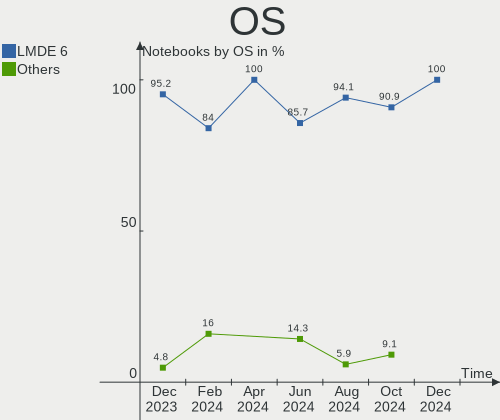
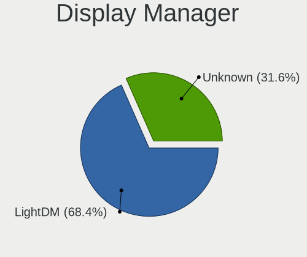
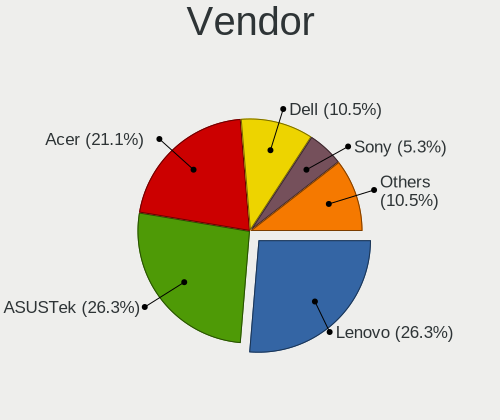
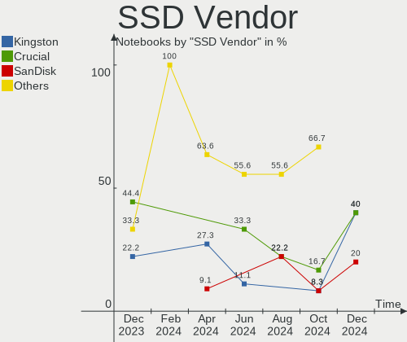
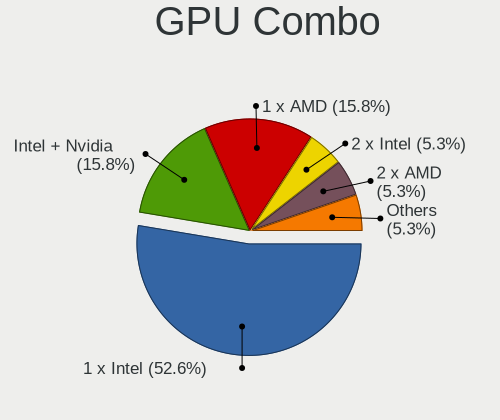
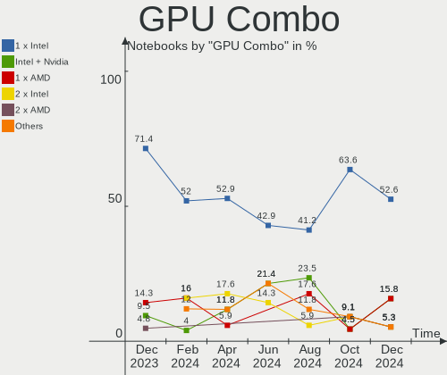
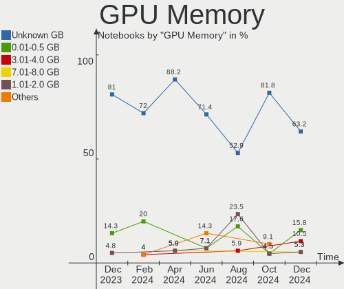
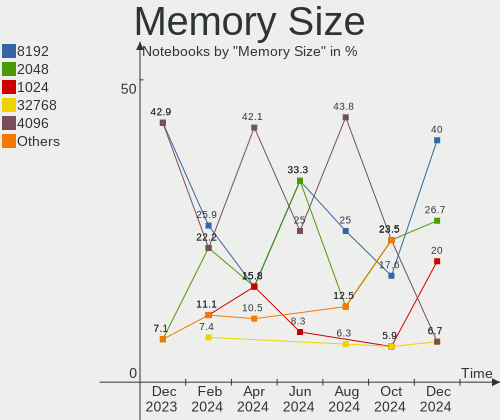

LMDE - Hardware Trends (Notebooks)
----------------------------------

A project to identify most popular hardware characteristics and track their change
over time based on data collected by Linux users at https://Linux-Hardware.org.

Anyone can contribute to this report by the [hw-probe](https://github.com/linuxhw/hw-probe) tool:

    sudo -E hw-probe -all -upload

This report is for one last month. Overall report since the beginning of time: [TestCoverage](https://github.com/linuxhw/TestCoverage)

Period: Jan, 2023.

Contents
--------

* [ System ](#system)
  - [ OS                       ](#os)
  - [ OS Family                ](#os-family)
  - [ Kernel                   ](#kernel)
  - [ Kernel Family            ](#kernel-family)
  - [ Kernel Major Ver.        ](#kernel-major-ver)
  - [ Arch                     ](#arch)
  - [ DE                       ](#de)
  - [ Display Server           ](#display-server)
  - [ Display Manager          ](#display-manager)
  - [ OS Lang                  ](#os-lang)
  - [ Boot Mode                ](#boot-mode)
  - [ Filesystem               ](#filesystem)
  - [ Part. scheme             ](#part-scheme)
  - [ Dual Boot with Linux/BSD ](#dual-boot-with-linuxbsd)
  - [ Dual Boot (Win)          ](#dual-boot-win)

* [ Board ](#board)
  - [ Vendor                   ](#vendor)
  - [ Model                    ](#model)
  - [ Model Family             ](#model-family)
  - [ MFG Year                 ](#mfg-year)
  - [ Form Factor              ](#form-factor)
  - [ Secure Boot              ](#secure-boot)
  - [ Coreboot                 ](#coreboot)
  - [ RAM Size                 ](#ram-size)
  - [ RAM Used                 ](#ram-used)
  - [ Total Drives             ](#total-drives)
  - [ Has CD-ROM               ](#has-cd-rom)
  - [ Has Ethernet             ](#has-ethernet)
  - [ Has WiFi                 ](#has-wifi)
  - [ Has Bluetooth            ](#has-bluetooth)

* [ Location ](#location)
  - [ Country                  ](#country)
  - [ City                     ](#city)

* [ Drives ](#drives)
  - [ Drive Vendor             ](#drive-vendor)
  - [ Drive Model              ](#drive-model)
  - [ HDD Vendor               ](#hdd-vendor)
  - [ SSD Vendor               ](#ssd-vendor)
  - [ Drive Kind               ](#drive-kind)
  - [ Drive Connector          ](#drive-connector)
  - [ Drive Size               ](#drive-size)
  - [ Space Total              ](#space-total)
  - [ Space Used               ](#space-used)
  - [ Malfunc. Drives          ](#malfunc-drives)
  - [ Malfunc. Drive Vendor    ](#malfunc-drive-vendor)
  - [ Malfunc. HDD Vendor      ](#malfunc-hdd-vendor)
  - [ Malfunc. Drive Kind      ](#malfunc-drive-kind)
  - [ Failed Drives            ](#failed-drives)
  - [ Failed Drive Vendor      ](#failed-drive-vendor)
  - [ Drive Status             ](#drive-status)

* [ Storage controller ](#storage-controller)
  - [ Storage Vendor           ](#storage-vendor)
  - [ Storage Model            ](#storage-model)
  - [ Storage Kind             ](#storage-kind)

* [ Processor ](#processor)
  - [ CPU Vendor               ](#cpu-vendor)
  - [ CPU Model                ](#cpu-model)
  - [ CPU Model Family         ](#cpu-model-family)
  - [ CPU Cores                ](#cpu-cores)
  - [ CPU Sockets              ](#cpu-sockets)
  - [ CPU Threads              ](#cpu-threads)
  - [ CPU Op-Modes             ](#cpu-op-modes)
  - [ CPU Microcode            ](#cpu-microcode)
  - [ CPU Microarch            ](#cpu-microarch)

* [ Graphics ](#graphics)
  - [ GPU Vendor               ](#gpu-vendor)
  - [ GPU Model                ](#gpu-model)
  - [ GPU Combo                ](#gpu-combo)
  - [ GPU Driver               ](#gpu-driver)
  - [ GPU Memory               ](#gpu-memory)

* [ Monitor ](#monitor)
  - [ Monitor Vendor           ](#monitor-vendor)
  - [ Monitor Model            ](#monitor-model)
  - [ Monitor Resolution       ](#monitor-resolution)
  - [ Monitor Diagonal         ](#monitor-diagonal)
  - [ Monitor Width            ](#monitor-width)
  - [ Aspect Ratio             ](#aspect-ratio)
  - [ Monitor Area             ](#monitor-area)
  - [ Pixel Density            ](#pixel-density)
  - [ Multiple Monitors        ](#multiple-monitors)

* [ Network ](#network)
  - [ Net Controller Vendor    ](#net-controller-vendor)
  - [ Net Controller Model     ](#net-controller-model)
  - [ Wireless Vendor          ](#wireless-vendor)
  - [ Wireless Model           ](#wireless-model)
  - [ Ethernet Vendor          ](#ethernet-vendor)
  - [ Ethernet Model           ](#ethernet-model)
  - [ Net Controller Kind      ](#net-controller-kind)
  - [ Used Controller          ](#used-controller)
  - [ NICs                     ](#nics)
  - [ IPv6                     ](#ipv6)

* [ Bluetooth ](#bluetooth)
  - [ Bluetooth Vendor         ](#bluetooth-vendor)
  - [ Bluetooth Model          ](#bluetooth-model)

* [ Sound ](#sound)
  - [ Sound Vendor             ](#sound-vendor)
  - [ Sound Model              ](#sound-model)

* [ Memory ](#memory)
  - [ Memory Vendor            ](#memory-vendor)
  - [ Memory Model             ](#memory-model)
  - [ Memory Kind              ](#memory-kind)
  - [ Memory Form Factor       ](#memory-form-factor)
  - [ Memory Size              ](#memory-size)
  - [ Memory Speed             ](#memory-speed)

* [ Printers & scanners ](#printers--scanners)
  - [ Printer Vendor           ](#printer-vendor)
  - [ Printer Model            ](#printer-model)
  - [ Scanner Vendor           ](#scanner-vendor)
  - [ Scanner Model            ](#scanner-model)

* [ Camera ](#camera)
  - [ Camera Vendor            ](#camera-vendor)
  - [ Camera Model             ](#camera-model)

* [ Security ](#security)
  - [ Fingerprint Vendor       ](#fingerprint-vendor)
  - [ Fingerprint Model        ](#fingerprint-model)
  - [ Chipcard Vendor          ](#chipcard-vendor)
  - [ Chipcard Model           ](#chipcard-model)

* [ Unsupported ](#unsupported)
  - [ Unsupported Devices      ](#unsupported-devices)
  - [ Unsupported Device Types ](#unsupported-device-types)

System
------

OS
--

Installed operating systems

| Name   | Notebooks | Percent |
|--------|-----------|---------|
| LMDE 5 | 22        | 100%    |

OS Family
---------

OS without a version

| Name | Notebooks | Percent |
|------|-----------|---------|
| LMDE | 22        | 100%    |

Kernel
------

Version of the Linux kernel

| Version         | Notebooks | Percent |
|-----------------|-----------|---------|
| 5.10.0-20-amd64 | 11        | 50%     |
| 5.10.0-21-amd64 | 6         | 27.27%  |
| 5.10.0-20-686   | 1         | 4.55%   |
| 5.10.0-18-amd64 | 1         | 4.55%   |
| 5.10.0-17-amd64 | 1         | 4.55%   |
| 5.10.0-12-686   | 1         | 4.55%   |
| 4.19.0-23-amd64 | 1         | 4.55%   |

Kernel Family
-------------

Linux kernel without a distro release

| Version | Notebooks | Percent |
|---------|-----------|---------|
| 5.10.0  | 21        | 95.45%  |
| 4.19.0  | 1         | 4.55%   |

Kernel Major Ver.
-----------------

Linux kernel major version

| Version | Notebooks | Percent |
|---------|-----------|---------|
| 5.10    | 21        | 95.45%  |
| 4.19    | 1         | 4.55%   |

Arch
----

OS architecture (x86_64, i586, etc.)

| Name   | Notebooks | Percent |
|--------|-----------|---------|
| x86_64 | 20        | 90.91%  |
| i686   | 2         | 9.09%   |

DE
--

Desktop Environment

| Name       | Notebooks | Percent |
|------------|-----------|---------|
| X-Cinnamon | 18        | 81.82%  |
| Cinnamon   | 2         | 9.09%   |
| MATE       | 1         | 4.55%   |
| awesome    | 1         | 4.55%   |

Display Server
--------------

X11 or Wayland

| Name | Notebooks | Percent |
|------|-----------|---------|
| X11  | 22        | 100%    |

Display Manager
---------------

SDDM, LightDM, etc.

| Name    | Notebooks | Percent |
|---------|-----------|---------|
| LightDM | 11        | 50%     |
| Unknown | 11        | 50%     |

OS Lang
-------

Language

| Lang  | Notebooks | Percent |
|-------|-----------|---------|
| en_US | 4         | 18.18%  |
| ru_RU | 3         | 13.64%  |
| de_DE | 3         | 13.64%  |
| pt_BR | 2         | 9.09%   |
| pl_PL | 2         | 9.09%   |
| fr_FR | 2         | 9.09%   |
| es_ES | 2         | 9.09%   |
| it_IT | 1         | 4.55%   |
| en_NZ | 1         | 4.55%   |
| en_GB | 1         | 4.55%   |
| el_GR | 1         | 4.55%   |

Boot Mode
---------

EFI or BIOS

| Mode | Notebooks | Percent |
|------|-----------|---------|
| BIOS | 11        | 50%     |
| EFI  | 11        | 50%     |

Filesystem
----------

Type of filesystem

| Type  | Notebooks | Percent |
|-------|-----------|---------|
| Ext4  | 21        | 95.45%  |
| Btrfs | 1         | 4.55%   |

Part. scheme
------------

Scheme of partitioning

| Type    | Notebooks | Percent |
|---------|-----------|---------|
| Unknown | 11        | 50%     |
| MBR     | 7         | 31.82%  |
| GPT     | 4         | 18.18%  |

Dual Boot with Linux/BSD
------------------------

Hosting more than one Linux/BSD

| Dual boot | Notebooks | Percent |
|-----------|-----------|---------|
| No        | 18        | 81.82%  |
| Yes       | 4         | 18.18%  |

Dual Boot (Win)
---------------

Hosting Linux and Windows

| Dual boot | Notebooks | Percent |
|-----------|-----------|---------|
| No        | 17        | 77.27%  |
| Yes       | 5         | 22.73%  |

Board
-----

Vendor
------

Motherboard manufacturer

| Name                | Notebooks | Percent |
|---------------------|-----------|---------|
| Lenovo              | 6         | 27.27%  |
| Toshiba             | 3         | 13.64%  |
| Fujitsu             | 3         | 13.64%  |
| Dell                | 2         | 9.09%   |
| Samsung Electronics | 1         | 4.55%   |
| Kruger&Matz         | 1         | 4.55%   |
| Hewlett-Packard     | 1         | 4.55%   |
| Google              | 1         | 4.55%   |
| Dynabook            | 1         | 4.55%   |
| Compaq              | 1         | 4.55%   |
| ASUSTek Computer    | 1         | 4.55%   |
| Acer                | 1         | 4.55%   |

Model
-----

Motherboard model

| Name                                  | Notebooks | Percent |
|---------------------------------------|-----------|---------|
| Toshiba Satellite L305                | 1         | 4.55%   |
| Toshiba PORTEGE Z30-B                 | 1         | 4.55%   |
| Toshiba PORTEGE M780                  | 1         | 4.55%   |
| Samsung RV415/RV515                   | 1         | 4.55%   |
| Lenovo ThinkPad X270 W10DG 20K5S3HG00 | 1         | 4.55%   |
| Lenovo ThinkPad W541 20EGS24J00       | 1         | 4.55%   |
| Lenovo IdeaPad 320-15AST 80XV         | 1         | 4.55%   |
| Lenovo IdeaPad 3 15ITL6 82H8          | 1         | 4.55%   |
| Lenovo B560                           | 1         | 4.55%   |
| Lenovo B50-70 20384                   | 1         | 4.55%   |
| Kruger&Matz KM1406                    | 1         | 4.55%   |
| HP Laptop 15s-eq3xxx                  | 1         | 4.55%   |
| Google Candy                          | 1         | 4.55%   |
| Fujitsu M2010                         | 1         | 4.55%   |
| Fujitsu LIFEBOOK S751                 | 1         | 4.55%   |
| Fujitsu LIFEBOOK E736                 | 1         | 4.55%   |
| Dynabook Satellite Pro C50-G          | 1         | 4.55%   |
| Dell Vostro 1700                      | 1         | 4.55%   |
| Dell Precision 5520                   | 1         | 4.55%   |
| Compaq 420                            | 1         | 4.55%   |
| ASUS K54L                             | 1         | 4.55%   |
| Acer Aspire 3810T                     | 1         | 4.55%   |

Model Family
------------

Motherboard model prefix

| Name               | Notebooks | Percent |
|--------------------|-----------|---------|
| Toshiba PORTEGE    | 2         | 9.09%   |
| Lenovo ThinkPad    | 2         | 9.09%   |
| Lenovo IdeaPad     | 2         | 9.09%   |
| Fujitsu LIFEBOOK   | 2         | 9.09%   |
| Toshiba Satellite  | 1         | 4.55%   |
| Samsung RV415      | 1         | 4.55%   |
| Lenovo B560        | 1         | 4.55%   |
| Lenovo B50-70      | 1         | 4.55%   |
| Kruger&Matz KM1406 | 1         | 4.55%   |
| HP Laptop          | 1         | 4.55%   |
| Google Candy       | 1         | 4.55%   |
| Fujitsu M2010      | 1         | 4.55%   |
| Dynabook Satellite | 1         | 4.55%   |
| Dell Vostro        | 1         | 4.55%   |
| Dell Precision     | 1         | 4.55%   |
| Compaq 420         | 1         | 4.55%   |
| ASUS K54L          | 1         | 4.55%   |
| Acer Aspire        | 1         | 4.55%   |

MFG Year
--------

Motherboard manufacture year

| Year | Notebooks | Percent |
|------|-----------|---------|
| 2021 | 4         | 18.18%  |
| 2017 | 3         | 13.64%  |
| 2011 | 3         | 13.64%  |
| 2022 | 2         | 9.09%   |
| 2015 | 2         | 9.09%   |
| 2010 | 2         | 9.09%   |
| 2009 | 2         | 9.09%   |
| 2016 | 1         | 4.55%   |
| 2014 | 1         | 4.55%   |
| 2008 | 1         | 4.55%   |
| 2007 | 1         | 4.55%   |

Form Factor
-----------

Physical design of the computer

| Name     | Notebooks | Percent |
|----------|-----------|---------|
| Notebook | 22        | 100%    |

Secure Boot
-----------

Enabled or disabled

| State    | Notebooks | Percent |
|----------|-----------|---------|
| Disabled | 20        | 90.91%  |
| Enabled  | 2         | 9.09%   |

Coreboot
--------

Have coreboot on board

| Used | Notebooks | Percent |
|------|-----------|---------|
| No   | 21        | 95.45%  |
| Yes  | 1         | 4.55%   |

RAM Size
--------

Total RAM memory

| Size in GB | Notebooks | Percent |
|------------|-----------|---------|
| 8.01-16.0  | 6         | 27.27%  |
| 4.01-8.0   | 5         | 22.73%  |
| 3.01-4.0   | 5         | 22.73%  |
| 16.01-24.0 | 3         | 13.64%  |
| 32.01-64.0 | 1         | 4.55%   |
| 2.01-3.0   | 1         | 4.55%   |
| 1.01-2.0   | 1         | 4.55%   |

RAM Used
--------

Used RAM memory

| Used GB  | Notebooks | Percent |
|----------|-----------|---------|
| 1.01-2.0 | 15        | 68.18%  |
| 2.01-3.0 | 3         | 13.64%  |
| 4.01-8.0 | 2         | 9.09%   |
| 0.51-1.0 | 2         | 9.09%   |

Total Drives
------------

Number of drives on board

| Drives | Notebooks | Percent |
|--------|-----------|---------|
| 1      | 12        | 54.55%  |
| 2      | 7         | 31.82%  |
| 3      | 3         | 13.64%  |

Has CD-ROM
----------

Has CD-ROM on board

| Presented | Notebooks | Percent |
|-----------|-----------|---------|
| No        | 17        | 77.27%  |
| Yes       | 5         | 22.73%  |

Has Ethernet
------------

Has Ethernet on board

| Presented | Notebooks | Percent |
|-----------|-----------|---------|
| Yes       | 17        | 77.27%  |
| No        | 5         | 22.73%  |

Has WiFi
--------

Has WiFi module

| Presented | Notebooks | Percent |
|-----------|-----------|---------|
| Yes       | 22        | 100%    |

Has Bluetooth
-------------

Has Bluetooth module

| Presented | Notebooks | Percent |
|-----------|-----------|---------|
| No        | 13        | 59.09%  |
| Yes       | 9         | 40.91%  |

Location
--------

Country
-------

Geographic location (country)

| Country     | Notebooks | Percent |
|-------------|-----------|---------|
| USA         | 4         | 18.18%  |
| Germany     | 3         | 13.64%  |
| Spain       | 2         | 9.09%   |
| Russia      | 2         | 9.09%   |
| Poland      | 2         | 9.09%   |
| Italy       | 2         | 9.09%   |
| Brazil      | 2         | 9.09%   |
| Serbia      | 1         | 4.55%   |
| New Zealand | 1         | 4.55%   |
| Kazakhstan  | 1         | 4.55%   |
| Greece      | 1         | 4.55%   |
| France      | 1         | 4.55%   |

City
----

Geographic location (city)

| City               | Notebooks | Percent |
|--------------------|-----------|---------|
| Volos              | 1         | 4.55%   |
| St Petersburg      | 1         | 4.55%   |
| San Jose           | 1         | 4.55%   |
| Salem              | 1         | 4.55%   |
| Ponteranica        | 1         | 4.55%   |
| Policoro           | 1         | 4.55%   |
| Pirot              | 1         | 4.55%   |
| New York           | 1         | 4.55%   |
| Munich             | 1         | 4.55%   |
| Moscow             | 1         | 4.55%   |
| Mogi das Cruzes    | 1         | 4.55%   |
| Málaga            | 1         | 4.55%   |
| Madrid             | 1         | 4.55%   |
| Krakow             | 1         | 4.55%   |
| Hamburg            | 1         | 4.55%   |
| Gasny              | 1         | 4.55%   |
| Dąbrowa Górnicza | 1         | 4.55%   |
| Curitiba           | 1         | 4.55%   |
| Bad Kreuznach      | 1         | 4.55%   |
| Auckland           | 1         | 4.55%   |
| Astana             | 1         | 4.55%   |
| Arlington          | 1         | 4.55%   |

Drives
------

Drive Vendor
------------

Hard drive vendors

| Vendor              | Notebooks | Drives | Percent |
|---------------------|-----------|--------|---------|
| Unknown             | 5         | 5      | 15.15%  |
| Seagate             | 4         | 4      | 12.12%  |
| Sandisk             | 3         | 3      | 9.09%   |
| Samsung Electronics | 3         | 4      | 9.09%   |
| WDC                 | 2         | 2      | 6.06%   |
| Toshiba             | 2         | 2      | 6.06%   |
| HGST                | 2         | 2      | 6.06%   |
| A-DATA Technology   | 2         | 2      | 6.06%   |
| Transcend           | 1         | 1      | 3.03%   |
| SK hynix            | 1         | 1      | 3.03%   |
| MAXSUN              | 1         | 1      | 3.03%   |
| Intel               | 1         | 1      | 3.03%   |
| G521N               | 1         | 1      | 3.03%   |
| Fujitsu             | 1         | 1      | 3.03%   |
| FORESEE             | 1         | 1      | 3.03%   |
| Emtec               | 1         | 1      | 3.03%   |
| Crucial             | 1         | 1      | 3.03%   |
| ASMT                | 1         | 1      | 3.03%   |

Drive Model
-----------

Hard drive models

| Model                                       | Notebooks | Percent |
|---------------------------------------------|-----------|---------|
| Seagate ST500LM012 HN-M500MBB 500GB         | 2         | 5.88%   |
| WDC WD1600BEVS-26VAT0 160GB                 | 1         | 2.94%   |
| WDC PC SN530 SDBPMPZ-256G-1101 256GB        | 1         | 2.94%   |
| Unknown SD32G  32GB                         | 1         | 2.94%   |
| Unknown SC128  128GB                        | 1         | 2.94%   |
| Unknown MMC Card  952MB                     | 1         | 2.94%   |
| Unknown MMC Card  64GB                      | 1         | 2.94%   |
| Unknown HAG2e  16GB                         | 1         | 2.94%   |
| Transcend TS128GMTS430S 128GB SSD           | 1         | 2.94%   |
| Toshiba THNSNJ256GMCU 256GB SSD             | 1         | 2.94%   |
| Toshiba MK3265GSX 320GB                     | 1         | 2.94%   |
| SK hynix PC401 NVMe Solid State Drive 256GB | 1         | 2.94%   |
| Seagate ST9250315AS 250GB                   | 1         | 2.94%   |
| Seagate ST1000LM035-1RK172 1TB              | 1         | 2.94%   |
| SanDisk X600 2.5 7MM SATA 256GB SSD         | 1         | 2.94%   |
| Sandisk WD Blue SN550 NVMe SSD 1TB          | 1         | 2.94%   |
| SanDisk SD7UB3Q256G1001 256GB SSD           | 1         | 2.94%   |
| Samsung SSD 870 EVO 1TB                     | 1         | 2.94%   |
| Samsung SSD 860 EVO 250GB                   | 1         | 2.94%   |
| Samsung SSD 850 EVO 1TB                     | 1         | 2.94%   |
| Samsung MZ7TY256HDHP-00000 256GB SSD        | 1         | 2.94%   |
| MAXSUN 480GB X5                             | 1         | 2.94%   |
| Intel SSDSC2CT240A3 240GB                   | 1         | 2.94%   |
| HGST HTS545050A7E380 500GB                  | 1         | 2.94%   |
| HGST HTS541010A7E630 1TB                    | 1         | 2.94%   |
| G521N 256GB                                 | 1         | 2.94%   |
| Fujitsu MHZ2160BH G2 160GB                  | 1         | 2.94%   |
| FORESEE 512GB SSD                           | 1         | 2.94%   |
| Emtec X150 240GB                            | 1         | 2.94%   |
| Crucial CT1000BX500SSD1 1TB                 | 1         | 2.94%   |
| ASMT 2235 1TB                               | 1         | 2.94%   |
| A-DATA SU650 240GB SSD                      | 1         | 2.94%   |
| A-DATA ED600 1TB SSD                        | 1         | 2.94%   |

HDD Vendor
----------

Hard disk drive vendors

| Vendor  | Notebooks | Drives | Percent |
|---------|-----------|--------|---------|
| Seagate | 4         | 4      | 44.44%  |
| HGST    | 2         | 2      | 22.22%  |
| WDC     | 1         | 1      | 11.11%  |
| Toshiba | 1         | 1      | 11.11%  |
| Fujitsu | 1         | 1      | 11.11%  |

SSD Vendor
----------

Solid state drive vendors

| Vendor              | Notebooks | Drives | Percent |
|---------------------|-----------|--------|---------|
| Samsung Electronics | 3         | 4      | 21.43%  |
| SanDisk             | 2         | 2      | 14.29%  |
| A-DATA Technology   | 2         | 2      | 14.29%  |
| Transcend           | 1         | 1      | 7.14%   |
| Toshiba             | 1         | 1      | 7.14%   |
| Intel               | 1         | 1      | 7.14%   |
| FORESEE             | 1         | 1      | 7.14%   |
| Emtec               | 1         | 1      | 7.14%   |
| Crucial             | 1         | 1      | 7.14%   |
| ASMT                | 1         | 1      | 7.14%   |

Drive Kind
----------

HDD or SSD

| Kind    | Notebooks | Drives | Percent |
|---------|-----------|--------|---------|
| SSD     | 11        | 15     | 36.67%  |
| HDD     | 9         | 9      | 30%     |
| MMC     | 5         | 5      | 16.67%  |
| NVMe    | 3         | 3      | 10%     |
| Unknown | 2         | 2      | 6.67%   |

Drive Connector
---------------

SATA, SAS, NVMe, etc.

| Type | Notebooks | Drives | Percent |
|------|-----------|--------|---------|
| SATA | 18        | 24     | 64.29%  |
| MMC  | 5         | 5      | 17.86%  |
| NVMe | 3         | 3      | 10.71%  |
| SAS  | 2         | 2      | 7.14%   |

Drive Size
----------

Size of hard drive

| Size in TB | Notebooks | Drives | Percent |
|------------|-----------|--------|---------|
| 0.01-0.5   | 13        | 16     | 68.42%  |
| 0.51-1.0   | 6         | 8      | 31.58%  |

Space Total
-----------

Amount of disk space available on the file system

| Size in GB | Notebooks | Percent |
|------------|-----------|---------|
| 101-250    | 8         | 36.36%  |
| 501-1000   | 5         | 22.73%  |
| 251-500    | 4         | 18.18%  |
| 21-50      | 2         | 9.09%   |
| 2001-3000  | 1         | 4.55%   |
| 1001-2000  | 1         | 4.55%   |
| 51-100     | 1         | 4.55%   |

Space Used
----------

Amount of used disk space

| Used GB  | Notebooks | Percent |
|----------|-----------|---------|
| 101-250  | 7         | 31.82%  |
| 21-50    | 6         | 27.27%  |
| 1-20     | 6         | 27.27%  |
| 501-1000 | 2         | 9.09%   |
| 51-100   | 1         | 4.55%   |

Malfunc. Drives
---------------

Drive models with a malfunction

| Model                               | Notebooks | Drives | Percent |
|-------------------------------------|-----------|--------|---------|
| Seagate ST9250315AS 250GB           | 1         | 1      | 33.33%  |
| Samsung Electronics SSD 870 EVO 1TB | 1         | 1      | 33.33%  |
| Intel SSDSC2CT240A3 240GB           | 1         | 1      | 33.33%  |

Malfunc. Drive Vendor
---------------------

Vendors of faulty drives

| Vendor              | Notebooks | Drives | Percent |
|---------------------|-----------|--------|---------|
| Seagate             | 1         | 1      | 33.33%  |
| Samsung Electronics | 1         | 1      | 33.33%  |
| Intel               | 1         | 1      | 33.33%  |

Malfunc. HDD Vendor
-------------------

Vendors of faulty HDD drives

| Vendor  | Notebooks | Drives | Percent |
|---------|-----------|--------|---------|
| Seagate | 1         | 1      | 100%    |

Malfunc. Drive Kind
-------------------

Kinds of faulty drives

| Kind | Notebooks | Drives | Percent |
|------|-----------|--------|---------|
| SSD  | 2         | 2      | 66.67%  |
| HDD  | 1         | 1      | 33.33%  |

Failed Drives
-------------

Failed drive models

Zero info for selected period =(

Failed Drive Vendor
-------------------

Failed drive vendors

Zero info for selected period =(

Drive Status
------------

Number of failed and malfunc. drives

| Status   | Notebooks | Drives | Percent |
|----------|-----------|--------|---------|
| Detected | 16        | 21     | 57.14%  |
| Works    | 9         | 10     | 32.14%  |
| Malfunc  | 3         | 3      | 10.71%  |

Storage controller
------------------

Storage Vendor
--------------

Storage controller vendors

| Vendor   | Notebooks | Percent |
|----------|-----------|---------|
| Intel    | 18        | 78.26%  |
| SanDisk  | 2         | 8.7%    |
| AMD      | 2         | 8.7%    |
| SK hynix | 1         | 4.35%   |

Storage Model
-------------

Storage controller models

| Model                                                                            | Notebooks | Percent |
|----------------------------------------------------------------------------------|-----------|---------|
| Intel Sunrise Point-LP SATA Controller [AHCI mode]                               | 2         | 8%      |
| Intel 82801IBM/IEM (ICH9M/ICH9M-E) 4 port SATA Controller [AHCI mode]            | 2         | 8%      |
| Intel 6 Series/C200 Series Chipset Family 6 port Mobile SATA AHCI Controller     | 2         | 8%      |
| Intel 5 Series/3400 Series Chipset 4 port SATA AHCI Controller                   | 2         | 8%      |
| SK hynix PC401 NVMe Solid State Drive 256GB                                      | 1         | 4%      |
| SanDisk WD Blue SN550 NVMe SSD                                                   | 1         | 4%      |
| SanDisk Non-Volatile memory controller                                           | 1         | 4%      |
| Intel Wildcat Point-LP SATA Controller [AHCI Mode]                               | 1         | 4%      |
| Intel Volume Management Device NVMe RAID Controller                              | 1         | 4%      |
| Intel Tiger Lake-LP SATA Controller                                              | 1         | 4%      |
| Intel Q170/Q150/B150/H170/H110/Z170/CM236 Chipset SATA Controller [AHCI Mode]    | 1         | 4%      |
| Intel Comet Lake SATA AHCI Controller                                            | 1         | 4%      |
| Intel Celeron/Pentium Silver Processor SATA Controller                           | 1         | 4%      |
| Intel Atom/Celeron/Pentium Processor x5-E8000/J3xxx/N3xxx Series SATA Controller | 1         | 4%      |
| Intel 82801HM/HEM (ICH8M/ICH8M-E) SATA Controller [AHCI mode]                    | 1         | 4%      |
| Intel 82801HM/HEM (ICH8M/ICH8M-E) IDE Controller                                 | 1         | 4%      |
| Intel 82801GBM/GHM (ICH7-M Family) SATA Controller [IDE mode]                    | 1         | 4%      |
| Intel 8 Series/C220 Series Chipset Family 6-port SATA Controller 1 [AHCI mode]   | 1         | 4%      |
| Intel 8 Series SATA Controller 1 [AHCI mode]                                     | 1         | 4%      |
| AMD SB7x0/SB8x0/SB9x0 SATA Controller [AHCI mode]                                | 1         | 4%      |
| AMD FCH SATA Controller [AHCI mode]                                              | 1         | 4%      |

Storage Kind
------------

Kind of storage controller (IDE, SATA, NVMe, SAS, ...)

| Kind | Notebooks | Percent |
|------|-----------|---------|
| SATA | 19        | 76%     |
| NVMe | 3         | 12%     |
| IDE  | 2         | 8%      |
| RAID | 1         | 4%      |

Processor
---------

CPU Vendor
----------

Processor vendors

| Vendor | Notebooks | Percent |
|--------|-----------|---------|
| Intel  | 19        | 86.36%  |
| AMD    | 3         | 13.64%  |

CPU Model
---------

Processor models

| Model                                        | Notebooks | Percent |
|----------------------------------------------|-----------|---------|
| Intel Pentium Dual CPU T3400 @ 2.16GHz       | 1         | 4.55%   |
| Intel Pentium CPU P6100 @ 2.00GHz            | 1         | 4.55%   |
| Intel Pentium CPU N3700 @ 1.60GHz            | 1         | 4.55%   |
| Intel Genuine CPU U7300 @ 1.30GHz            | 1         | 4.55%   |
| Intel Core i7-7820HQ CPU @ 2.90GHz           | 1         | 4.55%   |
| Intel Core i7-6600U CPU @ 2.60GHz            | 1         | 4.55%   |
| Intel Core i7-4810MQ CPU @ 2.80GHz           | 1         | 4.55%   |
| Intel Core i5-6200U CPU @ 2.30GHz            | 1         | 4.55%   |
| Intel Core i5-5200U CPU @ 2.20GHz            | 1         | 4.55%   |
| Intel Core i5-2450M CPU @ 2.50GHz            | 1         | 4.55%   |
| Intel Core i5-10210U CPU @ 1.60GHz           | 1         | 4.55%   |
| Intel Core i3-4010U CPU @ 1.70GHz            | 1         | 4.55%   |
| Intel Core i3-2330M CPU @ 2.20GHz            | 1         | 4.55%   |
| Intel Core i3 CPU M 370 @ 2.40GHz            | 1         | 4.55%   |
| Intel Core 2 Duo CPU T5470 @ 1.60GHz         | 1         | 4.55%   |
| Intel Celeron N4000 CPU @ 1.10GHz            | 1         | 4.55%   |
| Intel Celeron CPU N2840 @ 2.16GHz            | 1         | 4.55%   |
| Intel Atom CPU N280 @ 1.66GHz                | 1         | 4.55%   |
| Intel 11th Gen Core i3-1115G4 @ 3.00GHz      | 1         | 4.55%   |
| AMD Ryzen 5 5625U with Radeon Graphics       | 1         | 4.55%   |
| AMD E-300 APU with Radeon HD Graphics        | 1         | 4.55%   |
| AMD A9-9420 RADEON R5, 5 COMPUTE CORES 2C+3G | 1         | 4.55%   |

CPU Model Family
----------------

Processor model prefix

| Model              | Notebooks | Percent |
|--------------------|-----------|---------|
| Intel Core i5      | 4         | 18.18%  |
| Intel Core i7      | 3         | 13.64%  |
| Intel Core i3      | 3         | 13.64%  |
| Other              | 2         | 9.09%   |
| Intel Pentium      | 2         | 9.09%   |
| Intel Celeron      | 2         | 9.09%   |
| Intel Pentium Dual | 1         | 4.55%   |
| Intel Genuine      | 1         | 4.55%   |
| Intel Core 2 Duo   | 1         | 4.55%   |
| Intel Atom         | 1         | 4.55%   |
| AMD Ryzen 5        | 1         | 4.55%   |
| AMD E              | 1         | 4.55%   |

CPU Cores
---------

Number of processor cores

| Number | Notebooks | Percent |
|--------|-----------|---------|
| 2      | 16        | 72.73%  |
| 4      | 4         | 18.18%  |
| 6      | 1         | 4.55%   |
| 1      | 1         | 4.55%   |

CPU Sockets
-----------

Number of sockets

| Number | Notebooks | Percent |
|--------|-----------|---------|
| 1      | 22        | 100%    |

CPU Threads
-----------

Threads per core (Hyper-Threading)

| Number | Notebooks | Percent |
|--------|-----------|---------|
| 2      | 13        | 59.09%  |
| 1      | 9         | 40.91%  |

CPU Op-Modes
------------

CPU Operation Modes (32-bit, 64-bit)

| Op mode        | Notebooks | Percent |
|----------------|-----------|---------|
| 32-bit, 64-bit | 21        | 95.45%  |
| 32-bit         | 1         | 4.55%   |

CPU Microcode
-------------

Microcode number

| Number     | Notebooks | Percent |
|------------|-----------|---------|
| 0x6fd      | 2         | 9.09%   |
| 0x406e3    | 2         | 9.09%   |
| 0x206a7    | 2         | 9.09%   |
| 0x20655    | 2         | 9.09%   |
| 0x906e9    | 1         | 4.55%   |
| 0x806ec    | 1         | 4.55%   |
| 0x806c1    | 1         | 4.55%   |
| 0x706a1    | 1         | 4.55%   |
| 0x406c3    | 1         | 4.55%   |
| 0x40651    | 1         | 4.55%   |
| 0x306d4    | 1         | 4.55%   |
| 0x306c3    | 1         | 4.55%   |
| 0x30678    | 1         | 4.55%   |
| 0x106c2    | 1         | 4.55%   |
| 0x1067a    | 1         | 4.55%   |
| 0x0a50000d | 1         | 4.55%   |
| 0x06006705 | 1         | 4.55%   |
| 0x05000119 | 1         | 4.55%   |

CPU Microarch
-------------

Microarchitecture

| Name          | Notebooks | Percent |
|---------------|-----------|---------|
| Westmere      | 2         | 9.09%   |
| Skylake       | 2         | 9.09%   |
| Silvermont    | 2         | 9.09%   |
| SandyBridge   | 2         | 9.09%   |
| KabyLake      | 2         | 9.09%   |
| Haswell       | 2         | 9.09%   |
| Core          | 2         | 9.09%   |
| Zen 3         | 1         | 4.55%   |
| TigerLake     | 1         | 4.55%   |
| Penryn        | 1         | 4.55%   |
| Goldmont plus | 1         | 4.55%   |
| Excavator     | 1         | 4.55%   |
| Broadwell     | 1         | 4.55%   |
| Bonnell       | 1         | 4.55%   |
| Bobcat        | 1         | 4.55%   |

Graphics
--------

GPU Vendor
----------

Vendors of graphics cards

| Vendor | Notebooks | Percent |
|--------|-----------|---------|
| Intel  | 17        | 70.83%  |
| AMD    | 4         | 16.67%  |
| Nvidia | 3         | 12.5%   |

GPU Model
---------

Graphics card models

| Model                                                                                    | Notebooks | Percent |
|------------------------------------------------------------------------------------------|-----------|---------|
| Intel Skylake GT2 [HD Graphics 520]                                                      | 2         | 7.69%   |
| Intel Core Processor Integrated Graphics Controller                                      | 2         | 7.69%   |
| Intel 2nd Generation Core Processor Family Integrated Graphics Controller                | 2         | 7.69%   |
| Nvidia GM107GLM [Quadro M1200 Mobile]                                                    | 1         | 3.85%   |
| Nvidia GK106GLM [Quadro K2100M]                                                          | 1         | 3.85%   |
| Nvidia G86M [GeForce 8400M GS]                                                           | 1         | 3.85%   |
| Intel Tiger Lake-LP GT2 [UHD Graphics G4]                                                | 1         | 3.85%   |
| Intel Mobile 945GSE Express Integrated Graphics Controller                               | 1         | 3.85%   |
| Intel Mobile 945GM/GMS/GME, 943/940GML Express Integrated Graphics Controller            | 1         | 3.85%   |
| Intel Mobile 4 Series Chipset Integrated Graphics Controller                             | 1         | 3.85%   |
| Intel HD Graphics 630                                                                    | 1         | 3.85%   |
| Intel HD Graphics 5500                                                                   | 1         | 3.85%   |
| Intel Haswell-ULT Integrated Graphics Controller                                         | 1         | 3.85%   |
| Intel GeminiLake [UHD Graphics 600]                                                      | 1         | 3.85%   |
| Intel CometLake-U GT2 [UHD Graphics]                                                     | 1         | 3.85%   |
| Intel Atom/Celeron/Pentium Processor x5-E8000/J3xxx/N3xxx Integrated Graphics Controller | 1         | 3.85%   |
| Intel Atom Processor Z36xxx/Z37xxx Series Graphics & Display                             | 1         | 3.85%   |
| Intel 4th Gen Core Processor Integrated Graphics Controller                              | 1         | 3.85%   |
| AMD Wrestler [Radeon HD 6310]                                                            | 1         | 3.85%   |
| AMD Topaz XT [Radeon R7 M260/M265 / M340/M360 / M440/M445 / 530/535 / 620/625 Mobile]    | 1         | 3.85%   |
| AMD Stoney [Radeon R2/R3/R4/R5 Graphics]                                                 | 1         | 3.85%   |
| AMD RV710/M92 [Mobility Radeon HD 4330/4350/4550]                                        | 1         | 3.85%   |
| AMD Barcelo                                                                              | 1         | 3.85%   |

GPU Combo
---------

Combinations of graphics cards

| Name           | Notebooks | Percent |
|----------------|-----------|---------|
| 1 x Intel      | 15        | 68.18%  |
| 1 x AMD        | 3         | 13.64%  |
| Intel + Nvidia | 2         | 9.09%   |
| 2 x AMD        | 1         | 4.55%   |
| 1 x Nvidia     | 1         | 4.55%   |

GPU Driver
----------

Free vs proprietary

| Driver      | Notebooks | Percent |
|-------------|-----------|---------|
| Free        | 20        | 90.91%  |
| Proprietary | 1         | 4.55%   |
| Unknown     | 1         | 4.55%   |

GPU Memory
----------

Total video memory

| Size in GB | Notebooks | Percent |
|------------|-----------|---------|
| Unknown    | 17        | 77.27%  |
| 0.01-0.5   | 4         | 18.18%  |
| 1.01-2.0   | 1         | 4.55%   |

Monitor
-------

Monitor Vendor
--------------

Monitor vendors

| Vendor              | Notebooks | Percent |
|---------------------|-----------|---------|
| Samsung Electronics | 4         | 19.05%  |
| LG Display          | 4         | 19.05%  |
| Sharp               | 3         | 14.29%  |
| Chimei Innolux      | 3         | 14.29%  |
| BOE                 | 2         | 9.52%   |
| AU Optronics        | 2         | 9.52%   |
| SLD                 | 1         | 4.76%   |
| Panasonic           | 1         | 4.76%   |
| Dell                | 1         | 4.76%   |

Monitor Model
-------------

Monitor models

| Model                                                                | Notebooks | Percent |
|----------------------------------------------------------------------|-----------|---------|
| SLD LCD Monitor SLD003C 1366x768 309x173mm 13.9-inch                 | 1         | 4.76%   |
| Sharp LQ133M1JW02 SHP141A 1920x1080 294x165mm 13.3-inch              | 1         | 4.76%   |
| Sharp LQ133M1JW01 SHP141B 1920x1080 294x165mm 13.3-inch              | 1         | 4.76%   |
| Sharp LCD Monitor SHP1476 3840x2160 346x194mm 15.6-inch              | 1         | 4.76%   |
| Samsung Electronics LCD Monitor SEC5341 1366x768 344x193mm 15.5-inch | 1         | 4.76%   |
| Samsung Electronics LCD Monitor SEC3741 1280x800 331x207mm 15.4-inch | 1         | 4.76%   |
| Samsung Electronics LCD Monitor SEC3541 1366x768 309x174mm 14.0-inch | 1         | 4.76%   |
| Samsung Electronics C24F390 SAM0D2C 1920x1080 521x293mm 23.5-inch    | 1         | 4.76%   |
| Panasonic VVX14P048M00 MEI96A2 3000x2000 285x190mm 13.5-inch         | 1         | 4.76%   |
| LG Display LP101WSA-TLA1 LGD01B9 1024x600 224x126mm 10.1-inch        | 1         | 4.76%   |
| LG Display LCD Monitor LGD0439 1366x768 344x194mm 15.5-inch          | 1         | 4.76%   |
| LG Display LCD Monitor LGD02DC 1366x768 344x194mm 15.5-inch          | 1         | 4.76%   |
| LG Display LCD Monitor LGD01F7 1366x768 293x165mm 13.2-inch          | 1         | 4.76%   |
| Dell P2419H DELD0D8 1920x1080 527x296mm 23.8-inch                    | 1         | 4.76%   |
| Chimei Innolux LCD Monitor CMN15E7 1920x1080 344x193mm 15.5-inch     | 1         | 4.76%   |
| Chimei Innolux LCD Monitor CMN15DB 1366x768 344x193mm 15.5-inch      | 1         | 4.76%   |
| Chimei Innolux LCD Monitor CMN1469 1366x768 309x174mm 14.0-inch      | 1         | 4.76%   |
| BOE LCD Monitor BOE0718 1920x1080 309x173mm 13.9-inch                | 1         | 4.76%   |
| BOE LCD Monitor BOE068C 1366x768 256x144mm 11.6-inch                 | 1         | 4.76%   |
| AU Optronics LCD Monitor AUOE48D 1920x1080 344x194mm 15.5-inch       | 1         | 4.76%   |
| AU Optronics LCD Monitor AUO106C 1366x768 276x155mm 12.5-inch        | 1         | 4.76%   |

Monitor Resolution
------------------

Monitor screen resolution

| Resolution      | Notebooks | Percent |
|-----------------|-----------|---------|
| 1366x768 (WXGA) | 11        | 55%     |
| 1920x1080 (FHD) | 6         | 30%     |
| 3840x2160 (4K)  | 2         | 10%     |
| 1024x600        | 1         | 5%      |

Monitor Diagonal
----------------

Diagonal size in inches

| Inches | Notebooks | Percent |
|--------|-----------|---------|
| 15     | 9         | 42.86%  |
| 13     | 5         | 23.81%  |
| 24     | 1         | 4.76%   |
| 23     | 1         | 4.76%   |
| 17     | 1         | 4.76%   |
| 14     | 1         | 4.76%   |
| 12     | 1         | 4.76%   |
| 11     | 1         | 4.76%   |
| 10     | 1         | 4.76%   |

Monitor Width
-------------

Physical width

| Width in mm | Notebooks | Percent |
|-------------|-----------|---------|
| 301-350     | 12        | 57.14%  |
| 201-300     | 6         | 28.57%  |
| 501-600     | 2         | 9.52%   |
| 351-400     | 1         | 4.76%   |

Aspect Ratio
------------

Proportional relationship between the width and the height

| Ratio | Notebooks | Percent |
|-------|-----------|---------|
| 16/9  | 19        | 95%     |
| 16/10 | 1         | 5%      |

Monitor Area
------------

Area in inch²

| Area in inch² | Notebooks | Percent |
|----------------|-----------|---------|
| 101-110        | 9         | 42.86%  |
| 81-90          | 3         | 14.29%  |
| 71-80          | 3         | 14.29%  |
| 201-250        | 2         | 9.52%   |
| 61-70          | 1         | 4.76%   |
| 51-60          | 1         | 4.76%   |
| 41-50          | 1         | 4.76%   |
| 121-130        | 1         | 4.76%   |

Pixel Density
-------------

Pixels per inch

| Density       | Notebooks | Percent |
|---------------|-----------|---------|
| 101-120       | 9         | 42.86%  |
| 121-160       | 5         | 23.81%  |
| 51-100        | 3         | 14.29%  |
| More than 240 | 2         | 9.52%   |
| 161-240       | 2         | 9.52%   |

Multiple Monitors
-----------------

Total monitors connected

| Total | Notebooks | Percent |
|-------|-----------|---------|
| 1     | 20        | 90.91%  |
| 2     | 1         | 4.55%   |
| 0     | 1         | 4.55%   |

Network
-------

Net Controller Vendor
---------------------

Controller vendors

| Vendor                    | Notebooks | Percent |
|---------------------------|-----------|---------|
| Intel                     | 12        | 38.71%  |
| Realtek Semiconductor     | 9         | 29.03%  |
| Qualcomm Atheros          | 6         | 19.35%  |
| TP-Link                   | 1         | 3.23%   |
| Spreadtrum Communications | 1         | 3.23%   |
| Sierra Wireless           | 1         | 3.23%   |
| Broadcom Limited          | 1         | 3.23%   |

Net Controller Model
--------------------

Controller models

| Model                                                                   | Notebooks | Percent |
|-------------------------------------------------------------------------|-----------|---------|
| Realtek RTL810xE PCI Express Fast Ethernet controller                   | 4         | 9.76%   |
| Realtek RTL8111/8168/8411 PCI Express Gigabit Ethernet Controller       | 2         | 4.88%   |
| Qualcomm Atheros AR9285 Wireless Network Adapter (PCI-Express)          | 2         | 4.88%   |
| Qualcomm Atheros AR8131 Gigabit Ethernet                                | 2         | 4.88%   |
| Qualcomm Atheros AR242x / AR542x Wireless Network Adapter (PCI-Express) | 2         | 4.88%   |
| Intel Wireless 8260                                                     | 2         | 4.88%   |
| Intel Wireless 7260                                                     | 2         | 4.88%   |
| Intel Ethernet Connection I219-V                                        | 2         | 4.88%   |
| TP-Link TL-WN823N v2/v3 [Realtek RTL8192EU]                             | 1         | 2.44%   |
| Spreadtrum Unisoc Phone                                                 | 1         | 2.44%   |
| Sierra Wireless EM7305                                                  | 1         | 2.44%   |
| Realtek RTL8822CE 802.11ac PCIe Wireless Network Adapter                | 1         | 2.44%   |
| Realtek RTL8821AE 802.11ac PCIe Wireless Network Adapter                | 1         | 2.44%   |
| Realtek RTL8723BU 802.11b/g/n WLAN Adapter                              | 1         | 2.44%   |
| Realtek 802.11n WLAN Adapter                                            | 1         | 2.44%   |
| Qualcomm Atheros AR9462 Wireless Network Adapter                        | 1         | 2.44%   |
| Qualcomm Atheros AR8151 v2.0 Gigabit Ethernet                           | 1         | 2.44%   |
| Intel Wireless 8265 / 8275                                              | 1         | 2.44%   |
| Intel WiMAX/WiFi Link 5150                                              | 1         | 2.44%   |
| Intel WiMAX Connection 2400m                                            | 1         | 2.44%   |
| Intel Wi-Fi 6 AX201                                                     | 1         | 2.44%   |
| Intel Wi-Fi 6 AX200                                                     | 1         | 2.44%   |
| Intel PRO/Wireless 3945ABG [Golan] Network Connection                   | 1         | 2.44%   |
| Intel Ethernet Connection I217-LM                                       | 1         | 2.44%   |
| Intel Ethernet Connection (3) I218-V                                    | 1         | 2.44%   |
| Intel Comet Lake PCH-LP CNVi WiFi                                       | 1         | 2.44%   |
| Intel Centrino Advanced-N 6205 [Taylor Peak]                            | 1         | 2.44%   |
| Intel Centrino Advanced-N 6200                                          | 1         | 2.44%   |
| Intel 82579V Gigabit Network Connection                                 | 1         | 2.44%   |
| Intel 82577LC Gigabit Network Connection                                | 1         | 2.44%   |
| Broadcom Limited BCM4401-B0 100Base-TX                                  | 1         | 2.44%   |

Wireless Vendor
---------------

Wireless vendors

| Vendor                | Notebooks | Percent |
|-----------------------|-----------|---------|
| Intel                 | 12        | 52.17%  |
| Qualcomm Atheros      | 5         | 21.74%  |
| Realtek Semiconductor | 4         | 17.39%  |
| TP-Link               | 1         | 4.35%   |
| Sierra Wireless       | 1         | 4.35%   |

Wireless Model
--------------

Wireless models

| Model                                                                   | Notebooks | Percent |
|-------------------------------------------------------------------------|-----------|---------|
| Qualcomm Atheros AR9285 Wireless Network Adapter (PCI-Express)          | 2         | 8.7%    |
| Qualcomm Atheros AR242x / AR542x Wireless Network Adapter (PCI-Express) | 2         | 8.7%    |
| Intel Wireless 8260                                                     | 2         | 8.7%    |
| Intel Wireless 7260                                                     | 2         | 8.7%    |
| TP-Link TL-WN823N v2/v3 [Realtek RTL8192EU]                             | 1         | 4.35%   |
| Sierra Wireless EM7305                                                  | 1         | 4.35%   |
| Realtek RTL8822CE 802.11ac PCIe Wireless Network Adapter                | 1         | 4.35%   |
| Realtek RTL8821AE 802.11ac PCIe Wireless Network Adapter                | 1         | 4.35%   |
| Realtek RTL8723BU 802.11b/g/n WLAN Adapter                              | 1         | 4.35%   |
| Realtek 802.11n WLAN Adapter                                            | 1         | 4.35%   |
| Qualcomm Atheros AR9462 Wireless Network Adapter                        | 1         | 4.35%   |
| Intel Wireless 8265 / 8275                                              | 1         | 4.35%   |
| Intel WiMAX/WiFi Link 5150                                              | 1         | 4.35%   |
| Intel Wi-Fi 6 AX201                                                     | 1         | 4.35%   |
| Intel Wi-Fi 6 AX200                                                     | 1         | 4.35%   |
| Intel PRO/Wireless 3945ABG [Golan] Network Connection                   | 1         | 4.35%   |
| Intel Comet Lake PCH-LP CNVi WiFi                                       | 1         | 4.35%   |
| Intel Centrino Advanced-N 6205 [Taylor Peak]                            | 1         | 4.35%   |
| Intel Centrino Advanced-N 6200                                          | 1         | 4.35%   |

Ethernet Vendor
---------------

Ethernet vendors

| Vendor                    | Notebooks | Percent |
|---------------------------|-----------|---------|
| Intel                     | 7         | 38.89%  |
| Realtek Semiconductor     | 6         | 33.33%  |
| Qualcomm Atheros          | 3         | 16.67%  |
| Spreadtrum Communications | 1         | 5.56%   |
| Broadcom Limited          | 1         | 5.56%   |

Ethernet Model
--------------

Ethernet models

| Model                                                             | Notebooks | Percent |
|-------------------------------------------------------------------|-----------|---------|
| Realtek RTL810xE PCI Express Fast Ethernet controller             | 4         | 22.22%  |
| Realtek RTL8111/8168/8411 PCI Express Gigabit Ethernet Controller | 2         | 11.11%  |
| Qualcomm Atheros AR8131 Gigabit Ethernet                          | 2         | 11.11%  |
| Intel Ethernet Connection I219-V                                  | 2         | 11.11%  |
| Spreadtrum Unisoc Phone                                           | 1         | 5.56%   |
| Qualcomm Atheros AR8151 v2.0 Gigabit Ethernet                     | 1         | 5.56%   |
| Intel WiMAX Connection 2400m                                      | 1         | 5.56%   |
| Intel Ethernet Connection I217-LM                                 | 1         | 5.56%   |
| Intel Ethernet Connection (3) I218-V                              | 1         | 5.56%   |
| Intel 82579V Gigabit Network Connection                           | 1         | 5.56%   |
| Intel 82577LC Gigabit Network Connection                          | 1         | 5.56%   |
| Broadcom Limited BCM4401-B0 100Base-TX                            | 1         | 5.56%   |

Net Controller Kind
-------------------

Ethernet, WiFi or modem

| Kind     | Notebooks | Percent |
|----------|-----------|---------|
| WiFi     | 22        | 56.41%  |
| Ethernet | 17        | 43.59%  |

Used Controller
---------------

Currently used network controller

| Kind     | Notebooks | Percent |
|----------|-----------|---------|
| WiFi     | 14        | 58.33%  |
| Ethernet | 10        | 41.67%  |

NICs
----

Total network controllers on board

| Total | Notebooks | Percent |
|-------|-----------|---------|
| 2     | 15        | 68.18%  |
| 1     | 5         | 22.73%  |
| 0     | 2         | 9.09%   |

IPv6
----

IPv6 vs IPv4

| Used | Notebooks | Percent |
|------|-----------|---------|
| No   | 13        | 59.09%  |
| Yes  | 9         | 40.91%  |

Bluetooth
---------

Bluetooth Vendor
----------------

Controller vendors

| Vendor                          | Notebooks | Percent |
|---------------------------------|-----------|---------|
| Intel                           | 5         | 55.56%  |
| Realtek Semiconductor           | 2         | 22.22%  |
| Qualcomm Atheros Communications | 1         | 11.11%  |
| Foxconn / Hon Hai               | 1         | 11.11%  |

Bluetooth Model
---------------

Controller models

| Model                              | Notebooks | Percent |
|------------------------------------|-----------|---------|
| Intel Bluetooth wireless interface | 3         | 33.33%  |
| Intel Bluetooth Device             | 2         | 22.22%  |
| Realtek RTL8821A Bluetooth         | 1         | 11.11%  |
| Realtek Bluetooth Radio            | 1         | 11.11%  |
| Qualcomm Atheros AR3011 Bluetooth  | 1         | 11.11%  |
| Foxconn / Hon Hai Bluetooth Device | 1         | 11.11%  |

Sound
-----

Sound Vendor
------------

Sound card vendors

| Vendor | Notebooks | Percent |
|--------|-----------|---------|
| Intel  | 19        | 79.17%  |
| AMD    | 4         | 16.67%  |
| Nvidia | 1         | 4.17%   |

Sound Model
-----------

Sound card models

| Model                                                                                             | Notebooks | Percent |
|---------------------------------------------------------------------------------------------------|-----------|---------|
| Intel Sunrise Point-LP HD Audio                                                                   | 2         | 6.67%   |
| Intel 82801I (ICH9 Family) HD Audio Controller                                                    | 2         | 6.67%   |
| Intel 6 Series/C200 Series Chipset Family High Definition Audio Controller                        | 2         | 6.67%   |
| Intel 5 Series/3400 Series Chipset High Definition Audio                                          | 2         | 6.67%   |
| Nvidia GK106 HDMI Audio Controller                                                                | 1         | 3.33%   |
| Intel Xeon E3-1200 v3/4th Gen Core Processor HD Audio Controller                                  | 1         | 3.33%   |
| Intel Wildcat Point-LP High Definition Audio Controller                                           | 1         | 3.33%   |
| Intel Tiger Lake-LP Smart Sound Technology Audio Controller                                       | 1         | 3.33%   |
| Intel NM10/ICH7 Family High Definition Audio Controller                                           | 1         | 3.33%   |
| Intel Haswell-ULT HD Audio Controller                                                             | 1         | 3.33%   |
| Intel Comet Lake PCH-LP cAVS                                                                      | 1         | 3.33%   |
| Intel CM238 HD Audio Controller                                                                   | 1         | 3.33%   |
| Intel Celeron/Pentium Silver Processor High Definition Audio                                      | 1         | 3.33%   |
| Intel Broadwell-U Audio Controller                                                                | 1         | 3.33%   |
| Intel Atom/Celeron/Pentium Processor x5-E8000/J3xxx/N3xxx Series High Definition Audio Controller | 1         | 3.33%   |
| Intel Atom Processor Z36xxx/Z37xxx Series High Definition Audio Controller                        | 1         | 3.33%   |
| Intel 82801H (ICH8 Family) HD Audio Controller                                                    | 1         | 3.33%   |
| Intel 8 Series/C220 Series Chipset High Definition Audio Controller                               | 1         | 3.33%   |
| Intel 8 Series HD Audio Controller                                                                | 1         | 3.33%   |
| AMD Wrestler HDMI Audio                                                                           | 1         | 3.33%   |
| AMD SBx00 Azalia (Intel HDA)                                                                      | 1         | 3.33%   |
| AMD RV710/730 HDMI Audio [Radeon HD 4000 series]                                                  | 1         | 3.33%   |
| AMD Renoir Radeon High Definition Audio Controller                                                | 1         | 3.33%   |
| AMD High Definition Audio Controller                                                              | 1         | 3.33%   |
| AMD Family 17h/19h HD Audio Controller                                                            | 1         | 3.33%   |
| AMD Family 15h (Models 60h-6fh) Audio Controller                                                  | 1         | 3.33%   |

Memory
------

Memory Vendor
-------------

Memory module vendors

| Vendor              | Notebooks | Percent |
|---------------------|-----------|---------|
| Samsung Electronics | 4         | 30.77%  |
| SK hynix            | 2         | 15.38%  |
| Micron Technology   | 2         | 15.38%  |
| Kingston            | 2         | 15.38%  |
| Unknown             | 1         | 7.69%   |
| Strontium           | 1         | 7.69%   |
| G.Skill             | 1         | 7.69%   |

Memory Model
------------

Memory module models

| Model                                                                     | Notebooks | Percent |
|---------------------------------------------------------------------------|-----------|---------|
| Unknown RAM Module 2GB SODIMM DDR2 533MT/s                                | 1         | 6.67%   |
| Strontium RAM SRT4G86S0-H9H 4GB SODIMM DDR3 1067MT/s                      | 1         | 6.67%   |
| SK hynix RAM HMT425S6AFR6A-PB 2GB SODIMM DDR3 3200MT/s                    | 1         | 6.67%   |
| SK hynix RAM 161616161616161616161616161616161616 1GB SODIMM DDR2 667MT/s | 1         | 6.67%   |
| SK hynix RAM 0C0C0C0C0C0C0C0C0C0C0C0C0C0C0C0C0C0C 1GB SODIMM DDR2 667MT/s | 1         | 6.67%   |
| Samsung RAM Module 8GB SODIMM DDR4 2133MT/s                               | 1         | 6.67%   |
| Samsung RAM M471B5773CHS-CH9 2GB SODIMM DDR3 4199MT/s                     | 1         | 6.67%   |
| Samsung RAM M471A1K43CB1-CRC 8GB SODIMM DDR4 2667MT/s                     | 1         | 6.67%   |
| Samsung RAM M4 70T5663QZ3-CE6 2GB SODIMM DDR 667MT/s                      | 1         | 6.67%   |
| Micron RAM MT40A512M16TB-062E:R 4GB Row Of Chips DDR4 3200MT/s            | 1         | 6.67%   |
| Micron RAM 8ATF1G64HZ-2G6E3 8GB SODIMM DDR4 2667MT/s                      | 1         | 6.67%   |
| Micron RAM 4ATF51264HZ-3G2R1 4GB SODIMM DDR4 3200MT/s                     | 1         | 6.67%   |
| Kingston RAM M08GD16P1600C10 8GB SODIMM DDR3 1600MT/s                     | 1         | 6.67%   |
| Kingston RAM 99U5428-047.A00LF 4GB SODIMM 1067MT/s                        | 1         | 6.67%   |
| G.Skill RAM F3-1600C11-4GRSL 4GB SODIMM DDR3                              | 1         | 6.67%   |

Memory Kind
-----------

Memory module kinds

| Kind  | Notebooks | Percent |
|-------|-----------|---------|
| DDR3  | 4         | 36.36%  |
| DDR4  | 3         | 27.27%  |
| DDR2  | 3         | 27.27%  |
| SDRAM | 1         | 9.09%   |

Memory Form Factor
------------------

Physical design of the memory module

| Name         | Notebooks | Percent |
|--------------|-----------|---------|
| SODIMM       | 10        | 90.91%  |
| Row Of Chips | 1         | 9.09%   |

Memory Size
-----------

Memory module size

| Size | Notebooks | Percent |
|------|-----------|---------|
| 2048 | 4         | 36.36%  |
| 8192 | 3         | 27.27%  |
| 4096 | 3         | 27.27%  |
| 1024 | 1         | 9.09%   |

Memory Speed
------------

Memory module speed

| Speed | Notebooks | Percent |
|-------|-----------|---------|
| 3200  | 2         | 16.67%  |
| 2667  | 2         | 16.67%  |
| 1067  | 2         | 16.67%  |
| 667   | 2         | 16.67%  |
| 4199  | 1         | 8.33%   |
| 2133  | 1         | 8.33%   |
| 1600  | 1         | 8.33%   |
| 533   | 1         | 8.33%   |

Printers & scanners
-------------------

Printer Vendor
--------------

Printer device vendors

Zero info for selected period =(

Printer Model
-------------

Printer device models

Zero info for selected period =(

Scanner Vendor
--------------

Scanner device vendors

Zero info for selected period =(

Scanner Model
-------------

Scanner device models

Zero info for selected period =(

Camera
------

Camera Vendor
-------------

Camera device vendors

| Vendor                        | Notebooks | Percent |
|-------------------------------|-----------|---------|
| Chicony Electronics           | 5         | 29.41%  |
| Suyin                         | 2         | 11.76%  |
| Silicon Motion                | 2         | 11.76%  |
| Realtek Semiconductor         | 2         | 11.76%  |
| Sunplus Innovation Technology | 1         | 5.88%   |
| Quanta                        | 1         | 5.88%   |
| Microdia                      | 1         | 5.88%   |
| IMC Networks                  | 1         | 5.88%   |
| Alcor Micro                   | 1         | 5.88%   |
| Acer                          | 1         | 5.88%   |

Camera Model
------------

Camera device models

| Model                              | Notebooks | Percent |
|------------------------------------|-----------|---------|
| Suyin Lenovo EasyCamera            | 1         | 5.88%   |
| Suyin Integrated_Webcam_HD         | 1         | 5.88%   |
| Sunplus USB Camera                 | 1         | 5.88%   |
| Silicon Motion WebCam SC-0311139N  | 1         | 5.88%   |
| Silicon Motion 300k Pixel Camera   | 1         | 5.88%   |
| Realtek MTD camera                 | 1         | 5.88%   |
| Realtek Lenovo EasyCamera          | 1         | 5.88%   |
| Quanta USB Webcam                  | 1         | 5.88%   |
| Microdia Integrated_Webcam_HD      | 1         | 5.88%   |
| IMC Networks Integrated Camera     | 1         | 5.88%   |
| Chicony TOSHIBA Web Camera - FHD   | 1         | 5.88%   |
| Chicony Integrated Camera          | 1         | 5.88%   |
| Chicony HP TrueVision HD Camera    | 1         | 5.88%   |
| Chicony EasyCamera                 | 1         | 5.88%   |
| Chicony CNF9113                    | 1         | 5.88%   |
| Alcor Micro Asus Integrated Webcam | 1         | 5.88%   |
| Acer Integrated Camera             | 1         | 5.88%   |

Security
--------

Fingerprint Vendor
------------------

Fingerprint sensor vendors

| Vendor                | Notebooks | Percent |
|-----------------------|-----------|---------|
| Validity Sensors      | 2         | 40%     |
| Microsoft             | 1         | 20%     |
| LighTuning Technology | 1         | 20%     |
| AuthenTec             | 1         | 20%     |

Fingerprint Model
-----------------

Fingerprint sensor models

| Model                                       | Notebooks | Percent |
|---------------------------------------------|-----------|---------|
| Validity Sensors VFS5011 Fingerprint Reader | 1         | 20%     |
| Validity Sensors VFS Fingerprint sensor     | 1         | 20%     |
| Microsoft Fingerprint Reader                | 1         | 20%     |
| LighTuning Fingerprint Reader               | 1         | 20%     |
| AuthenTec AES1600                           | 1         | 20%     |

Chipcard Vendor
---------------

Chipcard module vendors

| Vendor   | Notebooks | Percent |
|----------|-----------|---------|
| O2 Micro | 2         | 100%    |

Chipcard Model
--------------

Chipcard module models

| Model                                | Notebooks | Percent |
|--------------------------------------|-----------|---------|
| O2 Micro OZ776 CCID Smartcard Reader | 2         | 100%    |

Unsupported
-----------

Unsupported Devices
-------------------

Total unsupported devices on board

| Total | Notebooks | Percent |
|-------|-----------|---------|
| 0     | 15        | 68.18%  |
| 1     | 6         | 27.27%  |
| 2     | 1         | 4.55%   |

Unsupported Device Types
------------------------

Types of unsupported devices

| Type               | Notebooks | Percent |
|--------------------|-----------|---------|
| Fingerprint reader | 5         | 55.56%  |
| Graphics card      | 2         | 22.22%  |
| Chipcard           | 2         | 22.22%  |

