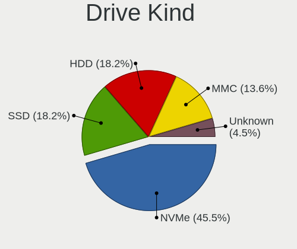
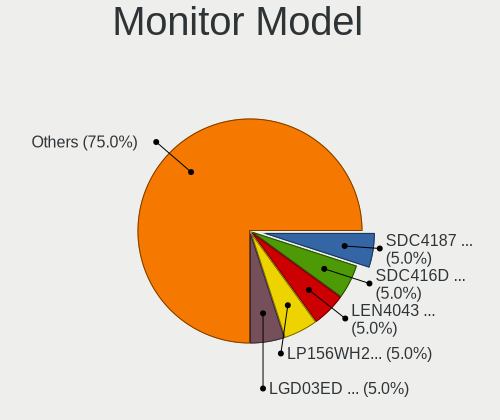
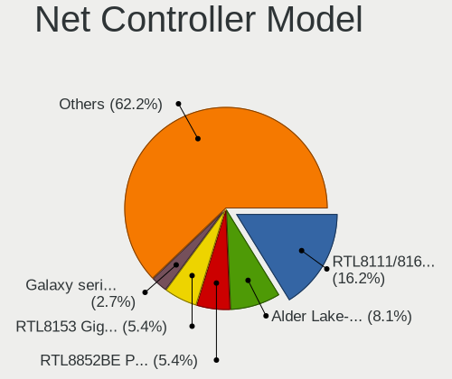
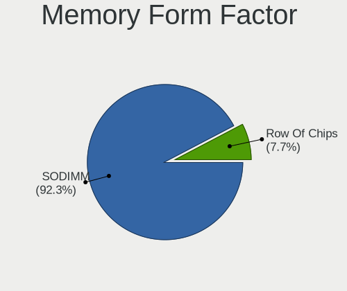

LMDE - Hardware Trends (Notebooks)
----------------------------------

A project to identify most popular hardware characteristics and track their change
over time based on data collected by Linux users at https://Linux-Hardware.org.

Anyone can contribute to this report by the [hw-probe](https://github.com/linuxhw/hw-probe) tool:

    sudo -E hw-probe -all -upload

This report is for one last month. Overall report since the beginning of time: [TestDays](https://github.com/linuxhw/TestDays)

Period: Jan, 2024.

Contents
--------

* [ System ](#system)
  - [ OS                       ](#os)
  - [ OS Family                ](#os-family)
  - [ Kernel                   ](#kernel)
  - [ Kernel Family            ](#kernel-family)
  - [ Kernel Major Ver.        ](#kernel-major-ver)
  - [ Arch                     ](#arch)
  - [ DE                       ](#de)
  - [ Display Server           ](#display-server)
  - [ Display Manager          ](#display-manager)
  - [ OS Lang                  ](#os-lang)
  - [ Boot Mode                ](#boot-mode)
  - [ Filesystem               ](#filesystem)
  - [ Part. scheme             ](#part-scheme)
  - [ Dual Boot with Linux/BSD ](#dual-boot-with-linuxbsd)
  - [ Dual Boot (Win)          ](#dual-boot-win)

* [ Board ](#board)
  - [ Vendor                   ](#vendor)
  - [ Model                    ](#model)
  - [ Model Family             ](#model-family)
  - [ MFG Year                 ](#mfg-year)
  - [ Form Factor              ](#form-factor)
  - [ Secure Boot              ](#secure-boot)
  - [ Coreboot                 ](#coreboot)
  - [ RAM Size                 ](#ram-size)
  - [ RAM Used                 ](#ram-used)
  - [ Total Drives             ](#total-drives)
  - [ Has CD-ROM               ](#has-cd-rom)
  - [ Has Ethernet             ](#has-ethernet)
  - [ Has WiFi                 ](#has-wifi)
  - [ Has Bluetooth            ](#has-bluetooth)

* [ Location ](#location)
  - [ Country                  ](#country)
  - [ City                     ](#city)

* [ Drives ](#drives)
  - [ Drive Vendor             ](#drive-vendor)
  - [ Drive Model              ](#drive-model)
  - [ HDD Vendor               ](#hdd-vendor)
  - [ SSD Vendor               ](#ssd-vendor)
  - [ Drive Kind               ](#drive-kind)
  - [ Drive Connector          ](#drive-connector)
  - [ Drive Size               ](#drive-size)
  - [ Space Total              ](#space-total)
  - [ Space Used               ](#space-used)
  - [ Malfunc. Drives          ](#malfunc-drives)
  - [ Malfunc. Drive Vendor    ](#malfunc-drive-vendor)
  - [ Malfunc. HDD Vendor      ](#malfunc-hdd-vendor)
  - [ Malfunc. Drive Kind      ](#malfunc-drive-kind)
  - [ Failed Drives            ](#failed-drives)
  - [ Failed Drive Vendor      ](#failed-drive-vendor)
  - [ Drive Status             ](#drive-status)

* [ Storage controller ](#storage-controller)
  - [ Storage Vendor           ](#storage-vendor)
  - [ Storage Model            ](#storage-model)
  - [ Storage Kind             ](#storage-kind)

* [ Processor ](#processor)
  - [ CPU Vendor               ](#cpu-vendor)
  - [ CPU Model                ](#cpu-model)
  - [ CPU Model Family         ](#cpu-model-family)
  - [ CPU Cores                ](#cpu-cores)
  - [ CPU Sockets              ](#cpu-sockets)
  - [ CPU Threads              ](#cpu-threads)
  - [ CPU Op-Modes             ](#cpu-op-modes)
  - [ CPU Microcode            ](#cpu-microcode)
  - [ CPU Microarch            ](#cpu-microarch)

* [ Graphics ](#graphics)
  - [ GPU Vendor               ](#gpu-vendor)
  - [ GPU Model                ](#gpu-model)
  - [ GPU Combo                ](#gpu-combo)
  - [ GPU Driver               ](#gpu-driver)
  - [ GPU Memory               ](#gpu-memory)

* [ Monitor ](#monitor)
  - [ Monitor Vendor           ](#monitor-vendor)
  - [ Monitor Model            ](#monitor-model)
  - [ Monitor Resolution       ](#monitor-resolution)
  - [ Monitor Diagonal         ](#monitor-diagonal)
  - [ Monitor Width            ](#monitor-width)
  - [ Aspect Ratio             ](#aspect-ratio)
  - [ Monitor Area             ](#monitor-area)
  - [ Pixel Density            ](#pixel-density)
  - [ Multiple Monitors        ](#multiple-monitors)

* [ Network ](#network)
  - [ Net Controller Vendor    ](#net-controller-vendor)
  - [ Net Controller Model     ](#net-controller-model)
  - [ Wireless Vendor          ](#wireless-vendor)
  - [ Wireless Model           ](#wireless-model)
  - [ Ethernet Vendor          ](#ethernet-vendor)
  - [ Ethernet Model           ](#ethernet-model)
  - [ Net Controller Kind      ](#net-controller-kind)
  - [ Used Controller          ](#used-controller)
  - [ NICs                     ](#nics)
  - [ IPv6                     ](#ipv6)

* [ Bluetooth ](#bluetooth)
  - [ Bluetooth Vendor         ](#bluetooth-vendor)
  - [ Bluetooth Model          ](#bluetooth-model)

* [ Sound ](#sound)
  - [ Sound Vendor             ](#sound-vendor)
  - [ Sound Model              ](#sound-model)

* [ Memory ](#memory)
  - [ Memory Vendor            ](#memory-vendor)
  - [ Memory Model             ](#memory-model)
  - [ Memory Kind              ](#memory-kind)
  - [ Memory Form Factor       ](#memory-form-factor)
  - [ Memory Size              ](#memory-size)
  - [ Memory Speed             ](#memory-speed)

* [ Printers & scanners ](#printers--scanners)
  - [ Printer Vendor           ](#printer-vendor)
  - [ Printer Model            ](#printer-model)
  - [ Scanner Vendor           ](#scanner-vendor)
  - [ Scanner Model            ](#scanner-model)

* [ Camera ](#camera)
  - [ Camera Vendor            ](#camera-vendor)
  - [ Camera Model             ](#camera-model)

* [ Security ](#security)
  - [ Fingerprint Vendor       ](#fingerprint-vendor)
  - [ Fingerprint Model        ](#fingerprint-model)
  - [ Chipcard Vendor          ](#chipcard-vendor)
  - [ Chipcard Model           ](#chipcard-model)

* [ Unsupported ](#unsupported)
  - [ Unsupported Devices      ](#unsupported-devices)
  - [ Unsupported Device Types ](#unsupported-device-types)

System
------

OS
--

Installed operating systems

| Name   | Notebooks | Percent |
|--------|-----------|---------|
| LMDE 6 | 24        | 96%     |
| LMDE 5 | 1         | 4%      |

OS Family
---------

OS without a version

| Name | Notebooks | Percent |
|------|-----------|---------|
| LMDE | 25        | 100%    |

Kernel
------

Version of the Linux kernel

| Version         | Notebooks | Percent |
|-----------------|-----------|---------|
| 6.1.0-17-amd64  | 16        | 64%     |
| 6.1.0-12-amd64  | 5         | 20%     |
| 6.1.0-12-686    | 2         | 8%      |
| 6.1.0-17-686    | 1         | 4%      |
| 5.10.0-23-amd64 | 1         | 4%      |

Kernel Family
-------------

Linux kernel without a distro release

| Version | Notebooks | Percent |
|---------|-----------|---------|
| 6.1.0   | 24        | 96%     |
| 5.10.0  | 1         | 4%      |

Kernel Major Ver.
-----------------

Linux kernel major version

| Version | Notebooks | Percent |
|---------|-----------|---------|
| 6.1     | 24        | 96%     |
| 5.10    | 1         | 4%      |

Arch
----

OS architecture (x86_64, i586, etc.)

| Name   | Notebooks | Percent |
|--------|-----------|---------|
| x86_64 | 22        | 88%     |
| i686   | 3         | 12%     |

DE
--

Desktop Environment

| Name       | Notebooks | Percent |
|------------|-----------|---------|
| X-Cinnamon | 23        | 92%     |
| Cinnamon   | 2         | 8%      |

Display Server
--------------

X11 or Wayland

| Name | Notebooks | Percent |
|------|-----------|---------|
| X11  | 25        | 100%    |

Display Manager
---------------

SDDM, LightDM, etc.

| Name    | Notebooks | Percent |
|---------|-----------|---------|
| LightDM | 17        | 68%     |
| Unknown | 8         | 32%     |

OS Lang
-------

Language

| Lang  | Notebooks | Percent |
|-------|-----------|---------|
| en_US | 13        | 52%     |
| de_DE | 4         | 16%     |
| it_IT | 2         | 8%      |
| en_GB | 2         | 8%      |
| pt_BR | 1         | 4%      |
| nl_NL | 1         | 4%      |
| fr_FR | 1         | 4%      |
| es_ES | 1         | 4%      |

Boot Mode
---------

EFI or BIOS

| Mode | Notebooks | Percent |
|------|-----------|---------|
| EFI  | 16        | 64%     |
| BIOS | 9         | 36%     |

Filesystem
----------

Type of filesystem

| Type    | Notebooks | Percent |
|---------|-----------|---------|
| Ext4    | 19        | 76%     |
| Overlay | 4         | 16%     |
| Btrfs   | 2         | 8%      |

Part. scheme
------------

Scheme of partitioning

| Type    | Notebooks | Percent |
|---------|-----------|---------|
| GPT     | 10        | 40%     |
| Unknown | 8         | 32%     |
| MBR     | 7         | 28%     |

Dual Boot with Linux/BSD
------------------------

Hosting more than one Linux/BSD

| Dual boot | Notebooks | Percent |
|-----------|-----------|---------|
| No        | 22        | 88%     |
| Yes       | 3         | 12%     |

Dual Boot (Win)
---------------

Hosting Linux and Windows

| Dual boot | Notebooks | Percent |
|-----------|-----------|---------|
| No        | 20        | 80%     |
| Yes       | 5         | 20%     |

Board
-----

Vendor
------

Motherboard manufacturer

| Name             | Notebooks | Percent |
|------------------|-----------|---------|
| Lenovo           | 11        | 44%     |
| Hewlett-Packard  | 3         | 12%     |
| Dell             | 3         | 12%     |
| Acer             | 2         | 8%      |
| VALE             | 1         | 4%      |
| TUXEDO           | 1         | 4%      |
| Medion           | 1         | 4%      |
| Google           | 1         | 4%      |
| ASUSTek Computer | 1         | 4%      |
| Apple            | 1         | 4%      |

Model
-----

Motherboard model

| Name                                             | Notebooks | Percent |
|--------------------------------------------------|-----------|---------|
| VALE Notebook Classic C171V                      | 1         | 4%      |
| TUXEDO Pulse 14 Gen1                             | 1         | 4%      |
| Medion P7612                                     | 1         | 4%      |
| Lenovo ThinkPad Z13 Gen 1 21D2001PUS             | 1         | 4%      |
| Lenovo ThinkPad X61 76754BJ                      | 1         | 4%      |
| Lenovo ThinkPad X230 2325SU3                     | 1         | 4%      |
| Lenovo ThinkPad X1 Carbon 3rd 20BTS05100         | 1         | 4%      |
| Lenovo ThinkPad X1 Carbon 34601C8                | 1         | 4%      |
| Lenovo ThinkPad T400 6474EU3                     | 1         | 4%      |
| Lenovo ThinkPad T16 Gen 1 21CHCTO1WW             | 1         | 4%      |
| Lenovo IdeaPad Y530                              | 1         | 4%      |
| Lenovo IdeaPad 330S-15IKB 81F5                   | 1         | 4%      |
| Lenovo IdeaPad 3 15IML05 82BS                    | 1         | 4%      |
| Lenovo IdeaPad 3 15ADA05 81W1                    | 1         | 4%      |
| HP ZBook Fury 17.3 inch G8 Mobile Workstation PC | 1         | 4%      |
| HP Dragonfly 13.5 inch G4 Notebook PC            | 1         | 4%      |
| HP Compaq 615                                    | 1         | 4%      |
| Google Swanky                                    | 1         | 4%      |
| Dell Latitude E6320                              | 1         | 4%      |
| Dell Latitude D610                               | 1         | 4%      |
| Dell Inspiron 15-3552                            | 1         | 4%      |
| ASUS TUF Gaming FX505DT_FX505DT                  | 1         | 4%      |
| Apple MacBookAir7,1                              | 1         | 4%      |
| Acer Aspire E5-575                               | 1         | 4%      |
| Acer Aspire E1-572G                              | 1         | 4%      |

Model Family
------------

Motherboard model prefix

| Name              | Notebooks | Percent |
|-------------------|-----------|---------|
| Lenovo ThinkPad   | 7         | 28%     |
| Lenovo IdeaPad    | 4         | 16%     |
| Dell Latitude     | 2         | 8%      |
| Acer Aspire       | 2         | 8%      |
| VALE Notebook     | 1         | 4%      |
| TUXEDO Pulse      | 1         | 4%      |
| Medion P7612      | 1         | 4%      |
| HP ZBook          | 1         | 4%      |
| HP Dragonfly      | 1         | 4%      |
| HP Compaq         | 1         | 4%      |
| Google Swanky     | 1         | 4%      |
| Dell Inspiron     | 1         | 4%      |
| ASUS TUF          | 1         | 4%      |
| Apple MacBookAir7 | 1         | 4%      |

MFG Year
--------

Motherboard manufacture year

| Year | Notebooks | Percent |
|------|-----------|---------|
| 2021 | 3         | 12%     |
| 2008 | 3         | 12%     |
| 2023 | 2         | 8%      |
| 2022 | 2         | 8%      |
| 2020 | 2         | 8%      |
| 2016 | 2         | 8%      |
| 2015 | 2         | 8%      |
| 2009 | 2         | 8%      |
| 2019 | 1         | 4%      |
| 2018 | 1         | 4%      |
| 2013 | 1         | 4%      |
| 2012 | 1         | 4%      |
| 2011 | 1         | 4%      |
| 2007 | 1         | 4%      |
| 2005 | 1         | 4%      |

Form Factor
-----------

Physical design of the computer

| Name     | Notebooks | Percent |
|----------|-----------|---------|
| Notebook | 25        | 100%    |

Secure Boot
-----------

Enabled or disabled

| State    | Notebooks | Percent |
|----------|-----------|---------|
| Disabled | 23        | 92%     |
| Enabled  | 2         | 8%      |

Coreboot
--------

Have coreboot on board

| Used | Notebooks | Percent |
|------|-----------|---------|
| No   | 24        | 96%     |
| Yes  | 1         | 4%      |

RAM Size
--------

Total RAM memory

| Size in GB  | Notebooks | Percent |
|-------------|-----------|---------|
| 4.01-8.0    | 10        | 40%     |
| 3.01-4.0    | 6         | 24%     |
| 32.01-64.0  | 2         | 8%      |
| 8.01-16.0   | 2         | 8%      |
| 24.01-32.0  | 1         | 4%      |
| 2.01-3.0    | 1         | 4%      |
| 64.01-256.0 | 1         | 4%      |
| 16.01-24.0  | 1         | 4%      |
| 1.01-2.0    | 1         | 4%      |

RAM Used
--------

Used RAM memory

| Used GB   | Notebooks | Percent |
|-----------|-----------|---------|
| 1.01-2.0  | 8         | 32%     |
| 4.01-8.0  | 6         | 24%     |
| 2.01-3.0  | 6         | 24%     |
| 3.01-4.0  | 3         | 12%     |
| 8.01-16.0 | 2         | 8%      |

Total Drives
------------

Number of drives on board

| Drives | Notebooks | Percent |
|--------|-----------|---------|
| 1      | 19        | 76%     |
| 2      | 5         | 20%     |
| 4      | 1         | 4%      |

Has CD-ROM
----------

Has CD-ROM on board

| Presented | Notebooks | Percent |
|-----------|-----------|---------|
| No        | 16        | 64%     |
| Yes       | 9         | 36%     |

Has Ethernet
------------

Has Ethernet on board

| Presented | Notebooks | Percent |
|-----------|-----------|---------|
| Yes       | 16        | 64%     |
| No        | 9         | 36%     |

Has WiFi
--------

Has WiFi module

| Presented | Notebooks | Percent |
|-----------|-----------|---------|
| Yes       | 25        | 100%    |

Has Bluetooth
-------------

Has Bluetooth module

| Presented | Notebooks | Percent |
|-----------|-----------|---------|
| Yes       | 21        | 84%     |
| No        | 4         | 16%     |

Location
--------

Country
-------

Geographic location (country)

| Country     | Notebooks | Percent |
|-------------|-----------|---------|
| Germany     | 7         | 28%     |
| USA         | 4         | 16%     |
| Italy       | 4         | 16%     |
| Netherlands | 2         | 8%      |
| Brazil      | 2         | 8%      |
| Switzerland | 1         | 4%      |
| Spain       | 1         | 4%      |
| Poland      | 1         | 4%      |
| Hungary     | 1         | 4%      |
| France      | 1         | 4%      |
| Canada      | 1         | 4%      |

City
----

Geographic location (city)

| City                    | Notebooks | Percent |
|-------------------------|-----------|---------|
| Bonn                    | 2         | 8%      |
| Zuidhorn                | 1         | 4%      |
| Winnipeg                | 1         | 4%      |
| Rome                    | 1         | 4%      |
| Oberursel               | 1         | 4%      |
| Nova Friburgo           | 1         | 4%      |
| Milano                  | 1         | 4%      |
| Mel                     | 1         | 4%      |
| Luegde                  | 1         | 4%      |
| Las Cabezas de San Juan | 1         | 4%      |
| Haymarket               | 1         | 4%      |
| Francavilla al Mare     | 1         | 4%      |
| Fontaine-au-Pire        | 1         | 4%      |
| East Bend               | 1         | 4%      |
| Dietikon                | 1         | 4%      |
| Delligsen               | 1         | 4%      |
| Columbia                | 1         | 4%      |
| Cologne                 | 1         | 4%      |
| Chandler                | 1         | 4%      |
| Campina Grande          | 1         | 4%      |
| Bytom                   | 1         | 4%      |
| Budapest                | 1         | 4%      |
| Berlin                  | 1         | 4%      |
| Amsterdam               | 1         | 4%      |

Drives
------

Drive Vendor
------------

Hard drive vendors

| Vendor                    | Notebooks | Drives | Percent |
|---------------------------|-----------|--------|---------|
| Samsung Electronics       | 6         | 6      | 18.75%  |
| Seagate                   | 4         | 4      | 12.5%   |
| WDC                       | 3         | 3      | 9.38%   |
| Unknown                   | 2         | 2      | 6.25%   |
| Toshiba                   | 2         | 2      | 6.25%   |
| Micron Technology         | 2         | 2      | 6.25%   |
| KIOXIA                    | 2         | 3      | 6.25%   |
| Hitachi                   | 2         | 2      | 6.25%   |
| SanDisk                   | 1         | 2      | 3.13%   |
| Realtek                   | 1         | 1      | 3.13%   |
| Micron/Crucial Technology | 1         | 1      | 3.13%   |
| Kingston                  | 1         | 1      | 3.13%   |
| Intenso                   | 1         | 1      | 3.13%   |
| Intel                     | 1         | 1      | 3.13%   |
| GLOWAY                    | 1         | 1      | 3.13%   |
| Gigabyte Technology       | 1         | 1      | 3.13%   |
| Apple                     | 1         | 1      | 3.13%   |

Drive Model
-----------

Hard drive models

| Model                                | Notebooks | Percent |
|--------------------------------------|-----------|---------|
| Seagate ST1000LM035-1RK172 1TB       | 2         | 6.25%   |
| WDC WD7500BPKX-22HPJT0 752GB         | 1         | 3.13%   |
| WDC WD10SPZX-24Z10 1TB               | 1         | 3.13%   |
| WDC PC SN520 SDAPMUW-512G-1101 512GB | 1         | 3.13%   |
| Unknown MMC Card  64GB               | 1         | 3.13%   |
| Unknown MMC Card  16GB               | 1         | 3.13%   |
| Toshiba MQ01ABD100 1TB               | 1         | 3.13%   |
| Toshiba MQ01ABD050V 500GB            | 1         | 3.13%   |
| Seagate ST9500325AS 500GB            | 1         | 3.13%   |
| Seagate Expansion 1TB                | 1         | 3.13%   |
| SanDisk NVMe SSD Drive 2TB           | 1         | 3.13%   |
| Samsung SSD 990 PRO 1TB              | 1         | 3.13%   |
| Samsung SSD 860 EVO 250GB            | 1         | 3.13%   |
| Samsung SSD 850 EVO M.2 250GB        | 1         | 3.13%   |
| Samsung SSD 840 EVO 250GB            | 1         | 3.13%   |
| Samsung MZVL21T0HCLR-00BH7 1TB       | 1         | 3.13%   |
| Samsung MZNTY256HDHP-000L7 256GB SSD | 1         | 3.13%   |
| Realtek RTL9210B-CG 1024GB           | 1         | 3.13%   |
| Micron/Crucial P2 NVMe PCIe SSD 1TB  | 1         | 3.13%   |
| Micron MTFDKCD512TFK 512GB           | 1         | 3.13%   |
| Micron 2200V_MTFDHBA512TCK 512GB     | 1         | 3.13%   |
| KIOXIA KXG8AZNV1T02 LA 1TB           | 1         | 3.13%   |
| KIOXIA KXG60PNV2T04 2TB              | 1         | 3.13%   |
| Kingston SA400S37240G 240GB SSD      | 1         | 3.13%   |
| Intenso 128GB                        | 1         | 3.13%   |
| Intel SSDSCMMW180A3L 180GB           | 1         | 3.13%   |
| Hitachi HTS548080M9AT00 80GB         | 1         | 3.13%   |
| Hitachi HTS543232L9A300 320GB        | 1         | 3.13%   |
| GLOWAY YCT256GS3-M.2 80 256GB        | 1         | 3.13%   |
| Gigabyte GP-GSTFS31240GNTD 240GB     | 1         | 3.13%   |
| Apple S1X NVMe Controller 256GB      | 1         | 3.13%   |

HDD Vendor
----------

Hard disk drive vendors

| Vendor  | Notebooks | Drives | Percent |
|---------|-----------|--------|---------|
| Seagate | 4         | 4      | 40%     |
| WDC     | 2         | 2      | 20%     |
| Toshiba | 2         | 2      | 20%     |
| Hitachi | 2         | 2      | 20%     |

SSD Vendor
----------

Solid state drive vendors

| Vendor              | Notebooks | Drives | Percent |
|---------------------|-----------|--------|---------|
| Samsung Electronics | 4         | 4      | 57.14%  |
| Kingston            | 1         | 1      | 14.29%  |
| Intel               | 1         | 1      | 14.29%  |
| Gigabyte Technology | 1         | 1      | 14.29%  |

Drive Kind
----------

HDD or SSD

| Kind    | Notebooks | Drives | Percent |
|---------|-----------|--------|---------|
| NVMe    | 10        | 13     | 33.33%  |
| HDD     | 9         | 10     | 30%     |
| SSD     | 7         | 7      | 23.33%  |
| MMC     | 2         | 2      | 6.67%   |
| Unknown | 2         | 2      | 6.67%   |

Drive Connector
---------------

SATA, SAS, NVMe, etc.

| Type | Notebooks | Drives | Percent |
|------|-----------|--------|---------|
| SATA | 16        | 18     | 55.17%  |
| NVMe | 9         | 12     | 31.03%  |
| SAS  | 2         | 2      | 6.9%    |
| MMC  | 2         | 2      | 6.9%    |

Drive Size
----------

Size of hard drive

| Size in TB | Notebooks | Drives | Percent |
|------------|-----------|--------|---------|
| 0.01-0.5   | 10        | 11     | 62.5%   |
| 0.51-1.0   | 6         | 6      | 37.5%   |

Space Total
-----------

Amount of disk space available on the file system

| Size in GB | Notebooks | Percent |
|------------|-----------|---------|
| 101-250    | 9         | 36%     |
| 501-1000   | 7         | 28%     |
| 1001-2000  | 3         | 12%     |
| 1-20       | 3         | 12%     |
| 251-500    | 2         | 8%      |
| 2001-3000  | 1         | 4%      |

Space Used
----------

Amount of used disk space

| Used GB   | Notebooks | Percent |
|-----------|-----------|---------|
| 1-20      | 8         | 32%     |
| 21-50     | 7         | 28%     |
| 101-250   | 6         | 24%     |
| 1001-2000 | 2         | 8%      |
| 251-500   | 1         | 4%      |
| 51-100    | 1         | 4%      |

Malfunc. Drives
---------------

Drive models with a malfunction

| Model                           | Notebooks | Drives | Percent |
|---------------------------------|-----------|--------|---------|
| Seagate ST9500325AS 500GB       | 1         | 1      | 25%     |
| Kingston SA400S37240G 240GB SSD | 1         | 1      | 25%     |
| Hitachi HTS548080M9AT00 80GB    | 1         | 1      | 25%     |
| Hitachi HTS543232L9A300 320GB   | 1         | 1      | 25%     |

Malfunc. Drive Vendor
---------------------

Vendors of faulty drives

| Vendor   | Notebooks | Drives | Percent |
|----------|-----------|--------|---------|
| Hitachi  | 2         | 2      | 50%     |
| Seagate  | 1         | 1      | 25%     |
| Kingston | 1         | 1      | 25%     |

Malfunc. HDD Vendor
-------------------

Vendors of faulty HDD drives

| Vendor  | Notebooks | Drives | Percent |
|---------|-----------|--------|---------|
| Hitachi | 2         | 2      | 66.67%  |
| Seagate | 1         | 1      | 33.33%  |

Malfunc. Drive Kind
-------------------

Kinds of faulty drives

| Kind | Notebooks | Drives | Percent |
|------|-----------|--------|---------|
| HDD  | 3         | 3      | 75%     |
| SSD  | 1         | 1      | 25%     |

Failed Drives
-------------

Failed drive models

Zero info for selected period =(

Failed Drive Vendor
-------------------

Failed drive vendors

Zero info for selected period =(

Drive Status
------------

Number of failed and malfunc. drives

| Status   | Notebooks | Drives | Percent |
|----------|-----------|--------|---------|
| Works    | 14        | 17     | 50%     |
| Detected | 10        | 13     | 35.71%  |
| Malfunc  | 4         | 4      | 14.29%  |

Storage controller
------------------

Storage Vendor
--------------

Storage controller vendors

| Vendor                       | Notebooks | Percent |
|------------------------------|-----------|---------|
| Intel                        | 15        | 53.57%  |
| AMD                          | 3         | 10.71%  |
| SanDisk                      | 2         | 7.14%   |
| Samsung Electronics          | 2         | 7.14%   |
| Micron Technology            | 2         | 7.14%   |
| Toshiba America Info Systems | 1         | 3.57%   |
| Micron/Crucial Technology    | 1         | 3.57%   |
| KIOXIA                       | 1         | 3.57%   |
| Apple                        | 1         | 3.57%   |

Storage Model
-------------

Storage controller models

| Model                                                                            | Notebooks | Percent |
|----------------------------------------------------------------------------------|-----------|---------|
| Intel 82801IBM/IEM (ICH9M/ICH9M-E) 4 port SATA Controller [AHCI mode]            | 3         | 10%     |
| Intel Sunrise Point-LP SATA Controller [AHCI mode]                               | 2         | 6.67%   |
| AMD FCH SATA Controller [AHCI mode]                                              | 2         | 6.67%   |
| Toshiba America Info Systems XG6 NVMe SSD Controller                             | 1         | 3.33%   |
| SanDisk WD Blue SN570 NVMe SSD 2TB                                               | 1         | 3.33%   |
| SanDisk PC SN520 x2 M.2 2242 NVMe SSD                                            | 1         | 3.33%   |
| Samsung NVMe SSD Controller S4LV008[Pascal]                                      | 1         | 3.33%   |
| Samsung NVMe SSD Controller PM9A1/PM9A3/980PRO                                   | 1         | 3.33%   |
| Micron/Crucial P2 [Nick P2] / P3 / P3 Plus NVMe PCIe SSD (DRAM-less)             | 1         | 3.33%   |
| Micron 2450 NVMe SSD [HendrixV] (DRAM-less)                                      | 1         | 3.33%   |
| Micron 2200S NVMe SSD [Cassandra]                                                | 1         | 3.33%   |
| KIOXIA NVMe SSD Controller XG8                                                   | 1         | 3.33%   |
| Intel Wildcat Point-LP SATA Controller [AHCI Mode]                               | 1         | 3.33%   |
| Intel Comet Lake SATA AHCI Controller                                            | 1         | 3.33%   |
| Intel Celeron/Pentium Silver Processor SATA Controller                           | 1         | 3.33%   |
| Intel Atom/Celeron/Pentium Processor x5-E8000/J3xxx/N3xxx Series SATA Controller | 1         | 3.33%   |
| Intel 82801HM/HEM (ICH8M/ICH8M-E) SATA Controller [AHCI mode]                    | 1         | 3.33%   |
| Intel 82801HM/HEM (ICH8M/ICH8M-E) IDE Controller                                 | 1         | 3.33%   |
| Intel 82801FBM (ICH6M) SATA Controller                                           | 1         | 3.33%   |
| Intel 82801 Mobile SATA Controller [RAID mode]                                   | 1         | 3.33%   |
| Intel 8 Series SATA Controller 1 [AHCI mode]                                     | 1         | 3.33%   |
| Intel 7 Series Chipset Family 6-port SATA Controller [AHCI mode]                 | 1         | 3.33%   |
| Intel 7 Series Chipset Family 4-port SATA Controller [IDE mode]                  | 1         | 3.33%   |
| Intel 7 Series Chipset Family 2-port SATA Controller [IDE mode]                  | 1         | 3.33%   |
| Apple S1X NVMe Controller                                                        | 1         | 3.33%   |
| AMD SB7x0/SB8x0/SB9x0 SATA Controller [AHCI mode]                                | 1         | 3.33%   |

Storage Kind
------------

Kind of storage controller (IDE, SATA, NVMe, SAS, ...)

| Kind | Notebooks | Percent |
|------|-----------|---------|
| SATA | 15        | 53.57%  |
| NVMe | 9         | 32.14%  |
| IDE  | 3         | 10.71%  |
| RAID | 1         | 3.57%   |

Processor
---------

CPU Vendor
----------

Processor vendors

| Vendor | Notebooks | Percent |
|--------|-----------|---------|
| Intel  | 19        | 76%     |
| AMD    | 6         | 24%     |

CPU Model
---------

Processor models

| Model                                         | Notebooks | Percent |
|-----------------------------------------------|-----------|---------|
| AMD Ryzen 7 PRO 6850U with Radeon Graphics    | 2         | 8%      |
| Intel Pentium Silver N5030 CPU @ 1.10GHz      | 1         | 4%      |
| Intel Pentium M processor 1.86GHz             | 1         | 4%      |
| Intel Pentium CPU N3710 @ 1.60GHz             | 1         | 4%      |
| Intel Core i7-8550U CPU @ 1.80GHz             | 1         | 4%      |
| Intel Core i7-5600U CPU @ 2.60GHz             | 1         | 4%      |
| Intel Core i7-2620M CPU @ 2.70GHz             | 1         | 4%      |
| Intel Core i5-5250U CPU @ 1.60GHz             | 1         | 4%      |
| Intel Core i5-4200U CPU @ 1.60GHz             | 1         | 4%      |
| Intel Core i5-3427U CPU @ 1.80GHz             | 1         | 4%      |
| Intel Core i5-3320M CPU @ 2.60GHz             | 1         | 4%      |
| Intel Core i3-7100U CPU @ 2.40GHz             | 1         | 4%      |
| Intel Core i3-10110U CPU @ 2.10GHz            | 1         | 4%      |
| Intel Core 2 Duo CPU T9600 @ 2.80GHz          | 1         | 4%      |
| Intel Core 2 Duo CPU T9400 @ 2.53GHz          | 1         | 4%      |
| Intel Core 2 Duo CPU T7300 @ 2.00GHz          | 1         | 4%      |
| Intel Core 2 Duo CPU T6500 @ 2.10GHz          | 1         | 4%      |
| Intel Celeron CPU N2840 @ 2.16GHz             | 1         | 4%      |
| Intel 13th Gen Core i7-1355U                  | 1         | 4%      |
| Intel 11th Gen Core i9-11950H @ 2.60GHz       | 1         | 4%      |
| AMD Sempron SI-42                             | 1         | 4%      |
| AMD Ryzen 7 4800H with Radeon Graphics        | 1         | 4%      |
| AMD Ryzen 7 3750H with Radeon Vega Mobile Gfx | 1         | 4%      |
| AMD 3020e with Radeon Graphics                | 1         | 4%      |

CPU Model Family
----------------

Processor model prefix

| Model                | Notebooks | Percent |
|----------------------|-----------|---------|
| Intel Core i5        | 4         | 16%     |
| Intel Core 2 Duo     | 4         | 16%     |
| Other                | 3         | 12%     |
| Intel Core i7        | 3         | 12%     |
| Intel Core i3        | 2         | 8%      |
| AMD Ryzen 7 PRO      | 2         | 8%      |
| AMD Ryzen 7          | 2         | 8%      |
| Intel Pentium Silver | 1         | 4%      |
| Intel Pentium M      | 1         | 4%      |
| Intel Pentium        | 1         | 4%      |
| Intel Celeron        | 1         | 4%      |
| AMD Sempron          | 1         | 4%      |

CPU Cores
---------

Number of processor cores

| Number | Notebooks | Percent |
|--------|-----------|---------|
| 2      | 14        | 56%     |
| 8      | 4         | 16%     |
| 4      | 4         | 16%     |
| 1      | 2         | 8%      |
| 10     | 1         | 4%      |

CPU Sockets
-----------

Number of sockets

| Number | Notebooks | Percent |
|--------|-----------|---------|
| 1      | 25        | 100%    |

CPU Threads
-----------

Threads per core (Hyper-Threading)

| Number | Notebooks | Percent |
|--------|-----------|---------|
| 2      | 15        | 60%     |
| 1      | 10        | 40%     |

CPU Op-Modes
------------

CPU Operation Modes (32-bit, 64-bit)

| Op mode        | Notebooks | Percent |
|----------------|-----------|---------|
| 32-bit, 64-bit | 24        | 96%     |
| 32-bit         | 1         | 4%      |

CPU Microcode
-------------

Microcode number

| Number     | Notebooks | Percent |
|------------|-----------|---------|
| Unknown    | 5         | 20%     |
| 0x1067a    | 3         | 12%     |
| 0x306a9    | 2         | 8%      |
| 0xb06a3    | 1         | 4%      |
| 0x806ea    | 1         | 4%      |
| 0x806e9    | 1         | 4%      |
| 0x706a8    | 1         | 4%      |
| 0x6fa      | 1         | 4%      |
| 0x6d8      | 1         | 4%      |
| 0x40651    | 1         | 4%      |
| 0x306d4    | 1         | 4%      |
| 0x30678    | 1         | 4%      |
| 0x206a7    | 1         | 4%      |
| 0x0a404102 | 1         | 4%      |
| 0x08600103 | 1         | 4%      |
| 0x08200103 | 1         | 4%      |
| 0x08108102 | 1         | 4%      |
| 0x02000057 | 1         | 4%      |

CPU Microarch
-------------

Microarchitecture

| Name             | Notebooks | Percent |
|------------------|-----------|---------|
| Penryn           | 3         | 12%     |
| KabyLake         | 3         | 12%     |
| Unknown          | 3         | 12%     |
| Silvermont       | 2         | 8%      |
| IvyBridge        | 2         | 8%      |
| Broadwell        | 2         | 8%      |
| Zen+             | 1         | 4%      |
| Zen 2            | 1         | 4%      |
| Zen              | 1         | 4%      |
| SandyBridge      | 1         | 4%      |
| P6               | 1         | 4%      |
| K8 & K10 hybrid  | 1         | 4%      |
| Haswell          | 1         | 4%      |
| Goldmont plus    | 1         | 4%      |
| Core             | 1         | 4%      |
| Alderlake Hybrid | 1         | 4%      |

Graphics
--------

GPU Vendor
----------

Vendors of graphics cards

| Vendor | Notebooks | Percent |
|--------|-----------|---------|
| Intel  | 16        | 57.14%  |
| AMD    | 8         | 28.57%  |
| Nvidia | 4         | 14.29%  |

GPU Model
---------

Graphics card models

| Model                                                                                    | Notebooks | Percent |
|------------------------------------------------------------------------------------------|-----------|---------|
| Intel 3rd Gen Core processor Graphics Controller                                         | 2         | 6.9%    |
| AMD Rembrandt [Radeon 680M]                                                              | 2         | 6.9%    |
| AMD Picasso/Raven 2 [Radeon Vega Series / Radeon Vega Mobile Series]                     | 2         | 6.9%    |
| Nvidia TU117M [GeForce GTX 1650 Mobile / Max-Q]                                          | 1         | 3.45%   |
| Nvidia GT218M [GeForce G210M]                                                            | 1         | 3.45%   |
| Nvidia GA107GLM [RTX A2000 Mobile]                                                       | 1         | 3.45%   |
| Nvidia G96CM [GeForce 9600M GS]                                                          | 1         | 3.45%   |
| Intel UHD Graphics 620                                                                   | 1         | 3.45%   |
| Intel Raptor Lake-P [Iris Xe Graphics]                                                   | 1         | 3.45%   |
| Intel Mobile GM965/GL960 Integrated Graphics Controller (secondary)                      | 1         | 3.45%   |
| Intel Mobile GM965/GL960 Integrated Graphics Controller (primary)                        | 1         | 3.45%   |
| Intel Mobile 915GM/GMS/910GML Express Graphics Controller                                | 1         | 3.45%   |
| Intel Mobile 4 Series Chipset Integrated Graphics Controller                             | 1         | 3.45%   |
| Intel HD Graphics 620                                                                    | 1         | 3.45%   |
| Intel HD Graphics 6000                                                                   | 1         | 3.45%   |
| Intel HD Graphics 5500                                                                   | 1         | 3.45%   |
| Intel Haswell-ULT Integrated Graphics Controller                                         | 1         | 3.45%   |
| Intel GeminiLake [UHD Graphics 605]                                                      | 1         | 3.45%   |
| Intel CometLake-U GT2 [UHD Graphics]                                                     | 1         | 3.45%   |
| Intel Atom/Celeron/Pentium Processor x5-E8000/J3xxx/N3xxx Integrated Graphics Controller | 1         | 3.45%   |
| Intel Atom Processor Z36xxx/Z37xxx Series Graphics & Display                             | 1         | 3.45%   |
| Intel 2nd Generation Core Processor Family Integrated Graphics Controller                | 1         | 3.45%   |
| AMD Topaz XT [Radeon R7 M260/M265 / M340/M360 / M440/M445 / 530/535 / 620/625 Mobile]    | 1         | 3.45%   |
| AMD RS780M [Mobility Radeon HD 3200]                                                     | 1         | 3.45%   |
| AMD Renoir [Radeon RX Vega 6 (Ryzen 4000/5000 Mobile Series)]                            | 1         | 3.45%   |
| AMD Opal XT [Radeon R7 M265/M365X/M465]                                                  | 1         | 3.45%   |

GPU Combo
---------

Combinations of graphics cards

| Name         | Notebooks | Percent |
|--------------|-----------|---------|
| 1 x Intel    | 12        | 48%     |
| 1 x AMD      | 5         | 20%     |
| 1 x Nvidia   | 3         | 12%     |
| 2 x Intel    | 2         | 8%      |
| Intel + AMD  | 2         | 8%      |
| AMD + Nvidia | 1         | 4%      |

GPU Driver
----------

Free vs proprietary

| Driver      | Notebooks | Percent |
|-------------|-----------|---------|
| Free        | 24        | 96%     |
| Proprietary | 1         | 4%      |

GPU Memory
----------

Total video memory

| Size in GB | Notebooks | Percent |
|------------|-----------|---------|
| Unknown    | 15        | 60%     |
| 0.01-0.5   | 4         | 16%     |
| 1.01-2.0   | 3         | 12%     |
| 3.01-4.0   | 2         | 8%      |
| 0.51-1.0   | 1         | 4%      |

Monitor
-------

Monitor Vendor
--------------

Monitor vendors

| Vendor              | Notebooks | Percent |
|---------------------|-----------|---------|
| AU Optronics        | 7         | 25.93%  |
| Chimei Innolux      | 5         | 18.52%  |
| BOE                 | 4         | 14.81%  |
| LG Display          | 2         | 7.41%   |
| Lenovo              | 2         | 7.41%   |
| Samsung Electronics | 1         | 3.7%    |
| Quanta Display      | 1         | 3.7%    |
| PANDA               | 1         | 3.7%    |
| Mi                  | 1         | 3.7%    |
| InnoLux Display     | 1         | 3.7%    |
| Eizo                | 1         | 3.7%    |
| Apple               | 1         | 3.7%    |

Monitor Model
-------------

Monitor models

| Model                                                                | Notebooks | Percent |
|----------------------------------------------------------------------|-----------|---------|
| Samsung Electronics LCD Monitor SEC3047 1366x768 277x156mm 12.5-inch | 1         | 3.7%    |
| Quanta Display LCD Monitor QDS0015 1024x768 285x214mm 14.0-inch      | 1         | 3.7%    |
| PANDA LCD Monitor NCP002D 1920x1080 344x194mm 15.5-inch              | 1         | 3.7%    |
| Mi Monitor XMI23C3 1920x1080 527x293mm 23.7-inch                     | 1         | 3.7%    |
| LG Display LCD Monitor LGD042D 1920x1080 294x165mm 13.3-inch         | 1         | 3.7%    |
| LG Display LCD Monitor LGD0382 1600x900 309x174mm 14.0-inch          | 1         | 3.7%    |
| Lenovo LCD Monitor LEN4035 1280x800 304x190mm 14.1-inch              | 1         | 3.7%    |
| Lenovo LCD Monitor LEN4000 1024x768 246x185mm 12.1-inch              | 1         | 3.7%    |
| InnoLux Display BT156GW01 INL0007 1366x768 344x194mm 15.5-inch       | 1         | 3.7%    |
| Eizo MX191 ENC2117 1280x1024 376x301mm 19.0-inch                     | 1         | 3.7%    |
| Chimei Innolux LCD Monitor CMN15E6 1366x768 344x193mm 15.5-inch      | 1         | 3.7%    |
| Chimei Innolux LCD Monitor CMN15D2 1920x1080 344x193mm 15.5-inch     | 1         | 3.7%    |
| Chimei Innolux LCD Monitor CMN14D5 1920x1080 309x173mm 13.9-inch     | 1         | 3.7%    |
| Chimei Innolux LCD Monitor CMN14A8 1920x1080 308x173mm 13.9-inch     | 1         | 3.7%    |
| Chimei Innolux LCD Monitor CMN13C0 1920x1280 284x189mm 13.4-inch     | 1         | 3.7%    |
| BOE LCD Monitor BOE0A1B 1920x1200 286x179mm 13.3-inch                | 1         | 3.7%    |
| BOE LCD Monitor BOE084E 1920x1080 382x215mm 17.3-inch                | 1         | 3.7%    |
| BOE LCD Monitor BOE0700 1920x1080 344x194mm 15.5-inch                | 1         | 3.7%    |
| BOE LCD Monitor BOE0671 1366x768 344x194mm 15.5-inch                 | 1         | 3.7%    |
| AU Optronics LCD Monitor AUO9374 1280x800 331x207mm 15.4-inch        | 1         | 3.7%    |
| AU Optronics LCD Monitor AUO81EC 1366x768 344x193mm 15.5-inch        | 1         | 3.7%    |
| AU Optronics LCD Monitor AUO6A9F 2560x1600 344x215mm 16.0-inch       | 1         | 3.7%    |
| AU Optronics LCD Monitor AUO47EC 1366x768 344x193mm 15.5-inch        | 1         | 3.7%    |
| AU Optronics LCD Monitor AUO312C 1366x768 293x164mm 13.2-inch        | 1         | 3.7%    |
| AU Optronics LCD Monitor AUO119E 1600x900 382x214mm 17.2-inch        | 1         | 3.7%    |
| AU Optronics LCD Monitor 3840x2160                                   | 1         | 3.7%    |
| Apple Color LCD APP9CF3 1366x768 260x140mm 11.6-inch                 | 1         | 3.7%    |

Monitor Resolution
------------------

Monitor screen resolution

| Resolution        | Notebooks | Percent |
|-------------------|-----------|---------|
| 1920x1080 (FHD)   | 9         | 33.33%  |
| 1366x768 (WXGA)   | 8         | 29.63%  |
| 1600x900 (HD+)    | 2         | 7.41%   |
| 1280x800 (WXGA)   | 2         | 7.41%   |
| 3840x2160 (4K)    | 1         | 3.7%    |
| 2560x1600         | 1         | 3.7%    |
| 1920x1280         | 1         | 3.7%    |
| 1920x1200 (WUXGA) | 1         | 3.7%    |
| 1280x1024 (SXGA)  | 1         | 3.7%    |
| 1024x768 (XGA)    | 1         | 3.7%    |

Monitor Diagonal
----------------

Diagonal size in inches

| Inches  | Notebooks | Percent |
|---------|-----------|---------|
| 15      | 9         | 33.33%  |
| 13      | 6         | 22.22%  |
| 14      | 3         | 11.11%  |
| 23      | 2         | 7.41%   |
| 17      | 2         | 7.41%   |
| 19      | 1         | 3.7%    |
| 16      | 1         | 3.7%    |
| 12      | 1         | 3.7%    |
| 11      | 1         | 3.7%    |
| Unknown | 1         | 3.7%    |

Monitor Width
-------------

Physical width

| Width in mm | Notebooks | Percent |
|-------------|-----------|---------|
| 301-350     | 14        | 51.85%  |
| 201-300     | 7         | 25.93%  |
| 351-400     | 3         | 11.11%  |
| 501-600     | 2         | 7.41%   |
| Unknown     | 1         | 3.7%    |

Aspect Ratio
------------

Proportional relationship between the width and the height

| Ratio   | Notebooks | Percent |
|---------|-----------|---------|
| 16/9    | 18        | 69.23%  |
| 16/10   | 4         | 15.38%  |
| 5/4     | 1         | 3.85%   |
| 4/3     | 1         | 3.85%   |
| 3/2     | 1         | 3.85%   |
| Unknown | 1         | 3.85%   |

Monitor Area
------------

Area in inch

| Area in inch | Notebooks | Percent |
|----------------|-----------|---------|
| 101-110        | 9         | 33.33%  |
| 81-90          | 5         | 18.52%  |
| 71-80          | 3         | 11.11%  |
| 201-250        | 2         | 7.41%   |
| 121-130        | 2         | 7.41%   |
| 61-70          | 1         | 3.7%    |
| 51-60          | 1         | 3.7%    |
| 151-200        | 1         | 3.7%    |
| 111-120        | 1         | 3.7%    |
| 91-100         | 1         | 3.7%    |
| Unknown        | 1         | 3.7%    |

Pixel Density
-------------

Pixels per inch

| Density | Notebooks | Percent |
|---------|-----------|---------|
| 121-160 | 9         | 34.62%  |
| 101-120 | 8         | 30.77%  |
| 161-240 | 4         | 15.38%  |
| 51-100  | 4         | 15.38%  |
| Unknown | 1         | 3.85%   |

Multiple Monitors
-----------------

Total monitors connected

| Total | Notebooks | Percent |
|-------|-----------|---------|
| 1     | 23        | 92%     |
| 2     | 2         | 8%      |

Network
-------

Net Controller Vendor
---------------------

Controller vendors

| Vendor                            | Notebooks | Percent |
|-----------------------------------|-----------|---------|
| Intel                             | 13        | 35.14%  |
| Realtek Semiconductor             | 9         | 24.32%  |
| Qualcomm Atheros                  | 4         | 10.81%  |
| Broadcom Limited                  | 3         | 8.11%   |
| Qualcomm                          | 2         | 5.41%   |
| Marvell Technology Group          | 2         | 5.41%   |
| Sierra Wireless                   | 1         | 2.7%    |
| Ericsson Business Mobile Networks | 1         | 2.7%    |
| Dell                              | 1         | 2.7%    |
| Broadcom                          | 1         | 2.7%    |

Net Controller Model
--------------------

Controller models

| Model                                                                  | Notebooks | Percent |
|------------------------------------------------------------------------|-----------|---------|
| Realtek RTL8111/8168/8211/8411 PCI Express Gigabit Ethernet Controller | 4         | 9.09%   |
| Realtek RTL8821CE 802.11ac PCIe Wireless Network Adapter               | 2         | 4.55%   |
| Qualcomm QCNFA765 Wireless Network Adapter                             | 2         | 4.55%   |
| Qualcomm Atheros QCA9565 / AR9565 Wireless Network Adapter             | 2         | 4.55%   |
| Qualcomm Atheros QCA9377 802.11ac Wireless Network Adapter             | 2         | 4.55%   |
| Intel PRO/Wireless 5100 AGN [Shiloh] Network Connection                | 2         | 4.55%   |
| Intel Centrino Advanced-N 6205 [Taylor Peak]                           | 2         | 4.55%   |
| Intel 82579LM Gigabit Network Connection (Lewisville)                  | 2         | 4.55%   |
| Sierra Wireless EM7345 4G LTE                                          | 1         | 2.27%   |
| Realtek RTL8822CE 802.11ac PCIe Wireless Network Adapter               | 1         | 2.27%   |
| Realtek RTL8191SEvB Wireless LAN Controller                            | 1         | 2.27%   |
| Realtek RTL8191SEvA Wireless LAN Controller                            | 1         | 2.27%   |
| Realtek RTL8153 Gigabit Ethernet Adapter                               | 1         | 2.27%   |
| Marvell Group 88E8057 PCI-E Gigabit Ethernet Controller                | 1         | 2.27%   |
| Marvell Group 88E8042 PCI-E Fast Ethernet Controller                   | 1         | 2.27%   |
| Intel Wireless 7265                                                    | 1         | 2.27%   |
| Intel Wireless 7260                                                    | 1         | 2.27%   |
| Intel Wi-Fi 6 AX200                                                    | 1         | 2.27%   |
| Intel Tiger Lake PCH CNVi WiFi                                         | 1         | 2.27%   |
| Intel Raptor Lake PCH CNVi WiFi                                        | 1         | 2.27%   |
| Intel PRO/Wireless 4965 AG or AGN [Kedron] Network Connection          | 1         | 2.27%   |
| Intel PRO/Wireless 2915ABG [Calexico2] Network Connection              | 1         | 2.27%   |
| Intel Ethernet Connection (3) I218-LM                                  | 1         | 2.27%   |
| Intel Ethernet Connection (14) I219-LM                                 | 1         | 2.27%   |
| Intel Comet Lake PCH-LP CNVi WiFi                                      | 1         | 2.27%   |
| Intel Centrino Ultimate-N 6300                                         | 1         | 2.27%   |
| Intel 82567LM Gigabit Network Connection                               | 1         | 2.27%   |
| Intel 82566MM Gigabit Network Connection                               | 1         | 2.27%   |
| Ericsson Business Mobile Networks H5321 gw Mobile Broadband Module     | 1         | 2.27%   |
| Dell Wireless 5630 (EVDO-HSPA) Mobile Broadband Mini-Card              | 1         | 2.27%   |
| Broadcom NetXtreme BCM57786 Gigabit Ethernet PCIe                      | 1         | 2.27%   |
| Broadcom Limited NetXtreme BCM5751 Gigabit Ethernet PCI Express        | 1         | 2.27%   |
| Broadcom Limited NetLink BCM5906M Fast Ethernet PCI Express            | 1         | 2.27%   |
| Broadcom Limited BCM4360 802.11ac Dual Band Wireless Network Adapter   | 1         | 2.27%   |

Wireless Vendor
---------------

Wireless vendors

| Vendor                | Notebooks | Percent |
|-----------------------|-----------|---------|
| Intel                 | 13        | 48.15%  |
| Realtek Semiconductor | 5         | 18.52%  |
| Qualcomm Atheros      | 4         | 14.81%  |
| Qualcomm              | 2         | 7.41%   |
| Sierra Wireless       | 1         | 3.7%    |
| Dell                  | 1         | 3.7%    |
| Broadcom Limited      | 1         | 3.7%    |

Wireless Model
--------------

Wireless models

| Model                                                                | Notebooks | Percent |
|----------------------------------------------------------------------|-----------|---------|
| Realtek RTL8821CE 802.11ac PCIe Wireless Network Adapter             | 2         | 7.41%   |
| Qualcomm QCNFA765 Wireless Network Adapter                           | 2         | 7.41%   |
| Qualcomm Atheros QCA9565 / AR9565 Wireless Network Adapter           | 2         | 7.41%   |
| Qualcomm Atheros QCA9377 802.11ac Wireless Network Adapter           | 2         | 7.41%   |
| Intel PRO/Wireless 5100 AGN [Shiloh] Network Connection              | 2         | 7.41%   |
| Intel Centrino Advanced-N 6205 [Taylor Peak]                         | 2         | 7.41%   |
| Sierra Wireless EM7345 4G LTE                                        | 1         | 3.7%    |
| Realtek RTL8822CE 802.11ac PCIe Wireless Network Adapter             | 1         | 3.7%    |
| Realtek RTL8191SEvB Wireless LAN Controller                          | 1         | 3.7%    |
| Realtek RTL8191SEvA Wireless LAN Controller                          | 1         | 3.7%    |
| Intel Wireless 7265                                                  | 1         | 3.7%    |
| Intel Wireless 7260                                                  | 1         | 3.7%    |
| Intel Wi-Fi 6 AX200                                                  | 1         | 3.7%    |
| Intel Tiger Lake PCH CNVi WiFi                                       | 1         | 3.7%    |
| Intel Raptor Lake PCH CNVi WiFi                                      | 1         | 3.7%    |
| Intel PRO/Wireless 4965 AG or AGN [Kedron] Network Connection        | 1         | 3.7%    |
| Intel PRO/Wireless 2915ABG [Calexico2] Network Connection            | 1         | 3.7%    |
| Intel Comet Lake PCH-LP CNVi WiFi                                    | 1         | 3.7%    |
| Intel Centrino Ultimate-N 6300                                       | 1         | 3.7%    |
| Dell Wireless 5630 (EVDO-HSPA) Mobile Broadband Mini-Card            | 1         | 3.7%    |
| Broadcom Limited BCM4360 802.11ac Dual Band Wireless Network Adapter | 1         | 3.7%    |

Ethernet Vendor
---------------

Ethernet vendors

| Vendor                   | Notebooks | Percent |
|--------------------------|-----------|---------|
| Intel                    | 6         | 37.5%   |
| Realtek Semiconductor    | 5         | 31.25%  |
| Marvell Technology Group | 2         | 12.5%   |
| Broadcom Limited         | 2         | 12.5%   |
| Broadcom                 | 1         | 6.25%   |

Ethernet Model
--------------

Ethernet models

| Model                                                                  | Notebooks | Percent |
|------------------------------------------------------------------------|-----------|---------|
| Realtek RTL8111/8168/8211/8411 PCI Express Gigabit Ethernet Controller | 4         | 25%     |
| Intel 82579LM Gigabit Network Connection (Lewisville)                  | 2         | 12.5%   |
| Realtek RTL8153 Gigabit Ethernet Adapter                               | 1         | 6.25%   |
| Marvell Group 88E8057 PCI-E Gigabit Ethernet Controller                | 1         | 6.25%   |
| Marvell Group 88E8042 PCI-E Fast Ethernet Controller                   | 1         | 6.25%   |
| Intel Ethernet Connection (3) I218-LM                                  | 1         | 6.25%   |
| Intel Ethernet Connection (14) I219-LM                                 | 1         | 6.25%   |
| Intel 82567LM Gigabit Network Connection                               | 1         | 6.25%   |
| Intel 82566MM Gigabit Network Connection                               | 1         | 6.25%   |
| Broadcom NetXtreme BCM57786 Gigabit Ethernet PCIe                      | 1         | 6.25%   |
| Broadcom Limited NetXtreme BCM5751 Gigabit Ethernet PCI Express        | 1         | 6.25%   |
| Broadcom Limited NetLink BCM5906M Fast Ethernet PCI Express            | 1         | 6.25%   |

Net Controller Kind
-------------------

Ethernet, WiFi or modem

| Kind     | Notebooks | Percent |
|----------|-----------|---------|
| WiFi     | 25        | 59.52%  |
| Ethernet | 16        | 38.1%   |
| Modem    | 1         | 2.38%   |

Used Controller
---------------

Currently used network controller

| Kind     | Notebooks | Percent |
|----------|-----------|---------|
| WiFi     | 22        | 84.62%  |
| Ethernet | 4         | 15.38%  |

NICs
----

Total network controllers on board

| Total | Notebooks | Percent |
|-------|-----------|---------|
| 2     | 15        | 60%     |
| 1     | 10        | 40%     |

IPv6
----

IPv6 vs IPv4

| Used | Notebooks | Percent |
|------|-----------|---------|
| No   | 18        | 72%     |
| Yes  | 7         | 28%     |

Bluetooth
---------

Bluetooth Vendor
----------------

Controller vendors

| Vendor                          | Notebooks | Percent |
|---------------------------------|-----------|---------|
| Intel                           | 6         | 28.57%  |
| USI                             | 2         | 9.52%   |
| Realtek Semiconductor           | 2         | 9.52%   |
| Qualcomm Atheros Communications | 2         | 9.52%   |
| Lite-On Technology              | 2         | 9.52%   |
| Dell                            | 2         | 9.52%   |
| Broadcom                        | 2         | 9.52%   |
| IMC Networks                    | 1         | 4.76%   |
| Hewlett-Packard                 | 1         | 4.76%   |
| Apple                           | 1         | 4.76%   |

Bluetooth Model
---------------

Controller models

| Model                                            | Notebooks | Percent |
|--------------------------------------------------|-----------|---------|
| USI Bluetooth Device                             | 2         | 9.52%   |
| Realtek Bluetooth Radio                          | 2         | 9.52%   |
| Qualcomm Atheros  Bluetooth Device               | 2         | 9.52%   |
| Intel Bluetooth wireless interface               | 2         | 9.52%   |
| Lite-On Qualcomm Atheros QCA9377 Bluetooth       | 1         | 4.76%   |
| Lite-On Atheros AR3012 Bluetooth                 | 1         | 4.76%   |
| Intel Bluetooth Device                           | 1         | 4.76%   |
| Intel Bluetooth 9460/9560 Jefferson Peak (JfP)   | 1         | 4.76%   |
| Intel AX201 Bluetooth                            | 1         | 4.76%   |
| Intel AX200 Bluetooth                            | 1         | 4.76%   |
| IMC Networks Bluetooth Radio                     | 1         | 4.76%   |
| HP Broadcom 2070 Bluetooth Combo                 | 1         | 4.76%   |
| Dell Wireless 350 Bluetooth                      | 1         | 4.76%   |
| Dell DW375 Bluetooth Module                      | 1         | 4.76%   |
| Broadcom BCM20702 Bluetooth 4.0 [ThinkPad]       | 1         | 4.76%   |
| Broadcom BCM2045B (BDC-2) [Bluetooth Controller] | 1         | 4.76%   |
| Apple Bluetooth USB Host Controller              | 1         | 4.76%   |

Sound
-----

Sound Vendor
------------

Sound card vendors

| Vendor | Notebooks | Percent |
|--------|-----------|---------|
| Intel  | 19        | 65.52%  |
| AMD    | 6         | 20.69%  |
| Nvidia | 3         | 10.34%  |
| JMTek  | 1         | 3.45%   |

Sound Model
-----------

Sound card models

| Model                                                                                             | Notebooks | Percent |
|---------------------------------------------------------------------------------------------------|-----------|---------|
| AMD Family 17h/19h HD Audio Controller                                                            | 5         | 13.89%  |
| Intel 82801I (ICH9 Family) HD Audio Controller                                                    | 3         | 8.33%   |
| Intel Wildcat Point-LP High Definition Audio Controller                                           | 2         | 5.56%   |
| Intel Sunrise Point-LP HD Audio                                                                   | 2         | 5.56%   |
| Intel Broadwell-U Audio Controller                                                                | 2         | 5.56%   |
| Intel 7 Series/C216 Chipset Family High Definition Audio Controller                               | 2         | 5.56%   |
| AMD Rembrandt Radeon High Definition Audio Controller                                             | 2         | 5.56%   |
| Nvidia TU107 GeForce GTX 1650 High Definition Audio Controller                                    | 1         | 2.78%   |
| Nvidia High Definition Audio Controller                                                           | 1         | 2.78%   |
| Nvidia Audio device                                                                               | 1         | 2.78%   |
| JMTek USB PnP Audio Device                                                                        | 1         | 2.78%   |
| Intel Tiger Lake-H HD Audio Controller                                                            | 1         | 2.78%   |
| Intel Raptor Lake-P/U/H cAVS                                                                      | 1         | 2.78%   |
| Intel Haswell-ULT HD Audio Controller                                                             | 1         | 2.78%   |
| Intel Comet Lake PCH-LP cAVS                                                                      | 1         | 2.78%   |
| Intel Celeron/Pentium Silver Processor High Definition Audio                                      | 1         | 2.78%   |
| Intel Atom/Celeron/Pentium Processor x5-E8000/J3xxx/N3xxx Series High Definition Audio Controller | 1         | 2.78%   |
| Intel Atom Processor Z36xxx/Z37xxx Series High Definition Audio Controller                        | 1         | 2.78%   |
| Intel 82801H (ICH8 Family) HD Audio Controller                                                    | 1         | 2.78%   |
| Intel 82801FB/FBM/FR/FW/FRW (ICH6 Family) AC'97 Audio Controller                                  | 1         | 2.78%   |
| Intel 8 Series HD Audio Controller                                                                | 1         | 2.78%   |
| Intel 6 Series/C200 Series Chipset Family High Definition Audio Controller                        | 1         | 2.78%   |
| AMD SBx00 Azalia (Intel HDA)                                                                      | 1         | 2.78%   |
| AMD Renoir Radeon High Definition Audio Controller                                                | 1         | 2.78%   |
| AMD Raven/Raven2/Fenghuang HDMI/DP Audio Controller                                               | 1         | 2.78%   |

Memory
------

Memory Vendor
-------------

Memory module vendors

| Vendor              | Notebooks | Percent |
|---------------------|-----------|---------|
| Samsung Electronics | 6         | 31.58%  |
| SK hynix            | 3         | 15.79%  |
| Unknown             | 2         | 10.53%  |
| Micron Technology   | 2         | 10.53%  |
| A-DATA Technology   | 2         | 10.53%  |
| Nanya Technology    | 1         | 5.26%   |
| Kingston            | 1         | 5.26%   |
| Elpida              | 1         | 5.26%   |
| Crucial             | 1         | 5.26%   |

Memory Model
------------

Memory module models

| Model                                                      | Notebooks | Percent |
|------------------------------------------------------------|-----------|---------|
| Unknown RAM Module 4GB SODIMM DDR2 667MT/s                 | 2         | 10%     |
| Unknown RAM Module 2GB SODIMM DDR2 667MT/s                 | 1         | 5%      |
| SK hynix RAM Module 32GB SODIMM DDR4 3200MT/s              | 1         | 5%      |
| SK hynix RAM Module 1GB SODIMM DDR 667MT/s                 | 1         | 5%      |
| SK hynix RAM H9JCNNNFA5MLYR-N6E 8GB SODIMM LPDDR5 6400MT/s | 1         | 5%      |
| Samsung RAM Module 512MB SODIMM DDR 533MT/s                | 1         | 5%      |
| Samsung RAM Module 4GB Row Of Chips LPDDR5 6400MT/s        | 1         | 5%      |
| Samsung RAM M471B5673EH1-CF8 2048MB SODIMM 4199MT/s        | 1         | 5%      |
| Samsung RAM M471A5244CB0-CTD 4096MB SODIMM DDR4 3266MT/s   | 1         | 5%      |
| Samsung RAM M471A2K43DB1-CWE 16GB SODIMM DDR4 3200MT/s     | 1         | 5%      |
| Samsung RAM M4 70T5663EH3-CF7 2GB SODIMM DDR 975MT/s       | 1         | 5%      |
| Nanya RAM NT2GT64U8HD0BN-AD 2GB SODIMM DDR2 800MT/s        | 1         | 5%      |
| Micron RAM MT62F1G32D4DR-031 WT 4GB SODIMM LPDDR5 6400MT/s | 1         | 5%      |
| Micron RAM 16ATF2G64HZ-3G2J1 16GB SODIMM DDR4 3200MT/s     | 1         | 5%      |
| Kingston RAM KN2M64-ETB 8GB SODIMM DDR3 1600MT/s           | 1         | 5%      |
| Elpida RAM EDJ8416E6MB-GN-F 4096MB Chip DDR3 1600MT/s      | 1         | 5%      |
| Crucial RAM CT4G4SFS824A.M8FB 4GB SODIMM DDR4 2400MT/s     | 1         | 5%      |
| A-DATA RAM MIF4D2C087KZ1 4GB SODIMM DDR3 1600MT/s          | 1         | 5%      |
| A-DATA RAM AO1P21FC4R1-B2MS 4GB SODIMM DDR4 2133MT/s       | 1         | 5%      |

Memory Kind
-----------

Memory module kinds

| Kind   | Notebooks | Percent |
|--------|-----------|---------|
| DDR4   | 5         | 29.41%  |
| SDRAM  | 3         | 17.65%  |
| LPDDR5 | 3         | 17.65%  |
| DDR3   | 3         | 17.65%  |
| DDR2   | 2         | 11.76%  |
| DDR    | 1         | 5.88%   |

Memory Form Factor
------------------

Physical design of the memory module

| Name         | Notebooks | Percent |
|--------------|-----------|---------|
| SODIMM       | 15        | 88.24%  |
| Row Of Chips | 1         | 5.88%   |
| Chip         | 1         | 5.88%   |

Memory Size
-----------

Memory module size

| Size  | Notebooks | Percent |
|-------|-----------|---------|
| 4096  | 8         | 42.11%  |
| 2048  | 4         | 21.05%  |
| 16384 | 2         | 10.53%  |
| 8192  | 2         | 10.53%  |
| 32768 | 1         | 5.26%   |
| 1024  | 1         | 5.26%   |
| 512   | 1         | 5.26%   |

Memory Speed
------------

Memory module speed

| Speed | Notebooks | Percent |
|-------|-----------|---------|
| 6400  | 3         | 15.79%  |
| 3200  | 3         | 15.79%  |
| 1600  | 3         | 15.79%  |
| 667   | 3         | 15.79%  |
| 2048  | 2         | 10.53%  |
| 4199  | 1         | 5.26%   |
| 3266  | 1         | 5.26%   |
| 2400  | 1         | 5.26%   |
| 2133  | 1         | 5.26%   |
| 533   | 1         | 5.26%   |

Printers & scanners
-------------------

Printer Vendor
--------------

Printer device vendors

Zero info for selected period =(

Printer Model
-------------

Printer device models

Zero info for selected period =(

Scanner Vendor
--------------

Scanner device vendors

Zero info for selected period =(

Scanner Model
-------------

Scanner device models

Zero info for selected period =(

Camera
------

Camera Vendor
-------------

Camera device vendors

| Vendor                        | Notebooks | Percent |
|-------------------------------|-----------|---------|
| Chicony Electronics           | 5         | 26.32%  |
| Bison Electronics             | 4         | 21.05%  |
| Sunplus Innovation Technology | 2         | 10.53%  |
| Quanta                        | 2         | 10.53%  |
| Microdia                      | 2         | 10.53%  |
| IMC Networks                  | 2         | 10.53%  |
| Suyin                         | 1         | 5.26%   |
| Luxvisions Innotech Limited   | 1         | 5.26%   |

Camera Model
------------

Camera device models

| Model                                             | Notebooks | Percent |
|---------------------------------------------------|-----------|---------|
| Chicony Integrated Camera                         | 2         | 10.53%  |
| Bison Integrated Camera                           | 2         | 10.53%  |
| Suyin HD WebCam                                   | 1         | 5.26%   |
| Sunplus Laptop_Integrated_Webcam_HD               | 1         | 5.26%   |
| Sunplus Hy-FHD(9807)-Camera                       | 1         | 5.26%   |
| Quanta HP HD Camera                               | 1         | 5.26%   |
| Quanta HD WebCam                                  | 1         | 5.26%   |
| Microdia Sonix USB 2.0 Camera                     | 1         | 5.26%   |
| Microdia Integrated Webcam                        | 1         | 5.26%   |
| Luxvisions Innotech Limited Integrated RGB Camera | 1         | 5.26%   |
| IMC Networks USB2.0 HD UVC WebCam                 | 1         | 5.26%   |
| IMC Networks Integrated Camera                    | 1         | 5.26%   |
| Chicony TOSHIBA Web Camera - HD                   | 1         | 5.26%   |
| Chicony HD Webcam                                 | 1         | 5.26%   |
| Chicony CNF8243 Webcam                            | 1         | 5.26%   |
| Bison ThinkPad Integrated Camera                  | 1         | 5.26%   |
| Bison Integrated RGB Camera                       | 1         | 5.26%   |

Security
--------

Fingerprint Vendor
------------------

Fingerprint sensor vendors

| Vendor             | Notebooks | Percent |
|--------------------|-----------|---------|
| Validity Sensors   | 1         | 33.33%  |
| Synaptics          | 1         | 33.33%  |
| STMicroelectronics | 1         | 33.33%  |

Fingerprint Model
-----------------

Fingerprint sensor models

| Model                                                    | Notebooks | Percent |
|----------------------------------------------------------|-----------|---------|
| Validity Sensors VFS 5011 fingerprint sensor             | 1         | 33.33%  |
| Synaptics FS7604 Touch Fingerprint Sensor with PurePrint | 1         | 33.33%  |
| STMicroelectronics Fingerprint Reader                    | 1         | 33.33%  |

Chipcard Vendor
---------------

Chipcard module vendors

| Vendor      | Notebooks | Percent |
|-------------|-----------|---------|
| Upek        | 2         | 40%     |
| Lenovo      | 1         | 20%     |
| Broadcom    | 1         | 20%     |
| Alcor Micro | 1         | 20%     |

Chipcard Model
--------------

Chipcard module models

| Model                                                                        | Notebooks | Percent |
|------------------------------------------------------------------------------|-----------|---------|
| Upek TouchChip Fingerprint Coprocessor (WBF advanced mode)                   | 2         | 40%     |
| Lenovo Integrated Smart Card Reader                                          | 1         | 20%     |
| Broadcom BCM5880 Secure Applications Processor with fingerprint swipe sensor | 1         | 20%     |
| Alcor Micro AU9540 Smartcard Reader                                          | 1         | 20%     |

Unsupported
-----------

Unsupported Devices
-------------------

Total unsupported devices on board

| Total | Notebooks | Percent |
|-------|-----------|---------|
| 0     | 13        | 52%     |
| 1     | 11        | 44%     |
| 2     | 1         | 4%      |

Unsupported Device Types
------------------------

Types of unsupported devices

| Type                     | Notebooks | Percent |
|--------------------------|-----------|---------|
| Chipcard                 | 5         | 41.67%  |
| Fingerprint reader       | 3         | 25%     |
| Multimedia controller    | 2         | 16.67%  |
| Graphics card            | 1         | 8.33%   |
| Communication controller | 1         | 8.33%   |

