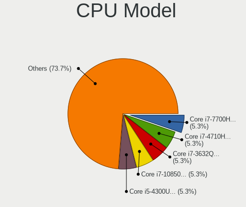
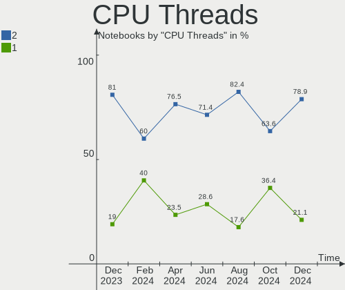
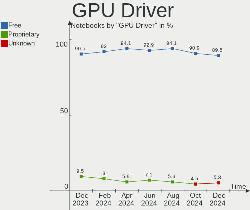
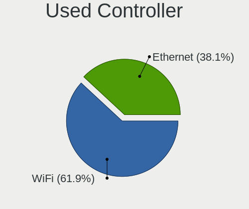
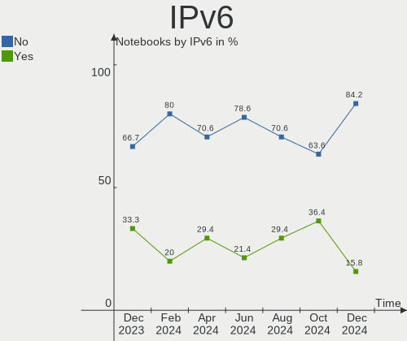
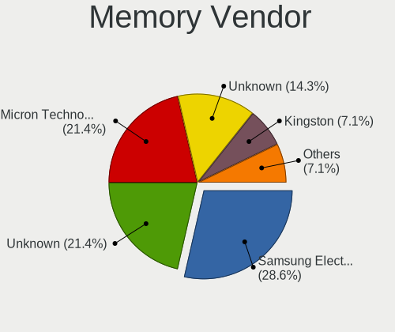

LMDE - Hardware Trends (Notebooks)
----------------------------------

A project to identify most popular hardware characteristics and track their change
over time based on data collected by Linux users at https://Linux-Hardware.org.

Anyone can contribute to this report by the [hw-probe](https://github.com/linuxhw/hw-probe) tool:

    sudo -E hw-probe -all -upload

This report is for one last month. Overall report since the beginning of time: [TestDays](https://github.com/linuxhw/TestDays)

Period: Apr, 2023.

Contents
--------

* [ System ](#system)
  - [ OS                       ](#os)
  - [ OS Family                ](#os-family)
  - [ Kernel                   ](#kernel)
  - [ Kernel Family            ](#kernel-family)
  - [ Kernel Major Ver.        ](#kernel-major-ver)
  - [ Arch                     ](#arch)
  - [ DE                       ](#de)
  - [ Display Server           ](#display-server)
  - [ Display Manager          ](#display-manager)
  - [ OS Lang                  ](#os-lang)
  - [ Boot Mode                ](#boot-mode)
  - [ Filesystem               ](#filesystem)
  - [ Part. scheme             ](#part-scheme)
  - [ Dual Boot with Linux/BSD ](#dual-boot-with-linuxbsd)
  - [ Dual Boot (Win)          ](#dual-boot-win)

* [ Board ](#board)
  - [ Vendor                   ](#vendor)
  - [ Model                    ](#model)
  - [ Model Family             ](#model-family)
  - [ MFG Year                 ](#mfg-year)
  - [ Form Factor              ](#form-factor)
  - [ Secure Boot              ](#secure-boot)
  - [ Coreboot                 ](#coreboot)
  - [ RAM Size                 ](#ram-size)
  - [ RAM Used                 ](#ram-used)
  - [ Total Drives             ](#total-drives)
  - [ Has CD-ROM               ](#has-cd-rom)
  - [ Has Ethernet             ](#has-ethernet)
  - [ Has WiFi                 ](#has-wifi)
  - [ Has Bluetooth            ](#has-bluetooth)

* [ Location ](#location)
  - [ Country                  ](#country)
  - [ City                     ](#city)

* [ Drives ](#drives)
  - [ Drive Vendor             ](#drive-vendor)
  - [ Drive Model              ](#drive-model)
  - [ HDD Vendor               ](#hdd-vendor)
  - [ SSD Vendor               ](#ssd-vendor)
  - [ Drive Kind               ](#drive-kind)
  - [ Drive Connector          ](#drive-connector)
  - [ Drive Size               ](#drive-size)
  - [ Space Total              ](#space-total)
  - [ Space Used               ](#space-used)
  - [ Malfunc. Drives          ](#malfunc-drives)
  - [ Malfunc. Drive Vendor    ](#malfunc-drive-vendor)
  - [ Malfunc. HDD Vendor      ](#malfunc-hdd-vendor)
  - [ Malfunc. Drive Kind      ](#malfunc-drive-kind)
  - [ Failed Drives            ](#failed-drives)
  - [ Failed Drive Vendor      ](#failed-drive-vendor)
  - [ Drive Status             ](#drive-status)

* [ Storage controller ](#storage-controller)
  - [ Storage Vendor           ](#storage-vendor)
  - [ Storage Model            ](#storage-model)
  - [ Storage Kind             ](#storage-kind)

* [ Processor ](#processor)
  - [ CPU Vendor               ](#cpu-vendor)
  - [ CPU Model                ](#cpu-model)
  - [ CPU Model Family         ](#cpu-model-family)
  - [ CPU Cores                ](#cpu-cores)
  - [ CPU Sockets              ](#cpu-sockets)
  - [ CPU Threads              ](#cpu-threads)
  - [ CPU Op-Modes             ](#cpu-op-modes)
  - [ CPU Microcode            ](#cpu-microcode)
  - [ CPU Microarch            ](#cpu-microarch)

* [ Graphics ](#graphics)
  - [ GPU Vendor               ](#gpu-vendor)
  - [ GPU Model                ](#gpu-model)
  - [ GPU Combo                ](#gpu-combo)
  - [ GPU Driver               ](#gpu-driver)
  - [ GPU Memory               ](#gpu-memory)

* [ Monitor ](#monitor)
  - [ Monitor Vendor           ](#monitor-vendor)
  - [ Monitor Model            ](#monitor-model)
  - [ Monitor Resolution       ](#monitor-resolution)
  - [ Monitor Diagonal         ](#monitor-diagonal)
  - [ Monitor Width            ](#monitor-width)
  - [ Aspect Ratio             ](#aspect-ratio)
  - [ Monitor Area             ](#monitor-area)
  - [ Pixel Density            ](#pixel-density)
  - [ Multiple Monitors        ](#multiple-monitors)

* [ Network ](#network)
  - [ Net Controller Vendor    ](#net-controller-vendor)
  - [ Net Controller Model     ](#net-controller-model)
  - [ Wireless Vendor          ](#wireless-vendor)
  - [ Wireless Model           ](#wireless-model)
  - [ Ethernet Vendor          ](#ethernet-vendor)
  - [ Ethernet Model           ](#ethernet-model)
  - [ Net Controller Kind      ](#net-controller-kind)
  - [ Used Controller          ](#used-controller)
  - [ NICs                     ](#nics)
  - [ IPv6                     ](#ipv6)

* [ Bluetooth ](#bluetooth)
  - [ Bluetooth Vendor         ](#bluetooth-vendor)
  - [ Bluetooth Model          ](#bluetooth-model)

* [ Sound ](#sound)
  - [ Sound Vendor             ](#sound-vendor)
  - [ Sound Model              ](#sound-model)

* [ Memory ](#memory)
  - [ Memory Vendor            ](#memory-vendor)
  - [ Memory Model             ](#memory-model)
  - [ Memory Kind              ](#memory-kind)
  - [ Memory Form Factor       ](#memory-form-factor)
  - [ Memory Size              ](#memory-size)
  - [ Memory Speed             ](#memory-speed)

* [ Printers & scanners ](#printers--scanners)
  - [ Printer Vendor           ](#printer-vendor)
  - [ Printer Model            ](#printer-model)
  - [ Scanner Vendor           ](#scanner-vendor)
  - [ Scanner Model            ](#scanner-model)

* [ Camera ](#camera)
  - [ Camera Vendor            ](#camera-vendor)
  - [ Camera Model             ](#camera-model)

* [ Security ](#security)
  - [ Fingerprint Vendor       ](#fingerprint-vendor)
  - [ Fingerprint Model        ](#fingerprint-model)
  - [ Chipcard Vendor          ](#chipcard-vendor)
  - [ Chipcard Model           ](#chipcard-model)

* [ Unsupported ](#unsupported)
  - [ Unsupported Devices      ](#unsupported-devices)
  - [ Unsupported Device Types ](#unsupported-device-types)

System
------

OS
--

Installed operating systems

| Name   | Notebooks | Percent |
|--------|-----------|---------|
| LMDE 5 | 20        | 100%    |

OS Family
---------

OS without a version

| Name | Notebooks | Percent |
|------|-----------|---------|
| LMDE | 20        | 100%    |

Kernel
------

Version of the Linux kernel

| Version                  | Notebooks | Percent |
|--------------------------|-----------|---------|
| 5.10.0-21-amd64          | 14        | 70%     |
| 5.10.0-12-amd64          | 4         | 20%     |
| 6.1.0-0.deb11.6-rt-amd64 | 1         | 5%      |
| 5.10.0-21-686            | 1         | 5%      |

Kernel Family
-------------

Linux kernel without a distro release

| Version | Notebooks | Percent |
|---------|-----------|---------|
| 5.10.0  | 19        | 95%     |
| 6.1.0   | 1         | 5%      |

Kernel Major Ver.
-----------------

Linux kernel major version

| Version | Notebooks | Percent |
|---------|-----------|---------|
| 5.10    | 19        | 95%     |
| 6.1     | 1         | 5%      |

Arch
----

OS architecture (x86_64, i586, etc.)

| Name   | Notebooks | Percent |
|--------|-----------|---------|
| x86_64 | 19        | 95%     |
| i686   | 1         | 5%      |

DE
--

Desktop Environment

| Name       | Notebooks | Percent |
|------------|-----------|---------|
| X-Cinnamon | 15        | 75%     |
| Cinnamon   | 5         | 25%     |

Display Server
--------------

X11 or Wayland

| Name | Notebooks | Percent |
|------|-----------|---------|
| X11  | 20        | 100%    |

Display Manager
---------------

SDDM, LightDM, etc.

| Name    | Notebooks | Percent |
|---------|-----------|---------|
| Unknown | 11        | 55%     |
| LightDM | 9         | 45%     |

OS Lang
-------

Language

| Lang  | Notebooks | Percent |
|-------|-----------|---------|
| en_US | 9         | 45%     |
| ru_RU | 2         | 10%     |
| pt_BR | 2         | 10%     |
| de_DE | 2         | 10%     |
| sv_SE | 1         | 5%      |
| sl_SI | 1         | 5%      |
| pl_PL | 1         | 5%      |
| es_ES | 1         | 5%      |
| es_CL | 1         | 5%      |

Boot Mode
---------

EFI or BIOS

| Mode | Notebooks | Percent |
|------|-----------|---------|
| EFI  | 15        | 75%     |
| BIOS | 5         | 25%     |

Filesystem
----------

Type of filesystem

| Type    | Notebooks | Percent |
|---------|-----------|---------|
| Ext4    | 18        | 90%     |
| Tmpfs   | 1         | 5%      |
| Overlay | 1         | 5%      |

Part. scheme
------------

Scheme of partitioning

| Type    | Notebooks | Percent |
|---------|-----------|---------|
| Unknown | 11        | 55%     |
| GPT     | 6         | 30%     |
| MBR     | 3         | 15%     |

Dual Boot with Linux/BSD
------------------------

Hosting more than one Linux/BSD

| Dual boot | Notebooks | Percent |
|-----------|-----------|---------|
| No        | 20        | 100%    |

Dual Boot (Win)
---------------

Hosting Linux and Windows

| Dual boot | Notebooks | Percent |
|-----------|-----------|---------|
| No        | 18        | 90%     |
| Yes       | 2         | 10%     |

Board
-----

Vendor
------

Motherboard manufacturer

| Name             | Notebooks | Percent |
|------------------|-----------|---------|
| Hewlett-Packard  | 3         | 15%     |
| Toshiba          | 2         | 10%     |
| Lenovo           | 2         | 10%     |
| Apple            | 2         | 10%     |
| Medion           | 1         | 5%      |
| LG Electronics   | 1         | 5%      |
| Kruger&Matz      | 1         | 5%      |
| Insyde           | 1         | 5%      |
| GPU Company      | 1         | 5%      |
| Gear             | 1         | 5%      |
| Fujitsu Siemens  | 1         | 5%      |
| Dell             | 1         | 5%      |
| ASUSTek Computer | 1         | 5%      |
| Acer             | 1         | 5%      |
| Unknown          | 1         | 5%      |

Model
-----

Motherboard model

| Name                                    | Notebooks | Percent |
|-----------------------------------------|-----------|---------|
| HP 250 G7 Notebook PC                   | 2         | 10%     |
| Toshiba Satellite L300D                 | 1         | 5%      |
| Toshiba Satellite C850-D8K              | 1         | 5%      |
| Medion E6214                            | 1         | 5%      |
| LG A530-T.BE76P1                        | 1         | 5%      |
| Lenovo ThinkPad X270 W10DG 20K5S3HG00   | 1         | 5%      |
| Lenovo ThinkPad T420 4180FP9            | 1         | 5%      |
| Kruger&Matz KM1406                      | 1         | 5%      |
| Insyde CherryTrail                      | 1         | 5%      |
| HP ZBook 15 G4                          | 1         | 5%      |
| GPU Company GWTN156-2BK                 | 1         | 5%      |
| Gear Geranium                           | 1         | 5%      |
| Fujitsu Siemens AMILO Pro Edition V3505 | 1         | 5%      |
| Dell Precision M4800                    | 1         | 5%      |
| ASUS Z550SA                             | 1         | 5%      |
| Apple MacBookPro9,2                     | 1         | 5%      |
| Apple MacBookPro11,1                    | 1         | 5%      |
| Acer Aspire A515-56                     | 1         | 5%      |
| Unknown                                 | 1         | 5%      |

Model Family
------------

Motherboard model prefix

| Name                    | Notebooks | Percent |
|-------------------------|-----------|---------|
| Toshiba Satellite       | 2         | 10%     |
| Lenovo ThinkPad         | 2         | 10%     |
| HP 250                  | 2         | 10%     |
| Medion E6214            | 1         | 5%      |
| LG A530-T.BE76P1        | 1         | 5%      |
| Kruger&Matz KM1406      | 1         | 5%      |
| Insyde CherryTrail      | 1         | 5%      |
| HP ZBook                | 1         | 5%      |
| GPU Company GWTN156-2BK | 1         | 5%      |
| Gear Geranium           | 1         | 5%      |
| Fujitsu Siemens AMILO   | 1         | 5%      |
| Dell Precision          | 1         | 5%      |
| ASUS Z550SA             | 1         | 5%      |
| Apple MacBookPro9       | 1         | 5%      |
| Apple MacBookPro11      | 1         | 5%      |
| Acer Aspire             | 1         | 5%      |
| Unknown                 | 1         | 5%      |

MFG Year
--------

Motherboard manufacture year

| Year | Notebooks | Percent |
|------|-----------|---------|
| 2021 | 2         | 10%     |
| 2020 | 2         | 10%     |
| 2018 | 2         | 10%     |
| 2017 | 2         | 10%     |
| 2016 | 2         | 10%     |
| 2013 | 2         | 10%     |
| 2011 | 2         | 10%     |
| 2023 | 1         | 5%      |
| 2014 | 1         | 5%      |
| 2012 | 1         | 5%      |
| 2010 | 1         | 5%      |
| 2008 | 1         | 5%      |
| 2006 | 1         | 5%      |

Form Factor
-----------

Physical design of the computer

| Name     | Notebooks | Percent |
|----------|-----------|---------|
| Notebook | 20        | 100%    |

Secure Boot
-----------

Enabled or disabled

| State    | Notebooks | Percent |
|----------|-----------|---------|
| Disabled | 20        | 100%    |

Coreboot
--------

Have coreboot on board

| Used | Notebooks | Percent |
|------|-----------|---------|
| No   | 20        | 100%    |

RAM Size
--------

Total RAM memory

| Size in GB  | Notebooks | Percent |
|-------------|-----------|---------|
| 4.01-8.0    | 6         | 30%     |
| 3.01-4.0    | 6         | 30%     |
| 16.01-24.0  | 3         | 15%     |
| 32.01-64.0  | 1         | 5%      |
| 64.01-256.0 | 1         | 5%      |
| 1.01-2.0    | 1         | 5%      |
| 8.01-16.0   | 1         | 5%      |
| 0.51-1.0    | 1         | 5%      |

RAM Used
--------

Used RAM memory

| Used GB  | Notebooks | Percent |
|----------|-----------|---------|
| 2.01-3.0 | 11        | 55%     |
| 1.01-2.0 | 5         | 25%     |
| 3.01-4.0 | 2         | 10%     |
| 4.01-8.0 | 1         | 5%      |
| 0.51-1.0 | 1         | 5%      |

Total Drives
------------

Number of drives on board

| Drives | Notebooks | Percent |
|--------|-----------|---------|
| 1      | 14        | 70%     |
| 2      | 5         | 25%     |
| 0      | 1         | 5%      |

Has CD-ROM
----------

Has CD-ROM on board

| Presented | Notebooks | Percent |
|-----------|-----------|---------|
| No        | 13        | 65%     |
| Yes       | 7         | 35%     |

Has Ethernet
------------

Has Ethernet on board

| Presented | Notebooks | Percent |
|-----------|-----------|---------|
| Yes       | 16        | 80%     |
| No        | 4         | 20%     |

Has WiFi
--------

Has WiFi module

| Presented | Notebooks | Percent |
|-----------|-----------|---------|
| Yes       | 19        | 95%     |
| No        | 1         | 5%      |

Has Bluetooth
-------------

Has Bluetooth module

| Presented | Notebooks | Percent |
|-----------|-----------|---------|
| Yes       | 12        | 60%     |
| No        | 8         | 40%     |

Location
--------

Country
-------

Geographic location (country)

| Country                | Notebooks | Percent |
|------------------------|-----------|---------|
| USA                    | 5         | 25%     |
| Russia                 | 2         | 10%     |
| Brazil                 | 2         | 10%     |
| UK                     | 1         | 5%      |
| Sweden                 | 1         | 5%      |
| Spain                  | 1         | 5%      |
| Slovenia               | 1         | 5%      |
| Poland                 | 1         | 5%      |
| Peru                   | 1         | 5%      |
| Netherlands            | 1         | 5%      |
| Italy                  | 1         | 5%      |
| Germany                | 1         | 5%      |
| Chile                  | 1         | 5%      |
| Bosnia and Herzegovina | 1         | 5%      |

City
----

Geographic location (city)

| City                | Notebooks | Percent |
|---------------------|-----------|---------|
| Segovia             | 1         | 5%      |
| Sarajevo            | 1         | 5%      |
| Santiago            | 1         | 5%      |
| Rio de Janeiro      | 1         | 5%      |
| Ponteranica         | 1         | 5%      |
| Ponte Alta do Norte | 1         | 5%      |
| Perm                | 1         | 5%      |
| Palatine            | 1         | 5%      |
| Oostburg            | 1         | 5%      |
| Njurundabommen      | 1         | 5%      |
| Mokronog            | 1         | 5%      |
| London              | 1         | 5%      |
| Lima                | 1         | 5%      |
| Krakow              | 1         | 5%      |
| Kemerovo            | 1         | 5%      |
| Crossville          | 1         | 5%      |
| Bristol             | 1         | 5%      |
| Boynton Beach       | 1         | 5%      |
| Baldwin             | 1         | 5%      |
| Alfeld              | 1         | 5%      |

Drives
------

Drive Vendor
------------

Hard drive vendors

| Vendor              | Notebooks | Drives | Percent |
|---------------------|-----------|--------|---------|
| Unknown             | 4         | 4      | 18.18%  |
| Samsung Electronics | 3         | 3      | 13.64%  |
| Kingston            | 2         | 2      | 9.09%   |
| WDC                 | 1         | 1      | 4.55%   |
| SK hynix            | 1         | 1      | 4.55%   |
| Seagate             | 1         | 1      | 4.55%   |
| SCCTS-603-001T      | 1         | 1      | 4.55%   |
| SanDisk             | 1         | 1      | 4.55%   |
| Phison Electronics  | 1         | 1      | 4.55%   |
| KODAK               | 1         | 1      | 4.55%   |
| KingSpec            | 1         | 1      | 4.55%   |
| Intenso             | 1         | 1      | 4.55%   |
| Fujitsu             | 1         | 1      | 4.55%   |
| Fanxiang            | 1         | 1      | 4.55%   |
| Apple               | 1         | 1      | 4.55%   |
| Unknown             | 1         | 1      | 4.55%   |

Drive Model
-----------

Hard drive models

| Model                                   | Notebooks | Percent |
|-----------------------------------------|-----------|---------|
| WDC WD5000LPCX-80VHAT0 500GB            | 1         | 4.55%   |
| Unknown SC128  128GB                    | 1         | 4.55%   |
| Unknown NCard  64GB                     | 1         | 4.55%   |
| Unknown MMC Card  7GB                   | 1         | 4.55%   |
| Unknown MMC Card  64GB                  | 1         | 4.55%   |
| SK hynix SC311 SATA 256GB SSD           | 1         | 4.55%   |
| Seagate ST98823AS 80GB                  | 1         | 4.55%   |
| SCCTS-603-001T SSD 1024GB               | 1         | 4.55%   |
| SanDisk X600 2.5 7MM SATA 256GB SSD     | 1         | 4.55%   |
| Samsung SSD 980 PRO 1TB                 | 1         | 4.55%   |
| Samsung SSD 870 EVO 500GB               | 1         | 4.55%   |
| Samsung MZVLQ256HAJD-000H1 256GB        | 1         | 4.55%   |
| Phison PS5013 E13 NVMe Controller 500GB | 1         | 4.55%   |
| KODAK SSD X100 480GB                    | 1         | 4.55%   |
| Kingston SV300S37A60G 64GB SSD          | 1         | 4.55%   |
| Kingston SNVS500G 500GB                 | 1         | 4.55%   |
| KingSpec MT-128 128GB                   | 1         | 4.55%   |
| Intenso SSD 256GB                       | 1         | 4.55%   |
| Fujitsu MHZ2160BH G2 160GB              | 1         | 4.55%   |
| Fanxiang S201 256GB                     | 1         | 4.55%   |
| Apple SSD SM0512F 500GB                 | 1         | 4.55%   |
| Unknown                                 | 1         | 4.55%   |

HDD Vendor
----------

Hard disk drive vendors

| Vendor  | Notebooks | Drives | Percent |
|---------|-----------|--------|---------|
| WDC     | 1         | 1      | 33.33%  |
| Seagate | 1         | 1      | 33.33%  |
| Fujitsu | 1         | 1      | 33.33%  |

SSD Vendor
----------

Solid state drive vendors

| Vendor              | Notebooks | Drives | Percent |
|---------------------|-----------|--------|---------|
| SK hynix            | 1         | 1      | 11.11%  |
| SCCTS-603-001T      | 1         | 1      | 11.11%  |
| SanDisk             | 1         | 1      | 11.11%  |
| Samsung Electronics | 1         | 1      | 11.11%  |
| KODAK               | 1         | 1      | 11.11%  |
| Kingston            | 1         | 1      | 11.11%  |
| KingSpec            | 1         | 1      | 11.11%  |
| Intenso             | 1         | 1      | 11.11%  |
| Apple               | 1         | 1      | 11.11%  |

Drive Kind
----------

HDD or SSD

| Kind    | Notebooks | Drives | Percent |
|---------|-----------|--------|---------|
| SSD     | 9         | 9      | 40.91%  |
| MMC     | 5         | 5      | 22.73%  |
| NVMe    | 4         | 4      | 18.18%  |
| HDD     | 3         | 3      | 13.64%  |
| Unknown | 1         | 1      | 4.55%   |

Drive Connector
---------------

SATA, SAS, NVMe, etc.

| Type | Notebooks | Drives | Percent |
|------|-----------|--------|---------|
| SATA | 13        | 13     | 59.09%  |
| MMC  | 5         | 5      | 22.73%  |
| NVMe | 4         | 4      | 18.18%  |

Drive Size
----------

Size of hard drive

| Size in TB | Notebooks | Drives | Percent |
|------------|-----------|--------|---------|
| 0.01-0.5   | 11        | 11     | 91.67%  |
| 1.01-2.0   | 1         | 1      | 8.33%   |

Space Total
-----------

Amount of disk space available on the file system

| Size in GB | Notebooks | Percent |
|------------|-----------|---------|
| 101-250    | 7         | 35%     |
| 251-500    | 6         | 30%     |
| 51-100     | 6         | 30%     |
| 1-20       | 1         | 5%      |

Space Used
----------

Amount of used disk space

| Used GB | Notebooks | Percent |
|---------|-----------|---------|
| 1-20    | 11        | 55%     |
| 21-50   | 5         | 25%     |
| 101-250 | 2         | 10%     |
| 51-100  | 2         | 10%     |

Malfunc. Drives
---------------

Drive models with a malfunction

| Model                               | Notebooks | Drives | Percent |
|-------------------------------------|-----------|--------|---------|
| Seagate ST98823AS 80GB              | 1         | 1      | 33.33%  |
| Samsung Electronics SSD 980 PRO 1TB | 1         | 1      | 33.33%  |
| Intenso SSD 256GB                   | 1         | 1      | 33.33%  |

Malfunc. Drive Vendor
---------------------

Vendors of faulty drives

| Vendor              | Notebooks | Drives | Percent |
|---------------------|-----------|--------|---------|
| Seagate             | 1         | 1      | 33.33%  |
| Samsung Electronics | 1         | 1      | 33.33%  |
| Intenso             | 1         | 1      | 33.33%  |

Malfunc. HDD Vendor
-------------------

Vendors of faulty HDD drives

| Vendor  | Notebooks | Drives | Percent |
|---------|-----------|--------|---------|
| Seagate | 1         | 1      | 100%    |

Malfunc. Drive Kind
-------------------

Kinds of faulty drives

| Kind | Notebooks | Drives | Percent |
|------|-----------|--------|---------|
| NVMe | 1         | 1      | 33.33%  |
| SSD  | 1         | 1      | 33.33%  |
| HDD  | 1         | 1      | 33.33%  |

Failed Drives
-------------

Failed drive models

Zero info for selected period =(

Failed Drive Vendor
-------------------

Failed drive vendors

Zero info for selected period =(

Drive Status
------------

Number of failed and malfunc. drives

| Status   | Notebooks | Drives | Percent |
|----------|-----------|--------|---------|
| Detected | 14        | 15     | 66.67%  |
| Works    | 4         | 4      | 19.05%  |
| Malfunc  | 3         | 3      | 14.29%  |

Storage controller
------------------

Storage Vendor
--------------

Storage controller vendors

| Vendor                      | Notebooks | Percent |
|-----------------------------|-----------|---------|
| Intel                       | 16        | 72.73%  |
| Samsung Electronics         | 3         | 13.64%  |
| Phison Electronics          | 1         | 4.55%   |
| Kingston Technology Company | 1         | 4.55%   |
| AMD                         | 1         | 4.55%   |

Storage Model
-------------

Storage controller models

| Model                                                                            | Notebooks | Percent |
|----------------------------------------------------------------------------------|-----------|---------|
| Intel 82801 Mobile SATA Controller [RAID mode]                                   | 3         | 12%     |
| Intel Celeron/Pentium Silver Processor SATA Controller                           | 2         | 8%      |
| Intel 7 Series Chipset Family 6-port SATA Controller [AHCI mode]                 | 2         | 8%      |
| Intel 6 Series/C200 Series Chipset Family 6 port Mobile SATA AHCI Controller     | 2         | 8%      |
| Samsung NVMe SSD Controller PM9A1/PM9A3/980PRO                                   | 1         | 4%      |
| Samsung NVMe SSD Controller 980                                                  | 1         | 4%      |
| Samsung Apple PCIe SSD                                                           | 1         | 4%      |
| Phison PS5013 E13 NVMe Controller                                                | 1         | 4%      |
| Kingston Company NVMe Controller                                                 | 1         | 4%      |
| Intel Volume Management Device NVMe RAID Controller                              | 1         | 4%      |
| Intel Tiger Lake-LP SATA Controller                                              | 1         | 4%      |
| Intel Sunrise Point-LP SATA Controller [AHCI mode]                               | 1         | 4%      |
| Intel Q170/Q150/B150/H170/H110/Z170/CM236 Chipset SATA Controller [AHCI Mode]    | 1         | 4%      |
| Intel Jasper Lake SATA AHCI Controller                                           | 1         | 4%      |
| Intel Atom/Celeron/Pentium Processor x5-E8000/J3xxx/N3xxx Series SATA Controller | 1         | 4%      |
| Intel 82801GBM/GHM (ICH7-M Family) SATA Controller [AHCI mode]                   | 1         | 4%      |
| Intel 82801G (ICH7 Family) IDE Controller                                        | 1         | 4%      |
| Intel 5 Series/3400 Series Chipset 4 port SATA AHCI Controller                   | 1         | 4%      |
| AMD SB600 Non-Raid-5 SATA                                                        | 1         | 4%      |
| AMD SB600 IDE                                                                    | 1         | 4%      |

Storage Kind
------------

Kind of storage controller (IDE, SATA, NVMe, SAS, ...)

| Kind | Notebooks | Percent |
|------|-----------|---------|
| SATA | 15        | 60%     |
| RAID | 4         | 16%     |
| NVMe | 4         | 16%     |
| IDE  | 2         | 8%      |

Processor
---------

CPU Vendor
----------

Processor vendors

| Vendor | Notebooks | Percent |
|--------|-----------|---------|
| Intel  | 18        | 90%     |
| AMD    | 2         | 10%     |

CPU Model
---------

Processor models

| Model                                      | Notebooks | Percent |
|--------------------------------------------|-----------|---------|
| Intel Pentium Silver N5030 CPU @ 1.10GHz   | 1         | 5%      |
| Intel Pentium CPU B950 @ 2.10GHz           | 1         | 5%      |
| Intel Genuine CPU T2050 @ 1.60GHz          | 1         | 5%      |
| Intel Core i7-7820HQ CPU @ 2.90GHz         | 1         | 5%      |
| Intel Core i7-4800MQ CPU @ 2.70GHz         | 1         | 5%      |
| Intel Core i7-4558U CPU @ 2.80GHz          | 1         | 5%      |
| Intel Core i7-2670QM CPU @ 2.20GHz         | 1         | 5%      |
| Intel Core i5-8265U CPU @ 1.60GHz          | 1         | 5%      |
| Intel Core i5-6200U CPU @ 2.30GHz          | 1         | 5%      |
| Intel Core i5-3210M CPU @ 2.50GHz          | 1         | 5%      |
| Intel Core i5-2540M CPU @ 2.60GHz          | 1         | 5%      |
| Intel Core i3-1005G1 CPU @ 1.20GHz         | 1         | 5%      |
| Intel Core i3 CPU M 330 @ 2.13GHz          | 1         | 5%      |
| Intel Celeron N5095A @ 2.00GHz             | 1         | 5%      |
| Intel Celeron N4000 CPU @ 1.10GHz          | 1         | 5%      |
| Intel Celeron CPU N3160 @ 1.60GHz          | 1         | 5%      |
| Intel Atom x5-Z8350 CPU @ 1.44GHz          | 1         | 5%      |
| Intel 11th Gen Core i3-1115G4 @ 3.00GHz    | 1         | 5%      |
| AMD Ryzen 5 4600H with Radeon Graphics     | 1         | 5%      |
| AMD Athlon 64 X2 Dual-Core Processor TK-57 | 1         | 5%      |

CPU Model Family
----------------

Processor model prefix

| Model                | Notebooks | Percent |
|----------------------|-----------|---------|
| Intel Core i7        | 4         | 20%     |
| Intel Core i5        | 4         | 20%     |
| Intel Celeron        | 3         | 15%     |
| Intel Core i3        | 2         | 10%     |
| Other                | 1         | 5%      |
| Intel Pentium Silver | 1         | 5%      |
| Intel Pentium        | 1         | 5%      |
| Intel Genuine        | 1         | 5%      |
| Intel Atom           | 1         | 5%      |
| AMD Ryzen 5          | 1         | 5%      |
| AMD Athlon 64 X2     | 1         | 5%      |

CPU Cores
---------

Number of processor cores

| Number | Notebooks | Percent |
|--------|-----------|---------|
| 2      | 11        | 55%     |
| 4      | 8         | 40%     |
| 6      | 1         | 5%      |

CPU Sockets
-----------

Number of sockets

| Number | Notebooks | Percent |
|--------|-----------|---------|
| 1      | 20        | 100%    |

CPU Threads
-----------

Threads per core (Hyper-Threading)

| Number | Notebooks | Percent |
|--------|-----------|---------|
| 2      | 11        | 55%     |
| 1      | 9         | 45%     |

CPU Op-Modes
------------

CPU Operation Modes (32-bit, 64-bit)

| Op mode        | Notebooks | Percent |
|----------------|-----------|---------|
| 32-bit, 64-bit | 19        | 95%     |
| 32-bit         | 1         | 5%      |

CPU Microcode
-------------

Microcode number

| Number     | Notebooks | Percent |
|------------|-----------|---------|
| 0x206a7    | 3         | 15%     |
| 0x406c4    | 2         | 10%     |
| 0x906e9    | 1         | 5%      |
| 0x906c0    | 1         | 5%      |
| 0x806ec    | 1         | 5%      |
| 0x806c1    | 1         | 5%      |
| 0x706e5    | 1         | 5%      |
| 0x706a8    | 1         | 5%      |
| 0x706a1    | 1         | 5%      |
| 0x6e8      | 1         | 5%      |
| 0x406e3    | 1         | 5%      |
| 0x40651    | 1         | 5%      |
| 0x306c3    | 1         | 5%      |
| 0x306a9    | 1         | 5%      |
| 0x20652    | 1         | 5%      |
| 0x08600103 | 1         | 5%      |
| Unknown    | 1         | 5%      |

CPU Microarch
-------------

Microarchitecture

| Name          | Notebooks | Percent |
|---------------|-----------|---------|
| SandyBridge   | 3         | 15%     |
| Silvermont    | 2         | 10%     |
| KabyLake      | 2         | 10%     |
| Haswell       | 2         | 10%     |
| Goldmont plus | 2         | 10%     |
| Zen 2         | 1         | 5%      |
| Westmere      | 1         | 5%      |
| Tremont       | 1         | 5%      |
| TigerLake     | 1         | 5%      |
| Skylake       | 1         | 5%      |
| P6            | 1         | 5%      |
| K8 Hammer     | 1         | 5%      |
| IvyBridge     | 1         | 5%      |
| IceLake       | 1         | 5%      |

Graphics
--------

GPU Vendor
----------

Vendors of graphics cards

| Vendor | Notebooks | Percent |
|--------|-----------|---------|
| Intel  | 18        | 75%     |
| Nvidia | 4         | 16.67%  |
| AMD    | 2         | 8.33%   |

GPU Model
---------

Graphics card models

| Model                                                                                    | Notebooks | Percent |
|------------------------------------------------------------------------------------------|-----------|---------|
| Intel 2nd Generation Core Processor Family Integrated Graphics Controller                | 3         | 12%     |
| Intel Atom/Celeron/Pentium Processor x5-E8000/J3xxx/N3xxx Integrated Graphics Controller | 2         | 8%      |
| Nvidia TU117M                                                                            | 1         | 4%      |
| Nvidia GM206GLM [Quadro M2200 Mobile]                                                    | 1         | 4%      |
| Nvidia GK107GLM [Quadro K1100M]                                                          | 1         | 4%      |
| Nvidia GF116M [GeForce GT 555M/635M]                                                     | 1         | 4%      |
| Intel WhiskeyLake-U GT2 [UHD Graphics 620]                                               | 1         | 4%      |
| Intel Tiger Lake-LP GT2 [UHD Graphics G4]                                                | 1         | 4%      |
| Intel Skylake GT2 [HD Graphics 520]                                                      | 1         | 4%      |
| Intel Mobile 945GM/GMS/GME, 943/940GML Express Integrated Graphics Controller            | 1         | 4%      |
| Intel Mobile 945GM/GMS, 943/940GML Express Integrated Graphics Controller                | 1         | 4%      |
| Intel JasperLake [UHD Graphics]                                                          | 1         | 4%      |
| Intel Iris Plus Graphics G1 (Ice Lake)                                                   | 1         | 4%      |
| Intel HD Graphics 630                                                                    | 1         | 4%      |
| Intel Haswell-ULT Integrated Graphics Controller                                         | 1         | 4%      |
| Intel GeminiLake [UHD Graphics 605]                                                      | 1         | 4%      |
| Intel GeminiLake [UHD Graphics 600]                                                      | 1         | 4%      |
| Intel Core Processor Integrated Graphics Controller                                      | 1         | 4%      |
| Intel 4th Gen Core Processor Integrated Graphics Controller                              | 1         | 4%      |
| Intel 3rd Gen Core processor Graphics Controller                                         | 1         | 4%      |
| AMD RS690M [Radeon Xpress 1200/1250/1270]                                                | 1         | 4%      |
| AMD Renoir                                                                               | 1         | 4%      |

GPU Combo
---------

Combinations of graphics cards

| Name           | Notebooks | Percent |
|----------------|-----------|---------|
| 1 x Intel      | 15        | 75%     |
| Intel + Nvidia | 3         | 15%     |
| AMD + Nvidia   | 1         | 5%      |
| 1 x AMD        | 1         | 5%      |

GPU Driver
----------

Free vs proprietary

| Driver      | Notebooks | Percent |
|-------------|-----------|---------|
| Free        | 16        | 80%     |
| Proprietary | 3         | 15%     |
| Unknown     | 1         | 5%      |

GPU Memory
----------

Total video memory

| Size in GB | Notebooks | Percent |
|------------|-----------|---------|
| Unknown    | 17        | 85%     |
| 0.01-0.5   | 2         | 10%     |
| 1.01-2.0   | 1         | 5%      |

Monitor
-------

Monitor Vendor
--------------

Monitor vendors

| Vendor         | Notebooks | Percent |
|----------------|-----------|---------|
| LG Display     | 5         | 26.32%  |
| AU Optronics   | 5         | 26.32%  |
| Chimei Innolux | 3         | 15.79%  |
| Apple          | 2         | 10.53%  |
| PANDA          | 1         | 5.26%   |
| Panasonic      | 1         | 5.26%   |
| CPT            | 1         | 5.26%   |
| BOE            | 1         | 5.26%   |

Monitor Model
-------------

Monitor models

| Model                                                            | Notebooks | Percent |
|------------------------------------------------------------------|-----------|---------|
| PANDA LCD Monitor NCP0036 1920x1080 344x194mm 15.5-inch          | 1         | 5.26%   |
| Panasonic VVY13F001G10 MEI96A2 1920x1080 344x193mm 15.5-inch     | 1         | 5.26%   |
| LG Display LCD Monitor LGD057E 1920x1080 344x194mm 15.5-inch     | 1         | 5.26%   |
| LG Display LCD Monitor LGD033A 1366x768 344x194mm 15.5-inch      | 1         | 5.26%   |
| LG Display LCD Monitor LGD032C 1920x1080 344x194mm 15.5-inch     | 1         | 5.26%   |
| LG Display LCD Monitor LGD02E2 1600x900 310x174mm 14.0-inch      | 1         | 5.26%   |
| LG Display LCD Monitor LGD02C6 1920x1080 345x194mm 15.6-inch     | 1         | 5.26%   |
| CPT LCD Monitor CPT13B0 1280x800 331x207mm 15.4-inch             | 1         | 5.26%   |
| Chimei Innolux LCD Monitor CMN15E7 1920x1080 344x193mm 15.5-inch | 1         | 5.26%   |
| Chimei Innolux LCD Monitor CMN15DB 1366x768 344x193mm 15.5-inch  | 1         | 5.26%   |
| Chimei Innolux LCD Monitor CMN15CA 1366x768 344x193mm 15.5-inch  | 1         | 5.26%   |
| BOE LCD Monitor BOE0718 1920x1080 309x173mm 13.9-inch            | 1         | 5.26%   |
| AU Optronics LCD Monitor AUO8174 1280x800 331x207mm 15.4-inch    | 1         | 5.26%   |
| AU Optronics LCD Monitor AUO515C 1366x768 256x144mm 11.6-inch    | 1         | 5.26%   |
| AU Optronics LCD Monitor AUO38ED 1920x1080 344x193mm 15.5-inch   | 1         | 5.26%   |
| AU Optronics LCD Monitor AUO32EC 1366x768 344x193mm 15.5-inch    | 1         | 5.26%   |
| AU Optronics LCD Monitor AUO106C 1366x768 277x156mm 12.5-inch    | 1         | 5.26%   |
| Apple Color LCD APPA020 2560x1600 286x179mm 13.3-inch            | 1         | 5.26%   |
| Apple Color LCD APP9CC7 1280x800 286x179mm 13.3-inch             | 1         | 5.26%   |

Monitor Resolution
------------------

Monitor screen resolution

| Resolution      | Notebooks | Percent |
|-----------------|-----------|---------|
| 1920x1080 (FHD) | 7         | 36.84%  |
| 1366x768 (WXGA) | 6         | 31.58%  |
| 1280x800 (WXGA) | 3         | 15.79%  |
| 3840x2160 (4K)  | 1         | 5.26%   |
| 2560x1600       | 1         | 5.26%   |
| 1600x900 (HD+)  | 1         | 5.26%   |

Monitor Diagonal
----------------

Diagonal size in inches

| Inches | Notebooks | Percent |
|--------|-----------|---------|
| 15     | 12        | 63.16%  |
| 13     | 3         | 15.79%  |
| 17     | 1         | 5.26%   |
| 14     | 1         | 5.26%   |
| 12     | 1         | 5.26%   |
| 11     | 1         | 5.26%   |

Monitor Width
-------------

Physical width

| Width in mm | Notebooks | Percent |
|-------------|-----------|---------|
| 301-350     | 14        | 73.68%  |
| 201-300     | 4         | 21.05%  |
| 351-400     | 1         | 5.26%   |

Aspect Ratio
------------

Proportional relationship between the width and the height

| Ratio | Notebooks | Percent |
|-------|-----------|---------|
| 16/9  | 15        | 78.95%  |
| 16/10 | 4         | 21.05%  |

Monitor Area
------------

Area in inch²

| Area in inch² | Notebooks | Percent |
|----------------|-----------|---------|
| 101-110        | 12        | 63.16%  |
| 81-90          | 3         | 15.79%  |
| 71-80          | 1         | 5.26%   |
| 61-70          | 1         | 5.26%   |
| 51-60          | 1         | 5.26%   |
| 121-130        | 1         | 5.26%   |

Pixel Density
-------------

Pixels per inch

| Density       | Notebooks | Percent |
|---------------|-----------|---------|
| 121-160       | 10        | 52.63%  |
| 101-120       | 5         | 26.32%  |
| 51-100        | 2         | 10.53%  |
| More than 240 | 1         | 5.26%   |
| 161-240       | 1         | 5.26%   |

Multiple Monitors
-----------------

Total monitors connected

| Total | Notebooks | Percent |
|-------|-----------|---------|
| 1     | 19        | 95%     |
| 0     | 1         | 5%      |

Network
-------

Net Controller Vendor
---------------------

Controller vendors

| Vendor                   | Notebooks | Percent |
|--------------------------|-----------|---------|
| Realtek Semiconductor    | 10        | 35.71%  |
| Intel                    | 9         | 32.14%  |
| Qualcomm Atheros         | 2         | 7.14%   |
| Broadcom Limited         | 2         | 7.14%   |
| Ralink                   | 1         | 3.57%   |
| MediaTek                 | 1         | 3.57%   |
| Marvell Technology Group | 1         | 3.57%   |
| Google                   | 1         | 3.57%   |
| Broadcom                 | 1         | 3.57%   |

Net Controller Model
--------------------

Controller models

| Model                                                             | Notebooks | Percent |
|-------------------------------------------------------------------|-----------|---------|
| Realtek RTL8111/8168/8411 PCI Express Gigabit Ethernet Controller | 4         | 11.11%  |
| Realtek RTL810xE PCI Express Fast Ethernet controller             | 3         | 8.33%   |
| Realtek RTL8821CE 802.11ac PCIe Wireless Network Adapter          | 2         | 5.56%   |
| Realtek RTL8723BE PCIe Wireless Network Adapter                   | 1         | 2.78%   |
| Realtek RTL8191SEvB Wireless LAN Controller                       | 1         | 2.78%   |
| Realtek RTL8187B Wireless Adapter                                 | 1         | 2.78%   |
| Realtek RTL8152 Fast Ethernet Adapter                             | 1         | 2.78%   |
| Realtek 802.11n WLAN Adapter                                      | 1         | 2.78%   |
| Ralink RT3090 Wireless 802.11n 1T/1R PCIe                         | 1         | 2.78%   |
| Qualcomm Atheros AR8151 v2.0 Gigabit Ethernet                     | 1         | 2.78%   |
| Qualcomm Atheros AR8131 Gigabit Ethernet                          | 1         | 2.78%   |
| MediaTek MT7921 802.11ax PCI Express Wireless Network Adapter     | 1         | 2.78%   |
| Marvell Group 88E8055 PCI-E Gigabit Ethernet Controller           | 1         | 2.78%   |
| Intel Wireless 8265 / 8275                                        | 1         | 2.78%   |
| Intel Wireless 8260                                               | 1         | 2.78%   |
| Intel Wireless 7265                                               | 1         | 2.78%   |
| Intel Wireless 3165                                               | 1         | 2.78%   |
| Intel Wi-Fi 6 AX210/AX211/AX411 160MHz                            | 1         | 2.78%   |
| Intel Wi-Fi 6 AX200                                               | 1         | 2.78%   |
| Intel PRO/Wireless 3945ABG [Golan] Network Connection             | 1         | 2.78%   |
| Intel Ethernet Connection I219-V                                  | 1         | 2.78%   |
| Intel Ethernet Connection I217-LM                                 | 1         | 2.78%   |
| Intel Ethernet Connection (2) I219-LM                             | 1         | 2.78%   |
| Intel Centrino Advanced-N 6205 [Taylor Peak]                      | 1         | 2.78%   |
| Intel 82579LM Gigabit Network Connection (Lewisville)             | 1         | 2.78%   |
| Google Pixel 7                                                    | 1         | 2.78%   |
| Broadcom NetXtreme BCM57765 Gigabit Ethernet PCIe                 | 1         | 2.78%   |
| Broadcom Limited BCM4360 802.11ac Wireless Network Adapter        | 1         | 2.78%   |
| Broadcom Limited BCM4352 802.11ac Wireless Network Adapter        | 1         | 2.78%   |
| Broadcom BCM4331 802.11a/b/g/n                                    | 1         | 2.78%   |

Wireless Vendor
---------------

Wireless vendors

| Vendor                | Notebooks | Percent |
|-----------------------|-----------|---------|
| Intel                 | 8         | 42.11%  |
| Realtek Semiconductor | 6         | 31.58%  |
| Broadcom Limited      | 2         | 10.53%  |
| Ralink                | 1         | 5.26%   |
| MediaTek              | 1         | 5.26%   |
| Broadcom              | 1         | 5.26%   |

Wireless Model
--------------

Wireless models

| Model                                                         | Notebooks | Percent |
|---------------------------------------------------------------|-----------|---------|
| Realtek RTL8821CE 802.11ac PCIe Wireless Network Adapter      | 2         | 10.53%  |
| Realtek RTL8723BE PCIe Wireless Network Adapter               | 1         | 5.26%   |
| Realtek RTL8191SEvB Wireless LAN Controller                   | 1         | 5.26%   |
| Realtek RTL8187B Wireless Adapter                             | 1         | 5.26%   |
| Realtek 802.11n WLAN Adapter                                  | 1         | 5.26%   |
| Ralink RT3090 Wireless 802.11n 1T/1R PCIe                     | 1         | 5.26%   |
| MediaTek MT7921 802.11ax PCI Express Wireless Network Adapter | 1         | 5.26%   |
| Intel Wireless 8265 / 8275                                    | 1         | 5.26%   |
| Intel Wireless 8260                                           | 1         | 5.26%   |
| Intel Wireless 7265                                           | 1         | 5.26%   |
| Intel Wireless 3165                                           | 1         | 5.26%   |
| Intel Wi-Fi 6 AX210/AX211/AX411 160MHz                        | 1         | 5.26%   |
| Intel Wi-Fi 6 AX200                                           | 1         | 5.26%   |
| Intel PRO/Wireless 3945ABG [Golan] Network Connection         | 1         | 5.26%   |
| Intel Centrino Advanced-N 6205 [Taylor Peak]                  | 1         | 5.26%   |
| Broadcom Limited BCM4360 802.11ac Wireless Network Adapter    | 1         | 5.26%   |
| Broadcom Limited BCM4352 802.11ac Wireless Network Adapter    | 1         | 5.26%   |
| Broadcom BCM4331 802.11a/b/g/n                                | 1         | 5.26%   |

Ethernet Vendor
---------------

Ethernet vendors

| Vendor                   | Notebooks | Percent |
|--------------------------|-----------|---------|
| Realtek Semiconductor    | 8         | 47.06%  |
| Intel                    | 4         | 23.53%  |
| Qualcomm Atheros         | 2         | 11.76%  |
| Marvell Technology Group | 1         | 5.88%   |
| Google                   | 1         | 5.88%   |
| Broadcom                 | 1         | 5.88%   |

Ethernet Model
--------------

Ethernet models

| Model                                                             | Notebooks | Percent |
|-------------------------------------------------------------------|-----------|---------|
| Realtek RTL8111/8168/8411 PCI Express Gigabit Ethernet Controller | 4         | 23.53%  |
| Realtek RTL810xE PCI Express Fast Ethernet controller             | 3         | 17.65%  |
| Realtek RTL8152 Fast Ethernet Adapter                             | 1         | 5.88%   |
| Qualcomm Atheros AR8151 v2.0 Gigabit Ethernet                     | 1         | 5.88%   |
| Qualcomm Atheros AR8131 Gigabit Ethernet                          | 1         | 5.88%   |
| Marvell Group 88E8055 PCI-E Gigabit Ethernet Controller           | 1         | 5.88%   |
| Intel Ethernet Connection I219-V                                  | 1         | 5.88%   |
| Intel Ethernet Connection I217-LM                                 | 1         | 5.88%   |
| Intel Ethernet Connection (2) I219-LM                             | 1         | 5.88%   |
| Intel 82579LM Gigabit Network Connection (Lewisville)             | 1         | 5.88%   |
| Google Pixel 7                                                    | 1         | 5.88%   |
| Broadcom NetXtreme BCM57765 Gigabit Ethernet PCIe                 | 1         | 5.88%   |

Net Controller Kind
-------------------

Ethernet, WiFi or modem

| Kind     | Notebooks | Percent |
|----------|-----------|---------|
| WiFi     | 19        | 54.29%  |
| Ethernet | 16        | 45.71%  |

Used Controller
---------------

Currently used network controller

| Kind     | Notebooks | Percent |
|----------|-----------|---------|
| WiFi     | 13        | 61.9%   |
| Ethernet | 8         | 38.1%   |

NICs
----

Total network controllers on board

| Total | Notebooks | Percent |
|-------|-----------|---------|
| 2     | 14        | 70%     |
| 1     | 4         | 20%     |
| 0     | 2         | 10%     |

IPv6
----

IPv6 vs IPv4

| Used | Notebooks | Percent |
|------|-----------|---------|
| No   | 13        | 65%     |
| Yes  | 7         | 35%     |

Bluetooth
---------

Bluetooth Vendor
----------------

Controller vendors

| Vendor                | Notebooks | Percent |
|-----------------------|-----------|---------|
| Intel                 | 4         | 33.33%  |
| Realtek Semiconductor | 2         | 16.67%  |
| Apple                 | 2         | 16.67%  |
| Lite-On Technology    | 1         | 8.33%   |
| Dell                  | 1         | 8.33%   |
| Broadcom              | 1         | 8.33%   |
| Askey Computer        | 1         | 8.33%   |

Bluetooth Model
---------------

Controller models

| Model                               | Notebooks | Percent |
|-------------------------------------|-----------|---------|
| Intel Bluetooth wireless interface  | 2         | 16.67%  |
| Realtek  Bluetooth 4.2 Adapter      | 1         | 8.33%   |
| Realtek Bluetooth Radio             | 1         | 8.33%   |
| Lite-On Wireless_Device             | 1         | 8.33%   |
| Intel AX210 Bluetooth               | 1         | 8.33%   |
| Intel AX200 Bluetooth               | 1         | 8.33%   |
| Dell Broadcom BCM20702A0 Bluetooth  | 1         | 8.33%   |
| Broadcom BCM2045B (BDC-2.1)         | 1         | 8.33%   |
| Askey Bluetooth Device              | 1         | 8.33%   |
| Apple Bluetooth USB Host Controller | 1         | 8.33%   |
| Apple Bluetooth Host Controller     | 1         | 8.33%   |

Sound
-----

Sound Vendor
------------

Sound card vendors

| Vendor            | Notebooks | Percent |
|-------------------|-----------|---------|
| Intel             | 17        | 70.83%  |
| Nvidia            | 4         | 16.67%  |
| AMD               | 2         | 8.33%   |
| Texas Instruments | 1         | 4.17%   |

Sound Model
-----------

Sound card models

| Model                                                                                             | Notebooks | Percent |
|---------------------------------------------------------------------------------------------------|-----------|---------|
| Intel Celeron/Pentium Silver Processor High Definition Audio                                      | 2         | 7.69%   |
| Intel 7 Series/C216 Chipset Family High Definition Audio Controller                               | 2         | 7.69%   |
| Intel 6 Series/C200 Series Chipset Family High Definition Audio Controller                        | 2         | 7.69%   |
| Texas Instruments Sabaj A4 AMP                                                                    | 1         | 3.85%   |
| Nvidia TU107 GeForce GTX 1650 High Definition Audio Controller                                    | 1         | 3.85%   |
| Nvidia GM206 High Definition Audio Controller                                                     | 1         | 3.85%   |
| Nvidia GK107 HDMI Audio Controller                                                                | 1         | 3.85%   |
| Nvidia GF116 High Definition Audio Controller                                                     | 1         | 3.85%   |
| Intel Xeon E3-1200 v3/4th Gen Core Processor HD Audio Controller                                  | 1         | 3.85%   |
| Intel Tiger Lake-LP Smart Sound Technology Audio Controller                                       | 1         | 3.85%   |
| Intel Sunrise Point-LP HD Audio                                                                   | 1         | 3.85%   |
| Intel NM10/ICH7 Family High Definition Audio Controller                                           | 1         | 3.85%   |
| Intel Jasper Lake HD Audio                                                                        | 1         | 3.85%   |
| Intel Ice Lake-LP Smart Sound Technology Audio Controller                                         | 1         | 3.85%   |
| Intel Haswell-ULT HD Audio Controller                                                             | 1         | 3.85%   |
| Intel CM238 HD Audio Controller                                                                   | 1         | 3.85%   |
| Intel Cannon Point-LP High Definition Audio Controller                                            | 1         | 3.85%   |
| Intel Atom/Celeron/Pentium Processor x5-E8000/J3xxx/N3xxx Series High Definition Audio Controller | 1         | 3.85%   |
| Intel 8 Series/C220 Series Chipset High Definition Audio Controller                               | 1         | 3.85%   |
| Intel 8 Series HD Audio Controller                                                                | 1         | 3.85%   |
| Intel 5 Series/3400 Series Chipset High Definition Audio                                          | 1         | 3.85%   |
| AMD SBx00 Azalia (Intel HDA)                                                                      | 1         | 3.85%   |
| AMD Family 17h/19h HD Audio Controller                                                            | 1         | 3.85%   |

Memory
------

Memory Vendor
-------------

Memory module vendors

| Vendor              | Notebooks | Percent |
|---------------------|-----------|---------|
| Samsung Electronics | 3         | 30%     |
| Unknown             | 2         | 20%     |
| SK hynix            | 2         | 20%     |
| Micron Technology   | 2         | 20%     |
| Corsair             | 1         | 10%     |

Memory Model
------------

Memory module models

| Model                                                  | Notebooks | Percent |
|--------------------------------------------------------|-----------|---------|
| Unknown RAM Module 512MB SODIMM DDR2                   | 1         | 10%     |
| Unknown RAM Module 2GB SODIMM DDR3 1600MT/s            | 1         | 10%     |
| SK hynix RAM Module 16GB SODIMM DDR4 2133MT/s          | 1         | 10%     |
| SK hynix RAM HMA851S6DJR6N-XN 4GB SODIMM DDR4 3200MT/s | 1         | 10%     |
| Samsung RAM M471B5673FH0-CF8 2GB SODIMM DDR3 1067MT/s  | 1         | 10%     |
| Samsung RAM M471A5244CB0-CWE 4GB SODIMM DDR4 3200MT/s  | 1         | 10%     |
| Samsung RAM M471A1K43CB1-CRC 8GB SODIMM DDR4 2667MT/s  | 1         | 10%     |
| Micron RAM 8ATF1G64HZ-2G6E1 8GB SODIMM DDR4 2667MT/s   | 1         | 10%     |
| Micron RAM 16KTF51264HZ-1G4M1 4GB SODIMM DDR3 1333MT/s | 1         | 10%     |
| Corsair RAM Module 4GB SODIMM DDR3 1333MT/s            | 1         | 10%     |

Memory Kind
-----------

Memory module kinds

| Kind | Notebooks | Percent |
|------|-----------|---------|
| DDR4 | 4         | 44.44%  |
| DDR3 | 4         | 44.44%  |
| DDR2 | 1         | 11.11%  |

Memory Form Factor
------------------

Physical design of the memory module

| Name   | Notebooks | Percent |
|--------|-----------|---------|
| SODIMM | 9         | 100%    |

Memory Size
-----------

Memory module size

| Size  | Notebooks | Percent |
|-------|-----------|---------|
| 4096  | 3         | 33.33%  |
| 8192  | 2         | 22.22%  |
| 2048  | 2         | 22.22%  |
| 16384 | 1         | 11.11%  |
| 512   | 1         | 11.11%  |

Memory Speed
------------

Memory module speed

| Speed   | Notebooks | Percent |
|---------|-----------|---------|
| 2667    | 2         | 22.22%  |
| 1333    | 2         | 22.22%  |
| 3200    | 1         | 11.11%  |
| 2133    | 1         | 11.11%  |
| 1600    | 1         | 11.11%  |
| 1067    | 1         | 11.11%  |
| Unknown | 1         | 11.11%  |

Printers & scanners
-------------------

Printer Vendor
--------------

Printer device vendors

Zero info for selected period =(

Printer Model
-------------

Printer device models

Zero info for selected period =(

Scanner Vendor
--------------

Scanner device vendors

Zero info for selected period =(

Scanner Model
-------------

Scanner device models

Zero info for selected period =(

Camera
------

Camera Vendor
-------------

Camera device vendors

| Vendor                                 | Notebooks | Percent |
|----------------------------------------|-----------|---------|
| Chicony Electronics                    | 6         | 42.86%  |
| Syntek                                 | 1         | 7.14%   |
| Sunplus Innovation Technology          | 1         | 7.14%   |
| Silicon Motion                         | 1         | 7.14%   |
| Quanta                                 | 1         | 7.14%   |
| Microdia                               | 1         | 7.14%   |
| IMC Networks                           | 1         | 7.14%   |
| Cheng Uei Precision Industry (Foxlink) | 1         | 7.14%   |
| Apple                                  | 1         | 7.14%   |

Camera Model
------------

Camera device models

| Model                                                          | Notebooks | Percent |
|----------------------------------------------------------------|-----------|---------|
| Chicony integrated camera                                      | 2         | 12.5%   |
| Syntek HD WebCam                                               | 1         | 6.25%   |
| Sunplus HD WebCam                                              | 1         | 6.25%   |
| Sunplus FHD Camera Microphone                                  | 1         | 6.25%   |
| Silicon Motion 300k Pixel Camera                               | 1         | 6.25%   |
| Quanta HP TrueVision HD Camera                                 | 1         | 6.25%   |
| Microdia Sonix USB 2.0 Camera                                  | 1         | 6.25%   |
| IMC Networks LG 3D R Webcam                                    | 1         | 6.25%   |
| IMC Networks LG 3D L Webcam                                    | 1         | 6.25%   |
| Chicony USB2.0 VGA UVC WebCam                                  | 1         | 6.25%   |
| Chicony HD Webcam                                              | 1         | 6.25%   |
| Chicony HD User Facing                                         | 1         | 6.25%   |
| Chicony Camera                                                 | 1         | 6.25%   |
| Cheng Uei Precision Industry (Foxlink) HP TrueVision HD Camera | 1         | 6.25%   |
| Apple FaceTime HD Camera                                       | 1         | 6.25%   |

Security
--------

Fingerprint Vendor
------------------

Fingerprint sensor vendors

| Vendor    | Notebooks | Percent |
|-----------|-----------|---------|
| Upek      | 1         | 50%     |
| AuthenTec | 1         | 50%     |

Fingerprint Model
-----------------

Fingerprint sensor models

| Model                                                  | Notebooks | Percent |
|--------------------------------------------------------|-----------|---------|
| Upek Biometric Touchchip/Touchstrip Fingerprint Sensor | 1         | 50%     |
| AuthenTec Fingerprint Sensor                           | 1         | 50%     |

Chipcard Vendor
---------------

Chipcard module vendors

Zero info for selected period =(

Chipcard Model
--------------

Chipcard module models

Zero info for selected period =(

Unsupported
-----------

Unsupported Devices
-------------------

Total unsupported devices on board

| Total | Notebooks | Percent |
|-------|-----------|---------|
| 0     | 13        | 65%     |
| 1     | 6         | 30%     |
| 2     | 1         | 5%      |

Unsupported Device Types
------------------------

Types of unsupported devices

| Type                  | Notebooks | Percent |
|-----------------------|-----------|---------|
| Net/wireless          | 3         | 33.33%  |
| Graphics card         | 2         | 22.22%  |
| Fingerprint reader    | 2         | 22.22%  |
| Multimedia controller | 1         | 11.11%  |
| Flash memory          | 1         | 11.11%  |

