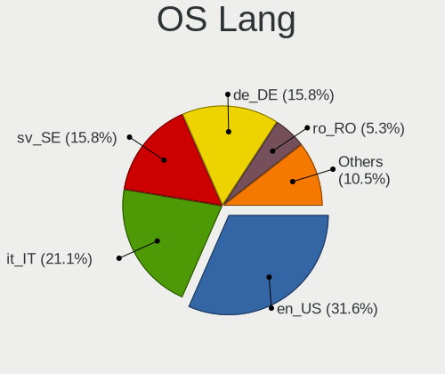
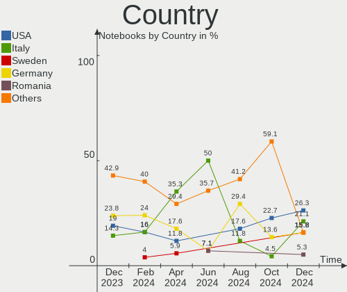
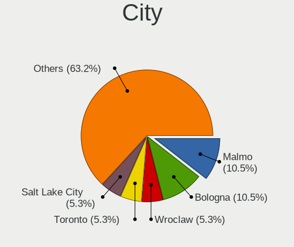
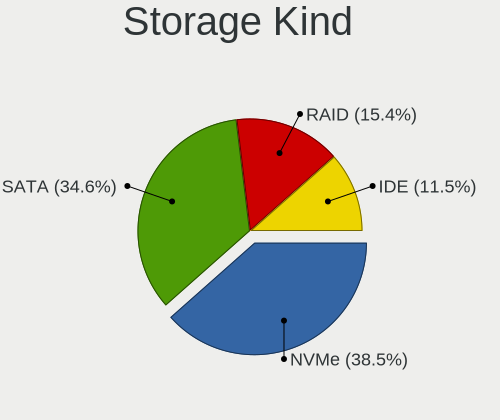
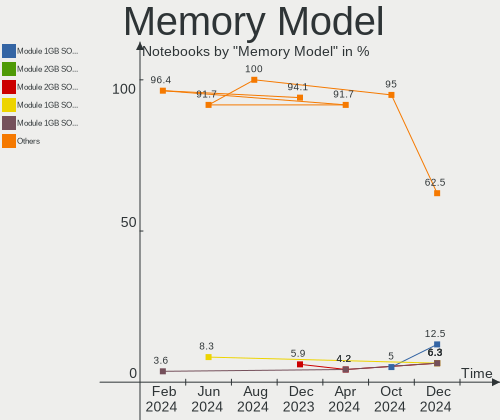

LMDE - Hardware Trends (Notebooks)
----------------------------------

A project to identify most popular hardware characteristics and track their change
over time based on data collected by Linux users at https://Linux-Hardware.org.

Anyone can contribute to this report by the [hw-probe](https://github.com/linuxhw/hw-probe) tool:

    sudo -E hw-probe -all -upload

This report is for one last month. Overall report since the beginning of time: [TestCoverage](https://github.com/linuxhw/TestCoverage)

Period: Oct, 2022.

Contents
--------

* [ System ](#system)
  - [ OS                       ](#os)
  - [ OS Family                ](#os-family)
  - [ Kernel                   ](#kernel)
  - [ Kernel Family            ](#kernel-family)
  - [ Kernel Major Ver.        ](#kernel-major-ver)
  - [ Arch                     ](#arch)
  - [ DE                       ](#de)
  - [ Display Server           ](#display-server)
  - [ Display Manager          ](#display-manager)
  - [ OS Lang                  ](#os-lang)
  - [ Boot Mode                ](#boot-mode)
  - [ Filesystem               ](#filesystem)
  - [ Part. scheme             ](#part-scheme)
  - [ Dual Boot with Linux/BSD ](#dual-boot-with-linuxbsd)
  - [ Dual Boot (Win)          ](#dual-boot-win)

* [ Board ](#board)
  - [ Vendor                   ](#vendor)
  - [ Model                    ](#model)
  - [ Model Family             ](#model-family)
  - [ MFG Year                 ](#mfg-year)
  - [ Form Factor              ](#form-factor)
  - [ Secure Boot              ](#secure-boot)
  - [ Coreboot                 ](#coreboot)
  - [ RAM Size                 ](#ram-size)
  - [ RAM Used                 ](#ram-used)
  - [ Total Drives             ](#total-drives)
  - [ Has CD-ROM               ](#has-cd-rom)
  - [ Has Ethernet             ](#has-ethernet)
  - [ Has WiFi                 ](#has-wifi)
  - [ Has Bluetooth            ](#has-bluetooth)

* [ Location ](#location)
  - [ Country                  ](#country)
  - [ City                     ](#city)

* [ Drives ](#drives)
  - [ Drive Vendor             ](#drive-vendor)
  - [ Drive Model              ](#drive-model)
  - [ HDD Vendor               ](#hdd-vendor)
  - [ SSD Vendor               ](#ssd-vendor)
  - [ Drive Kind               ](#drive-kind)
  - [ Drive Connector          ](#drive-connector)
  - [ Drive Size               ](#drive-size)
  - [ Space Total              ](#space-total)
  - [ Space Used               ](#space-used)
  - [ Malfunc. Drives          ](#malfunc-drives)
  - [ Malfunc. Drive Vendor    ](#malfunc-drive-vendor)
  - [ Malfunc. HDD Vendor      ](#malfunc-hdd-vendor)
  - [ Malfunc. Drive Kind      ](#malfunc-drive-kind)
  - [ Failed Drives            ](#failed-drives)
  - [ Failed Drive Vendor      ](#failed-drive-vendor)
  - [ Drive Status             ](#drive-status)

* [ Storage controller ](#storage-controller)
  - [ Storage Vendor           ](#storage-vendor)
  - [ Storage Model            ](#storage-model)
  - [ Storage Kind             ](#storage-kind)

* [ Processor ](#processor)
  - [ CPU Vendor               ](#cpu-vendor)
  - [ CPU Model                ](#cpu-model)
  - [ CPU Model Family         ](#cpu-model-family)
  - [ CPU Cores                ](#cpu-cores)
  - [ CPU Sockets              ](#cpu-sockets)
  - [ CPU Threads              ](#cpu-threads)
  - [ CPU Op-Modes             ](#cpu-op-modes)
  - [ CPU Microcode            ](#cpu-microcode)
  - [ CPU Microarch            ](#cpu-microarch)

* [ Graphics ](#graphics)
  - [ GPU Vendor               ](#gpu-vendor)
  - [ GPU Model                ](#gpu-model)
  - [ GPU Combo                ](#gpu-combo)
  - [ GPU Driver               ](#gpu-driver)
  - [ GPU Memory               ](#gpu-memory)

* [ Monitor ](#monitor)
  - [ Monitor Vendor           ](#monitor-vendor)
  - [ Monitor Model            ](#monitor-model)
  - [ Monitor Resolution       ](#monitor-resolution)
  - [ Monitor Diagonal         ](#monitor-diagonal)
  - [ Monitor Width            ](#monitor-width)
  - [ Aspect Ratio             ](#aspect-ratio)
  - [ Monitor Area             ](#monitor-area)
  - [ Pixel Density            ](#pixel-density)
  - [ Multiple Monitors        ](#multiple-monitors)

* [ Network ](#network)
  - [ Net Controller Vendor    ](#net-controller-vendor)
  - [ Net Controller Model     ](#net-controller-model)
  - [ Wireless Vendor          ](#wireless-vendor)
  - [ Wireless Model           ](#wireless-model)
  - [ Ethernet Vendor          ](#ethernet-vendor)
  - [ Ethernet Model           ](#ethernet-model)
  - [ Net Controller Kind      ](#net-controller-kind)
  - [ Used Controller          ](#used-controller)
  - [ NICs                     ](#nics)
  - [ IPv6                     ](#ipv6)

* [ Bluetooth ](#bluetooth)
  - [ Bluetooth Vendor         ](#bluetooth-vendor)
  - [ Bluetooth Model          ](#bluetooth-model)

* [ Sound ](#sound)
  - [ Sound Vendor             ](#sound-vendor)
  - [ Sound Model              ](#sound-model)

* [ Memory ](#memory)
  - [ Memory Vendor            ](#memory-vendor)
  - [ Memory Model             ](#memory-model)
  - [ Memory Kind              ](#memory-kind)
  - [ Memory Form Factor       ](#memory-form-factor)
  - [ Memory Size              ](#memory-size)
  - [ Memory Speed             ](#memory-speed)

* [ Printers & scanners ](#printers--scanners)
  - [ Printer Vendor           ](#printer-vendor)
  - [ Printer Model            ](#printer-model)
  - [ Scanner Vendor           ](#scanner-vendor)
  - [ Scanner Model            ](#scanner-model)

* [ Camera ](#camera)
  - [ Camera Vendor            ](#camera-vendor)
  - [ Camera Model             ](#camera-model)

* [ Security ](#security)
  - [ Fingerprint Vendor       ](#fingerprint-vendor)
  - [ Fingerprint Model        ](#fingerprint-model)
  - [ Chipcard Vendor          ](#chipcard-vendor)
  - [ Chipcard Model           ](#chipcard-model)

* [ Unsupported ](#unsupported)
  - [ Unsupported Devices      ](#unsupported-devices)
  - [ Unsupported Device Types ](#unsupported-device-types)

System
------

OS
--

Installed operating systems

| Name   | Notebooks | Percent |
|--------|-----------|---------|
| LMDE 5 | 17        | 94.44%  |
| LMDE 4 | 1         | 5.56%   |

OS Family
---------

OS without a version

| Name | Notebooks | Percent |
|------|-----------|---------|
| LMDE | 18        | 100%    |

Kernel
------

Version of the Linux kernel

| Version         | Notebooks | Percent |
|-----------------|-----------|---------|
| 5.10.0-18-amd64 | 8         | 44.44%  |
| 5.10.0-19-amd64 | 6         | 33.33%  |
| 5.10.0-12-amd64 | 2         | 11.11%  |
| 5.15.70-xanmod1 | 1         | 5.56%   |
| 5.15.64-xanmod1 | 1         | 5.56%   |

Kernel Family
-------------

Linux kernel without a distro release

| Version | Notebooks | Percent |
|---------|-----------|---------|
| 5.10.0  | 16        | 88.89%  |
| 5.15.70 | 1         | 5.56%   |
| 5.15.64 | 1         | 5.56%   |

Kernel Major Ver.
-----------------

Linux kernel major version

| Version | Notebooks | Percent |
|---------|-----------|---------|
| 5.10    | 16        | 88.89%  |
| 5.15    | 2         | 11.11%  |

Arch
----

OS architecture (x86_64, i586, etc.)

| Name   | Notebooks | Percent |
|--------|-----------|---------|
| x86_64 | 18        | 100%    |

DE
--

Desktop Environment

| Name       | Notebooks | Percent |
|------------|-----------|---------|
| X-Cinnamon | 16        | 88.89%  |
| XFCE       | 1         | 5.56%   |
| Cinnamon   | 1         | 5.56%   |

Display Server
--------------

X11 or Wayland

| Name | Notebooks | Percent |
|------|-----------|---------|
| X11  | 18        | 100%    |

Display Manager
---------------

SDDM, LightDM, etc.

| Name    | Notebooks | Percent |
|---------|-----------|---------|
| Unknown | 15        | 83.33%  |
| LightDM | 3         | 16.67%  |

OS Lang
-------

Language

| Lang  | Notebooks | Percent |
|-------|-----------|---------|
| ru_RU | 4         | 22.22%  |
| en_US | 4         | 22.22%  |
| es_ES | 2         | 11.11%  |
| de_DE | 2         | 11.11%  |
| pt_BR | 1         | 5.56%   |
| ko_KR | 1         | 5.56%   |
| it_IT | 1         | 5.56%   |
| en_IN | 1         | 5.56%   |
| da_DK | 1         | 5.56%   |
| cs_CZ | 1         | 5.56%   |

Boot Mode
---------

EFI or BIOS

| Mode | Notebooks | Percent |
|------|-----------|---------|
| EFI  | 12        | 66.67%  |
| BIOS | 6         | 33.33%  |

Filesystem
----------

Type of filesystem

| Type  | Notebooks | Percent |
|-------|-----------|---------|
| Ext4  | 15        | 83.33%  |
| Btrfs | 2         | 11.11%  |
| Tmpfs | 1         | 5.56%   |

Part. scheme
------------

Scheme of partitioning

| Type    | Notebooks | Percent |
|---------|-----------|---------|
| Unknown | 15        | 83.33%  |
| GPT     | 3         | 16.67%  |

Dual Boot with Linux/BSD
------------------------

Hosting more than one Linux/BSD

| Dual boot | Notebooks | Percent |
|-----------|-----------|---------|
| No        | 18        | 100%    |

Dual Boot (Win)
---------------

Hosting Linux and Windows

| Dual boot | Notebooks | Percent |
|-----------|-----------|---------|
| No        | 18        | 100%    |

Board
-----

Vendor
------

Motherboard manufacturer

| Name                | Notebooks | Percent |
|---------------------|-----------|---------|
| Lenovo              | 4         | 22.22%  |
| Hewlett-Packard     | 4         | 22.22%  |
| ASUSTek Computer    | 4         | 22.22%  |
| Dell                | 2         | 11.11%  |
| Toshiba             | 1         | 5.56%   |
| Sony                | 1         | 5.56%   |
| Samsung Electronics | 1         | 5.56%   |
| Unknown             | 1         | 5.56%   |

Model
-----

Motherboard model

| Name                                   | Notebooks | Percent |
|----------------------------------------|-----------|---------|
| Toshiba Satellite L855D                | 1         | 5.56%   |
| Sony SVF1532W4E                        | 1         | 5.56%   |
| Samsung 355V4C/356V4C/3445VC/3545VC    | 1         | 5.56%   |
| Lenovo Legion 5 Pro 16ACH6H 82JQ       | 1         | 5.56%   |
| Lenovo IdeaPad S340-15APITouch 81QG    | 1         | 5.56%   |
| Lenovo IdeaPad 320-15IKB 80XL          | 1         | 5.56%   |
| Lenovo IdeaPad 3 15ADA05 81W1          | 1         | 5.56%   |
| HP Pavilion dv6                        | 1         | 5.56%   |
| HP Laptop 15-dw3xxx                    | 1         | 5.56%   |
| HP Laptop 15-da0xxx                    | 1         | 5.56%   |
| HP Laptop 14-cf3xxx                    | 1         | 5.56%   |
| Dell XPS L701X                         | 1         | 5.56%   |
| Dell Inspiron 5420                     | 1         | 5.56%   |
| ASUS X510UQR                           | 1         | 5.56%   |
| ASUS VivoBook_ASUSLaptop X705FD_N705FD | 1         | 5.56%   |
| ASUS VivoBook_ASUSLaptop X571GT_X571GT | 1         | 5.56%   |
| ASUS K54LY                             | 1         | 5.56%   |
| Unknown                                | 1         | 5.56%   |

Model Family
------------

Motherboard model prefix

| Name              | Notebooks | Percent |
|-------------------|-----------|---------|
| Lenovo IdeaPad    | 3         | 16.67%  |
| HP Laptop         | 3         | 16.67%  |
| ASUS VivoBook     | 2         | 11.11%  |
| Toshiba Satellite | 1         | 5.56%   |
| Sony SVF1532W4E   | 1         | 5.56%   |
| Samsung 355V4C    | 1         | 5.56%   |
| Lenovo Legion     | 1         | 5.56%   |
| HP Pavilion       | 1         | 5.56%   |
| Dell XPS          | 1         | 5.56%   |
| Dell Inspiron     | 1         | 5.56%   |
| ASUS X510UQR      | 1         | 5.56%   |
| ASUS K54LY        | 1         | 5.56%   |
| Unknown           | 1         | 5.56%   |

MFG Year
--------

Motherboard manufacture year

| Year | Notebooks | Percent |
|------|-----------|---------|
| 2020 | 4         | 22.22%  |
| 2019 | 2         | 11.11%  |
| 2018 | 2         | 11.11%  |
| 2017 | 2         | 11.11%  |
| 2012 | 2         | 11.11%  |
| 2021 | 1         | 5.56%   |
| 2015 | 1         | 5.56%   |
| 2013 | 1         | 5.56%   |
| 2011 | 1         | 5.56%   |
| 2010 | 1         | 5.56%   |
| 2008 | 1         | 5.56%   |

Form Factor
-----------

Physical design of the computer

| Name     | Notebooks | Percent |
|----------|-----------|---------|
| Notebook | 18        | 100%    |

Secure Boot
-----------

Enabled or disabled

| State    | Notebooks | Percent |
|----------|-----------|---------|
| Disabled | 17        | 94.44%  |
| Enabled  | 1         | 5.56%   |

Coreboot
--------

Have coreboot on board

| Used | Notebooks | Percent |
|------|-----------|---------|
| No   | 18        | 100%    |

RAM Size
--------

Total RAM memory

| Size in GB | Notebooks | Percent |
|------------|-----------|---------|
| 4.01-8.0   | 5         | 27.78%  |
| 8.01-16.0  | 5         | 27.78%  |
| 16.01-24.0 | 4         | 22.22%  |
| 3.01-4.0   | 2         | 11.11%  |
| 32.01-64.0 | 1         | 5.56%   |
| 1.01-2.0   | 1         | 5.56%   |

RAM Used
--------

Used RAM memory

| Used GB  | Notebooks | Percent |
|----------|-----------|---------|
| 1.01-2.0 | 7         | 38.89%  |
| 2.01-3.0 | 5         | 27.78%  |
| 4.01-8.0 | 3         | 16.67%  |
| 3.01-4.0 | 3         | 16.67%  |

Total Drives
------------

Number of drives on board

| Drives | Notebooks | Percent |
|--------|-----------|---------|
| 1      | 12        | 66.67%  |
| 2      | 6         | 33.33%  |

Has CD-ROM
----------

Has CD-ROM on board

| Presented | Notebooks | Percent |
|-----------|-----------|---------|
| No        | 11        | 61.11%  |
| Yes       | 7         | 38.89%  |

Has Ethernet
------------

Has Ethernet on board

| Presented | Notebooks | Percent |
|-----------|-----------|---------|
| Yes       | 16        | 88.89%  |
| No        | 2         | 11.11%  |

Has WiFi
--------

Has WiFi module

| Presented | Notebooks | Percent |
|-----------|-----------|---------|
| Yes       | 18        | 100%    |

Has Bluetooth
-------------

Has Bluetooth module

| Presented | Notebooks | Percent |
|-----------|-----------|---------|
| Yes       | 15        | 83.33%  |
| No        | 3         | 16.67%  |

Location
--------

Country
-------

Geographic location (country)

| Country     | Notebooks | Percent |
|-------------|-----------|---------|
| Russia      | 4         | 22.22%  |
| Germany     | 2         | 11.11%  |
| Ecuador     | 2         | 11.11%  |
| USA         | 1         | 5.56%   |
| Sweden      | 1         | 5.56%   |
| South Korea | 1         | 5.56%   |
| Slovenia    | 1         | 5.56%   |
| Italy       | 1         | 5.56%   |
| India       | 1         | 5.56%   |
| Denmark     | 1         | 5.56%   |
| Czechia     | 1         | 5.56%   |
| Brazil      | 1         | 5.56%   |
| Belgium     | 1         | 5.56%   |

City
----

Geographic location (city)

| City                 | Notebooks | Percent |
|----------------------|-----------|---------|
| Moscow               | 2         | 11.11%  |
| Guayaquil            | 2         | 11.11%  |
| Viggianello          | 1         | 5.56%   |
| St Petersburg        | 1         | 5.56%   |
| Prague               | 1         | 5.56%   |
| Oberhausen           | 1         | 5.56%   |
| Nizhniy Novgorod     | 1         | 5.56%   |
| Malmo                | 1         | 5.56%   |
| Ljubljana            | 1         | 5.56%   |
| Juiz de Fora         | 1         | 5.56%   |
| Hyderabad            | 1         | 5.56%   |
| Freiburg im Breisgau | 1         | 5.56%   |
| Farciennes           | 1         | 5.56%   |
| Copenhagen           | 1         | 5.56%   |
| Buk-gu               | 1         | 5.56%   |
| Bend                 | 1         | 5.56%   |

Drives
------

Drive Vendor
------------

Hard drive vendors

| Vendor              | Notebooks | Drives | Percent |
|---------------------|-----------|--------|---------|
| WDC                 | 5         | 5      | 21.74%  |
| Seagate             | 5         | 5      | 21.74%  |
| SK hynix            | 3         | 3      | 13.04%  |
| Crucial             | 3         | 3      | 13.04%  |
| Sandisk             | 2         | 3      | 8.7%    |
| Union Memory        | 1         | 1      | 4.35%   |
| Toshiba             | 1         | 1      | 4.35%   |
| Micron Technology   | 1         | 1      | 4.35%   |
| Kingston            | 1         | 1      | 4.35%   |
| Gigabyte Technology | 1         | 1      | 4.35%   |

Drive Model
-----------

Hard drive models

| Model                                   | Notebooks | Percent |
|-----------------------------------------|-----------|---------|
| Seagate ST1000LM035-1RK172 1TB          | 5         | 20.83%  |
| WDC WDS240G2G0A-00JH30 240GB SSD        | 1         | 4.17%   |
| WDC WDS120G2G0B-00EPW0 120GB SSD        | 1         | 4.17%   |
| WDC WD5000LPVX-22V0TT0 500GB            | 1         | 4.17%   |
| WDC WD3200BEVT-60ZCT0 320GB             | 1         | 4.17%   |
| WDC PC SA530 SDASN8Y1T00 1024GB         | 1         | 4.17%   |
| Union Memory UMIS RPJTJ512MEE1OWX 512GB | 1         | 4.17%   |
| Toshiba MQ04ABF100 1TB                  | 1         | 4.17%   |
| SK hynix SKHynix_HFS001TDE9X084N 1TB    | 1         | 4.17%   |
| SK hynix HFM256GDJTNG-8310A 256GB       | 1         | 4.17%   |
| SK hynix BC711 HFM512GD3JX013N 512GB    | 1         | 4.17%   |
| Sandisk WD_BLACK SN750 SE 500GB         | 1         | 4.17%   |
| SanDisk Ultra II 480GB SSD              | 1         | 4.17%   |
| SanDisk NVMe SSD Drive 500GB            | 1         | 4.17%   |
| Micron 1100_MTFDDAV256TBN 256GB SSD     | 1         | 4.17%   |
| Kingston SA400S37480G 480GB SSD         | 1         | 4.17%   |
| Gigabyte GP-GSTFS31120GNTD 120GB        | 1         | 4.17%   |
| Crucial CT525MX300SSD1 528GB            | 1         | 4.17%   |
| Crucial CT1000MX500SSD1 1TB             | 1         | 4.17%   |
| Crucial CT1000BX500SSD1 1TB             | 1         | 4.17%   |

HDD Vendor
----------

Hard disk drive vendors

| Vendor  | Notebooks | Drives | Percent |
|---------|-----------|--------|---------|
| Seagate | 5         | 5      | 62.5%   |
| WDC     | 2         | 2      | 25%     |
| Toshiba | 1         | 1      | 12.5%   |

SSD Vendor
----------

Solid state drive vendors

| Vendor              | Notebooks | Drives | Percent |
|---------------------|-----------|--------|---------|
| Crucial             | 3         | 3      | 33.33%  |
| WDC                 | 2         | 2      | 22.22%  |
| SanDisk             | 1         | 1      | 11.11%  |
| Micron Technology   | 1         | 1      | 11.11%  |
| Kingston            | 1         | 1      | 11.11%  |
| Gigabyte Technology | 1         | 1      | 11.11%  |

Drive Kind
----------

HDD or SSD

| Kind    | Notebooks | Drives | Percent |
|---------|-----------|--------|---------|
| HDD     | 8         | 8      | 38.1%   |
| SSD     | 7         | 9      | 33.33%  |
| NVMe    | 5         | 6      | 23.81%  |
| Unknown | 1         | 1      | 4.76%   |

Drive Connector
---------------

SATA, SAS, NVMe, etc.

| Type | Notebooks | Drives | Percent |
|------|-----------|--------|---------|
| SATA | 15        | 18     | 75%     |
| NVMe | 5         | 6      | 25%     |

Drive Size
----------

Size of hard drive

| Size in TB | Notebooks | Drives | Percent |
|------------|-----------|--------|---------|
| 0.51-1.0   | 9         | 9      | 56.25%  |
| 0.01-0.5   | 7         | 8      | 43.75%  |

Space Total
-----------

Amount of disk space available on the file system

| Size in GB     | Notebooks | Percent |
|----------------|-----------|---------|
| 251-500        | 6         | 33.33%  |
| 501-1000       | 6         | 33.33%  |
| 1001-2000      | 2         | 11.11%  |
| More than 3000 | 1         | 5.56%   |
| 101-250        | 1         | 5.56%   |
| 1-20           | 1         | 5.56%   |
| 51-100         | 1         | 5.56%   |

Space Used
----------

Amount of used disk space

| Used GB  | Notebooks | Percent |
|----------|-----------|---------|
| 1-20     | 8         | 44.44%  |
| 21-50    | 4         | 22.22%  |
| 101-250  | 3         | 16.67%  |
| 501-1000 | 2         | 11.11%  |
| 251-500  | 1         | 5.56%   |

Malfunc. Drives
---------------

Drive models with a malfunction

Zero info for selected period =(

Malfunc. Drive Vendor
---------------------

Vendors of faulty drives

Zero info for selected period =(

Malfunc. HDD Vendor
-------------------

Vendors of faulty HDD drives

Zero info for selected period =(

Malfunc. Drive Kind
-------------------

Kinds of faulty drives

Zero info for selected period =(

Failed Drives
-------------

Failed drive models

Zero info for selected period =(

Failed Drive Vendor
-------------------

Failed drive vendors

Zero info for selected period =(

Drive Status
------------

Number of failed and malfunc. drives

| Status   | Notebooks | Drives | Percent |
|----------|-----------|--------|---------|
| Detected | 15        | 20     | 83.33%  |
| Works    | 3         | 4      | 16.67%  |

Storage controller
------------------

Storage Vendor
--------------

Storage controller vendors

| Vendor                  | Notebooks | Percent |
|-------------------------|-----------|---------|
| Intel                   | 12        | 54.55%  |
| AMD                     | 5         | 22.73%  |
| SK hynix                | 3         | 13.64%  |
| Union Memory (Shenzhen) | 1         | 4.55%   |
| SanDisk                 | 1         | 4.55%   |

Storage Model
-------------

Storage controller models

| Model                                                                        | Notebooks | Percent |
|------------------------------------------------------------------------------|-----------|---------|
| Intel 82801 Mobile SATA Controller [RAID mode]                               | 5         | 21.74%  |
| AMD FCH SATA Controller [AHCI mode]                                          | 4         | 17.39%  |
| SK hynix Gold P31 SSD                                                        | 2         | 8.7%    |
| Union Memory (Shenzhen) Non-Volatile memory controller                       | 1         | 4.35%   |
| SK hynix BC501 NVMe Solid State Drive                                        | 1         | 4.35%   |
| SanDisk Non-Volatile memory controller                                       | 1         | 4.35%   |
| Intel Volume Management Device NVMe RAID Controller                          | 1         | 4.35%   |
| Intel Tiger Lake-LP SATA Controller                                          | 1         | 4.35%   |
| Intel Sunrise Point-LP SATA Controller [AHCI mode]                           | 1         | 4.35%   |
| Intel Cannon Lake PCH SATA AHCI Controller                                   | 1         | 4.35%   |
| Intel 8 Series SATA Controller 1 [AHCI mode]                                 | 1         | 4.35%   |
| Intel 7 Series Chipset Family 6-port SATA Controller [AHCI mode]             | 1         | 4.35%   |
| Intel 6 Series/C200 Series Chipset Family 6 port Mobile SATA AHCI Controller | 1         | 4.35%   |
| Intel 5 Series/3400 Series Chipset 6 port SATA AHCI Controller               | 1         | 4.35%   |
| AMD SB7x0/SB8x0/SB9x0 SATA Controller [AHCI mode]                            | 1         | 4.35%   |

Storage Kind
------------

Kind of storage controller (IDE, SATA, NVMe, SAS, ...)

| Kind | Notebooks | Percent |
|------|-----------|---------|
| SATA | 12        | 52.17%  |
| RAID | 6         | 26.09%  |
| NVMe | 5         | 21.74%  |

Processor
---------

CPU Vendor
----------

Processor vendors

| Vendor | Notebooks | Percent |
|--------|-----------|---------|
| Intel  | 12        | 66.67%  |
| AMD    | 6         | 33.33%  |

CPU Model
---------

Processor models

| Model                                         | Notebooks | Percent |
|-----------------------------------------------|-----------|---------|
| Intel Core i9-9880H CPU @ 2.30GHz             | 1         | 5.56%   |
| Intel Core i7-9750H CPU @ 2.60GHz             | 1         | 5.56%   |
| Intel Core i7-8565U CPU @ 1.80GHz             | 1         | 5.56%   |
| Intel Core i7-8550U CPU @ 1.80GHz             | 1         | 5.56%   |
| Intel Core i7-3612QM CPU @ 2.10GHz            | 1         | 5.56%   |
| Intel Core i7 CPU Q 740 @ 1.73GHz             | 1         | 5.56%   |
| Intel Core i3-8130U CPU @ 2.20GHz             | 1         | 5.56%   |
| Intel Core i3-7100U CPU @ 2.40GHz             | 1         | 5.56%   |
| Intel Core i3-4005U CPU @ 1.70GHz             | 1         | 5.56%   |
| Intel Core i3-2310M CPU @ 2.10GHz             | 1         | 5.56%   |
| Intel Core i3-1005G1 CPU @ 1.20GHz            | 1         | 5.56%   |
| Intel 11th Gen Core i5-1135G7 @ 2.40GHz       | 1         | 5.56%   |
| AMD Ryzen 7 3700U with Radeon Vega Mobile Gfx | 1         | 5.56%   |
| AMD Ryzen 5 5600H with Radeon Graphics        | 1         | 5.56%   |
| AMD Ryzen 3 3250U with Radeon Graphics        | 1         | 5.56%   |
| AMD Athlon II P320 Dual-Core Processor        | 1         | 5.56%   |
| AMD A8-4500M APU with Radeon HD Graphics      | 1         | 5.56%   |
| AMD A10-4600M APU with Radeon HD Graphics     | 1         | 5.56%   |

CPU Model Family
----------------

Processor model prefix

| Model         | Notebooks | Percent |
|---------------|-----------|---------|
| Intel Core i7 | 5         | 27.78%  |
| Intel Core i3 | 5         | 27.78%  |
| Other         | 1         | 5.56%   |
| Intel Core i9 | 1         | 5.56%   |
| AMD Ryzen 7   | 1         | 5.56%   |
| AMD Ryzen 5   | 1         | 5.56%   |
| AMD Ryzen 3   | 1         | 5.56%   |
| AMD Athlon II | 1         | 5.56%   |
| AMD A8        | 1         | 5.56%   |
| AMD A10       | 1         | 5.56%   |

CPU Cores
---------

Number of processor cores

| Number | Notebooks | Percent |
|--------|-----------|---------|
| 2      | 9         | 50%     |
| 4      | 6         | 33.33%  |
| 6      | 2         | 11.11%  |
| 8      | 1         | 5.56%   |

CPU Sockets
-----------

Number of sockets

| Number | Notebooks | Percent |
|--------|-----------|---------|
| 1      | 18        | 100%    |

CPU Threads
-----------

Threads per core (Hyper-Threading)

| Number | Notebooks | Percent |
|--------|-----------|---------|
| 2      | 17        | 94.44%  |
| 1      | 1         | 5.56%   |

CPU Op-Modes
------------

CPU Operation Modes (32-bit, 64-bit)

| Op mode        | Notebooks | Percent |
|----------------|-----------|---------|
| 32-bit, 64-bit | 18        | 100%    |

CPU Microcode
-------------

Microcode number

| Number     | Notebooks | Percent |
|------------|-----------|---------|
| 0x806ea    | 2         | 11.11%  |
| 0x08108109 | 2         | 11.11%  |
| 0x06001119 | 2         | 11.11%  |
| 0x906ed    | 1         | 5.56%   |
| 0x906ea    | 1         | 5.56%   |
| 0x806eb    | 1         | 5.56%   |
| 0x806e9    | 1         | 5.56%   |
| 0x806c1    | 1         | 5.56%   |
| 0x706e5    | 1         | 5.56%   |
| 0x306a9    | 1         | 5.56%   |
| 0x206a7    | 1         | 5.56%   |
| 0x106e5    | 1         | 5.56%   |
| 0x0a50000c | 1         | 5.56%   |
| 0x010000c8 | 1         | 5.56%   |
| Unknown    | 1         | 5.56%   |

CPU Microarch
-------------

Microarchitecture

| Name        | Notebooks | Percent |
|-------------|-----------|---------|
| KabyLake    | 6         | 33.33%  |
| Zen+        | 2         | 11.11%  |
| Piledriver  | 2         | 11.11%  |
| Zen 3       | 1         | 5.56%   |
| TigerLake   | 1         | 5.56%   |
| SandyBridge | 1         | 5.56%   |
| Nehalem     | 1         | 5.56%   |
| K10         | 1         | 5.56%   |
| IvyBridge   | 1         | 5.56%   |
| IceLake     | 1         | 5.56%   |
| Haswell     | 1         | 5.56%   |

Graphics
--------

GPU Vendor
----------

Vendors of graphics cards

| Vendor | Notebooks | Percent |
|--------|-----------|---------|
| Nvidia | 10        | 38.46%  |
| Intel  | 10        | 38.46%  |
| AMD    | 6         | 23.08%  |

GPU Model
---------

Graphics card models

| Model                                                                | Notebooks | Percent |
|----------------------------------------------------------------------|-----------|---------|
| Nvidia TU117M [GeForce GTX 1650 Mobile / Max-Q]                      | 2         | 7.14%   |
| Nvidia GM108M [GeForce 940MX]                                        | 2         | 7.14%   |
| Intel UHD Graphics 620                                               | 2         | 7.14%   |
| Intel CoffeeLake-H GT2 [UHD Graphics 630]                            | 2         | 7.14%   |
| AMD Picasso/Raven 2 [Radeon Vega Series / Radeon Vega Mobile Series] | 2         | 7.14%   |
| Nvidia TU117M [GeForce MX450]                                        | 1         | 3.57%   |
| Nvidia GP107M [GeForce GTX 1050 Mobile]                              | 1         | 3.57%   |
| Nvidia GK208M [GeForce GT 740M]                                      | 1         | 3.57%   |
| Nvidia GF108M [GeForce GT 620M/630M/635M/640M LE]                    | 1         | 3.57%   |
| Nvidia GF106M [GeForce GT 445M]                                      | 1         | 3.57%   |
| Nvidia GA106M [GeForce RTX 3060 Mobile / Max-Q]                      | 1         | 3.57%   |
| Intel WhiskeyLake-U GT2 [UHD Graphics 620]                           | 1         | 3.57%   |
| Intel TigerLake-LP GT2 [Iris Xe Graphics]                            | 1         | 3.57%   |
| Intel Iris Plus Graphics G1 (Ice Lake)                               | 1         | 3.57%   |
| Intel HD Graphics 620                                                | 1         | 3.57%   |
| Intel Haswell-ULT Integrated Graphics Controller                     | 1         | 3.57%   |
| Intel 3rd Gen Core processor Graphics Controller                     | 1         | 3.57%   |
| AMD Trinity [Radeon HD 7660G]                                        | 1         | 3.57%   |
| AMD Trinity [Radeon HD 7640G]                                        | 1         | 3.57%   |
| AMD Thames [Radeon HD 7500M/7600M Series]                            | 1         | 3.57%   |
| AMD Seymour [Radeon HD 6400M/7400M Series]                           | 1         | 3.57%   |
| AMD RS880M [Mobility Radeon HD 4225/4250]                            | 1         | 3.57%   |
| AMD Madison [Mobility Radeon HD 5650/5750 / 6530M/6550M]             | 1         | 3.57%   |

GPU Combo
---------

Combinations of graphics cards

| Name           | Notebooks | Percent |
|----------------|-----------|---------|
| Intel + Nvidia | 8         | 44.44%  |
| 1 x AMD        | 4         | 22.22%  |
| 2 x AMD        | 2         | 11.11%  |
| 1 x Nvidia     | 2         | 11.11%  |
| 1 x Intel      | 2         | 11.11%  |

GPU Driver
----------

Free vs proprietary

| Driver      | Notebooks | Percent |
|-------------|-----------|---------|
| Free        | 13        | 72.22%  |
| Proprietary | 4         | 22.22%  |
| Unknown     | 1         | 5.56%   |

GPU Memory
----------

Total video memory

| Size in GB | Notebooks | Percent |
|------------|-----------|---------|
| Unknown    | 7         | 38.89%  |
| 0.01-0.5   | 4         | 22.22%  |
| 1.01-2.0   | 3         | 16.67%  |
| 0.51-1.0   | 2         | 11.11%  |
| 3.01-4.0   | 1         | 5.56%   |
| 2.01-3.0   | 1         | 5.56%   |

Monitor
-------

Monitor Vendor
--------------

Monitor vendors

| Vendor                  | Notebooks | Percent |
|-------------------------|-----------|---------|
| LG Display              | 5         | 26.32%  |
| AU Optronics            | 4         | 21.05%  |
| Samsung Electronics     | 2         | 10.53%  |
| Goldstar                | 2         | 10.53%  |
| Chimei Innolux          | 2         | 10.53%  |
| BOE                     | 2         | 10.53%  |
| Vestel Elektronik       | 1         | 5.26%   |
| Chi Mei Optoelectronics | 1         | 5.26%   |

Monitor Model
-------------

Monitor models

| Model                                                                  | Notebooks | Percent |
|------------------------------------------------------------------------|-----------|---------|
| Vestel Elektronik 50UHD_LCD_TV VES3700 3840x2160 1872x1053mm 84.6-inch | 1         | 5.26%   |
| Samsung Electronics SyncMaster SAM01B7 1280x1024 340x270mm 17.1-inch   | 1         | 5.26%   |
| Samsung Electronics LCD Monitor SEC3150 1366x768 344x193mm 15.5-inch   | 1         | 5.26%   |
| LG Display LCD Monitor LGD0573 1920x1080 344x194mm 15.5-inch           | 1         | 5.26%   |
| LG Display LCD Monitor LGD0563 1920x1080 344x194mm 15.5-inch           | 1         | 5.26%   |
| LG Display LCD Monitor LGD04E8 1920x1080 382x215mm 17.3-inch           | 1         | 5.26%   |
| LG Display LCD Monitor LGD02F2 1366x768 344x194mm 15.5-inch            | 1         | 5.26%   |
| LG Display LCD Monitor LGD02AC 1366x768 344x194mm 15.5-inch            | 1         | 5.26%   |
| Goldstar W2486 GSM5729 1920x1080 531x299mm 24.0-inch                   | 1         | 5.26%   |
| Goldstar M2380A GSM57EE 1920x1080 509x286mm 23.0-inch                  | 1         | 5.26%   |
| Chimei Innolux LCD Monitor CMN15DB 1366x768 344x193mm 15.5-inch        | 1         | 5.26%   |
| Chimei Innolux LCD Monitor CMN15BF 1366x768 344x193mm 15.5-inch        | 1         | 5.26%   |
| Chi Mei Optoelectronics LCD Monitor 1600x900                           | 1         | 5.26%   |
| BOE LCD Monitor BOE07B5 1366x768 309x173mm 13.9-inch                   | 1         | 5.26%   |
| BOE LCD Monitor BOE06A5 1366x768 344x194mm 15.5-inch                   | 1         | 5.26%   |
| AU Optronics LCD Monitor AUO61ED 1920x1080 344x194mm 15.5-inch         | 1         | 5.26%   |
| AU Optronics LCD Monitor AUO3691 1366x768 344x193mm 15.5-inch          | 1         | 5.26%   |
| AU Optronics LCD Monitor AUO303C 1366x768 309x173mm 13.9-inch          | 1         | 5.26%   |
| AU Optronics LCD Monitor AUO20ED 1920x1080 344x194mm 15.5-inch         | 1         | 5.26%   |

Monitor Resolution
------------------

Monitor screen resolution

| Resolution       | Notebooks | Percent |
|------------------|-----------|---------|
| 1366x768 (WXGA)  | 9         | 47.37%  |
| 1920x1080 (FHD)  | 7         | 36.84%  |
| 3840x2160 (4K)   | 1         | 5.26%   |
| 1600x900 (HD+)   | 1         | 5.26%   |
| 1280x1024 (SXGA) | 1         | 5.26%   |

Monitor Diagonal
----------------

Diagonal size in inches

| Inches  | Notebooks | Percent |
|---------|-----------|---------|
| 15      | 11        | 57.89%  |
| 17      | 2         | 10.53%  |
| 13      | 2         | 10.53%  |
| 84      | 1         | 5.26%   |
| 24      | 1         | 5.26%   |
| 23      | 1         | 5.26%   |
| Unknown | 1         | 5.26%   |

Monitor Width
-------------

Physical width

| Width in mm | Notebooks | Percent |
|-------------|-----------|---------|
| 301-350     | 13        | 72.22%  |
| 501-600     | 2         | 11.11%  |
| 351-400     | 1         | 5.56%   |
| 1501-2000   | 1         | 5.56%   |
| Unknown     | 1         | 5.56%   |

Aspect Ratio
------------

Proportional relationship between the width and the height

| Ratio   | Notebooks | Percent |
|---------|-----------|---------|
| 16/9    | 16        | 88.89%  |
| 5/4     | 1         | 5.56%   |
| Unknown | 1         | 5.56%   |

Monitor Area
------------

Area in inch²

| Area in inch² | Notebooks | Percent |
|----------------|-----------|---------|
| 101-110        | 11        | 57.89%  |
| 81-90          | 2         | 10.53%  |
| 201-250        | 2         | 10.53%  |
| More than 1000 | 1         | 5.26%   |
| 141-150        | 1         | 5.26%   |
| 121-130        | 1         | 5.26%   |
| Unknown        | 1         | 5.26%   |

Pixel Density
-------------

Pixels per inch

| Density | Notebooks | Percent |
|---------|-----------|---------|
| 101-120 | 9         | 47.37%  |
| 121-160 | 5         | 26.32%  |
| 51-100  | 4         | 21.05%  |
| Unknown | 1         | 5.26%   |

Multiple Monitors
-----------------

Total monitors connected

| Total | Notebooks | Percent |
|-------|-----------|---------|
| 1     | 15        | 83.33%  |
| 2     | 2         | 11.11%  |
| 0     | 1         | 5.56%   |

Network
-------

Net Controller Vendor
---------------------

Controller vendors

| Vendor                | Notebooks | Percent |
|-----------------------|-----------|---------|
| Realtek Semiconductor | 15        | 57.69%  |
| Intel                 | 5         | 19.23%  |
| Qualcomm Atheros      | 4         | 15.38%  |
| Broadcom              | 2         | 7.69%   |

Net Controller Model
--------------------

Controller models

| Model                                                             | Notebooks | Percent |
|-------------------------------------------------------------------|-----------|---------|
| Realtek RTL8111/8168/8411 PCI Express Gigabit Ethernet Controller | 12        | 34.29%  |
| Realtek RTL8822CE 802.11ac PCIe Wireless Network Adapter          | 2         | 5.71%   |
| Realtek RTL8821CE 802.11ac PCIe Wireless Network Adapter          | 2         | 5.71%   |
| Qualcomm Atheros AR8162 Fast Ethernet                             | 2         | 5.71%   |
| Realtek RTL8852AE 802.11ax PCIe Wireless Network Adapter          | 1         | 2.86%   |
| Realtek RTL8822BE 802.11a/b/g/n/ac WiFi adapter                   | 1         | 2.86%   |
| Realtek RTL8821AE 802.11ac PCIe Wireless Network Adapter          | 1         | 2.86%   |
| Realtek RTL8723DE Wireless Network Adapter                        | 1         | 2.86%   |
| Realtek RTL8723BU 802.11b/g/n WLAN Adapter                        | 1         | 2.86%   |
| Realtek RTL8188CE 802.11b/g/n WiFi Adapter                        | 1         | 2.86%   |
| Realtek RTL8153 Gigabit Ethernet Adapter                          | 1         | 2.86%   |
| Qualcomm Atheros AR9462 Wireless Network Adapter                  | 1         | 2.86%   |
| Qualcomm Atheros AR9285 Wireless Network Adapter (PCI-Express)    | 1         | 2.86%   |
| Qualcomm Atheros AR8151 v2.0 Gigabit Ethernet                     | 1         | 2.86%   |
| Intel Wireless 8265 / 8275                                        | 1         | 2.86%   |
| Intel Centrino Wireless-N 1000 [Condor Peak]                      | 1         | 2.86%   |
| Intel Centrino Advanced-N 6230 [Rainbow Peak]                     | 1         | 2.86%   |
| Intel Cannon Point-LP CNVi [Wireless-AC]                          | 1         | 2.86%   |
| Intel Cannon Lake PCH CNVi WiFi                                   | 1         | 2.86%   |
| Broadcom BCM43142 802.11b/g/n                                     | 1         | 2.86%   |
| Broadcom BCM4313 802.11bgn Wireless Network Adapter               | 1         | 2.86%   |

Wireless Vendor
---------------

Wireless vendors

| Vendor                | Notebooks | Percent |
|-----------------------|-----------|---------|
| Realtek Semiconductor | 9         | 50%     |
| Intel                 | 5         | 27.78%  |
| Qualcomm Atheros      | 2         | 11.11%  |
| Broadcom              | 2         | 11.11%  |

Wireless Model
--------------

Wireless models

| Model                                                          | Notebooks | Percent |
|----------------------------------------------------------------|-----------|---------|
| Realtek RTL8822CE 802.11ac PCIe Wireless Network Adapter       | 2         | 10.53%  |
| Realtek RTL8821CE 802.11ac PCIe Wireless Network Adapter       | 2         | 10.53%  |
| Realtek RTL8852AE 802.11ax PCIe Wireless Network Adapter       | 1         | 5.26%   |
| Realtek RTL8822BE 802.11a/b/g/n/ac WiFi adapter                | 1         | 5.26%   |
| Realtek RTL8821AE 802.11ac PCIe Wireless Network Adapter       | 1         | 5.26%   |
| Realtek RTL8723DE Wireless Network Adapter                     | 1         | 5.26%   |
| Realtek RTL8723BU 802.11b/g/n WLAN Adapter                     | 1         | 5.26%   |
| Realtek RTL8188CE 802.11b/g/n WiFi Adapter                     | 1         | 5.26%   |
| Qualcomm Atheros AR9462 Wireless Network Adapter               | 1         | 5.26%   |
| Qualcomm Atheros AR9285 Wireless Network Adapter (PCI-Express) | 1         | 5.26%   |
| Intel Wireless 8265 / 8275                                     | 1         | 5.26%   |
| Intel Centrino Wireless-N 1000 [Condor Peak]                   | 1         | 5.26%   |
| Intel Centrino Advanced-N 6230 [Rainbow Peak]                  | 1         | 5.26%   |
| Intel Cannon Point-LP CNVi [Wireless-AC]                       | 1         | 5.26%   |
| Intel Cannon Lake PCH CNVi WiFi                                | 1         | 5.26%   |
| Broadcom BCM43142 802.11b/g/n                                  | 1         | 5.26%   |
| Broadcom BCM4313 802.11bgn Wireless Network Adapter            | 1         | 5.26%   |

Ethernet Vendor
---------------

Ethernet vendors

| Vendor                | Notebooks | Percent |
|-----------------------|-----------|---------|
| Realtek Semiconductor | 13        | 81.25%  |
| Qualcomm Atheros      | 3         | 18.75%  |

Ethernet Model
--------------

Ethernet models

| Model                                                             | Notebooks | Percent |
|-------------------------------------------------------------------|-----------|---------|
| Realtek RTL8111/8168/8411 PCI Express Gigabit Ethernet Controller | 12        | 75%     |
| Qualcomm Atheros AR8162 Fast Ethernet                             | 2         | 12.5%   |
| Realtek RTL8153 Gigabit Ethernet Adapter                          | 1         | 6.25%   |
| Qualcomm Atheros AR8151 v2.0 Gigabit Ethernet                     | 1         | 6.25%   |

Net Controller Kind
-------------------

Ethernet, WiFi or modem

| Kind     | Notebooks | Percent |
|----------|-----------|---------|
| WiFi     | 18        | 52.94%  |
| Ethernet | 16        | 47.06%  |

Used Controller
---------------

Currently used network controller

| Kind     | Notebooks | Percent |
|----------|-----------|---------|
| WiFi     | 15        | 78.95%  |
| Ethernet | 4         | 21.05%  |

NICs
----

Total network controllers on board

| Total | Notebooks | Percent |
|-------|-----------|---------|
| 2     | 15        | 83.33%  |
| 1     | 3         | 16.67%  |

IPv6
----

IPv6 vs IPv4

| Used | Notebooks | Percent |
|------|-----------|---------|
| No   | 14        | 77.78%  |
| Yes  | 4         | 22.22%  |

Bluetooth
---------

Bluetooth Vendor
----------------

Controller vendors

| Vendor                  | Notebooks | Percent |
|-------------------------|-----------|---------|
| Realtek Semiconductor   | 7         | 43.75%  |
| Intel                   | 4         | 25%     |
| Lite-On Technology      | 1         | 6.25%   |
| IMC Networks            | 1         | 6.25%   |
| Foxconn / Hon Hai       | 1         | 6.25%   |
| Cambridge Silicon Radio | 1         | 6.25%   |
| Broadcom                | 1         | 6.25%   |

Bluetooth Model
---------------

Controller models

| Model                                               | Notebooks | Percent |
|-----------------------------------------------------|-----------|---------|
| Realtek Bluetooth Radio                             | 3         | 18.75%  |
| Realtek  Bluetooth 4.2 Adapter                      | 2         | 12.5%   |
| Intel Bluetooth 9460/9560 Jefferson Peak (JfP)      | 2         | 12.5%   |
| Realtek RTL8822BE Bluetooth 4.2 Adapter             | 1         | 6.25%   |
| Realtek RTL8821A Bluetooth                          | 1         | 6.25%   |
| Lite-On Bluetooth Device                            | 1         | 6.25%   |
| Intel Centrino Advanced-N 6230 Bluetooth adapter    | 1         | 6.25%   |
| Intel Bluetooth wireless interface                  | 1         | 6.25%   |
| IMC Networks Bluetooth Radio                        | 1         | 6.25%   |
| Foxconn / Hon Hai BCM43142A0                        | 1         | 6.25%   |
| Cambridge Silicon Radio Bluetooth Dongle (HCI mode) | 1         | 6.25%   |
| Broadcom BCM2070 Bluetooth 2.1 + EDR                | 1         | 6.25%   |

Sound
-----

Sound Vendor
------------

Sound card vendors

| Vendor | Notebooks | Percent |
|--------|-----------|---------|
| Intel  | 12        | 52.17%  |
| AMD    | 7         | 30.43%  |
| Nvidia | 4         | 17.39%  |

Sound Model
-----------

Sound card models

| Model                                                                             | Notebooks | Percent |
|-----------------------------------------------------------------------------------|-----------|---------|
| Intel Sunrise Point-LP HD Audio                                                   | 3         | 10.34%  |
| AMD Family 17h/19h HD Audio Controller                                            | 3         | 10.34%  |
| Intel Cannon Lake PCH cAVS                                                        | 2         | 6.9%    |
| AMD Trinity HDMI Audio Controller                                                 | 2         | 6.9%    |
| AMD Raven/Raven2/Fenghuang HDMI/DP Audio Controller                               | 2         | 6.9%    |
| AMD FCH Azalia Controller                                                         | 2         | 6.9%    |
| Nvidia TU107 GeForce GTX 1650 High Definition Audio Controller                    | 1         | 3.45%   |
| Nvidia GF108 High Definition Audio Controller                                     | 1         | 3.45%   |
| Nvidia GF106 High Definition Audio Controller                                     | 1         | 3.45%   |
| Nvidia GA106 High Definition Audio Controller                                     | 1         | 3.45%   |
| Intel Tiger Lake-LP Smart Sound Technology Audio Controller                       | 1         | 3.45%   |
| Intel Ice Lake-LP Smart Sound Technology Audio Controller                         | 1         | 3.45%   |
| Intel Haswell-ULT HD Audio Controller                                             | 1         | 3.45%   |
| Intel Cannon Point-LP High Definition Audio Controller                            | 1         | 3.45%   |
| Intel 8 Series HD Audio Controller                                                | 1         | 3.45%   |
| Intel 7 Series/C216 Chipset Family High Definition Audio Controller               | 1         | 3.45%   |
| Intel 6 Series/C200 Series Chipset Family High Definition Audio Controller        | 1         | 3.45%   |
| Intel 5 Series/3400 Series Chipset High Definition Audio                          | 1         | 3.45%   |
| AMD SBx00 Azalia (Intel HDA)                                                      | 1         | 3.45%   |
| AMD Redwood HDMI Audio [Radeon HD 5000 Series]                                    | 1         | 3.45%   |
| AMD Caicos HDMI Audio [Radeon HD 6450 / 7450/8450/8490 OEM / R5 230/235/235X OEM] | 1         | 3.45%   |

Memory
------

Memory Vendor
-------------

Memory module vendors

| Vendor              | Notebooks | Percent |
|---------------------|-----------|---------|
| Unknown             | 3         | 37.5%   |
| Samsung Electronics | 3         | 37.5%   |
| SK hynix            | 2         | 25%     |

Memory Model
------------

Memory module models

| Model                                                     | Notebooks | Percent |
|-----------------------------------------------------------|-----------|---------|
| Samsung RAM M471A5244CB0-CTD 4GB SODIMM DDR4 3266MT/s     | 2         | 25%     |
| Unknown RAM Module 8GB SODIMM DDR4 2667MT/s               | 1         | 12.5%   |
| Unknown RAM Module 8GB SODIMM DDR4 2400MT/s               | 1         | 12.5%   |
| Unknown RAM Module 8GB SODIMM DDR3                        | 1         | 12.5%   |
| SK hynix RAM HMA851S6DJR6N-VK 4096MB SODIMM DDR4 2667MT/s | 1         | 12.5%   |
| SK hynix RAM HMA81GS6JJR8N-VK 8GB SODIMM DDR4 2667MT/s    | 1         | 12.5%   |
| Samsung RAM M471A1K43CB1-CTD 8GB SODIMM DDR4 2667MT/s     | 1         | 12.5%   |

Memory Kind
-----------

Memory module kinds

| Kind | Notebooks | Percent |
|------|-----------|---------|
| DDR4 | 4         | 80%     |
| DDR3 | 1         | 20%     |

Memory Form Factor
------------------

Physical design of the memory module

| Name   | Notebooks | Percent |
|--------|-----------|---------|
| SODIMM | 5         | 100%    |

Memory Size
-----------

Memory module size

| Size | Notebooks | Percent |
|------|-----------|---------|
| 8192 | 3         | 60%     |
| 4096 | 2         | 40%     |

Memory Speed
------------

Memory module speed

| Speed   | Notebooks | Percent |
|---------|-----------|---------|
| 2667    | 3         | 42.86%  |
| 3266    | 2         | 28.57%  |
| 2400    | 1         | 14.29%  |
| Unknown | 1         | 14.29%  |

Printers & scanners
-------------------

Printer Vendor
--------------

Printer device vendors

Zero info for selected period =(

Printer Model
-------------

Printer device models

Zero info for selected period =(

Scanner Vendor
--------------

Scanner device vendors

Zero info for selected period =(

Scanner Model
-------------

Scanner device models

Zero info for selected period =(

Camera
------

Camera Vendor
-------------

Camera device vendors

| Vendor                                 | Notebooks | Percent |
|----------------------------------------|-----------|---------|
| IMC Networks                           | 5         | 29.41%  |
| Quanta                                 | 3         | 17.65%  |
| Acer                                   | 2         | 11.76%  |
| Z-Star Microelectronics                | 1         | 5.88%   |
| Syntek                                 | 1         | 5.88%   |
| Microdia                               | 1         | 5.88%   |
| Luxvisions Innotech Limited            | 1         | 5.88%   |
| Importek                               | 1         | 5.88%   |
| Chicony Electronics                    | 1         | 5.88%   |
| Cheng Uei Precision Industry (Foxlink) | 1         | 5.88%   |

Camera Model
------------

Camera device models

| Model                                                          | Notebooks | Percent |
|----------------------------------------------------------------|-----------|---------|
| Quanta HP Webcam                                               | 2         | 11.76%  |
| Acer Integrated Camera                                         | 2         | 11.76%  |
| Z-Star WebCam SC-03FFL11739P                                   | 1         | 5.88%   |
| Syntek Integrated Camera                                       | 1         | 5.88%   |
| Quanta Laptop_Integrated_Webcam_2HDM                           | 1         | 5.88%   |
| Microdia Laptop_Integrated_Webcam_HD                           | 1         | 5.88%   |
| Luxvisions Innotech Limited HP TrueVision HD Camera            | 1         | 5.88%   |
| Importek TOSHIBA Web Camera                                    | 1         | 5.88%   |
| IMC Networks VGA UVC WebCam                                    | 1         | 5.88%   |
| IMC Networks UVC VGA Webcam                                    | 1         | 5.88%   |
| IMC Networks USB2.0 VGA UVC WebCam                             | 1         | 5.88%   |
| IMC Networks USB2.0 HD UVC WebCam                              | 1         | 5.88%   |
| IMC Networks EasyCamera                                        | 1         | 5.88%   |
| Chicony Front Camera                                           | 1         | 5.88%   |
| Cheng Uei Precision Industry (Foxlink) HP TrueVision HD Camera | 1         | 5.88%   |

Security
--------

Fingerprint Vendor
------------------

Fingerprint sensor vendors

| Vendor           | Notebooks | Percent |
|------------------|-----------|---------|
| Validity Sensors | 1         | 100%    |

Fingerprint Model
-----------------

Fingerprint sensor models

| Model                                      | Notebooks | Percent |
|--------------------------------------------|-----------|---------|
| Validity Sensors VFS301 Fingerprint Reader | 1         | 100%    |

Chipcard Vendor
---------------

Chipcard module vendors

Zero info for selected period =(

Chipcard Model
--------------

Chipcard module models

Zero info for selected period =(

Unsupported
-----------

Unsupported Devices
-------------------

Total unsupported devices on board

| Total | Notebooks | Percent |
|-------|-----------|---------|
| 0     | 15        | 83.33%  |
| 1     | 2         | 11.11%  |
| 3     | 1         | 5.56%   |

Unsupported Device Types
------------------------

Types of unsupported devices

| Type                  | Notebooks | Percent |
|-----------------------|-----------|---------|
| Multimedia controller | 2         | 40%     |
| Net/wireless          | 1         | 20%     |
| Graphics card         | 1         | 20%     |
| Fingerprint reader    | 1         | 20%     |

