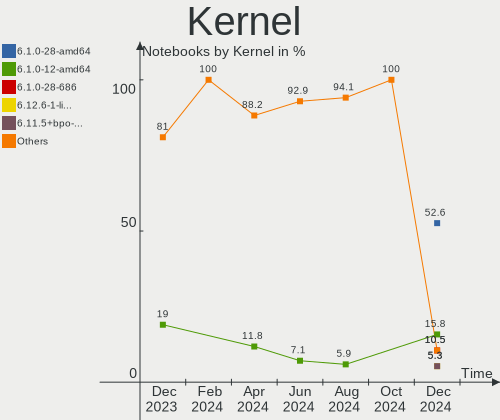
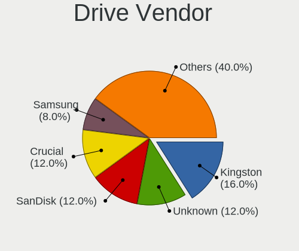
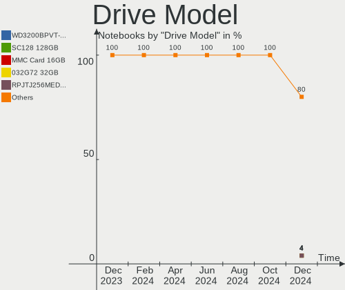
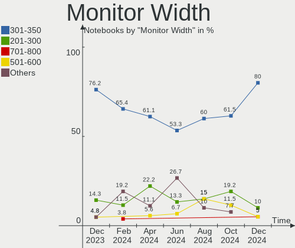

LMDE - Hardware Trends (Notebooks)
----------------------------------

A project to identify most popular hardware characteristics and track their change
over time based on data collected by Linux users at https://Linux-Hardware.org.

Anyone can contribute to this report by the [hw-probe](https://github.com/linuxhw/hw-probe) tool:

    sudo -E hw-probe -all -upload

This report is for one last month. Overall report since the beginning of time: [TestDays](https://github.com/linuxhw/TestDays)

Period: Sep, 2023.

Contents
--------

* [ System ](#system)
  - [ OS                       ](#os)
  - [ OS Family                ](#os-family)
  - [ Kernel                   ](#kernel)
  - [ Kernel Family            ](#kernel-family)
  - [ Kernel Major Ver.        ](#kernel-major-ver)
  - [ Arch                     ](#arch)
  - [ DE                       ](#de)
  - [ Display Server           ](#display-server)
  - [ Display Manager          ](#display-manager)
  - [ OS Lang                  ](#os-lang)
  - [ Boot Mode                ](#boot-mode)
  - [ Filesystem               ](#filesystem)
  - [ Part. scheme             ](#part-scheme)
  - [ Dual Boot with Linux/BSD ](#dual-boot-with-linuxbsd)
  - [ Dual Boot (Win)          ](#dual-boot-win)

* [ Board ](#board)
  - [ Vendor                   ](#vendor)
  - [ Model                    ](#model)
  - [ Model Family             ](#model-family)
  - [ MFG Year                 ](#mfg-year)
  - [ Form Factor              ](#form-factor)
  - [ Secure Boot              ](#secure-boot)
  - [ Coreboot                 ](#coreboot)
  - [ RAM Size                 ](#ram-size)
  - [ RAM Used                 ](#ram-used)
  - [ Total Drives             ](#total-drives)
  - [ Has CD-ROM               ](#has-cd-rom)
  - [ Has Ethernet             ](#has-ethernet)
  - [ Has WiFi                 ](#has-wifi)
  - [ Has Bluetooth            ](#has-bluetooth)

* [ Location ](#location)
  - [ Country                  ](#country)
  - [ City                     ](#city)

* [ Drives ](#drives)
  - [ Drive Vendor             ](#drive-vendor)
  - [ Drive Model              ](#drive-model)
  - [ HDD Vendor               ](#hdd-vendor)
  - [ SSD Vendor               ](#ssd-vendor)
  - [ Drive Kind               ](#drive-kind)
  - [ Drive Connector          ](#drive-connector)
  - [ Drive Size               ](#drive-size)
  - [ Space Total              ](#space-total)
  - [ Space Used               ](#space-used)
  - [ Malfunc. Drives          ](#malfunc-drives)
  - [ Malfunc. Drive Vendor    ](#malfunc-drive-vendor)
  - [ Malfunc. HDD Vendor      ](#malfunc-hdd-vendor)
  - [ Malfunc. Drive Kind      ](#malfunc-drive-kind)
  - [ Failed Drives            ](#failed-drives)
  - [ Failed Drive Vendor      ](#failed-drive-vendor)
  - [ Drive Status             ](#drive-status)

* [ Storage controller ](#storage-controller)
  - [ Storage Vendor           ](#storage-vendor)
  - [ Storage Model            ](#storage-model)
  - [ Storage Kind             ](#storage-kind)

* [ Processor ](#processor)
  - [ CPU Vendor               ](#cpu-vendor)
  - [ CPU Model                ](#cpu-model)
  - [ CPU Model Family         ](#cpu-model-family)
  - [ CPU Cores                ](#cpu-cores)
  - [ CPU Sockets              ](#cpu-sockets)
  - [ CPU Threads              ](#cpu-threads)
  - [ CPU Op-Modes             ](#cpu-op-modes)
  - [ CPU Microcode            ](#cpu-microcode)
  - [ CPU Microarch            ](#cpu-microarch)

* [ Graphics ](#graphics)
  - [ GPU Vendor               ](#gpu-vendor)
  - [ GPU Model                ](#gpu-model)
  - [ GPU Combo                ](#gpu-combo)
  - [ GPU Driver               ](#gpu-driver)
  - [ GPU Memory               ](#gpu-memory)

* [ Monitor ](#monitor)
  - [ Monitor Vendor           ](#monitor-vendor)
  - [ Monitor Model            ](#monitor-model)
  - [ Monitor Resolution       ](#monitor-resolution)
  - [ Monitor Diagonal         ](#monitor-diagonal)
  - [ Monitor Width            ](#monitor-width)
  - [ Aspect Ratio             ](#aspect-ratio)
  - [ Monitor Area             ](#monitor-area)
  - [ Pixel Density            ](#pixel-density)
  - [ Multiple Monitors        ](#multiple-monitors)

* [ Network ](#network)
  - [ Net Controller Vendor    ](#net-controller-vendor)
  - [ Net Controller Model     ](#net-controller-model)
  - [ Wireless Vendor          ](#wireless-vendor)
  - [ Wireless Model           ](#wireless-model)
  - [ Ethernet Vendor          ](#ethernet-vendor)
  - [ Ethernet Model           ](#ethernet-model)
  - [ Net Controller Kind      ](#net-controller-kind)
  - [ Used Controller          ](#used-controller)
  - [ NICs                     ](#nics)
  - [ IPv6                     ](#ipv6)

* [ Bluetooth ](#bluetooth)
  - [ Bluetooth Vendor         ](#bluetooth-vendor)
  - [ Bluetooth Model          ](#bluetooth-model)

* [ Sound ](#sound)
  - [ Sound Vendor             ](#sound-vendor)
  - [ Sound Model              ](#sound-model)

* [ Memory ](#memory)
  - [ Memory Vendor            ](#memory-vendor)
  - [ Memory Model             ](#memory-model)
  - [ Memory Kind              ](#memory-kind)
  - [ Memory Form Factor       ](#memory-form-factor)
  - [ Memory Size              ](#memory-size)
  - [ Memory Speed             ](#memory-speed)

* [ Printers & scanners ](#printers--scanners)
  - [ Printer Vendor           ](#printer-vendor)
  - [ Printer Model            ](#printer-model)
  - [ Scanner Vendor           ](#scanner-vendor)
  - [ Scanner Model            ](#scanner-model)

* [ Camera ](#camera)
  - [ Camera Vendor            ](#camera-vendor)
  - [ Camera Model             ](#camera-model)

* [ Security ](#security)
  - [ Fingerprint Vendor       ](#fingerprint-vendor)
  - [ Fingerprint Model        ](#fingerprint-model)
  - [ Chipcard Vendor          ](#chipcard-vendor)
  - [ Chipcard Model           ](#chipcard-model)

* [ Unsupported ](#unsupported)
  - [ Unsupported Devices      ](#unsupported-devices)
  - [ Unsupported Device Types ](#unsupported-device-types)

System
------

OS
--

Installed operating systems

| Name   | Notebooks | Percent |
|--------|-----------|---------|
| LMDE 5 | 12        | 66.67%  |
| LMDE 6 | 6         | 33.33%  |

OS Family
---------

OS without a version

| Name | Notebooks | Percent |
|------|-----------|---------|
| LMDE | 18        | 100%    |

Kernel
------

Version of the Linux kernel

| Version               | Notebooks | Percent |
|-----------------------|-----------|---------|
| 5.10.0-25-amd64       | 10        | 55.56%  |
| 6.1.0-12-amd64        | 3         | 16.67%  |
| 6.4.0-0.deb12.2-amd64 | 1         | 5.56%   |
| 6.1.0-12-686          | 1         | 5.56%   |
| 6.1.0-0.deb11.9-amd64 | 1         | 5.56%   |
| 5.10.0-25-686         | 1         | 5.56%   |
| 5.10.0-12-amd64       | 1         | 5.56%   |

Kernel Family
-------------

Linux kernel without a distro release

| Version | Notebooks | Percent |
|---------|-----------|---------|
| 5.10.0  | 12        | 66.67%  |
| 6.1.0   | 5         | 27.78%  |
| 6.4.0   | 1         | 5.56%   |

Kernel Major Ver.
-----------------

Linux kernel major version

| Version | Notebooks | Percent |
|---------|-----------|---------|
| 5.10    | 12        | 66.67%  |
| 6.1     | 5         | 27.78%  |
| 6.4     | 1         | 5.56%   |

Arch
----

OS architecture (x86_64, i586, etc.)

| Name   | Notebooks | Percent |
|--------|-----------|---------|
| x86_64 | 16        | 88.89%  |
| i686   | 2         | 11.11%  |

DE
--

Desktop Environment

| Name       | Notebooks | Percent |
|------------|-----------|---------|
| X-Cinnamon | 16        | 88.89%  |
| Cinnamon   | 2         | 11.11%  |

Display Server
--------------

X11 or Wayland

| Name | Notebooks | Percent |
|------|-----------|---------|
| X11  | 18        | 100%    |

Display Manager
---------------

SDDM, LightDM, etc.

| Name    | Notebooks | Percent |
|---------|-----------|---------|
| LightDM | 10        | 55.56%  |
| Unknown | 8         | 44.44%  |

OS Lang
-------

Language

| Lang  | Notebooks | Percent |
|-------|-----------|---------|
| en_US | 7         | 38.89%  |
| de_DE | 6         | 33.33%  |
| pl_PL | 2         | 11.11%  |
| it_IT | 2         | 11.11%  |
| pt_BR | 1         | 5.56%   |

Boot Mode
---------

EFI or BIOS

| Mode | Notebooks | Percent |
|------|-----------|---------|
| EFI  | 12        | 66.67%  |
| BIOS | 6         | 33.33%  |

Filesystem
----------

Type of filesystem

| Type    | Notebooks | Percent |
|---------|-----------|---------|
| Ext4    | 16        | 88.89%  |
| Tmpfs   | 1         | 5.56%   |
| Overlay | 1         | 5.56%   |

Part. scheme
------------

Scheme of partitioning

| Type    | Notebooks | Percent |
|---------|-----------|---------|
| GPT     | 8         | 44.44%  |
| Unknown | 8         | 44.44%  |
| MBR     | 2         | 11.11%  |

Dual Boot with Linux/BSD
------------------------

Hosting more than one Linux/BSD

| Dual boot | Notebooks | Percent |
|-----------|-----------|---------|
| No        | 15        | 83.33%  |
| Yes       | 3         | 16.67%  |

Dual Boot (Win)
---------------

Hosting Linux and Windows

| Dual boot | Notebooks | Percent |
|-----------|-----------|---------|
| No        | 15        | 83.33%  |
| Yes       | 3         | 16.67%  |

Board
-----

Vendor
------

Motherboard manufacturer

| Name            | Notebooks | Percent |
|-----------------|-----------|---------|
| Lenovo          | 5         | 27.78%  |
| Hewlett-Packard | 5         | 27.78%  |
| Dell            | 4         | 22.22%  |
| Acer            | 2         | 11.11%  |
| Toshiba         | 1         | 5.56%   |
| IGEL Technology | 1         | 5.56%   |

Model
-----

Motherboard model

| Name                                 | Notebooks | Percent |
|--------------------------------------|-----------|---------|
| Toshiba Satellite P505               | 1         | 5.56%   |
| Lenovo ThinkPad W541 20EGS24J00      | 1         | 5.56%   |
| Lenovo ThinkPad T14 Gen 1 20S1S10T00 | 1         | 5.56%   |
| Lenovo ThinkPad L390 20NR000FUS      | 1         | 5.56%   |
| Lenovo ThinkPad Edge E430c 33651A2   | 1         | 5.56%   |
| Lenovo IdeaPad 310-15ISK 80UH        | 1         | 5.56%   |
| IGEL M330C                           | 1         | 5.56%   |
| HP x2 210                            | 1         | 5.56%   |
| HP Laptop 14-dk1xxx                  | 1         | 5.56%   |
| HP Compaq Mini 311-1100              | 1         | 5.56%   |
| HP 620                               | 1         | 5.56%   |
| HP 250 G7 Notebook PC                | 1         | 5.56%   |
| Dell System Vostro 3750              | 1         | 5.56%   |
| Dell Precision M4700                 | 1         | 5.56%   |
| Dell Latitude E5570                  | 1         | 5.56%   |
| Dell Latitude 7390                   | 1         | 5.56%   |
| Acer Aspire E1-572G                  | 1         | 5.56%   |
| Acer Aspire A317-51G                 | 1         | 5.56%   |

Model Family
------------

Motherboard model prefix

| Name              | Notebooks | Percent |
|-------------------|-----------|---------|
| Lenovo ThinkPad   | 4         | 22.22%  |
| Dell Latitude     | 2         | 11.11%  |
| Acer Aspire       | 2         | 11.11%  |
| Toshiba Satellite | 1         | 5.56%   |
| Lenovo IdeaPad    | 1         | 5.56%   |
| IGEL M330C        | 1         | 5.56%   |
| HP x2             | 1         | 5.56%   |
| HP Laptop         | 1         | 5.56%   |
| HP Compaq         | 1         | 5.56%   |
| HP 620            | 1         | 5.56%   |
| HP 250            | 1         | 5.56%   |
| Dell System       | 1         | 5.56%   |
| Dell Precision    | 1         | 5.56%   |

MFG Year
--------

Motherboard manufacture year

| Year | Notebooks | Percent |
|------|-----------|---------|
| 2018 | 3         | 16.67%  |
| 2013 | 3         | 16.67%  |
| 2019 | 2         | 11.11%  |
| 2016 | 2         | 11.11%  |
| 2015 | 2         | 11.11%  |
| 2009 | 2         | 11.11%  |
| 2020 | 1         | 5.56%   |
| 2012 | 1         | 5.56%   |
| 2011 | 1         | 5.56%   |
| 2010 | 1         | 5.56%   |

Form Factor
-----------

Physical design of the computer

| Name     | Notebooks | Percent |
|----------|-----------|---------|
| Notebook | 18        | 100%    |

Secure Boot
-----------

Enabled or disabled

| State    | Notebooks | Percent |
|----------|-----------|---------|
| Disabled | 16        | 88.89%  |
| Enabled  | 2         | 11.11%  |

Coreboot
--------

Have coreboot on board

| Used | Notebooks | Percent |
|------|-----------|---------|
| No   | 18        | 100%    |

RAM Size
--------

Total RAM memory

| Size in GB | Notebooks | Percent |
|------------|-----------|---------|
| 8.01-16.0  | 6         | 33.33%  |
| 3.01-4.0   | 4         | 22.22%  |
| 4.01-8.0   | 3         | 16.67%  |
| 16.01-24.0 | 2         | 11.11%  |
| 32.01-64.0 | 1         | 5.56%   |
| 2.01-3.0   | 1         | 5.56%   |
| 1.01-2.0   | 1         | 5.56%   |

RAM Used
--------

Used RAM memory

| Used GB   | Notebooks | Percent |
|-----------|-----------|---------|
| 2.01-3.0  | 6         | 33.33%  |
| 1.01-2.0  | 5         | 27.78%  |
| 4.01-8.0  | 2         | 11.11%  |
| 3.01-4.0  | 2         | 11.11%  |
| 8.01-16.0 | 2         | 11.11%  |
| 0.51-1.0  | 1         | 5.56%   |

Total Drives
------------

Number of drives on board

| Drives | Notebooks | Percent |
|--------|-----------|---------|
| 1      | 12        | 66.67%  |
| 2      | 5         | 27.78%  |
| 3      | 1         | 5.56%   |

Has CD-ROM
----------

Has CD-ROM on board

| Presented | Notebooks | Percent |
|-----------|-----------|---------|
| No        | 11        | 61.11%  |
| Yes       | 7         | 38.89%  |

Has Ethernet
------------

Has Ethernet on board

| Presented | Notebooks | Percent |
|-----------|-----------|---------|
| Yes       | 18        | 100%    |

Has WiFi
--------

Has WiFi module

| Presented | Notebooks | Percent |
|-----------|-----------|---------|
| Yes       | 17        | 94.44%  |
| No        | 1         | 5.56%   |

Has Bluetooth
-------------

Has Bluetooth module

| Presented | Notebooks | Percent |
|-----------|-----------|---------|
| Yes       | 13        | 72.22%  |
| No        | 5         | 27.78%  |

Location
--------

Country
-------

Geographic location (country)

| Country     | Notebooks | Percent |
|-------------|-----------|---------|
| Germany     | 6         | 33.33%  |
| USA         | 4         | 22.22%  |
| Italy       | 3         | 16.67%  |
| Poland      | 2         | 11.11%  |
| Russia      | 1         | 5.56%   |
| Puerto Rico | 1         | 5.56%   |
| Brazil      | 1         | 5.56%   |

City
----

Geographic location (city)

| City           | Notebooks | Percent |
|----------------|-----------|---------|
| New York       | 2         | 11.11%  |
| Wiesloch       | 1         | 5.56%   |
| Toa Baja       | 1         | 5.56%   |
| Rostov-on-Don  | 1         | 5.56%   |
| Rio de Janeiro | 1         | 5.56%   |
| Norderstedt    | 1         | 5.56%   |
| Milano         | 1         | 5.56%   |
| Milan          | 1         | 5.56%   |
| Mestre         | 1         | 5.56%   |
| Magdeburg      | 1         | 5.56%   |
| Krakow         | 1         | 5.56%   |
| Kamp-Lintfort  | 1         | 5.56%   |
| Cekcyn         | 1         | 5.56%   |
| Bremen         | 1         | 5.56%   |
| Bochum         | 1         | 5.56%   |
| Berkeley       | 1         | 5.56%   |
| Atlanta        | 1         | 5.56%   |

Drives
------

Drive Vendor
------------

Hard drive vendors

| Vendor                    | Notebooks | Drives | Percent |
|---------------------------|-----------|--------|---------|
| SanDisk                   | 4         | 4      | 17.39%  |
| WDC                       | 3         | 3      | 13.04%  |
| Seagate                   | 3         | 3      | 13.04%  |
| Samsung Electronics       | 3         | 3      | 13.04%  |
| Intel                     | 3         | 3      | 13.04%  |
| Transcend                 | 1         | 1      | 4.35%   |
| Toshiba                   | 1         | 1      | 4.35%   |
| SPCC                      | 1         | 1      | 4.35%   |
| SK hynix                  | 1         | 1      | 4.35%   |
| Micron/Crucial Technology | 1         | 1      | 4.35%   |
| HGST                      | 1         | 1      | 4.35%   |
| GOODRAM                   | 1         | 1      | 4.35%   |

Drive Model
-----------

Hard drive models

| Model                                | Notebooks | Percent |
|--------------------------------------|-----------|---------|
| WDC WD5000LPVT-08G33T1 500GB         | 1         | 4.35%   |
| WDC WD10JPCX-24UE4T0 1TB             | 1         | 4.35%   |
| WDC PC SN730 SDBQNTY-512G-1001 512GB | 1         | 4.35%   |
| Transcend TS128GMTS430S 128GB SSD    | 1         | 4.35%   |
| Toshiba MQ04ABF100 1TB               | 1         | 4.35%   |
| SPCC Solid State Disk 512GB          | 1         | 4.35%   |
| SK hynix HCG8e  64GB                 | 1         | 4.35%   |
| Seagate ST9500423AS 500GB            | 1         | 4.35%   |
| Seagate ST9250410AS 250GB            | 1         | 4.35%   |
| Seagate Expansion 1TB                | 1         | 4.35%   |
| SanDisk X400 M.2 2280 256GB SSD      | 1         | 4.35%   |
| SanDisk SSD PLUS 240GB               | 1         | 4.35%   |
| SanDisk SD7UB3Q256G1001 256GB SSD    | 1         | 4.35%   |
| SanDisk NVMe SSD Drive 1TB           | 1         | 4.35%   |
| Samsung SSD 840 EVO 250GB            | 1         | 4.35%   |
| Samsung HM250HJ 250GB                | 1         | 4.35%   |
| Samsung 470 Series SSD 64GB          | 1         | 4.35%   |
| Micron/Crucial CT1000P5PSSD8 1TB     | 1         | 4.35%   |
| Intel SSDSC2CW120A3 120GB            | 1         | 4.35%   |
| Intel SSDPEKKF256G8L 256GB           | 1         | 4.35%   |
| Intel SSD 660P Series 1024GB         | 1         | 4.35%   |
| HGST HTS545050A7E380 500GB           | 1         | 4.35%   |
| GOODRAM SSDPR-CX400-256-G2 256GB     | 1         | 4.35%   |

HDD Vendor
----------

Hard disk drive vendors

| Vendor              | Notebooks | Drives | Percent |
|---------------------|-----------|--------|---------|
| Seagate             | 3         | 3      | 37.5%   |
| WDC                 | 2         | 2      | 25%     |
| Toshiba             | 1         | 1      | 12.5%   |
| Samsung Electronics | 1         | 1      | 12.5%   |
| HGST                | 1         | 1      | 12.5%   |

SSD Vendor
----------

Solid state drive vendors

| Vendor              | Notebooks | Drives | Percent |
|---------------------|-----------|--------|---------|
| SanDisk             | 3         | 3      | 33.33%  |
| Samsung Electronics | 2         | 2      | 22.22%  |
| Transcend           | 1         | 1      | 11.11%  |
| SPCC                | 1         | 1      | 11.11%  |
| Intel               | 1         | 1      | 11.11%  |
| GOODRAM             | 1         | 1      | 11.11%  |

Drive Kind
----------

HDD or SSD

| Kind | Notebooks | Drives | Percent |
|------|-----------|--------|---------|
| SSD  | 8         | 9      | 38.1%   |
| HDD  | 7         | 8      | 33.33%  |
| NVMe | 5         | 5      | 23.81%  |
| MMC  | 1         | 1      | 4.76%   |

Drive Connector
---------------

SATA, SAS, NVMe, etc.

| Type | Notebooks | Drives | Percent |
|------|-----------|--------|---------|
| SATA | 13        | 16     | 65%     |
| NVMe | 5         | 5      | 25%     |
| SAS  | 1         | 1      | 5%      |
| MMC  | 1         | 1      | 5%      |

Drive Size
----------

Size of hard drive

| Size in TB | Notebooks | Drives | Percent |
|------------|-----------|--------|---------|
| 0.01-0.5   | 10        | 13     | 76.92%  |
| 0.51-1.0   | 3         | 4      | 23.08%  |

Space Total
-----------

Amount of disk space available on the file system

| Size in GB | Notebooks | Percent |
|------------|-----------|---------|
| 101-250    | 8         | 44.44%  |
| 501-1000   | 4         | 22.22%  |
| 251-500    | 2         | 11.11%  |
| 21-50      | 1         | 5.56%   |
| 2001-3000  | 1         | 5.56%   |
| 1-20       | 1         | 5.56%   |
| 51-100     | 1         | 5.56%   |

Space Used
----------

Amount of used disk space

| Used GB   | Notebooks | Percent |
|-----------|-----------|---------|
| 1-20      | 8         | 44.44%  |
| 21-50     | 4         | 22.22%  |
| 51-100    | 3         | 16.67%  |
| 101-250   | 2         | 11.11%  |
| 1001-2000 | 1         | 5.56%   |

Malfunc. Drives
---------------

Drive models with a malfunction

Zero info for selected period =(

Malfunc. Drive Vendor
---------------------

Vendors of faulty drives

Zero info for selected period =(

Malfunc. HDD Vendor
-------------------

Vendors of faulty HDD drives

Zero info for selected period =(

Malfunc. Drive Kind
-------------------

Kinds of faulty drives

Zero info for selected period =(

Failed Drives
-------------

Failed drive models

Zero info for selected period =(

Failed Drive Vendor
-------------------

Failed drive vendors

Zero info for selected period =(

Drive Status
------------

Number of failed and malfunc. drives

| Status   | Notebooks | Drives | Percent |
|----------|-----------|--------|---------|
| Detected | 11        | 16     | 61.11%  |
| Works    | 7         | 7      | 38.89%  |

Storage controller
------------------

Storage Vendor
--------------

Storage controller vendors

| Vendor                    | Notebooks | Percent |
|---------------------------|-----------|---------|
| Intel                     | 12        | 66.67%  |
| Sandisk                   | 2         | 11.11%  |
| VIA Technologies          | 1         | 5.56%   |
| Nvidia                    | 1         | 5.56%   |
| Micron/Crucial Technology | 1         | 5.56%   |
| AMD                       | 1         | 5.56%   |

Storage Model
-------------

Storage controller models

| Model                                                                          | Notebooks | Percent |
|--------------------------------------------------------------------------------|-----------|---------|
| Intel Sunrise Point-LP SATA Controller [AHCI mode]                             | 2         | 10.53%  |
| Intel 7 Series Chipset Family 6-port SATA Controller [AHCI mode]               | 2         | 10.53%  |
| VIA VX900 Series Serial-ATA Controller                                         | 1         | 5.26%   |
| Sandisk Western Digital WD Black SN850X NVMe SSD                               | 1         | 5.26%   |
| SanDisk WD Black SN750 / PC SN730 NVMe SSD                                     | 1         | 5.26%   |
| Nvidia MCP79 AHCI Controller                                                   | 1         | 5.26%   |
| Micron/Crucial P5 Plus NVMe PCIe SSD                                           | 1         | 5.26%   |
| Intel SSD DC P4101/Pro 7600p/760p/E 6100p Series                               | 1         | 5.26%   |
| Intel SSD 660P Series                                                          | 1         | 5.26%   |
| Intel Comet Lake SATA AHCI Controller                                          | 1         | 5.26%   |
| Intel 82801IBM/IEM (ICH9M/ICH9M-E) 4 port SATA Controller [AHCI mode]          | 1         | 5.26%   |
| Intel 82801IBM/IEM (ICH9M/ICH9M-E) 2 port SATA Controller [IDE mode]           | 1         | 5.26%   |
| Intel 82801 Mobile SATA Controller [RAID mode]                                 | 1         | 5.26%   |
| Intel 8 Series/C220 Series Chipset Family 6-port SATA Controller 1 [AHCI mode] | 1         | 5.26%   |
| Intel 8 Series SATA Controller 1 [AHCI mode]                                   | 1         | 5.26%   |
| Intel 6 Series/C200 Series Chipset Family 6 port Mobile SATA AHCI Controller   | 1         | 5.26%   |
| AMD FCH SATA Controller [AHCI mode]                                            | 1         | 5.26%   |

Storage Kind
------------

Kind of storage controller (IDE, SATA, NVMe, SAS, ...)

| Kind | Notebooks | Percent |
|------|-----------|---------|
| SATA | 11        | 57.89%  |
| NVMe | 5         | 26.32%  |
| IDE  | 2         | 10.53%  |
| RAID | 1         | 5.26%   |

Processor
---------

CPU Vendor
----------

Processor vendors

| Vendor       | Notebooks | Percent |
|--------------|-----------|---------|
| Intel        | 16        | 88.89%  |
| CentaurHauls | 1         | 5.56%   |
| AMD          | 1         | 5.56%   |

CPU Model
---------

Processor models

| Model                                     | Notebooks | Percent |
|-------------------------------------------|-----------|---------|
| Intel Core i5-8265U CPU @ 1.60GHz         | 2         | 11.11%  |
| Intel Pentium CPU 2020M @ 2.40GHz         | 1         | 5.56%   |
| Intel Core i7-8650U CPU @ 1.90GHz         | 1         | 5.56%   |
| Intel Core i7-6500U CPU @ 2.50GHz         | 1         | 5.56%   |
| Intel Core i7-4810MQ CPU @ 2.80GHz        | 1         | 5.56%   |
| Intel Core i7-3740QM CPU @ 2.70GHz        | 1         | 5.56%   |
| Intel Core i7-10510U CPU @ 1.80GHz        | 1         | 5.56%   |
| Intel Core i5-6300U CPU @ 2.40GHz         | 1         | 5.56%   |
| Intel Core i5-4200U CPU @ 1.60GHz         | 1         | 5.56%   |
| Intel Core i5-10310U CPU @ 1.70GHz        | 1         | 5.56%   |
| Intel Core i3-2350M CPU @ 2.30GHz         | 1         | 5.56%   |
| Intel Core 2 Duo CPU T6600 @ 2.20GHz      | 1         | 5.56%   |
| Intel Core 2 Duo CPU T6570 @ 2.10GHz      | 1         | 5.56%   |
| Intel Atom x5-Z8300 CPU @ 1.44GHz         | 1         | 5.56%   |
| Intel Atom CPU N270 @ 1.60GHz             | 1         | 5.56%   |
| CentaurHauls VIA Eden X2 U4200 @ 1.0+ GHz | 1         | 5.56%   |
| AMD Ryzen 3 3250U with Radeon Graphics    | 1         | 5.56%   |

CPU Model Family
----------------

Processor model prefix

| Model                 | Notebooks | Percent |
|-----------------------|-----------|---------|
| Intel Core i7         | 5         | 27.78%  |
| Intel Core i5         | 5         | 27.78%  |
| Intel Core 2 Duo      | 2         | 11.11%  |
| Intel Atom            | 2         | 11.11%  |
| Intel Pentium         | 1         | 5.56%   |
| Intel Core i3         | 1         | 5.56%   |
| CentaurHauls VIA Eden | 1         | 5.56%   |
| AMD Ryzen 3           | 1         | 5.56%   |

CPU Cores
---------

Number of processor cores

| Number | Notebooks | Percent |
|--------|-----------|---------|
| 2      | 9         | 50%     |
| 4      | 8         | 44.44%  |
| 1      | 1         | 5.56%   |

CPU Sockets
-----------

Number of sockets

| Number | Notebooks | Percent |
|--------|-----------|---------|
| 1      | 18        | 100%    |

CPU Threads
-----------

Threads per core (Hyper-Threading)

| Number | Notebooks | Percent |
|--------|-----------|---------|
| 2      | 13        | 72.22%  |
| 1      | 5         | 27.78%  |

CPU Op-Modes
------------

CPU Operation Modes (32-bit, 64-bit)

| Op mode        | Notebooks | Percent |
|----------------|-----------|---------|
| 32-bit, 64-bit | 17        | 94.44%  |
| 32-bit         | 1         | 5.56%   |

CPU Microcode
-------------

Microcode number

| Number     | Notebooks | Percent |
|------------|-----------|---------|
| Unknown    | 4         | 22.22%  |
| 0x806ec    | 2         | 11.11%  |
| 0x306a9    | 2         | 11.11%  |
| 0x1067a    | 2         | 11.11%  |
| 0x806eb    | 1         | 5.56%   |
| 0x406e3    | 1         | 5.56%   |
| 0x406c3    | 1         | 5.56%   |
| 0x40651    | 1         | 5.56%   |
| 0x306c3    | 1         | 5.56%   |
| 0x206a7    | 1         | 5.56%   |
| 0x106c2    | 1         | 5.56%   |
| 0x08108109 | 1         | 5.56%   |

CPU Microarch
-------------

Microarchitecture

| Name        | Notebooks | Percent |
|-------------|-----------|---------|
| KabyLake    | 5         | 27.78%  |
| Skylake     | 2         | 11.11%  |
| Penryn      | 2         | 11.11%  |
| IvyBridge   | 2         | 11.11%  |
| Haswell     | 2         | 11.11%  |
| Zen+        | 1         | 5.56%   |
| Silvermont  | 1         | 5.56%   |
| SandyBridge | 1         | 5.56%   |
| Bonnell     | 1         | 5.56%   |
| Unknown     | 1         | 5.56%   |

Graphics
--------

GPU Vendor
----------

Vendors of graphics cards

| Vendor           | Notebooks | Percent |
|------------------|-----------|---------|
| Intel            | 14        | 60.87%  |
| Nvidia           | 6         | 26.09%  |
| AMD              | 2         | 8.7%    |
| VIA Technologies | 1         | 4.35%   |

GPU Model
---------

Graphics card models

| Model                                                                                    | Notebooks | Percent |
|------------------------------------------------------------------------------------------|-----------|---------|
| Intel WhiskeyLake-U GT2 [UHD Graphics 620]                                               | 2         | 8.7%    |
| Intel Skylake GT2 [HD Graphics 520]                                                      | 2         | 8.7%    |
| Intel CometLake-U GT2 [UHD Graphics]                                                     | 2         | 8.7%    |
| Intel 3rd Gen Core processor Graphics Controller                                         | 2         | 8.7%    |
| VIA Technologies VX900 Graphics [Chrome9 HD]                                             | 1         | 4.35%   |
| Nvidia GT218M [GeForce G210M]                                                            | 1         | 4.35%   |
| Nvidia GP108M [GeForce MX250]                                                            | 1         | 4.35%   |
| Nvidia GK107GLM [Quadro K1000M]                                                          | 1         | 4.35%   |
| Nvidia GK106GLM [Quadro K2100M]                                                          | 1         | 4.35%   |
| Nvidia GF119M [GeForce 610M]                                                             | 1         | 4.35%   |
| Nvidia C79 [GeForce 9400M / ION]                                                         | 1         | 4.35%   |
| Intel UHD Graphics 620                                                                   | 1         | 4.35%   |
| Intel Mobile 4 Series Chipset Integrated Graphics Controller                             | 1         | 4.35%   |
| Intel Haswell-ULT Integrated Graphics Controller                                         | 1         | 4.35%   |
| Intel Atom/Celeron/Pentium Processor x5-E8000/J3xxx/N3xxx Integrated Graphics Controller | 1         | 4.35%   |
| Intel 4th Gen Core Processor Integrated Graphics Controller                              | 1         | 4.35%   |
| Intel 2nd Generation Core Processor Family Integrated Graphics Controller                | 1         | 4.35%   |
| AMD Picasso/Raven 2 [Radeon Vega Series / Radeon Vega Mobile Series]                     | 1         | 4.35%   |
| AMD Opal XT [Radeon R7 M265/M365X/M465]                                                  | 1         | 4.35%   |

GPU Combo
---------

Combinations of graphics cards

| Name           | Notebooks | Percent |
|----------------|-----------|---------|
| 1 x Intel      | 9         | 50%     |
| Intel + Nvidia | 4         | 22.22%  |
| 1 x Nvidia     | 2         | 11.11%  |
| 1 x VIA        | 1         | 5.56%   |
| Intel + AMD    | 1         | 5.56%   |
| 1 x AMD        | 1         | 5.56%   |

GPU Driver
----------

Free vs proprietary

| Driver      | Notebooks | Percent |
|-------------|-----------|---------|
| Free        | 16        | 88.89%  |
| Proprietary | 1         | 5.56%   |
| Unknown     | 1         | 5.56%   |

GPU Memory
----------

Total video memory

| Size in GB | Notebooks | Percent |
|------------|-----------|---------|
| Unknown    | 11        | 61.11%  |
| 1.01-2.0   | 4         | 22.22%  |
| 0.01-0.5   | 2         | 11.11%  |
| 0.51-1.0   | 1         | 5.56%   |

Monitor
-------

Monitor Vendor
--------------

Monitor vendors

| Vendor              | Notebooks | Percent |
|---------------------|-----------|---------|
| LG Display          | 6         | 30%     |
| BOE                 | 4         | 20%     |
| AU Optronics        | 3         | 15%     |
| TFG                 | 1         | 5%      |
| Sony                | 1         | 5%      |
| Samsung Electronics | 1         | 5%      |
| Panasonic           | 1         | 5%      |
| InfoVision          | 1         | 5%      |
| Chimei Innolux      | 1         | 5%      |
| BenQ                | 1         | 5%      |

Monitor Model
-------------

Monitor models

| Model                                                                | Notebooks | Percent |
|----------------------------------------------------------------------|-----------|---------|
| TFG ELDFW406 TFG00C8 1920x1080 698x392mm 31.5-inch                   | 1         | 5%      |
| Sony SDM-X52 SNY1F50 1024x768 304x228mm 15.0-inch                    | 1         | 5%      |
| Samsung Electronics LCD Monitor SEC324B 1680x945 409x230mm 18.5-inch | 1         | 5%      |
| Panasonic LCD Monitor MEI96A2 2880x1620 344x193mm 15.5-inch          | 1         | 5%      |
| LG Display LP156WH2-TLRA LGD026B 1366x768 344x194mm 15.5-inch        | 1         | 5%      |
| LG Display LP116WH2-TLC1 LGD0232 1366x768 256x144mm 11.6-inch        | 1         | 5%      |
| LG Display LCD Monitor LGD056D 1920x1080 382x215mm 17.3-inch         | 1         | 5%      |
| LG Display LCD Monitor LGD04AF 1366x768 344x194mm 15.5-inch          | 1         | 5%      |
| LG Display LCD Monitor LGD032C 1920x1080 344x194mm 15.5-inch         | 1         | 5%      |
| LG Display LCD Monitor LGD0303 1600x900 382x215mm 17.3-inch          | 1         | 5%      |
| InfoVision LCD Monitor IVO057D 1920x1080 309x174mm 14.0-inch         | 1         | 5%      |
| Chimei Innolux LCD Monitor CMN1469 1366x768 309x174mm 14.0-inch      | 1         | 5%      |
| BOE LCD Monitor BOE082C 1920x1080 309x174mm 14.0-inch                | 1         | 5%      |
| BOE LCD Monitor BOE0704 1366x768 344x194mm 15.5-inch                 | 1         | 5%      |
| BOE LCD Monitor BOE0672 1366x768 344x194mm 15.5-inch                 | 1         | 5%      |
| BOE LCD Monitor BOE03F2 1280x800 217x136mm 10.1-inch                 | 1         | 5%      |
| BenQ EW2775ZH BNQ7944 1920x1080 598x336mm 27.0-inch                  | 1         | 5%      |
| AU Optronics LCD Monitor AUO47EC 1366x768 344x193mm 15.5-inch        | 1         | 5%      |
| AU Optronics LCD Monitor AUO462D 1920x1080 293x165mm 13.2-inch       | 1         | 5%      |
| AU Optronics LCD Monitor AUO112D 1920x1080 293x165mm 13.2-inch       | 1         | 5%      |

Monitor Resolution
------------------

Monitor screen resolution

| Resolution      | Notebooks | Percent |
|-----------------|-----------|---------|
| 1366x768 (WXGA) | 7         | 38.89%  |
| 1920x1080 (FHD) | 6         | 33.33%  |
| 3840x2160 (4K)  | 1         | 5.56%   |
| 1680x945        | 1         | 5.56%   |
| 1600x900 (HD+)  | 1         | 5.56%   |
| 1280x800 (WXGA) | 1         | 5.56%   |
| 1024x768 (XGA)  | 1         | 5.56%   |

Monitor Diagonal
----------------

Diagonal size in inches

| Inches | Notebooks | Percent |
|--------|-----------|---------|
| 15     | 7         | 35%     |
| 17     | 3         | 15%     |
| 14     | 3         | 15%     |
| 13     | 2         | 10%     |
| 31     | 1         | 5%      |
| 27     | 1         | 5%      |
| 18     | 1         | 5%      |
| 11     | 1         | 5%      |
| 10     | 1         | 5%      |

Monitor Width
-------------

Physical width

| Width in mm | Notebooks | Percent |
|-------------|-----------|---------|
| 301-350     | 9         | 47.37%  |
| 201-300     | 4         | 21.05%  |
| 351-400     | 3         | 15.79%  |
| 601-700     | 1         | 5.26%   |
| 501-600     | 1         | 5.26%   |
| 401-500     | 1         | 5.26%   |

Aspect Ratio
------------

Proportional relationship between the width and the height

| Ratio | Notebooks | Percent |
|-------|-----------|---------|
| 16/9  | 16        | 88.89%  |
| 4/3   | 1         | 5.56%   |
| 16/10 | 1         | 5.56%   |

Monitor Area
------------

Area in inch²

| Area in inch² | Notebooks | Percent |
|----------------|-----------|---------|
| 101-110        | 7         | 35%     |
| 81-90          | 3         | 15%     |
| 121-130        | 3         | 15%     |
| 71-80          | 2         | 10%     |
| 51-60          | 1         | 5%      |
| 351-500        | 1         | 5%      |
| 41-50          | 1         | 5%      |
| 301-350        | 1         | 5%      |
| 141-150        | 1         | 5%      |

Pixel Density
-------------

Pixels per inch

| Density       | Notebooks | Percent |
|---------------|-----------|---------|
| 101-120       | 8         | 40%     |
| 121-160       | 6         | 30%     |
| 51-100        | 3         | 15%     |
| 161-240       | 2         | 10%     |
| More than 240 | 1         | 5%      |

Multiple Monitors
-----------------

Total monitors connected

| Total | Notebooks | Percent |
|-------|-----------|---------|
| 1     | 14        | 77.78%  |
| 2     | 3         | 16.67%  |
| 0     | 1         | 5.56%   |

Network
-------

Net Controller Vendor
---------------------

Controller vendors

| Vendor                | Notebooks | Percent |
|-----------------------|-----------|---------|
| Realtek Semiconductor | 10        | 33.33%  |
| Intel                 | 7         | 23.33%  |
| Qualcomm Atheros      | 5         | 16.67%  |
| Broadcom              | 3         | 10%     |
| Samsung Electronics   | 1         | 3.33%   |
| Nvidia                | 1         | 3.33%   |
| Lenovo                | 1         | 3.33%   |
| Google                | 1         | 3.33%   |
| Broadcom Limited      | 1         | 3.33%   |

Net Controller Model
--------------------

Controller models

| Model                                                             | Notebooks | Percent |
|-------------------------------------------------------------------|-----------|---------|
| Realtek RTL8111/8168/8411 PCI Express Gigabit Ethernet Controller | 7         | 17.95%  |
| Realtek RTL8821CE 802.11ac PCIe Wireless Network Adapter          | 2         | 5.13%   |
| Realtek RTL8188EUS 802.11n Wireless Network Adapter               | 2         | 5.13%   |
| Qualcomm Atheros QCA9377 802.11ac Wireless Network Adapter        | 2         | 5.13%   |
| Samsung GT-I9070 (network tethering, USB debugging enabled)       | 1         | 2.56%   |
| Realtek RTL8191SEvB Wireless LAN Controller                       | 1         | 2.56%   |
| Realtek RTL8153 Gigabit Ethernet Adapter                          | 1         | 2.56%   |
| Realtek RTL810xE PCI Express Fast Ethernet controller             | 1         | 2.56%   |
| Qualcomm Atheros QCA9565 / AR9565 Wireless Network Adapter        | 1         | 2.56%   |
| Qualcomm Atheros QCA6174 802.11ac Wireless Network Adapter        | 1         | 2.56%   |
| Qualcomm Atheros AR8131 Gigabit Ethernet                          | 1         | 2.56%   |
| Nvidia MCP79 Ethernet                                             | 1         | 2.56%   |
| Lenovo dCute Composite Device                                     | 1         | 2.56%   |
| Intel Wireless 8265 / 8275                                        | 1         | 2.56%   |
| Intel Wireless 7260                                               | 1         | 2.56%   |
| Intel Wireless 3165                                               | 1         | 2.56%   |
| Intel Ethernet Connection I219-LM                                 | 1         | 2.56%   |
| Intel Ethernet Connection I217-LM                                 | 1         | 2.56%   |
| Intel Ethernet Connection (6) I219-V                              | 1         | 2.56%   |
| Intel Ethernet Connection (4) I219-LM                             | 1         | 2.56%   |
| Intel Ethernet Connection (10) I219-LM                            | 1         | 2.56%   |
| Intel Comet Lake PCH-LP CNVi WiFi                                 | 1         | 2.56%   |
| Intel Centrino Ultimate-N 6300                                    | 1         | 2.56%   |
| Intel Cannon Point-LP CNVi [Wireless-AC]                          | 1         | 2.56%   |
| Intel 82579LM Gigabit Network Connection (Lewisville)             | 1         | 2.56%   |
| Google Nexus/Pixel Device (tether)                                | 1         | 2.56%   |
| Broadcom NetXtreme BCM57786 Gigabit Ethernet PCIe                 | 1         | 2.56%   |
| Broadcom Limited BCM4313 802.11bgn Wireless Network Adapter       | 1         | 2.56%   |
| Broadcom BCM4313 802.11bgn Wireless Network Adapter               | 1         | 2.56%   |
| Broadcom BCM4312 802.11b/g LP-PHY                                 | 1         | 2.56%   |

Wireless Vendor
---------------

Wireless vendors

| Vendor                | Notebooks | Percent |
|-----------------------|-----------|---------|
| Intel                 | 6         | 35.29%  |
| Realtek Semiconductor | 4         | 23.53%  |
| Qualcomm Atheros      | 4         | 23.53%  |
| Broadcom              | 2         | 11.76%  |
| Broadcom Limited      | 1         | 5.88%   |

Wireless Model
--------------

Wireless models

| Model                                                       | Notebooks | Percent |
|-------------------------------------------------------------|-----------|---------|
| Realtek RTL8821CE 802.11ac PCIe Wireless Network Adapter    | 2         | 11.11%  |
| Realtek RTL8188EUS 802.11n Wireless Network Adapter         | 2         | 11.11%  |
| Qualcomm Atheros QCA9377 802.11ac Wireless Network Adapter  | 2         | 11.11%  |
| Realtek RTL8191SEvB Wireless LAN Controller                 | 1         | 5.56%   |
| Qualcomm Atheros QCA9565 / AR9565 Wireless Network Adapter  | 1         | 5.56%   |
| Qualcomm Atheros QCA6174 802.11ac Wireless Network Adapter  | 1         | 5.56%   |
| Intel Wireless 8265 / 8275                                  | 1         | 5.56%   |
| Intel Wireless 7260                                         | 1         | 5.56%   |
| Intel Wireless 3165                                         | 1         | 5.56%   |
| Intel Comet Lake PCH-LP CNVi WiFi                           | 1         | 5.56%   |
| Intel Centrino Ultimate-N 6300                              | 1         | 5.56%   |
| Intel Cannon Point-LP CNVi [Wireless-AC]                    | 1         | 5.56%   |
| Broadcom Limited BCM4313 802.11bgn Wireless Network Adapter | 1         | 5.56%   |
| Broadcom BCM4313 802.11bgn Wireless Network Adapter         | 1         | 5.56%   |
| Broadcom BCM4312 802.11b/g LP-PHY                           | 1         | 5.56%   |

Ethernet Vendor
---------------

Ethernet vendors

| Vendor                | Notebooks | Percent |
|-----------------------|-----------|---------|
| Realtek Semiconductor | 9         | 45%     |
| Intel                 | 6         | 30%     |
| Samsung Electronics   | 1         | 5%      |
| Qualcomm Atheros      | 1         | 5%      |
| Nvidia                | 1         | 5%      |
| Google                | 1         | 5%      |
| Broadcom              | 1         | 5%      |

Ethernet Model
--------------

Ethernet models

| Model                                                             | Notebooks | Percent |
|-------------------------------------------------------------------|-----------|---------|
| Realtek RTL8111/8168/8411 PCI Express Gigabit Ethernet Controller | 7         | 35%     |
| Samsung GT-I9070 (network tethering, USB debugging enabled)       | 1         | 5%      |
| Realtek RTL8153 Gigabit Ethernet Adapter                          | 1         | 5%      |
| Realtek RTL810xE PCI Express Fast Ethernet controller             | 1         | 5%      |
| Qualcomm Atheros AR8131 Gigabit Ethernet                          | 1         | 5%      |
| Nvidia MCP79 Ethernet                                             | 1         | 5%      |
| Intel Ethernet Connection I219-LM                                 | 1         | 5%      |
| Intel Ethernet Connection I217-LM                                 | 1         | 5%      |
| Intel Ethernet Connection (6) I219-V                              | 1         | 5%      |
| Intel Ethernet Connection (4) I219-LM                             | 1         | 5%      |
| Intel Ethernet Connection (10) I219-LM                            | 1         | 5%      |
| Intel 82579LM Gigabit Network Connection (Lewisville)             | 1         | 5%      |
| Google Nexus/Pixel Device (tether)                                | 1         | 5%      |
| Broadcom NetXtreme BCM57786 Gigabit Ethernet PCIe                 | 1         | 5%      |

Net Controller Kind
-------------------

Ethernet, WiFi or modem

| Kind     | Notebooks | Percent |
|----------|-----------|---------|
| Ethernet | 18        | 51.43%  |
| WiFi     | 16        | 45.71%  |
| Modem    | 1         | 2.86%   |

Used Controller
---------------

Currently used network controller

| Kind     | Notebooks | Percent |
|----------|-----------|---------|
| WiFi     | 12        | 63.16%  |
| Ethernet | 7         | 36.84%  |

NICs
----

Total network controllers on board

| Total | Notebooks | Percent |
|-------|-----------|---------|
| 2     | 15        | 83.33%  |
| 1     | 3         | 16.67%  |

IPv6
----

IPv6 vs IPv4

| Used | Notebooks | Percent |
|------|-----------|---------|
| No   | 15        | 83.33%  |
| Yes  | 3         | 16.67%  |

Bluetooth
---------

Bluetooth Vendor
----------------

Controller vendors

| Vendor                          | Notebooks | Percent |
|---------------------------------|-----------|---------|
| Intel                           | 4         | 30.77%  |
| Realtek Semiconductor           | 2         | 15.38%  |
| Qualcomm Atheros Communications | 2         | 15.38%  |
| Lite-On Technology              | 2         | 15.38%  |
| Broadcom                        | 2         | 15.38%  |
| Cambridge Silicon Radio         | 1         | 7.69%   |

Bluetooth Model
---------------

Controller models

| Model                                               | Notebooks | Percent |
|-----------------------------------------------------|-----------|---------|
| Realtek  Bluetooth 4.2 Adapter                      | 2         | 15.38%  |
| Qualcomm Atheros  Bluetooth Device                  | 2         | 15.38%  |
| Intel Bluetooth wireless interface                  | 2         | 15.38%  |
| Lite-On Qualcomm Atheros QCA9377 Bluetooth          | 1         | 7.69%   |
| Lite-On Atheros AR3012 Bluetooth                    | 1         | 7.69%   |
| Intel Bluetooth 9460/9560 Jefferson Peak (JfP)      | 1         | 7.69%   |
| Intel AX201 Bluetooth                               | 1         | 7.69%   |
| Cambridge Silicon Radio Bluetooth Dongle (HCI mode) | 1         | 7.69%   |
| Broadcom BCM20702A0                                 | 1         | 7.69%   |
| Broadcom BCM2070 Bluetooth 2.1 + EDR                | 1         | 7.69%   |

Sound
-----

Sound Vendor
------------

Sound card vendors

| Vendor              | Notebooks | Percent |
|---------------------|-----------|---------|
| Intel               | 14        | 63.64%  |
| Nvidia              | 4         | 18.18%  |
| VIA Technologies    | 1         | 4.55%   |
| CMX Systems         | 1         | 4.55%   |
| C-Media Electronics | 1         | 4.55%   |
| AMD                 | 1         | 4.55%   |

Sound Model
-----------

Sound card models

| Model                                                                      | Notebooks | Percent |
|----------------------------------------------------------------------------|-----------|---------|
| Intel Sunrise Point-LP HD Audio                                            | 3         | 11.54%  |
| Intel Comet Lake PCH-LP cAVS                                               | 2         | 7.69%   |
| Intel Cannon Point-LP High Definition Audio Controller                     | 2         | 7.69%   |
| Intel 82801I (ICH9 Family) HD Audio Controller                             | 2         | 7.69%   |
| Intel 7 Series/C216 Chipset Family High Definition Audio Controller        | 2         | 7.69%   |
| VIA Technologies VX900/VT8xxx High Definition Audio Controller             | 1         | 3.85%   |
| VIA Technologies High Definition Audio Controller                          | 1         | 3.85%   |
| Nvidia MCP79 High Definition Audio                                         | 1         | 3.85%   |
| Nvidia High Definition Audio Controller                                    | 1         | 3.85%   |
| Nvidia GK107 HDMI Audio Controller                                         | 1         | 3.85%   |
| Nvidia GK106 HDMI Audio Controller                                         | 1         | 3.85%   |
| Intel Xeon E3-1200 v3/4th Gen Core Processor HD Audio Controller           | 1         | 3.85%   |
| Intel Haswell-ULT HD Audio Controller                                      | 1         | 3.85%   |
| Intel 8 Series/C220 Series Chipset High Definition Audio Controller        | 1         | 3.85%   |
| Intel 8 Series HD Audio Controller                                         | 1         | 3.85%   |
| Intel 6 Series/C200 Series Chipset Family High Definition Audio Controller | 1         | 3.85%   |
| CMX Systems USB PnP Audio Device                                           | 1         | 3.85%   |
| C-Media Electronics Audio Adapter                                          | 1         | 3.85%   |
| AMD Raven/Raven2/Fenghuang HDMI/DP Audio Controller                        | 1         | 3.85%   |
| AMD Family 17h/19h HD Audio Controller                                     | 1         | 3.85%   |

Memory
------

Memory Vendor
-------------

Memory module vendors

| Vendor              | Notebooks | Percent |
|---------------------|-----------|---------|
| SK hynix            | 5         | 45.45%  |
| Samsung Electronics | 2         | 18.18%  |
| Micron Technology   | 1         | 9.09%   |
| Kingston            | 1         | 9.09%   |
| G.Skill             | 1         | 9.09%   |
| A-DATA Technology   | 1         | 9.09%   |

Memory Model
------------

Memory module models

| Model                                                   | Notebooks | Percent |
|---------------------------------------------------------|-----------|---------|
| SK hynix RAM HMT351S6BFR8C-H9 4GB SODIMM DDR3 1333MT/s  | 1         | 7.69%   |
| SK hynix RAM HMT112S6BFR6C-G7 1GB SODIMM DDR3 1067MT/s  | 1         | 7.69%   |
| SK hynix RAM HMT112S6AFR8C-G7 1GB SODIMM DDR3 1066MT/s  | 1         | 7.69%   |
| SK hynix RAM HMAB2GS6AMR6N-XN 16GB SODIMM DDR4 3200MT/s | 1         | 7.69%   |
| SK hynix RAM HMA81GS6JJR8N-VK 8GB SODIMM DDR4 2667MT/s  | 1         | 7.69%   |
| SK hynix RAM HMA81GS6CJR8N-VK 8GB SODIMM DDR4 2667MT/s  | 1         | 7.69%   |
| SK hynix RAM HMA81GS6AFR8N-UH 8GB SODIMM DDR4 2667MT/s  | 1         | 7.69%   |
| Samsung RAM M471B5273CH0-CK0 4GB SODIMM DDR3 1600MT/s   | 1         | 7.69%   |
| Samsung RAM M471A2K43CB1-CRC 16GB SODIMM DDR4 2667MT/s  | 1         | 7.69%   |
| Micron RAM 4ATF51264HZ-2G3AZ 4GB SODIMM DDR4 2133MT/s   | 1         | 7.69%   |
| Kingston RAM 9905700-011.A00G 8GB SODIMM DDR4 2400MT/s  | 1         | 7.69%   |
| G.Skill RAM F4-3200C22-32GRS 32GB SODIMM DDR4 3200MT/s  | 1         | 7.69%   |
| A-DATA RAM MIF4D2C087KZ1 4GB SODIMM DDR3 1600MT/s       | 1         | 7.69%   |

Memory Kind
-----------

Memory module kinds

| Kind | Notebooks | Percent |
|------|-----------|---------|
| DDR4 | 5         | 55.56%  |
| DDR3 | 4         | 44.44%  |

Memory Form Factor
------------------

Physical design of the memory module

| Name   | Notebooks | Percent |
|--------|-----------|---------|
| SODIMM | 9         | 100%    |

Memory Size
-----------

Memory module size

| Size  | Notebooks | Percent |
|-------|-----------|---------|
| 4096  | 4         | 36.36%  |
| 8192  | 3         | 27.27%  |
| 16384 | 2         | 18.18%  |
| 32768 | 1         | 9.09%   |
| 1024  | 1         | 9.09%   |

Memory Speed
------------

Memory module speed

| Speed | Notebooks | Percent |
|-------|-----------|---------|
| 2667  | 3         | 27.27%  |
| 1600  | 2         | 18.18%  |
| 3200  | 1         | 9.09%   |
| 2400  | 1         | 9.09%   |
| 2133  | 1         | 9.09%   |
| 1333  | 1         | 9.09%   |
| 1067  | 1         | 9.09%   |
| 1066  | 1         | 9.09%   |

Printers & scanners
-------------------

Printer Vendor
--------------

Printer device vendors

Zero info for selected period =(

Printer Model
-------------

Printer device models

Zero info for selected period =(

Scanner Vendor
--------------

Scanner device vendors

Zero info for selected period =(

Scanner Model
-------------

Scanner device models

Zero info for selected period =(

Camera
------

Camera Vendor
-------------

Camera device vendors

| Vendor                                 | Notebooks | Percent |
|----------------------------------------|-----------|---------|
| Bison Electronics                      | 3         | 23.08%  |
| Quanta                                 | 2         | 15.38%  |
| Chicony Electronics                    | 2         | 15.38%  |
| Suyin                                  | 1         | 7.69%   |
| Sunplus Innovation Technology          | 1         | 7.69%   |
| Realtek Semiconductor                  | 1         | 7.69%   |
| Microdia                               | 1         | 7.69%   |
| Lite-On Technology                     | 1         | 7.69%   |
| Cheng Uei Precision Industry (Foxlink) | 1         | 7.69%   |

Camera Model
------------

Camera device models

| Model                                                          | Notebooks | Percent |
|----------------------------------------------------------------|-----------|---------|
| Suyin HD WebCam                                                | 1         | 7.69%   |
| Sunplus Laptop_Integrated_Webcam_FHD                           | 1         | 7.69%   |
| Realtek Integrated_Webcam_HD                                   | 1         | 7.69%   |
| Quanta VGA WebCam                                              | 1         | 7.69%   |
| Quanta HP TrueVision HD Camera                                 | 1         | 7.69%   |
| Microdia Integrated_Webcam_HD                                  | 1         | 7.69%   |
| Lite-On Integrated Camera                                      | 1         | 7.69%   |
| Chicony USB2.0 UVC WebCam                                      | 1         | 7.69%   |
| Chicony Integrated Camera                                      | 1         | 7.69%   |
| Cheng Uei Precision Industry (Foxlink) HP TrueVision HD Camera | 1         | 7.69%   |
| Bison Integrated Camera                                        | 1         | 7.69%   |
| Bison HP Webcam-50                                             | 1         | 7.69%   |
| Bison EasyCamera                                               | 1         | 7.69%   |

Security
--------

Fingerprint Vendor
------------------

Fingerprint sensor vendors

| Vendor           | Notebooks | Percent |
|------------------|-----------|---------|
| Synaptics        | 2         | 50%     |
| Validity Sensors | 1         | 25%     |
| Microsoft        | 1         | 25%     |

Fingerprint Model
-----------------

Fingerprint sensor models

| Model                                             | Notebooks | Percent |
|---------------------------------------------------|-----------|---------|
| Validity Sensors VFS5011 Fingerprint Reader       | 1         | 25%     |
| Synaptics Prometheus MIS Touch Fingerprint Reader | 1         | 25%     |
| Synaptics Metallica MOH Touch Fingerprint Reader  | 1         | 25%     |
| Microsoft Fingerprint Reader                      | 1         | 25%     |

Chipcard Vendor
---------------

Chipcard module vendors

| Vendor   | Notebooks | Percent |
|----------|-----------|---------|
| Broadcom | 2         | 100%    |

Chipcard Model
--------------

Chipcard module models

| Model                                                                        | Notebooks | Percent |
|------------------------------------------------------------------------------|-----------|---------|
| Broadcom BCM5880 Secure Applications Processor with fingerprint swipe sensor | 1         | 50%     |
| Broadcom 5880                                                                | 1         | 50%     |

Unsupported
-----------

Unsupported Devices
-------------------

Total unsupported devices on board

| Total | Notebooks | Percent |
|-------|-----------|---------|
| 1     | 9         | 50%     |
| 0     | 7         | 38.89%  |
| 2     | 2         | 11.11%  |

Unsupported Device Types
------------------------

Types of unsupported devices

| Type                  | Notebooks | Percent |
|-----------------------|-----------|---------|
| Fingerprint reader    | 4         | 33.33%  |
| Net/wireless          | 2         | 16.67%  |
| Graphics card         | 2         | 16.67%  |
| Chipcard              | 2         | 16.67%  |
| Storage               | 1         | 8.33%   |
| Multimedia controller | 1         | 8.33%   |

