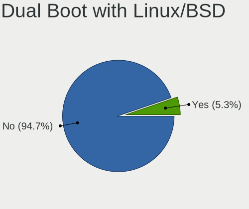
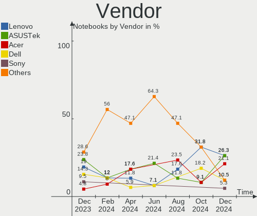
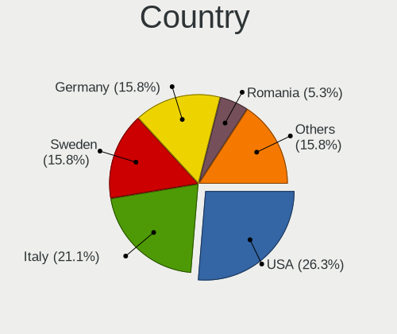
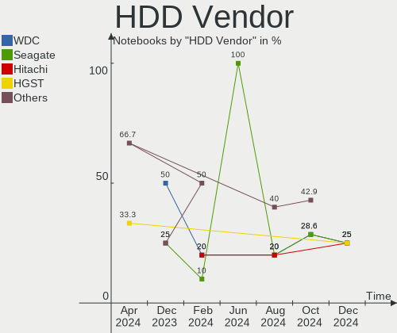
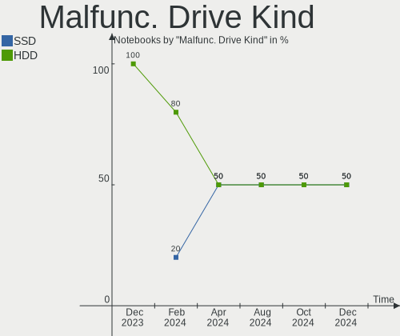
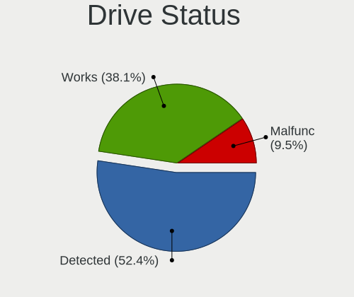
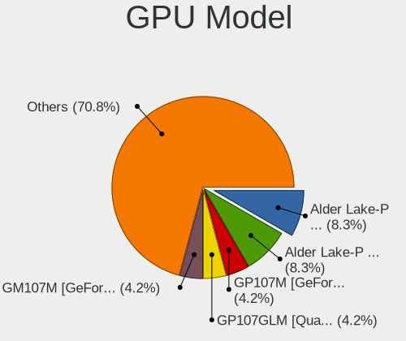
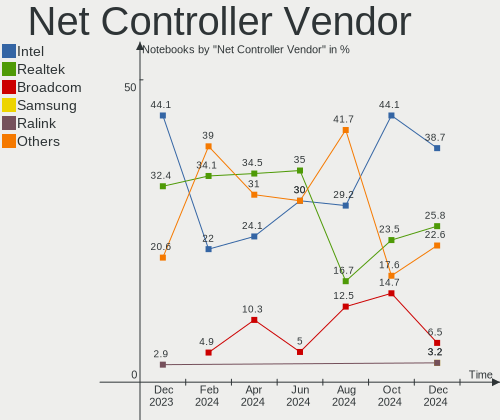
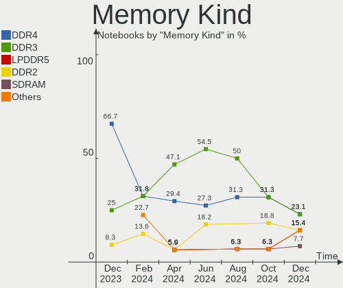
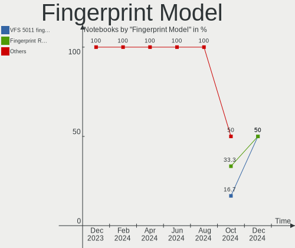

LMDE - Hardware Trends (Notebooks)
----------------------------------

A project to identify most popular hardware characteristics and track their change
over time based on data collected by Linux users at https://Linux-Hardware.org.

Anyone can contribute to this report by the [hw-probe](https://github.com/linuxhw/hw-probe) tool:

    sudo -E hw-probe -all -upload

This report is for one last month. Overall report since the beginning of time: [TestCoverage](https://github.com/linuxhw/TestCoverage)

Period: Sep, 2022.

Contents
--------

* [ System ](#system)
  - [ OS                       ](#os)
  - [ OS Family                ](#os-family)
  - [ Kernel                   ](#kernel)
  - [ Kernel Family            ](#kernel-family)
  - [ Kernel Major Ver.        ](#kernel-major-ver)
  - [ Arch                     ](#arch)
  - [ DE                       ](#de)
  - [ Display Server           ](#display-server)
  - [ Display Manager          ](#display-manager)
  - [ OS Lang                  ](#os-lang)
  - [ Boot Mode                ](#boot-mode)
  - [ Filesystem               ](#filesystem)
  - [ Part. scheme             ](#part-scheme)
  - [ Dual Boot with Linux/BSD ](#dual-boot-with-linuxbsd)
  - [ Dual Boot (Win)          ](#dual-boot-win)

* [ Board ](#board)
  - [ Vendor                   ](#vendor)
  - [ Model                    ](#model)
  - [ Model Family             ](#model-family)
  - [ MFG Year                 ](#mfg-year)
  - [ Form Factor              ](#form-factor)
  - [ Secure Boot              ](#secure-boot)
  - [ Coreboot                 ](#coreboot)
  - [ RAM Size                 ](#ram-size)
  - [ RAM Used                 ](#ram-used)
  - [ Total Drives             ](#total-drives)
  - [ Has CD-ROM               ](#has-cd-rom)
  - [ Has Ethernet             ](#has-ethernet)
  - [ Has WiFi                 ](#has-wifi)
  - [ Has Bluetooth            ](#has-bluetooth)

* [ Location ](#location)
  - [ Country                  ](#country)
  - [ City                     ](#city)

* [ Drives ](#drives)
  - [ Drive Vendor             ](#drive-vendor)
  - [ Drive Model              ](#drive-model)
  - [ HDD Vendor               ](#hdd-vendor)
  - [ SSD Vendor               ](#ssd-vendor)
  - [ Drive Kind               ](#drive-kind)
  - [ Drive Connector          ](#drive-connector)
  - [ Drive Size               ](#drive-size)
  - [ Space Total              ](#space-total)
  - [ Space Used               ](#space-used)
  - [ Malfunc. Drives          ](#malfunc-drives)
  - [ Malfunc. Drive Vendor    ](#malfunc-drive-vendor)
  - [ Malfunc. HDD Vendor      ](#malfunc-hdd-vendor)
  - [ Malfunc. Drive Kind      ](#malfunc-drive-kind)
  - [ Failed Drives            ](#failed-drives)
  - [ Failed Drive Vendor      ](#failed-drive-vendor)
  - [ Drive Status             ](#drive-status)

* [ Storage controller ](#storage-controller)
  - [ Storage Vendor           ](#storage-vendor)
  - [ Storage Model            ](#storage-model)
  - [ Storage Kind             ](#storage-kind)

* [ Processor ](#processor)
  - [ CPU Vendor               ](#cpu-vendor)
  - [ CPU Model                ](#cpu-model)
  - [ CPU Model Family         ](#cpu-model-family)
  - [ CPU Cores                ](#cpu-cores)
  - [ CPU Sockets              ](#cpu-sockets)
  - [ CPU Threads              ](#cpu-threads)
  - [ CPU Op-Modes             ](#cpu-op-modes)
  - [ CPU Microcode            ](#cpu-microcode)
  - [ CPU Microarch            ](#cpu-microarch)

* [ Graphics ](#graphics)
  - [ GPU Vendor               ](#gpu-vendor)
  - [ GPU Model                ](#gpu-model)
  - [ GPU Combo                ](#gpu-combo)
  - [ GPU Driver               ](#gpu-driver)
  - [ GPU Memory               ](#gpu-memory)

* [ Monitor ](#monitor)
  - [ Monitor Vendor           ](#monitor-vendor)
  - [ Monitor Model            ](#monitor-model)
  - [ Monitor Resolution       ](#monitor-resolution)
  - [ Monitor Diagonal         ](#monitor-diagonal)
  - [ Monitor Width            ](#monitor-width)
  - [ Aspect Ratio             ](#aspect-ratio)
  - [ Monitor Area             ](#monitor-area)
  - [ Pixel Density            ](#pixel-density)
  - [ Multiple Monitors        ](#multiple-monitors)

* [ Network ](#network)
  - [ Net Controller Vendor    ](#net-controller-vendor)
  - [ Net Controller Model     ](#net-controller-model)
  - [ Wireless Vendor          ](#wireless-vendor)
  - [ Wireless Model           ](#wireless-model)
  - [ Ethernet Vendor          ](#ethernet-vendor)
  - [ Ethernet Model           ](#ethernet-model)
  - [ Net Controller Kind      ](#net-controller-kind)
  - [ Used Controller          ](#used-controller)
  - [ NICs                     ](#nics)
  - [ IPv6                     ](#ipv6)

* [ Bluetooth ](#bluetooth)
  - [ Bluetooth Vendor         ](#bluetooth-vendor)
  - [ Bluetooth Model          ](#bluetooth-model)

* [ Sound ](#sound)
  - [ Sound Vendor             ](#sound-vendor)
  - [ Sound Model              ](#sound-model)

* [ Memory ](#memory)
  - [ Memory Vendor            ](#memory-vendor)
  - [ Memory Model             ](#memory-model)
  - [ Memory Kind              ](#memory-kind)
  - [ Memory Form Factor       ](#memory-form-factor)
  - [ Memory Size              ](#memory-size)
  - [ Memory Speed             ](#memory-speed)

* [ Printers & scanners ](#printers--scanners)
  - [ Printer Vendor           ](#printer-vendor)
  - [ Printer Model            ](#printer-model)
  - [ Scanner Vendor           ](#scanner-vendor)
  - [ Scanner Model            ](#scanner-model)

* [ Camera ](#camera)
  - [ Camera Vendor            ](#camera-vendor)
  - [ Camera Model             ](#camera-model)

* [ Security ](#security)
  - [ Fingerprint Vendor       ](#fingerprint-vendor)
  - [ Fingerprint Model        ](#fingerprint-model)
  - [ Chipcard Vendor          ](#chipcard-vendor)
  - [ Chipcard Model           ](#chipcard-model)

* [ Unsupported ](#unsupported)
  - [ Unsupported Devices      ](#unsupported-devices)
  - [ Unsupported Device Types ](#unsupported-device-types)

System
------

OS
--

Installed operating systems

| Name   | Notebooks | Percent |
|--------|-----------|---------|
| LMDE 5 | 12        | 92.31%  |
| LMDE 4 | 1         | 7.69%   |

OS Family
---------

OS without a version

| Name | Notebooks | Percent |
|------|-----------|---------|
| LMDE | 13        | 100%    |

Kernel
------

Version of the Linux kernel

| Version         | Notebooks | Percent |
|-----------------|-----------|---------|
| 5.10.0-18-amd64 | 5         | 38.46%  |
| 5.10.0-17-amd64 | 4         | 30.77%  |
| 5.19.10-xanmod1 | 1         | 7.69%   |
| 5.10.0-17-686   | 1         | 7.69%   |
| 5.10.0-12-amd64 | 1         | 7.69%   |
| 4.19.0-21-amd64 | 1         | 7.69%   |

Kernel Family
-------------

Linux kernel without a distro release

| Version | Notebooks | Percent |
|---------|-----------|---------|
| 5.10.0  | 11        | 84.62%  |
| 5.19.10 | 1         | 7.69%   |
| 4.19.0  | 1         | 7.69%   |

Kernel Major Ver.
-----------------

Linux kernel major version

| Version | Notebooks | Percent |
|---------|-----------|---------|
| 5.10    | 11        | 84.62%  |
| 5.19    | 1         | 7.69%   |
| 4.19    | 1         | 7.69%   |

Arch
----

OS architecture (x86_64, i586, etc.)

| Name   | Notebooks | Percent |
|--------|-----------|---------|
| x86_64 | 12        | 92.31%  |
| i686   | 1         | 7.69%   |

DE
--

Desktop Environment

| Name       | Notebooks | Percent |
|------------|-----------|---------|
| X-Cinnamon | 13        | 100%    |

Display Server
--------------

X11 or Wayland

| Name | Notebooks | Percent |
|------|-----------|---------|
| X11  | 13        | 100%    |

Display Manager
---------------

SDDM, LightDM, etc.

| Name    | Notebooks | Percent |
|---------|-----------|---------|
| Unknown | 7         | 53.85%  |
| LightDM | 6         | 46.15%  |

OS Lang
-------

Language

| Lang  | Notebooks | Percent |
|-------|-----------|---------|
| en_US | 3         | 23.08%  |
| de_DE | 3         | 23.08%  |
| ru_RU | 2         | 15.38%  |
| en_GB | 2         | 15.38%  |
| it_IT | 1         | 7.69%   |
| es_ES | 1         | 7.69%   |
| en_NZ | 1         | 7.69%   |

Boot Mode
---------

EFI or BIOS

| Mode | Notebooks | Percent |
|------|-----------|---------|
| EFI  | 10        | 76.92%  |
| BIOS | 3         | 23.08%  |

Filesystem
----------

Type of filesystem

| Type | Notebooks | Percent |
|------|-----------|---------|
| Ext4 | 13        | 100%    |

Part. scheme
------------

Scheme of partitioning

| Type    | Notebooks | Percent |
|---------|-----------|---------|
| Unknown | 7         | 53.85%  |
| GPT     | 5         | 38.46%  |
| MBR     | 1         | 7.69%   |

Dual Boot with Linux/BSD
------------------------

Hosting more than one Linux/BSD

| Dual boot | Notebooks | Percent |
|-----------|-----------|---------|
| No        | 13        | 100%    |

Dual Boot (Win)
---------------

Hosting Linux and Windows

| Dual boot | Notebooks | Percent |
|-----------|-----------|---------|
| No        | 12        | 92.31%  |
| Yes       | 1         | 7.69%   |

Board
-----

Vendor
------

Motherboard manufacturer

| Name             | Notebooks | Percent |
|------------------|-----------|---------|
| Lenovo           | 4         | 30.77%  |
| Hewlett-Packard  | 3         | 23.08%  |
| ASUSTek Computer | 2         | 15.38%  |
| Acer             | 2         | 15.38%  |
| Medion           | 1         | 7.69%   |
| Dell             | 1         | 7.69%   |

Model
-----

Motherboard model

| Name                                  | Notebooks | Percent |
|---------------------------------------|-----------|---------|
| Medion P15648                         | 1         | 7.69%   |
| Lenovo Yoga 2 11 20332                | 1         | 7.69%   |
| Lenovo ThinkPad X270 W10DG 20K5S3HG00 | 1         | 7.69%   |
| Lenovo ThinkPad E15 Gen 4 21EES00100  | 1         | 7.69%   |
| Lenovo IdeaPad 320-15IKB 80XL         | 1         | 7.69%   |
| HP Laptop 14-cf3xxx                   | 1         | 7.69%   |
| HP G72                                | 1         | 7.69%   |
| HP EliteBook 850 G6                   | 1         | 7.69%   |
| Dell Latitude E6430                   | 1         | 7.69%   |
| ASUS ROG Strix G513RM_G513RM          | 1         | 7.69%   |
| ASUS K56CB                            | 1         | 7.69%   |
| Acer Aspire F5-573G                   | 1         | 7.69%   |
| Acer Aspire 5930                      | 1         | 7.69%   |

Model Family
------------

Motherboard model prefix

| Name            | Notebooks | Percent |
|-----------------|-----------|---------|
| Lenovo ThinkPad | 2         | 15.38%  |
| Acer Aspire     | 2         | 15.38%  |
| Medion P15648   | 1         | 7.69%   |
| Lenovo Yoga     | 1         | 7.69%   |
| Lenovo IdeaPad  | 1         | 7.69%   |
| HP Laptop       | 1         | 7.69%   |
| HP G72          | 1         | 7.69%   |
| HP EliteBook    | 1         | 7.69%   |
| Dell Latitude   | 1         | 7.69%   |
| ASUS ROG        | 1         | 7.69%   |
| ASUS K56CB      | 1         | 7.69%   |

MFG Year
--------

Motherboard manufacture year

| Year | Notebooks | Percent |
|------|-----------|---------|
| 2022 | 2         | 15.38%  |
| 2019 | 2         | 15.38%  |
| 2017 | 2         | 15.38%  |
| 2013 | 2         | 15.38%  |
| 2020 | 1         | 7.69%   |
| 2016 | 1         | 7.69%   |
| 2012 | 1         | 7.69%   |
| 2010 | 1         | 7.69%   |
| 2008 | 1         | 7.69%   |

Form Factor
-----------

Physical design of the computer

| Name     | Notebooks | Percent |
|----------|-----------|---------|
| Notebook | 13        | 100%    |

Secure Boot
-----------

Enabled or disabled

| State    | Notebooks | Percent |
|----------|-----------|---------|
| Disabled | 12        | 92.31%  |
| Enabled  | 1         | 7.69%   |

Coreboot
--------

Have coreboot on board

| Used | Notebooks | Percent |
|------|-----------|---------|
| No   | 13        | 100%    |

RAM Size
--------

Total RAM memory

| Size in GB | Notebooks | Percent |
|------------|-----------|---------|
| 8.01-16.0  | 5         | 38.46%  |
| 4.01-8.0   | 4         | 30.77%  |
| 16.01-24.0 | 2         | 15.38%  |
| 3.01-4.0   | 1         | 7.69%   |
| 2.01-3.0   | 1         | 7.69%   |

RAM Used
--------

Used RAM memory

| Used GB  | Notebooks | Percent |
|----------|-----------|---------|
| 2.01-3.0 | 9         | 69.23%  |
| 1.01-2.0 | 3         | 23.08%  |
| 0.51-1.0 | 1         | 7.69%   |

Total Drives
------------

Number of drives on board

| Drives | Notebooks | Percent |
|--------|-----------|---------|
| 1      | 9         | 69.23%  |
| 2      | 3         | 23.08%  |
| 3      | 1         | 7.69%   |

Has CD-ROM
----------

Has CD-ROM on board

| Presented | Notebooks | Percent |
|-----------|-----------|---------|
| No        | 8         | 61.54%  |
| Yes       | 5         | 38.46%  |

Has Ethernet
------------

Has Ethernet on board

| Presented | Notebooks | Percent |
|-----------|-----------|---------|
| Yes       | 11        | 84.62%  |
| No        | 2         | 15.38%  |

Has WiFi
--------

Has WiFi module

| Presented | Notebooks | Percent |
|-----------|-----------|---------|
| Yes       | 13        | 100%    |

Has Bluetooth
-------------

Has Bluetooth module

| Presented | Notebooks | Percent |
|-----------|-----------|---------|
| Yes       | 11        | 84.62%  |
| No        | 2         | 15.38%  |

Location
--------

Country
-------

Geographic location (country)

| Country     | Notebooks | Percent |
|-------------|-----------|---------|
| Germany     | 3         | 23.08%  |
| Russia      | 2         | 15.38%  |
| Italy       | 2         | 15.38%  |
| USA         | 1         | 7.69%   |
| Switzerland | 1         | 7.69%   |
| Spain       | 1         | 7.69%   |
| New Zealand | 1         | 7.69%   |
| Finland     | 1         | 7.69%   |
| Ecuador     | 1         | 7.69%   |

City
----

Geographic location (city)

| City                 | Notebooks | Percent |
|----------------------|-----------|---------|
| Turku                | 1         | 7.69%   |
| St Petersburg        | 1         | 7.69%   |
| Rome                 | 1         | 7.69%   |
| Reinach              | 1         | 7.69%   |
| Nizhniy Novgorod     | 1         | 7.69%   |
| Liberty Lake         | 1         | 7.69%   |
| Freiburg im Breisgau | 1         | 7.69%   |
| Fernán Núñez      | 1         | 7.69%   |
| Dubino               | 1         | 7.69%   |
| Berlin               | 1         | 7.69%   |
| Bad Salzuflen        | 1         | 7.69%   |
| Babahoyo             | 1         | 7.69%   |
| Auckland             | 1         | 7.69%   |

Drives
------

Drive Vendor
------------

Hard drive vendors

| Vendor              | Notebooks | Drives | Percent |
|---------------------|-----------|--------|---------|
| Seagate             | 5         | 5      | 27.78%  |
| Samsung Electronics | 3         | 3      | 16.67%  |
| SanDisk             | 2         | 2      | 11.11%  |
| Kingston            | 2         | 2      | 11.11%  |
| Unknown             | 1         | 1      | 5.56%   |
| UMIS                | 1         | 1      | 5.56%   |
| PNY                 | 1         | 1      | 5.56%   |
| Micron Technology   | 1         | 1      | 5.56%   |
| Intel               | 1         | 1      | 5.56%   |
| A-DATA Technology   | 1         | 1      | 5.56%   |

Drive Model
-----------

Hard drive models

| Model                               | Notebooks | Percent |
|-------------------------------------|-----------|---------|
| Seagate ST1000LM035-1RK172 1TB      | 2         | 11.11%  |
| Unknown SC128  128GB                | 1         | 5.56%   |
| UMIS RPJTJ512MGE1QDQ 512GB          | 1         | 5.56%   |
| Seagate ST9250827AS 250GB           | 1         | 5.56%   |
| Seagate ST9250410AS 250GB           | 1         | 5.56%   |
| Seagate ST500LT032-1E9142 500GB     | 1         | 5.56%   |
| SanDisk X600 2.5 7MM SATA 256GB SSD | 1         | 5.56%   |
| Sandisk WD_BLACK SN750 SE 500GB     | 1         | 5.56%   |
| Samsung SSD 970 EVO Plus 500GB      | 1         | 5.56%   |
| Samsung SSD 870 EVO 500GB           | 1         | 5.56%   |
| Samsung MZVLB256HAHQ-000H1 256GB    | 1         | 5.56%   |
| PNY SSD2SC240G1SA754D117-459P 240GB | 1         | 5.56%   |
| Micron NVMe SSD Drive 1024GB        | 1         | 5.56%   |
| Kingston SV300S37A240G 240GB SSD    | 1         | 5.56%   |
| Kingston SMSM150S324G 24GB SSD      | 1         | 5.56%   |
| Intel SSDPEKNW512G8L 512GB          | 1         | 5.56%   |
| A-DATA ED600 1TB SSD                | 1         | 5.56%   |

HDD Vendor
----------

Hard disk drive vendors

| Vendor  | Notebooks | Drives | Percent |
|---------|-----------|--------|---------|
| Seagate | 5         | 5      | 100%    |

SSD Vendor
----------

Solid state drive vendors

| Vendor              | Notebooks | Drives | Percent |
|---------------------|-----------|--------|---------|
| Kingston            | 2         | 2      | 33.33%  |
| SanDisk             | 1         | 1      | 16.67%  |
| Samsung Electronics | 1         | 1      | 16.67%  |
| PNY                 | 1         | 1      | 16.67%  |
| A-DATA Technology   | 1         | 1      | 16.67%  |

Drive Kind
----------

HDD or SSD

| Kind | Notebooks | Drives | Percent |
|------|-----------|--------|---------|
| NVMe | 5         | 6      | 31.25%  |
| SSD  | 5         | 6      | 31.25%  |
| HDD  | 5         | 5      | 31.25%  |
| MMC  | 1         | 1      | 6.25%   |

Drive Connector
---------------

SATA, SAS, NVMe, etc.

| Type | Notebooks | Drives | Percent |
|------|-----------|--------|---------|
| SATA | 9         | 10     | 56.25%  |
| NVMe | 5         | 6      | 31.25%  |
| SAS  | 1         | 1      | 6.25%   |
| MMC  | 1         | 1      | 6.25%   |

Drive Size
----------

Size of hard drive

| Size in TB | Notebooks | Drives | Percent |
|------------|-----------|--------|---------|
| 0.01-0.5   | 7         | 8      | 77.78%  |
| 0.51-1.0   | 2         | 3      | 22.22%  |

Space Total
-----------

Amount of disk space available on the file system

| Size in GB | Notebooks | Percent |
|------------|-----------|---------|
| 251-500    | 5         | 38.46%  |
| 101-250    | 5         | 38.46%  |
| 501-1000   | 2         | 15.38%  |
| 1001-2000  | 1         | 7.69%   |

Space Used
----------

Amount of used disk space

| Used GB  | Notebooks | Percent |
|----------|-----------|---------|
| 1-20     | 6         | 46.15%  |
| 21-50    | 2         | 15.38%  |
| 101-250  | 2         | 15.38%  |
| 51-100   | 2         | 15.38%  |
| 501-1000 | 1         | 7.69%   |

Malfunc. Drives
---------------

Drive models with a malfunction

| Model                           | Notebooks | Drives | Percent |
|---------------------------------|-----------|--------|---------|
| Seagate ST500LT032-1E9142 500GB | 1         | 1      | 100%    |

Malfunc. Drive Vendor
---------------------

Vendors of faulty drives

| Vendor  | Notebooks | Drives | Percent |
|---------|-----------|--------|---------|
| Seagate | 1         | 1      | 100%    |

Malfunc. HDD Vendor
-------------------

Vendors of faulty HDD drives

| Vendor  | Notebooks | Drives | Percent |
|---------|-----------|--------|---------|
| Seagate | 1         | 1      | 100%    |

Malfunc. Drive Kind
-------------------

Kinds of faulty drives

| Kind | Notebooks | Drives | Percent |
|------|-----------|--------|---------|
| HDD  | 1         | 1      | 100%    |

Failed Drives
-------------

Failed drive models

Zero info for selected period =(

Failed Drive Vendor
-------------------

Failed drive vendors

Zero info for selected period =(

Drive Status
------------

Number of failed and malfunc. drives

| Status   | Notebooks | Drives | Percent |
|----------|-----------|--------|---------|
| Detected | 8         | 11     | 57.14%  |
| Works    | 5         | 6      | 35.71%  |
| Malfunc  | 1         | 1      | 7.14%   |

Storage controller
------------------

Storage Vendor
--------------

Storage controller vendors

| Vendor                  | Notebooks | Percent |
|-------------------------|-----------|---------|
| Intel                   | 10        | 66.67%  |
| Samsung Electronics     | 2         | 13.33%  |
| Union Memory (Shenzhen) | 1         | 6.67%   |
| SanDisk                 | 1         | 6.67%   |
| Micron Technology       | 1         | 6.67%   |

Storage Model
-------------

Storage controller models

| Model                                                                | Notebooks | Percent |
|----------------------------------------------------------------------|-----------|---------|
| Intel 82801 Mobile SATA Controller [RAID mode]                       | 3         | 18.75%  |
| Samsung NVMe SSD Controller SM981/PM981/PM983                        | 2         | 12.5%   |
| Intel Sunrise Point-LP SATA Controller [AHCI mode]                   | 2         | 12.5%   |
| Intel 7 Series Chipset Family 6-port SATA Controller [AHCI mode]     | 2         | 12.5%   |
| Union Memory (Shenzhen) AM630 PCIe 4.0 x4 NVMe SSD Controller        | 1         | 6.25%   |
| SanDisk Non-Volatile memory controller                               | 1         | 6.25%   |
| Micron Non-Volatile memory controller                                | 1         | 6.25%   |
| Intel SSD 660P Series                                                | 1         | 6.25%   |
| Intel Atom Processor E3800 Series SATA AHCI Controller               | 1         | 6.25%   |
| Intel 82801IBM/IEM (ICH9M/ICH9M-E) 2 port SATA Controller [IDE mode] | 1         | 6.25%   |
| Intel 5 Series/3400 Series Chipset 4 port SATA AHCI Controller       | 1         | 6.25%   |

Storage Kind
------------

Kind of storage controller (IDE, SATA, NVMe, SAS, ...)

| Kind | Notebooks | Percent |
|------|-----------|---------|
| SATA | 6         | 40%     |
| NVMe | 5         | 33.33%  |
| RAID | 3         | 20%     |
| IDE  | 1         | 6.67%   |

Processor
---------

CPU Vendor
----------

Processor vendors

| Vendor | Notebooks | Percent |
|--------|-----------|---------|
| Intel  | 11        | 84.62%  |
| AMD    | 2         | 15.38%  |

CPU Model
---------

Processor models

| Model                                  | Notebooks | Percent |
|----------------------------------------|-----------|---------|
| Intel Pentium CPU P6000 @ 1.87GHz      | 1         | 7.69%   |
| Intel Core i7-7500U CPU @ 2.70GHz      | 1         | 7.69%   |
| Intel Core i7-3537U CPU @ 2.00GHz      | 1         | 7.69%   |
| Intel Core i5-8265U CPU @ 1.60GHz      | 1         | 7.69%   |
| Intel Core i5-6200U CPU @ 2.30GHz      | 1         | 7.69%   |
| Intel Core i5-3230M CPU @ 2.60GHz      | 1         | 7.69%   |
| Intel Core i5-10210U CPU @ 1.60GHz     | 1         | 7.69%   |
| Intel Core i3-7100U CPU @ 2.40GHz      | 1         | 7.69%   |
| Intel Core i3-1005G1 CPU @ 1.20GHz     | 1         | 7.69%   |
| Intel Core 2 Duo CPU P7350 @ 2.00GHz   | 1         | 7.69%   |
| Intel Celeron CPU N2930 @ 1.83GHz      | 1         | 7.69%   |
| AMD Ryzen 7 6800H with Radeon Graphics | 1         | 7.69%   |
| AMD Ryzen 7 5825U with Radeon Graphics | 1         | 7.69%   |

CPU Model Family
----------------

Processor model prefix

| Model            | Notebooks | Percent |
|------------------|-----------|---------|
| Intel Core i5    | 4         | 30.77%  |
| Intel Core i7    | 2         | 15.38%  |
| Intel Core i3    | 2         | 15.38%  |
| AMD Ryzen 7      | 2         | 15.38%  |
| Intel Pentium    | 1         | 7.69%   |
| Intel Core 2 Duo | 1         | 7.69%   |
| Intel Celeron    | 1         | 7.69%   |

CPU Cores
---------

Number of processor cores

| Number | Notebooks | Percent |
|--------|-----------|---------|
| 2      | 8         | 61.54%  |
| 4      | 3         | 23.08%  |
| 8      | 2         | 15.38%  |

CPU Sockets
-----------

Number of sockets

| Number | Notebooks | Percent |
|--------|-----------|---------|
| 1      | 13        | 100%    |

CPU Threads
-----------

Threads per core (Hyper-Threading)

| Number | Notebooks | Percent |
|--------|-----------|---------|
| 2      | 10        | 76.92%  |
| 1      | 3         | 23.08%  |

CPU Op-Modes
------------

CPU Operation Modes (32-bit, 64-bit)

| Op mode        | Notebooks | Percent |
|----------------|-----------|---------|
| 32-bit, 64-bit | 13        | 100%    |

CPU Microcode
-------------

Microcode number

| Number     | Notebooks | Percent |
|------------|-----------|---------|
| 0x806ec    | 2         | 15.38%  |
| 0x806e9    | 2         | 15.38%  |
| 0x306a9    | 2         | 15.38%  |
| 0x706e5    | 1         | 7.69%   |
| 0x406e3    | 1         | 7.69%   |
| 0x30678    | 1         | 7.69%   |
| 0x20652    | 1         | 7.69%   |
| 0x10676    | 1         | 7.69%   |
| 0x0a50000c | 1         | 7.69%   |
| 0x0a404101 | 1         | 7.69%   |

CPU Microarch
-------------

Microarchitecture

| Name       | Notebooks | Percent |
|------------|-----------|---------|
| KabyLake   | 4         | 30.77%  |
| IvyBridge  | 2         | 15.38%  |
| Zen 3      | 1         | 7.69%   |
| Westmere   | 1         | 7.69%   |
| Skylake    | 1         | 7.69%   |
| Silvermont | 1         | 7.69%   |
| Penryn     | 1         | 7.69%   |
| IceLake    | 1         | 7.69%   |
| Unknown    | 1         | 7.69%   |

Graphics
--------

GPU Vendor
----------

Vendors of graphics cards

| Vendor | Notebooks | Percent |
|--------|-----------|---------|
| Intel  | 11        | 57.89%  |
| Nvidia | 5         | 26.32%  |
| AMD    | 3         | 15.79%  |

GPU Model
---------

Graphics card models

| Model                                                        | Notebooks | Percent |
|--------------------------------------------------------------|-----------|---------|
| Intel HD Graphics 620                                        | 2         | 10.53%  |
| Intel 3rd Gen Core processor Graphics Controller             | 2         | 10.53%  |
| Nvidia GP108M [GeForce MX250]                                | 1         | 5.26%   |
| Nvidia GM108M [GeForce 940MX]                                | 1         | 5.26%   |
| Nvidia GM107 [GeForce 940MX]                                 | 1         | 5.26%   |
| Nvidia GK107M [GeForce GT 740M]                              | 1         | 5.26%   |
| Nvidia GA106M [GeForce RTX 3060 Mobile / Max-Q]              | 1         | 5.26%   |
| Intel WhiskeyLake-U GT2 [UHD Graphics 620]                   | 1         | 5.26%   |
| Intel Skylake GT2 [HD Graphics 520]                          | 1         | 5.26%   |
| Intel Mobile 4 Series Chipset Integrated Graphics Controller | 1         | 5.26%   |
| Intel Iris Plus Graphics G1 (Ice Lake)                       | 1         | 5.26%   |
| Intel Core Processor Integrated Graphics Controller          | 1         | 5.26%   |
| Intel CometLake-U GT2 [UHD Graphics]                         | 1         | 5.26%   |
| Intel Atom Processor Z36xxx/Z37xxx Series Graphics & Display | 1         | 5.26%   |
| AMD Rembrandt [Radeon 680M]                                  | 1         | 5.26%   |
| AMD Park [Mobility Radeon HD 5430/5450/5470]                 | 1         | 5.26%   |
| AMD Barcelo                                                  | 1         | 5.26%   |

GPU Combo
---------

Combinations of graphics cards

| Name           | Notebooks | Percent |
|----------------|-----------|---------|
| 1 x Intel      | 6         | 46.15%  |
| Intel + Nvidia | 4         | 30.77%  |
| Intel + AMD    | 1         | 7.69%   |
| AMD + Nvidia   | 1         | 7.69%   |
| 1 x AMD        | 1         | 7.69%   |

GPU Driver
----------

Free vs proprietary

| Driver  | Notebooks | Percent |
|---------|-----------|---------|
| Free    | 11        | 84.62%  |
| Unknown | 2         | 15.38%  |

GPU Memory
----------

Total video memory

| Size in GB | Notebooks | Percent |
|------------|-----------|---------|
| Unknown    | 8         | 61.54%  |
| 1.01-2.0   | 3         | 23.08%  |
| 3.01-4.0   | 1         | 7.69%   |
| 0.01-0.5   | 1         | 7.69%   |

Monitor
-------

Monitor Vendor
--------------

Monitor vendors

| Vendor                  | Notebooks | Percent |
|-------------------------|-----------|---------|
| LG Display              | 3         | 30%     |
| AU Optronics            | 2         | 20%     |
| LG Philips              | 1         | 10%     |
| InfoVision              | 1         | 10%     |
| Chimei Innolux          | 1         | 10%     |
| Chi Mei Optoelectronics | 1         | 10%     |
| BOE                     | 1         | 10%     |

Monitor Model
-------------

Monitor models

| Model                                                                    | Notebooks | Percent |
|--------------------------------------------------------------------------|-----------|---------|
| LG Philips LCD Monitor LPL3B01 1280x800 331x207mm 15.4-inch              | 1         | 10%     |
| LG Display LCD Monitor LGD05E5 1920x1080 344x194mm 15.5-inch             | 1         | 10%     |
| LG Display LCD Monitor LGD046F 1920x1080 345x194mm 15.6-inch             | 1         | 10%     |
| LG Display LCD Monitor LGD027A 1600x900 382x215mm 17.3-inch              | 1         | 10%     |
| InfoVision LCD Monitor IVO3D2C 1920x1080 344x194mm 15.5-inch             | 1         | 10%     |
| Chimei Innolux LCD Monitor CMN15DB 1366x768 344x193mm 15.5-inch          | 1         | 10%     |
| Chi Mei Optoelectronics LCD Monitor CMO1469 1366x768 309x174mm 14.0-inch | 1         | 10%     |
| BOE LCD Monitor BOE07B5 1366x768 309x173mm 13.9-inch                     | 1         | 10%     |
| AU Optronics LCD Monitor AUO45EC 1366x768 344x193mm 15.5-inch            | 1         | 10%     |
| AU Optronics LCD Monitor AUO106C 1366x768 277x156mm 12.5-inch            | 1         | 10%     |

Monitor Resolution
------------------

Monitor screen resolution

| Resolution      | Notebooks | Percent |
|-----------------|-----------|---------|
| 1366x768 (WXGA) | 5         | 50%     |
| 1920x1080 (FHD) | 3         | 30%     |
| 1600x900 (HD+)  | 1         | 10%     |
| 1280x800 (WXGA) | 1         | 10%     |

Monitor Diagonal
----------------

Diagonal size in inches

| Inches | Notebooks | Percent |
|--------|-----------|---------|
| 15     | 6         | 60%     |
| 17     | 1         | 10%     |
| 14     | 1         | 10%     |
| 13     | 1         | 10%     |
| 12     | 1         | 10%     |

Monitor Width
-------------

Physical width

| Width in mm | Notebooks | Percent |
|-------------|-----------|---------|
| 301-350     | 8         | 80%     |
| 351-400     | 1         | 10%     |
| 201-300     | 1         | 10%     |

Aspect Ratio
------------

Proportional relationship between the width and the height

| Ratio | Notebooks | Percent |
|-------|-----------|---------|
| 16/9  | 9         | 90%     |
| 16/10 | 1         | 10%     |

Monitor Area
------------

Area in inch²

| Area in inch² | Notebooks | Percent |
|----------------|-----------|---------|
| 101-110        | 6         | 60%     |
| 81-90          | 2         | 20%     |
| 61-70          | 1         | 10%     |
| 121-130        | 1         | 10%     |

Pixel Density
-------------

Pixels per inch

| Density | Notebooks | Percent |
|---------|-----------|---------|
| 101-120 | 5         | 50%     |
| 121-160 | 4         | 40%     |
| 51-100  | 1         | 10%     |

Multiple Monitors
-----------------

Total monitors connected

| Total | Notebooks | Percent |
|-------|-----------|---------|
| 1     | 11        | 84.62%  |
| 0     | 2         | 15.38%  |

Network
-------

Net Controller Vendor
---------------------

Controller vendors

| Vendor                   | Notebooks | Percent |
|--------------------------|-----------|---------|
| Realtek Semiconductor    | 7         | 35%     |
| Intel                    | 6         | 30%     |
| Qualcomm Atheros         | 2         | 10%     |
| Broadcom                 | 2         | 10%     |
| MediaTek                 | 1         | 5%      |
| Marvell Technology Group | 1         | 5%      |
| Edimax Technology        | 1         | 5%      |

Net Controller Model
--------------------

Controller models

| Model                                                             | Notebooks | Percent |
|-------------------------------------------------------------------|-----------|---------|
| Realtek RTL8111/8168/8411 PCI Express Gigabit Ethernet Controller | 5         | 20%     |
| Realtek RTL8821CE 802.11ac PCIe Wireless Network Adapter          | 1         | 4%      |
| Realtek RTL8821AE 802.11ac PCIe Wireless Network Adapter          | 1         | 4%      |
| Realtek RTL8125 2.5GbE Controller                                 | 1         | 4%      |
| Realtek RTL810xE PCI Express Fast Ethernet controller             | 1         | 4%      |
| Realtek Realtek Network controller                                | 1         | 4%      |
| Qualcomm Atheros QCA9377 802.11ac Wireless Network Adapter        | 1         | 4%      |
| Qualcomm Atheros AR9285 Wireless Network Adapter (PCI-Express)    | 1         | 4%      |
| MediaTek MT7922 802.11ax PCI Express Wireless Network Adapter     | 1         | 4%      |
| Marvell Group 88E8071 PCI-E Gigabit Ethernet Controller           | 1         | 4%      |
| Intel Wireless 8260                                               | 1         | 4%      |
| Intel WiFi Link 5100                                              | 1         | 4%      |
| Intel Wi-Fi 6 AX200                                               | 1         | 4%      |
| Intel Ethernet Connection I219-V                                  | 1         | 4%      |
| Intel Ethernet Connection (6) I219-V                              | 1         | 4%      |
| Intel Comet Lake PCH-LP CNVi WiFi                                 | 1         | 4%      |
| Intel Centrino Wireless-N 2230                                    | 1         | 4%      |
| Intel 82579LM Gigabit Network Connection (Lewisville)             | 1         | 4%      |
| Edimax EW-7811Un 802.11n Wireless Adapter [Realtek RTL8188CUS]    | 1         | 4%      |
| Broadcom BCM43142 802.11b/g/n                                     | 1         | 4%      |
| Broadcom BCM4313 802.11bgn Wireless Network Adapter               | 1         | 4%      |

Wireless Vendor
---------------

Wireless vendors

| Vendor                | Notebooks | Percent |
|-----------------------|-----------|---------|
| Intel                 | 5         | 35.71%  |
| Realtek Semiconductor | 3         | 21.43%  |
| Qualcomm Atheros      | 2         | 14.29%  |
| Broadcom              | 2         | 14.29%  |
| MediaTek              | 1         | 7.14%   |
| Edimax Technology     | 1         | 7.14%   |

Wireless Model
--------------

Wireless models

| Model                                                          | Notebooks | Percent |
|----------------------------------------------------------------|-----------|---------|
| Realtek RTL8821CE 802.11ac PCIe Wireless Network Adapter       | 1         | 7.14%   |
| Realtek RTL8821AE 802.11ac PCIe Wireless Network Adapter       | 1         | 7.14%   |
| Realtek Realtek Network controller                             | 1         | 7.14%   |
| Qualcomm Atheros QCA9377 802.11ac Wireless Network Adapter     | 1         | 7.14%   |
| Qualcomm Atheros AR9285 Wireless Network Adapter (PCI-Express) | 1         | 7.14%   |
| MediaTek MT7922 802.11ax PCI Express Wireless Network Adapter  | 1         | 7.14%   |
| Intel Wireless 8260                                            | 1         | 7.14%   |
| Intel WiFi Link 5100                                           | 1         | 7.14%   |
| Intel Wi-Fi 6 AX200                                            | 1         | 7.14%   |
| Intel Comet Lake PCH-LP CNVi WiFi                              | 1         | 7.14%   |
| Intel Centrino Wireless-N 2230                                 | 1         | 7.14%   |
| Edimax EW-7811Un 802.11n Wireless Adapter [Realtek RTL8188CUS] | 1         | 7.14%   |
| Broadcom BCM43142 802.11b/g/n                                  | 1         | 7.14%   |
| Broadcom BCM4313 802.11bgn Wireless Network Adapter            | 1         | 7.14%   |

Ethernet Vendor
---------------

Ethernet vendors

| Vendor                   | Notebooks | Percent |
|--------------------------|-----------|---------|
| Realtek Semiconductor    | 7         | 63.64%  |
| Intel                    | 3         | 27.27%  |
| Marvell Technology Group | 1         | 9.09%   |

Ethernet Model
--------------

Ethernet models

| Model                                                             | Notebooks | Percent |
|-------------------------------------------------------------------|-----------|---------|
| Realtek RTL8111/8168/8411 PCI Express Gigabit Ethernet Controller | 5         | 45.45%  |
| Realtek RTL8125 2.5GbE Controller                                 | 1         | 9.09%   |
| Realtek RTL810xE PCI Express Fast Ethernet controller             | 1         | 9.09%   |
| Marvell Group 88E8071 PCI-E Gigabit Ethernet Controller           | 1         | 9.09%   |
| Intel Ethernet Connection I219-V                                  | 1         | 9.09%   |
| Intel Ethernet Connection (6) I219-V                              | 1         | 9.09%   |
| Intel 82579LM Gigabit Network Connection (Lewisville)             | 1         | 9.09%   |

Net Controller Kind
-------------------

Ethernet, WiFi or modem

| Kind     | Notebooks | Percent |
|----------|-----------|---------|
| WiFi     | 13        | 54.17%  |
| Ethernet | 11        | 45.83%  |

Used Controller
---------------

Currently used network controller

| Kind     | Notebooks | Percent |
|----------|-----------|---------|
| WiFi     | 10        | 76.92%  |
| Ethernet | 3         | 23.08%  |

NICs
----

Total network controllers on board

| Total | Notebooks | Percent |
|-------|-----------|---------|
| 2     | 11        | 84.62%  |
| 1     | 2         | 15.38%  |

IPv6
----

IPv6 vs IPv4

| Used | Notebooks | Percent |
|------|-----------|---------|
| No   | 9         | 69.23%  |
| Yes  | 4         | 30.77%  |

Bluetooth
---------

Bluetooth Vendor
----------------

Controller vendors

| Vendor                | Notebooks | Percent |
|-----------------------|-----------|---------|
| Intel                 | 4         | 36.36%  |
| Realtek Semiconductor | 3         | 27.27%  |
| Lite-On Technology    | 1         | 9.09%   |
| Hewlett-Packard       | 1         | 9.09%   |
| Foxconn International | 1         | 9.09%   |
| Foxconn / Hon Hai     | 1         | 9.09%   |

Bluetooth Model
---------------

Controller models

| Model                                             | Notebooks | Percent |
|---------------------------------------------------|-----------|---------|
| Realtek Bluetooth Radio                           | 2         | 18.18%  |
| Realtek  Bluetooth 4.2 Adapter                    | 1         | 9.09%   |
| Lite-On Qualcomm Atheros QCA9377 Bluetooth        | 1         | 9.09%   |
| Intel Centrino Bluetooth Wireless Transceiver     | 1         | 9.09%   |
| Intel Bluetooth wireless interface                | 1         | 9.09%   |
| Intel Bluetooth 9460/9560 Jefferson Peak (JfP)    | 1         | 9.09%   |
| Intel AX200 Bluetooth                             | 1         | 9.09%   |
| HP Broadcom 2070 Bluetooth Combo                  | 1         | 9.09%   |
| Foxconn International BCM43142A0 Bluetooth module | 1         | 9.09%   |
| Foxconn / Hon Hai Wireless_Device                 | 1         | 9.09%   |

Sound
-----

Sound Vendor
------------

Sound card vendors

| Vendor | Notebooks | Percent |
|--------|-----------|---------|
| Intel  | 11        | 68.75%  |
| AMD    | 3         | 18.75%  |
| Nvidia | 2         | 12.5%   |

Sound Model
-----------

Sound card models

| Model                                                                      | Notebooks | Percent |
|----------------------------------------------------------------------------|-----------|---------|
| Intel Sunrise Point-LP HD Audio                                            | 3         | 17.65%  |
| Intel 7 Series/C216 Chipset Family High Definition Audio Controller        | 2         | 11.76%  |
| AMD Family 17h/19h HD Audio Controller                                     | 2         | 11.76%  |
| Nvidia GM107 High Definition Audio Controller [GeForce 940MX]              | 1         | 5.88%   |
| Nvidia GA106 High Definition Audio Controller                              | 1         | 5.88%   |
| Intel Ice Lake-LP Smart Sound Technology Audio Controller                  | 1         | 5.88%   |
| Intel Comet Lake PCH-LP cAVS                                               | 1         | 5.88%   |
| Intel Cannon Point-LP High Definition Audio Controller                     | 1         | 5.88%   |
| Intel Atom Processor Z36xxx/Z37xxx Series High Definition Audio Controller | 1         | 5.88%   |
| Intel 82801I (ICH9 Family) HD Audio Controller                             | 1         | 5.88%   |
| Intel 5 Series/3400 Series Chipset High Definition Audio                   | 1         | 5.88%   |
| AMD Renoir Radeon High Definition Audio Controller                         | 1         | 5.88%   |
| AMD Cedar HDMI Audio [Radeon HD 5400/6300/7300 Series]                     | 1         | 5.88%   |

Memory
------

Memory Vendor
-------------

Memory module vendors

| Vendor              | Notebooks | Percent |
|---------------------|-----------|---------|
| SK hynix            | 4         | 57.14%  |
| Samsung Electronics | 2         | 28.57%  |
| Unknown             | 1         | 14.29%  |

Memory Model
------------

Memory module models

| Model                                                     | Notebooks | Percent |
|-----------------------------------------------------------|-----------|---------|
| Unknown RAM Module 2GB SODIMM DDR2 667MT/s                | 1         | 14.29%  |
| SK hynix RAM Module 16GB SODIMM DDR4 2667MT/s             | 1         | 14.29%  |
| SK hynix RAM HMT425S6AFR6A-H9 2GB SODIMM DDR3 1333MT/s    | 1         | 14.29%  |
| SK hynix RAM HMAA1GS6CJR6N-XN 8GB SODIMM DDR4 3200MT/s    | 1         | 14.29%  |
| SK hynix RAM HMA81GS6AFR8N-UH 8192MB SODIMM DDR4 2667MT/s | 1         | 14.29%  |
| Samsung RAM M471A1K43CB1-CRC 8GB SODIMM DDR4 2667MT/s     | 1         | 14.29%  |
| Samsung RAM M471A1G44BB0-CWE 8GB SODIMM DDR4 3200MT/s     | 1         | 14.29%  |

Memory Kind
-----------

Memory module kinds

| Kind | Notebooks | Percent |
|------|-----------|---------|
| DDR4 | 4         | 66.67%  |
| DDR3 | 1         | 16.67%  |
| DDR2 | 1         | 16.67%  |

Memory Form Factor
------------------

Physical design of the memory module

| Name   | Notebooks | Percent |
|--------|-----------|---------|
| SODIMM | 6         | 100%    |

Memory Size
-----------

Memory module size

| Size  | Notebooks | Percent |
|-------|-----------|---------|
| 8192  | 3         | 50%     |
| 2048  | 2         | 33.33%  |
| 16384 | 1         | 16.67%  |

Memory Speed
------------

Memory module speed

| Speed | Notebooks | Percent |
|-------|-----------|---------|
| 2667  | 3         | 50%     |
| 3200  | 1         | 16.67%  |
| 1333  | 1         | 16.67%  |
| 667   | 1         | 16.67%  |

Printers & scanners
-------------------

Printer Vendor
--------------

Printer device vendors

Zero info for selected period =(

Printer Model
-------------

Printer device models

Zero info for selected period =(

Scanner Vendor
--------------

Scanner device vendors

Zero info for selected period =(

Scanner Model
-------------

Scanner device models

Zero info for selected period =(

Camera
------

Camera Vendor
-------------

Camera device vendors

| Vendor              | Notebooks | Percent |
|---------------------|-----------|---------|
| Chicony Electronics | 4         | 33.33%  |
| Acer                | 3         | 25%     |
| IMC Networks        | 2         | 16.67%  |
| Suyin               | 1         | 8.33%   |
| Quanta              | 1         | 8.33%   |
| Microdia            | 1         | 8.33%   |

Camera Model
------------

Camera device models

| Model                                    | Notebooks | Percent |
|------------------------------------------|-----------|---------|
| Suyin Acer HD Crystal Eye webcam         | 1         | 8.33%   |
| Quanta HP Webcam                         | 1         | 8.33%   |
| Microdia Integrated Webcam               | 1         | 8.33%   |
| IMC Networks USB Camera                  | 1         | 8.33%   |
| IMC Networks EasyCamera                  | 1         | 8.33%   |
| Chicony USB2.0 HD UVC WebCam             | 1         | 8.33%   |
| Chicony Integrated Camera                | 1         | 8.33%   |
| Chicony HP HD Camera                     | 1         | 8.33%   |
| Chicony HD WebCam                        | 1         | 8.33%   |
| Acer Lenovo EasyCamera integrated webcam | 1         | 8.33%   |
| Acer Integrated RGB Camera               | 1         | 8.33%   |
| Acer HP Webcam-101                       | 1         | 8.33%   |

Security
--------

Fingerprint Vendor
------------------

Fingerprint sensor vendors

| Vendor    | Notebooks | Percent |
|-----------|-----------|---------|
| AuthenTec | 1         | 100%    |

Fingerprint Model
-----------------

Fingerprint sensor models

| Model             | Notebooks | Percent |
|-------------------|-----------|---------|
| AuthenTec AES1600 | 1         | 100%    |

Chipcard Vendor
---------------

Chipcard module vendors

Zero info for selected period =(

Chipcard Model
--------------

Chipcard module models

Zero info for selected period =(

Unsupported
-----------

Unsupported Devices
-------------------

Total unsupported devices on board

| Total | Notebooks | Percent |
|-------|-----------|---------|
| 0     | 9         | 69.23%  |
| 1     | 3         | 23.08%  |
| 4     | 1         | 7.69%   |

Unsupported Device Types
------------------------

Types of unsupported devices

| Type                  | Notebooks | Percent |
|-----------------------|-----------|---------|
| Net/wireless          | 2         | 33.33%  |
| Graphics card         | 2         | 33.33%  |
| Multimedia controller | 1         | 16.67%  |
| Fingerprint reader    | 1         | 16.67%  |

