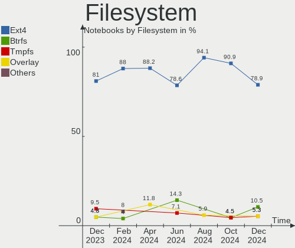
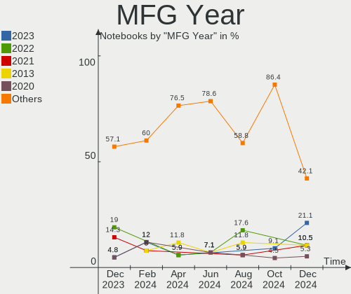
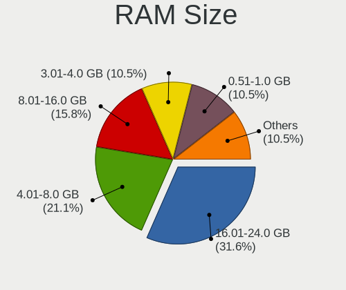
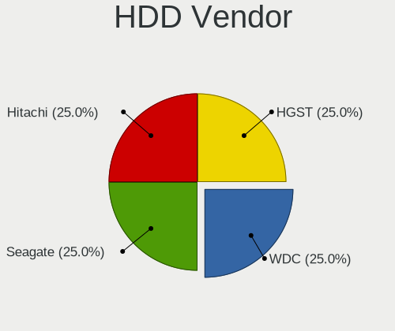
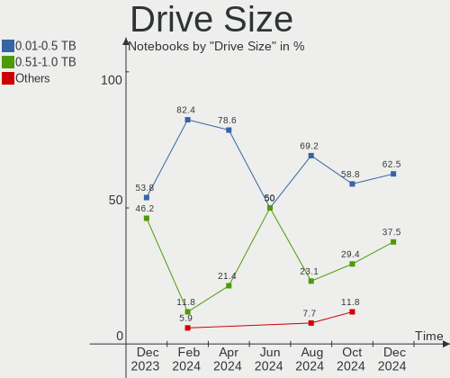
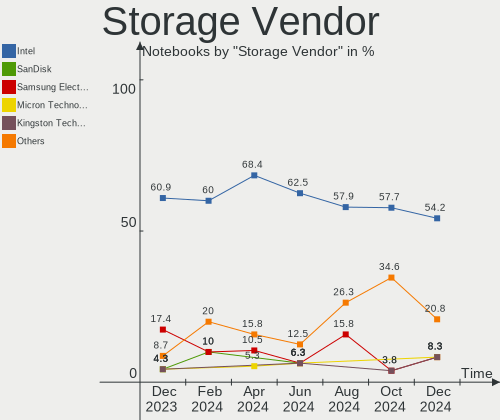
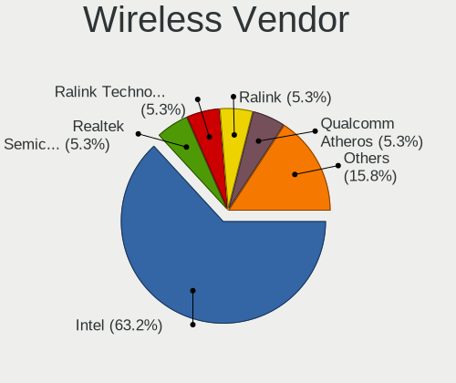
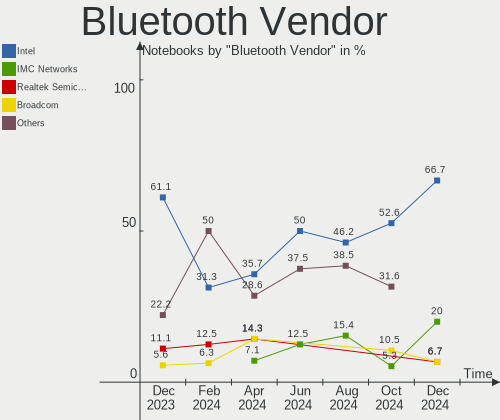
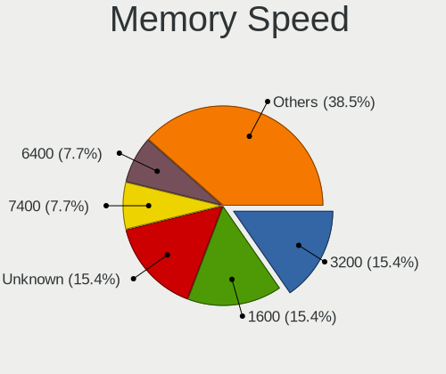
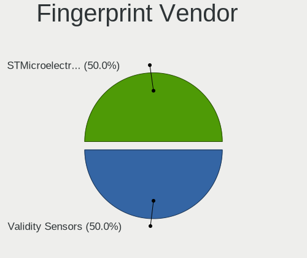

LMDE - Hardware Trends (Notebooks)
----------------------------------

A project to identify most popular hardware characteristics and track their change
over time based on data collected by Linux users at https://Linux-Hardware.org.

Anyone can contribute to this report by the [hw-probe](https://github.com/linuxhw/hw-probe) tool:

    sudo -E hw-probe -all -upload

This report is for one last month. Overall report since the beginning of time: [TestCoverage](https://github.com/linuxhw/TestCoverage)

Period: May, 2022.

Contents
--------

* [ System ](#system)
  - [ OS                       ](#os)
  - [ OS Family                ](#os-family)
  - [ Kernel                   ](#kernel)
  - [ Kernel Family            ](#kernel-family)
  - [ Kernel Major Ver.        ](#kernel-major-ver)
  - [ Arch                     ](#arch)
  - [ DE                       ](#de)
  - [ Display Server           ](#display-server)
  - [ Display Manager          ](#display-manager)
  - [ OS Lang                  ](#os-lang)
  - [ Boot Mode                ](#boot-mode)
  - [ Filesystem               ](#filesystem)
  - [ Part. scheme             ](#part-scheme)
  - [ Dual Boot with Linux/BSD ](#dual-boot-with-linuxbsd)
  - [ Dual Boot (Win)          ](#dual-boot-win)

* [ Board ](#board)
  - [ Vendor                   ](#vendor)
  - [ Model                    ](#model)
  - [ Model Family             ](#model-family)
  - [ MFG Year                 ](#mfg-year)
  - [ Form Factor              ](#form-factor)
  - [ Secure Boot              ](#secure-boot)
  - [ Coreboot                 ](#coreboot)
  - [ RAM Size                 ](#ram-size)
  - [ RAM Used                 ](#ram-used)
  - [ Total Drives             ](#total-drives)
  - [ Has CD-ROM               ](#has-cd-rom)
  - [ Has Ethernet             ](#has-ethernet)
  - [ Has WiFi                 ](#has-wifi)
  - [ Has Bluetooth            ](#has-bluetooth)

* [ Location ](#location)
  - [ Country                  ](#country)
  - [ City                     ](#city)

* [ Drives ](#drives)
  - [ Drive Vendor             ](#drive-vendor)
  - [ Drive Model              ](#drive-model)
  - [ HDD Vendor               ](#hdd-vendor)
  - [ SSD Vendor               ](#ssd-vendor)
  - [ Drive Kind               ](#drive-kind)
  - [ Drive Connector          ](#drive-connector)
  - [ Drive Size               ](#drive-size)
  - [ Space Total              ](#space-total)
  - [ Space Used               ](#space-used)
  - [ Malfunc. Drives          ](#malfunc-drives)
  - [ Malfunc. Drive Vendor    ](#malfunc-drive-vendor)
  - [ Malfunc. HDD Vendor      ](#malfunc-hdd-vendor)
  - [ Malfunc. Drive Kind      ](#malfunc-drive-kind)
  - [ Failed Drives            ](#failed-drives)
  - [ Failed Drive Vendor      ](#failed-drive-vendor)
  - [ Drive Status             ](#drive-status)

* [ Storage controller ](#storage-controller)
  - [ Storage Vendor           ](#storage-vendor)
  - [ Storage Model            ](#storage-model)
  - [ Storage Kind             ](#storage-kind)

* [ Processor ](#processor)
  - [ CPU Vendor               ](#cpu-vendor)
  - [ CPU Model                ](#cpu-model)
  - [ CPU Model Family         ](#cpu-model-family)
  - [ CPU Cores                ](#cpu-cores)
  - [ CPU Sockets              ](#cpu-sockets)
  - [ CPU Threads              ](#cpu-threads)
  - [ CPU Op-Modes             ](#cpu-op-modes)
  - [ CPU Microcode            ](#cpu-microcode)
  - [ CPU Microarch            ](#cpu-microarch)

* [ Graphics ](#graphics)
  - [ GPU Vendor               ](#gpu-vendor)
  - [ GPU Model                ](#gpu-model)
  - [ GPU Combo                ](#gpu-combo)
  - [ GPU Driver               ](#gpu-driver)
  - [ GPU Memory               ](#gpu-memory)

* [ Monitor ](#monitor)
  - [ Monitor Vendor           ](#monitor-vendor)
  - [ Monitor Model            ](#monitor-model)
  - [ Monitor Resolution       ](#monitor-resolution)
  - [ Monitor Diagonal         ](#monitor-diagonal)
  - [ Monitor Width            ](#monitor-width)
  - [ Aspect Ratio             ](#aspect-ratio)
  - [ Monitor Area             ](#monitor-area)
  - [ Pixel Density            ](#pixel-density)
  - [ Multiple Monitors        ](#multiple-monitors)

* [ Network ](#network)
  - [ Net Controller Vendor    ](#net-controller-vendor)
  - [ Net Controller Model     ](#net-controller-model)
  - [ Wireless Vendor          ](#wireless-vendor)
  - [ Wireless Model           ](#wireless-model)
  - [ Ethernet Vendor          ](#ethernet-vendor)
  - [ Ethernet Model           ](#ethernet-model)
  - [ Net Controller Kind      ](#net-controller-kind)
  - [ Used Controller          ](#used-controller)
  - [ NICs                     ](#nics)
  - [ IPv6                     ](#ipv6)

* [ Bluetooth ](#bluetooth)
  - [ Bluetooth Vendor         ](#bluetooth-vendor)
  - [ Bluetooth Model          ](#bluetooth-model)

* [ Sound ](#sound)
  - [ Sound Vendor             ](#sound-vendor)
  - [ Sound Model              ](#sound-model)

* [ Memory ](#memory)
  - [ Memory Vendor            ](#memory-vendor)
  - [ Memory Model             ](#memory-model)
  - [ Memory Kind              ](#memory-kind)
  - [ Memory Form Factor       ](#memory-form-factor)
  - [ Memory Size              ](#memory-size)
  - [ Memory Speed             ](#memory-speed)

* [ Printers & scanners ](#printers--scanners)
  - [ Printer Vendor           ](#printer-vendor)
  - [ Printer Model            ](#printer-model)
  - [ Scanner Vendor           ](#scanner-vendor)
  - [ Scanner Model            ](#scanner-model)

* [ Camera ](#camera)
  - [ Camera Vendor            ](#camera-vendor)
  - [ Camera Model             ](#camera-model)

* [ Security ](#security)
  - [ Fingerprint Vendor       ](#fingerprint-vendor)
  - [ Fingerprint Model        ](#fingerprint-model)
  - [ Chipcard Vendor          ](#chipcard-vendor)
  - [ Chipcard Model           ](#chipcard-model)

* [ Unsupported ](#unsupported)
  - [ Unsupported Devices      ](#unsupported-devices)
  - [ Unsupported Device Types ](#unsupported-device-types)

System
------

OS
--

Installed operating systems

| Name   | Notebooks | Percent |
|--------|-----------|---------|
| LMDE 5 | 21        | 100%    |

OS Family
---------

OS without a version

| Name | Notebooks | Percent |
|------|-----------|---------|
| LMDE | 21        | 100%    |

Kernel
------

Version of the Linux kernel

| Version              | Notebooks | Percent |
|----------------------|-----------|---------|
| 5.10.0-14-amd64      | 14        | 66.67%  |
| 5.10.0-12-amd64      | 3         | 14.29%  |
| 5.16.0-0.bpo.4-amd64 | 1         | 4.76%   |
| 5.10.0-14-686        | 1         | 4.76%   |
| 5.10.0-13-amd64      | 1         | 4.76%   |
| 5.10.0-13-686        | 1         | 4.76%   |

Kernel Family
-------------

Linux kernel without a distro release

| Version | Notebooks | Percent |
|---------|-----------|---------|
| 5.10.0  | 20        | 95.24%  |
| 5.16.0  | 1         | 4.76%   |

Kernel Major Ver.
-----------------

Linux kernel major version

| Version | Notebooks | Percent |
|---------|-----------|---------|
| 5.10    | 20        | 95.24%  |
| 5.16    | 1         | 4.76%   |

Arch
----

OS architecture (x86_64, i586, etc.)

| Name   | Notebooks | Percent |
|--------|-----------|---------|
| x86_64 | 19        | 90.48%  |
| i686   | 2         | 9.52%   |

DE
--

Desktop Environment

| Name       | Notebooks | Percent |
|------------|-----------|---------|
| X-Cinnamon | 18        | 85.71%  |
| Cinnamon   | 3         | 14.29%  |

Display Server
--------------

X11 or Wayland

| Name | Notebooks | Percent |
|------|-----------|---------|
| X11  | 21        | 100%    |

Display Manager
---------------

SDDM, LightDM, etc.

| Name    | Notebooks | Percent |
|---------|-----------|---------|
| Unknown | 12        | 57.14%  |
| LightDM | 9         | 42.86%  |

OS Lang
-------

Language

| Lang  | Notebooks | Percent |
|-------|-----------|---------|
| en_US | 10        | 47.62%  |
| pt_BR | 4         | 19.05%  |
| en_GB | 2         | 9.52%   |
| ru_RU | 1         | 4.76%   |
| es_ES | 1         | 4.76%   |
| es_EC | 1         | 4.76%   |
| en_IE | 1         | 4.76%   |
| de_DE | 1         | 4.76%   |

Boot Mode
---------

EFI or BIOS

| Mode | Notebooks | Percent |
|------|-----------|---------|
| EFI  | 16        | 76.19%  |
| BIOS | 5         | 23.81%  |

Filesystem
----------

Type of filesystem

| Type    | Notebooks | Percent |
|---------|-----------|---------|
| Ext4    | 20        | 95.24%  |
| Overlay | 1         | 4.76%   |

Part. scheme
------------

Scheme of partitioning

| Type    | Notebooks | Percent |
|---------|-----------|---------|
| Unknown | 12        | 57.14%  |
| GPT     | 7         | 33.33%  |
| MBR     | 2         | 9.52%   |

Dual Boot with Linux/BSD
------------------------

Hosting more than one Linux/BSD

| Dual boot | Notebooks | Percent |
|-----------|-----------|---------|
| No        | 20        | 95.24%  |
| Yes       | 1         | 4.76%   |

Dual Boot (Win)
---------------

Hosting Linux and Windows

| Dual boot | Notebooks | Percent |
|-----------|-----------|---------|
| No        | 19        | 90.48%  |
| Yes       | 2         | 9.52%   |

Board
-----

Vendor
------

Motherboard manufacturer

| Name             | Notebooks | Percent |
|------------------|-----------|---------|
| Hewlett-Packard  | 5         | 23.81%  |
| Lenovo           | 4         | 19.05%  |
| Dell             | 3         | 14.29%  |
| Acer             | 3         | 14.29%  |
| ASUSTek Computer | 2         | 9.52%   |
| Toshiba          | 1         | 4.76%   |
| Philco           | 1         | 4.76%   |
| Howard Computers | 1         | 4.76%   |
| Apple            | 1         | 4.76%   |

Model
-----

Motherboard model

| Name                                             | Notebooks | Percent |
|--------------------------------------------------|-----------|---------|
| Toshiba Satellite M55                            | 1         | 4.76%   |
| Philco 10D                                       | 1         | 4.76%   |
| Lenovo ThinkPad T480 20L6S1RN00                  | 1         | 4.76%   |
| Lenovo Legion 5 15ACH6H 82JU                     | 1         | 4.76%   |
| Lenovo IdeaPad 5 14ALC05 82LM                    | 1         | 4.76%   |
| Lenovo IdeaPad 3 15ITL6 82H8                     | 1         | 4.76%   |
| Howard Computers R7X                             | 1         | 4.76%   |
| HP ZBook Fury 17.3 inch G8 Mobile Workstation PC | 1         | 4.76%   |
| HP Notebook                                      | 1         | 4.76%   |
| HP Laptop 14-df0xxx                              | 1         | 4.76%   |
| HP Laptop 14-cf3xxx                              | 1         | 4.76%   |
| HP ENVY 17                                       | 1         | 4.76%   |
| Dell XPS 13 9305                                 | 1         | 4.76%   |
| Dell Inspiron 5566                               | 1         | 4.76%   |
| Dell Inspiron 5559                               | 1         | 4.76%   |
| ASUS VivoBook_ASUSLaptop X512DA_X512DA           | 1         | 4.76%   |
| ASUS VivoBook E14 E402YA_L402YA                  | 1         | 4.76%   |
| Apple MacBookAir7,2                              | 1         | 4.76%   |
| Acer Aspire V3-571G                              | 1         | 4.76%   |
| Acer Aspire One 522                              | 1         | 4.76%   |
| Acer Aspire E1-532                               | 1         | 4.76%   |

Model Family
------------

Motherboard model prefix

| Name                 | Notebooks | Percent |
|----------------------|-----------|---------|
| Acer Aspire          | 3         | 14.29%  |
| Lenovo IdeaPad       | 2         | 9.52%   |
| HP Laptop            | 2         | 9.52%   |
| Dell Inspiron        | 2         | 9.52%   |
| ASUS VivoBook        | 2         | 9.52%   |
| Toshiba Satellite    | 1         | 4.76%   |
| Philco 10D           | 1         | 4.76%   |
| Lenovo ThinkPad      | 1         | 4.76%   |
| Lenovo Legion        | 1         | 4.76%   |
| Howard Computers R7X | 1         | 4.76%   |
| HP ZBook             | 1         | 4.76%   |
| HP Notebook          | 1         | 4.76%   |
| HP ENVY              | 1         | 4.76%   |
| Dell XPS             | 1         | 4.76%   |
| Apple MacBookAir7    | 1         | 4.76%   |

MFG Year
--------

Motherboard manufacture year

| Year | Notebooks | Percent |
|------|-----------|---------|
| 2021 | 5         | 23.81%  |
| 2016 | 3         | 14.29%  |
| 2020 | 2         | 9.52%   |
| 2019 | 2         | 9.52%   |
| 2018 | 2         | 9.52%   |
| 2012 | 2         | 9.52%   |
| 2015 | 1         | 4.76%   |
| 2013 | 1         | 4.76%   |
| 2011 | 1         | 4.76%   |
| 2010 | 1         | 4.76%   |
| 2006 | 1         | 4.76%   |

Form Factor
-----------

Physical design of the computer

| Name     | Notebooks | Percent |
|----------|-----------|---------|
| Notebook | 21        | 100%    |

Secure Boot
-----------

Enabled or disabled

| State    | Notebooks | Percent |
|----------|-----------|---------|
| Disabled | 18        | 85.71%  |
| Enabled  | 3         | 14.29%  |

Coreboot
--------

Have coreboot on board

| Used | Notebooks | Percent |
|------|-----------|---------|
| No   | 21        | 100%    |

RAM Size
--------

Total RAM memory

| Size in GB  | Notebooks | Percent |
|-------------|-----------|---------|
| 4.01-8.0    | 9         | 42.86%  |
| 3.01-4.0    | 3         | 14.29%  |
| 16.01-24.0  | 3         | 14.29%  |
| 8.01-16.0   | 2         | 9.52%   |
| 32.01-64.0  | 1         | 4.76%   |
| 2.01-3.0    | 1         | 4.76%   |
| 64.01-256.0 | 1         | 4.76%   |
| 1.01-2.0    | 1         | 4.76%   |

RAM Used
--------

Used RAM memory

| Used GB  | Notebooks | Percent |
|----------|-----------|---------|
| 1.01-2.0 | 10        | 47.62%  |
| 2.01-3.0 | 7         | 33.33%  |
| 3.01-4.0 | 3         | 14.29%  |
| 4.01-8.0 | 1         | 4.76%   |

Total Drives
------------

Number of drives on board

| Drives | Notebooks | Percent |
|--------|-----------|---------|
| 1      | 14        | 66.67%  |
| 2      | 6         | 28.57%  |
| 3      | 1         | 4.76%   |

Has CD-ROM
----------

Has CD-ROM on board

| Presented | Notebooks | Percent |
|-----------|-----------|---------|
| No        | 18        | 85.71%  |
| Yes       | 3         | 14.29%  |

Has Ethernet
------------

Has Ethernet on board

| Presented | Notebooks | Percent |
|-----------|-----------|---------|
| Yes       | 17        | 80.95%  |
| No        | 4         | 19.05%  |

Has WiFi
--------

Has WiFi module

| Presented | Notebooks | Percent |
|-----------|-----------|---------|
| Yes       | 21        | 100%    |

Has Bluetooth
-------------

Has Bluetooth module

| Presented | Notebooks | Percent |
|-----------|-----------|---------|
| Yes       | 17        | 80.95%  |
| No        | 4         | 19.05%  |

Location
--------

Country
-------

Geographic location (country)

| Country   | Notebooks | Percent |
|-----------|-----------|---------|
| USA       | 5         | 23.81%  |
| UK        | 4         | 19.05%  |
| Brazil    | 4         | 19.05%  |
| Russia    | 2         | 9.52%   |
| Spain     | 1         | 4.76%   |
| Romania   | 1         | 4.76%   |
| Malaysia  | 1         | 4.76%   |
| Lithuania | 1         | 4.76%   |
| Germany   | 1         | 4.76%   |
| Ecuador   | 1         | 4.76%   |

City
----

Geographic location (city)

| City          | Notebooks | Percent |
|---------------|-----------|---------|
| Neasden       | 2         | 9.52%   |
| Vilnius       | 1         | 4.76%   |
| Saratov       | 1         | 4.76%   |
| Recife        | 1         | 4.76%   |
| Petaling Jaya | 1         | 4.76%   |
| Moscow        | 1         | 4.76%   |
| Monaca        | 1         | 4.76%   |
| Mammoth Lakes | 1         | 4.76%   |
| Londonderry   | 1         | 4.76%   |
| London        | 1         | 4.76%   |
| Lebanon       | 1         | 4.76%   |
| Everett       | 1         | 4.76%   |
| Branesti      | 1         | 4.76%   |
| Blairsville   | 1         | 4.76%   |
| Birigui       | 1         | 4.76%   |
| Berlin        | 1         | 4.76%   |
| Bandeirantes  | 1         | 4.76%   |
| Babahoyo      | 1         | 4.76%   |
| Avilés       | 1         | 4.76%   |
| Andradina     | 1         | 4.76%   |

Drives
------

Drive Vendor
------------

Hard drive vendors

| Vendor                    | Notebooks | Drives | Percent |
|---------------------------|-----------|--------|---------|
| WDC                       | 3         | 3      | 11.11%  |
| Toshiba                   | 3         | 3      | 11.11%  |
| Samsung Electronics       | 3         | 4      | 11.11%  |
| Unknown                   | 2         | 2      | 7.41%   |
| Micron Technology         | 2         | 2      | 7.41%   |
| Intel                     | 2         | 2      | 7.41%   |
| Hitachi                   | 2         | 2      | 7.41%   |
| A-DATA Technology         | 2         | 2      | 7.41%   |
| Seagate                   | 1         | 1      | 3.7%    |
| SanDisk                   | 1         | 1      | 3.7%    |
| PNY                       | 1         | 1      | 3.7%    |
| Patriot                   | 1         | 1      | 3.7%    |
| Micron/Crucial Technology | 1         | 1      | 3.7%    |
| KIOXIA                    | 1         | 2      | 3.7%    |
| BHT                       | 1         | 1      | 3.7%    |
| Apple                     | 1         | 1      | 3.7%    |

Drive Model
-----------

Hard drive models

| Model                                | Notebooks | Percent |
|--------------------------------------|-----------|---------|
| Unknown SD/MMC/MS PRO 999GB          | 2         | 7.14%   |
| Micron NVMe SSD Drive 512GB          | 2         | 7.14%   |
| WDC WD7500BPVT-22HXZT3 752GB         | 1         | 3.57%   |
| WDC WD3200BPVT-22JJ5T0 320GB         | 1         | 3.57%   |
| WDC PC SN530 SDBPMPZ-512G-1101 512GB | 1         | 3.57%   |
| Toshiba MQ01ABF032 320GB             | 1         | 3.57%   |
| Toshiba MQ01ABD100 1TB               | 1         | 3.57%   |
| Toshiba MK3252GSX 320GB              | 1         | 3.57%   |
| Seagate ST1000LM035-1RK172 1TB       | 1         | 3.57%   |
| SanDisk DF4064  64GB                 | 1         | 3.57%   |
| Samsung SSD 980 PRO 1TB              | 1         | 3.57%   |
| Samsung SSD 860 EVO 1TB              | 1         | 3.57%   |
| Samsung SSD 850 EVO 500GB            | 1         | 3.57%   |
| Samsung PM991a NVMe 512GB            | 1         | 3.57%   |
| PNY CS1311 480GB SSD                 | 1         | 3.57%   |
| Patriot P210 512GB SSD               | 1         | 3.57%   |
| Micron/Crucial NVMe SSD Drive 2TB    | 1         | 3.57%   |
| KIOXIA KXG60PNV2T04 2TB              | 1         | 3.57%   |
| Intel SSDSC2CW060A3 64GB             | 1         | 3.57%   |
| Intel SSDPEKNW512G8 512GB            | 1         | 3.57%   |
| Hitachi HTS543232A7A384 320GB        | 1         | 3.57%   |
| Hitachi HTS541010G9AT00 100GB        | 1         | 3.57%   |
| BHT WR202I0064G E70245F5 64GB        | 1         | 3.57%   |
| Apple SSD SM0128G 121GB              | 1         | 3.57%   |
| A-DATA SU650 120GB SSD               | 1         | 3.57%   |
| A-DATA ED600 1TB SSD                 | 1         | 3.57%   |

HDD Vendor
----------

Hard disk drive vendors

| Vendor  | Notebooks | Drives | Percent |
|---------|-----------|--------|---------|
| Toshiba | 3         | 3      | 30%     |
| WDC     | 2         | 2      | 20%     |
| Unknown | 2         | 2      | 20%     |
| Hitachi | 2         | 2      | 20%     |
| Seagate | 1         | 1      | 10%     |

SSD Vendor
----------

Solid state drive vendors

| Vendor              | Notebooks | Drives | Percent |
|---------------------|-----------|--------|---------|
| A-DATA Technology   | 2         | 2      | 25%     |
| Samsung Electronics | 1         | 2      | 12.5%   |
| PNY                 | 1         | 1      | 12.5%   |
| Patriot             | 1         | 1      | 12.5%   |
| Intel               | 1         | 1      | 12.5%   |
| BHT                 | 1         | 1      | 12.5%   |
| Apple               | 1         | 1      | 12.5%   |

Drive Kind
----------

HDD or SSD

| Kind | Notebooks | Drives | Percent |
|------|-----------|--------|---------|
| HDD  | 9         | 10     | 36%     |
| SSD  | 8         | 9      | 32%     |
| NVMe | 7         | 9      | 28%     |
| MMC  | 1         | 1      | 4%      |

Drive Connector
---------------

SATA, SAS, NVMe, etc.

| Type | Notebooks | Drives | Percent |
|------|-----------|--------|---------|
| SATA | 13        | 16     | 56.52%  |
| NVMe | 7         | 9      | 30.43%  |
| SAS  | 2         | 3      | 8.7%    |
| MMC  | 1         | 1      | 4.35%   |

Drive Size
----------

Size of hard drive

| Size in TB | Notebooks | Drives | Percent |
|------------|-----------|--------|---------|
| 0.01-0.5   | 10        | 11     | 62.5%   |
| 0.51-1.0   | 6         | 8      | 37.5%   |

Space Total
-----------

Amount of disk space available on the file system

| Size in GB | Notebooks | Percent |
|------------|-----------|---------|
| 251-500    | 7         | 33.33%  |
| 101-250    | 3         | 14.29%  |
| 501-1000   | 3         | 14.29%  |
| 51-100     | 3         | 14.29%  |
| 1001-2000  | 2         | 9.52%   |
| 21-50      | 1         | 4.76%   |
| 2001-3000  | 1         | 4.76%   |
| 1-20       | 1         | 4.76%   |

Space Used
----------

Amount of used disk space

| Used GB  | Notebooks | Percent |
|----------|-----------|---------|
| 1-20     | 8         | 38.1%   |
| 21-50    | 7         | 33.33%  |
| 101-250  | 2         | 9.52%   |
| 501-1000 | 2         | 9.52%   |
| 251-500  | 1         | 4.76%   |
| 51-100   | 1         | 4.76%   |

Malfunc. Drives
---------------

Drive models with a malfunction

Zero info for selected period =(

Malfunc. Drive Vendor
---------------------

Vendors of faulty drives

Zero info for selected period =(

Malfunc. HDD Vendor
-------------------

Vendors of faulty HDD drives

Zero info for selected period =(

Malfunc. Drive Kind
-------------------

Kinds of faulty drives

Zero info for selected period =(

Failed Drives
-------------

Failed drive models

Zero info for selected period =(

Failed Drive Vendor
-------------------

Failed drive vendors

Zero info for selected period =(

Drive Status
------------

Number of failed and malfunc. drives

| Status   | Notebooks | Drives | Percent |
|----------|-----------|--------|---------|
| Detected | 13        | 18     | 61.9%   |
| Works    | 8         | 11     | 38.1%   |

Storage controller
------------------

Storage Vendor
--------------

Storage controller vendors

| Vendor                       | Notebooks | Percent |
|------------------------------|-----------|---------|
| Intel                        | 13        | 48.15%  |
| AMD                          | 6         | 22.22%  |
| Samsung Electronics          | 3         | 11.11%  |
| Micron Technology            | 2         | 7.41%   |
| Toshiba America Info Systems | 1         | 3.7%    |
| Sandisk                      | 1         | 3.7%    |
| Micron/Crucial Technology    | 1         | 3.7%    |

Storage Model
-------------

Storage controller models

| Model                                                                          | Notebooks | Percent |
|--------------------------------------------------------------------------------|-----------|---------|
| AMD FCH SATA Controller [AHCI mode]                                            | 5         | 17.86%  |
| Intel Sunrise Point-LP SATA Controller [AHCI mode]                             | 4         | 14.29%  |
| Micron Non-Volatile memory controller                                          | 2         | 7.14%   |
| Intel Volume Management Device NVMe RAID Controller                            | 2         | 7.14%   |
| Toshiba America Info Systems XG6 NVMe SSD Controller                           | 1         | 3.57%   |
| Sandisk Non-Volatile memory controller                                         | 1         | 3.57%   |
| Samsung NVMe SSD Controller PM9A1/PM9A3/980PRO                                 | 1         | 3.57%   |
| Samsung NVMe SSD Controller 980                                                | 1         | 3.57%   |
| Samsung Electronics SATA controller                                            | 1         | 3.57%   |
| Micron/Crucial NVMe Controller                                                 | 1         | 3.57%   |
| Intel Tiger Lake-LP SATA Controller [AHCI mode]                                | 1         | 3.57%   |
| Intel SSD 660P Series                                                          | 1         | 3.57%   |
| Intel NM10/ICH7 Family SATA Controller [AHCI mode]                             | 1         | 3.57%   |
| Intel 82801FBM (ICH6M) SATA Controller                                         | 1         | 3.57%   |
| Intel 82801 Mobile SATA Controller [RAID mode]                                 | 1         | 3.57%   |
| Intel 8 Series/C220 Series Chipset Family 6-port SATA Controller 1 [AHCI mode] | 1         | 3.57%   |
| Intel 8 Series SATA Controller 1 [AHCI mode]                                   | 1         | 3.57%   |
| Intel 7 Series Chipset Family 6-port SATA Controller [AHCI mode]               | 1         | 3.57%   |
| AMD SB7x0/SB8x0/SB9x0 SATA Controller [AHCI mode]                              | 1         | 3.57%   |

Storage Kind
------------

Kind of storage controller (IDE, SATA, NVMe, SAS, ...)

| Kind | Notebooks | Percent |
|------|-----------|---------|
| SATA | 16        | 59.26%  |
| NVMe | 7         | 25.93%  |
| RAID | 3         | 11.11%  |
| IDE  | 1         | 3.7%    |

Processor
---------

CPU Vendor
----------

Processor vendors

| Vendor | Notebooks | Percent |
|--------|-----------|---------|
| Intel  | 15        | 71.43%  |
| AMD    | 6         | 28.57%  |

CPU Model
---------

Processor models

| Model                                         | Notebooks | Percent |
|-----------------------------------------------|-----------|---------|
| Intel Pentium Silver N5000 CPU @ 1.10GHz      | 1         | 4.76%   |
| Intel Pentium M processor 1.73GHz             | 1         | 4.76%   |
| Intel Core i7-6500U CPU @ 2.50GHz             | 1         | 4.76%   |
| Intel Core i7-4710MQ CPU @ 2.50GHz            | 1         | 4.76%   |
| Intel Core i5-7300U CPU @ 2.60GHz             | 1         | 4.76%   |
| Intel Core i5-5250U CPU @ 1.60GHz             | 1         | 4.76%   |
| Intel Core i5-3230M CPU @ 2.60GHz             | 1         | 4.76%   |
| Intel Core i3-6100U CPU @ 2.30GHz             | 1         | 4.76%   |
| Intel Core i3-6006U CPU @ 2.00GHz             | 1         | 4.76%   |
| Intel Core i3-1005G1 CPU @ 1.20GHz            | 1         | 4.76%   |
| Intel Celeron 2955U @ 1.40GHz                 | 1         | 4.76%   |
| Intel Atom CPU N2600 @ 1.60GHz                | 1         | 4.76%   |
| Intel 11th Gen Core i9-11950H @ 2.60GHz       | 1         | 4.76%   |
| Intel 11th Gen Core i7-1165G7 @ 2.80GHz       | 1         | 4.76%   |
| Intel 11th Gen Core i3-1115G4 @ 3.00GHz       | 1         | 4.76%   |
| AMD Ryzen 7 5800H with Radeon Graphics        | 1         | 4.76%   |
| AMD Ryzen 7 4800H with Radeon Graphics        | 1         | 4.76%   |
| AMD Ryzen 5 5500U with Radeon Graphics        | 1         | 4.76%   |
| AMD Ryzen 5 3500U with Radeon Vega Mobile Gfx | 1         | 4.76%   |
| AMD E2-7015 APU with AMD Radeon R2 Graphics   | 1         | 4.76%   |
| AMD C-50 Processor                            | 1         | 4.76%   |

CPU Model Family
----------------

Processor model prefix

| Model                | Notebooks | Percent |
|----------------------|-----------|---------|
| Other                | 3         | 14.29%  |
| Intel Core i5        | 3         | 14.29%  |
| Intel Core i3        | 3         | 14.29%  |
| Intel Core i7        | 2         | 9.52%   |
| AMD Ryzen 7          | 2         | 9.52%   |
| AMD Ryzen 5          | 2         | 9.52%   |
| Intel Pentium Silver | 1         | 4.76%   |
| Intel Pentium M      | 1         | 4.76%   |
| Intel Celeron        | 1         | 4.76%   |
| Intel Atom           | 1         | 4.76%   |
| AMD E2               | 1         | 4.76%   |
| AMD C-50             | 1         | 4.76%   |

CPU Cores
---------

Number of processor cores

| Number | Notebooks | Percent |
|--------|-----------|---------|
| 2      | 12        | 57.14%  |
| 4      | 4         | 19.05%  |
| 8      | 3         | 14.29%  |
| 6      | 1         | 4.76%   |
| 1      | 1         | 4.76%   |

CPU Sockets
-----------

Number of sockets

| Number | Notebooks | Percent |
|--------|-----------|---------|
| 1      | 21        | 100%    |

CPU Threads
-----------

Threads per core (Hyper-Threading)

| Number | Notebooks | Percent |
|--------|-----------|---------|
| 2      | 16        | 76.19%  |
| 1      | 5         | 23.81%  |

CPU Op-Modes
------------

CPU Operation Modes (32-bit, 64-bit)

| Op mode        | Notebooks | Percent |
|----------------|-----------|---------|
| 32-bit, 64-bit | 20        | 95.24%  |
| 32-bit         | 1         | 4.76%   |

CPU Microcode
-------------

Microcode number

| Number     | Notebooks | Percent |
|------------|-----------|---------|
| 0x406e3    | 3         | 14.29%  |
| 0x806c1    | 2         | 9.52%   |
| 0x806e9    | 1         | 4.76%   |
| 0x806d1    | 1         | 4.76%   |
| 0x706e5    | 1         | 4.76%   |
| 0x706a1    | 1         | 4.76%   |
| 0x6d8      | 1         | 4.76%   |
| 0x40651    | 1         | 4.76%   |
| 0x306d4    | 1         | 4.76%   |
| 0x306c3    | 1         | 4.76%   |
| 0x306a9    | 1         | 4.76%   |
| 0x30661    | 1         | 4.76%   |
| 0x08608103 | 1         | 4.76%   |
| 0x08600103 | 1         | 4.76%   |
| 0x08108102 | 1         | 4.76%   |
| 0x07030106 | 1         | 4.76%   |
| 0x05000029 | 1         | 4.76%   |
| Unknown    | 1         | 4.76%   |

CPU Microarch
-------------

Microarchitecture

| Name          | Notebooks | Percent |
|---------------|-----------|---------|
| Skylake       | 3         | 14.29%  |
| TigerLake     | 2         | 9.52%   |
| Icelake       | 2         | 9.52%   |
| Haswell       | 2         | 9.52%   |
| Zen+          | 1         | 4.76%   |
| Zen 3         | 1         | 4.76%   |
| Zen 2         | 1         | 4.76%   |
| Puma          | 1         | 4.76%   |
| P6            | 1         | 4.76%   |
| KabyLake      | 1         | 4.76%   |
| IvyBridge     | 1         | 4.76%   |
| Goldmont plus | 1         | 4.76%   |
| Broadwell     | 1         | 4.76%   |
| Bonnell       | 1         | 4.76%   |
| Bobcat        | 1         | 4.76%   |
| Unknown       | 1         | 4.76%   |

Graphics
--------

GPU Vendor
----------

Vendors of graphics cards

| Vendor | Notebooks | Percent |
|--------|-----------|---------|
| Intel  | 14        | 58.33%  |
| AMD    | 6         | 25%     |
| Nvidia | 4         | 16.67%  |

GPU Model
---------

Graphics card models

| Model                                                                         | Notebooks | Percent |
|-------------------------------------------------------------------------------|-----------|---------|
| Intel Skylake GT2 [HD Graphics 520]                                           | 3         | 12.5%   |
| Nvidia GM108M [GeForce 840M]                                                  | 1         | 4.17%   |
| Nvidia GF108M [GeForce GT 620M/630M/635M/640M LE]                             | 1         | 4.17%   |
| Nvidia GA107GLM [RTX A2000 Mobile]                                            | 1         | 4.17%   |
| Nvidia GA106M [GeForce RTX 3060 Mobile / Max-Q]                               | 1         | 4.17%   |
| Intel TigerLake-LP GT2 [Iris Xe Graphics]                                     | 1         | 4.17%   |
| Intel Tiger Lake UHD Graphics                                                 | 1         | 4.17%   |
| Intel Mobile 915GM/GMS/910GML Express Graphics Controller                     | 1         | 4.17%   |
| Intel Iris Plus Graphics G1 (Ice Lake)                                        | 1         | 4.17%   |
| Intel HD Graphics 620                                                         | 1         | 4.17%   |
| Intel HD Graphics 6000                                                        | 1         | 4.17%   |
| Intel Haswell-ULT Integrated Graphics Controller                              | 1         | 4.17%   |
| Intel GeminiLake [UHD Graphics 605]                                           | 1         | 4.17%   |
| Intel Atom Processor D2xxx/N2xxx Integrated Graphics Controller               | 1         | 4.17%   |
| Intel 4th Gen Core Processor Integrated Graphics Controller                   | 1         | 4.17%   |
| Intel 3rd Gen Core processor Graphics Controller                              | 1         | 4.17%   |
| AMD Wrestler [Radeon HD 6250]                                                 | 1         | 4.17%   |
| AMD Sun XT [Radeon HD 8670A/8670M/8690M / R5 M330 / M430 / Radeon 520 Mobile] | 1         | 4.17%   |
| AMD Renoir                                                                    | 1         | 4.17%   |
| AMD Picasso/Raven 2 [Radeon Vega Series / Radeon Vega Mobile Series]          | 1         | 4.17%   |
| AMD Mullins [Radeon R2 Graphics]                                              | 1         | 4.17%   |
| AMD Lucienne                                                                  | 1         | 4.17%   |

GPU Combo
---------

Combinations of graphics cards

| Name           | Notebooks | Percent |
|----------------|-----------|---------|
| 1 x Intel      | 11        | 52.38%  |
| 1 x AMD        | 5         | 23.81%  |
| 1 x Nvidia     | 2         | 9.52%   |
| Intel + Nvidia | 2         | 9.52%   |
| Intel + AMD    | 1         | 4.76%   |

GPU Driver
----------

Free vs proprietary

| Driver      | Notebooks | Percent |
|-------------|-----------|---------|
| Free        | 19        | 90.48%  |
| Proprietary | 1         | 4.76%   |
| Unknown     | 1         | 4.76%   |

GPU Memory
----------

Total video memory

| Size in GB | Notebooks | Percent |
|------------|-----------|---------|
| Unknown    | 12        | 57.14%  |
| 0.01-0.5   | 4         | 19.05%  |
| 1.01-2.0   | 3         | 14.29%  |
| 5.01-6.0   | 1         | 4.76%   |
| 3.01-4.0   | 1         | 4.76%   |

Monitor
-------

Monitor Vendor
--------------

Monitor vendors

| Vendor              | Notebooks | Percent |
|---------------------|-----------|---------|
| Chimei Innolux      | 5         | 21.74%  |
| BOE                 | 5         | 21.74%  |
| AU Optronics        | 4         | 17.39%  |
| LG Display          | 2         | 8.7%    |
| Sharp               | 1         | 4.35%   |
| Samsung Electronics | 1         | 4.35%   |
| LG Philips          | 1         | 4.35%   |
| Insignia            | 1         | 4.35%   |
| InfoVision          | 1         | 4.35%   |
| DENON               | 1         | 4.35%   |
| Apple               | 1         | 4.35%   |

Monitor Model
-------------

Monitor models

| Model                                                             | Notebooks | Percent |
|-------------------------------------------------------------------|-----------|---------|
| Sharp LQ156M1JW01 SHP14C3 1920x1080 344x194mm 15.5-inch           | 1         | 4.35%   |
| Samsung Electronics C27F390 SAM0D32 1920x1080 598x336mm 27.0-inch | 1         | 4.35%   |
| LG Philips LCD Monitor LPL0001 1280x768 305x183mm 14.0-inch       | 1         | 4.35%   |
| LG Display LCD Monitor LGD04DA 1920x1080 344x194mm 15.5-inch      | 1         | 4.35%   |
| LG Display LCD Monitor LGD03FB 1920x1080 382x215mm 17.3-inch      | 1         | 4.35%   |
| Insignia NS-32F202NA22 BBY3292 1920x1080 697x392mm 31.5-inch      | 1         | 4.35%   |
| InfoVision LCD Monitor IVO03F4 1024x600 223x125mm 10.1-inch       | 1         | 4.35%   |
| DENON AVR DON005F 1920x1080                                       | 1         | 4.35%   |
| Chimei Innolux LCD Monitor CMN15F5 1920x1080 344x193mm 15.5-inch  | 1         | 4.35%   |
| Chimei Innolux LCD Monitor CMN15C6 1366x768 344x193mm 15.5-inch   | 1         | 4.35%   |
| Chimei Innolux LCD Monitor CMN15BF 1366x768 340x190mm 15.3-inch   | 1         | 4.35%   |
| Chimei Innolux LCD Monitor CMN14C3 1366x768 309x173mm 13.9-inch   | 1         | 4.35%   |
| Chimei Innolux LCD Monitor CMN14A7 1920x1080 308x173mm 13.9-inch  | 1         | 4.35%   |
| BOE LCD Monitor BOE08E8 1920x1080 340x190mm 15.3-inch             | 1         | 4.35%   |
| BOE LCD Monitor BOE08D7 1920x1080 309x174mm 14.0-inch             | 1         | 4.35%   |
| BOE LCD Monitor BOE07B5 1366x768 309x173mm 13.9-inch              | 1         | 4.35%   |
| BOE LCD Monitor BOE072B 1920x1080 309x173mm 13.9-inch             | 1         | 4.35%   |
| BOE LCD Monitor BOE0671 1366x768 344x194mm 15.5-inch              | 1         | 4.35%   |
| AU Optronics LCD Monitor AUO5B2D 1920x1080 293x162mm 13.2-inch    | 1         | 4.35%   |
| AU Optronics LCD Monitor AUO22EC 1366x768 344x193mm 15.5-inch     | 1         | 4.35%   |
| AU Optronics LCD Monitor AUO21ED 1920x1080 344x194mm 15.5-inch    | 1         | 4.35%   |
| AU Optronics LCD Monitor AUO20D5 1280x720 222x125mm 10.0-inch     | 1         | 4.35%   |
| Apple Color LCD APP9CDF 1440x900 286x179mm 13.3-inch              | 1         | 4.35%   |

Monitor Resolution
------------------

Monitor screen resolution

| Resolution        | Notebooks | Percent |
|-------------------|-----------|---------|
| 1920x1080 (FHD)   | 11        | 50%     |
| 1366x768 (WXGA)   | 6         | 27.27%  |
| 3840x2160 (4K)    | 1         | 4.55%   |
| 1920x1200 (WUXGA) | 1         | 4.55%   |
| 1440x900 (WXGA+)  | 1         | 4.55%   |
| 1280x768          | 1         | 4.55%   |
| 1280x720 (HD)     | 1         | 4.55%   |

Monitor Diagonal
----------------

Diagonal size in inches

| Inches | Notebooks | Percent |
|--------|-----------|---------|
| 15     | 10        | 43.48%  |
| 13     | 6         | 26.09%  |
| 14     | 2         | 8.7%    |
| 72     | 1         | 4.35%   |
| 31     | 1         | 4.35%   |
| 27     | 1         | 4.35%   |
| 17     | 1         | 4.35%   |
| 10     | 1         | 4.35%   |

Monitor Width
-------------

Physical width

| Width in mm | Notebooks | Percent |
|-------------|-----------|---------|
| 301-350     | 16        | 69.57%  |
| 201-300     | 3         | 13.04%  |
| 601-700     | 1         | 4.35%   |
| 501-600     | 1         | 4.35%   |
| 351-400     | 1         | 4.35%   |
| 1501-2000   | 1         | 4.35%   |

Aspect Ratio
------------

Proportional relationship between the width and the height

| Ratio | Notebooks | Percent |
|-------|-----------|---------|
| 16/9  | 19        | 95%     |
| 16/10 | 1         | 5%      |

Monitor Area
------------

Area in inch²

| Area in inch² | Notebooks | Percent |
|----------------|-----------|---------|
| 101-110        | 9         | 39.13%  |
| 81-90          | 6         | 26.09%  |
| 71-80          | 2         | 8.7%    |
| More than 1000 | 1         | 4.35%   |
| 351-500        | 1         | 4.35%   |
| 41-50          | 1         | 4.35%   |
| 301-350        | 1         | 4.35%   |
| 121-130        | 1         | 4.35%   |
| 91-100         | 1         | 4.35%   |

Pixel Density
-------------

Pixels per inch

| Density | Notebooks | Percent |
|---------|-----------|---------|
| 121-160 | 11        | 47.83%  |
| 101-120 | 8         | 34.78%  |
| 51-100  | 2         | 8.7%    |
| 1-50    | 1         | 4.35%   |
| 161-240 | 1         | 4.35%   |

Multiple Monitors
-----------------

Total monitors connected

| Total | Notebooks | Percent |
|-------|-----------|---------|
| 1     | 16        | 76.19%  |
| 2     | 4         | 19.05%  |
| 0     | 1         | 4.76%   |

Network
-------

Net Controller Vendor
---------------------

Controller vendors

| Vendor                   | Notebooks | Percent |
|--------------------------|-----------|---------|
| Realtek Semiconductor    | 12        | 37.5%   |
| Intel                    | 10        | 31.25%  |
| Qualcomm Atheros         | 5         | 15.63%  |
| Broadcom                 | 2         | 6.25%   |
| Marvell Technology Group | 1         | 3.13%   |
| JMicron Technology       | 1         | 3.13%   |
| Broadcom Limited         | 1         | 3.13%   |

Net Controller Model
--------------------

Controller models

| Model                                                             | Notebooks | Percent |
|-------------------------------------------------------------------|-----------|---------|
| Realtek RTL8111/8168/8411 PCI Express Gigabit Ethernet Controller | 6         | 15.38%  |
| Realtek RTL810xE PCI Express Fast Ethernet controller             | 3         | 7.69%   |
| Intel Wireless 8265 / 8275                                        | 2         | 5.13%   |
| Intel Wi-Fi 6 AX200                                               | 2         | 5.13%   |
| Realtek RTL8852AE 802.11ax PCIe Wireless Network Adapter          | 1         | 2.56%   |
| Realtek RTL8822CE 802.11ac PCIe Wireless Network Adapter          | 1         | 2.56%   |
| Realtek RTL8822BE 802.11a/b/g/n/ac WiFi adapter                   | 1         | 2.56%   |
| Realtek RTL8821CE 802.11ac PCIe Wireless Network Adapter          | 1         | 2.56%   |
| Realtek RTL8188CE 802.11b/g/n WiFi Adapter                        | 1         | 2.56%   |
| Realtek RTL8152 Fast Ethernet Adapter                             | 1         | 2.56%   |
| Qualcomm Atheros QCA9565 / AR9565 Wireless Network Adapter        | 1         | 2.56%   |
| Qualcomm Atheros QCA9377 802.11ac Wireless Network Adapter        | 1         | 2.56%   |
| Qualcomm Atheros AR9485 Wireless Network Adapter                  | 1         | 2.56%   |
| Qualcomm Atheros AR9462 Wireless Network Adapter                  | 1         | 2.56%   |
| Qualcomm Atheros AR9285 Wireless Network Adapter (PCI-Express)    | 1         | 2.56%   |
| Qualcomm Atheros AR8152 v2.0 Fast Ethernet                        | 1         | 2.56%   |
| Marvell Group 88E8036 PCI-E Fast Ethernet Controller              | 1         | 2.56%   |
| JMicron JMC250 PCI Express Gigabit Ethernet Controller            | 1         | 2.56%   |
| Intel Wireless 7260                                               | 1         | 2.56%   |
| Intel Wireless 3165                                               | 1         | 2.56%   |
| Intel Wireless 3160                                               | 1         | 2.56%   |
| Intel Wi-Fi 6 AX201                                               | 1         | 2.56%   |
| Intel Tiger Lake PCH CNVi WiFi                                    | 1         | 2.56%   |
| Intel PRO/Wireless 2200BG [Calexico2] Network Connection          | 1         | 2.56%   |
| Intel Ethernet Connection (4) I219-LM                             | 1         | 2.56%   |
| Intel Ethernet Connection (14) I219-LM                            | 1         | 2.56%   |
| Intel 82801FB/FBM/FR/FW/FRW (ICH6 Family) AC'97 Modem Controller  | 1         | 2.56%   |
| Broadcom NetXtreme BCM57786 Gigabit Ethernet PCIe                 | 1         | 2.56%   |
| Broadcom NetLink BCM57785 Gigabit Ethernet PCIe                   | 1         | 2.56%   |
| Broadcom Limited BCM4360 802.11ac Wireless Network Adapter        | 1         | 2.56%   |

Wireless Vendor
---------------

Wireless vendors

| Vendor                | Notebooks | Percent |
|-----------------------|-----------|---------|
| Intel                 | 10        | 47.62%  |
| Realtek Semiconductor | 5         | 23.81%  |
| Qualcomm Atheros      | 5         | 23.81%  |
| Broadcom Limited      | 1         | 4.76%   |

Wireless Model
--------------

Wireless models

| Model                                                          | Notebooks | Percent |
|----------------------------------------------------------------|-----------|---------|
| Intel Wireless 8265 / 8275                                     | 2         | 9.52%   |
| Intel Wi-Fi 6 AX200                                            | 2         | 9.52%   |
| Realtek RTL8852AE 802.11ax PCIe Wireless Network Adapter       | 1         | 4.76%   |
| Realtek RTL8822CE 802.11ac PCIe Wireless Network Adapter       | 1         | 4.76%   |
| Realtek RTL8822BE 802.11a/b/g/n/ac WiFi adapter                | 1         | 4.76%   |
| Realtek RTL8821CE 802.11ac PCIe Wireless Network Adapter       | 1         | 4.76%   |
| Realtek RTL8188CE 802.11b/g/n WiFi Adapter                     | 1         | 4.76%   |
| Qualcomm Atheros QCA9565 / AR9565 Wireless Network Adapter     | 1         | 4.76%   |
| Qualcomm Atheros QCA9377 802.11ac Wireless Network Adapter     | 1         | 4.76%   |
| Qualcomm Atheros AR9485 Wireless Network Adapter               | 1         | 4.76%   |
| Qualcomm Atheros AR9462 Wireless Network Adapter               | 1         | 4.76%   |
| Qualcomm Atheros AR9285 Wireless Network Adapter (PCI-Express) | 1         | 4.76%   |
| Intel Wireless 7260                                            | 1         | 4.76%   |
| Intel Wireless 3165                                            | 1         | 4.76%   |
| Intel Wireless 3160                                            | 1         | 4.76%   |
| Intel Wi-Fi 6 AX201                                            | 1         | 4.76%   |
| Intel Tiger Lake PCH CNVi WiFi                                 | 1         | 4.76%   |
| Intel PRO/Wireless 2200BG [Calexico2] Network Connection       | 1         | 4.76%   |
| Broadcom Limited BCM4360 802.11ac Wireless Network Adapter     | 1         | 4.76%   |

Ethernet Vendor
---------------

Ethernet vendors

| Vendor                   | Notebooks | Percent |
|--------------------------|-----------|---------|
| Realtek Semiconductor    | 10        | 58.82%  |
| Intel                    | 2         | 11.76%  |
| Broadcom                 | 2         | 11.76%  |
| Qualcomm Atheros         | 1         | 5.88%   |
| Marvell Technology Group | 1         | 5.88%   |
| JMicron Technology       | 1         | 5.88%   |

Ethernet Model
--------------

Ethernet models

| Model                                                             | Notebooks | Percent |
|-------------------------------------------------------------------|-----------|---------|
| Realtek RTL8111/8168/8411 PCI Express Gigabit Ethernet Controller | 6         | 35.29%  |
| Realtek RTL810xE PCI Express Fast Ethernet controller             | 3         | 17.65%  |
| Realtek RTL8152 Fast Ethernet Adapter                             | 1         | 5.88%   |
| Qualcomm Atheros AR8152 v2.0 Fast Ethernet                        | 1         | 5.88%   |
| Marvell Group 88E8036 PCI-E Fast Ethernet Controller              | 1         | 5.88%   |
| JMicron JMC250 PCI Express Gigabit Ethernet Controller            | 1         | 5.88%   |
| Intel Ethernet Connection (4) I219-LM                             | 1         | 5.88%   |
| Intel Ethernet Connection (14) I219-LM                            | 1         | 5.88%   |
| Broadcom NetXtreme BCM57786 Gigabit Ethernet PCIe                 | 1         | 5.88%   |
| Broadcom NetLink BCM57785 Gigabit Ethernet PCIe                   | 1         | 5.88%   |

Net Controller Kind
-------------------

Ethernet, WiFi or modem

| Kind     | Notebooks | Percent |
|----------|-----------|---------|
| WiFi     | 21        | 53.85%  |
| Ethernet | 17        | 43.59%  |
| Modem    | 1         | 2.56%   |

Used Controller
---------------

Currently used network controller

| Kind     | Notebooks | Percent |
|----------|-----------|---------|
| WiFi     | 19        | 90.48%  |
| Ethernet | 2         | 9.52%   |

NICs
----

Total network controllers on board

| Total | Notebooks | Percent |
|-------|-----------|---------|
| 2     | 16        | 76.19%  |
| 1     | 5         | 23.81%  |

IPv6
----

IPv6 vs IPv4

| Used | Notebooks | Percent |
|------|-----------|---------|
| No   | 14        | 66.67%  |
| Yes  | 7         | 33.33%  |

Bluetooth
---------

Bluetooth Vendor
----------------

Controller vendors

| Vendor                          | Notebooks | Percent |
|---------------------------------|-----------|---------|
| Intel                           | 9         | 52.94%  |
| Realtek Semiconductor           | 4         | 23.53%  |
| Qualcomm Atheros Communications | 1         | 5.88%   |
| IMC Networks                    | 1         | 5.88%   |
| Foxconn / Hon Hai               | 1         | 5.88%   |
| Apple                           | 1         | 5.88%   |

Bluetooth Model
---------------

Controller models

| Model                                          | Notebooks | Percent |
|------------------------------------------------|-----------|---------|
| Intel Bluetooth wireless interface             | 5         | 29.41%  |
| Realtek  Bluetooth 4.2 Adapter                 | 2         | 11.76%  |
| Realtek Bluetooth Radio                        | 2         | 11.76%  |
| Intel AX200 Bluetooth                          | 2         | 11.76%  |
| Qualcomm Atheros  Bluetooth Device             | 1         | 5.88%   |
| Intel Bluetooth 9460/9560 Jefferson Peak (JfP) | 1         | 5.88%   |
| Intel AX201 Bluetooth                          | 1         | 5.88%   |
| IMC Networks Bluetooth Device                  | 1         | 5.88%   |
| Foxconn / Hon Hai Bluetooth Device             | 1         | 5.88%   |
| Apple Bluetooth USB Host Controller            | 1         | 5.88%   |

Sound
-----

Sound Vendor
------------

Sound card vendors

| Vendor | Notebooks | Percent |
|--------|-----------|---------|
| Intel  | 15        | 62.5%   |
| AMD    | 6         | 25%     |
| Nvidia | 3         | 12.5%   |

Sound Model
-----------

Sound card models

| Model                                                               | Notebooks | Percent |
|---------------------------------------------------------------------|-----------|---------|
| Intel Sunrise Point-LP HD Audio                                     | 4         | 12.5%   |
| AMD Family 17h/19h HD Audio Controller                              | 4         | 12.5%   |
| Nvidia Audio device                                                 | 2         | 6.25%   |
| Intel Tiger Lake-LP Smart Sound Technology Audio Controller         | 2         | 6.25%   |
| AMD Renoir Radeon High Definition Audio Controller                  | 2         | 6.25%   |
| Nvidia GF108 High Definition Audio Controller                       | 1         | 3.13%   |
| Intel Xeon E3-1200 v3/4th Gen Core Processor HD Audio Controller    | 1         | 3.13%   |
| Intel Wildcat Point-LP High Definition Audio Controller             | 1         | 3.13%   |
| Intel Tiger Lake-H HD Audio Controller                              | 1         | 3.13%   |
| Intel NM10/ICH7 Family High Definition Audio Controller             | 1         | 3.13%   |
| Intel Ice Lake-LP Smart Sound Technology Audio Controller           | 1         | 3.13%   |
| Intel Haswell-ULT HD Audio Controller                               | 1         | 3.13%   |
| Intel Celeron/Pentium Silver Processor High Definition Audio        | 1         | 3.13%   |
| Intel Broadwell-U Audio Controller                                  | 1         | 3.13%   |
| Intel 82801FB/FBM/FR/FW/FRW (ICH6 Family) AC'97 Audio Controller    | 1         | 3.13%   |
| Intel 8 Series/C220 Series Chipset High Definition Audio Controller | 1         | 3.13%   |
| Intel 8 Series HD Audio Controller                                  | 1         | 3.13%   |
| Intel 7 Series/C216 Chipset Family High Definition Audio Controller | 1         | 3.13%   |
| AMD Wrestler HDMI Audio                                             | 1         | 3.13%   |
| AMD SBx00 Azalia (Intel HDA)                                        | 1         | 3.13%   |
| AMD Raven/Raven2/Fenghuang HDMI/DP Audio Controller                 | 1         | 3.13%   |
| AMD Kabini HDMI/DP Audio                                            | 1         | 3.13%   |
| AMD FCH Azalia Controller                                           | 1         | 3.13%   |

Memory
------

Memory Vendor
-------------

Memory module vendors

| Vendor              | Notebooks | Percent |
|---------------------|-----------|---------|
| Unknown             | 3         | 33.33%  |
| SK Hynix            | 2         | 22.22%  |
| Samsung Electronics | 2         | 22.22%  |
| Micron Technology   | 1         | 11.11%  |
| Corsair             | 1         | 11.11%  |

Memory Model
------------

Memory module models

| Model                                                     | Notebooks | Percent |
|-----------------------------------------------------------|-----------|---------|
| Unknown RAM Module 8GB SODIMM DDR4 2400MT/s               | 1         | 10%     |
| Unknown RAM Module 512MB SODIMM DDR                       | 1         | 10%     |
| Unknown RAM Module 2GB Row Of Chips LPDDR4 4267MT/s       | 1         | 10%     |
| Unknown RAM Module 1GB SODIMM DDR                         | 1         | 10%     |
| SK Hynix RAM Module 32GB SODIMM DDR4 3200MT/s             | 1         | 10%     |
| SK Hynix RAM HMT451S6BFR8A-PB 4GB SODIMM DDR3 1600MT/s    | 1         | 10%     |
| Samsung RAM Module 2GB SODIMM DDR3 1600MT/s               | 1         | 10%     |
| Samsung RAM M471A5244CB0-CRC 4GB SODIMM DDR4 2667MT/s     | 1         | 10%     |
| Micron RAM CT102464BF160B.M16 8GB SODIMM DDR3 1600MT/s    | 1         | 10%     |
| Corsair RAM CMSX32GX4M2A3200C22 16GB SODIMM DDR4 3200MT/s | 1         | 10%     |

Memory Kind
-----------

Memory module kinds

| Kind   | Notebooks | Percent |
|--------|-----------|---------|
| DDR4   | 4         | 44.44%  |
| DDR3   | 3         | 33.33%  |
| LPDDR4 | 1         | 11.11%  |
| DDR    | 1         | 11.11%  |

Memory Form Factor
------------------

Physical design of the memory module

| Name         | Notebooks | Percent |
|--------------|-----------|---------|
| SODIMM       | 8         | 88.89%  |
| Row Of Chips | 1         | 11.11%  |

Memory Size
-----------

Memory module size

| Size  | Notebooks | Percent |
|-------|-----------|---------|
| 8192  | 2         | 20%     |
| 4096  | 2         | 20%     |
| 2048  | 2         | 20%     |
| 32768 | 1         | 10%     |
| 16384 | 1         | 10%     |
| 1024  | 1         | 10%     |
| 512   | 1         | 10%     |

Memory Speed
------------

Memory module speed

| Speed   | Notebooks | Percent |
|---------|-----------|---------|
| 1600    | 3         | 33.33%  |
| 3200    | 2         | 22.22%  |
| 4267    | 1         | 11.11%  |
| 2667    | 1         | 11.11%  |
| 2400    | 1         | 11.11%  |
| Unknown | 1         | 11.11%  |

Printers & scanners
-------------------

Printer Vendor
--------------

Printer device vendors

Zero info for selected period =(

Printer Model
-------------

Printer device models

Zero info for selected period =(

Scanner Vendor
--------------

Scanner device vendors

Zero info for selected period =(

Scanner Model
-------------

Scanner device models

Zero info for selected period =(

Camera
------

Camera Vendor
-------------

Camera device vendors

| Vendor                        | Notebooks | Percent |
|-------------------------------|-----------|---------|
| Chicony Electronics           | 4         | 22.22%  |
| IMC Networks                  | 3         | 16.67%  |
| Suyin                         | 2         | 11.11%  |
| Quanta                        | 2         | 11.11%  |
| Microdia                      | 2         | 11.11%  |
| Sunplus Innovation Technology | 1         | 5.56%   |
| Realtek Semiconductor         | 1         | 5.56%   |
| Lite-On Technology            | 1         | 5.56%   |
| Intel                         | 1         | 5.56%   |
| Acer                          | 1         | 5.56%   |

Camera Model
------------

Camera device models

| Model                                    | Notebooks | Percent |
|------------------------------------------|-----------|---------|
| Suyin HP TrueVision HD                   | 1         | 5.56%   |
| Suyin HD WebCam                          | 1         | 5.56%   |
| Sunplus HD WebCam                        | 1         | 5.56%   |
| Realtek HP "Truevision HD" laptop camera | 1         | 5.56%   |
| Quanta HP Webcam                         | 1         | 5.56%   |
| Quanta HP HD Camera                      | 1         | 5.56%   |
| Microdia Integrated_Webcam_HD            | 1         | 5.56%   |
| Microdia Integrated Webcam HD            | 1         | 5.56%   |
| Lite-On HP TrueVision HD Camera          | 1         | 5.56%   |
| Intel RealSense 3D Camera (Front F200)   | 1         | 5.56%   |
| IMC Networks USB2.0 VGA UVC WebCam       | 1         | 5.56%   |
| IMC Networks USB2.0 HD UVC WebCam        | 1         | 5.56%   |
| IMC Networks Integrated Camera           | 1         | 5.56%   |
| Chicony Integrated Camera (1280x720@30)  | 1         | 5.56%   |
| Chicony Integrated Camera                | 1         | 5.56%   |
| Chicony HD Webcam                        | 1         | 5.56%   |
| Chicony 1.3M Webcam                      | 1         | 5.56%   |
| Acer Integrated Camera                   | 1         | 5.56%   |

Security
--------

Fingerprint Vendor
------------------

Fingerprint sensor vendors

| Vendor                     | Notebooks | Percent |
|----------------------------|-----------|---------|
| Validity Sensors           | 1         | 25%     |
| Synaptics                  | 1         | 25%     |
| Shenzhen Goodix Technology | 1         | 25%     |
| Elan Microelectronics      | 1         | 25%     |

Fingerprint Model
-----------------

Fingerprint sensor models

| Model                                     | Notebooks | Percent |
|-------------------------------------------|-----------|---------|
| Validity Sensors Swipe Fingerprint Sensor | 1         | 25%     |
| Shenzhen Goodix  Fingerprint Device       | 1         | 25%     |
| Elan ELAN:Fingerprint                     | 1         | 25%     |
| Unknown                                   | 1         | 25%     |

Chipcard Vendor
---------------

Chipcard module vendors

Zero info for selected period =(

Chipcard Model
--------------

Chipcard module models

Zero info for selected period =(

Unsupported
-----------

Unsupported Devices
-------------------

Total unsupported devices on board

| Total | Notebooks | Percent |
|-------|-----------|---------|
| 0     | 15        | 71.43%  |
| 1     | 5         | 23.81%  |
| 2     | 1         | 4.76%   |

Unsupported Device Types
------------------------

Types of unsupported devices

| Type                  | Notebooks | Percent |
|-----------------------|-----------|---------|
| Fingerprint reader    | 3         | 42.86%  |
| Multimedia controller | 2         | 28.57%  |
| Net/wireless          | 1         | 14.29%  |
| Graphics card         | 1         | 14.29%  |

