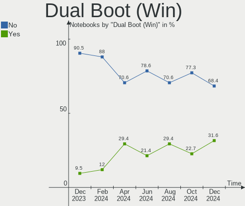
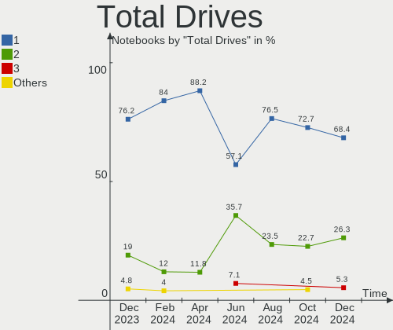
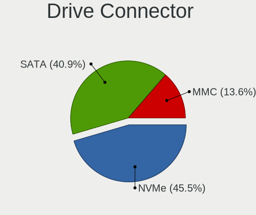
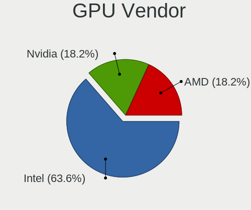
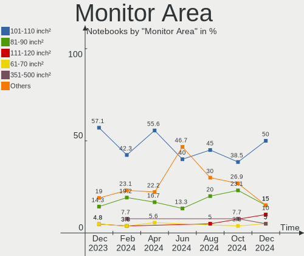
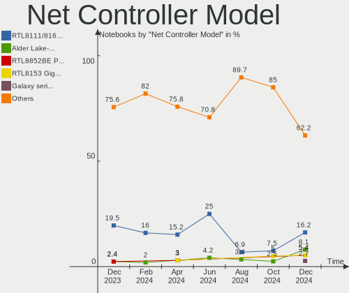
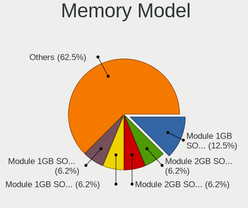
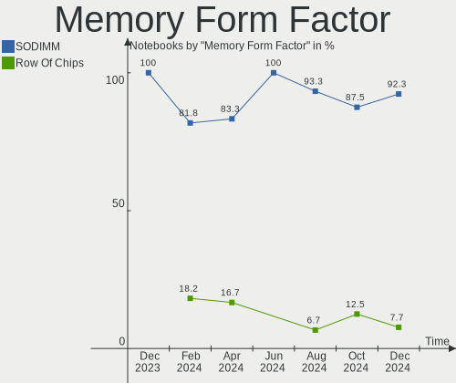

LMDE - Hardware Trends (Notebooks)
----------------------------------

A project to identify most popular hardware characteristics and track their change
over time based on data collected by Linux users at https://Linux-Hardware.org.

Anyone can contribute to this report by the [hw-probe](https://github.com/linuxhw/hw-probe) tool:

    sudo -E hw-probe -all -upload

This report is for one last month. Overall report since the beginning of time: [TestDays](https://github.com/linuxhw/TestDays)

Period: Nov, 2023.

Contents
--------

* [ System ](#system)
  - [ OS                       ](#os)
  - [ OS Family                ](#os-family)
  - [ Kernel                   ](#kernel)
  - [ Kernel Family            ](#kernel-family)
  - [ Kernel Major Ver.        ](#kernel-major-ver)
  - [ Arch                     ](#arch)
  - [ DE                       ](#de)
  - [ Display Server           ](#display-server)
  - [ Display Manager          ](#display-manager)
  - [ OS Lang                  ](#os-lang)
  - [ Boot Mode                ](#boot-mode)
  - [ Filesystem               ](#filesystem)
  - [ Part. scheme             ](#part-scheme)
  - [ Dual Boot with Linux/BSD ](#dual-boot-with-linuxbsd)
  - [ Dual Boot (Win)          ](#dual-boot-win)

* [ Board ](#board)
  - [ Vendor                   ](#vendor)
  - [ Model                    ](#model)
  - [ Model Family             ](#model-family)
  - [ MFG Year                 ](#mfg-year)
  - [ Form Factor              ](#form-factor)
  - [ Secure Boot              ](#secure-boot)
  - [ Coreboot                 ](#coreboot)
  - [ RAM Size                 ](#ram-size)
  - [ RAM Used                 ](#ram-used)
  - [ Total Drives             ](#total-drives)
  - [ Has CD-ROM               ](#has-cd-rom)
  - [ Has Ethernet             ](#has-ethernet)
  - [ Has WiFi                 ](#has-wifi)
  - [ Has Bluetooth            ](#has-bluetooth)

* [ Location ](#location)
  - [ Country                  ](#country)
  - [ City                     ](#city)

* [ Drives ](#drives)
  - [ Drive Vendor             ](#drive-vendor)
  - [ Drive Model              ](#drive-model)
  - [ HDD Vendor               ](#hdd-vendor)
  - [ SSD Vendor               ](#ssd-vendor)
  - [ Drive Kind               ](#drive-kind)
  - [ Drive Connector          ](#drive-connector)
  - [ Drive Size               ](#drive-size)
  - [ Space Total              ](#space-total)
  - [ Space Used               ](#space-used)
  - [ Malfunc. Drives          ](#malfunc-drives)
  - [ Malfunc. Drive Vendor    ](#malfunc-drive-vendor)
  - [ Malfunc. HDD Vendor      ](#malfunc-hdd-vendor)
  - [ Malfunc. Drive Kind      ](#malfunc-drive-kind)
  - [ Failed Drives            ](#failed-drives)
  - [ Failed Drive Vendor      ](#failed-drive-vendor)
  - [ Drive Status             ](#drive-status)

* [ Storage controller ](#storage-controller)
  - [ Storage Vendor           ](#storage-vendor)
  - [ Storage Model            ](#storage-model)
  - [ Storage Kind             ](#storage-kind)

* [ Processor ](#processor)
  - [ CPU Vendor               ](#cpu-vendor)
  - [ CPU Model                ](#cpu-model)
  - [ CPU Model Family         ](#cpu-model-family)
  - [ CPU Cores                ](#cpu-cores)
  - [ CPU Sockets              ](#cpu-sockets)
  - [ CPU Threads              ](#cpu-threads)
  - [ CPU Op-Modes             ](#cpu-op-modes)
  - [ CPU Microcode            ](#cpu-microcode)
  - [ CPU Microarch            ](#cpu-microarch)

* [ Graphics ](#graphics)
  - [ GPU Vendor               ](#gpu-vendor)
  - [ GPU Model                ](#gpu-model)
  - [ GPU Combo                ](#gpu-combo)
  - [ GPU Driver               ](#gpu-driver)
  - [ GPU Memory               ](#gpu-memory)

* [ Monitor ](#monitor)
  - [ Monitor Vendor           ](#monitor-vendor)
  - [ Monitor Model            ](#monitor-model)
  - [ Monitor Resolution       ](#monitor-resolution)
  - [ Monitor Diagonal         ](#monitor-diagonal)
  - [ Monitor Width            ](#monitor-width)
  - [ Aspect Ratio             ](#aspect-ratio)
  - [ Monitor Area             ](#monitor-area)
  - [ Pixel Density            ](#pixel-density)
  - [ Multiple Monitors        ](#multiple-monitors)

* [ Network ](#network)
  - [ Net Controller Vendor    ](#net-controller-vendor)
  - [ Net Controller Model     ](#net-controller-model)
  - [ Wireless Vendor          ](#wireless-vendor)
  - [ Wireless Model           ](#wireless-model)
  - [ Ethernet Vendor          ](#ethernet-vendor)
  - [ Ethernet Model           ](#ethernet-model)
  - [ Net Controller Kind      ](#net-controller-kind)
  - [ Used Controller          ](#used-controller)
  - [ NICs                     ](#nics)
  - [ IPv6                     ](#ipv6)

* [ Bluetooth ](#bluetooth)
  - [ Bluetooth Vendor         ](#bluetooth-vendor)
  - [ Bluetooth Model          ](#bluetooth-model)

* [ Sound ](#sound)
  - [ Sound Vendor             ](#sound-vendor)
  - [ Sound Model              ](#sound-model)

* [ Memory ](#memory)
  - [ Memory Vendor            ](#memory-vendor)
  - [ Memory Model             ](#memory-model)
  - [ Memory Kind              ](#memory-kind)
  - [ Memory Form Factor       ](#memory-form-factor)
  - [ Memory Size              ](#memory-size)
  - [ Memory Speed             ](#memory-speed)

* [ Printers & scanners ](#printers--scanners)
  - [ Printer Vendor           ](#printer-vendor)
  - [ Printer Model            ](#printer-model)
  - [ Scanner Vendor           ](#scanner-vendor)
  - [ Scanner Model            ](#scanner-model)

* [ Camera ](#camera)
  - [ Camera Vendor            ](#camera-vendor)
  - [ Camera Model             ](#camera-model)

* [ Security ](#security)
  - [ Fingerprint Vendor       ](#fingerprint-vendor)
  - [ Fingerprint Model        ](#fingerprint-model)
  - [ Chipcard Vendor          ](#chipcard-vendor)
  - [ Chipcard Model           ](#chipcard-model)

* [ Unsupported ](#unsupported)
  - [ Unsupported Devices      ](#unsupported-devices)
  - [ Unsupported Device Types ](#unsupported-device-types)

System
------

OS
--

Installed operating systems

| Name   | Notebooks | Percent |
|--------|-----------|---------|
| LMDE 6 | 29        | 87.88%  |
| LMDE 5 | 4         | 12.12%  |

OS Family
---------

OS without a version

| Name | Notebooks | Percent |
|------|-----------|---------|
| LMDE | 33        | 100%    |

Kernel
------

Version of the Linux kernel

| Version               | Notebooks | Percent |
|-----------------------|-----------|---------|
| 6.1.0-13-amd64        | 20        | 60.61%  |
| 6.1.0-12-amd64        | 2         | 6.06%   |
| 5.10.0-26-amd64       | 2         | 6.06%   |
| 5.10.0-25-amd64       | 2         | 6.06%   |
| 6.6.2-x64v4-xanmod1   | 1         | 3.03%   |
| 6.5.11-asus-vivobook  | 1         | 3.03%   |
| 6.5.10-asus-vivobook  | 1         | 3.03%   |
| 6.5.0-0.deb12.1-amd64 | 1         | 3.03%   |
| 6.1.0-13-686-pae      | 1         | 3.03%   |
| 6.1.0-13-686          | 1         | 3.03%   |
| 6.1.0-12-686          | 1         | 3.03%   |

Kernel Family
-------------

Linux kernel without a distro release

| Version | Notebooks | Percent |
|---------|-----------|---------|
| 6.1.0   | 25        | 75.76%  |
| 5.10.0  | 4         | 12.12%  |
| 6.6.2   | 1         | 3.03%   |
| 6.5.11  | 1         | 3.03%   |
| 6.5.10  | 1         | 3.03%   |
| 6.5.0   | 1         | 3.03%   |

Kernel Major Ver.
-----------------

Linux kernel major version

| Version | Notebooks | Percent |
|---------|-----------|---------|
| 6.1     | 25        | 75.76%  |
| 5.10    | 4         | 12.12%  |
| 6.5     | 3         | 9.09%   |
| 6.6     | 1         | 3.03%   |

Arch
----

OS architecture (x86_64, i586, etc.)

| Name   | Notebooks | Percent |
|--------|-----------|---------|
| x86_64 | 30        | 90.91%  |
| i686   | 3         | 9.09%   |

DE
--

Desktop Environment

| Name       | Notebooks | Percent |
|------------|-----------|---------|
| X-Cinnamon | 29        | 87.88%  |
| LXDE       | 2         | 6.06%   |
| MATE       | 1         | 3.03%   |
| Cinnamon   | 1         | 3.03%   |

Display Server
--------------

X11 or Wayland

| Name | Notebooks | Percent |
|------|-----------|---------|
| X11  | 33        | 100%    |

Display Manager
---------------

SDDM, LightDM, etc.

| Name    | Notebooks | Percent |
|---------|-----------|---------|
| LightDM | 18        | 54.55%  |
| Unknown | 15        | 45.45%  |

OS Lang
-------

Language

| Lang  | Notebooks | Percent |
|-------|-----------|---------|
| en_US | 14        | 42.42%  |
| de_DE | 5         | 15.15%  |
| pt_BR | 3         | 9.09%   |
| en_GB | 3         | 9.09%   |
| nl_NL | 2         | 6.06%   |
| fr_FR | 2         | 6.06%   |
| tr_TR | 1         | 3.03%   |
| it_IT | 1         | 3.03%   |
| es_ES | 1         | 3.03%   |
| es_BO | 1         | 3.03%   |

Boot Mode
---------

EFI or BIOS

| Mode | Notebooks | Percent |
|------|-----------|---------|
| EFI  | 23        | 69.7%   |
| BIOS | 10        | 30.3%   |

Filesystem
----------

Type of filesystem

| Type    | Notebooks | Percent |
|---------|-----------|---------|
| Ext4    | 26        | 78.79%  |
| Tmpfs   | 3         | 9.09%   |
| Overlay | 2         | 6.06%   |
| Btrfs   | 2         | 6.06%   |

Part. scheme
------------

Scheme of partitioning

| Type    | Notebooks | Percent |
|---------|-----------|---------|
| Unknown | 15        | 45.45%  |
| GPT     | 14        | 42.42%  |
| MBR     | 4         | 12.12%  |

Dual Boot with Linux/BSD
------------------------

Hosting more than one Linux/BSD

| Dual boot | Notebooks | Percent |
|-----------|-----------|---------|
| No        | 29        | 87.88%  |
| Yes       | 4         | 12.12%  |

Dual Boot (Win)
---------------

Hosting Linux and Windows

| Dual boot | Notebooks | Percent |
|-----------|-----------|---------|
| No        | 28        | 84.85%  |
| Yes       | 5         | 15.15%  |

Board
-----

Vendor
------

Motherboard manufacturer

| Name             | Notebooks | Percent |
|------------------|-----------|---------|
| Hewlett-Packard  | 8         | 24.24%  |
| ASUSTek Computer | 6         | 18.18%  |
| Lenovo           | 4         | 12.12%  |
| Dell             | 3         | 9.09%   |
| Acer             | 3         | 9.09%   |
| Toshiba          | 2         | 6.06%   |
| Multilaser       | 1         | 3.03%   |
| Medion           | 1         | 3.03%   |
| LETSUNG          | 1         | 3.03%   |
| IBM              | 1         | 3.03%   |
| HUAWEI           | 1         | 3.03%   |
| Apple            | 1         | 3.03%   |
| Alienware        | 1         | 3.03%   |

Model
-----

Motherboard model

| Name                                     | Notebooks | Percent |
|------------------------------------------|-----------|---------|
| HP 250 G8 Notebook PC                    | 2         | 6.06%   |
| Dell XPS 13 9360                         | 2         | 6.06%   |
| ASUS VivoBook_ASUSLaptop X1605VA_X1605VA | 2         | 6.06%   |
| Toshiba Satellite Pro L100               | 1         | 3.03%   |
| Toshiba Satellite L745                   | 1         | 3.03%   |
| Multilaser PC13X                         | 1         | 3.03%   |
| Medion E6214                             | 1         | 3.03%   |
| Lenovo ThinkPad X1 Extreme 20MGS1QU00    | 1         | 3.03%   |
| Lenovo ThinkPad W541 20EGS07C01          | 1         | 3.03%   |
| Lenovo Legion 5 Pro 16ACH6H 82JQ         | 1         | 3.03%   |
| Lenovo G50-80 80E5                       | 1         | 3.03%   |
| IBM ThinkPad T40 23736G4                 | 1         | 3.03%   |
| HUAWEI KLVL-WXX9                         | 1         | 3.03%   |
| HP Pavilion TS Sleekbook 15              | 1         | 3.03%   |
| HP Pavilion Laptop 15t-eg000             | 1         | 3.03%   |
| HP 255 G6 Notebook PC                    | 1         | 3.03%   |
| HP 250 G7 Notebook PC                    | 1         | 3.03%   |
| HP 246 G6 Notebook PC                    | 1         | 3.03%   |
| HP 245 G7                                | 1         | 3.03%   |
| Dell XPS 17 9720                         | 1         | 3.03%   |
| ASUS X456UR                              | 1         | 3.03%   |
| ASUS VivoBook_ASUSLaptop X515EA_R1500EA  | 1         | 3.03%   |
| ASUS VivoBook_ASUSLaptop M6500XV_M6500XV | 1         | 3.03%   |
| ASUS ROG Strix G513QY_G513QY             | 1         | 3.03%   |
| Apple MacBookPro8,1                      | 1         | 3.03%   |
| Alienware 17                             | 1         | 3.03%   |
| Acer Aspire E5-575G                      | 1         | 3.03%   |
| Acer Aspire A315-21                      | 1         | 3.03%   |
| Acer AOA110                              | 1         | 3.03%   |
| Unknown                                  | 1         | 3.03%   |

Model Family
------------

Motherboard model prefix

| Name              | Notebooks | Percent |
|-------------------|-----------|---------|
| ASUS VivoBook     | 4         | 12.12%  |
| HP 250            | 3         | 9.09%   |
| Dell XPS          | 3         | 9.09%   |
| Toshiba Satellite | 2         | 6.06%   |
| Lenovo ThinkPad   | 2         | 6.06%   |
| HP Pavilion       | 2         | 6.06%   |
| Acer Aspire       | 2         | 6.06%   |
| Multilaser PC13X  | 1         | 3.03%   |
| Medion E6214      | 1         | 3.03%   |
| Lenovo Legion     | 1         | 3.03%   |
| Lenovo G50-80     | 1         | 3.03%   |
| IBM ThinkPad      | 1         | 3.03%   |
| HUAWEI KLVL-WXX9  | 1         | 3.03%   |
| HP 255            | 1         | 3.03%   |
| HP 246            | 1         | 3.03%   |
| HP 245            | 1         | 3.03%   |
| ASUS X456UR       | 1         | 3.03%   |
| ASUS ROG          | 1         | 3.03%   |
| Apple MacBookPro8 | 1         | 3.03%   |
| Alienware 17      | 1         | 3.03%   |
| Acer AOA110       | 1         | 3.03%   |
| Unknown           | 1         | 3.03%   |

MFG Year
--------

Motherboard manufacture year

| Year | Notebooks | Percent |
|------|-----------|---------|
| 2023 | 5         | 15.15%  |
| 2020 | 4         | 12.12%  |
| 2021 | 3         | 9.09%   |
| 2017 | 3         | 9.09%   |
| 2016 | 3         | 9.09%   |
| 2019 | 2         | 6.06%   |
| 2018 | 2         | 6.06%   |
| 2013 | 2         | 6.06%   |
| 2011 | 2         | 6.06%   |
| 2022 | 1         | 3.03%   |
| 2015 | 1         | 3.03%   |
| 2014 | 1         | 3.03%   |
| 2010 | 1         | 3.03%   |
| 2008 | 1         | 3.03%   |
| 2006 | 1         | 3.03%   |
| 2003 | 1         | 3.03%   |

Form Factor
-----------

Physical design of the computer

| Name     | Notebooks | Percent |
|----------|-----------|---------|
| Notebook | 33        | 100%    |

Secure Boot
-----------

Enabled or disabled

| State    | Notebooks | Percent |
|----------|-----------|---------|
| Disabled | 32        | 96.97%  |
| Enabled  | 1         | 3.03%   |

Coreboot
--------

Have coreboot on board

| Used | Notebooks | Percent |
|------|-----------|---------|
| No   | 33        | 100%    |

RAM Size
--------

Total RAM memory

| Size in GB  | Notebooks | Percent |
|-------------|-----------|---------|
| 4.01-8.0    | 11        | 33.33%  |
| 8.01-16.0   | 8         | 24.24%  |
| 16.01-24.0  | 5         | 15.15%  |
| 32.01-64.0  | 2         | 6.06%   |
| 3.01-4.0    | 2         | 6.06%   |
| 1.01-2.0    | 2         | 6.06%   |
| 0.51-1.0    | 2         | 6.06%   |
| 64.01-256.0 | 1         | 3.03%   |

RAM Used
--------

Used RAM memory

| Used GB   | Notebooks | Percent |
|-----------|-----------|---------|
| 4.01-8.0  | 9         | 27.27%  |
| 2.01-3.0  | 9         | 27.27%  |
| 1.01-2.0  | 7         | 21.21%  |
| 3.01-4.0  | 4         | 12.12%  |
| 0.51-1.0  | 2         | 6.06%   |
| 8.01-16.0 | 1         | 3.03%   |
| 0.01-0.5  | 1         | 3.03%   |

Total Drives
------------

Number of drives on board

| Drives | Notebooks | Percent |
|--------|-----------|---------|
| 1      | 23        | 69.7%   |
| 2      | 8         | 24.24%  |
| 4      | 1         | 3.03%   |
| 0      | 1         | 3.03%   |

Has CD-ROM
----------

Has CD-ROM on board

| Presented | Notebooks | Percent |
|-----------|-----------|---------|
| No        | 26        | 78.79%  |
| Yes       | 7         | 21.21%  |

Has Ethernet
------------

Has Ethernet on board

| Presented | Notebooks | Percent |
|-----------|-----------|---------|
| Yes       | 24        | 72.73%  |
| No        | 9         | 27.27%  |

Has WiFi
--------

Has WiFi module

| Presented | Notebooks | Percent |
|-----------|-----------|---------|
| Yes       | 32        | 96.97%  |
| No        | 1         | 3.03%   |

Has Bluetooth
-------------

Has Bluetooth module

| Presented | Notebooks | Percent |
|-----------|-----------|---------|
| Yes       | 28        | 84.85%  |
| No        | 5         | 15.15%  |

Location
--------

Country
-------

Geographic location (country)

| Country      | Notebooks | Percent |
|--------------|-----------|---------|
| Germany      | 6         | 18.18%  |
| USA          | 5         | 15.15%  |
| Brazil       | 3         | 9.09%   |
| Netherlands  | 2         | 6.06%   |
| France       | 2         | 6.06%   |
| UK           | 1         | 3.03%   |
| Turkey       | 1         | 3.03%   |
| Spain        | 1         | 3.03%   |
| Saudi Arabia | 1         | 3.03%   |
| Romania      | 1         | 3.03%   |
| Puerto Rico  | 1         | 3.03%   |
| Poland       | 1         | 3.03%   |
| New Zealand  | 1         | 3.03%   |
| Malaysia     | 1         | 3.03%   |
| Italy        | 1         | 3.03%   |
| Indonesia    | 1         | 3.03%   |
| Canada       | 1         | 3.03%   |
| Bolivia      | 1         | 3.03%   |
| Belgium      | 1         | 3.03%   |
| Austria      | 1         | 3.03%   |

City
----

Geographic location (city)

| City            | Notebooks | Percent |
|-----------------|-----------|---------|
| Rennes          | 2         | 6.06%   |
| Aalten          | 2         | 6.06%   |
| Yanbu           | 1         | 3.03%   |
| Wittingen       | 1         | 3.03%   |
| Vienna          | 1         | 3.03%   |
| Valencia        | 1         | 3.03%   |
| San Juan        | 1         | 3.03%   |
| Rome            | 1         | 3.03%   |
| Ribeirao Preto  | 1         | 3.03%   |
| Rexburg         | 1         | 3.03%   |
| Reichenschwand  | 1         | 3.03%   |
| Ratingen        | 1         | 3.03%   |
| Porto Alegre    | 1         | 3.03%   |
| Oakville        | 1         | 3.03%   |
| Niagara Falls   | 1         | 3.03%   |
| Manaus          | 1         | 3.03%   |
| La Paz          | 1         | 3.03%   |
| Kuala Lumpur    | 1         | 3.03%   |
| Krakow          | 1         | 3.03%   |
| Kosekoy         | 1         | 3.03%   |
| Jumet           | 1         | 3.03%   |
| Hemingford Grey | 1         | 3.03%   |
| Girard          | 1         | 3.03%   |
| Fürth          | 1         | 3.03%   |
| Friedrichshafen | 1         | 3.03%   |
| Fairfax         | 1         | 3.03%   |
| Delligsen       | 1         | 3.03%   |
| Dallas          | 1         | 3.03%   |
| Bucharest       | 1         | 3.03%   |
| Bogor           | 1         | 3.03%   |
| Auckland        | 1         | 3.03%   |

Drives
------

Drive Vendor
------------

Hard drive vendors

| Vendor                    | Notebooks | Drives | Percent |
|---------------------------|-----------|--------|---------|
| Samsung Electronics       | 7         | 8      | 17.95%  |
| Seagate                   | 5         | 5      | 12.82%  |
| WDC                       | 3         | 3      | 7.69%   |
| SK hynix                  | 3         | 3      | 7.69%   |
| Unknown                   | 2         | 2      | 5.13%   |
| Toshiba                   | 2         | 2      | 5.13%   |
| Micron Technology         | 2         | 2      | 5.13%   |
| Kingston                  | 2         | 3      | 5.13%   |
| China                     | 2         | 2      | 5.13%   |
| USB3.0                    | 1         | 1      | 2.56%   |
| Team                      | 1         | 1      | 2.56%   |
| Phison                    | 1         | 1      | 2.56%   |
| Patriot                   | 1         | 1      | 2.56%   |
| Micron/Crucial Technology | 1         | 1      | 2.56%   |
| JMicron Technology        | 1         | 1      | 2.56%   |
| Hitachi                   | 1         | 1      | 2.56%   |
| Fujitsu                   | 1         | 1      | 2.56%   |
| Apacer                    | 1         | 1      | 2.56%   |
| ADATA Technology          | 1         | 1      | 2.56%   |
| A-DATA Technology         | 1         | 1      | 2.56%   |

Drive Model
-----------

Hard drive models

| Model                                               | Notebooks | Percent |
|-----------------------------------------------------|-----------|---------|
| Samsung NVMe SSD Controller SM981/PM981/PM983 250GB | 2         | 4.88%   |
| Samsung MZVLQ1T0HALB-00000 1024GB                   | 2         | 4.88%   |
| WDC WDS500G2B0A-00SM50 500GB SSD                    | 1         | 2.44%   |
| WDC WD20SPZX-75UA7T1 2TB                            | 1         | 2.44%   |
| WDC PC SN730 SDBPNTY-256G-1027 256GB                | 1         | 2.44%   |
| USB3.0 Disk 1TB                                     | 1         | 2.44%   |
| Unknown SD16G  16GB                                 | 1         | 2.44%   |
| Unknown MMC Card  64GB                              | 1         | 2.44%   |
| Toshiba THNSN5512GPUK NVMe 512GB                    | 1         | 2.44%   |
| Toshiba MK8025GAS 80GB                              | 1         | 2.44%   |
| Team TM8PS7256G 256GB SSD                           | 1         | 2.44%   |
| SK hynix SHGP31-1000GM 1TB                          | 1         | 2.44%   |
| SK hynix BC711 HFM256GD3JX013N 256GB                | 1         | 2.44%   |
| SK hynix BC511 512GB                                | 1         | 2.44%   |
| Seagate ST9500325ASG 500GB                          | 1         | 2.44%   |
| Seagate ST500LM021-1KJ152 500GB                     | 1         | 2.44%   |
| Seagate ST500LM000-1EJ162 500GB                     | 1         | 2.44%   |
| Seagate ST1000LM035-1RK172 1TB                      | 1         | 2.44%   |
| Seagate ST1000LM024 HN-M101MBB 1TB                  | 1         | 2.44%   |
| Samsung SSD 850 EVO 500GB                           | 1         | 2.44%   |
| Samsung MZVLQ1T0HBLB-00B00 1TB                      | 1         | 2.44%   |
| Samsung MZVL4256HBJD-00BTW 256GB                    | 1         | 2.44%   |
| Samsung MZ7LN256HCHP-000L7 256GB SSD                | 1         | 2.44%   |
| Phison P-SSD1800 8GB                                | 1         | 2.44%   |
| Patriot Burst 240GB SSD                             | 1         | 2.44%   |
| Micron/Crucial CT1000P5PSSD8 1TB                    | 1         | 2.44%   |
| Micron 3400 NVMe 512GB                              | 1         | 2.44%   |
| Micron 2450_MTFDKBA1T0TFK 1TB                       | 1         | 2.44%   |
| Kingston SV300S37A60G 64GB SSD                      | 1         | 2.44%   |
| Kingston SUV400S37240G 240GB SSD                    | 1         | 2.44%   |
| Kingston SA400S37480G 480GB SSD                     | 1         | 2.44%   |
| JMicron Tech 250GB                                  | 1         | 2.44%   |
| Hitachi HTS547564A9E384 640GB                       | 1         | 2.44%   |
| Fujitsu MHV2060BH PL 64GB                           | 1         | 2.44%   |
| China SATA SSD 240GB                                | 1         | 2.44%   |
| China M.2 2280 SATA SSD 128GB                       | 1         | 2.44%   |
| Apacer AS340 480GB SSD                              | 1         | 2.44%   |
| ADATA NVMe SSD Drive 2TB                            | 1         | 2.44%   |
| A-DATA IM2P33F8-256GD1 256GB                        | 1         | 2.44%   |

HDD Vendor
----------

Hard disk drive vendors

| Vendor  | Notebooks | Drives | Percent |
|---------|-----------|--------|---------|
| Seagate | 5         | 5      | 50%     |
| WDC     | 1         | 1      | 10%     |
| USB3.0  | 1         | 1      | 10%     |
| Toshiba | 1         | 1      | 10%     |
| Hitachi | 1         | 1      | 10%     |
| Fujitsu | 1         | 1      | 10%     |

SSD Vendor
----------

Solid state drive vendors

| Vendor              | Notebooks | Drives | Percent |
|---------------------|-----------|--------|---------|
| Samsung Electronics | 2         | 2      | 18.18%  |
| Kingston            | 2         | 3      | 18.18%  |
| China               | 2         | 2      | 18.18%  |
| WDC                 | 1         | 1      | 9.09%   |
| Team                | 1         | 1      | 9.09%   |
| Phison              | 1         | 1      | 9.09%   |
| Patriot             | 1         | 1      | 9.09%   |
| Apacer              | 1         | 1      | 9.09%   |

Drive Kind
----------

HDD or SSD

| Kind    | Notebooks | Drives | Percent |
|---------|-----------|--------|---------|
| NVMe    | 15        | 16     | 41.67%  |
| SSD     | 10        | 12     | 27.78%  |
| HDD     | 8         | 10     | 22.22%  |
| MMC     | 2         | 2      | 5.56%   |
| Unknown | 1         | 1      | 2.78%   |

Drive Connector
---------------

SATA, SAS, NVMe, etc.

| Type | Notebooks | Drives | Percent |
|------|-----------|--------|---------|
| SATA | 16        | 21     | 47.06%  |
| NVMe | 15        | 16     | 44.12%  |
| MMC  | 2         | 2      | 5.88%   |
| SAS  | 1         | 2      | 2.94%   |

Drive Size
----------

Size of hard drive

| Size in TB | Notebooks | Drives | Percent |
|------------|-----------|--------|---------|
| 0.01-0.5   | 14        | 17     | 73.68%  |
| 0.51-1.0   | 4         | 4      | 21.05%  |
| 1.01-2.0   | 1         | 1      | 5.26%   |

Space Total
-----------

Amount of disk space available on the file system

| Size in GB | Notebooks | Percent |
|------------|-----------|---------|
| 501-1000   | 11        | 33.33%  |
| 251-500    | 6         | 18.18%  |
| 101-250    | 6         | 18.18%  |
| 51-100     | 5         | 15.15%  |
| 1001-2000  | 2         | 6.06%   |
| 1-20       | 2         | 6.06%   |
| 21-50      | 1         | 3.03%   |

Space Used
----------

Amount of used disk space

| Used GB  | Notebooks | Percent |
|----------|-----------|---------|
| 1-20     | 13        | 39.39%  |
| 21-50    | 7         | 21.21%  |
| 101-250  | 5         | 15.15%  |
| 251-500  | 4         | 12.12%  |
| 501-1000 | 2         | 6.06%   |
| 51-100   | 2         | 6.06%   |

Malfunc. Drives
---------------

Drive models with a malfunction

| Model                           | Notebooks | Drives | Percent |
|---------------------------------|-----------|--------|---------|
| Seagate ST500LM021-1KJ152 500GB | 1         | 1      | 100%    |

Malfunc. Drive Vendor
---------------------

Vendors of faulty drives

| Vendor  | Notebooks | Drives | Percent |
|---------|-----------|--------|---------|
| Seagate | 1         | 1      | 100%    |

Malfunc. HDD Vendor
-------------------

Vendors of faulty HDD drives

| Vendor  | Notebooks | Drives | Percent |
|---------|-----------|--------|---------|
| Seagate | 1         | 1      | 100%    |

Malfunc. Drive Kind
-------------------

Kinds of faulty drives

| Kind | Notebooks | Drives | Percent |
|------|-----------|--------|---------|
| HDD  | 1         | 1      | 100%    |

Failed Drives
-------------

Failed drive models

Zero info for selected period =(

Failed Drive Vendor
-------------------

Failed drive vendors

Zero info for selected period =(

Drive Status
------------

Number of failed and malfunc. drives

| Status   | Notebooks | Drives | Percent |
|----------|-----------|--------|---------|
| Detected | 19        | 24     | 55.88%  |
| Works    | 14        | 16     | 41.18%  |
| Malfunc  | 1         | 1      | 2.94%   |

Storage controller
------------------

Storage Vendor
--------------

Storage controller vendors

| Vendor                       | Notebooks | Percent |
|------------------------------|-----------|---------|
| Intel                        | 21        | 50%     |
| AMD                          | 6         | 14.29%  |
| Samsung Electronics          | 5         | 11.9%   |
| SK hynix                     | 3         | 7.14%   |
| Micron Technology            | 2         | 4.76%   |
| ADATA Technology             | 2         | 4.76%   |
| Toshiba America Info Systems | 1         | 2.38%   |
| SanDisk                      | 1         | 2.38%   |
| Micron/Crucial Technology    | 1         | 2.38%   |

Storage Model
-------------

Storage controller models

| Model                                                                          | Notebooks | Percent |
|--------------------------------------------------------------------------------|-----------|---------|
| Intel Volume Management Device NVMe RAID Controller                            | 5         | 10.64%  |
| AMD FCH SATA Controller [AHCI mode]                                            | 5         | 10.64%  |
| Samsung NVMe SSD Controller 980 (DRAM-less)                                    | 3         | 6.38%   |
| Intel Tiger Lake-LP SATA Controller                                            | 3         | 6.38%   |
| Intel Sunrise Point-LP SATA Controller [AHCI mode]                             | 3         | 6.38%   |
| Intel 82801 Mobile SATA Controller [RAID mode]                                 | 3         | 6.38%   |
| SK hynix Gold P31/BC711/PC711 NVMe Solid State Drive                           | 2         | 4.26%   |
| Samsung NVMe SSD Controller SM981/PM981/PM983                                  | 2         | 4.26%   |
| Intel Volume Management Device NVMe RAID Controller Intel Corporation          | 2         | 4.26%   |
| Intel 6 Series/C200 Series Chipset Family 6 port Mobile SATA AHCI Controller   | 2         | 4.26%   |
| Toshiba America Info Systems XG4 NVMe SSD Controller                           | 1         | 2.13%   |
| SK hynix BC511 NVMe SSD                                                        | 1         | 2.13%   |
| SanDisk Extreme Pro / WD Black SN750 / PC SN730 / Red SN700 NVMe SSD           | 1         | 2.13%   |
| Samsung NVMe SSD Controller PM9B1 (DRAM-less)                                  | 1         | 2.13%   |
| Micron/Crucial P5 Plus NVMe PCIe SSD                                           | 1         | 2.13%   |
| Micron 3400 NVMe SSD [Hendrix]                                                 | 1         | 2.13%   |
| Micron 2450 NVMe SSD [HendrixV] (DRAM-less)                                    | 1         | 2.13%   |
| Intel Wildcat Point-LP SATA Controller [AHCI Mode]                             | 1         | 2.13%   |
| Intel Celeron/Pentium Silver Processor SATA Controller                         | 1         | 2.13%   |
| Intel 82801GBM/GHM (ICH7-M Family) SATA Controller [IDE mode]                  | 1         | 2.13%   |
| Intel 82801DBM (ICH4-M) IDE Controller                                         | 1         | 2.13%   |
| Intel 8 Series/C220 Series Chipset Family 6-port SATA Controller 1 [AHCI mode] | 1         | 2.13%   |
| Intel 5 Series/3400 Series Chipset 4 port SATA AHCI Controller                 | 1         | 2.13%   |
| AMD IXP SB4x0 Serial ATA Controller                                            | 1         | 2.13%   |
| AMD IXP SB4x0 IDE Controller                                                   | 1         | 2.13%   |
| ADATA IM2P33F8 series NVMe SSD (DRAM-less)                                     | 1         | 2.13%   |
| ADATA A Non-Volatile memory controller                                         | 1         | 2.13%   |

Storage Kind
------------

Kind of storage controller (IDE, SATA, NVMe, SAS, ...)

| Kind | Notebooks | Percent |
|------|-----------|---------|
| SATA | 17        | 37.78%  |
| NVMe | 15        | 33.33%  |
| RAID | 10        | 22.22%  |
| IDE  | 3         | 6.67%   |

Processor
---------

CPU Vendor
----------

Processor vendors

| Vendor | Notebooks | Percent |
|--------|-----------|---------|
| Intel  | 25        | 75.76%  |
| AMD    | 8         | 24.24%  |

CPU Model
---------

Processor models

| Model                                         | Notebooks | Percent |
|-----------------------------------------------|-----------|---------|
| Intel Core i7-7500U CPU @ 2.70GHz             | 2         | 6.06%   |
| Intel 13th Gen Core i9-13900H                 | 2         | 6.06%   |
| Intel 11th Gen Core i3-1115G4 @ 3.00GHz       | 2         | 6.06%   |
| Intel Pentium M processor 1500MHz             | 1         | 3.03%   |
| Intel Core i7-8850H CPU @ 2.60GHz             | 1         | 3.03%   |
| Intel Core i7-5500U CPU @ 2.40GHz             | 1         | 3.03%   |
| Intel Core i7-4810MQ CPU @ 2.80GHz            | 1         | 3.03%   |
| Intel Core i7-4700MQ CPU @ 2.40GHz            | 1         | 3.03%   |
| Intel Core i5-8265U CPU @ 1.60GHz             | 1         | 3.03%   |
| Intel Core i5-7200U CPU @ 2.50GHz             | 1         | 3.03%   |
| Intel Core i5-6200U CPU @ 2.30GHz             | 1         | 3.03%   |
| Intel Core i5-2435M CPU @ 2.40GHz             | 1         | 3.03%   |
| Intel Core i3-6006U CPU @ 2.00GHz             | 1         | 3.03%   |
| Intel Core i3-2330M CPU @ 2.20GHz             | 1         | 3.03%   |
| Intel Core i3 CPU M 330 @ 2.13GHz             | 1         | 3.03%   |
| Intel Celeron N4020C CPU @ 1.10GHz            | 1         | 3.03%   |
| Intel Celeron M processor 1.60GHz             | 1         | 3.03%   |
| Intel Atom x5-Z8350 CPU @ 1.44GHz             | 1         | 3.03%   |
| Intel Atom CPU N270 @ 1.60GHz                 | 1         | 3.03%   |
| Intel 12th Gen Core i7-12700H                 | 1         | 3.03%   |
| Intel 11th Gen Core i7-1165G7 @ 2.80GHz       | 1         | 3.03%   |
| Intel 11th Gen Core i5-1135G7 @ 2.40GHz       | 1         | 3.03%   |
| AMD Ryzen 9 7940HS w/ Radeon 780M Graphics    | 1         | 3.03%   |
| AMD Ryzen 9 5900HX with Radeon Graphics       | 1         | 3.03%   |
| AMD Ryzen 7 5800H with Radeon Graphics        | 1         | 3.03%   |
| AMD Ryzen 5 4600H with Radeon Graphics        | 1         | 3.03%   |
| AMD Ryzen 3 3250U with Radeon Graphics        | 1         | 3.03%   |
| AMD E2-9000e RADEON R2, 4 COMPUTE CORES 2C+2G | 1         | 3.03%   |
| AMD A8-4555M APU with Radeon HD Graphics      | 1         | 3.03%   |
| AMD A6-9220 RADEON R4, 5 COMPUTE CORES 2C+3G  | 1         | 3.03%   |

CPU Model Family
----------------

Processor model prefix

| Model           | Notebooks | Percent |
|-----------------|-----------|---------|
| Other           | 7         | 21.21%  |
| Intel Core i7   | 6         | 18.18%  |
| Intel Core i5   | 4         | 12.12%  |
| Intel Core i3   | 3         | 9.09%   |
| Intel Atom      | 2         | 6.06%   |
| AMD Ryzen 9     | 2         | 6.06%   |
| Intel Pentium M | 1         | 3.03%   |
| Intel Celeron M | 1         | 3.03%   |
| Intel Celeron   | 1         | 3.03%   |
| AMD Ryzen 7     | 1         | 3.03%   |
| AMD Ryzen 5     | 1         | 3.03%   |
| AMD Ryzen 3     | 1         | 3.03%   |
| AMD E2          | 1         | 3.03%   |
| AMD A8          | 1         | 3.03%   |
| AMD A6          | 1         | 3.03%   |

CPU Cores
---------

Number of processor cores

| Number | Notebooks | Percent |
|--------|-----------|---------|
| 2      | 16        | 48.48%  |
| 4      | 6         | 18.18%  |
| 14     | 3         | 9.09%   |
| 8      | 3         | 9.09%   |
| 1      | 3         | 9.09%   |
| 6      | 2         | 6.06%   |

CPU Sockets
-----------

Number of sockets

| Number | Notebooks | Percent |
|--------|-----------|---------|
| 1      | 33        | 100%    |

CPU Threads
-----------

Threads per core (Hyper-Threading)

| Number | Notebooks | Percent |
|--------|-----------|---------|
| 2      | 27        | 81.82%  |
| 1      | 6         | 18.18%  |

CPU Op-Modes
------------

CPU Operation Modes (32-bit, 64-bit)

| Op mode        | Notebooks | Percent |
|----------------|-----------|---------|
| 32-bit, 64-bit | 30        | 90.91%  |
| 32-bit         | 3         | 9.09%   |

CPU Microcode
-------------

Microcode number

| Number     | Notebooks | Percent |
|------------|-----------|---------|
| Unknown    | 8         | 24.24%  |
| 0x806c1    | 4         | 12.12%  |
| 0x306c3    | 2         | 6.06%   |
| 0x206a7    | 2         | 6.06%   |
| 0x0a50000c | 2         | 6.06%   |
| 0x906ea    | 1         | 3.03%   |
| 0x806e9    | 1         | 3.03%   |
| 0x706a8    | 1         | 3.03%   |
| 0x6d8      | 1         | 3.03%   |
| 0x695      | 1         | 3.03%   |
| 0x406e3    | 1         | 3.03%   |
| 0x406c4    | 1         | 3.03%   |
| 0x20652    | 1         | 3.03%   |
| 0x106c2    | 1         | 3.03%   |
| 0x0a704103 | 1         | 3.03%   |
| 0x08600106 | 1         | 3.03%   |
| 0x08108109 | 1         | 3.03%   |
| 0x06006705 | 1         | 3.03%   |
| 0x06006704 | 1         | 3.03%   |
| 0x06001119 | 1         | 3.03%   |

CPU Microarch
-------------

Microarchitecture

| Name             | Notebooks | Percent |
|------------------|-----------|---------|
| KabyLake         | 5         | 15.15%  |
| TigerLake        | 4         | 12.12%  |
| Alderlake Hybrid | 3         | 9.09%   |
| Zen 3            | 2         | 6.06%   |
| Skylake          | 2         | 6.06%   |
| SandyBridge      | 2         | 6.06%   |
| P6               | 2         | 6.06%   |
| Haswell          | 2         | 6.06%   |
| Excavator        | 2         | 6.06%   |
| Zen+             | 1         | 3.03%   |
| Zen 2            | 1         | 3.03%   |
| Westmere         | 1         | 3.03%   |
| Silvermont       | 1         | 3.03%   |
| Piledriver       | 1         | 3.03%   |
| Goldmont plus    | 1         | 3.03%   |
| Broadwell        | 1         | 3.03%   |
| Bonnell          | 1         | 3.03%   |
| Unknown          | 1         | 3.03%   |

Graphics
--------

GPU Vendor
----------

Vendors of graphics cards

| Vendor | Notebooks | Percent |
|--------|-----------|---------|
| Intel  | 22        | 53.66%  |
| AMD    | 10        | 24.39%  |
| Nvidia | 9         | 21.95%  |

GPU Model
---------

Graphics card models

| Model                                                                                    | Notebooks | Percent |
|------------------------------------------------------------------------------------------|-----------|---------|
| Intel HD Graphics 620                                                                    | 3         | 6.98%   |
| Intel TigerLake-LP GT2 [Iris Xe Graphics]                                                | 2         | 4.65%   |
| Intel Tiger Lake-LP GT2 [UHD Graphics G4]                                                | 2         | 4.65%   |
| Intel Skylake GT2 [HD Graphics 520]                                                      | 2         | 4.65%   |
| Intel Raptor Lake-P [Iris Xe Graphics]                                                   | 2         | 4.65%   |
| Intel 4th Gen Core Processor Integrated Graphics Controller                              | 2         | 4.65%   |
| AMD Stoney [Radeon R2/R3/R4/R5 Graphics]                                                 | 2         | 4.65%   |
| Nvidia GP107M [GeForce GTX 1050 Ti Mobile]                                               | 1         | 2.33%   |
| Nvidia GM108M [GeForce 930MX]                                                            | 1         | 2.33%   |
| Nvidia GM107 [GeForce 940MX]                                                             | 1         | 2.33%   |
| Nvidia GK106M [GeForce GTX 765M]                                                         | 1         | 2.33%   |
| Nvidia GK106GLM [Quadro K2100M]                                                          | 1         | 2.33%   |
| Nvidia GF108M [GeForce GT 525M]                                                          | 1         | 2.33%   |
| Nvidia GA107M [GeForce RTX 3050 Mobile]                                                  | 1         | 2.33%   |
| Nvidia GA106M [GeForce RTX 3060 Mobile / Max-Q]                                          | 1         | 2.33%   |
| Nvidia AD107M [GeForce RTX 4060 Max-Q / Mobile]                                          | 1         | 2.33%   |
| Intel WhiskeyLake-U GT2 [UHD Graphics 620]                                               | 1         | 2.33%   |
| Intel Mobile 945GSE Express Integrated Graphics Controller                               | 1         | 2.33%   |
| Intel Mobile 945GM/GMS/GME, 943/940GML Express Integrated Graphics Controller            | 1         | 2.33%   |
| Intel HD Graphics 5500                                                                   | 1         | 2.33%   |
| Intel GeminiLake [UHD Graphics 600]                                                      | 1         | 2.33%   |
| Intel Core Processor Integrated Graphics Controller                                      | 1         | 2.33%   |
| Intel CoffeeLake-H GT2 [UHD Graphics 630]                                                | 1         | 2.33%   |
| Intel Atom/Celeron/Pentium Processor x5-E8000/J3xxx/N3xxx Integrated Graphics Controller | 1         | 2.33%   |
| Intel Alder Lake-P GT2 [Iris Xe Graphics]                                                | 1         | 2.33%   |
| Intel 2nd Generation Core Processor Family Integrated Graphics Controller                | 1         | 2.33%   |
| AMD Trinity [Radeon HD 7600G]                                                            | 1         | 2.33%   |
| AMD Sun XT [Radeon HD 8670A/8670M/8690M / R5 M330 / M430 / Radeon 520 Mobile]            | 1         | 2.33%   |
| AMD RV200/M7 [Mobility Radeon 7500]                                                      | 1         | 2.33%   |
| AMD Renoir [Radeon RX Vega 6 (Ryzen 4000/5000 Mobile Series)]                            | 1         | 2.33%   |
| AMD RC410M [Mobility Radeon Xpress 200M]                                                 | 1         | 2.33%   |
| AMD Picasso/Raven 2 [Radeon Vega Series / Radeon Vega Mobile Series]                     | 1         | 2.33%   |
| AMD Phoenix1                                                                             | 1         | 2.33%   |
| AMD Navi 22 [Radeon RX 6700/6700 XT/6750 XT / 6800M/6850M XT]                            | 1         | 2.33%   |
| AMD Cezanne [Radeon Vega Series / Radeon Vega Mobile Series]                             | 1         | 2.33%   |

GPU Combo
---------

Combinations of graphics cards

| Name           | Notebooks | Percent |
|----------------|-----------|---------|
| 1 x Intel      | 14        | 42.42%  |
| 1 x AMD        | 7         | 21.21%  |
| Intel + Nvidia | 6         | 18.18%  |
| 1 x Nvidia     | 2         | 6.06%   |
| 2 x Intel      | 1         | 3.03%   |
| 2 x AMD        | 1         | 3.03%   |
| Intel + AMD    | 1         | 3.03%   |
| AMD + Nvidia   | 1         | 3.03%   |

GPU Driver
----------

Free vs proprietary

| Driver      | Notebooks | Percent |
|-------------|-----------|---------|
| Free        | 32        | 96.97%  |
| Proprietary | 1         | 3.03%   |

GPU Memory
----------

Total video memory

| Size in GB | Notebooks | Percent |
|------------|-----------|---------|
| Unknown    | 19        | 57.58%  |
| 0.01-0.5   | 7         | 21.21%  |
| 1.01-2.0   | 3         | 9.09%   |
| 5.01-6.0   | 1         | 3.03%   |
| 3.01-4.0   | 1         | 3.03%   |
| 8.01-16.0  | 1         | 3.03%   |
| 0.51-1.0   | 1         | 3.03%   |

Monitor
-------

Monitor Vendor
--------------

Monitor vendors

| Vendor              | Notebooks | Percent |
|---------------------|-----------|---------|
| Chimei Innolux      | 8         | 19.51%  |
| AU Optronics        | 8         | 19.51%  |
| BOE                 | 5         | 12.2%   |
| Sharp               | 4         | 9.76%   |
| LG Display          | 2         | 4.88%   |
| Dell                | 2         | 4.88%   |
| Acer                | 2         | 4.88%   |
| Unknown             | 1         | 2.44%   |
| SLD                 | 1         | 2.44%   |
| Samsung Electronics | 1         | 2.44%   |
| Philips             | 1         | 2.44%   |
| Iiyama              | 1         | 2.44%   |
| HUAWEI              | 1         | 2.44%   |
| Hewlett-Packard     | 1         | 2.44%   |
| Goldstar            | 1         | 2.44%   |
| Apple               | 1         | 2.44%   |
| AOC                 | 1         | 2.44%   |

Monitor Model
-------------

Monitor models

| Model                                                                | Notebooks | Percent |
|----------------------------------------------------------------------|-----------|---------|
| Chimei Innolux LCD Monitor CMN1618 1920x1200 344x215mm 16.0-inch     | 2         | 4.88%   |
| Unknown LCD Monitor CSO 2560x1600                                    | 1         | 2.44%   |
| SLD LCD Monitor SLD003C 1366x768 309x173mm 13.9-inch                 | 1         | 2.44%   |
| Sharp LCD Monitor SHP1518 1920x1200 366x229mm 17.0-inch              | 1         | 2.44%   |
| Sharp LCD Monitor SHP144A 3200x1800 294x165mm 13.3-inch              | 1         | 2.44%   |
| Sharp LCD Monitor SHP1449 1920x1080 294x165mm 13.3-inch              | 1         | 2.44%   |
| Sharp LCD Monitor SHP13B4 1024x768 304x228mm 15.0-inch               | 1         | 2.44%   |
| Samsung Electronics LCD Monitor SDC4852 1366x768 344x194mm 15.5-inch | 1         | 2.44%   |
| Philips 220BLP PHL08BF 1680x1050 474x296mm 22.0-inch                 | 1         | 2.44%   |
| LG Display LCD Monitor LGD0506 1366x768 344x194mm 15.5-inch          | 1         | 2.44%   |
| LG Display LCD Monitor LGD04C0 1366x768 309x174mm 14.0-inch          | 1         | 2.44%   |
| Iiyama PL2292H IVM563C 1920x1080 476x268mm 21.5-inch                 | 1         | 2.44%   |
| HUAWEI ZQE-CBA HWV6A25 3440x1440 797x334mm 34.0-inch                 | 1         | 2.44%   |
| Hewlett-Packard 2159 HWP282A 1920x1080 480x270mm 21.7-inch           | 1         | 2.44%   |
| Goldstar LG Ultra HD GSM5B09 3840x2160 600x340mm 27.2-inch           | 1         | 2.44%   |
| Dell P2419H DELD0DA 1920x1080 527x296mm 23.8-inch                    | 1         | 2.44%   |
| Dell P2419H DELD0D9 1920x1080 530x300mm 24.0-inch                    | 1         | 2.44%   |
| Chimei Innolux N156HMA-GA1 CMN1556 1920x1080 344x193mm 15.5-inch     | 1         | 2.44%   |
| Chimei Innolux LCD Monitor CMN15E7 1920x1080 344x193mm 15.5-inch     | 1         | 2.44%   |
| Chimei Innolux LCD Monitor CMN15C3 1920x1080 344x193mm 15.5-inch     | 1         | 2.44%   |
| Chimei Innolux LCD Monitor CMN1540 2560x1440 344x193mm 15.5-inch     | 1         | 2.44%   |
| Chimei Innolux LCD Monitor CMN1526 1920x1080 344x193mm 15.5-inch     | 1         | 2.44%   |
| Chimei Innolux LCD Monitor CMN14C3 1366x768 309x173mm 13.9-inch      | 1         | 2.44%   |
| BOE LCD Monitor BOE0947 1920x1080 344x194mm 15.5-inch                | 1         | 2.44%   |
| BOE LCD Monitor BOE0893 2160x1440 296x197mm 14.0-inch                | 1         | 2.44%   |
| BOE LCD Monitor BOE0704 1366x768 344x194mm 15.5-inch                 | 1         | 2.44%   |
| BOE LCD Monitor BOE06A5 1366x768 344x194mm 15.5-inch                 | 1         | 2.44%   |
| BOE LCD Monitor BOE0697 1366x768 309x173mm 13.9-inch                 | 1         | 2.44%   |
| AU Optronics LCD Monitor AUO45EC 1366x768 344x193mm 15.5-inch        | 1         | 2.44%   |
| AU Optronics LCD Monitor AUO38ED 1920x1080 344x193mm 15.5-inch       | 1         | 2.44%   |
| AU Optronics LCD Monitor AUO3691 1366x768 344x193mm 15.5-inch        | 1         | 2.44%   |
| AU Optronics LCD Monitor AUO32EC 1366x768 344x193mm 15.5-inch        | 1         | 2.44%   |
| AU Optronics LCD Monitor AUO32EB 3840x2160 344x193mm 15.5-inch       | 1         | 2.44%   |
| AU Optronics LCD Monitor AUO219D 1920x1080 381x214mm 17.2-inch       | 1         | 2.44%   |
| AU Optronics LCD Monitor AUO163C 1366x768 309x173mm 13.9-inch        | 1         | 2.44%   |
| AU Optronics LCD Monitor AUO11C2 1024x600 195x113mm 8.9-inch         | 1         | 2.44%   |
| Apple LCD Monitor APP9CC5 1280x800 286x179mm 13.3-inch               | 1         | 2.44%   |
| AOC U34G2G4R3 AOC3402 3440x1440 797x334mm 34.0-inch                  | 1         | 2.44%   |
| Acer H226HQL ACR0319 1920x1080 476x268mm 21.5-inch                   | 1         | 2.44%   |
| Acer B196L ACR0364 1280x1024 376x301mm 19.0-inch                     | 1         | 2.44%   |

Monitor Resolution
------------------

Monitor screen resolution

| Resolution         | Notebooks | Percent |
|--------------------|-----------|---------|
| 1366x768 (WXGA)    | 11        | 29.73%  |
| 1920x1080 (FHD)    | 9         | 24.32%  |
| 3840x2160 (4K)     | 3         | 8.11%   |
| 1920x1200 (WUXGA)  | 3         | 8.11%   |
| 3440x1440          | 2         | 5.41%   |
| 3200x1800 (QHD+)   | 1         | 2.7%    |
| 2560x1600          | 1         | 2.7%    |
| 2560x1440 (QHD)    | 1         | 2.7%    |
| 2160x1440          | 1         | 2.7%    |
| 1680x1050 (WSXGA+) | 1         | 2.7%    |
| 1280x800 (WXGA)    | 1         | 2.7%    |
| 1280x1024 (SXGA)   | 1         | 2.7%    |
| 1024x768 (XGA)     | 1         | 2.7%    |
| 1024x600           | 1         | 2.7%    |

Monitor Diagonal
----------------

Diagonal size in inches

| Inches  | Notebooks | Percent |
|---------|-----------|---------|
| 15      | 16        | 39.02%  |
| 13      | 7         | 17.07%  |
| 21      | 3         | 7.32%   |
| 34      | 2         | 4.88%   |
| 24      | 2         | 4.88%   |
| 17      | 2         | 4.88%   |
| 16      | 2         | 4.88%   |
| 14      | 2         | 4.88%   |
| 27      | 1         | 2.44%   |
| 22      | 1         | 2.44%   |
| 19      | 1         | 2.44%   |
| 8       | 1         | 2.44%   |
| Unknown | 1         | 2.44%   |

Monitor Width
-------------

Physical width

| Width in mm | Notebooks | Percent |
|-------------|-----------|---------|
| 301-350     | 23        | 57.5%   |
| 201-300     | 4         | 10%     |
| 501-600     | 3         | 7.5%    |
| 401-500     | 3         | 7.5%    |
| 351-400     | 3         | 7.5%    |
| 701-800     | 2         | 5%      |
| 101-200     | 1         | 2.5%    |
| Unknown     | 1         | 2.5%    |

Aspect Ratio
------------

Proportional relationship between the width and the height

| Ratio   | Notebooks | Percent |
|---------|-----------|---------|
| 16/9    | 25        | 69.44%  |
| 16/10   | 5         | 13.89%  |
| 21/9    | 2         | 5.56%   |
| 5/4     | 1         | 2.78%   |
| 4/3     | 1         | 2.78%   |
| 3/2     | 1         | 2.78%   |
| Unknown | 1         | 2.78%   |

Monitor Area
------------

Area in inch²

| Area in inch² | Notebooks | Percent |
|----------------|-----------|---------|
| 101-110        | 16        | 41.03%  |
| 81-90          | 7         | 17.95%  |
| 201-250        | 3         | 7.69%   |
| 71-80          | 2         | 5.13%   |
| 351-500        | 2         | 5.13%   |
| 151-200        | 2         | 5.13%   |
| 121-130        | 2         | 5.13%   |
| 111-120        | 2         | 5.13%   |
| 1-40           | 1         | 2.56%   |
| 301-350        | 1         | 2.56%   |
| Unknown        | 1         | 2.56%   |

Pixel Density
-------------

Pixels per inch

| Density       | Notebooks | Percent |
|---------------|-----------|---------|
| 101-120       | 17        | 42.5%   |
| 121-160       | 11        | 27.5%   |
| 51-100        | 6         | 15%     |
| 161-240       | 3         | 7.5%    |
| More than 240 | 2         | 5%      |
| Unknown       | 1         | 2.5%    |

Multiple Monitors
-----------------

Total monitors connected

| Total | Notebooks | Percent |
|-------|-----------|---------|
| 1     | 27        | 81.82%  |
| 2     | 4         | 12.12%  |
| 4     | 1         | 3.03%   |
| 3     | 1         | 3.03%   |

Network
-------

Net Controller Vendor
---------------------

Controller vendors

| Vendor                                | Notebooks | Percent |
|---------------------------------------|-----------|---------|
| Realtek Semiconductor                 | 20        | 40.82%  |
| Qualcomm Atheros                      | 11        | 22.45%  |
| Intel                                 | 8         | 16.33%  |
| MediaTek                              | 3         | 6.12%   |
| Broadcom                              | 2         | 4.08%   |
| TP-Link                               | 1         | 2.04%   |
| Samsung Electronics                   | 1         | 2.04%   |
| Cisco Aironet Wireless Communications | 1         | 2.04%   |
| ASIX Electronics                      | 1         | 2.04%   |
| AMD                                   | 1         | 2.04%   |

Net Controller Model
--------------------

Controller models

| Model                                                                         | Notebooks | Percent |
|-------------------------------------------------------------------------------|-----------|---------|
| Realtek RTL8111/8168/8411 PCI Express Gigabit Ethernet Controller             | 12        | 19.67%  |
| Realtek RTL8821CE 802.11ac PCIe Wireless Network Adapter                      | 5         | 8.2%    |
| Realtek RTL810xE PCI Express Fast Ethernet controller                         | 3         | 4.92%   |
| Realtek RTL8822CE 802.11ac PCIe Wireless Network Adapter                      | 2         | 3.28%   |
| Qualcomm Atheros QCA9377 802.11ac Wireless Network Adapter                    | 2         | 3.28%   |
| Qualcomm Atheros QCA6174 802.11ac Wireless Network Adapter                    | 2         | 3.28%   |
| MediaTek Wi-Fi 6E MT7902 Wireless Network Adapter                             | 2         | 3.28%   |
| TP-Link Archer T3U [Realtek RTL8812BU]                                        | 1         | 1.64%   |
| Samsung Galaxy series, misc. (tethering mode)                                 | 1         | 1.64%   |
| Realtek RTL88x2bu [AC1200 Techkey]                                            | 1         | 1.64%   |
| Realtek RTL8852AE 802.11ax PCIe Wireless Network Adapter                      | 1         | 1.64%   |
| Realtek RTL8723BE PCIe Wireless Network Adapter                               | 1         | 1.64%   |
| Realtek RTL8191SEvB Wireless LAN Controller                                   | 1         | 1.64%   |
| Realtek RTL-8100/8101L/8139 PCI Fast Ethernet Adapter                         | 1         | 1.64%   |
| Qualcomm Atheros QCA9565 / AR9565 Wireless Network Adapter                    | 1         | 1.64%   |
| Qualcomm Atheros Killer E220x Gigabit Ethernet Controller                     | 1         | 1.64%   |
| Qualcomm Atheros AR9485 Wireless Network Adapter                              | 1         | 1.64%   |
| Qualcomm Atheros AR9285 Wireless Network Adapter (PCI-Express)                | 1         | 1.64%   |
| Qualcomm Atheros AR8151 v2.0 Gigabit Ethernet                                 | 1         | 1.64%   |
| Qualcomm Atheros AR8131 Gigabit Ethernet                                      | 1         | 1.64%   |
| Qualcomm Atheros AR242x / AR542x Wireless Network Adapter (PCI-Express)       | 1         | 1.64%   |
| Qualcomm Atheros AR2413/AR2414 Wireless Network Adapter [AR5005G(S) 802.11bg] | 1         | 1.64%   |
| MediaTek MT7921 802.11ax PCI Express Wireless Network Adapter                 | 1         | 1.64%   |
| Intel Wireless 7260                                                           | 1         | 1.64%   |
| Intel Wireless 3160                                                           | 1         | 1.64%   |
| Intel Wi-Fi 6 AX210/AX211/AX411 160MHz                                        | 1         | 1.64%   |
| Intel Wi-Fi 6 AX201                                                           | 1         | 1.64%   |
| Intel Ethernet Connection I217-LM                                             | 1         | 1.64%   |
| Intel Ethernet Connection (7) I219-LM                                         | 1         | 1.64%   |
| Intel Dual Band Wireless-AC 3168NGW [Stone Peak]                              | 1         | 1.64%   |
| Intel Cannon Lake PCH CNVi WiFi                                               | 1         | 1.64%   |
| Intel Alder Lake-P PCH CNVi WiFi                                              | 1         | 1.64%   |
| Intel 82801DB/DBL/DBM (ICH4/ICH4-L/ICH4-M) AC'97 Modem Controller             | 1         | 1.64%   |
| Intel 82801DB PRO/100 VE (MOB) Ethernet Controller                            | 1         | 1.64%   |
| Cisco Aironet Wireless Cisco Aironet Wireless 802.11b                         | 1         | 1.64%   |
| Broadcom NetXtreme BCM57765 Gigabit Ethernet PCIe                             | 1         | 1.64%   |
| Broadcom BCM4352 802.11ac Dual Band Wireless Network Adapter                  | 1         | 1.64%   |
| Broadcom BCM4331 802.11a/b/g/n                                                | 1         | 1.64%   |
| ASIX AX88179 Gigabit Ethernet                                                 | 1         | 1.64%   |
| AMD IXP SB400 AC'97 Modem Controller                                          | 1         | 1.64%   |

Wireless Vendor
---------------

Wireless vendors

| Vendor                                | Notebooks | Percent |
|---------------------------------------|-----------|---------|
| Realtek Semiconductor                 | 11        | 32.35%  |
| Qualcomm Atheros                      | 9         | 26.47%  |
| Intel                                 | 7         | 20.59%  |
| MediaTek                              | 3         | 8.82%   |
| Broadcom                              | 2         | 5.88%   |
| TP-Link                               | 1         | 2.94%   |
| Cisco Aironet Wireless Communications | 1         | 2.94%   |

Wireless Model
--------------

Wireless models

| Model                                                                         | Notebooks | Percent |
|-------------------------------------------------------------------------------|-----------|---------|
| Realtek RTL8821CE 802.11ac PCIe Wireless Network Adapter                      | 5         | 14.71%  |
| Realtek RTL8822CE 802.11ac PCIe Wireless Network Adapter                      | 2         | 5.88%   |
| Qualcomm Atheros QCA9377 802.11ac Wireless Network Adapter                    | 2         | 5.88%   |
| Qualcomm Atheros QCA6174 802.11ac Wireless Network Adapter                    | 2         | 5.88%   |
| MediaTek Wi-Fi 6E MT7902 Wireless Network Adapter                             | 2         | 5.88%   |
| TP-Link Archer T3U [Realtek RTL8812BU]                                        | 1         | 2.94%   |
| Realtek RTL88x2bu [AC1200 Techkey]                                            | 1         | 2.94%   |
| Realtek RTL8852AE 802.11ax PCIe Wireless Network Adapter                      | 1         | 2.94%   |
| Realtek RTL8723BE PCIe Wireless Network Adapter                               | 1         | 2.94%   |
| Realtek RTL8191SEvB Wireless LAN Controller                                   | 1         | 2.94%   |
| Qualcomm Atheros QCA9565 / AR9565 Wireless Network Adapter                    | 1         | 2.94%   |
| Qualcomm Atheros AR9485 Wireless Network Adapter                              | 1         | 2.94%   |
| Qualcomm Atheros AR9285 Wireless Network Adapter (PCI-Express)                | 1         | 2.94%   |
| Qualcomm Atheros AR242x / AR542x Wireless Network Adapter (PCI-Express)       | 1         | 2.94%   |
| Qualcomm Atheros AR2413/AR2414 Wireless Network Adapter [AR5005G(S) 802.11bg] | 1         | 2.94%   |
| MediaTek MT7921 802.11ax PCI Express Wireless Network Adapter                 | 1         | 2.94%   |
| Intel Wireless 7260                                                           | 1         | 2.94%   |
| Intel Wireless 3160                                                           | 1         | 2.94%   |
| Intel Wi-Fi 6 AX210/AX211/AX411 160MHz                                        | 1         | 2.94%   |
| Intel Wi-Fi 6 AX201                                                           | 1         | 2.94%   |
| Intel Dual Band Wireless-AC 3168NGW [Stone Peak]                              | 1         | 2.94%   |
| Intel Cannon Lake PCH CNVi WiFi                                               | 1         | 2.94%   |
| Intel Alder Lake-P PCH CNVi WiFi                                              | 1         | 2.94%   |
| Cisco Aironet Wireless Cisco Aironet Wireless 802.11b                         | 1         | 2.94%   |
| Broadcom BCM4352 802.11ac Dual Band Wireless Network Adapter                  | 1         | 2.94%   |
| Broadcom BCM4331 802.11a/b/g/n                                                | 1         | 2.94%   |

Ethernet Vendor
---------------

Ethernet vendors

| Vendor                | Notebooks | Percent |
|-----------------------|-----------|---------|
| Realtek Semiconductor | 16        | 64%     |
| Qualcomm Atheros      | 3         | 12%     |
| Intel                 | 3         | 12%     |
| Samsung Electronics   | 1         | 4%      |
| Broadcom              | 1         | 4%      |
| ASIX Electronics      | 1         | 4%      |

Ethernet Model
--------------

Ethernet models

| Model                                                             | Notebooks | Percent |
|-------------------------------------------------------------------|-----------|---------|
| Realtek RTL8111/8168/8411 PCI Express Gigabit Ethernet Controller | 12        | 48%     |
| Realtek RTL810xE PCI Express Fast Ethernet controller             | 3         | 12%     |
| Samsung Galaxy series, misc. (tethering mode)                     | 1         | 4%      |
| Realtek RTL-8100/8101L/8139 PCI Fast Ethernet Adapter             | 1         | 4%      |
| Qualcomm Atheros Killer E220x Gigabit Ethernet Controller         | 1         | 4%      |
| Qualcomm Atheros AR8151 v2.0 Gigabit Ethernet                     | 1         | 4%      |
| Qualcomm Atheros AR8131 Gigabit Ethernet                          | 1         | 4%      |
| Intel Ethernet Connection I217-LM                                 | 1         | 4%      |
| Intel Ethernet Connection (7) I219-LM                             | 1         | 4%      |
| Intel 82801DB PRO/100 VE (MOB) Ethernet Controller                | 1         | 4%      |
| Broadcom NetXtreme BCM57765 Gigabit Ethernet PCIe                 | 1         | 4%      |
| ASIX AX88179 Gigabit Ethernet                                     | 1         | 4%      |

Net Controller Kind
-------------------

Ethernet, WiFi or modem

| Kind     | Notebooks | Percent |
|----------|-----------|---------|
| WiFi     | 32        | 54.24%  |
| Ethernet | 25        | 42.37%  |
| Modem    | 2         | 3.39%   |

Used Controller
---------------

Currently used network controller

| Kind     | Notebooks | Percent |
|----------|-----------|---------|
| WiFi     | 24        | 70.59%  |
| Ethernet | 10        | 29.41%  |

NICs
----

Total network controllers on board

| Total | Notebooks | Percent |
|-------|-----------|---------|
| 2     | 22        | 66.67%  |
| 1     | 9         | 27.27%  |
| 3     | 1         | 3.03%   |
| 0     | 1         | 3.03%   |

IPv6
----

IPv6 vs IPv4

| Used | Notebooks | Percent |
|------|-----------|---------|
| No   | 18        | 54.55%  |
| Yes  | 15        | 45.45%  |

Bluetooth
---------

Bluetooth Vendor
----------------

Controller vendors

| Vendor                          | Notebooks | Percent |
|---------------------------------|-----------|---------|
| Realtek Semiconductor           | 7         | 25%     |
| Intel                           | 7         | 25%     |
| IMC Networks                    | 6         | 21.43%  |
| Qualcomm Atheros Communications | 3         | 10.71%  |
| Lite-On Technology              | 2         | 7.14%   |
| Realtek                         | 1         | 3.57%   |
| Broadcom                        | 1         | 3.57%   |
| Apple                           | 1         | 3.57%   |

Bluetooth Model
---------------

Controller models

| Model                                          | Notebooks | Percent |
|------------------------------------------------|-----------|---------|
| Realtek Bluetooth Radio                        | 4         | 14.29%  |
| IMC Networks Wireless_Device                   | 3         | 10.71%  |
| Realtek  Bluetooth 4.2 Adapter                 | 2         | 7.14%   |
| Lite-On Qualcomm Atheros QCA9377 Bluetooth     | 2         | 7.14%   |
| Intel Bluetooth wireless interface             | 2         | 7.14%   |
| Realtek 802.11ac WLAN Adapter                  | 1         | 3.57%   |
| Realtek 802.11ac WLAN Adapter                  | 1         | 3.57%   |
| Qualcomm Atheros  Bluetooth Device             | 1         | 3.57%   |
| Qualcomm Atheros QCA61x4 Bluetooth 4.0         | 1         | 3.57%   |
| Qualcomm Atheros AR3011 Bluetooth              | 1         | 3.57%   |
| Intel Wireless-AC 3168 Bluetooth               | 1         | 3.57%   |
| Intel Bluetooth Device                         | 1         | 3.57%   |
| Intel Bluetooth 9460/9560 Jefferson Peak (JfP) | 1         | 3.57%   |
| Intel AX210 Bluetooth                          | 1         | 3.57%   |
| Intel AX201 Bluetooth                          | 1         | 3.57%   |
| IMC Networks Bluetooth Radio                   | 1         | 3.57%   |
| IMC Networks Bluetooth Device                  | 1         | 3.57%   |
| IMC Networks BCM20702A0                        | 1         | 3.57%   |
| Broadcom BCM20702A0 Bluetooth 4.0              | 1         | 3.57%   |
| Apple Bluetooth Host Controller                | 1         | 3.57%   |

Sound
-----

Sound Vendor
------------

Sound card vendors

| Vendor              | Notebooks | Percent |
|---------------------|-----------|---------|
| Intel               | 23        | 56.1%   |
| AMD                 | 9         | 21.95%  |
| Nvidia              | 7         | 17.07%  |
| Texas Instruments   | 1         | 2.44%   |
| Creative Technology | 1         | 2.44%   |

Sound Model
-----------

Sound card models

| Model                                                                      | Notebooks | Percent |
|----------------------------------------------------------------------------|-----------|---------|
| Intel Sunrise Point-LP HD Audio                                            | 5         | 9.62%   |
| AMD Family 17h/19h HD Audio Controller                                     | 5         | 9.62%   |
| Intel Tiger Lake-LP Smart Sound Technology Audio Controller                | 4         | 7.69%   |
| Nvidia GK106 HDMI Audio Controller                                         | 2         | 3.85%   |
| Intel Xeon E3-1200 v3/4th Gen Core Processor HD Audio Controller           | 2         | 3.85%   |
| Intel Raptor Lake-P/U/H cAVS                                               | 2         | 3.85%   |
| Intel 8 Series/C220 Series Chipset High Definition Audio Controller        | 2         | 3.85%   |
| Intel 6 Series/C200 Series Chipset Family High Definition Audio Controller | 2         | 3.85%   |
| AMD Renoir Radeon High Definition Audio Controller                         | 2         | 3.85%   |
| AMD High Definition Audio Controller                                       | 2         | 3.85%   |
| AMD Family 15h (Models 60h-6fh) Audio Controller                           | 2         | 3.85%   |
| Texas Instruments Sabaj A4 AMP                                             | 1         | 1.92%   |
| Nvidia GP107GL High Definition Audio Controller                            | 1         | 1.92%   |
| Nvidia GM107 High Definition Audio Controller [GeForce 940MX]              | 1         | 1.92%   |
| Nvidia GF108 High Definition Audio Controller                              | 1         | 1.92%   |
| Nvidia GA106 High Definition Audio Controller                              | 1         | 1.92%   |
| Nvidia Audio device                                                        | 1         | 1.92%   |
| Intel Wildcat Point-LP High Definition Audio Controller                    | 1         | 1.92%   |
| Intel NM10/ICH7 Family High Definition Audio Controller                    | 1         | 1.92%   |
| Intel Celeron/Pentium Silver Processor High Definition Audio               | 1         | 1.92%   |
| Intel Cannon Point-LP High Definition Audio Controller                     | 1         | 1.92%   |
| Intel Cannon Lake PCH cAVS                                                 | 1         | 1.92%   |
| Intel Broadwell-U Audio Controller                                         | 1         | 1.92%   |
| Intel Alder Lake PCH-P High Definition Audio Controller                    | 1         | 1.92%   |
| Intel 82801DB/DBL/DBM (ICH4/ICH4-L/ICH4-M) AC'97 Audio Controller          | 1         | 1.92%   |
| Intel 5 Series/3400 Series Chipset High Definition Audio                   | 1         | 1.92%   |
| Creative Technology Sound BlasterX Katana                                  | 1         | 1.92%   |
| AMD Trinity HDMI Audio Controller                                          | 1         | 1.92%   |
| AMD Rembrandt Radeon High Definition Audio Controller                      | 1         | 1.92%   |
| AMD Raven/Raven2/Fenghuang HDMI/DP Audio Controller                        | 1         | 1.92%   |
| AMD Navi 21/23 HDMI/DP Audio Controller                                    | 1         | 1.92%   |
| AMD IXP SB400 AC'97 Audio Controller                                       | 1         | 1.92%   |
| AMD FCH Azalia Controller                                                  | 1         | 1.92%   |

Memory
------

Memory Vendor
-------------

Memory module vendors

| Vendor              | Notebooks | Percent |
|---------------------|-----------|---------|
| Samsung Electronics | 6         | 28.57%  |
| Micron Technology   | 5         | 23.81%  |
| Unknown             | 3         | 14.29%  |
| SK hynix            | 2         | 9.52%   |
| Team                | 1         | 4.76%   |
| Smart               | 1         | 4.76%   |
| Kingston            | 1         | 4.76%   |
| Corsair             | 1         | 4.76%   |
| Unknown             | 1         | 4.76%   |

Memory Model
------------

Memory module models

| Model                                                         | Notebooks | Percent |
|---------------------------------------------------------------|-----------|---------|
| Samsung RAM M471A1K43EB1-CWE 8GB SODIMM DDR4 3200MT/s         | 2         | 9.09%   |
| Micron RAM 4ATF1G64HZ-3G2F1 8GB SODIMM DDR4 3200MT/s          | 2         | 9.09%   |
| Unknown RAM Module 512MB SODIMM DRAM                          | 1         | 4.55%   |
| Unknown RAM Module 512MB SODIMM DDR                           | 1         | 4.55%   |
| Unknown RAM Module 1GB SODIMM DDR2 533MT/s                    | 1         | 4.55%   |
| Team RAM TEAMGROUP-SD4-3200 16GB SODIMM DDR4 3200MT/s         | 1         | 4.55%   |
| Smart RAM SF464128CK8IWGKFEG 4GB SODIMM DDR4 2400MT/s         | 1         | 4.55%   |
| SK hynix RAM Module 512MB SODIMM DDR2 533MT/s                 | 1         | 4.55%   |
| SK hynix RAM HMCG66MEBSA095N 8GB SODIMM DDR5 4800MT/s         | 1         | 4.55%   |
| Samsung RAM Module 4GB SODIMM DDR3 1333MT/s                   | 1         | 4.55%   |
| Samsung RAM M471B5673FH0-CF8 2GB SODIMM DDR3 1067MT/s         | 1         | 4.55%   |
| Samsung RAM M471B1G73DB0-YK0 8GB SODIMM DDR3 1600MT/s         | 1         | 4.55%   |
| Samsung RAM M471A1K43CB1-CRC 8GB SODIMM DDR4 2667MT/s         | 1         | 4.55%   |
| Micron RAM MT52L1G32D4PG-107 8GB Row Of Chips LPDDR3 1867MT/s | 1         | 4.55%   |
| Micron RAM 8ATF51264AZ-2G1A2 4GB SODIMM DDR4 2133MT/s         | 1         | 4.55%   |
| Micron RAM 4ATF51264HZ_3G2J1 4GB Row Of Chips DDR4 3200MT/s   | 1         | 4.55%   |
| Kingston RAM ACR24D4S7S8MB-8 8GB SODIMM DDR4 2400MT/s         | 1         | 4.55%   |
| Kingston RAM ACR24D4S7S1MB-4 4GB SODIMM DDR4 2133MT/s         | 1         | 4.55%   |
| Corsair RAM CMSO4GX4M1A2133C15 4GB SODIMM DDR4 2133MT/s       | 1         | 4.55%   |
| Unknown                                                       | 1         | 4.55%   |

Memory Kind
-----------

Memory module kinds

| Kind   | Notebooks | Percent |
|--------|-----------|---------|
| DDR4   | 7         | 43.75%  |
| DDR3   | 3         | 18.75%  |
| LPDDR5 | 1         | 6.25%   |
| LPDDR3 | 1         | 6.25%   |
| DRAM   | 1         | 6.25%   |
| DDR5   | 1         | 6.25%   |
| DDR2   | 1         | 6.25%   |
| DDR    | 1         | 6.25%   |

Memory Form Factor
------------------

Physical design of the memory module

| Name         | Notebooks | Percent |
|--------------|-----------|---------|
| SODIMM       | 14        | 87.5%   |
| Row Of Chips | 2         | 12.5%   |

Memory Size
-----------

Memory module size

| Size  | Notebooks | Percent |
|-------|-----------|---------|
| 8192  | 8         | 42.11%  |
| 4096  | 5         | 26.32%  |
| 512   | 3         | 15.79%  |
| 32768 | 1         | 5.26%   |
| 2048  | 1         | 5.26%   |
| 1024  | 1         | 5.26%   |

Memory Speed
------------

Memory module speed

| Speed   | Notebooks | Percent |
|---------|-----------|---------|
| 3200    | 4         | 22.22%  |
| 2400    | 2         | 11.11%  |
| 2133    | 2         | 11.11%  |
| Unknown | 2         | 11.11%  |
| 5500    | 1         | 5.56%   |
| 4800    | 1         | 5.56%   |
| 2667    | 1         | 5.56%   |
| 1867    | 1         | 5.56%   |
| 1600    | 1         | 5.56%   |
| 1333    | 1         | 5.56%   |
| 1067    | 1         | 5.56%   |
| 533     | 1         | 5.56%   |

Printers & scanners
-------------------

Printer Vendor
--------------

Printer device vendors

Zero info for selected period =(

Printer Model
-------------

Printer device models

Zero info for selected period =(

Scanner Vendor
--------------

Scanner device vendors

Zero info for selected period =(

Scanner Model
-------------

Scanner device models

Zero info for selected period =(

Camera
------

Camera Vendor
-------------

Camera device vendors

| Vendor                                 | Notebooks | Percent |
|----------------------------------------|-----------|---------|
| Realtek Semiconductor                  | 3         | 9.68%   |
| Quanta                                 | 3         | 9.68%   |
| IMC Networks                           | 3         | 9.68%   |
| Chicony Electronics                    | 3         | 9.68%   |
| Sunplus Innovation Technology          | 2         | 6.45%   |
| Sonix Technology                       | 2         | 6.45%   |
| Microdia                               | 2         | 6.45%   |
| Cheng Uei Precision Industry (Foxlink) | 2         | 6.45%   |
| Bison Electronics                      | 2         | 6.45%   |
| Alcor Micro                            | 2         | 6.45%   |
| Suyin                                  | 1         | 3.23%   |
| Sunplus Technology                     | 1         | 3.23%   |
| Luxvisions Innotech Limited            | 1         | 3.23%   |
| Logitech                               | 1         | 3.23%   |
| Lite-On Technology                     | 1         | 3.23%   |
| Apple                                  | 1         | 3.23%   |
| Acer                                   | 1         | 3.23%   |

Camera Model
------------

Camera device models

| Model                                                          | Notebooks | Percent |
|----------------------------------------------------------------|-----------|---------|
| Realtek Integrated_Webcam_HD                                   | 2         | 6.45%   |
| IMC Networks USB2.0 HD UVC WebCam                              | 2         | 6.45%   |
| Alcor Micro USB 2.0 Camera                                     | 2         | 6.45%   |
| Suyin Acer CrystalEye Webcam                                   | 1         | 3.23%   |
| Sunplus Siri A9 UVC chipset                                    | 1         | 3.23%   |
| Sunplus Laptop Integrated Webcam FHD                           | 1         | 3.23%   |
| Sunplus HP TrueVision HD Camera                                | 1         | 3.23%   |
| Sonix USB2.0 HD UVC WebCam                                     | 1         | 3.23%   |
| Sonix USB2.0 FHD UVC WebCam                                    | 1         | 3.23%   |
| Realtek HD WebCam                                              | 1         | 3.23%   |
| Quanta VGA WebCam                                              | 1         | 3.23%   |
| Quanta HP Wide Vision HD Camera                                | 1         | 3.23%   |
| Quanta HP TrueVision HD Camera                                 | 1         | 3.23%   |
| Microdia Sonix USB 2.0 Camera                                  | 1         | 3.23%   |
| Microdia Integrated_Webcam_HD                                  | 1         | 3.23%   |
| Luxvisions Innotech Limited HP TrueVision HD Camera            | 1         | 3.23%   |
| Logitech Quickcam 3000 For Business                            | 1         | 3.23%   |
| Lite-On Integrated Camera                                      | 1         | 3.23%   |
| IMC Networks HD Camera                                         | 1         | 3.23%   |
| Chicony USB2.0 VGA UVC WebCam                                  | 1         | 3.23%   |
| Chicony HP TrueVision HD Camera                                | 1         | 3.23%   |
| Chicony HP Truevision HD                                       | 1         | 3.23%   |
| Cheng Uei Precision Industry (Foxlink) HP Webcam               | 1         | 3.23%   |
| Cheng Uei Precision Industry (Foxlink) HP TrueVision HD Camera | 1         | 3.23%   |
| Bison Lenovo EasyCamera                                        | 1         | 3.23%   |
| Bison Integrated Camera                                        | 1         | 3.23%   |
| Apple FaceTime HD Camera                                       | 1         | 3.23%   |
| Acer Integrated IR Camera                                      | 1         | 3.23%   |

Security
--------

Fingerprint Vendor
------------------

Fingerprint sensor vendors

| Vendor                     | Notebooks | Percent |
|----------------------------|-----------|---------|
| Validity Sensors           | 2         | 40%     |
| Synaptics                  | 1         | 20%     |
| Shenzhen Goodix Technology | 1         | 20%     |
| Elan Microelectronics      | 1         | 20%     |

Fingerprint Model
-----------------

Fingerprint sensor models

| Model                                             | Notebooks | Percent |
|---------------------------------------------------|-----------|---------|
| Validity Sensors VFS7552 Touch Fingerprint Sensor | 1         | 20%     |
| Validity Sensors VFS 5011 fingerprint sensor      | 1         | 20%     |
| Synaptics Metallica MIS Touch Fingerprint Reader  | 1         | 20%     |
| Shenzhen Goodix  Fingerprint Device               | 1         | 20%     |
| Elan ELAN:ARM-M4                                  | 1         | 20%     |

Chipcard Vendor
---------------

Chipcard module vendors

Zero info for selected period =(

Chipcard Model
--------------

Chipcard module models

Zero info for selected period =(

Unsupported
-----------

Unsupported Devices
-------------------

Total unsupported devices on board

| Total | Notebooks | Percent |
|-------|-----------|---------|
| 0     | 21        | 63.64%  |
| 1     | 11        | 33.33%  |
| 2     | 1         | 3.03%   |

Unsupported Device Types
------------------------

Types of unsupported devices

| Type                  | Notebooks | Percent |
|-----------------------|-----------|---------|
| Fingerprint reader    | 5         | 33.33%  |
| Graphics card         | 4         | 26.67%  |
| Net/wireless          | 3         | 20%     |
| Multimedia controller | 2         | 13.33%  |
| Bluetooth             | 1         | 6.67%   |

