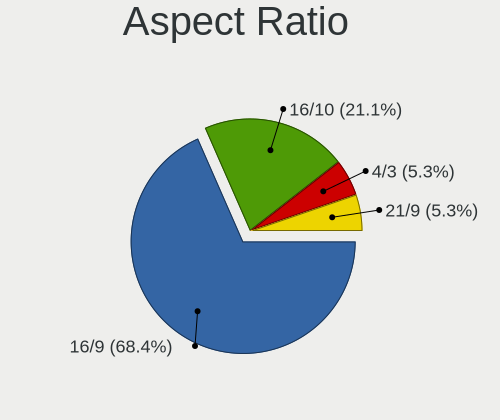
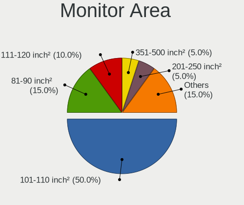
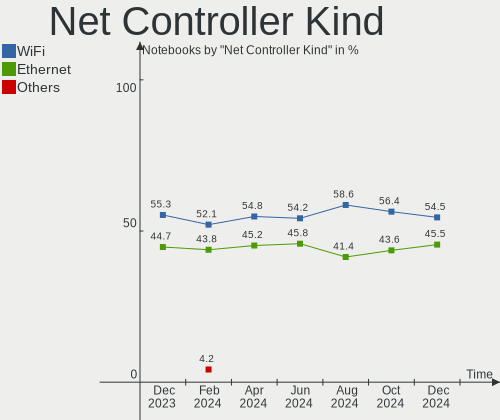
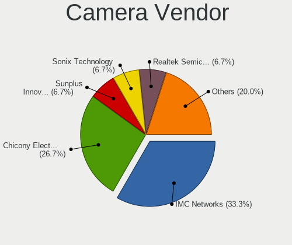
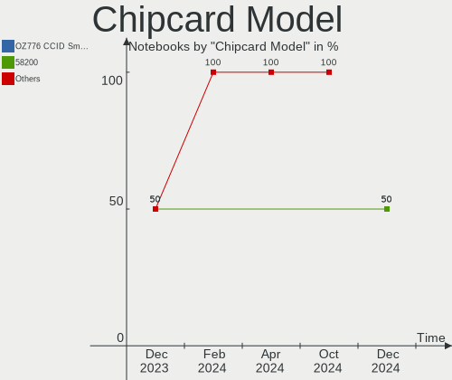

LMDE - Hardware Trends (Notebooks)
----------------------------------

A project to identify most popular hardware characteristics and track their change
over time based on data collected by Linux users at https://Linux-Hardware.org.

Anyone can contribute to this report by the [hw-probe](https://github.com/linuxhw/hw-probe) tool:

    sudo -E hw-probe -all -upload

This report is for one last month. Overall report since the beginning of time: [TestDays](https://github.com/linuxhw/TestDays)

Period: Dec, 2023.

Contents
--------

* [ System ](#system)
  - [ OS                       ](#os)
  - [ OS Family                ](#os-family)
  - [ Kernel                   ](#kernel)
  - [ Kernel Family            ](#kernel-family)
  - [ Kernel Major Ver.        ](#kernel-major-ver)
  - [ Arch                     ](#arch)
  - [ DE                       ](#de)
  - [ Display Server           ](#display-server)
  - [ Display Manager          ](#display-manager)
  - [ OS Lang                  ](#os-lang)
  - [ Boot Mode                ](#boot-mode)
  - [ Filesystem               ](#filesystem)
  - [ Part. scheme             ](#part-scheme)
  - [ Dual Boot with Linux/BSD ](#dual-boot-with-linuxbsd)
  - [ Dual Boot (Win)          ](#dual-boot-win)

* [ Board ](#board)
  - [ Vendor                   ](#vendor)
  - [ Model                    ](#model)
  - [ Model Family             ](#model-family)
  - [ MFG Year                 ](#mfg-year)
  - [ Form Factor              ](#form-factor)
  - [ Secure Boot              ](#secure-boot)
  - [ Coreboot                 ](#coreboot)
  - [ RAM Size                 ](#ram-size)
  - [ RAM Used                 ](#ram-used)
  - [ Total Drives             ](#total-drives)
  - [ Has CD-ROM               ](#has-cd-rom)
  - [ Has Ethernet             ](#has-ethernet)
  - [ Has WiFi                 ](#has-wifi)
  - [ Has Bluetooth            ](#has-bluetooth)

* [ Location ](#location)
  - [ Country                  ](#country)
  - [ City                     ](#city)

* [ Drives ](#drives)
  - [ Drive Vendor             ](#drive-vendor)
  - [ Drive Model              ](#drive-model)
  - [ HDD Vendor               ](#hdd-vendor)
  - [ SSD Vendor               ](#ssd-vendor)
  - [ Drive Kind               ](#drive-kind)
  - [ Drive Connector          ](#drive-connector)
  - [ Drive Size               ](#drive-size)
  - [ Space Total              ](#space-total)
  - [ Space Used               ](#space-used)
  - [ Malfunc. Drives          ](#malfunc-drives)
  - [ Malfunc. Drive Vendor    ](#malfunc-drive-vendor)
  - [ Malfunc. HDD Vendor      ](#malfunc-hdd-vendor)
  - [ Malfunc. Drive Kind      ](#malfunc-drive-kind)
  - [ Failed Drives            ](#failed-drives)
  - [ Failed Drive Vendor      ](#failed-drive-vendor)
  - [ Drive Status             ](#drive-status)

* [ Storage controller ](#storage-controller)
  - [ Storage Vendor           ](#storage-vendor)
  - [ Storage Model            ](#storage-model)
  - [ Storage Kind             ](#storage-kind)

* [ Processor ](#processor)
  - [ CPU Vendor               ](#cpu-vendor)
  - [ CPU Model                ](#cpu-model)
  - [ CPU Model Family         ](#cpu-model-family)
  - [ CPU Cores                ](#cpu-cores)
  - [ CPU Sockets              ](#cpu-sockets)
  - [ CPU Threads              ](#cpu-threads)
  - [ CPU Op-Modes             ](#cpu-op-modes)
  - [ CPU Microcode            ](#cpu-microcode)
  - [ CPU Microarch            ](#cpu-microarch)

* [ Graphics ](#graphics)
  - [ GPU Vendor               ](#gpu-vendor)
  - [ GPU Model                ](#gpu-model)
  - [ GPU Combo                ](#gpu-combo)
  - [ GPU Driver               ](#gpu-driver)
  - [ GPU Memory               ](#gpu-memory)

* [ Monitor ](#monitor)
  - [ Monitor Vendor           ](#monitor-vendor)
  - [ Monitor Model            ](#monitor-model)
  - [ Monitor Resolution       ](#monitor-resolution)
  - [ Monitor Diagonal         ](#monitor-diagonal)
  - [ Monitor Width            ](#monitor-width)
  - [ Aspect Ratio             ](#aspect-ratio)
  - [ Monitor Area             ](#monitor-area)
  - [ Pixel Density            ](#pixel-density)
  - [ Multiple Monitors        ](#multiple-monitors)

* [ Network ](#network)
  - [ Net Controller Vendor    ](#net-controller-vendor)
  - [ Net Controller Model     ](#net-controller-model)
  - [ Wireless Vendor          ](#wireless-vendor)
  - [ Wireless Model           ](#wireless-model)
  - [ Ethernet Vendor          ](#ethernet-vendor)
  - [ Ethernet Model           ](#ethernet-model)
  - [ Net Controller Kind      ](#net-controller-kind)
  - [ Used Controller          ](#used-controller)
  - [ NICs                     ](#nics)
  - [ IPv6                     ](#ipv6)

* [ Bluetooth ](#bluetooth)
  - [ Bluetooth Vendor         ](#bluetooth-vendor)
  - [ Bluetooth Model          ](#bluetooth-model)

* [ Sound ](#sound)
  - [ Sound Vendor             ](#sound-vendor)
  - [ Sound Model              ](#sound-model)

* [ Memory ](#memory)
  - [ Memory Vendor            ](#memory-vendor)
  - [ Memory Model             ](#memory-model)
  - [ Memory Kind              ](#memory-kind)
  - [ Memory Form Factor       ](#memory-form-factor)
  - [ Memory Size              ](#memory-size)
  - [ Memory Speed             ](#memory-speed)

* [ Printers & scanners ](#printers--scanners)
  - [ Printer Vendor           ](#printer-vendor)
  - [ Printer Model            ](#printer-model)
  - [ Scanner Vendor           ](#scanner-vendor)
  - [ Scanner Model            ](#scanner-model)

* [ Camera ](#camera)
  - [ Camera Vendor            ](#camera-vendor)
  - [ Camera Model             ](#camera-model)

* [ Security ](#security)
  - [ Fingerprint Vendor       ](#fingerprint-vendor)
  - [ Fingerprint Model        ](#fingerprint-model)
  - [ Chipcard Vendor          ](#chipcard-vendor)
  - [ Chipcard Model           ](#chipcard-model)

* [ Unsupported ](#unsupported)
  - [ Unsupported Devices      ](#unsupported-devices)
  - [ Unsupported Device Types ](#unsupported-device-types)

System
------

OS
--

Installed operating systems

| Name   | Notebooks | Percent |
|--------|-----------|---------|
| LMDE 6 | 20        | 95.24%  |
| LMDE 5 | 1         | 4.76%   |

OS Family
---------

OS without a version

| Name | Notebooks | Percent |
|------|-----------|---------|
| LMDE | 21        | 100%    |

Kernel
------

Version of the Linux kernel

| Version                  | Notebooks | Percent |
|--------------------------|-----------|---------|
| 6.1.0-16-amd64           | 8         | 38.1%   |
| 6.1.0-12-amd64           | 4         | 19.05%  |
| 6.1.0-15-amd64           | 3         | 14.29%  |
| 6.1.0-13-amd64           | 3         | 14.29%  |
| 6.5.0-0.deb12.4-amd64    | 1         | 4.76%   |
| 6.5.0-0.deb12.1-rt-amd64 | 1         | 4.76%   |
| 6.1.0-14-amd64           | 1         | 4.76%   |

Kernel Family
-------------

Linux kernel without a distro release

| Version | Notebooks | Percent |
|---------|-----------|---------|
| 6.1.0   | 19        | 90.48%  |
| 6.5.0   | 2         | 9.52%   |

Kernel Major Ver.
-----------------

Linux kernel major version

| Version | Notebooks | Percent |
|---------|-----------|---------|
| 6.1     | 19        | 90.48%  |
| 6.5     | 2         | 9.52%   |

Arch
----

OS architecture (x86_64, i586, etc.)

| Name   | Notebooks | Percent |
|--------|-----------|---------|
| x86_64 | 21        | 100%    |

DE
--

Desktop Environment

| Name       | Notebooks | Percent |
|------------|-----------|---------|
| X-Cinnamon | 20        | 95.24%  |
| Cinnamon   | 1         | 4.76%   |

Display Server
--------------

X11 or Wayland

| Name | Notebooks | Percent |
|------|-----------|---------|
| X11  | 21        | 100%    |

Display Manager
---------------

SDDM, LightDM, etc.

| Name    | Notebooks | Percent |
|---------|-----------|---------|
| LightDM | 13        | 61.9%   |
| Unknown | 8         | 38.1%   |

OS Lang
-------

Language

| Lang  | Notebooks | Percent |
|-------|-----------|---------|
| en_US | 8         | 38.1%   |
| de_DE | 5         | 23.81%  |
| it_IT | 2         | 9.52%   |
| ru_RU | 1         | 4.76%   |
| nl_NL | 1         | 4.76%   |
| nl_BE | 1         | 4.76%   |
| fr_FR | 1         | 4.76%   |
| es_BO | 1         | 4.76%   |
| en_GB | 1         | 4.76%   |

Boot Mode
---------

EFI or BIOS

| Mode | Notebooks | Percent |
|------|-----------|---------|
| EFI  | 14        | 66.67%  |
| BIOS | 7         | 33.33%  |

Filesystem
----------

Type of filesystem

| Type    | Notebooks | Percent |
|---------|-----------|---------|
| Ext4    | 17        | 80.95%  |
| Tmpfs   | 2         | 9.52%   |
| Overlay | 1         | 4.76%   |
| Btrfs   | 1         | 4.76%   |

Part. scheme
------------

Scheme of partitioning

| Type    | Notebooks | Percent |
|---------|-----------|---------|
| GPT     | 8         | 38.1%   |
| Unknown | 8         | 38.1%   |
| MBR     | 5         | 23.81%  |

Dual Boot with Linux/BSD
------------------------

Hosting more than one Linux/BSD

| Dual boot | Notebooks | Percent |
|-----------|-----------|---------|
| No        | 20        | 95.24%  |
| Yes       | 1         | 4.76%   |

Dual Boot (Win)
---------------

Hosting Linux and Windows

| Dual boot | Notebooks | Percent |
|-----------|-----------|---------|
| No        | 19        | 90.48%  |
| Yes       | 2         | 9.52%   |

Board
-----

Vendor
------

Motherboard manufacturer

| Name             | Notebooks | Percent |
|------------------|-----------|---------|
| ASUSTek Computer | 5         | 23.81%  |
| Lenovo           | 4         | 19.05%  |
| Hewlett-Packard  | 3         | 14.29%  |
| Dell             | 3         | 14.29%  |
| Sony             | 2         | 9.52%   |
| MSI              | 1         | 4.76%   |
| Medion           | 1         | 4.76%   |
| HUAWEI           | 1         | 4.76%   |
| Acer             | 1         | 4.76%   |

Model
-----

Motherboard model

| Name                                     | Notebooks | Percent |
|------------------------------------------|-----------|---------|
| Sony VGN-FW21E                           | 1         | 4.76%   |
| Sony SVE1511A1EW                         | 1         | 4.76%   |
| MSI GF63 Thin 11UC                       | 1         | 4.76%   |
| Medion E6214                             | 1         | 4.76%   |
| Lenovo ThinkPad X230 2325BA3             | 1         | 4.76%   |
| Lenovo ThinkPad T14 Gen 3 21AHCTO1WW     | 1         | 4.76%   |
| Lenovo IdeaPad S540-14IML 81NF           | 1         | 4.76%   |
| Lenovo IdeaPad 130-15IKB 81H7            | 1         | 4.76%   |
| HUAWEI BOM-WXX9                          | 1         | 4.76%   |
| HP ProBook 650 G2                        | 1         | 4.76%   |
| HP ProBook 450 G3                        | 1         | 4.76%   |
| HP ProBook 445 14 inch G9 Notebook PC    | 1         | 4.76%   |
| Dell Precision 3550                      | 1         | 4.76%   |
| Dell Latitude E6430                      | 1         | 4.76%   |
| Dell Latitude E6320                      | 1         | 4.76%   |
| ASUS X505BP                              | 1         | 4.76%   |
| ASUS VivoBook_ASUSLaptop X1605VA_X1605VA | 1         | 4.76%   |
| ASUS VivoBook_ASUSLaptop X1504VA_X1504VA | 1         | 4.76%   |
| ASUS ROG Strix G512LV_G512LV             | 1         | 4.76%   |
| ASUS ASUS BR1100CKA BR1100CKA_BR1100CKA  | 1         | 4.76%   |
| Acer Aspire E5-575                       | 1         | 4.76%   |

Model Family
------------

Motherboard model prefix

| Name             | Notebooks | Percent |
|------------------|-----------|---------|
| HP ProBook       | 3         | 14.29%  |
| Lenovo ThinkPad  | 2         | 9.52%   |
| Lenovo IdeaPad   | 2         | 9.52%   |
| Dell Latitude    | 2         | 9.52%   |
| ASUS VivoBook    | 2         | 9.52%   |
| Sony VGN-FW21E   | 1         | 4.76%   |
| Sony SVE1511A1EW | 1         | 4.76%   |
| MSI GF63         | 1         | 4.76%   |
| Medion E6214     | 1         | 4.76%   |
| HUAWEI BOM-WXX9  | 1         | 4.76%   |
| Dell Precision   | 1         | 4.76%   |
| ASUS X505BP      | 1         | 4.76%   |
| ASUS ROG         | 1         | 4.76%   |
| ASUS ASUS        | 1         | 4.76%   |
| Acer Aspire      | 1         | 4.76%   |

MFG Year
--------

Motherboard manufacture year

| Year | Notebooks | Percent |
|------|-----------|---------|
| 2022 | 3         | 14.29%  |
| 2021 | 3         | 14.29%  |
| 2012 | 3         | 14.29%  |
| 2023 | 2         | 9.52%   |
| 2016 | 2         | 9.52%   |
| 2020 | 1         | 4.76%   |
| 2019 | 1         | 4.76%   |
| 2018 | 1         | 4.76%   |
| 2017 | 1         | 4.76%   |
| 2015 | 1         | 4.76%   |
| 2011 | 1         | 4.76%   |
| 2010 | 1         | 4.76%   |
| 2008 | 1         | 4.76%   |

Form Factor
-----------

Physical design of the computer

| Name     | Notebooks | Percent |
|----------|-----------|---------|
| Notebook | 21        | 100%    |

Secure Boot
-----------

Enabled or disabled

| State    | Notebooks | Percent |
|----------|-----------|---------|
| Disabled | 19        | 90.48%  |
| Enabled  | 2         | 9.52%   |

Coreboot
--------

Have coreboot on board

| Used | Notebooks | Percent |
|------|-----------|---------|
| No   | 21        | 100%    |

RAM Size
--------

Total RAM memory

| Size in GB | Notebooks | Percent |
|------------|-----------|---------|
| 4.01-8.0   | 6         | 28.57%  |
| 3.01-4.0   | 5         | 23.81%  |
| 8.01-16.0  | 5         | 23.81%  |
| 16.01-24.0 | 3         | 14.29%  |
| 32.01-64.0 | 1         | 4.76%   |
| 24.01-32.0 | 1         | 4.76%   |

RAM Used
--------

Used RAM memory

| Used GB  | Notebooks | Percent |
|----------|-----------|---------|
| 2.01-3.0 | 12        | 57.14%  |
| 1.01-2.0 | 6         | 28.57%  |
| 4.01-8.0 | 3         | 14.29%  |

Total Drives
------------

Number of drives on board

| Drives | Notebooks | Percent |
|--------|-----------|---------|
| 1      | 16        | 76.19%  |
| 2      | 4         | 19.05%  |
| 0      | 1         | 4.76%   |

Has CD-ROM
----------

Has CD-ROM on board

| Presented | Notebooks | Percent |
|-----------|-----------|---------|
| No        | 14        | 66.67%  |
| Yes       | 7         | 33.33%  |

Has Ethernet
------------

Has Ethernet on board

| Presented | Notebooks | Percent |
|-----------|-----------|---------|
| Yes       | 17        | 80.95%  |
| No        | 4         | 19.05%  |

Has WiFi
--------

Has WiFi module

| Presented | Notebooks | Percent |
|-----------|-----------|---------|
| Yes       | 21        | 100%    |

Has Bluetooth
-------------

Has Bluetooth module

| Presented | Notebooks | Percent |
|-----------|-----------|---------|
| Yes       | 18        | 85.71%  |
| No        | 3         | 14.29%  |

Location
--------

Country
-------

Geographic location (country)

| Country     | Notebooks | Percent |
|-------------|-----------|---------|
| Germany     | 5         | 23.81%  |
| USA         | 4         | 19.05%  |
| Italy       | 3         | 14.29%  |
| Belgium     | 2         | 9.52%   |
| Ukraine     | 1         | 4.76%   |
| UK          | 1         | 4.76%   |
| Russia      | 1         | 4.76%   |
| Netherlands | 1         | 4.76%   |
| India       | 1         | 4.76%   |
| Georgia     | 1         | 4.76%   |
| Bolivia     | 1         | 4.76%   |

City
----

Geographic location (city)

| City            | Notebooks | Percent |
|-----------------|-----------|---------|
| Verona          | 1         | 4.76%   |
| Tsqaltubo       | 1         | 4.76%   |
| Thrissur        | 1         | 4.76%   |
| Sumy            | 1         | 4.76%   |
| Schindhard      | 1         | 4.76%   |
| Phoenix         | 1         | 4.76%   |
| Oruro           | 1         | 4.76%   |
| Munich          | 1         | 4.76%   |
| Ilsede          | 1         | 4.76%   |
| Grand Junction  | 1         | 4.76%   |
| Florence        | 1         | 4.76%   |
| Fayetteville    | 1         | 4.76%   |
| Delligsen       | 1         | 4.76%   |
| Darlington      | 1         | 4.76%   |
| Catania         | 1         | 4.76%   |
| Brussels        | 1         | 4.76%   |
| Bad Langensalza | 1         | 4.76%   |
| Antwerp         | 1         | 4.76%   |
| Angarsk         | 1         | 4.76%   |
| Alhambra        | 1         | 4.76%   |
| Aalten          | 1         | 4.76%   |

Drives
------

Drive Vendor
------------

Hard drive vendors

| Vendor                      | Notebooks | Drives | Percent |
|-----------------------------|-----------|--------|---------|
| Samsung Electronics         | 6         | 6      | 26.09%  |
| Crucial                     | 4         | 4      | 17.39%  |
| WDC                         | 3         | 3      | 13.04%  |
| Unknown                     | 2         | 2      | 8.7%    |
| Kingston                    | 2         | 2      | 8.7%    |
| Toshiba                     | 1         | 1      | 4.35%   |
| Silicon Motion              | 1         | 1      | 4.35%   |
| Seagate                     | 1         | 1      | 4.35%   |
| Micron Technology           | 1         | 1      | 4.35%   |
| Kingston Technology Company | 1         | 1      | 4.35%   |
| Intenso                     | 1         | 1      | 4.35%   |

Drive Model
-----------

Hard drive models

| Model                                   | Notebooks | Percent |
|-----------------------------------------|-----------|---------|
| Crucial CT500MX500SSD1 500GB            | 2         | 8.7%    |
| WDC WD7500BPKX-22HPJT0 752GB            | 1         | 4.35%   |
| WDC WD10SPZX-24Z10 1TB                  | 1         | 4.35%   |
| WDC PC SN530 SDBPNPZ-512G-1002 512GB    | 1         | 4.35%   |
| Unknown MMC Card  64GB                  | 1         | 4.35%   |
| Unknown MMC Card  128GB                 | 1         | 4.35%   |
| Toshiba HDWL110 1TB                     | 1         | 4.35%   |
| Silicon Motion PCIe-4 SSD 512GB         | 1         | 4.35%   |
| Seagate ST1000LM035-1RK172 1TB          | 1         | 4.35%   |
| Samsung SSD 870 EVO 500GB               | 1         | 4.35%   |
| Samsung MZVLQ1T0HALB-00000 1TB          | 1         | 4.35%   |
| Samsung MZVLB512HBJQ-000L2 512GB        | 1         | 4.35%   |
| Samsung MZVL4512HBLU-00BL7 512GB        | 1         | 4.35%   |
| Samsung MZVL4512HBLU-00BH1 512GB        | 1         | 4.35%   |
| Samsung MZ7LN128HCHP-000L1 128GB SSD    | 1         | 4.35%   |
| Micron 2400_MTFDKBA512QFM 512GB         | 1         | 4.35%   |
| Kingston Company OM3PDP3 NVMe SSD 512GB | 1         | 4.35%   |
| Kingston SV300S37A60G 64GB SSD          | 1         | 4.35%   |
| Kingston SA400S37480G 480GB SSD         | 1         | 4.35%   |
| Intenso SSD 512GB                       | 1         | 4.35%   |
| Crucial CT240BX500SSD1 240GB            | 1         | 4.35%   |
| Crucial CT1000BX500SSD1 1TB             | 1         | 4.35%   |

HDD Vendor
----------

Hard disk drive vendors

| Vendor  | Notebooks | Drives | Percent |
|---------|-----------|--------|---------|
| WDC     | 2         | 2      | 50%     |
| Toshiba | 1         | 1      | 25%     |
| Seagate | 1         | 1      | 25%     |

SSD Vendor
----------

Solid state drive vendors

| Vendor              | Notebooks | Drives | Percent |
|---------------------|-----------|--------|---------|
| Crucial             | 4         | 4      | 44.44%  |
| Samsung Electronics | 2         | 2      | 22.22%  |
| Kingston            | 2         | 2      | 22.22%  |
| Intenso             | 1         | 1      | 11.11%  |

Drive Kind
----------

HDD or SSD

| Kind | Notebooks | Drives | Percent |
|------|-----------|--------|---------|
| SSD  | 9         | 9      | 39.13%  |
| NVMe | 8         | 8      | 34.78%  |
| HDD  | 4         | 4      | 17.39%  |
| MMC  | 2         | 2      | 8.7%    |

Drive Connector
---------------

SATA, SAS, NVMe, etc.

| Type | Notebooks | Drives | Percent |
|------|-----------|--------|---------|
| SATA | 12        | 13     | 54.55%  |
| NVMe | 8         | 8      | 36.36%  |
| MMC  | 2         | 2      | 9.09%   |

Drive Size
----------

Size of hard drive

| Size in TB | Notebooks | Drives | Percent |
|------------|-----------|--------|---------|
| 0.01-0.5   | 7         | 7      | 53.85%  |
| 0.51-1.0   | 6         | 6      | 46.15%  |

Space Total
-----------

Amount of disk space available on the file system

| Size in GB | Notebooks | Percent |
|------------|-----------|---------|
| 251-500    | 9         | 42.86%  |
| 501-1000   | 5         | 23.81%  |
| 101-250    | 2         | 9.52%   |
| 1-20       | 2         | 9.52%   |
| 51-100     | 2         | 9.52%   |
| 21-50      | 1         | 4.76%   |

Space Used
----------

Amount of used disk space

| Used GB  | Notebooks | Percent |
|----------|-----------|---------|
| 1-20     | 10        | 47.62%  |
| 51-100   | 4         | 19.05%  |
| 21-50    | 3         | 14.29%  |
| 101-250  | 3         | 14.29%  |
| 501-1000 | 1         | 4.76%   |

Malfunc. Drives
---------------

Drive models with a malfunction

| Model                  | Notebooks | Drives | Percent |
|------------------------|-----------|--------|---------|
| WDC WD10SPZX-24Z10 1TB | 1         | 1      | 100%    |

Malfunc. Drive Vendor
---------------------

Vendors of faulty drives

| Vendor | Notebooks | Drives | Percent |
|--------|-----------|--------|---------|
| WDC    | 1         | 1      | 100%    |

Malfunc. HDD Vendor
-------------------

Vendors of faulty HDD drives

| Vendor | Notebooks | Drives | Percent |
|--------|-----------|--------|---------|
| WDC    | 1         | 1      | 100%    |

Malfunc. Drive Kind
-------------------

Kinds of faulty drives

| Kind | Notebooks | Drives | Percent |
|------|-----------|--------|---------|
| HDD  | 1         | 1      | 100%    |

Failed Drives
-------------

Failed drive models

Zero info for selected period =(

Failed Drive Vendor
-------------------

Failed drive vendors

Zero info for selected period =(

Drive Status
------------

Number of failed and malfunc. drives

| Status   | Notebooks | Drives | Percent |
|----------|-----------|--------|---------|
| Works    | 11        | 11     | 52.38%  |
| Detected | 9         | 11     | 42.86%  |
| Malfunc  | 1         | 1      | 4.76%   |

Storage controller
------------------

Storage Vendor
--------------

Storage controller vendors

| Vendor                      | Notebooks | Percent |
|-----------------------------|-----------|---------|
| Intel                       | 14        | 60.87%  |
| Samsung Electronics         | 4         | 17.39%  |
| Silicon Motion              | 1         | 4.35%   |
| SanDisk                     | 1         | 4.35%   |
| Micron Technology           | 1         | 4.35%   |
| Kingston Technology Company | 1         | 4.35%   |
| AMD                         | 1         | 4.35%   |

Storage Model
-------------

Storage controller models

| Model                                                                 | Notebooks | Percent |
|-----------------------------------------------------------------------|-----------|---------|
| Intel Sunrise Point-LP SATA Controller [AHCI mode]                    | 4         | 17.39%  |
| Samsung NVMe SSD Controller PM9B1 (DRAM-less)                         | 2         | 8.7%    |
| Intel Volume Management Device NVMe RAID Controller Intel Corporation | 2         | 8.7%    |
| Intel 82801 Mobile SATA Controller [RAID mode]                        | 2         | 8.7%    |
| Intel 7 Series Chipset Family 6-port SATA Controller [AHCI mode]      | 2         | 8.7%    |
| Silicon Motion Non-Volatile memory controller                         | 1         | 4.35%   |
| SanDisk Ultra 3D / WD Blue SN550 NVMe SSD                             | 1         | 4.35%   |
| Samsung NVMe SSD Controller SM981/PM981/PM983                         | 1         | 4.35%   |
| Samsung NVMe SSD Controller 980 (DRAM-less)                           | 1         | 4.35%   |
| Micron 2400 NVMe SSD (DRAM-less)                                      | 1         | 4.35%   |
| Kingston Company OM3PDP3 NVMe SSD                                     | 1         | 4.35%   |
| Intel Tiger Lake SATA AHCI Controller                                 | 1         | 4.35%   |
| Intel Comet Lake RAID Controller                                      | 1         | 4.35%   |
| Intel 82801IBM/IEM (ICH9M/ICH9M-E) 4 port SATA Controller [AHCI mode] | 1         | 4.35%   |
| Intel 5 Series/3400 Series Chipset 4 port SATA AHCI Controller        | 1         | 4.35%   |
| AMD FCH SATA Controller [AHCI mode]                                   | 1         | 4.35%   |

Storage Kind
------------

Kind of storage controller (IDE, SATA, NVMe, SAS, ...)

| Kind | Notebooks | Percent |
|------|-----------|---------|
| SATA | 10        | 43.48%  |
| NVMe | 8         | 34.78%  |
| RAID | 5         | 21.74%  |

Processor
---------

CPU Vendor
----------

Processor vendors

| Vendor | Notebooks | Percent |
|--------|-----------|---------|
| Intel  | 18        | 85.71%  |
| AMD    | 3         | 14.29%  |

CPU Model
---------

Processor models

| Model                                        | Notebooks | Percent |
|----------------------------------------------|-----------|---------|
| Intel Core i5-6200U CPU @ 2.30GHz            | 2         | 9.52%   |
| Intel Pentium CPU B970 @ 2.30GHz             | 1         | 4.76%   |
| Intel Core i7-2620M CPU @ 2.70GHz            | 1         | 4.76%   |
| Intel Core i7-10870H CPU @ 2.20GHz           | 1         | 4.76%   |
| Intel Core i7-10510U CPU @ 1.80GHz           | 1         | 4.76%   |
| Intel Core i5-7200U CPU @ 2.50GHz            | 1         | 4.76%   |
| Intel Core i5-3320M CPU @ 2.60GHz            | 1         | 4.76%   |
| Intel Core i5-2430M CPU @ 2.40GHz            | 1         | 4.76%   |
| Intel Core i5-10310U CPU @ 1.70GHz           | 1         | 4.76%   |
| Intel Core i3-6006U CPU @ 2.00GHz            | 1         | 4.76%   |
| Intel Core i3 CPU M 330 @ 2.13GHz            | 1         | 4.76%   |
| Intel Core 2 Duo CPU P8400 @ 2.26GHz         | 1         | 4.76%   |
| Intel Celeron N4500 @ 1.10GHz                | 1         | 4.76%   |
| Intel 13th Gen Core i9-13900H                | 1         | 4.76%   |
| Intel 13th Gen Core i5-1335U                 | 1         | 4.76%   |
| Intel 12th Gen Core i5-1245U                 | 1         | 4.76%   |
| Intel 11th Gen Core i5-11400H @ 2.70GHz      | 1         | 4.76%   |
| AMD Ryzen 5 5625U with Radeon Graphics       | 1         | 4.76%   |
| AMD Ryzen 5 5500U with Radeon Graphics       | 1         | 4.76%   |
| AMD A9-9420 RADEON R5, 5 COMPUTE CORES 2C+3G | 1         | 4.76%   |

CPU Model Family
----------------

Processor model prefix

| Model            | Notebooks | Percent |
|------------------|-----------|---------|
| Intel Core i5    | 6         | 28.57%  |
| Other            | 5         | 23.81%  |
| Intel Core i7    | 3         | 14.29%  |
| Intel Core i3    | 2         | 9.52%   |
| AMD Ryzen 5      | 2         | 9.52%   |
| Intel Pentium    | 1         | 4.76%   |
| Intel Core 2 Duo | 1         | 4.76%   |
| Intel Celeron    | 1         | 4.76%   |

CPU Cores
---------

Number of processor cores

| Number | Notebooks | Percent |
|--------|-----------|---------|
| 2      | 12        | 57.14%  |
| 6      | 3         | 14.29%  |
| 10     | 2         | 9.52%   |
| 4      | 2         | 9.52%   |
| 14     | 1         | 4.76%   |
| 8      | 1         | 4.76%   |

CPU Sockets
-----------

Number of sockets

| Number | Notebooks | Percent |
|--------|-----------|---------|
| 1      | 21        | 100%    |

CPU Threads
-----------

Threads per core (Hyper-Threading)

| Number | Notebooks | Percent |
|--------|-----------|---------|
| 2      | 17        | 80.95%  |
| 1      | 4         | 19.05%  |

CPU Op-Modes
------------

CPU Operation Modes (32-bit, 64-bit)

| Op mode        | Notebooks | Percent |
|----------------|-----------|---------|
| 32-bit, 64-bit | 21        | 100%    |

CPU Microcode
-------------

Microcode number

| Number     | Notebooks | Percent |
|------------|-----------|---------|
| 0x406e3    | 3         | 14.29%  |
| 0x206a7    | 3         | 14.29%  |
| Unknown    | 2         | 9.52%   |
| 0xb06a3    | 1         | 4.76%   |
| 0xa0652    | 1         | 4.76%   |
| 0x906c0    | 1         | 4.76%   |
| 0x906a4    | 1         | 4.76%   |
| 0x806ec    | 1         | 4.76%   |
| 0x806e9    | 1         | 4.76%   |
| 0x806d1    | 1         | 4.76%   |
| 0x306a9    | 1         | 4.76%   |
| 0x20652    | 1         | 4.76%   |
| 0x10676    | 1         | 4.76%   |
| 0x0a50000d | 1         | 4.76%   |
| 0x08608103 | 1         | 4.76%   |
| 0x06006704 | 1         | 4.76%   |

CPU Microarch
-------------

Microarchitecture

| Name             | Notebooks | Percent |
|------------------|-----------|---------|
| Skylake          | 3         | 14.29%  |
| SandyBridge      | 3         | 14.29%  |
| KabyLake         | 3         | 14.29%  |
| Alderlake Hybrid | 3         | 14.29%  |
| Zen 3            | 1         | 4.76%   |
| Westmere         | 1         | 4.76%   |
| Tremont          | 1         | 4.76%   |
| Penryn           | 1         | 4.76%   |
| IvyBridge        | 1         | 4.76%   |
| Icelake          | 1         | 4.76%   |
| Excavator        | 1         | 4.76%   |
| CometLake        | 1         | 4.76%   |
| Unknown          | 1         | 4.76%   |

Graphics
--------

GPU Vendor
----------

Vendors of graphics cards

| Vendor | Notebooks | Percent |
|--------|-----------|---------|
| Intel  | 17        | 73.91%  |
| AMD    | 4         | 17.39%  |
| Nvidia | 2         | 8.7%    |

GPU Model
---------

Graphics card models

| Model                                                                     | Notebooks | Percent |
|---------------------------------------------------------------------------|-----------|---------|
| Intel 2nd Generation Core Processor Family Integrated Graphics Controller | 3         | 12.5%   |
| Intel Skylake GT2 [HD Graphics 520]                                       | 2         | 8.33%   |
| Intel Raptor Lake-P [Iris Xe Graphics]                                    | 2         | 8.33%   |
| Intel CometLake-U GT2 [UHD Graphics]                                      | 2         | 8.33%   |
| Nvidia TU106M [GeForce RTX 2060 Mobile]                                   | 1         | 4.17%   |
| Nvidia GA107M [GeForce RTX 3050 Mobile]                                   | 1         | 4.17%   |
| Intel TigerLake-H GT1 [UHD Graphics]                                      | 1         | 4.17%   |
| Intel JasperLake [UHD Graphics]                                           | 1         | 4.17%   |
| Intel HD Graphics 620                                                     | 1         | 4.17%   |
| Intel HD Graphics 520                                                     | 1         | 4.17%   |
| Intel Core Processor Integrated Graphics Controller                       | 1         | 4.17%   |
| Intel CometLake-H GT2 [UHD Graphics]                                      | 1         | 4.17%   |
| Intel Alder Lake-UP3 GT2 [Iris Xe Graphics]                               | 1         | 4.17%   |
| Intel 3rd Gen Core processor Graphics Controller                          | 1         | 4.17%   |
| AMD Sun LE [Radeon HD 8550M / R5 M230]                                    | 1         | 4.17%   |
| AMD Stoney [Radeon R2/R3/R4/R5 Graphics]                                  | 1         | 4.17%   |
| AMD RV620/M82 [Mobility Radeon HD 3450/3470]                              | 1         | 4.17%   |
| AMD Lucienne                                                              | 1         | 4.17%   |
| AMD Barcelo                                                               | 1         | 4.17%   |

GPU Combo
---------

Combinations of graphics cards

| Name           | Notebooks | Percent |
|----------------|-----------|---------|
| 1 x Intel      | 15        | 71.43%  |
| 1 x AMD        | 3         | 14.29%  |
| Intel + Nvidia | 2         | 9.52%   |
| 2 x AMD        | 1         | 4.76%   |

GPU Driver
----------

Free vs proprietary

| Driver      | Notebooks | Percent |
|-------------|-----------|---------|
| Free        | 19        | 90.48%  |
| Proprietary | 2         | 9.52%   |

GPU Memory
----------

Total video memory

| Size in GB | Notebooks | Percent |
|------------|-----------|---------|
| Unknown    | 17        | 80.95%  |
| 0.01-0.5   | 3         | 14.29%  |
| 1.01-2.0   | 1         | 4.76%   |

Monitor
-------

Monitor Vendor
--------------

Monitor vendors

| Vendor              | Notebooks | Percent |
|---------------------|-----------|---------|
| BOE                 | 7         | 33.33%  |
| AU Optronics        | 5         | 23.81%  |
| Chimei Innolux      | 4         | 19.05%  |
| Samsung Electronics | 2         | 9.52%   |
| STA                 | 1         | 4.76%   |
| Sharp               | 1         | 4.76%   |
| LG Display          | 1         | 4.76%   |

Monitor Model
-------------

Monitor models

| Model                                                                | Notebooks | Percent |
|----------------------------------------------------------------------|-----------|---------|
| STA LCD Monitor STA5DCA 1366x768 256x144mm 11.6-inch                 | 1         | 4.76%   |
| Sharp LQ156M1JW09 SHP14D3 1920x1080 344x194mm 15.5-inch              | 1         | 4.76%   |
| Samsung Electronics S24C450 SAM09CB 1920x1080 531x299mm 24.0-inch    | 1         | 4.76%   |
| Samsung Electronics LCD Monitor SEC3047 1366x768 277x156mm 12.5-inch | 1         | 4.76%   |
| LG Display LCD Monitor LGD034B 1366x768 345x194mm 15.6-inch          | 1         | 4.76%   |
| Chimei Innolux LCD Monitor CMN1618 1920x1200 344x215mm 16.0-inch     | 1         | 4.76%   |
| Chimei Innolux LCD Monitor CMN15C3 1920x1080 344x193mm 15.5-inch     | 1         | 4.76%   |
| Chimei Innolux LCD Monitor CMN15BE 1366x768 344x193mm 15.5-inch      | 1         | 4.76%   |
| Chimei Innolux LCD Monitor CMN14D5 1920x1080 309x173mm 13.9-inch     | 1         | 4.76%   |
| BOE LCD Monitor BOE09CC 1920x1080 344x194mm 15.5-inch                | 1         | 4.76%   |
| BOE LCD Monitor BOE0960 1366x768 344x194mm 15.5-inch                 | 1         | 4.76%   |
| BOE LCD Monitor BOE0872 1920x1080 344x194mm 15.5-inch                | 1         | 4.76%   |
| BOE LCD Monitor BOE0869 1920x1080 344x194mm 15.5-inch                | 1         | 4.76%   |
| BOE LCD Monitor BOE0729 1920x1080 344x193mm 15.5-inch                | 1         | 4.76%   |
| BOE LCD Monitor BOE0704 1366x768 344x194mm 15.5-inch                 | 1         | 4.76%   |
| BOE LCD Monitor BOE05B0 1366x768 309x173mm 13.9-inch                 | 1         | 4.76%   |
| AU Optronics LCD Monitor AUOD291 1920x1200 301x188mm 14.0-inch       | 1         | 4.76%   |
| AU Optronics LCD Monitor AUO80ED 1920x1080 344x193mm 15.5-inch       | 1         | 4.76%   |
| AU Optronics LCD Monitor AUO32EC 1366x768 344x193mm 15.5-inch        | 1         | 4.76%   |
| AU Optronics LCD Monitor AUO312C 1366x768 293x165mm 13.2-inch        | 1         | 4.76%   |
| AU Optronics LCD Monitor AUO229E 1600x900 382x214mm 17.2-inch        | 1         | 4.76%   |

Monitor Resolution
------------------

Monitor screen resolution

| Resolution        | Notebooks | Percent |
|-------------------|-----------|---------|
| 1920x1080 (FHD)   | 9         | 45%     |
| 1366x768 (WXGA)   | 9         | 45%     |
| 1920x1200 (WUXGA) | 2         | 10%     |

Monitor Diagonal
----------------

Diagonal size in inches

| Inches | Notebooks | Percent |
|--------|-----------|---------|
| 15     | 12        | 57.14%  |
| 13     | 3         | 14.29%  |
| 24     | 1         | 4.76%   |
| 17     | 1         | 4.76%   |
| 16     | 1         | 4.76%   |
| 14     | 1         | 4.76%   |
| 12     | 1         | 4.76%   |
| 11     | 1         | 4.76%   |

Monitor Width
-------------

Physical width

| Width in mm | Notebooks | Percent |
|-------------|-----------|---------|
| 301-350     | 16        | 76.19%  |
| 201-300     | 3         | 14.29%  |
| 501-600     | 1         | 4.76%   |
| 351-400     | 1         | 4.76%   |

Aspect Ratio
------------

Proportional relationship between the width and the height

| Ratio | Notebooks | Percent |
|-------|-----------|---------|
| 16/9  | 18        | 90%     |
| 16/10 | 2         | 10%     |

Monitor Area
------------

Area in inch²

| Area in inch² | Notebooks | Percent |
|----------------|-----------|---------|
| 101-110        | 12        | 57.14%  |
| 81-90          | 3         | 14.29%  |
| 71-80          | 1         | 4.76%   |
| 61-70          | 1         | 4.76%   |
| 51-60          | 1         | 4.76%   |
| 201-250        | 1         | 4.76%   |
| 121-130        | 1         | 4.76%   |
| 111-120        | 1         | 4.76%   |

Pixel Density
-------------

Pixels per inch

| Density | Notebooks | Percent |
|---------|-----------|---------|
| 121-160 | 11        | 52.38%  |
| 101-120 | 8         | 38.1%   |
| 161-240 | 1         | 4.76%   |
| 51-100  | 1         | 4.76%   |

Multiple Monitors
-----------------

Total monitors connected

| Total | Notebooks | Percent |
|-------|-----------|---------|
| 1     | 20        | 95.24%  |
| 2     | 1         | 4.76%   |

Network
-------

Net Controller Vendor
---------------------

Controller vendors

| Vendor                   | Notebooks | Percent |
|--------------------------|-----------|---------|
| Intel                    | 15        | 44.12%  |
| Realtek Semiconductor    | 11        | 32.35%  |
| Qualcomm Atheros         | 3         | 8.82%   |
| Ralink Technology        | 1         | 2.94%   |
| Marvell Technology Group | 1         | 2.94%   |
| Lenovo                   | 1         | 2.94%   |
| Dell                     | 1         | 2.94%   |
| Broadcom Limited         | 1         | 2.94%   |

Net Controller Model
--------------------

Controller models

| Model                                                             | Notebooks | Percent |
|-------------------------------------------------------------------|-----------|---------|
| Realtek RTL8111/8168/8411 PCI Express Gigabit Ethernet Controller | 8         | 19.51%  |
| Intel 82579LM Gigabit Network Connection (Lewisville)             | 3         | 7.32%   |
| Realtek RTL8852BE PCIe 802.11ax Wireless Network Controller       | 1         | 2.44%   |
| Realtek RTL8822CE 802.11ac PCIe Wireless Network Adapter          | 1         | 2.44%   |
| Realtek RTL8821CE 802.11ac PCIe Wireless Network Adapter          | 1         | 2.44%   |
| Realtek RTL8191SEvB Wireless LAN Controller                       | 1         | 2.44%   |
| Realtek RTL810xE PCI Express Fast Ethernet controller             | 1         | 2.44%   |
| Ralink MT7601U Wireless Adapter                                   | 1         | 2.44%   |
| Qualcomm Atheros QCA9377 802.11ac Wireless Network Adapter        | 1         | 2.44%   |
| Qualcomm Atheros AR9485 Wireless Network Adapter                  | 1         | 2.44%   |
| Qualcomm Atheros AR8131 Gigabit Ethernet                          | 1         | 2.44%   |
| Marvell Group 88E8055 PCI-E Gigabit Ethernet Controller           | 1         | 2.44%   |
| Lenovo ThinkPad Lan                                               | 1         | 2.44%   |
| Intel Wireless 8265 / 8275                                        | 1         | 2.44%   |
| Intel Wireless 8260                                               | 1         | 2.44%   |
| Intel Wireless 7265                                               | 1         | 2.44%   |
| Intel Wireless 3165                                               | 1         | 2.44%   |
| Intel WiFi Link 5100                                              | 1         | 2.44%   |
| Intel Wi-Fi 6 AX210/AX211/AX411 160MHz                            | 1         | 2.44%   |
| Intel Wi-Fi 6 AX201 160MHz                                        | 1         | 2.44%   |
| Intel Tiger Lake PCH CNVi WiFi                                    | 1         | 2.44%   |
| Intel Raptor Lake PCH CNVi WiFi                                   | 1         | 2.44%   |
| Intel Ethernet Connection I219-V                                  | 1         | 2.44%   |
| Intel Ethernet Connection (16) I219-LM                            | 1         | 2.44%   |
| Intel Ethernet Connection (10) I219-LM                            | 1         | 2.44%   |
| Intel Comet Lake PCH-LP CNVi WiFi                                 | 1         | 2.44%   |
| Intel Comet Lake PCH CNVi WiFi                                    | 1         | 2.44%   |
| Intel Centrino Ultimate-N 6300                                    | 1         | 2.44%   |
| Intel Centrino Advanced-N 6205 [Taylor Peak]                      | 1         | 2.44%   |
| Intel Alder Lake-P PCH CNVi WiFi                                  | 1         | 2.44%   |
| Dell Wireless 5630 (EVDO-HSPA) Mobile Broadband Mini-Card         | 1         | 2.44%   |
| Broadcom Limited BCM4312 802.11b/g LP-PHY                         | 1         | 2.44%   |

Wireless Vendor
---------------

Wireless vendors

| Vendor                | Notebooks | Percent |
|-----------------------|-----------|---------|
| Intel                 | 14        | 60.87%  |
| Realtek Semiconductor | 4         | 17.39%  |
| Qualcomm Atheros      | 2         | 8.7%    |
| Ralink Technology     | 1         | 4.35%   |
| Dell                  | 1         | 4.35%   |
| Broadcom Limited      | 1         | 4.35%   |

Wireless Model
--------------

Wireless models

| Model                                                       | Notebooks | Percent |
|-------------------------------------------------------------|-----------|---------|
| Realtek RTL8852BE PCIe 802.11ax Wireless Network Controller | 1         | 4.35%   |
| Realtek RTL8822CE 802.11ac PCIe Wireless Network Adapter    | 1         | 4.35%   |
| Realtek RTL8821CE 802.11ac PCIe Wireless Network Adapter    | 1         | 4.35%   |
| Realtek RTL8191SEvB Wireless LAN Controller                 | 1         | 4.35%   |
| Ralink MT7601U Wireless Adapter                             | 1         | 4.35%   |
| Qualcomm Atheros QCA9377 802.11ac Wireless Network Adapter  | 1         | 4.35%   |
| Qualcomm Atheros AR9485 Wireless Network Adapter            | 1         | 4.35%   |
| Intel Wireless 8265 / 8275                                  | 1         | 4.35%   |
| Intel Wireless 8260                                         | 1         | 4.35%   |
| Intel Wireless 7265                                         | 1         | 4.35%   |
| Intel Wireless 3165                                         | 1         | 4.35%   |
| Intel WiFi Link 5100                                        | 1         | 4.35%   |
| Intel Wi-Fi 6 AX210/AX211/AX411 160MHz                      | 1         | 4.35%   |
| Intel Wi-Fi 6 AX201 160MHz                                  | 1         | 4.35%   |
| Intel Tiger Lake PCH CNVi WiFi                              | 1         | 4.35%   |
| Intel Raptor Lake PCH CNVi WiFi                             | 1         | 4.35%   |
| Intel Comet Lake PCH-LP CNVi WiFi                           | 1         | 4.35%   |
| Intel Comet Lake PCH CNVi WiFi                              | 1         | 4.35%   |
| Intel Centrino Ultimate-N 6300                              | 1         | 4.35%   |
| Intel Centrino Advanced-N 6205 [Taylor Peak]                | 1         | 4.35%   |
| Intel Alder Lake-P PCH CNVi WiFi                            | 1         | 4.35%   |
| Dell Wireless 5630 (EVDO-HSPA) Mobile Broadband Mini-Card   | 1         | 4.35%   |
| Broadcom Limited BCM4312 802.11b/g LP-PHY                   | 1         | 4.35%   |

Ethernet Vendor
---------------

Ethernet vendors

| Vendor                   | Notebooks | Percent |
|--------------------------|-----------|---------|
| Realtek Semiconductor    | 9         | 50%     |
| Intel                    | 6         | 33.33%  |
| Qualcomm Atheros         | 1         | 5.56%   |
| Marvell Technology Group | 1         | 5.56%   |
| Lenovo                   | 1         | 5.56%   |

Ethernet Model
--------------

Ethernet models

| Model                                                             | Notebooks | Percent |
|-------------------------------------------------------------------|-----------|---------|
| Realtek RTL8111/8168/8411 PCI Express Gigabit Ethernet Controller | 8         | 44.44%  |
| Intel 82579LM Gigabit Network Connection (Lewisville)             | 3         | 16.67%  |
| Realtek RTL810xE PCI Express Fast Ethernet controller             | 1         | 5.56%   |
| Qualcomm Atheros AR8131 Gigabit Ethernet                          | 1         | 5.56%   |
| Marvell Group 88E8055 PCI-E Gigabit Ethernet Controller           | 1         | 5.56%   |
| Lenovo ThinkPad Lan                                               | 1         | 5.56%   |
| Intel Ethernet Connection I219-V                                  | 1         | 5.56%   |
| Intel Ethernet Connection (16) I219-LM                            | 1         | 5.56%   |
| Intel Ethernet Connection (10) I219-LM                            | 1         | 5.56%   |

Net Controller Kind
-------------------

Ethernet, WiFi or modem

| Kind     | Notebooks | Percent |
|----------|-----------|---------|
| WiFi     | 21        | 55.26%  |
| Ethernet | 17        | 44.74%  |

Used Controller
---------------

Currently used network controller

| Kind     | Notebooks | Percent |
|----------|-----------|---------|
| WiFi     | 17        | 70.83%  |
| Ethernet | 7         | 29.17%  |

NICs
----

Total network controllers on board

| Total | Notebooks | Percent |
|-------|-----------|---------|
| 2     | 17        | 80.95%  |
| 1     | 4         | 19.05%  |

IPv6
----

IPv6 vs IPv4

| Used | Notebooks | Percent |
|------|-----------|---------|
| No   | 14        | 66.67%  |
| Yes  | 7         | 33.33%  |

Bluetooth
---------

Bluetooth Vendor
----------------

Controller vendors

| Vendor                          | Notebooks | Percent |
|---------------------------------|-----------|---------|
| Intel                           | 11        | 61.11%  |
| Realtek Semiconductor           | 2         | 11.11%  |
| Realtek                         | 1         | 5.56%   |
| Qualcomm Atheros Communications | 1         | 5.56%   |
| Foxconn / Hon Hai               | 1         | 5.56%   |
| Dell                            | 1         | 5.56%   |
| Broadcom                        | 1         | 5.56%   |

Bluetooth Model
---------------

Controller models

| Model                                           | Notebooks | Percent |
|-------------------------------------------------|-----------|---------|
| Intel Bluetooth Device                          | 5         | 27.78%  |
| Intel Bluetooth wireless interface              | 4         | 22.22%  |
| Realtek Bluetooth Radio                         | 2         | 11.11%  |
| Realtek Bluetooth Radio                         | 1         | 5.56%   |
| Qualcomm Atheros  Bluetooth Device              | 1         | 5.56%   |
| Intel Bluetooth 9460/9560 Jefferson Peak (JfP)  | 1         | 5.56%   |
| Intel AX210 Bluetooth                           | 1         | 5.56%   |
| Foxconn / Hon Hai Bluetooth USB Host Controller | 1         | 5.56%   |
| Dell DW375 Bluetooth Module                     | 1         | 5.56%   |
| Broadcom BCM20702 Bluetooth 4.0 [ThinkPad]      | 1         | 5.56%   |

Sound
-----

Sound Vendor
------------

Sound card vendors

| Vendor            | Notebooks | Percent |
|-------------------|-----------|---------|
| Intel             | 18        | 75%     |
| AMD               | 4         | 16.67%  |
| Texas Instruments | 1         | 4.17%   |
| Nvidia            | 1         | 4.17%   |

Sound Model
-----------

Sound card models

| Model                                                                      | Notebooks | Percent |
|----------------------------------------------------------------------------|-----------|---------|
| Intel Sunrise Point-LP HD Audio                                            | 4         | 15.38%  |
| Intel 7 Series/C216 Chipset Family High Definition Audio Controller        | 3         | 11.54%  |
| Intel Raptor Lake-P/U/H cAVS                                               | 2         | 7.69%   |
| Intel Comet Lake PCH-LP cAVS                                               | 2         | 7.69%   |
| AMD Renoir Radeon High Definition Audio Controller                         | 2         | 7.69%   |
| Texas Instruments Sabaj A4 AMP                                             | 1         | 3.85%   |
| Nvidia TU106 High Definition Audio Controller                              | 1         | 3.85%   |
| Intel Tiger Lake-H HD Audio Controller                                     | 1         | 3.85%   |
| Intel Jasper Lake HD Audio                                                 | 1         | 3.85%   |
| Intel Comet Lake PCH cAVS                                                  | 1         | 3.85%   |
| Intel Alder Lake PCH-P High Definition Audio Controller                    | 1         | 3.85%   |
| Intel 82801I (ICH9 Family) HD Audio Controller                             | 1         | 3.85%   |
| Intel 6 Series/C200 Series Chipset Family High Definition Audio Controller | 1         | 3.85%   |
| Intel 5 Series/3400 Series Chipset High Definition Audio                   | 1         | 3.85%   |
| AMD RV620 HDMI Audio [Radeon HD 3450/3470/3550/3570]                       | 1         | 3.85%   |
| AMD High Definition Audio Controller                                       | 1         | 3.85%   |
| AMD Family 17h/19h HD Audio Controller                                     | 1         | 3.85%   |
| AMD Family 15h (Models 60h-6fh) Audio Controller                           | 1         | 3.85%   |

Memory
------

Memory Vendor
-------------

Memory module vendors

| Vendor              | Notebooks | Percent |
|---------------------|-----------|---------|
| Samsung Electronics | 8         | 57.14%  |
| Micron Technology   | 3         | 21.43%  |
| SK hynix            | 2         | 14.29%  |
| Unknown             | 1         | 7.14%   |

Memory Model
------------

Memory module models

| Model                                                     | Notebooks | Percent |
|-----------------------------------------------------------|-----------|---------|
| Samsung RAM M471A5244CB0-CTD 4GB SODIMM DDR4 3266MT/s     | 2         | 11.76%  |
| Samsung RAM M471A1K43EB1-CWE 8GB SODIMM DDR4 3200MT/s     | 2         | 11.76%  |
| Micron RAM 4ATF1G64HZ-3G2F1 8GB SODIMM DDR4 3200MT/s      | 2         | 11.76%  |
| Unknown RAM Module 2GB SODIMM DDR2                        | 1         | 5.88%   |
| SK hynix RAM HMT451S6BFR8A-PB 4GB SODIMM DDR3 1600MT/s    | 1         | 5.88%   |
| SK hynix RAM HMT451S6AFR8C-PB 4096MB SODIMM DDR3 1600MT/s | 1         | 5.88%   |
| SK hynix RAM HMA851S6CJR6N-XN 4GB SODIMM DDR4 3200MT/s    | 1         | 5.88%   |
| Samsung RAM Module 8GB SODIMM DDR4 2133MT/s               | 1         | 5.88%   |
| Samsung RAM M471B5673FH0-CF8 2GB SODIMM 1067MT/s          | 1         | 5.88%   |
| Samsung RAM M471A2G44BM0-CWE 16GB SODIMM DDR4 3200MT/s    | 1         | 5.88%   |
| Samsung RAM M471A1K43DB1-CWE 8GB SODIMM DDR4 3200MT/s     | 1         | 5.88%   |
| Samsung RAM M471A1G44BB0-CWE 8GB SODIMM DDR4 3200MT/s     | 1         | 5.88%   |
| Micron RAM 16KTF1G64HZ-1G6E1 8GB SODIMM DDR3 1600MT/s     | 1         | 5.88%   |
| Micron RAM 16JSF51264HZ-1G4D1 4096MB SODIMM DDR3 1334MT/s | 1         | 5.88%   |

Memory Kind
-----------

Memory module kinds

| Kind | Notebooks | Percent |
|------|-----------|---------|
| DDR4 | 8         | 66.67%  |
| DDR3 | 3         | 25%     |
| DDR2 | 1         | 8.33%   |

Memory Form Factor
------------------

Physical design of the memory module

| Name   | Notebooks | Percent |
|--------|-----------|---------|
| SODIMM | 12        | 100%    |

Memory Size
-----------

Memory module size

| Size  | Notebooks | Percent |
|-------|-----------|---------|
| 8192  | 6         | 42.86%  |
| 4096  | 5         | 35.71%  |
| 2048  | 2         | 14.29%  |
| 16384 | 1         | 7.14%   |

Memory Speed
------------

Memory module speed

| Speed   | Notebooks | Percent |
|---------|-----------|---------|
| 3200    | 5         | 38.46%  |
| 3266    | 2         | 15.38%  |
| 1600    | 2         | 15.38%  |
| 2133    | 1         | 7.69%   |
| 1334    | 1         | 7.69%   |
| 1067    | 1         | 7.69%   |
| Unknown | 1         | 7.69%   |

Printers & scanners
-------------------

Printer Vendor
--------------

Printer device vendors

| Vendor          | Notebooks | Percent |
|-----------------|-----------|---------|
| Hewlett-Packard | 1         | 100%    |

Printer Model
-------------

Printer device models

| Model                  | Notebooks | Percent |
|------------------------|-----------|---------|
| HP DeskJet 4100 series | 1         | 100%    |

Scanner Vendor
--------------

Scanner device vendors

Zero info for selected period =(

Scanner Model
-------------

Scanner device models

Zero info for selected period =(

Camera
------

Camera Vendor
-------------

Camera device vendors

| Vendor                        | Notebooks | Percent |
|-------------------------------|-----------|---------|
| Microdia                      | 3         | 16.67%  |
| IMC Networks                  | 3         | 16.67%  |
| Chicony Electronics           | 3         | 16.67%  |
| Bison Electronics             | 3         | 16.67%  |
| Ricoh                         | 2         | 11.11%  |
| Quanta                        | 2         | 11.11%  |
| Sunplus Innovation Technology | 1         | 5.56%   |
| ShineTech                     | 1         | 5.56%   |

Camera Model
------------

Camera device models

| Model                                  | Notebooks | Percent |
|----------------------------------------|-----------|---------|
| IMC Networks USB2.0 HD UVC WebCam      | 2         | 11.11%  |
| Chicony HP HD Camera                   | 2         | 11.11%  |
| Sunplus Laptop_Integrated_Webcam_HD    | 1         | 5.56%   |
| ShineTech USB2.0 HD UVC WebCam         | 1         | 5.56%   |
| Ricoh USB2.0 Camera                    | 1         | 5.56%   |
| Ricoh Sony Vaio Integrated Webcam      | 1         | 5.56%   |
| Quanta ov9734_techfront_camera         | 1         | 5.56%   |
| Quanta HP HD Camera                    | 1         | 5.56%   |
| Microdia Sonix USB 2.0 Camera          | 1         | 5.56%   |
| Microdia Laptop_Integrated_Webcam_E4HD | 1         | 5.56%   |
| Microdia Integrated_Webcam_HD          | 1         | 5.56%   |
| IMC Networks USB2.0 VGA UVC WebCam     | 1         | 5.56%   |
| Chicony HD WebCam                      | 1         | 5.56%   |
| Bison Integrated RGB Camera            | 1         | 5.56%   |
| Bison Integrated Camera                | 1         | 5.56%   |
| Bison EasyCamera                       | 1         | 5.56%   |

Security
--------

Fingerprint Vendor
------------------

Fingerprint sensor vendors

| Vendor                     | Notebooks | Percent |
|----------------------------|-----------|---------|
| Synaptics                  | 2         | 40%     |
| Validity Sensors           | 1         | 20%     |
| Shenzhen Goodix Technology | 1         | 20%     |
| Elan Microelectronics      | 1         | 20%     |

Fingerprint Model
-----------------

Fingerprint sensor models

| Model                                      | Notebooks | Percent |
|--------------------------------------------|-----------|---------|
| Validity Sensors VFS495 Fingerprint Reader | 1         | 20%     |
| Synaptics WBDI                             | 1         | 20%     |
| Synaptics UWP WBDI Device                  | 1         | 20%     |
| Shenzhen Goodix  Fingerprint Device        | 1         | 20%     |
| Elan ELAN:Fingerprint                      | 1         | 20%     |

Chipcard Vendor
---------------

Chipcard module vendors

| Vendor   | Notebooks | Percent |
|----------|-----------|---------|
| Broadcom | 2         | 100%    |

Chipcard Model
--------------

Chipcard module models

| Model                                                                        | Notebooks | Percent |
|------------------------------------------------------------------------------|-----------|---------|
| Broadcom BCM5880 Secure Applications Processor with fingerprint swipe sensor | 1         | 50%     |
| Broadcom 58200                                                               | 1         | 50%     |

Unsupported
-----------

Unsupported Devices
-------------------

Total unsupported devices on board

| Total | Notebooks | Percent |
|-------|-----------|---------|
| 0     | 13        | 61.9%   |
| 1     | 7         | 33.33%  |
| 2     | 1         | 4.76%   |

Unsupported Device Types
------------------------

Types of unsupported devices

| Type                  | Notebooks | Percent |
|-----------------------|-----------|---------|
| Fingerprint reader    | 5         | 55.56%  |
| Chipcard              | 2         | 22.22%  |
| Net/wireless          | 1         | 11.11%  |
| Multimedia controller | 1         | 11.11%  |

