LMDE - Hardware Trends (Notebooks)
----------------------------------

A project to identify most popular hardware characteristics and track their change
over time based on data collected by Linux users at https://Linux-Hardware.org.

Anyone can contribute to this report by the [hw-probe](https://github.com/linuxhw/hw-probe) tool:

    sudo -E hw-probe -all -upload

This report is for one last month. Overall report since the beginning of time: [TestCoverage](https://github.com/linuxhw/TestCoverage)

Period: Dec, 2022.

Contents
--------

* [ System ](#system)
  - [ OS                       ](#os)
  - [ OS Family                ](#os-family)
  - [ Kernel                   ](#kernel)
  - [ Kernel Family            ](#kernel-family)
  - [ Kernel Major Ver.        ](#kernel-major-ver)
  - [ Arch                     ](#arch)
  - [ DE                       ](#de)
  - [ Display Server           ](#display-server)
  - [ Display Manager          ](#display-manager)
  - [ OS Lang                  ](#os-lang)
  - [ Boot Mode                ](#boot-mode)
  - [ Filesystem               ](#filesystem)
  - [ Part. scheme             ](#part-scheme)
  - [ Dual Boot with Linux/BSD ](#dual-boot-with-linuxbsd)
  - [ Dual Boot (Win)          ](#dual-boot-win)

* [ Board ](#board)
  - [ Vendor                   ](#vendor)
  - [ Model                    ](#model)
  - [ Model Family             ](#model-family)
  - [ MFG Year                 ](#mfg-year)
  - [ Form Factor              ](#form-factor)
  - [ Secure Boot              ](#secure-boot)
  - [ Coreboot                 ](#coreboot)
  - [ RAM Size                 ](#ram-size)
  - [ RAM Used                 ](#ram-used)
  - [ Total Drives             ](#total-drives)
  - [ Has CD-ROM               ](#has-cd-rom)
  - [ Has Ethernet             ](#has-ethernet)
  - [ Has WiFi                 ](#has-wifi)
  - [ Has Bluetooth            ](#has-bluetooth)

* [ Location ](#location)
  - [ Country                  ](#country)
  - [ City                     ](#city)

* [ Drives ](#drives)
  - [ Drive Vendor             ](#drive-vendor)
  - [ Drive Model              ](#drive-model)
  - [ HDD Vendor               ](#hdd-vendor)
  - [ SSD Vendor               ](#ssd-vendor)
  - [ Drive Kind               ](#drive-kind)
  - [ Drive Connector          ](#drive-connector)
  - [ Drive Size               ](#drive-size)
  - [ Space Total              ](#space-total)
  - [ Space Used               ](#space-used)
  - [ Malfunc. Drives          ](#malfunc-drives)
  - [ Malfunc. Drive Vendor    ](#malfunc-drive-vendor)
  - [ Malfunc. HDD Vendor      ](#malfunc-hdd-vendor)
  - [ Malfunc. Drive Kind      ](#malfunc-drive-kind)
  - [ Failed Drives            ](#failed-drives)
  - [ Failed Drive Vendor      ](#failed-drive-vendor)
  - [ Drive Status             ](#drive-status)

* [ Storage controller ](#storage-controller)
  - [ Storage Vendor           ](#storage-vendor)
  - [ Storage Model            ](#storage-model)
  - [ Storage Kind             ](#storage-kind)

* [ Processor ](#processor)
  - [ CPU Vendor               ](#cpu-vendor)
  - [ CPU Model                ](#cpu-model)
  - [ CPU Model Family         ](#cpu-model-family)
  - [ CPU Cores                ](#cpu-cores)
  - [ CPU Sockets              ](#cpu-sockets)
  - [ CPU Threads              ](#cpu-threads)
  - [ CPU Op-Modes             ](#cpu-op-modes)
  - [ CPU Microcode            ](#cpu-microcode)
  - [ CPU Microarch            ](#cpu-microarch)

* [ Graphics ](#graphics)
  - [ GPU Vendor               ](#gpu-vendor)
  - [ GPU Model                ](#gpu-model)
  - [ GPU Combo                ](#gpu-combo)
  - [ GPU Driver               ](#gpu-driver)
  - [ GPU Memory               ](#gpu-memory)

* [ Monitor ](#monitor)
  - [ Monitor Vendor           ](#monitor-vendor)
  - [ Monitor Model            ](#monitor-model)
  - [ Monitor Resolution       ](#monitor-resolution)
  - [ Monitor Diagonal         ](#monitor-diagonal)
  - [ Monitor Width            ](#monitor-width)
  - [ Aspect Ratio             ](#aspect-ratio)
  - [ Monitor Area             ](#monitor-area)
  - [ Pixel Density            ](#pixel-density)
  - [ Multiple Monitors        ](#multiple-monitors)

* [ Network ](#network)
  - [ Net Controller Vendor    ](#net-controller-vendor)
  - [ Net Controller Model     ](#net-controller-model)
  - [ Wireless Vendor          ](#wireless-vendor)
  - [ Wireless Model           ](#wireless-model)
  - [ Ethernet Vendor          ](#ethernet-vendor)
  - [ Ethernet Model           ](#ethernet-model)
  - [ Net Controller Kind      ](#net-controller-kind)
  - [ Used Controller          ](#used-controller)
  - [ NICs                     ](#nics)
  - [ IPv6                     ](#ipv6)

* [ Bluetooth ](#bluetooth)
  - [ Bluetooth Vendor         ](#bluetooth-vendor)
  - [ Bluetooth Model          ](#bluetooth-model)

* [ Sound ](#sound)
  - [ Sound Vendor             ](#sound-vendor)
  - [ Sound Model              ](#sound-model)

* [ Memory ](#memory)
  - [ Memory Vendor            ](#memory-vendor)
  - [ Memory Model             ](#memory-model)
  - [ Memory Kind              ](#memory-kind)
  - [ Memory Form Factor       ](#memory-form-factor)
  - [ Memory Size              ](#memory-size)
  - [ Memory Speed             ](#memory-speed)

* [ Printers & scanners ](#printers--scanners)
  - [ Printer Vendor           ](#printer-vendor)
  - [ Printer Model            ](#printer-model)
  - [ Scanner Vendor           ](#scanner-vendor)
  - [ Scanner Model            ](#scanner-model)

* [ Camera ](#camera)
  - [ Camera Vendor            ](#camera-vendor)
  - [ Camera Model             ](#camera-model)

* [ Security ](#security)
  - [ Fingerprint Vendor       ](#fingerprint-vendor)
  - [ Fingerprint Model        ](#fingerprint-model)
  - [ Chipcard Vendor          ](#chipcard-vendor)
  - [ Chipcard Model           ](#chipcard-model)

* [ Unsupported ](#unsupported)
  - [ Unsupported Devices      ](#unsupported-devices)
  - [ Unsupported Device Types ](#unsupported-device-types)

System
------

OS
--

Installed operating systems

| Name   | Notebooks | Percent |
|--------|-----------|---------|
| LMDE 5 | 19        | 100%    |

OS Family
---------

OS without a version

| Name | Notebooks | Percent |
|------|-----------|---------|
| LMDE | 19        | 100%    |

Kernel
------

Version of the Linux kernel

| Version         | Notebooks | Percent |
|-----------------|-----------|---------|
| 5.10.0-19-amd64 | 11        | 57.89%  |
| 5.10.0-20-amd64 | 7         | 36.84%  |
| 5.10.0-12-686   | 1         | 5.26%   |

Kernel Family
-------------

Linux kernel without a distro release

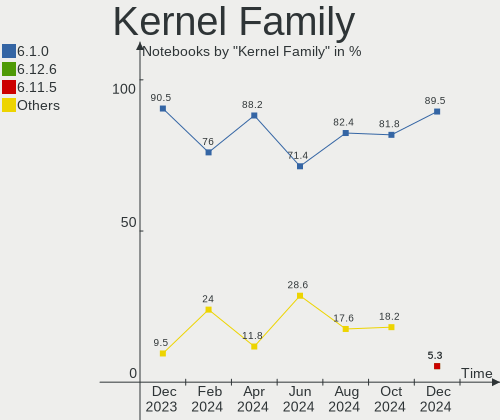

| Version | Notebooks | Percent |
|---------|-----------|---------|
| 5.10.0  | 19        | 100%    |

Kernel Major Ver.
-----------------

Linux kernel major version

| Version | Notebooks | Percent |
|---------|-----------|---------|
| 5.10    | 19        | 100%    |

Arch
----

OS architecture (x86_64, i586, etc.)

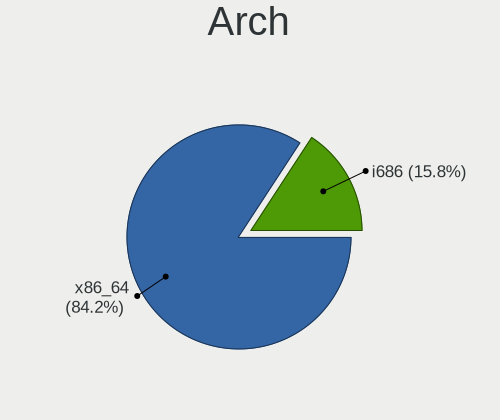

| Name   | Notebooks | Percent |
|--------|-----------|---------|
| x86_64 | 18        | 94.74%  |
| i686   | 1         | 5.26%   |

DE
--

Desktop Environment

| Name       | Notebooks | Percent |
|------------|-----------|---------|
| X-Cinnamon | 16        | 84.21%  |
| Cinnamon   | 3         | 15.79%  |

Display Server
--------------

X11 or Wayland

| Name | Notebooks | Percent |
|------|-----------|---------|
| X11  | 19        | 100%    |

Display Manager
---------------

SDDM, LightDM, etc.

| Name    | Notebooks | Percent |
|---------|-----------|---------|
| Unknown | 12        | 63.16%  |
| LightDM | 7         | 36.84%  |

OS Lang
-------

Language

| Lang  | Notebooks | Percent |
|-------|-----------|---------|
| en_US | 5         | 26.32%  |
| de_DE | 5         | 26.32%  |
| tr_TR | 2         | 10.53%  |
| ru_RU | 1         | 5.26%   |
| pt_BR | 1         | 5.26%   |
| pl_PL | 1         | 5.26%   |
| it_IT | 1         | 5.26%   |
| fr_BE | 1         | 5.26%   |
| de_CH | 1         | 5.26%   |
| da_DK | 1         | 5.26%   |

Boot Mode
---------

EFI or BIOS

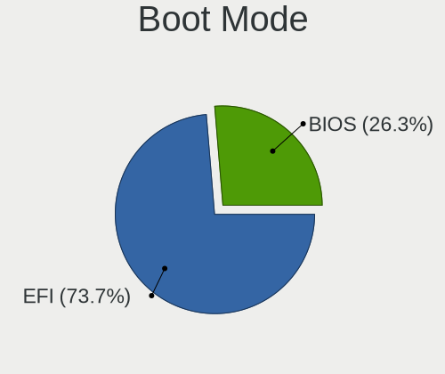

| Mode | Notebooks | Percent |
|------|-----------|---------|
| EFI  | 13        | 68.42%  |
| BIOS | 6         | 31.58%  |

Filesystem
----------

Type of filesystem

| Type  | Notebooks | Percent |
|-------|-----------|---------|
| Ext4  | 17        | 89.47%  |
| Xfs   | 1         | 5.26%   |
| Btrfs | 1         | 5.26%   |

Part. scheme
------------

Scheme of partitioning

| Type    | Notebooks | Percent |
|---------|-----------|---------|
| Unknown | 12        | 63.16%  |
| MBR     | 5         | 26.32%  |
| GPT     | 2         | 10.53%  |

Dual Boot with Linux/BSD
------------------------

Hosting more than one Linux/BSD

| Dual boot | Notebooks | Percent |
|-----------|-----------|---------|
| No        | 17        | 89.47%  |
| Yes       | 2         | 10.53%  |

Dual Boot (Win)
---------------

Hosting Linux and Windows

| Dual boot | Notebooks | Percent |
|-----------|-----------|---------|
| No        | 16        | 84.21%  |
| Yes       | 3         | 15.79%  |

Board
-----

Vendor
------

Motherboard manufacturer

| Name             | Notebooks | Percent |
|------------------|-----------|---------|
| Hewlett-Packard  | 6         | 31.58%  |
| Lenovo           | 3         | 15.79%  |
| Apple            | 3         | 15.79%  |
| Acer             | 2         | 10.53%  |
| TUXEDO           | 1         | 5.26%   |
| Google           | 1         | 5.26%   |
| Fujitsu          | 1         | 5.26%   |
| Dell             | 1         | 5.26%   |
| ASUSTek Computer | 1         | 5.26%   |

Model
-----

Motherboard model

| Name                         | Notebooks | Percent |
|------------------------------|-----------|---------|
| TUXEDO N8xxEZ                | 1         | 5.26%   |
| Lenovo ThinkPad T61 7661A16  | 1         | 5.26%   |
| Lenovo ThinkPad T520 4243W19 | 1         | 5.26%   |
| Lenovo IdeaPad 3 15ITL6 82MD | 1         | 5.26%   |
| HP ZBook 15 G2               | 1         | 5.26%   |
| HP Stream Laptop 14-ax0XX    | 1         | 5.26%   |
| HP Notebook                  | 1         | 5.26%   |
| HP Madoo                     | 1         | 5.26%   |
| HP EliteBook 8440p           | 1         | 5.26%   |
| HP 250 G8 Notebook PC        | 1         | 5.26%   |
| Google Ultima                | 1         | 5.26%   |
| Fujitsu LIFEBOOK S751        | 1         | 5.26%   |
| Dell Latitude E5530 non-vPro | 1         | 5.26%   |
| ASUS X550VC                  | 1         | 5.26%   |
| Apple MacBookPro13,3         | 1         | 5.26%   |
| Apple MacBookAir5,1          | 1         | 5.26%   |
| Apple MacBook6,1             | 1         | 5.26%   |
| Acer TravelMate 4070         | 1         | 5.26%   |
| Acer Aspire E1-570G          | 1         | 5.26%   |

Model Family
------------

Motherboard model prefix

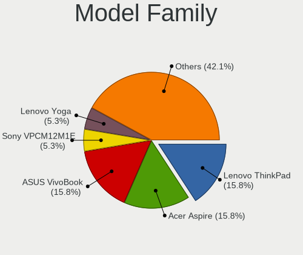

| Name               | Notebooks | Percent |
|--------------------|-----------|---------|
| Lenovo ThinkPad    | 2         | 10.53%  |
| TUXEDO N8xxEZ      | 1         | 5.26%   |
| Lenovo IdeaPad     | 1         | 5.26%   |
| HP ZBook           | 1         | 5.26%   |
| HP Stream          | 1         | 5.26%   |
| HP Notebook        | 1         | 5.26%   |
| HP Madoo           | 1         | 5.26%   |
| HP EliteBook       | 1         | 5.26%   |
| HP 250             | 1         | 5.26%   |
| Google Ultima      | 1         | 5.26%   |
| Fujitsu LIFEBOOK   | 1         | 5.26%   |
| Dell Latitude      | 1         | 5.26%   |
| ASUS X550VC        | 1         | 5.26%   |
| Apple MacBookPro13 | 1         | 5.26%   |
| Apple MacBookAir5  | 1         | 5.26%   |
| Apple MacBook6     | 1         | 5.26%   |
| Acer TravelMate    | 1         | 5.26%   |
| Acer Aspire        | 1         | 5.26%   |

MFG Year
--------

Motherboard manufacture year

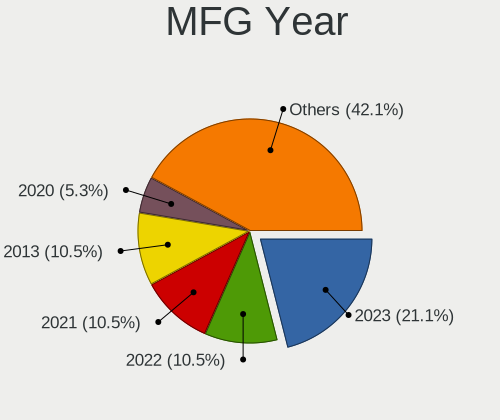

| Year | Notebooks | Percent |
|------|-----------|---------|
| 2021 | 2         | 10.53%  |
| 2018 | 2         | 10.53%  |
| 2015 | 2         | 10.53%  |
| 2013 | 2         | 10.53%  |
| 2011 | 2         | 10.53%  |
| 2022 | 1         | 5.26%   |
| 2020 | 1         | 5.26%   |
| 2019 | 1         | 5.26%   |
| 2016 | 1         | 5.26%   |
| 2012 | 1         | 5.26%   |
| 2010 | 1         | 5.26%   |
| 2009 | 1         | 5.26%   |
| 2007 | 1         | 5.26%   |
| 2006 | 1         | 5.26%   |

Form Factor
-----------

Physical design of the computer

| Name     | Notebooks | Percent |
|----------|-----------|---------|
| Notebook | 19        | 100%    |

Secure Boot
-----------

Enabled or disabled

| State    | Notebooks | Percent |
|----------|-----------|---------|
| Disabled | 18        | 94.74%  |
| Enabled  | 1         | 5.26%   |

Coreboot
--------

Have coreboot on board

| Used | Notebooks | Percent |
|------|-----------|---------|
| No   | 17        | 89.47%  |
| Yes  | 2         | 10.53%  |

RAM Size
--------

Total RAM memory

| Size in GB | Notebooks | Percent |
|------------|-----------|---------|
| 4.01-8.0   | 6         | 31.58%  |
| 3.01-4.0   | 5         | 26.32%  |
| 16.01-24.0 | 3         | 15.79%  |
| 1.01-2.0   | 2         | 10.53%  |
| 8.01-16.0  | 2         | 10.53%  |
| 2.01-3.0   | 1         | 5.26%   |

RAM Used
--------

Used RAM memory

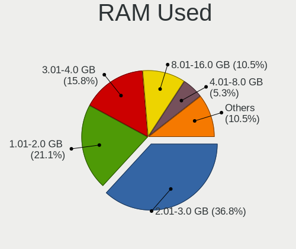

| Used GB  | Notebooks | Percent |
|----------|-----------|---------|
| 1.01-2.0 | 12        | 63.16%  |
| 2.01-3.0 | 3         | 15.79%  |
| 3.01-4.0 | 2         | 10.53%  |
| 0.51-1.0 | 2         | 10.53%  |

Total Drives
------------

Number of drives on board

| Drives | Notebooks | Percent |
|--------|-----------|---------|
| 1      | 14        | 73.68%  |
| 2      | 4         | 21.05%  |
| 3      | 1         | 5.26%   |

Has CD-ROM
----------

Has CD-ROM on board

| Presented | Notebooks | Percent |
|-----------|-----------|---------|
| No        | 12        | 63.16%  |
| Yes       | 7         | 36.84%  |

Has Ethernet
------------

Has Ethernet on board

| Presented | Notebooks | Percent |
|-----------|-----------|---------|
| Yes       | 14        | 73.68%  |
| No        | 5         | 26.32%  |

Has WiFi
--------

Has WiFi module

| Presented | Notebooks | Percent |
|-----------|-----------|---------|
| Yes       | 19        | 100%    |

Has Bluetooth
-------------

Has Bluetooth module

| Presented | Notebooks | Percent |
|-----------|-----------|---------|
| Yes       | 14        | 73.68%  |
| No        | 5         | 26.32%  |

Location
--------

Country
-------

Geographic location (country)

| Country | Notebooks | Percent |
|---------|-----------|---------|
| Germany | 5         | 26.32%  |
| USA     | 3         | 15.79%  |
| Turkey  | 2         | 10.53%  |
| Russia  | 2         | 10.53%  |
| Italy   | 2         | 10.53%  |
| Poland  | 1         | 5.26%   |
| Greece  | 1         | 5.26%   |
| Denmark | 1         | 5.26%   |
| Brazil  | 1         | 5.26%   |
| Belgium | 1         | 5.26%   |

City
----

Geographic location (city)

| City               | Notebooks | Percent |
|--------------------|-----------|---------|
| Salvador           | 1         | 5.26%   |
| Salamina           | 1         | 5.26%   |
| Orenburg           | 1         | 5.26%   |
| Murino             | 1         | 5.26%   |
| Munich             | 1         | 5.26%   |
| Monza              | 1         | 5.26%   |
| Merrick            | 1         | 5.26%   |
| Kırklareli        | 1         | 5.26%   |
| Hamm               | 1         | 5.26%   |
| Galbiate           | 1         | 5.26%   |
| Frankfurt am Main  | 1         | 5.26%   |
| Esbjerg            | 1         | 5.26%   |
| Dąbrowa Górnicza | 1         | 5.26%   |
| Cleveland          | 1         | 5.26%   |
| Cayce              | 1         | 5.26%   |
| Brussels           | 1         | 5.26%   |
| Bremen             | 1         | 5.26%   |
| Berlin             | 1         | 5.26%   |
| Ankara             | 1         | 5.26%   |

Drives
------

Drive Vendor
------------

Hard drive vendors

| Vendor              | Notebooks | Drives | Percent |
|---------------------|-----------|--------|---------|
| Samsung Electronics | 5         | 5      | 20%     |
| Unknown             | 4         | 5      | 16%     |
| WDC                 | 2         | 2      | 8%      |
| Seagate             | 2         | 2      | 8%      |
| China               | 2         | 2      | 8%      |
| Toshiba             | 1         | 1      | 4%      |
| SanDisk             | 1         | 1      | 4%      |
| PNY                 | 1         | 1      | 4%      |
| Kingston            | 1         | 1      | 4%      |
| Intenso             | 1         | 1      | 4%      |
| HGST                | 1         | 1      | 4%      |
| Corsair             | 1         | 1      | 4%      |
| Apple               | 1         | 1      | 4%      |
| ADATA Technology    | 1         | 1      | 4%      |
| Unknown             | 1         | 1      | 4%      |

Drive Model
-----------

Hard drive models

| Model                                               | Notebooks | Percent |
|-----------------------------------------------------|-----------|---------|
| WDC WD5000LPCX-60VHAT0 500GB                        | 1         | 3.85%   |
| WDC WD20SPZX-22UA7T0 2TB                            | 1         | 3.85%   |
| Unknown SDW16G  16GB                                | 1         | 3.85%   |
| Unknown MMC Card  952MB                             | 1         | 3.85%   |
| Unknown MMC Card  32GB                              | 1         | 3.85%   |
| Unknown MMC Card  2GB                               | 1         | 3.85%   |
| Unknown MMC Card  128GB                             | 1         | 3.85%   |
| Toshiba THNSNF128GCSS 128GB SSD                     | 1         | 3.85%   |
| Seagate ST9160314AS 160GB                           | 1         | 3.85%   |
| Seagate ST500LT012-1DG142 500GB                     | 1         | 3.85%   |
| SanDisk SDSSDHII120G 120GB                          | 1         | 3.85%   |
| Samsung SSD 970 EVO 500GB                           | 1         | 3.85%   |
| Samsung SSD 850 EVO 250GB                           | 1         | 3.85%   |
| Samsung NVMe SSD Controller SM961/PM961/SM963 256GB | 1         | 3.85%   |
| Samsung MZVLQ512HBLU-00BH1 512GB                    | 1         | 3.85%   |
| Samsung HM160HC 160GB                               | 1         | 3.85%   |
| PNY CS900 120GB SSD                                 | 1         | 3.85%   |
| Kingston SUV400S37240G 240GB SSD                    | 1         | 3.85%   |
| Intenso External USB 3.0 1TB                        | 1         | 3.85%   |
| HGST HTS541010A7E630 1TB                            | 1         | 3.85%   |
| Corsair Force GS 240GB SSD                          | 1         | 3.85%   |
| China SH00M256GB                                    | 1         | 3.85%   |
| China 120GB SSD                                     | 1         | 3.85%   |
| Apple SSD TS064E 64GB                               | 1         | 3.85%   |
| ADATA NVMe IM2P33F4 256GB                           | 1         | 3.85%   |
| Unknown                                             | 1         | 3.85%   |

HDD Vendor
----------

Hard disk drive vendors

| Vendor              | Notebooks | Drives | Percent |
|---------------------|-----------|--------|---------|
| WDC                 | 2         | 2      | 28.57%  |
| Seagate             | 2         | 2      | 28.57%  |
| Samsung Electronics | 1         | 1      | 14.29%  |
| Intenso             | 1         | 1      | 14.29%  |
| HGST                | 1         | 1      | 14.29%  |

SSD Vendor
----------

Solid state drive vendors

| Vendor              | Notebooks | Drives | Percent |
|---------------------|-----------|--------|---------|
| China               | 2         | 2      | 20%     |
| Toshiba             | 1         | 1      | 10%     |
| SanDisk             | 1         | 1      | 10%     |
| Samsung Electronics | 1         | 1      | 10%     |
| PNY                 | 1         | 1      | 10%     |
| Kingston            | 1         | 1      | 10%     |
| Corsair             | 1         | 1      | 10%     |
| Apple               | 1         | 1      | 10%     |
| Unknown             | 1         | 1      | 10%     |

Drive Kind
----------

HDD or SSD

| Kind | Notebooks | Drives | Percent |
|------|-----------|--------|---------|
| SSD  | 10        | 10     | 40%     |
| HDD  | 7         | 7      | 28%     |
| MMC  | 4         | 5      | 16%     |
| NVMe | 4         | 4      | 16%     |

Drive Connector
---------------

SATA, SAS, NVMe, etc.

| Type | Notebooks | Drives | Percent |
|------|-----------|--------|---------|
| SATA | 13        | 16     | 59.09%  |
| NVMe | 4         | 4      | 18.18%  |
| MMC  | 4         | 5      | 18.18%  |
| SAS  | 1         | 1      | 4.55%   |

Drive Size
----------

Size of hard drive

| Size in TB | Notebooks | Drives | Percent |
|------------|-----------|--------|---------|
| 0.01-0.5   | 10        | 13     | 71.43%  |
| 0.51-1.0   | 3         | 3      | 21.43%  |
| 1.01-2.0   | 1         | 1      | 7.14%   |

Space Total
-----------

Amount of disk space available on the file system

| Size in GB | Notebooks | Percent |
|------------|-----------|---------|
| 101-250    | 11        | 57.89%  |
| 2001-3000  | 2         | 10.53%  |
| 1001-2000  | 2         | 10.53%  |
| 251-500    | 1         | 5.26%   |
| 21-50      | 1         | 5.26%   |
| 501-1000   | 1         | 5.26%   |
| 51-100     | 1         | 5.26%   |

Space Used
----------

Amount of used disk space

| Used GB  | Notebooks | Percent |
|----------|-----------|---------|
| 1-20     | 8         | 42.11%  |
| 21-50    | 5         | 26.32%  |
| 501-1000 | 3         | 15.79%  |
| 51-100   | 3         | 15.79%  |

Malfunc. Drives
---------------

Drive models with a malfunction

| Model                                 | Notebooks | Drives | Percent |
|---------------------------------------|-----------|--------|---------|
| Toshiba THNSNF128GCSS 128GB SSD       | 1         | 1      | 33.33%  |
| Samsung Electronics SSD 970 EVO 500GB | 1         | 1      | 33.33%  |
| Samsung Electronics HM160HC 160GB     | 1         | 1      | 33.33%  |

Malfunc. Drive Vendor
---------------------

Vendors of faulty drives

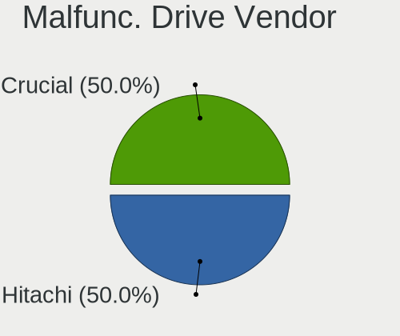

| Vendor              | Notebooks | Drives | Percent |
|---------------------|-----------|--------|---------|
| Samsung Electronics | 2         | 2      | 66.67%  |
| Toshiba             | 1         | 1      | 33.33%  |

Malfunc. HDD Vendor
-------------------

Vendors of faulty HDD drives

| Vendor              | Notebooks | Drives | Percent |
|---------------------|-----------|--------|---------|
| Samsung Electronics | 1         | 1      | 100%    |

Malfunc. Drive Kind
-------------------

Kinds of faulty drives

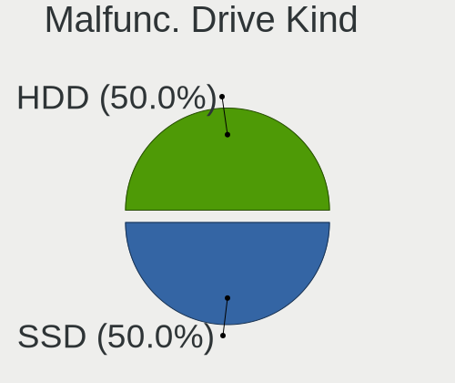

| Kind | Notebooks | Drives | Percent |
|------|-----------|--------|---------|
| NVMe | 1         | 1      | 33.33%  |
| SSD  | 1         | 1      | 33.33%  |
| HDD  | 1         | 1      | 33.33%  |

Failed Drives
-------------

Failed drive models

Zero info for selected period =(

Failed Drive Vendor
-------------------

Failed drive vendors

Zero info for selected period =(

Drive Status
------------

Number of failed and malfunc. drives

| Status   | Notebooks | Drives | Percent |
|----------|-----------|--------|---------|
| Detected | 13        | 17     | 61.9%   |
| Works    | 5         | 6      | 23.81%  |
| Malfunc  | 3         | 3      | 14.29%  |

Storage controller
------------------

Storage Vendor
--------------

Storage controller vendors

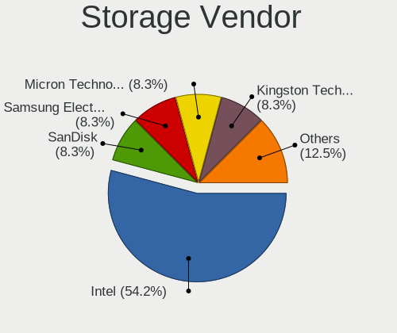

| Vendor              | Notebooks | Percent |
|---------------------|-----------|---------|
| Intel               | 14        | 73.68%  |
| Samsung Electronics | 3         | 15.79%  |
| Nvidia              | 1         | 5.26%   |
| ADATA Technology    | 1         | 5.26%   |

Storage Model
-------------

Storage controller models

| Model                                                                            | Notebooks | Percent |
|----------------------------------------------------------------------------------|-----------|---------|
| Intel 7 Series Chipset Family 6-port SATA Controller [AHCI mode]                 | 3         | 14.29%  |
| Intel Volume Management Device NVMe RAID Controller                              | 2         | 9.52%   |
| Intel Tiger Lake-LP SATA Controller                                              | 2         | 9.52%   |
| Intel 6 Series/C200 Series Chipset Family 6 port Mobile SATA AHCI Controller     | 2         | 9.52%   |
| Samsung NVMe SSD Controller SM981/PM981/PM983                                    | 1         | 4.76%   |
| Samsung NVMe SSD Controller SM961/PM961/SM963                                    | 1         | 4.76%   |
| Samsung NVMe SSD Controller 980                                                  | 1         | 4.76%   |
| Nvidia MCP79 AHCI Controller                                                     | 1         | 4.76%   |
| Intel Cannon Lake Mobile PCH SATA AHCI Controller                                | 1         | 4.76%   |
| Intel Atom/Celeron/Pentium Processor x5-E8000/J3xxx/N3xxx Series SATA Controller | 1         | 4.76%   |
| Intel 82801HM/HEM (ICH8M/ICH8M-E) SATA Controller [IDE mode]                     | 1         | 4.76%   |
| Intel 82801FB/FBM/FR/FW/FRW (ICH6 Family) IDE Controller                         | 1         | 4.76%   |
| Intel 82801 Mobile SATA Controller [RAID mode]                                   | 1         | 4.76%   |
| Intel 8 Series/C220 Series Chipset Family 6-port SATA Controller 1 [AHCI mode]   | 1         | 4.76%   |
| Intel 5 Series/3400 Series Chipset 6 port SATA AHCI Controller                   | 1         | 4.76%   |
| ADATA A Non-Volatile memory controller                                           | 1         | 4.76%   |

Storage Kind
------------

Kind of storage controller (IDE, SATA, NVMe, SAS, ...)

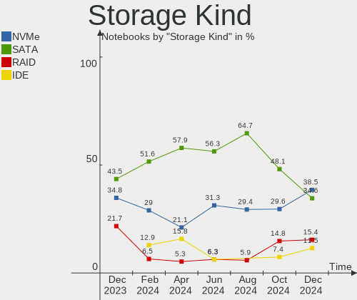

| Kind | Notebooks | Percent |
|------|-----------|---------|
| SATA | 12        | 57.14%  |
| NVMe | 4         | 19.05%  |
| RAID | 3         | 14.29%  |
| IDE  | 2         | 9.52%   |

Processor
---------

CPU Vendor
----------

Processor vendors

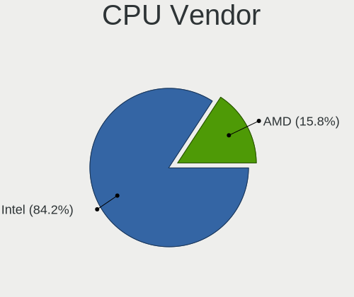

| Vendor | Notebooks | Percent |
|--------|-----------|---------|
| Intel  | 19        | 100%    |

CPU Model
---------

Processor models

| Model                                   | Notebooks | Percent |
|-----------------------------------------|-----------|---------|
| Intel Core i5-3230M CPU @ 2.60GHz       | 2         | 10.53%  |
| Intel Celeron CPU N3060 @ 1.60GHz       | 2         | 10.53%  |
| Intel 11th Gen Core i5-1135G7 @ 2.40GHz | 2         | 10.53%  |
| Intel Pentium Silver N6000 @ 1.10GHz    | 1         | 5.26%   |
| Intel Pentium M processor 1.73GHz       | 1         | 5.26%   |
| Intel Core i7-8750H CPU @ 2.20GHz       | 1         | 5.26%   |
| Intel Core i7-6920HQ CPU @ 2.90GHz      | 1         | 5.26%   |
| Intel Core i7-4810MQ CPU @ 2.80GHz      | 1         | 5.26%   |
| Intel Core i5-3337U CPU @ 1.80GHz       | 1         | 5.26%   |
| Intel Core i5-3317U CPU @ 1.70GHz       | 1         | 5.26%   |
| Intel Core i5-2520M CPU @ 2.50GHz       | 1         | 5.26%   |
| Intel Core i5-2450M CPU @ 2.50GHz       | 1         | 5.26%   |
| Intel Core i5 CPU M 540 @ 2.53GHz       | 1         | 5.26%   |
| Intel Core 2 Duo CPU T7100 @ 1.80GHz    | 1         | 5.26%   |
| Intel Core 2 Duo CPU P7550 @ 2.26GHz    | 1         | 5.26%   |
| Intel Celeron CPU N3160 @ 1.60GHz       | 1         | 5.26%   |

CPU Model Family
----------------

Processor model prefix

| Model                | Notebooks | Percent |
|----------------------|-----------|---------|
| Intel Core i5        | 7         | 36.84%  |
| Intel Core i7        | 3         | 15.79%  |
| Intel Celeron        | 3         | 15.79%  |
| Other                | 2         | 10.53%  |
| Intel Core 2 Duo     | 2         | 10.53%  |
| Intel Pentium Silver | 1         | 5.26%   |
| Intel Pentium M      | 1         | 5.26%   |

CPU Cores
---------

Number of processor cores

| Number | Notebooks | Percent |
|--------|-----------|---------|
| 2      | 11        | 57.89%  |
| 4      | 6         | 31.58%  |
| 6      | 1         | 5.26%   |
| 1      | 1         | 5.26%   |

CPU Sockets
-----------

Number of sockets

| Number | Notebooks | Percent |
|--------|-----------|---------|
| 1      | 19        | 100%    |

CPU Threads
-----------

Threads per core (Hyper-Threading)

| Number | Notebooks | Percent |
|--------|-----------|---------|
| 2      | 12        | 63.16%  |
| 1      | 7         | 36.84%  |

CPU Op-Modes
------------

CPU Operation Modes (32-bit, 64-bit)

| Op mode        | Notebooks | Percent |
|----------------|-----------|---------|
| 32-bit, 64-bit | 18        | 94.74%  |
| 32-bit         | 1         | 5.26%   |

CPU Microcode
-------------

Microcode number

| Number  | Notebooks | Percent |
|---------|-----------|---------|
| 0x306a9 | 4         | 21.05%  |
| 0x406c4 | 3         | 15.79%  |
| 0x806c1 | 2         | 10.53%  |
| 0x206a7 | 2         | 10.53%  |
| 0x906ea | 1         | 5.26%   |
| 0x906c0 | 1         | 5.26%   |
| 0x6fd   | 1         | 5.26%   |
| 0x6d8   | 1         | 5.26%   |
| 0x506e3 | 1         | 5.26%   |
| 0x306c3 | 1         | 5.26%   |
| 0x1067a | 1         | 5.26%   |
| Unknown | 1         | 5.26%   |

CPU Microarch
-------------

Microarchitecture

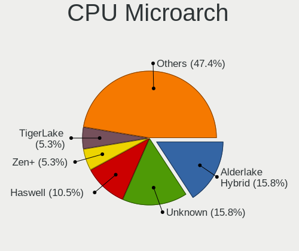

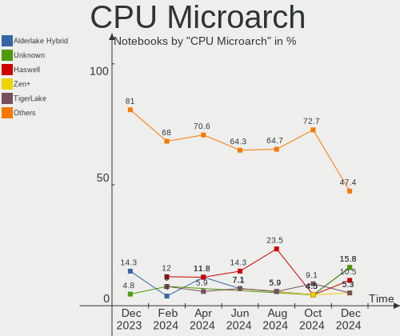

| Name        | Notebooks | Percent |
|-------------|-----------|---------|
| IvyBridge   | 4         | 21.05%  |
| Silvermont  | 3         | 15.79%  |
| TigerLake   | 2         | 10.53%  |
| SandyBridge | 2         | 10.53%  |
| Westmere    | 1         | 5.26%   |
| Tremont     | 1         | 5.26%   |
| Skylake     | 1         | 5.26%   |
| Penryn      | 1         | 5.26%   |
| P6          | 1         | 5.26%   |
| KabyLake    | 1         | 5.26%   |
| Haswell     | 1         | 5.26%   |
| Core        | 1         | 5.26%   |

Graphics
--------

GPU Vendor
----------

Vendors of graphics cards

| Vendor | Notebooks | Percent |
|--------|-----------|---------|
| Intel  | 16        | 72.73%  |
| Nvidia | 5         | 22.73%  |
| AMD    | 1         | 4.55%   |

GPU Model
---------

Graphics card models

| Model                                                                                    | Notebooks | Percent |
|------------------------------------------------------------------------------------------|-----------|---------|
| Intel 3rd Gen Core processor Graphics Controller                                         | 4         | 17.39%  |
| Intel Atom/Celeron/Pentium Processor x5-E8000/J3xxx/N3xxx Integrated Graphics Controller | 3         | 13.04%  |
| Intel TigerLake-LP GT2 [Iris Xe Graphics]                                                | 2         | 8.7%    |
| Intel 2nd Generation Core Processor Family Integrated Graphics Controller                | 2         | 8.7%    |
| Nvidia GP107M [GeForce MX350]                                                            | 1         | 4.35%   |
| Nvidia GK208M [GeForce GT 740M]                                                          | 1         | 4.35%   |
| Nvidia GK106GLM [Quadro K2100M]                                                          | 1         | 4.35%   |
| Nvidia GF117M [GeForce 610M/710M/810M/820M / GT 620M/625M/630M/720M]                     | 1         | 4.35%   |
| Nvidia C79 [GeForce 9400M]                                                               | 1         | 4.35%   |
| Intel Mobile GM965/GL960 Integrated Graphics Controller (secondary)                      | 1         | 4.35%   |
| Intel Mobile GM965/GL960 Integrated Graphics Controller (primary)                        | 1         | 4.35%   |
| Intel Mobile 915GM/GMS/910GML Express Graphics Controller                                | 1         | 4.35%   |
| Intel JasperLake [UHD Graphics]                                                          | 1         | 4.35%   |
| Intel Core Processor Integrated Graphics Controller                                      | 1         | 4.35%   |
| Intel CoffeeLake-H GT2 [UHD Graphics 630]                                                | 1         | 4.35%   |
| AMD Baffin [Radeon RX 460/560D / Pro 450/455/460/555/555X/560/560X]                      | 1         | 4.35%   |

GPU Combo
---------

Combinations of graphics cards

| Name           | Notebooks | Percent |
|----------------|-----------|---------|
| 1 x Intel      | 13        | 68.42%  |
| Intel + Nvidia | 3         | 15.79%  |
| 1 x Nvidia     | 2         | 10.53%  |
| 1 x AMD        | 1         | 5.26%   |

GPU Driver
----------

Free vs proprietary

| Driver      | Notebooks | Percent |
|-------------|-----------|---------|
| Free        | 17        | 89.47%  |
| Proprietary | 1         | 5.26%   |
| Unknown     | 1         | 5.26%   |

GPU Memory
----------

Total video memory

| Size in GB | Notebooks | Percent |
|------------|-----------|---------|
| Unknown    | 14        | 73.68%  |
| 1.01-2.0   | 3         | 15.79%  |
| 3.01-4.0   | 1         | 5.26%   |
| 0.01-0.5   | 1         | 5.26%   |

Monitor
-------

Monitor Vendor
--------------

Monitor vendors

| Vendor                  | Notebooks | Percent |
|-------------------------|-----------|---------|
| BOE                     | 4         | 19.05%  |
| Chimei Innolux          | 3         | 14.29%  |
| AU Optronics            | 3         | 14.29%  |
| Apple                   | 3         | 14.29%  |
| LG Display              | 2         | 9.52%   |
| Lenovo                  | 2         | 9.52%   |
| Samsung Electronics     | 1         | 4.76%   |
| Packard Bell            | 1         | 4.76%   |
| Goldstar                | 1         | 4.76%   |
| Chi Mei Optoelectronics | 1         | 4.76%   |

Monitor Model
-------------

Monitor models

| Model                                                                    | Notebooks | Percent |
|--------------------------------------------------------------------------|-----------|---------|
| BOE LCD Monitor BOE0696 1366x768 309x173mm 13.9-inch                     | 2         | 9.52%   |
| Samsung Electronics LCD Monitor SEC3541 1366x768 309x174mm 14.0-inch     | 1         | 4.76%   |
| Packard Bell Viseo 230Ws PKB00C1 1920x1080 509x286mm 23.0-inch           | 1         | 4.76%   |
| LG Display LCD Monitor LGD033B 1366x768 344x194mm 15.5-inch              | 1         | 4.76%   |
| LG Display LCD Monitor LGD032E 1366x768 345x194mm 15.6-inch              | 1         | 4.76%   |
| Lenovo LCD Monitor LEN40B1 1600x900 344x193mm 15.5-inch                  | 1         | 4.76%   |
| Lenovo LCD Monitor LEN4033 1440x900 303x190mm 14.1-inch                  | 1         | 4.76%   |
| Goldstar L1740B GSM43D4 1280x1024 338x270mm 17.0-inch                    | 1         | 4.76%   |
| Chimei Innolux LCD Monitor CMN15F5 1920x1080 344x193mm 15.5-inch         | 1         | 4.76%   |
| Chimei Innolux LCD Monitor CMN15C2 1920x1080 344x194mm 15.5-inch         | 1         | 4.76%   |
| Chimei Innolux LCD Monitor CMN15BE 1366x768 344x193mm 15.5-inch          | 1         | 4.76%   |
| Chi Mei Optoelectronics LCD Monitor CMO1514 1280x800 331x207mm 15.4-inch | 1         | 4.76%   |
| BOE LCD Monitor BOE0991 1920x1080 344x194mm 15.5-inch                    | 1         | 4.76%   |
| BOE LCD Monitor BOE0695 1920x1080 380x210mm 17.1-inch                    | 1         | 4.76%   |
| AU Optronics LCD Monitor AUO3791 1920x1080 344x194mm 15.5-inch           | 1         | 4.76%   |
| AU Optronics LCD Monitor AUO235C 1366x768 256x144mm 11.6-inch            | 1         | 4.76%   |
| AU Optronics LCD Monitor AUO123E 1600x900 309x174mm 14.0-inch            | 1         | 4.76%   |
| Apple Color LCD APPA030 2880x1800 331x207mm 15.4-inch                    | 1         | 4.76%   |
| Apple Color LCD APP9CF2 1366x768 256x144mm 11.6-inch                     | 1         | 4.76%   |
| Apple Color LCD APP9CC0 1280x800 261x163mm 12.1-inch                     | 1         | 4.76%   |

Monitor Resolution
------------------

Monitor screen resolution

| Resolution       | Notebooks | Percent |
|------------------|-----------|---------|
| 1366x768 (WXGA)  | 8         | 38.1%   |
| 1920x1080 (FHD)  | 6         | 28.57%  |
| 1600x900 (HD+)   | 2         | 9.52%   |
| 1280x800 (WXGA)  | 2         | 9.52%   |
| 2880x1800        | 1         | 4.76%   |
| 1440x900 (WXGA+) | 1         | 4.76%   |
| 1280x1024 (SXGA) | 1         | 4.76%   |

Monitor Diagonal
----------------

Diagonal size in inches

| Inches | Notebooks | Percent |
|--------|-----------|---------|
| 15     | 11        | 52.38%  |
| 17     | 2         | 9.52%   |
| 14     | 2         | 9.52%   |
| 13     | 2         | 9.52%   |
| 11     | 2         | 9.52%   |
| 23     | 1         | 4.76%   |
| 12     | 1         | 4.76%   |

Monitor Width
-------------

Physical width

| Width in mm | Notebooks | Percent |
|-------------|-----------|---------|
| 301-350     | 15        | 75%     |
| 201-300     | 3         | 15%     |
| 501-600     | 1         | 5%      |
| 351-400     | 1         | 5%      |

Aspect Ratio
------------

Proportional relationship between the width and the height

| Ratio | Notebooks | Percent |
|-------|-----------|---------|
| 16/9  | 15        | 75%     |
| 16/10 | 4         | 20%     |
| 5/4   | 1         | 5%      |

Monitor Area
------------

Area in inch²

| Area in inch² | Notebooks | Percent |
|----------------|-----------|---------|
| 101-110        | 11        | 52.38%  |
| 81-90          | 4         | 19.05%  |
| 51-60          | 2         | 9.52%   |
| 61-70          | 1         | 4.76%   |
| 201-250        | 1         | 4.76%   |
| 141-150        | 1         | 4.76%   |
| 121-130        | 1         | 4.76%   |

Pixel Density
-------------

Pixels per inch

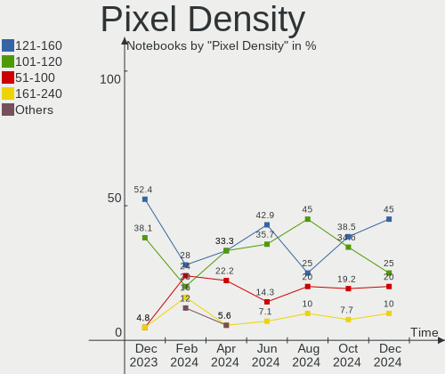

| Density | Notebooks | Percent |
|---------|-----------|---------|
| 121-160 | 10        | 47.62%  |
| 101-120 | 7         | 33.33%  |
| 51-100  | 3         | 14.29%  |
| 161-240 | 1         | 4.76%   |

Multiple Monitors
-----------------

Total monitors connected

| Total | Notebooks | Percent |
|-------|-----------|---------|
| 1     | 16        | 84.21%  |
| 2     | 2         | 10.53%  |
| 0     | 1         | 5.26%   |

Network
-------

Net Controller Vendor
---------------------

Controller vendors

| Vendor                | Notebooks | Percent |
|-----------------------|-----------|---------|
| Intel                 | 12        | 48%     |
| Realtek Semiconductor | 6         | 24%     |
| Broadcom              | 5         | 20%     |
| Qualcomm Atheros      | 1         | 4%      |
| Nvidia                | 1         | 4%      |

Net Controller Model
--------------------

Controller models

| Model                                                             | Notebooks | Percent |
|-------------------------------------------------------------------|-----------|---------|
| Realtek RTL8111/8168/8411 PCI Express Gigabit Ethernet Controller | 3         | 9.09%   |
| Intel Wireless 7265                                               | 2         | 6.06%   |
| Intel Centrino Advanced-N 6205 [Taylor Peak]                      | 2         | 6.06%   |
| Broadcom BCM43224 802.11a/b/g/n                                   | 2         | 6.06%   |
| Realtek RTL8822CE 802.11ac PCIe Wireless Network Adapter          | 1         | 3.03%   |
| Realtek RTL8723BE PCIe Wireless Network Adapter                   | 1         | 3.03%   |
| Realtek RTL8153 Gigabit Ethernet Adapter                          | 1         | 3.03%   |
| Realtek RTL810xE PCI Express Fast Ethernet controller             | 1         | 3.03%   |
| Realtek RTL-8100/8101L/8139 PCI Fast Ethernet Adapter             | 1         | 3.03%   |
| Qualcomm Atheros AR9485 Wireless Network Adapter                  | 1         | 3.03%   |
| Nvidia MCP79 Ethernet                                             | 1         | 3.03%   |
| Intel Wireless 8265 / 8275                                        | 1         | 3.03%   |
| Intel Wireless 7260                                               | 1         | 3.03%   |
| Intel Wi-Fi 6 AX201 160MHz                                        | 1         | 3.03%   |
| Intel Wi-Fi 6 AX201                                               | 1         | 3.03%   |
| Intel PRO/Wireless 4965 AG or AGN [Kedron] Network Connection     | 1         | 3.03%   |
| Intel PRO/Wireless 2200BG [Calexico2] Network Connection          | 1         | 3.03%   |
| Intel Ethernet Connection I217-LM                                 | 1         | 3.03%   |
| Intel Centrino Advanced-N 6230 [Rainbow Peak]                     | 1         | 3.03%   |
| Intel Centrino Advanced-N 6200                                    | 1         | 3.03%   |
| Intel 82579V Gigabit Network Connection                           | 1         | 3.03%   |
| Intel 82579LM Gigabit Network Connection (Lewisville)             | 1         | 3.03%   |
| Intel 82577LM Gigabit Network Connection                          | 1         | 3.03%   |
| Intel 82566MM Gigabit Network Connection                          | 1         | 3.03%   |
| Broadcom NetXtreme BCM57786 Gigabit Ethernet PCIe                 | 1         | 3.03%   |
| Broadcom NetXtreme BCM5761 Gigabit Ethernet PCIe                  | 1         | 3.03%   |
| Broadcom BCM43602 802.11ac Wireless LAN SoC                       | 1         | 3.03%   |
| Broadcom BCM43228 802.11a/b/g/n                                   | 1         | 3.03%   |

Wireless Vendor
---------------

Wireless vendors

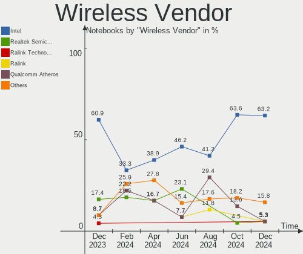

| Vendor                | Notebooks | Percent |
|-----------------------|-----------|---------|
| Intel                 | 12        | 63.16%  |
| Broadcom              | 4         | 21.05%  |
| Realtek Semiconductor | 2         | 10.53%  |
| Qualcomm Atheros      | 1         | 5.26%   |

Wireless Model
--------------

Wireless models

| Model                                                         | Notebooks | Percent |
|---------------------------------------------------------------|-----------|---------|
| Intel Wireless 7265                                           | 2         | 10.53%  |
| Intel Centrino Advanced-N 6205 [Taylor Peak]                  | 2         | 10.53%  |
| Broadcom BCM43224 802.11a/b/g/n                               | 2         | 10.53%  |
| Realtek RTL8822CE 802.11ac PCIe Wireless Network Adapter      | 1         | 5.26%   |
| Realtek RTL8723BE PCIe Wireless Network Adapter               | 1         | 5.26%   |
| Qualcomm Atheros AR9485 Wireless Network Adapter              | 1         | 5.26%   |
| Intel Wireless 8265 / 8275                                    | 1         | 5.26%   |
| Intel Wireless 7260                                           | 1         | 5.26%   |
| Intel Wi-Fi 6 AX201 160MHz                                    | 1         | 5.26%   |
| Intel Wi-Fi 6 AX201                                           | 1         | 5.26%   |
| Intel PRO/Wireless 4965 AG or AGN [Kedron] Network Connection | 1         | 5.26%   |
| Intel PRO/Wireless 2200BG [Calexico2] Network Connection      | 1         | 5.26%   |
| Intel Centrino Advanced-N 6230 [Rainbow Peak]                 | 1         | 5.26%   |
| Intel Centrino Advanced-N 6200                                | 1         | 5.26%   |
| Broadcom BCM43602 802.11ac Wireless LAN SoC                   | 1         | 5.26%   |
| Broadcom BCM43228 802.11a/b/g/n                               | 1         | 5.26%   |

Ethernet Vendor
---------------

Ethernet vendors

| Vendor                | Notebooks | Percent |
|-----------------------|-----------|---------|
| Realtek Semiconductor | 6         | 42.86%  |
| Intel                 | 5         | 35.71%  |
| Broadcom              | 2         | 14.29%  |
| Nvidia                | 1         | 7.14%   |

Ethernet Model
--------------

Ethernet models

| Model                                                             | Notebooks | Percent |
|-------------------------------------------------------------------|-----------|---------|
| Realtek RTL8111/8168/8411 PCI Express Gigabit Ethernet Controller | 3         | 21.43%  |
| Realtek RTL8153 Gigabit Ethernet Adapter                          | 1         | 7.14%   |
| Realtek RTL810xE PCI Express Fast Ethernet controller             | 1         | 7.14%   |
| Realtek RTL-8100/8101L/8139 PCI Fast Ethernet Adapter             | 1         | 7.14%   |
| Nvidia MCP79 Ethernet                                             | 1         | 7.14%   |
| Intel Ethernet Connection I217-LM                                 | 1         | 7.14%   |
| Intel 82579V Gigabit Network Connection                           | 1         | 7.14%   |
| Intel 82579LM Gigabit Network Connection (Lewisville)             | 1         | 7.14%   |
| Intel 82577LM Gigabit Network Connection                          | 1         | 7.14%   |
| Intel 82566MM Gigabit Network Connection                          | 1         | 7.14%   |
| Broadcom NetXtreme BCM57786 Gigabit Ethernet PCIe                 | 1         | 7.14%   |
| Broadcom NetXtreme BCM5761 Gigabit Ethernet PCIe                  | 1         | 7.14%   |

Net Controller Kind
-------------------

Ethernet, WiFi or modem

| Kind     | Notebooks | Percent |
|----------|-----------|---------|
| WiFi     | 19        | 57.58%  |
| Ethernet | 14        | 42.42%  |

Used Controller
---------------

Currently used network controller

| Kind     | Notebooks | Percent |
|----------|-----------|---------|
| WiFi     | 15        | 75%     |
| Ethernet | 5         | 25%     |

NICs
----

Total network controllers on board

| Total | Notebooks | Percent |
|-------|-----------|---------|
| 2     | 13        | 68.42%  |
| 1     | 6         | 31.58%  |

IPv6
----

IPv6 vs IPv4

| Used | Notebooks | Percent |
|------|-----------|---------|
| No   | 14        | 73.68%  |
| Yes  | 5         | 26.32%  |

Bluetooth
---------

Bluetooth Vendor
----------------

Controller vendors

| Vendor                | Notebooks | Percent |
|-----------------------|-----------|---------|
| Intel                 | 7         | 50%     |
| Realtek Semiconductor | 2         | 14.29%  |
| Broadcom              | 2         | 14.29%  |
| Apple                 | 2         | 14.29%  |
| IMC Networks          | 1         | 7.14%   |

Bluetooth Model
---------------

Controller models

| Model                                             | Notebooks | Percent |
|---------------------------------------------------|-----------|---------|
| Intel Bluetooth wireless interface                | 4         | 28.57%  |
| Realtek Bluetooth Radio                           | 2         | 14.29%  |
| Intel Centrino Advanced-N 6230 Bluetooth adapter  | 1         | 7.14%   |
| Intel Bluetooth 9460/9560 Jefferson Peak (JfP)    | 1         | 7.14%   |
| Intel AX201 Bluetooth                             | 1         | 7.14%   |
| IMC Networks Atheros AR3012 Bluetooth 4.0 Adapter | 1         | 7.14%   |
| Broadcom BCM2045B (BDC-2.1)                       | 1         | 7.14%   |
| Broadcom BCM2045B (BDC-2) [Bluetooth Controller]  | 1         | 7.14%   |
| Apple Built-in Bluetooth 2.0+EDR HCI              | 1         | 7.14%   |
| Apple Bluetooth Host Controller                   | 1         | 7.14%   |

Sound
-----

Sound Vendor
------------

Sound card vendors

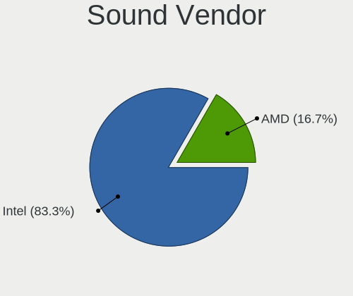

| Vendor | Notebooks | Percent |
|--------|-----------|---------|
| Intel  | 18        | 85.71%  |
| Nvidia | 2         | 9.52%   |
| AMD    | 1         | 4.76%   |

Sound Model
-----------

Sound card models

| Model                                                                                             | Notebooks | Percent |
|---------------------------------------------------------------------------------------------------|-----------|---------|
| Intel 7 Series/C216 Chipset Family High Definition Audio Controller                               | 4         | 19.05%  |
| Intel Atom/Celeron/Pentium Processor x5-E8000/J3xxx/N3xxx Series High Definition Audio Controller | 3         | 14.29%  |
| Intel Tiger Lake-LP Smart Sound Technology Audio Controller                                       | 2         | 9.52%   |
| Intel 6 Series/C200 Series Chipset Family High Definition Audio Controller                        | 2         | 9.52%   |
| Nvidia MCP79 High Definition Audio                                                                | 1         | 4.76%   |
| Nvidia GK106 HDMI Audio Controller                                                                | 1         | 4.76%   |
| Intel Jasper Lake HD Audio                                                                        | 1         | 4.76%   |
| Intel Cannon Lake PCH cAVS                                                                        | 1         | 4.76%   |
| Intel 82801H (ICH8 Family) HD Audio Controller                                                    | 1         | 4.76%   |
| Intel 82801FB/FBM/FR/FW/FRW (ICH6 Family) High Definition Audio Controller                        | 1         | 4.76%   |
| Intel 8 Series/C220 Series Chipset High Definition Audio Controller                               | 1         | 4.76%   |
| Intel 5 Series/3400 Series Chipset High Definition Audio                                          | 1         | 4.76%   |
| Intel 100 Series/C230 Series Chipset Family HD Audio Controller                                   | 1         | 4.76%   |
| AMD Baffin HDMI/DP Audio [Radeon RX 550 640SP / RX 560/560X]                                      | 1         | 4.76%   |

Memory
------

Memory Vendor
-------------

Memory module vendors

| Vendor              | Notebooks | Percent |
|---------------------|-----------|---------|
| Samsung Electronics | 3         | 42.86%  |
| Unknown             | 1         | 14.29%  |
| SK hynix            | 1         | 14.29%  |
| Micron Technology   | 1         | 14.29%  |
| Crucial             | 1         | 14.29%  |

Memory Model
------------

Memory module models

| Model                                                      | Notebooks | Percent |
|------------------------------------------------------------|-----------|---------|
| Unknown RAM Module 1GB SODIMM DDR2                         | 1         | 12.5%   |
| SK hynix RAM HMT451S6MFR8C-PB 4GB SODIMM DDR3 1600MT/s     | 1         | 12.5%   |
| SK hynix RAM HMT41GS6BFR8A-PB 8GB SODIMM DDR3 1600MT/s     | 1         | 12.5%   |
| Samsung RAM M471B5673EH1-CH9 2GB SODIMM DDR3 1334MT/s      | 1         | 12.5%   |
| Samsung RAM M471B1G73QH0-YK0 8192MB SODIMM DDR3 1600MT/s   | 1         | 12.5%   |
| Samsung RAM K4E8E324EB-EGCF 2GB LPDDR3 1867MT/s            | 1         | 12.5%   |
| Micron RAM MT41K256M16TW 2GB SODIMM DDR3 1600MT/s          | 1         | 12.5%   |
| Crucial RAM BLS16G4S240FSD.16FBD 16GB SODIMM DDR4 2400MT/s | 1         | 12.5%   |

Memory Kind
-----------

Memory module kinds

| Kind   | Notebooks | Percent |
|--------|-----------|---------|
| DDR3   | 4         | 57.14%  |
| LPDDR3 | 1         | 14.29%  |
| DDR4   | 1         | 14.29%  |
| DDR2   | 1         | 14.29%  |

Memory Form Factor
------------------

Physical design of the memory module

| Name    | Notebooks | Percent |
|---------|-----------|---------|
| SODIMM  | 6         | 85.71%  |
| Unknown | 1         | 14.29%  |

Memory Size
-----------

Memory module size

| Size  | Notebooks | Percent |
|-------|-----------|---------|
| 2048  | 3         | 37.5%   |
| 8192  | 2         | 25%     |
| 16384 | 1         | 12.5%   |
| 4096  | 1         | 12.5%   |
| 1024  | 1         | 12.5%   |

Memory Speed
------------

Memory module speed

| Speed   | Notebooks | Percent |
|---------|-----------|---------|
| 1600    | 2         | 28.57%  |
| 2667    | 1         | 14.29%  |
| 2400    | 1         | 14.29%  |
| 1867    | 1         | 14.29%  |
| 1334    | 1         | 14.29%  |
| Unknown | 1         | 14.29%  |

Printers & scanners
-------------------

Printer Vendor
--------------

Printer device vendors

Zero info for selected period =(

Printer Model
-------------

Printer device models

Zero info for selected period =(

Scanner Vendor
--------------

Scanner device vendors

Zero info for selected period =(

Scanner Model
-------------

Scanner device models

Zero info for selected period =(

Camera
------

Camera Vendor
-------------

Camera device vendors

| Vendor                                 | Notebooks | Percent |
|----------------------------------------|-----------|---------|
| Chicony Electronics                    | 4         | 28.57%  |
| Luxvisions Innotech Limited            | 2         | 14.29%  |
| Cheng Uei Precision Industry (Foxlink) | 2         | 14.29%  |
| Apple                                  | 2         | 14.29%  |
| Acer                                   | 2         | 14.29%  |
| Lenovo                                 | 1         | 7.14%   |
| eMPIA Technology                       | 1         | 7.14%   |

Camera Model
------------

Camera device models

| Model                                                | Notebooks | Percent |
|------------------------------------------------------|-----------|---------|
| Cheng Uei Precision Industry (Foxlink) HP Webcam     | 2         | 14.29%  |
| Luxvisions Innotech Limited HP Wide Vision HD Camera | 1         | 7.14%   |
| Luxvisions Innotech Limited HP TrueVision HD Camera  | 1         | 7.14%   |
| Lenovo Integrated Webcam                             | 1         | 7.14%   |
| eMPIA USB 2.0 Webcam                                 | 1         | 7.14%   |
| Chicony Lenovo Integrated Camera (0.3MP)             | 1         | 7.14%   |
| Chicony Integrated Camera                            | 1         | 7.14%   |
| Chicony HP Webcam [2 MP Macro]                       | 1         | 7.14%   |
| Chicony HD WebCam                                    | 1         | 7.14%   |
| Apple FaceTime HD Camera (Built-in)                  | 1         | 7.14%   |
| Apple Built-in iSight                                | 1         | 7.14%   |
| Acer Integrated Camera                               | 1         | 7.14%   |
| Acer BisonCam, NB Pro                                | 1         | 7.14%   |

Security
--------

Fingerprint Vendor
------------------

Fingerprint sensor vendors

| Vendor             | Notebooks | Percent |
|--------------------|-----------|---------|
| Validity Sensors   | 1         | 50%     |
| STMicroelectronics | 1         | 50%     |

Fingerprint Model
-----------------

Fingerprint sensor models

| Model                                      | Notebooks | Percent |
|--------------------------------------------|-----------|---------|
| Validity Sensors VFS451 Fingerprint Reader | 1         | 50%     |
| STMicroelectronics Fingerprint Reader      | 1         | 50%     |

Chipcard Vendor
---------------

Chipcard module vendors

| Vendor   | Notebooks | Percent |
|----------|-----------|---------|
| O2 Micro | 1         | 50%     |
| Lenovo   | 1         | 50%     |

Chipcard Model
--------------

Chipcard module models

| Model                                | Notebooks | Percent |
|--------------------------------------|-----------|---------|
| O2 Micro OZ776 CCID Smartcard Reader | 1         | 50%     |
| Lenovo Integrated Smart Card Reader  | 1         | 50%     |

Unsupported
-----------

Unsupported Devices
-------------------

Total unsupported devices on board

| Total | Notebooks | Percent |
|-------|-----------|---------|
| 0     | 15        | 78.95%  |
| 1     | 3         | 15.79%  |
| 2     | 1         | 5.26%   |

Unsupported Device Types
------------------------

Types of unsupported devices

| Type               | Notebooks | Percent |
|--------------------|-----------|---------|
| Fingerprint reader | 2         | 40%     |
| Graphics card      | 1         | 20%     |
| Chipcard           | 1         | 20%     |
| Bluetooth          | 1         | 20%     |

