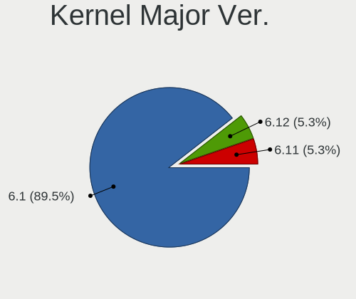
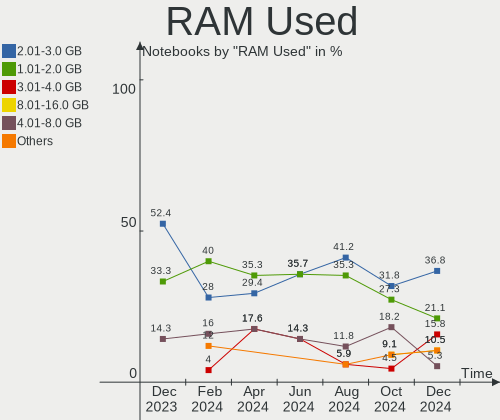
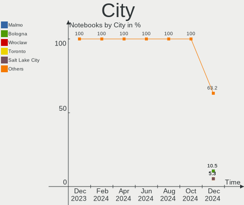
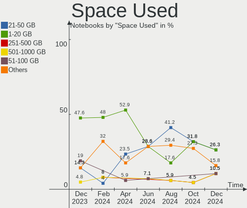
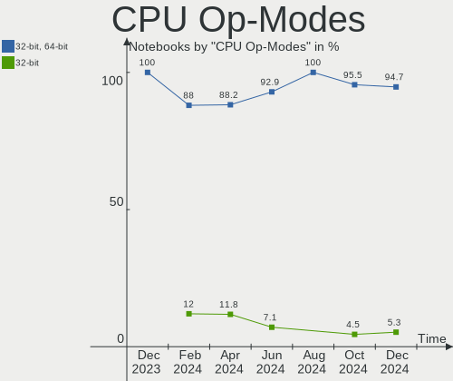
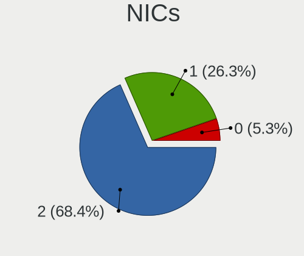
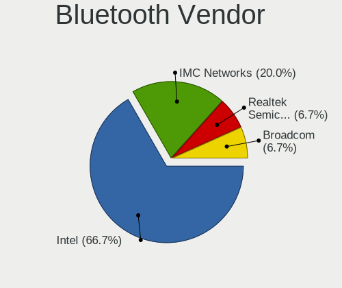
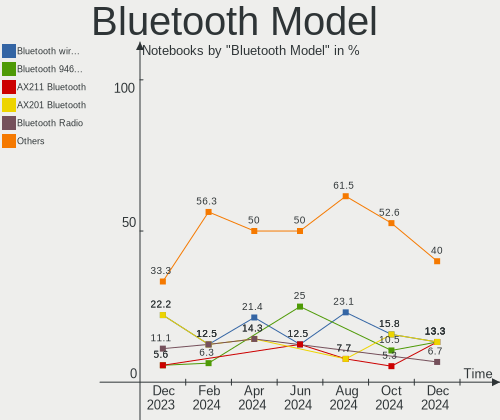

LMDE - Hardware Trends (Notebooks)
----------------------------------

A project to identify most popular hardware characteristics and track their change
over time based on data collected by Linux users at https://Linux-Hardware.org.

Anyone can contribute to this report by the [hw-probe](https://github.com/linuxhw/hw-probe) tool:

    sudo -E hw-probe -all -upload

This report is for one last month. Overall report since the beginning of time: [TestDays](https://github.com/linuxhw/TestDays)

Period: May, 2023.

Contents
--------

* [ System ](#system)
  - [ OS                       ](#os)
  - [ OS Family                ](#os-family)
  - [ Kernel                   ](#kernel)
  - [ Kernel Family            ](#kernel-family)
  - [ Kernel Major Ver.        ](#kernel-major-ver)
  - [ Arch                     ](#arch)
  - [ DE                       ](#de)
  - [ Display Server           ](#display-server)
  - [ Display Manager          ](#display-manager)
  - [ OS Lang                  ](#os-lang)
  - [ Boot Mode                ](#boot-mode)
  - [ Filesystem               ](#filesystem)
  - [ Part. scheme             ](#part-scheme)
  - [ Dual Boot with Linux/BSD ](#dual-boot-with-linuxbsd)
  - [ Dual Boot (Win)          ](#dual-boot-win)

* [ Board ](#board)
  - [ Vendor                   ](#vendor)
  - [ Model                    ](#model)
  - [ Model Family             ](#model-family)
  - [ MFG Year                 ](#mfg-year)
  - [ Form Factor              ](#form-factor)
  - [ Secure Boot              ](#secure-boot)
  - [ Coreboot                 ](#coreboot)
  - [ RAM Size                 ](#ram-size)
  - [ RAM Used                 ](#ram-used)
  - [ Total Drives             ](#total-drives)
  - [ Has CD-ROM               ](#has-cd-rom)
  - [ Has Ethernet             ](#has-ethernet)
  - [ Has WiFi                 ](#has-wifi)
  - [ Has Bluetooth            ](#has-bluetooth)

* [ Location ](#location)
  - [ Country                  ](#country)
  - [ City                     ](#city)

* [ Drives ](#drives)
  - [ Drive Vendor             ](#drive-vendor)
  - [ Drive Model              ](#drive-model)
  - [ HDD Vendor               ](#hdd-vendor)
  - [ SSD Vendor               ](#ssd-vendor)
  - [ Drive Kind               ](#drive-kind)
  - [ Drive Connector          ](#drive-connector)
  - [ Drive Size               ](#drive-size)
  - [ Space Total              ](#space-total)
  - [ Space Used               ](#space-used)
  - [ Malfunc. Drives          ](#malfunc-drives)
  - [ Malfunc. Drive Vendor    ](#malfunc-drive-vendor)
  - [ Malfunc. HDD Vendor      ](#malfunc-hdd-vendor)
  - [ Malfunc. Drive Kind      ](#malfunc-drive-kind)
  - [ Failed Drives            ](#failed-drives)
  - [ Failed Drive Vendor      ](#failed-drive-vendor)
  - [ Drive Status             ](#drive-status)

* [ Storage controller ](#storage-controller)
  - [ Storage Vendor           ](#storage-vendor)
  - [ Storage Model            ](#storage-model)
  - [ Storage Kind             ](#storage-kind)

* [ Processor ](#processor)
  - [ CPU Vendor               ](#cpu-vendor)
  - [ CPU Model                ](#cpu-model)
  - [ CPU Model Family         ](#cpu-model-family)
  - [ CPU Cores                ](#cpu-cores)
  - [ CPU Sockets              ](#cpu-sockets)
  - [ CPU Threads              ](#cpu-threads)
  - [ CPU Op-Modes             ](#cpu-op-modes)
  - [ CPU Microcode            ](#cpu-microcode)
  - [ CPU Microarch            ](#cpu-microarch)

* [ Graphics ](#graphics)
  - [ GPU Vendor               ](#gpu-vendor)
  - [ GPU Model                ](#gpu-model)
  - [ GPU Combo                ](#gpu-combo)
  - [ GPU Driver               ](#gpu-driver)
  - [ GPU Memory               ](#gpu-memory)

* [ Monitor ](#monitor)
  - [ Monitor Vendor           ](#monitor-vendor)
  - [ Monitor Model            ](#monitor-model)
  - [ Monitor Resolution       ](#monitor-resolution)
  - [ Monitor Diagonal         ](#monitor-diagonal)
  - [ Monitor Width            ](#monitor-width)
  - [ Aspect Ratio             ](#aspect-ratio)
  - [ Monitor Area             ](#monitor-area)
  - [ Pixel Density            ](#pixel-density)
  - [ Multiple Monitors        ](#multiple-monitors)

* [ Network ](#network)
  - [ Net Controller Vendor    ](#net-controller-vendor)
  - [ Net Controller Model     ](#net-controller-model)
  - [ Wireless Vendor          ](#wireless-vendor)
  - [ Wireless Model           ](#wireless-model)
  - [ Ethernet Vendor          ](#ethernet-vendor)
  - [ Ethernet Model           ](#ethernet-model)
  - [ Net Controller Kind      ](#net-controller-kind)
  - [ Used Controller          ](#used-controller)
  - [ NICs                     ](#nics)
  - [ IPv6                     ](#ipv6)

* [ Bluetooth ](#bluetooth)
  - [ Bluetooth Vendor         ](#bluetooth-vendor)
  - [ Bluetooth Model          ](#bluetooth-model)

* [ Sound ](#sound)
  - [ Sound Vendor             ](#sound-vendor)
  - [ Sound Model              ](#sound-model)

* [ Memory ](#memory)
  - [ Memory Vendor            ](#memory-vendor)
  - [ Memory Model             ](#memory-model)
  - [ Memory Kind              ](#memory-kind)
  - [ Memory Form Factor       ](#memory-form-factor)
  - [ Memory Size              ](#memory-size)
  - [ Memory Speed             ](#memory-speed)

* [ Printers & scanners ](#printers--scanners)
  - [ Printer Vendor           ](#printer-vendor)
  - [ Printer Model            ](#printer-model)
  - [ Scanner Vendor           ](#scanner-vendor)
  - [ Scanner Model            ](#scanner-model)

* [ Camera ](#camera)
  - [ Camera Vendor            ](#camera-vendor)
  - [ Camera Model             ](#camera-model)

* [ Security ](#security)
  - [ Fingerprint Vendor       ](#fingerprint-vendor)
  - [ Fingerprint Model        ](#fingerprint-model)
  - [ Chipcard Vendor          ](#chipcard-vendor)
  - [ Chipcard Model           ](#chipcard-model)

* [ Unsupported ](#unsupported)
  - [ Unsupported Devices      ](#unsupported-devices)
  - [ Unsupported Device Types ](#unsupported-device-types)

System
------

OS
--

Installed operating systems

| Name   | Notebooks | Percent |
|--------|-----------|---------|
| LMDE 5 | 21        | 100%    |

OS Family
---------

OS without a version

| Name | Notebooks | Percent |
|------|-----------|---------|
| LMDE | 21        | 100%    |

Kernel
------

Version of the Linux kernel

| Version               | Notebooks | Percent |
|-----------------------|-----------|---------|
| 5.10.0-23-amd64       | 8         | 38.1%   |
| 5.10.0-22-amd64       | 7         | 33.33%  |
| 6.1.0-0.deb11.6-amd64 | 2         | 9.52%   |
| 6.1.0-0.deb11.5-amd64 | 1         | 4.76%   |
| 5.16.0-0.bpo.4-amd64  | 1         | 4.76%   |
| 5.10.0-22-686         | 1         | 4.76%   |
| 5.10.0-12-amd64       | 1         | 4.76%   |

Kernel Family
-------------

Linux kernel without a distro release

| Version | Notebooks | Percent |
|---------|-----------|---------|
| 5.10.0  | 17        | 80.95%  |
| 6.1.0   | 3         | 14.29%  |
| 5.16.0  | 1         | 4.76%   |

Kernel Major Ver.
-----------------

Linux kernel major version

| Version | Notebooks | Percent |
|---------|-----------|---------|
| 5.10    | 17        | 80.95%  |
| 6.1     | 3         | 14.29%  |
| 5.16    | 1         | 4.76%   |

Arch
----

OS architecture (x86_64, i586, etc.)

| Name   | Notebooks | Percent |
|--------|-----------|---------|
| x86_64 | 20        | 95.24%  |
| i686   | 1         | 4.76%   |

DE
--

Desktop Environment

| Name       | Notebooks | Percent |
|------------|-----------|---------|
| X-Cinnamon | 14        | 66.67%  |
| Cinnamon   | 6         | 28.57%  |
| GNOME      | 1         | 4.76%   |

Display Server
--------------

X11 or Wayland

| Name | Notebooks | Percent |
|------|-----------|---------|
| X11  | 21        | 100%    |

Display Manager
---------------

SDDM, LightDM, etc.

| Name    | Notebooks | Percent |
|---------|-----------|---------|
| LightDM | 13        | 61.9%   |
| Unknown | 8         | 38.1%   |

OS Lang
-------

Language

| Lang  | Notebooks | Percent |
|-------|-----------|---------|
| en_US | 8         | 38.1%   |
| it_IT | 2         | 9.52%   |
| el_GR | 2         | 9.52%   |
| de_DE | 2         | 9.52%   |
| zh_CN | 1         | 4.76%   |
| ja_JP | 1         | 4.76%   |
| fr_FR | 1         | 4.76%   |
| fi_FI | 1         | 4.76%   |
| es_AR | 1         | 4.76%   |
| en_GB | 1         | 4.76%   |
| cs_CZ | 1         | 4.76%   |

Boot Mode
---------

EFI or BIOS

| Mode | Notebooks | Percent |
|------|-----------|---------|
| EFI  | 11        | 52.38%  |
| BIOS | 10        | 47.62%  |

Filesystem
----------

Type of filesystem

| Type    | Notebooks | Percent |
|---------|-----------|---------|
| Ext4    | 19        | 90.48%  |
| Tmpfs   | 1         | 4.76%   |
| Overlay | 1         | 4.76%   |

Part. scheme
------------

Scheme of partitioning

| Type    | Notebooks | Percent |
|---------|-----------|---------|
| GPT     | 9         | 42.86%  |
| Unknown | 8         | 38.1%   |
| MBR     | 4         | 19.05%  |

Dual Boot with Linux/BSD
------------------------

Hosting more than one Linux/BSD

| Dual boot | Notebooks | Percent |
|-----------|-----------|---------|
| No        | 19        | 90.48%  |
| Yes       | 2         | 9.52%   |

Dual Boot (Win)
---------------

Hosting Linux and Windows

| Dual boot | Notebooks | Percent |
|-----------|-----------|---------|
| No        | 15        | 71.43%  |
| Yes       | 6         | 28.57%  |

Board
-----

Vendor
------

Motherboard manufacturer

| Name            | Notebooks | Percent |
|-----------------|-----------|---------|
| Lenovo          | 8         | 38.1%   |
| Dell            | 4         | 19.05%  |
| Hewlett-Packard | 2         | 9.52%   |
| Timi            | 1         | 4.76%   |
| Medion          | 1         | 4.76%   |
| HUAWEI          | 1         | 4.76%   |
| Framework       | 1         | 4.76%   |
| AZW             | 1         | 4.76%   |
| Alienware       | 1         | 4.76%   |
| Acer            | 1         | 4.76%   |

Model
-----

Motherboard model

| Name                                  | Notebooks | Percent |
|---------------------------------------|-----------|---------|
| Timi RedmiBook 14-APCS                | 1         | 4.76%   |
| Medion E6214                          | 1         | 4.76%   |
| Lenovo V15 G2 ALC 82KD                | 1         | 4.76%   |
| Lenovo ThinkPad W541 20EGS24J00       | 1         | 4.76%   |
| Lenovo ThinkPad W520 4284CY1          | 1         | 4.76%   |
| Lenovo ThinkPad L470 W10DG 20JVS02G00 | 1         | 4.76%   |
| Lenovo ThinkPad Edge 02173BG          | 1         | 4.76%   |
| Lenovo ThinkPad E495 20NES0RS00       | 1         | 4.76%   |
| Lenovo G50-45 80E3                    | 1         | 4.76%   |
| Lenovo 4068AGJ                        | 1         | 4.76%   |
| HUAWEI NBLB-WAX9N                     | 1         | 4.76%   |
| HP Compaq Presario CQ60               | 1         | 4.76%   |
| HP Compaq 15                          | 1         | 4.76%   |
| Framework Laptop                      | 1         | 4.76%   |
| Dell Studio 1555                      | 1         | 4.76%   |
| Dell Latitude E6520                   | 1         | 4.76%   |
| Dell Latitude 7480                    | 1         | 4.76%   |
| Dell Latitude 7400                    | 1         | 4.76%   |
| AZW SEi                               | 1         | 4.76%   |
| Alienware m15 Ryzen Ed. R5            | 1         | 4.76%   |
| Acer Aspire A515-56                   | 1         | 4.76%   |

Model Family
------------

Motherboard model prefix

| Name              | Notebooks | Percent |
|-------------------|-----------|---------|
| Lenovo ThinkPad   | 5         | 23.81%  |
| Dell Latitude     | 3         | 14.29%  |
| HP Compaq         | 2         | 9.52%   |
| Timi RedmiBook    | 1         | 4.76%   |
| Medion E6214      | 1         | 4.76%   |
| Lenovo V15        | 1         | 4.76%   |
| Lenovo G50-45     | 1         | 4.76%   |
| Lenovo 4068AGJ    | 1         | 4.76%   |
| HUAWEI NBLB-WAX9N | 1         | 4.76%   |
| Framework Laptop  | 1         | 4.76%   |
| Dell Studio       | 1         | 4.76%   |
| AZW SEi           | 1         | 4.76%   |
| Alienware m15     | 1         | 4.76%   |
| Acer Aspire       | 1         | 4.76%   |

MFG Year
--------

Motherboard manufacture year

| Year | Notebooks | Percent |
|------|-----------|---------|
| 2021 | 4         | 19.05%  |
| 2019 | 3         | 14.29%  |
| 2010 | 3         | 14.29%  |
| 2020 | 2         | 9.52%   |
| 2017 | 2         | 9.52%   |
| 2014 | 2         | 9.52%   |
| 2011 | 2         | 9.52%   |
| 2015 | 1         | 4.76%   |
| 2009 | 1         | 4.76%   |
| 2008 | 1         | 4.76%   |

Form Factor
-----------

Physical design of the computer

| Name     | Notebooks | Percent |
|----------|-----------|---------|
| Notebook | 21        | 100%    |

Secure Boot
-----------

Enabled or disabled

| State    | Notebooks | Percent |
|----------|-----------|---------|
| Disabled | 21        | 100%    |

Coreboot
--------

Have coreboot on board

| Used | Notebooks | Percent |
|------|-----------|---------|
| No   | 21        | 100%    |

RAM Size
--------

Total RAM memory

| Size in GB  | Notebooks | Percent |
|-------------|-----------|---------|
| 4.01-8.0    | 6         | 28.57%  |
| 3.01-4.0    | 4         | 19.05%  |
| 8.01-16.0   | 3         | 14.29%  |
| 2.01-3.0    | 2         | 9.52%   |
| 64.01-256.0 | 2         | 9.52%   |
| 16.01-24.0  | 2         | 9.52%   |
| 32.01-64.0  | 1         | 4.76%   |
| 1.01-2.0    | 1         | 4.76%   |

RAM Used
--------

Used RAM memory

| Used GB  | Notebooks | Percent |
|----------|-----------|---------|
| 2.01-3.0 | 7         | 33.33%  |
| 1.01-2.0 | 5         | 23.81%  |
| 3.01-4.0 | 4         | 19.05%  |
| 4.01-8.0 | 3         | 14.29%  |
| 0.51-1.0 | 2         | 9.52%   |

Total Drives
------------

Number of drives on board

| Drives | Notebooks | Percent |
|--------|-----------|---------|
| 1      | 12        | 57.14%  |
| 2      | 7         | 33.33%  |
| 3      | 2         | 9.52%   |

Has CD-ROM
----------

Has CD-ROM on board

| Presented | Notebooks | Percent |
|-----------|-----------|---------|
| No        | 15        | 71.43%  |
| Yes       | 6         | 28.57%  |

Has Ethernet
------------

Has Ethernet on board

| Presented | Notebooks | Percent |
|-----------|-----------|---------|
| Yes       | 18        | 85.71%  |
| No        | 3         | 14.29%  |

Has WiFi
--------

Has WiFi module

| Presented | Notebooks | Percent |
|-----------|-----------|---------|
| Yes       | 21        | 100%    |

Has Bluetooth
-------------

Has Bluetooth module

| Presented | Notebooks | Percent |
|-----------|-----------|---------|
| Yes       | 13        | 61.9%   |
| No        | 8         | 38.1%   |

Location
--------

Country
-------

Geographic location (country)

| Country      | Notebooks | Percent |
|--------------|-----------|---------|
| Italy        | 4         | 19.05%  |
| USA          | 3         | 14.29%  |
| Germany      | 2         | 9.52%   |
| Sweden       | 1         | 4.76%   |
| Saudi Arabia | 1         | 4.76%   |
| Paraguay     | 1         | 4.76%   |
| Mexico       | 1         | 4.76%   |
| Japan        | 1         | 4.76%   |
| Greece       | 1         | 4.76%   |
| France       | 1         | 4.76%   |
| Finland      | 1         | 4.76%   |
| Czechia      | 1         | 4.76%   |
| China        | 1         | 4.76%   |
| Chile        | 1         | 4.76%   |
| Argentina    | 1         | 4.76%   |

City
----

Geographic location (city)

| City               | Notebooks | Percent |
|--------------------|-----------|---------|
| Milan              | 2         | 9.52%   |
| Santiago           | 1         | 4.76%   |
| Rome               | 1         | 4.76%   |
| Nashville          | 1         | 4.76%   |
| Mar del Plata      | 1         | 4.76%   |
| Malmo              | 1         | 4.76%   |
| Krefeld            | 1         | 4.76%   |
| Jyväskylä        | 1         | 4.76%   |
| Hamamatsu          | 1         | 4.76%   |
| Guangzhou          | 1         | 4.76%   |
| Delligsen          | 1         | 4.76%   |
| Ciudad Juárez     | 1         | 4.76%   |
| Ciudad del Este    | 1         | 4.76%   |
| Caslav             | 1         | 4.76%   |
| Campagnano di Roma | 1         | 4.76%   |
| Béziers           | 1         | 4.76%   |
| Baldwin            | 1         | 4.76%   |
| Austin             | 1         | 4.76%   |
| Athens             | 1         | 4.76%   |
| Al Qatif           | 1         | 4.76%   |

Drives
------

Drive Vendor
------------

Hard drive vendors

| Vendor              | Notebooks | Drives | Percent |
|---------------------|-----------|--------|---------|
| Samsung Electronics | 4         | 4      | 14.81%  |
| SanDisk             | 3         | 4      | 11.11%  |
| WDC                 | 2         | 2      | 7.41%   |
| Unknown             | 2         | 2      | 7.41%   |
| SK hynix            | 2         | 2      | 7.41%   |
| Kingston            | 2         | 2      | 7.41%   |
| HGST                | 2         | 2      | 7.41%   |
| WD MediaMax         | 1         | 1      | 3.7%    |
| Transcend           | 1         | 1      | 3.7%    |
| Toshiba             | 1         | 1      | 3.7%    |
| Silicon Motion      | 1         | 1      | 3.7%    |
| Seagate             | 1         | 1      | 3.7%    |
| Phison              | 1         | 1      | 3.7%    |
| Hitachi             | 1         | 1      | 3.7%    |
| Hanye               | 1         | 1      | 3.7%    |
| Fanxiang            | 1         | 1      | 3.7%    |
| Crucial             | 1         | 1      | 3.7%    |

Drive Model
-----------

Hard drive models

| Model                                       | Notebooks | Percent |
|---------------------------------------------|-----------|---------|
| WDC WDS100T3X0C-00SJG0 1TB                  | 1         | 3.57%   |
| WDC WD5000LPCX-24C6HT0 500GB                | 1         | 3.57%   |
| WD MediaMax WL320GLSA3272B 320GB            | 1         | 3.57%   |
| Unknown USB DISK 3.2 2TB                    | 1         | 3.57%   |
| Unknown EB1QT  32GB                         | 1         | 3.57%   |
| Transcend TS128GMTS430S 128GB SSD           | 1         | 3.57%   |
| Toshiba XG6 NVMe SSD Controller 256GB       | 1         | 3.57%   |
| SK hynix PC711 NVMe 1TB                     | 1         | 3.57%   |
| SK hynix BC501 NVMe Solid State Drive 512GB | 1         | 3.57%   |
| Silicon Motion 512GB                        | 1         | 3.57%   |
| Seagate ST500LM021-1KJ152 500GB             | 1         | 3.57%   |
| SanDisk SDSSDH3 1T02 1TB                    | 1         | 3.57%   |
| SanDisk SD8SN8U-256G-1006 256GB SSD         | 1         | 3.57%   |
| SanDisk SD7UB3Q256G1001 256GB SSD           | 1         | 3.57%   |
| SanDisk Extreme 55AE 1TB SSD                | 1         | 3.57%   |
| Samsung PM9A1 NVMe SED 1024GB               | 1         | 3.57%   |
| Samsung MZVLB512HAJQ-00000 512GB            | 1         | 3.57%   |
| Samsung MZALQ256HBJD-00BL2 256GB            | 1         | 3.57%   |
| Samsung HM251JI 250GB                       | 1         | 3.57%   |
| Phison 311CD0512GB                          | 1         | 3.57%   |
| Kingston SV300S37A60G 64GB SSD              | 1         | 3.57%   |
| Kingston SNVS500G 500GB                     | 1         | 3.57%   |
| Hitachi HTS545050B9A300 500GB               | 1         | 3.57%   |
| HGST HTS545050A7E680 500GB                  | 1         | 3.57%   |
| HGST HTS545050A7E380 500GB                  | 1         | 3.57%   |
| Hanye N400-128GSY03 128GB SSD               | 1         | 3.57%   |
| Fanxiang S101 1TB SSD                       | 1         | 3.57%   |
| Crucial CT1000BX500SSD1 1TB                 | 1         | 3.57%   |

HDD Vendor
----------

Hard disk drive vendors

| Vendor              | Notebooks | Drives | Percent |
|---------------------|-----------|--------|---------|
| HGST                | 2         | 2      | 33.33%  |
| WDC                 | 1         | 1      | 16.67%  |
| Seagate             | 1         | 1      | 16.67%  |
| Samsung Electronics | 1         | 1      | 16.67%  |
| Hitachi             | 1         | 1      | 16.67%  |

SSD Vendor
----------

Solid state drive vendors

| Vendor    | Notebooks | Drives | Percent |
|-----------|-----------|--------|---------|
| SanDisk   | 3         | 4      | 37.5%   |
| Transcend | 1         | 1      | 12.5%   |
| Kingston  | 1         | 1      | 12.5%   |
| Hanye     | 1         | 1      | 12.5%   |
| Fanxiang  | 1         | 1      | 12.5%   |
| Crucial   | 1         | 1      | 12.5%   |

Drive Kind
----------

HDD or SSD

| Kind    | Notebooks | Drives | Percent |
|---------|-----------|--------|---------|
| NVMe    | 9         | 10     | 36%     |
| SSD     | 7         | 9      | 28%     |
| HDD     | 6         | 6      | 24%     |
| Unknown | 2         | 2      | 8%      |
| MMC     | 1         | 1      | 4%      |

Drive Connector
---------------

SATA, SAS, NVMe, etc.

| Type | Notebooks | Drives | Percent |
|------|-----------|--------|---------|
| SATA | 13        | 15     | 52%     |
| NVMe | 9         | 10     | 36%     |
| SAS  | 2         | 2      | 8%      |
| MMC  | 1         | 1      | 4%      |

Drive Size
----------

Size of hard drive

| Size in TB | Notebooks | Drives | Percent |
|------------|-----------|--------|---------|
| 0.01-0.5   | 9         | 11     | 75%     |
| 0.51-1.0   | 3         | 4      | 25%     |

Space Total
-----------

Amount of disk space available on the file system

| Size in GB | Notebooks | Percent |
|------------|-----------|---------|
| 251-500    | 6         | 28.57%  |
| 101-250    | 6         | 28.57%  |
| 1001-2000  | 3         | 14.29%  |
| 501-1000   | 3         | 14.29%  |
| 51-100     | 2         | 9.52%   |
| 1-20       | 1         | 4.76%   |

Space Used
----------

Amount of used disk space

| Used GB  | Notebooks | Percent |
|----------|-----------|---------|
| 101-250  | 5         | 23.81%  |
| 1-20     | 5         | 23.81%  |
| 51-100   | 5         | 23.81%  |
| 21-50    | 4         | 19.05%  |
| 251-500  | 1         | 4.76%   |
| 501-1000 | 1         | 4.76%   |

Malfunc. Drives
---------------

Drive models with a malfunction

Zero info for selected period =(

Malfunc. Drive Vendor
---------------------

Vendors of faulty drives

Zero info for selected period =(

Malfunc. HDD Vendor
-------------------

Vendors of faulty HDD drives

Zero info for selected period =(

Malfunc. Drive Kind
-------------------

Kinds of faulty drives

Zero info for selected period =(

Failed Drives
-------------

Failed drive models

Zero info for selected period =(

Failed Drive Vendor
-------------------

Failed drive vendors

Zero info for selected period =(

Drive Status
------------

Number of failed and malfunc. drives

| Status   | Notebooks | Drives | Percent |
|----------|-----------|--------|---------|
| Detected | 12        | 14     | 50%     |
| Works    | 12        | 14     | 50%     |

Storage controller
------------------

Storage Vendor
--------------

Storage controller vendors

| Vendor                       | Notebooks | Percent |
|------------------------------|-----------|---------|
| Intel                        | 13        | 48.15%  |
| AMD                          | 4         | 14.81%  |
| Samsung Electronics          | 3         | 11.11%  |
| SK hynix                     | 2         | 7.41%   |
| Toshiba America Info Systems | 1         | 3.7%    |
| Silicon Motion               | 1         | 3.7%    |
| SanDisk                      | 1         | 3.7%    |
| Phison Electronics           | 1         | 3.7%    |
| Kingston Technology Company  | 1         | 3.7%    |

Storage Model
-------------

Storage controller models

| Model                                                                          | Notebooks | Percent |
|--------------------------------------------------------------------------------|-----------|---------|
| AMD FCH SATA Controller [AHCI mode]                                            | 4         | 13.79%  |
| Intel Sunrise Point-LP SATA Controller [AHCI mode]                             | 2         | 6.9%    |
| Intel 82801IBM/IEM (ICH9M/ICH9M-E) 4 port SATA Controller [AHCI mode]          | 2         | 6.9%    |
| Intel 5 Series/3400 Series Chipset 4 port SATA AHCI Controller                 | 2         | 6.9%    |
| Toshiba America Info Systems XG6 NVMe SSD Controller                           | 1         | 3.45%   |
| SK hynix Gold P31/PC711 NVMe Solid State Drive                                 | 1         | 3.45%   |
| SK hynix BC501 NVMe Solid State Drive                                          | 1         | 3.45%   |
| Silicon Motion SM2263EN/SM2263XT SSD Controller                                | 1         | 3.45%   |
| SanDisk WD Black SN750 / PC SN730 NVMe SSD                                     | 1         | 3.45%   |
| Samsung NVMe SSD Controller SM981/PM981/PM983                                  | 1         | 3.45%   |
| Samsung NVMe SSD Controller PM9A1/PM9A3/980PRO                                 | 1         | 3.45%   |
| Samsung NVMe SSD Controller 980                                                | 1         | 3.45%   |
| Phison PS5013 E13 NVMe Controller                                              | 1         | 3.45%   |
| Kingston Company NVMe Controller                                               | 1         | 3.45%   |
| Intel Volume Management Device NVMe RAID Controller                            | 1         | 3.45%   |
| Intel Tiger Lake-LP SATA Controller                                            | 1         | 3.45%   |
| Intel Comet Lake SATA AHCI Controller                                          | 1         | 3.45%   |
| Intel Cannon Point-LP SATA Controller [AHCI Mode]                              | 1         | 3.45%   |
| Intel 82801GBM/GHM (ICH7-M Family) SATA Controller [IDE mode]                  | 1         | 3.45%   |
| Intel 82801G (ICH7 Family) IDE Controller                                      | 1         | 3.45%   |
| Intel 82801 Mobile SATA Controller [RAID mode]                                 | 1         | 3.45%   |
| Intel 8 Series/C220 Series Chipset Family 6-port SATA Controller 1 [AHCI mode] | 1         | 3.45%   |
| Intel 6 Series/C200 Series Chipset Family 6 port Mobile SATA AHCI Controller   | 1         | 3.45%   |

Storage Kind
------------

Kind of storage controller (IDE, SATA, NVMe, SAS, ...)

| Kind | Notebooks | Percent |
|------|-----------|---------|
| SATA | 15        | 55.56%  |
| NVMe | 9         | 33.33%  |
| RAID | 2         | 7.41%   |
| IDE  | 1         | 3.7%    |

Processor
---------

CPU Vendor
----------

Processor vendors

| Vendor | Notebooks | Percent |
|--------|-----------|---------|
| Intel  | 15        | 71.43%  |
| AMD    | 6         | 28.57%  |

CPU Model
---------

Processor models

| Model                                         | Notebooks | Percent |
|-----------------------------------------------|-----------|---------|
| AMD Ryzen 7 3700U with Radeon Vega Mobile Gfx | 2         | 9.52%   |
| Intel Pentium Dual-Core CPU T4200 @ 2.00GHz   | 1         | 4.76%   |
| Intel Core i7-7600U CPU @ 2.80GHz             | 1         | 4.76%   |
| Intel Core i7-4810MQ CPU @ 2.80GHz            | 1         | 4.76%   |
| Intel Core i7-2640M CPU @ 2.80GHz             | 1         | 4.76%   |
| Intel Core i7-2620M CPU @ 2.70GHz             | 1         | 4.76%   |
| Intel Core i5-8365U CPU @ 1.60GHz             | 1         | 4.76%   |
| Intel Core i5-8259U CPU @ 2.30GHz             | 1         | 4.76%   |
| Intel Core i5-6300U CPU @ 2.40GHz             | 1         | 4.76%   |
| Intel Core i5-10210U CPU @ 1.60GHz            | 1         | 4.76%   |
| Intel Core i3 CPU U 380 @ 1.33GHz             | 1         | 4.76%   |
| Intel Core i3 CPU M 330 @ 2.13GHz             | 1         | 4.76%   |
| Intel Core 2 Duo CPU T6600 @ 2.20GHz          | 1         | 4.76%   |
| Intel Atom CPU N270 @ 1.60GHz                 | 1         | 4.76%   |
| Intel 11th Gen Core i7-1165G7 @ 2.80GHz       | 1         | 4.76%   |
| Intel 11th Gen Core i3-1115G4 @ 3.00GHz       | 1         | 4.76%   |
| AMD Ryzen 9 5900HX with Radeon Graphics       | 1         | 4.76%   |
| AMD Ryzen 3 5300U with Radeon Graphics        | 1         | 4.76%   |
| AMD E1-6010 APU with AMD Radeon R2 Graphics   | 1         | 4.76%   |
| AMD E1-2100 APU with Radeon HD Graphics       | 1         | 4.76%   |

CPU Model Family
----------------

Processor model prefix

| Model                   | Notebooks | Percent |
|-------------------------|-----------|---------|
| Intel Core i7           | 4         | 19.05%  |
| Intel Core i5           | 4         | 19.05%  |
| Other                   | 2         | 9.52%   |
| Intel Core i3           | 2         | 9.52%   |
| AMD Ryzen 7             | 2         | 9.52%   |
| AMD E1                  | 2         | 9.52%   |
| Intel Pentium Dual-Core | 1         | 4.76%   |
| Intel Core 2 Duo        | 1         | 4.76%   |
| Intel Atom              | 1         | 4.76%   |
| AMD Ryzen 9             | 1         | 4.76%   |
| AMD Ryzen 3             | 1         | 4.76%   |

CPU Cores
---------

Number of processor cores

| Number | Notebooks | Percent |
|--------|-----------|---------|
| 2      | 11        | 52.38%  |
| 4      | 8         | 38.1%   |
| 8      | 1         | 4.76%   |
| 1      | 1         | 4.76%   |

CPU Sockets
-----------

Number of sockets

| Number | Notebooks | Percent |
|--------|-----------|---------|
| 1      | 21        | 100%    |

CPU Threads
-----------

Threads per core (Hyper-Threading)

| Number | Notebooks | Percent |
|--------|-----------|---------|
| 2      | 17        | 80.95%  |
| 1      | 4         | 19.05%  |

CPU Op-Modes
------------

CPU Operation Modes (32-bit, 64-bit)

| Op mode        | Notebooks | Percent |
|----------------|-----------|---------|
| 32-bit, 64-bit | 20        | 95.24%  |
| 32-bit         | 1         | 4.76%   |

CPU Microcode
-------------

Microcode number

| Number     | Notebooks | Percent |
|------------|-----------|---------|
| 0x806ec    | 2         | 9.52%   |
| 0x806c1    | 2         | 9.52%   |
| 0x206a7    | 2         | 9.52%   |
| 0x1067a    | 2         | 9.52%   |
| 0x806ea    | 1         | 4.76%   |
| 0x806e9    | 1         | 4.76%   |
| 0x406e3    | 1         | 4.76%   |
| 0x306c3    | 1         | 4.76%   |
| 0x20655    | 1         | 4.76%   |
| 0x20652    | 1         | 4.76%   |
| 0x106c2    | 1         | 4.76%   |
| 0x0a50000d | 1         | 4.76%   |
| 0x08608103 | 1         | 4.76%   |
| 0x08108109 | 1         | 4.76%   |
| 0x08108102 | 1         | 4.76%   |
| 0x07030105 | 1         | 4.76%   |
| 0x07000110 | 1         | 4.76%   |

CPU Microarch
-------------

Microarchitecture

| Name        | Notebooks | Percent |
|-------------|-----------|---------|
| KabyLake    | 4         | 19.05%  |
| Zen+        | 2         | 9.52%   |
| Westmere    | 2         | 9.52%   |
| TigerLake   | 2         | 9.52%   |
| SandyBridge | 2         | 9.52%   |
| Penryn      | 2         | 9.52%   |
| Zen 3       | 1         | 4.76%   |
| Skylake     | 1         | 4.76%   |
| Puma        | 1         | 4.76%   |
| Jaguar      | 1         | 4.76%   |
| Haswell     | 1         | 4.76%   |
| Bonnell     | 1         | 4.76%   |
| Unknown     | 1         | 4.76%   |

Graphics
--------

GPU Vendor
----------

Vendors of graphics cards

| Vendor | Notebooks | Percent |
|--------|-----------|---------|
| Intel  | 14        | 58.33%  |
| AMD    | 7         | 29.17%  |
| Nvidia | 3         | 12.5%   |

GPU Model
---------

Graphics card models

| Model                                                                         | Notebooks | Percent |
|-------------------------------------------------------------------------------|-----------|---------|
| Intel Core Processor Integrated Graphics Controller                           | 2         | 8%      |
| Intel 2nd Generation Core Processor Family Integrated Graphics Controller     | 2         | 8%      |
| AMD Picasso/Raven 2 [Radeon Vega Series / Radeon Vega Mobile Series]          | 2         | 8%      |
| Nvidia GK106GLM [Quadro K2100M]                                               | 1         | 4%      |
| Nvidia GF108GLM [Quadro 1000M]                                                | 1         | 4%      |
| Nvidia GA104M [GeForce RTX 3070 Mobile / Max-Q]                               | 1         | 4%      |
| Intel WhiskeyLake-U GT2 [UHD Graphics 620]                                    | 1         | 4%      |
| Intel TigerLake-LP GT2 [Iris Xe Graphics]                                     | 1         | 4%      |
| Intel Tiger Lake-LP GT2 [UHD Graphics G4]                                     | 1         | 4%      |
| Intel Skylake GT2 [HD Graphics 520]                                           | 1         | 4%      |
| Intel Mobile 945GSE Express Integrated Graphics Controller                    | 1         | 4%      |
| Intel Mobile 945GM/GMS/GME, 943/940GML Express Integrated Graphics Controller | 1         | 4%      |
| Intel Mobile 4 Series Chipset Integrated Graphics Controller                  | 1         | 4%      |
| Intel HD Graphics 620                                                         | 1         | 4%      |
| Intel CometLake-U GT2 [UHD Graphics]                                          | 1         | 4%      |
| Intel CoffeeLake-U GT3e [Iris Plus Graphics 655]                              | 1         | 4%      |
| Intel 4th Gen Core Processor Integrated Graphics Controller                   | 1         | 4%      |
| AMD RV710/M92 [Mobility Radeon HD 4530/4570/5145/530v/540v/545v]              | 1         | 4%      |
| AMD Mullins [Radeon R2 Graphics]                                              | 1         | 4%      |
| AMD Lucienne                                                                  | 1         | 4%      |
| AMD Kabini [Radeon HD 8210]                                                   | 1         | 4%      |
| AMD Cezanne [Radeon Vega Series / Radeon Vega Mobile Series]                  | 1         | 4%      |

GPU Combo
---------

Combinations of graphics cards

| Name           | Notebooks | Percent |
|----------------|-----------|---------|
| 1 x Intel      | 12        | 57.14%  |
| 1 x AMD        | 6         | 28.57%  |
| Intel + Nvidia | 2         | 9.52%   |
| AMD + Nvidia   | 1         | 4.76%   |

GPU Driver
----------

Free vs proprietary

| Driver      | Notebooks | Percent |
|-------------|-----------|---------|
| Free        | 19        | 90.48%  |
| Proprietary | 2         | 9.52%   |

GPU Memory
----------

Total video memory

| Size in GB | Notebooks | Percent |
|------------|-----------|---------|
| Unknown    | 13        | 61.9%   |
| 1.01-2.0   | 4         | 19.05%  |
| 0.01-0.5   | 4         | 19.05%  |

Monitor
-------

Monitor Vendor
--------------

Monitor vendors

| Vendor                  | Notebooks | Percent |
|-------------------------|-----------|---------|
| BOE                     | 5         | 23.81%  |
| AU Optronics            | 5         | 23.81%  |
| LG Display              | 3         | 14.29%  |
| Chimei Innolux          | 2         | 9.52%   |
| ViewSonic               | 1         | 4.76%   |
| Samsung Electronics     | 1         | 4.76%   |
| PANDA                   | 1         | 4.76%   |
| Panasonic               | 1         | 4.76%   |
| Lenovo                  | 1         | 4.76%   |
| Chi Mei Optoelectronics | 1         | 4.76%   |

Monitor Model
-------------

Monitor models

| Model                                                                    | Notebooks | Percent |
|--------------------------------------------------------------------------|-----------|---------|
| ViewSonic VG2756-4K VSC553A 3840x2160 597x336mm 27.0-inch                | 1         | 4.76%   |
| Samsung Electronics LCD Monitor SEC5441 1280x800 331x207mm 15.4-inch     | 1         | 4.76%   |
| PANDA LCD Monitor NCP004A 1920x1080 309x174mm 14.0-inch                  | 1         | 4.76%   |
| Panasonic VVX14T092N00 MEI96A2 2256x1504 285x190mm 13.5-inch             | 1         | 4.76%   |
| LG Display LCD Monitor LGD0690 2560x1440 344x194mm 15.5-inch             | 1         | 4.76%   |
| LG Display LCD Monitor LGD0468 1366x768 344x194mm 15.5-inch              | 1         | 4.76%   |
| LG Display LCD Monitor LGD0266 1366x768 344x194mm 15.5-inch              | 1         | 4.76%   |
| Lenovo LCD Monitor LEN4090 1366x768 293x164mm 13.2-inch                  | 1         | 4.76%   |
| Chimei Innolux LCD Monitor CMN15F5 1920x1080 344x193mm 15.5-inch         | 1         | 4.76%   |
| Chimei Innolux LCD Monitor CMN15E7 1920x1080 344x193mm 15.5-inch         | 1         | 4.76%   |
| Chi Mei Optoelectronics LCD Monitor CMO1558 1366x768 344x193mm 15.5-inch | 1         | 4.76%   |
| BOE LCD Monitor BOE095F 2256x1504 285x190mm 13.5-inch                    | 1         | 4.76%   |
| BOE LCD Monitor BOE0877 1920x1080 309x173mm 13.9-inch                    | 1         | 4.76%   |
| BOE LCD Monitor BOE07BC 1920x1080 309x173mm 13.9-inch                    | 1         | 4.76%   |
| BOE LCD Monitor BOE074C 1366x768 309x173mm 13.9-inch                     | 1         | 4.76%   |
| BOE LCD Monitor BOE06EE 1920x1080 309x173mm 13.9-inch                    | 1         | 4.76%   |
| AU Optronics LCD Monitor AUO45EC 1366x768 344x193mm 15.5-inch            | 1         | 4.76%   |
| AU Optronics LCD Monitor AUO32EC 1366x768 344x193mm 15.5-inch            | 1         | 4.76%   |
| AU Optronics LCD Monitor AUO2E3C 1366x768 309x173mm 13.9-inch            | 1         | 4.76%   |
| AU Optronics LCD Monitor AUO11ED 1920x1080 344x193mm 15.5-inch           | 1         | 4.76%   |
| AU Optronics LCD Monitor AUO11D1 1024x576 223x125mm 10.1-inch            | 1         | 4.76%   |

Monitor Resolution
------------------

Monitor screen resolution

| Resolution      | Notebooks | Percent |
|-----------------|-----------|---------|
| 1366x768 (WXGA) | 9         | 42.86%  |
| 1920x1080 (FHD) | 7         | 33.33%  |
| 3840x2160 (4K)  | 2         | 9.52%   |
| 2560x1440 (QHD) | 1         | 4.76%   |
| 2256x1504       | 1         | 4.76%   |
| 1024x576        | 1         | 4.76%   |

Monitor Diagonal
----------------

Diagonal size in inches

| Inches | Notebooks | Percent |
|--------|-----------|---------|
| 15     | 10        | 47.62%  |
| 13     | 7         | 33.33%  |
| 27     | 1         | 4.76%   |
| 17     | 1         | 4.76%   |
| 14     | 1         | 4.76%   |
| 10     | 1         | 4.76%   |

Monitor Width
-------------

Physical width

| Width in mm | Notebooks | Percent |
|-------------|-----------|---------|
| 301-350     | 15        | 71.43%  |
| 201-300     | 3         | 14.29%  |
| 351-400     | 2         | 9.52%   |
| 501-600     | 1         | 4.76%   |

Aspect Ratio
------------

Proportional relationship between the width and the height

| Ratio | Notebooks | Percent |
|-------|-----------|---------|
| 16/9  | 20        | 95.24%  |
| 3/2   | 1         | 4.76%   |

Monitor Area
------------

Area in inch²

| Area in inch² | Notebooks | Percent |
|----------------|-----------|---------|
| 101-110        | 10        | 47.62%  |
| 81-90          | 7         | 33.33%  |
| 71-80          | 1         | 4.76%   |
| 41-50          | 1         | 4.76%   |
| 301-350        | 1         | 4.76%   |
| 121-130        | 1         | 4.76%   |

Pixel Density
-------------

Pixels per inch

| Density       | Notebooks | Percent |
|---------------|-----------|---------|
| 101-120       | 8         | 38.1%   |
| 121-160       | 7         | 33.33%  |
| 161-240       | 3         | 14.29%  |
| 51-100        | 2         | 9.52%   |
| More than 240 | 1         | 4.76%   |

Multiple Monitors
-----------------

Total monitors connected

| Total | Notebooks | Percent |
|-------|-----------|---------|
| 1     | 21        | 100%    |

Network
-------

Net Controller Vendor
---------------------

Controller vendors

| Vendor                | Notebooks | Percent |
|-----------------------|-----------|---------|
| Intel                 | 12        | 37.5%   |
| Realtek Semiconductor | 11        | 34.38%  |
| Qualcomm Atheros      | 5         | 15.63%  |
| MediaTek              | 1         | 3.13%   |
| Google                | 1         | 3.13%   |
| Broadcom Limited      | 1         | 3.13%   |
| Broadcom              | 1         | 3.13%   |

Net Controller Model
--------------------

Controller models

| Model                                                                   | Notebooks | Percent |
|-------------------------------------------------------------------------|-----------|---------|
| Realtek RTL8111/8168/8411 PCI Express Gigabit Ethernet Controller       | 6         | 14.63%  |
| Realtek RTL810xE PCI Express Fast Ethernet controller                   | 2         | 4.88%   |
| Intel Wi-Fi 6 AX200                                                     | 2         | 4.88%   |
| Intel Centrino Advanced-N 6205 [Taylor Peak]                            | 2         | 4.88%   |
| Intel 82579LM Gigabit Network Connection (Lewisville)                   | 2         | 4.88%   |
| Realtek RTL8822CE 802.11ac PCIe Wireless Network Adapter                | 1         | 2.44%   |
| Realtek RTL8191SEvB Wireless LAN Controller                             | 1         | 2.44%   |
| Realtek RTL8188CE 802.11b/g/n WiFi Adapter                              | 1         | 2.44%   |
| Realtek RTL8153 Gigabit Ethernet Adapter                                | 1         | 2.44%   |
| Realtek RTL8125 2.5GbE Controller                                       | 1         | 2.44%   |
| Qualcomm Atheros QCA9565 / AR9565 Wireless Network Adapter              | 1         | 2.44%   |
| Qualcomm Atheros QCA6174 802.11ac Wireless Network Adapter              | 1         | 2.44%   |
| Qualcomm Atheros AR9485 Wireless Network Adapter                        | 1         | 2.44%   |
| Qualcomm Atheros AR8131 Gigabit Ethernet                                | 1         | 2.44%   |
| Qualcomm Atheros AR242x / AR542x Wireless Network Adapter (PCI-Express) | 1         | 2.44%   |
| MediaTek MT7921 802.11ax PCI Express Wireless Network Adapter           | 1         | 2.44%   |
| Intel Wireless-AC 9260                                                  | 1         | 2.44%   |
| Intel Wireless Gigabit 17265                                            | 1         | 2.44%   |
| Intel Wireless 8265 / 8275                                              | 1         | 2.44%   |
| Intel Wireless 8260                                                     | 1         | 2.44%   |
| Intel Wireless 7260                                                     | 1         | 2.44%   |
| Intel WiFi Link 5100                                                    | 1         | 2.44%   |
| Intel Wi-Fi 6 AX210/AX211/AX411 160MHz                                  | 1         | 2.44%   |
| Intel Ethernet Connection I219-LM                                       | 1         | 2.44%   |
| Intel Ethernet Connection I217-LM                                       | 1         | 2.44%   |
| Intel Ethernet Connection (4) I219-LM                                   | 1         | 2.44%   |
| Intel Comet Lake PCH-LP CNVi WiFi                                       | 1         | 2.44%   |
| Intel Cannon Point-LP CNVi [Wireless-AC]                                | 1         | 2.44%   |
| Google Pixel 6a                                                         | 1         | 2.44%   |
| Broadcom NetLink BCM5906M Fast Ethernet PCI Express                     | 1         | 2.44%   |
| Broadcom Limited NetLink BCM5784M Gigabit Ethernet PCIe                 | 1         | 2.44%   |
| Broadcom BCM4312 802.11b/g LP-PHY                                       | 1         | 2.44%   |

Wireless Vendor
---------------

Wireless vendors

| Vendor                | Notebooks | Percent |
|-----------------------|-----------|---------|
| Intel                 | 12        | 57.14%  |
| Qualcomm Atheros      | 4         | 19.05%  |
| Realtek Semiconductor | 3         | 14.29%  |
| MediaTek              | 1         | 4.76%   |
| Broadcom              | 1         | 4.76%   |

Wireless Model
--------------

Wireless models

| Model                                                                   | Notebooks | Percent |
|-------------------------------------------------------------------------|-----------|---------|
| Intel Wi-Fi 6 AX200                                                     | 2         | 9.09%   |
| Intel Centrino Advanced-N 6205 [Taylor Peak]                            | 2         | 9.09%   |
| Realtek RTL8822CE 802.11ac PCIe Wireless Network Adapter                | 1         | 4.55%   |
| Realtek RTL8191SEvB Wireless LAN Controller                             | 1         | 4.55%   |
| Realtek RTL8188CE 802.11b/g/n WiFi Adapter                              | 1         | 4.55%   |
| Qualcomm Atheros QCA9565 / AR9565 Wireless Network Adapter              | 1         | 4.55%   |
| Qualcomm Atheros QCA6174 802.11ac Wireless Network Adapter              | 1         | 4.55%   |
| Qualcomm Atheros AR9485 Wireless Network Adapter                        | 1         | 4.55%   |
| Qualcomm Atheros AR242x / AR542x Wireless Network Adapter (PCI-Express) | 1         | 4.55%   |
| MediaTek MT7921 802.11ax PCI Express Wireless Network Adapter           | 1         | 4.55%   |
| Intel Wireless-AC 9260                                                  | 1         | 4.55%   |
| Intel Wireless Gigabit 17265                                            | 1         | 4.55%   |
| Intel Wireless 8265 / 8275                                              | 1         | 4.55%   |
| Intel Wireless 8260                                                     | 1         | 4.55%   |
| Intel Wireless 7260                                                     | 1         | 4.55%   |
| Intel WiFi Link 5100                                                    | 1         | 4.55%   |
| Intel Wi-Fi 6 AX210/AX211/AX411 160MHz                                  | 1         | 4.55%   |
| Intel Comet Lake PCH-LP CNVi WiFi                                       | 1         | 4.55%   |
| Intel Cannon Point-LP CNVi [Wireless-AC]                                | 1         | 4.55%   |
| Broadcom BCM4312 802.11b/g LP-PHY                                       | 1         | 4.55%   |

Ethernet Vendor
---------------

Ethernet vendors

| Vendor                | Notebooks | Percent |
|-----------------------|-----------|---------|
| Realtek Semiconductor | 10        | 52.63%  |
| Intel                 | 5         | 26.32%  |
| Qualcomm Atheros      | 1         | 5.26%   |
| Google                | 1         | 5.26%   |
| Broadcom Limited      | 1         | 5.26%   |
| Broadcom              | 1         | 5.26%   |

Ethernet Model
--------------

Ethernet models

| Model                                                             | Notebooks | Percent |
|-------------------------------------------------------------------|-----------|---------|
| Realtek RTL8111/8168/8411 PCI Express Gigabit Ethernet Controller | 6         | 31.58%  |
| Realtek RTL810xE PCI Express Fast Ethernet controller             | 2         | 10.53%  |
| Intel 82579LM Gigabit Network Connection (Lewisville)             | 2         | 10.53%  |
| Realtek RTL8153 Gigabit Ethernet Adapter                          | 1         | 5.26%   |
| Realtek RTL8125 2.5GbE Controller                                 | 1         | 5.26%   |
| Qualcomm Atheros AR8131 Gigabit Ethernet                          | 1         | 5.26%   |
| Intel Ethernet Connection I219-LM                                 | 1         | 5.26%   |
| Intel Ethernet Connection I217-LM                                 | 1         | 5.26%   |
| Intel Ethernet Connection (4) I219-LM                             | 1         | 5.26%   |
| Google Pixel 6a                                                   | 1         | 5.26%   |
| Broadcom NetLink BCM5906M Fast Ethernet PCI Express               | 1         | 5.26%   |
| Broadcom Limited NetLink BCM5784M Gigabit Ethernet PCIe           | 1         | 5.26%   |

Net Controller Kind
-------------------

Ethernet, WiFi or modem

| Kind     | Notebooks | Percent |
|----------|-----------|---------|
| WiFi     | 21        | 53.85%  |
| Ethernet | 18        | 46.15%  |

Used Controller
---------------

Currently used network controller

| Kind     | Notebooks | Percent |
|----------|-----------|---------|
| WiFi     | 18        | 81.82%  |
| Ethernet | 4         | 18.18%  |

NICs
----

Total network controllers on board

| Total | Notebooks | Percent |
|-------|-----------|---------|
| 2     | 17        | 80.95%  |
| 1     | 3         | 14.29%  |
| 3     | 1         | 4.76%   |

IPv6
----

IPv6 vs IPv4

| Used | Notebooks | Percent |
|------|-----------|---------|
| No   | 14        | 66.67%  |
| Yes  | 7         | 33.33%  |

Bluetooth
---------

Bluetooth Vendor
----------------

Controller vendors

| Vendor                          | Notebooks | Percent |
|---------------------------------|-----------|---------|
| Intel                           | 8         | 61.54%  |
| Lite-On Technology              | 2         | 15.38%  |
| Realtek Semiconductor           | 1         | 7.69%   |
| Qualcomm Atheros Communications | 1         | 7.69%   |
| Broadcom                        | 1         | 7.69%   |

Bluetooth Model
---------------

Controller models

| Model                                          | Notebooks | Percent |
|------------------------------------------------|-----------|---------|
| Intel Bluetooth wireless interface             | 2         | 15.38%  |
| Intel Bluetooth 9460/9560 Jefferson Peak (JfP) | 2         | 15.38%  |
| Intel AX200 Bluetooth                          | 2         | 15.38%  |
| Realtek Bluetooth Radio                        | 1         | 7.69%   |
| Qualcomm Atheros AR3012 Bluetooth 4.0          | 1         | 7.69%   |
| Lite-On Wireless_Device                        | 1         | 7.69%   |
| Lite-On Bluetooth Device                       | 1         | 7.69%   |
| Intel Wireless-AC 9260 Bluetooth Adapter       | 1         | 7.69%   |
| Intel AX210 Bluetooth                          | 1         | 7.69%   |
| Broadcom BCM2045B (BDC-2.1)                    | 1         | 7.69%   |

Sound
-----

Sound Vendor
------------

Sound card vendors

| Vendor            | Notebooks | Percent |
|-------------------|-----------|---------|
| Intel             | 15        | 57.69%  |
| AMD               | 7         | 26.92%  |
| Nvidia            | 3         | 11.54%  |
| Texas Instruments | 1         | 3.85%   |

Sound Model
-----------

Sound card models

| Model                                                                      | Notebooks | Percent |
|----------------------------------------------------------------------------|-----------|---------|
| AMD Family 17h/19h HD Audio Controller                                     | 4         | 12.5%   |
| Intel Tiger Lake-LP Smart Sound Technology Audio Controller                | 2         | 6.25%   |
| Intel Sunrise Point-LP HD Audio                                            | 2         | 6.25%   |
| Intel Cannon Point-LP High Definition Audio Controller                     | 2         | 6.25%   |
| Intel 82801I (ICH9 Family) HD Audio Controller                             | 2         | 6.25%   |
| Intel 6 Series/C200 Series Chipset Family High Definition Audio Controller | 2         | 6.25%   |
| Intel 5 Series/3400 Series Chipset High Definition Audio                   | 2         | 6.25%   |
| AMD Raven/Raven2/Fenghuang HDMI/DP Audio Controller                        | 2         | 6.25%   |
| AMD Kabini HDMI/DP Audio                                                   | 2         | 6.25%   |
| AMD FCH Azalia Controller                                                  | 2         | 6.25%   |
| Texas Instruments Sabaj A4 AMP                                             | 1         | 3.13%   |
| Nvidia GK106 HDMI Audio Controller                                         | 1         | 3.13%   |
| Nvidia GF108 High Definition Audio Controller                              | 1         | 3.13%   |
| Nvidia GA104 High Definition Audio Controller                              | 1         | 3.13%   |
| Intel Xeon E3-1200 v3/4th Gen Core Processor HD Audio Controller           | 1         | 3.13%   |
| Intel NM10/ICH7 Family High Definition Audio Controller                    | 1         | 3.13%   |
| Intel Comet Lake PCH-LP cAVS                                               | 1         | 3.13%   |
| Intel 8 Series/C220 Series Chipset High Definition Audio Controller        | 1         | 3.13%   |
| AMD RV710/730 HDMI Audio [Radeon HD 4000 series]                           | 1         | 3.13%   |
| AMD Renoir Radeon High Definition Audio Controller                         | 1         | 3.13%   |

Memory
------

Memory Vendor
-------------

Memory module vendors

| Vendor                       | Notebooks | Percent |
|------------------------------|-----------|---------|
| Samsung Electronics          | 6         | 42.86%  |
| Micron Technology            | 2         | 14.29%  |
| Unknown                      | 1         | 7.14%   |
| SK hynix                     | 1         | 7.14%   |
| Patriot Memory (PDP Systems) | 1         | 7.14%   |
| G.Skill                      | 1         | 7.14%   |
| Elpida                       | 1         | 7.14%   |
| Corsair                      | 1         | 7.14%   |

Memory Model
------------

Memory module models

| Model                                                                    | Notebooks | Percent |
|--------------------------------------------------------------------------|-----------|---------|
| Unknown RAM Module 512MB SODIMM DDR2 533MT/s                             | 1         | 5.88%   |
| Unknown RAM Module 2GB SODIMM DDR2 533MT/s                               | 1         | 5.88%   |
| SK hynix RAM HMA851S6DJR6N-XN 4GB SODIMM DDR4 3200MT/s                   | 1         | 5.88%   |
| Samsung RAM M471B5673FH0-CF8 2GB SODIMM DDR3 1067MT/s                    | 1         | 5.88%   |
| Samsung RAM M471B5273DH0-CK0 4GB SODIMM DDR3 1600MT/s                    | 1         | 5.88%   |
| Samsung RAM M471B5273CH0-CK0 4GB SODIMM DDR3 1600MT/s                    | 1         | 5.88%   |
| Samsung RAM M471A5244CB0-CWE 4GB SODIMM DDR4 3200MT/s                    | 1         | 5.88%   |
| Samsung RAM M471A1K43DB1-CTD 8GB SODIMM DDR4 2667MT/s                    | 1         | 5.88%   |
| Samsung RAM M471A1K43CB1-CRC 8GB SODIMM DDR4 2667MT/s                    | 1         | 5.88%   |
| Samsung RAM M471A1G44AB0-CWE 8GB Row Of Chips DDR4 3200MT/s              | 1         | 5.88%   |
| Samsung RAM M471A1G44AB0-CTD 8GB SODIMM DDR4 2667MT/s                    | 1         | 5.88%   |
| Patriot Memory (PDP Systems) RAM PSD432G32002S 32GB SODIMM DDR4 3200MT/s | 1         | 5.88%   |
| Micron RAM MT40A512M16LY-075:E 4GB SODIMM DDR4 3200MT/s                  | 1         | 5.88%   |
| Micron RAM M391A1G43BB1-CRCB1 16GB SODIMM DDR4 2667MT/s                  | 1         | 5.88%   |
| G.Skill RAM F4-3200C22-32GRS 32GB SODIMM DDR4 3200MT/s                   | 1         | 5.88%   |
| Elpida RAM EBJ21UE8BDS0-DJ-F 2GB SODIMM DDR3 1334MT/s                    | 1         | 5.88%   |
| Corsair RAM CMSO8GX4M1A2133C15 8GB SODIMM DDR4 2133MT/s                  | 1         | 5.88%   |

Memory Kind
-----------

Memory module kinds

| Kind | Notebooks | Percent |
|------|-----------|---------|
| DDR4 | 8         | 66.67%  |
| DDR3 | 3         | 25%     |
| DDR2 | 1         | 8.33%   |

Memory Form Factor
------------------

Physical design of the memory module

| Name         | Notebooks | Percent |
|--------------|-----------|---------|
| SODIMM       | 11        | 91.67%  |
| Row Of Chips | 1         | 8.33%   |

Memory Size
-----------

Memory module size

| Size  | Notebooks | Percent |
|-------|-----------|---------|
| 8192  | 4         | 28.57%  |
| 4096  | 3         | 21.43%  |
| 32768 | 2         | 14.29%  |
| 16384 | 2         | 14.29%  |
| 2048  | 2         | 14.29%  |
| 512   | 1         | 7.14%   |

Memory Speed
------------

Memory module speed

| Speed | Notebooks | Percent |
|-------|-----------|---------|
| 3200  | 5         | 38.46%  |
| 2667  | 3         | 23.08%  |
| 2133  | 1         | 7.69%   |
| 1600  | 1         | 7.69%   |
| 1334  | 1         | 7.69%   |
| 1067  | 1         | 7.69%   |
| 533   | 1         | 7.69%   |

Printers & scanners
-------------------

Printer Vendor
--------------

Printer device vendors

Zero info for selected period =(

Printer Model
-------------

Printer device models

Zero info for selected period =(

Scanner Vendor
--------------

Scanner device vendors

Zero info for selected period =(

Scanner Model
-------------

Scanner device models

Zero info for selected period =(

Camera
------

Camera Vendor
-------------

Camera device vendors

| Vendor                        | Notebooks | Percent |
|-------------------------------|-----------|---------|
| Microdia                      | 5         | 29.41%  |
| Chicony Electronics           | 3         | 17.65%  |
| Sunplus Innovation Technology | 2         | 11.76%  |
| IMC Networks                  | 2         | 11.76%  |
| Syntek                        | 1         | 5.88%   |
| Suyin                         | 1         | 5.88%   |
| Realtek Semiconductor         | 1         | 5.88%   |
| Bison Electronics             | 1         | 5.88%   |
| Acer                          | 1         | 5.88%   |

Camera Model
------------

Camera device models

| Model                                      | Notebooks | Percent |
|--------------------------------------------|-----------|---------|
| Microdia Integrated_Webcam_HD              | 2         | 11.76%  |
| Chicony Integrated Camera                  | 2         | 11.76%  |
| Syntek Integrated Camera                   | 1         | 5.88%   |
| Suyin Acer/Lenovo Webcam [CN0316]          | 1         | 5.88%   |
| Sunplus Laptop_Integrated_Webcam_FHD       | 1         | 5.88%   |
| Sunplus Integrated_Webcam_HD               | 1         | 5.88%   |
| Realtek HP Truevision HD integrated webcam | 1         | 5.88%   |
| Microdia Sonix USB 2.0 Camera              | 1         | 5.88%   |
| Microdia Lenovo EasyCamera                 | 1         | 5.88%   |
| Microdia Laptop_Integrated_Webcam_2M       | 1         | 5.88%   |
| IMC Networks Integrated Camera             | 1         | 5.88%   |
| IMC Networks HD Camera                     | 1         | 5.88%   |
| Chicony HD User Facing                     | 1         | 5.88%   |
| Bison Integrated Camera                    | 1         | 5.88%   |
| Acer BisonCam, NB Pro                      | 1         | 5.88%   |

Security
--------

Fingerprint Vendor
------------------

Fingerprint sensor vendors

| Vendor    | Notebooks | Percent |
|-----------|-----------|---------|
| Upek      | 1         | 50%     |
| Microsoft | 1         | 50%     |

Fingerprint Model
-----------------

Fingerprint sensor models

| Model                                                  | Notebooks | Percent |
|--------------------------------------------------------|-----------|---------|
| Upek Biometric Touchchip/Touchstrip Fingerprint Sensor | 1         | 50%     |
| Microsoft Fingerprint Reader                           | 1         | 50%     |

Chipcard Vendor
---------------

Chipcard module vendors

| Vendor   | Notebooks | Percent |
|----------|-----------|---------|
| Broadcom | 3         | 100%    |

Chipcard Model
--------------

Chipcard module models

| Model                                          | Notebooks | Percent |
|------------------------------------------------|-----------|---------|
| Broadcom BCM5880 Secure Applications Processor | 1         | 33.33%  |
| Broadcom 5880                                  | 1         | 33.33%  |
| Broadcom 58200                                 | 1         | 33.33%  |

Unsupported
-----------

Unsupported Devices
-------------------

Total unsupported devices on board

| Total | Notebooks | Percent |
|-------|-----------|---------|
| 0     | 14        | 66.67%  |
| 1     | 5         | 23.81%  |
| 2     | 2         | 9.52%   |

Unsupported Device Types
------------------------

Types of unsupported devices

| Type                  | Notebooks | Percent |
|-----------------------|-----------|---------|
| Chipcard              | 3         | 33.33%  |
| Fingerprint reader    | 2         | 22.22%  |
| Storage               | 1         | 11.11%  |
| Net/wireless          | 1         | 11.11%  |
| Multimedia controller | 1         | 11.11%  |
| Graphics card         | 1         | 11.11%  |

