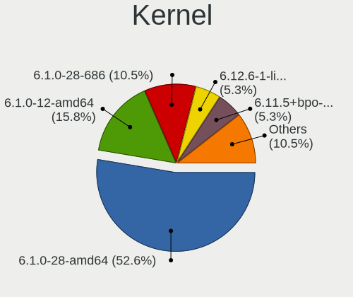
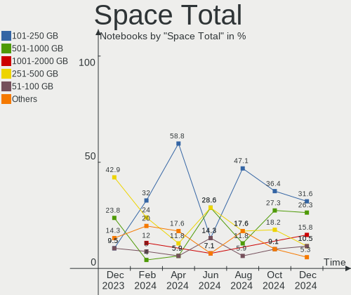
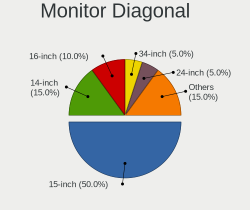
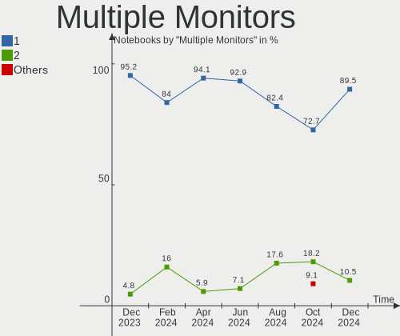
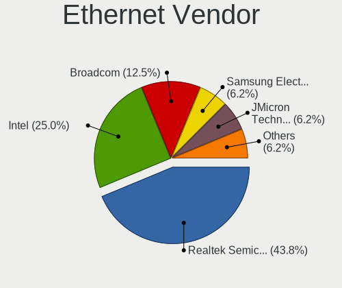
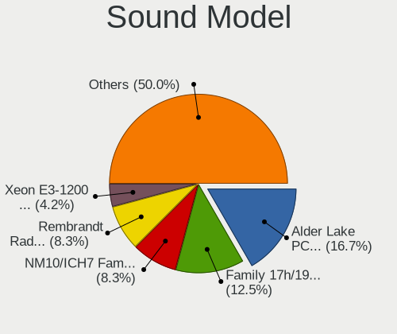
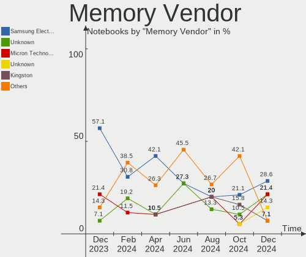
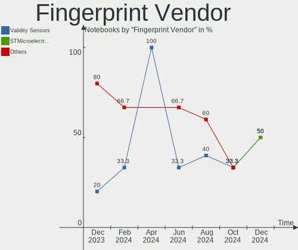
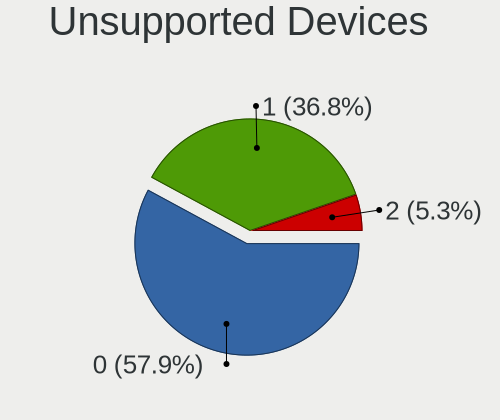

LMDE - Hardware Trends (Notebooks)
----------------------------------

A project to identify most popular hardware characteristics and track their change
over time based on data collected by Linux users at https://Linux-Hardware.org.

Anyone can contribute to this report by the [hw-probe](https://github.com/linuxhw/hw-probe) tool:

    sudo -E hw-probe -all -upload

This report is for one last month. Overall report since the beginning of time: [TestDays](https://github.com/linuxhw/TestDays)

Period: Mar, 2023.

Contents
--------

* [ System ](#system)
  - [ OS                       ](#os)
  - [ OS Family                ](#os-family)
  - [ Kernel                   ](#kernel)
  - [ Kernel Family            ](#kernel-family)
  - [ Kernel Major Ver.        ](#kernel-major-ver)
  - [ Arch                     ](#arch)
  - [ DE                       ](#de)
  - [ Display Server           ](#display-server)
  - [ Display Manager          ](#display-manager)
  - [ OS Lang                  ](#os-lang)
  - [ Boot Mode                ](#boot-mode)
  - [ Filesystem               ](#filesystem)
  - [ Part. scheme             ](#part-scheme)
  - [ Dual Boot with Linux/BSD ](#dual-boot-with-linuxbsd)
  - [ Dual Boot (Win)          ](#dual-boot-win)

* [ Board ](#board)
  - [ Vendor                   ](#vendor)
  - [ Model                    ](#model)
  - [ Model Family             ](#model-family)
  - [ MFG Year                 ](#mfg-year)
  - [ Form Factor              ](#form-factor)
  - [ Secure Boot              ](#secure-boot)
  - [ Coreboot                 ](#coreboot)
  - [ RAM Size                 ](#ram-size)
  - [ RAM Used                 ](#ram-used)
  - [ Total Drives             ](#total-drives)
  - [ Has CD-ROM               ](#has-cd-rom)
  - [ Has Ethernet             ](#has-ethernet)
  - [ Has WiFi                 ](#has-wifi)
  - [ Has Bluetooth            ](#has-bluetooth)

* [ Location ](#location)
  - [ Country                  ](#country)
  - [ City                     ](#city)

* [ Drives ](#drives)
  - [ Drive Vendor             ](#drive-vendor)
  - [ Drive Model              ](#drive-model)
  - [ HDD Vendor               ](#hdd-vendor)
  - [ SSD Vendor               ](#ssd-vendor)
  - [ Drive Kind               ](#drive-kind)
  - [ Drive Connector          ](#drive-connector)
  - [ Drive Size               ](#drive-size)
  - [ Space Total              ](#space-total)
  - [ Space Used               ](#space-used)
  - [ Malfunc. Drives          ](#malfunc-drives)
  - [ Malfunc. Drive Vendor    ](#malfunc-drive-vendor)
  - [ Malfunc. HDD Vendor      ](#malfunc-hdd-vendor)
  - [ Malfunc. Drive Kind      ](#malfunc-drive-kind)
  - [ Failed Drives            ](#failed-drives)
  - [ Failed Drive Vendor      ](#failed-drive-vendor)
  - [ Drive Status             ](#drive-status)

* [ Storage controller ](#storage-controller)
  - [ Storage Vendor           ](#storage-vendor)
  - [ Storage Model            ](#storage-model)
  - [ Storage Kind             ](#storage-kind)

* [ Processor ](#processor)
  - [ CPU Vendor               ](#cpu-vendor)
  - [ CPU Model                ](#cpu-model)
  - [ CPU Model Family         ](#cpu-model-family)
  - [ CPU Cores                ](#cpu-cores)
  - [ CPU Sockets              ](#cpu-sockets)
  - [ CPU Threads              ](#cpu-threads)
  - [ CPU Op-Modes             ](#cpu-op-modes)
  - [ CPU Microcode            ](#cpu-microcode)
  - [ CPU Microarch            ](#cpu-microarch)

* [ Graphics ](#graphics)
  - [ GPU Vendor               ](#gpu-vendor)
  - [ GPU Model                ](#gpu-model)
  - [ GPU Combo                ](#gpu-combo)
  - [ GPU Driver               ](#gpu-driver)
  - [ GPU Memory               ](#gpu-memory)

* [ Monitor ](#monitor)
  - [ Monitor Vendor           ](#monitor-vendor)
  - [ Monitor Model            ](#monitor-model)
  - [ Monitor Resolution       ](#monitor-resolution)
  - [ Monitor Diagonal         ](#monitor-diagonal)
  - [ Monitor Width            ](#monitor-width)
  - [ Aspect Ratio             ](#aspect-ratio)
  - [ Monitor Area             ](#monitor-area)
  - [ Pixel Density            ](#pixel-density)
  - [ Multiple Monitors        ](#multiple-monitors)

* [ Network ](#network)
  - [ Net Controller Vendor    ](#net-controller-vendor)
  - [ Net Controller Model     ](#net-controller-model)
  - [ Wireless Vendor          ](#wireless-vendor)
  - [ Wireless Model           ](#wireless-model)
  - [ Ethernet Vendor          ](#ethernet-vendor)
  - [ Ethernet Model           ](#ethernet-model)
  - [ Net Controller Kind      ](#net-controller-kind)
  - [ Used Controller          ](#used-controller)
  - [ NICs                     ](#nics)
  - [ IPv6                     ](#ipv6)

* [ Bluetooth ](#bluetooth)
  - [ Bluetooth Vendor         ](#bluetooth-vendor)
  - [ Bluetooth Model          ](#bluetooth-model)

* [ Sound ](#sound)
  - [ Sound Vendor             ](#sound-vendor)
  - [ Sound Model              ](#sound-model)

* [ Memory ](#memory)
  - [ Memory Vendor            ](#memory-vendor)
  - [ Memory Model             ](#memory-model)
  - [ Memory Kind              ](#memory-kind)
  - [ Memory Form Factor       ](#memory-form-factor)
  - [ Memory Size              ](#memory-size)
  - [ Memory Speed             ](#memory-speed)

* [ Printers & scanners ](#printers--scanners)
  - [ Printer Vendor           ](#printer-vendor)
  - [ Printer Model            ](#printer-model)
  - [ Scanner Vendor           ](#scanner-vendor)
  - [ Scanner Model            ](#scanner-model)

* [ Camera ](#camera)
  - [ Camera Vendor            ](#camera-vendor)
  - [ Camera Model             ](#camera-model)

* [ Security ](#security)
  - [ Fingerprint Vendor       ](#fingerprint-vendor)
  - [ Fingerprint Model        ](#fingerprint-model)
  - [ Chipcard Vendor          ](#chipcard-vendor)
  - [ Chipcard Model           ](#chipcard-model)

* [ Unsupported ](#unsupported)
  - [ Unsupported Devices      ](#unsupported-devices)
  - [ Unsupported Device Types ](#unsupported-device-types)

System
------

OS
--

Installed operating systems

| Name   | Notebooks | Percent |
|--------|-----------|---------|
| LMDE 5 | 21        | 100%    |

OS Family
---------

OS without a version

| Name | Notebooks | Percent |
|------|-----------|---------|
| LMDE | 21        | 100%    |

Kernel
------

Version of the Linux kernel

| Version                | Notebooks | Percent |
|------------------------|-----------|---------|
| 5.10.0-21-amd64        | 17        | 80.95%  |
| 5.10.0-12-amd64        | 2         | 9.52%   |
| 5.19.0-0.deb11.2-amd64 | 1         | 4.76%   |
| 5.10.0-18-amd64        | 1         | 4.76%   |

Kernel Family
-------------

Linux kernel without a distro release

| Version | Notebooks | Percent |
|---------|-----------|---------|
| 5.10.0  | 20        | 95.24%  |
| 5.19.0  | 1         | 4.76%   |

Kernel Major Ver.
-----------------

Linux kernel major version

| Version | Notebooks | Percent |
|---------|-----------|---------|
| 5.10    | 20        | 95.24%  |
| 5.19    | 1         | 4.76%   |

Arch
----

OS architecture (x86_64, i586, etc.)

| Name   | Notebooks | Percent |
|--------|-----------|---------|
| x86_64 | 21        | 100%    |

DE
--

Desktop Environment

| Name       | Notebooks | Percent |
|------------|-----------|---------|
| X-Cinnamon | 16        | 76.19%  |
| Cinnamon   | 4         | 19.05%  |
| MATE       | 1         | 4.76%   |

Display Server
--------------

X11 or Wayland

| Name | Notebooks | Percent |
|------|-----------|---------|
| X11  | 21        | 100%    |

Display Manager
---------------

SDDM, LightDM, etc.

| Name    | Notebooks | Percent |
|---------|-----------|---------|
| Unknown | 12        | 57.14%  |
| LightDM | 9         | 42.86%  |

OS Lang
-------

Language

| Lang  | Notebooks | Percent |
|-------|-----------|---------|
| en_US | 6         | 28.57%  |
| de_DE | 4         | 19.05%  |
| ru_RU | 3         | 14.29%  |
| pl_PL | 3         | 14.29%  |
| pt_PT | 1         | 4.76%   |
| it_IT | 1         | 4.76%   |
| es_ES | 1         | 4.76%   |
| en_GB | 1         | 4.76%   |
| de_AT | 1         | 4.76%   |

Boot Mode
---------

EFI or BIOS

| Mode | Notebooks | Percent |
|------|-----------|---------|
| EFI  | 13        | 61.9%   |
| BIOS | 8         | 38.1%   |

Filesystem
----------

Type of filesystem

| Type    | Notebooks | Percent |
|---------|-----------|---------|
| Ext4    | 19        | 90.48%  |
| Overlay | 1         | 4.76%   |
| Btrfs   | 1         | 4.76%   |

Part. scheme
------------

Scheme of partitioning

| Type    | Notebooks | Percent |
|---------|-----------|---------|
| Unknown | 12        | 57.14%  |
| GPT     | 7         | 33.33%  |
| MBR     | 2         | 9.52%   |

Dual Boot with Linux/BSD
------------------------

Hosting more than one Linux/BSD

| Dual boot | Notebooks | Percent |
|-----------|-----------|---------|
| No        | 21        | 100%    |

Dual Boot (Win)
---------------

Hosting Linux and Windows

| Dual boot | Notebooks | Percent |
|-----------|-----------|---------|
| No        | 19        | 90.48%  |
| Yes       | 2         | 9.52%   |

Board
-----

Vendor
------

Motherboard manufacturer

| Name             | Notebooks | Percent |
|------------------|-----------|---------|
| Lenovo           | 6         | 28.57%  |
| Hewlett-Packard  | 4         | 19.05%  |
| Acer             | 3         | 14.29%  |
| Dell             | 2         | 9.52%   |
| Toshiba          | 1         | 4.76%   |
| Star Labs        | 1         | 4.76%   |
| Medion           | 1         | 4.76%   |
| HIPER            | 1         | 4.76%   |
| Dynabook         | 1         | 4.76%   |
| ASUSTek Computer | 1         | 4.76%   |

Model
-----

Motherboard model

| Name                                 | Notebooks | Percent |
|--------------------------------------|-----------|---------|
| HP Pavilion Notebook                 | 2         | 9.52%   |
| Toshiba Satellite Pro A50-C          | 1         | 4.76%   |
| Star Labs StarBook                   | 1         | 4.76%   |
| Medion E6214                         | 1         | 4.76%   |
| Lenovo ThinkPad Z61m 9450HAG         | 1         | 4.76%   |
| Lenovo ThinkPad X230 Tablet 343522U  | 1         | 4.76%   |
| Lenovo ThinkPad X230 2325Y2S         | 1         | 4.76%   |
| Lenovo ThinkPad T14 Gen 3 21AJS7S208 | 1         | 4.76%   |
| Lenovo IdeaPad 320-15AST 80XV        | 1         | 4.76%   |
| Lenovo IdeaPad 100-14IBY 80MH        | 1         | 4.76%   |
| HIPER WORKBOOK                       | 1         | 4.76%   |
| HP Pavilion dv6                      | 1         | 4.76%   |
| HP Pavilion dm4                      | 1         | 4.76%   |
| Dynabook Satellite Pro C50-G         | 1         | 4.76%   |
| Dell Venue 11 Pro 7130 MS            | 1         | 4.76%   |
| Dell Inspiron 5515                   | 1         | 4.76%   |
| ASUS ZenBook UX333FA_UX333FA         | 1         | 4.76%   |
| Acer Aspire E1-572G                  | 1         | 4.76%   |
| Acer Aspire A514-53                  | 1         | 4.76%   |
| Acer Aspire 5732Z                    | 1         | 4.76%   |

Model Family
------------

Motherboard model prefix

| Name               | Notebooks | Percent |
|--------------------|-----------|---------|
| Lenovo ThinkPad    | 4         | 19.05%  |
| HP Pavilion        | 4         | 19.05%  |
| Acer Aspire        | 3         | 14.29%  |
| Lenovo IdeaPad     | 2         | 9.52%   |
| Toshiba Satellite  | 1         | 4.76%   |
| Star Labs StarBook | 1         | 4.76%   |
| Medion E6214       | 1         | 4.76%   |
| HIPER WORKBOOK     | 1         | 4.76%   |
| Dynabook Satellite | 1         | 4.76%   |
| Dell Venue         | 1         | 4.76%   |
| Dell Inspiron      | 1         | 4.76%   |
| ASUS ZenBook       | 1         | 4.76%   |

MFG Year
--------

Motherboard manufacture year

| Year | Notebooks | Percent |
|------|-----------|---------|
| 2021 | 3         | 14.29%  |
| 2022 | 2         | 9.52%   |
| 2016 | 2         | 9.52%   |
| 2015 | 2         | 9.52%   |
| 2013 | 2         | 9.52%   |
| 2010 | 2         | 9.52%   |
| 2023 | 1         | 4.76%   |
| 2020 | 1         | 4.76%   |
| 2019 | 1         | 4.76%   |
| 2017 | 1         | 4.76%   |
| 2012 | 1         | 4.76%   |
| 2009 | 1         | 4.76%   |
| 2008 | 1         | 4.76%   |
| 2006 | 1         | 4.76%   |

Form Factor
-----------

Physical design of the computer

| Name     | Notebooks | Percent |
|----------|-----------|---------|
| Notebook | 21        | 100%    |

Secure Boot
-----------

Enabled or disabled

| State    | Notebooks | Percent |
|----------|-----------|---------|
| Disabled | 18        | 85.71%  |
| Enabled  | 3         | 14.29%  |

Coreboot
--------

Have coreboot on board

| Used | Notebooks | Percent |
|------|-----------|---------|
| No   | 20        | 95.24%  |
| Yes  | 1         | 4.76%   |

RAM Size
--------

Total RAM memory

| Size in GB | Notebooks | Percent |
|------------|-----------|---------|
| 3.01-4.0   | 7         | 33.33%  |
| 16.01-24.0 | 5         | 23.81%  |
| 4.01-8.0   | 4         | 19.05%  |
| 8.01-16.0  | 4         | 19.05%  |
| 32.01-64.0 | 1         | 4.76%   |

RAM Used
--------

Used RAM memory

| Used GB  | Notebooks | Percent |
|----------|-----------|---------|
| 1.01-2.0 | 10        | 47.62%  |
| 2.01-3.0 | 6         | 28.57%  |
| 4.01-8.0 | 3         | 14.29%  |
| 3.01-4.0 | 2         | 9.52%   |

Total Drives
------------

Number of drives on board

| Drives | Notebooks | Percent |
|--------|-----------|---------|
| 1      | 18        | 85.71%  |
| 2      | 2         | 9.52%   |
| 3      | 1         | 4.76%   |

Has CD-ROM
----------

Has CD-ROM on board

| Presented | Notebooks | Percent |
|-----------|-----------|---------|
| No        | 12        | 57.14%  |
| Yes       | 9         | 42.86%  |

Has Ethernet
------------

Has Ethernet on board

| Presented | Notebooks | Percent |
|-----------|-----------|---------|
| Yes       | 16        | 76.19%  |
| No        | 5         | 23.81%  |

Has WiFi
--------

Has WiFi module

| Presented | Notebooks | Percent |
|-----------|-----------|---------|
| Yes       | 21        | 100%    |

Has Bluetooth
-------------

Has Bluetooth module

| Presented | Notebooks | Percent |
|-----------|-----------|---------|
| Yes       | 15        | 71.43%  |
| No        | 6         | 28.57%  |

Location
--------

Country
-------

Geographic location (country)

| Country    | Notebooks | Percent |
|------------|-----------|---------|
| Germany    | 5         | 23.81%  |
| Poland     | 3         | 14.29%  |
| USA        | 2         | 9.52%   |
| Spain      | 2         | 9.52%   |
| Russia     | 2         | 9.52%   |
| Italy      | 2         | 9.52%   |
| Portugal   | 1         | 4.76%   |
| Kazakhstan | 1         | 4.76%   |
| Indonesia  | 1         | 4.76%   |
| Austria    | 1         | 4.76%   |
| Australia  | 1         | 4.76%   |

City
----

Geographic location (city)

| City          | Notebooks | Percent |
|---------------|-----------|---------|
| West Hartford | 1         | 4.76%   |
| Warsaw        | 1         | 4.76%   |
| Vienna        | 1         | 4.76%   |
| Sydney        | 1         | 4.76%   |
| St Petersburg | 1         | 4.76%   |
| Moscow        | 1         | 4.76%   |
| Milan         | 1         | 4.76%   |
| Málaga       | 1         | 4.76%   |
| Madrid        | 1         | 4.76%   |
| Lodz          | 1         | 4.76%   |
| Lisbon        | 1         | 4.76%   |
| Lamspringe    | 1         | 4.76%   |
| Kętrzyn      | 1         | 4.76%   |
| Gruenenplan   | 1         | 4.76%   |
| Fairmont      | 1         | 4.76%   |
| Blankenfelde  | 1         | 4.76%   |
| Berlin        | 1         | 4.76%   |
| Bergamo       | 1         | 4.76%   |
| Bandung       | 1         | 4.76%   |
| Augsburg      | 1         | 4.76%   |
| Astana        | 1         | 4.76%   |

Drives
------

Drive Vendor
------------

Hard drive vendors

| Vendor              | Notebooks | Drives | Percent |
|---------------------|-----------|--------|---------|
| Seagate             | 4         | 4      | 17.39%  |
| Samsung Electronics | 3         | 3      | 13.04%  |
| Toshiba             | 2         | 2      | 8.7%    |
| Kingston            | 2         | 2      | 8.7%    |
| GOODRAM             | 2         | 2      | 8.7%    |
| WINTEC              | 1         | 1      | 4.35%   |
| WDC                 | 1         | 1      | 4.35%   |
| Unknown             | 1         | 1      | 4.35%   |
| Transcend           | 1         | 1      | 4.35%   |
| Star Drive          | 1         | 1      | 4.35%   |
| SK hynix            | 1         | 1      | 4.35%   |
| SanDisk             | 1         | 1      | 4.35%   |
| Intel               | 1         | 2      | 4.35%   |
| FORESEE             | 1         | 1      | 4.35%   |
| China               | 1         | 1      | 4.35%   |

Drive Model
-----------

Hard drive models

| Model                                | Notebooks | Percent |
|--------------------------------------|-----------|---------|
| Seagate ST1000LM035-1RK172 1TB       | 2         | 8.33%   |
| WINTEC 240GB SATA3 SF2281 SSD        | 1         | 4.17%   |
| WDC PC SN520 SDAPNUW-256G-1002 256GB | 1         | 4.17%   |
| Unknown SDC  4GB                     | 1         | 4.17%   |
| Transcend TS480GMTS820S 480GB SSD    | 1         | 4.17%   |
| Toshiba MQ01ACF050 500GB             | 1         | 4.17%   |
| Toshiba MK6476GSX 640GB              | 1         | 4.17%   |
| Star Drive PCIe SSD 480GB            | 1         | 4.17%   |
| SK hynix BC711 NVMe 512GB            | 1         | 4.17%   |
| Seagate ST250LT007-9ZV14C 250GB      | 1         | 4.17%   |
| Seagate ST2000LM003 HN-M201RAD 2TB   | 1         | 4.17%   |
| SanDisk SDSSDP128G 128GB             | 1         | 4.17%   |
| Samsung SSD 840 PRO Series 512GB     | 1         | 4.17%   |
| Samsung SSD 840 EVO 250GB            | 1         | 4.17%   |
| Samsung MZVL4512HBLU-00BL7 512GB     | 1         | 4.17%   |
| Kingston SV300S37A60G 64GB SSD       | 1         | 4.17%   |
| Kingston SA400S37120G 120GB SSD      | 1         | 4.17%   |
| Intel HBRPEKNX0202AO 32GB            | 1         | 4.17%   |
| Intel HBRPEKNX0202A 512GB            | 1         | 4.17%   |
| GOODRAM SSDPR-S400U-120-42 120GB     | 1         | 4.17%   |
| GOODRAM SSDPR-CL100-120-G3 120GB     | 1         | 4.17%   |
| FORESEE 512GB SSD                    | 1         | 4.17%   |
| China MS201-512G                     | 1         | 4.17%   |

HDD Vendor
----------

Hard disk drive vendors

| Vendor  | Notebooks | Drives | Percent |
|---------|-----------|--------|---------|
| Seagate | 4         | 4      | 66.67%  |
| Toshiba | 2         | 2      | 33.33%  |

SSD Vendor
----------

Solid state drive vendors

| Vendor              | Notebooks | Drives | Percent |
|---------------------|-----------|--------|---------|
| Samsung Electronics | 2         | 2      | 20%     |
| Kingston            | 2         | 2      | 20%     |
| GOODRAM             | 2         | 2      | 20%     |
| WINTEC              | 1         | 1      | 10%     |
| Transcend           | 1         | 1      | 10%     |
| SanDisk             | 1         | 1      | 10%     |
| FORESEE             | 1         | 1      | 10%     |

Drive Kind
----------

HDD or SSD

| Kind    | Notebooks | Drives | Percent |
|---------|-----------|--------|---------|
| SSD     | 10        | 10     | 43.48%  |
| HDD     | 6         | 6      | 26.09%  |
| NVMe    | 5         | 6      | 21.74%  |
| MMC     | 1         | 1      | 4.35%   |
| Unknown | 1         | 1      | 4.35%   |

Drive Connector
---------------

SATA, SAS, NVMe, etc.

| Type | Notebooks | Drives | Percent |
|------|-----------|--------|---------|
| SATA | 16        | 17     | 72.73%  |
| NVMe | 5         | 6      | 22.73%  |
| MMC  | 1         | 1      | 4.55%   |

Drive Size
----------

Size of hard drive

| Size in TB | Notebooks | Drives | Percent |
|------------|-----------|--------|---------|
| 0.01-0.5   | 10        | 10     | 62.5%   |
| 0.51-1.0   | 5         | 5      | 31.25%  |
| 1.01-2.0   | 1         | 1      | 6.25%   |

Space Total
-----------

Amount of disk space available on the file system

| Size in GB | Notebooks | Percent |
|------------|-----------|---------|
| 251-500    | 8         | 38.1%   |
| 101-250    | 7         | 33.33%  |
| 501-1000   | 3         | 14.29%  |
| 1001-2000  | 1         | 4.76%   |
| 1-20       | 1         | 4.76%   |
| 51-100     | 1         | 4.76%   |

Space Used
----------

Amount of used disk space

| Used GB | Notebooks | Percent |
|---------|-----------|---------|
| 1-20    | 8         | 38.1%   |
| 21-50   | 6         | 28.57%  |
| 101-250 | 3         | 14.29%  |
| 251-500 | 2         | 9.52%   |
| 51-100  | 2         | 9.52%   |

Malfunc. Drives
---------------

Drive models with a malfunction

| Model                         | Notebooks | Drives | Percent |
|-------------------------------|-----------|--------|---------|
| WINTEC 240GB SATA3 SF2281 SSD | 1         | 1      | 100%    |

Malfunc. Drive Vendor
---------------------

Vendors of faulty drives

| Vendor | Notebooks | Drives | Percent |
|--------|-----------|--------|---------|
| WINTEC | 1         | 1      | 100%    |

Malfunc. HDD Vendor
-------------------

Vendors of faulty HDD drives

Zero info for selected period =(

Malfunc. Drive Kind
-------------------

Kinds of faulty drives

| Kind | Notebooks | Drives | Percent |
|------|-----------|--------|---------|
| SSD  | 1         | 1      | 100%    |

Failed Drives
-------------

Failed drive models

Zero info for selected period =(

Failed Drive Vendor
-------------------

Failed drive vendors

Zero info for selected period =(

Drive Status
------------

Number of failed and malfunc. drives

| Status   | Notebooks | Drives | Percent |
|----------|-----------|--------|---------|
| Detected | 13        | 14     | 59.09%  |
| Works    | 8         | 9      | 36.36%  |
| Malfunc  | 1         | 1      | 4.55%   |

Storage controller
------------------

Storage Vendor
--------------

Storage controller vendors

| Vendor              | Notebooks | Percent |
|---------------------|-----------|---------|
| Intel               | 15        | 68.18%  |
| AMD                 | 3         | 13.64%  |
| SK hynix            | 1         | 4.55%   |
| SanDisk             | 1         | 4.55%   |
| Samsung Electronics | 1         | 4.55%   |
| Phison Electronics  | 1         | 4.55%   |

Storage Model
-------------

Storage controller models

| Model                                                                        | Notebooks | Percent |
|------------------------------------------------------------------------------|-----------|---------|
| AMD FCH SATA Controller [AHCI mode]                                          | 3         | 12%     |
| Intel Sunrise Point-LP SATA Controller [AHCI mode]                           | 2         | 8%      |
| Intel Comet Lake SATA AHCI Controller                                        | 2         | 8%      |
| Intel 8 Series SATA Controller 1 [AHCI mode]                                 | 2         | 8%      |
| Intel 6 Series/C200 Series Chipset Family 6 port Mobile SATA AHCI Controller | 2         | 8%      |
| SK hynix Gold P31/PC711 NVMe Solid State Drive                               | 1         | 4%      |
| SanDisk WD Blue SN500 / PC SN520 NVMe SSD                                    | 1         | 4%      |
| Samsung NVMe SSD Controller PM9B1                                            | 1         | 4%      |
| Phison E12 NVMe Controller                                                   | 1         | 4%      |
| Intel NVMe Controller                                                        | 1         | 4%      |
| Intel Atom Processor E3800 Series SATA AHCI Controller                       | 1         | 4%      |
| Intel 82801IBM/IEM (ICH9M/ICH9M-E) 4 port SATA Controller [AHCI mode]        | 1         | 4%      |
| Intel 82801GBM/GHM (ICH7-M Family) SATA Controller [AHCI mode]               | 1         | 4%      |
| Intel 82801G (ICH7 Family) IDE Controller                                    | 1         | 4%      |
| Intel 82801 Mobile SATA Controller [RAID mode]                               | 1         | 4%      |
| Intel 7 Series Chipset Family 6-port SATA Controller [AHCI mode]             | 1         | 4%      |
| Intel 7 Series Chipset Family 4-port SATA Controller [IDE mode]              | 1         | 4%      |
| Intel 7 Series Chipset Family 2-port SATA Controller [IDE mode]              | 1         | 4%      |
| Intel 5 Series/3400 Series Chipset 4 port SATA AHCI Controller               | 1         | 4%      |

Storage Kind
------------

Kind of storage controller (IDE, SATA, NVMe, SAS, ...)

| Kind | Notebooks | Percent |
|------|-----------|---------|
| SATA | 16        | 66.67%  |
| NVMe | 5         | 20.83%  |
| IDE  | 2         | 8.33%   |
| RAID | 1         | 4.17%   |

Processor
---------

CPU Vendor
----------

Processor vendors

| Vendor | Notebooks | Percent |
|--------|-----------|---------|
| Intel  | 18        | 85.71%  |
| AMD    | 3         | 14.29%  |

CPU Model
---------

Processor models

| Model                                           | Notebooks | Percent |
|-------------------------------------------------|-----------|---------|
| Intel Core i5-3320M CPU @ 2.60GHz               | 2         | 9.52%   |
| Intel Core i5-10210U CPU @ 1.60GHz              | 2         | 9.52%   |
| Intel Core i3-2310M CPU @ 2.10GHz               | 2         | 9.52%   |
| Intel Pentium Dual-Core CPU T4300 @ 2.10GHz     | 1         | 4.76%   |
| Intel Pentium CPU N3540 @ 2.16GHz               | 1         | 4.76%   |
| Intel Core i5-8265U CPU @ 1.60GHz               | 1         | 4.76%   |
| Intel Core i5-7200U CPU @ 2.50GHz               | 1         | 4.76%   |
| Intel Core i5-6200U CPU @ 2.30GHz               | 1         | 4.76%   |
| Intel Core i5-4200U CPU @ 1.60GHz               | 1         | 4.76%   |
| Intel Core i3-4020Y CPU @ 1.50GHz               | 1         | 4.76%   |
| Intel Core i3-1005G1 CPU @ 1.20GHz              | 1         | 4.76%   |
| Intel Core i3 CPU M 330 @ 2.13GHz               | 1         | 4.76%   |
| Intel Core 2 CPU T7400 @ 2.16GHz                | 1         | 4.76%   |
| Intel 12th Gen Core i7-1260P                    | 1         | 4.76%   |
| Intel 12th Gen Core i5-1245U                    | 1         | 4.76%   |
| AMD Ryzen 5 5500U with Radeon Graphics          | 1         | 4.76%   |
| AMD A9-9420 RADEON R5, 5 COMPUTE CORES 2C+3G    | 1         | 4.76%   |
| AMD A10-8700P Radeon R6, 10 Compute Cores 4C+6G | 1         | 4.76%   |

CPU Model Family
----------------

Processor model prefix

| Model                   | Notebooks | Percent |
|-------------------------|-----------|---------|
| Intel Core i5           | 8         | 38.1%   |
| Intel Core i3           | 5         | 23.81%  |
| Other                   | 3         | 14.29%  |
| Intel Pentium Dual-Core | 1         | 4.76%   |
| Intel Pentium           | 1         | 4.76%   |
| Intel Core 2            | 1         | 4.76%   |
| AMD Ryzen 5             | 1         | 4.76%   |
| AMD A10                 | 1         | 4.76%   |

CPU Cores
---------

Number of processor cores

| Number | Notebooks | Percent |
|--------|-----------|---------|
| 2      | 14        | 66.67%  |
| 4      | 4         | 19.05%  |
| 12     | 1         | 4.76%   |
| 10     | 1         | 4.76%   |
| 6      | 1         | 4.76%   |

CPU Sockets
-----------

Number of sockets

| Number | Notebooks | Percent |
|--------|-----------|---------|
| 1      | 21        | 100%    |

CPU Threads
-----------

Threads per core (Hyper-Threading)

| Number | Notebooks | Percent |
|--------|-----------|---------|
| 2      | 16        | 76.19%  |
| 1      | 5         | 23.81%  |

CPU Op-Modes
------------

CPU Operation Modes (32-bit, 64-bit)

| Op mode        | Notebooks | Percent |
|----------------|-----------|---------|
| 32-bit, 64-bit | 21        | 100%    |

CPU Microcode
-------------

Microcode number

| Number     | Notebooks | Percent |
|------------|-----------|---------|
| 0x806ec    | 2         | 9.52%   |
| 0x40651    | 2         | 9.52%   |
| 0x306a9    | 2         | 9.52%   |
| 0x206a7    | 2         | 9.52%   |
| 0x906a4    | 1         | 4.76%   |
| 0x906a3    | 1         | 4.76%   |
| 0x806eb    | 1         | 4.76%   |
| 0x806e9    | 1         | 4.76%   |
| 0x706e5    | 1         | 4.76%   |
| 0x6f6      | 1         | 4.76%   |
| 0x406e3    | 1         | 4.76%   |
| 0x30678    | 1         | 4.76%   |
| 0x20652    | 1         | 4.76%   |
| 0x1067a    | 1         | 4.76%   |
| 0x08608103 | 1         | 4.76%   |
| 0x06006705 | 1         | 4.76%   |
| 0x06006110 | 1         | 4.76%   |

CPU Microarch
-------------

Microarchitecture

| Name             | Notebooks | Percent |
|------------------|-----------|---------|
| KabyLake         | 4         | 19.05%  |
| SandyBridge      | 2         | 9.52%   |
| IvyBridge        | 2         | 9.52%   |
| Haswell          | 2         | 9.52%   |
| Excavator        | 2         | 9.52%   |
| Unknown          | 2         | 9.52%   |
| Westmere         | 1         | 4.76%   |
| Skylake          | 1         | 4.76%   |
| Silvermont       | 1         | 4.76%   |
| Penryn           | 1         | 4.76%   |
| IceLake          | 1         | 4.76%   |
| Core             | 1         | 4.76%   |
| Alderlake Hybrid | 1         | 4.76%   |

Graphics
--------

GPU Vendor
----------

Vendors of graphics cards

| Vendor | Notebooks | Percent |
|--------|-----------|---------|
| Intel  | 17        | 68%     |
| AMD    | 6         | 24%     |
| Nvidia | 2         | 8%      |

GPU Model
---------

Graphics card models

| Model                                                                                 | Notebooks | Percent |
|---------------------------------------------------------------------------------------|-----------|---------|
| Intel CometLake-U GT2 [UHD Graphics]                                                  | 2         | 7.41%   |
| Intel 3rd Gen Core processor Graphics Controller                                      | 2         | 7.41%   |
| Intel 2nd Generation Core Processor Family Integrated Graphics Controller             | 2         | 7.41%   |
| AMD Topaz XT [Radeon R7 M260/M265 / M340/M360 / M440/M445 / 530/535 / 620/625 Mobile] | 2         | 7.41%   |
| Nvidia GM108M [GeForce 930M]                                                          | 1         | 3.7%    |
| Nvidia GM107M [GeForce GTX 950M]                                                      | 1         | 3.7%    |
| Intel WhiskeyLake-U GT2 [UHD Graphics 620]                                            | 1         | 3.7%    |
| Intel Skylake GT2 [HD Graphics 520]                                                   | 1         | 3.7%    |
| Intel Mobile 4 Series Chipset Integrated Graphics Controller                          | 1         | 3.7%    |
| Intel Iris Plus Graphics G1 (Ice Lake)                                                | 1         | 3.7%    |
| Intel HD Graphics 620                                                                 | 1         | 3.7%    |
| Intel Haswell-ULT Integrated Graphics Controller [HD Graphics]                        | 1         | 3.7%    |
| Intel Haswell-ULT Integrated Graphics Controller                                      | 1         | 3.7%    |
| Intel Core Processor Integrated Graphics Controller                                   | 1         | 3.7%    |
| Intel Atom Processor Z36xxx/Z37xxx Series Graphics & Display                          | 1         | 3.7%    |
| Intel Alder Lake-UP3 GT2 [UHD Graphics]                                               | 1         | 3.7%    |
| Intel Alder Lake-P Integrated Graphics Controller                                     | 1         | 3.7%    |
| AMD Wani [Radeon R5/R6/R7 Graphics]                                                   | 1         | 3.7%    |
| AMD Stoney [Radeon R2/R3/R4/R5 Graphics]                                              | 1         | 3.7%    |
| AMD Seymour [Radeon HD 6400M/7400M Series]                                            | 1         | 3.7%    |
| AMD RV515/M54 [Mobility Radeon X1400]                                                 | 1         | 3.7%    |
| AMD Opal XT [Radeon R7 M265/M365X/M465]                                               | 1         | 3.7%    |
| AMD Lucienne                                                                          | 1         | 3.7%    |

GPU Combo
---------

Combinations of graphics cards

| Name           | Notebooks | Percent |
|----------------|-----------|---------|
| 1 x Intel      | 13        | 61.9%   |
| 2 x AMD        | 2         | 9.52%   |
| Intel + Nvidia | 2         | 9.52%   |
| Intel + AMD    | 2         | 9.52%   |
| 1 x AMD        | 2         | 9.52%   |

GPU Driver
----------

Free vs proprietary

| Driver      | Notebooks | Percent |
|-------------|-----------|---------|
| Free        | 18        | 85.71%  |
| Proprietary | 2         | 9.52%   |
| Unknown     | 1         | 4.76%   |

GPU Memory
----------

Total video memory

| Size in GB | Notebooks | Percent |
|------------|-----------|---------|
| Unknown    | 14        | 66.67%  |
| 0.01-0.5   | 4         | 19.05%  |
| 1.01-2.0   | 2         | 9.52%   |
| 0.51-1.0   | 1         | 4.76%   |

Monitor
-------

Monitor Vendor
--------------

Monitor vendors

| Vendor                  | Notebooks | Percent |
|-------------------------|-----------|---------|
| AU Optronics            | 6         | 28.57%  |
| Chimei Innolux          | 5         | 23.81%  |
| LG Display              | 4         | 19.05%  |
| Samsung Electronics     | 2         | 9.52%   |
| IBM                     | 1         | 4.76%   |
| Dell                    | 1         | 4.76%   |
| Chi Mei Optoelectronics | 1         | 4.76%   |
| BOE                     | 1         | 4.76%   |

Monitor Model
-------------

Monitor models

| Model                                                                    | Notebooks | Percent |
|--------------------------------------------------------------------------|-----------|---------|
| LG Display LCD Monitor LGD02D8 1366x768 277x156mm 12.5-inch              | 2         | 9.52%   |
| Samsung Electronics LCD Monitor SEC3942 1366x768 309x174mm 14.0-inch     | 1         | 4.76%   |
| Samsung Electronics LCD Monitor SDC4C48 1920x1080 309x174mm 14.0-inch    | 1         | 4.76%   |
| LG Display LP156WH1-TLA3 LGD01C2 1366x768 344x194mm 15.5-inch            | 1         | 4.76%   |
| LG Display LCD Monitor LGD04D1 1366x768 344x194mm 15.5-inch              | 1         | 4.76%   |
| IBM LCD Monitor IBM2887 1680x1050 331x207mm 15.4-inch                    | 1         | 4.76%   |
| Dell E2416H DELA0C9 1920x1080 531x299mm 24.0-inch                        | 1         | 4.76%   |
| Chimei Innolux LCD Monitor CMN15E7 1920x1080 344x193mm 15.5-inch         | 1         | 4.76%   |
| Chimei Innolux LCD Monitor CMN15DB 1366x768 344x193mm 15.5-inch          | 1         | 4.76%   |
| Chimei Innolux LCD Monitor CMN15CA 1366x768 344x193mm 15.5-inch          | 1         | 4.76%   |
| Chimei Innolux LCD Monitor CMN152E 1920x1080 344x193mm 15.5-inch         | 1         | 4.76%   |
| Chimei Innolux LCD Monitor CMN14F2 1920x1080 309x173mm 13.9-inch         | 1         | 4.76%   |
| Chi Mei Optoelectronics LCD Monitor CMO15A2 1366x768 344x193mm 15.5-inch | 1         | 4.76%   |
| BOE LCD Monitor BOE08E2 1920x1080 344x194mm 15.5-inch                    | 1         | 4.76%   |
| AU Optronics LCD Monitor AUO5C2D 1920x1080 293x165mm 13.2-inch           | 1         | 4.76%   |
| AU Optronics LCD Monitor AUO47EC 1366x768 344x193mm 15.5-inch            | 1         | 4.76%   |
| AU Optronics LCD Monitor AUO403D 1920x1080 309x173mm 13.9-inch           | 1         | 4.76%   |
| AU Optronics LCD Monitor AUO38ED 1920x1080 344x193mm 15.5-inch           | 1         | 4.76%   |
| AU Optronics LCD Monitor AUO343C 1366x768 309x173mm 13.9-inch            | 1         | 4.76%   |
| AU Optronics LCD Monitor AUO32EC 1366x768 344x193mm 15.5-inch            | 1         | 4.76%   |

Monitor Resolution
------------------

Monitor screen resolution

| Resolution         | Notebooks | Percent |
|--------------------|-----------|---------|
| 1366x768 (WXGA)    | 11        | 52.38%  |
| 1920x1080 (FHD)    | 9         | 42.86%  |
| 1680x1050 (WSXGA+) | 1         | 4.76%   |

Monitor Diagonal
----------------

Diagonal size in inches

| Inches | Notebooks | Percent |
|--------|-----------|---------|
| 15     | 12        | 57.14%  |
| 13     | 3         | 14.29%  |
| 14     | 2         | 9.52%   |
| 12     | 2         | 9.52%   |
| 24     | 1         | 4.76%   |
| 18     | 1         | 4.76%   |

Monitor Width
-------------

Physical width

| Width in mm | Notebooks | Percent |
|-------------|-----------|---------|
| 301-350     | 16        | 76.19%  |
| 201-300     | 3         | 14.29%  |
| 501-600     | 1         | 4.76%   |
| 401-500     | 1         | 4.76%   |

Aspect Ratio
------------

Proportional relationship between the width and the height

| Ratio | Notebooks | Percent |
|-------|-----------|---------|
| 16/9  | 19        | 95%     |
| 16/10 | 1         | 5%      |

Monitor Area
------------

Area in inch²

| Area in inch² | Notebooks | Percent |
|----------------|-----------|---------|
| 101-110        | 12        | 57.14%  |
| 81-90          | 4         | 19.05%  |
| 61-70          | 2         | 9.52%   |
| 71-80          | 1         | 4.76%   |
| 201-250        | 1         | 4.76%   |
| 141-150        | 1         | 4.76%   |

Pixel Density
-------------

Pixels per inch

| Density | Notebooks | Percent |
|---------|-----------|---------|
| 121-160 | 9         | 42.86%  |
| 101-120 | 9         | 42.86%  |
| 51-100  | 2         | 9.52%   |
| 161-240 | 1         | 4.76%   |

Multiple Monitors
-----------------

Total monitors connected

| Total | Notebooks | Percent |
|-------|-----------|---------|
| 1     | 19        | 90.48%  |
| 2     | 1         | 4.76%   |
| 0     | 1         | 4.76%   |

Network
-------

Net Controller Vendor
---------------------

Controller vendors

| Vendor                          | Notebooks | Percent |
|---------------------------------|-----------|---------|
| Intel                           | 13        | 39.39%  |
| Realtek Semiconductor           | 8         | 24.24%  |
| Qualcomm Atheros                | 4         | 12.12%  |
| Broadcom                        | 3         | 9.09%   |
| Samsung Electronics             | 1         | 3.03%   |
| Qualcomm Atheros Communications | 1         | 3.03%   |
| MediaTek                        | 1         | 3.03%   |
| Dell                            | 1         | 3.03%   |
| Broadcom Limited                | 1         | 3.03%   |

Net Controller Model
--------------------

Controller models

| Model                                                             | Notebooks | Percent |
|-------------------------------------------------------------------|-----------|---------|
| Realtek RTL8111/8168/8411 PCI Express Gigabit Ethernet Controller | 4         | 9.76%   |
| Realtek RTL810xE PCI Express Fast Ethernet controller             | 3         | 7.32%   |
| Intel Wi-Fi 6 AX210/AX211/AX411 160MHz                            | 2         | 4.88%   |
| Intel Centrino Advanced-N 6205 [Taylor Peak]                      | 2         | 4.88%   |
| Intel 82579LM Gigabit Network Connection (Lewisville)             | 2         | 4.88%   |
| Samsung Galaxy series, misc. (tethering mode)                     | 1         | 2.44%   |
| Realtek RTL8821AE 802.11ac PCIe Wireless Network Adapter          | 1         | 2.44%   |
| Realtek RTL8723BE PCIe Wireless Network Adapter                   | 1         | 2.44%   |
| Realtek RTL8191SEvB Wireless LAN Controller                       | 1         | 2.44%   |
| Realtek RTL8188EUS 802.11n Wireless Network Adapter               | 1         | 2.44%   |
| Qualcomm Atheros QCA9565 / AR9565 Wireless Network Adapter        | 1         | 2.44%   |
| Qualcomm Atheros AR9271 802.11n                                   | 1         | 2.44%   |
| Qualcomm Atheros AR928X Wireless Network Adapter (PCI-Express)    | 1         | 2.44%   |
| Qualcomm Atheros AR8151 v2.0 Gigabit Ethernet                     | 1         | 2.44%   |
| Qualcomm Atheros AR8132 Fast Ethernet                             | 1         | 2.44%   |
| Qualcomm Atheros AR8131 Gigabit Ethernet                          | 1         | 2.44%   |
| MediaTek KINGKONG_MINI                                            | 1         | 2.44%   |
| Intel Wireless 8260                                               | 1         | 2.44%   |
| Intel Wireless 7265                                               | 1         | 2.44%   |
| Intel Wireless 3165                                               | 1         | 2.44%   |
| Intel Wi-Fi 6 AX200                                               | 1         | 2.44%   |
| Intel Ice Lake-LP PCH CNVi WiFi                                   | 1         | 2.44%   |
| Intel Ethernet Connection I219-V                                  | 1         | 2.44%   |
| Intel Ethernet Connection (16) I219-LM                            | 1         | 2.44%   |
| Intel Comet Lake PCH-LP CNVi WiFi                                 | 1         | 2.44%   |
| Intel Centrino Wireless-N + WiMAX 6150                            | 1         | 2.44%   |
| Intel Cannon Point-LP CNVi [Wireless-AC]                          | 1         | 2.44%   |
| Intel Alder Lake-P PCH CNVi WiFi                                  | 1         | 2.44%   |
| Dell Wireless 5570e HSPA+ (42Mbps) Mobile Broadband Card          | 1         | 2.44%   |
| Broadcom NetXtreme BCM57786 Gigabit Ethernet PCIe                 | 1         | 2.44%   |
| Broadcom Limited NetXtreme BCM5752M Gigabit Ethernet PCI Express  | 1         | 2.44%   |
| Broadcom BCM4322 802.11a/b/g/n Wireless LAN Controller            | 1         | 2.44%   |
| Broadcom BCM4313 802.11bgn Wireless Network Adapter               | 1         | 2.44%   |

Wireless Vendor
---------------

Wireless vendors

| Vendor                          | Notebooks | Percent |
|---------------------------------|-----------|---------|
| Intel                           | 13        | 56.52%  |
| Realtek Semiconductor           | 4         | 17.39%  |
| Qualcomm Atheros                | 2         | 8.7%    |
| Broadcom                        | 2         | 8.7%    |
| Qualcomm Atheros Communications | 1         | 4.35%   |
| Dell                            | 1         | 4.35%   |

Wireless Model
--------------

Wireless models

| Model                                                          | Notebooks | Percent |
|----------------------------------------------------------------|-----------|---------|
| Intel Wi-Fi 6 AX210/AX211/AX411 160MHz                         | 2         | 8.7%    |
| Intel Centrino Advanced-N 6205 [Taylor Peak]                   | 2         | 8.7%    |
| Realtek RTL8821AE 802.11ac PCIe Wireless Network Adapter       | 1         | 4.35%   |
| Realtek RTL8723BE PCIe Wireless Network Adapter                | 1         | 4.35%   |
| Realtek RTL8191SEvB Wireless LAN Controller                    | 1         | 4.35%   |
| Realtek RTL8188EUS 802.11n Wireless Network Adapter            | 1         | 4.35%   |
| Qualcomm Atheros QCA9565 / AR9565 Wireless Network Adapter     | 1         | 4.35%   |
| Qualcomm Atheros AR9271 802.11n                                | 1         | 4.35%   |
| Qualcomm Atheros AR928X Wireless Network Adapter (PCI-Express) | 1         | 4.35%   |
| Intel Wireless 8260                                            | 1         | 4.35%   |
| Intel Wireless 7265                                            | 1         | 4.35%   |
| Intel Wireless 3165                                            | 1         | 4.35%   |
| Intel Wi-Fi 6 AX200                                            | 1         | 4.35%   |
| Intel Ice Lake-LP PCH CNVi WiFi                                | 1         | 4.35%   |
| Intel Comet Lake PCH-LP CNVi WiFi                              | 1         | 4.35%   |
| Intel Centrino Wireless-N + WiMAX 6150                         | 1         | 4.35%   |
| Intel Cannon Point-LP CNVi [Wireless-AC]                       | 1         | 4.35%   |
| Intel Alder Lake-P PCH CNVi WiFi                               | 1         | 4.35%   |
| Dell Wireless 5570e HSPA+ (42Mbps) Mobile Broadband Card       | 1         | 4.35%   |
| Broadcom BCM4322 802.11a/b/g/n Wireless LAN Controller         | 1         | 4.35%   |
| Broadcom BCM4313 802.11bgn Wireless Network Adapter            | 1         | 4.35%   |

Ethernet Vendor
---------------

Ethernet vendors

| Vendor                | Notebooks | Percent |
|-----------------------|-----------|---------|
| Realtek Semiconductor | 7         | 38.89%  |
| Intel                 | 4         | 22.22%  |
| Qualcomm Atheros      | 3         | 16.67%  |
| Samsung Electronics   | 1         | 5.56%   |
| MediaTek              | 1         | 5.56%   |
| Broadcom Limited      | 1         | 5.56%   |
| Broadcom              | 1         | 5.56%   |

Ethernet Model
--------------

Ethernet models

| Model                                                             | Notebooks | Percent |
|-------------------------------------------------------------------|-----------|---------|
| Realtek RTL8111/8168/8411 PCI Express Gigabit Ethernet Controller | 4         | 22.22%  |
| Realtek RTL810xE PCI Express Fast Ethernet controller             | 3         | 16.67%  |
| Intel 82579LM Gigabit Network Connection (Lewisville)             | 2         | 11.11%  |
| Samsung Galaxy series, misc. (tethering mode)                     | 1         | 5.56%   |
| Qualcomm Atheros AR8151 v2.0 Gigabit Ethernet                     | 1         | 5.56%   |
| Qualcomm Atheros AR8132 Fast Ethernet                             | 1         | 5.56%   |
| Qualcomm Atheros AR8131 Gigabit Ethernet                          | 1         | 5.56%   |
| MediaTek KINGKONG_MINI                                            | 1         | 5.56%   |
| Intel Ethernet Connection I219-V                                  | 1         | 5.56%   |
| Intel Ethernet Connection (16) I219-LM                            | 1         | 5.56%   |
| Broadcom NetXtreme BCM57786 Gigabit Ethernet PCIe                 | 1         | 5.56%   |
| Broadcom Limited NetXtreme BCM5752M Gigabit Ethernet PCI Express  | 1         | 5.56%   |

Net Controller Kind
-------------------

Ethernet, WiFi or modem

| Kind     | Notebooks | Percent |
|----------|-----------|---------|
| WiFi     | 21        | 56.76%  |
| Ethernet | 16        | 43.24%  |

Used Controller
---------------

Currently used network controller

| Kind     | Notebooks | Percent |
|----------|-----------|---------|
| WiFi     | 15        | 78.95%  |
| Ethernet | 4         | 21.05%  |

NICs
----

Total network controllers on board

| Total | Notebooks | Percent |
|-------|-----------|---------|
| 2     | 16        | 76.19%  |
| 1     | 4         | 19.05%  |
| 0     | 1         | 4.76%   |

IPv6
----

IPv6 vs IPv4

| Used | Notebooks | Percent |
|------|-----------|---------|
| No   | 18        | 85.71%  |
| Yes  | 3         | 14.29%  |

Bluetooth
---------

Bluetooth Vendor
----------------

Controller vendors

| Vendor                | Notebooks | Percent |
|-----------------------|-----------|---------|
| Intel                 | 10        | 66.67%  |
| Broadcom              | 2         | 13.33%  |
| Realtek Semiconductor | 1         | 6.67%   |
| Lite-On Technology    | 1         | 6.67%   |
| Chicony Electronics   | 1         | 6.67%   |

Bluetooth Model
---------------

Controller models

| Model                                            | Notebooks | Percent |
|--------------------------------------------------|-----------|---------|
| Intel Bluetooth wireless interface               | 3         | 20%     |
| Intel AX210 Bluetooth                            | 2         | 13.33%  |
| Intel AX201 Bluetooth                            | 2         | 13.33%  |
| Realtek RTL8821A Bluetooth                       | 1         | 6.67%   |
| Lite-On Atheros AR3012 Bluetooth                 | 1         | 6.67%   |
| Intel Bluetooth Device                           | 1         | 6.67%   |
| Intel Bluetooth 9460/9560 Jefferson Peak (JfP)   | 1         | 6.67%   |
| Intel AX200 Bluetooth                            | 1         | 6.67%   |
| Chicony Bluetooth (RTL8723BE)                    | 1         | 6.67%   |
| Broadcom BCM20702 Bluetooth 4.0 [ThinkPad]       | 1         | 6.67%   |
| Broadcom BCM2045B (BDC-2) [Bluetooth Controller] | 1         | 6.67%   |

Sound
-----

Sound Vendor
------------

Sound card vendors

| Vendor            | Notebooks | Percent |
|-------------------|-----------|---------|
| Intel             | 18        | 78.26%  |
| AMD               | 3         | 13.04%  |
| Texas Instruments | 1         | 4.35%   |
| Nvidia            | 1         | 4.35%   |

Sound Model
-----------

Sound card models

| Model                                                                      | Notebooks | Percent |
|----------------------------------------------------------------------------|-----------|---------|
| Intel Sunrise Point-LP HD Audio                                            | 2         | 7.14%   |
| Intel Haswell-ULT HD Audio Controller                                      | 2         | 7.14%   |
| Intel Comet Lake PCH-LP cAVS                                               | 2         | 7.14%   |
| Intel Alder Lake PCH-P High Definition Audio Controller                    | 2         | 7.14%   |
| Intel 8 Series HD Audio Controller                                         | 2         | 7.14%   |
| Intel 7 Series/C216 Chipset Family High Definition Audio Controller        | 2         | 7.14%   |
| Intel 6 Series/C200 Series Chipset Family High Definition Audio Controller | 2         | 7.14%   |
| AMD Family 15h (Models 60h-6fh) Audio Controller                           | 2         | 7.14%   |
| Texas Instruments Sabaj A4 AMP                                             | 1         | 3.57%   |
| Nvidia GM107 High Definition Audio Controller [GeForce 940MX]              | 1         | 3.57%   |
| Intel NM10/ICH7 Family High Definition Audio Controller                    | 1         | 3.57%   |
| Intel Ice Lake-LP Smart Sound Technology Audio Controller                  | 1         | 3.57%   |
| Intel Cannon Point-LP High Definition Audio Controller                     | 1         | 3.57%   |
| Intel Atom Processor Z36xxx/Z37xxx Series High Definition Audio Controller | 1         | 3.57%   |
| Intel 82801I (ICH9 Family) HD Audio Controller                             | 1         | 3.57%   |
| Intel 5 Series/3400 Series Chipset High Definition Audio                   | 1         | 3.57%   |
| AMD Renoir Radeon High Definition Audio Controller                         | 1         | 3.57%   |
| AMD Kabini HDMI/DP Audio                                                   | 1         | 3.57%   |
| AMD High Definition Audio Controller                                       | 1         | 3.57%   |
| AMD Family 17h/19h HD Audio Controller                                     | 1         | 3.57%   |

Memory
------

Memory Vendor
-------------

Memory module vendors

| Vendor              | Notebooks | Percent |
|---------------------|-----------|---------|
| Samsung Electronics | 2         | 20%     |
| Unknown             | 1         | 10%     |
| SK hynix            | 1         | 10%     |
| Micron Technology   | 1         | 10%     |
| Kingston            | 1         | 10%     |
| GSkill              | 1         | 10%     |
| G.Skill             | 1         | 10%     |
| AMD                 | 1         | 10%     |
| A-DATA Technology   | 1         | 10%     |

Memory Model
------------

Memory module models

| Model                                                        | Notebooks | Percent |
|--------------------------------------------------------------|-----------|---------|
| Unknown RAM Module 2GB SODIMM DDR2                           | 1         | 9.09%   |
| SK hynix RAM Module 2GB SODIMM DDR3 1600MT/s                 | 1         | 9.09%   |
| Samsung RAM M471B5673FH0-CF8 2GB SODIMM DDR3 1067MT/s        | 1         | 9.09%   |
| Samsung RAM K4E6E304EC-EGCG 4GB Row Of Chips LPDDR3 2133MT/s | 1         | 9.09%   |
| Micron RAM 8ATF1G64HZ-2G6D1 8GB SODIMM DDR4 2667MT/s         | 1         | 9.09%   |
| Kingston RAM KKRVFX-MIE 8GB SODIMM DDR4 3200MT/s             | 1         | 9.09%   |
| GSkill RAM F4-3200C22-16GRS 16GB SODIMM DDR4 3200MT/s        | 1         | 9.09%   |
| G.Skill RAM F3-1600C9-8GRSL 8GB SODIMM DDR3 1600MT/s         | 1         | 9.09%   |
| AMD RAM R948G3206S2S-U 8GB SODIMM DDR4 3200MT/s              | 1         | 9.09%   |
| AMD RAM R948G3206S2S 8GB SODIMM DDR4 3200MT/s                | 1         | 9.09%   |
| A-DATA RAM MIF4D2C087KZ1 4GB SODIMM DDR3 1600MT/s            | 1         | 9.09%   |

Memory Kind
-----------

Memory module kinds

| Kind   | Notebooks | Percent |
|--------|-----------|---------|
| DDR3   | 4         | 44.44%  |
| DDR4   | 3         | 33.33%  |
| LPDDR3 | 1         | 11.11%  |
| DDR2   | 1         | 11.11%  |

Memory Form Factor
------------------

Physical design of the memory module

| Name         | Notebooks | Percent |
|--------------|-----------|---------|
| SODIMM       | 8         | 88.89%  |
| Row Of Chips | 1         | 11.11%  |

Memory Size
-----------

Memory module size

| Size  | Notebooks | Percent |
|-------|-----------|---------|
| 8192  | 3         | 33.33%  |
| 2048  | 3         | 33.33%  |
| 4096  | 2         | 22.22%  |
| 16384 | 1         | 11.11%  |

Memory Speed
------------

Memory module speed

| Speed   | Notebooks | Percent |
|---------|-----------|---------|
| 3200    | 3         | 30%     |
| 1600    | 3         | 30%     |
| 2667    | 1         | 10%     |
| 2133    | 1         | 10%     |
| 1067    | 1         | 10%     |
| Unknown | 1         | 10%     |

Printers & scanners
-------------------

Printer Vendor
--------------

Printer device vendors

Zero info for selected period =(

Printer Model
-------------

Printer device models

Zero info for selected period =(

Scanner Vendor
--------------

Scanner device vendors

Zero info for selected period =(

Scanner Model
-------------

Scanner device models

Zero info for selected period =(

Camera
------

Camera Vendor
-------------

Camera device vendors

| Vendor                                 | Notebooks | Percent |
|----------------------------------------|-----------|---------|
| Chicony Electronics                    | 5         | 26.32%  |
| Microdia                               | 3         | 15.79%  |
| Suyin                                  | 2         | 10.53%  |
| Realtek Semiconductor                  | 2         | 10.53%  |
| Sunplus Innovation Technology          | 1         | 5.26%   |
| Quanta                                 | 1         | 5.26%   |
| Importek                               | 1         | 5.26%   |
| IMC Networks                           | 1         | 5.26%   |
| Cheng Uei Precision Industry (Foxlink) | 1         | 5.26%   |
| Bison Electronics                      | 1         | 5.26%   |
| Alpha Imaging Technology               | 1         | 5.26%   |

Camera Model
------------

Camera device models

| Model                                                   | Notebooks | Percent |
|---------------------------------------------------------|-----------|---------|
| Chicony Integrated Camera                               | 2         | 10.53%  |
| Suyin HP TrueVision HD Integrated Webcam                | 1         | 5.26%   |
| Suyin HD WebCam                                         | 1         | 5.26%   |
| Sunplus USB Camera                                      | 1         | 5.26%   |
| Realtek USB2.0 camera                                   | 1         | 5.26%   |
| Realtek Integrated Webcam                               | 1         | 5.26%   |
| Quanta HD User Facing                                   | 1         | 5.26%   |
| Microdia USB 2.0 Camera                                 | 1         | 5.26%   |
| Microdia Sonix USB 2.0 Camera                           | 1         | 5.26%   |
| Microdia Integrated_Webcam_HD                           | 1         | 5.26%   |
| Importek HP Truevision HD Integrated Webcam             | 1         | 5.26%   |
| IMC Networks Lenovo EasyCamera                          | 1         | 5.26%   |
| Chicony TOSHIBA Web Camera - FHD                        | 1         | 5.26%   |
| Chicony HP Wide Vision HD                               | 1         | 5.26%   |
| Chicony EasyCamera                                      | 1         | 5.26%   |
| Cheng Uei Precision Industry (Foxlink) HP Truevision HD | 1         | 5.26%   |
| Bison ThinkPad Integrated Camera                        | 1         | 5.26%   |
| Alpha Imaging Integrated_Webcam_8M                      | 1         | 5.26%   |

Security
--------

Fingerprint Vendor
------------------

Fingerprint sensor vendors

| Vendor             | Notebooks | Percent |
|--------------------|-----------|---------|
| Validity Sensors   | 2         | 50%     |
| Synaptics          | 1         | 25%     |
| STMicroelectronics | 1         | 25%     |

Fingerprint Model
-----------------

Fingerprint sensor models

| Model                                 | Notebooks | Percent |
|---------------------------------------|-----------|---------|
| Validity Sensors Fingerprint scanner  | 2         | 50%     |
| Synaptics UWP WBDI Device             | 1         | 25%     |
| STMicroelectronics Fingerprint Reader | 1         | 25%     |

Chipcard Vendor
---------------

Chipcard module vendors

| Vendor | Notebooks | Percent |
|--------|-----------|---------|
| Upek   | 1         | 100%    |

Chipcard Model
--------------

Chipcard module models

| Model                                                      | Notebooks | Percent |
|------------------------------------------------------------|-----------|---------|
| Upek TouchChip Fingerprint Coprocessor (WBF advanced mode) | 1         | 100%    |

Unsupported
-----------

Unsupported Devices
-------------------

Total unsupported devices on board

| Total | Notebooks | Percent |
|-------|-----------|---------|
| 0     | 16        | 76.19%  |
| 1     | 4         | 19.05%  |
| 4     | 1         | 4.76%   |

Unsupported Device Types
------------------------

Types of unsupported devices

| Type               | Notebooks | Percent |
|--------------------|-----------|---------|
| Fingerprint reader | 4         | 50%     |
| Net/wireless       | 1         | 12.5%   |
| Graphics card      | 1         | 12.5%   |
| Chipcard           | 1         | 12.5%   |
| Bluetooth          | 1         | 12.5%   |

