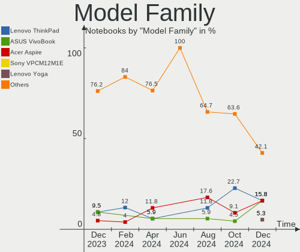
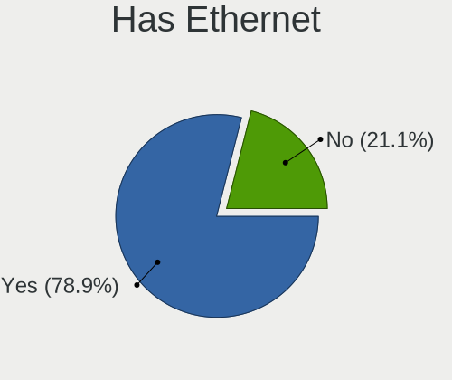
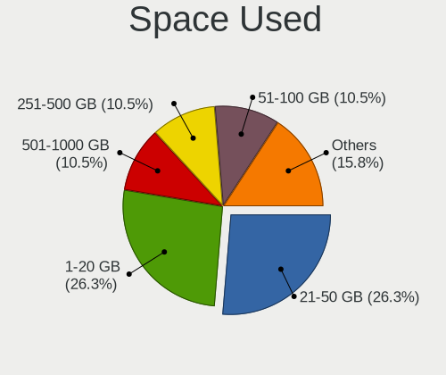
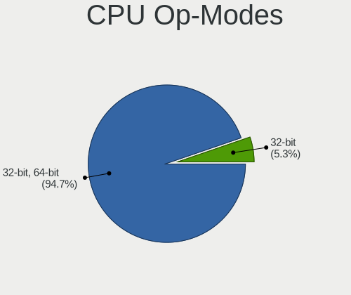
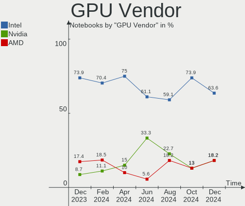
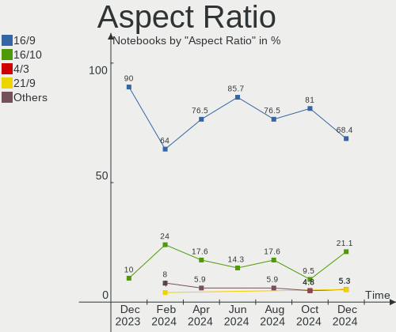
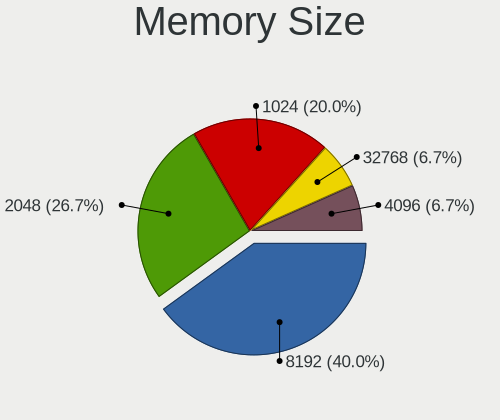
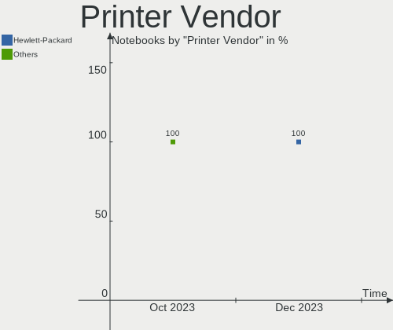
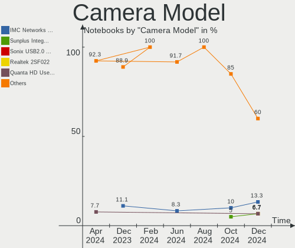

LMDE - Hardware Trends (Notebooks)
----------------------------------

A project to identify most popular hardware characteristics and track their change
over time based on data collected by Linux users at https://Linux-Hardware.org.

Anyone can contribute to this report by the [hw-probe](https://github.com/linuxhw/hw-probe) tool:

    sudo -E hw-probe -all -upload

This report is for one last month. Overall report since the beginning of time: [TestDays](https://github.com/linuxhw/TestDays)

Period: Oct, 2023.

Contents
--------

* [ System ](#system)
  - [ OS                       ](#os)
  - [ OS Family                ](#os-family)
  - [ Kernel                   ](#kernel)
  - [ Kernel Family            ](#kernel-family)
  - [ Kernel Major Ver.        ](#kernel-major-ver)
  - [ Arch                     ](#arch)
  - [ DE                       ](#de)
  - [ Display Server           ](#display-server)
  - [ Display Manager          ](#display-manager)
  - [ OS Lang                  ](#os-lang)
  - [ Boot Mode                ](#boot-mode)
  - [ Filesystem               ](#filesystem)
  - [ Part. scheme             ](#part-scheme)
  - [ Dual Boot with Linux/BSD ](#dual-boot-with-linuxbsd)
  - [ Dual Boot (Win)          ](#dual-boot-win)

* [ Board ](#board)
  - [ Vendor                   ](#vendor)
  - [ Model                    ](#model)
  - [ Model Family             ](#model-family)
  - [ MFG Year                 ](#mfg-year)
  - [ Form Factor              ](#form-factor)
  - [ Secure Boot              ](#secure-boot)
  - [ Coreboot                 ](#coreboot)
  - [ RAM Size                 ](#ram-size)
  - [ RAM Used                 ](#ram-used)
  - [ Total Drives             ](#total-drives)
  - [ Has CD-ROM               ](#has-cd-rom)
  - [ Has Ethernet             ](#has-ethernet)
  - [ Has WiFi                 ](#has-wifi)
  - [ Has Bluetooth            ](#has-bluetooth)

* [ Location ](#location)
  - [ Country                  ](#country)
  - [ City                     ](#city)

* [ Drives ](#drives)
  - [ Drive Vendor             ](#drive-vendor)
  - [ Drive Model              ](#drive-model)
  - [ HDD Vendor               ](#hdd-vendor)
  - [ SSD Vendor               ](#ssd-vendor)
  - [ Drive Kind               ](#drive-kind)
  - [ Drive Connector          ](#drive-connector)
  - [ Drive Size               ](#drive-size)
  - [ Space Total              ](#space-total)
  - [ Space Used               ](#space-used)
  - [ Malfunc. Drives          ](#malfunc-drives)
  - [ Malfunc. Drive Vendor    ](#malfunc-drive-vendor)
  - [ Malfunc. HDD Vendor      ](#malfunc-hdd-vendor)
  - [ Malfunc. Drive Kind      ](#malfunc-drive-kind)
  - [ Failed Drives            ](#failed-drives)
  - [ Failed Drive Vendor      ](#failed-drive-vendor)
  - [ Drive Status             ](#drive-status)

* [ Storage controller ](#storage-controller)
  - [ Storage Vendor           ](#storage-vendor)
  - [ Storage Model            ](#storage-model)
  - [ Storage Kind             ](#storage-kind)

* [ Processor ](#processor)
  - [ CPU Vendor               ](#cpu-vendor)
  - [ CPU Model                ](#cpu-model)
  - [ CPU Model Family         ](#cpu-model-family)
  - [ CPU Cores                ](#cpu-cores)
  - [ CPU Sockets              ](#cpu-sockets)
  - [ CPU Threads              ](#cpu-threads)
  - [ CPU Op-Modes             ](#cpu-op-modes)
  - [ CPU Microcode            ](#cpu-microcode)
  - [ CPU Microarch            ](#cpu-microarch)

* [ Graphics ](#graphics)
  - [ GPU Vendor               ](#gpu-vendor)
  - [ GPU Model                ](#gpu-model)
  - [ GPU Combo                ](#gpu-combo)
  - [ GPU Driver               ](#gpu-driver)
  - [ GPU Memory               ](#gpu-memory)

* [ Monitor ](#monitor)
  - [ Monitor Vendor           ](#monitor-vendor)
  - [ Monitor Model            ](#monitor-model)
  - [ Monitor Resolution       ](#monitor-resolution)
  - [ Monitor Diagonal         ](#monitor-diagonal)
  - [ Monitor Width            ](#monitor-width)
  - [ Aspect Ratio             ](#aspect-ratio)
  - [ Monitor Area             ](#monitor-area)
  - [ Pixel Density            ](#pixel-density)
  - [ Multiple Monitors        ](#multiple-monitors)

* [ Network ](#network)
  - [ Net Controller Vendor    ](#net-controller-vendor)
  - [ Net Controller Model     ](#net-controller-model)
  - [ Wireless Vendor          ](#wireless-vendor)
  - [ Wireless Model           ](#wireless-model)
  - [ Ethernet Vendor          ](#ethernet-vendor)
  - [ Ethernet Model           ](#ethernet-model)
  - [ Net Controller Kind      ](#net-controller-kind)
  - [ Used Controller          ](#used-controller)
  - [ NICs                     ](#nics)
  - [ IPv6                     ](#ipv6)

* [ Bluetooth ](#bluetooth)
  - [ Bluetooth Vendor         ](#bluetooth-vendor)
  - [ Bluetooth Model          ](#bluetooth-model)

* [ Sound ](#sound)
  - [ Sound Vendor             ](#sound-vendor)
  - [ Sound Model              ](#sound-model)

* [ Memory ](#memory)
  - [ Memory Vendor            ](#memory-vendor)
  - [ Memory Model             ](#memory-model)
  - [ Memory Kind              ](#memory-kind)
  - [ Memory Form Factor       ](#memory-form-factor)
  - [ Memory Size              ](#memory-size)
  - [ Memory Speed             ](#memory-speed)

* [ Printers & scanners ](#printers--scanners)
  - [ Printer Vendor           ](#printer-vendor)
  - [ Printer Model            ](#printer-model)
  - [ Scanner Vendor           ](#scanner-vendor)
  - [ Scanner Model            ](#scanner-model)

* [ Camera ](#camera)
  - [ Camera Vendor            ](#camera-vendor)
  - [ Camera Model             ](#camera-model)

* [ Security ](#security)
  - [ Fingerprint Vendor       ](#fingerprint-vendor)
  - [ Fingerprint Model        ](#fingerprint-model)
  - [ Chipcard Vendor          ](#chipcard-vendor)
  - [ Chipcard Model           ](#chipcard-model)

* [ Unsupported ](#unsupported)
  - [ Unsupported Devices      ](#unsupported-devices)
  - [ Unsupported Device Types ](#unsupported-device-types)

System
------

OS
--

Installed operating systems

| Name   | Notebooks | Percent |
|--------|-----------|---------|
| LMDE 6 | 26        | 86.67%  |
| LMDE 5 | 4         | 13.33%  |

OS Family
---------

OS without a version

| Name | Notebooks | Percent |
|------|-----------|---------|
| LMDE | 30        | 100%    |

Kernel
------

Version of the Linux kernel

| Version         | Notebooks | Percent |
|-----------------|-----------|---------|
| 6.1.0-13-amd64  | 17        | 56.67%  |
| 6.1.0-12-amd64  | 10        | 33.33%  |
| 5.10.0-23-amd64 | 2         | 6.67%   |
| 5.10.0-25-amd64 | 1         | 3.33%   |

Kernel Family
-------------

Linux kernel without a distro release

| Version | Notebooks | Percent |
|---------|-----------|---------|
| 6.1.0   | 27        | 90%     |
| 5.10.0  | 3         | 10%     |

Kernel Major Ver.
-----------------

Linux kernel major version

| Version | Notebooks | Percent |
|---------|-----------|---------|
| 6.1     | 27        | 90%     |
| 5.10    | 3         | 10%     |

Arch
----

OS architecture (x86_64, i586, etc.)

| Name   | Notebooks | Percent |
|--------|-----------|---------|
| x86_64 | 30        | 100%    |

DE
--

Desktop Environment

| Name       | Notebooks | Percent |
|------------|-----------|---------|
| X-Cinnamon | 29        | 96.67%  |
| Cinnamon   | 1         | 3.33%   |

Display Server
--------------

X11 or Wayland

| Name | Notebooks | Percent |
|------|-----------|---------|
| X11  | 30        | 100%    |

Display Manager
---------------

SDDM, LightDM, etc.

| Name    | Notebooks | Percent |
|---------|-----------|---------|
| LightDM | 16        | 53.33%  |
| Unknown | 14        | 46.67%  |

OS Lang
-------

Language

| Lang  | Notebooks | Percent |
|-------|-----------|---------|
| en_US | 13        | 43.33%  |
| de_DE | 4         | 13.33%  |
| pt_BR | 3         | 10%     |
| it_IT | 3         | 10%     |
| fr_FR | 3         | 10%     |
| ru_RU | 1         | 3.33%   |
| hu_HU | 1         | 3.33%   |
| fr_CA | 1         | 3.33%   |
| es_EC | 1         | 3.33%   |

Boot Mode
---------

EFI or BIOS

| Mode | Notebooks | Percent |
|------|-----------|---------|
| EFI  | 18        | 60%     |
| BIOS | 12        | 40%     |

Filesystem
----------

Type of filesystem

| Type    | Notebooks | Percent |
|---------|-----------|---------|
| Ext4    | 25        | 83.33%  |
| Overlay | 3         | 10%     |
| Tmpfs   | 2         | 6.67%   |

Part. scheme
------------

Scheme of partitioning

| Type    | Notebooks | Percent |
|---------|-----------|---------|
| Unknown | 14        | 46.67%  |
| GPT     | 13        | 43.33%  |
| MBR     | 3         | 10%     |

Dual Boot with Linux/BSD
------------------------

Hosting more than one Linux/BSD

| Dual boot | Notebooks | Percent |
|-----------|-----------|---------|
| No        | 28        | 93.33%  |
| Yes       | 2         | 6.67%   |

Dual Boot (Win)
---------------

Hosting Linux and Windows

| Dual boot | Notebooks | Percent |
|-----------|-----------|---------|
| No        | 23        | 76.67%  |
| Yes       | 7         | 23.33%  |

Board
-----

Vendor
------

Motherboard manufacturer

| Name                   | Notebooks | Percent |
|------------------------|-----------|---------|
| Hewlett-Packard        | 10        | 33.33%  |
| Lenovo                 | 7         | 23.33%  |
| ASUSTek Computer       | 4         | 13.33%  |
| Alienware              | 2         | 6.67%   |
| Toshiba                | 1         | 3.33%   |
| Framework              | 1         | 3.33%   |
| Dell                   | 1         | 3.33%   |
| Avell High Performance | 1         | 3.33%   |
| Apple                  | 1         | 3.33%   |
| Acer                   | 1         | 3.33%   |
| Unknown                | 1         | 3.33%   |

Model
-----

Motherboard model

| Name                                     | Notebooks | Percent |
|------------------------------------------|-----------|---------|
| Toshiba Satellite L745                   | 1         | 3.33%   |
| Lenovo Yoga Slim 7 14ARE05 82A2          | 1         | 3.33%   |
| Lenovo ThinkPad T490 20N3S7DP00          | 1         | 3.33%   |
| Lenovo ThinkPad T460s 20FAS2G900         | 1         | 3.33%   |
| Lenovo ThinkPad T430 2349STC             | 1         | 3.33%   |
| Lenovo ThinkPad T420s 4176W23            | 1         | 3.33%   |
| Lenovo ThinkPad T420 4236W1Y             | 1         | 3.33%   |
| Lenovo ThinkPad S1 Yoga 20CD000MFR       | 1         | 3.33%   |
| HP Pavilion Sleekbook 14 PC              | 1         | 3.33%   |
| HP Pavilion Laptop 15-cw1xxx             | 1         | 3.33%   |
| HP Pavilion Laptop 15-cs3xxx             | 1         | 3.33%   |
| HP Pavilion dv7                          | 1         | 3.33%   |
| HP Pavilion dv6                          | 1         | 3.33%   |
| HP Notebook                              | 1         | 3.33%   |
| HP ENVY Laptop 17-cr0xxx                 | 1         | 3.33%   |
| HP ENVY dv7                              | 1         | 3.33%   |
| HP EliteBook 840 G6                      | 1         | 3.33%   |
| HP 250 G7 Notebook PC                    | 1         | 3.33%   |
| Framework Laptop                         | 1         | 3.33%   |
| Dell Latitude E6520                      | 1         | 3.33%   |
| Avell High Performance 1513 Mxti         | 1         | 3.33%   |
| ASUS X540YA                              | 1         | 3.33%   |
| ASUS X505BP                              | 1         | 3.33%   |
| ASUS VivoBook_ASUSLaptop X515EA_R1500EA  | 1         | 3.33%   |
| ASUS VivoBook_ASUSLaptop X1605VA_X1605VA | 1         | 3.33%   |
| Apple MacBookPro9,2                      | 1         | 3.33%   |
| Alienware m15                            | 1         | 3.33%   |
| Alienware 13                             | 1         | 3.33%   |
| Acer Aspire E1-572G                      | 1         | 3.33%   |
| Unknown                                  | 1         | 3.33%   |

Model Family
------------

Motherboard model prefix

| Name                        | Notebooks | Percent |
|-----------------------------|-----------|---------|
| Lenovo ThinkPad             | 6         | 20%     |
| HP Pavilion                 | 5         | 16.67%  |
| HP ENVY                     | 2         | 6.67%   |
| ASUS VivoBook               | 2         | 6.67%   |
| Toshiba Satellite           | 1         | 3.33%   |
| Lenovo Yoga                 | 1         | 3.33%   |
| HP Notebook                 | 1         | 3.33%   |
| HP EliteBook                | 1         | 3.33%   |
| HP 250                      | 1         | 3.33%   |
| Framework Laptop            | 1         | 3.33%   |
| Dell Latitude               | 1         | 3.33%   |
| Avell High Performance 1513 | 1         | 3.33%   |
| ASUS X540YA                 | 1         | 3.33%   |
| ASUS X505BP                 | 1         | 3.33%   |
| Apple MacBookPro9           | 1         | 3.33%   |
| Alienware m15               | 1         | 3.33%   |
| Alienware 13                | 1         | 3.33%   |
| Acer Aspire                 | 1         | 3.33%   |
| Unknown                     | 1         | 3.33%   |

MFG Year
--------

Motherboard manufacture year

| Year    | Notebooks | Percent |
|---------|-----------|---------|
| 2019    | 4         | 13.33%  |
| 2012    | 4         | 13.33%  |
| 2011    | 4         | 13.33%  |
| 2023    | 2         | 6.67%   |
| 2018    | 2         | 6.67%   |
| 2017    | 2         | 6.67%   |
| 2016    | 2         | 6.67%   |
| 2014    | 2         | 6.67%   |
| 2008    | 2         | 6.67%   |
| 2022    | 1         | 3.33%   |
| 2021    | 1         | 3.33%   |
| 2020    | 1         | 3.33%   |
| 2015    | 1         | 3.33%   |
| 2013    | 1         | 3.33%   |
| Unknown | 1         | 3.33%   |

Form Factor
-----------

Physical design of the computer

| Name     | Notebooks | Percent |
|----------|-----------|---------|
| Notebook | 30        | 100%    |

Secure Boot
-----------

Enabled or disabled

| State    | Notebooks | Percent |
|----------|-----------|---------|
| Disabled | 28        | 93.33%  |
| Enabled  | 2         | 6.67%   |

Coreboot
--------

Have coreboot on board

| Used | Notebooks | Percent |
|------|-----------|---------|
| No   | 30        | 100%    |

RAM Size
--------

Total RAM memory

| Size in GB  | Notebooks | Percent |
|-------------|-----------|---------|
| 4.01-8.0    | 13        | 43.33%  |
| 16.01-24.0  | 6         | 20%     |
| 8.01-16.0   | 4         | 13.33%  |
| 3.01-4.0    | 3         | 10%     |
| 32.01-64.0  | 2         | 6.67%   |
| 64.01-256.0 | 1         | 3.33%   |
| 1.01-2.0    | 1         | 3.33%   |

RAM Used
--------

Used RAM memory

| Used GB    | Notebooks | Percent |
|------------|-----------|---------|
| 2.01-3.0   | 11        | 36.67%  |
| 1.01-2.0   | 7         | 23.33%  |
| 4.01-8.0   | 5         | 16.67%  |
| 3.01-4.0   | 4         | 13.33%  |
| 16.01-24.0 | 1         | 3.33%   |
| 8.01-16.0  | 1         | 3.33%   |
| 0.51-1.0   | 1         | 3.33%   |

Total Drives
------------

Number of drives on board

| Drives | Notebooks | Percent |
|--------|-----------|---------|
| 1      | 17        | 56.67%  |
| 2      | 11        | 36.67%  |
| 3      | 2         | 6.67%   |

Has CD-ROM
----------

Has CD-ROM on board

| Presented | Notebooks | Percent |
|-----------|-----------|---------|
| No        | 19        | 63.33%  |
| Yes       | 11        | 36.67%  |

Has Ethernet
------------

Has Ethernet on board

| Presented | Notebooks | Percent |
|-----------|-----------|---------|
| Yes       | 26        | 86.67%  |
| No        | 4         | 13.33%  |

Has WiFi
--------

Has WiFi module

| Presented | Notebooks | Percent |
|-----------|-----------|---------|
| Yes       | 29        | 96.67%  |
| No        | 1         | 3.33%   |

Has Bluetooth
-------------

Has Bluetooth module

| Presented | Notebooks | Percent |
|-----------|-----------|---------|
| Yes       | 25        | 83.33%  |
| No        | 5         | 16.67%  |

Location
--------

Country
-------

Geographic location (country)

| Country      | Notebooks | Percent |
|--------------|-----------|---------|
| Italy        | 5         | 16.67%  |
| Germany      | 4         | 13.33%  |
| USA          | 3         | 10%     |
| France       | 3         | 10%     |
| Brazil       | 3         | 10%     |
| Ecuador      | 2         | 6.67%   |
| UK           | 1         | 3.33%   |
| Saudi Arabia | 1         | 3.33%   |
| Russia       | 1         | 3.33%   |
| Romania      | 1         | 3.33%   |
| Puerto Rico  | 1         | 3.33%   |
| Philippines  | 1         | 3.33%   |
| Netherlands  | 1         | 3.33%   |
| Malaysia     | 1         | 3.33%   |
| Hungary      | 1         | 3.33%   |
| Canada       | 1         | 3.33%   |

City
----

Geographic location (city)

| City                     | Notebooks | Percent |
|--------------------------|-----------|---------|
| Bologna                  | 2         | 6.67%   |
| Toa Baja                 | 1         | 3.33%   |
| Sao Paulo                | 1         | 3.33%   |
| San Martino Buon Albergo | 1         | 3.33%   |
| Rostov-on-Don            | 1         | 3.33%   |
| Romford                  | 1         | 3.33%   |
| Paris                    | 1         | 3.33%   |
| Morlaix                  | 1         | 3.33%   |
| Montreal                 | 1         | 3.33%   |
| Milano                   | 1         | 3.33%   |
| Manchester               | 1         | 3.33%   |
| Magdeburg                | 1         | 3.33%   |
| Leipzig                  | 1         | 3.33%   |
| Kuala Lumpur             | 1         | 3.33%   |
| Kreuztal                 | 1         | 3.33%   |
| Itajuba                  | 1         | 3.33%   |
| Hechingen                | 1         | 3.33%   |
| Guayaquil                | 1         | 3.33%   |
| Davao City               | 1         | 3.33%   |
| Dammam                   | 1         | 3.33%   |
| Cuenca                   | 1         | 3.33%   |
| Cormeilles-en-Parisis    | 1         | 3.33%   |
| Catania                  | 1         | 3.33%   |
| Bucharest                | 1         | 3.33%   |
| Belo Horizonte           | 1         | 3.33%   |
| Badacsonytomaj           | 1         | 3.33%   |
| Austin                   | 1         | 3.33%   |
| Arlington                | 1         | 3.33%   |
| Aalten                   | 1         | 3.33%   |

Drives
------

Drive Vendor
------------

Hard drive vendors

| Vendor                    | Notebooks | Drives | Percent |
|---------------------------|-----------|--------|---------|
| Samsung Electronics       | 9         | 9      | 20%     |
| Seagate                   | 7         | 7      | 15.56%  |
| WDC                       | 3         | 3      | 6.67%   |
| Toshiba                   | 3         | 3      | 6.67%   |
| China                     | 3         | 3      | 6.67%   |
| Unknown                   | 2         | 2      | 4.44%   |
| SanDisk                   | 2         | 2      | 4.44%   |
| Kingston                  | 2         | 2      | 4.44%   |
| JMicron Technology        | 2         | 2      | 4.44%   |
| Intel                     | 2         | 2      | 4.44%   |
| Unknown                   | 2         | 2      | 4.44%   |
| WALRAM                    | 1         | 1      | 2.22%   |
| Transcend                 | 1         | 1      | 2.22%   |
| SPCC                      | 1         | 1      | 2.22%   |
| SK hynix                  | 1         | 1      | 2.22%   |
| Micron/Crucial Technology | 1         | 1      | 2.22%   |
| Hewlett-Packard           | 1         | 1      | 2.22%   |
| Crucial                   | 1         | 1      | 2.22%   |
| Apacer                    | 1         | 1      | 2.22%   |

Drive Model
-----------

Hard drive models

| Model                                             | Notebooks | Percent |
|---------------------------------------------------|-----------|---------|
| JMicron Generic 256GB                             | 2         | 4.44%   |
| Unknown                                           | 2         | 4.44%   |
| WDC WDS500G2B0A 500GB SSD                         | 1         | 2.22%   |
| WDC WD10SPZX-60Z10T0 1TB                          | 1         | 2.22%   |
| WDC WD10JPVX-75JC3T0 1TB                          | 1         | 2.22%   |
| WALRAM 120G                                       | 1         | 2.22%   |
| Unknown USB DISK 3.2 1TB                          | 1         | 2.22%   |
| Unknown SN128  128GB                              | 1         | 2.22%   |
| Transcend TS512GMTS430S 512GB SSD                 | 1         | 2.22%   |
| Toshiba XG6 NVMe SSD Controller 256GB             | 1         | 2.22%   |
| Toshiba MQ04ABF100 1TB                            | 1         | 2.22%   |
| Toshiba MQ01ABD100 1TB                            | 1         | 2.22%   |
| SPCC Solid State Disk 480GB                       | 1         | 2.22%   |
| SK hynix BC501 HFM256GDJTNG-8310A 256GB           | 1         | 2.22%   |
| Seagate ST9500325AS 500GB                         | 1         | 2.22%   |
| Seagate ST500LT012-1DG142 500GB                   | 1         | 2.22%   |
| Seagate ST500LM021-1KJ152 500GB                   | 1         | 2.22%   |
| Seagate ST1000LX015-1U7172 1TB                    | 1         | 2.22%   |
| Seagate ST1000LM035-1RK172 1TB                    | 1         | 2.22%   |
| Seagate ST1000LM014-1EJ164 1TB                    | 1         | 2.22%   |
| Seagate Expansion Desk 3TB                        | 1         | 2.22%   |
| SanDisk SSD PLUS 480GB                            | 1         | 2.22%   |
| SanDisk NVMe SSD Drive 2TB                        | 1         | 2.22%   |
| Samsung SSD 970 EVO Plus 2TB                      | 1         | 2.22%   |
| Samsung SSD 850 EVO 500GB                         | 1         | 2.22%   |
| Samsung SSD 840 EVO 250GB                         | 1         | 2.22%   |
| Samsung NVMe SSD Controller SM981/PM981/PM983 1TB | 1         | 2.22%   |
| Samsung MZVLQ1T0HBLB-00BH1 1TB                    | 1         | 2.22%   |
| Samsung MZVLQ1T0HALB-00000 1TB                    | 1         | 2.22%   |
| Samsung MZVLB512HBJQ-000H1 512GB                  | 1         | 2.22%   |
| Samsung MZVL4256HBJD-00BTW 256GB                  | 1         | 2.22%   |
| Samsung MZMPC032HBCD-000H1 32GB SSD               | 1         | 2.22%   |
| Micron/Crucial CT1000P5PSSD8 1TB                  | 1         | 2.22%   |
| Kingston SUV400S37240G 240GB SSD                  | 1         | 2.22%   |
| Kingston SA400S37480G 480GB SSD                   | 1         | 2.22%   |
| Intel SSDPEKKF256G8L 256GB                        | 1         | 2.22%   |
| Intel HBRPEKNX0202AH 512GB                        | 1         | 2.22%   |
| HP SSD S650 120GB                                 | 1         | 2.22%   |
| Crucial CT275MX300SSD4 275GB                      | 1         | 2.22%   |
| China SSD 240GB                                   | 1         | 2.22%   |

HDD Vendor
----------

Hard disk drive vendors

| Vendor  | Notebooks | Drives | Percent |
|---------|-----------|--------|---------|
| Seagate | 7         | 7      | 63.64%  |
| WDC     | 2         | 2      | 18.18%  |
| Toshiba | 2         | 2      | 18.18%  |

SSD Vendor
----------

Solid state drive vendors

| Vendor              | Notebooks | Drives | Percent |
|---------------------|-----------|--------|---------|
| Samsung Electronics | 3         | 3      | 20%     |
| China               | 3         | 3      | 20%     |
| Kingston            | 2         | 2      | 13.33%  |
| WDC                 | 1         | 1      | 6.67%   |
| Transcend           | 1         | 1      | 6.67%   |
| SPCC                | 1         | 1      | 6.67%   |
| SanDisk             | 1         | 1      | 6.67%   |
| Hewlett-Packard     | 1         | 1      | 6.67%   |
| Crucial             | 1         | 1      | 6.67%   |
| Apacer              | 1         | 1      | 6.67%   |

Drive Kind
----------

HDD or SSD

| Kind    | Notebooks | Drives | Percent |
|---------|-----------|--------|---------|
| NVMe    | 13        | 14     | 30.95%  |
| SSD     | 13        | 15     | 30.95%  |
| HDD     | 11        | 11     | 26.19%  |
| MMC     | 3         | 3      | 7.14%   |
| Unknown | 2         | 2      | 4.76%   |

Drive Connector
---------------

SATA, SAS, NVMe, etc.

| Type | Notebooks | Drives | Percent |
|------|-----------|--------|---------|
| SATA | 21        | 26     | 53.85%  |
| NVMe | 12        | 12     | 30.77%  |
| SAS  | 3         | 4      | 7.69%   |
| MMC  | 3         | 3      | 7.69%   |

Drive Size
----------

Size of hard drive

| Size in TB | Notebooks | Drives | Percent |
|------------|-----------|--------|---------|
| 0.01-0.5   | 14        | 16     | 58.33%  |
| 0.51-1.0   | 9         | 9      | 37.5%   |
| 2.01-3.0   | 1         | 1      | 4.17%   |

Space Total
-----------

Amount of disk space available on the file system

| Size in GB     | Notebooks | Percent |
|----------------|-----------|---------|
| 101-250        | 9         | 30%     |
| 501-1000       | 7         | 23.33%  |
| 251-500        | 5         | 16.67%  |
| 1001-2000      | 4         | 13.33%  |
| 1-20           | 3         | 10%     |
| More than 3000 | 1         | 3.33%   |
| 2001-3000      | 1         | 3.33%   |

Space Used
----------

Amount of used disk space

| Used GB   | Notebooks | Percent |
|-----------|-----------|---------|
| 51-100    | 8         | 26.67%  |
| 1-20      | 7         | 23.33%  |
| 21-50     | 5         | 16.67%  |
| 101-250   | 4         | 13.33%  |
| 251-500   | 3         | 10%     |
| 501-1000  | 2         | 6.67%   |
| 1001-2000 | 1         | 3.33%   |

Malfunc. Drives
---------------

Drive models with a malfunction

| Model                             | Notebooks | Drives | Percent |
|-----------------------------------|-----------|--------|---------|
| Transcend TS512GMTS430S 512GB SSD | 1         | 1      | 33.33%  |
| Seagate ST1000LM014-1EJ164 1TB    | 1         | 1      | 33.33%  |
| Kingston SUV400S37240G 240GB SSD  | 1         | 1      | 33.33%  |

Malfunc. Drive Vendor
---------------------

Vendors of faulty drives

| Vendor    | Notebooks | Drives | Percent |
|-----------|-----------|--------|---------|
| Transcend | 1         | 1      | 33.33%  |
| Seagate   | 1         | 1      | 33.33%  |
| Kingston  | 1         | 1      | 33.33%  |

Malfunc. HDD Vendor
-------------------

Vendors of faulty HDD drives

| Vendor  | Notebooks | Drives | Percent |
|---------|-----------|--------|---------|
| Seagate | 1         | 1      | 100%    |

Malfunc. Drive Kind
-------------------

Kinds of faulty drives

| Kind | Notebooks | Drives | Percent |
|------|-----------|--------|---------|
| SSD  | 2         | 2      | 66.67%  |
| HDD  | 1         | 1      | 33.33%  |

Failed Drives
-------------

Failed drive models

Zero info for selected period =(

Failed Drive Vendor
-------------------

Failed drive vendors

Zero info for selected period =(

Drive Status
------------

Number of failed and malfunc. drives

| Status   | Notebooks | Drives | Percent |
|----------|-----------|--------|---------|
| Detected | 19        | 25     | 51.35%  |
| Works    | 15        | 17     | 40.54%  |
| Malfunc  | 3         | 3      | 8.11%   |

Storage controller
------------------

Storage Vendor
--------------

Storage controller vendors

| Vendor                       | Notebooks | Percent |
|------------------------------|-----------|---------|
| Intel                        | 21        | 60%     |
| Samsung Electronics          | 6         | 17.14%  |
| AMD                          | 4         | 11.43%  |
| Toshiba America Info Systems | 1         | 2.86%   |
| SK hynix                     | 1         | 2.86%   |
| SanDisk                      | 1         | 2.86%   |
| Micron/Crucial Technology    | 1         | 2.86%   |

Storage Model
-------------

Storage controller models

| Model                                                                        | Notebooks | Percent |
|------------------------------------------------------------------------------|-----------|---------|
| Intel 82801 Mobile SATA Controller [RAID mode]                               | 7         | 18.42%  |
| Intel 6 Series/C200 Series Chipset Family 6 port Mobile SATA AHCI Controller | 5         | 13.16%  |
| AMD FCH SATA Controller [AHCI mode]                                          | 4         | 10.53%  |
| Samsung NVMe SSD Controller SM981/PM981/PM983                                | 3         | 7.89%   |
| Samsung NVMe SSD Controller 980 (DRAM-less)                                  | 2         | 5.26%   |
| Intel 8 Series SATA Controller 1 [AHCI mode]                                 | 2         | 5.26%   |
| Intel 7 Series Chipset Family 6-port SATA Controller [AHCI mode]             | 2         | 5.26%   |
| Toshiba America Info Systems XG6 NVMe SSD Controller                         | 1         | 2.63%   |
| SK hynix BC501 NVMe Solid State Drive                                        | 1         | 2.63%   |
| SanDisk WD Black SN770 / PC SN740 256GB / PC SN560 (DRAM-less) NVMe SSD      | 1         | 2.63%   |
| Samsung NVMe SSD Controller PM9B1 (DRAM-less)                                | 1         | 2.63%   |
| Micron/Crucial P5 Plus NVMe PCIe SSD                                         | 1         | 2.63%   |
| Intel Wildcat Point-LP SATA Controller [AHCI Mode]                           | 1         | 2.63%   |
| Intel Volume Management Device NVMe RAID Controller Intel Corporation        | 1         | 2.63%   |
| Intel Volume Management Device NVMe RAID Controller                          | 1         | 2.63%   |
| Intel Tiger Lake-LP SATA Controller                                          | 1         | 2.63%   |
| Intel SSD DC P4101/Pro 7600p/760p/E 6100p Series                             | 1         | 2.63%   |
| Intel Optane NVME SSD H10 with Solid State Storage [Teton Glacier]           | 1         | 2.63%   |
| Intel NVMe Optane Memory Series                                              | 1         | 2.63%   |
| Intel 5 Series/3400 Series Chipset 4 port SATA AHCI Controller               | 1         | 2.63%   |

Storage Kind
------------

Kind of storage controller (IDE, SATA, NVMe, SAS, ...)

| Kind | Notebooks | Percent |
|------|-----------|---------|
| SATA | 16        | 43.24%  |
| NVMe | 12        | 32.43%  |
| RAID | 9         | 24.32%  |

Processor
---------

CPU Vendor
----------

Processor vendors

| Vendor | Notebooks | Percent |
|--------|-----------|---------|
| Intel  | 25        | 83.33%  |
| AMD    | 5         | 16.67%  |

CPU Model
---------

Processor models

| Model                                         | Notebooks | Percent |
|-----------------------------------------------|-----------|---------|
| Intel Core i5-4200U CPU @ 1.60GHz             | 2         | 6.67%   |
| Intel Core i7-9750H CPU @ 2.60GHz             | 1         | 3.33%   |
| Intel Core i7-8665U CPU @ 1.90GHz             | 1         | 3.33%   |
| Intel Core i7-7700HQ CPU @ 2.80GHz            | 1         | 3.33%   |
| Intel Core i7-6600U CPU @ 2.60GHz             | 1         | 3.33%   |
| Intel Core i7-3630QM CPU @ 2.40GHz            | 1         | 3.33%   |
| Intel Core i7-2640M CPU @ 2.80GHz             | 1         | 3.33%   |
| Intel Core i7-2630QM CPU @ 2.00GHz            | 1         | 3.33%   |
| Intel Core i7-2620M CPU @ 2.70GHz             | 1         | 3.33%   |
| Intel Core i7-1065G7 CPU @ 1.30GHz            | 1         | 3.33%   |
| Intel Core i5-9300H CPU @ 2.40GHz             | 1         | 3.33%   |
| Intel Core i5-8365U CPU @ 1.60GHz             | 1         | 3.33%   |
| Intel Core i5-8265U CPU @ 1.60GHz             | 1         | 3.33%   |
| Intel Core i5-5200U CPU @ 2.20GHz             | 1         | 3.33%   |
| Intel Core i5-3320M CPU @ 2.60GHz             | 1         | 3.33%   |
| Intel Core i5-3317U CPU @ 1.70GHz             | 1         | 3.33%   |
| Intel Core i5-3210M CPU @ 2.50GHz             | 1         | 3.33%   |
| Intel Core i5-2450M CPU @ 2.50GHz             | 1         | 3.33%   |
| Intel Core i5 CPU M 450 @ 2.40GHz             | 1         | 3.33%   |
| Intel Core i3-2330M CPU @ 2.20GHz             | 1         | 3.33%   |
| Intel 13th Gen Core i9-13900H                 | 1         | 3.33%   |
| Intel 12th Gen Core i7-1260P                  | 1         | 3.33%   |
| Intel 11th Gen Core i7-1165G7 @ 2.80GHz       | 1         | 3.33%   |
| Intel 11th Gen Core i3-1115G4 @ 3.00GHz       | 1         | 3.33%   |
| AMD Ryzen 5 4500U with Radeon Graphics        | 1         | 3.33%   |
| AMD Ryzen 5 3500U with Radeon Vega Mobile Gfx | 1         | 3.33%   |
| AMD E2-6110 APU with AMD Radeon R2 Graphics   | 1         | 3.33%   |
| AMD E1-6010 APU with AMD Radeon R2 Graphics   | 1         | 3.33%   |
| AMD A9-9420 RADEON R5, 5 COMPUTE CORES 2C+3G  | 1         | 3.33%   |

CPU Model Family
----------------

Processor model prefix

| Model         | Notebooks | Percent |
|---------------|-----------|---------|
| Intel Core i5 | 11        | 36.67%  |
| Intel Core i7 | 9         | 30%     |
| Other         | 5         | 16.67%  |
| AMD Ryzen 5   | 2         | 6.67%   |
| Intel Core i3 | 1         | 3.33%   |
| AMD E2        | 1         | 3.33%   |
| AMD E1        | 1         | 3.33%   |

CPU Cores
---------

Number of processor cores

| Number | Notebooks | Percent |
|--------|-----------|---------|
| 2      | 15        | 50%     |
| 4      | 11        | 36.67%  |
| 6      | 2         | 6.67%   |
| 14     | 1         | 3.33%   |
| 12     | 1         | 3.33%   |

CPU Sockets
-----------

Number of sockets

| Number | Notebooks | Percent |
|--------|-----------|---------|
| 1      | 30        | 100%    |

CPU Threads
-----------

Threads per core (Hyper-Threading)

| Number | Notebooks | Percent |
|--------|-----------|---------|
| 2      | 25        | 83.33%  |
| 1      | 5         | 16.67%  |

CPU Op-Modes
------------

CPU Operation Modes (32-bit, 64-bit)

| Op mode        | Notebooks | Percent |
|----------------|-----------|---------|
| 32-bit, 64-bit | 30        | 100%    |

CPU Microcode
-------------

Microcode number

| Number     | Notebooks | Percent |
|------------|-----------|---------|
| 0x206a7    | 5         | 16.67%  |
| 0x306a9    | 4         | 13.33%  |
| Unknown    | 3         | 10%     |
| 0x806ec    | 2         | 6.67%   |
| 0x806c1    | 2         | 6.67%   |
| 0x40651    | 2         | 6.67%   |
| 0xb06a2    | 1         | 3.33%   |
| 0x906e9    | 1         | 3.33%   |
| 0x906a3    | 1         | 3.33%   |
| 0x806eb    | 1         | 3.33%   |
| 0x706e5    | 1         | 3.33%   |
| 0x406e3    | 1         | 3.33%   |
| 0x306d4    | 1         | 3.33%   |
| 0x20655    | 1         | 3.33%   |
| 0x08600106 | 1         | 3.33%   |
| 0x08108109 | 1         | 3.33%   |
| 0x07030106 | 1         | 3.33%   |
| 0x06006704 | 1         | 3.33%   |

CPU Microarch
-------------

Microarchitecture

| Name             | Notebooks | Percent |
|------------------|-----------|---------|
| KabyLake         | 6         | 20%     |
| SandyBridge      | 5         | 16.67%  |
| IvyBridge        | 4         | 13.33%  |
| TigerLake        | 2         | 6.67%   |
| Puma             | 2         | 6.67%   |
| Haswell          | 2         | 6.67%   |
| Alderlake Hybrid | 2         | 6.67%   |
| Zen+             | 1         | 3.33%   |
| Zen 2            | 1         | 3.33%   |
| Westmere         | 1         | 3.33%   |
| Skylake          | 1         | 3.33%   |
| IceLake          | 1         | 3.33%   |
| Excavator        | 1         | 3.33%   |
| Broadwell        | 1         | 3.33%   |

Graphics
--------

GPU Vendor
----------

Vendors of graphics cards

| Vendor | Notebooks | Percent |
|--------|-----------|---------|
| Intel  | 24        | 58.54%  |
| Nvidia | 9         | 21.95%  |
| AMD    | 8         | 19.51%  |

GPU Model
---------

Graphics card models

| Model                                                                     | Notebooks | Percent |
|---------------------------------------------------------------------------|-----------|---------|
| Intel 3rd Gen Core processor Graphics Controller                          | 4         | 9.52%   |
| Intel 2nd Generation Core Processor Family Integrated Graphics Controller | 4         | 9.52%   |
| Intel WhiskeyLake-U GT2 [UHD Graphics 620]                                | 3         | 7.14%   |
| Intel Haswell-ULT Integrated Graphics Controller                          | 2         | 4.76%   |
| Intel CoffeeLake-H GT2 [UHD Graphics 630]                                 | 2         | 4.76%   |
| AMD Mullins [Radeon R2 Graphics]                                          | 2         | 4.76%   |
| Nvidia TU117M [GeForce GTX 1650 Mobile / Max-Q]                           | 1         | 2.38%   |
| Nvidia TU116M [GeForce GTX 1660 Ti Mobile]                                | 1         | 2.38%   |
| Nvidia GP108M [GeForce MX250]                                             | 1         | 2.38%   |
| Nvidia GP107M [GeForce GTX 1050 Ti Mobile]                                | 1         | 2.38%   |
| Nvidia GM107M [GeForce GTX 960M]                                          | 1         | 2.38%   |
| Nvidia GF119M [Quadro NVS 4200M]                                          | 1         | 2.38%   |
| Nvidia GF119M [NVS 4200M]                                                 | 1         | 2.38%   |
| Nvidia GF108M [GeForce GT 635M]                                           | 1         | 2.38%   |
| Nvidia GF108M [GeForce GT 525M]                                           | 1         | 2.38%   |
| Intel TigerLake-LP GT2 [Iris Xe Graphics]                                 | 1         | 2.38%   |
| Intel Tiger Lake-LP GT2 [UHD Graphics G4]                                 | 1         | 2.38%   |
| Intel Skylake GT2 [HD Graphics 520]                                       | 1         | 2.38%   |
| Intel Raptor Lake-P [Iris Xe Graphics]                                    | 1         | 2.38%   |
| Intel Iris Plus Graphics G7                                               | 1         | 2.38%   |
| Intel HD Graphics 630                                                     | 1         | 2.38%   |
| Intel HD Graphics 5500                                                    | 1         | 2.38%   |
| Intel Core Processor Integrated Graphics Controller                       | 1         | 2.38%   |
| Intel Alder Lake-P GT2 [Iris Xe Graphics]                                 | 1         | 2.38%   |
| AMD Sun LE [Radeon HD 8550M / R5 M230]                                    | 1         | 2.38%   |
| AMD Stoney [Radeon R2/R3/R4/R5 Graphics]                                  | 1         | 2.38%   |
| AMD Seymour [Radeon HD 6400M/7400M Series]                                | 1         | 2.38%   |
| AMD Renoir [Radeon RX Vega 6 (Ryzen 4000/5000 Mobile Series)]             | 1         | 2.38%   |
| AMD Picasso/Raven 2 [Radeon Vega Series / Radeon Vega Mobile Series]      | 1         | 2.38%   |
| AMD Park [Mobility Radeon HD 5430/5450/5470]                              | 1         | 2.38%   |
| AMD Opal XT [Radeon R7 M265/M365X/M465]                                   | 1         | 2.38%   |

GPU Combo
---------

Combinations of graphics cards

| Name           | Notebooks | Percent |
|----------------|-----------|---------|
| 1 x Intel      | 13        | 43.33%  |
| Intel + Nvidia | 8         | 26.67%  |
| 1 x AMD        | 4         | 13.33%  |
| Intel + AMD    | 3         | 10%     |
| 2 x AMD        | 1         | 3.33%   |
| 1 x Nvidia     | 1         | 3.33%   |

GPU Driver
----------

Free vs proprietary

| Driver      | Notebooks | Percent |
|-------------|-----------|---------|
| Free        | 28        | 93.33%  |
| Proprietary | 2         | 6.67%   |

GPU Memory
----------

Total video memory

| Size in GB | Notebooks | Percent |
|------------|-----------|---------|
| Unknown    | 18        | 60%     |
| 1.01-2.0   | 5         | 16.67%  |
| 0.51-1.0   | 3         | 10%     |
| 0.01-0.5   | 3         | 10%     |
| 3.01-4.0   | 1         | 3.33%   |

Monitor
-------

Monitor Vendor
--------------

Monitor vendors

| Vendor                  | Notebooks | Percent |
|-------------------------|-----------|---------|
| AU Optronics            | 8         | 25.81%  |
| BOE                     | 7         | 22.58%  |
| LG Display              | 5         | 16.13%  |
| Chimei Innolux          | 4         | 12.9%   |
| Samsung Electronics     | 3         | 9.68%   |
| Panasonic               | 1         | 3.23%   |
| InfoVision              | 1         | 3.23%   |
| Chi Mei Optoelectronics | 1         | 3.23%   |
| Apple                   | 1         | 3.23%   |

Monitor Model
-------------

Monitor models

| Model                                                                    | Notebooks | Percent |
|--------------------------------------------------------------------------|-----------|---------|
| BOE LCD Monitor BOE0704 1366x768 344x194mm 15.5-inch                     | 2         | 6.45%   |
| Samsung Electronics LCD Monitor SEC5441 1366x768 309x174mm 14.0-inch     | 1         | 3.23%   |
| Samsung Electronics LCD Monitor SEC324C 1600x900 310x174mm 14.0-inch     | 1         | 3.23%   |
| Samsung Electronics LCD Monitor SAM094D 1920x1080 1210x680mm 54.6-inch   | 1         | 3.23%   |
| Panasonic LCD Monitor MEI96A2 2880x1620 344x193mm 15.5-inch              | 1         | 3.23%   |
| LG Display LCD Monitor LGD0533 1920x1080 344x194mm 15.5-inch             | 1         | 3.23%   |
| LG Display LCD Monitor LGD0414 1920x1080 276x156mm 12.5-inch             | 1         | 3.23%   |
| LG Display LCD Monitor LGD03B8 1366x768 310x174mm 14.0-inch              | 1         | 3.23%   |
| LG Display LCD Monitor LGD033F 1366x768 310x174mm 14.0-inch              | 1         | 3.23%   |
| LG Display LCD Monitor LGD02F2 1366x768 344x194mm 15.5-inch              | 1         | 3.23%   |
| InfoVision LCD Monitor IVO8C65 1920x1080 309x174mm 14.0-inch             | 1         | 3.23%   |
| Chimei Innolux LCD Monitor CMN1733 1600x900 382x215mm 17.3-inch          | 1         | 3.23%   |
| Chimei Innolux LCD Monitor CMN1618 1920x1200 344x215mm 16.0-inch         | 1         | 3.23%   |
| Chimei Innolux LCD Monitor CMN15FD 1366x768 344x193mm 15.5-inch          | 1         | 3.23%   |
| Chimei Innolux LCD Monitor CMN15E7 1920x1080 344x193mm 15.5-inch         | 1         | 3.23%   |
| Chi Mei Optoelectronics LCD Monitor CMO1711 1600x900 382x215mm 17.3-inch | 1         | 3.23%   |
| BOE LCD Monitor BOE0A9D 1920x1080 382x215mm 17.3-inch                    | 1         | 3.23%   |
| BOE LCD Monitor BOE095F 2256x1504 285x190mm 13.5-inch                    | 1         | 3.23%   |
| BOE LCD Monitor BOE080D 1920x1080 344x194mm 15.5-inch                    | 1         | 3.23%   |
| BOE LCD Monitor BOE07C9 1920x1080 309x173mm 13.9-inch                    | 1         | 3.23%   |
| BOE LCD Monitor BOE069C 1920x1080 344x193mm 15.5-inch                    | 1         | 3.23%   |
| AU Optronics LCD Monitor AUO80ED 1920x1080 344x194mm 15.5-inch           | 1         | 3.23%   |
| AU Optronics LCD Monitor AUO683D 1920x1080 309x174mm 14.0-inch           | 1         | 3.23%   |
| AU Optronics LCD Monitor AUO61ED 1920x1080 344x194mm 15.5-inch           | 1         | 3.23%   |
| AU Optronics LCD Monitor AUO47EC 1366x768 344x193mm 15.5-inch            | 1         | 3.23%   |
| AU Optronics LCD Monitor AUO313C 1366x768 309x173mm 13.9-inch            | 1         | 3.23%   |
| AU Optronics LCD Monitor AUO219D 1920x1080 381x214mm 17.2-inch           | 1         | 3.23%   |
| AU Optronics LCD Monitor AUO212C 1366x768 293x164mm 13.2-inch            | 1         | 3.23%   |
| AU Optronics LCD Monitor AUO163C 1366x768 309x173mm 13.9-inch            | 1         | 3.23%   |
| Apple Color LCD APP9CC7 1280x800 286x179mm 13.3-inch                     | 1         | 3.23%   |

Monitor Resolution
------------------

Monitor screen resolution

| Resolution        | Notebooks | Percent |
|-------------------|-----------|---------|
| 1920x1080 (FHD)   | 12        | 40%     |
| 1366x768 (WXGA)   | 11        | 36.67%  |
| 1600x900 (HD+)    | 3         | 10%     |
| 3840x2160 (4K)    | 1         | 3.33%   |
| 2256x1504         | 1         | 3.33%   |
| 1920x1200 (WUXGA) | 1         | 3.33%   |
| 1280x800 (WXGA)   | 1         | 3.33%   |

Monitor Diagonal
----------------

Diagonal size in inches

| Inches | Notebooks | Percent |
|--------|-----------|---------|
| 15     | 13        | 41.94%  |
| 13     | 6         | 19.35%  |
| 17     | 5         | 16.13%  |
| 14     | 4         | 12.9%   |
| 54     | 1         | 3.23%   |
| 16     | 1         | 3.23%   |
| 12     | 1         | 3.23%   |

Monitor Width
-------------

Physical width

| Width in mm | Notebooks | Percent |
|-------------|-----------|---------|
| 301-350     | 19        | 61.29%  |
| 351-400     | 7         | 22.58%  |
| 201-300     | 4         | 12.9%   |
| 1001-1500   | 1         | 3.23%   |

Aspect Ratio
------------

Proportional relationship between the width and the height

| Ratio | Notebooks | Percent |
|-------|-----------|---------|
| 16/9  | 27        | 90%     |
| 16/10 | 2         | 6.67%   |
| 3/2   | 1         | 3.33%   |

Monitor Area
------------

Area in inch

| Area in inch | Notebooks | Percent |
|----------------|-----------|---------|
| 101-110        | 13        | 41.94%  |
| 81-90          | 9         | 29.03%  |
| 121-130        | 3         | 9.68%   |
| 131-140        | 2         | 6.45%   |
| More than 1000 | 1         | 3.23%   |
| 71-80          | 1         | 3.23%   |
| 61-70          | 1         | 3.23%   |
| 111-120        | 1         | 3.23%   |

Pixel Density
-------------

Pixels per inch

| Density       | Notebooks | Percent |
|---------------|-----------|---------|
| 101-120       | 13        | 41.94%  |
| 121-160       | 12        | 38.71%  |
| 161-240       | 2         | 6.45%   |
| 51-100        | 2         | 6.45%   |
| More than 240 | 1         | 3.23%   |
| 1-50          | 1         | 3.23%   |

Multiple Monitors
-----------------

Total monitors connected

| Total | Notebooks | Percent |
|-------|-----------|---------|
| 1     | 29        | 96.67%  |
| 2     | 1         | 3.33%   |

Network
-------

Net Controller Vendor
---------------------

Controller vendors

| Vendor                | Notebooks | Percent |
|-----------------------|-----------|---------|
| Intel                 | 17        | 38.64%  |
| Realtek Semiconductor | 16        | 36.36%  |
| Qualcomm Atheros      | 4         | 9.09%   |
| Broadcom              | 3         | 6.82%   |
| Ralink                | 1         | 2.27%   |
| MediaTek              | 1         | 2.27%   |
| DisplayLink           | 1         | 2.27%   |
| ASIX Electronics      | 1         | 2.27%   |

Net Controller Model
--------------------

Controller models

| Model                                                             | Notebooks | Percent |
|-------------------------------------------------------------------|-----------|---------|
| Realtek RTL8111/8168/8411 PCI Express Gigabit Ethernet Controller | 9         | 15.52%  |
| Intel 82579LM Gigabit Network Connection (Lewisville)             | 4         | 6.9%    |
| Realtek RTL8821CE 802.11ac PCIe Wireless Network Adapter          | 3         | 5.17%   |
| Realtek RTL810xE PCI Express Fast Ethernet controller             | 3         | 5.17%   |
| Intel Centrino Advanced-N 6205 [Taylor Peak]                      | 3         | 5.17%   |
| Realtek RTL8188CE 802.11b/g/n WiFi Adapter                        | 2         | 3.45%   |
| Intel Wireless 8265 / 8275                                        | 2         | 3.45%   |
| Intel Wireless 7260                                               | 2         | 3.45%   |
| Intel Wi-Fi 6 AX200                                               | 2         | 3.45%   |
| Intel Ethernet Connection (6) I219-LM                             | 2         | 3.45%   |
| Realtek RTL88x2bu [AC1200 Techkey]                                | 1         | 1.72%   |
| Realtek RTL8723BE PCIe Wireless Network Adapter                   | 1         | 1.72%   |
| Realtek RTL8153 Gigabit Ethernet Adapter                          | 1         | 1.72%   |
| Ralink RT3290 Wireless 802.11n 1T/1R PCIe                         | 1         | 1.72%   |
| Qualcomm Atheros QCA9565 / AR9565 Wireless Network Adapter        | 1         | 1.72%   |
| Qualcomm Atheros QCA6174 802.11ac Wireless Network Adapter        | 1         | 1.72%   |
| Qualcomm Atheros Killer E2500 Gigabit Ethernet Controller         | 1         | 1.72%   |
| Qualcomm Atheros Killer E220x Gigabit Ethernet Controller         | 1         | 1.72%   |
| Qualcomm Atheros AR9285 Wireless Network Adapter (PCI-Express)    | 1         | 1.72%   |
| Qualcomm Atheros AR8151 v2.0 Gigabit Ethernet                     | 1         | 1.72%   |
| MediaTek Wi-Fi 6E MT7902 Wireless Network Adapter                 | 1         | 1.72%   |
| Intel Wireless-AC 9260                                            | 1         | 1.72%   |
| Intel Wireless Gigabit 17265                                      | 1         | 1.72%   |
| Intel Wireless 8260                                               | 1         | 1.72%   |
| Intel Wi-Fi 6 AX210/AX211/AX411 160MHz                            | 1         | 1.72%   |
| Intel Ice Lake-LP PCH CNVi WiFi                                   | 1         | 1.72%   |
| Intel Ethernet Connection I219-LM                                 | 1         | 1.72%   |
| Intel Cannon Point-LP CNVi [Wireless-AC]                          | 1         | 1.72%   |
| Intel Cannon Lake PCH CNVi WiFi                                   | 1         | 1.72%   |
| Intel Alder Lake-P PCH CNVi WiFi                                  | 1         | 1.72%   |
| DisplayLink USB-C Dual-4K Dock                                    | 1         | 1.72%   |
| Broadcom NetXtreme BCM57786 Gigabit Ethernet PCIe                 | 1         | 1.72%   |
| Broadcom NetXtreme BCM57765 Gigabit Ethernet PCIe                 | 1         | 1.72%   |
| Broadcom BCM4331 802.11a/b/g/n                                    | 1         | 1.72%   |
| Broadcom BCM4313 802.11bgn Wireless Network Adapter               | 1         | 1.72%   |
| ASIX AX88179 Gigabit Ethernet                                     | 1         | 1.72%   |

Wireless Vendor
---------------

Wireless vendors

| Vendor                | Notebooks | Percent |
|-----------------------|-----------|---------|
| Intel                 | 16        | 53.33%  |
| Realtek Semiconductor | 7         | 23.33%  |
| Qualcomm Atheros      | 3         | 10%     |
| Broadcom              | 2         | 6.67%   |
| Ralink                | 1         | 3.33%   |
| MediaTek              | 1         | 3.33%   |

Wireless Model
--------------

Wireless models

| Model                                                          | Notebooks | Percent |
|----------------------------------------------------------------|-----------|---------|
| Realtek RTL8821CE 802.11ac PCIe Wireless Network Adapter       | 3         | 9.68%   |
| Intel Centrino Advanced-N 6205 [Taylor Peak]                   | 3         | 9.68%   |
| Realtek RTL8188CE 802.11b/g/n WiFi Adapter                     | 2         | 6.45%   |
| Intel Wireless 8265 / 8275                                     | 2         | 6.45%   |
| Intel Wireless 7260                                            | 2         | 6.45%   |
| Intel Wi-Fi 6 AX200                                            | 2         | 6.45%   |
| Realtek RTL88x2bu [AC1200 Techkey]                             | 1         | 3.23%   |
| Realtek RTL8723BE PCIe Wireless Network Adapter                | 1         | 3.23%   |
| Ralink RT3290 Wireless 802.11n 1T/1R PCIe                      | 1         | 3.23%   |
| Qualcomm Atheros QCA9565 / AR9565 Wireless Network Adapter     | 1         | 3.23%   |
| Qualcomm Atheros QCA6174 802.11ac Wireless Network Adapter     | 1         | 3.23%   |
| Qualcomm Atheros AR9285 Wireless Network Adapter (PCI-Express) | 1         | 3.23%   |
| MediaTek Wi-Fi 6E MT7902 Wireless Network Adapter              | 1         | 3.23%   |
| Intel Wireless-AC 9260                                         | 1         | 3.23%   |
| Intel Wireless Gigabit 17265                                   | 1         | 3.23%   |
| Intel Wireless 8260                                            | 1         | 3.23%   |
| Intel Wi-Fi 6 AX210/AX211/AX411 160MHz                         | 1         | 3.23%   |
| Intel Ice Lake-LP PCH CNVi WiFi                                | 1         | 3.23%   |
| Intel Cannon Point-LP CNVi [Wireless-AC]                       | 1         | 3.23%   |
| Intel Cannon Lake PCH CNVi WiFi                                | 1         | 3.23%   |
| Intel Alder Lake-P PCH CNVi WiFi                               | 1         | 3.23%   |
| Broadcom BCM4331 802.11a/b/g/n                                 | 1         | 3.23%   |
| Broadcom BCM4313 802.11bgn Wireless Network Adapter            | 1         | 3.23%   |

Ethernet Vendor
---------------

Ethernet vendors

| Vendor                | Notebooks | Percent |
|-----------------------|-----------|---------|
| Realtek Semiconductor | 13        | 48.15%  |
| Intel                 | 7         | 25.93%  |
| Qualcomm Atheros      | 3         | 11.11%  |
| Broadcom              | 2         | 7.41%   |
| DisplayLink           | 1         | 3.7%    |
| ASIX Electronics      | 1         | 3.7%    |

Ethernet Model
--------------

Ethernet models

| Model                                                             | Notebooks | Percent |
|-------------------------------------------------------------------|-----------|---------|
| Realtek RTL8111/8168/8411 PCI Express Gigabit Ethernet Controller | 9         | 33.33%  |
| Intel 82579LM Gigabit Network Connection (Lewisville)             | 4         | 14.81%  |
| Realtek RTL810xE PCI Express Fast Ethernet controller             | 3         | 11.11%  |
| Intel Ethernet Connection (6) I219-LM                             | 2         | 7.41%   |
| Realtek RTL8153 Gigabit Ethernet Adapter                          | 1         | 3.7%    |
| Qualcomm Atheros Killer E2500 Gigabit Ethernet Controller         | 1         | 3.7%    |
| Qualcomm Atheros Killer E220x Gigabit Ethernet Controller         | 1         | 3.7%    |
| Qualcomm Atheros AR8151 v2.0 Gigabit Ethernet                     | 1         | 3.7%    |
| Intel Ethernet Connection I219-LM                                 | 1         | 3.7%    |
| DisplayLink USB-C Dual-4K Dock                                    | 1         | 3.7%    |
| Broadcom NetXtreme BCM57786 Gigabit Ethernet PCIe                 | 1         | 3.7%    |
| Broadcom NetXtreme BCM57765 Gigabit Ethernet PCIe                 | 1         | 3.7%    |
| ASIX AX88179 Gigabit Ethernet                                     | 1         | 3.7%    |

Net Controller Kind
-------------------

Ethernet, WiFi or modem

| Kind     | Notebooks | Percent |
|----------|-----------|---------|
| WiFi     | 29        | 52.73%  |
| Ethernet | 26        | 47.27%  |

Used Controller
---------------

Currently used network controller

| Kind     | Notebooks | Percent |
|----------|-----------|---------|
| WiFi     | 23        | 71.88%  |
| Ethernet | 9         | 28.13%  |

NICs
----

Total network controllers on board

| Total | Notebooks | Percent |
|-------|-----------|---------|
| 2     | 22        | 73.33%  |
| 1     | 7         | 23.33%  |
| 3     | 1         | 3.33%   |

IPv6
----

IPv6 vs IPv4

| Used | Notebooks | Percent |
|------|-----------|---------|
| No   | 20        | 66.67%  |
| Yes  | 10        | 33.33%  |

Bluetooth
---------

Bluetooth Vendor
----------------

Controller vendors

| Vendor                          | Notebooks | Percent |
|---------------------------------|-----------|---------|
| Intel                           | 13        | 52%     |
| Realtek Semiconductor           | 3         | 12%     |
| Qualcomm Atheros Communications | 2         | 8%      |
| IMC Networks                    | 2         | 8%      |
| Broadcom                        | 2         | 8%      |
| Ralink                          | 1         | 4%      |
| Lite-On Technology              | 1         | 4%      |
| Apple                           | 1         | 4%      |

Bluetooth Model
---------------

Controller models

| Model                                          | Notebooks | Percent |
|------------------------------------------------|-----------|---------|
| Intel Bluetooth wireless interface             | 5         | 20%     |
| Intel Bluetooth 9460/9560 Jefferson Peak (JfP) | 3         | 12%     |
| Realtek  Bluetooth 4.2 Adapter                 | 2         | 8%      |
| Intel AX200 Bluetooth                          | 2         | 8%      |
| Realtek Bluetooth Radio                        | 1         | 4%      |
| Ralink RT3290 Bluetooth                        | 1         | 4%      |
| Qualcomm Atheros QCA61x4 Bluetooth 4.0         | 1         | 4%      |
| Qualcomm Atheros AR3011 Bluetooth              | 1         | 4%      |
| Lite-On Atheros AR3012 Bluetooth               | 1         | 4%      |
| Intel Wireless-AC 9260 Bluetooth Adapter       | 1         | 4%      |
| Intel Bluetooth Device                         | 1         | 4%      |
| Intel AX210 Bluetooth                          | 1         | 4%      |
| IMC Networks Wireless_Device                   | 1         | 4%      |
| IMC Networks Bluetooth Radio                   | 1         | 4%      |
| Broadcom HP Portable Valentine                 | 1         | 4%      |
| Broadcom BCM20702 Bluetooth 4.0 [ThinkPad]     | 1         | 4%      |
| Apple Bluetooth USB Host Controller            | 1         | 4%      |

Sound
-----

Sound Vendor
------------

Sound card vendors

| Vendor              | Notebooks | Percent |
|---------------------|-----------|---------|
| Intel               | 25        | 60.98%  |
| Nvidia              | 7         | 17.07%  |
| AMD                 | 6         | 14.63%  |
| Focusrite-Novation  | 1         | 2.44%   |
| DSEA A/S            | 1         | 2.44%   |
| C-Media Electronics | 1         | 2.44%   |

Sound Model
-----------

Sound card models

| Model                                                                      | Notebooks | Percent |
|----------------------------------------------------------------------------|-----------|---------|
| Intel 6 Series/C200 Series Chipset Family High Definition Audio Controller | 5         | 10.2%   |
| Intel 7 Series/C216 Chipset Family High Definition Audio Controller        | 4         | 8.16%   |
| Intel Cannon Point-LP High Definition Audio Controller                     | 3         | 6.12%   |
| Nvidia GF119 HDMI Audio Controller                                         | 2         | 4.08%   |
| Nvidia GF108 High Definition Audio Controller                              | 2         | 4.08%   |
| Intel Tiger Lake-LP Smart Sound Technology Audio Controller                | 2         | 4.08%   |
| Intel Haswell-ULT HD Audio Controller                                      | 2         | 4.08%   |
| Intel Cannon Lake PCH cAVS                                                 | 2         | 4.08%   |
| Intel 8 Series HD Audio Controller                                         | 2         | 4.08%   |
| AMD Kabini HDMI/DP Audio                                                   | 2         | 4.08%   |
| AMD FCH Azalia Controller                                                  | 2         | 4.08%   |
| AMD Family 17h/19h HD Audio Controller                                     | 2         | 4.08%   |
| Nvidia TU116 High Definition Audio Controller                              | 1         | 2.04%   |
| Nvidia TU107 GeForce GTX 1650 High Definition Audio Controller             | 1         | 2.04%   |
| Nvidia GP107GL High Definition Audio Controller                            | 1         | 2.04%   |
| Intel Wildcat Point-LP High Definition Audio Controller                    | 1         | 2.04%   |
| Intel Sunrise Point-LP HD Audio                                            | 1         | 2.04%   |
| Intel Raptor Lake-P/U/H cAVS                                               | 1         | 2.04%   |
| Intel Ice Lake-LP Smart Sound Technology Audio Controller                  | 1         | 2.04%   |
| Intel CM238 HD Audio Controller                                            | 1         | 2.04%   |
| Intel Broadwell-U Audio Controller                                         | 1         | 2.04%   |
| Intel Alder Lake PCH-P High Definition Audio Controller                    | 1         | 2.04%   |
| Intel 5 Series/3400 Series Chipset High Definition Audio                   | 1         | 2.04%   |
| Focusrite-Novation Speedio                                                 | 1         | 2.04%   |
| DSEA A/S Sennheiser USB headset                                            | 1         | 2.04%   |
| C-Media Electronics USB Audio Device                                       | 1         | 2.04%   |
| AMD Renoir Radeon High Definition Audio Controller                         | 1         | 2.04%   |
| AMD Raven/Raven2/Fenghuang HDMI/DP Audio Controller                        | 1         | 2.04%   |
| AMD High Definition Audio Controller                                       | 1         | 2.04%   |
| AMD Family 15h (Models 60h-6fh) Audio Controller                           | 1         | 2.04%   |
| AMD Cedar HDMI Audio [Radeon HD 5400/6300/7300 Series]                     | 1         | 2.04%   |

Memory
------

Memory Vendor
-------------

Memory module vendors

| Vendor                       | Notebooks | Percent |
|------------------------------|-----------|---------|
| Samsung Electronics          | 5         | 31.25%  |
| SK hynix                     | 4         | 25%     |
| Micron Technology            | 2         | 12.5%   |
| Unknown                      | 1         | 6.25%   |
| Ramaxel Technology           | 1         | 6.25%   |
| Patriot Memory (PDP Systems) | 1         | 6.25%   |
| Elpida                       | 1         | 6.25%   |
| A-DATA Technology            | 1         | 6.25%   |

Memory Model
------------

Memory module models

| Model                                                                    | Notebooks | Percent |
|--------------------------------------------------------------------------|-----------|---------|
| Unknown RAM Module 4GB Chip DDR4 2133MT/s                                | 1         | 5.88%   |
| SK hynix RAM Module 16GB SODIMM DDR4 2667MT/s                            | 1         | 5.88%   |
| SK hynix RAM HMT451S6BFR8A-PB 4GB SODIMM DDR3 1600MT/s                   | 1         | 5.88%   |
| SK hynix RAM HMT451S6AFR8C-PB 4096MB SODIMM DDR3 1600MT/s                | 1         | 5.88%   |
| SK hynix RAM HMT41GS6MFR8C-PB 8GB SODIMM DDR3 1600MT/s                   | 1         | 5.88%   |
| SK hynix RAM HMT351S6CFR8C-PB 4GB SODIMM DDR3 1600MT/s                   | 1         | 5.88%   |
| Samsung RAM M471B1G73QH0-YK0 8GB SODIMM DDR3 1867MT/s                    | 1         | 5.88%   |
| Samsung RAM M471B1G73BH0-CK0 8GB SODIMM DDR3 1600MT/s                    | 1         | 5.88%   |
| Samsung RAM M471A2K43BB1-CPB 16GB SODIMM DDR4 2133MT/s                   | 1         | 5.88%   |
| Samsung RAM M471A1K43EB1-CWE 8GB SODIMM DDR4 3200MT/s                    | 1         | 5.88%   |
| Samsung RAM M471A1K43CB1-CTD 8GB SODIMM DDR4 2667MT/s                    | 1         | 5.88%   |
| Ramaxel RAM RMSA3260NA78HAF-2666 8GB SODIMM DDR4 2667MT/s                | 1         | 5.88%   |
| Patriot Memory (PDP Systems) RAM PSD432G32002S 32GB SODIMM DDR4 3200MT/s | 1         | 5.88%   |
| Micron RAM Module 4GB Row Of Chips LPDDR4 4266MT/s                       | 1         | 5.88%   |
| Micron RAM 4ATS1G64HZ-2G6E1 8GB SODIMM DDR4 2667MT/s                     | 1         | 5.88%   |
| Elpida RAM Module 4GB Chip DDR3 1600MT/s                                 | 1         | 5.88%   |
| A-DATA RAM MIF4D2C087KZ1 4GB SODIMM DDR3 1600MT/s                        | 1         | 5.88%   |

Memory Kind
-----------

Memory module kinds

| Kind   | Notebooks | Percent |
|--------|-----------|---------|
| DDR4   | 7         | 46.67%  |
| DDR3   | 7         | 46.67%  |
| LPDDR4 | 1         | 6.67%   |

Memory Form Factor
------------------

Physical design of the memory module

| Name         | Notebooks | Percent |
|--------------|-----------|---------|
| SODIMM       | 13        | 81.25%  |
| Chip         | 2         | 12.5%   |
| Row Of Chips | 1         | 6.25%   |

Memory Size
-----------

Memory module size

| Size  | Notebooks | Percent |
|-------|-----------|---------|
| 8192  | 7         | 43.75%  |
| 4096  | 6         | 37.5%   |
| 16384 | 2         | 12.5%   |
| 32768 | 1         | 6.25%   |

Memory Speed
------------

Memory module speed

| Speed | Notebooks | Percent |
|-------|-----------|---------|
| 1600  | 6         | 40%     |
| 2667  | 5         | 33.33%  |
| 3200  | 2         | 13.33%  |
| 4266  | 1         | 6.67%   |
| 2133  | 1         | 6.67%   |

Printers & scanners
-------------------

Printer Vendor
--------------

Printer device vendors

| Vendor | Notebooks | Percent |
|--------|-----------|---------|
| Canon  | 1         | 100%    |

Printer Model
-------------

Printer device models

| Model               | Notebooks | Percent |
|---------------------|-----------|---------|
| Canon TR4600 series | 1         | 100%    |

Scanner Vendor
--------------

Scanner device vendors

Zero info for selected period =(

Scanner Model
-------------

Scanner device models

Zero info for selected period =(

Camera
------

Camera Vendor
-------------

Camera device vendors

| Vendor                                 | Notebooks | Percent |
|----------------------------------------|-----------|---------|
| Chicony Electronics                    | 10        | 34.48%  |
| Quanta                                 | 4         | 13.79%  |
| IMC Networks                           | 4         | 13.79%  |
| Sunplus Innovation Technology          | 3         | 10.34%  |
| Bison Electronics                      | 2         | 6.9%    |
| Suyin                                  | 1         | 3.45%   |
| Sonix Technology                       | 1         | 3.45%   |
| Realtek Semiconductor                  | 1         | 3.45%   |
| Cheng Uei Precision Industry (Foxlink) | 1         | 3.45%   |
| Apple                                  | 1         | 3.45%   |
| Alcor Micro                            | 1         | 3.45%   |

Camera Model
------------

Camera device models

| Model                                                   | Notebooks | Percent |
|---------------------------------------------------------|-----------|---------|
| Chicony integrated camera                               | 5         | 17.24%  |
| Sunplus Integrated_Webcam_FHD                           | 2         | 6.9%    |
| IMC Networks USB2.0 VGA UVC WebCam                      | 2         | 6.9%    |
| Suyin HD WebCam                                         | 1         | 3.45%   |
| Sunplus Laptop_Integrated_Webcam_FHD                    | 1         | 3.45%   |
| Sonix USB2.0 HD UVC WebCam                              | 1         | 3.45%   |
| Realtek USB2.0-Camera                                   | 1         | 3.45%   |
| Quanta HP Wide Vision HD Camera                         | 1         | 3.45%   |
| Quanta HP Webcam                                        | 1         | 3.45%   |
| Quanta HP TrueVision HD Camera                          | 1         | 3.45%   |
| Quanta HP True Vision 5MP Camera                        | 1         | 3.45%   |
| IMC Networks USB2.0 HD UVC WebCam                       | 1         | 3.45%   |
| IMC Networks Integrated Camera                          | 1         | 3.45%   |
| Chicony HP Wide Vision HD Camera                        | 1         | 3.45%   |
| Chicony HP Wide Vision FHD Camera                       | 1         | 3.45%   |
| Chicony HP Webcam                                       | 1         | 3.45%   |
| Chicony HP Truevision HD                                | 1         | 3.45%   |
| Chicony HP HD Camera                                    | 1         | 3.45%   |
| Cheng Uei Precision Industry (Foxlink) HP Truevision HD | 1         | 3.45%   |
| Bison Integrated Camera                                 | 1         | 3.45%   |
| Bison HD Webcam                                         | 1         | 3.45%   |
| Apple FaceTime HD Camera                                | 1         | 3.45%   |
| Alcor Micro TOSHIBA Web Camera - MP                     | 1         | 3.45%   |

Security
--------

Fingerprint Vendor
------------------

Fingerprint sensor vendors

| Vendor           | Notebooks | Percent |
|------------------|-----------|---------|
| Validity Sensors | 3         | 50%     |
| Synaptics        | 2         | 33.33%  |
| Upek             | 1         | 16.67%  |

Fingerprint Model
-----------------

Fingerprint sensor models

| Model                                                  | Notebooks | Percent |
|--------------------------------------------------------|-----------|---------|
| Validity Sensors VFS7500 Touch Fingerprint Sensor      | 1         | 16.67%  |
| Validity Sensors VFS301 Fingerprint Reader             | 1         | 16.67%  |
| Validity Sensors Fingerprint scanner                   | 1         | 16.67%  |
| Upek Biometric Touchchip/Touchstrip Fingerprint Sensor | 1         | 16.67%  |
| Synaptics Prometheus MIS Touch Fingerprint Reader      | 1         | 16.67%  |
| Synaptics Fingerprint reader [HP G6]                   | 1         | 16.67%  |

Chipcard Vendor
---------------

Chipcard module vendors

| Vendor      | Notebooks | Percent |
|-------------|-----------|---------|
| Lenovo      | 2         | 40%     |
| Alcor Micro | 2         | 40%     |
| Broadcom    | 1         | 20%     |

Chipcard Model
--------------

Chipcard module models

| Model                                          | Notebooks | Percent |
|------------------------------------------------|-----------|---------|
| Lenovo Integrated Smart Card Reader            | 2         | 40%     |
| Alcor Micro AU9540 Smartcard Reader            | 2         | 40%     |
| Broadcom BCM5880 Secure Applications Processor | 1         | 20%     |

Unsupported
-----------

Unsupported Devices
-------------------

Total unsupported devices on board

| Total | Notebooks | Percent |
|-------|-----------|---------|
| 0     | 16        | 53.33%  |
| 1     | 9         | 30%     |
| 3     | 3         | 10%     |
| 2     | 2         | 6.67%   |

Unsupported Device Types
------------------------

Types of unsupported devices

| Type               | Notebooks | Percent |
|--------------------|-----------|---------|
| Fingerprint reader | 6         | 27.27%  |
| Chipcard           | 5         | 22.73%  |
| Net/wireless       | 3         | 13.64%  |
| Graphics card      | 3         | 13.64%  |
| Storage/nvme       | 1         | 4.55%   |
| Storage            | 1         | 4.55%   |
| Card reader        | 1         | 4.55%   |
| Camera             | 1         | 4.55%   |
| Bluetooth          | 1         | 4.55%   |

