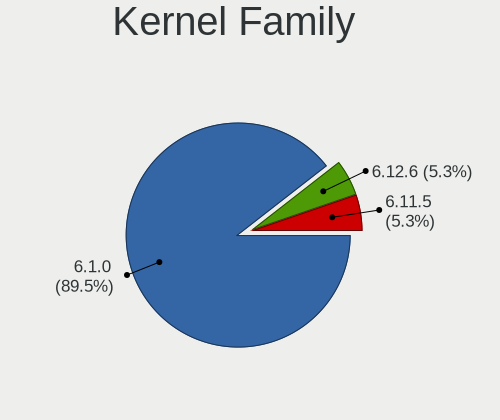
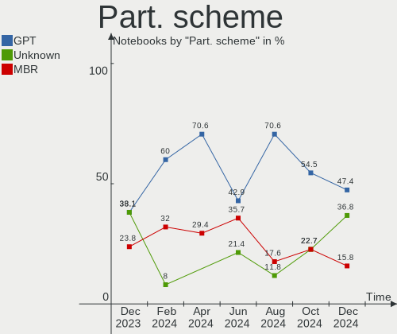
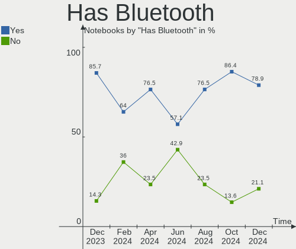
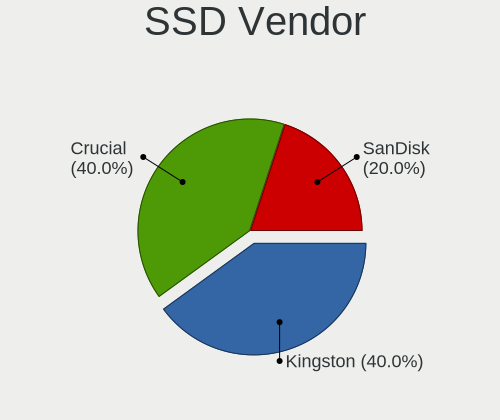
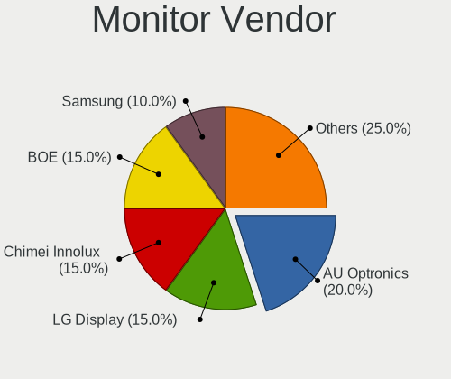
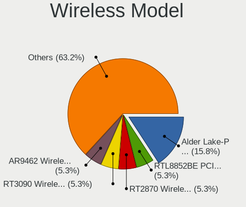
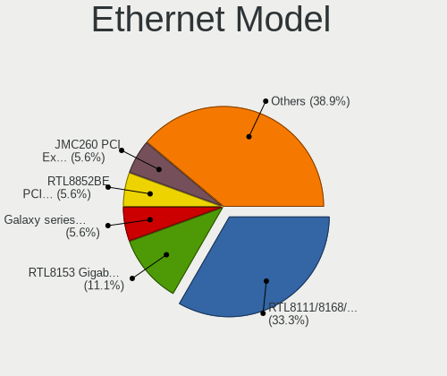

LMDE - Hardware Trends (Notebooks)
----------------------------------

A project to identify most popular hardware characteristics and track their change
over time based on data collected by Linux users at https://Linux-Hardware.org.

Anyone can contribute to this report by the [hw-probe](https://github.com/linuxhw/hw-probe) tool:

    sudo -E hw-probe -all -upload

This report is for one last month. Overall report since the beginning of time: [TestDays](https://github.com/linuxhw/TestDays)

Period: Jun, 2023.

Contents
--------

* [ System ](#system)
  - [ OS                       ](#os)
  - [ OS Family                ](#os-family)
  - [ Kernel                   ](#kernel)
  - [ Kernel Family            ](#kernel-family)
  - [ Kernel Major Ver.        ](#kernel-major-ver)
  - [ Arch                     ](#arch)
  - [ DE                       ](#de)
  - [ Display Server           ](#display-server)
  - [ Display Manager          ](#display-manager)
  - [ OS Lang                  ](#os-lang)
  - [ Boot Mode                ](#boot-mode)
  - [ Filesystem               ](#filesystem)
  - [ Part. scheme             ](#part-scheme)
  - [ Dual Boot with Linux/BSD ](#dual-boot-with-linuxbsd)
  - [ Dual Boot (Win)          ](#dual-boot-win)

* [ Board ](#board)
  - [ Vendor                   ](#vendor)
  - [ Model                    ](#model)
  - [ Model Family             ](#model-family)
  - [ MFG Year                 ](#mfg-year)
  - [ Form Factor              ](#form-factor)
  - [ Secure Boot              ](#secure-boot)
  - [ Coreboot                 ](#coreboot)
  - [ RAM Size                 ](#ram-size)
  - [ RAM Used                 ](#ram-used)
  - [ Total Drives             ](#total-drives)
  - [ Has CD-ROM               ](#has-cd-rom)
  - [ Has Ethernet             ](#has-ethernet)
  - [ Has WiFi                 ](#has-wifi)
  - [ Has Bluetooth            ](#has-bluetooth)

* [ Location ](#location)
  - [ Country                  ](#country)
  - [ City                     ](#city)

* [ Drives ](#drives)
  - [ Drive Vendor             ](#drive-vendor)
  - [ Drive Model              ](#drive-model)
  - [ HDD Vendor               ](#hdd-vendor)
  - [ SSD Vendor               ](#ssd-vendor)
  - [ Drive Kind               ](#drive-kind)
  - [ Drive Connector          ](#drive-connector)
  - [ Drive Size               ](#drive-size)
  - [ Space Total              ](#space-total)
  - [ Space Used               ](#space-used)
  - [ Malfunc. Drives          ](#malfunc-drives)
  - [ Malfunc. Drive Vendor    ](#malfunc-drive-vendor)
  - [ Malfunc. HDD Vendor      ](#malfunc-hdd-vendor)
  - [ Malfunc. Drive Kind      ](#malfunc-drive-kind)
  - [ Failed Drives            ](#failed-drives)
  - [ Failed Drive Vendor      ](#failed-drive-vendor)
  - [ Drive Status             ](#drive-status)

* [ Storage controller ](#storage-controller)
  - [ Storage Vendor           ](#storage-vendor)
  - [ Storage Model            ](#storage-model)
  - [ Storage Kind             ](#storage-kind)

* [ Processor ](#processor)
  - [ CPU Vendor               ](#cpu-vendor)
  - [ CPU Model                ](#cpu-model)
  - [ CPU Model Family         ](#cpu-model-family)
  - [ CPU Cores                ](#cpu-cores)
  - [ CPU Sockets              ](#cpu-sockets)
  - [ CPU Threads              ](#cpu-threads)
  - [ CPU Op-Modes             ](#cpu-op-modes)
  - [ CPU Microcode            ](#cpu-microcode)
  - [ CPU Microarch            ](#cpu-microarch)

* [ Graphics ](#graphics)
  - [ GPU Vendor               ](#gpu-vendor)
  - [ GPU Model                ](#gpu-model)
  - [ GPU Combo                ](#gpu-combo)
  - [ GPU Driver               ](#gpu-driver)
  - [ GPU Memory               ](#gpu-memory)

* [ Monitor ](#monitor)
  - [ Monitor Vendor           ](#monitor-vendor)
  - [ Monitor Model            ](#monitor-model)
  - [ Monitor Resolution       ](#monitor-resolution)
  - [ Monitor Diagonal         ](#monitor-diagonal)
  - [ Monitor Width            ](#monitor-width)
  - [ Aspect Ratio             ](#aspect-ratio)
  - [ Monitor Area             ](#monitor-area)
  - [ Pixel Density            ](#pixel-density)
  - [ Multiple Monitors        ](#multiple-monitors)

* [ Network ](#network)
  - [ Net Controller Vendor    ](#net-controller-vendor)
  - [ Net Controller Model     ](#net-controller-model)
  - [ Wireless Vendor          ](#wireless-vendor)
  - [ Wireless Model           ](#wireless-model)
  - [ Ethernet Vendor          ](#ethernet-vendor)
  - [ Ethernet Model           ](#ethernet-model)
  - [ Net Controller Kind      ](#net-controller-kind)
  - [ Used Controller          ](#used-controller)
  - [ NICs                     ](#nics)
  - [ IPv6                     ](#ipv6)

* [ Bluetooth ](#bluetooth)
  - [ Bluetooth Vendor         ](#bluetooth-vendor)
  - [ Bluetooth Model          ](#bluetooth-model)

* [ Sound ](#sound)
  - [ Sound Vendor             ](#sound-vendor)
  - [ Sound Model              ](#sound-model)

* [ Memory ](#memory)
  - [ Memory Vendor            ](#memory-vendor)
  - [ Memory Model             ](#memory-model)
  - [ Memory Kind              ](#memory-kind)
  - [ Memory Form Factor       ](#memory-form-factor)
  - [ Memory Size              ](#memory-size)
  - [ Memory Speed             ](#memory-speed)

* [ Printers & scanners ](#printers--scanners)
  - [ Printer Vendor           ](#printer-vendor)
  - [ Printer Model            ](#printer-model)
  - [ Scanner Vendor           ](#scanner-vendor)
  - [ Scanner Model            ](#scanner-model)

* [ Camera ](#camera)
  - [ Camera Vendor            ](#camera-vendor)
  - [ Camera Model             ](#camera-model)

* [ Security ](#security)
  - [ Fingerprint Vendor       ](#fingerprint-vendor)
  - [ Fingerprint Model        ](#fingerprint-model)
  - [ Chipcard Vendor          ](#chipcard-vendor)
  - [ Chipcard Model           ](#chipcard-model)

* [ Unsupported ](#unsupported)
  - [ Unsupported Devices      ](#unsupported-devices)
  - [ Unsupported Device Types ](#unsupported-device-types)

System
------

OS
--

Installed operating systems

| Name   | Notebooks | Percent |
|--------|-----------|---------|
| LMDE 5 | 13        | 100%    |

OS Family
---------

OS without a version

| Name | Notebooks | Percent |
|------|-----------|---------|
| LMDE | 13        | 100%    |

Kernel
------

Version of the Linux kernel

| Version         | Notebooks | Percent |
|-----------------|-----------|---------|
| 5.10.0-23-amd64 | 10        | 76.92%  |
| 5.10.0-22-amd64 | 2         | 15.38%  |
| 5.10.0-12-amd64 | 1         | 7.69%   |

Kernel Family
-------------

Linux kernel without a distro release

| Version | Notebooks | Percent |
|---------|-----------|---------|
| 5.10.0  | 13        | 100%    |

Kernel Major Ver.
-----------------

Linux kernel major version

| Version | Notebooks | Percent |
|---------|-----------|---------|
| 5.10    | 13        | 100%    |

Arch
----

OS architecture (x86_64, i586, etc.)

| Name   | Notebooks | Percent |
|--------|-----------|---------|
| x86_64 | 13        | 100%    |

DE
--

Desktop Environment

| Name       | Notebooks | Percent |
|------------|-----------|---------|
| X-Cinnamon | 9         | 69.23%  |
| Cinnamon   | 3         | 23.08%  |
| i3         | 1         | 7.69%   |

Display Server
--------------

X11 or Wayland

| Name | Notebooks | Percent |
|------|-----------|---------|
| X11  | 13        | 100%    |

Display Manager
---------------

SDDM, LightDM, etc.

| Name    | Notebooks | Percent |
|---------|-----------|---------|
| LightDM | 8         | 61.54%  |
| Unknown | 5         | 38.46%  |

OS Lang
-------

Language

| Lang  | Notebooks | Percent |
|-------|-----------|---------|
| en_US | 5         | 38.46%  |
| de_DE | 3         | 23.08%  |
| en_GB | 2         | 15.38%  |
| pl_PL | 1         | 7.69%   |
| it_IT | 1         | 7.69%   |
| es_MX | 1         | 7.69%   |

Boot Mode
---------

EFI or BIOS

| Mode | Notebooks | Percent |
|------|-----------|---------|
| EFI  | 8         | 61.54%  |
| BIOS | 5         | 38.46%  |

Filesystem
----------

Type of filesystem

| Type    | Notebooks | Percent |
|---------|-----------|---------|
| Ext4    | 11        | 84.62%  |
| Tmpfs   | 1         | 7.69%   |
| Overlay | 1         | 7.69%   |

Part. scheme
------------

Scheme of partitioning

| Type    | Notebooks | Percent |
|---------|-----------|---------|
| GPT     | 6         | 46.15%  |
| Unknown | 5         | 38.46%  |
| MBR     | 2         | 15.38%  |

Dual Boot with Linux/BSD
------------------------

Hosting more than one Linux/BSD

| Dual boot | Notebooks | Percent |
|-----------|-----------|---------|
| No        | 12        | 92.31%  |
| Yes       | 1         | 7.69%   |

Dual Boot (Win)
---------------

Hosting Linux and Windows

| Dual boot | Notebooks | Percent |
|-----------|-----------|---------|
| No        | 11        | 84.62%  |
| Yes       | 2         | 15.38%  |

Board
-----

Vendor
------

Motherboard manufacturer

| Name             | Notebooks | Percent |
|------------------|-----------|---------|
| Hewlett-Packard  | 4         | 30.77%  |
| Dell             | 2         | 15.38%  |
| Acer             | 2         | 15.38%  |
| STONE COMPUTERS  | 1         | 7.69%   |
| Medion           | 1         | 7.69%   |
| Lenovo           | 1         | 7.69%   |
| Google           | 1         | 7.69%   |
| ASUSTek Computer | 1         | 7.69%   |

Model
-----

Motherboard model

| Name                                             | Notebooks | Percent |
|--------------------------------------------------|-----------|---------|
| STONE COMPUTERS NOTCHA-286                       | 1         | 7.69%   |
| Medion E6214                                     | 1         | 7.69%   |
| Lenovo ThinkPad X270 W10DG 20K5S3HG00            | 1         | 7.69%   |
| HP ZBook Fury 17.3 inch G8 Mobile Workstation PC | 1         | 7.69%   |
| HP Laptop 15-da0xxx                              | 1         | 7.69%   |
| HP EliteBook 820 G2                              | 1         | 7.69%   |
| HP Compaq 15                                     | 1         | 7.69%   |
| Google Lick                                      | 1         | 7.69%   |
| Dell Inspiron N4030                              | 1         | 7.69%   |
| Dell G5 5587                                     | 1         | 7.69%   |
| ASUS VivoBook_ASUSLaptop X515JA_F515JA           | 1         | 7.69%   |
| Acer Aspire xxxx                                 | 1         | 7.69%   |
| Acer Aspire 7745G                                | 1         | 7.69%   |

Model Family
------------

Motherboard model prefix

| Name                       | Notebooks | Percent |
|----------------------------|-----------|---------|
| Acer Aspire                | 2         | 15.38%  |
| STONE COMPUTERS NOTCHA-286 | 1         | 7.69%   |
| Medion E6214               | 1         | 7.69%   |
| Lenovo ThinkPad            | 1         | 7.69%   |
| HP ZBook                   | 1         | 7.69%   |
| HP Laptop                  | 1         | 7.69%   |
| HP EliteBook               | 1         | 7.69%   |
| HP Compaq                  | 1         | 7.69%   |
| Google Lick                | 1         | 7.69%   |
| Dell Inspiron              | 1         | 7.69%   |
| Dell G5                    | 1         | 7.69%   |
| ASUS VivoBook              | 1         | 7.69%   |

MFG Year
--------

Motherboard manufacture year

| Year | Notebooks | Percent |
|------|-----------|---------|
| 2010 | 4         | 30.77%  |
| 2018 | 2         | 15.38%  |
| 2023 | 1         | 7.69%   |
| 2021 | 1         | 7.69%   |
| 2020 | 1         | 7.69%   |
| 2017 | 1         | 7.69%   |
| 2016 | 1         | 7.69%   |
| 2015 | 1         | 7.69%   |
| 2014 | 1         | 7.69%   |

Form Factor
-----------

Physical design of the computer

| Name     | Notebooks | Percent |
|----------|-----------|---------|
| Notebook | 13        | 100%    |

Secure Boot
-----------

Enabled or disabled

| State    | Notebooks | Percent |
|----------|-----------|---------|
| Disabled | 13        | 100%    |

Coreboot
--------

Have coreboot on board

| Used | Notebooks | Percent |
|------|-----------|---------|
| No   | 12        | 92.31%  |
| Yes  | 1         | 7.69%   |

RAM Size
--------

Total RAM memory

| Size in GB  | Notebooks | Percent |
|-------------|-----------|---------|
| 3.01-4.0    | 5         | 38.46%  |
| 4.01-8.0    | 3         | 23.08%  |
| 16.01-24.0  | 2         | 15.38%  |
| 64.01-256.0 | 1         | 7.69%   |
| 1.01-2.0    | 1         | 7.69%   |
| 8.01-16.0   | 1         | 7.69%   |

RAM Used
--------

Used RAM memory

| Used GB    | Notebooks | Percent |
|------------|-----------|---------|
| 2.01-3.0   | 4         | 30.77%  |
| 1.01-2.0   | 4         | 30.77%  |
| 0.51-1.0   | 2         | 15.38%  |
| 4.01-8.0   | 1         | 7.69%   |
| 3.01-4.0   | 1         | 7.69%   |
| 16.01-24.0 | 1         | 7.69%   |

Total Drives
------------

Number of drives on board

| Drives | Notebooks | Percent |
|--------|-----------|---------|
| 2      | 6         | 46.15%  |
| 1      | 6         | 46.15%  |
| 4      | 1         | 7.69%   |

Has CD-ROM
----------

Has CD-ROM on board

| Presented | Notebooks | Percent |
|-----------|-----------|---------|
| No        | 11        | 84.62%  |
| Yes       | 2         | 15.38%  |

Has Ethernet
------------

Has Ethernet on board

| Presented | Notebooks | Percent |
|-----------|-----------|---------|
| Yes       | 11        | 84.62%  |
| No        | 2         | 15.38%  |

Has WiFi
--------

Has WiFi module

| Presented | Notebooks | Percent |
|-----------|-----------|---------|
| Yes       | 13        | 100%    |

Has Bluetooth
-------------

Has Bluetooth module

| Presented | Notebooks | Percent |
|-----------|-----------|---------|
| Yes       | 8         | 61.54%  |
| No        | 5         | 38.46%  |

Location
--------

Country
-------

Geographic location (country)

| Country   | Notebooks | Percent |
|-----------|-----------|---------|
| Germany   | 3         | 23.08%  |
| UK        | 2         | 15.38%  |
| Italy     | 2         | 15.38%  |
| USA       | 1         | 7.69%   |
| Russia    | 1         | 7.69%   |
| Poland    | 1         | 7.69%   |
| Mexico    | 1         | 7.69%   |
| Chile     | 1         | 7.69%   |
| Australia | 1         | 7.69%   |

City
----

Geographic location (city)

| City           | Notebooks | Percent |
|----------------|-----------|---------|
| Turin          | 1         | 7.69%   |
| Tijuana        | 1         | 7.69%   |
| Santiago       | 1         | 7.69%   |
| Pechora        | 1         | 7.69%   |
| Lecco          | 1         | 7.69%   |
| Krakow         | 1         | 7.69%   |
| Fords          | 1         | 7.69%   |
| Dippoldiswalde | 1         | 7.69%   |
| Delligsen      | 1         | 7.69%   |
| Brisbane       | 1         | 7.69%   |
| Bielefeld      | 1         | 7.69%   |
| Barnet         | 1         | 7.69%   |
| Barking        | 1         | 7.69%   |

Drives
------

Drive Vendor
------------

Hard drive vendors

| Vendor              | Notebooks | Drives | Percent |
|---------------------|-----------|--------|---------|
| Kingston            | 3         | 3      | 17.65%  |
| WDC                 | 2         | 2      | 11.76%  |
| Unknown             | 2         | 2      | 11.76%  |
| SanDisk             | 2         | 3      | 11.76%  |
| HGST                | 2         | 2      | 11.76%  |
| Samsung Electronics | 1         | 1      | 5.88%   |
| KIOXIA              | 1         | 2      | 5.88%   |
| Intel               | 1         | 1      | 5.88%   |
| Emtec               | 1         | 1      | 5.88%   |
| Crucial             | 1         | 1      | 5.88%   |
| A-DATA Technology   | 1         | 1      | 5.88%   |

Drive Model
-----------

Hard drive models

| Model                               | Notebooks | Percent |
|-------------------------------------|-----------|---------|
| WDC WD3200BEKT-22PVMT0 320GB        | 1         | 5.88%   |
| WDC WD1600BEVT-22ZCT0 160GB         | 1         | 5.88%   |
| Unknown SC128  128GB                | 1         | 5.88%   |
| Unknown MMC64G  64GB                | 1         | 5.88%   |
| SanDisk X600 2.5 7MM SATA 256GB SSD | 1         | 5.88%   |
| SanDisk NVMe SSD Drive 2TB          | 1         | 5.88%   |
| Samsung SSD 850 EVO 500GB           | 1         | 5.88%   |
| KIOXIA KXG60PNV2T04 2TB             | 1         | 5.88%   |
| Kingston SV300S37A60G 64GB SSD      | 1         | 5.88%   |
| Kingston SNV2S500G 500GB            | 1         | 5.88%   |
| Kingston SKC2500M8500G 500GB        | 1         | 5.88%   |
| Intel SSD 660P Series 512GB         | 1         | 5.88%   |
| HGST HTS545050A7E680 500GB          | 1         | 5.88%   |
| HGST HTS541010B7E610 1TB            | 1         | 5.88%   |
| Emtec X150 480GB                    | 1         | 5.88%   |
| Crucial CT1000BX500SSD1 1TB         | 1         | 5.88%   |
| A-DATA SU800 256GB SSD              | 1         | 5.88%   |

HDD Vendor
----------

Hard disk drive vendors

| Vendor | Notebooks | Drives | Percent |
|--------|-----------|--------|---------|
| WDC    | 2         | 2      | 50%     |
| HGST   | 2         | 2      | 50%     |

SSD Vendor
----------

Solid state drive vendors

| Vendor              | Notebooks | Drives | Percent |
|---------------------|-----------|--------|---------|
| SanDisk             | 1         | 1      | 16.67%  |
| Samsung Electronics | 1         | 1      | 16.67%  |
| Kingston            | 1         | 1      | 16.67%  |
| Emtec               | 1         | 1      | 16.67%  |
| Crucial             | 1         | 1      | 16.67%  |
| A-DATA Technology   | 1         | 1      | 16.67%  |

Drive Kind
----------

HDD or SSD

| Kind | Notebooks | Drives | Percent |
|------|-----------|--------|---------|
| SSD  | 6         | 6      | 37.5%   |
| NVMe | 4         | 7      | 25%     |
| HDD  | 4         | 4      | 25%     |
| MMC  | 2         | 2      | 12.5%   |

Drive Connector
---------------

SATA, SAS, NVMe, etc.

| Type | Notebooks | Drives | Percent |
|------|-----------|--------|---------|
| SATA | 10        | 10     | 62.5%   |
| NVMe | 4         | 7      | 25%     |
| MMC  | 2         | 2      | 12.5%   |

Drive Size
----------

Size of hard drive

| Size in TB | Notebooks | Drives | Percent |
|------------|-----------|--------|---------|
| 0.01-0.5   | 8         | 8      | 80%     |
| 0.51-1.0   | 2         | 2      | 20%     |

Space Total
-----------

Amount of disk space available on the file system

| Size in GB | Notebooks | Percent |
|------------|-----------|---------|
| 251-500    | 6         | 46.15%  |
| 501-1000   | 3         | 23.08%  |
| 101-250    | 1         | 7.69%   |
| 1001-2000  | 1         | 7.69%   |
| 1-20       | 1         | 7.69%   |
| 51-100     | 1         | 7.69%   |

Space Used
----------

Amount of used disk space

| Used GB  | Notebooks | Percent |
|----------|-----------|---------|
| 1-20     | 4         | 30.77%  |
| 101-250  | 3         | 23.08%  |
| 51-100   | 3         | 23.08%  |
| 501-1000 | 2         | 15.38%  |
| 21-50    | 1         | 7.69%   |

Malfunc. Drives
---------------

Drive models with a malfunction

| Model                       | Notebooks | Drives | Percent |
|-----------------------------|-----------|--------|---------|
| WDC WD1600BEVT-22ZCT0 160GB | 1         | 1      | 100%    |

Malfunc. Drive Vendor
---------------------

Vendors of faulty drives

| Vendor | Notebooks | Drives | Percent |
|--------|-----------|--------|---------|
| WDC    | 1         | 1      | 100%    |

Malfunc. HDD Vendor
-------------------

Vendors of faulty HDD drives

| Vendor | Notebooks | Drives | Percent |
|--------|-----------|--------|---------|
| WDC    | 1         | 1      | 100%    |

Malfunc. Drive Kind
-------------------

Kinds of faulty drives

| Kind | Notebooks | Drives | Percent |
|------|-----------|--------|---------|
| HDD  | 1         | 1      | 100%    |

Failed Drives
-------------

Failed drive models

Zero info for selected period =(

Failed Drive Vendor
-------------------

Failed drive vendors

Zero info for selected period =(

Drive Status
------------

Number of failed and malfunc. drives

| Status   | Notebooks | Drives | Percent |
|----------|-----------|--------|---------|
| Detected | 9         | 10     | 60%     |
| Works    | 5         | 8      | 33.33%  |
| Malfunc  | 1         | 1      | 6.67%   |

Storage controller
------------------

Storage Vendor
--------------

Storage controller vendors

| Vendor                       | Notebooks | Percent |
|------------------------------|-----------|---------|
| Intel                        | 10        | 66.67%  |
| Kingston Technology Company  | 2         | 13.33%  |
| Toshiba America Info Systems | 1         | 6.67%   |
| SanDisk                      | 1         | 6.67%   |
| AMD                          | 1         | 6.67%   |

Storage Model
-------------

Storage controller models

| Model                                                          | Notebooks | Percent |
|----------------------------------------------------------------|-----------|---------|
| Intel 5 Series/3400 Series Chipset 4 port SATA AHCI Controller | 3         | 18.75%  |
| Intel Sunrise Point-LP SATA Controller [AHCI mode]             | 2         | 12.5%   |
| Intel 82801 Mobile SATA Controller [RAID mode]                 | 2         | 12.5%   |
| Toshiba America Info Systems XG6 NVMe SSD Controller           | 1         | 6.25%   |
| SanDisk WD Blue SN570 NVMe SSD 2TB                             | 1         | 6.25%   |
| Kingston Company Company Non-Volatile memory controller        | 1         | 6.25%   |
| Kingston Company KC2000 NVMe SSD                               | 1         | 6.25%   |
| Intel Wildcat Point-LP SATA Controller [AHCI Mode]             | 1         | 6.25%   |
| Intel SSD 660P Series                                          | 1         | 6.25%   |
| Intel Cannon Lake Mobile PCH SATA AHCI Controller              | 1         | 6.25%   |
| Intel 5 Series/3400 Series Chipset 6 port SATA AHCI Controller | 1         | 6.25%   |
| AMD FCH SATA Controller [AHCI mode]                            | 1         | 6.25%   |

Storage Kind
------------

Kind of storage controller (IDE, SATA, NVMe, SAS, ...)

| Kind | Notebooks | Percent |
|------|-----------|---------|
| SATA | 9         | 60%     |
| NVMe | 4         | 26.67%  |
| RAID | 2         | 13.33%  |

Processor
---------

CPU Vendor
----------

Processor vendors

| Vendor | Notebooks | Percent |
|--------|-----------|---------|
| Intel  | 12        | 92.31%  |
| AMD    | 1         | 7.69%   |

CPU Model
---------

Processor models

| Model                                   | Notebooks | Percent |
|-----------------------------------------|-----------|---------|
| Intel Core i7-1065G7 CPU @ 1.30GHz      | 1         | 7.69%   |
| Intel Core i5-8300H CPU @ 2.30GHz       | 1         | 7.69%   |
| Intel Core i5-7200U CPU @ 2.50GHz       | 1         | 7.69%   |
| Intel Core i5-6200U CPU @ 2.30GHz       | 1         | 7.69%   |
| Intel Core i5-5200U CPU @ 2.20GHz       | 1         | 7.69%   |
| Intel Core i5 CPU M 450 @ 2.40GHz       | 1         | 7.69%   |
| Intel Core i3-6100U CPU @ 2.30GHz       | 1         | 7.69%   |
| Intel Core i3 CPU U 380 @ 1.33GHz       | 1         | 7.69%   |
| Intel Core i3 CPU M 370 @ 2.40GHz       | 1         | 7.69%   |
| Intel Core i3 CPU M 330 @ 2.13GHz       | 1         | 7.69%   |
| Intel Celeron N4020 CPU @ 1.10GHz       | 1         | 7.69%   |
| Intel 11th Gen Core i9-11950H @ 2.60GHz | 1         | 7.69%   |
| AMD E1-2100 APU with Radeon HD Graphics | 1         | 7.69%   |

CPU Model Family
----------------

Processor model prefix

| Model         | Notebooks | Percent |
|---------------|-----------|---------|
| Intel Core i5 | 5         | 38.46%  |
| Intel Core i3 | 4         | 30.77%  |
| Other         | 1         | 7.69%   |
| Intel Core i7 | 1         | 7.69%   |
| Intel Celeron | 1         | 7.69%   |
| AMD E1        | 1         | 7.69%   |

CPU Cores
---------

Number of processor cores

| Number | Notebooks | Percent |
|--------|-----------|---------|
| 2      | 10        | 76.92%  |
| 4      | 2         | 15.38%  |
| 8      | 1         | 7.69%   |

CPU Sockets
-----------

Number of sockets

| Number | Notebooks | Percent |
|--------|-----------|---------|
| 1      | 13        | 100%    |

CPU Threads
-----------

Threads per core (Hyper-Threading)

| Number | Notebooks | Percent |
|--------|-----------|---------|
| 2      | 11        | 84.62%  |
| 1      | 2         | 15.38%  |

CPU Op-Modes
------------

CPU Operation Modes (32-bit, 64-bit)

| Op mode        | Notebooks | Percent |
|----------------|-----------|---------|
| 32-bit, 64-bit | 13        | 100%    |

CPU Microcode
-------------

Microcode number

| Number     | Notebooks | Percent |
|------------|-----------|---------|
| 0x20655    | 3         | 23.08%  |
| 0x406e3    | 2         | 15.38%  |
| 0x906ea    | 1         | 7.69%   |
| 0x806e9    | 1         | 7.69%   |
| 0x806d1    | 1         | 7.69%   |
| 0x706e5    | 1         | 7.69%   |
| 0x706a8    | 1         | 7.69%   |
| 0x306d4    | 1         | 7.69%   |
| 0x20652    | 1         | 7.69%   |
| 0x07000110 | 1         | 7.69%   |

CPU Microarch
-------------

Microarchitecture

| Name          | Notebooks | Percent |
|---------------|-----------|---------|
| Westmere      | 4         | 30.77%  |
| Skylake       | 2         | 15.38%  |
| KabyLake      | 2         | 15.38%  |
| IceLake       | 2         | 15.38%  |
| Jaguar        | 1         | 7.69%   |
| Goldmont plus | 1         | 7.69%   |
| Broadwell     | 1         | 7.69%   |

Graphics
--------

GPU Vendor
----------

Vendors of graphics cards

| Vendor | Notebooks | Percent |
|--------|-----------|---------|
| Intel  | 11        | 73.33%  |
| Nvidia | 2         | 13.33%  |
| AMD    | 2         | 13.33%  |

GPU Model
---------

Graphics card models

| Model                                               | Notebooks | Percent |
|-----------------------------------------------------|-----------|---------|
| Intel Core Processor Integrated Graphics Controller | 4         | 26.67%  |
| Intel Skylake GT2 [HD Graphics 520]                 | 2         | 13.33%  |
| Nvidia GP106M [GeForce GTX 1060 Mobile]             | 1         | 6.67%   |
| Nvidia GA107GLM [RTX A2000 Mobile]                  | 1         | 6.67%   |
| Intel Iris Plus Graphics G7                         | 1         | 6.67%   |
| Intel HD Graphics 620                               | 1         | 6.67%   |
| Intel HD Graphics 5500                              | 1         | 6.67%   |
| Intel GeminiLake [UHD Graphics 600]                 | 1         | 6.67%   |
| Intel CoffeeLake-H GT2 [UHD Graphics 630]           | 1         | 6.67%   |
| AMD Kabini [Radeon HD 8210]                         | 1         | 6.67%   |
| AMD Broadway PRO [Mobility Radeon HD 5850]          | 1         | 6.67%   |

GPU Combo
---------

Combinations of graphics cards

| Name           | Notebooks | Percent |
|----------------|-----------|---------|
| 1 x Intel      | 8         | 61.54%  |
| Other          | 1         | 7.69%   |
| 1 x Nvidia     | 1         | 7.69%   |
| Intel + Nvidia | 1         | 7.69%   |
| Intel + AMD    | 1         | 7.69%   |
| 1 x AMD        | 1         | 7.69%   |

GPU Driver
----------

Free vs proprietary

| Driver      | Notebooks | Percent |
|-------------|-----------|---------|
| Free        | 11        | 84.62%  |
| Proprietary | 2         | 15.38%  |

GPU Memory
----------

Total video memory

| Size in GB | Notebooks | Percent |
|------------|-----------|---------|
| Unknown    | 10        | 76.92%  |
| 3.01-4.0   | 1         | 7.69%   |
| 0.51-1.0   | 1         | 7.69%   |
| 0.01-0.5   | 1         | 7.69%   |

Monitor
-------

Monitor Vendor
--------------

Monitor vendors

| Vendor                  | Notebooks | Percent |
|-------------------------|-----------|---------|
| AU Optronics            | 5         | 33.33%  |
| LG Display              | 2         | 13.33%  |
| Chi Mei Optoelectronics | 2         | 13.33%  |
| BOE                     | 2         | 13.33%  |
| Samsung Electronics     | 1         | 6.67%   |
| InfoVision              | 1         | 6.67%   |
| Chimei Innolux          | 1         | 6.67%   |
| BenQ                    | 1         | 6.67%   |

Monitor Model
-------------

Monitor models

| Model                                                                    | Notebooks | Percent |
|--------------------------------------------------------------------------|-----------|---------|
| Samsung Electronics LCD Monitor SAM0530 1360x768                         | 1         | 6.67%   |
| LG Display LCD Monitor LGD05D0 1920x1080 344x194mm 15.5-inch             | 1         | 6.67%   |
| LG Display LCD Monitor LGD0291 1366x768 310x174mm 14.0-inch              | 1         | 6.67%   |
| InfoVision LCD Monitor IVO048E 1366x768 256x144mm 11.6-inch              | 1         | 6.67%   |
| Chimei Innolux LCD Monitor CMN15F5 1920x1080 344x193mm 15.5-inch         | 1         | 6.67%   |
| Chi Mei Optoelectronics LCD Monitor CMO1711 1600x900 382x215mm 17.3-inch | 1         | 6.67%   |
| Chi Mei Optoelectronics LCD Monitor CMO1100 1366x768 256x144mm 11.6-inch | 1         | 6.67%   |
| BOE LCD Monitor BOE0687 1920x1080 344x193mm 15.5-inch                    | 1         | 6.67%   |
| BOE LCD Monitor BOE0632 1920x1080 344x194mm 15.5-inch                    | 1         | 6.67%   |
| BenQ BL2480 BNQ802C 1920x1080 530x300mm 24.0-inch                        | 1         | 6.67%   |
| AU Optronics LCD Monitor AUO45EC 1366x768 344x193mm 15.5-inch            | 1         | 6.67%   |
| AU Optronics LCD Monitor AUO32EC 1366x768 344x193mm 15.5-inch            | 1         | 6.67%   |
| AU Optronics LCD Monitor AUO206C 1366x768 277x156mm 12.5-inch            | 1         | 6.67%   |
| AU Optronics LCD Monitor AUO106C 1366x768 277x156mm 12.5-inch            | 1         | 6.67%   |
| AU Optronics LCD Monitor 3840x2160                                       | 1         | 6.67%   |

Monitor Resolution
------------------

Monitor screen resolution

| Resolution      | Notebooks | Percent |
|-----------------|-----------|---------|
| 1366x768 (WXGA) | 7         | 50%     |
| 1920x1080 (FHD) | 4         | 28.57%  |
| 3840x2160 (4K)  | 1         | 7.14%   |
| 1600x900 (HD+)  | 1         | 7.14%   |
| 1360x768        | 1         | 7.14%   |

Monitor Diagonal
----------------

Diagonal size in inches

| Inches  | Notebooks | Percent |
|---------|-----------|---------|
| 15      | 6         | 40%     |
| 12      | 2         | 13.33%  |
| 11      | 2         | 13.33%  |
| Unknown | 2         | 13.33%  |
| 24      | 1         | 6.67%   |
| 17      | 1         | 6.67%   |
| 14      | 1         | 6.67%   |

Monitor Width
-------------

Physical width

| Width in mm | Notebooks | Percent |
|-------------|-----------|---------|
| 301-350     | 7         | 46.67%  |
| 201-300     | 4         | 26.67%  |
| Unknown     | 2         | 13.33%  |
| 501-600     | 1         | 6.67%   |
| 351-400     | 1         | 6.67%   |

Aspect Ratio
------------

Proportional relationship between the width and the height

| Ratio   | Notebooks | Percent |
|---------|-----------|---------|
| 16/9    | 12        | 92.31%  |
| Unknown | 1         | 7.69%   |

Monitor Area
------------

Area in inch²

| Area in inch² | Notebooks | Percent |
|----------------|-----------|---------|
| 101-110        | 6         | 40%     |
| 61-70          | 2         | 13.33%  |
| 51-60          | 2         | 13.33%  |
| Unknown        | 2         | 13.33%  |
| 81-90          | 1         | 6.67%   |
| 201-250        | 1         | 6.67%   |
| 131-140        | 1         | 6.67%   |

Pixel Density
-------------

Pixels per inch

| Density | Notebooks | Percent |
|---------|-----------|---------|
| 121-160 | 8         | 53.33%  |
| 101-120 | 4         | 26.67%  |
| Unknown | 2         | 13.33%  |
| 51-100  | 1         | 6.67%   |

Multiple Monitors
-----------------

Total monitors connected

| Total | Notebooks | Percent |
|-------|-----------|---------|
| 1     | 11        | 84.62%  |
| 2     | 2         | 15.38%  |

Network
-------

Net Controller Vendor
---------------------

Controller vendors

| Vendor                            | Notebooks | Percent |
|-----------------------------------|-----------|---------|
| Intel                             | 7         | 29.17%  |
| Realtek Semiconductor             | 6         | 25%     |
| Qualcomm Atheros                  | 6         | 25%     |
| Broadcom                          | 2         | 8.33%   |
| Spreadtrum Communications         | 1         | 4.17%   |
| Ericsson Business Mobile Networks | 1         | 4.17%   |
| Edimax Technology                 | 1         | 4.17%   |

Net Controller Model
--------------------

Controller models

| Model                                                             | Notebooks | Percent |
|-------------------------------------------------------------------|-----------|---------|
| Realtek RTL8821CE 802.11ac PCIe Wireless Network Adapter          | 2         | 7.14%   |
| Realtek RTL8111/8168/8411 PCI Express Gigabit Ethernet Controller | 2         | 7.14%   |
| Qualcomm Atheros AR8151 v1.0 Gigabit Ethernet                     | 2         | 7.14%   |
| Intel Wireless 8260                                               | 2         | 7.14%   |
| Spreadtrum Spreadtrum Phone                                       | 1         | 3.57%   |
| Realtek RTL88x2bu [AC1200 Techkey]                                | 1         | 3.57%   |
| Realtek RTL8191SEvB Wireless LAN Controller                       | 1         | 3.57%   |
| Realtek RTL810xE PCI Express Fast Ethernet controller             | 1         | 3.57%   |
| Qualcomm Atheros Killer E2400 Gigabit Ethernet Controller         | 1         | 3.57%   |
| Qualcomm Atheros AR9485 Wireless Network Adapter                  | 1         | 3.57%   |
| Qualcomm Atheros AR8152 v2.0 Fast Ethernet                        | 1         | 3.57%   |
| Qualcomm Atheros AR8131 Gigabit Ethernet                          | 1         | 3.57%   |
| Intel Wireless 7265                                               | 1         | 3.57%   |
| Intel Tiger Lake PCH CNVi WiFi                                    | 1         | 3.57%   |
| Intel Gemini Lake PCH CNVi WiFi                                   | 1         | 3.57%   |
| Intel Ethernet Connection I219-V                                  | 1         | 3.57%   |
| Intel Ethernet Connection (3) I218-LM                             | 1         | 3.57%   |
| Intel Ethernet Connection (14) I219-LM                            | 1         | 3.57%   |
| Intel Centrino Advanced-N 6205 [Taylor Peak]                      | 1         | 3.57%   |
| Intel Cannon Lake PCH CNVi WiFi                                   | 1         | 3.57%   |
| Ericsson Business Mobile Networks F5521gw                         | 1         | 3.57%   |
| Edimax EW-7711UTn nLite Wireless Adapter [Ralink RT3070]          | 1         | 3.57%   |
| Broadcom BCM43225 802.11b/g/n                                     | 1         | 3.57%   |
| Broadcom BCM4313 802.11bgn Wireless Network Adapter               | 1         | 3.57%   |

Wireless Vendor
---------------

Wireless vendors

| Vendor                | Notebooks | Percent |
|-----------------------|-----------|---------|
| Intel                 | 7         | 46.67%  |
| Realtek Semiconductor | 4         | 26.67%  |
| Broadcom              | 2         | 13.33%  |
| Qualcomm Atheros      | 1         | 6.67%   |
| Edimax Technology     | 1         | 6.67%   |

Wireless Model
--------------

Wireless models

| Model                                                    | Notebooks | Percent |
|----------------------------------------------------------|-----------|---------|
| Realtek RTL8821CE 802.11ac PCIe Wireless Network Adapter | 2         | 13.33%  |
| Intel Wireless 8260                                      | 2         | 13.33%  |
| Realtek RTL88x2bu [AC1200 Techkey]                       | 1         | 6.67%   |
| Realtek RTL8191SEvB Wireless LAN Controller              | 1         | 6.67%   |
| Qualcomm Atheros AR9485 Wireless Network Adapter         | 1         | 6.67%   |
| Intel Wireless 7265                                      | 1         | 6.67%   |
| Intel Tiger Lake PCH CNVi WiFi                           | 1         | 6.67%   |
| Intel Gemini Lake PCH CNVi WiFi                          | 1         | 6.67%   |
| Intel Centrino Advanced-N 6205 [Taylor Peak]             | 1         | 6.67%   |
| Intel Cannon Lake PCH CNVi WiFi                          | 1         | 6.67%   |
| Edimax EW-7711UTn nLite Wireless Adapter [Ralink RT3070] | 1         | 6.67%   |
| Broadcom BCM43225 802.11b/g/n                            | 1         | 6.67%   |
| Broadcom BCM4313 802.11bgn Wireless Network Adapter      | 1         | 6.67%   |

Ethernet Vendor
---------------

Ethernet vendors

| Vendor                    | Notebooks | Percent |
|---------------------------|-----------|---------|
| Qualcomm Atheros          | 5         | 41.67%  |
| Realtek Semiconductor     | 3         | 25%     |
| Intel                     | 3         | 25%     |
| Spreadtrum Communications | 1         | 8.33%   |

Ethernet Model
--------------

Ethernet models

| Model                                                             | Notebooks | Percent |
|-------------------------------------------------------------------|-----------|---------|
| Realtek RTL8111/8168/8411 PCI Express Gigabit Ethernet Controller | 2         | 16.67%  |
| Qualcomm Atheros AR8151 v1.0 Gigabit Ethernet                     | 2         | 16.67%  |
| Spreadtrum Spreadtrum Phone                                       | 1         | 8.33%   |
| Realtek RTL810xE PCI Express Fast Ethernet controller             | 1         | 8.33%   |
| Qualcomm Atheros Killer E2400 Gigabit Ethernet Controller         | 1         | 8.33%   |
| Qualcomm Atheros AR8152 v2.0 Fast Ethernet                        | 1         | 8.33%   |
| Qualcomm Atheros AR8131 Gigabit Ethernet                          | 1         | 8.33%   |
| Intel Ethernet Connection I219-V                                  | 1         | 8.33%   |
| Intel Ethernet Connection (3) I218-LM                             | 1         | 8.33%   |
| Intel Ethernet Connection (14) I219-LM                            | 1         | 8.33%   |

Net Controller Kind
-------------------

Ethernet, WiFi or modem

| Kind     | Notebooks | Percent |
|----------|-----------|---------|
| WiFi     | 13        | 52%     |
| Ethernet | 11        | 44%     |
| Modem    | 1         | 4%      |

Used Controller
---------------

Currently used network controller

| Kind     | Notebooks | Percent |
|----------|-----------|---------|
| WiFi     | 10        | 76.92%  |
| Ethernet | 3         | 23.08%  |

NICs
----

Total network controllers on board

| Total | Notebooks | Percent |
|-------|-----------|---------|
| 2     | 11        | 84.62%  |
| 1     | 2         | 15.38%  |

IPv6
----

IPv6 vs IPv4

| Used | Notebooks | Percent |
|------|-----------|---------|
| No   | 8         | 61.54%  |
| Yes  | 5         | 38.46%  |

Bluetooth
---------

Bluetooth Vendor
----------------

Controller vendors

| Vendor                | Notebooks | Percent |
|-----------------------|-----------|---------|
| Intel                 | 5         | 62.5%   |
| Realtek Semiconductor | 1         | 12.5%   |
| IMC Networks          | 1         | 12.5%   |
| Foxconn / Hon Hai     | 1         | 12.5%   |

Bluetooth Model
---------------

Controller models

| Model                                          | Notebooks | Percent |
|------------------------------------------------|-----------|---------|
| Intel Bluetooth wireless interface             | 2         | 25%     |
| Intel Bluetooth 9460/9560 Jefferson Peak (JfP) | 2         | 25%     |
| Realtek  Bluetooth 4.2 Adapter                 | 1         | 12.5%   |
| Intel AX201 Bluetooth                          | 1         | 12.5%   |
| IMC Networks Bluetooth Radio                   | 1         | 12.5%   |
| Foxconn / Hon Hai Acer Module                  | 1         | 12.5%   |

Sound
-----

Sound Vendor
------------

Sound card vendors

| Vendor            | Notebooks | Percent |
|-------------------|-----------|---------|
| Intel             | 12        | 70.59%  |
| Nvidia            | 2         | 11.76%  |
| AMD               | 2         | 11.76%  |
| Texas Instruments | 1         | 5.88%   |

Sound Model
-----------

Sound card models

| Model                                                        | Notebooks | Percent |
|--------------------------------------------------------------|-----------|---------|
| Intel 5 Series/3400 Series Chipset High Definition Audio     | 4         | 21.05%  |
| Intel Sunrise Point-LP HD Audio                              | 3         | 15.79%  |
| Texas Instruments Sabaj A4 AMP                               | 1         | 5.26%   |
| Nvidia GP106 High Definition Audio Controller                | 1         | 5.26%   |
| Nvidia Audio device                                          | 1         | 5.26%   |
| Intel Wildcat Point-LP High Definition Audio Controller      | 1         | 5.26%   |
| Intel Tiger Lake-H HD Audio Controller                       | 1         | 5.26%   |
| Intel Ice Lake-LP Smart Sound Technology Audio Controller    | 1         | 5.26%   |
| Intel Celeron/Pentium Silver Processor High Definition Audio | 1         | 5.26%   |
| Intel Cannon Lake PCH cAVS                                   | 1         | 5.26%   |
| Intel Broadwell-U Audio Controller                           | 1         | 5.26%   |
| AMD Kabini HDMI/DP Audio                                     | 1         | 5.26%   |
| AMD Juniper HDMI Audio [Radeon HD 5700 Series]               | 1         | 5.26%   |
| AMD FCH Azalia Controller                                    | 1         | 5.26%   |

Memory
------

Memory Vendor
-------------

Memory module vendors

| Vendor              | Notebooks | Percent |
|---------------------|-----------|---------|
| SK hynix            | 2         | 22.22%  |
| Samsung Electronics | 2         | 22.22%  |
| Kingston            | 2         | 22.22%  |
| PUSKILL             | 1         | 11.11%  |
| Nanya Technology    | 1         | 11.11%  |
| 4ea5                | 1         | 11.11%  |

Memory Model
------------

Memory module models

| Model                                                   | Notebooks | Percent |
|---------------------------------------------------------|-----------|---------|
| SK hynix RAM Module 32GB SODIMM DDR4 3200MT/s           | 1         | 11.11%  |
| SK hynix RAM H9HCNNNBKUMLXR-NEE 2GB LPDDR4 2400MT/s     | 1         | 11.11%  |
| Samsung RAM M471B5673FH0-CF8 2GB SODIMM DDR3 1067MT/s   | 1         | 11.11%  |
| Samsung RAM M471A1K43CB1-CRC 8GB SODIMM DDR4 2667MT/s   | 1         | 11.11%  |
| PUSKILL RAM PJ16TFK512M8 8GB SODIMM DDR4 2400MT/s       | 1         | 11.11%  |
| Nanya RAM NT2GC64B8HC0NS-BE 2GB SODIMM DDR3 1067MT/s    | 1         | 11.11%  |
| Kingston RAM KF2666C15S4/8G 8GB SODIMM DDR4 2667MT/s    | 1         | 11.11%  |
| Kingston RAM 99U5428-040.A01LF 4GB SODIMM DDR3 1334MT/s | 1         | 11.11%  |
| 4ea5 RAM H9HCNNNBKUMLXR-NEE 2GB LPDDR4 2400MT/s         | 1         | 11.11%  |

Memory Kind
-----------

Memory module kinds

| Kind   | Notebooks | Percent |
|--------|-----------|---------|
| DDR4   | 4         | 57.14%  |
| DDR3   | 2         | 28.57%  |
| LPDDR4 | 1         | 14.29%  |

Memory Form Factor
------------------

Physical design of the memory module

| Name    | Notebooks | Percent |
|---------|-----------|---------|
| SODIMM  | 6         | 85.71%  |
| Unknown | 1         | 14.29%  |

Memory Size
-----------

Memory module size

| Size  | Notebooks | Percent |
|-------|-----------|---------|
| 8192  | 3         | 37.5%   |
| 2048  | 3         | 37.5%   |
| 32768 | 1         | 12.5%   |
| 4096  | 1         | 12.5%   |

Memory Speed
------------

Memory module speed

| Speed | Notebooks | Percent |
|-------|-----------|---------|
| 2667  | 2         | 25%     |
| 2400  | 2         | 25%     |
| 1067  | 2         | 25%     |
| 3200  | 1         | 12.5%   |
| 1334  | 1         | 12.5%   |

Printers & scanners
-------------------

Printer Vendor
--------------

Printer device vendors

Zero info for selected period =(

Printer Model
-------------

Printer device models

Zero info for selected period =(

Scanner Vendor
--------------

Scanner device vendors

Zero info for selected period =(

Scanner Model
-------------

Scanner device models

Zero info for selected period =(

Camera
------

Camera Vendor
-------------

Camera device vendors

| Vendor                | Notebooks | Percent |
|-----------------------|-----------|---------|
| Chicony Electronics   | 4         | 30.77%  |
| Microdia              | 3         | 23.08%  |
| Suyin                 | 1         | 7.69%   |
| Realtek Semiconductor | 1         | 7.69%   |
| Quanta                | 1         | 7.69%   |
| Lite-On Technology    | 1         | 7.69%   |
| IMC Networks          | 1         | 7.69%   |
| Acer                  | 1         | 7.69%   |

Camera Model
------------

Camera device models

| Model                                                                 | Notebooks | Percent |
|-----------------------------------------------------------------------|-----------|---------|
| Suyin 1.3M WebCam (notebook emachines E730, Acer sub-brand)           | 1         | 7.69%   |
| Realtek HP Truevision HD integrated webcam                            | 1         | 7.69%   |
| Quanta HP HD Camera                                                   | 1         | 7.69%   |
| Microdia Sonix USB 2.0 Camera                                         | 1         | 7.69%   |
| Microdia Laptop_Integrated_Webcam_7645BB9590586C77DC683CD9114697FF.3M | 1         | 7.69%   |
| Microdia Integrated_Webcam_HD                                         | 1         | 7.69%   |
| Lite-On HP TrueVision HD Camera                                       | 1         | 7.69%   |
| IMC Networks USB2.0 VGA UVC WebCam                                    | 1         | 7.69%   |
| Chicony USB2.0 Camera                                                 | 1         | 7.69%   |
| Chicony Integrated Camera                                             | 1         | 7.69%   |
| Chicony HP HD Webcam                                                  | 1         | 7.69%   |
| Chicony 1.3M Webcam                                                   | 1         | 7.69%   |
| Acer EasyCamera                                                       | 1         | 7.69%   |

Security
--------

Fingerprint Vendor
------------------

Fingerprint sensor vendors

| Vendor    | Notebooks | Percent |
|-----------|-----------|---------|
| Synaptics | 1         | 100%    |

Fingerprint Model
-----------------

Fingerprint sensor models

| Model                                                    | Notebooks | Percent |
|----------------------------------------------------------|-----------|---------|
| Synaptics FS7604 Touch Fingerprint Sensor with PurePrint | 1         | 100%    |

Chipcard Vendor
---------------

Chipcard module vendors

Zero info for selected period =(

Chipcard Model
--------------

Chipcard module models

Zero info for selected period =(

Unsupported
-----------

Unsupported Devices
-------------------

Total unsupported devices on board

| Total | Notebooks | Percent |
|-------|-----------|---------|
| 0     | 9         | 69.23%  |
| 1     | 4         | 30.77%  |

Unsupported Device Types
------------------------

Types of unsupported devices

| Type               | Notebooks | Percent |
|--------------------|-----------|---------|
| Net/wireless       | 3         | 60%     |
| Modem              | 1         | 20%     |
| Fingerprint reader | 1         | 20%     |

