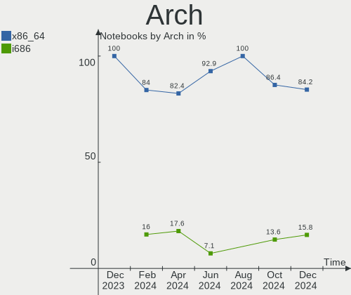
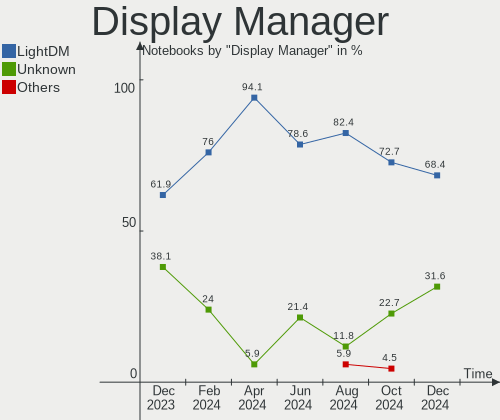
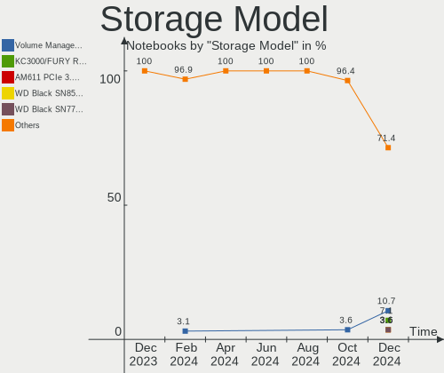
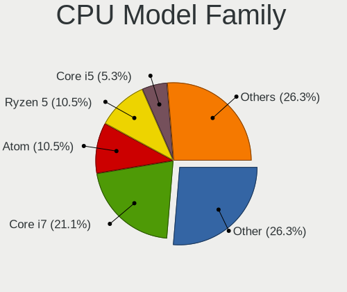
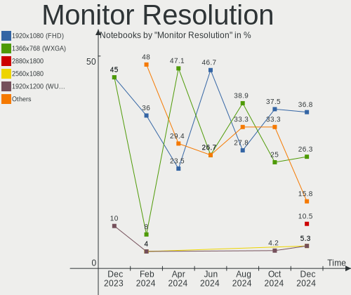
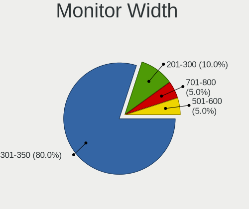
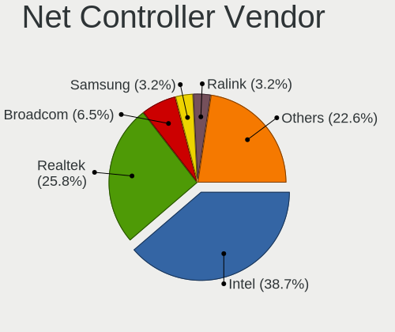
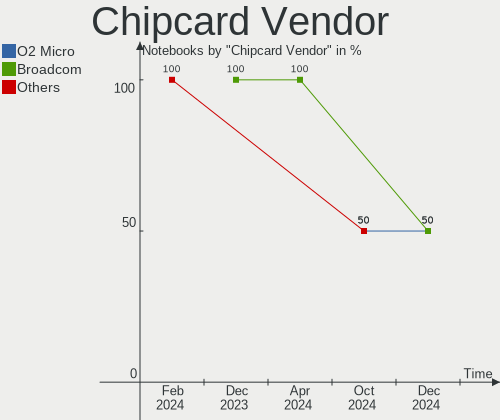

LMDE Hardware Trends (Notebooks)
--------------------------------

A project to identify most popular hardware characteristics and track their change
over time based on data collected by LMDE users at https://Linux-Hardware.org.

Anyone can contribute to this report by the [hw-probe](https://github.com/linuxhw/hw-probe) tool:

    sudo -E hw-probe -all -upload

This report is for one last month. Overall report since the beginning of time: [TestCoverage](https://github.com/linuxhw/TestCoverage)

Period: Apr, 2022.

Contents
--------

* [ System ](#system)
  - [ OS                       ](#os)
  - [ OS Family                ](#os-family)
  - [ Kernel                   ](#kernel)
  - [ Kernel Family            ](#kernel-family)
  - [ Kernel Major Ver.        ](#kernel-major-ver)
  - [ Arch                     ](#arch)
  - [ DE                       ](#de)
  - [ Display Server           ](#display-server)
  - [ Display Manager          ](#display-manager)
  - [ OS Lang                  ](#os-lang)
  - [ Boot Mode                ](#boot-mode)
  - [ Filesystem               ](#filesystem)
  - [ Part. scheme             ](#part-scheme)
  - [ Dual Boot with Linux/BSD ](#dual-boot-with-linuxbsd)
  - [ Dual Boot (Win)          ](#dual-boot-win)

* [ Board ](#board)
  - [ Vendor                   ](#vendor)
  - [ Model                    ](#model)
  - [ Model Family             ](#model-family)
  - [ MFG Year                 ](#mfg-year)
  - [ Form Factor              ](#form-factor)
  - [ Secure Boot              ](#secure-boot)
  - [ Coreboot                 ](#coreboot)
  - [ RAM Size                 ](#ram-size)
  - [ RAM Used                 ](#ram-used)
  - [ Total Drives             ](#total-drives)
  - [ Has CD-ROM               ](#has-cd-rom)
  - [ Has Ethernet             ](#has-ethernet)
  - [ Has WiFi                 ](#has-wifi)
  - [ Has Bluetooth            ](#has-bluetooth)

* [ Location ](#location)
  - [ Country                  ](#country)
  - [ City                     ](#city)

* [ Drives ](#drives)
  - [ Drive Vendor             ](#drive-vendor)
  - [ Drive Model              ](#drive-model)
  - [ HDD Vendor               ](#hdd-vendor)
  - [ SSD Vendor               ](#ssd-vendor)
  - [ Drive Kind               ](#drive-kind)
  - [ Drive Connector          ](#drive-connector)
  - [ Drive Size               ](#drive-size)
  - [ Space Total              ](#space-total)
  - [ Space Used               ](#space-used)
  - [ Malfunc. Drives          ](#malfunc-drives)
  - [ Malfunc. Drive Vendor    ](#malfunc-drive-vendor)
  - [ Malfunc. HDD Vendor      ](#malfunc-hdd-vendor)
  - [ Malfunc. Drive Kind      ](#malfunc-drive-kind)
  - [ Failed Drives            ](#failed-drives)
  - [ Failed Drive Vendor      ](#failed-drive-vendor)
  - [ Drive Status             ](#drive-status)

* [ Storage controller ](#storage-controller)
  - [ Storage Vendor           ](#storage-vendor)
  - [ Storage Model            ](#storage-model)
  - [ Storage Kind             ](#storage-kind)

* [ Processor ](#processor)
  - [ CPU Vendor               ](#cpu-vendor)
  - [ CPU Model                ](#cpu-model)
  - [ CPU Model Family         ](#cpu-model-family)
  - [ CPU Cores                ](#cpu-cores)
  - [ CPU Sockets              ](#cpu-sockets)
  - [ CPU Threads              ](#cpu-threads)
  - [ CPU Op-Modes             ](#cpu-op-modes)
  - [ CPU Microcode            ](#cpu-microcode)
  - [ CPU Microarch            ](#cpu-microarch)

* [ Graphics ](#graphics)
  - [ GPU Vendor               ](#gpu-vendor)
  - [ GPU Model                ](#gpu-model)
  - [ GPU Combo                ](#gpu-combo)
  - [ GPU Driver               ](#gpu-driver)
  - [ GPU Memory               ](#gpu-memory)

* [ Monitor ](#monitor)
  - [ Monitor Vendor           ](#monitor-vendor)
  - [ Monitor Model            ](#monitor-model)
  - [ Monitor Resolution       ](#monitor-resolution)
  - [ Monitor Diagonal         ](#monitor-diagonal)
  - [ Monitor Width            ](#monitor-width)
  - [ Aspect Ratio             ](#aspect-ratio)
  - [ Monitor Area             ](#monitor-area)
  - [ Pixel Density            ](#pixel-density)
  - [ Multiple Monitors        ](#multiple-monitors)

* [ Network ](#network)
  - [ Net Controller Vendor    ](#net-controller-vendor)
  - [ Net Controller Model     ](#net-controller-model)
  - [ Wireless Vendor          ](#wireless-vendor)
  - [ Wireless Model           ](#wireless-model)
  - [ Ethernet Vendor          ](#ethernet-vendor)
  - [ Ethernet Model           ](#ethernet-model)
  - [ Net Controller Kind      ](#net-controller-kind)
  - [ Used Controller          ](#used-controller)
  - [ NICs                     ](#nics)
  - [ IPv6                     ](#ipv6)

* [ Bluetooth ](#bluetooth)
  - [ Bluetooth Vendor         ](#bluetooth-vendor)
  - [ Bluetooth Model          ](#bluetooth-model)

* [ Sound ](#sound)
  - [ Sound Vendor             ](#sound-vendor)
  - [ Sound Model              ](#sound-model)

* [ Memory ](#memory)
  - [ Memory Vendor            ](#memory-vendor)
  - [ Memory Model             ](#memory-model)
  - [ Memory Kind              ](#memory-kind)
  - [ Memory Form Factor       ](#memory-form-factor)
  - [ Memory Size              ](#memory-size)
  - [ Memory Speed             ](#memory-speed)

* [ Printers & scanners ](#printers--scanners)
  - [ Printer Vendor           ](#printer-vendor)
  - [ Printer Model            ](#printer-model)
  - [ Scanner Vendor           ](#scanner-vendor)
  - [ Scanner Model            ](#scanner-model)

* [ Camera ](#camera)
  - [ Camera Vendor            ](#camera-vendor)
  - [ Camera Model             ](#camera-model)

* [ Security ](#security)
  - [ Fingerprint Vendor       ](#fingerprint-vendor)
  - [ Fingerprint Model        ](#fingerprint-model)
  - [ Chipcard Vendor          ](#chipcard-vendor)
  - [ Chipcard Model           ](#chipcard-model)

* [ Unsupported ](#unsupported)
  - [ Unsupported Devices      ](#unsupported-devices)
  - [ Unsupported Device Types ](#unsupported-device-types)

System
------

OS
--

Installed operating systems

| Name   | Notebooks | Percent |
|--------|-----------|---------|
| LMDE 5 | 20        | 86.96%  |
| LMDE 4 | 3         | 13.04%  |

OS Family
---------

OS without a version

| Name | Notebooks | Percent |
|------|-----------|---------|
| LMDE | 23        | 100%    |

Kernel
------

Version of the Linux kernel

| Version              | Notebooks | Percent |
|----------------------|-----------|---------|
| 5.10.0-13-amd64      | 13        | 56.52%  |
| 5.10.0-13-686        | 3         | 13.04%  |
| 5.10.0-12-amd64      | 3         | 13.04%  |
| 5.16.0-0.bpo.3-amd64 | 1         | 4.35%   |
| 4.19.0-20-amd64      | 1         | 4.35%   |
| 4.19.0-20-686        | 1         | 4.35%   |
| 4.19.0-19-686        | 1         | 4.35%   |

Kernel Family
-------------

Linux kernel without a distro release

| Version | Notebooks | Percent |
|---------|-----------|---------|
| 5.10.0  | 19        | 82.61%  |
| 4.19.0  | 3         | 13.04%  |
| 5.16.0  | 1         | 4.35%   |

Kernel Major Ver.
-----------------

Linux kernel major version

| Version | Notebooks | Percent |
|---------|-----------|---------|
| 5.10    | 19        | 82.61%  |
| 4.19    | 3         | 13.04%  |
| 5.16    | 1         | 4.35%   |

Arch
----

OS architecture (x86_64, i586, etc.)

| Name   | Notebooks | Percent |
|--------|-----------|---------|
| x86_64 | 18        | 78.26%  |
| i686   | 5         | 21.74%  |

DE
--

Desktop Environment

| Name       | Notebooks | Percent |
|------------|-----------|---------|
| X-Cinnamon | 23        | 100%    |

Display Server
--------------

X11 or Wayland

| Name | Notebooks | Percent |
|------|-----------|---------|
| X11  | 23        | 100%    |

Display Manager
---------------

SDDM, LightDM, etc.

| Name    | Notebooks | Percent |
|---------|-----------|---------|
| Unknown | 17        | 73.91%  |
| LightDM | 6         | 26.09%  |

OS Lang
-------

Language

| Lang  | Notebooks | Percent |
|-------|-----------|---------|
| en_US | 11        | 47.83%  |
| ru_RU | 2         | 8.7%    |
| de_DE | 2         | 8.7%    |
| pt_BR | 1         | 4.35%   |
| pl_PL | 1         | 4.35%   |
| nl_AW | 1         | 4.35%   |
| it_IT | 1         | 4.35%   |
| fr_FR | 1         | 4.35%   |
| es_PE | 1         | 4.35%   |
| es_MX | 1         | 4.35%   |
| en_GB | 1         | 4.35%   |

Boot Mode
---------

EFI or BIOS

| Mode | Notebooks | Percent |
|------|-----------|---------|
| EFI  | 13        | 56.52%  |
| BIOS | 10        | 43.48%  |

Filesystem
----------

Type of filesystem

| Type    | Notebooks | Percent |
|---------|-----------|---------|
| Ext4    | 22        | 95.65%  |
| Overlay | 1         | 4.35%   |

Part. scheme
------------

Scheme of partitioning

| Type    | Notebooks | Percent |
|---------|-----------|---------|
| Unknown | 17        | 73.91%  |
| GPT     | 6         | 26.09%  |

Dual Boot with Linux/BSD
------------------------

Hosting more than one Linux/BSD

| Dual boot | Notebooks | Percent |
|-----------|-----------|---------|
| No        | 22        | 95.65%  |
| Yes       | 1         | 4.35%   |

Dual Boot (Win)
---------------

Hosting Linux and Windows

| Dual boot | Notebooks | Percent |
|-----------|-----------|---------|
| No        | 21        | 91.3%   |
| Yes       | 2         | 8.7%    |

Board
-----

Vendor
------

Motherboard manufacturer

| Name             | Notebooks | Percent |
|------------------|-----------|---------|
| Dell             | 6         | 26.09%  |
| Hewlett-Packard  | 5         | 21.74%  |
| Acer             | 4         | 17.39%  |
| ASUSTek Computer | 2         | 8.7%    |
| Toshiba          | 1         | 4.35%   |
| LincPlus         | 1         | 4.35%   |
| Lenovo           | 1         | 4.35%   |
| Howard Computers | 1         | 4.35%   |
| Dixonsxp         | 1         | 4.35%   |
| Apple            | 1         | 4.35%   |

Model
-----

Motherboard model

| Name                            | Notebooks | Percent |
|---------------------------------|-----------|---------|
| Acer AOD270                     | 2         | 8.7%    |
| Toshiba Satellite L455          | 1         | 4.35%   |
| LincPlus LINNCPLUS P1           | 1         | 4.35%   |
| Lenovo ThinkPad W541 20EGS24J00 | 1         | 4.35%   |
| Howard Computers R7X            | 1         | 4.35%   |
| HP ProBook 450 G8 Notebook PC   | 1         | 4.35%   |
| HP Presario C500 (GF581UA#ABA)  | 1         | 4.35%   |
| HP Pavilion Laptop 15-eh1xxx    | 1         | 4.35%   |
| HP EliteBook 840 G1             | 1         | 4.35%   |
| HP 14                           | 1         | 4.35%   |
| Dell Vostro 3500                | 1         | 4.35%   |
| Dell Precision 7520             | 1         | 4.35%   |
| Dell Latitude E6400             | 1         | 4.35%   |
| Dell Latitude 5511              | 1         | 4.35%   |
| Dell Latitude 3410              | 1         | 4.35%   |
| Dell Inspiron 14 5410 2-in-1    | 1         | 4.35%   |
| ASUS N61Jv                      | 1         | 4.35%   |
| ASUS 901                        | 1         | 4.35%   |
| Apple MacBookPro14,1            | 1         | 4.35%   |
| Acer Aspire E5-553G             | 1         | 4.35%   |
| Acer AOA110                     | 1         | 4.35%   |
| Unknown                         | 1         | 4.35%   |

Model Family
------------

Motherboard model prefix

| Name                 | Notebooks | Percent |
|----------------------|-----------|---------|
| Dell Latitude        | 3         | 13.04%  |
| Acer AOD270          | 2         | 8.7%    |
| Toshiba Satellite    | 1         | 4.35%   |
| LincPlus LINNCPLUS   | 1         | 4.35%   |
| Lenovo ThinkPad      | 1         | 4.35%   |
| Howard Computers R7X | 1         | 4.35%   |
| HP ProBook           | 1         | 4.35%   |
| HP Presario          | 1         | 4.35%   |
| HP Pavilion          | 1         | 4.35%   |
| HP EliteBook         | 1         | 4.35%   |
| HP 14                | 1         | 4.35%   |
| Dell Vostro          | 1         | 4.35%   |
| Dell Precision       | 1         | 4.35%   |
| Dell Inspiron        | 1         | 4.35%   |
| ASUS N61Jv           | 1         | 4.35%   |
| ASUS 901             | 1         | 4.35%   |
| Apple MacBookPro14   | 1         | 4.35%   |
| Acer Aspire          | 1         | 4.35%   |
| Acer AOA110          | 1         | 4.35%   |
| Unknown              | 1         | 4.35%   |

MFG Year
--------

Motherboard manufacture year

| Year | Notebooks | Percent |
|------|-----------|---------|
| 2020 | 4         | 17.39%  |
| 2021 | 3         | 13.04%  |
| 2013 | 3         | 13.04%  |
| 2017 | 2         | 8.7%    |
| 2012 | 2         | 8.7%    |
| 2010 | 2         | 8.7%    |
| 2008 | 2         | 8.7%    |
| 2007 | 2         | 8.7%    |
| 2016 | 1         | 4.35%   |
| 2015 | 1         | 4.35%   |
| 2009 | 1         | 4.35%   |

Form Factor
-----------

Physical design of the computer

| Name     | Notebooks | Percent |
|----------|-----------|---------|
| Notebook | 23        | 100%    |

Secure Boot
-----------

Enabled or disabled

| State    | Notebooks | Percent |
|----------|-----------|---------|
| Disabled | 22        | 95.65%  |
| Enabled  | 1         | 4.35%   |

Coreboot
--------

Have coreboot on board

| Used | Notebooks | Percent |
|------|-----------|---------|
| No   | 23        | 100%    |

RAM Size
--------

Total RAM memory

| Size in GB | Notebooks | Percent |
|------------|-----------|---------|
| 3.01-4.0   | 7         | 30.43%  |
| 4.01-8.0   | 4         | 17.39%  |
| 8.01-16.0  | 4         | 17.39%  |
| 2.01-3.0   | 3         | 13.04%  |
| 1.01-2.0   | 3         | 13.04%  |
| 32.01-64.0 | 1         | 4.35%   |
| 16.01-24.0 | 1         | 4.35%   |

RAM Used
--------

Used RAM memory

| Used GB  | Notebooks | Percent |
|----------|-----------|---------|
| 2.01-3.0 | 7         | 30.43%  |
| 1.01-2.0 | 7         | 30.43%  |
| 0.51-1.0 | 5         | 21.74%  |
| 3.01-4.0 | 3         | 13.04%  |
| 4.01-8.0 | 1         | 4.35%   |

Total Drives
------------

Number of drives on board

| Drives | Notebooks | Percent |
|--------|-----------|---------|
| 1      | 17        | 73.91%  |
| 2      | 5         | 21.74%  |
| 4      | 1         | 4.35%   |

Has CD-ROM
----------

Has CD-ROM on board

| Presented | Notebooks | Percent |
|-----------|-----------|---------|
| No        | 18        | 78.26%  |
| Yes       | 5         | 21.74%  |

Has Ethernet
------------

Has Ethernet on board

| Presented | Notebooks | Percent |
|-----------|-----------|---------|
| Yes       | 19        | 82.61%  |
| No        | 4         | 17.39%  |

Has WiFi
--------

Has WiFi module

| Presented | Notebooks | Percent |
|-----------|-----------|---------|
| Yes       | 22        | 95.65%  |
| No        | 1         | 4.35%   |

Has Bluetooth
-------------

Has Bluetooth module

| Presented | Notebooks | Percent |
|-----------|-----------|---------|
| Yes       | 13        | 56.52%  |
| No        | 10        | 43.48%  |

Location
--------

Country
-------

Geographic location (country)

| Country | Notebooks | Percent |
|---------|-----------|---------|
| USA     | 7         | 30.43%  |
| Russia  | 2         | 8.7%    |
| Germany | 2         | 8.7%    |
| France  | 2         | 8.7%    |
| UK      | 1         | 4.35%   |
| Romania | 1         | 4.35%   |
| Poland  | 1         | 4.35%   |
| Peru    | 1         | 4.35%   |
| Mexico  | 1         | 4.35%   |
| Kenya   | 1         | 4.35%   |
| Italy   | 1         | 4.35%   |
| Canada  | 1         | 4.35%   |
| Brazil  | 1         | 4.35%   |
| Belgium | 1         | 4.35%   |

City
----

Geographic location (city)

| City           | Notebooks | Percent |
|----------------|-----------|---------|
| Veurne         | 1         | 4.35%   |
| Vaslui         | 1         | 4.35%   |
| Spearfish      | 1         | 4.35%   |
| Scarborough    | 1         | 4.35%   |
| Rochester      | 1         | 4.35%   |
| Rho            | 1         | 4.35%   |
| Nairobi        | 1         | 4.35%   |
| Murphy         | 1         | 4.35%   |
| Moscow         | 1         | 4.35%   |
| Mieuxce        | 1         | 4.35%   |
| Marrero        | 1         | 4.35%   |
| Mannheim       | 1         | 4.35%   |
| Limoges        | 1         | 4.35%   |
| Lima           | 1         | 4.35%   |
| Lebanon        | 1         | 4.35%   |
| Lawrenceville  | 1         | 4.35%   |
| Knurow         | 1         | 4.35%   |
| Hollister      | 1         | 4.35%   |
| Eppingen       | 1         | 4.35%   |
| Darlington     | 1         | 4.35%   |
| Ciudad Juárez | 1         | 4.35%   |
| Chelyabinsk    | 1         | 4.35%   |
| Belém         | 1         | 4.35%   |

Drives
------

Drive Vendor
------------

Hard drive vendors

| Vendor                         | Notebooks | Drives | Percent |
|--------------------------------|-----------|--------|---------|
| WDC                            | 4         | 4      | 13.33%  |
| Unknown                        | 3         | 3      | 10%     |
| Seagate                        | 3         | 3      | 10%     |
| Samsung Electronics            | 3         | 3      | 10%     |
| SanDisk                        | 2         | 2      | 6.67%   |
| HGST                           | 2         | 2      | 6.67%   |
| Transcend                      | 1         | 1      | 3.33%   |
| Toshiba                        | 1         | 1      | 3.33%   |
| Solid State Storage Technology | 1         | 1      | 3.33%   |
| Micron/Crucial Technology      | 1         | 1      | 3.33%   |
| LITEON                         | 1         | 1      | 3.33%   |
| Kingston                       | 1         | 1      | 3.33%   |
| KingSpec                       | 1         | 1      | 3.33%   |
| Intel                          | 1         | 1      | 3.33%   |
| Hitachi                        | 1         | 1      | 3.33%   |
| China                          | 1         | 1      | 3.33%   |
| ASUS-PHISON                    | 1         | 1      | 3.33%   |
| Apple                          | 1         | 2      | 3.33%   |
| Acer                           | 1         | 1      | 3.33%   |

Drive Model
-----------

Hard drive models

| Model                                    | Notebooks | Percent |
|------------------------------------------|-----------|---------|
| WDC WDBNCE5000PNC 500GB SSD              | 1         | 3.23%   |
| WDC WD5000BPVX-00JC3T0 500GB             | 1         | 3.23%   |
| WDC WD3200BPVT-35ZEST0 320GB             | 1         | 3.23%   |
| WDC PC SN530 NVMe 256GB                  | 1         | 3.23%   |
| Unknown MMC Card  7GB                    | 1         | 3.23%   |
| Unknown MMC Card  4GB                    | 1         | 3.23%   |
| Unknown Biwin  64GB                      | 1         | 3.23%   |
| Transcend TS128GMTS430S 128GB SSD        | 1         | 3.23%   |
| Toshiba MQ04ABF100 1TB                   | 1         | 3.23%   |
| Solid State Storage NVMe SSD Drive 256GB | 1         | 3.23%   |
| Seagate STT_FPM28GLSE 128GB              | 1         | 3.23%   |
| Seagate ST500LT012-1DG142 500GB          | 1         | 3.23%   |
| Seagate ST320LM001 HN-M320MBB 320GB      | 1         | 3.23%   |
| SanDisk SSD PLUS 480GB                   | 1         | 3.23%   |
| SanDisk SD7UB3Q256G1001 256GB SSD        | 1         | 3.23%   |
| Samsung SSD 980 1TB                      | 1         | 3.23%   |
| Samsung SSD 970 EVO Plus 1TB             | 1         | 3.23%   |
| Samsung NVMe SSD Drive 256GB             | 1         | 3.23%   |
| Micron/Crucial NVMe SSD Drive 2TB        | 1         | 3.23%   |
| LITEON CV3-CE256-11 SATA 256GB SSD       | 1         | 3.23%   |
| Kingston SA400M8240G 240GB SSD           | 1         | 3.23%   |
| KingSpec MT-128 128GB                    | 1         | 3.23%   |
| Intel SSDSCKKF256G8 SATA 256GB           | 1         | 3.23%   |
| Hitachi HTS541680J9SA00 80GB             | 1         | 3.23%   |
| HGST HTS725050A7E630 500GB               | 1         | 3.23%   |
| HGST HTS545050A7E380 500GB               | 1         | 3.23%   |
| China SATA SSD 256GB                     | 1         | 3.23%   |
| ASUS-PHISON SSD 4GB                      | 1         | 3.23%   |
| Apple NVMe SSD Drive 8KB                 | 1         | 3.23%   |
| Apple NVMe SSD Drive 121GB               | 1         | 3.23%   |
| Acer SSD SA100 480GB                     | 1         | 3.23%   |

HDD Vendor
----------

Hard disk drive vendors

| Vendor  | Notebooks | Drives | Percent |
|---------|-----------|--------|---------|
| WDC     | 2         | 2      | 25%     |
| Seagate | 2         | 2      | 25%     |
| HGST    | 2         | 2      | 25%     |
| Toshiba | 1         | 1      | 12.5%   |
| Hitachi | 1         | 1      | 12.5%   |

SSD Vendor
----------

Solid state drive vendors

| Vendor      | Notebooks | Drives | Percent |
|-------------|-----------|--------|---------|
| SanDisk     | 2         | 2      | 18.18%  |
| WDC         | 1         | 1      | 9.09%   |
| Transcend   | 1         | 1      | 9.09%   |
| LITEON      | 1         | 1      | 9.09%   |
| Kingston    | 1         | 1      | 9.09%   |
| KingSpec    | 1         | 1      | 9.09%   |
| Intel       | 1         | 1      | 9.09%   |
| China       | 1         | 1      | 9.09%   |
| ASUS-PHISON | 1         | 1      | 9.09%   |
| Acer        | 1         | 1      | 9.09%   |

Drive Kind
----------

HDD or SSD

| Kind    | Notebooks | Drives | Percent |
|---------|-----------|--------|---------|
| SSD     | 9         | 11     | 32.14%  |
| HDD     | 8         | 8      | 28.57%  |
| NVMe    | 7         | 8      | 25%     |
| MMC     | 3         | 3      | 10.71%  |
| Unknown | 1         | 1      | 3.57%   |

Drive Connector
---------------

SATA, SAS, NVMe, etc.

| Type | Notebooks | Drives | Percent |
|------|-----------|--------|---------|
| SATA | 16        | 20     | 61.54%  |
| NVMe | 7         | 8      | 26.92%  |
| MMC  | 3         | 3      | 11.54%  |

Drive Size
----------

Size of hard drive

| Size in TB | Notebooks | Drives | Percent |
|------------|-----------|--------|---------|
| 0.01-0.5   | 15        | 18     | 93.75%  |
| 0.51-1.0   | 1         | 1      | 6.25%   |

Space Total
-----------

Amount of disk space available on the file system

| Size in GB | Notebooks | Percent |
|------------|-----------|---------|
| 251-500    | 7         | 30.43%  |
| 101-250    | 6         | 26.09%  |
| 501-1000   | 3         | 13.04%  |
| 51-100     | 3         | 13.04%  |
| 21-50      | 2         | 8.7%    |
| 1001-2000  | 1         | 4.35%   |
| 1-20       | 1         | 4.35%   |

Space Used
----------

Amount of used disk space

| Used GB | Notebooks | Percent |
|---------|-----------|---------|
| 1-20    | 15        | 65.22%  |
| 21-50   | 5         | 21.74%  |
| 101-250 | 2         | 8.7%    |
| 51-100  | 1         | 4.35%   |

Malfunc. Drives
---------------

Drive models with a malfunction

| Model                          | Notebooks | Drives | Percent |
|--------------------------------|-----------|--------|---------|
| Intel SSDSCKKF256G8 SATA 256GB | 1         | 1      | 100%    |

Malfunc. Drive Vendor
---------------------

Vendors of faulty drives

| Vendor | Notebooks | Drives | Percent |
|--------|-----------|--------|---------|
| Intel  | 1         | 1      | 100%    |

Malfunc. HDD Vendor
-------------------

Vendors of faulty HDD drives

Zero info for selected period =(

Malfunc. Drive Kind
-------------------

Kinds of faulty drives

| Kind | Notebooks | Drives | Percent |
|------|-----------|--------|---------|
| SSD  | 1         | 1      | 100%    |

Failed Drives
-------------

Failed drive models

Zero info for selected period =(

Failed Drive Vendor
-------------------

Failed drive vendors

Zero info for selected period =(

Drive Status
------------

Number of failed and malfunc. drives

| Status   | Notebooks | Drives | Percent |
|----------|-----------|--------|---------|
| Detected | 18        | 24     | 72%     |
| Works    | 6         | 6      | 24%     |
| Malfunc  | 1         | 1      | 4%      |

Storage controller
------------------

Storage Vendor
--------------

Storage controller vendors

| Vendor                         | Notebooks | Percent |
|--------------------------------|-----------|---------|
| Intel                          | 18        | 62.07%  |
| AMD                            | 4         | 13.79%  |
| Samsung Electronics            | 3         | 10.34%  |
| Solid State Storage Technology | 1         | 3.45%   |
| Sandisk                        | 1         | 3.45%   |
| Micron/Crucial Technology      | 1         | 3.45%   |
| Apple                          | 1         | 3.45%   |

Storage Model
-------------

Storage controller models

| Model                                                                          | Notebooks | Percent |
|--------------------------------------------------------------------------------|-----------|---------|
| AMD FCH SATA Controller [AHCI mode]                                            | 3         | 9.38%   |
| Samsung NVMe SSD Controller 980                                                | 2         | 6.25%   |
| Intel Volume Management Device NVMe RAID Controller                            | 2         | 6.25%   |
| Intel NM10/ICH7 Family SATA Controller [AHCI mode]                             | 2         | 6.25%   |
| Intel 82801GBM/GHM (ICH7-M Family) SATA Controller [AHCI mode]                 | 2         | 6.25%   |
| Intel 82801G (ICH7 Family) IDE Controller                                      | 2         | 6.25%   |
| Solid State Storage Non-Volatile memory controller                             | 1         | 3.13%   |
| Sandisk Non-Volatile memory controller                                         | 1         | 3.13%   |
| Samsung NVMe SSD Controller SM981/PM981/PM983                                  | 1         | 3.13%   |
| Micron/Crucial NVMe Controller                                                 | 1         | 3.13%   |
| Intel Tiger Lake-LP SATA Controller [AHCI mode]                                | 1         | 3.13%   |
| Intel Q170/Q150/B150/H170/H110/Z170/CM236 Chipset SATA Controller [AHCI Mode]  | 1         | 3.13%   |
| Intel Comet Lake SATA AHCI Controller                                          | 1         | 3.13%   |
| Intel Celeron/Pentium Silver Processor SATA Controller                         | 1         | 3.13%   |
| Intel Atom Processor E3800 Series SATA AHCI Controller                         | 1         | 3.13%   |
| Intel 82801IBM/IEM (ICH9M/ICH9M-E) 4 port SATA Controller [AHCI mode]          | 1         | 3.13%   |
| Intel 82801GBM/GHM (ICH7-M Family) SATA Controller [IDE mode]                  | 1         | 3.13%   |
| Intel 82801 Mobile SATA Controller [RAID mode]                                 | 1         | 3.13%   |
| Intel 8 Series/C220 Series Chipset Family 6-port SATA Controller 1 [AHCI mode] | 1         | 3.13%   |
| Intel 8 Series SATA Controller 1 [AHCI mode]                                   | 1         | 3.13%   |
| Intel 5 Series/3400 Series Chipset 4 port SATA AHCI Controller                 | 1         | 3.13%   |
| Intel 400 Series Chipset Family SATA AHCI Controller                           | 1         | 3.13%   |
| Apple S3X NVMe Controller                                                      | 1         | 3.13%   |
| AMD IXP SB4x0 Serial ATA Controller                                            | 1         | 3.13%   |
| AMD IXP SB4x0 IDE Controller                                                   | 1         | 3.13%   |

Storage Kind
------------

Kind of storage controller (IDE, SATA, NVMe, SAS, ...)

| Kind | Notebooks | Percent |
|------|-----------|---------|
| SATA | 17        | 54.84%  |
| NVMe | 7         | 22.58%  |
| IDE  | 4         | 12.9%   |
| RAID | 3         | 9.68%   |

Processor
---------

CPU Vendor
----------

Processor vendors

| Vendor | Notebooks | Percent |
|--------|-----------|---------|
| Intel  | 20        | 86.96%  |
| AMD    | 3         | 13.04%  |

CPU Model
---------

Processor models

| Model                                           | Notebooks | Percent |
|-------------------------------------------------|-----------|---------|
| Intel Atom CPU N270 @ 1.60GHz                   | 2         | 8.7%    |
| Intel Atom CPU N2600 @ 1.60GHz                  | 2         | 8.7%    |
| Intel 11th Gen Core i5-1135G7 @ 2.40GHz         | 2         | 8.7%    |
| Intel Core i7-6820HQ CPU @ 2.70GHz              | 1         | 4.35%   |
| Intel Core i7-4810MQ CPU @ 2.80GHz              | 1         | 4.35%   |
| Intel Core i5-7360U CPU @ 2.30GHz               | 1         | 4.35%   |
| Intel Core i5-4300U CPU @ 1.90GHz               | 1         | 4.35%   |
| Intel Core i5-10300H CPU @ 2.50GHz              | 1         | 4.35%   |
| Intel Core i5-10210U CPU @ 1.60GHz              | 1         | 4.35%   |
| Intel Core i3 CPU M 330 @ 2.13GHz               | 1         | 4.35%   |
| Intel Core 2 Duo CPU T7250 @ 2.00GHz            | 1         | 4.35%   |
| Intel Core 2 Duo CPU E8235 @ 2.80GHz            | 1         | 4.35%   |
| Intel Celeron N4020 CPU @ 1.10GHz               | 1         | 4.35%   |
| Intel Celeron M CPU 520 @ 1.60GHz               | 1         | 4.35%   |
| Intel Celeron M CPU 440 @ 1.86GHz               | 1         | 4.35%   |
| Intel Celeron CPU N2815 @ 1.86GHz               | 1         | 4.35%   |
| Intel 11th Gen Core i3-1115G4 @ 3.00GHz         | 1         | 4.35%   |
| AMD Ryzen 7 5700U with Radeon Graphics          | 1         | 4.35%   |
| AMD Ryzen 7 4800H with Radeon Graphics          | 1         | 4.35%   |
| AMD A10-9600P RADEON R5, 10 COMPUTE CORES 4C+6G | 1         | 4.35%   |

CPU Model Family
----------------

Processor model prefix

| Model            | Notebooks | Percent |
|------------------|-----------|---------|
| Intel Core i5    | 4         | 17.39%  |
| Intel Atom       | 4         | 17.39%  |
| Other            | 3         | 13.04%  |
| Intel Core i7    | 2         | 8.7%    |
| Intel Core 2 Duo | 2         | 8.7%    |
| Intel Celeron M  | 2         | 8.7%    |
| Intel Celeron    | 2         | 8.7%    |
| AMD Ryzen 7      | 2         | 8.7%    |
| Intel Core i3    | 1         | 4.35%   |
| AMD A10          | 1         | 4.35%   |

CPU Cores
---------

Number of processor cores

| Number | Notebooks | Percent |
|--------|-----------|---------|
| 2      | 11        | 47.83%  |
| 4      | 6         | 26.09%  |
| 1      | 4         | 17.39%  |
| 8      | 2         | 8.7%    |

CPU Sockets
-----------

Number of sockets

| Number | Notebooks | Percent |
|--------|-----------|---------|
| 1      | 23        | 100%    |

CPU Threads
-----------

Threads per core (Hyper-Threading)

| Number | Notebooks | Percent |
|--------|-----------|---------|
| 2      | 17        | 73.91%  |
| 1      | 6         | 26.09%  |

CPU Op-Modes
------------

CPU Operation Modes (32-bit, 64-bit)

| Op mode        | Notebooks | Percent |
|----------------|-----------|---------|
| 32-bit, 64-bit | 19        | 82.61%  |
| 32-bit         | 4         | 17.39%  |

CPU Microcode
-------------

Microcode number

| Number     | Notebooks | Percent |
|------------|-----------|---------|
| 0x806c1    | 3         | 13.04%  |
| 0x30661    | 2         | 8.7%    |
| 0x106c2    | 2         | 8.7%    |
| 0xa0652    | 1         | 4.35%   |
| 0x806ec    | 1         | 4.35%   |
| 0x806e9    | 1         | 4.35%   |
| 0x706a8    | 1         | 4.35%   |
| 0x6fd      | 1         | 4.35%   |
| 0x6f6      | 1         | 4.35%   |
| 0x6ec      | 1         | 4.35%   |
| 0x506e3    | 1         | 4.35%   |
| 0x40651    | 1         | 4.35%   |
| 0x306c3    | 1         | 4.35%   |
| 0x30673    | 1         | 4.35%   |
| 0x20652    | 1         | 4.35%   |
| 0x10676    | 1         | 4.35%   |
| 0x08608103 | 1         | 4.35%   |
| 0x08600103 | 1         | 4.35%   |
| 0x0600611a | 1         | 4.35%   |

CPU Microarch
-------------

Microarchitecture

| Name          | Notebooks | Percent |
|---------------|-----------|---------|
| Bonnell       | 4         | 17.39%  |
| TigerLake     | 3         | 13.04%  |
| KabyLake      | 2         | 8.7%    |
| Haswell       | 2         | 8.7%    |
| Core          | 2         | 8.7%    |
| Zen 2         | 1         | 4.35%   |
| Westmere      | 1         | 4.35%   |
| Skylake       | 1         | 4.35%   |
| Silvermont    | 1         | 4.35%   |
| Penryn        | 1         | 4.35%   |
| P6            | 1         | 4.35%   |
| Goldmont plus | 1         | 4.35%   |
| Excavator     | 1         | 4.35%   |
| CometLake     | 1         | 4.35%   |
| Unknown       | 1         | 4.35%   |

Graphics
--------

GPU Vendor
----------

Vendors of graphics cards

| Vendor | Notebooks | Percent |
|--------|-----------|---------|
| Intel  | 18        | 69.23%  |
| Nvidia | 4         | 15.38%  |
| AMD    | 4         | 15.38%  |

GPU Model
---------

Graphics card models

| Model                                                                                 | Notebooks | Percent |
|---------------------------------------------------------------------------------------|-----------|---------|
| Intel Mobile 945GM/GMS/GME, 943/940GML Express Integrated Graphics Controller         | 3         | 10%     |
| Intel TigerLake-LP GT2 [Iris Xe Graphics]                                             | 2         | 6.67%   |
| Intel Mobile 945GSE Express Integrated Graphics Controller                            | 2         | 6.67%   |
| Intel Atom Processor D2xxx/N2xxx Integrated Graphics Controller                       | 2         | 6.67%   |
| Nvidia GT216M [GeForce GT 325M]                                                       | 1         | 3.33%   |
| Nvidia GM107GLM [Quadro M1200 Mobile]                                                 | 1         | 3.33%   |
| Nvidia GK106GLM [Quadro K2100M]                                                       | 1         | 3.33%   |
| Nvidia G98M [Quadro NVS 160M]                                                         | 1         | 3.33%   |
| Intel Tiger Lake UHD Graphics                                                         | 1         | 3.33%   |
| Intel Mobile 945GM/GMS, 943/940GML Express Integrated Graphics Controller             | 1         | 3.33%   |
| Intel Mobile 4 Series Chipset Integrated Graphics Controller                          | 1         | 3.33%   |
| Intel Iris Plus Graphics 640                                                          | 1         | 3.33%   |
| Intel HD Graphics 530                                                                 | 1         | 3.33%   |
| Intel Haswell-ULT Integrated Graphics Controller                                      | 1         | 3.33%   |
| Intel GeminiLake [UHD Graphics 600]                                                   | 1         | 3.33%   |
| Intel Core Processor Integrated Graphics Controller                                   | 1         | 3.33%   |
| Intel CometLake-U GT2 [UHD Graphics]                                                  | 1         | 3.33%   |
| Intel CometLake-H GT2 [UHD Graphics]                                                  | 1         | 3.33%   |
| Intel Atom Processor Z36xxx/Z37xxx Series Graphics & Display                          | 1         | 3.33%   |
| Intel 4th Gen Core Processor Integrated Graphics Controller                           | 1         | 3.33%   |
| AMD Wani [Radeon R5/R6/R7 Graphics]                                                   | 1         | 3.33%   |
| AMD Topaz XT [Radeon R7 M260/M265 / M340/M360 / M440/M445 / 530/535 / 620/625 Mobile] | 1         | 3.33%   |
| AMD Renoir                                                                            | 1         | 3.33%   |
| AMD RC410M [Mobility Radeon Xpress 200M]                                              | 1         | 3.33%   |
| AMD Lucienne                                                                          | 1         | 3.33%   |

GPU Combo
---------

Combinations of graphics cards

| Name           | Notebooks | Percent |
|----------------|-----------|---------|
| 1 x Intel      | 15        | 65.22%  |
| Intel + Nvidia | 3         | 13.04%  |
| 1 x AMD        | 3         | 13.04%  |
| 2 x AMD        | 1         | 4.35%   |
| 1 x Nvidia     | 1         | 4.35%   |

GPU Driver
----------

Free vs proprietary

| Driver | Notebooks | Percent |
|--------|-----------|---------|
| Free   | 23        | 100%    |

GPU Memory
----------

Total video memory

| Size in GB | Notebooks | Percent |
|------------|-----------|---------|
| Unknown    | 15        | 65.22%  |
| 0.01-0.5   | 4         | 17.39%  |
| 0.51-1.0   | 2         | 8.7%    |
| 3.01-4.0   | 1         | 4.35%   |
| 1.01-2.0   | 1         | 4.35%   |

Monitor
-------

Monitor Vendor
--------------

Monitor vendors

| Vendor                  | Notebooks | Percent |
|-------------------------|-----------|---------|
| AU Optronics            | 7         | 25%     |
| PANDA                   | 2         | 7.14%   |
| LG Display              | 2         | 7.14%   |
| Dell                    | 2         | 7.14%   |
| Chimei Innolux          | 2         | 7.14%   |
| Chi Mei Optoelectronics | 2         | 7.14%   |
| BOE                     | 2         | 7.14%   |
| Sharp                   | 1         | 3.57%   |
| Samsung Electronics     | 1         | 3.57%   |
| Quanta Display          | 1         | 3.57%   |
| Planar                  | 1         | 3.57%   |
| Panasonic               | 1         | 3.57%   |
| LG Philips              | 1         | 3.57%   |
| HannStar                | 1         | 3.57%   |
| BenQ                    | 1         | 3.57%   |
| Apple                   | 1         | 3.57%   |

Monitor Model
-------------

Monitor models

| Model                                                                    | Notebooks | Percent |
|--------------------------------------------------------------------------|-----------|---------|
| Chi Mei Optoelectronics LCD Monitor CMO1018 1024x600 222x125mm 10.0-inch | 2         | 6.9%    |
| Sharp LQ156M1JW01 SHP14C3 1920x1080 344x194mm 15.5-inch                  | 1         | 3.45%   |
| Samsung Electronics C27F390 SAM0D32 1920x1080 598x336mm 27.0-inch        | 1         | 3.45%   |
| Quanta Display LCD Monitor QDS004B 1280x800 331x207mm 15.4-inch          | 1         | 3.45%   |
| Planar PLL2210W PLN2210 1920x1080 476x268mm 21.5-inch                    | 1         | 3.45%   |
| PANDA LCD Monitor NCP0035 1920x1080 309x174mm 14.0-inch                  | 1         | 3.45%   |
| PANDA LC133LF2L03 NCP0015 1920x1080 294x165mm 13.3-inch                  | 1         | 3.45%   |
| Panasonic LCD Monitor MEI96A2 2560x1440 309x173mm 13.9-inch              | 1         | 3.45%   |
| LG Philips LCD Monitor LPL0140 1440x900 304x190mm 14.1-inch              | 1         | 3.45%   |
| LG Display LCD Monitor LGD068D 1920x1080 309x174mm 14.0-inch             | 1         | 3.45%   |
| LG Display LCD Monitor LGD064C 1920x1080 344x194mm 15.5-inch             | 1         | 3.45%   |
| HannStar HSD160PHW1 HSD0640 1366x768 353x199mm 16.0-inch                 | 1         | 3.45%   |
| Dell U2415 DELA0B8 1920x1200 518x324mm 24.1-inch                         | 1         | 3.45%   |
| Dell S2721D DELA199 2560x1440 597x336mm 27.0-inch                        | 1         | 3.45%   |
| Dell P2219H DELA115 1920x1080 476x267mm 21.5-inch                        | 1         | 3.45%   |
| Chimei Innolux LCD Monitor CMN14C0 1920x1080 308x173mm 13.9-inch         | 1         | 3.45%   |
| Chimei Innolux LCD Monitor CMN14A1 1366x768 309x174mm 14.0-inch          | 1         | 3.45%   |
| BOE LCD Monitor BOE07C6 1366x768 309x173mm 13.9-inch                     | 1         | 3.45%   |
| BOE LCD Monitor BOE0713 1920x1080 344x193mm 15.5-inch                    | 1         | 3.45%   |
| BenQ T90X BNQ76AF 1280x1024 376x301mm 19.0-inch                          | 1         | 3.45%   |
| AU Optronics LCD Monitor AUO71EC 1366x768 344x193mm 15.5-inch            | 1         | 3.45%   |
| AU Optronics LCD Monitor AUO26ED 1920x1080 344x194mm 15.5-inch           | 1         | 3.45%   |
| AU Optronics LCD Monitor AUO21ED 1920x1080 344x194mm 15.5-inch           | 1         | 3.45%   |
| AU Optronics LCD Monitor AUO2174 1280x800 331x207mm 15.4-inch            | 1         | 3.45%   |
| AU Optronics LCD Monitor AUO12EC 1366x768 344x193mm 15.5-inch            | 1         | 3.45%   |
| AU Optronics LCD Monitor AUO11C2 1024x600 195x113mm 8.9-inch             | 1         | 3.45%   |
| AU Optronics LCD Monitor AUO1020 1024x600 195x113mm 8.9-inch             | 1         | 3.45%   |
| Apple Color LCD APPA034 2880x1800 286x179mm 13.3-inch                    | 1         | 3.45%   |

Monitor Resolution
------------------

Monitor screen resolution

| Resolution        | Notebooks | Percent |
|-------------------|-----------|---------|
| 1920x1080 (FHD)   | 9         | 34.62%  |
| 1366x768 (WXGA)   | 5         | 19.23%  |
| 1024x600          | 4         | 15.38%  |
| 1280x800 (WXGA)   | 2         | 7.69%   |
| 3840x2160 (4K)    | 1         | 3.85%   |
| 2880x1800         | 1         | 3.85%   |
| 2560x1440 (QHD)   | 1         | 3.85%   |
| 1920x1200 (WUXGA) | 1         | 3.85%   |
| 1440x900 (WXGA+)  | 1         | 3.85%   |
| 1280x1024 (SXGA)  | 1         | 3.85%   |

Monitor Diagonal
----------------

Diagonal size in inches

| Inches | Notebooks | Percent |
|--------|-----------|---------|
| 15     | 10        | 34.48%  |
| 13     | 4         | 13.79%  |
| 14     | 3         | 10.34%  |
| 27     | 2         | 6.9%    |
| 21     | 2         | 6.9%    |
| 10     | 2         | 6.9%    |
| 8      | 2         | 6.9%    |
| 24     | 1         | 3.45%   |
| 19     | 1         | 3.45%   |
| 17     | 1         | 3.45%   |
| 16     | 1         | 3.45%   |

Monitor Width
-------------

Physical width

| Width in mm | Notebooks | Percent |
|-------------|-----------|---------|
| 301-350     | 15        | 55.56%  |
| 201-300     | 4         | 14.81%  |
| 501-600     | 2         | 7.41%   |
| 401-500     | 2         | 7.41%   |
| 351-400     | 2         | 7.41%   |
| 101-200     | 2         | 7.41%   |

Aspect Ratio
------------

Proportional relationship between the width and the height

| Ratio | Notebooks | Percent |
|-------|-----------|---------|
| 16/9  | 19        | 76%     |
| 16/10 | 5         | 20%     |
| 5/4   | 1         | 4%      |

Monitor Area
------------

Area in inch²

| Area in inch² | Notebooks | Percent |
|----------------|-----------|---------|
| 101-110        | 11        | 37.93%  |
| 81-90          | 5         | 17.24%  |
| 71-80          | 2         | 6.9%    |
| 41-50          | 2         | 6.9%    |
| 1-40           | 2         | 6.9%    |
| 301-350        | 2         | 6.9%    |
| 201-250        | 2         | 6.9%    |
| 251-300        | 1         | 3.45%   |
| 151-200        | 1         | 3.45%   |
| 121-130        | 1         | 3.45%   |

Pixel Density
-------------

Pixels per inch

| Density       | Notebooks | Percent |
|---------------|-----------|---------|
| 121-160       | 11        | 37.93%  |
| 101-120       | 9         | 31.03%  |
| 51-100        | 6         | 20.69%  |
| More than 240 | 2         | 6.9%    |
| 161-240       | 1         | 3.45%   |

Multiple Monitors
-----------------

Total monitors connected

| Total | Notebooks | Percent |
|-------|-----------|---------|
| 1     | 19        | 82.61%  |
| 2     | 3         | 13.04%  |
| 3     | 1         | 4.35%   |

Network
-------

Net Controller Vendor
---------------------

Controller vendors

| Vendor                | Notebooks | Percent |
|-----------------------|-----------|---------|
| Realtek Semiconductor | 15        | 44.12%  |
| Intel                 | 8         | 23.53%  |
| Qualcomm Atheros      | 5         | 14.71%  |
| Broadcom              | 4         | 11.76%  |
| Ralink                | 2         | 5.88%   |

Net Controller Model
--------------------

Controller models

| Model                                                             | Notebooks | Percent |
|-------------------------------------------------------------------|-----------|---------|
| Realtek RTL8111/8168/8411 PCI Express Gigabit Ethernet Controller | 5         | 11.11%  |
| Realtek RTL810xE PCI Express Fast Ethernet controller             | 4         | 8.89%   |
| Realtek RTL8821CE 802.11ac PCIe Wireless Network Adapter          | 2         | 4.44%   |
| Realtek RTL8153 Gigabit Ethernet Adapter                          | 2         | 4.44%   |
| Realtek RTL-8100/8101L/8139 PCI Fast Ethernet Adapter             | 2         | 4.44%   |
| Qualcomm Atheros QCA9377 802.11ac Wireless Network Adapter        | 2         | 4.44%   |
| Intel Wireless 7260                                               | 2         | 4.44%   |
| Broadcom BCM4313 802.11bgn Wireless Network Adapter               | 2         | 4.44%   |
| Realtek RTL88x2bu [AC1200 Techkey]                                | 1         | 2.22%   |
| Realtek RTL8811AU 802.11a/b/g/n/ac WLAN Adapter                   | 1         | 2.22%   |
| Realtek RTL8192CU 802.11n WLAN Adapter                            | 1         | 2.22%   |
| Realtek RTL8187B Wireless Adapter                                 | 1         | 2.22%   |
| Realtek 802.11ac NIC                                              | 1         | 2.22%   |
| Ralink RT2790 Wireless 802.11n 1T/2R PCIe                         | 1         | 2.22%   |
| Ralink RT2561/RT61 rev B 802.11g                                  | 1         | 2.22%   |
| Qualcomm Atheros AR9485 Wireless Network Adapter                  | 1         | 2.22%   |
| Qualcomm Atheros AR9285 Wireless Network Adapter (PCI-Express)    | 1         | 2.22%   |
| Qualcomm Atheros AR8131 Gigabit Ethernet                          | 1         | 2.22%   |
| Qualcomm Atheros AR8121/AR8113/AR8114 Gigabit or Fast Ethernet    | 1         | 2.22%   |
| Intel Wireless 8265 / 8275                                        | 1         | 2.22%   |
| Intel Wi-Fi 6 AX201                                               | 1         | 2.22%   |
| Intel Wi-Fi 6 AX200                                               | 1         | 2.22%   |
| Intel Ultimate N WiFi Link 5300                                   | 1         | 2.22%   |
| Intel Ethernet Connection I218-LM                                 | 1         | 2.22%   |
| Intel Ethernet Connection I217-LM                                 | 1         | 2.22%   |
| Intel Ethernet Connection (5) I219-LM                             | 1         | 2.22%   |
| Intel Ethernet Connection (11) I219-V                             | 1         | 2.22%   |
| Intel Comet Lake PCH-LP CNVi WiFi                                 | 1         | 2.22%   |
| Intel Comet Lake PCH CNVi WiFi                                    | 1         | 2.22%   |
| Intel 82567LM Gigabit Network Connection                          | 1         | 2.22%   |
| Broadcom BCM4350 802.11ac Wireless Network Adapter                | 1         | 2.22%   |
| Broadcom BCM4311 802.11b/g WLAN                                   | 1         | 2.22%   |

Wireless Vendor
---------------

Wireless vendors

| Vendor                | Notebooks | Percent |
|-----------------------|-----------|---------|
| Intel                 | 8         | 34.78%  |
| Realtek Semiconductor | 5         | 21.74%  |
| Qualcomm Atheros      | 4         | 17.39%  |
| Broadcom              | 4         | 17.39%  |
| Ralink                | 2         | 8.7%    |

Wireless Model
--------------

Wireless models

| Model                                                          | Notebooks | Percent |
|----------------------------------------------------------------|-----------|---------|
| Realtek RTL8821CE 802.11ac PCIe Wireless Network Adapter       | 2         | 8%      |
| Qualcomm Atheros QCA9377 802.11ac Wireless Network Adapter     | 2         | 8%      |
| Intel Wireless 7260                                            | 2         | 8%      |
| Broadcom BCM4313 802.11bgn Wireless Network Adapter            | 2         | 8%      |
| Realtek RTL88x2bu [AC1200 Techkey]                             | 1         | 4%      |
| Realtek RTL8811AU 802.11a/b/g/n/ac WLAN Adapter                | 1         | 4%      |
| Realtek RTL8192CU 802.11n WLAN Adapter                         | 1         | 4%      |
| Realtek RTL8187B Wireless Adapter                              | 1         | 4%      |
| Realtek 802.11ac NIC                                           | 1         | 4%      |
| Ralink RT2790 Wireless 802.11n 1T/2R PCIe                      | 1         | 4%      |
| Ralink RT2561/RT61 rev B 802.11g                               | 1         | 4%      |
| Qualcomm Atheros AR9485 Wireless Network Adapter               | 1         | 4%      |
| Qualcomm Atheros AR9285 Wireless Network Adapter (PCI-Express) | 1         | 4%      |
| Intel Wireless 8265 / 8275                                     | 1         | 4%      |
| Intel Wi-Fi 6 AX201                                            | 1         | 4%      |
| Intel Wi-Fi 6 AX200                                            | 1         | 4%      |
| Intel Ultimate N WiFi Link 5300                                | 1         | 4%      |
| Intel Comet Lake PCH-LP CNVi WiFi                              | 1         | 4%      |
| Intel Comet Lake PCH CNVi WiFi                                 | 1         | 4%      |
| Broadcom BCM4350 802.11ac Wireless Network Adapter             | 1         | 4%      |
| Broadcom BCM4311 802.11b/g WLAN                                | 1         | 4%      |

Ethernet Vendor
---------------

Ethernet vendors

| Vendor                | Notebooks | Percent |
|-----------------------|-----------|---------|
| Realtek Semiconductor | 13        | 65%     |
| Intel                 | 5         | 25%     |
| Qualcomm Atheros      | 2         | 10%     |

Ethernet Model
--------------

Ethernet models

| Model                                                             | Notebooks | Percent |
|-------------------------------------------------------------------|-----------|---------|
| Realtek RTL8111/8168/8411 PCI Express Gigabit Ethernet Controller | 5         | 25%     |
| Realtek RTL810xE PCI Express Fast Ethernet controller             | 4         | 20%     |
| Realtek RTL8153 Gigabit Ethernet Adapter                          | 2         | 10%     |
| Realtek RTL-8100/8101L/8139 PCI Fast Ethernet Adapter             | 2         | 10%     |
| Qualcomm Atheros AR8131 Gigabit Ethernet                          | 1         | 5%      |
| Qualcomm Atheros AR8121/AR8113/AR8114 Gigabit or Fast Ethernet    | 1         | 5%      |
| Intel Ethernet Connection I218-LM                                 | 1         | 5%      |
| Intel Ethernet Connection I217-LM                                 | 1         | 5%      |
| Intel Ethernet Connection (5) I219-LM                             | 1         | 5%      |
| Intel Ethernet Connection (11) I219-V                             | 1         | 5%      |
| Intel 82567LM Gigabit Network Connection                          | 1         | 5%      |

Net Controller Kind
-------------------

Ethernet, WiFi or modem

| Kind     | Notebooks | Percent |
|----------|-----------|---------|
| WiFi     | 22        | 53.66%  |
| Ethernet | 19        | 46.34%  |

Used Controller
---------------

Currently used network controller

| Kind     | Notebooks | Percent |
|----------|-----------|---------|
| WiFi     | 16        | 66.67%  |
| Ethernet | 8         | 33.33%  |

NICs
----

Total network controllers on board

| Total | Notebooks | Percent |
|-------|-----------|---------|
| 2     | 16        | 69.57%  |
| 1     | 6         | 26.09%  |
| 0     | 1         | 4.35%   |

IPv6
----

IPv6 vs IPv4

| Used | Notebooks | Percent |
|------|-----------|---------|
| No   | 14        | 60.87%  |
| Yes  | 9         | 39.13%  |

Bluetooth
---------

Bluetooth Vendor
----------------

Controller vendors

| Vendor                          | Notebooks | Percent |
|---------------------------------|-----------|---------|
| Intel                           | 6         | 46.15%  |
| Realtek Semiconductor           | 2         | 15.38%  |
| Qualcomm Atheros Communications | 1         | 7.69%   |
| Lite-On Technology              | 1         | 7.69%   |
| Foxconn / Hon Hai               | 1         | 7.69%   |
| Dell                            | 1         | 7.69%   |
| ASUSTek Computer                | 1         | 7.69%   |

Bluetooth Model
---------------

Controller models

| Model                                 | Notebooks | Percent |
|---------------------------------------|-----------|---------|
| Intel Bluetooth Device                | 3         | 23.08%  |
| Realtek Bluetooth Radio               | 2         | 15.38%  |
| Intel Bluetooth wireless interface    | 2         | 15.38%  |
| Qualcomm Atheros  Bluetooth Device    | 1         | 7.69%   |
| Lite-On Bluetooth Device              | 1         | 7.69%   |
| Intel AX200 Bluetooth                 | 1         | 7.69%   |
| Foxconn / Hon Hai Acer Module         | 1         | 7.69%   |
| Dell Wireless 370 Bluetooth Mini-card | 1         | 7.69%   |
| ASUS Broadcom Bluetooth 2.1           | 1         | 7.69%   |

Sound
-----

Sound Vendor
------------

Sound card vendors

| Vendor                | Notebooks | Percent |
|-----------------------|-----------|---------|
| Intel                 | 19        | 65.52%  |
| AMD                   | 4         | 13.79%  |
| Nvidia                | 3         | 10.34%  |
| Texas Instruments     | 1         | 3.45%   |
| Realtek Semiconductor | 1         | 3.45%   |
| GN Netcom             | 1         | 3.45%   |

Sound Model
-----------

Sound card models

| Model                                                                      | Notebooks | Percent |
|----------------------------------------------------------------------------|-----------|---------|
| Intel NM10/ICH7 Family High Definition Audio Controller                    | 5         | 14.71%  |
| Intel Tiger Lake-LP Smart Sound Technology Audio Controller                | 3         | 8.82%   |
| Intel 82801I (ICH9 Family) HD Audio Controller                             | 2         | 5.88%   |
| AMD Renoir Radeon High Definition Audio Controller                         | 2         | 5.88%   |
| AMD Family 17h/19h HD Audio Controller                                     | 2         | 5.88%   |
| Texas Instruments PCM2702 16-bit stereo audio DAC                          | 1         | 2.94%   |
| Realtek Semiconductor USB Audio                                            | 1         | 2.94%   |
| Nvidia GT216 HDMI Audio Controller                                         | 1         | 2.94%   |
| Nvidia GM107 High Definition Audio Controller [GeForce 940MX]              | 1         | 2.94%   |
| Nvidia GK106 HDMI Audio Controller                                         | 1         | 2.94%   |
| Intel Xeon E3-1200 v3/4th Gen Core Processor HD Audio Controller           | 1         | 2.94%   |
| Intel Sunrise Point-LP HD Audio                                            | 1         | 2.94%   |
| Intel Haswell-ULT HD Audio Controller                                      | 1         | 2.94%   |
| Intel Comet Lake PCH-LP cAVS                                               | 1         | 2.94%   |
| Intel Comet Lake PCH cAVS                                                  | 1         | 2.94%   |
| Intel CM238 HD Audio Controller                                            | 1         | 2.94%   |
| Intel Celeron/Pentium Silver Processor High Definition Audio               | 1         | 2.94%   |
| Intel Atom Processor Z36xxx/Z37xxx Series High Definition Audio Controller | 1         | 2.94%   |
| Intel 8 Series/C220 Series Chipset High Definition Audio Controller        | 1         | 2.94%   |
| Intel 8 Series HD Audio Controller                                         | 1         | 2.94%   |
| Intel 5 Series/3400 Series Chipset High Definition Audio                   | 1         | 2.94%   |
| GN Netcom Jabra EVOLVE 20 MS                                               | 1         | 2.94%   |
| AMD Kabini HDMI/DP Audio                                                   | 1         | 2.94%   |
| AMD IXP SB4x0 High Definition Audio Controller                             | 1         | 2.94%   |
| AMD Family 15h (Models 60h-6fh) Audio Controller                           | 1         | 2.94%   |

Memory
------

Memory Vendor
-------------

Memory module vendors

| Vendor              | Notebooks | Percent |
|---------------------|-----------|---------|
| SK Hynix            | 2         | 33.33%  |
| Unknown (ABCD)      | 1         | 16.67%  |
| Samsung Electronics | 1         | 16.67%  |
| Kingston            | 1         | 16.67%  |
| A-DATA Technology   | 1         | 16.67%  |

Memory Model
------------

Memory module models

| Model                                                            | Notebooks | Percent |
|------------------------------------------------------------------|-----------|---------|
| Unknown (ABCD) RAM 123456789012345678 3GB SODIMM LPDDR4 2400MT/s | 1         | 16.67%  |
| SK Hynix RAM HMAA1GS6CJR6N-XN 8GB SODIMM DDR4 3200MT/s           | 1         | 16.67%  |
| SK Hynix RAM HMA81GS6CJR8N-XN 8GB SODIMM DDR4 3200MT/s           | 1         | 16.67%  |
| Samsung RAM M471A1K43DB1-CWE 8192MB SODIMM DDR4 3200MT/s         | 1         | 16.67%  |
| Kingston RAM KMKYF9-MIB 8192MB SODIMM DDR4 2400MT/s              | 1         | 16.67%  |
| A-DATA RAM Module 8GB SODIMM DDR4 1200MT/s                       | 1         | 16.67%  |

Memory Kind
-----------

Memory module kinds

| Kind   | Notebooks | Percent |
|--------|-----------|---------|
| DDR4   | 5         | 83.33%  |
| LPDDR4 | 1         | 16.67%  |

Memory Form Factor
------------------

Physical design of the memory module

| Name   | Notebooks | Percent |
|--------|-----------|---------|
| SODIMM | 6         | 100%    |

Memory Size
-----------

Memory module size

| Size | Notebooks | Percent |
|------|-----------|---------|
| 8192 | 5         | 83.33%  |
| 4096 | 1         | 16.67%  |

Memory Speed
------------

Memory module speed

| Speed | Notebooks | Percent |
|-------|-----------|---------|
| 3200  | 3         | 50%     |
| 2400  | 2         | 33.33%  |
| 1200  | 1         | 16.67%  |

Printers & scanners
-------------------

Printer Vendor
--------------

Printer device vendors

Zero info for selected period =(

Printer Model
-------------

Printer device models

Zero info for selected period =(

Scanner Vendor
--------------

Scanner device vendors

Zero info for selected period =(

Scanner Model
-------------

Scanner device models

Zero info for selected period =(

Camera
------

Camera Vendor
-------------

Camera device vendors

| Vendor                                 | Notebooks | Percent |
|----------------------------------------|-----------|---------|
| Microdia                               | 5         | 26.32%  |
| Chicony Electronics                    | 4         | 21.05%  |
| Suyin                                  | 3         | 15.79%  |
| Luxvisions Innotech Limited            | 2         | 10.53%  |
| Sunplus Innovation Technology          | 1         | 5.26%   |
| Realtek Semiconductor                  | 1         | 5.26%   |
| IMC Networks                           | 1         | 5.26%   |
| Cheng Uei Precision Industry (Foxlink) | 1         | 5.26%   |
| Acer                                   | 1         | 5.26%   |

Camera Model
------------

Camera device models

| Model                                                | Notebooks | Percent |
|------------------------------------------------------|-----------|---------|
| Microdia Integrated_Webcam_HD                        | 5         | 26.32%  |
| Chicony HD WebCam                                    | 2         | 10.53%  |
| Suyin WebCam                                         | 1         | 5.26%   |
| Suyin Acer CrystalEye Webcam                         | 1         | 5.26%   |
| Suyin 1.3M HD WebCam                                 | 1         | 5.26%   |
| Sunplus Aukey-PC-LM1E Camera                         | 1         | 5.26%   |
| Realtek Integrated Camera 2M                         | 1         | 5.26%   |
| Luxvisions Innotech Limited HP Wide Vision HD Camera | 1         | 5.26%   |
| Luxvisions Innotech Limited HP HD Camera             | 1         | 5.26%   |
| IMC Networks 2M Integrated Webcam                    | 1         | 5.26%   |
| Chicony HP Truevision HD camera                      | 1         | 5.26%   |
| Chicony 2.0M UVC Webcam / CNF7129                    | 1         | 5.26%   |
| Cheng Uei Precision Industry (Foxlink) HP HD Webcam  | 1         | 5.26%   |
| Acer Integrated Camera                               | 1         | 5.26%   |

Security
--------

Fingerprint Vendor
------------------

Fingerprint sensor vendors

| Vendor           | Notebooks | Percent |
|------------------|-----------|---------|
| Validity Sensors | 1         | 100%    |

Fingerprint Model
-----------------

Fingerprint sensor models

| Model                                      | Notebooks | Percent |
|--------------------------------------------|-----------|---------|
| Validity Sensors VFS495 Fingerprint Reader | 1         | 100%    |

Chipcard Vendor
---------------

Chipcard module vendors

| Vendor   | Notebooks | Percent |
|----------|-----------|---------|
| Broadcom | 3         | 100%    |

Chipcard Model
--------------

Chipcard module models

| Model                                          | Notebooks | Percent |
|------------------------------------------------|-----------|---------|
| Broadcom BCM5880 Secure Applications Processor | 1         | 33.33%  |
| Broadcom 5880                                  | 1         | 33.33%  |
| Broadcom 58200                                 | 1         | 33.33%  |

Unsupported
-----------

Unsupported Devices
-------------------

Total unsupported devices on board

| Total | Notebooks | Percent |
|-------|-----------|---------|
| 0     | 14        | 60.87%  |
| 1     | 8         | 34.78%  |
| 2     | 1         | 4.35%   |

Unsupported Device Types
------------------------

Types of unsupported devices

| Type                  | Notebooks | Percent |
|-----------------------|-----------|---------|
| Multimedia controller | 4         | 36.36%  |
| Net/wireless          | 3         | 27.27%  |
| Chipcard              | 3         | 27.27%  |
| Fingerprint reader    | 1         | 9.09%   |

