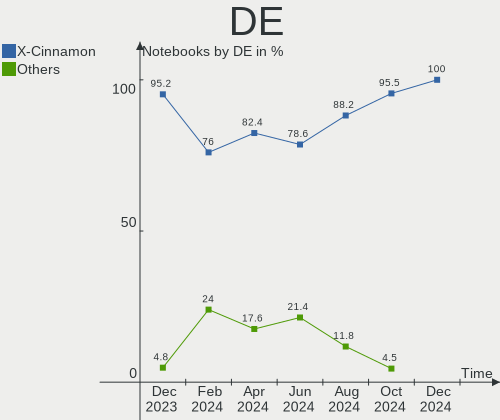
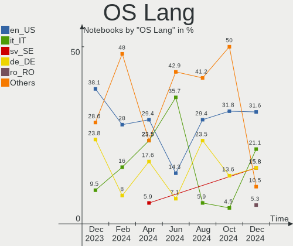
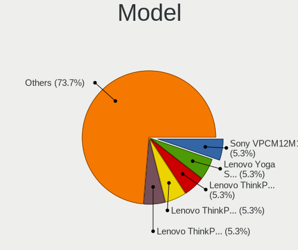
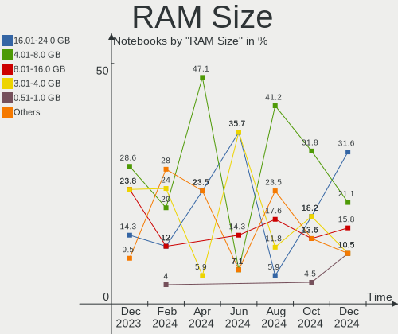
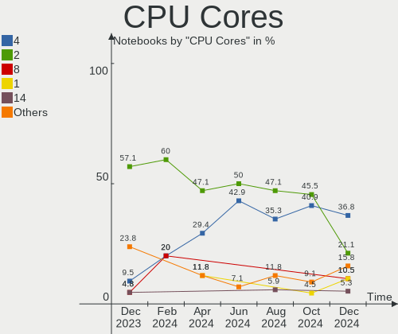
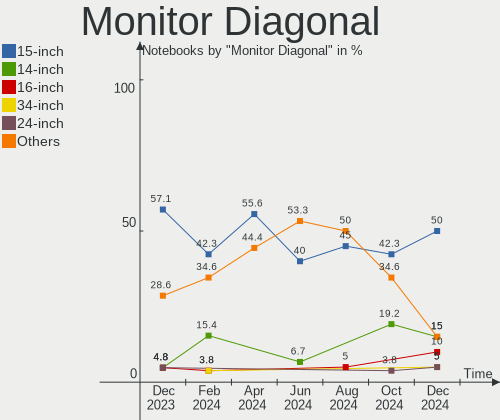
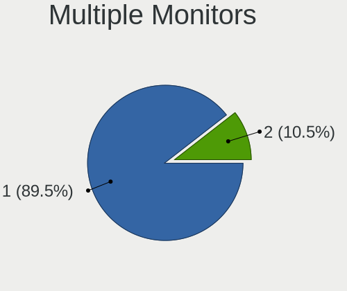
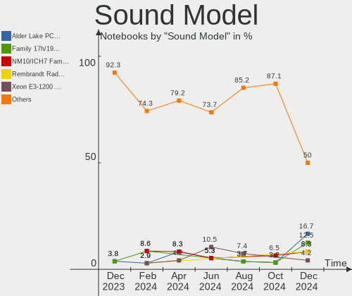

LMDE - Hardware Trends (Notebooks)
----------------------------------

A project to identify most popular hardware characteristics and track their change
over time based on data collected by Linux users at https://Linux-Hardware.org.

Anyone can contribute to this report by the [hw-probe](https://github.com/linuxhw/hw-probe) tool:

    sudo -E hw-probe -all -upload

This report is for one last month. Overall report since the beginning of time: [TestCoverage](https://github.com/linuxhw/TestCoverage)

Period: Nov, 2022.

Contents
--------

* [ System ](#system)
  - [ OS                       ](#os)
  - [ OS Family                ](#os-family)
  - [ Kernel                   ](#kernel)
  - [ Kernel Family            ](#kernel-family)
  - [ Kernel Major Ver.        ](#kernel-major-ver)
  - [ Arch                     ](#arch)
  - [ DE                       ](#de)
  - [ Display Server           ](#display-server)
  - [ Display Manager          ](#display-manager)
  - [ OS Lang                  ](#os-lang)
  - [ Boot Mode                ](#boot-mode)
  - [ Filesystem               ](#filesystem)
  - [ Part. scheme             ](#part-scheme)
  - [ Dual Boot with Linux/BSD ](#dual-boot-with-linuxbsd)
  - [ Dual Boot (Win)          ](#dual-boot-win)

* [ Board ](#board)
  - [ Vendor                   ](#vendor)
  - [ Model                    ](#model)
  - [ Model Family             ](#model-family)
  - [ MFG Year                 ](#mfg-year)
  - [ Form Factor              ](#form-factor)
  - [ Secure Boot              ](#secure-boot)
  - [ Coreboot                 ](#coreboot)
  - [ RAM Size                 ](#ram-size)
  - [ RAM Used                 ](#ram-used)
  - [ Total Drives             ](#total-drives)
  - [ Has CD-ROM               ](#has-cd-rom)
  - [ Has Ethernet             ](#has-ethernet)
  - [ Has WiFi                 ](#has-wifi)
  - [ Has Bluetooth            ](#has-bluetooth)

* [ Location ](#location)
  - [ Country                  ](#country)
  - [ City                     ](#city)

* [ Drives ](#drives)
  - [ Drive Vendor             ](#drive-vendor)
  - [ Drive Model              ](#drive-model)
  - [ HDD Vendor               ](#hdd-vendor)
  - [ SSD Vendor               ](#ssd-vendor)
  - [ Drive Kind               ](#drive-kind)
  - [ Drive Connector          ](#drive-connector)
  - [ Drive Size               ](#drive-size)
  - [ Space Total              ](#space-total)
  - [ Space Used               ](#space-used)
  - [ Malfunc. Drives          ](#malfunc-drives)
  - [ Malfunc. Drive Vendor    ](#malfunc-drive-vendor)
  - [ Malfunc. HDD Vendor      ](#malfunc-hdd-vendor)
  - [ Malfunc. Drive Kind      ](#malfunc-drive-kind)
  - [ Failed Drives            ](#failed-drives)
  - [ Failed Drive Vendor      ](#failed-drive-vendor)
  - [ Drive Status             ](#drive-status)

* [ Storage controller ](#storage-controller)
  - [ Storage Vendor           ](#storage-vendor)
  - [ Storage Model            ](#storage-model)
  - [ Storage Kind             ](#storage-kind)

* [ Processor ](#processor)
  - [ CPU Vendor               ](#cpu-vendor)
  - [ CPU Model                ](#cpu-model)
  - [ CPU Model Family         ](#cpu-model-family)
  - [ CPU Cores                ](#cpu-cores)
  - [ CPU Sockets              ](#cpu-sockets)
  - [ CPU Threads              ](#cpu-threads)
  - [ CPU Op-Modes             ](#cpu-op-modes)
  - [ CPU Microcode            ](#cpu-microcode)
  - [ CPU Microarch            ](#cpu-microarch)

* [ Graphics ](#graphics)
  - [ GPU Vendor               ](#gpu-vendor)
  - [ GPU Model                ](#gpu-model)
  - [ GPU Combo                ](#gpu-combo)
  - [ GPU Driver               ](#gpu-driver)
  - [ GPU Memory               ](#gpu-memory)

* [ Monitor ](#monitor)
  - [ Monitor Vendor           ](#monitor-vendor)
  - [ Monitor Model            ](#monitor-model)
  - [ Monitor Resolution       ](#monitor-resolution)
  - [ Monitor Diagonal         ](#monitor-diagonal)
  - [ Monitor Width            ](#monitor-width)
  - [ Aspect Ratio             ](#aspect-ratio)
  - [ Monitor Area             ](#monitor-area)
  - [ Pixel Density            ](#pixel-density)
  - [ Multiple Monitors        ](#multiple-monitors)

* [ Network ](#network)
  - [ Net Controller Vendor    ](#net-controller-vendor)
  - [ Net Controller Model     ](#net-controller-model)
  - [ Wireless Vendor          ](#wireless-vendor)
  - [ Wireless Model           ](#wireless-model)
  - [ Ethernet Vendor          ](#ethernet-vendor)
  - [ Ethernet Model           ](#ethernet-model)
  - [ Net Controller Kind      ](#net-controller-kind)
  - [ Used Controller          ](#used-controller)
  - [ NICs                     ](#nics)
  - [ IPv6                     ](#ipv6)

* [ Bluetooth ](#bluetooth)
  - [ Bluetooth Vendor         ](#bluetooth-vendor)
  - [ Bluetooth Model          ](#bluetooth-model)

* [ Sound ](#sound)
  - [ Sound Vendor             ](#sound-vendor)
  - [ Sound Model              ](#sound-model)

* [ Memory ](#memory)
  - [ Memory Vendor            ](#memory-vendor)
  - [ Memory Model             ](#memory-model)
  - [ Memory Kind              ](#memory-kind)
  - [ Memory Form Factor       ](#memory-form-factor)
  - [ Memory Size              ](#memory-size)
  - [ Memory Speed             ](#memory-speed)

* [ Printers & scanners ](#printers--scanners)
  - [ Printer Vendor           ](#printer-vendor)
  - [ Printer Model            ](#printer-model)
  - [ Scanner Vendor           ](#scanner-vendor)
  - [ Scanner Model            ](#scanner-model)

* [ Camera ](#camera)
  - [ Camera Vendor            ](#camera-vendor)
  - [ Camera Model             ](#camera-model)

* [ Security ](#security)
  - [ Fingerprint Vendor       ](#fingerprint-vendor)
  - [ Fingerprint Model        ](#fingerprint-model)
  - [ Chipcard Vendor          ](#chipcard-vendor)
  - [ Chipcard Model           ](#chipcard-model)

* [ Unsupported ](#unsupported)
  - [ Unsupported Devices      ](#unsupported-devices)
  - [ Unsupported Device Types ](#unsupported-device-types)

System
------

OS
--

Installed operating systems

| Name   | Notebooks | Percent |
|--------|-----------|---------|
| LMDE 5 | 19        | 95%     |
| LMDE 4 | 1         | 5%      |

OS Family
---------

OS without a version

| Name | Notebooks | Percent |
|------|-----------|---------|
| LMDE | 20        | 100%    |

Kernel
------

Version of the Linux kernel

| Version                | Notebooks | Percent |
|------------------------|-----------|---------|
| 5.10.0-19-amd64        | 12        | 60%     |
| 5.10.0-18-amd64        | 2         | 10%     |
| 5.19.0-0.deb11.2-amd64 | 1         | 5%      |
| 5.15.78-xanmod1        | 1         | 5%      |
| 5.10.0-19-686          | 1         | 5%      |
| 5.10.0-16-amd64        | 1         | 5%      |
| 5.10.0-12-amd64        | 1         | 5%      |
| 4.19.0-21-686          | 1         | 5%      |

Kernel Family
-------------

Linux kernel without a distro release

| Version | Notebooks | Percent |
|---------|-----------|---------|
| 5.10.0  | 17        | 85%     |
| 5.19.0  | 1         | 5%      |
| 5.15.78 | 1         | 5%      |
| 4.19.0  | 1         | 5%      |

Kernel Major Ver.
-----------------

Linux kernel major version

| Version | Notebooks | Percent |
|---------|-----------|---------|
| 5.10    | 17        | 85%     |
| 5.19    | 1         | 5%      |
| 5.15    | 1         | 5%      |
| 4.19    | 1         | 5%      |

Arch
----

OS architecture (x86_64, i586, etc.)

| Name   | Notebooks | Percent |
|--------|-----------|---------|
| x86_64 | 18        | 90%     |
| i686   | 2         | 10%     |

DE
--

Desktop Environment

| Name       | Notebooks | Percent |
|------------|-----------|---------|
| X-Cinnamon | 18        | 90%     |
| Cinnamon   | 2         | 10%     |

Display Server
--------------

X11 or Wayland

| Name | Notebooks | Percent |
|------|-----------|---------|
| X11  | 20        | 100%    |

Display Manager
---------------

SDDM, LightDM, etc.

| Name    | Notebooks | Percent |
|---------|-----------|---------|
| Unknown | 11        | 55%     |
| LightDM | 9         | 45%     |

OS Lang
-------

Language

| Lang  | Notebooks | Percent |
|-------|-----------|---------|
| en_US | 6         | 30%     |
| de_DE | 4         | 20%     |
| en_GB | 2         | 10%     |
| pt_BR | 1         | 5%      |
| pl_PL | 1         | 5%      |
| it_IT | 1         | 5%      |
| fr_FR | 1         | 5%      |
| es_VE | 1         | 5%      |
| es_ES | 1         | 5%      |
| en_AU | 1         | 5%      |
| cs_CZ | 1         | 5%      |

Boot Mode
---------

EFI or BIOS

| Mode | Notebooks | Percent |
|------|-----------|---------|
| EFI  | 12        | 60%     |
| BIOS | 8         | 40%     |

Filesystem
----------

Type of filesystem

| Type | Notebooks | Percent |
|------|-----------|---------|
| Ext4 | 20        | 100%    |

Part. scheme
------------

Scheme of partitioning

| Type    | Notebooks | Percent |
|---------|-----------|---------|
| Unknown | 11        | 55%     |
| GPT     | 5         | 25%     |
| MBR     | 4         | 20%     |

Dual Boot with Linux/BSD
------------------------

Hosting more than one Linux/BSD

| Dual boot | Notebooks | Percent |
|-----------|-----------|---------|
| No        | 20        | 100%    |

Dual Boot (Win)
---------------

Hosting Linux and Windows

| Dual boot | Notebooks | Percent |
|-----------|-----------|---------|
| No        | 20        | 100%    |

Board
-----

Vendor
------

Motherboard manufacturer

| Name             | Notebooks | Percent |
|------------------|-----------|---------|
| Hewlett-Packard  | 8         | 40%     |
| Lenovo           | 5         | 25%     |
| Acer             | 2         | 10%     |
| Toshiba          | 1         | 5%      |
| Sony             | 1         | 5%      |
| Kruger&Matz      | 1         | 5%      |
| Dell             | 1         | 5%      |
| ASUSTek Computer | 1         | 5%      |

Model
-----

Motherboard model

| Name                                 | Notebooks | Percent |
|--------------------------------------|-----------|---------|
| Toshiba Satellite L855D              | 1         | 5%      |
| Sony SVF1532W4E                      | 1         | 5%      |
| Lenovo V145-15AST 81MT               | 1         | 5%      |
| Lenovo ThinkPad W510 43192PU         | 1         | 5%      |
| Lenovo ThinkBook 15 G2 ITL 20VE      | 1         | 5%      |
| Lenovo G580 20150                    | 1         | 5%      |
| Lenovo G500 20236                    | 1         | 5%      |
| Kruger&Matz KM1406                   | 1         | 5%      |
| HP Victus by Gaming Laptop 15-fb0xxx | 1         | 5%      |
| HP ProBook 650 G4                    | 1         | 5%      |
| HP Mini 110-1100                     | 1         | 5%      |
| HP Laptop 15-dw3xxx                  | 1         | 5%      |
| HP Laptop 14-cf3xxx                  | 1         | 5%      |
| HP EliteBook 850 G8 Notebook PC      | 1         | 5%      |
| HP EliteBook 820 G3                  | 1         | 5%      |
| Dell G15 5510                        | 1         | 5%      |
| ASUS K54LY                           | 1         | 5%      |
| Acer Aspire E1-570G                  | 1         | 5%      |
| Acer Aspire 3000                     | 1         | 5%      |
| Unknown                              | 1         | 5%      |

Model Family
------------

Motherboard model prefix

| Name               | Notebooks | Percent |
|--------------------|-----------|---------|
| HP Laptop          | 2         | 10%     |
| HP EliteBook       | 2         | 10%     |
| Acer Aspire        | 2         | 10%     |
| Toshiba Satellite  | 1         | 5%      |
| Sony SVF1532W4E    | 1         | 5%      |
| Lenovo V145-15AST  | 1         | 5%      |
| Lenovo ThinkPad    | 1         | 5%      |
| Lenovo ThinkBook   | 1         | 5%      |
| Lenovo G580        | 1         | 5%      |
| Lenovo G500        | 1         | 5%      |
| Kruger&Matz KM1406 | 1         | 5%      |
| HP Victus          | 1         | 5%      |
| HP ProBook         | 1         | 5%      |
| HP Mini            | 1         | 5%      |
| Dell G15           | 1         | 5%      |
| ASUS K54LY         | 1         | 5%      |
| Unknown            | 1         | 5%      |

MFG Year
--------

Motherboard manufacture year

| Year | Notebooks | Percent |
|------|-----------|---------|
| 2020 | 4         | 20%     |
| 2021 | 2         | 10%     |
| 2018 | 2         | 10%     |
| 2013 | 2         | 10%     |
| 2012 | 2         | 10%     |
| 2022 | 1         | 5%      |
| 2016 | 1         | 5%      |
| 2015 | 1         | 5%      |
| 2011 | 1         | 5%      |
| 2010 | 1         | 5%      |
| 2009 | 1         | 5%      |
| 2007 | 1         | 5%      |
| 2005 | 1         | 5%      |

Form Factor
-----------

Physical design of the computer

| Name     | Notebooks | Percent |
|----------|-----------|---------|
| Notebook | 20        | 100%    |

Secure Boot
-----------

Enabled or disabled

| State    | Notebooks | Percent |
|----------|-----------|---------|
| Disabled | 19        | 95%     |
| Enabled  | 1         | 5%      |

Coreboot
--------

Have coreboot on board

| Used | Notebooks | Percent |
|------|-----------|---------|
| No   | 20        | 100%    |

RAM Size
--------

Total RAM memory

| Size in GB  | Notebooks | Percent |
|-------------|-----------|---------|
| 4.01-8.0    | 8         | 40%     |
| 16.01-24.0  | 3         | 15%     |
| 3.01-4.0    | 2         | 10%     |
| 1.01-2.0    | 2         | 10%     |
| 8.01-16.0   | 2         | 10%     |
| 32.01-64.0  | 1         | 5%      |
| 2.01-3.0    | 1         | 5%      |
| 64.01-256.0 | 1         | 5%      |

RAM Used
--------

Used RAM memory

| Used GB  | Notebooks | Percent |
|----------|-----------|---------|
| 1.01-2.0 | 10        | 50%     |
| 3.01-4.0 | 4         | 20%     |
| 2.01-3.0 | 4         | 20%     |
| 4.01-8.0 | 1         | 5%      |
| 0.51-1.0 | 1         | 5%      |

Total Drives
------------

Number of drives on board

| Drives | Notebooks | Percent |
|--------|-----------|---------|
| 1      | 19        | 95%     |
| 2      | 1         | 5%      |

Has CD-ROM
----------

Has CD-ROM on board

| Presented | Notebooks | Percent |
|-----------|-----------|---------|
| Yes       | 10        | 50%     |
| No        | 10        | 50%     |

Has Ethernet
------------

Has Ethernet on board

| Presented | Notebooks | Percent |
|-----------|-----------|---------|
| Yes       | 18        | 90%     |
| No        | 2         | 10%     |

Has WiFi
--------

Has WiFi module

| Presented | Notebooks | Percent |
|-----------|-----------|---------|
| Yes       | 20        | 100%    |

Has Bluetooth
-------------

Has Bluetooth module

| Presented | Notebooks | Percent |
|-----------|-----------|---------|
| Yes       | 14        | 70%     |
| No        | 6         | 30%     |

Location
--------

Country
-------

Geographic location (country)

| Country   | Notebooks | Percent |
|-----------|-----------|---------|
| Germany   | 5         | 25%     |
| USA       | 3         | 15%     |
| Italy     | 2         | 10%     |
| France    | 2         | 10%     |
| Venezuela | 1         | 5%      |
| Portugal  | 1         | 5%      |
| Poland    | 1         | 5%      |
| Ecuador   | 1         | 5%      |
| Czechia   | 1         | 5%      |
| Brazil    | 1         | 5%      |
| Belarus   | 1         | 5%      |
| Australia | 1         | 5%      |

City
----

Geographic location (city)

| City                 | Notebooks | Percent |
|----------------------|-----------|---------|
| Weimar               | 1         | 5%      |
| Toulon               | 1         | 5%      |
| Sydney               | 1         | 5%      |
| Shrewsbury           | 1         | 5%      |
| Rome                 | 1         | 5%      |
| Prague               | 1         | 5%      |
| Palermo              | 1         | 5%      |
| Mogilev              | 1         | 5%      |
| Lubin                | 1         | 5%      |
| Krakow               | 1         | 5%      |
| Guayaquil            | 1         | 5%      |
| Ganges               | 1         | 5%      |
| Freigericht          | 1         | 5%      |
| Freiburg im Breisgau | 1         | 5%      |
| Duque de Caxias      | 1         | 5%      |
| Duisburg             | 1         | 5%      |
| Delaware             | 1         | 5%      |
| Caracas              | 1         | 5%      |
| Bend                 | 1         | 5%      |
| Alverca do Ribatejo  | 1         | 5%      |

Drives
------

Drive Vendor
------------

Hard drive vendors

| Vendor              | Notebooks | Drives | Percent |
|---------------------|-----------|--------|---------|
| Sandisk             | 3         | 3      | 14.29%  |
| SK hynix            | 2         | 2      | 9.52%   |
| Seagate             | 2         | 2      | 9.52%   |
| Samsung Electronics | 2         | 2      | 9.52%   |
| Kingston            | 2         | 2      | 9.52%   |
| WDC                 | 1         | 1      | 4.76%   |
| Unknown             | 1         | 1      | 4.76%   |
| Micron Technology   | 1         | 1      | 4.76%   |
| KIOXIA              | 1         | 1      | 4.76%   |
| KingSpec            | 1         | 1      | 4.76%   |
| Hitachi             | 1         | 1      | 4.76%   |
| Gigabyte Technology | 1         | 1      | 4.76%   |
| Crucial             | 1         | 1      | 4.76%   |
| China               | 1         | 1      | 4.76%   |
| A-DATA Technology   | 1         | 1      | 4.76%   |

Drive Model
-----------

Hard drive models

| Model                                        | Notebooks | Percent |
|----------------------------------------------|-----------|---------|
| Kingston SA400S37480G 480GB SSD              | 2         | 9.52%   |
| WDC WD1600BEVT-60ZCT1 160GB                  | 1         | 4.76%   |
| Unknown MMC Card  64GB                       | 1         | 4.76%   |
| SK hynix PC711 HFS512GDE9X073N 512GB         | 1         | 4.76%   |
| SK hynix BC501 NVMe Solid State Drive 512GB  | 1         | 4.76%   |
| Seagate ST9320320AS 320GB                    | 1         | 4.76%   |
| Seagate ST1000LM035-1RK172 1TB               | 1         | 4.76%   |
| Sandisk WDC PC SN530 SDBPMPZ-256G-1101 256GB | 1         | 4.76%   |
| Sandisk WD Blue SN550 NVMe SSD 1TB           | 1         | 4.76%   |
| SanDisk NVMe SSD Drive 500GB                 | 1         | 4.76%   |
| Samsung SSD 980 1TB                          | 1         | 4.76%   |
| Samsung SSD 850 EVO 500GB                    | 1         | 4.76%   |
| Micron MTFDHBA1T0TDV-1AZ1AABHA 1TB           | 1         | 4.76%   |
| KIOXIA KBG40ZNS512G NVMe 512GB               | 1         | 4.76%   |
| KingSpec KSD-PA25.6-064MS 64GB               | 1         | 4.76%   |
| Hitachi HTS725032A9A364 320GB                | 1         | 4.76%   |
| Gigabyte GP-GSTFS31120GNTD 120GB SSD         | 1         | 4.76%   |
| Crucial CT1000BX500SSD1 1TB                  | 1         | 4.76%   |
| China SATA3 120GB SSD                        | 1         | 4.76%   |
| A-DATA SU800 256GB SSD                       | 1         | 4.76%   |

HDD Vendor
----------

Hard disk drive vendors

| Vendor  | Notebooks | Drives | Percent |
|---------|-----------|--------|---------|
| Seagate | 2         | 2      | 50%     |
| WDC     | 1         | 1      | 25%     |
| Hitachi | 1         | 1      | 25%     |

SSD Vendor
----------

Solid state drive vendors

| Vendor              | Notebooks | Drives | Percent |
|---------------------|-----------|--------|---------|
| Kingston            | 2         | 2      | 28.57%  |
| Samsung Electronics | 1         | 1      | 14.29%  |
| Gigabyte Technology | 1         | 1      | 14.29%  |
| Crucial             | 1         | 1      | 14.29%  |
| China               | 1         | 1      | 14.29%  |
| A-DATA Technology   | 1         | 1      | 14.29%  |

Drive Kind
----------

HDD or SSD

| Kind    | Notebooks | Drives | Percent |
|---------|-----------|--------|---------|
| NVMe    | 8         | 8      | 38.1%   |
| SSD     | 7         | 7      | 33.33%  |
| HDD     | 4         | 4      | 19.05%  |
| MMC     | 1         | 1      | 4.76%   |
| Unknown | 1         | 1      | 4.76%   |

Drive Connector
---------------

SATA, SAS, NVMe, etc.

| Type | Notebooks | Drives | Percent |
|------|-----------|--------|---------|
| SATA | 12        | 12     | 57.14%  |
| NVMe | 8         | 8      | 38.1%   |
| MMC  | 1         | 1      | 4.76%   |

Drive Size
----------

Size of hard drive

| Size in TB | Notebooks | Drives | Percent |
|------------|-----------|--------|---------|
| 0.01-0.5   | 9         | 9      | 81.82%  |
| 0.51-1.0   | 2         | 2      | 18.18%  |

Space Total
-----------

Amount of disk space available on the file system

| Size in GB | Notebooks | Percent |
|------------|-----------|---------|
| 251-500    | 7         | 35%     |
| 101-250    | 6         | 30%     |
| 501-1000   | 3         | 15%     |
| 51-100     | 2         | 10%     |
| 2001-3000  | 1         | 5%      |
| 1001-2000  | 1         | 5%      |

Space Used
----------

Amount of used disk space

| Used GB  | Notebooks | Percent |
|----------|-----------|---------|
| 1-20     | 9         | 45%     |
| 21-50    | 4         | 20%     |
| 101-250  | 2         | 10%     |
| 501-1000 | 2         | 10%     |
| 51-100   | 2         | 10%     |
| 251-500  | 1         | 5%      |

Malfunc. Drives
---------------

Drive models with a malfunction

| Model                                 | Notebooks | Drives | Percent |
|---------------------------------------|-----------|--------|---------|
| SK hynix PC711 HFS512GDE9X073N 512GB  | 1         | 1      | 50%     |
| Samsung Electronics SSD 850 EVO 500GB | 1         | 1      | 50%     |

Malfunc. Drive Vendor
---------------------

Vendors of faulty drives

| Vendor              | Notebooks | Drives | Percent |
|---------------------|-----------|--------|---------|
| SK hynix            | 1         | 1      | 50%     |
| Samsung Electronics | 1         | 1      | 50%     |

Malfunc. HDD Vendor
-------------------

Vendors of faulty HDD drives

Zero info for selected period =(

Malfunc. Drive Kind
-------------------

Kinds of faulty drives

| Kind | Notebooks | Drives | Percent |
|------|-----------|--------|---------|
| NVMe | 1         | 1      | 50%     |
| SSD  | 1         | 1      | 50%     |

Failed Drives
-------------

Failed drive models

Zero info for selected period =(

Failed Drive Vendor
-------------------

Failed drive vendors

Zero info for selected period =(

Drive Status
------------

Number of failed and malfunc. drives

| Status   | Notebooks | Drives | Percent |
|----------|-----------|--------|---------|
| Detected | 12        | 12     | 57.14%  |
| Works    | 7         | 7      | 33.33%  |
| Malfunc  | 2         | 2      | 9.52%   |

Storage controller
------------------

Storage Vendor
--------------

Storage controller vendors

| Vendor                           | Notebooks | Percent |
|----------------------------------|-----------|---------|
| Intel                            | 15        | 57.69%  |
| SanDisk                          | 3         | 11.54%  |
| SK hynix                         | 2         | 7.69%   |
| AMD                              | 2         | 7.69%   |
| Silicon Integrated Systems [SiS] | 1         | 3.85%   |
| Samsung Electronics              | 1         | 3.85%   |
| Micron Technology                | 1         | 3.85%   |
| KIOXIA                           | 1         | 3.85%   |

Storage Model
-------------

Storage controller models

| Model                                                                        | Notebooks | Percent |
|------------------------------------------------------------------------------|-----------|---------|
| Intel Volume Management Device NVMe RAID Controller                          | 3         | 10%     |
| SanDisk Non-Volatile memory controller                                       | 2         | 6.67%   |
| Intel Tiger Lake-LP SATA Controller                                          | 2         | 6.67%   |
| Intel Sunrise Point-LP SATA Controller [AHCI mode]                           | 2         | 6.67%   |
| Intel 82801GBM/GHM (ICH7-M Family) SATA Controller [AHCI mode]               | 2         | 6.67%   |
| Intel 7 Series Chipset Family 6-port SATA Controller [AHCI mode]             | 2         | 6.67%   |
| AMD FCH SATA Controller [AHCI mode]                                          | 2         | 6.67%   |
| SK hynix Gold P31/PC711 NVMe Solid State Drive                               | 1         | 3.33%   |
| SK hynix BC501 NVMe Solid State Drive                                        | 1         | 3.33%   |
| Silicon Integrated Systems [SiS] 5513 IDE Controller                         | 1         | 3.33%   |
| SanDisk WD Blue SN550 NVMe SSD                                               | 1         | 3.33%   |
| Samsung NVMe SSD Controller 980                                              | 1         | 3.33%   |
| Micron Non-Volatile memory controller                                        | 1         | 3.33%   |
| KIOXIA NVMe SSD Controller BG4                                               | 1         | 3.33%   |
| Intel Celeron/Pentium Silver Processor SATA Controller                       | 1         | 3.33%   |
| Intel 82801G (ICH7 Family) IDE Controller                                    | 1         | 3.33%   |
| Intel 82801 Mobile SATA Controller [RAID mode]                               | 1         | 3.33%   |
| Intel 8 Series SATA Controller 1 [AHCI mode]                                 | 1         | 3.33%   |
| Intel 7 Series Chipset Family 4-port SATA Controller [IDE mode]              | 1         | 3.33%   |
| Intel 7 Series Chipset Family 2-port SATA Controller [IDE mode]              | 1         | 3.33%   |
| Intel 6 Series/C200 Series Chipset Family 6 port Mobile SATA AHCI Controller | 1         | 3.33%   |
| Intel 5 Series/3400 Series Chipset 6 port SATA AHCI Controller               | 1         | 3.33%   |

Storage Kind
------------

Kind of storage controller (IDE, SATA, NVMe, SAS, ...)

| Kind | Notebooks | Percent |
|------|-----------|---------|
| SATA | 14        | 48.28%  |
| NVMe | 8         | 27.59%  |
| RAID | 4         | 13.79%  |
| IDE  | 3         | 10.34%  |

Processor
---------

CPU Vendor
----------

Processor vendors

| Vendor | Notebooks | Percent |
|--------|-----------|---------|
| Intel  | 16        | 80%     |
| AMD    | 4         | 20%     |

CPU Model
---------

Processor models

| Model                                        | Notebooks | Percent |
|----------------------------------------------|-----------|---------|
| Intel 11th Gen Core i5-1135G7 @ 2.40GHz      | 2         | 10%     |
| Intel Pentium Gold 7505 @ 2.00GHz            | 1         | 5%      |
| Intel Core i7-3612QM CPU @ 2.10GHz           | 1         | 5%      |
| Intel Core i7 CPU Q 720 @ 1.60GHz            | 1         | 5%      |
| Intel Core i5-8250U CPU @ 1.60GHz            | 1         | 5%      |
| Intel Core i5-6300U CPU @ 2.40GHz            | 1         | 5%      |
| Intel Core i5-3230M CPU @ 2.60GHz            | 1         | 5%      |
| Intel Core i5-10500H CPU @ 2.50GHz           | 1         | 5%      |
| Intel Core i3-4005U CPU @ 1.70GHz            | 1         | 5%      |
| Intel Core i3-3217U CPU @ 1.80GHz            | 1         | 5%      |
| Intel Core i3-2310M CPU @ 2.10GHz            | 1         | 5%      |
| Intel Core i3-1005G1 CPU @ 1.20GHz           | 1         | 5%      |
| Intel Core 2 CPU T5500 @ 1.66GHz             | 1         | 5%      |
| Intel Celeron N4000 CPU @ 1.10GHz            | 1         | 5%      |
| Intel Atom CPU N270 @ 1.60GHz                | 1         | 5%      |
| AMD Turion 64 Mobile Technology ML-40        | 1         | 5%      |
| AMD Ryzen 5 5600H with Radeon Graphics       | 1         | 5%      |
| AMD A8-4500M APU with Radeon HD Graphics     | 1         | 5%      |
| AMD A4-9125 RADEON R3, 4 COMPUTE CORES 2C+2G | 1         | 5%      |

CPU Model Family
----------------

Processor model prefix

| Model                | Notebooks | Percent |
|----------------------|-----------|---------|
| Intel Core i5        | 4         | 20%     |
| Intel Core i3        | 4         | 20%     |
| Other                | 2         | 10%     |
| Intel Core i7        | 2         | 10%     |
| Intel Pentium Gold   | 1         | 5%      |
| Intel Core 2         | 1         | 5%      |
| Intel Celeron        | 1         | 5%      |
| Intel Atom           | 1         | 5%      |
| AMD Turion 64 Mobile | 1         | 5%      |
| AMD Ryzen 5          | 1         | 5%      |
| AMD A8               | 1         | 5%      |
| AMD A4               | 1         | 5%      |

CPU Cores
---------

Number of processor cores

| Number | Notebooks | Percent |
|--------|-----------|---------|
| 2      | 11        | 55%     |
| 4      | 5         | 25%     |
| 6      | 2         | 10%     |
| 1      | 2         | 10%     |

CPU Sockets
-----------

Number of sockets

| Number | Notebooks | Percent |
|--------|-----------|---------|
| 1      | 20        | 100%    |

CPU Threads
-----------

Threads per core (Hyper-Threading)

| Number | Notebooks | Percent |
|--------|-----------|---------|
| 2      | 16        | 80%     |
| 1      | 4         | 20%     |

CPU Op-Modes
------------

CPU Operation Modes (32-bit, 64-bit)

| Op mode        | Notebooks | Percent |
|----------------|-----------|---------|
| 32-bit, 64-bit | 19        | 95%     |
| 32-bit         | 1         | 5%      |

CPU Microcode
-------------

Microcode number

| Number     | Notebooks | Percent |
|------------|-----------|---------|
| 0x806c1    | 3         | 15%     |
| 0x306a9    | 3         | 15%     |
| Unknown    | 2         | 10%     |
| 0xa0652    | 1         | 5%      |
| 0x806ea    | 1         | 5%      |
| 0x706a1    | 1         | 5%      |
| 0x6f6      | 1         | 5%      |
| 0x406e3    | 1         | 5%      |
| 0x40651    | 1         | 5%      |
| 0x206a7    | 1         | 5%      |
| 0x106e5    | 1         | 5%      |
| 0x106c2    | 1         | 5%      |
| 0x0a50000d | 1         | 5%      |
| 0x06006705 | 1         | 5%      |
| 0x06001119 | 1         | 5%      |

CPU Microarch
-------------

Microarchitecture

| Name          | Notebooks | Percent |
|---------------|-----------|---------|
| TigerLake     | 3         | 15%     |
| IvyBridge     | 3         | 15%     |
| Zen 3         | 1         | 5%      |
| Skylake       | 1         | 5%      |
| SandyBridge   | 1         | 5%      |
| Piledriver    | 1         | 5%      |
| Nehalem       | 1         | 5%      |
| KabyLake      | 1         | 5%      |
| K8 Hammer     | 1         | 5%      |
| IceLake       | 1         | 5%      |
| Haswell       | 1         | 5%      |
| Goldmont plus | 1         | 5%      |
| Excavator     | 1         | 5%      |
| Core          | 1         | 5%      |
| CometLake     | 1         | 5%      |
| Bonnell       | 1         | 5%      |

Graphics
--------

GPU Vendor
----------

Vendors of graphics cards

| Vendor                           | Notebooks | Percent |
|----------------------------------|-----------|---------|
| Intel                            | 14        | 56%     |
| Nvidia                           | 6         | 24%     |
| AMD                              | 4         | 16%     |
| Silicon Integrated Systems [SiS] | 1         | 4%      |

GPU Model
---------

Graphics card models

| Model                                                                                      | Notebooks | Percent |
|--------------------------------------------------------------------------------------------|-----------|---------|
| Intel 3rd Gen Core processor Graphics Controller                                           | 3         | 11.11%  |
| Nvidia TU117M [GeForce GTX 1650 Mobile / Max-Q]                                            | 2         | 7.41%   |
| Nvidia GK208M [GeForce GT 740M]                                                            | 2         | 7.41%   |
| Intel TigerLake-LP GT2 [Iris Xe Graphics]                                                  | 2         | 7.41%   |
| Intel Mobile 945GM/GMS/GME, 943/940GML Express Integrated Graphics Controller              | 2         | 7.41%   |
| Silicon Integrated Systems [SiS] 661/741/760 PCI/AGP or 662/761Gx PCIE VGA Display Adapter | 1         | 3.7%    |
| Nvidia GT216GLM [Quadro FX 880M]                                                           | 1         | 3.7%    |
| Nvidia GF108M [GeForce GT 635M]                                                            | 1         | 3.7%    |
| Intel UHD Graphics 620                                                                     | 1         | 3.7%    |
| Intel Tiger Lake-LP GT2 [UHD Graphics G4]                                                  | 1         | 3.7%    |
| Intel Skylake GT2 [HD Graphics 520]                                                        | 1         | 3.7%    |
| Intel Mobile 945GSE Express Integrated Graphics Controller                                 | 1         | 3.7%    |
| Intel Mobile 945GM/GMS, 943/940GML Express Integrated Graphics Controller                  | 1         | 3.7%    |
| Intel Iris Plus Graphics G1 (Ice Lake)                                                     | 1         | 3.7%    |
| Intel Haswell-ULT Integrated Graphics Controller                                           | 1         | 3.7%    |
| Intel GeminiLake [UHD Graphics 600]                                                        | 1         | 3.7%    |
| Intel CometLake-H GT2 [UHD Graphics]                                                       | 1         | 3.7%    |
| AMD Trinity [Radeon HD 7640G]                                                              | 1         | 3.7%    |
| AMD Stoney [Radeon R2/R3/R4/R5 Graphics]                                                   | 1         | 3.7%    |
| AMD Seymour [Radeon HD 6400M/7400M Series]                                                 | 1         | 3.7%    |
| AMD Cezanne [Radeon Vega Series / Radeon Vega Mobile Series]                               | 1         | 3.7%    |

GPU Combo
---------

Combinations of graphics cards

| Name           | Notebooks | Percent |
|----------------|-----------|---------|
| 1 x Intel      | 10        | 50%     |
| Intel + Nvidia | 4         | 20%     |
| 1 x AMD        | 3         | 15%     |
| 1 x SiS        | 1         | 5%      |
| 1 x Nvidia     | 1         | 5%      |
| AMD + Nvidia   | 1         | 5%      |

GPU Driver
----------

Free vs proprietary

| Driver      | Notebooks | Percent |
|-------------|-----------|---------|
| Free        | 18        | 90%     |
| Proprietary | 1         | 5%      |
| Unknown     | 1         | 5%      |

GPU Memory
----------

Total video memory

| Size in GB | Notebooks | Percent |
|------------|-----------|---------|
| Unknown    | 13        | 65%     |
| 0.51-1.0   | 3         | 15%     |
| 0.01-0.5   | 2         | 10%     |
| 3.01-4.0   | 1         | 5%      |
| 1.01-2.0   | 1         | 5%      |

Monitor
-------

Monitor Vendor
--------------

Monitor vendors

| Vendor              | Notebooks | Percent |
|---------------------|-----------|---------|
| Chimei Innolux      | 6         | 27.27%  |
| LG Display          | 3         | 13.64%  |
| BOE                 | 3         | 13.64%  |
| Samsung Electronics | 2         | 9.09%   |
| AU Optronics        | 2         | 9.09%   |
| Vestel Elektronik   | 1         | 4.55%   |
| Philips             | 1         | 4.55%   |
| LG Philips          | 1         | 4.55%   |
| Lenovo              | 1         | 4.55%   |
| HannStar            | 1         | 4.55%   |
| Acer                | 1         | 4.55%   |

Monitor Model
-------------

Monitor models

| Model                                                                  | Notebooks | Percent |
|------------------------------------------------------------------------|-----------|---------|
| LG Display LCD Monitor LGD033A 1366x768 344x194mm 15.5-inch            | 2         | 9.09%   |
| Vestel Elektronik 55UHD_LCD_TV VES3700 3840x2160 1872x1053mm 84.6-inch | 1         | 4.55%   |
| Samsung Electronics LCD Monitor SEC3150 1366x768 344x193mm 15.5-inch   | 1         | 4.55%   |
| Samsung Electronics LCD Monitor SAM0659 1920x1080                      | 1         | 4.55%   |
| Philips PHL 241B7Q PHL0909 1920x1080 527x296mm 23.8-inch               | 1         | 4.55%   |
| LG Philips LCD Monitor LPL8D00 1280x800 304x190mm 14.1-inch            | 1         | 4.55%   |
| LG Display LCD Monitor LGD0430 1366x768 345x194mm 15.6-inch            | 1         | 4.55%   |
| Lenovo LCD Monitor LEN40B2 1920x1080 344x193mm 15.5-inch               | 1         | 4.55%   |
| HannStar HSD101PFW2 HSD03E9 1024x600 222x125mm 10.0-inch               | 1         | 4.55%   |
| Chimei Innolux LCD Monitor CMN15E7 1920x1080 344x193mm 15.5-inch       | 1         | 4.55%   |
| Chimei Innolux LCD Monitor CMN15DB 1366x768 344x193mm 15.5-inch        | 1         | 4.55%   |
| Chimei Innolux LCD Monitor CMN15BF 1366x768 344x194mm 15.5-inch        | 1         | 4.55%   |
| Chimei Innolux LCD Monitor CMN153B 1920x1080 344x193mm 15.5-inch       | 1         | 4.55%   |
| Chimei Innolux LCD Monitor CMN1521 1920x1080 344x193mm 15.5-inch       | 1         | 4.55%   |
| Chimei Innolux LCD Monitor CMN1242 1920x1080 276x155mm 12.5-inch       | 1         | 4.55%   |
| BOE LCD Monitor BOE0A8A 1920x1080 344x194mm 15.5-inch                  | 1         | 4.55%   |
| BOE LCD Monitor BOE07B5 1366x768 309x173mm 13.9-inch                   | 1         | 4.55%   |
| BOE LCD Monitor BOE0718 1920x1080 309x173mm 13.9-inch                  | 1         | 4.55%   |
| AU Optronics LCD Monitor AUO63ED 1920x1080 344x193mm 15.5-inch         | 1         | 4.55%   |
| AU Optronics LCD Monitor AUO5699 1920x1080 344x194mm 15.5-inch         | 1         | 4.55%   |
| Acer AL2423W ACR2423 1920x1200 518x324mm 24.1-inch                     | 1         | 4.55%   |

Monitor Resolution
------------------

Monitor screen resolution

| Resolution        | Notebooks | Percent |
|-------------------|-----------|---------|
| 1920x1080 (FHD)   | 10        | 47.62%  |
| 1366x768 (WXGA)   | 7         | 33.33%  |
| 3840x2160 (4K)    | 1         | 4.76%   |
| 1920x1200 (WUXGA) | 1         | 4.76%   |
| 1280x800 (WXGA)   | 1         | 4.76%   |
| 1024x600          | 1         | 4.76%   |

Monitor Diagonal
----------------

Diagonal size in inches

| Inches  | Notebooks | Percent |
|---------|-----------|---------|
| 15      | 13        | 59.09%  |
| 24      | 2         | 9.09%   |
| 13      | 2         | 9.09%   |
| 84      | 1         | 4.55%   |
| 14      | 1         | 4.55%   |
| 12      | 1         | 4.55%   |
| 10      | 1         | 4.55%   |
| Unknown | 1         | 4.55%   |

Monitor Width
-------------

Physical width

| Width in mm | Notebooks | Percent |
|-------------|-----------|---------|
| 301-350     | 16        | 72.73%  |
| 501-600     | 2         | 9.09%   |
| 201-300     | 2         | 9.09%   |
| 1501-2000   | 1         | 4.55%   |
| Unknown     | 1         | 4.55%   |

Aspect Ratio
------------

Proportional relationship between the width and the height

| Ratio | Notebooks | Percent |
|-------|-----------|---------|
| 16/9  | 18        | 90%     |
| 16/10 | 2         | 10%     |

Monitor Area
------------

Area in inch²

| Area in inch² | Notebooks | Percent |
|----------------|-----------|---------|
| 101-110        | 13        | 59.09%  |
| 81-90          | 3         | 13.64%  |
| More than 1000 | 1         | 4.55%   |
| 61-70          | 1         | 4.55%   |
| 41-50          | 1         | 4.55%   |
| 251-300        | 1         | 4.55%   |
| 201-250        | 1         | 4.55%   |
| Unknown        | 1         | 4.55%   |

Pixel Density
-------------

Pixels per inch

| Density | Notebooks | Percent |
|---------|-----------|---------|
| 121-160 | 8         | 38.1%   |
| 101-120 | 8         | 38.1%   |
| 51-100  | 3         | 14.29%  |
| 161-240 | 1         | 4.76%   |
| Unknown | 1         | 4.76%   |

Multiple Monitors
-----------------

Total monitors connected

| Total | Notebooks | Percent |
|-------|-----------|---------|
| 1     | 16        | 80%     |
| 2     | 3         | 15%     |
| 0     | 1         | 5%      |

Network
-------

Net Controller Vendor
---------------------

Controller vendors

| Vendor                           | Notebooks | Percent |
|----------------------------------|-----------|---------|
| Realtek Semiconductor            | 9         | 26.47%  |
| Intel                            | 7         | 20.59%  |
| Qualcomm Atheros                 | 6         | 17.65%  |
| Broadcom                         | 4         | 11.76%  |
| Broadcom Limited                 | 2         | 5.88%   |
| Xiaomi                           | 1         | 2.94%   |
| TP-Link                          | 1         | 2.94%   |
| Silicon Integrated Systems [SiS] | 1         | 2.94%   |
| MediaTek                         | 1         | 2.94%   |
| Lenovo                           | 1         | 2.94%   |
| Hewlett-Packard                  | 1         | 2.94%   |

Net Controller Model
--------------------

Controller models

| Model                                                                       | Notebooks | Percent |
|-----------------------------------------------------------------------------|-----------|---------|
| Realtek RTL8111/8168/8411 PCI Express Gigabit Ethernet Controller           | 7         | 15.91%  |
| Realtek RTL8821CE 802.11ac PCIe Wireless Network Adapter                    | 3         | 6.82%   |
| Qualcomm Atheros AR8162 Fast Ethernet                                       | 2         | 4.55%   |
| Intel Wi-Fi 6 AX201                                                         | 2         | 4.55%   |
| Xiaomi MediaTek MT7601U [MI WiFi]                                           | 1         | 2.27%   |
| TP-Link TL-WN821N v5/v6 [RTL8192EU]                                         | 1         | 2.27%   |
| Silicon Integrated Systems [SiS] SiS900 PCI Fast Ethernet                   | 1         | 2.27%   |
| Silicon Integrated Systems [SiS] AC'97 Modem Controller                     | 1         | 2.27%   |
| Realtek RTL8723BU 802.11b/g/n WLAN Adapter                                  | 1         | 2.27%   |
| Realtek RTL8188CE 802.11b/g/n WiFi Adapter                                  | 1         | 2.27%   |
| Realtek 802.11n WLAN Adapter                                                | 1         | 2.27%   |
| Qualcomm Atheros QCA9565 / AR9565 Wireless Network Adapter                  | 1         | 2.27%   |
| Qualcomm Atheros QCA8172 Fast Ethernet                                      | 1         | 2.27%   |
| Qualcomm Atheros AR9485 Wireless Network Adapter                            | 1         | 2.27%   |
| Qualcomm Atheros AR9285 Wireless Network Adapter (PCI-Express)              | 1         | 2.27%   |
| Qualcomm Atheros AR8151 v2.0 Gigabit Ethernet                               | 1         | 2.27%   |
| Qualcomm Atheros AR8132 Fast Ethernet                                       | 1         | 2.27%   |
| MediaTek MT7922 802.11ax PCI Express Wireless Network Adapter               | 1         | 2.27%   |
| Lenovo ThinkPad Lan                                                         | 1         | 2.27%   |
| Intel Wireless 8265 / 8275                                                  | 1         | 2.27%   |
| Intel Wireless 8260                                                         | 1         | 2.27%   |
| Intel PRO/Wireless 3945ABG [Golan] Network Connection                       | 1         | 2.27%   |
| Intel Ethernet Connection I219-LM                                           | 1         | 2.27%   |
| Intel Ethernet Connection (4) I219-V                                        | 1         | 2.27%   |
| Intel Comet Lake PCH CNVi WiFi                                              | 1         | 2.27%   |
| Intel Centrino Ultimate-N 6300                                              | 1         | 2.27%   |
| Intel 82577LM Gigabit Network Connection                                    | 1         | 2.27%   |
| HP lt4120 Snapdragon X5 LTE                                                 | 1         | 2.27%   |
| Broadcom NetXtreme BCM57786 Gigabit Ethernet PCIe                           | 1         | 2.27%   |
| Broadcom NetXtreme BCM5753M Gigabit Ethernet PCI Express                    | 1         | 2.27%   |
| Broadcom Limited BCM4318 [AirForce One 54g] 802.11g Wireless LAN Controller | 1         | 2.27%   |
| Broadcom Limited BCM4312 802.11b/g LP-PHY                                   | 1         | 2.27%   |
| Broadcom BCM43142 802.11b/g/n                                               | 1         | 2.27%   |
| Broadcom BCM4313 802.11bgn Wireless Network Adapter                         | 1         | 2.27%   |

Wireless Vendor
---------------

Wireless vendors

| Vendor                | Notebooks | Percent |
|-----------------------|-----------|---------|
| Intel                 | 7         | 30.43%  |
| Realtek Semiconductor | 5         | 21.74%  |
| Qualcomm Atheros      | 3         | 13.04%  |
| Broadcom Limited      | 2         | 8.7%    |
| Broadcom              | 2         | 8.7%    |
| Xiaomi                | 1         | 4.35%   |
| TP-Link               | 1         | 4.35%   |
| MediaTek              | 1         | 4.35%   |
| Hewlett-Packard       | 1         | 4.35%   |

Wireless Model
--------------

Wireless models

| Model                                                                       | Notebooks | Percent |
|-----------------------------------------------------------------------------|-----------|---------|
| Realtek RTL8821CE 802.11ac PCIe Wireless Network Adapter                    | 3         | 12.5%   |
| Intel Wi-Fi 6 AX201                                                         | 2         | 8.33%   |
| Xiaomi MediaTek MT7601U [MI WiFi]                                           | 1         | 4.17%   |
| TP-Link TL-WN821N v5/v6 [RTL8192EU]                                         | 1         | 4.17%   |
| Realtek RTL8723BU 802.11b/g/n WLAN Adapter                                  | 1         | 4.17%   |
| Realtek RTL8188CE 802.11b/g/n WiFi Adapter                                  | 1         | 4.17%   |
| Realtek 802.11n WLAN Adapter                                                | 1         | 4.17%   |
| Qualcomm Atheros QCA9565 / AR9565 Wireless Network Adapter                  | 1         | 4.17%   |
| Qualcomm Atheros AR9485 Wireless Network Adapter                            | 1         | 4.17%   |
| Qualcomm Atheros AR9285 Wireless Network Adapter (PCI-Express)              | 1         | 4.17%   |
| MediaTek MT7922 802.11ax PCI Express Wireless Network Adapter               | 1         | 4.17%   |
| Intel Wireless 8265 / 8275                                                  | 1         | 4.17%   |
| Intel Wireless 8260                                                         | 1         | 4.17%   |
| Intel PRO/Wireless 3945ABG [Golan] Network Connection                       | 1         | 4.17%   |
| Intel Comet Lake PCH CNVi WiFi                                              | 1         | 4.17%   |
| Intel Centrino Ultimate-N 6300                                              | 1         | 4.17%   |
| HP lt4120 Snapdragon X5 LTE                                                 | 1         | 4.17%   |
| Broadcom Limited BCM4318 [AirForce One 54g] 802.11g Wireless LAN Controller | 1         | 4.17%   |
| Broadcom Limited BCM4312 802.11b/g LP-PHY                                   | 1         | 4.17%   |
| Broadcom BCM43142 802.11b/g/n                                               | 1         | 4.17%   |
| Broadcom BCM4313 802.11bgn Wireless Network Adapter                         | 1         | 4.17%   |

Ethernet Vendor
---------------

Ethernet vendors

| Vendor                           | Notebooks | Percent |
|----------------------------------|-----------|---------|
| Realtek Semiconductor            | 7         | 36.84%  |
| Qualcomm Atheros                 | 5         | 26.32%  |
| Intel                            | 3         | 15.79%  |
| Broadcom                         | 2         | 10.53%  |
| Silicon Integrated Systems [SiS] | 1         | 5.26%   |
| Lenovo                           | 1         | 5.26%   |

Ethernet Model
--------------

Ethernet models

| Model                                                             | Notebooks | Percent |
|-------------------------------------------------------------------|-----------|---------|
| Realtek RTL8111/8168/8411 PCI Express Gigabit Ethernet Controller | 7         | 36.84%  |
| Qualcomm Atheros AR8162 Fast Ethernet                             | 2         | 10.53%  |
| Silicon Integrated Systems [SiS] SiS900 PCI Fast Ethernet         | 1         | 5.26%   |
| Qualcomm Atheros QCA8172 Fast Ethernet                            | 1         | 5.26%   |
| Qualcomm Atheros AR8151 v2.0 Gigabit Ethernet                     | 1         | 5.26%   |
| Qualcomm Atheros AR8132 Fast Ethernet                             | 1         | 5.26%   |
| Lenovo ThinkPad Lan                                               | 1         | 5.26%   |
| Intel Ethernet Connection I219-LM                                 | 1         | 5.26%   |
| Intel Ethernet Connection (4) I219-V                              | 1         | 5.26%   |
| Intel 82577LM Gigabit Network Connection                          | 1         | 5.26%   |
| Broadcom NetXtreme BCM57786 Gigabit Ethernet PCIe                 | 1         | 5.26%   |
| Broadcom NetXtreme BCM5753M Gigabit Ethernet PCI Express          | 1         | 5.26%   |

Net Controller Kind
-------------------

Ethernet, WiFi or modem

| Kind     | Notebooks | Percent |
|----------|-----------|---------|
| WiFi     | 20        | 51.28%  |
| Ethernet | 18        | 46.15%  |
| Modem    | 1         | 2.56%   |

Used Controller
---------------

Currently used network controller

| Kind     | Notebooks | Percent |
|----------|-----------|---------|
| WiFi     | 14        | 70%     |
| Ethernet | 6         | 30%     |

NICs
----

Total network controllers on board

| Total | Notebooks | Percent |
|-------|-----------|---------|
| 2     | 18        | 90%     |
| 1     | 1         | 5%      |
| 0     | 1         | 5%      |

IPv6
----

IPv6 vs IPv4

| Used | Notebooks | Percent |
|------|-----------|---------|
| No   | 12        | 60%     |
| Yes  | 8         | 40%     |

Bluetooth
---------

Bluetooth Vendor
----------------

Controller vendors

| Vendor                          | Notebooks | Percent |
|---------------------------------|-----------|---------|
| Intel                           | 5         | 35.71%  |
| Realtek Semiconductor           | 3         | 21.43%  |
| Foxconn / Hon Hai               | 2         | 14.29%  |
| Qualcomm Atheros Communications | 1         | 7.14%   |
| Lite-On Technology              | 1         | 7.14%   |
| Hewlett-Packard                 | 1         | 7.14%   |
| Broadcom                        | 1         | 7.14%   |

Bluetooth Model
---------------

Controller models

| Model                                                       | Notebooks | Percent |
|-------------------------------------------------------------|-----------|---------|
| Intel AX201 Bluetooth                                       | 3         | 21.43%  |
| Realtek Bluetooth Radio                                     | 2         | 14.29%  |
| Intel Bluetooth wireless interface                          | 2         | 14.29%  |
| Realtek  Bluetooth 4.2 Adapter                              | 1         | 7.14%   |
| Qualcomm Atheros AR3012 Bluetooth 4.0                       | 1         | 7.14%   |
| Lite-On Atheros AR3012 Bluetooth                            | 1         | 7.14%   |
| HP Integrated Module with Bluetooth 2.1 Wireless technology | 1         | 7.14%   |
| Foxconn / Hon Hai Wireless_Device                           | 1         | 7.14%   |
| Foxconn / Hon Hai BCM43142A0                                | 1         | 7.14%   |
| Broadcom BCM2045B (BDC-2.1)                                 | 1         | 7.14%   |

Sound
-----

Sound Vendor
------------

Sound card vendors

| Vendor                           | Notebooks | Percent |
|----------------------------------|-----------|---------|
| Intel                            | 16        | 64%     |
| Nvidia                           | 4         | 16%     |
| AMD                              | 4         | 16%     |
| Silicon Integrated Systems [SiS] | 1         | 4%      |

Sound Model
-----------

Sound card models

| Model                                                                             | Notebooks | Percent |
|-----------------------------------------------------------------------------------|-----------|---------|
| Intel Tiger Lake-LP Smart Sound Technology Audio Controller                       | 3         | 10.34%  |
| Intel 7 Series/C216 Chipset Family High Definition Audio Controller               | 3         | 10.34%  |
| Nvidia TU107 GeForce GTX 1650 High Definition Audio Controller                    | 2         | 6.9%    |
| Intel Sunrise Point-LP HD Audio                                                   | 2         | 6.9%    |
| Intel NM10/ICH7 Family High Definition Audio Controller                           | 2         | 6.9%    |
| Silicon Integrated Systems [SiS] SiS7012 AC'97 Sound Controller                   | 1         | 3.45%   |
| Nvidia GT216 HDMI Audio Controller                                                | 1         | 3.45%   |
| Nvidia GF108 High Definition Audio Controller                                     | 1         | 3.45%   |
| Intel Ice Lake-LP Smart Sound Technology Audio Controller                         | 1         | 3.45%   |
| Intel Haswell-ULT HD Audio Controller                                             | 1         | 3.45%   |
| Intel Comet Lake PCH cAVS                                                         | 1         | 3.45%   |
| Intel Celeron/Pentium Silver Processor High Definition Audio                      | 1         | 3.45%   |
| Intel 8 Series HD Audio Controller                                                | 1         | 3.45%   |
| Intel 6 Series/C200 Series Chipset Family High Definition Audio Controller        | 1         | 3.45%   |
| Intel 5 Series/3400 Series Chipset High Definition Audio                          | 1         | 3.45%   |
| AMD Trinity HDMI Audio Controller                                                 | 1         | 3.45%   |
| AMD Renoir Radeon High Definition Audio Controller                                | 1         | 3.45%   |
| AMD High Definition Audio Controller                                              | 1         | 3.45%   |
| AMD FCH Azalia Controller                                                         | 1         | 3.45%   |
| AMD Family 17h/19h HD Audio Controller                                            | 1         | 3.45%   |
| AMD Family 15h (Models 60h-6fh) Audio Controller                                  | 1         | 3.45%   |
| AMD Caicos HDMI Audio [Radeon HD 6450 / 7450/8450/8490 OEM / R5 230/235/235X OEM] | 1         | 3.45%   |

Memory
------

Memory Vendor
-------------

Memory module vendors

| Vendor              | Notebooks | Percent |
|---------------------|-----------|---------|
| Samsung Electronics | 4         | 33.33%  |
| Unknown             | 3         | 25%     |
| SK hynix            | 2         | 16.67%  |
| Kingston            | 2         | 16.67%  |
| G.Skill             | 1         | 8.33%   |

Memory Model
------------

Memory module models

| Model                                                   | Notebooks | Percent |
|---------------------------------------------------------|-----------|---------|
| Unknown RAM Module 8GB SODIMM DDR4 2667MT/s             | 1         | 7.69%   |
| Unknown RAM Module 8GB SODIMM DDR3                      | 1         | 7.69%   |
| Unknown RAM Module 2GB SODIMM SDRAM                     | 1         | 7.69%   |
| SK hynix RAM HYMP125S64CP8-Y5 2GB SODIMM DDR2 667MT/s   | 1         | 7.69%   |
| SK hynix RAM HMT451S6MFR8A-PB 4GB SODIMM DDR3 1600MT/s  | 1         | 7.69%   |
| Samsung RAM Module 32GB SODIMM DDR4 3200MT/s            | 1         | 7.69%   |
| Samsung RAM M471B5773DH0-CK0 2GB SODIMM DDR3 1600MT/s   | 1         | 7.69%   |
| Samsung RAM M471B5273DH0-CK0 4GB SODIMM DDR3 1600MT/s   | 1         | 7.69%   |
| Samsung RAM M471A1K43DB1-CTD 8GB SODIMM DDR4 2667MT/s   | 1         | 7.69%   |
| Samsung RAM M471A1K43CB1-CTD 8GB SODIMM DDR4 2667MT/s   | 1         | 7.69%   |
| Kingston RAM KHX1600C9S3L/8G 8GB SODIMM DDR3 1600MT/s   | 1         | 7.69%   |
| Kingston RAM 9905428-020.A00LF 4GB SODIMM DDR3 1067MT/s | 1         | 7.69%   |
| G.Skill RAM F4-3200C22-16GRS 16GB SODIMM DDR4 3200MT/s  | 1         | 7.69%   |

Memory Kind
-----------

Memory module kinds

| Kind  | Notebooks | Percent |
|-------|-----------|---------|
| DDR4  | 4         | 40%     |
| DDR3  | 4         | 40%     |
| SDRAM | 1         | 10%     |
| DDR2  | 1         | 10%     |

Memory Form Factor
------------------

Physical design of the memory module

| Name   | Notebooks | Percent |
|--------|-----------|---------|
| SODIMM | 10        | 100%    |

Memory Size
-----------

Memory module size

| Size  | Notebooks | Percent |
|-------|-----------|---------|
| 8192  | 4         | 33.33%  |
| 4096  | 3         | 25%     |
| 2048  | 3         | 25%     |
| 32768 | 1         | 8.33%   |
| 16384 | 1         | 8.33%   |

Memory Speed
------------

Memory module speed

| Speed   | Notebooks | Percent |
|---------|-----------|---------|
| 3200    | 2         | 20%     |
| 2667    | 2         | 20%     |
| 1600    | 2         | 20%     |
| Unknown | 2         | 20%     |
| 1067    | 1         | 10%     |
| 667     | 1         | 10%     |

Printers & scanners
-------------------

Printer Vendor
--------------

Printer device vendors

Zero info for selected period =(

Printer Model
-------------

Printer device models

Zero info for selected period =(

Scanner Vendor
--------------

Scanner device vendors

Zero info for selected period =(

Scanner Model
-------------

Scanner device models

Zero info for selected period =(

Camera
------

Camera Vendor
-------------

Camera device vendors

| Vendor                        | Notebooks | Percent |
|-------------------------------|-----------|---------|
| Chicony Electronics           | 3         | 18.75%  |
| Quanta                        | 2         | 12.5%   |
| Luxvisions Innotech Limited   | 2         | 12.5%   |
| Importek                      | 2         | 12.5%   |
| IMC Networks                  | 2         | 12.5%   |
| Sunplus Innovation Technology | 1         | 6.25%   |
| Silicon Motion                | 1         | 6.25%   |
| Realtek Semiconductor         | 1         | 6.25%   |
| Microdia                      | 1         | 6.25%   |
| Lenovo                        | 1         | 6.25%   |

Camera Model
------------

Camera device models

| Model                                                | Notebooks | Percent |
|------------------------------------------------------|-----------|---------|
| Sunplus HD WebCam                                    | 1         | 6.25%   |
| Silicon Motion 300k Pixel Camera                     | 1         | 6.25%   |
| Realtek Lenovo EasyCamera                            | 1         | 6.25%   |
| Quanta HP Webcam                                     | 1         | 6.25%   |
| Quanta HP HD Camera                                  | 1         | 6.25%   |
| Microdia Integrated_Webcam_HD                        | 1         | 6.25%   |
| Luxvisions Innotech Limited HP Wide Vision HD Camera | 1         | 6.25%   |
| Luxvisions Innotech Limited HP TrueVision HD Camera  | 1         | 6.25%   |
| Lenovo Integrated Webcam [R5U877]                    | 1         | 6.25%   |
| Importek TOSHIBA Web Camera                          | 1         | 6.25%   |
| Importek HP Webcam-50                                | 1         | 6.25%   |
| IMC Networks Integrated Camera                       | 1         | 6.25%   |
| IMC Networks EasyCamera                              | 1         | 6.25%   |
| Chicony Lenovo EasyCamera                            | 1         | 6.25%   |
| Chicony HP HD Camera                                 | 1         | 6.25%   |
| Chicony Front Camera                                 | 1         | 6.25%   |

Security
--------

Fingerprint Vendor
------------------

Fingerprint sensor vendors

| Vendor                     | Notebooks | Percent |
|----------------------------|-----------|---------|
| Validity Sensors           | 1         | 20%     |
| Upek                       | 1         | 20%     |
| Synaptics                  | 1         | 20%     |
| Shenzhen Goodix Technology | 1         | 20%     |
| AuthenTec                  | 1         | 20%     |

Fingerprint Model
-----------------

Fingerprint sensor models

| Model                                                  | Notebooks | Percent |
|--------------------------------------------------------|-----------|---------|
| Validity Sensors VFS495 Fingerprint Reader             | 1         | 20%     |
| Upek Biometric Touchchip/Touchstrip Fingerprint Sensor | 1         | 20%     |
| Shenzhen Goodix  FingerPrint Device                    | 1         | 20%     |
| AuthenTec AES2501 Fingerprint Sensor                   | 1         | 20%     |
| Unknown                                                | 1         | 20%     |

Chipcard Vendor
---------------

Chipcard module vendors

Zero info for selected period =(

Chipcard Model
--------------

Chipcard module models

Zero info for selected period =(

Unsupported
-----------

Unsupported Devices
-------------------

Total unsupported devices on board

| Total | Notebooks | Percent |
|-------|-----------|---------|
| 0     | 9         | 45%     |
| 1     | 8         | 40%     |
| 2     | 3         | 15%     |

Unsupported Device Types
------------------------

Types of unsupported devices

| Type                     | Notebooks | Percent |
|--------------------------|-----------|---------|
| Net/wireless             | 5         | 35.71%  |
| Fingerprint reader       | 5         | 35.71%  |
| Graphics card            | 2         | 14.29%  |
| Communication controller | 1         | 7.14%   |
| Card reader              | 1         | 7.14%   |

