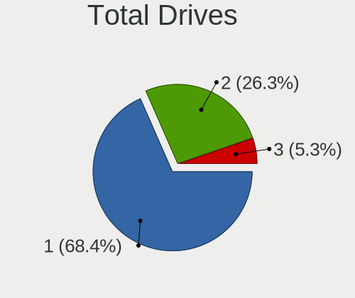
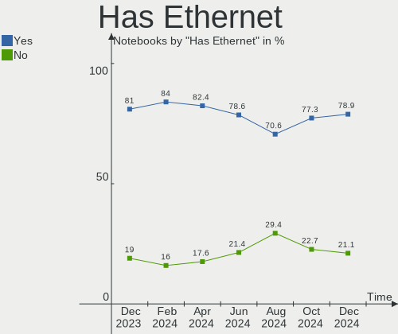
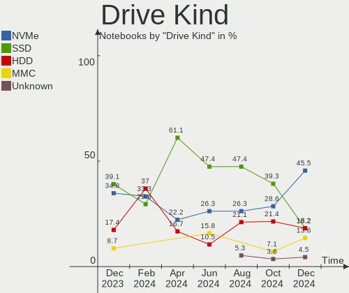
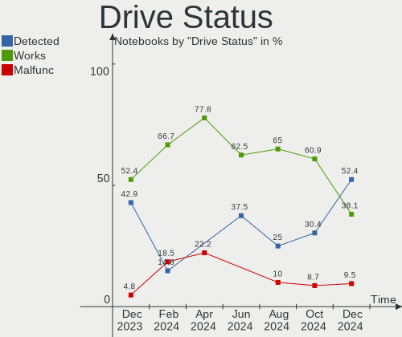
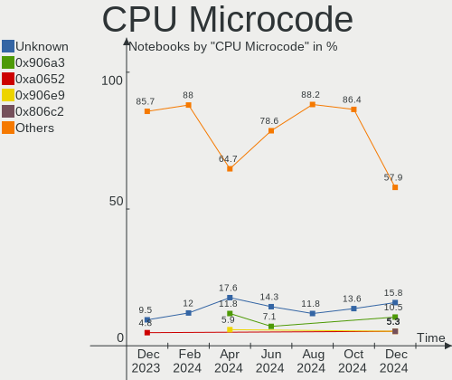
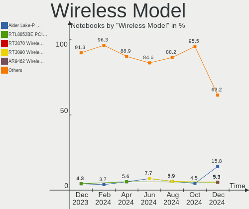
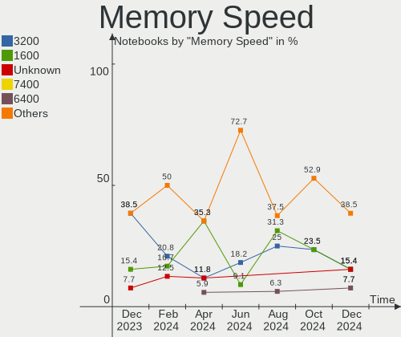
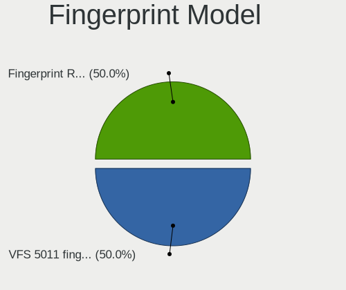

LMDE - Hardware Trends (Notebooks)
----------------------------------

A project to identify most popular hardware characteristics and track their change
over time based on data collected by Linux users at https://Linux-Hardware.org.

Anyone can contribute to this report by the [hw-probe](https://github.com/linuxhw/hw-probe) tool:

    sudo -E hw-probe -all -upload

This report is for one last month. Overall report since the beginning of time: [TestDays](https://github.com/linuxhw/TestDays)

Period: Feb, 2023.

Contents
--------

* [ System ](#system)
  - [ OS                       ](#os)
  - [ OS Family                ](#os-family)
  - [ Kernel                   ](#kernel)
  - [ Kernel Family            ](#kernel-family)
  - [ Kernel Major Ver.        ](#kernel-major-ver)
  - [ Arch                     ](#arch)
  - [ DE                       ](#de)
  - [ Display Server           ](#display-server)
  - [ Display Manager          ](#display-manager)
  - [ OS Lang                  ](#os-lang)
  - [ Boot Mode                ](#boot-mode)
  - [ Filesystem               ](#filesystem)
  - [ Part. scheme             ](#part-scheme)
  - [ Dual Boot with Linux/BSD ](#dual-boot-with-linuxbsd)
  - [ Dual Boot (Win)          ](#dual-boot-win)

* [ Board ](#board)
  - [ Vendor                   ](#vendor)
  - [ Model                    ](#model)
  - [ Model Family             ](#model-family)
  - [ MFG Year                 ](#mfg-year)
  - [ Form Factor              ](#form-factor)
  - [ Secure Boot              ](#secure-boot)
  - [ Coreboot                 ](#coreboot)
  - [ RAM Size                 ](#ram-size)
  - [ RAM Used                 ](#ram-used)
  - [ Total Drives             ](#total-drives)
  - [ Has CD-ROM               ](#has-cd-rom)
  - [ Has Ethernet             ](#has-ethernet)
  - [ Has WiFi                 ](#has-wifi)
  - [ Has Bluetooth            ](#has-bluetooth)

* [ Location ](#location)
  - [ Country                  ](#country)
  - [ City                     ](#city)

* [ Drives ](#drives)
  - [ Drive Vendor             ](#drive-vendor)
  - [ Drive Model              ](#drive-model)
  - [ HDD Vendor               ](#hdd-vendor)
  - [ SSD Vendor               ](#ssd-vendor)
  - [ Drive Kind               ](#drive-kind)
  - [ Drive Connector          ](#drive-connector)
  - [ Drive Size               ](#drive-size)
  - [ Space Total              ](#space-total)
  - [ Space Used               ](#space-used)
  - [ Malfunc. Drives          ](#malfunc-drives)
  - [ Malfunc. Drive Vendor    ](#malfunc-drive-vendor)
  - [ Malfunc. HDD Vendor      ](#malfunc-hdd-vendor)
  - [ Malfunc. Drive Kind      ](#malfunc-drive-kind)
  - [ Failed Drives            ](#failed-drives)
  - [ Failed Drive Vendor      ](#failed-drive-vendor)
  - [ Drive Status             ](#drive-status)

* [ Storage controller ](#storage-controller)
  - [ Storage Vendor           ](#storage-vendor)
  - [ Storage Model            ](#storage-model)
  - [ Storage Kind             ](#storage-kind)

* [ Processor ](#processor)
  - [ CPU Vendor               ](#cpu-vendor)
  - [ CPU Model                ](#cpu-model)
  - [ CPU Model Family         ](#cpu-model-family)
  - [ CPU Cores                ](#cpu-cores)
  - [ CPU Sockets              ](#cpu-sockets)
  - [ CPU Threads              ](#cpu-threads)
  - [ CPU Op-Modes             ](#cpu-op-modes)
  - [ CPU Microcode            ](#cpu-microcode)
  - [ CPU Microarch            ](#cpu-microarch)

* [ Graphics ](#graphics)
  - [ GPU Vendor               ](#gpu-vendor)
  - [ GPU Model                ](#gpu-model)
  - [ GPU Combo                ](#gpu-combo)
  - [ GPU Driver               ](#gpu-driver)
  - [ GPU Memory               ](#gpu-memory)

* [ Monitor ](#monitor)
  - [ Monitor Vendor           ](#monitor-vendor)
  - [ Monitor Model            ](#monitor-model)
  - [ Monitor Resolution       ](#monitor-resolution)
  - [ Monitor Diagonal         ](#monitor-diagonal)
  - [ Monitor Width            ](#monitor-width)
  - [ Aspect Ratio             ](#aspect-ratio)
  - [ Monitor Area             ](#monitor-area)
  - [ Pixel Density            ](#pixel-density)
  - [ Multiple Monitors        ](#multiple-monitors)

* [ Network ](#network)
  - [ Net Controller Vendor    ](#net-controller-vendor)
  - [ Net Controller Model     ](#net-controller-model)
  - [ Wireless Vendor          ](#wireless-vendor)
  - [ Wireless Model           ](#wireless-model)
  - [ Ethernet Vendor          ](#ethernet-vendor)
  - [ Ethernet Model           ](#ethernet-model)
  - [ Net Controller Kind      ](#net-controller-kind)
  - [ Used Controller          ](#used-controller)
  - [ NICs                     ](#nics)
  - [ IPv6                     ](#ipv6)

* [ Bluetooth ](#bluetooth)
  - [ Bluetooth Vendor         ](#bluetooth-vendor)
  - [ Bluetooth Model          ](#bluetooth-model)

* [ Sound ](#sound)
  - [ Sound Vendor             ](#sound-vendor)
  - [ Sound Model              ](#sound-model)

* [ Memory ](#memory)
  - [ Memory Vendor            ](#memory-vendor)
  - [ Memory Model             ](#memory-model)
  - [ Memory Kind              ](#memory-kind)
  - [ Memory Form Factor       ](#memory-form-factor)
  - [ Memory Size              ](#memory-size)
  - [ Memory Speed             ](#memory-speed)

* [ Printers & scanners ](#printers--scanners)
  - [ Printer Vendor           ](#printer-vendor)
  - [ Printer Model            ](#printer-model)
  - [ Scanner Vendor           ](#scanner-vendor)
  - [ Scanner Model            ](#scanner-model)

* [ Camera ](#camera)
  - [ Camera Vendor            ](#camera-vendor)
  - [ Camera Model             ](#camera-model)

* [ Security ](#security)
  - [ Fingerprint Vendor       ](#fingerprint-vendor)
  - [ Fingerprint Model        ](#fingerprint-model)
  - [ Chipcard Vendor          ](#chipcard-vendor)
  - [ Chipcard Model           ](#chipcard-model)

* [ Unsupported ](#unsupported)
  - [ Unsupported Devices      ](#unsupported-devices)
  - [ Unsupported Device Types ](#unsupported-device-types)

System
------

OS
--

Installed operating systems

| Name   | Notebooks | Percent |
|--------|-----------|---------|
| LMDE 5 | 12        | 100%    |

OS Family
---------

OS without a version

| Name | Notebooks | Percent |
|------|-----------|---------|
| LMDE | 12        | 100%    |

Kernel
------

Version of the Linux kernel

| Version              | Notebooks | Percent |
|----------------------|-----------|---------|
| 5.10.0-21-amd64      | 11        | 91.67%  |
| 6.1.11-x64v1-xanmod1 | 1         | 8.33%   |

Kernel Family
-------------

Linux kernel without a distro release

| Version | Notebooks | Percent |
|---------|-----------|---------|
| 5.10.0  | 11        | 91.67%  |
| 6.1.11  | 1         | 8.33%   |

Kernel Major Ver.
-----------------

Linux kernel major version

| Version | Notebooks | Percent |
|---------|-----------|---------|
| 5.10    | 11        | 91.67%  |
| 6.1     | 1         | 8.33%   |

Arch
----

OS architecture (x86_64, i586, etc.)

| Name   | Notebooks | Percent |
|--------|-----------|---------|
| x86_64 | 12        | 100%    |

DE
--

Desktop Environment

| Name       | Notebooks | Percent |
|------------|-----------|---------|
| X-Cinnamon | 11        | 91.67%  |
| Cinnamon   | 1         | 8.33%   |

Display Server
--------------

X11 or Wayland

| Name | Notebooks | Percent |
|------|-----------|---------|
| X11  | 12        | 100%    |

Display Manager
---------------

SDDM, LightDM, etc.

| Name    | Notebooks | Percent |
|---------|-----------|---------|
| Unknown | 7         | 58.33%  |
| LightDM | 5         | 41.67%  |

OS Lang
-------

Language

| Lang  | Notebooks | Percent |
|-------|-----------|---------|
| en_US | 4         | 33.33%  |
| ru_RU | 3         | 25%     |
| de_DE | 2         | 16.67%  |
| pt_BR | 1         | 8.33%   |
| en_SG | 1         | 8.33%   |
| en_GB | 1         | 8.33%   |

Boot Mode
---------

EFI or BIOS

| Mode | Notebooks | Percent |
|------|-----------|---------|
| EFI  | 11        | 91.67%  |
| BIOS | 1         | 8.33%   |

Filesystem
----------

Type of filesystem

| Type | Notebooks | Percent |
|------|-----------|---------|
| Ext4 | 12        | 100%    |

Part. scheme
------------

Scheme of partitioning

| Type    | Notebooks | Percent |
|---------|-----------|---------|
| Unknown | 7         | 58.33%  |
| GPT     | 5         | 41.67%  |

Dual Boot with Linux/BSD
------------------------

Hosting more than one Linux/BSD

| Dual boot | Notebooks | Percent |
|-----------|-----------|---------|
| No        | 10        | 83.33%  |
| Yes       | 2         | 16.67%  |

Dual Boot (Win)
---------------

Hosting Linux and Windows

| Dual boot | Notebooks | Percent |
|-----------|-----------|---------|
| No        | 10        | 83.33%  |
| Yes       | 2         | 16.67%  |

Board
-----

Vendor
------

Motherboard manufacturer

| Name                | Notebooks | Percent |
|---------------------|-----------|---------|
| Lenovo              | 3         | 25%     |
| Hewlett-Packard     | 3         | 25%     |
| TUXEDO              | 1         | 8.33%   |
| Toshiba             | 1         | 8.33%   |
| Star Labs           | 1         | 8.33%   |
| itel Mobile Limited | 1         | 8.33%   |
| Dell                | 1         | 8.33%   |
| Compaq              | 1         | 8.33%   |

Model
-----

Motherboard model

| Name                                 | Notebooks | Percent |
|--------------------------------------|-----------|---------|
| TUXEDO N8xxEZ                        | 1         | 8.33%   |
| Toshiba Satellite L300               | 1         | 8.33%   |
| Star Labs StarBook                   | 1         | 8.33%   |
| Lenovo ThinkPad X260 20F6S02A00      | 1         | 8.33%   |
| Lenovo ThinkPad E15 Gen 3 20YG003VGE | 1         | 8.33%   |
| Lenovo ThinkBook 14 G2 ARE 20VF      | 1         | 8.33%   |
| itel Mobile Limited SPIRIT 2         | 1         | 8.33%   |
| HP ProBook 650 G2                    | 1         | 8.33%   |
| HP 250 G8 Notebook PC                | 1         | 8.33%   |
| HP 2000                              | 1         | 8.33%   |
| Dell Precision M4800                 | 1         | 8.33%   |
| Compaq 420                           | 1         | 8.33%   |

Model Family
------------

Motherboard model prefix

| Name                       | Notebooks | Percent |
|----------------------------|-----------|---------|
| Lenovo ThinkPad            | 2         | 16.67%  |
| TUXEDO N8xxEZ              | 1         | 8.33%   |
| Toshiba Satellite          | 1         | 8.33%   |
| Star Labs StarBook         | 1         | 8.33%   |
| Lenovo ThinkBook           | 1         | 8.33%   |
| itel Mobile Limited SPIRIT | 1         | 8.33%   |
| HP ProBook                 | 1         | 8.33%   |
| HP 250                     | 1         | 8.33%   |
| HP 2000                    | 1         | 8.33%   |
| Dell Precision             | 1         | 8.33%   |
| Compaq 420                 | 1         | 8.33%   |

MFG Year
--------

Motherboard manufacture year

| Year | Notebooks | Percent |
|------|-----------|---------|
| 2021 | 2         | 16.67%  |
| 2020 | 2         | 16.67%  |
| 2016 | 2         | 16.67%  |
| 2023 | 1         | 8.33%   |
| 2022 | 1         | 8.33%   |
| 2018 | 1         | 8.33%   |
| 2013 | 1         | 8.33%   |
| 2011 | 1         | 8.33%   |
| 2008 | 1         | 8.33%   |

Form Factor
-----------

Physical design of the computer

| Name     | Notebooks | Percent |
|----------|-----------|---------|
| Notebook | 12        | 100%    |

Secure Boot
-----------

Enabled or disabled

| State    | Notebooks | Percent |
|----------|-----------|---------|
| Disabled | 9         | 75%     |
| Enabled  | 3         | 25%     |

Coreboot
--------

Have coreboot on board

| Used | Notebooks | Percent |
|------|-----------|---------|
| No   | 11        | 91.67%  |
| Yes  | 1         | 8.33%   |

RAM Size
--------

Total RAM memory

| Size in GB | Notebooks | Percent |
|------------|-----------|---------|
| 4.01-8.0   | 4         | 33.33%  |
| 32.01-64.0 | 2         | 16.67%  |
| 3.01-4.0   | 2         | 16.67%  |
| 16.01-24.0 | 2         | 16.67%  |
| 1.01-2.0   | 1         | 8.33%   |
| 8.01-16.0  | 1         | 8.33%   |

RAM Used
--------

Used RAM memory

| Used GB  | Notebooks | Percent |
|----------|-----------|---------|
| 2.01-3.0 | 6         | 50%     |
| 1.01-2.0 | 4         | 33.33%  |
| 4.01-8.0 | 1         | 8.33%   |
| 3.01-4.0 | 1         | 8.33%   |

Total Drives
------------

Number of drives on board

| Drives | Notebooks | Percent |
|--------|-----------|---------|
| 1      | 11        | 91.67%  |
| 2      | 1         | 8.33%   |

Has CD-ROM
----------

Has CD-ROM on board

| Presented | Notebooks | Percent |
|-----------|-----------|---------|
| No        | 8         | 66.67%  |
| Yes       | 4         | 33.33%  |

Has Ethernet
------------

Has Ethernet on board

| Presented | Notebooks | Percent |
|-----------|-----------|---------|
| Yes       | 10        | 83.33%  |
| No        | 2         | 16.67%  |

Has WiFi
--------

Has WiFi module

| Presented | Notebooks | Percent |
|-----------|-----------|---------|
| Yes       | 11        | 91.67%  |
| No        | 1         | 8.33%   |

Has Bluetooth
-------------

Has Bluetooth module

| Presented | Notebooks | Percent |
|-----------|-----------|---------|
| Yes       | 8         | 66.67%  |
| No        | 4         | 33.33%  |

Location
--------

Country
-------

Geographic location (country)

| Country   | Notebooks | Percent |
|-----------|-----------|---------|
| USA       | 3         | 25%     |
| Germany   | 3         | 25%     |
| Russia    | 2         | 16.67%  |
| Belarus   | 2         | 16.67%  |
| Japan     | 1         | 8.33%   |
| Indonesia | 1         | 8.33%   |

City
----

Geographic location (city)

| City          | Notebooks | Percent |
|---------------|-----------|---------|
| Miami         | 2         | 16.67%  |
| Hrodna        | 2         | 16.67%  |
| Yekaterinburg | 1         | 8.33%   |
| Vancouver     | 1         | 8.33%   |
| Toyota        | 1         | 8.33%   |
| Schoenebeck   | 1         | 8.33%   |
| Nuremberg     | 1         | 8.33%   |
| Mytishchi     | 1         | 8.33%   |
| Jakarta       | 1         | 8.33%   |
| Gummersbach   | 1         | 8.33%   |

Drives
------

Drive Vendor
------------

Hard drive vendors

| Vendor              | Notebooks | Drives | Percent |
|---------------------|-----------|--------|---------|
| Samsung Electronics | 5         | 5      | 38.46%  |
| WDC                 | 1         | 1      | 7.69%   |
| Star Drive          | 1         | 1      | 7.69%   |
| SK hynix            | 1         | 1      | 7.69%   |
| Lexar               | 1         | 1      | 7.69%   |
| HS-SSD-C100         | 1         | 1      | 7.69%   |
| Hitachi             | 1         | 1      | 7.69%   |
| Crucial             | 1         | 1      | 7.69%   |
| A-DATA Technology   | 1         | 1      | 7.69%   |

Drive Model
-----------

Hard drive models

| Model                                  | Notebooks | Percent |
|----------------------------------------|-----------|---------|
| WDC WD20SPZX-22UA7T0 2TB               | 1         | 7.69%   |
| Star Drive PCIe SSD 480GB              | 1         | 7.69%   |
| SK hynix SKHynix_HFM512GD3HX015N 512GB | 1         | 7.69%   |
| Samsung SSD 970 EVO 500GB              | 1         | 7.69%   |
| Samsung SSD 870 EVO 500GB              | 1         | 7.69%   |
| Samsung MZVLQ256HBJD-00BH1 256GB       | 1         | 7.69%   |
| Samsung MZNLN256HCHP-000H1 256GB SSD   | 1         | 7.69%   |
| Samsung MZALQ512HALU-000L2 512GB       | 1         | 7.69%   |
| Lexar 512GB SSD                        | 1         | 7.69%   |
| HS-SSD-C100 240G                       | 1         | 7.69%   |
| Hitachi HTS545050A7E380 500GB          | 1         | 7.69%   |
| Crucial CT240BX500SSD1 240GB           | 1         | 7.69%   |
| A-DATA SU650 240GB SSD                 | 1         | 7.69%   |

HDD Vendor
----------

Hard disk drive vendors

| Vendor  | Notebooks | Drives | Percent |
|---------|-----------|--------|---------|
| WDC     | 1         | 1      | 50%     |
| Hitachi | 1         | 1      | 50%     |

SSD Vendor
----------

Solid state drive vendors

| Vendor              | Notebooks | Drives | Percent |
|---------------------|-----------|--------|---------|
| Samsung Electronics | 2         | 2      | 40%     |
| Lexar               | 1         | 1      | 20%     |
| Crucial             | 1         | 1      | 20%     |
| A-DATA Technology   | 1         | 1      | 20%     |

Drive Kind
----------

HDD or SSD

| Kind    | Notebooks | Drives | Percent |
|---------|-----------|--------|---------|
| NVMe    | 5         | 5      | 38.46%  |
| SSD     | 5         | 5      | 38.46%  |
| HDD     | 2         | 2      | 15.38%  |
| Unknown | 1         | 1      | 7.69%   |

Drive Connector
---------------

SATA, SAS, NVMe, etc.

| Type | Notebooks | Drives | Percent |
|------|-----------|--------|---------|
| SATA | 8         | 8      | 61.54%  |
| NVMe | 5         | 5      | 38.46%  |

Drive Size
----------

Size of hard drive

| Size in TB | Notebooks | Drives | Percent |
|------------|-----------|--------|---------|
| 0.01-0.5   | 5         | 5      | 71.43%  |
| 1.01-2.0   | 1         | 1      | 14.29%  |
| 0.51-1.0   | 1         | 1      | 14.29%  |

Space Total
-----------

Amount of disk space available on the file system

| Size in GB | Notebooks | Percent |
|------------|-----------|---------|
| 251-500    | 6         | 50%     |
| 101-250    | 4         | 33.33%  |
| 2001-3000  | 1         | 8.33%   |
| 1001-2000  | 1         | 8.33%   |

Space Used
----------

Amount of used disk space

| Used GB  | Notebooks | Percent |
|----------|-----------|---------|
| 1-20     | 5         | 41.67%  |
| 21-50    | 3         | 25%     |
| 101-250  | 2         | 16.67%  |
| 501-1000 | 1         | 8.33%   |
| 51-100   | 1         | 8.33%   |

Malfunc. Drives
---------------

Drive models with a malfunction

| Model                                 | Notebooks | Drives | Percent |
|---------------------------------------|-----------|--------|---------|
| Samsung Electronics SSD 970 EVO 500GB | 1         | 1      | 50%     |
| Hitachi HTS545050A7E380 500GB         | 1         | 1      | 50%     |

Malfunc. Drive Vendor
---------------------

Vendors of faulty drives

| Vendor              | Notebooks | Drives | Percent |
|---------------------|-----------|--------|---------|
| Samsung Electronics | 1         | 1      | 50%     |
| Hitachi             | 1         | 1      | 50%     |

Malfunc. HDD Vendor
-------------------

Vendors of faulty HDD drives

| Vendor  | Notebooks | Drives | Percent |
|---------|-----------|--------|---------|
| Hitachi | 1         | 1      | 100%    |

Malfunc. Drive Kind
-------------------

Kinds of faulty drives

| Kind | Notebooks | Drives | Percent |
|------|-----------|--------|---------|
| NVMe | 1         | 1      | 50%     |
| HDD  | 1         | 1      | 50%     |

Failed Drives
-------------

Failed drive models

Zero info for selected period =(

Failed Drive Vendor
-------------------

Failed drive vendors

Zero info for selected period =(

Drive Status
------------

Number of failed and malfunc. drives

| Status   | Notebooks | Drives | Percent |
|----------|-----------|--------|---------|
| Detected | 7         | 7      | 53.85%  |
| Works    | 4         | 4      | 30.77%  |
| Malfunc  | 2         | 2      | 15.38%  |

Storage controller
------------------

Storage Vendor
--------------

Storage controller vendors

| Vendor              | Notebooks | Percent |
|---------------------|-----------|---------|
| Intel               | 9         | 60%     |
| Samsung Electronics | 3         | 20%     |
| SK hynix            | 1         | 6.67%   |
| Phison Electronics  | 1         | 6.67%   |
| AMD                 | 1         | 6.67%   |

Storage Model
-------------

Storage controller models

| Model                                                                            | Notebooks | Percent |
|----------------------------------------------------------------------------------|-----------|---------|
| Samsung NVMe SSD Controller 980                                                  | 2         | 11.76%  |
| Intel Tiger Lake-LP SATA Controller                                              | 2         | 11.76%  |
| Intel Sunrise Point-LP SATA Controller [AHCI mode]                               | 2         | 11.76%  |
| SK hynix Gold P31/PC711 NVMe Solid State Drive                                   | 1         | 5.88%   |
| Samsung NVMe SSD Controller SM981/PM981/PM983                                    | 1         | 5.88%   |
| Phison E12 NVMe Controller                                                       | 1         | 5.88%   |
| Intel Volume Management Device NVMe RAID Controller                              | 1         | 5.88%   |
| Intel Cannon Lake Mobile PCH SATA AHCI Controller                                | 1         | 5.88%   |
| Intel Atom/Celeron/Pentium Processor x5-E8000/J3xxx/N3xxx Series SATA Controller | 1         | 5.88%   |
| Intel 82801HM/HEM (ICH8M/ICH8M-E) SATA Controller [AHCI mode]                    | 1         | 5.88%   |
| Intel 82801HM/HEM (ICH8M/ICH8M-E) IDE Controller                                 | 1         | 5.88%   |
| Intel 82801 Mobile SATA Controller [RAID mode]                                   | 1         | 5.88%   |
| Intel 7 Series Chipset Family 6-port SATA Controller [AHCI mode]                 | 1         | 5.88%   |
| AMD FCH SATA Controller [AHCI mode]                                              | 1         | 5.88%   |

Storage Kind
------------

Kind of storage controller (IDE, SATA, NVMe, SAS, ...)

| Kind | Notebooks | Percent |
|------|-----------|---------|
| SATA | 9         | 52.94%  |
| NVMe | 5         | 29.41%  |
| RAID | 2         | 11.76%  |
| IDE  | 1         | 5.88%   |

Processor
---------

CPU Vendor
----------

Processor vendors

| Vendor | Notebooks | Percent |
|--------|-----------|---------|
| Intel  | 10        | 83.33%  |
| AMD    | 2         | 16.67%  |

CPU Model
---------

Processor models

| Model                                   | Notebooks | Percent |
|-----------------------------------------|-----------|---------|
| Intel Core i5-6200U CPU @ 2.30GHz       | 2         | 16.67%  |
| Intel Pentium CPU N3700 @ 1.60GHz       | 1         | 8.33%   |
| Intel Core i7-8750H CPU @ 2.20GHz       | 1         | 8.33%   |
| Intel Core i7-4800MQ CPU @ 2.70GHz      | 1         | 8.33%   |
| Intel Core i3-2328M CPU @ 2.20GHz       | 1         | 8.33%   |
| Intel Core 2 Duo CPU T7250 @ 2.00GHz    | 1         | 8.33%   |
| Intel 12th Gen Core i7-1260P            | 1         | 8.33%   |
| Intel 11th Gen Core i5-1155G7 @ 2.50GHz | 1         | 8.33%   |
| Intel 11th Gen Core i3-1115G4 @ 3.00GHz | 1         | 8.33%   |
| AMD Ryzen 7 5700U with Radeon Graphics  | 1         | 8.33%   |
| AMD Ryzen 5 4500U with Radeon Graphics  | 1         | 8.33%   |

CPU Model Family
----------------

Processor model prefix

| Model            | Notebooks | Percent |
|------------------|-----------|---------|
| Other            | 3         | 25%     |
| Intel Core i7    | 2         | 16.67%  |
| Intel Core i5    | 2         | 16.67%  |
| Intel Pentium    | 1         | 8.33%   |
| Intel Core i3    | 1         | 8.33%   |
| Intel Core 2 Duo | 1         | 8.33%   |
| AMD Ryzen 7      | 1         | 8.33%   |
| AMD Ryzen 5      | 1         | 8.33%   |

CPU Cores
---------

Number of processor cores

| Number | Notebooks | Percent |
|--------|-----------|---------|
| 2      | 5         | 41.67%  |
| 4      | 3         | 25%     |
| 6      | 2         | 16.67%  |
| 12     | 1         | 8.33%   |
| 8      | 1         | 8.33%   |

CPU Sockets
-----------

Number of sockets

| Number | Notebooks | Percent |
|--------|-----------|---------|
| 1      | 12        | 100%    |

CPU Threads
-----------

Threads per core (Hyper-Threading)

| Number | Notebooks | Percent |
|--------|-----------|---------|
| 2      | 8         | 66.67%  |
| 1      | 4         | 33.33%  |

CPU Op-Modes
------------

CPU Operation Modes (32-bit, 64-bit)

| Op mode        | Notebooks | Percent |
|----------------|-----------|---------|
| 32-bit, 64-bit | 12        | 100%    |

CPU Microcode
-------------

Microcode number

| Number     | Notebooks | Percent |
|------------|-----------|---------|
| 0x406e3    | 2         | 16.67%  |
| Unknown    | 2         | 16.67%  |
| 0x906ea    | 1         | 8.33%   |
| 0x806c1    | 1         | 8.33%   |
| 0x6fd      | 1         | 8.33%   |
| 0x406c3    | 1         | 8.33%   |
| 0x306c3    | 1         | 8.33%   |
| 0x206a7    | 1         | 8.33%   |
| 0x08608103 | 1         | 8.33%   |
| 0x08600106 | 1         | 8.33%   |

CPU Microarch
-------------

Microarchitecture

| Name        | Notebooks | Percent |
|-------------|-----------|---------|
| TigerLake   | 2         | 16.67%  |
| Skylake     | 2         | 16.67%  |
| Unknown     | 2         | 16.67%  |
| Zen 2       | 1         | 8.33%   |
| Silvermont  | 1         | 8.33%   |
| SandyBridge | 1         | 8.33%   |
| KabyLake    | 1         | 8.33%   |
| Haswell     | 1         | 8.33%   |
| Core        | 1         | 8.33%   |

Graphics
--------

GPU Vendor
----------

Vendors of graphics cards

| Vendor | Notebooks | Percent |
|--------|-----------|---------|
| Intel  | 10        | 76.92%  |
| AMD    | 2         | 15.38%  |
| Nvidia | 1         | 7.69%   |

GPU Model
---------

Graphics card models

| Model                                                                                    | Notebooks | Percent |
|------------------------------------------------------------------------------------------|-----------|---------|
| Intel Skylake GT2 [HD Graphics 520]                                                      | 2         | 14.29%  |
| Nvidia GK107GLM [Quadro K1100M]                                                          | 1         | 7.14%   |
| Intel TigerLake-LP GT2 [Iris Xe Graphics]                                                | 1         | 7.14%   |
| Intel Tiger Lake-LP GT2 [UHD Graphics G4]                                                | 1         | 7.14%   |
| Intel Mobile GM965/GL960 Integrated Graphics Controller (secondary)                      | 1         | 7.14%   |
| Intel Mobile GM965/GL960 Integrated Graphics Controller (primary)                        | 1         | 7.14%   |
| Intel CoffeeLake-H GT2 [UHD Graphics 630]                                                | 1         | 7.14%   |
| Intel Atom/Celeron/Pentium Processor x5-E8000/J3xxx/N3xxx Integrated Graphics Controller | 1         | 7.14%   |
| Intel Alder Lake-P Integrated Graphics Controller                                        | 1         | 7.14%   |
| Intel 4th Gen Core Processor Integrated Graphics Controller                              | 1         | 7.14%   |
| Intel 2nd Generation Core Processor Family Integrated Graphics Controller                | 1         | 7.14%   |
| AMD Renoir                                                                               | 1         | 7.14%   |
| AMD Lucienne                                                                             | 1         | 7.14%   |

GPU Combo
---------

Combinations of graphics cards

| Name           | Notebooks | Percent |
|----------------|-----------|---------|
| 1 x Intel      | 9         | 75%     |
| 1 x AMD        | 2         | 16.67%  |
| Intel + Nvidia | 1         | 8.33%   |

GPU Driver
----------

Free vs proprietary

| Driver      | Notebooks | Percent |
|-------------|-----------|---------|
| Free        | 10        | 83.33%  |
| Proprietary | 1         | 8.33%   |
| Unknown     | 1         | 8.33%   |

GPU Memory
----------

Total video memory

| Size in GB | Notebooks | Percent |
|------------|-----------|---------|
| Unknown    | 10        | 83.33%  |
| 1.01-2.0   | 1         | 8.33%   |
| 0.51-1.0   | 1         | 8.33%   |

Monitor
-------

Monitor Vendor
--------------

Monitor vendors

| Vendor                  | Notebooks | Percent |
|-------------------------|-----------|---------|
| AU Optronics            | 3         | 23.08%  |
| SLD                     | 1         | 7.69%   |
| Sceptre Tech            | 1         | 7.69%   |
| Samsung Electronics     | 1         | 7.69%   |
| LG Display              | 1         | 7.69%   |
| InfoVision              | 1         | 7.69%   |
| HKC                     | 1         | 7.69%   |
| Hewlett-Packard         | 1         | 7.69%   |
| Chimei Innolux          | 1         | 7.69%   |
| Chi Mei Optoelectronics | 1         | 7.69%   |
| BOE                     | 1         | 7.69%   |

Monitor Model
-------------

Monitor models

| Model                                                                    | Notebooks | Percent |
|--------------------------------------------------------------------------|-----------|---------|
| SLD LCD Monitor SLD003C 1366x768 309x173mm 13.9-inch                     | 1         | 7.69%   |
| Sceptre Tech Sceptre B34 SPT0D52 2560x1080 797x334mm 34.0-inch           | 1         | 7.69%   |
| Samsung Electronics LCD Monitor SEC3741 1280x800 331x207mm 15.4-inch     | 1         | 7.69%   |
| LG Display LCD Monitor LGD032C 1920x1080 344x194mm 15.5-inch             | 1         | 7.69%   |
| InfoVision LCD Monitor IVO04E5 1366x768 276x155mm 12.5-inch              | 1         | 7.69%   |
| HKC LCD Monitor HKC3CFB 1920x1080 344x194mm 15.5-inch                    | 1         | 7.69%   |
| Hewlett-Packard E243i HPN3463 1920x1080 518x324mm 24.1-inch              | 1         | 7.69%   |
| Chimei Innolux LCD Monitor CMN15C5 1366x768 344x193mm 15.5-inch          | 1         | 7.69%   |
| Chi Mei Optoelectronics LCD Monitor CMO15A2 1366x768 344x193mm 15.5-inch | 1         | 7.69%   |
| BOE LCD Monitor BOE0695 1920x1080 380x210mm 17.1-inch                    | 1         | 7.69%   |
| AU Optronics LCD Monitor AUOE48D 1920x1080 344x194mm 15.5-inch           | 1         | 7.69%   |
| AU Optronics LCD Monitor AUOB79F 1920x1080 344x194mm 15.5-inch           | 1         | 7.69%   |
| AU Optronics LCD Monitor AUO403D 1920x1080 309x173mm 13.9-inch           | 1         | 7.69%   |

Monitor Resolution
------------------

Monitor screen resolution

| Resolution      | Notebooks | Percent |
|-----------------|-----------|---------|
| 1920x1080 (FHD) | 6         | 50%     |
| 1366x768 (WXGA) | 5         | 41.67%  |
| 2560x1080       | 1         | 8.33%   |

Monitor Diagonal
----------------

Diagonal size in inches

| Inches | Notebooks | Percent |
|--------|-----------|---------|
| 15     | 7         | 53.85%  |
| 34     | 1         | 7.69%   |
| 24     | 1         | 7.69%   |
| 17     | 1         | 7.69%   |
| 14     | 1         | 7.69%   |
| 13     | 1         | 7.69%   |
| 12     | 1         | 7.69%   |

Monitor Width
-------------

Physical width

| Width in mm | Notebooks | Percent |
|-------------|-----------|---------|
| 301-350     | 9         | 69.23%  |
| 701-800     | 1         | 7.69%   |
| 501-600     | 1         | 7.69%   |
| 351-400     | 1         | 7.69%   |
| 201-300     | 1         | 7.69%   |

Aspect Ratio
------------

Proportional relationship between the width and the height

| Ratio | Notebooks | Percent |
|-------|-----------|---------|
| 16/9  | 10        | 76.92%  |
| 16/10 | 2         | 15.38%  |
| 21/9  | 1         | 7.69%   |

Monitor Area
------------

Area in inch²

| Area in inch² | Notebooks | Percent |
|----------------|-----------|---------|
| 101-110        | 7         | 53.85%  |
| 81-90          | 2         | 15.38%  |
| 61-70          | 1         | 7.69%   |
| 351-500        | 1         | 7.69%   |
| 251-300        | 1         | 7.69%   |
| 121-130        | 1         | 7.69%   |

Pixel Density
-------------

Pixels per inch

| Density | Notebooks | Percent |
|---------|-----------|---------|
| 121-160 | 7         | 53.85%  |
| 51-100  | 4         | 30.77%  |
| 101-120 | 2         | 15.38%  |

Multiple Monitors
-----------------

Total monitors connected

| Total | Notebooks | Percent |
|-------|-----------|---------|
| 1     | 9         | 75%     |
| 2     | 2         | 16.67%  |
| 0     | 1         | 8.33%   |

Network
-------

Net Controller Vendor
---------------------

Controller vendors

| Vendor                | Notebooks | Percent |
|-----------------------|-----------|---------|
| Realtek Semiconductor | 8         | 44.44%  |
| Intel                 | 7         | 38.89%  |
| TP-Link               | 1         | 5.56%   |
| MediaTek              | 1         | 5.56%   |
| Broadcom Limited      | 1         | 5.56%   |

Net Controller Model
--------------------

Controller models

| Model                                                             | Notebooks | Percent |
|-------------------------------------------------------------------|-----------|---------|
| Realtek RTL8111/8168/8411 PCI Express Gigabit Ethernet Controller | 4         | 17.39%  |
| Realtek RTL810xE PCI Express Fast Ethernet controller             | 2         | 8.7%    |
| Intel Wireless 8260                                               | 2         | 8.7%    |
| Intel Ethernet Connection I219-V                                  | 2         | 8.7%    |
| TP-Link Archer T2U PLUS [RTL8821AU]                               | 1         | 4.35%   |
| Realtek RTL8821CE 802.11ac PCIe Wireless Network Adapter          | 1         | 4.35%   |
| Realtek RTL8723BU 802.11b/g/n WLAN Adapter                        | 1         | 4.35%   |
| Realtek RTL8188SU 802.11n WLAN Adapter                            | 1         | 4.35%   |
| Realtek RTL8187B Wireless Adapter                                 | 1         | 4.35%   |
| Realtek RTL8153 Gigabit Ethernet Adapter                          | 1         | 4.35%   |
| MediaTek MT7921 802.11ax PCI Express Wireless Network Adapter     | 1         | 4.35%   |
| Intel Wireless 8265 / 8275                                        | 1         | 4.35%   |
| Intel Wi-Fi 6 AX210/AX211/AX411 160MHz                            | 1         | 4.35%   |
| Intel Wi-Fi 6 AX201                                               | 1         | 4.35%   |
| Intel Wi-Fi 6 AX200                                               | 1         | 4.35%   |
| Intel Ethernet Connection I217-LM                                 | 1         | 4.35%   |
| Broadcom Limited BCM4352 802.11ac Wireless Network Adapter        | 1         | 4.35%   |

Wireless Vendor
---------------

Wireless vendors

| Vendor                | Notebooks | Percent |
|-----------------------|-----------|---------|
| Intel                 | 6         | 54.55%  |
| Realtek Semiconductor | 3         | 27.27%  |
| TP-Link               | 1         | 9.09%   |
| Broadcom Limited      | 1         | 9.09%   |

Wireless Model
--------------

Wireless models

| Model                                                      | Notebooks | Percent |
|------------------------------------------------------------|-----------|---------|
| Intel Wireless 8260                                        | 2         | 16.67%  |
| TP-Link Archer T2U PLUS [RTL8821AU]                        | 1         | 8.33%   |
| Realtek RTL8821CE 802.11ac PCIe Wireless Network Adapter   | 1         | 8.33%   |
| Realtek RTL8723BU 802.11b/g/n WLAN Adapter                 | 1         | 8.33%   |
| Realtek RTL8188SU 802.11n WLAN Adapter                     | 1         | 8.33%   |
| Realtek RTL8187B Wireless Adapter                          | 1         | 8.33%   |
| Intel Wireless 8265 / 8275                                 | 1         | 8.33%   |
| Intel Wi-Fi 6 AX210/AX211/AX411 160MHz                     | 1         | 8.33%   |
| Intel Wi-Fi 6 AX201                                        | 1         | 8.33%   |
| Intel Wi-Fi 6 AX200                                        | 1         | 8.33%   |
| Broadcom Limited BCM4352 802.11ac Wireless Network Adapter | 1         | 8.33%   |

Ethernet Vendor
---------------

Ethernet vendors

| Vendor                | Notebooks | Percent |
|-----------------------|-----------|---------|
| Realtek Semiconductor | 7         | 63.64%  |
| Intel                 | 3         | 27.27%  |
| MediaTek              | 1         | 9.09%   |

Ethernet Model
--------------

Ethernet models

| Model                                                             | Notebooks | Percent |
|-------------------------------------------------------------------|-----------|---------|
| Realtek RTL8111/8168/8411 PCI Express Gigabit Ethernet Controller | 4         | 36.36%  |
| Realtek RTL810xE PCI Express Fast Ethernet controller             | 2         | 18.18%  |
| Intel Ethernet Connection I219-V                                  | 2         | 18.18%  |
| Realtek RTL8153 Gigabit Ethernet Adapter                          | 1         | 9.09%   |
| MediaTek MT7921 802.11ax PCI Express Wireless Network Adapter     | 1         | 9.09%   |
| Intel Ethernet Connection I217-LM                                 | 1         | 9.09%   |

Net Controller Kind
-------------------

Ethernet, WiFi or modem

| Kind     | Notebooks | Percent |
|----------|-----------|---------|
| WiFi     | 11        | 52.38%  |
| Ethernet | 10        | 47.62%  |

Used Controller
---------------

Currently used network controller

| Kind     | Notebooks | Percent |
|----------|-----------|---------|
| Ethernet | 7         | 53.85%  |
| WiFi     | 6         | 46.15%  |

NICs
----

Total network controllers on board

| Total | Notebooks | Percent |
|-------|-----------|---------|
| 2     | 7         | 58.33%  |
| 1     | 4         | 33.33%  |
| 0     | 1         | 8.33%   |

IPv6
----

IPv6 vs IPv4

| Used | Notebooks | Percent |
|------|-----------|---------|
| No   | 7         | 58.33%  |
| Yes  | 5         | 41.67%  |

Bluetooth
---------

Bluetooth Vendor
----------------

Controller vendors

| Vendor                | Notebooks | Percent |
|-----------------------|-----------|---------|
| Intel                 | 4         | 57.14%  |
| Realtek Semiconductor | 1         | 14.29%  |
| Foxconn / Hon Hai     | 1         | 14.29%  |
| Dell                  | 1         | 14.29%  |

Bluetooth Model
---------------

Controller models

| Model                                          | Notebooks | Percent |
|------------------------------------------------|-----------|---------|
| Intel Bluetooth wireless interface             | 2         | 28.57%  |
| Realtek Bluetooth Radio                        | 1         | 14.29%  |
| Intel Bluetooth 9460/9560 Jefferson Peak (JfP) | 1         | 14.29%  |
| Intel AX200 Bluetooth                          | 1         | 14.29%  |
| Foxconn / Hon Hai Wireless_Device              | 1         | 14.29%  |
| Dell Broadcom BCM20702A0 Bluetooth             | 1         | 14.29%  |

Sound
-----

Sound Vendor
------------

Sound card vendors

| Vendor | Notebooks | Percent |
|--------|-----------|---------|
| Intel  | 10        | 76.92%  |
| AMD    | 2         | 15.38%  |
| Nvidia | 1         | 7.69%   |

Sound Model
-----------

Sound card models

| Model                                                                                             | Notebooks | Percent |
|---------------------------------------------------------------------------------------------------|-----------|---------|
| Intel Tiger Lake-LP Smart Sound Technology Audio Controller                                       | 2         | 12.5%   |
| Intel Sunrise Point-LP HD Audio                                                                   | 2         | 12.5%   |
| AMD Renoir Radeon High Definition Audio Controller                                                | 2         | 12.5%   |
| AMD Family 17h/19h HD Audio Controller                                                            | 2         | 12.5%   |
| Nvidia GK107 HDMI Audio Controller                                                                | 1         | 6.25%   |
| Intel Xeon E3-1200 v3/4th Gen Core Processor HD Audio Controller                                  | 1         | 6.25%   |
| Intel Cannon Lake PCH cAVS                                                                        | 1         | 6.25%   |
| Intel Atom/Celeron/Pentium Processor x5-E8000/J3xxx/N3xxx Series High Definition Audio Controller | 1         | 6.25%   |
| Intel Alder Lake PCH-P High Definition Audio Controller                                           | 1         | 6.25%   |
| Intel 82801H (ICH8 Family) HD Audio Controller                                                    | 1         | 6.25%   |
| Intel 8 Series/C220 Series Chipset High Definition Audio Controller                               | 1         | 6.25%   |
| Intel 7 Series/C216 Chipset Family High Definition Audio Controller                               | 1         | 6.25%   |

Memory
------

Memory Vendor
-------------

Memory module vendors

| Vendor              | Notebooks | Percent |
|---------------------|-----------|---------|
| Micron Technology   | 2         | 28.57%  |
| Samsung Electronics | 1         | 14.29%  |
| Ramaxel Technology  | 1         | 14.29%  |
| Lexar Co Limited    | 1         | 14.29%  |
| GSkill              | 1         | 14.29%  |
| Crucial             | 1         | 14.29%  |

Memory Model
------------

Memory module models

| Model                                                           | Notebooks | Percent |
|-----------------------------------------------------------------|-----------|---------|
| Samsung RAM M471B5273CH0-CH9 4GB SODIMM DDR3 1334MT/s           | 1         | 14.29%  |
| Ramaxel RAM RMSA3310MB96HAF-3200 8GB SODIMM DDR4 3200MT/s       | 1         | 14.29%  |
| Micron RAM 4ATF1G64HZ-3G2E1 8GB SODIMM DDR4 3200MT/s            | 1         | 14.29%  |
| Micron RAM 16JSF51264HZ-1G4D1 4GB SODIMM DDR3 1334MT/s          | 1         | 14.29%  |
| Lexar Co Limited RAM LD4AS016G-3200ST 16GB SODIMM DDR4 3200MT/s | 1         | 14.29%  |
| GSkill RAM F4-3200C22-16GRS 16GB SODIMM DDR4 3200MT/s           | 1         | 14.29%  |
| Crucial RAM BLS16G4S240FSD.16FBD 16GB SODIMM DDR4 2400MT/s      | 1         | 14.29%  |

Memory Kind
-----------

Memory module kinds

| Kind | Notebooks | Percent |
|------|-----------|---------|
| DDR4 | 4         | 80%     |
| DDR3 | 1         | 20%     |

Memory Form Factor
------------------

Physical design of the memory module

| Name   | Notebooks | Percent |
|--------|-----------|---------|
| SODIMM | 5         | 100%    |

Memory Size
-----------

Memory module size

| Size  | Notebooks | Percent |
|-------|-----------|---------|
| 16384 | 3         | 60%     |
| 8192  | 1         | 20%     |
| 4096  | 1         | 20%     |

Memory Speed
------------

Memory module speed

| Speed | Notebooks | Percent |
|-------|-----------|---------|
| 3200  | 3         | 60%     |
| 2400  | 1         | 20%     |
| 1334  | 1         | 20%     |

Printers & scanners
-------------------

Printer Vendor
--------------

Printer device vendors

Zero info for selected period =(

Printer Model
-------------

Printer device models

Zero info for selected period =(

Scanner Vendor
--------------

Scanner device vendors

Zero info for selected period =(

Scanner Model
-------------

Scanner device models

Zero info for selected period =(

Camera
------

Camera Vendor
-------------

Camera device vendors

| Vendor                                 | Notebooks | Percent |
|----------------------------------------|-----------|---------|
| Chicony Electronics                    | 3         | 27.27%  |
| Microdia                               | 2         | 18.18%  |
| Cheng Uei Precision Industry (Foxlink) | 2         | 18.18%  |
| Syntek                                 | 1         | 9.09%   |
| Realtek Semiconductor                  | 1         | 9.09%   |
| Luxvisions Innotech Limited            | 1         | 9.09%   |
| Acer                                   | 1         | 9.09%   |

Camera Model
------------

Camera device models

| Model                                                   | Notebooks | Percent |
|---------------------------------------------------------|-----------|---------|
| Microdia CameraA                                        | 2         | 18.18%  |
| Chicony Integrated Camera                               | 2         | 18.18%  |
| Syntek Integrated Camera                                | 1         | 9.09%   |
| Realtek MTD camera                                      | 1         | 9.09%   |
| Luxvisions Innotech Limited HP TrueVision HD Camera     | 1         | 9.09%   |
| Chicony Camera                                          | 1         | 9.09%   |
| Cheng Uei Precision Industry (Foxlink) HP Truevision HD | 1         | 9.09%   |
| Cheng Uei Precision Industry (Foxlink) HP HD Camera     | 1         | 9.09%   |
| Acer BisonCam, NB Pro                                   | 1         | 9.09%   |

Security
--------

Fingerprint Vendor
------------------

Fingerprint sensor vendors

| Vendor           | Notebooks | Percent |
|------------------|-----------|---------|
| Validity Sensors | 1         | 100%    |

Fingerprint Model
-----------------

Fingerprint sensor models

| Model                                        | Notebooks | Percent |
|----------------------------------------------|-----------|---------|
| Validity Sensors VFS 5011 fingerprint sensor | 1         | 100%    |

Chipcard Vendor
---------------

Chipcard module vendors

| Vendor      | Notebooks | Percent |
|-------------|-----------|---------|
| Alcor Micro | 1         | 100%    |

Chipcard Model
--------------

Chipcard module models

| Model                               | Notebooks | Percent |
|-------------------------------------|-----------|---------|
| Alcor Micro AU9540 Smartcard Reader | 1         | 100%    |

Unsupported
-----------

Unsupported Devices
-------------------

Total unsupported devices on board

| Total | Notebooks | Percent |
|-------|-----------|---------|
| 0     | 8         | 66.67%  |
| 2     | 2         | 16.67%  |
| 1     | 2         | 16.67%  |

Unsupported Device Types
------------------------

Types of unsupported devices

| Type                     | Notebooks | Percent |
|--------------------------|-----------|---------|
| Net/wireless             | 1         | 16.67%  |
| Multimedia controller    | 1         | 16.67%  |
| Graphics card            | 1         | 16.67%  |
| Fingerprint reader       | 1         | 16.67%  |
| Communication controller | 1         | 16.67%  |
| Chipcard                 | 1         | 16.67%  |

