LMDE - Hardware Trends
----------------------

A project to identify most popular hardware characteristics and track their change
over time based on data collected by Linux users at https://Linux-Hardware.org.

Anyone can contribute to this report by the [hw-probe](https://github.com/linuxhw/hw-probe) tool:

    sudo -E hw-probe -all -upload

This is a report for all computer types. See also reports for [desktops](/Dist/LMDE/Desktop/README.md) and [notebooks](/Dist/LMDE/Notebook/README.md).

This report is for one last month. Overall report since the beginning of time: [TestDays](https://github.com/linuxhw/TestDays)

Period: Dec, 2025.

Contents
--------

* [ System ](#system)
  - [ OS                       ](#os)
  - [ OS Family                ](#os-family)
  - [ Kernel                   ](#kernel)
  - [ Kernel Family            ](#kernel-family)
  - [ Kernel Major Ver.        ](#kernel-major-ver)
  - [ Arch                     ](#arch)
  - [ DE                       ](#de)
  - [ Display Server           ](#display-server)
  - [ Display Manager          ](#display-manager)
  - [ OS Lang                  ](#os-lang)
  - [ Boot Mode                ](#boot-mode)
  - [ Filesystem               ](#filesystem)
  - [ Part. scheme             ](#part-scheme)
  - [ Dual Boot with Linux/BSD ](#dual-boot-with-linuxbsd)
  - [ Dual Boot (Win)          ](#dual-boot-win)

* [ Board ](#board)
  - [ Vendor                   ](#vendor)
  - [ Model                    ](#model)
  - [ Model Family             ](#model-family)
  - [ MFG Year                 ](#mfg-year)
  - [ Form Factor              ](#form-factor)
  - [ Secure Boot              ](#secure-boot)
  - [ Coreboot                 ](#coreboot)
  - [ RAM Size                 ](#ram-size)
  - [ RAM Used                 ](#ram-used)
  - [ Total Drives             ](#total-drives)
  - [ Has CD-ROM               ](#has-cd-rom)
  - [ Has Ethernet             ](#has-ethernet)
  - [ Has WiFi                 ](#has-wifi)
  - [ Has Bluetooth            ](#has-bluetooth)

* [ Location ](#location)
  - [ Country                  ](#country)
  - [ City                     ](#city)

* [ Drives ](#drives)
  - [ Drive Vendor             ](#drive-vendor)
  - [ Drive Model              ](#drive-model)
  - [ HDD Vendor               ](#hdd-vendor)
  - [ SSD Vendor               ](#ssd-vendor)
  - [ Drive Kind               ](#drive-kind)
  - [ Drive Connector          ](#drive-connector)
  - [ Drive Size               ](#drive-size)
  - [ Space Total              ](#space-total)
  - [ Space Used               ](#space-used)
  - [ Malfunc. Drives          ](#malfunc-drives)
  - [ Malfunc. Drive Vendor    ](#malfunc-drive-vendor)
  - [ Malfunc. HDD Vendor      ](#malfunc-hdd-vendor)
  - [ Malfunc. Drive Kind      ](#malfunc-drive-kind)
  - [ Failed Drives            ](#failed-drives)
  - [ Failed Drive Vendor      ](#failed-drive-vendor)
  - [ Drive Status             ](#drive-status)

* [ Storage controller ](#storage-controller)
  - [ Storage Vendor           ](#storage-vendor)
  - [ Storage Model            ](#storage-model)
  - [ Storage Kind             ](#storage-kind)

* [ Processor ](#processor)
  - [ CPU Vendor               ](#cpu-vendor)
  - [ CPU Model                ](#cpu-model)
  - [ CPU Model Family         ](#cpu-model-family)
  - [ CPU Cores                ](#cpu-cores)
  - [ CPU Sockets              ](#cpu-sockets)
  - [ CPU Threads              ](#cpu-threads)
  - [ CPU Op-Modes             ](#cpu-op-modes)
  - [ CPU Microcode            ](#cpu-microcode)
  - [ CPU Microarch            ](#cpu-microarch)

* [ Graphics ](#graphics)
  - [ GPU Vendor               ](#gpu-vendor)
  - [ GPU Model                ](#gpu-model)
  - [ GPU Combo                ](#gpu-combo)
  - [ GPU Driver               ](#gpu-driver)
  - [ GPU Memory               ](#gpu-memory)

* [ Monitor ](#monitor)
  - [ Monitor Vendor           ](#monitor-vendor)
  - [ Monitor Model            ](#monitor-model)
  - [ Monitor Resolution       ](#monitor-resolution)
  - [ Monitor Diagonal         ](#monitor-diagonal)
  - [ Monitor Width            ](#monitor-width)
  - [ Aspect Ratio             ](#aspect-ratio)
  - [ Monitor Area             ](#monitor-area)
  - [ Pixel Density            ](#pixel-density)
  - [ Multiple Monitors        ](#multiple-monitors)

* [ Network ](#network)
  - [ Net Controller Vendor    ](#net-controller-vendor)
  - [ Net Controller Model     ](#net-controller-model)
  - [ Wireless Vendor          ](#wireless-vendor)
  - [ Wireless Model           ](#wireless-model)
  - [ Ethernet Vendor          ](#ethernet-vendor)
  - [ Ethernet Model           ](#ethernet-model)
  - [ Net Controller Kind      ](#net-controller-kind)
  - [ Used Controller          ](#used-controller)
  - [ NICs                     ](#nics)
  - [ IPv6                     ](#ipv6)

* [ Bluetooth ](#bluetooth)
  - [ Bluetooth Vendor         ](#bluetooth-vendor)
  - [ Bluetooth Model          ](#bluetooth-model)

* [ Sound ](#sound)
  - [ Sound Vendor             ](#sound-vendor)
  - [ Sound Model              ](#sound-model)

* [ Memory ](#memory)
  - [ Memory Vendor            ](#memory-vendor)
  - [ Memory Model             ](#memory-model)
  - [ Memory Kind              ](#memory-kind)
  - [ Memory Form Factor       ](#memory-form-factor)
  - [ Memory Size              ](#memory-size)
  - [ Memory Speed             ](#memory-speed)

* [ Printers & scanners ](#printers--scanners)
  - [ Printer Vendor           ](#printer-vendor)
  - [ Printer Model            ](#printer-model)
  - [ Scanner Vendor           ](#scanner-vendor)
  - [ Scanner Model            ](#scanner-model)

* [ Camera ](#camera)
  - [ Camera Vendor            ](#camera-vendor)
  - [ Camera Model             ](#camera-model)

* [ Security ](#security)
  - [ Fingerprint Vendor       ](#fingerprint-vendor)
  - [ Fingerprint Model        ](#fingerprint-model)
  - [ Chipcard Vendor          ](#chipcard-vendor)
  - [ Chipcard Model           ](#chipcard-model)

* [ Unsupported ](#unsupported)
  - [ Unsupported Devices      ](#unsupported-devices)
  - [ Unsupported Device Types ](#unsupported-device-types)

System
------

OS
--

Installed operating systems

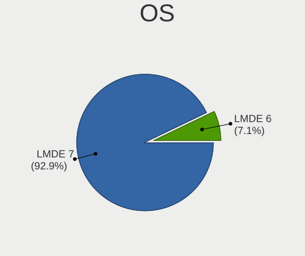

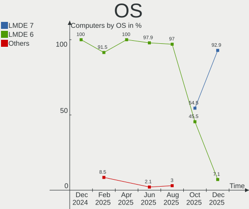

| Name   | Computers | Percent |
|--------|-----------|---------|
| LMDE 7 | 65        | 92.86%  |
| LMDE 6 | 5         | 7.14%   |

OS Family
---------

OS without a version

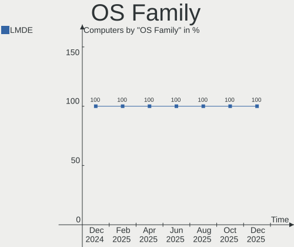

| Name | Computers | Percent |
|------|-----------|---------|
| LMDE | 70        | 100%    |

Kernel
------

Version of the Linux kernel

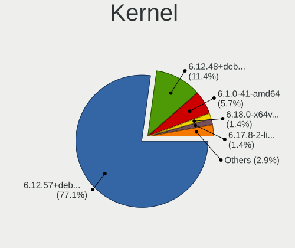

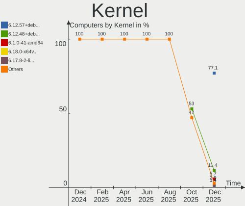

| Version                 | Computers | Percent |
|-------------------------|-----------|---------|
| 6.12.57+deb13-amd64     | 54        | 77.14%  |
| 6.12.48+deb13-amd64     | 8         | 11.43%  |
| 6.1.0-41-amd64          | 4         | 5.71%   |
| 6.18.0-x64v2-xanmod1    | 1         | 1.43%   |
| 6.17.8-2-liquorix-amd64 | 1         | 1.43%   |
| 6.1.0-41-686            | 1         | 1.43%   |
| 6.1.0-17-amd64          | 1         | 1.43%   |

Kernel Family
-------------

Linux kernel without a distro release

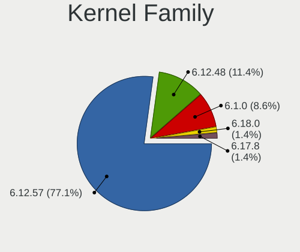

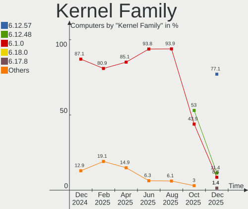

| Version | Computers | Percent |
|---------|-----------|---------|
| 6.12.57 | 54        | 77.14%  |
| 6.12.48 | 8         | 11.43%  |
| 6.1.0   | 6         | 8.57%   |
| 6.18.0  | 1         | 1.43%   |
| 6.17.8  | 1         | 1.43%   |

Kernel Major Ver.
-----------------

Linux kernel major version

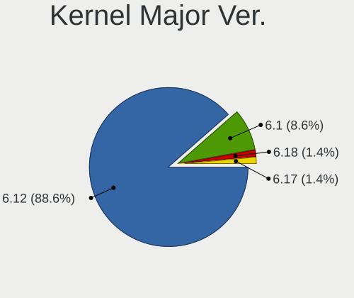

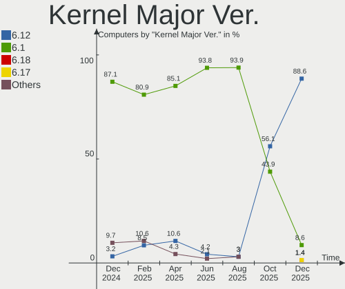

| Version | Computers | Percent |
|---------|-----------|---------|
| 6.12    | 62        | 88.57%  |
| 6.1     | 6         | 8.57%   |
| 6.18    | 1         | 1.43%   |
| 6.17    | 1         | 1.43%   |

Arch
----

OS architecture (x86_64, i586, etc.)

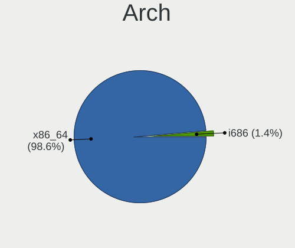

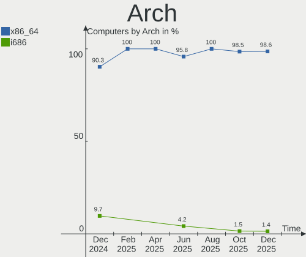

| Name   | Computers | Percent |
|--------|-----------|---------|
| x86_64 | 69        | 98.57%  |
| i686   | 1         | 1.43%   |

DE
--

Desktop Environment

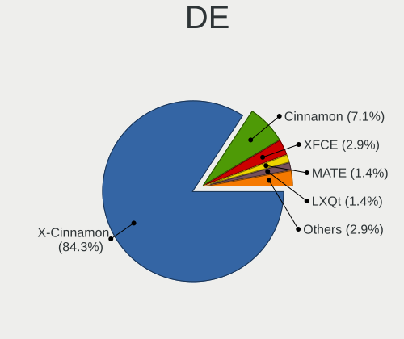

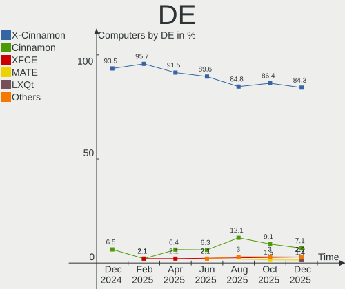

| Name       | Computers | Percent |
|------------|-----------|---------|
| X-Cinnamon | 59        | 84.29%  |
| Cinnamon   | 5         | 7.14%   |
| XFCE       | 2         | 2.86%   |
| MATE       | 1         | 1.43%   |
| LXQt       | 1         | 1.43%   |
| GNOME      | 1         | 1.43%   |
| Unknown    | 1         | 1.43%   |

Display Server
--------------

X11 or Wayland

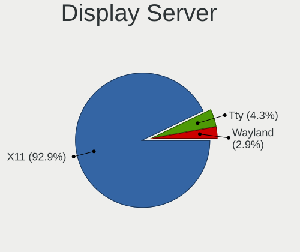

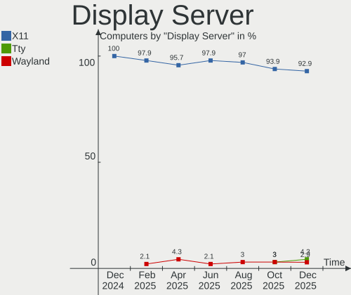

| Name    | Computers | Percent |
|---------|-----------|---------|
| X11     | 65        | 92.86%  |
| Tty     | 3         | 4.29%   |
| Wayland | 2         | 2.86%   |

Display Manager
---------------

SDDM, LightDM, etc.

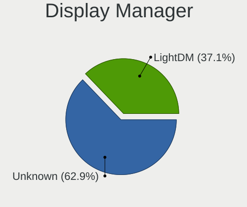

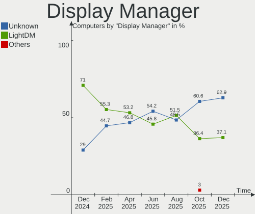

| Name    | Computers | Percent |
|---------|-----------|---------|
| Unknown | 44        | 62.86%  |
| LightDM | 26        | 37.14%  |

OS Lang
-------

Language

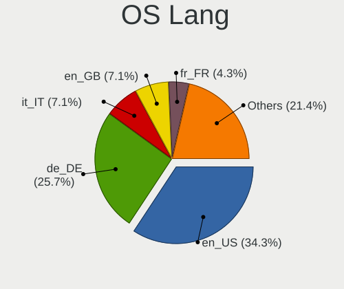

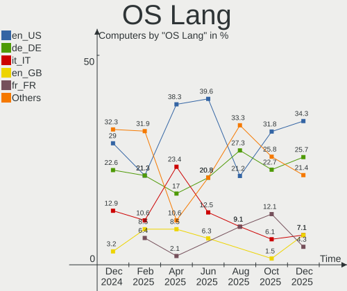

| Lang    | Computers | Percent |
|---------|-----------|---------|
| en_US   | 24        | 34.29%  |
| de_DE   | 18        | 25.71%  |
| it_IT   | 5         | 7.14%   |
| en_GB   | 5         | 7.14%   |
| fr_FR   | 3         | 4.29%   |
| pt_BR   | 2         | 2.86%   |
| pl_PL   | 2         | 2.86%   |
| zh_CN   | 1         | 1.43%   |
| sr_RS   | 1         | 1.43%   |
| ja_JP   | 1         | 1.43%   |
| fr_BE   | 1         | 1.43%   |
| fi_FI   | 1         | 1.43%   |
| eu_ES   | 1         | 1.43%   |
| es_SV   | 1         | 1.43%   |
| es_ES   | 1         | 1.43%   |
| en_NZ   | 1         | 1.43%   |
| en_CA   | 1         | 1.43%   |
| Unknown | 1         | 1.43%   |

Boot Mode
---------

EFI or BIOS

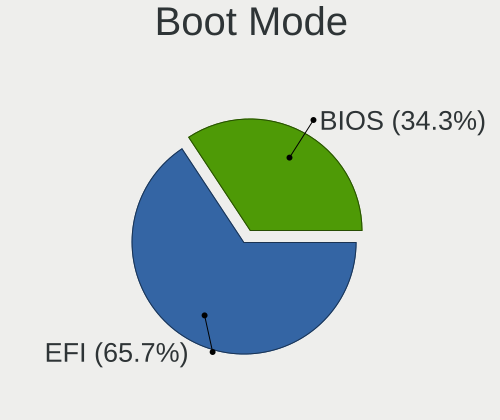

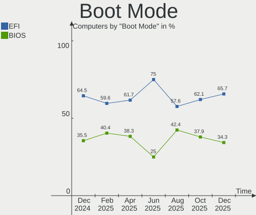

| Mode | Computers | Percent |
|------|-----------|---------|
| EFI  | 46        | 65.71%  |
| BIOS | 24        | 34.29%  |

Filesystem
----------

Type of filesystem

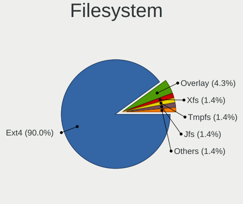

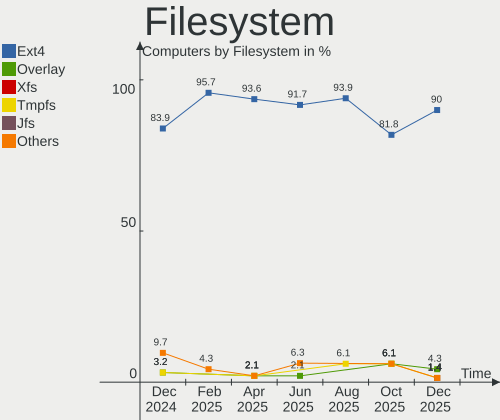

| Type    | Computers | Percent |
|---------|-----------|---------|
| Ext4    | 63        | 90%     |
| Overlay | 3         | 4.29%   |
| Xfs     | 1         | 1.43%   |
| Tmpfs   | 1         | 1.43%   |
| Jfs     | 1         | 1.43%   |
| Btrfs   | 1         | 1.43%   |

Part. scheme
------------

Scheme of partitioning

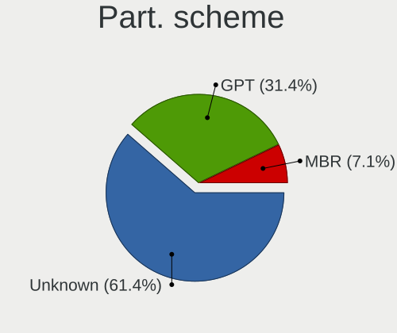

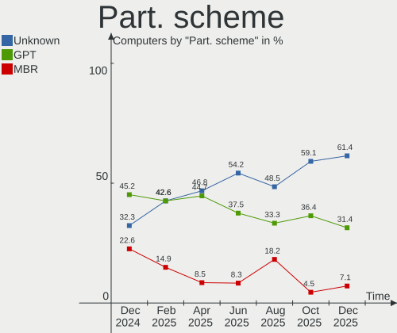

| Type    | Computers | Percent |
|---------|-----------|---------|
| Unknown | 43        | 61.43%  |
| GPT     | 22        | 31.43%  |
| MBR     | 5         | 7.14%   |

Dual Boot with Linux/BSD
------------------------

Hosting more than one Linux/BSD

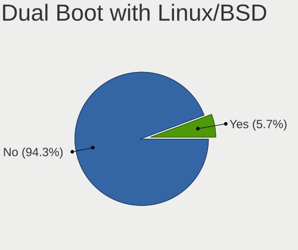

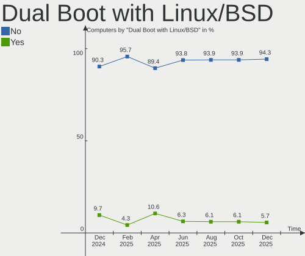

| Dual boot | Computers | Percent |
|-----------|-----------|---------|
| No        | 66        | 94.29%  |
| Yes       | 4         | 5.71%   |

Dual Boot (Win)
---------------

Hosting Linux and Windows

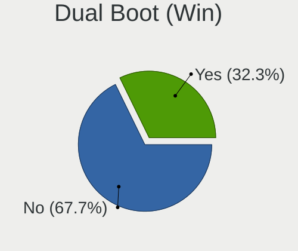

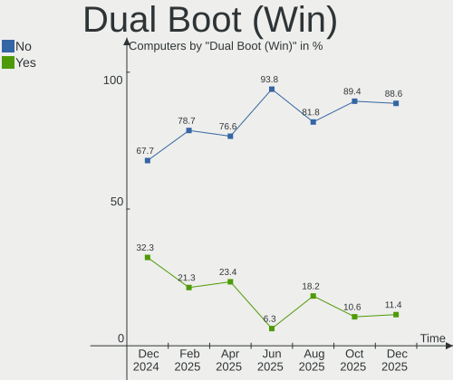

| Dual boot | Computers | Percent |
|-----------|-----------|---------|
| No        | 62        | 88.57%  |
| Yes       | 8         | 11.43%  |

Board
-----

Vendor
------

Motherboard manufacturer

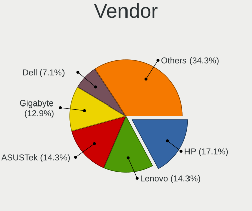

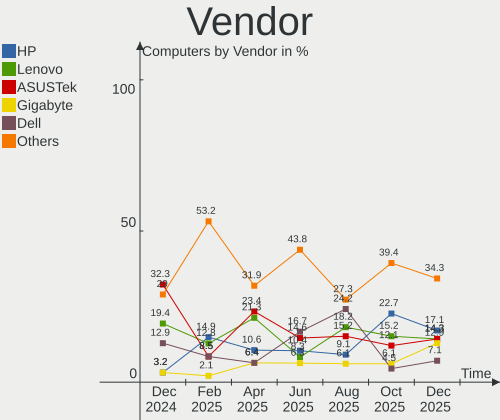

| Name                                 | Computers | Percent |
|--------------------------------------|-----------|---------|
| Hewlett-Packard                      | 12        | 17.14%  |
| Lenovo                               | 10        | 14.29%  |
| ASUSTek Computer                     | 10        | 14.29%  |
| Gigabyte Technology                  | 9         | 12.86%  |
| Dell                                 | 5         | 7.14%   |
| Acer                                 | 5         | 7.14%   |
| Shenzhen Meigao Electronic Equipment | 2         | 2.86%   |
| Medion                               | 2         | 2.86%   |
| LG Electronics                       | 2         | 2.86%   |
| Intel                                | 2         | 2.86%   |
| Apple                                | 2         | 2.86%   |
| Sony                                 | 1         | 1.43%   |
| Samsung Electronics                  | 1         | 1.43%   |
| Packard Bell                         | 1         | 1.43%   |
| MSI                                  | 1         | 1.43%   |
| LETSUNG                              | 1         | 1.43%   |
| Google                               | 1         | 1.43%   |
| ECS                                  | 1         | 1.43%   |
| AZW                                  | 1         | 1.43%   |
| AB8139                               | 1         | 1.43%   |

Model
-----

Motherboard model

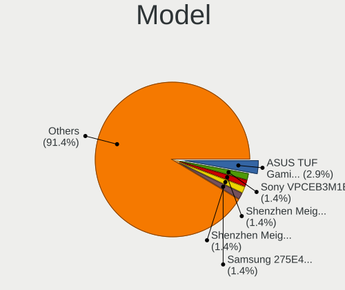

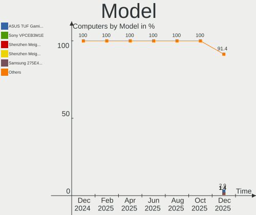

| Name                                                  | Computers | Percent |
|-------------------------------------------------------|-----------|---------|
| ASUS TUF Gaming B850-PLUS WIFI                        | 2         | 2.86%   |
| Sony VPCEB3M1E                                        | 1         | 1.43%   |
| Shenzhen Meigao Electronic Equipment Mercury series   | 1         | 1.43%   |
| Shenzhen Meigao Electronic Equipment EliteMini Series | 1         | 1.43%   |
| Samsung 275E4E/275E5E                                 | 1         | 1.43%   |
| Packard Bell EasyNote TS11HR                          | 1         | 1.43%   |
| MSI MS-7390                                           | 1         | 1.43%   |
| Medion S23003                                         | 1         | 1.43%   |
| Medion E7220                                          | 1         | 1.43%   |
| LG 17Z90TL-G.AU8BF                                    | 1         | 1.43%   |
| LG 17Z90N-V.AA55G                                     | 1         | 1.43%   |
| Lenovo ThinkPad X13 Gen 4 21J3CTO1WW                  | 1         | 1.43%   |
| Lenovo ThinkPad X1 Yoga Gen 5 20UCS4RM04              | 1         | 1.43%   |
| Lenovo ThinkPad T400 2768V82                          | 1         | 1.43%   |
| Lenovo ThinkPad P53 20QQS1GXGE                        | 1         | 1.43%   |
| Lenovo ThinkPad L440 20AT005EGE                       | 1         | 1.43%   |
| Lenovo ThinkPad                                       | 1         | 1.43%   |
| Lenovo ThinkCentre M90p 5536A4U                       | 1         | 1.43%   |
| Lenovo ThinkCentre M900z 10F2S03K00                   | 1         | 1.43%   |
| Lenovo Legion S7 15IMH5 82BC                          | 1         | 1.43%   |
| Lenovo IdeaPad 5 2-in-1 16AKP10 83KU                  | 1         | 1.43%   |
| Intel NUC8i5BEH                                       | 1         | 1.43%   |
| Intel NUC13ANKi5                                      | 1         | 1.43%   |
| HP Z2 Tower G4 Workstation                            | 1         | 1.43%   |
| HP ProDesk 400 G6 Desktop Mini PC                     | 1         | 1.43%   |
| HP ProBook 455 15.6 inch G10 Notebook PC              | 1         | 1.43%   |
| HP ProBook 440 G6                                     | 1         | 1.43%   |
| HP OMEN by Gaming Laptop 16-wd0xxx                    | 1         | 1.43%   |
| HP Laptop 15-dy1xxx                                   | 1         | 1.43%   |
| HP EliteBook 8570p                                    | 1         | 1.43%   |
| HP EliteBook 840 G1                                   | 1         | 1.43%   |
| HP EliteBook 1030 G1                                  | 1         | 1.43%   |
| HP Compaq 6735s                                       | 1         | 1.43%   |
| HP 255 15.6 inch G10                                  | 1         | 1.43%   |
| HP 250 G3                                             | 1         | 1.43%   |
| Google Fleex                                          | 1         | 1.43%   |
| Gigabyte X870 EAGLE WIFI7                             | 1         | 1.43%   |
| Gigabyte Q87M-D2H                                     | 1         | 1.43%   |
| Gigabyte H310M A                                      | 1         | 1.43%   |
| Gigabyte G41M-ES2L                                    | 1         | 1.43%   |

Model Family
------------

Motherboard model prefix

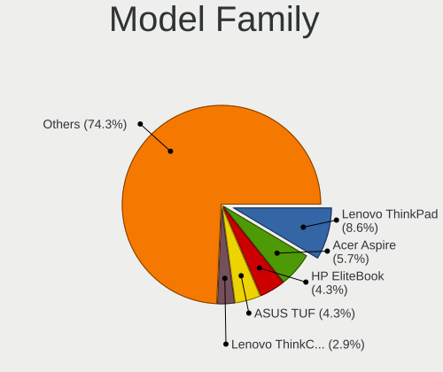

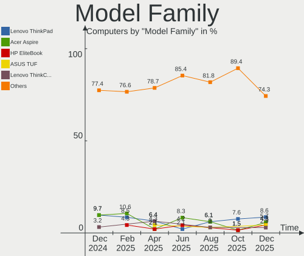

| Name                                           | Computers | Percent |
|------------------------------------------------|-----------|---------|
| Lenovo ThinkPad                                | 6         | 8.57%   |
| Acer Aspire                                    | 4         | 5.71%   |
| HP EliteBook                                   | 3         | 4.29%   |
| ASUS TUF                                       | 3         | 4.29%   |
| Lenovo ThinkCentre                             | 2         | 2.86%   |
| HP ProBook                                     | 2         | 2.86%   |
| Dell Latitude                                  | 2         | 2.86%   |
| Sony VPCEB3M1E                                 | 1         | 1.43%   |
| Shenzhen Meigao Electronic Equipment Mercury   | 1         | 1.43%   |
| Shenzhen Meigao Electronic Equipment EliteMini | 1         | 1.43%   |
| Samsung 275E4E                                 | 1         | 1.43%   |
| Packard Bell EasyNote                          | 1         | 1.43%   |
| MSI MS-7390                                    | 1         | 1.43%   |
| Medion S23003                                  | 1         | 1.43%   |
| Medion E7220                                   | 1         | 1.43%   |
| LG 17Z90TL-G.AU8BF                             | 1         | 1.43%   |
| LG 17Z90N-V.AA55G                              | 1         | 1.43%   |
| Lenovo Legion                                  | 1         | 1.43%   |
| Lenovo IdeaPad                                 | 1         | 1.43%   |
| Intel NUC8i5BEH                                | 1         | 1.43%   |
| Intel NUC13ANKi5                               | 1         | 1.43%   |
| HP Z2                                          | 1         | 1.43%   |
| HP ProDesk                                     | 1         | 1.43%   |
| HP OMEN                                        | 1         | 1.43%   |
| HP Laptop                                      | 1         | 1.43%   |
| HP Compaq                                      | 1         | 1.43%   |
| HP 255                                         | 1         | 1.43%   |
| HP 250                                         | 1         | 1.43%   |
| Google Fleex                                   | 1         | 1.43%   |
| Gigabyte X870                                  | 1         | 1.43%   |
| Gigabyte Q87M-D2H                              | 1         | 1.43%   |
| Gigabyte H310M                                 | 1         | 1.43%   |
| Gigabyte G41M-ES2L                             | 1         | 1.43%   |
| Gigabyte F2A88X-D3H                            | 1         | 1.43%   |
| Gigabyte B660M                                 | 1         | 1.43%   |
| Gigabyte B550                                  | 1         | 1.43%   |
| Gigabyte A520M                                 | 1         | 1.43%   |
| Gigabyte 970A-DS3P                             | 1         | 1.43%   |
| ECS A780GM-A                                   | 1         | 1.43%   |
| Dell Precision                                 | 1         | 1.43%   |

MFG Year
--------

Motherboard manufacture year

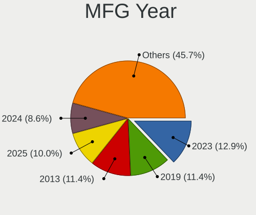

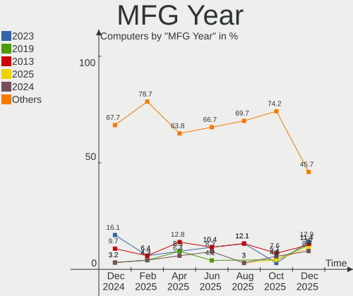

| Year    | Computers | Percent |
|---------|-----------|---------|
| 2023    | 9         | 12.86%  |
| 2019    | 8         | 11.43%  |
| 2013    | 8         | 11.43%  |
| 2025    | 7         | 10%     |
| 2024    | 6         | 8.57%   |
| 2021    | 5         | 7.14%   |
| 2008    | 5         | 7.14%   |
| 2020    | 4         | 5.71%   |
| 2014    | 4         | 5.71%   |
| 2018    | 2         | 2.86%   |
| 2015    | 2         | 2.86%   |
| 2011    | 2         | 2.86%   |
| 2010    | 2         | 2.86%   |
| 2009    | 2         | 2.86%   |
| 2022    | 1         | 1.43%   |
| 2012    | 1         | 1.43%   |
| 2007    | 1         | 1.43%   |
| Unknown | 1         | 1.43%   |

Form Factor
-----------

Physical design of the computer

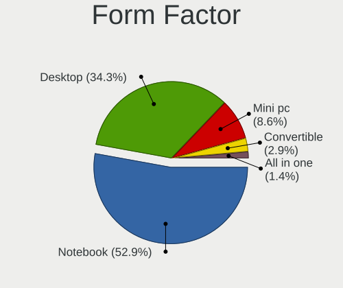

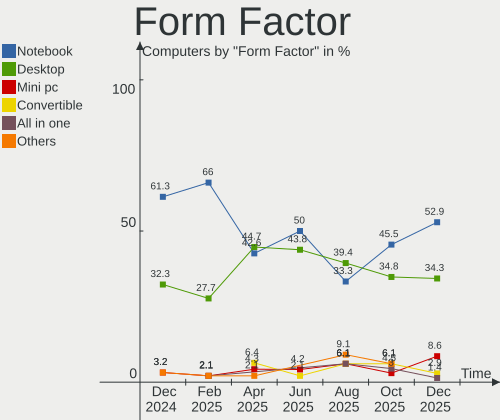

| Name        | Computers | Percent |
|-------------|-----------|---------|
| Notebook    | 37        | 52.86%  |
| Desktop     | 24        | 34.29%  |
| Mini pc     | 6         | 8.57%   |
| Convertible | 2         | 2.86%   |
| All in one  | 1         | 1.43%   |

Secure Boot
-----------

Enabled or disabled

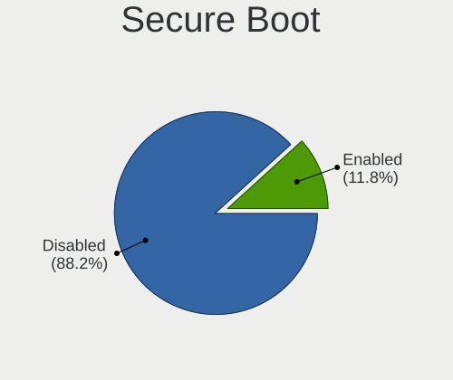

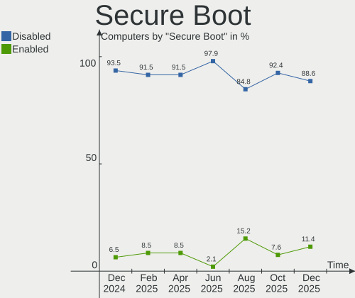

| State    | Computers | Percent |
|----------|-----------|---------|
| Disabled | 62        | 88.57%  |
| Enabled  | 8         | 11.43%  |

Coreboot
--------

Have coreboot on board

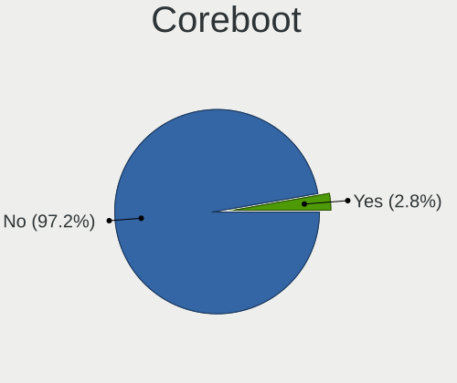

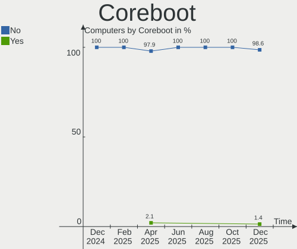

| Used | Computers | Percent |
|------|-----------|---------|
| No   | 69        | 98.57%  |
| Yes  | 1         | 1.43%   |

RAM Size
--------

Total RAM memory

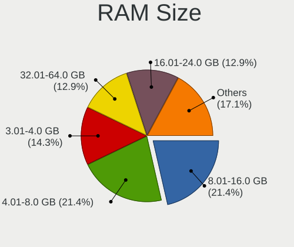

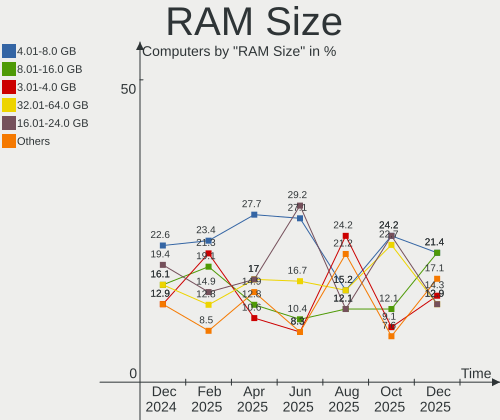

| Size in GB  | Computers | Percent |
|-------------|-----------|---------|
| 4.01-8.0    | 15        | 21.43%  |
| 8.01-16.0   | 15        | 21.43%  |
| 3.01-4.0    | 10        | 14.29%  |
| 32.01-64.0  | 9         | 12.86%  |
| 16.01-24.0  | 9         | 12.86%  |
| 24.01-32.0  | 6         | 8.57%   |
| 64.01-256.0 | 5         | 7.14%   |
| 2.01-3.0    | 1         | 1.43%   |

RAM Used
--------

Used RAM memory

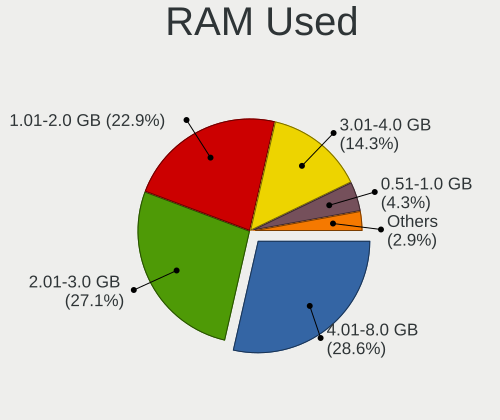

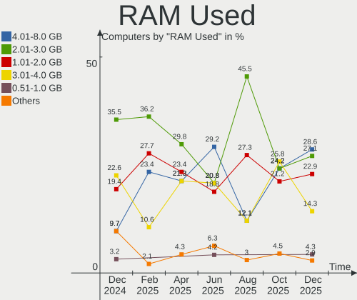

| Used GB   | Computers | Percent |
|-----------|-----------|---------|
| 4.01-8.0  | 20        | 28.57%  |
| 2.01-3.0  | 19        | 27.14%  |
| 1.01-2.0  | 16        | 22.86%  |
| 3.01-4.0  | 10        | 14.29%  |
| 0.51-1.0  | 3         | 4.29%   |
| 8.01-16.0 | 2         | 2.86%   |

Total Drives
------------

Number of drives on board

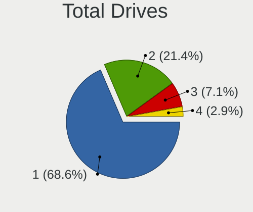

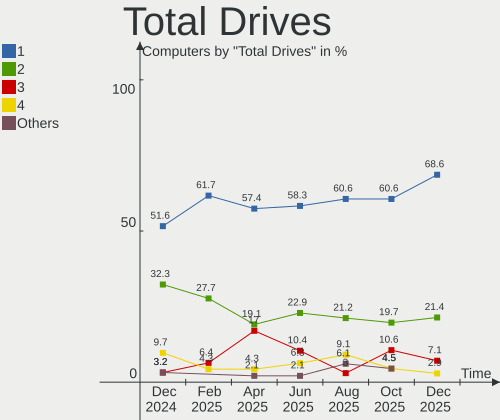

| Drives | Computers | Percent |
|--------|-----------|---------|
| 1      | 48        | 68.57%  |
| 2      | 15        | 21.43%  |
| 3      | 5         | 7.14%   |
| 4      | 2         | 2.86%   |

Has CD-ROM
----------

Has CD-ROM on board

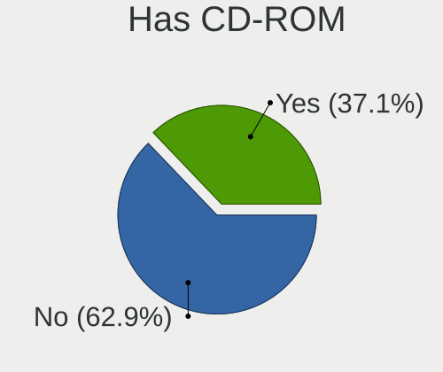

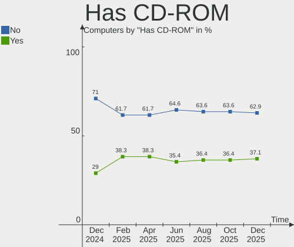

| Presented | Computers | Percent |
|-----------|-----------|---------|
| No        | 44        | 62.86%  |
| Yes       | 26        | 37.14%  |

Has Ethernet
------------

Has Ethernet on board

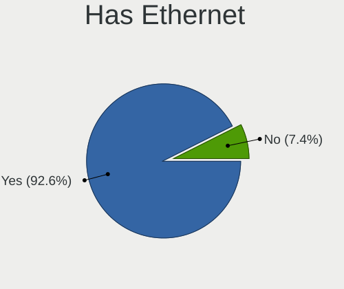

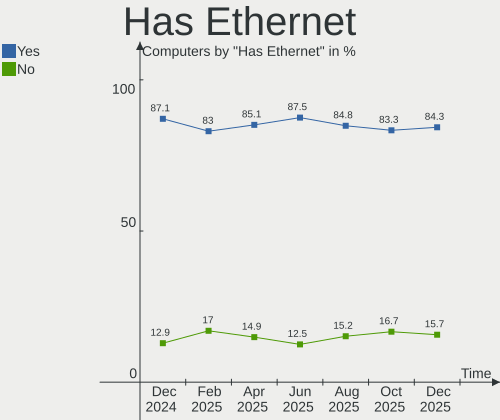

| Presented | Computers | Percent |
|-----------|-----------|---------|
| Yes       | 59        | 84.29%  |
| No        | 11        | 15.71%  |

Has WiFi
--------

Has WiFi module

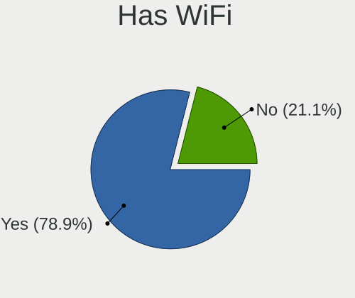

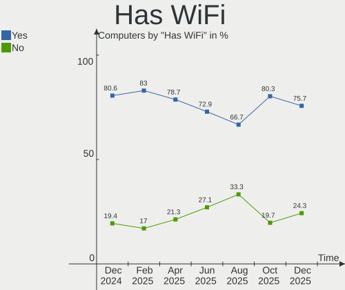

| Presented | Computers | Percent |
|-----------|-----------|---------|
| Yes       | 53        | 75.71%  |
| No        | 17        | 24.29%  |

Has Bluetooth
-------------

Has Bluetooth module

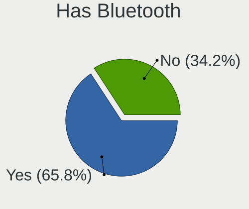

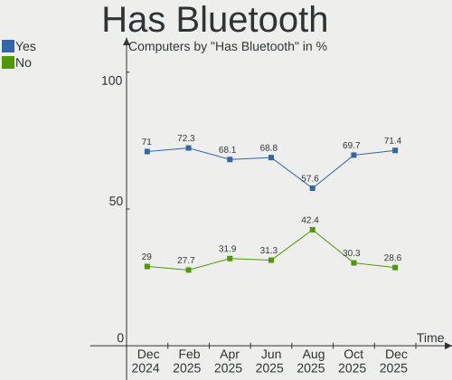

| Presented | Computers | Percent |
|-----------|-----------|---------|
| Yes       | 50        | 71.43%  |
| No        | 20        | 28.57%  |

Location
--------

Country
-------

Geographic location (country)

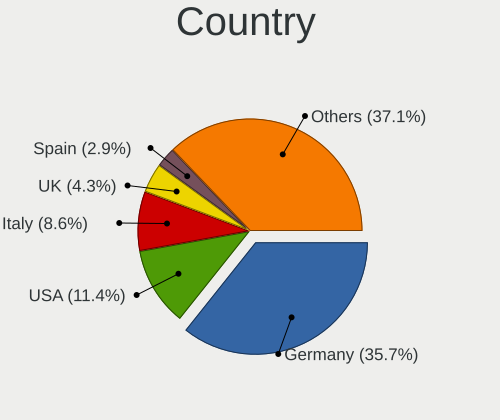

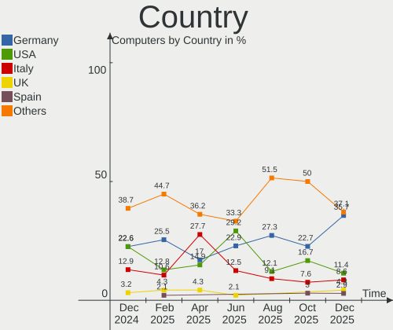

| Country     | Computers | Percent |
|-------------|-----------|---------|
| Germany     | 25        | 35.71%  |
| USA         | 8         | 11.43%  |
| Italy       | 6         | 8.57%   |
| UK          | 3         | 4.29%   |
| Spain       | 2         | 2.86%   |
| France      | 2         | 2.86%   |
| Finland     | 2         | 2.86%   |
| Canada      | 2         | 2.86%   |
| Brazil      | 2         | 2.86%   |
| Austria     | 2         | 2.86%   |
| Slovakia    | 1         | 1.43%   |
| Serbia      | 1         | 1.43%   |
| Romania     | 1         | 1.43%   |
| Portugal    | 1         | 1.43%   |
| Poland      | 1         | 1.43%   |
| New Zealand | 1         | 1.43%   |
| Morocco     | 1         | 1.43%   |
| Japan       | 1         | 1.43%   |
| Indonesia   | 1         | 1.43%   |
| India       | 1         | 1.43%   |
| Hong Kong   | 1         | 1.43%   |
| Guatemala   | 1         | 1.43%   |
| Greece      | 1         | 1.43%   |
| El Salvador | 1         | 1.43%   |
| Belgium     | 1         | 1.43%   |
| Australia   | 1         | 1.43%   |

City
----

Geographic location (city)

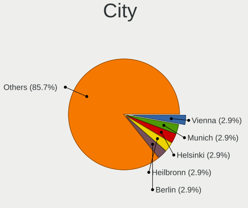

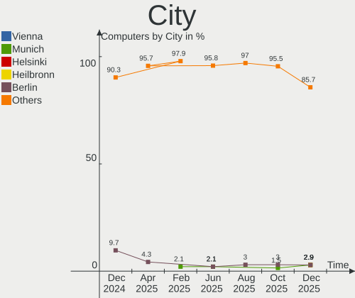

| City                  | Computers | Percent |
|-----------------------|-----------|---------|
| Vienna                | 2         | 2.86%   |
| Munich                | 2         | 2.86%   |
| Helsinki              | 2         | 2.86%   |
| Heilbronn             | 2         | 2.86%   |
| Berlin                | 2         | 2.86%   |
| Zaragoza              | 1         | 1.43%   |
| Wuppertal             | 1         | 1.43%   |
| Windsor               | 1         | 1.43%   |
| Tullahoma             | 1         | 1.43%   |
| Trier                 | 1         | 1.43%   |
| Toronto               | 1         | 1.43%   |
| Tokushima             | 1         | 1.43%   |
| Schweinfurt           | 1         | 1.43%   |
| Schorndorf            | 1         | 1.43%   |
| Sao Paulo             | 1         | 1.43%   |
| San Salvador          | 1         | 1.43%   |
| Sacramento            | 1         | 1.43%   |
| Sabinov               | 1         | 1.43%   |
| Rochester             | 1         | 1.43%   |
| Rochefort             | 1         | 1.43%   |
| Rio de Janeiro        | 1         | 1.43%   |
| Rinteln               | 1         | 1.43%   |
| Poznan                | 1         | 1.43%   |
| Oxford                | 1         | 1.43%   |
| Oppach                | 1         | 1.43%   |
| Nittenau              | 1         | 1.43%   |
| Nagold                | 1         | 1.43%   |
| Minneapolis           | 1         | 1.43%   |
| Milan                 | 1         | 1.43%   |
| Melbourne             | 1         | 1.43%   |
| Ludwigshafen am Rhein | 1         | 1.43%   |
| Louisville            | 1         | 1.43%   |
| Leskovac              | 1         | 1.43%   |
| Lemgo                 | 1         | 1.43%   |
| Lamspringe            | 1         | 1.43%   |
| Joplin                | 1         | 1.43%   |
| Hong Kong             | 1         | 1.43%   |
| Hamburg               | 1         | 1.43%   |
| Guatemala City        | 1         | 1.43%   |
| Gronau                | 1         | 1.43%   |

Drives
------

Drive Vendor
------------

Hard drive vendors

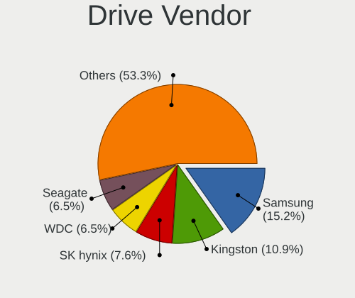

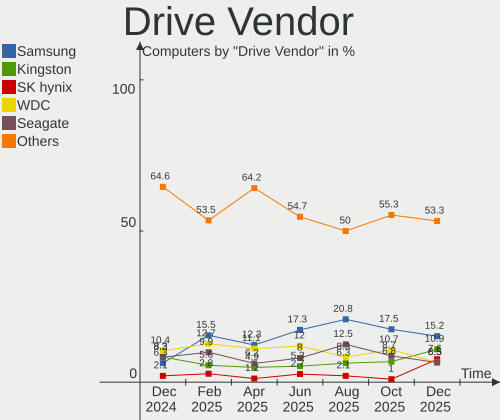

| Vendor                      | Computers | Drives | Percent |
|-----------------------------|-----------|--------|---------|
| Samsung Electronics         | 14        | 17     | 15.22%  |
| Kingston                    | 10        | 10     | 10.87%  |
| SK hynix                    | 7         | 7      | 7.61%   |
| WDC                         | 6         | 7      | 6.52%   |
| Seagate                     | 6         | 7      | 6.52%   |
| Toshiba                     | 4         | 4      | 4.35%   |
| SanDisk                     | 4         | 4      | 4.35%   |
| KIOXIA                      | 4         | 4      | 4.35%   |
| Intel                       | 4         | 7      | 4.35%   |
| Crucial                     | 4         | 4      | 4.35%   |
| MAXIO Technology (Hangzhou) | 3         | 3      | 3.26%   |
| TO Exter                    | 2         | 2      | 2.17%   |
| Phison                      | 2         | 3      | 2.17%   |
| Intenso                     | 2         | 2      | 2.17%   |
| GOODRAM                     | 2         | 2      | 2.17%   |
| China                       | 2         | 2      | 2.17%   |
| Apple                       | 2         | 2      | 2.17%   |
| USB                         | 1         | 1      | 1.09%   |
| Unknown                     | 1         | 1      | 1.09%   |
| Team                        | 1         | 1      | 1.09%   |
| Silicon Motion              | 1         | 1      | 1.09%   |
| Realtek Semiconductor       | 1         | 1      | 1.09%   |
| Mushkin                     | 1         | 1      | 1.09%   |
| Micron/Crucial Technology   | 1         | 1      | 1.09%   |
| Micron Technology           | 1         | 1      | 1.09%   |
| LITEON                      | 1         | 1      | 1.09%   |
| Lexar                       | 1         | 1      | 1.09%   |
| Leven                       | 1         | 1      | 1.09%   |
| Kingston Technology Company | 1         | 1      | 1.09%   |
| ADATA Technology            | 1         | 1      | 1.09%   |
| Unknown                     | 1         | 2      | 1.09%   |

Drive Model
-----------

Hard drive models

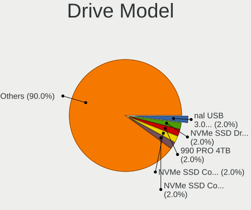

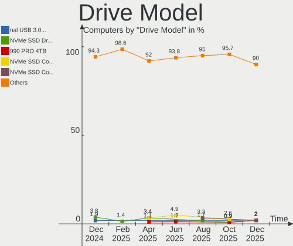

| Model                                             | Computers | Percent |
|---------------------------------------------------|-----------|---------|
| TO Exter nal USB 3.0 250GB                        | 2         | 2%      |
| SanDisk NVMe SSD Drive 1TB                        | 2         | 2%      |
| Samsung SSD 990 PRO 4TB                           | 2         | 2%      |
| Samsung NVMe SSD Controller SM981/PM981/PM983 1TB | 2         | 2%      |
| MAXIO (Hangzhou) NVMe SSD Controller MAP1202 2TB  | 2         | 2%      |
| Kingston SV300S37A60G 64GB SSD                    | 2         | 2%      |
| GOODRAM SSDPR-CX400-256-G2 256GB                  | 2         | 2%      |
| WDC WD6401AALS-00L3B2 640GB                       | 1         | 1%      |
| WDC WD5000AZLX-00JKKA0 500GB                      | 1         | 1%      |
| WDC WD5000AAKX-60U6AA0 500GB                      | 1         | 1%      |
| WDC WD5000AAKX-22ERMA0 500GB                      | 1         | 1%      |
| WDC WD3200AAJS-56M0A0 320GB                       | 1         | 1%      |
| WDC WD2500BEVS-60UST0 250GB                       | 1         | 1%      |
| WDC WD10SPZX-24Z10 1TB                            | 1         | 1%      |
| USB SanDisk 3.2Gen1 496GB                         | 1         | 1%      |
| Unknown MMC Card  32GB                            | 1         | 1%      |
| Toshiba TR200 240GB SSD                           | 1         | 1%      |
| Toshiba MQ01ABD100V 1TB                           | 1         | 1%      |
| Toshiba MQ01ABD100 1TB                            | 1         | 1%      |
| Toshiba MQ01ABD050 500GB                          | 1         | 1%      |
| Team T253512GB SSD                                | 1         | 1%      |
| SK hynix SKHynix_HFS001TEJ9X162N 1024GB           | 1         | 1%      |
| SK hynix SKHynix_HFS001TD9TNI-L2A0B 1024GB        | 1         | 1%      |
| SK hynix PC401 NVMe 512GB                         | 1         | 1%      |
| SK hynix HFS512GD9TNG-L2A0A 512GB                 | 1         | 1%      |
| SK hynix HFS500G32TND-N1A2A 500GB SSD             | 1         | 1%      |
| SK hynix HFM128GDHTNG-8310B 128GB                 | 1         | 1%      |
| SK hynix BC501 NVMe Solid State Drive 512GB       | 1         | 1%      |
| Silicon Motion SSD_M.2_PCIe3_256GB_InnovationIT   | 1         | 1%      |
| Seagate ST500LT012-1DG142 500GB                   | 1         | 1%      |
| Seagate ST500LM012 HN-M500MBB 500GB               | 1         | 1%      |
| Seagate ST4000DM004-2CV104 4TB                    | 1         | 1%      |
| Seagate ST31000528AS 1TB                          | 1         | 1%      |
| Seagate ST2000LM015-2E8174 2TB                    | 1         | 1%      |
| Seagate ST2000DM008-2FR102 2TB                    | 1         | 1%      |
| Seagate BarraCuda Q5 ZP1000CV30001 1TB            | 1         | 1%      |
| Sandisk WD PC SN560 SDDPNQE-1T00-1102 1024GB      | 1         | 1%      |
| Sandisk WD Black SN850 1TB                        | 1         | 1%      |
| Samsung SSD PM871b 2.5 7mm 512GB                  | 1         | 1%      |
| Samsung SSD 990 PRO 4TB S7DPNU0Y722656V           | 1         | 1%      |

HDD Vendor
----------

Hard disk drive vendors

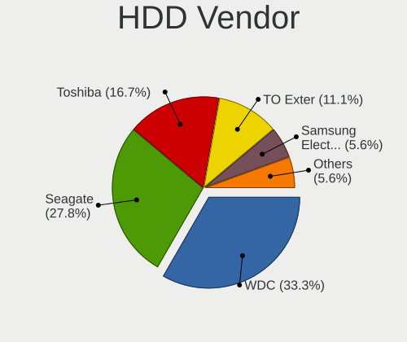

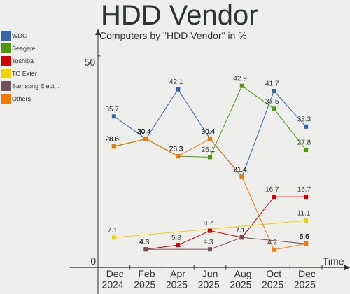

| Vendor              | Computers | Drives | Percent |
|---------------------|-----------|--------|---------|
| WDC                 | 6         | 7      | 33.33%  |
| Seagate             | 5         | 6      | 27.78%  |
| Toshiba             | 3         | 3      | 16.67%  |
| TO Exter            | 2         | 2      | 11.11%  |
| Samsung Electronics | 1         | 1      | 5.56%   |
| Intenso             | 1         | 1      | 5.56%   |

SSD Vendor
----------

Solid state drive vendors

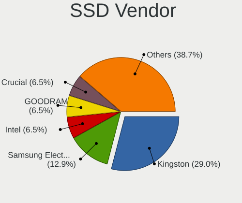

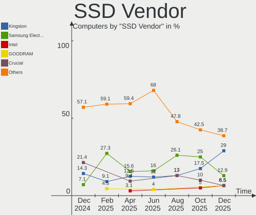

| Vendor              | Computers | Drives | Percent |
|---------------------|-----------|--------|---------|
| Kingston            | 9         | 9      | 29.03%  |
| Samsung Electronics | 4         | 4      | 12.9%   |
| Intel               | 2         | 2      | 6.45%   |
| GOODRAM             | 2         | 2      | 6.45%   |
| Crucial             | 2         | 2      | 6.45%   |
| China               | 2         | 2      | 6.45%   |
| Toshiba             | 1         | 1      | 3.23%   |
| Team                | 1         | 1      | 3.23%   |
| SK hynix            | 1         | 1      | 3.23%   |
| Phison              | 1         | 1      | 3.23%   |
| Mushkin             | 1         | 1      | 3.23%   |
| LITEON              | 1         | 1      | 3.23%   |
| Lexar               | 1         | 1      | 3.23%   |
| Leven               | 1         | 1      | 3.23%   |
| Intenso             | 1         | 1      | 3.23%   |
| Apple               | 1         | 1      | 3.23%   |

Drive Kind
----------

HDD or SSD

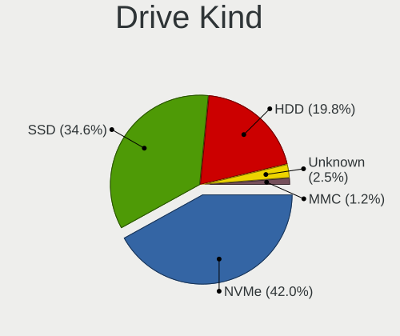

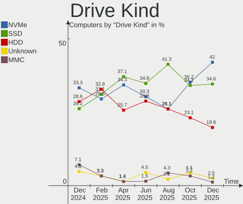

| Kind    | Computers | Drives | Percent |
|---------|-----------|--------|---------|
| NVMe    | 34        | 47     | 41.98%  |
| SSD     | 28        | 31     | 34.57%  |
| HDD     | 16        | 20     | 19.75%  |
| Unknown | 2         | 3      | 2.47%   |
| MMC     | 1         | 1      | 1.23%   |

Drive Connector
---------------

SATA, SAS, NVMe, etc.

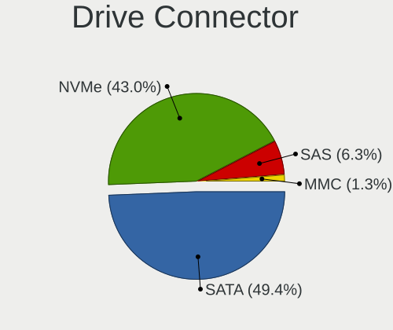

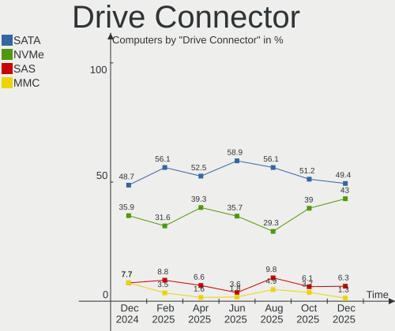

| Type | Computers | Drives | Percent |
|------|-----------|--------|---------|
| SATA | 39        | 48     | 49.37%  |
| NVMe | 34        | 47     | 43.04%  |
| SAS  | 5         | 6      | 6.33%   |
| MMC  | 1         | 1      | 1.27%   |

Drive Size
----------

Size of hard drive

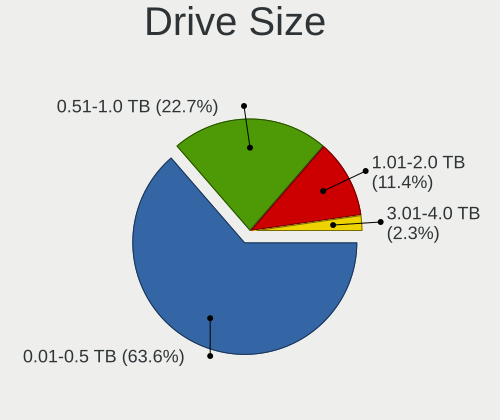

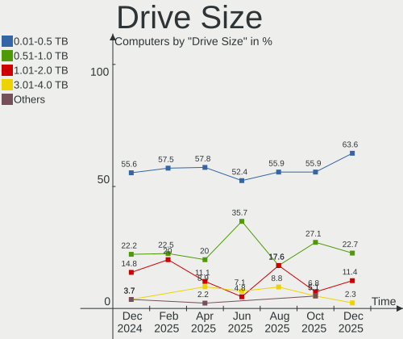

| Size in TB | Computers | Drives | Percent |
|------------|-----------|--------|---------|
| 0.01-0.5   | 28        | 34     | 63.64%  |
| 0.51-1.0   | 10        | 11     | 22.73%  |
| 1.01-2.0   | 5         | 5      | 11.36%  |
| 3.01-4.0   | 1         | 1      | 2.27%   |

Space Total
-----------

Amount of disk space available on the file system

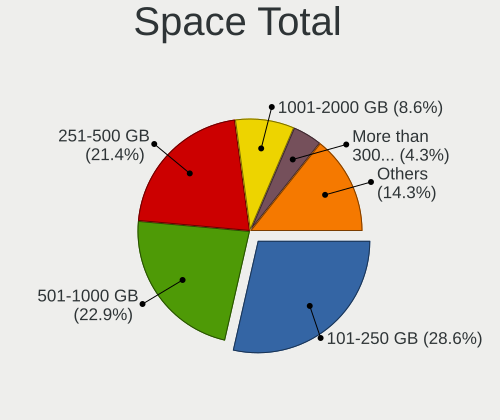

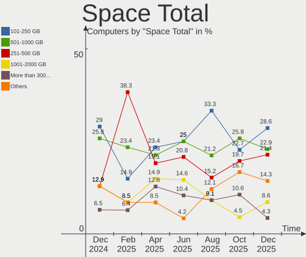

| Size in GB     | Computers | Percent |
|----------------|-----------|---------|
| 101-250        | 20        | 28.57%  |
| 501-1000       | 16        | 22.86%  |
| 251-500        | 15        | 21.43%  |
| 1001-2000      | 6         | 8.57%   |
| More than 3000 | 3         | 4.29%   |
| 51-100         | 3         | 4.29%   |
| 21-50          | 2         | 2.86%   |
| 2001-3000      | 2         | 2.86%   |
| 1-20           | 2         | 2.86%   |
| Unknown        | 1         | 1.43%   |

Space Used
----------

Amount of used disk space

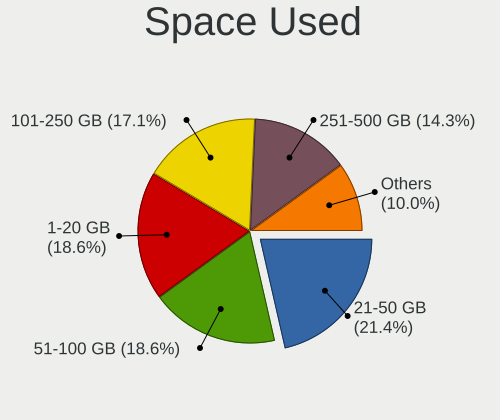

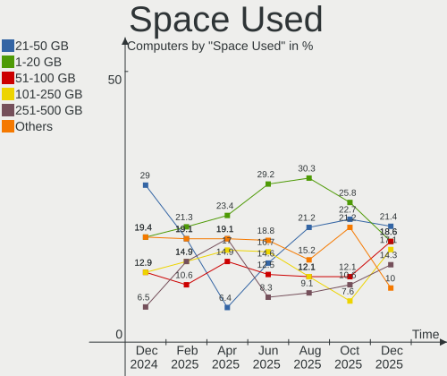

| Used GB   | Computers | Percent |
|-----------|-----------|---------|
| 21-50     | 15        | 21.43%  |
| 1-20      | 13        | 18.57%  |
| 51-100    | 13        | 18.57%  |
| 101-250   | 12        | 17.14%  |
| 251-500   | 10        | 14.29%  |
| 501-1000  | 5         | 7.14%   |
| 2001-3000 | 1         | 1.43%   |
| Unknown   | 1         | 1.43%   |

Malfunc. Drives
---------------

Drive models with a malfunction

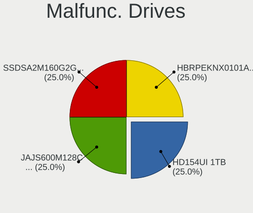

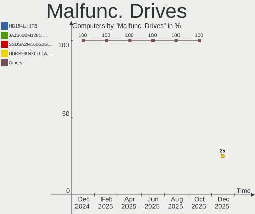

| Model                                         | Computers | Drives | Percent |
|-----------------------------------------------|-----------|--------|---------|
| Samsung Electronics HD154UI 1TB               | 1         | 1      | 25%     |
| Leven JAJS600M128C 128GB SSD                  | 1         | 1      | 25%     |
| Intel SSDSA2M160G2GC 160GB                    | 1         | 1      | 25%     |
| Intel HBRPEKNX0101AHO BTTE002313D7256D-2 16GB | 1         | 1      | 25%     |

Malfunc. Drive Vendor
---------------------

Vendors of faulty drives

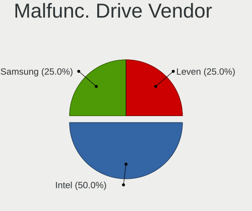

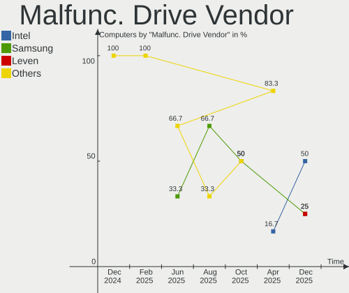

| Vendor              | Computers | Drives | Percent |
|---------------------|-----------|--------|---------|
| Intel               | 2         | 2      | 50%     |
| Samsung Electronics | 1         | 1      | 25%     |
| Leven               | 1         | 1      | 25%     |

Malfunc. HDD Vendor
-------------------

Vendors of faulty HDD drives

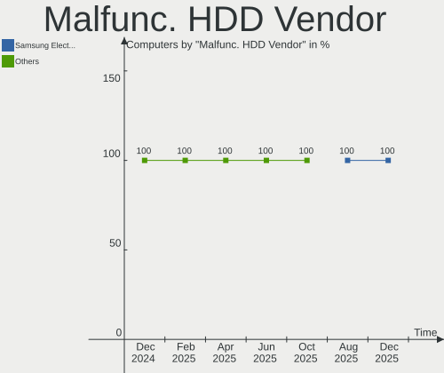

| Vendor              | Computers | Drives | Percent |
|---------------------|-----------|--------|---------|
| Samsung Electronics | 1         | 1      | 100%    |

Malfunc. Drive Kind
-------------------

Kinds of faulty drives

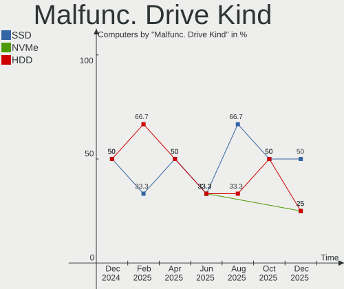

| Kind | Computers | Drives | Percent |
|------|-----------|--------|---------|
| SSD  | 2         | 2      | 50%     |
| NVMe | 1         | 1      | 25%     |
| HDD  | 1         | 1      | 25%     |

Failed Drives
-------------

Failed drive models

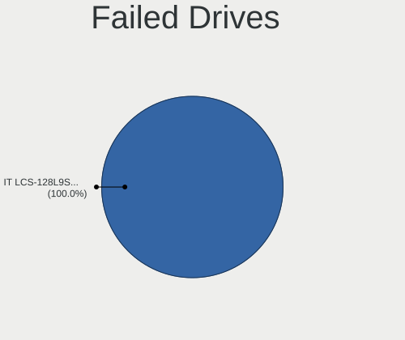

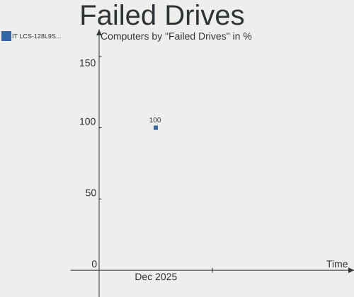

| Model                                     | Computers | Drives | Percent |
|-------------------------------------------|-----------|--------|---------|
| LITEON IT LCS-128L9S-11 2.5 7mm 128GB SSD | 1         | 1      | 100%    |

Failed Drive Vendor
-------------------

Failed drive vendors

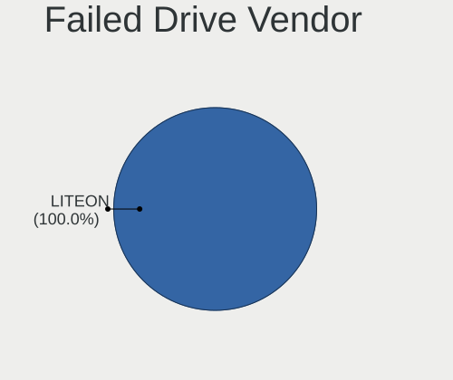

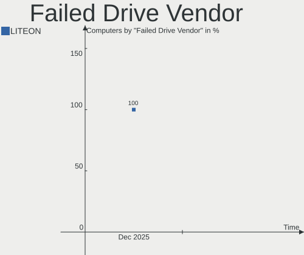

| Vendor | Computers | Drives | Percent |
|--------|-----------|--------|---------|
| LITEON | 1         | 1      | 100%    |

Drive Status
------------

Number of failed and malfunc. drives

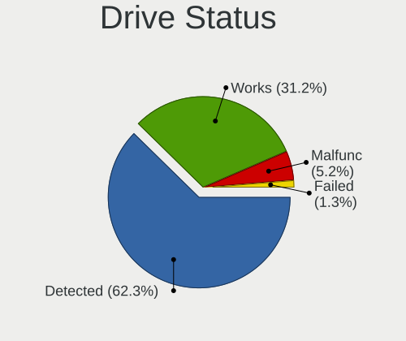

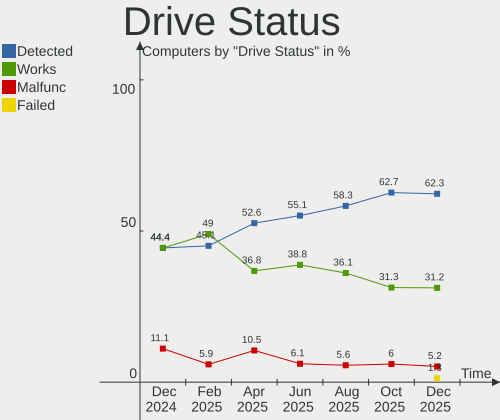

| Status   | Computers | Drives | Percent |
|----------|-----------|--------|---------|
| Detected | 48        | 65     | 62.34%  |
| Works    | 24        | 32     | 31.17%  |
| Malfunc  | 4         | 4      | 5.19%   |
| Failed   | 1         | 1      | 1.3%    |

Storage controller
------------------

Storage Vendor
--------------

Storage controller vendors

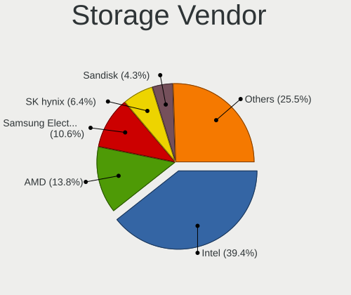

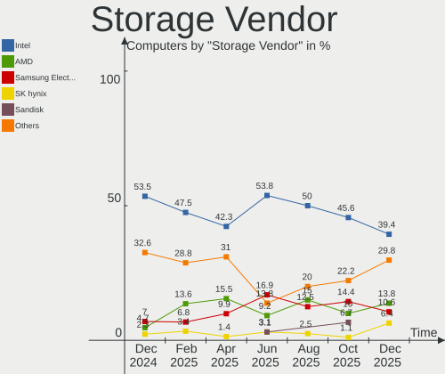

| Vendor                      | Computers | Percent |
|-----------------------------|-----------|---------|
| Intel                       | 37        | 39.36%  |
| AMD                         | 13        | 13.83%  |
| Samsung Electronics         | 10        | 10.64%  |
| SK hynix                    | 6         | 6.38%   |
| Sandisk                     | 4         | 4.26%   |
| KIOXIA                      | 4         | 4.26%   |
| Micron/Crucial Technology   | 3         | 3.19%   |
| MAXIO Technology (Hangzhou) | 3         | 3.19%   |
| Nvidia                      | 2         | 2.13%   |
| Kingston Technology Company | 2         | 2.13%   |
| ASMedia Technology          | 2         | 2.13%   |
| Silicon Motion              | 1         | 1.06%   |
| Silicon Image               | 1         | 1.06%   |
| Seagate Technology          | 1         | 1.06%   |
| Realtek Semiconductor       | 1         | 1.06%   |
| Phison Electronics          | 1         | 1.06%   |
| Micron Technology           | 1         | 1.06%   |
| Apple                       | 1         | 1.06%   |
| ADATA Technology            | 1         | 1.06%   |

Storage Model
-------------

Storage controller models

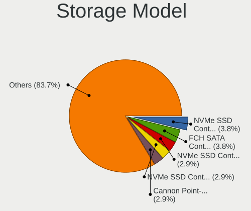

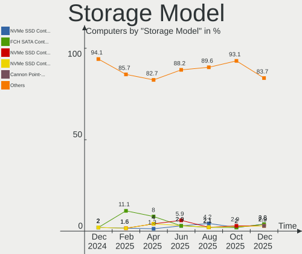

| Model                                                                          | Computers | Percent |
|--------------------------------------------------------------------------------|-----------|---------|
| Samsung NVMe SSD Controller S4LV008[Pascal]                                    | 4         | 3.85%   |
| AMD FCH SATA Controller [AHCI mode]                                            | 4         | 3.85%   |
| Samsung NVMe SSD Controller SM981/PM981/PM983                                  | 3         | 2.88%   |
| Samsung NVMe SSD Controller 980 (DRAM-less)                                    | 3         | 2.88%   |
| Intel Cannon Point-LP SATA Controller [AHCI Mode]                              | 3         | 2.88%   |
| Intel Alder Lake-P SATA AHCI Controller                                        | 3         | 2.88%   |
| Intel 8 Series/C220 Series Chipset Family 6-port SATA Controller 1 [AHCI mode] | 3         | 2.88%   |
| AMD 600 Series Chipset SATA Controller                                         | 3         | 2.88%   |
| SK hynix BC501 NVMe Solid State Drive                                          | 2         | 1.92%   |
| SanDisk WD SN560/SN740/SN770/SN5000 NVMe SSD                                   | 2         | 1.92%   |
| MAXIO (Hangzhou) NVMe SSD Controller MAP1202 (DRAM-less)                       | 2         | 1.92%   |
| Intel SATA Controller [RAID mode]                                              | 2         | 1.92%   |
| Intel RST Volume Management Device Controller                                  | 2         | 1.92%   |
| Intel Q170/Q150/B150/H170/H110/Z170/CM236 Chipset SATA Controller [AHCI Mode]  | 2         | 1.92%   |
| Intel Optane NVME SSD H10 with Solid State Storage [Teton Glacier]             | 2         | 1.92%   |
| Intel Celeron/Pentium Silver Processor SATA Controller                         | 2         | 1.92%   |
| Intel 82801 Mobile SATA Controller [RAID mode]                                 | 2         | 1.92%   |
| Intel 8 Series SATA Controller 1 [AHCI mode]                                   | 2         | 1.92%   |
| Intel 6 Series/C200 Series Chipset Family 6 port Mobile SATA AHCI Controller   | 2         | 1.92%   |
| ASMedia ASM1061/ASM1062 Serial ATA Controller                                  | 2         | 1.92%   |
| AMD SB7x0/SB8x0/SB9x0 SATA Controller [IDE mode]                               | 2         | 1.92%   |
| AMD SB7x0/SB8x0/SB9x0 SATA Controller [AHCI mode]                              | 2         | 1.92%   |
| AMD SB7x0/SB8x0/SB9x0 IDE Controller                                           | 2         | 1.92%   |
| AMD 500 Series Chipset SATA Controller                                         | 2         | 1.92%   |
| SK hynix Platinum P41/PC801 NVMe Solid State Drive                             | 1         | 0.96%   |
| SK hynix PC611 NVMe Solid State Drive                                          | 1         | 0.96%   |
| SK hynix PC601 NVMe Solid State Drive                                          | 1         | 0.96%   |
| SK hynix PC401 NVMe Solid State Drive 256GB                                    | 1         | 0.96%   |
| Silicon Motion SM2263EN/SM2263XT (DRAM-less) NVMe SSD Controllers              | 1         | 0.96%   |
| Silicon Image SiI 3531 [SATALink/SATARaid] Serial ATA Controller               | 1         | 0.96%   |
| Seagate BarraCuda Q5 NVMe SSD (DRAM-less)                                      | 1         | 0.96%   |
| SanDisk WD PC SN810 / Black SN850 NVMe SSD                                     | 1         | 0.96%   |
| Sandisk WD Black SN850X NVMe SSD                                               | 1         | 0.96%   |
| Samsung S4LN058A01[SSUBX] AHCI SSD Controller (Apple slot)                     | 1         | 0.96%   |
| Samsung NVMe SSD Controller PM9C1a (DRAM-less)                                 | 1         | 0.96%   |
| Realtek RTS5765DL NVMe SSD Controller (DRAM-less)                              | 1         | 0.96%   |
| Phison PS5021-E21 PCIe4 NVMe Controller (DRAM-less)                            | 1         | 0.96%   |
| Nvidia MCP65 SATA Controller                                                   | 1         | 0.96%   |
| Nvidia MCP65 IDE                                                               | 1         | 0.96%   |
| Nvidia MCP55 SATA Controller                                                   | 1         | 0.96%   |

Storage Kind
------------

Kind of storage controller (IDE, SATA, NVMe, SAS, ...)

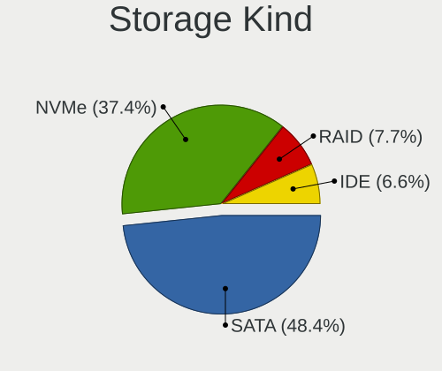

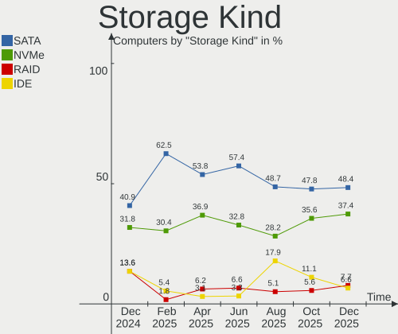

| Kind | Computers | Percent |
|------|-----------|---------|
| SATA | 44        | 48.35%  |
| NVMe | 34        | 37.36%  |
| RAID | 7         | 7.69%   |
| IDE  | 6         | 6.59%   |

Processor
---------

CPU Vendor
----------

Processor vendors

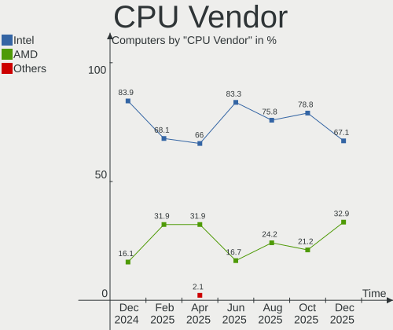

| Vendor | Computers | Percent |
|--------|-----------|---------|
| Intel  | 47        | 67.14%  |
| AMD    | 23        | 32.86%  |

CPU Model
---------

Processor models

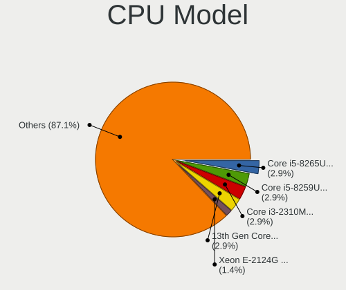

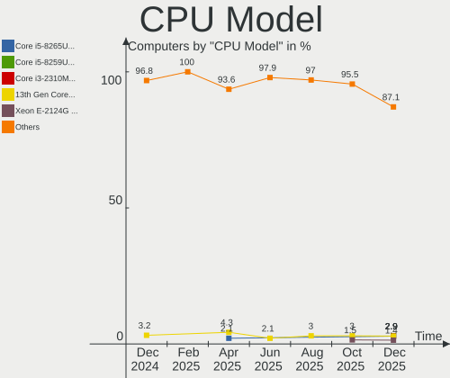

| Model                                | Computers | Percent |
|--------------------------------------|-----------|---------|
| Intel Core i5-8265U CPU @ 1.60GHz    | 2         | 2.86%   |
| Intel Core i5-8259U CPU @ 2.30GHz    | 2         | 2.86%   |
| Intel Core i3-2310M CPU @ 2.10GHz    | 2         | 2.86%   |
| Intel 13th Gen Core i5-1340P         | 2         | 2.86%   |
| Intel Xeon E-2124G CPU @ 3.40GHz     | 1         | 1.43%   |
| Intel Pentium CPU G4560 @ 3.50GHz    | 1         | 1.43%   |
| Intel N150                           | 1         | 1.43%   |
| Intel Core Ultra 7 258V              | 1         | 1.43%   |
| Intel Core m5-6Y57 CPU @ 1.10GHz     | 1         | 1.43%   |
| Intel Core i9-9880H CPU @ 2.30GHz    | 1         | 1.43%   |
| Intel Core i7-9850H CPU @ 2.60GHz    | 1         | 1.43%   |
| Intel Core i7-4702MQ CPU @ 2.20GHz   | 1         | 1.43%   |
| Intel Core i7-4600U CPU @ 2.10GHz    | 1         | 1.43%   |
| Intel Core i7-14700KF                | 1         | 1.43%   |
| Intel Core i7-10875H CPU @ 2.30GHz   | 1         | 1.43%   |
| Intel Core i7-10700T CPU @ 2.00GHz   | 1         | 1.43%   |
| Intel Core i7-1065G7 CPU @ 1.30GHz   | 1         | 1.43%   |
| Intel Core i5-8500 CPU @ 3.00GHz     | 1         | 1.43%   |
| Intel Core i5-6400 CPU @ 2.70GHz     | 1         | 1.43%   |
| Intel Core i5-5257U CPU @ 2.70GHz    | 1         | 1.43%   |
| Intel Core i5-5200U CPU @ 2.20GHz    | 1         | 1.43%   |
| Intel Core i5-4590S CPU @ 3.00GHz    | 1         | 1.43%   |
| Intel Core i5-4310M CPU @ 2.70GHz    | 1         | 1.43%   |
| Intel Core i5-4210M CPU @ 2.60GHz    | 1         | 1.43%   |
| Intel Core i5-4200U CPU @ 1.60GHz    | 1         | 1.43%   |
| Intel Core i5-3340M CPU @ 2.70GHz    | 1         | 1.43%   |
| Intel Core i5-1035G7 CPU @ 1.20GHz   | 1         | 1.43%   |
| Intel Core i5-10310U CPU @ 1.70GHz   | 1         | 1.43%   |
| Intel Core i5 CPU 650 @ 3.20GHz      | 1         | 1.43%   |
| Intel Core i3-7100T CPU @ 3.40GHz    | 1         | 1.43%   |
| Intel Core i3-3240 CPU @ 3.40GHz     | 1         | 1.43%   |
| Intel Core i3 CPU M 370 @ 2.40GHz    | 1         | 1.43%   |
| Intel Core 5 120U                    | 1         | 1.43%   |
| Intel Core 2 Duo CPU P8600 @ 2.40GHz | 1         | 1.43%   |
| Intel Core 2 Duo CPU P7450 @ 2.13GHz | 1         | 1.43%   |
| Intel Core 2 Duo CPU E8400 @ 3.00GHz | 1         | 1.43%   |
| Intel Celeron N4020 CPU @ 1.10GHz    | 1         | 1.43%   |
| Intel Celeron N4000 CPU @ 1.10GHz    | 1         | 1.43%   |
| Intel Celeron J4125 CPU @ 2.00GHz    | 1         | 1.43%   |
| Intel Celeron CPU N2840 @ 2.16GHz    | 1         | 1.43%   |

CPU Model Family
----------------

Processor model prefix

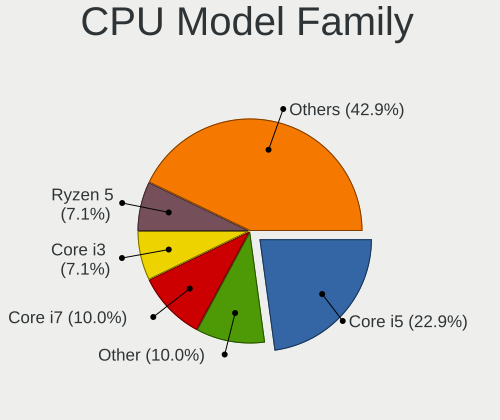

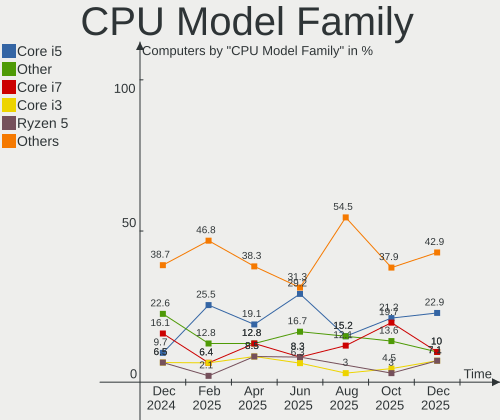

| Model            | Computers | Percent |
|------------------|-----------|---------|
| Intel Core i5    | 16        | 22.86%  |
| Other            | 7         | 10%     |
| Intel Core i7    | 7         | 10%     |
| Intel Core i3    | 5         | 7.14%   |
| AMD Ryzen 5      | 5         | 7.14%   |
| Intel Celeron    | 4         | 5.71%   |
| AMD Ryzen 7      | 4         | 5.71%   |
| Intel Core 2 Duo | 3         | 4.29%   |
| Intel Core       | 2         | 2.86%   |
| AMD Ryzen 9      | 2         | 2.86%   |
| Intel Xeon       | 1         | 1.43%   |
| Intel Pentium    | 1         | 1.43%   |
| Intel Core m5    | 1         | 1.43%   |
| Intel Core i9    | 1         | 1.43%   |
| AMD Sempron      | 1         | 1.43%   |
| AMD Ryzen 7 PRO  | 1         | 1.43%   |
| AMD Ryzen 5 PRO  | 1         | 1.43%   |
| AMD Phenom II X6 | 1         | 1.43%   |
| AMD Phenom II X2 | 1         | 1.43%   |
| AMD FX           | 1         | 1.43%   |
| AMD E1           | 1         | 1.43%   |
| AMD Athlon 64 X2 | 1         | 1.43%   |
| AMD Athlon 64    | 1         | 1.43%   |
| AMD A6           | 1         | 1.43%   |
| AMD A10          | 1         | 1.43%   |

CPU Cores
---------

Number of processor cores

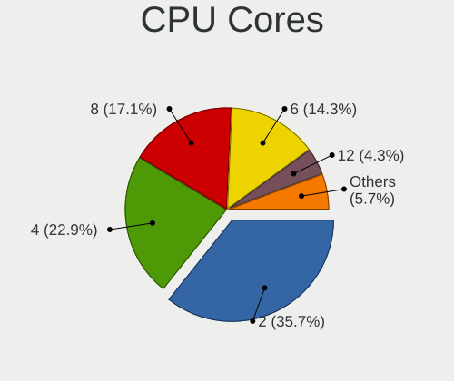

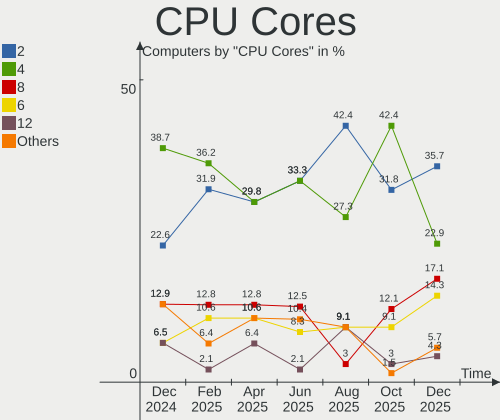

| Number | Computers | Percent |
|--------|-----------|---------|
| 2      | 25        | 35.71%  |
| 4      | 16        | 22.86%  |
| 8      | 12        | 17.14%  |
| 6      | 10        | 14.29%  |
| 12     | 3         | 4.29%   |
| 10     | 2         | 2.86%   |
| 20     | 1         | 1.43%   |
| 1      | 1         | 1.43%   |

CPU Sockets
-----------

Number of sockets

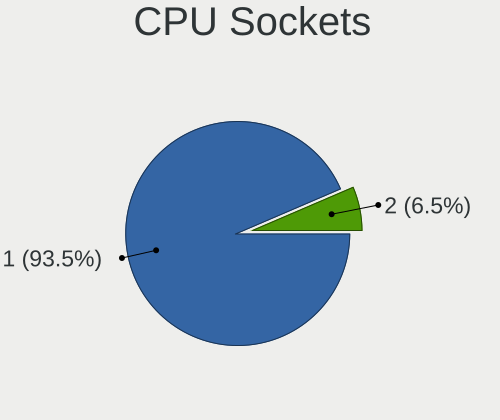

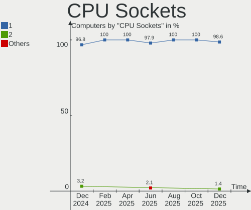

| Number | Computers | Percent |
|--------|-----------|---------|
| 1      | 69        | 98.57%  |
| 2      | 1         | 1.43%   |

CPU Threads
-----------

Threads per core (Hyper-Threading)

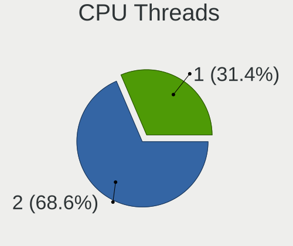

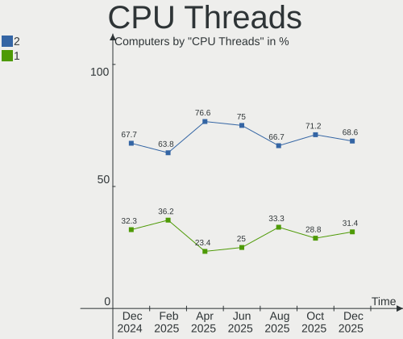

| Number | Computers | Percent |
|--------|-----------|---------|
| 2      | 48        | 68.57%  |
| 1      | 22        | 31.43%  |

CPU Op-Modes
------------

CPU Operation Modes (32-bit, 64-bit)

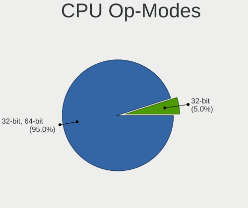

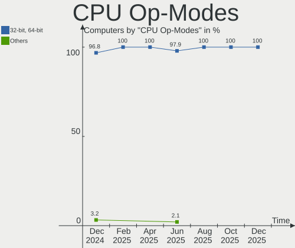

| Op mode        | Computers | Percent |
|----------------|-----------|---------|
| 32-bit, 64-bit | 70        | 100%    |

CPU Microcode
-------------

Microcode number

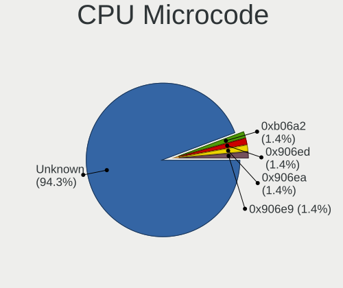

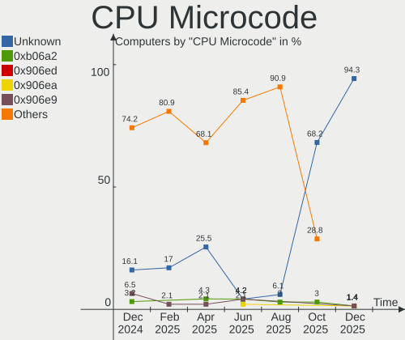

| Number  | Computers | Percent |
|---------|-----------|---------|
| Unknown | 66        | 94.29%  |
| 0xb06a2 | 1         | 1.43%   |
| 0x906ed | 1         | 1.43%   |
| 0x906ea | 1         | 1.43%   |
| 0x906e9 | 1         | 1.43%   |

CPU Microarch
-------------

Microarchitecture

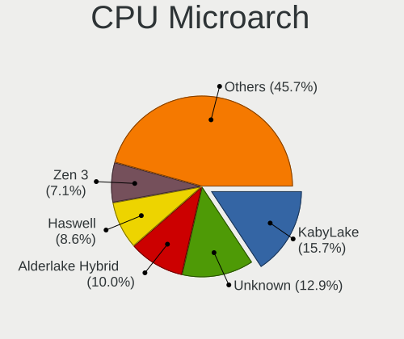

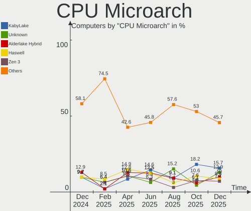

| Name             | Computers | Percent |
|------------------|-----------|---------|
| KabyLake         | 11        | 15.71%  |
| Unknown          | 9         | 12.86%  |
| Alderlake Hybrid | 7         | 10%     |
| Haswell          | 6         | 8.57%   |
| Zen 3            | 5         | 7.14%   |
| Penryn           | 3         | 4.29%   |
| Goldmont plus    | 3         | 4.29%   |
| Westmere         | 2         | 2.86%   |
| Skylake          | 2         | 2.86%   |
| SandyBridge      | 2         | 2.86%   |
| K8 Hammer        | 2         | 2.86%   |
| K10              | 2         | 2.86%   |
| IvyBridge        | 2         | 2.86%   |
| IceLake          | 2         | 2.86%   |
| CometLake        | 2         | 2.86%   |
| Broadwell        | 2         | 2.86%   |
| Zen 2            | 1         | 1.43%   |
| Steamroller      | 1         | 1.43%   |
| Silvermont       | 1         | 1.43%   |
| Piledriver       | 1         | 1.43%   |
| K8 & K10 hybrid  | 1         | 1.43%   |
| Gracemont        | 1         | 1.43%   |
| Bulldozer        | 1         | 1.43%   |
| Bobcat           | 1         | 1.43%   |

Graphics
--------

GPU Vendor
----------

Vendors of graphics cards

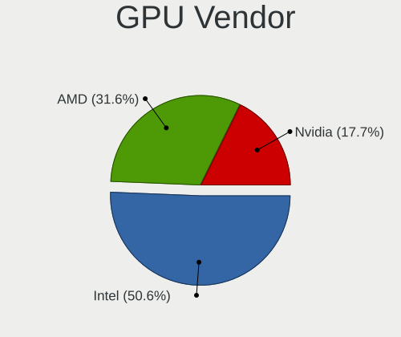

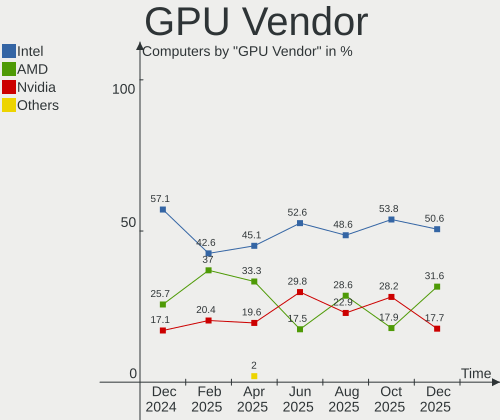

| Vendor | Computers | Percent |
|--------|-----------|---------|
| Intel  | 40        | 50.63%  |
| AMD    | 25        | 31.65%  |
| Nvidia | 14        | 17.72%  |

GPU Model
---------

Graphics card models

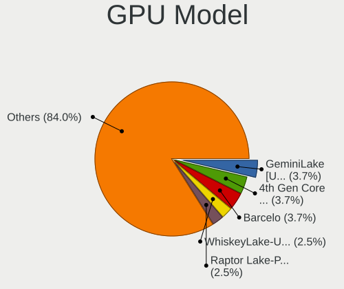

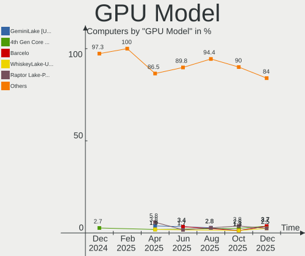

| Model                                                                       | Computers | Percent |
|-----------------------------------------------------------------------------|-----------|---------|
| Intel GeminiLake [UHD Graphics 600]                                         | 3         | 3.7%    |
| Intel 4th Gen Core Processor Integrated Graphics Controller                 | 3         | 3.7%    |
| AMD Barcelo                                                                 | 3         | 3.7%    |
| Intel WhiskeyLake-U GT2 [UHD Graphics 620]                                  | 2         | 2.47%   |
| Intel Raptor Lake-P [Iris Xe Graphics]                                      | 2         | 2.47%   |
| Intel Iris Plus Graphics G7                                                 | 2         | 2.47%   |
| Intel Haswell-ULT Integrated Graphics Controller                            | 2         | 2.47%   |
| Intel CoffeeLake-U GT3e [Iris Plus Graphics 655]                            | 2         | 2.47%   |
| Intel CoffeeLake-H GT2 [UHD Graphics 630]                                   | 2         | 2.47%   |
| Intel 2nd Generation Core Processor Family Integrated Graphics Controller   | 2         | 2.47%   |
| AMD Rembrandt [Radeon 680M]                                                 | 2         | 2.47%   |
| AMD Navi 32 [Radeon RX 7700 XT / 7800 XT]                                   | 2         | 2.47%   |
| Nvidia TU117 [GeForce GTX 1650]                                             | 1         | 1.23%   |
| Nvidia TU106M [GeForce RTX 2060 Max-Q]                                      | 1         | 1.23%   |
| Nvidia TU104GLM [Quadro RTX 4000 Mobile / Max-Q]                            | 1         | 1.23%   |
| Nvidia GP107GL [Quadro P620]                                                | 1         | 1.23%   |
| Nvidia GP104GLM [Quadro P3200 Mobile]                                       | 1         | 1.23%   |
| Nvidia GM108M [GeForce 840M]                                                | 1         | 1.23%   |
| Nvidia GK106M [GeForce GTX 760M]                                            | 1         | 1.23%   |
| Nvidia GB206 [GeForce RTX 5060 Ti]                                          | 1         | 1.23%   |
| Nvidia GA107 [GeForce RTX 3050 8GB]                                         | 1         | 1.23%   |
| Nvidia GA106M [GeForce RTX 3060 Mobile / Max-Q]                             | 1         | 1.23%   |
| Nvidia GA102 [GeForce RTX 3080 Ti]                                          | 1         | 1.23%   |
| Nvidia G98M [GeForce G 105M]                                                | 1         | 1.23%   |
| Nvidia G72 [GeForce 7300 LE]                                                | 1         | 1.23%   |
| Nvidia AD107M [GeForce RTX 4050 Max-Q / Mobile]                             | 1         | 1.23%   |
| Intel Xeon E3-1200 v3/4th Gen Core Processor Integrated Graphics Controller | 1         | 1.23%   |
| Intel Xeon E3-1200 v2/3rd Gen Core processor Graphics Controller            | 1         | 1.23%   |
| Intel Skylake-Y GT2 [HD Graphics 515]                                       | 1         | 1.23%   |
| Intel Skylake-S GT2 [HD Graphics 530]                                       | 1         | 1.23%   |
| Intel Raptor Lake-U [Intel Graphics]                                        | 1         | 1.23%   |
| Intel Raptor Lake-P [UHD Graphics]                                          | 1         | 1.23%   |
| Intel Mobile 4 Series Chipset Integrated Graphics Controller                | 1         | 1.23%   |
| Intel Lunar Lake [Intel Arc Graphics 130V / 140V]                           | 1         | 1.23%   |
| Intel Kaby Lake-S GT2 [HD Graphics 630]                                     | 1         | 1.23%   |
| Intel Core Processor Integrated Graphics Controller                         | 1         | 1.23%   |
| Intel CometLake-U GT2 [UHD Graphics]                                        | 1         | 1.23%   |
| Intel CometLake-S GT2 [UHD Graphics 630]                                    | 1         | 1.23%   |
| Intel CometLake-H GT2 [UHD Graphics]                                        | 1         | 1.23%   |
| Intel CoffeeLake-S GT2 [UHD Graphics 630]                                   | 1         | 1.23%   |

GPU Combo
---------

Combinations of graphics cards

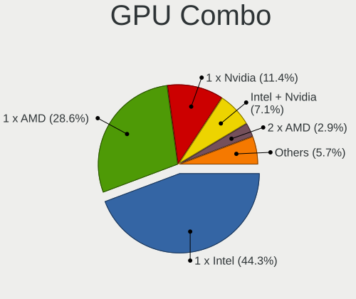

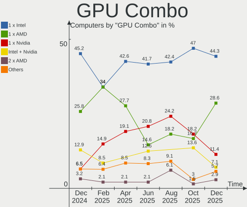

| Name           | Computers | Percent |
|----------------|-----------|---------|
| 1 x Intel      | 31        | 44.29%  |
| 1 x AMD        | 20        | 28.57%  |
| 1 x Nvidia     | 8         | 11.43%  |
| Intel + Nvidia | 5         | 7.14%   |
| 2 x AMD        | 2         | 2.86%   |
| Intel + AMD    | 2         | 2.86%   |
| Other          | 1         | 1.43%   |
| AMD + Nvidia   | 1         | 1.43%   |

GPU Driver
----------

Free vs proprietary

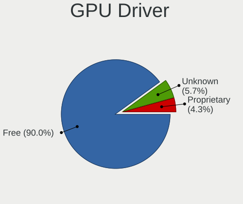

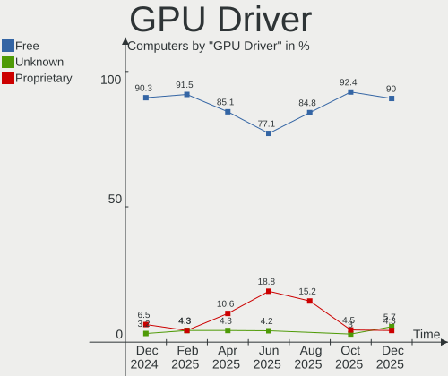

| Driver      | Computers | Percent |
|-------------|-----------|---------|
| Free        | 63        | 90%     |
| Unknown     | 4         | 5.71%   |
| Proprietary | 3         | 4.29%   |

GPU Memory
----------

Total video memory

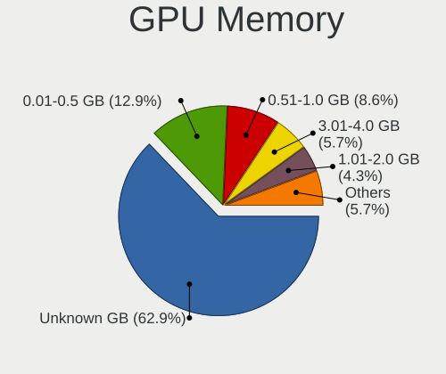

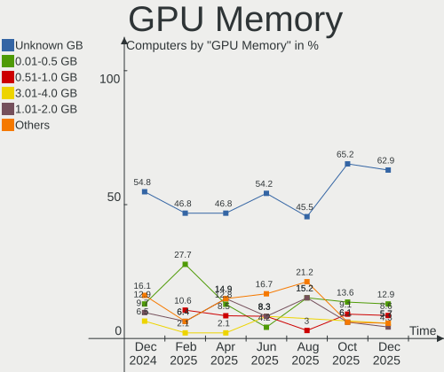

| Size in GB | Computers | Percent |
|------------|-----------|---------|
| Unknown    | 44        | 62.86%  |
| 0.01-0.5   | 9         | 12.86%  |
| 0.51-1.0   | 6         | 8.57%   |
| 3.01-4.0   | 4         | 5.71%   |
| 1.01-2.0   | 3         | 4.29%   |
| 8.01-16.0  | 2         | 2.86%   |
| 7.01-8.0   | 1         | 1.43%   |
| 5.01-6.0   | 1         | 1.43%   |

Monitor
-------

Monitor Vendor
--------------

Monitor vendors

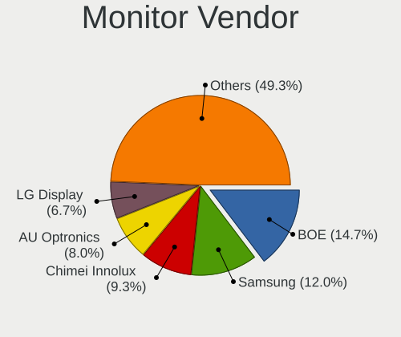

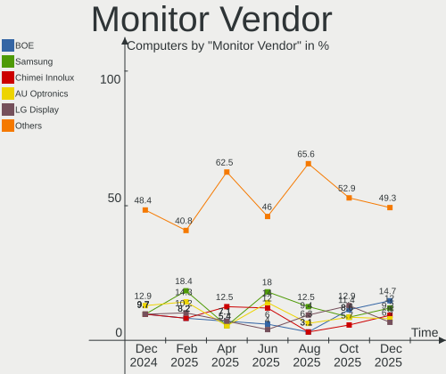

| Vendor              | Computers | Percent |
|---------------------|-----------|---------|
| BOE                 | 11        | 14.67%  |
| Samsung Electronics | 9         | 12%     |
| Chimei Innolux      | 7         | 9.33%   |
| AU Optronics        | 6         | 8%      |
| LG Display          | 5         | 6.67%   |
| Dell                | 5         | 6.67%   |
| HUAWEI              | 4         | 5.33%   |
| Eizo                | 3         | 4%      |
| Philips             | 2         | 2.67%   |
| Lenovo              | 2         | 2.67%   |
| Goldstar            | 2         | 2.67%   |
| CHO                 | 2         | 2.67%   |
| Apple               | 2         | 2.67%   |
| Acer                | 2         | 2.67%   |
| ZTR                 | 1         | 1.33%   |
| ViewSonic           | 1         | 1.33%   |
| SUNNY               | 1         | 1.33%   |
| Sony                | 1         | 1.33%   |
| Sharp               | 1         | 1.33%   |
| RTK                 | 1         | 1.33%   |
| MStar               | 1         | 1.33%   |
| MSI                 | 1         | 1.33%   |
| Medion              | 1         | 1.33%   |
| LG Philips          | 1         | 1.33%   |
| Fujitsu Siemens     | 1         | 1.33%   |
| Eve Spectrum        | 1         | 1.33%   |
| BenQ                | 1         | 1.33%   |

Monitor Model
-------------

Monitor models

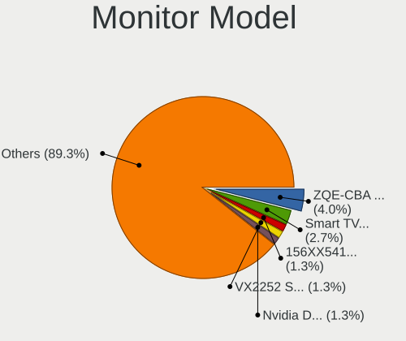

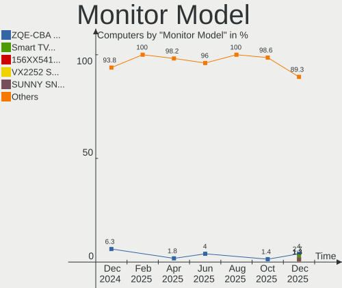

| Model                                                                   | Computers | Percent |
|-------------------------------------------------------------------------|-----------|---------|
| HUAWEI ZQE-CBA HWV6A25 3440x1440 797x334mm 34.0-inch                    | 3         | 4%      |
| CHO Smart TV CHO0030 1920x1080 1390x780mm 62.8-inch                     | 2         | 2.67%   |
| ZTR 156XX5419T02 ZTR0015 1920x1080 344x193mm 15.5-inch                  | 1         | 1.33%   |
| ViewSonic VX2252 Series VSCDC2E 1920x1080 477x268mm 21.5-inch           | 1         | 1.33%   |
| SUNNY SUNNY SNN0002 1920x1080 708x398mm 32.0-inch                       | 1         | 1.33%   |
| Sony Nvidia Defaul t Flat Panel SNY05FA 1366x768 309x174mm 14.0-inch    | 1         | 1.33%   |
| Sharp LCD Monitor SHP1465 3200x1800 294x165mm 13.3-inch                 | 1         | 1.33%   |
| Samsung Electronics U28E850 SAM0CCE 3840x2160 608x345mm 27.5-inch       | 1         | 1.33%   |
| Samsung Electronics T24E390 SAM0C20 1920x1080 521x293mm 23.5-inch       | 1         | 1.33%   |
| Samsung Electronics S24D390 SAM0B65 1920x1080 521x293mm 23.5-inch       | 1         | 1.33%   |
| Samsung Electronics S20B350 SAM0916 1600x900 443x249mm 20.0-inch        | 1         | 1.33%   |
| Samsung Electronics LCD Monitor SEC364A 1366x768 344x194mm 15.5-inch    | 1         | 1.33%   |
| Samsung Electronics LCD Monitor SAM7590 3840x2160 1872x1053mm 84.6-inch | 1         | 1.33%   |
| Samsung Electronics LCD Monitor SAM7353 3840x2160 1872x1053mm 84.6-inch | 1         | 1.33%   |
| Samsung Electronics LCD Monitor SAM0B60 1920x1080 887x500mm 40.1-inch   | 1         | 1.33%   |
| Samsung Electronics C27F390 SAM0D32 1920x1080 598x336mm 27.0-inch       | 1         | 1.33%   |
| RTK 32V3H-H6A RTK4C54 1440x900 697x392mm 31.5-inch                      | 1         | 1.33%   |
| Philips PHL 243V7 PHLC155 1920x1080 527x296mm 23.8-inch                 | 1         | 1.33%   |
| Philips 34M2C3500L PHLC347 3440x1440 797x334mm 34.0-inch                | 1         | 1.33%   |
| MStar Dangbei MST9266 1920x1080 575x323mm 26.0-inch                     | 1         | 1.33%   |
| MSI MP161 E2 MSI40B7 1920x1080 330x220mm 15.6-inch                      | 1         | 1.33%   |
| Medion MD32117PQ MED87C0 1280x1024 337x270mm 17.0-inch                  | 1         | 1.33%   |
| LG Philips LP154WX4-TLAB LPL3D01 1280x800 331x207mm 15.4-inch           | 1         | 1.33%   |
| LG Display LP156WH2-TLE1 LGDCF01 1366x768 344x194mm 15.5-inch           | 1         | 1.33%   |
| LG Display LCD Monitor LGD06EA 2560x1600 366x229mm 17.0-inch            | 1         | 1.33%   |
| LG Display LCD Monitor LGD05F8 2560x1600 366x229mm 17.0-inch            | 1         | 1.33%   |
| LG Display LCD Monitor LGD046B 1366x768 344x194mm 15.5-inch             | 1         | 1.33%   |
| LG Display LCD Monitor LGD0395 1366x768 344x194mm 15.5-inch             | 1         | 1.33%   |
| Lenovo LEN-M900-B LEN0900 1920x1080 527x296mm 23.8-inch                 | 1         | 1.33%   |
| Lenovo LCD Monitor LEN4033 1440x900 304x190mm 14.1-inch                 | 1         | 1.33%   |
| HUAWEI SSN-24 HWV6E4E 1920x1080 527x296mm 23.8-inch                     | 1         | 1.33%   |
| Goldstar ULTRAGEAR GSM5B70 1920x1080 531x298mm 24.0-inch                | 1         | 1.33%   |
| Goldstar FULL HD GSM5B55 1920x1080 480x270mm 21.7-inch                  | 1         | 1.33%   |
| Fujitsu Siemens B24W-7 LED FUS0853 1920x1200 518x324mm 24.1-inch        | 1         | 1.33%   |
| Eve Spectrum ES07D03 EVE0001 3840x2160 596x335mm 26.9-inch              | 1         | 1.33%   |
| Eizo S2402W ENC1996 1920x1200 519x324mm 24.1-inch                       | 1         | 1.33%   |
| Eizo LCD Monitor EV2436W 1920x1200                                      | 1         | 1.33%   |
| Eizo HD2441W ENC1904 1920x1200 519x324mm 24.1-inch                      | 1         | 1.33%   |
| Dell U2723QE DEL4278 3840x2160 597x336mm 27.0-inch                      | 1         | 1.33%   |
| Dell P2725H DEL4334 1920x1080 598x336mm 27.0-inch                       | 1         | 1.33%   |

Monitor Resolution
------------------

Monitor screen resolution

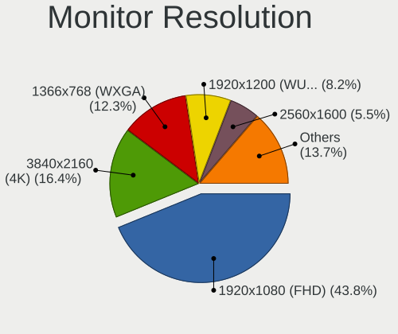

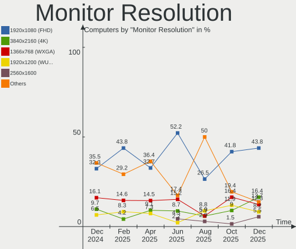

| Resolution        | Computers | Percent |
|-------------------|-----------|---------|
| 1920x1080 (FHD)   | 32        | 43.84%  |
| 3840x2160 (4K)    | 12        | 16.44%  |
| 1366x768 (WXGA)   | 9         | 12.33%  |
| 1920x1200 (WUXGA) | 6         | 8.22%   |
| 2560x1600         | 4         | 5.48%   |
| 1600x900 (HD+)    | 3         | 4.11%   |
| 1280x1024 (SXGA)  | 3         | 4.11%   |
| 3440x1440         | 1         | 1.37%   |
| 3200x1800 (QHD+)  | 1         | 1.37%   |
| 1440x900 (WXGA+)  | 1         | 1.37%   |
| 1280x800 (WXGA)   | 1         | 1.37%   |

Monitor Diagonal
----------------

Diagonal size in inches

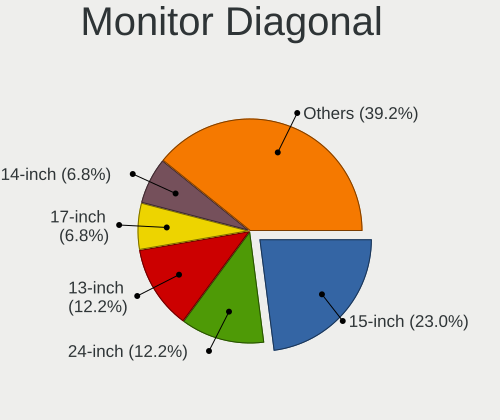

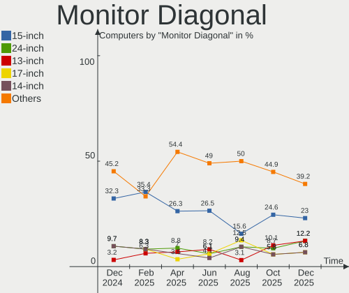

| Inches  | Computers | Percent |
|---------|-----------|---------|
| 15      | 17        | 22.97%  |
| 24      | 9         | 12.16%  |
| 13      | 9         | 12.16%  |
| 17      | 5         | 6.76%   |
| 14      | 5         | 6.76%   |
| 34      | 4         | 5.41%   |
| 27      | 3         | 4.05%   |
| 23      | 3         | 4.05%   |
| 84      | 2         | 2.7%    |
| 63      | 2         | 2.7%    |
| 31      | 2         | 2.7%    |
| 26      | 2         | 2.7%    |
| 16      | 2         | 2.7%    |
| Unknown | 2         | 2.7%    |
| 52      | 1         | 1.35%   |
| 47      | 1         | 1.35%   |
| 40      | 1         | 1.35%   |
| 21      | 1         | 1.35%   |
| 20      | 1         | 1.35%   |
| 19      | 1         | 1.35%   |
| 11      | 1         | 1.35%   |

Monitor Width
-------------

Physical width

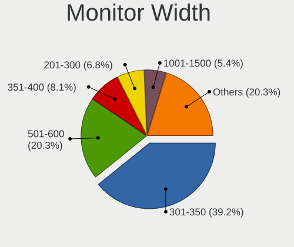

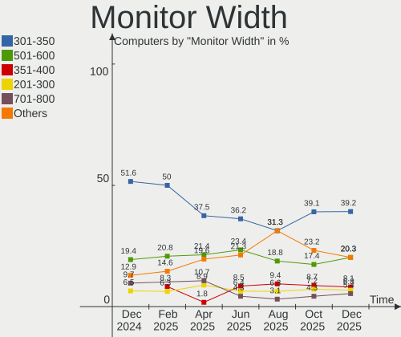

| Width in mm | Computers | Percent |
|-------------|-----------|---------|
| 301-350     | 29        | 39.19%  |
| 501-600     | 15        | 20.27%  |
| 351-400     | 6         | 8.11%   |
| 201-300     | 5         | 6.76%   |
| 701-800     | 4         | 5.41%   |
| 601-700     | 4         | 5.41%   |
| 1001-1500   | 4         | 5.41%   |
| 401-500     | 2         | 2.7%    |
| 1501-2000   | 2         | 2.7%    |
| Unknown     | 2         | 2.7%    |
| 801-900     | 1         | 1.35%   |

Aspect Ratio
------------

Proportional relationship between the width and the height

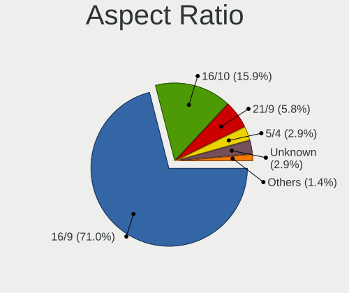

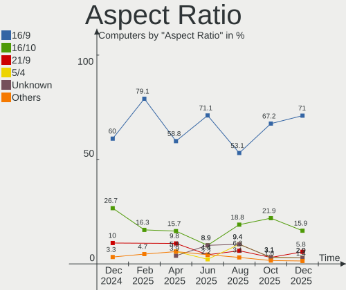

| Ratio   | Computers | Percent |
|---------|-----------|---------|
| 16/9    | 49        | 71.01%  |
| 16/10   | 11        | 15.94%  |
| 21/9    | 4         | 5.8%    |
| 5/4     | 2         | 2.9%    |
| Unknown | 2         | 2.9%    |
| 3/2     | 1         | 1.45%   |

Monitor Area
------------

Area in inch²

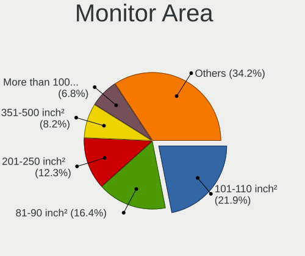

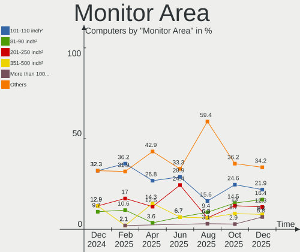

| Area in inch² | Computers | Percent |
|----------------|-----------|---------|
| 101-110        | 16        | 21.92%  |
| 81-90          | 12        | 16.44%  |
| 201-250        | 9         | 12.33%  |
| 351-500        | 6         | 8.22%   |
| More than 1000 | 5         | 6.85%   |
| 301-350        | 4         | 5.48%   |
| 251-300        | 4         | 5.48%   |
| 121-130        | 4         | 5.48%   |
| 71-80          | 2         | 2.74%   |
| 151-200        | 2         | 2.74%   |
| 111-120        | 2         | 2.74%   |
| 501-1000       | 2         | 2.74%   |
| Unknown        | 2         | 2.74%   |
| 51-60          | 1         | 1.37%   |
| 141-150        | 1         | 1.37%   |
| 91-100         | 1         | 1.37%   |

Pixel Density
-------------

Pixels per inch

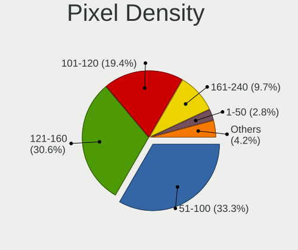

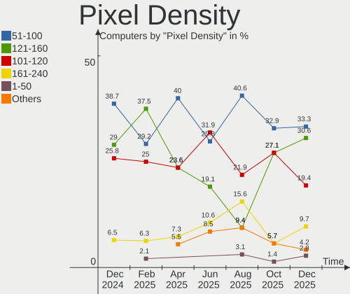

| Density       | Computers | Percent |
|---------------|-----------|---------|
| 51-100        | 24        | 33.33%  |
| 121-160       | 22        | 30.56%  |
| 101-120       | 14        | 19.44%  |
| 161-240       | 7         | 9.72%   |
| 1-50          | 2         | 2.78%   |
| Unknown       | 2         | 2.78%   |
| More than 240 | 1         | 1.39%   |

Multiple Monitors
-----------------

Total monitors connected

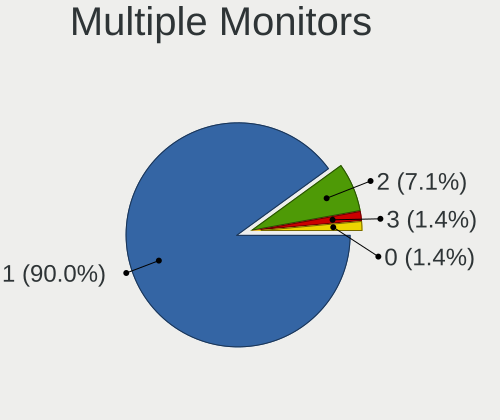

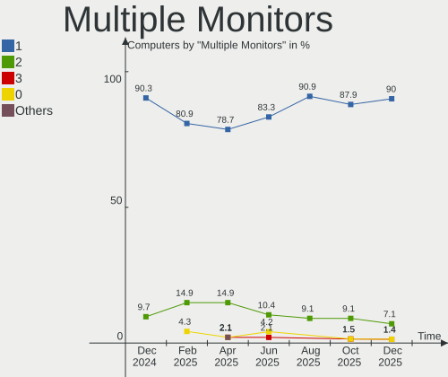

| Total | Computers | Percent |
|-------|-----------|---------|
| 1     | 63        | 90%     |
| 2     | 5         | 7.14%   |
| 3     | 1         | 1.43%   |
| 0     | 1         | 1.43%   |

Network
-------

Net Controller Vendor
---------------------

Controller vendors

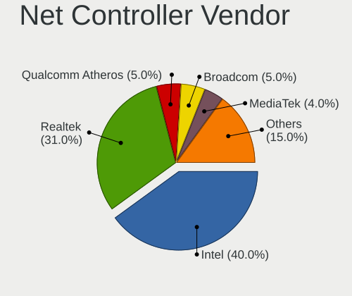

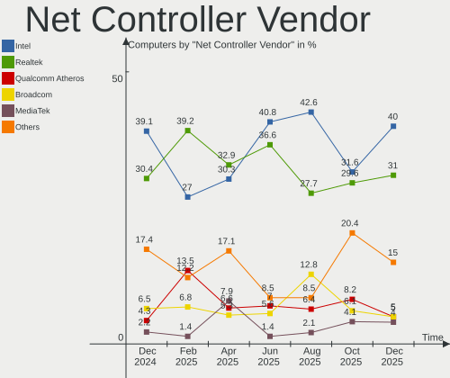

| Vendor                            | Computers | Percent |
|-----------------------------------|-----------|---------|
| Intel                             | 40        | 40%     |
| Realtek Semiconductor             | 31        | 31%     |
| Qualcomm Atheros                  | 5         | 5%      |
| Broadcom                          | 5         | 5%      |
| MediaTek                          | 4         | 4%      |
| Marvell Technology Group          | 3         | 3%      |
| Nvidia                            | 2         | 2%      |
| Ericsson Business Mobile Networks | 2         | 2%      |
| ASIX Electronics                  | 2         | 2%      |
| TP-Link                           | 1         | 1%      |
| Ralink                            | 1         | 1%      |
| Qualcomm                          | 1         | 1%      |
| NetGear                           | 1         | 1%      |
| Edimax Technology                 | 1         | 1%      |
| Broadcom Limited                  | 1         | 1%      |

Net Controller Model
--------------------

Controller models

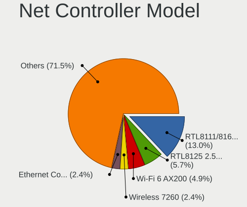

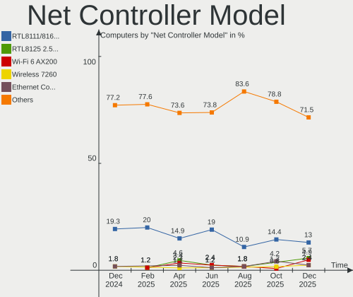

| Model                                                                           | Computers | Percent |
|---------------------------------------------------------------------------------|-----------|---------|
| Realtek RTL8111/8168/8211/8411 PCI Express Gigabit Ethernet Controller          | 16        | 13.01%  |
| Realtek RTL8125 2.5GbE Controller                                               | 7         | 5.69%   |
| Intel Wi-Fi 6 AX200                                                             | 6         | 4.88%   |
| Intel Wireless 7260                                                             | 3         | 2.44%   |
| Intel Ethernet Controller I226-V                                                | 3         | 2.44%   |
| Intel Ethernet Connection (7) I219-LM                                           | 3         | 2.44%   |
| Intel Cannon Point-LP CNVi [Wireless-AC]                                        | 3         | 2.44%   |
| Realtek RTL810xE PCI Express Fast Ethernet controller                           | 2         | 1.63%   |
| Realtek 802.11ac NIC                                                            | 2         | 1.63%   |
| MediaTek MT7925 802.11be 160MHz 2x2 PCIe Wireless Network Adapter [Filogic 360] | 2         | 1.63%   |
| Intel Wireless 8260                                                             | 2         | 1.63%   |
| Intel Wi-Fi 6E(802.11ax) AX210/AX1675* 2x2 [Typhoon Peak]                       | 2         | 1.63%   |
| Intel Raptor Lake PCH CNVi WiFi                                                 | 2         | 1.63%   |
| Intel I211 Gigabit Network Connection                                           | 2         | 1.63%   |
| Intel Ethernet Connection I217-LM                                               | 2         | 1.63%   |
| Intel Comet Lake PCH CNVi WiFi                                                  | 2         | 1.63%   |
| ASIX AX88179 Gigabit Ethernet                                                   | 2         | 1.63%   |
| TP-Link TL-WN823N v2/v3 [Realtek RTL8192EU]                                     | 1         | 0.81%   |
| Realtek RTL8922AE 802.11be PCIe Wireless Network Adapter                        | 1         | 0.81%   |
| Realtek RTL8852CE PCIe 802.11ax Wireless Network Controller                     | 1         | 0.81%   |
| Realtek RTL8852BE PCIe 802.11ax Wireless Network Controller [1T1R]              | 1         | 0.81%   |
| Realtek RTL8852BE PCIe 802.11ax Wireless Network Controller                     | 1         | 0.81%   |
| Realtek RTL8851BE PCIe 802.11ax Wireless Network Controller                     | 1         | 0.81%   |
| Realtek RTL8821CE 802.11ac PCIe Wireless Network Adapter                        | 1         | 0.81%   |
| Realtek RTL8723DE Wireless Network Adapter                                      | 1         | 0.81%   |
| Realtek RTL8153 Gigabit Ethernet Adapter                                        | 1         | 0.81%   |
| Realtek 802.11ac WLAN Adapter                                                   | 1         | 0.81%   |
| Ralink RT3290 Wireless 802.11n 1T/1R PCIe                                       | 1         | 0.81%   |
| Qualcomm QCNFA765 Wireless Network Adapter                                      | 1         | 0.81%   |
| Qualcomm Atheros QCA9565 / AR9565 Wireless Network Adapter                      | 1         | 0.81%   |
| Qualcomm Atheros AR9485 Wireless Network Adapter                                | 1         | 0.81%   |
| Qualcomm Atheros AR9462 Wireless Network Adapter                                | 1         | 0.81%   |
| Qualcomm Atheros AR9285 Wireless Network Adapter (PCI-Express)                  | 1         | 0.81%   |
| Qualcomm Atheros AR8151 v2.0 Gigabit Ethernet                                   | 1         | 0.81%   |
| Nvidia MCP65 Ethernet                                                           | 1         | 0.81%   |
| Nvidia MCP55 Ethernet                                                           | 1         | 0.81%   |
| NetGear A6210                                                                   | 1         | 0.81%   |
| MediaTek MT7922 802.11ax PCI Express Wireless Network Adapter                   | 1         | 0.81%   |
| MediaTek MT7902 802.11ax PCIe Wireless Network Adapter [Filogic 310]            | 1         | 0.81%   |
| Marvell Group Yukon Optima 88E8059 [PCIe Gigabit Ethernet Controller with AVB]  | 1         | 0.81%   |

Wireless Vendor
---------------

Wireless vendors

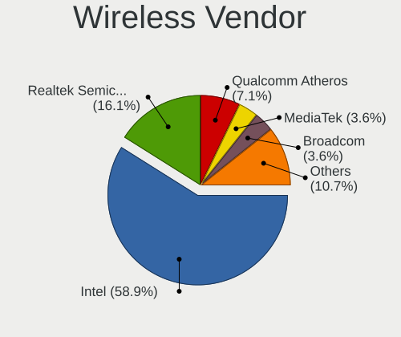

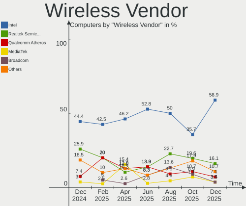

| Vendor                   | Computers | Percent |
|--------------------------|-----------|---------|
| Intel                    | 33        | 58.93%  |
| Realtek Semiconductor    | 9         | 16.07%  |
| Qualcomm Atheros         | 4         | 7.14%   |
| MediaTek                 | 2         | 3.57%   |
| Broadcom                 | 2         | 3.57%   |
| TP-Link                  | 1         | 1.79%   |
| Ralink                   | 1         | 1.79%   |
| Qualcomm                 | 1         | 1.79%   |
| NetGear                  | 1         | 1.79%   |
| Marvell Technology Group | 1         | 1.79%   |
| Edimax Technology        | 1         | 1.79%   |

Wireless Model
--------------

Wireless models

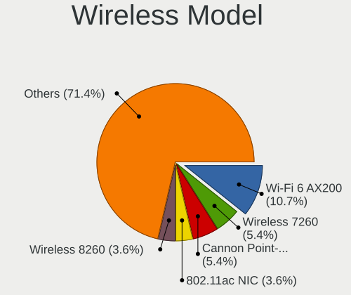

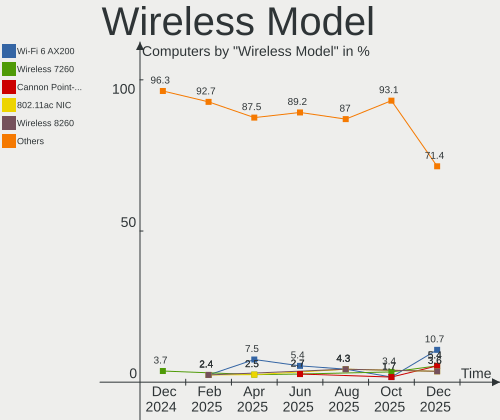

| Model                                                                | Computers | Percent |
|----------------------------------------------------------------------|-----------|---------|
| Intel Wi-Fi 6 AX200                                                  | 6         | 10.71%  |
| Intel Wireless 7260                                                  | 3         | 5.36%   |
| Intel Cannon Point-LP CNVi [Wireless-AC]                             | 3         | 5.36%   |
| Realtek 802.11ac NIC                                                 | 2         | 3.57%   |
| Intel Wireless 8260                                                  | 2         | 3.57%   |
| Intel Wi-Fi 6E(802.11ax) AX210/AX1675* 2x2 [Typhoon Peak]            | 2         | 3.57%   |
| Intel Raptor Lake PCH CNVi WiFi                                      | 2         | 3.57%   |
| Intel Comet Lake PCH CNVi WiFi                                       | 2         | 3.57%   |
| TP-Link TL-WN823N v2/v3 [Realtek RTL8192EU]                          | 1         | 1.79%   |
| Realtek RTL8922AE 802.11be PCIe Wireless Network Adapter             | 1         | 1.79%   |
| Realtek RTL8852CE PCIe 802.11ax Wireless Network Controller          | 1         | 1.79%   |
| Realtek RTL8852BE PCIe 802.11ax Wireless Network Controller [1T1R]   | 1         | 1.79%   |
| Realtek RTL8851BE PCIe 802.11ax Wireless Network Controller          | 1         | 1.79%   |
| Realtek RTL8821CE 802.11ac PCIe Wireless Network Adapter             | 1         | 1.79%   |
| Realtek RTL8723DE Wireless Network Adapter                           | 1         | 1.79%   |
| Realtek 802.11ac WLAN Adapter                                        | 1         | 1.79%   |
| Ralink RT3290 Wireless 802.11n 1T/1R PCIe                            | 1         | 1.79%   |
| Qualcomm QCNFA765 Wireless Network Adapter                           | 1         | 1.79%   |
| Qualcomm Atheros QCA9565 / AR9565 Wireless Network Adapter           | 1         | 1.79%   |
| Qualcomm Atheros AR9485 Wireless Network Adapter                     | 1         | 1.79%   |
| Qualcomm Atheros AR9462 Wireless Network Adapter                     | 1         | 1.79%   |
| Qualcomm Atheros AR9285 Wireless Network Adapter (PCI-Express)       | 1         | 1.79%   |
| NetGear A6210                                                        | 1         | 1.79%   |
| MediaTek MT7922 802.11ax PCI Express Wireless Network Adapter        | 1         | 1.79%   |
| MediaTek MT7902 802.11ax PCIe Wireless Network Adapter [Filogic 310] | 1         | 1.79%   |
| Marvell Group 88w8335 [Libertas] 802.11b/g Wireless                  | 1         | 1.79%   |
| Intel Wireless 3165                                                  | 1         | 1.79%   |
| Intel WiFi Link 5100                                                 | 1         | 1.79%   |
| Intel Ultimate N WiFi Link 5300                                      | 1         | 1.79%   |
| Intel Ice Lake-LP PCH CNVi WiFi                                      | 1         | 1.79%   |
| Intel Gemini Lake PCH CNVi WiFi                                      | 1         | 1.79%   |
| Intel Comet Lake PCH-LP CNVi WiFi                                    | 1         | 1.79%   |
| Intel Centrino Wireless-N 1030 [Rainbow Peak]                        | 1         | 1.79%   |
| Intel Centrino Wireless-N 100                                        | 1         | 1.79%   |
| Intel Centrino Ultimate-N 6300                                       | 1         | 1.79%   |
| Intel Centrino Advanced-N 6205 [Taylor Peak]                         | 1         | 1.79%   |
| Intel Alder Lake-P PCH CNVi WiFi                                     | 1         | 1.79%   |
| Intel Alder Lake-N PCH CNVi WiFi                                     | 1         | 1.79%   |
| Intel 700 Series Chipset CNVi WiFi                                   | 1         | 1.79%   |
| Edimax AC1200 MU-MIMO USB3.0 Adapter                                 | 1         | 1.79%   |

Ethernet Vendor
---------------

Ethernet vendors

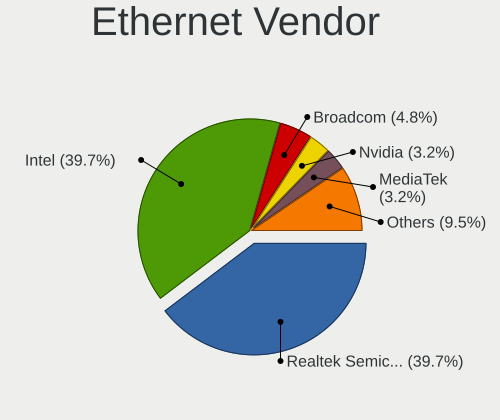

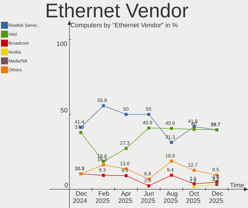

| Vendor                   | Computers | Percent |
|--------------------------|-----------|---------|
| Realtek Semiconductor    | 25        | 39.68%  |
| Intel                    | 25        | 39.68%  |
| Broadcom                 | 3         | 4.76%   |
| Nvidia                   | 2         | 3.17%   |
| MediaTek                 | 2         | 3.17%   |
| Marvell Technology Group | 2         | 3.17%   |
| ASIX Electronics         | 2         | 3.17%   |
| Qualcomm Atheros         | 1         | 1.59%   |
| Broadcom Limited         | 1         | 1.59%   |

Ethernet Model
--------------

Ethernet models

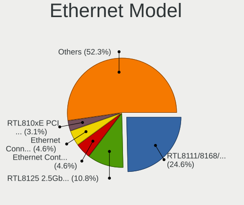

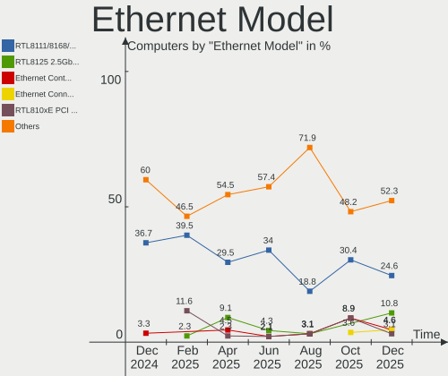

| Model                                                                           | Computers | Percent |
|---------------------------------------------------------------------------------|-----------|---------|
| Realtek RTL8111/8168/8211/8411 PCI Express Gigabit Ethernet Controller          | 16        | 24.62%  |
| Realtek RTL8125 2.5GbE Controller                                               | 7         | 10.77%  |
| Intel Ethernet Controller I226-V                                                | 3         | 4.62%   |
| Intel Ethernet Connection (7) I219-LM                                           | 3         | 4.62%   |
| Realtek RTL810xE PCI Express Fast Ethernet controller                           | 2         | 3.08%   |
| MediaTek MT7925 802.11be 160MHz 2x2 PCIe Wireless Network Adapter [Filogic 360] | 2         | 3.08%   |
| Intel I211 Gigabit Network Connection                                           | 2         | 3.08%   |
| Intel Ethernet Connection I217-LM                                               | 2         | 3.08%   |
| ASIX AX88179 Gigabit Ethernet                                                   | 2         | 3.08%   |
| Realtek RTL8852BE PCIe 802.11ax Wireless Network Controller                     | 1         | 1.54%   |
| Realtek RTL8153 Gigabit Ethernet Adapter                                        | 1         | 1.54%   |
| Qualcomm Atheros AR8151 v2.0 Gigabit Ethernet                                   | 1         | 1.54%   |
| Nvidia MCP65 Ethernet                                                           | 1         | 1.54%   |
| Nvidia MCP55 Ethernet                                                           | 1         | 1.54%   |
| Marvell Group Yukon Optima 88E8059 [PCIe Gigabit Ethernet Controller with AVB]  | 1         | 1.54%   |
| Marvell Group 88E8042 PCI-E Fast Ethernet Controller                            | 1         | 1.54%   |
| Intel Ethernet Controller I225-V                                                | 1         | 1.54%   |
| Intel Ethernet Connection I219-LM                                               | 1         | 1.54%   |
| Intel Ethernet Connection I218-LM                                               | 1         | 1.54%   |
| Intel Ethernet Connection I217-V                                                | 1         | 1.54%   |
| Intel Ethernet Connection (7) I219-V                                            | 1         | 1.54%   |
| Intel Ethernet Connection (6) I219-V                                            | 1         | 1.54%   |
| Intel Ethernet Connection (5) I219-LM                                           | 1         | 1.54%   |
| Intel Ethernet Connection (2) I219-LM                                           | 1         | 1.54%   |
| Intel Ethernet Connection (11) I219-LM                                          | 1         | 1.54%   |
| Intel Ethernet Connection (10) I219-LM                                          | 1         | 1.54%   |
| Intel BE201 320MHz                                                              | 1         | 1.54%   |
| Intel 82579LM Gigabit Network Connection (Lewisville)                           | 1         | 1.54%   |
| Intel 82578DM Gigabit Network Connection                                        | 1         | 1.54%   |
| Intel 82567LM Gigabit Network Connection                                        | 1         | 1.54%   |
| Intel 82541PI Gigabit Ethernet Controller                                       | 1         | 1.54%   |
| Broadcom NetXtreme BCM57786 Gigabit Ethernet PCIe                               | 1         | 1.54%   |
| Broadcom NetLink BCM5784M Gigabit Ethernet PCIe                                 | 1         | 1.54%   |
| Broadcom NetLink BCM57785 Gigabit Ethernet PCIe                                 | 1         | 1.54%   |
| Broadcom Limited NetLink BCM57780 Gigabit Ethernet PCIe                         | 1         | 1.54%   |

Net Controller Kind
-------------------

Ethernet, WiFi or modem

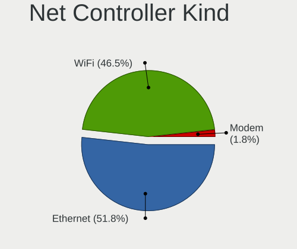

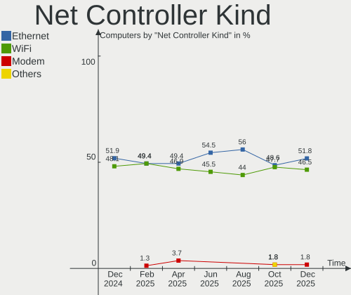

| Kind     | Computers | Percent |
|----------|-----------|---------|
| Ethernet | 59        | 51.75%  |
| WiFi     | 53        | 46.49%  |
| Modem    | 2         | 1.75%   |

Used Controller
---------------

Currently used network controller

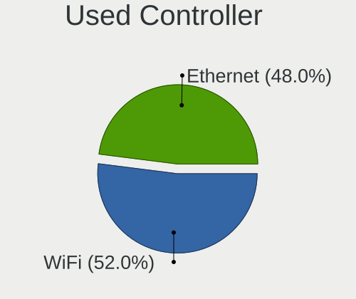

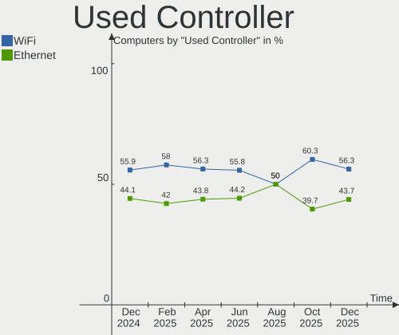

| Kind     | Computers | Percent |
|----------|-----------|---------|
| WiFi     | 40        | 56.34%  |
| Ethernet | 31        | 43.66%  |

NICs
----

Total network controllers on board

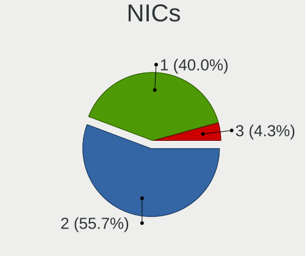

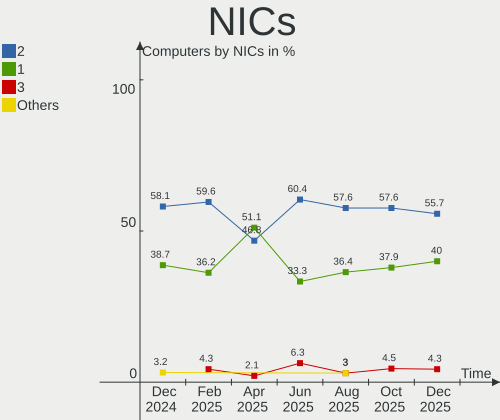

| Total | Computers | Percent |
|-------|-----------|---------|
| 2     | 39        | 55.71%  |
| 1     | 28        | 40%     |
| 3     | 3         | 4.29%   |

IPv6
----

IPv6 vs IPv4

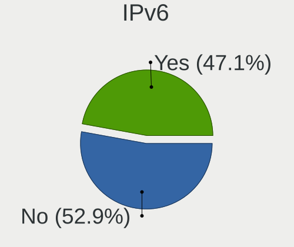

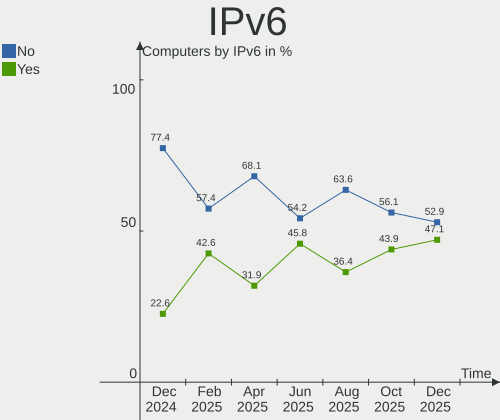

| Used | Computers | Percent |
|------|-----------|---------|
| No   | 37        | 52.86%  |
| Yes  | 33        | 47.14%  |

Bluetooth
---------

Bluetooth Vendor
----------------

Controller vendors

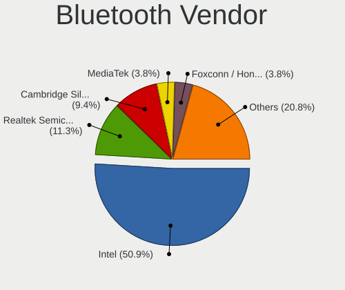

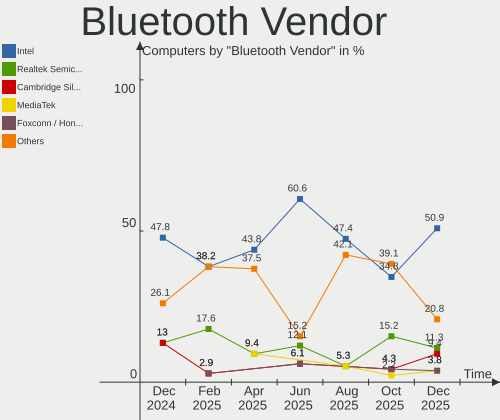

| Vendor                          | Computers | Percent |
|---------------------------------|-----------|---------|
| Intel                           | 27        | 50.94%  |
| Realtek Semiconductor           | 6         | 11.32%  |
| Cambridge Silicon Radio         | 5         | 9.43%   |
| MediaTek                        | 2         | 3.77%   |
| Foxconn / Hon Hai               | 2         | 3.77%   |
| Broadcom                        | 2         | 3.77%   |
| USI                             | 1         | 1.89%   |
| Ralink                          | 1         | 1.89%   |
| Qualcomm Atheros Communications | 1         | 1.89%   |
| Lite-On Technology              | 1         | 1.89%   |
| IMC Networks                    | 1         | 1.89%   |
| Hewlett-Packard                 | 1         | 1.89%   |
| ASUSTek Computer                | 1         | 1.89%   |
| Apple                           | 1         | 1.89%   |
| Actions                         | 1         | 1.89%   |

Bluetooth Model
---------------

Controller models

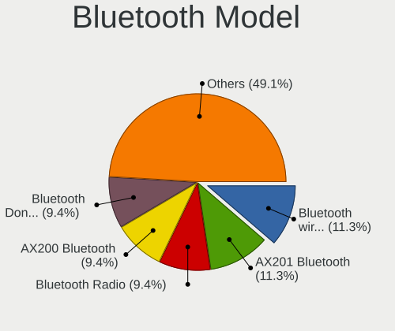

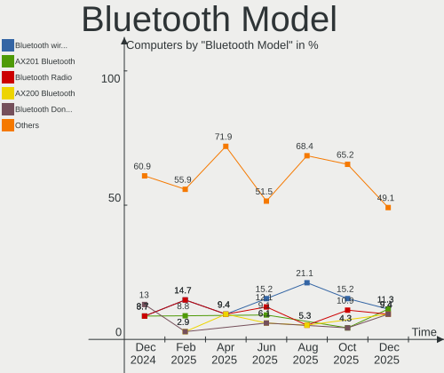

| Model                                               | Computers | Percent |
|-----------------------------------------------------|-----------|---------|
| Intel Bluetooth wireless interface                  | 6         | 11.32%  |
| Intel AX201 Bluetooth                               | 6         | 11.32%  |
| Realtek Bluetooth Radio                             | 5         | 9.43%   |
| Intel AX200 Bluetooth                               | 5         | 9.43%   |
| Cambridge Silicon Radio Bluetooth Dongle (HCI mode) | 5         | 9.43%   |
| Intel Bluetooth 9460/9560 Jefferson Peak (JfP)      | 4         | 7.55%   |
| Intel Bluetooth Device                              | 3         | 5.66%   |
| MediaTek Wireless_Device                            | 2         | 3.77%   |
| USI Bluetooth Device                                | 1         | 1.89%   |
| Realtek  Bluetooth 4.2 Adapter                      | 1         | 1.89%   |
| Ralink RT3290 Bluetooth                             | 1         | 1.89%   |
| Qualcomm Atheros AR3012 Bluetooth 4.0               | 1         | 1.89%   |
| Lite-On Atheros AR3012 Bluetooth                    | 1         | 1.89%   |
| Intel Centrino Advanced-N 6230 Bluetooth adapter    | 1         | 1.89%   |
| Intel Bluetooth                                     | 1         | 1.89%   |
| Intel AX210 Bluetooth                               | 1         | 1.89%   |
| IMC Networks Wireless_Device                        | 1         | 1.89%   |
| HP Bluetooth 2.0 Interface [Broadcom BCM2045]       | 1         | 1.89%   |
| Foxconn / Hon Hai Bluetooth Radio                   | 1         | 1.89%   |
| Foxconn / Hon Hai Bluetooth Device                  | 1         | 1.89%   |
| Broadcom HP Portable SoftSailing                    | 1         | 1.89%   |
| Broadcom BCM20702A0 Bluetooth 4.0                   | 1         | 1.89%   |
| ASUS ASUS USB-BT500                                 | 1         | 1.89%   |
| Apple Bluetooth Host Controller                     | 1         | 1.89%   |
| Actions general adapter                             | 1         | 1.89%   |

Sound
-----

Sound Vendor
------------

Sound card vendors

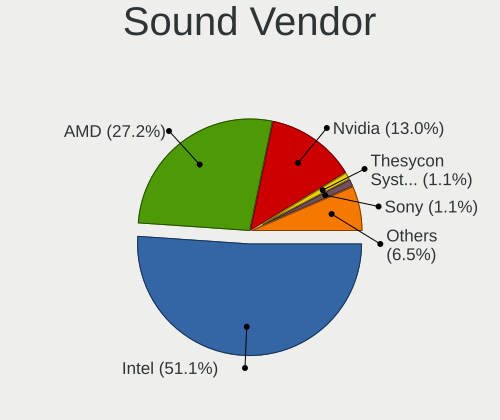

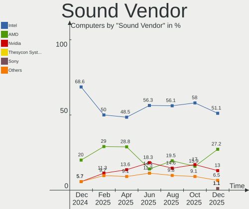

| Vendor                               | Computers | Percent |
|--------------------------------------|-----------|---------|
| Intel                                | 47        | 51.09%  |
| AMD                                  | 25        | 27.17%  |
| Nvidia                               | 12        | 13.04%  |
| Thesycon Systemsoftware & Consulting | 1         | 1.09%   |
| Sony                                 | 1         | 1.09%   |
| Razer USA                            | 1         | 1.09%   |
| JMTek                                | 1         | 1.09%   |
| DSEA A/S                             | 1         | 1.09%   |
| Creative Technology                  | 1         | 1.09%   |
| C-Media Electronics                  | 1         | 1.09%   |
| Apple                                | 1         | 1.09%   |

Sound Model
-----------

Sound card models

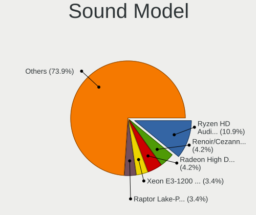

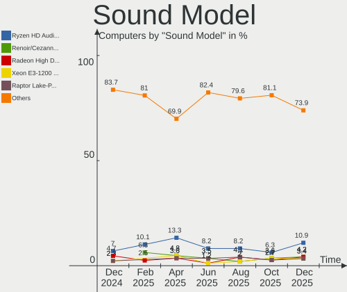

| Model                                                                      | Computers | Percent |
|----------------------------------------------------------------------------|-----------|---------|
| AMD Ryzen HD Audio Controller                                              | 13        | 10.92%  |
| AMD Renoir/Cezanne HDMI/DP Audio Controller                                | 5         | 4.2%    |
| AMD Radeon High Definition Audio Controller                                | 5         | 4.2%    |
| Intel Xeon E3-1200 v3/4th Gen Core Processor HD Audio Controller           | 4         | 3.36%   |
| Intel Raptor Lake-P/U/H cAVS                                               | 4         | 3.36%   |
| Intel Cannon Point-LP High Definition Audio Controller                     | 4         | 3.36%   |
| Intel Cannon Lake PCH cAVS                                                 | 4         | 3.36%   |
| Intel 8 Series/C220 Series Chipset High Definition Audio Controller        | 4         | 3.36%   |
| AMD SBx00 Azalia (Intel HDA)                                               | 4         | 3.36%   |
| Intel Celeron/Pentium Silver Processor High Definition Audio               | 3         | 2.52%   |
| Intel 6 Series/C200 Series Chipset Family High Definition Audio Controller | 3         | 2.52%   |
| AMD FCH Azalia Controller                                                  | 3         | 2.52%   |
| Intel Wildcat Point-LP High Definition Audio Controller                    | 2         | 1.68%   |
| Intel Ice Lake-LP Smart Sound Technology Audio Controller                  | 2         | 1.68%   |
| Intel Haswell-ULT HD Audio Controller                                      | 2         | 1.68%   |
| Intel Comet Lake PCH cAVS                                                  | 2         | 1.68%   |
| Intel Broadwell-U Audio Controller                                         | 2         | 1.68%   |
| Intel 82801I (ICH9 Family) HD Audio Controller                             | 2         | 1.68%   |
| Intel 8 Series HD Audio Controller                                         | 2         | 1.68%   |
| Intel 5 Series/3400 Series Chipset High Definition Audio                   | 2         | 1.68%   |
| Intel 100 Series/C230 Series Chipset Family HD Audio Controller            | 2         | 1.68%   |
| AMD Navi 31 HDMI/DP Audio                                                  | 2         | 1.68%   |
| Thesycon Systemsoftware & Consulting E30                                   | 1         | 0.84%   |
| Sony DualSense wireless controller (PS5)                                   | 1         | 0.84%   |
| Razer USA Kraken 7.1 Chroma                                                | 1         | 0.84%   |
| Nvidia TU107 GeForce GTX 1650 High Definition Audio Controller             | 1         | 0.84%   |
| Nvidia TU106 High Definition Audio Controller                              | 1         | 0.84%   |
| Nvidia TU104 HD Audio Controller                                           | 1         | 0.84%   |
| Nvidia MCP65 High Definition Audio                                         | 1         | 0.84%   |
| Nvidia MCP55 High Definition Audio                                         | 1         | 0.84%   |
| Nvidia GP107GL High Definition Audio Controller                            | 1         | 0.84%   |
| Nvidia GP104 High Definition Audio Controller                              | 1         | 0.84%   |
| Nvidia GB206 High Definition Audio Controller                              | 1         | 0.84%   |
| Nvidia GA107 High Definition Audio Controller                              | 1         | 0.84%   |
| Nvidia GA106 High Definition Audio Controller                              | 1         | 0.84%   |
| Nvidia GA102 High Definition Audio Controller                              | 1         | 0.84%   |
| Nvidia AD107 High Definition Audio Controller                              | 1         | 0.84%   |
| JMTek USB PnP Audio Device                                                 | 1         | 0.84%   |
| Intel Sunrise Point-LP HD Audio                                            | 1         | 0.84%   |
| Intel Raptor Lake High Definition Audio Controller                         | 1         | 0.84%   |

Memory
------

Memory Vendor
-------------

Memory module vendors

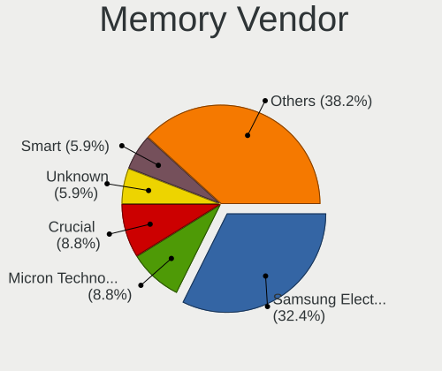

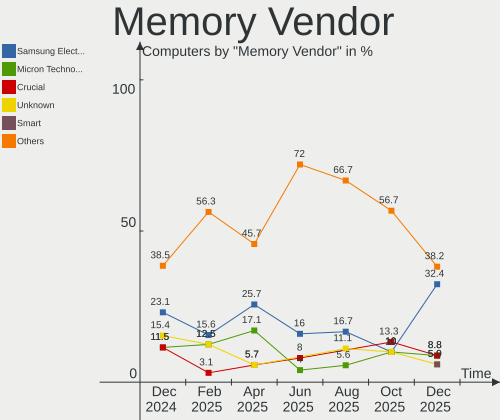

| Vendor              | Computers | Percent |
|---------------------|-----------|---------|
| Samsung Electronics | 11        | 32.35%  |
| Micron Technology   | 3         | 8.82%   |
| Crucial             | 3         | 8.82%   |
| Unknown             | 2         | 5.88%   |
| Smart               | 2         | 5.88%   |
| SK hynix            | 2         | 5.88%   |
| G.Skill             | 2         | 5.88%   |
| Corsair             | 2         | 5.88%   |
| A-DATA Technology   | 2         | 5.88%   |
| Unknown (ABCD)      | 1         | 2.94%   |
| Ramaxel Technology  | 1         | 2.94%   |
| Nanya Technology    | 1         | 2.94%   |
| Kingston            | 1         | 2.94%   |
| Exceleram           | 1         | 2.94%   |

Memory Model
------------

Memory module models

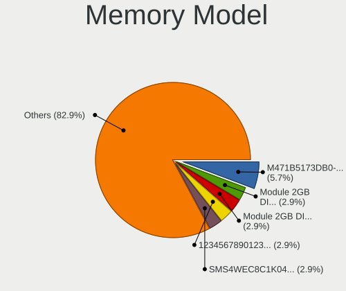

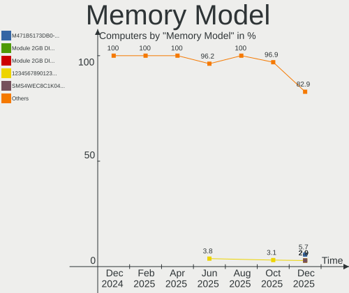

| Model                                                          | Computers | Percent |
|----------------------------------------------------------------|-----------|---------|
| Samsung RAM M471B5173DB0-YK0 4GB SODIMM DDR3 1600MT/s          | 2         | 5.71%   |
| Unknown RAM Module 2GB DIMM DDR2                               | 1         | 2.86%   |
| Unknown RAM Module 2GB DIMM 800MT/s                            | 1         | 2.86%   |
| Unknown (ABCD) RAM 123456789012345678 2GB DIMM LPDDR4 2133MT/s | 1         | 2.86%   |
| Smart RAM SMS4WEC8C1K0446FCG 8GB SODIMM DDR4 3200MT/s          | 1         | 2.86%   |
| Smart RAM SF4641G8CK8IWGKSEG 8GB SODIMM DDR4 2400MT/s          | 1         | 2.86%   |
| SK hynix RAM HMAA1GS6CMR6N-XN 8GB SODIMM DDR4 3200MT/s         | 1         | 2.86%   |
| SK hynix RAM HMA81GS6DJR8N-VK 8GB SODIMM DDR4 2667MT/s         | 1         | 2.86%   |
| Samsung RAM Module 4GB SODIMM LPDDR3 1867MT/s                  | 1         | 2.86%   |
| Samsung RAM M471B5673FH0-CF8 2048MB SODIMM DDR3 1067MT/s       | 1         | 2.86%   |
| Samsung RAM M471B5673EH1-CF8 2GB SODIMM 4199MT/s               | 1         | 2.86%   |
| Samsung RAM M471B5273DH0-CH9 4GB SODIMM DDR3 1600MT/s          | 1         | 2.86%   |
| Samsung RAM M471B5273CH0-CH9 4GB SODIMM DDR3 1334MT/s          | 1         | 2.86%   |
| Samsung RAM M471A5244CB0-CTD 4GB SODIMM DDR4 3266MT/s          | 1         | 2.86%   |
| Samsung RAM M471A2K43CB1-CTD 16GB SODIMM DDR4 8400MT/s         | 1         | 2.86%   |
| Samsung RAM M471A1G44AB0-CWE 8GiB SODIMM DDR4 3200MT/s         | 1         | 2.86%   |
| Samsung RAM M4 70T5663QZ3-CF7 2GB SODIMM DDR2 2048MT/s         | 1         | 2.86%   |
| Samsung RAM H58G66AK6BX070N 8GB DIMM LPDDR5 6400MT/s           | 1         | 2.86%   |
| Ramaxel RAM RMSA3260NA78HAF-2666 8GB SODIMM DDR4 2667MT/s      | 1         | 2.86%   |
| Nanya RAM NT2GC64B8HC0NS-BE 2GB SODIMM DDR3 1067MT/s           | 1         | 2.86%   |
| Micron RAM Module 4GB Row Of Chips LPDDR5 8533MT/s             | 1         | 2.86%   |
| Micron RAM CT16G4SFRA32A.16FE1 16GB SODIMM DDR4 3200MT/s       | 1         | 2.86%   |
| Micron RAM 16KTF51264HZ-1G6M1 4GB SODIMM DDR3 1600MT/s         | 1         | 2.86%   |
| Kingston RAM KF560C36-32 32GB DIMM DDR5 6200MT/s               | 1         | 2.86%   |
| G.Skill RAM F4-3600C16-16GTZNC 16GiB DIMM DDR4 3600MT/s        | 1         | 2.86%   |
| G.Skill RAM F4-3200C22-16GRS 16GiB SODIMM DDR4 3200MT/s        | 1         | 2.86%   |
| Exceleram RAM E30113A 4GB DIMM DDR3 1333MT/s                   | 1         | 2.86%   |
| Crucial RAM CT8G4SFRA32A.C8FR 8GB SODIMM DDR4 3200MT/s         | 1         | 2.86%   |
| Crucial RAM CT16G4SFRA32A.C16FT 16GB SODIMM DDR4 3200MT/s      | 1         | 2.86%   |
| Crucial RAM BLS16G4S240FSD.16FBD 16GB SODIMM DDR4 2400MT/s     | 1         | 2.86%   |
| Corsair RAM CMV4GX4M1A2400C16 4GB DIMM DDR4 2400MT/s           | 1         | 2.86%   |
| Corsair RAM CMK32GX5M2B6000Z30 16GB DIMM DDR5 6000MT/s         | 1         | 2.86%   |
| A-DATA RAM Module 32GB SODIMM DDR4 3200MT/s                    | 1         | 2.86%   |
| A-DATA RAM MIF4D2C087KZ1 4GB SODIMM DDR3 1600MT/s              | 1         | 2.86%   |

Memory Kind
-----------

Memory module kinds

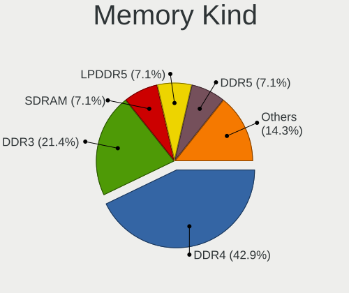

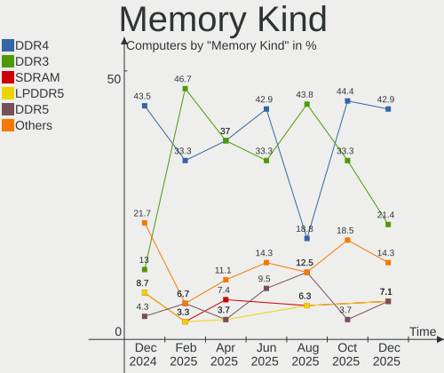

| Kind    | Computers | Percent |
|---------|-----------|---------|
| DDR4    | 12        | 42.86%  |
| DDR3    | 6         | 21.43%  |
| SDRAM   | 2         | 7.14%   |
| LPDDR5  | 2         | 7.14%   |
| DDR5    | 2         | 7.14%   |
| LPDDR4  | 1         | 3.57%   |
| LPDDR3  | 1         | 3.57%   |
| DDR2    | 1         | 3.57%   |
| Unknown | 1         | 3.57%   |

Memory Form Factor
------------------

Physical design of the memory module

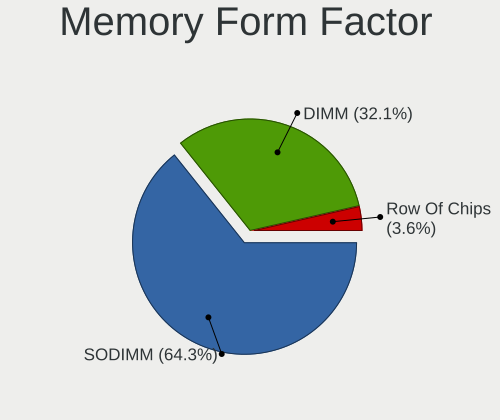

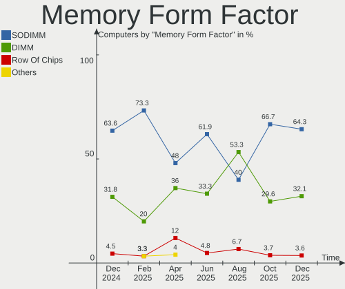

| Name         | Computers | Percent |
|--------------|-----------|---------|
| SODIMM       | 18        | 64.29%  |
| DIMM         | 9         | 32.14%  |
| Row Of Chips | 1         | 3.57%   |

Memory Size
-----------

Memory module size

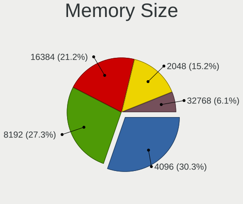

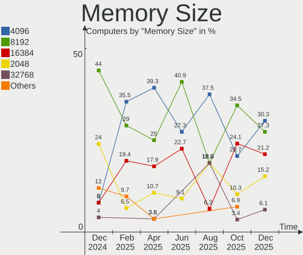

| Size  | Computers | Percent |
|-------|-----------|---------|
| 4096  | 10        | 30.3%   |
| 8192  | 9         | 27.27%  |
| 16384 | 7         | 21.21%  |
| 2048  | 5         | 15.15%  |
| 32768 | 2         | 6.06%   |

Memory Speed
------------

Memory module speed

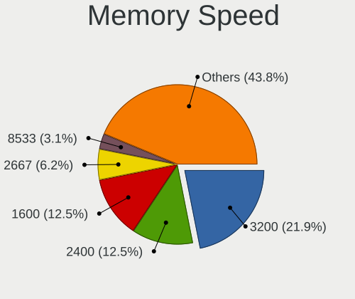

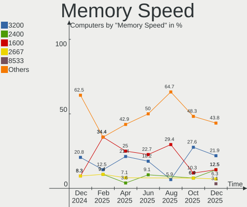

| Speed   | Computers | Percent |
|---------|-----------|---------|
| 3200    | 7         | 21.88%  |
| 2400    | 4         | 12.5%   |
| 1600    | 4         | 12.5%   |
| 2667    | 2         | 6.25%   |
| 8533    | 1         | 3.13%   |
| 8400    | 1         | 3.13%   |
| 6400    | 1         | 3.13%   |
| 6200    | 1         | 3.13%   |
| 6000    | 1         | 3.13%   |
| 4199    | 1         | 3.13%   |
| 3866    | 1         | 3.13%   |
| 3266    | 1         | 3.13%   |
| 2048    | 1         | 3.13%   |
| 1867    | 1         | 3.13%   |
| 1334    | 1         | 3.13%   |
| 1333    | 1         | 3.13%   |
| 1067    | 1         | 3.13%   |
| 800     | 1         | 3.13%   |
| Unknown | 1         | 3.13%   |

Printers & scanners
-------------------

Printer Vendor
--------------

Printer device vendors

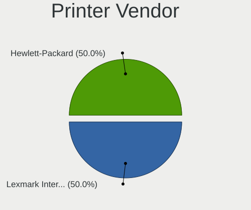

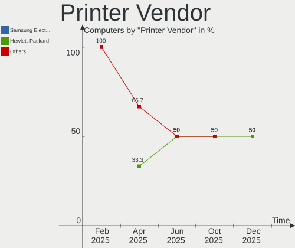

| Vendor              | Computers | Percent |
|---------------------|-----------|---------|
| Samsung Electronics | 1         | 50%     |
| Hewlett-Packard     | 1         | 50%     |

Printer Model
-------------

Printer device models

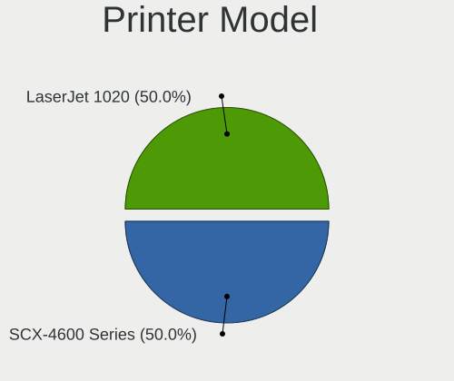

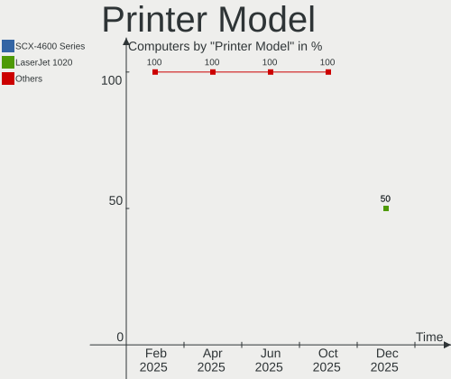

| Model                   | Computers | Percent |
|-------------------------|-----------|---------|
| Samsung SCX-4600 Series | 1         | 50%     |
| HP LaserJet 1020        | 1         | 50%     |

Scanner Vendor
--------------

Scanner device vendors

Zero info for selected period =(

Scanner Model
-------------

Scanner device models

Zero info for selected period =(

Camera
------

Camera Vendor
-------------

Camera device vendors

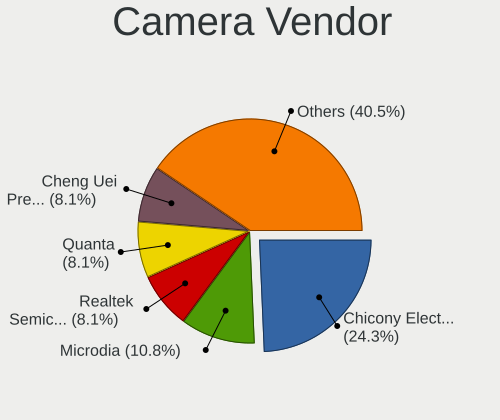

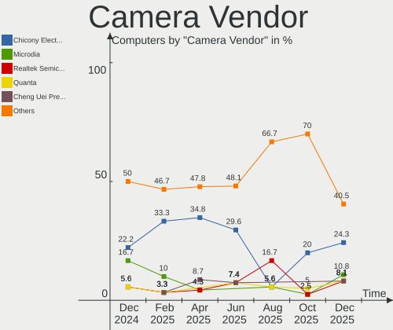

| Vendor                                 | Computers | Percent |
|----------------------------------------|-----------|---------|
| Chicony Electronics                    | 9         | 24.32%  |
| Microdia                               | 4         | 10.81%  |
| Realtek Semiconductor                  | 3         | 8.11%   |
| Quanta                                 | 3         | 8.11%   |
| Cheng Uei Precision Industry (Foxlink) | 3         | 8.11%   |
| Suyin                                  | 2         | 5.41%   |
| IMC Networks                           | 2         | 5.41%   |
| Bison Electronics                      | 2         | 5.41%   |
| Alcor Micro                            | 2         | 5.41%   |
| Silicon Motion                         | 1         | 2.7%    |
| ShineTech                              | 1         | 2.7%    |
| Razer USA                              | 1         | 2.7%    |
| Microsoft                              | 1         | 2.7%    |
| Logitech                               | 1         | 2.7%    |
| Lenovo                                 | 1         | 2.7%    |
| Anker                                  | 1         | 2.7%    |

Camera Model
------------

Camera device models

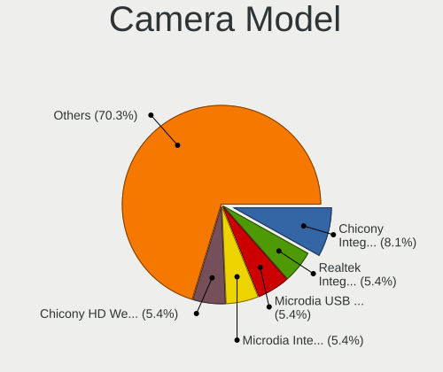

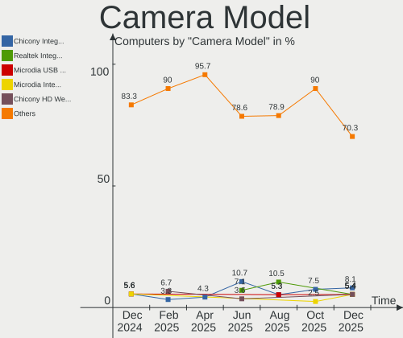

| Model                                                                      | Computers | Percent |
|----------------------------------------------------------------------------|-----------|---------|
| Chicony Integrated Camera                                                  | 3         | 8.11%   |
| Realtek Integrated_Webcam_HD                                               | 2         | 5.41%   |
| Microdia USB 2.0 Camera                                                    | 2         | 5.41%   |
| Microdia Integrated_Webcam_HD                                              | 2         | 5.41%   |
| Chicony HD WebCam                                                          | 2         | 5.41%   |
| Bison Integrated Camera                                                    | 2         | 5.41%   |
| Suyin HP Webcam                                                            | 1         | 2.7%    |
| Suyin HD WebCam                                                            | 1         | 2.7%    |
| Silicon Motion WebCam SC-03M12736N                                         | 1         | 2.7%    |
| ShineTech USB2.0 HD UVC WebCam                                             | 1         | 2.7%    |
| Realtek LG Camera                                                          | 1         | 2.7%    |
| Razer USA Razer Kiyo X                                                     | 1         | 2.7%    |
| Quanta HP True Vision HD Camera                                            | 1         | 2.7%    |
| Quanta HP True Vision FHD Camera                                           | 1         | 2.7%    |
| Quanta HP HD Camera                                                        | 1         | 2.7%    |
| Microsoft LifeCam Studio                                                   | 1         | 2.7%    |
| Logitech C920 PRO HD Webcam                                                | 1         | 2.7%    |
| Lenovo Integrated Webcam                                                   | 1         | 2.7%    |
| IMC Networks Integrated Camera                                             | 1         | 2.7%    |
| IMC Networks HP TrueVision HD Camera                                       | 1         | 2.7%    |
| Chicony ThinkPad T490 Webcam                                               | 1         | 2.7%    |
| Chicony LGE FHD Camera                                                     | 1         | 2.7%    |
| Chicony CKF7063 Webcam (HP)                                                | 1         | 2.7%    |
| Chicony Acer CrystalEye Webcam                                             | 1         | 2.7%    |
| Cheng Uei Precision Industry (Foxlink) USB2.0 UVC 1.3M Webcam              | 1         | 2.7%    |
| Cheng Uei Precision Industry (Foxlink) HP Wide Vision HD Integrated Webcam | 1         | 2.7%    |
| Cheng Uei Precision Industry (Foxlink) HP HD Camera                        | 1         | 2.7%    |
| Anker PowerConf C300                                                       | 1         | 2.7%    |
| Alcor Micro PC Camera                                                      | 1         | 2.7%    |
| Alcor Micro Acer Integrated Webcam                                         | 1         | 2.7%    |

Security
--------

Fingerprint Vendor
------------------

Fingerprint sensor vendors

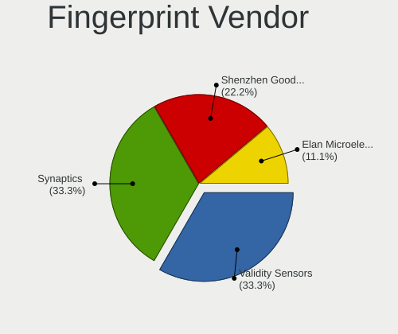

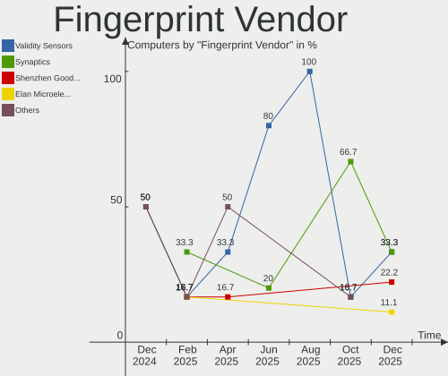

| Vendor                     | Computers | Percent |
|----------------------------|-----------|---------|
| Validity Sensors           | 3         | 33.33%  |
| Synaptics                  | 3         | 33.33%  |
| Shenzhen Goodix Technology | 2         | 22.22%  |
| Elan Microelectronics      | 1         | 11.11%  |

Fingerprint Model
-----------------

Fingerprint sensor models

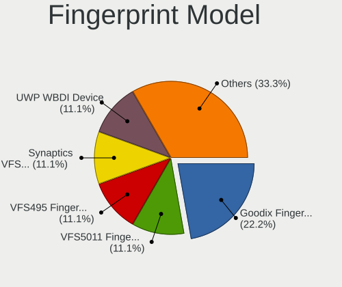

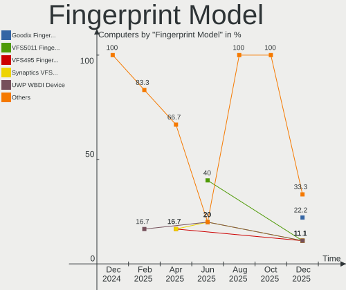

| Model                                                                      | Computers | Percent |
|----------------------------------------------------------------------------|-----------|---------|
| Shenzhen Goodix  FingerPrint Device                                        | 2         | 22.22%  |
| Validity Sensors VFS5011 Fingerprint Reader                                | 1         | 11.11%  |
| Validity Sensors VFS495 Fingerprint Reader                                 | 1         | 11.11%  |
| Validity Sensors Synaptics VFS7552 Touch Fingerprint Sensor with PurePrint | 1         | 11.11%  |
| Synaptics UWP WBDI Device                                                  | 1         | 11.11%  |
| Synaptics Prometheus MIS Touch Fingerprint Reader                          | 1         | 11.11%  |
| Synaptics FS7604 Touch Fingerprint Sensor with PurePrint                   | 1         | 11.11%  |
| Elan ELAN:ARM-M4                                                           | 1         | 11.11%  |

Chipcard Vendor
---------------

Chipcard module vendors

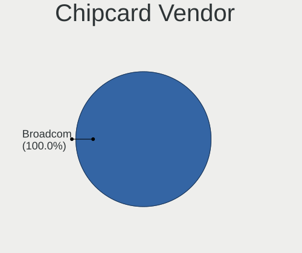

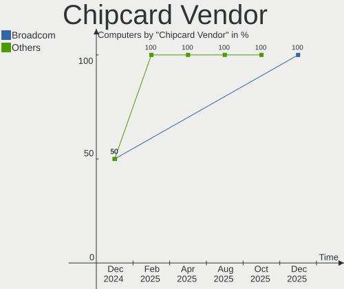

| Vendor   | Computers | Percent |
|----------|-----------|---------|
| Broadcom | 1         | 100%    |

Chipcard Model
--------------

Chipcard module models

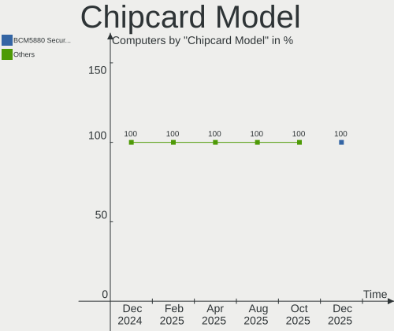

| Model                                          | Computers | Percent |
|------------------------------------------------|-----------|---------|
| Broadcom BCM5880 Secure Applications Processor | 1         | 100%    |

Unsupported
-----------

Unsupported Devices
-------------------

Total unsupported devices on board

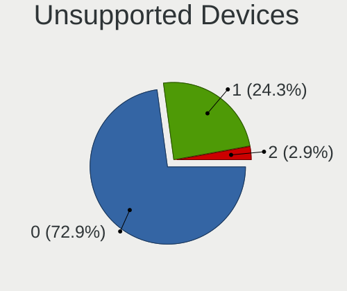

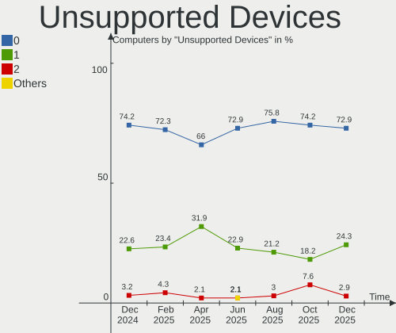

| Total | Computers | Percent |
|-------|-----------|---------|
| 0     | 51        | 72.86%  |
| 1     | 17        | 24.29%  |
| 2     | 2         | 2.86%   |

Unsupported Device Types
------------------------

Types of unsupported devices

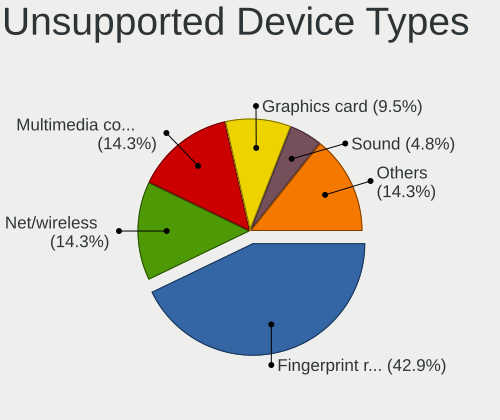

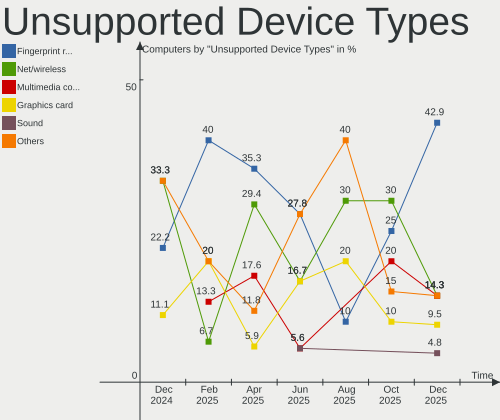

| Type                     | Computers | Percent |
|--------------------------|-----------|---------|
| Fingerprint reader       | 9         | 42.86%  |
| Net/wireless             | 3         | 14.29%  |
| Multimedia controller    | 3         | 14.29%  |
| Graphics card            | 2         | 9.52%   |
| Sound                    | 1         | 4.76%   |
| Communication controller | 1         | 4.76%   |
| Chipcard                 | 1         | 4.76%   |
| Bluetooth                | 1         | 4.76%   |

