LMDE - Hardware Trends
----------------------

A project to identify most popular hardware characteristics and track their change
over time based on data collected by Linux users at https://Linux-Hardware.org.

Anyone can contribute to this report by the [hw-probe](https://github.com/linuxhw/hw-probe) tool:

    sudo -E hw-probe -all -upload

This is a report for all computer types. See also reports for [desktops](/Dist/LMDE/Desktop/README.md) and [notebooks](/Dist/LMDE/Notebook/README.md).

This report is for one last month. Overall report since the beginning of time: [TestDays](https://github.com/linuxhw/TestDays)

Period: Jun, 2023.

Contents
--------

* [ System ](#system)
  - [ OS                       ](#os)
  - [ OS Family                ](#os-family)
  - [ Kernel                   ](#kernel)
  - [ Kernel Family            ](#kernel-family)
  - [ Kernel Major Ver.        ](#kernel-major-ver)
  - [ Arch                     ](#arch)
  - [ DE                       ](#de)
  - [ Display Server           ](#display-server)
  - [ Display Manager          ](#display-manager)
  - [ OS Lang                  ](#os-lang)
  - [ Boot Mode                ](#boot-mode)
  - [ Filesystem               ](#filesystem)
  - [ Part. scheme             ](#part-scheme)
  - [ Dual Boot with Linux/BSD ](#dual-boot-with-linuxbsd)
  - [ Dual Boot (Win)          ](#dual-boot-win)

* [ Board ](#board)
  - [ Vendor                   ](#vendor)
  - [ Model                    ](#model)
  - [ Model Family             ](#model-family)
  - [ MFG Year                 ](#mfg-year)
  - [ Form Factor              ](#form-factor)
  - [ Secure Boot              ](#secure-boot)
  - [ Coreboot                 ](#coreboot)
  - [ RAM Size                 ](#ram-size)
  - [ RAM Used                 ](#ram-used)
  - [ Total Drives             ](#total-drives)
  - [ Has CD-ROM               ](#has-cd-rom)
  - [ Has Ethernet             ](#has-ethernet)
  - [ Has WiFi                 ](#has-wifi)
  - [ Has Bluetooth            ](#has-bluetooth)

* [ Location ](#location)
  - [ Country                  ](#country)
  - [ City                     ](#city)

* [ Drives ](#drives)
  - [ Drive Vendor             ](#drive-vendor)
  - [ Drive Model              ](#drive-model)
  - [ HDD Vendor               ](#hdd-vendor)
  - [ SSD Vendor               ](#ssd-vendor)
  - [ Drive Kind               ](#drive-kind)
  - [ Drive Connector          ](#drive-connector)
  - [ Drive Size               ](#drive-size)
  - [ Space Total              ](#space-total)
  - [ Space Used               ](#space-used)
  - [ Malfunc. Drives          ](#malfunc-drives)
  - [ Malfunc. Drive Vendor    ](#malfunc-drive-vendor)
  - [ Malfunc. HDD Vendor      ](#malfunc-hdd-vendor)
  - [ Malfunc. Drive Kind      ](#malfunc-drive-kind)
  - [ Failed Drives            ](#failed-drives)
  - [ Failed Drive Vendor      ](#failed-drive-vendor)
  - [ Drive Status             ](#drive-status)

* [ Storage controller ](#storage-controller)
  - [ Storage Vendor           ](#storage-vendor)
  - [ Storage Model            ](#storage-model)
  - [ Storage Kind             ](#storage-kind)

* [ Processor ](#processor)
  - [ CPU Vendor               ](#cpu-vendor)
  - [ CPU Model                ](#cpu-model)
  - [ CPU Model Family         ](#cpu-model-family)
  - [ CPU Cores                ](#cpu-cores)
  - [ CPU Sockets              ](#cpu-sockets)
  - [ CPU Threads              ](#cpu-threads)
  - [ CPU Op-Modes             ](#cpu-op-modes)
  - [ CPU Microcode            ](#cpu-microcode)
  - [ CPU Microarch            ](#cpu-microarch)

* [ Graphics ](#graphics)
  - [ GPU Vendor               ](#gpu-vendor)
  - [ GPU Model                ](#gpu-model)
  - [ GPU Combo                ](#gpu-combo)
  - [ GPU Driver               ](#gpu-driver)
  - [ GPU Memory               ](#gpu-memory)

* [ Monitor ](#monitor)
  - [ Monitor Vendor           ](#monitor-vendor)
  - [ Monitor Model            ](#monitor-model)
  - [ Monitor Resolution       ](#monitor-resolution)
  - [ Monitor Diagonal         ](#monitor-diagonal)
  - [ Monitor Width            ](#monitor-width)
  - [ Aspect Ratio             ](#aspect-ratio)
  - [ Monitor Area             ](#monitor-area)
  - [ Pixel Density            ](#pixel-density)
  - [ Multiple Monitors        ](#multiple-monitors)

* [ Network ](#network)
  - [ Net Controller Vendor    ](#net-controller-vendor)
  - [ Net Controller Model     ](#net-controller-model)
  - [ Wireless Vendor          ](#wireless-vendor)
  - [ Wireless Model           ](#wireless-model)
  - [ Ethernet Vendor          ](#ethernet-vendor)
  - [ Ethernet Model           ](#ethernet-model)
  - [ Net Controller Kind      ](#net-controller-kind)
  - [ Used Controller          ](#used-controller)
  - [ NICs                     ](#nics)
  - [ IPv6                     ](#ipv6)

* [ Bluetooth ](#bluetooth)
  - [ Bluetooth Vendor         ](#bluetooth-vendor)
  - [ Bluetooth Model          ](#bluetooth-model)

* [ Sound ](#sound)
  - [ Sound Vendor             ](#sound-vendor)
  - [ Sound Model              ](#sound-model)

* [ Memory ](#memory)
  - [ Memory Vendor            ](#memory-vendor)
  - [ Memory Model             ](#memory-model)
  - [ Memory Kind              ](#memory-kind)
  - [ Memory Form Factor       ](#memory-form-factor)
  - [ Memory Size              ](#memory-size)
  - [ Memory Speed             ](#memory-speed)

* [ Printers & scanners ](#printers--scanners)
  - [ Printer Vendor           ](#printer-vendor)
  - [ Printer Model            ](#printer-model)
  - [ Scanner Vendor           ](#scanner-vendor)
  - [ Scanner Model            ](#scanner-model)

* [ Camera ](#camera)
  - [ Camera Vendor            ](#camera-vendor)
  - [ Camera Model             ](#camera-model)

* [ Security ](#security)
  - [ Fingerprint Vendor       ](#fingerprint-vendor)
  - [ Fingerprint Model        ](#fingerprint-model)
  - [ Chipcard Vendor          ](#chipcard-vendor)
  - [ Chipcard Model           ](#chipcard-model)

* [ Unsupported ](#unsupported)
  - [ Unsupported Devices      ](#unsupported-devices)
  - [ Unsupported Device Types ](#unsupported-device-types)

System
------

OS
--

Installed operating systems

| Name   | Computers | Percent |
|--------|-----------|---------|
| LMDE 5 | 29        | 100%    |

OS Family
---------

OS without a version

| Name | Computers | Percent |
|------|-----------|---------|
| LMDE | 29        | 100%    |

Kernel
------

Version of the Linux kernel

| Version               | Computers | Percent |
|-----------------------|-----------|---------|
| 5.10.0-23-amd64       | 22        | 75.86%  |
| 5.10.0-22-amd64       | 3         | 10.34%  |
| 6.1.0-0.deb11.7-amd64 | 2         | 6.9%    |
| 5.10.0-12-amd64       | 2         | 6.9%    |

Kernel Family
-------------

Linux kernel without a distro release

| Version | Computers | Percent |
|---------|-----------|---------|
| 5.10.0  | 27        | 93.1%   |
| 6.1.0   | 2         | 6.9%    |

Kernel Major Ver.
-----------------

Linux kernel major version

| Version | Computers | Percent |
|---------|-----------|---------|
| 5.10    | 27        | 93.1%   |
| 6.1     | 2         | 6.9%    |

Arch
----

OS architecture (x86_64, i586, etc.)

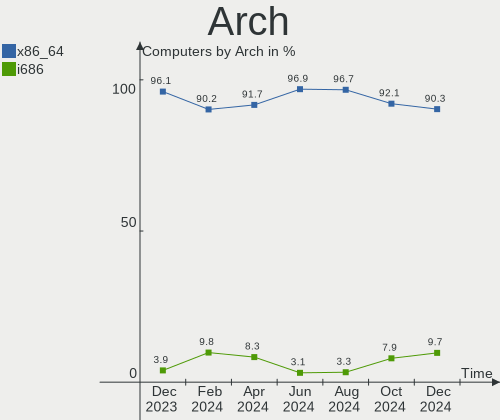

| Name   | Computers | Percent |
|--------|-----------|---------|
| x86_64 | 29        | 100%    |

DE
--

Desktop Environment

| Name       | Computers | Percent |
|------------|-----------|---------|
| X-Cinnamon | 23        | 79.31%  |
| Cinnamon   | 5         | 17.24%  |
| i3         | 1         | 3.45%   |

Display Server
--------------

X11 or Wayland

| Name | Computers | Percent |
|------|-----------|---------|
| X11  | 29        | 100%    |

Display Manager
---------------

SDDM, LightDM, etc.

| Name    | Computers | Percent |
|---------|-----------|---------|
| LightDM | 15        | 51.72%  |
| Unknown | 14        | 48.28%  |

OS Lang
-------

Language

| Lang  | Computers | Percent |
|-------|-----------|---------|
| en_US | 8         | 27.59%  |
| de_DE | 6         | 20.69%  |
| pt_BR | 4         | 13.79%  |
| en_GB | 3         | 10.34%  |
| it_IT | 2         | 6.9%    |
| ru_RU | 1         | 3.45%   |
| pl_PL | 1         | 3.45%   |
| fr_FR | 1         | 3.45%   |
| es_PA | 1         | 3.45%   |
| es_MX | 1         | 3.45%   |
| en_AU | 1         | 3.45%   |

Boot Mode
---------

EFI or BIOS

| Mode | Computers | Percent |
|------|-----------|---------|
| EFI  | 22        | 75.86%  |
| BIOS | 7         | 24.14%  |

Filesystem
----------

Type of filesystem

| Type    | Computers | Percent |
|---------|-----------|---------|
| Ext4    | 27        | 93.1%   |
| Tmpfs   | 1         | 3.45%   |
| Overlay | 1         | 3.45%   |

Part. scheme
------------

Scheme of partitioning

| Type    | Computers | Percent |
|---------|-----------|---------|
| Unknown | 14        | 48.28%  |
| GPT     | 13        | 44.83%  |
| MBR     | 2         | 6.9%    |

Dual Boot with Linux/BSD
------------------------

Hosting more than one Linux/BSD

| Dual boot | Computers | Percent |
|-----------|-----------|---------|
| No        | 25        | 86.21%  |
| Yes       | 4         | 13.79%  |

Dual Boot (Win)
---------------

Hosting Linux and Windows

| Dual boot | Computers | Percent |
|-----------|-----------|---------|
| No        | 24        | 82.76%  |
| Yes       | 5         | 17.24%  |

Board
-----

Vendor
------

Motherboard manufacturer

| Name                | Computers | Percent |
|---------------------|-----------|---------|
| Hewlett-Packard     | 4         | 13.79%  |
| Gigabyte Technology | 4         | 13.79%  |
| Intel               | 3         | 10.34%  |
| Acer                | 3         | 10.34%  |
| MSI                 | 2         | 6.9%    |
| Medion              | 2         | 6.9%    |
| Lenovo              | 2         | 6.9%    |
| Dell                | 2         | 6.9%    |
| STONE COMPUTERS     | 1         | 3.45%   |
| Google              | 1         | 3.45%   |
| AZW                 | 1         | 3.45%   |
| ASUSTek Computer    | 1         | 3.45%   |
| ASRock              | 1         | 3.45%   |
| Apple               | 1         | 3.45%   |
| Unknown             | 1         | 3.45%   |

Model
-----

Motherboard model

| Name                                             | Computers | Percent |
|--------------------------------------------------|-----------|---------|
| STONE COMPUTERS NOTCHA-286                       | 1         | 3.45%   |
| MSI MS-7C95                                      | 1         | 3.45%   |
| MSI MS-7B79                                      | 1         | 3.45%   |
| Medion S23003                                    | 1         | 3.45%   |
| Medion E6214                                     | 1         | 3.45%   |
| Lenovo ThinkPad X270 W10DG 20K5S3HG00            | 1         | 3.45%   |
| Lenovo H530 10130                                | 1         | 3.45%   |
| Intel X79                                        | 1         | 3.45%   |
| Intel DB85FL AAG89861-202                        | 1         | 3.45%   |
| Intel B75                                        | 1         | 3.45%   |
| HP ZBook Fury 17.3 inch G8 Mobile Workstation PC | 1         | 3.45%   |
| HP Laptop 15-da0xxx                              | 1         | 3.45%   |
| HP EliteBook 820 G2                              | 1         | 3.45%   |
| HP Compaq 15                                     | 1         | 3.45%   |
| Google Lick                                      | 1         | 3.45%   |
| Gigabyte Q87M-D2H                                | 1         | 3.45%   |
| Gigabyte F2A55M-DS2                              | 1         | 3.45%   |
| Gigabyte AB350M-DS3H V2                          | 1         | 3.45%   |
| Gigabyte A520M S2H                               | 1         | 3.45%   |
| Dell Inspiron N4030                              | 1         | 3.45%   |
| Dell G5 5587                                     | 1         | 3.45%   |
| AZW GK mini                                      | 1         | 3.45%   |
| ASUS VivoBook_ASUSLaptop X515JA_F515JA           | 1         | 3.45%   |
| ASRock B450 Gaming K4                            | 1         | 3.45%   |
| Apple iMac7,1                                    | 1         | 3.45%   |
| Acer Spin SP111-32N                              | 1         | 3.45%   |
| Acer Aspire xxxx                                 | 1         | 3.45%   |
| Acer Aspire 7745G                                | 1         | 3.45%   |
| Unknown                                          | 1         | 3.45%   |

Model Family
------------

Motherboard model prefix

| Name                       | Computers | Percent |
|----------------------------|-----------|---------|
| Acer Aspire                | 2         | 6.9%    |
| STONE COMPUTERS NOTCHA-286 | 1         | 3.45%   |
| MSI MS-7C95                | 1         | 3.45%   |
| MSI MS-7B79                | 1         | 3.45%   |
| Medion S23003              | 1         | 3.45%   |
| Medion E6214               | 1         | 3.45%   |
| Lenovo ThinkPad            | 1         | 3.45%   |
| Lenovo H530                | 1         | 3.45%   |
| Intel X79                  | 1         | 3.45%   |
| Intel DB85FL               | 1         | 3.45%   |
| Intel B75                  | 1         | 3.45%   |
| HP ZBook                   | 1         | 3.45%   |
| HP Laptop                  | 1         | 3.45%   |
| HP EliteBook               | 1         | 3.45%   |
| HP Compaq                  | 1         | 3.45%   |
| Google Lick                | 1         | 3.45%   |
| Gigabyte Q87M-D2H          | 1         | 3.45%   |
| Gigabyte F2A55M-DS2        | 1         | 3.45%   |
| Gigabyte AB350M-DS3H       | 1         | 3.45%   |
| Gigabyte A520M             | 1         | 3.45%   |
| Dell Inspiron              | 1         | 3.45%   |
| Dell G5                    | 1         | 3.45%   |
| AZW GK                     | 1         | 3.45%   |
| ASUS VivoBook              | 1         | 3.45%   |
| ASRock B450                | 1         | 3.45%   |
| Apple iMac7                | 1         | 3.45%   |
| Acer Spin                  | 1         | 3.45%   |
| Unknown                    | 1         | 3.45%   |

MFG Year
--------

Motherboard manufacture year

| Year | Computers | Percent |
|------|-----------|---------|
| 2018 | 6         | 20.69%  |
| 2010 | 4         | 13.79%  |
| 2021 | 3         | 10.34%  |
| 2022 | 2         | 6.9%    |
| 2020 | 2         | 6.9%    |
| 2017 | 2         | 6.9%    |
| 2016 | 2         | 6.9%    |
| 2014 | 2         | 6.9%    |
| 2023 | 1         | 3.45%   |
| 2019 | 1         | 3.45%   |
| 2015 | 1         | 3.45%   |
| 2013 | 1         | 3.45%   |
| 2012 | 1         | 3.45%   |
| 2008 | 1         | 3.45%   |

Form Factor
-----------

Physical design of the computer

| Name        | Computers | Percent |
|-------------|-----------|---------|
| Desktop     | 14        | 48.28%  |
| Notebook    | 13        | 44.83%  |
| Convertible | 1         | 3.45%   |
| All in one  | 1         | 3.45%   |

Secure Boot
-----------

Enabled or disabled

| State    | Computers | Percent |
|----------|-----------|---------|
| Disabled | 28        | 96.55%  |
| Enabled  | 1         | 3.45%   |

Coreboot
--------

Have coreboot on board

| Used | Computers | Percent |
|------|-----------|---------|
| No   | 28        | 96.55%  |
| Yes  | 1         | 3.45%   |

RAM Size
--------

Total RAM memory

| Size in GB  | Computers | Percent |
|-------------|-----------|---------|
| 4.01-8.0    | 7         | 24.14%  |
| 3.01-4.0    | 7         | 24.14%  |
| 16.01-24.0  | 6         | 20.69%  |
| 8.01-16.0   | 3         | 10.34%  |
| 2.01-3.0    | 2         | 6.9%    |
| 64.01-256.0 | 2         | 6.9%    |
| 32.01-64.0  | 1         | 3.45%   |
| 1.01-2.0    | 1         | 3.45%   |

RAM Used
--------

Used RAM memory

| Used GB    | Computers | Percent |
|------------|-----------|---------|
| 1.01-2.0   | 9         | 31.03%  |
| 2.01-3.0   | 8         | 27.59%  |
| 3.01-4.0   | 4         | 13.79%  |
| 0.51-1.0   | 3         | 10.34%  |
| 4.01-8.0   | 2         | 6.9%    |
| 16.01-24.0 | 2         | 6.9%    |
| 8.01-16.0  | 1         | 3.45%   |

Total Drives
------------

Number of drives on board

| Drives | Computers | Percent |
|--------|-----------|---------|
| 2      | 13        | 44.83%  |
| 1      | 11        | 37.93%  |
| 5      | 3         | 10.34%  |
| 4      | 2         | 6.9%    |

Has CD-ROM
----------

Has CD-ROM on board

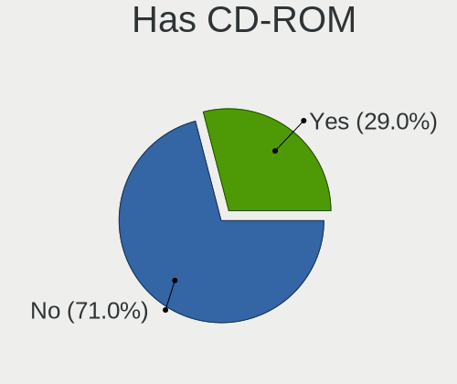

| Presented | Computers | Percent |
|-----------|-----------|---------|
| No        | 21        | 72.41%  |
| Yes       | 8         | 27.59%  |

Has Ethernet
------------

Has Ethernet on board

| Presented | Computers | Percent |
|-----------|-----------|---------|
| Yes       | 26        | 89.66%  |
| No        | 3         | 10.34%  |

Has WiFi
--------

Has WiFi module

| Presented | Computers | Percent |
|-----------|-----------|---------|
| Yes       | 24        | 82.76%  |
| No        | 5         | 17.24%  |

Has Bluetooth
-------------

Has Bluetooth module

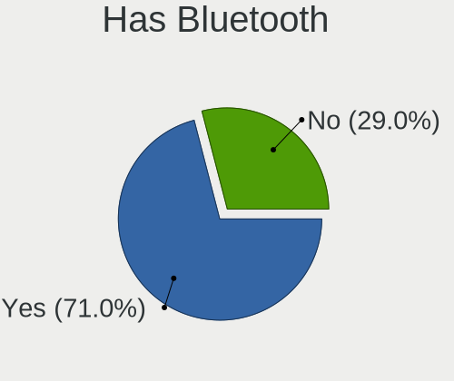

| Presented | Computers | Percent |
|-----------|-----------|---------|
| Yes       | 16        | 55.17%  |
| No        | 13        | 44.83%  |

Location
--------

Country
-------

Geographic location (country)

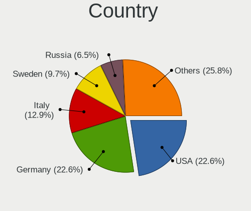

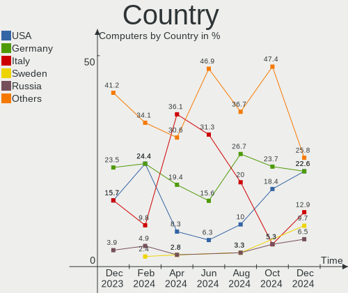

| Country   | Computers | Percent |
|-----------|-----------|---------|
| Germany   | 6         | 20.69%  |
| USA       | 4         | 13.79%  |
| Brazil    | 4         | 13.79%  |
| UK        | 3         | 10.34%  |
| Italy     | 3         | 10.34%  |
| Russia    | 2         | 6.9%    |
| Australia | 2         | 6.9%    |
| Poland    | 1         | 3.45%   |
| Panama    | 1         | 3.45%   |
| Mexico    | 1         | 3.45%   |
| France    | 1         | 3.45%   |
| Chile     | 1         | 3.45%   |

City
----

Geographic location (city)

| City               | Computers | Percent |
|--------------------|-----------|---------|
| Delligsen          | 3         | 10.34%  |
| Rio de Janeiro     | 2         | 6.9%    |
| Turin              | 1         | 3.45%   |
| Tijuana            | 1         | 3.45%   |
| Santiago           | 1         | 3.45%   |
| Rho                | 1         | 3.45%   |
| Pechora            | 1         | 3.45%   |
| Panama City        | 1         | 3.45%   |
| Obninsk            | 1         | 3.45%   |
| Natal              | 1         | 3.45%   |
| Moreno Valley      | 1         | 3.45%   |
| Montpellier        | 1         | 3.45%   |
| Loxahatchee Groves | 1         | 3.45%   |
| Lecco              | 1         | 3.45%   |
| Krakow             | 1         | 3.45%   |
| Hammelburg         | 1         | 3.45%   |
| Fords              | 1         | 3.45%   |
| Fitchburg          | 1         | 3.45%   |
| Dippoldiswalde     | 1         | 3.45%   |
| Cheadle            | 1         | 3.45%   |
| Brisbane           | 1         | 3.45%   |
| Bielefeld          | 1         | 3.45%   |
| Belém             | 1         | 3.45%   |
| Barnet             | 1         | 3.45%   |
| Barking            | 1         | 3.45%   |
| Adelaide           | 1         | 3.45%   |

Drives
------

Drive Vendor
------------

Hard drive vendors

| Vendor              | Computers | Drives | Percent |
|---------------------|-----------|--------|---------|
| WDC                 | 9         | 13     | 19.15%  |
| Kingston            | 6         | 6      | 12.77%  |
| Unknown             | 3         | 3      | 6.38%   |
| Toshiba             | 3         | 3      | 6.38%   |
| Seagate             | 3         | 5      | 6.38%   |
| SanDisk             | 3         | 4      | 6.38%   |
| Samsung Electronics | 2         | 3      | 4.26%   |
| HGST                | 2         | 2      | 4.26%   |
| ADATA Technology    | 2         | 2      | 4.26%   |
| Vaseky              | 1         | 1      | 2.13%   |
| Team                | 1         | 1      | 2.13%   |
| T-FORCE             | 1         | 1      | 2.13%   |
| Silicon Motion      | 1         | 2      | 2.13%   |
| Phison              | 1         | 1      | 2.13%   |
| NGFF                | 1         | 1      | 2.13%   |
| LITEONIT            | 1         | 1      | 2.13%   |
| KIOXIA              | 1         | 2      | 2.13%   |
| Intel               | 1         | 1      | 2.13%   |
| Emtec               | 1         | 1      | 2.13%   |
| Crucial             | 1         | 1      | 2.13%   |
| ASMT                | 1         | 1      | 2.13%   |
| A-DATA Technology   | 1         | 1      | 2.13%   |
| Unknown             | 1         | 1      | 2.13%   |

Drive Model
-----------

Hard drive models

| Model                                                             | Computers | Percent |
|-------------------------------------------------------------------|-----------|---------|
| ADATA XPG SX8200 Pro PCIe Gen3x4 M.2 2280 Solid State Drive 512GB | 2         | 3.85%   |
| WDC WDS500G2B0A-00SM50 500GB SSD                                  | 1         | 1.92%   |
| WDC WD5000LUCX-63HWNY0 500GB                                      | 1         | 1.92%   |
| WDC WD5000LPLX-00ZNTT0 500GB                                      | 1         | 1.92%   |
| WDC WD5000AAKS-60Z1A0 500GB                                       | 1         | 1.92%   |
| WDC WD3200BEKT-22PVMT0 320GB                                      | 1         | 1.92%   |
| WDC WD2003FZEX-00Z4SA0 2TB                                        | 1         | 1.92%   |
| WDC WD1600BEVT-22ZCT0 160GB                                       | 1         | 1.92%   |
| WDC WD1600AAJS-00L7A0 160GB                                       | 1         | 1.92%   |
| WDC WD10EZEX-60ZF5A0 1TB                                          | 1         | 1.92%   |
| WDC WD10EZEX-08M2NA0 1TB                                          | 1         | 1.92%   |
| WDC WD10EURS-630AB1 1TB                                           | 1         | 1.92%   |
| WDC WD1002FAEX-00Y9A0 1TB                                         | 1         | 1.92%   |
| Vaseky V800/120G 120GB                                            | 1         | 1.92%   |
| Unknown SC128  128GB                                              | 1         | 1.92%   |
| Unknown MMC64G  64GB                                              | 1         | 1.92%   |
| Unknown MMC Card  64GB                                            | 1         | 1.92%   |
| Toshiba MQ04ABF100 1TB                                            | 1         | 1.92%   |
| Toshiba MQ01ABD100 1TB                                            | 1         | 1.92%   |
| Toshiba HDWG480 8TB                                               | 1         | 1.92%   |
| Team T253512GB SSD                                                | 1         | 1.92%   |
| T-FORCE SSD 512GB                                                 | 1         | 1.92%   |
| Silicon Motion SM2262/SM2262EN SSD Controller 480GB               | 1         | 1.92%   |
| Seagate ST500DM002-1BD142 500GB                                   | 1         | 1.92%   |
| Seagate ST3000DM007-1WY10G 3TB                                    | 1         | 1.92%   |
| Seagate ST2000DM008-2FR102 2TB                                    | 1         | 1.92%   |
| Seagate ST2000DM001-1ER164 2TB                                    | 1         | 1.92%   |
| Seagate ST2000DM001-1CH164 2TB                                    | 1         | 1.92%   |
| SanDisk X600 2.5 7MM SATA 256GB SSD                               | 1         | 1.92%   |
| SanDisk SSD PLUS 1000GB                                           | 1         | 1.92%   |
| SanDisk NVMe SSD Drive 2TB                                        | 1         | 1.92%   |
| Samsung SSD 850 EVO 500GB                                         | 1         | 1.92%   |
| Samsung SSD 840 EVO 250GB                                         | 1         | 1.92%   |
| Phison S11-128G-PHISON-SSD-B4 128GB                               | 1         | 1.92%   |
| NGFF 2280 128GB SSD                                               | 1         | 1.92%   |
| LITEONIT LCS-128M6S 2.5 7mm 128GB SSD                             | 1         | 1.92%   |
| KIOXIA KXG60PNV2T04 2TB                                           | 1         | 1.92%   |
| Kingston SV300S37A60G 64GB SSD                                    | 1         | 1.92%   |
| Kingston SV300S37A240G 240GB SSD                                  | 1         | 1.92%   |
| Kingston SNV2S500G 500GB                                          | 1         | 1.92%   |

HDD Vendor
----------

Hard disk drive vendors

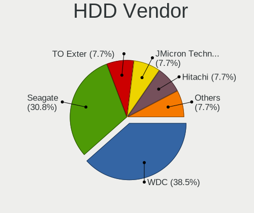

| Vendor  | Computers | Drives | Percent |
|---------|-----------|--------|---------|
| WDC     | 8         | 12     | 50%     |
| Toshiba | 3         | 3      | 18.75%  |
| Seagate | 3         | 5      | 18.75%  |
| HGST    | 2         | 2      | 12.5%   |

SSD Vendor
----------

Solid state drive vendors

| Vendor              | Computers | Drives | Percent |
|---------------------|-----------|--------|---------|
| Kingston            | 4         | 4      | 21.05%  |
| SanDisk             | 2         | 2      | 10.53%  |
| Samsung Electronics | 2         | 3      | 10.53%  |
| WDC                 | 1         | 1      | 5.26%   |
| Vaseky              | 1         | 1      | 5.26%   |
| Team                | 1         | 1      | 5.26%   |
| T-FORCE             | 1         | 1      | 5.26%   |
| Phison              | 1         | 1      | 5.26%   |
| NGFF                | 1         | 1      | 5.26%   |
| LITEONIT            | 1         | 1      | 5.26%   |
| Emtec               | 1         | 1      | 5.26%   |
| Crucial             | 1         | 1      | 5.26%   |
| ASMT                | 1         | 1      | 5.26%   |
| A-DATA Technology   | 1         | 1      | 5.26%   |

Drive Kind
----------

HDD or SSD

| Kind    | Computers | Drives | Percent |
|---------|-----------|--------|---------|
| SSD     | 17        | 20     | 40.48%  |
| HDD     | 14        | 22     | 33.33%  |
| NVMe    | 7         | 11     | 16.67%  |
| MMC     | 3         | 3      | 7.14%   |
| Unknown | 1         | 1      | 2.38%   |

Drive Connector
---------------

SATA, SAS, NVMe, etc.

| Type | Computers | Drives | Percent |
|------|-----------|--------|---------|
| SATA | 25        | 42     | 69.44%  |
| NVMe | 7         | 11     | 19.44%  |
| MMC  | 3         | 3      | 8.33%   |
| SAS  | 1         | 1      | 2.78%   |

Drive Size
----------

Size of hard drive

| Size in TB | Computers | Drives | Percent |
|------------|-----------|--------|---------|
| 0.01-0.5   | 18        | 24     | 54.55%  |
| 0.51-1.0   | 10        | 12     | 30.3%   |
| 1.01-2.0   | 3         | 4      | 9.09%   |
| 2.01-3.0   | 1         | 1      | 3.03%   |
| 4.01-10.0  | 1         | 1      | 3.03%   |

Space Total
-----------

Amount of disk space available on the file system

| Size in GB     | Computers | Percent |
|----------------|-----------|---------|
| 251-500        | 8         | 27.59%  |
| 101-250        | 7         | 24.14%  |
| 501-1000       | 4         | 13.79%  |
| More than 3000 | 3         | 10.34%  |
| 1001-2000      | 3         | 10.34%  |
| 51-100         | 3         | 10.34%  |
| 1-20           | 1         | 3.45%   |

Space Used
----------

Amount of used disk space

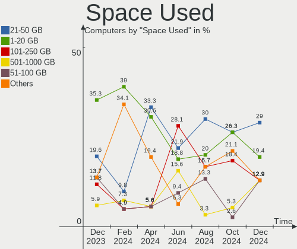

| Used GB        | Computers | Percent |
|----------------|-----------|---------|
| 1-20           | 9         | 31.03%  |
| 21-50          | 6         | 20.69%  |
| 101-250        | 5         | 17.24%  |
| 51-100         | 4         | 13.79%  |
| 501-1000       | 2         | 6.9%    |
| More than 3000 | 1         | 3.45%   |
| 2001-3000      | 1         | 3.45%   |
| 1001-2000      | 1         | 3.45%   |

Malfunc. Drives
---------------

Drive models with a malfunction

| Model                           | Computers | Drives | Percent |
|---------------------------------|-----------|--------|---------|
| WDC WD1600BEVT-22ZCT0 160GB     | 1         | 1      | 25%     |
| WDC WD1002FAEX-00Y9A0 1TB       | 1         | 1      | 25%     |
| Toshiba MQ04ABF100 1TB          | 1         | 1      | 25%     |
| Seagate ST500DM002-1BD142 500GB | 1         | 1      | 25%     |

Malfunc. Drive Vendor
---------------------

Vendors of faulty drives

| Vendor  | Computers | Drives | Percent |
|---------|-----------|--------|---------|
| WDC     | 2         | 2      | 50%     |
| Toshiba | 1         | 1      | 25%     |
| Seagate | 1         | 1      | 25%     |

Malfunc. HDD Vendor
-------------------

Vendors of faulty HDD drives

| Vendor  | Computers | Drives | Percent |
|---------|-----------|--------|---------|
| WDC     | 2         | 2      | 50%     |
| Toshiba | 1         | 1      | 25%     |
| Seagate | 1         | 1      | 25%     |

Malfunc. Drive Kind
-------------------

Kinds of faulty drives

| Kind | Computers | Drives | Percent |
|------|-----------|--------|---------|
| HDD  | 4         | 4      | 100%    |

Failed Drives
-------------

Failed drive models

Zero info for selected period =(

Failed Drive Vendor
-------------------

Failed drive vendors

Zero info for selected period =(

Drive Status
------------

Number of failed and malfunc. drives

| Status   | Computers | Drives | Percent |
|----------|-----------|--------|---------|
| Detected | 18        | 31     | 54.55%  |
| Works    | 11        | 22     | 33.33%  |
| Malfunc  | 4         | 4      | 12.12%  |

Storage controller
------------------

Storage Vendor
--------------

Storage controller vendors

| Vendor                       | Computers | Percent |
|------------------------------|-----------|---------|
| Intel                        | 20        | 55.56%  |
| AMD                          | 7         | 19.44%  |
| Kingston Technology Company  | 2         | 5.56%   |
| ASMedia Technology           | 2         | 5.56%   |
| ADATA Technology             | 2         | 5.56%   |
| Toshiba America Info Systems | 1         | 2.78%   |
| Silicon Motion               | 1         | 2.78%   |
| SanDisk                      | 1         | 2.78%   |

Storage Model
-------------

Storage controller models

| Model                                                                          | Computers | Percent |
|--------------------------------------------------------------------------------|-----------|---------|
| Intel 8 Series/C220 Series Chipset Family 6-port SATA Controller 1 [AHCI mode] | 4         | 9.76%   |
| Intel 5 Series/3400 Series Chipset 4 port SATA AHCI Controller                 | 3         | 7.32%   |
| AMD FCH SATA Controller [AHCI mode]                                            | 3         | 7.32%   |
| Intel Sunrise Point-LP SATA Controller [AHCI mode]                             | 2         | 4.88%   |
| Intel Celeron/Pentium Silver Processor SATA Controller                         | 2         | 4.88%   |
| Intel 82801 Mobile SATA Controller [RAID mode]                                 | 2         | 4.88%   |
| AMD 500 Series Chipset SATA Controller                                         | 2         | 4.88%   |
| AMD 400 Series Chipset SATA Controller                                         | 2         | 4.88%   |
| ADATA XPG SX8200 Pro PCIe Gen3x4 M.2 2280 Solid State Drive                    | 2         | 4.88%   |
| Toshiba America Info Systems XG6 NVMe SSD Controller                           | 1         | 2.44%   |
| Silicon Motion SM2262/SM2262EN SSD Controller                                  | 1         | 2.44%   |
| SanDisk WD Blue SN570 NVMe SSD 2TB                                             | 1         | 2.44%   |
| Kingston Company Company Non-Volatile memory controller                        | 1         | 2.44%   |
| Kingston Company KC2000 NVMe SSD                                               | 1         | 2.44%   |
| Intel Wildcat Point-LP SATA Controller [AHCI Mode]                             | 1         | 2.44%   |
| Intel SSD 660P Series                                                          | 1         | 2.44%   |
| Intel Celeron N3350/Pentium N4200/Atom E3900 Series SATA AHCI Controller       | 1         | 2.44%   |
| Intel Cannon Lake Mobile PCH SATA AHCI Controller                              | 1         | 2.44%   |
| Intel 82801HM/HEM (ICH8M/ICH8M-E) SATA Controller [AHCI mode]                  | 1         | 2.44%   |
| Intel 82801HM/HEM (ICH8M/ICH8M-E) IDE Controller                               | 1         | 2.44%   |
| Intel 7 Series/C210 Series Chipset Family 6-port SATA Controller [AHCI mode]   | 1         | 2.44%   |
| Intel 6 Series/C200 Series Chipset Family 6 port Desktop SATA AHCI Controller  | 1         | 2.44%   |
| Intel 5 Series/3400 Series Chipset 6 port SATA AHCI Controller                 | 1         | 2.44%   |
| ASMedia ASM1062 Serial ATA Controller                                          | 1         | 2.44%   |
| ASMedia 1064 SATA Controller                                                   | 1         | 2.44%   |
| AMD FCH SATA Controller [IDE mode]                                             | 1         | 2.44%   |
| AMD FCH IDE Controller                                                         | 1         | 2.44%   |
| AMD 300 Series Chipset SATA Controller                                         | 1         | 2.44%   |

Storage Kind
------------

Kind of storage controller (IDE, SATA, NVMe, SAS, ...)

| Kind | Computers | Percent |
|------|-----------|---------|
| SATA | 25        | 69.44%  |
| NVMe | 7         | 19.44%  |
| RAID | 2         | 5.56%   |
| IDE  | 2         | 5.56%   |

Processor
---------

CPU Vendor
----------

Processor vendors

| Vendor | Computers | Percent |
|--------|-----------|---------|
| Intel  | 22        | 75.86%  |
| AMD    | 7         | 24.14%  |

CPU Model
---------

Processor models

| Model                                   | Computers | Percent |
|-----------------------------------------|-----------|---------|
| Intel Celeron J4125 CPU @ 2.00GHz       | 2         | 6.9%    |
| AMD Ryzen 5 5600G with Radeon Graphics  | 2         | 6.9%    |
| Intel Xeon CPU E5-2689 0 @ 2.60GHz      | 1         | 3.45%   |
| Intel Xeon CPU E5-2660 v3 @ 2.60GHz     | 1         | 3.45%   |
| Intel Pentium CPU N4200 @ 1.10GHz       | 1         | 3.45%   |
| Intel Core i7-3770 CPU @ 3.40GHz        | 1         | 3.45%   |
| Intel Core i7-1065G7 CPU @ 1.30GHz      | 1         | 3.45%   |
| Intel Core i5-8300H CPU @ 2.30GHz       | 1         | 3.45%   |
| Intel Core i5-7200U CPU @ 2.50GHz       | 1         | 3.45%   |
| Intel Core i5-6200U CPU @ 2.30GHz       | 1         | 3.45%   |
| Intel Core i5-5200U CPU @ 2.20GHz       | 1         | 3.45%   |
| Intel Core i5-4590S CPU @ 3.00GHz       | 1         | 3.45%   |
| Intel Core i5 CPU M 450 @ 2.40GHz       | 1         | 3.45%   |
| Intel Core i3-6100U CPU @ 2.30GHz       | 1         | 3.45%   |
| Intel Core i3-4150 CPU @ 3.50GHz        | 1         | 3.45%   |
| Intel Core i3-4130 CPU @ 3.40GHz        | 1         | 3.45%   |
| Intel Core i3 CPU U 380 @ 1.33GHz       | 1         | 3.45%   |
| Intel Core i3 CPU M 370 @ 2.40GHz       | 1         | 3.45%   |
| Intel Core i3 CPU M 330 @ 2.13GHz       | 1         | 3.45%   |
| Intel Core 2 Duo CPU T7700 @ 2.40GHz    | 1         | 3.45%   |
| Intel Celeron N4020 CPU @ 1.10GHz       | 1         | 3.45%   |
| Intel 11th Gen Core i9-11950H @ 2.60GHz | 1         | 3.45%   |
| AMD Ryzen 7 1800X Eight-Core Processor  | 1         | 3.45%   |
| AMD Ryzen 5 3600 6-Core Processor       | 1         | 3.45%   |
| AMD Ryzen 3 4100 4-Core Processor       | 1         | 3.45%   |
| AMD E1-2100 APU with Radeon HD Graphics | 1         | 3.45%   |
| AMD A4-4020 APU with Radeon HD Graphics | 1         | 3.45%   |

CPU Model Family
----------------

Processor model prefix

| Model            | Computers | Percent |
|------------------|-----------|---------|
| Intel Core i5    | 6         | 20.69%  |
| Intel Core i3    | 6         | 20.69%  |
| Intel Celeron    | 3         | 10.34%  |
| AMD Ryzen 5      | 3         | 10.34%  |
| Intel Xeon       | 2         | 6.9%    |
| Intel Core i7    | 2         | 6.9%    |
| Other            | 1         | 3.45%   |
| Intel Pentium    | 1         | 3.45%   |
| Intel Core 2 Duo | 1         | 3.45%   |
| AMD Ryzen 7      | 1         | 3.45%   |
| AMD Ryzen 3      | 1         | 3.45%   |
| AMD E1           | 1         | 3.45%   |
| AMD A4           | 1         | 3.45%   |

CPU Cores
---------

Number of processor cores

| Number | Computers | Percent |
|--------|-----------|---------|
| 2      | 13        | 44.83%  |
| 4      | 8         | 27.59%  |
| 8      | 3         | 10.34%  |
| 6      | 3         | 10.34%  |
| 10     | 1         | 3.45%   |
| 1      | 1         | 3.45%   |

CPU Sockets
-----------

Number of sockets

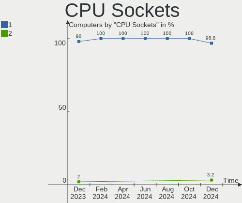

| Number | Computers | Percent |
|--------|-----------|---------|
| 1      | 29        | 100%    |

CPU Threads
-----------

Threads per core (Hyper-Threading)

| Number | Computers | Percent |
|--------|-----------|---------|
| 2      | 22        | 75.86%  |
| 1      | 7         | 24.14%  |

CPU Op-Modes
------------

CPU Operation Modes (32-bit, 64-bit)

| Op mode        | Computers | Percent |
|----------------|-----------|---------|
| 32-bit, 64-bit | 29        | 100%    |

CPU Microcode
-------------

Microcode number

| Number     | Computers | Percent |
|------------|-----------|---------|
| 0x706a8    | 3         | 10.34%  |
| 0x306c3    | 3         | 10.34%  |
| 0x20655    | 3         | 10.34%  |
| 0x406e3    | 2         | 6.9%    |
| 0x0a50000d | 2         | 6.9%    |
| 0x906ea    | 1         | 3.45%   |
| 0x806e9    | 1         | 3.45%   |
| 0x806d1    | 1         | 3.45%   |
| 0x706e5    | 1         | 3.45%   |
| 0x6fb      | 1         | 3.45%   |
| 0x506c9    | 1         | 3.45%   |
| 0x306f2    | 1         | 3.45%   |
| 0x306d4    | 1         | 3.45%   |
| 0x306a9    | 1         | 3.45%   |
| 0x206d7    | 1         | 3.45%   |
| 0x20652    | 1         | 3.45%   |
| 0x08701021 | 1         | 3.45%   |
| 0x08600106 | 1         | 3.45%   |
| 0x08001138 | 1         | 3.45%   |
| 0x07000110 | 1         | 3.45%   |
| 0x06001119 | 1         | 3.45%   |

CPU Microarch
-------------

Microarchitecture

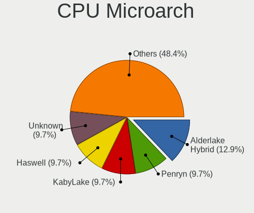

| Name          | Computers | Percent |
|---------------|-----------|---------|
| Westmere      | 4         | 13.79%  |
| Haswell       | 4         | 13.79%  |
| Goldmont plus | 3         | 10.34%  |
| Zen 3         | 2         | 6.9%    |
| Zen 2         | 2         | 6.9%    |
| Skylake       | 2         | 6.9%    |
| KabyLake      | 2         | 6.9%    |
| IceLake       | 2         | 6.9%    |
| Zen           | 1         | 3.45%   |
| SandyBridge   | 1         | 3.45%   |
| Piledriver    | 1         | 3.45%   |
| Jaguar        | 1         | 3.45%   |
| IvyBridge     | 1         | 3.45%   |
| Goldmont      | 1         | 3.45%   |
| Core          | 1         | 3.45%   |
| Broadwell     | 1         | 3.45%   |

Graphics
--------

GPU Vendor
----------

Vendors of graphics cards

| Vendor | Computers | Percent |
|--------|-----------|---------|
| Intel  | 18        | 58.06%  |
| AMD    | 7         | 22.58%  |
| Nvidia | 6         | 19.35%  |

GPU Model
---------

Graphics card models

| Model                                                                       | Computers | Percent |
|-----------------------------------------------------------------------------|-----------|---------|
| Intel Core Processor Integrated Graphics Controller                         | 4         | 12.9%   |
| Intel GeminiLake [UHD Graphics 600]                                         | 3         | 9.68%   |
| Intel Skylake GT2 [HD Graphics 520]                                         | 2         | 6.45%   |
| Intel 4th Generation Core Processor Family Integrated Graphics Controller   | 2         | 6.45%   |
| AMD Cezanne [Radeon Vega Series / Radeon Vega Mobile Series]                | 2         | 6.45%   |
| Nvidia TU106 [GeForce RTX 2060 Rev. A]                                      | 1         | 3.23%   |
| Nvidia GP106M [GeForce GTX 1060 Mobile]                                     | 1         | 3.23%   |
| Nvidia GM206 [GeForce GTX 960]                                              | 1         | 3.23%   |
| Nvidia GM200 [GeForce GTX 980 Ti]                                           | 1         | 3.23%   |
| Nvidia GM107GL [Quadro K2200]                                               | 1         | 3.23%   |
| Nvidia GA107GLM [RTX A2000 Mobile]                                          | 1         | 3.23%   |
| Intel Xeon E3-1200 v3/4th Gen Core Processor Integrated Graphics Controller | 1         | 3.23%   |
| Intel IvyBridge GT2 [HD Graphics 4000]                                      | 1         | 3.23%   |
| Intel Iris Plus Graphics G7                                                 | 1         | 3.23%   |
| Intel HD Graphics 620                                                       | 1         | 3.23%   |
| Intel HD Graphics 5500                                                      | 1         | 3.23%   |
| Intel CoffeeLake-H GT2 [UHD Graphics 630]                                   | 1         | 3.23%   |
| Intel Apollo Lake [HD Graphics 505]                                         | 1         | 3.23%   |
| AMD Trinity 2 [Radeon HD 7480D]                                             | 1         | 3.23%   |
| AMD RV630/M76 [Mobility Radeon HD 2600 XT/2700]                             | 1         | 3.23%   |
| AMD Kabini [Radeon HD 8210]                                                 | 1         | 3.23%   |
| AMD Cedar [Radeon HD 5000/6000/7350/8350 Series]                            | 1         | 3.23%   |
| AMD Broadway PRO [Mobility Radeon HD 5850]                                  | 1         | 3.23%   |

GPU Combo
---------

Combinations of graphics cards

| Name           | Computers | Percent |
|----------------|-----------|---------|
| 1 x Intel      | 15        | 51.72%  |
| 1 x AMD        | 6         | 20.69%  |
| 1 x Nvidia     | 5         | 17.24%  |
| Other          | 1         | 3.45%   |
| Intel + Nvidia | 1         | 3.45%   |
| Intel + AMD    | 1         | 3.45%   |

GPU Driver
----------

Free vs proprietary

| Driver      | Computers | Percent |
|-------------|-----------|---------|
| Free        | 24        | 82.76%  |
| Proprietary | 5         | 17.24%  |

GPU Memory
----------

Total video memory

| Size in GB | Computers | Percent |
|------------|-----------|---------|
| Unknown    | 17        | 58.62%  |
| 1.01-2.0   | 3         | 10.34%  |
| 0.01-0.5   | 3         | 10.34%  |
| 5.01-6.0   | 2         | 6.9%    |
| 3.01-4.0   | 2         | 6.9%    |
| 0.51-1.0   | 2         | 6.9%    |

Monitor
-------

Monitor Vendor
--------------

Monitor vendors

| Vendor                  | Computers | Percent |
|-------------------------|-----------|---------|
| Samsung Electronics     | 6         | 20%     |
| AU Optronics            | 5         | 16.67%  |
| Philips                 | 2         | 6.67%   |
| LG Display              | 2         | 6.67%   |
| Chi Mei Optoelectronics | 2         | 6.67%   |
| BOE                     | 2         | 6.67%   |
| InfoVision              | 1         | 3.33%   |
| HUAWEI                  | 1         | 3.33%   |
| Hewlett-Packard         | 1         | 3.33%   |
| Goldstar                | 1         | 3.33%   |
| Dell                    | 1         | 3.33%   |
| Chimei Innolux          | 1         | 3.33%   |
| BenQ                    | 1         | 3.33%   |
| Apple                   | 1         | 3.33%   |
| AOC                     | 1         | 3.33%   |
| Ancor Communications    | 1         | 3.33%   |
| Acer                    | 1         | 3.33%   |

Monitor Model
-------------

Monitor models

| Model                                                                    | Computers | Percent |
|--------------------------------------------------------------------------|-----------|---------|
| Samsung Electronics SyncMaster SAM01AD 1600x1200 408x306mm 20.1-inch     | 1         | 3.33%   |
| Samsung Electronics SMT24A550 SAM07B5 1920x1080 531x299mm 24.0-inch      | 1         | 3.33%   |
| Samsung Electronics SA300/SA350 SAM078B 1600x900 443x249mm 20.0-inch     | 1         | 3.33%   |
| Samsung Electronics S24B370 SAM08DD 1920x1080 531x299mm 24.0-inch        | 1         | 3.33%   |
| Samsung Electronics LCD Monitor SAM0530 1360x768                         | 1         | 3.33%   |
| Samsung Electronics C24F390 SAM0D2C 1920x1080 521x293mm 23.5-inch        | 1         | 3.33%   |
| Philips PHL 242V8 PHLC219 1920x1080 527x296mm 23.8-inch                  | 1         | 3.33%   |
| Philips 170S PHL0839 1280x1024 340x270mm 17.1-inch                       | 1         | 3.33%   |
| LG Display LCD Monitor LGD05D0 1920x1080 344x194mm 15.5-inch             | 1         | 3.33%   |
| LG Display LCD Monitor LGD0291 1366x768 310x174mm 14.0-inch              | 1         | 3.33%   |
| InfoVision LCD Monitor IVO048E 1366x768 256x144mm 11.6-inch              | 1         | 3.33%   |
| HUAWEI ZQE-CBA HWV6A25 3440x1440 797x334mm 34.0-inch                     | 1         | 3.33%   |
| Hewlett-Packard 27wm HWP3355 1920x1080 598x336mm 27.0-inch               | 1         | 3.33%   |
| Goldstar TV SSCR2 GSMC0C8 3840x2160                                      | 1         | 3.33%   |
| Dell S2721HGF DEL41E7 1920x1080 597x336mm 27.0-inch                      | 1         | 3.33%   |
| Chimei Innolux LCD Monitor CMN15F5 1920x1080 344x193mm 15.5-inch         | 1         | 3.33%   |
| Chi Mei Optoelectronics LCD Monitor CMO1711 1600x900 382x215mm 17.3-inch | 1         | 3.33%   |
| Chi Mei Optoelectronics LCD Monitor CMO1100 1366x768 256x144mm 11.6-inch | 1         | 3.33%   |
| BOE LCD Monitor BOE0687 1920x1080 344x193mm 15.5-inch                    | 1         | 3.33%   |
| BOE LCD Monitor BOE0632 1920x1080 344x194mm 15.5-inch                    | 1         | 3.33%   |
| BenQ BL2480 BNQ802C 1920x1080 530x300mm 24.0-inch                        | 1         | 3.33%   |
| AU Optronics LCD Monitor AUO45EC 1366x768 344x193mm 15.5-inch            | 1         | 3.33%   |
| AU Optronics LCD Monitor AUO32EC 1366x768 344x193mm 15.5-inch            | 1         | 3.33%   |
| AU Optronics LCD Monitor AUO206C 1366x768 277x156mm 12.5-inch            | 1         | 3.33%   |
| AU Optronics LCD Monitor AUO106C 1366x768 277x156mm 12.5-inch            | 1         | 3.33%   |
| AU Optronics LCD Monitor 3840x2160                                       | 1         | 3.33%   |
| Apple Color LCD APP9C6C 1920x1200 520x320mm 24.0-inch                    | 1         | 3.33%   |
| AOC LCD Monitor 2460G4 1920x1080                                         | 1         | 3.33%   |
| Ancor Communications VS24A ACI24D1 1920x1200 518x324mm 24.1-inch         | 1         | 3.33%   |
| Acer V246HQL ACR0424 1920x1080 521x293mm 23.5-inch                       | 1         | 3.33%   |

Monitor Resolution
------------------

Monitor screen resolution

| Resolution        | Computers | Percent |
|-------------------|-----------|---------|
| 1920x1080 (FHD)   | 12        | 41.38%  |
| 1366x768 (WXGA)   | 7         | 24.14%  |
| 3840x2160 (4K)    | 2         | 6.9%    |
| 1920x1200 (WUXGA) | 2         | 6.9%    |
| 1600x900 (HD+)    | 2         | 6.9%    |
| 3440x1440         | 1         | 3.45%   |
| 1600x1200         | 1         | 3.45%   |
| 1360x768          | 1         | 3.45%   |
| 1280x1024 (SXGA)  | 1         | 3.45%   |

Monitor Diagonal
----------------

Diagonal size in inches

| Inches  | Computers | Percent |
|---------|-----------|---------|
| 24      | 6         | 20%     |
| 15      | 6         | 20%     |
| Unknown | 3         | 10%     |
| 27      | 2         | 6.67%   |
| 23      | 2         | 6.67%   |
| 20      | 2         | 6.67%   |
| 17      | 2         | 6.67%   |
| 12      | 2         | 6.67%   |
| 11      | 2         | 6.67%   |
| 72      | 1         | 3.33%   |
| 34      | 1         | 3.33%   |
| 14      | 1         | 3.33%   |

Monitor Width
-------------

Physical width

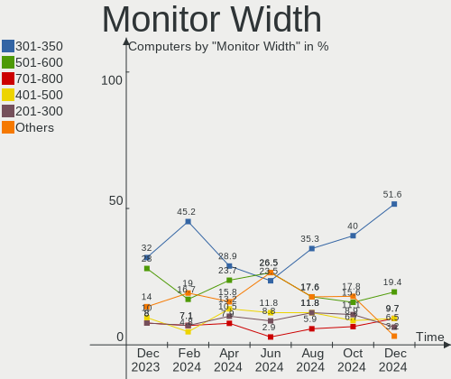

| Width in mm | Computers | Percent |
|-------------|-----------|---------|
| 501-600     | 10        | 33.33%  |
| 301-350     | 8         | 26.67%  |
| 201-300     | 4         | 13.33%  |
| Unknown     | 3         | 10%     |
| 401-500     | 2         | 6.67%   |
| 701-800     | 1         | 3.33%   |
| 351-400     | 1         | 3.33%   |
| 1501-2000   | 1         | 3.33%   |

Aspect Ratio
------------

Proportional relationship between the width and the height

| Ratio   | Computers | Percent |
|---------|-----------|---------|
| 16/9    | 21        | 75%     |
| 16/10   | 2         | 7.14%   |
| Unknown | 2         | 7.14%   |
| 5/4     | 1         | 3.57%   |
| 4/3     | 1         | 3.57%   |
| 21/9    | 1         | 3.57%   |

Monitor Area
------------

Area in inch²

| Area in inch² | Computers | Percent |
|----------------|-----------|---------|
| 201-250        | 6         | 20%     |
| 101-110        | 6         | 20%     |
| Unknown        | 3         | 10%     |
| 61-70          | 2         | 6.67%   |
| 51-60          | 2         | 6.67%   |
| 301-350        | 2         | 6.67%   |
| 251-300        | 2         | 6.67%   |
| 151-200        | 2         | 6.67%   |
| More than 1000 | 1         | 3.33%   |
| 81-90          | 1         | 3.33%   |
| 351-500        | 1         | 3.33%   |
| 141-150        | 1         | 3.33%   |
| 131-140        | 1         | 3.33%   |

Pixel Density
-------------

Pixels per inch

| Density | Computers | Percent |
|---------|-----------|---------|
| 51-100  | 12        | 42.86%  |
| 121-160 | 8         | 28.57%  |
| 101-120 | 5         | 17.86%  |
| Unknown | 3         | 10.71%  |

Multiple Monitors
-----------------

Total monitors connected

| Total | Computers | Percent |
|-------|-----------|---------|
| 1     | 25        | 86.21%  |
| 2     | 4         | 13.79%  |

Network
-------

Net Controller Vendor
---------------------

Controller vendors

| Vendor                            | Computers | Percent |
|-----------------------------------|-----------|---------|
| Realtek Semiconductor             | 17        | 36.17%  |
| Intel                             | 12        | 25.53%  |
| Qualcomm Atheros                  | 7         | 14.89%  |
| Broadcom                          | 3         | 6.38%   |
| TP-Link                           | 2         | 4.26%   |
| Spreadtrum Communications         | 1         | 2.13%   |
| MediaTek                          | 1         | 2.13%   |
| Marvell Technology Group          | 1         | 2.13%   |
| Ericsson Business Mobile Networks | 1         | 2.13%   |
| Edimax Technology                 | 1         | 2.13%   |
| ASUSTek Computer                  | 1         | 2.13%   |

Net Controller Model
--------------------

Controller models

| Model                                                              | Computers | Percent |
|--------------------------------------------------------------------|-----------|---------|
| Realtek RTL8111/8168/8411 PCI Express Gigabit Ethernet Controller  | 11        | 19.64%  |
| Realtek RTL810xE PCI Express Fast Ethernet controller              | 3         | 5.36%   |
| Realtek RTL8821CE 802.11ac PCIe Wireless Network Adapter           | 2         | 3.57%   |
| Qualcomm Atheros AR9485 Wireless Network Adapter                   | 2         | 3.57%   |
| Qualcomm Atheros AR8151 v1.0 Gigabit Ethernet                      | 2         | 3.57%   |
| Intel Wireless 8260                                                | 2         | 3.57%   |
| Intel Wireless 7265                                                | 2         | 3.57%   |
| Intel Wireless 3165                                                | 2         | 3.57%   |
| TP-Link RTL8812AU Archer T4U 802.11ac                              | 1         | 1.79%   |
| TP-Link 802.11ac WLAN Adapter                                      | 1         | 1.79%   |
| Spreadtrum Spreadtrum Phone                                        | 1         | 1.79%   |
| Realtek RTL88x2bu [AC1200 Techkey]                                 | 1         | 1.79%   |
| Realtek RTL8192EU 802.11b/g/n WLAN Adapter                         | 1         | 1.79%   |
| Realtek RTL8191SEvB Wireless LAN Controller                        | 1         | 1.79%   |
| Realtek RTL8188FTV 802.11b/g/n 1T1R 2.4G WLAN Adapter              | 1         | 1.79%   |
| Realtek RTL8188EUS 802.11n Wireless Network Adapter                | 1         | 1.79%   |
| Realtek 802.11ac NIC                                               | 1         | 1.79%   |
| Qualcomm Atheros Killer E2400 Gigabit Ethernet Controller          | 1         | 1.79%   |
| Qualcomm Atheros AR8152 v2.0 Fast Ethernet                         | 1         | 1.79%   |
| Qualcomm Atheros AR8131 Gigabit Ethernet                           | 1         | 1.79%   |
| MediaTek MT7921K (RZ608) Wi-Fi 6E 80MHz                            | 1         | 1.79%   |
| Marvell Group 88E8058 PCI-E Gigabit Ethernet Controller            | 1         | 1.79%   |
| Intel Tiger Lake PCH CNVi WiFi                                     | 1         | 1.79%   |
| Intel I211 Gigabit Network Connection                              | 1         | 1.79%   |
| Intel Gemini Lake PCH CNVi WiFi                                    | 1         | 1.79%   |
| Intel Ethernet Connection I219-V                                   | 1         | 1.79%   |
| Intel Ethernet Connection I217-V                                   | 1         | 1.79%   |
| Intel Ethernet Connection I217-LM                                  | 1         | 1.79%   |
| Intel Ethernet Connection (3) I218-LM                              | 1         | 1.79%   |
| Intel Ethernet Connection (14) I219-LM                             | 1         | 1.79%   |
| Intel Centrino Advanced-N 6205 [Taylor Peak]                       | 1         | 1.79%   |
| Intel Cannon Lake PCH CNVi WiFi                                    | 1         | 1.79%   |
| Ericsson Business Mobile Networks F5521gw                          | 1         | 1.79%   |
| Edimax EW-7711UTn nLite Wireless Adapter [Ralink RT3070]           | 1         | 1.79%   |
| Broadcom BCM43225 802.11b/g/n                                      | 1         | 1.79%   |
| Broadcom BCM4321 802.11a/b/g/n                                     | 1         | 1.79%   |
| Broadcom BCM4313 802.11bgn Wireless Network Adapter                | 1         | 1.79%   |
| ASUS USB-N13 802.11n Network Adapter (rev. B1) [Realtek RTL8192CU] | 1         | 1.79%   |

Wireless Vendor
---------------

Wireless vendors

| Vendor                | Computers | Percent |
|-----------------------|-----------|---------|
| Intel                 | 10        | 35.71%  |
| Realtek Semiconductor | 8         | 28.57%  |
| Broadcom              | 3         | 10.71%  |
| TP-Link               | 2         | 7.14%   |
| Qualcomm Atheros      | 2         | 7.14%   |
| MediaTek              | 1         | 3.57%   |
| Edimax Technology     | 1         | 3.57%   |
| ASUSTek Computer      | 1         | 3.57%   |

Wireless Model
--------------

Wireless models

| Model                                                              | Computers | Percent |
|--------------------------------------------------------------------|-----------|---------|
| Realtek RTL8821CE 802.11ac PCIe Wireless Network Adapter           | 2         | 7.14%   |
| Qualcomm Atheros AR9485 Wireless Network Adapter                   | 2         | 7.14%   |
| Intel Wireless 8260                                                | 2         | 7.14%   |
| Intel Wireless 7265                                                | 2         | 7.14%   |
| Intel Wireless 3165                                                | 2         | 7.14%   |
| TP-Link RTL8812AU Archer T4U 802.11ac                              | 1         | 3.57%   |
| TP-Link 802.11ac WLAN Adapter                                      | 1         | 3.57%   |
| Realtek RTL88x2bu [AC1200 Techkey]                                 | 1         | 3.57%   |
| Realtek RTL8192EU 802.11b/g/n WLAN Adapter                         | 1         | 3.57%   |
| Realtek RTL8191SEvB Wireless LAN Controller                        | 1         | 3.57%   |
| Realtek RTL8188FTV 802.11b/g/n 1T1R 2.4G WLAN Adapter              | 1         | 3.57%   |
| Realtek RTL8188EUS 802.11n Wireless Network Adapter                | 1         | 3.57%   |
| Realtek 802.11ac NIC                                               | 1         | 3.57%   |
| MediaTek MT7921K (RZ608) Wi-Fi 6E 80MHz                            | 1         | 3.57%   |
| Intel Tiger Lake PCH CNVi WiFi                                     | 1         | 3.57%   |
| Intel Gemini Lake PCH CNVi WiFi                                    | 1         | 3.57%   |
| Intel Centrino Advanced-N 6205 [Taylor Peak]                       | 1         | 3.57%   |
| Intel Cannon Lake PCH CNVi WiFi                                    | 1         | 3.57%   |
| Edimax EW-7711UTn nLite Wireless Adapter [Ralink RT3070]           | 1         | 3.57%   |
| Broadcom BCM43225 802.11b/g/n                                      | 1         | 3.57%   |
| Broadcom BCM4321 802.11a/b/g/n                                     | 1         | 3.57%   |
| Broadcom BCM4313 802.11bgn Wireless Network Adapter                | 1         | 3.57%   |
| ASUS USB-N13 802.11n Network Adapter (rev. B1) [Realtek RTL8192CU] | 1         | 3.57%   |

Ethernet Vendor
---------------

Ethernet vendors

| Vendor                    | Computers | Percent |
|---------------------------|-----------|---------|
| Realtek Semiconductor     | 14        | 51.85%  |
| Intel                     | 6         | 22.22%  |
| Qualcomm Atheros          | 5         | 18.52%  |
| Spreadtrum Communications | 1         | 3.7%    |
| Marvell Technology Group  | 1         | 3.7%    |

Ethernet Model
--------------

Ethernet models

| Model                                                             | Computers | Percent |
|-------------------------------------------------------------------|-----------|---------|
| Realtek RTL8111/8168/8411 PCI Express Gigabit Ethernet Controller | 11        | 40.74%  |
| Realtek RTL810xE PCI Express Fast Ethernet controller             | 3         | 11.11%  |
| Qualcomm Atheros AR8151 v1.0 Gigabit Ethernet                     | 2         | 7.41%   |
| Spreadtrum Spreadtrum Phone                                       | 1         | 3.7%    |
| Qualcomm Atheros Killer E2400 Gigabit Ethernet Controller         | 1         | 3.7%    |
| Qualcomm Atheros AR8152 v2.0 Fast Ethernet                        | 1         | 3.7%    |
| Qualcomm Atheros AR8131 Gigabit Ethernet                          | 1         | 3.7%    |
| Marvell Group 88E8058 PCI-E Gigabit Ethernet Controller           | 1         | 3.7%    |
| Intel I211 Gigabit Network Connection                             | 1         | 3.7%    |
| Intel Ethernet Connection I219-V                                  | 1         | 3.7%    |
| Intel Ethernet Connection I217-V                                  | 1         | 3.7%    |
| Intel Ethernet Connection I217-LM                                 | 1         | 3.7%    |
| Intel Ethernet Connection (3) I218-LM                             | 1         | 3.7%    |
| Intel Ethernet Connection (14) I219-LM                            | 1         | 3.7%    |

Net Controller Kind
-------------------

Ethernet, WiFi or modem

| Kind     | Computers | Percent |
|----------|-----------|---------|
| Ethernet | 26        | 50.98%  |
| WiFi     | 24        | 47.06%  |
| Modem    | 1         | 1.96%   |

Used Controller
---------------

Currently used network controller

| Kind     | Computers | Percent |
|----------|-----------|---------|
| WiFi     | 17        | 56.67%  |
| Ethernet | 13        | 43.33%  |

NICs
----

Total network controllers on board

| Total | Computers | Percent |
|-------|-----------|---------|
| 2     | 16        | 55.17%  |
| 1     | 13        | 44.83%  |

IPv6
----

IPv6 vs IPv4

| Used | Computers | Percent |
|------|-----------|---------|
| Yes  | 15        | 51.72%  |
| No   | 14        | 48.28%  |

Bluetooth
---------

Bluetooth Vendor
----------------

Controller vendors

| Vendor                  | Computers | Percent |
|-------------------------|-----------|---------|
| Intel                   | 8         | 50%     |
| Realtek Semiconductor   | 2         | 12.5%   |
| MediaTek                | 1         | 6.25%   |
| IMC Networks            | 1         | 6.25%   |
| Foxconn / Hon Hai       | 1         | 6.25%   |
| Cambridge Silicon Radio | 1         | 6.25%   |
| Broadcom                | 1         | 6.25%   |
| Apple                   | 1         | 6.25%   |

Bluetooth Model
---------------

Controller models

| Model                                               | Computers | Percent |
|-----------------------------------------------------|-----------|---------|
| Intel Bluetooth wireless interface                  | 5         | 31.25%  |
| Intel Bluetooth 9460/9560 Jefferson Peak (JfP)      | 2         | 12.5%   |
| Realtek  Bluetooth 4.2 Adapter                      | 1         | 6.25%   |
| Realtek Bluetooth Radio                             | 1         | 6.25%   |
| MediaTek Wireless_Device                            | 1         | 6.25%   |
| Intel AX201 Bluetooth                               | 1         | 6.25%   |
| IMC Networks Bluetooth Radio                        | 1         | 6.25%   |
| Foxconn / Hon Hai Acer Module                       | 1         | 6.25%   |
| Cambridge Silicon Radio Bluetooth Dongle (HCI mode) | 1         | 6.25%   |
| Broadcom BCM20702A0 Bluetooth 4.0                   | 1         | 6.25%   |
| Apple Bluetooth HCI                                 | 1         | 6.25%   |

Sound
-----

Sound Vendor
------------

Sound card vendors

| Vendor                               | Computers | Percent |
|--------------------------------------|-----------|---------|
| Intel                                | 22        | 50%     |
| AMD                                  | 9         | 20.45%  |
| Nvidia                               | 6         | 13.64%  |
| Turtle Beach                         | 1         | 2.27%   |
| Thesycon Systemsoftware & Consulting | 1         | 2.27%   |
| Texas Instruments                    | 1         | 2.27%   |
| KTMicro                              | 1         | 2.27%   |
| DCMT Technology                      | 1         | 2.27%   |
| Creative Technology                  | 1         | 2.27%   |
| C-Media Electronics                  | 1         | 2.27%   |

Sound Model
-----------

Sound card models

| Model                                                                      | Computers | Percent |
|----------------------------------------------------------------------------|-----------|---------|
| Intel 8 Series/C220 Series Chipset High Definition Audio Controller        | 4         | 7.69%   |
| Intel 5 Series/3400 Series Chipset High Definition Audio                   | 4         | 7.69%   |
| Intel Xeon E3-1200 v3/4th Gen Core Processor HD Audio Controller           | 3         | 5.77%   |
| Intel Sunrise Point-LP HD Audio                                            | 3         | 5.77%   |
| Intel Celeron/Pentium Silver Processor High Definition Audio               | 3         | 5.77%   |
| AMD Renoir Radeon High Definition Audio Controller                         | 3         | 5.77%   |
| AMD Family 17h/19h HD Audio Controller                                     | 3         | 5.77%   |
| AMD FCH Azalia Controller                                                  | 2         | 3.85%   |
| Turtle Beach Stealth 600 G2                                                | 1         | 1.92%   |
| Thesycon Systemsoftware & Consulting D50s                                  | 1         | 1.92%   |
| Texas Instruments Sabaj A4 AMP                                             | 1         | 1.92%   |
| Nvidia TU106 High Definition Audio Controller                              | 1         | 1.92%   |
| Nvidia GP106 High Definition Audio Controller                              | 1         | 1.92%   |
| Nvidia GM206 High Definition Audio Controller                              | 1         | 1.92%   |
| Nvidia GM200 High Definition Audio                                         | 1         | 1.92%   |
| Nvidia GM107 High Definition Audio Controller [GeForce 940MX]              | 1         | 1.92%   |
| Nvidia Audio device                                                        | 1         | 1.92%   |
| KTMicro KT USB Audio                                                       | 1         | 1.92%   |
| Intel Wildcat Point-LP High Definition Audio Controller                    | 1         | 1.92%   |
| Intel Tiger Lake-H HD Audio Controller                                     | 1         | 1.92%   |
| Intel Ice Lake-LP Smart Sound Technology Audio Controller                  | 1         | 1.92%   |
| Intel Celeron N3350/Pentium N4200/Atom E3900 Series Audio Cluster          | 1         | 1.92%   |
| Intel Cannon Lake PCH cAVS                                                 | 1         | 1.92%   |
| Intel Broadwell-U Audio Controller                                         | 1         | 1.92%   |
| Intel 82801H (ICH8 Family) HD Audio Controller                             | 1         | 1.92%   |
| Intel 7 Series/C216 Chipset Family High Definition Audio Controller        | 1         | 1.92%   |
| Intel 6 Series/C200 Series Chipset Family High Definition Audio Controller | 1         | 1.92%   |
| DCMT Technology USB Condenser Microphone                                   | 1         | 1.92%   |
| Creative Technology Sound Blaster Play! 3                                  | 1         | 1.92%   |
| C-Media Electronics CM102-A+/102S+ Audio Controller                        | 1         | 1.92%   |
| AMD Starship/Matisse HD Audio Controller                                   | 1         | 1.92%   |
| AMD Kabini HDMI/DP Audio                                                   | 1         | 1.92%   |
| AMD Juniper HDMI Audio [Radeon HD 5700 Series]                             | 1         | 1.92%   |
| AMD Family 17h (Models 00h-0fh) HD Audio Controller                        | 1         | 1.92%   |
| AMD Cedar HDMI Audio [Radeon HD 5400/6300/7300 Series]                     | 1         | 1.92%   |

Memory
------

Memory Vendor
-------------

Memory module vendors

| Vendor              | Computers | Percent |
|---------------------|-----------|---------|
| Samsung Electronics | 4         | 22.22%  |
| Kingston            | 4         | 22.22%  |
| Unknown             | 2         | 11.11%  |
| SK hynix            | 2         | 11.11%  |
| Unknown (ABCD)      | 1         | 5.56%   |
| Team                | 1         | 5.56%   |
| PUSKILL             | 1         | 5.56%   |
| Nanya Technology    | 1         | 5.56%   |
| 4ea5                | 1         | 5.56%   |
| Unknown             | 1         | 5.56%   |

Memory Model
------------

Memory module models

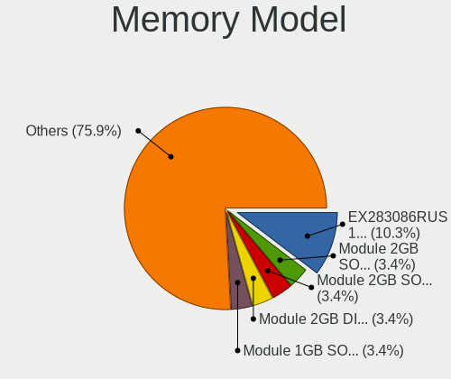

| Model                                                          | Computers | Percent |
|----------------------------------------------------------------|-----------|---------|
| Unknown RAM Module 16GB DIMM DDR4 2400MT/s                     | 1         | 5.26%   |
| Unknown RAM DDR4 NB 8G 2400 8192MB SODIMM DDR4 2667MT/s        | 1         | 5.26%   |
| Unknown (ABCD) RAM 123456789012345678 2GB DIMM LPDDR4 2400MT/s | 1         | 5.26%   |
| Team RAM TEAMGROUP-UD4-3600 8GB DIMM DDR4 3600MT/s             | 1         | 5.26%   |
| SK hynix RAM Module 32GB SODIMM DDR4 3200MT/s                  | 1         | 5.26%   |
| SK hynix RAM H9HCNNNBKUMLXR-NEE 2GB LPDDR4 2400MT/s            | 1         | 5.26%   |
| Samsung RAM M471B5673FH0-CF8 2GB SODIMM DDR3 1067MT/s          | 1         | 5.26%   |
| Samsung RAM M471A1K43CB1-CRC 8GB SODIMM DDR4 2667MT/s          | 1         | 5.26%   |
| Samsung RAM M378B5673FH0 2GB DIMM DDR3 1333MT/s                | 1         | 5.26%   |
| Samsung RAM M378A5143DB0-CPB 4GB DIMM DDR4 2400MT/s            | 1         | 5.26%   |
| PUSKILL RAM PJ16TFK512M8 8GB SODIMM DDR4 2400MT/s              | 1         | 5.26%   |
| Nanya RAM NT2GC64B8HC0NS-BE 2GB SODIMM DDR3 1067MT/s           | 1         | 5.26%   |
| Kingston RAM KF2666C15S4/8G 8GB SODIMM DDR4 2667MT/s           | 1         | 5.26%   |
| Kingston RAM HP497157-D88 2GB DIMM DDR3 1333MT/s               | 1         | 5.26%   |
| Kingston RAM 99U5428-040.A01LF 4GB SODIMM DDR3 1334MT/s        | 1         | 5.26%   |
| Kingston RAM 99U5402-037.A00G 2GB DIMM DDR3 1333MT/s           | 1         | 5.26%   |
| Kingston RAM 9905471-001.A01LF 2GB DIMM DDR3 1600MT/s          | 1         | 5.26%   |
| 4ea5 RAM H9HCNNNBKUMLXR-NEE 2GB LPDDR4 2400MT/s                | 1         | 5.26%   |
| Unknown                                                        | 1         | 5.26%   |

Memory Kind
-----------

Memory module kinds

| Kind   | Computers | Percent |
|--------|-----------|---------|
| DDR4   | 8         | 57.14%  |
| DDR3   | 4         | 28.57%  |
| LPDDR4 | 2         | 14.29%  |

Memory Form Factor
------------------

Physical design of the memory module

| Name    | Computers | Percent |
|---------|-----------|---------|
| SODIMM  | 7         | 50%     |
| DIMM    | 6         | 42.86%  |
| Unknown | 1         | 7.14%   |

Memory Size
-----------

Memory module size

| Size  | Computers | Percent |
|-------|-----------|---------|
| 8192  | 5         | 31.25%  |
| 2048  | 5         | 31.25%  |
| 32768 | 2         | 12.5%   |
| 16384 | 2         | 12.5%   |
| 4096  | 2         | 12.5%   |

Memory Speed
------------

Memory module speed

| Speed | Computers | Percent |
|-------|-----------|---------|
| 2400  | 5         | 29.41%  |
| 2667  | 3         | 17.65%  |
| 1333  | 2         | 11.76%  |
| 1067  | 2         | 11.76%  |
| 3600  | 1         | 5.88%   |
| 3200  | 1         | 5.88%   |
| 2133  | 1         | 5.88%   |
| 1600  | 1         | 5.88%   |
| 1334  | 1         | 5.88%   |

Printers & scanners
-------------------

Printer Vendor
--------------

Printer device vendors

Zero info for selected period =(

Printer Model
-------------

Printer device models

Zero info for selected period =(

Scanner Vendor
--------------

Scanner device vendors

Zero info for selected period =(

Scanner Model
-------------

Scanner device models

Zero info for selected period =(

Camera
------

Camera Vendor
-------------

Camera device vendors

| Vendor                | Computers | Percent |
|-----------------------|-----------|---------|
| Chicony Electronics   | 5         | 33.33%  |
| Microdia              | 3         | 20%     |
| Suyin                 | 1         | 6.67%   |
| Realtek Semiconductor | 1         | 6.67%   |
| Quanta                | 1         | 6.67%   |
| Lite-On Technology    | 1         | 6.67%   |
| IMC Networks          | 1         | 6.67%   |
| Apple                 | 1         | 6.67%   |
| Acer                  | 1         | 6.67%   |

Camera Model
------------

Camera device models

| Model                                                                 | Computers | Percent |
|-----------------------------------------------------------------------|-----------|---------|
| Suyin 1.3M WebCam (notebook emachines E730, Acer sub-brand)           | 1         | 6.67%   |
| Realtek HP Truevision HD integrated webcam                            | 1         | 6.67%   |
| Quanta HP HD Camera                                                   | 1         | 6.67%   |
| Microdia Sonix USB 2.0 Camera                                         | 1         | 6.67%   |
| Microdia Laptop_Integrated_Webcam_7645BB9590586C77DC683CD9114697FF.3M | 1         | 6.67%   |
| Microdia Integrated_Webcam_HD                                         | 1         | 6.67%   |
| Lite-On HP TrueVision HD Camera                                       | 1         | 6.67%   |
| IMC Networks USB2.0 VGA UVC WebCam                                    | 1         | 6.67%   |
| Chicony VGA WebCam                                                    | 1         | 6.67%   |
| Chicony USB2.0 Camera                                                 | 1         | 6.67%   |
| Chicony Integrated Camera                                             | 1         | 6.67%   |
| Chicony HP HD Webcam                                                  | 1         | 6.67%   |
| Chicony 1.3M Webcam                                                   | 1         | 6.67%   |
| Apple Built-in iSight                                                 | 1         | 6.67%   |
| Acer EasyCamera                                                       | 1         | 6.67%   |

Security
--------

Fingerprint Vendor
------------------

Fingerprint sensor vendors

| Vendor    | Computers | Percent |
|-----------|-----------|---------|
| Synaptics | 1         | 100%    |

Fingerprint Model
-----------------

Fingerprint sensor models

| Model                                                    | Computers | Percent |
|----------------------------------------------------------|-----------|---------|
| Synaptics FS7604 Touch Fingerprint Sensor with PurePrint | 1         | 100%    |

Chipcard Vendor
---------------

Chipcard module vendors

Zero info for selected period =(

Chipcard Model
--------------

Chipcard module models

Zero info for selected period =(

Unsupported
-----------

Unsupported Devices
-------------------

Total unsupported devices on board

| Total | Computers | Percent |
|-------|-----------|---------|
| 0     | 20        | 68.97%  |
| 1     | 9         | 31.03%  |

Unsupported Device Types
------------------------

Types of unsupported devices

| Type                     | Computers | Percent |
|--------------------------|-----------|---------|
| Net/wireless             | 6         | 60%     |
| Multimedia controller    | 1         | 10%     |
| Modem                    | 1         | 10%     |
| Fingerprint reader       | 1         | 10%     |
| Communication controller | 1         | 10%     |

