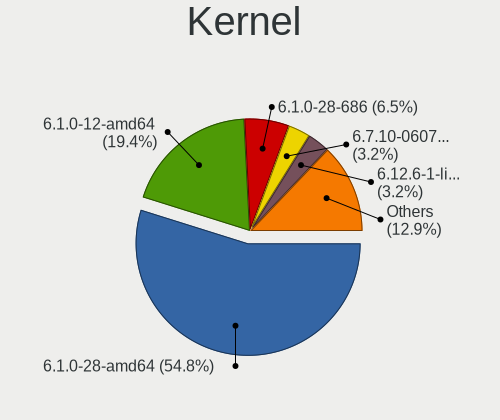
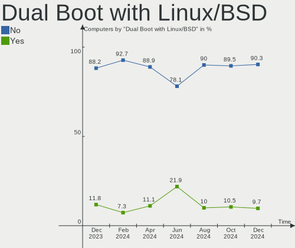
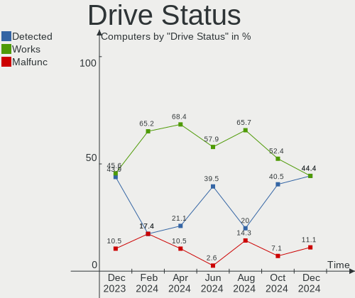
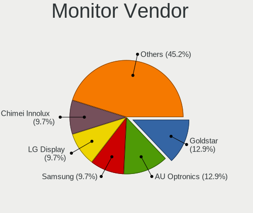
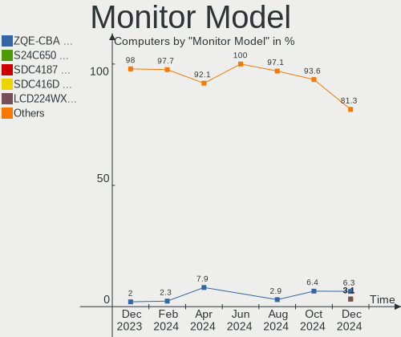
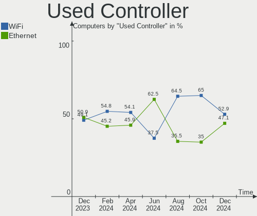
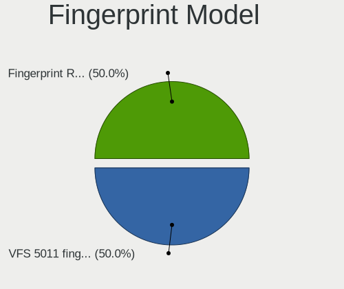
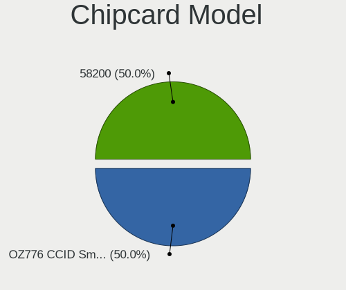

LMDE - Hardware Trends
----------------------

A project to identify most popular hardware characteristics and track their change
over time based on data collected by Linux users at https://Linux-Hardware.org.

Anyone can contribute to this report by the [hw-probe](https://github.com/linuxhw/hw-probe) tool:

    sudo -E hw-probe -all -upload

This is a report for all computer types. See also reports for [desktops](/Dist/LMDE/Desktop/README.md) and [notebooks](/Dist/LMDE/Notebook/README.md).

This report is for one last month. Overall report since the beginning of time: [TestCoverage](https://github.com/linuxhw/TestCoverage)

Period: Dec, 2022.

Contents
--------

* [ System ](#system)
  - [ OS                       ](#os)
  - [ OS Family                ](#os-family)
  - [ Kernel                   ](#kernel)
  - [ Kernel Family            ](#kernel-family)
  - [ Kernel Major Ver.        ](#kernel-major-ver)
  - [ Arch                     ](#arch)
  - [ DE                       ](#de)
  - [ Display Server           ](#display-server)
  - [ Display Manager          ](#display-manager)
  - [ OS Lang                  ](#os-lang)
  - [ Boot Mode                ](#boot-mode)
  - [ Filesystem               ](#filesystem)
  - [ Part. scheme             ](#part-scheme)
  - [ Dual Boot with Linux/BSD ](#dual-boot-with-linuxbsd)
  - [ Dual Boot (Win)          ](#dual-boot-win)

* [ Board ](#board)
  - [ Vendor                   ](#vendor)
  - [ Model                    ](#model)
  - [ Model Family             ](#model-family)
  - [ MFG Year                 ](#mfg-year)
  - [ Form Factor              ](#form-factor)
  - [ Secure Boot              ](#secure-boot)
  - [ Coreboot                 ](#coreboot)
  - [ RAM Size                 ](#ram-size)
  - [ RAM Used                 ](#ram-used)
  - [ Total Drives             ](#total-drives)
  - [ Has CD-ROM               ](#has-cd-rom)
  - [ Has Ethernet             ](#has-ethernet)
  - [ Has WiFi                 ](#has-wifi)
  - [ Has Bluetooth            ](#has-bluetooth)

* [ Location ](#location)
  - [ Country                  ](#country)
  - [ City                     ](#city)

* [ Drives ](#drives)
  - [ Drive Vendor             ](#drive-vendor)
  - [ Drive Model              ](#drive-model)
  - [ HDD Vendor               ](#hdd-vendor)
  - [ SSD Vendor               ](#ssd-vendor)
  - [ Drive Kind               ](#drive-kind)
  - [ Drive Connector          ](#drive-connector)
  - [ Drive Size               ](#drive-size)
  - [ Space Total              ](#space-total)
  - [ Space Used               ](#space-used)
  - [ Malfunc. Drives          ](#malfunc-drives)
  - [ Malfunc. Drive Vendor    ](#malfunc-drive-vendor)
  - [ Malfunc. HDD Vendor      ](#malfunc-hdd-vendor)
  - [ Malfunc. Drive Kind      ](#malfunc-drive-kind)
  - [ Failed Drives            ](#failed-drives)
  - [ Failed Drive Vendor      ](#failed-drive-vendor)
  - [ Drive Status             ](#drive-status)

* [ Storage controller ](#storage-controller)
  - [ Storage Vendor           ](#storage-vendor)
  - [ Storage Model            ](#storage-model)
  - [ Storage Kind             ](#storage-kind)

* [ Processor ](#processor)
  - [ CPU Vendor               ](#cpu-vendor)
  - [ CPU Model                ](#cpu-model)
  - [ CPU Model Family         ](#cpu-model-family)
  - [ CPU Cores                ](#cpu-cores)
  - [ CPU Sockets              ](#cpu-sockets)
  - [ CPU Threads              ](#cpu-threads)
  - [ CPU Op-Modes             ](#cpu-op-modes)
  - [ CPU Microcode            ](#cpu-microcode)
  - [ CPU Microarch            ](#cpu-microarch)

* [ Graphics ](#graphics)
  - [ GPU Vendor               ](#gpu-vendor)
  - [ GPU Model                ](#gpu-model)
  - [ GPU Combo                ](#gpu-combo)
  - [ GPU Driver               ](#gpu-driver)
  - [ GPU Memory               ](#gpu-memory)

* [ Monitor ](#monitor)
  - [ Monitor Vendor           ](#monitor-vendor)
  - [ Monitor Model            ](#monitor-model)
  - [ Monitor Resolution       ](#monitor-resolution)
  - [ Monitor Diagonal         ](#monitor-diagonal)
  - [ Monitor Width            ](#monitor-width)
  - [ Aspect Ratio             ](#aspect-ratio)
  - [ Monitor Area             ](#monitor-area)
  - [ Pixel Density            ](#pixel-density)
  - [ Multiple Monitors        ](#multiple-monitors)

* [ Network ](#network)
  - [ Net Controller Vendor    ](#net-controller-vendor)
  - [ Net Controller Model     ](#net-controller-model)
  - [ Wireless Vendor          ](#wireless-vendor)
  - [ Wireless Model           ](#wireless-model)
  - [ Ethernet Vendor          ](#ethernet-vendor)
  - [ Ethernet Model           ](#ethernet-model)
  - [ Net Controller Kind      ](#net-controller-kind)
  - [ Used Controller          ](#used-controller)
  - [ NICs                     ](#nics)
  - [ IPv6                     ](#ipv6)

* [ Bluetooth ](#bluetooth)
  - [ Bluetooth Vendor         ](#bluetooth-vendor)
  - [ Bluetooth Model          ](#bluetooth-model)

* [ Sound ](#sound)
  - [ Sound Vendor             ](#sound-vendor)
  - [ Sound Model              ](#sound-model)

* [ Memory ](#memory)
  - [ Memory Vendor            ](#memory-vendor)
  - [ Memory Model             ](#memory-model)
  - [ Memory Kind              ](#memory-kind)
  - [ Memory Form Factor       ](#memory-form-factor)
  - [ Memory Size              ](#memory-size)
  - [ Memory Speed             ](#memory-speed)

* [ Printers & scanners ](#printers--scanners)
  - [ Printer Vendor           ](#printer-vendor)
  - [ Printer Model            ](#printer-model)
  - [ Scanner Vendor           ](#scanner-vendor)
  - [ Scanner Model            ](#scanner-model)

* [ Camera ](#camera)
  - [ Camera Vendor            ](#camera-vendor)
  - [ Camera Model             ](#camera-model)

* [ Security ](#security)
  - [ Fingerprint Vendor       ](#fingerprint-vendor)
  - [ Fingerprint Model        ](#fingerprint-model)
  - [ Chipcard Vendor          ](#chipcard-vendor)
  - [ Chipcard Model           ](#chipcard-model)

* [ Unsupported ](#unsupported)
  - [ Unsupported Devices      ](#unsupported-devices)
  - [ Unsupported Device Types ](#unsupported-device-types)

System
------

OS
--

Installed operating systems

| Name   | Computers | Percent |
|--------|-----------|---------|
| LMDE 5 | 30        | 100%    |

OS Family
---------

OS without a version

| Name | Computers | Percent |
|------|-----------|---------|
| LMDE | 30        | 100%    |

Kernel
------

Version of the Linux kernel

| Version               | Computers | Percent |
|-----------------------|-----------|---------|
| 5.10.0-19-amd64       | 14        | 46.67%  |
| 5.10.0-20-amd64       | 11        | 36.67%  |
| 5.10.0-12-amd64       | 3         | 10%     |
| 6.0.0-0.deb11.2-amd64 | 1         | 3.33%   |
| 5.10.0-12-686         | 1         | 3.33%   |

Kernel Family
-------------

Linux kernel without a distro release

| Version | Computers | Percent |
|---------|-----------|---------|
| 5.10.0  | 29        | 96.67%  |
| 6.0.0   | 1         | 3.33%   |

Kernel Major Ver.
-----------------

Linux kernel major version

| Version | Computers | Percent |
|---------|-----------|---------|
| 5.10    | 29        | 96.67%  |
| 6.0     | 1         | 3.33%   |

Arch
----

OS architecture (x86_64, i586, etc.)

| Name   | Computers | Percent |
|--------|-----------|---------|
| x86_64 | 29        | 96.67%  |
| i686   | 1         | 3.33%   |

DE
--

Desktop Environment

| Name       | Computers | Percent |
|------------|-----------|---------|
| X-Cinnamon | 25        | 83.33%  |
| Cinnamon   | 4         | 13.33%  |
| KDE        | 1         | 3.33%   |

Display Server
--------------

X11 or Wayland

| Name | Computers | Percent |
|------|-----------|---------|
| X11  | 30        | 100%    |

Display Manager
---------------

SDDM, LightDM, etc.

| Name    | Computers | Percent |
|---------|-----------|---------|
| Unknown | 20        | 66.67%  |
| LightDM | 8         | 26.67%  |
| SDDM    | 1         | 3.33%   |
| GDM     | 1         | 3.33%   |

OS Lang
-------

Language

| Lang  | Computers | Percent |
|-------|-----------|---------|
| en_US | 8         | 26.67%  |
| de_DE | 8         | 26.67%  |
| tr_TR | 2         | 6.67%   |
| ru_RU | 2         | 6.67%   |
| it_IT | 2         | 6.67%   |
| sv_SE | 1         | 3.33%   |
| pt_BR | 1         | 3.33%   |
| pl_PL | 1         | 3.33%   |
| fr_BE | 1         | 3.33%   |
| en_ZA | 1         | 3.33%   |
| de_CH | 1         | 3.33%   |
| da_DK | 1         | 3.33%   |
| cs_CZ | 1         | 3.33%   |

Boot Mode
---------

EFI or BIOS

| Mode | Computers | Percent |
|------|-----------|---------|
| EFI  | 17        | 56.67%  |
| BIOS | 13        | 43.33%  |

Filesystem
----------

Type of filesystem

| Type  | Computers | Percent |
|-------|-----------|---------|
| Ext4  | 25        | 83.33%  |
| Btrfs | 3         | 10%     |
| Xfs   | 1         | 3.33%   |
| Tmpfs | 1         | 3.33%   |

Part. scheme
------------

Scheme of partitioning

| Type    | Computers | Percent |
|---------|-----------|---------|
| Unknown | 20        | 66.67%  |
| MBR     | 6         | 20%     |
| GPT     | 4         | 13.33%  |

Dual Boot with Linux/BSD
------------------------

Hosting more than one Linux/BSD

| Dual boot | Computers | Percent |
|-----------|-----------|---------|
| No        | 27        | 90%     |
| Yes       | 3         | 10%     |

Dual Boot (Win)
---------------

Hosting Linux and Windows

| Dual boot | Computers | Percent |
|-----------|-----------|---------|
| No        | 26        | 86.67%  |
| Yes       | 4         | 13.33%  |

Board
-----

Vendor
------

Motherboard manufacturer

| Name                | Computers | Percent |
|---------------------|-----------|---------|
| ASUSTek Computer    | 7         | 23.33%  |
| Hewlett-Packard     | 6         | 20%     |
| Lenovo              | 3         | 10%     |
| Dell                | 3         | 10%     |
| Apple               | 3         | 10%     |
| Fujitsu             | 2         | 6.67%   |
| Acer                | 2         | 6.67%   |
| TUXEDO              | 1         | 3.33%   |
| SiYW                | 1         | 3.33%   |
| Google              | 1         | 3.33%   |
| Gigabyte Technology | 1         | 3.33%   |

Model
-----

Motherboard model

| Name                         | Computers | Percent |
|------------------------------|-----------|---------|
| TUXEDO N8xxEZ                | 1         | 3.33%   |
| SiYW V200 Series             | 1         | 3.33%   |
| Lenovo ThinkPad T61 7661A16  | 1         | 3.33%   |
| Lenovo ThinkPad T520 4243W19 | 1         | 3.33%   |
| Lenovo IdeaPad 3 15ITL6 82MD | 1         | 3.33%   |
| HP ZBook 15 G2               | 1         | 3.33%   |
| HP Stream Laptop 14-ax0XX    | 1         | 3.33%   |
| HP Notebook                  | 1         | 3.33%   |
| HP Madoo                     | 1         | 3.33%   |
| HP EliteBook 8440p           | 1         | 3.33%   |
| HP 250 G8 Notebook PC        | 1         | 3.33%   |
| Google Ultima                | 1         | 3.33%   |
| Gigabyte GA-970A-D3          | 1         | 3.33%   |
| Fujitsu LIFEBOOK S751        | 1         | 3.33%   |
| Fujitsu D3003-S2             | 1         | 3.33%   |
| Dell Vostro 3900             | 1         | 3.33%   |
| Dell OptiPlex 780            | 1         | 3.33%   |
| Dell Latitude E5530 non-vPro | 1         | 3.33%   |
| ASUS Z170M-PLUS              | 1         | 3.33%   |
| ASUS X550VC                  | 1         | 3.33%   |
| ASUS RJ083AA-ABZ t3630.it    | 1         | 3.33%   |
| ASUS PRIME B450-PLUS         | 1         | 3.33%   |
| ASUS PRIME B350M-A           | 1         | 3.33%   |
| ASUS P7P55D                  | 1         | 3.33%   |
| ASUS MINIPC PN52             | 1         | 3.33%   |
| Apple MacBookPro13,3         | 1         | 3.33%   |
| Apple MacBookAir5,1          | 1         | 3.33%   |
| Apple MacBook6,1             | 1         | 3.33%   |
| Acer TravelMate 4070         | 1         | 3.33%   |
| Acer Aspire E1-570G          | 1         | 3.33%   |

Model Family
------------

Motherboard model prefix

| Name                | Computers | Percent |
|---------------------|-----------|---------|
| Lenovo ThinkPad     | 2         | 6.67%   |
| ASUS PRIME          | 2         | 6.67%   |
| TUXEDO N8xxEZ       | 1         | 3.33%   |
| SiYW V200           | 1         | 3.33%   |
| Lenovo IdeaPad      | 1         | 3.33%   |
| HP ZBook            | 1         | 3.33%   |
| HP Stream           | 1         | 3.33%   |
| HP Notebook         | 1         | 3.33%   |
| HP Madoo            | 1         | 3.33%   |
| HP EliteBook        | 1         | 3.33%   |
| HP 250              | 1         | 3.33%   |
| Google Ultima       | 1         | 3.33%   |
| Gigabyte GA-970A-D3 | 1         | 3.33%   |
| Fujitsu LIFEBOOK    | 1         | 3.33%   |
| Fujitsu D3003-S2    | 1         | 3.33%   |
| Dell Vostro         | 1         | 3.33%   |
| Dell OptiPlex       | 1         | 3.33%   |
| Dell Latitude       | 1         | 3.33%   |
| ASUS Z170M-PLUS     | 1         | 3.33%   |
| ASUS X550VC         | 1         | 3.33%   |
| ASUS RJ083AA-ABZ    | 1         | 3.33%   |
| ASUS P7P55D         | 1         | 3.33%   |
| ASUS MINIPC         | 1         | 3.33%   |
| Apple MacBookPro13  | 1         | 3.33%   |
| Apple MacBookAir5   | 1         | 3.33%   |
| Apple MacBook6      | 1         | 3.33%   |
| Acer TravelMate     | 1         | 3.33%   |
| Acer Aspire         | 1         | 3.33%   |

MFG Year
--------

Motherboard manufacture year

| Year | Computers | Percent |
|------|-----------|---------|
| 2018 | 4         | 13.33%  |
| 2011 | 4         | 13.33%  |
| 2015 | 3         | 10%     |
| 2013 | 3         | 10%     |
| 2022 | 2         | 6.67%   |
| 2021 | 2         | 6.67%   |
| 2010 | 2         | 6.67%   |
| 2009 | 2         | 6.67%   |
| 2006 | 2         | 6.67%   |
| 2020 | 1         | 3.33%   |
| 2019 | 1         | 3.33%   |
| 2017 | 1         | 3.33%   |
| 2016 | 1         | 3.33%   |
| 2012 | 1         | 3.33%   |
| 2007 | 1         | 3.33%   |

Form Factor
-----------

Physical design of the computer

| Name     | Computers | Percent |
|----------|-----------|---------|
| Notebook | 19        | 63.33%  |
| Desktop  | 10        | 33.33%  |
| Mini pc  | 1         | 3.33%   |

Secure Boot
-----------

Enabled or disabled

| State    | Computers | Percent |
|----------|-----------|---------|
| Disabled | 29        | 96.67%  |
| Enabled  | 1         | 3.33%   |

Coreboot
--------

Have coreboot on board

| Used | Computers | Percent |
|------|-----------|---------|
| No   | 28        | 93.33%  |
| Yes  | 2         | 6.67%   |

RAM Size
--------

Total RAM memory

| Size in GB | Computers | Percent |
|------------|-----------|---------|
| 4.01-8.0   | 7         | 23.33%  |
| 16.01-24.0 | 6         | 20%     |
| 8.01-16.0  | 6         | 20%     |
| 3.01-4.0   | 5         | 16.67%  |
| 32.01-64.0 | 2         | 6.67%   |
| 1.01-2.0   | 2         | 6.67%   |
| 2.01-3.0   | 1         | 3.33%   |
| 0.51-1.0   | 1         | 3.33%   |

RAM Used
--------

Used RAM memory

| Used GB  | Computers | Percent |
|----------|-----------|---------|
| 1.01-2.0 | 16        | 53.33%  |
| 2.01-3.0 | 6         | 20%     |
| 4.01-8.0 | 3         | 10%     |
| 0.51-1.0 | 3         | 10%     |
| 3.01-4.0 | 2         | 6.67%   |

Total Drives
------------

Number of drives on board

| Drives | Computers | Percent |
|--------|-----------|---------|
| 1      | 19        | 63.33%  |
| 2      | 8         | 26.67%  |
| 6      | 1         | 3.33%   |
| 5      | 1         | 3.33%   |
| 3      | 1         | 3.33%   |

Has CD-ROM
----------

Has CD-ROM on board

| Presented | Computers | Percent |
|-----------|-----------|---------|
| No        | 20        | 66.67%  |
| Yes       | 10        | 33.33%  |

Has Ethernet
------------

Has Ethernet on board

| Presented | Computers | Percent |
|-----------|-----------|---------|
| Yes       | 24        | 80%     |
| No        | 6         | 20%     |

Has WiFi
--------

Has WiFi module

| Presented | Computers | Percent |
|-----------|-----------|---------|
| Yes       | 25        | 83.33%  |
| No        | 5         | 16.67%  |

Has Bluetooth
-------------

Has Bluetooth module

| Presented | Computers | Percent |
|-----------|-----------|---------|
| Yes       | 17        | 56.67%  |
| No        | 13        | 43.33%  |

Location
--------

Country
-------

Geographic location (country)

| Country      | Computers | Percent |
|--------------|-----------|---------|
| Germany      | 9         | 30%     |
| USA          | 5         | 16.67%  |
| Russia       | 3         | 10%     |
| Italy        | 3         | 10%     |
| Turkey       | 2         | 6.67%   |
| Sweden       | 1         | 3.33%   |
| South Africa | 1         | 3.33%   |
| Poland       | 1         | 3.33%   |
| Greece       | 1         | 3.33%   |
| Denmark      | 1         | 3.33%   |
| Canada       | 1         | 3.33%   |
| Brazil       | 1         | 3.33%   |
| Belgium      | 1         | 3.33%   |

City
----

Geographic location (city)

| City               | Computers | Percent |
|--------------------|-----------|---------|
| Munich             | 2         | 6.67%   |
| Frankfurt am Main  | 2         | 6.67%   |
| Salvador           | 1         | 3.33%   |
| Salamina           | 1         | 3.33%   |
| Oxford             | 1         | 3.33%   |
| Orenburg           | 1         | 3.33%   |
| Murino             | 1         | 3.33%   |
| Monza              | 1         | 3.33%   |
| Merrick            | 1         | 3.33%   |
| Malente            | 1         | 3.33%   |
| Krasnoyarsk        | 1         | 3.33%   |
| Kırklareli        | 1         | 3.33%   |
| Hamm               | 1         | 3.33%   |
| Gothenburg         | 1         | 3.33%   |
| Galbiate           | 1         | 3.33%   |
| Esbjerg            | 1         | 3.33%   |
| Eberswalde         | 1         | 3.33%   |
| Dąbrowa Górnicza | 1         | 3.33%   |
| Clovis             | 1         | 3.33%   |
| Cleveland          | 1         | 3.33%   |
| Centurion          | 1         | 3.33%   |
| Cayce              | 1         | 3.33%   |
| Brussels           | 1         | 3.33%   |
| Bremen             | 1         | 3.33%   |
| Berlin             | 1         | 3.33%   |
| Belleville         | 1         | 3.33%   |
| Ankara             | 1         | 3.33%   |
| Abbiategrasso      | 1         | 3.33%   |

Drives
------

Drive Vendor
------------

Hard drive vendors

| Vendor              | Computers | Drives | Percent |
|---------------------|-----------|--------|---------|
| WDC                 | 8         | 8      | 17.39%  |
| Samsung Electronics | 8         | 9      | 17.39%  |
| Seagate             | 6         | 7      | 13.04%  |
| Unknown             | 4         | 5      | 8.7%    |
| Kingston            | 3         | 3      | 6.52%   |
| SanDisk             | 2         | 2      | 4.35%   |
| Intenso             | 2         | 2      | 4.35%   |
| China               | 2         | 2      | 4.35%   |
| Toshiba             | 1         | 1      | 2.17%   |
| SPCC                | 1         | 1      | 2.17%   |
| PNY                 | 1         | 1      | 2.17%   |
| Hitachi             | 1         | 1      | 2.17%   |
| HGST                | 1         | 1      | 2.17%   |
| Gigabyte Technology | 1         | 2      | 2.17%   |
| Corsair             | 1         | 1      | 2.17%   |
| Apple               | 1         | 1      | 2.17%   |
| Apacer              | 1         | 1      | 2.17%   |
| ADATA Technology    | 1         | 1      | 2.17%   |
| Unknown             | 1         | 1      | 2.17%   |

Drive Model
-----------

Hard drive models

| Model                                               | Computers | Percent |
|-----------------------------------------------------|-----------|---------|
| Samsung SSD 850 EVO 250GB                           | 2         | 4.08%   |
| Intenso External USB 3.0 1TB                        | 2         | 4.08%   |
| WDC WDS500G2B0B-00YS70 500GB SSD                    | 1         | 2.04%   |
| WDC WD5000LPCX-60VHAT0 500GB                        | 1         | 2.04%   |
| WDC WD30EZRZ-00Z5HB0 3TB                            | 1         | 2.04%   |
| WDC WD20SPZX-22UA7T0 2TB                            | 1         | 2.04%   |
| WDC WD10SPZX-21Z10T0 1TB                            | 1         | 2.04%   |
| WDC WD10EZRX-00DC0B0 1TB                            | 1         | 2.04%   |
| WDC WD10EZEX-75M2NA0 1TB                            | 1         | 2.04%   |
| WDC WD10EACS-00D6B0 1TB                             | 1         | 2.04%   |
| Unknown SDW16G  16GB                                | 1         | 2.04%   |
| Unknown MMC Card  952MB                             | 1         | 2.04%   |
| Unknown MMC Card  32GB                              | 1         | 2.04%   |
| Unknown MMC Card  2GB                               | 1         | 2.04%   |
| Unknown MMC Card  128GB                             | 1         | 2.04%   |
| Toshiba THNSNF128GCSS 128GB SSD                     | 1         | 2.04%   |
| SPCC Solid State Disk 120GB                         | 1         | 2.04%   |
| Seagate ST9160314AS 160GB                           | 1         | 2.04%   |
| Seagate ST500LT012-1DG142 500GB                     | 1         | 2.04%   |
| Seagate ST3250824AS 250GB                           | 1         | 2.04%   |
| Seagate ST3250318AS 250GB                           | 1         | 2.04%   |
| Seagate ST2000LX001-1RG174 2TB                      | 1         | 2.04%   |
| Seagate ST1000LM024 HN-M101MBB 1TB                  | 1         | 2.04%   |
| Seagate ST1000DM010-2EP102 1TB                      | 1         | 2.04%   |
| SanDisk SDSSDHII120G 120GB                          | 1         | 2.04%   |
| SanDisk NVMe SSD Drive 1TB                          | 1         | 2.04%   |
| Samsung SSD 970 EVO 500GB                           | 1         | 2.04%   |
| Samsung SSD 850 EVO 500GB                           | 1         | 2.04%   |
| Samsung NVMe SSD Controller SM961/PM961/SM963 256GB | 1         | 2.04%   |
| Samsung MZVLQ512HBLU-00BH1 512GB                    | 1         | 2.04%   |
| Samsung MZNLN512HMJP-000H1 512GB SSD                | 1         | 2.04%   |
| Samsung MZ7TD128HAFV-00000 128GB SSD                | 1         | 2.04%   |
| Samsung HM160HC 160GB                               | 1         | 2.04%   |
| PNY CS900 120GB SSD                                 | 1         | 2.04%   |
| Kingston SUV400S37240G 240GB SSD                    | 1         | 2.04%   |
| Kingston SA400S37480G 480GB SSD                     | 1         | 2.04%   |
| Kingston SA400S37240G 240GB SSD                     | 1         | 2.04%   |
| Hitachi HCC547550A9E380 500GB                       | 1         | 2.04%   |
| HGST HTS541010A7E630 1TB                            | 1         | 2.04%   |
| Gigabyte GP-GSTFS31256GTND 256GB                    | 1         | 2.04%   |

HDD Vendor
----------

Hard disk drive vendors

| Vendor              | Computers | Drives | Percent |
|---------------------|-----------|--------|---------|
| WDC                 | 7         | 7      | 38.89%  |
| Seagate             | 6         | 7      | 33.33%  |
| Intenso             | 2         | 2      | 11.11%  |
| Samsung Electronics | 1         | 1      | 5.56%   |
| Hitachi             | 1         | 1      | 5.56%   |
| HGST                | 1         | 1      | 5.56%   |

SSD Vendor
----------

Solid state drive vendors

| Vendor              | Computers | Drives | Percent |
|---------------------|-----------|--------|---------|
| Samsung Electronics | 4         | 5      | 21.05%  |
| Kingston            | 3         | 3      | 15.79%  |
| China               | 2         | 2      | 10.53%  |
| WDC                 | 1         | 1      | 5.26%   |
| Toshiba             | 1         | 1      | 5.26%   |
| SPCC                | 1         | 1      | 5.26%   |
| SanDisk             | 1         | 1      | 5.26%   |
| PNY                 | 1         | 1      | 5.26%   |
| Gigabyte Technology | 1         | 2      | 5.26%   |
| Corsair             | 1         | 1      | 5.26%   |
| Apple               | 1         | 1      | 5.26%   |
| Apacer              | 1         | 1      | 5.26%   |
| Unknown             | 1         | 1      | 5.26%   |

Drive Kind
----------

HDD or SSD

| Kind | Computers | Drives | Percent |
|------|-----------|--------|---------|
| SSD  | 17        | 21     | 41.46%  |
| HDD  | 15        | 19     | 36.59%  |
| NVMe | 5         | 5      | 12.2%   |
| MMC  | 4         | 5      | 9.76%   |

Drive Connector
---------------

SATA, SAS, NVMe, etc.

| Type | Computers | Drives | Percent |
|------|-----------|--------|---------|
| SATA | 23        | 38     | 67.65%  |
| NVMe | 5         | 5      | 14.71%  |
| MMC  | 4         | 5      | 11.76%  |
| SAS  | 2         | 2      | 5.88%   |

Drive Size
----------

Size of hard drive

| Size in TB | Computers | Drives | Percent |
|------------|-----------|--------|---------|
| 0.01-0.5   | 18        | 26     | 60%     |
| 0.51-1.0   | 9         | 11     | 30%     |
| 1.01-2.0   | 2         | 2      | 6.67%   |
| 2.01-3.0   | 1         | 1      | 3.33%   |

Space Total
-----------

Amount of disk space available on the file system

| Size in GB     | Computers | Percent |
|----------------|-----------|---------|
| 101-250        | 13        | 43.33%  |
| 251-500        | 4         | 13.33%  |
| 1001-2000      | 4         | 13.33%  |
| 501-1000       | 3         | 10%     |
| 2001-3000      | 2         | 6.67%   |
| More than 3000 | 1         | 3.33%   |
| 21-50          | 1         | 3.33%   |
| 1-20           | 1         | 3.33%   |
| 51-100         | 1         | 3.33%   |

Space Used
----------

Amount of used disk space

| Used GB        | Computers | Percent |
|----------------|-----------|---------|
| 1-20           | 12        | 40%     |
| 21-50          | 6         | 20%     |
| 51-100         | 5         | 16.67%  |
| 501-1000       | 4         | 13.33%  |
| 251-500        | 2         | 6.67%   |
| More than 3000 | 1         | 3.33%   |

Malfunc. Drives
---------------

Drive models with a malfunction

| Model                                 | Computers | Drives | Percent |
|---------------------------------------|-----------|--------|---------|
| Toshiba THNSNF128GCSS 128GB SSD       | 1         | 1      | 33.33%  |
| Samsung Electronics SSD 970 EVO 500GB | 1         | 1      | 33.33%  |
| Samsung Electronics HM160HC 160GB     | 1         | 1      | 33.33%  |

Malfunc. Drive Vendor
---------------------

Vendors of faulty drives

| Vendor              | Computers | Drives | Percent |
|---------------------|-----------|--------|---------|
| Samsung Electronics | 2         | 2      | 66.67%  |
| Toshiba             | 1         | 1      | 33.33%  |

Malfunc. HDD Vendor
-------------------

Vendors of faulty HDD drives

| Vendor              | Computers | Drives | Percent |
|---------------------|-----------|--------|---------|
| Samsung Electronics | 1         | 1      | 100%    |

Malfunc. Drive Kind
-------------------

Kinds of faulty drives

| Kind | Computers | Drives | Percent |
|------|-----------|--------|---------|
| NVMe | 1         | 1      | 33.33%  |
| SSD  | 1         | 1      | 33.33%  |
| HDD  | 1         | 1      | 33.33%  |

Failed Drives
-------------

Failed drive models

Zero info for selected period =(

Failed Drive Vendor
-------------------

Failed drive vendors

Zero info for selected period =(

Drive Status
------------

Number of failed and malfunc. drives

| Status   | Computers | Drives | Percent |
|----------|-----------|--------|---------|
| Detected | 23        | 35     | 69.7%   |
| Works    | 7         | 12     | 21.21%  |
| Malfunc  | 3         | 3      | 9.09%   |

Storage controller
------------------

Storage Vendor
--------------

Storage controller vendors

| Vendor              | Computers | Percent |
|---------------------|-----------|---------|
| Intel               | 20        | 62.5%   |
| AMD                 | 5         | 15.63%  |
| Samsung Electronics | 3         | 9.38%   |
| SanDisk             | 1         | 3.13%   |
| Nvidia              | 1         | 3.13%   |
| JMicron Technology  | 1         | 3.13%   |
| ADATA Technology    | 1         | 3.13%   |

Storage Model
-------------

Storage controller models

| Model                                                                            | Computers | Percent |
|----------------------------------------------------------------------------------|-----------|---------|
| Intel 7 Series Chipset Family 6-port SATA Controller [AHCI mode]                 | 3         | 8.11%   |
| AMD FCH SATA Controller [AHCI mode]                                              | 3         | 8.11%   |
| Intel Volume Management Device NVMe RAID Controller                              | 2         | 5.41%   |
| Intel Tiger Lake-LP SATA Controller                                              | 2         | 5.41%   |
| Intel 8 Series/C220 Series Chipset Family 6-port SATA Controller 1 [AHCI mode]   | 2         | 5.41%   |
| Intel 6 Series/C200 Series Chipset Family 6 port Mobile SATA AHCI Controller     | 2         | 5.41%   |
| Intel 5 Series/3400 Series Chipset 6 port SATA AHCI Controller                   | 2         | 5.41%   |
| AMD SB7x0/SB8x0/SB9x0 SATA Controller [AHCI mode]                                | 2         | 5.41%   |
| SanDisk WD Blue SN570 NVMe SSD                                                   | 1         | 2.7%    |
| Samsung NVMe SSD Controller SM981/PM981/PM983                                    | 1         | 2.7%    |
| Samsung NVMe SSD Controller SM961/PM961/SM963                                    | 1         | 2.7%    |
| Samsung NVMe SSD Controller 980                                                  | 1         | 2.7%    |
| Nvidia MCP79 AHCI Controller                                                     | 1         | 2.7%    |
| JMicron JMB363 SATA/IDE Controller                                               | 1         | 2.7%    |
| Intel Sunrise Point-LP SATA Controller [AHCI mode]                               | 1         | 2.7%    |
| Intel SATA Controller [RAID mode]                                                | 1         | 2.7%    |
| Intel Q170/Q150/B150/H170/H110/Z170/CM236 Chipset SATA Controller [AHCI Mode]    | 1         | 2.7%    |
| Intel NM10/ICH7 Family SATA Controller [AHCI mode]                               | 1         | 2.7%    |
| Intel Cannon Lake Mobile PCH SATA AHCI Controller                                | 1         | 2.7%    |
| Intel Atom/Celeron/Pentium Processor x5-E8000/J3xxx/N3xxx Series SATA Controller | 1         | 2.7%    |
| Intel 82801HM/HEM (ICH8M/ICH8M-E) SATA Controller [IDE mode]                     | 1         | 2.7%    |
| Intel 82801G (ICH7 Family) IDE Controller                                        | 1         | 2.7%    |
| Intel 82801FB/FBM/FR/FW/FRW (ICH6 Family) IDE Controller                         | 1         | 2.7%    |
| Intel 82801 Mobile SATA Controller [RAID mode]                                   | 1         | 2.7%    |
| AMD 400 Series Chipset SATA Controller                                           | 1         | 2.7%    |
| AMD 300 Series Chipset SATA Controller                                           | 1         | 2.7%    |
| ADATA A Non-Volatile memory controller                                           | 1         | 2.7%    |

Storage Kind
------------

Kind of storage controller (IDE, SATA, NVMe, SAS, ...)

| Kind | Computers | Percent |
|------|-----------|---------|
| SATA | 22        | 62.86%  |
| NVMe | 5         | 14.29%  |
| RAID | 4         | 11.43%  |
| IDE  | 4         | 11.43%  |

Processor
---------

CPU Vendor
----------

Processor vendors

| Vendor | Computers | Percent |
|--------|-----------|---------|
| Intel  | 25        | 83.33%  |
| AMD    | 5         | 16.67%  |

CPU Model
---------

Processor models

| Model                                   | Computers | Percent |
|-----------------------------------------|-----------|---------|
| Intel Core i5-3230M CPU @ 2.60GHz       | 2         | 6.67%   |
| Intel Celeron CPU N3060 @ 1.60GHz       | 2         | 6.67%   |
| Intel 11th Gen Core i5-1135G7 @ 2.40GHz | 2         | 6.67%   |
| Intel Pentium Silver N6000 @ 1.10GHz    | 1         | 3.33%   |
| Intel Pentium M processor 1.73GHz       | 1         | 3.33%   |
| Intel Pentium D CPU 2.80GHz             | 1         | 3.33%   |
| Intel Core i7-8750H CPU @ 2.20GHz       | 1         | 3.33%   |
| Intel Core i7-8650U CPU @ 1.90GHz       | 1         | 3.33%   |
| Intel Core i7-6920HQ CPU @ 2.90GHz      | 1         | 3.33%   |
| Intel Core i7-4810MQ CPU @ 2.80GHz      | 1         | 3.33%   |
| Intel Core i5-6600K CPU @ 3.50GHz       | 1         | 3.33%   |
| Intel Core i5-4460 CPU @ 3.20GHz        | 1         | 3.33%   |
| Intel Core i5-3337U CPU @ 1.80GHz       | 1         | 3.33%   |
| Intel Core i5-3317U CPU @ 1.70GHz       | 1         | 3.33%   |
| Intel Core i5-2520M CPU @ 2.50GHz       | 1         | 3.33%   |
| Intel Core i5-2450M CPU @ 2.50GHz       | 1         | 3.33%   |
| Intel Core i5 CPU M 540 @ 2.53GHz       | 1         | 3.33%   |
| Intel Core i5 CPU 750 @ 2.67GHz         | 1         | 3.33%   |
| Intel Core 2 Quad CPU Q6700 @ 2.66GHz   | 1         | 3.33%   |
| Intel Core 2 Duo CPU T7100 @ 1.80GHz    | 1         | 3.33%   |
| Intel Core 2 Duo CPU P7550 @ 2.26GHz    | 1         | 3.33%   |
| Intel Celeron CPU N3160 @ 1.60GHz       | 1         | 3.33%   |
| AMD Ryzen 7 5800H with Radeon Graphics  | 1         | 3.33%   |
| AMD Ryzen 5 2600 Six-Core Processor     | 1         | 3.33%   |
| AMD Ryzen 5 1400 Quad-Core Processor    | 1         | 3.33%   |
| AMD G-T56N Processor                    | 1         | 3.33%   |
| AMD FX-8120 Eight-Core Processor        | 1         | 3.33%   |

CPU Model Family
----------------

Processor model prefix

| Model                | Computers | Percent |
|----------------------|-----------|---------|
| Intel Core i5        | 10        | 33.33%  |
| Intel Core i7        | 4         | 13.33%  |
| Intel Celeron        | 3         | 10%     |
| Other                | 2         | 6.67%   |
| Intel Core 2 Duo     | 2         | 6.67%   |
| AMD Ryzen 5          | 2         | 6.67%   |
| Intel Pentium Silver | 1         | 3.33%   |
| Intel Pentium M      | 1         | 3.33%   |
| Intel Pentium D      | 1         | 3.33%   |
| Intel Core 2 Quad    | 1         | 3.33%   |
| AMD Ryzen 7          | 1         | 3.33%   |
| AMD G                | 1         | 3.33%   |
| AMD FX               | 1         | 3.33%   |

CPU Cores
---------

Number of processor cores

| Number | Computers | Percent |
|--------|-----------|---------|
| 4      | 13        | 43.33%  |
| 2      | 13        | 43.33%  |
| 6      | 2         | 6.67%   |
| 8      | 1         | 3.33%   |
| 1      | 1         | 3.33%   |

CPU Sockets
-----------

Number of sockets

| Number | Computers | Percent |
|--------|-----------|---------|
| 1      | 30        | 100%    |

CPU Threads
-----------

Threads per core (Hyper-Threading)

| Number | Computers | Percent |
|--------|-----------|---------|
| 2      | 17        | 56.67%  |
| 1      | 13        | 43.33%  |

CPU Op-Modes
------------

CPU Operation Modes (32-bit, 64-bit)

| Op mode        | Computers | Percent |
|----------------|-----------|---------|
| 32-bit, 64-bit | 29        | 96.67%  |
| 32-bit         | 1         | 3.33%   |

CPU Microcode
-------------

Microcode number

| Number     | Computers | Percent |
|------------|-----------|---------|
| 0x306a9    | 4         | 13.33%  |
| 0x406c4    | 3         | 10%     |
| 0x806c1    | 2         | 6.67%   |
| 0x506e3    | 2         | 6.67%   |
| 0x306c3    | 2         | 6.67%   |
| 0x206a7    | 2         | 6.67%   |
| 0xf47      | 1         | 3.33%   |
| 0x906ea    | 1         | 3.33%   |
| 0x906c0    | 1         | 3.33%   |
| 0x806ea    | 1         | 3.33%   |
| 0x6fd      | 1         | 3.33%   |
| 0x6fb      | 1         | 3.33%   |
| 0x6d8      | 1         | 3.33%   |
| 0x106e5    | 1         | 3.33%   |
| 0x1067a    | 1         | 3.33%   |
| 0x0a50000c | 1         | 3.33%   |
| 0x0800820d | 1         | 3.33%   |
| 0x08001129 | 1         | 3.33%   |
| 0x0600063d | 1         | 3.33%   |
| 0x05000119 | 1         | 3.33%   |
| Unknown    | 1         | 3.33%   |

CPU Microarch
-------------

Microarchitecture

| Name        | Computers | Percent |
|-------------|-----------|---------|
| IvyBridge   | 4         | 13.33%  |
| Silvermont  | 3         | 10%     |
| TigerLake   | 2         | 6.67%   |
| Skylake     | 2         | 6.67%   |
| SandyBridge | 2         | 6.67%   |
| KabyLake    | 2         | 6.67%   |
| Haswell     | 2         | 6.67%   |
| Core        | 2         | 6.67%   |
| Zen+        | 1         | 3.33%   |
| Zen 3       | 1         | 3.33%   |
| Zen         | 1         | 3.33%   |
| Westmere    | 1         | 3.33%   |
| Tremont     | 1         | 3.33%   |
| Penryn      | 1         | 3.33%   |
| P6          | 1         | 3.33%   |
| NetBurst    | 1         | 3.33%   |
| Nehalem     | 1         | 3.33%   |
| Bulldozer   | 1         | 3.33%   |
| Bobcat      | 1         | 3.33%   |

Graphics
--------

GPU Vendor
----------

Vendors of graphics cards

| Vendor | Computers | Percent |
|--------|-----------|---------|
| Intel  | 18        | 52.94%  |
| Nvidia | 12        | 35.29%  |
| AMD    | 4         | 11.76%  |

GPU Model
---------

Graphics card models

| Model                                                                                    | Computers | Percent |
|------------------------------------------------------------------------------------------|-----------|---------|
| Intel 3rd Gen Core processor Graphics Controller                                         | 4         | 11.43%  |
| Intel Atom/Celeron/Pentium Processor x5-E8000/J3xxx/N3xxx Integrated Graphics Controller | 3         | 8.57%   |
| Nvidia GK208B [GeForce GT 710]                                                           | 2         | 5.71%   |
| Intel TigerLake-LP GT2 [Iris Xe Graphics]                                                | 2         | 5.71%   |
| Intel 2nd Generation Core Processor Family Integrated Graphics Controller                | 2         | 5.71%   |
| Nvidia TU116 [GeForce GTX 1660]                                                          | 1         | 2.86%   |
| Nvidia GP107M [GeForce MX350]                                                            | 1         | 2.86%   |
| Nvidia GP107GL [Quadro P620]                                                             | 1         | 2.86%   |
| Nvidia GP104 [GeForce GTX 1070]                                                          | 1         | 2.86%   |
| Nvidia GK208M [GeForce GT 740M]                                                          | 1         | 2.86%   |
| Nvidia GK106GLM [Quadro K2100M]                                                          | 1         | 2.86%   |
| Nvidia GF117M [GeForce 610M/710M/810M/820M / GT 620M/625M/630M/720M]                     | 1         | 2.86%   |
| Nvidia G92 [GeForce GTS 250]                                                             | 1         | 2.86%   |
| Nvidia G72 [GeForce 7500 LE]                                                             | 1         | 2.86%   |
| Nvidia C79 [GeForce 9400M]                                                               | 1         | 2.86%   |
| Intel UHD Graphics 620                                                                   | 1         | 2.86%   |
| Intel Mobile GM965/GL960 Integrated Graphics Controller (secondary)                      | 1         | 2.86%   |
| Intel Mobile GM965/GL960 Integrated Graphics Controller (primary)                        | 1         | 2.86%   |
| Intel Mobile 915GM/GMS/910GML Express Graphics Controller                                | 1         | 2.86%   |
| Intel JasperLake [UHD Graphics]                                                          | 1         | 2.86%   |
| Intel HD Graphics 530                                                                    | 1         | 2.86%   |
| Intel Core Processor Integrated Graphics Controller                                      | 1         | 2.86%   |
| Intel CoffeeLake-H GT2 [UHD Graphics 630]                                                | 1         | 2.86%   |
| AMD Wrestler [Radeon HD 6320]                                                            | 1         | 2.86%   |
| AMD Ellesmere [Radeon RX 470/480/570/570X/580/580X/590]                                  | 1         | 2.86%   |
| AMD Cezanne [Radeon Vega Series / Radeon Vega Mobile Series]                             | 1         | 2.86%   |
| AMD Baffin [Radeon RX 460/560D / Pro 450/455/460/555/555X/560/560X]                      | 1         | 2.86%   |

GPU Combo
---------

Combinations of graphics cards

| Name           | Computers | Percent |
|----------------|-----------|---------|
| 1 x Intel      | 14        | 46.67%  |
| 1 x Nvidia     | 9         | 30%     |
| 1 x AMD        | 4         | 13.33%  |
| Intel + Nvidia | 3         | 10%     |

GPU Driver
----------

Free vs proprietary

| Driver      | Computers | Percent |
|-------------|-----------|---------|
| Free        | 25        | 83.33%  |
| Proprietary | 4         | 13.33%  |
| Unknown     | 1         | 3.33%   |

GPU Memory
----------

Total video memory

| Size in GB | Computers | Percent |
|------------|-----------|---------|
| Unknown    | 15        | 50%     |
| 1.01-2.0   | 6         | 20%     |
| 0.01-0.5   | 4         | 13.33%  |
| 7.01-8.0   | 2         | 6.67%   |
| 5.01-6.0   | 1         | 3.33%   |
| 3.01-4.0   | 1         | 3.33%   |
| 0.51-1.0   | 1         | 3.33%   |

Monitor
-------

Monitor Vendor
--------------

Monitor vendors

| Vendor                  | Computers | Percent |
|-------------------------|-----------|---------|
| Acer                    | 5         | 15.15%  |
| BOE                     | 4         | 12.12%  |
| Chimei Innolux          | 3         | 9.09%   |
| AU Optronics            | 3         | 9.09%   |
| Apple                   | 3         | 9.09%   |
| LG Display              | 2         | 6.06%   |
| Lenovo                  | 2         | 6.06%   |
| Goldstar                | 2         | 6.06%   |
| Dell                    | 2         | 6.06%   |
| SKY                     | 1         | 3.03%   |
| Samsung Electronics     | 1         | 3.03%   |
| Philips                 | 1         | 3.03%   |
| Packard Bell            | 1         | 3.03%   |
| HannStar                | 1         | 3.03%   |
| Chi Mei Optoelectronics | 1         | 3.03%   |
| Unknown                 | 1         | 3.03%   |

Monitor Model
-------------

Monitor models

| Model                                                                    | Computers | Percent |
|--------------------------------------------------------------------------|-----------|---------|
| BOE LCD Monitor BOE0696 1366x768 309x173mm 13.9-inch                     | 2         | 5.88%   |
| SKY TV-monitor SKY1402 3840x2160 708x398mm 32.0-inch                     | 1         | 2.94%   |
| SKY TV SKY1502 3840x2160 1150x650mm 52.0-inch                            | 1         | 2.94%   |
| Samsung Electronics LCD Monitor SEC3541 1366x768 309x174mm 14.0-inch     | 1         | 2.94%   |
| Philips PHL 242V8 PHLC219 1920x1080 527x296mm 23.8-inch                  | 1         | 2.94%   |
| Packard Bell Viseo 230Ws PKB00C1 1920x1080 509x286mm 23.0-inch           | 1         | 2.94%   |
| LG Display LCD Monitor LGD033B 1366x768 344x194mm 15.5-inch              | 1         | 2.94%   |
| LG Display LCD Monitor LGD032E 1366x768 345x194mm 15.6-inch              | 1         | 2.94%   |
| Lenovo LCD Monitor LEN40B1 1600x900 344x193mm 15.5-inch                  | 1         | 2.94%   |
| Lenovo LCD Monitor LEN4033 1440x900 303x190mm 14.1-inch                  | 1         | 2.94%   |
| HannStar HU151 HSD5555 1024x768 304x228mm 15.0-inch                      | 1         | 2.94%   |
| Goldstar L1952TX GSM4AE2 1280x1024 376x301mm 19.0-inch                   | 1         | 2.94%   |
| Goldstar L1740B GSM43D4 1280x1024 338x270mm 17.0-inch                    | 1         | 2.94%   |
| Dell SE2717H/HX DELD0A1 1920x1080 600x340mm 27.2-inch                    | 1         | 2.94%   |
| Dell P190S DEL405B 1280x1024 376x301mm 19.0-inch                         | 1         | 2.94%   |
| Chimei Innolux LCD Monitor CMN15F5 1920x1080 344x193mm 15.5-inch         | 1         | 2.94%   |
| Chimei Innolux LCD Monitor CMN15C2 1920x1080 344x194mm 15.5-inch         | 1         | 2.94%   |
| Chimei Innolux LCD Monitor CMN15BE 1366x768 344x193mm 15.5-inch          | 1         | 2.94%   |
| Chi Mei Optoelectronics LCD Monitor CMO1514 1280x800 331x207mm 15.4-inch | 1         | 2.94%   |
| BOE LCD Monitor BOE0991 1920x1080 344x194mm 15.5-inch                    | 1         | 2.94%   |
| BOE LCD Monitor BOE0695 1920x1080 380x210mm 17.1-inch                    | 1         | 2.94%   |
| AU Optronics LCD Monitor AUO3791 1920x1080 344x194mm 15.5-inch           | 1         | 2.94%   |
| AU Optronics LCD Monitor AUO235C 1366x768 256x144mm 11.6-inch            | 1         | 2.94%   |
| AU Optronics LCD Monitor AUO123E 1600x900 309x174mm 14.0-inch            | 1         | 2.94%   |
| Apple Color LCD APPA030 2880x1800 331x207mm 15.4-inch                    | 1         | 2.94%   |
| Apple Color LCD APP9CF2 1366x768 256x144mm 11.6-inch                     | 1         | 2.94%   |
| Apple Color LCD APP9CC0 1280x800 261x163mm 12.1-inch                     | 1         | 2.94%   |
| Acer X34 ACR0450 3440x1440 800x340mm 34.2-inch                           | 1         | 2.94%   |
| Acer T272HL ACR013B 1920x1080 598x336mm 27.0-inch                        | 1         | 2.94%   |
| Acer SB220Q ACR06AB 1920x1080 476x268mm 21.5-inch                        | 1         | 2.94%   |
| Acer LCD Monitor B243W 1920x1200                                         | 1         | 2.94%   |
| Acer ED347CKR ACR0648 3440x1440 795x334mm 33.9-inch                      | 1         | 2.94%   |
| Unknown                                                                  | 1         | 2.94%   |

Monitor Resolution
------------------

Monitor screen resolution

| Resolution        | Computers | Percent |
|-------------------|-----------|---------|
| 1920x1080 (FHD)   | 9         | 29.03%  |
| 1366x768 (WXGA)   | 8         | 25.81%  |
| 3440x1440         | 2         | 6.45%   |
| 1600x900 (HD+)    | 2         | 6.45%   |
| 1280x800 (WXGA)   | 2         | 6.45%   |
| 1280x1024 (SXGA)  | 2         | 6.45%   |
| 3840x2160 (4K)    | 1         | 3.23%   |
| 2880x1800         | 1         | 3.23%   |
| 1920x1200 (WUXGA) | 1         | 3.23%   |
| 1440x900 (WXGA+)  | 1         | 3.23%   |
| 1360x768          | 1         | 3.23%   |
| 1024x768 (XGA)    | 1         | 3.23%   |

Monitor Diagonal
----------------

Diagonal size in inches

| Inches  | Computers | Percent |
|---------|-----------|---------|
| 15      | 12        | 36.36%  |
| 27      | 2         | 6.06%   |
| 17      | 2         | 6.06%   |
| 14      | 2         | 6.06%   |
| 13      | 2         | 6.06%   |
| 11      | 2         | 6.06%   |
| Unknown | 2         | 6.06%   |
| 52      | 1         | 3.03%   |
| 34      | 1         | 3.03%   |
| 33      | 1         | 3.03%   |
| 32      | 1         | 3.03%   |
| 24      | 1         | 3.03%   |
| 23      | 1         | 3.03%   |
| 21      | 1         | 3.03%   |
| 19      | 1         | 3.03%   |
| 12      | 1         | 3.03%   |

Monitor Width
-------------

Physical width

| Width in mm | Computers | Percent |
|-------------|-----------|---------|
| 301-350     | 16        | 50%     |
| 501-600     | 4         | 12.5%   |
| 701-800     | 3         | 9.38%   |
| 201-300     | 3         | 9.38%   |
| 351-400     | 2         | 6.25%   |
| Unknown     | 2         | 6.25%   |
| 401-500     | 1         | 3.13%   |
| 1001-1500   | 1         | 3.13%   |

Aspect Ratio
------------

Proportional relationship between the width and the height

| Ratio   | Computers | Percent |
|---------|-----------|---------|
| 16/9    | 19        | 63.33%  |
| 16/10   | 4         | 13.33%  |
| 5/4     | 2         | 6.67%   |
| 21/9    | 2         | 6.67%   |
| Unknown | 2         | 6.67%   |
| 4/3     | 1         | 3.33%   |

Monitor Area
------------

Area in inch²

| Area in inch² | Computers | Percent |
|----------------|-----------|---------|
| 101-110        | 12        | 36.36%  |
| 81-90          | 4         | 12.12%  |
| 351-500        | 3         | 9.09%   |
| 201-250        | 3         | 9.09%   |
| 51-60          | 2         | 6.06%   |
| 301-350        | 2         | 6.06%   |
| Unknown        | 2         | 6.06%   |
| More than 1000 | 1         | 3.03%   |
| 61-70          | 1         | 3.03%   |
| 151-200        | 1         | 3.03%   |
| 141-150        | 1         | 3.03%   |
| 121-130        | 1         | 3.03%   |

Pixel Density
-------------

Pixels per inch

| Density | Computers | Percent |
|---------|-----------|---------|
| 121-160 | 11        | 33.33%  |
| 101-120 | 10        | 30.3%   |
| 51-100  | 9         | 27.27%  |
| Unknown | 2         | 6.06%   |
| 161-240 | 1         | 3.03%   |

Multiple Monitors
-----------------

Total monitors connected

| Total | Computers | Percent |
|-------|-----------|---------|
| 1     | 24        | 80%     |
| 2     | 5         | 16.67%  |
| 0     | 1         | 3.33%   |

Network
-------

Net Controller Vendor
---------------------

Controller vendors

| Vendor                   | Computers | Percent |
|--------------------------|-----------|---------|
| Intel                    | 16        | 39.02%  |
| Realtek Semiconductor    | 14        | 34.15%  |
| Broadcom                 | 5         | 12.2%   |
| Qualcomm Atheros         | 2         | 4.88%   |
| Nvidia                   | 1         | 2.44%   |
| MediaTek                 | 1         | 2.44%   |
| Huawei Technologies      | 1         | 2.44%   |
| HTC (High Tech Computer) | 1         | 2.44%   |

Net Controller Model
--------------------

Controller models

| Model                                                                          | Computers | Percent |
|--------------------------------------------------------------------------------|-----------|---------|
| Realtek RTL8111/8168/8411 PCI Express Gigabit Ethernet Controller              | 9         | 17.65%  |
| Realtek RTL8188EUS 802.11n Wireless Network Adapter                            | 2         | 3.92%   |
| Intel Wireless 7265                                                            | 2         | 3.92%   |
| Intel Centrino Advanced-N 6205 [Taylor Peak]                                   | 2         | 3.92%   |
| Broadcom BCM43224 802.11a/b/g/n                                                | 2         | 3.92%   |
| Realtek RTL88x2bu [AC1200 Techkey]                                             | 1         | 1.96%   |
| Realtek RTL8822CE 802.11ac PCIe Wireless Network Adapter                       | 1         | 1.96%   |
| Realtek RTL8723BE PCIe Wireless Network Adapter                                | 1         | 1.96%   |
| Realtek RTL8153 Gigabit Ethernet Adapter                                       | 1         | 1.96%   |
| Realtek RTL8125 2.5GbE Controller                                              | 1         | 1.96%   |
| Realtek RTL810xE PCI Express Fast Ethernet controller                          | 1         | 1.96%   |
| Realtek RTL-8100/8101L/8139 PCI Fast Ethernet Adapter                          | 1         | 1.96%   |
| Qualcomm Atheros AR9485 Wireless Network Adapter                               | 1         | 1.96%   |
| Qualcomm Atheros AR5413/AR5414 Wireless Network Adapter [AR5006X(S) 802.11abg] | 1         | 1.96%   |
| Nvidia MCP79 Ethernet                                                          | 1         | 1.96%   |
| MediaTek MT7922 802.11ax PCI Express Wireless Network Adapter                  | 1         | 1.96%   |
| Intel Wireless 8265 / 8275                                                     | 1         | 1.96%   |
| Intel Wireless 7260                                                            | 1         | 1.96%   |
| Intel Wireless 3165                                                            | 1         | 1.96%   |
| Intel Wi-Fi 6 AX201 160MHz                                                     | 1         | 1.96%   |
| Intel Wi-Fi 6 AX201                                                            | 1         | 1.96%   |
| Intel PRO/Wireless 4965 AG or AGN [Kedron] Network Connection                  | 1         | 1.96%   |
| Intel PRO/Wireless 2200BG [Calexico2] Network Connection                       | 1         | 1.96%   |
| Intel NM10/ICH7 Family LAN Controller                                          | 1         | 1.96%   |
| Intel Ethernet Connection I217-LM                                              | 1         | 1.96%   |
| Intel Ethernet Connection (2) I219-V                                           | 1         | 1.96%   |
| Intel Centrino Advanced-N 6230 [Rainbow Peak]                                  | 1         | 1.96%   |
| Intel Centrino Advanced-N 6200                                                 | 1         | 1.96%   |
| Intel 82579V Gigabit Network Connection                                        | 1         | 1.96%   |
| Intel 82579LM Gigabit Network Connection (Lewisville)                          | 1         | 1.96%   |
| Intel 82577LM Gigabit Network Connection                                       | 1         | 1.96%   |
| Intel 82567LM-3 Gigabit Network Connection                                     | 1         | 1.96%   |
| Intel 82566MM Gigabit Network Connection                                       | 1         | 1.96%   |
| Huawei STK-L21                                                                 | 1         | 1.96%   |
| HTC (High Tech Computer) Desire HD (modem mode)                                | 1         | 1.96%   |
| Broadcom NetXtreme BCM57786 Gigabit Ethernet PCIe                              | 1         | 1.96%   |
| Broadcom NetXtreme BCM5761 Gigabit Ethernet PCIe                               | 1         | 1.96%   |
| Broadcom BCM43602 802.11ac Wireless LAN SoC                                    | 1         | 1.96%   |
| Broadcom BCM43228 802.11a/b/g/n                                                | 1         | 1.96%   |

Wireless Vendor
---------------

Wireless vendors

| Vendor                | Computers | Percent |
|-----------------------|-----------|---------|
| Intel                 | 13        | 52%     |
| Realtek Semiconductor | 5         | 20%     |
| Broadcom              | 4         | 16%     |
| Qualcomm Atheros      | 2         | 8%      |
| MediaTek              | 1         | 4%      |

Wireless Model
--------------

Wireless models

| Model                                                                          | Computers | Percent |
|--------------------------------------------------------------------------------|-----------|---------|
| Realtek RTL8188EUS 802.11n Wireless Network Adapter                            | 2         | 8%      |
| Intel Wireless 7265                                                            | 2         | 8%      |
| Intel Centrino Advanced-N 6205 [Taylor Peak]                                   | 2         | 8%      |
| Broadcom BCM43224 802.11a/b/g/n                                                | 2         | 8%      |
| Realtek RTL88x2bu [AC1200 Techkey]                                             | 1         | 4%      |
| Realtek RTL8822CE 802.11ac PCIe Wireless Network Adapter                       | 1         | 4%      |
| Realtek RTL8723BE PCIe Wireless Network Adapter                                | 1         | 4%      |
| Qualcomm Atheros AR9485 Wireless Network Adapter                               | 1         | 4%      |
| Qualcomm Atheros AR5413/AR5414 Wireless Network Adapter [AR5006X(S) 802.11abg] | 1         | 4%      |
| MediaTek MT7922 802.11ax PCI Express Wireless Network Adapter                  | 1         | 4%      |
| Intel Wireless 8265 / 8275                                                     | 1         | 4%      |
| Intel Wireless 7260                                                            | 1         | 4%      |
| Intel Wireless 3165                                                            | 1         | 4%      |
| Intel Wi-Fi 6 AX201 160MHz                                                     | 1         | 4%      |
| Intel Wi-Fi 6 AX201                                                            | 1         | 4%      |
| Intel PRO/Wireless 4965 AG or AGN [Kedron] Network Connection                  | 1         | 4%      |
| Intel PRO/Wireless 2200BG [Calexico2] Network Connection                       | 1         | 4%      |
| Intel Centrino Advanced-N 6230 [Rainbow Peak]                                  | 1         | 4%      |
| Intel Centrino Advanced-N 6200                                                 | 1         | 4%      |
| Broadcom BCM43602 802.11ac Wireless LAN SoC                                    | 1         | 4%      |
| Broadcom BCM43228 802.11a/b/g/n                                                | 1         | 4%      |

Ethernet Vendor
---------------

Ethernet vendors

| Vendor                   | Computers | Percent |
|--------------------------|-----------|---------|
| Realtek Semiconductor    | 13        | 50%     |
| Intel                    | 8         | 30.77%  |
| Broadcom                 | 2         | 7.69%   |
| Nvidia                   | 1         | 3.85%   |
| Huawei Technologies      | 1         | 3.85%   |
| HTC (High Tech Computer) | 1         | 3.85%   |

Ethernet Model
--------------

Ethernet models

| Model                                                             | Computers | Percent |
|-------------------------------------------------------------------|-----------|---------|
| Realtek RTL8111/8168/8411 PCI Express Gigabit Ethernet Controller | 9         | 34.62%  |
| Realtek RTL8153 Gigabit Ethernet Adapter                          | 1         | 3.85%   |
| Realtek RTL8125 2.5GbE Controller                                 | 1         | 3.85%   |
| Realtek RTL810xE PCI Express Fast Ethernet controller             | 1         | 3.85%   |
| Realtek RTL-8100/8101L/8139 PCI Fast Ethernet Adapter             | 1         | 3.85%   |
| Nvidia MCP79 Ethernet                                             | 1         | 3.85%   |
| Intel NM10/ICH7 Family LAN Controller                             | 1         | 3.85%   |
| Intel Ethernet Connection I217-LM                                 | 1         | 3.85%   |
| Intel Ethernet Connection (2) I219-V                              | 1         | 3.85%   |
| Intel 82579V Gigabit Network Connection                           | 1         | 3.85%   |
| Intel 82579LM Gigabit Network Connection (Lewisville)             | 1         | 3.85%   |
| Intel 82577LM Gigabit Network Connection                          | 1         | 3.85%   |
| Intel 82567LM-3 Gigabit Network Connection                        | 1         | 3.85%   |
| Intel 82566MM Gigabit Network Connection                          | 1         | 3.85%   |
| Huawei STK-L21                                                    | 1         | 3.85%   |
| HTC (High Tech Computer) Desire HD (modem mode)                   | 1         | 3.85%   |
| Broadcom NetXtreme BCM57786 Gigabit Ethernet PCIe                 | 1         | 3.85%   |
| Broadcom NetXtreme BCM5761 Gigabit Ethernet PCIe                  | 1         | 3.85%   |

Net Controller Kind
-------------------

Ethernet, WiFi or modem

| Kind     | Computers | Percent |
|----------|-----------|---------|
| WiFi     | 25        | 51.02%  |
| Ethernet | 24        | 48.98%  |

Used Controller
---------------

Currently used network controller

| Kind     | Computers | Percent |
|----------|-----------|---------|
| WiFi     | 18        | 58.06%  |
| Ethernet | 13        | 41.94%  |

NICs
----

Total network controllers on board

| Total | Computers | Percent |
|-------|-----------|---------|
| 2     | 17        | 56.67%  |
| 1     | 12        | 40%     |
| 0     | 1         | 3.33%   |

IPv6
----

IPv6 vs IPv4

| Used | Computers | Percent |
|------|-----------|---------|
| No   | 21        | 70%     |
| Yes  | 9         | 30%     |

Bluetooth
---------

Bluetooth Vendor
----------------

Controller vendors

| Vendor                  | Computers | Percent |
|-------------------------|-----------|---------|
| Intel                   | 8         | 47.06%  |
| Realtek Semiconductor   | 2         | 11.76%  |
| Broadcom                | 2         | 11.76%  |
| Apple                   | 2         | 11.76%  |
| IMC Networks            | 1         | 5.88%   |
| Foxconn / Hon Hai       | 1         | 5.88%   |
| Cambridge Silicon Radio | 1         | 5.88%   |

Bluetooth Model
---------------

Controller models

| Model                                               | Computers | Percent |
|-----------------------------------------------------|-----------|---------|
| Intel Bluetooth wireless interface                  | 5         | 29.41%  |
| Realtek Bluetooth Radio                             | 2         | 11.76%  |
| Intel Centrino Advanced-N 6230 Bluetooth adapter    | 1         | 5.88%   |
| Intel Bluetooth 9460/9560 Jefferson Peak (JfP)      | 1         | 5.88%   |
| Intel AX201 Bluetooth                               | 1         | 5.88%   |
| IMC Networks Atheros AR3012 Bluetooth 4.0 Adapter   | 1         | 5.88%   |
| Foxconn / Hon Hai Wireless_Device                   | 1         | 5.88%   |
| Cambridge Silicon Radio Bluetooth Dongle (HCI mode) | 1         | 5.88%   |
| Broadcom BCM2045B (BDC-2.1)                         | 1         | 5.88%   |
| Broadcom BCM2045B (BDC-2) [Bluetooth Controller]    | 1         | 5.88%   |
| Apple Built-in Bluetooth 2.0+EDR HCI                | 1         | 5.88%   |
| Apple Bluetooth Host Controller                     | 1         | 5.88%   |

Sound
-----

Sound Vendor
------------

Sound card vendors

| Vendor    | Computers | Percent |
|-----------|-----------|---------|
| Intel     | 24        | 63.16%  |
| Nvidia    | 7         | 18.42%  |
| AMD       | 6         | 15.79%  |
| GN Netcom | 1         | 2.63%   |

Sound Model
-----------

Sound card models

| Model                                                                                             | Computers | Percent |
|---------------------------------------------------------------------------------------------------|-----------|---------|
| Intel 7 Series/C216 Chipset Family High Definition Audio Controller                               | 4         | 9.76%   |
| Intel Atom/Celeron/Pentium Processor x5-E8000/J3xxx/N3xxx Series High Definition Audio Controller | 3         | 7.32%   |
| Nvidia GK208 HDMI/DP Audio Controller                                                             | 2         | 4.88%   |
| Intel Tiger Lake-LP Smart Sound Technology Audio Controller                                       | 2         | 4.88%   |
| Intel 8 Series/C220 Series Chipset High Definition Audio Controller                               | 2         | 4.88%   |
| Intel 6 Series/C200 Series Chipset Family High Definition Audio Controller                        | 2         | 4.88%   |
| Intel 5 Series/3400 Series Chipset High Definition Audio                                          | 2         | 4.88%   |
| Intel 100 Series/C230 Series Chipset Family HD Audio Controller                                   | 2         | 4.88%   |
| AMD SBx00 Azalia (Intel HDA)                                                                      | 2         | 4.88%   |
| AMD Family 17h (Models 00h-0fh) HD Audio Controller                                               | 2         | 4.88%   |
| Nvidia TU116 High Definition Audio Controller                                                     | 1         | 2.44%   |
| Nvidia MCP79 High Definition Audio                                                                | 1         | 2.44%   |
| Nvidia GP107GL High Definition Audio Controller                                                   | 1         | 2.44%   |
| Nvidia GP104 High Definition Audio Controller                                                     | 1         | 2.44%   |
| Nvidia GK106 HDMI Audio Controller                                                                | 1         | 2.44%   |
| Intel Sunrise Point-LP HD Audio                                                                   | 1         | 2.44%   |
| Intel NM10/ICH7 Family High Definition Audio Controller                                           | 1         | 2.44%   |
| Intel Jasper Lake HD Audio                                                                        | 1         | 2.44%   |
| Intel Cannon Lake PCH cAVS                                                                        | 1         | 2.44%   |
| Intel 82801JD/DO (ICH10 Family) HD Audio Controller                                               | 1         | 2.44%   |
| Intel 82801H (ICH8 Family) HD Audio Controller                                                    | 1         | 2.44%   |
| Intel 82801FB/FBM/FR/FW/FRW (ICH6 Family) High Definition Audio Controller                        | 1         | 2.44%   |
| GN Netcom Jabra Link 370                                                                          | 1         | 2.44%   |
| AMD Wrestler HDMI Audio                                                                           | 1         | 2.44%   |
| AMD Renoir Radeon High Definition Audio Controller                                                | 1         | 2.44%   |
| AMD Family 17h/19h HD Audio Controller                                                            | 1         | 2.44%   |
| AMD Ellesmere HDMI Audio [Radeon RX 470/480 / 570/580/590]                                        | 1         | 2.44%   |
| AMD Baffin HDMI/DP Audio [Radeon RX 550 640SP / RX 560/560X]                                      | 1         | 2.44%   |

Memory
------

Memory Vendor
-------------

Memory module vendors

| Vendor              | Computers | Percent |
|---------------------|-----------|---------|
| Samsung Electronics | 3         | 30%     |
| Unknown             | 2         | 20%     |
| Crucial             | 2         | 20%     |
| SK hynix            | 1         | 10%     |
| Micron Technology   | 1         | 10%     |
| AVEXIR              | 1         | 10%     |

Memory Model
------------

Memory module models

| Model                                                      | Computers | Percent |
|------------------------------------------------------------|-----------|---------|
| Unknown RAM Module 1GB SODIMM DDR2                         | 1         | 9.09%   |
| Unknown RAM Module 1GB DIMM DDR2 533MT/s                   | 1         | 9.09%   |
| SK hynix RAM HMT451S6MFR8C-PB 4GB SODIMM DDR3 1600MT/s     | 1         | 9.09%   |
| SK hynix RAM HMT41GS6BFR8A-PB 8GB SODIMM DDR3 1600MT/s     | 1         | 9.09%   |
| Samsung RAM M471B5673EH1-CH9 2GB SODIMM DDR3 1334MT/s      | 1         | 9.09%   |
| Samsung RAM M471B1G73QH0-YK0 8192MB SODIMM DDR3 1600MT/s   | 1         | 9.09%   |
| Samsung RAM K4E8E324EB-EGCF 2GB LPDDR3 1867MT/s            | 1         | 9.09%   |
| Micron RAM MT41K256M16TW 2GB SODIMM DDR3 1600MT/s          | 1         | 9.09%   |
| Crucial RAM CT8G4SFRA32A.M4FF 8GB SODIMM DDR4 3200MT/s     | 1         | 9.09%   |
| Crucial RAM BLS16G4S240FSD.16FBD 16GB SODIMM DDR4 2400MT/s | 1         | 9.09%   |
| AVEXIR RAM DDR4-3000 CL16 8GB 8GB DIMM DDR4 2133MT/s       | 1         | 9.09%   |

Memory Kind
-----------

Memory module kinds

| Kind   | Computers | Percent |
|--------|-----------|---------|
| DDR3   | 4         | 40%     |
| DDR4   | 3         | 30%     |
| DDR2   | 2         | 20%     |
| LPDDR3 | 1         | 10%     |

Memory Form Factor
------------------

Physical design of the memory module

| Name    | Computers | Percent |
|---------|-----------|---------|
| SODIMM  | 7         | 70%     |
| DIMM    | 2         | 20%     |
| Unknown | 1         | 10%     |

Memory Size
-----------

Memory module size

| Size  | Computers | Percent |
|-------|-----------|---------|
| 8192  | 4         | 36.36%  |
| 2048  | 3         | 27.27%  |
| 1024  | 2         | 18.18%  |
| 16384 | 1         | 9.09%   |
| 4096  | 1         | 9.09%   |

Memory Speed
------------

Memory module speed

| Speed   | Computers | Percent |
|---------|-----------|---------|
| 1600    | 2         | 20%     |
| 3200    | 1         | 10%     |
| 2667    | 1         | 10%     |
| 2400    | 1         | 10%     |
| 2133    | 1         | 10%     |
| 1867    | 1         | 10%     |
| 1334    | 1         | 10%     |
| 533     | 1         | 10%     |
| Unknown | 1         | 10%     |

Printers & scanners
-------------------

Printer Vendor
--------------

Printer device vendors

Zero info for selected period =(

Printer Model
-------------

Printer device models

Zero info for selected period =(

Scanner Vendor
--------------

Scanner device vendors

Zero info for selected period =(

Scanner Model
-------------

Scanner device models

Zero info for selected period =(

Camera
------

Camera Vendor
-------------

Camera device vendors

| Vendor                                 | Computers | Percent |
|----------------------------------------|-----------|---------|
| Chicony Electronics                    | 4         | 25%     |
| Luxvisions Innotech Limited            | 2         | 12.5%   |
| Cheng Uei Precision Industry (Foxlink) | 2         | 12.5%   |
| Apple                                  | 2         | 12.5%   |
| Acer                                   | 2         | 12.5%   |
| Logitech                               | 1         | 6.25%   |
| Lenovo                                 | 1         | 6.25%   |
| Huawei Technologies                    | 1         | 6.25%   |
| eMPIA Technology                       | 1         | 6.25%   |

Camera Model
------------

Camera device models

| Model                                                | Computers | Percent |
|------------------------------------------------------|-----------|---------|
| Cheng Uei Precision Industry (Foxlink) HP Webcam     | 2         | 12.5%   |
| Luxvisions Innotech Limited HP Wide Vision HD Camera | 1         | 6.25%   |
| Luxvisions Innotech Limited HP TrueVision HD Camera  | 1         | 6.25%   |
| Logitech Webcam C310                                 | 1         | 6.25%   |
| Lenovo Integrated Webcam                             | 1         | 6.25%   |
| Huawei UVC Camera                                    | 1         | 6.25%   |
| eMPIA USB 2.0 Webcam                                 | 1         | 6.25%   |
| Chicony Lenovo Integrated Camera (0.3MP)             | 1         | 6.25%   |
| Chicony Integrated Camera                            | 1         | 6.25%   |
| Chicony HP Webcam [2 MP Macro]                       | 1         | 6.25%   |
| Chicony HD WebCam                                    | 1         | 6.25%   |
| Apple FaceTime HD Camera (Built-in)                  | 1         | 6.25%   |
| Apple Built-in iSight                                | 1         | 6.25%   |
| Acer Integrated Camera                               | 1         | 6.25%   |
| Acer BisonCam, NB Pro                                | 1         | 6.25%   |

Security
--------

Fingerprint Vendor
------------------

Fingerprint sensor vendors

| Vendor             | Computers | Percent |
|--------------------|-----------|---------|
| Validity Sensors   | 1         | 50%     |
| STMicroelectronics | 1         | 50%     |

Fingerprint Model
-----------------

Fingerprint sensor models

| Model                                      | Computers | Percent |
|--------------------------------------------|-----------|---------|
| Validity Sensors VFS451 Fingerprint Reader | 1         | 50%     |
| STMicroelectronics Fingerprint Reader      | 1         | 50%     |

Chipcard Vendor
---------------

Chipcard module vendors

| Vendor   | Computers | Percent |
|----------|-----------|---------|
| O2 Micro | 1         | 50%     |
| Lenovo   | 1         | 50%     |

Chipcard Model
--------------

Chipcard module models

| Model                                | Computers | Percent |
|--------------------------------------|-----------|---------|
| O2 Micro OZ776 CCID Smartcard Reader | 1         | 50%     |
| Lenovo Integrated Smart Card Reader  | 1         | 50%     |

Unsupported
-----------

Unsupported Devices
-------------------

Total unsupported devices on board

| Total | Computers | Percent |
|-------|-----------|---------|
| 0     | 24        | 80%     |
| 1     | 5         | 16.67%  |
| 2     | 1         | 3.33%   |

Unsupported Device Types
------------------------

Types of unsupported devices

| Type                     | Computers | Percent |
|--------------------------|-----------|---------|
| Graphics card            | 2         | 25%     |
| Fingerprint reader       | 2         | 25%     |
| Net/wireless             | 1         | 12.5%   |
| Communication controller | 1         | 12.5%   |
| Chipcard                 | 1         | 12.5%   |
| Bluetooth                | 1         | 12.5%   |

