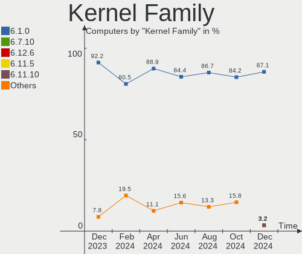
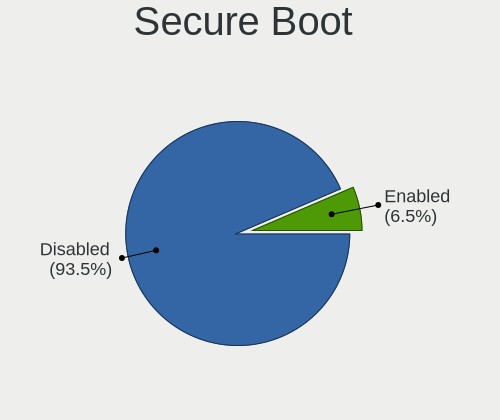
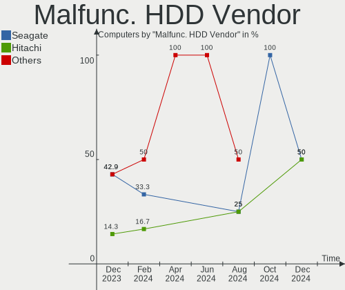
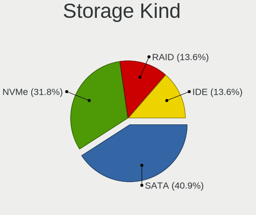
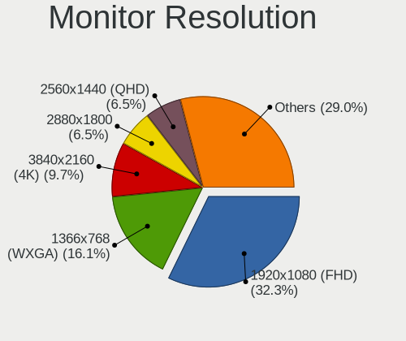
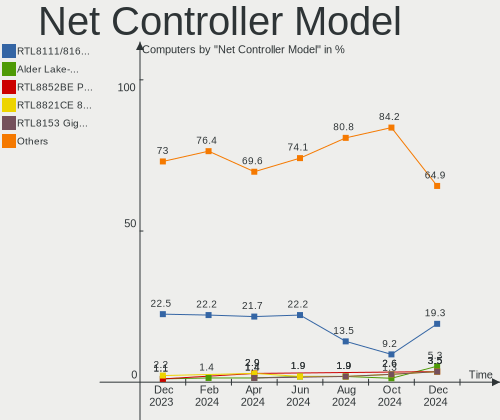
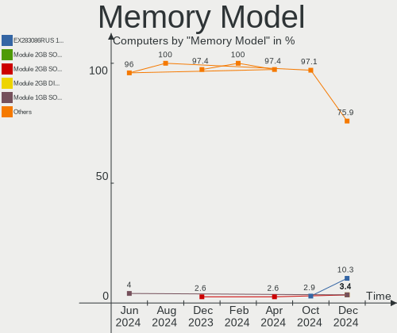
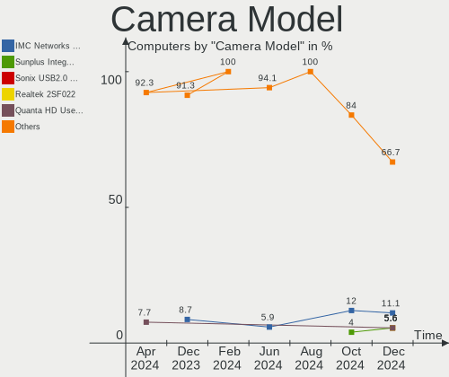
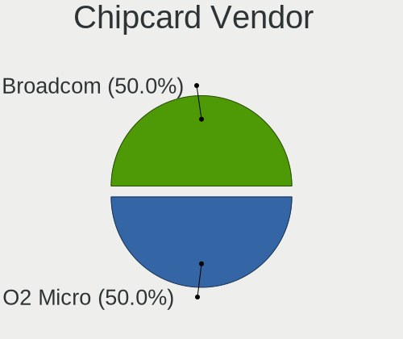

LMDE - Hardware Trends
----------------------

A project to identify most popular hardware characteristics and track their change
over time based on data collected by Linux users at https://Linux-Hardware.org.

Anyone can contribute to this report by the [hw-probe](https://github.com/linuxhw/hw-probe) tool:

    sudo -E hw-probe -all -upload

This is a report for all computer types. See also reports for [desktops](/Dist/LMDE/Desktop/README.md) and [notebooks](/Dist/LMDE/Notebook/README.md).

This report is for one last month. Overall report since the beginning of time: [TestDays](https://github.com/linuxhw/TestDays)

Period: Dec, 2024.

Contents
--------

* [ System ](#system)
  - [ OS                       ](#os)
  - [ OS Family                ](#os-family)
  - [ Kernel                   ](#kernel)
  - [ Kernel Family            ](#kernel-family)
  - [ Kernel Major Ver.        ](#kernel-major-ver)
  - [ Arch                     ](#arch)
  - [ DE                       ](#de)
  - [ Display Server           ](#display-server)
  - [ Display Manager          ](#display-manager)
  - [ OS Lang                  ](#os-lang)
  - [ Boot Mode                ](#boot-mode)
  - [ Filesystem               ](#filesystem)
  - [ Part. scheme             ](#part-scheme)
  - [ Dual Boot with Linux/BSD ](#dual-boot-with-linuxbsd)
  - [ Dual Boot (Win)          ](#dual-boot-win)

* [ Board ](#board)
  - [ Vendor                   ](#vendor)
  - [ Model                    ](#model)
  - [ Model Family             ](#model-family)
  - [ MFG Year                 ](#mfg-year)
  - [ Form Factor              ](#form-factor)
  - [ Secure Boot              ](#secure-boot)
  - [ Coreboot                 ](#coreboot)
  - [ RAM Size                 ](#ram-size)
  - [ RAM Used                 ](#ram-used)
  - [ Total Drives             ](#total-drives)
  - [ Has CD-ROM               ](#has-cd-rom)
  - [ Has Ethernet             ](#has-ethernet)
  - [ Has WiFi                 ](#has-wifi)
  - [ Has Bluetooth            ](#has-bluetooth)

* [ Location ](#location)
  - [ Country                  ](#country)
  - [ City                     ](#city)

* [ Drives ](#drives)
  - [ Drive Vendor             ](#drive-vendor)
  - [ Drive Model              ](#drive-model)
  - [ HDD Vendor               ](#hdd-vendor)
  - [ SSD Vendor               ](#ssd-vendor)
  - [ Drive Kind               ](#drive-kind)
  - [ Drive Connector          ](#drive-connector)
  - [ Drive Size               ](#drive-size)
  - [ Space Total              ](#space-total)
  - [ Space Used               ](#space-used)
  - [ Malfunc. Drives          ](#malfunc-drives)
  - [ Malfunc. Drive Vendor    ](#malfunc-drive-vendor)
  - [ Malfunc. HDD Vendor      ](#malfunc-hdd-vendor)
  - [ Malfunc. Drive Kind      ](#malfunc-drive-kind)
  - [ Failed Drives            ](#failed-drives)
  - [ Failed Drive Vendor      ](#failed-drive-vendor)
  - [ Drive Status             ](#drive-status)

* [ Storage controller ](#storage-controller)
  - [ Storage Vendor           ](#storage-vendor)
  - [ Storage Model            ](#storage-model)
  - [ Storage Kind             ](#storage-kind)

* [ Processor ](#processor)
  - [ CPU Vendor               ](#cpu-vendor)
  - [ CPU Model                ](#cpu-model)
  - [ CPU Model Family         ](#cpu-model-family)
  - [ CPU Cores                ](#cpu-cores)
  - [ CPU Sockets              ](#cpu-sockets)
  - [ CPU Threads              ](#cpu-threads)
  - [ CPU Op-Modes             ](#cpu-op-modes)
  - [ CPU Microcode            ](#cpu-microcode)
  - [ CPU Microarch            ](#cpu-microarch)

* [ Graphics ](#graphics)
  - [ GPU Vendor               ](#gpu-vendor)
  - [ GPU Model                ](#gpu-model)
  - [ GPU Combo                ](#gpu-combo)
  - [ GPU Driver               ](#gpu-driver)
  - [ GPU Memory               ](#gpu-memory)

* [ Monitor ](#monitor)
  - [ Monitor Vendor           ](#monitor-vendor)
  - [ Monitor Model            ](#monitor-model)
  - [ Monitor Resolution       ](#monitor-resolution)
  - [ Monitor Diagonal         ](#monitor-diagonal)
  - [ Monitor Width            ](#monitor-width)
  - [ Aspect Ratio             ](#aspect-ratio)
  - [ Monitor Area             ](#monitor-area)
  - [ Pixel Density            ](#pixel-density)
  - [ Multiple Monitors        ](#multiple-monitors)

* [ Network ](#network)
  - [ Net Controller Vendor    ](#net-controller-vendor)
  - [ Net Controller Model     ](#net-controller-model)
  - [ Wireless Vendor          ](#wireless-vendor)
  - [ Wireless Model           ](#wireless-model)
  - [ Ethernet Vendor          ](#ethernet-vendor)
  - [ Ethernet Model           ](#ethernet-model)
  - [ Net Controller Kind      ](#net-controller-kind)
  - [ Used Controller          ](#used-controller)
  - [ NICs                     ](#nics)
  - [ IPv6                     ](#ipv6)

* [ Bluetooth ](#bluetooth)
  - [ Bluetooth Vendor         ](#bluetooth-vendor)
  - [ Bluetooth Model          ](#bluetooth-model)

* [ Sound ](#sound)
  - [ Sound Vendor             ](#sound-vendor)
  - [ Sound Model              ](#sound-model)

* [ Memory ](#memory)
  - [ Memory Vendor            ](#memory-vendor)
  - [ Memory Model             ](#memory-model)
  - [ Memory Kind              ](#memory-kind)
  - [ Memory Form Factor       ](#memory-form-factor)
  - [ Memory Size              ](#memory-size)
  - [ Memory Speed             ](#memory-speed)

* [ Printers & scanners ](#printers--scanners)
  - [ Printer Vendor           ](#printer-vendor)
  - [ Printer Model            ](#printer-model)
  - [ Scanner Vendor           ](#scanner-vendor)
  - [ Scanner Model            ](#scanner-model)

* [ Camera ](#camera)
  - [ Camera Vendor            ](#camera-vendor)
  - [ Camera Model             ](#camera-model)

* [ Security ](#security)
  - [ Fingerprint Vendor       ](#fingerprint-vendor)
  - [ Fingerprint Model        ](#fingerprint-model)
  - [ Chipcard Vendor          ](#chipcard-vendor)
  - [ Chipcard Model           ](#chipcard-model)

* [ Unsupported ](#unsupported)
  - [ Unsupported Devices      ](#unsupported-devices)
  - [ Unsupported Device Types ](#unsupported-device-types)

System
------

OS
--

Installed operating systems

| Name   | Computers | Percent |
|--------|-----------|---------|
| LMDE 6 | 31        | 100%    |

OS Family
---------

OS without a version

| Name | Computers | Percent |
|------|-----------|---------|
| LMDE | 31        | 100%    |

Kernel
------

Version of the Linux kernel

| Version                 | Computers | Percent |
|-------------------------|-----------|---------|
| 6.1.0-28-amd64          | 17        | 54.84%  |
| 6.1.0-12-amd64          | 6         | 19.35%  |
| 6.1.0-28-686            | 2         | 6.45%   |
| 6.7.10-060710-generic   | 1         | 3.23%   |
| 6.12.6-1-liquorix-amd64 | 1         | 3.23%   |
| 6.11.5+bpo-amd64        | 1         | 3.23%   |
| 6.11.10+bpo-amd64       | 1         | 3.23%   |
| 6.1.0-26-amd64          | 1         | 3.23%   |
| 6.1.0-12-686            | 1         | 3.23%   |

Kernel Family
-------------

Linux kernel without a distro release

| Version | Computers | Percent |
|---------|-----------|---------|
| 6.1.0   | 27        | 87.1%   |
| 6.7.10  | 1         | 3.23%   |
| 6.12.6  | 1         | 3.23%   |
| 6.11.5  | 1         | 3.23%   |
| 6.11.10 | 1         | 3.23%   |

Kernel Major Ver.
-----------------

Linux kernel major version

| Version | Computers | Percent |
|---------|-----------|---------|
| 6.1     | 27        | 87.1%   |
| 6.11    | 2         | 6.45%   |
| 6.7     | 1         | 3.23%   |
| 6.12    | 1         | 3.23%   |

Arch
----

OS architecture (x86_64, i586, etc.)

| Name   | Computers | Percent |
|--------|-----------|---------|
| x86_64 | 28        | 90.32%  |
| i686   | 3         | 9.68%   |

DE
--

Desktop Environment

| Name       | Computers | Percent |
|------------|-----------|---------|
| X-Cinnamon | 29        | 93.55%  |
| Cinnamon   | 2         | 6.45%   |

Display Server
--------------

X11 or Wayland

| Name | Computers | Percent |
|------|-----------|---------|
| X11  | 31        | 100%    |

Display Manager
---------------

SDDM, LightDM, etc.

| Name    | Computers | Percent |
|---------|-----------|---------|
| LightDM | 22        | 70.97%  |
| Unknown | 9         | 29.03%  |

OS Lang
-------

Language

| Lang  | Computers | Percent |
|-------|-----------|---------|
| en_US | 9         | 29.03%  |
| de_DE | 7         | 22.58%  |
| it_IT | 4         | 12.9%   |
| sv_SE | 3         | 9.68%   |
| ru_RU | 2         | 6.45%   |
| tr_TR | 1         | 3.23%   |
| ro_RO | 1         | 3.23%   |
| pt_BR | 1         | 3.23%   |
| pl_PL | 1         | 3.23%   |
| nn_NO | 1         | 3.23%   |
| en_GB | 1         | 3.23%   |

Boot Mode
---------

EFI or BIOS

| Mode | Computers | Percent |
|------|-----------|---------|
| EFI  | 20        | 64.52%  |
| BIOS | 11        | 35.48%  |

Filesystem
----------

Type of filesystem

| Type    | Computers | Percent |
|---------|-----------|---------|
| Ext4    | 26        | 83.87%  |
| Btrfs   | 3         | 9.68%   |
| Tmpfs   | 1         | 3.23%   |
| Overlay | 1         | 3.23%   |

Part. scheme
------------

Scheme of partitioning

| Type    | Computers | Percent |
|---------|-----------|---------|
| GPT     | 14        | 45.16%  |
| Unknown | 10        | 32.26%  |
| MBR     | 7         | 22.58%  |

Dual Boot with Linux/BSD
------------------------

Hosting more than one Linux/BSD

| Dual boot | Computers | Percent |
|-----------|-----------|---------|
| No        | 28        | 90.32%  |
| Yes       | 3         | 9.68%   |

Dual Boot (Win)
---------------

Hosting Linux and Windows

| Dual boot | Computers | Percent |
|-----------|-----------|---------|
| No        | 21        | 67.74%  |
| Yes       | 10        | 32.26%  |

Board
-----

Vendor
------

Motherboard manufacturer

| Name                | Computers | Percent |
|---------------------|-----------|---------|
| ASUSTek Computer    | 10        | 32.26%  |
| Lenovo              | 6         | 19.35%  |
| Dell                | 4         | 12.9%   |
| Acer                | 4         | 12.9%   |
| Sony                | 1         | 3.23%   |
| PELADN              | 1         | 3.23%   |
| Insyde              | 1         | 3.23%   |
| Hewlett-Packard     | 1         | 3.23%   |
| Gigabyte Technology | 1         | 3.23%   |
| Fujitsu             | 1         | 3.23%   |
| ASRock              | 1         | 3.23%   |

Model
-----

Motherboard model

| Name                                     | Computers | Percent |
|------------------------------------------|-----------|---------|
| Sony VPCM12M1E                           | 1         | 3.23%   |
| PELADN WI-6                              | 1         | 3.23%   |
| Lenovo Yoga Slim 6 14IAP8 82WU           | 1         | 3.23%   |
| Lenovo ThinkPad X240 20AM001JUS          | 1         | 3.23%   |
| Lenovo ThinkPad T60 2007YQY              | 1         | 3.23%   |
| Lenovo ThinkPad E495 20NE0002US          | 1         | 3.23%   |
| Lenovo ThinkCentre M58p 7220AVG          | 1         | 3.23%   |
| Lenovo IdeaPad Slim 3 14IAH8 83EQ        | 1         | 3.23%   |
| Insyde BayTrail                          | 1         | 3.23%   |
| HP Compaq dc5800 Small Form Factor       | 1         | 3.23%   |
| Gigabyte B550M DS3H                      | 1         | 3.23%   |
| Fujitsu LIFEBOOK E753                    | 1         | 3.23%   |
| Dell Precision Tower 3620                | 1         | 3.23%   |
| Dell Precision 3551                      | 1         | 3.23%   |
| Dell PowerEdge 2950                      | 1         | 3.23%   |
| Dell Inspiron 5577                       | 1         | 3.23%   |
| ASUS VivoBook_ASUSLaptop X515JAB_X515JA  | 1         | 3.23%   |
| ASUS VivoBook_ASUSLaptop S5402ZA_S5402ZA | 1         | 3.23%   |
| ASUS Vivobook Go E1404FA_E1404FA         | 1         | 3.23%   |
| ASUS ROG STRIX B450-F GAMING             | 1         | 3.23%   |
| ASUS PRIME Z390-P                        | 1         | 3.23%   |
| ASUS PRIME B250M-C                       | 1         | 3.23%   |
| ASUS NUC13ANH-B                          | 1         | 3.23%   |
| ASUS N551JK                              | 1         | 3.23%   |
| ASUS ASUS TUF Gaming A16 FA617NT_FA617NT | 1         | 3.23%   |
| ASUS All Series                          | 1         | 3.23%   |
| ASRock H110M-HDV R3.0                    | 1         | 3.23%   |
| Acer Extensa 5220                        | 1         | 3.23%   |
| Acer Aspire AV15-51                      | 1         | 3.23%   |
| Acer Aspire A515-57                      | 1         | 3.23%   |
| Acer Aspire 5738                         | 1         | 3.23%   |

Model Family
------------

Motherboard model prefix

| Name               | Computers | Percent |
|--------------------|-----------|---------|
| Lenovo ThinkPad    | 3         | 9.68%   |
| ASUS VivoBook      | 3         | 9.68%   |
| Acer Aspire        | 3         | 9.68%   |
| Dell Precision     | 2         | 6.45%   |
| ASUS PRIME         | 2         | 6.45%   |
| Sony VPCM12M1E     | 1         | 3.23%   |
| PELADN WI-6        | 1         | 3.23%   |
| Lenovo Yoga        | 1         | 3.23%   |
| Lenovo ThinkCentre | 1         | 3.23%   |
| Lenovo IdeaPad     | 1         | 3.23%   |
| Insyde BayTrail    | 1         | 3.23%   |
| HP Compaq          | 1         | 3.23%   |
| Gigabyte B550M     | 1         | 3.23%   |
| Fujitsu LIFEBOOK   | 1         | 3.23%   |
| Dell PowerEdge     | 1         | 3.23%   |
| Dell Inspiron      | 1         | 3.23%   |
| ASUS ROG           | 1         | 3.23%   |
| ASUS NUC13ANH-B    | 1         | 3.23%   |
| ASUS N551JK        | 1         | 3.23%   |
| ASUS ASUS          | 1         | 3.23%   |
| ASUS All           | 1         | 3.23%   |
| ASRock H110M-HDV   | 1         | 3.23%   |
| Acer Extensa       | 1         | 3.23%   |

MFG Year
--------

Motherboard manufacture year

| Year | Computers | Percent |
|------|-----------|---------|
| 2023 | 4         | 12.9%   |
| 2013 | 3         | 9.68%   |
| 2024 | 2         | 6.45%   |
| 2022 | 2         | 6.45%   |
| 2021 | 2         | 6.45%   |
| 2020 | 2         | 6.45%   |
| 2018 | 2         | 6.45%   |
| 2017 | 2         | 6.45%   |
| 2016 | 2         | 6.45%   |
| 2008 | 2         | 6.45%   |
| 2007 | 2         | 6.45%   |
| 2019 | 1         | 3.23%   |
| 2015 | 1         | 3.23%   |
| 2014 | 1         | 3.23%   |
| 2010 | 1         | 3.23%   |
| 2009 | 1         | 3.23%   |
| 2006 | 1         | 3.23%   |

Form Factor
-----------

Physical design of the computer

| Name     | Computers | Percent |
|----------|-----------|---------|
| Notebook | 19        | 61.29%  |
| Desktop  | 10        | 32.26%  |
| Mini pc  | 1         | 3.23%   |
| Server   | 1         | 3.23%   |

Secure Boot
-----------

Enabled or disabled

| State    | Computers | Percent |
|----------|-----------|---------|
| Disabled | 29        | 93.55%  |
| Enabled  | 2         | 6.45%   |

Coreboot
--------

Have coreboot on board

| Used | Computers | Percent |
|------|-----------|---------|
| No   | 31        | 100%    |

RAM Size
--------

Total RAM memory

| Size in GB  | Computers | Percent |
|-------------|-----------|---------|
| 4.01-8.0    | 7         | 22.58%  |
| 16.01-24.0  | 6         | 19.35%  |
| 32.01-64.0  | 5         | 16.13%  |
| 8.01-16.0   | 5         | 16.13%  |
| 3.01-4.0    | 4         | 12.9%   |
| 0.51-1.0    | 2         | 6.45%   |
| 64.01-256.0 | 1         | 3.23%   |
| 1.01-2.0    | 1         | 3.23%   |

RAM Used
--------

Used RAM memory

| Used GB   | Computers | Percent |
|-----------|-----------|---------|
| 2.01-3.0  | 11        | 35.48%  |
| 3.01-4.0  | 7         | 22.58%  |
| 1.01-2.0  | 6         | 19.35%  |
| 4.01-8.0  | 3         | 9.68%   |
| 8.01-16.0 | 2         | 6.45%   |
| 0.51-1.0  | 1         | 3.23%   |
| 0.01-0.5  | 1         | 3.23%   |

Total Drives
------------

Number of drives on board

| Drives | Computers | Percent |
|--------|-----------|---------|
| 1      | 16        | 51.61%  |
| 2      | 10        | 32.26%  |
| 4      | 3         | 9.68%   |
| 6      | 1         | 3.23%   |
| 3      | 1         | 3.23%   |

Has CD-ROM
----------

Has CD-ROM on board

| Presented | Computers | Percent |
|-----------|-----------|---------|
| No        | 22        | 70.97%  |
| Yes       | 9         | 29.03%  |

Has Ethernet
------------

Has Ethernet on board

| Presented | Computers | Percent |
|-----------|-----------|---------|
| Yes       | 27        | 87.1%   |
| No        | 4         | 12.9%   |

Has WiFi
--------

Has WiFi module

| Presented | Computers | Percent |
|-----------|-----------|---------|
| Yes       | 25        | 80.65%  |
| No        | 6         | 19.35%  |

Has Bluetooth
-------------

Has Bluetooth module

| Presented | Computers | Percent |
|-----------|-----------|---------|
| Yes       | 22        | 70.97%  |
| No        | 9         | 29.03%  |

Location
--------

Country
-------

Geographic location (country)

| Country    | Computers | Percent |
|------------|-----------|---------|
| USA        | 7         | 22.58%  |
| Germany    | 7         | 22.58%  |
| Italy      | 4         | 12.9%   |
| Sweden     | 3         | 9.68%   |
| Russia     | 2         | 6.45%   |
| UK         | 1         | 3.23%   |
| Romania    | 1         | 3.23%   |
| Poland     | 1         | 3.23%   |
| Norway     | 1         | 3.23%   |
| Mexico     | 1         | 3.23%   |
| Kyrgyzstan | 1         | 3.23%   |
| Canada     | 1         | 3.23%   |
| Brazil     | 1         | 3.23%   |

City
----

Geographic location (city)

| City              | Computers | Percent |
|-------------------|-----------|---------|
| Berlin            | 3         | 9.68%   |
| Malmo             | 2         | 6.45%   |
| Bologna           | 2         | 6.45%   |
| York              | 1         | 3.23%   |
| Wroclaw           | 1         | 3.23%   |
| Troisdorf         | 1         | 3.23%   |
| Toronto           | 1         | 3.23%   |
| Sugar Land        | 1         | 3.23%   |
| St Petersburg     | 1         | 3.23%   |
| Salt Lake City    | 1         | 3.23%   |
| Râmnicu Vâlcea  | 1         | 3.23%   |
| Pachuca           | 1         | 3.23%   |
| New York          | 1         | 3.23%   |
| Milan             | 1         | 3.23%   |
| Meppen            | 1         | 3.23%   |
| Lundersaeter      | 1         | 3.23%   |
| Kansas City       | 1         | 3.23%   |
| Kaliningrad       | 1         | 3.23%   |
| Indianapolis      | 1         | 3.23%   |
| Homosassa         | 1         | 3.23%   |
| Hendrix           | 1         | 3.23%   |
| Gravataí         | 1         | 3.23%   |
| Gothenburg        | 1         | 3.23%   |
| Florence          | 1         | 3.23%   |
| Delligsen         | 1         | 3.23%   |
| Bishkek           | 1         | 3.23%   |
| Bergen auf Ruegen | 1         | 3.23%   |

Drives
------

Drive Vendor
------------

Hard drive vendors

| Vendor              | Computers | Drives | Percent |
|---------------------|-----------|--------|---------|
| WDC                 | 5         | 6      | 10.42%  |
| SanDisk             | 5         | 5      | 10.42%  |
| Seagate             | 4         | 6      | 8.33%   |
| Kingston            | 4         | 4      | 8.33%   |
| Crucial             | 4         | 5      | 8.33%   |
| Unknown             | 3         | 3      | 6.25%   |
| Samsung Electronics | 3         | 5      | 6.25%   |
| Micron Technology   | 2         | 2      | 4.17%   |
| A-DATA Technology   | 2         | 2      | 4.17%   |
| XrayDisk            | 1         | 1      | 2.08%   |
| UMIS                | 1         | 1      | 2.08%   |
| Toshiba             | 1         | 1      | 2.08%   |
| TO Exter            | 1         | 1      | 2.08%   |
| T-FORCE             | 1         | 1      | 2.08%   |
| SPCC                | 1         | 1      | 2.08%   |
| SK hynix            | 1         | 1      | 2.08%   |
| Phison Electronics  | 1         | 1      | 2.08%   |
| JMicron Technology  | 1         | 1      | 2.08%   |
| Hitachi             | 1         | 1      | 2.08%   |
| HGST                | 1         | 1      | 2.08%   |
| EDILOCA             | 1         | 1      | 2.08%   |
| Dell                | 1         | 1      | 2.08%   |
| China               | 1         | 1      | 2.08%   |
| ADATA Technology    | 1         | 1      | 2.08%   |
| Unknown             | 1         | 1      | 2.08%   |

Drive Model
-----------

Hard drive models

| Model                                   | Computers | Percent |
|-----------------------------------------|-----------|---------|
| Seagate ST2000DM006-2DM164 2TB          | 2         | 3.77%   |
| SanDisk NVMe SSD Drive 1TB              | 2         | 3.77%   |
| XrayDisk NVMe SSD Drive 512GB           | 1         | 1.89%   |
| WDC WDS250G2B0B 250GB SSD               | 1         | 1.89%   |
| WDC WD40EZAZ-00SF3B0 4TB                | 1         | 1.89%   |
| WDC WD3200BPVT-75ZEST0 320GB            | 1         | 1.89%   |
| WDC WD3200AAJS-00L7A0 320GB             | 1         | 1.89%   |
| WDC WD20EFRX-68EUZN0 2TB                | 1         | 1.89%   |
| WDC WD10EALS-002BA0 1TB                 | 1         | 1.89%   |
| Unknown SC128  128GB                    | 1         | 1.89%   |
| Unknown MMC Card  16GB                  | 1         | 1.89%   |
| Unknown 032G72  32GB                    | 1         | 1.89%   |
| UMIS RPJTJ256MED1OWX 256GB              | 1         | 1.89%   |
| Toshiba TR200 240GB SSD                 | 1         | 1.89%   |
| TO Exter nal USB 3.0 1024GB             | 1         | 1.89%   |
| T-FORCE 1TB                             | 1         | 1.89%   |
| SPCC Solid State Disk 512GB             | 1         | 1.89%   |
| SK hynix HFM128GD3JX016N 128GB          | 1         | 1.89%   |
| Seagate ST9250315AS 250GB               | 1         | 1.89%   |
| Seagate ST500DM002-1SB10A 500GB         | 1         | 1.89%   |
| Seagate ST3000DM008-2DM166 3TB          | 1         | 1.89%   |
| Seagate ST1000DM003-1ER162 1TB          | 1         | 1.89%   |
| Sandisk WD Blue SN550 NVMe SSD 256GB    | 1         | 1.89%   |
| SanDisk SSD U110 16GB                   | 1         | 1.89%   |
| SanDisk NVMe SSD Drive 512GB            | 1         | 1.89%   |
| Samsung SSD 990 PRO 1TB                 | 1         | 1.89%   |
| Samsung SSD 980 PRO 1TB                 | 1         | 1.89%   |
| Samsung SSD 850 EVO 250GB               | 1         | 1.89%   |
| Samsung PM991a NVMe 256GB               | 1         | 1.89%   |
| Samsung MZVL4512HBLU-00BTW 512GB        | 1         | 1.89%   |
| Phison PS5013 E13 NVMe Controller 512GB | 1         | 1.89%   |
| Micron 2450_MTFDKBA512TFK 512GB         | 1         | 1.89%   |
| Micron 2400_MTFDKBA1T0QFM 1TB           | 1         | 1.89%   |
| Kingston SV300S37A240G 240GB SSD        | 1         | 1.89%   |
| Kingston SKC3000S1024G 1TB              | 1         | 1.89%   |
| Kingston SFYRD2000G 2TB                 | 1         | 1.89%   |
| Kingston SA400S37480G 480GB SSD         | 1         | 1.89%   |
| JMicron Generic 500GB                   | 1         | 1.89%   |
| Hitachi HTS541612J9SA00 120GB           | 1         | 1.89%   |
| HGST HTS541010A9E680 1TB                | 1         | 1.89%   |

HDD Vendor
----------

Hard disk drive vendors

| Vendor             | Computers | Drives | Percent |
|--------------------|-----------|--------|---------|
| WDC                | 5         | 5      | 38.46%  |
| Seagate            | 4         | 6      | 30.77%  |
| TO Exter           | 1         | 1      | 7.69%   |
| JMicron Technology | 1         | 1      | 7.69%   |
| Hitachi            | 1         | 1      | 7.69%   |
| HGST               | 1         | 1      | 7.69%   |

SSD Vendor
----------

Solid state drive vendors

| Vendor              | Computers | Drives | Percent |
|---------------------|-----------|--------|---------|
| Crucial             | 3         | 4      | 21.43%  |
| Kingston            | 2         | 2      | 14.29%  |
| A-DATA Technology   | 2         | 2      | 14.29%  |
| WDC                 | 1         | 1      | 7.14%   |
| Toshiba             | 1         | 1      | 7.14%   |
| SPCC                | 1         | 1      | 7.14%   |
| SanDisk             | 1         | 1      | 7.14%   |
| Samsung Electronics | 1         | 1      | 7.14%   |
| China               | 1         | 1      | 7.14%   |
| Unknown             | 1         | 1      | 7.14%   |

Drive Kind
----------

HDD or SSD

| Kind    | Computers | Drives | Percent |
|---------|-----------|--------|---------|
| NVMe    | 14        | 18     | 34.15%  |
| SSD     | 11        | 15     | 26.83%  |
| HDD     | 11        | 15     | 26.83%  |
| MMC     | 3         | 3      | 7.32%   |
| Unknown | 2         | 3      | 4.88%   |

Drive Connector
---------------

SATA, SAS, NVMe, etc.

| Type | Computers | Drives | Percent |
|------|-----------|--------|---------|
| SATA | 19        | 30     | 48.72%  |
| NVMe | 14        | 18     | 35.9%   |
| SAS  | 3         | 3      | 7.69%   |
| MMC  | 3         | 3      | 7.69%   |

Drive Size
----------

Size of hard drive

| Size in TB | Computers | Drives | Percent |
|------------|-----------|--------|---------|
| 0.01-0.5   | 14        | 17     | 53.85%  |
| 0.51-1.0   | 6         | 7      | 23.08%  |
| 1.01-2.0   | 4         | 4      | 15.38%  |
| 3.01-4.0   | 1         | 1      | 3.85%   |
| 2.01-3.0   | 1         | 1      | 3.85%   |

Space Total
-----------

Amount of disk space available on the file system

| Size in GB     | Computers | Percent |
|----------------|-----------|---------|
| 101-250        | 9         | 29.03%  |
| 501-1000       | 8         | 25.81%  |
| 251-500        | 4         | 12.9%   |
| 1001-2000      | 4         | 12.9%   |
| More than 3000 | 2         | 6.45%   |
| 2001-3000      | 2         | 6.45%   |
| 51-100         | 2         | 6.45%   |

Space Used
----------

Amount of used disk space

| Used GB        | Computers | Percent |
|----------------|-----------|---------|
| 21-50          | 9         | 29.03%  |
| 1-20           | 6         | 19.35%  |
| 101-250        | 4         | 12.9%   |
| 501-1000       | 4         | 12.9%   |
| 51-100         | 4         | 12.9%   |
| 251-500        | 2         | 6.45%   |
| More than 3000 | 1         | 3.23%   |
| 1001-2000      | 1         | 3.23%   |

Malfunc. Drives
---------------

Drive models with a malfunction

| Model                             | Computers | Drives | Percent |
|-----------------------------------|-----------|--------|---------|
| Seagate ST2000DM006-2DM164 2TB    | 1         | 1      | 25%     |
| Hitachi HTS541612J9SA00 120GB     | 1         | 1      | 25%     |
| Crucial CT525MX300SSD1 528GB      | 1         | 2      | 25%     |
| A-DATA Technology SU650 240GB SSD | 1         | 1      | 25%     |

Malfunc. Drive Vendor
---------------------

Vendors of faulty drives

| Vendor            | Computers | Drives | Percent |
|-------------------|-----------|--------|---------|
| Seagate           | 1         | 1      | 25%     |
| Hitachi           | 1         | 1      | 25%     |
| Crucial           | 1         | 2      | 25%     |
| A-DATA Technology | 1         | 1      | 25%     |

Malfunc. HDD Vendor
-------------------

Vendors of faulty HDD drives

| Vendor  | Computers | Drives | Percent |
|---------|-----------|--------|---------|
| Seagate | 1         | 1      | 50%     |
| Hitachi | 1         | 1      | 50%     |

Malfunc. Drive Kind
-------------------

Kinds of faulty drives

| Kind | Computers | Drives | Percent |
|------|-----------|--------|---------|
| SSD  | 2         | 3      | 50%     |
| HDD  | 2         | 2      | 50%     |

Failed Drives
-------------

Failed drive models

Zero info for selected period =(

Failed Drive Vendor
-------------------

Failed drive vendors

Zero info for selected period =(

Drive Status
------------

Number of failed and malfunc. drives

| Status   | Computers | Drives | Percent |
|----------|-----------|--------|---------|
| Detected | 16        | 26     | 44.44%  |
| Works    | 16        | 23     | 44.44%  |
| Malfunc  | 4         | 5      | 11.11%  |

Storage controller
------------------

Storage Vendor
--------------

Storage controller vendors

| Vendor                      | Computers | Percent |
|-----------------------------|-----------|---------|
| Intel                       | 23        | 53.49%  |
| SanDisk                     | 4         | 9.3%    |
| Samsung Electronics         | 3         | 6.98%   |
| Micron Technology           | 2         | 4.65%   |
| Kingston Technology Company | 2         | 4.65%   |
| AMD                         | 2         | 4.65%   |
| Union Memory (Shenzhen)     | 1         | 2.33%   |
| SK hynix                    | 1         | 2.33%   |
| Phison Electronics          | 1         | 2.33%   |
| Micron/Crucial Technology   | 1         | 2.33%   |
| Hosin Global Electronics    | 1         | 2.33%   |
| Dell                        | 1         | 2.33%   |
| ADATA Technology            | 1         | 2.33%   |

Storage Model
-------------

Storage controller models

| Model                                                                          | Computers | Percent |
|--------------------------------------------------------------------------------|-----------|---------|
| Intel Volume Management Device NVMe RAID Controller                            | 3         | 5.88%   |
| SanDisk WD Black SN770 / PC SN740 256GB / PC SN560 (DRAM-less) NVMe SSD        | 2         | 3.92%   |
| Kingston Company KC3000/FURY Renegade NVMe SSD [E18]                           | 2         | 3.92%   |
| Intel Q170/Q150/B150/H170/H110/Z170/CM236 Chipset SATA Controller [AHCI Mode]  | 2         | 3.92%   |
| Intel Alder Lake-P SATA AHCI Controller                                        | 2         | 3.92%   |
| Intel 8 Series/C220 Series Chipset Family 6-port SATA Controller 1 [AHCI mode] | 2         | 3.92%   |
| Union Memory (Shenzhen) AM611 PCIe 3.0 x2 NVMe SSD 256GB                       | 1         | 1.96%   |
| SK hynix Gold P31/BC711/PC711 NVMe Solid State Drive                           | 1         | 1.96%   |
| Sandisk WD Black SN850X NVMe SSD                                               | 1         | 1.96%   |
| SanDisk Ultra 3D / WD PC SN530, IX SN530, Blue SN550 NVMe SSD (DRAM-less)      | 1         | 1.96%   |
| Samsung NVMe SSD Controller S4LV008[Pascal]                                    | 1         | 1.96%   |
| Samsung NVMe SSD Controller PM9B1 (DRAM-less)                                  | 1         | 1.96%   |
| Samsung NVMe SSD Controller PM9A1/PM9A3/980PRO                                 | 1         | 1.96%   |
| Samsung NVMe SSD Controller 980 (DRAM-less)                                    | 1         | 1.96%   |
| Phison PS5013-E13 PCIe3 NVMe Controller (DRAM-less)                            | 1         | 1.96%   |
| Micron/Crucial P310 NVMe PCIe SSD (DRAM-less)                                  | 1         | 1.96%   |
| Micron 2450 NVMe SSD [HendrixV] (DRAM-less)                                    | 1         | 1.96%   |
| Micron 2400 NVMe SSD (DRAM-less)                                               | 1         | 1.96%   |
| Intel Tiger Lake-LP SATA Controller                                            | 1         | 1.96%   |
| Intel SATA Controller [RAID mode]                                              | 1         | 1.96%   |
| Intel NM10/ICH7 Family SATA Controller [IDE mode]                              | 1         | 1.96%   |
| Intel HM170/QM170 Chipset SATA Controller [AHCI Mode]                          | 1         | 1.96%   |
| Intel Alder Lake-N SATA AHCI Controller                                        | 1         | 1.96%   |
| Intel 82801JD/DO (ICH10 Family) SATA AHCI Controller                           | 1         | 1.96%   |
| Intel 82801IBM/IEM (ICH9M/ICH9M-E) 4 port SATA Controller [AHCI mode]          | 1         | 1.96%   |
| Intel 82801IB (ICH9) 2 port SATA Controller [IDE mode]                         | 1         | 1.96%   |
| Intel 82801I (ICH9 Family) 2 port SATA Controller [IDE mode]                   | 1         | 1.96%   |
| Intel 82801HM/HEM (ICH8M/ICH8M-E) SATA Controller [IDE mode]                   | 1         | 1.96%   |
| Intel 82801HM/HEM (ICH8M/ICH8M-E) IDE Controller                               | 1         | 1.96%   |
| Intel 82801GBM/GHM (ICH7-M Family) SATA Controller [AHCI mode]                 | 1         | 1.96%   |
| Intel 82801G (ICH7 Family) IDE Controller                                      | 1         | 1.96%   |
| Intel 82801 Mobile SATA Controller [RAID mode]                                 | 1         | 1.96%   |
| Intel 8 Series SATA Controller 1 [AHCI mode]                                   | 1         | 1.96%   |
| Intel 7 Series Chipset Family 6-port SATA Controller [AHCI mode]               | 1         | 1.96%   |
| Intel 631xESB/632xESB IDE Controller                                           | 1         | 1.96%   |
| Intel 400 Series Chipset Family SATA AHCI Controller                           | 1         | 1.96%   |
| Intel 4 Series Chipset PT IDER Controller                                      | 1         | 1.96%   |
| Intel 200 Series PCH SATA controller [AHCI mode]                               | 1         | 1.96%   |
| Hosin Global Patriot P300 NVMe SSD (DRAM-less)                                 | 1         | 1.96%   |
| Dell PowerEdge Expandable RAID controller 5                                    | 1         | 1.96%   |

Storage Kind
------------

Kind of storage controller (IDE, SATA, NVMe, SAS, ...)

| Kind | Computers | Percent |
|------|-----------|---------|
| SATA | 18        | 40.91%  |
| NVMe | 14        | 31.82%  |
| RAID | 6         | 13.64%  |
| IDE  | 6         | 13.64%  |

Processor
---------

CPU Vendor
----------

Processor vendors

| Vendor | Computers | Percent |
|--------|-----------|---------|
| Intel  | 26        | 83.87%  |
| AMD    | 5         | 16.13%  |

CPU Model
---------

Processor models

| Model                                         | Computers | Percent |
|-----------------------------------------------|-----------|---------|
| AMD Ryzen 7 3700X 8-Core Processor            | 2         | 6.45%   |
| Intel Xeon CPU E3-1240 v6 @ 3.70GHz           | 1         | 3.23%   |
| Intel Xeon CPU 5130 @ 2.00GHz                 | 1         | 3.23%   |
| Intel Pentium Dual-Core CPU E5300 @ 2.60GHz   | 1         | 3.23%   |
| Intel N100                                    | 1         | 3.23%   |
| Intel Core i7-7700HQ CPU @ 2.80GHz            | 1         | 3.23%   |
| Intel Core i7-6700K CPU @ 4.00GHz             | 1         | 3.23%   |
| Intel Core i7-4710HQ CPU @ 2.50GHz            | 1         | 3.23%   |
| Intel Core i7-3632QM CPU @ 2.20GHz            | 1         | 3.23%   |
| Intel Core i7-10850H CPU @ 2.70GHz            | 1         | 3.23%   |
| Intel Core i5-9600KF CPU @ 3.70GHz            | 1         | 3.23%   |
| Intel Core i5-6400T CPU @ 2.20GHz             | 1         | 3.23%   |
| Intel Core i5-4300U CPU @ 1.90GHz             | 1         | 3.23%   |
| Intel Core i3-4150 CPU @ 3.50GHz              | 1         | 3.23%   |
| Intel Core i3-1005G1 CPU @ 1.20GHz            | 1         | 3.23%   |
| Intel Core Duo CPU T2600 @ 2.16GHz            | 1         | 3.23%   |
| Intel Core 2 Duo CPU P7450 @ 2.13GHz          | 1         | 3.23%   |
| Intel Core 2 Duo CPU E8400 @ 3.00GHz          | 1         | 3.23%   |
| Intel Celeron CPU 560 @ 2.13GHz               | 1         | 3.23%   |
| Intel Atom CPU Z3735F @ 1.33GHz               | 1         | 3.23%   |
| Intel Atom CPU N470 @ 1.83GHz                 | 1         | 3.23%   |
| Intel 13th Gen Core i5-1340P                  | 1         | 3.23%   |
| Intel 12th Gen Core i7-12700H                 | 1         | 3.23%   |
| Intel 12th Gen Core i7-12650H                 | 1         | 3.23%   |
| Intel 12th Gen Core i5-12450H                 | 1         | 3.23%   |
| Intel 12th Gen Core i5-1240P                  | 1         | 3.23%   |
| Intel 11th Gen Core i5-1155G7 @ 2.50GHz       | 1         | 3.23%   |
| AMD Ryzen 7 7735HS with Radeon Graphics       | 1         | 3.23%   |
| AMD Ryzen 5 7520U with Radeon Graphics        | 1         | 3.23%   |
| AMD Ryzen 5 3500U with Radeon Vega Mobile Gfx | 1         | 3.23%   |

CPU Model Family
----------------

Processor model prefix

| Model                   | Computers | Percent |
|-------------------------|-----------|---------|
| Other                   | 7         | 22.58%  |
| Intel Core i7           | 5         | 16.13%  |
| Intel Core i5           | 3         | 9.68%   |
| AMD Ryzen 7             | 3         | 9.68%   |
| Intel Xeon              | 2         | 6.45%   |
| Intel Core i3           | 2         | 6.45%   |
| Intel Core 2 Duo        | 2         | 6.45%   |
| Intel Atom              | 2         | 6.45%   |
| AMD Ryzen 5             | 2         | 6.45%   |
| Intel Pentium Dual-Core | 1         | 3.23%   |
| Intel Core Duo          | 1         | 3.23%   |
| Intel Celeron           | 1         | 3.23%   |

CPU Cores
---------

Number of processor cores

| Number | Computers | Percent |
|--------|-----------|---------|
| 4      | 12        | 38.71%  |
| 2      | 7         | 22.58%  |
| 8      | 4         | 12.9%   |
| 12     | 2         | 6.45%   |
| 6      | 2         | 6.45%   |
| 1      | 2         | 6.45%   |
| 14     | 1         | 3.23%   |
| 10     | 1         | 3.23%   |

CPU Sockets
-----------

Number of sockets

| Number | Computers | Percent |
|--------|-----------|---------|
| 1      | 30        | 96.77%  |
| 2      | 1         | 3.23%   |

CPU Threads
-----------

Threads per core (Hyper-Threading)

| Number | Computers | Percent |
|--------|-----------|---------|
| 2      | 21        | 67.74%  |
| 1      | 10        | 32.26%  |

CPU Op-Modes
------------

CPU Operation Modes (32-bit, 64-bit)

| Op mode        | Computers | Percent |
|----------------|-----------|---------|
| 32-bit, 64-bit | 30        | 96.77%  |
| 32-bit         | 1         | 3.23%   |

CPU Microcode
-------------

Microcode number

| Number     | Computers | Percent |
|------------|-----------|---------|
| Unknown    | 5         | 16.13%  |
| 0x906e9    | 2         | 6.45%   |
| 0x906a3    | 2         | 6.45%   |
| 0x506e3    | 2         | 6.45%   |
| 0x1067a    | 2         | 6.45%   |
| 0xb06e0    | 1         | 3.23%   |
| 0xb06a2    | 1         | 3.23%   |
| 0xa0652    | 1         | 3.23%   |
| 0x806c2    | 1         | 3.23%   |
| 0x706e5    | 1         | 3.23%   |
| 0x6f6      | 1         | 3.23%   |
| 0x6ec      | 1         | 3.23%   |
| 0x40651    | 1         | 3.23%   |
| 0x306c3    | 1         | 3.23%   |
| 0x306a9    | 1         | 3.23%   |
| 0x30678    | 1         | 3.23%   |
| 0x106ca    | 1         | 3.23%   |
| 0x10676    | 1         | 3.23%   |
| 0x10661    | 1         | 3.23%   |
| 0x08a00008 | 1         | 3.23%   |
| 0x08701030 | 1         | 3.23%   |
| 0x08701021 | 1         | 3.23%   |
| 0x08108102 | 1         | 3.23%   |

CPU Microarch
-------------

Microarchitecture

| Name             | Computers | Percent |
|------------------|-----------|---------|
| Alderlake Hybrid | 4         | 12.9%   |
| Penryn           | 3         | 9.68%   |
| KabyLake         | 3         | 9.68%   |
| Haswell          | 3         | 9.68%   |
| Unknown          | 3         | 9.68%   |
| Zen 2            | 2         | 6.45%   |
| Skylake          | 2         | 6.45%   |
| Core             | 2         | 6.45%   |
| Zen+             | 1         | 3.23%   |
| TigerLake        | 1         | 3.23%   |
| Silvermont       | 1         | 3.23%   |
| P6               | 1         | 3.23%   |
| IvyBridge        | 1         | 3.23%   |
| IceLake          | 1         | 3.23%   |
| Gracemont        | 1         | 3.23%   |
| CometLake        | 1         | 3.23%   |
| Bonnell          | 1         | 3.23%   |

Graphics
--------

GPU Vendor
----------

Vendors of graphics cards

| Vendor | Computers | Percent |
|--------|-----------|---------|
| Intel  | 20        | 57.14%  |
| AMD    | 9         | 25.71%  |
| Nvidia | 6         | 17.14%  |

GPU Model
---------

Graphics card models

| Model                                                                     | Computers | Percent |
|---------------------------------------------------------------------------|-----------|---------|
| Intel Alder Lake-P GT2 [Iris Xe Graphics]                                 | 2         | 5.41%   |
| Intel Alder Lake-P GT1 [UHD Graphics]                                     | 2         | 5.41%   |
| AMD Navi 10 [Radeon RX 5600 OEM/5600 XT / 5700/5700 XT]                   | 2         | 5.41%   |
| Nvidia GP107M [GeForce GTX 1050 Mobile]                                   | 1         | 2.7%    |
| Nvidia GP107GLM [Quadro P620]                                             | 1         | 2.7%    |
| Nvidia GP102 [GeForce GTX 1080 Ti]                                        | 1         | 2.7%    |
| Nvidia GM107M [GeForce GTX 850M]                                          | 1         | 2.7%    |
| Nvidia GF108 [GeForce GT 440]                                             | 1         | 2.7%    |
| Nvidia G98M [GeForce G 105M]                                              | 1         | 2.7%    |
| Intel TigerLake-LP GT2 [Iris Xe Graphics]                                 | 1         | 2.7%    |
| Intel Raptor Lake-P [UHD Graphics]                                        | 1         | 2.7%    |
| Intel Mobile GM965/GL960 Integrated Graphics Controller (secondary)       | 1         | 2.7%    |
| Intel Mobile GM965/GL960 Integrated Graphics Controller (primary)         | 1         | 2.7%    |
| Intel Iris Plus Graphics G1 (Ice Lake)                                    | 1         | 2.7%    |
| Intel HD Graphics 630                                                     | 1         | 2.7%    |
| Intel HD Graphics 530                                                     | 1         | 2.7%    |
| Intel Haswell-ULT Integrated Graphics Controller                          | 1         | 2.7%    |
| Intel CometLake-H GT2 [UHD Graphics]                                      | 1         | 2.7%    |
| Intel Atom Processor Z36xxx/Z37xxx Series Graphics & Display              | 1         | 2.7%    |
| Intel Atom Processor D4xx/D5xx/N4xx/N5xx Integrated Graphics Controller   | 1         | 2.7%    |
| Intel Alder Lake-N [UHD Graphics]                                         | 1         | 2.7%    |
| Intel 82Q33 Express Integrated Graphics Controller                        | 1         | 2.7%    |
| Intel 4th Generation Core Processor Family Integrated Graphics Controller | 1         | 2.7%    |
| Intel 4th Gen Core Processor Integrated Graphics Controller               | 1         | 2.7%    |
| Intel 4 Series Chipset Integrated Graphics Controller                     | 1         | 2.7%    |
| Intel 3rd Gen Core processor Graphics Controller                          | 1         | 2.7%    |
| AMD RV515/M54 [Mobility Radeon X1400]                                     | 1         | 2.7%    |
| AMD Rembrandt [Radeon 680M]                                               | 1         | 2.7%    |
| AMD Picasso/Raven 2 [Radeon Vega Series / Radeon Vega Mobile Series]      | 1         | 2.7%    |
| AMD Oland GL [FirePro W2100]                                              | 1         | 2.7%    |
| AMD Navi 33 [Radeon RX 7600/7600 XT/7600M XT/7600S/7700S / PRO W7600]     | 1         | 2.7%    |
| AMD Navi 22 [Radeon RX 6700/6700 XT/6750 XT / 6800M/6850M XT]             | 1         | 2.7%    |
| AMD Mendocino                                                             | 1         | 2.7%    |
| AMD ES1000                                                                | 1         | 2.7%    |

GPU Combo
---------

Combinations of graphics cards

| Name           | Computers | Percent |
|----------------|-----------|---------|
| 1 x Intel      | 14        | 45.16%  |
| 1 x AMD        | 8         | 25.81%  |
| Intel + Nvidia | 4         | 12.9%   |
| 2 x Intel      | 2         | 6.45%   |
| 1 x Nvidia     | 2         | 6.45%   |
| 2 x AMD        | 1         | 3.23%   |

GPU Driver
----------

Free vs proprietary

| Driver      | Computers | Percent |
|-------------|-----------|---------|
| Free        | 28        | 90.32%  |
| Proprietary | 2         | 6.45%   |
| Unknown     | 1         | 3.23%   |

GPU Memory
----------

Total video memory

| Size in GB | Computers | Percent |
|------------|-----------|---------|
| Unknown    | 17        | 54.84%  |
| 0.01-0.5   | 4         | 12.9%   |
| 1.01-2.0   | 3         | 9.68%   |
| 5.01-6.0   | 2         | 6.45%   |
| 3.01-4.0   | 2         | 6.45%   |
| 8.01-16.0  | 2         | 6.45%   |
| 7.01-8.0   | 1         | 3.23%   |

Monitor
-------

Monitor Vendor
--------------

Monitor vendors

| Vendor              | Computers | Percent |
|---------------------|-----------|---------|
| Goldstar            | 4         | 12.9%   |
| AU Optronics        | 4         | 12.9%   |
| Samsung Electronics | 3         | 9.68%   |
| LG Display          | 3         | 9.68%   |
| Chimei Innolux      | 3         | 9.68%   |
| BOE                 | 3         | 9.68%   |
| HUAWEI              | 2         | 6.45%   |
| AOC                 | 2         | 6.45%   |
| NEC Computers       | 1         | 3.23%   |
| Lenovo              | 1         | 3.23%   |
| HannStar            | 1         | 3.23%   |
| Fujitsu Siemens     | 1         | 3.23%   |
| Dell                | 1         | 3.23%   |
| CSO                 | 1         | 3.23%   |
| Acer                | 1         | 3.23%   |

Monitor Model
-------------

Monitor models

| Model                                                                 | Computers | Percent |
|-----------------------------------------------------------------------|-----------|---------|
| HUAWEI ZQE-CBA HWV6A25 3440x1440 797x334mm 34.0-inch                  | 2         | 6.25%   |
| Samsung Electronics S24C650 SAM09E8 1920x1080 521x293mm 23.5-inch     | 1         | 3.13%   |
| Samsung Electronics LCD Monitor SDC4187 1920x1200 302x189mm 14.0-inch | 1         | 3.13%   |
| Samsung Electronics LCD Monitor SDC416D 2880x1800 312x195mm 14.5-inch | 1         | 3.13%   |
| NEC Computers LCD224WXM NEC6732 1680x1050 474x296mm 22.0-inch         | 1         | 3.13%   |
| LG Display LP156WH2-TLE1 LGDCF01 1366x768 344x194mm 15.5-inch         | 1         | 3.13%   |
| LG Display LCD Monitor LGD03ED 1366x768 277x156mm 12.5-inch           | 1         | 3.13%   |
| LG Display LCD Monitor LGD0353 1366x768 345x194mm 15.6-inch           | 1         | 3.13%   |
| Lenovo LCD Monitor LEN4043 1400x1050 305x228mm 15.0-inch              | 1         | 3.13%   |
| HannStar LCD Monitor HSD03E9 1024x600 220x129mm 10.0-inch             | 1         | 3.13%   |
| Goldstar ULTRAWIDE GSM7794 2560x1080 800x335mm 34.1-inch              | 1         | 3.13%   |
| Goldstar ULTRAGEAR GSM7765 2560x1440 697x392mm 31.5-inch              | 1         | 3.13%   |
| Goldstar ULTRAGEAR GSM5B7F 2560x1440 597x336mm 27.0-inch              | 1         | 3.13%   |
| Goldstar FULL HD GSM5B55 1920x1080 480x270mm 21.7-inch                | 1         | 3.13%   |
| Goldstar 24MB65 GSM5A4B 1920x1200 520x330mm 24.2-inch                 | 1         | 3.13%   |
| Fujitsu Siemens B22W-6 LED FUS07F5 1680x1050 474x296mm 22.0-inch      | 1         | 3.13%   |
| Dell SE2722H DELD116 1920x1080 600x340mm 27.2-inch                    | 1         | 3.13%   |
| CSO LCD Monitor CSO1499 1920x1080 309x174mm 14.0-inch                 | 1         | 3.13%   |
| Chimei Innolux LCD Monitor CMN15E7 1920x1080 344x193mm 15.5-inch      | 1         | 3.13%   |
| Chimei Innolux LCD Monitor CMN1500 1366x768 344x193mm 15.5-inch       | 1         | 3.13%   |
| Chimei Innolux LCD Monitor CMN14D4 1920x1080 309x173mm 13.9-inch      | 1         | 3.13%   |
| BOE NE160WUM-NX2 BOE0B33 1920x1200 345x215mm 16.0-inch                | 1         | 3.13%   |
| BOE LCD Monitor BOE0B56 1920x1080 309x174mm 14.0-inch                 | 1         | 3.13%   |
| BOE LCD Monitor BOE07AA 1366x768 344x194mm 15.5-inch                  | 1         | 3.13%   |
| AU Optronics LCD Monitor AUO8074 1280x800 331x207mm 15.4-inch         | 1         | 3.13%   |
| AU Optronics LCD Monitor AUO38ED 1920x1080 344x193mm 15.5-inch        | 1         | 3.13%   |
| AU Optronics LCD Monitor AUO36ED 1920x1080 344x193mm 15.5-inch        | 1         | 3.13%   |
| AU Optronics LCD Monitor AUO0C9C 1920x1080 344x193mm 15.5-inch        | 1         | 3.13%   |
| AOC 2460G4 AOC246A 1920x1080 531x299mm 24.0-inch                      | 1         | 3.13%   |
| AOC 2070W AOC2070 1600x900 434x236mm 19.4-inch                        | 1         | 3.13%   |
| Acer H243H ACR0074 1920x1080 531x298mm 24.0-inch                      | 1         | 3.13%   |

Monitor Resolution
------------------

Monitor screen resolution

| Resolution         | Computers | Percent |
|--------------------|-----------|---------|
| 1920x1080 (FHD)    | 10        | 32.26%  |
| 1366x768 (WXGA)    | 5         | 16.13%  |
| 3840x2160 (4K)     | 3         | 9.68%   |
| 2880x1800          | 2         | 6.45%   |
| 2560x1440 (QHD)    | 2         | 6.45%   |
| 1920x1200 (WUXGA)  | 2         | 6.45%   |
| 1680x1050 (WSXGA+) | 2         | 6.45%   |
| 2560x1080          | 1         | 3.23%   |
| 1600x900 (HD+)     | 1         | 3.23%   |
| 1400x1050          | 1         | 3.23%   |
| 1280x800 (WXGA)    | 1         | 3.23%   |
| 1024x600           | 1         | 3.23%   |

Monitor Diagonal
----------------

Diagonal size in inches

| Inches | Computers | Percent |
|--------|-----------|---------|
| 15     | 10        | 32.26%  |
| 34     | 3         | 9.68%   |
| 24     | 3         | 9.68%   |
| 14     | 3         | 9.68%   |
| 27     | 2         | 6.45%   |
| 22     | 2         | 6.45%   |
| 16     | 2         | 6.45%   |
| 31     | 1         | 3.23%   |
| 23     | 1         | 3.23%   |
| 19     | 1         | 3.23%   |
| 13     | 1         | 3.23%   |
| 12     | 1         | 3.23%   |
| 10     | 1         | 3.23%   |

Monitor Width
-------------

Physical width

| Width in mm | Computers | Percent |
|-------------|-----------|---------|
| 301-350     | 16        | 51.61%  |
| 501-600     | 6         | 19.35%  |
| 701-800     | 3         | 9.68%   |
| 401-500     | 3         | 9.68%   |
| 201-300     | 2         | 6.45%   |
| 601-700     | 1         | 3.23%   |

Aspect Ratio
------------

Proportional relationship between the width and the height

| Ratio | Computers | Percent |
|-------|-----------|---------|
| 16/9  | 18        | 60%     |
| 16/10 | 8         | 26.67%  |
| 21/9  | 3         | 10%     |
| 4/3   | 1         | 3.33%   |

Monitor Area
------------

Area in inch²

| Area in inch² | Computers | Percent |
|----------------|-----------|---------|
| 101-110        | 10        | 32.26%  |
| 351-500        | 4         | 12.9%   |
| 201-250        | 4         | 12.9%   |
| 81-90          | 3         | 9.68%   |
| 301-350        | 2         | 6.45%   |
| 251-300        | 2         | 6.45%   |
| 111-120        | 2         | 6.45%   |
| 61-70          | 1         | 3.23%   |
| 41-50          | 1         | 3.23%   |
| 151-200        | 1         | 3.23%   |
| 91-100         | 1         | 3.23%   |

Pixel Density
-------------

Pixels per inch

| Density | Computers | Percent |
|---------|-----------|---------|
| 51-100  | 12        | 38.71%  |
| 121-160 | 9         | 29.03%  |
| 101-120 | 8         | 25.81%  |
| 161-240 | 2         | 6.45%   |

Multiple Monitors
-----------------

Total monitors connected

| Total | Computers | Percent |
|-------|-----------|---------|
| 1     | 28        | 90.32%  |
| 2     | 3         | 9.68%   |

Network
-------

Net Controller Vendor
---------------------

Controller vendors

| Vendor                | Computers | Percent |
|-----------------------|-----------|---------|
| Intel                 | 18        | 39.13%  |
| Realtek Semiconductor | 14        | 30.43%  |
| Broadcom              | 3         | 6.52%   |
| Qualcomm Atheros      | 2         | 4.35%   |
| TP-Link               | 1         | 2.17%   |
| Samsung Electronics   | 1         | 2.17%   |
| Ralink Technology     | 1         | 2.17%   |
| Ralink                | 1         | 2.17%   |
| MediaTek              | 1         | 2.17%   |
| JMicron Technology    | 1         | 2.17%   |
| Broadcom Limited      | 1         | 2.17%   |
| AVM                   | 1         | 2.17%   |
| ASIX Electronics      | 1         | 2.17%   |

Net Controller Model
--------------------

Controller models

| Model                                                                  | Computers | Percent |
|------------------------------------------------------------------------|-----------|---------|
| Realtek RTL8111/8168/8211/8411 PCI Express Gigabit Ethernet Controller | 11        | 19.3%   |
| Intel Alder Lake-P PCH CNVi WiFi                                       | 3         | 5.26%   |
| Realtek RTL8852BE PCIe 802.11ax Wireless Network Controller            | 2         | 3.51%   |
| Realtek RTL8821CE 802.11ac PCIe Wireless Network Adapter               | 2         | 3.51%   |
| Realtek RTL8153 Gigabit Ethernet Adapter                               | 2         | 3.51%   |
| TP-Link RTL8812AU Archer T4U 802.11ac                                  | 1         | 1.75%   |
| Samsung Galaxy series, misc. (tethering mode)                          | 1         | 1.75%   |
| Realtek RTL8192CU 802.11n WLAN Adapter                                 | 1         | 1.75%   |
| Realtek RTL8188EUS 802.11n Wireless Network Adapter                    | 1         | 1.75%   |
| Realtek 802.11ac WLAN Adapter                                          | 1         | 1.75%   |
| Ralink RT2870 Wireless Adapter                                         | 1         | 1.75%   |
| Ralink RT3090 Wireless 802.11n 1T/1R PCIe                              | 1         | 1.75%   |
| Qualcomm Atheros AR9485 Wireless Network Adapter                       | 1         | 1.75%   |
| Qualcomm Atheros AR9462 Wireless Network Adapter                       | 1         | 1.75%   |
| MediaTek Wi-Fi 6E MT7902 Wireless Network Adapter                      | 1         | 1.75%   |
| JMicron JMC260 PCI Express Fast Ethernet Controller                    | 1         | 1.75%   |
| Intel Wireless 7265                                                    | 1         | 1.75%   |
| Intel Wireless 7260                                                    | 1         | 1.75%   |
| Intel WiFi Link 5100                                                   | 1         | 1.75%   |
| Intel Wi-Fi 6 AX201                                                    | 1         | 1.75%   |
| Intel Wi-Fi 5(802.11ac) Wireless-AC 9x6x [Thunder Peak]                | 1         | 1.75%   |
| Intel Raptor Lake PCH CNVi WiFi                                        | 1         | 1.75%   |
| Intel PRO/Wireless 3945ABG [Golan] Network Connection                  | 1         | 1.75%   |
| Intel Ice Lake-LP PCH CNVi WiFi                                        | 1         | 1.75%   |
| Intel I211 Gigabit Network Connection                                  | 1         | 1.75%   |
| Intel Ethernet Controller I226-V                                       | 1         | 1.75%   |
| Intel Ethernet Connection I218-LM                                      | 1         | 1.75%   |
| Intel Ethernet Connection (2) I219-V                                   | 1         | 1.75%   |
| Intel Ethernet Connection (2) I219-LM                                  | 1         | 1.75%   |
| Intel Ethernet Connection (11) I219-LM                                 | 1         | 1.75%   |
| Intel Comet Lake PCH CNVi WiFi                                         | 1         | 1.75%   |
| Intel Centrino Advanced-N 6235                                         | 1         | 1.75%   |
| Intel 82579LM Gigabit Network Connection (Lewisville)                  | 1         | 1.75%   |
| Intel 82573L Gigabit Ethernet Controller                               | 1         | 1.75%   |
| Intel 82567LM-3 Gigabit Network Connection                             | 1         | 1.75%   |
| Intel 82566DM-2 Gigabit Network Connection                             | 1         | 1.75%   |
| Broadcom NetXtreme II BCM5708 Gigabit Ethernet                         | 1         | 1.75%   |
| Broadcom NetLink BCM5787M Gigabit Ethernet PCI Express                 | 1         | 1.75%   |
| Broadcom NetLink BCM5784M Gigabit Ethernet PCIe                        | 1         | 1.75%   |
| Broadcom Limited BCM4312 802.11b/g LP-PHY                              | 1         | 1.75%   |

Wireless Vendor
---------------

Wireless vendors

| Vendor                | Computers | Percent |
|-----------------------|-----------|---------|
| Intel                 | 13        | 48.15%  |
| Realtek Semiconductor | 6         | 22.22%  |
| Qualcomm Atheros      | 2         | 7.41%   |
| TP-Link               | 1         | 3.7%    |
| Ralink Technology     | 1         | 3.7%    |
| Ralink                | 1         | 3.7%    |
| MediaTek              | 1         | 3.7%    |
| Broadcom Limited      | 1         | 3.7%    |
| AVM                   | 1         | 3.7%    |

Wireless Model
--------------

Wireless models

| Model                                                       | Computers | Percent |
|-------------------------------------------------------------|-----------|---------|
| Intel Alder Lake-P PCH CNVi WiFi                            | 3         | 11.11%  |
| Realtek RTL8821CE 802.11ac PCIe Wireless Network Adapter    | 2         | 7.41%   |
| TP-Link RTL8812AU Archer T4U 802.11ac                       | 1         | 3.7%    |
| Realtek RTL8852BE PCIe 802.11ax Wireless Network Controller | 1         | 3.7%    |
| Realtek RTL8192CU 802.11n WLAN Adapter                      | 1         | 3.7%    |
| Realtek RTL8188EUS 802.11n Wireless Network Adapter         | 1         | 3.7%    |
| Realtek 802.11ac WLAN Adapter                               | 1         | 3.7%    |
| Ralink RT2870 Wireless Adapter                              | 1         | 3.7%    |
| Ralink RT3090 Wireless 802.11n 1T/1R PCIe                   | 1         | 3.7%    |
| Qualcomm Atheros AR9485 Wireless Network Adapter            | 1         | 3.7%    |
| Qualcomm Atheros AR9462 Wireless Network Adapter            | 1         | 3.7%    |
| MediaTek Wi-Fi 6E MT7902 Wireless Network Adapter           | 1         | 3.7%    |
| Intel Wireless 7265                                         | 1         | 3.7%    |
| Intel Wireless 7260                                         | 1         | 3.7%    |
| Intel WiFi Link 5100                                        | 1         | 3.7%    |
| Intel Wi-Fi 6 AX201                                         | 1         | 3.7%    |
| Intel Wi-Fi 5(802.11ac) Wireless-AC 9x6x [Thunder Peak]     | 1         | 3.7%    |
| Intel Raptor Lake PCH CNVi WiFi                             | 1         | 3.7%    |
| Intel PRO/Wireless 3945ABG [Golan] Network Connection       | 1         | 3.7%    |
| Intel Ice Lake-LP PCH CNVi WiFi                             | 1         | 3.7%    |
| Intel Comet Lake PCH CNVi WiFi                              | 1         | 3.7%    |
| Intel Centrino Advanced-N 6235                              | 1         | 3.7%    |
| Broadcom Limited BCM4312 802.11b/g LP-PHY                   | 1         | 3.7%    |
| AVM FRITZ!WLAN AC 860                                       | 1         | 3.7%    |

Ethernet Vendor
---------------

Ethernet vendors

| Vendor                | Computers | Percent |
|-----------------------|-----------|---------|
| Realtek Semiconductor | 12        | 42.86%  |
| Intel                 | 10        | 35.71%  |
| Broadcom              | 3         | 10.71%  |
| Samsung Electronics   | 1         | 3.57%   |
| JMicron Technology    | 1         | 3.57%   |
| ASIX Electronics      | 1         | 3.57%   |

Ethernet Model
--------------

Ethernet models

| Model                                                                  | Computers | Percent |
|------------------------------------------------------------------------|-----------|---------|
| Realtek RTL8111/8168/8211/8411 PCI Express Gigabit Ethernet Controller | 11        | 36.67%  |
| Realtek RTL8153 Gigabit Ethernet Adapter                               | 2         | 6.67%   |
| Samsung Galaxy series, misc. (tethering mode)                          | 1         | 3.33%   |
| Realtek RTL8852BE PCIe 802.11ax Wireless Network Controller            | 1         | 3.33%   |
| JMicron JMC260 PCI Express Fast Ethernet Controller                    | 1         | 3.33%   |
| Intel I211 Gigabit Network Connection                                  | 1         | 3.33%   |
| Intel Ethernet Controller I226-V                                       | 1         | 3.33%   |
| Intel Ethernet Connection I218-LM                                      | 1         | 3.33%   |
| Intel Ethernet Connection (2) I219-V                                   | 1         | 3.33%   |
| Intel Ethernet Connection (2) I219-LM                                  | 1         | 3.33%   |
| Intel Ethernet Connection (11) I219-LM                                 | 1         | 3.33%   |
| Intel 82579LM Gigabit Network Connection (Lewisville)                  | 1         | 3.33%   |
| Intel 82573L Gigabit Ethernet Controller                               | 1         | 3.33%   |
| Intel 82567LM-3 Gigabit Network Connection                             | 1         | 3.33%   |
| Intel 82566DM-2 Gigabit Network Connection                             | 1         | 3.33%   |
| Broadcom NetXtreme II BCM5708 Gigabit Ethernet                         | 1         | 3.33%   |
| Broadcom NetLink BCM5787M Gigabit Ethernet PCI Express                 | 1         | 3.33%   |
| Broadcom NetLink BCM5784M Gigabit Ethernet PCIe                        | 1         | 3.33%   |
| ASIX AX88179 Gigabit Ethernet                                          | 1         | 3.33%   |

Net Controller Kind
-------------------

Ethernet, WiFi or modem

| Kind     | Computers | Percent |
|----------|-----------|---------|
| Ethernet | 27        | 51.92%  |
| WiFi     | 25        | 48.08%  |

Used Controller
---------------

Currently used network controller

| Kind     | Computers | Percent |
|----------|-----------|---------|
| WiFi     | 18        | 52.94%  |
| Ethernet | 16        | 47.06%  |

NICs
----

Total network controllers on board

| Total | Computers | Percent |
|-------|-----------|---------|
| 2     | 18        | 58.06%  |
| 1     | 12        | 38.71%  |
| 0     | 1         | 3.23%   |

IPv6
----

IPv6 vs IPv4

| Used | Computers | Percent |
|------|-----------|---------|
| No   | 24        | 77.42%  |
| Yes  | 7         | 22.58%  |

Bluetooth
---------

Bluetooth Vendor
----------------

Controller vendors

| Vendor                          | Computers | Percent |
|---------------------------------|-----------|---------|
| Intel                           | 11        | 47.83%  |
| Realtek Semiconductor           | 3         | 13.04%  |
| IMC Networks                    | 3         | 13.04%  |
| Cambridge Silicon Radio         | 3         | 13.04%  |
| TP-Link                         | 1         | 4.35%   |
| Qualcomm Atheros Communications | 1         | 4.35%   |
| Broadcom                        | 1         | 4.35%   |

Bluetooth Model
---------------

Controller models

| Model                                               | Computers | Percent |
|-----------------------------------------------------|-----------|---------|
| Intel AX211 Bluetooth                               | 3         | 13.04%  |
| Cambridge Silicon Radio Bluetooth Dongle (HCI mode) | 3         | 13.04%  |
| Realtek Bluetooth Radio                             | 2         | 8.7%    |
| Intel Bluetooth wireless interface                  | 2         | 8.7%    |
| Intel Bluetooth 9460/9560 Jefferson Peak (JfP)      | 2         | 8.7%    |
| Intel AX201 Bluetooth                               | 2         | 8.7%    |
| TP-Link TP-Link Bluetooth USB Adapter               | 1         | 4.35%   |
| Realtek  Bluetooth 4.2 Adapter                      | 1         | 4.35%   |
| Qualcomm Atheros AR3011 Bluetooth                   | 1         | 4.35%   |
| Intel Wireless-AC 9260 Bluetooth Adapter            | 1         | 4.35%   |
| Intel Centrino Bluetooth Wireless Transceiver       | 1         | 4.35%   |
| IMC Networks Wireless_Device                        | 1         | 4.35%   |
| IMC Networks Bluetooth Radio                        | 1         | 4.35%   |
| IMC Networks Atheros AR3012 Bluetooth               | 1         | 4.35%   |
| Broadcom BCM2045B (BDC-2) [Bluetooth Controller]    | 1         | 4.35%   |

Sound
-----

Sound Vendor
------------

Sound card vendors

| Vendor              | Computers | Percent |
|---------------------|-----------|---------|
| Intel               | 24        | 68.57%  |
| AMD                 | 7         | 20%     |
| Nvidia              | 2         | 5.71%   |
| Creative Technology | 1         | 2.86%   |
| Bluetrum            | 1         | 2.86%   |

Sound Model
-----------

Sound card models

| Model                                                                   | Computers | Percent |
|-------------------------------------------------------------------------|-----------|---------|
| Intel Alder Lake PCH-P High Definition Audio Controller                 | 4         | 9.3%    |
| AMD Family 17h/19h/1ah HD Audio Controller                              | 3         | 6.98%   |
| Intel NM10/ICH7 Family High Definition Audio Controller                 | 2         | 4.65%   |
| Intel 82801I (ICH9 Family) HD Audio Controller                          | 2         | 4.65%   |
| Intel 8 Series/C220 Series Chipset High Definition Audio Controller     | 2         | 4.65%   |
| Intel 100 Series/C230 Series Chipset Family HD Audio Controller         | 2         | 4.65%   |
| AMD Starship/Matisse HD Audio Controller                                | 2         | 4.65%   |
| AMD Rembrandt Radeon High Definition Audio Controller                   | 2         | 4.65%   |
| AMD Navi 10 HDMI Audio                                                  | 2         | 4.65%   |
| Nvidia GP102 HDMI Audio Controller                                      | 1         | 2.33%   |
| Nvidia GF108 High Definition Audio Controller                           | 1         | 2.33%   |
| Intel Xeon E3-1200 v3/4th Gen Core Processor HD Audio Controller        | 1         | 2.33%   |
| Intel Tiger Lake-LP Smart Sound Technology Audio Controller             | 1         | 2.33%   |
| Intel Raptor Lake-P/U/H cAVS                                            | 1         | 2.33%   |
| Intel Ice Lake-LP Smart Sound Technology Audio Controller               | 1         | 2.33%   |
| Intel Haswell-ULT HD Audio Controller                                   | 1         | 2.33%   |
| Intel Comet Lake PCH cAVS                                               | 1         | 2.33%   |
| Intel CM238 HD Audio Controller                                         | 1         | 2.33%   |
| Intel Cannon Lake PCH cAVS                                              | 1         | 2.33%   |
| Intel Alder Lake-N PCH High Definition Audio Controller                 | 1         | 2.33%   |
| Intel 82801JD/DO (ICH10 Family) HD Audio Controller                     | 1         | 2.33%   |
| Intel 82801H (ICH8 Family) HD Audio Controller                          | 1         | 2.33%   |
| Intel 8 Series HD Audio Controller                                      | 1         | 2.33%   |
| Intel 7 Series/C216 Chipset Family High Definition Audio Controller     | 1         | 2.33%   |
| Intel 200 Series PCH HD Audio                                           | 1         | 2.33%   |
| Creative Technology Sound Blaster Play! 3                               | 1         | 2.33%   |
| Bluetrum USB Audio                                                      | 1         | 2.33%   |
| AMD Raven/Raven2/Fenghuang HDMI/DP Audio Controller                     | 1         | 2.33%   |
| AMD Oland/Hainan/Cape Verde/Pitcairn HDMI Audio [Radeon HD 7000 Series] | 1         | 2.33%   |
| AMD Navi 31 HDMI/DP Audio                                               | 1         | 2.33%   |
| AMD Navi 21/23 HDMI/DP Audio Controller                                 | 1         | 2.33%   |

Memory
------

Memory Vendor
-------------

Memory module vendors

| Vendor              | Computers | Percent |
|---------------------|-----------|---------|
| Samsung Electronics | 6         | 23.08%  |
| Unknown             | 4         | 15.38%  |
| Micron Technology   | 3         | 11.54%  |
| Kingston            | 3         | 11.54%  |
| Crucial             | 3         | 11.54%  |
| Unknown             | 3         | 11.54%  |
| Unknown (0x0CC7)    | 1         | 3.85%   |
| Qimonda             | 1         | 3.85%   |
| GeIL                | 1         | 3.85%   |
| G.Skill             | 1         | 3.85%   |

Memory Model
------------

Memory module models

| Model                                                         | Computers | Percent |
|---------------------------------------------------------------|-----------|---------|
| Unknown                                                       | 3         | 10.34%  |
| Unknown RAM Module 2GB SODIMM DDR3 1333MT/s                   | 1         | 3.45%   |
| Unknown RAM Module 2GB SODIMM DDR2                            | 1         | 3.45%   |
| Unknown RAM Module 2GB DIMM DDR2 1067MT/s                     | 1         | 3.45%   |
| Unknown RAM Module 1GB SODIMM DDR2 533MT/s                    | 1         | 3.45%   |
| Unknown RAM Module 1GB SODIMM DDR2                            | 1         | 3.45%   |
| Unknown (0x0CC7) RAM DDR4 NB 8G 3200 8GB SODIMM DDR4 3200MT/s | 1         | 3.45%   |
| Samsung RAM M471B5673EH1-CF8 2GB SODIMM 4199MT/s              | 1         | 3.45%   |
| Samsung RAM M471B1G73DB0-YK0 8GB SODIMM DDR3 1600MT/s         | 1         | 3.45%   |
| Samsung RAM M471A5244BB0-CWE 4GB SODIMM DDR4 3200MT/s         | 1         | 3.45%   |
| Samsung RAM M471A1K43DB1-CTD 8GB SODIMM DDR4 2667MT/s         | 1         | 3.45%   |
| Samsung RAM M471A1G44BB0-CWE 8GB SODIMM DDR4 3200MT/s         | 1         | 3.45%   |
| Samsung RAM M378A1K43CB2-CRC 8GB DIMM DDR4 3500MT/s           | 1         | 3.45%   |
| Samsung RAM M3 78T5663QZ3-CF7 2GB DIMM DDR2 800MT/s           | 1         | 3.45%   |
| Qimonda RAM 64T256020EU2.5C2 2GB DIMM DDR2 800MT/s            | 1         | 3.45%   |
| Micron RAM MT62F1G32D4DR-031 2GB Row Of Chips LPDDR5 6400MT/s | 1         | 3.45%   |
| Micron RAM MT62F1G32D2DS-026 2GB SODIMM LPDDR5 7400MT/s       | 1         | 3.45%   |
| Micron RAM 8ATF1G64HZ-3G2R1 8GB SODIMM DDR4 3200MT/s          | 1         | 3.45%   |
| Kingston RAM Module 2GB DIMM DDR2 800MT/s                     | 1         | 3.45%   |
| Kingston RAM KHYXPX-MIE 8GB SODIMM DDR4 2667MT/s              | 1         | 3.45%   |
| Kingston RAM KHX2666C15D4/4G 4GB DIMM DDR4 3200MT/s           | 1         | 3.45%   |
| GeIL RAM CL15-15-15 D4-2133 4GB DIMM DDR4 2666MT/s            | 1         | 3.45%   |
| G.Skill RAM F4-3000C15-8GVGB 8GB DIMM DDR4 3066MT/s           | 1         | 3.45%   |
| Crucial RAM CT8G4DFS8266.M8FE 8GB DIMM DDR4 2667MT/s          | 1         | 3.45%   |
| Crucial RAM CT8G4DFS8266.C8FJ 8GB DIMM DDR4 2667MT/s          | 1         | 3.45%   |
| Crucial RAM CT16G4SFRA32A.C16FT 16GB SODIMM DDR4 3200MT/s     | 1         | 3.45%   |
| Crucial RAM CT102464BF160B.M16 8GB SODIMM DDR3 1600MT/s       | 1         | 3.45%   |

Memory Kind
-----------

Memory module kinds

| Kind   | Computers | Percent |
|--------|-----------|---------|
| DDR4   | 10        | 43.48%  |
| DDR2   | 4         | 17.39%  |
| DDR3   | 3         | 13.04%  |
| SDRAM  | 2         | 8.7%    |
| LPDDR5 | 2         | 8.7%    |
| RAM    | 1         | 4.35%   |
| DDR5   | 1         | 4.35%   |

Memory Form Factor
------------------

Physical design of the memory module

| Name         | Computers | Percent |
|--------------|-----------|---------|
| SODIMM       | 14        | 63.64%  |
| DIMM         | 7         | 31.82%  |
| Row Of Chips | 1         | 4.55%   |

Memory Size
-----------

Memory module size

| Size  | Computers | Percent |
|-------|-----------|---------|
| 8192  | 11        | 44%     |
| 2048  | 6         | 24%     |
| 1024  | 3         | 12%     |
| 16384 | 2         | 8%      |
| 4096  | 2         | 8%      |
| 32768 | 1         | 4%      |

Memory Speed
------------

Memory module speed

| Speed   | Computers | Percent |
|---------|-----------|---------|
| 3200    | 5         | 20.83%  |
| 2667    | 2         | 8.33%   |
| 1600    | 2         | 8.33%   |
| Unknown | 2         | 8.33%   |
| 7400    | 1         | 4.17%   |
| 6400    | 1         | 4.17%   |
| 5600    | 1         | 4.17%   |
| 4199    | 1         | 4.17%   |
| 3500    | 1         | 4.17%   |
| 3066    | 1         | 4.17%   |
| 3000    | 1         | 4.17%   |
| 2666    | 1         | 4.17%   |
| 1639    | 1         | 4.17%   |
| 1333    | 1         | 4.17%   |
| 1067    | 1         | 4.17%   |
| 800     | 1         | 4.17%   |
| 533     | 1         | 4.17%   |

Printers & scanners
-------------------

Printer Vendor
--------------

Printer device vendors

Zero info for selected period =(

Printer Model
-------------

Printer device models

Zero info for selected period =(

Scanner Vendor
--------------

Scanner device vendors

Zero info for selected period =(

Scanner Model
-------------

Scanner device models

Zero info for selected period =(

Camera
------

Camera Vendor
-------------

Camera device vendors

| Vendor                        | Computers | Percent |
|-------------------------------|-----------|---------|
| IMC Networks                  | 5         | 27.78%  |
| Chicony Electronics           | 4         | 22.22%  |
| Microdia                      | 3         | 16.67%  |
| Sunplus Innovation Technology | 1         | 5.56%   |
| Sonix Technology              | 1         | 5.56%   |
| Realtek Semiconductor         | 1         | 5.56%   |
| Quanta                        | 1         | 5.56%   |
| Microsoft                     | 1         | 5.56%   |
| Lite-On Technology            | 1         | 5.56%   |

Camera Model
------------

Camera device models

| Model                                   | Computers | Percent |
|-----------------------------------------|-----------|---------|
| IMC Networks USB2.0 HD UVC WebCam       | 2         | 11.11%  |
| Sunplus Integrated_Webcam_HD            | 1         | 5.56%   |
| Sonix USB2.0 HD UVC WebCam              | 1         | 5.56%   |
| Realtek 2SF022                          | 1         | 5.56%   |
| Quanta HD User Facing                   | 1         | 5.56%   |
| Microsoft Microsoft LifeCam Cinema    | 1         | 5.56%   |
| Microdia USB 2.0 Camera                 | 1         | 5.56%   |
| Microdia Sonix USB 2.0 Camera           | 1         | 5.56%   |
| Microdia Integrated_Webcam_HD           | 1         | 5.56%   |
| Lite-On Integrated Camera               | 1         | 5.56%   |
| IMC Networks USB2.0 VGA UVC WebCam      | 1         | 5.56%   |
| IMC Networks USB2.0 UVC HD Webcam       | 1         | 5.56%   |
| IMC Networks Integrated RGB Camera      | 1         | 5.56%   |
| Chicony Integrated Camera (1280x720@30) | 1         | 5.56%   |
| Chicony Integrated Camera               | 1         | 5.56%   |
| Chicony ACER HD User Facing             | 1         | 5.56%   |
| Chicony Acer CrystalEye Webcam          | 1         | 5.56%   |

Security
--------

Fingerprint Vendor
------------------

Fingerprint sensor vendors

| Vendor             | Computers | Percent |
|--------------------|-----------|---------|
| Validity Sensors   | 1         | 50%     |
| STMicroelectronics | 1         | 50%     |

Fingerprint Model
-----------------

Fingerprint sensor models

| Model                                        | Computers | Percent |
|----------------------------------------------|-----------|---------|
| Validity Sensors VFS 5011 fingerprint sensor | 1         | 50%     |
| STMicroelectronics Fingerprint Reader        | 1         | 50%     |

Chipcard Vendor
---------------

Chipcard module vendors

| Vendor   | Computers | Percent |
|----------|-----------|---------|
| O2 Micro | 1         | 50%     |
| Broadcom | 1         | 50%     |

Chipcard Model
--------------

Chipcard module models

| Model                                | Computers | Percent |
|--------------------------------------|-----------|---------|
| O2 Micro OZ776 CCID Smartcard Reader | 1         | 50%     |
| Broadcom 58200                       | 1         | 50%     |

Unsupported
-----------

Unsupported Devices
-------------------

Total unsupported devices on board

| Total | Computers | Percent |
|-------|-----------|---------|
| 0     | 21        | 67.74%  |
| 1     | 9         | 29.03%  |
| 2     | 1         | 3.23%   |

Unsupported Device Types
------------------------

Types of unsupported devices

| Type               | Computers | Percent |
|--------------------|-----------|---------|
| Net/wireless       | 3         | 27.27%  |
| Graphics card      | 3         | 27.27%  |
| Fingerprint reader | 2         | 18.18%  |
| Chipcard           | 2         | 18.18%  |
| Camera             | 1         | 9.09%   |

