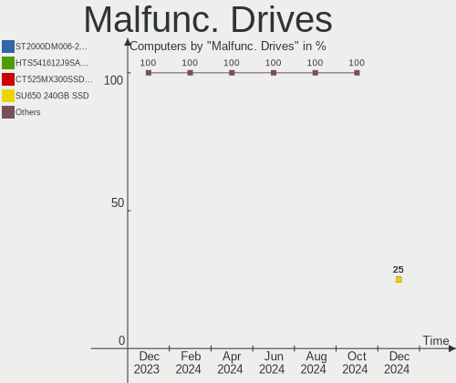
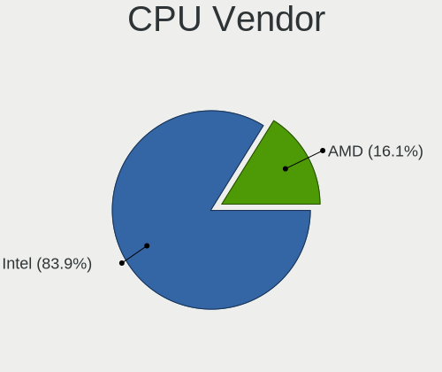
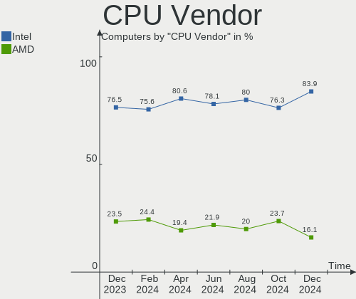
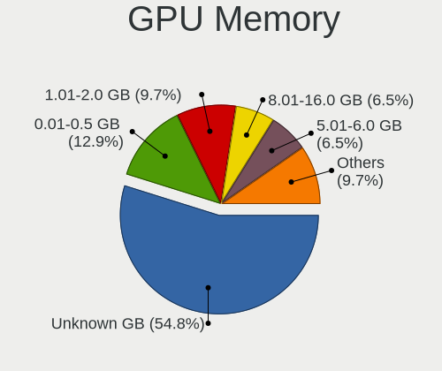
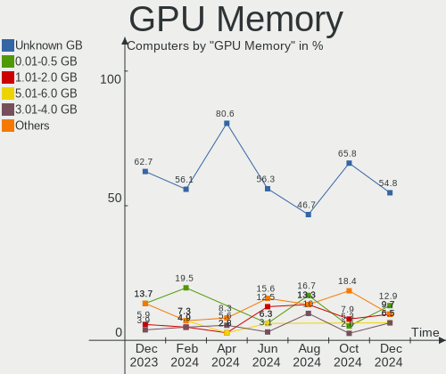
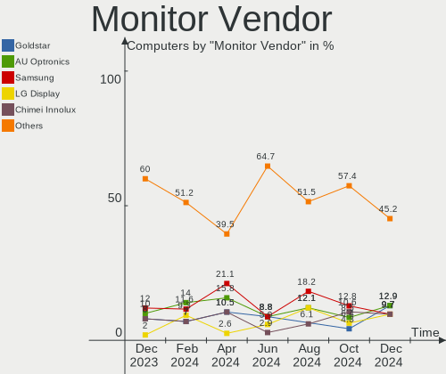
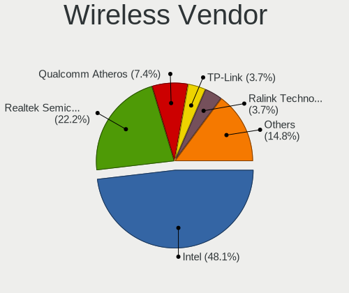
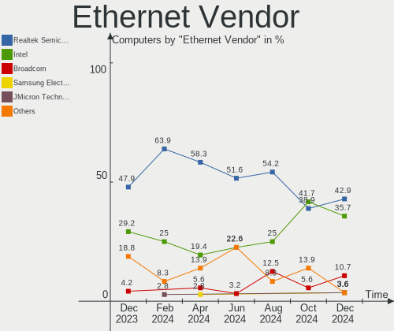
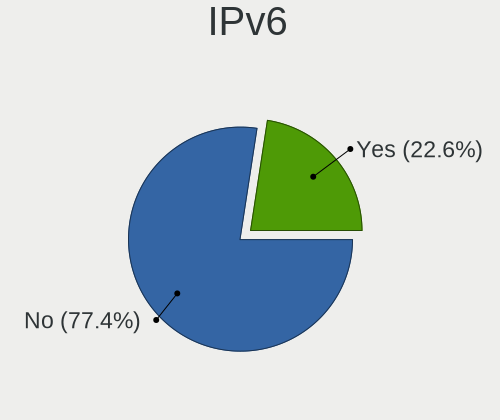

LMDE - Hardware Trends
----------------------

A project to identify most popular hardware characteristics and track their change
over time based on data collected by Linux users at https://Linux-Hardware.org.

Anyone can contribute to this report by the [hw-probe](https://github.com/linuxhw/hw-probe) tool:

    sudo -E hw-probe -all -upload

This is a report for all computer types. See also reports for [desktops](/Dist/LMDE/Desktop/README.md) and [notebooks](/Dist/LMDE/Notebook/README.md).

This report is for one last month. Overall report since the beginning of time: [TestCoverage](https://github.com/linuxhw/TestCoverage)

Period: Sep, 2022.

Contents
--------

* [ System ](#system)
  - [ OS                       ](#os)
  - [ OS Family                ](#os-family)
  - [ Kernel                   ](#kernel)
  - [ Kernel Family            ](#kernel-family)
  - [ Kernel Major Ver.        ](#kernel-major-ver)
  - [ Arch                     ](#arch)
  - [ DE                       ](#de)
  - [ Display Server           ](#display-server)
  - [ Display Manager          ](#display-manager)
  - [ OS Lang                  ](#os-lang)
  - [ Boot Mode                ](#boot-mode)
  - [ Filesystem               ](#filesystem)
  - [ Part. scheme             ](#part-scheme)
  - [ Dual Boot with Linux/BSD ](#dual-boot-with-linuxbsd)
  - [ Dual Boot (Win)          ](#dual-boot-win)

* [ Board ](#board)
  - [ Vendor                   ](#vendor)
  - [ Model                    ](#model)
  - [ Model Family             ](#model-family)
  - [ MFG Year                 ](#mfg-year)
  - [ Form Factor              ](#form-factor)
  - [ Secure Boot              ](#secure-boot)
  - [ Coreboot                 ](#coreboot)
  - [ RAM Size                 ](#ram-size)
  - [ RAM Used                 ](#ram-used)
  - [ Total Drives             ](#total-drives)
  - [ Has CD-ROM               ](#has-cd-rom)
  - [ Has Ethernet             ](#has-ethernet)
  - [ Has WiFi                 ](#has-wifi)
  - [ Has Bluetooth            ](#has-bluetooth)

* [ Location ](#location)
  - [ Country                  ](#country)
  - [ City                     ](#city)

* [ Drives ](#drives)
  - [ Drive Vendor             ](#drive-vendor)
  - [ Drive Model              ](#drive-model)
  - [ HDD Vendor               ](#hdd-vendor)
  - [ SSD Vendor               ](#ssd-vendor)
  - [ Drive Kind               ](#drive-kind)
  - [ Drive Connector          ](#drive-connector)
  - [ Drive Size               ](#drive-size)
  - [ Space Total              ](#space-total)
  - [ Space Used               ](#space-used)
  - [ Malfunc. Drives          ](#malfunc-drives)
  - [ Malfunc. Drive Vendor    ](#malfunc-drive-vendor)
  - [ Malfunc. HDD Vendor      ](#malfunc-hdd-vendor)
  - [ Malfunc. Drive Kind      ](#malfunc-drive-kind)
  - [ Failed Drives            ](#failed-drives)
  - [ Failed Drive Vendor      ](#failed-drive-vendor)
  - [ Drive Status             ](#drive-status)

* [ Storage controller ](#storage-controller)
  - [ Storage Vendor           ](#storage-vendor)
  - [ Storage Model            ](#storage-model)
  - [ Storage Kind             ](#storage-kind)

* [ Processor ](#processor)
  - [ CPU Vendor               ](#cpu-vendor)
  - [ CPU Model                ](#cpu-model)
  - [ CPU Model Family         ](#cpu-model-family)
  - [ CPU Cores                ](#cpu-cores)
  - [ CPU Sockets              ](#cpu-sockets)
  - [ CPU Threads              ](#cpu-threads)
  - [ CPU Op-Modes             ](#cpu-op-modes)
  - [ CPU Microcode            ](#cpu-microcode)
  - [ CPU Microarch            ](#cpu-microarch)

* [ Graphics ](#graphics)
  - [ GPU Vendor               ](#gpu-vendor)
  - [ GPU Model                ](#gpu-model)
  - [ GPU Combo                ](#gpu-combo)
  - [ GPU Driver               ](#gpu-driver)
  - [ GPU Memory               ](#gpu-memory)

* [ Monitor ](#monitor)
  - [ Monitor Vendor           ](#monitor-vendor)
  - [ Monitor Model            ](#monitor-model)
  - [ Monitor Resolution       ](#monitor-resolution)
  - [ Monitor Diagonal         ](#monitor-diagonal)
  - [ Monitor Width            ](#monitor-width)
  - [ Aspect Ratio             ](#aspect-ratio)
  - [ Monitor Area             ](#monitor-area)
  - [ Pixel Density            ](#pixel-density)
  - [ Multiple Monitors        ](#multiple-monitors)

* [ Network ](#network)
  - [ Net Controller Vendor    ](#net-controller-vendor)
  - [ Net Controller Model     ](#net-controller-model)
  - [ Wireless Vendor          ](#wireless-vendor)
  - [ Wireless Model           ](#wireless-model)
  - [ Ethernet Vendor          ](#ethernet-vendor)
  - [ Ethernet Model           ](#ethernet-model)
  - [ Net Controller Kind      ](#net-controller-kind)
  - [ Used Controller          ](#used-controller)
  - [ NICs                     ](#nics)
  - [ IPv6                     ](#ipv6)

* [ Bluetooth ](#bluetooth)
  - [ Bluetooth Vendor         ](#bluetooth-vendor)
  - [ Bluetooth Model          ](#bluetooth-model)

* [ Sound ](#sound)
  - [ Sound Vendor             ](#sound-vendor)
  - [ Sound Model              ](#sound-model)

* [ Memory ](#memory)
  - [ Memory Vendor            ](#memory-vendor)
  - [ Memory Model             ](#memory-model)
  - [ Memory Kind              ](#memory-kind)
  - [ Memory Form Factor       ](#memory-form-factor)
  - [ Memory Size              ](#memory-size)
  - [ Memory Speed             ](#memory-speed)

* [ Printers & scanners ](#printers--scanners)
  - [ Printer Vendor           ](#printer-vendor)
  - [ Printer Model            ](#printer-model)
  - [ Scanner Vendor           ](#scanner-vendor)
  - [ Scanner Model            ](#scanner-model)

* [ Camera ](#camera)
  - [ Camera Vendor            ](#camera-vendor)
  - [ Camera Model             ](#camera-model)

* [ Security ](#security)
  - [ Fingerprint Vendor       ](#fingerprint-vendor)
  - [ Fingerprint Model        ](#fingerprint-model)
  - [ Chipcard Vendor          ](#chipcard-vendor)
  - [ Chipcard Model           ](#chipcard-model)

* [ Unsupported ](#unsupported)
  - [ Unsupported Devices      ](#unsupported-devices)
  - [ Unsupported Device Types ](#unsupported-device-types)

System
------

OS
--

Installed operating systems

| Name   | Computers | Percent |
|--------|-----------|---------|
| LMDE 5 | 29        | 93.55%  |
| LMDE 4 | 2         | 6.45%   |

OS Family
---------

OS without a version

| Name | Computers | Percent |
|------|-----------|---------|
| LMDE | 31        | 100%    |

Kernel
------

Version of the Linux kernel

| Version         | Computers | Percent |
|-----------------|-----------|---------|
| 5.10.0-17-amd64 | 12        | 38.71%  |
| 5.10.0-18-amd64 | 11        | 35.48%  |
| 5.10.0-12-amd64 | 4         | 12.9%   |
| 5.19.10-xanmod1 | 1         | 3.23%   |
| 5.10.0-17-686   | 1         | 3.23%   |
| 4.19.0-21-amd64 | 1         | 3.23%   |
| 4.19.0-17-amd64 | 1         | 3.23%   |

Kernel Family
-------------

Linux kernel without a distro release

| Version | Computers | Percent |
|---------|-----------|---------|
| 5.10.0  | 28        | 90.32%  |
| 4.19.0  | 2         | 6.45%   |
| 5.19.10 | 1         | 3.23%   |

Kernel Major Ver.
-----------------

Linux kernel major version

| Version | Computers | Percent |
|---------|-----------|---------|
| 5.10    | 28        | 90.32%  |
| 4.19    | 2         | 6.45%   |
| 5.19    | 1         | 3.23%   |

Arch
----

OS architecture (x86_64, i586, etc.)

| Name   | Computers | Percent |
|--------|-----------|---------|
| x86_64 | 30        | 96.77%  |
| i686   | 1         | 3.23%   |

DE
--

Desktop Environment

| Name       | Computers | Percent |
|------------|-----------|---------|
| X-Cinnamon | 30        | 96.77%  |
| Cinnamon   | 1         | 3.23%   |

Display Server
--------------

X11 or Wayland

| Name | Computers | Percent |
|------|-----------|---------|
| X11  | 31        | 100%    |

Display Manager
---------------

SDDM, LightDM, etc.

| Name    | Computers | Percent |
|---------|-----------|---------|
| Unknown | 22        | 70.97%  |
| LightDM | 9         | 29.03%  |

OS Lang
-------

Language

| Lang  | Computers | Percent |
|-------|-----------|---------|
| en_US | 9         | 29.03%  |
| fr_FR | 4         | 12.9%   |
| de_DE | 4         | 12.9%   |
| ru_RU | 3         | 9.68%   |
| pt_BR | 2         | 6.45%   |
| en_GB | 2         | 6.45%   |
| sv_SE | 1         | 3.23%   |
| pl_PL | 1         | 3.23%   |
| it_IT | 1         | 3.23%   |
| it_CH | 1         | 3.23%   |
| es_ES | 1         | 3.23%   |
| en_NZ | 1         | 3.23%   |
| en_AU | 1         | 3.23%   |

Boot Mode
---------

EFI or BIOS

| Mode | Computers | Percent |
|------|-----------|---------|
| EFI  | 19        | 61.29%  |
| BIOS | 12        | 38.71%  |

Filesystem
----------

Type of filesystem

| Type  | Computers | Percent |
|-------|-----------|---------|
| Ext4  | 30        | 96.77%  |
| Btrfs | 1         | 3.23%   |

Part. scheme
------------

Scheme of partitioning

| Type    | Computers | Percent |
|---------|-----------|---------|
| Unknown | 22        | 70.97%  |
| GPT     | 7         | 22.58%  |
| MBR     | 2         | 6.45%   |

Dual Boot with Linux/BSD
------------------------

Hosting more than one Linux/BSD

| Dual boot | Computers | Percent |
|-----------|-----------|---------|
| No        | 31        | 100%    |

Dual Boot (Win)
---------------

Hosting Linux and Windows

| Dual boot | Computers | Percent |
|-----------|-----------|---------|
| No        | 30        | 96.77%  |
| Yes       | 1         | 3.23%   |

Board
-----

Vendor
------

Motherboard manufacturer

| Name             | Computers | Percent |
|------------------|-----------|---------|
| ASUSTek Computer | 6         | 19.35%  |
| Lenovo           | 5         | 16.13%  |
| Dell             | 5         | 16.13%  |
| Hewlett-Packard  | 4         | 12.9%   |
| Acer             | 3         | 9.68%   |
| MSI              | 2         | 6.45%   |
| Pegatron         | 1         | 3.23%   |
| Medion           | 1         | 3.23%   |
| Gateway          | 1         | 3.23%   |
| eMachines        | 1         | 3.23%   |
| Digiboard        | 1         | 3.23%   |
| ASRock           | 1         | 3.23%   |

Model
-----

Motherboard model

| Name                                  | Computers | Percent |
|---------------------------------------|-----------|---------|
| Pegatron Pro 3015 Microtower PC       | 1         | 3.23%   |
| MSI MS-7B23                           | 1         | 3.23%   |
| MSI MS-7A40                           | 1         | 3.23%   |
| Medion P15648                         | 1         | 3.23%   |
| Lenovo Yoga 2 11 20332                | 1         | 3.23%   |
| Lenovo ThinkPad X270 W10DG 20K5S3HG00 | 1         | 3.23%   |
| Lenovo ThinkPad E15 Gen 4 21EES00100  | 1         | 3.23%   |
| Lenovo MIIX 520-12IKB 20M3            | 1         | 3.23%   |
| Lenovo IdeaPad 320-15IKB 80XL         | 1         | 3.23%   |
| HP Pavilion x360 Convertible 14-ba2xx | 1         | 3.23%   |
| HP Laptop 14-cf3xxx                   | 1         | 3.23%   |
| HP G72                                | 1         | 3.23%   |
| HP EliteBook 850 G6                   | 1         | 3.23%   |
| Gateway DX4870                        | 1         | 3.23%   |
| eMachines EL1352G                     | 1         | 3.23%   |
| Digiboard NM70-TI                     | 1         | 3.23%   |
| Dell Precision WorkStation 670        | 1         | 3.23%   |
| Dell Precision T7600                  | 1         | 3.23%   |
| Dell OptiPlex 3010                    | 1         | 3.23%   |
| Dell Latitude E6430                   | 1         | 3.23%   |
| Dell DXP051                           | 1         | 3.23%   |
| ASUS ROG Strix G513RM_G513RM          | 1         | 3.23%   |
| ASUS ROG CROSSHAIR VIII HERO          | 1         | 3.23%   |
| ASUS PRIME H610M-E D4                 | 1         | 3.23%   |
| ASUS P8H77-V                          | 1         | 3.23%   |
| ASUS P5K-E                            | 1         | 3.23%   |
| ASUS K56CB                            | 1         | 3.23%   |
| ASRock G41M-S3                        | 1         | 3.23%   |
| Acer Aspire XC-1660G                  | 1         | 3.23%   |
| Acer Aspire F5-573G                   | 1         | 3.23%   |
| Acer Aspire 5930                      | 1         | 3.23%   |

Model Family
------------

Motherboard model prefix

| Name              | Computers | Percent |
|-------------------|-----------|---------|
| Acer Aspire       | 3         | 9.68%   |
| Lenovo ThinkPad   | 2         | 6.45%   |
| Dell Precision    | 2         | 6.45%   |
| ASUS ROG          | 2         | 6.45%   |
| Pegatron Pro      | 1         | 3.23%   |
| MSI MS-7B23       | 1         | 3.23%   |
| MSI MS-7A40       | 1         | 3.23%   |
| Medion P15648     | 1         | 3.23%   |
| Lenovo Yoga       | 1         | 3.23%   |
| Lenovo MIIX       | 1         | 3.23%   |
| Lenovo IdeaPad    | 1         | 3.23%   |
| HP Pavilion       | 1         | 3.23%   |
| HP Laptop         | 1         | 3.23%   |
| HP G72            | 1         | 3.23%   |
| HP EliteBook      | 1         | 3.23%   |
| Gateway DX4870    | 1         | 3.23%   |
| eMachines EL1352G | 1         | 3.23%   |
| Digiboard NM70-TI | 1         | 3.23%   |
| Dell OptiPlex     | 1         | 3.23%   |
| Dell Latitude     | 1         | 3.23%   |
| Dell DXP051       | 1         | 3.23%   |
| ASUS PRIME        | 1         | 3.23%   |
| ASUS P8H77-V      | 1         | 3.23%   |
| ASUS P5K-E        | 1         | 3.23%   |
| ASUS K56CB        | 1         | 3.23%   |
| ASRock G41M-S3    | 1         | 3.23%   |

MFG Year
--------

Motherboard manufacture year

| Year | Computers | Percent |
|------|-----------|---------|
| 2022 | 4         | 12.9%   |
| 2012 | 4         | 12.9%   |
| 2010 | 4         | 12.9%   |
| 2019 | 3         | 9.68%   |
| 2017 | 3         | 9.68%   |
| 2013 | 3         | 9.68%   |
| 2020 | 2         | 6.45%   |
| 2018 | 2         | 6.45%   |
| 2006 | 2         | 6.45%   |
| 2021 | 1         | 3.23%   |
| 2016 | 1         | 3.23%   |
| 2008 | 1         | 3.23%   |
| 2007 | 1         | 3.23%   |

Form Factor
-----------

Physical design of the computer

| Name        | Computers | Percent |
|-------------|-----------|---------|
| Desktop     | 16        | 51.61%  |
| Notebook    | 13        | 41.94%  |
| Tablet      | 1         | 3.23%   |
| Convertible | 1         | 3.23%   |

Secure Boot
-----------

Enabled or disabled

| State    | Computers | Percent |
|----------|-----------|---------|
| Disabled | 29        | 93.55%  |
| Enabled  | 2         | 6.45%   |

Coreboot
--------

Have coreboot on board

| Used | Computers | Percent |
|------|-----------|---------|
| No   | 31        | 100%    |

RAM Size
--------

Total RAM memory

| Size in GB  | Computers | Percent |
|-------------|-----------|---------|
| 8.01-16.0   | 10        | 32.26%  |
| 4.01-8.0    | 7         | 22.58%  |
| 16.01-24.0  | 6         | 19.35%  |
| 3.01-4.0    | 4         | 12.9%   |
| 32.01-64.0  | 2         | 6.45%   |
| 2.01-3.0    | 1         | 3.23%   |
| 64.01-256.0 | 1         | 3.23%   |

RAM Used
--------

Used RAM memory

| Used GB   | Computers | Percent |
|-----------|-----------|---------|
| 1.01-2.0  | 13        | 41.94%  |
| 2.01-3.0  | 12        | 38.71%  |
| 4.01-8.0  | 3         | 9.68%   |
| 3.01-4.0  | 1         | 3.23%   |
| 8.01-16.0 | 1         | 3.23%   |
| 0.51-1.0  | 1         | 3.23%   |

Total Drives
------------

Number of drives on board

| Drives | Computers | Percent |
|--------|-----------|---------|
| 1      | 17        | 54.84%  |
| 3      | 5         | 16.13%  |
| 2      | 5         | 16.13%  |
| 5      | 2         | 6.45%   |
| 4      | 2         | 6.45%   |

Has CD-ROM
----------

Has CD-ROM on board

| Presented | Computers | Percent |
|-----------|-----------|---------|
| No        | 20        | 64.52%  |
| Yes       | 11        | 35.48%  |

Has Ethernet
------------

Has Ethernet on board

| Presented | Computers | Percent |
|-----------|-----------|---------|
| Yes       | 27        | 87.1%   |
| No        | 4         | 12.9%   |

Has WiFi
--------

Has WiFi module

| Presented | Computers | Percent |
|-----------|-----------|---------|
| Yes       | 21        | 67.74%  |
| No        | 10        | 32.26%  |

Has Bluetooth
-------------

Has Bluetooth module

| Presented | Computers | Percent |
|-----------|-----------|---------|
| Yes       | 17        | 54.84%  |
| No        | 14        | 45.16%  |

Location
--------

Country
-------

Geographic location (country)

| Country     | Computers | Percent |
|-------------|-----------|---------|
| USA         | 7         | 22.58%  |
| Germany     | 5         | 16.13%  |
| France      | 4         | 12.9%   |
| Russia      | 3         | 9.68%   |
| Italy       | 3         | 9.68%   |
| Brazil      | 2         | 6.45%   |
| Switzerland | 1         | 3.23%   |
| Sweden      | 1         | 3.23%   |
| Spain       | 1         | 3.23%   |
| Poland      | 1         | 3.23%   |
| New Zealand | 1         | 3.23%   |
| Finland     | 1         | 3.23%   |
| Ecuador     | 1         | 3.23%   |

City
----

Geographic location (city)

| City                 | Computers | Percent |
|----------------------|-----------|---------|
| Volta Redonda        | 1         | 3.23%   |
| Turku                | 1         | 3.23%   |
| Tolyatti             | 1         | 3.23%   |
| Toccoa               | 1         | 3.23%   |
| St Petersburg        | 1         | 3.23%   |
| Sollentuna           | 1         | 3.23%   |
| Rome                 | 1         | 3.23%   |
| Reynoldsburg         | 1         | 3.23%   |
| Rennes               | 1         | 3.23%   |
| Reinach              | 1         | 3.23%   |
| Queensbury           | 1         | 3.23%   |
| Piaseczno            | 1         | 3.23%   |
| Paris                | 1         | 3.23%   |
| North Manchester     | 1         | 3.23%   |
| Nizhniy Novgorod     | 1         | 3.23%   |
| Milan                | 1         | 3.23%   |
| Liberty Lake         | 1         | 3.23%   |
| Garbsen              | 1         | 3.23%   |
| Freiburg im Breisgau | 1         | 3.23%   |
| Frankfurt am Main    | 1         | 3.23%   |
| Flagstaff            | 1         | 3.23%   |
| Fernán Núñez      | 1         | 3.23%   |
| Dubino               | 1         | 3.23%   |
| Cournonterral        | 1         | 3.23%   |
| Cesson               | 1         | 3.23%   |
| Berlin               | 1         | 3.23%   |
| Belém               | 1         | 3.23%   |
| Battle Creek         | 1         | 3.23%   |
| Bad Salzuflen        | 1         | 3.23%   |
| Babahoyo             | 1         | 3.23%   |
| Auckland             | 1         | 3.23%   |

Drives
------

Drive Vendor
------------

Hard drive vendors

| Vendor              | Computers | Drives | Percent |
|---------------------|-----------|--------|---------|
| Seagate             | 9         | 10     | 19.15%  |
| Samsung Electronics | 9         | 14     | 19.15%  |
| SanDisk             | 5         | 5      | 10.64%  |
| WDC                 | 4         | 5      | 8.51%   |
| Toshiba             | 3         | 3      | 6.38%   |
| Kingston            | 3         | 3      | 6.38%   |
| Unknown             | 2         | 2      | 4.26%   |
| Crucial             | 2         | 2      | 4.26%   |
| A-DATA Technology   | 2         | 2      | 4.26%   |
| UMIS                | 1         | 1      | 2.13%   |
| PNY                 | 1         | 1      | 2.13%   |
| Micron Technology   | 1         | 1      | 2.13%   |
| Intel               | 1         | 1      | 2.13%   |
| Hitachi             | 1         | 1      | 2.13%   |
| GOODRAM             | 1         | 1      | 2.13%   |
| China               | 1         | 1      | 2.13%   |
| ASMedia             | 1         | 1      | 2.13%   |

Drive Model
-----------

Hard drive models

| Model                                               | Computers | Percent |
|-----------------------------------------------------|-----------|---------|
| Seagate ST1000LM035-1RK172 1TB                      | 2         | 3.77%   |
| Samsung SSD 850 EVO 500GB                           | 2         | 3.77%   |
| WDC WD5000AZLX-08K2TA0 500GB                        | 1         | 1.89%   |
| WDC WD40EZAZ-00SF3B0 4TB                            | 1         | 1.89%   |
| WDC WD20SPZX-00UA7T0 2TB                            | 1         | 1.89%   |
| WDC WD10EZEX-08WN4A0 1TB                            | 1         | 1.89%   |
| WDC WD1002FAEX-00Z3A0 1TB                           | 1         | 1.89%   |
| Unknown SC128  128GB                                | 1         | 1.89%   |
| Unknown MMC Card  128GB                             | 1         | 1.89%   |
| UMIS RPJTJ512MGE1QDQ 512GB                          | 1         | 1.89%   |
| Toshiba THNSNJ128GCSU 128GB SSD                     | 1         | 1.89%   |
| Toshiba MQ01ABD100 1TB                              | 1         | 1.89%   |
| Toshiba HDWD110 1TB                                 | 1         | 1.89%   |
| Seagate ST9250827AS 250GB                           | 1         | 1.89%   |
| Seagate ST9250410AS 250GB                           | 1         | 1.89%   |
| Seagate ST500LT032-1E9142 500GB                     | 1         | 1.89%   |
| Seagate ST4000LM024-2AN17V 4TB                      | 1         | 1.89%   |
| Seagate ST3320620NS 320GB                           | 1         | 1.89%   |
| Seagate ST3300657SS 304GB                           | 1         | 1.89%   |
| Seagate ST1000DM003-1CH162 1TB                      | 1         | 1.89%   |
| SanDisk X600 2.5 7MM SATA 256GB SSD                 | 1         | 1.89%   |
| Sandisk WD_BLACK SN750 SE 500GB                     | 1         | 1.89%   |
| Sandisk WD Blue SN550 NVMe SSD 1024GB               | 1         | 1.89%   |
| SanDisk SSD PLUS 240GB                              | 1         | 1.89%   |
| SanDisk SD9SN8W256G1014 256GB SSD                   | 1         | 1.89%   |
| Samsung SSD 970 EVO Plus 500GB                      | 1         | 1.89%   |
| Samsung SSD 870 EVO 500GB                           | 1         | 1.89%   |
| Samsung SSD 860 PRO 256GB                           | 1         | 1.89%   |
| Samsung SSD 850 PRO 256GB                           | 1         | 1.89%   |
| Samsung SSD 850 EVO 250GB                           | 1         | 1.89%   |
| Samsung SSD 840 EVO 1TB                             | 1         | 1.89%   |
| Samsung NVMe SSD Drive 500GB                        | 1         | 1.89%   |
| Samsung NVMe SSD Drive 250GB                        | 1         | 1.89%   |
| Samsung NVMe SSD Drive 1024GB                       | 1         | 1.89%   |
| Samsung NVMe SSD Controller SM981/PM981/PM983 256GB | 1         | 1.89%   |
| Samsung MZVLB256HAHQ-000H1 256GB                    | 1         | 1.89%   |
| Samsung HD320KJ 320GB                               | 1         | 1.89%   |
| PNY SSD2SC240G1SA754D117-459P 240GB                 | 1         | 1.89%   |
| Micron NVMe SSD Drive 1024GB                        | 1         | 1.89%   |
| Kingston SV300S37A240G 240GB SSD                    | 1         | 1.89%   |

HDD Vendor
----------

Hard disk drive vendors

| Vendor              | Computers | Drives | Percent |
|---------------------|-----------|--------|---------|
| Seagate             | 9         | 10     | 50%     |
| WDC                 | 4         | 5      | 22.22%  |
| Toshiba             | 2         | 2      | 11.11%  |
| Samsung Electronics | 1         | 1      | 5.56%   |
| Hitachi             | 1         | 1      | 5.56%   |
| ASMedia             | 1         | 1      | 5.56%   |

SSD Vendor
----------

Solid state drive vendors

| Vendor              | Computers | Drives | Percent |
|---------------------|-----------|--------|---------|
| Samsung Electronics | 4         | 7      | 23.53%  |
| SanDisk             | 3         | 3      | 17.65%  |
| Kingston            | 2         | 2      | 11.76%  |
| Crucial             | 2         | 2      | 11.76%  |
| A-DATA Technology   | 2         | 2      | 11.76%  |
| Toshiba             | 1         | 1      | 5.88%   |
| PNY                 | 1         | 1      | 5.88%   |
| GOODRAM             | 1         | 1      | 5.88%   |
| China               | 1         | 1      | 5.88%   |

Drive Kind
----------

HDD or SSD

| Kind | Computers | Drives | Percent |
|------|-----------|--------|---------|
| HDD  | 17        | 20     | 38.64%  |
| SSD  | 15        | 20     | 34.09%  |
| NVMe | 10        | 12     | 22.73%  |
| MMC  | 2         | 2      | 4.55%   |

Drive Connector
---------------

SATA, SAS, NVMe, etc.

| Type | Computers | Drives | Percent |
|------|-----------|--------|---------|
| SATA | 24        | 36     | 61.54%  |
| NVMe | 10        | 12     | 25.64%  |
| SAS  | 3         | 4      | 7.69%   |
| MMC  | 2         | 2      | 5.13%   |

Drive Size
----------

Size of hard drive

| Size in TB | Computers | Drives | Percent |
|------------|-----------|--------|---------|
| 0.01-0.5   | 19        | 27     | 61.29%  |
| 0.51-1.0   | 8         | 9      | 25.81%  |
| 3.01-4.0   | 2         | 2      | 6.45%   |
| 1.01-2.0   | 2         | 2      | 6.45%   |

Space Total
-----------

Amount of disk space available on the file system

| Size in GB | Computers | Percent |
|------------|-----------|---------|
| 251-500    | 11        | 35.48%  |
| 101-250    | 8         | 25.81%  |
| 1001-2000  | 6         | 19.35%  |
| 501-1000   | 5         | 16.13%  |
| 21-50      | 1         | 3.23%   |

Space Used
----------

Amount of used disk space

| Used GB   | Computers | Percent |
|-----------|-----------|---------|
| 1-20      | 14        | 45.16%  |
| 251-500   | 5         | 16.13%  |
| 21-50     | 3         | 9.68%   |
| 501-1000  | 3         | 9.68%   |
| 51-100    | 3         | 9.68%   |
| 101-250   | 2         | 6.45%   |
| 1001-2000 | 1         | 3.23%   |

Malfunc. Drives
---------------

Drive models with a malfunction

| Model                           | Computers | Drives | Percent |
|---------------------------------|-----------|--------|---------|
| Seagate ST500LT032-1E9142 500GB | 1         | 1      | 100%    |

Malfunc. Drive Vendor
---------------------

Vendors of faulty drives

| Vendor  | Computers | Drives | Percent |
|---------|-----------|--------|---------|
| Seagate | 1         | 1      | 100%    |

Malfunc. HDD Vendor
-------------------

Vendors of faulty HDD drives

| Vendor  | Computers | Drives | Percent |
|---------|-----------|--------|---------|
| Seagate | 1         | 1      | 100%    |

Malfunc. Drive Kind
-------------------

Kinds of faulty drives

| Kind | Computers | Drives | Percent |
|------|-----------|--------|---------|
| HDD  | 1         | 1      | 100%    |

Failed Drives
-------------

Failed drive models

Zero info for selected period =(

Failed Drive Vendor
-------------------

Failed drive vendors

Zero info for selected period =(

Drive Status
------------

Number of failed and malfunc. drives

| Status   | Computers | Drives | Percent |
|----------|-----------|--------|---------|
| Detected | 23        | 42     | 71.88%  |
| Works    | 8         | 11     | 25%     |
| Malfunc  | 1         | 1      | 3.13%   |

Storage controller
------------------

Storage Vendor
--------------

Storage controller vendors

| Vendor                      | Computers | Percent |
|-----------------------------|-----------|---------|
| Intel                       | 24        | 58.54%  |
| Samsung Electronics         | 5         | 12.2%   |
| SanDisk                     | 2         | 4.88%   |
| Nvidia                      | 2         | 4.88%   |
| AMD                         | 2         | 4.88%   |
| Union Memory (Shenzhen)     | 1         | 2.44%   |
| Micron Technology           | 1         | 2.44%   |
| LSI Logic / Symbios Logic   | 1         | 2.44%   |
| Kingston Technology Company | 1         | 2.44%   |
| JMicron Technology          | 1         | 2.44%   |
| Broadcom / LSI              | 1         | 2.44%   |

Storage Model
-------------

Storage controller models

| Model                                                                         | Computers | Percent |
|-------------------------------------------------------------------------------|-----------|---------|
| Samsung NVMe SSD Controller SM981/PM981/PM983                                 | 4         | 8.16%   |
| Intel 82801 Mobile SATA Controller [RAID mode]                                | 4         | 8.16%   |
| Intel Sunrise Point-LP SATA Controller [AHCI mode]                            | 3         | 6.12%   |
| Intel 7 Series Chipset Family 6-port SATA Controller [AHCI mode]              | 3         | 6.12%   |
| Samsung NVMe SSD Controller SM961/PM961/SM963                                 | 2         | 4.08%   |
| Intel 82801G (ICH7 Family) IDE Controller                                     | 2         | 4.08%   |
| Intel 7 Series/C210 Series Chipset Family 6-port SATA Controller [AHCI mode]  | 2         | 4.08%   |
| AMD FCH SATA Controller [AHCI mode]                                           | 2         | 4.08%   |
| Union Memory (Shenzhen) AM630 PCIe 4.0 x4 NVMe SSD Controller                 | 1         | 2.04%   |
| SanDisk WD Blue SN550 NVMe SSD                                                | 1         | 2.04%   |
| SanDisk Non-Volatile memory controller                                        | 1         | 2.04%   |
| Nvidia MCP78S [GeForce 8200] AHCI Controller                                  | 1         | 2.04%   |
| Nvidia MCP61 SATA Controller                                                  | 1         | 2.04%   |
| Nvidia MCP61 IDE                                                              | 1         | 2.04%   |
| Micron Non-Volatile memory controller                                         | 1         | 2.04%   |
| LSI Logic / Symbios Logic MegaRAID SAS 2008 [Falcon]                          | 1         | 2.04%   |
| Kingston Company Company Non-Volatile memory controller                       | 1         | 2.04%   |
| JMicron JMB363 SATA/IDE Controller                                            | 1         | 2.04%   |
| Intel Volume Management Device NVMe RAID Controller                           | 1         | 2.04%   |
| Intel SSD 660P Series                                                         | 1         | 2.04%   |
| Intel NM10/ICH7 Family SATA Controller [IDE mode]                             | 1         | 2.04%   |
| Intel NM10/ICH7 Family SATA Controller [AHCI mode]                            | 1         | 2.04%   |
| Intel Cannon Lake PCH SATA AHCI Controller                                    | 1         | 2.04%   |
| Intel C600/X79 series chipset 6-Port SATA AHCI Controller                     | 1         | 2.04%   |
| Intel Atom Processor E3800 Series SATA AHCI Controller                        | 1         | 2.04%   |
| Intel Alder Lake-S PCH SATA Controller [AHCI Mode]                            | 1         | 2.04%   |
| Intel 82801IR/IO/IH (ICH9R/DO/DH) 6 port SATA Controller [AHCI mode]          | 1         | 2.04%   |
| Intel 82801IBM/IEM (ICH9M/ICH9M-E) 2 port SATA Controller [IDE mode]          | 1         | 2.04%   |
| Intel 82801EB/ER (ICH5/ICH5R) IDE Controller                                  | 1         | 2.04%   |
| Intel 82801EB (ICH5) SATA Controller                                          | 1         | 2.04%   |
| Intel 6 Series/C200 Series Chipset Family 6 port Desktop SATA AHCI Controller | 1         | 2.04%   |
| Intel 500 Series Chipset Family SATA AHCI Controller                          | 1         | 2.04%   |
| Intel 5 Series/3400 Series Chipset 4 port SATA AHCI Controller                | 1         | 2.04%   |
| Broadcom / LSI SAS1068 PCI-X Fusion-MPT SAS                                   | 1         | 2.04%   |
| AMD 400 Series Chipset SATA Controller                                        | 1         | 2.04%   |

Storage Kind
------------

Kind of storage controller (IDE, SATA, NVMe, SAS, ...)

| Kind | Computers | Percent |
|------|-----------|---------|
| SATA | 20        | 46.51%  |
| NVMe | 10        | 23.26%  |
| RAID | 6         | 13.95%  |
| IDE  | 6         | 13.95%  |
| SCSI | 1         | 2.33%   |

Processor
---------

CPU Vendor
----------

Processor vendors

| Vendor | Computers | Percent |
|--------|-----------|---------|
| Intel  | 25        | 80.65%  |
| AMD    | 6         | 19.35%  |

CPU Model
---------

Processor models

| Model                                       | Computers | Percent |
|---------------------------------------------|-----------|---------|
| Intel Core i5-8265U CPU @ 1.60GHz           | 2         | 6.45%   |
| Intel Xeon CPU E5-2687W 0 @ 3.10GHz         | 1         | 3.23%   |
| Intel Xeon CPU 3.40GHz                      | 1         | 3.23%   |
| Intel Pentium Gold G7400                    | 1         | 3.23%   |
| Intel Pentium D CPU 3.40GHz                 | 1         | 3.23%   |
| Intel Pentium CPU P6000 @ 1.87GHz           | 1         | 3.23%   |
| Intel Core i7-9700K CPU @ 3.60GHz           | 1         | 3.23%   |
| Intel Core i7-8550U CPU @ 1.80GHz           | 1         | 3.23%   |
| Intel Core i7-7500U CPU @ 2.70GHz           | 1         | 3.23%   |
| Intel Core i7-3770 CPU @ 3.40GHz            | 1         | 3.23%   |
| Intel Core i7-3537U CPU @ 2.00GHz           | 1         | 3.23%   |
| Intel Core i5-6200U CPU @ 2.30GHz           | 1         | 3.23%   |
| Intel Core i5-3470 CPU @ 3.20GHz            | 1         | 3.23%   |
| Intel Core i5-3230M CPU @ 2.60GHz           | 1         | 3.23%   |
| Intel Core i5-10210U CPU @ 1.60GHz          | 1         | 3.23%   |
| Intel Core i3-7100U CPU @ 2.40GHz           | 1         | 3.23%   |
| Intel Core i3-3220 CPU @ 3.30GHz            | 1         | 3.23%   |
| Intel Core i3-1005G1 CPU @ 1.20GHz          | 1         | 3.23%   |
| Intel Core 2 Quad CPU Q9550 @ 2.83GHz       | 1         | 3.23%   |
| Intel Core 2 Duo CPU P7350 @ 2.00GHz        | 1         | 3.23%   |
| Intel Core 2 Duo CPU E7400 @ 2.80GHz        | 1         | 3.23%   |
| Intel Celeron CPU N2930 @ 1.83GHz           | 1         | 3.23%   |
| Intel Celeron CPU 847 @ 1.10GHz             | 1         | 3.23%   |
| Intel 11th Gen Core i5-11400 @ 2.60GHz      | 1         | 3.23%   |
| AMD Ryzen 7 6800H with Radeon Graphics      | 1         | 3.23%   |
| AMD Ryzen 7 5825U with Radeon Graphics      | 1         | 3.23%   |
| AMD Ryzen 7 3700X 8-Core Processor          | 1         | 3.23%   |
| AMD Ryzen 3 3200G with Radeon Vega Graphics | 1         | 3.23%   |
| AMD Athlon II X2 220 Processor              | 1         | 3.23%   |
| AMD Athlon II X2 215 Processor              | 1         | 3.23%   |

CPU Model Family
----------------

Processor model prefix

| Model              | Computers | Percent |
|--------------------|-----------|---------|
| Intel Core i5      | 6         | 19.35%  |
| Intel Core i7      | 5         | 16.13%  |
| Intel Core i3      | 3         | 9.68%   |
| AMD Ryzen 7        | 3         | 9.68%   |
| Intel Xeon         | 2         | 6.45%   |
| Intel Core 2 Duo   | 2         | 6.45%   |
| Intel Celeron      | 2         | 6.45%   |
| AMD Athlon II X2   | 2         | 6.45%   |
| Other              | 1         | 3.23%   |
| Intel Pentium Gold | 1         | 3.23%   |
| Intel Pentium D    | 1         | 3.23%   |
| Intel Pentium      | 1         | 3.23%   |
| Intel Core 2 Quad  | 1         | 3.23%   |
| AMD Ryzen 3        | 1         | 3.23%   |

CPU Cores
---------

Number of processor cores

| Number | Computers | Percent |
|--------|-----------|---------|
| 2      | 16        | 51.61%  |
| 4      | 9         | 29.03%  |
| 8      | 4         | 12.9%   |
| 16     | 1         | 3.23%   |
| 6      | 1         | 3.23%   |

CPU Sockets
-----------

Number of sockets

| Number | Computers | Percent |
|--------|-----------|---------|
| 1      | 29        | 93.55%  |
| 2      | 2         | 6.45%   |

CPU Threads
-----------

Threads per core (Hyper-Threading)

| Number | Computers | Percent |
|--------|-----------|---------|
| 2      | 19        | 61.29%  |
| 1      | 12        | 38.71%  |

CPU Op-Modes
------------

CPU Operation Modes (32-bit, 64-bit)

| Op mode        | Computers | Percent |
|----------------|-----------|---------|
| 32-bit, 64-bit | 31        | 100%    |

CPU Microcode
-------------

Microcode number

| Number     | Computers | Percent |
|------------|-----------|---------|
| 0x306a9    | 5         | 16.13%  |
| 0x806ec    | 2         | 6.45%   |
| 0x806e9    | 2         | 6.45%   |
| 0x1067a    | 2         | 6.45%   |
| 0xf65      | 1         | 3.23%   |
| 0xf43      | 1         | 3.23%   |
| 0xa0671    | 1         | 3.23%   |
| 0x906ed    | 1         | 3.23%   |
| 0x90675    | 1         | 3.23%   |
| 0x806eb    | 1         | 3.23%   |
| 0x806ea    | 1         | 3.23%   |
| 0x706e5    | 1         | 3.23%   |
| 0x406e3    | 1         | 3.23%   |
| 0x30678    | 1         | 3.23%   |
| 0x206d7    | 1         | 3.23%   |
| 0x206a7    | 1         | 3.23%   |
| 0x20652    | 1         | 3.23%   |
| 0x10676    | 1         | 3.23%   |
| 0x0a50000c | 1         | 3.23%   |
| 0x0a404101 | 1         | 3.23%   |
| 0x08701021 | 1         | 3.23%   |
| 0x08108109 | 1         | 3.23%   |
| 0x010000c8 | 1         | 3.23%   |
| Unknown    | 1         | 3.23%   |

CPU Microarch
-------------

Microarchitecture

| Name        | Computers | Percent |
|-------------|-----------|---------|
| KabyLake    | 7         | 22.58%  |
| IvyBridge   | 5         | 16.13%  |
| Penryn      | 3         | 9.68%   |
| Unknown     | 3         | 9.68%   |
| SandyBridge | 2         | 6.45%   |
| NetBurst    | 2         | 6.45%   |
| K10         | 2         | 6.45%   |
| Zen+        | 1         | 3.23%   |
| Zen 3       | 1         | 3.23%   |
| Zen 2       | 1         | 3.23%   |
| Westmere    | 1         | 3.23%   |
| Skylake     | 1         | 3.23%   |
| Silvermont  | 1         | 3.23%   |
| IceLake     | 1         | 3.23%   |

Graphics
--------

GPU Vendor
----------

Vendors of graphics cards

| Vendor | Computers | Percent |
|--------|-----------|---------|
| Intel  | 18        | 48.65%  |
| Nvidia | 15        | 40.54%  |
| AMD    | 4         | 10.81%  |

GPU Model
---------

Graphics card models

| Model                                                                     | Computers | Percent |
|---------------------------------------------------------------------------|-----------|---------|
| Nvidia GM206 [GeForce GTX 960]                                            | 2         | 5.41%   |
| Intel WhiskeyLake-U GT2 [UHD Graphics 620]                                | 2         | 5.41%   |
| Intel HD Graphics 620                                                     | 2         | 5.41%   |
| Intel 3rd Gen Core processor Graphics Controller                          | 2         | 5.41%   |
| Nvidia TU116 [GeForce GTX 1660 SUPER]                                     | 1         | 2.7%    |
| Nvidia GT218 [GeForce 8400 GS Rev. 3]                                     | 1         | 2.7%    |
| Nvidia GP108M [GeForce MX250]                                             | 1         | 2.7%    |
| Nvidia GP108 [GeForce GT 1030]                                            | 1         | 2.7%    |
| Nvidia GM108M [GeForce 940MX]                                             | 1         | 2.7%    |
| Nvidia GM107 [GeForce 940MX]                                              | 1         | 2.7%    |
| Nvidia GK208B [GeForce GT 730]                                            | 1         | 2.7%    |
| Nvidia GK208B [GeForce GT 710]                                            | 1         | 2.7%    |
| Nvidia GK107M [GeForce GT 740M]                                           | 1         | 2.7%    |
| Nvidia GA106M [GeForce RTX 3060 Mobile / Max-Q]                           | 1         | 2.7%    |
| Nvidia G92 [GeForce 8800 GT]                                              | 1         | 2.7%    |
| Nvidia G72 [GeForce 7300 LE]                                              | 1         | 2.7%    |
| Nvidia C78 [GeForce 9100]                                                 | 1         | 2.7%    |
| Intel Xeon E3-1200 v2/3rd Gen Core processor Graphics Controller          | 1         | 2.7%    |
| Intel VGA compatible controller                                           | 1         | 2.7%    |
| Intel UHD Graphics 620                                                    | 1         | 2.7%    |
| Intel Skylake GT2 [HD Graphics 520]                                       | 1         | 2.7%    |
| Intel RocketLake-S GT1 [UHD Graphics 730]                                 | 1         | 2.7%    |
| Intel Mobile 4 Series Chipset Integrated Graphics Controller              | 1         | 2.7%    |
| Intel Iris Plus Graphics G1 (Ice Lake)                                    | 1         | 2.7%    |
| Intel Core Processor Integrated Graphics Controller                       | 1         | 2.7%    |
| Intel CometLake-U GT2 [UHD Graphics]                                      | 1         | 2.7%    |
| Intel Atom Processor Z36xxx/Z37xxx Series Graphics & Display              | 1         | 2.7%    |
| Intel 4 Series Chipset Integrated Graphics Controller                     | 1         | 2.7%    |
| Intel 2nd Generation Core Processor Family Integrated Graphics Controller | 1         | 2.7%    |
| AMD Rembrandt [Radeon 680M]                                               | 1         | 2.7%    |
| AMD Picasso/Raven 2 [Radeon Vega Series / Radeon Vega Mobile Series]      | 1         | 2.7%    |
| AMD Park [Mobility Radeon HD 5430/5450/5470]                              | 1         | 2.7%    |
| AMD Barcelo                                                               | 1         | 2.7%    |

GPU Combo
---------

Combinations of graphics cards

| Name           | Computers | Percent |
|----------------|-----------|---------|
| 1 x Intel      | 13        | 41.94%  |
| 1 x Nvidia     | 10        | 32.26%  |
| Intel + Nvidia | 4         | 12.9%   |
| 1 x AMD        | 2         | 6.45%   |
| Intel + AMD    | 1         | 3.23%   |
| AMD + Nvidia   | 1         | 3.23%   |

GPU Driver
----------

Free vs proprietary

| Driver      | Computers | Percent |
|-------------|-----------|---------|
| Free        | 20        | 64.52%  |
| Proprietary | 6         | 19.35%  |
| Unknown     | 5         | 16.13%  |

GPU Memory
----------

Total video memory

| Size in GB | Computers | Percent |
|------------|-----------|---------|
| Unknown    | 18        | 58.06%  |
| 1.01-2.0   | 4         | 12.9%   |
| 0.01-0.5   | 4         | 12.9%   |
| 3.01-4.0   | 3         | 9.68%   |
| 5.01-6.0   | 1         | 3.23%   |
| 0.51-1.0   | 1         | 3.23%   |

Monitor
-------

Monitor Vendor
--------------

Monitor vendors

| Vendor                  | Computers | Percent |
|-------------------------|-----------|---------|
| Samsung Electronics     | 3         | 13.64%  |
| LG Display              | 3         | 13.64%  |
| Goldstar                | 2         | 9.09%   |
| Dell                    | 2         | 9.09%   |
| BOE                     | 2         | 9.09%   |
| BenQ                    | 2         | 9.09%   |
| AU Optronics            | 2         | 9.09%   |
| Unknown                 | 1         | 4.55%   |
| PLN                     | 1         | 4.55%   |
| LG Philips              | 1         | 4.55%   |
| InfoVision              | 1         | 4.55%   |
| Chimei Innolux          | 1         | 4.55%   |
| Chi Mei Optoelectronics | 1         | 4.55%   |

Monitor Model
-------------

Monitor models

| Model                                                                    | Computers | Percent |
|--------------------------------------------------------------------------|-----------|---------|
| Unknown LCD Monitor SAMSUNG 1366x768                                     | 1         | 4.35%   |
| Samsung Electronics S24F350 SAM0D21 1920x1080 521x293mm 23.5-inch        | 1         | 4.35%   |
| Samsung Electronics LCD Monitor SyncMaster 1680x1050                     | 1         | 4.35%   |
| Samsung Electronics LCD Monitor S27R65 3840x1080                         | 1         | 4.35%   |
| Samsung Electronics LCD Monitor S27R65                                   | 1         | 4.35%   |
| PLN LCD Monitor PXL2790MW 1920x1080                                      | 1         | 4.35%   |
| LG Philips LCD Monitor LPL3B01 1280x800 331x207mm 15.4-inch              | 1         | 4.35%   |
| LG Display LCD Monitor LGD05E5 1920x1080 344x194mm 15.5-inch             | 1         | 4.35%   |
| LG Display LCD Monitor LGD046F 1920x1080 345x194mm 15.6-inch             | 1         | 4.35%   |
| LG Display LCD Monitor LGD027A 1600x900 382x215mm 17.3-inch              | 1         | 4.35%   |
| InfoVision LCD Monitor IVO3D2C 1920x1080 344x194mm 15.5-inch             | 1         | 4.35%   |
| Goldstar ULTRAWIDE GSM7770 2560x1080 798x334mm 34.1-inch                 | 1         | 4.35%   |
| Goldstar 27GL850 GSM5B7F 2560x1440 600x340mm 27.2-inch                   | 1         | 4.35%   |
| Dell E228WFP DELD015 1680x1050 473x296mm 22.0-inch                       | 1         | 4.35%   |
| Dell E178WFP DELD016 1440x900 370x230mm 17.2-inch                        | 1         | 4.35%   |
| Chimei Innolux LCD Monitor CMN15DB 1366x768 344x193mm 15.5-inch          | 1         | 4.35%   |
| Chi Mei Optoelectronics LCD Monitor CMO1469 1366x768 309x174mm 14.0-inch | 1         | 4.35%   |
| BOE LCD Monitor BOE07B5 1366x768 309x173mm 13.9-inch                     | 1         | 4.35%   |
| BOE LCD Monitor BOE0742 1920x1080 309x173mm 13.9-inch                    | 1         | 4.35%   |
| BenQ PD2500Q BNQ802A 2560x1440 550x310mm 24.9-inch                       | 1         | 4.35%   |
| BenQ GW2280 BNQ78E8 1920x1080 480x270mm 21.7-inch                        | 1         | 4.35%   |
| AU Optronics LCD Monitor AUO45EC 1366x768 344x193mm 15.5-inch            | 1         | 4.35%   |
| AU Optronics LCD Monitor AUO106C 1366x768 277x156mm 12.5-inch            | 1         | 4.35%   |

Monitor Resolution
------------------

Monitor screen resolution

| Resolution         | Computers | Percent |
|--------------------|-----------|---------|
| 1920x1080 (FHD)    | 7         | 31.82%  |
| 1366x768 (WXGA)    | 6         | 27.27%  |
| 1680x1050 (WSXGA+) | 2         | 9.09%   |
| 3840x1080          | 1         | 4.55%   |
| 2560x1440 (QHD)    | 1         | 4.55%   |
| 2560x1080          | 1         | 4.55%   |
| 1600x900 (HD+)     | 1         | 4.55%   |
| 1440x900 (WXGA+)   | 1         | 4.55%   |
| 1280x800 (WXGA)    | 1         | 4.55%   |
| Unknown            | 1         | 4.55%   |

Monitor Diagonal
----------------

Diagonal size in inches

| Inches  | Computers | Percent |
|---------|-----------|---------|
| 15      | 6         | 27.27%  |
| Unknown | 4         | 18.18%  |
| 17      | 2         | 9.09%   |
| 13      | 2         | 9.09%   |
| 34      | 1         | 4.55%   |
| 27      | 1         | 4.55%   |
| 25      | 1         | 4.55%   |
| 23      | 1         | 4.55%   |
| 22      | 1         | 4.55%   |
| 21      | 1         | 4.55%   |
| 14      | 1         | 4.55%   |
| 12      | 1         | 4.55%   |

Monitor Width
-------------

Physical width

| Width in mm | Computers | Percent |
|-------------|-----------|---------|
| 301-350     | 9         | 42.86%  |
| Unknown     | 4         | 19.05%  |
| 501-600     | 2         | 9.52%   |
| 401-500     | 2         | 9.52%   |
| 351-400     | 2         | 9.52%   |
| 701-800     | 1         | 4.76%   |
| 201-300     | 1         | 4.76%   |

Aspect Ratio
------------

Proportional relationship between the width and the height

| Ratio   | Computers | Percent |
|---------|-----------|---------|
| 16/9    | 13        | 61.9%   |
| Unknown | 4         | 19.05%  |
| 16/10   | 3         | 14.29%  |
| 21/9    | 1         | 4.76%   |

Monitor Area
------------

Area in inch²

| Area in inch² | Computers | Percent |
|----------------|-----------|---------|
| 101-110        | 6         | 27.27%  |
| Unknown        | 4         | 18.18%  |
| 81-90          | 3         | 13.64%  |
| 201-250        | 3         | 13.64%  |
| 61-70          | 1         | 4.55%   |
| 351-500        | 1         | 4.55%   |
| 301-350        | 1         | 4.55%   |
| 251-300        | 1         | 4.55%   |
| 131-140        | 1         | 4.55%   |
| 121-130        | 1         | 4.55%   |

Pixel Density
-------------

Pixels per inch

| Density | Computers | Percent |
|---------|-----------|---------|
| 101-120 | 7         | 33.33%  |
| 121-160 | 5         | 23.81%  |
| 51-100  | 5         | 23.81%  |
| Unknown | 4         | 19.05%  |

Multiple Monitors
-----------------

Total monitors connected

| Total | Computers | Percent |
|-------|-----------|---------|
| 1     | 23        | 74.19%  |
| 0     | 6         | 19.35%  |
| 2     | 2         | 6.45%   |

Network
-------

Net Controller Vendor
---------------------

Controller vendors

| Vendor                   | Computers | Percent |
|--------------------------|-----------|---------|
| Realtek Semiconductor    | 16        | 34.04%  |
| Intel                    | 15        | 31.91%  |
| Qualcomm Atheros         | 5         | 10.64%  |
| Nvidia                   | 2         | 4.26%   |
| Marvell Technology Group | 2         | 4.26%   |
| Broadcom                 | 2         | 4.26%   |
| TP-Link                  | 1         | 2.13%   |
| MediaTek                 | 1         | 2.13%   |
| Huawei Technologies      | 1         | 2.13%   |
| Fibocom                  | 1         | 2.13%   |
| Edimax Technology        | 1         | 2.13%   |

Net Controller Model
--------------------

Controller models

| Model                                                             | Computers | Percent |
|-------------------------------------------------------------------|-----------|---------|
| Realtek RTL8111/8168/8411 PCI Express Gigabit Ethernet Controller | 10        | 18.87%  |
| Realtek RTL8125 2.5GbE Controller                                 | 2         | 3.77%   |
| Realtek RTL810xE PCI Express Fast Ethernet controller             | 2         | 3.77%   |
| Intel 82579LM Gigabit Network Connection (Lewisville)             | 2         | 3.77%   |
| TP-Link TL-WN722N v2/v3 [Realtek RTL8188EUS]                      | 1         | 1.89%   |
| Realtek RTL8821CE 802.11ac PCIe Wireless Network Adapter          | 1         | 1.89%   |
| Realtek RTL8821AE 802.11ac PCIe Wireless Network Adapter          | 1         | 1.89%   |
| Realtek RTL8187 Wireless Adapter                                  | 1         | 1.89%   |
| Realtek RTL8169 PCI Gigabit Ethernet Controller                   | 1         | 1.89%   |
| Realtek Realtek Network controller                                | 1         | 1.89%   |
| Qualcomm Atheros QCA9377 802.11ac Wireless Network Adapter        | 1         | 1.89%   |
| Qualcomm Atheros QCA6174 802.11ac Wireless Network Adapter        | 1         | 1.89%   |
| Qualcomm Atheros AR9462 Wireless Network Adapter                  | 1         | 1.89%   |
| Qualcomm Atheros AR9285 Wireless Network Adapter (PCI-Express)    | 1         | 1.89%   |
| Qualcomm Atheros AR8161 Gigabit Ethernet                          | 1         | 1.89%   |
| Nvidia MCP77 Ethernet                                             | 1         | 1.89%   |
| Nvidia MCP61 Ethernet                                             | 1         | 1.89%   |
| MediaTek MT7922 802.11ax PCI Express Wireless Network Adapter     | 1         | 1.89%   |
| Marvell Group 88E8071 PCI-E Gigabit Ethernet Controller           | 1         | 1.89%   |
| Marvell Group 88E8056 PCI-E Gigabit Ethernet Controller           | 1         | 1.89%   |
| Intel Wireless-AC 9260                                            | 1         | 1.89%   |
| Intel Wireless 8260                                               | 1         | 1.89%   |
| Intel WiFi Link 5100                                              | 1         | 1.89%   |
| Intel Wi-Fi 6 AX200                                               | 1         | 1.89%   |
| Intel Tiger Lake PCH CNVi WiFi                                    | 1         | 1.89%   |
| Intel I211 Gigabit Network Connection                             | 1         | 1.89%   |
| Intel Ethernet Connection I219-V                                  | 1         | 1.89%   |
| Intel Ethernet Connection (7) I219-V                              | 1         | 1.89%   |
| Intel Ethernet Connection (6) I219-V                              | 1         | 1.89%   |
| Intel Dual Band Wireless-AC 3168NGW [Stone Peak]                  | 1         | 1.89%   |
| Intel Comet Lake PCH-LP CNVi WiFi                                 | 1         | 1.89%   |
| Intel Centrino Wireless-N 2230                                    | 1         | 1.89%   |
| Intel Cannon Point-LP CNVi [Wireless-AC]                          | 1         | 1.89%   |
| Intel 82579V Gigabit Network Connection                           | 1         | 1.89%   |
| Intel 82573L Gigabit Ethernet Controller                          | 1         | 1.89%   |
| Intel 82545GM Gigabit Ethernet Controller                         | 1         | 1.89%   |
| Huawei YAL-L21                                                    | 1         | 1.89%   |
| Fibocom L831-EAU                                                  | 1         | 1.89%   |
| Edimax EW-7811Un 802.11n Wireless Adapter [Realtek RTL8188CUS]    | 1         | 1.89%   |
| Broadcom BCM43142 802.11b/g/n                                     | 1         | 1.89%   |

Wireless Vendor
---------------

Wireless vendors

| Vendor                | Computers | Percent |
|-----------------------|-----------|---------|
| Intel                 | 9         | 39.13%  |
| Realtek Semiconductor | 4         | 17.39%  |
| Qualcomm Atheros      | 4         | 17.39%  |
| Broadcom              | 2         | 8.7%    |
| TP-Link               | 1         | 4.35%   |
| MediaTek              | 1         | 4.35%   |
| Fibocom               | 1         | 4.35%   |
| Edimax Technology     | 1         | 4.35%   |

Wireless Model
--------------

Wireless models

| Model                                                          | Computers | Percent |
|----------------------------------------------------------------|-----------|---------|
| TP-Link TL-WN722N v2/v3 [Realtek RTL8188EUS]                   | 1         | 4.35%   |
| Realtek RTL8821CE 802.11ac PCIe Wireless Network Adapter       | 1         | 4.35%   |
| Realtek RTL8821AE 802.11ac PCIe Wireless Network Adapter       | 1         | 4.35%   |
| Realtek RTL8187 Wireless Adapter                               | 1         | 4.35%   |
| Realtek Realtek Network controller                             | 1         | 4.35%   |
| Qualcomm Atheros QCA9377 802.11ac Wireless Network Adapter     | 1         | 4.35%   |
| Qualcomm Atheros QCA6174 802.11ac Wireless Network Adapter     | 1         | 4.35%   |
| Qualcomm Atheros AR9462 Wireless Network Adapter               | 1         | 4.35%   |
| Qualcomm Atheros AR9285 Wireless Network Adapter (PCI-Express) | 1         | 4.35%   |
| MediaTek MT7922 802.11ax PCI Express Wireless Network Adapter  | 1         | 4.35%   |
| Intel Wireless-AC 9260                                         | 1         | 4.35%   |
| Intel Wireless 8260                                            | 1         | 4.35%   |
| Intel WiFi Link 5100                                           | 1         | 4.35%   |
| Intel Wi-Fi 6 AX200                                            | 1         | 4.35%   |
| Intel Tiger Lake PCH CNVi WiFi                                 | 1         | 4.35%   |
| Intel Dual Band Wireless-AC 3168NGW [Stone Peak]               | 1         | 4.35%   |
| Intel Comet Lake PCH-LP CNVi WiFi                              | 1         | 4.35%   |
| Intel Centrino Wireless-N 2230                                 | 1         | 4.35%   |
| Intel Cannon Point-LP CNVi [Wireless-AC]                       | 1         | 4.35%   |
| Fibocom L831-EAU                                               | 1         | 4.35%   |
| Edimax EW-7811Un 802.11n Wireless Adapter [Realtek RTL8188CUS] | 1         | 4.35%   |
| Broadcom BCM43142 802.11b/g/n                                  | 1         | 4.35%   |
| Broadcom BCM4313 802.11bgn Wireless Network Adapter            | 1         | 4.35%   |

Ethernet Vendor
---------------

Ethernet vendors

| Vendor                   | Computers | Percent |
|--------------------------|-----------|---------|
| Realtek Semiconductor    | 15        | 50%     |
| Intel                    | 9         | 30%     |
| Nvidia                   | 2         | 6.67%   |
| Marvell Technology Group | 2         | 6.67%   |
| Qualcomm Atheros         | 1         | 3.33%   |
| Huawei Technologies      | 1         | 3.33%   |

Ethernet Model
--------------

Ethernet models

| Model                                                             | Computers | Percent |
|-------------------------------------------------------------------|-----------|---------|
| Realtek RTL8111/8168/8411 PCI Express Gigabit Ethernet Controller | 10        | 33.33%  |
| Realtek RTL8125 2.5GbE Controller                                 | 2         | 6.67%   |
| Realtek RTL810xE PCI Express Fast Ethernet controller             | 2         | 6.67%   |
| Intel 82579LM Gigabit Network Connection (Lewisville)             | 2         | 6.67%   |
| Realtek RTL8169 PCI Gigabit Ethernet Controller                   | 1         | 3.33%   |
| Qualcomm Atheros AR8161 Gigabit Ethernet                          | 1         | 3.33%   |
| Nvidia MCP77 Ethernet                                             | 1         | 3.33%   |
| Nvidia MCP61 Ethernet                                             | 1         | 3.33%   |
| Marvell Group 88E8071 PCI-E Gigabit Ethernet Controller           | 1         | 3.33%   |
| Marvell Group 88E8056 PCI-E Gigabit Ethernet Controller           | 1         | 3.33%   |
| Intel I211 Gigabit Network Connection                             | 1         | 3.33%   |
| Intel Ethernet Connection I219-V                                  | 1         | 3.33%   |
| Intel Ethernet Connection (7) I219-V                              | 1         | 3.33%   |
| Intel Ethernet Connection (6) I219-V                              | 1         | 3.33%   |
| Intel 82579V Gigabit Network Connection                           | 1         | 3.33%   |
| Intel 82573L Gigabit Ethernet Controller                          | 1         | 3.33%   |
| Intel 82545GM Gigabit Ethernet Controller                         | 1         | 3.33%   |
| Huawei YAL-L21                                                    | 1         | 3.33%   |

Net Controller Kind
-------------------

Ethernet, WiFi or modem

| Kind     | Computers | Percent |
|----------|-----------|---------|
| Ethernet | 27        | 56.25%  |
| WiFi     | 21        | 43.75%  |

Used Controller
---------------

Currently used network controller

| Kind     | Computers | Percent |
|----------|-----------|---------|
| Ethernet | 16        | 51.61%  |
| WiFi     | 15        | 48.39%  |

NICs
----

Total network controllers on board

| Total | Computers | Percent |
|-------|-----------|---------|
| 2     | 17        | 54.84%  |
| 1     | 14        | 45.16%  |

IPv6
----

IPv6 vs IPv4

| Used | Computers | Percent |
|------|-----------|---------|
| No   | 22        | 70.97%  |
| Yes  | 9         | 29.03%  |

Bluetooth
---------

Bluetooth Vendor
----------------

Controller vendors

| Vendor                          | Computers | Percent |
|---------------------------------|-----------|---------|
| Intel                           | 8         | 47.06%  |
| Realtek Semiconductor           | 3         | 17.65%  |
| Lite-On Technology              | 2         | 11.76%  |
| Qualcomm Atheros Communications | 1         | 5.88%   |
| Hewlett-Packard                 | 1         | 5.88%   |
| Foxconn International           | 1         | 5.88%   |
| Foxconn / Hon Hai               | 1         | 5.88%   |

Bluetooth Model
---------------

Controller models

| Model                                             | Computers | Percent |
|---------------------------------------------------|-----------|---------|
| Realtek Bluetooth Radio                           | 2         | 11.76%  |
| Intel Bluetooth 9460/9560 Jefferson Peak (JfP)    | 2         | 11.76%  |
| Realtek  Bluetooth 4.2 Adapter                    | 1         | 5.88%   |
| Qualcomm Atheros QCA61x4 Bluetooth 4.0            | 1         | 5.88%   |
| Lite-On Qualcomm Atheros QCA9377 Bluetooth        | 1         | 5.88%   |
| Lite-On Bluetooth Device                          | 1         | 5.88%   |
| Intel Wireless-AC 9260 Bluetooth Adapter          | 1         | 5.88%   |
| Intel Wireless-AC 3168 Bluetooth                  | 1         | 5.88%   |
| Intel Centrino Bluetooth Wireless Transceiver     | 1         | 5.88%   |
| Intel Bluetooth wireless interface                | 1         | 5.88%   |
| Intel AX201 Bluetooth                             | 1         | 5.88%   |
| Intel AX200 Bluetooth                             | 1         | 5.88%   |
| HP Broadcom 2070 Bluetooth Combo                  | 1         | 5.88%   |
| Foxconn International BCM43142A0 Bluetooth module | 1         | 5.88%   |
| Foxconn / Hon Hai Wireless_Device                 | 1         | 5.88%   |

Sound
-----

Sound Vendor
------------

Sound card vendors

| Vendor | Computers | Percent |
|--------|-----------|---------|
| Intel  | 25        | 60.98%  |
| Nvidia | 10        | 24.39%  |
| AMD    | 5         | 12.2%   |
| JMTek  | 1         | 2.44%   |

Sound Model
-----------

Sound card models

| Model                                                                      | Computers | Percent |
|----------------------------------------------------------------------------|-----------|---------|
| Intel 7 Series/C216 Chipset Family High Definition Audio Controller        | 5         | 11.36%  |
| Intel Sunrise Point-LP HD Audio                                            | 4         | 9.09%   |
| AMD Family 17h/19h HD Audio Controller                                     | 3         | 6.82%   |
| Nvidia GM206 High Definition Audio Controller                              | 2         | 4.55%   |
| Nvidia GK208 HDMI/DP Audio Controller                                      | 2         | 4.55%   |
| Intel NM10/ICH7 Family High Definition Audio Controller                    | 2         | 4.55%   |
| Intel Cannon Point-LP High Definition Audio Controller                     | 2         | 4.55%   |
| Intel 82801I (ICH9 Family) HD Audio Controller                             | 2         | 4.55%   |
| Nvidia TU116 High Definition Audio Controller                              | 1         | 2.27%   |
| Nvidia MCP72XE/MCP72P/MCP78U/MCP78S High Definition Audio                  | 1         | 2.27%   |
| Nvidia MCP61 High Definition Audio                                         | 1         | 2.27%   |
| Nvidia High Definition Audio Controller                                    | 1         | 2.27%   |
| Nvidia GP108 High Definition Audio Controller                              | 1         | 2.27%   |
| Nvidia GM107 High Definition Audio Controller [GeForce 940MX]              | 1         | 2.27%   |
| Nvidia GA106 High Definition Audio Controller                              | 1         | 2.27%   |
| JMTek USB PnP Audio Device                                                 | 1         | 2.27%   |
| Intel Tiger Lake-H HD Audio Controller                                     | 1         | 2.27%   |
| Intel Ice Lake-LP Smart Sound Technology Audio Controller                  | 1         | 2.27%   |
| Intel Comet Lake PCH-LP cAVS                                               | 1         | 2.27%   |
| Intel Cannon Lake PCH cAVS                                                 | 1         | 2.27%   |
| Intel C600/X79 series chipset High Definition Audio Controller             | 1         | 2.27%   |
| Intel Atom Processor Z36xxx/Z37xxx Series High Definition Audio Controller | 1         | 2.27%   |
| Intel Alder Lake-S HD Audio Controller                                     | 1         | 2.27%   |
| Intel 82801EB/ER (ICH5/ICH5R) AC'97 Audio Controller                       | 1         | 2.27%   |
| Intel 6 Series/C200 Series Chipset Family High Definition Audio Controller | 1         | 2.27%   |
| Intel 5 Series/3400 Series Chipset High Definition Audio                   | 1         | 2.27%   |
| AMD Starship/Matisse HD Audio Controller                                   | 1         | 2.27%   |
| AMD Renoir Radeon High Definition Audio Controller                         | 1         | 2.27%   |
| AMD Raven/Raven2/Fenghuang HDMI/DP Audio Controller                        | 1         | 2.27%   |
| AMD Cedar HDMI Audio [Radeon HD 5400/6300/7300 Series]                     | 1         | 2.27%   |

Memory
------

Memory Vendor
-------------

Memory module vendors

| Vendor              | Computers | Percent |
|---------------------|-----------|---------|
| SK hynix            | 4         | 36.36%  |
| Samsung Electronics | 4         | 36.36%  |
| Unknown             | 1         | 9.09%   |
| Smart               | 1         | 9.09%   |
| Kingston            | 1         | 9.09%   |

Memory Model
------------

Memory module models

| Model                                                     | Computers | Percent |
|-----------------------------------------------------------|-----------|---------|
| Unknown RAM Module 2GB SODIMM DDR2 667MT/s                | 1         | 8.33%   |
| Smart RAM SH564128FJ8NWRNSQR 4GB SODIMM DDR3 1600MT/s     | 1         | 8.33%   |
| SK hynix RAM Module 16GB SODIMM DDR4 2667MT/s             | 1         | 8.33%   |
| SK hynix RAM HMT425S6AFR6A-H9 2GB SODIMM DDR3 1333MT/s    | 1         | 8.33%   |
| SK hynix RAM HMAA1GS6CJR6N-XN 8GB SODIMM DDR4 3200MT/s    | 1         | 8.33%   |
| SK hynix RAM HMA81GS6AFR8N-UH 8192MB SODIMM DDR4 2667MT/s | 1         | 8.33%   |
| Samsung RAM M471B2873FHS-CH9 1GB SODIMM DDR3 1334MT/s     | 1         | 8.33%   |
| Samsung RAM M471A1K43CB1-CRC 8GB SODIMM DDR4 2667MT/s     | 1         | 8.33%   |
| Samsung RAM M471A1G44BB0-CWE 8GB SODIMM DDR4 3200MT/s     | 1         | 8.33%   |
| Samsung RAM M393B1G70QH0-CMA 8GB DIMM DDR3 1600MT/s       | 1         | 8.33%   |
| Samsung RAM M393B1G70BH0-YK0 8GB DIMM DDR3 1600MT/s       | 1         | 8.33%   |
| Kingston RAM KF3200C16D4/8GX 8GB DIMM DDR4 3600MT/s       | 1         | 8.33%   |

Memory Kind
-----------

Memory module kinds

| Kind | Computers | Percent |
|------|-----------|---------|
| DDR4 | 5         | 55.56%  |
| DDR3 | 3         | 33.33%  |
| DDR2 | 1         | 11.11%  |

Memory Form Factor
------------------

Physical design of the memory module

| Name   | Computers | Percent |
|--------|-----------|---------|
| SODIMM | 7         | 77.78%  |
| DIMM   | 2         | 22.22%  |

Memory Size
-----------

Memory module size

| Size  | Computers | Percent |
|-------|-----------|---------|
| 8192  | 5         | 55.56%  |
| 2048  | 2         | 22.22%  |
| 16384 | 1         | 11.11%  |
| 4096  | 1         | 11.11%  |

Memory Speed
------------

Memory module speed

| Speed | Computers | Percent |
|-------|-----------|---------|
| 2667  | 3         | 30%     |
| 1600  | 2         | 20%     |
| 3600  | 1         | 10%     |
| 3200  | 1         | 10%     |
| 1334  | 1         | 10%     |
| 1333  | 1         | 10%     |
| 667   | 1         | 10%     |

Printers & scanners
-------------------

Printer Vendor
--------------

Printer device vendors

Zero info for selected period =(

Printer Model
-------------

Printer device models

Zero info for selected period =(

Scanner Vendor
--------------

Scanner device vendors

Zero info for selected period =(

Scanner Model
-------------

Scanner device models

Zero info for selected period =(

Camera
------

Camera Vendor
-------------

Camera device vendors

| Vendor                | Computers | Percent |
|-----------------------|-----------|---------|
| Chicony Electronics   | 4         | 25%     |
| Acer                  | 3         | 18.75%  |
| IMC Networks          | 2         | 12.5%   |
| Suyin                 | 1         | 6.25%   |
| Realtek Semiconductor | 1         | 6.25%   |
| Quanta                | 1         | 6.25%   |
| Pixart Imaging        | 1         | 6.25%   |
| Microdia              | 1         | 6.25%   |
| Logitech              | 1         | 6.25%   |
| Alcor Micro           | 1         | 6.25%   |

Camera Model
------------

Camera device models

| Model                                    | Computers | Percent |
|------------------------------------------|-----------|---------|
| Suyin Acer HD Crystal Eye webcam         | 1         | 6.25%   |
| Realtek HP Wide Vision FHD Camera        | 1         | 6.25%   |
| Quanta HP Webcam                         | 1         | 6.25%   |
| Pixart Imaging GE 1.3 MP MiniCam Pro     | 1         | 6.25%   |
| Microdia Integrated Webcam               | 1         | 6.25%   |
| Logitech Logi Webcam C920e               | 1         | 6.25%   |
| IMC Networks USB Camera                  | 1         | 6.25%   |
| IMC Networks EasyCamera                  | 1         | 6.25%   |
| Chicony USB2.0 HD UVC WebCam             | 1         | 6.25%   |
| Chicony Integrated Camera                | 1         | 6.25%   |
| Chicony HP HD Camera                     | 1         | 6.25%   |
| Chicony HD WebCam                        | 1         | 6.25%   |
| Alcor Micro USB 2.0 PC Camera            | 1         | 6.25%   |
| Acer Lenovo EasyCamera integrated webcam | 1         | 6.25%   |
| Acer Integrated RGB Camera               | 1         | 6.25%   |
| Acer HP Webcam-101                       | 1         | 6.25%   |

Security
--------

Fingerprint Vendor
------------------

Fingerprint sensor vendors

| Vendor    | Computers | Percent |
|-----------|-----------|---------|
| AuthenTec | 1         | 100%    |

Fingerprint Model
-----------------

Fingerprint sensor models

| Model             | Computers | Percent |
|-------------------|-----------|---------|
| AuthenTec AES1600 | 1         | 100%    |

Chipcard Vendor
---------------

Chipcard module vendors

Zero info for selected period =(

Chipcard Model
--------------

Chipcard module models

Zero info for selected period =(

Unsupported
-----------

Unsupported Devices
-------------------

Total unsupported devices on board

| Total | Computers | Percent |
|-------|-----------|---------|
| 0     | 21        | 67.74%  |
| 1     | 8         | 25.81%  |
| 4     | 1         | 3.23%   |
| 2     | 1         | 3.23%   |

Unsupported Device Types
------------------------

Types of unsupported devices

| Type                  | Computers | Percent |
|-----------------------|-----------|---------|
| Graphics card         | 6         | 50%     |
| Net/wireless          | 2         | 16.67%  |
| Multimedia controller | 2         | 16.67%  |
| Unassigned class      | 1         | 8.33%   |
| Fingerprint reader    | 1         | 8.33%   |

