LMDE - Hardware Trends
----------------------

A project to identify most popular hardware characteristics and track their change
over time based on data collected by Linux users at https://Linux-Hardware.org.

Anyone can contribute to this report by the [hw-probe](https://github.com/linuxhw/hw-probe) tool:

    sudo -E hw-probe -all -upload

This is a report for all computer types. See also reports for [desktops](/Dist/LMDE/Desktop/README.md) and [notebooks](/Dist/LMDE/Notebook/README.md).

This report is for one last month. Overall report since the beginning of time: [TestDays](https://github.com/linuxhw/TestDays)

Period: Apr, 2023.

Contents
--------

* [ System ](#system)
  - [ OS                       ](#os)
  - [ OS Family                ](#os-family)
  - [ Kernel                   ](#kernel)
  - [ Kernel Family            ](#kernel-family)
  - [ Kernel Major Ver.        ](#kernel-major-ver)
  - [ Arch                     ](#arch)
  - [ DE                       ](#de)
  - [ Display Server           ](#display-server)
  - [ Display Manager          ](#display-manager)
  - [ OS Lang                  ](#os-lang)
  - [ Boot Mode                ](#boot-mode)
  - [ Filesystem               ](#filesystem)
  - [ Part. scheme             ](#part-scheme)
  - [ Dual Boot with Linux/BSD ](#dual-boot-with-linuxbsd)
  - [ Dual Boot (Win)          ](#dual-boot-win)

* [ Board ](#board)
  - [ Vendor                   ](#vendor)
  - [ Model                    ](#model)
  - [ Model Family             ](#model-family)
  - [ MFG Year                 ](#mfg-year)
  - [ Form Factor              ](#form-factor)
  - [ Secure Boot              ](#secure-boot)
  - [ Coreboot                 ](#coreboot)
  - [ RAM Size                 ](#ram-size)
  - [ RAM Used                 ](#ram-used)
  - [ Total Drives             ](#total-drives)
  - [ Has CD-ROM               ](#has-cd-rom)
  - [ Has Ethernet             ](#has-ethernet)
  - [ Has WiFi                 ](#has-wifi)
  - [ Has Bluetooth            ](#has-bluetooth)

* [ Location ](#location)
  - [ Country                  ](#country)
  - [ City                     ](#city)

* [ Drives ](#drives)
  - [ Drive Vendor             ](#drive-vendor)
  - [ Drive Model              ](#drive-model)
  - [ HDD Vendor               ](#hdd-vendor)
  - [ SSD Vendor               ](#ssd-vendor)
  - [ Drive Kind               ](#drive-kind)
  - [ Drive Connector          ](#drive-connector)
  - [ Drive Size               ](#drive-size)
  - [ Space Total              ](#space-total)
  - [ Space Used               ](#space-used)
  - [ Malfunc. Drives          ](#malfunc-drives)
  - [ Malfunc. Drive Vendor    ](#malfunc-drive-vendor)
  - [ Malfunc. HDD Vendor      ](#malfunc-hdd-vendor)
  - [ Malfunc. Drive Kind      ](#malfunc-drive-kind)
  - [ Failed Drives            ](#failed-drives)
  - [ Failed Drive Vendor      ](#failed-drive-vendor)
  - [ Drive Status             ](#drive-status)

* [ Storage controller ](#storage-controller)
  - [ Storage Vendor           ](#storage-vendor)
  - [ Storage Model            ](#storage-model)
  - [ Storage Kind             ](#storage-kind)

* [ Processor ](#processor)
  - [ CPU Vendor               ](#cpu-vendor)
  - [ CPU Model                ](#cpu-model)
  - [ CPU Model Family         ](#cpu-model-family)
  - [ CPU Cores                ](#cpu-cores)
  - [ CPU Sockets              ](#cpu-sockets)
  - [ CPU Threads              ](#cpu-threads)
  - [ CPU Op-Modes             ](#cpu-op-modes)
  - [ CPU Microcode            ](#cpu-microcode)
  - [ CPU Microarch            ](#cpu-microarch)

* [ Graphics ](#graphics)
  - [ GPU Vendor               ](#gpu-vendor)
  - [ GPU Model                ](#gpu-model)
  - [ GPU Combo                ](#gpu-combo)
  - [ GPU Driver               ](#gpu-driver)
  - [ GPU Memory               ](#gpu-memory)

* [ Monitor ](#monitor)
  - [ Monitor Vendor           ](#monitor-vendor)
  - [ Monitor Model            ](#monitor-model)
  - [ Monitor Resolution       ](#monitor-resolution)
  - [ Monitor Diagonal         ](#monitor-diagonal)
  - [ Monitor Width            ](#monitor-width)
  - [ Aspect Ratio             ](#aspect-ratio)
  - [ Monitor Area             ](#monitor-area)
  - [ Pixel Density            ](#pixel-density)
  - [ Multiple Monitors        ](#multiple-monitors)

* [ Network ](#network)
  - [ Net Controller Vendor    ](#net-controller-vendor)
  - [ Net Controller Model     ](#net-controller-model)
  - [ Wireless Vendor          ](#wireless-vendor)
  - [ Wireless Model           ](#wireless-model)
  - [ Ethernet Vendor          ](#ethernet-vendor)
  - [ Ethernet Model           ](#ethernet-model)
  - [ Net Controller Kind      ](#net-controller-kind)
  - [ Used Controller          ](#used-controller)
  - [ NICs                     ](#nics)
  - [ IPv6                     ](#ipv6)

* [ Bluetooth ](#bluetooth)
  - [ Bluetooth Vendor         ](#bluetooth-vendor)
  - [ Bluetooth Model          ](#bluetooth-model)

* [ Sound ](#sound)
  - [ Sound Vendor             ](#sound-vendor)
  - [ Sound Model              ](#sound-model)

* [ Memory ](#memory)
  - [ Memory Vendor            ](#memory-vendor)
  - [ Memory Model             ](#memory-model)
  - [ Memory Kind              ](#memory-kind)
  - [ Memory Form Factor       ](#memory-form-factor)
  - [ Memory Size              ](#memory-size)
  - [ Memory Speed             ](#memory-speed)

* [ Printers & scanners ](#printers--scanners)
  - [ Printer Vendor           ](#printer-vendor)
  - [ Printer Model            ](#printer-model)
  - [ Scanner Vendor           ](#scanner-vendor)
  - [ Scanner Model            ](#scanner-model)

* [ Camera ](#camera)
  - [ Camera Vendor            ](#camera-vendor)
  - [ Camera Model             ](#camera-model)

* [ Security ](#security)
  - [ Fingerprint Vendor       ](#fingerprint-vendor)
  - [ Fingerprint Model        ](#fingerprint-model)
  - [ Chipcard Vendor          ](#chipcard-vendor)
  - [ Chipcard Model           ](#chipcard-model)

* [ Unsupported ](#unsupported)
  - [ Unsupported Devices      ](#unsupported-devices)
  - [ Unsupported Device Types ](#unsupported-device-types)

System
------

OS
--

Installed operating systems

| Name   | Computers | Percent |
|--------|-----------|---------|
| LMDE 5 | 28        | 100%    |

OS Family
---------

OS without a version

| Name | Computers | Percent |
|------|-----------|---------|
| LMDE | 28        | 100%    |

Kernel
------

Version of the Linux kernel

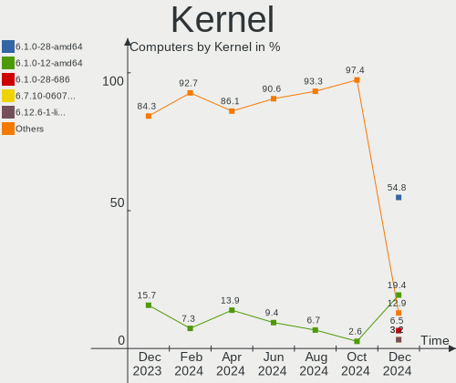

| Version                  | Computers | Percent |
|--------------------------|-----------|---------|
| 5.10.0-21-amd64          | 19        | 67.86%  |
| 5.10.0-12-amd64          | 5         | 17.86%  |
| 6.1.0-0.deb11.6-rt-amd64 | 1         | 3.57%   |
| 6.1.0-0.deb11.5-amd64    | 1         | 3.57%   |
| 5.10.0-22-amd64          | 1         | 3.57%   |
| 5.10.0-21-686            | 1         | 3.57%   |

Kernel Family
-------------

Linux kernel without a distro release

| Version | Computers | Percent |
|---------|-----------|---------|
| 5.10.0  | 26        | 92.86%  |
| 6.1.0   | 2         | 7.14%   |

Kernel Major Ver.
-----------------

Linux kernel major version

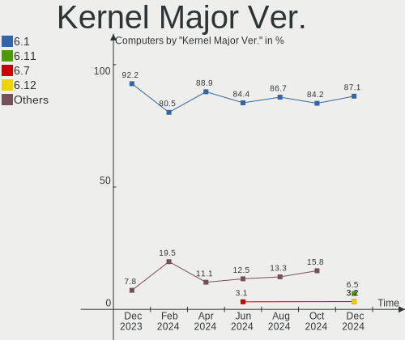

| Version | Computers | Percent |
|---------|-----------|---------|
| 5.10    | 26        | 92.86%  |
| 6.1     | 2         | 7.14%   |

Arch
----

OS architecture (x86_64, i586, etc.)

| Name   | Computers | Percent |
|--------|-----------|---------|
| x86_64 | 27        | 96.43%  |
| i686   | 1         | 3.57%   |

DE
--

Desktop Environment

| Name       | Computers | Percent |
|------------|-----------|---------|
| X-Cinnamon | 19        | 67.86%  |
| Cinnamon   | 9         | 32.14%  |

Display Server
--------------

X11 or Wayland

| Name | Computers | Percent |
|------|-----------|---------|
| X11  | 28        | 100%    |

Display Manager
---------------

SDDM, LightDM, etc.

| Name    | Computers | Percent |
|---------|-----------|---------|
| Unknown | 15        | 53.57%  |
| LightDM | 13        | 46.43%  |

OS Lang
-------

Language

| Lang  | Computers | Percent |
|-------|-----------|---------|
| en_US | 14        | 50%     |
| de_DE | 4         | 14.29%  |
| ru_RU | 2         | 7.14%   |
| pt_BR | 2         | 7.14%   |
| sv_SE | 1         | 3.57%   |
| sl_SI | 1         | 3.57%   |
| pl_PL | 1         | 3.57%   |
| es_ES | 1         | 3.57%   |
| es_CL | 1         | 3.57%   |
| en_GB | 1         | 3.57%   |

Boot Mode
---------

EFI or BIOS

| Mode | Computers | Percent |
|------|-----------|---------|
| EFI  | 21        | 75%     |
| BIOS | 7         | 25%     |

Filesystem
----------

Type of filesystem

| Type    | Computers | Percent |
|---------|-----------|---------|
| Ext4    | 24        | 85.71%  |
| Overlay | 2         | 7.14%   |
| Tmpfs   | 1         | 3.57%   |
| Btrfs   | 1         | 3.57%   |

Part. scheme
------------

Scheme of partitioning

| Type    | Computers | Percent |
|---------|-----------|---------|
| Unknown | 15        | 53.57%  |
| GPT     | 10        | 35.71%  |
| MBR     | 3         | 10.71%  |

Dual Boot with Linux/BSD
------------------------

Hosting more than one Linux/BSD

| Dual boot | Computers | Percent |
|-----------|-----------|---------|
| No        | 27        | 96.43%  |
| Yes       | 1         | 3.57%   |

Dual Boot (Win)
---------------

Hosting Linux and Windows

| Dual boot | Computers | Percent |
|-----------|-----------|---------|
| No        | 25        | 89.29%  |
| Yes       | 3         | 10.71%  |

Board
-----

Vendor
------

Motherboard manufacturer

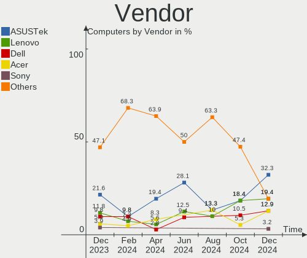

| Name                | Computers | Percent |
|---------------------|-----------|---------|
| Hewlett-Packard     | 4         | 14.29%  |
| ASUSTek Computer    | 3         | 10.71%  |
| Toshiba             | 2         | 7.14%   |
| Medion              | 2         | 7.14%   |
| Lenovo              | 2         | 7.14%   |
| Gigabyte Technology | 2         | 7.14%   |
| Apple               | 2         | 7.14%   |
| LG Electronics      | 1         | 3.57%   |
| Kruger&Matz         | 1         | 3.57%   |
| Intel               | 1         | 3.57%   |
| Insyde              | 1         | 3.57%   |
| GPU Company         | 1         | 3.57%   |
| Gear                | 1         | 3.57%   |
| Fujitsu Siemens     | 1         | 3.57%   |
| Dell                | 1         | 3.57%   |
| ASRock              | 1         | 3.57%   |
| Acer                | 1         | 3.57%   |
| Unknown             | 1         | 3.57%   |

Model
-----

Motherboard model

| Name                                    | Computers | Percent |
|-----------------------------------------|-----------|---------|
| HP 250 G7 Notebook PC                   | 2         | 7.14%   |
| Toshiba Satellite L300D                 | 1         | 3.57%   |
| Toshiba Satellite C850-D8K              | 1         | 3.57%   |
| Medion S23003                           | 1         | 3.57%   |
| Medion E6214                            | 1         | 3.57%   |
| LG A530-T.BE76P1                        | 1         | 3.57%   |
| Lenovo ThinkPad X270 W10DG 20K5S3HG00   | 1         | 3.57%   |
| Lenovo ThinkPad T420 4180FP9            | 1         | 3.57%   |
| Kruger&Matz KM1406                      | 1         | 3.57%   |
| Intel SHARKBAY                          | 1         | 3.57%   |
| Insyde CherryTrail                      | 1         | 3.57%   |
| HP ZBook 15 G4                          | 1         | 3.57%   |
| HP Pavilion x360 Convertible 14-ba1xx   | 1         | 3.57%   |
| GPU Company GWTN156-2BK                 | 1         | 3.57%   |
| Gigabyte Q87M-D2H                       | 1         | 3.57%   |
| Gigabyte A520M DS3H                     | 1         | 3.57%   |
| Gear Geranium                           | 1         | 3.57%   |
| Fujitsu Siemens AMILO Pro Edition V3505 | 1         | 3.57%   |
| Dell Precision M4800                    | 1         | 3.57%   |
| ASUS Z550SA                             | 1         | 3.57%   |
| ASUS ROG STRIX B450-F GAMING            | 1         | 3.57%   |
| ASUS P7Q57-M DO                         | 1         | 3.57%   |
| ASRock B450M Pro4                       | 1         | 3.57%   |
| Apple MacBookPro9,2                     | 1         | 3.57%   |
| Apple MacBookPro11,1                    | 1         | 3.57%   |
| Acer Aspire A515-56                     | 1         | 3.57%   |
| Unknown                                 | 1         | 3.57%   |

Model Family
------------

Motherboard model prefix

| Name                    | Computers | Percent |
|-------------------------|-----------|---------|
| Toshiba Satellite       | 2         | 7.14%   |
| Lenovo ThinkPad         | 2         | 7.14%   |
| HP 250                  | 2         | 7.14%   |
| Medion S23003           | 1         | 3.57%   |
| Medion E6214            | 1         | 3.57%   |
| LG A530-T.BE76P1        | 1         | 3.57%   |
| Kruger&Matz KM1406      | 1         | 3.57%   |
| Intel SHARKBAY          | 1         | 3.57%   |
| Insyde CherryTrail      | 1         | 3.57%   |
| HP ZBook                | 1         | 3.57%   |
| HP Pavilion             | 1         | 3.57%   |
| GPU Company GWTN156-2BK | 1         | 3.57%   |
| Gigabyte Q87M-D2H       | 1         | 3.57%   |
| Gigabyte A520M          | 1         | 3.57%   |
| Gear Geranium           | 1         | 3.57%   |
| Fujitsu Siemens AMILO   | 1         | 3.57%   |
| Dell Precision          | 1         | 3.57%   |
| ASUS Z550SA             | 1         | 3.57%   |
| ASUS ROG                | 1         | 3.57%   |
| ASUS P7Q57-M            | 1         | 3.57%   |
| ASRock B450M            | 1         | 3.57%   |
| Apple MacBookPro9       | 1         | 3.57%   |
| Apple MacBookPro11      | 1         | 3.57%   |
| Acer Aspire             | 1         | 3.57%   |
| Unknown                 | 1         | 3.57%   |

MFG Year
--------

Motherboard manufacture year

| Year | Computers | Percent |
|------|-----------|---------|
| 2018 | 5         | 17.86%  |
| 2021 | 3         | 10.71%  |
| 2020 | 3         | 10.71%  |
| 2017 | 3         | 10.71%  |
| 2016 | 2         | 7.14%   |
| 2013 | 2         | 7.14%   |
| 2011 | 2         | 7.14%   |
| 2010 | 2         | 7.14%   |
| 2023 | 1         | 3.57%   |
| 2015 | 1         | 3.57%   |
| 2014 | 1         | 3.57%   |
| 2012 | 1         | 3.57%   |
| 2008 | 1         | 3.57%   |
| 2006 | 1         | 3.57%   |

Form Factor
-----------

Physical design of the computer

| Name        | Computers | Percent |
|-------------|-----------|---------|
| Notebook    | 20        | 71.43%  |
| Desktop     | 7         | 25%     |
| Convertible | 1         | 3.57%   |

Secure Boot
-----------

Enabled or disabled

| State    | Computers | Percent |
|----------|-----------|---------|
| Disabled | 26        | 92.86%  |
| Enabled  | 2         | 7.14%   |

Coreboot
--------

Have coreboot on board

| Used | Computers | Percent |
|------|-----------|---------|
| No   | 28        | 100%    |

RAM Size
--------

Total RAM memory

| Size in GB  | Computers | Percent |
|-------------|-----------|---------|
| 3.01-4.0    | 9         | 32.14%  |
| 4.01-8.0    | 7         | 25%     |
| 16.01-24.0  | 5         | 17.86%  |
| 32.01-64.0  | 3         | 10.71%  |
| 64.01-256.0 | 1         | 3.57%   |
| 1.01-2.0    | 1         | 3.57%   |
| 8.01-16.0   | 1         | 3.57%   |
| 0.51-1.0    | 1         | 3.57%   |

RAM Used
--------

Used RAM memory

| Used GB   | Computers | Percent |
|-----------|-----------|---------|
| 2.01-3.0  | 12        | 42.86%  |
| 1.01-2.0  | 9         | 32.14%  |
| 3.01-4.0  | 3         | 10.71%  |
| 8.01-16.0 | 2         | 7.14%   |
| 4.01-8.0  | 1         | 3.57%   |
| 0.51-1.0  | 1         | 3.57%   |

Total Drives
------------

Number of drives on board

| Drives | Computers | Percent |
|--------|-----------|---------|
| 1      | 20        | 71.43%  |
| 2      | 5         | 17.86%  |
| 4      | 2         | 7.14%   |
| 0      | 1         | 3.57%   |

Has CD-ROM
----------

Has CD-ROM on board

| Presented | Computers | Percent |
|-----------|-----------|---------|
| No        | 21        | 75%     |
| Yes       | 7         | 25%     |

Has Ethernet
------------

Has Ethernet on board

| Presented | Computers | Percent |
|-----------|-----------|---------|
| Yes       | 23        | 82.14%  |
| No        | 5         | 17.86%  |

Has WiFi
--------

Has WiFi module

| Presented | Computers | Percent |
|-----------|-----------|---------|
| Yes       | 24        | 85.71%  |
| No        | 4         | 14.29%  |

Has Bluetooth
-------------

Has Bluetooth module

| Presented | Computers | Percent |
|-----------|-----------|---------|
| Yes       | 17        | 60.71%  |
| No        | 11        | 39.29%  |

Location
--------

Country
-------

Geographic location (country)

| Country                | Computers | Percent |
|------------------------|-----------|---------|
| USA                    | 6         | 21.43%  |
| Russia                 | 3         | 10.71%  |
| Germany                | 3         | 10.71%  |
| UK                     | 2         | 7.14%   |
| Spain                  | 2         | 7.14%   |
| Brazil                 | 2         | 7.14%   |
| Sweden                 | 1         | 3.57%   |
| Slovenia               | 1         | 3.57%   |
| Poland                 | 1         | 3.57%   |
| Peru                   | 1         | 3.57%   |
| Netherlands            | 1         | 3.57%   |
| Italy                  | 1         | 3.57%   |
| Chile                  | 1         | 3.57%   |
| Canada                 | 1         | 3.57%   |
| Bosnia and Herzegovina | 1         | 3.57%   |
| Bolivia                | 1         | 3.57%   |

City
----

Geographic location (city)

| City                | Computers | Percent |
|---------------------|-----------|---------|
| Gruenenplan         | 2         | 7.14%   |
| Toronto             | 1         | 3.57%   |
| Segovia             | 1         | 3.57%   |
| Sarajevo            | 1         | 3.57%   |
| Santiago            | 1         | 3.57%   |
| Rio de Janeiro      | 1         | 3.57%   |
| Ponteranica         | 1         | 3.57%   |
| Ponte Alta do Norte | 1         | 3.57%   |
| Perm                | 1         | 3.57%   |
| Palatine            | 1         | 3.57%   |
| Oostburg            | 1         | 3.57%   |
| Njurundabommen      | 1         | 3.57%   |
| Mokronog            | 1         | 3.57%   |
| Madrid              | 1         | 3.57%   |
| London              | 1         | 3.57%   |
| Lima                | 1         | 3.57%   |
| Krakow              | 1         | 3.57%   |
| Konakovo            | 1         | 3.57%   |
| Kemerovo            | 1         | 3.57%   |
| Fenton              | 1         | 3.57%   |
| Crossville          | 1         | 3.57%   |
| Cochabamba          | 1         | 3.57%   |
| City of Westminster | 1         | 3.57%   |
| Bristol             | 1         | 3.57%   |
| Boynton Beach       | 1         | 3.57%   |
| Baldwin             | 1         | 3.57%   |
| Alfeld              | 1         | 3.57%   |

Drives
------

Drive Vendor
------------

Hard drive vendors

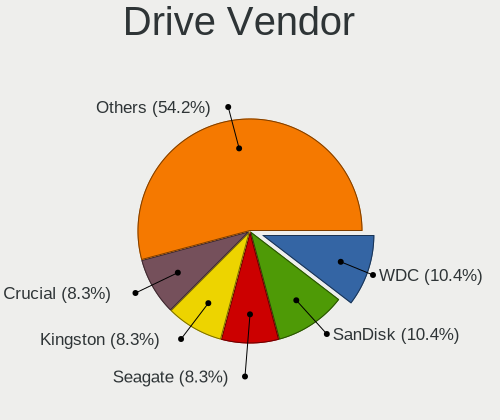

| Vendor              | Computers | Drives | Percent |
|---------------------|-----------|--------|---------|
| Samsung Electronics | 7         | 8      | 20%     |
| Kingston            | 5         | 5      | 14.29%  |
| Unknown             | 4         | 4      | 11.43%  |
| Seagate             | 3         | 3      | 8.57%   |
| WDC                 | 2         | 2      | 5.71%   |
| SK hynix            | 1         | 1      | 2.86%   |
| SCCTS-603-001T      | 1         | 1      | 2.86%   |
| SanDisk             | 1         | 1      | 2.86%   |
| Phison Electronics  | 1         | 1      | 2.86%   |
| Phison              | 1         | 1      | 2.86%   |
| OCZ                 | 1         | 1      | 2.86%   |
| KODAK               | 1         | 1      | 2.86%   |
| KingSpec            | 1         | 1      | 2.86%   |
| Intenso             | 1         | 1      | 2.86%   |
| Fujitsu             | 1         | 1      | 2.86%   |
| Fanxiang            | 1         | 1      | 2.86%   |
| Crucial             | 1         | 1      | 2.86%   |
| Apple               | 1         | 1      | 2.86%   |
| Unknown             | 1         | 1      | 2.86%   |

Drive Model
-----------

Hard drive models

| Model                                             | Computers | Percent |
|---------------------------------------------------|-----------|---------|
| Kingston SA400S37480G 480GB SSD                   | 2         | 5.56%   |
| WDC WD60EFAX-68SHWN0 6TB                          | 1         | 2.78%   |
| WDC WD5000LPCX-80VHAT0 500GB                      | 1         | 2.78%   |
| Unknown SC128  128GB                              | 1         | 2.78%   |
| Unknown NCard  64GB                               | 1         | 2.78%   |
| Unknown MMC Card  7GB                             | 1         | 2.78%   |
| Unknown MMC Card  64GB                            | 1         | 2.78%   |
| SK hynix SC311 SATA 256GB SSD                     | 1         | 2.78%   |
| Seagate ST98823AS 80GB                            | 1         | 2.78%   |
| Seagate ST8000DM004-2CX188 8TB                    | 1         | 2.78%   |
| Seagate ST4000DM000-1F2168 4TB                    | 1         | 2.78%   |
| SCCTS-603-001T SSD 1024GB                         | 1         | 2.78%   |
| SanDisk X600 2.5 7MM SATA 256GB SSD               | 1         | 2.78%   |
| Samsung SSD 980 PRO 1TB                           | 1         | 2.78%   |
| Samsung SSD 970 EVO 500GB                         | 1         | 2.78%   |
| Samsung SSD 870 EVO 500GB                         | 1         | 2.78%   |
| Samsung SSD 870 EVO 2TB                           | 1         | 2.78%   |
| Samsung SSD 860 EVO 250GB                         | 1         | 2.78%   |
| Samsung NVMe SSD Controller SM981/PM981/PM983 1TB | 1         | 2.78%   |
| Samsung MZVLQ256HAJD-000H1 256GB                  | 1         | 2.78%   |
| Samsung HD204UI 2TB                               | 1         | 2.78%   |
| Phison S11-128G-PHISON-SSD-B4 128GB               | 1         | 2.78%   |
| Phison PS5013 E13 NVMe Controller 500GB           | 1         | 2.78%   |
| OCZ AGILITY3 240GB SSD                            | 1         | 2.78%   |
| KODAK SSD X100 480GB                              | 1         | 2.78%   |
| Kingston SV300S37A60G 64GB SSD                    | 1         | 2.78%   |
| Kingston SNVS500G 500GB                           | 1         | 2.78%   |
| Kingston SA400S37120G 120GB SSD                   | 1         | 2.78%   |
| KingSpec MT-128 128GB                             | 1         | 2.78%   |
| Intenso SSD 256GB                                 | 1         | 2.78%   |
| Fujitsu MHZ2160BH G2 160GB                        | 1         | 2.78%   |
| Fanxiang S201 256GB                               | 1         | 2.78%   |
| Crucial CT256MX100SSD1 256GB                      | 1         | 2.78%   |
| Apple SSD SM0512F 500GB                           | 1         | 2.78%   |
| Unknown                                           | 1         | 2.78%   |

HDD Vendor
----------

Hard disk drive vendors

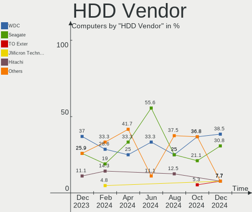

| Vendor              | Computers | Drives | Percent |
|---------------------|-----------|--------|---------|
| Seagate             | 3         | 3      | 42.86%  |
| WDC                 | 2         | 2      | 28.57%  |
| Samsung Electronics | 1         | 1      | 14.29%  |
| Fujitsu             | 1         | 1      | 14.29%  |

SSD Vendor
----------

Solid state drive vendors

| Vendor              | Computers | Drives | Percent |
|---------------------|-----------|--------|---------|
| Kingston            | 4         | 4      | 23.53%  |
| Samsung Electronics | 3         | 3      | 17.65%  |
| SK hynix            | 1         | 1      | 5.88%   |
| SCCTS-603-001T      | 1         | 1      | 5.88%   |
| SanDisk             | 1         | 1      | 5.88%   |
| Phison              | 1         | 1      | 5.88%   |
| OCZ                 | 1         | 1      | 5.88%   |
| KODAK               | 1         | 1      | 5.88%   |
| KingSpec            | 1         | 1      | 5.88%   |
| Intenso             | 1         | 1      | 5.88%   |
| Crucial             | 1         | 1      | 5.88%   |
| Apple               | 1         | 1      | 5.88%   |

Drive Kind
----------

HDD or SSD

| Kind    | Computers | Drives | Percent |
|---------|-----------|--------|---------|
| SSD     | 16        | 17     | 48.48%  |
| NVMe    | 6         | 6      | 18.18%  |
| MMC     | 5         | 5      | 15.15%  |
| HDD     | 5         | 7      | 15.15%  |
| Unknown | 1         | 1      | 3.03%   |

Drive Connector
---------------

SATA, SAS, NVMe, etc.

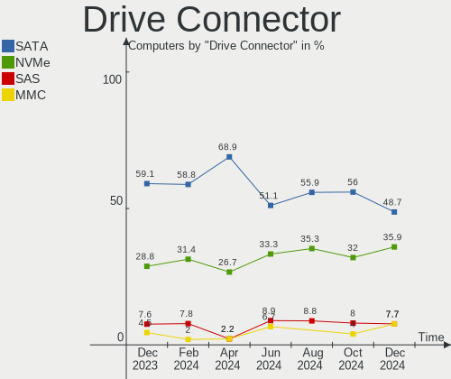

| Type | Computers | Drives | Percent |
|------|-----------|--------|---------|
| SATA | 20        | 24     | 62.5%   |
| NVMe | 6         | 6      | 18.75%  |
| MMC  | 5         | 5      | 15.63%  |
| SAS  | 1         | 1      | 3.13%   |

Drive Size
----------

Size of hard drive

| Size in TB | Computers | Drives | Percent |
|------------|-----------|--------|---------|
| 0.01-0.5   | 18        | 18     | 78.26%  |
| 1.01-2.0   | 3         | 3      | 13.04%  |
| 3.01-4.0   | 1         | 1      | 4.35%   |
| 4.01-10.0  | 1         | 2      | 4.35%   |

Space Total
-----------

Amount of disk space available on the file system

| Size in GB     | Computers | Percent |
|----------------|-----------|---------|
| 101-250        | 11        | 39.29%  |
| 251-500        | 8         | 28.57%  |
| 51-100         | 6         | 21.43%  |
| 1-20           | 2         | 7.14%   |
| More than 3000 | 1         | 3.57%   |

Space Used
----------

Amount of used disk space

| Used GB | Computers | Percent |
|---------|-----------|---------|
| 1-20    | 16        | 57.14%  |
| 21-50   | 5         | 17.86%  |
| 51-100  | 3         | 10.71%  |
| 251-500 | 2         | 7.14%   |
| 101-250 | 2         | 7.14%   |

Malfunc. Drives
---------------

Drive models with a malfunction

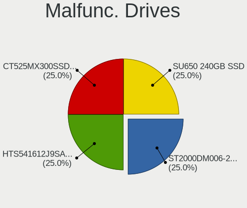

| Model                               | Computers | Drives | Percent |
|-------------------------------------|-----------|--------|---------|
| Seagate ST98823AS 80GB              | 1         | 1      | 33.33%  |
| Samsung Electronics SSD 980 PRO 1TB | 1         | 1      | 33.33%  |
| Intenso SSD 256GB                   | 1         | 1      | 33.33%  |

Malfunc. Drive Vendor
---------------------

Vendors of faulty drives

| Vendor              | Computers | Drives | Percent |
|---------------------|-----------|--------|---------|
| Seagate             | 1         | 1      | 33.33%  |
| Samsung Electronics | 1         | 1      | 33.33%  |
| Intenso             | 1         | 1      | 33.33%  |

Malfunc. HDD Vendor
-------------------

Vendors of faulty HDD drives

| Vendor  | Computers | Drives | Percent |
|---------|-----------|--------|---------|
| Seagate | 1         | 1      | 100%    |

Malfunc. Drive Kind
-------------------

Kinds of faulty drives

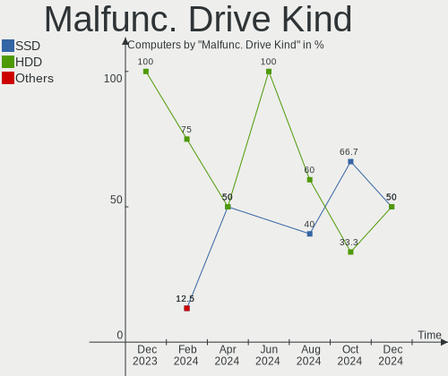

| Kind | Computers | Drives | Percent |
|------|-----------|--------|---------|
| NVMe | 1         | 1      | 33.33%  |
| SSD  | 1         | 1      | 33.33%  |
| HDD  | 1         | 1      | 33.33%  |

Failed Drives
-------------

Failed drive models

Zero info for selected period =(

Failed Drive Vendor
-------------------

Failed drive vendors

Zero info for selected period =(

Drive Status
------------

Number of failed and malfunc. drives

| Status   | Computers | Drives | Percent |
|----------|-----------|--------|---------|
| Detected | 18        | 22     | 62.07%  |
| Works    | 8         | 11     | 27.59%  |
| Malfunc  | 3         | 3      | 10.34%  |

Storage controller
------------------

Storage Vendor
--------------

Storage controller vendors

| Vendor                      | Computers | Percent |
|-----------------------------|-----------|---------|
| Intel                       | 21        | 63.64%  |
| Samsung Electronics         | 5         | 15.15%  |
| AMD                         | 4         | 12.12%  |
| Phison Electronics          | 1         | 3.03%   |
| Kingston Technology Company | 1         | 3.03%   |
| JMicron Technology          | 1         | 3.03%   |

Storage Model
-------------

Storage controller models

| Model                                                                            | Computers | Percent |
|----------------------------------------------------------------------------------|-----------|---------|
| Intel Celeron/Pentium Silver Processor SATA Controller                           | 3         | 7.89%   |
| Intel 82801 Mobile SATA Controller [RAID mode]                                   | 3         | 7.89%   |
| Samsung NVMe SSD Controller SM981/PM981/PM983                                    | 2         | 5.26%   |
| Intel Sunrise Point-LP SATA Controller [AHCI mode]                               | 2         | 5.26%   |
| Intel 8 Series/C220 Series Chipset Family 6-port SATA Controller 1 [AHCI mode]   | 2         | 5.26%   |
| Intel 7 Series Chipset Family 6-port SATA Controller [AHCI mode]                 | 2         | 5.26%   |
| Intel 6 Series/C200 Series Chipset Family 6 port Mobile SATA AHCI Controller     | 2         | 5.26%   |
| AMD 400 Series Chipset SATA Controller                                           | 2         | 5.26%   |
| Samsung NVMe SSD Controller PM9A1/PM9A3/980PRO                                   | 1         | 2.63%   |
| Samsung NVMe SSD Controller 980                                                  | 1         | 2.63%   |
| Samsung Apple PCIe SSD                                                           | 1         | 2.63%   |
| Phison PS5013 E13 NVMe Controller                                                | 1         | 2.63%   |
| Kingston Company NVMe Controller                                                 | 1         | 2.63%   |
| JMicron JMB368 IDE controller                                                    | 1         | 2.63%   |
| Intel Volume Management Device NVMe RAID Controller                              | 1         | 2.63%   |
| Intel Tiger Lake-LP SATA Controller                                              | 1         | 2.63%   |
| Intel Q170/Q150/B150/H170/H110/Z170/CM236 Chipset SATA Controller [AHCI Mode]    | 1         | 2.63%   |
| Intel Jasper Lake SATA AHCI Controller                                           | 1         | 2.63%   |
| Intel Atom/Celeron/Pentium Processor x5-E8000/J3xxx/N3xxx Series SATA Controller | 1         | 2.63%   |
| Intel 82801GBM/GHM (ICH7-M Family) SATA Controller [AHCI mode]                   | 1         | 2.63%   |
| Intel 82801G (ICH7 Family) IDE Controller                                        | 1         | 2.63%   |
| Intel 5 Series/3400 Series Chipset PT IDER Controller                            | 1         | 2.63%   |
| Intel 5 Series/3400 Series Chipset 6 port SATA AHCI Controller                   | 1         | 2.63%   |
| Intel 5 Series/3400 Series Chipset 4 port SATA AHCI Controller                   | 1         | 2.63%   |
| AMD SB600 Non-Raid-5 SATA                                                        | 1         | 2.63%   |
| AMD SB600 IDE                                                                    | 1         | 2.63%   |
| AMD FCH SATA Controller [AHCI mode]                                              | 1         | 2.63%   |
| AMD 500 Series Chipset SATA Controller                                           | 1         | 2.63%   |

Storage Kind
------------

Kind of storage controller (IDE, SATA, NVMe, SAS, ...)

| Kind | Computers | Percent |
|------|-----------|---------|
| SATA | 23        | 63.89%  |
| NVMe | 6         | 16.67%  |
| RAID | 4         | 11.11%  |
| IDE  | 3         | 8.33%   |

Processor
---------

CPU Vendor
----------

Processor vendors

| Vendor | Computers | Percent |
|--------|-----------|---------|
| Intel  | 23        | 82.14%  |
| AMD    | 5         | 17.86%  |

CPU Model
---------

Processor models

| Model                                      | Computers | Percent |
|--------------------------------------------|-----------|---------|
| Intel Pentium Silver N5030 CPU @ 1.10GHz   | 1         | 3.57%   |
| Intel Pentium CPU B950 @ 2.10GHz           | 1         | 3.57%   |
| Intel Genuine CPU T2050 @ 1.60GHz          | 1         | 3.57%   |
| Intel Core i7-7820HQ CPU @ 2.90GHz         | 1         | 3.57%   |
| Intel Core i7-4800MQ CPU @ 2.70GHz         | 1         | 3.57%   |
| Intel Core i7-4790K CPU @ 4.00GHz          | 1         | 3.57%   |
| Intel Core i7-4558U CPU @ 2.80GHz          | 1         | 3.57%   |
| Intel Core i7-2670QM CPU @ 2.20GHz         | 1         | 3.57%   |
| Intel Core i5-8265U CPU @ 1.60GHz          | 1         | 3.57%   |
| Intel Core i5-8250U CPU @ 1.60GHz          | 1         | 3.57%   |
| Intel Core i5-6200U CPU @ 2.30GHz          | 1         | 3.57%   |
| Intel Core i5-4590S CPU @ 3.00GHz          | 1         | 3.57%   |
| Intel Core i5-3210M CPU @ 2.50GHz          | 1         | 3.57%   |
| Intel Core i5-2540M CPU @ 2.60GHz          | 1         | 3.57%   |
| Intel Core i3-1005G1 CPU @ 1.20GHz         | 1         | 3.57%   |
| Intel Core i3 CPU M 330 @ 2.13GHz          | 1         | 3.57%   |
| Intel Core i3 CPU 540 @ 3.07GHz            | 1         | 3.57%   |
| Intel Celeron N5095A @ 2.00GHz             | 1         | 3.57%   |
| Intel Celeron N4000 CPU @ 1.10GHz          | 1         | 3.57%   |
| Intel Celeron J4125 CPU @ 2.00GHz          | 1         | 3.57%   |
| Intel Celeron CPU N3160 @ 1.60GHz          | 1         | 3.57%   |
| Intel Atom x5-Z8350 CPU @ 1.44GHz          | 1         | 3.57%   |
| Intel 11th Gen Core i3-1115G4 @ 3.00GHz    | 1         | 3.57%   |
| AMD Ryzen 7 5700G with Radeon Graphics     | 1         | 3.57%   |
| AMD Ryzen 7 3700X 8-Core Processor         | 1         | 3.57%   |
| AMD Ryzen 5 4600H with Radeon Graphics     | 1         | 3.57%   |
| AMD Ryzen 5 2600 Six-Core Processor        | 1         | 3.57%   |
| AMD Athlon 64 X2 Dual-Core Processor TK-57 | 1         | 3.57%   |

CPU Model Family
----------------

Processor model prefix

| Model                | Computers | Percent |
|----------------------|-----------|---------|
| Intel Core i5        | 6         | 21.43%  |
| Intel Core i7        | 5         | 17.86%  |
| Intel Celeron        | 4         | 14.29%  |
| Intel Core i3        | 3         | 10.71%  |
| AMD Ryzen 7          | 2         | 7.14%   |
| AMD Ryzen 5          | 2         | 7.14%   |
| Other                | 1         | 3.57%   |
| Intel Pentium Silver | 1         | 3.57%   |
| Intel Pentium        | 1         | 3.57%   |
| Intel Genuine        | 1         | 3.57%   |
| Intel Atom           | 1         | 3.57%   |
| AMD Athlon 64 X2     | 1         | 3.57%   |

CPU Cores
---------

Number of processor cores

| Number | Computers | Percent |
|--------|-----------|---------|
| 4      | 12        | 42.86%  |
| 2      | 12        | 42.86%  |
| 8      | 2         | 7.14%   |
| 6      | 2         | 7.14%   |

CPU Sockets
-----------

Number of sockets

| Number | Computers | Percent |
|--------|-----------|---------|
| 1      | 28        | 100%    |

CPU Threads
-----------

Threads per core (Hyper-Threading)

| Number | Computers | Percent |
|--------|-----------|---------|
| 2      | 17        | 60.71%  |
| 1      | 11        | 39.29%  |

CPU Op-Modes
------------

CPU Operation Modes (32-bit, 64-bit)

| Op mode        | Computers | Percent |
|----------------|-----------|---------|
| 32-bit, 64-bit | 27        | 96.43%  |
| 32-bit         | 1         | 3.57%   |

CPU Microcode
-------------

Microcode number

| Number     | Computers | Percent |
|------------|-----------|---------|
| 0x306c3    | 3         | 10.71%  |
| 0x206a7    | 3         | 10.71%  |
| 0x706a8    | 2         | 7.14%   |
| 0x406c4    | 2         | 7.14%   |
| 0x906e9    | 1         | 3.57%   |
| 0x906c0    | 1         | 3.57%   |
| 0x806ec    | 1         | 3.57%   |
| 0x806ea    | 1         | 3.57%   |
| 0x806c1    | 1         | 3.57%   |
| 0x706e5    | 1         | 3.57%   |
| 0x706a1    | 1         | 3.57%   |
| 0x6e8      | 1         | 3.57%   |
| 0x406e3    | 1         | 3.57%   |
| 0x40651    | 1         | 3.57%   |
| 0x306a9    | 1         | 3.57%   |
| 0x20655    | 1         | 3.57%   |
| 0x20652    | 1         | 3.57%   |
| 0x0a50000d | 1         | 3.57%   |
| 0x08701021 | 1         | 3.57%   |
| 0x08600103 | 1         | 3.57%   |
| 0x0800820d | 1         | 3.57%   |
| Unknown    | 1         | 3.57%   |

CPU Microarch
-------------

Microarchitecture

| Name          | Computers | Percent |
|---------------|-----------|---------|
| Haswell       | 4         | 14.29%  |
| SandyBridge   | 3         | 10.71%  |
| KabyLake      | 3         | 10.71%  |
| Goldmont plus | 3         | 10.71%  |
| Zen 2         | 2         | 7.14%   |
| Westmere      | 2         | 7.14%   |
| Silvermont    | 2         | 7.14%   |
| Zen+          | 1         | 3.57%   |
| Zen 3         | 1         | 3.57%   |
| Tremont       | 1         | 3.57%   |
| TigerLake     | 1         | 3.57%   |
| Skylake       | 1         | 3.57%   |
| P6            | 1         | 3.57%   |
| K8 Hammer     | 1         | 3.57%   |
| IvyBridge     | 1         | 3.57%   |
| IceLake       | 1         | 3.57%   |

Graphics
--------

GPU Vendor
----------

Vendors of graphics cards

| Vendor | Computers | Percent |
|--------|-----------|---------|
| Intel  | 21        | 63.64%  |
| Nvidia | 8         | 24.24%  |
| AMD    | 4         | 12.12%  |

GPU Model
---------

Graphics card models

| Model                                                                                    | Computers | Percent |
|------------------------------------------------------------------------------------------|-----------|---------|
| Intel 2nd Generation Core Processor Family Integrated Graphics Controller                | 3         | 8.82%   |
| Intel GeminiLake [UHD Graphics 600]                                                      | 2         | 5.88%   |
| Intel Atom/Celeron/Pentium Processor x5-E8000/J3xxx/N3xxx Integrated Graphics Controller | 2         | 5.88%   |
| Nvidia TU117M                                                                            | 1         | 2.94%   |
| Nvidia GP107 [GeForce GTX 1050]                                                          | 1         | 2.94%   |
| Nvidia GM206GLM [Quadro M2200 Mobile]                                                    | 1         | 2.94%   |
| Nvidia GK208B [GeForce GT 730]                                                           | 1         | 2.94%   |
| Nvidia GK208B [GeForce GT 710]                                                           | 1         | 2.94%   |
| Nvidia GK208 [GeForce GT 635]                                                            | 1         | 2.94%   |
| Nvidia GK107GLM [Quadro K1100M]                                                          | 1         | 2.94%   |
| Nvidia GF116M [GeForce GT 555M/635M]                                                     | 1         | 2.94%   |
| Intel Xeon E3-1200 v3/4th Gen Core Processor Integrated Graphics Controller              | 1         | 2.94%   |
| Intel WhiskeyLake-U GT2 [UHD Graphics 620]                                               | 1         | 2.94%   |
| Intel UHD Graphics 620                                                                   | 1         | 2.94%   |
| Intel Tiger Lake-LP GT2 [UHD Graphics G4]                                                | 1         | 2.94%   |
| Intel Skylake GT2 [HD Graphics 520]                                                      | 1         | 2.94%   |
| Intel Mobile 945GM/GMS/GME, 943/940GML Express Integrated Graphics Controller            | 1         | 2.94%   |
| Intel Mobile 945GM/GMS, 943/940GML Express Integrated Graphics Controller                | 1         | 2.94%   |
| Intel JasperLake [UHD Graphics]                                                          | 1         | 2.94%   |
| Intel Iris Plus Graphics G1 (Ice Lake)                                                   | 1         | 2.94%   |
| Intel HD Graphics 630                                                                    | 1         | 2.94%   |
| Intel Haswell-ULT Integrated Graphics Controller                                         | 1         | 2.94%   |
| Intel GeminiLake [UHD Graphics 605]                                                      | 1         | 2.94%   |
| Intel Core Processor Integrated Graphics Controller                                      | 1         | 2.94%   |
| Intel 4th Gen Core Processor Integrated Graphics Controller                              | 1         | 2.94%   |
| Intel 3rd Gen Core processor Graphics Controller                                         | 1         | 2.94%   |
| AMD RS690M [Radeon Xpress 1200/1250/1270]                                                | 1         | 2.94%   |
| AMD Renoir                                                                               | 1         | 2.94%   |
| AMD Ellesmere [Radeon RX 470/480/570/570X/580/580X/590]                                  | 1         | 2.94%   |
| AMD Cezanne [Radeon Vega Series / Radeon Vega Mobile Series]                             | 1         | 2.94%   |

GPU Combo
---------

Combinations of graphics cards

| Name           | Computers | Percent |
|----------------|-----------|---------|
| 1 x Intel      | 18        | 64.29%  |
| 1 x Nvidia     | 3         | 10.71%  |
| Intel + Nvidia | 3         | 10.71%  |
| 1 x AMD        | 3         | 10.71%  |
| AMD + Nvidia   | 1         | 3.57%   |

GPU Driver
----------

Free vs proprietary

| Driver      | Computers | Percent |
|-------------|-----------|---------|
| Free        | 22        | 78.57%  |
| Proprietary | 5         | 17.86%  |
| Unknown     | 1         | 3.57%   |

GPU Memory
----------

Total video memory

| Size in GB | Computers | Percent |
|------------|-----------|---------|
| Unknown    | 20        | 71.43%  |
| 0.01-0.5   | 3         | 10.71%  |
| 1.01-2.0   | 2         | 7.14%   |
| 0.51-1.0   | 2         | 7.14%   |
| 7.01-8.0   | 1         | 3.57%   |

Monitor
-------

Monitor Vendor
--------------

Monitor vendors

| Vendor              | Computers | Percent |
|---------------------|-----------|---------|
| LG Display          | 5         | 17.86%  |
| AU Optronics        | 5         | 17.86%  |
| Chimei Innolux      | 4         | 14.29%  |
| Samsung Electronics | 3         | 10.71%  |
| Apple               | 2         | 7.14%   |
| PANDA               | 1         | 3.57%   |
| Panasonic           | 1         | 3.57%   |
| NEC Computers       | 1         | 3.57%   |
| MSI                 | 1         | 3.57%   |
| Idek Iiyama         | 1         | 3.57%   |
| HUAWEI              | 1         | 3.57%   |
| Goldstar            | 1         | 3.57%   |
| CPT                 | 1         | 3.57%   |
| BOE                 | 1         | 3.57%   |

Monitor Model
-------------

Monitor models

| Model                                                              | Computers | Percent |
|--------------------------------------------------------------------|-----------|---------|
| Samsung Electronics SMBX1950N SAM0716 1366x768 410x230mm 18.5-inch | 1         | 3.45%   |
| Samsung Electronics S24D590 SAM0B47 1920x1080 521x293mm 23.5-inch  | 1         | 3.45%   |
| Samsung Electronics S22B300 SAM08A9 1600x900 443x249mm 20.0-inch   | 1         | 3.45%   |
| Samsung Electronics LF22T35 SAM707B 1920x1080 477x268mm 21.5-inch  | 1         | 3.45%   |
| PANDA LCD Monitor NCP0036 1920x1080 344x194mm 15.5-inch            | 1         | 3.45%   |
| Panasonic VVY13F001G10 MEI96A2 1920x1080 344x193mm 15.5-inch       | 1         | 3.45%   |
| NEC Computers LCD Monitor LCD1700NX 1280x1024                      | 1         | 3.45%   |
| MSI G242 MSI4BA4 1920x1080 527x296mm 23.8-inch                     | 1         | 3.45%   |
| LG Display LCD Monitor LGD057E 1920x1080 344x194mm 15.5-inch       | 1         | 3.45%   |
| LG Display LCD Monitor LGD033A 1366x768 344x194mm 15.5-inch        | 1         | 3.45%   |
| LG Display LCD Monitor LGD032C 1920x1080 344x194mm 15.5-inch       | 1         | 3.45%   |
| LG Display LCD Monitor LGD02E2 1600x900 310x174mm 14.0-inch        | 1         | 3.45%   |
| LG Display LCD Monitor LGD02C6 1920x1080 345x194mm 15.6-inch       | 1         | 3.45%   |
| Idek Iiyama LCD Monitor PL2590 1920x1080                           | 1         | 3.45%   |
| HUAWEI ZQE-CBA HWV6A25 3440x1440 797x334mm 34.0-inch               | 1         | 3.45%   |
| Goldstar TV SSCR2 GSMC0C8 3840x2160                                | 1         | 3.45%   |
| CPT LCD Monitor CPT13B0 1280x800 331x207mm 15.4-inch               | 1         | 3.45%   |
| Chimei Innolux LCD Monitor CMN15E7 1920x1080 344x193mm 15.5-inch   | 1         | 3.45%   |
| Chimei Innolux LCD Monitor CMN15DB 1366x768 344x193mm 15.5-inch    | 1         | 3.45%   |
| Chimei Innolux LCD Monitor CMN15CA 1366x768 344x193mm 15.5-inch    | 1         | 3.45%   |
| Chimei Innolux LCD Monitor CMN14B6 1920x1080 308x173mm 13.9-inch   | 1         | 3.45%   |
| BOE LCD Monitor BOE0718 1920x1080 309x173mm 13.9-inch              | 1         | 3.45%   |
| AU Optronics LCD Monitor AUO8174 1280x800 331x207mm 15.4-inch      | 1         | 3.45%   |
| AU Optronics LCD Monitor AUO515C 1366x768 256x144mm 11.6-inch      | 1         | 3.45%   |
| AU Optronics LCD Monitor AUO38ED 1920x1080 344x193mm 15.5-inch     | 1         | 3.45%   |
| AU Optronics LCD Monitor AUO32EC 1366x768 344x193mm 15.5-inch      | 1         | 3.45%   |
| AU Optronics LCD Monitor AUO106C 1366x768 277x156mm 12.5-inch      | 1         | 3.45%   |
| Apple Color LCD APPA020 2560x1600 286x179mm 13.3-inch              | 1         | 3.45%   |
| Apple Color LCD APP9CC7 1280x800 286x179mm 13.3-inch               | 1         | 3.45%   |

Monitor Resolution
------------------

Monitor screen resolution

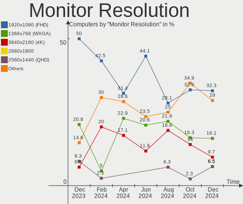

| Resolution       | Computers | Percent |
|------------------|-----------|---------|
| 1920x1080 (FHD)  | 11        | 39.29%  |
| 1366x768 (WXGA)  | 7         | 25%     |
| 1280x800 (WXGA)  | 3         | 10.71%  |
| 3840x2160 (4K)   | 2         | 7.14%   |
| 1600x900 (HD+)   | 2         | 7.14%   |
| 3440x1440        | 1         | 3.57%   |
| 2560x1600        | 1         | 3.57%   |
| 1280x1024 (SXGA) | 1         | 3.57%   |

Monitor Diagonal
----------------

Diagonal size in inches

| Inches  | Computers | Percent |
|---------|-----------|---------|
| 15      | 12        | 42.86%  |
| 13      | 4         | 14.29%  |
| Unknown | 2         | 7.14%   |
| 72      | 1         | 3.57%   |
| 34      | 1         | 3.57%   |
| 23      | 1         | 3.57%   |
| 21      | 1         | 3.57%   |
| 20      | 1         | 3.57%   |
| 18      | 1         | 3.57%   |
| 17      | 1         | 3.57%   |
| 14      | 1         | 3.57%   |
| 12      | 1         | 3.57%   |
| 11      | 1         | 3.57%   |

Monitor Width
-------------

Physical width

| Width in mm | Computers | Percent |
|-------------|-----------|---------|
| 301-350     | 15        | 55.56%  |
| 201-300     | 4         | 14.81%  |
| 401-500     | 2         | 7.41%   |
| Unknown     | 2         | 7.41%   |
| 701-800     | 1         | 3.7%    |
| 501-600     | 1         | 3.7%    |
| 351-400     | 1         | 3.7%    |
| 1501-2000   | 1         | 3.7%    |

Aspect Ratio
------------

Proportional relationship between the width and the height

| Ratio   | Computers | Percent |
|---------|-----------|---------|
| 16/9    | 20        | 74.07%  |
| 16/10   | 4         | 14.81%  |
| Unknown | 2         | 7.41%   |
| 21/9    | 1         | 3.7%    |

Monitor Area
------------

Area in inch

| Area in inch | Computers | Percent |
|----------------|-----------|---------|
| 101-110        | 12        | 42.86%  |
| 81-90          | 4         | 14.29%  |
| 201-250        | 2         | 7.14%   |
| Unknown        | 2         | 7.14%   |
| More than 1000 | 1         | 3.57%   |
| 71-80          | 1         | 3.57%   |
| 61-70          | 1         | 3.57%   |
| 51-60          | 1         | 3.57%   |
| 351-500        | 1         | 3.57%   |
| 151-200        | 1         | 3.57%   |
| 141-150        | 1         | 3.57%   |
| 121-130        | 1         | 3.57%   |

Pixel Density
-------------

Pixels per inch

| Density       | Computers | Percent |
|---------------|-----------|---------|
| 121-160       | 11        | 39.29%  |
| 101-120       | 7         | 25%     |
| 51-100        | 6         | 21.43%  |
| Unknown       | 2         | 7.14%   |
| More than 240 | 1         | 3.57%   |
| 161-240       | 1         | 3.57%   |

Multiple Monitors
-----------------

Total monitors connected

| Total | Computers | Percent |
|-------|-----------|---------|
| 1     | 25        | 89.29%  |
| 2     | 2         | 7.14%   |
| 0     | 1         | 3.57%   |

Network
-------

Net Controller Vendor
---------------------

Controller vendors

| Vendor                   | Computers | Percent |
|--------------------------|-----------|---------|
| Intel                    | 15        | 39.47%  |
| Realtek Semiconductor    | 13        | 34.21%  |
| Qualcomm Atheros         | 2         | 5.26%   |
| Broadcom Limited         | 2         | 5.26%   |
| TP-Link                  | 1         | 2.63%   |
| Ralink                   | 1         | 2.63%   |
| MediaTek                 | 1         | 2.63%   |
| Marvell Technology Group | 1         | 2.63%   |
| Google                   | 1         | 2.63%   |
| Broadcom                 | 1         | 2.63%   |

Net Controller Model
--------------------

Controller models

| Model                                                             | Computers | Percent |
|-------------------------------------------------------------------|-----------|---------|
| Realtek RTL8111/8168/8411 PCI Express Gigabit Ethernet Controller | 7         | 14.29%  |
| Realtek RTL810xE PCI Express Fast Ethernet controller             | 3         | 6.12%   |
| Realtek RTL8821CE 802.11ac PCIe Wireless Network Adapter          | 2         | 4.08%   |
| Intel Wireless 8260                                               | 2         | 4.08%   |
| Intel Wireless 3165                                               | 2         | 4.08%   |
| Intel I211 Gigabit Network Connection                             | 2         | 4.08%   |
| Intel Ethernet Connection I217-LM                                 | 2         | 4.08%   |
| TP-Link RTL8812AU Archer T4U 802.11ac                             | 1         | 2.04%   |
| Realtek RTL88x2bu [AC1200 Techkey]                                | 1         | 2.04%   |
| Realtek RTL8723BE PCIe Wireless Network Adapter                   | 1         | 2.04%   |
| Realtek RTL8191SEvB Wireless LAN Controller                       | 1         | 2.04%   |
| Realtek RTL8187B Wireless Adapter                                 | 1         | 2.04%   |
| Realtek RTL8152 Fast Ethernet Adapter                             | 1         | 2.04%   |
| Realtek 802.11n WLAN Adapter                                      | 1         | 2.04%   |
| Realtek 802.11ac NIC                                              | 1         | 2.04%   |
| Ralink RT3090 Wireless 802.11n 1T/1R PCIe                         | 1         | 2.04%   |
| Qualcomm Atheros AR8151 v2.0 Gigabit Ethernet                     | 1         | 2.04%   |
| Qualcomm Atheros AR8131 Gigabit Ethernet                          | 1         | 2.04%   |
| MediaTek MT7921 802.11ax PCI Express Wireless Network Adapter     | 1         | 2.04%   |
| Marvell Group 88E8055 PCI-E Gigabit Ethernet Controller           | 1         | 2.04%   |
| Intel Wireless 8265 / 8275                                        | 1         | 2.04%   |
| Intel Wireless 7265                                               | 1         | 2.04%   |
| Intel Wi-Fi 6 AX210/AX211/AX411 160MHz                            | 1         | 2.04%   |
| Intel Wi-Fi 6 AX200                                               | 1         | 2.04%   |
| Intel PRO/Wireless 3945ABG [Golan] Network Connection             | 1         | 2.04%   |
| Intel Ethernet Connection I219-V                                  | 1         | 2.04%   |
| Intel Ethernet Connection (2) I219-LM                             | 1         | 2.04%   |
| Intel Dual Band Wireless-AC 3168NGW [Stone Peak]                  | 1         | 2.04%   |
| Intel Centrino Advanced-N 6205 [Taylor Peak]                      | 1         | 2.04%   |
| Intel 82579LM Gigabit Network Connection (Lewisville)             | 1         | 2.04%   |
| Intel 82578DM Gigabit Network Connection                          | 1         | 2.04%   |
| Google Pixel 7                                                    | 1         | 2.04%   |
| Broadcom NetXtreme BCM57765 Gigabit Ethernet PCIe                 | 1         | 2.04%   |
| Broadcom Limited BCM4360 802.11ac Wireless Network Adapter        | 1         | 2.04%   |
| Broadcom Limited BCM4352 802.11ac Wireless Network Adapter        | 1         | 2.04%   |
| Broadcom BCM4331 802.11a/b/g/n                                    | 1         | 2.04%   |

Wireless Vendor
---------------

Wireless vendors

| Vendor                | Computers | Percent |
|-----------------------|-----------|---------|
| Intel                 | 11        | 45.83%  |
| Realtek Semiconductor | 7         | 29.17%  |
| Broadcom Limited      | 2         | 8.33%   |
| TP-Link               | 1         | 4.17%   |
| Ralink                | 1         | 4.17%   |
| MediaTek              | 1         | 4.17%   |
| Broadcom              | 1         | 4.17%   |

Wireless Model
--------------

Wireless models

| Model                                                         | Computers | Percent |
|---------------------------------------------------------------|-----------|---------|
| Realtek RTL8821CE 802.11ac PCIe Wireless Network Adapter      | 2         | 8%      |
| Intel Wireless 8260                                           | 2         | 8%      |
| Intel Wireless 3165                                           | 2         | 8%      |
| TP-Link RTL8812AU Archer T4U 802.11ac                         | 1         | 4%      |
| Realtek RTL88x2bu [AC1200 Techkey]                            | 1         | 4%      |
| Realtek RTL8723BE PCIe Wireless Network Adapter               | 1         | 4%      |
| Realtek RTL8191SEvB Wireless LAN Controller                   | 1         | 4%      |
| Realtek RTL8187B Wireless Adapter                             | 1         | 4%      |
| Realtek 802.11n WLAN Adapter                                  | 1         | 4%      |
| Realtek 802.11ac NIC                                          | 1         | 4%      |
| Ralink RT3090 Wireless 802.11n 1T/1R PCIe                     | 1         | 4%      |
| MediaTek MT7921 802.11ax PCI Express Wireless Network Adapter | 1         | 4%      |
| Intel Wireless 8265 / 8275                                    | 1         | 4%      |
| Intel Wireless 7265                                           | 1         | 4%      |
| Intel Wi-Fi 6 AX210/AX211/AX411 160MHz                        | 1         | 4%      |
| Intel Wi-Fi 6 AX200                                           | 1         | 4%      |
| Intel PRO/Wireless 3945ABG [Golan] Network Connection         | 1         | 4%      |
| Intel Dual Band Wireless-AC 3168NGW [Stone Peak]              | 1         | 4%      |
| Intel Centrino Advanced-N 6205 [Taylor Peak]                  | 1         | 4%      |
| Broadcom Limited BCM4360 802.11ac Wireless Network Adapter    | 1         | 4%      |
| Broadcom Limited BCM4352 802.11ac Wireless Network Adapter    | 1         | 4%      |
| Broadcom BCM4331 802.11a/b/g/n                                | 1         | 4%      |

Ethernet Vendor
---------------

Ethernet vendors

| Vendor                   | Computers | Percent |
|--------------------------|-----------|---------|
| Realtek Semiconductor    | 11        | 45.83%  |
| Intel                    | 8         | 33.33%  |
| Qualcomm Atheros         | 2         | 8.33%   |
| Marvell Technology Group | 1         | 4.17%   |
| Google                   | 1         | 4.17%   |
| Broadcom                 | 1         | 4.17%   |

Ethernet Model
--------------

Ethernet models

| Model                                                             | Computers | Percent |
|-------------------------------------------------------------------|-----------|---------|
| Realtek RTL8111/8168/8411 PCI Express Gigabit Ethernet Controller | 7         | 29.17%  |
| Realtek RTL810xE PCI Express Fast Ethernet controller             | 3         | 12.5%   |
| Intel I211 Gigabit Network Connection                             | 2         | 8.33%   |
| Intel Ethernet Connection I217-LM                                 | 2         | 8.33%   |
| Realtek RTL8152 Fast Ethernet Adapter                             | 1         | 4.17%   |
| Qualcomm Atheros AR8151 v2.0 Gigabit Ethernet                     | 1         | 4.17%   |
| Qualcomm Atheros AR8131 Gigabit Ethernet                          | 1         | 4.17%   |
| Marvell Group 88E8055 PCI-E Gigabit Ethernet Controller           | 1         | 4.17%   |
| Intel Ethernet Connection I219-V                                  | 1         | 4.17%   |
| Intel Ethernet Connection (2) I219-LM                             | 1         | 4.17%   |
| Intel 82579LM Gigabit Network Connection (Lewisville)             | 1         | 4.17%   |
| Intel 82578DM Gigabit Network Connection                          | 1         | 4.17%   |
| Google Pixel 7                                                    | 1         | 4.17%   |
| Broadcom NetXtreme BCM57765 Gigabit Ethernet PCIe                 | 1         | 4.17%   |

Net Controller Kind
-------------------

Ethernet, WiFi or modem

| Kind     | Computers | Percent |
|----------|-----------|---------|
| WiFi     | 24        | 51.06%  |
| Ethernet | 23        | 48.94%  |

Used Controller
---------------

Currently used network controller

| Kind     | Computers | Percent |
|----------|-----------|---------|
| WiFi     | 16        | 53.33%  |
| Ethernet | 14        | 46.67%  |

NICs
----

Total network controllers on board

| Total | Computers | Percent |
|-------|-----------|---------|
| 2     | 18        | 64.29%  |
| 1     | 8         | 28.57%  |
| 0     | 2         | 7.14%   |

IPv6
----

IPv6 vs IPv4

| Used | Computers | Percent |
|------|-----------|---------|
| No   | 20        | 71.43%  |
| Yes  | 8         | 28.57%  |

Bluetooth
---------

Bluetooth Vendor
----------------

Controller vendors

| Vendor                  | Computers | Percent |
|-------------------------|-----------|---------|
| Intel                   | 7         | 41.18%  |
| Realtek Semiconductor   | 2         | 11.76%  |
| Cambridge Silicon Radio | 2         | 11.76%  |
| Apple                   | 2         | 11.76%  |
| Lite-On Technology      | 1         | 5.88%   |
| Dell                    | 1         | 5.88%   |
| Broadcom                | 1         | 5.88%   |
| Askey Computer          | 1         | 5.88%   |

Bluetooth Model
---------------

Controller models

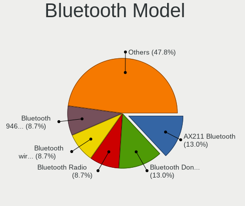

| Model                                               | Computers | Percent |
|-----------------------------------------------------|-----------|---------|
| Intel Bluetooth wireless interface                  | 4         | 23.53%  |
| Cambridge Silicon Radio Bluetooth Dongle (HCI mode) | 2         | 11.76%  |
| Realtek  Bluetooth 4.2 Adapter                      | 1         | 5.88%   |
| Realtek Bluetooth Radio                             | 1         | 5.88%   |
| Lite-On Wireless_Device                             | 1         | 5.88%   |
| Intel Wireless-AC 3168 Bluetooth                    | 1         | 5.88%   |
| Intel AX210 Bluetooth                               | 1         | 5.88%   |
| Intel AX200 Bluetooth                               | 1         | 5.88%   |
| Dell Broadcom BCM20702A0 Bluetooth                  | 1         | 5.88%   |
| Broadcom BCM2045B (BDC-2.1)                         | 1         | 5.88%   |
| Askey Bluetooth Device                              | 1         | 5.88%   |
| Apple Bluetooth USB Host Controller                 | 1         | 5.88%   |
| Apple Bluetooth Host Controller                     | 1         | 5.88%   |

Sound
-----

Sound Vendor
------------

Sound card vendors

| Vendor              | Computers | Percent |
|---------------------|-----------|---------|
| Intel               | 21        | 58.33%  |
| Nvidia              | 8         | 22.22%  |
| AMD                 | 5         | 13.89%  |
| Texas Instruments   | 1         | 2.78%   |
| C-Media Electronics | 1         | 2.78%   |

Sound Model
-----------

Sound card models

| Model                                                                                             | Computers | Percent |
|---------------------------------------------------------------------------------------------------|-----------|---------|
| Nvidia GK208 HDMI/DP Audio Controller                                                             | 3         | 7.32%   |
| Intel Celeron/Pentium Silver Processor High Definition Audio                                      | 3         | 7.32%   |
| Intel Xeon E3-1200 v3/4th Gen Core Processor HD Audio Controller                                  | 2         | 4.88%   |
| Intel Sunrise Point-LP HD Audio                                                                   | 2         | 4.88%   |
| Intel 8 Series/C220 Series Chipset High Definition Audio Controller                               | 2         | 4.88%   |
| Intel 7 Series/C216 Chipset Family High Definition Audio Controller                               | 2         | 4.88%   |
| Intel 6 Series/C200 Series Chipset Family High Definition Audio Controller                        | 2         | 4.88%   |
| Intel 5 Series/3400 Series Chipset High Definition Audio                                          | 2         | 4.88%   |
| AMD Family 17h/19h HD Audio Controller                                                            | 2         | 4.88%   |
| Texas Instruments Sabaj A4 AMP                                                                    | 1         | 2.44%   |
| Nvidia TU107 GeForce GTX 1650 High Definition Audio Controller                                    | 1         | 2.44%   |
| Nvidia GP107GL High Definition Audio Controller                                                   | 1         | 2.44%   |
| Nvidia GM206 High Definition Audio Controller                                                     | 1         | 2.44%   |
| Nvidia GK107 HDMI Audio Controller                                                                | 1         | 2.44%   |
| Nvidia GF116 High Definition Audio Controller                                                     | 1         | 2.44%   |
| Intel Tiger Lake-LP Smart Sound Technology Audio Controller                                       | 1         | 2.44%   |
| Intel NM10/ICH7 Family High Definition Audio Controller                                           | 1         | 2.44%   |
| Intel Jasper Lake HD Audio                                                                        | 1         | 2.44%   |
| Intel Ice Lake-LP Smart Sound Technology Audio Controller                                         | 1         | 2.44%   |
| Intel Haswell-ULT HD Audio Controller                                                             | 1         | 2.44%   |
| Intel CM238 HD Audio Controller                                                                   | 1         | 2.44%   |
| Intel Cannon Point-LP High Definition Audio Controller                                            | 1         | 2.44%   |
| Intel Atom/Celeron/Pentium Processor x5-E8000/J3xxx/N3xxx Series High Definition Audio Controller | 1         | 2.44%   |
| Intel 8 Series HD Audio Controller                                                                | 1         | 2.44%   |
| C-Media Electronics Blue Snowball                                                                 | 1         | 2.44%   |
| AMD Starship/Matisse HD Audio Controller                                                          | 1         | 2.44%   |
| AMD SBx00 Azalia (Intel HDA)                                                                      | 1         | 2.44%   |
| AMD Renoir Radeon High Definition Audio Controller                                                | 1         | 2.44%   |
| AMD Family 17h (Models 00h-0fh) HD Audio Controller                                               | 1         | 2.44%   |
| AMD Ellesmere HDMI Audio [Radeon RX 470/480 / 570/580/590]                                        | 1         | 2.44%   |

Memory
------

Memory Vendor
-------------

Memory module vendors

| Vendor              | Computers | Percent |
|---------------------|-----------|---------|
| Samsung Electronics | 3         | 21.43%  |
| Unknown             | 2         | 14.29%  |
| SK hynix            | 2         | 14.29%  |
| Micron Technology   | 2         | 14.29%  |
| Kingston            | 2         | 14.29%  |
| Unknown (ABCD)      | 1         | 7.14%   |
| KLEVV               | 1         | 7.14%   |
| Corsair             | 1         | 7.14%   |

Memory Model
------------

Memory module models

| Model                                                          | Computers | Percent |
|----------------------------------------------------------------|-----------|---------|
| Unknown RAM Module 512MB SODIMM DDR2                           | 1         | 6.67%   |
| Unknown RAM Module 2GB SODIMM DDR3 1600MT/s                    | 1         | 6.67%   |
| Unknown (ABCD) RAM 123456789012345678 2GB DIMM LPDDR4 2400MT/s | 1         | 6.67%   |
| SK hynix RAM Module 16GB SODIMM DDR4 2133MT/s                  | 1         | 6.67%   |
| SK hynix RAM HMA851S6DJR6N-XN 4GB SODIMM DDR4 3200MT/s         | 1         | 6.67%   |
| Samsung RAM M471B5673FH0-CF8 2GB SODIMM DDR3 1067MT/s          | 1         | 6.67%   |
| Samsung RAM M471A5244CB0-CWE 4GB SODIMM DDR4 3200MT/s          | 1         | 6.67%   |
| Samsung RAM M471A1K43CB1-CRC 8GB SODIMM DDR4 2667MT/s          | 1         | 6.67%   |
| Micron RAM 8ATF1G64HZ-2G6E1 8GB SODIMM DDR4 2667MT/s           | 1         | 6.67%   |
| Micron RAM 16KTF51264HZ-1G4M1 4GB SODIMM DDR3 1333MT/s         | 1         | 6.67%   |
| KLEVV RAM KD48GU880-36A180C 8GB DIMM DDR4 3600MT/s             | 1         | 6.67%   |
| Kingston RAM HP26D4S9S8MH-8 8GB SODIMM DDR4 2667MT/s           | 1         | 6.67%   |
| Kingston RAM 99U5402-037.A00G 2GB DIMM DDR3 1333MT/s           | 1         | 6.67%   |
| Kingston RAM 9905471-001.A01LF 2GB DIMM DDR3 1600MT/s          | 1         | 6.67%   |
| Corsair RAM Module 4GB SODIMM DDR3 1333MT/s                    | 1         | 6.67%   |

Memory Kind
-----------

Memory module kinds

| Kind   | Computers | Percent |
|--------|-----------|---------|
| DDR4   | 6         | 46.15%  |
| DDR3   | 5         | 38.46%  |
| LPDDR4 | 1         | 7.69%   |
| DDR2   | 1         | 7.69%   |

Memory Form Factor
------------------

Physical design of the memory module

| Name   | Computers | Percent |
|--------|-----------|---------|
| SODIMM | 10        | 76.92%  |
| DIMM   | 3         | 23.08%  |

Memory Size
-----------

Memory module size

| Size  | Computers | Percent |
|-------|-----------|---------|
| 8192  | 4         | 30.77%  |
| 4096  | 3         | 23.08%  |
| 2048  | 3         | 23.08%  |
| 16384 | 2         | 15.38%  |
| 512   | 1         | 7.69%   |

Memory Speed
------------

Memory module speed

| Speed   | Computers | Percent |
|---------|-----------|---------|
| 2667    | 3         | 21.43%  |
| 1333    | 3         | 21.43%  |
| 1600    | 2         | 14.29%  |
| 3600    | 1         | 7.14%   |
| 3200    | 1         | 7.14%   |
| 2400    | 1         | 7.14%   |
| 2133    | 1         | 7.14%   |
| 1067    | 1         | 7.14%   |
| Unknown | 1         | 7.14%   |

Printers & scanners
-------------------

Printer Vendor
--------------

Printer device vendors

Zero info for selected period =(

Printer Model
-------------

Printer device models

Zero info for selected period =(

Scanner Vendor
--------------

Scanner device vendors

Zero info for selected period =(

Scanner Model
-------------

Scanner device models

Zero info for selected period =(

Camera
------

Camera Vendor
-------------

Camera device vendors

| Vendor                                 | Computers | Percent |
|----------------------------------------|-----------|---------|
| Chicony Electronics                    | 6         | 37.5%   |
| Syntek                                 | 1         | 6.25%   |
| Sunplus Innovation Technology          | 1         | 6.25%   |
| Silicon Motion                         | 1         | 6.25%   |
| Realtek Semiconductor                  | 1         | 6.25%   |
| Quanta                                 | 1         | 6.25%   |
| Microdia                               | 1         | 6.25%   |
| Logitech                               | 1         | 6.25%   |
| IMC Networks                           | 1         | 6.25%   |
| Cheng Uei Precision Industry (Foxlink) | 1         | 6.25%   |
| Apple                                  | 1         | 6.25%   |

Camera Model
------------

Camera device models

| Model                                                          | Computers | Percent |
|----------------------------------------------------------------|-----------|---------|
| Chicony integrated camera                                      | 2         | 11.11%  |
| Syntek HD WebCam                                               | 1         | 5.56%   |
| Sunplus HD WebCam                                              | 1         | 5.56%   |
| Sunplus FHD Camera Microphone                                  | 1         | 5.56%   |
| Silicon Motion 300k Pixel Camera                               | 1         | 5.56%   |
| Realtek HP Wide Vision HD Camera                               | 1         | 5.56%   |
| Quanta HP TrueVision HD Camera                                 | 1         | 5.56%   |
| Microdia Sonix USB 2.0 Camera                                  | 1         | 5.56%   |
| Logitech Webcam C270                                           | 1         | 5.56%   |
| IMC Networks LG 3D R Webcam                                    | 1         | 5.56%   |
| IMC Networks LG 3D L Webcam                                    | 1         | 5.56%   |
| Chicony USB2.0 VGA UVC WebCam                                  | 1         | 5.56%   |
| Chicony HD Webcam                                              | 1         | 5.56%   |
| Chicony HD User Facing                                         | 1         | 5.56%   |
| Chicony Camera                                                 | 1         | 5.56%   |
| Cheng Uei Precision Industry (Foxlink) HP TrueVision HD Camera | 1         | 5.56%   |
| Apple FaceTime HD Camera                                       | 1         | 5.56%   |

Security
--------

Fingerprint Vendor
------------------

Fingerprint sensor vendors

| Vendor    | Computers | Percent |
|-----------|-----------|---------|
| Upek      | 1         | 50%     |
| AuthenTec | 1         | 50%     |

Fingerprint Model
-----------------

Fingerprint sensor models

| Model                                                  | Computers | Percent |
|--------------------------------------------------------|-----------|---------|
| Upek Biometric Touchchip/Touchstrip Fingerprint Sensor | 1         | 50%     |
| AuthenTec Fingerprint Sensor                           | 1         | 50%     |

Chipcard Vendor
---------------

Chipcard module vendors

Zero info for selected period =(

Chipcard Model
--------------

Chipcard module models

Zero info for selected period =(

Unsupported
-----------

Unsupported Devices
-------------------

Total unsupported devices on board

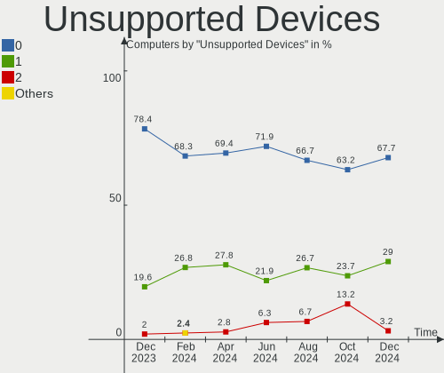

| Total | Computers | Percent |
|-------|-----------|---------|
| 0     | 20        | 71.43%  |
| 1     | 7         | 25%     |
| 2     | 1         | 3.57%   |

Unsupported Device Types
------------------------

Types of unsupported devices

| Type                  | Computers | Percent |
|-----------------------|-----------|---------|
| Net/wireless          | 4         | 36.36%  |
| Graphics card         | 3         | 27.27%  |
| Fingerprint reader    | 2         | 18.18%  |
| Multimedia controller | 1         | 9.09%   |
| Flash memory          | 1         | 9.09%   |

