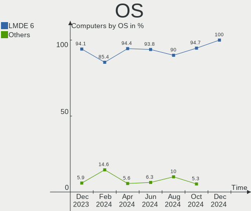
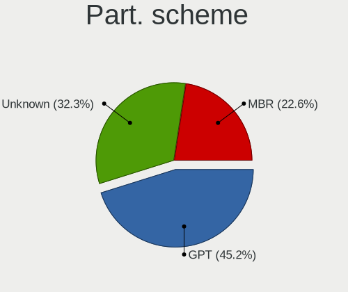
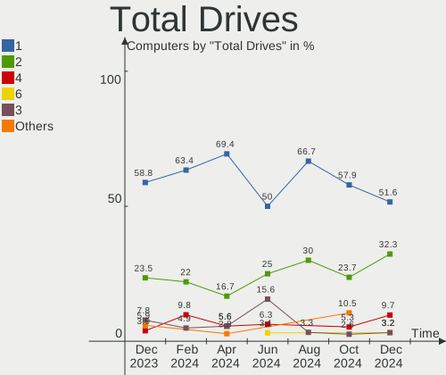
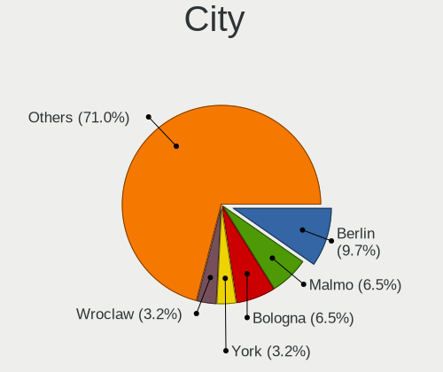
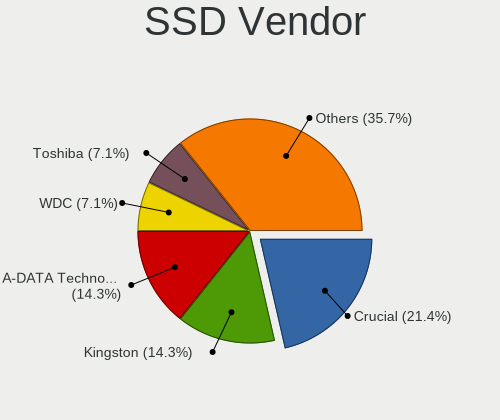
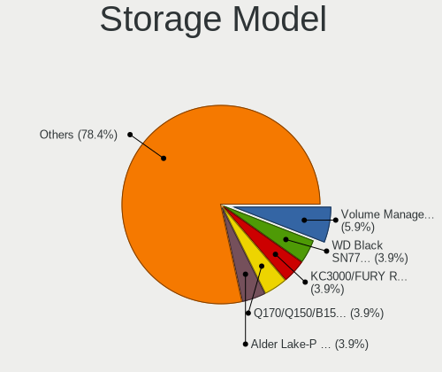
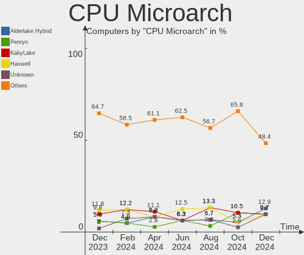
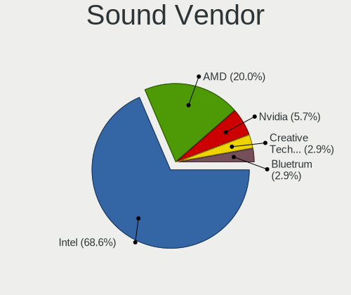
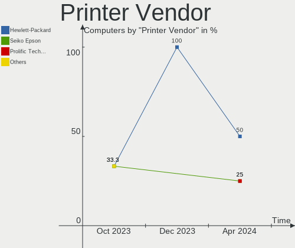
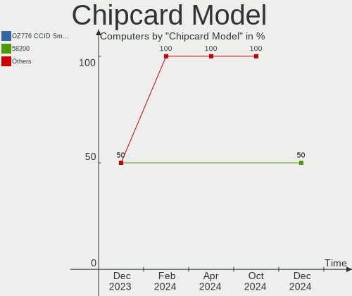

LMDE - Hardware Trends
----------------------

A project to identify most popular hardware characteristics and track their change
over time based on data collected by Linux users at https://Linux-Hardware.org.

Anyone can contribute to this report by the [hw-probe](https://github.com/linuxhw/hw-probe) tool:

    sudo -E hw-probe -all -upload

This is a report for all computer types. See also reports for [desktops](/Dist/LMDE/Desktop/README.md) and [notebooks](/Dist/LMDE/Notebook/README.md).

This report is for one last month. Overall report since the beginning of time: [TestDays](https://github.com/linuxhw/TestDays)

Period: Sep, 2023.

Contents
--------

* [ System ](#system)
  - [ OS                       ](#os)
  - [ OS Family                ](#os-family)
  - [ Kernel                   ](#kernel)
  - [ Kernel Family            ](#kernel-family)
  - [ Kernel Major Ver.        ](#kernel-major-ver)
  - [ Arch                     ](#arch)
  - [ DE                       ](#de)
  - [ Display Server           ](#display-server)
  - [ Display Manager          ](#display-manager)
  - [ OS Lang                  ](#os-lang)
  - [ Boot Mode                ](#boot-mode)
  - [ Filesystem               ](#filesystem)
  - [ Part. scheme             ](#part-scheme)
  - [ Dual Boot with Linux/BSD ](#dual-boot-with-linuxbsd)
  - [ Dual Boot (Win)          ](#dual-boot-win)

* [ Board ](#board)
  - [ Vendor                   ](#vendor)
  - [ Model                    ](#model)
  - [ Model Family             ](#model-family)
  - [ MFG Year                 ](#mfg-year)
  - [ Form Factor              ](#form-factor)
  - [ Secure Boot              ](#secure-boot)
  - [ Coreboot                 ](#coreboot)
  - [ RAM Size                 ](#ram-size)
  - [ RAM Used                 ](#ram-used)
  - [ Total Drives             ](#total-drives)
  - [ Has CD-ROM               ](#has-cd-rom)
  - [ Has Ethernet             ](#has-ethernet)
  - [ Has WiFi                 ](#has-wifi)
  - [ Has Bluetooth            ](#has-bluetooth)

* [ Location ](#location)
  - [ Country                  ](#country)
  - [ City                     ](#city)

* [ Drives ](#drives)
  - [ Drive Vendor             ](#drive-vendor)
  - [ Drive Model              ](#drive-model)
  - [ HDD Vendor               ](#hdd-vendor)
  - [ SSD Vendor               ](#ssd-vendor)
  - [ Drive Kind               ](#drive-kind)
  - [ Drive Connector          ](#drive-connector)
  - [ Drive Size               ](#drive-size)
  - [ Space Total              ](#space-total)
  - [ Space Used               ](#space-used)
  - [ Malfunc. Drives          ](#malfunc-drives)
  - [ Malfunc. Drive Vendor    ](#malfunc-drive-vendor)
  - [ Malfunc. HDD Vendor      ](#malfunc-hdd-vendor)
  - [ Malfunc. Drive Kind      ](#malfunc-drive-kind)
  - [ Failed Drives            ](#failed-drives)
  - [ Failed Drive Vendor      ](#failed-drive-vendor)
  - [ Drive Status             ](#drive-status)

* [ Storage controller ](#storage-controller)
  - [ Storage Vendor           ](#storage-vendor)
  - [ Storage Model            ](#storage-model)
  - [ Storage Kind             ](#storage-kind)

* [ Processor ](#processor)
  - [ CPU Vendor               ](#cpu-vendor)
  - [ CPU Model                ](#cpu-model)
  - [ CPU Model Family         ](#cpu-model-family)
  - [ CPU Cores                ](#cpu-cores)
  - [ CPU Sockets              ](#cpu-sockets)
  - [ CPU Threads              ](#cpu-threads)
  - [ CPU Op-Modes             ](#cpu-op-modes)
  - [ CPU Microcode            ](#cpu-microcode)
  - [ CPU Microarch            ](#cpu-microarch)

* [ Graphics ](#graphics)
  - [ GPU Vendor               ](#gpu-vendor)
  - [ GPU Model                ](#gpu-model)
  - [ GPU Combo                ](#gpu-combo)
  - [ GPU Driver               ](#gpu-driver)
  - [ GPU Memory               ](#gpu-memory)

* [ Monitor ](#monitor)
  - [ Monitor Vendor           ](#monitor-vendor)
  - [ Monitor Model            ](#monitor-model)
  - [ Monitor Resolution       ](#monitor-resolution)
  - [ Monitor Diagonal         ](#monitor-diagonal)
  - [ Monitor Width            ](#monitor-width)
  - [ Aspect Ratio             ](#aspect-ratio)
  - [ Monitor Area             ](#monitor-area)
  - [ Pixel Density            ](#pixel-density)
  - [ Multiple Monitors        ](#multiple-monitors)

* [ Network ](#network)
  - [ Net Controller Vendor    ](#net-controller-vendor)
  - [ Net Controller Model     ](#net-controller-model)
  - [ Wireless Vendor          ](#wireless-vendor)
  - [ Wireless Model           ](#wireless-model)
  - [ Ethernet Vendor          ](#ethernet-vendor)
  - [ Ethernet Model           ](#ethernet-model)
  - [ Net Controller Kind      ](#net-controller-kind)
  - [ Used Controller          ](#used-controller)
  - [ NICs                     ](#nics)
  - [ IPv6                     ](#ipv6)

* [ Bluetooth ](#bluetooth)
  - [ Bluetooth Vendor         ](#bluetooth-vendor)
  - [ Bluetooth Model          ](#bluetooth-model)

* [ Sound ](#sound)
  - [ Sound Vendor             ](#sound-vendor)
  - [ Sound Model              ](#sound-model)

* [ Memory ](#memory)
  - [ Memory Vendor            ](#memory-vendor)
  - [ Memory Model             ](#memory-model)
  - [ Memory Kind              ](#memory-kind)
  - [ Memory Form Factor       ](#memory-form-factor)
  - [ Memory Size              ](#memory-size)
  - [ Memory Speed             ](#memory-speed)

* [ Printers & scanners ](#printers--scanners)
  - [ Printer Vendor           ](#printer-vendor)
  - [ Printer Model            ](#printer-model)
  - [ Scanner Vendor           ](#scanner-vendor)
  - [ Scanner Model            ](#scanner-model)

* [ Camera ](#camera)
  - [ Camera Vendor            ](#camera-vendor)
  - [ Camera Model             ](#camera-model)

* [ Security ](#security)
  - [ Fingerprint Vendor       ](#fingerprint-vendor)
  - [ Fingerprint Model        ](#fingerprint-model)
  - [ Chipcard Vendor          ](#chipcard-vendor)
  - [ Chipcard Model           ](#chipcard-model)

* [ Unsupported ](#unsupported)
  - [ Unsupported Devices      ](#unsupported-devices)
  - [ Unsupported Device Types ](#unsupported-device-types)

System
------

OS
--

Installed operating systems

| Name   | Computers | Percent |
|--------|-----------|---------|
| LMDE 5 | 27        | 71.05%  |
| LMDE 6 | 11        | 28.95%  |

OS Family
---------

OS without a version

| Name | Computers | Percent |
|------|-----------|---------|
| LMDE | 38        | 100%    |

Kernel
------

Version of the Linux kernel

| Version               | Computers | Percent |
|-----------------------|-----------|---------|
| 5.10.0-25-amd64       | 24        | 63.16%  |
| 6.1.0-12-amd64        | 7         | 18.42%  |
| 6.4.0-0.deb12.2-amd64 | 1         | 2.63%   |
| 6.1.0-12-686          | 1         | 2.63%   |
| 6.1.0-11-amd64        | 1         | 2.63%   |
| 6.1.0-0.deb11.9-amd64 | 1         | 2.63%   |
| 5.15.108-1-pve        | 1         | 2.63%   |
| 5.10.0-25-686         | 1         | 2.63%   |
| 5.10.0-12-amd64       | 1         | 2.63%   |

Kernel Family
-------------

Linux kernel without a distro release

| Version  | Computers | Percent |
|----------|-----------|---------|
| 5.10.0   | 26        | 68.42%  |
| 6.1.0    | 10        | 26.32%  |
| 6.4.0    | 1         | 2.63%   |
| 5.15.108 | 1         | 2.63%   |

Kernel Major Ver.
-----------------

Linux kernel major version

| Version | Computers | Percent |
|---------|-----------|---------|
| 5.10    | 26        | 68.42%  |
| 6.1     | 10        | 26.32%  |
| 6.4     | 1         | 2.63%   |
| 5.15    | 1         | 2.63%   |

Arch
----

OS architecture (x86_64, i586, etc.)

| Name   | Computers | Percent |
|--------|-----------|---------|
| x86_64 | 36        | 94.74%  |
| i686   | 2         | 5.26%   |

DE
--

Desktop Environment

| Name       | Computers | Percent |
|------------|-----------|---------|
| X-Cinnamon | 32        | 84.21%  |
| Cinnamon   | 6         | 15.79%  |

Display Server
--------------

X11 or Wayland

| Name | Computers | Percent |
|------|-----------|---------|
| X11  | 38        | 100%    |

Display Manager
---------------

SDDM, LightDM, etc.

| Name    | Computers | Percent |
|---------|-----------|---------|
| Unknown | 20        | 52.63%  |
| LightDM | 18        | 47.37%  |

OS Lang
-------

Language

| Lang  | Computers | Percent |
|-------|-----------|---------|
| en_US | 12        | 31.58%  |
| de_DE | 10        | 26.32%  |
| it_IT | 3         | 7.89%   |
| pt_BR | 2         | 5.26%   |
| pl_PL | 2         | 5.26%   |
| en_GB | 2         | 5.26%   |
| ru_RU | 1         | 2.63%   |
| gl_ES | 1         | 2.63%   |
| es_AR | 1         | 2.63%   |
| en_NZ | 1         | 2.63%   |
| en_CA | 1         | 2.63%   |
| de_CH | 1         | 2.63%   |
| cs_CZ | 1         | 2.63%   |

Boot Mode
---------

EFI or BIOS

| Mode | Computers | Percent |
|------|-----------|---------|
| EFI  | 26        | 68.42%  |
| BIOS | 12        | 31.58%  |

Filesystem
----------

Type of filesystem

| Type    | Computers | Percent |
|---------|-----------|---------|
| Ext4    | 33        | 86.84%  |
| Tmpfs   | 2         | 5.26%   |
| Zfs     | 1         | 2.63%   |
| Overlay | 1         | 2.63%   |
| Btrfs   | 1         | 2.63%   |

Part. scheme
------------

Scheme of partitioning

| Type    | Computers | Percent |
|---------|-----------|---------|
| Unknown | 20        | 52.63%  |
| GPT     | 15        | 39.47%  |
| MBR     | 3         | 7.89%   |

Dual Boot with Linux/BSD
------------------------

Hosting more than one Linux/BSD

| Dual boot | Computers | Percent |
|-----------|-----------|---------|
| No        | 33        | 86.84%  |
| Yes       | 5         | 13.16%  |

Dual Boot (Win)
---------------

Hosting Linux and Windows

| Dual boot | Computers | Percent |
|-----------|-----------|---------|
| No        | 33        | 86.84%  |
| Yes       | 5         | 13.16%  |

Board
-----

Vendor
------

Motherboard manufacturer

| Name                | Computers | Percent |
|---------------------|-----------|---------|
| Hewlett-Packard     | 8         | 21.05%  |
| Lenovo              | 5         | 13.16%  |
| Dell                | 5         | 13.16%  |
| Gigabyte Technology | 4         | 10.53%  |
| Acer                | 3         | 7.89%   |
| MSI                 | 2         | 5.26%   |
| Intel               | 2         | 5.26%   |
| ASUSTek Computer    | 2         | 5.26%   |
| ASRock              | 2         | 5.26%   |
| Toshiba             | 1         | 2.63%   |
| Microsoft           | 1         | 2.63%   |
| Medion              | 1         | 2.63%   |
| IGEL Technology     | 1         | 2.63%   |
| Apple               | 1         | 2.63%   |

Model
-----

Motherboard model

| Name                                 | Computers | Percent |
|--------------------------------------|-----------|---------|
| Toshiba Satellite P505               | 1         | 2.63%   |
| MSI MS-7D22                          | 1         | 2.63%   |
| MSI MS-7C95                          | 1         | 2.63%   |
| Microsoft Surface Pro 3              | 1         | 2.63%   |
| Medion S23003                        | 1         | 2.63%   |
| Lenovo ThinkPad W541 20EGS24J00      | 1         | 2.63%   |
| Lenovo ThinkPad T14 Gen 1 20S1S10T00 | 1         | 2.63%   |
| Lenovo ThinkPad L390 20NR000FUS      | 1         | 2.63%   |
| Lenovo ThinkPad Edge E430c 33651A2   | 1         | 2.63%   |
| Lenovo IdeaPad 310-15ISK 80UH        | 1         | 2.63%   |
| Intel X79                            | 1         | 2.63%   |
| Intel DG31PR AAD97573-206            | 1         | 2.63%   |
| IGEL M330C                           | 1         | 2.63%   |
| HP Z820 Workstation                  | 1         | 2.63%   |
| HP x2 210                            | 1         | 2.63%   |
| HP ProDesk 400 G5 Desktop Mini       | 1         | 2.63%   |
| HP Laptop 14-dk1xxx                  | 1         | 2.63%   |
| HP ENVY x360 2-in-1 Laptop 15-ey0xxx | 1         | 2.63%   |
| HP Compaq Mini 311-1100              | 1         | 2.63%   |
| HP 620                               | 1         | 2.63%   |
| HP 250 G7 Notebook PC                | 1         | 2.63%   |
| Gigabyte Q87M-D2H                    | 1         | 2.63%   |
| Gigabyte GA-880GM-UD2H               | 1         | 2.63%   |
| Gigabyte B450 AORUS PRO              | 1         | 2.63%   |
| Gigabyte B450 AORUS M                | 1         | 2.63%   |
| Dell System Vostro 3750              | 1         | 2.63%   |
| Dell Precision M4700                 | 1         | 2.63%   |
| Dell PowerEdge T410                  | 1         | 2.63%   |
| Dell Latitude E5570                  | 1         | 2.63%   |
| Dell Latitude 7390                   | 1         | 2.63%   |
| ASUS ROG Strix G10DK_G10DK           | 1         | 2.63%   |
| ASUS P8H61-M LX                      | 1         | 2.63%   |
| ASRock X670E Pro RS                  | 1         | 2.63%   |
| ASRock H110M-DVS R3.0                | 1         | 2.63%   |
| Apple iMac16,2                       | 1         | 2.63%   |
| Acer Aspire X3400                    | 1         | 2.63%   |
| Acer Aspire E1-572G                  | 1         | 2.63%   |
| Acer Aspire A317-51G                 | 1         | 2.63%   |

Model Family
------------

Motherboard model prefix

| Name                   | Computers | Percent |
|------------------------|-----------|---------|
| Lenovo ThinkPad        | 4         | 10.53%  |
| Acer Aspire            | 3         | 7.89%   |
| Gigabyte B450          | 2         | 5.26%   |
| Dell Latitude          | 2         | 5.26%   |
| Toshiba Satellite      | 1         | 2.63%   |
| MSI MS-7D22            | 1         | 2.63%   |
| MSI MS-7C95            | 1         | 2.63%   |
| Microsoft Surface      | 1         | 2.63%   |
| Medion S23003          | 1         | 2.63%   |
| Lenovo IdeaPad         | 1         | 2.63%   |
| Intel X79              | 1         | 2.63%   |
| Intel DG31PR           | 1         | 2.63%   |
| IGEL M330C             | 1         | 2.63%   |
| HP Z820                | 1         | 2.63%   |
| HP x2                  | 1         | 2.63%   |
| HP ProDesk             | 1         | 2.63%   |
| HP Laptop              | 1         | 2.63%   |
| HP ENVY                | 1         | 2.63%   |
| HP Compaq              | 1         | 2.63%   |
| HP 620                 | 1         | 2.63%   |
| HP 250                 | 1         | 2.63%   |
| Gigabyte Q87M-D2H      | 1         | 2.63%   |
| Gigabyte GA-880GM-UD2H | 1         | 2.63%   |
| Dell System            | 1         | 2.63%   |
| Dell Precision         | 1         | 2.63%   |
| Dell PowerEdge         | 1         | 2.63%   |
| ASUS ROG               | 1         | 2.63%   |
| ASUS P8H61-M           | 1         | 2.63%   |
| ASRock X670E           | 1         | 2.63%   |
| ASRock H110M-DVS       | 1         | 2.63%   |
| Apple iMac16           | 1         | 2.63%   |

MFG Year
--------

Motherboard manufacture year

| Year | Computers | Percent |
|------|-----------|---------|
| 2018 | 8         | 21.05%  |
| 2016 | 5         | 13.16%  |
| 2019 | 3         | 7.89%   |
| 2013 | 3         | 7.89%   |
| 2010 | 3         | 7.89%   |
| 2022 | 2         | 5.26%   |
| 2021 | 2         | 5.26%   |
| 2020 | 2         | 5.26%   |
| 2015 | 2         | 5.26%   |
| 2012 | 2         | 5.26%   |
| 2011 | 2         | 5.26%   |
| 2009 | 2         | 5.26%   |
| 2023 | 1         | 2.63%   |
| 2008 | 1         | 2.63%   |

Form Factor
-----------

Physical design of the computer

| Name        | Computers | Percent |
|-------------|-----------|---------|
| Notebook    | 18        | 47.37%  |
| Desktop     | 16        | 42.11%  |
| Tablet      | 1         | 2.63%   |
| Convertible | 1         | 2.63%   |
| All in one  | 1         | 2.63%   |
| Server      | 1         | 2.63%   |

Secure Boot
-----------

Enabled or disabled

| State    | Computers | Percent |
|----------|-----------|---------|
| Disabled | 34        | 89.47%  |
| Enabled  | 4         | 10.53%  |

Coreboot
--------

Have coreboot on board

| Used | Computers | Percent |
|------|-----------|---------|
| No   | 38        | 100%    |

RAM Size
--------

Total RAM memory

| Size in GB  | Computers | Percent |
|-------------|-----------|---------|
| 8.01-16.0   | 10        | 26.32%  |
| 4.01-8.0    | 8         | 21.05%  |
| 3.01-4.0    | 7         | 18.42%  |
| 16.01-24.0  | 5         | 13.16%  |
| 32.01-64.0  | 3         | 7.89%   |
| 64.01-256.0 | 2         | 5.26%   |
| 24.01-32.0  | 1         | 2.63%   |
| 2.01-3.0    | 1         | 2.63%   |
| 1.01-2.0    | 1         | 2.63%   |

RAM Used
--------

Used RAM memory

| Used GB    | Computers | Percent |
|------------|-----------|---------|
| 2.01-3.0   | 13        | 34.21%  |
| 1.01-2.0   | 9         | 23.68%  |
| 4.01-8.0   | 6         | 15.79%  |
| 3.01-4.0   | 6         | 15.79%  |
| 8.01-16.0  | 2         | 5.26%   |
| 32.01-64.0 | 1         | 2.63%   |
| 0.51-1.0   | 1         | 2.63%   |

Total Drives
------------

Number of drives on board

| Drives | Computers | Percent |
|--------|-----------|---------|
| 1      | 22        | 57.89%  |
| 2      | 9         | 23.68%  |
| 3      | 4         | 10.53%  |
| 11     | 1         | 2.63%   |
| 10     | 1         | 2.63%   |
| 6      | 1         | 2.63%   |

Has CD-ROM
----------

Has CD-ROM on board

| Presented | Computers | Percent |
|-----------|-----------|---------|
| No        | 28        | 73.68%  |
| Yes       | 10        | 26.32%  |

Has Ethernet
------------

Has Ethernet on board

| Presented | Computers | Percent |
|-----------|-----------|---------|
| Yes       | 36        | 94.74%  |
| No        | 2         | 5.26%   |

Has WiFi
--------

Has WiFi module

| Presented | Computers | Percent |
|-----------|-----------|---------|
| Yes       | 30        | 78.95%  |
| No        | 8         | 21.05%  |

Has Bluetooth
-------------

Has Bluetooth module

| Presented | Computers | Percent |
|-----------|-----------|---------|
| Yes       | 25        | 65.79%  |
| No        | 13        | 34.21%  |

Location
--------

Country
-------

Geographic location (country)

| Country     | Computers | Percent |
|-------------|-----------|---------|
| Germany     | 12        | 31.58%  |
| USA         | 6         | 15.79%  |
| Italy       | 4         | 10.53%  |
| Russia      | 2         | 5.26%   |
| Poland      | 2         | 5.26%   |
| Brazil      | 2         | 5.26%   |
| UK          | 1         | 2.63%   |
| Spain       | 1         | 2.63%   |
| Puerto Rico | 1         | 2.63%   |
| New Zealand | 1         | 2.63%   |
| Netherlands | 1         | 2.63%   |
| India       | 1         | 2.63%   |
| France      | 1         | 2.63%   |
| Czechia     | 1         | 2.63%   |
| Canada      | 1         | 2.63%   |
| Argentina   | 1         | 2.63%   |

City
----

Geographic location (city)

| City                   | Computers | Percent |
|------------------------|-----------|---------|
| New York               | 2         | 5.26%   |
| Wiesloch               | 1         | 2.63%   |
| Toa Baja               | 1         | 2.63%   |
| Santiago de Compostela | 1         | 2.63%   |
| Santa Luzia            | 1         | 2.63%   |
| Salisbury              | 1         | 2.63%   |
| Rostov-on-Don          | 1         | 2.63%   |
| Rio de Janeiro         | 1         | 2.63%   |
| Rho                    | 1         | 2.63%   |
| Prince George          | 1         | 2.63%   |
| Paris                  | 1         | 2.63%   |
| Paderborn              | 1         | 2.63%   |
| Otnice                 | 1         | 2.63%   |
| Norderstedt            | 1         | 2.63%   |
| Munich                 | 1         | 2.63%   |
| Moreno                 | 1         | 2.63%   |
| Milano                 | 1         | 2.63%   |
| Milan                  | 1         | 2.63%   |
| Mestre                 | 1         | 2.63%   |
| Magdeburg              | 1         | 2.63%   |
| Lancaster              | 1         | 2.63%   |
| Krakow                 | 1         | 2.63%   |
| Kamp-Lintfort          | 1         | 2.63%   |
| Hengelo                | 1         | 2.63%   |
| Gronau                 | 1         | 2.63%   |
| Gelendzhik             | 1         | 2.63%   |
| Delligsen              | 1         | 2.63%   |
| Cekcyn                 | 1         | 2.63%   |
| Bremen                 | 1         | 2.63%   |
| Braunschweig           | 1         | 2.63%   |
| Bochum                 | 1         | 2.63%   |
| Berlin                 | 1         | 2.63%   |
| Berkeley               | 1         | 2.63%   |
| Auckland               | 1         | 2.63%   |
| Atlanta                | 1         | 2.63%   |
| Asansol                | 1         | 2.63%   |
| Arlington              | 1         | 2.63%   |

Drives
------

Drive Vendor
------------

Hard drive vendors

| Vendor                      | Computers | Drives | Percent |
|-----------------------------|-----------|--------|---------|
| WDC                         | 11        | 14     | 16.67%  |
| Samsung Electronics         | 9         | 12     | 13.64%  |
| Seagate                     | 6         | 6      | 9.09%   |
| SanDisk                     | 6         | 6      | 9.09%   |
| Toshiba                     | 3         | 3      | 4.55%   |
| Kingston                    | 3         | 4      | 4.55%   |
| Intel                       | 3         | 3      | 4.55%   |
| Transcend                   | 2         | 2      | 3.03%   |
| Micron Technology           | 2         | 2      | 3.03%   |
| Hitachi                     | 2         | 7      | 3.03%   |
| HGST                        | 2         | 2      | 3.03%   |
| Unknown                     | 2         | 2      | 3.03%   |
| Vaseky                      | 1         | 1      | 1.52%   |
| USB30                       | 1         | 1      | 1.52%   |
| Unknown                     | 1         | 1      | 1.52%   |
| SPCC                        | 1         | 1      | 1.52%   |
| SK hynix                    | 1         | 1      | 1.52%   |
| Silicon Motion              | 1         | 1      | 1.52%   |
| PNY                         | 1         | 1      | 1.52%   |
| Phison                      | 1         | 1      | 1.52%   |
| Patriot                     | 1         | 1      | 1.52%   |
| Micron/Crucial Technology   | 1         | 1      | 1.52%   |
| Kingston Technology Company | 1         | 1      | 1.52%   |
| GOODRAM                     | 1         | 1      | 1.52%   |
| Crucial                     | 1         | 1      | 1.52%   |
| Apple                       | 1         | 1      | 1.52%   |
| Apacer                      | 1         | 1      | 1.52%   |

Drive Model
-----------

Hard drive models

| Model                                               | Computers | Percent |
|-----------------------------------------------------|-----------|---------|
| Toshiba MD04ACA400 4TB                              | 2         | 2.86%   |
| Seagate Expansion 1TB                               | 2         | 2.86%   |
| Unknown                                             | 2         | 2.86%   |
| WDC WDS500G3X0C-00SJG0 500GB                        | 1         | 1.43%   |
| WDC WDS500G2B0A-00SM50 500GB SSD                    | 1         | 1.43%   |
| WDC WDS240G2G0A-00JH30 240GB SSD                    | 1         | 1.43%   |
| WDC WDBNCE0010PNC 1TB SSD                           | 1         | 1.43%   |
| WDC WD5002ABYS-18B1B0 500GB                         | 1         | 1.43%   |
| WDC WD5000LPVT-08G33T1 500GB                        | 1         | 1.43%   |
| WDC WD5000AAKX-001CA0 500GB                         | 1         | 1.43%   |
| WDC WD5000AAKS-60Z1A0 500GB                         | 1         | 1.43%   |
| WDC WD4002FYYZ-01B7CB0 4TB                          | 1         | 1.43%   |
| WDC WD10PURZ-85U8XY0 1TB                            | 1         | 1.43%   |
| WDC WD10JPCX-24UE4T0 1TB                            | 1         | 1.43%   |
| WDC WD10EZRZ-00HTKB0 1TB                            | 1         | 1.43%   |
| WDC PC SN730 SDBQNTY-512G-1001 512GB                | 1         | 1.43%   |
| Vaseky V800/120G 120GB                              | 1         | 1.43%   |
| USB30 Disk 500GB                                    | 1         | 1.43%   |
| Unknown NVMe SSD Drive 2TB                          | 1         | 1.43%   |
| Transcend TS512GSSD370 512GB                        | 1         | 1.43%   |
| Transcend TS128GMTS430S 128GB SSD                   | 1         | 1.43%   |
| Toshiba MQ04ABF100 1TB                              | 1         | 1.43%   |
| SPCC Solid State Disk 512GB                         | 1         | 1.43%   |
| SK hynix HCG8e  64GB                                | 1         | 1.43%   |
| Silicon Motion SM2262/SM2262EN SSD Controller 500GB | 1         | 1.43%   |
| Seagate ST9500423AS 500GB                           | 1         | 1.43%   |
| Seagate ST9250410AS 250GB                           | 1         | 1.43%   |
| Seagate ST4000VX007-2DT166 4TB                      | 1         | 1.43%   |
| Seagate ST1000DM003-1ER162 1TB                      | 1         | 1.43%   |
| SanDisk X400 M.2 2280 256GB SSD                     | 1         | 1.43%   |
| Sandisk WDC WDS100T2B0C-00PXH0 1TB                  | 1         | 1.43%   |
| Sandisk WD Blue SN570 1TB                           | 1         | 1.43%   |
| SanDisk SSD PLUS 240GB                              | 1         | 1.43%   |
| SanDisk SD7UB3Q256G1001 256GB SSD                   | 1         | 1.43%   |
| SanDisk NVMe SSD Drive 1TB                          | 1         | 1.43%   |
| Samsung SSD 870 QVO 2TB                             | 1         | 1.43%   |
| Samsung SSD 870 EVO 2TB                             | 1         | 1.43%   |
| Samsung SSD 840 EVO 250GB                           | 1         | 1.43%   |
| Samsung SSD 830 Series 64GB                         | 1         | 1.43%   |
| Samsung PM951 NVMe 256GB                            | 1         | 1.43%   |

HDD Vendor
----------

Hard disk drive vendors

| Vendor              | Computers | Drives | Percent |
|---------------------|-----------|--------|---------|
| WDC                 | 6         | 9      | 27.27%  |
| Seagate             | 6         | 6      | 27.27%  |
| Toshiba             | 3         | 3      | 13.64%  |
| Samsung Electronics | 2         | 2      | 9.09%   |
| Hitachi             | 2         | 7      | 9.09%   |
| HGST                | 2         | 2      | 9.09%   |
| Apple               | 1         | 1      | 4.55%   |

SSD Vendor
----------

Solid state drive vendors

| Vendor              | Computers | Drives | Percent |
|---------------------|-----------|--------|---------|
| Samsung Electronics | 7         | 8      | 25%     |
| WDC                 | 3         | 3      | 10.71%  |
| SanDisk             | 3         | 3      | 10.71%  |
| Transcend           | 2         | 2      | 7.14%   |
| Kingston            | 2         | 2      | 7.14%   |
| Vaseky              | 1         | 1      | 3.57%   |
| USB30               | 1         | 1      | 3.57%   |
| SPCC                | 1         | 1      | 3.57%   |
| PNY                 | 1         | 1      | 3.57%   |
| Phison              | 1         | 1      | 3.57%   |
| Patriot             | 1         | 1      | 3.57%   |
| Micron Technology   | 1         | 1      | 3.57%   |
| Intel               | 1         | 1      | 3.57%   |
| GOODRAM             | 1         | 1      | 3.57%   |
| Crucial             | 1         | 1      | 3.57%   |
| Apacer              | 1         | 1      | 3.57%   |

Drive Kind
----------

HDD or SSD

| Kind    | Computers | Drives | Percent |
|---------|-----------|--------|---------|
| SSD     | 22        | 29     | 40.74%  |
| HDD     | 17        | 30     | 31.48%  |
| NVMe    | 12        | 16     | 22.22%  |
| Unknown | 2         | 2      | 3.7%    |
| MMC     | 1         | 1      | 1.85%   |

Drive Connector
---------------

SATA, SAS, NVMe, etc.

| Type | Computers | Drives | Percent |
|------|-----------|--------|---------|
| SATA | 29        | 51     | 63.04%  |
| NVMe | 12        | 16     | 26.09%  |
| SAS  | 4         | 10     | 8.7%    |
| MMC  | 1         | 1      | 2.17%   |

Drive Size
----------

Size of hard drive

| Size in TB | Computers | Drives | Percent |
|------------|-----------|--------|---------|
| 0.01-0.5   | 20        | 30     | 50%     |
| 0.51-1.0   | 14        | 15     | 35%     |
| 3.01-4.0   | 3         | 5      | 7.5%    |
| 1.01-2.0   | 3         | 9      | 7.5%    |

Space Total
-----------

Amount of disk space available on the file system

| Size in GB     | Computers | Percent |
|----------------|-----------|---------|
| 101-250        | 13        | 34.21%  |
| 501-1000       | 8         | 21.05%  |
| 251-500        | 4         | 10.53%  |
| 1001-2000      | 4         | 10.53%  |
| More than 3000 | 2         | 5.26%   |
| 2001-3000      | 2         | 5.26%   |
| 1-20           | 2         | 5.26%   |
| 21-50          | 1         | 2.63%   |
| 51-100         | 1         | 2.63%   |
| Unknown        | 1         | 2.63%   |

Space Used
----------

Amount of used disk space

| Used GB   | Computers | Percent |
|-----------|-----------|---------|
| 1-20      | 13        | 34.21%  |
| 21-50     | 7         | 18.42%  |
| 251-500   | 4         | 10.53%  |
| 101-250   | 4         | 10.53%  |
| 51-100    | 4         | 10.53%  |
| 1001-2000 | 2         | 5.26%   |
| 501-1000  | 2         | 5.26%   |
| 2001-3000 | 1         | 2.63%   |
| Unknown   | 1         | 2.63%   |

Malfunc. Drives
---------------

Drive models with a malfunction

| Model                                               | Computers | Drives | Percent |
|-----------------------------------------------------|-----------|--------|---------|
| Toshiba MD04ACA400 4TB                              | 1         | 1      | 33.33%  |
| Samsung Electronics SSD 870 EVO 2TB                 | 1         | 1      | 33.33%  |
| Micron Technology MTFDDAK512MAY-1AE1ZABHA 512GB SSD | 1         | 1      | 33.33%  |

Malfunc. Drive Vendor
---------------------

Vendors of faulty drives

| Vendor              | Computers | Drives | Percent |
|---------------------|-----------|--------|---------|
| Toshiba             | 1         | 1      | 33.33%  |
| Samsung Electronics | 1         | 1      | 33.33%  |
| Micron Technology   | 1         | 1      | 33.33%  |

Malfunc. HDD Vendor
-------------------

Vendors of faulty HDD drives

| Vendor  | Computers | Drives | Percent |
|---------|-----------|--------|---------|
| Toshiba | 1         | 1      | 100%    |

Malfunc. Drive Kind
-------------------

Kinds of faulty drives

| Kind | Computers | Drives | Percent |
|------|-----------|--------|---------|
| SSD  | 2         | 2      | 66.67%  |
| HDD  | 1         | 1      | 33.33%  |

Failed Drives
-------------

Failed drive models

Zero info for selected period =(

Failed Drive Vendor
-------------------

Failed drive vendors

Zero info for selected period =(

Drive Status
------------

Number of failed and malfunc. drives

| Status   | Computers | Drives | Percent |
|----------|-----------|--------|---------|
| Detected | 26        | 56     | 60.47%  |
| Works    | 14        | 19     | 32.56%  |
| Malfunc  | 3         | 3      | 6.98%   |

Storage controller
------------------

Storage Vendor
--------------

Storage controller vendors

| Vendor                      | Computers | Percent |
|-----------------------------|-----------|---------|
| Intel                       | 24        | 48%     |
| AMD                         | 8         | 16%     |
| SanDisk                     | 5         | 10%     |
| Samsung Electronics         | 2         | 4%      |
| Nvidia                      | 2         | 4%      |
| VIA Technologies            | 1         | 2%      |
| Silicon Motion              | 1         | 2%      |
| Micron/Crucial Technology   | 1         | 2%      |
| Micron Technology           | 1         | 2%      |
| Marvell Technology Group    | 1         | 2%      |
| LSI Logic / Symbios Logic   | 1         | 2%      |
| Kingston Technology Company | 1         | 2%      |
| INNOGRIT                    | 1         | 2%      |
| Broadcom / LSI              | 1         | 2%      |

Storage Model
-------------

Storage controller models

| Model                                                                          | Computers | Percent |
|--------------------------------------------------------------------------------|-----------|---------|
| AMD FCH SATA Controller [AHCI mode]                                            | 5         | 8.62%   |
| SanDisk WD Black SN750 / PC SN730 NVMe SSD                                     | 2         | 3.45%   |
| Intel Sunrise Point-LP SATA Controller [AHCI mode]                             | 2         | 3.45%   |
| Intel 8 Series/C220 Series Chipset Family 6-port SATA Controller 1 [AHCI mode] | 2         | 3.45%   |
| Intel 8 Series SATA Controller 1 [AHCI mode]                                   | 2         | 3.45%   |
| Intel 7 Series Chipset Family 6-port SATA Controller [AHCI mode]               | 2         | 3.45%   |
| Intel 6 Series/C200 Series Chipset Family 6 port Desktop SATA AHCI Controller  | 2         | 3.45%   |
| AMD 500 Series Chipset SATA Controller                                         | 2         | 3.45%   |
| AMD 400 Series Chipset SATA Controller                                         | 2         | 3.45%   |
| VIA VX900 Series Serial-ATA Controller                                         | 1         | 1.72%   |
| Silicon Motion SM2262/SM2262EN SSD Controller                                  | 1         | 1.72%   |
| Sandisk Western Digital WD Black SN850X NVMe SSD                               | 1         | 1.72%   |
| SanDisk WD Green SN350 NVMe SSD 240GB (DRAM-less)                              | 1         | 1.72%   |
| SanDisk WD Blue SN570 NVMe SSD 1TB                                             | 1         | 1.72%   |
| Samsung NVMe SSD Controller SM951/PM951                                        | 1         | 1.72%   |
| Samsung NVMe SSD Controller 980                                                | 1         | 1.72%   |
| Nvidia MCP79 AHCI Controller                                                   | 1         | 1.72%   |
| Nvidia MCP78S [GeForce 8200] IDE                                               | 1         | 1.72%   |
| Nvidia MCP78S [GeForce 8200] AHCI Controller                                   | 1         | 1.72%   |
| Micron/Crucial P5 Plus NVMe PCIe SSD                                           | 1         | 1.72%   |
| Micron 2210 NVMe SSD [Cobain]                                                  | 1         | 1.72%   |
| Marvell Group 88SE9230 PCIe 2.0 x2 4-port SATA 6 Gb/s RAID Controller          | 1         | 1.72%   |
| LSI Logic / Symbios Logic SAS2008 PCI-Express Fusion-MPT SAS-2 [Falcon]        | 1         | 1.72%   |
| Kingston Company Company Non-Volatile memory controller                        | 1         | 1.72%   |
| Kingston Company KC3000/Renegade NVMe SSD                                      | 1         | 1.72%   |
| Intel SSD DC P4101/Pro 7600p/760p/E 6100p Series                               | 1         | 1.72%   |
| Intel SSD 660P Series                                                          | 1         | 1.72%   |
| Intel Q170/Q150/B150/H170/H110/Z170/CM236 Chipset SATA Controller [AHCI Mode]  | 1         | 1.72%   |
| Intel NM10/ICH7 Family SATA Controller [IDE mode]                              | 1         | 1.72%   |
| Intel Comet Lake SATA AHCI Controller                                          | 1         | 1.72%   |
| Intel Celeron/Pentium Silver Processor SATA Controller                         | 1         | 1.72%   |
| Intel Cannon Lake PCH SATA AHCI Controller                                     | 1         | 1.72%   |
| Intel C602 chipset 4-Port SATA Storage Control Unit                            | 1         | 1.72%   |
| Intel C600/X79 series chipset SATA RAID Controller                             | 1         | 1.72%   |
| Intel 9 Series Chipset Family SATA Controller [AHCI Mode]                      | 1         | 1.72%   |
| Intel 82801JI (ICH10 Family) SATA AHCI Controller                              | 1         | 1.72%   |
| Intel 82801IBM/IEM (ICH9M/ICH9M-E) 4 port SATA Controller [AHCI mode]          | 1         | 1.72%   |
| Intel 82801IBM/IEM (ICH9M/ICH9M-E) 2 port SATA Controller [IDE mode]           | 1         | 1.72%   |
| Intel 82801G (ICH7 Family) IDE Controller                                      | 1         | 1.72%   |
| Intel 82801 Mobile SATA Controller [RAID mode]                                 | 1         | 1.72%   |

Storage Kind
------------

Kind of storage controller (IDE, SATA, NVMe, SAS, ...)

| Kind | Computers | Percent |
|------|-----------|---------|
| SATA | 29        | 58%     |
| NVMe | 12        | 24%     |
| IDE  | 5         | 10%     |
| RAID | 2         | 4%      |
| SAS  | 2         | 4%      |

Processor
---------

CPU Vendor
----------

Processor vendors

| Vendor       | Computers | Percent |
|--------------|-----------|---------|
| Intel        | 28        | 73.68%  |
| AMD          | 9         | 23.68%  |
| CentaurHauls | 1         | 2.63%   |

CPU Model
---------

Processor models

| Model                                       | Computers | Percent |
|---------------------------------------------|-----------|---------|
| Intel Core i5-8265U CPU @ 1.60GHz           | 2         | 5.26%   |
| AMD Ryzen 5 5600X 6-Core Processor          | 2         | 5.26%   |
| Intel Xeon CPU X5670 @ 2.93GHz              | 1         | 2.63%   |
| Intel Xeon CPU E5-2697 v2 @ 2.70GHz         | 1         | 2.63%   |
| Intel Xeon CPU E5-2650 v2 @ 2.60GHz         | 1         | 2.63%   |
| Intel Pentium Dual CPU E2180 @ 2.00GHz      | 1         | 2.63%   |
| Intel Pentium CPU 2020M @ 2.40GHz           | 1         | 2.63%   |
| Intel Core i7-8650U CPU @ 1.90GHz           | 1         | 2.63%   |
| Intel Core i7-6500U CPU @ 2.50GHz           | 1         | 2.63%   |
| Intel Core i7-4810MQ CPU @ 2.80GHz          | 1         | 2.63%   |
| Intel Core i7-3770 CPU @ 3.40GHz            | 1         | 2.63%   |
| Intel Core i7-3740QM CPU @ 2.70GHz          | 1         | 2.63%   |
| Intel Core i7-10510U CPU @ 1.80GHz          | 1         | 2.63%   |
| Intel Core i5-9500T CPU @ 2.20GHz           | 1         | 2.63%   |
| Intel Core i5-6400 CPU @ 2.70GHz            | 1         | 2.63%   |
| Intel Core i5-6300U CPU @ 2.40GHz           | 1         | 2.63%   |
| Intel Core i5-5575R CPU @ 2.80GHz           | 1         | 2.63%   |
| Intel Core i5-4590S CPU @ 3.00GHz           | 1         | 2.63%   |
| Intel Core i5-4300U CPU @ 1.90GHz           | 1         | 2.63%   |
| Intel Core i5-4200U CPU @ 1.60GHz           | 1         | 2.63%   |
| Intel Core i5-10400F CPU @ 2.90GHz          | 1         | 2.63%   |
| Intel Core i5-10310U CPU @ 1.70GHz          | 1         | 2.63%   |
| Intel Core i3-2350M CPU @ 2.30GHz           | 1         | 2.63%   |
| Intel Core 2 Duo CPU T6600 @ 2.20GHz        | 1         | 2.63%   |
| Intel Core 2 Duo CPU T6570 @ 2.10GHz        | 1         | 2.63%   |
| Intel Celeron J4125 CPU @ 2.00GHz           | 1         | 2.63%   |
| Intel Atom x5-Z8300 CPU @ 1.44GHz           | 1         | 2.63%   |
| Intel Atom CPU N270 @ 1.60GHz               | 1         | 2.63%   |
| CentaurHauls VIA Eden X2 U4200 @ 1.0+ GHz   | 1         | 2.63%   |
| AMD Ryzen 9 7900X3D 12-Core Processor       | 1         | 2.63%   |
| AMD Ryzen 7 5825U with Radeon Graphics      | 1         | 2.63%   |
| AMD Ryzen 7 2700 Eight-Core Processor       | 1         | 2.63%   |
| AMD Ryzen 5 2400G with Radeon Vega Graphics | 1         | 2.63%   |
| AMD Ryzen 3 3250U with Radeon Graphics      | 1         | 2.63%   |
| AMD Phenom II X6 1035T Processor            | 1         | 2.63%   |
| AMD Phenom II X4 955 Processor              | 1         | 2.63%   |

CPU Model Family
----------------

Processor model prefix

| Model                 | Computers | Percent |
|-----------------------|-----------|---------|
| Intel Core i5         | 11        | 28.95%  |
| Intel Core i7         | 6         | 15.79%  |
| Intel Xeon            | 3         | 7.89%   |
| AMD Ryzen 5           | 3         | 7.89%   |
| Intel Core 2 Duo      | 2         | 5.26%   |
| Intel Atom            | 2         | 5.26%   |
| AMD Ryzen 7           | 2         | 5.26%   |
| Intel Pentium Dual    | 1         | 2.63%   |
| Intel Pentium         | 1         | 2.63%   |
| Intel Core i3         | 1         | 2.63%   |
| Intel Celeron         | 1         | 2.63%   |
| CentaurHauls VIA Eden | 1         | 2.63%   |
| AMD Ryzen 9           | 1         | 2.63%   |
| AMD Ryzen 3           | 1         | 2.63%   |
| AMD Phenom II X6      | 1         | 2.63%   |
| AMD Phenom II X4      | 1         | 2.63%   |

CPU Cores
---------

Number of processor cores

| Number | Computers | Percent |
|--------|-----------|---------|
| 4      | 15        | 39.47%  |
| 2      | 10        | 26.32%  |
| 6      | 5         | 13.16%  |
| 12     | 3         | 7.89%   |
| 8      | 2         | 5.26%   |
| 1      | 2         | 5.26%   |
| 16     | 1         | 2.63%   |

CPU Sockets
-----------

Number of sockets

| Number | Computers | Percent |
|--------|-----------|---------|
| 1      | 36        | 94.74%  |
| 2      | 2         | 5.26%   |

CPU Threads
-----------

Threads per core (Hyper-Threading)

| Number | Computers | Percent |
|--------|-----------|---------|
| 2      | 25        | 65.79%  |
| 1      | 13        | 34.21%  |

CPU Op-Modes
------------

CPU Operation Modes (32-bit, 64-bit)

| Op mode        | Computers | Percent |
|----------------|-----------|---------|
| 32-bit, 64-bit | 37        | 97.37%  |
| 32-bit         | 1         | 2.63%   |

CPU Microcode
-------------

Microcode number

| Number     | Computers | Percent |
|------------|-----------|---------|
| Unknown    | 6         | 15.79%  |
| 0x306a9    | 3         | 7.89%   |
| 0x806ec    | 2         | 5.26%   |
| 0x40651    | 2         | 5.26%   |
| 0x306e4    | 2         | 5.26%   |
| 0x306c3    | 2         | 5.26%   |
| 0x1067a    | 2         | 5.26%   |
| 0xa0653    | 1         | 2.63%   |
| 0x906ea    | 1         | 2.63%   |
| 0x806eb    | 1         | 2.63%   |
| 0x706a8    | 1         | 2.63%   |
| 0x506e3    | 1         | 2.63%   |
| 0x406e3    | 1         | 2.63%   |
| 0x406c3    | 1         | 2.63%   |
| 0x40671    | 1         | 2.63%   |
| 0x206a7    | 1         | 2.63%   |
| 0x106c2    | 1         | 2.63%   |
| 0x0a601203 | 1         | 2.63%   |
| 0x0a50000c | 1         | 2.63%   |
| 0x0a201016 | 1         | 2.63%   |
| 0x0a201009 | 1         | 2.63%   |
| 0x08108109 | 1         | 2.63%   |
| 0x0810100b | 1         | 2.63%   |
| 0x0800820d | 1         | 2.63%   |
| 0x010000dc | 1         | 2.63%   |
| 0x010000c8 | 1         | 2.63%   |

CPU Microarch
-------------

Microarchitecture

| Name          | Computers | Percent |
|---------------|-----------|---------|
| KabyLake      | 6         | 15.79%  |
| IvyBridge     | 5         | 13.16%  |
| Haswell       | 4         | 10.53%  |
| Zen 3         | 3         | 7.89%   |
| Skylake       | 3         | 7.89%   |
| Zen+          | 2         | 5.26%   |
| Penryn        | 2         | 5.26%   |
| K10           | 2         | 5.26%   |
| Unknown       | 2         | 5.26%   |
| Zen           | 1         | 2.63%   |
| Westmere      | 1         | 2.63%   |
| Silvermont    | 1         | 2.63%   |
| SandyBridge   | 1         | 2.63%   |
| Goldmont plus | 1         | 2.63%   |
| Core          | 1         | 2.63%   |
| CometLake     | 1         | 2.63%   |
| Broadwell     | 1         | 2.63%   |
| Bonnell       | 1         | 2.63%   |

Graphics
--------

GPU Vendor
----------

Vendors of graphics cards

| Vendor                     | Computers | Percent |
|----------------------------|-----------|---------|
| Intel                      | 20        | 46.51%  |
| Nvidia                     | 13        | 30.23%  |
| AMD                        | 8         | 18.6%   |
| VIA Technologies           | 1         | 2.33%   |
| Matrox Electronics Systems | 1         | 2.33%   |

GPU Model
---------

Graphics card models

| Model                                                                                    | Computers | Percent |
|------------------------------------------------------------------------------------------|-----------|---------|
| Intel WhiskeyLake-U GT2 [UHD Graphics 620]                                               | 2         | 4.44%   |
| Intel Skylake GT2 [HD Graphics 520]                                                      | 2         | 4.44%   |
| Intel Haswell-ULT Integrated Graphics Controller                                         | 2         | 4.44%   |
| Intel CometLake-U GT2 [UHD Graphics]                                                     | 2         | 4.44%   |
| Intel 3rd Gen Core processor Graphics Controller                                         | 2         | 4.44%   |
| VIA Technologies VX900 Graphics [Chrome9 HD]                                             | 1         | 2.22%   |
| Nvidia TU117 [GeForce GTX 1650]                                                          | 1         | 2.22%   |
| Nvidia GT218M [GeForce G210M]                                                            | 1         | 2.22%   |
| Nvidia GP108M [GeForce MX250]                                                            | 1         | 2.22%   |
| Nvidia GM204GL [Quadro M4000]                                                            | 1         | 2.22%   |
| Nvidia GK107GLM [Quadro K1000M]                                                          | 1         | 2.22%   |
| Nvidia GK106GLM [Quadro K2100M]                                                          | 1         | 2.22%   |
| Nvidia GK104GL [Quadro K5000]                                                            | 1         | 2.22%   |
| Nvidia GF119M [GeForce 610M]                                                             | 1         | 2.22%   |
| Nvidia GF119 [GeForce GT 610]                                                            | 1         | 2.22%   |
| Nvidia GF108 [GeForce GT 430]                                                            | 1         | 2.22%   |
| Nvidia GA106 [GeForce RTX 3060 Lite Hash Rate]                                           | 1         | 2.22%   |
| Nvidia GA104 [GeForce RTX 3070 Ti]                                                       | 1         | 2.22%   |
| Nvidia C79 [GeForce 9400M / ION]                                                         | 1         | 2.22%   |
| Nvidia C77 [GeForce 8200]                                                                | 1         | 2.22%   |
| Matrox Electronics Systems MGA G200eW WPCM450                                            | 1         | 2.22%   |
| Intel Xeon E3-1200 v3/4th Gen Core Processor Integrated Graphics Controller              | 1         | 2.22%   |
| Intel UHD Graphics 620                                                                   | 1         | 2.22%   |
| Intel Mobile 4 Series Chipset Integrated Graphics Controller                             | 1         | 2.22%   |
| Intel IvyBridge GT2 [HD Graphics 4000]                                                   | 1         | 2.22%   |
| Intel Iris Pro Graphics 6200                                                             | 1         | 2.22%   |
| Intel GeminiLake [UHD Graphics 600]                                                      | 1         | 2.22%   |
| Intel CoffeeLake-S GT2 [UHD Graphics 630]                                                | 1         | 2.22%   |
| Intel Atom/Celeron/Pentium Processor x5-E8000/J3xxx/N3xxx Integrated Graphics Controller | 1         | 2.22%   |
| Intel 4th Gen Core Processor Integrated Graphics Controller                              | 1         | 2.22%   |
| Intel 2nd Generation Core Processor Family Integrated Graphics Controller                | 1         | 2.22%   |
| AMD Raven Ridge [Radeon Vega Series / Radeon Vega Mobile Series]                         | 1         | 2.22%   |
| AMD Raphael                                                                              | 1         | 2.22%   |
| AMD Picasso/Raven 2 [Radeon Vega Series / Radeon Vega Mobile Series]                     | 1         | 2.22%   |
| AMD Opal XT [Radeon R7 M265/M365X/M465]                                                  | 1         | 2.22%   |
| AMD Navi 31 [Radeon RX 7900 XT/7900 XTX]                                                 | 1         | 2.22%   |
| AMD Hawaii PRO [Radeon R9 290/390]                                                       | 1         | 2.22%   |
| AMD Cedar [Radeon HD 5000/6000/7350/8350 Series]                                         | 1         | 2.22%   |
| AMD Bonaire XTX [Radeon R7 260X/360]                                                     | 1         | 2.22%   |
| AMD Barcelo                                                                              | 1         | 2.22%   |

GPU Combo
---------

Combinations of graphics cards

| Name           | Computers | Percent |
|----------------|-----------|---------|
| 1 x Intel      | 15        | 39.47%  |
| 1 x Nvidia     | 8         | 21.05%  |
| 1 x AMD        | 6         | 15.79%  |
| Intel + Nvidia | 4         | 10.53%  |
| 2 x Nvidia     | 1         | 2.63%   |
| 2 x AMD        | 1         | 2.63%   |
| 1 x VIA        | 1         | 2.63%   |
| 1 x Matrox     | 1         | 2.63%   |
| Intel + AMD    | 1         | 2.63%   |

GPU Driver
----------

Free vs proprietary

| Driver      | Computers | Percent |
|-------------|-----------|---------|
| Free        | 30        | 78.95%  |
| Proprietary | 5         | 13.16%  |
| Unknown     | 3         | 7.89%   |

GPU Memory
----------

Total video memory

| Size in GB | Computers | Percent |
|------------|-----------|---------|
| Unknown    | 21        | 55.26%  |
| 1.01-2.0   | 6         | 15.79%  |
| 0.51-1.0   | 3         | 7.89%   |
| 7.01-8.0   | 2         | 5.26%   |
| 3.01-4.0   | 2         | 5.26%   |
| 0.01-0.5   | 2         | 5.26%   |
| 16.01-24.0 | 1         | 2.63%   |
| 8.01-16.0  | 1         | 2.63%   |

Monitor
-------

Monitor Vendor
--------------

Monitor vendors

| Vendor              | Computers | Percent |
|---------------------|-----------|---------|
| LG Display          | 6         | 15%     |
| Samsung Electronics | 4         | 10%     |
| Goldstar            | 4         | 10%     |
| BOE                 | 4         | 10%     |
| AU Optronics        | 3         | 7.5%    |
| Acer                | 3         | 7.5%    |
| Toshiba             | 1         | 2.5%    |
| TFG                 | 1         | 2.5%    |
| Targa               | 1         | 2.5%    |
| Sony                | 1         | 2.5%    |
| Philips             | 1         | 2.5%    |
| Panasonic           | 1         | 2.5%    |
| MStar               | 1         | 2.5%    |
| Lenovo              | 1         | 2.5%    |
| InfoVision          | 1         | 2.5%    |
| Iiyama              | 1         | 2.5%    |
| HUAWEI              | 1         | 2.5%    |
| Fujitsu Siemens     | 1         | 2.5%    |
| Eizo                | 1         | 2.5%    |
| Chimei Innolux      | 1         | 2.5%    |
| BenQ                | 1         | 2.5%    |
| Apple               | 1         | 2.5%    |

Monitor Model
-------------

Monitor models

| Model                                                                 | Computers | Percent |
|-----------------------------------------------------------------------|-----------|---------|
| Goldstar FULL HD GSM5B55 1920x1080 480x270mm 21.7-inch                | 2         | 5%      |
| Toshiba LCD Monitor TV 1920x1080                                      | 1         | 2.5%    |
| TFG ELDFW406 TFG00C8 1920x1080 698x392mm 31.5-inch                    | 1         | 2.5%    |
| Targa LCD Monitor LCD TV                                              | 1         | 2.5%    |
| Sony SDM-X52 SNY1F50 1024x768 304x228mm 15.0-inch                     | 1         | 2.5%    |
| Samsung Electronics S27F350 SAM0D22 1920x1080 598x336mm 27.0-inch     | 1         | 2.5%    |
| Samsung Electronics LCD Monitor SEC3542 2160x1440 254x169mm 12.0-inch | 1         | 2.5%    |
| Samsung Electronics LCD Monitor SEC324B 1680x945 409x230mm 18.5-inch  | 1         | 2.5%    |
| Samsung Electronics C24F390 SAM0D2C 1920x1080 521x293mm 23.5-inch     | 1         | 2.5%    |
| Philips PHL 241B7QG PHL092D 1920x1080 527x296mm 23.8-inch             | 1         | 2.5%    |
| Panasonic LCD Monitor MEI96A2 2880x1620 344x193mm 15.5-inch           | 1         | 2.5%    |
| MStar Demo MST0030 1360x765 1150x650mm 52.0-inch                      | 1         | 2.5%    |
| LG Display LP156WH2-TLRA LGD026B 1366x768 344x194mm 15.5-inch         | 1         | 2.5%    |
| LG Display LP116WH2-TLC1 LGD0232 1366x768 256x144mm 11.6-inch         | 1         | 2.5%    |
| LG Display LCD Monitor LGD056D 1920x1080 382x215mm 17.3-inch          | 1         | 2.5%    |
| LG Display LCD Monitor LGD04AF 1366x768 344x194mm 15.5-inch           | 1         | 2.5%    |
| LG Display LCD Monitor LGD032C 1920x1080 344x194mm 15.5-inch          | 1         | 2.5%    |
| LG Display LCD Monitor LGD0303 1600x900 382x215mm 17.3-inch           | 1         | 2.5%    |
| Lenovo L24i-10 LEN65D6 1920x1080 527x296mm 23.8-inch                  | 1         | 2.5%    |
| InfoVision LCD Monitor IVO057D 1920x1080 309x174mm 14.0-inch          | 1         | 2.5%    |
| Iiyama PL3467WQ IVM7624 3440x1440 797x334mm 34.0-inch                 | 1         | 2.5%    |
| HUAWEI ZQE-CBA HWV6A25 3440x1440 797x334mm 34.0-inch                  | 1         | 2.5%    |
| Goldstar LG ULTRAWIDE GSM76FA 2560x1080 800x340mm 34.2-inch           | 1         | 2.5%    |
| Goldstar LG TV SSCR2 GSMC0C8 3840x2160                                | 1         | 2.5%    |
| Fujitsu Siemens P27-9 TS QHD FUS08D5 2560x1440 597x336mm 27.0-inch    | 1         | 2.5%    |
| Eizo S2202W ENC1975 1680x1050 480x300mm 22.3-inch                     | 1         | 2.5%    |
| Chimei Innolux LCD Monitor CMN1469 1366x768 309x174mm 14.0-inch       | 1         | 2.5%    |
| BOE LCD Monitor BOE082C 1920x1080 309x174mm 14.0-inch                 | 1         | 2.5%    |
| BOE LCD Monitor BOE0704 1366x768 344x194mm 15.5-inch                  | 1         | 2.5%    |
| BOE LCD Monitor BOE0672 1366x768 344x194mm 15.5-inch                  | 1         | 2.5%    |
| BOE LCD Monitor BOE03F2 1280x800 217x136mm 10.1-inch                  | 1         | 2.5%    |
| BenQ EW2775ZH BNQ7944 1920x1080 598x336mm 27.0-inch                   | 1         | 2.5%    |
| AU Optronics LCD Monitor AUO47EC 1366x768 344x193mm 15.5-inch         | 1         | 2.5%    |
| AU Optronics LCD Monitor AUO462D 1920x1080 293x165mm 13.2-inch        | 1         | 2.5%    |
| AU Optronics LCD Monitor AUO112D 1920x1080 293x165mm 13.2-inch        | 1         | 2.5%    |
| Apple iMac APPA012 1920x1080 475x267mm 21.5-inch                      | 1         | 2.5%    |
| Acer V173 ACR0053 1280x1024 338x270mm 17.0-inch                       | 1         | 2.5%    |
| Acer S235HL ACR02BE 1920x1080 509x286mm 23.0-inch                     | 1         | 2.5%    |
| Acer LCD Monitor B226WL 3040x1050                                     | 1         | 2.5%    |

Monitor Resolution
------------------

Monitor screen resolution

| Resolution         | Computers | Percent |
|--------------------|-----------|---------|
| 1920x1080 (FHD)    | 13        | 34.21%  |
| 1366x768 (WXGA)    | 7         | 18.42%  |
| 3840x2160 (4K)     | 5         | 13.16%  |
| 3440x1440          | 2         | 5.26%   |
| 3040x1050          | 1         | 2.63%   |
| 2560x1440 (QHD)    | 1         | 2.63%   |
| 2560x1080          | 1         | 2.63%   |
| 2160x1440          | 1         | 2.63%   |
| 1680x945           | 1         | 2.63%   |
| 1680x1050 (WSXGA+) | 1         | 2.63%   |
| 1600x900 (HD+)     | 1         | 2.63%   |
| 1440x900 (WXGA+)   | 1         | 2.63%   |
| 1280x800 (WXGA)    | 1         | 2.63%   |
| 1024x768 (XGA)     | 1         | 2.63%   |
| Unknown            | 1         | 2.63%   |

Monitor Diagonal
----------------

Diagonal size in inches

| Inches  | Computers | Percent |
|---------|-----------|---------|
| 15      | 8         | 20.51%  |
| 34      | 3         | 7.69%   |
| 27      | 3         | 7.69%   |
| 23      | 3         | 7.69%   |
| 21      | 3         | 7.69%   |
| 17      | 3         | 7.69%   |
| 14      | 3         | 7.69%   |
| 13      | 2         | 5.13%   |
| Unknown | 2         | 5.13%   |
| 72      | 1         | 2.56%   |
| 52      | 1         | 2.56%   |
| 31      | 1         | 2.56%   |
| 24      | 1         | 2.56%   |
| 22      | 1         | 2.56%   |
| 19      | 1         | 2.56%   |
| 18      | 1         | 2.56%   |
| 11      | 1         | 2.56%   |
| 10      | 1         | 2.56%   |

Monitor Width
-------------

Physical width

| Width in mm | Computers | Percent |
|-------------|-----------|---------|
| 301-350     | 10        | 27.03%  |
| 501-600     | 6         | 16.22%  |
| 401-500     | 6         | 16.22%  |
| 201-300     | 4         | 10.81%  |
| 701-800     | 3         | 8.11%   |
| 351-400     | 3         | 8.11%   |
| Unknown     | 2         | 5.41%   |
| 601-700     | 1         | 2.7%    |
| 1501-2000   | 1         | 2.7%    |
| 1001-1500   | 1         | 2.7%    |

Aspect Ratio
------------

Proportional relationship between the width and the height

| Ratio   | Computers | Percent |
|---------|-----------|---------|
| 16/9    | 27        | 75%     |
| 21/9    | 3         | 8.33%   |
| 16/10   | 3         | 8.33%   |
| Unknown | 2         | 5.56%   |
| 4/3     | 1         | 2.78%   |

Monitor Area
------------

Area in inch

| Area in inch | Computers | Percent |
|----------------|-----------|---------|
| 201-250        | 8         | 20.51%  |
| 101-110        | 8         | 20.51%  |
| 351-500        | 4         | 10.26%  |
| 81-90          | 3         | 7.69%   |
| 301-350        | 3         | 7.69%   |
| 121-130        | 3         | 7.69%   |
| More than 1000 | 2         | 5.13%   |
| 71-80          | 2         | 5.13%   |
| Unknown        | 2         | 5.13%   |
| 51-60          | 1         | 2.56%   |
| 41-50          | 1         | 2.56%   |
| 151-200        | 1         | 2.56%   |
| 141-150        | 1         | 2.56%   |

Pixel Density
-------------

Pixels per inch

| Density       | Computers | Percent |
|---------------|-----------|---------|
| 101-120       | 15        | 38.46%  |
| 51-100        | 12        | 30.77%  |
| 121-160       | 6         | 15.38%  |
| 161-240       | 2         | 5.13%   |
| Unknown       | 2         | 5.13%   |
| More than 240 | 1         | 2.56%   |
| 1-50          | 1         | 2.56%   |

Multiple Monitors
-----------------

Total monitors connected

| Total | Computers | Percent |
|-------|-----------|---------|
| 1     | 30        | 78.95%  |
| 2     | 5         | 13.16%  |
| 0     | 3         | 7.89%   |

Network
-------

Net Controller Vendor
---------------------

Controller vendors

| Vendor                   | Computers | Percent |
|--------------------------|-----------|---------|
| Realtek Semiconductor    | 22        | 40%     |
| Intel                    | 13        | 23.64%  |
| Qualcomm Atheros         | 5         | 9.09%   |
| Broadcom                 | 5         | 9.09%   |
| Nvidia                   | 2         | 3.64%   |
| TP-Link                  | 1         | 1.82%   |
| Samsung Electronics      | 1         | 1.82%   |
| MediaTek                 | 1         | 1.82%   |
| Marvell Technology Group | 1         | 1.82%   |
| Lenovo                   | 1         | 1.82%   |
| Google                   | 1         | 1.82%   |
| Broadcom Limited         | 1         | 1.82%   |
| AVM                      | 1         | 1.82%   |

Net Controller Model
--------------------

Controller models

| Model                                                             | Computers | Percent |
|-------------------------------------------------------------------|-----------|---------|
| Realtek RTL8111/8168/8411 PCI Express Gigabit Ethernet Controller | 15        | 20.55%  |
| Realtek RTL8822CE 802.11ac PCIe Wireless Network Adapter          | 2         | 2.74%   |
| Realtek RTL8821CE 802.11ac PCIe Wireless Network Adapter          | 2         | 2.74%   |
| Realtek RTL8188EUS 802.11n Wireless Network Adapter               | 2         | 2.74%   |
| Realtek RTL810xE PCI Express Fast Ethernet controller             | 2         | 2.74%   |
| Qualcomm Atheros QCA9377 802.11ac Wireless Network Adapter        | 2         | 2.74%   |
| Intel Wireless 3165                                               | 2         | 2.74%   |
| Intel Wi-Fi 6 AX210/AX211/AX411 160MHz                            | 2         | 2.74%   |
| Intel I211 Gigabit Network Connection                             | 2         | 2.74%   |
| Intel Ethernet Connection I217-LM                                 | 2         | 2.74%   |
| Intel 82579LM Gigabit Network Connection (Lewisville)             | 2         | 2.74%   |
| TP-Link RTL8812AU Archer T4U 802.11ac                             | 1         | 1.37%   |
| Samsung GT-I9070 (network tethering, USB debugging enabled)       | 1         | 1.37%   |
| Realtek RTL88x2bu [AC1200 Techkey]                                | 1         | 1.37%   |
| Realtek RTL8192EE PCIe Wireless Network Adapter                   | 1         | 1.37%   |
| Realtek RTL8192CU 802.11n WLAN Adapter                            | 1         | 1.37%   |
| Realtek RTL8191SEvB Wireless LAN Controller                       | 1         | 1.37%   |
| Realtek RTL8188FTV 802.11b/g/n 1T1R 2.4G WLAN Adapter             | 1         | 1.37%   |
| Realtek RTL8153 Gigabit Ethernet Adapter                          | 1         | 1.37%   |
| Realtek RTL8125 2.5GbE Controller                                 | 1         | 1.37%   |
| Qualcomm Atheros QCA9565 / AR9565 Wireless Network Adapter        | 1         | 1.37%   |
| Qualcomm Atheros QCA6174 802.11ac Wireless Network Adapter        | 1         | 1.37%   |
| Qualcomm Atheros AR8131 Gigabit Ethernet                          | 1         | 1.37%   |
| Nvidia MCP79 Ethernet                                             | 1         | 1.37%   |
| Nvidia MCP77 Ethernet                                             | 1         | 1.37%   |
| MediaTek MT7922 802.11ax PCI Express Wireless Network Adapter     | 1         | 1.37%   |
| Marvell Group 88W8897 [AVASTAR] 802.11ac Wireless                 | 1         | 1.37%   |
| Lenovo dCute Composite Device                                     | 1         | 1.37%   |
| Intel Wireless 8265 / 8275                                        | 1         | 1.37%   |
| Intel Wireless 7260                                               | 1         | 1.37%   |
| Intel Wi-Fi 6 AX200                                               | 1         | 1.37%   |
| Intel Ethernet Connection I219-LM                                 | 1         | 1.37%   |
| Intel Ethernet Connection (6) I219-V                              | 1         | 1.37%   |
| Intel Ethernet Connection (4) I219-LM                             | 1         | 1.37%   |
| Intel Ethernet Connection (10) I219-V                             | 1         | 1.37%   |
| Intel Ethernet Connection (10) I219-LM                            | 1         | 1.37%   |
| Intel Comet Lake PCH-LP CNVi WiFi                                 | 1         | 1.37%   |
| Intel Centrino Ultimate-N 6300                                    | 1         | 1.37%   |
| Intel Cannon Point-LP CNVi [Wireless-AC]                          | 1         | 1.37%   |
| Intel 82574L Gigabit Network Connection                           | 1         | 1.37%   |

Wireless Vendor
---------------

Wireless vendors

| Vendor                   | Computers | Percent |
|--------------------------|-----------|---------|
| Realtek Semiconductor    | 10        | 32.26%  |
| Intel                    | 9         | 29.03%  |
| Qualcomm Atheros         | 4         | 12.9%   |
| Broadcom                 | 3         | 9.68%   |
| TP-Link                  | 1         | 3.23%   |
| MediaTek                 | 1         | 3.23%   |
| Marvell Technology Group | 1         | 3.23%   |
| Broadcom Limited         | 1         | 3.23%   |
| AVM                      | 1         | 3.23%   |

Wireless Model
--------------

Wireless models

| Model                                                         | Computers | Percent |
|---------------------------------------------------------------|-----------|---------|
| Realtek RTL8822CE 802.11ac PCIe Wireless Network Adapter      | 2         | 6.06%   |
| Realtek RTL8821CE 802.11ac PCIe Wireless Network Adapter      | 2         | 6.06%   |
| Realtek RTL8188EUS 802.11n Wireless Network Adapter           | 2         | 6.06%   |
| Qualcomm Atheros QCA9377 802.11ac Wireless Network Adapter    | 2         | 6.06%   |
| Intel Wireless 3165                                           | 2         | 6.06%   |
| Intel Wi-Fi 6 AX210/AX211/AX411 160MHz                        | 2         | 6.06%   |
| TP-Link RTL8812AU Archer T4U 802.11ac                         | 1         | 3.03%   |
| Realtek RTL88x2bu [AC1200 Techkey]                            | 1         | 3.03%   |
| Realtek RTL8192EE PCIe Wireless Network Adapter               | 1         | 3.03%   |
| Realtek RTL8192CU 802.11n WLAN Adapter                        | 1         | 3.03%   |
| Realtek RTL8191SEvB Wireless LAN Controller                   | 1         | 3.03%   |
| Realtek RTL8188FTV 802.11b/g/n 1T1R 2.4G WLAN Adapter         | 1         | 3.03%   |
| Qualcomm Atheros QCA9565 / AR9565 Wireless Network Adapter    | 1         | 3.03%   |
| Qualcomm Atheros QCA6174 802.11ac Wireless Network Adapter    | 1         | 3.03%   |
| MediaTek MT7922 802.11ax PCI Express Wireless Network Adapter | 1         | 3.03%   |
| Marvell Group 88W8897 [AVASTAR] 802.11ac Wireless             | 1         | 3.03%   |
| Intel Wireless 8265 / 8275                                    | 1         | 3.03%   |
| Intel Wireless 7260                                           | 1         | 3.03%   |
| Intel Wi-Fi 6 AX200                                           | 1         | 3.03%   |
| Intel Comet Lake PCH-LP CNVi WiFi                             | 1         | 3.03%   |
| Intel Centrino Ultimate-N 6300                                | 1         | 3.03%   |
| Intel Cannon Point-LP CNVi [Wireless-AC]                      | 1         | 3.03%   |
| Broadcom Limited BCM4313 802.11bgn Wireless Network Adapter   | 1         | 3.03%   |
| Broadcom BCM43602 802.11ac Wireless LAN SoC                   | 1         | 3.03%   |
| Broadcom BCM4313 802.11bgn Wireless Network Adapter           | 1         | 3.03%   |
| Broadcom BCM4312 802.11b/g LP-PHY                             | 1         | 3.03%   |
| AVM FRITZ WLAN N v2 [RT5572/rt2870.bin]                       | 1         | 3.03%   |

Ethernet Vendor
---------------

Ethernet vendors

| Vendor                | Computers | Percent |
|-----------------------|-----------|---------|
| Realtek Semiconductor | 19        | 50%     |
| Intel                 | 11        | 28.95%  |
| Broadcom              | 3         | 7.89%   |
| Nvidia                | 2         | 5.26%   |
| Samsung Electronics   | 1         | 2.63%   |
| Qualcomm Atheros      | 1         | 2.63%   |
| Google                | 1         | 2.63%   |

Ethernet Model
--------------

Ethernet models

| Model                                                             | Computers | Percent |
|-------------------------------------------------------------------|-----------|---------|
| Realtek RTL8111/8168/8411 PCI Express Gigabit Ethernet Controller | 15        | 38.46%  |
| Realtek RTL810xE PCI Express Fast Ethernet controller             | 2         | 5.13%   |
| Intel I211 Gigabit Network Connection                             | 2         | 5.13%   |
| Intel Ethernet Connection I217-LM                                 | 2         | 5.13%   |
| Intel 82579LM Gigabit Network Connection (Lewisville)             | 2         | 5.13%   |
| Samsung GT-I9070 (network tethering, USB debugging enabled)       | 1         | 2.56%   |
| Realtek RTL8153 Gigabit Ethernet Adapter                          | 1         | 2.56%   |
| Realtek RTL8125 2.5GbE Controller                                 | 1         | 2.56%   |
| Qualcomm Atheros AR8131 Gigabit Ethernet                          | 1         | 2.56%   |
| Nvidia MCP79 Ethernet                                             | 1         | 2.56%   |
| Nvidia MCP77 Ethernet                                             | 1         | 2.56%   |
| Intel Ethernet Connection I219-LM                                 | 1         | 2.56%   |
| Intel Ethernet Connection (6) I219-V                              | 1         | 2.56%   |
| Intel Ethernet Connection (4) I219-LM                             | 1         | 2.56%   |
| Intel Ethernet Connection (10) I219-V                             | 1         | 2.56%   |
| Intel Ethernet Connection (10) I219-LM                            | 1         | 2.56%   |
| Intel 82574L Gigabit Network Connection                           | 1         | 2.56%   |
| Google Nexus/Pixel Device (tether)                                | 1         | 2.56%   |
| Broadcom NetXtreme II BCM5716 Gigabit Ethernet                    | 1         | 2.56%   |
| Broadcom NetXtreme BCM57786 Gigabit Ethernet PCIe                 | 1         | 2.56%   |
| Broadcom NetXtreme BCM57766 Gigabit Ethernet PCIe                 | 1         | 2.56%   |

Net Controller Kind
-------------------

Ethernet, WiFi or modem

| Kind     | Computers | Percent |
|----------|-----------|---------|
| Ethernet | 36        | 54.55%  |
| WiFi     | 29        | 43.94%  |
| Modem    | 1         | 1.52%   |

Used Controller
---------------

Currently used network controller

| Kind     | Computers | Percent |
|----------|-----------|---------|
| WiFi     | 22        | 51.16%  |
| Ethernet | 21        | 48.84%  |

NICs
----

Total network controllers on board

| Total | Computers | Percent |
|-------|-----------|---------|
| 2     | 22        | 57.89%  |
| 1     | 15        | 39.47%  |
| 3     | 1         | 2.63%   |

IPv6
----

IPv6 vs IPv4

| Used | Computers | Percent |
|------|-----------|---------|
| No   | 25        | 65.79%  |
| Yes  | 13        | 34.21%  |

Bluetooth
---------

Bluetooth Vendor
----------------

Controller vendors

| Vendor                          | Computers | Percent |
|---------------------------------|-----------|---------|
| Intel                           | 7         | 26.92%  |
| Realtek Semiconductor           | 3         | 11.54%  |
| Lite-On Technology              | 3         | 11.54%  |
| Cambridge Silicon Radio         | 3         | 11.54%  |
| Broadcom                        | 3         | 11.54%  |
| Qualcomm Atheros Communications | 2         | 7.69%   |
| MediaTek                        | 1         | 3.85%   |
| Marvell Semiconductor           | 1         | 3.85%   |
| Foxconn / Hon Hai               | 1         | 3.85%   |
| Apple                           | 1         | 3.85%   |
| Unknown                         | 1         | 3.85%   |

Bluetooth Model
---------------

Controller models

| Model                                               | Computers | Percent |
|-----------------------------------------------------|-----------|---------|
| Intel Bluetooth wireless interface                  | 3         | 11.11%  |
| Cambridge Silicon Radio Bluetooth Dongle (HCI mode) | 3         | 11.11%  |
| Realtek  Bluetooth 4.2 Adapter                      | 2         | 7.41%   |
| Qualcomm Atheros  Bluetooth Device                  | 2         | 7.41%   |
| Intel AX210 Bluetooth                               | 2         | 7.41%   |
| Realtek Bluetooth Radio                             | 1         | 3.7%    |
| MediaTek Wireless_Device                            | 1         | 3.7%    |
| Marvell Bluetooth and Wireless LAN Composite Device | 1         | 3.7%    |
| Lite-On Qualcomm Atheros QCA9377 Bluetooth          | 1         | 3.7%    |
| Lite-On Bluetooth Radio                             | 1         | 3.7%    |
| Lite-On Atheros AR3012 Bluetooth                    | 1         | 3.7%    |
| Intel Bluetooth 9460/9560 Jefferson Peak (JfP)      | 1         | 3.7%    |
| Intel AX201 Bluetooth                               | 1         | 3.7%    |
| Intel AX200 Bluetooth                               | 1         | 3.7%    |
| Foxconn / Hon Hai Wireless_Device                   | 1         | 3.7%    |
| Broadcom Bluetooth 3.0 Dongle                       | 1         | 3.7%    |
| Broadcom BCM20702A0                                 | 1         | 3.7%    |
| Broadcom BCM2070 Bluetooth 2.1 + EDR                | 1         | 3.7%    |
| Apple Bluetooth USB Host Controller                 | 1         | 3.7%    |
| Unknown                                             | 1         | 3.7%    |

Sound
-----

Sound Vendor
------------

Sound card vendors

| Vendor                 | Computers | Percent |
|------------------------|-----------|---------|
| Intel                  | 25        | 46.3%   |
| Nvidia                 | 11        | 20.37%  |
| AMD                    | 9         | 16.67%  |
| C-Media Electronics    | 4         | 7.41%   |
| VIA Technologies       | 1         | 1.85%   |
| Razer USA              | 1         | 1.85%   |
| Logitech               | 1         | 1.85%   |
| Generalplus Technology | 1         | 1.85%   |
| CMX Systems            | 1         | 1.85%   |

Sound Model
-----------

Sound card models

| Model                                                                      | Computers | Percent |
|----------------------------------------------------------------------------|-----------|---------|
| Intel Sunrise Point-LP HD Audio                                            | 3         | 4.48%   |
| Intel 6 Series/C200 Series Chipset Family High Definition Audio Controller | 3         | 4.48%   |
| AMD Family 17h/19h HD Audio Controller                                     | 3         | 4.48%   |
| Intel Xeon E3-1200 v3/4th Gen Core Processor HD Audio Controller           | 2         | 2.99%   |
| Intel Haswell-ULT HD Audio Controller                                      | 2         | 2.99%   |
| Intel Comet Lake PCH-LP cAVS                                               | 2         | 2.99%   |
| Intel Cannon Point-LP High Definition Audio Controller                     | 2         | 2.99%   |
| Intel 82801I (ICH9 Family) HD Audio Controller                             | 2         | 2.99%   |
| Intel 8 Series/C220 Series Chipset High Definition Audio Controller        | 2         | 2.99%   |
| Intel 8 Series HD Audio Controller                                         | 2         | 2.99%   |
| Intel 7 Series/C216 Chipset Family High Definition Audio Controller        | 2         | 2.99%   |
| C-Media Electronics CMI8788 [Oxygen HD Audio]                              | 2         | 2.99%   |
| AMD Starship/Matisse HD Audio Controller                                   | 2         | 2.99%   |
| AMD Raven/Raven2/Fenghuang HDMI/DP Audio Controller                        | 2         | 2.99%   |
| VIA Technologies VX900/VT8xxx High Definition Audio Controller             | 1         | 1.49%   |
| VIA Technologies High Definition Audio Controller                          | 1         | 1.49%   |
| Razer USA Razer Seiren Mini                                                | 1         | 1.49%   |
| Nvidia TU107 GeForce GTX 1650 High Definition Audio Controller             | 1         | 1.49%   |
| Nvidia MCP79 High Definition Audio                                         | 1         | 1.49%   |
| Nvidia MCP72XE/MCP72P/MCP78U/MCP78S High Definition Audio                  | 1         | 1.49%   |
| Nvidia High Definition Audio Controller                                    | 1         | 1.49%   |
| Nvidia GM204 High Definition Audio Controller                              | 1         | 1.49%   |
| Nvidia GK107 HDMI Audio Controller                                         | 1         | 1.49%   |
| Nvidia GK106 HDMI Audio Controller                                         | 1         | 1.49%   |
| Nvidia GK104 HDMI Audio Controller                                         | 1         | 1.49%   |
| Nvidia GF119 HDMI Audio Controller                                         | 1         | 1.49%   |
| Nvidia GF108 High Definition Audio Controller                              | 1         | 1.49%   |
| Nvidia GA106 High Definition Audio Controller                              | 1         | 1.49%   |
| Nvidia GA104 High Definition Audio Controller                              | 1         | 1.49%   |
| Logitech Yeti Nano                                                         | 1         | 1.49%   |
| Intel Smart Sound Technology (SST) Audio Controller                        | 1         | 1.49%   |
| Intel NM10/ICH7 Family High Definition Audio Controller                    | 1         | 1.49%   |
| Intel Celeron/Pentium Silver Processor High Definition Audio               | 1         | 1.49%   |
| Intel Cannon Lake PCH cAVS                                                 | 1         | 1.49%   |
| Intel C600/X79 series chipset High Definition Audio Controller             | 1         | 1.49%   |
| Intel Broadwell-U Audio Controller                                         | 1         | 1.49%   |
| Intel 9 Series Chipset Family HD Audio Controller                          | 1         | 1.49%   |
| Intel 100 Series/C230 Series Chipset Family HD Audio Controller            | 1         | 1.49%   |
| Generalplus Technology USB Audio Device                                    | 1         | 1.49%   |
| CMX Systems USB PnP Audio Device                                           | 1         | 1.49%   |

Memory
------

Memory Vendor
-------------

Memory module vendors

| Vendor              | Computers | Percent |
|---------------------|-----------|---------|
| SK hynix            | 7         | 36.84%  |
| Samsung Electronics | 2         | 10.53%  |
| Kingston            | 2         | 10.53%  |
| Unknown (ABCD)      | 1         | 5.26%   |
| Unknown             | 1         | 5.26%   |
| Micron Technology   | 1         | 5.26%   |
| G.Skill             | 1         | 5.26%   |
| CSX                 | 1         | 5.26%   |
| Crucial             | 1         | 5.26%   |
| Corsair             | 1         | 5.26%   |
| A-DATA Technology   | 1         | 5.26%   |

Memory Model
------------

Memory module models

| Model                                                          | Computers | Percent |
|----------------------------------------------------------------|-----------|---------|
| Unknown RAM Module 2GB SODIMM DDR3 1600MT/s                    | 1         | 4.17%   |
| Unknown (ABCD) RAM 123456789012345678 4GB DIMM LPDDR4 2400MT/s | 1         | 4.17%   |
| SK hynix RAM HMT41GR7AFR4C-RD 8GB DIMM DDR3 1867MT/s           | 1         | 4.17%   |
| SK hynix RAM HMT351S6BFR8C-H9 4GB SODIMM DDR3 1333MT/s         | 1         | 4.17%   |
| SK hynix RAM HMT31GR7CFR4C-PB 8GB DIMM DDR3 1600MT/s           | 1         | 4.17%   |
| SK hynix RAM HMT31GR7BFR4C-H9 8GB DIMM DDR3 1333MT/s           | 1         | 4.17%   |
| SK hynix RAM HMT31GR7AFR4C-H9 8GB DIMM DDR3 1333MT/s           | 1         | 4.17%   |
| SK hynix RAM HMT112S6BFR6C-G7 1GB SODIMM DDR3 1067MT/s         | 1         | 4.17%   |
| SK hynix RAM HMT112S6AFR8C-G7 1GB SODIMM DDR3 1066MT/s         | 1         | 4.17%   |
| SK hynix RAM HMAB2GS6AMR6N-XN 16GB SODIMM DDR4 3200MT/s        | 1         | 4.17%   |
| SK hynix RAM HMA81GS6JJR8N-VK 8GB SODIMM DDR4 2667MT/s         | 1         | 4.17%   |
| SK hynix RAM HMA81GS6CJR8N-VK 8GB SODIMM DDR4 2667MT/s         | 1         | 4.17%   |
| SK hynix RAM HMA81GS6AFR8N-UH 8GB SODIMM DDR4 2667MT/s         | 1         | 4.17%   |
| Samsung RAM M471B5273CH0-CK0 4GB SODIMM DDR3 1600MT/s          | 1         | 4.17%   |
| Samsung RAM M471A2K43CB1-CRC 16GB SODIMM DDR4 2667MT/s         | 1         | 4.17%   |
| Micron RAM 4ATF51264HZ-2G3AZ 4GB SODIMM DDR4 2133MT/s          | 1         | 4.17%   |
| Kingston RAM 99U5402-037.A00G 2GB DIMM DDR3 1333MT/s           | 1         | 4.17%   |
| Kingston RAM 9905700-011.A00G 8GB SODIMM DDR4 2400MT/s         | 1         | 4.17%   |
| Kingston RAM 9905471-001.A01LF 2GB DIMM DDR3 1600MT/s          | 1         | 4.17%   |
| G.Skill RAM F4-3200C22-32GRS 32GB SODIMM DDR4 3200MT/s         | 1         | 4.17%   |
| CSX RAM V01D3LF4GB26826813 4GB DIMM DDR3 1333MT/s              | 1         | 4.17%   |
| Crucial RAM CT4G4DFS8213.C8FBD1 4GB DIMM DDR4 2667MT/s         | 1         | 4.17%   |
| Corsair RAM CMW16GX4M2C3200C16 8GB DIMM DDR4 3733MT/s          | 1         | 4.17%   |
| A-DATA RAM MIF4D2C087KZ1 4GB SODIMM DDR3 1600MT/s              | 1         | 4.17%   |

Memory Kind
-----------

Memory module kinds

| Kind   | Computers | Percent |
|--------|-----------|---------|
| DDR3   | 9         | 52.94%  |
| DDR4   | 7         | 41.18%  |
| LPDDR4 | 1         | 5.88%   |

Memory Form Factor
------------------

Physical design of the memory module

| Name   | Computers | Percent |
|--------|-----------|---------|
| SODIMM | 10        | 58.82%  |
| DIMM   | 7         | 41.18%  |

Memory Size
-----------

Memory module size

| Size  | Computers | Percent |
|-------|-----------|---------|
| 8192  | 6         | 31.58%  |
| 4096  | 6         | 31.58%  |
| 16384 | 3         | 15.79%  |
| 2048  | 2         | 10.53%  |
| 32768 | 1         | 5.26%   |
| 1024  | 1         | 5.26%   |

Memory Speed
------------

Memory module speed

| Speed | Computers | Percent |
|-------|-----------|---------|
| 1600  | 5         | 23.81%  |
| 2667  | 4         | 19.05%  |
| 1333  | 4         | 19.05%  |
| 2400  | 2         | 9.52%   |
| 3733  | 1         | 4.76%   |
| 3200  | 1         | 4.76%   |
| 2133  | 1         | 4.76%   |
| 1867  | 1         | 4.76%   |
| 1067  | 1         | 4.76%   |
| 1066  | 1         | 4.76%   |

Printers & scanners
-------------------

Printer Vendor
--------------

Printer device vendors

| Vendor          | Computers | Percent |
|-----------------|-----------|---------|
| Hewlett-Packard | 1         | 100%    |

Printer Model
-------------

Printer device models

| Model                   | Computers | Percent |
|-------------------------|-----------|---------|
| HP DeskJet F4200 series | 1         | 100%    |

Scanner Vendor
--------------

Scanner device vendors

Zero info for selected period =(

Scanner Model
-------------

Scanner device models

Zero info for selected period =(

Camera
------

Camera Vendor
-------------

Camera device vendors

| Vendor                                 | Computers | Percent |
|----------------------------------------|-----------|---------|
| Quanta                                 | 3         | 15%     |
| Bison Electronics                      | 3         | 15%     |
| Sunplus Innovation Technology          | 2         | 10%     |
| Microsoft                              | 2         | 10%     |
| Chicony Electronics                    | 2         | 10%     |
| Suyin                                  | 1         | 5%      |
| Realtek Semiconductor                  | 1         | 5%      |
| Microdia                               | 1         | 5%      |
| Logitech                               | 1         | 5%      |
| Lite-On Technology                     | 1         | 5%      |
| eMeet                                  | 1         | 5%      |
| Cheng Uei Precision Industry (Foxlink) | 1         | 5%      |
| Apple                                  | 1         | 5%      |

Camera Model
------------

Camera device models

| Model                                                          | Computers | Percent |
|----------------------------------------------------------------|-----------|---------|
| Suyin HD WebCam                                                | 1         | 4.76%   |
| Sunplus Laptop_Integrated_Webcam_FHD                           | 1         | 4.76%   |
| Sunplus Integrated_Webcam_HD                                   | 1         | 4.76%   |
| Realtek Integrated_Webcam_HD                                   | 1         | 4.76%   |
| Quanta VGA WebCam                                              | 1         | 4.76%   |
| Quanta HP TrueVision HD Camera                                 | 1         | 4.76%   |
| Quanta HP True Vision 5MP Camera                               | 1         | 4.76%   |
| Microsoft LifeCam Rear                                         | 1         | 4.76%   |
| Microsoft LifeCam HD-3000                                      | 1         | 4.76%   |
| Microsoft LifeCam Front                                        | 1         | 4.76%   |
| Microdia Integrated_Webcam_HD                                  | 1         | 4.76%   |
| Logitech StreamCam                                             | 1         | 4.76%   |
| Lite-On Integrated Camera                                      | 1         | 4.76%   |
| eMeet HD Webcam C960                                           | 1         | 4.76%   |
| Chicony USB2.0 UVC WebCam                                      | 1         | 4.76%   |
| Chicony Integrated Camera                                      | 1         | 4.76%   |
| Cheng Uei Precision Industry (Foxlink) HP TrueVision HD Camera | 1         | 4.76%   |
| Bison Integrated Camera                                        | 1         | 4.76%   |
| Bison HP Webcam-50                                             | 1         | 4.76%   |
| Bison EasyCamera                                               | 1         | 4.76%   |
| Apple FaceTime HD Camera (Built-in)                            | 1         | 4.76%   |

Security
--------

Fingerprint Vendor
------------------

Fingerprint sensor vendors

| Vendor           | Computers | Percent |
|------------------|-----------|---------|
| Synaptics        | 2         | 50%     |
| Validity Sensors | 1         | 25%     |
| Microsoft        | 1         | 25%     |

Fingerprint Model
-----------------

Fingerprint sensor models

| Model                                             | Computers | Percent |
|---------------------------------------------------|-----------|---------|
| Validity Sensors VFS5011 Fingerprint Reader       | 1         | 25%     |
| Synaptics Prometheus MIS Touch Fingerprint Reader | 1         | 25%     |
| Synaptics Metallica MOH Touch Fingerprint Reader  | 1         | 25%     |
| Microsoft Fingerprint Reader                      | 1         | 25%     |

Chipcard Vendor
---------------

Chipcard module vendors

| Vendor   | Computers | Percent |
|----------|-----------|---------|
| Broadcom | 2         | 100%    |

Chipcard Model
--------------

Chipcard module models

| Model                                                                        | Computers | Percent |
|------------------------------------------------------------------------------|-----------|---------|
| Broadcom BCM5880 Secure Applications Processor with fingerprint swipe sensor | 1         | 50%     |
| Broadcom 5880                                                                | 1         | 50%     |

Unsupported
-----------

Unsupported Devices
-------------------

Total unsupported devices on board

| Total | Computers | Percent |
|-------|-----------|---------|
| 0     | 24        | 63.16%  |
| 1     | 10        | 26.32%  |
| 2     | 4         | 10.53%  |

Unsupported Device Types
------------------------

Types of unsupported devices

| Type                  | Computers | Percent |
|-----------------------|-----------|---------|
| Graphics card         | 5         | 29.41%  |
| Net/wireless          | 4         | 23.53%  |
| Fingerprint reader    | 4         | 23.53%  |
| Chipcard              | 2         | 11.76%  |
| Storage               | 1         | 5.88%   |
| Multimedia controller | 1         | 5.88%   |

