LMDE - Hardware Trends
----------------------

A project to identify most popular hardware characteristics and track their change
over time based on data collected by Linux users at https://Linux-Hardware.org.

Anyone can contribute to this report by the [hw-probe](https://github.com/linuxhw/hw-probe) tool:

    sudo -E hw-probe -all -upload

This is a report for all computer types. See also reports for [desktops](/Dist/LMDE/Desktop/README.md) and [notebooks](/Dist/LMDE/Notebook/README.md).

This report is for one last month. Overall report since the beginning of time: [TestDays](https://github.com/linuxhw/TestDays)

Period: Apr, 2024.

Contents
--------

* [ System ](#system)
  - [ OS                       ](#os)
  - [ OS Family                ](#os-family)
  - [ Kernel                   ](#kernel)
  - [ Kernel Family            ](#kernel-family)
  - [ Kernel Major Ver.        ](#kernel-major-ver)
  - [ Arch                     ](#arch)
  - [ DE                       ](#de)
  - [ Display Server           ](#display-server)
  - [ Display Manager          ](#display-manager)
  - [ OS Lang                  ](#os-lang)
  - [ Boot Mode                ](#boot-mode)
  - [ Filesystem               ](#filesystem)
  - [ Part. scheme             ](#part-scheme)
  - [ Dual Boot with Linux/BSD ](#dual-boot-with-linuxbsd)
  - [ Dual Boot (Win)          ](#dual-boot-win)

* [ Board ](#board)
  - [ Vendor                   ](#vendor)
  - [ Model                    ](#model)
  - [ Model Family             ](#model-family)
  - [ MFG Year                 ](#mfg-year)
  - [ Form Factor              ](#form-factor)
  - [ Secure Boot              ](#secure-boot)
  - [ Coreboot                 ](#coreboot)
  - [ RAM Size                 ](#ram-size)
  - [ RAM Used                 ](#ram-used)
  - [ Total Drives             ](#total-drives)
  - [ Has CD-ROM               ](#has-cd-rom)
  - [ Has Ethernet             ](#has-ethernet)
  - [ Has WiFi                 ](#has-wifi)
  - [ Has Bluetooth            ](#has-bluetooth)

* [ Location ](#location)
  - [ Country                  ](#country)
  - [ City                     ](#city)

* [ Drives ](#drives)
  - [ Drive Vendor             ](#drive-vendor)
  - [ Drive Model              ](#drive-model)
  - [ HDD Vendor               ](#hdd-vendor)
  - [ SSD Vendor               ](#ssd-vendor)
  - [ Drive Kind               ](#drive-kind)
  - [ Drive Connector          ](#drive-connector)
  - [ Drive Size               ](#drive-size)
  - [ Space Total              ](#space-total)
  - [ Space Used               ](#space-used)
  - [ Malfunc. Drives          ](#malfunc-drives)
  - [ Malfunc. Drive Vendor    ](#malfunc-drive-vendor)
  - [ Malfunc. HDD Vendor      ](#malfunc-hdd-vendor)
  - [ Malfunc. Drive Kind      ](#malfunc-drive-kind)
  - [ Failed Drives            ](#failed-drives)
  - [ Failed Drive Vendor      ](#failed-drive-vendor)
  - [ Drive Status             ](#drive-status)

* [ Storage controller ](#storage-controller)
  - [ Storage Vendor           ](#storage-vendor)
  - [ Storage Model            ](#storage-model)
  - [ Storage Kind             ](#storage-kind)

* [ Processor ](#processor)
  - [ CPU Vendor               ](#cpu-vendor)
  - [ CPU Model                ](#cpu-model)
  - [ CPU Model Family         ](#cpu-model-family)
  - [ CPU Cores                ](#cpu-cores)
  - [ CPU Sockets              ](#cpu-sockets)
  - [ CPU Threads              ](#cpu-threads)
  - [ CPU Op-Modes             ](#cpu-op-modes)
  - [ CPU Microcode            ](#cpu-microcode)
  - [ CPU Microarch            ](#cpu-microarch)

* [ Graphics ](#graphics)
  - [ GPU Vendor               ](#gpu-vendor)
  - [ GPU Model                ](#gpu-model)
  - [ GPU Combo                ](#gpu-combo)
  - [ GPU Driver               ](#gpu-driver)
  - [ GPU Memory               ](#gpu-memory)

* [ Monitor ](#monitor)
  - [ Monitor Vendor           ](#monitor-vendor)
  - [ Monitor Model            ](#monitor-model)
  - [ Monitor Resolution       ](#monitor-resolution)
  - [ Monitor Diagonal         ](#monitor-diagonal)
  - [ Monitor Width            ](#monitor-width)
  - [ Aspect Ratio             ](#aspect-ratio)
  - [ Monitor Area             ](#monitor-area)
  - [ Pixel Density            ](#pixel-density)
  - [ Multiple Monitors        ](#multiple-monitors)

* [ Network ](#network)
  - [ Net Controller Vendor    ](#net-controller-vendor)
  - [ Net Controller Model     ](#net-controller-model)
  - [ Wireless Vendor          ](#wireless-vendor)
  - [ Wireless Model           ](#wireless-model)
  - [ Ethernet Vendor          ](#ethernet-vendor)
  - [ Ethernet Model           ](#ethernet-model)
  - [ Net Controller Kind      ](#net-controller-kind)
  - [ Used Controller          ](#used-controller)
  - [ NICs                     ](#nics)
  - [ IPv6                     ](#ipv6)

* [ Bluetooth ](#bluetooth)
  - [ Bluetooth Vendor         ](#bluetooth-vendor)
  - [ Bluetooth Model          ](#bluetooth-model)

* [ Sound ](#sound)
  - [ Sound Vendor             ](#sound-vendor)
  - [ Sound Model              ](#sound-model)

* [ Memory ](#memory)
  - [ Memory Vendor            ](#memory-vendor)
  - [ Memory Model             ](#memory-model)
  - [ Memory Kind              ](#memory-kind)
  - [ Memory Form Factor       ](#memory-form-factor)
  - [ Memory Size              ](#memory-size)
  - [ Memory Speed             ](#memory-speed)

* [ Printers & scanners ](#printers--scanners)
  - [ Printer Vendor           ](#printer-vendor)
  - [ Printer Model            ](#printer-model)
  - [ Scanner Vendor           ](#scanner-vendor)
  - [ Scanner Model            ](#scanner-model)

* [ Camera ](#camera)
  - [ Camera Vendor            ](#camera-vendor)
  - [ Camera Model             ](#camera-model)

* [ Security ](#security)
  - [ Fingerprint Vendor       ](#fingerprint-vendor)
  - [ Fingerprint Model        ](#fingerprint-model)
  - [ Chipcard Vendor          ](#chipcard-vendor)
  - [ Chipcard Model           ](#chipcard-model)

* [ Unsupported ](#unsupported)
  - [ Unsupported Devices      ](#unsupported-devices)
  - [ Unsupported Device Types ](#unsupported-device-types)

System
------

OS
--

Installed operating systems

| Name   | Computers | Percent |
|--------|-----------|---------|
| LMDE 6 | 34        | 94.44%  |
| LMDE 5 | 2         | 5.56%   |

OS Family
---------

OS without a version

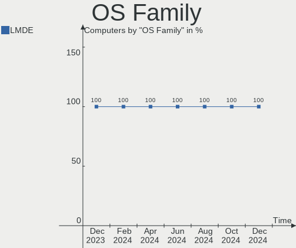

| Name | Computers | Percent |
|------|-----------|---------|
| LMDE | 36        | 100%    |

Kernel
------

Version of the Linux kernel

| Version             | Computers | Percent |
|---------------------|-----------|---------|
| 6.1.0-20-amd64      | 14        | 38.89%  |
| 6.1.0-18-amd64      | 7         | 19.44%  |
| 6.1.0-12-amd64      | 5         | 13.89%  |
| 6.1.0-20-686        | 2         | 5.56%   |
| 6.1.0-16-amd64      | 2         | 5.56%   |
| 5.10.0-28-amd64     | 2         | 5.56%   |
| 6.6.13+bpo-amd64    | 1         | 2.78%   |
| 6.6.10-chrultrabook | 1         | 2.78%   |
| 6.1.0-17-amd64      | 1         | 2.78%   |
| 6.1.0-12-686        | 1         | 2.78%   |

Kernel Family
-------------

Linux kernel without a distro release

| Version | Computers | Percent |
|---------|-----------|---------|
| 6.1.0   | 32        | 88.89%  |
| 5.10.0  | 2         | 5.56%   |
| 6.6.13  | 1         | 2.78%   |
| 6.6.10  | 1         | 2.78%   |

Kernel Major Ver.
-----------------

Linux kernel major version

| Version | Computers | Percent |
|---------|-----------|---------|
| 6.1     | 32        | 88.89%  |
| 6.6     | 2         | 5.56%   |
| 5.10    | 2         | 5.56%   |

Arch
----

OS architecture (x86_64, i586, etc.)

| Name   | Computers | Percent |
|--------|-----------|---------|
| x86_64 | 33        | 91.67%  |
| i686   | 3         | 8.33%   |

DE
--

Desktop Environment

| Name       | Computers | Percent |
|------------|-----------|---------|
| X-Cinnamon | 29        | 80.56%  |
| Cinnamon   | 5         | 13.89%  |
| MATE       | 1         | 2.78%   |
| Unknown    | 1         | 2.78%   |

Display Server
--------------

X11 or Wayland

| Name | Computers | Percent |
|------|-----------|---------|
| X11  | 36        | 100%    |

Display Manager
---------------

SDDM, LightDM, etc.

| Name    | Computers | Percent |
|---------|-----------|---------|
| LightDM | 29        | 80.56%  |
| Unknown | 7         | 19.44%  |

OS Lang
-------

Language

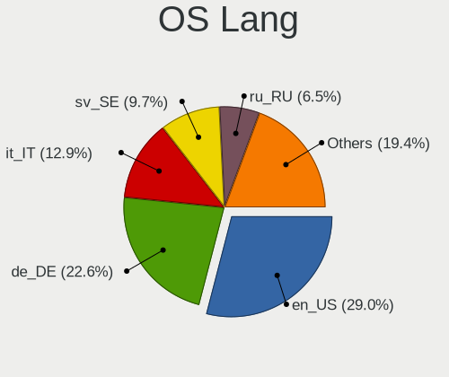

| Lang    | Computers | Percent |
|---------|-----------|---------|
| en_US   | 11        | 30.56%  |
| it_IT   | 8         | 22.22%  |
| de_DE   | 7         | 19.44%  |
| sv_SE   | 1         | 2.78%   |
| ru_RU   | 1         | 2.78%   |
| pt_BR   | 1         | 2.78%   |
| pl_PL   | 1         | 2.78%   |
| fr_FR   | 1         | 2.78%   |
| es_ES   | 1         | 2.78%   |
| es_AR   | 1         | 2.78%   |
| en_GB   | 1         | 2.78%   |
| en_CA   | 1         | 2.78%   |
| Unknown | 1         | 2.78%   |

Boot Mode
---------

EFI or BIOS

| Mode | Computers | Percent |
|------|-----------|---------|
| EFI  | 23        | 63.89%  |
| BIOS | 13        | 36.11%  |

Filesystem
----------

Type of filesystem

| Type    | Computers | Percent |
|---------|-----------|---------|
| Ext4    | 32        | 88.89%  |
| Overlay | 3         | 8.33%   |
| Tmpfs   | 1         | 2.78%   |

Part. scheme
------------

Scheme of partitioning

| Type    | Computers | Percent |
|---------|-----------|---------|
| GPT     | 21        | 58.33%  |
| MBR     | 9         | 25%     |
| Unknown | 6         | 16.67%  |

Dual Boot with Linux/BSD
------------------------

Hosting more than one Linux/BSD

| Dual boot | Computers | Percent |
|-----------|-----------|---------|
| No        | 32        | 88.89%  |
| Yes       | 4         | 11.11%  |

Dual Boot (Win)
---------------

Hosting Linux and Windows

| Dual boot | Computers | Percent |
|-----------|-----------|---------|
| No        | 24        | 66.67%  |
| Yes       | 12        | 33.33%  |

Board
-----

Vendor
------

Motherboard manufacturer

| Name                | Computers | Percent |
|---------------------|-----------|---------|
| ASUSTek Computer    | 7         | 19.44%  |
| Hewlett-Packard     | 4         | 11.11%  |
| Gigabyte Technology | 3         | 8.33%   |
| Acer                | 3         | 8.33%   |
| MSI                 | 2         | 5.56%   |
| Medion              | 2         | 5.56%   |
| Lenovo              | 2         | 5.56%   |
| Unknown             | 2         | 5.56%   |
| Samsung Electronics | 1         | 2.78%   |
| PELADN              | 1         | 2.78%   |
| Pegatron            | 1         | 2.78%   |
| Packard Bell        | 1         | 2.78%   |
| Intel               | 1         | 2.78%   |
| Google              | 1         | 2.78%   |
| GMKtec              | 1         | 2.78%   |
| Fujitsu             | 1         | 2.78%   |
| Dell                | 1         | 2.78%   |
| Apple               | 1         | 2.78%   |
| AMI                 | 1         | 2.78%   |

Model
-----

Motherboard model

| Name                                     | Computers | Percent |
|------------------------------------------|-----------|---------|
| Unknown                                  | 2         | 5.56%   |
| Samsung N150P/N210P/N220P                | 1         | 2.78%   |
| PELADN WI-6                              | 1         | 2.78%   |
| Pegatron Pro 3120 Microtower PC          | 1         | 2.78%   |
| Packard Bell EasyNote_MX45               | 1         | 2.78%   |
| MSI MS-7D91                              | 1         | 2.78%   |
| MSI MS-7C56                              | 1         | 2.78%   |
| Medion S23003                            | 1         | 2.78%   |
| Medion E6214                             | 1         | 2.78%   |
| Lenovo V15 G4 IAH 83FS                   | 1         | 2.78%   |
| Lenovo ThinkPad X140e 20BLS00400         | 1         | 2.78%   |
| Intel DQ77MK AAG39642-302                | 1         | 2.78%   |
| HP ProBook 450 G1                        | 1         | 2.78%   |
| HP OMEN 25L Desktop GT11-1xxx            | 1         | 2.78%   |
| HP EliteBook 840 G3                      | 1         | 2.78%   |
| HP Compaq 8200 Elite MT PC               | 1         | 2.78%   |
| Google Voxel                             | 1         | 2.78%   |
| GMKtec M5 Pro                            | 1         | 2.78%   |
| Gigabyte Q87M-D2H                        | 1         | 2.78%   |
| Gigabyte GA-A75-D3H                      | 1         | 2.78%   |
| Gigabyte AB350M-DS3H V2                  | 1         | 2.78%   |
| Fujitsu ESPRIMO P510                     | 1         | 2.78%   |
| Dell Latitude E7250                      | 1         | 2.78%   |
| ASUS X541UVK                             | 1         | 2.78%   |
| ASUS VivoBook_ASUSLaptop X1502ZA_X1502ZA | 1         | 2.78%   |
| ASUS T101HA                              | 1         | 2.78%   |
| ASUS PRIME Z370-P II                     | 1         | 2.78%   |
| ASUS MINIPC PN53-G                       | 1         | 2.78%   |
| ASUS G752VSK                             | 1         | 2.78%   |
| ASUS BUSINESSline MT Pro G               | 1         | 2.78%   |
| Apple MacBookAir7,2                      | 1         | 2.78%   |
| AMI Intel                                | 1         | 2.78%   |
| Acer TravelMate 4070                     | 1         | 2.78%   |
| Acer Aspire E1-572G                      | 1         | 2.78%   |
| Acer Aspire E1-571G                      | 1         | 2.78%   |

Model Family
------------

Motherboard model prefix

| Name                  | Computers | Percent |
|-----------------------|-----------|---------|
| Acer Aspire           | 2         | 5.56%   |
| Unknown               | 2         | 5.56%   |
| Samsung N150P         | 1         | 2.78%   |
| PELADN WI-6           | 1         | 2.78%   |
| Pegatron Pro          | 1         | 2.78%   |
| Packard Bell EasyNote | 1         | 2.78%   |
| MSI MS-7D91           | 1         | 2.78%   |
| MSI MS-7C56           | 1         | 2.78%   |
| Medion S23003         | 1         | 2.78%   |
| Medion E6214          | 1         | 2.78%   |
| Lenovo V15            | 1         | 2.78%   |
| Lenovo ThinkPad       | 1         | 2.78%   |
| Intel DQ77MK          | 1         | 2.78%   |
| HP ProBook            | 1         | 2.78%   |
| HP OMEN               | 1         | 2.78%   |
| HP EliteBook          | 1         | 2.78%   |
| HP Compaq             | 1         | 2.78%   |
| Google Voxel          | 1         | 2.78%   |
| GMKtec M5             | 1         | 2.78%   |
| Gigabyte Q87M-D2H     | 1         | 2.78%   |
| Gigabyte GA-A75-D3H   | 1         | 2.78%   |
| Gigabyte AB350M-DS3H  | 1         | 2.78%   |
| Fujitsu ESPRIMO       | 1         | 2.78%   |
| Dell Latitude         | 1         | 2.78%   |
| ASUS X541UVK          | 1         | 2.78%   |
| ASUS VivoBook         | 1         | 2.78%   |
| ASUS T101HA           | 1         | 2.78%   |
| ASUS PRIME            | 1         | 2.78%   |
| ASUS MINIPC           | 1         | 2.78%   |
| ASUS G752VSK          | 1         | 2.78%   |
| ASUS BUSINESSline     | 1         | 2.78%   |
| Apple MacBookAir7     | 1         | 2.78%   |
| AMI Intel             | 1         | 2.78%   |
| Acer TravelMate       | 1         | 2.78%   |

MFG Year
--------

Motherboard manufacture year

| Year | Computers | Percent |
|------|-----------|---------|
| 2024 | 5         | 13.89%  |
| 2018 | 4         | 11.11%  |
| 2022 | 3         | 8.33%   |
| 2012 | 3         | 8.33%   |
| 2010 | 3         | 8.33%   |
| 2023 | 2         | 5.56%   |
| 2021 | 2         | 5.56%   |
| 2017 | 2         | 5.56%   |
| 2016 | 2         | 5.56%   |
| 2014 | 2         | 5.56%   |
| 2013 | 2         | 5.56%   |
| 2011 | 2         | 5.56%   |
| 2006 | 2         | 5.56%   |
| 2020 | 1         | 2.78%   |
| 2007 | 1         | 2.78%   |

Form Factor
-----------

Physical design of the computer

| Name     | Computers | Percent |
|----------|-----------|---------|
| Notebook | 17        | 47.22%  |
| Desktop  | 16        | 44.44%  |
| Mini pc  | 2         | 5.56%   |
| Tablet   | 1         | 2.78%   |

Secure Boot
-----------

Enabled or disabled

| State    | Computers | Percent |
|----------|-----------|---------|
| Disabled | 34        | 94.44%  |
| Enabled  | 2         | 5.56%   |

Coreboot
--------

Have coreboot on board

| Used | Computers | Percent |
|------|-----------|---------|
| No   | 35        | 97.22%  |
| Yes  | 1         | 2.78%   |

RAM Size
--------

Total RAM memory

| Size in GB | Computers | Percent |
|------------|-----------|---------|
| 4.01-8.0   | 12        | 33.33%  |
| 16.01-24.0 | 8         | 22.22%  |
| 32.01-64.0 | 7         | 19.44%  |
| 3.01-4.0   | 5         | 13.89%  |
| 2.01-3.0   | 2         | 5.56%   |
| 24.01-32.0 | 1         | 2.78%   |
| 1.01-2.0   | 1         | 2.78%   |

RAM Used
--------

Used RAM memory

| Used GB    | Computers | Percent |
|------------|-----------|---------|
| 1.01-2.0   | 13        | 36.11%  |
| 2.01-3.0   | 12        | 33.33%  |
| 4.01-8.0   | 5         | 13.89%  |
| 3.01-4.0   | 4         | 11.11%  |
| 24.01-32.0 | 1         | 2.78%   |
| 8.01-16.0  | 1         | 2.78%   |

Total Drives
------------

Number of drives on board

| Drives | Computers | Percent |
|--------|-----------|---------|
| 1      | 25        | 69.44%  |
| 2      | 6         | 16.67%  |
| 4      | 2         | 5.56%   |
| 3      | 2         | 5.56%   |
| 5      | 1         | 2.78%   |

Has CD-ROM
----------

Has CD-ROM on board

| Presented | Computers | Percent |
|-----------|-----------|---------|
| No        | 24        | 66.67%  |
| Yes       | 12        | 33.33%  |

Has Ethernet
------------

Has Ethernet on board

| Presented | Computers | Percent |
|-----------|-----------|---------|
| Yes       | 32        | 88.89%  |
| No        | 4         | 11.11%  |

Has WiFi
--------

Has WiFi module

| Presented | Computers | Percent |
|-----------|-----------|---------|
| Yes       | 30        | 83.33%  |
| No        | 6         | 16.67%  |

Has Bluetooth
-------------

Has Bluetooth module

| Presented | Computers | Percent |
|-----------|-----------|---------|
| Yes       | 24        | 66.67%  |
| No        | 12        | 33.33%  |

Location
--------

Country
-------

Geographic location (country)

| Country     | Computers | Percent |
|-------------|-----------|---------|
| Italy       | 13        | 36.11%  |
| Germany     | 7         | 19.44%  |
| USA         | 3         | 8.33%   |
| Spain       | 3         | 8.33%   |
| Switzerland | 1         | 2.78%   |
| Sweden      | 1         | 2.78%   |
| Russia      | 1         | 2.78%   |
| Poland      | 1         | 2.78%   |
| France      | 1         | 2.78%   |
| Croatia     | 1         | 2.78%   |
| Canada      | 1         | 2.78%   |
| Brazil      | 1         | 2.78%   |
| Belarus     | 1         | 2.78%   |
| Argentina   | 1         | 2.78%   |

City
----

Geographic location (city)

| City            | Computers | Percent |
|-----------------|-----------|---------|
| Delligsen       | 3         | 8.33%   |
| Vitória        | 1         | 2.78%   |
| Villa Ballester | 1         | 2.78%   |
| Uetze           | 1         | 2.78%   |
| Turin           | 1         | 2.78%   |
| Trappes         | 1         | 2.78%   |
| Skogas          | 1         | 2.78%   |
| Sermoneta       | 1         | 2.78%   |
| Salerno         | 1         | 2.78%   |
| Rome            | 1         | 2.78%   |
| Padova          | 1         | 2.78%   |
| Osijek          | 1         | 2.78%   |
| Ornago          | 1         | 2.78%   |
| Opfikon         | 1         | 2.78%   |
| Olbia           | 1         | 2.78%   |
| Newcastle       | 1         | 2.78%   |
| Navalcarnero    | 1         | 2.78%   |
| Moscow          | 1         | 2.78%   |
| Monza           | 1         | 2.78%   |
| Minsk           | 1         | 2.78%   |
| Milan           | 1         | 2.78%   |
| Maineville      | 1         | 2.78%   |
| Madrid          | 1         | 2.78%   |
| Lucca           | 1         | 2.78%   |
| Gliwice         | 1         | 2.78%   |
| Flushing        | 1         | 2.78%   |
| Dortmund        | 1         | 2.78%   |
| Dallas          | 1         | 2.78%   |
| Cologno Monzese | 1         | 2.78%   |
| Celle           | 1         | 2.78%   |
| Brugnera        | 1         | 2.78%   |
| Bremen          | 1         | 2.78%   |
| Bologna         | 1         | 2.78%   |
| A Coruña       | 1         | 2.78%   |

Drives
------

Drive Vendor
------------

Hard drive vendors

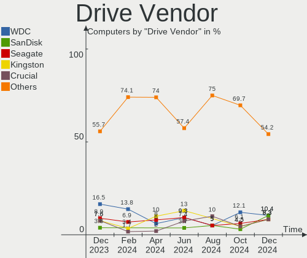

| Vendor                      | Computers | Drives | Percent |
|-----------------------------|-----------|--------|---------|
| Samsung Electronics         | 11        | 13     | 22%     |
| Kingston                    | 5         | 5      | 10%     |
| Seagate                     | 4         | 5      | 8%      |
| WDC                         | 3         | 3      | 6%      |
| SanDisk                     | 3         | 3      | 6%      |
| Toshiba                     | 2         | 2      | 4%      |
| Micron Technology           | 2         | 2      | 4%      |
| China                       | 2         | 2      | 4%      |
| Verbatim                    | 1         | 1      | 2%      |
| Unknown                     | 1         | 1      | 2%      |
| UMIS                        | 1         | 1      | 2%      |
| SK hynix                    | 1         | 1      | 2%      |
| Realtek Semiconductor       | 1         | 1      | 2%      |
| Phison Electronics          | 1         | 2      | 2%      |
| Phison                      | 1         | 1      | 2%      |
| Micron/Crucial Technology   | 1         | 1      | 2%      |
| Lexar                       | 1         | 1      | 2%      |
| KUU                         | 1         | 1      | 2%      |
| Kingston Technology Company | 1         | 1      | 2%      |
| KingDian                    | 1         | 1      | 2%      |
| HGST                        | 1         | 1      | 2%      |
| Fanxiang                    | 1         | 1      | 2%      |
| Crucial                     | 1         | 2      | 2%      |
| Apple                       | 1         | 1      | 2%      |
| ADATA Technology            | 1         | 1      | 2%      |
| Unknown                     | 1         | 1      | 2%      |

Drive Model
-----------

Hard drive models

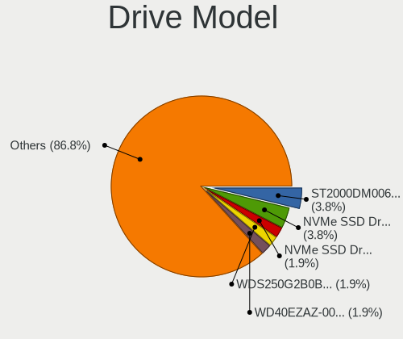

| Model                                | Computers | Percent |
|--------------------------------------|-----------|---------|
| Sandisk WD Blue SN550 NVMe SSD 2TB   | 2         | 3.7%    |
| Kingston SA400S37480G 480GB SSD      | 2         | 3.7%    |
| WDC WD2500YS-01SHB1 256GB            | 1         | 1.85%   |
| WDC WD10SPZX-08Z10 1TB               | 1         | 1.85%   |
| WDC WD10EAVS-00D7B1 1TB              | 1         | 1.85%   |
| Verbatim Vi550 S3 128GB SSD          | 1         | 1.85%   |
| Unknown MMC Card  128GB              | 1         | 1.85%   |
| UMIS RPJTJ512MKP1QDY 512GB           | 1         | 1.85%   |
| Toshiba MQ01ABD050 500GB             | 1         | 1.85%   |
| Toshiba HDWD120 2TB                  | 1         | 1.85%   |
| SK hynix HFM256GD3JX016N 256GB       | 1         | 1.85%   |
| Seagate ST3200826AS 200GB            | 1         | 1.85%   |
| Seagate ST3000DM008-2DM166 3TB       | 1         | 1.85%   |
| Seagate ST2000DM001-1ER164 2TB       | 1         | 1.85%   |
| Seagate ST1000LM035-1RK172 1TB       | 1         | 1.85%   |
| Seagate ST1000DM010-2DM162 1TB       | 1         | 1.85%   |
| SanDisk SDSSDA240G 240GB             | 1         | 1.85%   |
| Samsung SSD PM851 mSATA 128GB        | 1         | 1.85%   |
| Samsung SSD 980 500GB                | 1         | 1.85%   |
| Samsung SSD 980 1TB                  | 1         | 1.85%   |
| Samsung SSD 870 QVO 2TB              | 1         | 1.85%   |
| Samsung SSD 860 EVO 500GB            | 1         | 1.85%   |
| Samsung SSD 850 EVO 250GB            | 1         | 1.85%   |
| Samsung SSD 840 EVO 250GB            | 1         | 1.85%   |
| Samsung SSD 840 EVO 120GB            | 1         | 1.85%   |
| Samsung MZVPW256HEGL-00000 256GB     | 1         | 1.85%   |
| Samsung MZ7LN128HCHP-000H1 128GB SSD | 1         | 1.85%   |
| Samsung HM251JI 250GB                | 1         | 1.85%   |
| Samsung HD403LJ 400GB                | 1         | 1.85%   |
| Samsung HD204UI 2TB                  | 1         | 1.85%   |
| Realtek NVMe SSD Drive 512GB         | 1         | 1.85%   |
| Phison S11-128G-PHISON-SSD-B4 128GB  | 1         | 1.85%   |
| Phison PCIe SSD 2TB                  | 1         | 1.85%   |
| Micron/Crucial P1 NVMe PCIe SSD 1TB  | 1         | 1.85%   |
| Micron CT1000X8SSD9 1TB              | 1         | 1.85%   |
| Micron 2400_MTFDKBA512QFM 512GB      | 1         | 1.85%   |
| Lexar SSD NM790 2TB                  | 1         | 1.85%   |
| KUU SSD 512GB                        | 1         | 1.85%   |
| Kingston Company SNV2S2000G 2TB      | 1         | 1.85%   |
| Kingston SV300S37A60G 64GB SSD       | 1         | 1.85%   |

HDD Vendor
----------

Hard disk drive vendors

| Vendor              | Computers | Drives | Percent |
|---------------------|-----------|--------|---------|
| Seagate             | 4         | 5      | 33.33%  |
| WDC                 | 3         | 3      | 25%     |
| Toshiba             | 2         | 2      | 16.67%  |
| Samsung Electronics | 2         | 3      | 16.67%  |
| HGST                | 1         | 1      | 8.33%   |

SSD Vendor
----------

Solid state drive vendors

| Vendor              | Computers | Drives | Percent |
|---------------------|-----------|--------|---------|
| Samsung Electronics | 7         | 7      | 29.17%  |
| Kingston            | 5         | 5      | 20.83%  |
| China               | 2         | 2      | 8.33%   |
| Verbatim            | 1         | 1      | 4.17%   |
| SanDisk             | 1         | 1      | 4.17%   |
| Phison              | 1         | 1      | 4.17%   |
| Micron Technology   | 1         | 1      | 4.17%   |
| KUU                 | 1         | 1      | 4.17%   |
| KingDian            | 1         | 1      | 4.17%   |
| Fanxiang            | 1         | 1      | 4.17%   |
| Crucial             | 1         | 1      | 4.17%   |
| Apple               | 1         | 1      | 4.17%   |
| Unknown             | 1         | 1      | 4.17%   |

Drive Kind
----------

HDD or SSD

| Kind | Computers | Drives | Percent |
|------|-----------|--------|---------|
| SSD  | 24        | 24     | 51.06%  |
| NVMe | 12        | 16     | 25.53%  |
| HDD  | 10        | 14     | 21.28%  |
| MMC  | 1         | 1      | 2.13%   |

Drive Connector
---------------

SATA, SAS, NVMe, etc.

| Type | Computers | Drives | Percent |
|------|-----------|--------|---------|
| SATA | 31        | 37     | 68.89%  |
| NVMe | 12        | 16     | 26.67%  |
| SAS  | 1         | 1      | 2.22%   |
| MMC  | 1         | 1      | 2.22%   |

Drive Size
----------

Size of hard drive

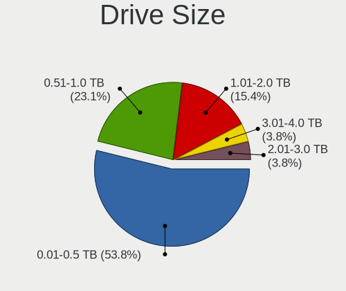

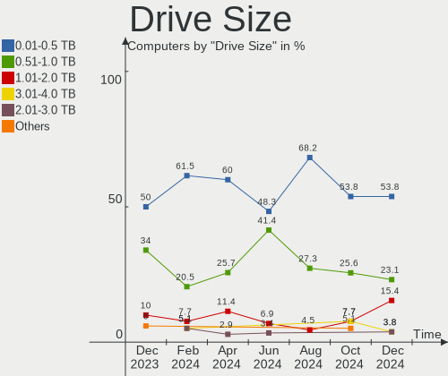

| Size in TB | Computers | Drives | Percent |
|------------|-----------|--------|---------|
| 0.01-0.5   | 22        | 24     | 62.86%  |
| 0.51-1.0   | 8         | 9      | 22.86%  |
| 1.01-2.0   | 4         | 4      | 11.43%  |
| 2.01-3.0   | 1         | 1      | 2.86%   |

Space Total
-----------

Amount of disk space available on the file system

| Size in GB     | Computers | Percent |
|----------------|-----------|---------|
| 101-250        | 17        | 47.22%  |
| 1001-2000      | 5         | 13.89%  |
| 251-500        | 4         | 11.11%  |
| More than 3000 | 2         | 5.56%   |
| 21-50          | 2         | 5.56%   |
| 501-1000       | 2         | 5.56%   |
| 2001-3000      | 1         | 2.78%   |
| 1-20           | 1         | 2.78%   |
| 51-100         | 1         | 2.78%   |
| Unknown        | 1         | 2.78%   |

Space Used
----------

Amount of used disk space

| Used GB        | Computers | Percent |
|----------------|-----------|---------|
| 21-50          | 12        | 33.33%  |
| 1-20           | 11        | 30.56%  |
| 251-500        | 2         | 5.56%   |
| 101-250        | 2         | 5.56%   |
| 1001-2000      | 2         | 5.56%   |
| 501-1000       | 2         | 5.56%   |
| 51-100         | 2         | 5.56%   |
| More than 3000 | 1         | 2.78%   |
| 2001-3000      | 1         | 2.78%   |
| Unknown        | 1         | 2.78%   |

Malfunc. Drives
---------------

Drive models with a malfunction

| Model                             | Computers | Drives | Percent |
|-----------------------------------|-----------|--------|---------|
| Samsung Electronics HM251JI 250GB | 1         | 1      | 25%     |
| KUU SSD 512GB                     | 1         | 1      | 25%     |
| HGST HTS721010A9E630 1TB          | 1         | 1      | 25%     |
| China SH00M256GB SSD              | 1         | 1      | 25%     |

Malfunc. Drive Vendor
---------------------

Vendors of faulty drives

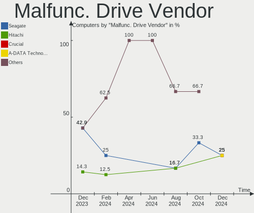

| Vendor              | Computers | Drives | Percent |
|---------------------|-----------|--------|---------|
| Samsung Electronics | 1         | 1      | 25%     |
| KUU                 | 1         | 1      | 25%     |
| HGST                | 1         | 1      | 25%     |
| China               | 1         | 1      | 25%     |

Malfunc. HDD Vendor
-------------------

Vendors of faulty HDD drives

| Vendor              | Computers | Drives | Percent |
|---------------------|-----------|--------|---------|
| Samsung Electronics | 1         | 1      | 50%     |
| HGST                | 1         | 1      | 50%     |

Malfunc. Drive Kind
-------------------

Kinds of faulty drives

| Kind | Computers | Drives | Percent |
|------|-----------|--------|---------|
| SSD  | 2         | 2      | 50%     |
| HDD  | 2         | 2      | 50%     |

Failed Drives
-------------

Failed drive models

Zero info for selected period =(

Failed Drive Vendor
-------------------

Failed drive vendors

Zero info for selected period =(

Drive Status
------------

Number of failed and malfunc. drives

| Status   | Computers | Drives | Percent |
|----------|-----------|--------|---------|
| Works    | 26        | 31     | 68.42%  |
| Detected | 8         | 20     | 21.05%  |
| Malfunc  | 4         | 4      | 10.53%  |

Storage controller
------------------

Storage Vendor
--------------

Storage controller vendors

| Vendor                                  | Computers | Percent |
|-----------------------------------------|-----------|---------|
| Intel                                   | 25        | 52.08%  |
| AMD                                     | 5         | 10.42%  |
| Samsung Electronics                     | 4         | 8.33%   |
| SanDisk                                 | 2         | 4.17%   |
| Micron/Crucial Technology               | 2         | 4.17%   |
| ASMedia Technology                      | 2         | 4.17%   |
| SK hynix                                | 1         | 2.08%   |
| Shenzhen Unionmemory Information System | 1         | 2.08%   |
| Shenzhen Longsys Electronics            | 1         | 2.08%   |
| Realtek Semiconductor                   | 1         | 2.08%   |
| Phison Electronics                      | 1         | 2.08%   |
| Micron Technology                       | 1         | 2.08%   |
| Kingston Technology Company             | 1         | 2.08%   |
| ADATA Technology                        | 1         | 2.08%   |

Storage Model
-------------

Storage controller models

| Model                                                                                       | Computers | Percent |
|---------------------------------------------------------------------------------------------|-----------|---------|
| Intel SATA controller                                                                       | 3         | 6%      |
| SanDisk Ultra 3D / WD Blue SN550 NVMe SSD                                                   | 2         | 4%      |
| Samsung NVMe SSD Controller 980 (DRAM-less)                                                 | 2         | 4%      |
| Intel Sunrise Point-LP SATA Controller [AHCI mode]                                          | 2         | 4%      |
| Intel 8 Series/C220 Series Chipset Family 6-port SATA Controller 1 [AHCI mode]              | 2         | 4%      |
| Intel 7 Series/C210 Series Chipset Family 6-port SATA Controller [AHCI mode]                | 2         | 4%      |
| ASMedia ASM1061/ASM1062 Serial ATA Controller                                               | 2         | 4%      |
| AMD FCH SATA Controller [AHCI mode]                                                         | 2         | 4%      |
| AMD 500 Series Chipset SATA Controller                                                      | 2         | 4%      |
| SK hynix Gold P31/BC711/PC711 NVMe Solid State Drive                                        | 1         | 2%      |
| Shenzhen Unionmemory Information System RPETJ512MKP1QDQ PCIe 4.0 NVMe SSD 512GB (DRAM-less) | 1         | 2%      |
| Shenzhen Longsys Lexar NM790 NVME SSD (DRAM-less)                                           | 1         | 2%      |
| Samsung S4LN058A01[SSUBX] AHCI SSD Controller (Apple slot)                                  | 1         | 2%      |
| Samsung NVMe SSD Controller SM961/PM961/SM963                                               | 1         | 2%      |
| Realtek RTS5765DL NVMe SSD Controller (DRAM-less)                                           | 1         | 2%      |
| Phison PS5015-E15 PCIe3 NVMe Controller (DRAM-less)                                         | 1         | 2%      |
| Phison E16 PCIe4 NVMe Controller                                                            | 1         | 2%      |
| Micron/Crucial T500 NVMe PCIe SSD                                                           | 1         | 2%      |
| Micron/Crucial P1 NVMe PCIe SSD[Frampton]                                                   | 1         | 2%      |
| Micron 2400 NVMe SSD (DRAM-less)                                                            | 1         | 2%      |
| Kingston Company NV2 NVMe SSD E21T (DRAM-less)                                              | 1         | 2%      |
| Intel SATA Controller [RAID mode]                                                           | 1         | 2%      |
| Intel Raptor Lake SATA AHCI Controller                                                      | 1         | 2%      |
| Intel Q170/Q150/B150/H170/H110/Z170/CM236 Chipset SATA Controller [AHCI Mode]               | 1         | 2%      |
| Intel NM10/ICH7 Family SATA Controller [AHCI mode]                                          | 1         | 2%      |
| Intel Celeron/Pentium Silver Processor SATA Controller                                      | 1         | 2%      |
| Intel Cannon Point-LP SATA Controller [AHCI Mode]                                           | 1         | 2%      |
| Intel Alder Lake-P SATA AHCI Controller                                                     | 1         | 2%      |
| Intel 82801JI (ICH10 Family) 4 port SATA IDE Controller #1                                  | 1         | 2%      |
| Intel 82801GBM/GHM (ICH7-M Family) SATA Controller [IDE mode]                               | 1         | 2%      |
| Intel 82801FB/FBM/FR/FW/FRW (ICH6 Family) IDE Controller                                    | 1         | 2%      |
| Intel 82801 Mobile SATA Controller [RAID mode]                                              | 1         | 2%      |
| Intel 8 Series SATA Controller 1 [AHCI mode]                                                | 1         | 2%      |
| Intel 7 Series Chipset Family 4-port SATA Controller [IDE mode]                             | 1         | 2%      |
| Intel 7 Series Chipset Family 2-port SATA Controller [IDE mode]                             | 1         | 2%      |
| Intel 6 Series/C200 Series Chipset Family 6 port Desktop SATA AHCI Controller               | 1         | 2%      |
| Intel 5 Series/3400 Series Chipset 4 port SATA AHCI Controller                              | 1         | 2%      |
| Intel 200 Series PCH SATA controller [AHCI mode]                                            | 1         | 2%      |
| AMD 300 Series Chipset SATA Controller                                                      | 1         | 2%      |
| ADATA XPG SX8200 Pro PCIe Gen3x4 M.2 2280 Solid State Drive                                 | 1         | 2%      |

Storage Kind
------------

Kind of storage controller (IDE, SATA, NVMe, SAS, ...)

| Kind | Computers | Percent |
|------|-----------|---------|
| SATA | 26        | 59.09%  |
| NVMe | 12        | 27.27%  |
| IDE  | 4         | 9.09%   |
| RAID | 2         | 4.55%   |

Processor
---------

CPU Vendor
----------

Processor vendors

| Vendor | Computers | Percent |
|--------|-----------|---------|
| Intel  | 29        | 80.56%  |
| AMD    | 7         | 19.44%  |

CPU Model
---------

Processor models

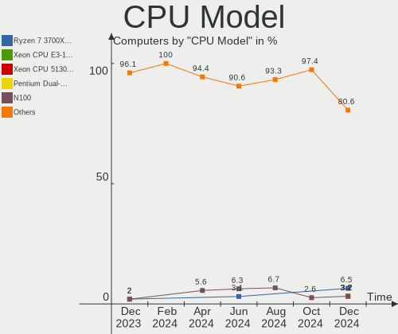

| Model                                       | Computers | Percent |
|---------------------------------------------|-----------|---------|
| Intel N100                                  | 2         | 5.56%   |
| Intel 12th Gen Core i5-12500H               | 2         | 5.56%   |
| AMD Ryzen 7 5700G with Radeon Graphics      | 2         | 5.56%   |
| Intel Pentium M processor 1.73GHz           | 1         | 2.78%   |
| Intel Pentium Dual-Core CPU E5500 @ 2.80GHz | 1         | 2.78%   |
| Intel N95                                   | 1         | 2.78%   |
| Intel Core i7-7700HQ CPU @ 2.80GHz          | 1         | 2.78%   |
| Intel Core i7-7500U CPU @ 2.70GHz           | 1         | 2.78%   |
| Intel Core i7-4702MQ CPU @ 2.20GHz          | 1         | 2.78%   |
| Intel Core i7-3770 CPU @ 3.40GHz            | 1         | 2.78%   |
| Intel Core i7-2600 CPU @ 3.40GHz            | 1         | 2.78%   |
| Intel Core i5-9600K CPU @ 3.70GHz           | 1         | 2.78%   |
| Intel Core i5-8260U CPU @ 1.60GHz           | 1         | 2.78%   |
| Intel Core i5-6500 CPU @ 3.20GHz            | 1         | 2.78%   |
| Intel Core i5-6300U CPU @ 2.40GHz           | 1         | 2.78%   |
| Intel Core i5-5350U CPU @ 1.80GHz           | 1         | 2.78%   |
| Intel Core i5-5300U CPU @ 2.30GHz           | 1         | 2.78%   |
| Intel Core i5-4590S CPU @ 3.00GHz           | 1         | 2.78%   |
| Intel Core i5-4200U CPU @ 1.60GHz           | 1         | 2.78%   |
| Intel Core i5-3470 CPU @ 3.20GHz            | 1         | 2.78%   |
| Intel Core i5-3230M CPU @ 2.60GHz           | 1         | 2.78%   |
| Intel Core i3 CPU M 330 @ 2.13GHz           | 1         | 2.78%   |
| Intel Core Duo CPU T2350 @ 1.86GHz          | 1         | 2.78%   |
| Intel Celeron J4125 CPU @ 2.00GHz           | 1         | 2.78%   |
| Intel Atom x5-Z8350 CPU @ 1.44GHz           | 1         | 2.78%   |
| Intel Atom CPU N450 @ 1.66GHz               | 1         | 2.78%   |
| Intel 13th Gen Core i5-13600KF              | 1         | 2.78%   |
| Intel 11th Gen Core i5-1135G7 @ 2.40GHz     | 1         | 2.78%   |
| AMD Ryzen 9 6900HX with Radeon Graphics     | 1         | 2.78%   |
| AMD Ryzen 7 5700U with Radeon Graphics      | 1         | 2.78%   |
| AMD Ryzen 5 3600 6-Core Processor           | 1         | 2.78%   |
| AMD A8-3870 APU with Radeon HD Graphics     | 1         | 2.78%   |
| AMD A4-5000 APU with Radeon HD Graphics     | 1         | 2.78%   |

CPU Model Family
----------------

Processor model prefix

| Model                   | Computers | Percent |
|-------------------------|-----------|---------|
| Intel Core i5           | 10        | 27.78%  |
| Other                   | 7         | 19.44%  |
| Intel Core i7           | 5         | 13.89%  |
| AMD Ryzen 7             | 3         | 8.33%   |
| Intel Atom              | 2         | 5.56%   |
| Intel Pentium M         | 1         | 2.78%   |
| Intel Pentium Dual-Core | 1         | 2.78%   |
| Intel Core i3           | 1         | 2.78%   |
| Intel Core Duo          | 1         | 2.78%   |
| Intel Celeron           | 1         | 2.78%   |
| AMD Ryzen 9             | 1         | 2.78%   |
| AMD Ryzen 5             | 1         | 2.78%   |
| AMD A8                  | 1         | 2.78%   |
| AMD A4                  | 1         | 2.78%   |

CPU Cores
---------

Number of processor cores

| Number | Computers | Percent |
|--------|-----------|---------|
| 4      | 16        | 44.44%  |
| 2      | 9         | 25%     |
| 8      | 4         | 11.11%  |
| 12     | 2         | 5.56%   |
| 6      | 2         | 5.56%   |
| 1      | 2         | 5.56%   |
| 14     | 1         | 2.78%   |

CPU Sockets
-----------

Number of sockets

| Number | Computers | Percent |
|--------|-----------|---------|
| 1      | 36        | 100%    |

CPU Threads
-----------

Threads per core (Hyper-Threading)

| Number | Computers | Percent |
|--------|-----------|---------|
| 2      | 22        | 61.11%  |
| 1      | 14        | 38.89%  |

CPU Op-Modes
------------

CPU Operation Modes (32-bit, 64-bit)

| Op mode        | Computers | Percent |
|----------------|-----------|---------|
| 32-bit, 64-bit | 34        | 94.44%  |
| 32-bit         | 2         | 5.56%   |

CPU Microcode
-------------

Microcode number

| Number     | Computers | Percent |
|------------|-----------|---------|
| Unknown    | 5         | 13.89%  |
| 0xb06e0    | 3         | 8.33%   |
| 0x306a9    | 3         | 8.33%   |
| 0x906a3    | 2         | 5.56%   |
| 0x306d4    | 2         | 5.56%   |
| 0x306c3    | 2         | 5.56%   |
| 0xb0671    | 1         | 2.78%   |
| 0x906ec    | 1         | 2.78%   |
| 0x906e9    | 1         | 2.78%   |
| 0x806ea    | 1         | 2.78%   |
| 0x706a8    | 1         | 2.78%   |
| 0x6ec      | 1         | 2.78%   |
| 0x6d8      | 1         | 2.78%   |
| 0x506e3    | 1         | 2.78%   |
| 0x406c4    | 1         | 2.78%   |
| 0x40651    | 1         | 2.78%   |
| 0x206a7    | 1         | 2.78%   |
| 0x20652    | 1         | 2.78%   |
| 0x106ca    | 1         | 2.78%   |
| 0x1067a    | 1         | 2.78%   |
| 0x0a50000d | 1         | 2.78%   |
| 0x0a50000c | 1         | 2.78%   |
| 0x08701030 | 1         | 2.78%   |
| 0x08608104 | 1         | 2.78%   |
| 0x0700010f | 1         | 2.78%   |

CPU Microarch
-------------

Microarchitecture

| Name             | Computers | Percent |
|------------------|-----------|---------|
| KabyLake         | 4         | 11.11%  |
| IvyBridge        | 3         | 8.33%   |
| Haswell          | 3         | 8.33%   |
| Alderlake Hybrid | 3         | 8.33%   |
| Unknown          | 3         | 8.33%   |
| Zen 3            | 2         | 5.56%   |
| Skylake          | 2         | 5.56%   |
| P6               | 2         | 5.56%   |
| Gracemont        | 2         | 5.56%   |
| Broadwell        | 2         | 5.56%   |
| Zen 2            | 1         | 2.78%   |
| Westmere         | 1         | 2.78%   |
| TigerLake        | 1         | 2.78%   |
| Silvermont       | 1         | 2.78%   |
| SandyBridge      | 1         | 2.78%   |
| Penryn           | 1         | 2.78%   |
| K10 Llano        | 1         | 2.78%   |
| Jaguar           | 1         | 2.78%   |
| Goldmont plus    | 1         | 2.78%   |
| Bonnell          | 1         | 2.78%   |

Graphics
--------

GPU Vendor
----------

Vendors of graphics cards

| Vendor | Computers | Percent |
|--------|-----------|---------|
| Intel  | 27        | 69.23%  |
| AMD    | 7         | 17.95%  |
| Nvidia | 5         | 12.82%  |

GPU Model
---------

Graphics card models

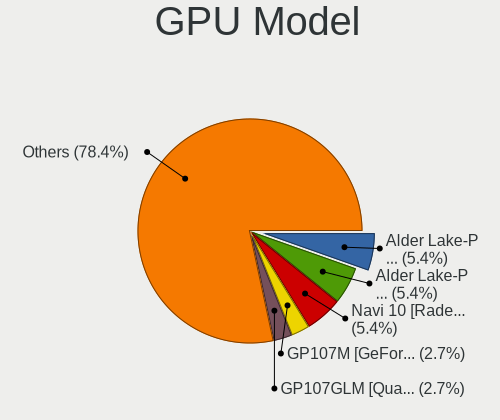

| Model                                                                                    | Computers | Percent |
|------------------------------------------------------------------------------------------|-----------|---------|
| Intel Alder Lake-N [UHD Graphics]                                                        | 3         | 7.5%    |
| Nvidia TU106 [GeForce RTX 2060 Rev. A]                                                   | 1         | 2.5%    |
| Nvidia GP104BM [GeForce GTX 1070 Mobile]                                                 | 1         | 2.5%    |
| Nvidia GM204 [GeForce GTX 970]                                                           | 1         | 2.5%    |
| Nvidia GM108M [GeForce 920MX]                                                            | 1         | 2.5%    |
| Nvidia GF117M [GeForce 610M/710M/810M/820M / GT 620M/625M/630M/720M]                     | 1         | 2.5%    |
| Intel Xeon E3-1200 v3/4th Gen Core Processor Integrated Graphics Controller              | 1         | 2.5%    |
| Intel Xeon E3-1200 v2/3rd Gen Core processor Graphics Controller                         | 1         | 2.5%    |
| Intel TigerLake-LP GT2 [Iris Xe Graphics]                                                | 1         | 2.5%    |
| Intel Skylake GT2 [HD Graphics 520]                                                      | 1         | 2.5%    |
| Intel Mobile 945GM/GMS/GME, 943/940GML Express Integrated Graphics Controller            | 1         | 2.5%    |
| Intel Mobile 945GM/GMS, 943/940GML Express Integrated Graphics Controller                | 1         | 2.5%    |
| Intel Mobile 915GM/GMS/910GML Express Graphics Controller                                | 1         | 2.5%    |
| Intel IvyBridge GT2 [HD Graphics 4000]                                                   | 1         | 2.5%    |
| Intel HD Graphics 620                                                                    | 1         | 2.5%    |
| Intel HD Graphics 6000                                                                   | 1         | 2.5%    |
| Intel HD Graphics 5500                                                                   | 1         | 2.5%    |
| Intel HD Graphics 530                                                                    | 1         | 2.5%    |
| Intel Haswell-ULT Integrated Graphics Controller                                         | 1         | 2.5%    |
| Intel GeminiLake [UHD Graphics 600]                                                      | 1         | 2.5%    |
| Intel Core Processor Integrated Graphics Controller                                      | 1         | 2.5%    |
| Intel CoffeeLake-S GT2 [UHD Graphics 630]                                                | 1         | 2.5%    |
| Intel Coffee Lake-U GT2 [UHD Graphics 620]                                               | 1         | 2.5%    |
| Intel Atom/Celeron/Pentium Processor x5-E8000/J3xxx/N3xxx Integrated Graphics Controller | 1         | 2.5%    |
| Intel Atom Processor D4xx/D5xx/N4xx/N5xx Integrated Graphics Controller                  | 1         | 2.5%    |
| Intel Alder Lake-P Integrated Graphics Controller                                        | 1         | 2.5%    |
| Intel Alder Lake-P GT2 [Iris Xe Graphics]                                                | 1         | 2.5%    |
| Intel 4th Gen Core Processor Integrated Graphics Controller                              | 1         | 2.5%    |
| Intel 4 Series Chipset Integrated Graphics Controller                                    | 1         | 2.5%    |
| Intel 3rd Gen Core processor Graphics Controller                                         | 1         | 2.5%    |
| Intel 2nd Generation Core Processor Family Integrated Graphics Controller                | 1         | 2.5%    |
| AMD Sumo [Radeon HD 6550D]                                                               | 1         | 2.5%    |
| AMD Rembrandt [Radeon 680M]                                                              | 1         | 2.5%    |
| AMD Opal XT [Radeon R7 M265/M365X/M465]                                                  | 1         | 2.5%    |
| AMD Navi 23 [Radeon RX 6650 XT / 6700S / 6800S]                                          | 1         | 2.5%    |
| AMD Lucienne                                                                             | 1         | 2.5%    |
| AMD Kabini [Radeon HD 8330]                                                              | 1         | 2.5%    |
| AMD Caicos [Radeon HD 6450/7450/8450 / R5 230 OEM]                                       | 1         | 2.5%    |

GPU Combo
---------

Combinations of graphics cards

| Name           | Computers | Percent |
|----------------|-----------|---------|
| 1 x Intel      | 21        | 58.33%  |
| 1 x AMD        | 6         | 16.67%  |
| 2 x Intel      | 3         | 8.33%   |
| 1 x Nvidia     | 3         | 8.33%   |
| Intel + Nvidia | 2         | 5.56%   |
| Intel + AMD    | 1         | 2.78%   |

GPU Driver
----------

Free vs proprietary

| Driver      | Computers | Percent |
|-------------|-----------|---------|
| Free        | 34        | 94.44%  |
| Proprietary | 2         | 5.56%   |

GPU Memory
----------

Total video memory

| Size in GB | Computers | Percent |
|------------|-----------|---------|
| Unknown    | 29        | 80.56%  |
| 7.01-8.0   | 2         | 5.56%   |
| 3.01-4.0   | 2         | 5.56%   |
| 5.01-6.0   | 1         | 2.78%   |
| 1.01-2.0   | 1         | 2.78%   |
| 0.51-1.0   | 1         | 2.78%   |

Monitor
-------

Monitor Vendor
--------------

Monitor vendors

| Vendor                  | Computers | Percent |
|-------------------------|-----------|---------|
| Samsung Electronics     | 8         | 21.05%  |
| AU Optronics            | 6         | 15.79%  |
| Goldstar                | 4         | 10.53%  |
| Chimei Innolux          | 4         | 10.53%  |
| HUAWEI                  | 3         | 7.89%   |
| Hewlett-Packard         | 2         | 5.26%   |
| ASUSTek Computer        | 2         | 5.26%   |
| Philips                 | 1         | 2.63%   |
| LG Philips              | 1         | 2.63%   |
| LG Display              | 1         | 2.63%   |
| Dell                    | 1         | 2.63%   |
| Chi Mei Optoelectronics | 1         | 2.63%   |
| BOE                     | 1         | 2.63%   |
| Apple                   | 1         | 2.63%   |
| AOC                     | 1         | 2.63%   |
| Ancor Communications    | 1         | 2.63%   |

Monitor Model
-------------

Monitor models

| Model                                                                    | Computers | Percent |
|--------------------------------------------------------------------------|-----------|---------|
| HUAWEI ZQE-CBA HWV6A25 3440x1440 797x334mm 34.0-inch                     | 3         | 7.89%   |
| Samsung Electronics SyncMaster SAM0456 1360x768 410x230mm 18.5-inch      | 2         | 5.26%   |
| Goldstar TV SSCR2 GSMC0C8 3840x2160                                      | 2         | 5.26%   |
| Samsung Electronics T23B550 SAM0959 1920x1080 510x287mm 23.0-inch        | 1         | 2.63%   |
| Samsung Electronics SMB2340 SAM0691 1920x1080 510x287mm 23.0-inch        | 1         | 2.63%   |
| Samsung Electronics SA300/SA350 SAM0794 1920x1080 521x293mm 23.5-inch    | 1         | 2.63%   |
| Samsung Electronics S24D330 SAM0D92 1920x1080 531x299mm 24.0-inch        | 1         | 2.63%   |
| Samsung Electronics S24C450 SAM09CE 1920x1200 518x324mm 24.1-inch        | 1         | 2.63%   |
| Samsung Electronics LCD Monitor SEC3052 1024x600 223x125mm 10.1-inch     | 1         | 2.63%   |
| Philips PHL 233V5 PHLC0D0 1920x1080 509x286mm 23.0-inch                  | 1         | 2.63%   |
| LG Philips LCD Monitor LPLE300 1280x800 331x207mm 15.4-inch              | 1         | 2.63%   |
| LG Display LCD Monitor LGD038E 1366x768 344x194mm 15.5-inch              | 1         | 2.63%   |
| Hewlett-Packard VH240a HPN3499 1920x1080 527x296mm 23.8-inch             | 1         | 2.63%   |
| Hewlett-Packard 22w HPN342E 1920x1080 476x268mm 21.5-inch                | 1         | 2.63%   |
| Goldstar M1921A GSM4B2B 1280x1024 376x301mm 19.0-inch                    | 1         | 2.63%   |
| Goldstar E2251 GSM586E 1920x1080 477x268mm 21.5-inch                     | 1         | 2.63%   |
| Dell U2720Q DEL41B3 3840x2160 597x336mm 27.0-inch                        | 1         | 2.63%   |
| Chimei Innolux LCD Monitor CMN15DB 1366x768 344x193mm 15.5-inch          | 1         | 2.63%   |
| Chimei Innolux LCD Monitor CMN15BC 1366x768 344x194mm 15.5-inch          | 1         | 2.63%   |
| Chimei Innolux LCD Monitor CMN1552 1920x1080 344x193mm 15.5-inch         | 1         | 2.63%   |
| Chimei Innolux LCD Monitor CMN1118 1366x768 256x144mm 11.6-inch          | 1         | 2.63%   |
| Chi Mei Optoelectronics LCD Monitor CMO1514 1280x800 331x207mm 15.4-inch | 1         | 2.63%   |
| BOE LCD Monitor BOE095F 2256x1504 285x190mm 13.5-inch                    | 1         | 2.63%   |
| AU Optronics LCD Monitor AUO47EC 1366x768 344x193mm 15.5-inch            | 1         | 2.63%   |
| AU Optronics LCD Monitor AUO32EC 1366x768 344x193mm 15.5-inch            | 1         | 2.63%   |
| AU Optronics LCD Monitor AUO21ED 1920x1080 344x193mm 15.5-inch           | 1         | 2.63%   |
| AU Optronics LCD Monitor AUO149B 3840x2160 380x210mm 17.1-inch           | 1         | 2.63%   |
| AU Optronics LCD Monitor AUO123D 1920x1080 309x173mm 13.9-inch           | 1         | 2.63%   |
| AU Optronics LCD Monitor AUO106C 1366x768 277x156mm 12.5-inch            | 1         | 2.63%   |
| ASUSTek Computer XG49WCR AUS4932 3840x1080 1192x335mm 48.7-inch          | 1         | 2.63%   |
| ASUSTek Computer VA229 AUS22F3 1920x1080 476x268mm 21.5-inch             | 1         | 2.63%   |
| Apple Color LCD APPA01B 1440x900 286x179mm 13.3-inch                     | 1         | 2.63%   |
| AOC 2460 AOC246A 1920x1080 531x299mm 24.0-inch                           | 1         | 2.63%   |
| Ancor Communications ASUS VB195 ACI19B5 1280x1024 376x301mm 19.0-inch    | 1         | 2.63%   |

Monitor Resolution
------------------

Monitor screen resolution

| Resolution        | Computers | Percent |
|-------------------|-----------|---------|
| 1920x1080 (FHD)   | 11        | 30.56%  |
| 1366x768 (WXGA)   | 8         | 22.22%  |
| 3840x2160 (4K)    | 4         | 11.11%  |
| 3440x1440         | 3         | 8.33%   |
| 1360x768          | 2         | 5.56%   |
| 1280x800 (WXGA)   | 2         | 5.56%   |
| 3840x1080         | 1         | 2.78%   |
| 2256x1504         | 1         | 2.78%   |
| 1920x1200 (WUXGA) | 1         | 2.78%   |
| 1440x900 (WXGA+)  | 1         | 2.78%   |
| 1280x720 (HD)     | 1         | 2.78%   |
| 1280x1024 (SXGA)  | 1         | 2.78%   |

Monitor Diagonal
----------------

Diagonal size in inches

| Inches | Computers | Percent |
|--------|-----------|---------|
| 15     | 10        | 26.32%  |
| 24     | 4         | 10.53%  |
| 23     | 4         | 10.53%  |
| 34     | 3         | 7.89%   |
| 21     | 3         | 7.89%   |
| 13     | 3         | 7.89%   |
| 72     | 2         | 5.26%   |
| 19     | 2         | 5.26%   |
| 18     | 2         | 5.26%   |
| 48     | 1         | 2.63%   |
| 27     | 1         | 2.63%   |
| 17     | 1         | 2.63%   |
| 12     | 1         | 2.63%   |
| 11     | 1         | 2.63%   |

Monitor Width
-------------

Physical width

| Width in mm | Computers | Percent |
|-------------|-----------|---------|
| 301-350     | 11        | 28.95%  |
| 501-600     | 9         | 23.68%  |
| 401-500     | 5         | 13.16%  |
| 201-300     | 4         | 10.53%  |
| 701-800     | 3         | 7.89%   |
| 351-400     | 3         | 7.89%   |
| 1501-2000   | 2         | 5.26%   |
| 1001-1500   | 1         | 2.63%   |

Aspect Ratio
------------

Proportional relationship between the width and the height

| Ratio | Computers | Percent |
|-------|-----------|---------|
| 16/9  | 24        | 66.67%  |
| 16/10 | 5         | 13.89%  |
| 21/9  | 3         | 8.33%   |
| 5/4   | 2         | 5.56%   |
| 32/9  | 1         | 2.78%   |
| 3/2   | 1         | 2.78%   |

Monitor Area
------------

Area in inch²

| Area in inch² | Computers | Percent |
|----------------|-----------|---------|
| 101-110        | 10        | 27.03%  |
| 201-250        | 7         | 18.92%  |
| 81-90          | 3         | 8.11%   |
| 351-500        | 3         | 8.11%   |
| 151-200        | 3         | 8.11%   |
| More than 1000 | 2         | 5.41%   |
| 251-300        | 2         | 5.41%   |
| 141-150        | 2         | 5.41%   |
| 61-70          | 1         | 2.7%    |
| 51-60          | 1         | 2.7%    |
| 301-350        | 1         | 2.7%    |
| 121-130        | 1         | 2.7%    |
| 501-1000       | 1         | 2.7%    |

Pixel Density
-------------

Pixels per inch

| Density       | Computers | Percent |
|---------------|-----------|---------|
| 51-100        | 17        | 45.95%  |
| 101-120       | 11        | 29.73%  |
| 121-160       | 6         | 16.22%  |
| 161-240       | 2         | 5.41%   |
| More than 240 | 1         | 2.7%    |

Multiple Monitors
-----------------

Total monitors connected

| Total | Computers | Percent |
|-------|-----------|---------|
| 1     | 33        | 91.67%  |
| 2     | 3         | 8.33%   |

Network
-------

Net Controller Vendor
---------------------

Controller vendors

| Vendor                   | Computers | Percent |
|--------------------------|-----------|---------|
| Realtek Semiconductor    | 22        | 38.6%   |
| Intel                    | 13        | 22.81%  |
| Qualcomm Atheros         | 5         | 8.77%   |
| TP-Link                  | 3         | 5.26%   |
| MediaTek                 | 3         | 5.26%   |
| Broadcom                 | 3         | 5.26%   |
| Broadcom Limited         | 2         | 3.51%   |
| VIA Technologies         | 1         | 1.75%   |
| Samsung Electronics      | 1         | 1.75%   |
| QinHeng Electronics      | 1         | 1.75%   |
| NetGear                  | 1         | 1.75%   |
| Marvell Technology Group | 1         | 1.75%   |
| ADMtek                   | 1         | 1.75%   |

Net Controller Model
--------------------

Controller models

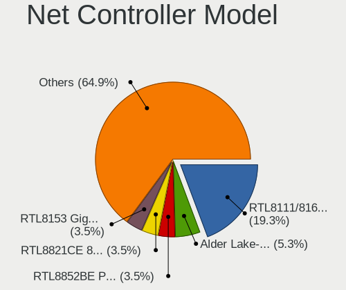

| Model                                                                  | Computers | Percent |
|------------------------------------------------------------------------|-----------|---------|
| Realtek RTL8111/8168/8211/8411 PCI Express Gigabit Ethernet Controller | 15        | 21.74%  |
| Realtek RTL8125 2.5GbE Controller                                      | 3         | 4.35%   |
| TP-Link TL-WN823N v2/v3 [Realtek RTL8192EU]                            | 2         | 2.9%    |
| Realtek RTL8852BE PCIe 802.11ax Wireless Network Controller            | 2         | 2.9%    |
| Realtek RTL8821CE 802.11ac PCIe Wireless Network Adapter               | 2         | 2.9%    |
| Realtek RTL-8100/8101L/8139 PCI Fast Ethernet Adapter                  | 2         | 2.9%    |
| Qualcomm Atheros QCA9565 / AR9565 Wireless Network Adapter             | 2         | 2.9%    |
| MediaTek MT7922 802.11ax PCI Express Wireless Network Adapter          | 2         | 2.9%    |
| Intel Wireless 7265                                                    | 2         | 2.9%    |
| Intel 82579LM Gigabit Network Connection (Lewisville)                  | 2         | 2.9%    |
| VIA VT6105/VT6106S [Rhine-III]                                         | 1         | 1.45%   |
| TP-Link RTL8812AU Archer T4U 802.11ac                                  | 1         | 1.45%   |
| Samsung Galaxy series, misc. (tethering mode)                          | 1         | 1.45%   |
| Realtek RTL8822CE 802.11ac PCIe Wireless Network Adapter               | 1         | 1.45%   |
| Realtek RTL8723BE PCIe Wireless Network Adapter                        | 1         | 1.45%   |
| Realtek RTL8192CU 802.11n WLAN Adapter                                 | 1         | 1.45%   |
| Realtek RTL8191SEvB Wireless LAN Controller                            | 1         | 1.45%   |
| Realtek RTL8188EUS 802.11n Wireless Network Adapter                    | 1         | 1.45%   |
| Realtek RTL8153 Gigabit Ethernet Adapter                               | 1         | 1.45%   |
| Realtek RTL810xE PCI Express Fast Ethernet controller                  | 1         | 1.45%   |
| Qualcomm Atheros QCA9377 802.11ac Wireless Network Adapter             | 1         | 1.45%   |
| Qualcomm Atheros AR9485 Wireless Network Adapter                       | 1         | 1.45%   |
| Qualcomm Atheros AR8131 Gigabit Ethernet                               | 1         | 1.45%   |
| QinHeng UsbMonitor                                                     | 1         | 1.45%   |
| NetGear WNA3100(v1) Wireless-N 300 [Broadcom BCM43231]                 | 1         | 1.45%   |
| MediaTek MT7921 802.11ax PCI Express Wireless Network Adapter          | 1         | 1.45%   |
| Marvell Group 88E8040 PCI-E Fast Ethernet Controller                   | 1         | 1.45%   |
| Intel Wireless 8260                                                    | 1         | 1.45%   |
| Intel Wireless 3165                                                    | 1         | 1.45%   |
| Intel Wi-Fi 6 AX201                                                    | 1         | 1.45%   |
| Intel Raptor Lake-S PCH CNVi WiFi                                      | 1         | 1.45%   |
| Intel PRO/Wireless 3945ABG [Golan] Network Connection                  | 1         | 1.45%   |
| Intel PRO/Wireless 2200BG [Calexico2] Network Connection               | 1         | 1.45%   |
| Intel I211 Gigabit Network Connection                                  | 1         | 1.45%   |
| Intel Ethernet Controller I226-V                                       | 1         | 1.45%   |
| Intel Ethernet Connection I219-LM                                      | 1         | 1.45%   |
| Intel Ethernet Connection I217-LM                                      | 1         | 1.45%   |
| Intel Ethernet Connection (2) I219-V                                   | 1         | 1.45%   |
| Intel Alder Lake-P PCH CNVi WiFi                                       | 1         | 1.45%   |
| Broadcom NetXtreme BCM57786 Gigabit Ethernet PCIe                      | 1         | 1.45%   |

Wireless Vendor
---------------

Wireless vendors

| Vendor                | Computers | Percent |
|-----------------------|-----------|---------|
| Intel                 | 9         | 29.03%  |
| Realtek Semiconductor | 8         | 25.81%  |
| Qualcomm Atheros      | 4         | 12.9%   |
| TP-Link               | 3         | 9.68%   |
| MediaTek              | 3         | 9.68%   |
| Broadcom Limited      | 2         | 6.45%   |
| NetGear               | 1         | 3.23%   |
| Broadcom              | 1         | 3.23%   |

Wireless Model
--------------

Wireless models

| Model                                                                | Computers | Percent |
|----------------------------------------------------------------------|-----------|---------|
| TP-Link TL-WN823N v2/v3 [Realtek RTL8192EU]                          | 2         | 6.25%   |
| Realtek RTL8852BE PCIe 802.11ax Wireless Network Controller          | 2         | 6.25%   |
| Realtek RTL8821CE 802.11ac PCIe Wireless Network Adapter             | 2         | 6.25%   |
| Qualcomm Atheros QCA9565 / AR9565 Wireless Network Adapter           | 2         | 6.25%   |
| MediaTek MT7922 802.11ax PCI Express Wireless Network Adapter        | 2         | 6.25%   |
| Intel Wireless 7265                                                  | 2         | 6.25%   |
| TP-Link RTL8812AU Archer T4U 802.11ac                                | 1         | 3.13%   |
| Realtek RTL8822CE 802.11ac PCIe Wireless Network Adapter             | 1         | 3.13%   |
| Realtek RTL8723BE PCIe Wireless Network Adapter                      | 1         | 3.13%   |
| Realtek RTL8192CU 802.11n WLAN Adapter                               | 1         | 3.13%   |
| Realtek RTL8191SEvB Wireless LAN Controller                          | 1         | 3.13%   |
| Realtek RTL8188EUS 802.11n Wireless Network Adapter                  | 1         | 3.13%   |
| Qualcomm Atheros QCA9377 802.11ac Wireless Network Adapter           | 1         | 3.13%   |
| Qualcomm Atheros AR9485 Wireless Network Adapter                     | 1         | 3.13%   |
| NetGear WNA3100(v1) Wireless-N 300 [Broadcom BCM43231]               | 1         | 3.13%   |
| MediaTek MT7921 802.11ax PCI Express Wireless Network Adapter        | 1         | 3.13%   |
| Intel Wireless 8260                                                  | 1         | 3.13%   |
| Intel Wireless 3165                                                  | 1         | 3.13%   |
| Intel Wi-Fi 6 AX201                                                  | 1         | 3.13%   |
| Intel Raptor Lake-S PCH CNVi WiFi                                    | 1         | 3.13%   |
| Intel PRO/Wireless 3945ABG [Golan] Network Connection                | 1         | 3.13%   |
| Intel PRO/Wireless 2200BG [Calexico2] Network Connection             | 1         | 3.13%   |
| Intel Alder Lake-P PCH CNVi WiFi                                     | 1         | 3.13%   |
| Broadcom Limited BCM4360 802.11ac Dual Band Wireless Network Adapter | 1         | 3.13%   |
| Broadcom Limited BCM43228 802.11a/b/g/n                              | 1         | 3.13%   |
| Broadcom BCM4313 802.11bgn Wireless Network Adapter                  | 1         | 3.13%   |

Ethernet Vendor
---------------

Ethernet vendors

| Vendor                   | Computers | Percent |
|--------------------------|-----------|---------|
| Realtek Semiconductor    | 21        | 60%     |
| Intel                    | 7         | 20%     |
| Broadcom                 | 2         | 5.71%   |
| VIA Technologies         | 1         | 2.86%   |
| Samsung Electronics      | 1         | 2.86%   |
| Qualcomm Atheros         | 1         | 2.86%   |
| Marvell Technology Group | 1         | 2.86%   |
| ADMtek                   | 1         | 2.86%   |

Ethernet Model
--------------

Ethernet models

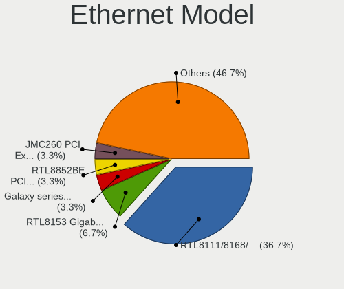

| Model                                                                  | Computers | Percent |
|------------------------------------------------------------------------|-----------|---------|
| Realtek RTL8111/8168/8211/8411 PCI Express Gigabit Ethernet Controller | 15        | 41.67%  |
| Realtek RTL8125 2.5GbE Controller                                      | 3         | 8.33%   |
| Realtek RTL-8100/8101L/8139 PCI Fast Ethernet Adapter                  | 2         | 5.56%   |
| Intel 82579LM Gigabit Network Connection (Lewisville)                  | 2         | 5.56%   |
| VIA VT6105/VT6106S [Rhine-III]                                         | 1         | 2.78%   |
| Samsung Galaxy series, misc. (tethering mode)                          | 1         | 2.78%   |
| Realtek RTL8153 Gigabit Ethernet Adapter                               | 1         | 2.78%   |
| Realtek RTL810xE PCI Express Fast Ethernet controller                  | 1         | 2.78%   |
| Qualcomm Atheros AR8131 Gigabit Ethernet                               | 1         | 2.78%   |
| Marvell Group 88E8040 PCI-E Fast Ethernet Controller                   | 1         | 2.78%   |
| Intel I211 Gigabit Network Connection                                  | 1         | 2.78%   |
| Intel Ethernet Controller I226-V                                       | 1         | 2.78%   |
| Intel Ethernet Connection I219-LM                                      | 1         | 2.78%   |
| Intel Ethernet Connection I217-LM                                      | 1         | 2.78%   |
| Intel Ethernet Connection (2) I219-V                                   | 1         | 2.78%   |
| Broadcom NetXtreme BCM57786 Gigabit Ethernet PCIe                      | 1         | 2.78%   |
| Broadcom NetLink BCM57785 Gigabit Ethernet PCIe                        | 1         | 2.78%   |
| ADMtek ADM8515 Pegasus II Ethernet                                     | 1         | 2.78%   |

Net Controller Kind
-------------------

Ethernet, WiFi or modem

| Kind     | Computers | Percent |
|----------|-----------|---------|
| Ethernet | 32        | 50.79%  |
| WiFi     | 30        | 47.62%  |
| Modem    | 1         | 1.59%   |

Used Controller
---------------

Currently used network controller

| Kind     | Computers | Percent |
|----------|-----------|---------|
| WiFi     | 20        | 54.05%  |
| Ethernet | 17        | 45.95%  |

NICs
----

Total network controllers on board

| Total | Computers | Percent |
|-------|-----------|---------|
| 2     | 20        | 55.56%  |
| 1     | 14        | 38.89%  |
| 3     | 2         | 5.56%   |

IPv6
----

IPv6 vs IPv4

| Used | Computers | Percent |
|------|-----------|---------|
| No   | 26        | 72.22%  |
| Yes  | 10        | 27.78%  |

Bluetooth
---------

Bluetooth Vendor
----------------

Controller vendors

| Vendor                          | Computers | Percent |
|---------------------------------|-----------|---------|
| Realtek Semiconductor           | 7         | 28%     |
| Intel                           | 7         | 28%     |
| IMC Networks                    | 2         | 8%      |
| Cambridge Silicon Radio         | 2         | 8%      |
| Broadcom                        | 2         | 8%      |
| Qualcomm Atheros Communications | 1         | 4%      |
| MediaTek                        | 1         | 4%      |
| Lite-On Technology              | 1         | 4%      |
| Foxconn / Hon Hai               | 1         | 4%      |
| Apple                           | 1         | 4%      |

Bluetooth Model
---------------

Controller models

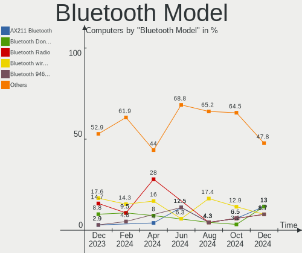

| Model                                               | Computers | Percent |
|-----------------------------------------------------|-----------|---------|
| Realtek Bluetooth Radio                             | 6         | 24%     |
| Intel Bluetooth wireless interface                  | 3         | 12%     |
| Intel AX201 Bluetooth                               | 2         | 8%      |
| Cambridge Silicon Radio Bluetooth Dongle (HCI mode) | 2         | 8%      |
| Realtek 802.11ac WLAN Adapter                       | 1         | 4%      |
| Qualcomm Atheros AR3012 Bluetooth                   | 1         | 4%      |
| MediaTek Wireless_Device                            | 1         | 4%      |
| Lite-On Atheros AR3012 Bluetooth                    | 1         | 4%      |
| Intel Bluetooth Device                              | 1         | 4%      |
| Intel AX211 Bluetooth                               | 1         | 4%      |
| IMC Networks Wireless_Device                        | 1         | 4%      |
| IMC Networks Bluetooth Device                       | 1         | 4%      |
| Foxconn / Hon Hai Wireless_Device                   | 1         | 4%      |
| Broadcom BCM20702A0                                 | 1         | 4%      |
| Broadcom BCM2070 Bluetooth Device                   | 1         | 4%      |
| Apple Bluetooth USB Host Controller                 | 1         | 4%      |

Sound
-----

Sound Vendor
------------

Sound card vendors

| Vendor                                       | Computers | Percent |
|----------------------------------------------|-----------|---------|
| Intel                                        | 28        | 60.87%  |
| AMD                                          | 7         | 15.22%  |
| Nvidia                                       | 3         | 6.52%   |
| Texas Instruments                            | 2         | 4.35%   |
| Zoran Co. Personal Media Division (Nogatech) | 1         | 2.17%   |
| Samson Technologies                          | 1         | 2.17%   |
| Micro Star International                     | 1         | 2.17%   |
| GN Netcom                                    | 1         | 2.17%   |
| Creative Technology                          | 1         | 2.17%   |
| C-Media Electronics                          | 1         | 2.17%   |

Sound Model
-----------

Sound card models

| Model                                                                             | Computers | Percent |
|-----------------------------------------------------------------------------------|-----------|---------|
| AMD Family 17h/19h HD Audio Controller                                            | 4         | 6.9%    |
| Intel Alder Lake-N PCH High Definition Audio Controller                           | 3         | 5.17%   |
| Intel 7 Series/C216 Chipset Family High Definition Audio Controller               | 3         | 5.17%   |
| Texas Instruments SMSL Q5 AMP                                                     | 2         | 3.45%   |
| Intel Xeon E3-1200 v3/4th Gen Core Processor HD Audio Controller                  | 2         | 3.45%   |
| Intel Wildcat Point-LP High Definition Audio Controller                           | 2         | 3.45%   |
| Intel Sunrise Point-LP HD Audio                                                   | 2         | 3.45%   |
| Intel NM10/ICH7 Family High Definition Audio Controller                           | 2         | 3.45%   |
| Intel Broadwell-U Audio Controller                                                | 2         | 3.45%   |
| Intel Alder Lake PCH-P High Definition Audio Controller                           | 2         | 3.45%   |
| Intel 8 Series/C220 Series Chipset High Definition Audio Controller               | 2         | 3.45%   |
| Intel 200 Series PCH HD Audio                                                     | 2         | 3.45%   |
| AMD Renoir Radeon High Definition Audio Controller                                | 2         | 3.45%   |
| AMD FCH Azalia Controller                                                         | 2         | 3.45%   |
| Zoran Co. Personal Media Division (Nogatech) USB Audio and HID                    | 1         | 1.72%   |
| Samson Technologies Meteor condenser microphone                                   | 1         | 1.72%   |
| Nvidia TU106 High Definition Audio Controller                                     | 1         | 1.72%   |
| Nvidia GP104 High Definition Audio Controller                                     | 1         | 1.72%   |
| Nvidia GM204 High Definition Audio Controller                                     | 1         | 1.72%   |
| Micro Star International USB Audio                                                | 1         | 1.72%   |
| Intel Tiger Lake-LP Smart Sound Technology Audio Controller                       | 1         | 1.72%   |
| Intel Raptor Lake High Definition Audio Controller                                | 1         | 1.72%   |
| Intel Haswell-ULT HD Audio Controller                                             | 1         | 1.72%   |
| Intel CM238 HD Audio Controller                                                   | 1         | 1.72%   |
| Intel Celeron/Pentium Silver Processor High Definition Audio                      | 1         | 1.72%   |
| Intel Cannon Point-LP High Definition Audio Controller                            | 1         | 1.72%   |
| Intel 82801JI (ICH10 Family) HD Audio Controller                                  | 1         | 1.72%   |
| Intel 82801FB/FBM/FR/FW/FRW (ICH6 Family) High Definition Audio Controller        | 1         | 1.72%   |
| Intel 8 Series HD Audio Controller                                                | 1         | 1.72%   |
| Intel 6 Series/C200 Series Chipset Family High Definition Audio Controller        | 1         | 1.72%   |
| Intel 5 Series/3400 Series Chipset High Definition Audio                          | 1         | 1.72%   |
| GN Netcom Jabra PRO 930                                                           | 1         | 1.72%   |
| Creative Technology Sound Blaster Play! 3                                         | 1         | 1.72%   |
| C-Media Electronics Audio Device                                                  | 1         | 1.72%   |
| AMD Starship/Matisse HD Audio Controller                                          | 1         | 1.72%   |
| AMD Rembrandt Radeon High Definition Audio Controller                             | 1         | 1.72%   |
| AMD Navi 21/23 HDMI/DP Audio Controller                                           | 1         | 1.72%   |
| AMD Kabini HDMI/DP Audio                                                          | 1         | 1.72%   |
| AMD Caicos HDMI Audio [Radeon HD 6450 / 7450/8450/8490 OEM / R5 230/235/235X OEM] | 1         | 1.72%   |
| AMD BeaverCreek HDMI Audio [Radeon HD 6500D and 6400G-6600G series]               | 1         | 1.72%   |

Memory
------

Memory Vendor
-------------

Memory module vendors

| Vendor              | Computers | Percent |
|---------------------|-----------|---------|
| Samsung Electronics | 8         | 25%     |
| Micron Technology   | 3         | 9.38%   |
| Kingston            | 3         | 9.38%   |
| Corsair             | 3         | 9.38%   |
| Unknown             | 2         | 6.25%   |
| SK hynix            | 2         | 6.25%   |
| G.Skill             | 2         | 6.25%   |
| A-DATA Technology   | 2         | 6.25%   |
| Unknown (ABCD)      | 1         | 3.13%   |
| Unknown (0x0E9D)    | 1         | 3.13%   |
| Unknown (0x0CC7)    | 1         | 3.13%   |
| Timetec             | 1         | 3.13%   |
| Patriot             | 1         | 3.13%   |
| Crucial             | 1         | 3.13%   |
| 48spaces            | 1         | 3.13%   |

Memory Model
------------

Memory module models

| Model                                                                     | Computers | Percent |
|---------------------------------------------------------------------------|-----------|---------|
| Kingston RAM 99U5469-045.A00LF 4GB SODIMM DDR3 1600MT/s                   | 2         | 5.13%   |
| Unknown RAM Module 2GB SODIMM SDRAM                                       | 1         | 2.56%   |
| Unknown RAM Module 2GB SODIMM DDR2                                        | 1         | 2.56%   |
| Unknown RAM Module 1GB SODIMM SDRAM                                       | 1         | 2.56%   |
| Unknown RAM Module 1GB SODIMM DDR2                                        | 1         | 2.56%   |
| Unknown (ABCD) RAM 123456789012345678 4GB DIMM DDR4 2400MT/s              | 1         | 2.56%   |
| Unknown (0x0E9D) RAM KINSOTIN16GB2666MHZ 16GB SODIMM DDR4 2667MT/s        | 1         | 2.56%   |
| Unknown (0x0CC7) RAM DDR4 NB 8G 3200 8GB SODIMM DDR4 3200MT/s             | 1         | 2.56%   |
| Timetec RAM S8G-1600 8GB SODIMM DDR3 1600MT/s                             | 1         | 2.56%   |
| SK hynix RAM Module 4GB SODIMM DDR4 2133MT/s                              | 1         | 2.56%   |
| SK hynix RAM HMT351U6CFR8C-PB 4GB DIMM DDR3 1800MT/s                      | 1         | 2.56%   |
| Samsung RAM Module 4GB SODIMM DDR4 2133MT/s                               | 1         | 2.56%   |
| Samsung RAM Module 1GB Row Of Chips LPDDR4 2667MT/s                       | 1         | 2.56%   |
| Samsung RAM M471B5673FH0-CF8 2GB SODIMM DDR3 1067MT/s                     | 1         | 2.56%   |
| Samsung RAM M471B5173DB0-YK0 4GB SODIMM DDR3 1600MT/s                     | 1         | 2.56%   |
| Samsung RAM M471B5173BH0-YK0 4GB SODIMM DDR3 1600MT/s                     | 1         | 2.56%   |
| Samsung RAM M471A2K43BB1-CRC 16GB SODIMM DDR4 2400MT/s                    | 1         | 2.56%   |
| Samsung RAM M471A2G44BM0-CWE 16GB SODIMM DDR4 3200MT/s                    | 1         | 2.56%   |
| Samsung RAM M471A1K43BB0-CPB 8GB SODIMM DDR4 2133MT/s                     | 1         | 2.56%   |
| Samsung RAM M471A1G44CB0-CWE 8GB SODIMM DDR4 3200MT/s                     | 1         | 2.56%   |
| Samsung RAM M471A1G44CB0-CWE 8GB Row Of Chips DDR4 3200MT/s               | 1         | 2.56%   |
| Patriot RAM PSD34G133381 4GB DIMM DDR3 1333MT/s                           | 1         | 2.56%   |
| Micron RAM Module 4GB SODIMM DDR3 1600MT/s                                | 1         | 2.56%   |
| Micron RAM Module 4GB Row Of Chips LPDDR5 6400MT/s                        | 1         | 2.56%   |
| Micron RAM 4ATF51264AZ-2G3B1 4GB DIMM DDR4 2800MT/s                       | 1         | 2.56%   |
| Kingston RAM 9905471-001.A01LF 2GB DIMM DDR3 1600MT/s                     | 1         | 2.56%   |
| Kingston RAM 9905469-055.A00LF 4GB SODIMM DDR3 1600MT/s                   | 1         | 2.56%   |
| G.Skill RAM F4-3200C22-16GRS 16GB SODIMM DDR4 3200MT/s                    | 1         | 2.56%   |
| G.Skill RAM F4-2666C18-16GRS 16GB SODIMM DDR4 2667MT/s                    | 1         | 2.56%   |
| Crucial RAM CT16G48C40S5.C8A1 16GB SODIMM DDR5 4800MT/s                   | 1         | 2.56%   |
| Corsair RAM CMZ8GX3M2A1600C9 4GB DIMM DDR3 1800MT/s                       | 1         | 2.56%   |
| Corsair RAM CMZ16GX3M4A1600C9 4GB DIMM DDR3 1600MT/s                      | 1         | 2.56%   |
| Corsair RAM CMT32GX5M2B6400C32 16GB DIMM DDR5 6400MT/s                    | 1         | 2.56%   |
| Corsair RAM CMK8GX4M1D3000C16 8GB DIMM DDR4 3200MT/s                      | 1         | 2.56%   |
| Corsair RAM CMK16GX4M2B3000C15 8GB DIMM DDR4 3600MT/s                     | 1         | 2.56%   |
| A-DATA RAM MIF4D2C087KZ1 4GB SODIMM DDR3 1600MT/s                         | 1         | 2.56%   |
| A-DATA RAM AM1U16BC4P2-B19B 4GB SODIMM DDR3 1600MT/s                      | 1         | 2.56%   |
| 48spaces RAM 012345678901234567890123456789012345 1GB SODIMM DDR2 667MT/s | 1         | 2.56%   |

Memory Kind
-----------

Memory module kinds

| Kind   | Computers | Percent |
|--------|-----------|---------|
| DDR4   | 11        | 37.93%  |
| DDR3   | 11        | 37.93%  |
| LPDDR4 | 2         | 6.9%    |
| DDR5   | 2         | 6.9%    |
| SDRAM  | 1         | 3.45%   |
| LPDDR5 | 1         | 3.45%   |
| DDR2   | 1         | 3.45%   |

Memory Form Factor
------------------

Physical design of the memory module

| Name         | Computers | Percent |
|--------------|-----------|---------|
| SODIMM       | 20        | 66.67%  |
| DIMM         | 7         | 23.33%  |
| Row Of Chips | 3         | 10%     |

Memory Size
-----------

Memory module size

| Size  | Computers | Percent |
|-------|-----------|---------|
| 4096  | 10        | 31.25%  |
| 16384 | 9         | 28.13%  |
| 8192  | 5         | 15.63%  |
| 2048  | 5         | 15.63%  |
| 1024  | 3         | 9.38%   |

Memory Speed
------------

Memory module speed

| Speed   | Computers | Percent |
|---------|-----------|---------|
| 1600    | 8         | 25%     |
| 3200    | 5         | 15.63%  |
| 2667    | 3         | 9.38%   |
| 6400    | 2         | 6.25%   |
| 2400    | 2         | 6.25%   |
| 2133    | 2         | 6.25%   |
| 1800    | 2         | 6.25%   |
| Unknown | 2         | 6.25%   |
| 4800    | 1         | 3.13%   |
| 3600    | 1         | 3.13%   |
| 2800    | 1         | 3.13%   |
| 1333    | 1         | 3.13%   |
| 1067    | 1         | 3.13%   |
| 667     | 1         | 3.13%   |

Printers & scanners
-------------------

Printer Vendor
--------------

Printer device vendors

| Vendor              | Computers | Percent |
|---------------------|-----------|---------|
| Hewlett-Packard     | 2         | 50%     |
| Seiko Epson         | 1         | 25%     |
| Prolific Technology | 1         | 25%     |

Printer Model
-------------

Printer device models

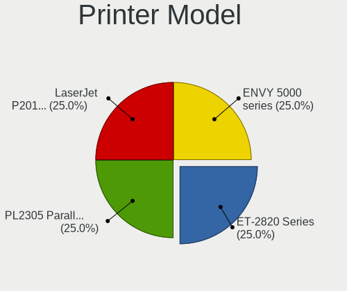

| Model                         | Computers | Percent |
|-------------------------------|-----------|---------|
| Seiko Epson ET-2820 Series    | 1         | 25%     |
| Prolific PL2305 Parallel Port | 1         | 25%     |
| HP LaserJet P2015 series      | 1         | 25%     |
| HP ENVY 5000 series           | 1         | 25%     |

Scanner Vendor
--------------

Scanner device vendors

Zero info for selected period =(

Scanner Model
-------------

Scanner device models

Zero info for selected period =(

Camera
------

Camera Vendor
-------------

Camera device vendors

| Vendor                                 | Computers | Percent |
|----------------------------------------|-----------|---------|
| Chicony Electronics                    | 3         | 23.08%  |
| Z-Star Microelectronics                | 1         | 7.69%   |
| Suyin                                  | 1         | 7.69%   |
| Sunplus Innovation Technology          | 1         | 7.69%   |
| Shine-optics                           | 1         | 7.69%   |
| Realtek Semiconductor                  | 1         | 7.69%   |
| Quanta                                 | 1         | 7.69%   |
| Microdia                               | 1         | 7.69%   |
| Lite-On Technology                     | 1         | 7.69%   |
| IMC Networks                           | 1         | 7.69%   |
| Cheng Uei Precision Industry (Foxlink) | 1         | 7.69%   |

Camera Model
------------

Camera device models

| Model                                               | Computers | Percent |
|-----------------------------------------------------|-----------|---------|
| Chicony Integrated Camera                           | 2         | 15.38%  |
| Z-Star Webcam                                       | 1         | 7.69%   |
| Suyin HD WebCam                                     | 1         | 7.69%   |
| Sunplus Laptop Integrated Webcam HD                 | 1         | 7.69%   |
| Shine-optics USB2.0 HD UVC WebCam                   | 1         | 7.69%   |
| Realtek USB2.0 HD UVC WebCam                        | 1         | 7.69%   |
| Quanta HD User Facing                               | 1         | 7.69%   |
| Microdia Sonix USB 2.0 Camera                       | 1         | 7.69%   |
| Lite-On HP HD Webcam                                | 1         | 7.69%   |
| IMC Networks USB2.0 VGA UVC WebCam                  | 1         | 7.69%   |
| Chicony HD WebCam                                   | 1         | 7.69%   |
| Cheng Uei Precision Industry (Foxlink) HP HD Webcam | 1         | 7.69%   |

Security
--------

Fingerprint Vendor
------------------

Fingerprint sensor vendors

| Vendor           | Computers | Percent |
|------------------|-----------|---------|
| Validity Sensors | 1         | 100%    |

Fingerprint Model
-----------------

Fingerprint sensor models

| Model                                      | Computers | Percent |
|--------------------------------------------|-----------|---------|
| Validity Sensors VFS495 Fingerprint Reader | 1         | 100%    |

Chipcard Vendor
---------------

Chipcard module vendors

| Vendor   | Computers | Percent |
|----------|-----------|---------|
| Broadcom | 1         | 100%    |

Chipcard Model
--------------

Chipcard module models

| Model                                                                        | Computers | Percent |
|------------------------------------------------------------------------------|-----------|---------|
| Broadcom BCM5880 Secure Applications Processor with fingerprint swipe sensor | 1         | 100%    |

Unsupported
-----------

Unsupported Devices
-------------------

Total unsupported devices on board

| Total | Computers | Percent |
|-------|-----------|---------|
| 0     | 24        | 66.67%  |
| 1     | 11        | 30.56%  |
| 2     | 1         | 2.78%   |

Unsupported Device Types
------------------------

Types of unsupported devices

| Type                  | Computers | Percent |
|-----------------------|-----------|---------|
| Net/wireless          | 4         | 33.33%  |
| Graphics card         | 4         | 33.33%  |
| Sound                 | 1         | 8.33%   |
| Multimedia controller | 1         | 8.33%   |
| Fingerprint reader    | 1         | 8.33%   |
| Chipcard              | 1         | 8.33%   |

