LMDE - Hardware Trends
----------------------

A project to identify most popular hardware characteristics and track their change
over time based on data collected by Linux users at https://Linux-Hardware.org.

Anyone can contribute to this report by the [hw-probe](https://github.com/linuxhw/hw-probe) tool:

    sudo -E hw-probe -all -upload

This is a report for all computer types. See also reports for [desktops](/Dist/LMDE/Desktop/README.md) and [notebooks](/Dist/LMDE/Notebook/README.md).

This report is for one last month. Overall report since the beginning of time: [TestDays](https://github.com/linuxhw/TestDays)

Period: Dec, 2023.

Contents
--------

* [ System ](#system)
  - [ OS                       ](#os)
  - [ OS Family                ](#os-family)
  - [ Kernel                   ](#kernel)
  - [ Kernel Family            ](#kernel-family)
  - [ Kernel Major Ver.        ](#kernel-major-ver)
  - [ Arch                     ](#arch)
  - [ DE                       ](#de)
  - [ Display Server           ](#display-server)
  - [ Display Manager          ](#display-manager)
  - [ OS Lang                  ](#os-lang)
  - [ Boot Mode                ](#boot-mode)
  - [ Filesystem               ](#filesystem)
  - [ Part. scheme             ](#part-scheme)
  - [ Dual Boot with Linux/BSD ](#dual-boot-with-linuxbsd)
  - [ Dual Boot (Win)          ](#dual-boot-win)

* [ Board ](#board)
  - [ Vendor                   ](#vendor)
  - [ Model                    ](#model)
  - [ Model Family             ](#model-family)
  - [ MFG Year                 ](#mfg-year)
  - [ Form Factor              ](#form-factor)
  - [ Secure Boot              ](#secure-boot)
  - [ Coreboot                 ](#coreboot)
  - [ RAM Size                 ](#ram-size)
  - [ RAM Used                 ](#ram-used)
  - [ Total Drives             ](#total-drives)
  - [ Has CD-ROM               ](#has-cd-rom)
  - [ Has Ethernet             ](#has-ethernet)
  - [ Has WiFi                 ](#has-wifi)
  - [ Has Bluetooth            ](#has-bluetooth)

* [ Location ](#location)
  - [ Country                  ](#country)
  - [ City                     ](#city)

* [ Drives ](#drives)
  - [ Drive Vendor             ](#drive-vendor)
  - [ Drive Model              ](#drive-model)
  - [ HDD Vendor               ](#hdd-vendor)
  - [ SSD Vendor               ](#ssd-vendor)
  - [ Drive Kind               ](#drive-kind)
  - [ Drive Connector          ](#drive-connector)
  - [ Drive Size               ](#drive-size)
  - [ Space Total              ](#space-total)
  - [ Space Used               ](#space-used)
  - [ Malfunc. Drives          ](#malfunc-drives)
  - [ Malfunc. Drive Vendor    ](#malfunc-drive-vendor)
  - [ Malfunc. HDD Vendor      ](#malfunc-hdd-vendor)
  - [ Malfunc. Drive Kind      ](#malfunc-drive-kind)
  - [ Failed Drives            ](#failed-drives)
  - [ Failed Drive Vendor      ](#failed-drive-vendor)
  - [ Drive Status             ](#drive-status)

* [ Storage controller ](#storage-controller)
  - [ Storage Vendor           ](#storage-vendor)
  - [ Storage Model            ](#storage-model)
  - [ Storage Kind             ](#storage-kind)

* [ Processor ](#processor)
  - [ CPU Vendor               ](#cpu-vendor)
  - [ CPU Model                ](#cpu-model)
  - [ CPU Model Family         ](#cpu-model-family)
  - [ CPU Cores                ](#cpu-cores)
  - [ CPU Sockets              ](#cpu-sockets)
  - [ CPU Threads              ](#cpu-threads)
  - [ CPU Op-Modes             ](#cpu-op-modes)
  - [ CPU Microcode            ](#cpu-microcode)
  - [ CPU Microarch            ](#cpu-microarch)

* [ Graphics ](#graphics)
  - [ GPU Vendor               ](#gpu-vendor)
  - [ GPU Model                ](#gpu-model)
  - [ GPU Combo                ](#gpu-combo)
  - [ GPU Driver               ](#gpu-driver)
  - [ GPU Memory               ](#gpu-memory)

* [ Monitor ](#monitor)
  - [ Monitor Vendor           ](#monitor-vendor)
  - [ Monitor Model            ](#monitor-model)
  - [ Monitor Resolution       ](#monitor-resolution)
  - [ Monitor Diagonal         ](#monitor-diagonal)
  - [ Monitor Width            ](#monitor-width)
  - [ Aspect Ratio             ](#aspect-ratio)
  - [ Monitor Area             ](#monitor-area)
  - [ Pixel Density            ](#pixel-density)
  - [ Multiple Monitors        ](#multiple-monitors)

* [ Network ](#network)
  - [ Net Controller Vendor    ](#net-controller-vendor)
  - [ Net Controller Model     ](#net-controller-model)
  - [ Wireless Vendor          ](#wireless-vendor)
  - [ Wireless Model           ](#wireless-model)
  - [ Ethernet Vendor          ](#ethernet-vendor)
  - [ Ethernet Model           ](#ethernet-model)
  - [ Net Controller Kind      ](#net-controller-kind)
  - [ Used Controller          ](#used-controller)
  - [ NICs                     ](#nics)
  - [ IPv6                     ](#ipv6)

* [ Bluetooth ](#bluetooth)
  - [ Bluetooth Vendor         ](#bluetooth-vendor)
  - [ Bluetooth Model          ](#bluetooth-model)

* [ Sound ](#sound)
  - [ Sound Vendor             ](#sound-vendor)
  - [ Sound Model              ](#sound-model)

* [ Memory ](#memory)
  - [ Memory Vendor            ](#memory-vendor)
  - [ Memory Model             ](#memory-model)
  - [ Memory Kind              ](#memory-kind)
  - [ Memory Form Factor       ](#memory-form-factor)
  - [ Memory Size              ](#memory-size)
  - [ Memory Speed             ](#memory-speed)

* [ Printers & scanners ](#printers--scanners)
  - [ Printer Vendor           ](#printer-vendor)
  - [ Printer Model            ](#printer-model)
  - [ Scanner Vendor           ](#scanner-vendor)
  - [ Scanner Model            ](#scanner-model)

* [ Camera ](#camera)
  - [ Camera Vendor            ](#camera-vendor)
  - [ Camera Model             ](#camera-model)

* [ Security ](#security)
  - [ Fingerprint Vendor       ](#fingerprint-vendor)
  - [ Fingerprint Model        ](#fingerprint-model)
  - [ Chipcard Vendor          ](#chipcard-vendor)
  - [ Chipcard Model           ](#chipcard-model)

* [ Unsupported ](#unsupported)
  - [ Unsupported Devices      ](#unsupported-devices)
  - [ Unsupported Device Types ](#unsupported-device-types)

System
------

OS
--

Installed operating systems

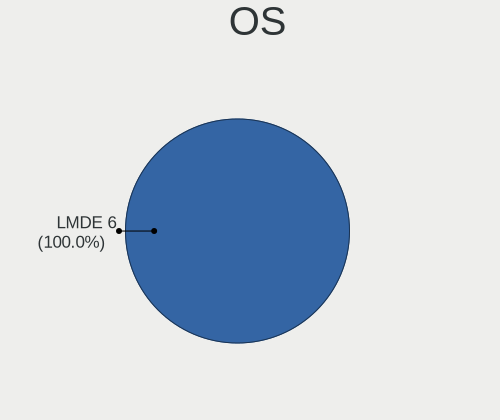

| Name   | Computers | Percent |
|--------|-----------|---------|
| LMDE 6 | 48        | 94.12%  |
| LMDE 5 | 3         | 5.88%   |

OS Family
---------

OS without a version

| Name | Computers | Percent |
|------|-----------|---------|
| LMDE | 51        | 100%    |

Kernel
------

Version of the Linux kernel

| Version                  | Computers | Percent |
|--------------------------|-----------|---------|
| 6.1.0-16-amd64           | 15        | 29.41%  |
| 6.1.0-13-amd64           | 10        | 19.61%  |
| 6.1.0-15-amd64           | 8         | 15.69%  |
| 6.1.0-12-amd64           | 8         | 15.69%  |
| 6.1.0-14-amd64           | 4         | 7.84%   |
| 6.5.0-0.deb12.4-amd64    | 2         | 3.92%   |
| 6.5.0-0.deb12.1-rt-amd64 | 1         | 1.96%   |
| 6.1.0-16-686             | 1         | 1.96%   |
| 6.1.0-12-686             | 1         | 1.96%   |
| 5.10.0-26-amd64          | 1         | 1.96%   |

Kernel Family
-------------

Linux kernel without a distro release

| Version | Computers | Percent |
|---------|-----------|---------|
| 6.1.0   | 47        | 92.16%  |
| 6.5.0   | 3         | 5.88%   |
| 5.10.0  | 1         | 1.96%   |

Kernel Major Ver.
-----------------

Linux kernel major version

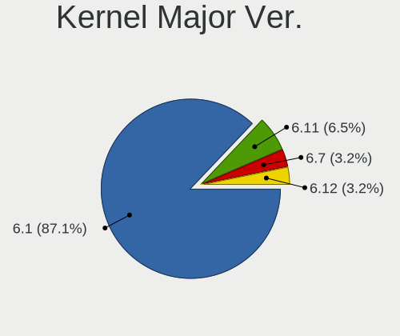

| Version | Computers | Percent |
|---------|-----------|---------|
| 6.1     | 47        | 92.16%  |
| 6.5     | 3         | 5.88%   |
| 5.10    | 1         | 1.96%   |

Arch
----

OS architecture (x86_64, i586, etc.)

| Name   | Computers | Percent |
|--------|-----------|---------|
| x86_64 | 49        | 96.08%  |
| i686   | 2         | 3.92%   |

DE
--

Desktop Environment

| Name       | Computers | Percent |
|------------|-----------|---------|
| X-Cinnamon | 45        | 88.24%  |
| Cinnamon   | 4         | 7.84%   |
| MATE       | 1         | 1.96%   |
| Unknown    | 1         | 1.96%   |

Display Server
--------------

X11 or Wayland

| Name    | Computers | Percent |
|---------|-----------|---------|
| X11     | 49        | 96.08%  |
| Wayland | 1         | 1.96%   |
| Tty     | 1         | 1.96%   |

Display Manager
---------------

SDDM, LightDM, etc.

| Name    | Computers | Percent |
|---------|-----------|---------|
| LightDM | 28        | 54.9%   |
| Unknown | 22        | 43.14%  |
| GDM3    | 1         | 1.96%   |

OS Lang
-------

Language

| Lang    | Computers | Percent |
|---------|-----------|---------|
| en_US   | 15        | 29.41%  |
| de_DE   | 11        | 21.57%  |
| it_IT   | 5         | 9.8%    |
| fr_FR   | 4         | 7.84%   |
| ru_RU   | 3         | 5.88%   |
| en_GB   | 3         | 5.88%   |
| hu_HU   | 2         | 3.92%   |
| pt_BR   | 1         | 1.96%   |
| pl_PL   | 1         | 1.96%   |
| nl_NL   | 1         | 1.96%   |
| nl_BE   | 1         | 1.96%   |
| hr_HR   | 1         | 1.96%   |
| es_ES   | 1         | 1.96%   |
| es_BO   | 1         | 1.96%   |
| Unknown | 1         | 1.96%   |

Boot Mode
---------

EFI or BIOS

| Mode | Computers | Percent |
|------|-----------|---------|
| EFI  | 35        | 68.63%  |
| BIOS | 16        | 31.37%  |

Filesystem
----------

Type of filesystem

| Type    | Computers | Percent |
|---------|-----------|---------|
| Ext4    | 43        | 84.31%  |
| Tmpfs   | 3         | 5.88%   |
| Btrfs   | 3         | 5.88%   |
| Overlay | 2         | 3.92%   |

Part. scheme
------------

Scheme of partitioning

| Type    | Computers | Percent |
|---------|-----------|---------|
| GPT     | 22        | 43.14%  |
| Unknown | 21        | 41.18%  |
| MBR     | 8         | 15.69%  |

Dual Boot with Linux/BSD
------------------------

Hosting more than one Linux/BSD

| Dual boot | Computers | Percent |
|-----------|-----------|---------|
| No        | 45        | 88.24%  |
| Yes       | 6         | 11.76%  |

Dual Boot (Win)
---------------

Hosting Linux and Windows

| Dual boot | Computers | Percent |
|-----------|-----------|---------|
| No        | 44        | 86.27%  |
| Yes       | 7         | 13.73%  |

Board
-----

Vendor
------

Motherboard manufacturer

| Name                | Computers | Percent |
|---------------------|-----------|---------|
| ASUSTek Computer    | 11        | 21.57%  |
| Lenovo              | 6         | 11.76%  |
| Hewlett-Packard     | 5         | 9.8%    |
| Dell                | 5         | 9.8%    |
| Gigabyte Technology | 4         | 7.84%   |
| Apple               | 4         | 7.84%   |
| MSI                 | 3         | 5.88%   |
| Acer                | 3         | 5.88%   |
| Sony                | 2         | 3.92%   |
| Medion              | 2         | 3.92%   |
| ASRock              | 2         | 3.92%   |
| Sapphire            | 1         | 1.96%   |
| Intel               | 1         | 1.96%   |
| HUAWEI              | 1         | 1.96%   |
| Unknown             | 1         | 1.96%   |

Model
-----

Motherboard model

| Name                                     | Computers | Percent |
|------------------------------------------|-----------|---------|
| Apple iMac5,1                            | 2         | 3.92%   |
| Sony VGN-FW21E                           | 1         | 1.96%   |
| Sony SVE1511A1EW                         | 1         | 1.96%   |
| Sapphire PI-AM3RS760G2                   | 1         | 1.96%   |
| MSI MS-7C56                              | 1         | 1.96%   |
| MSI MS-7C37                              | 1         | 1.96%   |
| MSI GF63 Thin 11UC                       | 1         | 1.96%   |
| Medion S23003                            | 1         | 1.96%   |
| Medion E6214                             | 1         | 1.96%   |
| Lenovo V50t-13IMB 11HD000DUM             | 1         | 1.96%   |
| Lenovo ThinkPad X230 2325BA3             | 1         | 1.96%   |
| Lenovo ThinkPad T14 Gen 3 21AHCTO1WW     | 1         | 1.96%   |
| Lenovo ThinkCentre M800z 10EUCTO1WW      | 1         | 1.96%   |
| Lenovo IdeaPad S540-14IML 81NF           | 1         | 1.96%   |
| Lenovo IdeaPad 130-15IKB 81H7            | 1         | 1.96%   |
| Intel B75                                | 1         | 1.96%   |
| HUAWEI BOM-WXX9                          | 1         | 1.96%   |
| HP ProBook 650 G2                        | 1         | 1.96%   |
| HP ProBook 450 G3                        | 1         | 1.96%   |
| HP ProBook 445 14 inch G9 Notebook PC    | 1         | 1.96%   |
| HP ENVY x360 Convertible 13-ay0xxx       | 1         | 1.96%   |
| HP dc5000 uT(DZ216AV)                    | 1         | 1.96%   |
| Gigabyte Q87M-D2H                        | 1         | 1.96%   |
| Gigabyte GA-MA78LMT-US2H                 | 1         | 1.96%   |
| Gigabyte A520M S2H                       | 1         | 1.96%   |
| Gigabyte 970A-DS3P                       | 1         | 1.96%   |
| Dell Precision WorkStation T7400         | 1         | 1.96%   |
| Dell Precision 3550                      | 1         | 1.96%   |
| Dell OptiPlex 7010                       | 1         | 1.96%   |
| Dell Latitude E6430                      | 1         | 1.96%   |
| Dell Latitude E6320                      | 1         | 1.96%   |
| ASUS X505BP                              | 1         | 1.96%   |
| ASUS VivoBook_ASUSLaptop X1605VA_X1605VA | 1         | 1.96%   |
| ASUS VivoBook_ASUSLaptop X1504VA_X1504VA | 1         | 1.96%   |
| ASUS ROG Strix G512LV_G512LV             | 1         | 1.96%   |
| ASUS Rampage III Extreme                 | 1         | 1.96%   |
| ASUS PRIME B350-PLUS                     | 1         | 1.96%   |
| ASUS PRIME A320M-K                       | 1         | 1.96%   |
| ASUS P5G41T-M LX3                        | 1         | 1.96%   |
| ASUS H110M-A/M.2                         | 1         | 1.96%   |

Model Family
------------

Motherboard model prefix

| Name                     | Computers | Percent |
|--------------------------|-----------|---------|
| HP ProBook               | 3         | 5.88%   |
| Lenovo ThinkPad          | 2         | 3.92%   |
| Lenovo IdeaPad           | 2         | 3.92%   |
| Dell Precision           | 2         | 3.92%   |
| Dell Latitude            | 2         | 3.92%   |
| ASUS VivoBook            | 2         | 3.92%   |
| ASUS PRIME               | 2         | 3.92%   |
| Apple iMac5              | 2         | 3.92%   |
| Acer Aspire              | 2         | 3.92%   |
| Sony VGN-FW21E           | 1         | 1.96%   |
| Sony SVE1511A1EW         | 1         | 1.96%   |
| Sapphire PI-AM3RS760G2   | 1         | 1.96%   |
| MSI MS-7C56              | 1         | 1.96%   |
| MSI MS-7C37              | 1         | 1.96%   |
| MSI GF63                 | 1         | 1.96%   |
| Medion S23003            | 1         | 1.96%   |
| Medion E6214             | 1         | 1.96%   |
| Lenovo V50t-13IMB        | 1         | 1.96%   |
| Lenovo ThinkCentre       | 1         | 1.96%   |
| Intel B75                | 1         | 1.96%   |
| HUAWEI BOM-WXX9          | 1         | 1.96%   |
| HP ENVY                  | 1         | 1.96%   |
| HP dc5000                | 1         | 1.96%   |
| Gigabyte Q87M-D2H        | 1         | 1.96%   |
| Gigabyte GA-MA78LMT-US2H | 1         | 1.96%   |
| Gigabyte A520M           | 1         | 1.96%   |
| Gigabyte 970A-DS3P       | 1         | 1.96%   |
| Dell OptiPlex            | 1         | 1.96%   |
| ASUS X505BP              | 1         | 1.96%   |
| ASUS ROG                 | 1         | 1.96%   |
| ASUS Rampage             | 1         | 1.96%   |
| ASUS P5G41T-M            | 1         | 1.96%   |
| ASUS H110M-A             | 1         | 1.96%   |
| ASUS ASUS                | 1         | 1.96%   |
| ASUS All                 | 1         | 1.96%   |
| ASRock Z97               | 1         | 1.96%   |
| ASRock H310M-STX         | 1         | 1.96%   |
| Apple Macmini7           | 1         | 1.96%   |
| Apple Macmini2           | 1         | 1.96%   |
| Acer Veriton             | 1         | 1.96%   |

MFG Year
--------

Motherboard manufacture year

| Year | Computers | Percent |
|------|-----------|---------|
| 2021 | 5         | 9.8%    |
| 2020 | 5         | 9.8%    |
| 2016 | 4         | 7.84%   |
| 2012 | 4         | 7.84%   |
| 2010 | 4         | 7.84%   |
| 2023 | 3         | 5.88%   |
| 2022 | 3         | 5.88%   |
| 2019 | 3         | 5.88%   |
| 2018 | 3         | 5.88%   |
| 2017 | 3         | 5.88%   |
| 2015 | 3         | 5.88%   |
| 2007 | 3         | 5.88%   |
| 2013 | 2         | 3.92%   |
| 2008 | 2         | 3.92%   |
| 2014 | 1         | 1.96%   |
| 2011 | 1         | 1.96%   |
| 2009 | 1         | 1.96%   |
| 2004 | 1         | 1.96%   |

Form Factor
-----------

Physical design of the computer

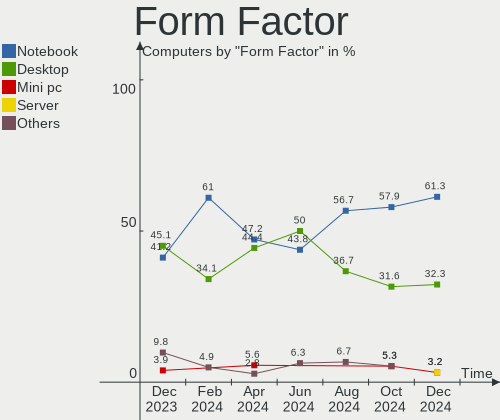

| Name        | Computers | Percent |
|-------------|-----------|---------|
| Desktop     | 23        | 45.1%   |
| Notebook    | 21        | 41.18%  |
| All in one  | 4         | 7.84%   |
| Mini pc     | 2         | 3.92%   |
| Convertible | 1         | 1.96%   |

Secure Boot
-----------

Enabled or disabled

| State    | Computers | Percent |
|----------|-----------|---------|
| Disabled | 45        | 88.24%  |
| Enabled  | 6         | 11.76%  |

Coreboot
--------

Have coreboot on board

| Used | Computers | Percent |
|------|-----------|---------|
| No   | 51        | 100%    |

RAM Size
--------

Total RAM memory

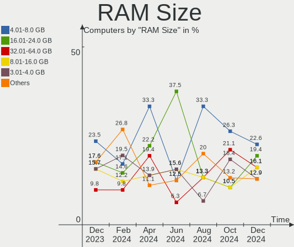

| Size in GB  | Computers | Percent |
|-------------|-----------|---------|
| 4.01-8.0    | 12        | 23.53%  |
| 16.01-24.0  | 9         | 17.65%  |
| 3.01-4.0    | 8         | 15.69%  |
| 8.01-16.0   | 8         | 15.69%  |
| 32.01-64.0  | 5         | 9.8%    |
| 24.01-32.0  | 4         | 7.84%   |
| 1.01-2.0    | 3         | 5.88%   |
| 64.01-256.0 | 2         | 3.92%   |

RAM Used
--------

Used RAM memory

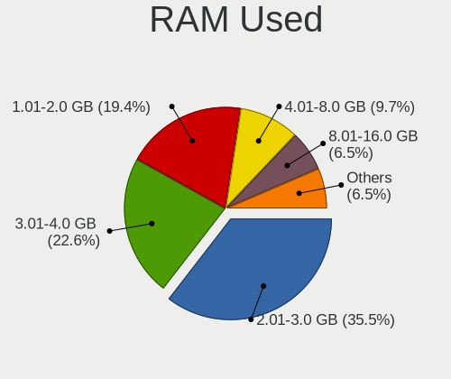

| Used GB   | Computers | Percent |
|-----------|-----------|---------|
| 2.01-3.0  | 23        | 45.1%   |
| 1.01-2.0  | 13        | 25.49%  |
| 3.01-4.0  | 6         | 11.76%  |
| 4.01-8.0  | 5         | 9.8%    |
| 8.01-16.0 | 2         | 3.92%   |
| 0.51-1.0  | 2         | 3.92%   |

Total Drives
------------

Number of drives on board

| Drives | Computers | Percent |
|--------|-----------|---------|
| 1      | 30        | 58.82%  |
| 2      | 12        | 23.53%  |
| 3      | 4         | 7.84%   |
| 4      | 2         | 3.92%   |
| 7      | 1         | 1.96%   |
| 5      | 1         | 1.96%   |
| 0      | 1         | 1.96%   |

Has CD-ROM
----------

Has CD-ROM on board

| Presented | Computers | Percent |
|-----------|-----------|---------|
| No        | 27        | 52.94%  |
| Yes       | 24        | 47.06%  |

Has Ethernet
------------

Has Ethernet on board

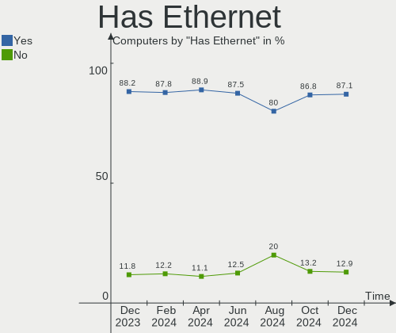

| Presented | Computers | Percent |
|-----------|-----------|---------|
| Yes       | 45        | 88.24%  |
| No        | 6         | 11.76%  |

Has WiFi
--------

Has WiFi module

| Presented | Computers | Percent |
|-----------|-----------|---------|
| Yes       | 38        | 74.51%  |
| No        | 13        | 25.49%  |

Has Bluetooth
-------------

Has Bluetooth module

| Presented | Computers | Percent |
|-----------|-----------|---------|
| Yes       | 34        | 66.67%  |
| No        | 17        | 33.33%  |

Location
--------

Country
-------

Geographic location (country)

| Country                | Computers | Percent |
|------------------------|-----------|---------|
| Germany                | 12        | 23.53%  |
| USA                    | 8         | 15.69%  |
| Italy                  | 8         | 15.69%  |
| France                 | 3         | 5.88%   |
| UK                     | 2         | 3.92%   |
| Russia                 | 2         | 3.92%   |
| Hungary                | 2         | 3.92%   |
| Belgium                | 2         | 3.92%   |
| Ukraine                | 1         | 1.96%   |
| Poland                 | 1         | 1.96%   |
| Netherlands            | 1         | 1.96%   |
| Morocco                | 1         | 1.96%   |
| Malta                  | 1         | 1.96%   |
| Kazakhstan             | 1         | 1.96%   |
| India                  | 1         | 1.96%   |
| Georgia                | 1         | 1.96%   |
| Cyprus                 | 1         | 1.96%   |
| Brazil                 | 1         | 1.96%   |
| Bosnia and Herzegovina | 1         | 1.96%   |
| Bolivia                | 1         | 1.96%   |

City
----

Geographic location (city)

| City                 | Computers | Percent |
|----------------------|-----------|---------|
| Delligsen            | 3         | 5.88%   |
| Milan                | 2         | 3.92%   |
| Florence             | 2         | 3.92%   |
| Birmingham           | 2         | 3.92%   |
| Verona               | 1         | 1.96%   |
| Valletta             | 1         | 1.96%   |
| Tsqaltubo            | 1         | 1.96%   |
| Thrissur             | 1         | 1.96%   |
| Sumy                 | 1         | 1.96%   |
| Semey                | 1         | 1.96%   |
| Seattle              | 1         | 1.96%   |
| Schindhard           | 1         | 1.96%   |
| Ratingen             | 1         | 1.96%   |
| Quimper              | 1         | 1.96%   |
| Prnjavor             | 1         | 1.96%   |
| Pomaz                | 1         | 1.96%   |
| Phoenix              | 1         | 1.96%   |
| Panama City          | 1         | 1.96%   |
| Oruro                | 1         | 1.96%   |
| Nicosia              | 1         | 1.96%   |
| Munich               | 1         | 1.96%   |
| Montebello Vicentino | 1         | 1.96%   |
| Marrakesh            | 1         | 1.96%   |
| Kaczki               | 1         | 1.96%   |
| Ilsede               | 1         | 1.96%   |
| Hanover              | 1         | 1.96%   |
| Grand Junction       | 1         | 1.96%   |
| Goganfa              | 1         | 1.96%   |
| Fitchburg            | 1         | 1.96%   |
| Fayetteville         | 1         | 1.96%   |
| Dolgoprudnyy         | 1         | 1.96%   |
| Darlington           | 1         | 1.96%   |
| Catania              | 1         | 1.96%   |
| Casalecchio di Reno  | 1         | 1.96%   |
| Brussels             | 1         | 1.96%   |
| Bremen               | 1         | 1.96%   |
| Billere              | 1         | 1.96%   |
| Berlin               | 1         | 1.96%   |
| Belém               | 1         | 1.96%   |
| Bad Langensalza      | 1         | 1.96%   |

Drives
------

Drive Vendor
------------

Hard drive vendors

| Vendor                      | Computers | Drives | Percent |
|-----------------------------|-----------|--------|---------|
| WDC                         | 13        | 13     | 16.46%  |
| Samsung Electronics         | 13        | 13     | 16.46%  |
| Seagate                     | 7         | 9      | 8.86%   |
| Kingston                    | 6         | 6      | 7.59%   |
| Crucial                     | 6         | 6      | 7.59%   |
| Unknown                     | 4         | 6      | 5.06%   |
| Toshiba                     | 4         | 4      | 5.06%   |
| SanDisk                     | 3         | 3      | 3.8%    |
| Hitachi                     | 3         | 3      | 3.8%    |
| Intenso                     | 2         | 2      | 2.53%   |
| Team                        | 1         | 1      | 1.27%   |
| SPCC                        | 1         | 1      | 1.27%   |
| SK hynix                    | 1         | 1      | 1.27%   |
| Silicon Motion              | 1         | 1      | 1.27%   |
| PNY                         | 1         | 1      | 1.27%   |
| Phison Electronics          | 1         | 1      | 1.27%   |
| Phison                      | 1         | 1      | 1.27%   |
| Micron Technology           | 1         | 1      | 1.27%   |
| Maxtor                      | 1         | 1      | 1.27%   |
| KIOXIA-EXCERIA              | 1         | 1      | 1.27%   |
| KIOXIA                      | 1         | 1      | 1.27%   |
| Kingston Technology Company | 1         | 1      | 1.27%   |
| GOODRAM                     | 1         | 1      | 1.27%   |
| DC-624e                     | 1         | 1      | 1.27%   |
| ASMT109x                    | 1         | 1      | 1.27%   |
| APPLE HD                    | 1         | 1      | 1.27%   |
| ADATA Technology            | 1         | 1      | 1.27%   |
| Unknown                     | 1         | 1      | 1.27%   |

Drive Model
-----------

Hard drive models

| Model                                | Computers | Percent |
|--------------------------------------|-----------|---------|
| Samsung SSD 870 EVO 500GB            | 2         | 2.47%   |
| Kingston SA400S37480G 480GB SSD      | 2         | 2.47%   |
| Crucial CT500MX500SSD1 500GB         | 2         | 2.47%   |
| WDC WDS500G2B0B-00YS70 500GB SSD     | 1         | 1.23%   |
| WDC WDS100T2B0A-00SM50 1TB SSD       | 1         | 1.23%   |
| WDC WD7500BPKX-22HPJT0 752GB         | 1         | 1.23%   |
| WDC WD5000AZRX-00A8LB0 500GB         | 1         | 1.23%   |
| WDC WD20EARX-00PASB0 2TB             | 1         | 1.23%   |
| WDC WD2003FZEX-00SRLA0 2TB           | 1         | 1.23%   |
| WDC WD15EARS-00MVWB0 1TB             | 1         | 1.23%   |
| WDC WD120EFBX-68B0EN0 12TB           | 1         | 1.23%   |
| WDC WD10SPZX-24Z10 1TB               | 1         | 1.23%   |
| WDC WD10EURS-630AB1 1TB              | 1         | 1.23%   |
| WDC WD10EAVS-00D7B1 1TB              | 1         | 1.23%   |
| WDC WD1003FBYZ-010FB0 1TB            | 1         | 1.23%   |
| WDC PC SN530 SDBPNPZ-512G-1002 512GB | 1         | 1.23%   |
| Unknown SD/MMC/MS PRO 512GB          | 1         | 1.23%   |
| Unknown SD/MMC 2GB                   | 1         | 1.23%   |
| Unknown MMC Card  64GB               | 1         | 1.23%   |
| Unknown MMC Card  128GB              | 1         | 1.23%   |
| Unknown M.S./M.S.Pro/HG 16GB         | 1         | 1.23%   |
| Toshiba KXG50ZNV256G 256GB           | 1         | 1.23%   |
| Toshiba HDWL110 1TB                  | 1         | 1.23%   |
| Toshiba HDWD120 2TB                  | 1         | 1.23%   |
| Toshiba DT01ACA1 1TB                 | 1         | 1.23%   |
| Team T253512GB SSD                   | 1         | 1.23%   |
| SPCC Solid State Disk 256GB          | 1         | 1.23%   |
| SK hynix BC511 512GB                 | 1         | 1.23%   |
| Silicon Motion PCIe-4 SSD 512GB      | 1         | 1.23%   |
| Seagate ST9500325AS 500GB            | 1         | 1.23%   |
| Seagate ST8000DM004-2U9188 8TB       | 1         | 1.23%   |
| Seagate ST3160812AS Q 160GB          | 1         | 1.23%   |
| Seagate ST31000524AS 1TB             | 1         | 1.23%   |
| Seagate ST2000LM015-2E8174 2TB       | 1         | 1.23%   |
| Seagate ST1000LM035-1RK172 1TB       | 1         | 1.23%   |
| Seagate ST1000DM003-9YN162 1TB       | 1         | 1.23%   |
| Seagate Desktop 8TB                  | 1         | 1.23%   |
| SanDisk SSD PLUS 240 GB              | 1         | 1.23%   |
| SanDisk SDSSDP064G 64GB              | 1         | 1.23%   |
| SanDisk NVMe SSD Drive 2TB           | 1         | 1.23%   |

HDD Vendor
----------

Hard disk drive vendors

| Vendor              | Computers | Drives | Percent |
|---------------------|-----------|--------|---------|
| WDC                 | 10        | 10     | 37.04%  |
| Seagate             | 7         | 9      | 25.93%  |
| Toshiba             | 3         | 3      | 11.11%  |
| Hitachi             | 3         | 3      | 11.11%  |
| Unknown             | 1         | 1      | 3.7%    |
| Samsung Electronics | 1         | 1      | 3.7%    |
| Maxtor              | 1         | 1      | 3.7%    |
| DC-624e             | 1         | 1      | 3.7%    |

SSD Vendor
----------

Solid state drive vendors

| Vendor              | Computers | Drives | Percent |
|---------------------|-----------|--------|---------|
| Samsung Electronics | 6         | 6      | 21.43%  |
| Kingston            | 6         | 6      | 21.43%  |
| Crucial             | 5         | 5      | 17.86%  |
| WDC                 | 2         | 2      | 7.14%   |
| SanDisk             | 2         | 2      | 7.14%   |
| Intenso             | 2         | 2      | 7.14%   |
| Team                | 1         | 1      | 3.57%   |
| SPCC                | 1         | 1      | 3.57%   |
| PNY                 | 1         | 1      | 3.57%   |
| Phison              | 1         | 1      | 3.57%   |
| ASMT109x            | 1         | 1      | 3.57%   |

Drive Kind
----------

HDD or SSD

| Kind    | Computers | Drives | Percent |
|---------|-----------|--------|---------|
| SSD     | 27        | 28     | 37.5%   |
| HDD     | 21        | 29     | 29.17%  |
| NVMe    | 19        | 19     | 26.39%  |
| MMC     | 3         | 3      | 4.17%   |
| Unknown | 2         | 4      | 2.78%   |

Drive Connector
---------------

SATA, SAS, NVMe, etc.

| Type | Computers | Drives | Percent |
|------|-----------|--------|---------|
| SATA | 39        | 54     | 59.09%  |
| NVMe | 19        | 19     | 28.79%  |
| SAS  | 5         | 7      | 7.58%   |
| MMC  | 3         | 3      | 4.55%   |

Drive Size
----------

Size of hard drive

| Size in TB | Computers | Drives | Percent |
|------------|-----------|--------|---------|
| 0.01-0.5   | 24        | 25     | 48%     |
| 0.51-1.0   | 18        | 21     | 36%     |
| 1.01-2.0   | 5         | 7      | 10%     |
| 4.01-10.0  | 2         | 3      | 4%      |
| 10.01-20.0 | 1         | 1      | 2%      |

Space Total
-----------

Amount of disk space available on the file system

| Size in GB     | Computers | Percent |
|----------------|-----------|---------|
| 251-500        | 13        | 25.49%  |
| 501-1000       | 11        | 21.57%  |
| 101-250        | 9         | 17.65%  |
| 51-100         | 5         | 9.8%    |
| More than 3000 | 4         | 7.84%   |
| 1-20           | 3         | 5.88%   |
| 21-50          | 2         | 3.92%   |
| 1001-2000      | 2         | 3.92%   |
| 2001-3000      | 1         | 1.96%   |
| Unknown        | 1         | 1.96%   |

Space Used
----------

Amount of used disk space

| Used GB        | Computers | Percent |
|----------------|-----------|---------|
| 1-20           | 18        | 35.29%  |
| 21-50          | 10        | 19.61%  |
| 51-100         | 7         | 13.73%  |
| 101-250        | 6         | 11.76%  |
| 501-1000       | 3         | 5.88%   |
| More than 3000 | 2         | 3.92%   |
| 251-500        | 2         | 3.92%   |
| 2001-3000      | 1         | 1.96%   |
| 1001-2000      | 1         | 1.96%   |
| Unknown        | 1         | 1.96%   |

Malfunc. Drives
---------------

Drive models with a malfunction

| Model                           | Computers | Drives | Percent |
|---------------------------------|-----------|--------|---------|
| WDC WD10SPZX-24Z10 1TB          | 1         | 1      | 14.29%  |
| Seagate ST9500325AS 500GB       | 1         | 1      | 14.29%  |
| Seagate ST31000524AS 1TB        | 1         | 1      | 14.29%  |
| Seagate ST1000DM003-9YN162 1TB  | 1         | 1      | 14.29%  |
| Samsung Electronics HD103UJ 1TB | 1         | 1      | 14.29%  |
| Maxtor 6E040L0 40GB             | 1         | 1      | 14.29%  |
| Hitachi HDP725050GLA360 500GB   | 1         | 1      | 14.29%  |

Malfunc. Drive Vendor
---------------------

Vendors of faulty drives

| Vendor              | Computers | Drives | Percent |
|---------------------|-----------|--------|---------|
| Seagate             | 3         | 3      | 42.86%  |
| WDC                 | 1         | 1      | 14.29%  |
| Samsung Electronics | 1         | 1      | 14.29%  |
| Maxtor              | 1         | 1      | 14.29%  |
| Hitachi             | 1         | 1      | 14.29%  |

Malfunc. HDD Vendor
-------------------

Vendors of faulty HDD drives

| Vendor              | Computers | Drives | Percent |
|---------------------|-----------|--------|---------|
| Seagate             | 3         | 3      | 42.86%  |
| WDC                 | 1         | 1      | 14.29%  |
| Samsung Electronics | 1         | 1      | 14.29%  |
| Maxtor              | 1         | 1      | 14.29%  |
| Hitachi             | 1         | 1      | 14.29%  |

Malfunc. Drive Kind
-------------------

Kinds of faulty drives

| Kind | Computers | Drives | Percent |
|------|-----------|--------|---------|
| HDD  | 6         | 7      | 100%    |

Failed Drives
-------------

Failed drive models

Zero info for selected period =(

Failed Drive Vendor
-------------------

Failed drive vendors

Zero info for selected period =(

Drive Status
------------

Number of failed and malfunc. drives

| Status   | Computers | Drives | Percent |
|----------|-----------|--------|---------|
| Works    | 26        | 33     | 45.61%  |
| Detected | 25        | 43     | 43.86%  |
| Malfunc  | 6         | 7      | 10.53%  |

Storage controller
------------------

Storage Vendor
--------------

Storage controller vendors

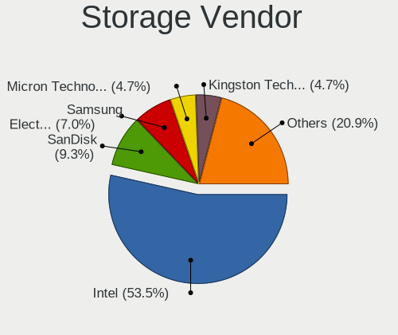

| Vendor                        | Computers | Percent |
|-------------------------------|-----------|---------|
| Intel                         | 35        | 51.47%  |
| AMD                           | 9         | 13.24%  |
| Samsung Electronics           | 6         | 8.82%   |
| SanDisk                       | 2         | 2.94%   |
| Phison Electronics            | 2         | 2.94%   |
| Marvell Technology Group      | 2         | 2.94%   |
| KIOXIA                        | 2         | 2.94%   |
| Toshiba America Info Systems  | 1         | 1.47%   |
| SK hynix                      | 1         | 1.47%   |
| Silicon Motion                | 1         | 1.47%   |
| Micron/Crucial Technology     | 1         | 1.47%   |
| Micron Technology             | 1         | 1.47%   |
| Kingston Technology Company   | 1         | 1.47%   |
| JMicron Technology            | 1         | 1.47%   |
| Integrated Technology Express | 1         | 1.47%   |
| ASMedia Technology            | 1         | 1.47%   |
| ADATA Technology              | 1         | 1.47%   |

Storage Model
-------------

Storage controller models

| Model                                                                          | Computers | Percent |
|--------------------------------------------------------------------------------|-----------|---------|
| Intel Sunrise Point-LP SATA Controller [AHCI mode]                             | 4         | 5.13%   |
| Intel 82801G (ICH7 Family) IDE Controller                                      | 4         | 5.13%   |
| AMD FCH SATA Controller [AHCI mode]                                            | 4         | 5.13%   |
| Intel 8 Series/C220 Series Chipset Family 6-port SATA Controller 1 [AHCI mode] | 3         | 3.85%   |
| AMD SB7x0/SB8x0/SB9x0 SATA Controller [AHCI mode]                              | 3         | 3.85%   |
| Samsung NVMe SSD Controller SM981/PM981/PM983                                  | 2         | 2.56%   |
| Samsung NVMe SSD Controller PM9B1 (DRAM-less)                                  | 2         | 2.56%   |
| Samsung NVMe SSD Controller 980 (DRAM-less)                                    | 2         | 2.56%   |
| Intel Volume Management Device NVMe RAID Controller Intel Corporation          | 2         | 2.56%   |
| Intel Q170/Q150/B150/H170/H110/Z170/CM236 Chipset SATA Controller [AHCI Mode]  | 2         | 2.56%   |
| Intel 82801GBM/GHM (ICH7-M Family) SATA Controller [IDE mode]                  | 2         | 2.56%   |
| Intel 82801 Mobile SATA Controller [RAID mode]                                 | 2         | 2.56%   |
| Intel 7 Series/C210 Series Chipset Family 6-port SATA Controller [AHCI mode]   | 2         | 2.56%   |
| Intel 7 Series Chipset Family 6-port SATA Controller [AHCI mode]               | 2         | 2.56%   |
| AMD SB7x0/SB8x0/SB9x0 IDE Controller                                           | 2         | 2.56%   |
| AMD 500 Series Chipset SATA Controller                                         | 2         | 2.56%   |
| Toshiba America Info Systems XG5 NVMe SSD Controller                           | 1         | 1.28%   |
| SK hynix BC511 NVMe SSD                                                        | 1         | 1.28%   |
| Silicon Motion Non-Volatile memory controller                                  | 1         | 1.28%   |
| SanDisk WD Blue SN570 NVMe SSD 2TB                                             | 1         | 1.28%   |
| SanDisk Ultra 3D / WD Blue SN550 NVMe SSD                                      | 1         | 1.28%   |
| Phison PS5013-E13 PCIe3 NVMe Controller (DRAM-less)                            | 1         | 1.28%   |
| Phison E12 NVMe Controller                                                     | 1         | 1.28%   |
| Micron/Crucial P1 NVMe PCIe SSD[Frampton]                                      | 1         | 1.28%   |
| Micron 2400 NVMe SSD (DRAM-less)                                               | 1         | 1.28%   |
| Marvell Group Marvell RAID bus controller                                      | 1         | 1.28%   |
| Marvell Group 88SE9123 PCIe SATA 6.0 Gb/s controller                           | 1         | 1.28%   |
| KIOXIA NVMe SSD Controller BG4 (DRAM-less)                                     | 1         | 1.28%   |
| KIOXIA NVMe SSD                                                                | 1         | 1.28%   |
| Kingston Company OM3PDP3 NVMe SSD                                              | 1         | 1.28%   |
| JMicron JMB363 SATA/IDE Controller                                             | 1         | 1.28%   |
| Intel Tiger Lake SATA AHCI Controller                                          | 1         | 1.28%   |
| Intel SATA controller                                                          | 1         | 1.28%   |
| Intel NM10/ICH7 Family SATA Controller [IDE mode]                              | 1         | 1.28%   |
| Intel Comet Lake RAID Controller                                               | 1         | 1.28%   |
| Intel Celeron/Pentium Silver Processor SATA Controller                         | 1         | 1.28%   |
| Intel Cannon Lake PCH SATA AHCI Controller                                     | 1         | 1.28%   |
| Intel C610/X99 series chipset 6-Port SATA Controller [AHCI mode]               | 1         | 1.28%   |
| Intel 9 Series Chipset Family SATA Controller [AHCI Mode]                      | 1         | 1.28%   |
| Intel 82801JI (ICH10 Family) 4 port SATA IDE Controller #1                     | 1         | 1.28%   |

Storage Kind
------------

Kind of storage controller (IDE, SATA, NVMe, SAS, ...)

| Kind | Computers | Percent |
|------|-----------|---------|
| SATA | 35        | 50%     |
| NVMe | 19        | 27.14%  |
| IDE  | 9         | 12.86%  |
| RAID | 7         | 10%     |

Processor
---------

CPU Vendor
----------

Processor vendors

| Vendor | Computers | Percent |
|--------|-----------|---------|
| Intel  | 39        | 76.47%  |
| AMD    | 12        | 23.53%  |

CPU Model
---------

Processor models

| Model                                       | Computers | Percent |
|---------------------------------------------|-----------|---------|
| Intel Core i5-6200U CPU @ 2.30GHz           | 2         | 3.92%   |
| Intel Core 2 CPU T7200 @ 2.00GHz            | 2         | 3.92%   |
| Intel Xeon CPU X5482 @ 3.20GHz              | 1         | 1.96%   |
| Intel Pentium Dual-Core CPU E6600 @ 3.06GHz | 1         | 1.96%   |
| Intel Pentium CPU B970 @ 2.30GHz            | 1         | 1.96%   |
| Intel Pentium 4 CPU 2.80GHz                 | 1         | 1.96%   |
| Intel N100                                  | 1         | 1.96%   |
| Intel Core i9-9900K CPU @ 3.60GHz           | 1         | 1.96%   |
| Intel Core i7-5820K CPU @ 3.30GHz           | 1         | 1.96%   |
| Intel Core i7-4790K CPU @ 4.00GHz           | 1         | 1.96%   |
| Intel Core i7-4790 CPU @ 3.60GHz            | 1         | 1.96%   |
| Intel Core i7-3770 CPU @ 3.40GHz            | 1         | 1.96%   |
| Intel Core i7-2620M CPU @ 2.70GHz           | 1         | 1.96%   |
| Intel Core i7-10870H CPU @ 2.20GHz          | 1         | 1.96%   |
| Intel Core i7-10510U CPU @ 1.80GHz          | 1         | 1.96%   |
| Intel Core i7 CPU 950 @ 3.07GHz             | 1         | 1.96%   |
| Intel Core i5-7500 CPU @ 3.40GHz            | 1         | 1.96%   |
| Intel Core i5-7200U CPU @ 2.50GHz           | 1         | 1.96%   |
| Intel Core i5-4590S CPU @ 3.00GHz           | 1         | 1.96%   |
| Intel Core i5-4260U CPU @ 1.40GHz           | 1         | 1.96%   |
| Intel Core i5-3470 CPU @ 3.20GHz            | 1         | 1.96%   |
| Intel Core i5-3320M CPU @ 2.60GHz           | 1         | 1.96%   |
| Intel Core i5-2430M CPU @ 2.40GHz           | 1         | 1.96%   |
| Intel Core i5-10400 CPU @ 2.90GHz           | 1         | 1.96%   |
| Intel Core i5-10310U CPU @ 1.70GHz          | 1         | 1.96%   |
| Intel Core i3-6100 CPU @ 3.70GHz            | 1         | 1.96%   |
| Intel Core i3-6006U CPU @ 2.00GHz           | 1         | 1.96%   |
| Intel Core i3-4130T CPU @ 2.90GHz           | 1         | 1.96%   |
| Intel Core i3 CPU M 330 @ 2.13GHz           | 1         | 1.96%   |
| Intel Core 2 Duo CPU P8400 @ 2.26GHz        | 1         | 1.96%   |
| Intel Core 2 CPU T5600 @ 1.83GHz            | 1         | 1.96%   |
| Intel Celeron N4500 @ 1.10GHz               | 1         | 1.96%   |
| Intel Celeron J4125 CPU @ 2.00GHz           | 1         | 1.96%   |
| Intel 13th Gen Core i9-13900H               | 1         | 1.96%   |
| Intel 13th Gen Core i5-1335U                | 1         | 1.96%   |
| Intel 12th Gen Core i5-1245U                | 1         | 1.96%   |
| Intel 11th Gen Core i5-11400H @ 2.70GHz     | 1         | 1.96%   |
| AMD Ryzen 7 5700G with Radeon Graphics      | 1         | 1.96%   |
| AMD Ryzen 7 3700X 8-Core Processor          | 1         | 1.96%   |
| AMD Ryzen 5 5625U with Radeon Graphics      | 1         | 1.96%   |

CPU Model Family
----------------

Processor model prefix

| Model                   | Computers | Percent |
|-------------------------|-----------|---------|
| Intel Core i5           | 11        | 21.57%  |
| Intel Core i7           | 8         | 15.69%  |
| Other                   | 6         | 11.76%  |
| AMD Ryzen 5             | 5         | 9.8%    |
| Intel Core i3           | 4         | 7.84%   |
| Intel Core 2            | 3         | 5.88%   |
| Intel Celeron           | 2         | 3.92%   |
| AMD Ryzen 7             | 2         | 3.92%   |
| AMD Athlon II X2        | 2         | 3.92%   |
| Intel Xeon              | 1         | 1.96%   |
| Intel Pentium Dual-Core | 1         | 1.96%   |
| Intel Pentium 4         | 1         | 1.96%   |
| Intel Pentium           | 1         | 1.96%   |
| Intel Core i9           | 1         | 1.96%   |
| Intel Core 2 Duo        | 1         | 1.96%   |
| AMD FX                  | 1         | 1.96%   |
| AMD Athlon              | 1         | 1.96%   |

CPU Cores
---------

Number of processor cores

| Number | Computers | Percent |
|--------|-----------|---------|
| 2      | 22        | 43.14%  |
| 4      | 12        | 23.53%  |
| 6      | 8         | 15.69%  |
| 8      | 5         | 9.8%    |
| 10     | 2         | 3.92%   |
| 14     | 1         | 1.96%   |
| 1      | 1         | 1.96%   |

CPU Sockets
-----------

Number of sockets

| Number | Computers | Percent |
|--------|-----------|---------|
| 1      | 50        | 98.04%  |
| 2      | 1         | 1.96%   |

CPU Threads
-----------

Threads per core (Hyper-Threading)

| Number | Computers | Percent |
|--------|-----------|---------|
| 2      | 34        | 66.67%  |
| 1      | 17        | 33.33%  |

CPU Op-Modes
------------

CPU Operation Modes (32-bit, 64-bit)

| Op mode        | Computers | Percent |
|----------------|-----------|---------|
| 32-bit, 64-bit | 50        | 98.04%  |
| 32-bit         | 1         | 1.96%   |

CPU Microcode
-------------

Microcode number

| Number     | Computers | Percent |
|------------|-----------|---------|
| 0x306c3    | 4         | 7.84%   |
| 0x406e3    | 3         | 5.88%   |
| 0x306a9    | 3         | 5.88%   |
| 0x206a7    | 3         | 5.88%   |
| Unknown    | 3         | 5.88%   |
| 0x6f6      | 2         | 3.92%   |
| 0x10676    | 2         | 3.92%   |
| 0x0a50000d | 2         | 3.92%   |
| 0x010000c8 | 2         | 3.92%   |
| 0xf41      | 1         | 1.96%   |
| 0xb06e0    | 1         | 1.96%   |
| 0xb06a3    | 1         | 1.96%   |
| 0xa0653    | 1         | 1.96%   |
| 0xa0652    | 1         | 1.96%   |
| 0x906ed    | 1         | 1.96%   |
| 0x906e9    | 1         | 1.96%   |
| 0x906c0    | 1         | 1.96%   |
| 0x906a4    | 1         | 1.96%   |
| 0x806ec    | 1         | 1.96%   |
| 0x806e9    | 1         | 1.96%   |
| 0x806d1    | 1         | 1.96%   |
| 0x706a8    | 1         | 1.96%   |
| 0x6f2      | 1         | 1.96%   |
| 0x506e3    | 1         | 1.96%   |
| 0x40651    | 1         | 1.96%   |
| 0x20652    | 1         | 1.96%   |
| 0x106a5    | 1         | 1.96%   |
| 0x1067a    | 1         | 1.96%   |
| 0x0a50000f | 1         | 1.96%   |
| 0x08701021 | 1         | 1.96%   |
| 0x08608103 | 1         | 1.96%   |
| 0x08600109 | 1         | 1.96%   |
| 0x0810100b | 1         | 1.96%   |
| 0x08001138 | 1         | 1.96%   |
| 0x06006704 | 1         | 1.96%   |
| 0x06000852 | 1         | 1.96%   |

CPU Microarch
-------------

Microarchitecture

| Name             | Computers | Percent |
|------------------|-----------|---------|
| Haswell          | 6         | 11.76%  |
| KabyLake         | 5         | 9.8%    |
| Skylake          | 4         | 7.84%   |
| Zen 3            | 3         | 5.88%   |
| SandyBridge      | 3         | 5.88%   |
| Penryn           | 3         | 5.88%   |
| IvyBridge        | 3         | 5.88%   |
| Core             | 3         | 5.88%   |
| Alderlake Hybrid | 3         | 5.88%   |
| Zen 2            | 2         | 3.92%   |
| Zen              | 2         | 3.92%   |
| K10              | 2         | 3.92%   |
| CometLake        | 2         | 3.92%   |
| Westmere         | 1         | 1.96%   |
| Tremont          | 1         | 1.96%   |
| Piledriver       | 1         | 1.96%   |
| NetBurst         | 1         | 1.96%   |
| Nehalem          | 1         | 1.96%   |
| Icelake          | 1         | 1.96%   |
| Gracemont        | 1         | 1.96%   |
| Goldmont plus    | 1         | 1.96%   |
| Excavator        | 1         | 1.96%   |
| Unknown          | 1         | 1.96%   |

Graphics
--------

GPU Vendor
----------

Vendors of graphics cards

| Vendor | Computers | Percent |
|--------|-----------|---------|
| Intel  | 30        | 55.56%  |
| AMD    | 15        | 27.78%  |
| Nvidia | 9         | 16.67%  |

GPU Model
---------

Graphics card models

| Model                                                                       | Computers | Percent |
|-----------------------------------------------------------------------------|-----------|---------|
| Intel 2nd Generation Core Processor Family Integrated Graphics Controller   | 3         | 5.36%   |
| Nvidia GK208B [GeForce GT 710]                                              | 2         | 3.57%   |
| Intel Xeon E3-1200 v3/4th Gen Core Processor Integrated Graphics Controller | 2         | 3.57%   |
| Intel Skylake GT2 [HD Graphics 520]                                         | 2         | 3.57%   |
| Intel Raptor Lake-P [Iris Xe Graphics]                                      | 2         | 3.57%   |
| Intel CometLake-U GT2 [UHD Graphics]                                        | 2         | 3.57%   |
| AMD RV530/M56-P [Mobility Radeon X1600]                                     | 2         | 3.57%   |
| AMD RS780L [Radeon 3000]                                                    | 2         | 3.57%   |
| AMD Cezanne [Radeon Vega Series / Radeon Vega Mobile Series]                | 2         | 3.57%   |
| Nvidia TU106M [GeForce RTX 2060 Mobile]                                     | 1         | 1.79%   |
| Nvidia TU106 [GeForce RTX 2060 Rev. A]                                      | 1         | 1.79%   |
| Nvidia GP106 [GeForce GTX 1060 3GB]                                         | 1         | 1.79%   |
| Nvidia GP102 [GeForce GTX 1080 Ti]                                          | 1         | 1.79%   |
| Nvidia GM107GL [Quadro K1200]                                               | 1         | 1.79%   |
| Nvidia GK208B [GeForce GT 730]                                              | 1         | 1.79%   |
| Nvidia GA107M [GeForce RTX 3050 Mobile]                                     | 1         | 1.79%   |
| Intel TigerLake-H GT1 [UHD Graphics]                                        | 1         | 1.79%   |
| Intel Mobile 945GM/GMS, 943/940GML Express Integrated Graphics Controller   | 1         | 1.79%   |
| Intel JasperLake [UHD Graphics]                                             | 1         | 1.79%   |
| Intel IvyBridge GT2 [HD Graphics 4000]                                      | 1         | 1.79%   |
| Intel HD Graphics 620                                                       | 1         | 1.79%   |
| Intel HD Graphics 530                                                       | 1         | 1.79%   |
| Intel HD Graphics 520                                                       | 1         | 1.79%   |
| Intel Haswell-ULT Integrated Graphics Controller                            | 1         | 1.79%   |
| Intel GeminiLake [UHD Graphics 600]                                         | 1         | 1.79%   |
| Intel Core Processor Integrated Graphics Controller                         | 1         | 1.79%   |
| Intel CometLake-S GT2 [UHD Graphics 630]                                    | 1         | 1.79%   |
| Intel CometLake-H GT2 [UHD Graphics]                                        | 1         | 1.79%   |
| Intel CoffeeLake-S GT2 [UHD Graphics 630]                                   | 1         | 1.79%   |
| Intel Alder Lake-UP3 GT2 [Iris Xe Graphics]                                 | 1         | 1.79%   |
| Intel Alder Lake-N [UHD Graphics]                                           | 1         | 1.79%   |
| Intel 82865G Integrated Graphics Controller                                 | 1         | 1.79%   |
| Intel 4th Generation Core Processor Family Integrated Graphics Controller   | 1         | 1.79%   |
| Intel 4 Series Chipset Integrated Graphics Controller                       | 1         | 1.79%   |
| Intel 3rd Gen Core processor Graphics Controller                            | 1         | 1.79%   |
| AMD Turks PRO [Radeon HD 6570/7570/8550 / R5 230]                           | 1         | 1.79%   |
| AMD Tahiti PRO [Radeon HD 7950/8950 OEM / R9 280]                           | 1         | 1.79%   |
| AMD Sun LE [Radeon HD 8550M / R5 M230]                                      | 1         | 1.79%   |
| AMD Stoney [Radeon R2/R3/R4/R5 Graphics]                                    | 1         | 1.79%   |
| AMD RV620/M82 [Mobility Radeon HD 3450/3470]                                | 1         | 1.79%   |

GPU Combo
---------

Combinations of graphics cards

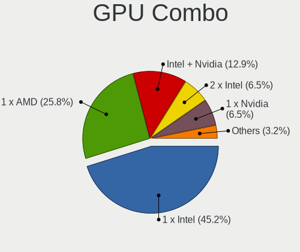

| Name           | Computers | Percent |
|----------------|-----------|---------|
| 1 x Intel      | 27        | 52.94%  |
| 1 x AMD        | 13        | 25.49%  |
| 1 x Nvidia     | 7         | 13.73%  |
| 2 x AMD        | 2         | 3.92%   |
| Intel + Nvidia | 2         | 3.92%   |

GPU Driver
----------

Free vs proprietary

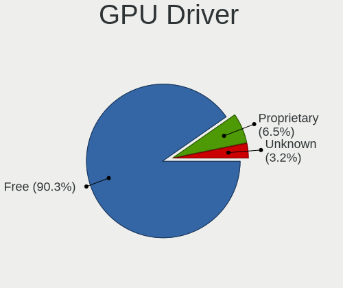

| Driver      | Computers | Percent |
|-------------|-----------|---------|
| Free        | 47        | 92.16%  |
| Proprietary | 3         | 5.88%   |
| Unknown     | 1         | 1.96%   |

GPU Memory
----------

Total video memory

| Size in GB | Computers | Percent |
|------------|-----------|---------|
| Unknown    | 32        | 62.75%  |
| 0.01-0.5   | 7         | 13.73%  |
| 1.01-2.0   | 3         | 5.88%   |
| 0.51-1.0   | 3         | 5.88%   |
| 3.01-4.0   | 2         | 3.92%   |
| 2.01-3.0   | 2         | 3.92%   |
| 7.01-8.0   | 1         | 1.96%   |
| 8.01-16.0  | 1         | 1.96%   |

Monitor
-------

Monitor Vendor
--------------

Monitor vendors

| Vendor               | Computers | Percent |
|----------------------|-----------|---------|
| BOE                  | 8         | 16%     |
| Samsung Electronics  | 6         | 12%     |
| AU Optronics         | 5         | 10%     |
| Goldstar             | 4         | 8%      |
| Chimei Innolux       | 4         | 8%      |
| Hewlett-Packard      | 3         | 6%      |
| Ancor Communications | 3         | 6%      |
| Philips              | 2         | 4%      |
| Lenovo               | 2         | 4%      |
| Dell                 | 2         | 4%      |
| Acer                 | 2         | 4%      |
| STA                  | 1         | 2%      |
| Sharp                | 1         | 2%      |
| NEC Computers        | 1         | 2%      |
| Mi                   | 1         | 2%      |
| LG Display           | 1         | 2%      |
| HUAWEI               | 1         | 2%      |
| GreenWood            | 1         | 2%      |
| Apple                | 1         | 2%      |
| AOC                  | 1         | 2%      |

Monitor Model
-------------

Monitor models

| Model                                                                | Computers | Percent |
|----------------------------------------------------------------------|-----------|---------|
| STA LCD Monitor STA5DCA 1366x768 256x144mm 11.6-inch                 | 1         | 1.96%   |
| Sharp LQ156M1JW09 SHP14D3 1920x1080 344x194mm 15.5-inch              | 1         | 1.96%   |
| Samsung Electronics T27D390 SAM0B71 1920x1080 598x336mm 27.0-inch    | 1         | 1.96%   |
| Samsung Electronics SA300/SA350 SAM078B 1600x900 443x249mm 20.0-inch | 1         | 1.96%   |
| Samsung Electronics S32D850 SAM0BCC 2560x1440 708x398mm 32.0-inch    | 1         | 1.96%   |
| Samsung Electronics S24D330 SAM0D92 1920x1080 531x299mm 24.0-inch    | 1         | 1.96%   |
| Samsung Electronics S24C450 SAM09CB 1920x1080 531x299mm 24.0-inch    | 1         | 1.96%   |
| Samsung Electronics LCD Monitor SEC3047 1366x768 277x156mm 12.5-inch | 1         | 1.96%   |
| Philips 247EL PHLC084 1920x1080 521x293mm 23.5-inch                  | 1         | 1.96%   |
| Philips 247E4 PHLC0C0 1920x1080 521x293mm 23.5-inch                  | 1         | 1.96%   |
| NEC Computers X401S NEC681E 1920x1080 885x498mm 40.0-inch            | 1         | 1.96%   |
| Mi 27 NFGL XMIB004 1920x1080 598x336mm 27.0-inch                     | 1         | 1.96%   |
| LG Display LCD Monitor LGD034B 1366x768 345x194mm 15.6-inch          | 1         | 1.96%   |
| Lenovo LEN-M800z-C LEN8000 1920x1080 477x268mm 21.5-inch             | 1         | 1.96%   |
| Lenovo LEN T27i-10 LEN61C6 1920x1080 598x336mm 27.0-inch             | 1         | 1.96%   |
| HUAWEI ZQE-CBA HWV6A25 3440x1440 797x334mm 34.0-inch                 | 1         | 1.96%   |
| Hewlett-Packard LE1901w HWP2842 1440x900 410x256mm 19.0-inch         | 1         | 1.96%   |
| Hewlett-Packard L1950 HWP26E8 1280x1024 380x300mm 19.1-inch          | 1         | 1.96%   |
| Hewlett-Packard 25x HPN357F 1920x1080 544x303mm 24.5-inch            | 1         | 1.96%   |
| GreenWood ARZOPA GWD1161 1920x1080 355x200mm 16.0-inch               | 1         | 1.96%   |
| Goldstar Ultra HD GSM5B08 3840x2160 600x340mm 27.2-inch              | 1         | 1.96%   |
| Goldstar TV SSCR2 GSMC0C8 3840x2160                                  | 1         | 1.96%   |
| Goldstar TV GSM2412 1920x1080 940x530mm 42.5-inch                    | 1         | 1.96%   |
| Goldstar E2251 GSM586E 1920x1080 477x268mm 21.5-inch                 | 1         | 1.96%   |
| Dell U2412M DELA079 1920x1200 518x324mm 24.1-inch                    | 1         | 1.96%   |
| Dell SE2723DS DELD152 2560x1440 598x336mm 27.0-inch                  | 1         | 1.96%   |
| Dell G2422HS DELA1E6 1920x1080 527x296mm 23.8-inch                   | 1         | 1.96%   |
| Chimei Innolux LCD Monitor CMN1618 1920x1200 344x215mm 16.0-inch     | 1         | 1.96%   |
| Chimei Innolux LCD Monitor CMN15C3 1920x1080 344x193mm 15.5-inch     | 1         | 1.96%   |
| Chimei Innolux LCD Monitor CMN15BE 1366x768 344x193mm 15.5-inch      | 1         | 1.96%   |
| Chimei Innolux LCD Monitor CMN14D5 1920x1080 309x173mm 13.9-inch     | 1         | 1.96%   |
| BOE LCD Monitor BOE09CC 1920x1080 344x194mm 15.5-inch                | 1         | 1.96%   |
| BOE LCD Monitor BOE0960 1366x768 344x194mm 15.5-inch                 | 1         | 1.96%   |
| BOE LCD Monitor BOE089D 1920x1080 294x165mm 13.3-inch                | 1         | 1.96%   |
| BOE LCD Monitor BOE0872 1920x1080 344x194mm 15.5-inch                | 1         | 1.96%   |
| BOE LCD Monitor BOE0869 1920x1080 344x194mm 15.5-inch                | 1         | 1.96%   |
| BOE LCD Monitor BOE0729 1920x1080 344x193mm 15.5-inch                | 1         | 1.96%   |
| BOE LCD Monitor BOE0704 1366x768 344x194mm 15.5-inch                 | 1         | 1.96%   |
| BOE LCD Monitor BOE05B0 1366x768 309x173mm 13.9-inch                 | 1         | 1.96%   |
| AU Optronics LCD Monitor AUOD291 1920x1200 301x188mm 14.0-inch       | 1         | 1.96%   |

Monitor Resolution
------------------

Monitor screen resolution

| Resolution        | Computers | Percent |
|-------------------|-----------|---------|
| 1920x1080 (FHD)   | 24        | 50%     |
| 1366x768 (WXGA)   | 10        | 20.83%  |
| 2560x1440 (QHD)   | 4         | 8.33%   |
| 1920x1200 (WUXGA) | 3         | 6.25%   |
| 3840x2160 (4K)    | 2         | 4.17%   |
| 1440x900 (WXGA+)  | 2         | 4.17%   |
| 3440x1440         | 1         | 2.08%   |
| 1600x900 (HD+)    | 1         | 2.08%   |
| 1280x1024 (SXGA)  | 1         | 2.08%   |

Monitor Diagonal
----------------

Diagonal size in inches

| Inches | Computers | Percent |
|--------|-----------|---------|
| 15     | 12        | 24%     |
| 24     | 6         | 12%     |
| 27     | 4         | 8%      |
| 23     | 4         | 8%      |
| 13     | 4         | 8%      |
| 32     | 2         | 4%      |
| 21     | 2         | 4%      |
| 19     | 2         | 4%      |
| 17     | 2         | 4%      |
| 16     | 2         | 4%      |
| 72     | 1         | 2%      |
| 42     | 1         | 2%      |
| 40     | 1         | 2%      |
| 34     | 1         | 2%      |
| 26     | 1         | 2%      |
| 20     | 1         | 2%      |
| 18     | 1         | 2%      |
| 14     | 1         | 2%      |
| 12     | 1         | 2%      |
| 11     | 1         | 2%      |

Monitor Width
-------------

Physical width

| Width in mm | Computers | Percent |
|-------------|-----------|---------|
| 301-350     | 16        | 32.65%  |
| 501-600     | 14        | 28.57%  |
| 401-500     | 5         | 10.2%   |
| 351-400     | 4         | 8.16%   |
| 201-300     | 4         | 8.16%   |
| 701-800     | 3         | 6.12%   |
| 801-900     | 1         | 2.04%   |
| 1501-2000   | 1         | 2.04%   |
| 901-1000    | 1         | 2.04%   |

Aspect Ratio
------------

Proportional relationship between the width and the height

| Ratio | Computers | Percent |
|-------|-----------|---------|
| 16/9  | 40        | 83.33%  |
| 16/10 | 6         | 12.5%   |
| 5/4   | 1         | 2.08%   |
| 21/9  | 1         | 2.08%   |

Monitor Area
------------

Area in inch²

| Area in inch² | Computers | Percent |
|----------------|-----------|---------|
| 101-110        | 13        | 26.53%  |
| 201-250        | 9         | 18.37%  |
| 301-350        | 5         | 10.2%   |
| 81-90          | 3         | 6.12%   |
| 351-500        | 3         | 6.12%   |
| 151-200        | 3         | 6.12%   |
| 71-80          | 2         | 4.08%   |
| 251-300        | 2         | 4.08%   |
| 121-130        | 2         | 4.08%   |
| 501-1000       | 2         | 4.08%   |
| More than 1000 | 1         | 2.04%   |
| 61-70          | 1         | 2.04%   |
| 51-60          | 1         | 2.04%   |
| 141-150        | 1         | 2.04%   |
| 111-120        | 1         | 2.04%   |

Pixel Density
-------------

Pixels per inch

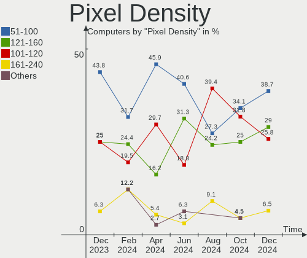

| Density | Computers | Percent |
|---------|-----------|---------|
| 51-100  | 21        | 43.75%  |
| 121-160 | 12        | 25%     |
| 101-120 | 12        | 25%     |
| 161-240 | 3         | 6.25%   |

Multiple Monitors
-----------------

Total monitors connected

| Total | Computers | Percent |
|-------|-----------|---------|
| 1     | 44        | 86.27%  |
| 2     | 6         | 11.76%  |
| 0     | 1         | 1.96%   |

Network
-------

Net Controller Vendor
---------------------

Controller vendors

| Vendor                   | Computers | Percent |
|--------------------------|-----------|---------|
| Realtek Semiconductor    | 26        | 34.67%  |
| Intel                    | 24        | 32%     |
| Qualcomm Atheros         | 6         | 8%      |
| Broadcom Limited         | 5         | 6.67%   |
| Marvell Technology Group | 4         | 5.33%   |
| Ralink Technology        | 3         | 4%      |
| Broadcom                 | 2         | 2.67%   |
| VIA Technologies         | 1         | 1.33%   |
| TP-Link                  | 1         | 1.33%   |
| Lenovo                   | 1         | 1.33%   |
| Edimax Technology        | 1         | 1.33%   |
| Dell                     | 1         | 1.33%   |

Net Controller Model
--------------------

Controller models

| Model                                                                   | Computers | Percent |
|-------------------------------------------------------------------------|-----------|---------|
| Realtek RTL8111/8168/8411 PCI Express Gigabit Ethernet Controller       | 20        | 22.47%  |
| Marvell Group 88E8053 PCI-E Gigabit Ethernet Controller                 | 3         | 3.37%   |
| Intel 82579LM Gigabit Network Connection (Lewisville)                   | 3         | 3.37%   |
| Realtek RTL8822CE 802.11ac PCIe Wireless Network Adapter                | 2         | 2.25%   |
| Realtek RTL8821CE 802.11ac PCIe Wireless Network Adapter                | 2         | 2.25%   |
| Realtek RTL810xE PCI Express Fast Ethernet controller                   | 2         | 2.25%   |
| Intel Wireless 3165                                                     | 2         | 2.25%   |
| Intel Ethernet Connection (2) I218-V                                    | 2         | 2.25%   |
| Intel Dual Band Wireless-AC 3168NGW [Stone Peak]                        | 2         | 2.25%   |
| Broadcom Limited BCM4321 802.11a/b/g/n                                  | 2         | 2.25%   |
| VIA VT6105/VT6106S [Rhine-III]                                          | 1         | 1.12%   |
| TP-Link RTL8812AU Archer T4U 802.11ac                                   | 1         | 1.12%   |
| Realtek RTL8852BE PCIe 802.11ax Wireless Network Controller             | 1         | 1.12%   |
| Realtek RTL8192EE PCIe Wireless Network Adapter                         | 1         | 1.12%   |
| Realtek RTL8191SEvB Wireless LAN Controller                             | 1         | 1.12%   |
| Realtek RTL8188FTV 802.11b/g/n 1T1R 2.4G WLAN Adapter                   | 1         | 1.12%   |
| Realtek RTL8125 2.5GbE Controller                                       | 1         | 1.12%   |
| Realtek 802.11ac NIC                                                    | 1         | 1.12%   |
| Ralink RT5370 Wireless Adapter                                          | 1         | 1.12%   |
| Ralink MT7610U ("Archer T2U" 2.4G+5G WLAN Adapter                       | 1         | 1.12%   |
| Ralink MT7601U Wireless Adapter                                         | 1         | 1.12%   |
| Qualcomm Atheros QCA9565 / AR9565 Wireless Network Adapter              | 1         | 1.12%   |
| Qualcomm Atheros QCA9377 802.11ac Wireless Network Adapter              | 1         | 1.12%   |
| Qualcomm Atheros AR9485 Wireless Network Adapter                        | 1         | 1.12%   |
| Qualcomm Atheros AR8151 v2.0 Gigabit Ethernet                           | 1         | 1.12%   |
| Qualcomm Atheros AR8131 Gigabit Ethernet                                | 1         | 1.12%   |
| Qualcomm Atheros AR242x / AR542x Wireless Network Adapter (PCI-Express) | 1         | 1.12%   |
| Marvell Group 88E8055 PCI-E Gigabit Ethernet Controller                 | 1         | 1.12%   |
| Lenovo ThinkPad Lan                                                     | 1         | 1.12%   |
| Intel Wireless 8265 / 8275                                              | 1         | 1.12%   |
| Intel Wireless 8260                                                     | 1         | 1.12%   |
| Intel Wireless 7265                                                     | 1         | 1.12%   |
| Intel WiFi Link 5100                                                    | 1         | 1.12%   |
| Intel Wi-Fi 6 AX210/AX211/AX411 160MHz                                  | 1         | 1.12%   |
| Intel Wi-Fi 6 AX201 160MHz                                              | 1         | 1.12%   |
| Intel Tiger Lake PCH CNVi WiFi                                          | 1         | 1.12%   |
| Intel Raptor Lake PCH CNVi WiFi                                         | 1         | 1.12%   |
| Intel I211 Gigabit Network Connection                                   | 1         | 1.12%   |
| Intel Ethernet Connection I219-V                                        | 1         | 1.12%   |
| Intel Ethernet Connection I217-LM                                       | 1         | 1.12%   |

Wireless Vendor
---------------

Wireless vendors

| Vendor                | Computers | Percent |
|-----------------------|-----------|---------|
| Intel                 | 18        | 43.9%   |
| Realtek Semiconductor | 9         | 21.95%  |
| Qualcomm Atheros      | 4         | 9.76%   |
| Broadcom Limited      | 4         | 9.76%   |
| Ralink Technology     | 3         | 7.32%   |
| TP-Link               | 1         | 2.44%   |
| Edimax Technology     | 1         | 2.44%   |
| Dell                  | 1         | 2.44%   |

Wireless Model
--------------

Wireless models

| Model                                                                   | Computers | Percent |
|-------------------------------------------------------------------------|-----------|---------|
| Realtek RTL8822CE 802.11ac PCIe Wireless Network Adapter                | 2         | 4.88%   |
| Realtek RTL8821CE 802.11ac PCIe Wireless Network Adapter                | 2         | 4.88%   |
| Intel Wireless 3165                                                     | 2         | 4.88%   |
| Intel Dual Band Wireless-AC 3168NGW [Stone Peak]                        | 2         | 4.88%   |
| Broadcom Limited BCM4321 802.11a/b/g/n                                  | 2         | 4.88%   |
| TP-Link RTL8812AU Archer T4U 802.11ac                                   | 1         | 2.44%   |
| Realtek RTL8852BE PCIe 802.11ax Wireless Network Controller             | 1         | 2.44%   |
| Realtek RTL8192EE PCIe Wireless Network Adapter                         | 1         | 2.44%   |
| Realtek RTL8191SEvB Wireless LAN Controller                             | 1         | 2.44%   |
| Realtek RTL8188FTV 802.11b/g/n 1T1R 2.4G WLAN Adapter                   | 1         | 2.44%   |
| Realtek 802.11ac NIC                                                    | 1         | 2.44%   |
| Ralink RT5370 Wireless Adapter                                          | 1         | 2.44%   |
| Ralink MT7610U ("Archer T2U" 2.4G+5G WLAN Adapter                       | 1         | 2.44%   |
| Ralink MT7601U Wireless Adapter                                         | 1         | 2.44%   |
| Qualcomm Atheros QCA9565 / AR9565 Wireless Network Adapter              | 1         | 2.44%   |
| Qualcomm Atheros QCA9377 802.11ac Wireless Network Adapter              | 1         | 2.44%   |
| Qualcomm Atheros AR9485 Wireless Network Adapter                        | 1         | 2.44%   |
| Qualcomm Atheros AR242x / AR542x Wireless Network Adapter (PCI-Express) | 1         | 2.44%   |
| Intel Wireless 8265 / 8275                                              | 1         | 2.44%   |
| Intel Wireless 8260                                                     | 1         | 2.44%   |
| Intel Wireless 7265                                                     | 1         | 2.44%   |
| Intel WiFi Link 5100                                                    | 1         | 2.44%   |
| Intel Wi-Fi 6 AX210/AX211/AX411 160MHz                                  | 1         | 2.44%   |
| Intel Wi-Fi 6 AX201 160MHz                                              | 1         | 2.44%   |
| Intel Tiger Lake PCH CNVi WiFi                                          | 1         | 2.44%   |
| Intel Raptor Lake PCH CNVi WiFi                                         | 1         | 2.44%   |
| Intel Dual Band Wireless-AC 3165 Plus Bluetooth                         | 1         | 2.44%   |
| Intel Comet Lake PCH-LP CNVi WiFi                                       | 1         | 2.44%   |
| Intel Comet Lake PCH CNVi WiFi                                          | 1         | 2.44%   |
| Intel Centrino Ultimate-N 6300                                          | 1         | 2.44%   |
| Intel Centrino Advanced-N 6205 [Taylor Peak]                            | 1         | 2.44%   |
| Intel Alder Lake-P PCH CNVi WiFi                                        | 1         | 2.44%   |
| Edimax EW-7811Un 802.11n Wireless Adapter [Realtek RTL8188CUS]          | 1         | 2.44%   |
| Dell Wireless 5630 (EVDO-HSPA) Mobile Broadband Mini-Card               | 1         | 2.44%   |
| Broadcom Limited BCM4360 802.11ac Dual Band Wireless Network Adapter    | 1         | 2.44%   |
| Broadcom Limited BCM4312 802.11b/g LP-PHY                               | 1         | 2.44%   |

Ethernet Vendor
---------------

Ethernet vendors

| Vendor                   | Computers | Percent |
|--------------------------|-----------|---------|
| Realtek Semiconductor    | 23        | 47.92%  |
| Intel                    | 14        | 29.17%  |
| Marvell Technology Group | 4         | 8.33%   |
| Qualcomm Atheros         | 2         | 4.17%   |
| Broadcom                 | 2         | 4.17%   |
| VIA Technologies         | 1         | 2.08%   |
| Lenovo                   | 1         | 2.08%   |
| Broadcom Limited         | 1         | 2.08%   |

Ethernet Model
--------------

Ethernet models

| Model                                                             | Computers | Percent |
|-------------------------------------------------------------------|-----------|---------|
| Realtek RTL8111/8168/8411 PCI Express Gigabit Ethernet Controller | 20        | 41.67%  |
| Marvell Group 88E8053 PCI-E Gigabit Ethernet Controller           | 3         | 6.25%   |
| Intel 82579LM Gigabit Network Connection (Lewisville)             | 3         | 6.25%   |
| Realtek RTL810xE PCI Express Fast Ethernet controller             | 2         | 4.17%   |
| Intel Ethernet Connection (2) I218-V                              | 2         | 4.17%   |
| VIA VT6105/VT6106S [Rhine-III]                                    | 1         | 2.08%   |
| Realtek RTL8125 2.5GbE Controller                                 | 1         | 2.08%   |
| Qualcomm Atheros AR8151 v2.0 Gigabit Ethernet                     | 1         | 2.08%   |
| Qualcomm Atheros AR8131 Gigabit Ethernet                          | 1         | 2.08%   |
| Marvell Group 88E8055 PCI-E Gigabit Ethernet Controller           | 1         | 2.08%   |
| Lenovo ThinkPad Lan                                               | 1         | 2.08%   |
| Intel I211 Gigabit Network Connection                             | 1         | 2.08%   |
| Intel Ethernet Connection I219-V                                  | 1         | 2.08%   |
| Intel Ethernet Connection I217-LM                                 | 1         | 2.08%   |
| Intel Ethernet Connection (7) I219-V                              | 1         | 2.08%   |
| Intel Ethernet Connection (2) I219-V                              | 1         | 2.08%   |
| Intel Ethernet Connection (16) I219-LM                            | 1         | 2.08%   |
| Intel Ethernet Connection (10) I219-LM                            | 1         | 2.08%   |
| Intel 82599 10 Gigabit Network Connection                         | 1         | 2.08%   |
| Intel 82567V-2 Gigabit Network Connection                         | 1         | 2.08%   |
| Broadcom NetXtreme BCM57766 Gigabit Ethernet PCIe                 | 1         | 2.08%   |
| Broadcom NetXtreme BCM5754 Gigabit Ethernet PCI Express           | 1         | 2.08%   |
| Broadcom Limited NetXtreme BCM5782 Gigabit Ethernet               | 1         | 2.08%   |

Net Controller Kind
-------------------

Ethernet, WiFi or modem

| Kind     | Computers | Percent |
|----------|-----------|---------|
| Ethernet | 45        | 54.22%  |
| WiFi     | 38        | 45.78%  |

Used Controller
---------------

Currently used network controller

| Kind     | Computers | Percent |
|----------|-----------|---------|
| Ethernet | 29        | 50.88%  |
| WiFi     | 28        | 49.12%  |

NICs
----

Total network controllers on board

| Total | Computers | Percent |
|-------|-----------|---------|
| 2     | 27        | 52.94%  |
| 1     | 21        | 41.18%  |
| 3     | 2         | 3.92%   |
| 0     | 1         | 1.96%   |

IPv6
----

IPv6 vs IPv4

| Used | Computers | Percent |
|------|-----------|---------|
| No   | 34        | 66.67%  |
| Yes  | 17        | 33.33%  |

Bluetooth
---------

Bluetooth Vendor
----------------

Controller vendors

| Vendor                          | Computers | Percent |
|---------------------------------|-----------|---------|
| Intel                           | 15        | 44.12%  |
| Realtek Semiconductor           | 5         | 14.71%  |
| Apple                           | 4         | 11.76%  |
| Cambridge Silicon Radio         | 3         | 8.82%   |
| Realtek                         | 1         | 2.94%   |
| Qualcomm Atheros Communications | 1         | 2.94%   |
| Lite-On Technology              | 1         | 2.94%   |
| Integrated System Solution      | 1         | 2.94%   |
| Foxconn / Hon Hai               | 1         | 2.94%   |
| Dell                            | 1         | 2.94%   |
| Broadcom                        | 1         | 2.94%   |

Bluetooth Model
---------------

Controller models

| Model                                               | Computers | Percent |
|-----------------------------------------------------|-----------|---------|
| Intel Bluetooth wireless interface                  | 6         | 17.65%  |
| Realtek Bluetooth Radio                             | 5         | 14.71%  |
| Intel Bluetooth Device                              | 5         | 14.71%  |
| Cambridge Silicon Radio Bluetooth Dongle (HCI mode) | 3         | 8.82%   |
| Apple Bluetooth HCI                                 | 3         | 8.82%   |
| Intel Wireless-AC 3168 Bluetooth                    | 2         | 5.88%   |
| Realtek Bluetooth Radio                             | 1         | 2.94%   |
| Qualcomm Atheros  Bluetooth Device                  | 1         | 2.94%   |
| Lite-On Atheros AR3012 Bluetooth                    | 1         | 2.94%   |
| Intel Bluetooth 9460/9560 Jefferson Peak (JfP)      | 1         | 2.94%   |
| Intel AX210 Bluetooth                               | 1         | 2.94%   |
| Integrated System Solution Bluetooth Device         | 1         | 2.94%   |
| Foxconn / Hon Hai Bluetooth USB Host Controller     | 1         | 2.94%   |
| Dell DW375 Bluetooth Module                         | 1         | 2.94%   |
| Broadcom BCM20702 Bluetooth 4.0 [ThinkPad]          | 1         | 2.94%   |
| Apple Bluetooth Host Controller                     | 1         | 2.94%   |

Sound
-----

Sound Vendor
------------

Sound card vendors

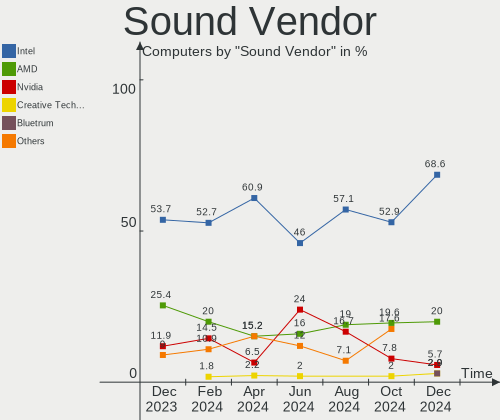

| Vendor                                       | Computers | Percent |
|----------------------------------------------|-----------|---------|
| Intel                                        | 36        | 53.73%  |
| AMD                                          | 17        | 25.37%  |
| Nvidia                                       | 8         | 11.94%  |
| Zoran Co. Personal Media Division (Nogatech) | 1         | 1.49%   |
| Texas Instruments                            | 1         | 1.49%   |
| Logitech                                     | 1         | 1.49%   |
| JMTek                                        | 1         | 1.49%   |
| GN Netcom                                    | 1         | 1.49%   |
| Creative Labs                                | 1         | 1.49%   |

Sound Model
-----------

Sound card models

| Model                                                                      | Computers | Percent |
|----------------------------------------------------------------------------|-----------|---------|
| Intel 7 Series/C216 Chipset Family High Definition Audio Controller        | 5         | 6.25%   |
| AMD Renoir Radeon High Definition Audio Controller                         | 5         | 6.25%   |
| AMD Family 17h/19h HD Audio Controller                                     | 5         | 6.25%   |
| Intel Sunrise Point-LP HD Audio                                            | 4         | 5%      |
| Nvidia GK208 HDMI/DP Audio Controller                                      | 3         | 3.75%   |
| Intel Xeon E3-1200 v3/4th Gen Core Processor HD Audio Controller           | 3         | 3.75%   |
| Intel NM10/ICH7 Family High Definition Audio Controller                    | 3         | 3.75%   |
| Intel 8 Series/C220 Series Chipset High Definition Audio Controller        | 3         | 3.75%   |
| AMD SBx00 Azalia (Intel HDA)                                               | 3         | 3.75%   |
| Nvidia TU106 High Definition Audio Controller                              | 2         | 2.5%    |
| Intel Raptor Lake-P/U/H cAVS                                               | 2         | 2.5%    |
| Intel Comet Lake PCH-LP cAVS                                               | 2         | 2.5%    |
| Intel 100 Series/C230 Series Chipset Family HD Audio Controller            | 2         | 2.5%    |
| AMD RS780 HDMI Audio [Radeon 3000/3100 / HD 3200/3300]                     | 2         | 2.5%    |
| Zoran Co. Personal Media Division (Nogatech) USB Audio and HID             | 1         | 1.25%   |
| Texas Instruments Sabaj A4 AMP                                             | 1         | 1.25%   |
| Nvidia GP106 High Definition Audio Controller                              | 1         | 1.25%   |
| Nvidia GP102 HDMI Audio Controller                                         | 1         | 1.25%   |
| Nvidia GM107 High Definition Audio Controller [GeForce 940MX]              | 1         | 1.25%   |
| Logitech [G533 Wireless Headset Dongle]                                    | 1         | 1.25%   |
| Logitech G930                                                              | 1         | 1.25%   |
| JMTek USB PnP Audio Device                                                 | 1         | 1.25%   |
| Intel Tiger Lake-H HD Audio Controller                                     | 1         | 1.25%   |
| Intel Jasper Lake HD Audio                                                 | 1         | 1.25%   |
| Intel Haswell-ULT HD Audio Controller                                      | 1         | 1.25%   |
| Intel Comet Lake PCH-V cAVS                                                | 1         | 1.25%   |
| Intel Comet Lake PCH cAVS                                                  | 1         | 1.25%   |
| Intel Celeron/Pentium Silver Processor High Definition Audio               | 1         | 1.25%   |
| Intel Cannon Lake PCH cAVS                                                 | 1         | 1.25%   |
| Intel C610/X99 series chipset HD Audio Controller                          | 1         | 1.25%   |
| Intel Alder Lake-N HD Graphics SGPC                                        | 1         | 1.25%   |
| Intel Alder Lake PCH-P High Definition Audio Controller                    | 1         | 1.25%   |
| Intel 9 Series Chipset Family HD Audio Controller                          | 1         | 1.25%   |
| Intel 82801I (ICH9 Family) HD Audio Controller                             | 1         | 1.25%   |
| Intel 82801EB/ER (ICH5/ICH5R) AC'97 Audio Controller                       | 1         | 1.25%   |
| Intel 8 Series HD Audio Controller                                         | 1         | 1.25%   |
| Intel 6 Series/C200 Series Chipset Family High Definition Audio Controller | 1         | 1.25%   |
| Intel 5 Series/3400 Series Chipset High Definition Audio                   | 1         | 1.25%   |
| GN Netcom Jabra Link 380                                                   | 1         | 1.25%   |
| Creative Labs EMU20k2 [Sound Blaster X-Fi Titanium Series]                 | 1         | 1.25%   |

Memory
------

Memory Vendor
-------------

Memory module vendors

| Vendor              | Computers | Percent |
|---------------------|-----------|---------|
| Samsung Electronics | 11        | 33.33%  |
| Kingston            | 5         | 15.15%  |
| Unknown             | 4         | 12.12%  |
| SK hynix            | 4         | 12.12%  |
| Micron Technology   | 3         | 9.09%   |
| Unknown (ABCD)      | 1         | 3.03%   |
| Team                | 1         | 3.03%   |
| Super Talent        | 1         | 3.03%   |
| GeIL                | 1         | 3.03%   |
| G.Skill             | 1         | 3.03%   |
| Crucial             | 1         | 3.03%   |

Memory Model
------------

Memory module models

| Model                                                          | Computers | Percent |
|----------------------------------------------------------------|-----------|---------|
| Unknown RAM Module 4GB DIMM 1066MT/s                           | 2         | 5.26%   |
| Samsung RAM M471A5244CB0-CTD 4GB SODIMM DDR4 3266MT/s          | 2         | 5.26%   |
| Samsung RAM M471A1K43EB1-CWE 8GB SODIMM DDR4 3200MT/s          | 2         | 5.26%   |
| Micron RAM 4ATF1G64HZ-3G2F1 8GB SODIMM DDR4 3200MT/s           | 2         | 5.26%   |
| Unknown RAM Module 2GB SODIMM DDR2                             | 1         | 2.63%   |
| Unknown RAM Module 2GB DIMM 1066MT/s                           | 1         | 2.63%   |
| Unknown RAM Module 16MB DIMM 667MT/s                           | 1         | 2.63%   |
| Unknown (ABCD) RAM 123456789012345678 2GB DIMM LPDDR4 2400MT/s | 1         | 2.63%   |
| Team RAM TEAMGROUP-SD4-2666 16GB SODIMM DDR4 2667MT/s          | 1         | 2.63%   |
| Super Talent RAM Module 2GB DIMM DDR2 667MT/s                  | 1         | 2.63%   |
| SK hynix RAM Module 2GB DIMM DDR3 1333MT/s                     | 1         | 2.63%   |
| SK hynix RAM Module 1GB DIMM DDR2 667MT/s                      | 1         | 2.63%   |
| SK hynix RAM HMT451S6BFR8A-PB 4GB SODIMM DDR3 1600MT/s         | 1         | 2.63%   |
| SK hynix RAM HMT451S6AFR8C-PB 4096MB SODIMM DDR3 1600MT/s      | 1         | 2.63%   |
| SK hynix RAM HMA851S6CJR6N-XN 4GB SODIMM DDR4 3200MT/s         | 1         | 2.63%   |
| Samsung RAM Module 8GB SODIMM DDR4 2133MT/s                    | 1         | 2.63%   |
| Samsung RAM Module 2GB SODIMM DDR3 1600MT/s                    | 1         | 2.63%   |
| Samsung RAM Module 1GB DIMM DDR2 667MT/s                       | 1         | 2.63%   |
| Samsung RAM M471B5673FH0-CF8 2GB SODIMM 1067MT/s               | 1         | 2.63%   |
| Samsung RAM M471A2G44BM0-CWE 16GB SODIMM DDR4 3200MT/s         | 1         | 2.63%   |
| Samsung RAM M471A1K43DB1-CWE 8GB SODIMM DDR4 3200MT/s          | 1         | 2.63%   |
| Samsung RAM M471A1G44BB0-CWE 8GB SODIMM DDR4 3200MT/s          | 1         | 2.63%   |
| Samsung RAM K4A8G165WC-BCWE 4GB Row Of Chips DDR4 3200MT/s     | 1         | 2.63%   |
| Micron RAM 16KTF1G64HZ-1G6E1 8GB SODIMM DDR3 1600MT/s          | 1         | 2.63%   |
| Micron RAM 16JSF51264HZ-1G4D1 4096MB SODIMM DDR3 1334MT/s      | 1         | 2.63%   |
| Kingston RAM Module 1GB DIMM DDR2 667MT/s                      | 1         | 2.63%   |
| Kingston RAM KHX2400C15/8G 8GB DIMM DDR4 3400MT/s              | 1         | 2.63%   |
| Kingston RAM KHX1866C10D3/ 8GB DIMM DDR3 1866MT/s              | 1         | 2.63%   |
| Kingston RAM K 512MB DIMM DDR 667MT/s                          | 1         | 2.63%   |
| Kingston RAM 99U5402-037.A00G 2GB DIMM DDR3 1333MT/s           | 1         | 2.63%   |
| Kingston RAM 9905471-001.A01LF 2GB DIMM DDR3 1600MT/s          | 1         | 2.63%   |
| GeIL RAM CL11-11-11 D3-1600 4GB DIMM 1600MT/s                  | 1         | 2.63%   |
| G.Skill RAM F4-3000C15-16GVR 16GB DIMM DDR4 3200MT/s           | 1         | 2.63%   |
| Crucial RAM CB16GU2666.C8ET 16GB DIMM DDR4 2667MT/s            | 1         | 2.63%   |

Memory Kind
-----------

Memory module kinds

| Kind    | Computers | Percent |
|---------|-----------|---------|
| DDR4    | 13        | 43.33%  |
| DDR3    | 8         | 26.67%  |
| DDR2    | 4         | 13.33%  |
| Unknown | 3         | 10%     |
| SDRAM   | 1         | 3.33%   |
| LPDDR4  | 1         | 3.33%   |

Memory Form Factor
------------------

Physical design of the memory module

| Name         | Computers | Percent |
|--------------|-----------|---------|
| SODIMM       | 14        | 48.28%  |
| DIMM         | 14        | 48.28%  |
| Row Of Chips | 1         | 3.45%   |

Memory Size
-----------

Memory module size

| Size  | Computers | Percent |
|-------|-----------|---------|
| 8192  | 9         | 26.47%  |
| 4096  | 8         | 23.53%  |
| 2048  | 8         | 23.53%  |
| 16384 | 4         | 11.76%  |
| 1024  | 3         | 8.82%   |
| 32768 | 1         | 2.94%   |
| 16    | 1         | 2.94%   |

Memory Speed
------------

Memory module speed

| Speed   | Computers | Percent |
|---------|-----------|---------|
| 3200    | 7         | 21.88%  |
| 1600    | 5         | 15.63%  |
| 667     | 5         | 15.63%  |
| 3266    | 2         | 6.25%   |
| 2667    | 2         | 6.25%   |
| 1333    | 2         | 6.25%   |
| 1066    | 2         | 6.25%   |
| 3400    | 1         | 3.13%   |
| 2400    | 1         | 3.13%   |
| 2133    | 1         | 3.13%   |
| 1866    | 1         | 3.13%   |
| 1334    | 1         | 3.13%   |
| 1067    | 1         | 3.13%   |
| Unknown | 1         | 3.13%   |

Printers & scanners
-------------------

Printer Vendor
--------------

Printer device vendors

| Vendor          | Computers | Percent |
|-----------------|-----------|---------|
| Hewlett-Packard | 2         | 100%    |

Printer Model
-------------

Printer device models

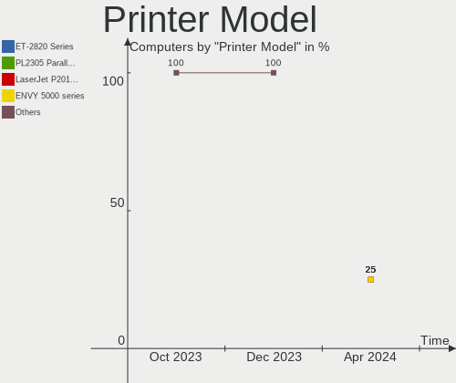

| Model                     | Computers | Percent |
|---------------------------|-----------|---------|
| HP LaserJet Pro M404-M405 | 1         | 50%     |
| HP DeskJet 4100 series    | 1         | 50%     |

Scanner Vendor
--------------

Scanner device vendors

Zero info for selected period =(

Scanner Model
-------------

Scanner device models

Zero info for selected period =(

Camera
------

Camera Vendor
-------------

Camera device vendors

| Vendor                        | Computers | Percent |
|-------------------------------|-----------|---------|
| Chicony Electronics           | 4         | 17.39%  |
| Microdia                      | 3         | 13.04%  |
| IMC Networks                  | 3         | 13.04%  |
| Bison Electronics             | 3         | 13.04%  |
| Ricoh                         | 2         | 8.7%    |
| Quanta                        | 2         | 8.7%    |
| Apple                         | 2         | 8.7%    |
| Sunplus Innovation Technology | 1         | 4.35%   |
| ShineTech                     | 1         | 4.35%   |
| Logitech                      | 1         | 4.35%   |
| KYE Systems (Mouse Systems)   | 1         | 4.35%   |

Camera Model
------------

Camera device models

| Model                                          | Computers | Percent |
|------------------------------------------------|-----------|---------|
| IMC Networks USB2.0 HD UVC WebCam              | 2         | 8.7%    |
| Chicony HP HD Camera                           | 2         | 8.7%    |
| Apple Built-in iSight [Micron]                 | 2         | 8.7%    |
| Sunplus Laptop_Integrated_Webcam_HD            | 1         | 4.35%   |
| ShineTech USB2.0 HD UVC WebCam                 | 1         | 4.35%   |
| Ricoh USB2.0 Camera                            | 1         | 4.35%   |
| Ricoh Sony Vaio Integrated Webcam              | 1         | 4.35%   |
| Quanta ov9734_techfront_camera                 | 1         | 4.35%   |
| Quanta HP HD Camera                            | 1         | 4.35%   |
| Microdia Sonix USB 2.0 Camera                  | 1         | 4.35%   |
| Microdia Laptop_Integrated_Webcam_E4HD         | 1         | 4.35%   |
| Microdia Integrated_Webcam_HD                  | 1         | 4.35%   |
| Logitech Webcam C170                           | 1         | 4.35%   |
| KYE Systems (Mouse Systems) Genius FaceCam 312 | 1         | 4.35%   |
| IMC Networks USB2.0 VGA UVC WebCam             | 1         | 4.35%   |
| Chicony USB2.0 HD Camera                       | 1         | 4.35%   |
| Chicony HD WebCam                              | 1         | 4.35%   |
| Bison Integrated RGB Camera                    | 1         | 4.35%   |
| Bison Integrated Camera                        | 1         | 4.35%   |
| Bison EasyCamera                               | 1         | 4.35%   |

Security
--------

Fingerprint Vendor
------------------

Fingerprint sensor vendors

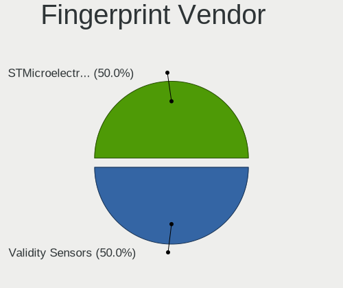

| Vendor                     | Computers | Percent |
|----------------------------|-----------|---------|
| Synaptics                  | 3         | 50%     |
| Validity Sensors           | 1         | 16.67%  |
| Shenzhen Goodix Technology | 1         | 16.67%  |
| Elan Microelectronics      | 1         | 16.67%  |

Fingerprint Model
-----------------

Fingerprint sensor models

| Model                                      | Computers | Percent |
|--------------------------------------------|-----------|---------|
| Validity Sensors VFS495 Fingerprint Reader | 1         | 16.67%  |
| Synaptics WBDI                             | 1         | 16.67%  |
| Synaptics UWP WBDI Device                  | 1         | 16.67%  |
| Synaptics UWP WBDI                         | 1         | 16.67%  |
| Shenzhen Goodix  Fingerprint Device        | 1         | 16.67%  |
| Elan ELAN:Fingerprint                      | 1         | 16.67%  |

Chipcard Vendor
---------------

Chipcard module vendors

| Vendor   | Computers | Percent |
|----------|-----------|---------|
| Broadcom | 2         | 100%    |

Chipcard Model
--------------

Chipcard module models

| Model                                                                        | Computers | Percent |
|------------------------------------------------------------------------------|-----------|---------|
| Broadcom BCM5880 Secure Applications Processor with fingerprint swipe sensor | 1         | 50%     |
| Broadcom 58200                                                               | 1         | 50%     |

Unsupported
-----------

Unsupported Devices
-------------------

Total unsupported devices on board

| Total | Computers | Percent |
|-------|-----------|---------|
| 0     | 40        | 78.43%  |
| 1     | 10        | 19.61%  |
| 2     | 1         | 1.96%   |

Unsupported Device Types
------------------------

Types of unsupported devices

| Type                  | Computers | Percent |
|-----------------------|-----------|---------|
| Fingerprint reader    | 6         | 50%     |
| Chipcard              | 2         | 16.67%  |
| Unassigned class      | 1         | 8.33%   |
| Net/wireless          | 1         | 8.33%   |
| Multimedia controller | 1         | 8.33%   |
| Graphics card         | 1         | 8.33%   |

