LMDE - Hardware Trends
----------------------

A project to identify most popular hardware characteristics and track their change
over time based on data collected by Linux users at https://Linux-Hardware.org.

Anyone can contribute to this report by the [hw-probe](https://github.com/linuxhw/hw-probe) tool:

    sudo -E hw-probe -all -upload

This is a report for all computer types. See also reports for [desktops](/Dist/LMDE/Desktop/README.md) and [notebooks](/Dist/LMDE/Notebook/README.md).

This report is for one last month. Overall report since the beginning of time: [TestDays](https://github.com/linuxhw/TestDays)

Period: May, 2023.

Contents
--------

* [ System ](#system)
  - [ OS                       ](#os)
  - [ OS Family                ](#os-family)
  - [ Kernel                   ](#kernel)
  - [ Kernel Family            ](#kernel-family)
  - [ Kernel Major Ver.        ](#kernel-major-ver)
  - [ Arch                     ](#arch)
  - [ DE                       ](#de)
  - [ Display Server           ](#display-server)
  - [ Display Manager          ](#display-manager)
  - [ OS Lang                  ](#os-lang)
  - [ Boot Mode                ](#boot-mode)
  - [ Filesystem               ](#filesystem)
  - [ Part. scheme             ](#part-scheme)
  - [ Dual Boot with Linux/BSD ](#dual-boot-with-linuxbsd)
  - [ Dual Boot (Win)          ](#dual-boot-win)

* [ Board ](#board)
  - [ Vendor                   ](#vendor)
  - [ Model                    ](#model)
  - [ Model Family             ](#model-family)
  - [ MFG Year                 ](#mfg-year)
  - [ Form Factor              ](#form-factor)
  - [ Secure Boot              ](#secure-boot)
  - [ Coreboot                 ](#coreboot)
  - [ RAM Size                 ](#ram-size)
  - [ RAM Used                 ](#ram-used)
  - [ Total Drives             ](#total-drives)
  - [ Has CD-ROM               ](#has-cd-rom)
  - [ Has Ethernet             ](#has-ethernet)
  - [ Has WiFi                 ](#has-wifi)
  - [ Has Bluetooth            ](#has-bluetooth)

* [ Location ](#location)
  - [ Country                  ](#country)
  - [ City                     ](#city)

* [ Drives ](#drives)
  - [ Drive Vendor             ](#drive-vendor)
  - [ Drive Model              ](#drive-model)
  - [ HDD Vendor               ](#hdd-vendor)
  - [ SSD Vendor               ](#ssd-vendor)
  - [ Drive Kind               ](#drive-kind)
  - [ Drive Connector          ](#drive-connector)
  - [ Drive Size               ](#drive-size)
  - [ Space Total              ](#space-total)
  - [ Space Used               ](#space-used)
  - [ Malfunc. Drives          ](#malfunc-drives)
  - [ Malfunc. Drive Vendor    ](#malfunc-drive-vendor)
  - [ Malfunc. HDD Vendor      ](#malfunc-hdd-vendor)
  - [ Malfunc. Drive Kind      ](#malfunc-drive-kind)
  - [ Failed Drives            ](#failed-drives)
  - [ Failed Drive Vendor      ](#failed-drive-vendor)
  - [ Drive Status             ](#drive-status)

* [ Storage controller ](#storage-controller)
  - [ Storage Vendor           ](#storage-vendor)
  - [ Storage Model            ](#storage-model)
  - [ Storage Kind             ](#storage-kind)

* [ Processor ](#processor)
  - [ CPU Vendor               ](#cpu-vendor)
  - [ CPU Model                ](#cpu-model)
  - [ CPU Model Family         ](#cpu-model-family)
  - [ CPU Cores                ](#cpu-cores)
  - [ CPU Sockets              ](#cpu-sockets)
  - [ CPU Threads              ](#cpu-threads)
  - [ CPU Op-Modes             ](#cpu-op-modes)
  - [ CPU Microcode            ](#cpu-microcode)
  - [ CPU Microarch            ](#cpu-microarch)

* [ Graphics ](#graphics)
  - [ GPU Vendor               ](#gpu-vendor)
  - [ GPU Model                ](#gpu-model)
  - [ GPU Combo                ](#gpu-combo)
  - [ GPU Driver               ](#gpu-driver)
  - [ GPU Memory               ](#gpu-memory)

* [ Monitor ](#monitor)
  - [ Monitor Vendor           ](#monitor-vendor)
  - [ Monitor Model            ](#monitor-model)
  - [ Monitor Resolution       ](#monitor-resolution)
  - [ Monitor Diagonal         ](#monitor-diagonal)
  - [ Monitor Width            ](#monitor-width)
  - [ Aspect Ratio             ](#aspect-ratio)
  - [ Monitor Area             ](#monitor-area)
  - [ Pixel Density            ](#pixel-density)
  - [ Multiple Monitors        ](#multiple-monitors)

* [ Network ](#network)
  - [ Net Controller Vendor    ](#net-controller-vendor)
  - [ Net Controller Model     ](#net-controller-model)
  - [ Wireless Vendor          ](#wireless-vendor)
  - [ Wireless Model           ](#wireless-model)
  - [ Ethernet Vendor          ](#ethernet-vendor)
  - [ Ethernet Model           ](#ethernet-model)
  - [ Net Controller Kind      ](#net-controller-kind)
  - [ Used Controller          ](#used-controller)
  - [ NICs                     ](#nics)
  - [ IPv6                     ](#ipv6)

* [ Bluetooth ](#bluetooth)
  - [ Bluetooth Vendor         ](#bluetooth-vendor)
  - [ Bluetooth Model          ](#bluetooth-model)

* [ Sound ](#sound)
  - [ Sound Vendor             ](#sound-vendor)
  - [ Sound Model              ](#sound-model)

* [ Memory ](#memory)
  - [ Memory Vendor            ](#memory-vendor)
  - [ Memory Model             ](#memory-model)
  - [ Memory Kind              ](#memory-kind)
  - [ Memory Form Factor       ](#memory-form-factor)
  - [ Memory Size              ](#memory-size)
  - [ Memory Speed             ](#memory-speed)

* [ Printers & scanners ](#printers--scanners)
  - [ Printer Vendor           ](#printer-vendor)
  - [ Printer Model            ](#printer-model)
  - [ Scanner Vendor           ](#scanner-vendor)
  - [ Scanner Model            ](#scanner-model)

* [ Camera ](#camera)
  - [ Camera Vendor            ](#camera-vendor)
  - [ Camera Model             ](#camera-model)

* [ Security ](#security)
  - [ Fingerprint Vendor       ](#fingerprint-vendor)
  - [ Fingerprint Model        ](#fingerprint-model)
  - [ Chipcard Vendor          ](#chipcard-vendor)
  - [ Chipcard Model           ](#chipcard-model)

* [ Unsupported ](#unsupported)
  - [ Unsupported Devices      ](#unsupported-devices)
  - [ Unsupported Device Types ](#unsupported-device-types)

System
------

OS
--

Installed operating systems

| Name   | Computers | Percent |
|--------|-----------|---------|
| LMDE 5 | 35        | 94.59%  |
| LMDE 4 | 2         | 5.41%   |

OS Family
---------

OS without a version

| Name | Computers | Percent |
|------|-----------|---------|
| LMDE | 37        | 100%    |

Kernel
------

Version of the Linux kernel

| Version               | Computers | Percent |
|-----------------------|-----------|---------|
| 5.10.0-23-amd64       | 15        | 40.54%  |
| 5.10.0-22-amd64       | 11        | 29.73%  |
| 5.10.0-12-amd64       | 3         | 8.11%   |
| 6.1.0-0.deb11.6-amd64 | 2         | 5.41%   |
| 6.1.0-0.deb11.5-amd64 | 1         | 2.7%    |
| 5.16.0-0.bpo.4-amd64  | 1         | 2.7%    |
| 5.10.0-22-686         | 1         | 2.7%    |
| 5.10.0-21-amd64       | 1         | 2.7%    |
| 4.19.0-9-amd64        | 1         | 2.7%    |
| 4.19.0-24-amd64       | 1         | 2.7%    |

Kernel Family
-------------

Linux kernel without a distro release

| Version | Computers | Percent |
|---------|-----------|---------|
| 5.10.0  | 31        | 83.78%  |
| 6.1.0   | 3         | 8.11%   |
| 4.19.0  | 2         | 5.41%   |
| 5.16.0  | 1         | 2.7%    |

Kernel Major Ver.
-----------------

Linux kernel major version

| Version | Computers | Percent |
|---------|-----------|---------|
| 5.10    | 31        | 83.78%  |
| 6.1     | 3         | 8.11%   |
| 4.19    | 2         | 5.41%   |
| 5.16    | 1         | 2.7%    |

Arch
----

OS architecture (x86_64, i586, etc.)

| Name   | Computers | Percent |
|--------|-----------|---------|
| x86_64 | 36        | 97.3%   |
| i686   | 1         | 2.7%    |

DE
--

Desktop Environment

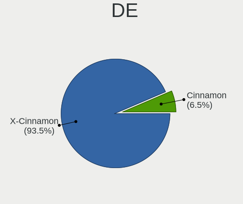

| Name       | Computers | Percent |
|------------|-----------|---------|
| X-Cinnamon | 27        | 72.97%  |
| Cinnamon   | 8         | 21.62%  |
| MATE       | 1         | 2.7%    |
| GNOME      | 1         | 2.7%    |

Display Server
--------------

X11 or Wayland

| Name | Computers | Percent |
|------|-----------|---------|
| X11  | 37        | 100%    |

Display Manager
---------------

SDDM, LightDM, etc.

| Name    | Computers | Percent |
|---------|-----------|---------|
| Unknown | 19        | 51.35%  |
| LightDM | 18        | 48.65%  |

OS Lang
-------

Language

| Lang  | Computers | Percent |
|-------|-----------|---------|
| en_US | 12        | 32.43%  |
| en_GB | 4         | 10.81%  |
| de_DE | 4         | 10.81%  |
| pl_PL | 2         | 5.41%   |
| it_IT | 2         | 5.41%   |
| fr_FR | 2         | 5.41%   |
| es_AR | 2         | 5.41%   |
| el_GR | 2         | 5.41%   |
| zh_CN | 1         | 2.7%    |
| ru_UA | 1         | 2.7%    |
| ru_RU | 1         | 2.7%    |
| ja_JP | 1         | 2.7%    |
| fi_FI | 1         | 2.7%    |
| es_CO | 1         | 2.7%    |
| cs_CZ | 1         | 2.7%    |

Boot Mode
---------

EFI or BIOS

| Mode | Computers | Percent |
|------|-----------|---------|
| EFI  | 20        | 54.05%  |
| BIOS | 17        | 45.95%  |

Filesystem
----------

Type of filesystem

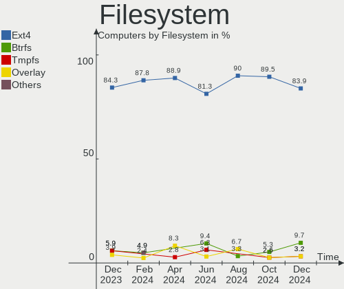

| Type    | Computers | Percent |
|---------|-----------|---------|
| Ext4    | 33        | 89.19%  |
| Tmpfs   | 2         | 5.41%   |
| Xfs     | 1         | 2.7%    |
| Overlay | 1         | 2.7%    |

Part. scheme
------------

Scheme of partitioning

| Type    | Computers | Percent |
|---------|-----------|---------|
| Unknown | 19        | 51.35%  |
| GPT     | 12        | 32.43%  |
| MBR     | 6         | 16.22%  |

Dual Boot with Linux/BSD
------------------------

Hosting more than one Linux/BSD

| Dual boot | Computers | Percent |
|-----------|-----------|---------|
| No        | 33        | 89.19%  |
| Yes       | 4         | 10.81%  |

Dual Boot (Win)
---------------

Hosting Linux and Windows

| Dual boot | Computers | Percent |
|-----------|-----------|---------|
| No        | 30        | 81.08%  |
| Yes       | 7         | 18.92%  |

Board
-----

Vendor
------

Motherboard manufacturer

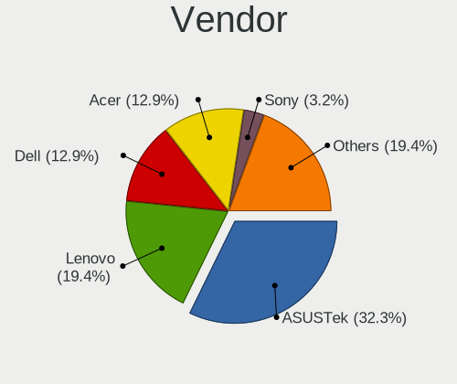

| Name                | Computers | Percent |
|---------------------|-----------|---------|
| Lenovo              | 10        | 27.03%  |
| Dell                | 5         | 13.51%  |
| Medion              | 2         | 5.41%   |
| Hewlett-Packard     | 2         | 5.41%   |
| Gigabyte Technology | 2         | 5.41%   |
| AZW                 | 2         | 5.41%   |
| ASUSTek Computer    | 2         | 5.41%   |
| ASRock              | 2         | 5.41%   |
| Acer                | 2         | 5.41%   |
| Timi                | 1         | 2.7%    |
| Pegatron            | 1         | 2.7%    |
| Packard Bell        | 1         | 2.7%    |
| MSI                 | 1         | 2.7%    |
| HUAWEI              | 1         | 2.7%    |
| Framework           | 1         | 2.7%    |
| Apple               | 1         | 2.7%    |
| Alienware           | 1         | 2.7%    |

Model
-----

Motherboard model

| Name                                  | Computers | Percent |
|---------------------------------------|-----------|---------|
| Timi RedmiBook 14-APCS                | 1         | 2.7%    |
| Pegatron FQ574AA-ABA m9517c           | 1         | 2.7%    |
| Packard Bell IMEDIA J9640             | 1         | 2.7%    |
| MSI MS-7A38                           | 1         | 2.7%    |
| Medion S23003                         | 1         | 2.7%    |
| Medion E6214                          | 1         | 2.7%    |
| Lenovo V15 G2 ALC 82KD                | 1         | 2.7%    |
| Lenovo ThinkPad Yoga 260 20FD002DUS   | 1         | 2.7%    |
| Lenovo ThinkPad W541 20EGS24J00       | 1         | 2.7%    |
| Lenovo ThinkPad W520 4284CY1          | 1         | 2.7%    |
| Lenovo ThinkPad L470 W10DG 20JVS02G00 | 1         | 2.7%    |
| Lenovo ThinkPad Edge 02173BG          | 1         | 2.7%    |
| Lenovo ThinkPad E495 20NES0RS00       | 1         | 2.7%    |
| Lenovo IdeaPad D330-10IGL 82H0        | 1         | 2.7%    |
| Lenovo G50-45 80E3                    | 1         | 2.7%    |
| Lenovo 4068AGJ                        | 1         | 2.7%    |
| HUAWEI NBLB-WAX9N                     | 1         | 2.7%    |
| HP Compaq Presario CQ60               | 1         | 2.7%    |
| HP Compaq 15                          | 1         | 2.7%    |
| Gigabyte Q87M-D2H                     | 1         | 2.7%    |
| Gigabyte E2100N                       | 1         | 2.7%    |
| Framework Laptop                      | 1         | 2.7%    |
| Dell Studio 1555                      | 1         | 2.7%    |
| Dell Latitude E6520                   | 1         | 2.7%    |
| Dell Latitude 7480                    | 1         | 2.7%    |
| Dell Latitude 7400                    | 1         | 2.7%    |
| Dell Latitude 3190 2-in-1             | 1         | 2.7%    |
| AZW SEi                               | 1         | 2.7%    |
| AZW MINI S                            | 1         | 2.7%    |
| ASUS ROG STRIX B450-F GAMING          | 1         | 2.7%    |
| ASUS A8N-E                            | 1         | 2.7%    |
| ASRock B450M Pro4                     | 1         | 2.7%    |
| ASRock 775Dual-VSTA                   | 1         | 2.7%    |
| Apple iMac7,1                         | 1         | 2.7%    |
| Alienware m15 Ryzen Ed. R5            | 1         | 2.7%    |
| Acer Aspire Z3-615                    | 1         | 2.7%    |
| Acer Aspire A515-56                   | 1         | 2.7%    |

Model Family
------------

Motherboard model prefix

| Name                 | Computers | Percent |
|----------------------|-----------|---------|
| Lenovo ThinkPad      | 6         | 16.22%  |
| Dell Latitude        | 4         | 10.81%  |
| HP Compaq            | 2         | 5.41%   |
| Acer Aspire          | 2         | 5.41%   |
| Timi RedmiBook       | 1         | 2.7%    |
| Pegatron FQ574AA-ABA | 1         | 2.7%    |
| Packard Bell IMEDIA  | 1         | 2.7%    |
| MSI MS-7A38          | 1         | 2.7%    |
| Medion S23003        | 1         | 2.7%    |
| Medion E6214         | 1         | 2.7%    |
| Lenovo V15           | 1         | 2.7%    |
| Lenovo IdeaPad       | 1         | 2.7%    |
| Lenovo G50-45        | 1         | 2.7%    |
| Lenovo 4068AGJ       | 1         | 2.7%    |
| HUAWEI NBLB-WAX9N    | 1         | 2.7%    |
| Gigabyte Q87M-D2H    | 1         | 2.7%    |
| Gigabyte E2100N      | 1         | 2.7%    |
| Framework Laptop     | 1         | 2.7%    |
| Dell Studio          | 1         | 2.7%    |
| AZW SEi              | 1         | 2.7%    |
| AZW MINI             | 1         | 2.7%    |
| ASUS ROG             | 1         | 2.7%    |
| ASUS A8N-E           | 1         | 2.7%    |
| ASRock B450M         | 1         | 2.7%    |
| ASRock 775Dual-VSTA  | 1         | 2.7%    |
| Apple iMac7          | 1         | 2.7%    |
| Alienware m15        | 1         | 2.7%    |

MFG Year
--------

Motherboard manufacture year

| Year | Computers | Percent |
|------|-----------|---------|
| 2021 | 5         | 13.51%  |
| 2019 | 4         | 10.81%  |
| 2017 | 4         | 10.81%  |
| 2014 | 4         | 10.81%  |
| 2020 | 3         | 8.11%   |
| 2018 | 3         | 8.11%   |
| 2010 | 3         | 8.11%   |
| 2011 | 2         | 5.41%   |
| 2009 | 2         | 5.41%   |
| 2007 | 2         | 5.41%   |
| 2022 | 1         | 2.7%    |
| 2015 | 1         | 2.7%    |
| 2008 | 1         | 2.7%    |
| 2006 | 1         | 2.7%    |
| 2005 | 1         | 2.7%    |

Form Factor
-----------

Physical design of the computer

| Name        | Computers | Percent |
|-------------|-----------|---------|
| Notebook    | 21        | 56.76%  |
| Desktop     | 11        | 29.73%  |
| Convertible | 2         | 5.41%   |
| All in one  | 2         | 5.41%   |
| Tablet      | 1         | 2.7%    |

Secure Boot
-----------

Enabled or disabled

| State    | Computers | Percent |
|----------|-----------|---------|
| Disabled | 35        | 94.59%  |
| Enabled  | 2         | 5.41%   |

Coreboot
--------

Have coreboot on board

| Used | Computers | Percent |
|------|-----------|---------|
| No   | 37        | 100%    |

RAM Size
--------

Total RAM memory

| Size in GB  | Computers | Percent |
|-------------|-----------|---------|
| 4.01-8.0    | 11        | 29.73%  |
| 3.01-4.0    | 10        | 27.03%  |
| 16.01-24.0  | 4         | 10.81%  |
| 1.01-2.0    | 3         | 8.11%   |
| 8.01-16.0   | 3         | 8.11%   |
| 2.01-3.0    | 2         | 5.41%   |
| 64.01-256.0 | 2         | 5.41%   |
| 32.01-64.0  | 1         | 2.7%    |
| 24.01-32.0  | 1         | 2.7%    |

RAM Used
--------

Used RAM memory

| Used GB  | Computers | Percent |
|----------|-----------|---------|
| 1.01-2.0 | 13        | 35.14%  |
| 2.01-3.0 | 9         | 24.32%  |
| 3.01-4.0 | 7         | 18.92%  |
| 4.01-8.0 | 5         | 13.51%  |
| 0.51-1.0 | 3         | 8.11%   |

Total Drives
------------

Number of drives on board

| Drives | Computers | Percent |
|--------|-----------|---------|
| 1      | 21        | 56.76%  |
| 2      | 13        | 35.14%  |
| 3      | 2         | 5.41%   |
| 4      | 1         | 2.7%    |

Has CD-ROM
----------

Has CD-ROM on board

| Presented | Computers | Percent |
|-----------|-----------|---------|
| No        | 26        | 70.27%  |
| Yes       | 11        | 29.73%  |

Has Ethernet
------------

Has Ethernet on board

| Presented | Computers | Percent |
|-----------|-----------|---------|
| Yes       | 32        | 86.49%  |
| No        | 5         | 13.51%  |

Has WiFi
--------

Has WiFi module

| Presented | Computers | Percent |
|-----------|-----------|---------|
| Yes       | 33        | 89.19%  |
| No        | 4         | 10.81%  |

Has Bluetooth
-------------

Has Bluetooth module

| Presented | Computers | Percent |
|-----------|-----------|---------|
| Yes       | 22        | 59.46%  |
| No        | 15        | 40.54%  |

Location
--------

Country
-------

Geographic location (country)

| Country      | Computers | Percent |
|--------------|-----------|---------|
| USA          | 6         | 16.22%  |
| Germany      | 5         | 13.51%  |
| Italy        | 4         | 10.81%  |
| UK           | 2         | 5.41%   |
| Russia       | 2         | 5.41%   |
| Poland       | 2         | 5.41%   |
| France       | 2         | 5.41%   |
| Argentina    | 2         | 5.41%   |
| Ukraine      | 1         | 2.7%    |
| Sweden       | 1         | 2.7%    |
| Saudi Arabia | 1         | 2.7%    |
| Paraguay     | 1         | 2.7%    |
| Mexico       | 1         | 2.7%    |
| Japan        | 1         | 2.7%    |
| Greece       | 1         | 2.7%    |
| Finland      | 1         | 2.7%    |
| Czechia      | 1         | 2.7%    |
| Colombia     | 1         | 2.7%    |
| China        | 1         | 2.7%    |
| Chile        | 1         | 2.7%    |

City
----

Geographic location (city)

| City                | Computers | Percent |
|---------------------|-----------|---------|
| Delligsen           | 3         | 8.11%   |
| Milan               | 2         | 5.41%   |
| Warsaw              | 1         | 2.7%    |
| Volgograd           | 1         | 2.7%    |
| Santiago            | 1         | 2.7%    |
| Rome                | 1         | 2.7%    |
| Pilar               | 1         | 2.7%    |
| New York            | 1         | 2.7%    |
| Nashville           | 1         | 2.7%    |
| Myrtle Beach        | 1         | 2.7%    |
| Medellín           | 1         | 2.7%    |
| Mar del Plata       | 1         | 2.7%    |
| Malmo               | 1         | 2.7%    |
| Krefeld             | 1         | 2.7%    |
| Kościan            | 1         | 2.7%    |
| Kharkiv             | 1         | 2.7%    |
| Jyväskylä         | 1         | 2.7%    |
| Hamamatsu           | 1         | 2.7%    |
| Guangzhou           | 1         | 2.7%    |
| Columbia City       | 1         | 2.7%    |
| Ciudad Juárez      | 1         | 2.7%    |
| Ciudad del Este     | 1         | 2.7%    |
| City of Westminster | 1         | 2.7%    |
| Challans            | 1         | 2.7%    |
| Caslav              | 1         | 2.7%    |
| Campagnano di Roma  | 1         | 2.7%    |
| Birmingham          | 1         | 2.7%    |
| Béziers            | 1         | 2.7%    |
| Berlin              | 1         | 2.7%    |
| Belgorod            | 1         | 2.7%    |
| Baldwin             | 1         | 2.7%    |
| Austin              | 1         | 2.7%    |
| Athens              | 1         | 2.7%    |
| Al Qatif            | 1         | 2.7%    |

Drives
------

Drive Vendor
------------

Hard drive vendors

| Vendor              | Computers | Drives | Percent |
|---------------------|-----------|--------|---------|
| Samsung Electronics | 10        | 10     | 19.61%  |
| WDC                 | 8         | 10     | 15.69%  |
| Unknown             | 4         | 7      | 7.84%   |
| SanDisk             | 4         | 5      | 7.84%   |
| Kingston            | 4         | 4      | 7.84%   |
| Toshiba             | 2         | 2      | 3.92%   |
| SK hynix            | 2         | 2      | 3.92%   |
| Seagate             | 2         | 2      | 3.92%   |
| Phison              | 2         | 2      | 3.92%   |
| HGST                | 2         | 2      | 3.92%   |
| Crucial             | 2         | 2      | 3.92%   |
| WD MediaMax         | 1         | 1      | 1.96%   |
| Transcend           | 1         | 1      | 1.96%   |
| Silicon Motion      | 1         | 1      | 1.96%   |
| Patriot             | 1         | 1      | 1.96%   |
| Hitachi             | 1         | 1      | 1.96%   |
| Hanye               | 1         | 1      | 1.96%   |
| Fujitsu             | 1         | 1      | 1.96%   |
| Fanxiang            | 1         | 1      | 1.96%   |
| China               | 1         | 1      | 1.96%   |

Drive Model
-----------

Hard drive models

| Model                                               | Computers | Percent |
|-----------------------------------------------------|-----------|---------|
| WDC WDS100T3X0C-00SJG0 1TB                          | 1         | 1.75%   |
| WDC WD5000LPCX-24C6HT0 500GB                        | 1         | 1.75%   |
| WDC WD5000KS-00MNB0 500GB                           | 1         | 1.75%   |
| WDC WD5000AVVS-63M8B0 500GB                         | 1         | 1.75%   |
| WDC WD3200BEVT-22ZCT0 320GB                         | 1         | 1.75%   |
| WDC WD2500BEVT-24A23T0 250GB                        | 1         | 1.75%   |
| WDC WD1600JD-22HBC0 160GB                           | 1         | 1.75%   |
| WDC WD10EZEX-60WN4A0 1TB                            | 1         | 1.75%   |
| WDC WD10EZEX-22MFCA0 1TB                            | 1         | 1.75%   |
| WDC WD10EZEX-08WN4A0 1TB                            | 1         | 1.75%   |
| WD MediaMax WL320GLSA3272B 320GB                    | 1         | 1.75%   |
| Unknown USB DISK 3.2 2TB                            | 1         | 1.75%   |
| Unknown SD/MMC/MS PRO 64GB                          | 1         | 1.75%   |
| Unknown SD  64GB                                    | 1         | 1.75%   |
| Unknown MMC Card  64GB                              | 1         | 1.75%   |
| Unknown MMC Card  128GB                             | 1         | 1.75%   |
| Unknown EB1QT  32GB                                 | 1         | 1.75%   |
| Unknown DA4128  128GB                               | 1         | 1.75%   |
| Transcend TS128GMTS430S 128GB SSD                   | 1         | 1.75%   |
| Toshiba XG6 NVMe SSD Controller 256GB               | 1         | 1.75%   |
| Toshiba HDWD110 1TB                                 | 1         | 1.75%   |
| SK hynix PC711 NVMe 1TB                             | 1         | 1.75%   |
| SK hynix BC501 NVMe Solid State Drive 512GB         | 1         | 1.75%   |
| Silicon Motion 512GB                                | 1         | 1.75%   |
| Seagate ST500LM021-1KJ152 500GB                     | 1         | 1.75%   |
| Seagate ST500DM005 HD502HJ 500GB                    | 1         | 1.75%   |
| Sandisk WD Black 2018/SN750 / PC SN720 NVMe SSD 1TB | 1         | 1.75%   |
| SanDisk SDSSDH3 1T02 1TB                            | 1         | 1.75%   |
| SanDisk SD8SN8U-256G-1006 256GB SSD                 | 1         | 1.75%   |
| SanDisk SD7UB3Q256G1001 256GB SSD                   | 1         | 1.75%   |
| SanDisk Extreme 55AE 1TB SSD                        | 1         | 1.75%   |
| Samsung SSD 870 QVO 1TB                             | 1         | 1.75%   |
| Samsung SSD 860 EVO 250GB                           | 1         | 1.75%   |
| Samsung SSD 850 PRO 256GB                           | 1         | 1.75%   |
| Samsung SP2004C 200GB                               | 1         | 1.75%   |
| Samsung PM9A1 NVMe SED 1024GB                       | 1         | 1.75%   |
| Samsung PM991 NVMe 128GB                            | 1         | 1.75%   |
| Samsung MZVLB512HAJQ-00000 512GB                    | 1         | 1.75%   |
| Samsung MZNTY256HDHP-000L7 256GB SSD                | 1         | 1.75%   |
| Samsung MZALQ256HBJD-00BL2 256GB                    | 1         | 1.75%   |

HDD Vendor
----------

Hard disk drive vendors

| Vendor              | Computers | Drives | Percent |
|---------------------|-----------|--------|---------|
| WDC                 | 7         | 9      | 41.18%  |
| Seagate             | 2         | 2      | 11.76%  |
| Samsung Electronics | 2         | 2      | 11.76%  |
| HGST                | 2         | 2      | 11.76%  |
| Unknown             | 1         | 1      | 5.88%   |
| Toshiba             | 1         | 1      | 5.88%   |
| Hitachi             | 1         | 1      | 5.88%   |
| Fujitsu             | 1         | 1      | 5.88%   |

SSD Vendor
----------

Solid state drive vendors

| Vendor              | Computers | Drives | Percent |
|---------------------|-----------|--------|---------|
| Samsung Electronics | 4         | 4      | 22.22%  |
| SanDisk             | 3         | 4      | 16.67%  |
| Kingston            | 3         | 3      | 16.67%  |
| Crucial             | 2         | 2      | 11.11%  |
| Transcend           | 1         | 1      | 5.56%   |
| Phison              | 1         | 1      | 5.56%   |
| Patriot             | 1         | 1      | 5.56%   |
| Hanye               | 1         | 1      | 5.56%   |
| Fanxiang            | 1         | 1      | 5.56%   |
| China               | 1         | 1      | 5.56%   |

Drive Kind
----------

HDD or SSD

| Kind    | Computers | Drives | Percent |
|---------|-----------|--------|---------|
| SSD     | 17        | 19     | 36.17%  |
| HDD     | 15        | 19     | 31.91%  |
| NVMe    | 11        | 12     | 23.4%   |
| MMC     | 2         | 5      | 4.26%   |
| Unknown | 2         | 2      | 4.26%   |

Drive Connector
---------------

SATA, SAS, NVMe, etc.

| Type | Computers | Drives | Percent |
|------|-----------|--------|---------|
| SATA | 28        | 37     | 63.64%  |
| NVMe | 11        | 12     | 25%     |
| SAS  | 3         | 3      | 6.82%   |
| MMC  | 2         | 5      | 4.55%   |

Drive Size
----------

Size of hard drive

| Size in TB | Computers | Drives | Percent |
|------------|-----------|--------|---------|
| 0.01-0.5   | 21        | 27     | 75%     |
| 0.51-1.0   | 7         | 11     | 25%     |

Space Total
-----------

Amount of disk space available on the file system

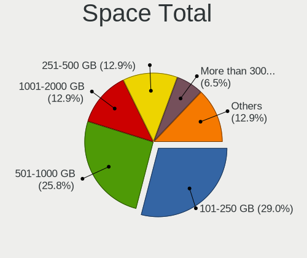

| Size in GB | Computers | Percent |
|------------|-----------|---------|
| 101-250    | 15        | 40.54%  |
| 251-500    | 6         | 16.22%  |
| 501-1000   | 6         | 16.22%  |
| 1001-2000  | 4         | 10.81%  |
| 51-100     | 4         | 10.81%  |
| 1-20       | 2         | 5.41%   |

Space Used
----------

Amount of used disk space

| Used GB  | Computers | Percent |
|----------|-----------|---------|
| 1-20     | 11        | 29.73%  |
| 21-50    | 9         | 24.32%  |
| 51-100   | 8         | 21.62%  |
| 101-250  | 6         | 16.22%  |
| 251-500  | 2         | 5.41%   |
| 501-1000 | 1         | 2.7%    |

Malfunc. Drives
---------------

Drive models with a malfunction

| Model                    | Computers | Drives | Percent |
|--------------------------|-----------|--------|---------|
| WDC WD10EZEX-60WN4A0 1TB | 1         | 1      | 50%     |
| Toshiba HDWD110 1TB      | 1         | 1      | 50%     |

Malfunc. Drive Vendor
---------------------

Vendors of faulty drives

| Vendor  | Computers | Drives | Percent |
|---------|-----------|--------|---------|
| WDC     | 1         | 1      | 50%     |
| Toshiba | 1         | 1      | 50%     |

Malfunc. HDD Vendor
-------------------

Vendors of faulty HDD drives

| Vendor  | Computers | Drives | Percent |
|---------|-----------|--------|---------|
| WDC     | 1         | 1      | 50%     |
| Toshiba | 1         | 1      | 50%     |

Malfunc. Drive Kind
-------------------

Kinds of faulty drives

| Kind | Computers | Drives | Percent |
|------|-----------|--------|---------|
| HDD  | 1         | 2      | 100%    |

Failed Drives
-------------

Failed drive models

Zero info for selected period =(

Failed Drive Vendor
-------------------

Failed drive vendors

Zero info for selected period =(

Drive Status
------------

Number of failed and malfunc. drives

| Status   | Computers | Drives | Percent |
|----------|-----------|--------|---------|
| Detected | 24        | 36     | 58.54%  |
| Works    | 16        | 19     | 39.02%  |
| Malfunc  | 1         | 2      | 2.44%   |

Storage controller
------------------

Storage Vendor
--------------

Storage controller vendors

| Vendor                       | Computers | Percent |
|------------------------------|-----------|---------|
| Intel                        | 20        | 45.45%  |
| AMD                          | 8         | 18.18%  |
| Samsung Electronics          | 4         | 9.09%   |
| VIA Technologies             | 2         | 4.55%   |
| SK hynix                     | 2         | 4.55%   |
| SanDisk                      | 2         | 4.55%   |
| Nvidia                       | 2         | 4.55%   |
| Toshiba America Info Systems | 1         | 2.27%   |
| Silicon Motion               | 1         | 2.27%   |
| Phison Electronics           | 1         | 2.27%   |
| Kingston Technology Company  | 1         | 2.27%   |

Storage Model
-------------

Storage controller models

| Model                                                                          | Computers | Percent |
|--------------------------------------------------------------------------------|-----------|---------|
| AMD FCH SATA Controller [AHCI mode]                                            | 8         | 15.09%  |
| Intel Sunrise Point-LP SATA Controller [AHCI mode]                             | 3         | 5.66%   |
| Intel 8 Series/C220 Series Chipset Family 6-port SATA Controller 1 [AHCI mode] | 3         | 5.66%   |
| VIA VT82C586A/B/VT82C686/A/B/VT823x/A/C PIPC Bus Master IDE                    | 2         | 3.77%   |
| Samsung NVMe SSD Controller 980                                                | 2         | 3.77%   |
| Intel Celeron/Pentium Silver Processor SATA Controller                         | 2         | 3.77%   |
| Intel 82801IBM/IEM (ICH9M/ICH9M-E) 4 port SATA Controller [AHCI mode]          | 2         | 3.77%   |
| Intel 5 Series/3400 Series Chipset 4 port SATA AHCI Controller                 | 2         | 3.77%   |
| AMD 400 Series Chipset SATA Controller                                         | 2         | 3.77%   |
| VIA VT8237A SATA 2-Port Controller                                             | 1         | 1.89%   |
| VIA Serial ATA Controller                                                      | 1         | 1.89%   |
| Toshiba America Info Systems XG6 NVMe SSD Controller                           | 1         | 1.89%   |
| SK hynix Gold P31/PC711 NVMe Solid State Drive                                 | 1         | 1.89%   |
| SK hynix BC501 NVMe Solid State Drive                                          | 1         | 1.89%   |
| Silicon Motion SM2263EN/SM2263XT SSD Controller                                | 1         | 1.89%   |
| SanDisk WD Black SN750 / PC SN730 NVMe SSD                                     | 1         | 1.89%   |
| SanDisk WD Black 2018/SN750 / PC SN720 NVMe SSD                                | 1         | 1.89%   |
| Samsung NVMe SSD Controller SM981/PM981/PM983                                  | 1         | 1.89%   |
| Samsung NVMe SSD Controller PM9A1/PM9A3/980PRO                                 | 1         | 1.89%   |
| Phison PS5013 E13 NVMe Controller                                              | 1         | 1.89%   |
| Nvidia MCP78S [GeForce 8200] SATA Controller (RAID mode)                       | 1         | 1.89%   |
| Nvidia CK804 Serial ATA Controller                                             | 1         | 1.89%   |
| Nvidia CK804 IDE                                                               | 1         | 1.89%   |
| Kingston Company NVMe Controller                                               | 1         | 1.89%   |
| Intel Volume Management Device NVMe RAID Controller                            | 1         | 1.89%   |
| Intel Tiger Lake-LP SATA Controller                                            | 1         | 1.89%   |
| Intel Jasper Lake SATA AHCI Controller                                         | 1         | 1.89%   |
| Intel Comet Lake SATA AHCI Controller                                          | 1         | 1.89%   |
| Intel Cannon Point-LP SATA Controller [AHCI Mode]                              | 1         | 1.89%   |
| Intel 82801HM/HEM (ICH8M/ICH8M-E) SATA Controller [AHCI mode]                  | 1         | 1.89%   |
| Intel 82801HM/HEM (ICH8M/ICH8M-E) IDE Controller                               | 1         | 1.89%   |
| Intel 82801GBM/GHM (ICH7-M Family) SATA Controller [IDE mode]                  | 1         | 1.89%   |
| Intel 82801G (ICH7 Family) IDE Controller                                      | 1         | 1.89%   |
| Intel 82801 Mobile SATA Controller [RAID mode]                                 | 1         | 1.89%   |
| Intel 6 Series/C200 Series Chipset Family 6 port Mobile SATA AHCI Controller   | 1         | 1.89%   |
| AMD 300 Series Chipset SATA Controller                                         | 1         | 1.89%   |

Storage Kind
------------

Kind of storage controller (IDE, SATA, NVMe, SAS, ...)

| Kind | Computers | Percent |
|------|-----------|---------|
| SATA | 26        | 56.52%  |
| NVMe | 11        | 23.91%  |
| IDE  | 5         | 10.87%  |
| RAID | 4         | 8.7%    |

Processor
---------

CPU Vendor
----------

Processor vendors

| Vendor | Computers | Percent |
|--------|-----------|---------|
| Intel  | 25        | 67.57%  |
| AMD    | 12        | 32.43%  |

CPU Model
---------

Processor models

| Model                                         | Computers | Percent |
|-----------------------------------------------|-----------|---------|
| AMD Ryzen 7 3700U with Radeon Vega Mobile Gfx | 2         | 5.41%   |
| AMD Ryzen 5 2600 Six-Core Processor           | 2         | 5.41%   |
| AMD E1-2100 APU with Radeon HD Graphics       | 2         | 5.41%   |
| Intel Pentium Dual-Core CPU T4200 @ 2.00GHz   | 1         | 2.7%    |
| Intel Core i7-7600U CPU @ 2.80GHz             | 1         | 2.7%    |
| Intel Core i7-4810MQ CPU @ 2.80GHz            | 1         | 2.7%    |
| Intel Core i7-2640M CPU @ 2.80GHz             | 1         | 2.7%    |
| Intel Core i7-2620M CPU @ 2.70GHz             | 1         | 2.7%    |
| Intel Core i5-8365U CPU @ 1.60GHz             | 1         | 2.7%    |
| Intel Core i5-8259U CPU @ 2.30GHz             | 1         | 2.7%    |
| Intel Core i5-6300U CPU @ 2.40GHz             | 1         | 2.7%    |
| Intel Core i5-6200U CPU @ 2.30GHz             | 1         | 2.7%    |
| Intel Core i5-4590S CPU @ 3.00GHz             | 1         | 2.7%    |
| Intel Core i5-10210U CPU @ 1.60GHz            | 1         | 2.7%    |
| Intel Core i3-4130T CPU @ 2.90GHz             | 1         | 2.7%    |
| Intel Core i3 CPU U 380 @ 1.33GHz             | 1         | 2.7%    |
| Intel Core i3 CPU M 330 @ 2.13GHz             | 1         | 2.7%    |
| Intel Core 2 Duo CPU T7700 @ 2.40GHz          | 1         | 2.7%    |
| Intel Core 2 Duo CPU T6600 @ 2.20GHz          | 1         | 2.7%    |
| Intel Core 2 Duo CPU E7200 @ 2.53GHz          | 1         | 2.7%    |
| Intel Core 2 Duo CPU E4500 @ 2.20GHz          | 1         | 2.7%    |
| Intel Celeron N5095 @ 2.00GHz                 | 1         | 2.7%    |
| Intel Celeron N4120 CPU @ 1.10GHz             | 1         | 2.7%    |
| Intel Celeron N4020 CPU @ 1.10GHz             | 1         | 2.7%    |
| Intel Celeron J4125 CPU @ 2.00GHz             | 1         | 2.7%    |
| Intel Atom CPU N270 @ 1.60GHz                 | 1         | 2.7%    |
| Intel 11th Gen Core i7-1165G7 @ 2.80GHz       | 1         | 2.7%    |
| Intel 11th Gen Core i3-1115G4 @ 3.00GHz       | 1         | 2.7%    |
| AMD Ryzen 9 5900HX with Radeon Graphics       | 1         | 2.7%    |
| AMD Ryzen 5 1500X Quad-Core Processor         | 1         | 2.7%    |
| AMD Ryzen 3 5300U with Radeon Graphics        | 1         | 2.7%    |
| AMD Phenom 9550 Quad-Core Processor           | 1         | 2.7%    |
| AMD E1-6010 APU with AMD Radeon R2 Graphics   | 1         | 2.7%    |
| AMD Athlon 64 X2 Dual Core Processor 4200+    | 1         | 2.7%    |

CPU Model Family
----------------

Processor model prefix

| Model                   | Computers | Percent |
|-------------------------|-----------|---------|
| Intel Core i5           | 6         | 16.22%  |
| Intel Core i7           | 4         | 10.81%  |
| Intel Core 2 Duo        | 4         | 10.81%  |
| Intel Celeron           | 4         | 10.81%  |
| Intel Core i3           | 3         | 8.11%   |
| AMD Ryzen 5             | 3         | 8.11%   |
| AMD E1                  | 3         | 8.11%   |
| Other                   | 2         | 5.41%   |
| AMD Ryzen 7             | 2         | 5.41%   |
| Intel Pentium Dual-Core | 1         | 2.7%    |
| Intel Atom              | 1         | 2.7%    |
| AMD Ryzen 9             | 1         | 2.7%    |
| AMD Ryzen 3             | 1         | 2.7%    |
| AMD Phenom              | 1         | 2.7%    |
| AMD Athlon 64 X2        | 1         | 2.7%    |

CPU Cores
---------

Number of processor cores

| Number | Computers | Percent |
|--------|-----------|---------|
| 2      | 19        | 51.35%  |
| 4      | 14        | 37.84%  |
| 6      | 2         | 5.41%   |
| 8      | 1         | 2.7%    |
| 1      | 1         | 2.7%    |

CPU Sockets
-----------

Number of sockets

| Number | Computers | Percent |
|--------|-----------|---------|
| 1      | 37        | 100%    |

CPU Threads
-----------

Threads per core (Hyper-Threading)

| Number | Computers | Percent |
|--------|-----------|---------|
| 2      | 22        | 59.46%  |
| 1      | 15        | 40.54%  |

CPU Op-Modes
------------

CPU Operation Modes (32-bit, 64-bit)

| Op mode        | Computers | Percent |
|----------------|-----------|---------|
| 32-bit, 64-bit | 36        | 97.3%   |
| 32-bit         | 1         | 2.7%    |

CPU Microcode
-------------

Microcode number

| Number     | Computers | Percent |
|------------|-----------|---------|
| 0x706a8    | 3         | 8.11%   |
| 0x306c3    | 3         | 8.11%   |
| 0x806ec    | 2         | 5.41%   |
| 0x806c1    | 2         | 5.41%   |
| 0x406e3    | 2         | 5.41%   |
| 0x206a7    | 2         | 5.41%   |
| 0x1067a    | 2         | 5.41%   |
| 0x0800820d | 2         | 5.41%   |
| 0x906c0    | 1         | 2.7%    |
| 0x806ea    | 1         | 2.7%    |
| 0x806e9    | 1         | 2.7%    |
| 0x6fd      | 1         | 2.7%    |
| 0x6fb      | 1         | 2.7%    |
| 0x20655    | 1         | 2.7%    |
| 0x20652    | 1         | 2.7%    |
| 0x106c2    | 1         | 2.7%    |
| 0x10676    | 1         | 2.7%    |
| 0x0a50000d | 1         | 2.7%    |
| 0x08608103 | 1         | 2.7%    |
| 0x08108109 | 1         | 2.7%    |
| 0x08108102 | 1         | 2.7%    |
| 0x08001138 | 1         | 2.7%    |
| 0x07030105 | 1         | 2.7%    |
| 0x07000110 | 1         | 2.7%    |
| 0x0700010f | 1         | 2.7%    |
| 0x01000083 | 1         | 2.7%    |
| Unknown    | 1         | 2.7%    |

CPU Microarch
-------------

Microarchitecture

| Name          | Computers | Percent |
|---------------|-----------|---------|
| Zen+          | 4         | 10.81%  |
| KabyLake      | 4         | 10.81%  |
| Penryn        | 3         | 8.11%   |
| Haswell       | 3         | 8.11%   |
| Goldmont plus | 3         | 8.11%   |
| Westmere      | 2         | 5.41%   |
| TigerLake     | 2         | 5.41%   |
| Skylake       | 2         | 5.41%   |
| SandyBridge   | 2         | 5.41%   |
| Jaguar        | 2         | 5.41%   |
| Core          | 2         | 5.41%   |
| Zen 3         | 1         | 2.7%    |
| Zen           | 1         | 2.7%    |
| Tremont       | 1         | 2.7%    |
| Puma          | 1         | 2.7%    |
| K8 Hammer     | 1         | 2.7%    |
| K10           | 1         | 2.7%    |
| Bonnell       | 1         | 2.7%    |
| Unknown       | 1         | 2.7%    |

Graphics
--------

GPU Vendor
----------

Vendors of graphics cards

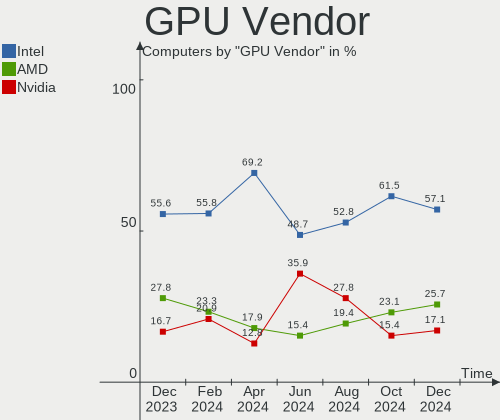

| Vendor | Computers | Percent |
|--------|-----------|---------|
| Intel  | 21        | 51.22%  |
| AMD    | 11        | 26.83%  |
| Nvidia | 9         | 21.95%  |

GPU Model
---------

Graphics card models

| Model                                                                         | Computers | Percent |
|-------------------------------------------------------------------------------|-----------|---------|
| Intel GeminiLake [UHD Graphics 600]                                           | 3         | 6.98%   |
| Intel Skylake GT2 [HD Graphics 520]                                           | 2         | 4.65%   |
| Intel Core Processor Integrated Graphics Controller                           | 2         | 4.65%   |
| Intel 2nd Generation Core Processor Family Integrated Graphics Controller     | 2         | 4.65%   |
| AMD Picasso/Raven 2 [Radeon Vega Series / Radeon Vega Mobile Series]          | 2         | 4.65%   |
| AMD Kabini [Radeon HD 8210]                                                   | 2         | 4.65%   |
| Nvidia GP107 [GeForce GTX 1050]                                               | 1         | 2.33%   |
| Nvidia GK208B [GeForce GT 710]                                                | 1         | 2.33%   |
| Nvidia GK106GLM [Quadro K2100M]                                               | 1         | 2.33%   |
| Nvidia GK106 [GeForce GTX 660]                                                | 1         | 2.33%   |
| Nvidia GK104 [GeForce GTX 760]                                                | 1         | 2.33%   |
| Nvidia GF108GLM [Quadro 1000M]                                                | 1         | 2.33%   |
| Nvidia GF108 [GeForce GT 630]                                                 | 1         | 2.33%   |
| Nvidia GA104M [GeForce RTX 3070 Mobile / Max-Q]                               | 1         | 2.33%   |
| Nvidia G84 [GeForce 8600 GS]                                                  | 1         | 2.33%   |
| Intel Xeon E3-1200 v3/4th Gen Core Processor Integrated Graphics Controller   | 1         | 2.33%   |
| Intel WhiskeyLake-U GT2 [UHD Graphics 620]                                    | 1         | 2.33%   |
| Intel TigerLake-LP GT2 [Iris Xe Graphics]                                     | 1         | 2.33%   |
| Intel Tiger Lake-LP GT2 [UHD Graphics G4]                                     | 1         | 2.33%   |
| Intel Mobile 945GSE Express Integrated Graphics Controller                    | 1         | 2.33%   |
| Intel Mobile 945GM/GMS/GME, 943/940GML Express Integrated Graphics Controller | 1         | 2.33%   |
| Intel Mobile 4 Series Chipset Integrated Graphics Controller                  | 1         | 2.33%   |
| Intel JasperLake [UHD Graphics]                                               | 1         | 2.33%   |
| Intel HD Graphics 620                                                         | 1         | 2.33%   |
| Intel CometLake-U GT2 [UHD Graphics]                                          | 1         | 2.33%   |
| Intel CoffeeLake-U GT3e [Iris Plus Graphics 655]                              | 1         | 2.33%   |
| Intel 4th Generation Core Processor Family Integrated Graphics Controller     | 1         | 2.33%   |
| Intel 4th Gen Core Processor Integrated Graphics Controller                   | 1         | 2.33%   |
| AMD RV710/M92 [Mobility Radeon HD 4530/4570/5145/530v/540v/545v]              | 1         | 2.33%   |
| AMD RV630/M76 [Mobility Radeon HD 2600 XT/2700]                               | 1         | 2.33%   |
| AMD RV515 PRO [Radeon X1300/X1550 Series] (Secondary)                         | 1         | 2.33%   |
| AMD RV515 PRO [Radeon X1300/X1550 Series]                                     | 1         | 2.33%   |
| AMD Navi 22 [Radeon RX 6700/6700 XT/6750 XT / 6800M/6850M XT]                 | 1         | 2.33%   |
| AMD Mullins [Radeon R2 Graphics]                                              | 1         | 2.33%   |
| AMD Lucienne                                                                  | 1         | 2.33%   |
| AMD Cezanne [Radeon Vega Series / Radeon Vega Mobile Series]                  | 1         | 2.33%   |

GPU Combo
---------

Combinations of graphics cards

| Name           | Computers | Percent |
|----------------|-----------|---------|
| 1 x Intel      | 19        | 51.35%  |
| 1 x AMD        | 9         | 24.32%  |
| 1 x Nvidia     | 5         | 13.51%  |
| Intel + Nvidia | 2         | 5.41%   |
| 2 x AMD        | 1         | 2.7%    |
| AMD + Nvidia   | 1         | 2.7%    |

GPU Driver
----------

Free vs proprietary

| Driver      | Computers | Percent |
|-------------|-----------|---------|
| Free        | 31        | 83.78%  |
| Proprietary | 4         | 10.81%  |
| Unknown     | 2         | 5.41%   |

GPU Memory
----------

Total video memory

| Size in GB | Computers | Percent |
|------------|-----------|---------|
| Unknown    | 21        | 56.76%  |
| 0.01-0.5   | 8         | 21.62%  |
| 1.01-2.0   | 7         | 18.92%  |
| 3.01-4.0   | 1         | 2.7%    |

Monitor
-------

Monitor Vendor
--------------

Monitor vendors

| Vendor                  | Computers | Percent |
|-------------------------|-----------|---------|
| AU Optronics            | 6         | 17.14%  |
| BOE                     | 5         | 14.29%  |
| LG Display              | 3         | 8.57%   |
| Samsung Electronics     | 2         | 5.71%   |
| Goldstar                | 2         | 5.71%   |
| Eizo                    | 2         | 5.71%   |
| Chimei Innolux          | 2         | 5.71%   |
| ViewSonic               | 1         | 2.86%   |
| Sony                    | 1         | 2.86%   |
| Pioneer                 | 1         | 2.86%   |
| PANDA                   | 1         | 2.86%   |
| Panasonic               | 1         | 2.86%   |
| Lenovo                  | 1         | 2.86%   |
| InfoVision              | 1         | 2.86%   |
| Idek Iiyama             | 1         | 2.86%   |
| HUAWEI                  | 1         | 2.86%   |
| DENON                   | 1         | 2.86%   |
| Chi Mei Optoelectronics | 1         | 2.86%   |
| Apple                   | 1         | 2.86%   |
| Acer                    | 1         | 2.86%   |

Monitor Model
-------------

Monitor models

| Model                                                                    | Computers | Percent |
|--------------------------------------------------------------------------|-----------|---------|
| ViewSonic VG2756-4K VSC553A 3840x2160 597x336mm 27.0-inch                | 1         | 2.78%   |
| Sony TV SNY8701 1440x900                                                 | 1         | 2.78%   |
| Samsung Electronics SyncMaster SAM0022 1280x1024 312x234mm 15.4-inch     | 1         | 2.78%   |
| Samsung Electronics LCD Monitor SEC5441 1280x800 331x207mm 15.4-inch     | 1         | 2.78%   |
| Pioneer PDP-504CMX PIO0034 1400x1050 827x620mm 40.7-inch                 | 1         | 2.78%   |
| PANDA LCD Monitor NCP004A 1920x1080 309x174mm 14.0-inch                  | 1         | 2.78%   |
| Panasonic VVX14T092N00 MEI96A2 2256x1504 285x190mm 13.5-inch             | 1         | 2.78%   |
| LG Display LCD Monitor LGD0690 2560x1440 344x194mm 15.5-inch             | 1         | 2.78%   |
| LG Display LCD Monitor LGD0468 1366x768 344x194mm 15.5-inch              | 1         | 2.78%   |
| LG Display LCD Monitor LGD0266 1366x768 344x194mm 15.5-inch              | 1         | 2.78%   |
| Lenovo LCD Monitor LEN4090 1366x768 293x164mm 13.2-inch                  | 1         | 2.78%   |
| InfoVision LCD Monitor IVO04E5 1366x768 276x155mm 12.5-inch              | 1         | 2.78%   |
| Idek Iiyama LCD Monitor PL2590 1920x1080                                 | 1         | 2.78%   |
| HUAWEI ZQE-CBA HWV6A25 3440x1440 797x334mm 34.0-inch                     | 1         | 2.78%   |
| Goldstar LG TV SSCR2 GSMC0C8 3840x2160                                   | 1         | 2.78%   |
| Goldstar IPS234 GSM58D9 1920x1080 510x290mm 23.1-inch                    | 1         | 2.78%   |
| Eizo L778 ENC1766 1280x1024 376x301mm 19.0-inch                          | 1         | 2.78%   |
| Eizo L768 ENC1729 1280x1024 376x301mm 19.0-inch                          | 1         | 2.78%   |
| Eizo L767 ENC1688 1280x1024 376x301mm 19.0-inch                          | 1         | 2.78%   |
| DENON AVR DON0063 3840x2160 1420x800mm 64.2-inch                         | 1         | 2.78%   |
| Chimei Innolux LCD Monitor CMN15F5 1920x1080 344x193mm 15.5-inch         | 1         | 2.78%   |
| Chimei Innolux LCD Monitor CMN15E7 1920x1080 344x193mm 15.5-inch         | 1         | 2.78%   |
| Chi Mei Optoelectronics LCD Monitor CMO1558 1366x768 344x193mm 15.5-inch | 1         | 2.78%   |
| BOE LCD Monitor BOE095F 2256x1504 285x190mm 13.5-inch                    | 1         | 2.78%   |
| BOE LCD Monitor BOE0877 1920x1080 309x173mm 13.9-inch                    | 1         | 2.78%   |
| BOE LCD Monitor BOE07BC 1920x1080 309x173mm 13.9-inch                    | 1         | 2.78%   |
| BOE LCD Monitor BOE074C 1366x768 309x173mm 13.9-inch                     | 1         | 2.78%   |
| BOE LCD Monitor BOE06EE 1920x1080 309x173mm 13.9-inch                    | 1         | 2.78%   |
| AU Optronics LCD Monitor AUO45EC 1366x768 344x193mm 15.5-inch            | 1         | 2.78%   |
| AU Optronics LCD Monitor AUO405C 1366x768 256x144mm 11.6-inch            | 1         | 2.78%   |
| AU Optronics LCD Monitor AUO32EC 1366x768 344x193mm 15.5-inch            | 1         | 2.78%   |
| AU Optronics LCD Monitor AUO2E3C 1366x768 309x173mm 13.9-inch            | 1         | 2.78%   |
| AU Optronics LCD Monitor AUO11ED 1920x1080 344x193mm 15.5-inch           | 1         | 2.78%   |
| AU Optronics LCD Monitor AUO11D1 1024x576 223x125mm 10.1-inch            | 1         | 2.78%   |
| Apple Color LCD APP9C6B 1680x1050 433x270mm 20.1-inch                    | 1         | 2.78%   |
| Acer AIO LCD ACRF132 1920x1080 509x286mm 23.0-inch                       | 1         | 2.78%   |

Monitor Resolution
------------------

Monitor screen resolution

| Resolution         | Computers | Percent |
|--------------------|-----------|---------|
| 1366x768 (WXGA)    | 11        | 31.43%  |
| 1920x1080 (FHD)    | 10        | 28.57%  |
| 3840x2160 (4K)     | 4         | 11.43%  |
| 1280x1024 (SXGA)   | 3         | 8.57%   |
| 3440x1440          | 1         | 2.86%   |
| 2560x1440 (QHD)    | 1         | 2.86%   |
| 2256x1504          | 1         | 2.86%   |
| 1680x1050 (WSXGA+) | 1         | 2.86%   |
| 1440x900 (WXGA+)   | 1         | 2.86%   |
| 1280x768           | 1         | 2.86%   |
| 1024x576           | 1         | 2.86%   |

Monitor Diagonal
----------------

Diagonal size in inches

| Inches  | Computers | Percent |
|---------|-----------|---------|
| 15      | 11        | 31.43%  |
| 13      | 7         | 20%     |
| 72      | 3         | 8.57%   |
| 19      | 2         | 5.71%   |
| 40      | 1         | 2.86%   |
| 34      | 1         | 2.86%   |
| 27      | 1         | 2.86%   |
| 26      | 1         | 2.86%   |
| 23      | 1         | 2.86%   |
| 20      | 1         | 2.86%   |
| 17      | 1         | 2.86%   |
| 14      | 1         | 2.86%   |
| 12      | 1         | 2.86%   |
| 11      | 1         | 2.86%   |
| 10      | 1         | 2.86%   |
| Unknown | 1         | 2.86%   |

Monitor Width
-------------

Physical width

| Width in mm | Computers | Percent |
|-------------|-----------|---------|
| 301-350     | 16        | 45.71%  |
| 201-300     | 5         | 14.29%  |
| 351-400     | 4         | 11.43%  |
| 501-600     | 3         | 8.57%   |
| 1501-2000   | 3         | 8.57%   |
| 801-900     | 1         | 2.86%   |
| 701-800     | 1         | 2.86%   |
| 401-500     | 1         | 2.86%   |
| Unknown     | 1         | 2.86%   |

Aspect Ratio
------------

Proportional relationship between the width and the height

| Ratio   | Computers | Percent |
|---------|-----------|---------|
| 16/9    | 26        | 74.29%  |
| 5/4     | 2         | 5.71%   |
| 4/3     | 2         | 5.71%   |
| 16/10   | 2         | 5.71%   |
| 3/2     | 1         | 2.86%   |
| 21/9    | 1         | 2.86%   |
| Unknown | 1         | 2.86%   |

Monitor Area
------------

Area in inch²

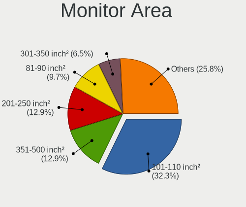

| Area in inch² | Computers | Percent |
|----------------|-----------|---------|
| 101-110        | 10        | 28.57%  |
| 81-90          | 7         | 20%     |
| More than 1000 | 3         | 8.57%   |
| 151-200        | 3         | 8.57%   |
| 301-350        | 2         | 5.71%   |
| 71-80          | 1         | 2.86%   |
| 61-70          | 1         | 2.86%   |
| 51-60          | 1         | 2.86%   |
| 351-500        | 1         | 2.86%   |
| 41-50          | 1         | 2.86%   |
| 201-250        | 1         | 2.86%   |
| 121-130        | 1         | 2.86%   |
| 111-120        | 1         | 2.86%   |
| 501-1000       | 1         | 2.86%   |
| Unknown        | 1         | 2.86%   |

Pixel Density
-------------

Pixels per inch

| Density       | Computers | Percent |
|---------------|-----------|---------|
| 101-120       | 10        | 28.57%  |
| 121-160       | 9         | 25.71%  |
| 51-100        | 8         | 22.86%  |
| 1-50          | 3         | 8.57%   |
| 161-240       | 3         | 8.57%   |
| More than 240 | 1         | 2.86%   |
| Unknown       | 1         | 2.86%   |

Multiple Monitors
-----------------

Total monitors connected

| Total | Computers | Percent |
|-------|-----------|---------|
| 1     | 35        | 94.59%  |
| 2     | 1         | 2.7%    |
| 0     | 1         | 2.7%    |

Network
-------

Net Controller Vendor
---------------------

Controller vendors

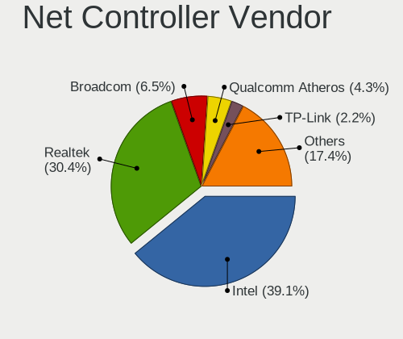

| Vendor                   | Computers | Percent |
|--------------------------|-----------|---------|
| Intel                    | 20        | 34.48%  |
| Realtek Semiconductor    | 18        | 31.03%  |
| Qualcomm Atheros         | 7         | 12.07%  |
| TP-Link                  | 2         | 3.45%   |
| Nvidia                   | 2         | 3.45%   |
| Marvell Technology Group | 2         | 3.45%   |
| Broadcom                 | 2         | 3.45%   |
| VIA Technologies         | 1         | 1.72%   |
| Microsoft                | 1         | 1.72%   |
| MediaTek                 | 1         | 1.72%   |
| Google                   | 1         | 1.72%   |
| Broadcom Limited         | 1         | 1.72%   |

Net Controller Model
--------------------

Controller models

| Model                                                                   | Computers | Percent |
|-------------------------------------------------------------------------|-----------|---------|
| Realtek RTL8111/8168/8411 PCI Express Gigabit Ethernet Controller       | 11        | 15.94%  |
| Intel Wireless 8260                                                     | 3         | 4.35%   |
| Intel Wireless 3165                                                     | 3         | 4.35%   |
| Realtek RTL810xE PCI Express Fast Ethernet controller                   | 2         | 2.9%    |
| Qualcomm Atheros QCA9565 / AR9565 Wireless Network Adapter              | 2         | 2.9%    |
| Intel Wireless 8265 / 8275                                              | 2         | 2.9%    |
| Intel Wi-Fi 6 AX200                                                     | 2         | 2.9%    |
| Intel I211 Gigabit Network Connection                                   | 2         | 2.9%    |
| Intel Ethernet Connection I217-LM                                       | 2         | 2.9%    |
| Intel Centrino Advanced-N 6205 [Taylor Peak]                            | 2         | 2.9%    |
| Intel 82579LM Gigabit Network Connection (Lewisville)                   | 2         | 2.9%    |
| VIA VT6102/VT6103 [Rhine-II]                                            | 1         | 1.45%   |
| TP-Link UE300 10/100/1000 LAN (ethernet mode) [Realtek RTL8153]         | 1         | 1.45%   |
| TP-Link RTL8812AU Archer T4U 802.11ac                                   | 1         | 1.45%   |
| Realtek RTL8822CE 802.11ac PCIe Wireless Network Adapter                | 1         | 1.45%   |
| Realtek RTL8191SEvB Wireless LAN Controller                             | 1         | 1.45%   |
| Realtek RTL8188CE 802.11b/g/n WiFi Adapter                              | 1         | 1.45%   |
| Realtek RTL8187 Wireless Adapter                                        | 1         | 1.45%   |
| Realtek RTL8153 Gigabit Ethernet Adapter                                | 1         | 1.45%   |
| Realtek RTL8125 2.5GbE Controller                                       | 1         | 1.45%   |
| Realtek RTL-8100/8101L/8139 PCI Fast Ethernet Adapter                   | 1         | 1.45%   |
| Qualcomm Atheros QCA6174 802.11ac Wireless Network Adapter              | 1         | 1.45%   |
| Qualcomm Atheros AR9485 Wireless Network Adapter                        | 1         | 1.45%   |
| Qualcomm Atheros AR928X Wireless Network Adapter (PCI-Express)          | 1         | 1.45%   |
| Qualcomm Atheros AR8131 Gigabit Ethernet                                | 1         | 1.45%   |
| Qualcomm Atheros AR242x / AR542x Wireless Network Adapter (PCI-Express) | 1         | 1.45%   |
| Nvidia MCP77 Ethernet                                                   | 1         | 1.45%   |
| Nvidia CK804 Ethernet Controller                                        | 1         | 1.45%   |
| Microsoft XBOX ACC                                                      | 1         | 1.45%   |
| MediaTek MT7921 802.11ax PCI Express Wireless Network Adapter           | 1         | 1.45%   |
| Marvell Group 88w8335 [Libertas] 802.11b/g Wireless                     | 1         | 1.45%   |
| Marvell Group 88E8058 PCI-E Gigabit Ethernet Controller                 | 1         | 1.45%   |
| Intel Wireless-AC 9260                                                  | 1         | 1.45%   |
| Intel Wireless Gigabit 17265                                            | 1         | 1.45%   |
| Intel Wireless 7260                                                     | 1         | 1.45%   |
| Intel WiFi Link 5100                                                    | 1         | 1.45%   |
| Intel Wi-Fi 6 AX210/AX211/AX411 160MHz                                  | 1         | 1.45%   |
| Intel Ethernet Connection I219-V                                        | 1         | 1.45%   |
| Intel Ethernet Connection I219-LM                                       | 1         | 1.45%   |
| Intel Ethernet Connection (4) I219-LM                                   | 1         | 1.45%   |

Wireless Vendor
---------------

Wireless vendors

| Vendor                   | Computers | Percent |
|--------------------------|-----------|---------|
| Intel                    | 18        | 52.94%  |
| Qualcomm Atheros         | 6         | 17.65%  |
| Realtek Semiconductor    | 4         | 11.76%  |
| Broadcom                 | 2         | 5.88%   |
| TP-Link                  | 1         | 2.94%   |
| Microsoft                | 1         | 2.94%   |
| MediaTek                 | 1         | 2.94%   |
| Marvell Technology Group | 1         | 2.94%   |

Wireless Model
--------------

Wireless models

| Model                                                                   | Computers | Percent |
|-------------------------------------------------------------------------|-----------|---------|
| Intel Wireless 8260                                                     | 3         | 8.57%   |
| Intel Wireless 3165                                                     | 3         | 8.57%   |
| Qualcomm Atheros QCA9565 / AR9565 Wireless Network Adapter              | 2         | 5.71%   |
| Intel Wireless 8265 / 8275                                              | 2         | 5.71%   |
| Intel Wi-Fi 6 AX200                                                     | 2         | 5.71%   |
| Intel Centrino Advanced-N 6205 [Taylor Peak]                            | 2         | 5.71%   |
| TP-Link RTL8812AU Archer T4U 802.11ac                                   | 1         | 2.86%   |
| Realtek RTL8822CE 802.11ac PCIe Wireless Network Adapter                | 1         | 2.86%   |
| Realtek RTL8191SEvB Wireless LAN Controller                             | 1         | 2.86%   |
| Realtek RTL8188CE 802.11b/g/n WiFi Adapter                              | 1         | 2.86%   |
| Realtek RTL8187 Wireless Adapter                                        | 1         | 2.86%   |
| Qualcomm Atheros QCA6174 802.11ac Wireless Network Adapter              | 1         | 2.86%   |
| Qualcomm Atheros AR9485 Wireless Network Adapter                        | 1         | 2.86%   |
| Qualcomm Atheros AR928X Wireless Network Adapter (PCI-Express)          | 1         | 2.86%   |
| Qualcomm Atheros AR242x / AR542x Wireless Network Adapter (PCI-Express) | 1         | 2.86%   |
| Microsoft XBOX ACC                                                      | 1         | 2.86%   |
| MediaTek MT7921 802.11ax PCI Express Wireless Network Adapter           | 1         | 2.86%   |
| Marvell Group 88w8335 [Libertas] 802.11b/g Wireless                     | 1         | 2.86%   |
| Intel Wireless-AC 9260                                                  | 1         | 2.86%   |
| Intel Wireless Gigabit 17265                                            | 1         | 2.86%   |
| Intel Wireless 7260                                                     | 1         | 2.86%   |
| Intel WiFi Link 5100                                                    | 1         | 2.86%   |
| Intel Wi-Fi 6 AX210/AX211/AX411 160MHz                                  | 1         | 2.86%   |
| Intel Comet Lake PCH-LP CNVi WiFi                                       | 1         | 2.86%   |
| Intel Cannon Point-LP CNVi [Wireless-AC]                                | 1         | 2.86%   |
| Broadcom BCM4321 802.11a/b/g/n                                          | 1         | 2.86%   |
| Broadcom BCM4312 802.11b/g LP-PHY                                       | 1         | 2.86%   |

Ethernet Vendor
---------------

Ethernet vendors

| Vendor                   | Computers | Percent |
|--------------------------|-----------|---------|
| Realtek Semiconductor    | 16        | 47.06%  |
| Intel                    | 9         | 26.47%  |
| Nvidia                   | 2         | 5.88%   |
| VIA Technologies         | 1         | 2.94%   |
| TP-Link                  | 1         | 2.94%   |
| Qualcomm Atheros         | 1         | 2.94%   |
| Marvell Technology Group | 1         | 2.94%   |
| Google                   | 1         | 2.94%   |
| Broadcom Limited         | 1         | 2.94%   |
| Broadcom                 | 1         | 2.94%   |

Ethernet Model
--------------

Ethernet models

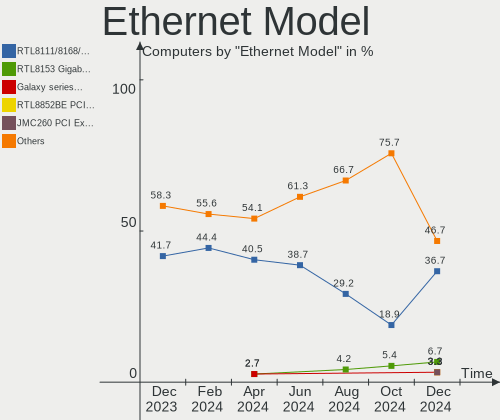

| Model                                                             | Computers | Percent |
|-------------------------------------------------------------------|-----------|---------|
| Realtek RTL8111/8168/8411 PCI Express Gigabit Ethernet Controller | 11        | 32.35%  |
| Realtek RTL810xE PCI Express Fast Ethernet controller             | 2         | 5.88%   |
| Intel I211 Gigabit Network Connection                             | 2         | 5.88%   |
| Intel Ethernet Connection I217-LM                                 | 2         | 5.88%   |
| Intel 82579LM Gigabit Network Connection (Lewisville)             | 2         | 5.88%   |
| VIA VT6102/VT6103 [Rhine-II]                                      | 1         | 2.94%   |
| TP-Link UE300 10/100/1000 LAN (ethernet mode) [Realtek RTL8153]   | 1         | 2.94%   |
| Realtek RTL8153 Gigabit Ethernet Adapter                          | 1         | 2.94%   |
| Realtek RTL8125 2.5GbE Controller                                 | 1         | 2.94%   |
| Realtek RTL-8100/8101L/8139 PCI Fast Ethernet Adapter             | 1         | 2.94%   |
| Qualcomm Atheros AR8131 Gigabit Ethernet                          | 1         | 2.94%   |
| Nvidia MCP77 Ethernet                                             | 1         | 2.94%   |
| Nvidia CK804 Ethernet Controller                                  | 1         | 2.94%   |
| Marvell Group 88E8058 PCI-E Gigabit Ethernet Controller           | 1         | 2.94%   |
| Intel Ethernet Connection I219-V                                  | 1         | 2.94%   |
| Intel Ethernet Connection I219-LM                                 | 1         | 2.94%   |
| Intel Ethernet Connection (4) I219-LM                             | 1         | 2.94%   |
| Google Pixel 6a                                                   | 1         | 2.94%   |
| Broadcom NetLink BCM5906M Fast Ethernet PCI Express               | 1         | 2.94%   |
| Broadcom Limited NetLink BCM5784M Gigabit Ethernet PCIe           | 1         | 2.94%   |

Net Controller Kind
-------------------

Ethernet, WiFi or modem

| Kind     | Computers | Percent |
|----------|-----------|---------|
| WiFi     | 33        | 50.77%  |
| Ethernet | 32        | 49.23%  |

Used Controller
---------------

Currently used network controller

| Kind     | Computers | Percent |
|----------|-----------|---------|
| WiFi     | 26        | 65%     |
| Ethernet | 14        | 35%     |

NICs
----

Total network controllers on board

| Total | Computers | Percent |
|-------|-----------|---------|
| 2     | 25        | 67.57%  |
| 1     | 11        | 29.73%  |
| 3     | 1         | 2.7%    |

IPv6
----

IPv6 vs IPv4

| Used | Computers | Percent |
|------|-----------|---------|
| No   | 27        | 72.97%  |
| Yes  | 10        | 27.03%  |

Bluetooth
---------

Bluetooth Vendor
----------------

Controller vendors

| Vendor                          | Computers | Percent |
|---------------------------------|-----------|---------|
| Intel                           | 14        | 63.64%  |
| Lite-On Technology              | 3         | 13.64%  |
| Realtek Semiconductor           | 1         | 4.55%   |
| Qualcomm Atheros Communications | 1         | 4.55%   |
| Cambridge Silicon Radio         | 1         | 4.55%   |
| Broadcom                        | 1         | 4.55%   |
| Apple                           | 1         | 4.55%   |

Bluetooth Model
---------------

Controller models

| Model                                               | Computers | Percent |
|-----------------------------------------------------|-----------|---------|
| Intel Bluetooth wireless interface                  | 8         | 36.36%  |
| Intel Bluetooth 9460/9560 Jefferson Peak (JfP)      | 2         | 9.09%   |
| Intel AX200 Bluetooth                               | 2         | 9.09%   |
| Realtek Bluetooth Radio                             | 1         | 4.55%   |
| Qualcomm Atheros AR3012 Bluetooth 4.0               | 1         | 4.55%   |
| Lite-On Wireless_Device                             | 1         | 4.55%   |
| Lite-On Bluetooth Device                            | 1         | 4.55%   |
| Lite-On Atheros AR3012 Bluetooth                    | 1         | 4.55%   |
| Intel Wireless-AC 9260 Bluetooth Adapter            | 1         | 4.55%   |
| Intel AX210 Bluetooth                               | 1         | 4.55%   |
| Cambridge Silicon Radio Bluetooth Dongle (HCI mode) | 1         | 4.55%   |
| Broadcom BCM2045B (BDC-2.1)                         | 1         | 4.55%   |
| Apple Bluetooth HCI                                 | 1         | 4.55%   |

Sound
-----

Sound Vendor
------------

Sound card vendors

| Vendor              | Computers | Percent |
|---------------------|-----------|---------|
| Intel               | 23        | 48.94%  |
| AMD                 | 11        | 23.4%   |
| Nvidia              | 8         | 17.02%  |
| VIA Technologies    | 2         | 4.26%   |
| Texas Instruments   | 1         | 2.13%   |
| KTMicro             | 1         | 2.13%   |
| C-Media Electronics | 1         | 2.13%   |

Sound Model
-----------

Sound card models

| Model                                                                      | Computers | Percent |
|----------------------------------------------------------------------------|-----------|---------|
| AMD Family 17h/19h HD Audio Controller                                     | 4         | 6.78%   |
| Intel Xeon E3-1200 v3/4th Gen Core Processor HD Audio Controller           | 3         | 5.08%   |
| Intel Sunrise Point-LP HD Audio                                            | 3         | 5.08%   |
| Intel Celeron/Pentium Silver Processor High Definition Audio               | 3         | 5.08%   |
| Intel 8 Series/C220 Series Chipset High Definition Audio Controller        | 3         | 5.08%   |
| AMD Kabini HDMI/DP Audio                                                   | 3         | 5.08%   |
| AMD FCH Azalia Controller                                                  | 3         | 5.08%   |
| AMD Family 17h (Models 00h-0fh) HD Audio Controller                        | 3         | 5.08%   |
| VIA Technologies VX900/VT8xxx High Definition Audio Controller             | 2         | 3.39%   |
| Nvidia GK106 HDMI Audio Controller                                         | 2         | 3.39%   |
| Nvidia GF108 High Definition Audio Controller                              | 2         | 3.39%   |
| Intel Tiger Lake-LP Smart Sound Technology Audio Controller                | 2         | 3.39%   |
| Intel Cannon Point-LP High Definition Audio Controller                     | 2         | 3.39%   |
| Intel 82801I (ICH9 Family) HD Audio Controller                             | 2         | 3.39%   |
| Intel 6 Series/C200 Series Chipset Family High Definition Audio Controller | 2         | 3.39%   |
| Intel 5 Series/3400 Series Chipset High Definition Audio                   | 2         | 3.39%   |
| AMD Raven/Raven2/Fenghuang HDMI/DP Audio Controller                        | 2         | 3.39%   |
| Texas Instruments Sabaj A4 AMP                                             | 1         | 1.69%   |
| Nvidia MCP72XE/MCP72P/MCP78U/MCP78S High Definition Audio                  | 1         | 1.69%   |
| Nvidia GP107GL High Definition Audio Controller                            | 1         | 1.69%   |
| Nvidia GK208 HDMI/DP Audio Controller                                      | 1         | 1.69%   |
| Nvidia GK104 HDMI Audio Controller                                         | 1         | 1.69%   |
| Nvidia GA104 High Definition Audio Controller                              | 1         | 1.69%   |
| Nvidia CK804 AC'97 Audio Controller                                        | 1         | 1.69%   |
| KTMicro KT USB Audio                                                       | 1         | 1.69%   |
| Intel NM10/ICH7 Family High Definition Audio Controller                    | 1         | 1.69%   |
| Intel Jasper Lake HD Audio                                                 | 1         | 1.69%   |
| Intel Comet Lake PCH-LP cAVS                                               | 1         | 1.69%   |
| Intel 82801H (ICH8 Family) HD Audio Controller                             | 1         | 1.69%   |
| C-Media Electronics USB Audio Device                                       | 1         | 1.69%   |
| AMD RV710/730 HDMI Audio [Radeon HD 4000 series]                           | 1         | 1.69%   |
| AMD Renoir Radeon High Definition Audio Controller                         | 1         | 1.69%   |
| AMD Navi 21/23 HDMI/DP Audio Controller                                    | 1         | 1.69%   |

Memory
------

Memory Vendor
-------------

Memory module vendors

| Vendor                       | Computers | Percent |
|------------------------------|-----------|---------|
| Samsung Electronics          | 8         | 34.78%  |
| SK hynix                     | 2         | 8.7%    |
| Micron Technology            | 2         | 8.7%    |
| Kingston                     | 2         | 8.7%    |
| Corsair                      | 2         | 8.7%    |
| Unknown (ABCD)               | 1         | 4.35%   |
| Unknown                      | 1         | 4.35%   |
| Team                         | 1         | 4.35%   |
| Patriot Memory (PDP Systems) | 1         | 4.35%   |
| Patriot                      | 1         | 4.35%   |
| G.Skill                      | 1         | 4.35%   |
| Elpida                       | 1         | 4.35%   |

Memory Model
------------

Memory module models

| Model                                                                    | Computers | Percent |
|--------------------------------------------------------------------------|-----------|---------|
| Unknown RAM Module 512MB SODIMM DDR2 533MT/s                             | 1         | 3.7%    |
| Unknown RAM Module 2GB SODIMM DDR2 533MT/s                               | 1         | 3.7%    |
| Unknown (ABCD) RAM 123456789012345678 2GB DIMM LPDDR4 2400MT/s           | 1         | 3.7%    |
| Team RAM TEAMGROUP-UD3-1600 4GB DIMM DDR3 1600MT/s                       | 1         | 3.7%    |
| SK hynix RAM HMT451U6AFR8C-PB 4GB DIMM DDR3 1600MT/s                     | 1         | 3.7%    |
| SK hynix RAM HMA851S6DJR6N-XN 4GB SODIMM DDR4 3200MT/s                   | 1         | 3.7%    |
| Samsung RAM Module 2GB Row Of Chips LPDDR4 2133MT/s                      | 1         | 3.7%    |
| Samsung RAM M471B5673FH0-CF8 2GB SODIMM DDR3 1067MT/s                    | 1         | 3.7%    |
| Samsung RAM M471B5273DH0-CK0 4GB SODIMM DDR3 1600MT/s                    | 1         | 3.7%    |
| Samsung RAM M471B5273CH0-CK0 4GB SODIMM DDR3 1600MT/s                    | 1         | 3.7%    |
| Samsung RAM M471A5244CB0-CWE 4GB SODIMM DDR4 3200MT/s                    | 1         | 3.7%    |
| Samsung RAM M471A1K43DB1-CTD 8GB SODIMM DDR4 2667MT/s                    | 1         | 3.7%    |
| Samsung RAM M471A1K43CB1-CRC 8GB SODIMM DDR4 2667MT/s                    | 1         | 3.7%    |
| Samsung RAM M471A1K43BB0-CPB 8GB Chip DDR4 2133MT/s                      | 1         | 3.7%    |
| Samsung RAM M471A1G44AB0-CWE 8GB Row Of Chips DDR4 3200MT/s              | 1         | 3.7%    |
| Samsung RAM M471A1G44AB0-CTD 8GB SODIMM DDR4 2667MT/s                    | 1         | 3.7%    |
| Patriot RAM PDC22G6400LLK 1024MB DIMM DDR2 667MT/s                       | 1         | 3.7%    |
| Patriot Memory (PDP Systems) RAM PSD432G32002S 32GB SODIMM DDR4 3200MT/s | 1         | 3.7%    |
| Micron RAM MT40A512M16LY-075:E 4GB SODIMM DDR4 3200MT/s                  | 1         | 3.7%    |
| Micron RAM M391A1G43BB1-CRCB1 16GB SODIMM DDR4 2667MT/s                  | 1         | 3.7%    |
| Kingston RAM 99U5402-037.A00G 2GB DIMM DDR3 1333MT/s                     | 1         | 3.7%    |
| Kingston RAM 9905471-001.A01LF 2GB DIMM DDR3 1600MT/s                    | 1         | 3.7%    |
| Kingston RAM 9905316-005.A04LF 1024MB DIMM DDR2 667MT/s                  | 1         | 3.7%    |
| G.Skill RAM F4-3200C22-32GRS 32GB SODIMM DDR4 3200MT/s                   | 1         | 3.7%    |
| Elpida RAM EBJ21UE8BDS0-DJ-F 2GB SODIMM DDR3 1334MT/s                    | 1         | 3.7%    |
| Corsair RAM CMSO8GX4M1A2133C15 8GB SODIMM DDR4 2133MT/s                  | 1         | 3.7%    |
| Corsair RAM CMK16GX4M2B3000C15 8GB DIMM DDR4 3533MT/s                    | 1         | 3.7%    |

Memory Kind
-----------

Memory module kinds

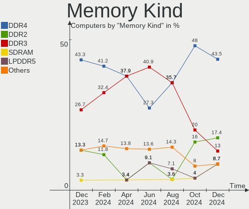

| Kind   | Computers | Percent |
|--------|-----------|---------|
| DDR4   | 10        | 52.63%  |
| DDR3   | 5         | 26.32%  |
| LPDDR4 | 2         | 10.53%  |
| DDR2   | 2         | 10.53%  |

Memory Form Factor
------------------

Physical design of the memory module

| Name         | Computers | Percent |
|--------------|-----------|---------|
| SODIMM       | 11        | 57.89%  |
| DIMM         | 5         | 26.32%  |
| Row Of Chips | 2         | 10.53%  |
| Chip         | 1         | 5.26%   |

Memory Size
-----------

Memory module size

| Size  | Computers | Percent |
|-------|-----------|---------|
| 8192  | 7         | 31.82%  |
| 4096  | 4         | 18.18%  |
| 2048  | 4         | 18.18%  |
| 16384 | 3         | 13.64%  |
| 32768 | 2         | 9.09%   |
| 1024  | 1         | 4.55%   |
| 512   | 1         | 4.55%   |

Memory Speed
------------

Memory module speed

| Speed | Computers | Percent |
|-------|-----------|---------|
| 3200  | 5         | 22.73%  |
| 2667  | 3         | 13.64%  |
| 2133  | 3         | 13.64%  |
| 1600  | 3         | 13.64%  |
| 3533  | 1         | 4.55%   |
| 2400  | 1         | 4.55%   |
| 1800  | 1         | 4.55%   |
| 1334  | 1         | 4.55%   |
| 1333  | 1         | 4.55%   |
| 1067  | 1         | 4.55%   |
| 667   | 1         | 4.55%   |
| 533   | 1         | 4.55%   |

Printers & scanners
-------------------

Printer Vendor
--------------

Printer device vendors

| Vendor  | Computers | Percent |
|---------|-----------|---------|
| Minolta | 1         | 100%    |

Printer Model
-------------

Printer device models

| Model                 | Computers | Percent |
|-----------------------|-----------|---------|
| Minolta PagePro 1200W | 1         | 100%    |

Scanner Vendor
--------------

Scanner device vendors

Zero info for selected period =(

Scanner Model
-------------

Scanner device models

Zero info for selected period =(

Camera
------

Camera Vendor
-------------

Camera device vendors

| Vendor                        | Computers | Percent |
|-------------------------------|-----------|---------|
| Microdia                      | 5         | 22.73%  |
| Chicony Electronics           | 4         | 18.18%  |
| Sunplus Innovation Technology | 3         | 13.64%  |
| IMC Networks                  | 3         | 13.64%  |
| Realtek Semiconductor         | 2         | 9.09%   |
| Syntek                        | 1         | 4.55%   |
| Suyin                         | 1         | 4.55%   |
| Bison Electronics             | 1         | 4.55%   |
| Apple                         | 1         | 4.55%   |
| Acer                          | 1         | 4.55%   |

Camera Model
------------

Camera device models

| Model                                      | Computers | Percent |
|--------------------------------------------|-----------|---------|
| Sunplus Integrated_Webcam_HD               | 2         | 8.7%    |
| Microdia Integrated_Webcam_HD              | 2         | 8.7%    |
| IMC Networks Integrated Camera             | 2         | 8.7%    |
| Chicony Integrated Camera                  | 2         | 8.7%    |
| Syntek Integrated Camera                   | 1         | 4.35%   |
| Suyin Acer/Lenovo Webcam [CN0316]          | 1         | 4.35%   |
| Sunplus Laptop_Integrated_Webcam_FHD       | 1         | 4.35%   |
| Realtek USB Camera                         | 1         | 4.35%   |
| Realtek HP Truevision HD integrated webcam | 1         | 4.35%   |
| Realtek Back Camera                        | 1         | 4.35%   |
| Microdia Sonix USB 2.0 Camera              | 1         | 4.35%   |
| Microdia Lenovo EasyCamera                 | 1         | 4.35%   |
| Microdia Laptop_Integrated_Webcam_2M       | 1         | 4.35%   |
| IMC Networks HD Camera                     | 1         | 4.35%   |
| Chicony USB2.0 HD Camera                   | 1         | 4.35%   |
| Chicony HD User Facing                     | 1         | 4.35%   |
| Bison Integrated Camera                    | 1         | 4.35%   |
| Apple Built-in iSight                      | 1         | 4.35%   |
| Acer BisonCam, NB Pro                      | 1         | 4.35%   |

Security
--------

Fingerprint Vendor
------------------

Fingerprint sensor vendors

| Vendor           | Computers | Percent |
|------------------|-----------|---------|
| Validity Sensors | 1         | 33.33%  |
| Upek             | 1         | 33.33%  |
| Microsoft        | 1         | 33.33%  |

Fingerprint Model
-----------------

Fingerprint sensor models

| Model                                                  | Computers | Percent |
|--------------------------------------------------------|-----------|---------|
| Validity Sensors VFS7500 Touch Fingerprint Sensor      | 1         | 33.33%  |
| Upek Biometric Touchchip/Touchstrip Fingerprint Sensor | 1         | 33.33%  |
| Microsoft Fingerprint Reader                           | 1         | 33.33%  |

Chipcard Vendor
---------------

Chipcard module vendors

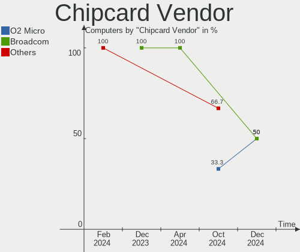

| Vendor   | Computers | Percent |
|----------|-----------|---------|
| Broadcom | 3         | 100%    |

Chipcard Model
--------------

Chipcard module models

| Model                                          | Computers | Percent |
|------------------------------------------------|-----------|---------|
| Broadcom BCM5880 Secure Applications Processor | 1         | 33.33%  |
| Broadcom 5880                                  | 1         | 33.33%  |
| Broadcom 58200                                 | 1         | 33.33%  |

Unsupported
-----------

Unsupported Devices
-------------------

Total unsupported devices on board

| Total | Computers | Percent |
|-------|-----------|---------|
| 0     | 26        | 70.27%  |
| 1     | 8         | 21.62%  |
| 2     | 3         | 8.11%   |

Unsupported Device Types
------------------------

Types of unsupported devices

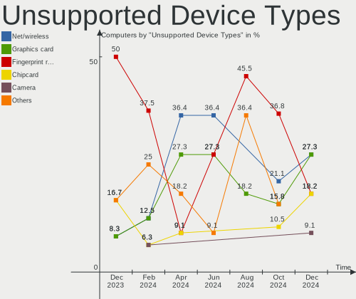

| Type                  | Computers | Percent |
|-----------------------|-----------|---------|
| Net/wireless          | 3         | 21.43%  |
| Graphics card         | 3         | 21.43%  |
| Fingerprint reader    | 3         | 21.43%  |
| Chipcard              | 3         | 21.43%  |
| Storage               | 1         | 7.14%   |
| Multimedia controller | 1         | 7.14%   |

