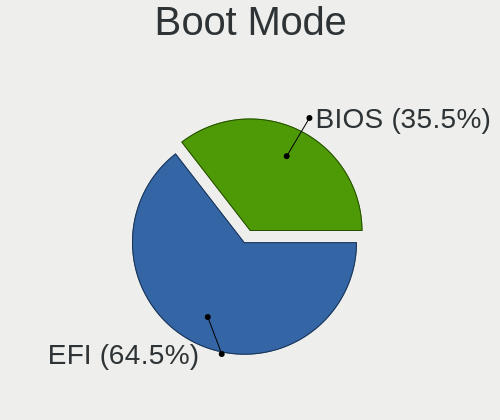
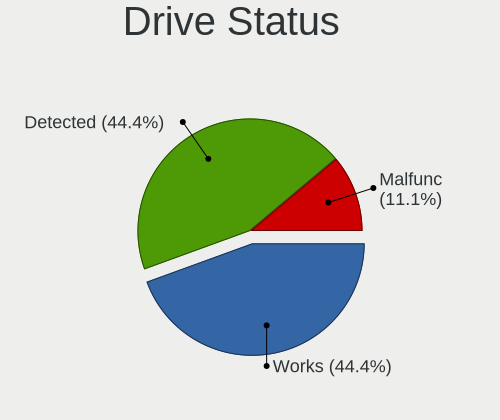
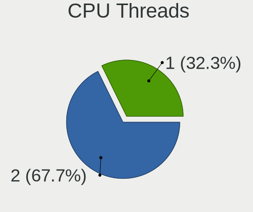

LMDE - Hardware Trends
----------------------

A project to identify most popular hardware characteristics and track their change
over time based on data collected by Linux users at https://Linux-Hardware.org.

Anyone can contribute to this report by the [hw-probe](https://github.com/linuxhw/hw-probe) tool:

    sudo -E hw-probe -all -upload

This is a report for all computer types. See also reports for [desktops](/Dist/LMDE/Desktop/README.md) and [notebooks](/Dist/LMDE/Notebook/README.md).

This report is for one last month. Overall report since the beginning of time: [TestDays](https://github.com/linuxhw/TestDays)

Period: Nov, 2023.

Contents
--------

* [ System ](#system)
  - [ OS                       ](#os)
  - [ OS Family                ](#os-family)
  - [ Kernel                   ](#kernel)
  - [ Kernel Family            ](#kernel-family)
  - [ Kernel Major Ver.        ](#kernel-major-ver)
  - [ Arch                     ](#arch)
  - [ DE                       ](#de)
  - [ Display Server           ](#display-server)
  - [ Display Manager          ](#display-manager)
  - [ OS Lang                  ](#os-lang)
  - [ Boot Mode                ](#boot-mode)
  - [ Filesystem               ](#filesystem)
  - [ Part. scheme             ](#part-scheme)
  - [ Dual Boot with Linux/BSD ](#dual-boot-with-linuxbsd)
  - [ Dual Boot (Win)          ](#dual-boot-win)

* [ Board ](#board)
  - [ Vendor                   ](#vendor)
  - [ Model                    ](#model)
  - [ Model Family             ](#model-family)
  - [ MFG Year                 ](#mfg-year)
  - [ Form Factor              ](#form-factor)
  - [ Secure Boot              ](#secure-boot)
  - [ Coreboot                 ](#coreboot)
  - [ RAM Size                 ](#ram-size)
  - [ RAM Used                 ](#ram-used)
  - [ Total Drives             ](#total-drives)
  - [ Has CD-ROM               ](#has-cd-rom)
  - [ Has Ethernet             ](#has-ethernet)
  - [ Has WiFi                 ](#has-wifi)
  - [ Has Bluetooth            ](#has-bluetooth)

* [ Location ](#location)
  - [ Country                  ](#country)
  - [ City                     ](#city)

* [ Drives ](#drives)
  - [ Drive Vendor             ](#drive-vendor)
  - [ Drive Model              ](#drive-model)
  - [ HDD Vendor               ](#hdd-vendor)
  - [ SSD Vendor               ](#ssd-vendor)
  - [ Drive Kind               ](#drive-kind)
  - [ Drive Connector          ](#drive-connector)
  - [ Drive Size               ](#drive-size)
  - [ Space Total              ](#space-total)
  - [ Space Used               ](#space-used)
  - [ Malfunc. Drives          ](#malfunc-drives)
  - [ Malfunc. Drive Vendor    ](#malfunc-drive-vendor)
  - [ Malfunc. HDD Vendor      ](#malfunc-hdd-vendor)
  - [ Malfunc. Drive Kind      ](#malfunc-drive-kind)
  - [ Failed Drives            ](#failed-drives)
  - [ Failed Drive Vendor      ](#failed-drive-vendor)
  - [ Drive Status             ](#drive-status)

* [ Storage controller ](#storage-controller)
  - [ Storage Vendor           ](#storage-vendor)
  - [ Storage Model            ](#storage-model)
  - [ Storage Kind             ](#storage-kind)

* [ Processor ](#processor)
  - [ CPU Vendor               ](#cpu-vendor)
  - [ CPU Model                ](#cpu-model)
  - [ CPU Model Family         ](#cpu-model-family)
  - [ CPU Cores                ](#cpu-cores)
  - [ CPU Sockets              ](#cpu-sockets)
  - [ CPU Threads              ](#cpu-threads)
  - [ CPU Op-Modes             ](#cpu-op-modes)
  - [ CPU Microcode            ](#cpu-microcode)
  - [ CPU Microarch            ](#cpu-microarch)

* [ Graphics ](#graphics)
  - [ GPU Vendor               ](#gpu-vendor)
  - [ GPU Model                ](#gpu-model)
  - [ GPU Combo                ](#gpu-combo)
  - [ GPU Driver               ](#gpu-driver)
  - [ GPU Memory               ](#gpu-memory)

* [ Monitor ](#monitor)
  - [ Monitor Vendor           ](#monitor-vendor)
  - [ Monitor Model            ](#monitor-model)
  - [ Monitor Resolution       ](#monitor-resolution)
  - [ Monitor Diagonal         ](#monitor-diagonal)
  - [ Monitor Width            ](#monitor-width)
  - [ Aspect Ratio             ](#aspect-ratio)
  - [ Monitor Area             ](#monitor-area)
  - [ Pixel Density            ](#pixel-density)
  - [ Multiple Monitors        ](#multiple-monitors)

* [ Network ](#network)
  - [ Net Controller Vendor    ](#net-controller-vendor)
  - [ Net Controller Model     ](#net-controller-model)
  - [ Wireless Vendor          ](#wireless-vendor)
  - [ Wireless Model           ](#wireless-model)
  - [ Ethernet Vendor          ](#ethernet-vendor)
  - [ Ethernet Model           ](#ethernet-model)
  - [ Net Controller Kind      ](#net-controller-kind)
  - [ Used Controller          ](#used-controller)
  - [ NICs                     ](#nics)
  - [ IPv6                     ](#ipv6)

* [ Bluetooth ](#bluetooth)
  - [ Bluetooth Vendor         ](#bluetooth-vendor)
  - [ Bluetooth Model          ](#bluetooth-model)

* [ Sound ](#sound)
  - [ Sound Vendor             ](#sound-vendor)
  - [ Sound Model              ](#sound-model)

* [ Memory ](#memory)
  - [ Memory Vendor            ](#memory-vendor)
  - [ Memory Model             ](#memory-model)
  - [ Memory Kind              ](#memory-kind)
  - [ Memory Form Factor       ](#memory-form-factor)
  - [ Memory Size              ](#memory-size)
  - [ Memory Speed             ](#memory-speed)

* [ Printers & scanners ](#printers--scanners)
  - [ Printer Vendor           ](#printer-vendor)
  - [ Printer Model            ](#printer-model)
  - [ Scanner Vendor           ](#scanner-vendor)
  - [ Scanner Model            ](#scanner-model)

* [ Camera ](#camera)
  - [ Camera Vendor            ](#camera-vendor)
  - [ Camera Model             ](#camera-model)

* [ Security ](#security)
  - [ Fingerprint Vendor       ](#fingerprint-vendor)
  - [ Fingerprint Model        ](#fingerprint-model)
  - [ Chipcard Vendor          ](#chipcard-vendor)
  - [ Chipcard Model           ](#chipcard-model)

* [ Unsupported ](#unsupported)
  - [ Unsupported Devices      ](#unsupported-devices)
  - [ Unsupported Device Types ](#unsupported-device-types)

System
------

OS
--

Installed operating systems

| Name   | Computers | Percent |
|--------|-----------|---------|
| LMDE 6 | 52        | 86.67%  |
| LMDE 5 | 8         | 13.33%  |

OS Family
---------

OS without a version

| Name | Computers | Percent |
|------|-----------|---------|
| LMDE | 60        | 100%    |

Kernel
------

Version of the Linux kernel

| Version               | Computers | Percent |
|-----------------------|-----------|---------|
| 6.1.0-13-amd64        | 37        | 61.67%  |
| 6.1.0-12-amd64        | 8         | 13.33%  |
| 5.10.0-26-amd64       | 5         | 8.33%   |
| 5.10.0-25-amd64       | 2         | 3.33%   |
| 6.6.2-x64v4-xanmod1   | 1         | 1.67%   |
| 6.5.7-surface-2       | 1         | 1.67%   |
| 6.5.11-asus-vivobook  | 1         | 1.67%   |
| 6.5.10-asus-vivobook  | 1         | 1.67%   |
| 6.5.0-0.deb12.1-amd64 | 1         | 1.67%   |
| 6.1.0-13-686-pae      | 1         | 1.67%   |
| 6.1.0-13-686          | 1         | 1.67%   |
| 6.1.0-12-686          | 1         | 1.67%   |

Kernel Family
-------------

Linux kernel without a distro release

| Version | Computers | Percent |
|---------|-----------|---------|
| 6.1.0   | 48        | 80%     |
| 5.10.0  | 7         | 11.67%  |
| 6.6.2   | 1         | 1.67%   |
| 6.5.7   | 1         | 1.67%   |
| 6.5.11  | 1         | 1.67%   |
| 6.5.10  | 1         | 1.67%   |
| 6.5.0   | 1         | 1.67%   |

Kernel Major Ver.
-----------------

Linux kernel major version

| Version | Computers | Percent |
|---------|-----------|---------|
| 6.1     | 48        | 80%     |
| 5.10    | 7         | 11.67%  |
| 6.5     | 4         | 6.67%   |
| 6.6     | 1         | 1.67%   |

Arch
----

OS architecture (x86_64, i586, etc.)

| Name   | Computers | Percent |
|--------|-----------|---------|
| x86_64 | 57        | 95%     |
| i686   | 3         | 5%      |

DE
--

Desktop Environment

| Name       | Computers | Percent |
|------------|-----------|---------|
| X-Cinnamon | 54        | 90%     |
| LXDE       | 2         | 3.33%   |
| Cinnamon   | 2         | 3.33%   |
| MATE       | 1         | 1.67%   |
| Unknown    | 1         | 1.67%   |

Display Server
--------------

X11 or Wayland

| Name | Computers | Percent |
|------|-----------|---------|
| X11  | 60        | 100%    |

Display Manager
---------------

SDDM, LightDM, etc.

| Name    | Computers | Percent |
|---------|-----------|---------|
| Unknown | 31        | 51.67%  |
| LightDM | 29        | 48.33%  |

OS Lang
-------

Language

| Lang    | Computers | Percent |
|---------|-----------|---------|
| en_US   | 26        | 43.33%  |
| de_DE   | 8         | 13.33%  |
| en_GB   | 6         | 10%     |
| pt_BR   | 3         | 5%      |
| pl_PL   | 2         | 3.33%   |
| nl_NL   | 2         | 3.33%   |
| it_IT   | 2         | 3.33%   |
| fr_FR   | 2         | 3.33%   |
| es_ES   | 2         | 3.33%   |
| en_AU   | 2         | 3.33%   |
| tr_TR   | 1         | 1.67%   |
| hr_HR   | 1         | 1.67%   |
| es_BO   | 1         | 1.67%   |
| en_NZ   | 1         | 1.67%   |
| Unknown | 1         | 1.67%   |

Boot Mode
---------

EFI or BIOS

| Mode | Computers | Percent |
|------|-----------|---------|
| EFI  | 40        | 66.67%  |
| BIOS | 20        | 33.33%  |

Filesystem
----------

Type of filesystem

| Type    | Computers | Percent |
|---------|-----------|---------|
| Ext4    | 50        | 83.33%  |
| Tmpfs   | 5         | 8.33%   |
| Overlay | 3         | 5%      |
| Btrfs   | 2         | 3.33%   |

Part. scheme
------------

Scheme of partitioning

| Type    | Computers | Percent |
|---------|-----------|---------|
| Unknown | 30        | 50%     |
| GPT     | 22        | 36.67%  |
| MBR     | 8         | 13.33%  |

Dual Boot with Linux/BSD
------------------------

Hosting more than one Linux/BSD

| Dual boot | Computers | Percent |
|-----------|-----------|---------|
| No        | 54        | 90%     |
| Yes       | 6         | 10%     |

Dual Boot (Win)
---------------

Hosting Linux and Windows

| Dual boot | Computers | Percent |
|-----------|-----------|---------|
| No        | 52        | 86.67%  |
| Yes       | 8         | 13.33%  |

Board
-----

Vendor
------

Motherboard manufacturer

| Name                                 | Computers | Percent |
|--------------------------------------|-----------|---------|
| ASUSTek Computer                     | 11        | 18.33%  |
| Hewlett-Packard                      | 10        | 16.67%  |
| Dell                                 | 5         | 8.33%   |
| Acer                                 | 5         | 8.33%   |
| Lenovo                               | 4         | 6.67%   |
| MSI                                  | 3         | 5%      |
| Gigabyte Technology                  | 3         | 5%      |
| Toshiba                              | 2         | 3.33%   |
| Pegatron                             | 2         | 3.33%   |
| Medion                               | 2         | 3.33%   |
| Apple                                | 2         | 3.33%   |
| Soyo                                 | 1         | 1.67%   |
| Shenzhen Meigao Electronic Equipment | 1         | 1.67%   |
| Multilaser                           | 1         | 1.67%   |
| Microsoft                            | 1         | 1.67%   |
| LETSUNG                              | 1         | 1.67%   |
| Intel                                | 1         | 1.67%   |
| IBM                                  | 1         | 1.67%   |
| HUAWEI                               | 1         | 1.67%   |
| Fujitsu                              | 1         | 1.67%   |
| ASRock                               | 1         | 1.67%   |
| Alienware                            | 1         | 1.67%   |

Model
-----

Motherboard model

| Name                                                | Computers | Percent |
|-----------------------------------------------------|-----------|---------|
| HP 250 G8 Notebook PC                               | 2         | 3.33%   |
| Dell XPS 13 9360                                    | 2         | 3.33%   |
| ASUS VivoBook_ASUSLaptop X1605VA_X1605VA            | 2         | 3.33%   |
| Toshiba Satellite Pro L100                          | 1         | 1.67%   |
| Toshiba Satellite L745                              | 1         | 1.67%   |
| Soyo SY-N3150L Quad                                 | 1         | 1.67%   |
| Shenzhen Meigao Electronic Equipment Mercury series | 1         | 1.67%   |
| Pegatron p6-2143w                                   | 1         | 1.67%   |
| Pegatron 520-1138c                                  | 1         | 1.67%   |
| Multilaser PC13X                                    | 1         | 1.67%   |
| MSI MS-7E07                                         | 1         | 1.67%   |
| MSI MS-7E01                                         | 1         | 1.67%   |
| MSI MS-7798                                         | 1         | 1.67%   |
| Microsoft Surface Pro                               | 1         | 1.67%   |
| Medion S23003                                       | 1         | 1.67%   |
| Medion E6214                                        | 1         | 1.67%   |
| Lenovo ThinkPad X1 Extreme 20MGS1QU00               | 1         | 1.67%   |
| Lenovo ThinkPad W541 20EGS07C01                     | 1         | 1.67%   |
| Lenovo Legion 5 Pro 16ACH6H 82JQ                    | 1         | 1.67%   |
| Lenovo G50-80 80E5                                  | 1         | 1.67%   |
| Intel NUC7i5DNKE                                    | 1         | 1.67%   |
| IBM ThinkPad T40 23736G4                            | 1         | 1.67%   |
| HUAWEI KLVL-WXX9                                    | 1         | 1.67%   |
| HP t630 Thin Client                                 | 1         | 1.67%   |
| HP Pavilion TS Sleekbook 15                         | 1         | 1.67%   |
| HP Pavilion Laptop 15t-eg000                        | 1         | 1.67%   |
| HP EliteDesk 800 G3 DM 65W                          | 1         | 1.67%   |
| HP 255 G6 Notebook PC                               | 1         | 1.67%   |
| HP 250 G7 Notebook PC                               | 1         | 1.67%   |
| HP 246 G6 Notebook PC                               | 1         | 1.67%   |
| HP 245 G7                                           | 1         | 1.67%   |
| Gigabyte Q87M-D2H                                   | 1         | 1.67%   |
| Gigabyte GB-BACE-3000-SBE                           | 1         | 1.67%   |
| Gigabyte B560M D3H                                  | 1         | 1.67%   |
| Fujitsu ESPRIMO_P556                                | 1         | 1.67%   |
| Dell XPS 17 9720                                    | 1         | 1.67%   |
| Dell Vostro 3268                                    | 1         | 1.67%   |
| Dell OptiPlex GX620                                 | 1         | 1.67%   |
| ASUS X456UR                                         | 1         | 1.67%   |
| ASUS VivoBook_ASUSLaptop X515EA_R1500EA             | 1         | 1.67%   |

Model Family
------------

Motherboard model prefix

| Name                                         | Computers | Percent |
|----------------------------------------------|-----------|---------|
| ASUS VivoBook                                | 4         | 6.67%   |
| Acer Aspire                                  | 4         | 6.67%   |
| HP 250                                       | 3         | 5%      |
| Dell XPS                                     | 3         | 5%      |
| Toshiba Satellite                            | 2         | 3.33%   |
| Lenovo ThinkPad                              | 2         | 3.33%   |
| HP Pavilion                                  | 2         | 3.33%   |
| ASUS P5G41T-M                                | 2         | 3.33%   |
| Soyo SY-N3150L                               | 1         | 1.67%   |
| Shenzhen Meigao Electronic Equipment Mercury | 1         | 1.67%   |
| Pegatron p6-2143w                            | 1         | 1.67%   |
| Pegatron 520-1138c                           | 1         | 1.67%   |
| Multilaser PC13X                             | 1         | 1.67%   |
| MSI MS-7E07                                  | 1         | 1.67%   |
| MSI MS-7E01                                  | 1         | 1.67%   |
| MSI MS-7798                                  | 1         | 1.67%   |
| Microsoft Surface                            | 1         | 1.67%   |
| Medion S23003                                | 1         | 1.67%   |
| Medion E6214                                 | 1         | 1.67%   |
| Lenovo Legion                                | 1         | 1.67%   |
| Lenovo G50-80                                | 1         | 1.67%   |
| Intel NUC7i5DNKE                             | 1         | 1.67%   |
| IBM ThinkPad                                 | 1         | 1.67%   |
| HUAWEI KLVL-WXX9                             | 1         | 1.67%   |
| HP t630                                      | 1         | 1.67%   |
| HP EliteDesk                                 | 1         | 1.67%   |
| HP 255                                       | 1         | 1.67%   |
| HP 246                                       | 1         | 1.67%   |
| HP 245                                       | 1         | 1.67%   |
| Gigabyte Q87M-D2H                            | 1         | 1.67%   |
| Gigabyte GB-BACE-3000-SBE                    | 1         | 1.67%   |
| Gigabyte B560M                               | 1         | 1.67%   |
| Fujitsu ESPRIMO                              | 1         | 1.67%   |
| Dell Vostro                                  | 1         | 1.67%   |
| Dell OptiPlex                                | 1         | 1.67%   |
| ASUS X456UR                                  | 1         | 1.67%   |
| ASUS ROG                                     | 1         | 1.67%   |
| ASUS PRIME                                   | 1         | 1.67%   |
| ASUS EB1035                                  | 1         | 1.67%   |
| ASUS A0000001                                | 1         | 1.67%   |

MFG Year
--------

Motherboard manufacture year

| Year | Computers | Percent |
|------|-----------|---------|
| 2023 | 7         | 11.67%  |
| 2016 | 7         | 11.67%  |
| 2021 | 6         | 10%     |
| 2017 | 6         | 10%     |
| 2018 | 5         | 8.33%   |
| 2020 | 4         | 6.67%   |
| 2012 | 4         | 6.67%   |
| 2010 | 4         | 6.67%   |
| 2019 | 3         | 5%      |
| 2022 | 2         | 3.33%   |
| 2015 | 2         | 3.33%   |
| 2014 | 2         | 3.33%   |
| 2013 | 2         | 3.33%   |
| 2011 | 2         | 3.33%   |
| 2006 | 2         | 3.33%   |
| 2008 | 1         | 1.67%   |
| 2003 | 1         | 1.67%   |

Form Factor
-----------

Physical design of the computer

| Name       | Computers | Percent |
|------------|-----------|---------|
| Notebook   | 33        | 55%     |
| Desktop    | 21        | 35%     |
| Mini pc    | 3         | 5%      |
| All in one | 2         | 3.33%   |
| Tablet     | 1         | 1.67%   |

Secure Boot
-----------

Enabled or disabled

| State    | Computers | Percent |
|----------|-----------|---------|
| Disabled | 57        | 95%     |
| Enabled  | 3         | 5%      |

Coreboot
--------

Have coreboot on board

| Used | Computers | Percent |
|------|-----------|---------|
| No   | 60        | 100%    |

RAM Size
--------

Total RAM memory

| Size in GB  | Computers | Percent |
|-------------|-----------|---------|
| 4.01-8.0    | 21        | 35%     |
| 16.01-24.0  | 10        | 16.67%  |
| 8.01-16.0   | 9         | 15%     |
| 32.01-64.0  | 7         | 11.67%  |
| 3.01-4.0    | 7         | 11.67%  |
| 1.01-2.0    | 2         | 3.33%   |
| 0.51-1.0    | 2         | 3.33%   |
| 24.01-32.0  | 1         | 1.67%   |
| 64.01-256.0 | 1         | 1.67%   |

RAM Used
--------

Used RAM memory

| Used GB   | Computers | Percent |
|-----------|-----------|---------|
| 1.01-2.0  | 19        | 31.67%  |
| 2.01-3.0  | 17        | 28.33%  |
| 4.01-8.0  | 13        | 21.67%  |
| 3.01-4.0  | 7         | 11.67%  |
| 0.51-1.0  | 2         | 3.33%   |
| 8.01-16.0 | 1         | 1.67%   |
| 0.01-0.5  | 1         | 1.67%   |

Total Drives
------------

Number of drives on board

| Drives | Computers | Percent |
|--------|-----------|---------|
| 1      | 38        | 63.33%  |
| 2      | 10        | 16.67%  |
| 4      | 4         | 6.67%   |
| 3      | 4         | 6.67%   |
| 5      | 2         | 3.33%   |
| 0      | 2         | 3.33%   |

Has CD-ROM
----------

Has CD-ROM on board

| Presented | Computers | Percent |
|-----------|-----------|---------|
| No        | 43        | 71.67%  |
| Yes       | 17        | 28.33%  |

Has Ethernet
------------

Has Ethernet on board

| Presented | Computers | Percent |
|-----------|-----------|---------|
| Yes       | 49        | 81.67%  |
| No        | 11        | 18.33%  |

Has WiFi
--------

Has WiFi module

| Presented | Computers | Percent |
|-----------|-----------|---------|
| Yes       | 50        | 83.33%  |
| No        | 10        | 16.67%  |

Has Bluetooth
-------------

Has Bluetooth module

| Presented | Computers | Percent |
|-----------|-----------|---------|
| Yes       | 40        | 66.67%  |
| No        | 20        | 33.33%  |

Location
--------

Country
-------

Geographic location (country)

| Country                | Computers | Percent |
|------------------------|-----------|---------|
| Germany                | 12        | 20%     |
| USA                    | 11        | 18.33%  |
| UK                     | 3         | 5%      |
| Poland                 | 3         | 5%      |
| Brazil                 | 3         | 5%      |
| Spain                  | 2         | 3.33%   |
| New Zealand            | 2         | 3.33%   |
| Netherlands            | 2         | 3.33%   |
| Italy                  | 2         | 3.33%   |
| Indonesia              | 2         | 3.33%   |
| France                 | 2         | 3.33%   |
| Canada                 | 2         | 3.33%   |
| Austria                | 2         | 3.33%   |
| Australia              | 2         | 3.33%   |
| Turkey                 | 1         | 1.67%   |
| Saudi Arabia           | 1         | 1.67%   |
| Romania                | 1         | 1.67%   |
| Puerto Rico            | 1         | 1.67%   |
| Malaysia               | 1         | 1.67%   |
| Iran                   | 1         | 1.67%   |
| India                  | 1         | 1.67%   |
| Bosnia and Herzegovina | 1         | 1.67%   |
| Bolivia                | 1         | 1.67%   |
| Belgium                | 1         | 1.67%   |

City
----

Geographic location (city)

| City            | Computers | Percent |
|-----------------|-----------|---------|
| Delligsen       | 3         | 5%      |
| Vienna          | 2         | 3.33%   |
| Sydney          | 2         | 3.33%   |
| Rennes          | 2         | 3.33%   |
| Auckland        | 2         | 3.33%   |
| Aalten          | 2         | 3.33%   |
| Yanbu           | 1         | 1.67%   |
| Wittingen       | 1         | 1.67%   |
| Wisconsin Dells | 1         | 1.67%   |
| Warsaw          | 1         | 1.67%   |
| Valencia        | 1         | 1.67%   |
| Strzelno        | 1         | 1.67%   |
| Seattle         | 1         | 1.67%   |
| Sarnia          | 1         | 1.67%   |
| San Juan        | 1         | 1.67%   |
| Russell         | 1         | 1.67%   |
| Rome            | 1         | 1.67%   |
| Ribeirao Preto  | 1         | 1.67%   |
| Rexburg         | 1         | 1.67%   |
| Reichenschwand  | 1         | 1.67%   |
| Ratingen        | 1         | 1.67%   |
| Prnjavor        | 1         | 1.67%   |
| Porto Alegre    | 1         | 1.67%   |
| Palma           | 1         | 1.67%   |
| Oakville        | 1         | 1.67%   |
| Nussdorf am Inn | 1         | 1.67%   |
| Norfolk         | 1         | 1.67%   |
| Niagara Falls   | 1         | 1.67%   |
| Manaus          | 1         | 1.67%   |
| Lambeth         | 1         | 1.67%   |
| La Paz          | 1         | 1.67%   |
| Kuala Lumpur    | 1         | 1.67%   |
| Krefeld         | 1         | 1.67%   |
| Krakow          | 1         | 1.67%   |
| Kosekoy         | 1         | 1.67%   |
| Jumet           | 1         | 1.67%   |
| Isfahan         | 1         | 1.67%   |
| Hyderabad       | 1         | 1.67%   |
| Hemingford Grey | 1         | 1.67%   |
| Girard          | 1         | 1.67%   |

Drives
------

Drive Vendor
------------

Hard drive vendors

| Vendor                    | Computers | Drives | Percent |
|---------------------------|-----------|--------|---------|
| Seagate                   | 12        | 13     | 13.95%  |
| Samsung Electronics       | 11        | 12     | 12.79%  |
| WDC                       | 10        | 14     | 11.63%  |
| Toshiba                   | 6         | 7      | 6.98%   |
| Kingston                  | 6         | 7      | 6.98%   |
| Unknown                   | 4         | 4      | 4.65%   |
| China                     | 4         | 4      | 4.65%   |
| A-DATA Technology         | 4         | 4      | 4.65%   |
| SK hynix                  | 3         | 3      | 3.49%   |
| SanDisk                   | 2         | 2      | 2.33%   |
| Phison                    | 2         | 2      | 2.33%   |
| Micron Technology         | 2         | 2      | 2.33%   |
| Crucial                   | 2         | 2      | 2.33%   |
| Apacer                    | 2         | 2      | 2.33%   |
| Verbatim                  | 1         | 1      | 1.16%   |
| USB3.0                    | 1         | 1      | 1.16%   |
| Team                      | 1         | 1      | 1.16%   |
| PNY USB                   | 1         | 1      | 1.16%   |
| PNY                       | 1         | 1      | 1.16%   |
| Phison Electronics        | 1         | 1      | 1.16%   |
| Patriot                   | 1         | 1      | 1.16%   |
| Micron/Crucial Technology | 1         | 1      | 1.16%   |
| Maxtor                    | 1         | 1      | 1.16%   |
| JMicron Technology        | 1         | 1      | 1.16%   |
| Hitachi                   | 1         | 1      | 1.16%   |
| Fujitsu                   | 1         | 1      | 1.16%   |
| Fanxiang                  | 1         | 1      | 1.16%   |
| Apple                     | 1         | 1      | 1.16%   |
| ADATA Technology          | 1         | 1      | 1.16%   |
| Unknown                   | 1         | 1      | 1.16%   |

Drive Model
-----------

Hard drive models

| Model                                               | Computers | Percent |
|-----------------------------------------------------|-----------|---------|
| Samsung NVMe SSD Controller SM981/PM981/PM983 250GB | 3         | 3.23%   |
| Toshiba HDWE160 6TB                                 | 2         | 2.15%   |
| Samsung MZVLQ1T0HALB-00000 1024GB                   | 2         | 2.15%   |
| Kingston SA400S37480G 480GB SSD                     | 2         | 2.15%   |
| WDC WDS500G2B0A-00SM50 500GB SSD                    | 1         | 1.08%   |
| WDC WDS100T2B0C-00PXH0 1TB                          | 1         | 1.08%   |
| WDC WDS100T2B0B-00YS70 1TB SSD                      | 1         | 1.08%   |
| WDC WDBNCE5000PNC 500GB SSD                         | 1         | 1.08%   |
| WDC WD5000AAKX-001CA0 500GB                         | 1         | 1.08%   |
| WDC WD4004FZWX-00GBGB0 4TB                          | 1         | 1.08%   |
| WDC WD3200AAJS-22B4A0 320GB                         | 1         | 1.08%   |
| WDC WD30EFRX-68EUZN0 3TB                            | 1         | 1.08%   |
| WDC WD20SPZX-75UA7T1 2TB                            | 1         | 1.08%   |
| WDC WD2003FZEX-00SRLA0 2TB                          | 1         | 1.08%   |
| WDC WD10EZEX-75WN4A0 1TB                            | 1         | 1.08%   |
| WDC WD10EZEX-08WN4A0 1TB                            | 1         | 1.08%   |
| WDC PC SN730 SDBPNTY-256G-1027 256GB                | 1         | 1.08%   |
| Verbatim Vi550 S3 512GB                             | 1         | 1.08%   |
| USB3.0 Disk 1TB                                     | 1         | 1.08%   |
| Unknown SD16G  16GB                                 | 1         | 1.08%   |
| Unknown SD/MMC/MS PRO 128GB                         | 1         | 1.08%   |
| Unknown MMC Card  64GB                              | 1         | 1.08%   |
| Unknown MMC Card  256GB                             | 1         | 1.08%   |
| Toshiba THNSN5512GPUK NVMe 512GB                    | 1         | 1.08%   |
| Toshiba MK8025GAS 80GB                              | 1         | 1.08%   |
| Toshiba MG05ACA800E 8TB                             | 1         | 1.08%   |
| Toshiba DT01ABA300 3TB                              | 1         | 1.08%   |
| Toshiba BG3 NVMe SSD Controller 128GB               | 1         | 1.08%   |
| Team TM8PS7256G 256GB SSD                           | 1         | 1.08%   |
| SK hynix SHGP31-1000GM 1TB                          | 1         | 1.08%   |
| SK hynix BC711 HFM256GD3JX013N 256GB                | 1         | 1.08%   |
| SK hynix BC511 512GB                                | 1         | 1.08%   |
| Seagate ST9500325ASG 500GB                          | 1         | 1.08%   |
| Seagate ST500LM021-1KJ152 500GB                     | 1         | 1.08%   |
| Seagate ST500LM000-1EJ162 500GB                     | 1         | 1.08%   |
| Seagate ST2000DM006-2DM164 2TB                      | 1         | 1.08%   |
| Seagate ST18000NM000J-2TV103 18TB                   | 1         | 1.08%   |
| Seagate ST16000NM001G-2KK103 16TB                   | 1         | 1.08%   |
| Seagate ST1000VM002-1ET162 1TB                      | 1         | 1.08%   |
| Seagate ST1000LM035-1RK172 1TB                      | 1         | 1.08%   |

HDD Vendor
----------

Hard disk drive vendors

| Vendor  | Computers | Drives | Percent |
|---------|-----------|--------|---------|
| Seagate | 12        | 13     | 42.86%  |
| WDC     | 6         | 9      | 21.43%  |
| Toshiba | 4         | 5      | 14.29%  |
| USB3.0  | 1         | 1      | 3.57%   |
| Unknown | 1         | 1      | 3.57%   |
| Maxtor  | 1         | 1      | 3.57%   |
| Hitachi | 1         | 1      | 3.57%   |
| Fujitsu | 1         | 1      | 3.57%   |
| Apple   | 1         | 1      | 3.57%   |

SSD Vendor
----------

Solid state drive vendors

| Vendor              | Computers | Drives | Percent |
|---------------------|-----------|--------|---------|
| Kingston            | 5         | 6      | 16.67%  |
| China               | 4         | 4      | 13.33%  |
| WDC                 | 3         | 3      | 10%     |
| A-DATA Technology   | 3         | 3      | 10%     |
| Samsung Electronics | 2         | 2      | 6.67%   |
| Phison              | 2         | 2      | 6.67%   |
| Apacer              | 2         | 2      | 6.67%   |
| Verbatim            | 1         | 1      | 3.33%   |
| Team                | 1         | 1      | 3.33%   |
| SanDisk             | 1         | 1      | 3.33%   |
| PNY USB             | 1         | 1      | 3.33%   |
| PNY                 | 1         | 1      | 3.33%   |
| Patriot             | 1         | 1      | 3.33%   |
| Fanxiang            | 1         | 1      | 3.33%   |
| Crucial             | 1         | 1      | 3.33%   |
| Unknown             | 1         | 1      | 3.33%   |

Drive Kind
----------

HDD or SSD

| Kind    | Computers | Drives | Percent |
|---------|-----------|--------|---------|
| SSD     | 29        | 31     | 38.16%  |
| NVMe    | 24        | 26     | 31.58%  |
| HDD     | 19        | 33     | 25%     |
| MMC     | 3         | 3      | 3.95%   |
| Unknown | 1         | 1      | 1.32%   |

Drive Connector
---------------

SATA, SAS, NVMe, etc.

| Type | Computers | Drives | Percent |
|------|-----------|--------|---------|
| SATA | 39        | 59     | 55.71%  |
| NVMe | 24        | 26     | 34.29%  |
| SAS  | 4         | 6      | 5.71%   |
| MMC  | 3         | 3      | 4.29%   |

Drive Size
----------

Size of hard drive

| Size in TB | Computers | Drives | Percent |
|------------|-----------|--------|---------|
| 0.01-0.5   | 30        | 35     | 55.56%  |
| 0.51-1.0   | 12        | 14     | 22.22%  |
| 1.01-2.0   | 4         | 4      | 7.41%   |
| 4.01-10.0  | 3         | 4      | 5.56%   |
| 3.01-4.0   | 2         | 3      | 3.7%    |
| 2.01-3.0   | 2         | 2      | 3.7%    |
| 10.01-20.0 | 1         | 2      | 1.85%   |

Space Total
-----------

Amount of disk space available on the file system

| Size in GB     | Computers | Percent |
|----------------|-----------|---------|
| 101-250        | 16        | 26.67%  |
| 501-1000       | 16        | 26.67%  |
| 251-500        | 11        | 18.33%  |
| 51-100         | 6         | 10%     |
| More than 3000 | 3         | 5%      |
| 1-20           | 3         | 5%      |
| 1001-2000      | 2         | 3.33%   |
| 21-50          | 1         | 1.67%   |
| 2001-3000      | 1         | 1.67%   |
| Unknown        | 1         | 1.67%   |

Space Used
----------

Amount of used disk space

| Used GB        | Computers | Percent |
|----------------|-----------|---------|
| 1-20           | 21        | 35%     |
| 21-50          | 13        | 21.67%  |
| 101-250        | 8         | 13.33%  |
| 51-100         | 7         | 11.67%  |
| 251-500        | 5         | 8.33%   |
| More than 3000 | 2         | 3.33%   |
| 501-1000       | 2         | 3.33%   |
| 1001-2000      | 1         | 1.67%   |
| Unknown        | 1         | 1.67%   |

Malfunc. Drives
---------------

Drive models with a malfunction

| Model                             | Computers | Drives | Percent |
|-----------------------------------|-----------|--------|---------|
| Seagate ST500LM021-1KJ152 500GB   | 1         | 1      | 50%     |
| A-DATA Technology SU800 128GB SSD | 1         | 1      | 50%     |

Malfunc. Drive Vendor
---------------------

Vendors of faulty drives

| Vendor            | Computers | Drives | Percent |
|-------------------|-----------|--------|---------|
| Seagate           | 1         | 1      | 50%     |
| A-DATA Technology | 1         | 1      | 50%     |

Malfunc. HDD Vendor
-------------------

Vendors of faulty HDD drives

| Vendor  | Computers | Drives | Percent |
|---------|-----------|--------|---------|
| Seagate | 1         | 1      | 100%    |

Malfunc. Drive Kind
-------------------

Kinds of faulty drives

| Kind | Computers | Drives | Percent |
|------|-----------|--------|---------|
| SSD  | 1         | 1      | 50%     |
| HDD  | 1         | 1      | 50%     |

Failed Drives
-------------

Failed drive models

Zero info for selected period =(

Failed Drive Vendor
-------------------

Failed drive vendors

Zero info for selected period =(

Drive Status
------------

Number of failed and malfunc. drives

| Status   | Computers | Drives | Percent |
|----------|-----------|--------|---------|
| Detected | 35        | 58     | 57.38%  |
| Works    | 24        | 34     | 39.34%  |
| Malfunc  | 2         | 2      | 3.28%   |

Storage controller
------------------

Storage Vendor
--------------

Storage controller vendors

| Vendor                       | Computers | Percent |
|------------------------------|-----------|---------|
| Intel                        | 40        | 52.63%  |
| AMD                          | 10        | 13.16%  |
| Samsung Electronics          | 9         | 11.84%  |
| SK hynix                     | 3         | 3.95%   |
| Toshiba America Info Systems | 2         | 2.63%   |
| SanDisk                      | 2         | 2.63%   |
| Micron/Crucial Technology    | 2         | 2.63%   |
| Micron Technology            | 2         | 2.63%   |
| ADATA Technology             | 2         | 2.63%   |
| Phison Electronics           | 1         | 1.32%   |
| Nvidia                       | 1         | 1.32%   |
| Kingston Technology Company  | 1         | 1.32%   |
| ASMedia Technology           | 1         | 1.32%   |

Storage Model
-------------

Storage controller models

| Model                                                                            | Computers | Percent |
|----------------------------------------------------------------------------------|-----------|---------|
| AMD FCH SATA Controller [AHCI mode]                                              | 9         | 10%     |
| Intel Volume Management Device NVMe RAID Controller                              | 5         | 5.56%   |
| Samsung NVMe SSD Controller SM981/PM981/PM983                                    | 4         | 4.44%   |
| Intel Sunrise Point-LP SATA Controller [AHCI mode]                               | 4         | 4.44%   |
| Samsung NVMe SSD Controller 980 (DRAM-less)                                      | 3         | 3.33%   |
| Intel Tiger Lake-LP SATA Controller                                              | 3         | 3.33%   |
| Intel Q170/Q150/B150/H170/H110/Z170/CM236 Chipset SATA Controller [AHCI Mode]    | 3         | 3.33%   |
| Intel NM10/ICH7 Family SATA Controller [IDE mode]                                | 3         | 3.33%   |
| Intel 82801G (ICH7 Family) IDE Controller                                        | 3         | 3.33%   |
| Intel 82801 Mobile SATA Controller [RAID mode]                                   | 3         | 3.33%   |
| SK hynix Gold P31/BC711/PC711 NVMe Solid State Drive                             | 2         | 2.22%   |
| Micron/Crucial P5 Plus NVMe PCIe SSD                                             | 2         | 2.22%   |
| Intel Volume Management Device NVMe RAID Controller Intel Corporation            | 2         | 2.22%   |
| Intel Celeron/Pentium Silver Processor SATA Controller                           | 2         | 2.22%   |
| Intel 8 Series/C220 Series Chipset Family 6-port SATA Controller 1 [AHCI mode]   | 2         | 2.22%   |
| Intel 700 Series Chipset Family SATA AHCI Controller                             | 2         | 2.22%   |
| Intel 6 Series/C200 Series Chipset Family 6 port Mobile SATA AHCI Controller     | 2         | 2.22%   |
| Toshiba America Info Systems XG4 NVMe SSD Controller                             | 1         | 1.11%   |
| Toshiba America Info Systems BG3 x2 NVMe SSD Controller (DRAM-less)              | 1         | 1.11%   |
| SK hynix BC511 NVMe SSD                                                          | 1         | 1.11%   |
| SanDisk Ultra 3D / WD Blue SN570 NVMe SSD (DRAM-less)                            | 1         | 1.11%   |
| SanDisk Ultra 3D / WD Blue SN550 NVMe SSD                                        | 1         | 1.11%   |
| SanDisk Extreme Pro / WD Black SN750 / PC SN730 / Red SN700 NVMe SSD             | 1         | 1.11%   |
| Samsung NVMe SSD Controller SM961/PM961/SM963                                    | 1         | 1.11%   |
| Samsung NVMe SSD Controller SM951/PM951                                          | 1         | 1.11%   |
| Samsung NVMe SSD Controller PM9B1 (DRAM-less)                                    | 1         | 1.11%   |
| Phison PS5013-E13 PCIe3 NVMe Controller (DRAM-less)                              | 1         | 1.11%   |
| Nvidia MCP78S [GeForce 8200] IDE                                                 | 1         | 1.11%   |
| Nvidia MCP78S [GeForce 8200] AHCI Controller                                     | 1         | 1.11%   |
| Micron 3400 NVMe SSD [Hendrix]                                                   | 1         | 1.11%   |
| Micron 2450 NVMe SSD [HendrixV] (DRAM-less)                                      | 1         | 1.11%   |
| Kingston Company OM3PGP4 NVMe SSD                                                | 1         | 1.11%   |
| Intel Wildcat Point-LP SATA Controller [AHCI Mode]                               | 1         | 1.11%   |
| Intel Cannon Lake PCH SATA AHCI Controller                                       | 1         | 1.11%   |
| Intel Atom/Celeron/Pentium Processor x5-E8000/J3xxx/N3xxx Series SATA Controller | 1         | 1.11%   |
| Intel 9 Series Chipset Family SATA Controller [AHCI Mode]                        | 1         | 1.11%   |
| Intel 82801GBM/GHM (ICH7-M Family) SATA Controller [IDE mode]                    | 1         | 1.11%   |
| Intel 82801DBM (ICH4-M) IDE Controller                                           | 1         | 1.11%   |
| Intel 7 Series/C210 Series Chipset Family 6-port SATA Controller [AHCI mode]     | 1         | 1.11%   |
| Intel 7 Series Chipset Family 4-port SATA Controller [IDE mode]                  | 1         | 1.11%   |

Storage Kind
------------

Kind of storage controller (IDE, SATA, NVMe, SAS, ...)

| Kind | Computers | Percent |
|------|-----------|---------|
| SATA | 36        | 45.57%  |
| NVMe | 24        | 30.38%  |
| RAID | 10        | 12.66%  |
| IDE  | 9         | 11.39%  |

Processor
---------

CPU Vendor
----------

Processor vendors

| Vendor | Computers | Percent |
|--------|-----------|---------|
| Intel  | 46        | 76.67%  |
| AMD    | 14        | 23.33%  |

CPU Model
---------

Processor models

| Model                                       | Computers | Percent |
|---------------------------------------------|-----------|---------|
| Intel Core i7-7500U CPU @ 2.70GHz           | 2         | 3.33%   |
| Intel Core i5-7300U CPU @ 2.60GHz           | 2         | 3.33%   |
| Intel 13th Gen Core i9-13900H               | 2         | 3.33%   |
| Intel 11th Gen Core i3-1115G4 @ 3.00GHz     | 2         | 3.33%   |
| AMD Ryzen 3 2200G with Radeon Vega Graphics | 2         | 3.33%   |
| Intel Pentium M processor 1500MHz           | 1         | 1.67%   |
| Intel Pentium Dual-Core CPU E6600 @ 3.06GHz | 1         | 1.67%   |
| Intel Pentium Dual-Core CPU E5700 @ 3.00GHz | 1         | 1.67%   |
| Intel Pentium D CPU 3.00GHz                 | 1         | 1.67%   |
| Intel Core i7-8850H CPU @ 2.60GHz           | 1         | 1.67%   |
| Intel Core i7-5500U CPU @ 2.40GHz           | 1         | 1.67%   |
| Intel Core i7-4810MQ CPU @ 2.80GHz          | 1         | 1.67%   |
| Intel Core i7-4790K CPU @ 4.00GHz           | 1         | 1.67%   |
| Intel Core i7-4700MQ CPU @ 2.40GHz          | 1         | 1.67%   |
| Intel Core i5-9600K CPU @ 3.70GHz           | 1         | 1.67%   |
| Intel Core i5-8265U CPU @ 1.60GHz           | 1         | 1.67%   |
| Intel Core i5-7600K CPU @ 3.80GHz           | 1         | 1.67%   |
| Intel Core i5-7500 CPU @ 3.40GHz            | 1         | 1.67%   |
| Intel Core i5-7400 CPU @ 3.00GHz            | 1         | 1.67%   |
| Intel Core i5-7200U CPU @ 2.50GHz           | 1         | 1.67%   |
| Intel Core i5-6400 CPU @ 2.70GHz            | 1         | 1.67%   |
| Intel Core i5-6200U CPU @ 2.30GHz           | 1         | 1.67%   |
| Intel Core i5-4590S CPU @ 3.00GHz           | 1         | 1.67%   |
| Intel Core i5-3450S CPU @ 2.80GHz           | 1         | 1.67%   |
| Intel Core i5-2435M CPU @ 2.40GHz           | 1         | 1.67%   |
| Intel Core i3-6006U CPU @ 2.00GHz           | 1         | 1.67%   |
| Intel Core i3-3220 CPU @ 3.30GHz            | 1         | 1.67%   |
| Intel Core i3-2330M CPU @ 2.20GHz           | 1         | 1.67%   |
| Intel Core i3 CPU M 330 @ 2.13GHz           | 1         | 1.67%   |
| Intel Celeron N4020C CPU @ 1.10GHz          | 1         | 1.67%   |
| Intel Celeron M processor 1.60GHz           | 1         | 1.67%   |
| Intel Celeron J4125 CPU @ 2.00GHz           | 1         | 1.67%   |
| Intel Celeron CPU N3150 @ 1.60GHz           | 1         | 1.67%   |
| Intel Celeron CPU N3000 @ 1.04GHz           | 1         | 1.67%   |
| Intel Celeron CPU 847 @ 1.10GHz             | 1         | 1.67%   |
| Intel Atom x5-Z8350 CPU @ 1.44GHz           | 1         | 1.67%   |
| Intel Atom CPU N270 @ 1.60GHz               | 1         | 1.67%   |
| Intel 13th Gen Core i7-13700KF              | 1         | 1.67%   |
| Intel 12th Gen Core i7-12700H               | 1         | 1.67%   |
| Intel 12th Gen Core i5-12400                | 1         | 1.67%   |

CPU Model Family
----------------

Processor model prefix

| Model                   | Computers | Percent |
|-------------------------|-----------|---------|
| Intel Core i5           | 13        | 21.67%  |
| Other                   | 10        | 16.67%  |
| Intel Core i7           | 7         | 11.67%  |
| Intel Celeron           | 5         | 8.33%   |
| Intel Core i3           | 4         | 6.67%   |
| AMD Ryzen 3             | 3         | 5%      |
| Intel Pentium Dual-Core | 2         | 3.33%   |
| Intel Atom              | 2         | 3.33%   |
| AMD Ryzen 9             | 2         | 3.33%   |
| AMD Ryzen 7             | 2         | 3.33%   |
| AMD A6                  | 2         | 3.33%   |
| Intel Pentium M         | 1         | 1.67%   |
| Intel Pentium D         | 1         | 1.67%   |
| Intel Celeron M         | 1         | 1.67%   |
| AMD Ryzen 5             | 1         | 1.67%   |
| AMD Phenom II X6        | 1         | 1.67%   |
| AMD Embedded            | 1         | 1.67%   |
| AMD E2                  | 1         | 1.67%   |
| AMD A8                  | 1         | 1.67%   |

CPU Cores
---------

Number of processor cores

| Number | Computers | Percent |
|--------|-----------|---------|
| 2      | 25        | 41.67%  |
| 4      | 18        | 30%     |
| 6      | 6         | 10%     |
| 8      | 4         | 6.67%   |
| 14     | 3         | 5%      |
| 1      | 3         | 5%      |
| 16     | 1         | 1.67%   |

CPU Sockets
-----------

Number of sockets

| Number | Computers | Percent |
|--------|-----------|---------|
| 1      | 60        | 100%    |

CPU Threads
-----------

Threads per core (Hyper-Threading)

| Number | Computers | Percent |
|--------|-----------|---------|
| 2      | 36        | 60%     |
| 1      | 24        | 40%     |

CPU Op-Modes
------------

CPU Operation Modes (32-bit, 64-bit)

| Op mode        | Computers | Percent |
|----------------|-----------|---------|
| 32-bit, 64-bit | 57        | 95%     |
| 32-bit         | 3         | 5%      |

CPU Microcode
-------------

Microcode number

| Number     | Computers | Percent |
|------------|-----------|---------|
| Unknown    | 9         | 15%     |
| 0x806c1    | 4         | 6.67%   |
| 0x306c3    | 4         | 6.67%   |
| 0x906e9    | 3         | 5%      |
| 0x206a7    | 3         | 5%      |
| 0x806e9    | 2         | 3.33%   |
| 0x706a8    | 2         | 3.33%   |
| 0x406c3    | 2         | 3.33%   |
| 0x306a9    | 2         | 3.33%   |
| 0x1067a    | 2         | 3.33%   |
| 0x0a50000c | 2         | 3.33%   |
| 0xf62      | 1         | 1.67%   |
| 0xb0671    | 1         | 1.67%   |
| 0xa0671    | 1         | 1.67%   |
| 0x906ec    | 1         | 1.67%   |
| 0x906ea    | 1         | 1.67%   |
| 0x90672    | 1         | 1.67%   |
| 0x6d8      | 1         | 1.67%   |
| 0x695      | 1         | 1.67%   |
| 0x506e3    | 1         | 1.67%   |
| 0x406e3    | 1         | 1.67%   |
| 0x406c4    | 1         | 1.67%   |
| 0x20652    | 1         | 1.67%   |
| 0x106c2    | 1         | 1.67%   |
| 0x0a704103 | 1         | 1.67%   |
| 0x0a404102 | 1         | 1.67%   |
| 0x08600106 | 1         | 1.67%   |
| 0x08108109 | 1         | 1.67%   |
| 0x08101013 | 1         | 1.67%   |
| 0x0810100b | 1         | 1.67%   |
| 0x06006705 | 1         | 1.67%   |
| 0x06006704 | 1         | 1.67%   |
| 0x0600611a | 1         | 1.67%   |
| 0x06001119 | 1         | 1.67%   |
| 0x03000027 | 1         | 1.67%   |
| 0x010000dc | 1         | 1.67%   |

CPU Microarch
-------------

Microarchitecture

| Name             | Computers | Percent |
|------------------|-----------|---------|
| KabyLake         | 11        | 18.33%  |
| Alderlake Hybrid | 5         | 8.33%   |
| TigerLake        | 4         | 6.67%   |
| Haswell          | 4         | 6.67%   |
| Skylake          | 3         | 5%      |
| Silvermont       | 3         | 5%      |
| SandyBridge      | 3         | 5%      |
| Excavator        | 3         | 5%      |
| Zen 3            | 2         | 3.33%   |
| Zen              | 2         | 3.33%   |
| Penryn           | 2         | 3.33%   |
| P6               | 2         | 3.33%   |
| IvyBridge        | 2         | 3.33%   |
| Goldmont plus    | 2         | 3.33%   |
| Unknown          | 2         | 3.33%   |
| Zen+             | 1         | 1.67%   |
| Zen 2            | 1         | 1.67%   |
| Westmere         | 1         | 1.67%   |
| Piledriver       | 1         | 1.67%   |
| NetBurst         | 1         | 1.67%   |
| K10 Llano        | 1         | 1.67%   |
| K10              | 1         | 1.67%   |
| Icelake          | 1         | 1.67%   |
| Broadwell        | 1         | 1.67%   |
| Bonnell          | 1         | 1.67%   |

Graphics
--------

GPU Vendor
----------

Vendors of graphics cards

| Vendor | Computers | Percent |
|--------|-----------|---------|
| Intel  | 37        | 53.62%  |
| AMD    | 18        | 26.09%  |
| Nvidia | 14        | 20.29%  |

GPU Model
---------

Graphics card models

| Model                                                                                    | Computers | Percent |
|------------------------------------------------------------------------------------------|-----------|---------|
| Intel HD Graphics 620                                                                    | 5         | 6.94%   |
| Intel Atom/Celeron/Pentium Processor x5-E8000/J3xxx/N3xxx Integrated Graphics Controller | 3         | 4.17%   |
| Intel Xeon E3-1200 v3/4th Gen Core Processor Integrated Graphics Controller              | 2         | 2.78%   |
| Intel Xeon E3-1200 v2/3rd Gen Core processor Graphics Controller                         | 2         | 2.78%   |
| Intel TigerLake-LP GT2 [Iris Xe Graphics]                                                | 2         | 2.78%   |
| Intel Tiger Lake-LP GT2 [UHD Graphics G4]                                                | 2         | 2.78%   |
| Intel Skylake GT2 [HD Graphics 520]                                                      | 2         | 2.78%   |
| Intel Raptor Lake-P [Iris Xe Graphics]                                                   | 2         | 2.78%   |
| Intel HD Graphics 630                                                                    | 2         | 2.78%   |
| Intel GeminiLake [UHD Graphics 600]                                                      | 2         | 2.78%   |
| Intel 4th Gen Core Processor Integrated Graphics Controller                              | 2         | 2.78%   |
| Intel 4 Series Chipset Integrated Graphics Controller                                    | 2         | 2.78%   |
| Intel 2nd Generation Core Processor Family Integrated Graphics Controller                | 2         | 2.78%   |
| AMD Stoney [Radeon R2/R3/R4/R5 Graphics]                                                 | 2         | 2.78%   |
| AMD Cedar [Radeon HD 5000/6000/7350/8350 Series]                                         | 2         | 2.78%   |
| Nvidia TU116 [GeForce GTX 1660 Ti]                                                       | 1         | 1.39%   |
| Nvidia GP107M [GeForce GTX 1050 Ti Mobile]                                               | 1         | 1.39%   |
| Nvidia GP107 [GeForce GTX 1050 Ti]                                                       | 1         | 1.39%   |
| Nvidia GM108M [GeForce 930MX]                                                            | 1         | 1.39%   |
| Nvidia GM107 [GeForce 940MX]                                                             | 1         | 1.39%   |
| Nvidia GK208B [GeForce GT 720]                                                           | 1         | 1.39%   |
| Nvidia GK106M [GeForce GTX 765M]                                                         | 1         | 1.39%   |
| Nvidia GK106GLM [Quadro K2100M]                                                          | 1         | 1.39%   |
| Nvidia GF108M [GeForce GT 525M]                                                          | 1         | 1.39%   |
| Nvidia GF108 [GeForce GT 430]                                                            | 1         | 1.39%   |
| Nvidia GA107M [GeForce RTX 3050 Mobile]                                                  | 1         | 1.39%   |
| Nvidia GA106M [GeForce RTX 3060 Mobile / Max-Q]                                          | 1         | 1.39%   |
| Nvidia C77 [GeForce 8200]                                                                | 1         | 1.39%   |
| Nvidia AD107M [GeForce RTX 4060 Max-Q / Mobile]                                          | 1         | 1.39%   |
| Nvidia AD107 [GeForce RTX 4060]                                                          | 1         | 1.39%   |
| Intel WhiskeyLake-U GT2 [UHD Graphics 620]                                               | 1         | 1.39%   |
| Intel Mobile 945GSE Express Integrated Graphics Controller                               | 1         | 1.39%   |
| Intel Mobile 945GM/GMS/GME, 943/940GML Express Integrated Graphics Controller            | 1         | 1.39%   |
| Intel HD Graphics 5500                                                                   | 1         | 1.39%   |
| Intel Core Processor Integrated Graphics Controller                                      | 1         | 1.39%   |
| Intel CoffeeLake-H GT2 [UHD Graphics 630]                                                | 1         | 1.39%   |
| Intel Alder Lake-S GT1 [UHD Graphics 730]                                                | 1         | 1.39%   |
| Intel Alder Lake-P GT2 [Iris Xe Graphics]                                                | 1         | 1.39%   |
| AMD Wani [Radeon R5/R6/R7 Graphics]                                                      | 1         | 1.39%   |
| AMD Trinity [Radeon HD 7600G]                                                            | 1         | 1.39%   |

GPU Combo
---------

Combinations of graphics cards

| Name           | Computers | Percent |
|----------------|-----------|---------|
| 1 x Intel      | 28        | 46.67%  |
| 1 x AMD        | 15        | 25%     |
| 1 x Nvidia     | 6         | 10%     |
| Intel + Nvidia | 6         | 10%     |
| 2 x Nvidia     | 1         | 1.67%   |
| 2 x Intel      | 1         | 1.67%   |
| 2 x AMD        | 1         | 1.67%   |
| Intel + AMD    | 1         | 1.67%   |
| AMD + Nvidia   | 1         | 1.67%   |

GPU Driver
----------

Free vs proprietary

| Driver      | Computers | Percent |
|-------------|-----------|---------|
| Free        | 55        | 91.67%  |
| Proprietary | 4         | 6.67%   |
| Unknown     | 1         | 1.67%   |

GPU Memory
----------

Total video memory

| Size in GB | Computers | Percent |
|------------|-----------|---------|
| Unknown    | 34        | 56.67%  |
| 0.01-0.5   | 10        | 16.67%  |
| 1.01-2.0   | 4         | 6.67%   |
| 7.01-8.0   | 3         | 5%      |
| 0.51-1.0   | 3         | 5%      |
| 5.01-6.0   | 2         | 3.33%   |
| 3.01-4.0   | 2         | 3.33%   |
| 2.01-3.0   | 1         | 1.67%   |
| 8.01-16.0  | 1         | 1.67%   |

Monitor
-------

Monitor Vendor
--------------

Monitor vendors

| Vendor               | Computers | Percent |
|----------------------|-----------|---------|
| Chimei Innolux       | 8         | 11.94%  |
| AU Optronics         | 8         | 11.94%  |
| Samsung Electronics  | 7         | 10.45%  |
| Hewlett-Packard      | 5         | 7.46%   |
| BOE                  | 5         | 7.46%   |
| Acer                 | 5         | 7.46%   |
| Sharp                | 4         | 5.97%   |
| Dell                 | 4         | 5.97%   |
| LG Display           | 3         | 4.48%   |
| Iiyama               | 3         | 4.48%   |
| HUAWEI               | 2         | 2.99%   |
| Goldstar             | 2         | 2.99%   |
| Apple                | 2         | 2.99%   |
| Ancor Communications | 2         | 2.99%   |
| Unknown              | 1         | 1.49%   |
| SLD                  | 1         | 1.49%   |
| Philips              | 1         | 1.49%   |
| LBT                  | 1         | 1.49%   |
| Hitachi              | 1         | 1.49%   |
| Belinea              | 1         | 1.49%   |
| AOC                  | 1         | 1.49%   |

Monitor Model
-------------

Monitor models

| Model                                                                | Computers | Percent |
|----------------------------------------------------------------------|-----------|---------|
| HUAWEI ZQE-CBA HWV6A25 3440x1440 797x334mm 34.0-inch                 | 2         | 2.94%   |
| Chimei Innolux LCD Monitor CMN1618 1920x1200 344x215mm 16.0-inch     | 2         | 2.94%   |
| Unknown LCD Monitor CSO 2560x1600                                    | 1         | 1.47%   |
| SLD LCD Monitor SLD003C 1366x768 309x173mm 13.9-inch                 | 1         | 1.47%   |
| Sharp LCD Monitor SHP1518 1920x1200 366x229mm 17.0-inch              | 1         | 1.47%   |
| Sharp LCD Monitor SHP144A 3200x1800 294x165mm 13.3-inch              | 1         | 1.47%   |
| Sharp LCD Monitor SHP1449 1920x1080 294x165mm 13.3-inch              | 1         | 1.47%   |
| Sharp LCD Monitor SHP13B4 1024x768 304x228mm 15.0-inch               | 1         | 1.47%   |
| Samsung Electronics SyncMaster SAM059A 1920x1080 477x268mm 21.5-inch | 1         | 1.47%   |
| Samsung Electronics SyncMaster SAM036F 1440x900 428x255mm 19.6-inch  | 1         | 1.47%   |
| Samsung Electronics S27F350 SAM0D22 1920x1080 598x336mm 27.0-inch    | 1         | 1.47%   |
| Samsung Electronics S24D330 SAM0D92 1920x1080 531x299mm 24.0-inch    | 1         | 1.47%   |
| Samsung Electronics S24C350 SAM0A3B 1920x1080 521x293mm 23.5-inch    | 1         | 1.47%   |
| Samsung Electronics LCD Monitor SDC4852 1366x768 344x194mm 15.5-inch | 1         | 1.47%   |
| Samsung Electronics LCD Monitor S27E390 1920x1080                    | 1         | 1.47%   |
| Philips 220BLP PHL08BF 1680x1050 474x296mm 22.0-inch                 | 1         | 1.47%   |
| LG Display LCD Monitor LGD0555 2736x1824 260x173mm 12.3-inch         | 1         | 1.47%   |
| LG Display LCD Monitor LGD0506 1366x768 344x194mm 15.5-inch          | 1         | 1.47%   |
| LG Display LCD Monitor LGD04C0 1366x768 309x174mm 14.0-inch          | 1         | 1.47%   |
| LBT Rokid Max LBT4753 1920x1080 160x100mm 7.4-inch                   | 1         | 1.47%   |
| Iiyama PL3288UH IVM7610 3840x2160 700x390mm 31.5-inch                | 1         | 1.47%   |
| Iiyama PL2530H IVM6132 1920x1080 544x303mm 24.5-inch                 | 1         | 1.47%   |
| Iiyama PL2292H IVM563C 1920x1080 476x268mm 21.5-inch                 | 1         | 1.47%   |
| Hitachi HDMI HEC0030 1920x1080 580x330mm 26.3-inch                   | 1         | 1.47%   |
| Hewlett-Packard x20LED HWP2910 1600x900 443x249mm 20.0-inch          | 1         | 1.47%   |
| Hewlett-Packard TouchSmart HWP4211 1920x1080 509x286mm 23.0-inch     | 1         | 1.47%   |
| Hewlett-Packard 25x HPN357F 1920x1080 544x303mm 24.5-inch            | 1         | 1.47%   |
| Hewlett-Packard 22w HPN3430 1920x1080 476x268mm 21.5-inch            | 1         | 1.47%   |
| Hewlett-Packard 2159 HWP282A 1920x1080 480x270mm 21.7-inch           | 1         | 1.47%   |
| Goldstar LG Ultra HD GSM5B09 3840x2160 600x340mm 27.2-inch           | 1         | 1.47%   |
| Goldstar LG TV SSCR2 GSMC0C8 3840x2160                               | 1         | 1.47%   |
| Dell U2412M DELA07A 1920x1200 518x324mm 24.1-inch                    | 1         | 1.47%   |
| Dell P2419H DELD0DA 1920x1080 527x296mm 23.8-inch                    | 1         | 1.47%   |
| Dell P2419H DELD0D9 1920x1080 530x300mm 24.0-inch                    | 1         | 1.47%   |
| Dell E1916HV DELF06C 1366x768 409x230mm 18.5-inch                    | 1         | 1.47%   |
| Chimei Innolux N156HMA-GA1 CMN1556 1920x1080 344x193mm 15.5-inch     | 1         | 1.47%   |
| Chimei Innolux LCD Monitor CMN15E7 1920x1080 344x193mm 15.5-inch     | 1         | 1.47%   |
| Chimei Innolux LCD Monitor CMN15C3 1920x1080 344x193mm 15.5-inch     | 1         | 1.47%   |
| Chimei Innolux LCD Monitor CMN1540 2560x1440 344x193mm 15.5-inch     | 1         | 1.47%   |
| Chimei Innolux LCD Monitor CMN1526 1920x1080 344x193mm 15.5-inch     | 1         | 1.47%   |

Monitor Resolution
------------------

Monitor screen resolution

| Resolution         | Computers | Percent |
|--------------------|-----------|---------|
| 1920x1080 (FHD)    | 20        | 31.75%  |
| 1366x768 (WXGA)    | 13        | 20.63%  |
| 3840x2160 (4K)     | 7         | 11.11%  |
| 1920x1200 (WUXGA)  | 4         | 6.35%   |
| 3440x1440          | 3         | 4.76%   |
| 2560x1440 (QHD)    | 2         | 3.17%   |
| 1680x1050 (WSXGA+) | 2         | 3.17%   |
| 1600x900 (HD+)     | 2         | 3.17%   |
| 1024x768 (XGA)     | 2         | 3.17%   |
| 3200x1800 (QHD+)   | 1         | 1.59%   |
| 2736x1824          | 1         | 1.59%   |
| 2560x1600          | 1         | 1.59%   |
| 2160x1440          | 1         | 1.59%   |
| 1440x900 (WXGA+)   | 1         | 1.59%   |
| 1280x800 (WXGA)    | 1         | 1.59%   |
| 1280x1024 (SXGA)   | 1         | 1.59%   |
| 1024x600           | 1         | 1.59%   |

Monitor Diagonal
----------------

Diagonal size in inches

| Inches  | Computers | Percent |
|---------|-----------|---------|
| 15      | 17        | 25%     |
| 24      | 7         | 10.29%  |
| 13      | 7         | 10.29%  |
| 21      | 6         | 8.82%   |
| 34      | 3         | 4.41%   |
| 27      | 3         | 4.41%   |
| 31      | 2         | 2.94%   |
| 23      | 2         | 2.94%   |
| 22      | 2         | 2.94%   |
| 20      | 2         | 2.94%   |
| 19      | 2         | 2.94%   |
| 18      | 2         | 2.94%   |
| 17      | 2         | 2.94%   |
| 16      | 2         | 2.94%   |
| 14      | 2         | 2.94%   |
| Unknown | 2         | 2.94%   |
| 84      | 1         | 1.47%   |
| 72      | 1         | 1.47%   |
| 12      | 1         | 1.47%   |
| 8       | 1         | 1.47%   |
| 7       | 1         | 1.47%   |

Monitor Width
-------------

Physical width

| Width in mm | Computers | Percent |
|-------------|-----------|---------|
| 301-350     | 24        | 35.82%  |
| 501-600     | 12        | 17.91%  |
| 401-500     | 12        | 17.91%  |
| 201-300     | 5         | 7.46%   |
| 701-800     | 3         | 4.48%   |
| 351-400     | 3         | 4.48%   |
| 601-700     | 2         | 2.99%   |
| 1501-2000   | 2         | 2.99%   |
| 101-200     | 2         | 2.99%   |
| Unknown     | 2         | 2.99%   |

Aspect Ratio
------------

Proportional relationship between the width and the height

| Ratio   | Computers | Percent |
|---------|-----------|---------|
| 16/9    | 44        | 70.97%  |
| 16/10   | 8         | 12.9%   |
| 21/9    | 3         | 4.84%   |
| 4/3     | 2         | 3.23%   |
| 3/2     | 2         | 3.23%   |
| Unknown | 2         | 3.23%   |
| 5/4     | 1         | 1.61%   |

Monitor Area
------------

Area in inch

| Area in inch | Computers | Percent |
|----------------|-----------|---------|
| 101-110        | 17        | 26.15%  |
| 201-250        | 10        | 15.38%  |
| 81-90          | 7         | 10.77%  |
| 351-500        | 5         | 7.69%   |
| 151-200        | 5         | 7.69%   |
| 71-80          | 3         | 4.62%   |
| 301-350        | 3         | 4.62%   |
| 251-300        | 3         | 4.62%   |
| More than 1000 | 2         | 3.08%   |
| 1-40           | 2         | 3.08%   |
| 141-150        | 2         | 3.08%   |
| 121-130        | 2         | 3.08%   |
| 111-120        | 2         | 3.08%   |
| Unknown        | 2         | 3.08%   |

Pixel Density
-------------

Pixels per inch

| Density       | Computers | Percent |
|---------------|-----------|---------|
| 51-100        | 23        | 34.85%  |
| 101-120       | 21        | 31.82%  |
| 121-160       | 13        | 19.7%   |
| 161-240       | 4         | 6.06%   |
| More than 240 | 3         | 4.55%   |
| Unknown       | 2         | 3.03%   |

Multiple Monitors
-----------------

Total monitors connected

| Total | Computers | Percent |
|-------|-----------|---------|
| 1     | 53        | 88.33%  |
| 2     | 5         | 8.33%   |
| 4     | 1         | 1.67%   |
| 3     | 1         | 1.67%   |

Network
-------

Net Controller Vendor
---------------------

Controller vendors

| Vendor                                | Computers | Percent |
|---------------------------------------|-----------|---------|
| Realtek Semiconductor                 | 34        | 39.53%  |
| Intel                                 | 19        | 22.09%  |
| Qualcomm Atheros                      | 15        | 17.44%  |
| Broadcom                              | 5         | 5.81%   |
| MediaTek                              | 3         | 3.49%   |
| TP-Link                               | 2         | 2.33%   |
| Samsung Electronics                   | 1         | 1.16%   |
| Ralink                                | 1         | 1.16%   |
| Nvidia                                | 1         | 1.16%   |
| Marvell Technology Group              | 1         | 1.16%   |
| D-Link                                | 1         | 1.16%   |
| Cisco Aironet Wireless Communications | 1         | 1.16%   |
| ASIX Electronics                      | 1         | 1.16%   |
| AMD                                   | 1         | 1.16%   |

Net Controller Model
--------------------

Controller models

| Model                                                                                         | Computers | Percent |
|-----------------------------------------------------------------------------------------------|-----------|---------|
| Realtek RTL8111/8168/8411 PCI Express Gigabit Ethernet Controller                             | 23        | 21.5%   |
| Realtek RTL8821CE 802.11ac PCIe Wireless Network Adapter                                      | 5         | 4.67%   |
| Realtek RTL810xE PCI Express Fast Ethernet controller                                         | 4         | 3.74%   |
| Realtek RTL88x2bu [AC1200 Techkey]                                                            | 3         | 2.8%    |
| Intel Wi-Fi 6 AX210/AX211/AX411 160MHz                                                        | 3         | 2.8%    |
| Realtek RTL8822CE 802.11ac PCIe Wireless Network Adapter                                      | 2         | 1.87%   |
| Qualcomm Atheros QCA9565 / AR9565 Wireless Network Adapter                                    | 2         | 1.87%   |
| Qualcomm Atheros QCA9377 802.11ac Wireless Network Adapter                                    | 2         | 1.87%   |
| Qualcomm Atheros QCA6174 802.11ac Wireless Network Adapter                                    | 2         | 1.87%   |
| Qualcomm Atheros AR9485 Wireless Network Adapter                                              | 2         | 1.87%   |
| Qualcomm Atheros AR8151 v2.0 Gigabit Ethernet                                                 | 2         | 1.87%   |
| Qualcomm Atheros AR8131 Gigabit Ethernet                                                      | 2         | 1.87%   |
| MediaTek Wi-Fi 6E MT7902 Wireless Network Adapter                                             | 2         | 1.87%   |
| Intel Ethernet Connection I217-LM                                                             | 2         | 1.87%   |
| Intel Dual Band Wireless-AC 3168NGW [Stone Peak]                                              | 2         | 1.87%   |
| Intel 700 Series Chipset Family Wi-Fi                                                         | 2         | 1.87%   |
| TP-Link RTL8812AU Archer T4U 802.11ac                                                         | 1         | 0.93%   |
| TP-Link Archer T3U [Realtek RTL8812BU]                                                        | 1         | 0.93%   |
| Samsung Galaxy series, misc. (tethering mode)                                                 | 1         | 0.93%   |
| Realtek RTL8852AE 802.11ax PCIe Wireless Network Adapter                                      | 1         | 0.93%   |
| Realtek RTL8811AU 802.11a/b/g/n/ac WLAN Adapter                                               | 1         | 0.93%   |
| Realtek RTL8723BE PCIe Wireless Network Adapter                                               | 1         | 0.93%   |
| Realtek RTL8191SEvB Wireless LAN Controller                                                   | 1         | 0.93%   |
| Realtek RTL8188ETV Wireless LAN 802.11n Network Adapter                                       | 1         | 0.93%   |
| Realtek RTL8125 2.5GbE Controller                                                             | 1         | 0.93%   |
| Realtek RTL-8100/8101L/8139 PCI Fast Ethernet Adapter                                         | 1         | 0.93%   |
| Realtek Realtek 8812AU/8821AU 802.11ac WLAN Adapter [USB Wireless Dual-Band Adapter 2.4/5Ghz] | 1         | 0.93%   |
| Ralink RT2561/RT61 rev B 802.11g                                                              | 1         | 0.93%   |
| Qualcomm Atheros Killer E220x Gigabit Ethernet Controller                                     | 1         | 0.93%   |
| Qualcomm Atheros AR9285 Wireless Network Adapter (PCI-Express)                                | 1         | 0.93%   |
| Qualcomm Atheros AR242x / AR542x Wireless Network Adapter (PCI-Express)                       | 1         | 0.93%   |
| Qualcomm Atheros AR2413/AR2414 Wireless Network Adapter [AR5005G(S) 802.11bg]                 | 1         | 0.93%   |
| Nvidia MCP77 Ethernet                                                                         | 1         | 0.93%   |
| MediaTek MT7921 802.11ax PCI Express Wireless Network Adapter                                 | 1         | 0.93%   |
| Marvell Group 88W8897 [AVASTAR] 802.11ac Wireless                                             | 1         | 0.93%   |
| Intel Wireless-AC 9260                                                                        | 1         | 0.93%   |
| Intel Wireless 7265                                                                           | 1         | 0.93%   |
| Intel Wireless 7260                                                                           | 1         | 0.93%   |
| Intel Wireless 3165                                                                           | 1         | 0.93%   |
| Intel Wireless 3160                                                                           | 1         | 0.93%   |

Wireless Vendor
---------------

Wireless vendors

| Vendor                                | Computers | Percent |
|---------------------------------------|-----------|---------|
| Realtek Semiconductor                 | 15        | 28.3%   |
| Intel                                 | 14        | 26.42%  |
| Qualcomm Atheros                      | 11        | 20.75%  |
| Broadcom                              | 4         | 7.55%   |
| MediaTek                              | 3         | 5.66%   |
| TP-Link                               | 2         | 3.77%   |
| Ralink                                | 1         | 1.89%   |
| Marvell Technology Group              | 1         | 1.89%   |
| D-Link                                | 1         | 1.89%   |
| Cisco Aironet Wireless Communications | 1         | 1.89%   |

Wireless Model
--------------

Wireless models

| Model                                                                                         | Computers | Percent |
|-----------------------------------------------------------------------------------------------|-----------|---------|
| Realtek RTL8821CE 802.11ac PCIe Wireless Network Adapter                                      | 5         | 9.09%   |
| Realtek RTL88x2bu [AC1200 Techkey]                                                            | 3         | 5.45%   |
| Intel Wi-Fi 6 AX210/AX211/AX411 160MHz                                                        | 3         | 5.45%   |
| Realtek RTL8822CE 802.11ac PCIe Wireless Network Adapter                                      | 2         | 3.64%   |
| Qualcomm Atheros QCA9565 / AR9565 Wireless Network Adapter                                    | 2         | 3.64%   |
| Qualcomm Atheros QCA9377 802.11ac Wireless Network Adapter                                    | 2         | 3.64%   |
| Qualcomm Atheros QCA6174 802.11ac Wireless Network Adapter                                    | 2         | 3.64%   |
| Qualcomm Atheros AR9485 Wireless Network Adapter                                              | 2         | 3.64%   |
| MediaTek Wi-Fi 6E MT7902 Wireless Network Adapter                                             | 2         | 3.64%   |
| Intel Dual Band Wireless-AC 3168NGW [Stone Peak]                                              | 2         | 3.64%   |
| Intel 700 Series Chipset Family Wi-Fi                                                         | 2         | 3.64%   |
| TP-Link RTL8812AU Archer T4U 802.11ac                                                         | 1         | 1.82%   |
| TP-Link Archer T3U [Realtek RTL8812BU]                                                        | 1         | 1.82%   |
| Realtek RTL8852AE 802.11ax PCIe Wireless Network Adapter                                      | 1         | 1.82%   |
| Realtek RTL8811AU 802.11a/b/g/n/ac WLAN Adapter                                               | 1         | 1.82%   |
| Realtek RTL8723BE PCIe Wireless Network Adapter                                               | 1         | 1.82%   |
| Realtek RTL8191SEvB Wireless LAN Controller                                                   | 1         | 1.82%   |
| Realtek RTL8188ETV Wireless LAN 802.11n Network Adapter                                       | 1         | 1.82%   |
| Realtek Realtek 8812AU/8821AU 802.11ac WLAN Adapter [USB Wireless Dual-Band Adapter 2.4/5Ghz] | 1         | 1.82%   |
| Ralink RT2561/RT61 rev B 802.11g                                                              | 1         | 1.82%   |
| Qualcomm Atheros AR9285 Wireless Network Adapter (PCI-Express)                                | 1         | 1.82%   |
| Qualcomm Atheros AR242x / AR542x Wireless Network Adapter (PCI-Express)                       | 1         | 1.82%   |
| Qualcomm Atheros AR2413/AR2414 Wireless Network Adapter [AR5005G(S) 802.11bg]                 | 1         | 1.82%   |
| MediaTek MT7921 802.11ax PCI Express Wireless Network Adapter                                 | 1         | 1.82%   |
| Marvell Group 88W8897 [AVASTAR] 802.11ac Wireless                                             | 1         | 1.82%   |
| Intel Wireless-AC 9260                                                                        | 1         | 1.82%   |
| Intel Wireless 7265                                                                           | 1         | 1.82%   |
| Intel Wireless 7260                                                                           | 1         | 1.82%   |
| Intel Wireless 3165                                                                           | 1         | 1.82%   |
| Intel Wireless 3160                                                                           | 1         | 1.82%   |
| Intel Wi-Fi 6 AX201                                                                           | 1         | 1.82%   |
| Intel Cannon Lake PCH CNVi WiFi                                                               | 1         | 1.82%   |
| Intel Alder Lake-P PCH CNVi WiFi                                                              | 1         | 1.82%   |
| D-Link WLAN controller                                                                        | 1         | 1.82%   |
| Cisco Aironet Wireless Cisco Aironet Wireless 802.11b                                         | 1         | 1.82%   |
| Broadcom BCM4364 802.11ac Wireless Network Adapter                                            | 1         | 1.82%   |
| Broadcom BCM4352 802.11ac Dual Band Wireless Network Adapter                                  | 1         | 1.82%   |
| Broadcom BCM4331 802.11a/b/g/n                                                                | 1         | 1.82%   |
| Broadcom BCM43225 802.11b/g/n                                                                 | 1         | 1.82%   |

Ethernet Vendor
---------------

Ethernet vendors

| Vendor                | Computers | Percent |
|-----------------------|-----------|---------|
| Realtek Semiconductor | 29        | 58%     |
| Intel                 | 10        | 20%     |
| Qualcomm Atheros      | 5         | 10%     |
| Broadcom              | 3         | 6%      |
| Samsung Electronics   | 1         | 2%      |
| Nvidia                | 1         | 2%      |
| ASIX Electronics      | 1         | 2%      |

Ethernet Model
--------------

Ethernet models

| Model                                                             | Computers | Percent |
|-------------------------------------------------------------------|-----------|---------|
| Realtek RTL8111/8168/8411 PCI Express Gigabit Ethernet Controller | 23        | 46%     |
| Realtek RTL810xE PCI Express Fast Ethernet controller             | 4         | 8%      |
| Qualcomm Atheros AR8151 v2.0 Gigabit Ethernet                     | 2         | 4%      |
| Qualcomm Atheros AR8131 Gigabit Ethernet                          | 2         | 4%      |
| Intel Ethernet Connection I217-LM                                 | 2         | 4%      |
| Samsung Galaxy series, misc. (tethering mode)                     | 1         | 2%      |
| Realtek RTL8125 2.5GbE Controller                                 | 1         | 2%      |
| Realtek RTL-8100/8101L/8139 PCI Fast Ethernet Adapter             | 1         | 2%      |
| Qualcomm Atheros Killer E220x Gigabit Ethernet Controller         | 1         | 2%      |
| Nvidia MCP77 Ethernet                                             | 1         | 2%      |
| Intel I211 Gigabit Network Connection                             | 1         | 2%      |
| Intel Ethernet Controller I225-V                                  | 1         | 2%      |
| Intel Ethernet Connection I219-LM                                 | 1         | 2%      |
| Intel Ethernet Connection (7) I219-LM                             | 1         | 2%      |
| Intel Ethernet Connection (5) I219-LM                             | 1         | 2%      |
| Intel Ethernet Connection (2) I218-V                              | 1         | 2%      |
| Intel Ethernet Connection (14) I219-V                             | 1         | 2%      |
| Intel 82801DB PRO/100 VE (MOB) Ethernet Controller                | 1         | 2%      |
| Broadcom NetXtreme BCM57766 Gigabit Ethernet PCIe                 | 1         | 2%      |
| Broadcom NetXtreme BCM57765 Gigabit Ethernet PCIe                 | 1         | 2%      |
| Broadcom NetXtreme BCM5751 Gigabit Ethernet PCI Express           | 1         | 2%      |
| ASIX AX88179 Gigabit Ethernet                                     | 1         | 2%      |

Net Controller Kind
-------------------

Ethernet, WiFi or modem

| Kind     | Computers | Percent |
|----------|-----------|---------|
| WiFi     | 50        | 49.02%  |
| Ethernet | 50        | 49.02%  |
| Modem    | 2         | 1.96%   |

Used Controller
---------------

Currently used network controller

| Kind     | Computers | Percent |
|----------|-----------|---------|
| WiFi     | 34        | 54.84%  |
| Ethernet | 28        | 45.16%  |

NICs
----

Total network controllers on board

| Total | Computers | Percent |
|-------|-----------|---------|
| 2     | 32        | 53.33%  |
| 1     | 25        | 41.67%  |
| 3     | 2         | 3.33%   |
| 0     | 1         | 1.67%   |

IPv6
----

IPv6 vs IPv4

| Used | Computers | Percent |
|------|-----------|---------|
| No   | 38        | 63.33%  |
| Yes  | 22        | 36.67%  |

Bluetooth
---------

Bluetooth Vendor
----------------

Controller vendors

| Vendor                          | Computers | Percent |
|---------------------------------|-----------|---------|
| Intel                           | 14        | 35%     |
| Realtek Semiconductor           | 7         | 17.5%   |
| IMC Networks                    | 6         | 15%     |
| Qualcomm Atheros Communications | 4         | 10%     |
| Lite-On Technology              | 2         | 5%      |
| Broadcom                        | 2         | 5%      |
| Realtek                         | 1         | 2.5%    |
| Marvell Semiconductor           | 1         | 2.5%    |
| Cambridge Silicon Radio         | 1         | 2.5%    |
| ASUSTek Computer                | 1         | 2.5%    |
| Apple                           | 1         | 2.5%    |

Bluetooth Model
---------------

Controller models

| Model                                               | Computers | Percent |
|-----------------------------------------------------|-----------|---------|
| Realtek Bluetooth Radio                             | 4         | 10%     |
| Intel Bluetooth wireless interface                  | 4         | 10%     |
| Intel Bluetooth Device                              | 3         | 7.5%    |
| IMC Networks Wireless_Device                        | 3         | 7.5%    |
| Realtek  Bluetooth 4.2 Adapter                      | 2         | 5%      |
| Qualcomm Atheros  Bluetooth Device                  | 2         | 5%      |
| Lite-On Qualcomm Atheros QCA9377 Bluetooth          | 2         | 5%      |
| Intel Wireless-AC 3168 Bluetooth                    | 2         | 5%      |
| Intel AX210 Bluetooth                               | 2         | 5%      |
| Realtek 802.11ac WLAN Adapter                       | 1         | 2.5%    |
| Realtek 802.11ac WLAN Adapter                       | 1         | 2.5%    |
| Qualcomm Atheros QCA61x4 Bluetooth 4.0              | 1         | 2.5%    |
| Qualcomm Atheros AR3011 Bluetooth                   | 1         | 2.5%    |
| Marvell Bluetooth and Wireless LAN Composite        | 1         | 2.5%    |
| Intel Wireless-AC 9260 Bluetooth Adapter            | 1         | 2.5%    |
| Intel Bluetooth 9460/9560 Jefferson Peak (JfP)      | 1         | 2.5%    |
| Intel AX201 Bluetooth                               | 1         | 2.5%    |
| IMC Networks Bluetooth Radio                        | 1         | 2.5%    |
| IMC Networks Bluetooth Device                       | 1         | 2.5%    |
| IMC Networks BCM20702A0                             | 1         | 2.5%    |
| Cambridge Silicon Radio Bluetooth Dongle (HCI mode) | 1         | 2.5%    |
| Broadcom HP Bluethunder                             | 1         | 2.5%    |
| Broadcom BCM20702A0 Bluetooth 4.0                   | 1         | 2.5%    |
| ASUS ASUS USB-BT500                                 | 1         | 2.5%    |
| Apple Bluetooth Host Controller                     | 1         | 2.5%    |

Sound
-----

Sound Vendor
------------

Sound card vendors

| Vendor                     | Computers | Percent |
|----------------------------|-----------|---------|
| Intel                      | 44        | 53.66%  |
| AMD                        | 18        | 21.95%  |
| Nvidia                     | 12        | 14.63%  |
| Texas Instruments          | 2         | 2.44%   |
| Plantronics                | 1         | 1.22%   |
| Micro Star International   | 1         | 1.22%   |
| M-Audio                    | 1         | 1.22%   |
| Creative Technology        | 1         | 1.22%   |
| Astro Gaming               | 1         | 1.22%   |
| Altec Lansing Technologies | 1         | 1.22%   |

Sound Model
-----------

Sound card models

| Model                                                                                             | Computers | Percent |
|---------------------------------------------------------------------------------------------------|-----------|---------|
| AMD Family 17h/19h HD Audio Controller                                                            | 8         | 8.08%   |
| Intel Sunrise Point-LP HD Audio                                                                   | 7         | 7.07%   |
| Intel Xeon E3-1200 v3/4th Gen Core Processor HD Audio Controller                                  | 4         | 4.04%   |
| Intel Tiger Lake-LP Smart Sound Technology Audio Controller                                       | 4         | 4.04%   |
| Intel NM10/ICH7 Family High Definition Audio Controller                                           | 3         | 3.03%   |
| Intel 8 Series/C220 Series Chipset High Definition Audio Controller                               | 3         | 3.03%   |
| Intel 6 Series/C200 Series Chipset Family High Definition Audio Controller                        | 3         | 3.03%   |
| Intel 100 Series/C230 Series Chipset Family HD Audio Controller                                   | 3         | 3.03%   |
| AMD Family 15h (Models 60h-6fh) Audio Controller                                                  | 3         | 3.03%   |
| Nvidia GP107GL High Definition Audio Controller                                                   | 2         | 2.02%   |
| Nvidia GK106 HDMI Audio Controller                                                                | 2         | 2.02%   |
| Nvidia GF108 High Definition Audio Controller                                                     | 2         | 2.02%   |
| Nvidia Audio device                                                                               | 2         | 2.02%   |
| Intel Raptor Lake-P/U/H cAVS                                                                      | 2         | 2.02%   |
| Intel Celeron/Pentium Silver Processor High Definition Audio                                      | 2         | 2.02%   |
| Intel Cannon Lake PCH cAVS                                                                        | 2         | 2.02%   |
| Intel Atom/Celeron/Pentium Processor x5-E8000/J3xxx/N3xxx Series High Definition Audio Controller | 2         | 2.02%   |
| Intel 700 Series Chipset Family Precise Touch and Stylus Port #1                                  | 2         | 2.02%   |
| Intel 7 Series/C216 Chipset Family High Definition Audio Controller                               | 2         | 2.02%   |
| AMD Renoir Radeon High Definition Audio Controller                                                | 2         | 2.02%   |
| AMD Rembrandt Radeon High Definition Audio Controller                                             | 2         | 2.02%   |
| AMD Raven/Raven2/Fenghuang HDMI/DP Audio Controller                                               | 2         | 2.02%   |
| AMD High Definition Audio Controller                                                              | 2         | 2.02%   |
| AMD FCH Azalia Controller                                                                         | 2         | 2.02%   |
| AMD Cedar HDMI Audio [Radeon HD 5400/6300/7300 Series]                                            | 2         | 2.02%   |
| Texas Instruments Sabaj A4 AMP                                                                    | 1         | 1.01%   |
| Texas Instruments PCM2902 Audio Codec                                                             | 1         | 1.01%   |
| Plantronics BT600                                                                                 | 1         | 1.01%   |
| Nvidia TU116 High Definition Audio Controller                                                     | 1         | 1.01%   |
| Nvidia MCP72XE/MCP72P/MCP78U/MCP78S High Definition Audio                                         | 1         | 1.01%   |
| Nvidia GM107 High Definition Audio Controller [GeForce 940MX]                                     | 1         | 1.01%   |
| Nvidia GK208 HDMI/DP Audio Controller                                                             | 1         | 1.01%   |
| Nvidia GA106 High Definition Audio Controller                                                     | 1         | 1.01%   |
| Micro Star International USB Audio                                                                | 1         | 1.01%   |
| M-Audio M-Audio Fast Track MKII                                                                   | 1         | 1.01%   |
| Intel Wildcat Point-LP High Definition Audio Controller                                           | 1         | 1.01%   |
| Intel Tiger Lake-H HD Audio Controller                                                            | 1         | 1.01%   |
| Intel Cannon Point-LP High Definition Audio Controller                                            | 1         | 1.01%   |
| Intel Broadwell-U Audio Controller                                                                | 1         | 1.01%   |
| Intel Alder Lake PCH-P High Definition Audio Controller                                           | 1         | 1.01%   |

Memory
------

Memory Vendor
-------------

Memory module vendors

| Vendor              | Computers | Percent |
|---------------------|-----------|---------|
| Samsung Electronics | 8         | 22.86%  |
| SK hynix            | 6         | 17.14%  |
| Micron Technology   | 5         | 14.29%  |
| Kingston            | 5         | 14.29%  |
| Unknown             | 3         | 8.57%   |
| Corsair             | 3         | 8.57%   |
| Unknown (ABCD)      | 1         | 2.86%   |
| Team                | 1         | 2.86%   |
| Smart               | 1         | 2.86%   |
| Crucial             | 1         | 2.86%   |
| Unknown             | 1         | 2.86%   |

Memory Model
------------

Memory module models

| Model                                                             | Computers | Percent |
|-------------------------------------------------------------------|-----------|---------|
| Samsung RAM M471A1K43EB1-CWE 8GB SODIMM DDR4 3200MT/s             | 2         | 5.13%   |
| Micron RAM 4ATF1G64HZ-3G2F1 8GB SODIMM DDR4 3200MT/s              | 2         | 5.13%   |
| Unknown RAM Module 512MB SODIMM DRAM                              | 1         | 2.56%   |
| Unknown RAM Module 512MB SODIMM DDR                               | 1         | 2.56%   |
| Unknown RAM Module 1GB SODIMM DDR2 533MT/s                        | 1         | 2.56%   |
| Unknown (ABCD) RAM 123456789012345678 1536MB DIMM LPDDR4 2400MT/s | 1         | 2.56%   |
| Team RAM TEAMGROUP-SD4-3200 16GB SODIMM DDR4 3200MT/s             | 1         | 2.56%   |
| Smart RAM SF464128CK8IWGKFEG 4GB SODIMM DDR4 2400MT/s             | 1         | 2.56%   |
| SK hynix RAM Module 512MB SODIMM DDR2 533MT/s                     | 1         | 2.56%   |
| SK hynix RAM HYMP564U64CP8-Y5 512MB DIMM DDR 667MT/s              | 1         | 2.56%   |
| SK hynix RAM HYMP125U64CP8-Y5 2GB DIMM DDR 667MT/s                | 1         | 2.56%   |
| SK hynix RAM HMCG66MEBSA095N 8GB SODIMM DDR5 4800MT/s             | 1         | 2.56%   |
| SK hynix RAM HMA81GS6CJR8N-XN 8GB SODIMM DDR4 2400MT/s            | 1         | 2.56%   |
| SK hynix RAM HMA81GS6AFR8N-UH 8GB SODIMM DDR4 2667MT/s            | 1         | 2.56%   |
| SK hynix RAM H9JCNNNFA5MLYR-N6E 8GB DIMM LPDDR5 6400MT/s          | 1         | 2.56%   |
| Samsung RAM Module 4GB SODIMM DDR3 1333MT/s                       | 1         | 2.56%   |
| Samsung RAM M471B5673FH0-CF8 2GB SODIMM DDR3 1067MT/s             | 1         | 2.56%   |
| Samsung RAM M471B5273CH0-CK0 4GB SODIMM DDR3 1600MT/s             | 1         | 2.56%   |
| Samsung RAM M471B1G73DB0-YK0 8GB SODIMM DDR3 1600MT/s             | 1         | 2.56%   |
| Samsung RAM M471A1K43CB1-CRC 8GB SODIMM DDR4 2667MT/s             | 1         | 2.56%   |
| Samsung RAM M3 78T6464QZ3-CE6 512MB DIMM DDR2 667MT/s             | 1         | 2.56%   |
| Micron RAM MT52L1G32D4PG-107 8GB Row Of Chips LPDDR3 1867MT/s     | 1         | 2.56%   |
| Micron RAM 8ATF51264AZ-2G1A2 4GB SODIMM DDR4 2133MT/s             | 1         | 2.56%   |
| Micron RAM 4ATF51264HZ_3G2J1 4GB Row Of Chips DDR4 3200MT/s       | 1         | 2.56%   |
| Kingston RAM KHX3200C16D4/8GX 8GB DIMM DDR4 3733MT/s              | 1         | 2.56%   |
| Kingston RAM ACR24D4S7S8MB-8 8GB SODIMM DDR4 2400MT/s             | 1         | 2.56%   |
| Kingston RAM ACR24D4S7S1MB-4 4GB SODIMM DDR4 2133MT/s             | 1         | 2.56%   |
| Kingston RAM 99U5584-005.A00LF 4GB DIMM DDR3 1600MT/s             | 1         | 2.56%   |
| Kingston RAM 99U5584-003.A00LF 4GB DIMM DDR3 1600MT/s             | 1         | 2.56%   |
| Kingston RAM 99U5402-037.A00G 2GB DIMM DDR3 1333MT/s              | 1         | 2.56%   |
| Kingston RAM 99U5315-012.A00LF 512MB DIMM DDR 533MT/s             | 1         | 2.56%   |
| Kingston RAM 9905471-001.A01LF 2GB DIMM DDR3 1600MT/s             | 1         | 2.56%   |
| Crucial RAM CP16G4DFRA32A.M8FF 16GB DIMM DDR4 3200MT/s            | 1         | 2.56%   |
| Corsair RAM CMSO4GX4M1A2133C15 4GB SODIMM DDR4 2133MT/s           | 1         | 2.56%   |
| Corsair RAM CMK32GX5M2E6000C36 16GB DIMM DDR5 4800MT/s            | 1         | 2.56%   |
| Corsair RAM CMK16GX4M1E3200C16 16GB DIMM DDR4 3200MT/s            | 1         | 2.56%   |
| Unknown                                                           | 1         | 2.56%   |

Memory Kind
-----------

Memory module kinds

| Kind   | Computers | Percent |
|--------|-----------|---------|
| DDR4   | 12        | 40%     |
| DDR3   | 6         | 20%     |
| LPDDR5 | 2         | 6.67%   |
| DDR5   | 2         | 6.67%   |
| DDR2   | 2         | 6.67%   |
| DDR    | 2         | 6.67%   |
| SDRAM  | 1         | 3.33%   |
| LPDDR4 | 1         | 3.33%   |
| LPDDR3 | 1         | 3.33%   |
| DRAM   | 1         | 3.33%   |

Memory Form Factor
------------------

Physical design of the memory module

| Name         | Computers | Percent |
|--------------|-----------|---------|
| SODIMM       | 17        | 60.71%  |
| DIMM         | 9         | 32.14%  |
| Row Of Chips | 2         | 7.14%   |

Memory Size
-----------

Memory module size

| Size  | Computers | Percent |
|-------|-----------|---------|
| 8192  | 13        | 39.39%  |
| 4096  | 7         | 21.21%  |
| 16384 | 4         | 12.12%  |
| 512   | 4         | 12.12%  |
| 2048  | 3         | 9.09%   |
| 32768 | 1         | 3.03%   |
| 1024  | 1         | 3.03%   |

Memory Speed
------------

Memory module speed

| Speed   | Computers | Percent |
|---------|-----------|---------|
| 3200    | 6         | 18.75%  |
| 2400    | 4         | 12.5%   |
| 1600    | 4         | 12.5%   |
| 4800    | 2         | 6.25%   |
| 2667    | 2         | 6.25%   |
| 2133    | 2         | 6.25%   |
| 1333    | 2         | 6.25%   |
| 533     | 2         | 6.25%   |
| Unknown | 2         | 6.25%   |
| 6400    | 1         | 3.13%   |
| 5500    | 1         | 3.13%   |
| 3733    | 1         | 3.13%   |
| 1867    | 1         | 3.13%   |
| 1067    | 1         | 3.13%   |
| 667     | 1         | 3.13%   |

Printers & scanners
-------------------

Printer Vendor
--------------

Printer device vendors

| Vendor          | Computers | Percent |
|-----------------|-----------|---------|
| Hewlett-Packard | 1         | 100%    |

Printer Model
-------------

Printer device models

| Model                     | Computers | Percent |
|---------------------------|-----------|---------|
| HP LaserJet Pro M404-M405 | 1         | 100%    |

Scanner Vendor
--------------

Scanner device vendors

Zero info for selected period =(

Scanner Model
-------------

Scanner device models

Zero info for selected period =(

Camera
------

Camera Vendor
-------------

Camera device vendors

| Vendor                                 | Computers | Percent |
|----------------------------------------|-----------|---------|
| Chicony Electronics                    | 4         | 10.81%  |
| Realtek Semiconductor                  | 3         | 8.11%   |
| Quanta                                 | 3         | 8.11%   |
| IMC Networks                           | 3         | 8.11%   |
| Sunplus Innovation Technology          | 2         | 5.41%   |
| Sonix Technology                       | 2         | 5.41%   |
| Microdia                               | 2         | 5.41%   |
| Logitech                               | 2         | 5.41%   |
| Cheng Uei Precision Industry (Foxlink) | 2         | 5.41%   |
| Bison Electronics                      | 2         | 5.41%   |
| Apple                                  | 2         | 5.41%   |
| Alcor Micro                            | 2         | 5.41%   |
| Suyin                                  | 1         | 2.7%    |
| Sunplus Technology                     | 1         | 2.7%    |
| Razer USA                              | 1         | 2.7%    |
| MacroSilicon                           | 1         | 2.7%    |
| Luxvisions Innotech Limited            | 1         | 2.7%    |
| Lite-On Technology                     | 1         | 2.7%    |
| KYE Systems (Mouse Systems)            | 1         | 2.7%    |
| Acer                                   | 1         | 2.7%    |

Camera Model
------------

Camera device models

| Model                                                          | Computers | Percent |
|----------------------------------------------------------------|-----------|---------|
| Realtek Integrated_Webcam_HD                                   | 2         | 5.41%   |
| IMC Networks USB2.0 HD UVC WebCam                              | 2         | 5.41%   |
| Alcor Micro USB 2.0 Camera                                     | 2         | 5.41%   |
| Suyin Acer CrystalEye Webcam                                   | 1         | 2.7%    |
| Sunplus Siri A9 UVC chipset                                    | 1         | 2.7%    |
| Sunplus Laptop Integrated Webcam FHD                           | 1         | 2.7%    |
| Sunplus HP TrueVision HD Camera                                | 1         | 2.7%    |
| Sonix USB2.0 HD UVC WebCam                                     | 1         | 2.7%    |
| Sonix USB2.0 FHD UVC WebCam                                    | 1         | 2.7%    |
| Realtek HD WebCam                                              | 1         | 2.7%    |
| Razer USA Gaming Webcam [Kiyo]                                 | 1         | 2.7%    |
| Quanta VGA WebCam                                              | 1         | 2.7%    |
| Quanta HP Wide Vision HD Camera                                | 1         | 2.7%    |
| Quanta HP TrueVision HD Camera                                 | 1         | 2.7%    |
| Microdia Sonix USB 2.0 Camera                                  | 1         | 2.7%    |
| Microdia Integrated_Webcam_HD                                  | 1         | 2.7%    |
| MacroSilicon ClearClick                                        | 1         | 2.7%    |
| Luxvisions Innotech Limited HP TrueVision HD Camera            | 1         | 2.7%    |
| Logitech Webcam C270                                           | 1         | 2.7%    |
| Logitech Quickcam 3000 For Business                            | 1         | 2.7%    |
| Lite-On Integrated Camera                                      | 1         | 2.7%    |
| KYE Systems (Mouse Systems) Genius FaceCam 312                 | 1         | 2.7%    |
| IMC Networks HD Camera                                         | 1         | 2.7%    |
| Chicony USB2.0 VGA UVC WebCam                                  | 1         | 2.7%    |
| Chicony HP TrueVision HD Camera                                | 1         | 2.7%    |
| Chicony HP Truevision HD                                       | 1         | 2.7%    |
| Chicony HP High Definition 1MP Webcam                          | 1         | 2.7%    |
| Cheng Uei Precision Industry (Foxlink) HP Webcam               | 1         | 2.7%    |
| Cheng Uei Precision Industry (Foxlink) HP TrueVision HD Camera | 1         | 2.7%    |
| Bison Lenovo EasyCamera                                        | 1         | 2.7%    |
| Bison Integrated Camera                                        | 1         | 2.7%    |
| Apple FaceTime HD Camera (Built-in)                            | 1         | 2.7%    |
| Apple FaceTime HD Camera                                       | 1         | 2.7%    |
| Acer Integrated IR Camera                                      | 1         | 2.7%    |

Security
--------

Fingerprint Vendor
------------------

Fingerprint sensor vendors

| Vendor                     | Computers | Percent |
|----------------------------|-----------|---------|
| Validity Sensors           | 2         | 40%     |
| Synaptics                  | 1         | 20%     |
| Shenzhen Goodix Technology | 1         | 20%     |
| Elan Microelectronics      | 1         | 20%     |

Fingerprint Model
-----------------

Fingerprint sensor models

| Model                                             | Computers | Percent |
|---------------------------------------------------|-----------|---------|
| Validity Sensors VFS7552 Touch Fingerprint Sensor | 1         | 20%     |
| Validity Sensors VFS 5011 fingerprint sensor      | 1         | 20%     |
| Synaptics Metallica MIS Touch Fingerprint Reader  | 1         | 20%     |
| Shenzhen Goodix  Fingerprint Device               | 1         | 20%     |
| Elan ELAN:ARM-M4                                  | 1         | 20%     |

Chipcard Vendor
---------------

Chipcard module vendors

Zero info for selected period =(

Chipcard Model
--------------

Chipcard module models

Zero info for selected period =(

Unsupported
-----------

Unsupported Devices
-------------------

Total unsupported devices on board

| Total | Computers | Percent |
|-------|-----------|---------|
| 0     | 44        | 73.33%  |
| 1     | 14        | 23.33%  |
| 2     | 2         | 3.33%   |

Unsupported Device Types
------------------------

Types of unsupported devices

| Type                  | Computers | Percent |
|-----------------------|-----------|---------|
| Graphics card         | 6         | 31.58%  |
| Fingerprint reader    | 5         | 26.32%  |
| Net/wireless          | 4         | 21.05%  |
| Multimedia controller | 3         | 15.79%  |
| Bluetooth             | 1         | 5.26%   |

