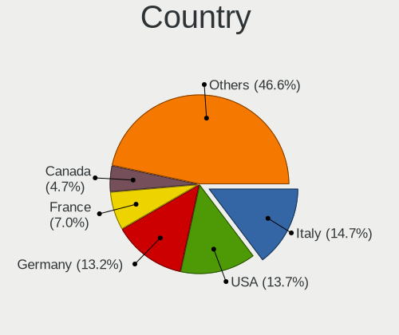
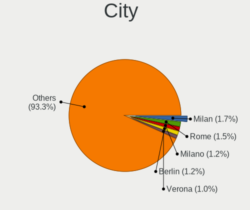
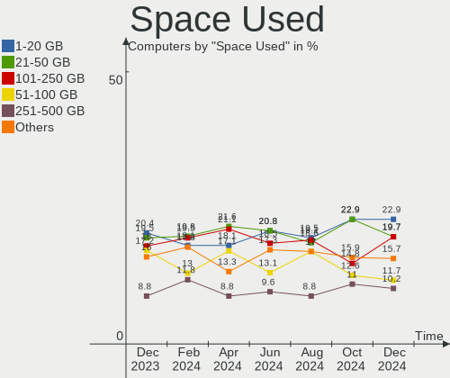
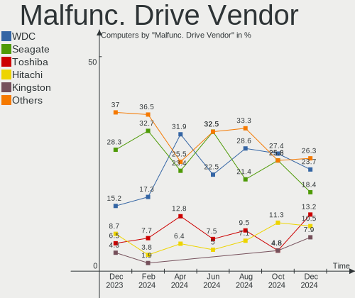
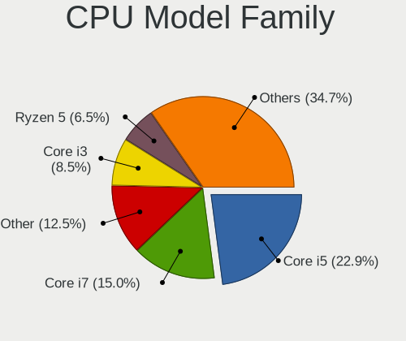
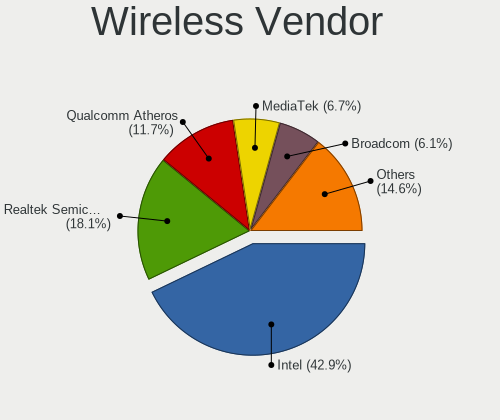
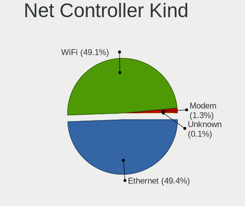

Linux Mint - Hardware Trends
----------------------------

A project to identify most popular hardware characteristics and track their change
over time based on data collected by Linux users at https://Linux-Hardware.org.

Anyone can contribute to this report by the [hw-probe](https://github.com/linuxhw/hw-probe) tool:

    sudo -E hw-probe -all -upload

This is a report for all computer types. See also reports for [desktops](/Dist/Linux_Mint/Desktop/README.md) and [notebooks](/Dist/Linux_Mint/Notebook/README.md).

This report is for one last month. Overall report since the beginning of time: [TestCoverage](https://github.com/linuxhw/TestCoverage)

Period: Jul, 2022.

Contents
--------

* [ System ](#system)
  - [ OS                       ](#os)
  - [ OS Family                ](#os-family)
  - [ Kernel                   ](#kernel)
  - [ Kernel Family            ](#kernel-family)
  - [ Kernel Major Ver.        ](#kernel-major-ver)
  - [ Arch                     ](#arch)
  - [ DE                       ](#de)
  - [ Display Server           ](#display-server)
  - [ Display Manager          ](#display-manager)
  - [ OS Lang                  ](#os-lang)
  - [ Boot Mode                ](#boot-mode)
  - [ Filesystem               ](#filesystem)
  - [ Part. scheme             ](#part-scheme)
  - [ Dual Boot with Linux/BSD ](#dual-boot-with-linuxbsd)
  - [ Dual Boot (Win)          ](#dual-boot-win)

* [ Board ](#board)
  - [ Vendor                   ](#vendor)
  - [ Model                    ](#model)
  - [ Model Family             ](#model-family)
  - [ MFG Year                 ](#mfg-year)
  - [ Form Factor              ](#form-factor)
  - [ Secure Boot              ](#secure-boot)
  - [ Coreboot                 ](#coreboot)
  - [ RAM Size                 ](#ram-size)
  - [ RAM Used                 ](#ram-used)
  - [ Total Drives             ](#total-drives)
  - [ Has CD-ROM               ](#has-cd-rom)
  - [ Has Ethernet             ](#has-ethernet)
  - [ Has WiFi                 ](#has-wifi)
  - [ Has Bluetooth            ](#has-bluetooth)

* [ Location ](#location)
  - [ Country                  ](#country)
  - [ City                     ](#city)

* [ Drives ](#drives)
  - [ Drive Vendor             ](#drive-vendor)
  - [ Drive Model              ](#drive-model)
  - [ HDD Vendor               ](#hdd-vendor)
  - [ SSD Vendor               ](#ssd-vendor)
  - [ Drive Kind               ](#drive-kind)
  - [ Drive Connector          ](#drive-connector)
  - [ Drive Size               ](#drive-size)
  - [ Space Total              ](#space-total)
  - [ Space Used               ](#space-used)
  - [ Malfunc. Drives          ](#malfunc-drives)
  - [ Malfunc. Drive Vendor    ](#malfunc-drive-vendor)
  - [ Malfunc. HDD Vendor      ](#malfunc-hdd-vendor)
  - [ Malfunc. Drive Kind      ](#malfunc-drive-kind)
  - [ Failed Drives            ](#failed-drives)
  - [ Failed Drive Vendor      ](#failed-drive-vendor)
  - [ Drive Status             ](#drive-status)

* [ Storage controller ](#storage-controller)
  - [ Storage Vendor           ](#storage-vendor)
  - [ Storage Model            ](#storage-model)
  - [ Storage Kind             ](#storage-kind)

* [ Processor ](#processor)
  - [ CPU Vendor               ](#cpu-vendor)
  - [ CPU Model                ](#cpu-model)
  - [ CPU Model Family         ](#cpu-model-family)
  - [ CPU Cores                ](#cpu-cores)
  - [ CPU Sockets              ](#cpu-sockets)
  - [ CPU Threads              ](#cpu-threads)
  - [ CPU Op-Modes             ](#cpu-op-modes)
  - [ CPU Microcode            ](#cpu-microcode)
  - [ CPU Microarch            ](#cpu-microarch)

* [ Graphics ](#graphics)
  - [ GPU Vendor               ](#gpu-vendor)
  - [ GPU Model                ](#gpu-model)
  - [ GPU Combo                ](#gpu-combo)
  - [ GPU Driver               ](#gpu-driver)
  - [ GPU Memory               ](#gpu-memory)

* [ Monitor ](#monitor)
  - [ Monitor Vendor           ](#monitor-vendor)
  - [ Monitor Model            ](#monitor-model)
  - [ Monitor Resolution       ](#monitor-resolution)
  - [ Monitor Diagonal         ](#monitor-diagonal)
  - [ Monitor Width            ](#monitor-width)
  - [ Aspect Ratio             ](#aspect-ratio)
  - [ Monitor Area             ](#monitor-area)
  - [ Pixel Density            ](#pixel-density)
  - [ Multiple Monitors        ](#multiple-monitors)

* [ Network ](#network)
  - [ Net Controller Vendor    ](#net-controller-vendor)
  - [ Net Controller Model     ](#net-controller-model)
  - [ Wireless Vendor          ](#wireless-vendor)
  - [ Wireless Model           ](#wireless-model)
  - [ Ethernet Vendor          ](#ethernet-vendor)
  - [ Ethernet Model           ](#ethernet-model)
  - [ Net Controller Kind      ](#net-controller-kind)
  - [ Used Controller          ](#used-controller)
  - [ NICs                     ](#nics)
  - [ IPv6                     ](#ipv6)

* [ Bluetooth ](#bluetooth)
  - [ Bluetooth Vendor         ](#bluetooth-vendor)
  - [ Bluetooth Model          ](#bluetooth-model)

* [ Sound ](#sound)
  - [ Sound Vendor             ](#sound-vendor)
  - [ Sound Model              ](#sound-model)

* [ Memory ](#memory)
  - [ Memory Vendor            ](#memory-vendor)
  - [ Memory Model             ](#memory-model)
  - [ Memory Kind              ](#memory-kind)
  - [ Memory Form Factor       ](#memory-form-factor)
  - [ Memory Size              ](#memory-size)
  - [ Memory Speed             ](#memory-speed)

* [ Printers & scanners ](#printers--scanners)
  - [ Printer Vendor           ](#printer-vendor)
  - [ Printer Model            ](#printer-model)
  - [ Scanner Vendor           ](#scanner-vendor)
  - [ Scanner Model            ](#scanner-model)

* [ Camera ](#camera)
  - [ Camera Vendor            ](#camera-vendor)
  - [ Camera Model             ](#camera-model)

* [ Security ](#security)
  - [ Fingerprint Vendor       ](#fingerprint-vendor)
  - [ Fingerprint Model        ](#fingerprint-model)
  - [ Chipcard Vendor          ](#chipcard-vendor)
  - [ Chipcard Model           ](#chipcard-model)

* [ Unsupported ](#unsupported)
  - [ Unsupported Devices      ](#unsupported-devices)
  - [ Unsupported Device Types ](#unsupported-device-types)

System
------

OS
--

Installed operating systems

| Name            | Computers | Percent |
|-----------------|-----------|---------|
| Linux Mint 20.3 | 389       | 82.59%  |
| Linux Mint 20.2 | 30        | 6.37%   |
| Linux Mint 19.3 | 18        | 3.82%   |
| Linux Mint 20.1 | 12        | 2.55%   |
| Linux Mint 21   | 9         | 1.91%   |
| Linux Mint 20   | 8         | 1.7%    |
| Linux Mint 19.1 | 2         | 0.42%   |
| Linux Mint 19   | 2         | 0.42%   |
| Linux Mint 18.3 | 1         | 0.21%   |

OS Family
---------

OS without a version

| Name       | Computers | Percent |
|------------|-----------|---------|
| Linux Mint | 471       | 100%    |

Kernel
------

Version of the Linux kernel

| Version                     | Computers | Percent |
|-----------------------------|-----------|---------|
| 5.4.0-122-generic           | 180       | 38.22%  |
| 5.4.0-121-generic           | 115       | 24.42%  |
| 5.4.0-91-generic            | 36        | 7.64%   |
| 5.15.0-41-generic           | 31        | 6.58%   |
| 5.15.0-33-generic           | 15        | 3.18%   |
| 5.4.0-120-generic           | 7         | 1.49%   |
| 5.4.0-117-generic           | 5         | 1.06%   |
| 5.13.0-25-generic           | 5         | 1.06%   |
| 5.18.12-051812-generic      | 4         | 0.85%   |
| 5.14.0-1044-oem             | 4         | 0.85%   |
| 5.4.0-113-generic           | 3         | 0.64%   |
| 5.4.0-110-generic           | 3         | 0.64%   |
| 5.4.0-109-generic           | 3         | 0.64%   |
| 5.4.0-107-generic           | 3         | 0.64%   |
| 5.15.0-43-generic           | 3         | 0.64%   |
| 5.14.0-1045-oem             | 3         | 0.64%   |
| 5.13.0-52-generic           | 3         | 0.64%   |
| 4.15.0-189-generic          | 3         | 0.64%   |
| 5.4.0-99-generic            | 2         | 0.42%   |
| 5.4.0-74-generic            | 2         | 0.42%   |
| 5.4.0-58-generic            | 2         | 0.42%   |
| 5.4.0-26-generic            | 2         | 0.42%   |
| 5.4.0-105-generic           | 2         | 0.42%   |
| 5.14.0-1042-oem             | 2         | 0.42%   |
| 5.13.0-51-generic           | 2         | 0.42%   |
| 5.13.0-27-generic           | 2         | 0.42%   |
| 5.0.0-32-generic            | 2         | 0.42%   |
| 4.15.0-20-generic           | 2         | 0.42%   |
| 5.4.0-97-generic            | 1         | 0.21%   |
| 5.4.0-90-generic            | 1         | 0.21%   |
| 5.4.0-81-generic            | 1         | 0.21%   |
| 5.4.0-56-generic            | 1         | 0.21%   |
| 5.4.0-45-generic            | 1         | 0.21%   |
| 5.4.0-122-lowlatency        | 1         | 0.21%   |
| 5.4.0-1132206031516-generic | 1         | 0.21%   |
| 5.18.8-051808-generic       | 1         | 0.21%   |
| 5.18.5-051805-generic       | 1         | 0.21%   |
| 5.18.11-051811-generic      | 1         | 0.21%   |
| 5.18.10-051810-generic      | 1         | 0.21%   |
| 5.18.0-12.2-liquorix-amd64  | 1         | 0.21%   |
| 5.17.5-76051705-generic     | 1         | 0.21%   |
| 5.17.0-051700-generic       | 1         | 0.21%   |
| 5.16.15-051615-generic      | 1         | 0.21%   |
| 5.16.0-6mx-amd64            | 1         | 0.21%   |
| 5.15.0-42-lowlatency        | 1         | 0.21%   |
| 5.15.0-39-generic           | 1         | 0.21%   |
| 5.15.0-33-lowlatency        | 1         | 0.21%   |
| 5.13.0-48-generic           | 1         | 0.21%   |
| 5.13.0-44-generic           | 1         | 0.21%   |
| 5.13.0-21-generic           | 1         | 0.21%   |
| 4.15.0-34-generic           | 1         | 0.21%   |
| 4.15.0-163-generic          | 1         | 0.21%   |
| 4.10.0-38-generic           | 1         | 0.21%   |

Kernel Family
-------------

Linux kernel without a distro release

| Version | Computers | Percent |
|---------|-----------|---------|
| 5.4.0   | 372       | 78.98%  |
| 5.15.0  | 52        | 11.04%  |
| 5.13.0  | 15        | 3.18%   |
| 5.14.0  | 9         | 1.91%   |
| 4.15.0  | 7         | 1.49%   |
| 5.18.12 | 4         | 0.85%   |
| 5.0.0   | 2         | 0.42%   |
| 5.18.8  | 1         | 0.21%   |
| 5.18.5  | 1         | 0.21%   |
| 5.18.11 | 1         | 0.21%   |
| 5.18.10 | 1         | 0.21%   |
| 5.18.0  | 1         | 0.21%   |
| 5.17.5  | 1         | 0.21%   |
| 5.17.0  | 1         | 0.21%   |
| 5.16.15 | 1         | 0.21%   |
| 5.16.0  | 1         | 0.21%   |
| 4.10.0  | 1         | 0.21%   |

Kernel Major Ver.
-----------------

Linux kernel major version

| Version | Computers | Percent |
|---------|-----------|---------|
| 5.4     | 372       | 78.98%  |
| 5.15    | 52        | 11.04%  |
| 5.13    | 15        | 3.18%   |
| 5.18    | 9         | 1.91%   |
| 5.14    | 9         | 1.91%   |
| 4.15    | 7         | 1.49%   |
| 5.17    | 2         | 0.42%   |
| 5.16    | 2         | 0.42%   |
| 5.0     | 2         | 0.42%   |
| 4.10    | 1         | 0.21%   |

Arch
----

OS architecture (x86_64, i586, etc.)

| Name   | Computers | Percent |
|--------|-----------|---------|
| x86_64 | 467       | 99.15%  |
| i686   | 4         | 0.85%   |

DE
--

Desktop Environment

| Name       | Computers | Percent |
|------------|-----------|---------|
| X-Cinnamon | 298       | 63.27%  |
| XFCE       | 67        | 14.23%  |
| MATE       | 66        | 14.01%  |
| Cinnamon   | 25        | 5.31%   |
| GNOME      | 9         | 1.91%   |
| Unknown    | 4         | 0.85%   |
| KDE5       | 1         | 0.21%   |
| KDE        | 1         | 0.21%   |

Display Server
--------------

X11 or Wayland

| Name    | Computers | Percent |
|---------|-----------|---------|
| X11     | 466       | 98.94%  |
| Tty     | 3         | 0.64%   |
| Wayland | 2         | 0.42%   |

Display Manager
---------------

SDDM, LightDM, etc.

| Name    | Computers | Percent |
|---------|-----------|---------|
| Unknown | 256       | 54.35%  |
| LightDM | 210       | 44.59%  |
| GDM     | 5         | 1.06%   |

OS Lang
-------

Language

| Lang    | Computers | Percent |
|---------|-----------|---------|
| en_US   | 149       | 31.63%  |
| de_DE   | 77        | 16.35%  |
| fr_FR   | 32        | 6.79%   |
| pt_BR   | 27        | 5.73%   |
| ru_RU   | 24        | 5.1%    |
| en_GB   | 18        | 3.82%   |
| C       | 15        | 3.18%   |
| es_ES   | 12        | 2.55%   |
| en_CA   | 12        | 2.55%   |
| it_IT   | 11        | 2.34%   |
| pl_PL   | 8         | 1.7%    |
| en_AU   | 8         | 1.7%    |
| es_MX   | 6         | 1.27%   |
| en_IN   | 6         | 1.27%   |
| de_CH   | 5         | 1.06%   |
| cs_CZ   | 5         | 1.06%   |
| fr_CA   | 4         | 0.85%   |
| en_ZA   | 4         | 0.85%   |
| el_GR   | 4         | 0.85%   |
| nl_NL   | 3         | 0.64%   |
| es_AR   | 3         | 0.64%   |
| zh_CN   | 2         | 0.42%   |
| sv_SE   | 2         | 0.42%   |
| nl_BE   | 2         | 0.42%   |
| lv_LV   | 2         | 0.42%   |
| ja_JP   | 2         | 0.42%   |
| hu_HU   | 2         | 0.42%   |
| fr_CH   | 2         | 0.42%   |
| fi_FI   | 2         | 0.42%   |
| es_CO   | 2         | 0.42%   |
| da_DK   | 2         | 0.42%   |
| Unknown | 2         | 0.42%   |
| tr_TR   | 1         | 0.21%   |
| sr_RS   | 1         | 0.21%   |
| sk_SK   | 1         | 0.21%   |
| ru_UA   | 1         | 0.21%   |
| pt_PT   | 1         | 0.21%   |
| nb_NO   | 1         | 0.21%   |
| id_ID   | 1         | 0.21%   |
| hr_HR   | 1         | 0.21%   |
| fr_LU   | 1         | 0.21%   |
| es_EC   | 1         | 0.21%   |
| es_CL   | 1         | 0.21%   |
| en_ZM   | 1         | 0.21%   |
| en_PH   | 1         | 0.21%   |
| en_NZ   | 1         | 0.21%   |
| ca_ES   | 1         | 0.21%   |
| bg_BG   | 1         | 0.21%   |

Boot Mode
---------

EFI or BIOS

| Mode | Computers | Percent |
|------|-----------|---------|
| EFI  | 270       | 57.32%  |
| BIOS | 201       | 42.68%  |

Filesystem
----------

Type of filesystem

| Type    | Computers | Percent |
|---------|-----------|---------|
| Ext4    | 446       | 94.69%  |
| Overlay | 13        | 2.76%   |
| Btrfs   | 10        | 2.12%   |
| Ext3    | 1         | 0.21%   |
| Ext2    | 1         | 0.21%   |

Part. scheme
------------

Scheme of partitioning

| Type    | Computers | Percent |
|---------|-----------|---------|
| Unknown | 269       | 57.11%  |
| GPT     | 142       | 30.15%  |
| MBR     | 60        | 12.74%  |

Dual Boot with Linux/BSD
------------------------

Hosting more than one Linux/BSD

| Dual boot | Computers | Percent |
|-----------|-----------|---------|
| No        | 442       | 93.84%  |
| Yes       | 29        | 6.16%   |

Dual Boot (Win)
---------------

Hosting Linux and Windows

| Dual boot | Computers | Percent |
|-----------|-----------|---------|
| No        | 375       | 79.62%  |
| Yes       | 96        | 20.38%  |

Board
-----

Vendor
------

Motherboard manufacturer

| Name                | Computers | Percent |
|---------------------|-----------|---------|
| Hewlett-Packard     | 71        | 15.07%  |
| ASUSTek Computer    | 68        | 14.44%  |
| Dell                | 58        | 12.31%  |
| Lenovo              | 55        | 11.68%  |
| Gigabyte Technology | 33        | 7.01%   |
| MSI                 | 31        | 6.58%   |
| Acer                | 29        | 6.16%   |
| ASRock              | 15        | 3.18%   |
| Apple               | 15        | 3.18%   |
| Intel               | 12        | 2.55%   |
| Unknown             | 7         | 1.49%   |
| Sony                | 5         | 1.06%   |
| Samsung Electronics | 5         | 1.06%   |
| Positivo            | 5         | 1.06%   |
| Toshiba             | 4         | 0.85%   |
| Medion              | 4         | 0.85%   |
| Biostar             | 4         | 0.85%   |
| Panasonic           | 3         | 0.64%   |
| Notebook            | 3         | 0.64%   |
| Google              | 3         | 0.64%   |
| ECS                 | 3         | 0.64%   |
| AZW                 | 3         | 0.64%   |
| Thomson             | 2         | 0.42%   |
| Pegatron            | 2         | 0.42%   |
| HUAWEI              | 2         | 0.42%   |
| Fujitsu             | 2         | 0.42%   |
| Foxconn             | 2         | 0.42%   |
| ZOTAC               | 1         | 0.21%   |
| Wortmann AG         | 1         | 0.21%   |
| TrekStor            | 1         | 0.21%   |
| TPVAOC              | 1         | 0.21%   |
| Timi                | 1         | 0.21%   |
| Tactus              | 1         | 0.21%   |
| Prestigio           | 1         | 0.21%   |
| PCWare              | 1         | 0.21%   |
| Packard Bell        | 1         | 0.21%   |
| NSX                 | 1         | 0.21%   |
| Minix               | 1         | 0.21%   |
| Microsoft           | 1         | 0.21%   |
| MACHINIST           | 1         | 0.21%   |
| GPU Company         | 1         | 0.21%   |
| Fujitsu Siemens     | 1         | 0.21%   |
| eMachines           | 1         | 0.21%   |
| Digma               | 1         | 0.21%   |
| Daten Tecnologia    | 1         | 0.21%   |
| Coradir             | 1         | 0.21%   |
| Chuwi               | 1         | 0.21%   |
| BESSTAR Tech        | 1         | 0.21%   |
| AVERATEC            | 1         | 0.21%   |
| ARCELIK             | 1         | 0.21%   |
| AMI                 | 1         | 0.21%   |
| Alienware           | 1         | 0.21%   |

Model
-----

Motherboard model

| Name                                              | Computers | Percent |
|---------------------------------------------------|-----------|---------|
| Unknown                                           | 7         | 1.49%   |
| MSI MS-7B86                                       | 3         | 0.64%   |
| HP Laptop 17-cp0xxx                               | 3         | 0.64%   |
| ASUS All Series                                   | 3         | 0.64%   |
| MSI MS-7693                                       | 2         | 0.42%   |
| MSI MS-7529                                       | 2         | 0.42%   |
| Lenovo IdeaPad 120S-11IAP 81A4                    | 2         | 0.42%   |
| HP ProBook 4530s                                  | 2         | 0.42%   |
| HP EliteDesk 800 G1 SFF                           | 2         | 0.42%   |
| HP Compaq Pro 6300 SFF                            | 2         | 0.42%   |
| Gigabyte G33M-S2                                  | 2         | 0.42%   |
| Dell OptiPlex 780                                 | 2         | 0.42%   |
| Dell OptiPlex 7010                                | 2         | 0.42%   |
| Dell Latitude E6540                               | 2         | 0.42%   |
| AZW Green G2                                      | 2         | 0.42%   |
| ASUS TUF Gaming X570-PLUS                         | 2         | 0.42%   |
| ASUS TUF B450-PRO GAMING                          | 2         | 0.42%   |
| ASUS PRIME X570-P                                 | 2         | 0.42%   |
| Apple MacBookAir6,2                               | 2         | 0.42%   |
| Apple iMac10,1                                    | 2         | 0.42%   |
| Acer Aspire R3-131T                               | 2         | 0.42%   |
| ZOTAC ZBOXNANO-AQ02                               | 1         | 0.21%   |
| Wortmann AG CR700                                 | 1         | 0.21%   |
| TrekStor Primebook P14                            | 1         | 0.21%   |
| TPVAOC AA183M                                     | 1         | 0.21%   |
| Toshiba Satellite U920T                           | 1         | 0.21%   |
| Toshiba Satellite Pro C660                        | 1         | 0.21%   |
| Toshiba Satellite L55-B                           | 1         | 0.21%   |
| Toshiba Satellite C660                            | 1         | 0.21%   |
| Timi RedmiBook 16                                 | 1         | 0.21%   |
| Thomson N17V3C8WH512                              | 1         | 0.21%   |
| Thomson N17CSL512                                 | 1         | 0.21%   |
| Tactus GeoPad 220                                 | 1         | 0.21%   |
| Sony VPCEB3L1E                                    | 1         | 0.21%   |
| Sony VGN-NW270F                                   | 1         | 0.21%   |
| Sony VGN-FS415B                                   | 1         | 0.21%   |
| Sony SVF15318SNB                                  | 1         | 0.21%   |
| Sony SVE1511Y1ESI                                 | 1         | 0.21%   |
| Samsung RV420/RV520/RV720/E3530/S3530/E3420/E3520 | 1         | 0.21%   |
| Samsung Q430/Q530                                 | 1         | 0.21%   |
| Samsung 905S3G/906S3G/915S3G/9305SG               | 1         | 0.21%   |
| Samsung 750XDA                                    | 1         | 0.21%   |
| Samsung 300E5M/300E5L                             | 1         | 0.21%   |
| Prestigio Multipad Visconte V                     | 1         | 0.21%   |
| Positivo S14CT01                                  | 1         | 0.21%   |
| Positivo POS-MIG31AG                              | 1         | 0.21%   |
| Positivo POS-MI945AA                              | 1         | 0.21%   |
| Positivo Mobile                                   | 1         | 0.21%   |
| Positivo D6200                                    | 1         | 0.21%   |
| Pegatron p7-1154                                  | 1         | 0.21%   |
| Pegatron p7-1142                                  | 1         | 0.21%   |
| PCWare IPMH61R3                                   | 1         | 0.21%   |
| Panasonic FZ55-2                                  | 1         | 0.21%   |
| Panasonic CF-S10EYADR                             | 1         | 0.21%   |
| Panasonic CF-53JAWZYDE                            | 1         | 0.21%   |
| Packard Bell EasyNote_MX52-B-122GE                | 1         | 0.21%   |
| NSX SB142G                                        | 1         | 0.21%   |
| Notebook P7xxDM(-G)                               | 1         | 0.21%   |
| Notebook NL4x_NL5xLU                              | 1         | 0.21%   |
| Notebook N150ZU                                   | 1         | 0.21%   |

Model Family
------------

Motherboard model prefix

| Name                 | Computers | Percent |
|----------------------|-----------|---------|
| Acer Aspire          | 22        | 4.67%   |
| Dell Latitude        | 20        | 4.25%   |
| Lenovo ThinkPad      | 18        | 3.82%   |
| Dell Inspiron        | 16        | 3.4%    |
| Dell OptiPlex        | 11        | 2.34%   |
| HP Pavilion          | 10        | 2.12%   |
| HP Laptop            | 10        | 2.12%   |
| Lenovo IdeaPad       | 9         | 1.91%   |
| ASUS PRIME           | 9         | 1.91%   |
| HP EliteBook         | 8         | 1.7%    |
| HP ProBook           | 7         | 1.49%   |
| HP Compaq            | 7         | 1.49%   |
| ASUS TUF             | 7         | 1.49%   |
| Unknown              | 7         | 1.49%   |
| Lenovo ThinkCentre   | 6         | 1.27%   |
| ASUS VivoBook        | 5         | 1.06%   |
| ASUS ROG             | 5         | 1.06%   |
| Toshiba Satellite    | 4         | 0.85%   |
| MSI MS-7B86          | 3         | 0.64%   |
| Lenovo Yoga          | 3         | 0.64%   |
| Lenovo ThinkBook     | 3         | 0.64%   |
| HP ZBook             | 3         | 0.64%   |
| HP ProDesk           | 3         | 0.64%   |
| HP 250               | 3         | 0.64%   |
| Dell Precision       | 3         | 0.64%   |
| ASUS All             | 3         | 0.64%   |
| MSI MS-7693          | 2         | 0.42%   |
| MSI MS-7529          | 2         | 0.42%   |
| Intel X99            | 2         | 0.42%   |
| HP OMEN              | 2         | 0.42%   |
| HP EliteDesk         | 2         | 0.42%   |
| HP 255               | 2         | 0.42%   |
| Gigabyte Z590        | 2         | 0.42%   |
| Gigabyte Z390        | 2         | 0.42%   |
| Gigabyte H410M       | 2         | 0.42%   |
| Gigabyte G33M-S2     | 2         | 0.42%   |
| Gigabyte B550        | 2         | 0.42%   |
| Fujitsu LIFEBOOK     | 2         | 0.42%   |
| Dell XPS             | 2         | 0.42%   |
| AZW Green            | 2         | 0.42%   |
| ASUS P8B75-M         | 2         | 0.42%   |
| ASUS ASUS            | 2         | 0.42%   |
| ASRock X370          | 2         | 0.42%   |
| Apple MacBookAir6    | 2         | 0.42%   |
| Apple iMac10         | 2         | 0.42%   |
| Acer Nitro           | 2         | 0.42%   |
| ZOTAC ZBOXNANO-AQ02  | 1         | 0.21%   |
| Wortmann AG CR700    | 1         | 0.21%   |
| TrekStor Primebook   | 1         | 0.21%   |
| TPVAOC AA183M        | 1         | 0.21%   |
| Timi RedmiBook       | 1         | 0.21%   |
| Thomson N17V3C8WH512 | 1         | 0.21%   |
| Thomson N17CSL512    | 1         | 0.21%   |
| Tactus GeoPad        | 1         | 0.21%   |
| Sony VPCEB3L1E       | 1         | 0.21%   |
| Sony VGN-NW270F      | 1         | 0.21%   |
| Sony VGN-FS415B      | 1         | 0.21%   |
| Sony SVF15318SNB     | 1         | 0.21%   |
| Sony SVE1511Y1ESI    | 1         | 0.21%   |
| Samsung RV420        | 1         | 0.21%   |

MFG Year
--------

Motherboard manufacture year

| Year | Computers | Percent |
|------|-----------|---------|
| 2021 | 56        | 11.89%  |
| 2019 | 41        | 8.7%    |
| 2018 | 41        | 8.7%    |
| 2012 | 39        | 8.28%   |
| 2013 | 37        | 7.86%   |
| 2011 | 33        | 7.01%   |
| 2020 | 31        | 6.58%   |
| 2009 | 31        | 6.58%   |
| 2014 | 27        | 5.73%   |
| 2010 | 24        | 5.1%    |
| 2017 | 23        | 4.88%   |
| 2015 | 22        | 4.67%   |
| 2022 | 17        | 3.61%   |
| 2016 | 17        | 3.61%   |
| 2008 | 17        | 3.61%   |
| 2007 | 11        | 2.34%   |
| 2006 | 3         | 0.64%   |
| 2005 | 1         | 0.21%   |

Form Factor
-----------

Physical design of the computer

| Name        | Computers | Percent |
|-------------|-----------|---------|
| Notebook    | 250       | 53.08%  |
| Desktop     | 195       | 41.4%   |
| All in one  | 10        | 2.12%   |
| Mini pc     | 7         | 1.49%   |
| Convertible | 6         | 1.27%   |
| Tablet      | 3         | 0.64%   |

Secure Boot
-----------

Enabled or disabled

| State    | Computers | Percent |
|----------|-----------|---------|
| Disabled | 429       | 91.08%  |
| Enabled  | 42        | 8.92%   |

Coreboot
--------

Have coreboot on board

| Used | Computers | Percent |
|------|-----------|---------|
| No   | 467       | 99.15%  |
| Yes  | 4         | 0.85%   |

RAM Size
--------

Total RAM memory

| Size in GB  | Computers | Percent |
|-------------|-----------|---------|
| 4.01-8.0    | 113       | 23.99%  |
| 3.01-4.0    | 96        | 20.38%  |
| 16.01-24.0  | 87        | 18.47%  |
| 8.01-16.0   | 85        | 18.05%  |
| 32.01-64.0  | 50        | 10.62%  |
| 1.01-2.0    | 20        | 4.25%   |
| 2.01-3.0    | 8         | 1.7%    |
| 24.01-32.0  | 7         | 1.49%   |
| 64.01-256.0 | 5         | 1.06%   |

RAM Used
--------

Used RAM memory

| Used GB    | Computers | Percent |
|------------|-----------|---------|
| 1.01-2.0   | 217       | 46.07%  |
| 2.01-3.0   | 108       | 22.93%  |
| 3.01-4.0   | 68        | 14.44%  |
| 4.01-8.0   | 46        | 9.77%   |
| 0.51-1.0   | 18        | 3.82%   |
| 8.01-16.0  | 12        | 2.55%   |
| 16.01-24.0 | 1         | 0.21%   |
| 0.01-0.5   | 1         | 0.21%   |

Total Drives
------------

Number of drives on board

| Drives | Computers | Percent |
|--------|-----------|---------|
| 1      | 262       | 55.63%  |
| 2      | 129       | 27.39%  |
| 3      | 38        | 8.07%   |
| 4      | 27        | 5.73%   |
| 5      | 6         | 1.27%   |
| 6      | 4         | 0.85%   |
| 7      | 2         | 0.42%   |
| 14     | 1         | 0.21%   |
| 8      | 1         | 0.21%   |
| 0      | 1         | 0.21%   |

Has CD-ROM
----------

Has CD-ROM on board

| Presented | Computers | Percent |
|-----------|-----------|---------|
| No        | 258       | 54.78%  |
| Yes       | 213       | 45.22%  |

Has Ethernet
------------

Has Ethernet on board

| Presented | Computers | Percent |
|-----------|-----------|---------|
| Yes       | 410       | 87.05%  |
| No        | 61        | 12.95%  |

Has WiFi
--------

Has WiFi module

| Presented | Computers | Percent |
|-----------|-----------|---------|
| Yes       | 363       | 77.07%  |
| No        | 108       | 22.93%  |

Has Bluetooth
-------------

Has Bluetooth module

| Presented | Computers | Percent |
|-----------|-----------|---------|
| Yes       | 261       | 55.41%  |
| No        | 210       | 44.59%  |

Location
--------

Country
-------

Geographic location (country)

| Country      | Computers | Percent |
|--------------|-----------|---------|
| USA          | 83        | 17.62%  |
| Germany      | 82        | 17.41%  |
| France       | 42        | 8.92%   |
| Brazil       | 33        | 7.01%   |
| Russia       | 29        | 6.16%   |
| Canada       | 18        | 3.82%   |
| UK           | 17        | 3.61%   |
| Spain        | 12        | 2.55%   |
| Italy        | 12        | 2.55%   |
| Switzerland  | 11        | 2.34%   |
| Poland       | 10        | 2.12%   |
| Australia    | 9         | 1.91%   |
| Mexico       | 7         | 1.49%   |
| Netherlands  | 6         | 1.27%   |
| India        | 6         | 1.27%   |
| Greece       | 6         | 1.27%   |
| Sweden       | 5         | 1.06%   |
| Latvia       | 5         | 1.06%   |
| Czechia      | 5         | 1.06%   |
| Argentina    | 5         | 1.06%   |
| South Africa | 4         | 0.85%   |
| Indonesia    | 4         | 0.85%   |
| Romania      | 3         | 0.64%   |
| Japan        | 3         | 0.64%   |
| Denmark      | 3         | 0.64%   |
| Colombia     | 3         | 0.64%   |
| Belgium      | 3         | 0.64%   |
| Yemen        | 2         | 0.42%   |
| Ukraine      | 2         | 0.42%   |
| Turkey       | 2         | 0.42%   |
| Slovakia     | 2         | 0.42%   |
| Serbia       | 2         | 0.42%   |
| Paraguay     | 2         | 0.42%   |
| Namibia      | 2         | 0.42%   |
| Luxembourg   | 2         | 0.42%   |
| Finland      | 2         | 0.42%   |
| China        | 2         | 0.42%   |
| Belarus      | 2         | 0.42%   |
| Zambia       | 1         | 0.21%   |
| Uzbekistan   | 1         | 0.21%   |
| Thailand     | 1         | 0.21%   |
| Sri Lanka    | 1         | 0.21%   |
| Qatar        | 1         | 0.21%   |
| Puerto Rico  | 1         | 0.21%   |
| Portugal     | 1         | 0.21%   |
| Philippines  | 1         | 0.21%   |
| Pakistan     | 1         | 0.21%   |
| Norway       | 1         | 0.21%   |
| New Zealand  | 1         | 0.21%   |
| Nepal        | 1         | 0.21%   |
| Hungary      | 1         | 0.21%   |
| Hong Kong    | 1         | 0.21%   |
| Guatemala    | 1         | 0.21%   |
| Egypt        | 1         | 0.21%   |
| Ecuador      | 1         | 0.21%   |
| Cyprus       | 1         | 0.21%   |
| Croatia      | 1         | 0.21%   |
| Chile        | 1         | 0.21%   |
| Bulgaria     | 1         | 0.21%   |
| Brunei       | 1         | 0.21%   |

City
----

Geographic location (city)

| City                | Computers | Percent |
|---------------------|-----------|---------|
| Moscow              | 9         | 1.91%   |
| Berlin              | 5         | 1.06%   |
| Prague              | 4         | 0.85%   |
| Paris               | 4         | 0.85%   |
| Hamburg             | 4         | 0.85%   |
| Ventspils           | 3         | 0.64%   |
| St Petersburg       | 3         | 0.64%   |
| Rio de Janeiro      | 3         | 0.64%   |
| Montreal            | 3         | 0.64%   |
| Milan               | 3         | 0.64%   |
| Athens              | 3         | 0.64%   |
| Windhoek            | 2         | 0.42%   |
| Warsaw              | 2         | 0.42%   |
| Voronezh            | 2         | 0.42%   |
| Uetze               | 2         | 0.42%   |
| Turin               | 2         | 0.42%   |
| Thessaloniki        | 2         | 0.42%   |
| Sydney              | 2         | 0.42%   |
| Sao Paulo           | 2         | 0.42%   |
| Sanaa               | 2         | 0.42%   |
| Reston              | 2         | 0.42%   |
| Rendsburg           | 2         | 0.42%   |
| Recife              | 2         | 0.42%   |
| Racibórz           | 2         | 0.42%   |
| Québec             | 2         | 0.42%   |
| Porto Alegre        | 2         | 0.42%   |
| Ottawa              | 2         | 0.42%   |
| Munich              | 2         | 0.42%   |
| Miami               | 2         | 0.42%   |
| Mexico City         | 2         | 0.42%   |
| Markneukirchen      | 2         | 0.42%   |
| Luxembourg          | 2         | 0.42%   |
| Lübeck             | 2         | 0.42%   |
| Leipzig             | 2         | 0.42%   |
| Kiel                | 2         | 0.42%   |
| Istanbul            | 2         | 0.42%   |
| Hanover             | 2         | 0.42%   |
| Granollers          | 2         | 0.42%   |
| Gloucester          | 2         | 0.42%   |
| Fortaleza           | 2         | 0.42%   |
| Dietikon            | 2         | 0.42%   |
| Compania Santa Rita | 2         | 0.42%   |
| Chicago             | 2         | 0.42%   |
| Chennai             | 2         | 0.42%   |
| Chandler            | 2         | 0.42%   |
| Caserta             | 2         | 0.42%   |
| Campinas            | 2         | 0.42%   |
| Cambridge           | 2         | 0.42%   |
| Bucharest           | 2         | 0.42%   |
| Brisbane            | 2         | 0.42%   |
| Brasília           | 2         | 0.42%   |
| Bogotá             | 2         | 0.42%   |
| Barcelona           | 2         | 0.42%   |
| Atlanta             | 2         | 0.42%   |
| Zurich              | 1         | 0.21%   |
| Yevpatoriya         | 1         | 0.21%   |
| Yaroslavl           | 1         | 0.21%   |
| Yamagata            | 1         | 0.21%   |
| Wrexham             | 1         | 0.21%   |
| Woodway             | 1         | 0.21%   |

Drives
------

Drive Vendor
------------

Hard drive vendors

| Vendor                    | Computers | Drives | Percent |
|---------------------------|-----------|--------|---------|
| WDC                       | 118       | 134    | 16.55%  |
| Seagate                   | 111       | 150    | 15.57%  |
| Samsung Electronics       | 92        | 110    | 12.9%   |
| Kingston                  | 49        | 52     | 6.87%   |
| Toshiba                   | 42        | 47     | 5.89%   |
| SanDisk                   | 34        | 36     | 4.77%   |
| Unknown                   | 30        | 38     | 4.21%   |
| Crucial                   | 27        | 28     | 3.79%   |
| Hitachi                   | 21        | 23     | 2.95%   |
| HGST                      | 17        | 18     | 2.38%   |
| Intel                     | 12        | 13     | 1.68%   |
| A-DATA Technology         | 11        | 12     | 1.54%   |
| SK hynix                  | 9         | 9      | 1.26%   |
| China                     | 9         | 9      | 1.26%   |
| Phison                    | 8         | 8      | 1.12%   |
| Apple                     | 8         | 11     | 1.12%   |
| Micron Technology         | 7         | 7      | 0.98%   |
| Intenso                   | 7         | 7      | 0.98%   |
| PNY                       | 6         | 6      | 0.84%   |
| LITEON                    | 6         | 6      | 0.84%   |
| OCZ                       | 5         | 5      | 0.7%    |
| KIOXIA                    | 5         | 5      | 0.7%    |
| Maxtor                    | 4         | 4      | 0.56%   |
| Unknown                   | 4         | 4      | 0.56%   |
| XPG                       | 3         | 3      | 0.42%   |
| SPCC                      | 3         | 3      | 0.42%   |
| Silicon Motion            | 3         | 3      | 0.42%   |
| Micron/Crucial Technology | 3         | 3      | 0.42%   |
| LITEONIT                  | 3         | 3      | 0.42%   |
| GOODRAM                   | 3         | 3      | 0.42%   |
| Gigabyte Technology       | 3         | 3      | 0.42%   |
| Dogfish                   | 3         | 3      | 0.42%   |
| TO Exter                  | 2         | 2      | 0.28%   |
| SAGE                      | 2         | 2      | 0.28%   |
| Patriot                   | 2         | 2      | 0.28%   |
| NGFF                      | 2         | 2      | 0.28%   |
| LS                        | 2         | 2      | 0.28%   |
| Kingchuxing               | 2         | 2      | 0.28%   |
| JMicron Technology        | 2         | 2      | 0.28%   |
| TrekStor                  | 1         | 1      | 0.14%   |
| Transcend                 | 1         | 1      | 0.14%   |
| Timetec                   | 1         | 1      | 0.14%   |
| SSSTC                     | 1         | 1      | 0.14%   |
| SSK                       | 1         | 1      | 0.14%   |
| ShiJi                     | 1         | 1      | 0.14%   |
| SABRENT                   | 1         | 1      | 0.14%   |
| Realtek Semiconductor     | 1         | 2      | 0.14%   |
| Qumo                      | 1         | 1      | 0.14%   |
| Plextor                   | 1         | 1      | 0.14%   |
| PHD 3.0                   | 1         | 1      | 0.14%   |
| ORIGIN                    | 1         | 1      | 0.14%   |
| Netac SS                  | 1         | 1      | 0.14%   |
| Netac                     | 1         | 1      | 0.14%   |
| N600                      | 1         | 1      | 0.14%   |
| Mushkin                   | 1         | 1      | 0.14%   |
| Lite-On                   | 1         | 1      | 0.14%   |
| Lenovo                    | 1         | 1      | 0.14%   |
| LDLC                      | 1         | 2      | 0.14%   |
| KingSpec                  | 1         | 1      | 0.14%   |
| Kingsand                  | 1         | 1      | 0.14%   |

Drive Model
-----------

Hard drive models

| Model                               | Computers | Percent |
|-------------------------------------|-----------|---------|
| Seagate ST500DM002-1BD142 500GB     | 9         | 1.14%   |
| Unknown MMC Card  32GB              | 8         | 1.01%   |
| Kingston SA400S37120G 120GB SSD     | 8         | 1.01%   |
| Toshiba MQ04ABF100 1TB              | 7         | 0.89%   |
| Kingston SA400S37480G 480GB SSD     | 7         | 0.89%   |
| Toshiba DT01ACA100 1TB              | 6         | 0.76%   |
| Kingston SA400S37240G 240GB SSD     | 6         | 0.76%   |
| Crucial CT1000MX500SSD1 1TB         | 6         | 0.76%   |
| Seagate ST500LT012-1DG142 500GB     | 5         | 0.63%   |
| SanDisk NVMe SSD Drive 256GB        | 5         | 0.63%   |
| Samsung SSD 870 QVO 1TB             | 5         | 0.63%   |
| Samsung SSD 850 EVO 250GB           | 5         | 0.63%   |
| Samsung NVMe SSD Drive 500GB        | 5         | 0.63%   |
| HGST HTS721010A9E630 1TB            | 5         | 0.63%   |
| Crucial CT500MX500SSD1 500GB        | 5         | 0.63%   |
| Toshiba HDWD120 2TB                 | 4         | 0.51%   |
| Seagate ST4000DM004-2CV104 4TB      | 4         | 0.51%   |
| Seagate ST3500418AS 500GB           | 4         | 0.51%   |
| Seagate ST2000DM008-2FR102 2TB      | 4         | 0.51%   |
| Seagate ST1000LM024 HN-M101MBB 1TB  | 4         | 0.51%   |
| Seagate ST1000DM003-1SB102 1TB      | 4         | 0.51%   |
| Seagate ST1000DM003-1ER162 1TB      | 4         | 0.51%   |
| Seagate Expansion 1TB               | 4         | 0.51%   |
| SanDisk SSD PLUS 480GB              | 4         | 0.51%   |
| Samsung SSD 850 EVO 500GB           | 4         | 0.51%   |
| Kingston SV300S37A120G 120GB SSD    | 4         | 0.51%   |
| Unknown                             | 4         | 0.51%   |
| WDC WDS240G2G0A-00JH30 240GB SSD    | 3         | 0.38%   |
| WDC WD20EZRZ-00Z5HB0 2TB            | 3         | 0.38%   |
| WDC WD10EZEX-00BN5A0 1TB            | 3         | 0.38%   |
| Toshiba MQ01ABF050 500GB            | 3         | 0.38%   |
| Toshiba MQ01ABD100 1TB              | 3         | 0.38%   |
| Seagate ST500LM012 HN-M500MBB 500GB | 3         | 0.38%   |
| Seagate ST1000LM035-1RK172 1TB      | 3         | 0.38%   |
| Seagate ST1000DM003-1CH162 1TB      | 3         | 0.38%   |
| Seagate Backup+ Hub BK 4TB          | 3         | 0.38%   |
| SanDisk NVMe SSD Drive 1TB          | 3         | 0.38%   |
| Samsung SSD 980 500GB               | 3         | 0.38%   |
| Samsung SSD 860 EVO 250GB           | 3         | 0.38%   |
| Samsung SSD 860 EVO 1TB             | 3         | 0.38%   |
| Samsung NVMe SSD Drive 1TB          | 3         | 0.38%   |
| Samsung NVMe SSD Drive 1024GB       | 3         | 0.38%   |
| Samsung HD502HJ 500GB               | 3         | 0.38%   |
| Phison NVMe SSD Drive 512GB         | 3         | 0.38%   |
| Kingston NVMe SSD Drive 500GB       | 3         | 0.38%   |
| Intenso SSD SATAIII 512GB           | 3         | 0.38%   |
| HGST HTS725050A7E630 500GB          | 3         | 0.38%   |
| Gigabyte GP-GSTFS31120GNTD 120GB    | 3         | 0.38%   |
| Crucial CT240BX500SSD1 240GB        | 3         | 0.38%   |
| XPG NVMe SSD Drive 512GB            | 2         | 0.25%   |
| WDC WDS500G3X0C-00SJG0 500GB        | 2         | 0.25%   |
| WDC WDS500G2B0A-00SM50 500GB SSD    | 2         | 0.25%   |
| WDC WD40EZRZ-00GXCB0 4TB            | 2         | 0.25%   |
| WDC WD3200BEVT-60ZCT1 320GB         | 2         | 0.25%   |
| WDC WD30EFRX-68EUZN0 3TB            | 2         | 0.25%   |
| WDC WD30EFRX-68AX9N0 3TB            | 2         | 0.25%   |
| WDC WD20EZBX-00AYRA0 2TB            | 2         | 0.25%   |
| WDC WD20EARX-00PASB0 2TB            | 2         | 0.25%   |
| WDC WD2000JD-00HBB0 200GB           | 2         | 0.25%   |
| WDC WD10SPZX-75Z10T2 1TB            | 2         | 0.25%   |

HDD Vendor
----------

Hard disk drive vendors

| Vendor              | Computers | Drives | Percent |
|---------------------|-----------|--------|---------|
| Seagate             | 107       | 144    | 34.63%  |
| WDC                 | 92        | 105    | 29.77%  |
| Toshiba             | 36        | 38     | 11.65%  |
| Hitachi             | 21        | 23     | 6.8%    |
| Samsung Electronics | 18        | 19     | 5.83%   |
| HGST                | 17        | 18     | 5.5%    |
| Maxtor              | 4         | 4      | 1.29%   |
| Unknown             | 3         | 3      | 0.97%   |
| Apple               | 3         | 3      | 0.97%   |
| SAGE                | 2         | 2      | 0.65%   |
| SABRENT             | 1         | 1      | 0.32%   |
| PHD 3.0             | 1         | 1      | 0.32%   |
| Intenso             | 1         | 1      | 0.32%   |
| Hewlett-Packard     | 1         | 1      | 0.32%   |
| ASMT                | 1         | 1      | 0.32%   |
| ASMedia             | 1         | 1      | 0.32%   |

SSD Vendor
----------

Solid state drive vendors

| Vendor              | Computers | Drives | Percent |
|---------------------|-----------|--------|---------|
| Samsung Electronics | 45        | 50     | 18.67%  |
| Kingston            | 35        | 37     | 14.52%  |
| Crucial             | 25        | 26     | 10.37%  |
| SanDisk             | 22        | 24     | 9.13%   |
| WDC                 | 17        | 17     | 7.05%   |
| China               | 9         | 9      | 3.73%   |
| A-DATA Technology   | 9         | 9      | 3.73%   |
| LITEON              | 6         | 6      | 2.49%   |
| Intenso             | 6         | 6      | 2.49%   |
| OCZ                 | 5         | 5      | 2.07%   |
| Intel               | 5         | 6      | 2.07%   |
| Toshiba             | 4         | 4      | 1.66%   |
| PNY                 | 4         | 4      | 1.66%   |
| SPCC                | 3         | 3      | 1.24%   |
| Micron Technology   | 3         | 3      | 1.24%   |
| LITEONIT            | 3         | 3      | 1.24%   |
| GOODRAM             | 3         | 3      | 1.24%   |
| Gigabyte Technology | 3         | 3      | 1.24%   |
| Dogfish             | 3         | 3      | 1.24%   |
| Unknown             | 3         | 3      | 1.24%   |
| TO Exter            | 2         | 2      | 0.83%   |
| Seagate             | 2         | 2      | 0.83%   |
| Patriot             | 2         | 2      | 0.83%   |
| NGFF                | 2         | 2      | 0.83%   |
| LS                  | 2         | 2      | 0.83%   |
| Apple               | 2         | 2      | 0.83%   |
| TrekStor            | 1         | 1      | 0.41%   |
| Transcend           | 1         | 1      | 0.41%   |
| Timetec             | 1         | 1      | 0.41%   |
| SK hynix            | 1         | 1      | 0.41%   |
| Qumo                | 1         | 1      | 0.41%   |
| Plextor             | 1         | 1      | 0.41%   |
| ORIGIN              | 1         | 1      | 0.41%   |
| Netac               | 1         | 1      | 0.41%   |
| N600                | 1         | 1      | 0.41%   |
| Mushkin             | 1         | 1      | 0.41%   |
| Lenovo              | 1         | 1      | 0.41%   |
| LDLC                | 1         | 2      | 0.41%   |
| KingSpec            | 1         | 1      | 0.41%   |
| HS-SSD-E100         | 1         | 1      | 0.41%   |
| HPE                 | 1         | 1      | 0.41%   |
| EAGET               | 1         | 1      | 0.41%   |

Drive Kind
----------

HDD or SSD

| Kind    | Computers | Drives | Percent |
|---------|-----------|--------|---------|
| HDD     | 253       | 365    | 39.35%  |
| SSD     | 219       | 253    | 34.06%  |
| NVMe    | 129       | 145    | 20.06%  |
| MMC     | 30        | 36     | 4.67%   |
| Unknown | 12        | 16     | 1.87%   |

Drive Connector
---------------

SATA, SAS, NVMe, etc.

| Type | Computers | Drives | Percent |
|------|-----------|--------|---------|
| SATA | 377       | 587    | 65.34%  |
| NVMe | 129       | 144    | 22.36%  |
| SAS  | 41        | 48     | 7.11%   |
| MMC  | 30        | 36     | 5.2%    |

Drive Size
----------

Size of hard drive

| Size in TB | Computers | Drives | Percent |
|------------|-----------|--------|---------|
| 0.01-0.5   | 258       | 332    | 51.6%   |
| 0.51-1.0   | 156       | 174    | 31.2%   |
| 1.01-2.0   | 43        | 49     | 8.6%    |
| 3.01-4.0   | 19        | 27     | 3.8%    |
| 4.01-10.0  | 14        | 23     | 2.8%    |
| 2.01-3.0   | 7         | 9      | 1.4%    |
| 10.01-20.0 | 3         | 4      | 0.6%    |

Space Total
-----------

Amount of disk space available on the file system

| Size in GB     | Computers | Percent |
|----------------|-----------|---------|
| 101-250        | 137       | 29.09%  |
| 251-500        | 110       | 23.35%  |
| 501-1000       | 72        | 15.29%  |
| 1001-2000      | 45        | 9.55%   |
| More than 3000 | 30        | 6.37%   |
| 51-100         | 29        | 6.16%   |
| 21-50          | 17        | 3.61%   |
| 2001-3000      | 17        | 3.61%   |
| 1-20           | 12        | 2.55%   |
| Unknown        | 2         | 0.42%   |

Space Used
----------

Amount of used disk space

| Used GB        | Computers | Percent |
|----------------|-----------|---------|
| 1-20           | 126       | 26.75%  |
| 21-50          | 88        | 18.68%  |
| 101-250        | 82        | 17.41%  |
| 51-100         | 63        | 13.38%  |
| 251-500        | 36        | 7.64%   |
| 501-1000       | 36        | 7.64%   |
| 1001-2000      | 19        | 4.03%   |
| More than 3000 | 13        | 2.76%   |
| 2001-3000      | 6         | 1.27%   |
| Unknown        | 2         | 0.42%   |

Malfunc. Drives
---------------

Drive models with a malfunction

| Model                                 | Computers | Drives | Percent |
|---------------------------------------|-----------|--------|---------|
| WDC WD2000JD-00HBB0 200GB             | 2         | 2      | 3.85%   |
| Seagate ST1000DM003-1SB102 1TB        | 2         | 2      | 3.85%   |
| Samsung Electronics HD501LJ 500GB     | 2         | 2      | 3.85%   |
| HGST HTS721010A9E630 1TB              | 2         | 2      | 3.85%   |
| WDC WDS480G2G0B-00EPW0 480GB SSD      | 1         | 1      | 1.92%   |
| WDC WDS240G2G0B-00EPW0 240GB SSD      | 1         | 1      | 1.92%   |
| WDC WD6400AAKS-22A7B2 640GB           | 1         | 1      | 1.92%   |
| WDC WD5002ABYS-01B1B0 500GB           | 1         | 1      | 1.92%   |
| WDC WD5000BEVT-22ZAT0 500GB           | 1         | 1      | 1.92%   |
| WDC WD20EARX-22PASB0 2TB              | 1         | 1      | 1.92%   |
| WDC WD10JPVX-22JC3T0 1TB              | 1         | 1      | 1.92%   |
| WDC WD10EZEX-60ZF5A0 1TB              | 1         | 1      | 1.92%   |
| WDC WD10EFRX-68FYTN0 1TB              | 1         | 1      | 1.92%   |
| WDC WD10EAVS-00D7B0 1TB               | 1         | 1      | 1.92%   |
| WDC WD1001FAES-75W7A0 1TB             | 1         | 1      | 1.92%   |
| Toshiba MK2555GSX 250GB               | 1         | 1      | 1.92%   |
| Toshiba HDWD120 2TB                   | 1         | 1      | 1.92%   |
| SK hynix SH920 2.5 7MM 256GB SSD      | 1         | 1      | 1.92%   |
| Seagate ST9500420AS 500GB             | 1         | 1      | 1.92%   |
| Seagate ST9500325AS 500GB             | 1         | 1      | 1.92%   |
| Seagate ST750LM022 HN-M750MBB 752GB   | 1         | 1      | 1.92%   |
| Seagate ST500LT012-1DG142 500GB       | 1         | 1      | 1.92%   |
| Seagate ST4000VX000-2AG166 4TB        | 1         | 2      | 1.92%   |
| Seagate ST3750525AS 752GB             | 1         | 1      | 1.92%   |
| Seagate ST3500418AS 500GB             | 1         | 1      | 1.92%   |
| Seagate ST3250318AS 250GB             | 1         | 1      | 1.92%   |
| Seagate ST320LT007-9ZV142 320GB       | 1         | 1      | 1.92%   |
| Seagate ST3120813AS 120GB             | 1         | 1      | 1.92%   |
| Seagate ST31000524AS 1TB              | 1         | 1      | 1.92%   |
| Seagate ST2000LM015-2E8174 2TB        | 1         | 2      | 1.92%   |
| Seagate ST1000LM035-1RK172 1TB        | 1         | 1      | 1.92%   |
| Seagate ST1000DM003-1ER162 1TB        | 1         | 1      | 1.92%   |
| SanDisk SSD PLUS 480GB                | 1         | 1      | 1.92%   |
| Samsung Electronics SSD 960 EVO 500GB | 1         | 1      | 1.92%   |
| Samsung Electronics SP0802N 80GB      | 1         | 1      | 1.92%   |
| Samsung Electronics HD322HJ 320GB     | 1         | 1      | 1.92%   |
| OCZ VERTEX4 256GB SSD                 | 1         | 1      | 1.92%   |
| OCZ VECTOR150 240GB SSD               | 1         | 1      | 1.92%   |
| LITEON CV8-8E128-HP 128GB SSD         | 1         | 1      | 1.92%   |
| Kingston SV300S37A120G 120GB SSD      | 1         | 1      | 1.92%   |
| Kingston SNS4151S316G 16GB SSD        | 1         | 1      | 1.92%   |
| Kingston RBUSC180DS37128GH 128GB SSD  | 1         | 1      | 1.92%   |
| Hitachi HTS725032A9A364 320GB         | 1         | 1      | 1.92%   |
| Hitachi HDE721010SLA330 1TB           | 1         | 1      | 1.92%   |
| HGST HTS545050A7E680 500GB            | 1         | 1      | 1.92%   |
| Hewlett-Packard MB2000EBUCF 2TB       | 1         | 1      | 1.92%   |
| Crucial CT1050MX300SSD1 1TB           | 1         | 1      | 1.92%   |
| China SSD 360GB                       | 1         | 1      | 1.92%   |

Malfunc. Drive Vendor
---------------------

Vendors of faulty drives

| Vendor              | Computers | Drives | Percent |
|---------------------|-----------|--------|---------|
| Seagate             | 15        | 18     | 30%     |
| WDC                 | 12        | 13     | 24%     |
| Samsung Electronics | 5         | 5      | 10%     |
| Kingston            | 3         | 3      | 6%      |
| HGST                | 3         | 3      | 6%      |
| Toshiba             | 2         | 2      | 4%      |
| OCZ                 | 2         | 2      | 4%      |
| Hitachi             | 2         | 2      | 4%      |
| SK hynix            | 1         | 1      | 2%      |
| SanDisk             | 1         | 1      | 2%      |
| LITEON              | 1         | 1      | 2%      |
| Hewlett-Packard     | 1         | 1      | 2%      |
| Crucial             | 1         | 1      | 2%      |
| China               | 1         | 1      | 2%      |

Malfunc. HDD Vendor
-------------------

Vendors of faulty HDD drives

| Vendor              | Computers | Drives | Percent |
|---------------------|-----------|--------|---------|
| Seagate             | 15        | 18     | 40.54%  |
| WDC                 | 10        | 11     | 27.03%  |
| Samsung Electronics | 4         | 4      | 10.81%  |
| HGST                | 3         | 3      | 8.11%   |
| Toshiba             | 2         | 2      | 5.41%   |
| Hitachi             | 2         | 2      | 5.41%   |
| Hewlett-Packard     | 1         | 1      | 2.7%    |

Malfunc. Drive Kind
-------------------

Kinds of faulty drives

| Kind | Computers | Drives | Percent |
|------|-----------|--------|---------|
| HDD  | 33        | 41     | 71.74%  |
| SSD  | 12        | 12     | 26.09%  |
| NVMe | 1         | 1      | 2.17%   |

Failed Drives
-------------

Failed drive models

Zero info for selected period =(

Failed Drive Vendor
-------------------

Failed drive vendors

Zero info for selected period =(

Drive Status
------------

Number of failed and malfunc. drives

| Status   | Computers | Drives | Percent |
|----------|-----------|--------|---------|
| Detected | 297       | 487    | 58.01%  |
| Works    | 171       | 274    | 33.4%   |
| Malfunc  | 44        | 54     | 8.59%   |

Storage controller
------------------

Storage Vendor
--------------

Storage controller vendors

| Vendor                           | Computers | Percent |
|----------------------------------|-----------|---------|
| Intel                            | 313       | 54.06%  |
| AMD                              | 97        | 16.75%  |
| Samsung Electronics              | 36        | 6.22%   |
| SanDisk                          | 22        | 3.8%    |
| Kingston Technology Company      | 15        | 2.59%   |
| Phison Electronics               | 12        | 2.07%   |
| Nvidia                           | 10        | 1.73%   |
| JMicron Technology               | 9         | 1.55%   |
| ASMedia Technology               | 9         | 1.55%   |
| Marvell Technology Group         | 6         | 1.04%   |
| Toshiba America Info Systems     | 5         | 0.86%   |
| SK hynix                         | 5         | 0.86%   |
| Silicon Motion                   | 5         | 0.86%   |
| Micron/Crucial Technology        | 5         | 0.86%   |
| KIOXIA                           | 5         | 0.86%   |
| ADATA Technology                 | 5         | 0.86%   |
| Micron Technology                | 4         | 0.69%   |
| LSI Logic / Symbios Logic        | 3         | 0.52%   |
| Apple                            | 3         | 0.52%   |
| Realtek Semiconductor            | 2         | 0.35%   |
| VIA Technologies                 | 1         | 0.17%   |
| Unknown                          | 1         | 0.17%   |
| Solid State Storage Technology   | 1         | 0.17%   |
| Silicon Integrated Systems [SiS] | 1         | 0.17%   |
| Silicon Image                    | 1         | 0.17%   |
| Seagate Technology               | 1         | 0.17%   |
| MAXIO Technology (Hangzhou)      | 1         | 0.17%   |
| Lite-On Technology               | 1         | 0.17%   |

Storage Model
-------------

Storage controller models

| Model                                                                            | Computers | Percent |
|----------------------------------------------------------------------------------|-----------|---------|
| AMD FCH SATA Controller [AHCI mode]                                              | 63        | 9.53%   |
| Intel 7 Series Chipset Family 6-port SATA Controller [AHCI mode]                 | 24        | 3.63%   |
| Intel 8 Series/C220 Series Chipset Family 6-port SATA Controller 1 [AHCI mode]   | 21        | 3.18%   |
| Intel 6 Series/C200 Series Chipset Family 6 port Mobile SATA AHCI Controller     | 18        | 2.72%   |
| Samsung NVMe SSD Controller SM981/PM981/PM983                                    | 16        | 2.42%   |
| Intel 82801 Mobile SATA Controller [RAID mode]                                   | 15        | 2.27%   |
| Intel 8 Series SATA Controller 1 [AHCI mode]                                     | 14        | 2.12%   |
| Intel 6 Series/C200 Series Chipset Family 6 port Desktop SATA AHCI Controller    | 13        | 1.97%   |
| AMD 400 Series Chipset SATA Controller                                           | 13        | 1.97%   |
| Intel Q170/Q150/B150/H170/H110/Z170/CM236 Chipset SATA Controller [AHCI Mode]    | 12        | 1.82%   |
| Intel 82801IBM/IEM (ICH9M/ICH9M-E) 4 port SATA Controller [AHCI mode]            | 12        | 1.82%   |
| Intel NM10/ICH7 Family SATA Controller [IDE mode]                                | 11        | 1.66%   |
| AMD SB7x0/SB8x0/SB9x0 IDE Controller                                             | 11        | 1.66%   |
| SanDisk WD Blue SN550 NVMe SSD                                                   | 10        | 1.51%   |
| Samsung NVMe SSD Controller 980                                                  | 10        | 1.51%   |
| Intel Sunrise Point-LP SATA Controller [AHCI mode]                               | 10        | 1.51%   |
| Intel Cannon Point-LP SATA Controller [AHCI Mode]                                | 10        | 1.51%   |
| Intel 7 Series/C210 Series Chipset Family 6-port SATA Controller [AHCI mode]     | 10        | 1.51%   |
| AMD 500 Series Chipset SATA Controller                                           | 10        | 1.51%   |
| Intel 82801G (ICH7 Family) IDE Controller                                        | 9         | 1.36%   |
| AMD SB7x0/SB8x0/SB9x0 SATA Controller [IDE mode]                                 | 9         | 1.36%   |
| Intel Celeron/Pentium Silver Processor SATA Controller                           | 8         | 1.21%   |
| Intel Cannon Lake PCH SATA AHCI Controller                                       | 8         | 1.21%   |
| Intel 200 Series PCH SATA controller [AHCI mode]                                 | 8         | 1.21%   |
| Phison E12 NVMe Controller                                                       | 7         | 1.06%   |
| Intel Comet Lake SATA AHCI Controller                                            | 7         | 1.06%   |
| Intel 500 Series Chipset Family SATA AHCI Controller                             | 7         | 1.06%   |
| Intel 5 Series/3400 Series Chipset 6 port SATA AHCI Controller                   | 7         | 1.06%   |
| Intel 5 Series/3400 Series Chipset 4 port SATA AHCI Controller                   | 7         | 1.06%   |
| AMD SB7x0/SB8x0/SB9x0 SATA Controller [AHCI mode]                                | 7         | 1.06%   |
| Kingston Company Company Non-Volatile memory controller                          | 6         | 0.91%   |
| Intel Wildcat Point-LP SATA Controller [AHCI Mode]                               | 6         | 0.91%   |
| Intel Jasper Lake SATA AHCI Controller                                           | 6         | 0.91%   |
| Intel Celeron N3350/Pentium N4200/Atom E3900 Series SATA AHCI Controller         | 6         | 0.91%   |
| Intel Atom/Celeron/Pentium Processor x5-E8000/J3xxx/N3xxx Series SATA Controller | 6         | 0.91%   |
| ASMedia ASM1062 Serial ATA Controller                                            | 6         | 0.91%   |
| Silicon Motion SM2263EN/SM2263XT SSD Controller                                  | 5         | 0.76%   |
| SanDisk WD Black SN750 / PC SN730 NVMe SSD                                       | 5         | 0.76%   |
| Samsung NVMe SSD Controller PM9A1/PM9A3/980PRO                                   | 5         | 0.76%   |
| KIOXIA NVMe SSD Controller BG4                                                   | 5         | 0.76%   |
| Intel Volume Management Device NVMe RAID Controller                              | 5         | 0.76%   |
| Intel SATA Controller [RAID mode]                                                | 5         | 0.76%   |
| Samsung NVMe SSD Controller SM961/PM961/SM963                                    | 4         | 0.61%   |
| Phison PS5013 E13 NVMe Controller                                                | 4         | 0.61%   |
| Micron Non-Volatile memory controller                                            | 4         | 0.61%   |
| Kingston Company OM3PDP3 NVMe SSD                                                | 4         | 0.61%   |
| Kingston Company A2000 NVMe SSD                                                  | 4         | 0.61%   |
| JMicron JMB368 IDE controller                                                    | 4         | 0.61%   |
| Intel Tiger Lake-LP SATA Controller                                              | 4         | 0.61%   |
| Intel SSD 660P Series                                                            | 4         | 0.61%   |
| Intel HM170/QM170 Chipset SATA Controller [AHCI Mode]                            | 4         | 0.61%   |
| AMD X370 Series Chipset SATA Controller                                          | 4         | 0.61%   |
| AMD SB600 Non-Raid-5 SATA                                                        | 4         | 0.61%   |
| AMD SB600 IDE                                                                    | 4         | 0.61%   |
| ADATA XPG SX8200 Pro PCIe Gen3x4 M.2 2280 Solid State Drive                      | 4         | 0.61%   |
| SanDisk Non-Volatile memory controller                                           | 3         | 0.45%   |
| Nvidia MCP79 AHCI Controller                                                     | 3         | 0.45%   |
| Micron/Crucial P2 NVMe PCIe SSD                                                  | 3         | 0.45%   |
| JMicron JMB363 SATA/IDE Controller                                               | 3         | 0.45%   |
| Intel NM10/ICH7 Family SATA Controller [AHCI mode]                               | 3         | 0.45%   |

Storage Kind
------------

Kind of storage controller (IDE, SATA, NVMe, SAS, ...)

| Kind | Computers | Percent |
|------|-----------|---------|
| SATA | 362       | 61.46%  |
| NVMe | 129       | 21.9%   |
| IDE  | 68        | 11.54%  |
| RAID | 27        | 4.58%   |
| SCSI | 3         | 0.51%   |

Processor
---------

CPU Vendor
----------

Processor vendors

| Vendor | Computers | Percent |
|--------|-----------|---------|
| Intel  | 356       | 75.58%  |
| AMD    | 115       | 24.42%  |

CPU Model
---------

Processor models

| Model                                         | Computers | Percent |
|-----------------------------------------------|-----------|---------|
| Intel Core i5-8265U CPU @ 1.60GHz             | 5         | 1.06%   |
| Intel Core i5-3320M CPU @ 2.60GHz             | 5         | 1.06%   |
| Intel Core i3 CPU M 370 @ 2.40GHz             | 5         | 1.06%   |
| AMD Ryzen 7 5700U with Radeon Graphics        | 5         | 1.06%   |
| AMD Ryzen 5 5600X 6-Core Processor            | 5         | 1.06%   |
| Intel Core i7-3770 CPU @ 3.40GHz              | 4         | 0.85%   |
| Intel Core i5-4200U CPU @ 1.60GHz             | 4         | 0.85%   |
| Intel Core i5-2450M CPU @ 2.50GHz             | 4         | 0.85%   |
| Intel Core i3-3220 CPU @ 3.30GHz              | 4         | 0.85%   |
| Intel Celeron CPU N3350 @ 1.10GHz             | 4         | 0.85%   |
| AMD Ryzen 7 3700X 8-Core Processor            | 4         | 0.85%   |
| AMD Ryzen 5 3500U with Radeon Vega Mobile Gfx | 4         | 0.85%   |
| Intel Core i7-8565U CPU @ 1.80GHz             | 3         | 0.64%   |
| Intel Core i7-7500U CPU @ 2.70GHz             | 3         | 0.64%   |
| Intel Core i7-10710U CPU @ 1.10GHz            | 3         | 0.64%   |
| Intel Core i5-8279U CPU @ 2.40GHz             | 3         | 0.64%   |
| Intel Core i5-4570 CPU @ 3.20GHz              | 3         | 0.64%   |
| Intel Core i5-1035G1 CPU @ 1.00GHz            | 3         | 0.64%   |
| Intel Core i5-10210U CPU @ 1.60GHz            | 3         | 0.64%   |
| Intel Core i3-2350M CPU @ 2.30GHz             | 3         | 0.64%   |
| Intel Core 2 Duo CPU E8400 @ 3.00GHz          | 3         | 0.64%   |
| Intel Core 2 Duo CPU E7600 @ 3.06GHz          | 3         | 0.64%   |
| Intel Celeron N5095 @ 2.00GHz                 | 3         | 0.64%   |
| Intel Atom x5-Z8350 CPU @ 1.44GHz             | 3         | 0.64%   |
| Intel 11th Gen Core i5-1135G7 @ 2.40GHz       | 3         | 0.64%   |
| AMD Ryzen 7 5700G with Radeon Graphics        | 3         | 0.64%   |
| AMD Ryzen 5 5600G with Radeon Graphics        | 3         | 0.64%   |
| AMD Ryzen 5 5500U with Radeon Graphics        | 3         | 0.64%   |
| AMD Ryzen 5 3600 6-Core Processor             | 3         | 0.64%   |
| AMD Ryzen 5 1600 Six-Core Processor           | 3         | 0.64%   |
| AMD Ryzen 3 3200G with Radeon Vega Graphics   | 3         | 0.64%   |
| AMD Athlon II X4 640 Processor                | 3         | 0.64%   |
| Intel Xeon CPU E5-2650 v2 @ 2.60GHz           | 2         | 0.42%   |
| Intel Pentium Silver N5030 CPU @ 1.10GHz      | 2         | 0.42%   |
| Intel Pentium Dual-Core CPU T4300 @ 2.10GHz   | 2         | 0.42%   |
| Intel Pentium Dual-Core CPU E5300 @ 2.60GHz   | 2         | 0.42%   |
| Intel Pentium Dual CPU T3200 @ 2.00GHz        | 2         | 0.42%   |
| Intel Pentium CPU N3710 @ 1.60GHz             | 2         | 0.42%   |
| Intel Core i7-9700K CPU @ 3.60GHz             | 2         | 0.42%   |
| Intel Core i7-8550U CPU @ 1.80GHz             | 2         | 0.42%   |
| Intel Core i7-7700K CPU @ 4.20GHz             | 2         | 0.42%   |
| Intel Core i7-6820HQ CPU @ 2.70GHz            | 2         | 0.42%   |
| Intel Core i7-6700K CPU @ 4.00GHz             | 2         | 0.42%   |
| Intel Core i7-6700HQ CPU @ 2.60GHz            | 2         | 0.42%   |
| Intel Core i7-4770K CPU @ 3.50GHz             | 2         | 0.42%   |
| Intel Core i7-4770 CPU @ 3.40GHz              | 2         | 0.42%   |
| Intel Core i7-4650U CPU @ 1.70GHz             | 2         | 0.42%   |
| Intel Core i7-4500U CPU @ 1.80GHz             | 2         | 0.42%   |
| Intel Core i7-3632QM CPU @ 2.20GHz            | 2         | 0.42%   |
| Intel Core i7-3630QM CPU @ 2.40GHz            | 2         | 0.42%   |
| Intel Core i7-3612QM CPU @ 2.10GHz            | 2         | 0.42%   |
| Intel Core i7-2600K CPU @ 3.40GHz             | 2         | 0.42%   |
| Intel Core i7-2600 CPU @ 3.40GHz              | 2         | 0.42%   |
| Intel Core i7-10510U CPU @ 1.80GHz            | 2         | 0.42%   |
| Intel Core i5-9600K CPU @ 3.70GHz             | 2         | 0.42%   |
| Intel Core i5-9400F CPU @ 2.90GHz             | 2         | 0.42%   |
| Intel Core i5-9300H CPU @ 2.40GHz             | 2         | 0.42%   |
| Intel Core i5-7300HQ CPU @ 2.50GHz            | 2         | 0.42%   |
| Intel Core i5-6500 CPU @ 3.20GHz              | 2         | 0.42%   |
| Intel Core i5-5300U CPU @ 2.30GHz             | 2         | 0.42%   |

CPU Model Family
----------------

Processor model prefix

| Model                   | Computers | Percent |
|-------------------------|-----------|---------|
| Intel Core i5           | 102       | 21.66%  |
| Intel Core i7           | 69        | 14.65%  |
| Intel Core i3           | 40        | 8.49%   |
| Intel Celeron           | 32        | 6.79%   |
| AMD Ryzen 5             | 29        | 6.16%   |
| Intel Core 2 Duo        | 23        | 4.88%   |
| Other                   | 22        | 4.67%   |
| AMD Ryzen 7             | 21        | 4.46%   |
| Intel Atom              | 15        | 3.18%   |
| Intel Xeon              | 13        | 2.76%   |
| Intel Pentium           | 13        | 2.76%   |
| Intel Pentium Dual-Core | 6         | 1.27%   |
| Intel Core 2 Quad       | 6         | 1.27%   |
| AMD Ryzen 9             | 6         | 1.27%   |
| AMD A6                  | 6         | 1.27%   |
| Intel Core i9           | 5         | 1.06%   |
| AMD Ryzen 3             | 5         | 1.06%   |
| AMD FX                  | 5         | 1.06%   |
| AMD A8                  | 5         | 1.06%   |
| AMD Athlon II X4        | 4         | 0.85%   |
| AMD Athlon 64 X2        | 4         | 0.85%   |
| Intel Pentium Silver    | 3         | 0.64%   |
| Intel Pentium Dual      | 3         | 0.64%   |
| Intel Pentium Gold      | 2         | 0.42%   |
| AMD Turion 64 X2 Mobile | 2         | 0.42%   |
| AMD Sempron             | 2         | 0.42%   |
| AMD Ryzen 5 PRO         | 2         | 0.42%   |
| AMD Phenom II X4        | 2         | 0.42%   |
| AMD Athlon X2           | 2         | 0.42%   |
| AMD Athlon Neo X2       | 2         | 0.42%   |
| AMD Athlon              | 2         | 0.42%   |
| AMD A4                  | 2         | 0.42%   |
| AMD A10                 | 2         | 0.42%   |
| Intel Pentium M         | 1         | 0.21%   |
| Intel Core Duo          | 1         | 0.21%   |
| Intel Core 2            | 1         | 0.21%   |
| Intel Celeron Dual-Core | 1         | 0.21%   |
| AMD Ryzen 7 PRO         | 1         | 0.21%   |
| AMD Quad-Core           | 1         | 0.21%   |
| AMD Phenom II X6        | 1         | 0.21%   |
| AMD Phenom              | 1         | 0.21%   |
| AMD E1                  | 1         | 0.21%   |
| AMD Athlon X4           | 1         | 0.21%   |
| AMD Athlon Neo          | 1         | 0.21%   |
| AMD Athlon II X3        | 1         | 0.21%   |
| AMD Athlon II X2        | 1         | 0.21%   |
| AMD A12                 | 1         | 0.21%   |

CPU Cores
---------

Number of processor cores

| Number | Computers | Percent |
|--------|-----------|---------|
| 2      | 195       | 41.4%   |
| 4      | 174       | 36.94%  |
| 6      | 47        | 9.98%   |
| 8      | 33        | 7.01%   |
| 1      | 7         | 1.49%   |
| 12     | 6         | 1.27%   |
| 10     | 5         | 1.06%   |
| 14     | 2         | 0.42%   |
| 16     | 1         | 0.21%   |
| 3      | 1         | 0.21%   |

CPU Sockets
-----------

Number of sockets

| Number | Computers | Percent |
|--------|-----------|---------|
| 1      | 468       | 99.36%  |
| 2      | 3         | 0.64%   |

CPU Threads
-----------

Threads per core (Hyper-Threading)

| Number | Computers | Percent |
|--------|-----------|---------|
| 2      | 279       | 59.24%  |
| 1      | 192       | 40.76%  |

CPU Op-Modes
------------

CPU Operation Modes (32-bit, 64-bit)

| Op mode        | Computers | Percent |
|----------------|-----------|---------|
| 32-bit, 64-bit | 469       | 99.58%  |
| 32-bit         | 2         | 0.42%   |

CPU Microcode
-------------

Microcode number

| Number     | Computers | Percent |
|------------|-----------|---------|
| 0x306a9    | 38        | 8.07%   |
| Unknown    | 38        | 8.07%   |
| 0x206a7    | 30        | 6.37%   |
| 0x1067a    | 26        | 5.52%   |
| 0x306c3    | 25        | 5.31%   |
| 0x40651    | 17        | 3.61%   |
| 0x506e3    | 12        | 2.55%   |
| 0x406c4    | 11        | 2.34%   |
| 0x08108109 | 11        | 2.34%   |
| 0x806ec    | 10        | 2.12%   |
| 0x806ea    | 10        | 2.12%   |
| 0x806c1    | 9         | 1.91%   |
| 0x20655    | 9         | 1.91%   |
| 0x906ea    | 8         | 1.7%    |
| 0x08608103 | 8         | 1.7%    |
| 0x906c0    | 7         | 1.49%   |
| 0x306d4    | 7         | 1.49%   |
| 0x30678    | 7         | 1.49%   |
| 0x0a50000c | 7         | 1.49%   |
| 0x06001119 | 7         | 1.49%   |
| 0x906ed    | 5         | 1.06%   |
| 0x906e9    | 5         | 1.06%   |
| 0x806e9    | 5         | 1.06%   |
| 0x706e5    | 5         | 1.06%   |
| 0x706a1    | 5         | 1.06%   |
| 0x6fd      | 5         | 1.06%   |
| 0x506c9    | 5         | 1.06%   |
| 0x10676    | 5         | 1.06%   |
| 0x08701021 | 5         | 1.06%   |
| 0x08600106 | 5         | 1.06%   |
| 0x0800820d | 5         | 1.06%   |
| 0xa0671    | 4         | 0.85%   |
| 0xa0655    | 4         | 0.85%   |
| 0x806eb    | 4         | 0.85%   |
| 0x706a8    | 4         | 0.85%   |
| 0x406e3    | 4         | 0.85%   |
| 0x406c3    | 4         | 0.85%   |
| 0x30661    | 4         | 0.85%   |
| 0x010000c8 | 4         | 0.85%   |
| 0xa0660    | 3         | 0.64%   |
| 0xa0653    | 3         | 0.64%   |
| 0x6fb      | 3         | 0.64%   |
| 0x106e5    | 3         | 0.64%   |
| 0x0a50000d | 3         | 0.64%   |
| 0x0a201016 | 3         | 0.64%   |
| 0x0a201009 | 3         | 0.64%   |
| 0x06006705 | 3         | 0.64%   |
| 0x06000852 | 3         | 0.64%   |
| 0x03000027 | 3         | 0.64%   |
| 0x906ec    | 2         | 0.42%   |
| 0x906eb    | 2         | 0.42%   |
| 0x906a4    | 2         | 0.42%   |
| 0x906a3    | 2         | 0.42%   |
| 0x806d1    | 2         | 0.42%   |
| 0x306f2    | 2         | 0.42%   |
| 0x306e4    | 2         | 0.42%   |
| 0x206c2    | 2         | 0.42%   |
| 0x106a5    | 2         | 0.42%   |
| 0x0a50000b | 2         | 0.42%   |
| 0x0a201204 | 2         | 0.42%   |

CPU Microarch
-------------

Microarchitecture

| Name             | Computers | Percent |
|------------------|-----------|---------|
| KabyLake         | 61        | 12.95%  |
| Haswell          | 46        | 9.77%   |
| IvyBridge        | 42        | 8.92%   |
| Penryn           | 35        | 7.43%   |
| SandyBridge      | 31        | 6.58%   |
| Zen 3            | 22        | 4.67%   |
| Silvermont       | 22        | 4.67%   |
| Unknown          | 20        | 4.25%   |
| Skylake          | 18        | 3.82%   |
| Zen+             | 16        | 3.4%    |
| Zen 2            | 13        | 2.76%   |
| Westmere         | 13        | 2.76%   |
| Piledriver       | 11        | 2.34%   |
| CometLake        | 11        | 2.34%   |
| TigerLake        | 10        | 2.12%   |
| K8 Hammer        | 10        | 2.12%   |
| K10              | 10        | 2.12%   |
| Goldmont plus    | 9         | 1.91%   |
| Core             | 9         | 1.91%   |
| Icelake          | 8         | 1.7%    |
| Broadwell        | 7         | 1.49%   |
| Goldmont         | 6         | 1.27%   |
| Excavator        | 6         | 1.27%   |
| Zen              | 5         | 1.06%   |
| Nehalem          | 5         | 1.06%   |
| Bonnell          | 5         | 1.06%   |
| K10 Llano        | 3         | 0.64%   |
| Alderlake Hybrid | 3         | 0.64%   |
| Tremont          | 2         | 0.42%   |
| Puma             | 2         | 0.42%   |
| P6               | 2         | 0.42%   |
| K8 & K10 hybrid  | 2         | 0.42%   |
| Jaguar           | 2         | 0.42%   |
| Bulldozer        | 2         | 0.42%   |
| NetBurst         | 1         | 0.21%   |
| Bobcat           | 1         | 0.21%   |

Graphics
--------

GPU Vendor
----------

Vendors of graphics cards

| Vendor                           | Computers | Percent |
|----------------------------------|-----------|---------|
| Intel                            | 262       | 49.34%  |
| Nvidia                           | 139       | 26.18%  |
| AMD                              | 128       | 24.11%  |
| Silicon Integrated Systems [SiS] | 1         | 0.19%   |
| Matrox Electronics Systems       | 1         | 0.19%   |

GPU Model
---------

Graphics card models

| Model                                                                                    | Computers | Percent |
|------------------------------------------------------------------------------------------|-----------|---------|
| Intel 3rd Gen Core processor Graphics Controller                                         | 23        | 4.24%   |
| Intel 2nd Generation Core Processor Family Integrated Graphics Controller                | 18        | 3.32%   |
| Intel Haswell-ULT Integrated Graphics Controller                                         | 17        | 3.14%   |
| Intel Atom/Celeron/Pentium Processor x5-E8000/J3xxx/N3xxx Integrated Graphics Controller | 15        | 2.77%   |
| Intel Mobile 4 Series Chipset Integrated Graphics Controller                             | 13        | 2.4%    |
| AMD Cezanne                                                                              | 12        | 2.21%   |
| Intel Xeon E3-1200 v3/4th Gen Core Processor Integrated Graphics Controller              | 10        | 1.85%   |
| AMD Picasso/Raven 2 [Radeon Vega Series / Radeon Vega Mobile Series]                     | 10        | 1.85%   |
| Nvidia GP107 [GeForce GTX 1050 Ti]                                                       | 9         | 1.66%   |
| Intel Xeon E3-1200 v2/3rd Gen Core processor Graphics Controller                         | 9         | 1.66%   |
| Intel WhiskeyLake-U GT2 [UHD Graphics 620]                                               | 9         | 1.66%   |
| AMD Lucienne                                                                             | 9         | 1.66%   |
| Intel HD Graphics 530                                                                    | 8         | 1.48%   |
| Intel Core Processor Integrated Graphics Controller                                      | 8         | 1.48%   |
| Nvidia GK208B [GeForce GT 710]                                                           | 7         | 1.29%   |
| Intel TigerLake-LP GT2 [Iris Xe Graphics]                                                | 7         | 1.29%   |
| Intel JasperLake [UHD Graphics]                                                          | 7         | 1.29%   |
| Intel HD Graphics 620                                                                    | 7         | 1.29%   |
| Intel GeminiLake [UHD Graphics 600]                                                      | 7         | 1.29%   |
| Intel Atom Processor Z36xxx/Z37xxx Series Graphics & Display                             | 7         | 1.29%   |
| Intel 4th Gen Core Processor Integrated Graphics Controller                              | 7         | 1.29%   |
| Intel UHD Graphics 620                                                                   | 6         | 1.11%   |
| Intel HD Graphics 500                                                                    | 6         | 1.11%   |
| Nvidia GP108 [GeForce GT 1030]                                                           | 5         | 0.92%   |
| Intel HD Graphics 5500                                                                   | 5         | 0.92%   |
| Intel CometLake-U GT2 [UHD Graphics]                                                     | 5         | 0.92%   |
| Intel CoffeeLake-S GT2 [UHD Graphics 630]                                                | 5         | 0.92%   |
| AMD Stoney [Radeon R2/R3/R4/R5 Graphics]                                                 | 5         | 0.92%   |
| Nvidia GK208M [GeForce GT 740M]                                                          | 4         | 0.74%   |
| Nvidia GA107M [GeForce RTX 3050 Ti Mobile]                                               | 4         | 0.74%   |
| Nvidia GA104 [GeForce RTX 3070]                                                          | 4         | 0.74%   |
| Intel Iris Plus Graphics G1 (Ice Lake)                                                   | 4         | 0.74%   |
| Intel HD Graphics 630                                                                    | 4         | 0.74%   |
| Intel CoffeeLake-U GT3e [Iris Plus Graphics 655]                                         | 4         | 0.74%   |
| Intel CoffeeLake-H GT2 [UHD Graphics 630]                                                | 4         | 0.74%   |
| Intel 4 Series Chipset Integrated Graphics Controller                                    | 4         | 0.74%   |
| AMD Renoir                                                                               | 4         | 0.74%   |
| AMD Oland [Radeon HD 8570 / R5 430 OEM / R7 240/340 / Radeon 520 OEM]                    | 4         | 0.74%   |
| AMD Ellesmere [Radeon RX 470/480/570/570X/580/580X/590]                                  | 4         | 0.74%   |
| Nvidia TU117M [GeForce GTX 1650 Mobile / Max-Q]                                          | 3         | 0.55%   |
| Nvidia GT218 [GeForce 210]                                                               | 3         | 0.55%   |
| Nvidia GP106 [GeForce GTX 1060 6GB]                                                      | 3         | 0.55%   |
| Nvidia GM206 [GeForce GTX 960]                                                           | 3         | 0.55%   |
| Nvidia GF117M [GeForce 610M/710M/810M/820M / GT 620M/625M/630M/720M]                     | 3         | 0.55%   |
| Intel Tiger Lake UHD Graphics                                                            | 3         | 0.55%   |
| Intel Comet Lake UHD Graphics                                                            | 3         | 0.55%   |
| Intel Atom Processor D2xxx/N2xxx Integrated Graphics Controller                          | 3         | 0.55%   |
| Intel 82G33/G31 Express Integrated Graphics Controller                                   | 3         | 0.55%   |
| AMD Turks XT [Radeon HD 6670/7670]                                                       | 3         | 0.55%   |
| AMD Seymour [Radeon HD 6400M/7400M Series]                                               | 3         | 0.55%   |
| AMD RS690M [Radeon Xpress 1200/1250/1270]                                                | 3         | 0.55%   |
| Nvidia TU117M [GeForce GTX 1650 Ti Mobile]                                               | 2         | 0.37%   |
| Nvidia TU104 [GeForce RTX 2080 SUPER]                                                    | 2         | 0.37%   |
| Nvidia GP107M [GeForce GTX 1050 Mobile]                                                  | 2         | 0.37%   |
| Nvidia GP107 [GeForce GTX 1050]                                                          | 2         | 0.37%   |
| Nvidia GM204M [GeForce GTX 980M]                                                         | 2         | 0.37%   |
| Nvidia GM204M [GeForce GTX 970M]                                                         | 2         | 0.37%   |
| Nvidia GM204 [GeForce GTX 970]                                                           | 2         | 0.37%   |
| Nvidia GM108M [GeForce 840M]                                                             | 2         | 0.37%   |
| Nvidia GM107 [GeForce GTX 750]                                                           | 2         | 0.37%   |

GPU Combo
---------

Combinations of graphics cards

| Name           | Computers | Percent |
|----------------|-----------|---------|
| 1 x Intel      | 207       | 43.95%  |
| 1 x AMD        | 109       | 23.14%  |
| 1 x Nvidia     | 92        | 19.53%  |
| Intel + Nvidia | 39        | 8.28%   |
| Intel + AMD    | 9         | 1.91%   |
| 2 x AMD        | 6         | 1.27%   |
| AMD + Nvidia   | 4         | 0.85%   |
| 2 x Nvidia     | 3         | 0.64%   |
| 1 x SiS        | 1         | 0.21%   |
| 1 x Matrox     | 1         | 0.21%   |

GPU Driver
----------

Free vs proprietary

| Driver      | Computers | Percent |
|-------------|-----------|---------|
| Free        | 348       | 73.89%  |
| Proprietary | 96        | 20.38%  |
| Unknown     | 27        | 5.73%   |

GPU Memory
----------

Total video memory

| Size in GB | Computers | Percent |
|------------|-----------|---------|
| Unknown    | 250       | 53.08%  |
| 0.01-0.5   | 60        | 12.74%  |
| 1.01-2.0   | 55        | 11.68%  |
| 0.51-1.0   | 48        | 10.19%  |
| 7.01-8.0   | 27        | 5.73%   |
| 3.01-4.0   | 20        | 4.25%   |
| 5.01-6.0   | 5         | 1.06%   |
| 8.01-16.0  | 5         | 1.06%   |
| 2.01-3.0   | 1         | 0.21%   |

Monitor
-------

Monitor Vendor
--------------

Monitor vendors

| Vendor                  | Computers | Percent |
|-------------------------|-----------|---------|
| AU Optronics            | 61        | 12.55%  |
| Samsung Electronics     | 47        | 9.67%   |
| LG Display              | 36        | 7.41%   |
| Chimei Innolux          | 36        | 7.41%   |
| BOE                     | 34        | 7%      |
| Goldstar                | 26        | 5.35%   |
| Dell                    | 26        | 5.35%   |
| Ancor Communications    | 17        | 3.5%    |
| Hewlett-Packard         | 16        | 3.29%   |
| Acer                    | 16        | 3.29%   |
| Philips                 | 13        | 2.67%   |
| BenQ                    | 12        | 2.47%   |
| Apple                   | 12        | 2.47%   |
| AOC                     | 11        | 2.26%   |
| Lenovo                  | 9         | 1.85%   |
| Iiyama                  | 8         | 1.65%   |
| InfoVision              | 7         | 1.44%   |
| Chi Mei Optoelectronics | 7         | 1.44%   |
| Unknown                 | 6         | 1.23%   |
| Sony                    | 6         | 1.23%   |
| LG Electronics          | 6         | 1.23%   |
| ASUSTek Computer        | 5         | 1.03%   |
| Unknown                 | 5         | 1.03%   |
| ViewSonic               | 4         | 0.82%   |
| Toshiba                 | 3         | 0.62%   |
| PANDA                   | 3         | 0.62%   |
| HannStar                | 3         | 0.62%   |
| Fujitsu Siemens         | 3         | 0.62%   |
| Eizo                    | 3         | 0.62%   |
| ___                     | 2         | 0.41%   |
| OEM                     | 2         | 0.41%   |
| Mi                      | 2         | 0.41%   |
| JRY                     | 2         | 0.41%   |
| HKC                     | 2         | 0.41%   |
| Vestel Elektronik       | 1         | 0.21%   |
| Unknown (AAA)           | 1         | 0.21%   |
| SKY                     | 1         | 0.21%   |
| Sharp                   | 1         | 0.21%   |
| SAC                     | 1         | 0.21%   |
| RTK                     | 1         | 0.21%   |
| Roku                    | 1         | 0.21%   |
| Positivo                | 1         | 0.21%   |
| Planar                  | 1         | 0.21%   |
| Plain Tree Systems      | 1         | 0.21%   |
| Panasonic               | 1         | 0.21%   |
| Packard Bell            | 1         | 0.21%   |
| ONN                     | 1         | 0.21%   |
| NEC Computers           | 1         | 0.21%   |
| MStar                   | 1         | 0.21%   |
| MSI                     | 1         | 0.21%   |
| MLT                     | 1         | 0.21%   |
| Medion                  | 1         | 0.21%   |
| LKM                     | 1         | 0.21%   |
| LGD                     | 1         | 0.21%   |
| ITE                     | 1         | 0.21%   |
| INS                     | 1         | 0.21%   |
| InnoLux Display         | 1         | 0.21%   |
| HUAWEI                  | 1         | 0.21%   |
| HPN                     | 1         | 0.21%   |
| Hitachi                 | 1         | 0.21%   |

Monitor Model
-------------

Monitor models

| Model                                                                    | Computers | Percent |
|--------------------------------------------------------------------------|-----------|---------|
| Chimei Innolux LCD Monitor CMN15F5 1920x1080 344x193mm 15.5-inch         | 5         | 1.01%   |
| Unknown                                                                  | 5         | 1.01%   |
| AU Optronics LCD Monitor AUO21ED 1920x1080 344x194mm 15.5-inch           | 4         | 0.81%   |
| LG Display LCD Monitor LGD02DC 1366x768 344x194mm 15.5-inch              | 3         | 0.61%   |
| Goldstar L194WT GSM4B06 1440x900 408x255mm 18.9-inch                     | 3         | 0.61%   |
| Chimei Innolux LCD Monitor CMN1132 1366x768 256x144mm 11.6-inch          | 3         | 0.61%   |
| BOE LCD Monitor BOE069B 1600x900 382x215mm 17.3-inch                     | 3         | 0.61%   |
| AU Optronics LCD Monitor AUO61ED 1920x1080 344x193mm 15.5-inch           | 3         | 0.61%   |
| ___ LCD TV ___9000 1360x768                                              | 2         | 0.4%    |
| Unknown LCD TV 9000 1360x768 1600x900mm 72.3-inch                        | 2         | 0.4%    |
| Samsung Electronics SyncMaster SAM0226 1440x900 410x257mm 19.1-inch      | 2         | 0.4%    |
| Samsung Electronics S19B150 SAM08A2 1366x768 410x230mm 18.5-inch         | 2         | 0.4%    |
| Samsung Electronics LCD Monitor SEC5441 1366x768 344x194mm 15.5-inch     | 2         | 0.4%    |
| Samsung Electronics LCD Monitor SEC4351 1366x768 340x190mm 15.3-inch     | 2         | 0.4%    |
| Samsung Electronics LCD Monitor SDC4852 1366x768 344x194mm 15.5-inch     | 2         | 0.4%    |
| OEM 32W_LCD_TV OEM3700 1920x540                                          | 2         | 0.4%    |
| LG Electronics LCD Monitor LG TV 1920x1080                               | 2         | 0.4%    |
| LG Display LP156WH2-TLAA LGD0230 1366x768 344x194mm 15.5-inch            | 2         | 0.4%    |
| LG Display LCD Monitor LGD046D 1920x1080 309x174mm 14.0-inch             | 2         | 0.4%    |
| LG Display LCD Monitor LGD0469 1920x1080 382x215mm 17.3-inch             | 2         | 0.4%    |
| LG Display LCD Monitor LGD045E 1366x768 309x174mm 14.0-inch              | 2         | 0.4%    |
| LG Display LCD Monitor LGD0390 1600x900 382x215mm 17.3-inch              | 2         | 0.4%    |
| Lenovo LCD Monitor LEN40B1 1600x900 344x193mm 15.5-inch                  | 2         | 0.4%    |
| Lenovo LCD Monitor LEN4036 1440x900 303x189mm 14.1-inch                  | 2         | 0.4%    |
| InfoVision LCD Monitor IVO057D 1920x1080 309x174mm 14.0-inch             | 2         | 0.4%    |
| InfoVision LCD Monitor IVO048E 1366x768 256x144mm 11.6-inch              | 2         | 0.4%    |
| Iiyama PL2483H IVM6138 1920x1080 531x299mm 24.0-inch                     | 2         | 0.4%    |
| Goldstar HD GSM5ACD 1366x768 410x230mm 18.5-inch                         | 2         | 0.4%    |
| Goldstar FULL HD GSM5B55 1920x1080 480x270mm 21.7-inch                   | 2         | 0.4%    |
| Chimei Innolux LCD Monitor CMN15DB 1366x768 344x193mm 15.5-inch          | 2         | 0.4%    |
| Chi Mei Optoelectronics LCD Monitor CMO1444 1366x768 309x174mm 14.0-inch | 2         | 0.4%    |
| BOE LCD Monitor BOE0808 1366x768 344x194mm 15.5-inch                     | 2         | 0.4%    |
| BOE LCD Monitor BOE0687 1920x1080 344x193mm 15.5-inch                    | 2         | 0.4%    |
| BenQ GW2480 BNQ78E7 1920x1080 527x296mm 23.8-inch                        | 2         | 0.4%    |
| AU Optronics LCD Monitor AUO38ED 1920x1080 344x193mm 15.5-inch           | 2         | 0.4%    |
| AU Optronics LCD Monitor AUO313C 1366x768 309x173mm 13.9-inch            | 2         | 0.4%    |
| AU Optronics LCD Monitor AUO20EC 1366x768 344x193mm 15.5-inch            | 2         | 0.4%    |
| AU Optronics LCD Monitor AUO193C 1366x768 309x173mm 13.9-inch            | 2         | 0.4%    |
| AU Optronics LCD Monitor AUO105C 1366x768 256x144mm 11.6-inch            | 2         | 0.4%    |
| Apple Color LCD APP9CBC 1920x1080 475x267mm 21.5-inch                    | 2         | 0.4%    |
| Ancor Communications VE248 ACI2494 1920x1080 531x299mm 24.0-inch         | 2         | 0.4%    |
| Acer P166HQL ACR0280 1366x768 344x194mm 15.5-inch                        | 2         | 0.4%    |
| ViewSonic VX3276-FHD VSCE735 1920x1080 698x393mm 31.5-inch               | 1         | 0.2%    |
| ViewSonic LCD Monitor XG2431 1920x1080                                   | 1         | 0.2%    |
| ViewSonic LCD Monitor VSCC132 1920x1080 600x340mm 27.2-inch              | 1         | 0.2%    |
| ViewSonic LCD Monitor VA2746 SERIES 3840x1080                            | 1         | 0.2%    |
| ViewSonic LCD Monitor VA2746 SERIES                                      | 1         | 0.2%    |
| Vestel Elektronik 39FHD_LCD_TV VES3700 1920x1080 1280x720mm 57.8-inch    | 1         | 0.2%    |
| Unknown SMART TV 0563 1920x1080 1209x680mm 54.6-inch                     | 1         | 0.2%    |
| Unknown LCD Monitor XMI Mi Monitor 3440x1440                             | 1         | 0.2%    |
| Unknown LCD Monitor HRX 32H4030 1920x1080                                | 1         | 0.2%    |
| Unknown LCD Monitor GDH CHHWJT                                           | 1         | 0.2%    |
| Unknown (AAA) TV AAA3553 1360x768 890x500mm 40.2-inch                    | 1         | 0.2%    |
| Toshiba ScreenXpert TSB8888 1080x2160                                    | 1         | 0.2%    |
| Toshiba LCD-MONITOR LCDEC80 1680x1050 470x300mm 22.0-inch                | 1         | 0.2%    |
| Toshiba LCD Monitor LCD2207 1280x800 287x180mm 13.3-inch                 | 1         | 0.2%    |
| Sony TV XV SNY5C01 1920x1080                                             | 1         | 0.2%    |
| Sony TV SNYB800 1280x768 690x390mm 31.2-inch                             | 1         | 0.2%    |
| Sony TV SNY4402 1360x768                                                 | 1         | 0.2%    |
| Sony TV SNY4302 1920x1080                                                | 1         | 0.2%    |

Monitor Resolution
------------------

Monitor screen resolution

| Resolution         | Computers | Percent |
|--------------------|-----------|---------|
| 1920x1080 (FHD)    | 192       | 41.03%  |
| 1366x768 (WXGA)    | 97        | 20.73%  |
| 1600x900 (HD+)     | 29        | 6.2%    |
| 3840x2160 (4K)     | 24        | 5.13%   |
| 1440x900 (WXGA+)   | 19        | 4.06%   |
| 2560x1440 (QHD)    | 18        | 3.85%   |
| 1680x1050 (WSXGA+) | 14        | 2.99%   |
| 1280x800 (WXGA)    | 10        | 2.14%   |
| 1280x1024 (SXGA)   | 10        | 2.14%   |
| 1920x1200 (WUXGA)  | 9         | 1.92%   |
| 1360x768           | 9         | 1.92%   |
| Unknown            | 8         | 1.71%   |
| 3840x1080          | 4         | 0.85%   |
| 3440x1440          | 3         | 0.64%   |
| 3840x1200          | 2         | 0.43%   |
| 1920x540           | 2         | 0.43%   |
| 1600x1200          | 2         | 0.43%   |
| 1280x768           | 2         | 0.43%   |
| 1280x720 (HD)      | 2         | 0.43%   |
| 1024x768 (XGA)     | 2         | 0.43%   |
| 4310x1080          | 1         | 0.21%   |
| 3840x1600          | 1         | 0.21%   |
| 3520x1080          | 1         | 0.21%   |
| 3286x1080          | 1         | 0.21%   |
| 3200x1080          | 1         | 0.21%   |
| 2880x1800          | 1         | 0.21%   |
| 2736x1824          | 1         | 0.21%   |
| 2560x1600          | 1         | 0.21%   |
| 2560x1080          | 1         | 0.21%   |
| 2160x1440          | 1         | 0.21%   |

Monitor Diagonal
----------------

Diagonal size in inches

| Inches  | Computers | Percent |
|---------|-----------|---------|
| 15      | 112       | 23.38%  |
| Unknown | 42        | 8.77%   |
| 13      | 35        | 7.31%   |
| 21      | 34        | 7.1%    |
| 23      | 33        | 6.89%   |
| 14      | 33        | 6.89%   |
| 24      | 32        | 6.68%   |
| 27      | 31        | 6.47%   |
| 17      | 28        | 5.85%   |
| 19      | 18        | 3.76%   |
| 20      | 11        | 2.3%    |
| 11      | 11        | 2.3%    |
| 22      | 10        | 2.09%   |
| 18      | 10        | 2.09%   |
| 12      | 6         | 1.25%   |
| 72      | 5         | 1.04%   |
| 31      | 5         | 1.04%   |
| 84      | 3         | 0.63%   |
| 40      | 3         | 0.63%   |
| 34      | 3         | 0.63%   |
| 54      | 2         | 0.42%   |
| 25      | 2         | 0.42%   |
| 16      | 2         | 0.42%   |
| 65      | 1         | 0.21%   |
| 52      | 1         | 0.21%   |
| 48      | 1         | 0.21%   |
| 47      | 1         | 0.21%   |
| 46      | 1         | 0.21%   |
| 37      | 1         | 0.21%   |
| 36      | 1         | 0.21%   |
| 26      | 1         | 0.21%   |

Monitor Width
-------------

Physical width

| Width in mm | Computers | Percent |
|-------------|-----------|---------|
| 301-350     | 162       | 34.32%  |
| 501-600     | 95        | 20.13%  |
| 401-500     | 71        | 15.04%  |
| Unknown     | 42        | 8.9%    |
| 351-400     | 41        | 8.69%   |
| 201-300     | 33        | 6.99%   |
| 1501-2000   | 8         | 1.69%   |
| 1001-1500   | 7         | 1.48%   |
| 601-700     | 5         | 1.06%   |
| 801-900     | 4         | 0.85%   |
| 701-800     | 4         | 0.85%   |

Aspect Ratio
------------

Proportional relationship between the width and the height

| Ratio   | Computers | Percent |
|---------|-----------|---------|
| 16/9    | 329       | 75.46%  |
| 16/10   | 47        | 10.78%  |
| Unknown | 37        | 8.49%   |
| 5/4     | 10        | 2.29%   |
| 4/3     | 5         | 1.15%   |
| 21/9    | 4         | 0.92%   |
| 3/2     | 3         | 0.69%   |
| 32/9    | 1         | 0.23%   |

Monitor Area
------------

Area in inch²

| Area in inch² | Computers | Percent |
|----------------|-----------|---------|
| 101-110        | 113       | 23.74%  |
| 201-250        | 89        | 18.7%   |
| 81-90          | 54        | 11.34%  |
| Unknown        | 42        | 8.82%   |
| 151-200        | 39        | 8.19%   |
| 301-350        | 32        | 6.72%   |
| 121-130        | 22        | 4.62%   |
| 71-80          | 13        | 2.73%   |
| More than 1000 | 12        | 2.52%   |
| 51-60          | 11        | 2.31%   |
| 141-150        | 11        | 2.31%   |
| 351-500        | 9         | 1.89%   |
| 251-300        | 9         | 1.89%   |
| 501-1000       | 7         | 1.47%   |
| 61-70          | 6         | 1.26%   |
| 131-140        | 5         | 1.05%   |
| 111-120        | 1         | 0.21%   |
| 91-100         | 1         | 0.21%   |

Pixel Density
-------------

Pixels per inch

| Density       | Computers | Percent |
|---------------|-----------|---------|
| 101-120       | 144       | 31.1%   |
| 51-100        | 141       | 30.45%  |
| 121-160       | 99        | 21.38%  |
| Unknown       | 42        | 9.07%   |
| 1-50          | 16        | 3.46%   |
| 161-240       | 13        | 2.81%   |
| More than 240 | 8         | 1.73%   |

Multiple Monitors
-----------------

Total monitors connected

| Total | Computers | Percent |
|-------|-----------|---------|
| 1     | 376       | 79.83%  |
| 2     | 61        | 12.95%  |
| 0     | 27        | 5.73%   |
| 3     | 6         | 1.27%   |
| 4     | 1         | 0.21%   |

Network
-------

Net Controller Vendor
---------------------

Controller vendors

| Vendor                            | Computers | Percent |
|-----------------------------------|-----------|---------|
| Realtek Semiconductor             | 281       | 38.76%  |
| Intel                             | 185       | 25.52%  |
| Qualcomm Atheros                  | 85        | 11.72%  |
| Broadcom                          | 49        | 6.76%   |
| TP-Link                           | 13        | 1.79%   |
| Ralink                            | 10        | 1.38%   |
| Nvidia                            | 10        | 1.38%   |
| MediaTek                          | 10        | 1.38%   |
| Marvell Technology Group          | 9         | 1.24%   |
| Broadcom Limited                  | 8         | 1.1%    |
| Samsung Electronics               | 7         | 0.97%   |
| Ralink Technology                 | 6         | 0.83%   |
| Xiaomi                            | 5         | 0.69%   |
| Dell                              | 4         | 0.55%   |
| ASIX Electronics                  | 4         | 0.55%   |
| Aquantia                          | 4         | 0.55%   |
| IMC Networks                      | 3         | 0.41%   |
| Sierra Wireless                   | 2         | 0.28%   |
| Qualcomm Atheros Communications   | 2         | 0.28%   |
| NetGear                           | 2         | 0.28%   |
| Hewlett-Packard                   | 2         | 0.28%   |
| Edimax Technology                 | 2         | 0.28%   |
| D-Link System                     | 2         | 0.28%   |
| D-Link                            | 2         | 0.28%   |
| VIA Technologies                  | 1         | 0.14%   |
| TRENDnet                          | 1         | 0.14%   |
| T & A Mobile Phones               | 1         | 0.14%   |
| Silicon Integrated Systems [SiS]  | 1         | 0.14%   |
| Realtek                           | 1         | 0.14%   |
| OPPO Electronics                  | 1         | 0.14%   |
| OnePlus Technology (Shenzhen)     | 1         | 0.14%   |
| Motorola PCS                      | 1         | 0.14%   |
| Microsoft                         | 1         | 0.14%   |
| ICS Advent                        | 1         | 0.14%   |
| Huawei Technologies               | 1         | 0.14%   |
| Ericsson Business Mobile Networks | 1         | 0.14%   |
| Belkin Components                 | 1         | 0.14%   |
| AVM                               | 1         | 0.14%   |
| ASUSTek Computer                  | 1         | 0.14%   |
| Arduino SA                        | 1         | 0.14%   |
| Accton Technology                 | 1         | 0.14%   |
| Unknown                           | 1         | 0.14%   |

Net Controller Model
--------------------

Controller models

| Model                                                                   | Computers | Percent |
|-------------------------------------------------------------------------|-----------|---------|
| Realtek RTL8111/8168/8411 PCI Express Gigabit Ethernet Controller       | 176       | 20.68%  |
| Realtek RTL810xE PCI Express Fast Ethernet controller                   | 34        | 4%      |
| Intel 82579LM Gigabit Network Connection (Lewisville)                   | 21        | 2.47%   |
| Realtek RTL8821CE 802.11ac PCIe Wireless Network Adapter                | 15        | 1.76%   |
| Realtek RTL8125 2.5GbE Controller                                       | 14        | 1.65%   |
| Intel Wi-Fi 6 AX200                                                     | 13        | 1.53%   |
| Realtek 802.11ac NIC                                                    | 11        | 1.29%   |
| Qualcomm Atheros QCA9565 / AR9565 Wireless Network Adapter              | 11        | 1.29%   |
| Qualcomm Atheros QCA6174 802.11ac Wireless Network Adapter              | 11        | 1.29%   |
| Qualcomm Atheros AR9485 Wireless Network Adapter                        | 11        | 1.29%   |
| Realtek RTL8822CE 802.11ac PCIe Wireless Network Adapter                | 10        | 1.18%   |
| Intel Wireless 7265                                                     | 10        | 1.18%   |
| Realtek RTL8188EUS 802.11n Wireless Network Adapter                     | 9         | 1.06%   |
| Intel Wireless 3165                                                     | 9         | 1.06%   |
| Intel I211 Gigabit Network Connection                                   | 9         | 1.06%   |
| Broadcom BCM4313 802.11bgn Wireless Network Adapter                     | 9         | 1.06%   |
| Realtek RTL8153 Gigabit Ethernet Adapter                                | 8         | 0.94%   |
| Qualcomm Atheros QCA9377 802.11ac Wireless Network Adapter              | 8         | 0.94%   |
| Intel Ethernet Connection I217-LM                                       | 8         | 0.94%   |
| Qualcomm Atheros AR9285 Wireless Network Adapter (PCI-Express)          | 7         | 0.82%   |
| Intel Wireless 7260                                                     | 7         | 0.82%   |
| Intel Wi-Fi 6 AX201                                                     | 7         | 0.82%   |
| Intel Ethernet Connection (7) I219-V                                    | 7         | 0.82%   |
| Intel Centrino Advanced-N 6205 [Taylor Peak]                            | 7         | 0.82%   |
| Realtek RTL88x2bu [AC1200 Techkey]                                      | 6         | 0.71%   |
| Qualcomm Atheros AR928X Wireless Network Adapter (PCI-Express)          | 6         | 0.71%   |
| Qualcomm Atheros AR9287 Wireless Network Adapter (PCI-Express)          | 6         | 0.71%   |
| Intel Wireless 8265 / 8275                                              | 6         | 0.71%   |
| Intel Wireless 8260                                                     | 6         | 0.71%   |
| Intel Ethernet Controller I225-V                                        | 6         | 0.71%   |
| Intel Ethernet Connection I217-V                                        | 6         | 0.71%   |
| Intel Ethernet Connection (2) I219-V                                    | 6         | 0.71%   |
| Intel Comet Lake PCH-LP CNVi WiFi                                       | 6         | 0.71%   |
| Broadcom BCM43142 802.11b/g/n                                           | 6         | 0.71%   |
| Samsung Galaxy series, misc. (tethering mode)                           | 5         | 0.59%   |
| Realtek RTL8192EU 802.11b/g/n WLAN Adapter                              | 5         | 0.59%   |
| Realtek 802.11n WLAN Adapter                                            | 5         | 0.59%   |
| Qualcomm Atheros Killer E2400 Gigabit Ethernet Controller               | 5         | 0.59%   |
| Qualcomm Atheros AR242x / AR542x Wireless Network Adapter (PCI-Express) | 5         | 0.59%   |
| Intel Wireless-AC 9260                                                  | 5         | 0.59%   |
| Intel Wireless 3160                                                     | 5         | 0.59%   |
| Intel WiFi Link 5100                                                    | 5         | 0.59%   |
| Intel Wi-Fi 6 AX210/AX211/AX411 160MHz                                  | 5         | 0.59%   |
| Intel Ethernet Connection I218-LM                                       | 5         | 0.59%   |
| Intel Centrino Ultimate-N 6300                                          | 5         | 0.59%   |
| Intel Cannon Lake PCH CNVi WiFi                                         | 5         | 0.59%   |
| Broadcom NetLink BCM57780 Gigabit Ethernet PCIe                         | 5         | 0.59%   |
| Realtek RTL8822BE 802.11a/b/g/n/ac WiFi adapter                         | 4         | 0.47%   |
| Realtek RTL8188CE 802.11b/g/n WiFi Adapter                              | 4         | 0.47%   |
| Realtek RTL8152 Fast Ethernet Adapter                                   | 4         | 0.47%   |
| Realtek RTL-8100/8101L/8139 PCI Fast Ethernet Adapter                   | 4         | 0.47%   |
| Ralink MT7601U Wireless Adapter                                         | 4         | 0.47%   |
| Ralink RT5390 Wireless 802.11n 1T/1R PCIe                               | 4         | 0.47%   |
| Qualcomm Atheros AR9462 Wireless Network Adapter                        | 4         | 0.47%   |
| Qualcomm Atheros AR8151 v2.0 Gigabit Ethernet                           | 4         | 0.47%   |
| Nvidia MCP79 Ethernet                                                   | 4         | 0.47%   |
| Intel Ethernet Connection (10) I219-V                                   | 4         | 0.47%   |
| Intel Dual Band Wireless-AC 3168NGW [Stone Peak]                        | 4         | 0.47%   |
| Intel Dual Band Wireless-AC 3165 Plus Bluetooth                         | 4         | 0.47%   |
| Intel Alder Lake-P PCH CNVi WiFi                                        | 4         | 0.47%   |

Wireless Vendor
---------------

Wireless vendors

| Vendor                          | Computers | Percent |
|---------------------------------|-----------|---------|
| Intel                           | 130       | 33.16%  |
| Realtek Semiconductor           | 88        | 22.45%  |
| Qualcomm Atheros                | 70        | 17.86%  |
| Broadcom                        | 34        | 8.67%   |
| TP-Link                         | 13        | 3.32%   |
| Ralink                          | 10        | 2.55%   |
| MediaTek                        | 9         | 2.3%    |
| Broadcom Limited                | 7         | 1.79%   |
| Ralink Technology               | 6         | 1.53%   |
| IMC Networks                    | 3         | 0.77%   |
| Dell                            | 3         | 0.77%   |
| Sierra Wireless                 | 2         | 0.51%   |
| Qualcomm Atheros Communications | 2         | 0.51%   |
| NetGear                         | 2         | 0.51%   |
| Edimax Technology               | 2         | 0.51%   |
| D-Link System                   | 2         | 0.51%   |
| D-Link                          | 2         | 0.51%   |
| TRENDnet                        | 1         | 0.26%   |
| Realtek                         | 1         | 0.26%   |
| Marvell Technology Group        | 1         | 0.26%   |
| Belkin Components               | 1         | 0.26%   |
| AVM                             | 1         | 0.26%   |
| ASUSTek Computer                | 1         | 0.26%   |
| Accton Technology               | 1         | 0.26%   |

Wireless Model
--------------

Wireless models

| Model                                                                   | Computers | Percent |
|-------------------------------------------------------------------------|-----------|---------|
| Realtek RTL8821CE 802.11ac PCIe Wireless Network Adapter                | 15        | 3.79%   |
| Intel Wi-Fi 6 AX200                                                     | 13        | 3.28%   |
| Realtek 802.11ac NIC                                                    | 11        | 2.78%   |
| Qualcomm Atheros QCA9565 / AR9565 Wireless Network Adapter              | 11        | 2.78%   |
| Qualcomm Atheros QCA6174 802.11ac Wireless Network Adapter              | 11        | 2.78%   |
| Qualcomm Atheros AR9485 Wireless Network Adapter                        | 11        | 2.78%   |
| Realtek RTL8822CE 802.11ac PCIe Wireless Network Adapter                | 10        | 2.53%   |
| Intel Wireless 7265                                                     | 10        | 2.53%   |
| Realtek RTL8188EUS 802.11n Wireless Network Adapter                     | 9         | 2.27%   |
| Intel Wireless 3165                                                     | 9         | 2.27%   |
| Broadcom BCM4313 802.11bgn Wireless Network Adapter                     | 9         | 2.27%   |
| Qualcomm Atheros QCA9377 802.11ac Wireless Network Adapter              | 8         | 2.02%   |
| Qualcomm Atheros AR9285 Wireless Network Adapter (PCI-Express)          | 7         | 1.77%   |
| Intel Wireless 7260                                                     | 7         | 1.77%   |
| Intel Wi-Fi 6 AX201                                                     | 7         | 1.77%   |
| Intel Centrino Advanced-N 6205 [Taylor Peak]                            | 7         | 1.77%   |
| Realtek RTL88x2bu [AC1200 Techkey]                                      | 6         | 1.52%   |
| Qualcomm Atheros AR928X Wireless Network Adapter (PCI-Express)          | 6         | 1.52%   |
| Qualcomm Atheros AR9287 Wireless Network Adapter (PCI-Express)          | 6         | 1.52%   |
| Intel Wireless 8265 / 8275                                              | 6         | 1.52%   |
| Intel Wireless 8260                                                     | 6         | 1.52%   |
| Intel Comet Lake PCH-LP CNVi WiFi                                       | 6         | 1.52%   |
| Broadcom BCM43142 802.11b/g/n                                           | 6         | 1.52%   |
| Realtek RTL8192EU 802.11b/g/n WLAN Adapter                              | 5         | 1.26%   |
| Realtek 802.11n WLAN Adapter                                            | 5         | 1.26%   |
| Qualcomm Atheros AR242x / AR542x Wireless Network Adapter (PCI-Express) | 5         | 1.26%   |
| Intel Wireless-AC 9260                                                  | 5         | 1.26%   |
| Intel Wireless 3160                                                     | 5         | 1.26%   |
| Intel WiFi Link 5100                                                    | 5         | 1.26%   |
| Intel Wi-Fi 6 AX210/AX211/AX411 160MHz                                  | 5         | 1.26%   |
| Intel Centrino Ultimate-N 6300                                          | 5         | 1.26%   |
| Intel Cannon Lake PCH CNVi WiFi                                         | 5         | 1.26%   |
| Realtek RTL8822BE 802.11a/b/g/n/ac WiFi adapter                         | 4         | 1.01%   |
| Realtek RTL8188CE 802.11b/g/n WiFi Adapter                              | 4         | 1.01%   |
| Ralink MT7601U Wireless Adapter                                         | 4         | 1.01%   |
| Ralink RT5390 Wireless 802.11n 1T/1R PCIe                               | 4         | 1.01%   |
| Qualcomm Atheros AR9462 Wireless Network Adapter                        | 4         | 1.01%   |
| Intel Dual Band Wireless-AC 3168NGW [Stone Peak]                        | 4         | 1.01%   |
| Intel Dual Band Wireless-AC 3165 Plus Bluetooth                         | 4         | 1.01%   |
| Intel Alder Lake-P PCH CNVi WiFi                                        | 4         | 1.01%   |
| TP-Link 802.11ac NIC                                                    | 3         | 0.76%   |
| Realtek RTL8192CU 802.11n WLAN Adapter                                  | 3         | 0.76%   |
| MediaTek MT7921K (RZ608) Wi-Fi 6E 80MHz                                 | 3         | 0.76%   |
| MediaTek MT7921 802.11ax PCI Express Wireless Network Adapter           | 3         | 0.76%   |
| IMC Networks Mediao 802.11n WLAN [Realtek RTL8191SU]                    | 3         | 0.76%   |
| Broadcom Limited BCM4360 802.11ac Wireless Network Adapter              | 3         | 0.76%   |
| Broadcom BCM4312 802.11b/g LP-PHY                                       | 3         | 0.76%   |
| TP-Link TL-WN823N v2/v3 [Realtek RTL8192EU]                             | 2         | 0.51%   |
| TP-Link TL-WN821N v5/v6 [RTL8192EU]                                     | 2         | 0.51%   |
| TP-Link TL-WN722N v2/v3 [Realtek RTL8188EUS]                            | 2         | 0.51%   |
| TP-Link AC600 wireless Realtek RTL8811AU [Archer T2U Nano]              | 2         | 0.51%   |
| Realtek RTL8852AE 802.11ax PCIe Wireless Network Adapter                | 2         | 0.51%   |
| Realtek RTL8723DE Wireless Network Adapter                              | 2         | 0.51%   |
| Realtek RTL8188FTV 802.11b/g/n 1T1R 2.4G WLAN Adapter                   | 2         | 0.51%   |
| Realtek Realtek Network controller                                      | 2         | 0.51%   |
| Ralink RT2561/RT61 802.11g PCI                                          | 2         | 0.51%   |
| Intel Tiger Lake PCH CNVi WiFi                                          | 2         | 0.51%   |
| Intel Centrino Wireless-N 2230                                          | 2         | 0.51%   |
| Intel Centrino Advanced-N + WiMAX 6250 [Kilmer Peak]                    | 2         | 0.51%   |
| Intel Cannon Point-LP CNVi [Wireless-AC]                                | 2         | 0.51%   |

Ethernet Vendor
---------------

Ethernet vendors

| Vendor                           | Computers | Percent |
|----------------------------------|-----------|---------|
| Realtek Semiconductor            | 237       | 54.36%  |
| Intel                            | 106       | 24.31%  |
| Qualcomm Atheros                 | 24        | 5.5%    |
| Broadcom                         | 21        | 4.82%   |
| Nvidia                           | 10        | 2.29%   |
| Marvell Technology Group         | 8         | 1.83%   |
| Samsung Electronics              | 7         | 1.61%   |
| Xiaomi                           | 5         | 1.15%   |
| ASIX Electronics                 | 4         | 0.92%   |
| Aquantia                         | 4         | 0.92%   |
| VIA Technologies                 | 1         | 0.23%   |
| T & A Mobile Phones              | 1         | 0.23%   |
| Silicon Integrated Systems [SiS] | 1         | 0.23%   |
| OPPO Electronics                 | 1         | 0.23%   |
| Microsoft                        | 1         | 0.23%   |
| MediaTek                         | 1         | 0.23%   |
| ICS Advent                       | 1         | 0.23%   |
| Huawei Technologies              | 1         | 0.23%   |
| Hewlett-Packard                  | 1         | 0.23%   |
| Broadcom Limited                 | 1         | 0.23%   |

Ethernet Model
--------------

Ethernet models

| Model                                                                          | Computers | Percent |
|--------------------------------------------------------------------------------|-----------|---------|
| Realtek RTL8111/8168/8411 PCI Express Gigabit Ethernet Controller              | 176       | 39.37%  |
| Realtek RTL810xE PCI Express Fast Ethernet controller                          | 34        | 7.61%   |
| Intel 82579LM Gigabit Network Connection (Lewisville)                          | 21        | 4.7%    |
| Realtek RTL8125 2.5GbE Controller                                              | 14        | 3.13%   |
| Intel I211 Gigabit Network Connection                                          | 9         | 2.01%   |
| Realtek RTL8153 Gigabit Ethernet Adapter                                       | 8         | 1.79%   |
| Intel Ethernet Connection I217-LM                                              | 8         | 1.79%   |
| Intel Ethernet Connection (7) I219-V                                           | 7         | 1.57%   |
| Intel Ethernet Controller I225-V                                               | 6         | 1.34%   |
| Intel Ethernet Connection I217-V                                               | 6         | 1.34%   |
| Intel Ethernet Connection (2) I219-V                                           | 6         | 1.34%   |
| Samsung Galaxy series, misc. (tethering mode)                                  | 5         | 1.12%   |
| Qualcomm Atheros Killer E2400 Gigabit Ethernet Controller                      | 5         | 1.12%   |
| Intel Ethernet Connection I218-LM                                              | 5         | 1.12%   |
| Broadcom NetLink BCM57780 Gigabit Ethernet PCIe                                | 5         | 1.12%   |
| Realtek RTL8152 Fast Ethernet Adapter                                          | 4         | 0.89%   |
| Realtek RTL-8100/8101L/8139 PCI Fast Ethernet Adapter                          | 4         | 0.89%   |
| Qualcomm Atheros AR8151 v2.0 Gigabit Ethernet                                  | 4         | 0.89%   |
| Nvidia MCP79 Ethernet                                                          | 4         | 0.89%   |
| Intel Ethernet Connection (10) I219-V                                          | 4         | 0.89%   |
| Intel 82579V Gigabit Network Connection                                        | 4         | 0.89%   |
| Xiaomi Mi/Redmi series (RNDIS)                                                 | 3         | 0.67%   |
| Qualcomm Atheros AR8152 v2.0 Fast Ethernet                                     | 3         | 0.67%   |
| Qualcomm Atheros AR8121/AR8113/AR8114 Gigabit or Fast Ethernet                 | 3         | 0.67%   |
| Intel Ethernet Connection (4) I219-LM                                          | 3         | 0.67%   |
| Intel Ethernet Connection (3) I218-LM                                          | 3         | 0.67%   |
| Intel 82567LM-3 Gigabit Network Connection                                     | 3         | 0.67%   |
| Broadcom NetXtreme BCM5764M Gigabit Ethernet PCIe                              | 3         | 0.67%   |
| Broadcom NetXtreme BCM5761 Gigabit Ethernet PCIe                               | 3         | 0.67%   |
| Broadcom NetLink BCM5784M Gigabit Ethernet PCIe                                | 3         | 0.67%   |
| Xiaomi Mi/Redmi series (RNDIS + ADB)                                           | 2         | 0.45%   |
| Samsung GT-I9070 (network tethering, USB debugging enabled)                    | 2         | 0.45%   |
| Qualcomm Atheros Killer E2500 Gigabit Ethernet Controller                      | 2         | 0.45%   |
| Qualcomm Atheros Killer E220x Gigabit Ethernet Controller                      | 2         | 0.45%   |
| Qualcomm Atheros AR8161 Gigabit Ethernet                                       | 2         | 0.45%   |
| Nvidia MCP77 Ethernet                                                          | 2         | 0.45%   |
| Nvidia MCP61 Ethernet                                                          | 2         | 0.45%   |
| Marvell Group Yukon Optima 88E8059 [PCIe Gigabit Ethernet Controller with AVB] | 2         | 0.45%   |
| Marvell Group 88E8071 PCI-E Gigabit Ethernet Controller                        | 2         | 0.45%   |
| Marvell Group 88E8058 PCI-E Gigabit Ethernet Controller                        | 2         | 0.45%   |
| Intel WiMAX Connection 2400m                                                   | 2         | 0.45%   |
| Intel Ethernet Connection (6) I219-V                                           | 2         | 0.45%   |
| Intel Ethernet Connection (2) I219-LM                                          | 2         | 0.45%   |
| Intel Ethernet Connection (13) I219-V                                          | 2         | 0.45%   |
| Intel 82577LM Gigabit Network Connection                                       | 2         | 0.45%   |
| Intel 82574L Gigabit Network Connection                                        | 2         | 0.45%   |
| Intel 82567LM Gigabit Network Connection                                       | 2         | 0.45%   |
| Broadcom NetXtreme BCM57765 Gigabit Ethernet PCIe                              | 2         | 0.45%   |
| ASIX AX88772B                                                                  | 2         | 0.45%   |
| ASIX AX88179 Gigabit Ethernet                                                  | 2         | 0.45%   |
| Aquantia AQC107 NBase-T/IEEE 802.3bz Ethernet Controller [AQtion]              | 2         | 0.45%   |
| VIA VT6105/VT6106S [Rhine-III]                                                 | 1         | 0.22%   |
| T & A Mobile Phones TCL 30                                                     | 1         | 0.22%   |
| Silicon Integrated Systems [SiS] 191 Gigabit Ethernet Adapter                  | 1         | 0.22%   |
| Realtek RTL8169 PCI Gigabit Ethernet Controller                                | 1         | 0.22%   |
| Realtek RTL8150 Fast Ethernet Adapter                                          | 1         | 0.22%   |
| Realtek Killer E3000 2.5GbE Controller                                         | 1         | 0.22%   |
| Qualcomm Atheros QCA8172 Fast Ethernet                                         | 1         | 0.22%   |
| Qualcomm Atheros Attansic L1 Gigabit Ethernet                                  | 1         | 0.22%   |
| Qualcomm Atheros AR8131 Gigabit Ethernet                                       | 1         | 0.22%   |

Net Controller Kind
-------------------

Ethernet, WiFi or modem

| Kind     | Computers | Percent |
|----------|-----------|---------|
| Ethernet | 410       | 52.56%  |
| WiFi     | 362       | 46.41%  |
| Modem    | 5         | 0.64%   |
| Unknown  | 3         | 0.38%   |

Used Controller
---------------

Currently used network controller

| Kind     | Computers | Percent |
|----------|-----------|---------|
| WiFi     | 270       | 57.08%  |
| Ethernet | 203       | 42.92%  |

NICs
----

Total network controllers on board

| Total | Computers | Percent |
|-------|-----------|---------|
| 2     | 248       | 52.65%  |
| 1     | 200       | 42.46%  |
| 0     | 14        | 2.97%   |
| 3     | 8         | 1.7%    |
| 4     | 1         | 0.21%   |

IPv6
----

IPv6 vs IPv4

| Used | Computers | Percent |
|------|-----------|---------|
| No   | 321       | 68.15%  |
| Yes  | 150       | 31.85%  |

Bluetooth
---------

Bluetooth Vendor
----------------

Controller vendors

| Vendor                          | Computers | Percent |
|---------------------------------|-----------|---------|
| Intel                           | 102       | 38.64%  |
| Realtek Semiconductor           | 29        | 10.98%  |
| Qualcomm Atheros Communications | 29        | 10.98%  |
| Cambridge Silicon Radio         | 29        | 10.98%  |
| Broadcom                        | 14        | 5.3%    |
| Apple                           | 12        | 4.55%   |
| Foxconn / Hon Hai               | 11        | 4.17%   |
| Lite-On Technology              | 10        | 3.79%   |
| IMC Networks                    | 8         | 3.03%   |
| Realtek                         | 3         | 1.14%   |
| MediaTek                        | 3         | 1.14%   |
| Foxconn International           | 2         | 0.76%   |
| Dell                            | 2         | 0.76%   |
| Toshiba                         | 1         | 0.38%   |
| Ralink                          | 1         | 0.38%   |
| Motorola PCS                    | 1         | 0.38%   |
| Marvell Semiconductor           | 1         | 0.38%   |
| Integrated System Solution      | 1         | 0.38%   |
| Hewlett-Packard                 | 1         | 0.38%   |
| Edimax Technology               | 1         | 0.38%   |
| Chicony Electronics             | 1         | 0.38%   |
| Belkin Components               | 1         | 0.38%   |
| Alps Electric                   | 1         | 0.38%   |

Bluetooth Model
---------------

Controller models

| Model                                                                               | Computers | Percent |
|-------------------------------------------------------------------------------------|-----------|---------|
| Intel Bluetooth wireless interface                                                  | 44        | 16.67%  |
| Cambridge Silicon Radio Bluetooth Dongle (HCI mode)                                 | 29        | 10.98%  |
| Qualcomm Atheros  Bluetooth Device                                                  | 17        | 6.44%   |
| Realtek Bluetooth Radio                                                             | 15        | 5.68%   |
| Intel AX201 Bluetooth                                                               | 15        | 5.68%   |
| Intel Bluetooth 9460/9560 Jefferson Peak (JfP)                                      | 13        | 4.92%   |
| Intel AX200 Bluetooth                                                               | 12        | 4.55%   |
| Realtek  Bluetooth 4.2 Adapter                                                      | 8         | 3.03%   |
| Intel Bluetooth Device                                                              | 8         | 3.03%   |
| Qualcomm Atheros AR3012 Bluetooth 4.0                                               | 5         | 1.89%   |
| Qualcomm Atheros AR3011 Bluetooth                                                   | 5         | 1.89%   |
| Lite-On Bluetooth Device                                                            | 5         | 1.89%   |
| Intel AX210 Bluetooth                                                               | 5         | 1.89%   |
| Intel Wireless-AC 3168 Bluetooth                                                    | 4         | 1.52%   |
| IMC Networks Bluetooth Radio                                                        | 4         | 1.52%   |
| Apple Built-in Bluetooth 2.0+EDR HCI                                                | 4         | 1.52%   |
| Apple Bluetooth USB Host Controller                                                 | 4         | 1.52%   |
| Realtek Bluetooth Radio                                                             | 3         | 1.14%   |
| MediaTek Wireless_Device                                                            | 3         | 1.14%   |
| Foxconn / Hon Hai Bluetooth Device                                                  | 3         | 1.14%   |
| Broadcom BCM20702A0 Bluetooth 4.0                                                   | 3         | 1.14%   |
| Realtek RTL8822BE Bluetooth 4.2 Adapter                                             | 2         | 0.76%   |
| Realtek Bluetooth 5.1 Radio                                                         | 2         | 0.76%   |
| Qualcomm Atheros AR9462 Bluetooth                                                   | 2         | 0.76%   |
| Lite-On Broadcom BCM43142A0 Bluetooth Device                                        | 2         | 0.76%   |
| IMC Networks Atheros AR3012 Bluetooth 4.0 Adapter                                   | 2         | 0.76%   |
| Foxconn International BCM43142A0 Bluetooth module                                   | 2         | 0.76%   |
| Foxconn / Hon Hai Wireless_Device                                                   | 2         | 0.76%   |
| Foxconn / Hon Hai Broadcom Bluetooth 2.1 Device                                     | 2         | 0.76%   |
| Broadcom HP Portable SoftSailing                                                    | 2         | 0.76%   |
| Broadcom BCM2045B (BDC-2.1)                                                         | 2         | 0.76%   |
| Apple Bluetooth Host Controller                                                     | 2         | 0.76%   |
| Apple Bluetooth HCI                                                                 | 2         | 0.76%   |
| Toshiba Askey Bluetooth Module                                                      | 1         | 0.38%   |
| Realtek RTL8821A Bluetooth                                                          | 1         | 0.38%   |
| Realtek CSR BS8510                                                                  | 1         | 0.38%   |
| Ralink RT3290 Bluetooth                                                             | 1         | 0.38%   |
| Motorola PCS Bluetooth Device                                                       | 1         | 0.38%   |
| Marvell Bluetooth and Wireless LAN Composite                                        | 1         | 0.38%   |
| Lite-On Wireless_Device                                                             | 1         | 0.38%   |
| Lite-On Qualcomm Atheros QCA9377 Bluetooth                                          | 1         | 0.38%   |
| Lite-On Bluetooth Radio                                                             | 1         | 0.38%   |
| Intel Centrino Bluetooth Wireless Transceiver                                       | 1         | 0.38%   |
| Integrated System Solution KY-BT100 Bluetooth Adapter                               | 1         | 0.38%   |
| IMC Networks Wireless_Device                                                        | 1         | 0.38%   |
| IMC Networks Bluetooth Device                                                       | 1         | 0.38%   |
| HP Broadcom 2070 Bluetooth Combo                                                    | 1         | 0.38%   |
| Foxconn / Hon Hai Foxconn T77H114 BCM2070 [Single-Chip Bluetooth 2.1 + EDR Adapter] | 1         | 0.38%   |
| Foxconn / Hon Hai Bluetooth USB Host Controller                                     | 1         | 0.38%   |
| Foxconn / Hon Hai BCM43142A0                                                        | 1         | 0.38%   |
| Foxconn / Hon Hai BCM2045A0                                                         | 1         | 0.38%   |
| Edimax Wi-Fi N150 Bluetooth4.0 USB Adapter                                          | 1         | 0.38%   |
| Dell Wireless 370 Bluetooth Mini-card                                               | 1         | 0.38%   |
| Dell BCM20702A0 Bluetooth Module                                                    | 1         | 0.38%   |
| Chicony Bluetooth (RTL8723BE)                                                       | 1         | 0.38%   |
| Broadcom HP Portable Bumble Bee                                                     | 1         | 0.38%   |
| Broadcom Bluetooth 3.0 USB Dongle                                                   | 1         | 0.38%   |
| Broadcom Bluetooth 2.0+eDR dongle                                                   | 1         | 0.38%   |
| Broadcom BCM43142A0 Bluetooth Device                                                | 1         | 0.38%   |
| Broadcom BCM43142A0 Bluetooth 4.0                                                   | 1         | 0.38%   |

Sound
-----

Sound Vendor
------------

Sound card vendors

| Vendor                                       | Computers | Percent |
|----------------------------------------------|-----------|---------|
| Intel                                        | 336       | 51.77%  |
| AMD                                          | 143       | 22.03%  |
| Nvidia                                       | 107       | 16.49%  |
| C-Media Electronics                          | 13        | 2%      |
| Logitech                                     | 8         | 1.23%   |
| Creative Labs                                | 8         | 1.23%   |
| Microsoft                                    | 3         | 0.46%   |
| KTMicro                                      | 3         | 0.46%   |
| Generalplus Technology                       | 3         | 0.46%   |
| Creative Technology                          | 3         | 0.46%   |
| Zoran Co. Personal Media Division (Nogatech) | 2         | 0.31%   |
| Texas Instruments                            | 2         | 0.31%   |
| SteelSeries ApS                              | 2         | 0.31%   |
| Plantronics                                  | 2         | 0.31%   |
| GN Netcom                                    | 2         | 0.31%   |
| Apple                                        | 2         | 0.31%   |
| Silicon Integrated Systems [SiS]             | 1         | 0.15%   |
| Sennheiser Communications                    | 1         | 0.15%   |
| Realtek Semiconductor                        | 1         | 0.15%   |
| M-Audio                                      | 1         | 0.15%   |
| Kingston Technology                          | 1         | 0.15%   |
| JMTek                                        | 1         | 0.15%   |
| INSIGNIA                                     | 1         | 0.15%   |
| Focusrite-Novation                           | 1         | 0.15%   |
| Conexant Systems                             | 1         | 0.15%   |
| AVerMedia Technologies                       | 1         | 0.15%   |

Sound Model
-----------

Sound card models

| Model                                                                                             | Computers | Percent |
|---------------------------------------------------------------------------------------------------|-----------|---------|
| AMD Family 17h/19h HD Audio Controller                                                            | 39        | 5.05%   |
| Intel 7 Series/C216 Chipset Family High Definition Audio Controller                               | 38        | 4.92%   |
| Intel 6 Series/C200 Series Chipset Family High Definition Audio Controller                        | 31        | 4.01%   |
| AMD Renoir Radeon High Definition Audio Controller                                                | 26        | 3.36%   |
| Intel 8 Series/C220 Series Chipset High Definition Audio Controller                               | 25        | 3.23%   |
| Intel 82801I (ICH9 Family) HD Audio Controller                                                    | 20        | 2.59%   |
| AMD SBx00 Azalia (Intel HDA)                                                                      | 20        | 2.59%   |
| Intel Sunrise Point-LP HD Audio                                                                   | 19        | 2.46%   |
| Intel Xeon E3-1200 v3/4th Gen Core Processor HD Audio Controller                                  | 18        | 2.33%   |
| Intel 8 Series HD Audio Controller                                                                | 17        | 2.2%    |
| Intel Haswell-ULT HD Audio Controller                                                             | 16        | 2.07%   |
| AMD Starship/Matisse HD Audio Controller                                                          | 16        | 2.07%   |
| AMD FCH Azalia Controller                                                                         | 16        | 2.07%   |
| Intel NM10/ICH7 Family High Definition Audio Controller                                           | 15        | 1.94%   |
| Intel 100 Series/C230 Series Chipset Family HD Audio Controller                                   | 15        | 1.94%   |
| Intel Cannon Point-LP High Definition Audio Controller                                            | 14        | 1.81%   |
| Intel 5 Series/3400 Series Chipset High Definition Audio                                          | 14        | 1.81%   |
| Nvidia GP107GL High Definition Audio Controller                                                   | 13        | 1.68%   |
| Intel Cannon Lake PCH cAVS                                                                        | 13        | 1.68%   |
| Nvidia GA104 High Definition Audio Controller                                                     | 11        | 1.42%   |
| Intel Tiger Lake-LP Smart Sound Technology Audio Controller                                       | 10        | 1.29%   |
| AMD Raven/Raven2/Fenghuang HDMI/DP Audio Controller                                               | 10        | 1.29%   |
| Intel Celeron/Pentium Silver Processor High Definition Audio                                      | 9         | 1.16%   |
| Intel 200 Series PCH HD Audio                                                                     | 9         | 1.16%   |
| AMD Oland/Hainan/Cape Verde/Pitcairn HDMI Audio [Radeon HD 7000 Series]                           | 9         | 1.16%   |
| AMD Family 17h (Models 00h-0fh) HD Audio Controller                                               | 9         | 1.16%   |
| Nvidia GK208 HDMI/DP Audio Controller                                                             | 8         | 1.03%   |
| Nvidia GF108 High Definition Audio Controller                                                     | 8         | 1.03%   |
| Intel Comet Lake PCH-LP cAVS                                                                      | 8         | 1.03%   |
| Intel Atom/Celeron/Pentium Processor x5-E8000/J3xxx/N3xxx Series High Definition Audio Controller | 8         | 1.03%   |
| AMD RV710/730 HDMI Audio [Radeon HD 4000 series]                                                  | 8         | 1.03%   |
| Nvidia High Definition Audio Controller                                                           | 7         | 0.91%   |
| Intel Wildcat Point-LP High Definition Audio Controller                                           | 7         | 0.91%   |
| Intel Jasper Lake HD Audio                                                                        | 7         | 0.91%   |
| Intel Broadwell-U Audio Controller                                                                | 7         | 0.91%   |
| Intel 82801JI (ICH10 Family) HD Audio Controller                                                  | 7         | 0.91%   |
| AMD Caicos HDMI Audio [Radeon HD 6450 / 7450/8450/8490 OEM / R5 230/235/235X OEM]                 | 7         | 0.91%   |
| Nvidia GM204 High Definition Audio Controller                                                     | 6         | 0.78%   |
| Nvidia GK107 HDMI Audio Controller                                                                | 6         | 0.78%   |
| Intel Tiger Lake-H HD Audio Controller                                                            | 6         | 0.78%   |
| Intel Celeron N3350/Pentium N4200/Atom E3900 Series Audio Cluster                                 | 6         | 0.78%   |
| C-Media Electronics Audio Adapter (Unitek Y-247A)                                                 | 6         | 0.78%   |
| AMD Turks HDMI Audio [Radeon HD 6500/6600 / 6700M Series]                                         | 6         | 0.78%   |
| AMD Trinity HDMI Audio Controller                                                                 | 6         | 0.78%   |
| Nvidia GP108 High Definition Audio Controller                                                     | 5         | 0.65%   |
| AMD High Definition Audio Controller                                                              | 5         | 0.65%   |
| AMD Family 15h (Models 60h-6fh) Audio Controller                                                  | 5         | 0.65%   |
| AMD Cedar HDMI Audio [Radeon HD 5400/6300/7300 Series]                                            | 5         | 0.65%   |
| Nvidia MCP79 High Definition Audio                                                                | 4         | 0.52%   |
| Nvidia GP106 High Definition Audio Controller                                                     | 4         | 0.52%   |
| Nvidia GM107 High Definition Audio Controller [GeForce 940MX]                                     | 4         | 0.52%   |
| Intel Ice Lake-LP Smart Sound Technology Audio Controller                                         | 4         | 0.52%   |
| Intel Comet Lake PCH cAVS                                                                         | 4         | 0.52%   |
| Intel Atom Processor Z36xxx/Z37xxx Series High Definition Audio Controller                        | 4         | 0.52%   |
| Intel Alder Lake PCH-P High Definition Audio Controller                                           | 4         | 0.52%   |
| AMD Kabini HDMI/DP Audio                                                                          | 4         | 0.52%   |
| AMD Ellesmere HDMI Audio [Radeon RX 470/480 / 570/580/590]                                        | 4         | 0.52%   |
| Nvidia TU107 GeForce GTX 1650 High Definition Audio Controller                                    | 3         | 0.39%   |
| Nvidia TU104 HD Audio Controller                                                                  | 3         | 0.39%   |
| Nvidia GT216 HDMI Audio Controller                                                                | 3         | 0.39%   |

Memory
------

Memory Vendor
-------------

Memory module vendors

| Vendor                       | Computers | Percent |
|------------------------------|-----------|---------|
| SK hynix                     | 47        | 19.67%  |
| Samsung Electronics          | 37        | 15.48%  |
| Unknown                      | 30        | 12.55%  |
| Micron Technology            | 23        | 9.62%   |
| Crucial                      | 19        | 7.95%   |
| Kingston                     | 16        | 6.69%   |
| Corsair                      | 12        | 5.02%   |
| G.Skill                      | 10        | 4.18%   |
| Unknown (ABCD)               | 6         | 2.51%   |
| Elpida                       | 5         | 2.09%   |
| Team                         | 4         | 1.67%   |
| Nanya Technology             | 4         | 1.67%   |
| A-DATA Technology            | 4         | 1.67%   |
| Unknown                      | 4         | 1.67%   |
| Smart                        | 2         | 0.84%   |
| Ramaxel Technology           | 2         | 0.84%   |
| Patriot                      | 2         | 0.84%   |
| Kllisre                      | 2         | 0.84%   |
| Unknown (0x5846)             | 1         | 0.42%   |
| Transcend                    | 1         | 0.42%   |
| Teikon                       | 1         | 0.42%   |
| Patriot Memory (PDP Systems) | 1         | 0.42%   |
| Multilaser                   | 1         | 0.42%   |
| Kingmax                      | 1         | 0.42%   |
| Hikvision                    | 1         | 0.42%   |
| GOODRAM                      | 1         | 0.42%   |
| GeIL                         | 1         | 0.42%   |
| AMD                          | 1         | 0.42%   |

Memory Model
------------

Memory module models

| Model                                                            | Computers | Percent |
|------------------------------------------------------------------|-----------|---------|
| Unknown (ABCD) RAM 123456789012345678 4GB SODIMM LPDDR4 2400MT/s | 6         | 2.29%   |
| SK hynix RAM HMA81GS6AFR8N-UH 8GB SODIMM DDR4 2667MT/s           | 4         | 1.53%   |
| Unknown                                                          | 4         | 1.53%   |
| Unknown RAM Module 2048MB SODIMM DDR3 1600MT/s                   | 3         | 1.15%   |
| Unknown RAM Module 2048MB DIMM SDRAM                             | 3         | 1.15%   |
| Samsung RAM M471B5273DH0-CH9 4GB SODIMM DDR3 1334MT/s            | 3         | 1.15%   |
| Samsung RAM M471B5173DB0-YK0 4GB SODIMM DDR3 1600MT/s            | 3         | 1.15%   |
| Kingston RAM KF2666C16D4/8G 8192MB DIMM DDR4 2667MT/s            | 3         | 1.15%   |
| Unknown RAM Module 8192MB SODIMM DDR4 2667MT/s                   | 2         | 0.76%   |
| Unknown RAM Module 4096MB SODIMM DDR3                            | 2         | 0.76%   |
| Unknown RAM Module 4096MB DIMM 1333MT/s                          | 2         | 0.76%   |
| Unknown RAM Module 2048MB DIMM 667MT/s                           | 2         | 0.76%   |
| Team RAM TEAMGROUP-UD4-3200 16GB DIMM DDR4 3200MT/s              | 2         | 0.76%   |
| SK hynix RAM HMT451S6BFR8A-PB 4GB SODIMM DDR3 1600MT/s           | 2         | 0.76%   |
| SK hynix RAM HMT351U6CFR8C-PB 4096MB DIMM DDR3 1800MT/s          | 2         | 0.76%   |
| SK hynix RAM HMAA1GS6CJR6N-XN 8GB SODIMM DDR4 3200MT/s           | 2         | 0.76%   |
| SK hynix RAM HMAA1GS6CJR6N-XN 8GB Row Of Chips DDR4 3200MT/s     | 2         | 0.76%   |
| SK hynix RAM HMA81GS6DJR8N-XN 8GB SODIMM DDR4 3200MT/s           | 2         | 0.76%   |
| Samsung RAM M471B5173QH0-YK0 4GB SODIMM DDR3 1600MT/s            | 2         | 0.76%   |
| Samsung RAM M471A1K43EB1-CWE 8192MB SODIMM DDR4 3200MT/s         | 2         | 0.76%   |
| Samsung RAM M378B5273CH0-CK0 4GB DIMM DDR3 2000MT/s              | 2         | 0.76%   |
| Micron RAM 8ATF1G64HZ-3G2R1 8GB SODIMM DDR4 3200MT/s             | 2         | 0.76%   |
| Micron RAM 16KTF51264HZ-1G6M1 4GB SODIMM DDR3 1600MT/s           | 2         | 0.76%   |
| G.Skill RAM F4-3200C16-16GIS 16GB DIMM DDR4 3600MT/s             | 2         | 0.76%   |
| Elpida RAM Module 4096MB SODIMM DDR3 1600MT/s                    | 2         | 0.76%   |
| Unknown RAM Module 8192MB SODIMM DDR3 1600MT/s                   | 1         | 0.38%   |
| Unknown RAM Module 8192MB DIMM DDR3 1600MT/s                     | 1         | 0.38%   |
| Unknown RAM Module 4096MB SODIMM DDR4 2400MT/s                   | 1         | 0.38%   |
| Unknown RAM Module 4096MB DIMM SDRAM                             | 1         | 0.38%   |
| Unknown RAM Module 4096MB DIMM DDR3 1600MT/s                     | 1         | 0.38%   |
| Unknown RAM Module 4096MB DIMM 400MT/s                           | 1         | 0.38%   |
| Unknown RAM Module 4096MB DIMM 1600MT/s                          | 1         | 0.38%   |
| Unknown RAM Module 2GB DIMM DDR2 800MT/s                         | 1         | 0.38%   |
| Unknown RAM Module 2048MB SODIMM DDR3 1333MT/s                   | 1         | 0.38%   |
| Unknown RAM Module 2048MB SODIMM DDR3                            | 1         | 0.38%   |
| Unknown RAM Module 2048MB SODIMM DDR2 667MT/s                    | 1         | 0.38%   |
| Unknown RAM Module 2048MB DIMM DDR2 800MT/s                      | 1         | 0.38%   |
| Unknown RAM Module 2048MB DIMM DDR2 400MT/s                      | 1         | 0.38%   |
| Unknown RAM Module 2048MB DIMM 800MT/s                           | 1         | 0.38%   |
| Unknown RAM Module 1024MB SODIMM LPDDR4 2133MT/s                 | 1         | 0.38%   |
| Unknown RAM Module 1024MB SODIMM DDR3 1066MT/s                   | 1         | 0.38%   |
| Unknown RAM Module 1024MB SODIMM DDR2 667MT/s                    | 1         | 0.38%   |
| Unknown RAM Module 1024MB SODIMM DDR2                            | 1         | 0.38%   |
| Unknown RAM Module 1024MB DIMM SDRAM                             | 1         | 0.38%   |
| Unknown RAM Module 1024MB DIMM DDR2 800MT/s                      | 1         | 0.38%   |
| Unknown RAM Module 1024MB DIMM DDR2 333MT/s                      | 1         | 0.38%   |
| Unknown RAM Module 1024MB DIMM 800MT/s                           | 1         | 0.38%   |
| Unknown (0x5846) RAM DDR4 NB 8G 2666 8GB SODIMM DDR4 2667MT/s    | 1         | 0.38%   |
| Transcend RAM JM1600KSN-4G 4096MB SODIMM DDR3 1600MT/s           | 1         | 0.38%   |
| Teikon RAM TMT451S6BFR8A-PBHC 4096MB SODIMM DDR3 1600MT/s        | 1         | 0.38%   |
| Team RAM TEAMGROUP-UD4-3200 8GB DIMM DDR4 3733MT/s               | 1         | 0.38%   |
| Team RAM Elite-1600 8192MB SODIMM DDR3 1600MT/s                  | 1         | 0.38%   |
| Smart RAM SH564128FJ8NWRNSQG 4GB SODIMM DDR3 1600MT/s            | 1         | 0.38%   |
| Smart RAM SF4641G8CK8IEHLSBG 8GB SODIMM DDR4 2667MT/s            | 1         | 0.38%   |
| SK hynix RAM Module 8192MB SODIMM DDR4 2667MT/s                  | 1         | 0.38%   |
| SK hynix RAM Module 8192MB SODIMM DDR4 2666MT/s                  | 1         | 0.38%   |
| SK hynix RAM Module 8192MB SODIMM DDR4 2133MT/s                  | 1         | 0.38%   |
| SK hynix RAM Module 4096MB SODIMM DDR3 1600MT/s                  | 1         | 0.38%   |
| SK hynix RAM Module 2048MB SODIMM DDR3 1600MT/s                  | 1         | 0.38%   |
| SK hynix RAM Module 2048MB SODIMM DDR3 1067MT/s                  | 1         | 0.38%   |

Memory Kind
-----------

Memory module kinds

| Kind    | Computers | Percent |
|---------|-----------|---------|
| DDR4    | 98        | 46.67%  |
| DDR3    | 70        | 33.33%  |
| LPDDR4  | 11        | 5.24%   |
| Unknown | 10        | 4.76%   |
| SDRAM   | 9         | 4.29%   |
| DDR2    | 8         | 3.81%   |
| LPDDR3  | 4         | 1.9%    |

Memory Form Factor
------------------

Physical design of the memory module

| Name         | Computers | Percent |
|--------------|-----------|---------|
| SODIMM       | 123       | 58.02%  |
| DIMM         | 77        | 36.32%  |
| Row Of Chips | 12        | 5.66%   |

Memory Size
-----------

Memory module size

| Size  | Computers | Percent |
|-------|-----------|---------|
| 8192  | 88        | 38.94%  |
| 4096  | 64        | 28.32%  |
| 16384 | 29        | 12.83%  |
| 2048  | 29        | 12.83%  |
| 1024  | 10        | 4.42%   |
| 32768 | 6         | 2.65%   |

Memory Speed
------------

Memory module speed

| Speed   | Computers | Percent |
|---------|-----------|---------|
| 1600    | 50        | 22.03%  |
| 2667    | 36        | 15.86%  |
| 3200    | 35        | 15.42%  |
| 2400    | 19        | 8.37%   |
| 2133    | 10        | 4.41%   |
| 1333    | 10        | 4.41%   |
| Unknown | 7         | 3.08%   |
| 1334    | 6         | 2.64%   |
| 3600    | 5         | 2.2%    |
| 800     | 5         | 2.2%    |
| 667     | 5         | 2.2%    |
| 3000    | 4         | 1.76%   |
| 2048    | 3         | 1.32%   |
| 1867    | 3         | 1.32%   |
| 1067    | 3         | 1.32%   |
| 4267    | 2         | 0.88%   |
| 3733    | 2         | 0.88%   |
| 3466    | 2         | 0.88%   |
| 3266    | 2         | 0.88%   |
| 2666    | 2         | 0.88%   |
| 2000    | 2         | 0.88%   |
| 1866    | 2         | 0.88%   |
| 1800    | 2         | 0.88%   |
| 400     | 2         | 0.88%   |
| 4800    | 1         | 0.44%   |
| 4266    | 1         | 0.44%   |
| 4199    | 1         | 0.44%   |
| 3400    | 1         | 0.44%   |
| 1066    | 1         | 0.44%   |
| 975     | 1         | 0.44%   |
| 933     | 1         | 0.44%   |
| 333     | 1         | 0.44%   |

Printers & scanners
-------------------

Printer Vendor
--------------

Printer device vendors

| Vendor                 | Computers | Percent |
|------------------------|-----------|---------|
| Hewlett-Packard        | 6         | 30%     |
| Brother Industries     | 6         | 30%     |
| Dymo-CoStar            | 2         | 10%     |
| Xerox                  | 1         | 5%      |
| Seiko Epson            | 1         | 5%      |
| Samsung Electronics    | 1         | 5%      |
| Prolific Technology    | 1         | 5%      |
| Panasonic (Matsushita) | 1         | 5%      |
| Canon                  | 1         | 5%      |

Printer Model
-------------

Printer device models

| Model                              | Computers | Percent |
|------------------------------------|-----------|---------|
| Xerox Phaser 6022                  | 1         | 5%      |
| Seiko Epson L3150 Series           | 1         | 5%      |
| Samsung ML-1740 Printer            | 1         | 5%      |
| Prolific PL2305 Parallel Port      | 1         | 5%      |
| Panasonic (Matsushita) KX-MB1500RU | 1         | 5%      |
| HP Officejet 4500 G510n-z          | 1         | 5%      |
| HP LaserJet Professional P1102w    | 1         | 5%      |
| HP LaserJet P2055 series           | 1         | 5%      |
| HP ENVY 5540 series                | 1         | 5%      |
| HP DeskJet 5550                    | 1         | 5%      |
| HP Color LaserJet CP1215           | 1         | 5%      |
| Dymo-CoStar LabelWriter 450        | 1         | 5%      |
| Dymo-CoStar LabelWriter 400        | 1         | 5%      |
| Canon LiDE 400                     | 1         | 5%      |
| Brother Printer                    | 1         | 5%      |
| Brother MFC-L8690CDW series        | 1         | 5%      |
| Brother HL-5250DN Printer          | 1         | 5%      |
| Brother HL-3152CDW series          | 1         | 5%      |
| Brother HL-3140CW series           | 1         | 5%      |
| Brother HL-1210W series            | 1         | 5%      |

Scanner Vendor
--------------

Scanner device vendors

| Vendor          | Computers | Percent |
|-----------------|-----------|---------|
| Seiko Epson     | 2         | 40%     |
| Canon           | 2         | 40%     |
| AGFA-Gevaert NV | 1         | 20%     |

Scanner Model
-------------

Scanner device models

| Model                                               | Computers | Percent |
|-----------------------------------------------------|-----------|---------|
| Seiko Epson GT-F520/GT-F570 [Perfection 3590 PHOTO] | 1         | 20%     |
| Seiko Epson GT-8400UF [Perfection 1670/1670 PHOTO]  | 1         | 20%     |
| Canon CanoScan LiDE 100                             | 1         | 20%     |
| Canon CanoScan 9000F Mark II                        | 1         | 20%     |
| AGFA-Gevaert NV SnapScan 1212U (?)                  | 1         | 20%     |

Camera
------

Camera Vendor
-------------

Camera device vendors

| Vendor                                 | Computers | Percent |
|----------------------------------------|-----------|---------|
| Chicony Electronics                    | 55        | 20.15%  |
| Microdia                               | 30        | 10.99%  |
| Quanta                                 | 17        | 6.23%   |
| Acer                                   | 17        | 6.23%   |
| Suyin                                  | 15        | 5.49%   |
| Realtek Semiconductor                  | 15        | 5.49%   |
| Sunplus Innovation Technology          | 13        | 4.76%   |
| Logitech                               | 13        | 4.76%   |
| IMC Networks                           | 13        | 4.76%   |
| Apple                                  | 10        | 3.66%   |
| Syntek                                 | 9         | 3.3%    |
| Cheng Uei Precision Industry (Foxlink) | 9         | 3.3%    |
| Silicon Motion                         | 5         | 1.83%   |
| Lite-On Technology                     | 5         | 1.83%   |
| KYE Systems (Mouse Systems)            | 5         | 1.83%   |
| Alcor Micro                            | 5         | 1.83%   |
| Microsoft                              | 4         | 1.47%   |
| Luxvisions Innotech Limited            | 3         | 1.1%    |
| Y Media                                | 2         | 0.73%   |
| Sunplus Technology                     | 2         | 0.73%   |
| Lenovo                                 | 2         | 0.73%   |
| Jieli Technology                       | 2         | 0.73%   |
| Generalplus Technology                 | 2         | 0.73%   |
| GEMBIRD                                | 2         | 0.73%   |
| Creative Technology                    | 2         | 0.73%   |
| Z-Star Microelectronics                | 1         | 0.37%   |
| WCM_USB                                | 1         | 0.37%   |
| Tobii Technology AB                    | 1         | 0.37%   |
| SunplusIT                              | 1         | 0.37%   |
| Sonix Technology                       | 1         | 0.37%   |
| Samsung Electronics                    | 1         | 0.37%   |
| Ricoh                                  | 1         | 0.37%   |
| Primax Electronics                     | 1         | 0.37%   |
| Philips (or NXP)                       | 1         | 0.37%   |
| Motorola PCS                           | 1         | 0.37%   |
| MacroSilicon                           | 1         | 0.37%   |
| HRY                                    | 1         | 0.37%   |
| Genesys Logic                          | 1         | 0.37%   |
| DigiTech                               | 1         | 0.37%   |
| Denron                                 | 1         | 0.37%   |
| 2M UVC CAMERA                          | 1         | 0.37%   |

Camera Model
------------

Camera device models

| Model                                                           | Computers | Percent |
|-----------------------------------------------------------------|-----------|---------|
| Chicony Integrated Camera                                       | 9         | 3.27%   |
| Microdia Integrated_Webcam_HD                                   | 7         | 2.55%   |
| Microdia Integrated Webcam                                      | 5         | 1.82%   |
| Chicony HD WebCam                                               | 5         | 1.82%   |
| Apple Built-in iSight                                           | 5         | 1.82%   |
| Syntek Integrated Camera                                        | 4         | 1.45%   |
| Sunplus Integrated_Webcam_HD                                    | 4         | 1.45%   |
| Quanta HP TrueVision HD Camera                                  | 4         | 1.45%   |
| Quanta HD User Facing                                           | 4         | 1.45%   |
| Microdia Integrated_Webcam_FHD                                  | 4         | 1.45%   |
| Microdia Amcrest AWC2198 USB Webcam                             | 4         | 1.45%   |
| Logitech Webcam C270                                            | 4         | 1.45%   |
| Logitech HD Pro Webcam C920                                     | 4         | 1.45%   |
| IMC Networks USB2.0 HD UVC WebCam                               | 4         | 1.45%   |
| Chicony Lenovo EasyCamera                                       | 4         | 1.45%   |
| Chicony HP Truevision HD                                        | 4         | 1.45%   |
| Realtek Integrated_Webcam_HD                                    | 3         | 1.09%   |
| Quanta HP HD Camera                                             | 3         | 1.09%   |
| Microsoft LifeCam HD-3000                                       | 3         | 1.09%   |
| Chicony USB2.0 HD UVC WebCam                                    | 3         | 1.09%   |
| Chicony Integrated HP HD Webcam                                 | 3         | 1.09%   |
| Chicony EasyCamera                                              | 3         | 1.09%   |
| Apple iPhone 5/5C/5S/6/SE                                       | 3         | 1.09%   |
| Acer Integrated Camera                                          | 3         | 1.09%   |
| Acer BisonCam, NB Pro                                           | 3         | 1.09%   |
| Y Media USB Camera                                              | 2         | 0.73%   |
| Syntek Lenovo EasyCamera                                        | 2         | 0.73%   |
| Suyin HP Truevision HD                                          | 2         | 0.73%   |
| Suyin Acer/HP Integrated Webcam [CN0314]                        | 2         | 0.73%   |
| Suyin 1.3M HD WebCam                                            | 2         | 0.73%   |
| Realtek Lenovo EasyCamera                                       | 2         | 0.73%   |
| Realtek HP Truevision HD                                        | 2         | 0.73%   |
| Quanta VGA WebCam                                               | 2         | 0.73%   |
| Quanta HP Webcam                                                | 2         | 0.73%   |
| Microdia Laptop_Integrated_Webcam_E4HD                          | 2         | 0.73%   |
| Luxvisions Innotech Limited HP Wide Vision HD Camera            | 2         | 0.73%   |
| Lite-On Integrated Camera                                       | 2         | 0.73%   |
| KYE Systems (Mouse Systems) FaceCam 1000X                       | 2         | 0.73%   |
| KYE Systems (Mouse Systems) AUKEY PC-LM1E Camera                | 2         | 0.73%   |
| Jieli USB PHY 2.0                                               | 2         | 0.73%   |
| IMC Networks USB2.0 VGA UVC WebCam                              | 2         | 0.73%   |
| IMC Networks Integrated Camera                                  | 2         | 0.73%   |
| Generalplus WEB CAM                                             | 2         | 0.73%   |
| GEMBIRD USB2.0 PC CAMERA                                        | 2         | 0.73%   |
| Creative Live! Cam Sync HD [VF0770]                             | 2         | 0.73%   |
| Chicony HP TrueVision HD Camera                                 | 2         | 0.73%   |
| Chicony HP HD Camera                                            | 2         | 0.73%   |
| Chicony FJ Camera                                               | 2         | 0.73%   |
| Chicony Acer CrystalEye Webcam                                  | 2         | 0.73%   |
| Cheng Uei Precision Industry (Foxlink) HP Webcam                | 2         | 0.73%   |
| Cheng Uei Precision Industry (Foxlink) HP True Vision HD Camera | 2         | 0.73%   |
| Acer Lenovo EasyCamera                                          | 2         | 0.73%   |
| Acer BisonCam,NB Pro                                            | 2         | 0.73%   |
| Z-Star Venus USB2.0 Camera                                      | 1         | 0.36%   |
| WCM_USB WEB CAM                                                 | 1         | 0.36%   |
| Tobii AB Eyechip                                                | 1         | 0.36%   |
| Syntek XYZ printing cameraR2                                    | 1         | 0.36%   |
| Syntek XYZ printing cameraL2                                    | 1         | 0.36%   |
| Syntek USB Video Device                                         | 1         | 0.36%   |
| Syntek Integrated Camera 5M                                     | 1         | 0.36%   |

Security
--------

Fingerprint Vendor
------------------

Fingerprint sensor vendors

| Vendor                     | Computers | Percent |
|----------------------------|-----------|---------|
| Validity Sensors           | 15        | 41.67%  |
| Synaptics                  | 7         | 19.44%  |
| Shenzhen Goodix Technology | 4         | 11.11%  |
| Upek                       | 3         | 8.33%   |
| LighTuning Technology      | 3         | 8.33%   |
| Elan Microelectronics      | 2         | 5.56%   |
| HOLTEK                     | 1         | 2.78%   |
| Focal-systems.Corp         | 1         | 2.78%   |

Fingerprint Model
-----------------

Fingerprint sensor models

| Model                                                      | Computers | Percent |
|------------------------------------------------------------|-----------|---------|
| Validity Sensors VFS495 Fingerprint Reader                 | 5         | 13.89%  |
| Upek Biometric Touchchip/Touchstrip Fingerprint Sensor     | 3         | 8.33%   |
| Shenzhen Goodix  Fingerprint Device                        | 3         | 8.33%   |
| Unknown                                                    | 3         | 8.33%   |
| Validity Sensors VFS5011 Fingerprint Reader                | 2         | 5.56%   |
| Validity Sensors VFS 5011 fingerprint sensor               | 2         | 5.56%   |
| LighTuning ES603 Swipe Fingerprint Sensor                  | 2         | 5.56%   |
| Validity Sensors VFS7500 Touch Fingerprint Sensor          | 1         | 2.78%   |
| Validity Sensors VFS491                                    | 1         | 2.78%   |
| Validity Sensors VFS471 Fingerprint Reader                 | 1         | 2.78%   |
| Validity Sensors VFS301 Fingerprint Reader                 | 1         | 2.78%   |
| Validity Sensors Synaptics WBDI                            | 1         | 2.78%   |
| Validity Sensors Swipe Fingerprint Sensor                  | 1         | 2.78%   |
| Synaptics  WBDI                                            | 1         | 2.78%   |
| Synaptics  VFS7552 Touch Fingerprint Sensor with PurePrint | 1         | 2.78%   |
| Synaptics Prometheus MIS Touch Fingerprint Reader          | 1         | 2.78%   |
| Synaptics Metallica MOH Touch Fingerprint Reader           | 1         | 2.78%   |
| Shenzhen Goodix Fingerprint Reader                         | 1         | 2.78%   |
| LighTuning Fingerprint Reader                              | 1         | 2.78%   |
| HOLTEK FocalTech Fingerprint Device                        | 1         | 2.78%   |
| Focal-systems.Corp FT9201Fingerprint.                      | 1         | 2.78%   |
| Elan ELAN:Fingerprint                                      | 1         | 2.78%   |
| Elan ELAN:ARM-M4                                           | 1         | 2.78%   |

Chipcard Vendor
---------------

Chipcard module vendors

| Vendor      | Computers | Percent |
|-------------|-----------|---------|
| Broadcom    | 10        | 45.45%  |
| Alcor Micro | 7         | 31.82%  |
| Lenovo      | 3         | 13.64%  |
| Upek        | 1         | 4.55%   |
| O2 Micro    | 1         | 4.55%   |

Chipcard Model
--------------

Chipcard module models

| Model                                                                        | Computers | Percent |
|------------------------------------------------------------------------------|-----------|---------|
| Alcor Micro AU9540 Smartcard Reader                                          | 6         | 27.27%  |
| Broadcom BCM5880 Secure Applications Processor                               | 5         | 22.73%  |
| Lenovo Integrated Smart Card Reader                                          | 3         | 13.64%  |
| Broadcom BCM5880 Secure Applications Processor with fingerprint swipe sensor | 3         | 13.64%  |
| Upek TouchChip Fingerprint Coprocessor (WBF advanced mode)                   | 1         | 4.55%   |
| O2 Micro OZ776 CCID Smartcard Reader                                         | 1         | 4.55%   |
| Broadcom 5880                                                                | 1         | 4.55%   |
| Broadcom 58200                                                               | 1         | 4.55%   |
| Alcor Micro Watchdata W 1981                                                 | 1         | 4.55%   |

Unsupported
-----------

Unsupported Devices
-------------------

Total unsupported devices on board

| Total | Computers | Percent |
|-------|-----------|---------|
| 0     | 316       | 67.09%  |
| 1     | 111       | 23.57%  |
| 2     | 25        | 5.31%   |
| 3     | 11        | 2.34%   |
| 4     | 5         | 1.06%   |
| 5     | 2         | 0.42%   |
| 6     | 1         | 0.21%   |

Unsupported Device Types
------------------------

Types of unsupported devices

| Type                     | Computers | Percent |
|--------------------------|-----------|---------|
| Graphics card            | 53        | 25.24%  |
| Net/wireless             | 45        | 21.43%  |
| Fingerprint reader       | 36        | 17.14%  |
| Chipcard                 | 22        | 10.48%  |
| Communication controller | 19        | 9.05%   |
| Multimedia controller    | 11        | 5.24%   |
| Sound                    | 9         | 4.29%   |
| Network                  | 3         | 1.43%   |
| Bluetooth                | 3         | 1.43%   |
| Unassigned class         | 2         | 0.95%   |
| Flash memory             | 2         | 0.95%   |
| Camera                   | 2         | 0.95%   |
| Storage/raid             | 1         | 0.48%   |
| Net/ethernet             | 1         | 0.48%   |
| Card reader              | 1         | 0.48%   |

