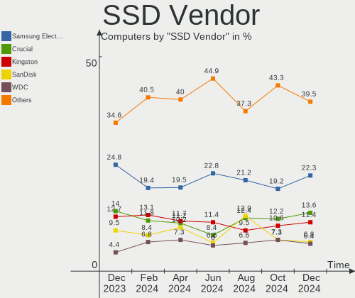
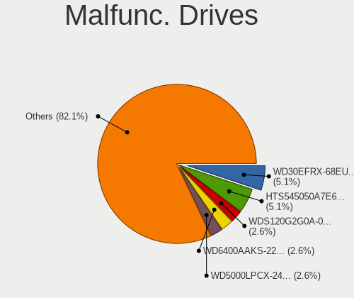
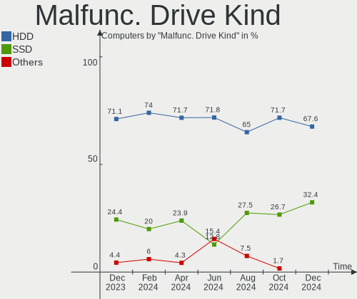
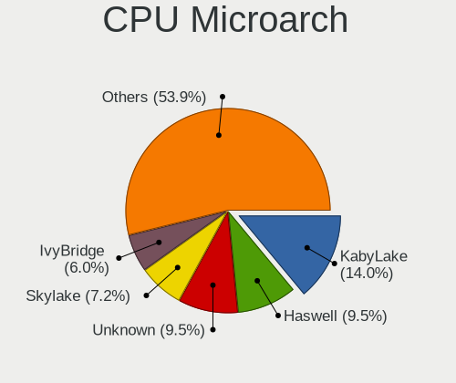
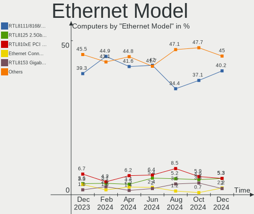
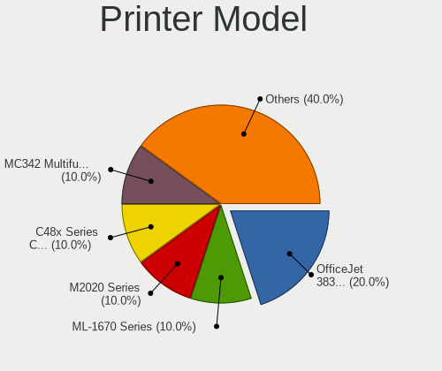

Linux Mint - Hardware Trends
----------------------------

A project to identify most popular hardware characteristics and track their change
over time based on data collected by Linux users at https://Linux-Hardware.org.

Anyone can contribute to this report by the [hw-probe](https://github.com/linuxhw/hw-probe) tool:

    sudo -E hw-probe -all -upload

This is a report for all computer types. See also reports for [desktops](/Dist/Linux_Mint/Desktop/README.md) and [notebooks](/Dist/Linux_Mint/Notebook/README.md).

This report is for one last month. Overall report since the beginning of time: [TestDays](https://github.com/linuxhw/TestDays)

Period: Dec, 2023.

Contents
--------

* [ System ](#system)
  - [ OS                       ](#os)
  - [ OS Family                ](#os-family)
  - [ Kernel                   ](#kernel)
  - [ Kernel Family            ](#kernel-family)
  - [ Kernel Major Ver.        ](#kernel-major-ver)
  - [ Arch                     ](#arch)
  - [ DE                       ](#de)
  - [ Display Server           ](#display-server)
  - [ Display Manager          ](#display-manager)
  - [ OS Lang                  ](#os-lang)
  - [ Boot Mode                ](#boot-mode)
  - [ Filesystem               ](#filesystem)
  - [ Part. scheme             ](#part-scheme)
  - [ Dual Boot with Linux/BSD ](#dual-boot-with-linuxbsd)
  - [ Dual Boot (Win)          ](#dual-boot-win)

* [ Board ](#board)
  - [ Vendor                   ](#vendor)
  - [ Model                    ](#model)
  - [ Model Family             ](#model-family)
  - [ MFG Year                 ](#mfg-year)
  - [ Form Factor              ](#form-factor)
  - [ Secure Boot              ](#secure-boot)
  - [ Coreboot                 ](#coreboot)
  - [ RAM Size                 ](#ram-size)
  - [ RAM Used                 ](#ram-used)
  - [ Total Drives             ](#total-drives)
  - [ Has CD-ROM               ](#has-cd-rom)
  - [ Has Ethernet             ](#has-ethernet)
  - [ Has WiFi                 ](#has-wifi)
  - [ Has Bluetooth            ](#has-bluetooth)

* [ Location ](#location)
  - [ Country                  ](#country)
  - [ City                     ](#city)

* [ Drives ](#drives)
  - [ Drive Vendor             ](#drive-vendor)
  - [ Drive Model              ](#drive-model)
  - [ HDD Vendor               ](#hdd-vendor)
  - [ SSD Vendor               ](#ssd-vendor)
  - [ Drive Kind               ](#drive-kind)
  - [ Drive Connector          ](#drive-connector)
  - [ Drive Size               ](#drive-size)
  - [ Space Total              ](#space-total)
  - [ Space Used               ](#space-used)
  - [ Malfunc. Drives          ](#malfunc-drives)
  - [ Malfunc. Drive Vendor    ](#malfunc-drive-vendor)
  - [ Malfunc. HDD Vendor      ](#malfunc-hdd-vendor)
  - [ Malfunc. Drive Kind      ](#malfunc-drive-kind)
  - [ Failed Drives            ](#failed-drives)
  - [ Failed Drive Vendor      ](#failed-drive-vendor)
  - [ Drive Status             ](#drive-status)

* [ Storage controller ](#storage-controller)
  - [ Storage Vendor           ](#storage-vendor)
  - [ Storage Model            ](#storage-model)
  - [ Storage Kind             ](#storage-kind)

* [ Processor ](#processor)
  - [ CPU Vendor               ](#cpu-vendor)
  - [ CPU Model                ](#cpu-model)
  - [ CPU Model Family         ](#cpu-model-family)
  - [ CPU Cores                ](#cpu-cores)
  - [ CPU Sockets              ](#cpu-sockets)
  - [ CPU Threads              ](#cpu-threads)
  - [ CPU Op-Modes             ](#cpu-op-modes)
  - [ CPU Microcode            ](#cpu-microcode)
  - [ CPU Microarch            ](#cpu-microarch)

* [ Graphics ](#graphics)
  - [ GPU Vendor               ](#gpu-vendor)
  - [ GPU Model                ](#gpu-model)
  - [ GPU Combo                ](#gpu-combo)
  - [ GPU Driver               ](#gpu-driver)
  - [ GPU Memory               ](#gpu-memory)

* [ Monitor ](#monitor)
  - [ Monitor Vendor           ](#monitor-vendor)
  - [ Monitor Model            ](#monitor-model)
  - [ Monitor Resolution       ](#monitor-resolution)
  - [ Monitor Diagonal         ](#monitor-diagonal)
  - [ Monitor Width            ](#monitor-width)
  - [ Aspect Ratio             ](#aspect-ratio)
  - [ Monitor Area             ](#monitor-area)
  - [ Pixel Density            ](#pixel-density)
  - [ Multiple Monitors        ](#multiple-monitors)

* [ Network ](#network)
  - [ Net Controller Vendor    ](#net-controller-vendor)
  - [ Net Controller Model     ](#net-controller-model)
  - [ Wireless Vendor          ](#wireless-vendor)
  - [ Wireless Model           ](#wireless-model)
  - [ Ethernet Vendor          ](#ethernet-vendor)
  - [ Ethernet Model           ](#ethernet-model)
  - [ Net Controller Kind      ](#net-controller-kind)
  - [ Used Controller          ](#used-controller)
  - [ NICs                     ](#nics)
  - [ IPv6                     ](#ipv6)

* [ Bluetooth ](#bluetooth)
  - [ Bluetooth Vendor         ](#bluetooth-vendor)
  - [ Bluetooth Model          ](#bluetooth-model)

* [ Sound ](#sound)
  - [ Sound Vendor             ](#sound-vendor)
  - [ Sound Model              ](#sound-model)

* [ Memory ](#memory)
  - [ Memory Vendor            ](#memory-vendor)
  - [ Memory Model             ](#memory-model)
  - [ Memory Kind              ](#memory-kind)
  - [ Memory Form Factor       ](#memory-form-factor)
  - [ Memory Size              ](#memory-size)
  - [ Memory Speed             ](#memory-speed)

* [ Printers & scanners ](#printers--scanners)
  - [ Printer Vendor           ](#printer-vendor)
  - [ Printer Model            ](#printer-model)
  - [ Scanner Vendor           ](#scanner-vendor)
  - [ Scanner Model            ](#scanner-model)

* [ Camera ](#camera)
  - [ Camera Vendor            ](#camera-vendor)
  - [ Camera Model             ](#camera-model)

* [ Security ](#security)
  - [ Fingerprint Vendor       ](#fingerprint-vendor)
  - [ Fingerprint Model        ](#fingerprint-model)
  - [ Chipcard Vendor          ](#chipcard-vendor)
  - [ Chipcard Model           ](#chipcard-model)

* [ Unsupported ](#unsupported)
  - [ Unsupported Devices      ](#unsupported-devices)
  - [ Unsupported Device Types ](#unsupported-device-types)

System
------

OS
--

Installed operating systems

| Name            | Computers | Percent |
|-----------------|-----------|---------|
| Linux Mint 21.2 | 471       | 78.63%  |
| Linux Mint 21.1 | 41        | 6.84%   |
| Linux Mint 20.3 | 32        | 5.34%   |
| Linux Mint 21   | 21        | 3.51%   |
| Linux Mint 21.3 | 7         | 1.17%   |
| Linux Mint 20.2 | 7         | 1.17%   |
| Linux Mint 20.1 | 6         | 1%      |
| Linux Mint 19.3 | 5         | 0.83%   |
| Linux Mint 20   | 4         | 0.67%   |
| Linux Mint 19.1 | 2         | 0.33%   |
| Linux Mint 18.3 | 1         | 0.17%   |
| Linux Mint 18.2 | 1         | 0.17%   |
| Linux Mint 18   | 1         | 0.17%   |

OS Family
---------

OS without a version

| Name       | Computers | Percent |
|------------|-----------|---------|
| Linux Mint | 599       | 100%    |

Kernel
------

Version of the Linux kernel

| Version                 | Computers | Percent |
|-------------------------|-----------|---------|
| 5.15.0-91-generic       | 256       | 42.74%  |
| 5.15.0-89-generic       | 102       | 17.03%  |
| 5.15.0-76-generic       | 42        | 7.01%   |
| 6.2.0-37-generic        | 28        | 4.67%   |
| 6.2.0-39-generic        | 26        | 4.34%   |
| 5.4.0-169-generic       | 24        | 4.01%   |
| 6.5.0-14-generic        | 17        | 2.84%   |
| 5.4.0-167-generic       | 9         | 1.5%    |
| 5.15.0-88-generic       | 9         | 1.5%    |
| 6.5.0-1009-oem          | 6         | 1%      |
| 6.1.0-1027-oem          | 5         | 0.83%   |
| 6.2.0-33-generic        | 4         | 0.67%   |
| 5.4.0-150-generic       | 4         | 0.67%   |
| 5.15.0-86-generic       | 4         | 0.67%   |
| 6.2.0-36-generic        | 3         | 0.5%    |
| 5.15.0-87-generic       | 3         | 0.5%    |
| 5.15.0-56-generic       | 3         | 0.5%    |
| 5.15.0-41-generic       | 3         | 0.5%    |
| 6.6.8-060608-generic    | 2         | 0.33%   |
| 6.6.4-060604-generic    | 2         | 0.33%   |
| 6.2.0-35-generic        | 2         | 0.33%   |
| 6.1.0-1026-oem          | 2         | 0.33%   |
| 5.4.0-74-generic        | 2         | 0.33%   |
| 5.4.0-58-generic        | 2         | 0.33%   |
| 5.4.0-144-generic       | 2         | 0.33%   |
| 5.15.0-84-generic       | 2         | 0.33%   |
| 5.15.0-83-generic       | 2         | 0.33%   |
| 6.7.0-060700rc5-generic | 1         | 0.17%   |
| 6.7.0-060700rc4-generic | 1         | 0.17%   |
| 6.6.8-x64v3-xanmod1     | 1         | 0.17%   |
| 6.6.5-060605-generic    | 1         | 0.17%   |
| 6.6.4-x64v3-xanmod1     | 1         | 0.17%   |
| 6.6.1-060601-generic    | 1         | 0.17%   |
| 6.6.0-chrultrabook      | 1         | 0.17%   |
| 6.5.0-1008-oem          | 1         | 0.17%   |
| 6.5.0-1004-nvidia       | 1         | 0.17%   |
| 6.3.0-060300-generic    | 1         | 0.17%   |
| 6.2.9-060209-generic    | 1         | 0.17%   |
| 6.2.0-060200-generic    | 1         | 0.17%   |
| 6.1.67-060167-generic   | 1         | 0.17%   |

Kernel Family
-------------

Linux kernel without a distro release

| Version | Computers | Percent |
|---------|-----------|---------|
| 5.15.0  | 436       | 72.79%  |
| 6.2.0   | 64        | 10.68%  |
| 5.4.0   | 48        | 8.01%   |
| 6.5.0   | 25        | 4.17%   |
| 6.1.0   | 7         | 1.17%   |
| 6.6.8   | 3         | 0.5%    |
| 6.6.4   | 3         | 0.5%    |
| 4.15.0  | 3         | 0.5%    |
| 6.7.0   | 2         | 0.33%   |
| 6.6.5   | 1         | 0.17%   |
| 6.6.1   | 1         | 0.17%   |
| 6.6.0   | 1         | 0.17%   |
| 6.3.0   | 1         | 0.17%   |
| 6.2.9   | 1         | 0.17%   |
| 6.1.67  | 1         | 0.17%   |
| 4.8.0   | 1         | 0.17%   |
| 4.4.0   | 1         | 0.17%   |

Kernel Major Ver.
-----------------

Linux kernel major version

| Version | Computers | Percent |
|---------|-----------|---------|
| 5.15    | 436       | 72.79%  |
| 6.2     | 65        | 10.85%  |
| 5.4     | 48        | 8.01%   |
| 6.5     | 25        | 4.17%   |
| 6.6     | 9         | 1.5%    |
| 6.1     | 8         | 1.34%   |
| 4.15    | 3         | 0.5%    |
| 6.7     | 2         | 0.33%   |
| 6.3     | 1         | 0.17%   |
| 4.8     | 1         | 0.17%   |
| 4.4     | 1         | 0.17%   |

Arch
----

OS architecture (x86_64, i586, etc.)

| Name   | Computers | Percent |
|--------|-----------|---------|
| x86_64 | 598       | 99.83%  |
| i686   | 1         | 0.17%   |

DE
--

Desktop Environment

| Name       | Computers | Percent |
|------------|-----------|---------|
| X-Cinnamon | 443       | 73.96%  |
| XFCE       | 70        | 11.69%  |
| MATE       | 57        | 9.52%   |
| Cinnamon   | 15        | 2.5%    |
| GNOME      | 7         | 1.17%   |
| KDE5       | 3         | 0.5%    |
| Unknown    | 3         | 0.5%    |
| Jwm        | 1         | 0.17%   |

Display Server
--------------

X11 or Wayland

| Name    | Computers | Percent |
|---------|-----------|---------|
| X11     | 594       | 99.17%  |
| Tty     | 3         | 0.5%    |
| Wayland | 2         | 0.33%   |

Display Manager
---------------

SDDM, LightDM, etc.

| Name    | Computers | Percent |
|---------|-----------|---------|
| Unknown | 332       | 55.43%  |
| LightDM | 262       | 43.74%  |
| GDM3    | 2         | 0.33%   |
| SDDM    | 1         | 0.17%   |
| MDM     | 1         | 0.17%   |
| LXDM    | 1         | 0.17%   |

OS Lang
-------

Language

| Lang    | Computers | Percent |
|---------|-----------|---------|
| en_US   | 183       | 30.55%  |
| de_DE   | 98        | 16.36%  |
| it_IT   | 35        | 5.84%   |
| pt_BR   | 32        | 5.34%   |
| fr_FR   | 24        | 4.01%   |
| en_GB   | 22        | 3.67%   |
| C       | 22        | 3.67%   |
| en_CA   | 18        | 3.01%   |
| ru_RU   | 17        | 2.84%   |
| es_ES   | 15        | 2.5%    |
| pl_PL   | 14        | 2.34%   |
| en_AU   | 14        | 2.34%   |
| nl_NL   | 8         | 1.34%   |
| es_MX   | 8         | 1.34%   |
| de_AT   | 7         | 1.17%   |
| de_CH   | 6         | 1%      |
| pt_PT   | 5         | 0.83%   |
| fr_BE   | 5         | 0.83%   |
| tr_TR   | 4         | 0.67%   |
| ja_JP   | 4         | 0.67%   |
| hu_HU   | 4         | 0.67%   |
| fr_CA   | 4         | 0.67%   |
| es_UY   | 4         | 0.67%   |
| en_IN   | 4         | 0.67%   |
| en_IE   | 4         | 0.67%   |
| Unknown | 4         | 0.67%   |
| sk_SK   | 3         | 0.5%    |
| ru_UA   | 2         | 0.33%   |
| nl_BE   | 2         | 0.33%   |
| es_CO   | 2         | 0.33%   |
| es_CL   | 2         | 0.33%   |
| es_AR   | 2         | 0.33%   |
| en_PH   | 2         | 0.33%   |
| en_NZ   | 2         | 0.33%   |
| zh_TW   | 1         | 0.17%   |
| zh_CN   | 1         | 0.17%   |
| vi_VN   | 1         | 0.17%   |
| sv_SE   | 1         | 0.17%   |
| it_CH   | 1         | 0.17%   |
| fr_CH   | 1         | 0.17%   |

Boot Mode
---------

EFI or BIOS

| Mode | Computers | Percent |
|------|-----------|---------|
| EFI  | 401       | 66.94%  |
| BIOS | 198       | 33.06%  |

Filesystem
----------

Type of filesystem

| Type    | Computers | Percent |
|---------|-----------|---------|
| Ext4    | 537       | 89.65%  |
| Overlay | 20        | 3.34%   |
| Tmpfs   | 18        | 3.01%   |
| Btrfs   | 11        | 1.84%   |
| Zfs     | 10        | 1.67%   |
| Xfs     | 2         | 0.33%   |
| Ext2    | 1         | 0.17%   |

Part. scheme
------------

Scheme of partitioning

| Type    | Computers | Percent |
|---------|-----------|---------|
| Unknown | 328       | 54.76%  |
| GPT     | 233       | 38.9%   |
| MBR     | 38        | 6.34%   |

Dual Boot with Linux/BSD
------------------------

Hosting more than one Linux/BSD

| Dual boot | Computers | Percent |
|-----------|-----------|---------|
| No        | 554       | 92.49%  |
| Yes       | 45        | 7.51%   |

Dual Boot (Win)
---------------

Hosting Linux and Windows

| Dual boot | Computers | Percent |
|-----------|-----------|---------|
| No        | 473       | 78.96%  |
| Yes       | 126       | 21.04%  |

Board
-----

Vendor
------

Motherboard manufacturer

| Name                                 | Computers | Percent |
|--------------------------------------|-----------|---------|
| Hewlett-Packard                      | 97        | 16.19%  |
| ASUSTek Computer                     | 88        | 14.69%  |
| Lenovo                               | 73        | 12.19%  |
| Dell                                 | 61        | 10.18%  |
| MSI                                  | 46        | 7.68%   |
| Acer                                 | 35        | 5.84%   |
| Gigabyte Technology                  | 30        | 5.01%   |
| Apple                                | 20        | 3.34%   |
| Toshiba                              | 16        | 2.67%   |
| ASRock                               | 16        | 2.67%   |
| Unknown                              | 12        | 2%      |
| Medion                               | 9         | 1.5%    |
| Intel                                | 8         | 1.34%   |
| Samsung Electronics                  | 7         | 1.17%   |
| Fujitsu                              | 7         | 1.17%   |
| AZW                                  | 5         | 0.83%   |
| Microsoft                            | 4         | 0.67%   |
| Shenzhen Meigao Electronic Equipment | 3         | 0.5%    |
| Positivo                             | 3         | 0.5%    |
| Pegatron                             | 3         | 0.5%    |
| LG Electronics                       | 3         | 0.5%    |
| HUAWEI                               | 3         | 0.5%    |
| Google                               | 3         | 0.5%    |
| BESSTAR Tech                         | 3         | 0.5%    |
| Wortmann AG                          | 2         | 0.33%   |
| Sony                                 | 2         | 0.33%   |
| PCWare                               | 2         | 0.33%   |
| Packard Bell                         | 2         | 0.33%   |
| Fujitsu Siemens                      | 2         | 0.33%   |
| ECS                                  | 2         | 0.33%   |
| Biostar                              | 2         | 0.33%   |
| Alienware                            | 2         | 0.33%   |
| TUXEDO                               | 1         | 0.17%   |
| Trigkey                              | 1         | 0.17%   |
| Timi                                 | 1         | 0.17%   |
| TECNO Mobile Limited                 | 1         | 0.17%   |
| Tactus                               | 1         | 0.17%   |
| T-bao                                | 1         | 0.17%   |
| Supermicro                           | 1         | 0.17%   |
| Standard                             | 1         | 0.17%   |

Model
-----

Motherboard model

| Name                                            | Computers | Percent |
|-------------------------------------------------|-----------|---------|
| Unknown                                         | 16        | 2.67%   |
| Dell Latitude E6440                             | 5         | 0.83%   |
| MSI MS-7C02                                     | 3         | 0.5%    |
| HP Compaq Elite 8300 SFF                        | 3         | 0.5%    |
| Dell Latitude E6410                             | 3         | 0.5%    |
| AZW MINI S                                      | 3         | 0.5%    |
| ASUS All Series                                 | 3         | 0.5%    |
| Shenzhen Meigao Electronic Equipment UM773 Lite | 2         | 0.33%   |
| MSI MS-7D22                                     | 2         | 0.33%   |
| MSI MS-7B86                                     | 2         | 0.33%   |
| MSI MS-7751                                     | 2         | 0.33%   |
| MSI MS-7693                                     | 2         | 0.33%   |
| Lenovo IdeaPad 3 15IIL05 81WE                   | 2         | 0.33%   |
| Lenovo G50-80 80E5                              | 2         | 0.33%   |
| Intel B75                                       | 2         | 0.33%   |
| HUAWEI NBLB-WAX9N                               | 2         | 0.33%   |
| HP Pavilion dv6                                 | 2         | 0.33%   |
| HP Pavilion 17                                  | 2         | 0.33%   |
| HP Notebook                                     | 2         | 0.33%   |
| HP Laptop 15-bs0xx                              | 2         | 0.33%   |
| HP EliteBook 840 G3                             | 2         | 0.33%   |
| HP Compaq 6200 Pro SFF PC                       | 2         | 0.33%   |
| HP Compaq 6005 Pro SFF PC                       | 2         | 0.33%   |
| HP Compaq 6005 Pro MT PC                        | 2         | 0.33%   |
| HP 255 G7 Notebook PC                           | 2         | 0.33%   |
| Gigabyte GA-78LMT-S2P                           | 2         | 0.33%   |
| Gigabyte B560M DS3H V2                          | 2         | 0.33%   |
| Gigabyte B450M DS3H                             | 2         | 0.33%   |
| Dell XPS 8500                                   | 2         | 0.33%   |
| Dell Vostro 3525                                | 2         | 0.33%   |
| Dell OptiPlex 9010                              | 2         | 0.33%   |
| Dell OptiPlex 7040                              | 2         | 0.33%   |
| Dell Latitude E6540                             | 2         | 0.33%   |
| Dell Latitude E6530                             | 2         | 0.33%   |
| Dell Latitude E6400                             | 2         | 0.33%   |
| Dell Latitude 7490                              | 2         | 0.33%   |
| ASUS VivoBook_ASUSLaptop M1603QA_M1603QA        | 2         | 0.33%   |
| ASUS PRIME B450-PLUS                            | 2         | 0.33%   |
| Apple MacBookAir7,2                             | 2         | 0.33%   |
| Apple MacBookAir6,2                             | 2         | 0.33%   |

Model Family
------------

Motherboard model prefix

| Name                                       | Computers | Percent |
|--------------------------------------------|-----------|---------|
| Lenovo ThinkPad                            | 30        | 5.01%   |
| Dell Latitude                              | 26        | 4.34%   |
| Acer Aspire                                | 26        | 4.34%   |
| Unknown                                    | 16        | 2.67%   |
| Toshiba Satellite                          | 14        | 2.34%   |
| Lenovo IdeaPad                             | 14        | 2.34%   |
| HP Compaq                                  | 14        | 2.34%   |
| HP EliteBook                               | 11        | 1.84%   |
| HP Laptop                                  | 10        | 1.67%   |
| Dell Inspiron                              | 10        | 1.67%   |
| ASUS VivoBook                              | 10        | 1.67%   |
| ASUS ROG                                   | 10        | 1.67%   |
| HP Pavilion                                | 9         | 1.5%    |
| Dell OptiPlex                              | 9         | 1.5%    |
| ASUS TUF                                   | 9         | 1.5%    |
| Dell Precision                             | 7         | 1.17%   |
| HP ProDesk                                 | 6         | 1%      |
| ASUS PRIME                                 | 6         | 1%      |
| Microsoft Surface                          | 4         | 0.67%   |
| Lenovo ThinkCentre                         | 4         | 0.67%   |
| HP Victus                                  | 4         | 0.67%   |
| HP ENVY                                    | 4         | 0.67%   |
| Fujitsu LIFEBOOK                           | 4         | 0.67%   |
| ASUS Zenbook                               | 4         | 0.67%   |
| MSI MS-7C02                                | 3         | 0.5%    |
| Lenovo Yoga                                | 3         | 0.5%    |
| HP ProBook                                 | 3         | 0.5%    |
| HP OMEN                                    | 3         | 0.5%    |
| HP EliteDesk                               | 3         | 0.5%    |
| Gigabyte B450M                             | 3         | 0.5%    |
| Fujitsu ESPRIMO                            | 3         | 0.5%    |
| Dell XPS                                   | 3         | 0.5%    |
| Dell Vostro                                | 3         | 0.5%    |
| AZW MINI                                   | 3         | 0.5%    |
| ASUS M5A78L-M                              | 3         | 0.5%    |
| ASUS Crosshair                             | 3         | 0.5%    |
| ASUS All                                   | 3         | 0.5%    |
| Acer Nitro                                 | 3         | 0.5%    |
| Toshiba PORTEGE                            | 2         | 0.33%   |
| Shenzhen Meigao Electronic Equipment UM773 | 2         | 0.33%   |

MFG Year
--------

Motherboard manufacture year

| Year    | Computers | Percent |
|---------|-----------|---------|
| 2020    | 51        | 8.51%   |
| 2013    | 50        | 8.35%   |
| 2018    | 46        | 7.68%   |
| 2021    | 44        | 7.35%   |
| 2012    | 43        | 7.18%   |
| 2022    | 42        | 7.01%   |
| 2023    | 40        | 6.68%   |
| 2011    | 40        | 6.68%   |
| 2017    | 35        | 5.84%   |
| 2015    | 35        | 5.84%   |
| 2019    | 33        | 5.51%   |
| 2014    | 31        | 5.18%   |
| 2016    | 28        | 4.67%   |
| 2010    | 28        | 4.67%   |
| 2009    | 24        | 4.01%   |
| 2008    | 18        | 3.01%   |
| 2007    | 8         | 1.34%   |
| 2006    | 2         | 0.33%   |
| Unknown | 1         | 0.17%   |

Form Factor
-----------

Physical design of the computer

| Name        | Computers | Percent |
|-------------|-----------|---------|
| Notebook    | 317       | 52.92%  |
| Desktop     | 235       | 39.23%  |
| Convertible | 15        | 2.5%    |
| All in one  | 15        | 2.5%    |
| Mini pc     | 9         | 1.5%    |
| Tablet      | 6         | 1%      |
| Server      | 2         | 0.33%   |

Secure Boot
-----------

Enabled or disabled

| State    | Computers | Percent |
|----------|-----------|---------|
| Disabled | 556       | 92.82%  |
| Enabled  | 43        | 7.18%   |

Coreboot
--------

Have coreboot on board

| Used | Computers | Percent |
|------|-----------|---------|
| No   | 596       | 99.5%   |
| Yes  | 3         | 0.5%    |

RAM Size
--------

Total RAM memory

| Size in GB      | Computers | Percent |
|-----------------|-----------|---------|
| 4.01-8.0        | 147       | 24.54%  |
| 16.01-24.0      | 131       | 21.87%  |
| 3.01-4.0        | 96        | 16.03%  |
| 8.01-16.0       | 96        | 16.03%  |
| 32.01-64.0      | 71        | 11.85%  |
| 24.01-32.0      | 23        | 3.84%   |
| 64.01-256.0     | 14        | 2.34%   |
| 1.01-2.0        | 13        | 2.17%   |
| 2.01-3.0        | 7         | 1.17%   |
| More than 256.0 | 1         | 0.17%   |

RAM Used
--------

Used RAM memory

| Used GB    | Computers | Percent |
|------------|-----------|---------|
| 1.01-2.0   | 200       | 33.39%  |
| 2.01-3.0   | 179       | 29.88%  |
| 4.01-8.0   | 112       | 18.7%   |
| 3.01-4.0   | 69        | 11.52%  |
| 8.01-16.0  | 19        | 3.17%   |
| 0.51-1.0   | 17        | 2.84%   |
| 0.01-0.5   | 2         | 0.33%   |
| 16.01-24.0 | 1         | 0.17%   |

Total Drives
------------

Number of drives on board

| Drives | Computers | Percent |
|--------|-----------|---------|
| 1      | 364       | 60.77%  |
| 2      | 145       | 24.21%  |
| 3      | 46        | 7.68%   |
| 4      | 25        | 4.17%   |
| 5      | 10        | 1.67%   |
| 7      | 4         | 0.67%   |
| 0      | 2         | 0.33%   |
| 11     | 1         | 0.17%   |
| 8      | 1         | 0.17%   |
| 6      | 1         | 0.17%   |

Has CD-ROM
----------

Has CD-ROM on board

| Presented | Computers | Percent |
|-----------|-----------|---------|
| No        | 346       | 57.76%  |
| Yes       | 253       | 42.24%  |

Has Ethernet
------------

Has Ethernet on board

| Presented | Computers | Percent |
|-----------|-----------|---------|
| Yes       | 518       | 86.48%  |
| No        | 81        | 13.52%  |

Has WiFi
--------

Has WiFi module

| Presented | Computers | Percent |
|-----------|-----------|---------|
| Yes       | 467       | 77.96%  |
| No        | 132       | 22.04%  |

Has Bluetooth
-------------

Has Bluetooth module

| Presented | Computers | Percent |
|-----------|-----------|---------|
| Yes       | 380       | 63.44%  |
| No        | 219       | 36.56%  |

Location
--------

Country
-------

Geographic location (country)

| Country     | Computers | Percent |
|-------------|-----------|---------|
| Germany     | 112       | 18.7%   |
| USA         | 101       | 16.86%  |
| Italy       | 41        | 6.84%   |
| Brazil      | 37        | 6.18%   |
| France      | 29        | 4.84%   |
| Canada      | 25        | 4.17%   |
| UK          | 21        | 3.51%   |
| Spain       | 19        | 3.17%   |
| Russia      | 17        | 2.84%   |
| Poland      | 16        | 2.67%   |
| Australia   | 16        | 2.67%   |
| Switzerland | 14        | 2.34%   |
| Netherlands | 14        | 2.34%   |
| Mexico      | 11        | 1.84%   |
| Belgium     | 11        | 1.84%   |
| Austria     | 11        | 1.84%   |
| Slovakia    | 6         | 1%      |
| Portugal    | 6         | 1%      |
| Indonesia   | 6         | 1%      |
| Hungary     | 5         | 0.83%   |
| Turkey      | 4         | 0.67%   |
| Sweden      | 4         | 0.67%   |
| Romania     | 4         | 0.67%   |
| Japan       | 4         | 0.67%   |
| Ireland     | 4         | 0.67%   |
| India       | 4         | 0.67%   |
| Uruguay     | 3         | 0.5%    |
| Ukraine     | 3         | 0.5%    |
| Philippines | 3         | 0.5%    |
| Chile       | 3         | 0.5%    |
| Argentina   | 3         | 0.5%    |
| Tunisia     | 2         | 0.33%   |
| Singapore   | 2         | 0.33%   |
| Peru        | 2         | 0.33%   |
| New Zealand | 2         | 0.33%   |
| Malaysia    | 2         | 0.33%   |
| Israel      | 2         | 0.33%   |
| Finland     | 2         | 0.33%   |
| Egypt       | 2         | 0.33%   |
| Denmark     | 2         | 0.33%   |

City
----

Geographic location (city)

| City           | Computers | Percent |
|----------------|-----------|---------|
| Sydney         | 8         | 1.34%   |
| Berlin         | 8         | 1.34%   |
| Sao Paulo      | 7         | 1.17%   |
| Rome           | 7         | 1.17%   |
| Cologne        | 7         | 1.17%   |
| Vienna         | 6         | 1%      |
| New York       | 6         | 1%      |
| Zurich         | 5         | 0.83%   |
| Warsaw         | 5         | 0.83%   |
| Toronto        | 5         | 0.83%   |
| Moscow         | 5         | 0.83%   |
| Dresden        | 5         | 0.83%   |
| Milan          | 4         | 0.67%   |
| Mexico City    | 4         | 0.67%   |
| Melbourne      | 4         | 0.67%   |
| Düsseldorf    | 4         | 0.67%   |
| Budapest       | 4         | 0.67%   |
| Valencia       | 3         | 0.5%    |
| Rho            | 3         | 0.5%    |
| Montevideo     | 3         | 0.5%    |
| Minneapolis    | 3         | 0.5%    |
| Madrid         | 3         | 0.5%    |
| Istanbul       | 3         | 0.5%    |
| Hamburg        | 3         | 0.5%    |
| Brussels       | 3         | 0.5%    |
| Brisbane       | 3         | 0.5%    |
| Amsterdam      | 3         | 0.5%    |
| Almada         | 3         | 0.5%    |
| Zaragoza       | 2         | 0.33%   |
| Venice         | 2         | 0.33%   |
| Velbert        | 2         | 0.33%   |
| Vancouver      | 2         | 0.33%   |
| Tunis          | 2         | 0.33%   |
| Southwark      | 2         | 0.33%   |
| Singapore      | 2         | 0.33%   |
| Sassari        | 2         | 0.33%   |
| Santiago       | 2         | 0.33%   |
| San Francisco  | 2         | 0.33%   |
| Rio de Janeiro | 2         | 0.33%   |
| Poznan         | 2         | 0.33%   |

Drives
------

Drive Vendor
------------

Hard drive vendors

| Vendor                      | Computers | Drives | Percent |
|-----------------------------|-----------|--------|---------|
| Samsung Electronics         | 147       | 182    | 17.17%  |
| WDC                         | 120       | 154    | 14.02%  |
| Seagate                     | 103       | 133    | 12.03%  |
| Kingston                    | 55        | 58     | 6.43%   |
| SanDisk                     | 54        | 60     | 6.31%   |
| Toshiba                     | 51        | 54     | 5.96%   |
| Crucial                     | 50        | 57     | 5.84%   |
| Unknown                     | 29        | 36     | 3.39%   |
| Micron Technology           | 17        | 17     | 1.99%   |
| Hitachi                     | 16        | 16     | 1.87%   |
| Micron/Crucial Technology   | 15        | 18     | 1.75%   |
| Intel                       | 12        | 13     | 1.4%    |
| China                       | 12        | 12     | 1.4%    |
| Apple                       | 10        | 10     | 1.17%   |
| Kingston Technology Company | 9         | 9      | 1.05%   |
| A-DATA Technology           | 9         | 11     | 1.05%   |
| KIOXIA                      | 8         | 8      | 0.93%   |
| Transcend                   | 7         | 7      | 0.82%   |
| SK hynix                    | 7         | 7      | 0.82%   |
| Intenso                     | 7         | 7      | 0.82%   |
| SPCC                        | 6         | 6      | 0.7%    |
| PNY                         | 6         | 7      | 0.7%    |
| HGST                        | 6         | 6      | 0.7%    |
| Fujitsu                     | 6         | 6      | 0.7%    |
| Silicon Motion              | 5         | 5      | 0.58%   |
| Phison Electronics          | 5         | 5      | 0.58%   |
| Patriot                     | 4         | 4      | 0.47%   |
| Unknown                     | 4         | 4      | 0.47%   |
| Team                        | 3         | 3      | 0.35%   |
| SABRENT                     | 3         | 3      | 0.35%   |
| Phison                      | 3         | 3      | 0.35%   |
| Maxtor                      | 3         | 3      | 0.35%   |
| MAXIO Technology (Hangzhou) | 3         | 4      | 0.35%   |
| JMicron Technology          | 3         | 3      | 0.35%   |
| UMIS                        | 2         | 2      | 0.23%   |
| RX7                         | 2         | 3      | 0.23%   |
| Netac                       | 2         | 2      | 0.23%   |
| LITEON                      | 2         | 2      | 0.23%   |
| JetFlash                    | 2         | 2      | 0.23%   |
| Hewlett-Packard             | 2         | 2      | 0.23%   |

Drive Model
-----------

Hard drive models

| Model                                                 | Computers | Percent |
|-------------------------------------------------------|-----------|---------|
| Kingston SA400S37240G 240GB SSD                       | 12        | 1.24%   |
| Samsung NVMe SSD Controller SM981/PM981/PM983 512GB   | 11        | 1.14%   |
| Samsung NVMe SSD Controller PM9A1/PM9A3/980PRO 2TB    | 10        | 1.04%   |
| Seagate ST500DM002-1BD142 500GB                       | 9         | 0.93%   |
| Seagate ST2000DM008-2FR102 2TB                        | 8         | 0.83%   |
| Samsung SSD 850 EVO 500GB                             | 8         | 0.83%   |
| Micron/Crucial P2 NVMe PCIe SSD 4TB                   | 8         | 0.83%   |
| Samsung SSD 860 EVO 1TB                               | 7         | 0.72%   |
| Samsung SSD 850 EVO 250GB                             | 7         | 0.72%   |
| Kingston SNV2S500G 500GB                              | 7         | 0.72%   |
| Kingston SA400S37480G 480GB SSD                       | 7         | 0.72%   |
| Crucial CT1000MX500SSD1 1TB                           | 7         | 0.72%   |
| Unknown MMC Card  64GB                                | 6         | 0.62%   |
| Toshiba MQ01ABF050 500GB                              | 6         | 0.62%   |
| Toshiba DT01ACA100 1TB                                | 6         | 0.62%   |
| Samsung SSD 870 QVO 1TB                               | 6         | 0.62%   |
| Unknown MMC Card  32GB                                | 5         | 0.52%   |
| Toshiba MQ01ABD100 1TB                                | 5         | 0.52%   |
| Seagate ST500LT012-1DG142 500GB                       | 5         | 0.52%   |
| Seagate ST1000LM024 HN-M101MBB 1TB                    | 5         | 0.52%   |
| Sandisk WD Blue SN550 NVMe SSD 1TB                    | 5         | 0.52%   |
| Samsung SSD 840 EVO 250GB                             | 5         | 0.52%   |
| Kingston SA400S37120G 120GB SSD                       | 5         | 0.52%   |
| Intel SSDPEKNU512GZ 512GB                             | 5         | 0.52%   |
| Crucial CT250MX500SSD1 250GB                          | 5         | 0.52%   |
| Crucial CT2000MX500SSD1 2TB                           | 5         | 0.52%   |
| Crucial CT1000BX500SSD1 1TB                           | 5         | 0.52%   |
| Silicon Motion SM2263EN/SM2263XT SSD Controller 500GB | 4         | 0.41%   |
| Seagate ST4000DM004-2CV104 4TB                        | 4         | 0.41%   |
| Seagate Expansion 2TB                                 | 4         | 0.41%   |
| Sandisk WD Blue SN570 1TB                             | 4         | 0.41%   |
| SanDisk SSD PLUS 480GB                                | 4         | 0.41%   |
| SanDisk SSD PLUS 1000GB                               | 4         | 0.41%   |
| SanDisk Extreme 55AE 1TB SSD                          | 4         | 0.41%   |
| Samsung SSD 870 QVO 2TB                               | 4         | 0.41%   |
| Samsung SSD 870 EVO 500GB                             | 4         | 0.41%   |
| Samsung SSD 870 EVO 1TB                               | 4         | 0.41%   |
| Samsung SSD 860 EVO 500GB                             | 4         | 0.41%   |
| HGST HTS721010A9E630 1TB                              | 4         | 0.41%   |
| Crucial CT500MX500SSD1 500GB                          | 4         | 0.41%   |

HDD Vendor
----------

Hard disk drive vendors

| Vendor              | Computers | Drives | Percent |
|---------------------|-----------|--------|---------|
| WDC                 | 102       | 133    | 34%     |
| Seagate             | 101       | 128    | 33.67%  |
| Toshiba             | 39        | 39     | 13%     |
| Hitachi             | 16        | 16     | 5.33%   |
| Samsung Electronics | 13        | 13     | 4.33%   |
| HGST                | 6         | 6      | 2%      |
| Fujitsu             | 6         | 6      | 2%      |
| Unknown             | 3         | 3      | 1%      |
| SABRENT             | 3         | 3      | 1%      |
| Maxtor              | 3         | 3      | 1%      |
| Hewlett-Packard     | 2         | 2      | 0.67%   |
| Apple               | 2         | 2      | 0.67%   |
| USB3.0              | 1         | 1      | 0.33%   |
| LaCie               | 1         | 1      | 0.33%   |
| ASMT                | 1         | 1      | 0.33%   |
| Apricorn            | 1         | 1      | 0.33%   |

SSD Vendor
----------

Solid state drive vendors

| Vendor              | Computers | Drives | Percent |
|---------------------|-----------|--------|---------|
| Samsung Electronics | 79        | 94     | 25.08%  |
| Crucial             | 44        | 48     | 13.97%  |
| Kingston            | 40        | 42     | 12.7%   |
| SanDisk             | 30        | 33     | 9.52%   |
| WDC                 | 14        | 14     | 4.44%   |
| China               | 12        | 12     | 3.81%   |
| Transcend           | 7         | 7      | 2.22%   |
| Toshiba             | 7         | 7      | 2.22%   |
| SPCC                | 6         | 6      | 1.9%    |
| PNY                 | 6         | 7      | 1.9%    |
| Micron Technology   | 6         | 6      | 1.9%    |
| Intenso             | 6         | 6      | 1.9%    |
| Apple               | 6         | 6      | 1.9%    |
| A-DATA Technology   | 5         | 7      | 1.59%   |
| Team                | 3         | 3      | 0.95%   |
| Patriot             | 3         | 3      | 0.95%   |
| Intel               | 3         | 3      | 0.95%   |
| SK hynix            | 2         | 2      | 0.63%   |
| RX7                 | 2         | 2      | 0.63%   |
| Netac               | 2         | 2      | 0.63%   |
| LITEON              | 2         | 2      | 0.63%   |
| Fanxiang            | 2         | 2      | 0.63%   |
| Biostar             | 2         | 2      | 0.63%   |
| Verbatim            | 1         | 1      | 0.32%   |
| Vaseky              | 1         | 1      | 0.32%   |
| Varro               | 1         | 1      | 0.32%   |
| Unknown             | 1         | 1      | 0.32%   |
| Timetec             | 1         | 1      | 0.32%   |
| tecmiyo             | 1         | 1      | 0.32%   |
| Seagate             | 1         | 1      | 0.32%   |
| Phison              | 1         | 1      | 0.32%   |
| OCZ                 | 1         | 1      | 0.32%   |
| Lexar               | 1         | 1      | 0.32%   |
| KingSpec            | 1         | 1      | 0.32%   |
| JMicron Technology  | 1         | 1      | 0.32%   |
| GOODRAM             | 1         | 1      | 0.32%   |
| GOFATOO             | 1         | 1      | 0.32%   |
| Gigabyte Technology | 1         | 1      | 0.32%   |
| Emtec               | 1         | 1      | 0.32%   |
| DST                 | 1         | 1      | 0.32%   |

Drive Kind
----------

HDD or SSD

| Kind    | Computers | Drives | Percent |
|---------|-----------|--------|---------|
| SSD     | 277       | 342    | 35.11%  |
| HDD     | 259       | 358    | 32.83%  |
| NVMe    | 210       | 241    | 26.62%  |
| MMC     | 24        | 31     | 3.04%   |
| Unknown | 19        | 19     | 2.41%   |

Drive Connector
---------------

SATA, SAS, NVMe, etc.

| Type | Computers | Drives | Percent |
|------|-----------|--------|---------|
| SATA | 453       | 667    | 62.05%  |
| NVMe | 210       | 239    | 28.77%  |
| SAS  | 43        | 54     | 5.89%   |
| MMC  | 24        | 31     | 3.29%   |

Drive Size
----------

Size of hard drive

| Size in TB | Computers | Drives | Percent |
|------------|-----------|--------|---------|
| 0.01-0.5   | 299       | 361    | 51.82%  |
| 0.51-1.0   | 169       | 202    | 29.29%  |
| 1.01-2.0   | 68        | 76     | 11.79%  |
| 3.01-4.0   | 18        | 21     | 3.12%   |
| 4.01-10.0  | 11        | 13     | 1.91%   |
| 2.01-3.0   | 10        | 17     | 1.73%   |
| 10.01-20.0 | 2         | 10     | 0.35%   |

Space Total
-----------

Amount of disk space available on the file system

| Size in GB     | Computers | Percent |
|----------------|-----------|---------|
| 101-250        | 172       | 28.71%  |
| 251-500        | 133       | 22.2%   |
| 501-1000       | 101       | 16.86%  |
| 1001-2000      | 58        | 9.68%   |
| More than 3000 | 45        | 7.51%   |
| 51-100         | 31        | 5.18%   |
| 2001-3000      | 21        | 3.51%   |
| 1-20           | 21        | 3.51%   |
| 21-50          | 12        | 2%      |
| Unknown        | 5         | 0.83%   |

Space Used
----------

Amount of used disk space

| Used GB        | Computers | Percent |
|----------------|-----------|---------|
| 1-20           | 121       | 20.2%   |
| 21-50          | 116       | 19.37%  |
| 101-250        | 110       | 18.36%  |
| 51-100         | 103       | 17.2%   |
| 251-500        | 54        | 9.02%   |
| 501-1000       | 37        | 6.18%   |
| 1001-2000      | 30        | 5.01%   |
| More than 3000 | 14        | 2.34%   |
| 2001-3000      | 9         | 1.5%    |
| Unknown        | 5         | 0.83%   |

Malfunc. Drives
---------------

Drive models with a malfunction

| Model                                        | Computers | Drives | Percent |
|----------------------------------------------|-----------|--------|---------|
| Seagate ST500DM002-1BD142 500GB              | 3         | 3      | 6.52%   |
| Kingston SA400S37240G 240GB SSD              | 2         | 2      | 4.35%   |
| Hitachi HDT721010SLA360 1TB                  | 2         | 2      | 4.35%   |
| WDC WD800BD-00LRA1 80GB                      | 1         | 1      | 2.17%   |
| WDC WD6400AAKS-40H2B0 640GB                  | 1         | 1      | 2.17%   |
| WDC WD6400AAKS-00A7B0 640GB                  | 1         | 1      | 2.17%   |
| WDC WD1600AAJS-75M0A0 160GB                  | 1         | 1      | 2.17%   |
| WDC WD10EZEX-60WN4A0 1TB                     | 1         | 1      | 2.17%   |
| WDC WD10EALS-00Z8A0 1TB                      | 1         | 1      | 2.17%   |
| WDC WD10 JPVX-22JC3T0 1TB                    | 1         | 1      | 2.17%   |
| Toshiba MQ01ABF050 500GB                     | 1         | 1      | 2.17%   |
| Toshiba DT01ACA100 1TB                       | 1         | 1      | 2.17%   |
| Toshiba DT01ACA050 500GB                     | 1         | 1      | 2.17%   |
| Seagate ST940210AS 40GB                      | 1         | 1      | 2.17%   |
| Seagate ST500LT012-1DG142 500GB              | 1         | 1      | 2.17%   |
| Seagate ST500LM021-1KJ152 500GB              | 1         | 1      | 2.17%   |
| Seagate ST4000NE 001-2MA101 4TB              | 1         | 1      | 2.17%   |
| Seagate ST31500341AS 1TB                     | 1         | 1      | 2.17%   |
| Seagate ST31000524AS 1TB                     | 1         | 1      | 2.17%   |
| Seagate ST2000LM003 HN-M201RAD 2TB           | 1         | 1      | 2.17%   |
| Seagate ST2000DM001-1ER164 2TB               | 1         | 1      | 2.17%   |
| Seagate ST1000LM024 HN-M101MBB 1TB           | 1         | 1      | 2.17%   |
| Seagate ST1000DX002-2DV162 1TB               | 1         | 1      | 2.17%   |
| SanDisk SSD P4 64GB                          | 1         | 1      | 2.17%   |
| Samsung Electronics SSD 860 EVO 500GB        | 1         | 1      | 2.17%   |
| Samsung Electronics MZVPV256HDGL-00000 256GB | 1         | 1      | 2.17%   |
| Samsung Electronics HM321HI 320GB            | 1         | 1      | 2.17%   |
| Samsung Electronics HD322HJ 320GB            | 1         | 1      | 2.17%   |
| Samsung Electronics HD103UJ 1TB              | 1         | 1      | 2.17%   |
| Samsung Electronics HD103SJ 1TB              | 1         | 1      | 2.17%   |
| PNY CS1311 240GB SSD                         | 1         | 1      | 2.17%   |
| Intel SSDSC2BF180A5H REF 180GB               | 1         | 1      | 2.17%   |
| Hitachi HTS542580K9SA00 80GB                 | 1         | 1      | 2.17%   |
| Hitachi HDS721050CLA660 500GB                | 1         | 1      | 2.17%   |
| HGST HTS721010A9E630 1TB                     | 1         | 1      | 2.17%   |
| Fujitsu MHV2080AH 80GB                       | 1         | 1      | 2.17%   |
| Crucial CT525MX300SSD1 528GB                 | 1         | 1      | 2.17%   |
| China SSD 256GB                              | 1         | 1      | 2.17%   |
| China SSD 128GB                              | 1         | 1      | 2.17%   |
| Aura Pro S MC258 1TB SSD                     | 1         | 1      | 2.17%   |

Malfunc. Drive Vendor
---------------------

Vendors of faulty drives

| Vendor              | Computers | Drives | Percent |
|---------------------|-----------|--------|---------|
| Seagate             | 13        | 13     | 28.26%  |
| WDC                 | 7         | 7      | 15.22%  |
| Samsung Electronics | 6         | 6      | 13.04%  |
| Hitachi             | 4         | 4      | 8.7%    |
| Toshiba             | 3         | 3      | 6.52%   |
| Kingston            | 2         | 2      | 4.35%   |
| China               | 2         | 2      | 4.35%   |
| SanDisk             | 1         | 1      | 2.17%   |
| PNY                 | 1         | 1      | 2.17%   |
| Intel               | 1         | 1      | 2.17%   |
| HGST                | 1         | 1      | 2.17%   |
| Fujitsu             | 1         | 1      | 2.17%   |
| Crucial             | 1         | 1      | 2.17%   |
| Aura                | 1         | 1      | 2.17%   |
| ASMT                | 1         | 1      | 2.17%   |
| A-DATA Technology   | 1         | 1      | 2.17%   |

Malfunc. HDD Vendor
-------------------

Vendors of faulty HDD drives

| Vendor              | Computers | Drives | Percent |
|---------------------|-----------|--------|---------|
| Seagate             | 13        | 13     | 38.24%  |
| WDC                 | 7         | 7      | 20.59%  |
| Samsung Electronics | 4         | 4      | 11.76%  |
| Hitachi             | 4         | 4      | 11.76%  |
| Toshiba             | 3         | 3      | 8.82%   |
| HGST                | 1         | 1      | 2.94%   |
| Fujitsu             | 1         | 1      | 2.94%   |
| ASMT                | 1         | 1      | 2.94%   |

Malfunc. Drive Kind
-------------------

Kinds of faulty drives

| Kind | Computers | Drives | Percent |
|------|-----------|--------|---------|
| HDD  | 33        | 34     | 73.33%  |
| SSD  | 10        | 10     | 22.22%  |
| NVMe | 2         | 2      | 4.44%   |

Failed Drives
-------------

Failed drive models

| Model                             | Computers | Drives | Percent |
|-----------------------------------|-----------|--------|---------|
| Samsung Electronics HM160HC 160GB | 1         | 1      | 33.33%  |
| Maxtor STM3320820AS 320GB         | 1         | 1      | 33.33%  |
| JMicron Technology Tech 250GB     | 1         | 1      | 33.33%  |

Failed Drive Vendor
-------------------

Failed drive vendors

| Vendor              | Computers | Drives | Percent |
|---------------------|-----------|--------|---------|
| Samsung Electronics | 1         | 1      | 33.33%  |
| Maxtor              | 1         | 1      | 33.33%  |
| JMicron Technology  | 1         | 1      | 33.33%  |

Drive Status
------------

Number of failed and malfunc. drives

| Status   | Computers | Drives | Percent |
|----------|-----------|--------|---------|
| Detected | 371       | 601    | 58.15%  |
| Works    | 221       | 341    | 34.64%  |
| Malfunc  | 43        | 46     | 6.74%   |
| Failed   | 3         | 3      | 0.47%   |

Storage controller
------------------

Storage Vendor
--------------

Storage controller vendors

| Vendor                       | Computers | Percent |
|------------------------------|-----------|---------|
| Intel                        | 392       | 50.78%  |
| AMD                          | 125       | 16.19%  |
| Samsung Electronics          | 68        | 8.81%   |
| SanDisk                      | 31        | 4.02%   |
| Micron/Crucial Technology    | 24        | 3.11%   |
| Kingston Technology Company  | 23        | 2.98%   |
| ASMedia Technology           | 13        | 1.68%   |
| Nvidia                       | 11        | 1.42%   |
| Micron Technology            | 11        | 1.42%   |
| Silicon Motion               | 9         | 1.17%   |
| Phison Electronics           | 9         | 1.17%   |
| KIOXIA                       | 9         | 1.17%   |
| Marvell Technology Group     | 8         | 1.04%   |
| Toshiba America Info Systems | 7         | 0.91%   |
| JMicron Technology           | 7         | 0.91%   |
| SK hynix                     | 5         | 0.65%   |
| MAXIO Technology (Hangzhou)  | 5         | 0.65%   |
| LSI Logic / Symbios Logic    | 3         | 0.39%   |
| ADATA Technology             | 3         | 0.39%   |
| Union Memory (Shenzhen)      | 2         | 0.26%   |
| Apple                        | 2         | 0.26%   |
| VIA Technologies             | 1         | 0.13%   |
| Transcend                    | 1         | 0.13%   |
| Silicon Image                | 1         | 0.13%   |
| Shenzhen Longsys Electronics | 1         | 0.13%   |
| Realtek Semiconductor        | 1         | 0.13%   |

Storage Model
-------------

Storage controller models

| Model                                                                          | Computers | Percent |
|--------------------------------------------------------------------------------|-----------|---------|
| AMD FCH SATA Controller [AHCI mode]                                            | 73        | 8.35%   |
| Intel 8 Series/C220 Series Chipset Family 6-port SATA Controller 1 [AHCI mode] | 32        | 3.66%   |
| Intel Sunrise Point-LP SATA Controller [AHCI mode]                             | 26        | 2.97%   |
| Intel 82801 Mobile SATA Controller [RAID mode]                                 | 24        | 2.75%   |
| Samsung NVMe SSD Controller SM981/PM981/PM983                                  | 22        | 2.52%   |
| Intel Volume Management Device NVMe RAID Controller                            | 21        | 2.4%    |
| Intel 6 Series/C200 Series Chipset Family 6 port Mobile SATA AHCI Controller   | 21        | 2.4%    |
| Intel Q170/Q150/B150/H170/H110/Z170/CM236 Chipset SATA Controller [AHCI Mode]  | 20        | 2.29%   |
| AMD 400 Series Chipset SATA Controller                                         | 19        | 2.17%   |
| Intel 7 Series Chipset Family 6-port SATA Controller [AHCI mode]               | 18        | 2.06%   |
| Samsung NVMe SSD Controller PM9A1/PM9A3/980PRO                                 | 17        | 1.95%   |
| Intel 7 Series/C210 Series Chipset Family 6-port SATA Controller [AHCI mode]   | 15        | 1.72%   |
| Intel 6 Series/C200 Series Chipset Family 6 port Desktop SATA AHCI Controller  | 15        | 1.72%   |
| Micron/Crucial P2 [Nick P2] / P3 / P3 Plus NVMe PCIe SSD (DRAM-less)           | 14        | 1.6%    |
| AMD SB7x0/SB8x0/SB9x0 SATA Controller [IDE mode]                               | 14        | 1.6%    |
| AMD SB7x0/SB8x0/SB9x0 SATA Controller [AHCI mode]                              | 14        | 1.6%    |
| AMD SB7x0/SB8x0/SB9x0 IDE Controller                                           | 14        | 1.6%    |
| Samsung NVMe SSD Controller 980 (DRAM-less)                                    | 12        | 1.37%   |
| AMD 500 Series Chipset SATA Controller                                         | 12        | 1.37%   |
| Intel 82801IBM/IEM (ICH9M/ICH9M-E) 4 port SATA Controller [AHCI mode]          | 11        | 1.26%   |
| Intel 200 Series PCH SATA controller [AHCI mode]                               | 11        | 1.26%   |
| Intel Wildcat Point-LP SATA Controller [AHCI Mode]                             | 10        | 1.14%   |
| Intel SATA Controller [RAID mode]                                              | 9         | 1.03%   |
| Intel Celeron/Pentium Silver Processor SATA Controller                         | 9         | 1.03%   |
| Intel 8 Series SATA Controller 1 [AHCI mode]                                   | 9         | 1.03%   |
| ASMedia ASM1062 Serial ATA Controller                                          | 9         | 1.03%   |
| Silicon Motion SM2263EN/SM2263XT (DRAM-less) NVMe SSD Controllers              | 8         | 0.92%   |
| SanDisk Ultra 3D / WD Blue SN550 NVMe SSD                                      | 8         | 0.92%   |
| Intel Tiger Lake-LP SATA Controller                                            | 8         | 0.92%   |
| Intel Comet Lake SATA AHCI Controller                                          | 8         | 0.92%   |
| Intel Atom Processor E3800 Series SATA AHCI Controller                         | 8         | 0.92%   |
| Intel 5 Series/3400 Series Chipset 4 port SATA AHCI Controller                 | 8         | 0.92%   |
| SanDisk WD Black SN770 / PC SN740 256GB / PC SN560 (DRAM-less) NVMe SSD        | 7         | 0.8%    |
| Kingston Company NV2 NVMe SSD SM2267XT                                         | 7         | 0.8%    |
| Intel SSD 670p Series [Keystone Harbor]                                        | 7         | 0.8%    |
| Intel SATA controller                                                          | 7         | 0.8%    |
| Intel Celeron N3350/Pentium N4200/Atom E3900 Series SATA AHCI Controller       | 7         | 0.8%    |
| Intel Alder Lake-S PCH SATA Controller [AHCI Mode]                             | 7         | 0.8%    |
| Intel 5 Series/3400 Series Chipset 6 port SATA AHCI Controller                 | 7         | 0.8%    |
| Intel Cannon Lake PCH SATA AHCI Controller                                     | 6         | 0.69%   |

Storage Kind
------------

Kind of storage controller (IDE, SATA, NVMe, SAS, ...)

| Kind | Computers | Percent |
|------|-----------|---------|
| SATA | 451       | 57.02%  |
| NVMe | 209       | 26.42%  |
| IDE  | 65        | 8.22%   |
| RAID | 63        | 7.96%   |
| SAS  | 2         | 0.25%   |
| SCSI | 1         | 0.13%   |

Processor
---------

CPU Vendor
----------

Processor vendors

| Vendor | Computers | Percent |
|--------|-----------|---------|
| Intel  | 448       | 74.79%  |
| AMD    | 151       | 25.21%  |

CPU Model
---------

Processor models

| Model                                   | Computers | Percent |
|-----------------------------------------|-----------|---------|
| Intel Core i5-3470 CPU @ 3.20GHz        | 7         | 1.17%   |
| Intel Core i7-8550U CPU @ 1.80GHz       | 6         | 1%      |
| Intel Core i7-3770 CPU @ 3.40GHz        | 6         | 1%      |
| Intel Core i5-8265U CPU @ 1.60GHz       | 6         | 1%      |
| Intel Core i5-7200U CPU @ 2.50GHz       | 6         | 1%      |
| AMD Ryzen 7 5700G with Radeon Graphics  | 6         | 1%      |
| Intel N100                              | 5         | 0.83%   |
| Intel Core i5-8350U CPU @ 1.70GHz       | 5         | 0.83%   |
| Intel Core i5-6300U CPU @ 2.40GHz       | 5         | 0.83%   |
| Intel Core i5-4300M CPU @ 2.60GHz       | 5         | 0.83%   |
| Intel Core i3-2310M CPU @ 2.10GHz       | 5         | 0.83%   |
| Intel Celeron N4020 CPU @ 1.10GHz       | 5         | 0.83%   |
| Intel Celeron CPU N3350 @ 1.10GHz       | 5         | 0.83%   |
| Intel Core i7-8650U CPU @ 1.90GHz       | 4         | 0.67%   |
| Intel Core i7-7700HQ CPU @ 2.80GHz      | 4         | 0.67%   |
| Intel Core i7-4790K CPU @ 4.00GHz       | 4         | 0.67%   |
| Intel Core i5-6500 CPU @ 3.20GHz        | 4         | 0.67%   |
| Intel Core i5-4210U CPU @ 1.70GHz       | 4         | 0.67%   |
| Intel Core i5-3210M CPU @ 2.50GHz       | 4         | 0.67%   |
| Intel Core i5-2410M CPU @ 2.30GHz       | 4         | 0.67%   |
| Intel Core i5 CPU 650 @ 3.20GHz         | 4         | 0.67%   |
| Intel Core i3-2100 CPU @ 3.10GHz        | 4         | 0.67%   |
| Intel 11th Gen Core i5-1135G7 @ 2.40GHz | 4         | 0.67%   |
| Intel 11th Gen Core i3-1115G4 @ 3.00GHz | 4         | 0.67%   |
| AMD Ryzen 5 5600G with Radeon Graphics  | 4         | 0.67%   |
| AMD Ryzen 5 3600 6-Core Processor       | 4         | 0.67%   |
| AMD FX-6300 Six-Core Processor          | 4         | 0.67%   |
| Intel Core i7-9750H CPU @ 2.60GHz       | 3         | 0.5%    |
| Intel Core i7-6600U CPU @ 2.60GHz       | 3         | 0.5%    |
| Intel Core i7-10750H CPU @ 2.60GHz      | 3         | 0.5%    |
| Intel Core i5-7300U CPU @ 2.60GHz       | 3         | 0.5%    |
| Intel Core i5-5200U CPU @ 2.20GHz       | 3         | 0.5%    |
| Intel Core i5-3570K CPU @ 3.40GHz       | 3         | 0.5%    |
| Intel Core i5-2520M CPU @ 2.50GHz       | 3         | 0.5%    |
| Intel Core i5-2400 CPU @ 3.10GHz        | 3         | 0.5%    |
| Intel Core i5-1035G1 CPU @ 1.00GHz      | 3         | 0.5%    |
| Intel Core i5-10210U CPU @ 1.60GHz      | 3         | 0.5%    |
| Intel Core i3-4150 CPU @ 3.50GHz        | 3         | 0.5%    |
| Intel Core i3-1005G1 CPU @ 1.20GHz      | 3         | 0.5%    |
| Intel Core i3 CPU M 380 @ 2.53GHz       | 3         | 0.5%    |

CPU Model Family
----------------

Processor model prefix

| Model                   | Computers | Percent |
|-------------------------|-----------|---------|
| Intel Core i5           | 148       | 24.71%  |
| Intel Core i7           | 97        | 16.19%  |
| Other                   | 58        | 9.68%   |
| Intel Core i3           | 49        | 8.18%   |
| AMD Ryzen 7             | 37        | 6.18%   |
| Intel Celeron           | 32        | 5.34%   |
| AMD Ryzen 5             | 32        | 5.34%   |
| Intel Core 2 Duo        | 25        | 4.17%   |
| Intel Pentium           | 11        | 1.84%   |
| AMD FX                  | 11        | 1.84%   |
| Intel Xeon              | 9         | 1.5%    |
| AMD Ryzen 3             | 8         | 1.34%   |
| AMD Ryzen 9             | 7         | 1.17%   |
| Intel Atom              | 6         | 1%      |
| AMD Athlon II X2        | 6         | 1%      |
| Intel Core 2 Quad       | 5         | 0.83%   |
| AMD Ryzen 5 PRO         | 5         | 0.83%   |
| AMD Phenom II X4        | 5         | 0.83%   |
| AMD E1                  | 4         | 0.67%   |
| AMD A8                  | 4         | 0.67%   |
| AMD A10                 | 4         | 0.67%   |
| Intel Pentium Dual-Core | 3         | 0.5%    |
| Intel Core i9           | 3         | 0.5%    |
| AMD E                   | 3         | 0.5%    |
| AMD A6                  | 3         | 0.5%    |
| AMD A4                  | 3         | 0.5%    |
| AMD Ryzen 7 PRO         | 2         | 0.33%   |
| AMD Phenom II X6        | 2         | 0.33%   |
| AMD Athlon 64 X2        | 2         | 0.33%   |
| AMD Athlon              | 2         | 0.33%   |
| Intel Xeon Silver       | 1         | 0.17%   |
| Intel Pentium Silver    | 1         | 0.17%   |
| Intel Pentium Dual      | 1         | 0.17%   |
| Intel Core m7           | 1         | 0.17%   |
| Intel Core 2            | 1         | 0.17%   |
| Intel Celeron Dual-Core | 1         | 0.17%   |
| AMD V160                | 1         | 0.17%   |
| AMD Turion II           | 1         | 0.17%   |
| AMD Turion 64 Mobile    | 1         | 0.17%   |
| AMD Phenom              | 1         | 0.17%   |

CPU Cores
---------

Number of processor cores

| Number | Computers | Percent |
|--------|-----------|---------|
| 2      | 233       | 38.9%   |
| 4      | 211       | 35.23%  |
| 6      | 63        | 10.52%  |
| 8      | 48        | 8.01%   |
| 10     | 13        | 2.17%   |
| 12     | 8         | 1.34%   |
| 1      | 6         | 1%      |
| 24     | 4         | 0.67%   |
| 14     | 4         | 0.67%   |
| 3      | 4         | 0.67%   |
| 16     | 3         | 0.5%    |
| 22     | 1         | 0.17%   |
| 20     | 1         | 0.17%   |

CPU Sockets
-----------

Number of sockets

| Number | Computers | Percent |
|--------|-----------|---------|
| 1      | 598       | 99.83%  |
| 2      | 1         | 0.17%   |

CPU Threads
-----------

Threads per core (Hyper-Threading)

| Number | Computers | Percent |
|--------|-----------|---------|
| 2      | 403       | 67.28%  |
| 1      | 196       | 32.72%  |

CPU Op-Modes
------------

CPU Operation Modes (32-bit, 64-bit)

| Op mode        | Computers | Percent |
|----------------|-----------|---------|
| 32-bit, 64-bit | 599       | 100%    |

CPU Microcode
-------------

Microcode number

| Number     | Computers | Percent |
|------------|-----------|---------|
| Unknown    | 106       | 17.7%   |
| 0x306a9    | 39        | 6.51%   |
| 0x306c3    | 37        | 6.18%   |
| 0x206a7    | 25        | 4.17%   |
| 0x506e3    | 16        | 2.67%   |
| 0x1067a    | 16        | 2.67%   |
| 0x806ea    | 13        | 2.17%   |
| 0x906e9    | 12        | 2%      |
| 0x20655    | 12        | 2%      |
| 0x0a50000d | 12        | 2%      |
| 0x306d4    | 11        | 1.84%   |
| 0x806ec    | 10        | 1.67%   |
| 0x806e9    | 10        | 1.67%   |
| 0x40651    | 10        | 1.67%   |
| 0x06000852 | 10        | 1.67%   |
| 0x010000c8 | 10        | 1.67%   |
| 0x406e3    | 9         | 1.5%    |
| 0x906ea    | 8         | 1.34%   |
| 0x806c1    | 7         | 1.17%   |
| 0x20652    | 7         | 1.17%   |
| 0x10676    | 7         | 1.17%   |
| 0x08108109 | 7         | 1.17%   |
| 0x906ed    | 6         | 1%      |
| 0x706e5    | 6         | 1%      |
| 0xb06e0    | 5         | 0.83%   |
| 0x706a8    | 5         | 0.83%   |
| 0x706a1    | 5         | 0.83%   |
| 0x6fd      | 5         | 0.83%   |
| 0x506c9    | 5         | 0.83%   |
| 0x406c4    | 5         | 0.83%   |
| 0x30678    | 5         | 0.83%   |
| 0x0a601206 | 5         | 0.83%   |
| 0x0a601203 | 5         | 0.83%   |
| 0x08701021 | 5         | 0.83%   |
| 0xb0671    | 4         | 0.67%   |
| 0x406c3    | 4         | 0.67%   |
| 0x0a50000c | 4         | 0.67%   |
| 0x08701030 | 4         | 0.67%   |
| 0x08608103 | 4         | 0.67%   |
| 0x08600106 | 4         | 0.67%   |

CPU Microarch
-------------

Microarchitecture

| Name             | Computers | Percent |
|------------------|-----------|---------|
| KabyLake         | 83        | 13.86%  |
| Haswell          | 54        | 9.02%   |
| IvyBridge        | 45        | 7.51%   |
| Unknown          | 40        | 6.68%   |
| SandyBridge      | 39        | 6.51%   |
| Skylake          | 36        | 6.01%   |
| Zen 3            | 31        | 5.18%   |
| Penryn           | 29        | 4.84%   |
| Westmere         | 23        | 3.84%   |
| Alderlake Hybrid | 21        | 3.51%   |
| Silvermont       | 18        | 3.01%   |
| K10              | 18        | 3.01%   |
| Zen 2            | 16        | 2.67%   |
| Piledriver       | 14        | 2.34%   |
| Broadwell        | 14        | 2.34%   |
| TigerLake        | 13        | 2.17%   |
| CometLake        | 13        | 2.17%   |
| Zen+             | 12        | 2%      |
| Icelake          | 11        | 1.84%   |
| Goldmont plus    | 10        | 1.67%   |
| Zen              | 9         | 1.5%    |
| Goldmont         | 8         | 1.34%   |
| Core             | 8         | 1.34%   |
| Puma             | 7         | 1.17%   |
| Excavator        | 6         | 1%      |
| Nehalem          | 4         | 0.67%   |
| Bobcat           | 4         | 0.67%   |
| K8 Hammer        | 3         | 0.5%    |
| Tremont          | 2         | 0.33%   |
| Steamroller      | 2         | 0.33%   |
| Gracemont        | 2         | 0.33%   |
| K8 & K10 hybrid  | 1         | 0.17%   |
| K10 Llano        | 1         | 0.17%   |
| Jaguar           | 1         | 0.17%   |
| Bulldozer        | 1         | 0.17%   |

Graphics
--------

GPU Vendor
----------

Vendors of graphics cards

| Vendor | Computers | Percent |
|--------|-----------|---------|
| Intel  | 354       | 51.38%  |
| Nvidia | 178       | 25.83%  |
| AMD    | 157       | 22.79%  |

GPU Model
---------

Graphics card models

| Model                                                                                    | Computers | Percent |
|------------------------------------------------------------------------------------------|-----------|---------|
| Intel 2nd Generation Core Processor Family Integrated Graphics Controller                | 31        | 4.4%    |
| Intel 3rd Gen Core processor Graphics Controller                                         | 17        | 2.41%   |
| Intel UHD Graphics 620                                                                   | 16        | 2.27%   |
| Intel HD Graphics 620                                                                    | 16        | 2.27%   |
| Intel HD Graphics 530                                                                    | 16        | 2.27%   |
| Intel Core Processor Integrated Graphics Controller                                      | 16        | 2.27%   |
| AMD Cezanne [Radeon Vega Series / Radeon Vega Mobile Series]                             | 16        | 2.27%   |
| Intel Haswell-ULT Integrated Graphics Controller                                         | 13        | 1.85%   |
| Intel 4th Gen Core Processor Integrated Graphics Controller                              | 13        | 1.85%   |
| Intel Xeon E3-1200 v2/3rd Gen Core processor Graphics Controller                         | 12        | 1.7%    |
| Intel Skylake GT2 [HD Graphics 520]                                                      | 12        | 1.7%    |
| Intel Mobile 4 Series Chipset Integrated Graphics Controller                             | 10        | 1.42%   |
| Intel HD Graphics 5500                                                                   | 10        | 1.42%   |
| Intel GeminiLake [UHD Graphics 600]                                                      | 10        | 1.42%   |
| Intel Atom/Celeron/Pentium Processor x5-E8000/J3xxx/N3xxx Integrated Graphics Controller | 10        | 1.42%   |
| Nvidia GK208B [GeForce GT 710]                                                           | 9         | 1.28%   |
| Intel Xeon E3-1200 v3/4th Gen Core Processor Integrated Graphics Controller              | 9         | 1.28%   |
| Intel WhiskeyLake-U GT2 [UHD Graphics 620]                                               | 9         | 1.28%   |
| Intel TigerLake-LP GT2 [Iris Xe Graphics]                                                | 9         | 1.28%   |
| Intel Atom Processor Z36xxx/Z37xxx Series Graphics & Display                             | 8         | 1.14%   |
| AMD Raphael                                                                              | 8         | 1.14%   |
| AMD Picasso/Raven 2 [Radeon Vega Series / Radeon Vega Mobile Series]                     | 8         | 1.14%   |
| AMD Ellesmere [Radeon RX 470/480/570/570X/580/580X/590]                                  | 8         | 1.14%   |
| Nvidia TU117M [GeForce GTX 1650 Mobile / Max-Q]                                          | 7         | 0.99%   |
| Intel Raptor Lake-P [Iris Xe Graphics]                                                   | 7         | 0.99%   |
| Intel IvyBridge GT2 [HD Graphics 4000]                                                   | 7         | 0.99%   |
| Intel HD Graphics 630                                                                    | 7         | 0.99%   |
| Intel HD Graphics 500                                                                    | 7         | 0.99%   |
| Intel CoffeeLake-S GT2 [UHD Graphics 630]                                                | 7         | 0.99%   |
| Intel CoffeeLake-H GT2 [UHD Graphics 630]                                                | 7         | 0.99%   |
| Intel Alder Lake-N [UHD Graphics]                                                        | 7         | 0.99%   |
| Nvidia TU116 [GeForce GTX 1660 SUPER]                                                    | 6         | 0.85%   |
| Intel Iris Plus Graphics G1 (Ice Lake)                                                   | 6         | 0.85%   |
| Intel CometLake-U GT2 [UHD Graphics]                                                     | 6         | 0.85%   |
| AMD Sun XT [Radeon HD 8670A/8670M/8690M / R5 M330 / M430 / Radeon 520 Mobile]            | 6         | 0.85%   |
| AMD Phoenix1                                                                             | 6         | 0.85%   |
| Nvidia GP107 [GeForce GTX 1050 Ti]                                                       | 5         | 0.71%   |
| AMD Topaz XT [Radeon R7 M260/M265 / M340/M360 / M440/M445 / 530/535 / 620/625 Mobile]    | 5         | 0.71%   |
| AMD Stoney [Radeon R2/R3/R4/R5 Graphics]                                                 | 5         | 0.71%   |
| AMD Renoir [Radeon RX Vega 6 (Ryzen 4000/5000 Mobile Series)]                            | 5         | 0.71%   |

GPU Combo
---------

Combinations of graphics cards

| Name               | Computers | Percent |
|--------------------|-----------|---------|
| 1 x Intel          | 274       | 45.74%  |
| 1 x AMD            | 123       | 20.53%  |
| 1 x Nvidia         | 114       | 19.03%  |
| Intel + Nvidia     | 52        | 8.68%   |
| Intel + AMD        | 16        | 2.67%   |
| 2 x AMD            | 9         | 1.5%    |
| AMD + Nvidia       | 9         | 1.5%    |
| 2 x Nvidia         | 1         | 0.17%   |
| Intel + 2 x Nvidia | 1         | 0.17%   |

GPU Driver
----------

Free vs proprietary

| Driver      | Computers | Percent |
|-------------|-----------|---------|
| Free        | 462       | 77.13%  |
| Proprietary | 115       | 19.2%   |
| Unknown     | 22        | 3.67%   |

GPU Memory
----------

Total video memory

| Size in GB | Computers | Percent |
|------------|-----------|---------|
| Unknown    | 321       | 53.59%  |
| 0.01-0.5   | 68        | 11.35%  |
| 1.01-2.0   | 65        | 10.85%  |
| 0.51-1.0   | 53        | 8.85%   |
| 3.01-4.0   | 33        | 5.51%   |
| 7.01-8.0   | 24        | 4.01%   |
| 5.01-6.0   | 16        | 2.67%   |
| 8.01-16.0  | 11        | 1.84%   |
| 2.01-3.0   | 6         | 1%      |
| 16.01-24.0 | 2         | 0.33%   |

Monitor
-------

Monitor Vendor
--------------

Monitor vendors

| Vendor                  | Computers | Percent |
|-------------------------|-----------|---------|
| Samsung Electronics     | 83        | 13.13%  |
| AU Optronics            | 66        | 10.44%  |
| BOE                     | 55        | 8.7%    |
| Chimei Innolux          | 54        | 8.54%   |
| LG Display              | 51        | 8.07%   |
| Goldstar                | 35        | 5.54%   |
| Dell                    | 33        | 5.22%   |
| Apple                   | 19        | 3.01%   |
| Acer                    | 18        | 2.85%   |
| Lenovo                  | 17        | 2.69%   |
| Hewlett-Packard         | 17        | 2.69%   |
| Philips                 | 16        | 2.53%   |
| AOC                     | 14        | 2.22%   |
| BenQ                    | 11        | 1.74%   |
| Iiyama                  | 10        | 1.58%   |
| Chi Mei Optoelectronics | 10        | 1.58%   |
| ASUSTek Computer        | 9         | 1.42%   |
| ViewSonic               | 7         | 1.11%   |
| Ancor Communications    | 7         | 1.11%   |
| Sony                    | 5         | 0.79%   |
| HKC                     | 5         | 0.79%   |
| Sharp                   | 4         | 0.63%   |
| InfoVision              | 4         | 0.63%   |
| Fujitsu Siemens         | 4         | 0.63%   |
| Eizo                    | 4         | 0.63%   |
| Unknown                 | 4         | 0.63%   |
| Vizio                   | 3         | 0.47%   |
| PANDA                   | 3         | 0.47%   |
| Panasonic               | 3         | 0.47%   |
| LG Philips              | 3         | 0.47%   |
| Seiko/Epson             | 2         | 0.32%   |
| RTK                     | 2         | 0.32%   |
| NEC Computers           | 2         | 0.32%   |
| MSI                     | 2         | 0.32%   |
| Medion                  | 2         | 0.32%   |
| Insignia                | 2         | 0.32%   |
| HannStar                | 2         | 0.32%   |
| GKK                     | 2         | 0.32%   |
| Compal                  | 2         | 0.32%   |
| ZTR                     | 1         | 0.16%   |

Monitor Model
-------------

Monitor models

| Model                                                                 | Computers | Percent |
|-----------------------------------------------------------------------|-----------|---------|
| Samsung Electronics LCD Monitor SEC5441 1366x768 344x194mm 15.5-inch  | 4         | 0.62%   |
| Chimei Innolux LCD Monitor CMN15E7 1920x1080 344x193mm 15.5-inch      | 4         | 0.62%   |
| BOE LCD Monitor BOE084E 1920x1080 382x215mm 17.3-inch                 | 4         | 0.62%   |
| AU Optronics LCD Monitor AUO61ED 1920x1080 344x194mm 15.5-inch        | 4         | 0.62%   |
| Unknown                                                               | 4         | 0.62%   |
| Philips FTV PHL01EA 1920x1080 1440x810mm 65.0-inch                    | 3         | 0.47%   |
| Hewlett-Packard 27es HWP3325 1920x1080 598x336mm 27.0-inch            | 3         | 0.47%   |
| Goldstar LG IPS FULLHD GSM5AB7 1920x1080 480x270mm 21.7-inch          | 3         | 0.47%   |
| Goldstar HDR 4K GSM7706 3840x2160 600x340mm 27.2-inch                 | 3         | 0.47%   |
| Chimei Innolux LCD Monitor CMN15DC 1366x768 344x193mm 15.5-inch       | 3         | 0.47%   |
| Chimei Innolux LCD Monitor CMN1521 1920x1080 344x193mm 15.5-inch      | 3         | 0.47%   |
| AU Optronics LCD Monitor AUO26EC 1366x768 344x193mm 15.5-inch         | 3         | 0.47%   |
| AU Optronics LCD Monitor AUO21ED 1920x1080 344x193mm 15.5-inch        | 3         | 0.47%   |
| Sony TV SNYEE01 1920x1080                                             | 2         | 0.31%   |
| Samsung Electronics U32J59x SAM0F33 3840x2160 697x392mm 31.5-inch     | 2         | 0.31%   |
| Samsung Electronics LU28R55 SAM1017 3840x2160 632x360mm 28.6-inch     | 2         | 0.31%   |
| Samsung Electronics LF27T35 SAM707F 1920x1080 598x337mm 27.0-inch     | 2         | 0.31%   |
| Samsung Electronics LF24T35 SAM707D 1920x1080 528x297mm 23.9-inch     | 2         | 0.31%   |
| Samsung Electronics LCD Monitor SEC544B 1600x900 382x215mm 17.3-inch  | 2         | 0.31%   |
| Samsung Electronics LCD Monitor SEC3945 1280x800 331x207mm 15.4-inch  | 2         | 0.31%   |
| Samsung Electronics LCD Monitor SEC304C 1366x768 353x198mm 15.9-inch  | 2         | 0.31%   |
| Samsung Electronics LCD Monitor SDC4C48 1920x1080 344x194mm 15.5-inch | 2         | 0.31%   |
| Samsung Electronics LCD Monitor SDC4161 1920x1080 344x194mm 15.5-inch | 2         | 0.31%   |
| Philips PHL 275E1 PHLC20C 2560x1440 600x340mm 27.2-inch               | 2         | 0.31%   |
| Panasonic TV MEIA296 1920x1080 698x392mm 31.5-inch                    | 2         | 0.31%   |
| LG Display LCD Monitor LGD0563 1920x1080 344x194mm 15.5-inch          | 2         | 0.31%   |
| LG Display LCD Monitor LGD0555 2736x1824 260x173mm 12.3-inch          | 2         | 0.31%   |
| LG Display LCD Monitor LGD0456 1366x768 344x194mm 15.5-inch           | 2         | 0.31%   |
| LG Display LCD Monitor LGD044F 1920x1080 345x194mm 15.6-inch          | 2         | 0.31%   |
| LG Display LCD Monitor LGD02F8 1366x768 309x174mm 14.0-inch           | 2         | 0.31%   |
| LG Display LCD Monitor LGD02DC 1366x768 344x194mm 15.5-inch           | 2         | 0.31%   |
| Lenovo LCD Monitor LEN40B1 1600x900 344x193mm 15.5-inch               | 2         | 0.31%   |
| Lenovo AIO PC LEN2000 1366x768 410x230mm 18.5-inch                    | 2         | 0.31%   |
| Iiyama PLE2483H IVM6113 1920x1080 531x299mm 24.0-inch                 | 2         | 0.31%   |
| Goldstar ULTRAGEAR GSM5B7F 2560x1440 597x336mm 27.0-inch              | 2         | 0.31%   |
| Dell U2417H DEL40E8 1920x1080 527x296mm 23.8-inch                     | 2         | 0.31%   |
| Dell E177FP DELA023 1280x1024 338x270mm 17.0-inch                     | 2         | 0.31%   |
| Compal TERRA 2225W WOR2225 1920x1080 480x270mm 21.7-inch              | 2         | 0.31%   |
| Chimei Innolux LCD Monitor CMN15B7 1366x768 344x193mm 15.5-inch       | 2         | 0.31%   |
| Chimei Innolux LCD Monitor CMN15AB 1366x768 344x193mm 15.5-inch       | 2         | 0.31%   |

Monitor Resolution
------------------

Monitor screen resolution

| Resolution         | Computers | Percent |
|--------------------|-----------|---------|
| 1920x1080 (FHD)    | 295       | 48.28%  |
| 1366x768 (WXGA)    | 117       | 19.15%  |
| 3840x2160 (4K)     | 26        | 4.26%   |
| 1600x900 (HD+)     | 25        | 4.09%   |
| 2560x1440 (QHD)    | 24        | 3.93%   |
| 1920x1200 (WUXGA)  | 17        | 2.78%   |
| 1440x900 (WXGA+)   | 17        | 2.78%   |
| 1280x1024 (SXGA)   | 15        | 2.45%   |
| 1280x800 (WXGA)    | 13        | 2.13%   |
| 1680x1050 (WSXGA+) | 11        | 1.8%    |
| 3440x1440          | 7         | 1.15%   |
| 2560x1080          | 6         | 0.98%   |
| 3840x1080          | 5         | 0.82%   |
| 1360x768           | 5         | 0.82%   |
| Unknown            | 5         | 0.82%   |
| 2880x1800          | 4         | 0.65%   |
| 2560x1600          | 4         | 0.65%   |
| 2160x1440          | 4         | 0.65%   |
| 2736x1824          | 3         | 0.49%   |
| 1280x720 (HD)      | 2         | 0.33%   |
| 3360x1080          | 1         | 0.16%   |
| 3000x2000          | 1         | 0.16%   |
| 2960x1050          | 1         | 0.16%   |
| 2944x1080          | 1         | 0.16%   |
| 2048x1152          | 1         | 0.16%   |
| 1280x768           | 1         | 0.16%   |

Monitor Diagonal
----------------

Diagonal size in inches

| Inches  | Computers | Percent |
|---------|-----------|---------|
| 15      | 160       | 25.4%   |
| 27      | 55        | 8.73%   |
| 21      | 51        | 8.1%    |
| 13      | 48        | 7.62%   |
| 24      | 39        | 6.19%   |
| 17      | 39        | 6.19%   |
| 14      | 39        | 6.19%   |
| 23      | 38        | 6.03%   |
| Unknown | 22        | 3.49%   |
| 18      | 16        | 2.54%   |
| 12      | 15        | 2.38%   |
| 31      | 12        | 1.9%    |
| 19      | 12        | 1.9%    |
| 11      | 12        | 1.9%    |
| 34      | 11        | 1.75%   |
| 20      | 8         | 1.27%   |
| 22      | 6         | 0.95%   |
| 16      | 5         | 0.79%   |
| 84      | 4         | 0.63%   |
| 72      | 4         | 0.63%   |
| 65      | 3         | 0.48%   |
| 28      | 3         | 0.48%   |
| 26      | 3         | 0.48%   |
| 54      | 2         | 0.32%   |
| 49      | 2         | 0.32%   |
| 48      | 2         | 0.32%   |
| 46      | 2         | 0.32%   |
| 37      | 2         | 0.32%   |
| 32      | 2         | 0.32%   |
| 63      | 1         | 0.16%   |
| 60      | 1         | 0.16%   |
| 55      | 1         | 0.16%   |
| 47      | 1         | 0.16%   |
| 44      | 1         | 0.16%   |
| 42      | 1         | 0.16%   |
| 40      | 1         | 0.16%   |
| 39      | 1         | 0.16%   |
| 38      | 1         | 0.16%   |
| 36      | 1         | 0.16%   |
| 33      | 1         | 0.16%   |

Monitor Width
-------------

Physical width

| Width in mm | Computers | Percent |
|-------------|-----------|---------|
| 301-350     | 227       | 36.32%  |
| 501-600     | 131       | 20.96%  |
| 401-500     | 85        | 13.6%   |
| 201-300     | 50        | 8%      |
| 351-400     | 48        | 7.68%   |
| Unknown     | 22        | 3.52%   |
| 601-700     | 18        | 2.88%   |
| 701-800     | 15        | 2.4%    |
| 1001-1500   | 15        | 2.4%    |
| 1501-2000   | 8         | 1.28%   |
| 801-900     | 5         | 0.8%    |
| 901-1000    | 1         | 0.16%   |

Aspect Ratio
------------

Proportional relationship between the width and the height

| Ratio   | Computers | Percent |
|---------|-----------|---------|
| 16/9    | 451       | 77.89%  |
| 16/10   | 71        | 12.26%  |
| Unknown | 18        | 3.11%   |
| 5/4     | 13        | 2.25%   |
| 21/9    | 12        | 2.07%   |
| 3/2     | 7         | 1.21%   |
| 4/3     | 3         | 0.52%   |
| 32/9    | 3         | 0.52%   |
| 2.00    | 1         | 0.17%   |

Monitor Area
------------

Area in inch²

| Area in inch² | Computers | Percent |
|----------------|-----------|---------|
| 101-110        | 163       | 26%     |
| 201-250        | 103       | 16.43%  |
| 81-90          | 73        | 11.64%  |
| 301-350        | 57        | 9.09%   |
| 151-200        | 37        | 5.9%    |
| 351-500        | 27        | 4.31%   |
| 121-130        | 27        | 4.31%   |
| Unknown        | 22        | 3.51%   |
| 251-300        | 19        | 3.03%   |
| 141-150        | 19        | 3.03%   |
| 71-80          | 18        | 2.87%   |
| More than 1000 | 17        | 2.71%   |
| 501-1000       | 15        | 2.39%   |
| 51-60          | 12        | 1.91%   |
| 61-70          | 10        | 1.59%   |
| 131-140        | 5         | 0.8%    |
| 111-120        | 3         | 0.48%   |

Pixel Density
-------------

Pixels per inch

| Density       | Computers | Percent |
|---------------|-----------|---------|
| 51-100        | 198       | 32.46%  |
| 101-120       | 179       | 29.34%  |
| 121-160       | 154       | 25.25%  |
| 161-240       | 34        | 5.57%   |
| Unknown       | 22        | 3.61%   |
| 1-50          | 19        | 3.11%   |
| More than 240 | 4         | 0.66%   |

Multiple Monitors
-----------------

Total monitors connected

| Total | Computers | Percent |
|-------|-----------|---------|
| 1     | 493       | 82.3%   |
| 2     | 75        | 12.52%  |
| 0     | 23        | 3.84%   |
| 3     | 8         | 1.34%   |

Network
-------

Net Controller Vendor
---------------------

Controller vendors

| Vendor                            | Computers | Percent |
|-----------------------------------|-----------|---------|
| Realtek Semiconductor             | 326       | 37%     |
| Intel                             | 280       | 31.78%  |
| Qualcomm Atheros                  | 93        | 10.56%  |
| Broadcom                          | 43        | 4.88%   |
| MediaTek                          | 29        | 3.29%   |
| TP-Link                           | 14        | 1.59%   |
| Marvell Technology Group          | 10        | 1.14%   |
| Broadcom Limited                  | 9         | 1.02%   |
| Nvidia                            | 7         | 0.79%   |
| DisplayLink                       | 7         | 0.79%   |
| Ralink Technology                 | 6         | 0.68%   |
| Xiaomi                            | 5         | 0.57%   |
| Ralink                            | 5         | 0.57%   |
| NetGear                           | 5         | 0.57%   |
| Sierra Wireless                   | 4         | 0.45%   |
| Dell                              | 3         | 0.34%   |
| D-Link                            | 3         | 0.34%   |
| Samsung Electronics               | 2         | 0.23%   |
| Qualcomm                          | 2         | 0.23%   |
| Microsoft                         | 2         | 0.23%   |
| Hewlett-Packard                   | 2         | 0.23%   |
| D-Link System                     | 2         | 0.23%   |
| ASUSTek Computer                  | 2         | 0.23%   |
| ASIX Electronics                  | 2         | 0.23%   |
| Toshiba                           | 1         | 0.11%   |
| T & A Mobile Phones               | 1         | 0.11%   |
| Sitecom Europe                    | 1         | 0.11%   |
| Qualcomm Atheros Communications   | 1         | 0.11%   |
| OpenMoko                          | 1         | 0.11%   |
| Oculus VR                         | 1         | 0.11%   |
| Novatel Wireless                  | 1         | 0.11%   |
| Motorola PCS                      | 1         | 0.11%   |
| Mercucys                          | 1         | 0.11%   |
| Linux Foundation                  | 1         | 0.11%   |
| Linksys                           | 1         | 0.11%   |
| Lab126                            | 1         | 0.11%   |
| Fibocom                           | 1         | 0.11%   |
| Espressif                         | 1         | 0.11%   |
| Ericsson Business Mobile Networks | 1         | 0.11%   |
| AVM                               | 1         | 0.11%   |

Net Controller Model
--------------------

Controller models

| Model                                                             | Computers | Percent |
|-------------------------------------------------------------------|-----------|---------|
| Realtek RTL8111/8168/8411 PCI Express Gigabit Ethernet Controller | 217       | 20.61%  |
| Realtek RTL810xE PCI Express Fast Ethernet controller             | 37        | 3.51%   |
| Intel 82579LM Gigabit Network Connection (Lewisville)             | 24        | 2.28%   |
| Intel Wireless 8265 / 8275                                        | 21        | 1.99%   |
| Realtek RTL8125 2.5GbE Controller                                 | 20        | 1.9%    |
| Intel Wi-Fi 6 AX200                                               | 19        | 1.8%    |
| Intel Ethernet Connection I217-LM                                 | 18        | 1.71%   |
| Intel Wireless 7265                                               | 17        | 1.61%   |
| Realtek RTL8821CE 802.11ac PCIe Wireless Network Adapter          | 16        | 1.52%   |
| Intel Ethernet Controller I225-V                                  | 16        | 1.52%   |
| Qualcomm Atheros AR9485 Wireless Network Adapter                  | 15        | 1.42%   |
| Realtek RTL8723BE PCIe Wireless Network Adapter                   | 14        | 1.33%   |
| Intel Wireless 8260                                               | 13        | 1.23%   |
| Qualcomm Atheros QCA9377 802.11ac Wireless Network Adapter        | 12        | 1.14%   |
| Qualcomm Atheros AR8151 v2.0 Gigabit Ethernet                     | 12        | 1.14%   |
| Intel Wi-Fi 6 AX210/AX211/AX411 160MHz                            | 12        | 1.14%   |
| Intel Ethernet Connection (4) I219-LM                             | 11        | 1.04%   |
| MediaTek MT7921 802.11ax PCI Express Wireless Network Adapter     | 10        | 0.95%   |
| Realtek RTL8153 Gigabit Ethernet Adapter                          | 9         | 0.85%   |
| Qualcomm Atheros AR9287 Wireless Network Adapter (PCI-Express)    | 9         | 0.85%   |
| MediaTek MT7922 802.11ax PCI Express Wireless Network Adapter     | 9         | 0.85%   |
| Intel Dual Band Wireless-AC 3165 Plus Bluetooth                   | 9         | 0.85%   |
| Realtek RTL88x2bu [AC1200 Techkey]                                | 8         | 0.76%   |
| Qualcomm Atheros QCA9565 / AR9565 Wireless Network Adapter        | 8         | 0.76%   |
| Intel Wireless 7260                                               | 8         | 0.76%   |
| Intel I211 Gigabit Network Connection                             | 8         | 0.76%   |
| Intel Ethernet Connection I219-LM                                 | 8         | 0.76%   |
| Intel Ethernet Connection (2) I219-LM                             | 8         | 0.76%   |
| Intel Centrino Advanced-N 6235                                    | 8         | 0.76%   |
| Realtek RTL8822CE 802.11ac PCIe Wireless Network Adapter          | 7         | 0.66%   |
| Realtek RTL8188EUS 802.11n Wireless Network Adapter               | 7         | 0.66%   |
| Intel Comet Lake PCH-LP CNVi WiFi                                 | 7         | 0.66%   |
| Intel Centrino Advanced-N 6205 [Taylor Peak]                      | 7         | 0.66%   |
| Intel Cannon Point-LP CNVi [Wireless-AC]                          | 7         | 0.66%   |
| Realtek RTL8822BE 802.11a/b/g/n/ac WiFi adapter                   | 6         | 0.57%   |
| Qualcomm Atheros Killer E220x Gigabit Ethernet Controller         | 6         | 0.57%   |
| Qualcomm Atheros AR9285 Wireless Network Adapter (PCI-Express)    | 6         | 0.57%   |
| Intel Wi-Fi 6 AX201                                               | 6         | 0.57%   |
| Intel Raptor Lake PCH CNVi WiFi                                   | 6         | 0.57%   |
| Intel Ethernet Connection (2) I219-V                              | 6         | 0.57%   |

Wireless Vendor
---------------

Wireless vendors

| Vendor                          | Computers | Percent |
|---------------------------------|-----------|---------|
| Intel                           | 218       | 43.95%  |
| Realtek Semiconductor           | 93        | 18.75%  |
| Qualcomm Atheros                | 65        | 13.1%   |
| Broadcom                        | 29        | 5.85%   |
| MediaTek                        | 28        | 5.65%   |
| TP-Link                         | 14        | 2.82%   |
| Broadcom Limited                | 8         | 1.61%   |
| Ralink Technology               | 6         | 1.21%   |
| Ralink                          | 5         | 1.01%   |
| NetGear                         | 5         | 1.01%   |
| Sierra Wireless                 | 4         | 0.81%   |
| Marvell Technology Group        | 3         | 0.6%    |
| D-Link                          | 3         | 0.6%    |
| Qualcomm                        | 2         | 0.4%    |
| D-Link System                   | 2         | 0.4%    |
| ASUSTek Computer                | 2         | 0.4%    |
| Sitecom Europe                  | 1         | 0.2%    |
| Qualcomm Atheros Communications | 1         | 0.2%    |
| Microsoft                       | 1         | 0.2%    |
| Mercucys                        | 1         | 0.2%    |
| Linksys                         | 1         | 0.2%    |
| Hewlett-Packard                 | 1         | 0.2%    |
| Fibocom                         | 1         | 0.2%    |
| Dell                            | 1         | 0.2%    |
| AVM                             | 1         | 0.2%    |

Wireless Model
--------------

Wireless models

| Model                                                                | Computers | Percent |
|----------------------------------------------------------------------|-----------|---------|
| Intel Wireless 8265 / 8275                                           | 21        | 4.23%   |
| Intel Wi-Fi 6 AX200                                                  | 19        | 3.82%   |
| Intel Wireless 7265                                                  | 17        | 3.42%   |
| Realtek RTL8821CE 802.11ac PCIe Wireless Network Adapter             | 16        | 3.22%   |
| Qualcomm Atheros AR9485 Wireless Network Adapter                     | 15        | 3.02%   |
| Realtek RTL8723BE PCIe Wireless Network Adapter                      | 14        | 2.82%   |
| Intel Wireless 8260                                                  | 13        | 2.62%   |
| Qualcomm Atheros QCA9377 802.11ac Wireless Network Adapter           | 12        | 2.41%   |
| Intel Wi-Fi 6 AX210/AX211/AX411 160MHz                               | 12        | 2.41%   |
| MediaTek MT7921 802.11ax PCI Express Wireless Network Adapter        | 10        | 2.01%   |
| Qualcomm Atheros AR9287 Wireless Network Adapter (PCI-Express)       | 9         | 1.81%   |
| MediaTek MT7922 802.11ax PCI Express Wireless Network Adapter        | 9         | 1.81%   |
| Intel Dual Band Wireless-AC 3165 Plus Bluetooth                      | 9         | 1.81%   |
| Realtek RTL88x2bu [AC1200 Techkey]                                   | 8         | 1.61%   |
| Qualcomm Atheros QCA9565 / AR9565 Wireless Network Adapter           | 8         | 1.61%   |
| Intel Wireless 7260                                                  | 8         | 1.61%   |
| Intel Centrino Advanced-N 6235                                       | 8         | 1.61%   |
| Realtek RTL8822CE 802.11ac PCIe Wireless Network Adapter             | 7         | 1.41%   |
| Realtek RTL8188EUS 802.11n Wireless Network Adapter                  | 7         | 1.41%   |
| Intel Comet Lake PCH-LP CNVi WiFi                                    | 7         | 1.41%   |
| Intel Centrino Advanced-N 6205 [Taylor Peak]                         | 7         | 1.41%   |
| Intel Cannon Point-LP CNVi [Wireless-AC]                             | 7         | 1.41%   |
| Realtek RTL8822BE 802.11a/b/g/n/ac WiFi adapter                      | 6         | 1.21%   |
| Qualcomm Atheros AR9285 Wireless Network Adapter (PCI-Express)       | 6         | 1.21%   |
| Intel Wi-Fi 6 AX201                                                  | 6         | 1.21%   |
| Intel Raptor Lake PCH CNVi WiFi                                      | 6         | 1.21%   |
| Intel Alder Lake-P PCH CNVi WiFi                                     | 6         | 1.21%   |
| Broadcom BCM4313 802.11bgn Wireless Network Adapter                  | 6         | 1.21%   |
| Realtek RTL8188EE Wireless Network Adapter                           | 5         | 1.01%   |
| Intel Ultimate N WiFi Link 5300                                      | 5         | 1.01%   |
| Intel Ice Lake-LP PCH CNVi WiFi                                      | 5         | 1.01%   |
| Intel Dual Band Wireless-AC 3168NGW [Stone Peak]                     | 5         | 1.01%   |
| Intel Comet Lake PCH CNVi WiFi                                       | 5         | 1.01%   |
| Intel Centrino Ultimate-N 6300                                       | 5         | 1.01%   |
| Broadcom Limited BCM4360 802.11ac Dual Band Wireless Network Adapter | 5         | 1.01%   |
| TP-Link 802.11ac WLAN Adapter                                        | 4         | 0.8%    |
| Realtek RTL8188CE 802.11b/g/n WiFi Adapter                           | 4         | 0.8%    |
| Realtek 802.11n WLAN Adapter                                         | 4         | 0.8%    |
| Qualcomm Atheros QCA6174 802.11ac Wireless Network Adapter           | 4         | 0.8%    |
| MediaTek MT7921K (RZ608) Wi-Fi 6E 80MHz                              | 4         | 0.8%    |

Ethernet Vendor
---------------

Ethernet vendors

| Vendor                   | Computers | Percent |
|--------------------------|-----------|---------|
| Realtek Semiconductor    | 288       | 53.93%  |
| Intel                    | 154       | 28.84%  |
| Qualcomm Atheros         | 39        | 7.3%    |
| Broadcom                 | 18        | 3.37%   |
| Nvidia                   | 7         | 1.31%   |
| Marvell Technology Group | 7         | 1.31%   |
| DisplayLink              | 7         | 1.31%   |
| Xiaomi                   | 5         | 0.94%   |
| ASIX Electronics         | 2         | 0.37%   |
| Samsung Electronics      | 1         | 0.19%   |
| Novatel Wireless         | 1         | 0.19%   |
| Motorola PCS             | 1         | 0.19%   |
| MediaTek                 | 1         | 0.19%   |
| Lab126                   | 1         | 0.19%   |
| Broadcom Limited         | 1         | 0.19%   |
| Aquantia                 | 1         | 0.19%   |

Ethernet Model
--------------

Ethernet models

| Model                                                             | Computers | Percent |
|-------------------------------------------------------------------|-----------|---------|
| Realtek RTL8111/8168/8411 PCI Express Gigabit Ethernet Controller | 217       | 39.96%  |
| Realtek RTL810xE PCI Express Fast Ethernet controller             | 37        | 6.81%   |
| Intel 82579LM Gigabit Network Connection (Lewisville)             | 24        | 4.42%   |
| Realtek RTL8125 2.5GbE Controller                                 | 20        | 3.68%   |
| Intel Ethernet Connection I217-LM                                 | 18        | 3.31%   |
| Intel Ethernet Controller I225-V                                  | 16        | 2.95%   |
| Qualcomm Atheros AR8151 v2.0 Gigabit Ethernet                     | 12        | 2.21%   |
| Intel Ethernet Connection (4) I219-LM                             | 11        | 2.03%   |
| Realtek RTL8153 Gigabit Ethernet Adapter                          | 9         | 1.66%   |
| Intel I211 Gigabit Network Connection                             | 8         | 1.47%   |
| Intel Ethernet Connection I219-LM                                 | 8         | 1.47%   |
| Intel Ethernet Connection (2) I219-LM                             | 8         | 1.47%   |
| Qualcomm Atheros Killer E220x Gigabit Ethernet Controller         | 6         | 1.1%    |
| Intel Ethernet Connection (2) I219-V                              | 6         | 1.1%    |
| Intel 82577LM Gigabit Network Connection                          | 5         | 0.92%   |
| Intel 82567LM Gigabit Network Connection                          | 5         | 0.92%   |
| Broadcom NetXtreme BCM5761 Gigabit Ethernet PCIe                  | 5         | 0.92%   |
| Xiaomi Mi/Redmi series (RNDIS)                                    | 4         | 0.74%   |
| Realtek RTL-8100/8101L/8139 PCI Fast Ethernet Adapter             | 4         | 0.74%   |
| Qualcomm Atheros QCA8172 Fast Ethernet                            | 3         | 0.55%   |
| Qualcomm Atheros QCA8171 Gigabit Ethernet                         | 3         | 0.55%   |
| Qualcomm Atheros Killer E2500 Gigabit Ethernet Controller         | 3         | 0.55%   |
| Qualcomm Atheros AR8152 v2.0 Fast Ethernet                        | 3         | 0.55%   |
| Nvidia MCP79 Ethernet                                             | 3         | 0.55%   |
| Intel I210 Gigabit Network Connection                             | 3         | 0.55%   |
| Intel Ethernet Connection (7) I219-V                              | 3         | 0.55%   |
| Intel Ethernet Connection (3) I218-LM                             | 3         | 0.55%   |
| Intel Ethernet Connection (10) I219-V                             | 3         | 0.55%   |
| Intel 82579V Gigabit Network Connection                           | 3         | 0.55%   |
| DisplayLink USB 3.0 Dual Video Dock                               | 3         | 0.55%   |
| Broadcom NetXtreme BCM57766 Gigabit Ethernet PCIe                 | 3         | 0.55%   |
| Broadcom NetXtreme BCM5764M Gigabit Ethernet PCIe                 | 3         | 0.55%   |
| Broadcom NetLink BCM57785 Gigabit Ethernet PCIe                   | 3         | 0.55%   |
| Realtek RTL8152 Fast Ethernet Adapter                             | 2         | 0.37%   |
| Qualcomm Atheros AR8162 Fast Ethernet                             | 2         | 0.37%   |
| Qualcomm Atheros AR8161 Gigabit Ethernet                          | 2         | 0.37%   |
| Qualcomm Atheros AR8121/AR8113/AR8114 Gigabit or Fast Ethernet    | 2         | 0.37%   |
| Nvidia MCP77 Ethernet                                             | 2         | 0.37%   |
| Marvell Group 88E8058 PCI-E Gigabit Ethernet Controller           | 2         | 0.37%   |
| Marvell Group 88E8055 PCI-E Gigabit Ethernet Controller           | 2         | 0.37%   |

Net Controller Kind
-------------------

Ethernet, WiFi or modem

| Kind     | Computers | Percent |
|----------|-----------|---------|
| Ethernet | 516       | 51.86%  |
| WiFi     | 467       | 46.93%  |
| Modem    | 10        | 1.01%   |
| Unknown  | 2         | 0.2%    |

Used Controller
---------------

Currently used network controller

| Kind     | Computers | Percent |
|----------|-----------|---------|
| WiFi     | 363       | 59.22%  |
| Ethernet | 250       | 40.78%  |

NICs
----

Total network controllers on board

| Total | Computers | Percent |
|-------|-----------|---------|
| 2     | 338       | 56.43%  |
| 1     | 245       | 40.9%   |
| 0     | 9         | 1.5%    |
| 3     | 6         | 1%      |
| 5     | 1         | 0.17%   |

IPv6
----

IPv6 vs IPv4

| Used | Computers | Percent |
|------|-----------|---------|
| No   | 389       | 64.94%  |
| Yes  | 210       | 35.06%  |

Bluetooth
---------

Bluetooth Vendor
----------------

Controller vendors

| Vendor                          | Computers | Percent |
|---------------------------------|-----------|---------|
| Intel                           | 174       | 44.85%  |
| Realtek Semiconductor           | 41        | 10.57%  |
| Cambridge Silicon Radio         | 26        | 6.7%    |
| IMC Networks                    | 21        | 5.41%   |
| Qualcomm Atheros Communications | 19        | 4.9%    |
| Apple                           | 18        | 4.64%   |
| Broadcom                        | 17        | 4.38%   |
| Foxconn / Hon Hai               | 14        | 3.61%   |
| Lite-On Technology              | 11        | 2.84%   |
| MediaTek                        | 8         | 2.06%   |
| Hewlett-Packard                 | 6         | 1.55%   |
| Toshiba                         | 5         | 1.29%   |
| ASUSTek Computer                | 4         | 1.03%   |
| TP-Link                         | 3         | 0.77%   |
| Marvell Semiconductor           | 3         | 0.77%   |
| Taiyo Yuden                     | 2         | 0.52%   |
| Realtek                         | 2         | 0.52%   |
| Foxconn International           | 2         | 0.52%   |
| Dell                            | 2         | 0.52%   |
| Unknown                         | 2         | 0.52%   |
| USI                             | 1         | 0.26%   |
| Ralink                          | 1         | 0.26%   |
| Fujitsu                         | 1         | 0.26%   |
| Dynex                           | 1         | 0.26%   |
| Askey Computer                  | 1         | 0.26%   |
| Alps Electric                   | 1         | 0.26%   |
| Actions                         | 1         | 0.26%   |
| 8BitDo                          | 1         | 0.26%   |

Bluetooth Model
---------------

Controller models

| Model                                               | Computers | Percent |
|-----------------------------------------------------|-----------|---------|
| Intel Bluetooth wireless interface                  | 68        | 17.53%  |
| Intel Bluetooth Device                              | 44        | 11.34%  |
| Realtek Bluetooth Radio                             | 28        | 7.22%   |
| Cambridge Silicon Radio Bluetooth Dongle (HCI mode) | 26        | 6.7%    |
| Intel AX200 Bluetooth                               | 17        | 4.38%   |
| Intel Bluetooth 9460/9560 Jefferson Peak (JfP)      | 16        | 4.12%   |
| Intel AX210 Bluetooth                               | 11        | 2.84%   |
| Qualcomm Atheros  Bluetooth Device                  | 10        | 2.58%   |
| Realtek  Bluetooth 4.2 Adapter                      | 9         | 2.32%   |
| MediaTek Wireless_Device                            | 8         | 2.06%   |
| Intel Centrino Bluetooth Wireless Transceiver       | 8         | 2.06%   |
| IMC Networks Bluetooth Radio                        | 8         | 2.06%   |
| IMC Networks Wireless_Device                        | 7         | 1.8%    |
| Apple Bluetooth USB Host Controller                 | 7         | 1.8%    |
| Lite-On Wireless_Device                             | 5         | 1.29%   |
| Intel Wireless-AC 3168 Bluetooth                    | 5         | 1.29%   |
| HP Broadcom 2070 Bluetooth Combo                    | 5         | 1.29%   |
| Apple Built-in Bluetooth 2.0+EDR HCI                | 5         | 1.29%   |
| Lite-On Qualcomm Atheros QCA9377 Bluetooth          | 4         | 1.03%   |
| Intel Centrino Advanced-N 6230 Bluetooth adapter    | 4         | 1.03%   |
| Foxconn / Hon Hai Wireless_Device                   | 4         | 1.03%   |
| Apple Bluetooth Host Controller                     | 4         | 1.03%   |
| TP-Link UB500 Adapter                               | 3         | 0.77%   |
| Qualcomm Atheros AR3011 Bluetooth                   | 3         | 0.77%   |
| IMC Networks Bluetooth Device                       | 3         | 0.77%   |
| Broadcom BCM20702A0 Bluetooth 4.0                   | 3         | 0.77%   |
| Broadcom BCM2045 Bluetooth                          | 3         | 0.77%   |
| ASUS Broadcom BCM20702A0 Bluetooth                  | 3         | 0.77%   |
| Toshiba Bluetooth Radio                             | 2         | 0.52%   |
| Realtek RTL8723B Bluetooth                          | 2         | 0.52%   |
| Realtek Bluetooth Radio                             | 2         | 0.52%   |
| Qualcomm Atheros QCA61x4 Bluetooth 4.0              | 2         | 0.52%   |
| Qualcomm Atheros Bluetooth USB Host Controller      | 2         | 0.52%   |
| Qualcomm Atheros AR3012 Bluetooth 4.0               | 2         | 0.52%   |
| Marvell Bluetooth and Wireless LAN Composite        | 2         | 0.52%   |
| IMC Networks Bluetooth                              | 2         | 0.52%   |
| Foxconn International BCM43142A0 Bluetooth module   | 2         | 0.52%   |
| Foxconn / Hon Hai Bluetooth Device                  | 2         | 0.52%   |
| Foxconn / Hon Hai BCM20702A0                        | 2         | 0.52%   |
| Foxconn / Hon Hai BCM2045A0                         | 2         | 0.52%   |

Sound
-----

Sound Vendor
------------

Sound card vendors

| Vendor                   | Computers | Percent |
|--------------------------|-----------|---------|
| Intel                    | 432       | 52.88%  |
| AMD                      | 167       | 20.44%  |
| Nvidia                   | 139       | 17.01%  |
| C-Media Electronics      | 15        | 1.84%   |
| ASUSTek Computer         | 7         | 0.86%   |
| Creative Labs            | 6         | 0.73%   |
| Logitech                 | 5         | 0.61%   |
| Texas Instruments        | 4         | 0.49%   |
| Generalplus Technology   | 4         | 0.49%   |
| JMTek                    | 3         | 0.37%   |
| Creative Technology      | 3         | 0.37%   |
| Blue Microphones         | 3         | 0.37%   |
| Plantronics              | 2         | 0.24%   |
| Micro Star International | 2         | 0.24%   |
| Kingston Technology      | 2         | 0.24%   |
| Focusrite-Novation       | 2         | 0.24%   |
| BR23                     | 2         | 0.24%   |
| Apple                    | 2         | 0.24%   |
| Yamaha                   | 1         | 0.12%   |
| Trust                    | 1         | 0.12%   |
| Tenx Technology          | 1         | 0.12%   |
| SteelSeries ApS          | 1         | 0.12%   |
| Realtek Semiconductor    | 1         | 0.12%   |
| Razer USA                | 1         | 0.12%   |
| Lenovo                   | 1         | 0.12%   |
| Lautsprecher Teufel      | 1         | 0.12%   |
| Klipsch Audio            | 1         | 0.12%   |
| Jieli Technology         | 1         | 0.12%   |
| Hewlett-Packard          | 1         | 0.12%   |
| FDUCE PRO AUDIO MADE     | 1         | 0.12%   |
| DCMT Technology          | 1         | 0.12%   |
| Corsair                  | 1         | 0.12%   |
| AudioQuest               | 1         | 0.12%   |
| ATI Technologies         | 1         | 0.12%   |
| Unknown                  | 1         | 0.12%   |

Sound Model
-----------

Sound card models

| Model                                                                      | Computers | Percent |
|----------------------------------------------------------------------------|-----------|---------|
| AMD Family 17h/19h HD Audio Controller                                     | 66        | 6.69%   |
| Intel Sunrise Point-LP HD Audio                                            | 46        | 4.67%   |
| Intel 7 Series/C216 Chipset Family High Definition Audio Controller        | 43        | 4.36%   |
| Intel 6 Series/C200 Series Chipset Family High Definition Audio Controller | 40        | 4.06%   |
| Intel 8 Series/C220 Series Chipset High Definition Audio Controller        | 36        | 3.65%   |
| AMD Renoir Radeon High Definition Audio Controller                         | 33        | 3.35%   |
| AMD SBx00 Azalia (Intel HDA)                                               | 27        | 2.74%   |
| Intel Xeon E3-1200 v3/4th Gen Core Processor HD Audio Controller           | 26        | 2.64%   |
| Intel 5 Series/3400 Series Chipset High Definition Audio                   | 23        | 2.33%   |
| Intel 100 Series/C230 Series Chipset Family HD Audio Controller            | 23        | 2.33%   |
| AMD Rembrandt Radeon High Definition Audio Controller                      | 18        | 1.83%   |
| AMD Starship/Matisse HD Audio Controller                                   | 17        | 1.72%   |
| Intel 82801I (ICH9 Family) HD Audio Controller                             | 16        | 1.62%   |
| AMD FCH Azalia Controller                                                  | 16        | 1.62%   |
| Intel Cannon Lake PCH cAVS                                                 | 15        | 1.52%   |
| Nvidia TU116 High Definition Audio Controller                              | 13        | 1.32%   |
| Nvidia GK208 HDMI/DP Audio Controller                                      | 13        | 1.32%   |
| Intel Tiger Lake-LP Smart Sound Technology Audio Controller                | 13        | 1.32%   |
| Intel Haswell-ULT HD Audio Controller                                      | 13        | 1.32%   |
| Intel 8 Series HD Audio Controller                                         | 13        | 1.32%   |
| Intel Wildcat Point-LP High Definition Audio Controller                    | 12        | 1.22%   |
| Intel Broadwell-U Audio Controller                                         | 12        | 1.22%   |
| Intel 200 Series PCH HD Audio                                              | 12        | 1.22%   |
| AMD Raven/Raven2/Fenghuang HDMI/DP Audio Controller                        | 12        | 1.22%   |
| Nvidia GF108 High Definition Audio Controller                              | 11        | 1.12%   |
| Intel Celeron/Pentium Silver Processor High Definition Audio               | 10        | 1.01%   |
| AMD Ellesmere HDMI Audio [Radeon RX 470/480 / 570/580/590]                 | 10        | 1.01%   |
| Nvidia GP107GL High Definition Audio Controller                            | 9         | 0.91%   |
| Nvidia Audio device                                                        | 9         | 0.91%   |
| Intel Raptor Lake-P/U/H cAVS                                               | 9         | 0.91%   |
| Intel Cannon Point-LP High Definition Audio Controller                     | 9         | 0.91%   |
| Intel Alder Lake PCH-P High Definition Audio Controller                    | 9         | 0.91%   |
| AMD Navi 21/23 HDMI/DP Audio Controller                                    | 9         | 0.91%   |
| AMD Kabini HDMI/DP Audio                                                   | 9         | 0.91%   |
| Nvidia TU107 GeForce GTX 1650 High Definition Audio Controller             | 8         | 0.81%   |
| Nvidia High Definition Audio Controller                                    | 8         | 0.81%   |
| Intel Comet Lake PCH-LP cAVS                                               | 8         | 0.81%   |
| Intel Celeron N3350/Pentium N4200/Atom E3900 Series Audio Cluster          | 8         | 0.81%   |
| Intel Atom Processor Z36xxx/Z37xxx Series High Definition Audio Controller | 8         | 0.81%   |
| Intel 82801H (ICH8 Family) HD Audio Controller                             | 8         | 0.81%   |

Memory
------

Memory Vendor
-------------

Memory module vendors

| Vendor                       | Computers | Percent |
|------------------------------|-----------|---------|
| Samsung Electronics          | 79        | 25.57%  |
| SK hynix                     | 57        | 18.45%  |
| Micron Technology            | 33        | 10.68%  |
| Kingston                     | 25        | 8.09%   |
| Unknown                      | 19        | 6.15%   |
| Corsair                      | 17        | 5.5%    |
| Crucial                      | 13        | 4.21%   |
| G.Skill                      | 10        | 3.24%   |
| Elpida                       | 9         | 2.91%   |
| Unknown                      | 7         | 2.27%   |
| Unknown (ABCD)               | 6         | 1.94%   |
| A-DATA Technology            | 5         | 1.62%   |
| Team                         | 3         | 0.97%   |
| Ramaxel Technology           | 3         | 0.97%   |
| Timetec                      | 2         | 0.65%   |
| Patriot                      | 2         | 0.65%   |
| Nanya Technology             | 2         | 0.65%   |
| Unknown (7A89)               | 1         | 0.32%   |
| Unknown (458A)               | 1         | 0.32%   |
| Unknown (0DCE)               | 1         | 0.32%   |
| Unknown (00007A100000)       | 1         | 0.32%   |
| Transcend                    | 1         | 0.32%   |
| Smart                        | 1         | 0.32%   |
| Silicon Power                | 1         | 0.32%   |
| Qimonda                      | 1         | 0.32%   |
| pqi                          | 1         | 0.32%   |
| Patriot Memory (PDP Systems) | 1         | 0.32%   |
| OCZ                          | 1         | 0.32%   |
| Micron/Elpida                | 1         | 0.32%   |
| High Bridge                  | 1         | 0.32%   |
| Goldkey                      | 1         | 0.32%   |
| Exceleram                    | 1         | 0.32%   |
| Avant                        | 1         | 0.32%   |
| Asgard                       | 1         | 0.32%   |

Memory Model
------------

Memory module models

| Model                                                            | Computers | Percent |
|------------------------------------------------------------------|-----------|---------|
| Unknown                                                          | 7         | 2.13%   |
| SK hynix RAM HMT451S6BFR8A-PB 4GB SODIMM DDR3 1600MT/s           | 5         | 1.52%   |
| Unknown (ABCD) RAM 123456789012345678 2GB SODIMM LPDDR4 2400MT/s | 4         | 1.22%   |
| SK hynix RAM HMA851S6CJR6N-VK 4GB SODIMM DDR4 2667MT/s           | 4         | 1.22%   |
| Samsung RAM M471A1K43EB1-CWE 8GB SODIMM DDR4 3200MT/s            | 4         | 1.22%   |
| SK hynix RAM HMA81GS6AFR8N-UH 8GB SODIMM DDR4 2667MT/s           | 3         | 0.91%   |
| Samsung RAM M471B5273DH0-CH9 4096MB SODIMM DDR3 1334MT/s         | 3         | 0.91%   |
| Samsung RAM M471B5173DB0-YK0 4GB SODIMM DDR3 1600MT/s            | 3         | 0.91%   |
| Samsung RAM M471B1G73QH0-YK0 8GB SODIMM DDR3 1867MT/s            | 3         | 0.91%   |
| Samsung RAM M471A5143DB0-CPB 4GB SODIMM DDR4 2133MT/s            | 3         | 0.91%   |
| Micron RAM 4ATF1G64HZ-3G2E1 8GB SODIMM DDR4 3200MT/s             | 3         | 0.91%   |
| Elpida RAM EBJ21UE8BAU0-AE-E 2GB SODIMM DDR3 1067MT/s            | 3         | 0.91%   |
| Unknown RAM Module 2GB DIMM 1333MT/s                             | 2         | 0.61%   |
| Unknown (ABCD) RAM 123456789012345678 2GB DIMM LPDDR4 2400MT/s   | 2         | 0.61%   |
| Timetec RAM S8G-1600 8GB SODIMM DDR3 1600MT/s                    | 2         | 0.61%   |
| SK hynix RAM Module 4GB DIMM DDR3 1333MT/s                       | 2         | 0.61%   |
| SK hynix RAM HMT451U6AFR8C-PB 4GB DIMM DDR3 1600MT/s             | 2         | 0.61%   |
| SK hynix RAM HMT41GS6BFR8A-PB 8GB SODIMM DDR3 1600MT/s           | 2         | 0.61%   |
| SK hynix RAM HMA81GS6JJR8N-VK 8GB SODIMM DDR4 2667MT/s           | 2         | 0.61%   |
| Samsung RAM Module 8GB SODIMM DDR4 2133MT/s                      | 2         | 0.61%   |
| Samsung RAM Module 2GB SODIMM DDR3 1067MT/s                      | 2         | 0.61%   |
| Samsung RAM M471B5173QH0-YK0 4GB SODIMM DDR3 1600MT/s            | 2         | 0.61%   |
| Samsung RAM M471A2K43CB1-CRC 16GB SODIMM DDR4 2667MT/s           | 2         | 0.61%   |
| Samsung RAM M471A1K43BB1-CRC 8GB SODIMM DDR4 2667MT/s            | 2         | 0.61%   |
| Samsung RAM M471A1G44BB0-CWE 8GB SODIMM DDR4 3200MT/s            | 2         | 0.61%   |
| Samsung RAM M378B5773CH0-CH9 2GB DIMM DDR3 1867MT/s              | 2         | 0.61%   |
| Micron RAM 8JTF51264AZ-1G6E1 4GB DIMM DDR3 1600MT/s              | 2         | 0.61%   |
| Micron RAM 8ATF1G64HZ-3G2R1 8GB SODIMM DDR4 3200MT/s             | 2         | 0.61%   |
| Micron RAM 4ATF1G64HZ-3G2F1 8GB SODIMM DDR4 3200MT/s             | 2         | 0.61%   |
| Micron RAM 16KTF51264HZ-1G6M1 4GB SODIMM DDR3 1600MT/s           | 2         | 0.61%   |
| Elpida RAM Module 4GB SODIMM DDR3 1600MT/s                       | 2         | 0.61%   |
| Crucial RAM CT51264BF160B.C16F 4GB SODIMM DDR3 1600MT/s          | 2         | 0.61%   |
| Crucial RAM CT4G4DFS824A.C8FBD2 4GB DIMM DDR4 2733MT/s           | 2         | 0.61%   |
| Corsair RAM CMK16GX4M2D3600C18 8GB DIMM DDR4 3600MT/s            | 2         | 0.61%   |
| Corsair RAM CMK16GX4M2B3000C15 8GB DIMM DDR4 3533MT/s            | 2         | 0.61%   |
| Unknown RAM Module 4GB SODIMM DDR3 1600MT/s                      | 1         | 0.3%    |
| Unknown RAM Module 4GB SODIMM DDR3 1333MT/s                      | 1         | 0.3%    |
| Unknown RAM Module 4GB SODIMM DDR3 1067MT/s                      | 1         | 0.3%    |
| Unknown RAM Module 4GB DIMM SDRAM                                | 1         | 0.3%    |
| Unknown RAM Module 4GB DIMM DDR3 1600MT/s                        | 1         | 0.3%    |

Memory Kind
-----------

Memory module kinds

| Kind    | Computers | Percent |
|---------|-----------|---------|
| DDR4    | 111       | 41.57%  |
| DDR3    | 101       | 37.83%  |
| LPDDR4  | 13        | 4.87%   |
| DDR5    | 11        | 4.12%   |
| SDRAM   | 8         | 3%      |
| LPDDR3  | 7         | 2.62%   |
| LPDDR5  | 6         | 2.25%   |
| DDR2    | 5         | 1.87%   |
| Unknown | 4         | 1.5%    |
| DRAM    | 1         | 0.37%   |

Memory Form Factor
------------------

Physical design of the memory module

| Name         | Computers | Percent |
|--------------|-----------|---------|
| SODIMM       | 155       | 57.62%  |
| DIMM         | 93        | 34.57%  |
| Row Of Chips | 17        | 6.32%   |
| Unknown      | 2         | 0.74%   |
| RIMM         | 1         | 0.37%   |
| Chip         | 1         | 0.37%   |

Memory Size
-----------

Memory module size

| Size  | Computers | Percent |
|-------|-----------|---------|
| 8192  | 109       | 36.82%  |
| 4096  | 84        | 28.38%  |
| 2048  | 42        | 14.19%  |
| 16384 | 41        | 13.85%  |
| 32768 | 13        | 4.39%   |
| 1024  | 6         | 2.03%   |
| 1536  | 1         | 0.34%   |

Memory Speed
------------

Memory module speed

| Speed   | Computers | Percent |
|---------|-----------|---------|
| 1600    | 63        | 21.88%  |
| 3200    | 45        | 15.63%  |
| 2667    | 36        | 12.5%   |
| 1333    | 19        | 6.6%    |
| 2133    | 17        | 5.9%    |
| 2400    | 16        | 5.56%   |
| 1334    | 11        | 3.82%   |
| 1067    | 10        | 3.47%   |
| 3600    | 7         | 2.43%   |
| 6400    | 6         | 2.08%   |
| 1867    | 6         | 2.08%   |
| Unknown | 5         | 1.74%   |
| 5600    | 4         | 1.39%   |
| 4800    | 4         | 1.39%   |
| 3733    | 4         | 1.39%   |
| 2666    | 3         | 1.04%   |
| 4267    | 2         | 0.69%   |
| 4266    | 2         | 0.69%   |
| 4199    | 2         | 0.69%   |
| 3666    | 2         | 0.69%   |
| 3533    | 2         | 0.69%   |
| 3266    | 2         | 0.69%   |
| 2800    | 2         | 0.69%   |
| 2733    | 2         | 0.69%   |
| 1066    | 2         | 0.69%   |
| 800     | 2         | 0.69%   |
| 667     | 2         | 0.69%   |
| 7500    | 1         | 0.35%   |
| 6000    | 1         | 0.35%   |
| 5808    | 1         | 0.35%   |
| 3866    | 1         | 0.35%   |
| 3800    | 1         | 0.35%   |
| 2048    | 1         | 0.35%   |
| 2000    | 1         | 0.35%   |
| 1866    | 1         | 0.35%   |
| 1800    | 1         | 0.35%   |
| 333     | 1         | 0.35%   |

Printers & scanners
-------------------

Printer Vendor
--------------

Printer device vendors

| Vendor              | Computers | Percent |
|---------------------|-----------|---------|
| Hewlett-Packard     | 8         | 44.44%  |
| Samsung Electronics | 2         | 11.11%  |
| Canon               | 2         | 11.11%  |
| Brother Industries  | 2         | 11.11%  |
| Xerox               | 1         | 5.56%   |
| Seiko Epson         | 1         | 5.56%   |
| Ricoh               | 1         | 5.56%   |
| Pantum              | 1         | 5.56%   |

Printer Model
-------------

Printer device models

| Model                           | Computers | Percent |
|---------------------------------|-----------|---------|
| HP LaserJet 1020                | 2         | 11.11%  |
| Xerox WorkCentre 6015N/NI       | 1         | 5.56%   |
| Seiko Epson L382 Series         | 1         | 5.56%   |
| Samsung M2070 Series            | 1         | 5.56%   |
| Samsung M2020 Series            | 1         | 5.56%   |
| Ricoh Aficio SP 3510DN          | 1         | 5.56%   |
| Pantum M6500NW-series           | 1         | 5.56%   |
| HP Officejet 2620 series        | 1         | 5.56%   |
| HP LaserJet P1005               | 1         | 5.56%   |
| HP ENVY 6000 series             | 1         | 5.56%   |
| HP ENVY 5540 series             | 1         | 5.56%   |
| HP Deskjet 3520 series          | 1         | 5.56%   |
| HP DeskJet 2130 series          | 1         | 5.56%   |
| Canon LBP6020                   | 1         | 5.56%   |
| Canon G3020 series              | 1         | 5.56%   |
| Brother HL-2270DW Laser Printer | 1         | 5.56%   |
| Brother HL-1210W series         | 1         | 5.56%   |

Scanner Vendor
--------------

Scanner device vendors

| Vendor          | Computers | Percent |
|-----------------|-----------|---------|
| Canon           | 3         | 60%     |
| Hewlett-Packard | 1         | 20%     |
| AGFA-Gevaert NV | 1         | 20%     |

Scanner Model
-------------

Scanner device models

| Model                              | Computers | Percent |
|------------------------------------|-----------|---------|
| HP Scanjet 300                     | 1         | 20%     |
| Canon CanoScan N670U/N676U/LiDE 20 | 1         | 20%     |
| Canon CanoScan LiDE 210            | 1         | 20%     |
| Canon CanoScan LiDE 120            | 1         | 20%     |
| AGFA-Gevaert NV SnapScan 1236U     | 1         | 20%     |

Camera
------

Camera Vendor
-------------

Camera device vendors

| Vendor                                 | Computers | Percent |
|----------------------------------------|-----------|---------|
| Chicony Electronics                    | 79        | 21.47%  |
| Microdia                               | 32        | 8.7%    |
| IMC Networks                           | 30        | 8.15%   |
| Sunplus Innovation Technology          | 22        | 5.98%   |
| Realtek Semiconductor                  | 19        | 5.16%   |
| Quanta                                 | 19        | 5.16%   |
| Logitech                               | 16        | 4.35%   |
| Bison Electronics                      | 15        | 4.08%   |
| Suyin                                  | 14        | 3.8%    |
| Apple                                  | 14        | 3.8%    |
| Cheng Uei Precision Industry (Foxlink) | 13        | 3.53%   |
| Syntek                                 | 8         | 2.17%   |
| SunplusIT                              | 6         | 1.63%   |
| Ricoh                                  | 6         | 1.63%   |
| Luxvisions Innotech Limited            | 6         | 1.63%   |
| Alcor Micro                            | 6         | 1.63%   |
| Z-Star Microelectronics                | 4         | 1.09%   |
| Sonix Technology                       | 4         | 1.09%   |
| Silicon Motion                         | 4         | 1.09%   |
| Samsung Electronics                    | 4         | 1.09%   |
| Lite-On Technology                     | 4         | 1.09%   |
| icSpring                               | 4         | 1.09%   |
| Acer                                   | 4         | 1.09%   |
| ShineTech                              | 2         | 0.54%   |
| Primax Electronics                     | 2         | 0.54%   |
| Microsoft                              | 2         | 0.54%   |
| Importek                               | 2         | 0.54%   |
| Creative Technology                    | 2         | 0.54%   |
| Creality 3D Technology                 | 2         | 0.54%   |
| ARC International                      | 2         | 0.54%   |
| Trust                                  | 1         | 0.27%   |
| Sunplus Technology                     | 1         | 0.27%   |
| SHENZHEN EMEET TECHNOLOGY              | 1         | 0.27%   |
| OYT Tech                               | 1         | 0.27%   |
| MacroSilicon                           | 1         | 0.27%   |
| LG Innotek                             | 1         | 0.27%   |
| Lenovo                                 | 1         | 0.27%   |
| KYE Systems (Mouse Systems)            | 1         | 0.27%   |
| Jieli Technology                       | 1         | 0.27%   |
| Intel                                  | 1         | 0.27%   |

Camera Model
------------

Camera device models

| Model                                               | Computers | Percent |
|-----------------------------------------------------|-----------|---------|
| Chicony Integrated Camera                           | 12        | 3.23%   |
| IMC Networks USB2.0 HD UVC WebCam                   | 7         | 1.88%   |
| Microdia Integrated Webcam                          | 6         | 1.61%   |
| IMC Networks Integrated Camera                      | 6         | 1.61%   |
| Chicony TOSHIBA Web Camera - HD                     | 6         | 1.61%   |
| Chicony HD User Facing                              | 6         | 1.61%   |
| Syntek Integrated Camera                            | 5         | 1.34%   |
| Sunplus Integrated_Webcam_HD                        | 5         | 1.34%   |
| Realtek USB camera                                  | 5         | 1.34%   |
| Microdia Webcam Vitade AF                           | 5         | 1.34%   |
| Microdia Integrated_Webcam_HD                       | 5         | 1.34%   |
| Logitech HD Pro Webcam C920                         | 5         | 1.34%   |
| Bison Integrated Camera                             | 5         | 1.34%   |
| Apple Built-in iSight                               | 5         | 1.34%   |
| Samsung Galaxy series, misc. (MTP mode)             | 4         | 1.08%   |
| Realtek Integrated_Webcam_HD                        | 4         | 1.08%   |
| icSpring camera                                     | 4         | 1.08%   |
| Chicony USB2.0 HD UVC WebCam                        | 4         | 1.08%   |
| Chicony Integrated Camera (1280x720@30)             | 4         | 1.08%   |
| Chicony HD WebCam                                   | 4         | 1.08%   |
| Chicony FJ Camera                                   | 4         | 1.08%   |
| Cheng Uei Precision Industry (Foxlink) HP HD Camera | 4         | 1.08%   |
| Apple iPhone 5/5C/5S/6/SE                           | 4         | 1.08%   |
| Apple FaceTime HD Camera (Built-in)                 | 4         | 1.08%   |
| Syntek Lenovo EasyCamera                            | 3         | 0.81%   |
| Suyin HP Truevision HD                              | 3         | 0.81%   |
| Suyin Acer/HP Integrated Webcam [CN0314]            | 3         | 0.81%   |
| SunplusIT MTD camera                                | 3         | 0.81%   |
| Ricoh HD Webcam                                     | 3         | 0.81%   |
| Quanta HP Webcam                                    | 3         | 0.81%   |
| Quanta HD User Facing                               | 3         | 0.81%   |
| Quanta ACER HD User Facing                          | 3         | 0.81%   |
| Microdia USB Camera                                 | 3         | 0.81%   |
| Luxvisions Innotech Limited HP TrueVision HD Camera | 3         | 0.81%   |
| Logitech Webcam C270                                | 3         | 0.81%   |
| IMC Networks EasyCamera                             | 3         | 0.81%   |
| Chicony HP Truevision HD                            | 3         | 0.81%   |
| Chicony EasyCamera                                  | 3         | 0.81%   |
| Alcor Micro USB 2.0 Camera                          | 3         | 0.81%   |
| Suyin 1.3M HD WebCam                                | 2         | 0.54%   |

Security
--------

Fingerprint Vendor
------------------

Fingerprint sensor vendors

| Vendor                     | Computers | Percent |
|----------------------------|-----------|---------|
| Validity Sensors           | 23        | 41.82%  |
| Synaptics                  | 11        | 20%     |
| Elan Microelectronics      | 7         | 12.73%  |
| AuthenTec                  | 6         | 10.91%  |
| Shenzhen Goodix Technology | 4         | 7.27%   |
| Upek                       | 1         | 1.82%   |
| LighTuning Technology      | 1         | 1.82%   |
| HOLTEK                     | 1         | 1.82%   |
| Focal-systems.Corp         | 1         | 1.82%   |

Fingerprint Model
-----------------

Fingerprint sensor models

| Model                                                                      | Computers | Percent |
|----------------------------------------------------------------------------|-----------|---------|
| Elan ELAN:Fingerprint                                                      | 6         | 10.91%  |
| Validity Sensors VFS495 Fingerprint Reader                                 | 4         | 7.27%   |
| Synaptics Metallica MIS Touch Fingerprint Reader                           | 4         | 7.27%   |
| Validity Sensors VFS471 Fingerprint Reader                                 | 3         | 5.45%   |
| Validity Sensors VFS 5011 fingerprint sensor                               | 3         | 5.45%   |
| Validity Sensors Synaptics WBDI                                            | 3         | 5.45%   |
| Synaptics Prometheus MIS Touch Fingerprint Reader                          | 3         | 5.45%   |
| Validity Sensors VFS7500 Touch Fingerprint Sensor                          | 2         | 3.64%   |
| Shenzhen Goodix  Fingerprint Device                                        | 2         | 3.64%   |
| Shenzhen Goodix Fingerprint Reader                                         | 2         | 3.64%   |
| AuthenTec Fingerprint Sensor                                               | 2         | 3.64%   |
| Validity Sensors VFS5011 Fingerprint Reader                                | 1         | 1.82%   |
| Validity Sensors VFS451 Fingerprint Reader                                 | 1         | 1.82%   |
| Validity Sensors VFS301 Fingerprint Reader                                 | 1         | 1.82%   |
| Validity Sensors VFS101 Fingerprint Reader                                 | 1         | 1.82%   |
| Validity Sensors Synaptics VFS7552 Touch Fingerprint Sensor with PurePrint | 1         | 1.82%   |
| Validity Sensors Synaptics VFS7552 Touch Fingerprint Sensor                | 1         | 1.82%   |
| Validity Sensors Swipe Fingerprint Sensor                                  | 1         | 1.82%   |
| Validity Sensors Fingerprint scanner                                       | 1         | 1.82%   |
| Upek Biometric Touchchip/Touchstrip Fingerprint Sensor                     | 1         | 1.82%   |
| Synaptics WBDI Fingerprint Reader USB 102                                  | 1         | 1.82%   |
| Synaptics WBDI                                                             | 1         | 1.82%   |
| Synaptics Metallica MOH Touch Fingerprint Reader                           | 1         | 1.82%   |
| Synaptics FS7604 Touch Fingerprint Sensor with PurePrint                   | 1         | 1.82%   |
| LighTuning EgisTec Touch Fingerprint Sensor                                | 1         | 1.82%   |
| HOLTEK FocalTech Fingerprint Device                                        | 1         | 1.82%   |
| Focal-systems.Corp FT9201Fingerprint.                                      | 1         | 1.82%   |
| Elan ELAN:ARM-M4                                                           | 1         | 1.82%   |
| AuthenTec AES2810                                                          | 1         | 1.82%   |
| AuthenTec AES2550 Fingerprint Sensor                                       | 1         | 1.82%   |
| AuthenTec AES2501 Fingerprint Sensor                                       | 1         | 1.82%   |
| AuthenTec AES1600                                                          | 1         | 1.82%   |

Chipcard Vendor
---------------

Chipcard module vendors

| Vendor                | Computers | Percent |
|-----------------------|-----------|---------|
| Broadcom              | 20        | 58.82%  |
| Alcor Micro           | 7         | 20.59%  |
| O2 Micro              | 2         | 5.88%   |
| Upek                  | 1         | 2.94%   |
| SCM Microsystems      | 1         | 2.94%   |
| OmniKey               | 1         | 2.94%   |
| Gemalto (was Gemplus) | 1         | 2.94%   |
| Advanced Card Systems | 1         | 2.94%   |

Chipcard Model
--------------

Chipcard module models

| Model                                                                        | Computers | Percent |
|------------------------------------------------------------------------------|-----------|---------|
| Broadcom BCM5880 Secure Applications Processor                               | 8         | 23.53%  |
| Alcor Micro AU9540 Smartcard Reader                                          | 7         | 20.59%  |
| Broadcom BCM5880 Secure Applications Processor with fingerprint swipe sensor | 6         | 17.65%  |
| Broadcom 58200                                                               | 4         | 11.76%  |
| O2 Micro OZ776 CCID Smartcard Reader                                         | 2         | 5.88%   |
| Broadcom 5880                                                                | 2         | 5.88%   |
| Upek TouchChip Fingerprint Coprocessor (WBF advanced mode)                   | 1         | 2.94%   |
| SCM Microsystems uTrust 3700 F CL Reader                                     | 1         | 2.94%   |
| OmniKey CardMan 3121 (HID Technologies)                                      | 1         | 2.94%   |
| Gemalto (was Gemplus) GemPC Twin SmartCard Reader                            | 1         | 2.94%   |
| Advanced Card Systems ACR38 SmartCard Reader                                 | 1         | 2.94%   |

Unsupported
-----------

Unsupported Devices
-------------------

Total unsupported devices on board

| Total | Computers | Percent |
|-------|-----------|---------|
| 0     | 413       | 68.95%  |
| 1     | 158       | 26.38%  |
| 2     | 22        | 3.67%   |
| 3     | 5         | 0.83%   |
| 6     | 1         | 0.17%   |

Unsupported Device Types
------------------------

Types of unsupported devices

| Type                     | Computers | Percent |
|--------------------------|-----------|---------|
| Fingerprint reader       | 54        | 24.77%  |
| Graphics card            | 43        | 19.72%  |
| Chipcard                 | 33        | 15.14%  |
| Net/wireless             | 29        | 13.3%   |
| Multimedia controller    | 17        | 7.8%    |
| Camera                   | 9         | 4.13%   |
| Unassigned class         | 6         | 2.75%   |
| Storage                  | 5         | 2.29%   |
| Communication controller | 5         | 2.29%   |
| Sound                    | 4         | 1.83%   |
| Bluetooth                | 3         | 1.38%   |
| Storage/raid             | 2         | 0.92%   |
| Storage/ide              | 2         | 0.92%   |
| Card reader              | 2         | 0.92%   |
| Video                    | 1         | 0.46%   |
| Network                  | 1         | 0.46%   |
| Modem                    | 1         | 0.46%   |
| Dvb card                 | 1         | 0.46%   |

