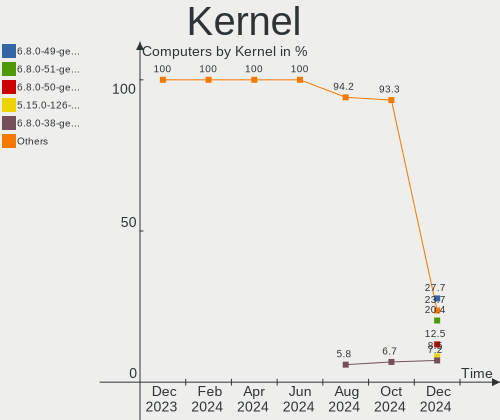
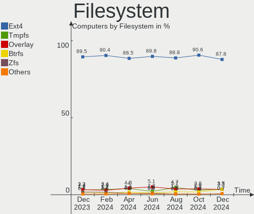
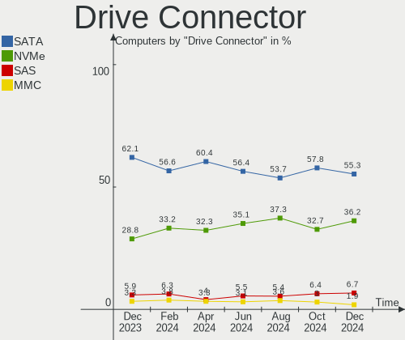
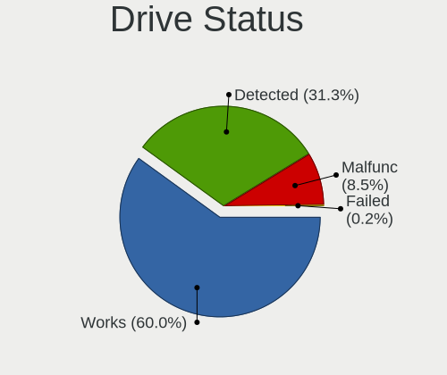
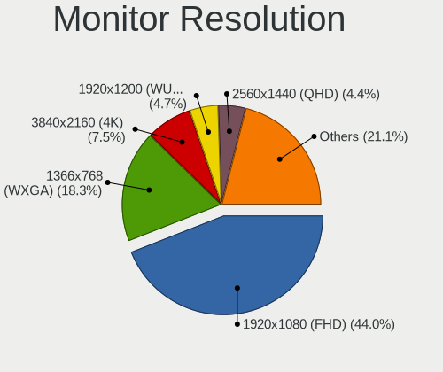
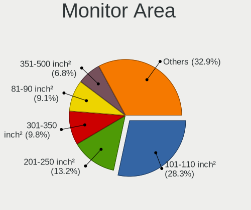

Linux Mint - Hardware Trends
----------------------------

A project to identify most popular hardware characteristics and track their change
over time based on data collected by Linux users at https://Linux-Hardware.org.

Anyone can contribute to this report by the [hw-probe](https://github.com/linuxhw/hw-probe) tool:

    sudo -E hw-probe -all -upload

This is a report for all computer types. See also reports for [desktops](/Dist/Linux_Mint/Desktop/README.md) and [notebooks](/Dist/Linux_Mint/Notebook/README.md).

This report is for one last month. Overall report since the beginning of time: [TestDays](https://github.com/linuxhw/TestDays)

Period: Dec, 2024.

Contents
--------

* [ System ](#system)
  - [ OS                       ](#os)
  - [ OS Family                ](#os-family)
  - [ Kernel                   ](#kernel)
  - [ Kernel Family            ](#kernel-family)
  - [ Kernel Major Ver.        ](#kernel-major-ver)
  - [ Arch                     ](#arch)
  - [ DE                       ](#de)
  - [ Display Server           ](#display-server)
  - [ Display Manager          ](#display-manager)
  - [ OS Lang                  ](#os-lang)
  - [ Boot Mode                ](#boot-mode)
  - [ Filesystem               ](#filesystem)
  - [ Part. scheme             ](#part-scheme)
  - [ Dual Boot with Linux/BSD ](#dual-boot-with-linuxbsd)
  - [ Dual Boot (Win)          ](#dual-boot-win)

* [ Board ](#board)
  - [ Vendor                   ](#vendor)
  - [ Model                    ](#model)
  - [ Model Family             ](#model-family)
  - [ MFG Year                 ](#mfg-year)
  - [ Form Factor              ](#form-factor)
  - [ Secure Boot              ](#secure-boot)
  - [ Coreboot                 ](#coreboot)
  - [ RAM Size                 ](#ram-size)
  - [ RAM Used                 ](#ram-used)
  - [ Total Drives             ](#total-drives)
  - [ Has CD-ROM               ](#has-cd-rom)
  - [ Has Ethernet             ](#has-ethernet)
  - [ Has WiFi                 ](#has-wifi)
  - [ Has Bluetooth            ](#has-bluetooth)

* [ Location ](#location)
  - [ Country                  ](#country)
  - [ City                     ](#city)

* [ Drives ](#drives)
  - [ Drive Vendor             ](#drive-vendor)
  - [ Drive Model              ](#drive-model)
  - [ HDD Vendor               ](#hdd-vendor)
  - [ SSD Vendor               ](#ssd-vendor)
  - [ Drive Kind               ](#drive-kind)
  - [ Drive Connector          ](#drive-connector)
  - [ Drive Size               ](#drive-size)
  - [ Space Total              ](#space-total)
  - [ Space Used               ](#space-used)
  - [ Malfunc. Drives          ](#malfunc-drives)
  - [ Malfunc. Drive Vendor    ](#malfunc-drive-vendor)
  - [ Malfunc. HDD Vendor      ](#malfunc-hdd-vendor)
  - [ Malfunc. Drive Kind      ](#malfunc-drive-kind)
  - [ Failed Drives            ](#failed-drives)
  - [ Failed Drive Vendor      ](#failed-drive-vendor)
  - [ Drive Status             ](#drive-status)

* [ Storage controller ](#storage-controller)
  - [ Storage Vendor           ](#storage-vendor)
  - [ Storage Model            ](#storage-model)
  - [ Storage Kind             ](#storage-kind)

* [ Processor ](#processor)
  - [ CPU Vendor               ](#cpu-vendor)
  - [ CPU Model                ](#cpu-model)
  - [ CPU Model Family         ](#cpu-model-family)
  - [ CPU Cores                ](#cpu-cores)
  - [ CPU Sockets              ](#cpu-sockets)
  - [ CPU Threads              ](#cpu-threads)
  - [ CPU Op-Modes             ](#cpu-op-modes)
  - [ CPU Microcode            ](#cpu-microcode)
  - [ CPU Microarch            ](#cpu-microarch)

* [ Graphics ](#graphics)
  - [ GPU Vendor               ](#gpu-vendor)
  - [ GPU Model                ](#gpu-model)
  - [ GPU Combo                ](#gpu-combo)
  - [ GPU Driver               ](#gpu-driver)
  - [ GPU Memory               ](#gpu-memory)

* [ Monitor ](#monitor)
  - [ Monitor Vendor           ](#monitor-vendor)
  - [ Monitor Model            ](#monitor-model)
  - [ Monitor Resolution       ](#monitor-resolution)
  - [ Monitor Diagonal         ](#monitor-diagonal)
  - [ Monitor Width            ](#monitor-width)
  - [ Aspect Ratio             ](#aspect-ratio)
  - [ Monitor Area             ](#monitor-area)
  - [ Pixel Density            ](#pixel-density)
  - [ Multiple Monitors        ](#multiple-monitors)

* [ Network ](#network)
  - [ Net Controller Vendor    ](#net-controller-vendor)
  - [ Net Controller Model     ](#net-controller-model)
  - [ Wireless Vendor          ](#wireless-vendor)
  - [ Wireless Model           ](#wireless-model)
  - [ Ethernet Vendor          ](#ethernet-vendor)
  - [ Ethernet Model           ](#ethernet-model)
  - [ Net Controller Kind      ](#net-controller-kind)
  - [ Used Controller          ](#used-controller)
  - [ NICs                     ](#nics)
  - [ IPv6                     ](#ipv6)

* [ Bluetooth ](#bluetooth)
  - [ Bluetooth Vendor         ](#bluetooth-vendor)
  - [ Bluetooth Model          ](#bluetooth-model)

* [ Sound ](#sound)
  - [ Sound Vendor             ](#sound-vendor)
  - [ Sound Model              ](#sound-model)

* [ Memory ](#memory)
  - [ Memory Vendor            ](#memory-vendor)
  - [ Memory Model             ](#memory-model)
  - [ Memory Kind              ](#memory-kind)
  - [ Memory Form Factor       ](#memory-form-factor)
  - [ Memory Size              ](#memory-size)
  - [ Memory Speed             ](#memory-speed)

* [ Printers & scanners ](#printers--scanners)
  - [ Printer Vendor           ](#printer-vendor)
  - [ Printer Model            ](#printer-model)
  - [ Scanner Vendor           ](#scanner-vendor)
  - [ Scanner Model            ](#scanner-model)

* [ Camera ](#camera)
  - [ Camera Vendor            ](#camera-vendor)
  - [ Camera Model             ](#camera-model)

* [ Security ](#security)
  - [ Fingerprint Vendor       ](#fingerprint-vendor)
  - [ Fingerprint Model        ](#fingerprint-model)
  - [ Chipcard Vendor          ](#chipcard-vendor)
  - [ Chipcard Model           ](#chipcard-model)

* [ Unsupported ](#unsupported)
  - [ Unsupported Devices      ](#unsupported-devices)
  - [ Unsupported Device Types ](#unsupported-device-types)

System
------

OS
--

Installed operating systems

| Name            | Computers | Percent |
|-----------------|-----------|---------|
| Linux Mint 22   | 269       | 67.08%  |
| Linux Mint 21.3 | 79        | 19.7%   |
| Linux Mint 21.1 | 12        | 2.99%   |
| Linux Mint 20.3 | 11        | 2.74%   |
| Linux Mint 21.2 | 7         | 1.75%   |
| Linux Mint 22.1 | 6         | 1.5%    |
| Linux Mint 21   | 6         | 1.5%    |
| Linux Mint 19.3 | 4         | 1%      |
| Linux Mint 20.2 | 3         | 0.75%   |
| Linux Mint 20   | 2         | 0.5%    |
| Linux Mint 20.1 | 1         | 0.25%   |
| Linux Mint 18.2 | 1         | 0.25%   |

OS Family
---------

OS without a version

| Name       | Computers | Percent |
|------------|-----------|---------|
| Linux Mint | 401       | 100%    |

Kernel
------

Version of the Linux kernel

| Version                  | Computers | Percent |
|--------------------------|-----------|---------|
| 6.8.0-49-generic         | 111       | 27.68%  |
| 6.8.0-51-generic         | 82        | 20.45%  |
| 6.8.0-50-generic         | 50        | 12.47%  |
| 5.15.0-126-generic       | 34        | 8.48%   |
| 6.8.0-38-generic         | 29        | 7.23%   |
| 5.15.0-130-generic       | 19        | 4.74%   |
| 6.8.0-48-generic         | 6         | 1.5%    |
| 5.15.0-128-generic       | 6         | 1.5%    |
| 5.15.0-127-generic       | 6         | 1.5%    |
| 5.4.0-204-generic        | 4         | 1%      |
| 5.4.0-200-generic        | 4         | 1%      |
| 6.8.0-45-generic         | 3         | 0.75%   |
| 5.15.0-125-generic       | 3         | 0.75%   |
| 6.11.10-1-liquorix-amd64 | 2         | 0.5%    |
| 5.4.0-202-generic        | 2         | 0.5%    |
| 5.4.0-150-generic        | 2         | 0.5%    |
| 5.15.0-124-generic       | 2         | 0.5%    |
| 6.9.9-x64v3-xanmod1      | 1         | 0.25%   |
| 6.9.10-x64v3-xanmod1     | 1         | 0.25%   |
| 6.8.12-custombuild-001   | 1         | 0.25%   |
| 6.8.0-49-lowlatency      | 1         | 0.25%   |
| 6.8.0-47-generic         | 1         | 0.25%   |
| 6.8.0-41-generic         | 1         | 0.25%   |
| 6.8.0-40-generic         | 1         | 0.25%   |
| 6.8.0-31-generic         | 1         | 0.25%   |
| 6.5.0-1027-oem           | 1         | 0.25%   |
| 6.5.0-1022-oem           | 1         | 0.25%   |
| 6.2.0-39-generic         | 1         | 0.25%   |
| 6.2.0-26-generic         | 1         | 0.25%   |
| 6.12.6-1-liquorix-amd64  | 1         | 0.25%   |
| 6.12.3-061203-generic    | 1         | 0.25%   |
| 6.12.2-061202-generic    | 1         | 0.25%   |
| 6.12.1-1-liquorix-amd64  | 1         | 0.25%   |
| 6.12.1-061201-generic    | 1         | 0.25%   |
| 6.12.0-061200-generic    | 1         | 0.25%   |
| 6.12.0                   | 1         | 0.25%   |
| 6.11.11-x64v3-xanmod1    | 1         | 0.25%   |
| 6.11.0-1002-nvidia       | 1         | 0.25%   |
| 6.1.0-28-amd64           | 1         | 0.25%   |
| 5.4.0-58-generic         | 1         | 0.25%   |

Kernel Family
-------------

Linux kernel without a distro release

| Version | Computers | Percent |
|---------|-----------|---------|
| 6.8.0   | 286       | 71.32%  |
| 5.15.0  | 77        | 19.2%   |
| 5.4.0   | 15        | 3.74%   |
| 6.5.0   | 2         | 0.5%    |
| 6.2.0   | 2         | 0.5%    |
| 6.12.1  | 2         | 0.5%    |
| 6.12.0  | 2         | 0.5%    |
| 6.11.10 | 2         | 0.5%    |
| 4.15.0  | 2         | 0.5%    |
| 6.9.9   | 1         | 0.25%   |
| 6.9.10  | 1         | 0.25%   |
| 6.8.12  | 1         | 0.25%   |
| 6.12.6  | 1         | 0.25%   |
| 6.12.3  | 1         | 0.25%   |
| 6.12.2  | 1         | 0.25%   |
| 6.11.11 | 1         | 0.25%   |
| 6.11.0  | 1         | 0.25%   |
| 6.1.0   | 1         | 0.25%   |
| 5.17.0  | 1         | 0.25%   |
| 4.8.0   | 1         | 0.25%   |

Kernel Major Ver.
-----------------

Linux kernel major version

| Version | Computers | Percent |
|---------|-----------|---------|
| 6.8     | 287       | 71.57%  |
| 5.15    | 77        | 19.2%   |
| 5.4     | 15        | 3.74%   |
| 6.12    | 7         | 1.75%   |
| 6.11    | 4         | 1%      |
| 6.9     | 2         | 0.5%    |
| 6.5     | 2         | 0.5%    |
| 6.2     | 2         | 0.5%    |
| 4.15    | 2         | 0.5%    |
| 6.1     | 1         | 0.25%   |
| 5.17    | 1         | 0.25%   |
| 4.8     | 1         | 0.25%   |

Arch
----

OS architecture (x86_64, i586, etc.)

| Name   | Computers | Percent |
|--------|-----------|---------|
| x86_64 | 401       | 100%    |

DE
--

Desktop Environment

| Name       | Computers | Percent |
|------------|-----------|---------|
| X-Cinnamon | 304       | 75.81%  |
| XFCE       | 43        | 10.72%  |
| MATE       | 36        | 8.98%   |
| GNOME      | 8         | 2%      |
| KDE5       | 3         | 0.75%   |
| Cinnamon   | 3         | 0.75%   |
| LXDE       | 1         | 0.25%   |
| ICEWM      | 1         | 0.25%   |
| i3         | 1         | 0.25%   |
| Unknown    | 1         | 0.25%   |

Display Server
--------------

X11 or Wayland

| Name    | Computers | Percent |
|---------|-----------|---------|
| X11     | 394       | 98.25%  |
| Wayland | 6         | 1.5%    |
| Tty     | 1         | 0.25%   |

Display Manager
---------------

SDDM, LightDM, etc.

| Name    | Computers | Percent |
|---------|-----------|---------|
| LightDM | 304       | 75.81%  |
| Unknown | 89        | 22.19%  |
| GDM3    | 6         | 1.5%    |
| SDDM    | 2         | 0.5%    |

OS Lang
-------

Language

| Lang  | Computers | Percent |
|-------|-----------|---------|
| en_US | 112       | 27.93%  |
| it_IT | 58        | 14.46%  |
| de_DE | 43        | 10.72%  |
| fr_FR | 26        | 6.48%   |
| ru_RU | 18        | 4.49%   |
| C     | 18        | 4.49%   |
| pt_BR | 15        | 3.74%   |
| en_CA | 15        | 3.74%   |
| en_AU | 14        | 3.49%   |
| en_GB | 11        | 2.74%   |
| es_ES | 8         | 2%      |
| pl_PL | 7         | 1.75%   |
| en_IN | 6         | 1.5%    |
| tr_TR | 5         | 1.25%   |
| es_MX | 4         | 1%      |
| de_AT | 4         | 1%      |
| nl_BE | 3         | 0.75%   |
| fi_FI | 3         | 0.75%   |
| sv_SE | 2         | 0.5%    |
| es_VE | 2         | 0.5%    |
| es_CL | 2         | 0.5%    |
| es_AR | 2         | 0.5%    |
| en_ZA | 2         | 0.5%    |
| en_IE | 2         | 0.5%    |
| de_CH | 2         | 0.5%    |
| zh_CN | 1         | 0.25%   |
| uk_UA | 1         | 0.25%   |
| ro_RO | 1         | 0.25%   |
| pt_PT | 1         | 0.25%   |
| nl_NL | 1         | 0.25%   |
| nb_NO | 1         | 0.25%   |
| ja_JP | 1         | 0.25%   |
| hu_HU | 1         | 0.25%   |
| fr_CA | 1         | 0.25%   |
| fr_BE | 1         | 0.25%   |
| es_UY | 1         | 0.25%   |
| en_SG | 1         | 0.25%   |
| en_NG | 1         | 0.25%   |
| en_DK | 1         | 0.25%   |
| de_LI | 1         | 0.25%   |

Boot Mode
---------

EFI or BIOS

| Mode | Computers | Percent |
|------|-----------|---------|
| EFI  | 306       | 76.31%  |
| BIOS | 95        | 23.69%  |

Filesystem
----------

Type of filesystem

| Type    | Computers | Percent |
|---------|-----------|---------|
| Ext4    | 352       | 87.78%  |
| Tmpfs   | 15        | 3.74%   |
| Overlay | 14        | 3.49%   |
| Btrfs   | 14        | 3.49%   |
| Zfs     | 3         | 0.75%   |
| Xfs     | 1         | 0.25%   |
| Ext3    | 1         | 0.25%   |
| Unknown | 1         | 0.25%   |

Part. scheme
------------

Scheme of partitioning

| Type    | Computers | Percent |
|---------|-----------|---------|
| GPT     | 279       | 69.58%  |
| Unknown | 89        | 22.19%  |
| MBR     | 33        | 8.23%   |

Dual Boot with Linux/BSD
------------------------

Hosting more than one Linux/BSD

| Dual boot | Computers | Percent |
|-----------|-----------|---------|
| No        | 358       | 89.28%  |
| Yes       | 43        | 10.72%  |

Dual Boot (Win)
---------------

Hosting Linux and Windows

| Dual boot | Computers | Percent |
|-----------|-----------|---------|
| No        | 275       | 68.58%  |
| Yes       | 126       | 31.42%  |

Board
-----

Vendor
------

Motherboard manufacturer

| Name                 | Computers | Percent |
|----------------------|-----------|---------|
| ASUSTek Computer     | 74        | 18.45%  |
| Hewlett-Packard      | 52        | 12.97%  |
| Lenovo               | 50        | 12.47%  |
| Dell                 | 37        | 9.23%   |
| Acer                 | 34        | 8.48%   |
| MSI                  | 26        | 6.48%   |
| Apple                | 19        | 4.74%   |
| Gigabyte Technology  | 16        | 3.99%   |
| Unknown              | 9         | 2.24%   |
| Intel                | 8         | 2%      |
| ASRock               | 8         | 2%      |
| HUAWEI               | 6         | 1.5%    |
| Samsung Electronics  | 5         | 1.25%   |
| Fujitsu              | 5         | 1.25%   |
| Foxconn              | 5         | 1.25%   |
| AZW                  | 5         | 1.25%   |
| Toshiba              | 4         | 1%      |
| Win element          | 2         | 0.5%    |
| Sony                 | 2         | 0.5%    |
| Shuttle              | 2         | 0.5%    |
| Packard Bell         | 2         | 0.5%    |
| Microsoft            | 2         | 0.5%    |
| Medion               | 2         | 0.5%    |
| GEEKOM               | 2         | 0.5%    |
| eMachines            | 2         | 0.5%    |
| Biostar              | 2         | 0.5%    |
| AMI                  | 2         | 0.5%    |
| VALE                 | 1         | 0.25%   |
| TECNO Mobile Limited | 1         | 0.25%   |
| QTQD                 | 1         | 0.25%   |
| Positivo             | 1         | 0.25%   |
| NZXT                 | 1         | 0.25%   |
| NEC Computers        | 1         | 0.25%   |
| MicroByte            | 1         | 0.25%   |
| Maibenben            | 1         | 0.25%   |
| MACHINIST            | 1         | 0.25%   |
| LG Electronics       | 1         | 0.25%   |
| Google               | 1         | 0.25%   |
| GMKtec               | 1         | 0.25%   |
| Gateway              | 1         | 0.25%   |

Model
-----

Motherboard model

| Name                                     | Computers | Percent |
|------------------------------------------|-----------|---------|
| Unknown                                  | 12        | 2.99%   |
| MSI MS-7996                              | 3         | 0.75%   |
| AZW SER                                  | 3         | 0.75%   |
| ASUS VivoBook_ASUSLaptop X1404ZA_X1404ZA | 3         | 0.75%   |
| Samsung 550XDA                           | 2         | 0.5%    |
| Lenovo ThinkPad E16 Gen 2 21M5CTO1WW     | 2         | 0.5%    |
| HUAWEI KPL-W0X                           | 2         | 0.5%    |
| HP ProDesk 600 G1 SFF                    | 2         | 0.5%    |
| HP Pavilion Gaming Laptop 17-cd1xxx      | 2         | 0.5%    |
| HP Pavilion g6                           | 2         | 0.5%    |
| HP ENVY Laptop 13-ba1xxx                 | 2         | 0.5%    |
| HP EliteBook x360 1030 G2                | 2         | 0.5%    |
| HP Compaq 8000 Elite SFF PC              | 2         | 0.5%    |
| Foxconn 2AB1                             | 2         | 0.5%    |
| Dell XPS 15 9575                         | 2         | 0.5%    |
| Dell XPS 15 9510                         | 2         | 0.5%    |
| Dell OptiPlex 9020                       | 2         | 0.5%    |
| Dell OptiPlex 780                        | 2         | 0.5%    |
| ASUS PRIME H310M-E R2.0                  | 2         | 0.5%    |
| ASUS M5A78L-M LX3                        | 2         | 0.5%    |
| ASUS ASUS TUF Gaming F15 FX506HF_FX506HF | 2         | 0.5%    |
| ASUS All Series                          | 2         | 0.5%    |
| Apple MacBookPro8,1                      | 2         | 0.5%    |
| Apple MacBookPro11,1                     | 2         | 0.5%    |
| Acer Aspire A515-45                      | 2         | 0.5%    |
| Win Element M9S                          | 1         | 0.25%   |
| Win element M600                         | 1         | 0.25%   |
| VALE Notebook Slim S132                  | 1         | 0.25%   |
| Toshiba Satellite Pro S500               | 1         | 0.25%   |
| Toshiba Satellite L850                   | 1         | 0.25%   |
| Toshiba Satellite C655D                  | 1         | 0.25%   |
| Toshiba PORTEGE X30-E                    | 1         | 0.25%   |
| TECNO Mobile Limited MEGABOOK T15DA      | 1         | 0.25%   |
| Sony VPCEA290X                           | 1         | 0.25%   |
| Sony VGN-FZ31M                           | 1         | 0.25%   |
| Shuttle SH310V2                          | 1         | 0.25%   |
| Shuttle DH270                            | 1         | 0.25%   |
| Samsung 700T1C                           | 1         | 0.25%   |
| Samsung 550P5C/550P7C                    | 1         | 0.25%   |
| Samsung 350V5C/351V5C/3540VC/3440VC      | 1         | 0.25%   |

Model Family
------------

Motherboard model prefix

| Name                | Computers | Percent |
|---------------------|-----------|---------|
| Lenovo ThinkPad     | 21        | 5.24%   |
| Acer Aspire         | 19        | 4.74%   |
| Lenovo IdeaPad      | 12        | 2.99%   |
| Unknown             | 12        | 2.99%   |
| Dell Latitude       | 11        | 2.74%   |
| HP Pavilion         | 10        | 2.49%   |
| Dell Inspiron       | 10        | 2.49%   |
| ASUS TUF            | 10        | 2.49%   |
| ASUS ROG            | 10        | 2.49%   |
| HP EliteBook        | 8         | 2%      |
| Dell OptiPlex       | 7         | 1.75%   |
| ASUS VivoBook       | 7         | 1.75%   |
| Lenovo ThinkCentre  | 6         | 1.5%    |
| HP Laptop           | 5         | 1.25%   |
| Dell XPS            | 5         | 1.25%   |
| ASUS PRIME          | 5         | 1.25%   |
| ASUS ASUS           | 5         | 1.25%   |
| Acer Swift          | 5         | 1.25%   |
| HP ProBook          | 4         | 1%      |
| HP Compaq           | 4         | 1%      |
| Apple MacBookPro11  | 4         | 1%      |
| Toshiba Satellite   | 3         | 0.75%   |
| MSI MS-7996         | 3         | 0.75%   |
| HP ProDesk          | 3         | 0.75%   |
| HP ENVY             | 3         | 0.75%   |
| HP 250              | 3         | 0.75%   |
| AZW SER             | 3         | 0.75%   |
| Acer Veriton        | 3         | 0.75%   |
| Samsung 550XDA      | 2         | 0.5%    |
| Packard Bell IMEDIA | 2         | 0.5%    |
| Microsoft Surface   | 2         | 0.5%    |
| Lenovo Legion       | 2         | 0.5%    |
| HUAWEI KPL-W0X      | 2         | 0.5%    |
| HP Victus           | 2         | 0.5%    |
| Gigabyte B550M      | 2         | 0.5%    |
| Fujitsu LIFEBOOK    | 2         | 0.5%    |
| Fujitsu ESPRIMO     | 2         | 0.5%    |
| Foxconn 2AB1        | 2         | 0.5%    |
| Dell Studio         | 2         | 0.5%    |
| ASUS M5A78L-M       | 2         | 0.5%    |

MFG Year
--------

Motherboard manufacture year

| Year | Computers | Percent |
|------|-----------|---------|
| 2021 | 32        | 7.98%   |
| 2023 | 31        | 7.73%   |
| 2020 | 31        | 7.73%   |
| 2022 | 30        | 7.48%   |
| 2024 | 29        | 7.23%   |
| 2017 | 27        | 6.73%   |
| 2012 | 26        | 6.48%   |
| 2018 | 25        | 6.23%   |
| 2013 | 23        | 5.74%   |
| 2019 | 22        | 5.49%   |
| 2016 | 20        | 4.99%   |
| 2015 | 20        | 4.99%   |
| 2014 | 20        | 4.99%   |
| 2011 | 20        | 4.99%   |
| 2010 | 18        | 4.49%   |
| 2009 | 12        | 2.99%   |
| 2008 | 7         | 1.75%   |
| 2007 | 6         | 1.5%    |
| 2006 | 2         | 0.5%    |

Form Factor
-----------

Physical design of the computer

| Name        | Computers | Percent |
|-------------|-----------|---------|
| Notebook    | 214       | 53.37%  |
| Desktop     | 149       | 37.16%  |
| Mini pc     | 14        | 3.49%   |
| Convertible | 10        | 2.49%   |
| All in one  | 9         | 2.24%   |
| Tablet      | 4         | 1%      |
| Other       | 1         | 0.25%   |

Secure Boot
-----------

Enabled or disabled

| State    | Computers | Percent |
|----------|-----------|---------|
| Disabled | 360       | 89.78%  |
| Enabled  | 41        | 10.22%  |

Coreboot
--------

Have coreboot on board

| Used | Computers | Percent |
|------|-----------|---------|
| No   | 400       | 99.75%  |
| Yes  | 1         | 0.25%   |

RAM Size
--------

Total RAM memory

| Size in GB  | Computers | Percent |
|-------------|-----------|---------|
| 4.01-8.0    | 105       | 26.18%  |
| 16.01-24.0  | 84        | 20.95%  |
| 8.01-16.0   | 72        | 17.96%  |
| 32.01-64.0  | 51        | 12.72%  |
| 3.01-4.0    | 48        | 11.97%  |
| 24.01-32.0  | 17        | 4.24%   |
| 64.01-256.0 | 13        | 3.24%   |
| 2.01-3.0    | 6         | 1.5%    |
| 1.01-2.0    | 5         | 1.25%   |

RAM Used
--------

Used RAM memory

| Used GB    | Computers | Percent |
|------------|-----------|---------|
| 2.01-3.0   | 128       | 31.92%  |
| 1.01-2.0   | 93        | 23.19%  |
| 3.01-4.0   | 72        | 17.96%  |
| 4.01-8.0   | 70        | 17.46%  |
| 8.01-16.0  | 19        | 4.74%   |
| 0.51-1.0   | 9         | 2.24%   |
| 16.01-24.0 | 7         | 1.75%   |
| 24.01-32.0 | 2         | 0.5%    |
| 32.01-64.0 | 1         | 0.25%   |

Total Drives
------------

Number of drives on board

| Drives | Computers | Percent |
|--------|-----------|---------|
| 1      | 262       | 65.34%  |
| 2      | 90        | 22.44%  |
| 3      | 26        | 6.48%   |
| 4      | 9         | 2.24%   |
| 5      | 7         | 1.75%   |
| 6      | 3         | 0.75%   |
| 7      | 2         | 0.5%    |
| 0      | 2         | 0.5%    |

Has CD-ROM
----------

Has CD-ROM on board

| Presented | Computers | Percent |
|-----------|-----------|---------|
| No        | 268       | 66.83%  |
| Yes       | 133       | 33.17%  |

Has Ethernet
------------

Has Ethernet on board

| Presented | Computers | Percent |
|-----------|-----------|---------|
| Yes       | 331       | 82.54%  |
| No        | 70        | 17.46%  |

Has WiFi
--------

Has WiFi module

| Presented | Computers | Percent |
|-----------|-----------|---------|
| Yes       | 331       | 82.54%  |
| No        | 70        | 17.46%  |

Has Bluetooth
-------------

Has Bluetooth module

| Presented | Computers | Percent |
|-----------|-----------|---------|
| Yes       | 280       | 69.83%  |
| No        | 121       | 30.17%  |

Location
--------

Country
-------

Geographic location (country)

| Country         | Computers | Percent |
|-----------------|-----------|---------|
| Italy           | 59        | 14.71%  |
| USA             | 55        | 13.72%  |
| Germany         | 53        | 13.22%  |
| France          | 28        | 6.98%   |
| Canada          | 19        | 4.74%   |
| Russia          | 18        | 4.49%   |
| Brazil          | 17        | 4.24%   |
| Australia       | 16        | 3.99%   |
| Spain           | 12        | 2.99%   |
| Poland          | 11        | 2.74%   |
| UK              | 9         | 2.24%   |
| India           | 7         | 1.75%   |
| Turkey          | 5         | 1.25%   |
| Switzerland     | 5         | 1.25%   |
| Romania         | 5         | 1.25%   |
| Mexico          | 5         | 1.25%   |
| Bulgaria        | 5         | 1.25%   |
| Austria         | 5         | 1.25%   |
| Argentina       | 5         | 1.25%   |
| Greece          | 4         | 1%      |
| Belgium         | 4         | 1%      |
| Sweden          | 3         | 0.75%   |
| Norway          | 3         | 0.75%   |
| Netherlands     | 3         | 0.75%   |
| Indonesia       | 3         | 0.75%   |
| Hungary         | 3         | 0.75%   |
| Finland         | 3         | 0.75%   |
| Chile           | 3         | 0.75%   |
| Venezuela       | 2         | 0.5%    |
| Ukraine         | 2         | 0.5%    |
| The Netherlands | 2         | 0.5%    |
| South Africa    | 2         | 0.5%    |
| Saudi Arabia    | 2         | 0.5%    |
| Vietnam         | 1         | 0.25%   |
| Uruguay         | 1         | 0.25%   |
| UAE             | 1         | 0.25%   |
| Thailand        | 1         | 0.25%   |
| Slovenia        | 1         | 0.25%   |
| Singapore       | 1         | 0.25%   |
| Pakistan        | 1         | 0.25%   |

City
----

Geographic location (city)

| City                     | Computers | Percent |
|--------------------------|-----------|---------|
| Milan                    | 7         | 1.75%   |
| Rome                     | 6         | 1.5%    |
| Milano                   | 5         | 1.25%   |
| Berlin                   | 5         | 1.25%   |
| Verona                   | 4         | 1%      |
| Sydney                   | 4         | 1%      |
| Moscow                   | 4         | 1%      |
| Sofia                    | 3         | 0.75%   |
| Melbourne                | 3         | 0.75%   |
| Darmstadt                | 3         | 0.75%   |
| Buenos Aires             | 3         | 0.75%   |
| Athens                   | 3         | 0.75%   |
| Amsterdam                | 3         | 0.75%   |
| Adelaide                 | 3         | 0.75%   |
| Wittenberg               | 2         | 0.5%    |
| Vienna                   | 2         | 0.5%    |
| Vero Beach               | 2         | 0.5%    |
| Southampton              | 2         | 0.5%    |
| Sao Paulo                | 2         | 0.5%    |
| Santiago                 | 2         | 0.5%    |
| Santa Fe                 | 2         | 0.5%    |
| Passignano sul Trasimeno | 2         | 0.5%    |
| Padova                   | 2         | 0.5%    |
| Nuremberg                | 2         | 0.5%    |
| Naberezhnyye Chelny      | 2         | 0.5%    |
| Munich                   | 2         | 0.5%    |
| Mainz                    | 2         | 0.5%    |
| Los Angeles              | 2         | 0.5%    |
| Lincolnton               | 2         | 0.5%    |
| Istanbul                 | 2         | 0.5%    |
| Fossarmato               | 2         | 0.5%    |
| Dallas                   | 2         | 0.5%    |
| Cochrane                 | 2         | 0.5%    |
| Chateauguay              | 2         | 0.5%    |
| Campinas                 | 2         | 0.5%    |
| Bucharest                | 2         | 0.5%    |
| Brisbane                 | 2         | 0.5%    |
| Bois-Colombes            | 2         | 0.5%    |
| Bochum                   | 2         | 0.5%    |
| Bengaluru                | 2         | 0.5%    |

Drives
------

Drive Vendor
------------

Hard drive vendors

| Vendor                      | Computers | Drives | Percent |
|-----------------------------|-----------|--------|---------|
| Samsung Electronics         | 91        | 113    | 16.19%  |
| WDC                         | 68        | 74     | 12.1%   |
| Seagate                     | 49        | 60     | 8.72%   |
| Sandisk                     | 40        | 41     | 7.12%   |
| Crucial                     | 37        | 40     | 6.58%   |
| Kingston                    | 32        | 33     | 5.69%   |
| Toshiba                     | 21        | 22     | 3.74%   |
| Unknown                     | 18        | 23     | 3.2%    |
| Micron Technology           | 18        | 18     | 3.2%    |
| SK hynix                    | 15        | 15     | 2.67%   |
| Hitachi                     | 10        | 10     | 1.78%   |
| Intenso                     | 9         | 9      | 1.6%    |
| Apple                       | 9         | 11     | 1.6%    |
| Intel                       | 7         | 9      | 1.25%   |
| HGST                        | 7         | 8      | 1.25%   |
| Phison Electronics          | 6         | 6      | 1.07%   |
| KIOXIA                      | 6         | 6      | 1.07%   |
| A-DATA Technology           | 6         | 6      | 1.07%   |
| SPCC                        | 5         | 5      | 0.89%   |
| Kingston Technology Company | 5         | 5      | 0.89%   |
| China                       | 5         | 5      | 0.89%   |
| Netac                       | 4         | 4      | 0.71%   |
| LITEON                      | 4         | 4      | 0.71%   |
| GOODRAM                     | 4         | 4      | 0.71%   |
| UMIS                        | 3         | 3      | 0.53%   |
| Transcend                   | 3         | 3      | 0.53%   |
| Team                        | 3         | 3      | 0.53%   |
| PNY                         | 3         | 3      | 0.53%   |
| Patriot                     | 3         | 3      | 0.53%   |
| Micron/Crucial Technology   | 3         | 3      | 0.53%   |
| MAXIO Technology (Hangzhou) | 3         | 3      | 0.53%   |
| LITEONIT                    | 3         | 3      | 0.53%   |
| Lexar                       | 3         | 3      | 0.53%   |
| JMicron Technology          | 3         | 3      | 0.53%   |
| Hewlett-Packard             | 3         | 3      | 0.53%   |
| Fanxiang                    | 3         | 3      | 0.53%   |
| Unknown                     | 3         | 3      | 0.53%   |
| USB                         | 2         | 2      | 0.36%   |
| TO Exter                    | 2         | 2      | 0.36%   |
| Silicon Motion              | 2         | 2      | 0.36%   |

Drive Model
-----------

Hard drive models

| Model                                               | Computers | Percent |
|-----------------------------------------------------|-----------|---------|
| Kingston SA400S37240G 240GB SSD                     | 8         | 1.31%   |
| Sandisk WD Blue SN550 NVMe SSD 256GB                | 6         | 0.98%   |
| Samsung SSD 990 PRO 1TB                             | 6         | 0.98%   |
| SanDisk NVMe SSD Drive 2TB                          | 5         | 0.82%   |
| Samsung SSD 860 EVO 500GB                           | 5         | 0.82%   |
| Samsung SSD 860 EVO 1TB                             | 5         | 0.82%   |
| Kingston SA400S37480G 480GB SSD                     | 5         | 0.82%   |
| Crucial CT480BX500SSD1 480GB                        | 5         | 0.82%   |
| Seagate ST2000DM008-2FR102 2TB                      | 4         | 0.65%   |
| Seagate ST1000LM035-1RK172 1TB                      | 4         | 0.65%   |
| SanDisk NVMe SSD Drive 512GB                        | 4         | 0.65%   |
| Samsung SSD 970 EVO Plus 2TB                        | 4         | 0.65%   |
| Samsung SSD 870 EVO 500GB                           | 4         | 0.65%   |
| Samsung NVMe SSD Controller SM981/PM981/PM983 512GB | 4         | 0.65%   |
| Kingston Company SNV2S1000G 1TB                     | 4         | 0.65%   |
| Crucial CT500MX500SSD1 500GB                        | 4         | 0.65%   |
| Unknown SD/MMC/MS PRO 128GB                         | 3         | 0.49%   |
| Unknown MMC Card  128GB                             | 3         | 0.49%   |
| Seagate ST500DM002-1BD142 500GB                     | 3         | 0.49%   |
| Seagate ST2000DM001-1ER164 2TB                      | 3         | 0.49%   |
| Seagate Expansion Desk 5TB                          | 3         | 0.49%   |
| SanDisk NVMe SSD Drive 1TB                          | 3         | 0.49%   |
| Samsung SSD 970 EVO Plus 500GB                      | 3         | 0.49%   |
| Samsung SSD 970 EVO Plus 1TB                        | 3         | 0.49%   |
| Samsung SSD 850 EVO 250GB                           | 3         | 0.49%   |
| Samsung MZVLW256HEHP-000L7 256GB                    | 3         | 0.49%   |
| Kingston SV300S37A120G 120GB SSD                    | 3         | 0.49%   |
| Kingston SNV2S500G 500GB                            | 3         | 0.49%   |
| HGST HTS545050A7E680 500GB                          | 3         | 0.49%   |
| Crucial CT525MX300SSD1 528GB                        | 3         | 0.49%   |
| Crucial CT240BX500SSD1 240GB                        | 3         | 0.49%   |
| Crucial CT1000MX500SSD1 1TB                         | 3         | 0.49%   |
| Unknown                                             | 3         | 0.49%   |
| WDC WDS500G2B0A 500GB SSD                           | 2         | 0.33%   |
| WDC WDS120G2G0A-00JH30 120GB SSD                    | 2         | 0.33%   |
| WDC WD3200BEVT-22ZCT0 320GB                         | 2         | 0.33%   |
| WDC WD30EFRX-68EUZN0 3TB                            | 2         | 0.33%   |
| WDC WD20EZRZ-00Z5HB0 2TB                            | 2         | 0.33%   |
| Unknown SD/MMC 1073GB                               | 2         | 0.33%   |
| Unknown NVMe SSD Drive 1TB                          | 2         | 0.33%   |

HDD Vendor
----------

Hard disk drive vendors

| Vendor              | Computers | Drives | Percent |
|---------------------|-----------|--------|---------|
| Seagate             | 48        | 59     | 32.88%  |
| WDC                 | 46        | 49     | 31.51%  |
| Toshiba             | 11        | 12     | 7.53%   |
| Hitachi             | 10        | 10     | 6.85%   |
| HGST                | 7         | 8      | 4.79%   |
| Samsung Electronics | 5         | 5      | 3.42%   |
| Unknown             | 4         | 4      | 2.74%   |
| Apple               | 3         | 3      | 2.05%   |
| TO Exter            | 2         | 2      | 1.37%   |
| SABRENT             | 2         | 3      | 1.37%   |
| JMicron Technology  | 2         | 2      | 1.37%   |
| Fujitsu             | 2         | 2      | 1.37%   |
| RSH-319             | 1         | 1      | 0.68%   |
| Maxtor              | 1         | 2      | 0.68%   |
| Intenso             | 1         | 1      | 0.68%   |
| Hewlett-Packard     | 1         | 1      | 0.68%   |

SSD Vendor
----------

Solid state drive vendors

| Vendor              | Computers | Drives | Percent |
|---------------------|-----------|--------|---------|
| Samsung Electronics | 49        | 55     | 22.27%  |
| Crucial             | 30        | 30     | 13.64%  |
| Kingston            | 25        | 26     | 11.36%  |
| SanDisk             | 15        | 15     | 6.82%   |
| WDC                 | 14        | 14     | 6.36%   |
| Intenso             | 8         | 8      | 3.64%   |
| SK hynix            | 5         | 5      | 2.27%   |
| China               | 5         | 5      | 2.27%   |
| Toshiba             | 4         | 4      | 1.82%   |
| SPCC                | 4         | 4      | 1.82%   |
| LITEON              | 4         | 4      | 1.82%   |
| Apple               | 4         | 4      | 1.82%   |
| A-DATA Technology   | 4         | 4      | 1.82%   |
| Transcend           | 3         | 3      | 1.36%   |
| PNY                 | 3         | 3      | 1.36%   |
| Patriot             | 3         | 3      | 1.36%   |
| Micron Technology   | 3         | 3      | 1.36%   |
| LITEONIT            | 3         | 3      | 1.36%   |
| GOODRAM             | 3         | 3      | 1.36%   |
| Team                | 2         | 2      | 0.91%   |
| Netac               | 2         | 2      | 0.91%   |
| Intel               | 2         | 2      | 0.91%   |
| HS-SSD-C100         | 2         | 2      | 0.91%   |
| Hewlett-Packard     | 2         | 2      | 0.91%   |
| Fanxiang            | 2         | 2      | 0.91%   |
| Win Memory          | 1         | 1      | 0.45%   |
| ShiJi               | 1         | 1      | 0.45%   |
| SD                  | 1         | 1      | 0.45%   |
| Phison              | 1         | 1      | 0.45%   |
| PHD 3.0             | 1         | 1      | 0.45%   |
| OCZ-AGIL            | 1         | 1      | 0.45%   |
| OCZ                 | 1         | 2      | 0.45%   |
| NT-2TB              | 1         | 1      | 0.45%   |
| NGFF                | 1         | 1      | 0.45%   |
| Lexar               | 1         | 1      | 0.45%   |
| Leven               | 1         | 1      | 0.45%   |
| KingSpec            | 1         | 1      | 0.45%   |
| Hoodisk             | 1         | 1      | 0.45%   |
| FIKWOT              | 1         | 1      | 0.45%   |
| Emtec               | 1         | 1      | 0.45%   |

Drive Kind
----------

HDD or SSD

| Kind    | Computers | Drives | Percent |
|---------|-----------|--------|---------|
| SSD     | 193       | 228    | 36.97%  |
| NVMe    | 175       | 202    | 33.52%  |
| HDD     | 135       | 164    | 25.86%  |
| Unknown | 10        | 18     | 1.92%   |
| MMC     | 9         | 9      | 1.72%   |

Drive Connector
---------------

SATA, SAS, NVMe, etc.

| Type | Computers | Drives | Percent |
|------|-----------|--------|---------|
| SATA | 266       | 369    | 55.3%   |
| NVMe | 174       | 199    | 36.17%  |
| SAS  | 32        | 44     | 6.65%   |
| MMC  | 9         | 9      | 1.87%   |

Drive Size
----------

Size of hard drive

| Size in TB | Computers | Drives | Percent |
|------------|-----------|--------|---------|
| 0.01-0.5   | 198       | 232    | 57.89%  |
| 0.51-1.0   | 87        | 95     | 25.44%  |
| 1.01-2.0   | 30        | 35     | 8.77%   |
| 3.01-4.0   | 12        | 13     | 3.51%   |
| 4.01-10.0  | 8         | 10     | 2.34%   |
| 2.01-3.0   | 5         | 5      | 1.46%   |
| 10.01-20.0 | 2         | 2      | 0.58%   |

Space Total
-----------

Amount of disk space available on the file system

| Size in GB     | Computers | Percent |
|----------------|-----------|---------|
| 251-500        | 110       | 27.43%  |
| 101-250        | 102       | 25.44%  |
| 501-1000       | 61        | 15.21%  |
| 1001-2000      | 33        | 8.23%   |
| More than 3000 | 29        | 7.23%   |
| 51-100         | 24        | 5.99%   |
| 21-50          | 16        | 3.99%   |
| 2001-3000      | 13        | 3.24%   |
| 1-20           | 12        | 2.99%   |
| Unknown        | 1         | 0.25%   |

Space Used
----------

Amount of used disk space

| Used GB        | Computers | Percent |
|----------------|-----------|---------|
| 1-20           | 92        | 22.94%  |
| 21-50          | 79        | 19.7%   |
| 101-250        | 79        | 19.7%   |
| 51-100         | 47        | 11.72%  |
| 251-500        | 41        | 10.22%  |
| 501-1000       | 26        | 6.48%   |
| 1001-2000      | 18        | 4.49%   |
| More than 3000 | 12        | 2.99%   |
| 2001-3000      | 6         | 1.5%    |
| Unknown        | 1         | 0.25%   |

Malfunc. Drives
---------------

Drive models with a malfunction

| Model                                        | Computers | Drives | Percent |
|----------------------------------------------|-----------|--------|---------|
| WDC WD30EFRX-68EUZN0 3TB                     | 2         | 2      | 5.13%   |
| HGST HTS545050A7E680 500GB                   | 2         | 2      | 5.13%   |
| WDC WDS120G2G0A-00JH30 120GB SSD             | 1         | 1      | 2.56%   |
| WDC WD6400AAKS-22A7B2 640GB                  | 1         | 1      | 2.56%   |
| WDC WD5000LPCX-24C6HT0 500GB                 | 1         | 1      | 2.56%   |
| WDC WD5000BPVT-00KPFT0 500GB                 | 1         | 1      | 2.56%   |
| WDC WD5000AAKX-001CA0 500GB                  | 1         | 1      | 2.56%   |
| WDC WD3200BEVT-22ZCT0 320GB                  | 1         | 1      | 2.56%   |
| WDC WD3200AAJS-08L7A0 320GB                  | 1         | 1      | 2.56%   |
| Toshiba MQ01ABF050 500GB                     | 1         | 1      | 2.56%   |
| Toshiba MQ01ABD100 1TB                       | 1         | 1      | 2.56%   |
| Toshiba MK3265GSXN 320GB                     | 1         | 1      | 2.56%   |
| Toshiba MK3263GSX 320GB                      | 1         | 1      | 2.56%   |
| Toshiba DT01ACA100 1TB                       | 1         | 1      | 2.56%   |
| SK hynix HFS128G39TND-N210A 128GB SSD        | 1         | 1      | 2.56%   |
| Seagate ST9500325AS 500GB                    | 1         | 1      | 2.56%   |
| Seagate ST91603110CS 160GB                   | 1         | 1      | 2.56%   |
| Seagate ST500LT012-1DG142 500GB              | 1         | 1      | 2.56%   |
| Seagate ST500DM002-1BD142 500GB              | 1         | 1      | 2.56%   |
| Seagate ST31000524AS 1TB                     | 1         | 1      | 2.56%   |
| Seagate ST2000LX001-1RG174 2TB               | 1         | 1      | 2.56%   |
| Seagate ST2000DL003-9VT166 2TB               | 1         | 1      | 2.56%   |
| Seagate ST1500DL003-9VT16L 1TB               | 1         | 1      | 2.56%   |
| SanDisk SSD PLUS 240GB                       | 1         | 1      | 2.56%   |
| SanDisk SD8SN8U512G1002 512GB SSD            | 1         | 1      | 2.56%   |
| OCZ VERTEX4 256GB SSD                        | 1         | 1      | 2.56%   |
| LITEONIT LMT-128M3M 128GB SSD                | 1         | 1      | 2.56%   |
| Leven JAJS600M512G-HUS1C172G1C344G 512GB SSD | 1         | 1      | 2.56%   |
| Kingston SV200S3128G 128GB SSD               | 1         | 1      | 2.56%   |
| Kingston SUV400S37240G 240GB SSD             | 1         | 1      | 2.56%   |
| Kingston RBU-SMSM151S324GD 24GB SSD          | 1         | 1      | 2.56%   |
| Hitachi HUA722020ALA330 2TB                  | 1         | 1      | 2.56%   |
| Hitachi HTS725050A9A364 500GB                | 1         | 1      | 2.56%   |
| Hitachi HTS723232A7A364 320GB                | 1         | 1      | 2.56%   |
| Hitachi HDP725016GLA380 160GB                | 1         | 1      | 2.56%   |
| Fanxiang S101 128GB SSD                      | 1         | 1      | 2.56%   |
| Crucial CT1050MX300SSD4 1TB                  | 1         | 1      | 2.56%   |

Malfunc. Drive Vendor
---------------------

Vendors of faulty drives

| Vendor   | Computers | Drives | Percent |
|----------|-----------|--------|---------|
| WDC      | 9         | 9      | 23.68%  |
| Seagate  | 7         | 8      | 18.42%  |
| Toshiba  | 5         | 5      | 13.16%  |
| Hitachi  | 4         | 4      | 10.53%  |
| Kingston | 3         | 3      | 7.89%   |
| SanDisk  | 2         | 2      | 5.26%   |
| HGST     | 2         | 2      | 5.26%   |
| SK hynix | 1         | 1      | 2.63%   |
| OCZ      | 1         | 1      | 2.63%   |
| LITEONIT | 1         | 1      | 2.63%   |
| Leven    | 1         | 1      | 2.63%   |
| Fanxiang | 1         | 1      | 2.63%   |
| Crucial  | 1         | 1      | 2.63%   |

Malfunc. HDD Vendor
-------------------

Vendors of faulty HDD drives

| Vendor  | Computers | Drives | Percent |
|---------|-----------|--------|---------|
| WDC     | 8         | 8      | 30.77%  |
| Seagate | 7         | 8      | 26.92%  |
| Toshiba | 5         | 5      | 19.23%  |
| Hitachi | 4         | 4      | 15.38%  |
| HGST    | 2         | 2      | 7.69%   |

Malfunc. Drive Kind
-------------------

Kinds of faulty drives

| Kind | Computers | Drives | Percent |
|------|-----------|--------|---------|
| HDD  | 25        | 27     | 67.57%  |
| SSD  | 12        | 12     | 32.43%  |

Failed Drives
-------------

Failed drive models

| Model             | Computers | Drives | Percent |
|-------------------|-----------|--------|---------|
| JM icron Tech 2TB | 1         | 1      | 100%    |

Failed Drive Vendor
-------------------

Failed drive vendors

| Vendor   | Computers | Drives | Percent |
|----------|-----------|--------|---------|
| JM icron | 1         | 1      | 100%    |

Drive Status
------------

Number of failed and malfunc. drives

| Status   | Computers | Drives | Percent |
|----------|-----------|--------|---------|
| Works    | 261       | 352    | 60%     |
| Detected | 136       | 229    | 31.26%  |
| Malfunc  | 37        | 39     | 8.51%   |
| Failed   | 1         | 1      | 0.23%   |

Storage controller
------------------

Storage Vendor
--------------

Storage controller vendors

| Vendor                           | Computers | Percent |
|----------------------------------|-----------|---------|
| Intel                            | 250       | 47.35%  |
| AMD                              | 72        | 13.64%  |
| Samsung Electronics              | 50        | 9.47%   |
| SanDisk                          | 36        | 6.82%   |
| Micron Technology                | 17        | 3.22%   |
| Kingston Technology Company      | 11        | 2.08%   |
| Micron/Crucial Technology        | 10        | 1.89%   |
| SK hynix                         | 9         | 1.7%    |
| Phison Electronics               | 9         | 1.7%    |
| Nvidia                           | 7         | 1.33%   |
| MAXIO Technology (Hangzhou)      | 7         | 1.33%   |
| Toshiba America Info Systems     | 6         | 1.14%   |
| KIOXIA                           | 6         | 1.14%   |
| ASMedia Technology               | 6         | 1.14%   |
| Silicon Motion                   | 4         | 0.76%   |
| Shenzhen Longsys Electronics     | 4         | 0.76%   |
| Union Memory (Shenzhen)          | 3         | 0.57%   |
| Solidigm                         | 3         | 0.57%   |
| Realtek Semiconductor            | 3         | 0.57%   |
| Marvell Technology Group         | 3         | 0.57%   |
| VIA Technologies                 | 2         | 0.38%   |
| Solid State Storage Technology   | 2         | 0.38%   |
| JMicron Technology               | 2         | 0.38%   |
| ADATA Technology                 | 2         | 0.38%   |
| Yangtze Memory Technologies      | 1         | 0.19%   |
| Silicon Integrated Systems [SiS] | 1         | 0.19%   |
| Seagate Technology               | 1         | 0.19%   |
| Apple                            | 1         | 0.19%   |

Storage Model
-------------

Storage controller models

| Model                                                                          | Computers | Percent |
|--------------------------------------------------------------------------------|-----------|---------|
| AMD FCH SATA Controller [AHCI mode]                                            | 34        | 5.84%   |
| Intel Volume Management Device NVMe RAID Controller                            | 21        | 3.61%   |
| Intel Sunrise Point-LP SATA Controller [AHCI mode]                             | 20        | 3.44%   |
| Intel 8 Series/C220 Series Chipset Family 6-port SATA Controller 1 [AHCI mode] | 19        | 3.26%   |
| Intel 7 Series Chipset Family 6-port SATA Controller [AHCI mode]               | 18        | 3.09%   |
| Samsung NVMe SSD Controller SM981/PM981/PM983                                  | 16        | 2.75%   |
| SanDisk Ultra 3D / WD PC SN530, IX SN530, Blue SN550 NVMe SSD (DRAM-less)      | 12        | 2.06%   |
| Intel 6 Series/C200 Series Chipset Family 6 port Mobile SATA AHCI Controller   | 12        | 2.06%   |
| Intel 200 Series PCH SATA controller [AHCI mode]                               | 11        | 1.89%   |
| AMD 500 Series Chipset SATA Controller                                         | 11        | 1.89%   |
| AMD 400 Series Chipset SATA Controller                                         | 11        | 1.89%   |
| Samsung NVMe SSD Controller S4LV008[Pascal]                                    | 10        | 1.72%   |
| Intel Q170/Q150/B150/H170/H110/Z170/CM236 Chipset SATA Controller [AHCI Mode]  | 10        | 1.72%   |
| Intel 82801 Mobile SATA Controller [RAID mode]                                 | 10        | 1.72%   |
| Intel Celeron/Pentium Silver Processor SATA Controller                         | 9         | 1.55%   |
| Intel 8 Series SATA Controller 1 [AHCI mode]                                   | 9         | 1.55%   |
| AMD SB7x0/SB8x0/SB9x0 SATA Controller [AHCI mode]                              | 9         | 1.55%   |
| AMD 600 Series Chipset SATA Controller                                         | 9         | 1.55%   |
| Samsung NVMe SSD Controller PM9A1/PM9A3/980PRO                                 | 8         | 1.37%   |
| Samsung NVMe SSD Controller SM961/PM961/SM963                                  | 7         | 1.2%    |
| Samsung NVMe SSD Controller 980 (DRAM-less)                                    | 7         | 1.2%    |
| Sandisk WD Black SN850X NVMe SSD                                               | 6         | 1.03%   |
| Micron/Crucial P2 [Nick P2] / P3 / P3 Plus NVMe PCIe SSD (DRAM-less)           | 6         | 1.03%   |
| MAXIO (Hangzhou) NVMe SSD Controller MAP1202 (DRAM-less)                       | 6         | 1.03%   |
| Kingston Company NV2 NVMe SSD [SM2267XT] (DRAM-less)                           | 6         | 1.03%   |
| Intel Wildcat Point-LP SATA Controller [AHCI Mode]                             | 6         | 1.03%   |
| Intel Volume Management Device NVMe RAID Controller Intel Corporation          | 6         | 1.03%   |
| Intel Tiger Lake-LP SATA Controller                                            | 6         | 1.03%   |
| Intel SATA Controller [RAID mode]                                              | 6         | 1.03%   |
| Intel Cannon Lake PCH SATA AHCI Controller                                     | 6         | 1.03%   |
| Intel Cannon Lake Mobile PCH SATA AHCI Controller                              | 6         | 1.03%   |
| Intel 7 Series/C210 Series Chipset Family 6-port SATA Controller [AHCI mode]   | 6         | 1.03%   |
| Intel 6 Series/C200 Series Chipset Family 6 port Desktop SATA AHCI Controller  | 6         | 1.03%   |
| AMD SB7x0/SB8x0/SB9x0 IDE Controller                                           | 6         | 1.03%   |
| Micron 2550 NVMe SSD (DRAM-less)                                               | 5         | 0.86%   |
| Micron 2400 NVMe SSD (DRAM-less)                                               | 5         | 0.86%   |
| Intel Cannon Point-LP SATA Controller [AHCI Mode]                              | 5         | 0.86%   |
| Intel 82801IBM/IEM (ICH9M/ICH9M-E) 4 port SATA Controller [AHCI mode]          | 5         | 0.86%   |
| Intel 82801HM/HEM (ICH8M/ICH8M-E) SATA Controller [AHCI mode]                  | 5         | 0.86%   |
| Intel 82801HM/HEM (ICH8M/ICH8M-E) IDE Controller                               | 5         | 0.86%   |

Storage Kind
------------

Kind of storage controller (IDE, SATA, NVMe, SAS, ...)

| Kind | Computers | Percent |
|------|-----------|---------|
| SATA | 282       | 52.81%  |
| NVMe | 174       | 32.58%  |
| RAID | 44        | 8.24%   |
| IDE  | 34        | 6.37%   |

Processor
---------

CPU Vendor
----------

Processor vendors

| Vendor | Computers | Percent |
|--------|-----------|---------|
| Intel  | 295       | 73.57%  |
| AMD    | 106       | 26.43%  |

CPU Model
---------

Processor models

| Model                                   | Computers | Percent |
|-----------------------------------------|-----------|---------|
| Intel Core i5-9400F CPU @ 2.90GHz       | 5         | 1.25%   |
| Intel Core i5-7200U CPU @ 2.50GHz       | 5         | 1.25%   |
| Intel Core Ultra 5 125U                 | 4         | 1%      |
| Intel Core i7-6700 CPU @ 3.40GHz        | 4         | 1%      |
| Intel Core i5-6200U CPU @ 2.30GHz       | 4         | 1%      |
| Intel Core i5-4570 CPU @ 3.20GHz        | 4         | 1%      |
| Intel 12th Gen Core i3-1215U            | 4         | 1%      |
| Intel 11th Gen Core i7-1165G7 @ 2.80GHz | 4         | 1%      |
| Intel 11th Gen Core i5-1135G7 @ 2.40GHz | 4         | 1%      |
| Intel 11th Gen Core i3-1115G4 @ 3.00GHz | 4         | 1%      |
| Intel Core i7-8705G CPU @ 3.10GHz       | 3         | 0.75%   |
| Intel Core i7-6700HQ CPU @ 2.60GHz      | 3         | 0.75%   |
| Intel Core i7-6600U CPU @ 2.60GHz       | 3         | 0.75%   |
| Intel Core i5-6500 CPU @ 3.20GHz        | 3         | 0.75%   |
| Intel Core i5-4210U CPU @ 1.70GHz       | 3         | 0.75%   |
| Intel Core i5-3230M CPU @ 2.60GHz       | 3         | 0.75%   |
| Intel Core i5-2520M CPU @ 2.50GHz       | 3         | 0.75%   |
| Intel Core i5-1035G1 CPU @ 1.00GHz      | 3         | 0.75%   |
| Intel Core 2 Duo CPU E8400 @ 3.00GHz    | 3         | 0.75%   |
| AMD Ryzen 7 5700U with Radeon Graphics  | 3         | 0.75%   |
| AMD Ryzen 7 2700X Eight-Core Processor  | 3         | 0.75%   |
| AMD Ryzen 5 5600G with Radeon Graphics  | 3         | 0.75%   |
| Intel N100                              | 2         | 0.5%    |
| Intel Core i7-8650U CPU @ 1.90GHz       | 2         | 0.5%    |
| Intel Core i7-4770 CPU @ 3.40GHz        | 2         | 0.5%    |
| Intel Core i7-4650U CPU @ 1.70GHz       | 2         | 0.5%    |
| Intel Core i7-2670QM CPU @ 2.20GHz      | 2         | 0.5%    |
| Intel Core i7-10750H CPU @ 2.60GHz      | 2         | 0.5%    |
| Intel Core i7 CPU 860 @ 2.80GHz         | 2         | 0.5%    |
| Intel Core i5-8500 CPU @ 3.00GHz        | 2         | 0.5%    |
| Intel Core i5-8365U CPU @ 1.60GHz       | 2         | 0.5%    |
| Intel Core i5-8350U CPU @ 1.70GHz       | 2         | 0.5%    |
| Intel Core i5-8300H CPU @ 2.30GHz       | 2         | 0.5%    |
| Intel Core i5-8250U CPU @ 1.60GHz       | 2         | 0.5%    |
| Intel Core i5-7300U CPU @ 2.60GHz       | 2         | 0.5%    |
| Intel Core i5-6400 CPU @ 2.70GHz        | 2         | 0.5%    |
| Intel Core i5-6300U CPU @ 2.40GHz       | 2         | 0.5%    |
| Intel Core i5-5200U CPU @ 2.20GHz       | 2         | 0.5%    |
| Intel Core i5-4590S CPU @ 3.00GHz       | 2         | 0.5%    |
| Intel Core i5-4250U CPU @ 1.30GHz       | 2         | 0.5%    |

CPU Model Family
----------------

Processor model prefix

| Model                   | Computers | Percent |
|-------------------------|-----------|---------|
| Intel Core i5           | 92        | 22.94%  |
| Intel Core i7           | 60        | 14.96%  |
| Other                   | 50        | 12.47%  |
| Intel Core i3           | 34        | 8.48%   |
| AMD Ryzen 5             | 26        | 6.48%   |
| AMD Ryzen 7             | 25        | 6.23%   |
| Intel Core 2 Duo        | 14        | 3.49%   |
| Intel Celeron           | 14        | 3.49%   |
| AMD Ryzen 9             | 12        | 2.99%   |
| Intel Pentium           | 9         | 2.24%   |
| Intel Core              | 6         | 1.5%    |
| AMD Ryzen 3             | 6         | 1.5%    |
| Intel Pentium Dual-Core | 4         | 1%      |
| AMD FX                  | 4         | 1%      |
| AMD Athlon II X2        | 4         | 1%      |
| Intel Xeon              | 3         | 0.75%   |
| Intel Pentium Silver    | 3         | 0.75%   |
| AMD A8                  | 3         | 0.75%   |
| Intel Pentium Dual      | 2         | 0.5%    |
| Intel Genuine           | 2         | 0.5%    |
| Intel Atom              | 2         | 0.5%    |
| AMD Ryzen 5 PRO         | 2         | 0.5%    |
| AMD Phenom II X6        | 2         | 0.5%    |
| AMD Phenom II X4        | 2         | 0.5%    |
| AMD Athlon 64 X2        | 2         | 0.5%    |
| AMD Athlon              | 2         | 0.5%    |
| Intel Core i9           | 1         | 0.25%   |
| Intel Core 2            | 1         | 0.25%   |
| Intel Celeron Dual-Core | 1         | 0.25%   |
| AMD Ryzen 7 PRO         | 1         | 0.25%   |
| AMD PRO A8              | 1         | 0.25%   |
| AMD Phenom              | 1         | 0.25%   |
| AMD GX                  | 1         | 0.25%   |
| AMD E2                  | 1         | 0.25%   |
| AMD E1                  | 1         | 0.25%   |
| AMD E                   | 1         | 0.25%   |
| AMD Athlon X4           | 1         | 0.25%   |
| AMD Athlon II X4        | 1         | 0.25%   |
| AMD Athlon II           | 1         | 0.25%   |
| AMD A6                  | 1         | 0.25%   |

CPU Cores
---------

Number of processor cores

| Number | Computers | Percent |
|--------|-----------|---------|
| 2      | 148       | 36.91%  |
| 4      | 128       | 31.92%  |
| 6      | 51        | 12.72%  |
| 8      | 37        | 9.23%   |
| 12     | 13        | 3.24%   |
| 16     | 7         | 1.75%   |
| 14     | 7         | 1.75%   |
| 10     | 7         | 1.75%   |
| 1      | 2         | 0.5%    |
| 24     | 1         | 0.25%   |

CPU Sockets
-----------

Number of sockets

| Number | Computers | Percent |
|--------|-----------|---------|
| 1      | 401       | 100%    |

CPU Threads
-----------

Threads per core (Hyper-Threading)

| Number | Computers | Percent |
|--------|-----------|---------|
| 2      | 290       | 72.32%  |
| 1      | 111       | 27.68%  |

CPU Op-Modes
------------

CPU Operation Modes (32-bit, 64-bit)

| Op mode        | Computers | Percent |
|----------------|-----------|---------|
| 32-bit, 64-bit | 401       | 100%    |

CPU Microcode
-------------

Microcode number

| Number     | Computers | Percent |
|------------|-----------|---------|
| Unknown    | 311       | 77.56%  |
| 0x306c3    | 7         | 1.75%   |
| 0x306a9    | 6         | 1.5%    |
| 0x206a7    | 6         | 1.5%    |
| 0x406e3    | 5         | 1.25%   |
| 0x806e9    | 4         | 1%      |
| 0x506e3    | 4         | 1%      |
| 0x40651    | 4         | 1%      |
| 0x1067a    | 4         | 1%      |
| 0x806ea    | 3         | 0.75%   |
| 0x6fd      | 3         | 0.75%   |
| 0x30678    | 3         | 0.75%   |
| 0x20655    | 3         | 0.75%   |
| 0xa0652    | 2         | 0.5%    |
| 0x90675    | 2         | 0.5%    |
| 0x306d4    | 2         | 0.5%    |
| 0x106e5    | 2         | 0.5%    |
| 0x10676    | 2         | 0.5%    |
| 0x08600106 | 2         | 0.5%    |
| 0x06000852 | 2         | 0.5%    |
| 0xb0671    | 1         | 0.25%   |
| 0xa0653    | 1         | 0.25%   |
| 0x906ed    | 1         | 0.25%   |
| 0x906ea    | 1         | 0.25%   |
| 0x906c0    | 1         | 0.25%   |
| 0x906a4    | 1         | 0.25%   |
| 0x806ec    | 1         | 0.25%   |
| 0x806d1    | 1         | 0.25%   |
| 0x6fb      | 1         | 0.25%   |
| 0x6f6      | 1         | 0.25%   |
| 0x406c4    | 1         | 0.25%   |
| 0x40661    | 1         | 0.25%   |
| 0x0a601206 | 1         | 0.25%   |
| 0x0a601203 | 1         | 0.25%   |
| 0x0a20120e | 1         | 0.25%   |
| 0x0a20120a | 1         | 0.25%   |
| 0x08701030 | 1         | 0.25%   |
| 0x08701021 | 1         | 0.25%   |
| 0x08101007 | 1         | 0.25%   |
| 0x0600611a | 1         | 0.25%   |

CPU Microarch
-------------

Microarchitecture

| Name              | Computers | Percent |
|-------------------|-----------|---------|
| KabyLake          | 56        | 13.97%  |
| Haswell           | 38        | 9.48%   |
| Unknown           | 38        | 9.48%   |
| Skylake           | 29        | 7.23%   |
| IvyBridge         | 24        | 5.99%   |
| SandyBridge       | 22        | 5.49%   |
| Alderlake Hybrid  | 21        | 5.24%   |
| Zen 3             | 18        | 4.49%   |
| TigerLake         | 15        | 3.74%   |
| Penryn            | 14        | 3.49%   |
| K10               | 11        | 2.74%   |
| Zen 2             | 10        | 2.49%   |
| Icelake           | 10        | 2.49%   |
| Core              | 10        | 2.49%   |
| Zen+              | 9         | 2.24%   |
| Goldmont plus     | 9         | 2.24%   |
| Westmere          | 7         | 1.75%   |
| Broadwell         | 7         | 1.75%   |
| Zen               | 6         | 1.5%    |
| Silvermont        | 6         | 1.5%    |
| Piledriver        | 6         | 1.5%    |
| CometLake         | 6         | 1.5%    |
| Meteorlake Hybrid | 5         | 1.25%   |
| Nehalem           | 3         | 0.75%   |
| K8 Hammer         | 3         | 0.75%   |
| Gracemont         | 3         | 0.75%   |
| Goldmont          | 3         | 0.75%   |
| Excavator         | 3         | 0.75%   |
| Steamroller       | 2         | 0.5%    |
| Puma              | 2         | 0.5%    |
| Jaguar            | 2         | 0.5%    |
| Tremont           | 1         | 0.25%   |
| K10 Llano         | 1         | 0.25%   |
| Bobcat            | 1         | 0.25%   |

Graphics
--------

GPU Vendor
----------

Vendors of graphics cards

| Vendor           | Computers | Percent |
|------------------|-----------|---------|
| Intel            | 241       | 51.06%  |
| AMD              | 122       | 25.85%  |
| Nvidia           | 107       | 22.67%  |
| ATI Technologies | 2         | 0.42%   |

GPU Model
---------

Graphics card models

| Model                                                                         | Computers | Percent |
|-------------------------------------------------------------------------------|-----------|---------|
| Intel 2nd Generation Core Processor Family Integrated Graphics Controller     | 21        | 4.32%   |
| Intel 3rd Gen Core processor Graphics Controller                              | 17        | 3.5%    |
| Intel Haswell-ULT Integrated Graphics Controller                              | 13        | 2.67%   |
| Intel TigerLake-LP GT2 [Iris Xe Graphics]                                     | 11        | 2.26%   |
| Intel Skylake GT2 [HD Graphics 520]                                           | 10        | 2.06%   |
| Intel HD Graphics 620                                                         | 10        | 2.06%   |
| Intel HD Graphics 530                                                         | 10        | 2.06%   |
| Intel Xeon E3-1200 v3/4th Gen Core Processor Integrated Graphics Controller   | 9         | 1.85%   |
| Intel UHD Graphics 620                                                        | 8         | 1.65%   |
| AMD Raphael                                                                   | 8         | 1.65%   |
| AMD Lucienne                                                                  | 7         | 1.44%   |
| AMD Ellesmere [Radeon RX 470/480/570/570X/580/580X/590]                       | 7         | 1.44%   |
| Intel TigerLake-H GT1 [UHD Graphics]                                          | 6         | 1.23%   |
| Intel HD Graphics 630                                                         | 6         | 1.23%   |
| Intel GeminiLake [UHD Graphics 600]                                           | 6         | 1.23%   |
| AMD Rembrandt [Radeon 680M]                                                   | 6         | 1.23%   |
| Nvidia GT218 [GeForce 210]                                                    | 5         | 1.03%   |
| Nvidia GK208B [GeForce GT 710]                                                | 5         | 1.03%   |
| Intel WhiskeyLake-U GT2 [UHD Graphics 620]                                    | 5         | 1.03%   |
| Intel Mobile 4 Series Chipset Integrated Graphics Controller                  | 5         | 1.03%   |
| Intel Meteor Lake-P [Intel Graphics]                                          | 5         | 1.03%   |
| Intel HD Graphics 5500                                                        | 5         | 1.03%   |
| Intel Core Processor Integrated Graphics Controller                           | 5         | 1.03%   |
| Intel CometLake-U GT2 [UHD Graphics]                                          | 5         | 1.03%   |
| Intel CoffeeLake-S GT2 [UHD Graphics 630]                                     | 5         | 1.03%   |
| Intel CoffeeLake-H GT2 [UHD Graphics 630]                                     | 5         | 1.03%   |
| AMD Sun XT [Radeon HD 8670A/8670M/8690M / R5 M330 / M430 / Radeon 520 Mobile] | 5         | 1.03%   |
| AMD Raven Ridge [Radeon Vega Series / Radeon Vega Mobile Series]              | 5         | 1.03%   |
| AMD Picasso/Raven 2 [Radeon Vega Series / Radeon Vega Mobile Series]          | 5         | 1.03%   |
| AMD Phoenix3                                                                  | 5         | 1.03%   |
| AMD Cezanne [Radeon Vega Series / Radeon Vega Mobile Series]                  | 5         | 1.03%   |
| Nvidia GP108 [GeForce GT 1030]                                                | 4         | 0.82%   |
| Nvidia GP104 [GeForce GTX 1070]                                               | 4         | 0.82%   |
| Nvidia GA107M [GeForce RTX 3050 Ti Mobile]                                    | 4         | 0.82%   |
| Intel Tiger Lake-LP GT2 [UHD Graphics G4]                                     | 4         | 0.82%   |
| Intel Raptor Lake-S UHD Graphics                                              | 4         | 0.82%   |
| Intel Alder Lake-UP3 GT1 [UHD Graphics]                                       | 4         | 0.82%   |
| Intel Alder Lake-N [UHD Graphics]                                             | 4         | 0.82%   |
| Intel 4 Series Chipset Integrated Graphics Controller                         | 4         | 0.82%   |
| AMD Renoir [Radeon Vega Series / Radeon Vega Mobile Series]                   | 4         | 0.82%   |

GPU Combo
---------

Combinations of graphics cards

| Name           | Computers | Percent |
|----------------|-----------|---------|
| 1 x Intel      | 171       | 42.64%  |
| 1 x AMD        | 90        | 22.44%  |
| 1 x Nvidia     | 54        | 13.47%  |
| Intel + Nvidia | 43        | 10.72%  |
| Intel + AMD    | 15        | 3.74%   |
| 2 x AMD        | 10        | 2.49%   |
| AMD + Nvidia   | 9         | 2.24%   |
| 2 x Intel      | 7         | 1.75%   |
| Other          | 1         | 0.25%   |
| 2 x Nvidia     | 1         | 0.25%   |

GPU Driver
----------

Free vs proprietary

| Driver      | Computers | Percent |
|-------------|-----------|---------|
| Free        | 296       | 73.82%  |
| Proprietary | 71        | 17.71%  |
| Unknown     | 34        | 8.48%   |

GPU Memory
----------

Total video memory

| Size in GB | Computers | Percent |
|------------|-----------|---------|
| Unknown    | 206       | 51.37%  |
| 0.01-0.5   | 48        | 11.97%  |
| 1.01-2.0   | 47        | 11.72%  |
| 3.01-4.0   | 28        | 6.98%   |
| 0.51-1.0   | 28        | 6.98%   |
| 7.01-8.0   | 18        | 4.49%   |
| 8.01-16.0  | 16        | 3.99%   |
| 5.01-6.0   | 5         | 1.25%   |
| 2.01-3.0   | 3         | 0.75%   |
| 16.01-24.0 | 2         | 0.5%    |

Monitor
-------

Monitor Vendor
--------------

Monitor vendors

| Vendor                  | Computers | Percent |
|-------------------------|-----------|---------|
| Samsung Electronics     | 60        | 13.39%  |
| AU Optronics            | 46        | 10.27%  |
| BOE                     | 44        | 9.82%   |
| Chimei Innolux          | 36        | 8.04%   |
| LG Display              | 30        | 6.7%    |
| Goldstar                | 22        | 4.91%   |
| Hewlett-Packard         | 19        | 4.24%   |
| Dell                    | 19        | 4.24%   |
| Acer                    | 18        | 4.02%   |
| Apple                   | 16        | 3.57%   |
| AOC                     | 13        | 2.9%    |
| Philips                 | 12        | 2.68%   |
| Unknown                 | 10        | 2.23%   |
| Chi Mei Optoelectronics | 9         | 2.01%   |
| BenQ                    | 7         | 1.56%   |
| ViewSonic               | 6         | 1.34%   |
| Sharp                   | 6         | 1.34%   |
| Lenovo                  | 6         | 1.34%   |
| Iiyama                  | 6         | 1.34%   |
| CSO                     | 5         | 1.12%   |
| ASUSTek Computer        | 5         | 1.12%   |
| PANDA                   | 3         | 0.67%   |
| MSI                     | 3         | 0.67%   |
| InfoVision              | 3         | 0.67%   |
| Hitachi                 | 3         | 0.67%   |
| Ancor Communications    | 3         | 0.67%   |
| Sony                    | 2         | 0.45%   |
| Panasonic               | 2         | 0.45%   |
| NEC Computers           | 2         | 0.45%   |
| LG Philips              | 2         | 0.45%   |
| Gigabyte Technology     | 2         | 0.45%   |
| ___                     | 1         | 0.22%   |
| Westinghouse            | 1         | 0.22%   |
| VIE                     | 1         | 0.22%   |
| Vestel Elektronik       | 1         | 0.22%   |
| Unknown (XXX)           | 1         | 0.22%   |
| SOG                     | 1         | 0.22%   |
| SLD                     | 1         | 0.22%   |
| S2-Tek                  | 1         | 0.22%   |
| RTK                     | 1         | 0.22%   |

Monitor Model
-------------

Monitor models

| Model                                                                    | Computers | Percent |
|--------------------------------------------------------------------------|-----------|---------|
| Unknown LCD Monitor FFFF 2288x1287 2550x2550mm 142.0-inch                | 9         | 1.99%   |
| Samsung Electronics LCD Monitor SEC5441 1280x800 286x179mm 13.3-inch     | 4         | 0.88%   |
| LG Display LCD Monitor LGD02DC 1366x768 344x194mm 15.5-inch              | 4         | 0.88%   |
| Chimei Innolux LCD Monitor CMN1521 1920x1080 344x193mm 15.5-inch         | 4         | 0.88%   |
| Chimei Innolux LCD Monitor CMN15CA 1366x768 344x193mm 15.5-inch          | 3         | 0.66%   |
| Chi Mei Optoelectronics LCD Monitor CMO15A7 1366x768 344x193mm 15.5-inch | 3         | 0.66%   |
| AU Optronics LCD Monitor AUO81EC 1366x768 344x193mm 15.5-inch            | 3         | 0.66%   |
| AU Optronics LCD Monitor AUO403D 1920x1080 309x174mm 14.0-inch           | 3         | 0.66%   |
| Samsung Electronics S24D330 SAM0D92 1920x1080 531x299mm 24.0-inch        | 2         | 0.44%   |
| Samsung Electronics LCD Monitor SEC4251 1366x768 344x194mm 15.5-inch     | 2         | 0.44%   |
| Samsung Electronics LCD Monitor SDC4178 3200x2000 344x215mm 16.0-inch    | 2         | 0.44%   |
| Samsung Electronics LCD Monitor SAM0B7C 1920x1080 886x498mm 40.0-inch    | 2         | 0.44%   |
| Samsung Electronics LCD Monitor SAM0669 1920x1080                        | 2         | 0.44%   |
| LG Display LCD Monitor LGD0590 1920x1080 344x194mm 15.5-inch             | 2         | 0.44%   |
| Hewlett-Packard 32 Display HPN351A 1920x1080 698x393mm 31.5-inch         | 2         | 0.44%   |
| Hewlett-Packard 24f HPN3545 1920x1080 527x296mm 23.8-inch                | 2         | 0.44%   |
| Goldstar HDR WFHD GSM7714 2560x1080 798x334mm 34.1-inch                  | 2         | 0.44%   |
| Goldstar HDR 4K GSM774F 3840x2160 697x392mm 31.5-inch                    | 2         | 0.44%   |
| Goldstar FULL HD GSM5B55 1920x1080 480x270mm 21.7-inch                   | 2         | 0.44%   |
| Dell S2716DG DELA0D1 2560x1440 598x336mm 27.0-inch                       | 2         | 0.44%   |
| Chimei Innolux LCD Monitor CMN15F5 1920x1080 344x193mm 15.5-inch         | 2         | 0.44%   |
| Chimei Innolux LCD Monitor CMN15E8 1920x1080 344x193mm 15.5-inch         | 2         | 0.44%   |
| Chimei Innolux LCD Monitor CMN15E7 1920x1080 344x193mm 15.5-inch         | 2         | 0.44%   |
| Chimei Innolux LCD Monitor CMN1471 1920x1200 301x188mm 14.0-inch         | 2         | 0.44%   |
| BOE LCD Monitor BOE0B56 1920x1080 309x174mm 14.0-inch                    | 2         | 0.44%   |
| BOE LCD Monitor BOE090F 1920x1080 344x194mm 15.5-inch                    | 2         | 0.44%   |
| BOE LCD Monitor BOE08F6 1920x1080 355x200mm 16.0-inch                    | 2         | 0.44%   |
| BOE LCD Monitor BOE083C 1920x1080 309x173mm 13.9-inch                    | 2         | 0.44%   |
| BOE LCD Monitor BOE0687 1920x1080 344x193mm 15.5-inch                    | 2         | 0.44%   |
| AU Optronics LCD Monitor AUODF87 1920x1080 344x193mm 15.5-inch           | 2         | 0.44%   |
| AU Optronics LCD Monitor AUO45EC 1366x768 344x193mm 15.5-inch            | 2         | 0.44%   |
| AU Optronics LCD Monitor AUO38ED 1920x1080 344x193mm 15.5-inch           | 2         | 0.44%   |
| AU Optronics LCD Monitor AUO21EC 1366x768 344x193mm 15.5-inch            | 2         | 0.44%   |
| Apple Color LCD APPA020 2560x1600 286x179mm 13.3-inch                    | 2         | 0.44%   |
| AOC U2879G6 AOC2879 3840x2160 621x341mm 27.9-inch                        | 2         | 0.44%   |
| AOC Q27G2WG4 AOC2702 2560x1440 597x336mm 27.0-inch                       | 2         | 0.44%   |
| ___ LCDTV16 ___0101 1920x1080                                            | 1         | 0.22%   |
| Westinghouse WD32HN1640 WET0316 1366x768 700x390mm 31.5-inch             | 1         | 0.22%   |
| ViewSonic XG2431 VSC3B3B 1920x1080 527x296mm 23.8-inch                   | 1         | 0.22%   |
| ViewSonic VG710b VSCA318 1280x1024 338x270mm 17.0-inch                   | 1         | 0.22%   |

Monitor Resolution
------------------

Monitor screen resolution

| Resolution         | Computers | Percent |
|--------------------|-----------|---------|
| 1920x1080 (FHD)    | 188       | 44.03%  |
| 1366x768 (WXGA)    | 78        | 18.27%  |
| 3840x2160 (4K)     | 32        | 7.49%   |
| 1920x1200 (WUXGA)  | 20        | 4.68%   |
| 2560x1440 (QHD)    | 19        | 4.45%   |
| 1280x1024 (SXGA)   | 12        | 2.81%   |
| 1600x900 (HD+)     | 10        | 2.34%   |
| 3440x1440          | 9         | 2.11%   |
| 2288x1287          | 9         | 2.11%   |
| 1440x900 (WXGA+)   | 9         | 2.11%   |
| 1280x800 (WXGA)    | 9         | 2.11%   |
| 2560x1600          | 7         | 1.64%   |
| 1680x1050 (WSXGA+) | 5         | 1.17%   |
| 3840x2400          | 3         | 0.7%    |
| 2880x1800          | 3         | 0.7%    |
| 2160x1440          | 3         | 0.7%    |
| 3840x1080          | 2         | 0.47%   |
| 3200x2000          | 2         | 0.47%   |
| 2560x1080          | 2         | 0.47%   |
| 1920x540           | 2         | 0.47%   |
| 1280x720 (HD)      | 2         | 0.47%   |
| 3840x1100          | 1         | 0.23%   |

Monitor Diagonal
----------------

Diagonal size in inches

| Inches  | Computers | Percent |
|---------|-----------|---------|
| 15      | 123       | 27.7%   |
| 27      | 42        | 9.46%   |
| 24      | 36        | 8.11%   |
| 13      | 32        | 7.21%   |
| 14      | 27        | 6.08%   |
| 23      | 21        | 4.73%   |
| 17      | 17        | 3.83%   |
| 16      | 17        | 3.83%   |
| 21      | 16        | 3.6%    |
| 31      | 15        | 3.38%   |
| 19      | 14        | 3.15%   |
| 34      | 12        | 2.7%    |
| 142     | 9         | 2.03%   |
| 18      | 8         | 1.8%    |
| Unknown | 8         | 1.8%    |
| 84      | 5         | 1.13%   |
| 20      | 5         | 1.13%   |
| 12      | 5         | 1.13%   |
| 11      | 5         | 1.13%   |
| 22      | 4         | 0.9%    |
| 25      | 3         | 0.68%   |
| 72      | 2         | 0.45%   |
| 58      | 2         | 0.45%   |
| 54      | 2         | 0.45%   |
| 48      | 2         | 0.45%   |
| 40      | 2         | 0.45%   |
| 32      | 2         | 0.45%   |
| 26      | 2         | 0.45%   |
| 85      | 1         | 0.23%   |
| 65      | 1         | 0.23%   |
| 63      | 1         | 0.23%   |
| 49      | 1         | 0.23%   |
| 42      | 1         | 0.23%   |
| 33      | 1         | 0.23%   |

Monitor Width
-------------

Physical width

| Width in mm    | Computers | Percent |
|----------------|-----------|---------|
| 301-350        | 170       | 39.08%  |
| 501-600        | 93        | 21.38%  |
| 401-500        | 39        | 8.97%   |
| 201-300        | 33        | 7.59%   |
| 351-400        | 29        | 6.67%   |
| 601-700        | 19        | 4.37%   |
| 701-800        | 15        | 3.45%   |
| More than 2000 | 9         | 2.07%   |
| 1001-1500      | 9         | 2.07%   |
| 1501-2000      | 8         | 1.84%   |
| Unknown        | 8         | 1.84%   |
| 801-900        | 2         | 0.46%   |
| 901-1000       | 1         | 0.23%   |

Aspect Ratio
------------

Proportional relationship between the width and the height

| Ratio   | Computers | Percent |
|---------|-----------|---------|
| 16/9    | 306       | 74.63%  |
| 16/10   | 59        | 14.39%  |
| 5/4     | 13        | 3.17%   |
| 21/9    | 12        | 2.93%   |
| 1.00    | 9         | 2.2%    |
| Unknown | 5         | 1.22%   |
| 32/9    | 2         | 0.49%   |
| 3/2     | 2         | 0.49%   |
| 3.40    | 1         | 0.24%   |
| 1.96    | 1         | 0.24%   |

Monitor Area
------------

Area in inch

| Area in inch | Computers | Percent |
|----------------|-----------|---------|
| 101-110        | 125       | 28.34%  |
| 201-250        | 58        | 13.15%  |
| 301-350        | 43        | 9.75%   |
| 81-90          | 40        | 9.07%   |
| 351-500        | 30        | 6.8%    |
| 151-200        | 25        | 5.67%   |
| More than 1000 | 22        | 4.99%   |
| 71-80          | 18        | 4.08%   |
| 251-300        | 16        | 3.63%   |
| 111-120        | 13        | 2.95%   |
| 141-150        | 11        | 2.49%   |
| 121-130        | 10        | 2.27%   |
| Unknown        | 8         | 1.81%   |
| 51-60          | 6         | 1.36%   |
| 501-1000       | 6         | 1.36%   |
| 61-70          | 5         | 1.13%   |
| 131-140        | 4         | 0.91%   |
| 91-100         | 1         | 0.23%   |

Pixel Density
-------------

Pixels per inch

| Density       | Computers | Percent |
|---------------|-----------|---------|
| 51-100        | 148       | 34.5%   |
| 121-160       | 110       | 25.64%  |
| 101-120       | 101       | 23.54%  |
| 161-240       | 35        | 8.16%   |
| 1-50          | 20        | 4.66%   |
| Unknown       | 8         | 1.86%   |
| More than 240 | 7         | 1.63%   |

Multiple Monitors
-----------------

Total monitors connected

| Total | Computers | Percent |
|-------|-----------|---------|
| 1     | 330       | 82.29%  |
| 2     | 58        | 14.46%  |
| 3     | 7         | 1.75%   |
| 0     | 5         | 1.25%   |
| 4     | 1         | 0.25%   |

Network
-------

Net Controller Vendor
---------------------

Controller vendors

| Vendor                            | Computers | Percent |
|-----------------------------------|-----------|---------|
| Realtek Semiconductor             | 214       | 35.2%   |
| Intel                             | 191       | 31.41%  |
| Qualcomm Atheros                  | 56        | 9.21%   |
| Broadcom                          | 32        | 5.26%   |
| MediaTek                          | 27        | 4.44%   |
| Broadcom Limited                  | 13        | 2.14%   |
| Ralink Technology                 | 8         | 1.32%   |
| Ralink                            | 8         | 1.32%   |
| Nvidia                            | 6         | 0.99%   |
| TP-Link                           | 5         | 0.82%   |
| Samsung Electronics               | 5         | 0.82%   |
| Marvell Technology Group          | 5         | 0.82%   |
| Xiaomi                            | 4         | 0.66%   |
| T & A Mobile Phones               | 2         | 0.33%   |
| Realtek                           | 2         | 0.33%   |
| Qualcomm Technologies             | 2         | 0.33%   |
| Qualcomm                          | 2         | 0.33%   |
| Lenovo                            | 2         | 0.33%   |
| Dell                              | 2         | 0.33%   |
| ASUSTek Computer                  | 2         | 0.33%   |
| ZTopInc                           | 1         | 0.16%   |
| Sitecom Europe                    | 1         | 0.16%   |
| Silicon Integrated Systems [SiS]  | 1         | 0.16%   |
| Sierra Wireless                   | 1         | 0.16%   |
| Shenzhen Goodix Technology        | 1         | 0.16%   |
| Qualcomm Atheros Communications   | 1         | 0.16%   |
| NetGear                           | 1         | 0.16%   |
| Microsoft                         | 1         | 0.16%   |
| Microchip Technology              | 1         | 0.16%   |
| MCS                               | 1         | 0.16%   |
| JMicron Technology                | 1         | 0.16%   |
| Huawei Technologies               | 1         | 0.16%   |
| Hewlett-Packard                   | 1         | 0.16%   |
| Ericsson Business Mobile Networks | 1         | 0.16%   |
| DisplayLink                       | 1         | 0.16%   |
| D-Link                            | 1         | 0.16%   |
| Comneon                           | 1         | 0.16%   |
| Atmel                             | 1         | 0.16%   |
| ASIX Electronics                  | 1         | 0.16%   |
| Arduino SA                        | 1         | 0.16%   |

Net Controller Model
--------------------

Controller models

| Model                                                                  | Computers | Percent |
|------------------------------------------------------------------------|-----------|---------|
| Realtek RTL8111/8168/8211/8411 PCI Express Gigabit Ethernet Controller | 144       | 20.17%  |
| Realtek RTL8125 2.5GbE Controller                                      | 19        | 2.66%   |
| Realtek RTL810xE PCI Express Fast Ethernet controller                  | 19        | 2.66%   |
| Intel Wi-Fi 6 AX200                                                    | 15        | 2.1%    |
| Intel Wireless 8265 / 8275                                             | 14        | 1.96%   |
| Realtek RTL8821CE 802.11ac PCIe Wireless Network Adapter               | 11        | 1.54%   |
| Intel Wireless 7265                                                    | 11        | 1.54%   |
| Intel Wi-Fi 6 AX201                                                    | 11        | 1.54%   |
| MediaTek MT7922 802.11ax PCI Express Wireless Network Adapter          | 10        | 1.4%    |
| MediaTek MT7921 802.11ax PCI Express Wireless Network Adapter          | 10        | 1.4%    |
| Realtek RTL8852BE PCIe 802.11ax Wireless Network Controller            | 9         | 1.26%   |
| Realtek 802.11ac NIC                                                   | 9         | 1.26%   |
| Qualcomm Atheros QCA9377 802.11ac Wireless Network Adapter             | 8         | 1.12%   |
| Intel Wireless 8260                                                    | 8         | 1.12%   |
| Intel Wi-Fi 6E(802.11ax) AX210/AX1675* 2x2 [Typhoon Peak]              | 8         | 1.12%   |
| Intel Ethernet Connection I217-LM                                      | 8         | 1.12%   |
| Realtek RTL8153 Gigabit Ethernet Adapter                               | 7         | 0.98%   |
| Qualcomm Atheros AR9485 Wireless Network Adapter                       | 7         | 0.98%   |
| Intel I211 Gigabit Network Connection                                  | 7         | 0.98%   |
| Intel Ethernet Connection (2) I219-V                                   | 7         | 0.98%   |
| Intel Alder Lake-P PCH CNVi WiFi                                       | 7         | 0.98%   |
| Qualcomm Atheros AR9285 Wireless Network Adapter (PCI-Express)         | 6         | 0.84%   |
| Intel Tiger Lake PCH CNVi WiFi                                         | 6         | 0.84%   |
| Intel Meteor Lake PCH CNVi WiFi                                        | 6         | 0.84%   |
| Intel Ethernet Controller I225-V                                       | 6         | 0.84%   |
| Intel 82579LM Gigabit Network Connection (Lewisville)                  | 6         | 0.84%   |
| Broadcom BCM43142 802.11b/g/n                                          | 6         | 0.84%   |
| Ralink RT3290 Wireless 802.11n 1T/1R PCIe                              | 5         | 0.7%    |
| Qualcomm Atheros QCA6174 802.11ac Wireless Network Adapter             | 5         | 0.7%    |
| Intel Ethernet Connection I219-LM                                      | 5         | 0.7%    |
| Intel Comet Lake PCH-LP CNVi WiFi                                      | 5         | 0.7%    |
| Intel Centrino Advanced-N 6205 [Taylor Peak]                           | 5         | 0.7%    |
| Broadcom NetXtreme BCM57765 Gigabit Ethernet PCIe                      | 5         | 0.7%    |
| Xiaomi Mi/Redmi series (RNDIS)                                         | 4         | 0.56%   |
| Realtek RTL8822CE 802.11ac PCIe Wireless Network Adapter               | 4         | 0.56%   |
| Realtek RTL8723BE PCIe Wireless Network Adapter                        | 4         | 0.56%   |
| Ralink MT7601U Wireless Adapter                                        | 4         | 0.56%   |
| Qualcomm Atheros QCA9565 / AR9565 Wireless Network Adapter             | 4         | 0.56%   |
| Qualcomm Atheros QCA8171 Gigabit Ethernet                              | 4         | 0.56%   |
| Nvidia MCP61 Ethernet                                                  | 4         | 0.56%   |

Wireless Vendor
---------------

Wireless vendors

| Vendor                          | Computers | Percent |
|---------------------------------|-----------|---------|
| Intel                           | 147       | 42.86%  |
| Realtek Semiconductor           | 62        | 18.08%  |
| Qualcomm Atheros                | 40        | 11.66%  |
| MediaTek                        | 23        | 6.71%   |
| Broadcom                        | 21        | 6.12%   |
| Broadcom Limited                | 12        | 3.5%    |
| Ralink Technology               | 8         | 2.33%   |
| Ralink                          | 8         | 2.33%   |
| TP-Link                         | 5         | 1.46%   |
| Realtek                         | 2         | 0.58%   |
| Qualcomm Technologies           | 2         | 0.58%   |
| Marvell Technology Group        | 2         | 0.58%   |
| ASUSTek Computer                | 2         | 0.58%   |
| ZTopInc                         | 1         | 0.29%   |
| Sitecom Europe                  | 1         | 0.29%   |
| Sierra Wireless                 | 1         | 0.29%   |
| Qualcomm Atheros Communications | 1         | 0.29%   |
| Qualcomm                        | 1         | 0.29%   |
| NetGear                         | 1         | 0.29%   |
| Dell                            | 1         | 0.29%   |
| D-Link                          | 1         | 0.29%   |
| Comneon                         | 1         | 0.29%   |

Wireless Model
--------------

Wireless models

| Model                                                                   | Computers | Percent |
|-------------------------------------------------------------------------|-----------|---------|
| Intel Wi-Fi 6 AX200                                                     | 15        | 4.34%   |
| Intel Wireless 8265 / 8275                                              | 14        | 4.05%   |
| Realtek RTL8821CE 802.11ac PCIe Wireless Network Adapter                | 11        | 3.18%   |
| Intel Wireless 7265                                                     | 11        | 3.18%   |
| Intel Wi-Fi 6 AX201                                                     | 11        | 3.18%   |
| MediaTek MT7921 802.11ax PCI Express Wireless Network Adapter           | 10        | 2.89%   |
| Realtek RTL8852BE PCIe 802.11ax Wireless Network Controller             | 9         | 2.6%    |
| Realtek 802.11ac NIC                                                    | 9         | 2.6%    |
| Qualcomm Atheros QCA9377 802.11ac Wireless Network Adapter              | 8         | 2.31%   |
| Intel Wireless 8260                                                     | 8         | 2.31%   |
| Intel Wi-Fi 6E(802.11ax) AX210/AX1675* 2x2 [Typhoon Peak]               | 8         | 2.31%   |
| Qualcomm Atheros AR9485 Wireless Network Adapter                        | 7         | 2.02%   |
| Intel Alder Lake-P PCH CNVi WiFi                                        | 7         | 2.02%   |
| Qualcomm Atheros AR9285 Wireless Network Adapter (PCI-Express)          | 6         | 1.73%   |
| MediaTek MT7922 802.11ax PCI Express Wireless Network Adapter           | 6         | 1.73%   |
| Intel Tiger Lake PCH CNVi WiFi                                          | 6         | 1.73%   |
| Intel Meteor Lake PCH CNVi WiFi                                         | 6         | 1.73%   |
| Broadcom BCM43142 802.11b/g/n                                           | 6         | 1.73%   |
| Ralink RT3290 Wireless 802.11n 1T/1R PCIe                               | 5         | 1.45%   |
| Qualcomm Atheros QCA6174 802.11ac Wireless Network Adapter              | 5         | 1.45%   |
| Intel Comet Lake PCH-LP CNVi WiFi                                       | 5         | 1.45%   |
| Intel Centrino Advanced-N 6205 [Taylor Peak]                            | 5         | 1.45%   |
| Realtek RTL8822CE 802.11ac PCIe Wireless Network Adapter                | 4         | 1.16%   |
| Realtek RTL8723BE PCIe Wireless Network Adapter                         | 4         | 1.16%   |
| Ralink MT7601U Wireless Adapter                                         | 4         | 1.16%   |
| Qualcomm Atheros QCA9565 / AR9565 Wireless Network Adapter              | 4         | 1.16%   |
| MediaTek Wi-Fi 6E MT7902 Wireless Network Adapter                       | 4         | 1.16%   |
| Intel Wireless 7260                                                     | 4         | 1.16%   |
| Intel Dual Band Wireless-AC 3168NGW [Stone Peak]                        | 4         | 1.16%   |
| Broadcom Limited BCM4360 802.11ac Dual Band Wireless Network Adapter    | 4         | 1.16%   |
| Qualcomm Atheros AR93xx Wireless Network Adapter                        | 3         | 0.87%   |
| Qualcomm Atheros AR928X Wireless Network Adapter (PCI-Express)          | 3         | 0.87%   |
| Qualcomm Atheros AR242x / AR542x Wireless Network Adapter (PCI-Express) | 3         | 0.87%   |
| MediaTek MT7921K (RZ608) Wi-Fi 6E 80MHz                                 | 3         | 0.87%   |
| Intel Wireless 3165                                                     | 3         | 0.87%   |
| Intel Wireless 3160                                                     | 3         | 0.87%   |
| Intel Raptor Lake-S PCH CNVi WiFi                                       | 3         | 0.87%   |
| Intel Raptor Lake PCH CNVi WiFi                                         | 3         | 0.87%   |
| Intel Comet Lake PCH CNVi WiFi                                          | 3         | 0.87%   |
| Intel Cannon Point-LP CNVi [Wireless-AC]                                | 3         | 0.87%   |

Ethernet Vendor
---------------

Ethernet vendors

| Vendor                           | Computers | Percent |
|----------------------------------|-----------|---------|
| Realtek Semiconductor            | 186       | 53.45%  |
| Intel                            | 91        | 26.15%  |
| Qualcomm Atheros                 | 21        | 6.03%   |
| Broadcom                         | 18        | 5.17%   |
| Nvidia                           | 6         | 1.72%   |
| Xiaomi                           | 4         | 1.15%   |
| MediaTek                         | 4         | 1.15%   |
| Samsung Electronics              | 3         | 0.86%   |
| Marvell Technology Group         | 3         | 0.86%   |
| T & A Mobile Phones              | 2         | 0.57%   |
| Lenovo                           | 2         | 0.57%   |
| Silicon Integrated Systems [SiS] | 1         | 0.29%   |
| Qualcomm                         | 1         | 0.29%   |
| Microsoft                        | 1         | 0.29%   |
| JMicron Technology               | 1         | 0.29%   |
| Hewlett-Packard                  | 1         | 0.29%   |
| DisplayLink                      | 1         | 0.29%   |
| Broadcom Limited                 | 1         | 0.29%   |
| ASIX Electronics                 | 1         | 0.29%   |

Ethernet Model
--------------

Ethernet models

| Model                                                                  | Computers | Percent |
|------------------------------------------------------------------------|-----------|---------|
| Realtek RTL8111/8168/8211/8411 PCI Express Gigabit Ethernet Controller | 144       | 40.22%  |
| Realtek RTL8125 2.5GbE Controller                                      | 19        | 5.31%   |
| Realtek RTL810xE PCI Express Fast Ethernet controller                  | 19        | 5.31%   |
| Intel Ethernet Connection I217-LM                                      | 8         | 2.23%   |
| Realtek RTL8153 Gigabit Ethernet Adapter                               | 7         | 1.96%   |
| Intel I211 Gigabit Network Connection                                  | 7         | 1.96%   |
| Intel Ethernet Connection (2) I219-V                                   | 7         | 1.96%   |
| Intel Ethernet Controller I225-V                                       | 6         | 1.68%   |
| Intel 82579LM Gigabit Network Connection (Lewisville)                  | 6         | 1.68%   |
| Intel Ethernet Connection I219-LM                                      | 5         | 1.4%    |
| Broadcom NetXtreme BCM57765 Gigabit Ethernet PCIe                      | 5         | 1.4%    |
| Xiaomi Mi/Redmi series (RNDIS)                                         | 4         | 1.12%   |
| Qualcomm Atheros QCA8171 Gigabit Ethernet                              | 4         | 1.12%   |
| Nvidia MCP61 Ethernet                                                  | 4         | 1.12%   |
| MediaTek MT7922 802.11ax PCI Express Wireless Network Adapter          | 4         | 1.12%   |
| Intel Ethernet Connection (4) I219-LM                                  | 4         | 1.12%   |
| Intel 82567LM-3 Gigabit Network Connection                             | 4         | 1.12%   |
| Broadcom NetXtreme BCM57766 Gigabit Ethernet PCIe                      | 4         | 1.12%   |
| Samsung Galaxy series, misc. (tethering mode)                          | 3         | 0.84%   |
| Qualcomm Atheros AR8132 Fast Ethernet                                  | 3         | 0.84%   |
| Intel Ethernet Connection I217-V                                       | 3         | 0.84%   |
| Intel Ethernet Connection (7) I219-V                                   | 3         | 0.84%   |
| Intel Ethernet Connection (2) I219-LM                                  | 3         | 0.84%   |
| Broadcom NetXtreme BCM5761 Gigabit Ethernet PCIe                       | 3         | 0.84%   |
| Qualcomm Atheros Killer E220x Gigabit Ethernet Controller              | 2         | 0.56%   |
| Qualcomm Atheros AR8161 Gigabit Ethernet                               | 2         | 0.56%   |
| Qualcomm Atheros AR8151 v2.0 Gigabit Ethernet                          | 2         | 0.56%   |
| Intel I210 Gigabit Network Connection                                  | 2         | 0.56%   |
| Intel Ethernet Controller I226-V                                       | 2         | 0.56%   |
| Intel Ethernet Controller I219-V                                       | 2         | 0.56%   |
| Intel Ethernet Connection I219-V                                       | 2         | 0.56%   |
| Intel Ethernet Connection I218-LM                                      | 2         | 0.56%   |
| Intel Ethernet Connection (7) I219-LM                                  | 2         | 0.56%   |
| Intel Ethernet Connection (6) I219-LM                                  | 2         | 0.56%   |
| Intel 82579V Gigabit Network Connection                                | 2         | 0.56%   |
| Broadcom NetLink BCM57780 Gigabit Ethernet PCIe                        | 2         | 0.56%   |
| T & A Mobile Phones TCL 50 NXTPAPER 5G                                 | 1         | 0.28%   |
| T & A Mobile Phones TCL 20L                                            | 1         | 0.28%   |
| Silicon Integrated Systems [SiS] 191 Gigabit Ethernet Adapter          | 1         | 0.28%   |
| Realtek RTL8152 Fast Ethernet Adapter                                  | 1         | 0.28%   |

Net Controller Kind
-------------------

Ethernet, WiFi or modem

| Kind     | Computers | Percent |
|----------|-----------|---------|
| Ethernet | 331       | 49.4%   |
| WiFi     | 329       | 49.1%   |
| Modem    | 9         | 1.34%   |
| Unknown  | 1         | 0.15%   |

Used Controller
---------------

Currently used network controller

| Kind     | Computers | Percent |
|----------|-----------|---------|
| WiFi     | 252       | 62.22%  |
| Ethernet | 153       | 37.78%  |

NICs
----

Total network controllers on board

| Total | Computers | Percent |
|-------|-----------|---------|
| 2     | 217       | 54.11%  |
| 1     | 170       | 42.39%  |
| 3     | 12        | 2.99%   |
| 6     | 1         | 0.25%   |
| 0     | 1         | 0.25%   |

IPv6
----

IPv6 vs IPv4

| Used | Computers | Percent |
|------|-----------|---------|
| No   | 253       | 63.09%  |
| Yes  | 148       | 36.91%  |

Bluetooth
---------

Bluetooth Vendor
----------------

Controller vendors

| Vendor                          | Computers | Percent |
|---------------------------------|-----------|---------|
| Intel                           | 127       | 44.56%  |
| Realtek Semiconductor           | 32        | 11.23%  |
| IMC Networks                    | 17        | 5.96%   |
| Cambridge Silicon Radio         | 17        | 5.96%   |
| Foxconn / Hon Hai               | 16        | 5.61%   |
| Apple                           | 16        | 5.61%   |
| Lite-On Technology              | 12        | 4.21%   |
| Qualcomm Atheros Communications | 9         | 3.16%   |
| Broadcom                        | 9         | 3.16%   |
| Ralink                          | 5         | 1.75%   |
| MediaTek                        | 5         | 1.75%   |
| TP-Link                         | 2         | 0.7%    |
| Realtek                         | 2         | 0.7%    |
| Marvell Semiconductor           | 2         | 0.7%    |
| Foxconn International           | 2         | 0.7%    |
| Dell                            | 2         | 0.7%    |
| Unknown                         | 2         | 0.7%    |
| USI                             | 1         | 0.35%   |
| Mercucys                        | 1         | 0.35%   |
| HTC (High Tech Computer)        | 1         | 0.35%   |
| Hewlett-Packard                 | 1         | 0.35%   |
| Conwise Technology              | 1         | 0.35%   |
| ASUSTek Computer                | 1         | 0.35%   |
| Alps Electric                   | 1         | 0.35%   |
| Actions                         | 1         | 0.35%   |

Bluetooth Model
---------------

Controller models

| Model                                               | Computers | Percent |
|-----------------------------------------------------|-----------|---------|
| Intel Bluetooth wireless interface                  | 39        | 13.68%  |
| Intel AX201 Bluetooth                               | 33        | 11.58%  |
| Realtek Bluetooth Radio                             | 25        | 8.77%   |
| Cambridge Silicon Radio Bluetooth Dongle (HCI mode) | 17        | 5.96%   |
| Intel AX200 Bluetooth                               | 15        | 5.26%   |
| Intel Bluetooth 9460/9560 Jefferson Peak (JfP)      | 12        | 4.21%   |
| Intel AX211 Bluetooth                               | 11        | 3.86%   |
| Apple Bluetooth Host Controller                     | 10        | 3.51%   |
| Intel AX210 Bluetooth                               | 8         | 2.81%   |
| Foxconn / Hon Hai Wireless_Device                   | 8         | 2.81%   |
| IMC Networks Wireless_Device                        | 7         | 2.46%   |
| Ralink RT3290 Bluetooth                             | 5         | 1.75%   |
| Qualcomm Atheros  Bluetooth Device                  | 5         | 1.75%   |
| MediaTek Wireless_Device                            | 5         | 1.75%   |
| Lite-On Wireless_Device                             | 5         | 1.75%   |
| Realtek  Bluetooth 4.2 Adapter                      | 4         | 1.4%    |
| Intel Wireless-AC 3168 Bluetooth                    | 4         | 1.4%    |
| IMC Networks Bluetooth Radio                        | 4         | 1.4%    |
| Apple Bluetooth USB Host Controller                 | 4         | 1.4%    |
| Lite-On Qualcomm Atheros QCA9377 Bluetooth          | 3         | 1.05%   |
| Intel Centrino Bluetooth Wireless Transceiver       | 3         | 1.05%   |
| IMC Networks Atheros AR3012 Bluetooth 4.0 Adapter   | 3         | 1.05%   |
| Foxconn / Hon Hai MediaTek Bluetooth Adapter        | 3         | 1.05%   |
| Foxconn / Hon Hai Bluetooth Device                  | 3         | 1.05%   |
| TP-Link TP-Link Bluetooth USB Adapter               | 2         | 0.7%    |
| Realtek Bluetooth 5.3 Radio                         | 2         | 0.7%    |
| Realtek Bluetooth Radio                             | 2         | 0.7%    |
| Qualcomm Atheros AR3012 Bluetooth 4.0               | 2         | 0.7%    |
| Lite-On Broadcom BCM43142A0 Bluetooth Device        | 2         | 0.7%    |
| Intel Wireless-AC 9260 Bluetooth Adapter            | 2         | 0.7%    |
| IMC Networks Bluetooth Device                       | 2         | 0.7%    |
| Foxconn International BCM43142A0 Bluetooth module   | 2         | 0.7%    |
| Dell DW375 Bluetooth Module                         | 2         | 0.7%    |
| Broadcom BCM20702 Bluetooth 4.0 [ThinkPad]          | 2         | 0.7%    |
| Unknown                                             | 2         | 0.7%    |
| USI Bluetooth Device                                | 1         | 0.35%   |
| Realtek RTL8822BE Bluetooth 4.2 Adapter             | 1         | 0.35%   |
| Qualcomm Atheros QCA61x4 Bluetooth 4.0              | 1         | 0.35%   |
| Qualcomm Atheros AR3011 Bluetooth                   | 1         | 0.35%   |
| Mercucys Mercusys MA530 Adapter                     | 1         | 0.35%   |

Sound
-----

Sound Vendor
------------

Sound card vendors

| Vendor                                       | Computers | Percent |
|----------------------------------------------|-----------|---------|
| Intel                                        | 287       | 50.53%  |
| AMD                                          | 126       | 22.18%  |
| Nvidia                                       | 85        | 14.96%  |
| C-Media Electronics                          | 12        | 2.11%   |
| Logitech                                     | 7         | 1.23%   |
| JMTek                                        | 5         | 0.88%   |
| ASUSTek Computer                             | 5         | 0.88%   |
| Zoran Co. Personal Media Division (Nogatech) | 4         | 0.7%    |
| SteelSeries ApS                              | 3         | 0.53%   |
| Generalplus Technology                       | 3         | 0.53%   |
| Creative Labs                                | 3         | 0.53%   |
| Tenx Technology                              | 2         | 0.35%   |
| Samson Technologies                          | 2         | 0.35%   |
| GN Netcom                                    | 2         | 0.35%   |
| DSEA A/S                                     | 2         | 0.35%   |
| Apple                                        | 2         | 0.35%   |
| XMOS                                         | 1         | 0.18%   |
| VIA Technologies                             | 1         | 0.18%   |
| Sony                                         | 1         | 0.18%   |
| Silicon Integrated Systems [SiS]             | 1         | 0.18%   |
| Schiit Audio                                 | 1         | 0.18%   |
| ROCCAT                                       | 1         | 0.18%   |
| Razer USA                                    | 1         | 0.18%   |
| Micro Star International                     | 1         | 0.18%   |
| Lenovo                                       | 1         | 0.18%   |
| KTMicro                                      | 1         | 0.18%   |
| Kingston Technology                          | 1         | 0.18%   |
| Hewlett-Packard                              | 1         | 0.18%   |
| Fnatic Gear                                  | 1         | 0.18%   |
| Elan Microelectronics                        | 1         | 0.18%   |
| Dell                                         | 1         | 0.18%   |
| Comtrue                                      | 1         | 0.18%   |
| Blue Microphones                             | 1         | 0.18%   |
| Afatech                                      | 1         | 0.18%   |

Sound Model
-----------

Sound card models

| Model                                                                      | Computers | Percent |
|----------------------------------------------------------------------------|-----------|---------|
| AMD Family 17h/19h/1ah HD Audio Controller                                 | 57        | 8.26%   |
| Intel Sunrise Point-LP HD Audio                                            | 30        | 4.35%   |
| Intel 7 Series/C216 Chipset Family High Definition Audio Controller        | 26        | 3.77%   |
| AMD Renoir Radeon High Definition Audio Controller                         | 24        | 3.48%   |
| Intel 8 Series/C220 Series Chipset High Definition Audio Controller        | 23        | 3.33%   |
| AMD Rembrandt Radeon High Definition Audio Controller                      | 22        | 3.19%   |
| Intel 6 Series/C200 Series Chipset Family High Definition Audio Controller | 20        | 2.9%    |
| Intel Tiger Lake-LP Smart Sound Technology Audio Controller                | 15        | 2.17%   |
| Intel Xeon E3-1200 v3/4th Gen Core Processor HD Audio Controller           | 14        | 2.03%   |
| Intel 200 Series PCH HD Audio                                              | 14        | 2.03%   |
| AMD SBx00 Azalia (Intel HDA)                                               | 14        | 2.03%   |
| Intel Haswell-ULT HD Audio Controller                                      | 13        | 1.88%   |
| Intel 8 Series HD Audio Controller                                         | 13        | 1.88%   |
| Intel 100 Series/C230 Series Chipset Family HD Audio Controller            | 13        | 1.88%   |
| Intel Cannon Lake PCH cAVS                                                 | 12        | 1.74%   |
| Intel Alder Lake PCH-P High Definition Audio Controller                    | 11        | 1.59%   |
| AMD Starship/Matisse HD Audio Controller                                   | 11        | 1.59%   |
| Intel 5 Series/3400 Series Chipset High Definition Audio                   | 10        | 1.45%   |
| AMD Raven/Raven2/Fenghuang HDMI/DP Audio Controller                        | 10        | 1.45%   |
| Intel Celeron/Pentium Silver Processor High Definition Audio               | 9         | 1.3%    |
| AMD Navi 21/23 HDMI/DP Audio Controller                                    | 9         | 1.3%    |
| AMD FCH Azalia Controller                                                  | 9         | 1.3%    |
| Nvidia TU107 GeForce GTX 1650 High Definition Audio Controller             | 8         | 1.16%   |
| Nvidia GA107 High Definition Audio Controller                              | 7         | 1.01%   |
| Intel Wildcat Point-LP High Definition Audio Controller                    | 7         | 1.01%   |
| Intel Raptor Lake High Definition Audio Controller                         | 7         | 1.01%   |
| Intel Broadwell-U Audio Controller                                         | 7         | 1.01%   |
| Intel 82801I (ICH9 Family) HD Audio Controller                             | 7         | 1.01%   |
| AMD Ellesmere HDMI Audio [Radeon RX 470/480 / 570/580/590]                 | 7         | 1.01%   |
| Nvidia GK208 HDMI/DP Audio Controller                                      | 6         | 0.87%   |
| Intel Tiger Lake-H HD Audio Controller                                     | 6         | 0.87%   |
| Intel Meteor Lake-P HD Audio Controller                                    | 6         | 0.87%   |
| Intel Cannon Point-LP High Definition Audio Controller                     | 6         | 0.87%   |
| Nvidia High Definition Audio Controller                                    | 5         | 0.72%   |
| Nvidia GP104 High Definition Audio Controller                              | 5         | 0.72%   |
| Nvidia GF108 High Definition Audio Controller                              | 5         | 0.72%   |
| Nvidia GA106 High Definition Audio Controller                              | 5         | 0.72%   |
| Intel Comet Lake PCH-LP cAVS                                               | 5         | 0.72%   |
| Intel Comet Lake PCH cAVS                                                  | 5         | 0.72%   |
| Intel 82801H (ICH8 Family) HD Audio Controller                             | 5         | 0.72%   |

Memory
------

Memory Vendor
-------------

Memory module vendors

| Vendor                                  | Computers | Percent |
|-----------------------------------------|-----------|---------|
| Samsung Electronics                     | 89        | 24.72%  |
| SK hynix                                | 58        | 16.11%  |
| Kingston                                | 43        | 11.94%  |
| Micron Technology                       | 36        | 10%     |
| Unknown                                 | 25        | 6.94%   |
| Corsair                                 | 25        | 6.94%   |
| Crucial                                 | 14        | 3.89%   |
| G.Skill                                 | 12        | 3.33%   |
| A-DATA Technology                       | 9         | 2.5%    |
| Ramaxel Technology                      | 6         | 1.67%   |
| Elpida                                  | 6         | 1.67%   |
| Unknown (ABCD)                          | 5         | 1.39%   |
| Unknown                                 | 4         | 1.11%   |
| Timetec                                 | 3         | 0.83%   |
| Apacer                                  | 3         | 0.83%   |
| Unifosa                                 | 2         | 0.56%   |
| GOODRAM                                 | 2         | 0.56%   |
| Unknown (F785)                          | 1         | 0.28%   |
| Unknown (8CAE)                          | 1         | 0.28%   |
| Unknown (0x0E9D)                        | 1         | 0.28%   |
| Team                                    | 1         | 0.28%   |
| Smart                                   | 1         | 0.28%   |
| Silicon Power Computer & Communications | 1         | 0.28%   |
| Qimonda                                 | 1         | 0.28%   |
| Patriot                                 | 1         | 0.28%   |
| Netac                                   | 1         | 0.28%   |
| Nanya Technology                        | 1         | 0.28%   |
| Lexar Co Limited                        | 1         | 0.28%   |
| Lexar                                   | 1         | 0.28%   |
| Kimtigo                                 | 1         | 0.28%   |
| Innodisk                                | 1         | 0.28%   |
| GeIL                                    | 1         | 0.28%   |
| Exceleram                               | 1         | 0.28%   |
| ASint Technology                        | 1         | 0.28%   |
| AMD                                     | 1         | 0.28%   |

Memory Model
------------

Memory module models

| Model                                                            | Computers | Percent |
|------------------------------------------------------------------|-----------|---------|
| Unknown (ABCD) RAM 123456789012345678 2GB SODIMM LPDDR3 2400MT/s | 4         | 1.04%   |
| Samsung RAM M471A5244CB0-CRC 4GB SODIMM DDR4 2667MT/s            | 4         | 1.04%   |
| Samsung RAM M471A1K43EB1-CWE 8GB SODIMM DDR4 3200MT/s            | 4         | 1.04%   |
| Crucial RAM CT16G56C46S5.C8D 16GB SODIMM DDR5 5600MT/s           | 4         | 1.04%   |
| Unknown                                                          | 4         | 1.04%   |
| SK hynix RAM Module 8GB SODIMM DDR3 1600MT/s                     | 3         | 0.78%   |
| Samsung RAM M471B5773CHS-CH9 2GB SODIMM DDR3 4199MT/s            | 3         | 0.78%   |
| Samsung RAM M471B5273DH0-CH9 4GB SODIMM DDR3 1334MT/s            | 3         | 0.78%   |
| Samsung RAM M471B5173EB0-YK0 4GB SODIMM DDR3 1600MT/s            | 3         | 0.78%   |
| Samsung RAM M471A5244CB0-CTD 4GB SODIMM DDR4 3266MT/s            | 3         | 0.78%   |
| Samsung RAM M425R1GB4BB0-CQKOL 8GB SODIMM DDR5 4800MT/s          | 3         | 0.78%   |
| Micron RAM 4ATF1G64HZ-3G2F1 8GB SODIMM DDR4 3200MT/s             | 3         | 0.78%   |
| Unknown RAM Module 8GB DIMM DDR3 1600MT/s                        | 2         | 0.52%   |
| Unknown RAM Module 2GB SODIMM DDR2 667MT/s                       | 2         | 0.52%   |
| SK hynix RAM Module 4GB SODIMM DDR3 1600MT/s                     | 2         | 0.52%   |
| SK hynix RAM HMT451S6CFR6A-PB 4GB SODIMM DDR3 1600MT/s           | 2         | 0.52%   |
| SK hynix RAM HMT451S6BFR8A-PB 4096MB SODIMM DDR3 1600MT/s        | 2         | 0.52%   |
| SK hynix RAM HMT451S6AFR8A-PB 4GB SODIMM DDR3 1600MT/s           | 2         | 0.52%   |
| SK hynix RAM HMAA1GS6CJR6N-XN 8GB SODIMM DDR4 3200MT/s           | 2         | 0.52%   |
| SK hynix RAM HMA851S6CJR6N-VK 4GB SODIMM DDR4 2667MT/s           | 2         | 0.52%   |
| SK hynix RAM HMA81GS6CJR8N-VK 8GB SODIMM DDR4 2667MT/s           | 2         | 0.52%   |
| SK hynix RAM HMA81GS6AFR8N-UH 8GB SODIMM DDR4 2667MT/s           | 2         | 0.52%   |
| SK hynix RAM HMA41GS6AFR8N-TF 8GB SODIMM DDR4 2667MT/s           | 2         | 0.52%   |
| Samsung RAM Module 8GB SODIMM DDR4 2133MT/s                      | 2         | 0.52%   |
| Samsung RAM M471B5273DH0-CK0 4GB SODIMM DDR3 2400MT/s            | 2         | 0.52%   |
| Samsung RAM M471B5173DB0-YK0 4GB SODIMM DDR3 1600MT/s            | 2         | 0.52%   |
| Samsung RAM M471B1G73BH0-YK0 8192MB DIMM DDR3 1600MT/s           | 2         | 0.52%   |
| Samsung RAM M471A2K43CB1-CRC 16GB SODIMM DDR4 2667MT/s           | 2         | 0.52%   |
| Samsung RAM M471A2G44AM0-CWE 16GB SODIMM DDR4 3200MT/s           | 2         | 0.52%   |
| Samsung RAM M471A1K43BB0-CPB 8GB SODIMM DDR4 2133MT/s            | 2         | 0.52%   |
| Samsung RAM M471A1G44CB0-CWE 8GB SODIMM DDR4 3200MT/s            | 2         | 0.52%   |
| Samsung RAM M471A1G44CB0-CWE 8GB Row Of Chips DDR4 3200MT/s      | 2         | 0.52%   |
| Samsung RAM M471A1G44BB0-CWE 8GB SODIMM DDR4 3200MT/s            | 2         | 0.52%   |
| Samsung RAM M471A1G43DB0-CPB 8GB SODIMM DDR4 3200MT/s            | 2         | 0.52%   |
| Samsung RAM M378B5773CH0-CH9 2GB DIMM DDR3 1867MT/s              | 2         | 0.52%   |
| Samsung RAM M378A1K43BB1-CPB 8GB DIMM DDR4 2733MT/s              | 2         | 0.52%   |
| Samsung RAM K4EBE304EB-EGCG 8GB Row Of Chips LPDDR3 2133MT/s     | 2         | 0.52%   |
| Samsung RAM K3KL8L80CM-MGCT 4GB SODIMM LPDDR5 7500MT/s           | 2         | 0.52%   |
| Ramaxel RAM RMSB3410HA88IBF-5600 16GB SODIMM DDR5 5600MT/s       | 2         | 0.52%   |
| Micron RAM Module 4GB Row Of Chips LPDDR4 4267MT/s               | 2         | 0.52%   |

Memory Kind
-----------

Memory module kinds

| Kind    | Computers | Percent |
|---------|-----------|---------|
| DDR4    | 136       | 43.59%  |
| DDR3    | 89        | 28.53%  |
| DDR5    | 33        | 10.58%  |
| LPDDR4  | 14        | 4.49%   |
| SDRAM   | 12        | 3.85%   |
| DDR2    | 12        | 3.85%   |
| LPDDR5  | 7         | 2.24%   |
| Unknown | 4         | 1.28%   |
| LPDDR3  | 3         | 0.96%   |
| DDR     | 2         | 0.64%   |

Memory Form Factor
------------------

Physical design of the memory module

| Name         | Computers | Percent |
|--------------|-----------|---------|
| SODIMM       | 191       | 61.61%  |
| DIMM         | 93        | 30%     |
| Row Of Chips | 23        | 7.42%   |
| Chip         | 3         | 0.97%   |

Memory Size
-----------

Memory module size

| Size  | Computers | Percent |
|-------|-----------|---------|
| 8192  | 134       | 39.41%  |
| 4096  | 79        | 23.24%  |
| 16384 | 68        | 20%     |
| 2048  | 39        | 11.47%  |
| 32768 | 12        | 3.53%   |
| 1024  | 7         | 2.06%   |
| 49152 | 1         | 0.29%   |

Memory Speed
------------

Memory module speed

| Speed   | Computers | Percent |
|---------|-----------|---------|
| 1600    | 62        | 18.45%  |
| 3200    | 53        | 15.77%  |
| 2667    | 39        | 11.61%  |
| 2400    | 25        | 7.44%   |
| 1333    | 19        | 5.65%   |
| 5600    | 16        | 4.76%   |
| 2133    | 14        | 4.17%   |
| 3600    | 10        | 2.98%   |
| 4800    | 9         | 2.68%   |
| 800     | 7         | 2.08%   |
| 4267    | 6         | 1.79%   |
| 1867    | 6         | 1.79%   |
| 1334    | 6         | 1.79%   |
| 667     | 6         | 1.79%   |
| 7500    | 5         | 1.49%   |
| 6000    | 5         | 1.49%   |
| Unknown | 5         | 1.49%   |
| 4199    | 4         | 1.19%   |
| 3733    | 3         | 0.89%   |
| 3266    | 3         | 0.89%   |
| 2933    | 3         | 0.89%   |
| 2733    | 3         | 0.89%   |
| 2666    | 3         | 0.89%   |
| 4266    | 2         | 0.6%    |
| 3534    | 2         | 0.6%    |
| 3000    | 2         | 0.6%    |
| 2048    | 2         | 0.6%    |
| 1866    | 2         | 0.6%    |
| 1800    | 2         | 0.6%    |
| 1067    | 2         | 0.6%    |
| 7467    | 1         | 0.3%    |
| 6600    | 1         | 0.3%    |
| 6400    | 1         | 0.3%    |
| 5900    | 1         | 0.3%    |
| 5200    | 1         | 0.3%    |
| 3800    | 1         | 0.3%    |
| 3467    | 1         | 0.3%    |
| 3466    | 1         | 0.3%    |
| 3400    | 1         | 0.3%    |
| 533     | 1         | 0.3%    |

Printers & scanners
-------------------

Printer Vendor
--------------

Printer device vendors

| Vendor              | Computers | Percent |
|---------------------|-----------|---------|
| Hewlett-Packard     | 4         | 40%     |
| Samsung Electronics | 3         | 30%     |
| Canon               | 2         | 20%     |
| Oki Data            | 1         | 10%     |

Printer Model
-------------

Printer device models

| Model                                                 | Computers | Percent |
|-------------------------------------------------------|-----------|---------|
| HP OfficeJet 3830 series                              | 2         | 20%     |
| Samsung ML-1670 Series                                | 1         | 10%     |
| Samsung M2020 Series                                  | 1         | 10%     |
| Samsung C48x Series Color Laser Multifunction Printer | 1         | 10%     |
| Oki Data MC342 Multifunction Printer                  | 1         | 10%     |
| HP OfficeJet 4650 series                              | 1         | 10%     |
| HP LaserJet Professional P 1102w                      | 1         | 10%     |
| Canon PIXMA MP270 All-In-One Printer                  | 1         | 10%     |
| Canon CanoScan LiDE 300                               | 1         | 10%     |

Scanner Vendor
--------------

Scanner device vendors

| Vendor      | Computers | Percent |
|-------------|-----------|---------|
| Seiko Epson | 1         | 50%     |
| Canon       | 1         | 50%     |

Scanner Model
-------------

Scanner device models

| Model                                             | Computers | Percent |
|---------------------------------------------------|-----------|---------|
| Seiko Epson GT-F650 [GT-S600/Perfection V10/V100] | 1         | 50%     |
| Canon CanoScan LIDE 25                            | 1         | 50%     |

Camera
------

Camera Vendor
-------------

Camera device vendors

| Vendor                                 | Computers | Percent |
|----------------------------------------|-----------|---------|
| Chicony Electronics                    | 47        | 18.73%  |
| Logitech                               | 19        | 7.57%   |
| Realtek Semiconductor                  | 18        | 7.17%   |
| Quanta                                 | 15        | 5.98%   |
| Sunplus Innovation Technology          | 14        | 5.58%   |
| IMC Networks                           | 14        | 5.58%   |
| Microdia                               | 13        | 5.18%   |
| Luxvisions Innotech Limited            | 12        | 4.78%   |
| Cheng Uei Precision Industry (Foxlink) | 11        | 4.38%   |
| Bison Electronics                      | 11        | 4.38%   |
| Suyin                                  | 9         | 3.59%   |
| Lite-On Technology                     | 9         | 3.59%   |
| Apple                                  | 9         | 3.59%   |
| Syntek                                 | 5         | 1.99%   |
| Sonix Technology                       | 5         | 1.99%   |
| ShineTech                              | 4         | 1.59%   |
| KYE Systems (Mouse Systems)            | 4         | 1.59%   |
| Alcor Micro                            | 4         | 1.59%   |
| Ricoh                                  | 3         | 1.2%    |
| Silicon Motion                         | 2         | 0.8%    |
| Microsoft                              | 2         | 0.8%    |
| kingcome                               | 2         | 0.8%    |
| icSpring                               | 2         | 0.8%    |
| ALi                                    | 2         | 0.8%    |
| Z-Star Microelectronics                | 1         | 0.4%    |
| WaveRider Communications               | 1         | 0.4%    |
| SunplusIT                              | 1         | 0.4%    |
| Sunplus IT                             | 1         | 0.4%    |
| ShineOptics                            | 1         | 0.4%    |
| Samsung Electronics                    | 1         | 0.4%    |
| MTD                                    | 1         | 0.4%    |
| MacroSilicon                           | 1         | 0.4%    |
| Jieli Technology                       | 1         | 0.4%    |
| Generalplus Technology                 | 1         | 0.4%    |
| GEMBIRD                                | 1         | 0.4%    |
| BRS 2Mp Camera                         | 1         | 0.4%    |
| Arkmicro Technologies                  | 1         | 0.4%    |
| Anker                                  | 1         | 0.4%    |
| Acer                                   | 1         | 0.4%    |

Camera Model
------------

Camera device models

| Model                                               | Computers | Percent |
|-----------------------------------------------------|-----------|---------|
| Realtek Integrated_Webcam_HD                        | 8         | 3.11%   |
| Chicony Integrated Camera                           | 7         | 2.72%   |
| Luxvisions Innotech Limited Integrated Camera       | 6         | 2.33%   |
| Chicony HP HD Camera                                | 6         | 2.33%   |
| Logitech Webcam C270                                | 5         | 1.95%   |
| IMC Networks USB2.0 HD UVC WebCam                   | 5         | 1.95%   |
| Syntek Integrated Camera                            | 4         | 1.56%   |
| Realtek USB Camera                                  | 4         | 1.56%   |
| Quanta HP Wide Vision HD Camera                     | 4         | 1.56%   |
| Microdia Integrated_Webcam_HD                       | 4         | 1.56%   |
| Logitech HD Pro Webcam C920                         | 4         | 1.56%   |
| IMC Networks Integrated Camera                      | 4         | 1.56%   |
| Chicony HD WebCam                                   | 4         | 1.56%   |
| Chicony HD User Facing                              | 4         | 1.56%   |
| Suyin Acer/HP Integrated Webcam [CN0314]            | 3         | 1.17%   |
| Sonix USB2.0 HD UVC WebCam                          | 3         | 1.17%   |
| Quanta ACER HD User Facing                          | 3         | 1.17%   |
| Luxvisions Innotech Limited HP TrueVision HD Camera | 3         | 1.17%   |
| Logitech C922 Pro Stream Webcam                     | 3         | 1.17%   |
| Lite-On Integrated Camera                           | 3         | 1.17%   |
| Lite-On HP HD Camera                                | 3         | 1.17%   |
| Chicony USB2.0 VGA UVC WebCam                       | 3         | 1.17%   |
| Bison Integrated Camera                             | 3         | 1.17%   |
| Apple FaceTime HD Camera (Built-in)                 | 3         | 1.17%   |
| Apple Built-in iSight                               | 3         | 1.17%   |
| Sunplus Integrated_Webcam_HD                        | 2         | 0.78%   |
| Sunplus HD WebCam                                   | 2         | 0.78%   |
| Sunplus Asus Webcam                                 | 2         | 0.78%   |
| ShineTech USB2.0 HD UVC WebCam                      | 2         | 0.78%   |
| Shinetech USB2.0 FHD UVC WebCam                     | 2         | 0.78%   |
| Realtek USB2.0 camera                               | 2         | 0.78%   |
| Quanta hm1091_techfront                             | 2         | 0.78%   |
| Quanta HD User Facing                               | 2         | 0.78%   |
| Microdia HP Integrated Webcam                       | 2         | 0.78%   |
| KYE Systems (Mouse Systems) PC-LM1E Camera          | 2         | 0.78%   |
| IMC Networks USB Camera                             | 2         | 0.78%   |
| icSpring camera                                     | 2         | 0.78%   |
| Chicony VGA WebCam                                  | 2         | 0.78%   |
| Chicony USB2.0 HD UVC WebCam                        | 2         | 0.78%   |
| Chicony HP Truevision HD camera                     | 2         | 0.78%   |

Security
--------

Fingerprint Vendor
------------------

Fingerprint sensor vendors

| Vendor                     | Computers | Percent |
|----------------------------|-----------|---------|
| Validity Sensors           | 11        | 34.38%  |
| Synaptics                  | 10        | 31.25%  |
| Shenzhen Goodix Technology | 3         | 9.38%   |
| LighTuning Technology      | 3         | 9.38%   |
| Upek                       | 2         | 6.25%   |
| FocalTech                  | 1         | 3.13%   |
| Elan Microelectronics      | 1         | 3.13%   |
| AuthenTec                  | 1         | 3.13%   |

Fingerprint Model
-----------------

Fingerprint sensor models

| Model                                                       | Computers | Percent |
|-------------------------------------------------------------|-----------|---------|
| Validity Sensors VFS 5011 fingerprint sensor                | 4         | 12.5%   |
| Validity Sensors VFS495 Fingerprint Reader                  | 3         | 9.38%   |
| Validity Sensors Synaptics VFS7552 Touch Fingerprint Sensor | 2         | 6.25%   |
| Upek Biometric Touchchip/Touchstrip Fingerprint Sensor      | 2         | 6.25%   |
| Synaptics UWP WBDI Device                                   | 2         | 6.25%   |
| Synaptics UWP WBDI                                          | 2         | 6.25%   |
| Shenzhen Goodix  Fingerprint Device                         | 2         | 6.25%   |
| LighTuning EgisTec Touch Fingerprint Sensor                 | 2         | 6.25%   |
| Validity Sensors VFS7500 Touch Fingerprint Sensor           | 1         | 3.13%   |
| Validity Sensors VFS451 Fingerprint Reader                  | 1         | 3.13%   |
| Synaptics  WBDI                                             | 1         | 3.13%   |
| Synaptics Prometheus MIS Touch Fingerprint Reader           | 1         | 3.13%   |
| Synaptics Metallica MOH Touch Fingerprint Reader            | 1         | 3.13%   |
| Synaptics Metallica MIS Touch Fingerprint Reader            | 1         | 3.13%   |
| Synaptics FS7604 Touch Fingerprint Sensor with PurePrint    | 1         | 3.13%   |
| Synaptics Fingerprint reader [HP G6]                        | 1         | 3.13%   |
| Shenzhen Goodix FingerPrint                                 | 1         | 3.13%   |
| LighTuning ES603 Swipe Fingerprint Sensor                   | 1         | 3.13%   |
| FocalTech FocalTech Fingerprint Device                      | 1         | 3.13%   |
| Elan ELAN:ARM-M4                                            | 1         | 3.13%   |
| AuthenTec Fingerprint Sensor                                | 1         | 3.13%   |

Chipcard Vendor
---------------

Chipcard module vendors

| Vendor      | Computers | Percent |
|-------------|-----------|---------|
| Broadcom    | 8         | 42.11%  |
| Alcor Micro | 6         | 31.58%  |
| Upek        | 2         | 10.53%  |
| O2 Micro    | 2         | 10.53%  |
| Bit4id      | 1         | 5.26%   |

Chipcard Model
--------------

Chipcard module models

| Model                                                      | Computers | Percent |
|------------------------------------------------------------|-----------|---------|
| Alcor Micro AU9540 Smartcard Reader                        | 5         | 26.32%  |
| Broadcom BCM5880 Secure Applications Processor             | 4         | 21.05%  |
| Broadcom 5880                                              | 3         | 15.79%  |
| Upek TouchChip Fingerprint Coprocessor (WBF advanced mode) | 2         | 10.53%  |
| O2 Micro OZ776 CCID Smartcard Reader                       | 2         | 10.53%  |
| Broadcom 58200                                             | 1         | 5.26%   |
| Bit4id miniLector EVO                                      | 1         | 5.26%   |
| Alcor Micro Watchdata W 1981                               | 1         | 5.26%   |

Unsupported
-----------

Unsupported Devices
-------------------

Total unsupported devices on board

| Total | Computers | Percent |
|-------|-----------|---------|
| 0     | 299       | 74.56%  |
| 1     | 80        | 19.95%  |
| 2     | 19        | 4.74%   |
| 3     | 2         | 0.5%    |
| 4     | 1         | 0.25%   |

Unsupported Device Types
------------------------

Types of unsupported devices

| Type                     | Computers | Percent |
|--------------------------|-----------|---------|
| Fingerprint reader       | 32        | 26.23%  |
| Graphics card            | 25        | 20.49%  |
| Net/wireless             | 16        | 13.11%  |
| Chipcard                 | 16        | 13.11%  |
| Multimedia controller    | 10        | 8.2%    |
| Bluetooth                | 7         | 5.74%   |
| Storage                  | 3         | 2.46%   |
| Card reader              | 3         | 2.46%   |
| Sound                    | 2         | 1.64%   |
| Network                  | 2         | 1.64%   |
| Camera                   | 2         | 1.64%   |
| Unassigned class         | 1         | 0.82%   |
| Flash memory             | 1         | 0.82%   |
| Dvb card                 | 1         | 0.82%   |
| Communication controller | 1         | 0.82%   |

