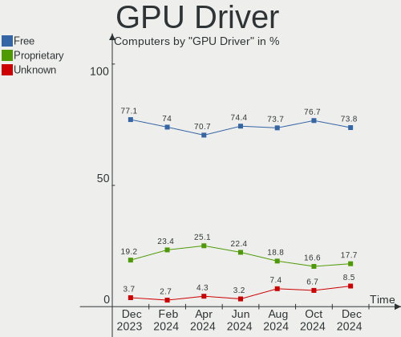
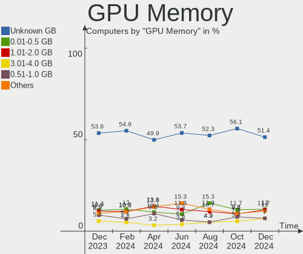
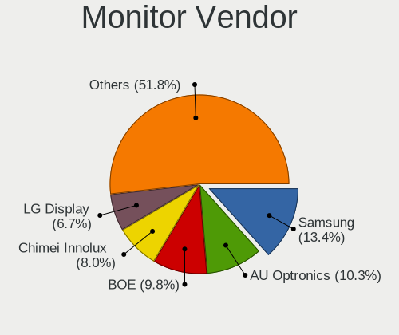
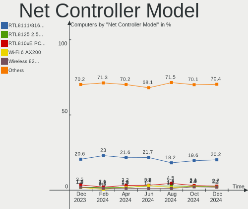
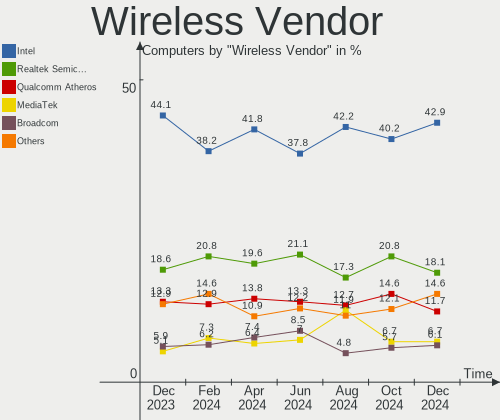
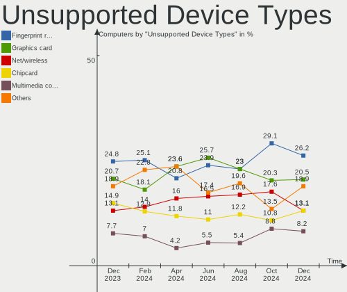

Linux Mint - Hardware Trends
----------------------------

A project to identify most popular hardware characteristics and track their change
over time based on data collected by Linux users at https://Linux-Hardware.org.

Anyone can contribute to this report by the [hw-probe](https://github.com/linuxhw/hw-probe) tool:

    sudo -E hw-probe -all -upload

This is a report for all computer types. See also reports for [desktops](/Dist/Linux_Mint/Desktop/README.md) and [notebooks](/Dist/Linux_Mint/Notebook/README.md).

This report is for one last month. Overall report since the beginning of time: [TestCoverage](https://github.com/linuxhw/TestCoverage)

Period: Dec, 2022.

Contents
--------

* [ System ](#system)
  - [ OS                       ](#os)
  - [ OS Family                ](#os-family)
  - [ Kernel                   ](#kernel)
  - [ Kernel Family            ](#kernel-family)
  - [ Kernel Major Ver.        ](#kernel-major-ver)
  - [ Arch                     ](#arch)
  - [ DE                       ](#de)
  - [ Display Server           ](#display-server)
  - [ Display Manager          ](#display-manager)
  - [ OS Lang                  ](#os-lang)
  - [ Boot Mode                ](#boot-mode)
  - [ Filesystem               ](#filesystem)
  - [ Part. scheme             ](#part-scheme)
  - [ Dual Boot with Linux/BSD ](#dual-boot-with-linuxbsd)
  - [ Dual Boot (Win)          ](#dual-boot-win)

* [ Board ](#board)
  - [ Vendor                   ](#vendor)
  - [ Model                    ](#model)
  - [ Model Family             ](#model-family)
  - [ MFG Year                 ](#mfg-year)
  - [ Form Factor              ](#form-factor)
  - [ Secure Boot              ](#secure-boot)
  - [ Coreboot                 ](#coreboot)
  - [ RAM Size                 ](#ram-size)
  - [ RAM Used                 ](#ram-used)
  - [ Total Drives             ](#total-drives)
  - [ Has CD-ROM               ](#has-cd-rom)
  - [ Has Ethernet             ](#has-ethernet)
  - [ Has WiFi                 ](#has-wifi)
  - [ Has Bluetooth            ](#has-bluetooth)

* [ Location ](#location)
  - [ Country                  ](#country)
  - [ City                     ](#city)

* [ Drives ](#drives)
  - [ Drive Vendor             ](#drive-vendor)
  - [ Drive Model              ](#drive-model)
  - [ HDD Vendor               ](#hdd-vendor)
  - [ SSD Vendor               ](#ssd-vendor)
  - [ Drive Kind               ](#drive-kind)
  - [ Drive Connector          ](#drive-connector)
  - [ Drive Size               ](#drive-size)
  - [ Space Total              ](#space-total)
  - [ Space Used               ](#space-used)
  - [ Malfunc. Drives          ](#malfunc-drives)
  - [ Malfunc. Drive Vendor    ](#malfunc-drive-vendor)
  - [ Malfunc. HDD Vendor      ](#malfunc-hdd-vendor)
  - [ Malfunc. Drive Kind      ](#malfunc-drive-kind)
  - [ Failed Drives            ](#failed-drives)
  - [ Failed Drive Vendor      ](#failed-drive-vendor)
  - [ Drive Status             ](#drive-status)

* [ Storage controller ](#storage-controller)
  - [ Storage Vendor           ](#storage-vendor)
  - [ Storage Model            ](#storage-model)
  - [ Storage Kind             ](#storage-kind)

* [ Processor ](#processor)
  - [ CPU Vendor               ](#cpu-vendor)
  - [ CPU Model                ](#cpu-model)
  - [ CPU Model Family         ](#cpu-model-family)
  - [ CPU Cores                ](#cpu-cores)
  - [ CPU Sockets              ](#cpu-sockets)
  - [ CPU Threads              ](#cpu-threads)
  - [ CPU Op-Modes             ](#cpu-op-modes)
  - [ CPU Microcode            ](#cpu-microcode)
  - [ CPU Microarch            ](#cpu-microarch)

* [ Graphics ](#graphics)
  - [ GPU Vendor               ](#gpu-vendor)
  - [ GPU Model                ](#gpu-model)
  - [ GPU Combo                ](#gpu-combo)
  - [ GPU Driver               ](#gpu-driver)
  - [ GPU Memory               ](#gpu-memory)

* [ Monitor ](#monitor)
  - [ Monitor Vendor           ](#monitor-vendor)
  - [ Monitor Model            ](#monitor-model)
  - [ Monitor Resolution       ](#monitor-resolution)
  - [ Monitor Diagonal         ](#monitor-diagonal)
  - [ Monitor Width            ](#monitor-width)
  - [ Aspect Ratio             ](#aspect-ratio)
  - [ Monitor Area             ](#monitor-area)
  - [ Pixel Density            ](#pixel-density)
  - [ Multiple Monitors        ](#multiple-monitors)

* [ Network ](#network)
  - [ Net Controller Vendor    ](#net-controller-vendor)
  - [ Net Controller Model     ](#net-controller-model)
  - [ Wireless Vendor          ](#wireless-vendor)
  - [ Wireless Model           ](#wireless-model)
  - [ Ethernet Vendor          ](#ethernet-vendor)
  - [ Ethernet Model           ](#ethernet-model)
  - [ Net Controller Kind      ](#net-controller-kind)
  - [ Used Controller          ](#used-controller)
  - [ NICs                     ](#nics)
  - [ IPv6                     ](#ipv6)

* [ Bluetooth ](#bluetooth)
  - [ Bluetooth Vendor         ](#bluetooth-vendor)
  - [ Bluetooth Model          ](#bluetooth-model)

* [ Sound ](#sound)
  - [ Sound Vendor             ](#sound-vendor)
  - [ Sound Model              ](#sound-model)

* [ Memory ](#memory)
  - [ Memory Vendor            ](#memory-vendor)
  - [ Memory Model             ](#memory-model)
  - [ Memory Kind              ](#memory-kind)
  - [ Memory Form Factor       ](#memory-form-factor)
  - [ Memory Size              ](#memory-size)
  - [ Memory Speed             ](#memory-speed)

* [ Printers & scanners ](#printers--scanners)
  - [ Printer Vendor           ](#printer-vendor)
  - [ Printer Model            ](#printer-model)
  - [ Scanner Vendor           ](#scanner-vendor)
  - [ Scanner Model            ](#scanner-model)

* [ Camera ](#camera)
  - [ Camera Vendor            ](#camera-vendor)
  - [ Camera Model             ](#camera-model)

* [ Security ](#security)
  - [ Fingerprint Vendor       ](#fingerprint-vendor)
  - [ Fingerprint Model        ](#fingerprint-model)
  - [ Chipcard Vendor          ](#chipcard-vendor)
  - [ Chipcard Model           ](#chipcard-model)

* [ Unsupported ](#unsupported)
  - [ Unsupported Devices      ](#unsupported-devices)
  - [ Unsupported Device Types ](#unsupported-device-types)

System
------

OS
--

Installed operating systems

| Name            | Computers | Percent |
|-----------------|-----------|---------|
| Linux Mint 21   | 278       | 51.67%  |
| Linux Mint 20.3 | 111       | 20.63%  |
| Linux Mint 21.1 | 107       | 19.89%  |
| Linux Mint 20.2 | 11        | 2.04%   |
| Linux Mint 19.3 | 11        | 2.04%   |
| Linux Mint 20.1 | 7         | 1.3%    |
| Linux Mint 20   | 7         | 1.3%    |
| Linux Mint 19.2 | 2         | 0.37%   |
| Linux Mint 19.1 | 2         | 0.37%   |
| Linux Mint 19   | 1         | 0.19%   |
| Linux Mint 18.3 | 1         | 0.19%   |

OS Family
---------

OS without a version

| Name       | Computers | Percent |
|------------|-----------|---------|
| Linux Mint | 538       | 100%    |

Kernel
------

Version of the Linux kernel

| Version                       | Computers | Percent |
|-------------------------------|-----------|---------|
| 5.15.0-56-generic             | 321       | 59.67%  |
| 5.4.0-135-generic             | 92        | 17.1%   |
| 5.15.0-41-generic             | 33        | 6.13%   |
| 5.15.0-53-generic             | 24        | 4.46%   |
| 5.4.0-91-generic              | 7         | 1.3%    |
| 5.4.0-132-generic             | 7         | 1.3%    |
| 5.14.0-1054-oem               | 6         | 1.12%   |
| 5.4.0-131-generic             | 5         | 0.93%   |
| 6.0.0-1007-oem                | 2         | 0.37%   |
| 5.4.0-74-generic              | 2         | 0.37%   |
| 5.17.0-1019-oem               | 2         | 0.37%   |
| 5.15.0-52-generic             | 2         | 0.37%   |
| 5.15.0-46-generic             | 2         | 0.37%   |
| 4.15.0-200-generic            | 2         | 0.37%   |
| 4.15.0-20-generic             | 2         | 0.37%   |
| 6.1.1-x64v3-xanmod1           | 1         | 0.19%   |
| 6.0.0-11.2-liquorix-amd64     | 1         | 0.19%   |
| 6.0.0-1008-oem                | 1         | 0.19%   |
| 6.0.0-10.1-liquorix-amd64     | 1         | 0.19%   |
| 6.0.0-060000-generic          | 1         | 0.19%   |
| 5.8.0-63-generic              | 1         | 0.19%   |
| 5.4.0-99-generic              | 1         | 0.19%   |
| 5.4.0-65-generic              | 1         | 0.19%   |
| 5.4.0-128-generic             | 1         | 0.19%   |
| 5.4.0-126-generic             | 1         | 0.19%   |
| 5.4.0-124-generic             | 1         | 0.19%   |
| 5.4.0-122-generic             | 1         | 0.19%   |
| 5.4.0-1132206031516-generic   | 1         | 0.19%   |
| 5.19.0-28-generic             | 1         | 0.19%   |
| 5.19.0-21-generic             | 1         | 0.19%   |
| 5.19.0-051900-generic         | 1         | 0.19%   |
| 5.17.0-051700-generic         | 1         | 0.19%   |
| 5.15.0-50-generic             | 1         | 0.19%   |
| 5.15.0-43-generic             | 1         | 0.19%   |
| 5.15.0-1021-intel-iotg        | 1         | 0.19%   |
| 5.15.0-1010-nvidia            | 1         | 0.19%   |
| 5.15.0-1007-nvidia-lowlatency | 1         | 0.19%   |
| 5.13.0-23-generic             | 1         | 0.19%   |
| 5.10.157                      | 1         | 0.19%   |
| 5.0.0-32-generic              | 1         | 0.19%   |

Kernel Family
-------------

Linux kernel without a distro release

| Version  | Computers | Percent |
|----------|-----------|---------|
| 5.15.0   | 387       | 71.93%  |
| 5.4.0    | 120       | 22.3%   |
| 4.15.0   | 7         | 1.3%    |
| 6.0.0    | 6         | 1.12%   |
| 5.14.0   | 6         | 1.12%   |
| 5.19.0   | 3         | 0.56%   |
| 5.17.0   | 3         | 0.56%   |
| 6.1.1    | 1         | 0.19%   |
| 5.8.0    | 1         | 0.19%   |
| 5.13.0   | 1         | 0.19%   |
| 5.10.157 | 1         | 0.19%   |
| 5.0.0    | 1         | 0.19%   |
| 4.10.0   | 1         | 0.19%   |

Kernel Major Ver.
-----------------

Linux kernel major version

| Version | Computers | Percent |
|---------|-----------|---------|
| 5.15    | 387       | 71.93%  |
| 5.4     | 120       | 22.3%   |
| 4.15    | 7         | 1.3%    |
| 6.0     | 6         | 1.12%   |
| 5.14    | 6         | 1.12%   |
| 5.19    | 3         | 0.56%   |
| 5.17    | 3         | 0.56%   |
| 6.1     | 1         | 0.19%   |
| 5.8     | 1         | 0.19%   |
| 5.13    | 1         | 0.19%   |
| 5.10    | 1         | 0.19%   |
| 5.0     | 1         | 0.19%   |
| 4.10    | 1         | 0.19%   |

Arch
----

OS architecture (x86_64, i586, etc.)

| Name   | Computers | Percent |
|--------|-----------|---------|
| x86_64 | 537       | 99.81%  |
| i686   | 1         | 0.19%   |

DE
--

Desktop Environment

| Name       | Computers | Percent |
|------------|-----------|---------|
| X-Cinnamon | 402       | 74.72%  |
| XFCE       | 67        | 12.45%  |
| MATE       | 48        | 8.92%   |
| Cinnamon   | 10        | 1.86%   |
| GNOME      | 7         | 1.3%    |
| KDE5       | 2         | 0.37%   |
| i3         | 1         | 0.19%   |
| Unknown    | 1         | 0.19%   |

Display Server
--------------

X11 or Wayland

| Name    | Computers | Percent |
|---------|-----------|---------|
| X11     | 536       | 99.63%  |
| Wayland | 1         | 0.19%   |
| Tty     | 1         | 0.19%   |

Display Manager
---------------

SDDM, LightDM, etc.

| Name    | Computers | Percent |
|---------|-----------|---------|
| Unknown | 271       | 50.37%  |
| LightDM | 259       | 48.14%  |
| GDM3    | 5         | 0.93%   |
| LXDM    | 2         | 0.37%   |
| GDM     | 1         | 0.19%   |

OS Lang
-------

Language

| Lang  | Computers | Percent |
|-------|-----------|---------|
| en_US | 182       | 33.83%  |
| de_DE | 75        | 13.94%  |
| pt_BR | 35        | 6.51%   |
| it_IT | 33        | 6.13%   |
| fr_FR | 25        | 4.65%   |
| en_GB | 21        | 3.9%    |
| ru_RU | 18        | 3.35%   |
| C     | 17        | 3.16%   |
| en_CA | 15        | 2.79%   |
| es_ES | 13        | 2.42%   |
| pl_PL | 11        | 2.04%   |
| es_MX | 7         | 1.3%    |
| hu_HU | 6         | 1.12%   |
| en_SG | 6         | 1.12%   |
| en_IN | 6         | 1.12%   |
| en_AU | 6         | 1.12%   |
| nl_NL | 5         | 0.93%   |
| pt_PT | 4         | 0.74%   |
| en_PH | 4         | 0.74%   |
| fr_CH | 3         | 0.56%   |
| en_NZ | 3         | 0.56%   |
| en_IE | 3         | 0.56%   |
| de_CH | 3         | 0.56%   |
| de_AT | 3         | 0.56%   |
| cs_CZ | 3         | 0.56%   |
| tr_TR | 2         | 0.37%   |
| sv_SE | 2         | 0.37%   |
| sr_RS | 2         | 0.37%   |
| ru_UA | 2         | 0.37%   |
| fr_CA | 2         | 0.37%   |
| fr_BE | 2         | 0.37%   |
| es_AR | 2         | 0.37%   |
| en_ZA | 2         | 0.37%   |
| da_DK | 2         | 0.37%   |
| zh_CN | 1         | 0.19%   |
| sl_SI | 1         | 0.19%   |
| nl_BE | 1         | 0.19%   |
| ja_JP | 1         | 0.19%   |
| id_ID | 1         | 0.19%   |
| es_NI | 1         | 0.19%   |

Boot Mode
---------

EFI or BIOS

| Mode | Computers | Percent |
|------|-----------|---------|
| EFI  | 342       | 63.57%  |
| BIOS | 196       | 36.43%  |

Filesystem
----------

Type of filesystem

| Type    | Computers | Percent |
|---------|-----------|---------|
| Ext4    | 512       | 95.17%  |
| Overlay | 15        | 2.79%   |
| Btrfs   | 5         | 0.93%   |
| Xfs     | 2         | 0.37%   |
| Ext2    | 2         | 0.37%   |
| Zfs     | 1         | 0.19%   |
| Ext3    | 1         | 0.19%   |

Part. scheme
------------

Scheme of partitioning

| Type    | Computers | Percent |
|---------|-----------|---------|
| Unknown | 271       | 50.37%  |
| GPT     | 224       | 41.64%  |
| MBR     | 43        | 7.99%   |

Dual Boot with Linux/BSD
------------------------

Hosting more than one Linux/BSD

| Dual boot | Computers | Percent |
|-----------|-----------|---------|
| No        | 502       | 93.31%  |
| Yes       | 36        | 6.69%   |

Dual Boot (Win)
---------------

Hosting Linux and Windows

| Dual boot | Computers | Percent |
|-----------|-----------|---------|
| No        | 432       | 80.3%   |
| Yes       | 106       | 19.7%   |

Board
-----

Vendor
------

Motherboard manufacturer

| Name                        | Computers | Percent |
|-----------------------------|-----------|---------|
| Hewlett-Packard             | 95        | 17.66%  |
| Lenovo                      | 82        | 15.24%  |
| ASUSTek Computer            | 73        | 13.57%  |
| Dell                        | 66        | 12.27%  |
| Acer                        | 34        | 6.32%   |
| Gigabyte Technology         | 31        | 5.76%   |
| MSI                         | 22        | 4.09%   |
| Apple                       | 15        | 2.79%   |
| ASRock                      | 13        | 2.42%   |
| Intel                       | 12        | 2.23%   |
| Google                      | 10        | 1.86%   |
| Samsung Electronics         | 7         | 1.3%    |
| Toshiba                     | 5         | 0.93%   |
| Unknown                     | 5         | 0.93%   |
| Sony                        | 4         | 0.74%   |
| Foxconn                     | 4         | 0.74%   |
| Packard Bell                | 3         | 0.56%   |
| HUAWEI                      | 3         | 0.56%   |
| GPU Company                 | 3         | 0.56%   |
| ECS                         | 3         | 0.56%   |
| AZW                         | 3         | 0.56%   |
| Multilaser                  | 2         | 0.37%   |
| LG Electronics              | 2         | 0.37%   |
| Fujitsu Siemens             | 2         | 0.37%   |
| Fujitsu                     | 2         | 0.37%   |
| Dynabook                    | 2         | 0.37%   |
| Chuwi                       | 2         | 0.37%   |
| Biostar                     | 2         | 0.37%   |
| AMI                         | 2         | 0.37%   |
| Acidanthera                 | 2         | 0.37%   |
| VXL                         | 1         | 0.19%   |
| UMAX                        | 1         | 0.19%   |
| TUXEDO                      | 1         | 0.19%   |
| TrekStor                    | 1         | 0.19%   |
| Supermicro                  | 1         | 0.19%   |
| Shenzhen Wangang Technology | 1         | 0.19%   |
| SGIN                        | 1         | 0.19%   |
| Schenker                    | 1         | 0.19%   |
| QIYIDA                      | 1         | 0.19%   |
| Positivo                    | 1         | 0.19%   |

Model
-----

Motherboard model

| Name                                 | Computers | Percent |
|--------------------------------------|-----------|---------|
| Unknown                              | 7         | 1.3%    |
| HP Pavilion g6                       | 3         | 0.56%   |
| HP EliteBook 820 G3                  | 3         | 0.56%   |
| Gigabyte GA-78LMT-USB3               | 3         | 0.56%   |
| Foxconn Pro 3330 MT                  | 3         | 0.56%   |
| MSI MS-7C94                          | 2         | 0.37%   |
| Lenovo IdeaPad 3 17ABA7 82RQ         | 2         | 0.37%   |
| Intel X99                            | 2         | 0.37%   |
| HP Pavilion Gaming Desktop TG01-0xxx | 2         | 0.37%   |
| HP Notebook                          | 2         | 0.37%   |
| HP Laptop 15s-fq2xxx                 | 2         | 0.37%   |
| HP ENVY Notebook                     | 2         | 0.37%   |
| HP EliteBook 840 G1                  | 2         | 0.37%   |
| HP Compaq Pro 6300 SFF               | 2         | 0.37%   |
| HP Compaq 6730s                      | 2         | 0.37%   |
| HP Compaq 6005 Pro SFF PC            | 2         | 0.37%   |
| HP 250 G8 Notebook PC                | 2         | 0.37%   |
| GPU Company GWTC116-2                | 2         | 0.37%   |
| Google Chell                         | 2         | 0.37%   |
| Google Blooglet                      | 2         | 0.37%   |
| Gigabyte B85M-D3H                    | 2         | 0.37%   |
| Gigabyte A320M-H                     | 2         | 0.37%   |
| Dell OptiPlex 780                    | 2         | 0.37%   |
| Dell OptiPlex 7010                   | 2         | 0.37%   |
| Dell OptiPlex 380                    | 2         | 0.37%   |
| Dell OptiPlex 3050                   | 2         | 0.37%   |
| Dell OptiPlex 3020                   | 2         | 0.37%   |
| Dell OptiPlex 3010                   | 2         | 0.37%   |
| Dell Latitude E6440                  | 2         | 0.37%   |
| Dell Latitude E6430                  | 2         | 0.37%   |
| Dell Latitude E6420                  | 2         | 0.37%   |
| Dell Latitude E6410                  | 2         | 0.37%   |
| Dell Inspiron 7720                   | 2         | 0.37%   |
| Dell Inspiron 560                    | 2         | 0.37%   |
| ASUS X750JN                          | 2         | 0.37%   |
| ASUS TUF Gaming X570-PLUS            | 2         | 0.37%   |
| ASUS ROG STRIX Z370-E GAMING         | 2         | 0.37%   |
| ASUS N55SF                           | 2         | 0.37%   |
| ASUS M4A89GTD-PRO/USB3               | 2         | 0.37%   |
| ASUS All Series                      | 2         | 0.37%   |

Model Family
------------

Motherboard model prefix

| Name                   | Computers | Percent |
|------------------------|-----------|---------|
| Lenovo ThinkPad        | 33        | 6.13%   |
| Dell Latitude          | 24        | 4.46%   |
| Acer Aspire            | 24        | 4.46%   |
| Lenovo IdeaPad         | 20        | 3.72%   |
| HP Pavilion            | 18        | 3.35%   |
| Dell Inspiron          | 18        | 3.35%   |
| HP EliteBook           | 16        | 2.97%   |
| Dell OptiPlex          | 13        | 2.42%   |
| HP Compaq              | 11        | 2.04%   |
| HP Laptop              | 10        | 1.86%   |
| ASUS ROG               | 7         | 1.3%    |
| Unknown                | 7         | 1.3%    |
| Lenovo ThinkCentre     | 6         | 1.12%   |
| ASUS PRIME             | 6         | 1.12%   |
| Toshiba Satellite      | 5         | 0.93%   |
| HP ProDesk             | 5         | 0.93%   |
| ASUS VivoBook          | 5         | 0.93%   |
| Lenovo Yoga            | 4         | 0.74%   |
| HP ProBook             | 4         | 0.74%   |
| HP EliteDesk           | 4         | 0.74%   |
| ASUS TUF               | 4         | 0.74%   |
| Acer Swift             | 4         | 0.74%   |
| Lenovo Legion          | 3         | 0.56%   |
| Intel X99              | 3         | 0.56%   |
| HP ZBook               | 3         | 0.56%   |
| HP Stream              | 3         | 0.56%   |
| HP Spectre             | 3         | 0.56%   |
| Gigabyte GA-78LMT-USB3 | 3         | 0.56%   |
| Foxconn Pro            | 3         | 0.56%   |
| ASUS Zenbook           | 3         | 0.56%   |
| Packard Bell EasyNote  | 2         | 0.37%   |
| MSI MS-7C94            | 2         | 0.37%   |
| Lenovo ThinkBook       | 2         | 0.37%   |
| HP ProLiant            | 2         | 0.37%   |
| HP Notebook            | 2         | 0.37%   |
| HP ENVY                | 2         | 0.37%   |
| HP 250                 | 2         | 0.37%   |
| GPU Company GWTC116-2  | 2         | 0.37%   |
| Google Chell           | 2         | 0.37%   |
| Google Blooglet        | 2         | 0.37%   |

MFG Year
--------

Motherboard manufacture year

| Year | Computers | Percent |
|------|-----------|---------|
| 2012 | 54        | 10.04%  |
| 2021 | 49        | 9.11%   |
| 2011 | 46        | 8.55%   |
| 2019 | 41        | 7.62%   |
| 2020 | 38        | 7.06%   |
| 2022 | 37        | 6.88%   |
| 2013 | 34        | 6.32%   |
| 2018 | 32        | 5.95%   |
| 2017 | 32        | 5.95%   |
| 2016 | 32        | 5.95%   |
| 2010 | 31        | 5.76%   |
| 2014 | 29        | 5.39%   |
| 2015 | 25        | 4.65%   |
| 2009 | 24        | 4.46%   |
| 2008 | 15        | 2.79%   |
| 2007 | 11        | 2.04%   |
| 2006 | 7         | 1.3%    |
| 2005 | 1         | 0.19%   |

Form Factor
-----------

Physical design of the computer

| Name        | Computers | Percent |
|-------------|-----------|---------|
| Notebook    | 314       | 58.36%  |
| Desktop     | 188       | 34.94%  |
| Convertible | 15        | 2.79%   |
| All in one  | 12        | 2.23%   |
| Mini pc     | 5         | 0.93%   |
| Tablet      | 3         | 0.56%   |
| Server      | 1         | 0.19%   |

Secure Boot
-----------

Enabled or disabled

| State    | Computers | Percent |
|----------|-----------|---------|
| Disabled | 474       | 88.1%   |
| Enabled  | 64        | 11.9%   |

Coreboot
--------

Have coreboot on board

| Used | Computers | Percent |
|------|-----------|---------|
| No   | 528       | 98.14%  |
| Yes  | 10        | 1.86%   |

RAM Size
--------

Total RAM memory

| Size in GB  | Computers | Percent |
|-------------|-----------|---------|
| 4.01-8.0    | 141       | 26.21%  |
| 16.01-24.0  | 113       | 21%     |
| 3.01-4.0    | 106       | 19.7%   |
| 8.01-16.0   | 90        | 16.73%  |
| 32.01-64.0  | 38        | 7.06%   |
| 1.01-2.0    | 22        | 4.09%   |
| 64.01-256.0 | 10        | 1.86%   |
| 24.01-32.0  | 9         | 1.67%   |
| 2.01-3.0    | 8         | 1.49%   |
| 0.51-1.0    | 1         | 0.19%   |

RAM Used
--------

Used RAM memory

| Used GB    | Computers | Percent |
|------------|-----------|---------|
| 1.01-2.0   | 202       | 37.55%  |
| 2.01-3.0   | 159       | 29.55%  |
| 3.01-4.0   | 88        | 16.36%  |
| 4.01-8.0   | 48        | 8.92%   |
| 0.51-1.0   | 22        | 4.09%   |
| 8.01-16.0  | 16        | 2.97%   |
| 16.01-24.0 | 3         | 0.56%   |

Total Drives
------------

Number of drives on board

| Drives | Computers | Percent |
|--------|-----------|---------|
| 1      | 331       | 61.52%  |
| 2      | 138       | 25.65%  |
| 3      | 37        | 6.88%   |
| 4      | 19        | 3.53%   |
| 5      | 9         | 1.67%   |
| 6      | 3         | 0.56%   |
| 8      | 1         | 0.19%   |

Has CD-ROM
----------

Has CD-ROM on board

| Presented | Computers | Percent |
|-----------|-----------|---------|
| No        | 316       | 58.74%  |
| Yes       | 222       | 41.26%  |

Has Ethernet
------------

Has Ethernet on board

| Presented | Computers | Percent |
|-----------|-----------|---------|
| Yes       | 460       | 85.5%   |
| No        | 78        | 14.5%   |

Has WiFi
--------

Has WiFi module

| Presented | Computers | Percent |
|-----------|-----------|---------|
| Yes       | 445       | 82.71%  |
| No        | 93        | 17.29%  |

Has Bluetooth
-------------

Has Bluetooth module

| Presented | Computers | Percent |
|-----------|-----------|---------|
| Yes       | 344       | 63.94%  |
| No        | 194       | 36.06%  |

Location
--------

Country
-------

Geographic location (country)

| Country                | Computers | Percent |
|------------------------|-----------|---------|
| USA                    | 103       | 19.14%  |
| Germany                | 79        | 14.68%  |
| Italy                  | 41        | 7.62%   |
| Brazil                 | 40        | 7.43%   |
| France                 | 27        | 5.02%   |
| Russia                 | 22        | 4.09%   |
| UK                     | 21        | 3.9%    |
| Canada                 | 21        | 3.9%    |
| Spain                  | 17        | 3.16%   |
| Poland                 | 14        | 2.6%    |
| Netherlands            | 10        | 1.86%   |
| Switzerland            | 9         | 1.67%   |
| Hungary                | 8         | 1.49%   |
| Mexico                 | 7         | 1.3%    |
| India                  | 7         | 1.3%    |
| Belgium                | 7         | 1.3%    |
| Austria                | 7         | 1.3%    |
| Sweden                 | 6         | 1.12%   |
| Singapore              | 6         | 1.12%   |
| Czechia                | 6         | 1.12%   |
| Australia              | 6         | 1.12%   |
| Denmark                | 5         | 0.93%   |
| Slovakia               | 4         | 0.74%   |
| Greece                 | 4         | 0.74%   |
| Ukraine                | 3         | 0.56%   |
| Portugal               | 3         | 0.56%   |
| Philippines            | 3         | 0.56%   |
| New Zealand            | 3         | 0.56%   |
| Ireland                | 3         | 0.56%   |
| Indonesia              | 3         | 0.56%   |
| Argentina              | 3         | 0.56%   |
| Vietnam                | 2         | 0.37%   |
| Turkey                 | 2         | 0.37%   |
| South Africa           | 2         | 0.37%   |
| Malaysia               | 2         | 0.37%   |
| Finland                | 2         | 0.37%   |
| Cyprus                 | 2         | 0.37%   |
| Bosnia and Herzegovina | 2         | 0.37%   |
| UAE                    | 1         | 0.19%   |
| Thailand               | 1         | 0.19%   |

City
----

Geographic location (city)

| City                 | Computers | Percent |
|----------------------|-----------|---------|
| Berlin               | 10        | 1.86%   |
| Hamburg              | 8         | 1.49%   |
| Moscow               | 7         | 1.3%    |
| Seattle              | 4         | 0.74%   |
| Madrid               | 4         | 0.74%   |
| London               | 4         | 0.74%   |
| Kampong Pasir Ris    | 4         | 0.74%   |
| Frankfurt am Main    | 4         | 0.74%   |
| Chicago              | 4         | 0.74%   |
| Budapest             | 4         | 0.74%   |
| Zurich               | 3         | 0.56%   |
| Warsaw               | 3         | 0.56%   |
| Vienna               | 3         | 0.56%   |
| Victoria             | 3         | 0.56%   |
| Stockholm            | 3         | 0.56%   |
| St Petersburg        | 3         | 0.56%   |
| Rome                 | 3         | 0.56%   |
| Paris                | 3         | 0.56%   |
| Milan                | 3         | 0.56%   |
| Miami                | 3         | 0.56%   |
| Katowice             | 3         | 0.56%   |
| Gudensberg           | 3         | 0.56%   |
| Dallas               | 3         | 0.56%   |
| Bratislava           | 3         | 0.56%   |
| Witten               | 2         | 0.37%   |
| Valencia             | 2         | 0.37%   |
| Turin                | 2         | 0.37%   |
| Tilburg              | 2         | 0.37%   |
| Thornhill            | 2         | 0.37%   |
| St Louis             | 2         | 0.37%   |
| Springfield          | 2         | 0.37%   |
| Singapore            | 2         | 0.37%   |
| Settimo Torinese     | 2         | 0.37%   |
| Sao Paulo            | 2         | 0.37%   |
| Sao José dos Campos | 2         | 0.37%   |
| Salzburg             | 2         | 0.37%   |
| Rio de Janeiro       | 2         | 0.37%   |
| Raleigh              | 2         | 0.37%   |
| Pisa                 | 2         | 0.37%   |
| Nicosia              | 2         | 0.37%   |

Drives
------

Drive Vendor
------------

Hard drive vendors

| Vendor                      | Computers | Drives | Percent |
|-----------------------------|-----------|--------|---------|
| WDC                         | 110       | 132    | 13.91%  |
| Samsung Electronics         | 108       | 117    | 13.65%  |
| Seagate                     | 98        | 110    | 12.39%  |
| Unknown                     | 52        | 58     | 6.57%   |
| Kingston                    | 48        | 50     | 6.07%   |
| Toshiba                     | 39        | 41     | 4.93%   |
| Sandisk                     | 39        | 40     | 4.93%   |
| Crucial                     | 39        | 45     | 4.93%   |
| Hitachi                     | 23        | 23     | 2.91%   |
| Micron Technology           | 19        | 19     | 2.4%    |
| Intel                       | 17        | 19     | 2.15%   |
| SK hynix                    | 16        | 16     | 2.02%   |
| China                       | 16        | 17     | 2.02%   |
| A-DATA Technology           | 13        | 13     | 1.64%   |
| HGST                        | 11        | 11     | 1.39%   |
| KIOXIA                      | 9         | 9      | 1.14%   |
| Phison Electronics          | 7         | 9      | 0.88%   |
| Transcend                   | 6         | 6      | 0.76%   |
| Intenso                     | 6         | 6      | 0.76%   |
| PNY                         | 5         | 5      | 0.63%   |
| OCZ                         | 5         | 5      | 0.63%   |
| Maxtor                      | 5         | 6      | 0.63%   |
| Fujitsu                     | 5         | 5      | 0.63%   |
| Netac                       | 4         | 5      | 0.51%   |
| Unknown                     | 4         | 4      | 0.51%   |
| SPCC                        | 3         | 3      | 0.38%   |
| Silicon Motion              | 3         | 3      | 0.38%   |
| Phison                      | 3         | 3      | 0.38%   |
| NGFF                        | 3         | 3      | 0.38%   |
| Micron/Crucial Technology   | 3         | 3      | 0.38%   |
| Kingston Technology Company | 3         | 3      | 0.38%   |
| JMicron Technology          | 3         | 3      | 0.38%   |
| GOODRAM                     | 3         | 3      | 0.38%   |
| FORESEE                     | 3         | 3      | 0.38%   |
| Apple                       | 3         | 4      | 0.38%   |
| SABRENT                     | 2         | 2      | 0.25%   |
| Realtek Semiconductor       | 2         | 2      | 0.25%   |
| Patriot                     | 2         | 2      | 0.25%   |
| MaxDigital                  | 2         | 2      | 0.25%   |
| LITEONIT                    | 2         | 2      | 0.25%   |

Drive Model
-----------

Hard drive models

| Model                                               | Computers | Percent |
|-----------------------------------------------------|-----------|---------|
| Kingston SA400S37240G 240GB SSD                     | 17        | 2.02%   |
| Unknown MMC Card  32GB                              | 13        | 1.55%   |
| Unknown MMC Card  64GB                              | 9         | 1.07%   |
| WDC WD10EZEX-08WN4A0 1TB                            | 6         | 0.71%   |
| Unknown MMC Card  128GB                             | 6         | 0.71%   |
| Samsung SSD 860 EVO 1TB                             | 6         | 0.71%   |
| Samsung SSD 850 EVO 250GB                           | 6         | 0.71%   |
| Samsung NVMe SSD Controller SM981/PM981/PM983 500GB | 6         | 0.71%   |
| Kingston SA400S37480G 480GB SSD                     | 6         | 0.71%   |
| WDC WDS240G2G0A-00JH30 240GB SSD                    | 5         | 0.6%    |
| Toshiba MQ01ABF050 500GB                            | 5         | 0.6%    |
| Toshiba DT01ACA100 1TB                              | 5         | 0.6%    |
| Seagate ST9500325AS 500GB                           | 5         | 0.6%    |
| Seagate ST500DM002-1BD142 500GB                     | 5         | 0.6%    |
| Seagate ST3500418AS 500GB                           | 5         | 0.6%    |
| Seagate ST1000LM024 HN-M101MBB 1TB                  | 5         | 0.6%    |
| SanDisk SSD PLUS 1000GB                             | 5         | 0.6%    |
| Crucial CT1000MX500SSD1 1TB                         | 5         | 0.6%    |
| WDC PC SN530 SDBPMPZ-512G-1101 512GB                | 4         | 0.48%   |
| Unknown SD/MMC/MS PRO 64GB                          | 4         | 0.48%   |
| Seagate ST2000DM008-2FR102 2TB                      | 4         | 0.48%   |
| Seagate ST1000LM035-1RK172 1TB                      | 4         | 0.48%   |
| Samsung SSD 860 EVO 500GB                           | 4         | 0.48%   |
| Samsung SSD 850 EVO 500GB                           | 4         | 0.48%   |
| Samsung SSD 840 EVO 250GB                           | 4         | 0.48%   |
| Phison PS5013 E13 NVMe Controller 512GB             | 4         | 0.48%   |
| Kingston SA400S37120G 120GB SSD                     | 4         | 0.48%   |
| Intel SSD 660P Series 1024GB                        | 4         | 0.48%   |
| Crucial CT500MX500SSD1 500GB                        | 4         | 0.48%   |
| Crucial CT480BX500SSD1 480GB                        | 4         | 0.48%   |
| Crucial CT250MX500SSD1 250GB                        | 4         | 0.48%   |
| Unknown                                             | 4         | 0.48%   |
| WDC WDS500G2B0A-00SM50 500GB SSD                    | 3         | 0.36%   |
| WDC WD5000LPVX-22V0TT0 500GB                        | 3         | 0.36%   |
| WDC WD5000AAKX-60U6AA0 500GB                        | 3         | 0.36%   |
| WDC WD20EFRX-68EUZN0 2TB                            | 3         | 0.36%   |
| Unknown MMC Card  16GB                              | 3         | 0.36%   |
| Toshiba XG6 NVMe SSD Controller 256GB               | 3         | 0.36%   |
| Seagate ST3500413AS 500GB                           | 3         | 0.36%   |
| Seagate ST2000DM006-2DM164 2TB                      | 3         | 0.36%   |

HDD Vendor
----------

Hard disk drive vendors

| Vendor              | Computers | Drives | Percent |
|---------------------|-----------|--------|---------|
| Seagate             | 95        | 107    | 34.55%  |
| WDC                 | 84        | 104    | 30.55%  |
| Toshiba             | 31        | 32     | 11.27%  |
| Hitachi             | 23        | 23     | 8.36%   |
| Samsung Electronics | 12        | 12     | 4.36%   |
| HGST                | 11        | 11     | 4%      |
| Maxtor              | 5         | 6      | 1.82%   |
| Fujitsu             | 5         | 5      | 1.82%   |
| Unknown             | 4         | 4      | 1.45%   |
| USB 3.0             | 1         | 1      | 0.36%   |
| JMicron Technology  | 1         | 1      | 0.36%   |
| Intenso             | 1         | 1      | 0.36%   |
| ASMT                | 1         | 2      | 0.36%   |
| Apple               | 1         | 1      | 0.36%   |

SSD Vendor
----------

Solid state drive vendors

| Vendor              | Computers | Drives | Percent |
|---------------------|-----------|--------|---------|
| Samsung Electronics | 55        | 57     | 18.46%  |
| Kingston            | 40        | 42     | 13.42%  |
| Crucial             | 35        | 40     | 11.74%  |
| SanDisk             | 28        | 29     | 9.4%    |
| China               | 16        | 17     | 5.37%   |
| WDC                 | 13        | 13     | 4.36%   |
| A-DATA Technology   | 11        | 11     | 3.69%   |
| Micron Technology   | 9         | 9      | 3.02%   |
| Transcend           | 5         | 5      | 1.68%   |
| SK hynix            | 5         | 5      | 1.68%   |
| PNY                 | 5         | 5      | 1.68%   |
| OCZ                 | 5         | 5      | 1.68%   |
| Intel               | 5         | 5      | 1.68%   |
| Netac               | 4         | 5      | 1.34%   |
| Toshiba             | 3         | 3      | 1.01%   |
| SPCC                | 3         | 3      | 1.01%   |
| NGFF                | 3         | 3      | 1.01%   |
| Intenso             | 3         | 3      | 1.01%   |
| GOODRAM             | 3         | 3      | 1.01%   |
| Apple               | 3         | 3      | 1.01%   |
| Patriot             | 2         | 2      | 0.67%   |
| LITEONIT            | 2         | 2      | 0.67%   |
| Lexar               | 2         | 2      | 0.67%   |
| KingSpec            | 2         | 2      | 0.67%   |
| KingFast            | 2         | 2      | 0.67%   |
| Inland              | 2         | 2      | 0.67%   |
| FORESEE             | 2         | 2      | 0.67%   |
| Apacer              | 2         | 2      | 0.67%   |
| AMD                 | 2         | 2      | 0.67%   |
| YS                  | 1         | 1      | 0.34%   |
| Unknown             | 1         | 1      | 0.34%   |
| TSA                 | 1         | 1      | 0.34%   |
| TrekStor            | 1         | 1      | 0.34%   |
| TO Exter            | 1         | 1      | 0.34%   |
| Team                | 1         | 1      | 0.34%   |
| STAR                | 1         | 1      | 0.34%   |
| SMI                 | 1         | 1      | 0.34%   |
| Seagate             | 1         | 1      | 0.34%   |
| Ramsta              | 1         | 1      | 0.34%   |
| Plextor             | 1         | 1      | 0.34%   |

Drive Kind
----------

HDD or SSD

| Kind    | Computers | Drives | Percent |
|---------|-----------|--------|---------|
| SSD     | 260       | 310    | 36.78%  |
| HDD     | 234       | 310    | 33.1%   |
| NVMe    | 148       | 171    | 20.93%  |
| MMC     | 47        | 50     | 6.65%   |
| Unknown | 18        | 21     | 2.55%   |

Drive Connector
---------------

SATA, SAS, NVMe, etc.

| Type | Computers | Drives | Percent |
|------|-----------|--------|---------|
| SATA | 410       | 608    | 64.87%  |
| NVMe | 146       | 168    | 23.1%   |
| MMC  | 47        | 50     | 7.44%   |
| SAS  | 29        | 36     | 4.59%   |

Drive Size
----------

Size of hard drive

| Size in TB | Computers | Drives | Percent |
|------------|-----------|--------|---------|
| 0.01-0.5   | 323       | 402    | 64.09%  |
| 0.51-1.0   | 126       | 146    | 25%     |
| 1.01-2.0   | 33        | 48     | 6.55%   |
| 4.01-10.0  | 10        | 11     | 1.98%   |
| 3.01-4.0   | 8         | 8      | 1.59%   |
| 2.01-3.0   | 4         | 5      | 0.79%   |

Space Total
-----------

Amount of disk space available on the file system

| Size in GB     | Computers | Percent |
|----------------|-----------|---------|
| 101-250        | 185       | 34.39%  |
| 251-500        | 137       | 25.46%  |
| 501-1000       | 75        | 13.94%  |
| 1001-2000      | 38        | 7.06%   |
| 51-100         | 34        | 6.32%   |
| More than 3000 | 25        | 4.65%   |
| 21-50          | 21        | 3.9%    |
| 1-20           | 15        | 2.79%   |
| 2001-3000      | 8         | 1.49%   |

Space Used
----------

Amount of used disk space

| Used GB        | Computers | Percent |
|----------------|-----------|---------|
| 1-20           | 141       | 26.21%  |
| 21-50          | 107       | 19.89%  |
| 51-100         | 96        | 17.84%  |
| 101-250        | 89        | 16.54%  |
| 251-500        | 46        | 8.55%   |
| 501-1000       | 28        | 5.2%    |
| 1001-2000      | 16        | 2.97%   |
| More than 3000 | 11        | 2.04%   |
| 2001-3000      | 4         | 0.74%   |

Malfunc. Drives
---------------

Drive models with a malfunction

| Model                                               | Computers | Drives | Percent |
|-----------------------------------------------------|-----------|--------|---------|
| WDC WDS240G2G0A-00JH30 240GB SSD                    | 2         | 2      | 4.44%   |
| Seagate ST9500325AS 500GB                           | 2         | 2      | 4.44%   |
| Seagate ST500LT012-9WS142 500GB                     | 2         | 2      | 4.44%   |
| Seagate ST1000DM003-1ER162 1TB                      | 2         | 2      | 4.44%   |
| WDC WD5000AAKX-60U6AA0 500GB                        | 1         | 1      | 2.22%   |
| WDC WD5000AAKX-001CA0 500GB                         | 1         | 2      | 2.22%   |
| WDC WD2500BJKT-75F4T0 250GB                         | 1         | 1      | 2.22%   |
| WDC WD10EZEX-22RKKA0 1TB                            | 1         | 1      | 2.22%   |
| Toshiba MQ01ABC150 1TB                              | 1         | 1      | 2.22%   |
| Toshiba HDWD110 1TB                                 | 1         | 1      | 2.22%   |
| SPCC Solid State Disk 512GB                         | 1         | 1      | 2.22%   |
| Seagate ST9500423AS 500GB                           | 1         | 1      | 2.22%   |
| Seagate ST9320423AS 320GB                           | 1         | 1      | 2.22%   |
| Seagate ST9160314AS 160GB                           | 1         | 1      | 2.22%   |
| Seagate ST3500418AS 500GB                           | 1         | 1      | 2.22%   |
| Seagate ST3320310CS 320GB                           | 1         | 1      | 2.22%   |
| Seagate ST2000LM007-1R8174 2TB                      | 1         | 1      | 2.22%   |
| Seagate ST1500DL003-9VT16L 1TB                      | 1         | 1      | 2.22%   |
| Seagate ST1000LX015-1U7172 1TB                      | 1         | 1      | 2.22%   |
| Seagate ST1000LM048-2E7172 1TB                      | 1         | 1      | 2.22%   |
| Seagate ST1000LM035-1RK172 1TB                      | 1         | 1      | 2.22%   |
| Seagate ST1000LM024 HN-M101MBB 1TB                  | 1         | 1      | 2.22%   |
| SanDisk SSD PLUS 240GB                              | 1         | 1      | 2.22%   |
| SanDisk SD6PP4M-256G-1006 256GB SSD                 | 1         | 1      | 2.22%   |
| Samsung Electronics HN-M500MBB 500GB                | 1         | 1      | 2.22%   |
| Samsung Electronics HM160HC 160GB                   | 1         | 1      | 2.22%   |
| Samsung Electronics HD322HJ 320GB                   | 1         | 1      | 2.22%   |
| Micron Technology MTFDDAV256TDL-1AW1ZABHA 256GB SSD | 1         | 1      | 2.22%   |
| Maxtor STM3320613AS 320GB                           | 1         | 2      | 2.22%   |
| Maxtor 6Y160M0 160GB                                | 1         | 1      | 2.22%   |
| Kingston SA400S37480G 480GB SSD                     | 1         | 1      | 2.22%   |
| Kingston RBU-SNS8350DES3128GP 128GB SSD             | 1         | 1      | 2.22%   |
| KingSpec ACSC2M256mSA 256GB SSD                     | 1         | 1      | 2.22%   |
| Intel SSDSC2BW180H6 180GB                           | 1         | 1      | 2.22%   |
| Intel SSDSC2BF180A4L 180GB                          | 1         | 1      | 2.22%   |
| Hitachi HTS721060G9SA00 64GB                        | 1         | 1      | 2.22%   |
| Hitachi HTS543216L9SA00 160GB                       | 1         | 1      | 2.22%   |
| HGST HTS545050A7E380 500GB                          | 1         | 1      | 2.22%   |
| Crucial CT275MX300SSD1 275GB                        | 1         | 1      | 2.22%   |
| Crucial CT1050MX300SSD1 1TB                         | 1         | 1      | 2.22%   |

Malfunc. Drive Vendor
---------------------

Vendors of faulty drives

| Vendor              | Computers | Drives | Percent |
|---------------------|-----------|--------|---------|
| Seagate             | 17        | 17     | 37.78%  |
| WDC                 | 6         | 7      | 13.33%  |
| Samsung Electronics | 3         | 3      | 6.67%   |
| Toshiba             | 2         | 2      | 4.44%   |
| SanDisk             | 2         | 2      | 4.44%   |
| Maxtor              | 2         | 3      | 4.44%   |
| Kingston            | 2         | 2      | 4.44%   |
| Intel               | 2         | 2      | 4.44%   |
| Hitachi             | 2         | 2      | 4.44%   |
| Crucial             | 2         | 2      | 4.44%   |
| SPCC                | 1         | 1      | 2.22%   |
| Micron Technology   | 1         | 1      | 2.22%   |
| KingSpec            | 1         | 1      | 2.22%   |
| HGST                | 1         | 1      | 2.22%   |
| China               | 1         | 1      | 2.22%   |

Malfunc. HDD Vendor
-------------------

Vendors of faulty HDD drives

| Vendor              | Computers | Drives | Percent |
|---------------------|-----------|--------|---------|
| Seagate             | 17        | 17     | 54.84%  |
| WDC                 | 4         | 5      | 12.9%   |
| Samsung Electronics | 3         | 3      | 9.68%   |
| Toshiba             | 2         | 2      | 6.45%   |
| Maxtor              | 2         | 3      | 6.45%   |
| Hitachi             | 2         | 2      | 6.45%   |
| HGST                | 1         | 1      | 3.23%   |

Malfunc. Drive Kind
-------------------

Kinds of faulty drives

| Kind | Computers | Drives | Percent |
|------|-----------|--------|---------|
| HDD  | 30        | 33     | 68.18%  |
| SSD  | 14        | 14     | 31.82%  |

Failed Drives
-------------

Failed drive models

Zero info for selected period =(

Failed Drive Vendor
-------------------

Failed drive vendors

Zero info for selected period =(

Drive Status
------------

Number of failed and malfunc. drives

| Status   | Computers | Drives | Percent |
|----------|-----------|--------|---------|
| Detected | 319       | 518    | 56.06%  |
| Works    | 207       | 297    | 36.38%  |
| Malfunc  | 43        | 47     | 7.56%   |

Storage controller
------------------

Storage Vendor
--------------

Storage controller vendors

| Vendor                           | Computers | Percent |
|----------------------------------|-----------|---------|
| Intel                            | 367       | 56.29%  |
| AMD                              | 93        | 14.26%  |
| Samsung Electronics              | 45        | 6.9%    |
| SanDisk                          | 26        | 3.99%   |
| Nvidia                           | 13        | 1.99%   |
| Phison Electronics               | 11        | 1.69%   |
| Micron Technology                | 11        | 1.69%   |
| Kingston Technology Company      | 11        | 1.69%   |
| SK hynix                         | 10        | 1.53%   |
| KIOXIA                           | 9         | 1.38%   |
| ASMedia Technology               | 8         | 1.23%   |
| Micron/Crucial Technology        | 7         | 1.07%   |
| Marvell Technology Group         | 7         | 1.07%   |
| JMicron Technology               | 7         | 1.07%   |
| Toshiba America Info Systems     | 6         | 0.92%   |
| VIA Technologies                 | 3         | 0.46%   |
| Silicon Motion                   | 3         | 0.46%   |
| Realtek Semiconductor            | 3         | 0.46%   |
| Union Memory (Shenzhen)          | 2         | 0.31%   |
| Hewlett-Packard                  | 2         | 0.31%   |
| Yangtze Memory Technologies      | 1         | 0.15%   |
| Transcend                        | 1         | 0.15%   |
| Solid State Storage Technology   | 1         | 0.15%   |
| Silicon Integrated Systems [SiS] | 1         | 0.15%   |
| Shenzhen Longsys Electronics     | 1         | 0.15%   |
| Integrated Technology Express    | 1         | 0.15%   |
| ADATA Technology                 | 1         | 0.15%   |
| Adaptec                          | 1         | 0.15%   |

Storage Model
-------------

Storage controller models

| Model                                                                                   | Computers | Percent |
|-----------------------------------------------------------------------------------------|-----------|---------|
| AMD FCH SATA Controller [AHCI mode]                                                     | 47        | 6.22%   |
| Intel 8 Series/C220 Series Chipset Family 6-port SATA Controller 1 [AHCI mode]          | 30        | 3.97%   |
| Intel Sunrise Point-LP SATA Controller [AHCI mode]                                      | 27        | 3.57%   |
| Intel 82801 Mobile SATA Controller [RAID mode]                                          | 27        | 3.57%   |
| Intel 7 Series Chipset Family 6-port SATA Controller [AHCI mode]                        | 23        | 3.04%   |
| Intel Volume Management Device NVMe RAID Controller                                     | 18        | 2.38%   |
| Intel Celeron/Pentium Silver Processor SATA Controller                                  | 18        | 2.38%   |
| AMD SB7x0/SB8x0/SB9x0 IDE Controller                                                    | 18        | 2.38%   |
| Samsung NVMe SSD Controller SM981/PM981/PM983                                           | 17        | 2.25%   |
| Intel 6 Series/C200 Series Chipset Family 6 port Mobile SATA AHCI Controller            | 16        | 2.12%   |
| Intel 6 Series/C200 Series Chipset Family 6 port Desktop SATA AHCI Controller           | 16        | 2.12%   |
| Intel 82801IBM/IEM (ICH9M/ICH9M-E) 4 port SATA Controller [AHCI mode]                   | 14        | 1.85%   |
| AMD SB7x0/SB8x0/SB9x0 SATA Controller [AHCI mode]                                       | 14        | 1.85%   |
| SanDisk Non-Volatile memory controller                                                  | 13        | 1.72%   |
| Samsung NVMe SSD Controller 980                                                         | 13        | 1.72%   |
| Intel 8 Series SATA Controller 1 [AHCI mode]                                            | 13        | 1.72%   |
| AMD SB7x0/SB8x0/SB9x0 SATA Controller [IDE mode]                                        | 13        | 1.72%   |
| Intel 5 Series/3400 Series Chipset 6 port SATA AHCI Controller                          | 11        | 1.46%   |
| Micron Non-Volatile memory controller                                                   | 10        | 1.32%   |
| Intel 7 Series/C210 Series Chipset Family 6-port SATA Controller [AHCI mode]            | 10        | 1.32%   |
| Intel 200 Series PCH SATA controller [AHCI mode]                                        | 10        | 1.32%   |
| Intel Wildcat Point-LP SATA Controller [AHCI Mode]                                      | 9         | 1.19%   |
| Intel Q170/Q150/B150/H170/H110/Z170/CM236 Chipset SATA Controller [AHCI Mode]           | 9         | 1.19%   |
| Samsung NVMe SSD Controller PM9A1/PM9A3/980PRO                                          | 8         | 1.06%   |
| Intel SSD 660P Series                                                                   | 8         | 1.06%   |
| AMD 500 Series Chipset SATA Controller                                                  | 8         | 1.06%   |
| AMD 400 Series Chipset SATA Controller                                                  | 8         | 1.06%   |
| Intel 6 Series/C200 Series Chipset Family Desktop SATA Controller (IDE mode, ports 4-5) | 7         | 0.93%   |
| Intel 6 Series/C200 Series Chipset Family Desktop SATA Controller (IDE mode, ports 0-3) | 7         | 0.93%   |
| ASMedia ASM1062 Serial ATA Controller                                                   | 7         | 0.93%   |
| Phison PS5013 E13 NVMe Controller                                                       | 6         | 0.79%   |
| Kingston Company Company Non-Volatile memory controller                                 | 6         | 0.79%   |
| Intel Tiger Lake-LP SATA Controller                                                     | 6         | 0.79%   |
| Intel SATA Controller [RAID mode]                                                       | 6         | 0.79%   |
| Intel NM10/ICH7 Family SATA Controller [IDE mode]                                       | 6         | 0.79%   |
| Intel Cannon Lake Mobile PCH SATA AHCI Controller                                       | 6         | 0.79%   |
| Intel Atom Processor E3800 Series SATA AHCI Controller                                  | 6         | 0.79%   |
| Intel 82801G (ICH7 Family) IDE Controller                                               | 6         | 0.79%   |
| Intel 500 Series Chipset Family SATA AHCI Controller                                    | 6         | 0.79%   |
| Toshiba America Info Systems XG6 NVMe SSD Controller                                    | 5         | 0.66%   |

Storage Kind
------------

Kind of storage controller (IDE, SATA, NVMe, SAS, ...)

| Kind | Computers | Percent |
|------|-----------|---------|
| SATA | 391       | 57.75%  |
| NVMe | 146       | 21.57%  |
| IDE  | 83        | 12.26%  |
| RAID | 55        | 8.12%   |
| SAS  | 1         | 0.15%   |
| SCSI | 1         | 0.15%   |

Processor
---------

CPU Vendor
----------

Processor vendors

| Vendor       | Computers | Percent |
|--------------|-----------|---------|
| Intel        | 419       | 77.88%  |
| AMD          | 118       | 21.93%  |
| CentaurHauls | 1         | 0.19%   |

CPU Model
---------

Processor models

| Model                                   | Computers | Percent |
|-----------------------------------------|-----------|---------|
| Intel Celeron N4020 CPU @ 1.10GHz       | 12        | 2.23%   |
| Intel 11th Gen Core i5-1135G7 @ 2.40GHz | 10        | 1.86%   |
| Intel Core i5-6200U CPU @ 2.30GHz       | 6         | 1.12%   |
| Intel Core i5-5300U CPU @ 2.30GHz       | 5         | 0.93%   |
| Intel Core i5-4200M CPU @ 2.50GHz       | 5         | 0.93%   |
| Intel Core i5-3470 CPU @ 3.20GHz        | 5         | 0.93%   |
| Intel Core i5-3210M CPU @ 2.50GHz       | 5         | 0.93%   |
| Intel Core i3-2120 CPU @ 3.30GHz        | 5         | 0.93%   |
| Intel Core 2 Duo CPU P8600 @ 2.40GHz    | 5         | 0.93%   |
| Intel Celeron CPU N2840 @ 2.16GHz       | 5         | 0.93%   |
| AMD Ryzen 5 5500U with Radeon Graphics  | 5         | 0.93%   |
| Intel Core i7-8565U CPU @ 1.80GHz       | 4         | 0.74%   |
| Intel Core i7-3770 CPU @ 3.40GHz        | 4         | 0.74%   |
| Intel Core i7-3630QM CPU @ 2.40GHz      | 4         | 0.74%   |
| Intel Core i5-8265U CPU @ 1.60GHz       | 4         | 0.74%   |
| Intel Core i5-7200U CPU @ 2.50GHz       | 4         | 0.74%   |
| Intel Core i5-4210U CPU @ 1.70GHz       | 4         | 0.74%   |
| Intel Core i5-3320M CPU @ 2.60GHz       | 4         | 0.74%   |
| Intel Core i5-2430M CPU @ 2.40GHz       | 4         | 0.74%   |
| Intel Core i5-2400S CPU @ 2.50GHz       | 4         | 0.74%   |
| Intel Core i5-2400 CPU @ 3.10GHz        | 4         | 0.74%   |
| Intel Core i7-8550U CPU @ 1.80GHz       | 3         | 0.56%   |
| Intel Core i7-7700HQ CPU @ 2.80GHz      | 3         | 0.56%   |
| Intel Core i7-4790 CPU @ 3.60GHz        | 3         | 0.56%   |
| Intel Core i7-4710HQ CPU @ 2.50GHz      | 3         | 0.56%   |
| Intel Core i7-1065G7 CPU @ 1.30GHz      | 3         | 0.56%   |
| Intel Core i5-8250U CPU @ 1.60GHz       | 3         | 0.56%   |
| Intel Core i5-6300U CPU @ 2.40GHz       | 3         | 0.56%   |
| Intel Core i5-4570 CPU @ 3.20GHz        | 3         | 0.56%   |
| Intel Core i5-3230M CPU @ 2.60GHz       | 3         | 0.56%   |
| Intel Core i5-2520M CPU @ 2.50GHz       | 3         | 0.56%   |
| Intel Core i5-2450M CPU @ 2.50GHz       | 3         | 0.56%   |
| Intel Core i5-1035G1 CPU @ 1.00GHz      | 3         | 0.56%   |
| Intel Core i5 CPU M 520 @ 2.40GHz       | 3         | 0.56%   |
| Intel Core i5 CPU M 480 @ 2.67GHz       | 3         | 0.56%   |
| Intel Core i5 CPU 650 @ 3.20GHz         | 3         | 0.56%   |
| Intel Core i3-10110U CPU @ 2.10GHz      | 3         | 0.56%   |
| Intel Celeron N4000 CPU @ 1.10GHz       | 3         | 0.56%   |
| Intel Celeron CPU N3050 @ 1.60GHz       | 3         | 0.56%   |
| Intel 12th Gen Core i7-12700H           | 3         | 0.56%   |

CPU Model Family
----------------

Processor model prefix

| Model                   | Computers | Percent |
|-------------------------|-----------|---------|
| Intel Core i5           | 139       | 25.84%  |
| Intel Core i7           | 82        | 15.24%  |
| Other                   | 43        | 7.99%   |
| Intel Celeron           | 42        | 7.81%   |
| Intel Core i3           | 32        | 5.95%   |
| Intel Core 2 Duo        | 27        | 5.02%   |
| AMD Ryzen 5             | 26        | 4.83%   |
| AMD Ryzen 7             | 17        | 3.16%   |
| Intel Pentium           | 14        | 2.6%    |
| Intel Xeon              | 12        | 2.23%   |
| AMD FX                  | 10        | 1.86%   |
| Intel Pentium Dual-Core | 9         | 1.67%   |
| Intel Atom              | 8         | 1.49%   |
| AMD Ryzen 9             | 7         | 1.3%    |
| AMD Ryzen 3             | 7         | 1.3%    |
| AMD A8                  | 5         | 0.93%   |
| AMD Athlon 64 X2        | 4         | 0.74%   |
| AMD A6                  | 4         | 0.74%   |
| Intel Pentium Gold      | 3         | 0.56%   |
| Intel Core 2 Quad       | 3         | 0.56%   |
| Intel Core 2            | 3         | 0.56%   |
| AMD Phenom II X6        | 3         | 0.56%   |
| AMD E                   | 3         | 0.56%   |
| AMD Athlon II X2        | 3         | 0.56%   |
| Intel Pentium Silver    | 2         | 0.37%   |
| AMD Ryzen 7 PRO         | 2         | 0.37%   |
| AMD Phenom II X4        | 2         | 0.37%   |
| AMD E1                  | 2         | 0.37%   |
| AMD Athlon II X3        | 2         | 0.37%   |
| AMD Athlon              | 2         | 0.37%   |
| AMD A4                  | 2         | 0.37%   |
| Intel Pentium Dual      | 1         | 0.19%   |
| Intel Pentium 4         | 1         | 0.19%   |
| Intel Genuine           | 1         | 0.19%   |
| Intel Core m7           | 1         | 0.19%   |
| Intel Core m5           | 1         | 0.19%   |
| Intel Core i9           | 1         | 0.19%   |
| Intel Celeron Dual-Core | 1         | 0.19%   |
| CentaurHauls VIA Eden   | 1         | 0.19%   |
| AMD Turion 64 X2 Mobile | 1         | 0.19%   |

CPU Cores
---------

Number of processor cores

| Number | Computers | Percent |
|--------|-----------|---------|
| 2      | 251       | 46.65%  |
| 4      | 178       | 33.09%  |
| 6      | 46        | 8.55%   |
| 8      | 25        | 4.65%   |
| 1      | 11        | 2.04%   |
| 12     | 10        | 1.86%   |
| 3      | 6         | 1.12%   |
| 14     | 4         | 0.74%   |
| 10     | 3         | 0.56%   |
| 16     | 2         | 0.37%   |
| 24     | 1         | 0.19%   |
| 5      | 1         | 0.19%   |

CPU Sockets
-----------

Number of sockets

| Number | Computers | Percent |
|--------|-----------|---------|
| 1      | 534       | 99.26%  |
| 2      | 4         | 0.74%   |

CPU Threads
-----------

Threads per core (Hyper-Threading)

| Number | Computers | Percent |
|--------|-----------|---------|
| 2      | 341       | 63.38%  |
| 1      | 197       | 36.62%  |

CPU Op-Modes
------------

CPU Operation Modes (32-bit, 64-bit)

| Op mode        | Computers | Percent |
|----------------|-----------|---------|
| 32-bit, 64-bit | 537       | 99.81%  |
| 32-bit         | 1         | 0.19%   |

CPU Microcode
-------------

Microcode number

| Number     | Computers | Percent |
|------------|-----------|---------|
| 0x306a9    | 41        | 7.62%   |
| 0x206a7    | 41        | 7.62%   |
| Unknown    | 37        | 6.88%   |
| 0x306c3    | 34        | 6.32%   |
| 0x1067a    | 29        | 5.39%   |
| 0x406e3    | 17        | 3.16%   |
| 0x706a8    | 16        | 2.97%   |
| 0x806c1    | 15        | 2.79%   |
| 0x906ea    | 12        | 2.23%   |
| 0x306d4    | 12        | 2.23%   |
| 0x806ec    | 11        | 2.04%   |
| 0x806ea    | 11        | 2.04%   |
| 0x506e3    | 11        | 2.04%   |
| 0x20655    | 11        | 2.04%   |
| 0x40651    | 10        | 1.86%   |
| 0x0a50000c | 10        | 1.86%   |
| 0x806e9    | 8         | 1.49%   |
| 0x706e5    | 8         | 1.49%   |
| 0x010000c8 | 8         | 1.49%   |
| 0x906e9    | 7         | 1.3%    |
| 0x906a3    | 7         | 1.3%    |
| 0x706a1    | 7         | 1.3%    |
| 0x30678    | 7         | 1.3%    |
| 0x20652    | 7         | 1.3%    |
| 0x08701021 | 7         | 1.3%    |
| 0x08108109 | 7         | 1.3%    |
| 0x08608103 | 6         | 1.12%   |
| 0x806eb    | 5         | 0.93%   |
| 0x406c3    | 5         | 0.93%   |
| 0x06001119 | 5         | 0.93%   |
| 0x06000852 | 5         | 0.93%   |
| 0x0600063e | 5         | 0.93%   |
| 0x906a4    | 4         | 0.74%   |
| 0x6fd      | 4         | 0.74%   |
| 0x506c9    | 4         | 0.74%   |
| 0x306f2    | 4         | 0.74%   |
| 0x10676    | 4         | 0.74%   |
| 0x0a201016 | 4         | 0.74%   |
| 0x08108102 | 4         | 0.74%   |
| 0x06006705 | 4         | 0.74%   |

CPU Microarch
-------------

Microarchitecture

| Name             | Computers | Percent |
|------------------|-----------|---------|
| KabyLake         | 61        | 11.34%  |
| Haswell          | 53        | 9.85%   |
| IvyBridge        | 46        | 8.55%   |
| SandyBridge      | 42        | 7.81%   |
| Penryn           | 34        | 6.32%   |
| Skylake          | 33        | 6.13%   |
| Westmere         | 23        | 4.28%   |
| Goldmont plus    | 23        | 4.28%   |
| Zen 3            | 19        | 3.53%   |
| TigerLake        | 18        | 3.35%   |
| Silvermont       | 17        | 3.16%   |
| Zen 2            | 16        | 2.97%   |
| K10              | 15        | 2.79%   |
| Icelake          | 14        | 2.6%    |
| Alderlake Hybrid | 13        | 2.42%   |
| Broadwell        | 12        | 2.23%   |
| Unknown          | 12        | 2.23%   |
| Zen+             | 11        | 2.04%   |
| Piledriver       | 11        | 2.04%   |
| Core             | 11        | 2.04%   |
| K8 Hammer        | 8         | 1.49%   |
| CometLake        | 6         | 1.12%   |
| Goldmont         | 5         | 0.93%   |
| Excavator        | 5         | 0.93%   |
| Bulldozer        | 5         | 0.93%   |
| Bobcat           | 5         | 0.93%   |
| Puma             | 4         | 0.74%   |
| Zen              | 3         | 0.56%   |
| K10 Llano        | 3         | 0.56%   |
| Tremont          | 2         | 0.37%   |
| Nehalem          | 2         | 0.37%   |
| Jaguar           | 2         | 0.37%   |
| Bonnell          | 2         | 0.37%   |
| P6               | 1         | 0.19%   |
| NetBurst         | 1         | 0.19%   |

Graphics
--------

GPU Vendor
----------

Vendors of graphics cards

| Vendor                           | Computers | Percent |
|----------------------------------|-----------|---------|
| Intel                            | 341       | 54.56%  |
| Nvidia                           | 153       | 24.48%  |
| AMD                              | 129       | 20.64%  |
| VIA Technologies                 | 1         | 0.16%   |
| Silicon Integrated Systems [SiS] | 1         | 0.16%   |

GPU Model
---------

Graphics card models

| Model                                                                                    | Computers | Percent |
|------------------------------------------------------------------------------------------|-----------|---------|
| Intel 2nd Generation Core Processor Family Integrated Graphics Controller                | 36        | 5.64%   |
| Intel GeminiLake [UHD Graphics 600]                                                      | 21        | 3.29%   |
| Intel 3rd Gen Core processor Graphics Controller                                         | 21        | 3.29%   |
| Intel 4th Gen Core Processor Integrated Graphics Controller                              | 16        | 2.51%   |
| Intel TigerLake-LP GT2 [Iris Xe Graphics]                                                | 14        | 2.19%   |
| Intel Mobile 4 Series Chipset Integrated Graphics Controller                             | 14        | 2.19%   |
| Intel Haswell-ULT Integrated Graphics Controller                                         | 13        | 2.04%   |
| Intel Core Processor Integrated Graphics Controller                                      | 13        | 2.04%   |
| Intel Skylake GT2 [HD Graphics 520]                                                      | 12        | 1.88%   |
| AMD Picasso/Raven 2 [Radeon Vega Series / Radeon Vega Mobile Series]                     | 11        | 1.72%   |
| Intel Xeon E3-1200 v3/4th Gen Core Processor Integrated Graphics Controller              | 10        | 1.57%   |
| Intel WhiskeyLake-U GT2 [UHD Graphics 620]                                               | 10        | 1.57%   |
| Intel UHD Graphics 620                                                                   | 10        | 1.57%   |
| Intel Xeon E3-1200 v2/3rd Gen Core processor Graphics Controller                         | 9         | 1.41%   |
| Intel HD Graphics 620                                                                    | 9         | 1.41%   |
| Intel HD Graphics 5500                                                                   | 9         | 1.41%   |
| Intel HD Graphics 530                                                                    | 9         | 1.41%   |
| Intel Atom Processor Z36xxx/Z37xxx Series Graphics & Display                             | 9         | 1.41%   |
| Intel Atom/Celeron/Pentium Processor x5-E8000/J3xxx/N3xxx Integrated Graphics Controller | 8         | 1.25%   |
| Intel Alder Lake-P Integrated Graphics Controller                                        | 7         | 1.1%    |
| Intel 4 Series Chipset Integrated Graphics Controller                                    | 7         | 1.1%    |
| AMD Lucienne                                                                             | 7         | 1.1%    |
| AMD Cezanne [Radeon Vega Series / Radeon Vega Mobile Series]                             | 7         | 1.1%    |
| Nvidia GP107 [GeForce GTX 1050 Ti]                                                       | 6         | 0.94%   |
| Nvidia GK208B [GeForce GT 710]                                                           | 6         | 0.94%   |
| Intel CometLake-U GT2 [UHD Graphics]                                                     | 6         | 0.94%   |
| Intel IvyBridge GT2 [HD Graphics 4000]                                                   | 5         | 0.78%   |
| Intel HD Graphics 630                                                                    | 5         | 0.78%   |
| Intel CoffeeLake-H GT2 [UHD Graphics 630]                                                | 5         | 0.78%   |
| AMD Sun XT [Radeon HD 8670A/8670M/8690M / R5 M330 / M430 / Radeon 520 Mobile]            | 5         | 0.78%   |
| AMD Renoir                                                                               | 5         | 0.78%   |
| AMD Ellesmere [Radeon RX 470/480/570/570X/580/580X/590]                                  | 5         | 0.78%   |
| Nvidia TU117M [GeForce GTX 1650 Mobile / Max-Q]                                          | 4         | 0.63%   |
| Nvidia GP107M [GeForce GTX 1050 Ti Mobile]                                               | 4         | 0.63%   |
| Intel Tiger Lake-LP GT2 [UHD Graphics G4]                                                | 4         | 0.63%   |
| Intel Iris Plus Graphics G1 (Ice Lake)                                                   | 4         | 0.63%   |
| Intel CometLake-H GT2 [UHD Graphics]                                                     | 4         | 0.63%   |
| AMD Thames [Radeon HD 7500M/7600M Series]                                                | 4         | 0.63%   |
| AMD Stoney [Radeon R2/R3/R4/R5 Graphics]                                                 | 4         | 0.63%   |
| Nvidia GP108 [GeForce GT 1030]                                                           | 3         | 0.47%   |

GPU Combo
---------

Combinations of graphics cards

| Name           | Computers | Percent |
|----------------|-----------|---------|
| 1 x Intel      | 260       | 48.33%  |
| 1 x AMD        | 99        | 18.4%   |
| 1 x Nvidia     | 89        | 16.54%  |
| Intel + Nvidia | 55        | 10.22%  |
| Intel + AMD    | 11        | 2.04%   |
| 2 x AMD        | 9         | 1.67%   |
| AMD + Nvidia   | 9         | 1.67%   |
| Other          | 4         | 0.74%   |
| 1 x VIA        | 1         | 0.19%   |
| 1 x SiS        | 1         | 0.19%   |

GPU Driver
----------

Free vs proprietary

| Driver      | Computers | Percent |
|-------------|-----------|---------|
| Free        | 420       | 78.07%  |
| Proprietary | 100       | 18.59%  |
| Unknown     | 18        | 3.35%   |

GPU Memory
----------

Total video memory

| Size in GB | Computers | Percent |
|------------|-----------|---------|
| Unknown    | 308       | 57.25%  |
| 1.01-2.0   | 66        | 12.27%  |
| 0.01-0.5   | 63        | 11.71%  |
| 0.51-1.0   | 47        | 8.74%   |
| 3.01-4.0   | 19        | 3.53%   |
| 7.01-8.0   | 17        | 3.16%   |
| 5.01-6.0   | 11        | 2.04%   |
| 8.01-16.0  | 5         | 0.93%   |
| 2.01-3.0   | 2         | 0.37%   |

Monitor
-------

Monitor Vendor
--------------

Monitor vendors

| Vendor                  | Computers | Percent |
|-------------------------|-----------|---------|
| Samsung Electronics     | 74        | 13.17%  |
| AU Optronics            | 68        | 12.1%   |
| BOE                     | 64        | 11.39%  |
| LG Display              | 57        | 10.14%  |
| Chimei Innolux          | 49        | 8.72%   |
| Goldstar                | 29        | 5.16%   |
| Dell                    | 22        | 3.91%   |
| Acer                    | 22        | 3.91%   |
| Hewlett-Packard         | 19        | 3.38%   |
| Apple                   | 13        | 2.31%   |
| Philips                 | 12        | 2.14%   |
| Lenovo                  | 11        | 1.96%   |
| BenQ                    | 11        | 1.96%   |
| Ancor Communications    | 11        | 1.96%   |
| AOC                     | 7         | 1.25%   |
| ViewSonic               | 6         | 1.07%   |
| Sony                    | 5         | 0.89%   |
| Eizo                    | 5         | 0.89%   |
| Chi Mei Optoelectronics | 5         | 0.89%   |
| ASUSTek Computer        | 5         | 0.89%   |
| PANDA                   | 4         | 0.71%   |
| NEC Computers           | 4         | 0.71%   |
| Unknown                 | 4         | 0.71%   |
| LG Philips              | 3         | 0.53%   |
| eMachines               | 3         | 0.53%   |
| CSO                     | 3         | 0.53%   |
| Toshiba                 | 2         | 0.36%   |
| SLD                     | 2         | 0.36%   |
| Sharp                   | 2         | 0.36%   |
| LG Electronics          | 2         | 0.36%   |
| InfoVision              | 2         | 0.36%   |
| Iiyama                  | 2         | 0.36%   |
| HUAWEI                  | 2         | 0.36%   |
| HannStar                | 2         | 0.36%   |
| XKX                     | 1         | 0.18%   |
| Vestel Elektronik       | 1         | 0.18%   |
| Unknown (XXX)           | 1         | 0.18%   |
| STD                     | 1         | 0.18%   |
| SKY                     | 1         | 0.18%   |
| SKG                     | 1         | 0.18%   |

Monitor Model
-------------

Monitor models

| Model                                                                    | Computers | Percent |
|--------------------------------------------------------------------------|-----------|---------|
| Samsung Electronics LCD Monitor SEC5441 1366x768 344x194mm 15.5-inch     | 6         | 1.05%   |
| LG Display LCD Monitor LGD02DC 1366x768 344x194mm 15.5-inch              | 5         | 0.88%   |
| Goldstar HDR WFHD GSM7714 2560x1080 798x334mm 34.1-inch                  | 4         | 0.7%    |
| Chimei Innolux LCD Monitor CMN15E7 1920x1080 344x193mm 15.5-inch         | 4         | 0.7%    |
| Chimei Innolux LCD Monitor CMN15DC 1366x768 344x193mm 15.5-inch          | 4         | 0.7%    |
| Unknown                                                                  | 4         | 0.7%    |
| Goldstar FULL HD GSM5B55 1920x1080 480x270mm 21.7-inch                   | 3         | 0.53%   |
| AU Optronics LCD Monitor AUO573D 1920x1080 309x174mm 14.0-inch           | 3         | 0.53%   |
| AU Optronics LCD Monitor AUO235C 1366x768 256x144mm 11.6-inch            | 3         | 0.53%   |
| AU Optronics LCD Monitor AUO21EC 1366x768 344x193mm 15.5-inch            | 3         | 0.53%   |
| SLD LCD Monitor SLD003C 1366x768 309x173mm 13.9-inch                     | 2         | 0.35%   |
| Samsung Electronics LCD Monitor SEC544B 1600x900 382x214mm 17.2-inch     | 2         | 0.35%   |
| Samsung Electronics LCD Monitor SEC4457 1440x900 303x190mm 14.1-inch     | 2         | 0.35%   |
| Philips PHL 240V5A PHLC10C 1920x1080 527x296mm 23.8-inch                 | 2         | 0.35%   |
| LG Display LCD Monitor LGD044F 1920x1080 345x194mm 15.6-inch             | 2         | 0.35%   |
| LG Display LCD Monitor LGD021D 1600x900 382x215mm 17.3-inch              | 2         | 0.35%   |
| Lenovo LEN L1900pA LEN114F 1280x1024 376x301mm 19.0-inch                 | 2         | 0.35%   |
| Hewlett-Packard LA2306 HWP2949 1920x1080 509x286mm 23.0-inch             | 2         | 0.35%   |
| Goldstar FULL HD GSM5B54 1920x1080 480x270mm 21.7-inch                   | 2         | 0.35%   |
| eMachines E202H EMA00B5 1600x900 443x249mm 20.0-inch                     | 2         | 0.35%   |
| Dell U2412M DELA07B 1920x1200 518x324mm 24.1-inch                        | 2         | 0.35%   |
| Dell E2219HN DEL2008 1920x1080 476x268mm 21.5-inch                       | 2         | 0.35%   |
| Chimei Innolux LCD Monitor CMN1735 1920x1080 382x215mm 17.3-inch         | 2         | 0.35%   |
| Chimei Innolux LCD Monitor CMN1720 1920x1080 382x215mm 17.3-inch         | 2         | 0.35%   |
| Chimei Innolux LCD Monitor CMN15F5 1920x1080 344x193mm 15.5-inch         | 2         | 0.35%   |
| Chimei Innolux LCD Monitor CMN15DB 1366x768 344x193mm 15.5-inch          | 2         | 0.35%   |
| Chimei Innolux LCD Monitor CMN14D4 1920x1080 309x173mm 13.9-inch         | 2         | 0.35%   |
| Chimei Innolux LCD Monitor CMN14B1 1920x1080 308x173mm 13.9-inch         | 2         | 0.35%   |
| Chi Mei Optoelectronics LCD Monitor CMO15A3 1366x768 344x193mm 15.5-inch | 2         | 0.35%   |
| BOE LCD Monitor BOE097D 1920x1080 344x194mm 15.5-inch                    | 2         | 0.35%   |
| BOE LCD Monitor BOE0868 1920x1080 309x174mm 14.0-inch                    | 2         | 0.35%   |
| BOE LCD Monitor BOE084E 1920x1080 382x215mm 17.3-inch                    | 2         | 0.35%   |
| BOE LCD Monitor BOE06B3 1920x1080                                        | 2         | 0.35%   |
| AU Optronics LCD Monitor AUO8074 1280x800 331x207mm 15.4-inch            | 2         | 0.35%   |
| AU Optronics LCD Monitor AUO45EC 1366x768 344x193mm 15.5-inch            | 2         | 0.35%   |
| AU Optronics LCD Monitor AUO38ED 1920x1080 344x193mm 15.5-inch           | 2         | 0.35%   |
| AU Optronics LCD Monitor AUO303E 1600x900 309x174mm 14.0-inch            | 2         | 0.35%   |
| AU Optronics LCD Monitor AUO226D 1920x1080 276x155mm 12.5-inch           | 2         | 0.35%   |
| AU Optronics LCD Monitor AUO10ED 1920x1080 344x193mm 15.5-inch           | 2         | 0.35%   |
| AU Optronics LCD Monitor AUO106C 1366x768 276x155mm 12.5-inch            | 2         | 0.35%   |

Monitor Resolution
------------------

Monitor screen resolution

| Resolution         | Computers | Percent |
|--------------------|-----------|---------|
| 1920x1080 (FHD)    | 234       | 43.09%  |
| 1366x768 (WXGA)    | 116       | 21.36%  |
| 1600x900 (HD+)     | 39        | 7.18%   |
| 3840x2160 (4K)     | 25        | 4.6%    |
| 1680x1050 (WSXGA+) | 15        | 2.76%   |
| 1280x800 (WXGA)    | 15        | 2.76%   |
| 1280x1024 (SXGA)   | 14        | 2.58%   |
| 2560x1440 (QHD)    | 13        | 2.39%   |
| 1440x900 (WXGA+)   | 12        | 2.21%   |
| 2560x1080          | 8         | 1.47%   |
| 1920x1200 (WUXGA)  | 8         | 1.47%   |
| Unknown            | 6         | 1.1%    |
| 2560x1600          | 5         | 0.92%   |
| 1360x768           | 4         | 0.74%   |
| 3840x1200          | 3         | 0.55%   |
| 3440x1440          | 3         | 0.55%   |
| 2880x1800          | 3         | 0.55%   |
| 3840x1080          | 2         | 0.37%   |
| 1600x1200          | 2         | 0.37%   |
| 1024x768 (XGA)     | 2         | 0.37%   |
| 1024x600           | 2         | 0.37%   |
| 7680x2160          | 1         | 0.18%   |
| 5760x1080          | 1         | 0.18%   |
| 3840x2400          | 1         | 0.18%   |
| 3280x1080          | 1         | 0.18%   |
| 3200x1800 (QHD+)   | 1         | 0.18%   |
| 3200x1080          | 1         | 0.18%   |
| 2736x1824          | 1         | 0.18%   |
| 2256x1504          | 1         | 0.18%   |
| 2160x1440          | 1         | 0.18%   |
| 1920x540           | 1         | 0.18%   |
| 1680x945           | 1         | 0.18%   |
| 1400x1050          | 1         | 0.18%   |

Monitor Diagonal
----------------

Diagonal size in inches

| Inches  | Computers | Percent |
|---------|-----------|---------|
| 15      | 150       | 26.88%  |
| 14      | 50        | 8.96%   |
| 13      | 45        | 8.06%   |
| 17      | 42        | 7.53%   |
| 23      | 34        | 6.09%   |
| 21      | 31        | 5.56%   |
| 27      | 30        | 5.38%   |
| Unknown | 30        | 5.38%   |
| 24      | 26        | 4.66%   |
| 18      | 15        | 2.69%   |
| 20      | 14        | 2.51%   |
| 12      | 13        | 2.33%   |
| 31      | 11        | 1.97%   |
| 34      | 10        | 1.79%   |
| 22      | 10        | 1.79%   |
| 11      | 9         | 1.61%   |
| 19      | 8         | 1.43%   |
| 16      | 4         | 0.72%   |
| 84      | 3         | 0.54%   |
| 28      | 3         | 0.54%   |
| 10      | 3         | 0.54%   |
| 48      | 2         | 0.36%   |
| 40      | 2         | 0.36%   |
| 32      | 2         | 0.36%   |
| 26      | 2         | 0.36%   |
| 72      | 1         | 0.18%   |
| 57      | 1         | 0.18%   |
| 54      | 1         | 0.18%   |
| 49      | 1         | 0.18%   |
| 46      | 1         | 0.18%   |
| 43      | 1         | 0.18%   |
| 37      | 1         | 0.18%   |
| 25      | 1         | 0.18%   |
| 8       | 1         | 0.18%   |

Monitor Width
-------------

Physical width

| Width in mm | Computers | Percent |
|-------------|-----------|---------|
| 301-350     | 223       | 40.47%  |
| 501-600     | 84        | 15.25%  |
| 401-500     | 70        | 12.7%   |
| 351-400     | 51        | 9.26%   |
| 201-300     | 48        | 8.71%   |
| Unknown     | 30        | 5.44%   |
| 601-700     | 18        | 3.27%   |
| 701-800     | 12        | 2.18%   |
| 1001-1500   | 7         | 1.27%   |
| 1501-2000   | 4         | 0.73%   |
| 801-900     | 3         | 0.54%   |
| 101-200     | 1         | 0.18%   |

Aspect Ratio
------------

Proportional relationship between the width and the height

| Ratio   | Computers | Percent |
|---------|-----------|---------|
| 16/9    | 401       | 77.26%  |
| 16/10   | 57        | 10.98%  |
| Unknown | 26        | 5.01%   |
| 5/4     | 11        | 2.12%   |
| 21/9    | 10        | 1.93%   |
| 4/3     | 7         | 1.35%   |
| 3/2     | 3         | 0.58%   |
| 32/9    | 2         | 0.39%   |
| 3.20    | 1         | 0.19%   |
| 0.62    | 1         | 0.19%   |

Monitor Area
------------

Area in inch²

| Area in inch² | Computers | Percent |
|----------------|-----------|---------|
| 101-110        | 148       | 26.76%  |
| 201-250        | 80        | 14.47%  |
| 81-90          | 78        | 14.1%   |
| 151-200        | 35        | 6.33%   |
| 301-350        | 32        | 5.79%   |
| 121-130        | 32        | 5.79%   |
| Unknown        | 30        | 5.42%   |
| 351-500        | 26        | 4.7%    |
| 71-80          | 17        | 3.07%   |
| 141-150        | 17        | 3.07%   |
| 61-70          | 12        | 2.17%   |
| 51-60          | 9         | 1.63%   |
| More than 1000 | 8         | 1.45%   |
| 251-300        | 8         | 1.45%   |
| 501-1000       | 6         | 1.08%   |
| 131-140        | 4         | 0.72%   |
| 111-120        | 4         | 0.72%   |
| 41-50          | 3         | 0.54%   |
| 91-100         | 3         | 0.54%   |
| 1-40           | 1         | 0.18%   |

Pixel Density
-------------

Pixels per inch

| Density       | Computers | Percent |
|---------------|-----------|---------|
| 51-100        | 167       | 30.59%  |
| 121-160       | 155       | 28.39%  |
| 101-120       | 152       | 27.84%  |
| Unknown       | 30        | 5.49%   |
| 161-240       | 26        | 4.76%   |
| More than 240 | 9         | 1.65%   |
| 1-50          | 7         | 1.28%   |

Multiple Monitors
-----------------

Total monitors connected

| Total | Computers | Percent |
|-------|-----------|---------|
| 1     | 451       | 83.83%  |
| 2     | 57        | 10.59%  |
| 0     | 22        | 4.09%   |
| 3     | 6         | 1.12%   |
| 4     | 2         | 0.37%   |

Network
-------

Net Controller Vendor
---------------------

Controller vendors

| Vendor                            | Computers | Percent |
|-----------------------------------|-----------|---------|
| Realtek Semiconductor             | 302       | 37.06%  |
| Intel                             | 236       | 28.96%  |
| Qualcomm Atheros                  | 86        | 10.55%  |
| Broadcom                          | 53        | 6.5%    |
| Ralink Technology                 | 17        | 2.09%   |
| TP-Link                           | 16        | 1.96%   |
| MediaTek                          | 14        | 1.72%   |
| Broadcom Limited                  | 13        | 1.6%    |
| Nvidia                            | 8         | 0.98%   |
| ASIX Electronics                  | 7         | 0.86%   |
| Ralink                            | 6         | 0.74%   |
| Xiaomi                            | 5         | 0.61%   |
| Marvell Technology Group          | 5         | 0.61%   |
| ASUSTek Computer                  | 5         | 0.61%   |
| NetGear                           | 4         | 0.49%   |
| DisplayLink                       | 4         | 0.49%   |
| Ericsson Business Mobile Networks | 3         | 0.37%   |
| VIA Technologies                  | 2         | 0.25%   |
| Sierra Wireless                   | 2         | 0.25%   |
| Samsung Electronics               | 2         | 0.25%   |
| Qualcomm Atheros Communications   | 2         | 0.25%   |
| OPPO Electronics                  | 2         | 0.25%   |
| Linksys                           | 2         | 0.25%   |
| ICS Advent                        | 2         | 0.25%   |
| Hewlett-Packard                   | 2         | 0.25%   |
| Dell                              | 2         | 0.25%   |
| ZTE WCDMA Technologies MSM        | 1         | 0.12%   |
| Z-Com                             | 1         | 0.12%   |
| Silicon Integrated Systems [SiS]  | 1         | 0.12%   |
| Qualcomm                          | 1         | 0.12%   |
| OpenMoko                          | 1         | 0.12%   |
| Motorola PCS                      | 1         | 0.12%   |
| Microsoft                         | 1         | 0.12%   |
| JMicron Technology                | 1         | 0.12%   |
| IMC Networks                      | 1         | 0.12%   |
| Edimax Technology                 | 1         | 0.12%   |
| D-Link                            | 1         | 0.12%   |
| Belkin                            | 1         | 0.12%   |
| AMD                               | 1         | 0.12%   |

Net Controller Model
--------------------

Controller models

| Model                                                             | Computers | Percent |
|-------------------------------------------------------------------|-----------|---------|
| Realtek RTL8111/8168/8411 PCI Express Gigabit Ethernet Controller | 209       | 21.35%  |
| Realtek RTL810xE PCI Express Fast Ethernet controller             | 36        | 3.68%   |
| Realtek RTL8821CE 802.11ac PCIe Wireless Network Adapter          | 26        | 2.66%   |
| Intel Wireless 7265                                               | 19        | 1.94%   |
| Intel Wi-Fi 6 AX200                                               | 19        | 1.94%   |
| Intel 82579LM Gigabit Network Connection (Lewisville)             | 19        | 1.94%   |
| Qualcomm Atheros AR9485 Wireless Network Adapter                  | 15        | 1.53%   |
| Qualcomm Atheros QCA9377 802.11ac Wireless Network Adapter        | 13        | 1.33%   |
| Intel Wireless 8260                                               | 12        | 1.23%   |
| Realtek RTL8822CE 802.11ac PCIe Wireless Network Adapter          | 11        | 1.12%   |
| Qualcomm Atheros AR9285 Wireless Network Adapter (PCI-Express)    | 10        | 1.02%   |
| Intel Wireless 8265 / 8275                                        | 10        | 1.02%   |
| Intel Wireless 7260                                               | 10        | 1.02%   |
| Intel Wireless 3165                                               | 10        | 1.02%   |
| Intel Ethernet Connection (2) I219-V                              | 10        | 1.02%   |
| Qualcomm Atheros QCA9565 / AR9565 Wireless Network Adapter        | 9         | 0.92%   |
| Intel Wi-Fi 6 AX210/AX211/AX411 160MHz                            | 9         | 0.92%   |
| Intel Wi-Fi 6 AX201                                               | 9         | 0.92%   |
| Intel Ethernet Connection I217-LM                                 | 9         | 0.92%   |
| Intel Alder Lake-P PCH CNVi WiFi                                  | 9         | 0.92%   |
| Broadcom BCM4313 802.11bgn Wireless Network Adapter               | 9         | 0.92%   |
| Realtek RTL8125 2.5GbE Controller                                 | 8         | 0.82%   |
| Realtek 802.11n WLAN Adapter                                      | 8         | 0.82%   |
| Realtek RTL88x2bu [AC1200 Techkey]                                | 7         | 0.72%   |
| Realtek RTL8153 Gigabit Ethernet Adapter                          | 7         | 0.72%   |
| Realtek 802.11ac NIC                                              | 7         | 0.72%   |
| Qualcomm Atheros AR8151 v2.0 Gigabit Ethernet                     | 7         | 0.72%   |
| Intel Cannon Point-LP CNVi [Wireless-AC]                          | 7         | 0.72%   |
| Realtek RTL8822BE 802.11a/b/g/n/ac WiFi adapter                   | 6         | 0.61%   |
| Realtek RTL8723BE PCIe Wireless Network Adapter                   | 6         | 0.61%   |
| Realtek RTL8188EE Wireless Network Adapter                        | 6         | 0.61%   |
| MediaTek MT7921 802.11ax PCI Express Wireless Network Adapter     | 6         | 0.61%   |
| Intel I211 Gigabit Network Connection                             | 6         | 0.61%   |
| Intel Ethernet Connection (3) I218-LM                             | 6         | 0.61%   |
| Intel Cannon Lake PCH CNVi WiFi                                   | 6         | 0.61%   |
| Intel 82577LM Gigabit Network Connection                          | 6         | 0.61%   |
| Intel 82567LM Gigabit Network Connection                          | 6         | 0.61%   |
| Broadcom NetXtreme BCM57765 Gigabit Ethernet PCIe                 | 6         | 0.61%   |
| ASIX AX88179 Gigabit Ethernet                                     | 6         | 0.61%   |
| TP-Link TL-WN823N v2/v3 [Realtek RTL8192EU]                       | 5         | 0.51%   |

Wireless Vendor
---------------

Wireless vendors

| Vendor                          | Computers | Percent |
|---------------------------------|-----------|---------|
| Intel                           | 189       | 39.54%  |
| Realtek Semiconductor           | 105       | 21.97%  |
| Qualcomm Atheros                | 69        | 14.44%  |
| Broadcom                        | 33        | 6.9%    |
| Ralink Technology               | 17        | 3.56%   |
| TP-Link                         | 16        | 3.35%   |
| MediaTek                        | 11        | 2.3%    |
| Broadcom Limited                | 8         | 1.67%   |
| Ralink                          | 6         | 1.26%   |
| ASUSTek Computer                | 5         | 1.05%   |
| NetGear                         | 4         | 0.84%   |
| Sierra Wireless                 | 2         | 0.42%   |
| Qualcomm Atheros Communications | 2         | 0.42%   |
| Linksys                         | 2         | 0.42%   |
| Dell                            | 2         | 0.42%   |
| Z-Com                           | 1         | 0.21%   |
| VIA Technologies                | 1         | 0.21%   |
| Microsoft                       | 1         | 0.21%   |
| IMC Networks                    | 1         | 0.21%   |
| Edimax Technology               | 1         | 0.21%   |
| D-Link                          | 1         | 0.21%   |
| Belkin                          | 1         | 0.21%   |

Wireless Model
--------------

Wireless models

| Model                                                          | Computers | Percent |
|----------------------------------------------------------------|-----------|---------|
| Realtek RTL8821CE 802.11ac PCIe Wireless Network Adapter       | 26        | 5.36%   |
| Intel Wireless 7265                                            | 19        | 3.92%   |
| Intel Wi-Fi 6 AX200                                            | 19        | 3.92%   |
| Qualcomm Atheros AR9485 Wireless Network Adapter               | 15        | 3.09%   |
| Qualcomm Atheros QCA9377 802.11ac Wireless Network Adapter     | 13        | 2.68%   |
| Intel Wireless 8260                                            | 12        | 2.47%   |
| Realtek RTL8822CE 802.11ac PCIe Wireless Network Adapter       | 11        | 2.27%   |
| Qualcomm Atheros AR9285 Wireless Network Adapter (PCI-Express) | 10        | 2.06%   |
| Intel Wireless 8265 / 8275                                     | 10        | 2.06%   |
| Intel Wireless 7260                                            | 10        | 2.06%   |
| Intel Wireless 3165                                            | 10        | 2.06%   |
| Qualcomm Atheros QCA9565 / AR9565 Wireless Network Adapter     | 9         | 1.86%   |
| Intel Wi-Fi 6 AX210/AX211/AX411 160MHz                         | 9         | 1.86%   |
| Intel Wi-Fi 6 AX201                                            | 9         | 1.86%   |
| Intel Alder Lake-P PCH CNVi WiFi                               | 9         | 1.86%   |
| Broadcom BCM4313 802.11bgn Wireless Network Adapter            | 9         | 1.86%   |
| Realtek 802.11n WLAN Adapter                                   | 8         | 1.65%   |
| Realtek RTL88x2bu [AC1200 Techkey]                             | 7         | 1.44%   |
| Realtek 802.11ac NIC                                           | 7         | 1.44%   |
| Intel Cannon Point-LP CNVi [Wireless-AC]                       | 7         | 1.44%   |
| Realtek RTL8822BE 802.11a/b/g/n/ac WiFi adapter                | 6         | 1.24%   |
| Realtek RTL8723BE PCIe Wireless Network Adapter                | 6         | 1.24%   |
| Realtek RTL8188EE Wireless Network Adapter                     | 6         | 1.24%   |
| MediaTek MT7921 802.11ax PCI Express Wireless Network Adapter  | 6         | 1.24%   |
| Intel Cannon Lake PCH CNVi WiFi                                | 6         | 1.24%   |
| TP-Link TL-WN823N v2/v3 [Realtek RTL8192EU]                    | 5         | 1.03%   |
| Realtek RTL8821AE 802.11ac PCIe Wireless Network Adapter       | 5         | 1.03%   |
| Realtek RTL8188FTV 802.11b/g/n 1T1R 2.4G WLAN Adapter          | 5         | 1.03%   |
| Ralink MT7601U Wireless Adapter                                | 5         | 1.03%   |
| Qualcomm Atheros QCA6174 802.11ac Wireless Network Adapter     | 5         | 1.03%   |
| Qualcomm Atheros AR9462 Wireless Network Adapter               | 5         | 1.03%   |
| Intel PRO/Wireless 5100 AGN [Shiloh] Network Connection        | 5         | 1.03%   |
| Intel Comet Lake PCH-LP CNVi WiFi                              | 5         | 1.03%   |
| Intel Centrino Advanced-N 6205 [Taylor Peak]                   | 5         | 1.03%   |
| Broadcom BCM43142 802.11b/g/n                                  | 5         | 1.03%   |
| TP-Link 802.11ac WLAN Adapter                                  | 4         | 0.82%   |
| Realtek Realtek Network controller                             | 4         | 0.82%   |
| Qualcomm Atheros AR93xx Wireless Network Adapter               | 4         | 0.82%   |
| Intel PRO/Wireless 3945ABG [Golan] Network Connection          | 4         | 0.82%   |
| Intel Ice Lake-LP PCH CNVi WiFi                                | 4         | 0.82%   |

Ethernet Vendor
---------------

Ethernet vendors

| Vendor                           | Computers | Percent |
|----------------------------------|-----------|---------|
| Realtek Semiconductor            | 260       | 54.39%  |
| Intel                            | 120       | 25.1%   |
| Broadcom                         | 28        | 5.86%   |
| Qualcomm Atheros                 | 22        | 4.6%    |
| Nvidia                           | 8         | 1.67%   |
| ASIX Electronics                 | 7         | 1.46%   |
| Xiaomi                           | 5         | 1.05%   |
| Marvell Technology Group         | 5         | 1.05%   |
| Broadcom Limited                 | 5         | 1.05%   |
| DisplayLink                      | 4         | 0.84%   |
| MediaTek                         | 3         | 0.63%   |
| Samsung Electronics              | 2         | 0.42%   |
| OPPO Electronics                 | 2         | 0.42%   |
| ICS Advent                       | 2         | 0.42%   |
| VIA Technologies                 | 1         | 0.21%   |
| Silicon Integrated Systems [SiS] | 1         | 0.21%   |
| Qualcomm                         | 1         | 0.21%   |
| JMicron Technology               | 1         | 0.21%   |
| Hewlett-Packard                  | 1         | 0.21%   |

Ethernet Model
--------------

Ethernet models

| Model                                                             | Computers | Percent |
|-------------------------------------------------------------------|-----------|---------|
| Realtek RTL8111/8168/8411 PCI Express Gigabit Ethernet Controller | 209       | 43%     |
| Realtek RTL810xE PCI Express Fast Ethernet controller             | 36        | 7.41%   |
| Intel 82579LM Gigabit Network Connection (Lewisville)             | 19        | 3.91%   |
| Intel Ethernet Connection (2) I219-V                              | 10        | 2.06%   |
| Intel Ethernet Connection I217-LM                                 | 9         | 1.85%   |
| Realtek RTL8125 2.5GbE Controller                                 | 8         | 1.65%   |
| Realtek RTL8153 Gigabit Ethernet Adapter                          | 7         | 1.44%   |
| Qualcomm Atheros AR8151 v2.0 Gigabit Ethernet                     | 7         | 1.44%   |
| Intel I211 Gigabit Network Connection                             | 6         | 1.23%   |
| Intel Ethernet Connection (3) I218-LM                             | 6         | 1.23%   |
| Intel 82577LM Gigabit Network Connection                          | 6         | 1.23%   |
| Intel 82567LM Gigabit Network Connection                          | 6         | 1.23%   |
| Broadcom NetXtreme BCM57765 Gigabit Ethernet PCIe                 | 6         | 1.23%   |
| ASIX AX88179 Gigabit Ethernet                                     | 6         | 1.23%   |
| Intel Ethernet Controller I225-V                                  | 5         | 1.03%   |
| Intel Ethernet Connection I219-LM                                 | 5         | 1.03%   |
| Intel Ethernet Connection (4) I219-LM                             | 5         | 1.03%   |
| Xiaomi Mi/Redmi series (RNDIS)                                    | 4         | 0.82%   |
| Intel Ethernet Connection I218-LM                                 | 4         | 0.82%   |
| Intel Ethernet Connection (2) I219-LM                             | 4         | 0.82%   |
| Intel Ethernet Connection (13) I219-V                             | 4         | 0.82%   |
| Intel 82567LM-3 Gigabit Network Connection                        | 4         | 0.82%   |
| Broadcom NetXtreme BCM5761 Gigabit Ethernet PCIe                  | 4         | 0.82%   |
| Realtek RTL-8100/8101L/8139 PCI Fast Ethernet Adapter             | 3         | 0.62%   |
| Qualcomm Atheros AR8161 Gigabit Ethernet                          | 3         | 0.62%   |
| Intel Ethernet Connection I219-V                                  | 3         | 0.62%   |
| Intel Ethernet Connection (7) I219-V                              | 3         | 0.62%   |
| Intel 82574L Gigabit Network Connection                           | 3         | 0.62%   |
| Samsung Galaxy series, misc. (tethering mode)                     | 2         | 0.41%   |
| Realtek RTL8169 PCI Gigabit Ethernet Controller                   | 2         | 0.41%   |
| Qualcomm Atheros Killer E2400 Gigabit Ethernet Controller         | 2         | 0.41%   |
| Qualcomm Atheros AR8152 v2.0 Fast Ethernet                        | 2         | 0.41%   |
| OPPO RMX3263                                                      | 2         | 0.41%   |
| Nvidia MCP79 Ethernet                                             | 2         | 0.41%   |
| Nvidia MCP61 Ethernet                                             | 2         | 0.41%   |
| MediaTek TECNO CAMON 18P                                          | 2         | 0.41%   |
| Marvell Group 88E8057 PCI-E Gigabit Ethernet Controller           | 2         | 0.41%   |
| Intel Ethernet Connection (6) I219-LM                             | 2         | 0.41%   |
| Intel 82578DM Gigabit Network Connection                          | 2         | 0.41%   |
| ICS Advent USB 10/100 LAN                                         | 2         | 0.41%   |

Net Controller Kind
-------------------

Ethernet, WiFi or modem

| Kind     | Computers | Percent |
|----------|-----------|---------|
| Ethernet | 460       | 50.44%  |
| WiFi     | 444       | 48.68%  |
| Modem    | 6         | 0.66%   |
| Unknown  | 2         | 0.22%   |

Used Controller
---------------

Currently used network controller

| Kind     | Computers | Percent |
|----------|-----------|---------|
| WiFi     | 360       | 64.17%  |
| Ethernet | 200       | 35.65%  |
| Unknown  | 1         | 0.18%   |

NICs
----

Total network controllers on board

| Total | Computers | Percent |
|-------|-----------|---------|
| 2     | 306       | 56.88%  |
| 1     | 203       | 37.73%  |
| 0     | 16        | 2.97%   |
| 3     | 12        | 2.23%   |
| 4     | 1         | 0.19%   |

IPv6
----

IPv6 vs IPv4

| Used | Computers | Percent |
|------|-----------|---------|
| No   | 363       | 67.47%  |
| Yes  | 175       | 32.53%  |

Bluetooth
---------

Bluetooth Vendor
----------------

Controller vendors

| Vendor                          | Computers | Percent |
|---------------------------------|-----------|---------|
| Intel                           | 148       | 42.9%   |
| Realtek Semiconductor           | 49        | 14.2%   |
| Broadcom                        | 23        | 6.67%   |
| Lite-On Technology              | 20        | 5.8%    |
| Cambridge Silicon Radio         | 18        | 5.22%   |
| Qualcomm Atheros Communications | 17        | 4.93%   |
| Apple                           | 16        | 4.64%   |
| IMC Networks                    | 13        | 3.77%   |
| Foxconn / Hon Hai               | 11        | 3.19%   |
| Hewlett-Packard                 | 7         | 2.03%   |
| Dell                            | 7         | 2.03%   |
| Realtek                         | 4         | 1.16%   |
| ASUSTek Computer                | 4         | 1.16%   |
| Ralink                          | 2         | 0.58%   |
| MediaTek                        | 2         | 0.58%   |
| Toshiba                         | 1         | 0.29%   |
| Taiyo Yuden                     | 1         | 0.29%   |
| Motorola PCS                    | 1         | 0.29%   |
| Integrated System Solution      | 1         | 0.29%   |

Bluetooth Model
---------------

Controller models

| Model                                               | Computers | Percent |
|-----------------------------------------------------|-----------|---------|
| Intel Bluetooth wireless interface                  | 62        | 17.97%  |
| Realtek Bluetooth Radio                             | 32        | 9.28%   |
| Intel AX201 Bluetooth                               | 25        | 7.25%   |
| Cambridge Silicon Radio Bluetooth Dongle (HCI mode) | 18        | 5.22%   |
| Intel AX200 Bluetooth                               | 17        | 4.93%   |
| Intel Bluetooth 9460/9560 Jefferson Peak (JfP)      | 16        | 4.64%   |
| Realtek  Bluetooth 4.2 Adapter                      | 12        | 3.48%   |
| Qualcomm Atheros  Bluetooth Device                  | 10        | 2.9%    |
| Intel AX210 Bluetooth                               | 9         | 2.61%   |
| Apple Bluetooth Host Controller                     | 7         | 2.03%   |
| Intel Centrino Bluetooth Wireless Transceiver       | 6         | 1.74%   |
| Lite-On Bluetooth Device                            | 5         | 1.45%   |
| Lite-On Atheros AR3012 Bluetooth                    | 5         | 1.45%   |
| Intel Centrino Advanced-N 6230 Bluetooth adapter    | 5         | 1.45%   |
| Intel Bluetooth Device                              | 5         | 1.45%   |
| Broadcom BCM20702A0 Bluetooth 4.0                   | 5         | 1.45%   |
| Realtek Bluetooth Radio                             | 4         | 1.16%   |
| Qualcomm Atheros AR3012 Bluetooth 4.0               | 4         | 1.16%   |
| Lite-On Qualcomm Atheros QCA9377 Bluetooth          | 4         | 1.16%   |
| IMC Networks Bluetooth Radio                        | 4         | 1.16%   |
| HP Broadcom 2070 Bluetooth Combo                    | 4         | 1.16%   |
| Apple Built-in Bluetooth 2.0+EDR HCI                | 4         | 1.16%   |
| Apple Bluetooth USB Host Controller                 | 4         | 1.16%   |
| Realtek RTL8821A Bluetooth                          | 3         | 0.87%   |
| Lite-On Wireless_Device                             | 3         | 0.87%   |
| IMC Networks Bluetooth Device                       | 3         | 0.87%   |
| HP Bluetooth 2.0 Interface [Broadcom BCM2045]       | 3         | 0.87%   |
| Realtek RTL8723B Bluetooth                          | 2         | 0.58%   |
| Ralink RT3290 Bluetooth                             | 2         | 0.58%   |
| Qualcomm Atheros AR3011 Bluetooth                   | 2         | 0.58%   |
| MediaTek Wireless_Device                            | 2         | 0.58%   |
| Intel Wireless-AC 3168 Bluetooth                    | 2         | 0.58%   |
| IMC Networks Wireless_Device                        | 2         | 0.58%   |
| IMC Networks Atheros AR3012 Bluetooth 4.0 Adapter   | 2         | 0.58%   |
| Foxconn / Hon Hai Wireless_Device                   | 2         | 0.58%   |
| Foxconn / Hon Hai Bluetooth USB Host Controller     | 2         | 0.58%   |
| Dell Wireless 365 Bluetooth                         | 2         | 0.58%   |
| Dell BCM20702A0 Bluetooth Module                    | 2         | 0.58%   |
| Broadcom HP Bluethunder                             | 2         | 0.58%   |
| Broadcom BCM43142A0 Bluetooth 4.0                   | 2         | 0.58%   |

Sound
-----

Sound Vendor
------------

Sound card vendors

| Vendor                           | Computers | Percent |
|----------------------------------|-----------|---------|
| Intel                            | 398       | 56.14%  |
| AMD                              | 133       | 18.76%  |
| Nvidia                           | 114       | 16.08%  |
| C-Media Electronics              | 15        | 2.12%   |
| Creative Labs                    | 7         | 0.99%   |
| Plantronics                      | 5         | 0.71%   |
| ASUSTek Computer                 | 4         | 0.56%   |
| VIA Technologies                 | 3         | 0.42%   |
| Logitech                         | 3         | 0.42%   |
| Texas Instruments                | 2         | 0.28%   |
| Lenovo                           | 2         | 0.28%   |
| Hewlett-Packard                  | 2         | 0.28%   |
| GN Netcom                        | 2         | 0.28%   |
| Creative Technology              | 2         | 0.28%   |
| XMOS                             | 1         | 0.14%   |
| Unknown                          | 1         | 0.14%   |
| Trust                            | 1         | 0.14%   |
| Syntek                           | 1         | 0.14%   |
| Silicon Integrated Systems [SiS] | 1         | 0.14%   |
| SAVITECH                         | 1         | 0.14%   |
| Samson Technologies              | 1         | 0.14%   |
| Realtek Semiconductor            | 1         | 0.14%   |
| KTMicro                          | 1         | 0.14%   |
| Kingston Technology              | 1         | 0.14%   |
| JMTek                            | 1         | 0.14%   |
| GYROCOM C&C                      | 1         | 0.14%   |
| Generalplus Technology           | 1         | 0.14%   |
| Focusrite-Novation               | 1         | 0.14%   |
| BR25                             | 1         | 0.14%   |
| Anlya.cn                         | 1         | 0.14%   |
| Allen & Heath                    | 1         | 0.14%   |

Sound Model
-----------

Sound card models

| Model                                                                      | Computers | Percent |
|----------------------------------------------------------------------------|-----------|---------|
| Intel 6 Series/C200 Series Chipset Family High Definition Audio Controller | 43        | 5.11%   |
| Intel 7 Series/C216 Chipset Family High Definition Audio Controller        | 42        | 4.99%   |
| Intel Sunrise Point-LP HD Audio                                            | 39        | 4.64%   |
| AMD Family 17h/19h HD Audio Controller                                     | 37        | 4.4%    |
| Intel 8 Series/C220 Series Chipset High Definition Audio Controller        | 36        | 4.28%   |
| AMD SBx00 Azalia (Intel HDA)                                               | 29        | 3.45%   |
| Intel Xeon E3-1200 v3/4th Gen Core Processor HD Audio Controller           | 26        | 3.09%   |
| AMD Renoir Radeon High Definition Audio Controller                         | 24        | 2.85%   |
| Intel Celeron/Pentium Silver Processor High Definition Audio               | 23        | 2.73%   |
| Intel 82801I (ICH9 Family) HD Audio Controller                             | 20        | 2.38%   |
| Intel 5 Series/3400 Series Chipset High Definition Audio                   | 19        | 2.26%   |
| Intel Tiger Lake-LP Smart Sound Technology Audio Controller                | 18        | 2.14%   |
| AMD Starship/Matisse HD Audio Controller                                   | 17        | 2.02%   |
| AMD FCH Azalia Controller                                                  | 14        | 1.66%   |
| Intel Haswell-ULT HD Audio Controller                                      | 13        | 1.55%   |
| Intel Cannon Lake PCH cAVS                                                 | 13        | 1.55%   |
| Intel 8 Series HD Audio Controller                                         | 13        | 1.55%   |
| Intel Broadwell-U Audio Controller                                         | 12        | 1.43%   |
| Nvidia GP107GL High Definition Audio Controller                            | 11        | 1.31%   |
| Intel Wildcat Point-LP High Definition Audio Controller                    | 11        | 1.31%   |
| Intel NM10/ICH7 Family High Definition Audio Controller                    | 11        | 1.31%   |
| Intel Alder Lake PCH-P High Definition Audio Controller                    | 11        | 1.31%   |
| Intel 100 Series/C230 Series Chipset Family HD Audio Controller            | 11        | 1.31%   |
| AMD Raven/Raven2/Fenghuang HDMI/DP Audio Controller                        | 11        | 1.31%   |
| Nvidia GK208 HDMI/DP Audio Controller                                      | 10        | 1.19%   |
| Intel Cannon Point-LP High Definition Audio Controller                     | 10        | 1.19%   |
| Intel 200 Series PCH HD Audio                                              | 9         | 1.07%   |
| AMD Oland/Hainan/Cape Verde/Pitcairn HDMI Audio [Radeon HD 7000 Series]    | 9         | 1.07%   |
| Nvidia GK107 HDMI Audio Controller                                         | 8         | 0.95%   |
| Nvidia GF108 High Definition Audio Controller                              | 8         | 0.95%   |
| Intel Ice Lake-LP Smart Sound Technology Audio Controller                  | 8         | 0.95%   |
| Intel Atom Processor Z36xxx/Z37xxx Series High Definition Audio Controller | 7         | 0.83%   |
| AMD Kabini HDMI/DP Audio                                                   | 7         | 0.83%   |
| Nvidia GF119 HDMI Audio Controller                                         | 6         | 0.71%   |
| Nvidia GA104 High Definition Audio Controller                              | 6         | 0.71%   |
| Intel Tiger Lake-H HD Audio Controller                                     | 6         | 0.71%   |
| Intel Comet Lake PCH-LP cAVS                                               | 6         | 0.71%   |
| Intel 82801JI (ICH10 Family) HD Audio Controller                           | 6         | 0.71%   |
| C-Media Electronics Audio Adapter (Unitek Y-247A)                          | 6         | 0.71%   |
| Nvidia TU116 High Definition Audio Controller                              | 5         | 0.59%   |

Memory
------

Memory Vendor
-------------

Memory module vendors

| Vendor                       | Computers | Percent |
|------------------------------|-----------|---------|
| Samsung Electronics          | 68        | 21.79%  |
| SK hynix                     | 51        | 16.35%  |
| Micron Technology            | 26        | 8.33%   |
| Kingston                     | 26        | 8.33%   |
| Unknown                      | 24        | 7.69%   |
| Crucial                      | 20        | 6.41%   |
| Corsair                      | 19        | 6.09%   |
| Elpida                       | 9         | 2.88%   |
| A-DATA Technology            | 8         | 2.56%   |
| Unknown (ABCD)               | 7         | 2.24%   |
| G.Skill                      | 6         | 1.92%   |
| Unknown                      | 4         | 1.28%   |
| Ramaxel Technology           | 3         | 0.96%   |
| Patriot                      | 3         | 0.96%   |
| Nanya Technology             | 3         | 0.96%   |
| Unifosa                      | 2         | 0.64%   |
| Transcend                    | 2         | 0.64%   |
| Team                         | 2         | 0.64%   |
| Smart                        | 2         | 0.64%   |
| PUSKILL                      | 2         | 0.64%   |
| ZION                         | 1         | 0.32%   |
| Unknown (0x094A)             | 1         | 0.32%   |
| Unknown (0x0080)             | 1         | 0.32%   |
| Toshiba                      | 1         | 0.32%   |
| Teikon                       | 1         | 0.32%   |
| TakeMS                       | 1         | 0.32%   |
| Super Talent                 | 1         | 0.32%   |
| Smart Brazil                 | 1         | 0.32%   |
| SHARETRONIC                  | 1         | 0.32%   |
| Sesame                       | 1         | 0.32%   |
| PNY                          | 1         | 0.32%   |
| Patriot Memory (PDP Systems) | 1         | 0.32%   |
| OCZ                          | 1         | 0.32%   |
| Lexar Co Limited             | 1         | 0.32%   |
| Kllisre                      | 1         | 0.32%   |
| Kingmax Semiconductor        | 1         | 0.32%   |
| Kingmax                      | 1         | 0.32%   |
| KingFast                     | 1         | 0.32%   |
| GOODRAM                      | 1         | 0.32%   |
| fef5                         | 1         | 0.32%   |

Memory Model
------------

Memory module models

| Model                                                            | Computers | Percent |
|------------------------------------------------------------------|-----------|---------|
| Unknown (ABCD) RAM 123456789012345678 2GB SODIMM LPDDR4 2400MT/s | 4         | 1.21%   |
| SK hynix RAM HMA82GS6AFR8N-UH 16GB SODIMM DDR4 2667MT/s          | 4         | 1.21%   |
| Unknown                                                          | 4         | 1.21%   |
| Unknown (ABCD) RAM 123456789012345678 4GB DIMM DDR4 2400MT/s     | 3         | 0.91%   |
| SK hynix RAM HMT451S6AFR8A-PB 4GB SODIMM DDR3 1600MT/s           | 3         | 0.91%   |
| SK hynix RAM HMT351S6CFR8C-PB 4GB SODIMM DDR3 1600MT/s           | 3         | 0.91%   |
| SK hynix RAM HMAA1GS6CJR6N-XN 8GB SODIMM DDR4 3200MT/s           | 3         | 0.91%   |
| Samsung RAM M471A5244CB0-CWE 4GB SODIMM DDR4 3200MT/s            | 3         | 0.91%   |
| Samsung RAM M471A1G44AB0-CWE 8GB Row Of Chips DDR4 3200MT/s      | 3         | 0.91%   |
| Corsair RAM CMK16GX4M2B3200C16 8GB DIMM DDR4 3600MT/s            | 3         | 0.91%   |
| Unknown RAM Module 2GB DIMM 800MT/s                              | 2         | 0.61%   |
| SK hynix RAM HYMP125S64CP8-S6 2GB SODIMM DDR2 800MT/s            | 2         | 0.61%   |
| SK hynix RAM HMT351S6EFR8C-PB 4GB SODIMM DDR3 1600MT/s           | 2         | 0.61%   |
| SK hynix RAM HMA81GS6DJR8N-XN 8GB SODIMM DDR4 3200MT/s           | 2         | 0.61%   |
| Samsung RAM Module 8GB SODIMM DDR4 2667MT/s                      | 2         | 0.61%   |
| Samsung RAM M471B5673FH0-CH9 2GB SODIMM DDR3 1334MT/s            | 2         | 0.61%   |
| Samsung RAM M471B5273DH0-CH9 4096MB SODIMM DDR3 1334MT/s         | 2         | 0.61%   |
| Samsung RAM M471B5173EB0-YK0 4GB SODIMM DDR3 1600MT/s            | 2         | 0.61%   |
| Samsung RAM M471B5173DB0-YK0 4GB SODIMM DDR3 1600MT/s            | 2         | 0.61%   |
| Samsung RAM M471B1G73EB0-YK0 8GB SODIMM DDR3 1600MT/s            | 2         | 0.61%   |
| Samsung RAM M471A5244CB0-CTD 4GB SODIMM DDR4 3266MT/s            | 2         | 0.61%   |
| Samsung RAM M471A5244CB0-CRC 4GB SODIMM DDR4 2667MT/s            | 2         | 0.61%   |
| Samsung RAM M471A2K43DB1-CWE 16GB SODIMM DDR4 3200MT/s           | 2         | 0.61%   |
| Samsung RAM M471A1K43EB1-CWE 8GB SODIMM DDR4 3200MT/s            | 2         | 0.61%   |
| Samsung RAM M471A1K43DB1-CWE 8GB SODIMM DDR4 3200MT/s            | 2         | 0.61%   |
| Samsung RAM M471A1K43BB1-CRC 8192MB SODIMM DDR4 2667MT/s         | 2         | 0.61%   |
| Samsung RAM M378B5173QH0-CK0 4GB DIMM DDR3 1600MT/s              | 2         | 0.61%   |
| Micron RAM MTC4C10163S1SC48BA1 8GB SODIMM DDR5 4800MT/s          | 2         | 0.61%   |
| Micron RAM 8ATF1G64HZ-3G2R1 8GB SODIMM DDR4 3200MT/s             | 2         | 0.61%   |
| Micron RAM 8ATF1G64HZ-3G2J1 8GB SODIMM DDR4 3200MT/s             | 2         | 0.61%   |
| Micron RAM 8ATF1G64HZ-2G3E1 8192MB SODIMM DDR4 2400MT/s          | 2         | 0.61%   |
| Micron RAM 4ATF51264HZ-2G6E1 4GB SODIMM DDR4 2667MT/s            | 2         | 0.61%   |
| Micron RAM 16JSF51264HZ-1G4D1 4096MB SODIMM DDR3 1334MT/s        | 2         | 0.61%   |
| Kingston RAM HP16D3LS1KFG/4G 4GB SODIMM DDR3 1600MT/s            | 2         | 0.61%   |
| Elpida RAM Module 2GB SODIMM DDR3 1333MT/s                       | 2         | 0.61%   |
| Crucial RAM CT8G4SFS824A.C8FR 8GB SODIMM DDR4 2400MT/s           | 2         | 0.61%   |
| Crucial RAM CT8G4DFS8266.C8FN 8GB DIMM DDR4 2667MT/s             | 2         | 0.61%   |
| Corsair RAM CMSX32GX4M2A3200C22 16GB SODIMM DDR4 3200MT/s        | 2         | 0.61%   |
| ZION RAM Module 2GB SODIMM DDR3 1600MT/s                         | 1         | 0.3%    |
| Unknown RAM Module 8GB Row Of Chips LPDDR4 4266MT/s              | 1         | 0.3%    |

Memory Kind
-----------

Memory module kinds

| Kind    | Computers | Percent |
|---------|-----------|---------|
| DDR4    | 108       | 41.06%  |
| DDR3    | 98        | 37.26%  |
| LPDDR4  | 14        | 5.32%   |
| DDR2    | 11        | 4.18%   |
| SDRAM   | 9         | 3.42%   |
| Unknown | 7         | 2.66%   |
| LPDDR3  | 6         | 2.28%   |
| DDR5    | 4         | 1.52%   |
| LPDDR5  | 2         | 0.76%   |
| DRAM    | 2         | 0.76%   |
| DDR     | 2         | 0.76%   |

Memory Form Factor
------------------

Physical design of the memory module

| Name         | Computers | Percent |
|--------------|-----------|---------|
| SODIMM       | 165       | 63.22%  |
| DIMM         | 76        | 29.12%  |
| Row Of Chips | 16        | 6.13%   |
| Unknown      | 4         | 1.53%   |

Memory Size
-----------

Memory module size

| Size  | Computers | Percent |
|-------|-----------|---------|
| 8192  | 108       | 37.5%   |
| 4096  | 87        | 30.21%  |
| 2048  | 41        | 14.24%  |
| 16384 | 37        | 12.85%  |
| 1024  | 9         | 3.13%   |
| 32768 | 5         | 1.74%   |
| 3072  | 1         | 0.35%   |

Memory Speed
------------

Memory module speed

| Speed   | Computers | Percent |
|---------|-----------|---------|
| 1600    | 65        | 22.73%  |
| 3200    | 45        | 15.73%  |
| 2667    | 31        | 10.84%  |
| 2400    | 28        | 9.79%   |
| 1333    | 22        | 7.69%   |
| 2133    | 11        | 3.85%   |
| 1334    | 10        | 3.5%    |
| 800     | 7         | 2.45%   |
| 1867    | 6         | 2.1%    |
| 1066    | 5         | 1.75%   |
| 667     | 5         | 1.75%   |
| 4800    | 4         | 1.4%    |
| 4199    | 4         | 1.4%    |
| 3600    | 4         | 1.4%    |
| 1067    | 4         | 1.4%    |
| Unknown | 3         | 1.05%   |
| 6400    | 2         | 0.7%    |
| 4267    | 2         | 0.7%    |
| 4266    | 2         | 0.7%    |
| 3733    | 2         | 0.7%    |
| 3466    | 2         | 0.7%    |
| 3266    | 2         | 0.7%    |
| 2933    | 2         | 0.7%    |
| 1866    | 2         | 0.7%    |
| 1639    | 2         | 0.7%    |
| 975     | 2         | 0.7%    |
| 8400    | 1         | 0.35%   |
| 4000    | 1         | 0.35%   |
| 3800    | 1         | 0.35%   |
| 3400    | 1         | 0.35%   |
| 3000    | 1         | 0.35%   |
| 2866    | 1         | 0.35%   |
| 2465    | 1         | 0.35%   |
| 2134    | 1         | 0.35%   |
| 2048    | 1         | 0.35%   |
| 2000    | 1         | 0.35%   |
| 1800    | 1         | 0.35%   |
| 400     | 1         | 0.35%   |

Printers & scanners
-------------------

Printer Vendor
--------------

Printer device vendors

| Vendor                | Computers | Percent |
|-----------------------|-----------|---------|
| Hewlett-Packard       | 6         | 35.29%  |
| Brother Industries    | 3         | 17.65%  |
| Canon                 | 2         | 11.76%  |
| Seiko Epson           | 1         | 5.88%   |
| Samsung Electronics   | 1         | 5.88%   |
| Ricoh                 | 1         | 5.88%   |
| Pantum                | 1         | 5.88%   |
| Lexmark International | 1         | 5.88%   |
| Dymo-CoStar           | 1         | 5.88%   |

Printer Model
-------------

Printer device models

| Model                             | Computers | Percent |
|-----------------------------------|-----------|---------|
| Seiko Epson WF-7310 Series        | 1         | 5.56%   |
| Samsung M2020 Series              | 1         | 5.56%   |
| Ricoh SP 150                      | 1         | 5.56%   |
| Pantum P2510 series               | 1         | 5.56%   |
| Lexmark International 2600 Series | 1         | 5.56%   |
| HP Officejet J4500 series         | 1         | 5.56%   |
| HP OfficeJet 4650 series          | 1         | 5.56%   |
| HP Officejet 4620 series          | 1         | 5.56%   |
| HP LaserJet P1102                 | 1         | 5.56%   |
| HP LaserJet 400 M401n             | 1         | 5.56%   |
| HP Deskjet F2280 series           | 1         | 5.56%   |
| HP Deskjet 2050 J510              | 1         | 5.56%   |
| Dymo-CoStar LabelWriter 330       | 1         | 5.56%   |
| Canon PIXMA MX530 Series          | 1         | 5.56%   |
| Canon MF4800 Series               | 1         | 5.56%   |
| Brother HL-3180CDW                | 1         | 5.56%   |
| Brother HL-3142CW series          | 1         | 5.56%   |
| Brother DCP-9020CDW               | 1         | 5.56%   |

Scanner Vendor
--------------

Scanner device vendors

| Vendor      | Computers | Percent |
|-------------|-----------|---------|
| Seiko Epson | 2         | 50%     |
| Canon       | 2         | 50%     |

Scanner Model
-------------

Scanner device models

| Model                                             | Computers | Percent |
|---------------------------------------------------|-----------|---------|
| Canon CanoScan LiDE 120                           | 2         | 50%     |
| Seiko Epson GT-7300U [Perfection 1260/1260 PHOTO] | 1         | 25%     |
| Seiko Epson GT-6600U [Perfection 610]             | 1         | 25%     |

Camera
------

Camera Vendor
-------------

Camera device vendors

| Vendor                                 | Computers | Percent |
|----------------------------------------|-----------|---------|
| Chicony Electronics                    | 76        | 21.78%  |
| Acer                                   | 35        | 10.03%  |
| Microdia                               | 28        | 8.02%   |
| IMC Networks                           | 24        | 6.88%   |
| Realtek Semiconductor                  | 20        | 5.73%   |
| Quanta                                 | 17        | 4.87%   |
| Sunplus Innovation Technology          | 16        | 4.58%   |
| Logitech                               | 16        | 4.58%   |
| Cheng Uei Precision Industry (Foxlink) | 16        | 4.58%   |
| Apple                                  | 11        | 3.15%   |
| Lite-On Technology                     | 10        | 2.87%   |
| Syntek                                 | 9         | 2.58%   |
| Suyin                                  | 8         | 2.29%   |
| Luxvisions Innotech Limited            | 7         | 2.01%   |
| Alcor Micro                            | 6         | 1.72%   |
| USB Camera                             | 5         | 1.43%   |
| Samsung Electronics                    | 5         | 1.43%   |
| Lenovo                                 | 5         | 1.43%   |
| Silicon Motion                         | 4         | 1.15%   |
| Primax Electronics                     | 3         | 0.86%   |
| Sonix Technology                       | 2         | 0.57%   |
| OmniVision Technologies                | 2         | 0.57%   |
| Microsoft                              | 2         | 0.57%   |
| KYE Systems (Mouse Systems)            | 2         | 0.57%   |
| Guillemot                              | 2         | 0.57%   |
| GEMBIRD                                | 2         | 0.57%   |
| Creative Technology                    | 2         | 0.57%   |
| ALi                                    | 2         | 0.57%   |
| Z-Star Microelectronics                | 1         | 0.29%   |
| Y Media                                | 1         | 0.29%   |
| USB Camera CS                          | 1         | 0.29%   |
| SunplusIT                              | 1         | 0.29%   |
| Ricoh                                  | 1         | 0.29%   |
| Philips (or NXP)                       | 1         | 0.29%   |
| Nebraska Furniture Mart                | 1         | 0.29%   |
| Importek                               | 1         | 0.29%   |
| Hewlett-Packard                        | 1         | 0.29%   |
| Generalplus Technology                 | 1         | 0.29%   |
| Fitipower Integrated Technology        | 1         | 0.29%   |
| Anchor Chips                           | 1         | 0.29%   |

Camera Model
------------

Camera device models

| Model                                                           | Computers | Percent |
|-----------------------------------------------------------------|-----------|---------|
| Chicony Integrated Camera                                       | 17        | 4.84%   |
| Acer Integrated Camera                                          | 16        | 4.56%   |
| Chicony HD WebCam                                               | 13        | 3.7%    |
| IMC Networks USB2.0 HD UVC WebCam                               | 8         | 2.28%   |
| Microdia Integrated_Webcam_HD                                   | 6         | 1.71%   |
| USB Camera USB Camera                                           | 5         | 1.42%   |
| Syntek Integrated Camera                                        | 5         | 1.42%   |
| Samsung Galaxy A5 (MTP)                                         | 5         | 1.42%   |
| Logitech Webcam C270                                            | 5         | 1.42%   |
| Lite-On Integrated Camera                                       | 5         | 1.42%   |
| Chicony HP HD Camera                                            | 5         | 1.42%   |
| Realtek Integrated_Webcam_HD                                    | 4         | 1.14%   |
| Microdia USB 2.0 Camera                                         | 4         | 1.14%   |
| Luxvisions Innotech Limited HP TrueVision HD Camera             | 4         | 1.14%   |
| Apple FaceTime HD Camera (Built-in)                             | 4         | 1.14%   |
| Acer Lenovo EasyCamera                                          | 4         | 1.14%   |
| Syntek EasyCamera                                               | 3         | 0.85%   |
| Quanta ACER HD User Facing                                      | 3         | 0.85%   |
| Microdia Webcam Vitade AF                                       | 3         | 0.85%   |
| Lenovo Integrated Webcam                                        | 3         | 0.85%   |
| IMC Networks USB2.0 UVC HD Webcam                               | 3         | 0.85%   |
| IMC Networks Integrated Camera                                  | 3         | 0.85%   |
| Chicony HD User Facing                                          | 3         | 0.85%   |
| Cheng Uei Precision Industry (Foxlink) HP Wide Vision HD Camera | 3         | 0.85%   |
| Cheng Uei Precision Industry (Foxlink) HP TrueVision HD Camera  | 3         | 0.85%   |
| Cheng Uei Precision Industry (Foxlink) HP TrueVision HD         | 3         | 0.85%   |
| Apple FaceTime HD Camera                                        | 3         | 0.85%   |
| Apple Built-in iSight                                           | 3         | 0.85%   |
| Suyin 1.3M Front                                                | 2         | 0.57%   |
| Sunplus SPCA2650 AV Camera                                      | 2         | 0.57%   |
| Sunplus Laptop_Integrated_Webcam_FHD                            | 2         | 0.57%   |
| Sunplus Laptop Integrated Webcam HD                             | 2         | 0.57%   |
| Sunplus HD WebCam                                               | 2         | 0.57%   |
| Sunplus Asus Webcam                                             | 2         | 0.57%   |
| Silicon Motion WebCam SC-0311139N                               | 2         | 0.57%   |
| Realtek USB2.0 VGA UVC WebCam                                   | 2         | 0.57%   |
| Realtek USB Camera                                              | 2         | 0.57%   |
| Realtek HP Truevision HD                                        | 2         | 0.57%   |
| Realtek HD WebCam                                               | 2         | 0.57%   |
| Quanta HP Wide Vision HD Camera                                 | 2         | 0.57%   |

Security
--------

Fingerprint Vendor
------------------

Fingerprint sensor vendors

| Vendor                     | Computers | Percent |
|----------------------------|-----------|---------|
| Validity Sensors           | 18        | 33.96%  |
| Synaptics                  | 13        | 24.53%  |
| AuthenTec                  | 6         | 11.32%  |
| Shenzhen Goodix Technology | 5         | 9.43%   |
| LighTuning Technology      | 5         | 9.43%   |
| Elan Microelectronics      | 3         | 5.66%   |
| Upek                       | 2         | 3.77%   |
| Futronic Technology        | 1         | 1.89%   |

Fingerprint Model
-----------------

Fingerprint sensor models

| Model                                                       | Computers | Percent |
|-------------------------------------------------------------|-----------|---------|
| Synaptics Prometheus MIS Touch Fingerprint Reader           | 5         | 9.43%   |
| AuthenTec AES2810                                           | 5         | 9.43%   |
| Unknown                                                     | 5         | 9.43%   |
| Shenzhen Goodix  FingerPrint Device                         | 4         | 7.55%   |
| Validity Sensors VFS495 Fingerprint Reader                  | 3         | 5.66%   |
| Validity Sensors Synaptics WBDI                             | 3         | 5.66%   |
| LighTuning EgisTec Touch Fingerprint Sensor                 | 3         | 5.66%   |
| Elan ELAN:ARM-M4                                            | 3         | 5.66%   |
| Validity Sensors VFS471 Fingerprint Reader                  | 2         | 3.77%   |
| Validity Sensors VFS451 Fingerprint Reader                  | 2         | 3.77%   |
| Validity Sensors VFS 5011 fingerprint sensor                | 2         | 3.77%   |
| Upek Biometric Touchchip/Touchstrip Fingerprint Sensor      | 2         | 3.77%   |
| Validity Sensors VFS7500 Touch Fingerprint Sensor           | 1         | 1.89%   |
| Validity Sensors VFS491                                     | 1         | 1.89%   |
| Validity Sensors VFS101 Fingerprint Reader                  | 1         | 1.89%   |
| Validity Sensors Synaptics VFS7552 Touch Fingerprint Sensor | 1         | 1.89%   |
| Validity Sensors Swipe Fingerprint Sensor                   | 1         | 1.89%   |
| Validity Sensors Fingerprint scanner                        | 1         | 1.89%   |
| Synaptics  VFS7552 Touch Fingerprint Sensor with PurePrint  | 1         | 1.89%   |
| Synaptics  FS7604 Touch Fingerprint Sensor with PurePrint   | 1         | 1.89%   |
| Synaptics Metallica MIS Touch Fingerprint Reader            | 1         | 1.89%   |
| Shenzhen Goodix Fingerprint Reader                          | 1         | 1.89%   |
| LighTuning Fingerprint Sensor                               | 1         | 1.89%   |
| LighTuning ES603 Swipe Fingerprint Sensor                   | 1         | 1.89%   |
| Futronic FS81 Fingerprint Scanner Module                    | 1         | 1.89%   |
| AuthenTec AES2550 Fingerprint Sensor                        | 1         | 1.89%   |

Chipcard Vendor
---------------

Chipcard module vendors

| Vendor             | Computers | Percent |
|--------------------|-----------|---------|
| Broadcom           | 15        | 51.72%  |
| Alcor Micro        | 10        | 34.48%  |
| Upek               | 1         | 3.45%   |
| Precise Biometrics | 1         | 3.45%   |
| O2 Micro           | 1         | 3.45%   |
| Lenovo             | 1         | 3.45%   |

Chipcard Model
--------------

Chipcard module models

| Model                                                                        | Computers | Percent |
|------------------------------------------------------------------------------|-----------|---------|
| Alcor Micro AU9540 Smartcard Reader                                          | 10        | 34.48%  |
| Broadcom BCM5880 Secure Applications Processor                               | 6         | 20.69%  |
| Broadcom BCM5880 Secure Applications Processor with fingerprint swipe sensor | 4         | 13.79%  |
| Broadcom 5880                                                                | 4         | 13.79%  |
| Upek TouchChip Fingerprint Coprocessor (WBF advanced mode)                   | 1         | 3.45%   |
| Precise Biometrics 200 MC FingerPrint and SmartCard Reader                   | 1         | 3.45%   |
| O2 Micro Oz776 SmartCard Reader                                              | 1         | 3.45%   |
| Lenovo Integrated Smart Card Reader                                          | 1         | 3.45%   |
| Broadcom 58200                                                               | 1         | 3.45%   |

Unsupported
-----------

Unsupported Devices
-------------------

Total unsupported devices on board

| Total | Computers | Percent |
|-------|-----------|---------|
| 0     | 383       | 71.19%  |
| 1     | 119       | 22.12%  |
| 2     | 35        | 6.51%   |
| 6     | 1         | 0.19%   |

Unsupported Device Types
------------------------

Types of unsupported devices

| Type                     | Computers | Percent |
|--------------------------|-----------|---------|
| Fingerprint reader       | 51        | 26.84%  |
| Graphics card            | 38        | 20%     |
| Chipcard                 | 28        | 14.74%  |
| Net/wireless             | 24        | 12.63%  |
| Multimedia controller    | 7         | 3.68%   |
| Camera                   | 7         | 3.68%   |
| Bluetooth                | 6         | 3.16%   |
| Net/ethernet             | 5         | 2.63%   |
| Communication controller | 5         | 2.63%   |
| Unassigned class         | 3         | 1.58%   |
| Storage/ide              | 3         | 1.58%   |
| Storage                  | 3         | 1.58%   |
| Sound                    | 3         | 1.58%   |
| Network                  | 3         | 1.58%   |
| Card reader              | 2         | 1.05%   |
| Storage/raid             | 1         | 0.53%   |
| Flash memory             | 1         | 0.53%   |

