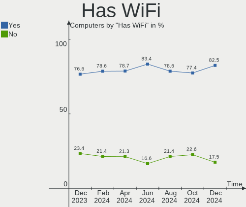
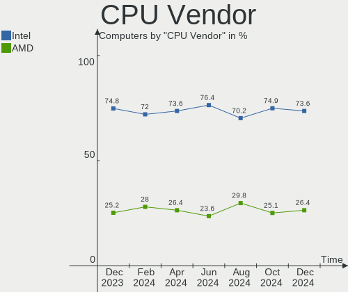
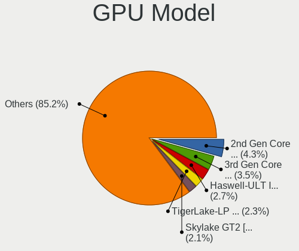
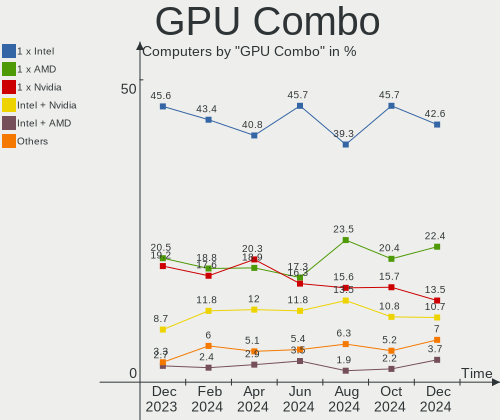
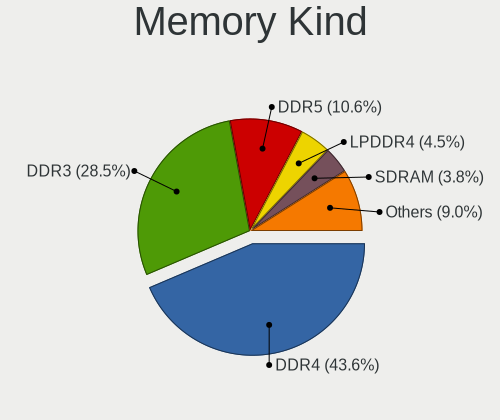

Linux Mint - Hardware Trends
----------------------------

A project to identify most popular hardware characteristics and track their change
over time based on data collected by Linux users at https://Linux-Hardware.org.

Anyone can contribute to this report by the [hw-probe](https://github.com/linuxhw/hw-probe) tool:

    sudo -E hw-probe -all -upload

This is a report for all computer types. See also reports for [desktops](/Dist/Linux_Mint/Desktop/README.md) and [notebooks](/Dist/Linux_Mint/Notebook/README.md).

This report is for one last month. Overall report since the beginning of time: [TestDays](https://github.com/linuxhw/TestDays)

Period: Mar, 2023.

Contents
--------

* [ System ](#system)
  - [ OS                       ](#os)
  - [ OS Family                ](#os-family)
  - [ Kernel                   ](#kernel)
  - [ Kernel Family            ](#kernel-family)
  - [ Kernel Major Ver.        ](#kernel-major-ver)
  - [ Arch                     ](#arch)
  - [ DE                       ](#de)
  - [ Display Server           ](#display-server)
  - [ Display Manager          ](#display-manager)
  - [ OS Lang                  ](#os-lang)
  - [ Boot Mode                ](#boot-mode)
  - [ Filesystem               ](#filesystem)
  - [ Part. scheme             ](#part-scheme)
  - [ Dual Boot with Linux/BSD ](#dual-boot-with-linuxbsd)
  - [ Dual Boot (Win)          ](#dual-boot-win)

* [ Board ](#board)
  - [ Vendor                   ](#vendor)
  - [ Model                    ](#model)
  - [ Model Family             ](#model-family)
  - [ MFG Year                 ](#mfg-year)
  - [ Form Factor              ](#form-factor)
  - [ Secure Boot              ](#secure-boot)
  - [ Coreboot                 ](#coreboot)
  - [ RAM Size                 ](#ram-size)
  - [ RAM Used                 ](#ram-used)
  - [ Total Drives             ](#total-drives)
  - [ Has CD-ROM               ](#has-cd-rom)
  - [ Has Ethernet             ](#has-ethernet)
  - [ Has WiFi                 ](#has-wifi)
  - [ Has Bluetooth            ](#has-bluetooth)

* [ Location ](#location)
  - [ Country                  ](#country)
  - [ City                     ](#city)

* [ Drives ](#drives)
  - [ Drive Vendor             ](#drive-vendor)
  - [ Drive Model              ](#drive-model)
  - [ HDD Vendor               ](#hdd-vendor)
  - [ SSD Vendor               ](#ssd-vendor)
  - [ Drive Kind               ](#drive-kind)
  - [ Drive Connector          ](#drive-connector)
  - [ Drive Size               ](#drive-size)
  - [ Space Total              ](#space-total)
  - [ Space Used               ](#space-used)
  - [ Malfunc. Drives          ](#malfunc-drives)
  - [ Malfunc. Drive Vendor    ](#malfunc-drive-vendor)
  - [ Malfunc. HDD Vendor      ](#malfunc-hdd-vendor)
  - [ Malfunc. Drive Kind      ](#malfunc-drive-kind)
  - [ Failed Drives            ](#failed-drives)
  - [ Failed Drive Vendor      ](#failed-drive-vendor)
  - [ Drive Status             ](#drive-status)

* [ Storage controller ](#storage-controller)
  - [ Storage Vendor           ](#storage-vendor)
  - [ Storage Model            ](#storage-model)
  - [ Storage Kind             ](#storage-kind)

* [ Processor ](#processor)
  - [ CPU Vendor               ](#cpu-vendor)
  - [ CPU Model                ](#cpu-model)
  - [ CPU Model Family         ](#cpu-model-family)
  - [ CPU Cores                ](#cpu-cores)
  - [ CPU Sockets              ](#cpu-sockets)
  - [ CPU Threads              ](#cpu-threads)
  - [ CPU Op-Modes             ](#cpu-op-modes)
  - [ CPU Microcode            ](#cpu-microcode)
  - [ CPU Microarch            ](#cpu-microarch)

* [ Graphics ](#graphics)
  - [ GPU Vendor               ](#gpu-vendor)
  - [ GPU Model                ](#gpu-model)
  - [ GPU Combo                ](#gpu-combo)
  - [ GPU Driver               ](#gpu-driver)
  - [ GPU Memory               ](#gpu-memory)

* [ Monitor ](#monitor)
  - [ Monitor Vendor           ](#monitor-vendor)
  - [ Monitor Model            ](#monitor-model)
  - [ Monitor Resolution       ](#monitor-resolution)
  - [ Monitor Diagonal         ](#monitor-diagonal)
  - [ Monitor Width            ](#monitor-width)
  - [ Aspect Ratio             ](#aspect-ratio)
  - [ Monitor Area             ](#monitor-area)
  - [ Pixel Density            ](#pixel-density)
  - [ Multiple Monitors        ](#multiple-monitors)

* [ Network ](#network)
  - [ Net Controller Vendor    ](#net-controller-vendor)
  - [ Net Controller Model     ](#net-controller-model)
  - [ Wireless Vendor          ](#wireless-vendor)
  - [ Wireless Model           ](#wireless-model)
  - [ Ethernet Vendor          ](#ethernet-vendor)
  - [ Ethernet Model           ](#ethernet-model)
  - [ Net Controller Kind      ](#net-controller-kind)
  - [ Used Controller          ](#used-controller)
  - [ NICs                     ](#nics)
  - [ IPv6                     ](#ipv6)

* [ Bluetooth ](#bluetooth)
  - [ Bluetooth Vendor         ](#bluetooth-vendor)
  - [ Bluetooth Model          ](#bluetooth-model)

* [ Sound ](#sound)
  - [ Sound Vendor             ](#sound-vendor)
  - [ Sound Model              ](#sound-model)

* [ Memory ](#memory)
  - [ Memory Vendor            ](#memory-vendor)
  - [ Memory Model             ](#memory-model)
  - [ Memory Kind              ](#memory-kind)
  - [ Memory Form Factor       ](#memory-form-factor)
  - [ Memory Size              ](#memory-size)
  - [ Memory Speed             ](#memory-speed)

* [ Printers & scanners ](#printers--scanners)
  - [ Printer Vendor           ](#printer-vendor)
  - [ Printer Model            ](#printer-model)
  - [ Scanner Vendor           ](#scanner-vendor)
  - [ Scanner Model            ](#scanner-model)

* [ Camera ](#camera)
  - [ Camera Vendor            ](#camera-vendor)
  - [ Camera Model             ](#camera-model)

* [ Security ](#security)
  - [ Fingerprint Vendor       ](#fingerprint-vendor)
  - [ Fingerprint Model        ](#fingerprint-model)
  - [ Chipcard Vendor          ](#chipcard-vendor)
  - [ Chipcard Model           ](#chipcard-model)

* [ Unsupported ](#unsupported)
  - [ Unsupported Devices      ](#unsupported-devices)
  - [ Unsupported Device Types ](#unsupported-device-types)

System
------

OS
--

Installed operating systems

| Name            | Computers | Percent |
|-----------------|-----------|---------|
| Linux Mint 21.1 | 440       | 71.78%  |
| Linux Mint 20.3 | 87        | 14.19%  |
| Linux Mint 21   | 53        | 8.65%   |
| Linux Mint 20.2 | 10        | 1.63%   |
| Linux Mint 20.1 | 9         | 1.47%   |
| Linux Mint 20   | 6         | 0.98%   |
| Linux Mint 19.3 | 6         | 0.98%   |
| Linux Mint 19.1 | 2         | 0.33%   |

OS Family
---------

OS without a version

| Name       | Computers | Percent |
|------------|-----------|---------|
| Linux Mint | 613       | 100%    |

Kernel
------

Version of the Linux kernel

| Version                 | Computers | Percent |
|-------------------------|-----------|---------|
| 5.15.0-67-generic       | 296       | 48.29%  |
| 5.4.0-144-generic       | 70        | 11.42%  |
| 5.15.0-56-generic       | 44        | 7.18%   |
| 5.19.0-35-generic       | 40        | 6.53%   |
| 5.15.0-60-generic       | 40        | 6.53%   |
| 5.15.0-69-generic       | 38        | 6.2%    |
| 5.4.0-139-generic       | 12        | 1.96%   |
| 5.15.0-41-generic       | 7         | 1.14%   |
| 5.19.0-38-generic       | 6         | 0.98%   |
| 6.1.0-1007-oem          | 4         | 0.65%   |
| 5.19.0-32-generic       | 4         | 0.65%   |
| 5.15.0-58-generic       | 4         | 0.65%   |
| 6.2.2-060202-generic    | 3         | 0.49%   |
| 6.0.0-1012-oem          | 3         | 0.49%   |
| 4.15.0-206-generic      | 3         | 0.49%   |
| 6.2.6-060206-generic    | 2         | 0.33%   |
| 5.4.0-91-generic        | 2         | 0.33%   |
| 5.4.0-135-generic       | 2         | 0.33%   |
| 6.2.8-x64v1-xanmod1     | 1         | 0.16%   |
| 6.2.8-060208-generic    | 1         | 0.16%   |
| 6.2.7-060207-generic    | 1         | 0.16%   |
| 6.2.7                   | 1         | 0.16%   |
| 6.2.5-060205-generic    | 1         | 0.16%   |
| 6.2.3-x64v3-xanmod1     | 1         | 0.16%   |
| 6.2.2-x64v3-xanmod1     | 1         | 0.16%   |
| 6.2.1-x64v3-xanmod1     | 1         | 0.16%   |
| 6.2.1-surface           | 1         | 0.16%   |
| 6.2.0-060200-generic    | 1         | 0.16%   |
| 6.1.9-060109-generic    | 1         | 0.16%   |
| 6.1.22-x64v3-xanmod1    | 1         | 0.16%   |
| 6.1.15-1-liquorix-amd64 | 1         | 0.16%   |
| 6.1.0-1006-oem          | 1         | 0.16%   |
| 6.0.0-060000-generic    | 1         | 0.16%   |
| 5.4.0-94-generic        | 1         | 0.16%   |
| 5.4.0-77-generic        | 1         | 0.16%   |
| 5.4.0-74-generic        | 1         | 0.16%   |
| 5.4.0-58-generic        | 1         | 0.16%   |
| 5.4.0-146-generic       | 1         | 0.16%   |
| 5.4.0-137-generic       | 1         | 0.16%   |
| 5.4.0-132-generic       | 1         | 0.16%   |

Kernel Family
-------------

Linux kernel without a distro release

| Version | Computers | Percent |
|---------|-----------|---------|
| 5.15.0  | 432       | 70.47%  |
| 5.4.0   | 96        | 15.66%  |
| 5.19.0  | 50        | 8.16%   |
| 6.1.0   | 5         | 0.82%   |
| 6.2.2   | 4         | 0.65%   |
| 6.0.0   | 4         | 0.65%   |
| 4.15.0  | 4         | 0.65%   |
| 6.2.8   | 2         | 0.33%   |
| 6.2.7   | 2         | 0.33%   |
| 6.2.6   | 2         | 0.33%   |
| 6.2.1   | 2         | 0.33%   |
| 6.2.5   | 1         | 0.16%   |
| 6.2.3   | 1         | 0.16%   |
| 6.2.0   | 1         | 0.16%   |
| 6.1.9   | 1         | 0.16%   |
| 6.1.22  | 1         | 0.16%   |
| 6.1.15  | 1         | 0.16%   |
| 5.19.12 | 1         | 0.16%   |
| 5.17.0  | 1         | 0.16%   |
| 5.14.0  | 1         | 0.16%   |
| 5.13.0  | 1         | 0.16%   |

Kernel Major Ver.
-----------------

Linux kernel major version

| Version | Computers | Percent |
|---------|-----------|---------|
| 5.15    | 432       | 70.47%  |
| 5.4     | 96        | 15.66%  |
| 5.19    | 51        | 8.32%   |
| 6.2     | 15        | 2.45%   |
| 6.1     | 8         | 1.31%   |
| 6.0     | 4         | 0.65%   |
| 4.15    | 4         | 0.65%   |
| 5.17    | 1         | 0.16%   |
| 5.14    | 1         | 0.16%   |
| 5.13    | 1         | 0.16%   |

Arch
----

OS architecture (x86_64, i586, etc.)

| Name   | Computers | Percent |
|--------|-----------|---------|
| x86_64 | 613       | 100%    |

DE
--

Desktop Environment

| Name       | Computers | Percent |
|------------|-----------|---------|
| X-Cinnamon | 453       | 73.9%   |
| MATE       | 66        | 10.77%  |
| XFCE       | 63        | 10.28%  |
| Cinnamon   | 18        | 2.94%   |
| GNOME      | 8         | 1.31%   |
| LXDE       | 1         | 0.16%   |
| KDE5       | 1         | 0.16%   |
| KDE        | 1         | 0.16%   |
| ICEWM      | 1         | 0.16%   |
| GNUstep    | 1         | 0.16%   |

Display Server
--------------

X11 or Wayland

| Name    | Computers | Percent |
|---------|-----------|---------|
| X11     | 605       | 98.69%  |
| Tty     | 5         | 0.82%   |
| Wayland | 3         | 0.49%   |

Display Manager
---------------

SDDM, LightDM, etc.

| Name    | Computers | Percent |
|---------|-----------|---------|
| Unknown | 347       | 56.61%  |
| LightDM | 259       | 42.25%  |
| GDM3    | 3         | 0.49%   |
| SDDM    | 2         | 0.33%   |
| LXDM    | 2         | 0.33%   |

OS Lang
-------

Language

| Lang  | Computers | Percent |
|-------|-----------|---------|
| en_US | 180       | 29.36%  |
| de_DE | 118       | 19.25%  |
| fr_FR | 28        | 4.57%   |
| it_IT | 27        | 4.4%    |
| en_GB | 24        | 3.92%   |
| ru_RU | 23        | 3.75%   |
| pt_BR | 22        | 3.59%   |
| pl_PL | 21        | 3.43%   |
| C     | 19        | 3.1%    |
| es_ES | 18        | 2.94%   |
| en_IN | 12        | 1.96%   |
| en_AU | 11        | 1.79%   |
| en_CA | 10        | 1.63%   |
| nl_NL | 8         | 1.31%   |
| es_MX | 8         | 1.31%   |
| sk_SK | 5         | 0.82%   |
| fi_FI | 5         | 0.82%   |
| en_ZA | 5         | 0.82%   |
| en_IE | 5         | 0.82%   |
| en_NZ | 4         | 0.65%   |
| de_CH | 4         | 0.65%   |
| de_AT | 4         | 0.65%   |
| cs_CZ | 4         | 0.65%   |
| sv_SE | 3         | 0.49%   |
| pt_PT | 3         | 0.49%   |
| lt_LT | 3         | 0.49%   |
| hu_HU | 3         | 0.49%   |
| es_VE | 3         | 0.49%   |
| es_AR | 3         | 0.49%   |
| bg_BG | 3         | 0.49%   |
| uk_UA | 2         | 0.33%   |
| nl_BE | 2         | 0.33%   |
| lv_LV | 2         | 0.33%   |
| fr_BE | 2         | 0.33%   |
| es_UY | 2         | 0.33%   |
| es_CO | 2         | 0.33%   |
| es_CL | 2         | 0.33%   |
| el_GR | 2         | 0.33%   |
| zh_CN | 1         | 0.16%   |
| ru_UA | 1         | 0.16%   |

Boot Mode
---------

EFI or BIOS

| Mode | Computers | Percent |
|------|-----------|---------|
| EFI  | 396       | 64.6%   |
| BIOS | 217       | 35.4%   |

Filesystem
----------

Type of filesystem

| Type    | Computers | Percent |
|---------|-----------|---------|
| Ext4    | 573       | 93.47%  |
| Overlay | 16        | 2.61%   |
| Btrfs   | 14        | 2.28%   |
| Zfs     | 9         | 1.47%   |
| Xfs     | 1         | 0.16%   |

Part. scheme
------------

Scheme of partitioning

| Type    | Computers | Percent |
|---------|-----------|---------|
| Unknown | 345       | 56.28%  |
| GPT     | 233       | 38.01%  |
| MBR     | 35        | 5.71%   |

Dual Boot with Linux/BSD
------------------------

Hosting more than one Linux/BSD

| Dual boot | Computers | Percent |
|-----------|-----------|---------|
| No        | 561       | 91.52%  |
| Yes       | 52        | 8.48%   |

Dual Boot (Win)
---------------

Hosting Linux and Windows

| Dual boot | Computers | Percent |
|-----------|-----------|---------|
| No        | 495       | 80.75%  |
| Yes       | 118       | 19.25%  |

Board
-----

Vendor
------

Motherboard manufacturer

| Name                                 | Computers | Percent |
|--------------------------------------|-----------|---------|
| Lenovo                               | 93        | 15.17%  |
| ASUSTek Computer                     | 92        | 15.01%  |
| Hewlett-Packard                      | 88        | 14.36%  |
| Dell                                 | 74        | 12.07%  |
| Gigabyte Technology                  | 44        | 7.18%   |
| Acer                                 | 41        | 6.69%   |
| MSI                                  | 28        | 4.57%   |
| Apple                                | 18        | 2.94%   |
| ASRock                               | 17        | 2.77%   |
| Intel                                | 12        | 1.96%   |
| Toshiba                              | 10        | 1.63%   |
| Samsung Electronics                  | 9         | 1.47%   |
| Fujitsu                              | 7         | 1.14%   |
| Google                               | 6         | 0.98%   |
| Medion                               | 4         | 0.65%   |
| HUAWEI                               | 4         | 0.65%   |
| Positivo                             | 3         | 0.49%   |
| Microsoft                            | 3         | 0.49%   |
| Fujitsu Siemens                      | 3         | 0.49%   |
| Foxconn                              | 3         | 0.49%   |
| AZW                                  | 3         | 0.49%   |
| Unknown                              | 3         | 0.49%   |
| Supermicro                           | 2         | 0.33%   |
| Sony                                 | 2         | 0.33%   |
| Shenzhen Meigao Electronic Equipment | 2         | 0.33%   |
| Pegatron                             | 2         | 0.33%   |
| Notebook                             | 2         | 0.33%   |
| Inventec                             | 2         | 0.33%   |
| ECS                                  | 2         | 0.33%   |
| BESSTAR Tech                         | 2         | 0.33%   |
| AMI                                  | 2         | 0.33%   |
| ZOTAC                                | 1         | 0.16%   |
| Wortmann AG                          | 1         | 0.16%   |
| VIT                                  | 1         | 0.16%   |
| TUXEDO                               | 1         | 0.16%   |
| Standard                             | 1         | 0.16%   |
| Schenker                             | 1         | 0.16%   |
| ReachingTech                         | 1         | 0.16%   |
| RDP                                  | 1         | 0.16%   |
| Packard Bell                         | 1         | 0.16%   |

Model
-----

Motherboard model

| Name                                    | Computers | Percent |
|-----------------------------------------|-----------|---------|
| Unknown                                 | 5         | 0.82%   |
| MSI MS-7C56                             | 3         | 0.49%   |
| HP Pavilion dv7                         | 3         | 0.49%   |
| HP Pavilion 15                          | 3         | 0.49%   |
| HP Compaq dc7800p Convertible Minitower | 3         | 0.49%   |
| Gigabyte B450 AORUS M                   | 3         | 0.49%   |
| Dell OptiPlex 780                       | 3         | 0.49%   |
| Dell Inspiron N5110                     | 3         | 0.49%   |
| ASUS All Series                         | 3         | 0.49%   |
| MSI MS-7C02                             | 2         | 0.33%   |
| MSI MS-7721                             | 2         | 0.33%   |
| Microsoft Surface Book 2                | 2         | 0.33%   |
| Lenovo Legion 5 15ACH6H 82JU            | 2         | 0.33%   |
| Lenovo G50-80 80E5                      | 2         | 0.33%   |
| HP Notebook                             | 2         | 0.33%   |
| HP Laptop 17-by0xxx                     | 2         | 0.33%   |
| HP EliteBook 840 G5                     | 2         | 0.33%   |
| HP Compaq dc7800 Small Form Factor      | 2         | 0.33%   |
| HP 250 G8 Notebook PC                   | 2         | 0.33%   |
| Gigabyte GB-BRR7H-4800                  | 2         | 0.33%   |
| Gigabyte B450M DS3H                     | 2         | 0.33%   |
| Gigabyte A320M-S2H                      | 2         | 0.33%   |
| Dell XPS 8700                           | 2         | 0.33%   |
| Dell OptiPlex 3010                      | 2         | 0.33%   |
| ASUS ROG STRIX B550-A GAMING            | 2         | 0.33%   |
| ASUS PRIME Z270-A                       | 2         | 0.33%   |
| ASUS PRIME A320M-K                      | 2         | 0.33%   |
| ASUS P8B75-M LE                         | 2         | 0.33%   |
| ASUS P5G41T-M LX2/GB                    | 2         | 0.33%   |
| ASUS N61Jq                              | 2         | 0.33%   |
| ASUS M5A97 R2.0                         | 2         | 0.33%   |
| ASUS CROSSHAIR VI HERO                  | 2         | 0.33%   |
| ASUS A68HM-K                            | 2         | 0.33%   |
| Apple MacBookPro5,1                     | 2         | 0.33%   |
| ZOTAC ZBOX-CI622/CI642/CI662NANO        | 1         | 0.16%   |
| Wortmann AG CR700                       | 1         | 0.16%   |
| VIT P1400                               | 1         | 0.16%   |
| TUXEDO Aura 15 Gen1                     | 1         | 0.16%   |
| Toshiba Satellite S70-A                 | 1         | 0.16%   |
| Toshiba Satellite Pro L300              | 1         | 0.16%   |

Model Family
------------

Motherboard model prefix

| Name                | Computers | Percent |
|---------------------|-----------|---------|
| Lenovo ThinkPad     | 36        | 5.87%   |
| Acer Aspire         | 30        | 4.89%   |
| Lenovo IdeaPad      | 19        | 3.1%    |
| Dell Inspiron       | 19        | 3.1%    |
| HP Pavilion         | 17        | 2.77%   |
| Dell Latitude       | 17        | 2.77%   |
| HP Laptop           | 15        | 2.45%   |
| Lenovo ThinkCentre  | 13        | 2.12%   |
| HP EliteBook        | 11        | 1.79%   |
| Dell OptiPlex       | 11        | 1.79%   |
| Dell XPS            | 10        | 1.63%   |
| ASUS ROG            | 10        | 1.63%   |
| HP Compaq           | 9         | 1.47%   |
| Toshiba Satellite   | 8         | 1.31%   |
| HP ProBook          | 6         | 0.98%   |
| Dell Precision      | 6         | 0.98%   |
| ASUS VivoBook       | 6         | 0.98%   |
| ASUS PRIME          | 6         | 0.98%   |
| Fujitsu ESPRIMO     | 5         | 0.82%   |
| Unknown             | 5         | 0.82%   |
| Lenovo Yoga         | 4         | 0.65%   |
| HP ProDesk          | 4         | 0.65%   |
| HP ENVY             | 4         | 0.65%   |
| HP EliteDesk        | 4         | 0.65%   |
| ASUS Zenbook        | 4         | 0.65%   |
| ASUS Maximus        | 4         | 0.65%   |
| Acer TravelMate     | 4         | 0.65%   |
| MSI MS-7C56         | 3         | 0.49%   |
| Microsoft Surface   | 3         | 0.49%   |
| Lenovo ThinkStation | 3         | 0.49%   |
| Lenovo ThinkBook    | 3         | 0.49%   |
| HP 250              | 3         | 0.49%   |
| Gigabyte B450M      | 3         | 0.49%   |
| Gigabyte B450       | 3         | 0.49%   |
| Dell Vostro         | 3         | 0.49%   |
| ASUS TUF            | 3         | 0.49%   |
| ASUS M5A97          | 3         | 0.49%   |
| ASUS All            | 3         | 0.49%   |
| MSI MS-7C02         | 2         | 0.33%   |
| MSI MS-7721         | 2         | 0.33%   |

MFG Year
--------

Motherboard manufacture year

| Year    | Computers | Percent |
|---------|-----------|---------|
| 2012    | 60        | 9.79%   |
| 2021    | 58        | 9.46%   |
| 2020    | 45        | 7.34%   |
| 2022    | 44        | 7.18%   |
| 2013    | 43        | 7.01%   |
| 2018    | 42        | 6.85%   |
| 2011    | 41        | 6.69%   |
| 2016    | 39        | 6.36%   |
| 2014    | 37        | 6.04%   |
| 2010    | 37        | 6.04%   |
| 2017    | 33        | 5.38%   |
| 2019    | 32        | 5.22%   |
| 2009    | 29        | 4.73%   |
| 2015    | 25        | 4.08%   |
| 2008    | 22        | 3.59%   |
| 2007    | 12        | 1.96%   |
| 2006    | 7         | 1.14%   |
| 2023    | 5         | 0.82%   |
| 2005    | 1         | 0.16%   |
| Unknown | 1         | 0.16%   |

Form Factor
-----------

Physical design of the computer

| Name        | Computers | Percent |
|-------------|-----------|---------|
| Notebook    | 323       | 52.69%  |
| Desktop     | 247       | 40.29%  |
| Mini pc     | 13        | 2.12%   |
| Convertible | 9         | 1.47%   |
| All in one  | 9         | 1.47%   |
| Tablet      | 7         | 1.14%   |
| Server      | 5         | 0.82%   |

Secure Boot
-----------

Enabled or disabled

| State    | Computers | Percent |
|----------|-----------|---------|
| Disabled | 549       | 89.56%  |
| Enabled  | 64        | 10.44%  |

Coreboot
--------

Have coreboot on board

| Used | Computers | Percent |
|------|-----------|---------|
| No   | 607       | 99.02%  |
| Yes  | 6         | 0.98%   |

RAM Size
--------

Total RAM memory

| Size in GB      | Computers | Percent |
|-----------------|-----------|---------|
| 4.01-8.0        | 166       | 27.08%  |
| 16.01-24.0      | 117       | 19.09%  |
| 8.01-16.0       | 117       | 19.09%  |
| 3.01-4.0        | 105       | 17.13%  |
| 32.01-64.0      | 45        | 7.34%   |
| 1.01-2.0        | 23        | 3.75%   |
| 24.01-32.0      | 15        | 2.45%   |
| 64.01-256.0     | 15        | 2.45%   |
| 2.01-3.0        | 8         | 1.31%   |
| More than 256.0 | 2         | 0.33%   |

RAM Used
--------

Used RAM memory

| Used GB         | Computers | Percent |
|-----------------|-----------|---------|
| 1.01-2.0        | 198       | 32.3%   |
| 2.01-3.0        | 177       | 28.87%  |
| 4.01-8.0        | 105       | 17.13%  |
| 3.01-4.0        | 78        | 12.72%  |
| 0.51-1.0        | 26        | 4.24%   |
| 8.01-16.0       | 20        | 3.26%   |
| 16.01-24.0      | 5         | 0.82%   |
| More than 256.0 | 1         | 0.16%   |
| 32.01-64.0      | 1         | 0.16%   |
| 24.01-32.0      | 1         | 0.16%   |
| 0.01-0.5        | 1         | 0.16%   |

Total Drives
------------

Number of drives on board

| Drives | Computers | Percent |
|--------|-----------|---------|
| 1      | 354       | 57.75%  |
| 2      | 156       | 25.45%  |
| 3      | 56        | 9.14%   |
| 4      | 21        | 3.43%   |
| 5      | 12        | 1.96%   |
| 6      | 4         | 0.65%   |
| 8      | 3         | 0.49%   |
| 9      | 2         | 0.33%   |
| 0      | 2         | 0.33%   |
| 27     | 1         | 0.16%   |
| 14     | 1         | 0.16%   |
| 7      | 1         | 0.16%   |

Has CD-ROM
----------

Has CD-ROM on board

| Presented | Computers | Percent |
|-----------|-----------|---------|
| No        | 351       | 57.26%  |
| Yes       | 262       | 42.74%  |

Has Ethernet
------------

Has Ethernet on board

| Presented | Computers | Percent |
|-----------|-----------|---------|
| Yes       | 526       | 85.81%  |
| No        | 87        | 14.19%  |

Has WiFi
--------

Has WiFi module

| Presented | Computers | Percent |
|-----------|-----------|---------|
| Yes       | 466       | 76.02%  |
| No        | 147       | 23.98%  |

Has Bluetooth
-------------

Has Bluetooth module

| Presented | Computers | Percent |
|-----------|-----------|---------|
| Yes       | 377       | 61.5%   |
| No        | 236       | 38.5%   |

Location
--------

Country
-------

Geographic location (country)

| Country      | Computers | Percent |
|--------------|-----------|---------|
| Germany      | 123       | 20.07%  |
| USA          | 105       | 17.13%  |
| Poland       | 29        | 4.73%   |
| Brazil       | 29        | 4.73%   |
| France       | 27        | 4.4%    |
| Italy        | 25        | 4.08%   |
| Russia       | 23        | 3.75%   |
| UK           | 22        | 3.59%   |
| Spain        | 21        | 3.43%   |
| Netherlands  | 15        | 2.45%   |
| Canada       | 15        | 2.45%   |
| India        | 13        | 2.12%   |
| Australia    | 12        | 1.96%   |
| Switzerland  | 10        | 1.63%   |
| Sweden       | 9         | 1.47%   |
| Mexico       | 8         | 1.31%   |
| Ireland      | 7         | 1.14%   |
| South Africa | 6         | 0.98%   |
| Slovakia     | 6         | 0.98%   |
| Finland      | 6         | 0.98%   |
| Argentina    | 6         | 0.98%   |
| Hungary      | 5         | 0.82%   |
| Greece       | 5         | 0.82%   |
| Czechia      | 5         | 0.82%   |
| Bulgaria     | 5         | 0.82%   |
| Belgium      | 5         | 0.82%   |
| Venezuela    | 4         | 0.65%   |
| New Zealand  | 4         | 0.65%   |
| Colombia     | 4         | 0.65%   |
| Austria      | 4         | 0.65%   |
| Romania      | 3         | 0.49%   |
| Portugal     | 3         | 0.49%   |
| Lithuania    | 3         | 0.49%   |
| Latvia       | 3         | 0.49%   |
| Indonesia    | 3         | 0.49%   |
| Vietnam      | 2         | 0.33%   |
| Uruguay      | 2         | 0.33%   |
| Ukraine      | 2         | 0.33%   |
| Tunisia      | 2         | 0.33%   |
| Thailand     | 2         | 0.33%   |

City
----

Geographic location (city)

| City              | Computers | Percent |
|-------------------|-----------|---------|
| Hamburg           | 8         | 1.31%   |
| Moscow            | 7         | 1.14%   |
| Berlin            | 7         | 1.14%   |
| Frankfurt am Main | 6         | 0.98%   |
| Stockholm         | 5         | 0.82%   |
| Zurich            | 4         | 0.65%   |
| Warsaw            | 4         | 0.65%   |
| Turin             | 4         | 0.65%   |
| Sao Paulo         | 4         | 0.65%   |
| Cologne           | 4         | 0.65%   |
| Villachiara       | 3         | 0.49%   |
| Vienna            | 3         | 0.49%   |
| Ueckermuende      | 3         | 0.49%   |
| Traunstein        | 3         | 0.49%   |
| Stuttgart         | 3         | 0.49%   |
| Rio de Janeiro    | 3         | 0.49%   |
| Munich            | 3         | 0.49%   |
| Montreal          | 3         | 0.49%   |
| Melbourne         | 3         | 0.49%   |
| Maracaibo         | 3         | 0.49%   |
| Helsinki          | 3         | 0.49%   |
| Dublin            | 3         | 0.49%   |
| Brisbane          | 3         | 0.49%   |
| Bogotá           | 3         | 0.49%   |
| Bełchatów       | 3         | 0.49%   |
| Barcelona         | 3         | 0.49%   |
| Asheboro          | 3         | 0.49%   |
| Amsterdam         | 3         | 0.49%   |
| Zagreb            | 2         | 0.33%   |
| Wilmington        | 2         | 0.33%   |
| Volos             | 2         | 0.33%   |
| Valencia          | 2         | 0.33%   |
| Toronto           | 2         | 0.33%   |
| Terrassa          | 2         | 0.33%   |
| Tampa             | 2         | 0.33%   |
| Sydney            | 2         | 0.33%   |
| Sofia             | 2         | 0.33%   |
| Santiago          | 2         | 0.33%   |
| Saint Paul        | 2         | 0.33%   |
| Rostock           | 2         | 0.33%   |

Drives
------

Drive Vendor
------------

Hard drive vendors

| Vendor                    | Computers | Drives | Percent |
|---------------------------|-----------|--------|---------|
| Samsung Electronics       | 134       | 159    | 14.5%   |
| Seagate                   | 133       | 163    | 14.39%  |
| WDC                       | 127       | 164    | 13.74%  |
| Kingston                  | 54        | 61     | 5.84%   |
| Sandisk                   | 49        | 50     | 5.3%    |
| Toshiba                   | 42        | 47     | 4.55%   |
| Crucial                   | 36        | 37     | 3.9%    |
| Unknown                   | 33        | 40     | 3.57%   |
| Hitachi                   | 27        | 29     | 2.92%   |
| Intel                     | 19        | 19     | 2.06%   |
| SK hynix                  | 16        | 16     | 1.73%   |
| Micron Technology         | 14        | 14     | 1.52%   |
| HGST                      | 14        | 17     | 1.52%   |
| China                     | 14        | 14     | 1.52%   |
| Intenso                   | 11        | 11     | 1.19%   |
| A-DATA Technology         | 10        | 10     | 1.08%   |
| Micron/Crucial Technology | 9         | 9      | 0.97%   |
| Unknown                   | 9         | 9      | 0.97%   |
| Silicon Motion            | 8         | 8      | 0.87%   |
| Phison Electronics        | 7         | 7      | 0.76%   |
| JMicron Technology        | 7         | 7      | 0.76%   |
| PNY                       | 6         | 6      | 0.65%   |
| Lexar                     | 6         | 6      | 0.65%   |
| GOODRAM                   | 6         | 6      | 0.65%   |
| Fujitsu                   | 6         | 6      | 0.65%   |
| Apple                     | 6         | 6      | 0.65%   |
| ADATA Technology          | 6         | 8      | 0.65%   |
| Transcend                 | 5         | 6      | 0.54%   |
| SPCC                      | 5         | 5      | 0.54%   |
| Patriot                   | 5         | 5      | 0.54%   |
| KIOXIA                    | 5         | 5      | 0.54%   |
| Fanxiang                  | 5         | 5      | 0.54%   |
| Plextor                   | 4         | 4      | 0.43%   |
| Netac                     | 4         | 4      | 0.43%   |
| Maxtor                    | 4         | 4      | 0.43%   |
| XrayDisk                  | 3         | 3      | 0.32%   |
| Union Memory (Shenzhen)   | 3         | 3      | 0.32%   |
| Team                      | 3         | 3      | 0.32%   |
| Realtek Semiconductor     | 3         | 4      | 0.32%   |
| KingSpec                  | 3         | 3      | 0.32%   |

Drive Model
-----------

Hard drive models

| Model                                                  | Computers | Percent |
|--------------------------------------------------------|-----------|---------|
| Kingston SA400S37240G 240GB SSD                        | 14        | 1.38%   |
| Samsung SSD 850 EVO 250GB                              | 13        | 1.29%   |
| Samsung NVMe SSD Controller SM981/PM981/PM983 250GB    | 12        | 1.19%   |
| Seagate ST1000LM035-1RK172 1TB                         | 11        | 1.09%   |
| Samsung SSD 860 EVO 500GB                              | 10        | 0.99%   |
| Unknown MMC Card  32GB                                 | 9         | 0.89%   |
| Unknown                                                | 9         | 0.89%   |
| Seagate ST1000LM024 HN-M101MBB 1TB                     | 8         | 0.79%   |
| WDC WDS500G2B0A-00SM50 500GB SSD                       | 6         | 0.59%   |
| Unknown MMC Card  64GB                                 | 6         | 0.59%   |
| Seagate ST500DM002-1BD142 500GB                        | 6         | 0.59%   |
| Seagate ST2000DM008-2FR102 2TB                         | 6         | 0.59%   |
| WDC WDS240G2G0A-00JH30 240GB SSD                       | 5         | 0.49%   |
| Seagate ST9500325AS 500GB                              | 5         | 0.49%   |
| Samsung SSD 870 EVO 1TB                                | 5         | 0.49%   |
| Samsung SSD 850 EVO 500GB                              | 5         | 0.49%   |
| WDC WD10JPVX-22JC3T0 1TB                               | 4         | 0.4%    |
| WDC WD10EZEX-08WN4A0 1TB                               | 4         | 0.4%    |
| Toshiba DT01ACA100 1TB                                 | 4         | 0.4%    |
| Silicon Motion SM2263EN/SM2263XT SSD Controller 1024GB | 4         | 0.4%    |
| Seagate ST500LT012-1DG142 500GB                        | 4         | 0.4%    |
| Seagate ST2000LM007-1R8174 2TB                         | 4         | 0.4%    |
| Seagate ST2000DM006-2DM164 2TB                         | 4         | 0.4%    |
| Seagate ST2000DM001-1ER164 2TB                         | 4         | 0.4%    |
| Seagate ST1000DM003-1CH162 1TB                         | 4         | 0.4%    |
| Sandisk WD Black SN750 / PC SN730 NVMe SSD 1TB         | 4         | 0.4%    |
| SanDisk SDSSDA120G 120GB                               | 4         | 0.4%    |
| Samsung SSD 870 EVO 500GB                              | 4         | 0.4%    |
| Samsung SSD 860 EVO 1TB                                | 4         | 0.4%    |
| Samsung SSD 840 PRO Series 256GB                       | 4         | 0.4%    |
| Samsung MZALQ512HBLU-00BL2 512GB                       | 4         | 0.4%    |
| Micron/Crucial P2 NVMe PCIe SSD 1TB                    | 4         | 0.4%    |
| Kingston SA400S37480G 480GB SSD                        | 4         | 0.4%    |
| Kingston SA400S37120G 120GB SSD                        | 4         | 0.4%    |
| JMicron Generic 500GB                                  | 4         | 0.4%    |
| Crucial CT1000BX500SSD1 1TB                            | 4         | 0.4%    |
| WDC WD10EZEX-21WN4A0 1TB                               | 3         | 0.3%    |
| Unknown SD/MMC/MS PRO 64GB                             | 3         | 0.3%    |
| Seagate ST1000LM048-2E7172 1TB                         | 3         | 0.3%    |
| Seagate ST1000DM003-1ER162 1TB                         | 3         | 0.3%    |

HDD Vendor
----------

Hard disk drive vendors

| Vendor              | Computers | Drives | Percent |
|---------------------|-----------|--------|---------|
| Seagate             | 130       | 159    | 39.39%  |
| WDC                 | 96        | 130    | 29.09%  |
| Toshiba             | 31        | 36     | 9.39%   |
| Hitachi             | 27        | 29     | 8.18%   |
| HGST                | 14        | 17     | 4.24%   |
| Samsung Electronics | 12        | 13     | 3.64%   |
| Fujitsu             | 6         | 6      | 1.82%   |
| Maxtor              | 4         | 4      | 1.21%   |
| Unknown             | 3         | 3      | 0.91%   |
| Apple               | 2         | 2      | 0.61%   |
| USB3.0              | 1         | 1      | 0.3%    |
| JMicron Technology  | 1         | 1      | 0.3%    |
| Intenso             | 1         | 1      | 0.3%    |
| ASMT                | 1         | 1      | 0.3%    |
| ASMedia             | 1         | 1      | 0.3%    |

SSD Vendor
----------

Solid state drive vendors

| Vendor              | Computers | Drives | Percent |
|---------------------|-----------|--------|---------|
| Samsung Electronics | 75        | 85     | 22.94%  |
| Kingston            | 41        | 47     | 12.54%  |
| Crucial             | 32        | 33     | 9.79%   |
| SanDisk             | 27        | 27     | 8.26%   |
| WDC                 | 20        | 20     | 6.12%   |
| China               | 14        | 14     | 4.28%   |
| Intenso             | 10        | 10     | 3.06%   |
| A-DATA Technology   | 9         | 9      | 2.75%   |
| Lexar               | 6         | 6      | 1.83%   |
| GOODRAM             | 6         | 6      | 1.83%   |
| Transcend           | 5         | 6      | 1.53%   |
| PNY                 | 5         | 5      | 1.53%   |
| Intel               | 5         | 5      | 1.53%   |
| Toshiba             | 4         | 4      | 1.22%   |
| Plextor             | 4         | 4      | 1.22%   |
| Patriot             | 4         | 4      | 1.22%   |
| JMicron Technology  | 4         | 4      | 1.22%   |
| Fanxiang            | 4         | 4      | 1.22%   |
| XrayDisk            | 3         | 3      | 0.92%   |
| SPCC                | 3         | 3      | 0.92%   |
| Netac               | 3         | 3      | 0.92%   |
| Apacer              | 3         | 3      | 0.92%   |
| Unknown             | 3         | 3      | 0.92%   |
| Team                | 2         | 2      | 0.61%   |
| Micron Technology   | 2         | 2      | 0.61%   |
| KingSpec            | 2         | 2      | 0.61%   |
| KingDian            | 2         | 2      | 0.61%   |
| Apple               | 2         | 2      | 0.61%   |
| ZHITAI              | 1         | 1      | 0.31%   |
| Zebronics           | 1         | 1      | 0.31%   |
| VISIPRO             | 1         | 1      | 0.31%   |
| VICKTER             | 1         | 1      | 0.31%   |
| Verbatim            | 1         | 1      | 0.31%   |
| TO Exter            | 1         | 1      | 0.31%   |
| Timetec             | 1         | 1      | 0.31%   |
| StoreJet            | 1         | 3      | 0.31%   |
| SK hynix            | 1         | 1      | 0.31%   |
| ShiJi               | 1         | 1      | 0.31%   |
| Seagate             | 1         | 1      | 0.31%   |
| QUMOX               | 1         | 1      | 0.31%   |

Drive Kind
----------

HDD or SSD

| Kind    | Computers | Drives | Percent |
|---------|-----------|--------|---------|
| SSD     | 281       | 348    | 34.44%  |
| HDD     | 278       | 404    | 34.07%  |
| NVMe    | 201       | 232    | 24.63%  |
| MMC     | 33        | 37     | 4.04%   |
| Unknown | 23        | 38     | 2.82%   |

Drive Connector
---------------

SATA, SAS, NVMe, etc.

| Type | Computers | Drives | Percent |
|------|-----------|--------|---------|
| SATA | 465       | 728    | 62.75%  |
| NVMe | 201       | 230    | 27.13%  |
| SAS  | 42        | 64     | 5.67%   |
| MMC  | 33        | 37     | 4.45%   |

Drive Size
----------

Size of hard drive

| Size in TB      | Computers | Drives | Percent |
|-----------------|-----------|--------|---------|
| 0.01-0.5        | 337       | 440    | 57.71%  |
| 0.51-1.0        | 160       | 194    | 27.4%   |
| 1.01-2.0        | 53        | 69     | 9.08%   |
| 3.01-4.0        | 14        | 24     | 2.4%    |
| 2.01-3.0        | 11        | 12     | 1.88%   |
| 4.01-10.0       | 5         | 9      | 0.86%   |
| 10.01-20.0      | 3         | 3      | 0.51%   |
| More than 100.0 | 1         | 1      | 0.17%   |

Space Total
-----------

Amount of disk space available on the file system

| Size in GB     | Computers | Percent |
|----------------|-----------|---------|
| 101-250        | 187       | 30.51%  |
| 251-500        | 148       | 24.14%  |
| 501-1000       | 99        | 16.15%  |
| 1001-2000      | 50        | 8.16%   |
| More than 3000 | 38        | 6.2%    |
| 51-100         | 35        | 5.71%   |
| 2001-3000      | 24        | 3.92%   |
| 21-50          | 15        | 2.45%   |
| 1-20           | 14        | 2.28%   |
| Unknown        | 3         | 0.49%   |

Space Used
----------

Amount of used disk space

| Used GB        | Computers | Percent |
|----------------|-----------|---------|
| 21-50          | 148       | 24.14%  |
| 1-20           | 115       | 18.76%  |
| 51-100         | 103       | 16.8%   |
| 101-250        | 88        | 14.36%  |
| 251-500        | 59        | 9.62%   |
| 501-1000       | 42        | 6.85%   |
| 1001-2000      | 25        | 4.08%   |
| More than 3000 | 16        | 2.61%   |
| 2001-3000      | 14        | 2.28%   |
| Unknown        | 3         | 0.49%   |

Malfunc. Drives
---------------

Drive models with a malfunction

| Model                                        | Computers | Drives | Percent |
|----------------------------------------------|-----------|--------|---------|
| Seagate ST9500325AS 500GB                    | 3         | 3      | 5.56%   |
| Seagate ST1000LM024 HN-M101MBB 1TB           | 3         | 3      | 5.56%   |
| Seagate ST320LM001 HN-M320MBB 320GB          | 2         | 2      | 3.7%    |
| XPG GAMMIX S11 Pro 256GB                     | 1         | 1      | 1.85%   |
| WDC WD7500BPKT-22PK4T0 752GB                 | 1         | 1      | 1.85%   |
| WDC WD5000LPVX-22V0TT0 500GB                 | 1         | 1      | 1.85%   |
| WDC WD5000AAKX-00ERMA0 500GB                 | 1         | 1      | 1.85%   |
| WDC WD5000AADS-00S9B0 500GB                  | 1         | 1      | 1.85%   |
| WDC WD2500BEVS-60UST0 250GB                  | 1         | 1      | 1.85%   |
| WDC WD20EARX-00PASB0 2TB                     | 1         | 1      | 1.85%   |
| WDC WD10EALX-009BA0 1TB                      | 1         | 1      | 1.85%   |
| WDC WD10EALS-00Z8A0 1TB                      | 1         | 1      | 1.85%   |
| WDC WD10EADS-22M2B0 1TB                      | 1         | 1      | 1.85%   |
| WDC WD1000DHTZ-04N21V0 1TB                   | 1         | 3      | 1.85%   |
| Transcend TS256GSSD360S 256GB                | 1         | 1      | 1.85%   |
| Toshiba MQ01ACF050 500GB                     | 1         | 1      | 1.85%   |
| Toshiba MK3265GSXN 320GB                     | 1         | 1      | 1.85%   |
| Toshiba MK1233GSG 120GB                      | 1         | 1      | 1.85%   |
| Team TM8FP4004T 4TB                          | 1         | 1      | 1.85%   |
| SK hynix PC401 NVMe 256GB                    | 1         | 1      | 1.85%   |
| Seagate ST9750423AS 752GB                    | 1         | 1      | 1.85%   |
| Seagate ST9750420AS 752GB                    | 1         | 1      | 1.85%   |
| Seagate ST500LT012-9WS142 500GB              | 1         | 1      | 1.85%   |
| Seagate ST500LM012 HN-M500MBB 500GB          | 1         | 1      | 1.85%   |
| Seagate ST500DM002-1BD142 500GB              | 1         | 1      | 1.85%   |
| Seagate ST250DM000-1BD141 250GB              | 1         | 1      | 1.85%   |
| Seagate ST2000DM008-2FR102 2TB               | 1         | 1      | 1.85%   |
| Seagate ST1000LM048-2E7172 1TB               | 1         | 1      | 1.85%   |
| Seagate ST1000DM003-9YN162 1TB               | 1         | 1      | 1.85%   |
| Samsung Electronics SSD 840 Series 250GB     | 1         | 1      | 1.85%   |
| Samsung Electronics SSD 840 PRO Series 128GB | 1         | 1      | 1.85%   |
| Samsung Electronics HM160HC 160GB            | 1         | 1      | 1.85%   |
| Maxtor STM3250820AS 250GB                    | 1         | 1      | 1.85%   |
| Intenso SSD 256GB                            | 1         | 1      | 1.85%   |
| Intel SSDSC2BW240A4 240GB                    | 1         | 1      | 1.85%   |
| Hitachi HTS725050A9A364 500GB                | 1         | 1      | 1.85%   |
| Hitachi HTS725025A9A364 250GB                | 1         | 1      | 1.85%   |
| Hitachi HTS545050B9A300 500GB                | 1         | 1      | 1.85%   |
| Hitachi HTS545025B9SA02 250GB                | 1         | 1      | 1.85%   |
| Hitachi HDS721050CLA360 500GB                | 1         | 1      | 1.85%   |

Malfunc. Drive Vendor
---------------------

Vendors of faulty drives

| Vendor              | Computers | Drives | Percent |
|---------------------|-----------|--------|---------|
| Seagate             | 17        | 17     | 32.69%  |
| WDC                 | 9         | 12     | 17.31%  |
| Hitachi             | 5         | 6      | 9.62%   |
| Toshiba             | 3         | 3      | 5.77%   |
| Samsung Electronics | 3         | 3      | 5.77%   |
| Fujitsu             | 2         | 2      | 3.85%   |
| Crucial             | 2         | 2      | 3.85%   |
| XPG                 | 1         | 1      | 1.92%   |
| Transcend           | 1         | 1      | 1.92%   |
| Team                | 1         | 1      | 1.92%   |
| SK hynix            | 1         | 1      | 1.92%   |
| Maxtor              | 1         | 1      | 1.92%   |
| Intenso             | 1         | 1      | 1.92%   |
| Intel               | 1         | 1      | 1.92%   |
| HGST                | 1         | 1      | 1.92%   |
| China               | 1         | 1      | 1.92%   |
| Apple               | 1         | 1      | 1.92%   |
| A-DATA Technology   | 1         | 1      | 1.92%   |

Malfunc. HDD Vendor
-------------------

Vendors of faulty HDD drives

| Vendor              | Computers | Drives | Percent |
|---------------------|-----------|--------|---------|
| Seagate             | 17        | 17     | 42.5%   |
| WDC                 | 9         | 12     | 22.5%   |
| Hitachi             | 5         | 6      | 12.5%   |
| Toshiba             | 3         | 3      | 7.5%    |
| Fujitsu             | 2         | 2      | 5%      |
| Samsung Electronics | 1         | 1      | 2.5%    |
| Maxtor              | 1         | 1      | 2.5%    |
| HGST                | 1         | 1      | 2.5%    |
| Apple               | 1         | 1      | 2.5%    |

Malfunc. Drive Kind
-------------------

Kinds of faulty drives

| Kind | Computers | Drives | Percent |
|------|-----------|--------|---------|
| HDD  | 39        | 44     | 76.47%  |
| SSD  | 9         | 9      | 17.65%  |
| NVMe | 3         | 3      | 5.88%   |

Failed Drives
-------------

Failed drive models

| Model                  | Computers | Drives | Percent |
|------------------------|-----------|--------|---------|
| Toshiba DT01ACA100 1TB | 1         | 1      | 100%    |

Failed Drive Vendor
-------------------

Failed drive vendors

| Vendor  | Computers | Drives | Percent |
|---------|-----------|--------|---------|
| Toshiba | 1         | 1      | 100%    |

Drive Status
------------

Number of failed and malfunc. drives

| Status   | Computers | Drives | Percent |
|----------|-----------|--------|---------|
| Detected | 382       | 657    | 57.88%  |
| Works    | 226       | 345    | 34.24%  |
| Malfunc  | 51        | 56     | 7.73%   |
| Failed   | 1         | 1      | 0.15%   |

Storage controller
------------------

Storage Vendor
--------------

Storage controller vendors

| Vendor                           | Computers | Percent |
|----------------------------------|-----------|---------|
| Intel                            | 407       | 51.98%  |
| AMD                              | 119       | 15.2%   |
| Samsung Electronics              | 59        | 7.54%   |
| SanDisk                          | 34        | 4.34%   |
| Kingston Technology Company      | 15        | 1.92%   |
| SK hynix                         | 14        | 1.79%   |
| Phison Electronics               | 13        | 1.66%   |
| Micron/Crucial Technology        | 13        | 1.66%   |
| Micron Technology                | 12        | 1.53%   |
| Marvell Technology Group         | 12        | 1.53%   |
| Nvidia                           | 11        | 1.4%    |
| Silicon Motion                   | 9         | 1.15%   |
| JMicron Technology               | 9         | 1.15%   |
| ASMedia Technology               | 9         | 1.15%   |
| ADATA Technology                 | 7         | 0.89%   |
| Toshiba America Info Systems     | 6         | 0.77%   |
| KIOXIA                           | 6         | 0.77%   |
| Union Memory (Shenzhen)          | 5         | 0.64%   |
| Realtek Semiconductor            | 5         | 0.64%   |
| Solid State Storage Technology   | 3         | 0.38%   |
| LSI Logic / Symbios Logic        | 3         | 0.38%   |
| Silicon Integrated Systems [SiS] | 2         | 0.26%   |
| Silicon Image                    | 2         | 0.26%   |
| MAXIO Technology (Hangzhou)      | 2         | 0.26%   |
| VIA Technologies                 | 1         | 0.13%   |
| Transcend                        | 1         | 0.13%   |
| Seagate Technology               | 1         | 0.13%   |
| Hewlett-Packard                  | 1         | 0.13%   |
| Broadcom / LSI                   | 1         | 0.13%   |
| Apple                            | 1         | 0.13%   |

Storage Model
-------------

Storage controller models

| Model                                                                          | Computers | Percent |
|--------------------------------------------------------------------------------|-----------|---------|
| AMD FCH SATA Controller [AHCI mode]                                            | 72        | 7.89%   |
| Intel Sunrise Point-LP SATA Controller [AHCI mode]                             | 28        | 3.07%   |
| Samsung NVMe SSD Controller SM981/PM981/PM983                                  | 26        | 2.85%   |
| Intel 7 Series Chipset Family 6-port SATA Controller [AHCI mode]               | 25        | 2.74%   |
| Intel 8 Series/C220 Series Chipset Family 6-port SATA Controller 1 [AHCI mode] | 24        | 2.63%   |
| Intel 6 Series/C200 Series Chipset Family 6 port Mobile SATA AHCI Controller   | 21        | 2.3%    |
| AMD SB7x0/SB8x0/SB9x0 SATA Controller [AHCI mode]                              | 20        | 2.19%   |
| Intel 82801 Mobile SATA Controller [RAID mode]                                 | 19        | 2.08%   |
| Samsung NVMe SSD Controller 980                                                | 17        | 1.86%   |
| Intel Q170/Q150/B150/H170/H110/Z170/CM236 Chipset SATA Controller [AHCI Mode]  | 16        | 1.75%   |
| Intel 7 Series/C210 Series Chipset Family 6-port SATA Controller [AHCI mode]   | 16        | 1.75%   |
| Intel Volume Management Device NVMe RAID Controller                            | 15        | 1.64%   |
| Intel 82801IBM/IEM (ICH9M/ICH9M-E) 4 port SATA Controller [AHCI mode]          | 15        | 1.64%   |
| Intel 6 Series/C200 Series Chipset Family 6 port Desktop SATA AHCI Controller  | 15        | 1.64%   |
| Intel 5 Series/3400 Series Chipset 6 port SATA AHCI Controller                 | 14        | 1.53%   |
| AMD 400 Series Chipset SATA Controller                                         | 14        | 1.53%   |
| Intel 5 Series/3400 Series Chipset 4 port SATA AHCI Controller                 | 13        | 1.42%   |
| AMD SB7x0/SB8x0/SB9x0 IDE Controller                                           | 13        | 1.42%   |
| Intel Tiger Lake-LP SATA Controller                                            | 12        | 1.31%   |
| Intel 8 Series SATA Controller 1 [AHCI mode]                                   | 12        | 1.31%   |
| Micron NVMe Storage Controller                                                 | 11        | 1.2%    |
| Intel Wildcat Point-LP SATA Controller [AHCI Mode]                             | 11        | 1.2%    |
| Intel Celeron/Pentium Silver Processor SATA Controller                         | 11        | 1.2%    |
| AMD 500 Series Chipset SATA Controller                                         | 10        | 1.1%    |
| Samsung NVMe SSD Controller PM9A1/PM9A3/980PRO                                 | 9         | 0.99%   |
| JMicron JMB363 SATA/IDE Controller                                             | 9         | 0.99%   |
| Intel 82801I (ICH9 Family) 2 port SATA Controller [IDE mode]                   | 9         | 0.99%   |
| Micron/Crucial P2 NVMe PCIe SSD                                                | 8         | 0.88%   |
| Kingston Company Company Non-Volatile memory controller                        | 8         | 0.88%   |
| Intel NM10/ICH7 Family SATA Controller [IDE mode]                              | 8         | 0.88%   |
| Intel 82801IR/IO/IH (ICH9R/DO/DH) 4 port SATA Controller [IDE mode]            | 8         | 0.88%   |
| Intel 82801G (ICH7 Family) IDE Controller                                      | 8         | 0.88%   |
| Intel 200 Series PCH SATA controller [AHCI mode]                               | 8         | 0.88%   |
| ASMedia ASM1062 Serial ATA Controller                                          | 8         | 0.88%   |
| AMD SB7x0/SB8x0/SB9x0 SATA Controller [IDE mode]                               | 8         | 0.88%   |
| Silicon Motion SM2263EN/SM2263XT SSD Controller                                | 7         | 0.77%   |
| SanDisk WD Blue SN570 NVMe SSD 1TB                                             | 7         | 0.77%   |
| SanDisk WD Blue SN550 NVMe SSD                                                 | 7         | 0.77%   |
| Intel SATA Controller [RAID mode]                                              | 7         | 0.77%   |
| Intel Atom Processor E3800 Series SATA AHCI Controller                         | 7         | 0.77%   |

Storage Kind
------------

Kind of storage controller (IDE, SATA, NVMe, SAS, ...)

| Kind | Computers | Percent |
|------|-----------|---------|
| SATA | 451       | 56.8%   |
| NVMe | 202       | 25.44%  |
| IDE  | 87        | 10.96%  |
| RAID | 51        | 6.42%   |
| SAS  | 3         | 0.38%   |

Processor
---------

CPU Vendor
----------

Processor vendors

| Vendor | Computers | Percent |
|--------|-----------|---------|
| Intel  | 462       | 75.37%  |
| AMD    | 151       | 24.63%  |

CPU Model
---------

Processor models

| Model                                   | Computers | Percent |
|-----------------------------------------|-----------|---------|
| Intel 11th Gen Core i5-1135G7 @ 2.40GHz | 10        | 1.63%   |
| Intel Core i5-7200U CPU @ 2.50GHz       | 9         | 1.47%   |
| Intel 11th Gen Core i7-1165G7 @ 2.80GHz | 9         | 1.47%   |
| Intel Core i7-3770 CPU @ 3.40GHz        | 8         | 1.31%   |
| Intel Core i5-8265U CPU @ 1.60GHz       | 6         | 0.98%   |
| Intel Core i3-2330M CPU @ 2.20GHz       | 6         | 0.98%   |
| AMD Ryzen 5 5500U with Radeon Graphics  | 6         | 0.98%   |
| Intel Core i7-8550U CPU @ 1.80GHz       | 5         | 0.82%   |
| Intel Core i5-4210U CPU @ 1.70GHz       | 5         | 0.82%   |
| Intel Core i5-3320M CPU @ 2.60GHz       | 5         | 0.82%   |
| Intel Core i5 CPU M 520 @ 2.40GHz       | 5         | 0.82%   |
| Intel Celeron N4020 CPU @ 1.10GHz       | 5         | 0.82%   |
| Intel Celeron CPU N3350 @ 1.10GHz       | 5         | 0.82%   |
| Intel Core i7-8650U CPU @ 1.90GHz       | 4         | 0.65%   |
| Intel Core i7-5500U CPU @ 2.40GHz       | 4         | 0.65%   |
| Intel Core i7-2600 CPU @ 3.40GHz        | 4         | 0.65%   |
| Intel Core i5-8350U CPU @ 1.70GHz       | 4         | 0.65%   |
| Intel Core i5-6200U CPU @ 2.30GHz       | 4         | 0.65%   |
| Intel Core i5-2520M CPU @ 2.50GHz       | 4         | 0.65%   |
| Intel Core i5-2400 CPU @ 3.10GHz        | 4         | 0.65%   |
| Intel Core i3-5005U CPU @ 2.00GHz       | 4         | 0.65%   |
| Intel Core 2 Duo CPU E6750 @ 2.66GHz    | 4         | 0.65%   |
| Intel Celeron N5105 @ 2.00GHz           | 4         | 0.65%   |
| AMD Ryzen 7 3700X 8-Core Processor      | 4         | 0.65%   |
| AMD Ryzen 7 2700X Eight-Core Processor  | 4         | 0.65%   |
| Intel Core i7-8750H CPU @ 2.20GHz       | 3         | 0.49%   |
| Intel Core i7-6700K CPU @ 4.00GHz       | 3         | 0.49%   |
| Intel Core i7-4770 CPU @ 3.40GHz        | 3         | 0.49%   |
| Intel Core i7-1065G7 CPU @ 1.30GHz      | 3         | 0.49%   |
| Intel Core i7 CPU Q 720 @ 1.60GHz       | 3         | 0.49%   |
| Intel Core i5-8250U CPU @ 1.60GHz       | 3         | 0.49%   |
| Intel Core i5-6300U CPU @ 2.40GHz       | 3         | 0.49%   |
| Intel Core i5-4570 CPU @ 3.20GHz        | 3         | 0.49%   |
| Intel Core i5-4200U CPU @ 1.60GHz       | 3         | 0.49%   |
| Intel Core i5-3470T CPU @ 2.90GHz       | 3         | 0.49%   |
| Intel Core i5-3317U CPU @ 1.70GHz       | 3         | 0.49%   |
| Intel Core i5-1035G1 CPU @ 1.00GHz      | 3         | 0.49%   |
| Intel Core i5-10210U CPU @ 1.60GHz      | 3         | 0.49%   |
| Intel Core i5 CPU 650 @ 3.20GHz         | 3         | 0.49%   |
| Intel Core i3-3220 CPU @ 3.30GHz        | 3         | 0.49%   |

CPU Model Family
----------------

Processor model prefix

| Model                          | Computers | Percent |
|--------------------------------|-----------|---------|
| Intel Core i5                  | 131       | 21.37%  |
| Intel Core i7                  | 102       | 16.64%  |
| Intel Core i3                  | 53        | 8.65%   |
| Other                          | 46        | 7.5%    |
| Intel Celeron                  | 37        | 6.04%   |
| AMD Ryzen 5                    | 32        | 5.22%   |
| AMD Ryzen 7                    | 30        | 4.89%   |
| Intel Core 2 Duo               | 26        | 4.24%   |
| Intel Xeon                     | 16        | 2.61%   |
| Intel Pentium                  | 14        | 2.28%   |
| AMD FX                         | 11        | 1.79%   |
| Intel Atom                     | 9         | 1.47%   |
| AMD Ryzen 9                    | 9         | 1.47%   |
| Intel Pentium Dual-Core        | 8         | 1.31%   |
| AMD Ryzen 3                    | 8         | 1.31%   |
| Intel Core 2 Quad              | 7         | 1.14%   |
| AMD Phenom II X4               | 6         | 0.98%   |
| AMD A10                        | 6         | 0.98%   |
| AMD Athlon 64 X2               | 5         | 0.82%   |
| Intel Pentium Silver           | 4         | 0.65%   |
| AMD Athlon X4                  | 4         | 0.65%   |
| AMD A8                         | 4         | 0.65%   |
| Intel Core 2                   | 3         | 0.49%   |
| AMD Ryzen 5 PRO                | 3         | 0.49%   |
| AMD Phenom II X6               | 3         | 0.49%   |
| AMD A6                         | 3         | 0.49%   |
| AMD A4                         | 3         | 0.49%   |
| Intel Pentium D                | 2         | 0.33%   |
| AMD Turion X2 Dual-Core Mobile | 2         | 0.33%   |
| AMD G                          | 2         | 0.33%   |
| AMD Athlon II X4               | 2         | 0.33%   |
| AMD Athlon 64                  | 2         | 0.33%   |
| AMD Athlon                     | 2         | 0.33%   |
| Intel Xeon Gold                | 1         | 0.16%   |
| Intel Pentium Gold             | 1         | 0.16%   |
| Intel Pentium Dual             | 1         | 0.16%   |
| Intel Core M                   | 1         | 0.16%   |
| Intel Core i9                  | 1         | 0.16%   |
| AMD Turion 64 Mobile           | 1         | 0.16%   |
| AMD Ryzen 7 PRO                | 1         | 0.16%   |

CPU Cores
---------

Number of processor cores

| Number | Computers | Percent |
|--------|-----------|---------|
| 2      | 254       | 41.44%  |
| 4      | 225       | 36.7%   |
| 6      | 49        | 7.99%   |
| 8      | 44        | 7.18%   |
| 12     | 12        | 1.96%   |
| 1      | 10        | 1.63%   |
| 14     | 5         | 0.82%   |
| 3      | 5         | 0.82%   |
| 16     | 3         | 0.49%   |
| 10     | 3         | 0.49%   |
| 40     | 1         | 0.16%   |
| 36     | 1         | 0.16%   |
| 5      | 1         | 0.16%   |

CPU Sockets
-----------

Number of sockets

| Number | Computers | Percent |
|--------|-----------|---------|
| 1      | 607       | 99.02%  |
| 2      | 6         | 0.98%   |

CPU Threads
-----------

Threads per core (Hyper-Threading)

| Number | Computers | Percent |
|--------|-----------|---------|
| 2      | 418       | 68.19%  |
| 1      | 195       | 31.81%  |

CPU Op-Modes
------------

CPU Operation Modes (32-bit, 64-bit)

| Op mode        | Computers | Percent |
|----------------|-----------|---------|
| 32-bit, 64-bit | 613       | 100%    |

CPU Microcode
-------------

Microcode number

| Number     | Computers | Percent |
|------------|-----------|---------|
| Unknown    | 67        | 10.93%  |
| 0x206a7    | 44        | 7.18%   |
| 0x306a9    | 42        | 6.85%   |
| 0x1067a    | 27        | 4.4%    |
| 0x306c3    | 26        | 4.24%   |
| 0x806ea    | 18        | 2.94%   |
| 0x806c1    | 18        | 2.94%   |
| 0x20655    | 14        | 2.28%   |
| 0x506e3    | 13        | 2.12%   |
| 0x40651    | 13        | 2.12%   |
| 0x306d4    | 13        | 2.12%   |
| 0x806ec    | 12        | 1.96%   |
| 0x806e9    | 12        | 1.96%   |
| 0x906e9    | 11        | 1.79%   |
| 0x406e3    | 11        | 1.79%   |
| 0x0a50000c | 11        | 1.79%   |
| 0x906ea    | 10        | 1.63%   |
| 0x706a8    | 9         | 1.47%   |
| 0x20652    | 9         | 1.47%   |
| 0x906c0    | 8         | 1.31%   |
| 0x6fb      | 8         | 1.31%   |
| 0x08608103 | 8         | 1.31%   |
| 0x106e5    | 7         | 1.14%   |
| 0x08108109 | 7         | 1.14%   |
| 0x0800820d | 7         | 1.14%   |
| 0x06001119 | 7         | 1.14%   |
| 0x706e5    | 6         | 0.98%   |
| 0x506c9    | 6         | 0.98%   |
| 0x10676    | 6         | 0.98%   |
| 0x06000852 | 6         | 0.98%   |
| 0x010000c8 | 6         | 0.98%   |
| 0xa0671    | 5         | 0.82%   |
| 0x406c4    | 5         | 0.82%   |
| 0x30678    | 5         | 0.82%   |
| 0x0a50000d | 5         | 0.82%   |
| 0x08600106 | 5         | 0.82%   |
| 0x806eb    | 4         | 0.65%   |
| 0x706a1    | 4         | 0.65%   |
| 0x306f2    | 4         | 0.65%   |
| 0x08701021 | 4         | 0.65%   |

CPU Microarch
-------------

Microarchitecture

| Name             | Computers | Percent |
|------------------|-----------|---------|
| KabyLake         | 79        | 12.89%  |
| SandyBridge      | 50        | 8.16%   |
| Haswell          | 48        | 7.83%   |
| IvyBridge        | 47        | 7.67%   |
| Penryn           | 36        | 5.87%   |
| Skylake          | 30        | 4.89%   |
| Unknown          | 27        | 4.4%    |
| Zen 3            | 26        | 4.24%   |
| Westmere         | 26        | 4.24%   |
| TigerLake        | 24        | 3.92%   |
| Zen+             | 18        | 2.94%   |
| K10              | 16        | 2.61%   |
| Zen 2            | 15        | 2.45%   |
| Silvermont       | 15        | 2.45%   |
| Piledriver       | 15        | 2.45%   |
| Broadwell        | 15        | 2.45%   |
| Icelake          | 13        | 2.12%   |
| Goldmont plus    | 13        | 2.12%   |
| Core             | 13        | 2.12%   |
| Nehalem          | 10        | 1.63%   |
| Alderlake Hybrid | 10        | 1.63%   |
| Steamroller      | 8         | 1.31%   |
| K8 Hammer        | 8         | 1.31%   |
| Goldmont         | 8         | 1.31%   |
| Tremont          | 7         | 1.14%   |
| Zen              | 5         | 0.82%   |
| Excavator        | 5         | 0.82%   |
| CometLake        | 5         | 0.82%   |
| Bobcat           | 5         | 0.82%   |
| Bonnell          | 4         | 0.65%   |
| Bulldozer        | 3         | 0.49%   |
| Puma             | 2         | 0.33%   |
| NetBurst         | 2         | 0.33%   |
| K8 & K10 hybrid  | 2         | 0.33%   |
| Jaguar           | 2         | 0.33%   |
| K10 Llano        | 1         | 0.16%   |

Graphics
--------

GPU Vendor
----------

Vendors of graphics cards

| Vendor                     | Computers | Percent |
|----------------------------|-----------|---------|
| Intel                      | 358       | 50.14%  |
| Nvidia                     | 187       | 26.19%  |
| AMD                        | 166       | 23.25%  |
| Matrox Electronics Systems | 3         | 0.42%   |

GPU Model
---------

Graphics card models

| Model                                                                                    | Computers | Percent |
|------------------------------------------------------------------------------------------|-----------|---------|
| Intel 2nd Generation Core Processor Family Integrated Graphics Controller                | 39        | 5.39%   |
| Intel 3rd Gen Core processor Graphics Controller                                         | 25        | 3.45%   |
| Intel TigerLake-LP GT2 [Iris Xe Graphics]                                                | 21        | 2.9%    |
| Intel UHD Graphics 620                                                                   | 17        | 2.35%   |
| Intel HD Graphics 620                                                                    | 16        | 2.21%   |
| Intel Core Processor Integrated Graphics Controller                                      | 15        | 2.07%   |
| Intel Haswell-ULT Integrated Graphics Controller                                         | 14        | 1.93%   |
| AMD Cezanne [Radeon Vega Series / Radeon Vega Mobile Series]                             | 12        | 1.66%   |
| Intel Skylake GT2 [HD Graphics 520]                                                      | 11        | 1.52%   |
| Intel HD Graphics 5500                                                                   | 11        | 1.52%   |
| Intel HD Graphics 530                                                                    | 11        | 1.52%   |
| Nvidia GK208B [GeForce GT 710]                                                           | 10        | 1.38%   |
| Intel WhiskeyLake-U GT2 [UHD Graphics 620]                                               | 10        | 1.38%   |
| Intel Mobile 4 Series Chipset Integrated Graphics Controller                             | 10        | 1.38%   |
| Intel GeminiLake [UHD Graphics 600]                                                      | 10        | 1.38%   |
| AMD Picasso/Raven 2 [Radeon Vega Series / Radeon Vega Mobile Series]                     | 10        | 1.38%   |
| AMD Lucienne                                                                             | 10        | 1.38%   |
| Intel Xeon E3-1200 v3/4th Gen Core Processor Integrated Graphics Controller              | 9         | 1.24%   |
| Intel 4th Gen Core Processor Integrated Graphics Controller                              | 9         | 1.24%   |
| AMD Renoir                                                                               | 9         | 1.24%   |
| Intel Xeon E3-1200 v2/3rd Gen Core processor Graphics Controller                         | 8         | 1.1%    |
| Intel JasperLake [UHD Graphics]                                                          | 8         | 1.1%    |
| Intel HD Graphics 630                                                                    | 8         | 1.1%    |
| Intel Atom/Celeron/Pentium Processor x5-E8000/J3xxx/N3xxx Integrated Graphics Controller | 8         | 1.1%    |
| Nvidia GT218 [GeForce 210]                                                               | 7         | 0.97%   |
| Nvidia GF117M [GeForce 610M/710M/810M/820M / GT 620M/625M/630M/720M]                     | 7         | 0.97%   |
| Intel Atom Processor Z36xxx/Z37xxx Series Graphics & Display                             | 7         | 0.97%   |
| AMD Sun XT [Radeon HD 8670A/8670M/8690M / R5 M330 / M430 / Radeon 520 Mobile]            | 7         | 0.97%   |
| Nvidia GP107 [GeForce GTX 1050 Ti]                                                       | 6         | 0.83%   |
| Nvidia GP106 [GeForce GTX 1060 6GB]                                                      | 6         | 0.83%   |
| Nvidia G96CM [GeForce 9600M GT]                                                          | 6         | 0.83%   |
| Intel HD Graphics 500                                                                    | 6         | 0.83%   |
| Intel CometLake-U GT2 [UHD Graphics]                                                     | 6         | 0.83%   |
| Intel CoffeeLake-H GT2 [UHD Graphics 630]                                                | 6         | 0.83%   |
| Intel 4 Series Chipset Integrated Graphics Controller                                    | 6         | 0.83%   |
| AMD Barcelo                                                                              | 6         | 0.83%   |
| Nvidia GP108 [GeForce GT 1030]                                                           | 5         | 0.69%   |
| Nvidia GF119 [GeForce GT 610]                                                            | 5         | 0.69%   |
| Intel CoffeeLake-S GT2 [UHD Graphics 630]                                                | 5         | 0.69%   |
| Intel Alder Lake-P Integrated Graphics Controller                                        | 5         | 0.69%   |

GPU Combo
---------

Combinations of graphics cards

| Name            | Computers | Percent |
|-----------------|-----------|---------|
| 1 x Intel       | 266       | 43.39%  |
| 1 x AMD         | 136       | 22.19%  |
| 1 x Nvidia      | 113       | 18.43%  |
| Intel + Nvidia  | 58        | 9.46%   |
| Intel + AMD     | 18        | 2.94%   |
| AMD + Nvidia    | 10        | 1.63%   |
| 2 x Nvidia      | 4         | 0.65%   |
| Other           | 3         | 0.49%   |
| 2 x AMD         | 2         | 0.33%   |
| Nvidia + Matrox | 2         | 0.33%   |
| 1 x Matrox      | 1         | 0.16%   |

GPU Driver
----------

Free vs proprietary

| Driver      | Computers | Percent |
|-------------|-----------|---------|
| Free        | 480       | 78.3%   |
| Proprietary | 119       | 19.41%  |
| Unknown     | 14        | 2.28%   |

GPU Memory
----------

Total video memory

| Size in GB | Computers | Percent |
|------------|-----------|---------|
| Unknown    | 314       | 51.22%  |
| 1.01-2.0   | 78        | 12.72%  |
| 0.01-0.5   | 68        | 11.09%  |
| 0.51-1.0   | 67        | 10.93%  |
| 3.01-4.0   | 35        | 5.71%   |
| 7.01-8.0   | 19        | 3.1%    |
| 8.01-16.0  | 12        | 1.96%   |
| 5.01-6.0   | 11        | 1.79%   |
| 2.01-3.0   | 8         | 1.31%   |
| 16.01-24.0 | 1         | 0.16%   |

Monitor
-------

Monitor Vendor
--------------

Monitor vendors

| Vendor                  | Computers | Percent |
|-------------------------|-----------|---------|
| AU Optronics            | 80        | 12.36%  |
| Samsung Electronics     | 74        | 11.44%  |
| Chimei Innolux          | 54        | 8.35%   |
| LG Display              | 47        | 7.26%   |
| BOE                     | 43        | 6.65%   |
| Hewlett-Packard         | 34        | 5.26%   |
| Goldstar                | 30        | 4.64%   |
| Dell                    | 28        | 4.33%   |
| BenQ                    | 18        | 2.78%   |
| AOC                     | 18        | 2.78%   |
| Apple                   | 15        | 2.32%   |
| Acer                    | 14        | 2.16%   |
| Philips                 | 13        | 2.01%   |
| Lenovo                  | 13        | 2.01%   |
| Iiyama                  | 13        | 2.01%   |
| Sharp                   | 11        | 1.7%    |
| Ancor Communications    | 11        | 1.7%    |
| ViewSonic               | 9         | 1.39%   |
| LG Electronics          | 8         | 1.24%   |
| ASUSTek Computer        | 8         | 1.24%   |
| InfoVision              | 5         | 0.77%   |
| Fujitsu Siemens         | 5         | 0.77%   |
| Chi Mei Optoelectronics | 5         | 0.77%   |
| CSO                     | 4         | 0.62%   |
| Unknown                 | 4         | 0.62%   |
| Toshiba                 | 3         | 0.46%   |
| Sony                    | 3         | 0.46%   |
| RTK                     | 3         | 0.46%   |
| PANDA                   | 3         | 0.46%   |
| MSI                     | 3         | 0.46%   |
| LG Philips              | 3         | 0.46%   |
| Lenovo Group Limited    | 3         | 0.46%   |
| HannStar                | 3         | 0.46%   |
| Gigabyte Technology     | 3         | 0.46%   |
| Eizo                    | 3         | 0.46%   |
| Unknown                 | 2         | 0.31%   |
| Panasonic               | 2         | 0.31%   |
| IBM                     | 2         | 0.31%   |
| Yamaha                  | 1         | 0.15%   |
| WST                     | 1         | 0.15%   |

Monitor Model
-------------

Monitor models

| Model                                                                 | Computers | Percent |
|-----------------------------------------------------------------------|-----------|---------|
| AU Optronics LCD Monitor AUO20EC 1366x768 344x193mm 15.5-inch         | 4         | 0.6%    |
| Unknown                                                               | 4         | 0.6%    |
| Samsung Electronics C24F390 SAM0D2C 1920x1080 521x293mm 23.5-inch     | 3         | 0.45%   |
| LG Display LCD Monitor LGD02DC 1366x768 344x194mm 15.5-inch           | 3         | 0.45%   |
| Chimei Innolux LCD Monitor CMN151E 1920x1080 344x193mm 15.5-inch      | 3         | 0.45%   |
| BOE LCD Monitor BOE08F5 1920x1080 344x194mm 15.5-inch                 | 3         | 0.45%   |
| AU Optronics LCD Monitor AUO38ED 1920x1080 344x193mm 15.5-inch        | 3         | 0.45%   |
| AU Optronics LCD Monitor AUO26EC 1366x768 344x193mm 15.5-inch         | 3         | 0.45%   |
| AU Optronics LCD Monitor AUO219E 1600x900 382x214mm 17.2-inch         | 3         | 0.45%   |
| Sony TV SNY4B03 1920x1080 1063x598mm 48.0-inch                        | 2         | 0.3%    |
| Sharp LQ133M1JW02 SHP141A 1920x1080 294x165mm 13.3-inch               | 2         | 0.3%    |
| Samsung Electronics LCD Monitor SEC5448 1920x1080 344x194mm 15.5-inch | 2         | 0.3%    |
| Samsung Electronics LCD Monitor SEC5441 1366x768 344x194mm 15.5-inch  | 2         | 0.3%    |
| Samsung Electronics LCD Monitor SEC325A 1366x768 344x194mm 15.5-inch  | 2         | 0.3%    |
| Samsung Electronics LCD Monitor SEC324A 1366x768 344x194mm 15.5-inch  | 2         | 0.3%    |
| Samsung Electronics LCD Monitor SAM0659 1920x1080                     | 2         | 0.3%    |
| Samsung Electronics LC24RG50 SAM0F90 1920x1080 532x304mm 24.1-inch    | 2         | 0.3%    |
| RTK TopTech TV RTK0001 1366x768                                       | 2         | 0.3%    |
| Panasonic VVX16T029D00 MEI96A2 2880x1620 344x193mm 15.5-inch          | 2         | 0.3%    |
| MSI MP271 MSI30A2 1920x1080 598x336mm 27.0-inch                       | 2         | 0.3%    |
| LG Display LCD Monitor LGD0554 3240x2160 317x211mm 15.0-inch          | 2         | 0.3%    |
| LG Display LCD Monitor LGD045C 1366x768 345x194mm 15.6-inch           | 2         | 0.3%    |
| LG Display LCD Monitor LGD033A 1366x768 344x194mm 15.5-inch           | 2         | 0.3%    |
| Lenovo LCD Monitor LEN40B1 1600x900 344x194mm 15.5-inch               | 2         | 0.3%    |
| InfoVision LCD Monitor IVO0533 1366x768 293x165mm 13.2-inch           | 2         | 0.3%    |
| Iiyama PL2875UH IVM7111 3840x2160 621x341mm 27.9-inch                 | 2         | 0.3%    |
| Iiyama PL2492H IVM612F 1920x1080 527x296mm 23.8-inch                  | 2         | 0.3%    |
| Hewlett-Packard E232 HWP3279 1920x1080 509x286mm 23.0-inch            | 2         | 0.3%    |
| Goldstar W2234 GSM56B8 1680x1050 474x296mm 22.0-inch                  | 2         | 0.3%    |
| Goldstar IPS FULLHD GSM5AB8 1920x1080 480x270mm 21.7-inch             | 2         | 0.3%    |
| Goldstar HDR 4K GSM7750 3840x2160 697x392mm 31.5-inch                 | 2         | 0.3%    |
| Goldstar HDR 4K GSM7707 3840x2160 600x340mm 27.2-inch                 | 2         | 0.3%    |
| Dell U2414H DELA0A4 1920x1080 527x296mm 23.8-inch                     | 2         | 0.3%    |
| Chimei Innolux LCD Monitor CMN1735 1920x1080 382x215mm 17.3-inch      | 2         | 0.3%    |
| Chimei Innolux LCD Monitor CMN15FD 1366x768 344x193mm 15.5-inch       | 2         | 0.3%    |
| Chimei Innolux LCD Monitor CMN15F5 1920x1080 344x193mm 15.5-inch      | 2         | 0.3%    |
| Chimei Innolux LCD Monitor CMN15E6 1366x768 344x193mm 15.5-inch       | 2         | 0.3%    |
| Chimei Innolux LCD Monitor CMN15DB 1366x768 344x193mm 15.5-inch       | 2         | 0.3%    |
| Chimei Innolux LCD Monitor CMN15B7 1366x768 344x193mm 15.5-inch       | 2         | 0.3%    |
| Chimei Innolux LCD Monitor CMN1540 2560x1440 344x193mm 15.5-inch      | 2         | 0.3%    |

Monitor Resolution
------------------

Monitor screen resolution

| Resolution         | Computers | Percent |
|--------------------|-----------|---------|
| 1920x1080 (FHD)    | 268       | 42.81%  |
| 1366x768 (WXGA)    | 111       | 17.73%  |
| 3840x2160 (4K)     | 36        | 5.75%   |
| 1600x900 (HD+)     | 34        | 5.43%   |
| 2560x1440 (QHD)    | 31        | 4.95%   |
| 1680x1050 (WSXGA+) | 23        | 3.67%   |
| 1440x900 (WXGA+)   | 17        | 2.72%   |
| 1280x1024 (SXGA)   | 16        | 2.56%   |
| Unknown            | 14        | 2.24%   |
| 1920x1200 (WUXGA)  | 12        | 1.92%   |
| 1280x800 (WXGA)    | 11        | 1.76%   |
| 3440x1440          | 6         | 0.96%   |
| 2880x1800          | 6         | 0.96%   |
| 3840x1080          | 5         | 0.8%    |
| 2560x1600          | 5         | 0.8%    |
| 2560x1080          | 4         | 0.64%   |
| 1920x540           | 4         | 0.64%   |
| 3240x2160          | 2         | 0.32%   |
| 1280x720 (HD)      | 2         | 0.32%   |
| 1024x768 (XGA)     | 2         | 0.32%   |
| 1024x600           | 2         | 0.32%   |
| 4560x1080          | 1         | 0.16%   |
| 4480x1792          | 1         | 0.16%   |
| 3840x1600          | 1         | 0.16%   |
| 3840x1440          | 1         | 0.16%   |
| 3520x1080          | 1         | 0.16%   |
| 3456x2160          | 1         | 0.16%   |
| 3200x1080          | 1         | 0.16%   |
| 3120x1050          | 1         | 0.16%   |
| 3000x2000          | 1         | 0.16%   |
| 2736x1824          | 1         | 0.16%   |
| 2580x1440          | 1         | 0.16%   |
| 2304x1440          | 1         | 0.16%   |
| 2160x1350          | 1         | 0.16%   |
| 1400x1050          | 1         | 0.16%   |
| 1360x768           | 1         | 0.16%   |

Monitor Diagonal
----------------

Diagonal size in inches

| Inches  | Computers | Percent |
|---------|-----------|---------|
| 15      | 156       | 24.3%   |
| 27      | 53        | 8.26%   |
| Unknown | 52        | 8.1%    |
| 17      | 50        | 7.79%   |
| 13      | 45        | 7.01%   |
| 24      | 39        | 6.07%   |
| 23      | 38        | 5.92%   |
| 14      | 38        | 5.92%   |
| 21      | 36        | 5.61%   |
| 22      | 14        | 2.18%   |
| 31      | 12        | 1.87%   |
| 19      | 12        | 1.87%   |
| 20      | 11        | 1.71%   |
| 18      | 11        | 1.71%   |
| 12      | 11        | 1.71%   |
| 11      | 10        | 1.56%   |
| 34      | 9         | 1.4%    |
| 72      | 6         | 0.93%   |
| 32      | 6         | 0.93%   |
| 84      | 3         | 0.47%   |
| 47      | 3         | 0.47%   |
| 46      | 3         | 0.47%   |
| 26      | 3         | 0.47%   |
| 16      | 3         | 0.47%   |
| 54      | 2         | 0.31%   |
| 52      | 2         | 0.31%   |
| 50      | 2         | 0.31%   |
| 40      | 2         | 0.31%   |
| 36      | 2         | 0.31%   |
| 10      | 2         | 0.31%   |
| 49      | 1         | 0.16%   |
| 37      | 1         | 0.16%   |
| 35      | 1         | 0.16%   |
| 29      | 1         | 0.16%   |
| 25      | 1         | 0.16%   |
| 7       | 1         | 0.16%   |

Monitor Width
-------------

Physical width

| Width in mm | Computers | Percent |
|-------------|-----------|---------|
| 301-350     | 225       | 35.55%  |
| 501-600     | 120       | 18.96%  |
| 401-500     | 77        | 12.16%  |
| 351-400     | 54        | 8.53%   |
| Unknown     | 52        | 8.21%   |
| 201-300     | 42        | 6.64%   |
| 601-700     | 19        | 3%      |
| 701-800     | 17        | 2.69%   |
| 1001-1500   | 13        | 2.05%   |
| 1501-2000   | 9         | 1.42%   |
| 801-900     | 4         | 0.63%   |
| 101-200     | 1         | 0.16%   |

Aspect Ratio
------------

Proportional relationship between the width and the height

| Ratio   | Computers | Percent |
|---------|-----------|---------|
| 16/9    | 438       | 74.24%  |
| 16/10   | 66        | 11.19%  |
| Unknown | 46        | 7.8%    |
| 5/4     | 14        | 2.37%   |
| 21/9    | 11        | 1.86%   |
| 3/2     | 8         | 1.36%   |
| 4/3     | 5         | 0.85%   |
| 32/9    | 2         | 0.34%   |

Monitor Area
------------

Area in inch²

| Area in inch² | Computers | Percent |
|----------------|-----------|---------|
| 101-110        | 158       | 24.76%  |
| 201-250        | 105       | 16.46%  |
| 81-90          | 67        | 10.5%   |
| 301-350        | 55        | 8.62%   |
| Unknown        | 52        | 8.15%   |
| 151-200        | 34        | 5.33%   |
| 121-130        | 34        | 5.33%   |
| 351-500        | 30        | 4.7%    |
| More than 1000 | 16        | 2.51%   |
| 71-80          | 16        | 2.51%   |
| 141-150        | 16        | 2.51%   |
| 251-300        | 13        | 2.04%   |
| 61-70          | 11        | 1.72%   |
| 51-60          | 10        | 1.57%   |
| 501-1000       | 10        | 1.57%   |
| 131-140        | 7         | 1.1%    |
| 41-50          | 2         | 0.31%   |
| 1-40           | 1         | 0.16%   |
| 111-120        | 1         | 0.16%   |

Pixel Density
-------------

Pixels per inch

| Density       | Computers | Percent |
|---------------|-----------|---------|
| 51-100        | 187       | 29.97%  |
| 101-120       | 169       | 27.08%  |
| 121-160       | 154       | 24.68%  |
| Unknown       | 52        | 8.33%   |
| 161-240       | 30        | 4.81%   |
| 1-50          | 19        | 3.04%   |
| More than 240 | 13        | 2.08%   |

Multiple Monitors
-----------------

Total monitors connected

| Total | Computers | Percent |
|-------|-----------|---------|
| 1     | 504       | 82.22%  |
| 2     | 83        | 13.54%  |
| 0     | 16        | 2.61%   |
| 3     | 9         | 1.47%   |
| 4     | 1         | 0.16%   |

Network
-------

Net Controller Vendor
---------------------

Controller vendors

| Vendor                            | Computers | Percent |
|-----------------------------------|-----------|---------|
| Realtek Semiconductor             | 329       | 35.96%  |
| Intel                             | 299       | 32.68%  |
| Qualcomm Atheros                  | 84        | 9.18%   |
| Broadcom                          | 60        | 6.56%   |
| TP-Link                           | 17        | 1.86%   |
| MediaTek                          | 15        | 1.64%   |
| Broadcom Limited                  | 12        | 1.31%   |
| Ralink Technology                 | 11        | 1.2%    |
| Ralink                            | 11        | 1.2%    |
| Marvell Technology Group          | 9         | 0.98%   |
| Nvidia                            | 7         | 0.77%   |
| ASIX Electronics                  | 7         | 0.77%   |
| Xiaomi                            | 4         | 0.44%   |
| Qualcomm                          | 4         | 0.44%   |
| Motorola PCS                      | 3         | 0.33%   |
| Microsoft                         | 3         | 0.33%   |
| Ericsson Business Mobile Networks | 3         | 0.33%   |
| D-Link                            | 3         | 0.33%   |
| ASUSTek Computer                  | 3         | 0.33%   |
| Silicon Integrated Systems [SiS]  | 2         | 0.22%   |
| Sierra Wireless                   | 2         | 0.22%   |
| Samsung Electronics               | 2         | 0.22%   |
| Qualcomm Atheros Communications   | 2         | 0.22%   |
| NetGear                           | 2         | 0.22%   |
| JMicron Technology                | 2         | 0.22%   |
| Huawei Technologies               | 2         | 0.22%   |
| Dell                              | 2         | 0.22%   |
| VIA Technologies                  | 1         | 0.11%   |
| T & A Mobile Phones               | 1         | 0.11%   |
| STMicroelectronics                | 1         | 0.11%   |
| OPPO Electronics                  | 1         | 0.11%   |
| ONDA COMMUNICATION                | 1         | 0.11%   |
| MicroPython                       | 1         | 0.11%   |
| Linux 2.6.38.8+ with at91_udc     | 1         | 0.11%   |
| Linksys                           | 1         | 0.11%   |
| Lenovo                            | 1         | 0.11%   |
| Hewlett-Packard                   | 1         | 0.11%   |
| Fitbit                            | 1         | 0.11%   |
| D-Link System                     | 1         | 0.11%   |
| AVM                               | 1         | 0.11%   |

Net Controller Model
--------------------

Controller models

| Model                                                             | Computers | Percent |
|-------------------------------------------------------------------|-----------|---------|
| Realtek RTL8111/8168/8411 PCI Express Gigabit Ethernet Controller | 217       | 20.04%  |
| Realtek RTL810xE PCI Express Fast Ethernet controller             | 37        | 3.42%   |
| Intel 82579LM Gigabit Network Connection (Lewisville)             | 29        | 2.68%   |
| Intel Wi-Fi 6 AX200                                               | 21        | 1.94%   |
| Intel Wireless 8265 / 8275                                        | 20        | 1.85%   |
| Realtek RTL8821CE 802.11ac PCIe Wireless Network Adapter          | 18        | 1.66%   |
| Realtek RTL8153 Gigabit Ethernet Adapter                          | 16        | 1.48%   |
| Intel Wi-Fi 6 AX201                                               | 16        | 1.48%   |
| Realtek RTL8125 2.5GbE Controller                                 | 15        | 1.39%   |
| Intel Wireless 7265                                               | 15        | 1.39%   |
| Intel Ethernet Controller I225-V                                  | 14        | 1.29%   |
| Realtek RTL8822CE 802.11ac PCIe Wireless Network Adapter          | 13        | 1.2%    |
| Intel Ethernet Connection (2) I219-V                              | 12        | 1.11%   |
| Intel Wireless 7260                                               | 11        | 1.02%   |
| Intel Wireless 3165                                               | 11        | 1.02%   |
| Intel Centrino Advanced-N 6205 [Taylor Peak]                      | 11        | 1.02%   |
| Qualcomm Atheros AR9485 Wireless Network Adapter                  | 10        | 0.92%   |
| Qualcomm Atheros AR9285 Wireless Network Adapter (PCI-Express)    | 10        | 0.92%   |
| Intel I211 Gigabit Network Connection                             | 10        | 0.92%   |
| Qualcomm Atheros QCA9565 / AR9565 Wireless Network Adapter        | 9         | 0.83%   |
| Qualcomm Atheros QCA6174 802.11ac Wireless Network Adapter        | 9         | 0.83%   |
| Intel Wi-Fi 6 AX210/AX211/AX411 160MHz                            | 9         | 0.83%   |
| Broadcom BCM43142 802.11b/g/n                                     | 9         | 0.83%   |
| Intel Ethernet Connection (4) I219-LM                             | 8         | 0.74%   |
| Realtek RTL88x2bu [AC1200 Techkey]                                | 7         | 0.65%   |
| Realtek RTL8723BE PCIe Wireless Network Adapter                   | 7         | 0.65%   |
| MediaTek MT7921 802.11ax PCI Express Wireless Network Adapter     | 7         | 0.65%   |
| Intel Alder Lake-P PCH CNVi WiFi                                  | 7         | 0.65%   |
| Intel 82577LM Gigabit Network Connection                          | 7         | 0.65%   |
| Realtek RTL8188EUS 802.11n Wireless Network Adapter               | 6         | 0.55%   |
| Realtek RTL-8100/8101L/8139 PCI Fast Ethernet Adapter             | 6         | 0.55%   |
| Qualcomm Atheros QCA9377 802.11ac Wireless Network Adapter        | 6         | 0.55%   |
| Qualcomm Atheros AR8151 v2.0 Gigabit Ethernet                     | 6         | 0.55%   |
| Intel Wireless 8260                                               | 6         | 0.55%   |
| Intel Wireless 3160                                               | 6         | 0.55%   |
| Intel Ethernet Connection I217-V                                  | 6         | 0.55%   |
| Intel Ethernet Connection I217-LM                                 | 6         | 0.55%   |
| Intel Centrino Advanced-N 6235                                    | 6         | 0.55%   |
| Intel Centrino Advanced-N 6200                                    | 6         | 0.55%   |
| Intel Cannon Point-LP CNVi [Wireless-AC]                          | 6         | 0.55%   |

Wireless Vendor
---------------

Wireless vendors

| Vendor                          | Computers | Percent |
|---------------------------------|-----------|---------|
| Intel                           | 218       | 44.13%  |
| Realtek Semiconductor           | 96        | 19.43%  |
| Qualcomm Atheros                | 63        | 12.75%  |
| Broadcom                        | 34        | 6.88%   |
| TP-Link                         | 17        | 3.44%   |
| MediaTek                        | 15        | 3.04%   |
| Ralink Technology               | 11        | 2.23%   |
| Ralink                          | 11        | 2.23%   |
| Broadcom Limited                | 8         | 1.62%   |
| Microsoft                       | 3         | 0.61%   |
| ASUSTek Computer                | 3         | 0.61%   |
| Sierra Wireless                 | 2         | 0.4%    |
| Qualcomm Atheros Communications | 2         | 0.4%    |
| NetGear                         | 2         | 0.4%    |
| Marvell Technology Group        | 2         | 0.4%    |
| D-Link                          | 2         | 0.4%    |
| Qualcomm                        | 1         | 0.2%    |
| Linksys                         | 1         | 0.2%    |
| Dell                            | 1         | 0.2%    |
| D-Link System                   | 1         | 0.2%    |
| AVM                             | 1         | 0.2%    |

Wireless Model
--------------

Wireless models

| Model                                                          | Computers | Percent |
|----------------------------------------------------------------|-----------|---------|
| Intel Wi-Fi 6 AX200                                            | 21        | 4.24%   |
| Intel Wireless 8265 / 8275                                     | 20        | 4.04%   |
| Realtek RTL8821CE 802.11ac PCIe Wireless Network Adapter       | 18        | 3.64%   |
| Intel Wi-Fi 6 AX201                                            | 16        | 3.23%   |
| Intel Wireless 7265                                            | 15        | 3.03%   |
| Realtek RTL8822CE 802.11ac PCIe Wireless Network Adapter       | 13        | 2.63%   |
| Intel Wireless 7260                                            | 11        | 2.22%   |
| Intel Wireless 3165                                            | 11        | 2.22%   |
| Intel Centrino Advanced-N 6205 [Taylor Peak]                   | 11        | 2.22%   |
| Qualcomm Atheros AR9485 Wireless Network Adapter               | 10        | 2.02%   |
| Qualcomm Atheros AR9285 Wireless Network Adapter (PCI-Express) | 10        | 2.02%   |
| Qualcomm Atheros QCA9565 / AR9565 Wireless Network Adapter     | 9         | 1.82%   |
| Qualcomm Atheros QCA6174 802.11ac Wireless Network Adapter     | 9         | 1.82%   |
| Intel Wi-Fi 6 AX210/AX211/AX411 160MHz                         | 9         | 1.82%   |
| Broadcom BCM43142 802.11b/g/n                                  | 9         | 1.82%   |
| Realtek RTL88x2bu [AC1200 Techkey]                             | 7         | 1.41%   |
| Realtek RTL8723BE PCIe Wireless Network Adapter                | 7         | 1.41%   |
| MediaTek MT7921 802.11ax PCI Express Wireless Network Adapter  | 7         | 1.41%   |
| Intel Alder Lake-P PCH CNVi WiFi                               | 7         | 1.41%   |
| Realtek RTL8188EUS 802.11n Wireless Network Adapter            | 6         | 1.21%   |
| Qualcomm Atheros QCA9377 802.11ac Wireless Network Adapter     | 6         | 1.21%   |
| Intel Wireless 8260                                            | 6         | 1.21%   |
| Intel Wireless 3160                                            | 6         | 1.21%   |
| Intel Centrino Advanced-N 6235                                 | 6         | 1.21%   |
| Intel Centrino Advanced-N 6200                                 | 6         | 1.21%   |
| Intel Cannon Point-LP CNVi [Wireless-AC]                       | 6         | 1.21%   |
| TP-Link AC600 wireless Realtek RTL8811AU [Archer T2U Nano]     | 5         | 1.01%   |
| Realtek RTL8852BE PCIe 802.11ax Wireless Network Controller    | 5         | 1.01%   |
| Ralink RT3290 Wireless 802.11n 1T/1R PCIe                      | 5         | 1.01%   |
| Qualcomm Atheros AR93xx Wireless Network Adapter               | 5         | 1.01%   |
| Qualcomm Atheros AR928X Wireless Network Adapter (PCI-Express) | 5         | 1.01%   |
| MediaTek MT7922 802.11ax PCI Express Wireless Network Adapter  | 5         | 1.01%   |
| Intel Dual Band Wireless-AC 3165 Plus Bluetooth                | 5         | 1.01%   |
| Intel Comet Lake PCH-LP CNVi WiFi                              | 5         | 1.01%   |
| Intel Centrino Wireless-N 1030 [Rainbow Peak]                  | 5         | 1.01%   |
| Intel Cannon Lake PCH CNVi WiFi                                | 5         | 1.01%   |
| TP-Link TL-WN823N v2/v3 [Realtek RTL8192EU]                    | 4         | 0.81%   |
| Realtek RTL8852AE 802.11ax PCIe Wireless Network Adapter       | 4         | 0.81%   |
| Realtek RTL8188EE Wireless Network Adapter                     | 4         | 0.81%   |
| Ralink MT7601U Wireless Adapter                                | 4         | 0.81%   |

Ethernet Vendor
---------------

Ethernet vendors

| Vendor                           | Computers | Percent |
|----------------------------------|-----------|---------|
| Realtek Semiconductor            | 287       | 51.25%  |
| Intel                            | 162       | 28.93%  |
| Qualcomm Atheros                 | 32        | 5.71%   |
| Broadcom                         | 32        | 5.71%   |
| Nvidia                           | 7         | 1.25%   |
| Marvell Technology Group         | 7         | 1.25%   |
| ASIX Electronics                 | 7         | 1.25%   |
| Xiaomi                           | 4         | 0.71%   |
| Broadcom Limited                 | 4         | 0.71%   |
| Qualcomm                         | 3         | 0.54%   |
| Silicon Integrated Systems [SiS] | 2         | 0.36%   |
| Samsung Electronics              | 2         | 0.36%   |
| Motorola PCS                     | 2         | 0.36%   |
| JMicron Technology               | 2         | 0.36%   |
| VIA Technologies                 | 1         | 0.18%   |
| OPPO Electronics                 | 1         | 0.18%   |
| Lenovo                           | 1         | 0.18%   |
| Huawei Technologies              | 1         | 0.18%   |
| Hewlett-Packard                  | 1         | 0.18%   |
| Dell                             | 1         | 0.18%   |
| D-Link                           | 1         | 0.18%   |

Ethernet Model
--------------

Ethernet models

| Model                                                             | Computers | Percent |
|-------------------------------------------------------------------|-----------|---------|
| Realtek RTL8111/8168/8411 PCI Express Gigabit Ethernet Controller | 217       | 37.8%   |
| Realtek RTL810xE PCI Express Fast Ethernet controller             | 37        | 6.45%   |
| Intel 82579LM Gigabit Network Connection (Lewisville)             | 29        | 5.05%   |
| Realtek RTL8153 Gigabit Ethernet Adapter                          | 16        | 2.79%   |
| Realtek RTL8125 2.5GbE Controller                                 | 15        | 2.61%   |
| Intel Ethernet Controller I225-V                                  | 14        | 2.44%   |
| Intel Ethernet Connection (2) I219-V                              | 12        | 2.09%   |
| Intel I211 Gigabit Network Connection                             | 10        | 1.74%   |
| Intel Ethernet Connection (4) I219-LM                             | 8         | 1.39%   |
| Intel 82577LM Gigabit Network Connection                          | 7         | 1.22%   |
| Realtek RTL-8100/8101L/8139 PCI Fast Ethernet Adapter             | 6         | 1.05%   |
| Qualcomm Atheros AR8151 v2.0 Gigabit Ethernet                     | 6         | 1.05%   |
| Intel Ethernet Connection I217-V                                  | 6         | 1.05%   |
| Intel Ethernet Connection I217-LM                                 | 6         | 1.05%   |
| Intel 82574L Gigabit Network Connection                           | 6         | 1.05%   |
| Intel 82566DM-2 Gigabit Network Connection                        | 6         | 1.05%   |
| Broadcom NetXtreme BCM57765 Gigabit Ethernet PCIe                 | 6         | 1.05%   |
| Broadcom NetLink BCM57780 Gigabit Ethernet PCIe                   | 5         | 0.87%   |
| ASIX AX88179 Gigabit Ethernet                                     | 5         | 0.87%   |
| Xiaomi Mi/Redmi series (RNDIS)                                    | 4         | 0.7%    |
| Qualcomm Atheros AR8161 Gigabit Ethernet                          | 4         | 0.7%    |
| Qualcomm Atheros AR8131 Gigabit Ethernet                          | 4         | 0.7%    |
| Intel Ethernet Connection I219-LM                                 | 4         | 0.7%    |
| Intel Ethernet Connection (7) I219-V                              | 4         | 0.7%    |
| Intel Ethernet Connection (4) I219-V                              | 4         | 0.7%    |
| Intel 82567LM-3 Gigabit Network Connection                        | 4         | 0.7%    |
| Qualcomm Atheros AR8152 v2.0 Fast Ethernet                        | 3         | 0.52%   |
| Qualcomm Atheros AR8121/AR8113/AR8114 Gigabit or Fast Ethernet    | 3         | 0.52%   |
| Nvidia MCP61 Ethernet                                             | 3         | 0.52%   |
| Marvell Group 88E8056 PCI-E Gigabit Ethernet Controller           | 3         | 0.52%   |
| Intel I210 Gigabit Network Connection                             | 3         | 0.52%   |
| Intel Ethernet Connection (2) I219-LM                             | 3         | 0.52%   |
| Intel 82579V Gigabit Network Connection                           | 3         | 0.52%   |
| Intel 82578DM Gigabit Network Connection                          | 3         | 0.52%   |
| Intel 82578DC Gigabit Network Connection                          | 3         | 0.52%   |
| Intel 82567LM Gigabit Network Connection                          | 3         | 0.52%   |
| Broadcom NetXtreme BCM57766 Gigabit Ethernet PCIe                 | 3         | 0.52%   |
| Broadcom NetXtreme BCM5764M Gigabit Ethernet PCIe                 | 3         | 0.52%   |
| Broadcom NetXtreme BCM5762 Gigabit Ethernet PCIe                  | 3         | 0.52%   |
| Broadcom NetLink BCM5784M Gigabit Ethernet PCIe                   | 3         | 0.52%   |

Net Controller Kind
-------------------

Ethernet, WiFi or modem

| Kind     | Computers | Percent |
|----------|-----------|---------|
| Ethernet | 525       | 52.24%  |
| WiFi     | 466       | 46.37%  |
| Modem    | 12        | 1.19%   |
| Unknown  | 2         | 0.2%    |

Used Controller
---------------

Currently used network controller

| Kind     | Computers | Percent |
|----------|-----------|---------|
| WiFi     | 359       | 56.8%   |
| Ethernet | 273       | 43.2%   |

NICs
----

Total network controllers on board

| Total | Computers | Percent |
|-------|-----------|---------|
| 2     | 343       | 55.95%  |
| 1     | 249       | 40.62%  |
| 0     | 11        | 1.79%   |
| 3     | 8         | 1.31%   |
| 4     | 2         | 0.33%   |

IPv6
----

IPv6 vs IPv4

| Used | Computers | Percent |
|------|-----------|---------|
| No   | 413       | 67.37%  |
| Yes  | 200       | 32.63%  |

Bluetooth
---------

Bluetooth Vendor
----------------

Controller vendors

| Vendor                          | Computers | Percent |
|---------------------------------|-----------|---------|
| Intel                           | 172       | 44.91%  |
| Realtek Semiconductor           | 47        | 12.27%  |
| Broadcom                        | 26        | 6.79%   |
| Cambridge Silicon Radio         | 23        | 6.01%   |
| Qualcomm Atheros Communications | 20        | 5.22%   |
| Apple                           | 17        | 4.44%   |
| Foxconn / Hon Hai               | 13        | 3.39%   |
| Lite-On Technology              | 12        | 3.13%   |
| ASUSTek Computer                | 11        | 2.87%   |
| IMC Networks                    | 8         | 2.09%   |
| Hewlett-Packard                 | 7         | 1.83%   |
| Ralink                          | 5         | 1.31%   |
| Toshiba                         | 3         | 0.78%   |
| Realtek                         | 3         | 0.78%   |
| Dell                            | 3         | 0.78%   |
| Taiyo Yuden                     | 2         | 0.52%   |
| Ralink Technology               | 2         | 0.52%   |
| MediaTek                        | 2         | 0.52%   |
| Marvell Semiconductor           | 2         | 0.52%   |
| USI                             | 1         | 0.26%   |
| TP-Link                         | 1         | 0.26%   |
| Plugable                        | 1         | 0.26%   |
| Motorola PCS                    | 1         | 0.26%   |
| D-Link System                   | 1         | 0.26%   |

Bluetooth Model
---------------

Controller models

| Model                                               | Computers | Percent |
|-----------------------------------------------------|-----------|---------|
| Intel Bluetooth wireless interface                  | 69        | 18.02%  |
| Realtek Bluetooth Radio                             | 34        | 8.88%   |
| Intel AX201 Bluetooth                               | 26        | 6.79%   |
| Cambridge Silicon Radio Bluetooth Dongle (HCI mode) | 23        | 6.01%   |
| Intel AX200 Bluetooth                               | 21        | 5.48%   |
| Intel Bluetooth 9460/9560 Jefferson Peak (JfP)      | 20        | 5.22%   |
| Qualcomm Atheros  Bluetooth Device                  | 9         | 2.35%   |
| Intel Centrino Bluetooth Wireless Transceiver       | 9         | 2.35%   |
| Intel AX210 Bluetooth                               | 9         | 2.35%   |
| Intel Bluetooth Device                              | 8         | 2.09%   |
| Apple Bluetooth Host Controller                     | 8         | 2.09%   |
| Realtek  Bluetooth 4.2 Adapter                      | 7         | 1.83%   |
| Foxconn / Hon Hai Wireless_Device                   | 7         | 1.83%   |
| Ralink RT3290 Bluetooth                             | 5         | 1.31%   |
| Qualcomm Atheros AR3011 Bluetooth                   | 5         | 1.31%   |
| Intel Centrino Advanced-N 6230 Bluetooth adapter    | 5         | 1.31%   |
| Broadcom BCM2045B (BDC-2.1)                         | 5         | 1.31%   |
| Apple Bluetooth USB Host Controller                 | 5         | 1.31%   |
| Lite-On Bluetooth Device                            | 4         | 1.04%   |
| IMC Networks Bluetooth Radio                        | 4         | 1.04%   |
| HP Broadcom 2070 Bluetooth Combo                    | 4         | 1.04%   |
| Realtek RTL8821A Bluetooth                          | 3         | 0.78%   |
| Realtek RTL8723B Bluetooth                          | 3         | 0.78%   |
| Realtek Bluetooth Radio                             | 3         | 0.78%   |
| Qualcomm Atheros AR3012 Bluetooth 4.0               | 3         | 0.78%   |
| Intel Wireless-AC 9260 Bluetooth Adapter            | 3         | 0.78%   |
| HP Bluetooth 2.0 Interface [Broadcom BCM2045]       | 3         | 0.78%   |
| Broadcom BCM20702 Bluetooth 4.0 [ThinkPad]          | 3         | 0.78%   |
| ASUS Broadcom BCM20702A0 Bluetooth                  | 3         | 0.78%   |
| Apple Built-in Bluetooth 2.0+EDR HCI                | 3         | 0.78%   |
| Ralink Motorola BC4 Bluetooth 3.0+HS Adapter        | 2         | 0.52%   |
| Qualcomm Atheros QCA61x4 Bluetooth 4.0              | 2         | 0.52%   |
| MediaTek Wireless_Device                            | 2         | 0.52%   |
| Marvell Bluetooth and Wireless LAN Composite        | 2         | 0.52%   |
| Lite-On Wireless_Device                             | 2         | 0.52%   |
| Lite-On Atheros AR3012 Bluetooth                    | 2         | 0.52%   |
| Intel Wireless-AC 3168 Bluetooth                    | 2         | 0.52%   |
| IMC Networks Wireless_Device                        | 2         | 0.52%   |
| IMC Networks Bluetooth Device                       | 2         | 0.52%   |
| Foxconn / Hon Hai Bluetooth Device                  | 2         | 0.52%   |

Sound
-----

Sound Vendor
------------

Sound card vendors

| Vendor                               | Computers | Percent |
|--------------------------------------|-----------|---------|
| Intel                                | 444       | 52.61%  |
| AMD                                  | 171       | 20.26%  |
| Nvidia                               | 136       | 16.11%  |
| C-Media Electronics                  | 14        | 1.66%   |
| Creative Labs                        | 11        | 1.3%    |
| Generalplus Technology               | 7         | 0.83%   |
| Logitech                             | 6         | 0.71%   |
| Texas Instruments                    | 5         | 0.59%   |
| GN Netcom                            | 5         | 0.59%   |
| JMTek                                | 4         | 0.47%   |
| Realtek Semiconductor                | 3         | 0.36%   |
| Kingston Technology                  | 3         | 0.36%   |
| Focusrite-Novation                   | 3         | 0.36%   |
| ASUSTek Computer                     | 3         | 0.36%   |
| Silicon Integrated Systems [SiS]     | 2         | 0.24%   |
| Sennheiser Communications            | 2         | 0.24%   |
| Plantronics                          | 2         | 0.24%   |
| Micro Star International             | 2         | 0.24%   |
| KTMicro                              | 2         | 0.24%   |
| BEHRINGER International              | 2         | 0.24%   |
| Yamaha                               | 1         | 0.12%   |
| XMOS                                 | 1         | 0.12%   |
| VIA Technologies                     | 1         | 0.12%   |
| Thesycon Systemsoftware & Consulting | 1         | 0.12%   |
| MCS                                  | 1         | 0.12%   |
| M-Audio                              | 1         | 0.12%   |
| Lenovo                               | 1         | 0.12%   |
| Hewlett-Packard                      | 1         | 0.12%   |
| Harman                               | 1         | 0.12%   |
| Ensoniq                              | 1         | 0.12%   |
| DCMT Technology                      | 1         | 0.12%   |
| Creative Technology                  | 1         | 0.12%   |
| Corsair                              | 1         | 0.12%   |
| Conrad Electronic SE                 | 1         | 0.12%   |
| Cambridge Audio                      | 1         | 0.12%   |
| Arturia                              | 1         | 0.12%   |
| Antlion Audio                        | 1         | 0.12%   |

Sound Model
-----------

Sound card models

| Model                                                                      | Computers | Percent |
|----------------------------------------------------------------------------|-----------|---------|
| AMD Family 17h/19h HD Audio Controller                                     | 55        | 5.52%   |
| Intel 7 Series/C216 Chipset Family High Definition Audio Controller        | 49        | 4.92%   |
| Intel Sunrise Point-LP HD Audio                                            | 45        | 4.52%   |
| Intel 6 Series/C200 Series Chipset Family High Definition Audio Controller | 45        | 4.52%   |
| AMD Renoir Radeon High Definition Audio Controller                         | 36        | 3.61%   |
| Intel 5 Series/3400 Series Chipset High Definition Audio                   | 30        | 3.01%   |
| AMD SBx00 Azalia (Intel HDA)                                               | 29        | 2.91%   |
| Intel 8 Series/C220 Series Chipset High Definition Audio Controller        | 27        | 2.71%   |
| Intel 82801I (ICH9 Family) HD Audio Controller                             | 25        | 2.51%   |
| Intel Tiger Lake-LP Smart Sound Technology Audio Controller                | 24        | 2.41%   |
| AMD FCH Azalia Controller                                                  | 20        | 2.01%   |
| Intel 100 Series/C230 Series Chipset Family HD Audio Controller            | 19        | 1.91%   |
| Intel Xeon E3-1200 v3/4th Gen Core Processor HD Audio Controller           | 18        | 1.81%   |
| Nvidia High Definition Audio Controller                                    | 15        | 1.51%   |
| Intel Wildcat Point-LP High Definition Audio Controller                    | 14        | 1.41%   |
| Intel Haswell-ULT HD Audio Controller                                      | 14        | 1.41%   |
| Intel Broadwell-U Audio Controller                                         | 14        | 1.41%   |
| Nvidia GK208 HDMI/DP Audio Controller                                      | 13        | 1.31%   |
| Intel NM10/ICH7 Family High Definition Audio Controller                    | 13        | 1.31%   |
| Intel Celeron/Pentium Silver Processor High Definition Audio               | 13        | 1.31%   |
| Intel 8 Series HD Audio Controller                                         | 13        | 1.31%   |
| AMD Starship/Matisse HD Audio Controller                                   | 12        | 1.2%    |
| AMD Family 17h (Models 00h-0fh) HD Audio Controller                        | 12        | 1.2%    |
| Intel Cannon Point-LP High Definition Audio Controller                     | 11        | 1.1%    |
| Intel Cannon Lake PCH cAVS                                                 | 11        | 1.1%    |
| Nvidia GP106 High Definition Audio Controller                              | 10        | 1%      |
| Intel 200 Series PCH HD Audio                                              | 10        | 1%      |
| AMD Raven/Raven2/Fenghuang HDMI/DP Audio Controller                        | 10        | 1%      |
| Nvidia GP107GL High Definition Audio Controller                            | 9         | 0.9%    |
| Nvidia GA106 High Definition Audio Controller                              | 9         | 0.9%    |
| Intel Alder Lake PCH-P High Definition Audio Controller                    | 9         | 0.9%    |
| Nvidia GF108 High Definition Audio Controller                              | 8         | 0.8%    |
| Intel Jasper Lake HD Audio                                                 | 8         | 0.8%    |
| Intel Celeron N3350/Pentium N4200/Atom E3900 Series Audio Cluster          | 8         | 0.8%    |
| AMD Rembrandt Radeon High Definition Audio Controller                      | 8         | 0.8%    |
| AMD Navi 21/23 HDMI/DP Audio Controller                                    | 8         | 0.8%    |
| AMD Kabini HDMI/DP Audio                                                   | 8         | 0.8%    |
| AMD Ellesmere HDMI Audio [Radeon RX 470/480 / 570/580/590]                 | 8         | 0.8%    |
| Nvidia GA104 High Definition Audio Controller                              | 7         | 0.7%    |
| Intel Ice Lake-LP Smart Sound Technology Audio Controller                  | 7         | 0.7%    |

Memory
------

Memory Vendor
-------------

Memory module vendors

| Vendor              | Computers | Percent |
|---------------------|-----------|---------|
| Samsung Electronics | 77        | 23.91%  |
| SK hynix            | 54        | 16.77%  |
| Micron Technology   | 36        | 11.18%  |
| Kingston            | 30        | 9.32%   |
| Unknown             | 24        | 7.45%   |
| Crucial             | 22        | 6.83%   |
| Corsair             | 14        | 4.35%   |
| Elpida              | 11        | 3.42%   |
| Ramaxel Technology  | 8         | 2.48%   |
| G.Skill             | 6         | 1.86%   |
| Unknown (ABCD)      | 4         | 1.24%   |
| Unknown             | 4         | 1.24%   |
| Team                | 3         | 0.93%   |
| Qimonda             | 3         | 0.93%   |
| Patriot             | 3         | 0.93%   |
| A-DATA Technology   | 3         | 0.93%   |
| GOODRAM             | 2         | 0.62%   |
| fef5                | 2         | 0.62%   |
| Unknown (8A5D)      | 1         | 0.31%   |
| Unifosa             | 1         | 0.31%   |
| Teikon              | 1         | 0.31%   |
| Smart               | 1         | 0.31%   |
| Silicon Power       | 1         | 0.31%   |
| Saikano             | 1         | 0.31%   |
| Nanya Technology    | 1         | 0.31%   |
| Lexar               | 1         | 0.31%   |
| High Bridge         | 1         | 0.31%   |
| Gold Key            | 1         | 0.31%   |
| ff                  | 1         | 0.31%   |
| Atermiter           | 1         | 0.31%   |
| ASint Technology    | 1         | 0.31%   |
| AMD                 | 1         | 0.31%   |
| 8945000080AD        | 1         | 0.31%   |
| 4ea5                | 1         | 0.31%   |

Memory Model
------------

Memory module models

| Model                                                            | Computers | Percent |
|------------------------------------------------------------------|-----------|---------|
| SK hynix RAM HMAA1GS6CJR6N-XN 8GB SODIMM DDR4 3200MT/s           | 7         | 2.02%   |
| Samsung RAM M471B5273CH0-CH9 4GB SODIMM DDR3 1334MT/s            | 6         | 1.73%   |
| Samsung RAM M471A1G44AB0-CWE 8GB Row Of Chips DDR4 3200MT/s      | 4         | 1.15%   |
| Unknown                                                          | 4         | 1.15%   |
| Unknown RAM Module 2GB DIMM DDR2 800MT/s                         | 3         | 0.86%   |
| Unknown (ABCD) RAM 123456789012345678 2GB SODIMM LPDDR4 2400MT/s | 3         | 0.86%   |
| SK hynix RAM HMT41GS6BFR8A-PB 8GB SODIMM DDR3 1600MT/s           | 3         | 0.86%   |
| SK hynix RAM HMT351S6BFR8C-H9 4GB SODIMM DDR3 1334MT/s           | 3         | 0.86%   |
| SK hynix RAM HMA81GS6DJR8N-XN 8GB SODIMM DDR4 3200MT/s           | 3         | 0.86%   |
| SK hynix RAM HMA81GS6CJR8N-VK 8GB SODIMM DDR4 2667MT/s           | 3         | 0.86%   |
| SK hynix RAM HMA81GS6AFR8N-UH 8GB SODIMM DDR4 2667MT/s           | 3         | 0.86%   |
| Samsung RAM M471B5673FH0-CH9 2GB SODIMM DDR3 1334MT/s            | 3         | 0.86%   |
| Samsung RAM M471B5173EB0-YK0 4GB SODIMM DDR3 1600MT/s            | 3         | 0.86%   |
| Samsung RAM M471B1G73QH0-YK0 8GB SODIMM DDR3 1867MT/s            | 3         | 0.86%   |
| Samsung RAM M471A5244CB0-CRC 4GB SODIMM DDR4 2667MT/s            | 3         | 0.86%   |
| Samsung RAM M471A1K43EB1-CWE 8GB SODIMM DDR4 3200MT/s            | 3         | 0.86%   |
| Micron RAM 8KTF51264HZ-1G6E1 4GB SODIMM DDR3 1600MT/s            | 3         | 0.86%   |
| Micron RAM 4ATF1G64HZ-3G2E1 8GB SODIMM DDR4 3200MT/s             | 3         | 0.86%   |
| Team RAM TEAMGROUP-UD4-3200 8GB DIMM DDR4 3800MT/s               | 2         | 0.58%   |
| SK hynix RAM HMT451S6BFR8A-PB 4GB SODIMM DDR3 1600MT/s           | 2         | 0.58%   |
| SK hynix RAM HMT351S6BFR8C-H9 4GB SODIMM DDR3 1333MT/s           | 2         | 0.58%   |
| Samsung RAM Module 8GB DIMM DDR4 2133MT/s                        | 2         | 0.58%   |
| Samsung RAM Module 4096MB SODIMM DDR3 1600MT/s                   | 2         | 0.58%   |
| Samsung RAM M471B5273DH0-CK0 4GB SODIMM DDR3 1600MT/s            | 2         | 0.58%   |
| Samsung RAM M471B5273DH0-CH9 4GB SODIMM DDR3 1334MT/s            | 2         | 0.58%   |
| Samsung RAM M471B5273BH1-CH9 4GB SODIMM DDR3 1333MT/s            | 2         | 0.58%   |
| Samsung RAM M471B5173QH0-YK0 4GB SODIMM DDR3 1600MT/s            | 2         | 0.58%   |
| Samsung RAM M471B1G73DB0-YK0 8GB SODIMM DDR3 1600MT/s            | 2         | 0.58%   |
| Samsung RAM M471A1K43BB1-CRC 8GB SODIMM DDR4 2667MT/s            | 2         | 0.58%   |
| Samsung RAM M471A1G44BB0-CWE 8GB SODIMM DDR4 3200MT/s            | 2         | 0.58%   |
| Samsung RAM M4 70T5663QZ3-CF7 2GB SODIMM DDR2 2048MT/s           | 2         | 0.58%   |
| Qimonda RAM 64T128021EDL2.5B2 1024MB SODIMM DDR2 800MT/s         | 2         | 0.58%   |
| Patriot RAM PSD38G1600L2S 8GB SODIMM DDR3 1600MT/s               | 2         | 0.58%   |
| Micron RAM 8ATF2G64HZ-3G2F1 16GB SODIMM DDR4 3200MT/s            | 2         | 0.58%   |
| Micron RAM 53E1G32D4NQ-046 2GB Row Of Chips LPDDR4 4267MT/s      | 2         | 0.58%   |
| Micron RAM 16JSF51264HZ-1G4D1 4GB SODIMM DDR3 1334MT/s           | 2         | 0.58%   |
| Kingston RAM KHX3200C16D4/8GX 8GB DIMM DDR4 3600MT/s             | 2         | 0.58%   |
| Elpida RAM Module 4GB SODIMM DDR3 1600MT/s                       | 2         | 0.58%   |
| Elpida RAM EBJ21UE8BDS0-DJ-F 2GB SODIMM DDR3 1334MT/s            | 2         | 0.58%   |
| Elpida RAM EBJ20UF8BDU0-GN-F 2GB SODIMM DDR3 1600MT/s            | 2         | 0.58%   |

Memory Kind
-----------

Memory module kinds

| Kind    | Computers | Percent |
|---------|-----------|---------|
| DDR4    | 110       | 39.71%  |
| DDR3    | 100       | 36.1%   |
| LPDDR4  | 16        | 5.78%   |
| DDR2    | 14        | 5.05%   |
| Unknown | 8         | 2.89%   |
| SDRAM   | 7         | 2.53%   |
| LPDDR3  | 7         | 2.53%   |
| DDR5    | 7         | 2.53%   |
| LPDDR5  | 5         | 1.81%   |
| DDR     | 2         | 0.72%   |
| DRAM    | 1         | 0.36%   |

Memory Form Factor
------------------

Physical design of the memory module

| Name         | Computers | Percent |
|--------------|-----------|---------|
| SODIMM       | 170       | 62.27%  |
| DIMM         | 75        | 27.47%  |
| Row Of Chips | 22        | 8.06%   |
| Unknown      | 4         | 1.47%   |
| Chip         | 2         | 0.73%   |

Memory Size
-----------

Memory module size

| Size  | Computers | Percent |
|-------|-----------|---------|
| 8192  | 120       | 39.6%   |
| 4096  | 85        | 28.05%  |
| 2048  | 46        | 15.18%  |
| 16384 | 33        | 10.89%  |
| 1024  | 12        | 3.96%   |
| 32768 | 7         | 2.31%   |

Memory Speed
------------

Memory module speed

| Speed   | Computers | Percent |
|---------|-----------|---------|
| 1600    | 57        | 19.19%  |
| 3200    | 42        | 14.14%  |
| 2667    | 35        | 11.78%  |
| 2400    | 26        | 8.75%   |
| 1334    | 23        | 7.74%   |
| 1333    | 23        | 7.74%   |
| 2133    | 15        | 5.05%   |
| 800     | 9         | 3.03%   |
| 4800    | 7         | 2.36%   |
| 6400    | 5         | 1.68%   |
| 4267    | 5         | 1.68%   |
| 3600    | 5         | 1.68%   |
| 667     | 5         | 1.68%   |
| 1067    | 4         | 1.35%   |
| 2048    | 3         | 1.01%   |
| 1867    | 3         | 1.01%   |
| 8400    | 2         | 0.67%   |
| 3800    | 2         | 0.67%   |
| 3733    | 2         | 0.67%   |
| 3400    | 2         | 0.67%   |
| 3266    | 2         | 0.67%   |
| 3000    | 2         | 0.67%   |
| 2666    | 2         | 0.67%   |
| 333     | 2         | 0.67%   |
| 59392   | 1         | 0.34%   |
| 4266    | 1         | 0.34%   |
| 4199    | 1         | 0.34%   |
| 3866    | 1         | 0.34%   |
| 3467    | 1         | 0.34%   |
| 3100    | 1         | 0.34%   |
| 2933    | 1         | 0.34%   |
| 2866    | 1         | 0.34%   |
| 2200    | 1         | 0.34%   |
| 1866    | 1         | 0.34%   |
| 1800    | 1         | 0.34%   |
| 975     | 1         | 0.34%   |
| 400     | 1         | 0.34%   |
| Unknown | 1         | 0.34%   |

Printers & scanners
-------------------

Printer Vendor
--------------

Printer device vendors

| Vendor                | Computers | Percent |
|-----------------------|-----------|---------|
| Canon                 | 7         | 28%     |
| Hewlett-Packard       | 5         | 20%     |
| Brother Industries    | 5         | 20%     |
| Seiko Epson           | 3         | 12%     |
| Xerox                 | 1         | 4%      |
| Samsung Electronics   | 1         | 4%      |
| Oki Data              | 1         | 4%      |
| Lexmark International | 1         | 4%      |
| Dymo-CoStar           | 1         | 4%      |

Printer Model
-------------

Printer device models

| Model                                                      | Computers | Percent |
|------------------------------------------------------------|-----------|---------|
| Xerox WorkCentre 6015N/NI                                  | 1         | 4%      |
| Seiko Epson WF-3520 Series                                 | 1         | 4%      |
| Seiko Epson L3110 Series                                   | 1         | 4%      |
| Seiko Epson ET-4750 [WorkForce ET-4750 EcoTank All-in-One] | 1         | 4%      |
| Samsung M2020 Series                                       | 1         | 4%      |
| Oki Data USB Device                                        | 1         | 4%      |
| Lexmark International MS415dn                              | 1         | 4%      |
| HP OfficeJet 4650 series                                   | 1         | 4%      |
| HP LaserJet 1020                                           | 1         | 4%      |
| HP LaserJet 1012                                           | 1         | 4%      |
| HP ENVY 5000 series                                        | 1         | 4%      |
| HP DeskJet 1110 series                                     | 1         | 4%      |
| Dymo-CoStar LabelWriter 330                                | 1         | 4%      |
| Canon PIXMA TS6250                                         | 1         | 4%      |
| Canon PIXMA MP230                                          | 1         | 4%      |
| Canon PIXMA MG2500 Series                                  | 1         | 4%      |
| Canon PIXMA iP3600 Printer                                 | 1         | 4%      |
| Canon MF4800 Series                                        | 1         | 4%      |
| Canon MF3200 series                                        | 1         | 4%      |
| Canon CanoScan LiDE 300                                    | 1         | 4%      |
| Brother MFC-L2717DW                                        | 1         | 4%      |
| Brother MFC-J6530DW                                        | 1         | 4%      |
| Brother HL-L2315D series                                   | 1         | 4%      |
| Brother HL-52x0 series                                     | 1         | 4%      |
| Brother HL-3140CW series                                   | 1         | 4%      |

Scanner Vendor
--------------

Scanner device vendors

| Vendor                      | Computers | Percent |
|-----------------------------|-----------|---------|
| Canon                       | 3         | 33.33%  |
| Seiko Epson                 | 2         | 22.22%  |
| Hewlett-Packard             | 2         | 22.22%  |
| Salix Technology            | 1         | 11.11%  |
| Acer Peripherals (now BenQ) | 1         | 11.11%  |

Scanner Model
-------------

Scanner device models

| Model                                            | Computers | Percent |
|--------------------------------------------------|-----------|---------|
| Canon CanoScan LiDE 210                          | 2         | 22.22%  |
| Seiko Epson GT-X900 [Perfection V700/V750 Photo] | 1         | 11.11%  |
| Seiko Epson ES-D200 [GT-S50]                     | 1         | 11.11%  |
| Salix USB Scanner.                               | 1         | 11.11%  |
| HP ScanJet 3800c                                 | 1         | 11.11%  |
| HP Scanjet 300                                   | 1         | 11.11%  |
| Canon CanoScan LiDE 100                          | 1         | 11.11%  |
| Acer Peripherals (now BenQ) S2W 3300U/4300U      | 1         | 11.11%  |

Camera
------

Camera Vendor
-------------

Camera device vendors

| Vendor                                 | Computers | Percent |
|----------------------------------------|-----------|---------|
| Chicony Electronics                    | 87        | 25.22%  |
| Microdia                               | 28        | 8.12%   |
| IMC Networks                           | 28        | 8.12%   |
| Logitech                               | 26        | 7.54%   |
| Realtek Semiconductor                  | 20        | 5.8%    |
| Sunplus Innovation Technology          | 17        | 4.93%   |
| Quanta                                 | 16        | 4.64%   |
| Suyin                                  | 13        | 3.77%   |
| Acer                                   | 13        | 3.77%   |
| Syntek                                 | 12        | 3.48%   |
| Cheng Uei Precision Industry (Foxlink) | 12        | 3.48%   |
| Apple                                  | 12        | 3.48%   |
| Luxvisions Innotech Limited            | 7         | 2.03%   |
| Silicon Motion                         | 5         | 1.45%   |
| Lite-On Technology                     | 5         | 1.45%   |
| Lenovo                                 | 5         | 1.45%   |
| Samsung Electronics                    | 4         | 1.16%   |
| ALi                                    | 4         | 1.16%   |
| Alcor Micro                            | 4         | 1.16%   |
| Sonix Technology                       | 3         | 0.87%   |
| Ricoh                                  | 3         | 0.87%   |
| Z-Star Microelectronics                | 2         | 0.58%   |
| USB Camera                             | 2         | 0.58%   |
| SunplusIT                              | 2         | 0.58%   |
| Bison Electronics                      | 2         | 0.58%   |
| Y Media                                | 1         | 0.29%   |
| WaveRider Communications               | 1         | 0.29%   |
| Trust                                  | 1         | 0.29%   |
| Philips (or NXP)                       | 1         | 0.29%   |
| Microsoft                              | 1         | 0.29%   |
| KYE Systems (Mouse Systems)            | 1         | 0.29%   |
| Guillemot                              | 1         | 0.29%   |
| GenesysLogic Technology                | 1         | 0.29%   |
| Generalplus Technology                 | 1         | 0.29%   |
| Cubeternet                             | 1         | 0.29%   |
| BRS 2Mp Camera                         | 1         | 0.29%   |
| Aveo Technology                        | 1         | 0.29%   |
| Anker PowerConf C200                   | 1         | 0.29%   |

Camera Model
------------

Camera device models

| Model                                               | Computers | Percent |
|-----------------------------------------------------|-----------|---------|
| Chicony Integrated Camera                           | 18        | 5.2%    |
| Microdia Integrated_Webcam_HD                       | 9         | 2.6%    |
| IMC Networks USB2.0 HD UVC WebCam                   | 9         | 2.6%    |
| Chicony HD WebCam                                   | 7         | 2.02%   |
| Syntek Integrated Camera                            | 6         | 1.73%   |
| Sunplus Integrated_Webcam_HD                        | 5         | 1.45%   |
| Realtek Integrated Webcam                           | 5         | 1.45%   |
| Quanta HP TrueVision HD Camera                      | 5         | 1.45%   |
| Logitech Webcam C270                                | 5         | 1.45%   |
| IMC Networks Integrated Camera                      | 5         | 1.45%   |
| Chicony TOSHIBA Web Camera - HD                     | 5         | 1.45%   |
| Chicony HP TrueVision HD Camera                     | 5         | 1.45%   |
| Chicony HP HD Camera                                | 5         | 1.45%   |
| Samsung Galaxy A5 (MTP)                             | 4         | 1.16%   |
| Realtek Integrated_Webcam_HD                        | 4         | 1.16%   |
| Microdia Webcam Vitade AF                           | 4         | 1.16%   |
| Luxvisions Innotech Limited HP TrueVision HD Camera | 4         | 1.16%   |
| Chicony USB2.0 Camera                               | 4         | 1.16%   |
| Apple FaceTime HD Camera (Built-in)                 | 4         | 1.16%   |
| Apple Built-in iSight                               | 4         | 1.16%   |
| Acer Lenovo EasyCamera                              | 4         | 1.16%   |
| Quanta HD User Facing                               | 3         | 0.87%   |
| Logitech HD Pro Webcam C920                         | 3         | 0.87%   |
| Logitech C920 PRO HD Webcam                         | 3         | 0.87%   |
| Chicony USB2.0 HD UVC WebCam                        | 3         | 0.87%   |
| Chicony Lenovo Integrated Camera (0.3MP)            | 3         | 0.87%   |
| Chicony HP Truevision HD                            | 3         | 0.87%   |
| Acer Integrated Camera                              | 3         | 0.87%   |
| USB Camera USB Camera                               | 2         | 0.58%   |
| Syntek Lenovo EasyCamera                            | 2         | 0.58%   |
| Syntek EasyCamera                                   | 2         | 0.58%   |
| Suyin HP Truevision HD                              | 2         | 0.58%   |
| Suyin Acer HD Crystal Eye webcam                    | 2         | 0.58%   |
| Suyin 1.3M HD WebCam                                | 2         | 0.58%   |
| Sunplus Laptop_Integrated_Webcam_FHD                | 2         | 0.58%   |
| Sunplus Dell HD Webcam                              | 2         | 0.58%   |
| Sonix USB2.0 HD UVC WebCam                          | 2         | 0.58%   |
| Ricoh Laptop_Integrated_Webcam_FHD                  | 2         | 0.58%   |
| Realtek Lenovo EasyCamera                           | 2         | 0.58%   |
| Quanta HD Webcam                                    | 2         | 0.58%   |

Security
--------

Fingerprint Vendor
------------------

Fingerprint sensor vendors

| Vendor                     | Computers | Percent |
|----------------------------|-----------|---------|
| Validity Sensors           | 19        | 32.76%  |
| Synaptics                  | 11        | 18.97%  |
| AuthenTec                  | 8         | 13.79%  |
| Upek                       | 7         | 12.07%  |
| Shenzhen Goodix Technology | 7         | 12.07%  |
| LighTuning Technology      | 2         | 3.45%   |
| Elan Microelectronics      | 2         | 3.45%   |
| STMicroelectronics         | 1         | 1.72%   |
| Microsoft                  | 1         | 1.72%   |

Fingerprint Model
-----------------

Fingerprint sensor models

| Model                                                                      | Computers | Percent |
|----------------------------------------------------------------------------|-----------|---------|
| Upek Biometric Touchchip/Touchstrip Fingerprint Sensor                     | 7         | 12.07%  |
| Shenzhen Goodix  Fingerprint Device                                        | 6         | 10.34%  |
| Validity Sensors VFS495 Fingerprint Reader                                 | 3         | 5.17%   |
| Validity Sensors VFS451 Fingerprint Reader                                 | 3         | 5.17%   |
| Synaptics  VFS7552 Touch Fingerprint Sensor with PurePrint                 | 3         | 5.17%   |
| Synaptics Prometheus MIS Touch Fingerprint Reader                          | 3         | 5.17%   |
| AuthenTec AES2810                                                          | 3         | 5.17%   |
| Validity Sensors VFS101 Fingerprint Reader                                 | 2         | 3.45%   |
| Validity Sensors Synaptics WBDI                                            | 2         | 3.45%   |
| Validity Sensors Synaptics VFS7552 Touch Fingerprint Sensor with PurePrint | 2         | 3.45%   |
| Validity Sensors Swipe Fingerprint Sensor                                  | 2         | 3.45%   |
| Synaptics UWP WBDI Device                                                  | 2         | 3.45%   |
| Elan ELAN:ARM-M4                                                           | 2         | 3.45%   |
| AuthenTec Fingerprint Sensor                                               | 2         | 3.45%   |
| AuthenTec AES2550 Fingerprint Sensor                                       | 2         | 3.45%   |
| Validity Sensors VFS7500 Touch Fingerprint Sensor                          | 1         | 1.72%   |
| Validity Sensors VFS5011 Fingerprint Reader                                | 1         | 1.72%   |
| Validity Sensors VFS301 Fingerprint Reader                                 | 1         | 1.72%   |
| Validity Sensors VFS 5011 fingerprint sensor                               | 1         | 1.72%   |
| Validity Sensors Fingerprint scanner                                       | 1         | 1.72%   |
| Synaptics  WBDI                                                            | 1         | 1.72%   |
| Synaptics Metallica MIS Touch Fingerprint Reader                           | 1         | 1.72%   |
| Synaptics FS7604 Touch Fingerprint Sensor with PurePrint                   | 1         | 1.72%   |
| STMicroelectronics Fingerprint Reader                                      | 1         | 1.72%   |
| Shenzhen Goodix Fingerprint Reader                                         | 1         | 1.72%   |
| Microsoft Fingerprint Reader                                               | 1         | 1.72%   |
| LighTuning Fingerprint Sensor                                              | 1         | 1.72%   |
| LighTuning Fingerprint Reader                                              | 1         | 1.72%   |
| AuthenTec AES1600                                                          | 1         | 1.72%   |

Chipcard Vendor
---------------

Chipcard module vendors

| Vendor                   | Computers | Percent |
|--------------------------|-----------|---------|
| Broadcom                 | 7         | 30.43%  |
| Alcor Micro              | 7         | 30.43%  |
| Upek                     | 3         | 13.04%  |
| Lenovo                   | 2         | 8.7%    |
| Gemalto (was Gemplus)    | 2         | 8.7%    |
| Reiner SCT Kartensysteme | 1         | 4.35%   |
| O2 Micro                 | 1         | 4.35%   |

Chipcard Model
--------------

Chipcard module models

| Model                                                                        | Computers | Percent |
|------------------------------------------------------------------------------|-----------|---------|
| Alcor Micro AU9540 Smartcard Reader                                          | 6         | 26.09%  |
| Upek TouchChip Fingerprint Coprocessor (WBF advanced mode)                   | 3         | 13.04%  |
| Lenovo Integrated Smart Card Reader                                          | 2         | 8.7%    |
| Gemalto (was Gemplus) GemPC Twin SmartCard Reader                            | 2         | 8.7%    |
| Broadcom BCM5880 Secure Applications Processor with fingerprint swipe sensor | 2         | 8.7%    |
| Broadcom BCM5880 Secure Applications Processor                               | 2         | 8.7%    |
| Broadcom 5880                                                                | 2         | 8.7%    |
| Reiner SCT Kartensysteme cyberJack RFID basis contactless smartcard reader   | 1         | 4.35%   |
| O2 Micro OZ776 CCID Smartcard Reader                                         | 1         | 4.35%   |
| Broadcom 58200                                                               | 1         | 4.35%   |
| Alcor Micro EMV Smartcard Reader                                             | 1         | 4.35%   |

Unsupported
-----------

Unsupported Devices
-------------------

Total unsupported devices on board

| Total | Computers | Percent |
|-------|-----------|---------|
| 0     | 436       | 71.13%  |
| 1     | 142       | 23.16%  |
| 2     | 29        | 4.73%   |
| 3     | 6         | 0.98%   |

Unsupported Device Types
------------------------

Types of unsupported devices

| Type                     | Computers | Percent |
|--------------------------|-----------|---------|
| Fingerprint reader       | 57        | 26.64%  |
| Net/wireless             | 36        | 16.82%  |
| Graphics card            | 35        | 16.36%  |
| Chipcard                 | 22        | 10.28%  |
| Multimedia controller    | 19        | 8.88%   |
| Bluetooth                | 9         | 4.21%   |
| Communication controller | 8         | 3.74%   |
| Camera                   | 6         | 2.8%    |
| Unassigned class         | 5         | 2.34%   |
| Storage                  | 4         | 1.87%   |
| Sound                    | 2         | 0.93%   |
| Network                  | 2         | 0.93%   |
| Net/ethernet             | 2         | 0.93%   |
| Modem                    | 2         | 0.93%   |
| Unclassified device      | 1         | 0.47%   |
| Storage/raid             | 1         | 0.47%   |
| Storage/nvme             | 1         | 0.47%   |
| Storage/ide              | 1         | 0.47%   |
| Card reader              | 1         | 0.47%   |

