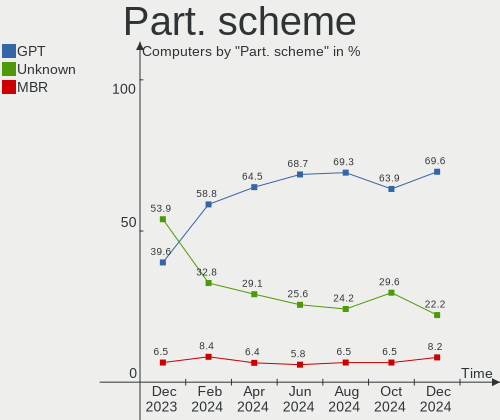
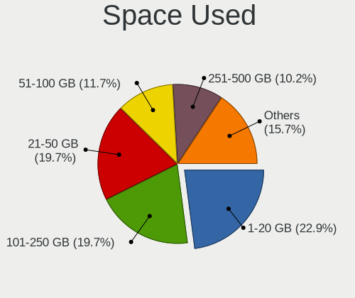
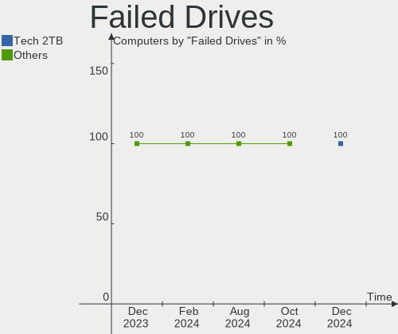
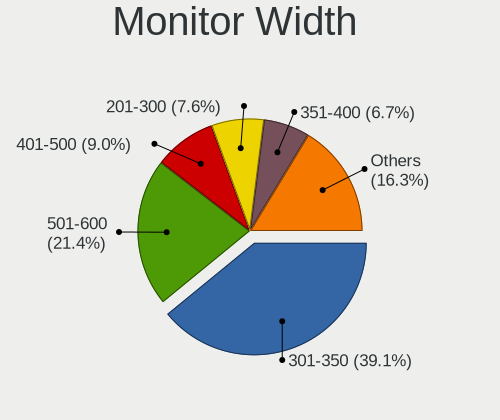
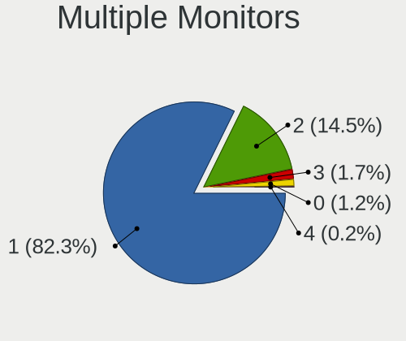
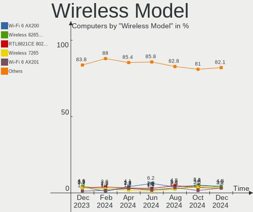

Linux Mint - Hardware Trends
----------------------------

A project to identify most popular hardware characteristics and track their change
over time based on data collected by Linux users at https://Linux-Hardware.org.

Anyone can contribute to this report by the [hw-probe](https://github.com/linuxhw/hw-probe) tool:

    sudo -E hw-probe -all -upload

This is a report for all computer types. See also reports for [desktops](/Dist/Linux_Mint/Desktop/README.md) and [notebooks](/Dist/Linux_Mint/Notebook/README.md).

This report is for one last month. Overall report since the beginning of time: [TestDays](https://github.com/linuxhw/TestDays)

Period: Nov, 2023.

Contents
--------

* [ System ](#system)
  - [ OS                       ](#os)
  - [ OS Family                ](#os-family)
  - [ Kernel                   ](#kernel)
  - [ Kernel Family            ](#kernel-family)
  - [ Kernel Major Ver.        ](#kernel-major-ver)
  - [ Arch                     ](#arch)
  - [ DE                       ](#de)
  - [ Display Server           ](#display-server)
  - [ Display Manager          ](#display-manager)
  - [ OS Lang                  ](#os-lang)
  - [ Boot Mode                ](#boot-mode)
  - [ Filesystem               ](#filesystem)
  - [ Part. scheme             ](#part-scheme)
  - [ Dual Boot with Linux/BSD ](#dual-boot-with-linuxbsd)
  - [ Dual Boot (Win)          ](#dual-boot-win)

* [ Board ](#board)
  - [ Vendor                   ](#vendor)
  - [ Model                    ](#model)
  - [ Model Family             ](#model-family)
  - [ MFG Year                 ](#mfg-year)
  - [ Form Factor              ](#form-factor)
  - [ Secure Boot              ](#secure-boot)
  - [ Coreboot                 ](#coreboot)
  - [ RAM Size                 ](#ram-size)
  - [ RAM Used                 ](#ram-used)
  - [ Total Drives             ](#total-drives)
  - [ Has CD-ROM               ](#has-cd-rom)
  - [ Has Ethernet             ](#has-ethernet)
  - [ Has WiFi                 ](#has-wifi)
  - [ Has Bluetooth            ](#has-bluetooth)

* [ Location ](#location)
  - [ Country                  ](#country)
  - [ City                     ](#city)

* [ Drives ](#drives)
  - [ Drive Vendor             ](#drive-vendor)
  - [ Drive Model              ](#drive-model)
  - [ HDD Vendor               ](#hdd-vendor)
  - [ SSD Vendor               ](#ssd-vendor)
  - [ Drive Kind               ](#drive-kind)
  - [ Drive Connector          ](#drive-connector)
  - [ Drive Size               ](#drive-size)
  - [ Space Total              ](#space-total)
  - [ Space Used               ](#space-used)
  - [ Malfunc. Drives          ](#malfunc-drives)
  - [ Malfunc. Drive Vendor    ](#malfunc-drive-vendor)
  - [ Malfunc. HDD Vendor      ](#malfunc-hdd-vendor)
  - [ Malfunc. Drive Kind      ](#malfunc-drive-kind)
  - [ Failed Drives            ](#failed-drives)
  - [ Failed Drive Vendor      ](#failed-drive-vendor)
  - [ Drive Status             ](#drive-status)

* [ Storage controller ](#storage-controller)
  - [ Storage Vendor           ](#storage-vendor)
  - [ Storage Model            ](#storage-model)
  - [ Storage Kind             ](#storage-kind)

* [ Processor ](#processor)
  - [ CPU Vendor               ](#cpu-vendor)
  - [ CPU Model                ](#cpu-model)
  - [ CPU Model Family         ](#cpu-model-family)
  - [ CPU Cores                ](#cpu-cores)
  - [ CPU Sockets              ](#cpu-sockets)
  - [ CPU Threads              ](#cpu-threads)
  - [ CPU Op-Modes             ](#cpu-op-modes)
  - [ CPU Microcode            ](#cpu-microcode)
  - [ CPU Microarch            ](#cpu-microarch)

* [ Graphics ](#graphics)
  - [ GPU Vendor               ](#gpu-vendor)
  - [ GPU Model                ](#gpu-model)
  - [ GPU Combo                ](#gpu-combo)
  - [ GPU Driver               ](#gpu-driver)
  - [ GPU Memory               ](#gpu-memory)

* [ Monitor ](#monitor)
  - [ Monitor Vendor           ](#monitor-vendor)
  - [ Monitor Model            ](#monitor-model)
  - [ Monitor Resolution       ](#monitor-resolution)
  - [ Monitor Diagonal         ](#monitor-diagonal)
  - [ Monitor Width            ](#monitor-width)
  - [ Aspect Ratio             ](#aspect-ratio)
  - [ Monitor Area             ](#monitor-area)
  - [ Pixel Density            ](#pixel-density)
  - [ Multiple Monitors        ](#multiple-monitors)

* [ Network ](#network)
  - [ Net Controller Vendor    ](#net-controller-vendor)
  - [ Net Controller Model     ](#net-controller-model)
  - [ Wireless Vendor          ](#wireless-vendor)
  - [ Wireless Model           ](#wireless-model)
  - [ Ethernet Vendor          ](#ethernet-vendor)
  - [ Ethernet Model           ](#ethernet-model)
  - [ Net Controller Kind      ](#net-controller-kind)
  - [ Used Controller          ](#used-controller)
  - [ NICs                     ](#nics)
  - [ IPv6                     ](#ipv6)

* [ Bluetooth ](#bluetooth)
  - [ Bluetooth Vendor         ](#bluetooth-vendor)
  - [ Bluetooth Model          ](#bluetooth-model)

* [ Sound ](#sound)
  - [ Sound Vendor             ](#sound-vendor)
  - [ Sound Model              ](#sound-model)

* [ Memory ](#memory)
  - [ Memory Vendor            ](#memory-vendor)
  - [ Memory Model             ](#memory-model)
  - [ Memory Kind              ](#memory-kind)
  - [ Memory Form Factor       ](#memory-form-factor)
  - [ Memory Size              ](#memory-size)
  - [ Memory Speed             ](#memory-speed)

* [ Printers & scanners ](#printers--scanners)
  - [ Printer Vendor           ](#printer-vendor)
  - [ Printer Model            ](#printer-model)
  - [ Scanner Vendor           ](#scanner-vendor)
  - [ Scanner Model            ](#scanner-model)

* [ Camera ](#camera)
  - [ Camera Vendor            ](#camera-vendor)
  - [ Camera Model             ](#camera-model)

* [ Security ](#security)
  - [ Fingerprint Vendor       ](#fingerprint-vendor)
  - [ Fingerprint Model        ](#fingerprint-model)
  - [ Chipcard Vendor          ](#chipcard-vendor)
  - [ Chipcard Model           ](#chipcard-model)

* [ Unsupported ](#unsupported)
  - [ Unsupported Devices      ](#unsupported-devices)
  - [ Unsupported Device Types ](#unsupported-device-types)

System
------

OS
--

Installed operating systems

| Name            | Computers | Percent |
|-----------------|-----------|---------|
| Linux Mint 21.2 | 460       | 78.77%  |
| Linux Mint 21.1 | 42        | 7.19%   |
| Linux Mint 20.3 | 37        | 6.34%   |
| Linux Mint 21   | 23        | 3.94%   |
| Linux Mint 20.2 | 10        | 1.71%   |
| Linux Mint 20   | 5         | 0.86%   |
| Linux Mint 19.3 | 3         | 0.51%   |
| Linux Mint 20.1 | 1         | 0.17%   |
| Linux Mint 19.2 | 1         | 0.17%   |
| Linux Mint 18.3 | 1         | 0.17%   |
| Linux Mint 18.2 | 1         | 0.17%   |

OS Family
---------

OS without a version

| Name       | Computers | Percent |
|------------|-----------|---------|
| Linux Mint | 584       | 100%    |

Kernel
------

Version of the Linux kernel

| Version                 | Computers | Percent |
|-------------------------|-----------|---------|
| 5.15.0-88-generic       | 220       | 37.67%  |
| 5.15.0-89-generic       | 98        | 16.78%  |
| 6.2.0-36-generic        | 60        | 10.27%  |
| 5.15.0-76-generic       | 45        | 7.71%   |
| 5.4.0-166-generic       | 31        | 5.31%   |
| 6.2.0-37-generic        | 28        | 4.79%   |
| 5.15.0-87-generic       | 15        | 2.57%   |
| 6.2.0-33-generic        | 7         | 1.2%    |
| 5.15.0-86-generic       | 7         | 1.2%    |
| 5.4.0-167-generic       | 6         | 1.03%   |
| 5.15.0-84-generic       | 5         | 0.86%   |
| 5.4.0-164-generic       | 4         | 0.68%   |
| 5.15.0-56-generic       | 4         | 0.68%   |
| 6.5.0-1007-oem          | 3         | 0.51%   |
| 6.2.0-35-generic        | 3         | 0.51%   |
| 5.4.0-150-generic       | 3         | 0.51%   |
| 5.15.0-83-generic       | 3         | 0.51%   |
| 6.5.0-1008-oem          | 2         | 0.34%   |
| 6.2.0-34-generic        | 2         | 0.34%   |
| 5.15.0-82-generic       | 2         | 0.34%   |
| 5.15.0-69-generic       | 2         | 0.34%   |
| 6.6.1-060601-generic    | 1         | 0.17%   |
| 6.6.0-x64v3-xanmod1     | 1         | 0.17%   |
| 6.6.0-060600rc5-generic | 1         | 0.17%   |
| 6.5.7-060507-generic    | 1         | 0.17%   |
| 6.5.5-060505-generic    | 1         | 0.17%   |
| 6.5.10-1-liquorix-amd64 | 1         | 0.17%   |
| 6.5.0-9-generic         | 1         | 0.17%   |
| 6.5.0-1006-oem          | 1         | 0.17%   |
| 6.4.3-060403-generic    | 1         | 0.17%   |
| 6.4.0-060400-generic    | 1         | 0.17%   |
| 6.3.5-060305-generic    | 1         | 0.17%   |
| 6.3.0-060300-generic    | 1         | 0.17%   |
| 6.2.0-1015-oracle       | 1         | 0.17%   |
| 6.2.0-1010-nvidia       | 1         | 0.17%   |
| 6.1.0-1025-oem          | 1         | 0.17%   |
| 6.1.0-1024-oem          | 1         | 0.17%   |
| 6.0.3-060003-generic    | 1         | 0.17%   |
| 5.4.0-26-generic        | 1         | 0.17%   |
| 5.4.0-165-generic       | 1         | 0.17%   |

Kernel Family
-------------

Linux kernel without a distro release

| Version | Computers | Percent |
|---------|-----------|---------|
| 5.15.0  | 409       | 70.03%  |
| 6.2.0   | 102       | 17.47%  |
| 5.4.0   | 49        | 8.39%   |
| 6.5.0   | 7         | 1.2%    |
| 6.6.0   | 2         | 0.34%   |
| 6.1.0   | 2         | 0.34%   |
| 6.6.1   | 1         | 0.17%   |
| 6.5.7   | 1         | 0.17%   |
| 6.5.5   | 1         | 0.17%   |
| 6.5.10  | 1         | 0.17%   |
| 6.4.3   | 1         | 0.17%   |
| 6.4.0   | 1         | 0.17%   |
| 6.3.5   | 1         | 0.17%   |
| 6.3.0   | 1         | 0.17%   |
| 6.0.3   | 1         | 0.17%   |
| 5.10.0  | 1         | 0.17%   |
| 4.8.0   | 1         | 0.17%   |
| 4.4.0   | 1         | 0.17%   |
| 4.15.0  | 1         | 0.17%   |

Kernel Major Ver.
-----------------

Linux kernel major version

| Version | Computers | Percent |
|---------|-----------|---------|
| 5.15    | 409       | 70.03%  |
| 6.2     | 102       | 17.47%  |
| 5.4     | 49        | 8.39%   |
| 6.5     | 10        | 1.71%   |
| 6.6     | 3         | 0.51%   |
| 6.4     | 2         | 0.34%   |
| 6.3     | 2         | 0.34%   |
| 6.1     | 2         | 0.34%   |
| 6.0     | 1         | 0.17%   |
| 5.10    | 1         | 0.17%   |
| 4.8     | 1         | 0.17%   |
| 4.4     | 1         | 0.17%   |
| 4.15    | 1         | 0.17%   |

Arch
----

OS architecture (x86_64, i586, etc.)

| Name   | Computers | Percent |
|--------|-----------|---------|
| x86_64 | 584       | 100%    |

DE
--

Desktop Environment

| Name       | Computers | Percent |
|------------|-----------|---------|
| X-Cinnamon | 420       | 71.92%  |
| MATE       | 74        | 12.67%  |
| XFCE       | 67        | 11.47%  |
| GNOME      | 7         | 1.2%    |
| Unknown    | 7         | 1.2%    |
| Cinnamon   | 5         | 0.86%   |
| KDE5       | 3         | 0.51%   |
| KDE        | 1         | 0.17%   |

Display Server
--------------

X11 or Wayland

| Name    | Computers | Percent |
|---------|-----------|---------|
| X11     | 578       | 98.97%  |
| Tty     | 5         | 0.86%   |
| Wayland | 1         | 0.17%   |

Display Manager
---------------

SDDM, LightDM, etc.

| Name    | Computers | Percent |
|---------|-----------|---------|
| Unknown | 344       | 58.9%   |
| LightDM | 237       | 40.58%  |
| SDDM    | 2         | 0.34%   |
| LXDM    | 1         | 0.17%   |

OS Lang
-------

Language

| Lang    | Computers | Percent |
|---------|-----------|---------|
| en_US   | 187       | 32.02%  |
| de_DE   | 100       | 17.12%  |
| it_IT   | 42        | 7.19%   |
| pt_BR   | 30        | 5.14%   |
| fr_FR   | 28        | 4.79%   |
| en_GB   | 26        | 4.45%   |
| C       | 19        | 3.25%   |
| ru_RU   | 16        | 2.74%   |
| pl_PL   | 14        | 2.4%    |
| en_CA   | 14        | 2.4%    |
| en_AU   | 13        | 2.23%   |
| es_ES   | 11        | 1.88%   |
| de_CH   | 6         | 1.03%   |
| Unknown | 6         | 1.03%   |
| es_MX   | 5         | 0.86%   |
| es_CO   | 4         | 0.68%   |
| es_AR   | 4         | 0.68%   |
| en_NZ   | 4         | 0.68%   |
| de_AT   | 4         | 0.68%   |
| cs_CZ   | 4         | 0.68%   |
| nl_NL   | 3         | 0.51%   |
| fi_FI   | 3         | 0.51%   |
| es_VE   | 3         | 0.51%   |
| en_ZA   | 3         | 0.51%   |
| en_IN   | 3         | 0.51%   |
| tr_TR   | 2         | 0.34%   |
| sk_SK   | 2         | 0.34%   |
| pt_PT   | 2         | 0.34%   |
| hu_HU   | 2         | 0.34%   |
| fr_CA   | 2         | 0.34%   |
| fr_BE   | 2         | 0.34%   |
| es_UY   | 2         | 0.34%   |
| en_IE   | 2         | 0.34%   |
| da_DK   | 2         | 0.34%   |
| zh_TW   | 1         | 0.17%   |
| sv_SE   | 1         | 0.17%   |
| sl_SI   | 1         | 0.17%   |
| nb_NO   | 1         | 0.17%   |
| lv_LV   | 1         | 0.17%   |
| id_ID   | 1         | 0.17%   |

Boot Mode
---------

EFI or BIOS

| Mode | Computers | Percent |
|------|-----------|---------|
| EFI  | 399       | 68.32%  |
| BIOS | 185       | 31.68%  |

Filesystem
----------

Type of filesystem

| Type    | Computers | Percent |
|---------|-----------|---------|
| Ext4    | 539       | 92.29%  |
| Overlay | 13        | 2.23%   |
| Tmpfs   | 12        | 2.05%   |
| Btrfs   | 9         | 1.54%   |
| Zfs     | 5         | 0.86%   |
| Xfs     | 5         | 0.86%   |
| Ext2    | 1         | 0.17%   |

Part. scheme
------------

Scheme of partitioning

| Type    | Computers | Percent |
|---------|-----------|---------|
| Unknown | 336       | 57.53%  |
| GPT     | 226       | 38.7%   |
| MBR     | 22        | 3.77%   |

Dual Boot with Linux/BSD
------------------------

Hosting more than one Linux/BSD

| Dual boot | Computers | Percent |
|-----------|-----------|---------|
| No        | 543       | 92.98%  |
| Yes       | 41        | 7.02%   |

Dual Boot (Win)
---------------

Hosting Linux and Windows

| Dual boot | Computers | Percent |
|-----------|-----------|---------|
| No        | 475       | 81.34%  |
| Yes       | 109       | 18.66%  |

Board
-----

Vendor
------

Motherboard manufacturer

| Name                                 | Computers | Percent |
|--------------------------------------|-----------|---------|
| Hewlett-Packard                      | 90        | 15.41%  |
| Lenovo                               | 88        | 15.07%  |
| ASUSTek Computer                     | 87        | 14.9%   |
| Dell                                 | 64        | 10.96%  |
| MSI                                  | 35        | 5.99%   |
| Gigabyte Technology                  | 32        | 5.48%   |
| Acer                                 | 31        | 5.31%   |
| ASRock                               | 20        | 3.42%   |
| Apple                                | 19        | 3.25%   |
| Toshiba                              | 13        | 2.23%   |
| Fujitsu                              | 10        | 1.71%   |
| Sony                                 | 6         | 1.03%   |
| Samsung Electronics                  | 6         | 1.03%   |
| Medion                               | 6         | 1.03%   |
| Unknown                              | 6         | 1.03%   |
| Intel                                | 5         | 0.86%   |
| ECS                                  | 5         | 0.86%   |
| Google                               | 4         | 0.68%   |
| Pegatron                             | 3         | 0.51%   |
| Foxconn                              | 3         | 0.51%   |
| AZW                                  | 3         | 0.51%   |
| AMI                                  | 3         | 0.51%   |
| VALE                                 | 2         | 0.34%   |
| Timi                                 | 2         | 0.34%   |
| Teclast                              | 2         | 0.34%   |
| Supermicro                           | 2         | 0.34%   |
| Shenzhen Meigao Electronic Equipment | 2         | 0.34%   |
| Packard Bell                         | 2         | 0.34%   |
| GPU Company                          | 2         | 0.34%   |
| Gateway                              | 2         | 0.34%   |
| BESSTAR Tech                         | 2         | 0.34%   |
| Alienware                            | 2         | 0.34%   |
| Wortmann AG                          | 1         | 0.17%   |
| TUXEDO                               | 1         | 0.17%   |
| Trigkey                              | 1         | 0.17%   |
| SGIN                                 | 1         | 0.17%   |
| Schenker                             | 1         | 0.17%   |
| Sapphire                             | 1         | 0.17%   |
| RCA                                  | 1         | 0.17%   |
| Qilive                               | 1         | 0.17%   |

Model
-----

Motherboard model

| Name                               | Computers | Percent |
|------------------------------------|-----------|---------|
| Unknown                            | 10        | 1.71%   |
| HP Pavilion dv6                    | 3         | 0.51%   |
| Dell OptiPlex 7040                 | 3         | 0.51%   |
| Dell Latitude E6540                | 3         | 0.51%   |
| ASUS TUF Gaming B550M-PLUS         | 3         | 0.51%   |
| MSI MS-7C75                        | 2         | 0.34%   |
| MSI MS-7B89                        | 2         | 0.34%   |
| MSI MS-7B86                        | 2         | 0.34%   |
| Lenovo IdeaPad 5 15ITL05 82FG      | 2         | 0.34%   |
| HP ProDesk 600 G1 DM               | 2         | 0.34%   |
| HP Pavilion Notebook               | 2         | 0.34%   |
| HP Pavilion g7                     | 2         | 0.34%   |
| HP Compaq Pro 6300 SFF             | 2         | 0.34%   |
| HP Compaq 8200 Elite SFF PC        | 2         | 0.34%   |
| HP Compaq 6200 Pro SFF PC          | 2         | 0.34%   |
| GPU Company GWTC116-2              | 2         | 0.34%   |
| Gigabyte Z590 GAMING X             | 2         | 0.34%   |
| Gigabyte H61M-S1                   | 2         | 0.34%   |
| Dell XPS 8300                      | 2         | 0.34%   |
| Dell OptiPlex 7020                 | 2         | 0.34%   |
| Dell OptiPlex 3020                 | 2         | 0.34%   |
| Dell Latitude E5530 non-vPro       | 2         | 0.34%   |
| Dell Latitude 5580                 | 2         | 0.34%   |
| Dell Latitude 3480                 | 2         | 0.34%   |
| AZW SER                            | 2         | 0.34%   |
| ASUS X580VD                        | 2         | 0.34%   |
| ASUS TUF Gaming B450-PLUS II       | 2         | 0.34%   |
| ASUS ROG STRIX B450-F GAMING       | 2         | 0.34%   |
| ASUS PRIME X670-P                  | 2         | 0.34%   |
| ASUS PRIME A320M-E                 | 2         | 0.34%   |
| ASUS M32CD_A_F_K20CD_K31CD         | 2         | 0.34%   |
| ASUS All Series                    | 2         | 0.34%   |
| Apple MacBookPro9,2                | 2         | 0.34%   |
| Apple MacBookPro7,1                | 2         | 0.34%   |
| AMI Intel                          | 2         | 0.34%   |
| Acer Aspire A515-56                | 2         | 0.34%   |
| Wortmann AG CR700                  | 1         | 0.17%   |
| VALE Notebook Classic C170         | 1         | 0.17%   |
| VALE Notebook Classic C140         | 1         | 0.17%   |
| TUXEDO InfinityBook Pro Gen8 (MK1) | 1         | 0.17%   |

Model Family
------------

Motherboard model prefix

| Name               | Computers | Percent |
|--------------------|-----------|---------|
| Lenovo ThinkPad    | 38        | 6.51%   |
| Dell Latitude      | 21        | 3.6%    |
| Acer Aspire        | 21        | 3.6%    |
| Dell OptiPlex      | 17        | 2.91%   |
| HP Pavilion        | 16        | 2.74%   |
| Lenovo IdeaPad     | 14        | 2.4%    |
| HP Compaq          | 11        | 1.88%   |
| ASUS VivoBook      | 11        | 1.88%   |
| ASUS PRIME         | 11        | 1.88%   |
| Toshiba Satellite  | 10        | 1.71%   |
| Dell Inspiron      | 10        | 1.71%   |
| Unknown            | 10        | 1.71%   |
| HP EliteBook       | 9         | 1.54%   |
| ASUS TUF           | 9         | 1.54%   |
| ASUS ROG           | 9         | 1.54%   |
| HP ProBook         | 8         | 1.37%   |
| HP Laptop          | 8         | 1.37%   |
| Lenovo ThinkCentre | 6         | 1.03%   |
| Dell Precision     | 6         | 1.03%   |
| Fujitsu LIFEBOOK   | 5         | 0.86%   |
| Dell XPS           | 5         | 0.86%   |
| Lenovo Legion      | 4         | 0.68%   |
| HP ProDesk         | 4         | 0.68%   |
| Acer Swift         | 4         | 0.68%   |
| MSI Modern         | 3         | 0.51%   |
| Lenovo Yoga        | 3         | 0.51%   |
| Lenovo ThinkBook   | 3         | 0.51%   |
| Lenovo IdeaCentre  | 3         | 0.51%   |
| HP ENVY            | 3         | 0.51%   |
| Fujitsu ESPRIMO    | 3         | 0.51%   |
| Dell Vostro        | 3         | 0.51%   |
| ASUS ASUS          | 3         | 0.51%   |
| ASRock B550M       | 3         | 0.51%   |
| Apple MacBookPro9  | 3         | 0.51%   |
| Acer Nitro         | 3         | 0.51%   |
| VALE Notebook      | 2         | 0.34%   |
| MSI MS-7C75        | 2         | 0.34%   |
| MSI MS-7B89        | 2         | 0.34%   |
| MSI MS-7B86        | 2         | 0.34%   |
| Medion Akoya       | 2         | 0.34%   |

MFG Year
--------

Motherboard manufacture year

| Year | Computers | Percent |
|------|-----------|---------|
| 2021 | 57        | 9.76%   |
| 2012 | 49        | 8.39%   |
| 2018 | 47        | 8.05%   |
| 2011 | 47        | 8.05%   |
| 2020 | 44        | 7.53%   |
| 2013 | 42        | 7.19%   |
| 2022 | 38        | 6.51%   |
| 2019 | 37        | 6.34%   |
| 2017 | 36        | 6.16%   |
| 2023 | 32        | 5.48%   |
| 2015 | 30        | 5.14%   |
| 2016 | 29        | 4.97%   |
| 2014 | 28        | 4.79%   |
| 2010 | 25        | 4.28%   |
| 2009 | 18        | 3.08%   |
| 2008 | 16        | 2.74%   |
| 2006 | 6         | 1.03%   |
| 2007 | 2         | 0.34%   |
| 2005 | 1         | 0.17%   |

Form Factor
-----------

Physical design of the computer

| Name        | Computers | Percent |
|-------------|-----------|---------|
| Notebook    | 311       | 53.25%  |
| Desktop     | 239       | 40.92%  |
| Convertible | 10        | 1.71%   |
| Mini pc     | 10        | 1.71%   |
| All in one  | 9         | 1.54%   |
| Tablet      | 3         | 0.51%   |
| Server      | 2         | 0.34%   |

Secure Boot
-----------

Enabled or disabled

| State    | Computers | Percent |
|----------|-----------|---------|
| Disabled | 535       | 91.61%  |
| Enabled  | 49        | 8.39%   |

Coreboot
--------

Have coreboot on board

| Used | Computers | Percent |
|------|-----------|---------|
| No   | 580       | 99.32%  |
| Yes  | 4         | 0.68%   |

RAM Size
--------

Total RAM memory

| Size in GB      | Computers | Percent |
|-----------------|-----------|---------|
| 4.01-8.0        | 152       | 26.03%  |
| 16.01-24.0      | 133       | 22.77%  |
| 3.01-4.0        | 95        | 16.27%  |
| 8.01-16.0       | 87        | 14.9%   |
| 32.01-64.0      | 58        | 9.93%   |
| 64.01-256.0     | 19        | 3.25%   |
| 24.01-32.0      | 17        | 2.91%   |
| 1.01-2.0        | 13        | 2.23%   |
| 2.01-3.0        | 9         | 1.54%   |
| More than 256.0 | 1         | 0.17%   |

RAM Used
--------

Used RAM memory

| Used GB    | Computers | Percent |
|------------|-----------|---------|
| 2.01-3.0   | 185       | 31.68%  |
| 1.01-2.0   | 182       | 31.16%  |
| 4.01-8.0   | 95        | 16.27%  |
| 3.01-4.0   | 83        | 14.21%  |
| 8.01-16.0  | 18        | 3.08%   |
| 0.51-1.0   | 14        | 2.4%    |
| 16.01-24.0 | 4         | 0.68%   |
| 24.01-32.0 | 2         | 0.34%   |
| 0.01-0.5   | 1         | 0.17%   |

Total Drives
------------

Number of drives on board

| Drives | Computers | Percent |
|--------|-----------|---------|
| 1      | 345       | 59.08%  |
| 2      | 147       | 25.17%  |
| 3      | 50        | 8.56%   |
| 4      | 17        | 2.91%   |
| 6      | 10        | 1.71%   |
| 5      | 9         | 1.54%   |
| 0      | 3         | 0.51%   |
| 7      | 2         | 0.34%   |
| 9      | 1         | 0.17%   |

Has CD-ROM
----------

Has CD-ROM on board

| Presented | Computers | Percent |
|-----------|-----------|---------|
| No        | 342       | 58.56%  |
| Yes       | 242       | 41.44%  |

Has Ethernet
------------

Has Ethernet on board

| Presented | Computers | Percent |
|-----------|-----------|---------|
| Yes       | 509       | 87.16%  |
| No        | 75        | 12.84%  |

Has WiFi
--------

Has WiFi module

| Presented | Computers | Percent |
|-----------|-----------|---------|
| Yes       | 466       | 79.79%  |
| No        | 118       | 20.21%  |

Has Bluetooth
-------------

Has Bluetooth module

| Presented | Computers | Percent |
|-----------|-----------|---------|
| Yes       | 381       | 65.24%  |
| No        | 203       | 34.76%  |

Location
--------

Country
-------

Geographic location (country)

| Country         | Computers | Percent |
|-----------------|-----------|---------|
| Germany         | 113       | 19.35%  |
| USA             | 103       | 17.64%  |
| Italy           | 48        | 8.22%   |
| Brazil          | 32        | 5.48%   |
| France          | 26        | 4.45%   |
| UK              | 22        | 3.77%   |
| Poland          | 18        | 3.08%   |
| Russia          | 17        | 2.91%   |
| Canada          | 16        | 2.74%   |
| Switzerland     | 13        | 2.23%   |
| Australia       | 13        | 2.23%   |
| Spain           | 12        | 2.05%   |
| Netherlands     | 11        | 1.88%   |
| Sweden          | 10        | 1.71%   |
| Austria         | 9         | 1.54%   |
| Mexico          | 7         | 1.2%    |
| Hungary         | 6         | 1.03%   |
| Turkey          | 5         | 0.86%   |
| Slovakia        | 5         | 0.86%   |
| Finland         | 5         | 0.86%   |
| Czechia         | 5         | 0.86%   |
| Bulgaria        | 5         | 0.86%   |
| Argentina       | 5         | 0.86%   |
| New Zealand     | 4         | 0.68%   |
| Denmark         | 4         | 0.68%   |
| Colombia        | 4         | 0.68%   |
| Belgium         | 4         | 0.68%   |
| Venezuela       | 3         | 0.51%   |
| South Africa    | 3         | 0.51%   |
| Romania         | 3         | 0.51%   |
| Portugal        | 3         | 0.51%   |
| Ireland         | 3         | 0.51%   |
| India           | 3         | 0.51%   |
| Uruguay         | 2         | 0.34%   |
| Ukraine         | 2         | 0.34%   |
| Tunisia         | 2         | 0.34%   |
| The Netherlands | 2         | 0.34%   |
| Serbia          | 2         | 0.34%   |
| Moldova         | 2         | 0.34%   |
| Malaysia        | 2         | 0.34%   |

City
----

Geographic location (city)

| City              | Computers | Percent |
|-------------------|-----------|---------|
| Berlin            | 9         | 1.54%   |
| Milan             | 8         | 1.37%   |
| Warsaw            | 7         | 1.2%    |
| Stockholm         | 6         | 1.03%   |
| Hamburg           | 6         | 1.03%   |
| Vienna            | 5         | 0.86%   |
| Skokie            | 5         | 0.86%   |
| Sao Paulo         | 5         | 0.86%   |
| Melbourne         | 5         | 0.86%   |
| Sydney            | 4         | 0.68%   |
| Sofia             | 4         | 0.68%   |
| Rome              | 4         | 0.68%   |
| Helsinki          | 4         | 0.68%   |
| Frankfurt am Main | 4         | 0.68%   |
| Cologne           | 4         | 0.68%   |
| Budapest          | 4         | 0.68%   |
| Zurich            | 3         | 0.51%   |
| Wroclaw           | 3         | 0.51%   |
| Toronto           | 3         | 0.51%   |
| Seattle           | 3         | 0.51%   |
| Rio de Janeiro    | 3         | 0.51%   |
| Naples            | 3         | 0.51%   |
| Munich            | 3         | 0.51%   |
| Milano            | 3         | 0.51%   |
| Leipzig           | 3         | 0.51%   |
| Granada           | 3         | 0.51%   |
| Edgware           | 3         | 0.51%   |
| Düsseldorf       | 3         | 0.51%   |
| Dublin            | 3         | 0.51%   |
| Bologna           | 3         | 0.51%   |
| Birmingham        | 3         | 0.51%   |
| Auckland          | 3         | 0.51%   |
| Wellington        | 2         | 0.34%   |
| Vallejo           | 2         | 0.34%   |
| Ulyanovsk         | 2         | 0.34%   |
| Turin             | 2         | 0.34%   |
| Stuttgart         | 2         | 0.34%   |
| Spring            | 2         | 0.34%   |
| Slagelse          | 2         | 0.34%   |
| Schwerin          | 2         | 0.34%   |

Drives
------

Drive Vendor
------------

Hard drive vendors

| Vendor                      | Computers | Drives | Percent |
|-----------------------------|-----------|--------|---------|
| Samsung Electronics         | 126       | 154    | 14.35%  |
| WDC                         | 111       | 124    | 12.64%  |
| Seagate                     | 110       | 127    | 12.53%  |
| Crucial                     | 54        | 60     | 6.15%   |
| Kingston                    | 53        | 56     | 6.04%   |
| SanDisk                     | 47        | 52     | 5.35%   |
| Toshiba                     | 45        | 55     | 5.13%   |
| Unknown                     | 37        | 42     | 4.21%   |
| Hitachi                     | 23        | 23     | 2.62%   |
| Micron Technology           | 21        | 21     | 2.39%   |
| China                       | 18        | 19     | 2.05%   |
| SK hynix                    | 16        | 16     | 1.82%   |
| Micron/Crucial Technology   | 15        | 16     | 1.71%   |
| Intel                       | 15        | 16     | 1.71%   |
| Intenso                     | 11        | 11     | 1.25%   |
| Kingston Technology Company | 10        | 10     | 1.14%   |
| A-DATA Technology           | 10        | 10     | 1.14%   |
| PNY                         | 9         | 10     | 1.03%   |
| HGST                        | 9         | 9      | 1.03%   |
| Team                        | 7         | 7      | 0.8%    |
| Phison Electronics          | 7         | 7      | 0.8%    |
| SPCC                        | 5         | 5      | 0.57%   |
| Silicon Motion              | 5         | 5      | 0.57%   |
| KIOXIA                      | 5         | 5      | 0.57%   |
| Transcend                   | 4         | 4      | 0.46%   |
| Patriot                     | 4         | 4      | 0.46%   |
| OCZ                         | 4         | 4      | 0.46%   |
| JMicron Technology          | 4         | 4      | 0.46%   |
| Fujitsu                     | 4         | 4      | 0.46%   |
| Apple                       | 4         | 4      | 0.46%   |
| Unknown                     | 4         | 4      | 0.46%   |
| Mushkin                     | 3         | 3      | 0.34%   |
| MAXIO Technology (Hangzhou) | 3         | 3      | 0.34%   |
| Lexar                       | 3         | 3      | 0.34%   |
| GOODRAM                     | 3         | 3      | 0.34%   |
| Fanxiang                    | 3         | 4      | 0.34%   |
| XrayDisk                    | 2         | 2      | 0.23%   |
| Solid State Storage         | 2         | 2      | 0.23%   |
| Plextor                     | 2         | 2      | 0.23%   |
| Phison                      | 2         | 2      | 0.23%   |

Drive Model
-----------

Hard drive models

| Model                                                 | Computers | Percent |
|-------------------------------------------------------|-----------|---------|
| Samsung NVMe SSD Controller SM981/PM981/PM983 250GB   | 17        | 1.8%    |
| Unknown SD/MMC/MS PRO 128GB                           | 10        | 1.06%   |
| Seagate ST1000LM035-1RK172 1TB                        | 10        | 1.06%   |
| Toshiba DT01ACA100 1TB                                | 9         | 0.95%   |
| Seagate ST500DM002-1BD142 500GB                       | 9         | 0.95%   |
| Kingston SA400S37480G 480GB SSD                       | 8         | 0.85%   |
| Crucial CT1000MX500SSD1 1TB                           | 8         | 0.85%   |
| Unknown MMC Card  64GB                                | 7         | 0.74%   |
| Seagate ST2000DM008-2FR102 2TB                        | 7         | 0.74%   |
| Micron/Crucial P2 NVMe PCIe SSD 1TB                   | 7         | 0.74%   |
| Crucial CT500MX500SSD1 500GB                          | 7         | 0.74%   |
| Toshiba MQ04ABF100 1TB                                | 6         | 0.63%   |
| Seagate ST500LT012-1DG142 500GB                       | 6         | 0.63%   |
| Samsung SSD 980 1TB                                   | 6         | 0.63%   |
| Samsung SSD 860 EVO 1TB                               | 6         | 0.63%   |
| Kingston SA400S37240G 240GB SSD                       | 6         | 0.63%   |
| Crucial CT480BX500SSD1 480GB                          | 6         | 0.63%   |
| Crucial CT1000BX500SSD1 1TB                           | 6         | 0.63%   |
| Seagate ST31000528AS 1TB                              | 5         | 0.53%   |
| Samsung SSD 850 EVO 500GB                             | 5         | 0.53%   |
| Samsung SSD 850 EVO 250GB                             | 5         | 0.53%   |
| Crucial CT250MX500SSD1 250GB                          | 5         | 0.53%   |
| WDC WD10EZEX-22MFCA0 1TB                              | 4         | 0.42%   |
| Unknown MMC Card  32GB                                | 4         | 0.42%   |
| Toshiba MQ01ABD100 1TB                                | 4         | 0.42%   |
| Silicon Motion SM2263EN/SM2263XT SSD Controller 256GB | 4         | 0.42%   |
| Seagate ST2000DM006-2DM164 2TB                        | 4         | 0.42%   |
| Seagate ST1000DM003-1ER162 1TB                        | 4         | 0.42%   |
| Seagate Expansion 1TB                                 | 4         | 0.42%   |
| Samsung SSD 870 QVO 1TB                               | 4         | 0.42%   |
| Samsung SSD 870 EVO 500GB                             | 4         | 0.42%   |
| Micron/Crucial CT1000P5PSSD8 1TB                      | 4         | 0.42%   |
| Kingston Company SNV2S1000G 1TB                       | 4         | 0.42%   |
| Kingston SV300S37A120G 120GB SSD                      | 4         | 0.42%   |
| Kingston SA400S37120G 120GB SSD                       | 4         | 0.42%   |
| Unknown                                               | 4         | 0.42%   |
| Unknown MMC Card  128GB                               | 3         | 0.32%   |
| Seagate ST4000DM004-2CV104 4TB                        | 3         | 0.32%   |
| Seagate ST1000LM024 HN-M101MBB 1TB                    | 3         | 0.32%   |
| Sandisk WD Blue SN550 NVMe SSD 512GB                  | 3         | 0.32%   |

HDD Vendor
----------

Hard disk drive vendors

| Vendor              | Computers | Drives | Percent |
|---------------------|-----------|--------|---------|
| Seagate             | 106       | 123    | 35.33%  |
| WDC                 | 95        | 105    | 31.67%  |
| Toshiba             | 38        | 43     | 12.67%  |
| Hitachi             | 23        | 23     | 7.67%   |
| Unknown             | 10        | 10     | 3.33%   |
| HGST                | 9         | 9      | 3%      |
| Samsung Electronics | 8         | 9      | 2.67%   |
| Fujitsu             | 4         | 4      | 1.33%   |
| StoreJet            | 1         | 1      | 0.33%   |
| Maxtor              | 1         | 1      | 0.33%   |
| Intenso             | 1         | 1      | 0.33%   |
| Inateck             | 1         | 1      | 0.33%   |
| Hewlett-Packard     | 1         | 1      | 0.33%   |
| ASMT                | 1         | 1      | 0.33%   |
| Apple               | 1         | 1      | 0.33%   |

SSD Vendor
----------

Solid state drive vendors

| Vendor              | Computers | Drives | Percent |
|---------------------|-----------|--------|---------|
| Samsung Electronics | 62        | 74     | 19.62%  |
| Crucial             | 49        | 52     | 15.51%  |
| Kingston            | 42        | 44     | 13.29%  |
| SanDisk             | 28        | 29     | 8.86%   |
| China               | 18        | 19     | 5.7%    |
| WDC                 | 10        | 10     | 3.16%   |
| PNY                 | 9         | 10     | 2.85%   |
| Micron Technology   | 9         | 9      | 2.85%   |
| A-DATA Technology   | 8         | 8      | 2.53%   |
| Intenso             | 7         | 7      | 2.22%   |
| Team                | 6         | 6      | 1.9%    |
| Toshiba             | 4         | 4      | 1.27%   |
| SPCC                | 4         | 4      | 1.27%   |
| OCZ                 | 4         | 4      | 1.27%   |
| Transcend           | 3         | 3      | 0.95%   |
| Patriot             | 3         | 3      | 0.95%   |
| Apple               | 3         | 3      | 0.95%   |
| XrayDisk            | 2         | 2      | 0.63%   |
| Plextor             | 2         | 2      | 0.63%   |
| Mushkin             | 2         | 2      | 0.63%   |
| LITEON              | 2         | 2      | 0.63%   |
| GOODRAM             | 2         | 2      | 0.63%   |
| Emtec               | 2         | 2      | 0.63%   |
| Acer                | 2         | 2      | 0.63%   |
| WDC WDS             | 1         | 1      | 0.32%   |
| Verbatim            | 1         | 1      | 0.32%   |
| Unknown             | 1         | 1      | 0.32%   |
| tecmiyo             | 1         | 1      | 0.32%   |
| Teclast             | 1         | 1      | 0.32%   |
| SK hynix            | 1         | 1      | 0.32%   |
| PHISON 1            | 1         | 1      | 0.32%   |
| Netac               | 1         | 1      | 0.32%   |
| Londisk             | 1         | 1      | 0.32%   |
| Lexar               | 1         | 1      | 0.32%   |
| Lenovo              | 1         | 1      | 0.32%   |
| KingSpec            | 1         | 1      | 0.32%   |
| KingDian            | 1         | 1      | 0.32%   |
| Jumper              | 1         | 1      | 0.32%   |
| JMicron Technology  | 1         | 1      | 0.32%   |
| Integral            | 1         | 1      | 0.32%   |

Drive Kind
----------

HDD or SSD

| Kind    | Computers | Drives | Percent |
|---------|-----------|--------|---------|
| SSD     | 271       | 337    | 35.15%  |
| HDD     | 250       | 333    | 32.43%  |
| NVMe    | 208       | 251    | 26.98%  |
| MMC     | 23        | 25     | 2.98%   |
| Unknown | 19        | 25     | 2.46%   |

Drive Connector
---------------

SATA, SAS, NVMe, etc.

| Type | Computers | Drives | Percent |
|------|-----------|--------|---------|
| SATA | 438       | 629    | 60.58%  |
| NVMe | 207       | 250    | 28.63%  |
| SAS  | 55        | 67     | 7.61%   |
| MMC  | 23        | 25     | 3.18%   |

Drive Size
----------

Size of hard drive

| Size in TB | Computers | Drives | Percent |
|------------|-----------|--------|---------|
| 0.01-0.5   | 303       | 369    | 54.5%   |
| 0.51-1.0   | 164       | 197    | 29.5%   |
| 1.01-2.0   | 48        | 53     | 8.63%   |
| 3.01-4.0   | 19        | 23     | 3.42%   |
| 4.01-10.0  | 12        | 17     | 2.16%   |
| 2.01-3.0   | 10        | 11     | 1.8%    |

Space Total
-----------

Amount of disk space available on the file system

| Size in GB     | Computers | Percent |
|----------------|-----------|---------|
| 101-250        | 166       | 28.42%  |
| 251-500        | 136       | 23.29%  |
| 501-1000       | 101       | 17.29%  |
| More than 3000 | 49        | 8.39%   |
| 1001-2000      | 49        | 8.39%   |
| 51-100         | 26        | 4.45%   |
| 2001-3000      | 21        | 3.6%    |
| 21-50          | 14        | 2.4%    |
| 1-20           | 14        | 2.4%    |
| Unknown        | 8         | 1.37%   |

Space Used
----------

Amount of used disk space

| Used GB        | Computers | Percent |
|----------------|-----------|---------|
| 21-50          | 126       | 21.58%  |
| 1-20           | 113       | 19.35%  |
| 101-250        | 97        | 16.61%  |
| 51-100         | 90        | 15.41%  |
| 251-500        | 47        | 8.05%   |
| 501-1000       | 46        | 7.88%   |
| 1001-2000      | 25        | 4.28%   |
| More than 3000 | 18        | 3.08%   |
| 2001-3000      | 14        | 2.4%    |
| Unknown        | 8         | 1.37%   |

Malfunc. Drives
---------------

Drive models with a malfunction

| Model                                               | Computers | Drives | Percent |
|-----------------------------------------------------|-----------|--------|---------|
| Seagate ST31000528AS 1TB                            | 2         | 2      | 4.65%   |
| XrayDisk SSD 256GB                                  | 1         | 1      | 2.33%   |
| WDC WDS120G2G0A-00JH30 120GB SSD                    | 1         | 1      | 2.33%   |
| WDC WD5000BEVT-55A0RT0 500GB                        | 1         | 1      | 2.33%   |
| WDC WD5000AAVS-00ZTB0 500GB                         | 1         | 1      | 2.33%   |
| WDC WD5000AAKX-001CA0 500GB                         | 1         | 1      | 2.33%   |
| WDC WD5000AAKS-22V1A0 500GB                         | 1         | 1      | 2.33%   |
| WDC WD10SPCX-22HWST0 1TB                            | 1         | 1      | 2.33%   |
| WDC WD10EZEX-60WN4A0 1TB                            | 1         | 1      | 2.33%   |
| WDC WD10EZEX-60M2NA0 1TB                            | 1         | 1      | 2.33%   |
| Toshiba MQ04ABF100 1TB                              | 1         | 1      | 2.33%   |
| Toshiba MK5065GSXF 500GB                            | 1         | 1      | 2.33%   |
| Toshiba MK5059GSXP 500GB                            | 1         | 1      | 2.33%   |
| Toshiba MK3275GSX 320GB                             | 1         | 1      | 2.33%   |
| Toshiba DT01ACA050 500GB                            | 1         | 1      | 2.33%   |
| StoreJet Disk 1TB                                   | 1         | 1      | 2.33%   |
| SK hynix HFS256G39TND-N210A 256GB SSD               | 1         | 1      | 2.33%   |
| Seagate ST9320423AS 320GB                           | 1         | 1      | 2.33%   |
| Seagate ST500LT012-1DG142 500GB                     | 1         | 1      | 2.33%   |
| Seagate ST500DM002-1BD142 500GB                     | 1         | 1      | 2.33%   |
| Seagate ST500DM002 500GB                            | 1         | 1      | 2.33%   |
| Seagate ST3500830AS 500GB                           | 1         | 1      | 2.33%   |
| Seagate ST3500418AS 500GB                           | 1         | 1      | 2.33%   |
| Seagate ST3250620AS 250GB                           | 1         | 1      | 2.33%   |
| Seagate ST1000LM035-1RK172 1TB                      | 1         | 1      | 2.33%   |
| Seagate ST1000LM024 HN-M101MBB 1TB                  | 1         | 1      | 2.33%   |
| SanDisk SDSSDP128G 128GB                            | 1         | 1      | 2.33%   |
| Samsung Electronics SSD 980 PRO 1TB S5GXNF0R448681H | 1         | 1      | 2.33%   |
| Samsung Electronics HD103SI 1TB                     | 1         | 1      | 2.33%   |
| Maxtor 2B020H1 20GB                                 | 1         | 1      | 2.33%   |
| Intenso SSD SATAIII 512GB                           | 1         | 1      | 2.33%   |
| Hitachi HTS727550A9E364 500GB                       | 1         | 1      | 2.33%   |
| Hitachi HTS547550A9E384 500GB                       | 1         | 1      | 2.33%   |
| Hitachi HDS721010DLE630 1TB                         | 1         | 1      | 2.33%   |
| Fujitsu MHV2080AH 80GB                              | 1         | 1      | 2.33%   |
| Crucial CT1000MX500SSD1 1TB                         | 1         | 1      | 2.33%   |
| Crucial CT1000BX500SSD1 1TB                         | 1         | 1      | 2.33%   |
| China SSD 1TB                                       | 1         | 1      | 2.33%   |
| China SATA3 512GB SSD                               | 1         | 1      | 2.33%   |
| China M.2 2280 SATA SSD 128GB                       | 1         | 1      | 2.33%   |

Malfunc. Drive Vendor
---------------------

Vendors of faulty drives

| Vendor              | Computers | Drives | Percent |
|---------------------|-----------|--------|---------|
| Seagate             | 11        | 11     | 25.58%  |
| WDC                 | 8         | 8      | 18.6%   |
| Toshiba             | 5         | 5      | 11.63%  |
| Hitachi             | 3         | 3      | 6.98%   |
| China               | 3         | 3      | 6.98%   |
| Samsung Electronics | 2         | 2      | 4.65%   |
| Crucial             | 2         | 2      | 4.65%   |
| XrayDisk            | 1         | 1      | 2.33%   |
| StoreJet            | 1         | 1      | 2.33%   |
| SK hynix            | 1         | 1      | 2.33%   |
| SanDisk             | 1         | 1      | 2.33%   |
| Maxtor              | 1         | 1      | 2.33%   |
| Intenso             | 1         | 1      | 2.33%   |
| Fujitsu             | 1         | 1      | 2.33%   |
| Aura                | 1         | 1      | 2.33%   |
| Apple               | 1         | 1      | 2.33%   |

Malfunc. HDD Vendor
-------------------

Vendors of faulty HDD drives

| Vendor              | Computers | Drives | Percent |
|---------------------|-----------|--------|---------|
| Seagate             | 11        | 11     | 35.48%  |
| WDC                 | 7         | 7      | 22.58%  |
| Toshiba             | 5         | 5      | 16.13%  |
| Hitachi             | 3         | 3      | 9.68%   |
| StoreJet            | 1         | 1      | 3.23%   |
| Samsung Electronics | 1         | 1      | 3.23%   |
| Maxtor              | 1         | 1      | 3.23%   |
| Fujitsu             | 1         | 1      | 3.23%   |
| Apple               | 1         | 1      | 3.23%   |

Malfunc. Drive Kind
-------------------

Kinds of faulty drives

| Kind | Computers | Drives | Percent |
|------|-----------|--------|---------|
| HDD  | 29        | 31     | 70.73%  |
| SSD  | 11        | 11     | 26.83%  |
| NVMe | 1         | 1      | 2.44%   |

Failed Drives
-------------

Failed drive models

| Model                             | Computers | Drives | Percent |
|-----------------------------------|-----------|--------|---------|
| Samsung Electronics HM160HC 160GB | 1         | 1      | 50%     |
| Mushkin MKNSSDEC120GB             | 1         | 1      | 50%     |

Failed Drive Vendor
-------------------

Failed drive vendors

| Vendor              | Computers | Drives | Percent |
|---------------------|-----------|--------|---------|
| Samsung Electronics | 1         | 1      | 50%     |
| Mushkin             | 1         | 1      | 50%     |

Drive Status
------------

Number of failed and malfunc. drives

| Status   | Computers | Drives | Percent |
|----------|-----------|--------|---------|
| Detected | 376       | 606    | 59.68%  |
| Works    | 212       | 320    | 33.65%  |
| Malfunc  | 40        | 43     | 6.35%   |
| Failed   | 2         | 2      | 0.32%   |

Storage controller
------------------

Storage Vendor
--------------

Storage controller vendors

| Vendor                         | Computers | Percent |
|--------------------------------|-----------|---------|
| Intel                          | 385       | 50.39%  |
| AMD                            | 119       | 15.58%  |
| Samsung Electronics            | 69        | 9.03%   |
| SanDisk                        | 28        | 3.66%   |
| Micron/Crucial Technology      | 21        | 2.75%   |
| Kingston Technology Company    | 21        | 2.75%   |
| SK hynix                       | 15        | 1.96%   |
| Micron Technology              | 13        | 1.7%    |
| Phison Electronics             | 12        | 1.57%   |
| ASMedia Technology             | 11        | 1.44%   |
| Nvidia                         | 9         | 1.18%   |
| Marvell Technology Group       | 9         | 1.18%   |
| Silicon Motion                 | 8         | 1.05%   |
| KIOXIA                         | 8         | 1.05%   |
| MAXIO Technology (Hangzhou)    | 6         | 0.79%   |
| ADATA Technology               | 5         | 0.65%   |
| Seagate Technology             | 4         | 0.52%   |
| JMicron Technology             | 4         | 0.52%   |
| Toshiba America Info Systems   | 3         | 0.39%   |
| Solid State Storage Technology | 2         | 0.26%   |
| Shenzhen Longsys Electronics   | 2         | 0.26%   |
| Realtek Semiconductor          | 2         | 0.26%   |
| VIA Technologies               | 1         | 0.13%   |
| Union Memory (Shenzhen)        | 1         | 0.13%   |
| Solidigm                       | 1         | 0.13%   |
| OCZ Technology Group           | 1         | 0.13%   |
| LSI Logic / Symbios Logic      | 1         | 0.13%   |
| Lenovo                         | 1         | 0.13%   |
| INNOGRIT                       | 1         | 0.13%   |
| HighPoint Technologies         | 1         | 0.13%   |

Storage Model
-------------

Storage controller models

| Model                                                                                   | Computers | Percent |
|-----------------------------------------------------------------------------------------|-----------|---------|
| AMD FCH SATA Controller [AHCI mode]                                                     | 76        | 8.84%   |
| Intel Sunrise Point-LP SATA Controller [AHCI mode]                                      | 36        | 4.19%   |
| Samsung NVMe SSD Controller SM981/PM981/PM983                                           | 31        | 3.6%    |
| Intel 8 Series/C220 Series Chipset Family 6-port SATA Controller 1 [AHCI mode]          | 31        | 3.6%    |
| Intel 6 Series/C200 Series Chipset Family 6 port Mobile SATA AHCI Controller            | 30        | 3.49%   |
| Intel 7 Series Chipset Family 6-port SATA Controller [AHCI mode]                        | 23        | 2.67%   |
| AMD 500 Series Chipset SATA Controller                                                  | 20        | 2.33%   |
| Intel 6 Series/C200 Series Chipset Family 6 port Desktop SATA AHCI Controller           | 19        | 2.21%   |
| AMD 400 Series Chipset SATA Controller                                                  | 18        | 2.09%   |
| Intel Volume Management Device NVMe RAID Controller                                     | 17        | 1.98%   |
| Intel Q170/Q150/B150/H170/H110/Z170/CM236 Chipset SATA Controller [AHCI Mode]           | 17        | 1.98%   |
| Intel 8 Series SATA Controller 1 [AHCI mode]                                            | 17        | 1.98%   |
| Samsung NVMe SSD Controller 980 (DRAM-less)                                             | 16        | 1.86%   |
| Intel Celeron/Pentium Silver Processor SATA Controller                                  | 14        | 1.63%   |
| Samsung NVMe SSD Controller PM9A1/PM9A3/980PRO                                          | 13        | 1.51%   |
| Micron/Crucial P2 [Nick P2] / P3 / P3 Plus NVMe PCIe SSD (DRAM-less)                    | 13        | 1.51%   |
| Intel Tiger Lake-LP SATA Controller                                                     | 12        | 1.4%    |
| Intel 82801 Mobile SATA Controller [RAID mode]                                          | 12        | 1.4%    |
| Intel 7 Series/C210 Series Chipset Family 6-port SATA Controller [AHCI mode]            | 11        | 1.28%   |
| Intel 200 Series PCH SATA controller [AHCI mode]                                        | 11        | 1.28%   |
| AMD SB7x0/SB8x0/SB9x0 SATA Controller [AHCI mode]                                       | 11        | 1.28%   |
| Intel Wildcat Point-LP SATA Controller [AHCI Mode]                                      | 10        | 1.16%   |
| ASMedia ASM1062 Serial ATA Controller                                                   | 10        | 1.16%   |
| Intel 6 Series/C200 Series Chipset Family Desktop SATA Controller (IDE mode, ports 4-5) | 9         | 1.05%   |
| Intel 6 Series/C200 Series Chipset Family Desktop SATA Controller (IDE mode, ports 0-3) | 9         | 1.05%   |
| AMD SB7x0/SB8x0/SB9x0 IDE Controller                                                    | 9         | 1.05%   |
| Intel NM10/ICH7 Family SATA Controller [IDE mode]                                       | 8         | 0.93%   |
| Intel Cannon Lake PCH SATA AHCI Controller                                              | 8         | 0.93%   |
| Intel 5 Series/3400 Series Chipset 6 port SATA AHCI Controller                          | 8         | 0.93%   |
| SanDisk Ultra 3D / WD Blue SN550 NVMe SSD                                               | 7         | 0.81%   |
| Intel 500 Series Chipset Family SATA AHCI Controller                                    | 7         | 0.81%   |
| SK hynix Gold P31/BC711/PC711 NVMe Solid State Drive                                    | 6         | 0.7%    |
| SanDisk WD Black SN770 / PC SN740 256GB / PC SN560 (DRAM-less) NVMe SSD                 | 6         | 0.7%    |
| SanDisk Extreme Pro / WD Black SN750 / PC SN730 / Red SN700 NVMe SSD                    | 6         | 0.7%    |
| Micron/Crucial P5 Plus NVMe PCIe SSD                                                    | 6         | 0.7%    |
| Intel 82801IBM/IEM (ICH9M/ICH9M-E) 4 port SATA Controller [AHCI mode]                   | 6         | 0.7%    |
| Intel 82801G (ICH7 Family) IDE Controller                                               | 6         | 0.7%    |
| Silicon Motion SM2263EN/SM2263XT (DRAM-less) NVMe SSD Controllers                       | 5         | 0.58%   |
| Phison E12 NVMe Controller                                                              | 5         | 0.58%   |
| Micron 2210 NVMe SSD [Cobain]                                                           | 5         | 0.58%   |

Storage Kind
------------

Kind of storage controller (IDE, SATA, NVMe, SAS, ...)

| Kind | Computers | Percent |
|------|-----------|---------|
| SATA | 449       | 59.47%  |
| NVMe | 207       | 27.42%  |
| IDE  | 57        | 7.55%   |
| RAID | 40        | 5.3%    |
| SAS  | 1         | 0.13%   |
| SCSI | 1         | 0.13%   |

Processor
---------

CPU Vendor
----------

Processor vendors

| Vendor | Computers | Percent |
|--------|-----------|---------|
| Intel  | 433       | 74.14%  |
| AMD    | 151       | 25.86%  |

CPU Model
---------

Processor models

| Model                                         | Computers | Percent |
|-----------------------------------------------|-----------|---------|
| Intel Core i5-7200U CPU @ 2.50GHz             | 9         | 1.54%   |
| Intel 11th Gen Core i7-1165G7 @ 2.80GHz       | 8         | 1.37%   |
| Intel Celeron N4020 CPU @ 1.10GHz             | 7         | 1.2%    |
| Intel Core i5-4200U CPU @ 1.60GHz             | 6         | 1.03%   |
| Intel Core i5-3470 CPU @ 3.20GHz              | 6         | 1.03%   |
| AMD Ryzen 5 5600G with Radeon Graphics        | 6         | 1.03%   |
| Intel Core i7-8550U CPU @ 1.80GHz             | 5         | 0.86%   |
| Intel Core i7-4770 CPU @ 3.40GHz              | 5         | 0.86%   |
| Intel Core i7-2600 CPU @ 3.40GHz              | 5         | 0.86%   |
| Intel Core i5-7500 CPU @ 3.40GHz              | 5         | 0.86%   |
| Intel Core i5-6300U CPU @ 2.40GHz             | 5         | 0.86%   |
| Intel Core i5-5200U CPU @ 2.20GHz             | 5         | 0.86%   |
| Intel 11th Gen Core i3-1115G4 @ 3.00GHz       | 5         | 0.86%   |
| AMD Ryzen 5 5600X 6-Core Processor            | 5         | 0.86%   |
| AMD Ryzen 5 3500U with Radeon Vega Mobile Gfx | 5         | 0.86%   |
| Intel Core i7-8650U CPU @ 1.90GHz             | 4         | 0.68%   |
| Intel Core i7-3770 CPU @ 3.40GHz              | 4         | 0.68%   |
| Intel Core i5-8250U CPU @ 1.60GHz             | 4         | 0.68%   |
| Intel Core i5-6200U CPU @ 2.30GHz             | 4         | 0.68%   |
| Intel Core i5-3210M CPU @ 2.50GHz             | 4         | 0.68%   |
| Intel Core i5-2520M CPU @ 2.50GHz             | 4         | 0.68%   |
| Intel Core i5-2410M CPU @ 2.30GHz             | 4         | 0.68%   |
| Intel Core i3-3220 CPU @ 3.30GHz              | 4         | 0.68%   |
| Intel Core i3-2310M CPU @ 2.10GHz             | 4         | 0.68%   |
| Intel Core i3-2120 CPU @ 3.30GHz              | 4         | 0.68%   |
| Intel Core 2 Duo CPU P8600 @ 2.40GHz          | 4         | 0.68%   |
| Intel 12th Gen Core i5-1235U                  | 4         | 0.68%   |
| AMD Ryzen 7 5700U with Radeon Graphics        | 4         | 0.68%   |
| AMD Ryzen 5 5500                              | 4         | 0.68%   |
| AMD Ryzen 5 3600 6-Core Processor             | 4         | 0.68%   |
| AMD Ryzen 3 3250U with Radeon Graphics        | 4         | 0.68%   |
| Intel Core i7-3520M CPU @ 2.90GHz             | 3         | 0.51%   |
| Intel Core i7-2670QM CPU @ 2.20GHz            | 3         | 0.51%   |
| Intel Core i5-8350U CPU @ 1.70GHz             | 3         | 0.51%   |
| Intel Core i5-7300U CPU @ 2.60GHz             | 3         | 0.51%   |
| Intel Core i5-6500 CPU @ 3.20GHz              | 3         | 0.51%   |
| Intel Core i5-4590 CPU @ 3.30GHz              | 3         | 0.51%   |
| Intel Core i5-3230M CPU @ 2.60GHz             | 3         | 0.51%   |
| Intel Core i5-10400F CPU @ 2.90GHz            | 3         | 0.51%   |
| Intel Core i3-4005U CPU @ 1.70GHz             | 3         | 0.51%   |

CPU Model Family
----------------

Processor model prefix

| Model                   | Computers | Percent |
|-------------------------|-----------|---------|
| Intel Core i5           | 138       | 23.63%  |
| Intel Core i7           | 89        | 15.24%  |
| Other                   | 58        | 9.93%   |
| Intel Core i3           | 50        | 8.56%   |
| AMD Ryzen 5             | 44        | 7.53%   |
| AMD Ryzen 7             | 34        | 5.82%   |
| Intel Celeron           | 28        | 4.79%   |
| Intel Core 2 Duo        | 18        | 3.08%   |
| Intel Pentium           | 14        | 2.4%    |
| AMD Ryzen 9             | 11        | 1.88%   |
| AMD Ryzen 3             | 10        | 1.71%   |
| Intel Xeon              | 8         | 1.37%   |
| AMD Ryzen 5 PRO         | 7         | 1.2%    |
| AMD A6                  | 7         | 1.2%    |
| AMD FX                  | 6         | 1.03%   |
| Intel Pentium Dual-Core | 5         | 0.86%   |
| Intel Atom              | 5         | 0.86%   |
| AMD A8                  | 5         | 0.86%   |
| Intel Core 2 Quad       | 4         | 0.68%   |
| AMD Phenom II X4        | 4         | 0.68%   |
| Intel Pentium Silver    | 3         | 0.51%   |
| Intel Core i9           | 3         | 0.51%   |
| AMD E2                  | 3         | 0.51%   |
| AMD A10                 | 3         | 0.51%   |
| Intel Pentium 4         | 2         | 0.34%   |
| Intel Core 2            | 2         | 0.34%   |
| AMD Phenom              | 2         | 0.34%   |
| AMD E1                  | 2         | 0.34%   |
| AMD Athlon 64 X2        | 2         | 0.34%   |
| Intel Xeon Gold         | 1         | 0.17%   |
| Intel Pentium Gold      | 1         | 0.17%   |
| Intel Pentium Dual      | 1         | 0.17%   |
| Intel Pentium D         | 1         | 0.17%   |
| Intel Core m5           | 1         | 0.17%   |
| Intel Core m3           | 1         | 0.17%   |
| Intel Core M            | 1         | 0.17%   |
| Intel Core 2 Extreme    | 1         | 0.17%   |
| AMD Turion 64 Mobile    | 1         | 0.17%   |
| AMD Phenom II X2        | 1         | 0.17%   |
| AMD Phenom II           | 1         | 0.17%   |

CPU Cores
---------

Number of processor cores

| Number | Computers | Percent |
|--------|-----------|---------|
| 2      | 232       | 39.73%  |
| 4      | 198       | 33.9%   |
| 6      | 61        | 10.45%  |
| 8      | 51        | 8.73%   |
| 10     | 9         | 1.54%   |
| 1      | 8         | 1.37%   |
| 14     | 6         | 1.03%   |
| 12     | 6         | 1.03%   |
| 3      | 5         | 0.86%   |
| 16     | 4         | 0.68%   |
| 24     | 3         | 0.51%   |
| 40     | 1         | 0.17%   |

CPU Sockets
-----------

Number of sockets

| Number | Computers | Percent |
|--------|-----------|---------|
| 1      | 582       | 99.66%  |
| 2      | 2         | 0.34%   |

CPU Threads
-----------

Threads per core (Hyper-Threading)

| Number | Computers | Percent |
|--------|-----------|---------|
| 2      | 410       | 70.21%  |
| 1      | 174       | 29.79%  |

CPU Op-Modes
------------

CPU Operation Modes (32-bit, 64-bit)

| Op mode        | Computers | Percent |
|----------------|-----------|---------|
| 32-bit, 64-bit | 584       | 100%    |

CPU Microcode
-------------

Microcode number

| Number     | Computers | Percent |
|------------|-----------|---------|
| Unknown    | 108       | 18.49%  |
| 0x206a7    | 44        | 7.53%   |
| 0x306a9    | 34        | 5.82%   |
| 0x306c3    | 29        | 4.97%   |
| 0x1067a    | 22        | 3.77%   |
| 0x40651    | 18        | 3.08%   |
| 0x906e9    | 14        | 2.4%    |
| 0x806ea    | 14        | 2.4%    |
| 0x806e9    | 14        | 2.4%    |
| 0x406e3    | 13        | 2.23%   |
| 0x0a50000d | 13        | 2.23%   |
| 0x706a8    | 11        | 1.88%   |
| 0x08108109 | 11        | 1.88%   |
| 0x506e3    | 10        | 1.71%   |
| 0x906ea    | 9         | 1.54%   |
| 0x20655    | 9         | 1.54%   |
| 0x306d4    | 8         | 1.37%   |
| 0x0800820d | 8         | 1.37%   |
| 0x806c1    | 7         | 1.2%    |
| 0x0a601203 | 7         | 1.2%    |
| 0x08701021 | 6         | 1.03%   |
| 0x010000c8 | 6         | 1.03%   |
| 0x106e5    | 5         | 0.86%   |
| 0x0a404102 | 5         | 0.86%   |
| 0x08608103 | 5         | 0.86%   |
| 0x08600106 | 5         | 0.86%   |
| 0xa0655    | 4         | 0.68%   |
| 0x906ed    | 4         | 0.68%   |
| 0x806ec    | 4         | 0.68%   |
| 0x706a1    | 4         | 0.68%   |
| 0x10676    | 4         | 0.68%   |
| 0x0a50000c | 4         | 0.68%   |
| 0x0a20120a | 4         | 0.68%   |
| 0x08108102 | 4         | 0.68%   |
| 0x06006705 | 4         | 0.68%   |
| 0x06001119 | 4         | 0.68%   |
| 0x06000852 | 4         | 0.68%   |
| 0xa0671    | 3         | 0.51%   |
| 0x906a4    | 3         | 0.51%   |
| 0x806d1    | 3         | 0.51%   |

CPU Microarch
-------------

Microarchitecture

| Name             | Computers | Percent |
|------------------|-----------|---------|
| KabyLake         | 79        | 13.53%  |
| SandyBridge      | 55        | 9.42%   |
| Haswell          | 54        | 9.25%   |
| IvyBridge        | 46        | 7.88%   |
| Unknown          | 37        | 6.34%   |
| Skylake          | 31        | 5.31%   |
| Zen 3            | 30        | 5.14%   |
| Penryn           | 28        | 4.79%   |
| Zen+             | 23        | 3.94%   |
| Zen 2            | 20        | 3.42%   |
| TigerLake        | 20        | 3.42%   |
| Alderlake Hybrid | 17        | 2.91%   |
| Goldmont plus    | 15        | 2.57%   |
| Broadwell        | 12        | 2.05%   |
| Westmere         | 11        | 1.88%   |
| K10              | 11        | 1.88%   |
| Icelake          | 11        | 1.88%   |
| CometLake        | 11        | 1.88%   |
| Silvermont       | 10        | 1.71%   |
| Excavator        | 10        | 1.71%   |
| Piledriver       | 8         | 1.37%   |
| Zen              | 6         | 1.03%   |
| Nehalem          | 6         | 1.03%   |
| Goldmont         | 5         | 0.86%   |
| Core             | 5         | 0.86%   |
| Puma             | 3         | 0.51%   |
| NetBurst         | 3         | 0.51%   |
| K8 Hammer        | 3         | 0.51%   |
| Jaguar           | 3         | 0.51%   |
| Tremont          | 2         | 0.34%   |
| K10 Llano        | 2         | 0.34%   |
| Gracemont        | 2         | 0.34%   |
| Bulldozer        | 2         | 0.34%   |
| Bobcat           | 2         | 0.34%   |
| Bonnell          | 1         | 0.17%   |

Graphics
--------

GPU Vendor
----------

Vendors of graphics cards

| Vendor                     | Computers | Percent |
|----------------------------|-----------|---------|
| Intel                      | 325       | 48.65%  |
| AMD                        | 172       | 25.75%  |
| Nvidia                     | 169       | 25.3%   |
| Matrox Electronics Systems | 1         | 0.15%   |
| ASPEED Technology          | 1         | 0.15%   |

GPU Model
---------

Graphics card models

| Model                                                                                    | Computers | Percent |
|------------------------------------------------------------------------------------------|-----------|---------|
| Intel 2nd Generation Core Processor Family Integrated Graphics Controller                | 38        | 5.56%   |
| Intel 3rd Gen Core processor Graphics Controller                                         | 23        | 3.36%   |
| Intel UHD Graphics 620                                                                   | 17        | 2.49%   |
| Intel HD Graphics 620                                                                    | 17        | 2.49%   |
| Intel Haswell-ULT Integrated Graphics Controller                                         | 17        | 2.49%   |
| Intel TigerLake-LP GT2 [Iris Xe Graphics]                                                | 15        | 2.19%   |
| AMD Picasso/Raven 2 [Radeon Vega Series / Radeon Vega Mobile Series]                     | 15        | 2.19%   |
| AMD Cezanne [Radeon Vega Series / Radeon Vega Mobile Series]                             | 15        | 2.19%   |
| Intel Xeon E3-1200 v3/4th Gen Core Processor Integrated Graphics Controller              | 14        | 2.05%   |
| Intel Skylake GT2 [HD Graphics 520]                                                      | 14        | 2.05%   |
| Intel GeminiLake [UHD Graphics 600]                                                      | 14        | 2.05%   |
| Intel HD Graphics 630                                                                    | 11        | 1.61%   |
| Intel HD Graphics 5500                                                                   | 9         | 1.32%   |
| AMD Ellesmere [Radeon RX 470/480/570/570X/580/580X/590]                                  | 9         | 1.32%   |
| Nvidia GP106 [GeForce GTX 1060 6GB]                                                      | 8         | 1.17%   |
| Intel HD Graphics 530                                                                    | 8         | 1.17%   |
| AMD Raphael                                                                              | 8         | 1.17%   |
| AMD Lucienne                                                                             | 8         | 1.17%   |
| Intel Xeon E3-1200 v2/3rd Gen Core processor Graphics Controller                         | 7         | 1.02%   |
| AMD Stoney [Radeon R2/R3/R4/R5 Graphics]                                                 | 7         | 1.02%   |
| Nvidia GK208B [GeForce GT 710]                                                           | 6         | 0.88%   |
| Intel Raptor Lake-P [Iris Xe Graphics]                                                   | 6         | 0.88%   |
| Intel Mobile 4 Series Chipset Integrated Graphics Controller                             | 6         | 0.88%   |
| Intel 4th Gen Core Processor Integrated Graphics Controller                              | 6         | 0.88%   |
| Intel 4 Series Chipset Integrated Graphics Controller                                    | 6         | 0.88%   |
| AMD Seymour [Radeon HD 6400M/7400M Series]                                               | 6         | 0.88%   |
| AMD Renoir [Radeon RX Vega 6 (Ryzen 4000/5000 Mobile Series)]                            | 6         | 0.88%   |
| Intel Tiger Lake-LP GT2 [UHD Graphics G4]                                                | 5         | 0.73%   |
| Intel Core Processor Integrated Graphics Controller                                      | 5         | 0.73%   |
| Intel CoffeeLake-H GT2 [UHD Graphics 630]                                                | 5         | 0.73%   |
| Intel Atom/Celeron/Pentium Processor x5-E8000/J3xxx/N3xxx Integrated Graphics Controller | 5         | 0.73%   |
| Intel Atom Processor Z36xxx/Z37xxx Series Graphics & Display                             | 5         | 0.73%   |
| AMD Rembrandt [Radeon 680M]                                                              | 5         | 0.73%   |
| Nvidia TU117M [GeForce GTX 1650 Mobile / Max-Q]                                          | 4         | 0.58%   |
| Nvidia TU116 [GeForce GTX 1660]                                                          | 4         | 0.58%   |
| Nvidia GP108 [GeForce GT 1030]                                                           | 4         | 0.58%   |
| Nvidia GM108M [GeForce 930MX]                                                            | 4         | 0.58%   |
| Nvidia GK208B [GeForce GT 730]                                                           | 4         | 0.58%   |
| Nvidia GF117M [GeForce 610M/710M/810M/820M / GT 620M/625M/630M/720M]                     | 4         | 0.58%   |
| Nvidia GA106M [GeForce RTX 3060 Mobile / Max-Q]                                          | 4         | 0.58%   |

GPU Combo
---------

Combinations of graphics cards

| Name            | Computers | Percent |
|-----------------|-----------|---------|
| 1 x Intel       | 256       | 43.84%  |
| 1 x AMD         | 130       | 22.26%  |
| 1 x Nvidia      | 106       | 18.15%  |
| Intel + Nvidia  | 47        | 8.05%   |
| Intel + AMD     | 16        | 2.74%   |
| AMD + Nvidia    | 13        | 2.23%   |
| 2 x AMD         | 12        | 2.05%   |
| Other           | 1         | 0.17%   |
| 2 x Nvidia      | 1         | 0.17%   |
| Nvidia + Matrox | 1         | 0.17%   |
| Nvidia + ASPEED | 1         | 0.17%   |

GPU Driver
----------

Free vs proprietary

| Driver      | Computers | Percent |
|-------------|-----------|---------|
| Free        | 453       | 77.57%  |
| Proprietary | 114       | 19.52%  |
| Unknown     | 17        | 2.91%   |

GPU Memory
----------

Total video memory

| Size in GB | Computers | Percent |
|------------|-----------|---------|
| Unknown    | 297       | 50.86%  |
| 0.01-0.5   | 75        | 12.84%  |
| 1.01-2.0   | 73        | 12.5%   |
| 0.51-1.0   | 39        | 6.68%   |
| 3.01-4.0   | 32        | 5.48%   |
| 7.01-8.0   | 31        | 5.31%   |
| 5.01-6.0   | 20        | 3.42%   |
| 8.01-16.0  | 12        | 2.05%   |
| 16.01-24.0 | 3         | 0.51%   |
| 2.01-3.0   | 2         | 0.34%   |

Monitor
-------

Monitor Vendor
--------------

Monitor vendors

| Vendor                  | Computers | Percent |
|-------------------------|-----------|---------|
| Samsung Electronics     | 88        | 14.06%  |
| AU Optronics            | 67        | 10.7%   |
| BOE                     | 64        | 10.22%  |
| Chimei Innolux          | 42        | 6.71%   |
| LG Display              | 40        | 6.39%   |
| Dell                    | 36        | 5.75%   |
| Hewlett-Packard         | 32        | 5.11%   |
| Acer                    | 27        | 4.31%   |
| Philips                 | 22        | 3.51%   |
| BenQ                    | 19        | 3.04%   |
| Apple                   | 17        | 2.72%   |
| Goldstar                | 15        | 2.4%    |
| Ancor Communications    | 14        | 2.24%   |
| Lenovo                  | 10        | 1.6%    |
| AOC                     | 10        | 1.6%    |
| Chi Mei Optoelectronics | 8         | 1.28%   |
| InfoVision              | 7         | 1.12%   |
| Sharp                   | 6         | 0.96%   |
| PANDA                   | 6         | 0.96%   |
| Fujitsu Siemens         | 6         | 0.96%   |
| Sony                    | 5         | 0.8%    |
| ViewSonic               | 4         | 0.64%   |
| NEC Computers           | 4         | 0.64%   |
| MSI                     | 4         | 0.64%   |
| HannStar                | 4         | 0.64%   |
| Unknown                 | 4         | 0.64%   |
| LG Philips              | 3         | 0.48%   |
| Iiyama                  | 3         | 0.48%   |
| Eizo                    | 3         | 0.48%   |
| DENON                   | 3         | 0.48%   |
| CSO                     | 3         | 0.48%   |
| ASUSTek Computer        | 3         | 0.48%   |
| Vestel Elektronik       | 2         | 0.32%   |
| Unknown                 | 2         | 0.32%   |
| Seiko/Epson             | 2         | 0.32%   |
| RTK                     | 2         | 0.32%   |
| Panasonic               | 2         | 0.32%   |
| HUAWEI                  | 2         | 0.32%   |
| HKC                     | 2         | 0.32%   |
| Gigabyte Technology     | 2         | 0.32%   |

Monitor Model
-------------

Monitor models

| Model                                                                | Computers | Percent |
|----------------------------------------------------------------------|-----------|---------|
| Philips PHL 273V7 PHLC156 1920x1080 598x336mm 27.0-inch              | 5         | 0.78%   |
| BOE LCD Monitor BOE084E 1920x1080 382x215mm 17.3-inch                | 5         | 0.78%   |
| LG Display LCD Monitor LGD02DC 1366x768 344x194mm 15.5-inch          | 4         | 0.62%   |
| Unknown                                                              | 4         | 0.62%   |
| Samsung Electronics C27F390 SAM0D32 1920x1080 598x336mm 27.0-inch    | 3         | 0.47%   |
| InfoVision LCD Monitor IVO057D 1920x1080 309x174mm 14.0-inch         | 3         | 0.47%   |
| Dell U2415 DELA0BA 1920x1200 518x324mm 24.1-inch                     | 3         | 0.47%   |
| Chimei Innolux LCD Monitor CMN15E7 1920x1080 344x193mm 15.5-inch     | 3         | 0.47%   |
| Chimei Innolux LCD Monitor CMN15E6 1366x768 344x193mm 15.5-inch      | 3         | 0.47%   |
| Chimei Innolux LCD Monitor CMN15D5 1920x1080 344x193mm 15.5-inch     | 3         | 0.47%   |
| Chimei Innolux LCD Monitor CMN14D4 1920x1080 309x173mm 13.9-inch     | 3         | 0.47%   |
| BOE LCD Monitor BOE07F1 1920x1080 344x193mm 15.5-inch                | 3         | 0.47%   |
| BOE LCD Monitor BOE07CB 1920x1080 344x193mm 15.5-inch                | 3         | 0.47%   |
| AU Optronics LCD Monitor AUO48EC 1366x768 344x193mm 15.5-inch        | 3         | 0.47%   |
| AU Optronics LCD Monitor AUO2E3C 1366x768 309x173mm 13.9-inch        | 3         | 0.47%   |
| AU Optronics LCD Monitor AUO21EC 1366x768 344x193mm 15.5-inch        | 3         | 0.47%   |
| AU Optronics LCD Monitor AUO219E 1600x900 382x214mm 17.2-inch        | 3         | 0.47%   |
| AU Optronics LCD Monitor AUO10EC 1366x768 344x193mm 15.5-inch        | 3         | 0.47%   |
| Vestel Elektronik 32W_LCD_TV VES3700 1920x1080 706x398mm 31.9-inch   | 2         | 0.31%   |
| Samsung Electronics S24D300 SAM0B45 1920x1080 521x293mm 23.5-inch    | 2         | 0.31%   |
| Samsung Electronics LF24T35 SAM707D 1920x1080 528x297mm 23.9-inch    | 2         | 0.31%   |
| Samsung Electronics LCD Monitor SEC4251 1366x768 344x194mm 15.5-inch | 2         | 0.31%   |
| Samsung Electronics LCD Monitor SEC325A 1366x768 344x194mm 15.5-inch | 2         | 0.31%   |
| Samsung Electronics C24F390 SAM0D2C 1920x1080 521x293mm 23.5-inch    | 2         | 0.31%   |
| PANDA LM133LF1L02 NCP0019 1920x1080 294x165mm 13.3-inch              | 2         | 0.31%   |
| PANDA LCD Monitor NCP0046 1920x1080 344x194mm 15.5-inch              | 2         | 0.31%   |
| Panasonic TV MEIA296 1920x1080 698x392mm 31.5-inch                   | 2         | 0.31%   |
| Lenovo LCD Monitor LEN40BA 1920x1080 344x194mm 15.5-inch             | 2         | 0.31%   |
| HUAWEI AD80HW HWV2402 1920x1080 527x296mm 23.8-inch                  | 2         | 0.31%   |
| Dell SE198WFP DELF003 1440x900 408x255mm 18.9-inch                   | 2         | 0.31%   |
| Dell P2213 DELF041 1680x1050 473x296mm 22.0-inch                     | 2         | 0.31%   |
| Dell E193FP DEL700E 1280x1024 338x270mm 17.0-inch                    | 2         | 0.31%   |
| Chimei Innolux LCD Monitor CMN14C9 1920x1080 309x173mm 13.9-inch     | 2         | 0.31%   |
| BOE LCD Monitor BOE08D7 1920x1080 309x174mm 14.0-inch                | 2         | 0.31%   |
| BOE LCD Monitor BOE07D3 1920x1080 309x174mm 14.0-inch                | 2         | 0.31%   |
| BOE LCD Monitor BOE0672 1366x768 344x194mm 15.5-inch                 | 2         | 0.31%   |
| AU Optronics LCD Monitor AUO499F 1920x1080 344x194mm 15.5-inch       | 2         | 0.31%   |
| AU Optronics LCD Monitor AUO403D 1920x1080 309x174mm 14.0-inch       | 2         | 0.31%   |
| AU Optronics LCD Monitor AUO243D 1920x1080 309x173mm 13.9-inch       | 2         | 0.31%   |
| AU Optronics LCD Monitor AUO21ED 1920x1080 344x194mm 15.5-inch       | 2         | 0.31%   |

Monitor Resolution
------------------

Monitor screen resolution

| Resolution         | Computers | Percent |
|--------------------|-----------|---------|
| 1920x1080 (FHD)    | 253       | 42.1%   |
| 1366x768 (WXGA)    | 106       | 17.64%  |
| 3840x2160 (4K)     | 40        | 6.66%   |
| 2560x1440 (QHD)    | 35        | 5.82%   |
| 1600x900 (HD+)     | 30        | 4.99%   |
| 1280x1024 (SXGA)   | 22        | 3.66%   |
| 1440x900 (WXGA+)   | 18        | 3%      |
| 1920x1200 (WUXGA)  | 17        | 2.83%   |
| 1680x1050 (WSXGA+) | 17        | 2.83%   |
| 1280x800 (WXGA)    | 13        | 2.16%   |
| 1360x768           | 7         | 1.16%   |
| 3440x1440          | 6         | 1%      |
| 2560x1600          | 6         | 1%      |
| Unknown            | 5         | 0.83%   |
| 2880x1800          | 4         | 0.67%   |
| 1024x768 (XGA)     | 4         | 0.67%   |
| 3840x1080          | 3         | 0.5%    |
| 3360x1080          | 2         | 0.33%   |
| 1920x1280          | 2         | 0.33%   |
| 3840x2400          | 1         | 0.17%   |
| 3200x2000          | 1         | 0.17%   |
| 3200x1800 (QHD+)   | 1         | 0.17%   |
| 2880x1620          | 1         | 0.17%   |
| 2736x1824          | 1         | 0.17%   |
| 2580x1440          | 1         | 0.17%   |
| 2560x1080          | 1         | 0.17%   |
| 1920x540           | 1         | 0.17%   |
| 1600x1200          | 1         | 0.17%   |
| 1280x960           | 1         | 0.17%   |
| 1024x600           | 1         | 0.17%   |

Monitor Diagonal
----------------

Diagonal size in inches

| Inches  | Computers | Percent |
|---------|-----------|---------|
| 15      | 146       | 23.25%  |
| 27      | 62        | 9.87%   |
| 13      | 51        | 8.12%   |
| 14      | 50        | 7.96%   |
| 24      | 43        | 6.85%   |
| 21      | 36        | 5.73%   |
| 17      | 36        | 5.73%   |
| Unknown | 30        | 4.78%   |
| 23      | 28        | 4.46%   |
| 19      | 24        | 3.82%   |
| 31      | 17        | 2.71%   |
| 18      | 13        | 2.07%   |
| 22      | 12        | 1.91%   |
| 84      | 9         | 1.43%   |
| 16      | 9         | 1.43%   |
| 12      | 8         | 1.27%   |
| 11      | 7         | 1.11%   |
| 34      | 6         | 0.96%   |
| 32      | 6         | 0.96%   |
| 20      | 6         | 0.96%   |
| 72      | 4         | 0.64%   |
| 65      | 3         | 0.48%   |
| 42      | 3         | 0.48%   |
| 40      | 3         | 0.48%   |
| 54      | 2         | 0.32%   |
| 25      | 2         | 0.32%   |
| 10      | 2         | 0.32%   |
| 52      | 1         | 0.16%   |
| 48      | 1         | 0.16%   |
| 46      | 1         | 0.16%   |
| 37      | 1         | 0.16%   |
| 35      | 1         | 0.16%   |
| 33      | 1         | 0.16%   |
| 29      | 1         | 0.16%   |
| 28      | 1         | 0.16%   |
| 26      | 1         | 0.16%   |
| 7       | 1         | 0.16%   |

Monitor Width
-------------

Physical width

| Width in mm | Computers | Percent |
|-------------|-----------|---------|
| 301-350     | 230       | 37.16%  |
| 501-600     | 122       | 19.71%  |
| 401-500     | 76        | 12.28%  |
| 351-400     | 50        | 8.08%   |
| 201-300     | 43        | 6.95%   |
| Unknown     | 30        | 4.85%   |
| 601-700     | 25        | 4.04%   |
| 1501-2000   | 13        | 2.1%    |
| 701-800     | 12        | 1.94%   |
| 1001-1500   | 8         | 1.29%   |
| 801-900     | 6         | 0.97%   |
| 901-1000    | 3         | 0.48%   |
| 101-200     | 1         | 0.16%   |

Aspect Ratio
------------

Proportional relationship between the width and the height

| Ratio   | Computers | Percent |
|---------|-----------|---------|
| 16/9    | 435       | 75.26%  |
| 16/10   | 76        | 13.15%  |
| Unknown | 24        | 4.15%   |
| 5/4     | 21        | 3.63%   |
| 4/3     | 8         | 1.38%   |
| 21/9    | 7         | 1.21%   |
| 3/2     | 4         | 0.69%   |
| 32/9    | 2         | 0.35%   |
| 6/5     | 1         | 0.17%   |

Monitor Area
------------

Area in inch²

| Area in inch² | Computers | Percent |
|----------------|-----------|---------|
| 101-110        | 147       | 23.67%  |
| 201-250        | 85        | 13.69%  |
| 81-90          | 82        | 13.2%   |
| 301-350        | 62        | 9.98%   |
| 151-200        | 45        | 7.25%   |
| 351-500        | 31        | 4.99%   |
| Unknown        | 30        | 4.83%   |
| 121-130        | 27        | 4.35%   |
| 251-300        | 20        | 3.22%   |
| More than 1000 | 19        | 3.06%   |
| 71-80          | 19        | 3.06%   |
| 141-150        | 17        | 2.74%   |
| 501-1000       | 9         | 1.45%   |
| 61-70          | 8         | 1.29%   |
| 51-60          | 7         | 1.13%   |
| 111-120        | 5         | 0.81%   |
| 131-140        | 4         | 0.64%   |
| 41-50          | 2         | 0.32%   |
| 1-40           | 1         | 0.16%   |
| 91-100         | 1         | 0.16%   |

Pixel Density
-------------

Pixels per inch

| Density       | Computers | Percent |
|---------------|-----------|---------|
| 51-100        | 205       | 33.55%  |
| 101-120       | 164       | 26.84%  |
| 121-160       | 151       | 24.71%  |
| 161-240       | 38        | 6.22%   |
| Unknown       | 30        | 4.91%   |
| 1-50          | 13        | 2.13%   |
| More than 240 | 10        | 1.64%   |

Multiple Monitors
-----------------

Total monitors connected

| Total | Computers | Percent |
|-------|-----------|---------|
| 1     | 482       | 82.53%  |
| 2     | 71        | 12.16%  |
| 0     | 18        | 3.08%   |
| 3     | 12        | 2.05%   |
| 4     | 1         | 0.17%   |

Network
-------

Net Controller Vendor
---------------------

Controller vendors

| Vendor                          | Computers | Percent |
|---------------------------------|-----------|---------|
| Realtek Semiconductor           | 341       | 38.4%   |
| Intel                           | 271       | 30.52%  |
| Qualcomm Atheros                | 83        | 9.35%   |
| Broadcom                        | 50        | 5.63%   |
| MediaTek                        | 25        | 2.82%   |
| TP-Link                         | 13        | 1.46%   |
| Ralink                          | 13        | 1.46%   |
| Ralink Technology               | 6         | 0.68%   |
| Nvidia                          | 6         | 0.68%   |
| Sierra Wireless                 | 5         | 0.56%   |
| Motorola PCS                    | 5         | 0.56%   |
| Dell                            | 5         | 0.56%   |
| ASIX Electronics                | 5         | 0.56%   |
| Qualcomm Atheros Communications | 4         | 0.45%   |
| NetGear                         | 4         | 0.45%   |
| Microsoft                       | 4         | 0.45%   |
| DisplayLink                     | 4         | 0.45%   |
| D-Link System                   | 4         | 0.45%   |
| Xiaomi                          | 3         | 0.34%   |
| Samsung Electronics             | 3         | 0.34%   |
| Marvell Technology Group        | 3         | 0.34%   |
| Linksys                         | 3         | 0.34%   |
| Lenovo                          | 3         | 0.34%   |
| Hewlett-Packard                 | 3         | 0.34%   |
| Broadcom Limited                | 3         | 0.34%   |
| OPPO Electronics                | 2         | 0.23%   |
| ZyXEL Communications            | 1         | 0.11%   |
| Qualcomm                        | 1         | 0.11%   |
| Novatel Wireless                | 1         | 0.11%   |
| Micro Star International        | 1         | 0.11%   |
| Intersil                        | 1         | 0.11%   |
| IMC Networks                    | 1         | 0.11%   |
| Huawei Technologies             | 1         | 0.11%   |
| HMD Global                      | 1         | 0.11%   |
| Google                          | 1         | 0.11%   |
| Fibocom                         | 1         | 0.11%   |
| D-Link                          | 1         | 0.11%   |
| AVM                             | 1         | 0.11%   |
| ASUSTek Computer                | 1         | 0.11%   |
| Arduino SA                      | 1         | 0.11%   |

Net Controller Model
--------------------

Controller models

| Model                                                             | Computers | Percent |
|-------------------------------------------------------------------|-----------|---------|
| Realtek RTL8111/8168/8411 PCI Express Gigabit Ethernet Controller | 213       | 20.09%  |
| Realtek RTL810xE PCI Express Fast Ethernet controller             | 41        | 3.87%   |
| Realtek RTL8125 2.5GbE Controller                                 | 26        | 2.45%   |
| Intel Wireless 8265 / 8275                                        | 26        | 2.45%   |
| Intel 82579LM Gigabit Network Connection (Lewisville)             | 23        | 2.17%   |
| Realtek RTL8821CE 802.11ac PCIe Wireless Network Adapter          | 19        | 1.79%   |
| Intel Wi-Fi 6 AX200                                               | 17        | 1.6%    |
| Intel Wi-Fi 6 AX201                                               | 15        | 1.42%   |
| Intel Wireless 8260                                               | 14        | 1.32%   |
| Intel Ethernet Controller I225-V                                  | 13        | 1.23%   |
| Qualcomm Atheros AR9485 Wireless Network Adapter                  | 12        | 1.13%   |
| Intel Wireless 7265                                               | 12        | 1.13%   |
| Qualcomm Atheros QCA9377 802.11ac Wireless Network Adapter        | 11        | 1.04%   |
| Qualcomm Atheros AR9285 Wireless Network Adapter (PCI-Express)    | 11        | 1.04%   |
| Intel I211 Gigabit Network Connection                             | 11        | 1.04%   |
| Intel Ethernet Connection I217-LM                                 | 11        | 1.04%   |
| Intel Ethernet Connection (4) I219-LM                             | 11        | 1.04%   |
| Realtek RTL8852BE PCIe 802.11ax Wireless Network Controller       | 10        | 0.94%   |
| Realtek RTL8153 Gigabit Ethernet Adapter                          | 10        | 0.94%   |
| Qualcomm Atheros QCA9565 / AR9565 Wireless Network Adapter        | 10        | 0.94%   |
| Realtek RTL88x2bu [AC1200 Techkey]                                | 9         | 0.85%   |
| Realtek RTL8188CE 802.11b/g/n WiFi Adapter                        | 9         | 0.85%   |
| Qualcomm Atheros AR8151 v2.0 Gigabit Ethernet                     | 9         | 0.85%   |
| MediaTek MT7921 802.11ax PCI Express Wireless Network Adapter     | 9         | 0.85%   |
| Intel Dual Band Wireless-AC 3168NGW [Stone Peak]                  | 9         | 0.85%   |
| Intel Raptor Lake PCH CNVi WiFi                                   | 8         | 0.75%   |
| Intel Ethernet Connection (2) I219-LM                             | 8         | 0.75%   |
| Intel Centrino Advanced-N 6205 [Taylor Peak]                      | 8         | 0.75%   |
| Qualcomm Atheros QCA6174 802.11ac Wireless Network Adapter        | 7         | 0.66%   |
| MediaTek MT7922 802.11ax PCI Express Wireless Network Adapter     | 7         | 0.66%   |
| Intel Wireless 3165                                               | 7         | 0.66%   |
| Intel Wi-Fi 6 AX210/AX211/AX411 160MHz                            | 7         | 0.66%   |
| Intel Ethernet Connection (2) I219-V                              | 7         | 0.66%   |
| Broadcom BCM43142 802.11b/g/n                                     | 7         | 0.66%   |
| Broadcom BCM4313 802.11bgn Wireless Network Adapter               | 7         | 0.66%   |
| Realtek RTL8822CE 802.11ac PCIe Wireless Network Adapter          | 6         | 0.57%   |
| Realtek RTL8192EU 802.11b/g/n WLAN Adapter                        | 6         | 0.57%   |
| Realtek RTL8188EUS 802.11n Wireless Network Adapter               | 6         | 0.57%   |
| MediaTek MT7921K (RZ608) Wi-Fi 6E 80MHz                           | 6         | 0.57%   |
| Intel Wireless 7260                                               | 6         | 0.57%   |

Wireless Vendor
---------------

Wireless vendors

| Vendor                          | Computers | Percent |
|---------------------------------|-----------|---------|
| Intel                           | 195       | 39%     |
| Realtek Semiconductor           | 111       | 22.2%   |
| Qualcomm Atheros                | 65        | 13%     |
| Broadcom                        | 37        | 7.4%    |
| MediaTek                        | 25        | 5%      |
| TP-Link                         | 13        | 2.6%    |
| Ralink                          | 13        | 2.6%    |
| Ralink Technology               | 6         | 1.2%    |
| Sierra Wireless                 | 5         | 1%      |
| Qualcomm Atheros Communications | 4         | 0.8%    |
| NetGear                         | 4         | 0.8%    |
| Microsoft                       | 4         | 0.8%    |
| Linksys                         | 3         | 0.6%    |
| Broadcom Limited                | 3         | 0.6%    |
| Dell                            | 2         | 0.4%    |
| D-Link System                   | 2         | 0.4%    |
| ZyXEL Communications            | 1         | 0.2%    |
| Qualcomm                        | 1         | 0.2%    |
| Micro Star International        | 1         | 0.2%    |
| IMC Networks                    | 1         | 0.2%    |
| Fibocom                         | 1         | 0.2%    |
| D-Link                          | 1         | 0.2%    |
| AVM                             | 1         | 0.2%    |
| ASUSTek Computer                | 1         | 0.2%    |

Wireless Model
--------------

Wireless models

| Model                                                          | Computers | Percent |
|----------------------------------------------------------------|-----------|---------|
| Intel Wireless 8265 / 8275                                     | 26        | 5.17%   |
| Realtek RTL8821CE 802.11ac PCIe Wireless Network Adapter       | 19        | 3.78%   |
| Intel Wi-Fi 6 AX200                                            | 17        | 3.38%   |
| Intel Wi-Fi 6 AX201                                            | 15        | 2.98%   |
| Intel Wireless 8260                                            | 14        | 2.78%   |
| Qualcomm Atheros AR9485 Wireless Network Adapter               | 12        | 2.39%   |
| Intel Wireless 7265                                            | 12        | 2.39%   |
| Qualcomm Atheros QCA9377 802.11ac Wireless Network Adapter     | 11        | 2.19%   |
| Qualcomm Atheros AR9285 Wireless Network Adapter (PCI-Express) | 11        | 2.19%   |
| Realtek RTL8852BE PCIe 802.11ax Wireless Network Controller    | 10        | 1.99%   |
| Qualcomm Atheros QCA9565 / AR9565 Wireless Network Adapter     | 10        | 1.99%   |
| Realtek RTL88x2bu [AC1200 Techkey]                             | 9         | 1.79%   |
| Realtek RTL8188CE 802.11b/g/n WiFi Adapter                     | 9         | 1.79%   |
| MediaTek MT7921 802.11ax PCI Express Wireless Network Adapter  | 9         | 1.79%   |
| Intel Dual Band Wireless-AC 3168NGW [Stone Peak]               | 9         | 1.79%   |
| Intel Raptor Lake PCH CNVi WiFi                                | 8         | 1.59%   |
| Intel Centrino Advanced-N 6205 [Taylor Peak]                   | 8         | 1.59%   |
| Qualcomm Atheros QCA6174 802.11ac Wireless Network Adapter     | 7         | 1.39%   |
| MediaTek MT7922 802.11ax PCI Express Wireless Network Adapter  | 7         | 1.39%   |
| Intel Wireless 3165                                            | 7         | 1.39%   |
| Intel Wi-Fi 6 AX210/AX211/AX411 160MHz                         | 7         | 1.39%   |
| Broadcom BCM43142 802.11b/g/n                                  | 7         | 1.39%   |
| Broadcom BCM4313 802.11bgn Wireless Network Adapter            | 7         | 1.39%   |
| Realtek RTL8822CE 802.11ac PCIe Wireless Network Adapter       | 6         | 1.19%   |
| Realtek RTL8192EU 802.11b/g/n WLAN Adapter                     | 6         | 1.19%   |
| Realtek RTL8188EUS 802.11n Wireless Network Adapter            | 6         | 1.19%   |
| MediaTek MT7921K (RZ608) Wi-Fi 6E 80MHz                        | 6         | 1.19%   |
| Intel Wireless 7260                                            | 6         | 1.19%   |
| Intel Wireless 3160                                            | 6         | 1.19%   |
| Intel Centrino Advanced-N 6235                                 | 6         | 1.19%   |
| TP-Link TL-WN823N v2/v3 [Realtek RTL8192EU]                    | 5         | 0.99%   |
| Realtek RTL8723BE PCIe Wireless Network Adapter                | 5         | 0.99%   |
| Realtek 802.11n WLAN Adapter                                   | 5         | 0.99%   |
| Realtek 802.11ac NIC                                           | 5         | 0.99%   |
| Intel Tiger Lake PCH CNVi WiFi                                 | 5         | 0.99%   |
| Broadcom BCM4331 802.11a/b/g/n                                 | 5         | 0.99%   |
| Realtek RTL8821AE 802.11ac PCIe Wireless Network Adapter       | 4         | 0.8%    |
| Realtek RTL8723DE Wireless Network Adapter                     | 4         | 0.8%    |
| Ralink RT3290 Wireless 802.11n 1T/1R PCIe                      | 4         | 0.8%    |
| Qualcomm Atheros AR9271 802.11n                                | 4         | 0.8%    |

Ethernet Vendor
---------------

Ethernet vendors

| Vendor                   | Computers | Percent |
|--------------------------|-----------|---------|
| Realtek Semiconductor    | 293       | 54.66%  |
| Intel                    | 152       | 28.36%  |
| Qualcomm Atheros         | 26        | 4.85%   |
| Broadcom                 | 23        | 4.29%   |
| Nvidia                   | 6         | 1.12%   |
| Motorola PCS             | 5         | 0.93%   |
| ASIX Electronics         | 5         | 0.93%   |
| DisplayLink              | 4         | 0.75%   |
| Xiaomi                   | 3         | 0.56%   |
| Marvell Technology Group | 3         | 0.56%   |
| Lenovo                   | 3         | 0.56%   |
| Hewlett-Packard          | 3         | 0.56%   |
| OPPO Electronics         | 2         | 0.37%   |
| D-Link System            | 2         | 0.37%   |
| Samsung Electronics      | 1         | 0.19%   |
| Novatel Wireless         | 1         | 0.19%   |
| Huawei Technologies      | 1         | 0.19%   |
| Google                   | 1         | 0.19%   |
| Aquantia                 | 1         | 0.19%   |
| Apple                    | 1         | 0.19%   |

Ethernet Model
--------------

Ethernet models

| Model                                                             | Computers | Percent |
|-------------------------------------------------------------------|-----------|---------|
| Realtek RTL8111/8168/8411 PCI Express Gigabit Ethernet Controller | 213       | 38.87%  |
| Realtek RTL810xE PCI Express Fast Ethernet controller             | 41        | 7.48%   |
| Realtek RTL8125 2.5GbE Controller                                 | 26        | 4.74%   |
| Intel 82579LM Gigabit Network Connection (Lewisville)             | 23        | 4.2%    |
| Intel Ethernet Controller I225-V                                  | 13        | 2.37%   |
| Intel I211 Gigabit Network Connection                             | 11        | 2.01%   |
| Intel Ethernet Connection I217-LM                                 | 11        | 2.01%   |
| Intel Ethernet Connection (4) I219-LM                             | 11        | 2.01%   |
| Realtek RTL8153 Gigabit Ethernet Adapter                          | 10        | 1.82%   |
| Qualcomm Atheros AR8151 v2.0 Gigabit Ethernet                     | 9         | 1.64%   |
| Intel Ethernet Connection (2) I219-LM                             | 8         | 1.46%   |
| Intel Ethernet Connection (2) I219-V                              | 7         | 1.28%   |
| Intel Ethernet Connection I219-LM                                 | 6         | 1.09%   |
| Motorola PCS moto g62 5G                                          | 5         | 0.91%   |
| Intel Ethernet Connection (4) I219-V                              | 5         | 0.91%   |
| Broadcom NetXtreme BCM57765 Gigabit Ethernet PCIe                 | 5         | 0.91%   |
| Qualcomm Atheros Killer E220x Gigabit Ethernet Controller         | 4         | 0.73%   |
| Qualcomm Atheros AR8131 Gigabit Ethernet                          | 4         | 0.73%   |
| Intel I210 Gigabit Network Connection                             | 4         | 0.73%   |
| Intel Ethernet Connection (7) I219-V                              | 4         | 0.73%   |
| Broadcom NetXtreme BCM5764M Gigabit Ethernet PCIe                 | 4         | 0.73%   |
| ASIX AX88179 Gigabit Ethernet                                     | 4         | 0.73%   |
| Qualcomm Atheros AR8121/AR8113/AR8114 Gigabit or Fast Ethernet    | 3         | 0.55%   |
| Nvidia MCP79 Ethernet                                             | 3         | 0.55%   |
| Intel Ethernet Connection (5) I219-LM                             | 3         | 0.55%   |
| Intel Ethernet Connection (3) I218-LM                             | 3         | 0.55%   |
| Intel 82579V Gigabit Network Connection                           | 3         | 0.55%   |
| Intel 82577LM Gigabit Network Connection                          | 3         | 0.55%   |
| Intel 82574L Gigabit Network Connection                           | 3         | 0.55%   |
| Intel 82567LM-3 Gigabit Network Connection                        | 3         | 0.55%   |
| Intel 82567LM Gigabit Network Connection                          | 3         | 0.55%   |
| HP lt4120 Snapdragon X5 LTE                                       | 3         | 0.55%   |
| Broadcom NetXtreme BCM5761 Gigabit Ethernet PCIe                  | 3         | 0.55%   |
| Xiaomi Mi/Redmi series (RNDIS + ADB)                              | 2         | 0.36%   |
| Realtek RTL8152 Fast Ethernet Adapter                             | 2         | 0.36%   |
| Qualcomm Atheros AR8161 Gigabit Ethernet                          | 2         | 0.36%   |
| OPPO RMX3623                                                      | 2         | 0.36%   |
| Intel Ethernet Connection I219-V                                  | 2         | 0.36%   |
| Intel Ethernet Connection I218-V                                  | 2         | 0.36%   |
| Intel Ethernet Connection I217-V                                  | 2         | 0.36%   |

Net Controller Kind
-------------------

Ethernet, WiFi or modem

| Kind     | Computers | Percent |
|----------|-----------|---------|
| Ethernet | 507       | 51.63%  |
| WiFi     | 466       | 47.45%  |
| Modem    | 7         | 0.71%   |
| Unknown  | 2         | 0.2%    |

Used Controller
---------------

Currently used network controller

| Kind     | Computers | Percent |
|----------|-----------|---------|
| WiFi     | 347       | 57.36%  |
| Ethernet | 256       | 42.31%  |
| Modem    | 1         | 0.17%   |
| Unknown  | 1         | 0.17%   |

NICs
----

Total network controllers on board

| Total | Computers | Percent |
|-------|-----------|---------|
| 2     | 330       | 56.51%  |
| 1     | 231       | 39.55%  |
| 0     | 11        | 1.88%   |
| 3     | 10        | 1.71%   |
| 5     | 1         | 0.17%   |
| 4     | 1         | 0.17%   |

IPv6
----

IPv6 vs IPv4

| Used | Computers | Percent |
|------|-----------|---------|
| No   | 386       | 66.1%   |
| Yes  | 198       | 33.9%   |

Bluetooth
---------

Bluetooth Vendor
----------------

Controller vendors

| Vendor                          | Computers | Percent |
|---------------------------------|-----------|---------|
| Intel                           | 167       | 42.93%  |
| Realtek Semiconductor           | 47        | 12.08%  |
| Qualcomm Atheros Communications | 27        | 6.94%   |
| Cambridge Silicon Radio         | 20        | 5.14%   |
| Broadcom                        | 20        | 5.14%   |
| Apple                           | 20        | 5.14%   |
| IMC Networks                    | 18        | 4.63%   |
| Foxconn / Hon Hai               | 15        | 3.86%   |
| Lite-On Technology              | 12        | 3.08%   |
| ASUSTek Computer                | 6         | 1.54%   |
| MediaTek                        | 5         | 1.29%   |
| TP-Link                         | 4         | 1.03%   |
| Ralink                          | 4         | 1.03%   |
| Hewlett-Packard                 | 4         | 1.03%   |
| Toshiba                         | 2         | 0.51%   |
| Integrated System Solution      | 2         | 0.51%   |
| Edimax Technology               | 2         | 0.51%   |
| Dell                            | 2         | 0.51%   |
| Askey Computer                  | 2         | 0.51%   |
| Actions                         | 2         | 0.51%   |
| USI                             | 1         | 0.26%   |
| Realtek                         | 1         | 0.26%   |
| Ralink Technology               | 1         | 0.26%   |
| Motorola PCS                    | 1         | 0.26%   |
| Micro Star International        | 1         | 0.26%   |
| Foxconn International           | 1         | 0.26%   |
| Belkin Components               | 1         | 0.26%   |
| Alps Electric                   | 1         | 0.26%   |

Bluetooth Model
---------------

Controller models

| Model                                                                               | Computers | Percent |
|-------------------------------------------------------------------------------------|-----------|---------|
| Intel Bluetooth wireless interface                                                  | 70        | 17.99%  |
| Realtek Bluetooth Radio                                                             | 35        | 9%      |
| Intel AX201 Bluetooth                                                               | 28        | 7.2%    |
| Cambridge Silicon Radio Bluetooth Dongle (HCI mode)                                 | 20        | 5.14%   |
| Intel AX200 Bluetooth                                                               | 17        | 4.37%   |
| Intel Bluetooth 9460/9560 Jefferson Peak (JfP)                                      | 16        | 4.11%   |
| Qualcomm Atheros  Bluetooth Device                                                  | 13        | 3.34%   |
| Apple Bluetooth Host Controller                                                     | 12        | 3.08%   |
| Intel Wireless-AC 3168 Bluetooth                                                    | 9         | 2.31%   |
| Intel Centrino Bluetooth Wireless Transceiver                                       | 9         | 2.31%   |
| Intel Bluetooth Device                                                              | 9         | 2.31%   |
| IMC Networks Bluetooth Radio                                                        | 9         | 2.31%   |
| Realtek  Bluetooth 4.2 Adapter                                                      | 8         | 2.06%   |
| Qualcomm Atheros AR3011 Bluetooth                                                   | 7         | 1.8%    |
| Foxconn / Hon Hai Wireless_Device                                                   | 7         | 1.8%    |
| Intel AX210 Bluetooth                                                               | 6         | 1.54%   |
| MediaTek Wireless_Device                                                            | 5         | 1.29%   |
| Apple Built-in Bluetooth 2.0+EDR HCI                                                | 5         | 1.29%   |
| TP-Link TP-Cdj+ UB5A Adapter                                                        | 4         | 1.03%   |
| Ralink RT3290 Bluetooth                                                             | 4         | 1.03%   |
| IMC Networks Wireless_Device                                                        | 4         | 1.03%   |
| Foxconn / Hon Hai Foxconn T77H114 BCM2070 [Single-Chip Bluetooth 2.1 + EDR Adapter] | 4         | 1.03%   |
| Broadcom BCM2045B (BDC-2.1)                                                         | 4         | 1.03%   |
| Qualcomm Atheros AR9462 Bluetooth                                                   | 3         | 0.77%   |
| Lite-On Wireless_Device                                                             | 3         | 0.77%   |
| Lite-On Bluetooth Device                                                            | 3         | 0.77%   |
| Intel Wireless-AC 9260 Bluetooth Adapter                                            | 3         | 0.77%   |
| IMC Networks Bluetooth Device                                                       | 3         | 0.77%   |
| ASUS ASUS USB-BT500                                                                 | 3         | 0.77%   |
| Apple Bluetooth USB Host Controller                                                 | 3         | 0.77%   |
| Realtek 802.11ac WLAN Adapter                                                       | 2         | 0.51%   |
| Qualcomm Atheros QCA61x4 Bluetooth 4.0                                              | 2         | 0.51%   |
| Lite-On Qualcomm Atheros QCA9377 Bluetooth                                          | 2         | 0.51%   |
| Lite-On Atheros AR3012 Bluetooth                                                    | 2         | 0.51%   |
| HP Broadcom 2070 Bluetooth Combo                                                    | 2         | 0.51%   |
| HP Bluetooth 2.0 Interface [Broadcom BCM2045]                                       | 2         | 0.51%   |
| Foxconn / Hon Hai MediaTek Bluetooth Adapter                                        | 2         | 0.51%   |
| Dell BCM20702A0 Bluetooth Module                                                    | 2         | 0.51%   |
| Broadcom HP Portable SoftSailing                                                    | 2         | 0.51%   |
| Broadcom BCM43142A0 Bluetooth 4.0                                                   | 2         | 0.51%   |

Sound
-----

Sound Vendor
------------

Sound card vendors

| Vendor                                       | Computers | Percent |
|----------------------------------------------|-----------|---------|
| Intel                                        | 415       | 51.05%  |
| AMD                                          | 176       | 21.65%  |
| Nvidia                                       | 136       | 16.73%  |
| C-Media Electronics                          | 13        | 1.6%    |
| Creative Labs                                | 9         | 1.11%   |
| Logitech                                     | 6         | 0.74%   |
| ASUSTek Computer                             | 6         | 0.74%   |
| SteelSeries ApS                              | 4         | 0.49%   |
| GN Netcom                                    | 4         | 0.49%   |
| Texas Instruments                            | 3         | 0.37%   |
| Kingston Technology                          | 3         | 0.37%   |
| JMTek                                        | 3         | 0.37%   |
| Generalplus Technology                       | 3         | 0.37%   |
| Thesycon Systemsoftware & Consulting         | 2         | 0.25%   |
| Razer USA                                    | 2         | 0.25%   |
| Micro Star International                     | 2         | 0.25%   |
| Focusrite-Novation                           | 2         | 0.25%   |
| DSEA A/S                                     | 2         | 0.25%   |
| Zoran Co. Personal Media Division (Nogatech) | 1         | 0.12%   |
| XMOS                                         | 1         | 0.12%   |
| VIA Technologies                             | 1         | 0.12%   |
| Sony                                         | 1         | 0.12%   |
| Samsung Electronics                          | 1         | 0.12%   |
| Plantronics                                  | 1         | 0.12%   |
| Nordic Semiconductor ASA                     | 1         | 0.12%   |
| No brand                                     | 1         | 0.12%   |
| Microsoft                                    | 1         | 0.12%   |
| Lenovo                                       | 1         | 0.12%   |
| KTMicro                                      | 1         | 0.12%   |
| FIFINE Microphones                           | 1         | 0.12%   |
| Ensoniq                                      | 1         | 0.12%   |
| Elite Silicon                                | 1         | 0.12%   |
| Creative Technology                          | 1         | 0.12%   |
| CMTECK                                       | 1         | 0.12%   |
| BR25                                         | 1         | 0.12%   |
| Bose                                         | 1         | 0.12%   |
| Blue Microphones                             | 1         | 0.12%   |
| ASRock                                       | 1         | 0.12%   |
| Anlya.cn                                     | 1         | 0.12%   |
| AKAI                                         | 1         | 0.12%   |

Sound Model
-----------

Sound card models

| Model                                                                      | Computers | Percent |
|----------------------------------------------------------------------------|-----------|---------|
| AMD Family 17h/19h HD Audio Controller                                     | 71        | 7.19%   |
| Intel 6 Series/C200 Series Chipset Family High Definition Audio Controller | 58        | 5.88%   |
| Intel Sunrise Point-LP HD Audio                                            | 53        | 5.37%   |
| Intel 7 Series/C216 Chipset Family High Definition Audio Controller        | 42        | 4.26%   |
| Intel 8 Series/C220 Series Chipset High Definition Audio Controller        | 33        | 3.34%   |
| AMD Renoir Radeon High Definition Audio Controller                         | 33        | 3.34%   |
| Intel Xeon E3-1200 v3/4th Gen Core Processor HD Audio Controller           | 23        | 2.33%   |
| AMD Starship/Matisse HD Audio Controller                                   | 21        | 2.13%   |
| Intel Tiger Lake-LP Smart Sound Technology Audio Controller                | 20        | 2.03%   |
| Intel 8 Series HD Audio Controller                                         | 18        | 1.82%   |
| Intel 100 Series/C230 Series Chipset Family HD Audio Controller            | 18        | 1.82%   |
| AMD Rembrandt Radeon High Definition Audio Controller                      | 18        | 1.82%   |
| Intel Haswell-ULT HD Audio Controller                                      | 17        | 1.72%   |
| AMD Raven/Raven2/Fenghuang HDMI/DP Audio Controller                        | 17        | 1.72%   |
| Intel 5 Series/3400 Series Chipset High Definition Audio                   | 16        | 1.62%   |
| Intel Celeron/Pentium Silver Processor High Definition Audio               | 15        | 1.52%   |
| AMD SBx00 Azalia (Intel HDA)                                               | 15        | 1.52%   |
| AMD FCH Azalia Controller                                                  | 13        | 1.32%   |
| Nvidia GK208 HDMI/DP Audio Controller                                      | 11        | 1.11%   |
| Nvidia GF108 High Definition Audio Controller                              | 11        | 1.11%   |
| Intel Wildcat Point-LP High Definition Audio Controller                    | 11        | 1.11%   |
| Intel NM10/ICH7 Family High Definition Audio Controller                    | 11        | 1.11%   |
| Intel Cannon Lake PCH cAVS                                                 | 11        | 1.11%   |
| Intel Broadwell-U Audio Controller                                         | 11        | 1.11%   |
| Intel 200 Series PCH HD Audio                                              | 11        | 1.11%   |
| AMD Family 17h (Models 00h-0fh) HD Audio Controller                        | 11        | 1.11%   |
| Intel Raptor Lake-P/U/H cAVS                                               | 10        | 1.01%   |
| Intel 82801I (ICH9 Family) HD Audio Controller                             | 10        | 1.01%   |
| AMD Ellesmere HDMI Audio [Radeon RX 470/480 / 570/580/590]                 | 10        | 1.01%   |
| Nvidia GK107 HDMI Audio Controller                                         | 9         | 0.91%   |
| Nvidia Audio device                                                        | 9         | 0.91%   |
| Intel Tiger Lake-H HD Audio Controller                                     | 9         | 0.91%   |
| AMD Oland/Hainan/Cape Verde/Pitcairn HDMI Audio [Radeon HD 7000 Series]    | 9         | 0.91%   |
| AMD Navi 21/23 HDMI/DP Audio Controller                                    | 9         | 0.91%   |
| AMD Family 15h (Models 60h-6fh) Audio Controller                           | 9         | 0.91%   |
| Nvidia GP106 High Definition Audio Controller                              | 8         | 0.81%   |
| AMD Kabini HDMI/DP Audio                                                   | 8         | 0.81%   |
| Nvidia GP104 High Definition Audio Controller                              | 7         | 0.71%   |
| Intel Comet Lake PCH cAVS                                                  | 7         | 0.71%   |
| Intel Alder Lake PCH-P High Definition Audio Controller                    | 7         | 0.71%   |

Memory
------

Memory Vendor
-------------

Memory module vendors

| Vendor                                  | Computers | Percent |
|-----------------------------------------|-----------|---------|
| Samsung Electronics                     | 58        | 19.46%  |
| SK hynix                                | 56        | 18.79%  |
| Micron Technology                       | 34        | 11.41%  |
| Kingston                                | 33        | 11.07%  |
| Crucial                                 | 24        | 8.05%   |
| Unknown                                 | 18        | 6.04%   |
| G.Skill                                 | 16        | 5.37%   |
| Corsair                                 | 13        | 4.36%   |
| Unknown (ABCD)                          | 7         | 2.35%   |
| Nanya Technology                        | 7         | 2.35%   |
| Unknown                                 | 5         | 1.68%   |
| Elpida                                  | 3         | 1.01%   |
| A-DATA Technology                       | 3         | 1.01%   |
| Transcend                               | 2         | 0.67%   |
| Ramaxel Technology                      | 2         | 0.67%   |
| Patriot                                 | 2         | 0.67%   |
| GOODRAM                                 | 2         | 0.67%   |
| Team                                    | 1         | 0.34%   |
| Silicon Power Computer & Communications | 1         | 0.34%   |
| PUSKILL                                 | 1         | 0.34%   |
| Micron/Elpida                           | 1         | 0.34%   |
| MCI Computer                            | 1         | 0.34%   |
| Magnum Tech                             | 1         | 0.34%   |
| Lexar                                   | 1         | 0.34%   |
| Juhor                                   | 1         | 0.34%   |
| Goldkey                                 | 1         | 0.34%   |
| Exceleram                               | 1         | 0.34%   |
| Atermiter                               | 1         | 0.34%   |
| ASint Technology                        | 1         | 0.34%   |
| AMD                                     | 1         | 0.34%   |

Memory Model
------------

Memory module models

| Model                                                            | Computers | Percent |
|------------------------------------------------------------------|-----------|---------|
| Unknown (ABCD) RAM 123456789012345678 2GB SODIMM LPDDR4 2400MT/s | 7         | 2.22%   |
| Unknown                                                          | 5         | 1.58%   |
| Samsung RAM M471A1K43CB1-CRC 8GB SODIMM DDR4 2667MT/s            | 4         | 1.27%   |
| Corsair RAM CMK16GX4M2B3200C16 8GB DIMM DDR4 3600MT/s            | 4         | 1.27%   |
| Corsair RAM CMK16GX4M2D3600C18 8GB DIMM DDR4 3600MT/s            | 3         | 0.95%   |
| Unknown RAM Module 4GB SODIMM DDR3 1333MT/s                      | 2         | 0.63%   |
| Unknown RAM Module 4GB SODIMM DDR3                               | 2         | 0.63%   |
| Unknown RAM Module 2GB DIMM DDR3 1333MT/s                        | 2         | 0.63%   |
| SK hynix RAM HMT351S6CFR8C-PB 4GB SODIMM DDR3 1600MT/s           | 2         | 0.63%   |
| SK hynix RAM HMT351S6BFR8C-H9 4GB SODIMM DDR3 1333MT/s           | 2         | 0.63%   |
| SK hynix RAM HMAA1GS6CJR6N-XN 8GB Row Of Chips DDR4 3200MT/s     | 2         | 0.63%   |
| SK hynix RAM HMA82GS6DJR8N-VK 16GB SODIMM DDR4 2667MT/s          | 2         | 0.63%   |
| SK hynix RAM HMA81GS6JJR8N-VK 8GB SODIMM DDR4 2667MT/s           | 2         | 0.63%   |
| SK hynix RAM HMA81GS6AFR8N-UH 8GB SODIMM DDR4 2667MT/s           | 2         | 0.63%   |
| Samsung RAM Module 2GB SODIMM DDR3 1333MT/s                      | 2         | 0.63%   |
| Samsung RAM M471B5173DB0-YK0 4GB SODIMM DDR3 1600MT/s            | 2         | 0.63%   |
| Samsung RAM M471B1G73EB0-YK0 8GB SODIMM DDR3 1600MT/s            | 2         | 0.63%   |
| Samsung RAM M471A5244CB0-CTD 4GB SODIMM DDR4 3266MT/s            | 2         | 0.63%   |
| Samsung RAM M471A5244CB0-CRC 4096MB SODIMM DDR4 2667MT/s         | 2         | 0.63%   |
| Samsung RAM M471A1K43BB1-CRC 8192MB SODIMM DDR4 2667MT/s         | 2         | 0.63%   |
| Samsung RAM M471A1G44AB0-CWE 8GB SODIMM DDR4 3200MT/s            | 2         | 0.63%   |
| Samsung RAM M378A1K43CB2-CTD 8GB DIMM DDR4 3266MT/s              | 2         | 0.63%   |
| Samsung RAM M378A1G43DB0-CPB 8GB DIMM DDR4 2133MT/s              | 2         | 0.63%   |
| Micron RAM MTC8C1084S1SC48BA1 16GB SODIMM DDR5 4800MT/s          | 2         | 0.63%   |
| Micron RAM 4ATF1G64HZ-3G2F1 8GB SODIMM DDR4 3200MT/s             | 2         | 0.63%   |
| Micron RAM 4ATF1G64HZ-3G2E1 8GB SODIMM DDR4 3200MT/s             | 2         | 0.63%   |
| Kingston RAM Module 2GB SODIMM DDR2 667MT/s                      | 2         | 0.63%   |
| Kingston RAM LV32D4S2S8HD-8 8GB SODIMM DDR4 3200MT/s             | 2         | 0.63%   |
| Kingston RAM KHX3200C16D4/16GX 16GB DIMM DDR4 3600MT/s           | 2         | 0.63%   |
| G.Skill RAM F4-3200C16-8GIS 8192MB DIMM DDR4 3200MT/s            | 2         | 0.63%   |
| Elpida RAM EBJ21UE8BFU0-DJ-F 2GB SODIMM DDR3 1334MT/s            | 2         | 0.63%   |
| Unknown RAM Module 8GB SODIMM DDR3 1600MT/s                      | 1         | 0.32%   |
| Unknown RAM Module 8GB Chip DDR4 2133MT/s                        | 1         | 0.32%   |
| Unknown RAM Module 4GB SODIMM DDR4 2133MT/s                      | 1         | 0.32%   |
| Unknown RAM Module 4GB SODIMM DDR3 1600MT/s                      | 1         | 0.32%   |
| Unknown RAM Module 4GB DIMM DDR3 1600MT/s                        | 1         | 0.32%   |
| Unknown RAM Module 4GB DIMM DDR 1333MT/s                         | 1         | 0.32%   |
| Unknown RAM Module 4GB Chip DDR4 2133MT/s                        | 1         | 0.32%   |
| Unknown RAM Module 2GB SODIMM DDR3 1333MT/s                      | 1         | 0.32%   |
| Unknown RAM Module 2GB SODIMM DDR3                               | 1         | 0.32%   |

Memory Kind
-----------

Memory module kinds

| Kind    | Computers | Percent |
|---------|-----------|---------|
| DDR4    | 118       | 47.77%  |
| DDR3    | 78        | 31.58%  |
| LPDDR4  | 14        | 5.67%   |
| DDR5    | 11        | 4.45%   |
| LPDDR5  | 7         | 2.83%   |
| LPDDR3  | 5         | 2.02%   |
| DDR2    | 5         | 2.02%   |
| SDRAM   | 4         | 1.62%   |
| DDR     | 2         | 0.81%   |
| Unknown | 2         | 0.81%   |
| DRAM    | 1         | 0.4%    |

Memory Form Factor
------------------

Physical design of the memory module

| Name         | Computers | Percent |
|--------------|-----------|---------|
| SODIMM       | 150       | 60.73%  |
| DIMM         | 75        | 30.36%  |
| Row Of Chips | 19        | 7.69%   |
| Chip         | 2         | 0.81%   |
| Unknown      | 1         | 0.4%    |

Memory Size
-----------

Memory module size

| Size  | Computers | Percent |
|-------|-----------|---------|
| 8192  | 115       | 42.44%  |
| 4096  | 71        | 26.2%   |
| 16384 | 37        | 13.65%  |
| 2048  | 34        | 12.55%  |
| 32768 | 9         | 3.32%   |
| 1024  | 3         | 1.11%   |
| 49152 | 1         | 0.37%   |
| 3072  | 1         | 0.37%   |

Memory Speed
------------

Memory module speed

| Speed   | Computers | Percent |
|---------|-----------|---------|
| 1600    | 52        | 18.51%  |
| 3200    | 43        | 15.3%   |
| 2667    | 30        | 10.68%  |
| 1333    | 22        | 7.83%   |
| 2400    | 20        | 7.12%   |
| 2133    | 16        | 5.69%   |
| 3600    | 8         | 2.85%   |
| 4800    | 7         | 2.49%   |
| 6400    | 6         | 2.14%   |
| 1334    | 6         | 2.14%   |
| 1067    | 6         | 2.14%   |
| 667     | 5         | 1.78%   |
| Unknown | 5         | 1.78%   |
| 5600    | 4         | 1.42%   |
| 4267    | 4         | 1.42%   |
| 3266    | 4         | 1.42%   |
| 1867    | 4         | 1.42%   |
| 3666    | 3         | 1.07%   |
| 2933    | 3         | 1.07%   |
| 2666    | 3         | 1.07%   |
| 800     | 3         | 1.07%   |
| 4199    | 2         | 0.71%   |
| 3866    | 2         | 0.71%   |
| 3733    | 2         | 0.71%   |
| 3533    | 2         | 0.71%   |
| 3400    | 2         | 0.71%   |
| 3000    | 2         | 0.71%   |
| 6000    | 1         | 0.36%   |
| 5500    | 1         | 0.36%   |
| 4266    | 1         | 0.36%   |
| 3933    | 1         | 0.36%   |
| 3800    | 1         | 0.36%   |
| 3333    | 1         | 0.36%   |
| 3066    | 1         | 0.36%   |
| 2800    | 1         | 0.36%   |
| 2465    | 1         | 0.36%   |
| 2448    | 1         | 0.36%   |
| 2134    | 1         | 0.36%   |
| 2000    | 1         | 0.36%   |
| 1866    | 1         | 0.36%   |

Printers & scanners
-------------------

Printer Vendor
--------------

Printer device vendors

| Vendor              | Computers | Percent |
|---------------------|-----------|---------|
| Brother Industries  | 9         | 34.62%  |
| Hewlett-Packard     | 4         | 15.38%  |
| Canon               | 4         | 15.38%  |
| Seiko Epson         | 3         | 11.54%  |
| Samsung Electronics | 2         | 7.69%   |
| Xerox               | 1         | 3.85%   |
| STMicroelectronics  | 1         | 3.85%   |
| Ricoh               | 1         | 3.85%   |
| Kyocera             | 1         | 3.85%   |

Printer Model
-------------

Printer device models

| Model                              | Computers | Percent |
|------------------------------------|-----------|---------|
| Seiko Epson L3150 Series           | 2         | 7.69%   |
| Brother HL-1210W series            | 2         | 7.69%   |
| Xerox WorkCentre 6015N/NI          | 1         | 3.85%   |
| STMicroelectronics USB Printer P   | 1         | 3.85%   |
| Seiko Epson ET-2810 Series         | 1         | 3.85%   |
| Samsung M267x 287x Series          | 1         | 3.85%   |
| Samsung M2020 Series               | 1         | 3.85%   |
| Ricoh Aficio SP 3510DN             | 1         | 3.85%   |
| Kyocera ECOSYS M5526cdw            | 1         | 3.85%   |
| HP LaserJet P1005                  | 1         | 3.85%   |
| HP DeskJet 4530 series             | 1         | 3.85%   |
| HP DeskJet 2700 series             | 1         | 3.85%   |
| HP DeskJet 2620 All-in-One Printer | 1         | 3.85%   |
| Canon PIXMA TS6250                 | 1         | 3.85%   |
| Canon MF4700 Series                | 1         | 3.85%   |
| Canon LBP6020                      | 1         | 3.85%   |
| Canon G3020 series                 | 1         | 3.85%   |
| Brother MFC-9330CDW                | 1         | 3.85%   |
| Brother MFC-8440                   | 1         | 3.85%   |
| Brother MFC-7360N                  | 1         | 3.85%   |
| Brother HL-L8260CDN series         | 1         | 3.85%   |
| Brother HL-2030 Laser Printer      | 1         | 3.85%   |
| Brother DCP-7010                   | 1         | 3.85%   |
| Brother DCP-1610W                  | 1         | 3.85%   |

Scanner Vendor
--------------

Scanner device vendors

| Vendor           | Computers | Percent |
|------------------|-----------|---------|
| Canon            | 2         | 50%     |
| Seiko Epson      | 1         | 25%     |
| Salix Technology | 1         | 25%     |

Scanner Model
-------------

Scanner device models

| Model                                       | Computers | Percent |
|---------------------------------------------|-----------|---------|
| Seiko Epson GT-X820 [Perfection V600 Photo] | 1         | 25%     |
| Salix USB Scanner.                          | 1         | 25%     |
| Canon CanoScan LiDE 120                     | 1         | 25%     |
| Canon CanoScan LiDE 100                     | 1         | 25%     |

Camera
------

Camera Vendor
-------------

Camera device vendors

| Vendor                                 | Computers | Percent |
|----------------------------------------|-----------|---------|
| Chicony Electronics                    | 73        | 19.89%  |
| IMC Networks                           | 30        | 8.17%   |
| Logitech                               | 28        | 7.63%   |
| Realtek Semiconductor                  | 26        | 7.08%   |
| Microdia                               | 25        | 6.81%   |
| Bison Electronics                      | 23        | 6.27%   |
| Sunplus Innovation Technology          | 22        | 5.99%   |
| Apple                                  | 18        | 4.9%    |
| Quanta                                 | 17        | 4.63%   |
| Cheng Uei Precision Industry (Foxlink) | 17        | 4.63%   |
| Suyin                                  | 10        | 2.72%   |
| Syntek                                 | 7         | 1.91%   |
| Silicon Motion                         | 6         | 1.63%   |
| Lite-On Technology                     | 6         | 1.63%   |
| SunplusIT                              | 4         | 1.09%   |
| Sonix Technology                       | 4         | 1.09%   |
| Samsung Electronics                    | 4         | 1.09%   |
| Microsoft                              | 4         | 1.09%   |
| Z-Star Microelectronics                | 3         | 0.82%   |
| Primax Electronics                     | 3         | 0.82%   |
| Luxvisions Innotech Limited            | 3         | 0.82%   |
| ARC International                      | 3         | 0.82%   |
| Alcor Micro                            | 3         | 0.82%   |
| Acer                                   | 3         | 0.82%   |
| Y Media                                | 2         | 0.54%   |
| Ricoh                                  | 2         | 0.54%   |
| Lenovo                                 | 2         | 0.54%   |
| HDR webcam                             | 2         | 0.54%   |
| Xiaomi                                 | 1         | 0.27%   |
| vivo                                   | 1         | 0.27%   |
| Vimicro                                | 1         | 0.27%   |
| Sunplus IT                             | 1         | 0.27%   |
| Shinetech                              | 1         | 0.27%   |
| SHENZHEN AONI ELECTRONIC               | 1         | 0.27%   |
| Ruision                                | 1         | 0.27%   |
| Leap Motion                            | 1         | 0.27%   |
| KYE Systems (Mouse Systems)            | 1         | 0.27%   |
| Importek                               | 1         | 0.27%   |
| icSpring                               | 1         | 0.27%   |
| Genesys Logic                          | 1         | 0.27%   |

Camera Model
------------

Camera device models

| Model                                                       | Computers | Percent |
|-------------------------------------------------------------|-----------|---------|
| Chicony Integrated Camera                                   | 18        | 4.86%   |
| IMC Networks Integrated Camera                              | 10        | 2.7%    |
| Apple Built-in iSight                                       | 8         | 2.16%   |
| Logitech Webcam C270                                        | 7         | 1.89%   |
| IMC Networks USB2.0 HD UVC WebCam                           | 7         | 1.89%   |
| Bison Integrated Camera                                     | 7         | 1.89%   |
| Sunplus Integrated_Webcam_HD                                | 6         | 1.62%   |
| Quanta HD User Facing                                       | 6         | 1.62%   |
| Syntek Integrated Camera                                    | 5         | 1.35%   |
| Realtek USB Camera                                          | 5         | 1.35%   |
| Microdia Integrated_Webcam_HD                               | 5         | 1.35%   |
| IMC Networks USB2.0 VGA UVC WebCam                          | 5         | 1.35%   |
| Chicony HD Webcam                                           | 5         | 1.35%   |
| Cheng Uei Precision Industry (Foxlink) HP Truevision HD     | 5         | 1.35%   |
| Apple FaceTime HD Camera                                    | 5         | 1.35%   |
| Samsung Galaxy series, misc. (MTP mode)                     | 4         | 1.08%   |
| Realtek Integrated_Webcam_HD                                | 4         | 1.08%   |
| Quanta HP TrueVision HD Camera                              | 4         | 1.08%   |
| Logitech C922 Pro Stream Webcam                             | 4         | 1.08%   |
| Bison SunplusIT Integrated Camera                           | 4         | 1.08%   |
| Sunplus HD WebCam                                           | 3         | 0.81%   |
| Microdia Webcam Vitade AF                                   | 3         | 0.81%   |
| Microdia Integrated Webcam                                  | 3         | 0.81%   |
| Logitech Logitech Webcam C925e                              | 3         | 0.81%   |
| Logitech HD Pro Webcam C920                                 | 3         | 0.81%   |
| Logitech C920 PRO HD Webcam                                 | 3         | 0.81%   |
| Lite-On HP HD Camera                                        | 3         | 0.81%   |
| IMC Networks UVC VGA Webcam                                 | 3         | 0.81%   |
| Chicony USB2.0 HD UVC WebCam                                | 3         | 0.81%   |
| Chicony USB2.0 Camera                                       | 3         | 0.81%   |
| Chicony HP Truevision HD                                    | 3         | 0.81%   |
| Bison HD Webcam                                             | 3         | 0.81%   |
| ARC International Camera                                    | 3         | 0.81%   |
| Apple iPhone 5/5C/5S/6/SE/7/8/X/XR                          | 3         | 0.81%   |
| Y Media USB Camera                                          | 2         | 0.54%   |
| Suyin HP TrueVision HD                                      | 2         | 0.54%   |
| Suyin HD WebCam                                             | 2         | 0.54%   |
| Suyin 1.3M WebCam (notebook emachines E730, Acer sub-brand) | 2         | 0.54%   |
| SunplusIT MTD camera                                        | 2         | 0.54%   |
| Sunplus HesTongCamera                                       | 2         | 0.54%   |

Security
--------

Fingerprint Vendor
------------------

Fingerprint sensor vendors

| Vendor                     | Computers | Percent |
|----------------------------|-----------|---------|
| Validity Sensors           | 28        | 45.16%  |
| Synaptics                  | 14        | 22.58%  |
| Shenzhen Goodix Technology | 5         | 8.06%   |
| AuthenTec                  | 5         | 8.06%   |
| Upek                       | 4         | 6.45%   |
| Elan Microelectronics      | 4         | 6.45%   |
| LighTuning Technology      | 1         | 1.61%   |
| HOLTEK                     | 1         | 1.61%   |

Fingerprint Model
-----------------

Fingerprint sensor models

| Model                                                                      | Computers | Percent |
|----------------------------------------------------------------------------|-----------|---------|
| Validity Sensors VFS495 Fingerprint Reader                                 | 7         | 11.29%  |
| Validity Sensors Synaptics WBDI                                            | 4         | 6.45%   |
| Synaptics Metallica MIS Touch Fingerprint Reader                           | 4         | 6.45%   |
| Elan ELAN:Fingerprint                                                      | 4         | 6.45%   |
| Validity Sensors VFS7500 Touch Fingerprint Sensor                          | 3         | 4.84%   |
| Validity Sensors VFS5011 Fingerprint Reader                                | 3         | 4.84%   |
| Validity Sensors Fingerprint scanner                                       | 3         | 4.84%   |
| Upek Biometric Touchchip/Touchstrip Fingerprint Sensor                     | 3         | 4.84%   |
| Synaptics Prometheus MIS Touch Fingerprint Reader                          | 3         | 4.84%   |
| Shenzhen Goodix  FingerPrint Device                                        | 3         | 4.84%   |
| Validity Sensors VFS101 Fingerprint Reader                                 | 2         | 3.23%   |
| Validity Sensors Swipe Fingerprint Sensor                                  | 2         | 3.23%   |
| Synaptics WBDI                                                             | 2         | 3.23%   |
| Synaptics UWP WBDI Device                                                  | 2         | 3.23%   |
| Shenzhen Goodix Fingerprint Reader                                         | 2         | 3.23%   |
| AuthenTec AES2810                                                          | 2         | 3.23%   |
| AuthenTec AES1660 Fingerprint Sensor                                       | 2         | 3.23%   |
| Validity Sensors VFS491                                                    | 1         | 1.61%   |
| Validity Sensors VFS471 Fingerprint Reader                                 | 1         | 1.61%   |
| Validity Sensors VFS451 Fingerprint Reader                                 | 1         | 1.61%   |
| Validity Sensors Synaptics VFS7552 Touch Fingerprint Sensor with PurePrint | 1         | 1.61%   |
| Upek TCS5B Fingerprint sensor                                              | 1         | 1.61%   |
| Synaptics WBDI Fingerprint Reader USB 086                                  | 1         | 1.61%   |
| Synaptics  WBDI                                                            | 1         | 1.61%   |
| Synaptics Metallica MOH Touch Fingerprint Reader                           | 1         | 1.61%   |
| LighTuning Fingerprint Reader                                              | 1         | 1.61%   |
| HOLTEK FocalTech Fingerprint Device                                        | 1         | 1.61%   |
| AuthenTec Fingerprint Sensor                                               | 1         | 1.61%   |

Chipcard Vendor
---------------

Chipcard module vendors

| Vendor                   | Computers | Percent |
|--------------------------|-----------|---------|
| Broadcom                 | 11        | 37.93%  |
| Alcor Micro              | 8         | 27.59%  |
| O2 Micro                 | 5         | 17.24%  |
| Reiner SCT Kartensysteme | 2         | 6.9%    |
| Upek                     | 1         | 3.45%   |
| OmniKey                  | 1         | 3.45%   |
| Lenovo                   | 1         | 3.45%   |

Chipcard Model
--------------

Chipcard module models

| Model                                                                        | Computers | Percent |
|------------------------------------------------------------------------------|-----------|---------|
| Alcor Micro AU9540 Smartcard Reader                                          | 7         | 24.14%  |
| O2 Micro OZ776 CCID Smartcard Reader                                         | 4         | 13.79%  |
| Broadcom 5880                                                                | 3         | 10.34%  |
| Broadcom 58200                                                               | 3         | 10.34%  |
| Reiner SCT Kartensysteme cyberJack RFID basis contactless smartcard reader   | 2         | 6.9%    |
| Broadcom BCM5880 Secure Applications Processor with fingerprint touch sensor | 2         | 6.9%    |
| Broadcom BCM5880 Secure Applications Processor                               | 2         | 6.9%    |
| Upek TouchChip Fingerprint Coprocessor (WBF advanced mode)                   | 1         | 3.45%   |
| OmniKey CardMan 3121 (HID Technologies)                                      | 1         | 3.45%   |
| O2 Micro Oz776 SmartCard Reader                                              | 1         | 3.45%   |
| Lenovo Integrated Smart Card Reader                                          | 1         | 3.45%   |
| Broadcom BCM5880 Secure Applications Processor with fingerprint swipe sensor | 1         | 3.45%   |
| Alcor Micro Watchdata W 1981                                                 | 1         | 3.45%   |

Unsupported
-----------

Unsupported Devices
-------------------

Total unsupported devices on board

| Total | Computers | Percent |
|-------|-----------|---------|
| 0     | 402       | 68.84%  |
| 1     | 147       | 25.17%  |
| 2     | 25        | 4.28%   |
| 3     | 8         | 1.37%   |
| 6     | 1         | 0.17%   |
| 4     | 1         | 0.17%   |

Unsupported Device Types
------------------------

Types of unsupported devices

| Type                     | Computers | Percent |
|--------------------------|-----------|---------|
| Fingerprint reader       | 59        | 26.58%  |
| Graphics card            | 45        | 20.27%  |
| Net/wireless             | 35        | 15.77%  |
| Chipcard                 | 29        | 13.06%  |
| Multimedia controller    | 13        | 5.86%   |
| Camera                   | 10        | 4.5%    |
| Bluetooth                | 9         | 4.05%   |
| Storage                  | 5         | 2.25%   |
| Sound                    | 4         | 1.8%    |
| Unassigned class         | 3         | 1.35%   |
| Net/ethernet             | 3         | 1.35%   |
| Communication controller | 3         | 1.35%   |
| Card reader              | 2         | 0.9%    |
| Storage/raid             | 1         | 0.45%   |
| Network                  | 1         | 0.45%   |

