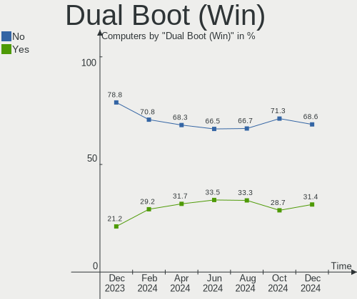
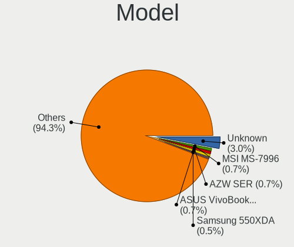
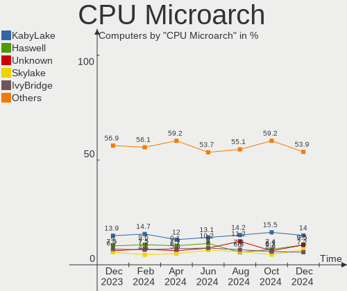
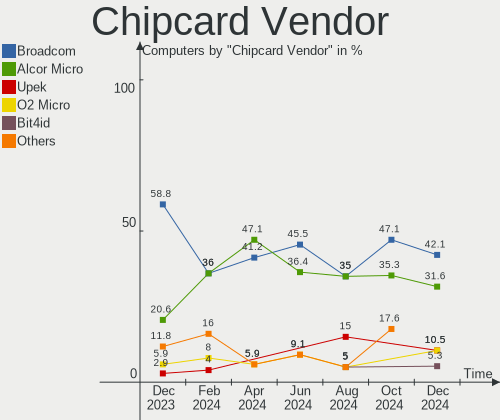

Linux Mint - Hardware Trends
----------------------------

A project to identify most popular hardware characteristics and track their change
over time based on data collected by Linux users at https://Linux-Hardware.org.

Anyone can contribute to this report by the [hw-probe](https://github.com/linuxhw/hw-probe) tool:

    sudo -E hw-probe -all -upload

This is a report for all computer types. See also reports for [desktops](/Dist/Linux_Mint/Desktop/README.md) and [notebooks](/Dist/Linux_Mint/Notebook/README.md).

This report is for one last month. Overall report since the beginning of time: [TestDays](https://github.com/linuxhw/TestDays)

Period: May, 2023.

Contents
--------

* [ System ](#system)
  - [ OS                       ](#os)
  - [ OS Family                ](#os-family)
  - [ Kernel                   ](#kernel)
  - [ Kernel Family            ](#kernel-family)
  - [ Kernel Major Ver.        ](#kernel-major-ver)
  - [ Arch                     ](#arch)
  - [ DE                       ](#de)
  - [ Display Server           ](#display-server)
  - [ Display Manager          ](#display-manager)
  - [ OS Lang                  ](#os-lang)
  - [ Boot Mode                ](#boot-mode)
  - [ Filesystem               ](#filesystem)
  - [ Part. scheme             ](#part-scheme)
  - [ Dual Boot with Linux/BSD ](#dual-boot-with-linuxbsd)
  - [ Dual Boot (Win)          ](#dual-boot-win)

* [ Board ](#board)
  - [ Vendor                   ](#vendor)
  - [ Model                    ](#model)
  - [ Model Family             ](#model-family)
  - [ MFG Year                 ](#mfg-year)
  - [ Form Factor              ](#form-factor)
  - [ Secure Boot              ](#secure-boot)
  - [ Coreboot                 ](#coreboot)
  - [ RAM Size                 ](#ram-size)
  - [ RAM Used                 ](#ram-used)
  - [ Total Drives             ](#total-drives)
  - [ Has CD-ROM               ](#has-cd-rom)
  - [ Has Ethernet             ](#has-ethernet)
  - [ Has WiFi                 ](#has-wifi)
  - [ Has Bluetooth            ](#has-bluetooth)

* [ Location ](#location)
  - [ Country                  ](#country)
  - [ City                     ](#city)

* [ Drives ](#drives)
  - [ Drive Vendor             ](#drive-vendor)
  - [ Drive Model              ](#drive-model)
  - [ HDD Vendor               ](#hdd-vendor)
  - [ SSD Vendor               ](#ssd-vendor)
  - [ Drive Kind               ](#drive-kind)
  - [ Drive Connector          ](#drive-connector)
  - [ Drive Size               ](#drive-size)
  - [ Space Total              ](#space-total)
  - [ Space Used               ](#space-used)
  - [ Malfunc. Drives          ](#malfunc-drives)
  - [ Malfunc. Drive Vendor    ](#malfunc-drive-vendor)
  - [ Malfunc. HDD Vendor      ](#malfunc-hdd-vendor)
  - [ Malfunc. Drive Kind      ](#malfunc-drive-kind)
  - [ Failed Drives            ](#failed-drives)
  - [ Failed Drive Vendor      ](#failed-drive-vendor)
  - [ Drive Status             ](#drive-status)

* [ Storage controller ](#storage-controller)
  - [ Storage Vendor           ](#storage-vendor)
  - [ Storage Model            ](#storage-model)
  - [ Storage Kind             ](#storage-kind)

* [ Processor ](#processor)
  - [ CPU Vendor               ](#cpu-vendor)
  - [ CPU Model                ](#cpu-model)
  - [ CPU Model Family         ](#cpu-model-family)
  - [ CPU Cores                ](#cpu-cores)
  - [ CPU Sockets              ](#cpu-sockets)
  - [ CPU Threads              ](#cpu-threads)
  - [ CPU Op-Modes             ](#cpu-op-modes)
  - [ CPU Microcode            ](#cpu-microcode)
  - [ CPU Microarch            ](#cpu-microarch)

* [ Graphics ](#graphics)
  - [ GPU Vendor               ](#gpu-vendor)
  - [ GPU Model                ](#gpu-model)
  - [ GPU Combo                ](#gpu-combo)
  - [ GPU Driver               ](#gpu-driver)
  - [ GPU Memory               ](#gpu-memory)

* [ Monitor ](#monitor)
  - [ Monitor Vendor           ](#monitor-vendor)
  - [ Monitor Model            ](#monitor-model)
  - [ Monitor Resolution       ](#monitor-resolution)
  - [ Monitor Diagonal         ](#monitor-diagonal)
  - [ Monitor Width            ](#monitor-width)
  - [ Aspect Ratio             ](#aspect-ratio)
  - [ Monitor Area             ](#monitor-area)
  - [ Pixel Density            ](#pixel-density)
  - [ Multiple Monitors        ](#multiple-monitors)

* [ Network ](#network)
  - [ Net Controller Vendor    ](#net-controller-vendor)
  - [ Net Controller Model     ](#net-controller-model)
  - [ Wireless Vendor          ](#wireless-vendor)
  - [ Wireless Model           ](#wireless-model)
  - [ Ethernet Vendor          ](#ethernet-vendor)
  - [ Ethernet Model           ](#ethernet-model)
  - [ Net Controller Kind      ](#net-controller-kind)
  - [ Used Controller          ](#used-controller)
  - [ NICs                     ](#nics)
  - [ IPv6                     ](#ipv6)

* [ Bluetooth ](#bluetooth)
  - [ Bluetooth Vendor         ](#bluetooth-vendor)
  - [ Bluetooth Model          ](#bluetooth-model)

* [ Sound ](#sound)
  - [ Sound Vendor             ](#sound-vendor)
  - [ Sound Model              ](#sound-model)

* [ Memory ](#memory)
  - [ Memory Vendor            ](#memory-vendor)
  - [ Memory Model             ](#memory-model)
  - [ Memory Kind              ](#memory-kind)
  - [ Memory Form Factor       ](#memory-form-factor)
  - [ Memory Size              ](#memory-size)
  - [ Memory Speed             ](#memory-speed)

* [ Printers & scanners ](#printers--scanners)
  - [ Printer Vendor           ](#printer-vendor)
  - [ Printer Model            ](#printer-model)
  - [ Scanner Vendor           ](#scanner-vendor)
  - [ Scanner Model            ](#scanner-model)

* [ Camera ](#camera)
  - [ Camera Vendor            ](#camera-vendor)
  - [ Camera Model             ](#camera-model)

* [ Security ](#security)
  - [ Fingerprint Vendor       ](#fingerprint-vendor)
  - [ Fingerprint Model        ](#fingerprint-model)
  - [ Chipcard Vendor          ](#chipcard-vendor)
  - [ Chipcard Model           ](#chipcard-model)

* [ Unsupported ](#unsupported)
  - [ Unsupported Devices      ](#unsupported-devices)
  - [ Unsupported Device Types ](#unsupported-device-types)

System
------

OS
--

Installed operating systems

| Name            | Computers | Percent |
|-----------------|-----------|---------|
| Linux Mint 21.1 | 404       | 74.95%  |
| Linux Mint 20.3 | 66        | 12.24%  |
| Linux Mint 21   | 37        | 6.86%   |
| Linux Mint 20.2 | 11        | 2.04%   |
| Linux Mint 20   | 7         | 1.3%    |
| Linux Mint 19.3 | 6         | 1.11%   |
| Linux Mint 20.1 | 4         | 0.74%   |
| Linux Mint 18.3 | 2         | 0.37%   |
| Linux Mint 19.2 | 1         | 0.19%   |
| Linux Mint 18.2 | 1         | 0.19%   |

OS Family
---------

OS without a version

| Name       | Computers | Percent |
|------------|-----------|---------|
| Linux Mint | 539       | 100%    |

Kernel
------

Version of the Linux kernel

| Version               | Computers | Percent |
|-----------------------|-----------|---------|
| 5.15.0-71-generic     | 186       | 34.51%  |
| 5.15.0-72-generic     | 142       | 26.35%  |
| 5.4.0-148-generic     | 41        | 7.61%   |
| 5.15.0-56-generic     | 38        | 7.05%   |
| 5.19.0-41-generic     | 27        | 5.01%   |
| 5.4.0-149-generic     | 9         | 1.67%   |
| 5.15.0-69-generic     | 9         | 1.67%   |
| 5.15.0-41-generic     | 8         | 1.48%   |
| 5.4.0-137-generic     | 5         | 0.93%   |
| 5.19.0-42-generic     | 5         | 0.93%   |
| 5.15.0-70-generic     | 5         | 0.93%   |
| 6.3.4-060304-generic  | 4         | 0.74%   |
| 5.4.0-139-generic     | 4         | 0.74%   |
| 6.1.0-1010-oem        | 3         | 0.56%   |
| 5.4.0-91-generic      | 3         | 0.56%   |
| 5.4.0-146-generic     | 3         | 0.56%   |
| 5.15.0-73-generic     | 3         | 0.56%   |
| 6.3.2-060302-generic  | 2         | 0.37%   |
| 5.4.0-26-generic      | 2         | 0.37%   |
| 5.4.0-147-generic     | 2         | 0.37%   |
| 5.4.0-144-generic     | 2         | 0.37%   |
| 5.15.0-58-generic     | 2         | 0.37%   |
| 6.3.5-x64v3-xanmod1   | 1         | 0.19%   |
| 6.3.3-t2-jammy        | 1         | 0.19%   |
| 6.3.2-surface         | 1         | 0.19%   |
| 6.2.15-060215-generic | 1         | 0.19%   |
| 6.2.13-060213-generic | 1         | 0.19%   |
| 6.2.0-060200-generic  | 1         | 0.19%   |
| 6.1.4-060104-generic  | 1         | 0.19%   |
| 6.1.0-1013-oem        | 1         | 0.19%   |
| 6.1.0-1012-oem        | 1         | 0.19%   |
| 6.1.0-1006-oem        | 1         | 0.19%   |
| 5.4.0-94-generic      | 1         | 0.19%   |
| 5.4.0-88-generic      | 1         | 0.19%   |
| 5.4.0-86-generic      | 1         | 0.19%   |
| 5.4.0-74-generic      | 1         | 0.19%   |
| 5.4.0-73-generic      | 1         | 0.19%   |
| 5.4.0-66-generic      | 1         | 0.19%   |
| 5.4.0-150-generic     | 1         | 0.19%   |
| 5.4.0-135-generic     | 1         | 0.19%   |

Kernel Family
-------------

Linux kernel without a distro release

| Version | Computers | Percent |
|---------|-----------|---------|
| 5.15.0  | 398       | 73.84%  |
| 5.4.0   | 81        | 15.03%  |
| 5.19.0  | 35        | 6.49%   |
| 6.1.0   | 6         | 1.11%   |
| 6.3.4   | 4         | 0.74%   |
| 6.3.2   | 3         | 0.56%   |
| 4.15.0  | 2         | 0.37%   |
| 6.3.5   | 1         | 0.19%   |
| 6.3.3   | 1         | 0.19%   |
| 6.2.15  | 1         | 0.19%   |
| 6.2.13  | 1         | 0.19%   |
| 6.2.0   | 1         | 0.19%   |
| 6.1.4   | 1         | 0.19%   |
| 5.17.6  | 1         | 0.19%   |
| 5.14.0  | 1         | 0.19%   |
| 4.8.0   | 1         | 0.19%   |
| 4.10.0  | 1         | 0.19%   |

Kernel Major Ver.
-----------------

Linux kernel major version

| Version | Computers | Percent |
|---------|-----------|---------|
| 5.15    | 398       | 73.84%  |
| 5.4     | 81        | 15.03%  |
| 5.19    | 35        | 6.49%   |
| 6.3     | 9         | 1.67%   |
| 6.1     | 7         | 1.3%    |
| 6.2     | 3         | 0.56%   |
| 4.15    | 2         | 0.37%   |
| 5.17    | 1         | 0.19%   |
| 5.14    | 1         | 0.19%   |
| 4.8     | 1         | 0.19%   |
| 4.10    | 1         | 0.19%   |

Arch
----

OS architecture (x86_64, i586, etc.)

| Name   | Computers | Percent |
|--------|-----------|---------|
| x86_64 | 538       | 99.81%  |
| i686   | 1         | 0.19%   |

DE
--

Desktop Environment

| Name       | Computers | Percent |
|------------|-----------|---------|
| X-Cinnamon | 381       | 70.69%  |
| XFCE       | 73        | 13.54%  |
| MATE       | 60        | 11.13%  |
| Cinnamon   | 10        | 1.86%   |
| GNOME      | 7         | 1.3%    |
| KDE5       | 4         | 0.74%   |
| Unknown    | 3         | 0.56%   |
| fluxbox    | 1         | 0.19%   |

Display Server
--------------

X11 or Wayland

| Name    | Computers | Percent |
|---------|-----------|---------|
| X11     | 536       | 99.44%  |
| Tty     | 2         | 0.37%   |
| Wayland | 1         | 0.19%   |

Display Manager
---------------

SDDM, LightDM, etc.

| Name    | Computers | Percent |
|---------|-----------|---------|
| Unknown | 300       | 55.66%  |
| LightDM | 232       | 43.04%  |
| SDDM    | 4         | 0.74%   |
| GDM3    | 2         | 0.37%   |
| GDM     | 1         | 0.19%   |

OS Lang
-------

Language

| Lang    | Computers | Percent |
|---------|-----------|---------|
| en_US   | 159       | 29.5%   |
| de_DE   | 84        | 15.58%  |
| fr_FR   | 29        | 5.38%   |
| pt_BR   | 27        | 5.01%   |
| it_IT   | 27        | 5.01%   |
| C       | 24        | 4.45%   |
| en_GB   | 19        | 3.53%   |
| en_CA   | 18        | 3.34%   |
| pl_PL   | 15        | 2.78%   |
| ru_RU   | 13        | 2.41%   |
| nl_NL   | 13        | 2.41%   |
| es_ES   | 10        | 1.86%   |
| en_AU   | 9         | 1.67%   |
| en_IN   | 7         | 1.3%    |
| de_AT   | 6         | 1.11%   |
| es_MX   | 5         | 0.93%   |
| en_ZA   | 5         | 0.93%   |
| de_CH   | 5         | 0.93%   |
| tr_TR   | 4         | 0.74%   |
| sk_SK   | 4         | 0.74%   |
| hu_HU   | 4         | 0.74%   |
| fi_FI   | 4         | 0.74%   |
| es_VE   | 4         | 0.74%   |
| cs_CZ   | 4         | 0.74%   |
| pt_PT   | 3         | 0.56%   |
| es_AR   | 3         | 0.56%   |
| en_NZ   | 3         | 0.56%   |
| Unknown | 3         | 0.56%   |
| sv_SE   | 2         | 0.37%   |
| ro_RO   | 2         | 0.37%   |
| es_PE   | 2         | 0.37%   |
| es_CO   | 2         | 0.37%   |
| en_PH   | 2         | 0.37%   |
| el_GR   | 2         | 0.37%   |
| da_DK   | 2         | 0.37%   |
| zh_CN   | 1         | 0.19%   |
| uk_UA   | 1         | 0.19%   |
| ru_UA   | 1         | 0.19%   |
| nb_NO   | 1         | 0.19%   |
| lv_LV   | 1         | 0.19%   |

Boot Mode
---------

EFI or BIOS

| Mode | Computers | Percent |
|------|-----------|---------|
| EFI  | 349       | 64.75%  |
| BIOS | 190       | 35.25%  |

Filesystem
----------

Type of filesystem

| Type    | Computers | Percent |
|---------|-----------|---------|
| Ext4    | 487       | 90.35%  |
| Overlay | 22        | 4.08%   |
| Btrfs   | 10        | 1.86%   |
| Tmpfs   | 9         | 1.67%   |
| Zfs     | 8         | 1.48%   |
| Xfs     | 3         | 0.56%   |

Part. scheme
------------

Scheme of partitioning

| Type    | Computers | Percent |
|---------|-----------|---------|
| Unknown | 296       | 54.92%  |
| GPT     | 205       | 38.03%  |
| MBR     | 38        | 7.05%   |

Dual Boot with Linux/BSD
------------------------

Hosting more than one Linux/BSD

| Dual boot | Computers | Percent |
|-----------|-----------|---------|
| No        | 488       | 90.54%  |
| Yes       | 51        | 9.46%   |

Dual Boot (Win)
---------------

Hosting Linux and Windows

| Dual boot | Computers | Percent |
|-----------|-----------|---------|
| No        | 426       | 79.04%  |
| Yes       | 113       | 20.96%  |

Board
-----

Vendor
------

Motherboard manufacturer

| Name                   | Computers | Percent |
|------------------------|-----------|---------|
| ASUSTek Computer       | 94        | 17.44%  |
| Lenovo                 | 72        | 13.36%  |
| Hewlett-Packard        | 71        | 13.17%  |
| Dell                   | 54        | 10.02%  |
| Gigabyte Technology    | 36        | 6.68%   |
| Acer                   | 36        | 6.68%   |
| MSI                    | 32        | 5.94%   |
| ASRock                 | 23        | 4.27%   |
| Apple                  | 10        | 1.86%   |
| Fujitsu                | 9         | 1.67%   |
| Sony                   | 8         | 1.48%   |
| Toshiba                | 7         | 1.3%    |
| Medion                 | 7         | 1.3%    |
| Unknown                | 7         | 1.3%    |
| Samsung Electronics    | 6         | 1.11%   |
| Intel                  | 4         | 0.74%   |
| HUAWEI                 | 4         | 0.74%   |
| Foxconn                | 4         | 0.74%   |
| Pegatron               | 3         | 0.56%   |
| Fujitsu Siemens        | 3         | 0.56%   |
| Alienware              | 3         | 0.56%   |
| Wortmann AG            | 2         | 0.37%   |
| Positivo               | 2         | 0.37%   |
| PHILCO ELETRONICOS S/A | 2         | 0.37%   |
| Packard Bell           | 2         | 0.37%   |
| Microsoft              | 2         | 0.37%   |
| Mediacom               | 2         | 0.37%   |
| Itautec                | 2         | 0.37%   |
| Intel Client Systems   | 2         | 0.37%   |
| GPU Company            | 2         | 0.37%   |
| Google                 | 2         | 0.37%   |
| eMachines              | 2         | 0.37%   |
| ECS                    | 2         | 0.37%   |
| Biostar                | 2         | 0.37%   |
| ZOTAC                  | 1         | 0.19%   |
| Timi                   | 1         | 0.19%   |
| SLIMBOOK               | 1         | 0.19%   |
| PCChips                | 1         | 0.19%   |
| Notebook               | 1         | 0.19%   |
| MouseComputer          | 1         | 0.19%   |

Model
-----

Motherboard model

| Name                                    | Computers | Percent |
|-----------------------------------------|-----------|---------|
| Unknown                                 | 11        | 2.04%   |
| Gigabyte B450M DS3H                     | 4         | 0.74%   |
| MSI MS-7C56                             | 3         | 0.56%   |
| HP Notebook                             | 3         | 0.56%   |
| Dell OptiPlex 7010                      | 3         | 0.56%   |
| ASUS TUF Gaming X570-PLUS               | 3         | 0.56%   |
| Acer Aspire A515-45                     | 3         | 0.56%   |
| PHILCO ELETRONICOS S/A PNB15.6AP34H1W10 | 2         | 0.37%   |
| MSI MS-7693                             | 2         | 0.37%   |
| MSI MS-7309                             | 2         | 0.37%   |
| Medion MS-7848                          | 2         | 0.37%   |
| Mediacom SmartBook 14 FullHD - SB14UC   | 2         | 0.37%   |
| Lenovo IdeaPad 320-15IKB 80YH           | 2         | 0.37%   |
| HP Pavilion g4                          | 2         | 0.37%   |
| HP Pavilion dm4                         | 2         | 0.37%   |
| HP Compaq Elite 8300 USDT               | 2         | 0.37%   |
| HP 15                                   | 2         | 0.37%   |
| Gigabyte B450 AORUS M                   | 2         | 0.37%   |
| Gigabyte A320M-S2H                      | 2         | 0.37%   |
| Fujitsu LIFEBOOK E752                   | 2         | 0.37%   |
| Foxconn Pro 3500 Series                 | 2         | 0.37%   |
| Dell XPS 15 9570                        | 2         | 0.37%   |
| Dell Precision 7520                     | 2         | 0.37%   |
| Dell OptiPlex 9020                      | 2         | 0.37%   |
| Dell Latitude E7240                     | 2         | 0.37%   |
| Dell Latitude 7400                      | 2         | 0.37%   |
| Dell Latitude 5400                      | 2         | 0.37%   |
| ASUS ROG STRIX B550-F GAMING            | 2         | 0.37%   |
| ASUS All Series                         | 2         | 0.37%   |
| ASRock AB350 Pro4                       | 2         | 0.37%   |
| Acer Aspire E5-571G                     | 2         | 0.37%   |
| ZOTAC ZBOX-ECM73070C/7307LH/53060C      | 1         | 0.19%   |
| Wortmann AG CR700                       | 1         | 0.19%   |
| Wortmann AG 1220552_1470050             | 1         | 0.19%   |
| Toshiba Satellite R630                  | 1         | 0.19%   |
| Toshiba Satellite Pro R50-B             | 1         | 0.19%   |
| Toshiba Satellite C870-1FZ              | 1         | 0.19%   |
| Toshiba Satellite C660D                 | 1         | 0.19%   |
| Toshiba Satellite C660                  | 1         | 0.19%   |
| Toshiba Satellite C645D                 | 1         | 0.19%   |

Model Family
------------

Motherboard model prefix

| Name                                    | Computers | Percent |
|-----------------------------------------|-----------|---------|
| Lenovo ThinkPad                         | 26        | 4.82%   |
| Acer Aspire                             | 24        | 4.45%   |
| Dell Latitude                           | 22        | 4.08%   |
| HP Pavilion                             | 15        | 2.78%   |
| ASUS ROG                                | 14        | 2.6%    |
| Lenovo IdeaPad                          | 13        | 2.41%   |
| Unknown                                 | 11        | 2.04%   |
| HP Compaq                               | 10        | 1.86%   |
| Dell Inspiron                           | 10        | 1.86%   |
| ASUS PRIME                              | 10        | 1.86%   |
| ASUS VivoBook                           | 9         | 1.67%   |
| Lenovo ThinkCentre                      | 8         | 1.48%   |
| HP Laptop                               | 8         | 1.48%   |
| HP EliteBook                            | 7         | 1.3%    |
| Toshiba Satellite                       | 6         | 1.11%   |
| Gigabyte B450M                          | 6         | 1.11%   |
| Dell Precision                          | 6         | 1.11%   |
| Dell OptiPlex                           | 6         | 1.11%   |
| ASUS TUF                                | 6         | 1.11%   |
| Lenovo IdeaCentre                       | 5         | 0.93%   |
| Dell XPS                                | 5         | 0.93%   |
| ASUS Zenbook                            | 5         | 0.93%   |
| HP ProDesk                              | 4         | 0.74%   |
| Fujitsu LIFEBOOK                        | 4         | 0.74%   |
| MSI MS-7C56                             | 3         | 0.56%   |
| Lenovo Legion                           | 3         | 0.56%   |
| HP Notebook                             | 3         | 0.56%   |
| Dell Vostro                             | 3         | 0.56%   |
| ASUS ASUS                               | 3         | 0.56%   |
| Acer TravelMate                         | 3         | 0.56%   |
| PHILCO ELETRONICOS S/A PNB15.6AP34H1W10 | 2         | 0.37%   |
| Packard Bell EasyNote                   | 2         | 0.37%   |
| MSI MS-7693                             | 2         | 0.37%   |
| MSI MS-7309                             | 2         | 0.37%   |
| Microsoft Surface                       | 2         | 0.37%   |
| Medion MS-7848                          | 2         | 0.37%   |
| Mediacom SmartBook                      | 2         | 0.37%   |
| Itautec Infoway                         | 2         | 0.37%   |
| HP ZBook                                | 2         | 0.37%   |
| HP ProBook                              | 2         | 0.37%   |

MFG Year
--------

Motherboard manufacture year

| Year | Computers | Percent |
|------|-----------|---------|
| 2012 | 55        | 10.2%   |
| 2021 | 51        | 9.46%   |
| 2020 | 45        | 8.35%   |
| 2018 | 42        | 7.79%   |
| 2019 | 39        | 7.24%   |
| 2013 | 38        | 7.05%   |
| 2022 | 33        | 6.12%   |
| 2011 | 31        | 5.75%   |
| 2015 | 30        | 5.57%   |
| 2014 | 30        | 5.57%   |
| 2017 | 28        | 5.19%   |
| 2010 | 28        | 5.19%   |
| 2009 | 25        | 4.64%   |
| 2016 | 22        | 4.08%   |
| 2023 | 13        | 2.41%   |
| 2008 | 13        | 2.41%   |
| 2007 | 13        | 2.41%   |
| 2006 | 3         | 0.56%   |

Form Factor
-----------

Physical design of the computer

| Name        | Computers | Percent |
|-------------|-----------|---------|
| Notebook    | 291       | 53.99%  |
| Desktop     | 222       | 41.19%  |
| All in one  | 8         | 1.48%   |
| Mini pc     | 6         | 1.11%   |
| Tablet      | 5         | 0.93%   |
| Convertible | 5         | 0.93%   |
| Server      | 2         | 0.37%   |

Secure Boot
-----------

Enabled or disabled

| State    | Computers | Percent |
|----------|-----------|---------|
| Disabled | 502       | 93.14%  |
| Enabled  | 37        | 6.86%   |

Coreboot
--------

Have coreboot on board

| Used | Computers | Percent |
|------|-----------|---------|
| No   | 537       | 99.63%  |
| Yes  | 2         | 0.37%   |

RAM Size
--------

Total RAM memory

| Size in GB  | Computers | Percent |
|-------------|-----------|---------|
| 4.01-8.0    | 136       | 25.23%  |
| 3.01-4.0    | 107       | 19.85%  |
| 16.01-24.0  | 95        | 17.63%  |
| 8.01-16.0   | 89        | 16.51%  |
| 32.01-64.0  | 62        | 11.5%   |
| 64.01-256.0 | 19        | 3.53%   |
| 1.01-2.0    | 13        | 2.41%   |
| 24.01-32.0  | 10        | 1.86%   |
| 2.01-3.0    | 7         | 1.3%    |
| 0.51-1.0    | 1         | 0.19%   |

RAM Used
--------

Used RAM memory

| Used GB    | Computers | Percent |
|------------|-----------|---------|
| 1.01-2.0   | 195       | 36.18%  |
| 2.01-3.0   | 164       | 30.43%  |
| 4.01-8.0   | 76        | 14.1%   |
| 3.01-4.0   | 58        | 10.76%  |
| 8.01-16.0  | 20        | 3.71%   |
| 0.51-1.0   | 19        | 3.53%   |
| 16.01-24.0 | 5         | 0.93%   |
| 24.01-32.0 | 2         | 0.37%   |

Total Drives
------------

Number of drives on board

| Drives | Computers | Percent |
|--------|-----------|---------|
| 1      | 306       | 56.77%  |
| 2      | 129       | 23.93%  |
| 3      | 59        | 10.95%  |
| 4      | 24        | 4.45%   |
| 5      | 14        | 2.6%    |
| 7      | 3         | 0.56%   |
| 6      | 3         | 0.56%   |
| 8      | 1         | 0.19%   |

Has CD-ROM
----------

Has CD-ROM on board

| Presented | Computers | Percent |
|-----------|-----------|---------|
| No        | 312       | 57.88%  |
| Yes       | 227       | 42.12%  |

Has Ethernet
------------

Has Ethernet on board

| Presented | Computers | Percent |
|-----------|-----------|---------|
| Yes       | 473       | 87.76%  |
| No        | 66        | 12.24%  |

Has WiFi
--------

Has WiFi module

| Presented | Computers | Percent |
|-----------|-----------|---------|
| Yes       | 416       | 77.18%  |
| No        | 123       | 22.82%  |

Has Bluetooth
-------------

Has Bluetooth module

| Presented | Computers | Percent |
|-----------|-----------|---------|
| Yes       | 311       | 57.7%   |
| No        | 228       | 42.3%   |

Location
--------

Country
-------

Geographic location (country)

| Country      | Computers | Percent |
|--------------|-----------|---------|
| Germany      | 98        | 18.18%  |
| USA          | 86        | 15.96%  |
| Italy        | 33        | 6.12%   |
| France       | 31        | 5.75%   |
| Brazil       | 31        | 5.75%   |
| Canada       | 20        | 3.71%   |
| UK           | 19        | 3.53%   |
| Netherlands  | 19        | 3.53%   |
| Poland       | 16        | 2.97%   |
| Russia       | 15        | 2.78%   |
| Spain        | 13        | 2.41%   |
| Switzerland  | 10        | 1.86%   |
| Romania      | 9         | 1.67%   |
| Hungary      | 9         | 1.67%   |
| Australia    | 9         | 1.67%   |
| Austria      | 8         | 1.48%   |
| India        | 7         | 1.3%    |
| Finland      | 6         | 1.11%   |
| Czechia      | 6         | 1.11%   |
| Turkey       | 5         | 0.93%   |
| South Africa | 5         | 0.93%   |
| Slovakia     | 5         | 0.93%   |
| Mexico       | 5         | 0.93%   |
| Greece       | 5         | 0.93%   |
| Venezuela    | 4         | 0.74%   |
| Peru         | 4         | 0.74%   |
| Norway       | 4         | 0.74%   |
| Argentina    | 4         | 0.74%   |
| Sweden       | 3         | 0.56%   |
| Philippines  | 3         | 0.56%   |
| New Zealand  | 3         | 0.56%   |
| Japan        | 3         | 0.56%   |
| Indonesia    | 3         | 0.56%   |
| Colombia     | 3         | 0.56%   |
| Portugal     | 2         | 0.37%   |
| Lithuania    | 2         | 0.37%   |
| Israel       | 2         | 0.37%   |
| Egypt        | 2         | 0.37%   |
| Denmark      | 2         | 0.37%   |
| Chile        | 2         | 0.37%   |

City
----

Geographic location (city)

| City             | Computers | Percent |
|------------------|-----------|---------|
| Berlin           | 7         | 1.3%    |
| Warsaw           | 6         | 1.11%   |
| Vienna           | 5         | 0.93%   |
| Rome             | 5         | 0.93%   |
| Sydney           | 4         | 0.74%   |
| Munich           | 4         | 0.74%   |
| Jacksonville     | 4         | 0.74%   |
| Delft            | 4         | 0.74%   |
| Caen             | 4         | 0.74%   |
| Budapest         | 4         | 0.74%   |
| Amsterdam        | 4         | 0.74%   |
| Toronto          | 3         | 0.56%   |
| Sao Paulo        | 3         | 0.56%   |
| Rpety            | 3         | 0.56%   |
| Paris            | 3         | 0.56%   |
| Milano           | 3         | 0.56%   |
| Lima             | 3         | 0.56%   |
| Krasnodar        | 3         | 0.56%   |
| Johannesburg     | 3         | 0.56%   |
| Hamburg          | 3         | 0.56%   |
| Essen            | 3         | 0.56%   |
| Dortmund         | 3         | 0.56%   |
| Bucharest        | 3         | 0.56%   |
| Antalya          | 3         | 0.56%   |
| Weston           | 2         | 0.37%   |
| Vannes           | 2         | 0.37%   |
| Turin            | 2         | 0.37%   |
| St Louis         | 2         | 0.37%   |
| Spokane          | 2         | 0.37%   |
| Singen           | 2         | 0.37%   |
| Siegsdorf        | 2         | 0.37%   |
| Seattle          | 2         | 0.37%   |
| Scarborough      | 2         | 0.37%   |
| Sarnia           | 2         | 0.37%   |
| Rostov-on-Don    | 2         | 0.37%   |
| Rio de Janeiro   | 2         | 0.37%   |
| Pittsburgh       | 2         | 0.37%   |
| Oslo             | 2         | 0.37%   |
| Nizhniy Novgorod | 2         | 0.37%   |
| Moscow           | 2         | 0.37%   |

Drives
------

Drive Vendor
------------

Hard drive vendors

| Vendor                       | Computers | Drives | Percent |
|------------------------------|-----------|--------|---------|
| Seagate                      | 121       | 155    | 14.54%  |
| Samsung Electronics          | 119       | 146    | 14.3%   |
| WDC                          | 112       | 139    | 13.46%  |
| SanDisk                      | 52        | 57     | 6.25%   |
| Kingston                     | 49        | 56     | 5.89%   |
| Toshiba                      | 47        | 49     | 5.65%   |
| Crucial                      | 30        | 33     | 3.61%   |
| SK hynix                     | 27        | 27     | 3.25%   |
| Unknown                      | 26        | 29     | 3.13%   |
| Hitachi                      | 23        | 24     | 2.76%   |
| A-DATA Technology            | 19        | 19     | 2.28%   |
| Micron Technology            | 16        | 16     | 1.92%   |
| Intel                        | 16        | 17     | 1.92%   |
| China                        | 15        | 16     | 1.8%    |
| HGST                         | 13        | 13     | 1.56%   |
| PNY                          | 12        | 12     | 1.44%   |
| Intenso                      | 10        | 10     | 1.2%    |
| Phison Electronics           | 8         | 8      | 0.96%   |
| Micron/Crucial Technology    | 8         | 10     | 0.96%   |
| SPCC                         | 6         | 6      | 0.72%   |
| Kingston Technology Company  | 6         | 6      | 0.72%   |
| Apple                        | 6         | 6      | 0.72%   |
| Patriot                      | 5         | 5      | 0.6%    |
| Unknown                      | 5         | 5      | 0.6%    |
| LITEON                       | 4         | 4      | 0.48%   |
| Team                         | 3         | 3      | 0.36%   |
| JMicron Technology           | 3         | 3      | 0.36%   |
| Fanxiang                     | 3         | 3      | 0.36%   |
| Apacer                       | 3         | 3      | 0.36%   |
| WD MediaMax                  | 2         | 2      | 0.24%   |
| Transcend                    | 2         | 2      | 0.24%   |
| Silicon Motion               | 2         | 2      | 0.24%   |
| ShiJi                        | 2         | 2      | 0.24%   |
| Shenzhen Longsys Electronics | 2         | 2      | 0.24%   |
| MAXIO Technology (Hangzhou)  | 2         | 2      | 0.24%   |
| KIOXIA                       | 2         | 2      | 0.24%   |
| KingFast                     | 2         | 2      | 0.24%   |
| KingDian                     | 2         | 2      | 0.24%   |
| Hewlett-Packard              | 2         | 2      | 0.24%   |
| GOODRAM                      | 2         | 2      | 0.24%   |

Drive Model
-----------

Hard drive models

| Model                                               | Computers | Percent |
|-----------------------------------------------------|-----------|---------|
| Samsung NVMe SSD Controller SM981/PM981/PM983 256GB | 18        | 1.98%   |
| Kingston SA400S37240G 240GB SSD                     | 18        | 1.98%   |
| Samsung SSD 860 EVO 500GB                           | 8         | 0.88%   |
| Kingston SA400S37120G 120GB SSD                     | 8         | 0.88%   |
| Seagate ST2000DM008-2FR102 2TB                      | 7         | 0.77%   |
| Samsung SSD 850 EVO 250GB                           | 7         | 0.77%   |
| Seagate ST2000DM001-1ER164 2TB                      | 6         | 0.66%   |
| Seagate ST1000LM035-1RK172 1TB                      | 6         | 0.66%   |
| Seagate ST1000DM003-1ER162 1TB                      | 6         | 0.66%   |
| Samsung NVMe SSD Controller PM9A1/PM9A3/980PRO 1TB  | 6         | 0.66%   |
| Micron/Crucial P2 NVMe PCIe SSD 1TB                 | 6         | 0.66%   |
| Unknown MMC Card  64GB                              | 5         | 0.55%   |
| Toshiba MQ04ABF100 1TB                              | 5         | 0.55%   |
| Toshiba MQ01ABD100 1TB                              | 5         | 0.55%   |
| Toshiba DT01ACA100 1TB                              | 5         | 0.55%   |
| SanDisk NVMe SSD Drive 1TB                          | 5         | 0.55%   |
| Samsung SSD 980 1TB                                 | 5         | 0.55%   |
| Phison E12 NVMe Controller 256GB                    | 5         | 0.55%   |
| HGST HTS725050A7E630 500GB                          | 5         | 0.55%   |
| Crucial CT1000MX500SSD1 1TB                         | 5         | 0.55%   |
| Unknown                                             | 5         | 0.55%   |
| Toshiba MQ01ABF050 500GB                            | 4         | 0.44%   |
| Toshiba HDWD110 1TB                                 | 4         | 0.44%   |
| Seagate ST500LT012-1DG142 500GB                     | 4         | 0.44%   |
| Seagate ST500DM002-1BD142 500GB                     | 4         | 0.44%   |
| Seagate ST1000LM024 HN-M101MBB 1TB                  | 4         | 0.44%   |
| Seagate ST1000DM010-2EP102 1TB                      | 4         | 0.44%   |
| Seagate Expansion 1TB                               | 4         | 0.44%   |
| Samsung SSD 970 EVO Plus 1TB                        | 4         | 0.44%   |
| Samsung SSD 870 EVO 2TB                             | 4         | 0.44%   |
| Samsung SSD 850 EVO 500GB                           | 4         | 0.44%   |
| Kingston SV300S37A120G 120GB SSD                    | 4         | 0.44%   |
| Kingston SA400S37480G 480GB SSD                     | 4         | 0.44%   |
| Hitachi HTS545050A7E380 500GB                       | 4         | 0.44%   |
| Crucial CT240BX500SSD1 240GB                        | 4         | 0.44%   |
| Crucial CT1000BX500SSD1 1TB                         | 4         | 0.44%   |
| WDC WD10JPVX-22JC3T0 1TB                            | 3         | 0.33%   |
| WDC WD10EZEX-60WN4A0 1TB                            | 3         | 0.33%   |
| WDC WD10EZEX-22MFCA0 1TB                            | 3         | 0.33%   |
| Unknown SD/MMC/MS PRO 64GB                          | 3         | 0.33%   |

HDD Vendor
----------

Hard disk drive vendors

| Vendor              | Computers | Drives | Percent |
|---------------------|-----------|--------|---------|
| Seagate             | 115       | 145    | 37.46%  |
| WDC                 | 100       | 119    | 32.57%  |
| Toshiba             | 38        | 40     | 12.38%  |
| Hitachi             | 23        | 24     | 7.49%   |
| HGST                | 13        | 13     | 4.23%   |
| Samsung Electronics | 8         | 8      | 2.61%   |
| Unknown             | 4         | 4      | 1.3%    |
| Intenso             | 2         | 2      | 0.65%   |
| Maxtor              | 1         | 1      | 0.33%   |
| Fujitsu             | 1         | 1      | 0.33%   |
| FSR202              | 1         | 1      | 0.33%   |
| External            | 1         | 1      | 0.33%   |

SSD Vendor
----------

Solid state drive vendors

| Vendor              | Computers | Drives | Percent |
|---------------------|-----------|--------|---------|
| Samsung Electronics | 61        | 66     | 20.27%  |
| Kingston            | 46        | 50     | 15.28%  |
| SanDisk             | 27        | 28     | 8.97%   |
| Crucial             | 27        | 29     | 8.97%   |
| China               | 15        | 16     | 4.98%   |
| A-DATA Technology   | 15        | 15     | 4.98%   |
| WDC                 | 13        | 13     | 4.32%   |
| PNY                 | 11        | 11     | 3.65%   |
| Intenso             | 6         | 6      | 1.99%   |
| SPCC                | 5         | 5      | 1.66%   |
| Patriot             | 5         | 5      | 1.66%   |
| Toshiba             | 4         | 4      | 1.33%   |
| Micron Technology   | 4         | 4      | 1.33%   |
| LITEON              | 4         | 4      | 1.33%   |
| Intel               | 4         | 4      | 1.33%   |
| Team                | 3         | 3      | 1%      |
| Fanxiang            | 3         | 3      | 1%      |
| Apple               | 3         | 3      | 1%      |
| Apacer              | 3         | 3      | 1%      |
| Transcend           | 2         | 2      | 0.66%   |
| SK hynix            | 2         | 2      | 0.66%   |
| Seagate             | 2         | 2      | 0.66%   |
| KingDian            | 2         | 2      | 0.66%   |
| Hewlett-Packard     | 2         | 2      | 0.66%   |
| GOODRAM             | 2         | 2      | 0.66%   |
| BHT                 | 2         | 2      | 0.66%   |
| Unknown             | 2         | 2      | 0.66%   |
| Verbatim            | 1         | 1      | 0.33%   |
| USB                 | 1         | 1      | 0.33%   |
| TCSUNBOW            | 1         | 1      | 0.33%   |
| Smartbuy            | 1         | 1      | 0.33%   |
| ShiJi               | 1         | 1      | 0.33%   |
| SD                  | 1         | 1      | 0.33%   |
| SABRENT             | 1         | 1      | 0.33%   |
| Ramsta              | 1         | 1      | 0.33%   |
| Radeon              | 1         | 1      | 0.33%   |
| Plextor             | 1         | 1      | 0.33%   |
| OCZ                 | 1         | 1      | 0.33%   |
| Netac               | 1         | 1      | 0.33%   |
| Neo                 | 1         | 1      | 0.33%   |

Drive Kind
----------

HDD or SSD

| Kind    | Computers | Drives | Percent |
|---------|-----------|--------|---------|
| SSD     | 267       | 314    | 35.36%  |
| HDD     | 263       | 359    | 34.83%  |
| NVMe    | 184       | 225    | 24.37%  |
| MMC     | 23        | 25     | 3.05%   |
| Unknown | 18        | 22     | 2.38%   |

Drive Connector
---------------

SATA, SAS, NVMe, etc.

| Type | Computers | Drives | Percent |
|------|-----------|--------|---------|
| SATA | 420       | 653    | 63.93%  |
| NVMe | 184       | 225    | 28.01%  |
| SAS  | 30        | 42     | 4.57%   |
| MMC  | 23        | 25     | 3.5%    |

Drive Size
----------

Size of hard drive

| Size in TB | Computers | Drives | Percent |
|------------|-----------|--------|---------|
| 0.01-0.5   | 294       | 359    | 53.26%  |
| 0.51-1.0   | 167       | 193    | 30.25%  |
| 1.01-2.0   | 54        | 71     | 9.78%   |
| 3.01-4.0   | 19        | 26     | 3.44%   |
| 2.01-3.0   | 7         | 11     | 1.27%   |
| 4.01-10.0  | 6         | 6      | 1.09%   |
| 10.01-20.0 | 5         | 7      | 0.91%   |

Space Total
-----------

Amount of disk space available on the file system

| Size in GB     | Computers | Percent |
|----------------|-----------|---------|
| 101-250        | 143       | 26.53%  |
| 251-500        | 120       | 22.26%  |
| 501-1000       | 85        | 15.77%  |
| 1001-2000      | 50        | 9.28%   |
| More than 3000 | 44        | 8.16%   |
| 1-20           | 26        | 4.82%   |
| 51-100         | 26        | 4.82%   |
| 2001-3000      | 23        | 4.27%   |
| 21-50          | 16        | 2.97%   |
| Unknown        | 6         | 1.11%   |

Space Used
----------

Amount of used disk space

| Used GB        | Computers | Percent |
|----------------|-----------|---------|
| 1-20           | 123       | 22.82%  |
| 21-50          | 114       | 21.15%  |
| 101-250        | 84        | 15.58%  |
| 51-100         | 67        | 12.43%  |
| 251-500        | 51        | 9.46%   |
| 501-1000       | 45        | 8.35%   |
| 1001-2000      | 20        | 3.71%   |
| More than 3000 | 17        | 3.15%   |
| 2001-3000      | 12        | 2.23%   |
| Unknown        | 6         | 1.11%   |

Malfunc. Drives
---------------

Drive models with a malfunction

| Model                                 | Computers | Drives | Percent |
|---------------------------------------|-----------|--------|---------|
| Hitachi HTS545050A7E380 500GB         | 2         | 2      | 3.64%   |
| XPG GAMMIX S41 256GB                  | 1         | 1      | 1.82%   |
| WDC WDS240G2G0B-00EPW0 240GB SSD      | 1         | 1      | 1.82%   |
| WDC WD7500BPKT-75PK4T0 752GB          | 1         | 1      | 1.82%   |
| WDC WD5000LPVX-22V0TT0 500GB          | 1         | 1      | 1.82%   |
| WDC WD5000BEVT-00A0RT0 500GB          | 1         | 1      | 1.82%   |
| WDC WD5000AAKX-75U6AA0 500GB          | 1         | 1      | 1.82%   |
| WDC WD5000AAKX-603CA0 500GB           | 1         | 1      | 1.82%   |
| WDC WD3200AAJS-08L7A0 320GB           | 1         | 1      | 1.82%   |
| WDC WD20EZRX-22D8PB0 2TB              | 1         | 1      | 1.82%   |
| WDC WD20EZRX-00D8PB0 2TB              | 1         | 1      | 1.82%   |
| WDC WD20EFRX-68EUZN0 2TB              | 1         | 2      | 1.82%   |
| WDC WD10JPVX-60JC3T0 1TB              | 1         | 1      | 1.82%   |
| WDC WD10EZEX-60WN4A0 1TB              | 1         | 1      | 1.82%   |
| WDC WD10EZEX-22MFCA0 1TB              | 1         | 1      | 1.82%   |
| WDC WD10EARS-00Y5B1 1TB               | 1         | 1      | 1.82%   |
| WDC WD10EADS-11M2B3 1TB               | 1         | 1      | 1.82%   |
| Toshiba MQ01ABD100 1TB                | 1         | 1      | 1.82%   |
| Toshiba MK6476GSX 640GB               | 1         | 1      | 1.82%   |
| SK hynix SH920 mSATA 256GB SSD        | 1         | 1      | 1.82%   |
| SK hynix HFS128G39TND-N210A 128GB SSD | 1         | 1      | 1.82%   |
| Seagate ST9500423AS 500GB             | 1         | 1      | 1.82%   |
| Seagate ST9500325AS 500GB             | 1         | 1      | 1.82%   |
| Seagate ST9320325AS 320GB             | 1         | 1      | 1.82%   |
| Seagate ST8000NM0055-1RM112 8TB       | 1         | 1      | 1.82%   |
| Seagate ST500LX012-SSHD-8GB           | 1         | 1      | 1.82%   |
| Seagate ST500LT012-1DG142 500GB       | 1         | 1      | 1.82%   |
| Seagate ST3250410AS 250GB             | 1         | 1      | 1.82%   |
| Seagate ST320LT020-9YG142 320GB       | 1         | 1      | 1.82%   |
| Seagate ST320LT012-9WS14C 320GB       | 1         | 1      | 1.82%   |
| Seagate ST31000528AS 1TB              | 1         | 1      | 1.82%   |
| Seagate ST250DM000-1BD141 250GB       | 1         | 1      | 1.82%   |
| Seagate ST2000LX001-1RG174 2TB        | 1         | 1      | 1.82%   |
| Seagate ST1000LM024 HN-M101MBB 1TB    | 1         | 1      | 1.82%   |
| Seagate ST1000DM010-2EP102 1TB        | 1         | 1      | 1.82%   |
| Seagate ST1000DM003-1ER162 1TB        | 1         | 1      | 1.82%   |
| SanDisk SDSSDA-2T00 2TB               | 1         | 1      | 1.82%   |
| Samsung Electronics SSD 980 PRO 1TB   | 1         | 1      | 1.82%   |
| Samsung Electronics SSD 870 EVO 500GB | 1         | 1      | 1.82%   |
| Samsung Electronics SSD 870 EVO 250GB | 1         | 1      | 1.82%   |

Malfunc. Drive Vendor
---------------------

Vendors of faulty drives

| Vendor              | Computers | Drives | Percent |
|---------------------|-----------|--------|---------|
| Seagate             | 15        | 15     | 27.78%  |
| WDC                 | 14        | 16     | 25.93%  |
| Hitachi             | 6         | 6      | 11.11%  |
| Samsung Electronics | 4         | 4      | 7.41%   |
| Toshiba             | 2         | 2      | 3.7%    |
| SK hynix            | 2         | 2      | 3.7%    |
| Kingston            | 2         | 2      | 3.7%    |
| HGST                | 2         | 2      | 3.7%    |
| XPG                 | 1         | 1      | 1.85%   |
| SanDisk             | 1         | 1      | 1.85%   |
| Neo                 | 1         | 1      | 1.85%   |
| LITEON              | 1         | 1      | 1.85%   |
| Crucial             | 1         | 1      | 1.85%   |
| China               | 1         | 1      | 1.85%   |
| Apacer              | 1         | 1      | 1.85%   |

Malfunc. HDD Vendor
-------------------

Vendors of faulty HDD drives

| Vendor              | Computers | Drives | Percent |
|---------------------|-----------|--------|---------|
| Seagate             | 15        | 15     | 38.46%  |
| WDC                 | 13        | 15     | 33.33%  |
| Hitachi             | 6         | 6      | 15.38%  |
| Toshiba             | 2         | 2      | 5.13%   |
| HGST                | 2         | 2      | 5.13%   |
| Samsung Electronics | 1         | 1      | 2.56%   |

Malfunc. Drive Kind
-------------------

Kinds of faulty drives

| Kind | Computers | Drives | Percent |
|------|-----------|--------|---------|
| HDD  | 39        | 41     | 72.22%  |
| SSD  | 13        | 13     | 24.07%  |
| NVMe | 2         | 2      | 3.7%    |

Failed Drives
-------------

Failed drive models

Zero info for selected period =(

Failed Drive Vendor
-------------------

Failed drive vendors

Zero info for selected period =(

Drive Status
------------

Number of failed and malfunc. drives

| Status   | Computers | Drives | Percent |
|----------|-----------|--------|---------|
| Detected | 342       | 582    | 58.26%  |
| Works    | 194       | 307    | 33.05%  |
| Malfunc  | 51        | 56     | 8.69%   |

Storage controller
------------------

Storage Vendor
--------------

Storage controller vendors

| Vendor                           | Computers | Percent |
|----------------------------------|-----------|---------|
| Intel                            | 331       | 46.16%  |
| AMD                              | 139       | 19.39%  |
| Samsung Electronics              | 64        | 8.93%   |
| SanDisk                          | 34        | 4.74%   |
| SK hynix                         | 26        | 3.63%   |
| ASMedia Technology               | 13        | 1.81%   |
| Micron/Crucial Technology        | 12        | 1.67%   |
| Micron Technology                | 12        | 1.67%   |
| Phison Electronics               | 11        | 1.53%   |
| Nvidia                           | 11        | 1.53%   |
| Kingston Technology Company      | 11        | 1.53%   |
| JMicron Technology               | 8         | 1.12%   |
| Toshiba America Info Systems     | 5         | 0.7%    |
| ADATA Technology                 | 5         | 0.7%    |
| VIA Technologies                 | 4         | 0.56%   |
| Adaptec                          | 4         | 0.56%   |
| Silicon Motion                   | 3         | 0.42%   |
| Realtek Semiconductor            | 3         | 0.42%   |
| Marvell Technology Group         | 3         | 0.42%   |
| Apple                            | 3         | 0.42%   |
| Union Memory (Shenzhen)          | 2         | 0.28%   |
| Shenzhen Longsys Electronics     | 2         | 0.28%   |
| MAXIO Technology (Hangzhou)      | 2         | 0.28%   |
| KIOXIA                           | 2         | 0.28%   |
| Silicon Integrated Systems [SiS] | 1         | 0.14%   |
| Silicon Image                    | 1         | 0.14%   |
| Seagate Technology               | 1         | 0.14%   |
| Netac Technology                 | 1         | 0.14%   |
| LSI Logic / Symbios Logic        | 1         | 0.14%   |
| Lite-On Technology               | 1         | 0.14%   |
| HighPoint Technologies           | 1         | 0.14%   |

Storage Model
-------------

Storage controller models

| Model                                                                          | Computers | Percent |
|--------------------------------------------------------------------------------|-----------|---------|
| AMD FCH SATA Controller [AHCI mode]                                            | 77        | 9.38%   |
| Intel 7 Series Chipset Family 6-port SATA Controller [AHCI mode]               | 34        | 4.14%   |
| Samsung NVMe SSD Controller SM981/PM981/PM983                                  | 25        | 3.05%   |
| Intel 8 Series/C220 Series Chipset Family 6-port SATA Controller 1 [AHCI mode] | 25        | 3.05%   |
| Intel Q170/Q150/B150/H170/H110/Z170/CM236 Chipset SATA Controller [AHCI Mode]  | 20        | 2.44%   |
| AMD SB7x0/SB8x0/SB9x0 SATA Controller [AHCI mode]                              | 19        | 2.31%   |
| AMD 500 Series Chipset SATA Controller                                         | 18        | 2.19%   |
| Samsung NVMe SSD Controller PM9A1/PM9A3/980PRO                                 | 17        | 2.07%   |
| Intel 82801 Mobile SATA Controller [RAID mode]                                 | 17        | 2.07%   |
| AMD SB7x0/SB8x0/SB9x0 IDE Controller                                           | 17        | 2.07%   |
| Intel Volume Management Device NVMe RAID Controller                            | 16        | 1.95%   |
| Samsung NVMe SSD Controller 980                                                | 15        | 1.83%   |
| Intel 82801IBM/IEM (ICH9M/ICH9M-E) 4 port SATA Controller [AHCI mode]          | 14        | 1.71%   |
| Intel Wildcat Point-LP SATA Controller [AHCI Mode]                             | 13        | 1.58%   |
| Intel Sunrise Point-LP SATA Controller [AHCI mode]                             | 13        | 1.58%   |
| AMD 400 Series Chipset SATA Controller                                         | 13        | 1.58%   |
| Intel 7 Series/C210 Series Chipset Family 6-port SATA Controller [AHCI mode]   | 12        | 1.46%   |
| Intel 6 Series/C200 Series Chipset Family 6 port Mobile SATA AHCI Controller   | 12        | 1.46%   |
| Micron NVMe Storage Controller                                                 | 11        | 1.34%   |
| Intel Celeron/Pentium Silver Processor SATA Controller                         | 11        | 1.34%   |
| Intel 8 Series SATA Controller 1 [AHCI mode]                                   | 11        | 1.34%   |
| Intel 6 Series/C200 Series Chipset Family 6 port Desktop SATA AHCI Controller  | 11        | 1.34%   |
| AMD SB7x0/SB8x0/SB9x0 SATA Controller [IDE mode]                               | 11        | 1.34%   |
| SK hynix Gold P31/PC711 NVMe Solid State Drive                                 | 10        | 1.22%   |
| Intel 5 Series/3400 Series Chipset 6 port SATA AHCI Controller                 | 10        | 1.22%   |
| ASMedia ASM1062 Serial ATA Controller                                          | 10        | 1.22%   |
| Micron/Crucial P2 NVMe PCIe SSD                                                | 9         | 1.1%    |
| SanDisk WD Blue SN550 NVMe SSD                                                 | 8         | 0.97%   |
| Intel Cannon Point-LP SATA Controller [AHCI Mode]                              | 8         | 0.97%   |
| Intel 200 Series PCH SATA controller [AHCI mode]                               | 8         | 0.97%   |
| Phison E12 NVMe Controller                                                     | 7         | 0.85%   |
| Kingston Company Company Non-Volatile memory controller                        | 7         | 0.85%   |
| SK hynix BC501 NVMe Solid State Drive                                          | 6         | 0.73%   |
| Sandisk Western Digital WD Black SN850X NVMe SSD                               | 6         | 0.73%   |
| Intel SATA Controller [RAID mode]                                              | 6         | 0.73%   |
| Intel Celeron N3350/Pentium N4200/Atom E3900 Series SATA AHCI Controller       | 6         | 0.73%   |
| Intel Alder Lake-S PCH SATA Controller [AHCI Mode]                             | 6         | 0.73%   |
| Intel 82801HM/HEM (ICH8M/ICH8M-E) IDE Controller                               | 6         | 0.73%   |
| AMD FCH SATA Controller D                                                      | 6         | 0.73%   |
| Sandisk Non-Volatile memory controller                                         | 5         | 0.61%   |

Storage Kind
------------

Kind of storage controller (IDE, SATA, NVMe, SAS, ...)

| Kind | Computers | Percent |
|------|-----------|---------|
| SATA | 419       | 58.6%   |
| NVMe | 184       | 25.73%  |
| IDE  | 63        | 8.81%   |
| RAID | 46        | 6.43%   |
| SCSI | 2         | 0.28%   |
| SAS  | 1         | 0.14%   |

Processor
---------

CPU Vendor
----------

Processor vendors

| Vendor       | Computers | Percent |
|--------------|-----------|---------|
| Intel        | 372       | 69.02%  |
| AMD          | 166       | 30.8%   |
| CentaurHauls | 1         | 0.19%   |

CPU Model
---------

Processor models

| Model                                         | Computers | Percent |
|-----------------------------------------------|-----------|---------|
| Intel Core i5-8265U CPU @ 1.60GHz             | 6         | 1.11%   |
| Intel Core i5-5200U CPU @ 2.20GHz             | 6         | 1.11%   |
| Intel Celeron N4020 CPU @ 1.10GHz             | 6         | 1.11%   |
| AMD Ryzen 5 5500U with Radeon Graphics        | 6         | 1.11%   |
| Intel Core i5-3470 CPU @ 3.20GHz              | 5         | 0.93%   |
| Intel Core i5-3230M CPU @ 2.60GHz             | 5         | 0.93%   |
| Intel Core i5 CPU M 520 @ 2.40GHz             | 5         | 0.93%   |
| Intel 11th Gen Core i5-1135G7 @ 2.40GHz       | 5         | 0.93%   |
| AMD Ryzen 5 3600 6-Core Processor             | 5         | 0.93%   |
| Intel Pentium Dual-Core CPU T4500 @ 2.30GHz   | 4         | 0.74%   |
| Intel Core i7-8565U CPU @ 1.80GHz             | 4         | 0.74%   |
| Intel Core i7-4790 CPU @ 3.60GHz              | 4         | 0.74%   |
| Intel Core i5-6200U CPU @ 2.30GHz             | 4         | 0.74%   |
| Intel Core i5-3337U CPU @ 1.80GHz             | 4         | 0.74%   |
| Intel Core i5-3320M CPU @ 2.60GHz             | 4         | 0.74%   |
| Intel Core i3-2120 CPU @ 3.30GHz              | 4         | 0.74%   |
| Intel 11th Gen Core i7-1165G7 @ 2.80GHz       | 4         | 0.74%   |
| Intel 11th Gen Core i3-1115G4 @ 3.00GHz       | 4         | 0.74%   |
| AMD Ryzen 7 3700X 8-Core Processor            | 4         | 0.74%   |
| AMD Ryzen 5 5600X 6-Core Processor            | 4         | 0.74%   |
| AMD Ryzen 5 5600G with Radeon Graphics        | 4         | 0.74%   |
| AMD Ryzen 5 1600 Six-Core Processor           | 4         | 0.74%   |
| Intel Core i7-7700HQ CPU @ 2.80GHz            | 3         | 0.56%   |
| Intel Core i7-4600U CPU @ 2.10GHz             | 3         | 0.56%   |
| Intel Core i7-3770 CPU @ 3.40GHz              | 3         | 0.56%   |
| Intel Core i5-8365U CPU @ 1.60GHz             | 3         | 0.56%   |
| Intel Core i5-7200U CPU @ 2.50GHz             | 3         | 0.56%   |
| Intel Core i5-6500 CPU @ 3.20GHz              | 3         | 0.56%   |
| Intel Core i5-2450M CPU @ 2.50GHz             | 3         | 0.56%   |
| Intel Core i5-10210U CPU @ 1.60GHz            | 3         | 0.56%   |
| Intel Core i3-2310M CPU @ 2.10GHz             | 3         | 0.56%   |
| Intel Core i3 CPU M 350 @ 2.27GHz             | 3         | 0.56%   |
| Intel Core 2 Quad CPU Q6600 @ 2.40GHz         | 3         | 0.56%   |
| Intel Celeron CPU N3350 @ 1.10GHz             | 3         | 0.56%   |
| Intel Atom x5-Z8350 CPU @ 1.44GHz             | 3         | 0.56%   |
| AMD Ryzen 9 5900X 12-Core Processor           | 3         | 0.56%   |
| AMD Ryzen 7 5800X 8-Core Processor            | 3         | 0.56%   |
| AMD Ryzen 7 5700G with Radeon Graphics        | 3         | 0.56%   |
| AMD Ryzen 5 3500U with Radeon Vega Mobile Gfx | 3         | 0.56%   |
| AMD Ryzen 3 2200G with Radeon Vega Graphics   | 3         | 0.56%   |

CPU Model Family
----------------

Processor model prefix

| Model                   | Computers | Percent |
|-------------------------|-----------|---------|
| Intel Core i5           | 116       | 21.52%  |
| Intel Core i7           | 69        | 12.8%   |
| Intel Core i3           | 43        | 7.98%   |
| Other                   | 38        | 7.05%   |
| AMD Ryzen 5             | 38        | 7.05%   |
| Intel Celeron           | 28        | 5.19%   |
| AMD Ryzen 7             | 25        | 4.64%   |
| Intel Core 2 Duo        | 19        | 3.53%   |
| Intel Pentium           | 17        | 3.15%   |
| AMD Ryzen 9             | 14        | 2.6%    |
| Intel Pentium Dual-Core | 12        | 2.23%   |
| AMD Ryzen 3             | 12        | 2.23%   |
| AMD FX                  | 11        | 2.04%   |
| AMD A6                  | 9         | 1.67%   |
| Intel Xeon              | 7         | 1.3%    |
| AMD Athlon II X2        | 7         | 1.3%    |
| Intel Core 2 Quad       | 6         | 1.11%   |
| Intel Atom              | 6         | 1.11%   |
| AMD Phenom II X4        | 6         | 1.11%   |
| AMD E                   | 6         | 1.11%   |
| AMD A4                  | 6         | 1.11%   |
| AMD Ryzen 7 PRO         | 5         | 0.93%   |
| AMD A8                  | 4         | 0.74%   |
| Intel Core i9           | 3         | 0.56%   |
| AMD Athlon              | 3         | 0.56%   |
| AMD A10                 | 3         | 0.56%   |
| Intel Core 2            | 2         | 0.37%   |
| AMD Ryzen Threadripper  | 2         | 0.37%   |
| AMD Ryzen 5 PRO         | 2         | 0.37%   |
| AMD E2                  | 2         | 0.37%   |
| Intel Xeon Silver       | 1         | 0.19%   |
| Intel Pentium Silver    | 1         | 0.19%   |
| Intel Pentium Gold      | 1         | 0.19%   |
| Intel Pentium Dual      | 1         | 0.19%   |
| Intel Pentium 4         | 1         | 0.19%   |
| Intel Genuine           | 1         | 0.19%   |
| Intel Core 2 Extreme    | 1         | 0.19%   |
| Intel Celeron Dual-Core | 1         | 0.19%   |
| CentaurHauls VIA Eden   | 1         | 0.19%   |
| AMD V120                | 1         | 0.19%   |

CPU Cores
---------

Number of processor cores

| Number | Computers | Percent |
|--------|-----------|---------|
| 2      | 217       | 40.26%  |
| 4      | 184       | 34.14%  |
| 6      | 53        | 9.83%   |
| 8      | 40        | 7.42%   |
| 12     | 12        | 2.23%   |
| 1      | 9         | 1.67%   |
| 3      | 5         | 0.93%   |
| 16     | 4         | 0.74%   |
| 14     | 4         | 0.74%   |
| 10     | 4         | 0.74%   |
| 18     | 3         | 0.56%   |
| 32     | 1         | 0.19%   |
| 24     | 1         | 0.19%   |
| 20     | 1         | 0.19%   |
| 5      | 1         | 0.19%   |

CPU Sockets
-----------

Number of sockets

| Number | Computers | Percent |
|--------|-----------|---------|
| 1      | 538       | 99.81%  |
| 2      | 1         | 0.19%   |

CPU Threads
-----------

Threads per core (Hyper-Threading)

| Number | Computers | Percent |
|--------|-----------|---------|
| 2      | 347       | 64.38%  |
| 1      | 192       | 35.62%  |

CPU Op-Modes
------------

CPU Operation Modes (32-bit, 64-bit)

| Op mode        | Computers | Percent |
|----------------|-----------|---------|
| 32-bit, 64-bit | 538       | 99.81%  |
| Unknown        | 1         | 0.19%   |

CPU Microcode
-------------

Microcode number

| Number     | Computers | Percent |
|------------|-----------|---------|
| 0x306a9    | 49        | 9.09%   |
| Unknown    | 42        | 7.79%   |
| 0x206a7    | 28        | 5.19%   |
| 0x306c3    | 23        | 4.27%   |
| 0x1067a    | 20        | 3.71%   |
| 0x506e3    | 14        | 2.6%    |
| 0x306d4    | 14        | 2.6%    |
| 0x906e9    | 13        | 2.41%   |
| 0x806ec    | 12        | 2.23%   |
| 0x40651    | 11        | 2.04%   |
| 0x806c1    | 10        | 1.86%   |
| 0x08701021 | 10        | 1.86%   |
| 0x20655    | 9         | 1.67%   |
| 0x06000852 | 9         | 1.67%   |
| 0x010000c8 | 9         | 1.67%   |
| 0x906ea    | 8         | 1.48%   |
| 0x406e3    | 8         | 1.48%   |
| 0x08108109 | 8         | 1.48%   |
| 0x806eb    | 7         | 1.3%    |
| 0x706a8    | 7         | 1.3%    |
| 0x0a50000c | 7         | 1.3%    |
| 0x08608103 | 7         | 1.3%    |
| 0x806ea    | 6         | 1.11%   |
| 0x506c9    | 6         | 1.11%   |
| 0x30678    | 6         | 1.11%   |
| 0x0a404102 | 6         | 1.11%   |
| 0x906a3    | 5         | 0.93%   |
| 0x6fd      | 5         | 0.93%   |
| 0x406c4    | 5         | 0.93%   |
| 0x10676    | 5         | 0.93%   |
| 0x0a601203 | 5         | 0.93%   |
| 0x0a50000d | 5         | 0.93%   |
| 0x0800820d | 5         | 0.93%   |
| 0x06006705 | 5         | 0.93%   |
| 0x05000119 | 5         | 0.93%   |
| 0x906ed    | 4         | 0.74%   |
| 0x906a4    | 4         | 0.74%   |
| 0x90672    | 4         | 0.74%   |
| 0x706a1    | 4         | 0.74%   |
| 0x6fb      | 4         | 0.74%   |

CPU Microarch
-------------

Microarchitecture

| Name             | Computers | Percent |
|------------------|-----------|---------|
| KabyLake         | 61        | 11.32%  |
| IvyBridge        | 50        | 9.28%   |
| Haswell          | 38        | 7.05%   |
| SandyBridge      | 32        | 5.94%   |
| Unknown          | 32        | 5.94%   |
| Penryn           | 29        | 5.38%   |
| Skylake          | 27        | 5.01%   |
| Zen 3            | 25        | 4.64%   |
| Zen 2            | 18        | 3.34%   |
| K10              | 18        | 3.34%   |
| Zen+             | 17        | 3.15%   |
| Westmere         | 16        | 2.97%   |
| TigerLake        | 16        | 2.97%   |
| Broadwell        | 16        | 2.97%   |
| Core             | 15        | 2.78%   |
| Zen              | 14        | 2.6%    |
| Silvermont       | 14        | 2.6%    |
| Piledriver       | 14        | 2.6%    |
| Alderlake Hybrid | 13        | 2.41%   |
| Goldmont plus    | 12        | 2.23%   |
| Excavator        | 10        | 1.86%   |
| CometLake        | 10        | 1.86%   |
| IceLake          | 8         | 1.48%   |
| Puma             | 7         | 1.3%    |
| Bobcat           | 7         | 1.3%    |
| Goldmont         | 6         | 1.11%   |
| K10 Llano        | 3         | 0.56%   |
| Steamroller      | 2         | 0.37%   |
| Nehalem          | 2         | 0.37%   |
| K8 Hammer        | 2         | 0.37%   |
| Jaguar           | 2         | 0.37%   |
| NetBurst         | 1         | 0.19%   |
| Gracemont        | 1         | 0.19%   |
| Bulldozer        | 1         | 0.19%   |

Graphics
--------

GPU Vendor
----------

Vendors of graphics cards

| Vendor                     | Computers | Percent |
|----------------------------|-----------|---------|
| Intel                      | 284       | 45.81%  |
| AMD                        | 171       | 27.58%  |
| Nvidia                     | 163       | 26.29%  |
| VIA Technologies           | 1         | 0.16%   |
| Matrox Electronics Systems | 1         | 0.16%   |

GPU Model
---------

Graphics card models

| Model                                                                                    | Computers | Percent |
|------------------------------------------------------------------------------------------|-----------|---------|
| Intel 3rd Gen Core processor Graphics Controller                                         | 32        | 5.01%   |
| Intel 2nd Generation Core Processor Family Integrated Graphics Controller                | 27        | 4.23%   |
| Intel WhiskeyLake-U GT2 [UHD Graphics 620]                                               | 15        | 2.35%   |
| Intel TigerLake-LP GT2 [Iris Xe Graphics]                                                | 12        | 1.88%   |
| AMD Picasso/Raven 2 [Radeon Vega Series / Radeon Vega Mobile Series]                     | 12        | 1.88%   |
| AMD Cezanne [Radeon Vega Series / Radeon Vega Mobile Series]                             | 12        | 1.88%   |
| Intel HD Graphics 5500                                                                   | 11        | 1.72%   |
| Intel GeminiLake [UHD Graphics 600]                                                      | 11        | 1.72%   |
| Intel Core Processor Integrated Graphics Controller                                      | 11        | 1.72%   |
| Nvidia GF117M [GeForce 610M/710M/810M/820M / GT 620M/625M/630M/720M]                     | 10        | 1.56%   |
| Intel Haswell-ULT Integrated Graphics Controller                                         | 10        | 1.56%   |
| AMD Lucienne                                                                             | 10        | 1.56%   |
| Intel Mobile 4 Series Chipset Integrated Graphics Controller                             | 9         | 1.41%   |
| Intel HD Graphics 630                                                                    | 9         | 1.41%   |
| Intel Xeon E3-1200 v3/4th Gen Core Processor Integrated Graphics Controller              | 8         | 1.25%   |
| Intel Skylake GT2 [HD Graphics 520]                                                      | 8         | 1.25%   |
| Intel Atom/Celeron/Pentium Processor x5-E8000/J3xxx/N3xxx Integrated Graphics Controller | 8         | 1.25%   |
| AMD Rembrandt [Radeon 680M]                                                              | 8         | 1.25%   |
| AMD Ellesmere [Radeon RX 470/480/570/570X/580/580X/590]                                  | 8         | 1.25%   |
| Nvidia GK208B [GeForce GT 710]                                                           | 7         | 1.1%    |
| Intel HD Graphics 530                                                                    | 7         | 1.1%    |
| Nvidia GP106 [GeForce GTX 1060 6GB]                                                      | 6         | 0.94%   |
| Intel HD Graphics 620                                                                    | 6         | 0.94%   |
| Intel Atom Processor Z36xxx/Z37xxx Series Graphics & Display                             | 6         | 0.94%   |
| AMD Raphael                                                                              | 6         | 0.94%   |
| Nvidia GP108 [GeForce GT 1030]                                                           | 5         | 0.78%   |
| Intel Xeon E3-1200 v2/3rd Gen Core processor Graphics Controller                         | 5         | 0.78%   |
| Intel UHD Graphics 620                                                                   | 5         | 0.78%   |
| Intel Mobile GM965/GL960 Integrated Graphics Controller (secondary)                      | 5         | 0.78%   |
| Intel Mobile GM965/GL960 Integrated Graphics Controller (primary)                        | 5         | 0.78%   |
| Intel CometLake-U GT2 [UHD Graphics]                                                     | 5         | 0.78%   |
| Intel Alder Lake-P Integrated Graphics Controller                                        | 5         | 0.78%   |
| Intel 4th Gen Core Processor Integrated Graphics Controller                              | 5         | 0.78%   |
| AMD Wani [Radeon R5/R6/R7 Graphics]                                                      | 5         | 0.78%   |
| AMD Stoney [Radeon R2/R3/R4/R5 Graphics]                                                 | 5         | 0.78%   |
| AMD Mullins [Radeon R4/R5 Graphics]                                                      | 5         | 0.78%   |
| AMD Cedar [Radeon HD 5000/6000/7350/8350 Series]                                         | 5         | 0.78%   |
| Nvidia GT218 [GeForce 210]                                                               | 4         | 0.63%   |
| Nvidia GP107 [GeForce GTX 1050 Ti]                                                       | 4         | 0.63%   |
| Intel Tiger Lake-LP GT2 [UHD Graphics G4]                                                | 4         | 0.63%   |

GPU Combo
---------

Combinations of graphics cards

| Name           | Computers | Percent |
|----------------|-----------|---------|
| 1 x Intel      | 221       | 41%     |
| 1 x AMD        | 132       | 24.49%  |
| 1 x Nvidia     | 97        | 18%     |
| Intel + Nvidia | 48        | 8.91%   |
| AMD + Nvidia   | 17        | 3.15%   |
| 2 x AMD        | 12        | 2.23%   |
| Intel + AMD    | 9         | 1.67%   |
| 2 x Nvidia     | 1         | 0.19%   |
| 1 x VIA        | 1         | 0.19%   |
| 1 x Matrox     | 1         | 0.19%   |

GPU Driver
----------

Free vs proprietary

| Driver      | Computers | Percent |
|-------------|-----------|---------|
| Free        | 417       | 77.37%  |
| Proprietary | 111       | 20.59%  |
| Unknown     | 11        | 2.04%   |

GPU Memory
----------

Total video memory

| Size in GB | Computers | Percent |
|------------|-----------|---------|
| Unknown    | 264       | 48.98%  |
| 0.01-0.5   | 76        | 14.1%   |
| 1.01-2.0   | 49        | 9.09%   |
| 0.51-1.0   | 49        | 9.09%   |
| 3.01-4.0   | 38        | 7.05%   |
| 7.01-8.0   | 24        | 4.45%   |
| 5.01-6.0   | 18        | 3.34%   |
| 8.01-16.0  | 15        | 2.78%   |
| 2.01-3.0   | 3         | 0.56%   |
| 16.01-24.0 | 3         | 0.56%   |

Monitor
-------

Monitor Vendor
--------------

Monitor vendors

| Vendor                  | Computers | Percent |
|-------------------------|-----------|---------|
| Samsung Electronics     | 75        | 12.89%  |
| AU Optronics            | 63        | 10.82%  |
| LG Display              | 49        | 8.42%   |
| BOE                     | 49        | 8.42%   |
| Chimei Innolux          | 43        | 7.39%   |
| Goldstar                | 40        | 6.87%   |
| Dell                    | 36        | 6.19%   |
| Hewlett-Packard         | 25        | 4.3%    |
| Acer                    | 19        | 3.26%   |
| BenQ                    | 14        | 2.41%   |
| Philips                 | 12        | 2.06%   |
| Lenovo                  | 12        | 2.06%   |
| Apple                   | 9         | 1.55%   |
| AOC                     | 9         | 1.55%   |
| Ancor Communications    | 9         | 1.55%   |
| Iiyama                  | 8         | 1.37%   |
| Sharp                   | 7         | 1.2%    |
| Chi Mei Optoelectronics | 7         | 1.2%    |
| ViewSonic               | 6         | 1.03%   |
| PANDA                   | 6         | 1.03%   |
| Eizo                    | 5         | 0.86%   |
| ASUSTek Computer        | 5         | 0.86%   |
| LG Electronics          | 4         | 0.69%   |
| Fujitsu Siemens         | 4         | 0.69%   |
| Vestel Elektronik       | 3         | 0.52%   |
| Toshiba                 | 3         | 0.52%   |
| Sceptre Tech            | 3         | 0.52%   |
| CSO                     | 3         | 0.52%   |
| Vizio                   | 2         | 0.34%   |
| TMX                     | 2         | 0.34%   |
| Packard Bell            | 2         | 0.34%   |
| NEC Computers           | 2         | 0.34%   |
| Medion                  | 2         | 0.34%   |
| InfoVision              | 2         | 0.34%   |
| HUAWEI                  | 2         | 0.34%   |
| HannStar                | 2         | 0.34%   |
| Gigabyte Technology     | 2         | 0.34%   |
| Unknown                 | 2         | 0.34%   |
| Yuraku                  | 1         | 0.17%   |
| Valve                   | 1         | 0.17%   |

Monitor Model
-------------

Monitor models

| Model                                                                | Computers | Percent |
|----------------------------------------------------------------------|-----------|---------|
| AU Optronics LCD Monitor AUO38ED 1920x1080 344x193mm 15.5-inch       | 5         | 0.84%   |
| Samsung Electronics LCD Monitor SEC544B 1600x900 310x174mm 14.0-inch | 4         | 0.67%   |
| Vestel Elektronik 43UHD_LCD_TV VES3700 3840x2160 950x540mm 43.0-inch | 3         | 0.5%    |
| Samsung Electronics LC49G95T SAM7053 3840x1080 1193x336mm 48.8-inch  | 3         | 0.5%    |
| Dell U2412M DELA07A 1920x1200 518x324mm 24.1-inch                    | 3         | 0.5%    |
| Chimei Innolux LCD Monitor CMN15F5 1920x1080 344x193mm 15.5-inch     | 3         | 0.5%    |
| Chimei Innolux LCD Monitor CMN15CA 1366x768 344x193mm 15.5-inch      | 3         | 0.5%    |
| Chimei Innolux LCD Monitor CMN14D4 1920x1080 309x173mm 13.9-inch     | 3         | 0.5%    |
| Samsung Electronics LCD Monitor SEC5441 1280x800 331x207mm 15.4-inch | 2         | 0.33%   |
| Samsung Electronics LCD Monitor SEC335A 1366x768 309x174mm 14.0-inch | 2         | 0.33%   |
| Samsung Electronics C27F390 SAM0D32 1920x1080 598x336mm 27.0-inch    | 2         | 0.33%   |
| Philips PHL 243V7 PHLC155 1920x1080 527x296mm 23.8-inch              | 2         | 0.33%   |
| LG Display LCD Monitor LGD039F 1366x768 345x194mm 15.6-inch          | 2         | 0.33%   |
| Lenovo LCD Monitor LEN40B1 1600x900 345x194mm 15.6-inch              | 2         | 0.33%   |
| Lenovo LCD Monitor LEN4036 1440x900 303x190mm 14.1-inch              | 2         | 0.33%   |
| Iiyama PL2492H IVM612F 1920x1080 530x300mm 24.0-inch                 | 2         | 0.33%   |
| Goldstar ULTRAWIDE GSM7770 2560x1080 798x334mm 34.1-inch             | 2         | 0.33%   |
| Goldstar FULL HD GSM5B55 1920x1080 480x270mm 21.7-inch               | 2         | 0.33%   |
| Dell SE2417HG DELD08D 1920x1080 521x293mm 23.5-inch                  | 2         | 0.33%   |
| Dell P2723D DELD141 2560x1440 597x336mm 27.0-inch                    | 2         | 0.33%   |
| Chimei Innolux LCD Monitor CMN15E7 1920x1080 344x193mm 15.5-inch     | 2         | 0.33%   |
| Chimei Innolux LCD Monitor CMN15DB 1366x768 344x193mm 15.5-inch      | 2         | 0.33%   |
| Chimei Innolux LCD Monitor CMN1521 1920x1080 344x193mm 15.5-inch     | 2         | 0.33%   |
| Chimei Innolux LCD Monitor CMN14C9 1920x1080 309x173mm 13.9-inch     | 2         | 0.33%   |
| Chimei Innolux LCD Monitor CMN1493 1366x768 309x173mm 13.9-inch      | 2         | 0.33%   |
| BOE LCD Monitor BOE09AE 1920x1080 309x174mm 14.0-inch                | 2         | 0.33%   |
| BOE LCD Monitor BOE091D 1920x1080 309x174mm 14.0-inch                | 2         | 0.33%   |
| BOE LCD Monitor BOE0877 1920x1080 309x173mm 13.9-inch                | 2         | 0.33%   |
| BOE LCD Monitor BOE0868 1920x1080 309x174mm 14.0-inch                | 2         | 0.33%   |
| BOE LCD Monitor BOE0747 1920x1080 344x194mm 15.5-inch                | 2         | 0.33%   |
| BOE LCD Monitor BOE0700 1920x1080 344x194mm 15.5-inch                | 2         | 0.33%   |
| BOE LCD Monitor BOE0675 1366x768 344x194mm 15.5-inch                 | 2         | 0.33%   |
| BOE LCD Monitor BOE0660 1600x900 382x215mm 17.3-inch                 | 2         | 0.33%   |
| AU Optronics LCD Monitor AUO41EC 1366x768 344x193mm 15.5-inch        | 2         | 0.33%   |
| AU Optronics LCD Monitor AUO303E 1600x900 309x174mm 14.0-inch        | 2         | 0.33%   |
| AU Optronics LCD Monitor AUO26EC 1366x768 344x193mm 15.5-inch        | 2         | 0.33%   |
| AU Optronics LCD Monitor AUO23ED 1920x1080 344x193mm 15.5-inch       | 2         | 0.33%   |
| AU Optronics LCD Monitor AUO21EC 1366x768 344x193mm 15.5-inch        | 2         | 0.33%   |
| AU Optronics LCD Monitor AUO20ED 1920x1080 344x193mm 15.5-inch       | 2         | 0.33%   |
| AU Optronics LCD Monitor AUO139E 1600x900 382x214mm 17.2-inch        | 2         | 0.33%   |

Monitor Resolution
------------------

Monitor screen resolution

| Resolution         | Computers | Percent |
|--------------------|-----------|---------|
| 1920x1080 (FHD)    | 252       | 45.41%  |
| 1366x768 (WXGA)    | 109       | 19.64%  |
| 1600x900 (HD+)     | 31        | 5.59%   |
| 3840x2160 (4K)     | 28        | 5.05%   |
| 2560x1440 (QHD)    | 23        | 4.14%   |
| 1440x900 (WXGA+)   | 17        | 3.06%   |
| 1920x1200 (WUXGA)  | 13        | 2.34%   |
| 1280x1024 (SXGA)   | 11        | 1.98%   |
| 1280x800 (WXGA)    | 10        | 1.8%    |
| 2560x1080          | 7         | 1.26%   |
| 1680x1050 (WSXGA+) | 7         | 1.26%   |
| 2560x1600          | 6         | 1.08%   |
| 3440x1440          | 5         | 0.9%    |
| 3840x1080          | 4         | 0.72%   |
| Unknown            | 4         | 0.72%   |
| 2880x1800          | 3         | 0.54%   |
| 1920x540           | 3         | 0.54%   |
| 1600x1200          | 3         | 0.54%   |
| 1360x768           | 3         | 0.54%   |
| 3840x2400          | 2         | 0.36%   |
| 1024x768 (XGA)     | 2         | 0.36%   |
| 7120x2160          | 1         | 0.18%   |
| 4093x4093          | 1         | 0.18%   |
| 3840x1600          | 1         | 0.18%   |
| 3360x1050          | 1         | 0.18%   |
| 3200x2000          | 1         | 0.18%   |
| 3072x1920          | 1         | 0.18%   |
| 2880x1920          | 1         | 0.18%   |
| 2736x1824          | 1         | 0.18%   |
| 2160x1440          | 1         | 0.18%   |
| 2048x1280          | 1         | 0.18%   |
| 1680x945           | 1         | 0.18%   |
| 1280x720 (HD)      | 1         | 0.18%   |

Monitor Diagonal
----------------

Diagonal size in inches

| Inches  | Computers | Percent |
|---------|-----------|---------|
| 15      | 146       | 24.96%  |
| 24      | 56        | 9.57%   |
| 14      | 49        | 8.38%   |
| 13      | 44        | 7.52%   |
| 27      | 43        | 7.35%   |
| 21      | 38        | 6.5%    |
| 17      | 32        | 5.47%   |
| 23      | 31        | 5.3%    |
| 19      | 20        | 3.42%   |
| Unknown | 20        | 3.42%   |
| 18      | 16        | 2.74%   |
| 31      | 14        | 2.39%   |
| 34      | 10        | 1.71%   |
| 20      | 8         | 1.37%   |
| 12      | 8         | 1.37%   |
| 84      | 5         | 0.85%   |
| 40      | 5         | 0.85%   |
| 16      | 5         | 0.85%   |
| 26      | 4         | 0.68%   |
| 22      | 4         | 0.68%   |
| 72      | 3         | 0.51%   |
| 48      | 3         | 0.51%   |
| 32      | 3         | 0.51%   |
| 25      | 3         | 0.51%   |
| 11      | 3         | 0.51%   |
| 54      | 2         | 0.34%   |
| 29      | 2         | 0.34%   |
| 49      | 1         | 0.17%   |
| 43      | 1         | 0.17%   |
| 42      | 1         | 0.17%   |
| 38      | 1         | 0.17%   |
| 37      | 1         | 0.17%   |
| 36      | 1         | 0.17%   |
| 35      | 1         | 0.17%   |
| 28      | 1         | 0.17%   |

Monitor Width
-------------

Physical width

| Width in mm | Computers | Percent |
|-------------|-----------|---------|
| 301-350     | 225       | 39.27%  |
| 501-600     | 119       | 20.77%  |
| 401-500     | 83        | 14.49%  |
| 351-400     | 41        | 7.16%   |
| 201-300     | 28        | 4.89%   |
| Unknown     | 20        | 3.49%   |
| 601-700     | 19        | 3.32%   |
| 701-800     | 14        | 2.44%   |
| 801-900     | 8         | 1.4%    |
| 1501-2000   | 8         | 1.4%    |
| 1001-1500   | 6         | 1.05%   |
| 901-1000    | 2         | 0.35%   |

Aspect Ratio
------------

Proportional relationship between the width and the height

| Ratio   | Computers | Percent |
|---------|-----------|---------|
| 16/9    | 410       | 77.21%  |
| 16/10   | 70        | 13.18%  |
| Unknown | 16        | 3.01%   |
| 21/9    | 11        | 2.07%   |
| 5/4     | 8         | 1.51%   |
| 4/3     | 6         | 1.13%   |
| 3/2     | 5         | 0.94%   |
| 32/9    | 4         | 0.75%   |
| 6/5     | 1         | 0.19%   |

Monitor Area
------------

Area in inch

| Area in inch | Computers | Percent |
|----------------|-----------|---------|
| 101-110        | 144       | 24.83%  |
| 201-250        | 94        | 16.21%  |
| 81-90          | 80        | 13.79%  |
| 301-350        | 45        | 7.76%   |
| 151-200        | 42        | 7.24%   |
| 351-500        | 31        | 5.34%   |
| 121-130        | 29        | 5%      |
| 251-300        | 24        | 4.14%   |
| Unknown        | 20        | 3.45%   |
| 141-150        | 15        | 2.59%   |
| 71-80          | 14        | 2.41%   |
| 501-1000       | 14        | 2.41%   |
| More than 1000 | 10        | 1.72%   |
| 61-70          | 6         | 1.03%   |
| 111-120        | 5         | 0.86%   |
| 51-60          | 3         | 0.52%   |
| 131-140        | 3         | 0.52%   |
| 91-100         | 1         | 0.17%   |

Pixel Density
-------------

Pixels per inch

| Density       | Computers | Percent |
|---------------|-----------|---------|
| 51-100        | 195       | 34.95%  |
| 101-120       | 167       | 29.93%  |
| 121-160       | 137       | 24.55%  |
| Unknown       | 20        | 3.58%   |
| 161-240       | 19        | 3.41%   |
| More than 240 | 13        | 2.33%   |
| 1-50          | 7         | 1.25%   |

Multiple Monitors
-----------------

Total monitors connected

| Total | Computers | Percent |
|-------|-----------|---------|
| 1     | 437       | 81.08%  |
| 2     | 80        | 14.84%  |
| 0     | 11        | 2.04%   |
| 3     | 10        | 1.86%   |
| 5     | 1         | 0.19%   |

Network
-------

Net Controller Vendor
---------------------

Controller vendors

| Vendor                            | Computers | Percent |
|-----------------------------------|-----------|---------|
| Realtek Semiconductor             | 309       | 37.78%  |
| Intel                             | 225       | 27.51%  |
| Qualcomm Atheros                  | 86        | 10.51%  |
| Broadcom                          | 44        | 5.38%   |
| MediaTek                          | 22        | 2.69%   |
| TP-Link                           | 20        | 2.44%   |
| Ralink                            | 10        | 1.22%   |
| Broadcom Limited                  | 10        | 1.22%   |
| ASIX Electronics                  | 10        | 1.22%   |
| Samsung Electronics               | 7         | 0.86%   |
| Nvidia                            | 7         | 0.86%   |
| Marvell Technology Group          | 7         | 0.86%   |
| Ralink Technology                 | 6         | 0.73%   |
| Ericsson Business Mobile Networks | 6         | 0.73%   |
| Qualcomm                          | 5         | 0.61%   |
| Linksys                           | 5         | 0.61%   |
| JMicron Technology                | 3         | 0.37%   |
| Silicon Integrated Systems [SiS]  | 2         | 0.24%   |
| Sierra Wireless                   | 2         | 0.24%   |
| Realtek                           | 2         | 0.24%   |
| Google                            | 2         | 0.24%   |
| Edimax Technology                 | 2         | 0.24%   |
| D-Link                            | 2         | 0.24%   |
| Aquantia                          | 2         | 0.24%   |
| ZyXEL Communications              | 1         | 0.12%   |
| Z-Com                             | 1         | 0.12%   |
| Xiaomi                            | 1         | 0.12%   |
| Wacom                             | 1         | 0.12%   |
| VIA Technologies                  | 1         | 0.12%   |
| Toshiba                           | 1         | 0.12%   |
| Sundance Technology Inc / IC Plus | 1         | 0.12%   |
| OPPO Electronics                  | 1         | 0.12%   |
| Motorola PCS                      | 1         | 0.12%   |
| MicroPython                       | 1         | 0.12%   |
| Micro Star International          | 1         | 0.12%   |
| IMC Networks                      | 1         | 0.12%   |
| ICS Advent                        | 1         | 0.12%   |
| Hewlett-Packard                   | 1         | 0.12%   |
| Guillemot                         | 1         | 0.12%   |
| Fitbit                            | 1         | 0.12%   |

Net Controller Model
--------------------

Controller models

| Model                                                             | Computers | Percent |
|-------------------------------------------------------------------|-----------|---------|
| Realtek RTL8111/8168/8411 PCI Express Gigabit Ethernet Controller | 211       | 21.78%  |
| Realtek RTL810xE PCI Express Fast Ethernet controller             | 38        | 3.92%   |
| Intel 82579LM Gigabit Network Connection (Lewisville)             | 21        | 2.17%   |
| Realtek RTL8821CE 802.11ac PCIe Wireless Network Adapter          | 16        | 1.65%   |
| Qualcomm Atheros AR9485 Wireless Network Adapter                  | 14        | 1.44%   |
| Qualcomm Atheros QCA9377 802.11ac Wireless Network Adapter        | 13        | 1.34%   |
| Intel I211 Gigabit Network Connection                             | 12        | 1.24%   |
| Intel Ethernet Controller I225-V                                  | 12        | 1.24%   |
| Realtek RTL8822CE 802.11ac PCIe Wireless Network Adapter          | 11        | 1.14%   |
| Qualcomm Atheros QCA6174 802.11ac Wireless Network Adapter        | 11        | 1.14%   |
| Intel Wireless 7260                                               | 11        | 1.14%   |
| Intel Wi-Fi 6 AX200                                               | 11        | 1.14%   |
| Intel Ethernet Connection I217-LM                                 | 11        | 1.14%   |
| Realtek RTL8125 2.5GbE Controller                                 | 10        | 1.03%   |
| Qualcomm Atheros QCA9565 / AR9565 Wireless Network Adapter        | 10        | 1.03%   |
| MediaTek MT7921 802.11ax PCI Express Wireless Network Adapter     | 10        | 1.03%   |
| Intel Wireless 7265                                               | 10        | 1.03%   |
| Intel Ethernet Connection (2) I219-V                              | 10        | 1.03%   |
| Intel Cannon Point-LP CNVi [Wireless-AC]                          | 10        | 1.03%   |
| ASIX AX88179 Gigabit Ethernet                                     | 10        | 1.03%   |
| Realtek RTL88x2bu [AC1200 Techkey]                                | 9         | 0.93%   |
| Intel Wi-Fi 6 AX201                                               | 9         | 0.93%   |
| Intel Alder Lake-P PCH CNVi WiFi                                  | 9         | 0.93%   |
| Broadcom BCM43142 802.11b/g/n                                     | 9         | 0.93%   |
| Realtek RTL8153 Gigabit Ethernet Adapter                          | 8         | 0.83%   |
| Qualcomm Atheros AR8151 v2.0 Gigabit Ethernet                     | 8         | 0.83%   |
| Intel Wireless 8265 / 8275                                        | 8         | 0.83%   |
| Intel Centrino Advanced-N 6205 [Taylor Peak]                      | 8         | 0.83%   |
| Broadcom BCM4313 802.11bgn Wireless Network Adapter               | 8         | 0.83%   |
| Intel Wireless 3165                                               | 7         | 0.72%   |
| Intel Wi-Fi 6 AX210/AX211/AX411 160MHz                            | 7         | 0.72%   |
| TP-Link TL-WN823N v2/v3 [Realtek RTL8192EU]                       | 6         | 0.62%   |
| Realtek 802.11ac NIC                                              | 6         | 0.62%   |
| Qualcomm Atheros AR9285 Wireless Network Adapter (PCI-Express)    | 6         | 0.62%   |
| MediaTek MT7922 802.11ax PCI Express Wireless Network Adapter     | 6         | 0.62%   |
| Intel Wireless 8260                                               | 6         | 0.62%   |
| Intel Wireless 3160                                               | 6         | 0.62%   |
| Realtek RTL8723BU 802.11b/g/n WLAN Adapter                        | 5         | 0.52%   |
| Realtek RTL8188EUS 802.11n Wireless Network Adapter               | 5         | 0.52%   |
| Realtek RTL8152 Fast Ethernet Adapter                             | 5         | 0.52%   |

Wireless Vendor
---------------

Wireless vendors

| Vendor                           | Computers | Percent |
|----------------------------------|-----------|---------|
| Intel                            | 164       | 37.1%   |
| Realtek Semiconductor            | 92        | 20.81%  |
| Qualcomm Atheros                 | 67        | 15.16%  |
| Broadcom                         | 31        | 7.01%   |
| MediaTek                         | 21        | 4.75%   |
| TP-Link                          | 18        | 4.07%   |
| Ralink                           | 10        | 2.26%   |
| Ralink Technology                | 6         | 1.36%   |
| Broadcom Limited                 | 6         | 1.36%   |
| Linksys                          | 5         | 1.13%   |
| Qualcomm                         | 3         | 0.68%   |
| Sierra Wireless                  | 2         | 0.45%   |
| Realtek                          | 2         | 0.45%   |
| Edimax Technology                | 2         | 0.45%   |
| D-Link                           | 2         | 0.45%   |
| ZyXEL Communications             | 1         | 0.23%   |
| Z-Com                            | 1         | 0.23%   |
| Wacom                            | 1         | 0.23%   |
| Silicon Integrated Systems [SiS] | 1         | 0.23%   |
| Micro Star International         | 1         | 0.23%   |
| IMC Networks                     | 1         | 0.23%   |
| Hewlett-Packard                  | 1         | 0.23%   |
| Guillemot                        | 1         | 0.23%   |
| D-Link System                    | 1         | 0.23%   |
| CyberTAN Technology              | 1         | 0.23%   |
| Accton Technology                | 1         | 0.23%   |

Wireless Model
--------------

Wireless models

| Model                                                          | Computers | Percent |
|----------------------------------------------------------------|-----------|---------|
| Realtek RTL8821CE 802.11ac PCIe Wireless Network Adapter       | 16        | 3.6%    |
| Qualcomm Atheros AR9485 Wireless Network Adapter               | 14        | 3.15%   |
| Qualcomm Atheros QCA9377 802.11ac Wireless Network Adapter     | 13        | 2.93%   |
| Realtek RTL8822CE 802.11ac PCIe Wireless Network Adapter       | 11        | 2.48%   |
| Qualcomm Atheros QCA6174 802.11ac Wireless Network Adapter     | 11        | 2.48%   |
| Intel Wireless 7260                                            | 11        | 2.48%   |
| Intel Wi-Fi 6 AX200                                            | 11        | 2.48%   |
| Qualcomm Atheros QCA9565 / AR9565 Wireless Network Adapter     | 10        | 2.25%   |
| MediaTek MT7921 802.11ax PCI Express Wireless Network Adapter  | 10        | 2.25%   |
| Intel Wireless 7265                                            | 10        | 2.25%   |
| Intel Cannon Point-LP CNVi [Wireless-AC]                       | 10        | 2.25%   |
| Realtek RTL88x2bu [AC1200 Techkey]                             | 9         | 2.03%   |
| Intel Wi-Fi 6 AX201                                            | 9         | 2.03%   |
| Intel Alder Lake-P PCH CNVi WiFi                               | 9         | 2.03%   |
| Broadcom BCM43142 802.11b/g/n                                  | 9         | 2.03%   |
| Intel Wireless 8265 / 8275                                     | 8         | 1.8%    |
| Intel Centrino Advanced-N 6205 [Taylor Peak]                   | 8         | 1.8%    |
| Broadcom BCM4313 802.11bgn Wireless Network Adapter            | 8         | 1.8%    |
| Intel Wireless 3165                                            | 7         | 1.58%   |
| Intel Wi-Fi 6 AX210/AX211/AX411 160MHz                         | 7         | 1.58%   |
| TP-Link TL-WN823N v2/v3 [Realtek RTL8192EU]                    | 6         | 1.35%   |
| Realtek 802.11ac NIC                                           | 6         | 1.35%   |
| Qualcomm Atheros AR9285 Wireless Network Adapter (PCI-Express) | 6         | 1.35%   |
| MediaTek MT7922 802.11ax PCI Express Wireless Network Adapter  | 6         | 1.35%   |
| Intel Wireless 8260                                            | 6         | 1.35%   |
| Intel Wireless 3160                                            | 6         | 1.35%   |
| Realtek RTL8723BU 802.11b/g/n WLAN Adapter                     | 5         | 1.13%   |
| Realtek RTL8188EUS 802.11n Wireless Network Adapter            | 5         | 1.13%   |
| Intel Wireless-AC 9260                                         | 5         | 1.13%   |
| Intel Dual Band Wireless-AC 3168NGW [Stone Peak]               | 5         | 1.13%   |
| Intel Centrino Advanced-N 6200                                 | 5         | 1.13%   |
| TP-Link Archer T4U ver.3                                       | 4         | 0.9%    |
| Realtek RTL8852BE PCIe 802.11ax Wireless Network Controller    | 4         | 0.9%    |
| Realtek RTL8723BE PCIe Wireless Network Adapter                | 4         | 0.9%    |
| Realtek RTL8191SEvB Wireless LAN Controller                    | 4         | 0.9%    |
| Realtek RTL8188CE 802.11b/g/n WiFi Adapter                     | 4         | 0.9%    |
| Realtek 802.11ac WLAN Adapter                                  | 4         | 0.9%    |
| Ralink RT3290 Wireless 802.11n 1T/1R PCIe                      | 4         | 0.9%    |
| Qualcomm Atheros AR9462 Wireless Network Adapter               | 4         | 0.9%    |
| Qualcomm Atheros AR928X Wireless Network Adapter (PCI-Express) | 4         | 0.9%    |

Ethernet Vendor
---------------

Ethernet vendors

| Vendor                            | Computers | Percent |
|-----------------------------------|-----------|---------|
| Realtek Semiconductor             | 273       | 54.82%  |
| Intel                             | 130       | 26.1%   |
| Qualcomm Atheros                  | 28        | 5.62%   |
| Broadcom                          | 15        | 3.01%   |
| ASIX Electronics                  | 10        | 2.01%   |
| Nvidia                            | 7         | 1.41%   |
| Marvell Technology Group          | 7         | 1.41%   |
| Samsung Electronics               | 4         | 0.8%    |
| Broadcom Limited                  | 4         | 0.8%    |
| JMicron Technology                | 3         | 0.6%    |
| TP-Link                           | 2         | 0.4%    |
| Qualcomm                          | 2         | 0.4%    |
| Google                            | 2         | 0.4%    |
| Aquantia                          | 2         | 0.4%    |
| Xiaomi                            | 1         | 0.2%    |
| VIA Technologies                  | 1         | 0.2%    |
| Sundance Technology Inc / IC Plus | 1         | 0.2%    |
| Silicon Integrated Systems [SiS]  | 1         | 0.2%    |
| OPPO Electronics                  | 1         | 0.2%    |
| Motorola PCS                      | 1         | 0.2%    |
| ICS Advent                        | 1         | 0.2%    |
| DisplayLink                       | 1         | 0.2%    |
| Apple                             | 1         | 0.2%    |

Ethernet Model
--------------

Ethernet models

| Model                                                             | Computers | Percent |
|-------------------------------------------------------------------|-----------|---------|
| Realtek RTL8111/8168/8411 PCI Express Gigabit Ethernet Controller | 211       | 41.37%  |
| Realtek RTL810xE PCI Express Fast Ethernet controller             | 38        | 7.45%   |
| Intel 82579LM Gigabit Network Connection (Lewisville)             | 21        | 4.12%   |
| Intel I211 Gigabit Network Connection                             | 12        | 2.35%   |
| Intel Ethernet Controller I225-V                                  | 12        | 2.35%   |
| Intel Ethernet Connection I217-LM                                 | 11        | 2.16%   |
| Realtek RTL8125 2.5GbE Controller                                 | 10        | 1.96%   |
| Intel Ethernet Connection (2) I219-V                              | 10        | 1.96%   |
| ASIX AX88179 Gigabit Ethernet                                     | 10        | 1.96%   |
| Realtek RTL8153 Gigabit Ethernet Adapter                          | 8         | 1.57%   |
| Qualcomm Atheros AR8151 v2.0 Gigabit Ethernet                     | 8         | 1.57%   |
| Realtek RTL8152 Fast Ethernet Adapter                             | 5         | 0.98%   |
| Intel Ethernet Connection (5) I219-LM                             | 5         | 0.98%   |
| Intel Ethernet Connection (3) I218-LM                             | 5         | 0.98%   |
| Intel 82579V Gigabit Network Connection                           | 5         | 0.98%   |
| Samsung Galaxy series, misc. (tethering mode)                     | 4         | 0.78%   |
| Qualcomm Atheros AR8131 Gigabit Ethernet                          | 4         | 0.78%   |
| Nvidia MCP61 Ethernet                                             | 4         | 0.78%   |
| Marvell Group 88E8055 PCI-E Gigabit Ethernet Controller           | 4         | 0.78%   |
| Intel Ethernet Connection (2) I219-LM                             | 4         | 0.78%   |
| Intel 82577LM Gigabit Network Connection                          | 4         | 0.78%   |
| Qualcomm Atheros AR8132 Fast Ethernet                             | 3         | 0.59%   |
| Intel Ethernet Connection I219-V                                  | 3         | 0.59%   |
| Intel Ethernet Connection I218-LM                                 | 3         | 0.59%   |
| Intel Ethernet Connection (4) I219-LM                             | 3         | 0.59%   |
| Intel 82574L Gigabit Network Connection                           | 3         | 0.59%   |
| TP-Link Archer T2U PLUS [RTL8821AU]                               | 2         | 0.39%   |
| Realtek Killer E3000 2.5GbE Controller                            | 2         | 0.39%   |
| Realtek Killer E2600 Gigabit Ethernet Controller                  | 2         | 0.39%   |
| Qualcomm Fairphone 4 5G                                           | 2         | 0.39%   |
| Qualcomm Atheros QCA8171 Gigabit Ethernet                         | 2         | 0.39%   |
| Qualcomm Atheros Killer E2500 Gigabit Ethernet Controller         | 2         | 0.39%   |
| Qualcomm Atheros AR8161 Gigabit Ethernet                          | 2         | 0.39%   |
| Qualcomm Atheros AR8152 v2.0 Fast Ethernet                        | 2         | 0.39%   |
| Nvidia MCP79 Ethernet                                             | 2         | 0.39%   |
| JMicron JMC250 PCI Express Gigabit Ethernet Controller            | 2         | 0.39%   |
| Intel I210 Gigabit Network Connection                             | 2         | 0.39%   |
| Intel Ethernet Connection I219-LM                                 | 2         | 0.39%   |
| Intel Ethernet Connection (7) I219-LM                             | 2         | 0.39%   |
| Intel Ethernet Connection (6) I219-LM                             | 2         | 0.39%   |

Net Controller Kind
-------------------

Ethernet, WiFi or modem

| Kind     | Computers | Percent |
|----------|-----------|---------|
| Ethernet | 472       | 52.27%  |
| WiFi     | 416       | 46.07%  |
| Modem    | 14        | 1.55%   |
| Unknown  | 1         | 0.11%   |

Used Controller
---------------

Currently used network controller

| Kind     | Computers | Percent |
|----------|-----------|---------|
| WiFi     | 319       | 56.76%  |
| Ethernet | 243       | 43.24%  |

NICs
----

Total network controllers on board

| Total | Computers | Percent |
|-------|-----------|---------|
| 2     | 287       | 53.25%  |
| 1     | 231       | 42.86%  |
| 0     | 11        | 2.04%   |
| 3     | 9         | 1.67%   |
| 5     | 1         | 0.19%   |

IPv6
----

IPv6 vs IPv4

| Used | Computers | Percent |
|------|-----------|---------|
| No   | 344       | 63.82%  |
| Yes  | 195       | 36.18%  |

Bluetooth
---------

Bluetooth Vendor
----------------

Controller vendors

| Vendor                          | Computers | Percent |
|---------------------------------|-----------|---------|
| Intel                           | 123       | 39.17%  |
| Realtek Semiconductor           | 39        | 12.42%  |
| Qualcomm Atheros Communications | 25        | 7.96%   |
| Broadcom                        | 25        | 7.96%   |
| Cambridge Silicon Radio         | 20        | 6.37%   |
| Foxconn / Hon Hai               | 15        | 4.78%   |
| Lite-On Technology              | 14        | 4.46%   |
| IMC Networks                    | 14        | 4.46%   |
| Apple                           | 6         | 1.91%   |
| MediaTek                        | 5         | 1.59%   |
| ASUSTek Computer                | 5         | 1.59%   |
| Ralink                          | 4         | 1.27%   |
| Dell                            | 4         | 1.27%   |
| USI                             | 2         | 0.64%   |
| TP-Link                         | 2         | 0.64%   |
| Taiyo Yuden                     | 2         | 0.64%   |
| Realtek                         | 2         | 0.64%   |
| Micro Star International        | 2         | 0.64%   |
| Toshiba                         | 1         | 0.32%   |
| Smart Modular Technologies      | 1         | 0.32%   |
| Foxconn International           | 1         | 0.32%   |
| Alps Electric                   | 1         | 0.32%   |
| Unknown                         | 1         | 0.32%   |

Bluetooth Model
---------------

Controller models

| Model                                               | Computers | Percent |
|-----------------------------------------------------|-----------|---------|
| Intel Bluetooth wireless interface                  | 46        | 14.65%  |
| Realtek Bluetooth Radio                             | 30        | 9.55%   |
| Cambridge Silicon Radio Bluetooth Dongle (HCI mode) | 20        | 6.37%   |
| Intel AX201 Bluetooth                               | 19        | 6.05%   |
| Intel Bluetooth 9460/9560 Jefferson Peak (JfP)      | 15        | 4.78%   |
| Intel Bluetooth Device                              | 12        | 3.82%   |
| Qualcomm Atheros  Bluetooth Device                  | 11        | 3.5%    |
| Intel AX200 Bluetooth                               | 10        | 3.18%   |
| Intel AX210 Bluetooth                               | 7         | 2.23%   |
| Realtek  Bluetooth 4.2 Adapter                      | 6         | 1.91%   |
| Qualcomm Atheros AR3012 Bluetooth 4.0               | 6         | 1.91%   |
| Broadcom BCM20702A0 Bluetooth 4.0                   | 6         | 1.91%   |
| MediaTek Wireless_Device                            | 5         | 1.59%   |
| Intel Wireless-AC 9260 Bluetooth Adapter            | 5         | 1.59%   |
| Intel Centrino Bluetooth Wireless Transceiver       | 5         | 1.59%   |
| IMC Networks Bluetooth Radio                        | 5         | 1.59%   |
| Foxconn / Hon Hai Bluetooth Device                  | 5         | 1.59%   |
| Ralink RT3290 Bluetooth                             | 4         | 1.27%   |
| Qualcomm Atheros QCA61x4 Bluetooth 4.0              | 4         | 1.27%   |
| Lite-On Wireless_Device                             | 4         | 1.27%   |
| Lite-On Atheros AR3012 Bluetooth                    | 4         | 1.27%   |
| Intel Wireless-AC 3168 Bluetooth                    | 4         | 1.27%   |
| IMC Networks Wireless_Device                        | 4         | 1.27%   |
| IMC Networks Bluetooth Device                       | 4         | 1.27%   |
| Foxconn / Hon Hai Wireless_Device                   | 4         | 1.27%   |
| Broadcom BCM2045 Bluetooth                          | 4         | 1.27%   |
| Broadcom BCM2045B (BDC-2.1)                         | 3         | 0.96%   |
| Apple Bluetooth Host Controller                     | 3         | 0.96%   |
| USI Bluetooth Device                                | 2         | 0.64%   |
| TP-Link UB500 Adapter                               | 2         | 0.64%   |
| Taiyo Yuden Bluetooth Device                        | 2         | 0.64%   |
| Realtek Bluetooth Radio                             | 2         | 0.64%   |
| Lite-On Broadcom BCM43142A0 Bluetooth Device        | 2         | 0.64%   |
| Lite-On Bluetooth Device                            | 2         | 0.64%   |
| Foxconn / Hon Hai MediaTek Bluetooth Adapter        | 2         | 0.64%   |
| Foxconn / Hon Hai BCM20702A0                        | 2         | 0.64%   |
| Dell DW375 Bluetooth Module                         | 2         | 0.64%   |
| Dell BCM20702A0 Bluetooth Module                    | 2         | 0.64%   |
| Broadcom BCM43142A0 Bluetooth 4.0                   | 2         | 0.64%   |
| ASUS Broadcom BCM20702A0 Bluetooth                  | 2         | 0.64%   |

Sound
-----

Sound Vendor
------------

Sound card vendors

| Vendor                                       | Computers | Percent |
|----------------------------------------------|-----------|---------|
| Intel                                        | 352       | 47.63%  |
| AMD                                          | 187       | 25.3%   |
| Nvidia                                       | 125       | 16.91%  |
| Logitech                                     | 10        | 1.35%   |
| C-Media Electronics                          | 8         | 1.08%   |
| Creative Labs                                | 7         | 0.95%   |
| Generalplus Technology                       | 5         | 0.68%   |
| Kingston Technology                          | 4         | 0.54%   |
| Focusrite-Novation                           | 4         | 0.54%   |
| ASUSTek Computer                             | 4         | 0.54%   |
| Trust                                        | 3         | 0.41%   |
| Texas Instruments                            | 3         | 0.41%   |
| Apple                                        | 3         | 0.41%   |
| VIA Technologies                             | 2         | 0.27%   |
| Razer USA                                    | 2         | 0.27%   |
| MCS                                          | 2         | 0.27%   |
| Zoran Co. Personal Media Division (Nogatech) | 1         | 0.14%   |
| UCQ01000                                     | 1         | 0.14%   |
| TerraTec Electronic                          | 1         | 0.14%   |
| TC Electronic                                | 1         | 0.14%   |
| SteelSeries ApS                              | 1         | 0.14%   |
| Silicon Integrated Systems [SiS]             | 1         | 0.14%   |
| Positive Grid                                | 1         | 0.14%   |
| NZXT                                         | 1         | 0.14%   |
| Nordic Semiconductor ASA                     | 1         | 0.14%   |
| Micronas                                     | 1         | 0.14%   |
| Micro Star International                     | 1         | 0.14%   |
| JOUNIVO                                      | 1         | 0.14%   |
| Harman                                       | 1         | 0.14%   |
| Goldvish                                     | 1         | 0.14%   |
| GN Netcom                                    | 1         | 0.14%   |
| DSEA A/S                                     | 1         | 0.14%   |
| Creative Technology                          | 1         | 0.14%   |
| Conexant Systems                             | 1         | 0.14%   |

Sound Model
-----------

Sound card models

| Model                                                                             | Computers | Percent |
|-----------------------------------------------------------------------------------|-----------|---------|
| AMD Family 17h/19h HD Audio Controller                                            | 60        | 6.64%   |
| Intel 7 Series/C216 Chipset Family High Definition Audio Controller               | 55        | 6.09%   |
| AMD SBx00 Azalia (Intel HDA)                                                      | 30        | 3.32%   |
| Intel 8 Series/C220 Series Chipset High Definition Audio Controller               | 26        | 2.88%   |
| Intel 6 Series/C200 Series Chipset Family High Definition Audio Controller        | 26        | 2.88%   |
| AMD Renoir Radeon High Definition Audio Controller                                | 26        | 2.88%   |
| AMD Starship/Matisse HD Audio Controller                                          | 24        | 2.66%   |
| Intel 82801I (ICH9 Family) HD Audio Controller                                    | 21        | 2.33%   |
| AMD FCH Azalia Controller                                                         | 20        | 2.21%   |
| Intel Sunrise Point-LP HD Audio                                                   | 19        | 2.1%    |
| Intel 100 Series/C230 Series Chipset Family HD Audio Controller                   | 17        | 1.88%   |
| Intel Tiger Lake-LP Smart Sound Technology Audio Controller                       | 16        | 1.77%   |
| Intel Cannon Point-LP High Definition Audio Controller                            | 16        | 1.77%   |
| Intel Broadwell-U Audio Controller                                                | 15        | 1.66%   |
| AMD Raven/Raven2/Fenghuang HDMI/DP Audio Controller                               | 15        | 1.66%   |
| Intel 5 Series/3400 Series Chipset High Definition Audio                          | 14        | 1.55%   |
| AMD Rembrandt Radeon High Definition Audio Controller                             | 14        | 1.55%   |
| AMD Kabini HDMI/DP Audio                                                          | 14        | 1.55%   |
| Intel Xeon E3-1200 v3/4th Gen Core Processor HD Audio Controller                  | 13        | 1.44%   |
| Intel Wildcat Point-LP High Definition Audio Controller                           | 12        | 1.33%   |
| Intel Haswell-ULT HD Audio Controller                                             | 12        | 1.33%   |
| Intel 8 Series HD Audio Controller                                                | 12        | 1.33%   |
| AMD Family 17h (Models 00h-0fh) HD Audio Controller                               | 12        | 1.33%   |
| Intel Celeron/Pentium Silver Processor High Definition Audio                      | 11        | 1.22%   |
| Intel Cannon Lake PCH cAVS                                                        | 10        | 1.11%   |
| AMD Ellesmere HDMI Audio [Radeon RX 470/480 / 570/580/590]                        | 10        | 1.11%   |
| Nvidia High Definition Audio Controller                                           | 9         | 1%      |
| Nvidia GP106 High Definition Audio Controller                                     | 9         | 1%      |
| Nvidia GA104 High Definition Audio Controller                                     | 9         | 1%      |
| Intel 200 Series PCH HD Audio                                                     | 9         | 1%      |
| AMD Navi 21/23 HDMI/DP Audio Controller                                           | 9         | 1%      |
| Nvidia GK208 HDMI/DP Audio Controller                                             | 8         | 0.89%   |
| Intel CM238 HD Audio Controller                                                   | 8         | 0.89%   |
| Intel Alder Lake PCH-P High Definition Audio Controller                           | 8         | 0.89%   |
| AMD Oland/Hainan/Cape Verde/Pitcairn HDMI Audio [Radeon HD 7000 Series]           | 8         | 0.89%   |
| AMD Family 15h (Models 60h-6fh) Audio Controller                                  | 8         | 0.89%   |
| AMD Caicos HDMI Audio [Radeon HD 6450 / 7450/8450/8490 OEM / R5 230/235/235X OEM] | 8         | 0.89%   |
| Intel 82801H (ICH8 Family) HD Audio Controller                                    | 7         | 0.78%   |
| Nvidia TU116 High Definition Audio Controller                                     | 6         | 0.66%   |
| Nvidia TU107 GeForce GTX 1650 High Definition Audio Controller                    | 6         | 0.66%   |

Memory
------

Memory Vendor
-------------

Memory module vendors

| Vendor              | Computers | Percent |
|---------------------|-----------|---------|
| SK hynix            | 56        | 19.86%  |
| Samsung Electronics | 54        | 19.15%  |
| Kingston            | 30        | 10.64%  |
| Unknown             | 28        | 9.93%   |
| Micron Technology   | 25        | 8.87%   |
| Corsair             | 16        | 5.67%   |
| Crucial             | 13        | 4.61%   |
| G.Skill             | 12        | 4.26%   |
| Unknown (ABCD)      | 7         | 2.48%   |
| Ramaxel Technology  | 7         | 2.48%   |
| A-DATA Technology   | 5         | 1.77%   |
| Elpida              | 4         | 1.42%   |
| Team                | 3         | 1.06%   |
| Smart               | 3         | 1.06%   |
| Nanya Technology    | 3         | 1.06%   |
| Unknown             | 3         | 1.06%   |
| PNY                 | 2         | 0.71%   |
| Wilk                | 1         | 0.35%   |
| Unknown (8AF1)      | 1         | 0.35%   |
| Unknown (8A5B)      | 1         | 0.35%   |
| Unknown (0x0B6B)    | 1         | 0.35%   |
| Transcend           | 1         | 0.35%   |
| Swissbit            | 1         | 0.35%   |
| Silicon Power       | 1         | 0.35%   |
| Patriot             | 1         | 0.35%   |
| Lexar               | 1         | 0.35%   |
| GOODRAM             | 1         | 0.35%   |
| Avant               | 1         | 0.35%   |

Memory Model
------------

Memory module models

| Model                                                            | Computers | Percent |
|------------------------------------------------------------------|-----------|---------|
| Unknown (ABCD) RAM 123456789012345678 2GB SODIMM LPDDR4 2400MT/s | 6         | 1.94%   |
| Samsung RAM M471A1K43CB1-CTD 8GB SODIMM DDR4 2667MT/s            | 4         | 1.29%   |
| Corsair RAM CMK16GX4M2B3200C16 8GB DIMM DDR4 3600MT/s            | 4         | 1.29%   |
| SK hynix RAM HMT41GS6AFR8A-PB 8GB SODIMM DDR3 1600MT/s           | 3         | 0.97%   |
| SK hynix RAM HMT351S6CFR8C-PB 4GB SODIMM DDR3 1600MT/s           | 3         | 0.97%   |
| Samsung RAM M471B5173DB0-YK0 4GB SODIMM DDR3 1600MT/s            | 3         | 0.97%   |
| Samsung RAM M471A5244CB0-CWE 4GB SODIMM DDR4 3200MT/s            | 3         | 0.97%   |
| Kingston RAM KF3200C16D4/16GX 16GB DIMM DDR4 3200MT/s            | 3         | 0.97%   |
| Unknown                                                          | 3         | 0.97%   |
| Unknown RAM Module 8GB SODIMM DDR4 3200MT/s                      | 2         | 0.65%   |
| Unknown RAM Module 8GB DIMM DDR3 1866MT/s                        | 2         | 0.65%   |
| Unknown RAM Module 2GB SODIMM DDR3 1066MT/s                      | 2         | 0.65%   |
| Unknown RAM Module 2GB SODIMM DDR2 667MT/s                       | 2         | 0.65%   |
| Smart RAM SH564128FH8NZPHSCG 4GB SODIMM DDR3 1334MT/s            | 2         | 0.65%   |
| SK hynix RAM HMT41GS6BFR8A-PB 8GB SODIMM DDR3 1600MT/s           | 2         | 0.65%   |
| SK hynix RAM HMT351S6CFR8A-PB 4GB SODIMM DDR3 1600MT/s           | 2         | 0.65%   |
| SK hynix RAM HMAA2GS6CJR8N-XN 16GB SODIMM DDR4 3200MT/s          | 2         | 0.65%   |
| SK hynix RAM HMA851S6DJR6N-XN 4GB SODIMM DDR4 3200MT/s           | 2         | 0.65%   |
| SK hynix RAM HMA82GS6DJR8N-VK 16GB SODIMM DDR4 2667MT/s          | 2         | 0.65%   |
| SK hynix RAM HMA82GS6AFR8N-UH 16GB SODIMM DDR4 2667MT/s          | 2         | 0.65%   |
| SK hynix RAM HMA81GS6JJR8N-VK 8GB SODIMM DDR4 2667MT/s           | 2         | 0.65%   |
| SK hynix RAM HMA81GS6AFR8N-UH 8GB SODIMM DDR4 2667MT/s           | 2         | 0.65%   |
| Samsung RAM M471B5773CHS-CH9 2GB SODIMM DDR3 4199MT/s            | 2         | 0.65%   |
| Samsung RAM M471B5273CH0-CK0 4GB SODIMM DDR3 1600MT/s            | 2         | 0.65%   |
| Samsung RAM M471B5173EB0-YK0 4GB SODIMM DDR3 1600MT/s            | 2         | 0.65%   |
| Samsung RAM M471A5244CB0-CWE 4GB Row Of Chips DDR4 3200MT/s      | 2         | 0.65%   |
| Ramaxel RAM RMT3170MN68F9F1600 4GB SODIMM DDR3 1600MT/s          | 2         | 0.65%   |
| Corsair RAM CMK32GX4M2B3200C16 16GB DIMM DDR4 3400MT/s           | 2         | 0.65%   |
| A-DATA RAM 4JQA-0622AC 4GB SODIMM DDR4 3200MT/s                  | 2         | 0.65%   |
| Wilk RAM GR3200S464L22/32G 32GB SODIMM DDR4 3200MT/s             | 1         | 0.32%   |
| Unknown RAM Module 8GB DIMM 667MT/s                              | 1         | 0.32%   |
| Unknown RAM Module 4GB SODIMM DDR3 1600MT/s                      | 1         | 0.32%   |
| Unknown RAM Module 4GB SODIMM DDR3 1333MT/s                      | 1         | 0.32%   |
| Unknown RAM Module 4GB SODIMM DDR3                               | 1         | 0.32%   |
| Unknown RAM Module 4GB DIMM DDR2 800MT/s                         | 1         | 0.32%   |
| Unknown RAM Module 4GB DIMM 1333MT/s                             | 1         | 0.32%   |
| Unknown RAM Module 4GB DIMM 1066MT/s                             | 1         | 0.32%   |
| Unknown RAM Module 4096MB SODIMM DDR3 1600MT/s                   | 1         | 0.32%   |
| Unknown RAM Module 4096MB SODIMM DDR3 1333MT/s                   | 1         | 0.32%   |
| Unknown RAM Module 4096MB SODIMM DDR3                            | 1         | 0.32%   |

Memory Kind
-----------

Memory module kinds

| Kind    | Computers | Percent |
|---------|-----------|---------|
| DDR4    | 105       | 42.34%  |
| DDR3    | 88        | 35.48%  |
| LPDDR4  | 13        | 5.24%   |
| DDR2    | 13        | 5.24%   |
| SDRAM   | 10        | 4.03%   |
| DDR5    | 8         | 3.23%   |
| Unknown | 5         | 2.02%   |
| LPDDR5  | 4         | 1.61%   |
| LPDDR3  | 1         | 0.4%    |
| EEPROM  | 1         | 0.4%    |

Memory Form Factor
------------------

Physical design of the memory module

| Name         | Computers | Percent |
|--------------|-----------|---------|
| SODIMM       | 145       | 58.23%  |
| DIMM         | 86        | 34.54%  |
| Row Of Chips | 14        | 5.62%   |
| Chip         | 2         | 0.8%    |
| Unknown      | 2         | 0.8%    |

Memory Size
-----------

Memory module size

| Size  | Computers | Percent |
|-------|-----------|---------|
| 8192  | 92        | 33.33%  |
| 4096  | 84        | 30.43%  |
| 16384 | 40        | 14.49%  |
| 2048  | 40        | 14.49%  |
| 1024  | 10        | 3.62%   |
| 32768 | 8         | 2.9%    |
| 1536  | 1         | 0.36%   |
| 1     | 1         | 0.36%   |

Memory Speed
------------

Memory module speed

| Speed   | Computers | Percent |
|---------|-----------|---------|
| 1600    | 65        | 23.99%  |
| 3200    | 41        | 15.13%  |
| 2667    | 33        | 12.18%  |
| 2400    | 22        | 8.12%   |
| 1333    | 15        | 5.54%   |
| 800     | 9         | 3.32%   |
| 3600    | 8         | 2.95%   |
| 1334    | 8         | 2.95%   |
| 4800    | 6         | 2.21%   |
| 667     | 6         | 2.21%   |
| 4267    | 5         | 1.85%   |
| 6400    | 4         | 1.48%   |
| 4199    | 4         | 1.48%   |
| 1067    | 4         | 1.48%   |
| Unknown | 4         | 1.48%   |
| 3400    | 3         | 1.11%   |
| 3000    | 3         | 1.11%   |
| 1066    | 3         | 1.11%   |
| 3733    | 2         | 0.74%   |
| 3466    | 2         | 0.74%   |
| 2933    | 2         | 0.74%   |
| 2133    | 2         | 0.74%   |
| 2048    | 2         | 0.74%   |
| 1866    | 2         | 0.74%   |
| 1639    | 2         | 0.74%   |
| 5808    | 1         | 0.37%   |
| 5600    | 1         | 0.37%   |
| 3866    | 1         | 0.37%   |
| 3666    | 1         | 0.37%   |
| 3534    | 1         | 0.37%   |
| 3266    | 1         | 0.37%   |
| 2866    | 1         | 0.37%   |
| 2800    | 1         | 0.37%   |
| 2733    | 1         | 0.37%   |
| 2000    | 1         | 0.37%   |
| 1867    | 1         | 0.37%   |
| 1800    | 1         | 0.37%   |
| 333     | 1         | 0.37%   |
| 33      | 1         | 0.37%   |

Printers & scanners
-------------------

Printer Vendor
--------------

Printer device vendors

| Vendor                 | Computers | Percent |
|------------------------|-----------|---------|
| Hewlett-Packard        | 7         | 36.84%  |
| Seiko Epson            | 2         | 10.53%  |
| Canon                  | 2         | 10.53%  |
| Brother Industries     | 2         | 10.53%  |
| Samsung Electronics    | 1         | 5.26%   |
| Ricoh                  | 1         | 5.26%   |
| QinHeng Electronics    | 1         | 5.26%   |
| Kyocera                | 1         | 5.26%   |
| Dymo-CoStar            | 1         | 5.26%   |
| Agere Systems (Lucent) | 1         | 5.26%   |

Printer Model
-------------

Printer device models

| Model                                       | Computers | Percent |
|---------------------------------------------|-----------|---------|
| Seiko Epson USB2.0 Printer (Hi-speed)       | 1         | 5.26%   |
| Seiko Epson ET-2800 Series                  | 1         | 5.26%   |
| Samsung M2070 Series                        | 1         | 5.26%   |
| Ricoh Aficio SP 3510DN                      | 1         | 5.26%   |
| QinHeng CH340S                              | 1         | 5.26%   |
| Kyocera ECOSYS M3550idn                     | 1         | 5.26%   |
| HP LaserJet Professional P 1102w            | 1         | 5.26%   |
| HP LaserJet P2014                           | 1         | 5.26%   |
| HP LaserJet 1020                            | 1         | 5.26%   |
| HP ENVY 6400 series                         | 1         | 5.26%   |
| HP DeskJet F2100 Printer series             | 1         | 5.26%   |
| HP DeskJet 5940                             | 1         | 5.26%   |
| HP DeskJet 2700 series                      | 1         | 5.26%   |
| Dymo-CoStar DYMO LabelWriter 4XL            | 1         | 5.26%   |
| Canon MF8200C Series                        | 1         | 5.26%   |
| Canon LiDE 400                              | 1         | 5.26%   |
| Brother MFC-J480DW                          | 1         | 5.26%   |
| Brother DCP-L2530DW series                  | 1         | 5.26%   |
| Agere Systems (Lucent) USS720 Parallel Port | 1         | 5.26%   |

Scanner Vendor
--------------

Scanner device vendors

| Vendor | Computers | Percent |
|--------|-----------|---------|
| Canon  | 6         | 100%    |

Scanner Model
-------------

Scanner device models

| Model                   | Computers | Percent |
|-------------------------|-----------|---------|
| Canon CanoScan LiDE 120 | 2         | 33.33%  |
| Canon CanoScan LIDE 25  | 1         | 16.67%  |
| Canon CanoScan LiDE 210 | 1         | 16.67%  |
| Canon CanoScan LiDE 200 | 1         | 16.67%  |
| Canon CanoScan LiDE 100 | 1         | 16.67%  |

Camera
------

Camera Vendor
-------------

Camera device vendors

| Vendor                                 | Computers | Percent |
|----------------------------------------|-----------|---------|
| Chicony Electronics                    | 65        | 20.44%  |
| Microdia                               | 29        | 9.12%   |
| Logitech                               | 26        | 8.18%   |
| IMC Networks                           | 24        | 7.55%   |
| Realtek Semiconductor                  | 23        | 7.23%   |
| Bison Electronics                      | 18        | 5.66%   |
| Cheng Uei Precision Industry (Foxlink) | 16        | 5.03%   |
| Sunplus Innovation Technology          | 15        | 4.72%   |
| Quanta                                 | 15        | 4.72%   |
| Suyin                                  | 7         | 2.2%    |
| Acer                                   | 6         | 1.89%   |
| Samsung Electronics                    | 5         | 1.57%   |
| Alcor Micro                            | 5         | 1.57%   |
| Sonix Technology                       | 4         | 1.26%   |
| Microsoft                              | 4         | 1.26%   |
| Lenovo                                 | 4         | 1.26%   |
| Apple                                  | 4         | 1.26%   |
| Z-Star Microelectronics                | 3         | 0.94%   |
| Syntek                                 | 3         | 0.94%   |
| Silicon Motion                         | 3         | 0.94%   |
| icSpring                               | 3         | 0.94%   |
| Generalplus Technology                 | 3         | 0.94%   |
| Y Media                                | 2         | 0.63%   |
| Ricoh                                  | 2         | 0.63%   |
| Luxvisions Innotech Limited            | 2         | 0.63%   |
| Lite-On Technology                     | 2         | 0.63%   |
| Importek                               | 2         | 0.63%   |
| eMeet                                  | 2         | 0.63%   |
| ALi                                    | 2         | 0.63%   |
| WJZ_USB                                | 1         | 0.31%   |
| webcam                                 | 1         | 0.31%   |
| USB3.0 HD Audio Capture                | 1         | 0.31%   |
| USB Camera CS                          | 1         | 0.31%   |
| Tobii Technology AB                    | 1         | 0.31%   |
| Ruision                                | 1         | 0.31%   |
| Primax Electronics                     | 1         | 0.31%   |
| Novatel Wireless                       | 1         | 0.31%   |
| Intel                                  | 1         | 0.31%   |
| HYGD-220628-A                          | 1         | 0.31%   |
| Huawei Technologies                    | 1         | 0.31%   |

Camera Model
------------

Camera device models

| Model                                                           | Computers | Percent |
|-----------------------------------------------------------------|-----------|---------|
| Chicony Integrated Camera                                       | 13        | 4.09%   |
| Microdia Integrated_Webcam_HD                                   | 9         | 2.83%   |
| Chicony HD WebCam                                               | 9         | 2.83%   |
| Realtek Integrated_Webcam_HD                                    | 8         | 2.52%   |
| IMC Networks USB2.0 HD UVC WebCam                               | 8         | 2.52%   |
| Bison Integrated Camera                                         | 6         | 1.89%   |
| Samsung Galaxy series, misc. (MTP mode)                         | 5         | 1.57%   |
| Logitech Webcam C270                                            | 5         | 1.57%   |
| Quanta HD User Facing                                           | 4         | 1.26%   |
| Logitech Webcam C930e                                           | 4         | 1.26%   |
| Logitech HD Pro Webcam C920                                     | 4         | 1.26%   |
| Chicony HP Truevision HD                                        | 4         | 1.26%   |
| Chicony HD User Facing                                          | 4         | 1.26%   |
| Acer Integrated Camera                                          | 4         | 1.26%   |
| Suyin Acer/HP Integrated Webcam [CN0314]                        | 3         | 0.94%   |
| Sunplus Integrated_Webcam_HD                                    | 3         | 0.94%   |
| Sonix USB2.0 HD UVC WebCam                                      | 3         | 0.94%   |
| Realtek USB Camera                                              | 3         | 0.94%   |
| Microsoft LifeCam HD-3000                                       | 3         | 0.94%   |
| Microdia USB 2.0 Camera                                         | 3         | 0.94%   |
| Microdia Integrated Webcam                                      | 3         | 0.94%   |
| Logitech Webcam C925e                                           | 3         | 0.94%   |
| Lenovo Integrated Webcam [R5U877]                               | 3         | 0.94%   |
| IMC Networks USB2.0 VGA UVC WebCam                              | 3         | 0.94%   |
| IMC Networks Integrated Camera                                  | 3         | 0.94%   |
| IMC Networks HD Camera                                          | 3         | 0.94%   |
| IMC Networks EasyCamera                                         | 3         | 0.94%   |
| icSpring camera                                                 | 3         | 0.94%   |
| Chicony USB2.0 Camera                                           | 3         | 0.94%   |
| Chicony HP Webcam                                               | 3         | 0.94%   |
| Cheng Uei Precision Industry (Foxlink) HP Wide Vision HD Camera | 3         | 0.94%   |
| Cheng Uei Precision Industry (Foxlink) HP TrueVision HD Camera  | 3         | 0.94%   |
| Alcor Micro USB 2.0 Camera                                      | 3         | 0.94%   |
| Y Media USB Camera                                              | 2         | 0.63%   |
| Syntek Integrated Camera                                        | 2         | 0.63%   |
| Sunplus HD WebCam                                               | 2         | 0.63%   |
| Realtek Integrated Webcam_HD                                    | 2         | 0.63%   |
| Realtek HP Truevision HD                                        | 2         | 0.63%   |
| Quanta USB2.0 VGA UVC WebCam                                    | 2         | 0.63%   |
| Quanta HP TrueVision HD Camera                                  | 2         | 0.63%   |

Security
--------

Fingerprint Vendor
------------------

Fingerprint sensor vendors

| Vendor                             | Computers | Percent |
|------------------------------------|-----------|---------|
| Validity Sensors                   | 15        | 30%     |
| Synaptics                          | 8         | 16%     |
| AuthenTec                          | 8         | 16%     |
| Shenzhen Goodix Technology         | 5         | 10%     |
| Upek                               | 4         | 8%      |
| Elan Microelectronics              | 4         | 8%      |
| Realtek USB2.0 Finger Print Bridge | 2         | 4%      |
| LighTuning Technology              | 2         | 4%      |
| STMicroelectronics                 | 1         | 2%      |
| Focal-systems.Corp                 | 1         | 2%      |

Fingerprint Model
-----------------

Fingerprint sensor models

| Model                                                                      | Computers | Percent |
|----------------------------------------------------------------------------|-----------|---------|
| Validity Sensors VFS495 Fingerprint Reader                                 | 4         | 8%      |
| Upek Biometric Touchchip/Touchstrip Fingerprint Sensor                     | 4         | 8%      |
| Validity Sensors VFS 5011 fingerprint sensor                               | 3         | 6%      |
| Shenzhen Goodix  Fingerprint Device                                        | 3         | 6%      |
| Elan ELAN:ARM-M4                                                           | 3         | 6%      |
| AuthenTec Fingerprint Sensor                                               | 3         | 6%      |
| Validity Sensors Fingerprint scanner                                       | 2         | 4%      |
| Synaptics WBDI                                                             | 2         | 4%      |
| Synaptics Prometheus MIS Touch Fingerprint Reader                          | 2         | 4%      |
| Shenzhen Goodix Fingerprint Reader                                         | 2         | 4%      |
| Realtek USB2.0 Finger Print Bridge FocalTech Fingerprint Device            | 2         | 4%      |
| AuthenTec AES2550 Fingerprint Sensor                                       | 2         | 4%      |
| Validity Sensors VFS7500 Touch Fingerprint Sensor                          | 1         | 2%      |
| Validity Sensors VFS491                                                    | 1         | 2%      |
| Validity Sensors VFS101 Fingerprint Reader                                 | 1         | 2%      |
| Validity Sensors Synaptics WBDI                                            | 1         | 2%      |
| Validity Sensors Synaptics VFS7552 Touch Fingerprint Sensor with PurePrint | 1         | 2%      |
| Validity Sensors Swipe Fingerprint Sensor                                  | 1         | 2%      |
| Synaptics  FS7604 Touch Fingerprint Sensor with PurePrint                  | 1         | 2%      |
| Synaptics Metallica MIS Touch Fingerprint Reader                           | 1         | 2%      |
| Synaptics FS7604 Touch Fingerprint Sensor with PurePrint                   | 1         | 2%      |
| STMicroelectronics Fingerprint Reader                                      | 1         | 2%      |
| LighTuning ES603 Swipe Fingerprint Sensor                                  | 1         | 2%      |
| LighTuning EgisTec Touch Fingerprint Sensor                                | 1         | 2%      |
| Focal-systems.Corp FT9201Fingerprint.                                      | 1         | 2%      |
| Elan ELAN:Fingerprint                                                      | 1         | 2%      |
| AuthenTec AES2810                                                          | 1         | 2%      |
| AuthenTec AES2501 Fingerprint Sensor                                       | 1         | 2%      |
| AuthenTec AES1660 Fingerprint Sensor                                       | 1         | 2%      |
| Unknown                                                                    | 1         | 2%      |

Chipcard Vendor
---------------

Chipcard module vendors

| Vendor      | Computers | Percent |
|-------------|-----------|---------|
| Broadcom    | 11        | 39.29%  |
| Alcor Micro | 8         | 28.57%  |
| O2 Micro    | 5         | 17.86%  |
| Upek        | 2         | 7.14%   |
| Lenovo      | 1         | 3.57%   |
| BIT4ID      | 1         | 3.57%   |

Chipcard Model
--------------

Chipcard module models

| Model                                                                        | Computers | Percent |
|------------------------------------------------------------------------------|-----------|---------|
| Alcor Micro AU9540 Smartcard Reader                                          | 8         | 28.57%  |
| O2 Micro OZ776 CCID Smartcard Reader                                         | 5         | 17.86%  |
| Broadcom 58200                                                               | 4         | 14.29%  |
| Broadcom 5880                                                                | 3         | 10.71%  |
| Upek TouchChip Fingerprint Coprocessor (WBF advanced mode)                   | 2         | 7.14%   |
| Broadcom BCM5880 Secure Applications Processor with fingerprint swipe sensor | 2         | 7.14%   |
| Broadcom BCM5880 Secure Applications Processor                               | 2         | 7.14%   |
| Lenovo Integrated Smart Card Reader                                          | 1         | 3.57%   |
| BIT4ID miniLector EVO                                                        | 1         | 3.57%   |

Unsupported
-----------

Unsupported Devices
-------------------

Total unsupported devices on board

| Total | Computers | Percent |
|-------|-----------|---------|
| 0     | 368       | 68.27%  |
| 1     | 136       | 25.23%  |
| 2     | 29        | 5.38%   |
| 3     | 5         | 0.93%   |
| 5     | 1         | 0.19%   |

Unsupported Device Types
------------------------

Types of unsupported devices

| Type                     | Computers | Percent |
|--------------------------|-----------|---------|
| Fingerprint reader       | 50        | 24.39%  |
| Net/wireless             | 34        | 16.59%  |
| Graphics card            | 30        | 14.63%  |
| Chipcard                 | 27        | 13.17%  |
| Multimedia controller    | 25        | 12.2%   |
| Bluetooth                | 8         | 3.9%    |
| Communication controller | 6         | 2.93%   |
| Sound                    | 5         | 2.44%   |
| Camera                   | 5         | 2.44%   |
| Storage                  | 3         | 1.46%   |
| Network                  | 3         | 1.46%   |
| Net/ethernet             | 2         | 0.98%   |
| Modem                    | 2         | 0.98%   |
| Flash memory             | 2         | 0.98%   |
| Unassigned class         | 1         | 0.49%   |
| Storage/raid             | 1         | 0.49%   |
| Dvb card                 | 1         | 0.49%   |

