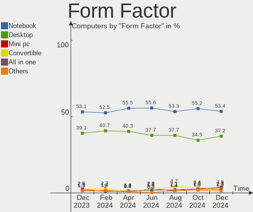
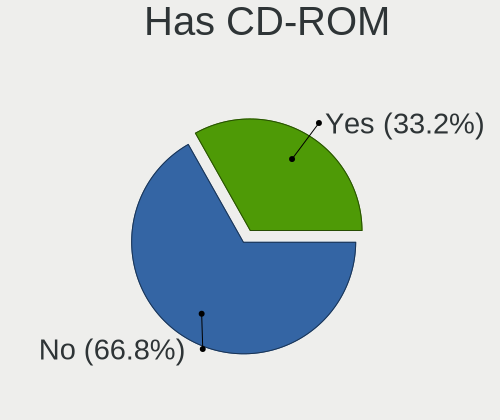
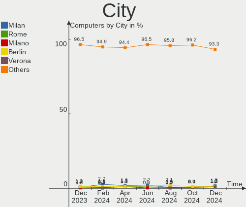
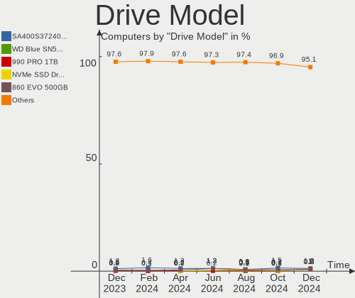
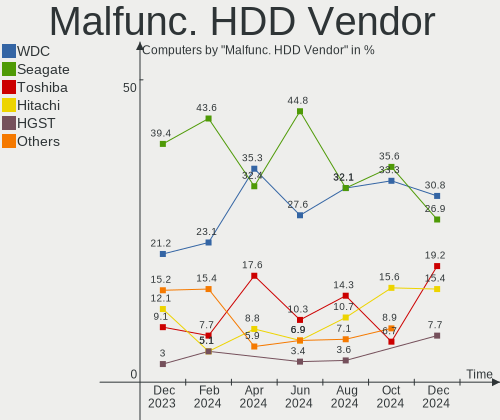
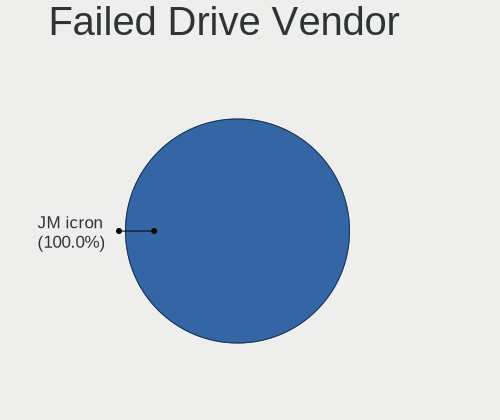
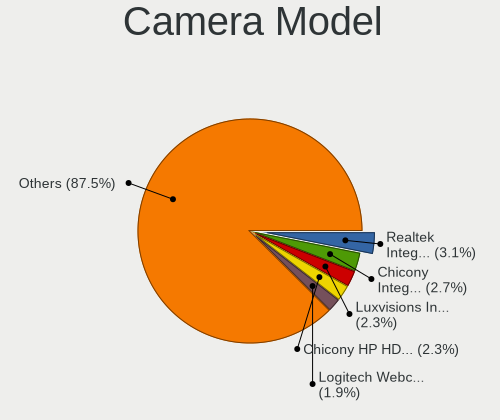

Linux Mint - Hardware Trends
----------------------------

A project to identify most popular hardware characteristics and track their change
over time based on data collected by Linux users at https://Linux-Hardware.org.

Anyone can contribute to this report by the [hw-probe](https://github.com/linuxhw/hw-probe) tool:

    sudo -E hw-probe -all -upload

This is a report for all computer types. See also reports for [desktops](/Dist/Linux_Mint/Desktop/README.md) and [notebooks](/Dist/Linux_Mint/Notebook/README.md).

This report is for one last month. Overall report since the beginning of time: [TestDays](https://github.com/linuxhw/TestDays)

Period: Feb, 2023.

Contents
--------

* [ System ](#system)
  - [ OS                       ](#os)
  - [ OS Family                ](#os-family)
  - [ Kernel                   ](#kernel)
  - [ Kernel Family            ](#kernel-family)
  - [ Kernel Major Ver.        ](#kernel-major-ver)
  - [ Arch                     ](#arch)
  - [ DE                       ](#de)
  - [ Display Server           ](#display-server)
  - [ Display Manager          ](#display-manager)
  - [ OS Lang                  ](#os-lang)
  - [ Boot Mode                ](#boot-mode)
  - [ Filesystem               ](#filesystem)
  - [ Part. scheme             ](#part-scheme)
  - [ Dual Boot with Linux/BSD ](#dual-boot-with-linuxbsd)
  - [ Dual Boot (Win)          ](#dual-boot-win)

* [ Board ](#board)
  - [ Vendor                   ](#vendor)
  - [ Model                    ](#model)
  - [ Model Family             ](#model-family)
  - [ MFG Year                 ](#mfg-year)
  - [ Form Factor              ](#form-factor)
  - [ Secure Boot              ](#secure-boot)
  - [ Coreboot                 ](#coreboot)
  - [ RAM Size                 ](#ram-size)
  - [ RAM Used                 ](#ram-used)
  - [ Total Drives             ](#total-drives)
  - [ Has CD-ROM               ](#has-cd-rom)
  - [ Has Ethernet             ](#has-ethernet)
  - [ Has WiFi                 ](#has-wifi)
  - [ Has Bluetooth            ](#has-bluetooth)

* [ Location ](#location)
  - [ Country                  ](#country)
  - [ City                     ](#city)

* [ Drives ](#drives)
  - [ Drive Vendor             ](#drive-vendor)
  - [ Drive Model              ](#drive-model)
  - [ HDD Vendor               ](#hdd-vendor)
  - [ SSD Vendor               ](#ssd-vendor)
  - [ Drive Kind               ](#drive-kind)
  - [ Drive Connector          ](#drive-connector)
  - [ Drive Size               ](#drive-size)
  - [ Space Total              ](#space-total)
  - [ Space Used               ](#space-used)
  - [ Malfunc. Drives          ](#malfunc-drives)
  - [ Malfunc. Drive Vendor    ](#malfunc-drive-vendor)
  - [ Malfunc. HDD Vendor      ](#malfunc-hdd-vendor)
  - [ Malfunc. Drive Kind      ](#malfunc-drive-kind)
  - [ Failed Drives            ](#failed-drives)
  - [ Failed Drive Vendor      ](#failed-drive-vendor)
  - [ Drive Status             ](#drive-status)

* [ Storage controller ](#storage-controller)
  - [ Storage Vendor           ](#storage-vendor)
  - [ Storage Model            ](#storage-model)
  - [ Storage Kind             ](#storage-kind)

* [ Processor ](#processor)
  - [ CPU Vendor               ](#cpu-vendor)
  - [ CPU Model                ](#cpu-model)
  - [ CPU Model Family         ](#cpu-model-family)
  - [ CPU Cores                ](#cpu-cores)
  - [ CPU Sockets              ](#cpu-sockets)
  - [ CPU Threads              ](#cpu-threads)
  - [ CPU Op-Modes             ](#cpu-op-modes)
  - [ CPU Microcode            ](#cpu-microcode)
  - [ CPU Microarch            ](#cpu-microarch)

* [ Graphics ](#graphics)
  - [ GPU Vendor               ](#gpu-vendor)
  - [ GPU Model                ](#gpu-model)
  - [ GPU Combo                ](#gpu-combo)
  - [ GPU Driver               ](#gpu-driver)
  - [ GPU Memory               ](#gpu-memory)

* [ Monitor ](#monitor)
  - [ Monitor Vendor           ](#monitor-vendor)
  - [ Monitor Model            ](#monitor-model)
  - [ Monitor Resolution       ](#monitor-resolution)
  - [ Monitor Diagonal         ](#monitor-diagonal)
  - [ Monitor Width            ](#monitor-width)
  - [ Aspect Ratio             ](#aspect-ratio)
  - [ Monitor Area             ](#monitor-area)
  - [ Pixel Density            ](#pixel-density)
  - [ Multiple Monitors        ](#multiple-monitors)

* [ Network ](#network)
  - [ Net Controller Vendor    ](#net-controller-vendor)
  - [ Net Controller Model     ](#net-controller-model)
  - [ Wireless Vendor          ](#wireless-vendor)
  - [ Wireless Model           ](#wireless-model)
  - [ Ethernet Vendor          ](#ethernet-vendor)
  - [ Ethernet Model           ](#ethernet-model)
  - [ Net Controller Kind      ](#net-controller-kind)
  - [ Used Controller          ](#used-controller)
  - [ NICs                     ](#nics)
  - [ IPv6                     ](#ipv6)

* [ Bluetooth ](#bluetooth)
  - [ Bluetooth Vendor         ](#bluetooth-vendor)
  - [ Bluetooth Model          ](#bluetooth-model)

* [ Sound ](#sound)
  - [ Sound Vendor             ](#sound-vendor)
  - [ Sound Model              ](#sound-model)

* [ Memory ](#memory)
  - [ Memory Vendor            ](#memory-vendor)
  - [ Memory Model             ](#memory-model)
  - [ Memory Kind              ](#memory-kind)
  - [ Memory Form Factor       ](#memory-form-factor)
  - [ Memory Size              ](#memory-size)
  - [ Memory Speed             ](#memory-speed)

* [ Printers & scanners ](#printers--scanners)
  - [ Printer Vendor           ](#printer-vendor)
  - [ Printer Model            ](#printer-model)
  - [ Scanner Vendor           ](#scanner-vendor)
  - [ Scanner Model            ](#scanner-model)

* [ Camera ](#camera)
  - [ Camera Vendor            ](#camera-vendor)
  - [ Camera Model             ](#camera-model)

* [ Security ](#security)
  - [ Fingerprint Vendor       ](#fingerprint-vendor)
  - [ Fingerprint Model        ](#fingerprint-model)
  - [ Chipcard Vendor          ](#chipcard-vendor)
  - [ Chipcard Model           ](#chipcard-model)

* [ Unsupported ](#unsupported)
  - [ Unsupported Devices      ](#unsupported-devices)
  - [ Unsupported Device Types ](#unsupported-device-types)

System
------

OS
--

Installed operating systems

| Name            | Computers | Percent |
|-----------------|-----------|---------|
| Linux Mint 21.1 | 435       | 73.23%  |
| Linux Mint 20.3 | 83        | 13.97%  |
| Linux Mint 21   | 41        | 6.9%    |
| Linux Mint 20.2 | 10        | 1.68%   |
| Linux Mint 19.3 | 10        | 1.68%   |
| Linux Mint 20   | 5         | 0.84%   |
| Linux Mint 20.1 | 4         | 0.67%   |
| Linux Mint 19.2 | 2         | 0.34%   |
| Linux Mint 19.1 | 1         | 0.17%   |
| Linux Mint 19   | 1         | 0.17%   |
| Linux Mint 18.2 | 1         | 0.17%   |
| Linux Mint 18   | 1         | 0.17%   |

OS Family
---------

OS without a version

| Name       | Computers | Percent |
|------------|-----------|---------|
| Linux Mint | 594       | 100%    |

Kernel
------

Version of the Linux kernel

| Version               | Computers | Percent |
|-----------------------|-----------|---------|
| 5.15.0-60-generic     | 246       | 41.41%  |
| 5.15.0-58-generic     | 147       | 24.75%  |
| 5.15.0-56-generic     | 43        | 7.24%   |
| 5.4.0-137-generic     | 41        | 6.9%    |
| 5.4.0-139-generic     | 36        | 6.06%   |
| 5.19.0-32-generic     | 15        | 2.53%   |
| 5.19.0-28-generic     | 14        | 2.36%   |
| 5.4.0-91-generic      | 4         | 0.67%   |
| 5.15.0-41-generic     | 4         | 0.67%   |
| 4.15.0-204-generic    | 4         | 0.67%   |
| 6.2.0-060200-generic  | 2         | 0.34%   |
| 6.1.9-060109-generic  | 2         | 0.34%   |
| 6.0.0-1010-oem        | 2         | 0.34%   |
| 5.4.0-126-generic     | 2         | 0.34%   |
| 5.4.0-100-generic     | 2         | 0.34%   |
| 5.17.0-1027-oem       | 2         | 0.34%   |
| 6.2.1-060201-generic  | 1         | 0.17%   |
| 6.1.7-060107-generic  | 1         | 0.17%   |
| 6.1.13-060113-generic | 1         | 0.17%   |
| 6.1.12-tkg-bmq        | 1         | 0.17%   |
| 6.1.12-060112-generic | 1         | 0.17%   |
| 6.1.11-x64v3-xanmod1  | 1         | 0.17%   |
| 6.1.0-1006-oem        | 1         | 0.17%   |
| 6.1.0-1004-oem        | 1         | 0.17%   |
| 6.0.9-060009-generic  | 1         | 0.17%   |
| 5.4.0-99-generic      | 1         | 0.17%   |
| 5.4.0-74-generic      | 1         | 0.17%   |
| 5.4.0-139-lowlatency  | 1         | 0.17%   |
| 5.4.0-136-generic     | 1         | 0.17%   |
| 5.4.0-135-generic     | 1         | 0.17%   |
| 5.4.0-131-generic     | 1         | 0.17%   |
| 5.4.0-109-generic     | 1         | 0.17%   |
| 5.4.0-107-generic     | 1         | 0.17%   |
| 5.19.3-051903-generic | 1         | 0.17%   |
| 5.19.14-xanmod1       | 1         | 0.17%   |
| 5.17.9-051709-generic | 1         | 0.17%   |
| 5.15.0-57-generic     | 1         | 0.17%   |
| 5.15.0-53-generic     | 1         | 0.17%   |
| 5.15.0-48-generic     | 1         | 0.17%   |
| 5.14.0-1057-oem       | 1         | 0.17%   |

Kernel Family
-------------

Linux kernel without a distro release

| Version | Computers | Percent |
|---------|-----------|---------|
| 5.15.0  | 443       | 74.58%  |
| 5.4.0   | 93        | 15.66%  |
| 5.19.0  | 29        | 4.88%   |
| 4.15.0  | 4         | 0.67%   |
| 6.2.0   | 2         | 0.34%   |
| 6.1.9   | 2         | 0.34%   |
| 6.1.12  | 2         | 0.34%   |
| 6.1.0   | 2         | 0.34%   |
| 6.0.0   | 2         | 0.34%   |
| 5.17.0  | 2         | 0.34%   |
| 5.14.0  | 2         | 0.34%   |
| 6.2.1   | 1         | 0.17%   |
| 6.1.7   | 1         | 0.17%   |
| 6.1.13  | 1         | 0.17%   |
| 6.1.11  | 1         | 0.17%   |
| 6.0.9   | 1         | 0.17%   |
| 5.19.3  | 1         | 0.17%   |
| 5.19.14 | 1         | 0.17%   |
| 5.17.9  | 1         | 0.17%   |
| 5.0.0   | 1         | 0.17%   |
| 4.8.0   | 1         | 0.17%   |
| 4.4.0   | 1         | 0.17%   |

Kernel Major Ver.
-----------------

Linux kernel major version

| Version | Computers | Percent |
|---------|-----------|---------|
| 5.15    | 443       | 74.58%  |
| 5.4     | 93        | 15.66%  |
| 5.19    | 31        | 5.22%   |
| 6.1     | 9         | 1.52%   |
| 4.15    | 4         | 0.67%   |
| 6.2     | 3         | 0.51%   |
| 6.0     | 3         | 0.51%   |
| 5.17    | 3         | 0.51%   |
| 5.14    | 2         | 0.34%   |
| 5.0     | 1         | 0.17%   |
| 4.8     | 1         | 0.17%   |
| 4.4     | 1         | 0.17%   |

Arch
----

OS architecture (x86_64, i586, etc.)

| Name   | Computers | Percent |
|--------|-----------|---------|
| x86_64 | 591       | 99.49%  |
| i686   | 3         | 0.51%   |

DE
--

Desktop Environment

| Name           | Computers | Percent |
|----------------|-----------|---------|
| X-Cinnamon     | 423       | 71.21%  |
| XFCE           | 76        | 12.79%  |
| MATE           | 64        | 10.77%  |
| Cinnamon       | 14        | 2.36%   |
| GNOME          | 8         | 1.35%   |
| KDE5           | 5         | 0.84%   |
| LXDE           | 2         | 0.34%   |
| i3-with-shmlog | 1         | 0.17%   |
| Unknown        | 1         | 0.17%   |

Display Server
--------------

X11 or Wayland

| Name    | Computers | Percent |
|---------|-----------|---------|
| X11     | 590       | 99.33%  |
| Tty     | 3         | 0.51%   |
| Wayland | 1         | 0.17%   |

Display Manager
---------------

SDDM, LightDM, etc.

| Name    | Computers | Percent |
|---------|-----------|---------|
| Unknown | 337       | 56.73%  |
| LightDM | 253       | 42.59%  |
| SDDM    | 1         | 0.17%   |
| MDM     | 1         | 0.17%   |
| LXDM    | 1         | 0.17%   |
| GDM3    | 1         | 0.17%   |

OS Lang
-------

Language

| Lang  | Computers | Percent |
|-------|-----------|---------|
| en_US | 172       | 28.96%  |
| de_DE | 111       | 18.69%  |
| pt_BR | 34        | 5.72%   |
| it_IT | 31        | 5.22%   |
| ru_RU | 26        | 4.38%   |
| fr_FR | 25        | 4.21%   |
| en_GB | 21        | 3.54%   |
| es_ES | 19        | 3.2%    |
| C     | 19        | 3.2%    |
| en_AU | 15        | 2.53%   |
| pl_PL | 14        | 2.36%   |
| en_CA | 11        | 1.85%   |
| nl_NL | 10        | 1.68%   |
| en_IN | 6         | 1.01%   |
| hu_HU | 5         | 0.84%   |
| en_NZ | 5         | 0.84%   |
| de_AT | 5         | 0.84%   |
| cs_CZ | 5         | 0.84%   |
| sv_SE | 4         | 0.67%   |
| pt_PT | 4         | 0.67%   |
| en_ZA | 4         | 0.67%   |
| zh_TW | 3         | 0.51%   |
| sk_SK | 3         | 0.51%   |
| fi_FI | 3         | 0.51%   |
| es_CO | 3         | 0.51%   |
| es_CL | 3         | 0.51%   |
| en_IL | 3         | 0.51%   |
| en_IE | 3         | 0.51%   |
| de_CH | 3         | 0.51%   |
| ja_JP | 2         | 0.34%   |
| es_MX | 2         | 0.34%   |
| es_AR | 2         | 0.34%   |
| sr_ME | 1         | 0.17%   |
| sl_SI | 1         | 0.17%   |
| ru_UA | 1         | 0.17%   |
| nl_BE | 1         | 0.17%   |
| nb_NO | 1         | 0.17%   |
| fr_CH | 1         | 0.17%   |
| fr_CA | 1         | 0.17%   |
| es_VE | 1         | 0.17%   |

Boot Mode
---------

EFI or BIOS

| Mode | Computers | Percent |
|------|-----------|---------|
| EFI  | 385       | 64.81%  |
| BIOS | 209       | 35.19%  |

Filesystem
----------

Type of filesystem

| Type    | Computers | Percent |
|---------|-----------|---------|
| Ext4    | 562       | 94.61%  |
| Overlay | 15        | 2.53%   |
| Btrfs   | 10        | 1.68%   |
| Zfs     | 3         | 0.51%   |
| Xfs     | 2         | 0.34%   |
| Ext3    | 1         | 0.17%   |
| Ext2    | 1         | 0.17%   |

Part. scheme
------------

Scheme of partitioning

| Type    | Computers | Percent |
|---------|-----------|---------|
| Unknown | 338       | 56.9%   |
| GPT     | 204       | 34.34%  |
| MBR     | 52        | 8.75%   |

Dual Boot with Linux/BSD
------------------------

Hosting more than one Linux/BSD

| Dual boot | Computers | Percent |
|-----------|-----------|---------|
| No        | 537       | 90.4%   |
| Yes       | 57        | 9.6%    |

Dual Boot (Win)
---------------

Hosting Linux and Windows

| Dual boot | Computers | Percent |
|-----------|-----------|---------|
| No        | 496       | 83.5%   |
| Yes       | 98        | 16.5%   |

Board
-----

Vendor
------

Motherboard manufacturer

| Name                | Computers | Percent |
|---------------------|-----------|---------|
| Hewlett-Packard     | 105       | 17.68%  |
| ASUSTek Computer    | 79        | 13.3%   |
| Lenovo              | 71        | 11.95%  |
| Dell                | 62        | 10.44%  |
| Acer                | 48        | 8.08%   |
| Gigabyte Technology | 39        | 6.57%   |
| MSI                 | 29        | 4.88%   |
| ASRock              | 24        | 4.04%   |
| Apple               | 15        | 2.53%   |
| Medion              | 10        | 1.68%   |
| Intel               | 10        | 1.68%   |
| Unknown             | 7         | 1.18%   |
| Toshiba             | 6         | 1.01%   |
| Samsung Electronics | 6         | 1.01%   |
| Inventec            | 5         | 0.84%   |
| Google              | 5         | 0.84%   |
| Fujitsu             | 5         | 0.84%   |
| Sony                | 4         | 0.67%   |
| Foxconn             | 4         | 0.67%   |
| AZW                 | 4         | 0.67%   |
| Positivo            | 3         | 0.51%   |
| HUAWEI              | 3         | 0.51%   |
| Fujitsu Siemens     | 3         | 0.51%   |
| TUXEDO              | 2         | 0.34%   |
| Pegatron            | 2         | 0.34%   |
| PCWare              | 2         | 0.34%   |
| Microsoft           | 2         | 0.34%   |
| GPU Company         | 2         | 0.34%   |
| GEO                 | 2         | 0.34%   |
| Gateway             | 2         | 0.34%   |
| ECS                 | 2         | 0.34%   |
| Biostar             | 2         | 0.34%   |
| AMD                 | 2         | 0.34%   |
| ZOTAC               | 1         | 0.17%   |
| TrekStor            | 1         | 0.17%   |
| Teclast             | 1         | 0.17%   |
| Tactus              | 1         | 0.17%   |
| Schenker            | 1         | 0.17%   |
| Panasonic           | 1         | 0.17%   |
| Packard Bell        | 1         | 0.17%   |

Model
-----

Motherboard model

| Name                                 | Computers | Percent |
|--------------------------------------|-----------|---------|
| Unknown                              | 8         | 1.35%   |
| Inventec VXC Class                   | 5         | 0.84%   |
| MSI MS-7C37                          | 4         | 0.67%   |
| HP Notebook                          | 4         | 0.67%   |
| HP Pavilion 15                       | 3         | 0.51%   |
| Dell Inspiron N5110                  | 3         | 0.51%   |
| ASUS ROG STRIX B450-F GAMING         | 3         | 0.51%   |
| MSI MS-7D46                          | 2         | 0.34%   |
| MSI MS-7A38                          | 2         | 0.34%   |
| Microsoft Surface Pro                | 2         | 0.34%   |
| Lenovo ThinkPad E15 Gen 4 21EES00100 | 2         | 0.34%   |
| Lenovo G50-80 80E5                   | 2         | 0.34%   |
| Lenovo G470 20078                    | 2         | 0.34%   |
| Lenovo G40-80 80JE                   | 2         | 0.34%   |
| Intel H61                            | 2         | 0.34%   |
| HP Stream Laptop 14-ax0XX            | 2         | 0.34%   |
| HP Pavilion Gaming Laptop 15-cx0xxx  | 2         | 0.34%   |
| HP Pavilion dv7                      | 2         | 0.34%   |
| HP ENVY Laptop 17-cr0xxx             | 2         | 0.34%   |
| HP Compaq Elite 8300 USDT            | 2         | 0.34%   |
| HP Compaq Elite 8300 SFF             | 2         | 0.34%   |
| HP Compaq Elite 8300 CMT             | 2         | 0.34%   |
| HP 250 G6 Notebook PC                | 2         | 0.34%   |
| HP 250 G3                            | 2         | 0.34%   |
| Gigabyte B550M AORUS ELITE           | 2         | 0.34%   |
| Gigabyte B450M DS3H                  | 2         | 0.34%   |
| Gigabyte B250M-D3H                   | 2         | 0.34%   |
| Dell OptiPlex 990                    | 2         | 0.34%   |
| Dell OptiPlex 790                    | 2         | 0.34%   |
| Dell OptiPlex 780                    | 2         | 0.34%   |
| Dell Latitude E6440                  | 2         | 0.34%   |
| Dell Latitude E5450                  | 2         | 0.34%   |
| Dell Inspiron N5010                  | 2         | 0.34%   |
| ASUS TUF B450-PLUS GAMING            | 2         | 0.34%   |
| ASUS SABERTOOTH Z77                  | 2         | 0.34%   |
| ASUS M5A99X EVO                      | 2         | 0.34%   |
| ASUS All Series                      | 2         | 0.34%   |
| ASRock B450 Pro4                     | 2         | 0.34%   |
| Apple MacBookPro5,5                  | 2         | 0.34%   |
| Acer Aspire A515-44                  | 2         | 0.34%   |

Model Family
------------

Motherboard model prefix

| Name               | Computers | Percent |
|--------------------|-----------|---------|
| Acer Aspire        | 40        | 6.73%   |
| Lenovo ThinkPad    | 33        | 5.56%   |
| HP Pavilion        | 20        | 3.37%   |
| Dell Latitude      | 18        | 3.03%   |
| HP Compaq          | 17        | 2.86%   |
| Dell OptiPlex      | 15        | 2.53%   |
| Dell Inspiron      | 12        | 2.02%   |
| HP ENVY            | 10        | 1.68%   |
| HP Laptop          | 9         | 1.52%   |
| HP EliteBook       | 9         | 1.52%   |
| ASUS TUF           | 9         | 1.52%   |
| Lenovo IdeaPad     | 8         | 1.35%   |
| Unknown            | 8         | 1.35%   |
| Lenovo ThinkCentre | 7         | 1.18%   |
| Dell Precision     | 7         | 1.18%   |
| ASUS ROG           | 7         | 1.18%   |
| ASUS PRIME         | 7         | 1.18%   |
| Toshiba Satellite  | 6         | 1.01%   |
| Lenovo Yoga        | 5         | 0.84%   |
| Inventec VXC       | 5         | 0.84%   |
| Dell XPS           | 5         | 0.84%   |
| ASUS VivoBook      | 5         | 0.84%   |
| MSI MS-7C37        | 4         | 0.67%   |
| Medion Akoya       | 4         | 0.67%   |
| Lenovo ThinkBook   | 4         | 0.67%   |
| HP ProDesk         | 4         | 0.67%   |
| HP ProBook         | 4         | 0.67%   |
| HP Notebook        | 4         | 0.67%   |
| HP 250             | 4         | 0.67%   |
| HP ZBook           | 3         | 0.51%   |
| Gigabyte B450M     | 3         | 0.51%   |
| Fujitsu ESPRIMO    | 3         | 0.51%   |
| ASUS SABERTOOTH    | 3         | 0.51%   |
| MSI MS-7D46        | 2         | 0.34%   |
| MSI MS-7A38        | 2         | 0.34%   |
| MSI Modern         | 2         | 0.34%   |
| Microsoft Surface  | 2         | 0.34%   |
| Lenovo G50-80      | 2         | 0.34%   |
| Lenovo G470        | 2         | 0.34%   |
| Lenovo G40-80      | 2         | 0.34%   |

MFG Year
--------

Motherboard manufacture year

| Year | Computers | Percent |
|------|-----------|---------|
| 2021 | 50        | 8.42%   |
| 2011 | 48        | 8.08%   |
| 2018 | 47        | 7.91%   |
| 2020 | 45        | 7.58%   |
| 2013 | 45        | 7.58%   |
| 2012 | 42        | 7.07%   |
| 2014 | 41        | 6.9%    |
| 2019 | 40        | 6.73%   |
| 2022 | 38        | 6.4%    |
| 2015 | 36        | 6.06%   |
| 2010 | 33        | 5.56%   |
| 2017 | 32        | 5.39%   |
| 2016 | 31        | 5.22%   |
| 2009 | 24        | 4.04%   |
| 2008 | 20        | 3.37%   |
| 2007 | 11        | 1.85%   |
| 2023 | 7         | 1.18%   |
| 2006 | 4         | 0.67%   |

Form Factor
-----------

Physical design of the computer

| Name        | Computers | Percent |
|-------------|-----------|---------|
| Notebook    | 321       | 54.04%  |
| Desktop     | 240       | 40.4%   |
| Convertible | 14        | 2.36%   |
| Mini pc     | 8         | 1.35%   |
| All in one  | 8         | 1.35%   |
| Tablet      | 2         | 0.34%   |
| Server      | 1         | 0.17%   |

Secure Boot
-----------

Enabled or disabled

| State    | Computers | Percent |
|----------|-----------|---------|
| Disabled | 539       | 90.74%  |
| Enabled  | 55        | 9.26%   |

Coreboot
--------

Have coreboot on board

| Used | Computers | Percent |
|------|-----------|---------|
| No   | 589       | 99.16%  |
| Yes  | 5         | 0.84%   |

RAM Size
--------

Total RAM memory

| Size in GB      | Computers | Percent |
|-----------------|-----------|---------|
| 4.01-8.0        | 140       | 23.57%  |
| 16.01-24.0      | 121       | 20.37%  |
| 3.01-4.0        | 120       | 20.2%   |
| 8.01-16.0       | 111       | 18.69%  |
| 32.01-64.0      | 50        | 8.42%   |
| 1.01-2.0        | 20        | 3.37%   |
| 64.01-256.0     | 14        | 2.36%   |
| 24.01-32.0      | 7         | 1.18%   |
| 2.01-3.0        | 7         | 1.18%   |
| 0.51-1.0        | 3         | 0.51%   |
| More than 256.0 | 1         | 0.17%   |

RAM Used
--------

Used RAM memory

| Used GB   | Computers | Percent |
|-----------|-----------|---------|
| 1.01-2.0  | 225       | 37.88%  |
| 2.01-3.0  | 166       | 27.95%  |
| 4.01-8.0  | 85        | 14.31%  |
| 3.01-4.0  | 72        | 12.12%  |
| 0.51-1.0  | 27        | 4.55%   |
| 8.01-16.0 | 17        | 2.86%   |
| 0.01-0.5  | 2         | 0.34%   |

Total Drives
------------

Number of drives on board

| Drives | Computers | Percent |
|--------|-----------|---------|
| 1      | 355       | 59.76%  |
| 2      | 140       | 23.57%  |
| 3      | 45        | 7.58%   |
| 4      | 28        | 4.71%   |
| 5      | 17        | 2.86%   |
| 6      | 6         | 1.01%   |
| 0      | 2         | 0.34%   |
| 7      | 1         | 0.17%   |

Has CD-ROM
----------

Has CD-ROM on board

| Presented | Computers | Percent |
|-----------|-----------|---------|
| No        | 341       | 57.41%  |
| Yes       | 253       | 42.59%  |

Has Ethernet
------------

Has Ethernet on board

| Presented | Computers | Percent |
|-----------|-----------|---------|
| Yes       | 517       | 87.04%  |
| No        | 77        | 12.96%  |

Has WiFi
--------

Has WiFi module

| Presented | Computers | Percent |
|-----------|-----------|---------|
| Yes       | 456       | 76.77%  |
| No        | 138       | 23.23%  |

Has Bluetooth
-------------

Has Bluetooth module

| Presented | Computers | Percent |
|-----------|-----------|---------|
| Yes       | 362       | 60.94%  |
| No        | 232       | 39.06%  |

Location
--------

Country
-------

Geographic location (country)

| Country      | Computers | Percent |
|--------------|-----------|---------|
| Germany      | 120       | 20.2%   |
| USA          | 93        | 15.66%  |
| Italy        | 42        | 7.07%   |
| Brazil       | 40        | 6.73%   |
| France       | 26        | 4.38%   |
| Spain        | 22        | 3.7%    |
| UK           | 20        | 3.37%   |
| Russia       | 19        | 3.2%    |
| Netherlands  | 17        | 2.86%   |
| Canada       | 16        | 2.69%   |
| Australia    | 16        | 2.69%   |
| Poland       | 15        | 2.53%   |
| Portugal     | 8         | 1.35%   |
| Austria      | 8         | 1.35%   |
| Switzerland  | 6         | 1.01%   |
| Sweden       | 6         | 1.01%   |
| Slovakia     | 6         | 1.01%   |
| India        | 6         | 1.01%   |
| Hungary      | 6         | 1.01%   |
| Czechia      | 6         | 1.01%   |
| New Zealand  | 5         | 0.84%   |
| Israel       | 5         | 0.84%   |
| Finland      | 5         | 0.84%   |
| South Africa | 4         | 0.67%   |
| Norway       | 4         | 0.67%   |
| Ireland      | 4         | 0.67%   |
| Indonesia    | 4         | 0.67%   |
| Colombia     | 4         | 0.67%   |
| Belarus      | 4         | 0.67%   |
| Argentina    | 4         | 0.67%   |
| Ukraine      | 3         | 0.51%   |
| Turkey       | 3         | 0.51%   |
| Taiwan       | 3         | 0.51%   |
| Romania      | 3         | 0.51%   |
| Mexico       | 3         | 0.51%   |
| Chile        | 3         | 0.51%   |
| Vietnam      | 2         | 0.34%   |
| Venezuela    | 2         | 0.34%   |
| Paraguay     | 2         | 0.34%   |
| Japan        | 2         | 0.34%   |

City
----

Geographic location (city)

| City           | Computers | Percent |
|----------------|-----------|---------|
| Berlin         | 9         | 1.52%   |
| Sydney         | 6         | 1.01%   |
| Stuhr          | 6         | 1.01%   |
| Milan          | 6         | 1.01%   |
| Traunstein     | 5         | 0.84%   |
| Munich         | 5         | 0.84%   |
| Melbourne      | 5         | 0.84%   |
| Barcelona      | 5         | 0.84%   |
| Madrid         | 4         | 0.67%   |
| Hamburg        | 4         | 0.67%   |
| Ulyanovsk      | 3         | 0.51%   |
| Rome           | 3         | 0.51%   |
| Rio de Janeiro | 3         | 0.51%   |
| Perth          | 3         | 0.51%   |
| Moscow         | 3         | 0.51%   |
| Milano         | 3         | 0.51%   |
| London         | 3         | 0.51%   |
| Houston        | 3         | 0.51%   |
| Florence       | 3         | 0.51%   |
| Duisburg       | 3         | 0.51%   |
| Dublin         | 3         | 0.51%   |
| Budapest       | 3         | 0.51%   |
| Auckland       | 3         | 0.51%   |
| Weimar         | 2         | 0.34%   |
| Warsaw         | 2         | 0.34%   |
| Viña del Mar  | 2         | 0.34%   |
| Vila Real      | 2         | 0.34%   |
| Vigo           | 2         | 0.34%   |
| Vechelde       | 2         | 0.34%   |
| Vancouver      | 2         | 0.34%   |
| Uttoxeter      | 2         | 0.34%   |
| Utrecht        | 2         | 0.34%   |
| Turin          | 2         | 0.34%   |
| Tel Aviv       | 2         | 0.34%   |
| St Petersburg  | 2         | 0.34%   |
| Sevastopol     | 2         | 0.34%   |
| Sao Paulo      | 2         | 0.34%   |
| Ridderkerk     | 2         | 0.34%   |
| Reutlingen     | 2         | 0.34%   |
| Przemysl       | 2         | 0.34%   |

Drives
------

Drive Vendor
------------

Hard drive vendors

| Vendor                      | Computers | Drives | Percent |
|-----------------------------|-----------|--------|---------|
| WDC                         | 128       | 167    | 14.48%  |
| Samsung Electronics         | 123       | 151    | 13.91%  |
| Seagate                     | 110       | 137    | 12.44%  |
| SanDisk                     | 56        | 60     | 6.33%   |
| Kingston                    | 55        | 59     | 6.22%   |
| Toshiba                     | 52        | 53     | 5.88%   |
| Crucial                     | 45        | 51     | 5.09%   |
| Unknown                     | 43        | 48     | 4.86%   |
| HGST                        | 23        | 23     | 2.6%    |
| Intel                       | 21        | 23     | 2.38%   |
| Hitachi                     | 19        | 19     | 2.15%   |
| China                       | 16        | 16     | 1.81%   |
| SK hynix                    | 15        | 15     | 1.7%    |
| Intenso                     | 12        | 13     | 1.36%   |
| A-DATA Technology           | 12        | 13     | 1.36%   |
| Micron Technology           | 11        | 11     | 1.24%   |
| SPCC                        | 7         | 8      | 0.79%   |
| Patriot                     | 6         | 6      | 0.68%   |
| Kingston Technology Company | 6         | 6      | 0.68%   |
| Apple                       | 6         | 7      | 0.68%   |
| Netac                       | 5         | 5      | 0.57%   |
| GOODRAM                     | 5         | 5      | 0.57%   |
| Unknown                     | 5         | 5      | 0.57%   |
| Transcend                   | 4         | 4      | 0.45%   |
| Team                        | 4         | 4      | 0.45%   |
| Silicon Motion              | 4         | 5      | 0.45%   |
| Phison Electronics          | 4         | 4      | 0.45%   |
| Micron/Crucial Technology   | 4         | 4      | 0.45%   |
| JMicron Technology          | 4         | 4      | 0.45%   |
| UMIS                        | 3         | 3      | 0.34%   |
| PNY                         | 3         | 3      | 0.34%   |
| OCZ                         | 3         | 3      | 0.34%   |
| Fujitsu                     | 3         | 3      | 0.34%   |
| Fanxiang                    | 3         | 3      | 0.34%   |
| XrayDisk                    | 2         | 3      | 0.23%   |
| Verbatim                    | 2         | 2      | 0.23%   |
| Union Memory (Shenzhen)     | 2         | 2      | 0.23%   |
| ShiJi                       | 2         | 2      | 0.23%   |
| SABRENT                     | 2         | 2      | 0.23%   |
| Plextor                     | 2         | 2      | 0.23%   |

Drive Model
-----------

Hard drive models

| Model                                                | Computers | Percent |
|------------------------------------------------------|-----------|---------|
| Kingston SA400S37240G 240GB SSD                      | 15        | 1.54%   |
| Kingston SA400S37480G 480GB SSD                      | 11        | 1.13%   |
| Samsung NVMe SSD Controller SM981/PM981/PM983 250GB  | 10        | 1.03%   |
| Unknown MMC Card  64GB                               | 9         | 0.92%   |
| Crucial CT500MX500SSD1 500GB                         | 9         | 0.92%   |
| Crucial CT1000MX500SSD1 1TB                          | 9         | 0.92%   |
| Unknown MMC Card  32GB                               | 8         | 0.82%   |
| Seagate ST1000LM035-1RK172 1TB                       | 7         | 0.72%   |
| SanDisk SSD PLUS 1000GB                              | 7         | 0.72%   |
| Samsung SSD 850 EVO 250GB                            | 7         | 0.72%   |
| Crucial CT240BX500SSD1 240GB                         | 7         | 0.72%   |
| Unknown SD/MMC/MS PRO 16GB                           | 6         | 0.62%   |
| Toshiba MQ01ABF050 500GB                             | 6         | 0.62%   |
| Toshiba DT01ACA050 500GB                             | 6         | 0.62%   |
| Seagate ST500DM002-1BD142 500GB                      | 6         | 0.62%   |
| Samsung SSD 860 EVO 1TB                              | 6         | 0.62%   |
| Samsung SSD 840 EVO 250GB                            | 6         | 0.62%   |
| Toshiba DT01ACA100 1TB                               | 5         | 0.51%   |
| Seagate ST31000528AS 1TB                             | 5         | 0.51%   |
| Seagate ST1000LM024 HN-M101MBB 1TB                   | 5         | 0.51%   |
| Samsung SSD 870 EVO 500GB                            | 5         | 0.51%   |
| Samsung NVMe SSD Controller PM9A1/PM9A3/980PRO 960GB | 5         | 0.51%   |
| HGST HTS541010A9E680 1TB                             | 5         | 0.51%   |
| Crucial CT480BX500SSD1 480GB                         | 5         | 0.51%   |
| Unknown                                              | 5         | 0.51%   |
| WDC WDS500G2B0A-00SM50 500GB SSD                     | 4         | 0.41%   |
| WDC WDS240G2G0A-00JH30 240GB SSD                     | 4         | 0.41%   |
| WDC WD20EZRZ-00Z5HB0 2TB                             | 4         | 0.41%   |
| WDC WD10EZEX-08WN4A0 1TB                             | 4         | 0.41%   |
| WDC WD10EZEX-00BN5A0 1TB                             | 4         | 0.41%   |
| Unknown MMC Card  16GB                               | 4         | 0.41%   |
| Seagate ST9500325AS 500GB                            | 4         | 0.41%   |
| Seagate ST1000DM010-2EP102 1TB                       | 4         | 0.41%   |
| Sandisk WD Blue SN550 NVMe SSD 1TB                   | 4         | 0.41%   |
| Samsung SSD 870 EVO 1TB                              | 4         | 0.41%   |
| Samsung SSD 860 EVO 500GB                            | 4         | 0.41%   |
| Micron/Crucial P2 NVMe PCIe SSD 1TB                  | 4         | 0.41%   |
| HGST HTS721010A9E630 1TB                             | 4         | 0.41%   |
| WDC WD1600BEVT-22ZCT0 160GB                          | 3         | 0.31%   |
| WDC WD10SPZX-21Z10T0 1TB                             | 3         | 0.31%   |

HDD Vendor
----------

Hard disk drive vendors

| Vendor              | Computers | Drives | Percent |
|---------------------|-----------|--------|---------|
| Seagate             | 109       | 133    | 32.73%  |
| WDC                 | 106       | 139    | 31.83%  |
| Toshiba             | 39        | 40     | 11.71%  |
| HGST                | 23        | 23     | 6.91%   |
| Hitachi             | 19        | 19     | 5.71%   |
| Samsung Electronics | 18        | 20     | 5.41%   |
| Unknown             | 6         | 6      | 1.8%    |
| JMicron Technology  | 3         | 3      | 0.9%    |
| Fujitsu             | 3         | 3      | 0.9%    |
| SABRENT             | 2         | 2      | 0.6%    |
| Maxtor              | 2         | 2      | 0.6%    |
| KESU                | 1         | 1      | 0.3%    |
| ASMT                | 1         | 1      | 0.3%    |
| Apple               | 1         | 1      | 0.3%    |

SSD Vendor
----------

Solid state drive vendors

| Vendor              | Computers | Drives | Percent |
|---------------------|-----------|--------|---------|
| Samsung Electronics | 66        | 76     | 19.53%  |
| Kingston            | 46        | 48     | 13.61%  |
| SanDisk             | 40        | 43     | 11.83%  |
| Crucial             | 40        | 45     | 11.83%  |
| WDC                 | 17        | 17     | 5.03%   |
| China               | 15        | 15     | 4.44%   |
| Intenso             | 10        | 10     | 2.96%   |
| A-DATA Technology   | 8         | 8      | 2.37%   |
| Toshiba             | 7         | 7      | 2.07%   |
| SPCC                | 6         | 7      | 1.78%   |
| Patriot             | 6         | 6      | 1.78%   |
| Intel               | 6         | 6      | 1.78%   |
| Netac               | 5         | 5      | 1.48%   |
| GOODRAM             | 5         | 5      | 1.48%   |
| Transcend           | 4         | 4      | 1.18%   |
| Team                | 4         | 4      | 1.18%   |
| Apple               | 4         | 4      | 1.18%   |
| SK hynix            | 3         | 3      | 0.89%   |
| PNY                 | 3         | 3      | 0.89%   |
| OCZ                 | 3         | 3      | 0.89%   |
| Fanxiang            | 3         | 3      | 0.89%   |
| XrayDisk            | 2         | 3      | 0.59%   |
| Verbatim            | 2         | 2      | 0.59%   |
| Plextor             | 2         | 2      | 0.59%   |
| Micron Technology   | 2         | 2      | 0.59%   |
| Lexar               | 2         | 2      | 0.59%   |
| AMD                 | 2         | 2      | 0.59%   |
| Zheino              | 1         | 1      | 0.3%    |
| TO Exter            | 1         | 1      | 0.3%    |
| Teclast             | 1         | 1      | 0.3%    |
| TCSUNBOW            | 1         | 1      | 0.3%    |
| StoreJet            | 1         | 1      | 0.3%    |
| ShiJi               | 1         | 1      | 0.3%    |
| SD                  | 1         | 1      | 0.3%    |
| RX7                 | 1         | 1      | 0.3%    |
| POLION              | 1         | 1      | 0.3%    |
| OCZ-VERTEX3         | 1         | 1      | 0.3%    |
| Mushkin             | 1         | 1      | 0.3%    |
| M500                | 1         | 1      | 0.3%    |
| LITEONIT            | 1         | 1      | 0.3%    |

Drive Kind
----------

HDD or SSD

| Kind    | Computers | Drives | Percent |
|---------|-----------|--------|---------|
| SSD     | 303       | 360    | 38.26%  |
| HDD     | 271       | 393    | 34.22%  |
| NVMe    | 161       | 190    | 20.33%  |
| MMC     | 38        | 42     | 4.8%    |
| Unknown | 19        | 20     | 2.4%    |

Drive Connector
---------------

SATA, SAS, NVMe, etc.

| Type | Computers | Drives | Percent |
|------|-----------|--------|---------|
| SATA | 477       | 724    | 66.62%  |
| NVMe | 161       | 190    | 22.49%  |
| SAS  | 40        | 49     | 5.59%   |
| MMC  | 38        | 42     | 5.31%   |

Drive Size
----------

Size of hard drive

| Size in TB | Computers | Drives | Percent |
|------------|-----------|--------|---------|
| 0.01-0.5   | 354       | 431    | 57.75%  |
| 0.51-1.0   | 173       | 213    | 28.22%  |
| 1.01-2.0   | 53        | 70     | 8.65%   |
| 2.01-3.0   | 14        | 15     | 2.28%   |
| 3.01-4.0   | 11        | 15     | 1.79%   |
| 4.01-10.0  | 8         | 9      | 1.31%   |

Space Total
-----------

Amount of disk space available on the file system

| Size in GB     | Computers | Percent |
|----------------|-----------|---------|
| 101-250        | 163       | 27.44%  |
| 251-500        | 158       | 26.6%   |
| 501-1000       | 94        | 15.82%  |
| 1001-2000      | 48        | 8.08%   |
| 51-100         | 41        | 6.9%    |
| More than 3000 | 35        | 5.89%   |
| 21-50          | 20        | 3.37%   |
| 2001-3000      | 17        | 2.86%   |
| 1-20           | 14        | 2.36%   |
| Unknown        | 4         | 0.67%   |

Space Used
----------

Amount of used disk space

| Used GB        | Computers | Percent |
|----------------|-----------|---------|
| 21-50          | 150       | 25.25%  |
| 1-20           | 116       | 19.53%  |
| 101-250        | 99        | 16.67%  |
| 51-100         | 92        | 15.49%  |
| 251-500        | 55        | 9.26%   |
| 501-1000       | 39        | 6.57%   |
| More than 3000 | 18        | 3.03%   |
| 1001-2000      | 13        | 2.19%   |
| 2001-3000      | 8         | 1.35%   |
| Unknown        | 4         | 0.67%   |

Malfunc. Drives
---------------

Drive models with a malfunction

| Model                                       | Computers | Drives | Percent |
|---------------------------------------------|-----------|--------|---------|
| Toshiba DT01ACA100 1TB                      | 2         | 2      | 4.44%   |
| Seagate ST1000LM024 HN-M101MBB 1TB          | 2         | 2      | 4.44%   |
| HGST HTS541075A9E680 752GB                  | 2         | 2      | 4.44%   |
| WDC WDS240G1G0B-00RC30 240GB SSD            | 1         | 1      | 2.22%   |
| WDC WD6400AAKS-65A7B2 640GB                 | 1         | 1      | 2.22%   |
| WDC WD60EFAX-68JH4N1 6TB                    | 1         | 1      | 2.22%   |
| WDC WD5000AAKX-22ERMA0 500GB                | 1         | 1      | 2.22%   |
| WDC WD5000AAKX-08ERMA0 500GB                | 1         | 1      | 2.22%   |
| Toshiba MQ04ABF100 1TB                      | 1         | 1      | 2.22%   |
| Toshiba MQ01ABF050 500GB                    | 1         | 1      | 2.22%   |
| Toshiba DT01ACA050 500GB                    | 1         | 1      | 2.22%   |
| SK hynix HFS256G39TND-N210A 256GB SSD       | 1         | 1      | 2.22%   |
| Seagate ST98823AS 80GB                      | 1         | 1      | 2.22%   |
| Seagate ST9160412AS 160GB                   | 1         | 1      | 2.22%   |
| Seagate ST9120822AS 120GB                   | 1         | 2      | 2.22%   |
| Seagate ST750LM022 HN-M750MBB 752GB         | 1         | 1      | 2.22%   |
| Seagate ST500DM002-1BD142 500GB             | 1         | 1      | 2.22%   |
| Seagate ST3500418AS 500GB                   | 1         | 1      | 2.22%   |
| Seagate ST31000528AS 1TB                    | 1         | 1      | 2.22%   |
| Seagate ST2000DM008-2FR102 2TB              | 1         | 2      | 2.22%   |
| Seagate ST2000DL003-9VT166 2TB              | 1         | 1      | 2.22%   |
| Seagate ST1000DM003-9YN162 1TB              | 1         | 1      | 2.22%   |
| SanDisk SSD U100 24GB                       | 1         | 1      | 2.22%   |
| SanDisk SSD PLUS 240GB                      | 1         | 1      | 2.22%   |
| SanDisk SSD PLUS 240 GB                     | 1         | 1      | 2.22%   |
| SanDisk SSD PLUS 1000GB                     | 1         | 1      | 2.22%   |
| Samsung Electronics SSD SM871 2.5 7mm 256GB | 1         | 1      | 2.22%   |
| Samsung Electronics SSD 980 1TB             | 1         | 1      | 2.22%   |
| Samsung Electronics SSD 870 EVO 1TB         | 1         | 1      | 2.22%   |
| Samsung Electronics HM160HC 160GB           | 1         | 1      | 2.22%   |
| Samsung Electronics HD322HJ 320GB           | 1         | 1      | 2.22%   |
| Lenovo LENSE30256GMSP34MEAT3TA 256GB        | 1         | 1      | 2.22%   |
| Kingston SV300S37A60G 64GB SSD              | 1         | 1      | 2.22%   |
| Kingston SNVS250G 250GB                     | 1         | 1      | 2.22%   |
| KingFast SSD 32GB                           | 1         | 1      | 2.22%   |
| Hitachi HDS721050DLE630 500GB               | 1         | 1      | 2.22%   |
| HGST HTS725050A7E630 500GB                  | 1         | 1      | 2.22%   |
| Fujitsu MHV2080AH 80GB                      | 1         | 1      | 2.22%   |
| Crucial CT1050MX300SSD1 1050GB              | 1         | 1      | 2.22%   |
| Crucial CT1000P1SSD8 1TB                    | 1         | 1      | 2.22%   |

Malfunc. Drive Vendor
---------------------

Vendors of faulty drives

| Vendor              | Computers | Drives | Percent |
|---------------------|-----------|--------|---------|
| Seagate             | 11        | 14     | 25.58%  |
| Toshiba             | 5         | 5      | 11.63%  |
| Samsung Electronics | 5         | 5      | 11.63%  |
| WDC                 | 4         | 5      | 9.3%    |
| SanDisk             | 4         | 4      | 9.3%    |
| HGST                | 3         | 3      | 6.98%   |
| Kingston            | 2         | 2      | 4.65%   |
| Crucial             | 2         | 2      | 4.65%   |
| SK hynix            | 1         | 1      | 2.33%   |
| Lenovo              | 1         | 1      | 2.33%   |
| KingFast            | 1         | 1      | 2.33%   |
| Hitachi             | 1         | 1      | 2.33%   |
| Fujitsu             | 1         | 1      | 2.33%   |
| China               | 1         | 1      | 2.33%   |
| A-DATA Technology   | 1         | 1      | 2.33%   |

Malfunc. HDD Vendor
-------------------

Vendors of faulty HDD drives

| Vendor              | Computers | Drives | Percent |
|---------------------|-----------|--------|---------|
| Seagate             | 11        | 14     | 42.31%  |
| Toshiba             | 5         | 5      | 19.23%  |
| WDC                 | 3         | 4      | 11.54%  |
| HGST                | 3         | 3      | 11.54%  |
| Samsung Electronics | 2         | 2      | 7.69%   |
| Hitachi             | 1         | 1      | 3.85%   |
| Fujitsu             | 1         | 1      | 3.85%   |

Malfunc. Drive Kind
-------------------

Kinds of faulty drives

| Kind | Computers | Drives | Percent |
|------|-----------|--------|---------|
| HDD  | 25        | 30     | 59.52%  |
| SSD  | 13        | 13     | 30.95%  |
| NVMe | 4         | 4      | 9.52%   |

Failed Drives
-------------

Failed drive models

| Model                    | Computers | Drives | Percent |
|--------------------------|-----------|--------|---------|
| HGST HTS541010B7E610 1TB | 1         | 1      | 100%    |

Failed Drive Vendor
-------------------

Failed drive vendors

| Vendor | Computers | Drives | Percent |
|--------|-----------|--------|---------|
| HGST   | 1         | 1      | 100%    |

Drive Status
------------

Number of failed and malfunc. drives

| Status   | Computers | Drives | Percent |
|----------|-----------|--------|---------|
| Detected | 385       | 628    | 60.16%  |
| Works    | 214       | 329    | 33.44%  |
| Malfunc  | 40        | 47     | 6.25%   |
| Failed   | 1         | 1      | 0.16%   |

Storage controller
------------------

Storage Vendor
--------------

Storage controller vendors

| Vendor                           | Computers | Percent |
|----------------------------------|-----------|---------|
| Intel                            | 400       | 54.5%   |
| AMD                              | 124       | 16.89%  |
| Samsung Electronics              | 51        | 6.95%   |
| SanDisk                          | 24        | 3.27%   |
| ASMedia Technology               | 20        | 2.72%   |
| Kingston Technology Company      | 15        | 2.04%   |
| SK hynix                         | 11        | 1.5%    |
| Nvidia                           | 10        | 1.36%   |
| Micron/Crucial Technology        | 10        | 1.36%   |
| Micron Technology                | 9         | 1.23%   |
| Marvell Technology Group         | 8         | 1.09%   |
| Phison Electronics               | 7         | 0.95%   |
| JMicron Technology               | 6         | 0.82%   |
| Union Memory (Shenzhen)          | 5         | 0.68%   |
| Toshiba America Info Systems     | 5         | 0.68%   |
| Silicon Motion                   | 4         | 0.54%   |
| ADATA Technology                 | 4         | 0.54%   |
| Realtek Semiconductor            | 3         | 0.41%   |
| Lite-On Technology               | 3         | 0.41%   |
| KIOXIA                           | 3         | 0.41%   |
| VIA Technologies                 | 2         | 0.27%   |
| Lenovo                           | 2         | 0.27%   |
| Transcend                        | 1         | 0.14%   |
| Solid State Storage Technology   | 1         | 0.14%   |
| Silicon Integrated Systems [SiS] | 1         | 0.14%   |
| Shenzhen Longsys Electronics     | 1         | 0.14%   |
| MAXIO Technology (Hangzhou)      | 1         | 0.14%   |
| Broadcom / LSI                   | 1         | 0.14%   |
| Apple                            | 1         | 0.14%   |
| Unknown                          | 1         | 0.14%   |

Storage Model
-------------

Storage controller models

| Model                                                                                   | Computers | Percent |
|-----------------------------------------------------------------------------------------|-----------|---------|
| AMD FCH SATA Controller [AHCI mode]                                                     | 73        | 8.68%   |
| Intel 8 Series/C220 Series Chipset Family 6-port SATA Controller 1 [AHCI mode]          | 31        | 3.69%   |
| Intel Sunrise Point-LP SATA Controller [AHCI mode]                                      | 28        | 3.33%   |
| Intel 6 Series/C200 Series Chipset Family 6 port Mobile SATA AHCI Controller            | 22        | 2.62%   |
| AMD SB7x0/SB8x0/SB9x0 SATA Controller [AHCI mode]                                       | 21        | 2.5%    |
| Intel 82801 Mobile SATA Controller [RAID mode]                                          | 20        | 2.38%   |
| AMD 400 Series Chipset SATA Controller                                                  | 20        | 2.38%   |
| Intel 6 Series/C200 Series Chipset Family 6 port Desktop SATA AHCI Controller           | 19        | 2.26%   |
| Samsung NVMe SSD Controller SM981/PM981/PM983                                           | 18        | 2.14%   |
| ASMedia ASM1062 Serial ATA Controller                                                   | 17        | 2.02%   |
| Intel Q170/Q150/B150/H170/H110/Z170/CM236 Chipset SATA Controller [AHCI Mode]           | 16        | 1.9%    |
| Intel 8 Series SATA Controller 1 [AHCI mode]                                            | 16        | 1.9%    |
| AMD SB7x0/SB8x0/SB9x0 IDE Controller                                                    | 16        | 1.9%    |
| Samsung NVMe SSD Controller 980                                                         | 15        | 1.78%   |
| Intel Celeron/Pentium Silver Processor SATA Controller                                  | 15        | 1.78%   |
| Intel 7 Series Chipset Family 6-port SATA Controller [AHCI mode]                        | 15        | 1.78%   |
| Intel Volume Management Device NVMe RAID Controller                                     | 14        | 1.66%   |
| Intel 7 Series/C210 Series Chipset Family 6-port SATA Controller [AHCI mode]            | 14        | 1.66%   |
| Samsung NVMe SSD Controller PM9A1/PM9A3/980PRO                                          | 12        | 1.43%   |
| Intel Wildcat Point-LP SATA Controller [AHCI Mode]                                      | 12        | 1.43%   |
| AMD SB7x0/SB8x0/SB9x0 SATA Controller [IDE mode]                                        | 11        | 1.31%   |
| SanDisk WD Blue SN550 NVMe SSD                                                          | 10        | 1.19%   |
| Intel 82801IBM/IEM (ICH9M/ICH9M-E) 4 port SATA Controller [AHCI mode]                   | 10        | 1.19%   |
| Intel 5 Series/3400 Series Chipset 6 port SATA AHCI Controller                          | 10        | 1.19%   |
| Intel 200 Series PCH SATA controller [AHCI mode]                                        | 10        | 1.19%   |
| Micron Non-Volatile memory controller                                                   | 9         | 1.07%   |
| Kingston Company Company Non-Volatile memory controller                                 | 9         | 1.07%   |
| Intel Alder Lake-S PCH SATA Controller [AHCI Mode]                                      | 9         | 1.07%   |
| Intel 5 Series/3400 Series Chipset 4 port SATA AHCI Controller                          | 9         | 1.07%   |
| Intel SSD 660P Series                                                                   | 8         | 0.95%   |
| Intel Comet Lake SATA AHCI Controller                                                   | 8         | 0.95%   |
| Intel 82801HM/HEM (ICH8M/ICH8M-E) SATA Controller [AHCI mode]                           | 8         | 0.95%   |
| Intel 82801HM/HEM (ICH8M/ICH8M-E) IDE Controller                                        | 8         | 0.95%   |
| Intel 6 Series/C200 Series Chipset Family Desktop SATA Controller (IDE mode, ports 4-5) | 8         | 0.95%   |
| Intel 6 Series/C200 Series Chipset Family Desktop SATA Controller (IDE mode, ports 0-3) | 8         | 0.95%   |
| AMD 500 Series Chipset SATA Controller                                                  | 8         | 0.95%   |
| SK hynix Gold P31/PC711 NVMe Solid State Drive                                          | 7         | 0.83%   |
| Micron/Crucial P2 NVMe PCIe SSD                                                         | 7         | 0.83%   |
| Intel Celeron N3350/Pentium N4200/Atom E3900 Series SATA AHCI Controller                | 7         | 0.83%   |
| Intel Tiger Lake-LP SATA Controller                                                     | 6         | 0.71%   |

Storage Kind
------------

Kind of storage controller (IDE, SATA, NVMe, SAS, ...)

| Kind | Computers | Percent |
|------|-----------|---------|
| SATA | 467       | 62.68%  |
| NVMe | 162       | 21.74%  |
| IDE  | 72        | 9.66%   |
| RAID | 42        | 5.64%   |
| SAS  | 1         | 0.13%   |
| SCSI | 1         | 0.13%   |

Processor
---------

CPU Vendor
----------

Processor vendors

| Vendor | Computers | Percent |
|--------|-----------|---------|
| Intel  | 446       | 75.08%  |
| AMD    | 148       | 24.92%  |

CPU Model
---------

Processor models

| Model                                       | Computers | Percent |
|---------------------------------------------|-----------|---------|
| Intel Core i5-6300U CPU @ 2.40GHz           | 9         | 1.52%   |
| Intel 11th Gen Core i7-1165G7 @ 2.80GHz     | 9         | 1.52%   |
| Intel Core i3-10110U CPU @ 2.10GHz          | 6         | 1.01%   |
| Intel Celeron N4020 CPU @ 1.10GHz           | 6         | 1.01%   |
| AMD G-T56N Processor                        | 6         | 1.01%   |
| Intel Core i3 CPU M 330 @ 2.13GHz           | 5         | 0.84%   |
| Intel Celeron CPU N3350 @ 1.10GHz           | 5         | 0.84%   |
| Intel Atom x5-Z8350 CPU @ 1.44GHz           | 5         | 0.84%   |
| AMD Ryzen 7 5700U with Radeon Graphics      | 5         | 0.84%   |
| Intel Core i7-4510U CPU @ 2.00GHz           | 4         | 0.67%   |
| Intel Core i7-2630QM CPU @ 2.00GHz          | 4         | 0.67%   |
| Intel Core i7-10750H CPU @ 2.60GHz          | 4         | 0.67%   |
| Intel Core i5-7500 CPU @ 3.40GHz            | 4         | 0.67%   |
| Intel Core i5-7200U CPU @ 2.50GHz           | 4         | 0.67%   |
| Intel Core i5-6500 CPU @ 3.20GHz            | 4         | 0.67%   |
| Intel Core i5-4200U CPU @ 1.60GHz           | 4         | 0.67%   |
| Intel Core i5-2400 CPU @ 3.10GHz            | 4         | 0.67%   |
| Intel Core i5-1035G1 CPU @ 1.00GHz          | 4         | 0.67%   |
| Intel Core i5 CPU 650 @ 3.20GHz             | 4         | 0.67%   |
| Intel Core i3-5005U CPU @ 2.00GHz           | 4         | 0.67%   |
| Intel Core i3-3220 CPU @ 3.30GHz            | 4         | 0.67%   |
| Intel Core i3 CPU M 370 @ 2.40GHz           | 4         | 0.67%   |
| Intel Core 2 Duo CPU P8700 @ 2.53GHz        | 4         | 0.67%   |
| AMD Ryzen 7 5825U with Radeon Graphics      | 4         | 0.67%   |
| AMD Ryzen 7 3700X 8-Core Processor          | 4         | 0.67%   |
| AMD Ryzen 5 5600G with Radeon Graphics      | 4         | 0.67%   |
| AMD Ryzen 5 5500U with Radeon Graphics      | 4         | 0.67%   |
| AMD Ryzen 5 3600 6-Core Processor           | 4         | 0.67%   |
| Intel Pentium Dual-Core CPU T4500 @ 2.30GHz | 3         | 0.51%   |
| Intel Pentium CPU G630 @ 2.70GHz            | 3         | 0.51%   |
| Intel Core i7-8750H CPU @ 2.20GHz           | 3         | 0.51%   |
| Intel Core i7-7600U CPU @ 2.80GHz           | 3         | 0.51%   |
| Intel Core i7-5500U CPU @ 2.40GHz           | 3         | 0.51%   |
| Intel Core i7-4790 CPU @ 3.60GHz            | 3         | 0.51%   |
| Intel Core i7-2600 CPU @ 3.40GHz            | 3         | 0.51%   |
| Intel Core i5-8350U CPU @ 1.70GHz           | 3         | 0.51%   |
| Intel Core i5-8300H CPU @ 2.30GHz           | 3         | 0.51%   |
| Intel Core i5-8265U CPU @ 1.60GHz           | 3         | 0.51%   |
| Intel Core i5-8250U CPU @ 1.60GHz           | 3         | 0.51%   |
| Intel Core i5-7400 CPU @ 3.00GHz            | 3         | 0.51%   |

CPU Model Family
----------------

Processor model prefix

| Model                   | Computers | Percent |
|-------------------------|-----------|---------|
| Intel Core i5           | 134       | 22.56%  |
| Intel Core i7           | 86        | 14.48%  |
| Intel Core i3           | 54        | 9.09%   |
| Other                   | 41        | 6.9%    |
| Intel Celeron           | 41        | 6.9%    |
| AMD Ryzen 7             | 38        | 6.4%    |
| AMD Ryzen 5             | 30        | 5.05%   |
| Intel Core 2 Duo        | 27        | 4.55%   |
| Intel Pentium           | 21        | 3.54%   |
| AMD FX                  | 12        | 2.02%   |
| Intel Xeon              | 10        | 1.68%   |
| Intel Pentium Dual-Core | 8         | 1.35%   |
| Intel Atom              | 8         | 1.35%   |
| AMD A8                  | 7         | 1.18%   |
| AMD Ryzen 3             | 6         | 1.01%   |
| AMD G                   | 6         | 1.01%   |
| AMD Athlon II X2        | 6         | 1.01%   |
| AMD E                   | 5         | 0.84%   |
| AMD A6                  | 5         | 0.84%   |
| Intel Core 2 Quad       | 4         | 0.67%   |
| AMD Ryzen 9             | 4         | 0.67%   |
| Intel Core i9           | 3         | 0.51%   |
| AMD Turion 64 X2 Mobile | 3         | 0.51%   |
| AMD Ryzen 5 PRO         | 3         | 0.51%   |
| AMD E2                  | 3         | 0.51%   |
| AMD A4                  | 3         | 0.51%   |
| AMD A10                 | 3         | 0.51%   |
| Intel Pentium Silver    | 2         | 0.34%   |
| Intel Pentium Dual      | 2         | 0.34%   |
| Intel Pentium D         | 2         | 0.34%   |
| Intel Pentium 4         | 2         | 0.34%   |
| Intel Genuine           | 2         | 0.34%   |
| AMD Phenom II X4        | 2         | 0.34%   |
| AMD Phenom              | 2         | 0.34%   |
| Intel Xeon Gold         | 1         | 0.17%   |
| AMD Turion II Neo       | 1         | 0.17%   |
| AMD Turion 64 Mobile    | 1         | 0.17%   |
| AMD Ryzen Threadripper  | 1         | 0.17%   |
| AMD E1                  | 1         | 0.17%   |
| AMD Athlon II           | 1         | 0.17%   |

CPU Cores
---------

Number of processor cores

| Number | Computers | Percent |
|--------|-----------|---------|
| 2      | 271       | 45.62%  |
| 4      | 190       | 31.99%  |
| 6      | 52        | 8.75%   |
| 8      | 48        | 8.08%   |
| 12     | 9         | 1.52%   |
| 3      | 6         | 1.01%   |
| 1      | 6         | 1.01%   |
| 10     | 5         | 0.84%   |
| 16     | 3         | 0.51%   |
| 14     | 3         | 0.51%   |
| 40     | 1         | 0.17%   |

CPU Sockets
-----------

Number of sockets

| Number | Computers | Percent |
|--------|-----------|---------|
| 1      | 592       | 99.66%  |
| 2      | 2         | 0.34%   |

CPU Threads
-----------

Threads per core (Hyper-Threading)

| Number | Computers | Percent |
|--------|-----------|---------|
| 2      | 377       | 63.47%  |
| 1      | 217       | 36.53%  |

CPU Op-Modes
------------

CPU Operation Modes (32-bit, 64-bit)

| Op mode        | Computers | Percent |
|----------------|-----------|---------|
| 32-bit, 64-bit | 593       | 99.83%  |
| 32-bit         | 1         | 0.17%   |

CPU Microcode
-------------

Microcode number

| Number     | Computers | Percent |
|------------|-----------|---------|
| 0x206a7    | 43        | 7.24%   |
| 0x306a9    | 38        | 6.4%    |
| 0x306c3    | 36        | 6.06%   |
| Unknown    | 35        | 5.89%   |
| 0x1067a    | 23        | 3.87%   |
| 0x40651    | 20        | 3.37%   |
| 0x406e3    | 17        | 2.86%   |
| 0x806e9    | 15        | 2.53%   |
| 0x306d4    | 15        | 2.53%   |
| 0x906e9    | 13        | 2.19%   |
| 0x806c1    | 13        | 2.19%   |
| 0x506e3    | 13        | 2.19%   |
| 0x906ea    | 12        | 2.02%   |
| 0x706a8    | 11        | 1.85%   |
| 0x20652    | 11        | 1.85%   |
| 0x0800820d | 10        | 1.68%   |
| 0x806ec    | 9         | 1.52%   |
| 0x08701021 | 9         | 1.52%   |
| 0x08108109 | 9         | 1.52%   |
| 0x06000852 | 9         | 1.52%   |
| 0x506c9    | 8         | 1.35%   |
| 0x406c4    | 8         | 1.35%   |
| 0x20655    | 8         | 1.35%   |
| 0x0a50000d | 8         | 1.35%   |
| 0x0a50000c | 8         | 1.35%   |
| 0x08608103 | 8         | 1.35%   |
| 0x806ea    | 7         | 1.18%   |
| 0x6fd      | 7         | 1.18%   |
| 0x05000119 | 7         | 1.18%   |
| 0x906a3    | 6         | 1.01%   |
| 0x90675    | 6         | 1.01%   |
| 0x706e5    | 6         | 1.01%   |
| 0x406c3    | 6         | 1.01%   |
| 0x6fb      | 5         | 0.84%   |
| 0x30678    | 5         | 0.84%   |
| 0x07030105 | 5         | 0.84%   |
| 0x05000029 | 5         | 0.84%   |
| 0xa0653    | 4         | 0.67%   |
| 0xa0652    | 4         | 0.67%   |
| 0x906ed    | 4         | 0.67%   |

CPU Microarch
-------------

Microarchitecture

| Name             | Computers | Percent |
|------------------|-----------|---------|
| KabyLake         | 68        | 11.45%  |
| Haswell          | 62        | 10.44%  |
| SandyBridge      | 49        | 8.25%   |
| IvyBridge        | 41        | 6.9%    |
| Skylake          | 31        | 5.22%   |
| Penryn           | 28        | 4.71%   |
| Zen 3            | 22        | 3.7%    |
| Zen+             | 21        | 3.54%   |
| Westmere         | 21        | 3.54%   |
| Silvermont       | 20        | 3.37%   |
| Unknown          | 19        | 3.2%    |
| Zen 2            | 18        | 3.03%   |
| Alderlake Hybrid | 18        | 3.03%   |
| TigerLake        | 16        | 2.69%   |
| Piledriver       | 15        | 2.53%   |
| Goldmont plus    | 15        | 2.53%   |
| Broadwell        | 15        | 2.53%   |
| Core             | 14        | 2.36%   |
| CometLake        | 13        | 2.19%   |
| K10              | 12        | 2.02%   |
| Bobcat           | 12        | 2.02%   |
| Icelake          | 10        | 1.68%   |
| Goldmont         | 9         | 1.52%   |
| Excavator        | 8         | 1.35%   |
| Zen              | 7         | 1.18%   |
| Puma             | 5         | 0.84%   |
| K8 Hammer        | 5         | 0.84%   |
| NetBurst         | 4         | 0.67%   |
| Tremont          | 3         | 0.51%   |
| Jaguar           | 3         | 0.51%   |
| Steamroller      | 2         | 0.34%   |
| Nehalem          | 2         | 0.34%   |
| K10 Llano        | 2         | 0.34%   |
| Bonnell          | 2         | 0.34%   |
| P6               | 1         | 0.17%   |
| Bulldozer        | 1         | 0.17%   |

Graphics
--------

GPU Vendor
----------

Vendors of graphics cards

| Vendor            | Computers | Percent |
|-------------------|-----------|---------|
| Intel             | 344       | 50.59%  |
| Nvidia            | 177       | 26.03%  |
| AMD               | 158       | 23.24%  |
| ASPEED Technology | 1         | 0.15%   |

GPU Model
---------

Graphics card models

| Model                                                                                    | Computers | Percent |
|------------------------------------------------------------------------------------------|-----------|---------|
| Intel 2nd Generation Core Processor Family Integrated Graphics Controller                | 39        | 5.61%   |
| Intel Haswell-ULT Integrated Graphics Controller                                         | 21        | 3.02%   |
| Intel Skylake GT2 [HD Graphics 520]                                                      | 16        | 2.3%    |
| Intel 3rd Gen Core processor Graphics Controller                                         | 16        | 2.3%    |
| Intel Atom/Celeron/Pentium Processor x5-E8000/J3xxx/N3xxx Integrated Graphics Controller | 14        | 2.01%   |
| Intel 4th Gen Core Processor Integrated Graphics Controller                              | 14        | 2.01%   |
| Intel TigerLake-LP GT2 [Iris Xe Graphics]                                                | 13        | 1.87%   |
| Intel HD Graphics 620                                                                    | 13        | 1.87%   |
| Intel HD Graphics 5500                                                                   | 13        | 1.87%   |
| Intel GeminiLake [UHD Graphics 600]                                                      | 13        | 1.87%   |
| Intel Xeon E3-1200 v2/3rd Gen Core processor Graphics Controller                         | 12        | 1.73%   |
| Intel Core Processor Integrated Graphics Controller                                      | 12        | 1.73%   |
| AMD Cezanne [Radeon Vega Series / Radeon Vega Mobile Series]                             | 12        | 1.73%   |
| Intel Xeon E3-1200 v3/4th Gen Core Processor Integrated Graphics Controller              | 11        | 1.58%   |
| Intel HD Graphics 530                                                                    | 10        | 1.44%   |
| AMD Picasso/Raven 2 [Radeon Vega Series / Radeon Vega Mobile Series]                     | 10        | 1.44%   |
| AMD Lucienne                                                                             | 9         | 1.29%   |
| Nvidia GK208B [GeForce GT 710]                                                           | 8         | 1.15%   |
| Intel CometLake-U GT2 [UHD Graphics]                                                     | 8         | 1.15%   |
| Intel UHD Graphics 620                                                                   | 7         | 1.01%   |
| Intel Mobile 4 Series Chipset Integrated Graphics Controller                             | 7         | 1.01%   |
| Intel HD Graphics 630                                                                    | 7         | 1.01%   |
| Intel HD Graphics 500                                                                    | 7         | 1.01%   |
| Intel CoffeeLake-H GT2 [UHD Graphics 630]                                                | 7         | 1.01%   |
| Intel Alder Lake-P Integrated Graphics Controller                                        | 7         | 1.01%   |
| AMD Renoir                                                                               | 7         | 1.01%   |
| Nvidia GP108 [GeForce GT 1030]                                                           | 6         | 0.86%   |
| Nvidia GP106 [GeForce GTX 1060 6GB]                                                      | 6         | 0.86%   |
| Intel Atom Processor Z36xxx/Z37xxx Series Graphics & Display                             | 6         | 0.86%   |
| AMD Wrestler [Radeon HD 6310]                                                            | 6         | 0.86%   |
| AMD Stoney [Radeon R2/R3/R4/R5 Graphics]                                                 | 6         | 0.86%   |
| Nvidia GP107 [GeForce GTX 1050 Ti]                                                       | 5         | 0.72%   |
| Intel WhiskeyLake-U GT2 [UHD Graphics 620]                                               | 5         | 0.72%   |
| Intel Iris Plus Graphics G1 (Ice Lake)                                                   | 5         | 0.72%   |
| AMD Wrestler [Radeon HD 6320]                                                            | 5         | 0.72%   |
| AMD Ellesmere [Radeon RX 470/480/570/570X/580/580X/590]                                  | 5         | 0.72%   |
| Nvidia TU116 [GeForce GTX 1660 SUPER]                                                    | 4         | 0.58%   |
| Nvidia GM107 [GeForce GTX 750 Ti]                                                        | 4         | 0.58%   |
| Nvidia GK208B [GeForce GT 730]                                                           | 4         | 0.58%   |
| Nvidia GF117M [GeForce 610M/710M/810M/820M / GT 620M/625M/630M/720M]                     | 4         | 0.58%   |

GPU Combo
---------

Combinations of graphics cards

| Name             | Computers | Percent |
|------------------|-----------|---------|
| 1 x Intel        | 263       | 44.28%  |
| 1 x AMD          | 127       | 21.38%  |
| 1 x Nvidia       | 110       | 18.52%  |
| Intel + Nvidia   | 61        | 10.27%  |
| Intel + AMD      | 13        | 2.19%   |
| 2 x AMD          | 12        | 2.02%   |
| AMD + Nvidia     | 5         | 0.84%   |
| Other            | 1         | 0.17%   |
| 1 x ASPEED       | 1         | 0.17%   |
| AMD + 2 x Nvidia | 1         | 0.17%   |

GPU Driver
----------

Free vs proprietary

| Driver      | Computers | Percent |
|-------------|-----------|---------|
| Free        | 464       | 78.11%  |
| Proprietary | 120       | 20.2%   |
| Unknown     | 10        | 1.68%   |

GPU Memory
----------

Total video memory

| Size in GB | Computers | Percent |
|------------|-----------|---------|
| Unknown    | 310       | 52.19%  |
| 0.01-0.5   | 79        | 13.3%   |
| 1.01-2.0   | 75        | 12.63%  |
| 0.51-1.0   | 47        | 7.91%   |
| 3.01-4.0   | 33        | 5.56%   |
| 5.01-6.0   | 17        | 2.86%   |
| 7.01-8.0   | 15        | 2.53%   |
| 8.01-16.0  | 12        | 2.02%   |
| 2.01-3.0   | 3         | 0.51%   |
| 16.01-24.0 | 3         | 0.51%   |

Monitor
-------

Monitor Vendor
--------------

Monitor vendors

| Vendor                  | Computers | Percent |
|-------------------------|-----------|---------|
| AU Optronics            | 89        | 13.86%  |
| Samsung Electronics     | 70        | 10.9%   |
| Chimei Innolux          | 59        | 9.19%   |
| BOE                     | 58        | 9.03%   |
| LG Display              | 46        | 7.17%   |
| Goldstar                | 30        | 4.67%   |
| Hewlett-Packard         | 28        | 4.36%   |
| Dell                    | 26        | 4.05%   |
| Acer                    | 22        | 3.43%   |
| BenQ                    | 20        | 3.12%   |
| AOC                     | 16        | 2.49%   |
| Ancor Communications    | 16        | 2.49%   |
| Apple                   | 15        | 2.34%   |
| Philips                 | 14        | 2.18%   |
| Lenovo                  | 10        | 1.56%   |
| ViewSonic               | 9         | 1.4%    |
| Fujitsu Siemens         | 9         | 1.4%    |
| ASUSTek Computer        | 8         | 1.25%   |
| PANDA                   | 6         | 0.93%   |
| Chi Mei Optoelectronics | 6         | 0.93%   |
| Sharp                   | 5         | 0.78%   |
| Iiyama                  | 5         | 0.78%   |
| LG Philips              | 4         | 0.62%   |
| LG Electronics          | 3         | 0.47%   |
| Jean                    | 3         | 0.47%   |
| InfoVision              | 3         | 0.47%   |
| HannStar                | 3         | 0.47%   |
| Eizo                    | 3         | 0.47%   |
| CSO                     | 3         | 0.47%   |
| Vizio                   | 2         | 0.31%   |
| Unknown                 | 2         | 0.31%   |
| MSI                     | 2         | 0.31%   |
| LGD                     | 2         | 0.31%   |
| KDC                     | 2         | 0.31%   |
| HUAWEI                  | 2         | 0.31%   |
| HannStar Display        | 2         | 0.31%   |
| CPT                     | 2         | 0.31%   |
| AUS                     | 2         | 0.31%   |
| Westinghouse            | 1         | 0.16%   |
| Wacom                   | 1         | 0.16%   |

Monitor Model
-------------

Monitor models

| Model                                                                     | Computers | Percent |
|---------------------------------------------------------------------------|-----------|---------|
| LG Display LCD Monitor LGD02DC 1366x768 344x194mm 15.5-inch               | 5         | 0.76%   |
| AU Optronics LCD Monitor AUO183C 1366x768 309x173mm 13.9-inch             | 4         | 0.61%   |
| Samsung Electronics C24F390 SAM0D2C 1920x1080 521x293mm 23.5-inch         | 3         | 0.46%   |
| Jean JT229x6-4 JEN51C6 1680x1050 474x297mm 22.0-inch                      | 3         | 0.46%   |
| Chimei Innolux LCD Monitor CMN1735 1920x1080 382x215mm 17.3-inch          | 3         | 0.46%   |
| Chimei Innolux LCD Monitor CMN15E7 1920x1080 344x193mm 15.5-inch          | 3         | 0.46%   |
| Chimei Innolux LCD Monitor CMN15CA 1366x768 344x193mm 15.5-inch           | 3         | 0.46%   |
| Chimei Innolux LCD Monitor CMN14D4 1920x1080 309x173mm 13.9-inch          | 3         | 0.46%   |
| BOE LCD Monitor BOE06A5 1366x768 344x194mm 15.5-inch                      | 3         | 0.46%   |
| AU Optronics LCD Monitor AUO47EC 1366x768 344x193mm 15.5-inch             | 3         | 0.46%   |
| AU Optronics LCD Monitor AUO38ED 1920x1080 344x193mm 15.5-inch            | 3         | 0.46%   |
| Unknown LCD Monitor SAMSUNG 1920x1080                                     | 2         | 0.31%   |
| Samsung Electronics S24F350 SAM0D20 1920x1080 521x293mm 23.5-inch         | 2         | 0.31%   |
| Samsung Electronics LCD Monitor SEC544B 1600x900 382x214mm 17.2-inch      | 2         | 0.31%   |
| Samsung Electronics LCD Monitor SAM0C3C 1366x768 609x347mm 27.6-inch      | 2         | 0.31%   |
| Samsung Electronics C49RG9x SAM0F9C 3840x1080 1193x336mm 48.8-inch        | 2         | 0.31%   |
| Samsung Electronics C27F390 SAM0D32 1920x1080 598x336mm 27.0-inch         | 2         | 0.31%   |
| Philips PHL 242V8 PHLC219 1920x1080 527x296mm 23.8-inch                   | 2         | 0.31%   |
| Philips 196VL PHLC07F 1366x768 409x230mm 18.5-inch                        | 2         | 0.31%   |
| PANDA LCD Monitor NCP004A 1920x1080 309x174mm 14.0-inch                   | 2         | 0.31%   |
| PANDA LCD Monitor NCP003D 1920x1080 344x194mm 15.5-inch                   | 2         | 0.31%   |
| LG Display LCD Monitor LGD0555 2736x1824 260x173mm 12.3-inch              | 2         | 0.31%   |
| LG Display LCD Monitor LGD02E9 1366x768 309x174mm 14.0-inch               | 2         | 0.31%   |
| Goldstar ULTRAWIDE GSM59F1 2560x1080 798x334mm 34.1-inch                  | 2         | 0.31%   |
| Goldstar IPS FULLHD GSM5AB8 1920x1080 480x270mm 21.7-inch                 | 2         | 0.31%   |
| Goldstar FULL HD GSM5B55 1920x1080 480x270mm 21.7-inch                    | 2         | 0.31%   |
| Goldstar 2D HD TV GSM59CA 1366x768 509x286mm 23.0-inch                    | 2         | 0.31%   |
| Chimei Innolux LCD Monitor CMN1728 1600x900 382x215mm 17.3-inch           | 2         | 0.31%   |
| Chimei Innolux LCD Monitor CMN15F5 1920x1080 344x193mm 15.5-inch          | 2         | 0.31%   |
| Chimei Innolux LCD Monitor CMN15E6 1366x768 344x193mm 15.5-inch           | 2         | 0.31%   |
| Chimei Innolux LCD Monitor CMN15DC 1366x768 344x193mm 15.5-inch           | 2         | 0.31%   |
| Chimei Innolux LCD Monitor CMN15DB 1366x768 344x193mm 15.5-inch           | 2         | 0.31%   |
| Chimei Innolux LCD Monitor CMN151E 1920x1080 344x193mm 15.5-inch          | 2         | 0.31%   |
| Chimei Innolux LCD Monitor CMN1493 1366x768 309x173mm 13.9-inch           | 2         | 0.31%   |
| Chi Mei Optoelectronics LCD Monitor CMO1720 1920x1080 382x215mm 17.3-inch | 2         | 0.31%   |
| BOE LCD Monitor BOE0991 1920x1080 344x194mm 15.5-inch                     | 2         | 0.31%   |
| BOE LCD Monitor BOE084E 1920x1080 382x215mm 17.3-inch                     | 2         | 0.31%   |
| BOE LCD Monitor BOE07A1 1920x1080 344x193mm 15.5-inch                     | 2         | 0.31%   |
| BOE LCD Monitor BOE070D 1366x768 309x173mm 13.9-inch                      | 2         | 0.31%   |
| BOE LCD Monitor BOE0696 1366x768 309x173mm 13.9-inch                      | 2         | 0.31%   |

Monitor Resolution
------------------

Monitor screen resolution

| Resolution         | Computers | Percent |
|--------------------|-----------|---------|
| 1920x1080 (FHD)    | 273       | 44.1%   |
| 1366x768 (WXGA)    | 131       | 21.16%  |
| 1600x900 (HD+)     | 34        | 5.49%   |
| 3840x2160 (4K)     | 24        | 3.88%   |
| 2560x1440 (QHD)    | 24        | 3.88%   |
| 1680x1050 (WSXGA+) | 21        | 3.39%   |
| 1280x1024 (SXGA)   | 18        | 2.91%   |
| 1920x1200 (WUXGA)  | 15        | 2.42%   |
| 1440x900 (WXGA+)   | 14        | 2.26%   |
| 1280x800 (WXGA)    | 14        | 2.26%   |
| Unknown            | 10        | 1.62%   |
| 3840x1080          | 7         | 1.13%   |
| 2560x1080          | 5         | 0.81%   |
| 3440x1440          | 4         | 0.65%   |
| 1360x768           | 4         | 0.65%   |
| 2560x1600          | 3         | 0.48%   |
| 1024x768 (XGA)     | 3         | 0.48%   |
| 2736x1824          | 2         | 0.32%   |
| 1024x600           | 2         | 0.32%   |
| 5760x1080          | 1         | 0.16%   |
| 3840x1200          | 1         | 0.16%   |
| 3600x1080          | 1         | 0.16%   |
| 3120x1050          | 1         | 0.16%   |
| 2720x768           | 1         | 0.16%   |
| 2520x1680          | 1         | 0.16%   |
| 2304x1440          | 1         | 0.16%   |
| 2160x1440          | 1         | 0.16%   |
| 1920x540           | 1         | 0.16%   |
| 1680x945           | 1         | 0.16%   |
| 1600x1200          | 1         | 0.16%   |

Monitor Diagonal
----------------

Diagonal size in inches

| Inches  | Computers | Percent |
|---------|-----------|---------|
| 15      | 135       | 21.19%  |
| 13      | 67        | 10.52%  |
| 24      | 52        | 8.16%   |
| 17      | 51        | 8.01%   |
| 27      | 47        | 7.38%   |
| 14      | 43        | 6.75%   |
| 23      | 38        | 5.97%   |
| Unknown | 38        | 5.97%   |
| 21      | 32        | 5.02%   |
| 31      | 16        | 2.51%   |
| 22      | 16        | 2.51%   |
| 20      | 14        | 2.2%    |
| 18      | 14        | 2.2%    |
| 19      | 12        | 1.88%   |
| 12      | 12        | 1.88%   |
| 11      | 10        | 1.57%   |
| 34      | 9         | 1.41%   |
| 16      | 6         | 0.94%   |
| 32      | 4         | 0.63%   |
| 84      | 3         | 0.47%   |
| 48      | 3         | 0.47%   |
| 52      | 2         | 0.31%   |
| 40      | 2         | 0.31%   |
| 26      | 2         | 0.31%   |
| 10      | 2         | 0.31%   |
| 72      | 1         | 0.16%   |
| 60      | 1         | 0.16%   |
| 46      | 1         | 0.16%   |
| 42      | 1         | 0.16%   |
| 38      | 1         | 0.16%   |
| 33      | 1         | 0.16%   |
| 29      | 1         | 0.16%   |

Monitor Width
-------------

Physical width

| Width in mm | Computers | Percent |
|-------------|-----------|---------|
| 301-350     | 237       | 37.62%  |
| 501-600     | 127       | 20.16%  |
| 401-500     | 79        | 12.54%  |
| 351-400     | 52        | 8.25%   |
| 201-300     | 45        | 7.14%   |
| Unknown     | 38        | 6.03%   |
| 601-700     | 23        | 3.65%   |
| 701-800     | 13        | 2.06%   |
| 1001-1500   | 7         | 1.11%   |
| 801-900     | 4         | 0.63%   |
| 1501-2000   | 4         | 0.63%   |
| 901-1000    | 1         | 0.16%   |

Aspect Ratio
------------

Proportional relationship between the width and the height

| Ratio   | Computers | Percent |
|---------|-----------|---------|
| 16/9    | 443       | 76.12%  |
| 16/10   | 65        | 11.17%  |
| Unknown | 33        | 5.67%   |
| 5/4     | 15        | 2.58%   |
| 21/9    | 9         | 1.55%   |
| 4/3     | 7         | 1.2%    |
| 3/2     | 7         | 1.2%    |
| 32/9    | 3         | 0.52%   |

Monitor Area
------------

Area in inch²

| Area in inch² | Computers | Percent |
|----------------|-----------|---------|
| 101-110        | 134       | 21.27%  |
| 201-250        | 106       | 16.83%  |
| 81-90          | 96        | 15.24%  |
| 301-350        | 49        | 7.78%   |
| 151-200        | 38        | 6.03%   |
| Unknown        | 38        | 6.03%   |
| 121-130        | 34        | 5.4%    |
| 351-500        | 28        | 4.44%   |
| 141-150        | 20        | 3.17%   |
| 71-80          | 17        | 2.7%    |
| 251-300        | 17        | 2.7%    |
| 51-60          | 10        | 1.59%   |
| 61-70          | 9         | 1.43%   |
| 131-140        | 9         | 1.43%   |
| More than 1000 | 8         | 1.27%   |
| 501-1000       | 8         | 1.27%   |
| 111-120        | 7         | 1.11%   |
| 41-50          | 2         | 0.32%   |

Pixel Density
-------------

Pixels per inch

| Density       | Computers | Percent |
|---------------|-----------|---------|
| 51-100        | 208       | 33.88%  |
| 101-120       | 182       | 29.64%  |
| 121-160       | 149       | 24.27%  |
| Unknown       | 38        | 6.19%   |
| 161-240       | 26        | 4.23%   |
| 1-50          | 9         | 1.47%   |
| More than 240 | 2         | 0.33%   |

Multiple Monitors
-----------------

Total monitors connected

| Total | Computers | Percent |
|-------|-----------|---------|
| 1     | 485       | 81.65%  |
| 2     | 88        | 14.81%  |
| 0     | 14        | 2.36%   |
| 3     | 7         | 1.18%   |

Network
-------

Net Controller Vendor
---------------------

Controller vendors

| Vendor                            | Computers | Percent |
|-----------------------------------|-----------|---------|
| Realtek Semiconductor             | 330       | 36.95%  |
| Intel                             | 260       | 29.12%  |
| Qualcomm Atheros                  | 102       | 11.42%  |
| Broadcom                          | 62        | 6.94%   |
| TP-Link                           | 16        | 1.79%   |
| MediaTek                          | 15        | 1.68%   |
| Broadcom Limited                  | 14        | 1.57%   |
| Ralink Technology                 | 13        | 1.46%   |
| Marvell Technology Group          | 12        | 1.34%   |
| Ralink                            | 9         | 1.01%   |
| Nvidia                            | 9         | 1.01%   |
| D-Link                            | 5         | 0.56%   |
| Xiaomi                            | 4         | 0.45%   |
| Qualcomm Atheros Communications   | 4         | 0.45%   |
| Samsung Electronics               | 3         | 0.34%   |
| Huawei Technologies               | 3         | 0.34%   |
| Ericsson Business Mobile Networks | 3         | 0.34%   |
| Dell                              | 3         | 0.34%   |
| ASUSTek Computer                  | 3         | 0.34%   |
| Sierra Wireless                   | 2         | 0.22%   |
| Motorola PCS                      | 2         | 0.22%   |
| Hewlett-Packard                   | 2         | 0.22%   |
| ASIX Electronics                  | 2         | 0.22%   |
| VIA Technologies                  | 1         | 0.11%   |
| T & A Mobile Phones               | 1         | 0.11%   |
| Silicon Integrated Systems [SiS]  | 1         | 0.11%   |
| ROCCAT                            | 1         | 0.11%   |
| Qualcomm                          | 1         | 0.11%   |
| Philips (or NXP)                  | 1         | 0.11%   |
| NetGear                           | 1         | 0.11%   |
| Loupedeck                         | 1         | 0.11%   |
| LG Electronics                    | 1         | 0.11%   |
| JMicron Technology                | 1         | 0.11%   |
| IMC Networks                      | 1         | 0.11%   |
| Edimax Technology                 | 1         | 0.11%   |
| DisplayLink                       | 1         | 0.11%   |
| D-Link System                     | 1         | 0.11%   |
| AMD                               | 1         | 0.11%   |

Net Controller Model
--------------------

Controller models

| Model                                                             | Computers | Percent |
|-------------------------------------------------------------------|-----------|---------|
| Realtek RTL8111/8168/8411 PCI Express Gigabit Ethernet Controller | 218       | 20.78%  |
| Realtek RTL810xE PCI Express Fast Ethernet controller             | 40        | 3.81%   |
| Intel 82579LM Gigabit Network Connection (Lewisville)             | 26        | 2.48%   |
| Realtek RTL8821CE 802.11ac PCIe Wireless Network Adapter          | 20        | 1.91%   |
| Intel Wireless 8260                                               | 15        | 1.43%   |
| Intel Wi-Fi 6 AX201                                               | 15        | 1.43%   |
| Intel Wi-Fi 6 AX200                                               | 15        | 1.43%   |
| Realtek RTL8153 Gigabit Ethernet Adapter                          | 14        | 1.33%   |
| Realtek RTL8125 2.5GbE Controller                                 | 14        | 1.33%   |
| Qualcomm Atheros AR9285 Wireless Network Adapter (PCI-Express)    | 14        | 1.33%   |
| Intel Wireless 8265 / 8275                                        | 14        | 1.33%   |
| Qualcomm Atheros QCA9377 802.11ac Wireless Network Adapter        | 13        | 1.24%   |
| Qualcomm Atheros QCA9565 / AR9565 Wireless Network Adapter        | 12        | 1.14%   |
| Intel Wireless 7265                                               | 12        | 1.14%   |
| Intel I211 Gigabit Network Connection                             | 12        | 1.14%   |
| Qualcomm Atheros AR9485 Wireless Network Adapter                  | 11        | 1.05%   |
| Intel Wireless 7260                                               | 11        | 1.05%   |
| Intel Ethernet Connection I219-LM                                 | 11        | 1.05%   |
| Intel Ethernet Connection (2) I219-V                              | 11        | 1.05%   |
| Qualcomm Atheros QCA6174 802.11ac Wireless Network Adapter        | 10        | 0.95%   |
| Intel Ethernet Connection I217-LM                                 | 10        | 0.95%   |
| Intel Dual Band Wireless-AC 3168NGW [Stone Peak]                  | 10        | 0.95%   |
| Broadcom BCM43142 802.11b/g/n                                     | 9         | 0.86%   |
| Realtek 802.11ac NIC                                              | 8         | 0.76%   |
| Intel Wireless 3165                                               | 7         | 0.67%   |
| Intel Ethernet Connection (4) I219-LM                             | 7         | 0.67%   |
| Intel Comet Lake PCH-LP CNVi WiFi                                 | 7         | 0.67%   |
| Intel Alder Lake-P PCH CNVi WiFi                                  | 7         | 0.67%   |
| Realtek RTL8822CE 802.11ac PCIe Wireless Network Adapter          | 6         | 0.57%   |
| Ralink RT3290 Wireless 802.11n 1T/1R PCIe                         | 6         | 0.57%   |
| Intel Wi-Fi 6 AX210/AX211/AX411 160MHz                            | 6         | 0.57%   |
| Intel Centrino Advanced-N 6205 [Taylor Peak]                      | 6         | 0.57%   |
| Intel Cannon Lake PCH CNVi WiFi                                   | 6         | 0.57%   |
| Intel 82579V Gigabit Network Connection                           | 6         | 0.57%   |
| Realtek RTL8852AE 802.11ax PCIe Wireless Network Adapter          | 5         | 0.48%   |
| Realtek RTL8723BE PCIe Wireless Network Adapter                   | 5         | 0.48%   |
| Realtek RTL8188EUS 802.11n Wireless Network Adapter               | 5         | 0.48%   |
| Qualcomm Atheros AR9462 Wireless Network Adapter                  | 5         | 0.48%   |
| Qualcomm Atheros AR928X Wireless Network Adapter (PCI-Express)    | 5         | 0.48%   |
| Qualcomm Atheros AR8151 v2.0 Gigabit Ethernet                     | 5         | 0.48%   |

Wireless Vendor
---------------

Wireless vendors

| Vendor                          | Computers | Percent |
|---------------------------------|-----------|---------|
| Intel                           | 187       | 38.48%  |
| Realtek Semiconductor           | 94        | 19.34%  |
| Qualcomm Atheros                | 79        | 16.26%  |
| Broadcom                        | 42        | 8.64%   |
| TP-Link                         | 15        | 3.09%   |
| MediaTek                        | 15        | 3.09%   |
| Ralink Technology               | 13        | 2.67%   |
| Ralink                          | 9         | 1.85%   |
| Broadcom Limited                | 8         | 1.65%   |
| D-Link                          | 5         | 1.03%   |
| Qualcomm Atheros Communications | 4         | 0.82%   |
| ASUSTek Computer                | 3         | 0.62%   |
| Sierra Wireless                 | 2         | 0.41%   |
| Marvell Technology Group        | 2         | 0.41%   |
| Dell                            | 2         | 0.41%   |
| Philips (or NXP)                | 1         | 0.21%   |
| NetGear                         | 1         | 0.21%   |
| IMC Networks                    | 1         | 0.21%   |
| Hewlett-Packard                 | 1         | 0.21%   |
| Edimax Technology               | 1         | 0.21%   |
| D-Link System                   | 1         | 0.21%   |

Wireless Model
--------------

Wireless models

| Model                                                          | Computers | Percent |
|----------------------------------------------------------------|-----------|---------|
| Realtek RTL8821CE 802.11ac PCIe Wireless Network Adapter       | 20        | 4.08%   |
| Intel Wireless 8260                                            | 15        | 3.06%   |
| Intel Wi-Fi 6 AX201                                            | 15        | 3.06%   |
| Intel Wi-Fi 6 AX200                                            | 15        | 3.06%   |
| Qualcomm Atheros AR9285 Wireless Network Adapter (PCI-Express) | 14        | 2.86%   |
| Intel Wireless 8265 / 8275                                     | 14        | 2.86%   |
| Qualcomm Atheros QCA9377 802.11ac Wireless Network Adapter     | 13        | 2.65%   |
| Qualcomm Atheros QCA9565 / AR9565 Wireless Network Adapter     | 12        | 2.45%   |
| Intel Wireless 7265                                            | 12        | 2.45%   |
| Qualcomm Atheros AR9485 Wireless Network Adapter               | 11        | 2.24%   |
| Intel Wireless 7260                                            | 11        | 2.24%   |
| Qualcomm Atheros QCA6174 802.11ac Wireless Network Adapter     | 10        | 2.04%   |
| Intel Dual Band Wireless-AC 3168NGW [Stone Peak]               | 10        | 2.04%   |
| Broadcom BCM43142 802.11b/g/n                                  | 9         | 1.84%   |
| Realtek 802.11ac NIC                                           | 8         | 1.63%   |
| Intel Wireless 3165                                            | 7         | 1.43%   |
| Intel Comet Lake PCH-LP CNVi WiFi                              | 7         | 1.43%   |
| Intel Alder Lake-P PCH CNVi WiFi                               | 7         | 1.43%   |
| Realtek RTL8822CE 802.11ac PCIe Wireless Network Adapter       | 6         | 1.22%   |
| Ralink RT3290 Wireless 802.11n 1T/1R PCIe                      | 6         | 1.22%   |
| Intel Wi-Fi 6 AX210/AX211/AX411 160MHz                         | 6         | 1.22%   |
| Intel Centrino Advanced-N 6205 [Taylor Peak]                   | 6         | 1.22%   |
| Intel Cannon Lake PCH CNVi WiFi                                | 6         | 1.22%   |
| Realtek RTL8852AE 802.11ax PCIe Wireless Network Adapter       | 5         | 1.02%   |
| Realtek RTL8723BE PCIe Wireless Network Adapter                | 5         | 1.02%   |
| Realtek RTL8188EUS 802.11n Wireless Network Adapter            | 5         | 1.02%   |
| Qualcomm Atheros AR9462 Wireless Network Adapter               | 5         | 1.02%   |
| Qualcomm Atheros AR928X Wireless Network Adapter (PCI-Express) | 5         | 1.02%   |
| MediaTek MT7921K (RZ608) Wi-Fi 6E 80MHz                        | 5         | 1.02%   |
| MediaTek MT7921 802.11ax PCI Express Wireless Network Adapter  | 5         | 1.02%   |
| Intel Wireless-AC 9260                                         | 5         | 1.02%   |
| Intel WiFi Link 5100                                           | 5         | 1.02%   |
| Broadcom BCM4313 802.11bgn Wireless Network Adapter            | 5         | 1.02%   |
| Realtek RTL8822BE 802.11a/b/g/n/ac WiFi adapter                | 4         | 0.82%   |
| Realtek RTL8188FTV 802.11b/g/n 1T1R 2.4G WLAN Adapter          | 4         | 0.82%   |
| Realtek RTL8188EE Wireless Network Adapter                     | 4         | 0.82%   |
| Realtek RTL8188CE 802.11b/g/n WiFi Adapter                     | 4         | 0.82%   |
| Realtek Realtek Network controller                             | 4         | 0.82%   |
| Ralink MT7601U Wireless Adapter                                | 4         | 0.82%   |
| Intel Wireless 3160                                            | 4         | 0.82%   |

Ethernet Vendor
---------------

Ethernet vendors

| Vendor                           | Computers | Percent |
|----------------------------------|-----------|---------|
| Realtek Semiconductor            | 286       | 53.76%  |
| Intel                            | 143       | 26.88%  |
| Qualcomm Atheros                 | 34        | 6.39%   |
| Broadcom                         | 25        | 4.7%    |
| Marvell Technology Group         | 10        | 1.88%   |
| Nvidia                           | 9         | 1.69%   |
| Broadcom Limited                 | 6         | 1.13%   |
| Xiaomi                           | 4         | 0.75%   |
| Samsung Electronics              | 3         | 0.56%   |
| Huawei Technologies              | 2         | 0.38%   |
| ASIX Electronics                 | 2         | 0.38%   |
| VIA Technologies                 | 1         | 0.19%   |
| TP-Link                          | 1         | 0.19%   |
| Silicon Integrated Systems [SiS] | 1         | 0.19%   |
| Qualcomm                         | 1         | 0.19%   |
| LG Electronics                   | 1         | 0.19%   |
| JMicron Technology               | 1         | 0.19%   |
| Hewlett-Packard                  | 1         | 0.19%   |
| DisplayLink                      | 1         | 0.19%   |

Ethernet Model
--------------

Ethernet models

| Model                                                             | Computers | Percent |
|-------------------------------------------------------------------|-----------|---------|
| Realtek RTL8111/8168/8411 PCI Express Gigabit Ethernet Controller | 218       | 39.78%  |
| Realtek RTL810xE PCI Express Fast Ethernet controller             | 40        | 7.3%    |
| Intel 82579LM Gigabit Network Connection (Lewisville)             | 26        | 4.74%   |
| Realtek RTL8153 Gigabit Ethernet Adapter                          | 14        | 2.55%   |
| Realtek RTL8125 2.5GbE Controller                                 | 14        | 2.55%   |
| Intel I211 Gigabit Network Connection                             | 12        | 2.19%   |
| Intel Ethernet Connection I219-LM                                 | 11        | 2.01%   |
| Intel Ethernet Connection (2) I219-V                              | 11        | 2.01%   |
| Intel Ethernet Connection I217-LM                                 | 10        | 1.82%   |
| Intel Ethernet Connection (4) I219-LM                             | 7         | 1.28%   |
| Intel 82579V Gigabit Network Connection                           | 6         | 1.09%   |
| Qualcomm Atheros AR8151 v2.0 Gigabit Ethernet                     | 5         | 0.91%   |
| Intel I210 Gigabit Network Connection                             | 5         | 0.91%   |
| Intel Ethernet Controller I225-V                                  | 5         | 0.91%   |
| Intel Ethernet Connection (3) I218-LM                             | 5         | 0.91%   |
| Intel Ethernet Connection (2) I219-LM                             | 5         | 0.91%   |
| Qualcomm Atheros Killer E220x Gigabit Ethernet Controller         | 4         | 0.73%   |
| Qualcomm Atheros AR8152 v2.0 Fast Ethernet                        | 4         | 0.73%   |
| Qualcomm Atheros AR8121/AR8113/AR8114 Gigabit or Fast Ethernet    | 4         | 0.73%   |
| Intel Ethernet Connection I218-LM                                 | 4         | 0.73%   |
| Intel Ethernet Connection (7) I219-V                              | 4         | 0.73%   |
| Intel Ethernet Connection (17) I219-V                             | 4         | 0.73%   |
| Broadcom NetLink BCM57780 Gigabit Ethernet PCIe                   | 4         | 0.73%   |
| Xiaomi Mi/Redmi series (RNDIS)                                    | 3         | 0.55%   |
| Realtek RTL8152 Fast Ethernet Adapter                             | 3         | 0.55%   |
| Qualcomm Atheros QCA8171 Gigabit Ethernet                         | 3         | 0.55%   |
| Qualcomm Atheros Killer E2500 Gigabit Ethernet Controller         | 3         | 0.55%   |
| Qualcomm Atheros AR8161 Gigabit Ethernet                          | 3         | 0.55%   |
| Nvidia MCP79 Ethernet                                             | 3         | 0.55%   |
| Intel 82567LM-3 Gigabit Network Connection                        | 3         | 0.55%   |
| Intel 82566DM-2 Gigabit Network Connection                        | 3         | 0.55%   |
| Broadcom NetXtreme BCM5761 Gigabit Ethernet PCIe                  | 3         | 0.55%   |
| Broadcom NetLink BCM57781 Gigabit Ethernet PCIe                   | 3         | 0.55%   |
| Samsung Galaxy series, misc. (tethering mode)                     | 2         | 0.36%   |
| Qualcomm Atheros AR8132 Fast Ethernet                             | 2         | 0.36%   |
| Qualcomm Atheros AR8131 Gigabit Ethernet                          | 2         | 0.36%   |
| Nvidia MCP61 Ethernet                                             | 2         | 0.36%   |
| Nvidia MCP51 Ethernet Controller                                  | 2         | 0.36%   |
| Marvell Group 88E8058 PCI-E Gigabit Ethernet Controller           | 2         | 0.36%   |
| Marvell Group 88E8057 PCI-E Gigabit Ethernet Controller           | 2         | 0.36%   |

Net Controller Kind
-------------------

Ethernet, WiFi or modem

| Kind     | Computers | Percent |
|----------|-----------|---------|
| Ethernet | 515       | 52.5%   |
| WiFi     | 455       | 46.38%  |
| Modem    | 8         | 0.82%   |
| Unknown  | 3         | 0.31%   |

Used Controller
---------------

Currently used network controller

| Kind     | Computers | Percent |
|----------|-----------|---------|
| WiFi     | 347       | 56.7%   |
| Ethernet | 264       | 43.14%  |
| Modem    | 1         | 0.16%   |

NICs
----

Total network controllers on board

| Total | Computers | Percent |
|-------|-----------|---------|
| 2     | 316       | 53.2%   |
| 1     | 251       | 42.26%  |
| 0     | 14        | 2.36%   |
| 3     | 12        | 2.02%   |
| 7     | 1         | 0.17%   |

IPv6
----

IPv6 vs IPv4

| Used | Computers | Percent |
|------|-----------|---------|
| No   | 390       | 65.66%  |
| Yes  | 204       | 34.34%  |

Bluetooth
---------

Bluetooth Vendor
----------------

Controller vendors

| Vendor                          | Computers | Percent |
|---------------------------------|-----------|---------|
| Intel                           | 157       | 42.55%  |
| Realtek Semiconductor           | 47        | 12.74%  |
| Cambridge Silicon Radio         | 25        | 6.78%   |
| Lite-On Technology              | 23        | 6.23%   |
| Broadcom                        | 22        | 5.96%   |
| Qualcomm Atheros Communications | 21        | 5.69%   |
| Apple                           | 14        | 3.79%   |
| IMC Networks                    | 12        | 3.25%   |
| Foxconn / Hon Hai               | 9         | 2.44%   |
| Ralink                          | 6         | 1.63%   |
| ASUSTek Computer                | 6         | 1.63%   |
| Dell                            | 5         | 1.36%   |
| MediaTek                        | 4         | 1.08%   |
| TP-Link                         | 2         | 0.54%   |
| Toshiba                         | 2         | 0.54%   |
| Marvell Semiconductor           | 2         | 0.54%   |
| Alps Electric                   | 2         | 0.54%   |
| Taiyo Yuden                     | 1         | 0.27%   |
| SINO WEALTH                     | 1         | 0.27%   |
| Realtek                         | 1         | 0.27%   |
| Qcom                            | 1         | 0.27%   |
| Motorola PCS                    | 1         | 0.27%   |
| Integrated System Solution      | 1         | 0.27%   |
| Hewlett-Packard                 | 1         | 0.27%   |
| Foxconn International           | 1         | 0.27%   |
| Edimax Technology               | 1         | 0.27%   |
| Belkin Components               | 1         | 0.27%   |

Bluetooth Model
---------------

Controller models

| Model                                               | Computers | Percent |
|-----------------------------------------------------|-----------|---------|
| Intel Bluetooth wireless interface                  | 62        | 16.8%   |
| Realtek Bluetooth Radio                             | 31        | 8.4%    |
| Intel AX201 Bluetooth                               | 29        | 7.86%   |
| Cambridge Silicon Radio Bluetooth Dongle (HCI mode) | 25        | 6.78%   |
| Intel Bluetooth 9460/9560 Jefferson Peak (JfP)      | 16        | 4.34%   |
| Intel AX200 Bluetooth                               | 15        | 4.07%   |
| Realtek  Bluetooth 4.2 Adapter                      | 13        | 3.52%   |
| Intel Wireless-AC 3168 Bluetooth                    | 10        | 2.71%   |
| Lite-On Bluetooth Device                            | 8         | 2.17%   |
| Qualcomm Atheros  Bluetooth Device                  | 7         | 1.9%    |
| Intel Centrino Bluetooth Wireless Transceiver       | 7         | 1.9%    |
| Ralink RT3290 Bluetooth                             | 6         | 1.63%   |
| Qualcomm Atheros AR3011 Bluetooth                   | 6         | 1.63%   |
| IMC Networks Bluetooth Device                       | 6         | 1.63%   |
| Apple Bluetooth USB Host Controller                 | 6         | 1.63%   |
| Qualcomm Atheros AR3012 Bluetooth 4.0               | 5         | 1.36%   |
| Lite-On Qualcomm Atheros QCA9377 Bluetooth          | 5         | 1.36%   |
| Intel Wireless-AC 9260 Bluetooth Adapter            | 5         | 1.36%   |
| Intel Bluetooth Device                              | 5         | 1.36%   |
| Intel AX210 Bluetooth                               | 5         | 1.36%   |
| Broadcom BCM20702A0 Bluetooth 4.0                   | 5         | 1.36%   |
| MediaTek Wireless_Device                            | 4         | 1.08%   |
| Lite-On Wireless_Device                             | 4         | 1.08%   |
| Apple Bluetooth Host Controller                     | 4         | 1.08%   |
| Realtek RTL8821A Bluetooth                          | 3         | 0.81%   |
| Lite-On Atheros AR3012 Bluetooth                    | 3         | 0.81%   |
| Intel Centrino Advanced-N 6230 Bluetooth adapter    | 3         | 0.81%   |
| Foxconn / Hon Hai Bluetooth Device                  | 3         | 0.81%   |
| Dell DW375 Bluetooth Module                         | 3         | 0.81%   |
| Broadcom BCM43142A0 Bluetooth Device                | 3         | 0.81%   |
| Broadcom BCM2045 Bluetooth                          | 3         | 0.81%   |
| TP-Link TPuLink UB500 Adapter                       | 2         | 0.54%   |
| Marvell Bluetooth and Wireless LAN Composite        | 2         | 0.54%   |
| IMC Networks Wireless_Device                        | 2         | 0.54%   |
| Foxconn / Hon Hai Broadcom Bluetooth 2.1 Device     | 2         | 0.54%   |
| Broadcom BCM43142A0 Bluetooth 4.0                   | 2         | 0.54%   |
| Broadcom BCM2045B (BDC-2.1)                         | 2         | 0.54%   |
| ASUS Broadcom BCM20702A0 Bluetooth                  | 2         | 0.54%   |
| ASUS ASUS USB-BT500                                 | 2         | 0.54%   |
| Apple Built-in Bluetooth 2.0+EDR HCI                | 2         | 0.54%   |

Sound
-----

Sound Vendor
------------

Sound card vendors

| Vendor                               | Computers | Percent |
|--------------------------------------|-----------|---------|
| Intel                                | 428       | 53.3%   |
| AMD                                  | 168       | 20.92%  |
| Nvidia                               | 137       | 17.06%  |
| C-Media Electronics                  | 10        | 1.25%   |
| Creative Labs                        | 8         | 1%      |
| Logitech                             | 6         | 0.75%   |
| GN Netcom                            | 6         | 0.75%   |
| Texas Instruments                    | 4         | 0.5%    |
| Kingston Technology                  | 3         | 0.37%   |
| Focusrite-Novation                   | 3         | 0.37%   |
| Corsair                              | 3         | 0.37%   |
| Samson Technologies                  | 2         | 0.25%   |
| Razer USA                            | 2         | 0.25%   |
| Plantronics                          | 2         | 0.25%   |
| Jieli Technology                     | 2         | 0.25%   |
| Generalplus Technology               | 2         | 0.25%   |
| DSEA A/S                             | 2         | 0.25%   |
| ASUSTek Computer                     | 2         | 0.25%   |
| VIA Technologies                     | 1         | 0.12%   |
| Thesycon Systemsoftware & Consulting | 1         | 0.12%   |
| SteelSeries ApS                      | 1         | 0.12%   |
| Silicon Motion                       | 1         | 0.12%   |
| Silicon Integrated Systems [SiS]     | 1         | 0.12%   |
| Realtek Semiconductor                | 1         | 0.12%   |
| Pioneer                              | 1         | 0.12%   |
| MCS                                  | 1         | 0.12%   |
| KTMicro                              | 1         | 0.12%   |
| JMTek                                | 1         | 0.12%   |
| Hewlett-Packard                      | 1         | 0.12%   |
| DCMT Technology                      | 1         | 0.12%   |
| BEHRINGER International              | 1         | 0.12%   |

Sound Model
-----------

Sound card models

| Model                                                                                             | Computers | Percent |
|---------------------------------------------------------------------------------------------------|-----------|---------|
| Intel 6 Series/C200 Series Chipset Family High Definition Audio Controller                        | 51        | 5.27%   |
| AMD Family 17h/19h HD Audio Controller                                                            | 51        | 5.27%   |
| Intel Sunrise Point-LP HD Audio                                                                   | 41        | 4.24%   |
| Intel 7 Series/C216 Chipset Family High Definition Audio Controller                               | 36        | 3.72%   |
| Intel 8 Series/C220 Series Chipset High Definition Audio Controller                               | 33        | 3.41%   |
| AMD SBx00 Azalia (Intel HDA)                                                                      | 30        | 3.1%    |
| AMD Renoir Radeon High Definition Audio Controller                                                | 30        | 3.1%    |
| Intel Xeon E3-1200 v3/4th Gen Core Processor HD Audio Controller                                  | 27        | 2.79%   |
| Intel 5 Series/3400 Series Chipset High Definition Audio                                          | 22        | 2.28%   |
| Intel Haswell-ULT HD Audio Controller                                                             | 21        | 2.17%   |
| Intel 8 Series HD Audio Controller                                                                | 21        | 2.17%   |
| Intel 82801I (ICH9 Family) HD Audio Controller                                                    | 18        | 1.86%   |
| AMD FCH Azalia Controller                                                                         | 17        | 1.76%   |
| Intel Tiger Lake-LP Smart Sound Technology Audio Controller                                       | 16        | 1.65%   |
| Intel 100 Series/C230 Series Chipset Family HD Audio Controller                                   | 16        | 1.65%   |
| AMD Starship/Matisse HD Audio Controller                                                          | 16        | 1.65%   |
| Intel Wildcat Point-LP High Definition Audio Controller                                           | 15        | 1.55%   |
| Intel Celeron/Pentium Silver Processor High Definition Audio                                      | 15        | 1.55%   |
| Intel Broadwell-U Audio Controller                                                                | 15        | 1.55%   |
| Nvidia GK208 HDMI/DP Audio Controller                                                             | 14        | 1.45%   |
| AMD Family 17h (Models 00h-0fh) HD Audio Controller                                               | 14        | 1.45%   |
| Nvidia GP107GL High Definition Audio Controller                                                   | 13        | 1.34%   |
| Intel Cannon Lake PCH cAVS                                                                        | 13        | 1.34%   |
| Nvidia TU116 High Definition Audio Controller                                                     | 12        | 1.24%   |
| AMD Raven/Raven2/Fenghuang HDMI/DP Audio Controller                                               | 11        | 1.14%   |
| Intel Alder Lake PCH-P High Definition Audio Controller                                           | 10        | 1.03%   |
| Intel 200 Series PCH HD Audio                                                                     | 10        | 1.03%   |
| AMD Wrestler HDMI Audio                                                                           | 10        | 1.03%   |
| Intel Comet Lake PCH-LP cAVS                                                                      | 9         | 0.93%   |
| Intel Celeron N3350/Pentium N4200/Atom E3900 Series Audio Cluster                                 | 9         | 0.93%   |
| Intel Alder Lake-S HD Audio Controller                                                            | 9         | 0.93%   |
| AMD Kabini HDMI/DP Audio                                                                          | 9         | 0.93%   |
| Nvidia GP106 High Definition Audio Controller                                                     | 8         | 0.83%   |
| Nvidia GF108 High Definition Audio Controller                                                     | 8         | 0.83%   |
| Intel NM10/ICH7 Family High Definition Audio Controller                                           | 8         | 0.83%   |
| Intel Atom/Celeron/Pentium Processor x5-E8000/J3xxx/N3xxx Series High Definition Audio Controller | 8         | 0.83%   |
| Intel 82801H (ICH8 Family) HD Audio Controller                                                    | 8         | 0.83%   |
| AMD Family 15h (Models 60h-6fh) Audio Controller                                                  | 8         | 0.83%   |
| Nvidia GP104 High Definition Audio Controller                                                     | 7         | 0.72%   |
| AMD Ellesmere HDMI Audio [Radeon RX 470/480 / 570/580/590]                                        | 7         | 0.72%   |

Memory
------

Memory Vendor
-------------

Memory module vendors

| Vendor                       | Computers | Percent |
|------------------------------|-----------|---------|
| Samsung Electronics          | 74        | 24.58%  |
| SK hynix                     | 54        | 17.94%  |
| Kingston                     | 28        | 9.3%    |
| Micron Technology            | 26        | 8.64%   |
| Unknown                      | 23        | 7.64%   |
| Crucial                      | 20        | 6.64%   |
| G.Skill                      | 13        | 4.32%   |
| Ramaxel Technology           | 7         | 2.33%   |
| Corsair                      | 7         | 2.33%   |
| Unknown                      | 6         | 1.99%   |
| Unknown (ABCD)               | 5         | 1.66%   |
| Team                         | 5         | 1.66%   |
| Elpida                       | 5         | 1.66%   |
| Nanya Technology             | 4         | 1.33%   |
| A-DATA Technology            | 4         | 1.33%   |
| Transcend                    | 3         | 1%      |
| Smart                        | 2         | 0.66%   |
| Apacer                       | 2         | 0.66%   |
| Unknown (AB)                 | 1         | 0.33%   |
| Smart Brazil                 | 1         | 0.33%   |
| Sesame                       | 1         | 0.33%   |
| Qimonda                      | 1         | 0.33%   |
| PNY                          | 1         | 0.33%   |
| Patriot Memory (PDP Systems) | 1         | 0.33%   |
| Kllisre                      | 1         | 0.33%   |
| Hikvision                    | 1         | 0.33%   |
| Gold Key                     | 1         | 0.33%   |
| fef5                         | 1         | 0.33%   |
| ASint Technology             | 1         | 0.33%   |
| 51010818AB6A1D42             | 1         | 0.33%   |
| 48spaces                     | 1         | 0.33%   |

Memory Model
------------

Memory module models

| Model                                                            | Computers | Percent |
|------------------------------------------------------------------|-----------|---------|
| Unknown                                                          | 6         | 1.87%   |
| Samsung RAM M471B5173EB0-YK0 4GB SODIMM DDR3 1600MT/s            | 5         | 1.56%   |
| Samsung RAM M471A1G44BB0-CWE 8GB SODIMM DDR4 3200MT/s            | 5         | 1.56%   |
| Unknown (ABCD) RAM 123456789012345678 2GB SODIMM LPDDR4 2400MT/s | 4         | 1.25%   |
| Samsung RAM M471B1G73DB0-YK0 8192MB SODIMM DDR3 1600MT/s         | 4         | 1.25%   |
| Samsung RAM M471A1K43EB1-CWE 8GB SODIMM DDR4 3200MT/s            | 4         | 1.25%   |
| SK hynix RAM HMT451S6BFR8A-PB 4GB SODIMM DDR3 1600MT/s           | 3         | 0.93%   |
| SK hynix RAM HMT41GS6BFR8A-PB 8GB SODIMM DDR3 1600MT/s           | 3         | 0.93%   |
| SK hynix RAM HMAA1GS6CJR6N-XN 8GB SODIMM DDR4 3200MT/s           | 3         | 0.93%   |
| SK hynix RAM HMA851S6CJR6N-VK 4GB SODIMM DDR4 2667MT/s           | 3         | 0.93%   |
| Samsung RAM M471B1G73EB0-YK0 8192MB SODIMM DDR3 1600MT/s         | 3         | 0.93%   |
| Samsung RAM M471A1K43DB1-CWE 8GB SODIMM DDR4 3200MT/s            | 3         | 0.93%   |
| Samsung RAM M471A1G44AB0-CWE 8GB SODIMM DDR4 3200MT/s            | 3         | 0.93%   |
| Micron RAM 4ATF51264HZ-2G6E1 4GB SODIMM DDR4 2667MT/s            | 3         | 0.93%   |
| Kingston RAM KHX2666C16/8G 8GB DIMM DDR4 3466MT/s                | 3         | 0.93%   |
| Unknown RAM Module 8GB DIMM DDR3 1333MT/s                        | 2         | 0.62%   |
| Team RAM TEAMGROUP-UD4-3200 16384MB DIMM DDR4 3733MT/s           | 2         | 0.62%   |
| SK hynix RAM Module 4GB SODIMM DDR3 1600MT/s                     | 2         | 0.62%   |
| SK hynix RAM HMT425S6AFR6A-PB 2GB SODIMM DDR3 1600MT/s           | 2         | 0.62%   |
| SK hynix RAM HMA81GS6AFR8N-UH 8GB SODIMM DDR4 2667MT/s           | 2         | 0.62%   |
| Samsung RAM M471B5673EH1-CF8 2048MB SODIMM DDR3 4199MT/s         | 2         | 0.62%   |
| Samsung RAM M471B5273DH0-CH9 4GB SODIMM DDR3 1334MT/s            | 2         | 0.62%   |
| Samsung RAM M471B5273CH0-CH9 4GB SODIMM DDR3 1334MT/s            | 2         | 0.62%   |
| Samsung RAM M471B5173QH0-YK0 4GB SODIMM DDR3 1600MT/s            | 2         | 0.62%   |
| Samsung RAM M471B5173DB0-YK0 4GB SODIMM DDR3 1600MT/s            | 2         | 0.62%   |
| Samsung RAM M471A4G43AB1-CWE 32GB SODIMM DDR4 3200MT/s           | 2         | 0.62%   |
| Samsung RAM M471A1K43CB1-CRC 8GB SODIMM DDR4 2667MT/s            | 2         | 0.62%   |
| Samsung RAM M378A1K43CB2-CRC 8GB DIMM DDR4 3500MT/s              | 2         | 0.62%   |
| Samsung RAM K4E8E324EB-EGCF 2GB LPDDR3 1867MT/s                  | 2         | 0.62%   |
| Samsung RAM 4D33373842353737 2GB SODIMM DDR3 1333MT/s            | 2         | 0.62%   |
| Micron RAM 8KTF51264HZ-1G6E1 4GB SODIMM DDR3 1600MT/s            | 2         | 0.62%   |
| Micron RAM 4ATF51264HZ-3G2J1 4GB Row Of Chips DDR4 3200MT/s      | 2         | 0.62%   |
| Micron RAM 4ATF1G64HZ-3G2E1 8GB Row Of Chips DDR4 3200MT/s       | 2         | 0.62%   |
| Kingston RAM ACR32D4S2S1ME-8 8GB SODIMM DDR4 3200MT/s            | 2         | 0.62%   |
| Crucial RAM CT16G4DFD8266.C16FP 16GB DIMM DDR4 2667MT/s          | 2         | 0.62%   |
| Unknown RAM Module 8GB SODIMM DDR3 1600MT/s                      | 1         | 0.31%   |
| Unknown RAM Module 8GB DIMM 1600MT/s                             | 1         | 0.31%   |
| Unknown RAM Module 512MB SODIMM DDR2                             | 1         | 0.31%   |
| Unknown RAM Module 4GB SODIMM DDR4 2667MT/s                      | 1         | 0.31%   |
| Unknown RAM Module 4GB SODIMM DDR3 1333MT/s                      | 1         | 0.31%   |

Memory Kind
-----------

Memory module kinds

| Kind    | Computers | Percent |
|---------|-----------|---------|
| DDR4    | 119       | 45.25%  |
| DDR3    | 98        | 37.26%  |
| DDR2    | 10        | 3.8%    |
| LPDDR4  | 9         | 3.42%   |
| SDRAM   | 8         | 3.04%   |
| LPDDR3  | 7         | 2.66%   |
| Unknown | 6         | 2.28%   |
| DDR5    | 3         | 1.14%   |
| LPDDR5  | 1         | 0.38%   |
| DRAM    | 1         | 0.38%   |
| DDR     | 1         | 0.38%   |

Memory Form Factor
------------------

Physical design of the memory module

| Name         | Computers | Percent |
|--------------|-----------|---------|
| SODIMM       | 164       | 62.36%  |
| DIMM         | 79        | 30.04%  |
| Row Of Chips | 14        | 5.32%   |
| Unknown      | 3         | 1.14%   |
| Chip         | 2         | 0.76%   |
| FB-DIMM      | 1         | 0.38%   |

Memory Size
-----------

Memory module size

| Size  | Computers | Percent |
|-------|-----------|---------|
| 8192  | 97        | 35.27%  |
| 4096  | 83        | 30.18%  |
| 2048  | 42        | 15.27%  |
| 16384 | 32        | 11.64%  |
| 32768 | 14        | 5.09%   |
| 1024  | 6         | 2.18%   |
| 512   | 1         | 0.36%   |

Memory Speed
------------

Memory module speed

| Speed   | Computers | Percent |
|---------|-----------|---------|
| 1600    | 69        | 24.64%  |
| 3200    | 50        | 17.86%  |
| 2667    | 34        | 12.14%  |
| 1333    | 23        | 8.21%   |
| 2400    | 19        | 6.79%   |
| 667     | 10        | 3.57%   |
| 3600    | 8         | 2.86%   |
| 1867    | 7         | 2.5%    |
| 1334    | 7         | 2.5%    |
| 2133    | 6         | 2.14%   |
| 3733    | 4         | 1.43%   |
| 3466    | 4         | 1.43%   |
| Unknown | 4         | 1.43%   |
| 4199    | 3         | 1.07%   |
| 3000    | 3         | 1.07%   |
| 800     | 3         | 1.07%   |
| 4267    | 2         | 0.71%   |
| 3500    | 2         | 0.71%   |
| 2666    | 2         | 0.71%   |
| 2048    | 2         | 0.71%   |
| 1866    | 2         | 0.71%   |
| 1067    | 2         | 0.71%   |
| 49926   | 1         | 0.36%   |
| 8400    | 1         | 0.36%   |
| 6400    | 1         | 0.36%   |
| 6000    | 1         | 0.36%   |
| 5808    | 1         | 0.36%   |
| 4800    | 1         | 0.36%   |
| 4266    | 1         | 0.36%   |
| 3866    | 1         | 0.36%   |
| 3666    | 1         | 0.36%   |
| 3400    | 1         | 0.36%   |
| 2933    | 1         | 0.36%   |
| 1648    | 1         | 0.36%   |
| 1331    | 1         | 0.36%   |
| 533     | 1         | 0.36%   |

Printers & scanners
-------------------

Printer Vendor
--------------

Printer device vendors

| Vendor              | Computers | Percent |
|---------------------|-----------|---------|
| Hewlett-Packard     | 10        | 40%     |
| Seiko Epson         | 4         | 16%     |
| Canon               | 4         | 16%     |
| Brother Industries  | 4         | 16%     |
| Samsung Electronics | 1         | 4%      |
| Kyocera             | 1         | 4%      |
| BIXOLON             | 1         | 4%      |

Printer Model
-------------

Printer device models

| Model                                        | Computers | Percent |
|----------------------------------------------|-----------|---------|
| HP Officejet 4620 series                     | 2         | 7.69%   |
| HP Deskjet 2050 J510                         | 2         | 7.69%   |
| Seiko Epson XP-2100 Series                   | 1         | 3.85%   |
| Seiko Epson WF-3520 Series                   | 1         | 3.85%   |
| Seiko Epson Thermal Receipt Printer [TM-T20] | 1         | 3.85%   |
| Seiko Epson ET-2710 Series                   | 1         | 3.85%   |
| Samsung M2070 Series                         | 1         | 3.85%   |
| Kyocera ECOSYS P3045dn                       | 1         | 3.85%   |
| HP Officejet J4500 series                    | 1         | 3.85%   |
| HP LaserJet P1102                            | 1         | 3.85%   |
| HP LaserJet 1018                             | 1         | 3.85%   |
| HP Laser 107w                                | 1         | 3.85%   |
| HP Ink Tank Wireless 410 series              | 1         | 3.85%   |
| HP DeskJet 970c/970cse                       | 1         | 3.85%   |
| HP Deskjet 3510 series                       | 1         | 3.85%   |
| Canon TS6100 series                          | 1         | 3.85%   |
| Canon PIXMA MX920 Series                     | 1         | 3.85%   |
| Canon LiDE 400                               | 1         | 3.85%   |
| Canon iP7200 series                          | 1         | 3.85%   |
| Brother Printer                              | 1         | 3.85%   |
| Brother MFC-J480DW                           | 1         | 3.85%   |
| Brother HL-1110 series                       | 1         | 3.85%   |
| Brother DCP-J140W                            | 1         | 3.85%   |
| BIXOLON BIXOLON_SLP-T400                     | 1         | 3.85%   |

Scanner Vendor
--------------

Scanner device vendors

| Vendor                      | Computers | Percent |
|-----------------------------|-----------|---------|
| Canon                       | 3         | 50%     |
| Seiko Epson                 | 2         | 33.33%  |
| Acer Peripherals (now BenQ) | 1         | 16.67%  |

Scanner Model
-------------

Scanner device models

| Model                                                       | Computers | Percent |
|-------------------------------------------------------------|-----------|---------|
| Seiko Epson GT-8200U/GT-8200UF [Perfection 1650/1650 PHOTO] | 1         | 16.67%  |
| Seiko Epson GT-6600U [Perfection 610]                       | 1         | 16.67%  |
| Canon CanoScan N670U/N676U/LiDE 20                          | 1         | 16.67%  |
| Canon CanoScan LiDE 60                                      | 1         | 16.67%  |
| Canon CanoScan LiDE 110                                     | 1         | 16.67%  |
| Acer Peripherals (now BenQ) S2W 3300U/4300U                 | 1         | 16.67%  |

Camera
------

Camera Vendor
-------------

Camera device vendors

| Vendor                                 | Computers | Percent |
|----------------------------------------|-----------|---------|
| Chicony Electronics                    | 80        | 22.6%   |
| Acer                                   | 34        | 9.6%    |
| Microdia                               | 28        | 7.91%   |
| Realtek Semiconductor                  | 27        | 7.63%   |
| IMC Networks                           | 22        | 6.21%   |
| Quanta                                 | 21        | 5.93%   |
| Sunplus Innovation Technology          | 18        | 5.08%   |
| Logitech                               | 16        | 4.52%   |
| Cheng Uei Precision Industry (Foxlink) | 15        | 4.24%   |
| Suyin                                  | 14        | 3.95%   |
| Apple                                  | 10        | 2.82%   |
| Lite-On Technology                     | 9         | 2.54%   |
| Alcor Micro                            | 9         | 2.54%   |
| Microsoft                              | 6         | 1.69%   |
| icSpring                               | 6         | 1.69%   |
| Silicon Motion                         | 4         | 1.13%   |
| Samsung Electronics                    | 4         | 1.13%   |
| Lenovo                                 | 4         | 1.13%   |
| Luxvisions Innotech Limited            | 3         | 0.85%   |
| Generalplus Technology                 | 3         | 0.85%   |
| ARC International                      | 3         | 0.85%   |
| Sonix Technology                       | 2         | 0.56%   |
| ALi                                    | 2         | 0.56%   |
| Z-Star Microelectronics                | 1         | 0.28%   |
| Unknown                                | 1         | 0.28%   |
| SunplusIT                              | 1         | 0.28%   |
| Sunplus Technology                     | 1         | 0.28%   |
| Sunplus IT                             | 1         | 0.28%   |
| Sony                                   | 1         | 0.28%   |
| Ricoh                                  | 1         | 0.28%   |
| Pixart Imaging                         | 1         | 0.28%   |
| Magic Control Technology               | 1         | 0.28%   |
| LG Electronics                         | 1         | 0.28%   |
| KYE Systems (Mouse Systems)            | 1         | 0.28%   |
| Jieli Technology                       | 1         | 0.28%   |
| DigiTech                               | 1         | 0.28%   |
| Arkmicro Technologies                  | 1         | 0.28%   |

Camera Model
------------

Camera device models

| Model                                            | Computers | Percent |
|--------------------------------------------------|-----------|---------|
| Chicony Integrated Camera                        | 14        | 3.92%   |
| Acer Integrated Camera                           | 11        | 3.08%   |
| Microdia Integrated_Webcam_HD                    | 10        | 2.8%    |
| Chicony HD WebCam                                | 8         | 2.24%   |
| IMC Networks USB2.0 HD UVC WebCam                | 7         | 1.96%   |
| Realtek Integrated_Webcam_HD                     | 6         | 1.68%   |
| icSpring camera                                  | 6         | 1.68%   |
| Acer HD Webcam                                   | 6         | 1.68%   |
| Chicony HP Wide Vision HD Camera                 | 5         | 1.4%    |
| Apple Built-in iSight                            | 5         | 1.4%    |
| Alcor Micro USB Camera                           | 5         | 1.4%    |
| Acer Lenovo EasyCamera                           | 5         | 1.4%    |
| Realtek USB Camera                               | 4         | 1.12%   |
| Quanta HD User Facing                            | 4         | 1.12%   |
| Quanta ACER HD User Facing                       | 4         | 1.12%   |
| Microdia Integrated Webcam                       | 4         | 1.12%   |
| IMC Networks Integrated Camera                   | 4         | 1.12%   |
| Chicony USB2.0 VGA UVC WebCam                    | 4         | 1.12%   |
| Sunplus HD WebCam                                | 3         | 0.84%   |
| Samsung Galaxy A5 (MTP)                          | 3         | 0.84%   |
| Microsoft LifeCam HD-3000                        | 3         | 0.84%   |
| Microdia Webcam Vitade AF                        | 3         | 0.84%   |
| Lite-On HP HD Camera                             | 3         | 0.84%   |
| IMC Networks USB2.0 VGA UVC WebCam               | 3         | 0.84%   |
| Chicony VGA WebCam                               | 3         | 0.84%   |
| Chicony USB2.0 HD UVC WebCam                     | 3         | 0.84%   |
| Chicony TOSHIBA Web Camera - HD                  | 3         | 0.84%   |
| Chicony HP Webcam                                | 3         | 0.84%   |
| Chicony HP TrueVision HD Camera                  | 3         | 0.84%   |
| Chicony HD User Facing                           | 3         | 0.84%   |
| Cheng Uei Precision Industry (Foxlink) HP Webcam | 3         | 0.84%   |
| ARC International Camera                         | 3         | 0.84%   |
| Apple FaceTime HD Camera (Built-in)              | 3         | 0.84%   |
| Acer Integrated RGB Camera                       | 3         | 0.84%   |
| Suyin HP Webcam                                  | 2         | 0.56%   |
| Suyin HP Truevision HD                           | 2         | 0.56%   |
| Sunplus Laptop_Integrated_Webcam_HD              | 2         | 0.56%   |
| Sunplus Integrated_Webcam_HD                     | 2         | 0.56%   |
| Sunplus HP Truevision HD                         | 2         | 0.56%   |
| Sunplus Dell HD Webcam                           | 2         | 0.56%   |

Security
--------

Fingerprint Vendor
------------------

Fingerprint sensor vendors

| Vendor                     | Computers | Percent |
|----------------------------|-----------|---------|
| Validity Sensors           | 26        | 50.98%  |
| Synaptics                  | 8         | 15.69%  |
| Shenzhen Goodix Technology | 7         | 13.73%  |
| LighTuning Technology      | 3         | 5.88%   |
| AuthenTec                  | 3         | 5.88%   |
| Upek                       | 2         | 3.92%   |
| Elan Microelectronics      | 2         | 3.92%   |

Fingerprint Model
-----------------

Fingerprint sensor models

| Model                                                  | Computers | Percent |
|--------------------------------------------------------|-----------|---------|
| Validity Sensors VFS495 Fingerprint Reader             | 7         | 13.73%  |
| Validity Sensors VFS 5011 fingerprint sensor           | 6         | 11.76%  |
| Shenzhen Goodix  FingerPrint Device                    | 4         | 7.84%   |
| Unknown                                                | 4         | 7.84%   |
| Validity Sensors Synaptics WBDI                        | 3         | 5.88%   |
| Validity Sensors VFS5011 Fingerprint Reader            | 2         | 3.92%   |
| Validity Sensors Swipe Fingerprint Sensor              | 2         | 3.92%   |
| Upek Biometric Touchchip/Touchstrip Fingerprint Sensor | 2         | 3.92%   |
| Synaptics Metallica MIS Touch Fingerprint Reader       | 2         | 3.92%   |
| Shenzhen Goodix Fingerprint Reader                     | 2         | 3.92%   |
| LighTuning Fingerprint Reader                          | 2         | 3.92%   |
| Validity Sensors VFS7500 Touch Fingerprint Sensor      | 1         | 1.96%   |
| Validity Sensors VFS491                                | 1         | 1.96%   |
| Validity Sensors VFS451 Fingerprint Reader             | 1         | 1.96%   |
| Validity Sensors VFS101 Fingerprint Reader             | 1         | 1.96%   |
| Validity Sensors VFS Fingerprint sensor                | 1         | 1.96%   |
| Validity Sensors Fingerprint scanner                   | 1         | 1.96%   |
| Synaptics  WBDI                                        | 1         | 1.96%   |
| Synaptics Prometheus MIS Touch Fingerprint Reader      | 1         | 1.96%   |
| Shenzhen Goodix FingerPrint                            | 1         | 1.96%   |
| LighTuning Fingerprint Sensor                          | 1         | 1.96%   |
| Elan fingerprint sensor [FeinTech FPS00200]            | 1         | 1.96%   |
| Elan ELAN:Fingerprint                                  | 1         | 1.96%   |
| AuthenTec AES2810                                      | 1         | 1.96%   |
| AuthenTec AES2501 Fingerprint Sensor                   | 1         | 1.96%   |
| AuthenTec AES1600                                      | 1         | 1.96%   |

Chipcard Vendor
---------------

Chipcard module vendors

| Vendor                   | Computers | Percent |
|--------------------------|-----------|---------|
| Broadcom                 | 12        | 52.17%  |
| Alcor Micro              | 5         | 21.74%  |
| Upek                     | 1         | 4.35%   |
| SCM Microsystems         | 1         | 4.35%   |
| Reiner SCT Kartensysteme | 1         | 4.35%   |
| O2 Micro                 | 1         | 4.35%   |
| Lenovo                   | 1         | 4.35%   |
| Gemalto (was Gemplus)    | 1         | 4.35%   |

Chipcard Model
--------------

Chipcard module models

| Model                                                                        | Computers | Percent |
|------------------------------------------------------------------------------|-----------|---------|
| Broadcom BCM5880 Secure Applications Processor                               | 8         | 34.78%  |
| Alcor Micro AU9540 Smartcard Reader                                          | 5         | 21.74%  |
| Broadcom 58200                                                               | 2         | 8.7%    |
| Upek TouchChip Fingerprint Coprocessor (WBF advanced mode)                   | 1         | 4.35%   |
| SCM Microsystems SCR331-LC1 / SCR3310 SmartCard Reader                       | 1         | 4.35%   |
| Reiner SCT Kartensysteme cyberJack RFID basis contactless smartcard reader   | 1         | 4.35%   |
| O2 Micro OZ776 CCID Smartcard Reader                                         | 1         | 4.35%   |
| Lenovo Integrated Smart Card Reader                                          | 1         | 4.35%   |
| Gemalto (was Gemplus) GemPC Twin SmartCard Reader                            | 1         | 4.35%   |
| Broadcom BCM5880 Secure Applications Processor with fingerprint swipe sensor | 1         | 4.35%   |
| Broadcom 5880                                                                | 1         | 4.35%   |

Unsupported
-----------

Unsupported Devices
-------------------

Total unsupported devices on board

| Total | Computers | Percent |
|-------|-----------|---------|
| 0     | 433       | 72.9%   |
| 1     | 135       | 22.73%  |
| 2     | 25        | 4.21%   |
| 3     | 1         | 0.17%   |

Unsupported Device Types
------------------------

Types of unsupported devices

| Type                     | Computers | Percent |
|--------------------------|-----------|---------|
| Fingerprint reader       | 50        | 27.47%  |
| Net/wireless             | 34        | 18.68%  |
| Graphics card            | 26        | 14.29%  |
| Chipcard                 | 22        | 12.09%  |
| Multimedia controller    | 16        | 8.79%   |
| Bluetooth                | 9         | 4.95%   |
| Camera                   | 8         | 4.4%    |
| Unassigned class         | 4         | 2.2%    |
| Storage                  | 3         | 1.65%   |
| Network                  | 2         | 1.1%    |
| Unclassified device      | 1         | 0.55%   |
| Storage/ide              | 1         | 0.55%   |
| Sound                    | 1         | 0.55%   |
| Net/ethernet             | 1         | 0.55%   |
| Flash memory             | 1         | 0.55%   |
| Firewire controller      | 1         | 0.55%   |
| Communication controller | 1         | 0.55%   |
| Card reader              | 1         | 0.55%   |

