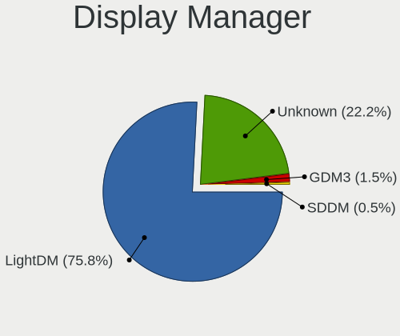
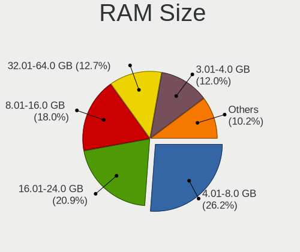
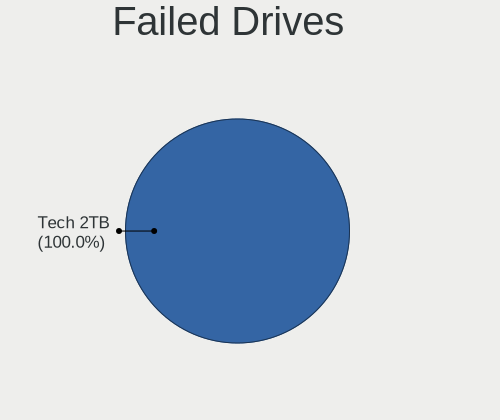
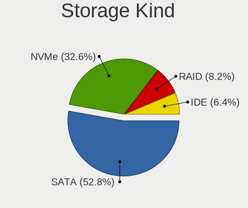
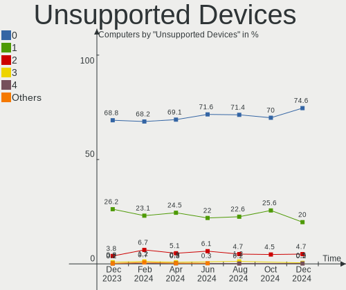

Linux Mint - Hardware Trends
----------------------------

A project to identify most popular hardware characteristics and track their change
over time based on data collected by Linux users at https://Linux-Hardware.org.

Anyone can contribute to this report by the [hw-probe](https://github.com/linuxhw/hw-probe) tool:

    sudo -E hw-probe -all -upload

This is a report for all computer types. See also reports for [desktops](/Dist/Linux_Mint/Desktop/README.md) and [notebooks](/Dist/Linux_Mint/Notebook/README.md).

This report is for one last month. Overall report since the beginning of time: [TestDays](https://github.com/linuxhw/TestDays)

Period: Aug, 2023.

Contents
--------

* [ System ](#system)
  - [ OS                       ](#os)
  - [ OS Family                ](#os-family)
  - [ Kernel                   ](#kernel)
  - [ Kernel Family            ](#kernel-family)
  - [ Kernel Major Ver.        ](#kernel-major-ver)
  - [ Arch                     ](#arch)
  - [ DE                       ](#de)
  - [ Display Server           ](#display-server)
  - [ Display Manager          ](#display-manager)
  - [ OS Lang                  ](#os-lang)
  - [ Boot Mode                ](#boot-mode)
  - [ Filesystem               ](#filesystem)
  - [ Part. scheme             ](#part-scheme)
  - [ Dual Boot with Linux/BSD ](#dual-boot-with-linuxbsd)
  - [ Dual Boot (Win)          ](#dual-boot-win)

* [ Board ](#board)
  - [ Vendor                   ](#vendor)
  - [ Model                    ](#model)
  - [ Model Family             ](#model-family)
  - [ MFG Year                 ](#mfg-year)
  - [ Form Factor              ](#form-factor)
  - [ Secure Boot              ](#secure-boot)
  - [ Coreboot                 ](#coreboot)
  - [ RAM Size                 ](#ram-size)
  - [ RAM Used                 ](#ram-used)
  - [ Total Drives             ](#total-drives)
  - [ Has CD-ROM               ](#has-cd-rom)
  - [ Has Ethernet             ](#has-ethernet)
  - [ Has WiFi                 ](#has-wifi)
  - [ Has Bluetooth            ](#has-bluetooth)

* [ Location ](#location)
  - [ Country                  ](#country)
  - [ City                     ](#city)

* [ Drives ](#drives)
  - [ Drive Vendor             ](#drive-vendor)
  - [ Drive Model              ](#drive-model)
  - [ HDD Vendor               ](#hdd-vendor)
  - [ SSD Vendor               ](#ssd-vendor)
  - [ Drive Kind               ](#drive-kind)
  - [ Drive Connector          ](#drive-connector)
  - [ Drive Size               ](#drive-size)
  - [ Space Total              ](#space-total)
  - [ Space Used               ](#space-used)
  - [ Malfunc. Drives          ](#malfunc-drives)
  - [ Malfunc. Drive Vendor    ](#malfunc-drive-vendor)
  - [ Malfunc. HDD Vendor      ](#malfunc-hdd-vendor)
  - [ Malfunc. Drive Kind      ](#malfunc-drive-kind)
  - [ Failed Drives            ](#failed-drives)
  - [ Failed Drive Vendor      ](#failed-drive-vendor)
  - [ Drive Status             ](#drive-status)

* [ Storage controller ](#storage-controller)
  - [ Storage Vendor           ](#storage-vendor)
  - [ Storage Model            ](#storage-model)
  - [ Storage Kind             ](#storage-kind)

* [ Processor ](#processor)
  - [ CPU Vendor               ](#cpu-vendor)
  - [ CPU Model                ](#cpu-model)
  - [ CPU Model Family         ](#cpu-model-family)
  - [ CPU Cores                ](#cpu-cores)
  - [ CPU Sockets              ](#cpu-sockets)
  - [ CPU Threads              ](#cpu-threads)
  - [ CPU Op-Modes             ](#cpu-op-modes)
  - [ CPU Microcode            ](#cpu-microcode)
  - [ CPU Microarch            ](#cpu-microarch)

* [ Graphics ](#graphics)
  - [ GPU Vendor               ](#gpu-vendor)
  - [ GPU Model                ](#gpu-model)
  - [ GPU Combo                ](#gpu-combo)
  - [ GPU Driver               ](#gpu-driver)
  - [ GPU Memory               ](#gpu-memory)

* [ Monitor ](#monitor)
  - [ Monitor Vendor           ](#monitor-vendor)
  - [ Monitor Model            ](#monitor-model)
  - [ Monitor Resolution       ](#monitor-resolution)
  - [ Monitor Diagonal         ](#monitor-diagonal)
  - [ Monitor Width            ](#monitor-width)
  - [ Aspect Ratio             ](#aspect-ratio)
  - [ Monitor Area             ](#monitor-area)
  - [ Pixel Density            ](#pixel-density)
  - [ Multiple Monitors        ](#multiple-monitors)

* [ Network ](#network)
  - [ Net Controller Vendor    ](#net-controller-vendor)
  - [ Net Controller Model     ](#net-controller-model)
  - [ Wireless Vendor          ](#wireless-vendor)
  - [ Wireless Model           ](#wireless-model)
  - [ Ethernet Vendor          ](#ethernet-vendor)
  - [ Ethernet Model           ](#ethernet-model)
  - [ Net Controller Kind      ](#net-controller-kind)
  - [ Used Controller          ](#used-controller)
  - [ NICs                     ](#nics)
  - [ IPv6                     ](#ipv6)

* [ Bluetooth ](#bluetooth)
  - [ Bluetooth Vendor         ](#bluetooth-vendor)
  - [ Bluetooth Model          ](#bluetooth-model)

* [ Sound ](#sound)
  - [ Sound Vendor             ](#sound-vendor)
  - [ Sound Model              ](#sound-model)

* [ Memory ](#memory)
  - [ Memory Vendor            ](#memory-vendor)
  - [ Memory Model             ](#memory-model)
  - [ Memory Kind              ](#memory-kind)
  - [ Memory Form Factor       ](#memory-form-factor)
  - [ Memory Size              ](#memory-size)
  - [ Memory Speed             ](#memory-speed)

* [ Printers & scanners ](#printers--scanners)
  - [ Printer Vendor           ](#printer-vendor)
  - [ Printer Model            ](#printer-model)
  - [ Scanner Vendor           ](#scanner-vendor)
  - [ Scanner Model            ](#scanner-model)

* [ Camera ](#camera)
  - [ Camera Vendor            ](#camera-vendor)
  - [ Camera Model             ](#camera-model)

* [ Security ](#security)
  - [ Fingerprint Vendor       ](#fingerprint-vendor)
  - [ Fingerprint Model        ](#fingerprint-model)
  - [ Chipcard Vendor          ](#chipcard-vendor)
  - [ Chipcard Model           ](#chipcard-model)

* [ Unsupported ](#unsupported)
  - [ Unsupported Devices      ](#unsupported-devices)
  - [ Unsupported Device Types ](#unsupported-device-types)

System
------

OS
--

Installed operating systems

| Name            | Computers | Percent |
|-----------------|-----------|---------|
| Linux Mint 21.2 | 351       | 66.6%   |
| Linux Mint 21.1 | 93        | 17.65%  |
| Linux Mint 20.3 | 38        | 7.21%   |
| Linux Mint 21   | 24        | 4.55%   |
| Linux Mint 19.3 | 8         | 1.52%   |
| Linux Mint 20.2 | 5         | 0.95%   |
| Linux Mint 20   | 4         | 0.76%   |
| Linux Mint 20.1 | 2         | 0.38%   |
| Linux Mint 19.1 | 1         | 0.19%   |
| Linux Mint 18.3 | 1         | 0.19%   |

OS Family
---------

OS without a version

| Name       | Computers | Percent |
|------------|-----------|---------|
| Linux Mint | 527       | 100%    |

Kernel
------

Version of the Linux kernel

| Version                 | Computers | Percent |
|-------------------------|-----------|---------|
| 5.15.0-78-generic       | 167       | 31.69%  |
| 5.15.0-79-generic       | 135       | 25.62%  |
| 6.2.0-26-generic        | 52        | 9.87%   |
| 5.15.0-76-generic       | 49        | 9.3%    |
| 5.4.0-156-generic       | 18        | 3.42%   |
| 5.15.0-82-generic       | 17        | 3.23%   |
| 5.4.0-155-generic       | 9         | 1.71%   |
| 5.15.0-56-generic       | 8         | 1.52%   |
| 5.4.0-150-generic       | 6         | 1.14%   |
| 5.15.0-41-generic       | 6         | 1.14%   |
| 5.4.0-153-generic       | 4         | 0.76%   |
| 5.15.0-73-generic       | 4         | 0.76%   |
| 6.4.11-060411-generic   | 3         | 0.57%   |
| 6.2.0-31-generic        | 3         | 0.57%   |
| 5.4.0-91-generic        | 3         | 0.57%   |
| 5.19.0-50-generic       | 3         | 0.57%   |
| 6.4.9-060409-generic    | 2         | 0.38%   |
| 6.1.0-1019-oem          | 2         | 0.38%   |
| 5.4.0-58-generic        | 2         | 0.38%   |
| 5.4.0-144-generic       | 2         | 0.38%   |
| 5.19.0-46-generic       | 2         | 0.38%   |
| 5.15.0-60-generic       | 2         | 0.38%   |
| 4.15.0-213-generic      | 2         | 0.38%   |
| 6.5.0-060500-generic    | 1         | 0.19%   |
| 6.4.9-t2-jammy          | 1         | 0.19%   |
| 6.4.8-x64v3-xanmod1     | 1         | 0.19%   |
| 6.4.2-060402-generic    | 1         | 0.19%   |
| 6.4.12-2-liquorix-amd64 | 1         | 0.19%   |
| 6.4.11-x64v3-xanmod1    | 1         | 0.19%   |
| 6.4.10-2-liquorix-amd64 | 1         | 0.19%   |
| 6.4.10-060410-generic   | 1         | 0.19%   |
| 6.4.0-060400-generic    | 1         | 0.19%   |
| 6.3.13-060313-generic   | 1         | 0.19%   |
| 6.2.0-1009-aws          | 1         | 0.19%   |
| 5.4.0-74-generic        | 1         | 0.19%   |
| 5.4.0-70-generic        | 1         | 0.19%   |
| 5.4.0-26-generic        | 1         | 0.19%   |
| 5.4.0-159-generic       | 1         | 0.19%   |
| 5.4.0-149-generic       | 1         | 0.19%   |
| 5.4.0-135-generic       | 1         | 0.19%   |

Kernel Family
-------------

Linux kernel without a distro release

| Version | Computers | Percent |
|---------|-----------|---------|
| 5.15.0  | 394       | 74.76%  |
| 6.2.0   | 56        | 10.63%  |
| 5.4.0   | 50        | 9.49%   |
| 5.19.0  | 5         | 0.95%   |
| 6.4.11  | 4         | 0.76%   |
| 6.4.9   | 3         | 0.57%   |
| 4.15.0  | 3         | 0.57%   |
| 6.4.10  | 2         | 0.38%   |
| 6.1.0   | 2         | 0.38%   |
| 6.5.0   | 1         | 0.19%   |
| 6.4.8   | 1         | 0.19%   |
| 6.4.2   | 1         | 0.19%   |
| 6.4.12  | 1         | 0.19%   |
| 6.4.0   | 1         | 0.19%   |
| 6.3.13  | 1         | 0.19%   |
| 5.17.0  | 1         | 0.19%   |
| 5.13.0  | 1         | 0.19%   |

Kernel Major Ver.
-----------------

Linux kernel major version

| Version | Computers | Percent |
|---------|-----------|---------|
| 5.15    | 394       | 74.76%  |
| 6.2     | 56        | 10.63%  |
| 5.4     | 50        | 9.49%   |
| 6.4     | 13        | 2.47%   |
| 5.19    | 5         | 0.95%   |
| 4.15    | 3         | 0.57%   |
| 6.1     | 2         | 0.38%   |
| 6.5     | 1         | 0.19%   |
| 6.3     | 1         | 0.19%   |
| 5.17    | 1         | 0.19%   |
| 5.13    | 1         | 0.19%   |

Arch
----

OS architecture (x86_64, i586, etc.)

| Name   | Computers | Percent |
|--------|-----------|---------|
| x86_64 | 527       | 100%    |

DE
--

Desktop Environment

| Name       | Computers | Percent |
|------------|-----------|---------|
| X-Cinnamon | 413       | 78.37%  |
| XFCE       | 49        | 9.3%    |
| MATE       | 46        | 8.73%   |
| Cinnamon   | 9         | 1.71%   |
| KDE5       | 2         | 0.38%   |
| GNOME      | 2         | 0.38%   |
| sway       | 1         | 0.19%   |
| KDE        | 1         | 0.19%   |
| Jwm        | 1         | 0.19%   |
| i3         | 1         | 0.19%   |
| awesome    | 1         | 0.19%   |
| Unknown    | 1         | 0.19%   |

Display Server
--------------

X11 or Wayland

| Name    | Computers | Percent |
|---------|-----------|---------|
| X11     | 523       | 99.24%  |
| Wayland | 2         | 0.38%   |
| Tty     | 2         | 0.38%   |

Display Manager
---------------

SDDM, LightDM, etc.

| Name    | Computers | Percent |
|---------|-----------|---------|
| Unknown | 280       | 53.13%  |
| LightDM | 244       | 46.3%   |
| SDDM    | 1         | 0.19%   |
| LXDM    | 1         | 0.19%   |
| GDM3    | 1         | 0.19%   |

OS Lang
-------

Language

| Lang  | Computers | Percent |
|-------|-----------|---------|
| en_US | 189       | 35.86%  |
| de_DE | 86        | 16.32%  |
| pt_BR | 36        | 6.83%   |
| C     | 24        | 4.55%   |
| en_GB | 23        | 4.36%   |
| fr_FR | 21        | 3.98%   |
| it_IT | 15        | 2.85%   |
| ru_RU | 13        | 2.47%   |
| en_AU | 13        | 2.47%   |
| es_ES | 11        | 2.09%   |
| en_CA | 10        | 1.9%    |
| nl_NL | 7         | 1.33%   |
| es_MX | 7         | 1.33%   |
| de_CH | 6         | 1.14%   |
| pl_PL | 5         | 0.95%   |
| fr_CA | 5         | 0.95%   |
| cs_CZ | 5         | 0.95%   |
| tr_TR | 4         | 0.76%   |
| hu_HU | 4         | 0.76%   |
| es_AR | 4         | 0.76%   |
| fi_FI | 3         | 0.57%   |
| en_IN | 3         | 0.57%   |
| de_AT | 3         | 0.57%   |
| pt_PT | 2         | 0.38%   |
| nb_NO | 2         | 0.38%   |
| fr_BE | 2         | 0.38%   |
| es_CO | 2         | 0.38%   |
| en_ZA | 2         | 0.38%   |
| en_IE | 2         | 0.38%   |
| el_GR | 2         | 0.38%   |
| zh_TW | 1         | 0.19%   |
| sv_SE | 1         | 0.19%   |
| sk_SK | 1         | 0.19%   |
| ru_UA | 1         | 0.19%   |
| nl_BE | 1         | 0.19%   |
| ja_JP | 1         | 0.19%   |
| eu_ES | 1         | 0.19%   |
| es_UY | 1         | 0.19%   |
| es_US | 1         | 0.19%   |
| es_PE | 1         | 0.19%   |

Boot Mode
---------

EFI or BIOS

| Mode | Computers | Percent |
|------|-----------|---------|
| EFI  | 349       | 66.22%  |
| BIOS | 178       | 33.78%  |

Filesystem
----------

Type of filesystem

| Type    | Computers | Percent |
|---------|-----------|---------|
| Ext4    | 464       | 88.05%  |
| Overlay | 20        | 3.8%    |
| Tmpfs   | 17        | 3.23%   |
| Btrfs   | 15        | 2.85%   |
| Zfs     | 6         | 1.14%   |
| Xfs     | 2         | 0.38%   |
| Ext3    | 2         | 0.38%   |
| Ext2    | 1         | 0.19%   |

Part. scheme
------------

Scheme of partitioning

| Type    | Computers | Percent |
|---------|-----------|---------|
| Unknown | 279       | 52.94%  |
| GPT     | 213       | 40.42%  |
| MBR     | 35        | 6.64%   |

Dual Boot with Linux/BSD
------------------------

Hosting more than one Linux/BSD

| Dual boot | Computers | Percent |
|-----------|-----------|---------|
| No        | 488       | 92.6%   |
| Yes       | 39        | 7.4%    |

Dual Boot (Win)
---------------

Hosting Linux and Windows

| Dual boot | Computers | Percent |
|-----------|-----------|---------|
| No        | 417       | 79.13%  |
| Yes       | 110       | 20.87%  |

Board
-----

Vendor
------

Motherboard manufacturer

| Name                | Computers | Percent |
|---------------------|-----------|---------|
| ASUSTek Computer    | 83        | 15.75%  |
| Lenovo              | 78        | 14.8%   |
| Hewlett-Packard     | 77        | 14.61%  |
| Dell                | 60        | 11.39%  |
| Gigabyte Technology | 51        | 9.68%   |
| MSI                 | 31        | 5.88%   |
| Acer                | 28        | 5.31%   |
| Apple               | 16        | 3.04%   |
| ASRock              | 14        | 2.66%   |
| Toshiba             | 6         | 1.14%   |
| HUAWEI              | 6         | 1.14%   |
| Fujitsu             | 6         | 1.14%   |
| Unknown             | 6         | 1.14%   |
| Samsung Electronics | 4         | 0.76%   |
| Medion              | 4         | 0.76%   |
| Intel               | 4         | 0.76%   |
| Sony                | 3         | 0.57%   |
| Positivo            | 3         | 0.57%   |
| Notebook            | 3         | 0.57%   |
| Google              | 3         | 0.57%   |
| Gateway             | 3         | 0.57%   |
| Teclast             | 2         | 0.38%   |
| Megaware            | 2         | 0.38%   |
| Itautec             | 2         | 0.38%   |
| Fujitsu Siemens     | 2         | 0.38%   |
| Chuwi               | 2         | 0.38%   |
| Biostar             | 2         | 0.38%   |
| AZW                 | 2         | 0.38%   |
| ZOTAC               | 1         | 0.19%   |
| Wortmann AG         | 1         | 0.19%   |
| TUXEDO              | 1         | 0.19%   |
| Timi                | 1         | 0.19%   |
| Thomson             | 1         | 0.19%   |
| Supermicro          | 1         | 0.19%   |
| PC Specialist       | 1         | 0.19%   |
| Panasonic           | 1         | 0.19%   |
| OEM                 | 1         | 0.19%   |
| NSX                 | 1         | 0.19%   |
| Multilaser          | 1         | 0.19%   |
| Mini PC             | 1         | 0.19%   |

Model
-----

Motherboard model

| Name                             | Computers | Percent |
|----------------------------------|-----------|---------|
| ASUS All Series                  | 8         | 1.52%   |
| Unknown                          | 8         | 1.52%   |
| MSI MS-7C91                      | 3         | 0.57%   |
| Gigabyte GA-990FXA-UD3           | 3         | 0.57%   |
| ASUS PRIME A320M-K               | 3         | 0.57%   |
| ASUS M5A97 R2.0                  | 3         | 0.57%   |
| Toshiba Satellite C660           | 2         | 0.38%   |
| Toshiba Satellite C55-A          | 2         | 0.38%   |
| MSI MS-7C95                      | 2         | 0.38%   |
| MSI MS-7C75                      | 2         | 0.38%   |
| MSI MS-7C02                      | 2         | 0.38%   |
| MSI MS-7693                      | 2         | 0.38%   |
| Megaware MW-G31T-M7              | 2         | 0.38%   |
| Lenovo IdeaPadFlex 5 16ALC7 82RA | 2         | 0.38%   |
| Lenovo IdeaPad 320-15AST 80XV    | 2         | 0.38%   |
| Lenovo G50-80 80E5               | 2         | 0.38%   |
| HUAWEI NBLK-WAX9X                | 2         | 0.38%   |
| HUAWEI HVY-WXX9                  | 2         | 0.38%   |
| HP Pavilion 15                   | 2         | 0.38%   |
| HP Notebook                      | 2         | 0.38%   |
| HP Laptop 15-bs0xx               | 2         | 0.38%   |
| HP EliteDesk 800 G2 SFF          | 2         | 0.38%   |
| HP Compaq Elite 8300 SFF         | 2         | 0.38%   |
| HP 255 G5                        | 2         | 0.38%   |
| Gigabyte F2A68HM-H               | 2         | 0.38%   |
| Gigabyte B75M-D3H                | 2         | 0.38%   |
| Gigabyte B450 AORUS M            | 2         | 0.38%   |
| Dell Precision M4500             | 2         | 0.38%   |
| Dell OptiPlex 790                | 2         | 0.38%   |
| Dell OptiPlex 780                | 2         | 0.38%   |
| Dell Latitude E6410              | 2         | 0.38%   |
| Dell Inspiron 15-3567            | 2         | 0.38%   |
| AZW SER                          | 2         | 0.38%   |
| ASUS TUF Gaming X570-PLUS        | 2         | 0.38%   |
| ASRock Z77 Extreme4              | 2         | 0.38%   |
| Acer Aspire V3-771               | 2         | 0.38%   |
| ZOTAC ZBOX-MI531/MI551/MI571     | 1         | 0.19%   |
| Wortmann AG TERRA_MOBILE_1749    | 1         | 0.19%   |
| Toshiba Satellite Pro NB10-A-110 | 1         | 0.19%   |
| Toshiba Satellite P500           | 1         | 0.19%   |

Model Family
------------

Motherboard model prefix

| Name                   | Computers | Percent |
|------------------------|-----------|---------|
| Lenovo ThinkPad        | 21        | 3.98%   |
| Acer Aspire            | 21        | 3.98%   |
| Lenovo IdeaPad         | 18        | 3.42%   |
| Dell Inspiron          | 16        | 3.04%   |
| Dell Latitude          | 15        | 2.85%   |
| HP Pavilion            | 14        | 2.66%   |
| Dell OptiPlex          | 13        | 2.47%   |
| Lenovo ThinkCentre     | 11        | 2.09%   |
| ASUS ROG               | 11        | 2.09%   |
| HP Laptop              | 10        | 1.9%    |
| Lenovo Legion          | 8         | 1.52%   |
| ASUS VivoBook          | 8         | 1.52%   |
| ASUS PRIME             | 8         | 1.52%   |
| ASUS All               | 8         | 1.52%   |
| Unknown                | 8         | 1.52%   |
| HP Compaq              | 7         | 1.33%   |
| Toshiba Satellite      | 6         | 1.14%   |
| HP EliteBook           | 6         | 1.14%   |
| HP EliteDesk           | 5         | 0.95%   |
| Dell XPS               | 5         | 0.95%   |
| ASUS TUF               | 5         | 0.95%   |
| Fujitsu ESPRIMO        | 4         | 0.76%   |
| Dell Precision         | 4         | 0.76%   |
| MSI MS-7C91            | 3         | 0.57%   |
| HP Victus              | 3         | 0.57%   |
| Gigabyte X570          | 3         | 0.57%   |
| Gigabyte GA-990FXA-UD3 | 3         | 0.57%   |
| Gigabyte B450          | 3         | 0.57%   |
| Dell Vostro            | 3         | 0.57%   |
| ASUS Zenbook           | 3         | 0.57%   |
| ASUS M5A97             | 3         | 0.57%   |
| Acer Predator          | 3         | 0.57%   |
| MSI MS-7C95            | 2         | 0.38%   |
| MSI MS-7C75            | 2         | 0.38%   |
| MSI MS-7C02            | 2         | 0.38%   |
| MSI MS-7693            | 2         | 0.38%   |
| Megaware MW-G31T-M7    | 2         | 0.38%   |
| Lenovo Yoga            | 2         | 0.38%   |
| Lenovo ThinkBook       | 2         | 0.38%   |
| Lenovo IdeaPadFlex     | 2         | 0.38%   |

MFG Year
--------

Motherboard manufacture year

| Year | Computers | Percent |
|------|-----------|---------|
| 2019 | 51        | 9.68%   |
| 2021 | 45        | 8.54%   |
| 2013 | 43        | 8.16%   |
| 2022 | 41        | 7.78%   |
| 2012 | 40        | 7.59%   |
| 2018 | 39        | 7.4%    |
| 2020 | 37        | 7.02%   |
| 2011 | 33        | 6.26%   |
| 2014 | 30        | 5.69%   |
| 2017 | 27        | 5.12%   |
| 2010 | 25        | 4.74%   |
| 2015 | 24        | 4.55%   |
| 2016 | 23        | 4.36%   |
| 2023 | 19        | 3.61%   |
| 2008 | 19        | 3.61%   |
| 2009 | 16        | 3.04%   |
| 2007 | 11        | 2.09%   |
| 2006 | 4         | 0.76%   |

Form Factor
-----------

Physical design of the computer

| Name        | Computers | Percent |
|-------------|-----------|---------|
| Notebook    | 269       | 51.04%  |
| Desktop     | 221       | 41.94%  |
| Convertible | 11        | 2.09%   |
| Mini pc     | 10        | 1.9%    |
| All in one  | 10        | 1.9%    |
| Tablet      | 3         | 0.57%   |
| Server      | 3         | 0.57%   |

Secure Boot
-----------

Enabled or disabled

| State    | Computers | Percent |
|----------|-----------|---------|
| Disabled | 475       | 90.13%  |
| Enabled  | 52        | 9.87%   |

Coreboot
--------

Have coreboot on board

| Used | Computers | Percent |
|------|-----------|---------|
| No   | 524       | 99.43%  |
| Yes  | 3         | 0.57%   |

RAM Size
--------

Total RAM memory

| Size in GB  | Computers | Percent |
|-------------|-----------|---------|
| 4.01-8.0    | 140       | 26.57%  |
| 16.01-24.0  | 117       | 22.2%   |
| 8.01-16.0   | 85        | 16.13%  |
| 3.01-4.0    | 74        | 14.04%  |
| 32.01-64.0  | 63        | 11.95%  |
| 64.01-256.0 | 17        | 3.23%   |
| 24.01-32.0  | 15        | 2.85%   |
| 1.01-2.0    | 9         | 1.71%   |
| 2.01-3.0    | 5         | 0.95%   |
| 0.51-1.0    | 2         | 0.38%   |

RAM Used
--------

Used RAM memory

| Used GB    | Computers | Percent |
|------------|-----------|---------|
| 2.01-3.0   | 174       | 33.02%  |
| 1.01-2.0   | 168       | 31.88%  |
| 3.01-4.0   | 76        | 14.42%  |
| 4.01-8.0   | 71        | 13.47%  |
| 8.01-16.0  | 19        | 3.61%   |
| 0.51-1.0   | 13        | 2.47%   |
| 16.01-24.0 | 4         | 0.76%   |
| 24.01-32.0 | 2         | 0.38%   |

Total Drives
------------

Number of drives on board

| Drives | Computers | Percent |
|--------|-----------|---------|
| 1      | 278       | 52.75%  |
| 2      | 149       | 28.27%  |
| 3      | 61        | 11.57%  |
| 4      | 20        | 3.8%    |
| 5      | 11        | 2.09%   |
| 6      | 4         | 0.76%   |
| 8      | 2         | 0.38%   |
| 0      | 2         | 0.38%   |

Has CD-ROM
----------

Has CD-ROM on board

| Presented | Computers | Percent |
|-----------|-----------|---------|
| No        | 311       | 59.01%  |
| Yes       | 216       | 40.99%  |

Has Ethernet
------------

Has Ethernet on board

| Presented | Computers | Percent |
|-----------|-----------|---------|
| Yes       | 449       | 85.2%   |
| No        | 78        | 14.8%   |

Has WiFi
--------

Has WiFi module

| Presented | Computers | Percent |
|-----------|-----------|---------|
| Yes       | 402       | 76.28%  |
| No        | 125       | 23.72%  |

Has Bluetooth
-------------

Has Bluetooth module

| Presented | Computers | Percent |
|-----------|-----------|---------|
| Yes       | 320       | 60.72%  |
| No        | 207       | 39.28%  |

Location
--------

Country
-------

Geographic location (country)

| Country      | Computers | Percent |
|--------------|-----------|---------|
| USA          | 119       | 22.58%  |
| Germany      | 89        | 16.89%  |
| Brazil       | 41        | 7.78%   |
| Italy        | 21        | 3.98%   |
| France       | 21        | 3.98%   |
| Russia       | 19        | 3.61%   |
| UK           | 17        | 3.23%   |
| Canada       | 16        | 3.04%   |
| Netherlands  | 13        | 2.47%   |
| Australia    | 13        | 2.47%   |
| Spain        | 11        | 2.09%   |
| Czechia      | 11        | 2.09%   |
| Switzerland  | 10        | 1.9%    |
| Argentina    | 10        | 1.9%    |
| Mexico       | 9         | 1.71%   |
| Poland       | 8         | 1.52%   |
| Austria      | 8         | 1.52%   |
| Turkey       | 6         | 1.14%   |
| Sweden       | 6         | 1.14%   |
| Finland      | 5         | 0.95%   |
| Slovakia     | 4         | 0.76%   |
| Indonesia    | 4         | 0.76%   |
| India        | 4         | 0.76%   |
| Hungary      | 4         | 0.76%   |
| Denmark      | 4         | 0.76%   |
| Belgium      | 4         | 0.76%   |
| Romania      | 3         | 0.57%   |
| Portugal     | 3         | 0.57%   |
| Japan        | 3         | 0.57%   |
| Ireland      | 3         | 0.57%   |
| Cuba         | 3         | 0.57%   |
| Uruguay      | 2         | 0.38%   |
| Taiwan       | 2         | 0.38%   |
| South Africa | 2         | 0.38%   |
| Norway       | 2         | 0.38%   |
| Greece       | 2         | 0.38%   |
| Colombia     | 2         | 0.38%   |
| Belarus      | 2         | 0.38%   |
| Venezuela    | 1         | 0.19%   |
| Ukraine      | 1         | 0.19%   |

City
----

Geographic location (city)

| City             | Computers | Percent |
|------------------|-----------|---------|
| Sydney           | 6         | 1.14%   |
| Vienna           | 5         | 0.95%   |
| Moscow           | 5         | 0.95%   |
| Houston          | 5         | 0.95%   |
| Hamburg          | 5         | 0.95%   |
| Cologne          | 5         | 0.95%   |
| Sao Paulo        | 4         | 0.76%   |
| Rio de Janeiro   | 4         | 0.76%   |
| Paris            | 4         | 0.76%   |
| Chicago          | 4         | 0.76%   |
| Amsterdam        | 4         | 0.76%   |
| Zurich           | 3         | 0.57%   |
| Rome             | 3         | 0.57%   |
| Ratingen         | 3         | 0.57%   |
| Prague           | 3         | 0.57%   |
| Montreal         | 3         | 0.57%   |
| Miami            | 3         | 0.57%   |
| Madrid           | 3         | 0.57%   |
| Istanbul         | 3         | 0.57%   |
| Florence         | 3         | 0.57%   |
| Dublin           | 3         | 0.57%   |
| Curitiba         | 3         | 0.57%   |
| Copenhagen       | 3         | 0.57%   |
| Buenos Aires     | 3         | 0.57%   |
| Brisbane         | 3         | 0.57%   |
| Bratislava       | 3         | 0.57%   |
| Tacoma           | 2         | 0.38%   |
| Sorocaba         | 2         | 0.38%   |
| Seattle          | 2         | 0.38%   |
| Québec          | 2         | 0.38%   |
| Patterson        | 2         | 0.38%   |
| Nuremberg        | 2         | 0.38%   |
| Novosibirsk      | 2         | 0.38%   |
| Nordenham        | 2         | 0.38%   |
| New York         | 2         | 0.38%   |
| Natal            | 2         | 0.38%   |
| Montevideo       | 2         | 0.38%   |
| Mönchengladbach | 2         | 0.38%   |
| Minsk            | 2         | 0.38%   |
| Milford          | 2         | 0.38%   |

Drives
------

Drive Vendor
------------

Hard drive vendors

| Vendor                      | Computers | Drives | Percent |
|-----------------------------|-----------|--------|---------|
| Samsung Electronics         | 131       | 152    | 16%     |
| WDC                         | 109       | 144    | 13.31%  |
| Seagate                     | 103       | 125    | 12.58%  |
| SanDisk                     | 50        | 52     | 6.11%   |
| Toshiba                     | 47        | 51     | 5.74%   |
| Crucial                     | 47        | 51     | 5.74%   |
| Kingston                    | 40        | 44     | 4.88%   |
| Unknown                     | 34        | 37     | 4.15%   |
| Intel                       | 29        | 30     | 3.54%   |
| Hitachi                     | 20        | 21     | 2.44%   |
| SK hynix                    | 18        | 20     | 2.2%    |
| Micron Technology           | 14        | 14     | 1.71%   |
| Micron/Crucial Technology   | 9         | 13     | 1.1%    |
| China                       | 9         | 9      | 1.1%    |
| Apple                       | 9         | 13     | 1.1%    |
| Unknown                     | 9         | 9      | 1.1%    |
| A-DATA Technology           | 8         | 8      | 0.98%   |
| Intenso                     | 7         | 8      | 0.85%   |
| KIOXIA                      | 6         | 6      | 0.73%   |
| HGST                        | 6         | 6      | 0.73%   |
| SPCC                        | 5         | 5      | 0.61%   |
| Silicon Motion              | 5         | 5      | 0.61%   |
| Phison Electronics          | 5         | 6      | 0.61%   |
| LITEON                      | 5         | 5      | 0.61%   |
| JMicron Technology          | 5         | 5      | 0.61%   |
| PNY                         | 4         | 5      | 0.49%   |
| Kingston Technology Company | 4         | 4      | 0.49%   |
| Hewlett-Packard             | 4         | 4      | 0.49%   |
| Fujitsu                     | 4         | 4      | 0.49%   |
| XrayDisk                    | 3         | 3      | 0.37%   |
| USB                         | 3         | 4      | 0.37%   |
| SABRENT                     | 3         | 3      | 0.37%   |
| Realtek                     | 3         | 3      | 0.37%   |
| Patriot                     | 3         | 3      | 0.37%   |
| OCZ                         | 3         | 3      | 0.37%   |
| Fanxiang                    | 3         | 3      | 0.37%   |
| Verbatim                    | 2         | 2      | 0.24%   |
| UMIS                        | 2         | 2      | 0.24%   |
| Team                        | 2         | 2      | 0.24%   |
| T-FORCE                     | 2         | 3      | 0.24%   |

Drive Model
-----------

Hard drive models

| Model                                                 | Computers | Percent |
|-------------------------------------------------------|-----------|---------|
| Samsung NVMe SSD Controller SM981/PM981/PM983 500GB   | 12        | 1.33%   |
| Kingston SA400S37240G 240GB SSD                       | 11        | 1.22%   |
| Samsung SSD 850 EVO 500GB                             | 10        | 1.11%   |
| Crucial CT500MX500SSD1 500GB                          | 10        | 1.11%   |
| Seagate ST1000LM024 HN-M101MBB 1TB                    | 9         | 1%      |
| Micron/Crucial P2 NVMe PCIe SSD 1TB                   | 9         | 1%      |
| Unknown                                               | 9         | 1%      |
| Samsung SSD 860 EVO 1TB                               | 8         | 0.89%   |
| Samsung NVMe SSD Controller PM9A1/PM9A3/980PRO 1024GB | 8         | 0.89%   |
| Kingston SV300S37A120G 120GB SSD                      | 7         | 0.78%   |
| Unknown MMC Card  32GB                                | 6         | 0.67%   |
| Samsung SSD 860 EVO 500GB                             | 6         | 0.67%   |
| Crucial CT1000BX500SSD1 1TB                           | 6         | 0.67%   |
| Unknown SD/MMC/MS PRO 1GB                             | 5         | 0.56%   |
| Unknown MMC Card  64GB                                | 5         | 0.56%   |
| Toshiba MQ04ABF100 1TB                                | 5         | 0.56%   |
| Toshiba MQ01ABF050 500GB                              | 5         | 0.56%   |
| Seagate ST500LT012-1DG142 500GB                       | 5         | 0.56%   |
| Seagate ST1000DM010-2EP102 1TB                        | 5         | 0.56%   |
| Samsung SSD 970 EVO Plus 2TB                          | 5         | 0.56%   |
| Samsung SSD 870 EVO 1TB                               | 5         | 0.56%   |
| WDC WDS240G2G0A-00JH30 240GB SSD                      | 4         | 0.44%   |
| WDC WD10JPVX-22JC3T0 1TB                              | 4         | 0.44%   |
| WDC WD10EZEX-00BN5A0 1TB                              | 4         | 0.44%   |
| Seagate ST4000DM004-2CV104 4TB                        | 4         | 0.44%   |
| Seagate ST3500418AS 500GB                             | 4         | 0.44%   |
| Seagate ST1000DM003-1ER162 1TB                        | 4         | 0.44%   |
| Seagate Expansion 2TB                                 | 4         | 0.44%   |
| Sandisk WD Black 2018/SN750 / PC SN720 NVMe SSD 512GB | 4         | 0.44%   |
| SanDisk NVMe SSD Drive 2TB                            | 4         | 0.44%   |
| Samsung SSD 970 EVO Plus 1TB                          | 4         | 0.44%   |
| Kingston SA400S37480G 480GB SSD                       | 4         | 0.44%   |
| Crucial CT1000MX500SSD1 1TB                           | 4         | 0.44%   |
| WDC WD10EZEX-21M2NA0 1TB                              | 3         | 0.33%   |
| WDC WD10EZEX-08WN4A0 1TB                              | 3         | 0.33%   |
| Unknown MMC Card  16GB                                | 3         | 0.33%   |
| Unknown Biwin  32GB                                   | 3         | 0.33%   |
| Toshiba MQ01ABD100 1TB                                | 3         | 0.33%   |
| Toshiba HDWD110 1TB                                   | 3         | 0.33%   |
| Toshiba DT01ACA200 2TB                                | 3         | 0.33%   |

HDD Vendor
----------

Hard disk drive vendors

| Vendor              | Computers | Drives | Percent |
|---------------------|-----------|--------|---------|
| Seagate             | 99        | 118    | 34.62%  |
| WDC                 | 87        | 108    | 30.42%  |
| Toshiba             | 34        | 36     | 11.89%  |
| Hitachi             | 20        | 21     | 6.99%   |
| Samsung Electronics | 13        | 13     | 4.55%   |
| HGST                | 6         | 6      | 2.1%    |
| Unknown             | 5         | 5      | 1.75%   |
| Fujitsu             | 4         | 4      | 1.4%    |
| USB                 | 3         | 4      | 1.05%   |
| SABRENT             | 3         | 3      | 1.05%   |
| Hewlett-Packard     | 3         | 3      | 1.05%   |
| Apple               | 2         | 2      | 0.7%    |
| WD_BLACK            | 1         | 1      | 0.35%   |
| WD MediaMax         | 1         | 1      | 0.35%   |
| SSK                 | 1         | 1      | 0.35%   |
| Maxtor              | 1         | 1      | 0.35%   |
| Maxone              | 1         | 1      | 0.35%   |
| Intenso             | 1         | 1      | 0.35%   |
| Unknown             | 1         | 1      | 0.35%   |

SSD Vendor
----------

Solid state drive vendors

| Vendor              | Computers | Drives | Percent |
|---------------------|-----------|--------|---------|
| Samsung Electronics | 69        | 79     | 24.13%  |
| Crucial             | 41        | 43     | 14.34%  |
| Kingston            | 34        | 37     | 11.89%  |
| SanDisk             | 20        | 21     | 6.99%   |
| WDC                 | 18        | 22     | 6.29%   |
| China               | 9         | 9      | 3.15%   |
| Toshiba             | 8         | 8      | 2.8%    |
| Intel               | 7         | 7      | 2.45%   |
| A-DATA Technology   | 7         | 7      | 2.45%   |
| Micron Technology   | 6         | 6      | 2.1%    |
| Intenso             | 5         | 6      | 1.75%   |
| SPCC                | 4         | 4      | 1.4%    |
| PNY                 | 4         | 5      | 1.4%    |
| LITEON              | 4         | 4      | 1.4%    |
| SK hynix            | 3         | 3      | 1.05%   |
| OCZ                 | 3         | 3      | 1.05%   |
| Apple               | 3         | 3      | 1.05%   |
| Verbatim            | 2         | 2      | 0.7%    |
| Team                | 2         | 2      | 0.7%    |
| Seagate             | 2         | 2      | 0.7%    |
| Patriot             | 2         | 2      | 0.7%    |
| Netac               | 2         | 2      | 0.7%    |
| MidasForce          | 2         | 2      | 0.7%    |
| KingSpec            | 2         | 2      | 0.7%    |
| JMicron Technology  | 2         | 2      | 0.7%    |
| GOODRAM             | 2         | 2      | 0.7%    |
| FORESEE             | 2         | 2      | 0.7%    |
| Fanxiang            | 2         | 2      | 0.7%    |
| Apacer              | 2         | 2      | 0.7%    |
| VERICO              | 1         | 1      | 0.35%   |
| Transcend           | 1         | 1      | 0.35%   |
| Timetec             | 1         | 1      | 0.35%   |
| T-FORCE             | 1         | 1      | 0.35%   |
| Super Talent        | 1         | 1      | 0.35%   |
| RevuAhn             | 1         | 1      | 0.35%   |
| KingFast            | 1         | 1      | 0.35%   |
| KingDian            | 1         | 1      | 0.35%   |
| HS-SSD-C100         | 1         | 1      | 0.35%   |
| Hewlett-Packard     | 1         | 1      | 0.35%   |
| Gigabyte Technology | 1         | 1      | 0.35%   |

Drive Kind
----------

HDD or SSD

| Kind    | Computers | Drives | Percent |
|---------|-----------|--------|---------|
| SSD     | 251       | 308    | 34.24%  |
| HDD     | 240       | 330    | 32.74%  |
| NVMe    | 191       | 236    | 26.06%  |
| MMC     | 29        | 33     | 3.96%   |
| Unknown | 22        | 26     | 3%      |

Drive Connector
---------------

SATA, SAS, NVMe, etc.

| Type | Computers | Drives | Percent |
|------|-----------|--------|---------|
| SATA | 392       | 607    | 59.21%  |
| NVMe | 190       | 233    | 28.7%   |
| SAS  | 51        | 60     | 7.7%    |
| MMC  | 29        | 33     | 4.38%   |

Drive Size
----------

Size of hard drive

| Size in TB | Computers | Drives | Percent |
|------------|-----------|--------|---------|
| 0.01-0.5   | 267       | 339    | 50.95%  |
| 0.51-1.0   | 162       | 184    | 30.92%  |
| 1.01-2.0   | 53        | 60     | 10.11%  |
| 3.01-4.0   | 19        | 27     | 3.63%   |
| 2.01-3.0   | 11        | 14     | 2.1%    |
| 4.01-10.0  | 10        | 11     | 1.91%   |
| 10.01-20.0 | 2         | 3      | 0.38%   |

Space Total
-----------

Amount of disk space available on the file system

| Size in GB     | Computers | Percent |
|----------------|-----------|---------|
| 101-250        | 135       | 25.62%  |
| 251-500        | 114       | 21.63%  |
| 501-1000       | 98        | 18.6%   |
| 1001-2000      | 55        | 10.44%  |
| More than 3000 | 41        | 7.78%   |
| 51-100         | 27        | 5.12%   |
| 2001-3000      | 21        | 3.98%   |
| 1-20           | 20        | 3.8%    |
| 21-50          | 11        | 2.09%   |
| Unknown        | 5         | 0.95%   |

Space Used
----------

Amount of used disk space

| Used GB        | Computers | Percent |
|----------------|-----------|---------|
| 21-50          | 111       | 21.06%  |
| 1-20           | 90        | 17.08%  |
| 101-250        | 87        | 16.51%  |
| 51-100         | 80        | 15.18%  |
| 251-500        | 63        | 11.95%  |
| 501-1000       | 42        | 7.97%   |
| 1001-2000      | 23        | 4.36%   |
| More than 3000 | 16        | 3.04%   |
| 2001-3000      | 10        | 1.9%    |
| Unknown        | 5         | 0.95%   |

Malfunc. Drives
---------------

Drive models with a malfunction

| Model                                 | Computers | Drives | Percent |
|---------------------------------------|-----------|--------|---------|
| Seagate ST500LT012-9WS142 500GB       | 2         | 2      | 4.55%   |
| Seagate ST500LT012-1DG142 500GB       | 2         | 2      | 4.55%   |
| Seagate ST500DM002-1BD142 500GB       | 2         | 2      | 4.55%   |
| LITEON CV8-8E128-HP 128GB SSD         | 2         | 2      | 4.55%   |
| WDC WD6003FZBX-00K5WB0 6TB            | 1         | 1      | 2.27%   |
| WDC WD5000LPVX-22V0TT0 500GB          | 1         | 1      | 2.27%   |
| WDC WD5000BEVT-00A0RT0 500GB          | 1         | 1      | 2.27%   |
| WDC WD5000AAKX-60U6AA0 500GB          | 1         | 1      | 2.27%   |
| WDC WD40EFRX-68N32N0 4TB              | 1         | 1      | 2.27%   |
| WDC WD4000FYYZ-01UL1B2 4TB            | 1         | 2      | 2.27%   |
| WDC WD4000FYYZ-01UL1B1 4TB            | 1         | 1      | 2.27%   |
| WDC WD2500BEVT-80A23T0 250GB          | 1         | 1      | 2.27%   |
| WDC WD10JPVX-22JC3T0 1TB              | 1         | 1      | 2.27%   |
| WDC WD10EZRX-00L4HB0 1TB              | 1         | 1      | 2.27%   |
| WDC WD10EZEX-00BN5A0 1TB              | 1         | 1      | 2.27%   |
| WDC WD10EFRX-68FYTN0 1TB              | 1         | 1      | 2.27%   |
| WDC WD1002FAEX-00Z3A0 1TB             | 1         | 1      | 2.27%   |
| Toshiba MQ01ABF050 500GB              | 1         | 1      | 2.27%   |
| Seagate ST9750423AS 752GB             | 1         | 1      | 2.27%   |
| Seagate ST500LM012 HN-M500MBB 500GB   | 1         | 1      | 2.27%   |
| Seagate ST3750640AS Q 752GB           | 1         | 1      | 2.27%   |
| Seagate ST3750528AS 752GB             | 1         | 1      | 2.27%   |
| Seagate ST3250410AS 250GB             | 1         | 1      | 2.27%   |
| Seagate ST3250312AS 250GB             | 1         | 1      | 2.27%   |
| Seagate ST3000DM008-2DM166 3TB        | 1         | 2      | 2.27%   |
| Seagate ST2000LM007-1R8174 2TB        | 1         | 1      | 2.27%   |
| Seagate ST2000DL003-9VT166 2TB        | 1         | 1      | 2.27%   |
| Seagate ST1000LM024 HN-M101MBB 1TB    | 1         | 1      | 2.27%   |
| SanDisk SSD PLUS 240 GB               | 1         | 1      | 2.27%   |
| Samsung Electronics SSD 870 EVO 500GB | 1         | 1      | 2.27%   |
| Samsung Electronics SSD 750 EVO 250GB | 1         | 1      | 2.27%   |
| Samsung Electronics HD502IJ 500GB     | 1         | 1      | 2.27%   |
| Samsung Electronics HD160JJ 160GB     | 1         | 1      | 2.27%   |
| Kingston SEDC450R7680G 8TB SSD        | 1         | 1      | 2.27%   |
| Intenso SSD Sata III 256GB            | 1         | 1      | 2.27%   |
| Hitachi HUA722020ALA331 2TB           | 1         | 1      | 2.27%   |
| Hitachi HTS725050A7E630 500GB         | 1         | 1      | 2.27%   |
| Hitachi HTS542512K9SA00 120GB         | 1         | 1      | 2.27%   |
| Fujitsu MHY2080BH 80GB                | 1         | 1      | 2.27%   |
| Fujitsu MHV2080AH 80GB                | 1         | 1      | 2.27%   |

Malfunc. Drive Vendor
---------------------

Vendors of faulty drives

| Vendor              | Computers | Drives | Percent |
|---------------------|-----------|--------|---------|
| Seagate             | 16        | 17     | 39.02%  |
| WDC                 | 10        | 14     | 24.39%  |
| Samsung Electronics | 4         | 4      | 9.76%   |
| Hitachi             | 3         | 3      | 7.32%   |
| LITEON              | 2         | 2      | 4.88%   |
| Fujitsu             | 2         | 2      | 4.88%   |
| Toshiba             | 1         | 1      | 2.44%   |
| SanDisk             | 1         | 1      | 2.44%   |
| Kingston            | 1         | 1      | 2.44%   |
| Intenso             | 1         | 1      | 2.44%   |

Malfunc. HDD Vendor
-------------------

Vendors of faulty HDD drives

| Vendor              | Computers | Drives | Percent |
|---------------------|-----------|--------|---------|
| Seagate             | 16        | 17     | 47.06%  |
| WDC                 | 10        | 14     | 29.41%  |
| Hitachi             | 3         | 3      | 8.82%   |
| Samsung Electronics | 2         | 2      | 5.88%   |
| Fujitsu             | 2         | 2      | 5.88%   |
| Toshiba             | 1         | 1      | 2.94%   |

Malfunc. Drive Kind
-------------------

Kinds of faulty drives

| Kind | Computers | Drives | Percent |
|------|-----------|--------|---------|
| HDD  | 33        | 39     | 82.5%   |
| SSD  | 7         | 7      | 17.5%   |

Failed Drives
-------------

Failed drive models

| Model                                           | Computers | Drives | Percent |
|-------------------------------------------------|-----------|--------|---------|
| Samsung Electronics MZMPC032HBCD-000H1 32GB SSD | 1         | 1      | 50%     |
| Samsung Electronics HM160HC 160GB               | 1         | 1      | 50%     |

Failed Drive Vendor
-------------------

Failed drive vendors

| Vendor              | Computers | Drives | Percent |
|---------------------|-----------|--------|---------|
| Samsung Electronics | 2         | 2      | 100%    |

Drive Status
------------

Number of failed and malfunc. drives

| Status   | Computers | Drives | Percent |
|----------|-----------|--------|---------|
| Detected | 330       | 573    | 57.79%  |
| Works    | 199       | 312    | 34.85%  |
| Malfunc  | 40        | 46     | 7.01%   |
| Failed   | 2         | 2      | 0.35%   |

Storage controller
------------------

Storage Vendor
--------------

Storage controller vendors

| Vendor                                  | Computers | Percent |
|-----------------------------------------|-----------|---------|
| Intel                                   | 343       | 49.21%  |
| AMD                                     | 114       | 16.36%  |
| Samsung Electronics                     | 58        | 8.32%   |
| SanDisk                                 | 42        | 6.03%   |
| Micron/Crucial Technology               | 16        | 2.3%    |
| ASMedia Technology                      | 16        | 2.3%    |
| SK hynix                                | 15        | 2.15%   |
| Marvell Technology Group                | 11        | 1.58%   |
| Kingston Technology Company             | 10        | 1.43%   |
| Phison Electronics                      | 9         | 1.29%   |
| Micron Technology                       | 8         | 1.15%   |
| JMicron Technology                      | 8         | 1.15%   |
| Silicon Motion                          | 6         | 0.86%   |
| KIOXIA                                  | 6         | 0.86%   |
| Toshiba America Info Systems            | 5         | 0.72%   |
| VIA Technologies                        | 4         | 0.57%   |
| Apple                                   | 4         | 0.57%   |
| Nvidia                                  | 3         | 0.43%   |
| Union Memory (Shenzhen)                 | 2         | 0.29%   |
| Solidigm                                | 2         | 0.29%   |
| MAXIO Technology (Hangzhou)             | 2         | 0.29%   |
| LSI Logic / Symbios Logic               | 2         | 0.29%   |
| ADATA Technology                        | 2         | 0.29%   |
| Solid State Storage Technology          | 1         | 0.14%   |
| Silicon Image                           | 1         | 0.14%   |
| Shenzhen Unionmemory Information System | 1         | 0.14%   |
| Realtek Semiconductor                   | 1         | 0.14%   |
| Lite-On Technology                      | 1         | 0.14%   |
| Integrated Technology Express           | 1         | 0.14%   |
| INNOGRIT                                | 1         | 0.14%   |
| Hewlett-Packard                         | 1         | 0.14%   |
| Adaptec                                 | 1         | 0.14%   |

Storage Model
-------------

Storage controller models

| Model                                                                          | Computers | Percent |
|--------------------------------------------------------------------------------|-----------|---------|
| AMD FCH SATA Controller [AHCI mode]                                            | 64        | 8.06%   |
| Samsung NVMe SSD Controller SM981/PM981/PM983                                  | 29        | 3.65%   |
| Intel 7 Series Chipset Family 6-port SATA Controller [AHCI mode]               | 29        | 3.65%   |
| Intel 8 Series/C220 Series Chipset Family 6-port SATA Controller 1 [AHCI mode] | 26        | 3.27%   |
| Intel Sunrise Point-LP SATA Controller [AHCI mode]                             | 22        | 2.77%   |
| AMD 500 Series Chipset SATA Controller                                         | 19        | 2.39%   |
| AMD 400 Series Chipset SATA Controller                                         | 16        | 2.02%   |
| Micron/Crucial P2 [Nick P2] / P3 / P3 Plus NVMe PCIe SSD (DRAM-less)           | 14        | 1.76%   |
| Intel 82801 Mobile SATA Controller [RAID mode]                                 | 14        | 1.76%   |
| Intel 8 Series SATA Controller 1 [AHCI mode]                                   | 14        | 1.76%   |
| Intel 6 Series/C200 Series Chipset Family 6 port Mobile SATA AHCI Controller   | 14        | 1.76%   |
| ASMedia ASM1062 Serial ATA Controller                                          | 14        | 1.76%   |
| Samsung NVMe SSD Controller PM9A1/PM9A3/980PRO                                 | 13        | 1.64%   |
| Intel Q170/Q150/B150/H170/H110/Z170/CM236 Chipset SATA Controller [AHCI Mode]  | 13        | 1.64%   |
| Intel 6 Series/C200 Series Chipset Family 6 port Desktop SATA AHCI Controller  | 12        | 1.51%   |
| AMD SB7x0/SB8x0/SB9x0 IDE Controller                                           | 12        | 1.51%   |
| Intel Wildcat Point-LP SATA Controller [AHCI Mode]                             | 11        | 1.39%   |
| Intel Volume Management Device NVMe RAID Controller                            | 11        | 1.39%   |
| Intel SATA Controller [RAID mode]                                              | 11        | 1.39%   |
| AMD SB7x0/SB8x0/SB9x0 SATA Controller [AHCI mode]                              | 11        | 1.39%   |
| Intel 7 Series/C210 Series Chipset Family 6-port SATA Controller [AHCI mode]   | 10        | 1.26%   |
| AMD SB7x0/SB8x0/SB9x0 SATA Controller [IDE mode]                               | 10        | 1.26%   |
| Intel SSD 670p Series [Keystone Harbor]                                        | 9         | 1.13%   |
| Intel Celeron/Pentium Silver Processor SATA Controller                         | 9         | 1.13%   |
| Intel Cannon Lake PCH SATA AHCI Controller                                     | 9         | 1.13%   |
| Intel Cannon Lake Mobile PCH SATA AHCI Controller                              | 8         | 1.01%   |
| Intel 82801IBM/IEM (ICH9M/ICH9M-E) 4 port SATA Controller [AHCI mode]          | 8         | 1.01%   |
| Intel 200 Series PCH SATA controller [AHCI mode]                               | 8         | 1.01%   |
| SK hynix Gold P31/BC711/PC711 NVMe Solid State Drive                           | 7         | 0.88%   |
| SanDisk WD Blue SN550 NVMe SSD                                                 | 7         | 0.88%   |
| Intel NM10/ICH7 Family SATA Controller [IDE mode]                              | 7         | 0.88%   |
| SanDisk WD Black 2018/SN750 / PC SN720 NVMe SSD                                | 6         | 0.76%   |
| Samsung NVMe SSD Controller 980                                                | 6         | 0.76%   |
| Intel SSD 660P Series                                                          | 6         | 0.76%   |
| Intel Comet Lake SATA AHCI Controller                                          | 6         | 0.76%   |
| Intel Atom Processor E3800 Series SATA AHCI Controller                         | 6         | 0.76%   |
| Intel 5 Series/3400 Series Chipset 6 port SATA AHCI Controller                 | 6         | 0.76%   |
| KIOXIA NVMe SSD Controller BG4 (DRAM-less)                                     | 5         | 0.63%   |
| Intel Alder Lake-S PCH SATA Controller [AHCI Mode]                             | 5         | 0.63%   |
| Intel 82801HM/HEM (ICH8M/ICH8M-E) IDE Controller                               | 5         | 0.63%   |

Storage Kind
------------

Kind of storage controller (IDE, SATA, NVMe, SAS, ...)

| Kind | Computers | Percent |
|------|-----------|---------|
| SATA | 386       | 56.1%   |
| NVMe | 190       | 27.62%  |
| IDE  | 65        | 9.45%   |
| RAID | 45        | 6.54%   |
| SAS  | 2         | 0.29%   |

Processor
---------

CPU Vendor
----------

Processor vendors

| Vendor | Computers | Percent |
|--------|-----------|---------|
| Intel  | 379       | 71.92%  |
| AMD    | 148       | 28.08%  |

CPU Model
---------

Processor models

| Model                                         | Computers | Percent |
|-----------------------------------------------|-----------|---------|
| Intel Core i5-3470 CPU @ 3.20GHz              | 7         | 1.33%   |
| AMD Ryzen 5 3600 6-Core Processor             | 7         | 1.33%   |
| Intel Core i5-7200U CPU @ 2.50GHz             | 5         | 0.95%   |
| Intel Core i5-6500 CPU @ 3.20GHz              | 5         | 0.95%   |
| Intel Celeron N4020 CPU @ 1.10GHz             | 5         | 0.95%   |
| Intel Atom x5-Z8350 CPU @ 1.44GHz             | 5         | 0.95%   |
| Intel 11th Gen Core i7-1165G7 @ 2.80GHz       | 5         | 0.95%   |
| AMD Ryzen 5 5500U with Radeon Graphics        | 5         | 0.95%   |
| Intel Core i7-7500U CPU @ 2.70GHz             | 4         | 0.76%   |
| Intel Core i7-3770 CPU @ 3.40GHz              | 4         | 0.76%   |
| Intel Core i5-8265U CPU @ 1.60GHz             | 4         | 0.76%   |
| Intel Core i5-4210U CPU @ 1.70GHz             | 4         | 0.76%   |
| Intel Core i5-3210M CPU @ 2.50GHz             | 4         | 0.76%   |
| Intel Core i3-3110M CPU @ 2.40GHz             | 4         | 0.76%   |
| AMD Ryzen 5 5600H with Radeon Graphics        | 4         | 0.76%   |
| AMD Ryzen 5 5600G with Radeon Graphics        | 4         | 0.76%   |
| Intel Pentium CPU 2020M @ 2.40GHz             | 3         | 0.57%   |
| Intel Core i7-5500U CPU @ 2.40GHz             | 3         | 0.57%   |
| Intel Core i7-2600 CPU @ 3.40GHz              | 3         | 0.57%   |
| Intel Core i7-10510U CPU @ 1.80GHz            | 3         | 0.57%   |
| Intel Core i7 CPU M 620 @ 2.67GHz             | 3         | 0.57%   |
| Intel Core i5-9300H CPU @ 2.40GHz             | 3         | 0.57%   |
| Intel Core i5-4460 CPU @ 3.20GHz              | 3         | 0.57%   |
| Intel Core i5-4210M CPU @ 2.60GHz             | 3         | 0.57%   |
| Intel Core i5-10400 CPU @ 2.90GHz             | 3         | 0.57%   |
| Intel Core i3-5005U CPU @ 2.00GHz             | 3         | 0.57%   |
| Intel Core i3-3220 CPU @ 3.30GHz              | 3         | 0.57%   |
| Intel Core i3-2328M CPU @ 2.20GHz             | 3         | 0.57%   |
| Intel Core i3-2310M CPU @ 2.10GHz             | 3         | 0.57%   |
| Intel Core 2 Duo CPU E7500 @ 2.93GHz          | 3         | 0.57%   |
| Intel Celeron CPU N3350 @ 1.10GHz             | 3         | 0.57%   |
| AMD Ryzen 9 7900X 12-Core Processor           | 3         | 0.57%   |
| AMD Ryzen 7 5800H with Radeon Graphics        | 3         | 0.57%   |
| AMD Ryzen 7 5700G with Radeon Graphics        | 3         | 0.57%   |
| AMD Ryzen 5 5600X 6-Core Processor            | 3         | 0.57%   |
| AMD Ryzen 5 3500U with Radeon Vega Mobile Gfx | 3         | 0.57%   |
| AMD FX-8350 Eight-Core Processor              | 3         | 0.57%   |
| AMD FX-6300 Six-Core Processor                | 3         | 0.57%   |
| AMD A9-9420 RADEON R5, 5 COMPUTE CORES 2C+3G  | 3         | 0.57%   |
| Intel Pentium CPU N3540 @ 2.16GHz             | 2         | 0.38%   |

CPU Model Family
----------------

Processor model prefix

| Model                   | Computers | Percent |
|-------------------------|-----------|---------|
| Intel Core i5           | 113       | 21.44%  |
| Intel Core i7           | 85        | 16.13%  |
| Intel Core i3           | 48        | 9.11%   |
| AMD Ryzen 5             | 48        | 9.11%   |
| Other                   | 46        | 8.73%   |
| AMD Ryzen 7             | 28        | 5.31%   |
| Intel Celeron           | 24        | 4.55%   |
| Intel Core 2 Duo        | 21        | 3.98%   |
| AMD Ryzen 9             | 14        | 2.66%   |
| Intel Xeon              | 11        | 2.09%   |
| AMD FX                  | 10        | 1.9%    |
| Intel Atom              | 9         | 1.71%   |
| Intel Pentium           | 8         | 1.52%   |
| AMD Ryzen 3             | 7         | 1.33%   |
| Intel Pentium Dual-Core | 5         | 0.95%   |
| Intel Core 2 Quad       | 4         | 0.76%   |
| AMD A6                  | 4         | 0.76%   |
| AMD A8                  | 3         | 0.57%   |
| AMD A4                  | 3         | 0.57%   |
| AMD A10                 | 3         | 0.57%   |
| Intel Pentium Dual      | 2         | 0.38%   |
| Intel Pentium 4         | 2         | 0.38%   |
| Intel Core i9           | 2         | 0.38%   |
| Intel Core 2            | 2         | 0.38%   |
| AMD Turion 64 Mobile    | 2         | 0.38%   |
| AMD Ryzen 5 PRO         | 2         | 0.38%   |
| AMD Phenom II X4        | 2         | 0.38%   |
| AMD Phenom              | 2         | 0.38%   |
| AMD E2                  | 2         | 0.38%   |
| AMD Athlon              | 2         | 0.38%   |
| Intel Pentium Gold      | 1         | 0.19%   |
| Intel Core m5           | 1         | 0.19%   |
| AMD Turion 64 X2 Mobile | 1         | 0.19%   |
| AMD Ryzen 7 PRO         | 1         | 0.19%   |
| AMD Phenom II X6        | 1         | 0.19%   |
| AMD Phenom II X3        | 1         | 0.19%   |
| AMD E                   | 1         | 0.19%   |
| AMD C-60                | 1         | 0.19%   |
| AMD Athlon X2           | 1         | 0.19%   |
| AMD Athlon II X4        | 1         | 0.19%   |

CPU Cores
---------

Number of processor cores

| Number | Computers | Percent |
|--------|-----------|---------|
| 2      | 200       | 37.95%  |
| 4      | 176       | 33.4%   |
| 6      | 64        | 12.14%  |
| 8      | 40        | 7.59%   |
| 12     | 12        | 2.28%   |
| 1      | 8         | 1.52%   |
| 16     | 7         | 1.33%   |
| 10     | 7         | 1.33%   |
| 14     | 6         | 1.14%   |
| 3      | 4         | 0.76%   |
| 24     | 2         | 0.38%   |
| 18     | 1         | 0.19%   |

CPU Sockets
-----------

Number of sockets

| Number | Computers | Percent |
|--------|-----------|---------|
| 1      | 525       | 99.62%  |
| 2      | 2         | 0.38%   |

CPU Threads
-----------

Threads per core (Hyper-Threading)

| Number | Computers | Percent |
|--------|-----------|---------|
| 2      | 360       | 68.31%  |
| 1      | 167       | 31.69%  |

CPU Op-Modes
------------

CPU Operation Modes (32-bit, 64-bit)

| Op mode        | Computers | Percent |
|----------------|-----------|---------|
| 32-bit, 64-bit | 527       | 100%    |

CPU Microcode
-------------

Microcode number

| Number     | Computers | Percent |
|------------|-----------|---------|
| Unknown    | 83        | 15.75%  |
| 0x306a9    | 38        | 7.21%   |
| 0x206a7    | 34        | 6.45%   |
| 0x306c3    | 30        | 5.69%   |
| 0x1067a    | 18        | 3.42%   |
| 0x40651    | 15        | 2.85%   |
| 0x806e9    | 13        | 2.47%   |
| 0x506e3    | 13        | 2.47%   |
| 0x08701021 | 13        | 2.47%   |
| 0x306d4    | 12        | 2.28%   |
| 0x906ea    | 11        | 2.09%   |
| 0x0a50000d | 11        | 2.09%   |
| 0x806c1    | 10        | 1.9%    |
| 0x08108109 | 8         | 1.52%   |
| 0x6fd      | 7         | 1.33%   |
| 0x0a601203 | 7         | 1.33%   |
| 0x0a50000c | 7         | 1.33%   |
| 0x06000852 | 7         | 1.33%   |
| 0x906e9    | 6         | 1.14%   |
| 0x08608103 | 6         | 1.14%   |
| 0x0800820d | 6         | 1.14%   |
| 0x06006705 | 6         | 1.14%   |
| 0xa0653    | 5         | 0.95%   |
| 0x806ec    | 5         | 0.95%   |
| 0x806ea    | 5         | 0.95%   |
| 0x706e5    | 5         | 0.95%   |
| 0x406e3    | 5         | 0.95%   |
| 0x406c4    | 5         | 0.95%   |
| 0x30678    | 5         | 0.95%   |
| 0x20655    | 5         | 0.95%   |
| 0x20652    | 5         | 0.95%   |
| 0x106e5    | 5         | 0.95%   |
| 0x06001119 | 5         | 0.95%   |
| 0x706a8    | 4         | 0.76%   |
| 0x706a1    | 4         | 0.76%   |
| 0x506c9    | 4         | 0.76%   |
| 0x0a404102 | 4         | 0.76%   |
| 0x0a201204 | 4         | 0.76%   |
| 0x010000c8 | 4         | 0.76%   |
| 0xb06a2    | 3         | 0.57%   |

CPU Microarch
-------------

Microarchitecture

| Name             | Computers | Percent |
|------------------|-----------|---------|
| KabyLake         | 60        | 11.39%  |
| Haswell          | 52        | 9.87%   |
| IvyBridge        | 42        | 7.97%   |
| SandyBridge      | 37        | 7.02%   |
| Zen 3            | 34        | 6.45%   |
| Unknown          | 31        | 5.88%   |
| Skylake          | 27        | 5.12%   |
| Penryn           | 27        | 5.12%   |
| Zen 2            | 25        | 4.74%   |
| Zen+             | 19        | 3.61%   |
| Broadwell        | 15        | 2.85%   |
| Silvermont       | 14        | 2.66%   |
| Piledriver       | 13        | 2.47%   |
| Alderlake Hybrid | 13        | 2.47%   |
| Westmere         | 12        | 2.28%   |
| TigerLake        | 12        | 2.28%   |
| Core             | 11        | 2.09%   |
| CometLake        | 11        | 2.09%   |
| Excavator        | 10        | 1.9%    |
| IceLake          | 9         | 1.71%   |
| Goldmont plus    | 9         | 1.71%   |
| K10              | 8         | 1.52%   |
| Nehalem          | 7         | 1.33%   |
| Zen              | 5         | 0.95%   |
| K8 Hammer        | 5         | 0.95%   |
| Goldmont         | 4         | 0.76%   |
| Puma             | 3         | 0.57%   |
| Steamroller      | 2         | 0.38%   |
| NetBurst         | 2         | 0.38%   |
| Bulldozer        | 2         | 0.38%   |
| Bonnell          | 2         | 0.38%   |
| Bobcat           | 2         | 0.38%   |
| Tremont          | 1         | 0.19%   |
| Gracemont        | 1         | 0.19%   |

Graphics
--------

GPU Vendor
----------

Vendors of graphics cards

| Vendor                     | Computers | Percent |
|----------------------------|-----------|---------|
| Intel                      | 292       | 47.17%  |
| Nvidia                     | 167       | 26.98%  |
| AMD                        | 156       | 25.2%   |
| Matrox Electronics Systems | 2         | 0.32%   |
| ATI Technologies           | 1         | 0.16%   |
| ASPEED Technology          | 1         | 0.16%   |

GPU Model
---------

Graphics card models

| Model                                                                                    | Computers | Percent |
|------------------------------------------------------------------------------------------|-----------|---------|
| Intel 2nd Generation Core Processor Family Integrated Graphics Controller                | 29        | 4.6%    |
| Intel 3rd Gen Core processor Graphics Controller                                         | 22        | 3.49%   |
| AMD Cezanne [Radeon Vega Series / Radeon Vega Mobile Series]                             | 16        | 2.54%   |
| Intel Haswell-ULT Integrated Graphics Controller                                         | 15        | 2.38%   |
| AMD Picasso/Raven 2 [Radeon Vega Series / Radeon Vega Mobile Series]                     | 14        | 2.22%   |
| Intel HD Graphics 620                                                                    | 13        | 2.06%   |
| Intel HD Graphics 530                                                                    | 13        | 2.06%   |
| Intel Xeon E3-1200 v3/4th Gen Core Processor Integrated Graphics Controller              | 12        | 1.9%    |
| Intel TigerLake-LP GT2 [Iris Xe Graphics]                                                | 11        | 1.74%   |
| Intel HD Graphics 5500                                                                   | 11        | 1.74%   |
| Nvidia GP108 [GeForce GT 1030]                                                           | 9         | 1.43%   |
| Intel Xeon E3-1200 v2/3rd Gen Core processor Graphics Controller                         | 9         | 1.43%   |
| Intel GeminiLake [UHD Graphics 600]                                                      | 9         | 1.43%   |
| Intel 4th Gen Core Processor Integrated Graphics Controller                              | 9         | 1.43%   |
| Nvidia GK208B [GeForce GT 710]                                                           | 8         | 1.27%   |
| Intel Atom/Celeron/Pentium Processor x5-E8000/J3xxx/N3xxx Integrated Graphics Controller | 8         | 1.27%   |
| AMD Navi 23 [Radeon RX 6600/6600 XT/6600M]                                               | 8         | 1.27%   |
| AMD Lucienne                                                                             | 8         | 1.27%   |
| Intel UHD Graphics 620                                                                   | 7         | 1.11%   |
| Intel Skylake GT2 [HD Graphics 520]                                                      | 7         | 1.11%   |
| Intel Mobile 4 Series Chipset Integrated Graphics Controller                             | 7         | 1.11%   |
| Intel CometLake-S GT2 [UHD Graphics 630]                                                 | 7         | 1.11%   |
| Intel CoffeeLake-H GT2 [UHD Graphics 630]                                                | 7         | 1.11%   |
| AMD Stoney [Radeon R2/R3/R4/R5 Graphics]                                                 | 7         | 1.11%   |
| AMD Renoir                                                                               | 7         | 1.11%   |
| Intel WhiskeyLake-U GT2 [UHD Graphics 620]                                               | 6         | 0.95%   |
| Intel Raptor Lake-P [Iris Xe Graphics]                                                   | 6         | 0.95%   |
| Intel Core Processor Integrated Graphics Controller                                      | 6         | 0.95%   |
| Intel CoffeeLake-S GT2 [UHD Graphics 630]                                                | 6         | 0.95%   |
| Intel Atom Processor Z36xxx/Z37xxx Series Graphics & Display                             | 6         | 0.95%   |
| AMD Raphael                                                                              | 6         | 0.95%   |
| AMD Barcelo                                                                              | 6         | 0.95%   |
| Nvidia GA107M [GeForce RTX 3050 Mobile]                                                  | 5         | 0.79%   |
| Intel HD Graphics 630                                                                    | 5         | 0.79%   |
| AMD Topaz XT [Radeon R7 M260/M265 / M340/M360 / M440/M445 / 530/535 / 620/625 Mobile]    | 5         | 0.79%   |
| AMD Sun XT [Radeon HD 8670A/8670M/8690M / R5 M330 / M430 / Radeon 520 Mobile]            | 5         | 0.79%   |
| AMD Rembrandt [Radeon 680M]                                                              | 5         | 0.79%   |
| AMD Ellesmere [Radeon RX 470/480/570/570X/580/580X/590]                                  | 5         | 0.79%   |
| Nvidia TU116M [GeForce GTX 1660 Ti Mobile]                                               | 4         | 0.63%   |
| Nvidia TU106 [GeForce RTX 2060 Rev. A]                                                   | 4         | 0.63%   |

GPU Combo
---------

Combinations of graphics cards

| Name            | Computers | Percent |
|-----------------|-----------|---------|
| 1 x Intel       | 218       | 41.37%  |
| 1 x AMD         | 113       | 21.44%  |
| 1 x Nvidia      | 102       | 19.35%  |
| Intel + Nvidia  | 45        | 8.54%   |
| Intel + AMD     | 21        | 3.98%   |
| AMD + Nvidia    | 15        | 2.85%   |
| 2 x AMD         | 8         | 1.52%   |
| 2 x Nvidia      | 1         | 0.19%   |
| 2 x Intel       | 1         | 0.19%   |
| Nvidia + Matrox | 1         | 0.19%   |
| Nvidia + ASPEED | 1         | 0.19%   |
| 1 x Matrox      | 1         | 0.19%   |

GPU Driver
----------

Free vs proprietary

| Driver      | Computers | Percent |
|-------------|-----------|---------|
| Free        | 395       | 74.95%  |
| Proprietary | 117       | 22.2%   |
| Unknown     | 15        | 2.85%   |

GPU Memory
----------

Total video memory

| Size in GB | Computers | Percent |
|------------|-----------|---------|
| Unknown    | 267       | 50.66%  |
| 1.01-2.0   | 73        | 13.85%  |
| 0.01-0.5   | 57        | 10.82%  |
| 0.51-1.0   | 38        | 7.21%   |
| 7.01-8.0   | 32        | 6.07%   |
| 3.01-4.0   | 30        | 5.69%   |
| 5.01-6.0   | 16        | 3.04%   |
| 8.01-16.0  | 8         | 1.52%   |
| 2.01-3.0   | 4         | 0.76%   |
| 16.01-24.0 | 2         | 0.38%   |

Monitor
-------

Monitor Vendor
--------------

Monitor vendors

| Vendor                  | Computers | Percent |
|-------------------------|-----------|---------|
| Samsung Electronics     | 63        | 10.73%  |
| AU Optronics            | 53        | 9.03%   |
| BOE                     | 51        | 8.69%   |
| LG Display              | 49        | 8.35%   |
| Chimei Innolux          | 47        | 8.01%   |
| Goldstar                | 35        | 5.96%   |
| Dell                    | 34        | 5.79%   |
| Hewlett-Packard         | 30        | 5.11%   |
| AOC                     | 20        | 3.41%   |
| Acer                    | 18        | 3.07%   |
| Philips                 | 14        | 2.39%   |
| Apple                   | 14        | 2.39%   |
| Lenovo                  | 12        | 2.04%   |
| Ancor Communications    | 12        | 2.04%   |
| ViewSonic               | 11        | 1.87%   |
| Chi Mei Optoelectronics | 10        | 1.7%    |
| BenQ                    | 10        | 1.7%    |
| Sharp                   | 9         | 1.53%   |
| ASUSTek Computer        | 8         | 1.36%   |
| Sony                    | 6         | 1.02%   |
| PANDA                   | 6         | 1.02%   |
| LG Electronics          | 4         | 0.68%   |
| InfoVision              | 4         | 0.68%   |
| Iiyama                  | 4         | 0.68%   |
| HannStar                | 4         | 0.68%   |
| Eizo                    | 4         | 0.68%   |
| Sceptre Tech            | 3         | 0.51%   |
| MSI                     | 3         | 0.51%   |
| Vestel Elektronik       | 2         | 0.34%   |
| Unknown                 | 2         | 0.34%   |
| Toshiba                 | 2         | 0.34%   |
| SANYO                   | 2         | 0.34%   |
| NEC Computers           | 2         | 0.34%   |
| Mi                      | 2         | 0.34%   |
| LG Philips              | 2         | 0.34%   |
| Kogan                   | 2         | 0.34%   |
| Gigabyte Technology     | 2         | 0.34%   |
| Fujitsu Siemens         | 2         | 0.34%   |
| CSO                     | 2         | 0.34%   |
| ZTR                     | 1         | 0.17%   |

Monitor Model
-------------

Monitor models

| Model                                                                     | Computers | Percent |
|---------------------------------------------------------------------------|-----------|---------|
| Chimei Innolux LCD Monitor CMN15E6 1366x768 344x193mm 15.5-inch           | 4         | 0.67%   |
| Chimei Innolux LCD Monitor CMN15DB 1366x768 344x193mm 15.5-inch           | 4         | 0.67%   |
| AU Optronics LCD Monitor AUO22EC 1366x768 344x193mm 15.5-inch             | 4         | 0.67%   |
| LG Display LCD Monitor LGD033A 1366x768 344x194mm 15.5-inch               | 3         | 0.5%    |
| Goldstar FULL HD GSM5B55 1920x1080 480x270mm 21.7-inch                    | 3         | 0.5%    |
| Chimei Innolux LCD Monitor CMN1521 1920x1080 344x193mm 15.5-inch          | 3         | 0.5%    |
| Chi Mei Optoelectronics LCD Monitor CMO1720 1920x1080 382x215mm 17.3-inch | 3         | 0.5%    |
| AU Optronics LCD Monitor AUO31EC 1366x768 344x193mm 15.5-inch             | 3         | 0.5%    |
| AU Optronics LCD Monitor AUO10EC 1366x768 344x193mm 15.5-inch             | 3         | 0.5%    |
| Apple Color LCD APPA034 2880x1800 286x179mm 13.3-inch                     | 3         | 0.5%    |
| AOC 2752H AOC2752 1920x1080 598x336mm 27.0-inch                           | 3         | 0.5%    |
| Vestel Elektronik 40W_LCD_TV VES3700 1920x540                             | 2         | 0.33%   |
| Samsung Electronics S27F350 SAM0D22 1920x1080 598x336mm 27.0-inch         | 2         | 0.33%   |
| Samsung Electronics S27E330 SAM0D90 1920x1080 598x336mm 27.0-inch         | 2         | 0.33%   |
| Samsung Electronics C24F390 SAM0D2C 1920x1080 521x293mm 23.5-inch         | 2         | 0.33%   |
| LG Display LCD Monitor LGD039F 1366x768 345x194mm 15.6-inch               | 2         | 0.33%   |
| LG Display LCD Monitor LGD033B 1366x768 344x194mm 15.5-inch               | 2         | 0.33%   |
| LG Display LCD Monitor LGD02E3 1366x768 344x194mm 15.5-inch               | 2         | 0.33%   |
| LG Display LCD Monitor LGD02DC 1366x768 344x194mm 15.5-inch               | 2         | 0.33%   |
| Lenovo LEN LT2323pwA LEN0BD0 1920x1080 510x287mm 23.0-inch                | 2         | 0.33%   |
| Lenovo LCD Monitor LEN4010 1280x800 261x163mm 12.1-inch                   | 2         | 0.33%   |
| Goldstar ULTRAWIDE GSM59F1 2560x1080 673x284mm 28.8-inch                  | 2         | 0.33%   |
| Goldstar IPS FULLHD GSM5AB7 1920x1080 480x270mm 21.7-inch                 | 2         | 0.33%   |
| Goldstar HDR 4K GSM7707 3840x2160 600x340mm 27.2-inch                     | 2         | 0.33%   |
| Goldstar E2350 GSM5791 1920x1080 510x290mm 23.1-inch                      | 2         | 0.33%   |
| Goldstar 32inch LG FHD GSM76F5 1920x1080 700x390mm 31.5-inch              | 2         | 0.33%   |
| CSO LCD Monitor CSO1617 2560x1600 344x215mm 16.0-inch                     | 2         | 0.33%   |
| Chimei Innolux LCD Monitor CMN15F5 1920x1080 344x193mm 15.5-inch          | 2         | 0.33%   |
| Chimei Innolux LCD Monitor CMN15B8 1366x768 344x193mm 15.5-inch           | 2         | 0.33%   |
| BOE LCD Monitor BOE08D5 1920x1080 344x194mm 15.5-inch                     | 2         | 0.33%   |
| BOE LCD Monitor BOE0878 1920x1080 355x200mm 16.0-inch                     | 2         | 0.33%   |
| BOE LCD Monitor BOE0877 1920x1080 309x173mm 13.9-inch                     | 2         | 0.33%   |
| BOE LCD Monitor BOE0700 1920x1080 344x194mm 15.5-inch                     | 2         | 0.33%   |
| BOE LCD Monitor BOE06A4 1366x768 344x194mm 15.5-inch                      | 2         | 0.33%   |
| BOE LCD Monitor BOE0696 1366x768 309x173mm 13.9-inch                      | 2         | 0.33%   |
| AU Optronics LCD Monitor AUO208D 1920x1080 309x174mm 14.0-inch            | 2         | 0.33%   |
| AU Optronics LCD Monitor AUO159E 1600x900 382x214mm 17.2-inch             | 2         | 0.33%   |
| AU Optronics LCD Monitor AUO133D 1920x1080 309x173mm 13.9-inch            | 2         | 0.33%   |
| AOC 2043 AOC2043 1600x900 443x249mm 20.0-inch                             | 2         | 0.33%   |
| Ancor Communications VW246 ACI24F2 1920x1080 531x299mm 24.0-inch          | 2         | 0.33%   |

Monitor Resolution
------------------

Monitor screen resolution

| Resolution         | Computers | Percent |
|--------------------|-----------|---------|
| 1920x1080 (FHD)    | 244       | 43.57%  |
| 1366x768 (WXGA)    | 114       | 20.36%  |
| 3840x2160 (4K)     | 38        | 6.79%   |
| 1920x1200 (WUXGA)  | 24        | 4.29%   |
| 2560x1440 (QHD)    | 19        | 3.39%   |
| 1600x900 (HD+)     | 19        | 3.39%   |
| 1680x1050 (WSXGA+) | 15        | 2.68%   |
| 1280x800 (WXGA)    | 11        | 1.96%   |
| 2560x1600          | 10        | 1.79%   |
| 3440x1440          | 9         | 1.61%   |
| 1280x1024 (SXGA)   | 9         | 1.61%   |
| 1440x900 (WXGA+)   | 8         | 1.43%   |
| 1360x768           | 6         | 1.07%   |
| 2880x1800          | 5         | 0.89%   |
| 2560x1080          | 5         | 0.89%   |
| 3840x1080          | 4         | 0.71%   |
| 1024x768 (XGA)     | 3         | 0.54%   |
| Unknown            | 3         | 0.54%   |
| 1920x540           | 2         | 0.36%   |
| 1920x1280          | 2         | 0.36%   |
| 5760x2160          | 1         | 0.18%   |
| 3456x2160          | 1         | 0.18%   |
| 3200x1800 (QHD+)   | 1         | 0.18%   |
| 3072x1920          | 1         | 0.18%   |
| 3000x2000          | 1         | 0.18%   |
| 2288x1287          | 1         | 0.18%   |
| 1680x945           | 1         | 0.18%   |
| 1600x1200          | 1         | 0.18%   |
| 1280x720 (HD)      | 1         | 0.18%   |
| 1024x600           | 1         | 0.18%   |

Monitor Diagonal
----------------

Diagonal size in inches

| Inches  | Computers | Percent |
|---------|-----------|---------|
| 15      | 125       | 21.29%  |
| 27      | 54        | 9.2%    |
| 24      | 47        | 8.01%   |
| 13      | 47        | 8.01%   |
| 23      | 44        | 7.5%    |
| 21      | 40        | 6.81%   |
| 14      | 38        | 6.47%   |
| 17      | 29        | 4.94%   |
| Unknown | 25        | 4.26%   |
| 34      | 15        | 2.56%   |
| 31      | 15        | 2.56%   |
| 16      | 15        | 2.56%   |
| 12      | 11        | 1.87%   |
| 18      | 10        | 1.7%    |
| 22      | 9         | 1.53%   |
| 20      | 9         | 1.53%   |
| 19      | 9         | 1.53%   |
| 11      | 6         | 1.02%   |
| 84      | 5         | 0.85%   |
| 72      | 4         | 0.68%   |
| 54      | 4         | 0.68%   |
| 40      | 4         | 0.68%   |
| 10      | 3         | 0.51%   |
| 74      | 2         | 0.34%   |
| 52      | 2         | 0.34%   |
| 26      | 2         | 0.34%   |
| 142     | 1         | 0.17%   |
| 63      | 1         | 0.17%   |
| 49      | 1         | 0.17%   |
| 48      | 1         | 0.17%   |
| 46      | 1         | 0.17%   |
| 43      | 1         | 0.17%   |
| 42      | 1         | 0.17%   |
| 39      | 1         | 0.17%   |
| 35      | 1         | 0.17%   |
| 32      | 1         | 0.17%   |
| 28      | 1         | 0.17%   |
| 25      | 1         | 0.17%   |
| 8       | 1         | 0.17%   |

Monitor Width
-------------

Physical width

| Width in mm    | Computers | Percent |
|----------------|-----------|---------|
| 301-350        | 198       | 34.14%  |
| 501-600        | 137       | 23.62%  |
| 401-500        | 72        | 12.41%  |
| 201-300        | 44        | 7.59%   |
| 351-400        | 36        | 6.21%   |
| Unknown        | 25        | 4.31%   |
| 601-700        | 21        | 3.62%   |
| 701-800        | 16        | 2.76%   |
| 1501-2000      | 11        | 1.9%    |
| 1001-1500      | 10        | 1.72%   |
| 801-900        | 6         | 1.03%   |
| 901-1000       | 2         | 0.34%   |
| More than 2000 | 1         | 0.17%   |
| 101-200        | 1         | 0.17%   |

Aspect Ratio
------------

Proportional relationship between the width and the height

| Ratio   | Computers | Percent |
|---------|-----------|---------|
| 16/9    | 387       | 73.71%  |
| 16/10   | 79        | 15.05%  |
| Unknown | 22        | 4.19%   |
| 21/9    | 15        | 2.86%   |
| 5/4     | 8         | 1.52%   |
| 4/3     | 5         | 0.95%   |
| 3/2     | 5         | 0.95%   |
| 32/9    | 2         | 0.38%   |
| 1.00    | 1         | 0.19%   |
| 0.62    | 1         | 0.19%   |

Monitor Area
------------

Area in inch²

| Area in inch² | Computers | Percent |
|----------------|-----------|---------|
| 101-110        | 129       | 22.2%   |
| 201-250        | 105       | 18.07%  |
| 81-90          | 66        | 11.36%  |
| 301-350        | 55        | 9.47%   |
| 351-500        | 32        | 5.51%   |
| 151-200        | 28        | 4.82%   |
| Unknown        | 25        | 4.3%    |
| 251-300        | 22        | 3.79%   |
| 121-130        | 21        | 3.61%   |
| More than 1000 | 20        | 3.44%   |
| 71-80          | 18        | 3.1%    |
| 141-150        | 12        | 2.07%   |
| 111-120        | 11        | 1.89%   |
| 61-70          | 10        | 1.72%   |
| 501-1000       | 10        | 1.72%   |
| 51-60          | 6         | 1.03%   |
| 131-140        | 5         | 0.86%   |
| 41-50          | 3         | 0.52%   |
| 91-100         | 2         | 0.34%   |
| 1-40           | 1         | 0.17%   |

Pixel Density
-------------

Pixels per inch

| Density       | Computers | Percent |
|---------------|-----------|---------|
| 51-100        | 191       | 33.39%  |
| 101-120       | 167       | 29.2%   |
| 121-160       | 127       | 22.2%   |
| 161-240       | 32        | 5.59%   |
| Unknown       | 25        | 4.37%   |
| 1-50          | 19        | 3.32%   |
| More than 240 | 11        | 1.92%   |

Multiple Monitors
-----------------

Total monitors connected

| Total | Computers | Percent |
|-------|-----------|---------|
| 1     | 421       | 79.89%  |
| 2     | 83        | 15.75%  |
| 0     | 14        | 2.66%   |
| 3     | 8         | 1.52%   |
| 6     | 1         | 0.19%   |

Network
-------

Net Controller Vendor
---------------------

Controller vendors

| Vendor                            | Computers | Percent |
|-----------------------------------|-----------|---------|
| Realtek Semiconductor             | 306       | 38.98%  |
| Intel                             | 234       | 29.81%  |
| Qualcomm Atheros                  | 82        | 10.45%  |
| Broadcom                          | 42        | 5.35%   |
| MediaTek                          | 24        | 3.06%   |
| TP-Link                           | 10        | 1.27%   |
| Ralink                            | 9         | 1.15%   |
| Ralink Technology                 | 8         | 1.02%   |
| Broadcom Limited                  | 8         | 1.02%   |
| ASIX Electronics                  | 7         | 0.89%   |
| Samsung Electronics               | 4         | 0.51%   |
| Qualcomm Atheros Communications   | 4         | 0.51%   |
| Lenovo                            | 4         | 0.51%   |
| Nvidia                            | 3         | 0.38%   |
| Huawei Technologies               | 3         | 0.38%   |
| VIA Technologies                  | 2         | 0.25%   |
| U-Blox                            | 2         | 0.25%   |
| Tenda                             | 2         | 0.25%   |
| Qualcomm                          | 2         | 0.25%   |
| NetGear                           | 2         | 0.25%   |
| Motorola PCS                      | 2         | 0.25%   |
| Marvell Technology Group          | 2         | 0.25%   |
| Linksys                           | 2         | 0.25%   |
| JMicron Technology                | 2         | 0.25%   |
| Hewlett-Packard                   | 2         | 0.25%   |
| ASUSTek Computer                  | 2         | 0.25%   |
| Aquantia                          | 2         | 0.25%   |
| Xiaomi                            | 1         | 0.13%   |
| Suunto                            | 1         | 0.13%   |
| Sigma Designs                     | 1         | 0.13%   |
| ROCCAT                            | 1         | 0.13%   |
| OpenMoko                          | 1         | 0.13%   |
| ICS Advent                        | 1         | 0.13%   |
| Google                            | 1         | 0.13%   |
| Fujitsu Siemens Computers         | 1         | 0.13%   |
| Ericsson Business Mobile Networks | 1         | 0.13%   |
| D-Link                            | 1         | 0.13%   |
| AVM                               | 1         | 0.13%   |
| Apple                             | 1         | 0.13%   |
| AMD                               | 1         | 0.13%   |

Net Controller Model
--------------------

Controller models

| Model                                                             | Computers | Percent |
|-------------------------------------------------------------------|-----------|---------|
| Realtek RTL8111/8168/8411 PCI Express Gigabit Ethernet Controller | 188       | 20.41%  |
| Realtek RTL810xE PCI Express Fast Ethernet controller             | 37        | 4.02%   |
| Intel Wi-Fi 6 AX200                                               | 27        | 2.93%   |
| Realtek RTL8125 2.5GbE Controller                                 | 21        | 2.28%   |
| Intel 82579LM Gigabit Network Connection (Lewisville)             | 19        | 2.06%   |
| Realtek RTL8822CE 802.11ac PCIe Wireless Network Adapter          | 13        | 1.41%   |
| Realtek RTL8821CE 802.11ac PCIe Wireless Network Adapter          | 13        | 1.41%   |
| Realtek RTL8153 Gigabit Ethernet Adapter                          | 13        | 1.41%   |
| Qualcomm Atheros QCA9377 802.11ac Wireless Network Adapter        | 13        | 1.41%   |
| Intel Wireless 7265                                               | 12        | 1.3%    |
| Qualcomm Atheros QCA9565 / AR9565 Wireless Network Adapter        | 11        | 1.19%   |
| Intel Wireless 7260                                               | 11        | 1.19%   |
| Intel Wireless 3160                                               | 10        | 1.09%   |
| Intel Wi-Fi 6 AX210/AX211/AX411 160MHz                            | 10        | 1.09%   |
| Intel Ethernet Controller I225-V                                  | 10        | 1.09%   |
| Intel Ethernet Connection I217-LM                                 | 10        | 1.09%   |
| Intel Ethernet Connection (2) I219-V                              | 10        | 1.09%   |
| Qualcomm Atheros AR9462 Wireless Network Adapter                  | 9         | 0.98%   |
| Qualcomm Atheros QCA6174 802.11ac Wireless Network Adapter        | 8         | 0.87%   |
| Intel Wi-Fi 6 AX201                                               | 8         | 0.87%   |
| Realtek RTL8188EE Wireless Network Adapter                        | 7         | 0.76%   |
| Realtek 802.11ac NIC                                              | 7         | 0.76%   |
| MediaTek MT7922 802.11ax PCI Express Wireless Network Adapter     | 7         | 0.76%   |
| MediaTek MT7921 802.11ax PCI Express Wireless Network Adapter     | 7         | 0.76%   |
| Intel Wireless-AC 9260                                            | 7         | 0.76%   |
| Intel Wireless 8265 / 8275                                        | 7         | 0.76%   |
| Intel Wireless 8260                                               | 7         | 0.76%   |
| Intel Wireless 3165                                               | 7         | 0.76%   |
| Intel Centrino Advanced-N 6205 [Taylor Peak]                      | 7         | 0.76%   |
| ASIX AX88179 Gigabit Ethernet                                     | 7         | 0.76%   |
| Realtek RTL8852BE PCIe 802.11ax Wireless Network Controller       | 6         | 0.65%   |
| Realtek RTL8723DE Wireless Network Adapter                        | 6         | 0.65%   |
| Qualcomm Atheros AR9485 Wireless Network Adapter                  | 6         | 0.65%   |
| Qualcomm Atheros AR8151 v2.0 Gigabit Ethernet                     | 6         | 0.65%   |
| Intel I211 Gigabit Network Connection                             | 6         | 0.65%   |
| Intel Cannon Lake PCH CNVi WiFi                                   | 6         | 0.65%   |
| Realtek RTL8188CE 802.11b/g/n WiFi Adapter                        | 5         | 0.54%   |
| Ralink RT3290 Wireless 802.11n 1T/1R PCIe                         | 5         | 0.54%   |
| MediaTek MT7921K (RZ608) Wi-Fi 6E 80MHz                           | 5         | 0.54%   |
| Intel Raptor Lake PCH CNVi WiFi                                   | 5         | 0.54%   |

Wireless Vendor
---------------

Wireless vendors

| Vendor                          | Computers | Percent |
|---------------------------------|-----------|---------|
| Intel                           | 169       | 40.43%  |
| Realtek Semiconductor           | 88        | 21.05%  |
| Qualcomm Atheros                | 62        | 14.83%  |
| Broadcom                        | 29        | 6.94%   |
| MediaTek                        | 24        | 5.74%   |
| TP-Link                         | 10        | 2.39%   |
| Ralink                          | 9         | 2.15%   |
| Ralink Technology               | 8         | 1.91%   |
| Qualcomm Atheros Communications | 4         | 0.96%   |
| Broadcom Limited                | 4         | 0.96%   |
| Tenda                           | 2         | 0.48%   |
| NetGear                         | 2         | 0.48%   |
| Linksys                         | 2         | 0.48%   |
| ASUSTek Computer                | 2         | 0.48%   |
| Fujitsu Siemens Computers       | 1         | 0.24%   |
| D-Link                          | 1         | 0.24%   |
| AVM                             | 1         | 0.24%   |

Wireless Model
--------------

Wireless models

| Model                                                         | Computers | Percent |
|---------------------------------------------------------------|-----------|---------|
| Intel Wi-Fi 6 AX200                                           | 27        | 6.4%    |
| Realtek RTL8822CE 802.11ac PCIe Wireless Network Adapter      | 13        | 3.08%   |
| Realtek RTL8821CE 802.11ac PCIe Wireless Network Adapter      | 13        | 3.08%   |
| Qualcomm Atheros QCA9377 802.11ac Wireless Network Adapter    | 13        | 3.08%   |
| Intel Wireless 7265                                           | 12        | 2.84%   |
| Qualcomm Atheros QCA9565 / AR9565 Wireless Network Adapter    | 11        | 2.61%   |
| Intel Wireless 7260                                           | 11        | 2.61%   |
| Intel Wireless 3160                                           | 10        | 2.37%   |
| Intel Wi-Fi 6 AX210/AX211/AX411 160MHz                        | 10        | 2.37%   |
| Qualcomm Atheros AR9462 Wireless Network Adapter              | 9         | 2.13%   |
| Qualcomm Atheros QCA6174 802.11ac Wireless Network Adapter    | 8         | 1.9%    |
| Intel Wi-Fi 6 AX201                                           | 8         | 1.9%    |
| Realtek RTL8188EE Wireless Network Adapter                    | 7         | 1.66%   |
| Realtek 802.11ac NIC                                          | 7         | 1.66%   |
| MediaTek MT7922 802.11ax PCI Express Wireless Network Adapter | 7         | 1.66%   |
| MediaTek MT7921 802.11ax PCI Express Wireless Network Adapter | 7         | 1.66%   |
| Intel Wireless-AC 9260                                        | 7         | 1.66%   |
| Intel Wireless 8265 / 8275                                    | 7         | 1.66%   |
| Intel Wireless 8260                                           | 7         | 1.66%   |
| Intel Wireless 3165                                           | 7         | 1.66%   |
| Intel Centrino Advanced-N 6205 [Taylor Peak]                  | 7         | 1.66%   |
| Realtek RTL8852BE PCIe 802.11ax Wireless Network Controller   | 6         | 1.42%   |
| Realtek RTL8723DE Wireless Network Adapter                    | 6         | 1.42%   |
| Qualcomm Atheros AR9485 Wireless Network Adapter              | 6         | 1.42%   |
| Intel Cannon Lake PCH CNVi WiFi                               | 6         | 1.42%   |
| Realtek RTL8188CE 802.11b/g/n WiFi Adapter                    | 5         | 1.18%   |
| Ralink RT3290 Wireless 802.11n 1T/1R PCIe                     | 5         | 1.18%   |
| MediaTek MT7921K (RZ608) Wi-Fi 6E 80MHz                       | 5         | 1.18%   |
| Intel Raptor Lake PCH CNVi WiFi                               | 5         | 1.18%   |
| Broadcom BCM43142 802.11b/g/n                                 | 5         | 1.18%   |
| Qualcomm Atheros AR9271 802.11n                               | 4         | 0.95%   |
| Intel Dual Band Wireless-AC 3168NGW [Stone Peak]              | 4         | 0.95%   |
| Intel Centrino Advanced-N 6200                                | 4         | 0.95%   |
| Intel Alder Lake-P PCH CNVi WiFi                              | 4         | 0.95%   |
| Broadcom BCM4331 802.11a/b/g/n                                | 4         | 0.95%   |
| Realtek RTL8723BE PCIe Wireless Network Adapter               | 3         | 0.71%   |
| Realtek RTL8192EE PCIe Wireless Network Adapter               | 3         | 0.71%   |
| Realtek RTL8188FTV 802.11b/g/n 1T1R 2.4G WLAN Adapter         | 3         | 0.71%   |
| Realtek RTL8188EUS 802.11n Wireless Network Adapter           | 3         | 0.71%   |
| Ralink MT7601U Wireless Adapter                               | 3         | 0.71%   |

Ethernet Vendor
---------------

Ethernet vendors

| Vendor                   | Computers | Percent |
|--------------------------|-----------|---------|
| Realtek Semiconductor    | 266       | 55.65%  |
| Intel                    | 123       | 25.73%  |
| Qualcomm Atheros         | 28        | 5.86%   |
| Broadcom                 | 20        | 4.18%   |
| ASIX Electronics         | 7         | 1.46%   |
| Samsung Electronics      | 4         | 0.84%   |
| Broadcom Limited         | 4         | 0.84%   |
| Nvidia                   | 3         | 0.63%   |
| Lenovo                   | 3         | 0.63%   |
| Huawei Technologies      | 3         | 0.63%   |
| VIA Technologies         | 2         | 0.42%   |
| Qualcomm                 | 2         | 0.42%   |
| Motorola PCS             | 2         | 0.42%   |
| Marvell Technology Group | 2         | 0.42%   |
| JMicron Technology       | 2         | 0.42%   |
| Aquantia                 | 2         | 0.42%   |
| Xiaomi                   | 1         | 0.21%   |
| ICS Advent               | 1         | 0.21%   |
| Hewlett-Packard          | 1         | 0.21%   |
| Google                   | 1         | 0.21%   |
| Apple                    | 1         | 0.21%   |

Ethernet Model
--------------

Ethernet models

| Model                                                             | Computers | Percent |
|-------------------------------------------------------------------|-----------|---------|
| Realtek RTL8111/8168/8411 PCI Express Gigabit Ethernet Controller | 188       | 38.6%   |
| Realtek RTL810xE PCI Express Fast Ethernet controller             | 37        | 7.6%    |
| Realtek RTL8125 2.5GbE Controller                                 | 21        | 4.31%   |
| Intel 82579LM Gigabit Network Connection (Lewisville)             | 19        | 3.9%    |
| Realtek RTL8153 Gigabit Ethernet Adapter                          | 13        | 2.67%   |
| Intel Ethernet Controller I225-V                                  | 10        | 2.05%   |
| Intel Ethernet Connection I217-LM                                 | 10        | 2.05%   |
| Intel Ethernet Connection (2) I219-V                              | 10        | 2.05%   |
| ASIX AX88179 Gigabit Ethernet                                     | 7         | 1.44%   |
| Qualcomm Atheros AR8151 v2.0 Gigabit Ethernet                     | 6         | 1.23%   |
| Intel I211 Gigabit Network Connection                             | 6         | 1.23%   |
| Intel 82577LM Gigabit Network Connection                          | 5         | 1.03%   |
| Broadcom NetXtreme BCM57765 Gigabit Ethernet PCIe                 | 5         | 1.03%   |
| Realtek RTL8169 PCI Gigabit Ethernet Controller                   | 4         | 0.82%   |
| Realtek RTL8152 Fast Ethernet Adapter                             | 4         | 0.82%   |
| Qualcomm Atheros AR8162 Fast Ethernet                             | 4         | 0.82%   |
| Qualcomm Atheros AR8131 Gigabit Ethernet                          | 4         | 0.82%   |
| Intel Ethernet Connection I217-V                                  | 4         | 0.82%   |
| Intel Ethernet Connection (4) I219-LM                             | 4         | 0.82%   |
| Intel Ethernet Connection (3) I218-LM                             | 4         | 0.82%   |
| Intel Ethernet Connection (2) I219-LM                             | 4         | 0.82%   |
| Intel 82567LM Gigabit Network Connection                          | 4         | 0.82%   |
| Samsung Galaxy series, misc. (tethering mode)                     | 3         | 0.62%   |
| Realtek RTL-8100/8101L/8139 PCI Fast Ethernet Adapter             | 3         | 0.62%   |
| Qualcomm Atheros AR8161 Gigabit Ethernet                          | 3         | 0.62%   |
| Intel Ethernet Connection (4) I219-V                              | 3         | 0.62%   |
| Intel Ethernet Connection (2) I218-V                              | 3         | 0.62%   |
| Intel 82579V Gigabit Network Connection                           | 3         | 0.62%   |
| Intel 82578DM Gigabit Network Connection                          | 3         | 0.62%   |
| Intel 82566DM-2 Gigabit Network Connection                        | 3         | 0.62%   |
| Broadcom NetLink BCM57785 Gigabit Ethernet PCIe                   | 3         | 0.62%   |
| VIA VT6102/VT6103 [Rhine-II]                                      | 2         | 0.41%   |
| Qualcomm Redmi Note 8                                             | 2         | 0.41%   |
| Qualcomm Atheros Killer E220x Gigabit Ethernet Controller         | 2         | 0.41%   |
| Qualcomm Atheros Attansic L2 Fast Ethernet                        | 2         | 0.41%   |
| Qualcomm Atheros AR8132 Fast Ethernet                             | 2         | 0.41%   |
| Qualcomm Atheros AR8121/AR8113/AR8114 Gigabit or Fast Ethernet    | 2         | 0.41%   |
| Motorola PCS motorola edge 20 lite                                | 2         | 0.41%   |
| Lenovo ThinkPad TBT 3 Dock                                        | 2         | 0.41%   |
| JMicron JMC260 PCI Express Fast Ethernet Controller               | 2         | 0.41%   |

Net Controller Kind
-------------------

Ethernet, WiFi or modem

| Kind     | Computers | Percent |
|----------|-----------|---------|
| Ethernet | 449       | 52.03%  |
| WiFi     | 402       | 46.58%  |
| Modem    | 10        | 1.16%   |
| Unknown  | 2         | 0.23%   |

Used Controller
---------------

Currently used network controller

| Kind     | Computers | Percent |
|----------|-----------|---------|
| WiFi     | 315       | 56.45%  |
| Ethernet | 243       | 43.55%  |

NICs
----

Total network controllers on board

| Total | Computers | Percent |
|-------|-----------|---------|
| 2     | 283       | 53.7%   |
| 1     | 229       | 43.45%  |
| 0     | 8         | 1.52%   |
| 3     | 5         | 0.95%   |
| 4     | 2         | 0.38%   |

IPv6
----

IPv6 vs IPv4

| Used | Computers | Percent |
|------|-----------|---------|
| No   | 347       | 65.84%  |
| Yes  | 180       | 34.16%  |

Bluetooth
---------

Bluetooth Vendor
----------------

Controller vendors

| Vendor                          | Computers | Percent |
|---------------------------------|-----------|---------|
| Intel                           | 132       | 40.62%  |
| Realtek Semiconductor           | 45        | 13.85%  |
| Qualcomm Atheros Communications | 26        | 8%      |
| Cambridge Silicon Radio         | 21        | 6.46%   |
| Foxconn / Hon Hai               | 18        | 5.54%   |
| Broadcom                        | 13        | 4%      |
| IMC Networks                    | 12        | 3.69%   |
| Apple                           | 12        | 3.69%   |
| Lite-On Technology              | 9         | 2.77%   |
| MediaTek                        | 6         | 1.85%   |
| Dell                            | 6         | 1.85%   |
| ASUSTek Computer                | 6         | 1.85%   |
| Realtek                         | 5         | 1.54%   |
| Ralink                          | 5         | 1.54%   |
| Hewlett-Packard                 | 3         | 0.92%   |
| Toshiba                         | 1         | 0.31%   |
| Roper                           | 1         | 0.31%   |
| Fujitsu                         | 1         | 0.31%   |
| Chicony Electronics             | 1         | 0.31%   |
| Askey Computer                  | 1         | 0.31%   |
| Unknown                         | 1         | 0.31%   |

Bluetooth Model
---------------

Controller models

| Model                                               | Computers | Percent |
|-----------------------------------------------------|-----------|---------|
| Intel Bluetooth wireless interface                  | 48        | 14.72%  |
| Realtek Bluetooth Radio                             | 36        | 11.04%  |
| Intel AX200 Bluetooth                               | 26        | 7.98%   |
| Cambridge Silicon Radio Bluetooth Dongle (HCI mode) | 21        | 6.44%   |
| Intel AX201 Bluetooth                               | 18        | 5.52%   |
| Intel Bluetooth Device                              | 13        | 3.99%   |
| Qualcomm Atheros  Bluetooth Device                  | 12        | 3.68%   |
| Intel Bluetooth 9460/9560 Jefferson Peak (JfP)      | 10        | 3.07%   |
| Intel AX210 Bluetooth                               | 8         | 2.45%   |
| Intel Wireless-AC 9260 Bluetooth Adapter            | 7         | 2.15%   |
| Realtek  Bluetooth 4.2 Adapter                      | 6         | 1.84%   |
| Qualcomm Atheros QCA61x4 Bluetooth 4.0              | 6         | 1.84%   |
| MediaTek Wireless_Device                            | 6         | 1.84%   |
| IMC Networks Wireless_Device                        | 6         | 1.84%   |
| Realtek 802.11ac WLAN Adapter                       | 5         | 1.53%   |
| Ralink RT3290 Bluetooth                             | 5         | 1.53%   |
| Foxconn / Hon Hai Wireless_Device                   | 5         | 1.53%   |
| Broadcom BCM20702A0 Bluetooth 4.0                   | 5         | 1.53%   |
| Apple Bluetooth Host Controller                     | 5         | 1.53%   |
| Foxconn / Hon Hai MediaTek Bluetooth Adapter        | 4         | 1.23%   |
| Foxconn / Hon Hai Bluetooth Device                  | 4         | 1.23%   |
| ASUS ASUS USB-BT500                                 | 4         | 1.23%   |
| Apple Bluetooth USB Host Controller                 | 4         | 1.23%   |
| Qualcomm Atheros AR3012 Bluetooth 4.0               | 3         | 0.92%   |
| Qualcomm Atheros AR3011 Bluetooth                   | 3         | 0.92%   |
| Lite-On Qualcomm Atheros QCA9377 Bluetooth          | 3         | 0.92%   |
| IMC Networks Bluetooth Radio                        | 3         | 0.92%   |
| Dell DW375 Bluetooth Module                         | 3         | 0.92%   |
| Realtek RTL8821A Bluetooth                          | 2         | 0.61%   |
| Lite-On Bluetooth Device                            | 2         | 0.61%   |
| Intel Centrino Bluetooth Wireless Transceiver       | 2         | 0.61%   |
| IMC Networks Bluetooth Device                       | 2         | 0.61%   |
| HP Bluetooth 2.0 Interface [Broadcom BCM2045]       | 2         | 0.61%   |
| Foxconn / Hon Hai BT                                | 2         | 0.61%   |
| Broadcom HP Portable SoftSailing                    | 2         | 0.61%   |
| Broadcom BCM20702 Bluetooth 4.0 [ThinkPad]          | 2         | 0.61%   |
| Broadcom BCM2045B (BDC-2.1) [Bluetooth Controller]  | 2         | 0.61%   |
| Apple Built-in Bluetooth 2.0+EDR HCI                | 2         | 0.61%   |
| Toshiba Bluetooth Device                            | 1         | 0.31%   |
| Roper Class 1 Bluetooth Dongle                      | 1         | 0.31%   |

Sound
-----

Sound Vendor
------------

Sound card vendors

| Vendor                                       | Computers | Percent |
|----------------------------------------------|-----------|---------|
| Intel                                        | 360       | 48.32%  |
| AMD                                          | 171       | 22.95%  |
| Nvidia                                       | 129       | 17.32%  |
| C-Media Electronics                          | 11        | 1.48%   |
| ASUSTek Computer                             | 6         | 0.81%   |
| Kingston Technology                          | 4         | 0.54%   |
| GN Netcom                                    | 4         | 0.54%   |
| Creative Technology                          | 4         | 0.54%   |
| Creative Labs                                | 4         | 0.54%   |
| Realtek Semiconductor                        | 3         | 0.4%    |
| Logitech                                     | 3         | 0.4%    |
| JMTek                                        | 3         | 0.4%    |
| Hewlett-Packard                              | 3         | 0.4%    |
| Generalplus Technology                       | 3         | 0.4%    |
| Zoran Co. Personal Media Division (Nogatech) | 2         | 0.27%   |
| VIA Technologies                             | 2         | 0.27%   |
| Texas Instruments                            | 2         | 0.27%   |
| Lenovo                                       | 2         | 0.27%   |
| Jieli Technology                             | 2         | 0.27%   |
| Elite Silicon                                | 2         | 0.27%   |
| Anlya.cn                                     | 2         | 0.27%   |
| Turtle Beach                                 | 1         | 0.13%   |
| Tenx Technology                              | 1         | 0.13%   |
| SteelSeries ApS                              | 1         | 0.13%   |
| Sennheiser Communications                    | 1         | 0.13%   |
| SAVITECH                                     | 1         | 0.13%   |
| ROCCAT                                       | 1         | 0.13%   |
| Razer USA                                    | 1         | 0.13%   |
| Positive Grid                                | 1         | 0.13%   |
| Nordic Semiconductor ASA                     | 1         | 0.13%   |
| MediaTek                                     | 1         | 0.13%   |
| Hauppauge                                    | 1         | 0.13%   |
| Harman International                         | 1         | 0.13%   |
| Focusrite-Novation                           | 1         | 0.13%   |
| FiiO Electronics Technology                  | 1         | 0.13%   |
| Dlog                                         | 1         | 0.13%   |
| Dell                                         | 1         | 0.13%   |
| CHINA                                        | 1         | 0.13%   |
| BlackWeb                                     | 1         | 0.13%   |
| BEHRINGER International                      | 1         | 0.13%   |

Sound Model
-----------

Sound card models

| Model                                                                      | Computers | Percent |
|----------------------------------------------------------------------------|-----------|---------|
| AMD Family 17h/19h HD Audio Controller                                     | 59        | 6.58%   |
| Intel 7 Series/C216 Chipset Family High Definition Audio Controller        | 45        | 5.02%   |
| AMD Renoir Radeon High Definition Audio Controller                         | 35        | 3.91%   |
| Intel Sunrise Point-LP HD Audio                                            | 32        | 3.57%   |
| Intel 6 Series/C200 Series Chipset Family High Definition Audio Controller | 32        | 3.57%   |
| Intel 8 Series/C220 Series Chipset High Definition Audio Controller        | 31        | 3.46%   |
| AMD Starship/Matisse HD Audio Controller                                   | 26        | 2.9%    |
| Intel Xeon E3-1200 v3/4th Gen Core Processor HD Audio Controller           | 21        | 2.34%   |
| AMD SBx00 Azalia (Intel HDA)                                               | 21        | 2.34%   |
| Intel Cannon Lake PCH cAVS                                                 | 17        | 1.9%    |
| Intel Haswell-ULT HD Audio Controller                                      | 16        | 1.79%   |
| Intel 8 Series HD Audio Controller                                         | 16        | 1.79%   |
| Intel 5 Series/3400 Series Chipset High Definition Audio                   | 16        | 1.79%   |
| AMD Raven/Raven2/Fenghuang HDMI/DP Audio Controller                        | 16        | 1.79%   |
| Intel 82801I (ICH9 Family) HD Audio Controller                             | 14        | 1.56%   |
| Intel 100 Series/C230 Series Chipset Family HD Audio Controller            | 14        | 1.56%   |
| Intel Wildcat Point-LP High Definition Audio Controller                    | 13        | 1.45%   |
| Intel Broadwell-U Audio Controller                                         | 13        | 1.45%   |
| AMD Navi 21/23 HDMI/DP Audio Controller                                    | 13        | 1.45%   |
| Intel Tiger Lake-LP Smart Sound Technology Audio Controller                | 12        | 1.34%   |
| Nvidia GK208 HDMI/DP Audio Controller                                      | 11        | 1.23%   |
| AMD Rembrandt Radeon High Definition Audio Controller                      | 11        | 1.23%   |
| AMD FCH Azalia Controller                                                  | 11        | 1.23%   |
| Nvidia TU116 High Definition Audio Controller                              | 10        | 1.12%   |
| Nvidia GA106 High Definition Audio Controller                              | 10        | 1.12%   |
| Intel NM10/ICH7 Family High Definition Audio Controller                    | 10        | 1.12%   |
| Nvidia GP108 High Definition Audio Controller                              | 9         | 1%      |
| Nvidia Audio device                                                        | 9         | 1%      |
| Intel Celeron/Pentium Silver Processor High Definition Audio               | 9         | 1%      |
| Intel 200 Series PCH HD Audio                                              | 9         | 1%      |
| Intel Raptor Lake-P/U/H cAVS                                               | 8         | 0.89%   |
| AMD Family 17h (Models 00h-0fh) HD Audio Controller                        | 8         | 0.89%   |
| Nvidia TU104 HD Audio Controller                                           | 7         | 0.78%   |
| Nvidia GP107GL High Definition Audio Controller                            | 7         | 0.78%   |
| Intel Comet Lake PCH cAVS                                                  | 7         | 0.78%   |
| Intel Cannon Point-LP High Definition Audio Controller                     | 7         | 0.78%   |
| Intel 82801H (ICH8 Family) HD Audio Controller                             | 7         | 0.78%   |
| AMD High Definition Audio Controller                                       | 7         | 0.78%   |
| AMD Family 15h (Models 60h-6fh) Audio Controller                           | 7         | 0.78%   |
| Nvidia TU106 High Definition Audio Controller                              | 6         | 0.67%   |

Memory
------

Memory Vendor
-------------

Memory module vendors

| Vendor              | Computers | Percent |
|---------------------|-----------|---------|
| Samsung Electronics | 52        | 17.81%  |
| SK hynix            | 51        | 17.47%  |
| Micron Technology   | 33        | 11.3%   |
| Kingston            | 26        | 8.9%    |
| Unknown             | 23        | 7.88%   |
| Crucial             | 21        | 7.19%   |
| Corsair             | 20        | 6.85%   |
| G.Skill             | 14        | 4.79%   |
| Elpida              | 7         | 2.4%    |
| Unknown (ABCD)      | 6         | 2.05%   |
| Team                | 5         | 1.71%   |
| A-DATA Technology   | 5         | 1.71%   |
| Unknown             | 5         | 1.71%   |
| Nanya Technology    | 4         | 1.37%   |
| Ramaxel Technology  | 3         | 1.03%   |
| Super Talent        | 2         | 0.68%   |
| Smart               | 2         | 0.68%   |
| Patriot             | 2         | 0.68%   |
| GOODRAM             | 2         | 0.68%   |
| V-Color             | 1         | 0.34%   |
| Unifosa             | 1         | 0.34%   |
| Silicon Power       | 1         | 0.34%   |
| Shenzhen Longsys    | 1         | 0.34%   |
| Qumo                | 1         | 0.34%   |
| Patriot Memory      | 1         | 0.34%   |
| Multilaser          | 1         | 0.34%   |
| GeIL                | 1         | 0.34%   |
| Exceleram           | 1         | 0.34%   |

Memory Model
------------

Memory module models

| Model                                                            | Computers | Percent |
|------------------------------------------------------------------|-----------|---------|
| Unknown (ABCD) RAM 123456789012345678 4GB SODIMM LPDDR4 2400MT/s | 6         | 1.96%   |
| Unknown                                                          | 5         | 1.63%   |
| SK hynix RAM HMAG68EXNSA051N 8GB SODIMM DDR4 3200MT/s            | 4         | 1.31%   |
| SK hynix RAM HMA81GS6AFR8N-UH 8GB SODIMM DDR4 2667MT/s           | 4         | 1.31%   |
| Corsair RAM CMK16GX4M2B3200C16 8GB DIMM DDR4 3600MT/s            | 4         | 1.31%   |
| SK hynix RAM HMT451S6BFR8A-PB 4GB SODIMM DDR3 1600MT/s           | 3         | 0.98%   |
| SK hynix RAM HMT41GS6BFR8A-PB 8192MB SODIMM DDR3 1600MT/s        | 3         | 0.98%   |
| SK hynix RAM HMA81GS6AFR8N-UH 8GB SODIMM DDR4 2400MT/s           | 3         | 0.98%   |
| Samsung RAM M471B5173QH0-YK0 4GB SODIMM DDR3 1600MT/s            | 3         | 0.98%   |
| Samsung RAM M471B5173DB0-YK0 4GB SODIMM DDR3 1600MT/s            | 3         | 0.98%   |
| Samsung RAM M471B1G73DB0-YK0 8GB SODIMM DDR3 1600MT/s            | 3         | 0.98%   |
| Samsung RAM M471A1K43EB1-CWE 8GB SODIMM DDR4 3200MT/s            | 3         | 0.98%   |
| Micron RAM 4ATF1G64HZ-3G2F1 8GB SODIMM DDR4 3200MT/s             | 3         | 0.98%   |
| Crucial RAM CT32G4SFD832A.M16FF 32GB SODIMM DDR4 3200MT/s        | 3         | 0.98%   |
| Unknown RAM Module 8GB DIMM 1333MT/s                             | 2         | 0.65%   |
| Unknown RAM Module 4GB DIMM DDR3 1333MT/s                        | 2         | 0.65%   |
| Unknown RAM Module 4GB DIMM 1333MT/s                             | 2         | 0.65%   |
| Unknown RAM Module 1GB SODIMM DRAM                               | 2         | 0.65%   |
| Team RAM TEAMGROUP-UD4-3200 8GB DIMM DDR4 3800MT/s               | 2         | 0.65%   |
| Super Talent RAM SUPERTALENT02 8GB SODIMM DDR3 1600MT/s          | 2         | 0.65%   |
| SK hynix RAM HMT351S6CFR8C-PB 4GB SODIMM DDR3 1600MT/s           | 2         | 0.65%   |
| SK hynix RAM H54G56CYRBX247N 8GB Row Of Chips LPDDR4 4267MT/s    | 2         | 0.65%   |
| Samsung RAM M471B5773DH0-CH9 2GB SODIMM DDR3 1600MT/s            | 2         | 0.65%   |
| Samsung RAM M471B5273DH0-CK0 4GB SODIMM DDR3 1600MT/s            | 2         | 0.65%   |
| Samsung RAM M471A2K43DB1-CTD 16GB SODIMM DDR4 2667MT/s           | 2         | 0.65%   |
| Samsung RAM M471A1G44BB0-CWE 8GB SODIMM DDR4 3200MT/s            | 2         | 0.65%   |
| Samsung RAM M471A1G44BB0-CWE 8GB Row Of Chips DDR4 3200MT/s      | 2         | 0.65%   |
| Samsung RAM M425R2GA3BB0-CQKOL 16GB SODIMM DDR5 4800MT/s         | 2         | 0.65%   |
| Samsung RAM K4EBE304EB-EGCG 8GB Row Of Chips LPDDR3 2133MT/s     | 2         | 0.65%   |
| Micron RAM 8ATF1G64HZ-3G2R1 8GB SODIMM DDR4 3200MT/s             | 2         | 0.65%   |
| Micron RAM 4ATF51264HZ-2G6E! 4GB SODIMM DDR4 2400MT/s            | 2         | 0.65%   |
| Micron RAM 4ATF1G64HZ-3G2E1 8GB Row Of Chips DDR4 3200MT/s       | 2         | 0.65%   |
| Kingston RAM Module 2GB SODIMM DDR2 667MT/s                      | 2         | 0.65%   |
| Kingston RAM KHX1600C9S3L/8G 8GB SODIMM DDR3 1600MT/s            | 2         | 0.65%   |
| Kingston RAM 99U5471-020.A00LF 4GB DIMM DDR3 1600MT/s            | 2         | 0.65%   |
| G.Skill RAM F3-1600C9-8GXM 8GB DIMM DDR3 1867MT/s                | 2         | 0.65%   |
| Corsair RAM CMK32GX4M2E3200C16 16GB DIMM DDR4 3534MT/s           | 2         | 0.65%   |
| V-Color RAM TL48G32S8KGRGB16 8192MB DIMM DDR4 3200MT/s           | 1         | 0.33%   |
| Unknown RAM Module 8GB SODIMM DDR4 2133MT/s                      | 1         | 0.33%   |
| Unknown RAM Module 8GB DIMM DDR3 1333MT/s                        | 1         | 0.33%   |

Memory Kind
-----------

Memory module kinds

| Kind    | Computers | Percent |
|---------|-----------|---------|
| DDR4    | 108       | 43.72%  |
| DDR3    | 83        | 33.6%   |
| LPDDR4  | 14        | 5.67%   |
| DDR5    | 10        | 4.05%   |
| LPDDR3  | 7         | 2.83%   |
| DDR2    | 7         | 2.83%   |
| Unknown | 7         | 2.83%   |
| SDRAM   | 4         | 1.62%   |
| LPDDR5  | 4         | 1.62%   |
| DRAM    | 3         | 1.21%   |

Memory Form Factor
------------------

Physical design of the memory module

| Name         | Computers | Percent |
|--------------|-----------|---------|
| SODIMM       | 142       | 57.49%  |
| DIMM         | 80        | 32.39%  |
| Row Of Chips | 24        | 9.72%   |
| FB-DIMM      | 1         | 0.4%    |

Memory Size
-----------

Memory module size

| Size  | Computers | Percent |
|-------|-----------|---------|
| 8192  | 121       | 44%     |
| 4096  | 79        | 28.73%  |
| 16384 | 37        | 13.45%  |
| 2048  | 20        | 7.27%   |
| 32768 | 11        | 4%      |
| 1024  | 7         | 2.55%   |

Memory Speed
------------

Memory module speed

| Speed   | Computers | Percent |
|---------|-----------|---------|
| 1600    | 58        | 21.64%  |
| 3200    | 46        | 17.16%  |
| 2667    | 24        | 8.96%   |
| 2400    | 23        | 8.58%   |
| 1333    | 21        | 7.84%   |
| 2133    | 12        | 4.48%   |
| 3600    | 8         | 2.99%   |
| 1867    | 7         | 2.61%   |
| 6400    | 6         | 2.24%   |
| 667     | 6         | 2.24%   |
| 4800    | 5         | 1.87%   |
| 4267    | 5         | 1.87%   |
| 1067    | 5         | 1.87%   |
| 1334    | 4         | 1.49%   |
| Unknown | 4         | 1.49%   |
| 1800    | 3         | 1.12%   |
| 8400    | 2         | 0.75%   |
| 5600    | 2         | 0.75%   |
| 3800    | 2         | 0.75%   |
| 3534    | 2         | 0.75%   |
| 3400    | 2         | 0.75%   |
| 3266    | 2         | 0.75%   |
| 3000    | 2         | 0.75%   |
| 2800    | 2         | 0.75%   |
| 800     | 2         | 0.75%   |
| 6000    | 1         | 0.37%   |
| 5800    | 1         | 0.37%   |
| 4266    | 1         | 0.37%   |
| 4199    | 1         | 0.37%   |
| 3666    | 1         | 0.37%   |
| 3333    | 1         | 0.37%   |
| 2934    | 1         | 0.37%   |
| 2933    | 1         | 0.37%   |
| 2666    | 1         | 0.37%   |
| 2048    | 1         | 0.37%   |
| 1866    | 1         | 0.37%   |
| 1066    | 1         | 0.37%   |
| 975     | 1         | 0.37%   |

Printers & scanners
-------------------

Printer Vendor
--------------

Printer device vendors

| Vendor                 | Computers | Percent |
|------------------------|-----------|---------|
| Hewlett-Packard        | 8         | 27.59%  |
| Brother Industries     | 8         | 27.59%  |
| Canon                  | 4         | 13.79%  |
| Seiko Epson            | 3         | 10.34%  |
| Xerox                  | 2         | 6.9%    |
| Seiko Instruments      | 1         | 3.45%   |
| Samsung Electronics    | 1         | 3.45%   |
| Pantum                 | 1         | 3.45%   |
| Agere Systems (Lucent) | 1         | 3.45%   |

Printer Model
-------------

Printer device models

| Model                                       | Computers | Percent |
|---------------------------------------------|-----------|---------|
| HP ENVY 6000 series                         | 2         | 6.9%    |
| Brother DCP-J140W                           | 2         | 6.9%    |
| Xerox WorkCentre 6015N/NI                   | 1         | 3.45%   |
| Xerox Phaser 6022                           | 1         | 3.45%   |
| Seiko Instruments Smart Label Printer 620   | 1         | 3.45%   |
| Seiko Epson WF-7310 Series                  | 1         | 3.45%   |
| Seiko Epson Printer                         | 1         | 3.45%   |
| Seiko Epson ET-8550 Series                  | 1         | 3.45%   |
| Samsung ML-1660 Series                      | 1         | 3.45%   |
| Pantum P2500W-series                        | 1         | 3.45%   |
| HP OfficeJet Pro 9020 series                | 1         | 3.45%   |
| HP OfficeJet 8010 series                    | 1         | 3.45%   |
| HP LaserJet Professional P1102w             | 1         | 3.45%   |
| HP LaserJet 1020                            | 1         | 3.45%   |
| HP LaserJet 1018                            | 1         | 3.45%   |
| HP DeskJet 2700 series                      | 1         | 3.45%   |
| Canon TS6300 series                         | 1         | 3.45%   |
| Canon MF4700 Series                         | 1         | 3.45%   |
| Canon G3020 series                          | 1         | 3.45%   |
| Canon CanoScan LiDE 300                     | 1         | 3.45%   |
| Brother MFC-J480DW                          | 1         | 3.45%   |
| Brother MFC-8520DN                          | 1         | 3.45%   |
| Brother HL-L3230CDW series                  | 1         | 3.45%   |
| Brother HL-L2320D series                    | 1         | 3.45%   |
| Brother HL-1210W series                     | 1         | 3.45%   |
| Brother HL-1200 series                      | 1         | 3.45%   |
| Agere Systems (Lucent) USS720 Parallel Port | 1         | 3.45%   |

Scanner Vendor
--------------

Scanner device vendors

| Vendor          | Computers | Percent |
|-----------------|-----------|---------|
| Canon           | 2         | 50%     |
| Seiko Epson     | 1         | 25%     |
| Hewlett-Packard | 1         | 25%     |

Scanner Model
-------------

Scanner device models

| Model                                                         | Computers | Percent |
|---------------------------------------------------------------|-----------|---------|
| Seiko Epson GT-8700/GT-8700F [Perfection 1640SU/1640SU PHOTO] | 1         | 25%     |
| HP ScanJet 2200c                                              | 1         | 25%     |
| Canon CanoScan LiDE 210                                       | 1         | 25%     |
| Canon CanoScan LiDE 120                                       | 1         | 25%     |

Camera
------

Camera Vendor
-------------

Camera device vendors

| Vendor                                 | Computers | Percent |
|----------------------------------------|-----------|---------|
| Chicony Electronics                    | 57        | 18.57%  |
| IMC Networks                           | 29        | 9.45%   |
| Microdia                               | 26        | 8.47%   |
| Logitech                               | 24        | 7.82%   |
| Sunplus Innovation Technology          | 22        | 7.17%   |
| Bison Electronics                      | 18        | 5.86%   |
| Suyin                                  | 14        | 4.56%   |
| Realtek Semiconductor                  | 14        | 4.56%   |
| Quanta                                 | 13        | 4.23%   |
| Luxvisions Innotech Limited            | 13        | 4.23%   |
| Apple                                  | 10        | 3.26%   |
| Cheng Uei Precision Industry (Foxlink) | 8         | 2.61%   |
| Lite-On Technology                     | 6         | 1.95%   |
| Alcor Micro                            | 6         | 1.95%   |
| Microsoft                              | 5         | 1.63%   |
| Silicon Motion                         | 4         | 1.3%    |
| Syntek                                 | 3         | 0.98%   |
| Sonix Technology                       | 3         | 0.98%   |
| Ricoh                                  | 3         | 0.98%   |
| MacroSilicon                           | 2         | 0.65%   |
| Lenovo                                 | 2         | 0.65%   |
| icSpring                               | 2         | 0.65%   |
| Creative Technology                    | 2         | 0.65%   |
| ALi                                    | 2         | 0.65%   |
| WaveRider Communications               | 1         | 0.33%   |
| Tobii Technology AB                    | 1         | 0.33%   |
| SunplusIT                              | 1         | 0.33%   |
| Sunplus Technology                     | 1         | 0.33%   |
| ShineTech                              | 1         | 0.33%   |
| Samsung Electronics                    | 1         | 0.33%   |
| OmniVision Technologies                | 1         | 0.33%   |
| JOURIST-DC80                           | 1         | 0.33%   |
| Importek                               | 1         | 0.33%   |
| Huawei Technologies                    | 1         | 0.33%   |
| HoverCam                               | 1         | 0.33%   |
| Hewlett-Packard                        | 1         | 0.33%   |
| Genesys Logic                          | 1         | 0.33%   |
| Cubeternet                             | 1         | 0.33%   |
| Camera                                 | 1         | 0.33%   |
| AVerMedia Technologies                 | 1         | 0.33%   |

Camera Model
------------

Camera device models

| Model                                             | Computers | Percent |
|---------------------------------------------------|-----------|---------|
| Chicony HD WebCam                                 | 10        | 3.26%   |
| Chicony Integrated Camera                         | 9         | 2.93%   |
| IMC Networks USB2.0 HD UVC WebCam                 | 8         | 2.61%   |
| Bison Integrated Camera                           | 8         | 2.61%   |
| IMC Networks Integrated Camera                    | 7         | 2.28%   |
| Microdia Integrated_Webcam_HD                     | 6         | 1.95%   |
| Chicony HP Truevision HD                          | 6         | 1.95%   |
| Realtek Integrated_Webcam_HD                      | 5         | 1.63%   |
| Logitech HD Pro Webcam C920                       | 5         | 1.63%   |
| Chicony USB2.0 Camera                             | 5         | 1.63%   |
| Sunplus Integrated_Webcam_HD                      | 4         | 1.3%    |
| Sunplus HD WebCam                                 | 4         | 1.3%    |
| Luxvisions Innotech Limited Integrated RGB Camera | 4         | 1.3%    |
| Luxvisions Innotech Limited Integrated Camera     | 4         | 1.3%    |
| Lite-On Integrated Camera                         | 4         | 1.3%    |
| Chicony HP Webcam                                 | 4         | 1.3%    |
| Chicony HP TrueVision HD Camera                   | 4         | 1.3%    |
| Apple FaceTime HD Camera                          | 4         | 1.3%    |
| Suyin HP TrueVision HD                            | 3         | 0.98%   |
| Sunplus papalook AF 925                           | 3         | 0.98%   |
| Sunplus FHD Camera Microphone                     | 3         | 0.98%   |
| Ricoh HD Webcam                                   | 3         | 0.98%   |
| Quanta HD Webcam                                  | 3         | 0.98%   |
| Microdia Webcam Vitade AF                         | 3         | 0.98%   |
| Microdia USB 2.0 Camera                           | 3         | 0.98%   |
| Microdia GC02M2                                   | 3         | 0.98%   |
| Logitech Webcam C270                              | 3         | 0.98%   |
| IMC Networks EasyCamera                           | 3         | 0.98%   |
| Apple FaceTime HD Camera (Built-in)               | 3         | 0.98%   |
| Apple Built-in iSight                             | 3         | 0.98%   |
| Alcor Micro USB 2.0 PC cam                        | 3         | 0.98%   |
| Suyin USB 2.0 Webcam Device                       | 2         | 0.65%   |
| Suyin Integrated_Webcam_HD                        | 2         | 0.65%   |
| Suyin Acer/HP Integrated Webcam [CN0314]          | 2         | 0.65%   |
| Sunplus ASUS Webcam                               | 2         | 0.65%   |
| Sonix USB2.0 FHD UVC WebCam                       | 2         | 0.65%   |
| Silicon Motion WebCam SC-0311139N                 | 2         | 0.65%   |
| Realtek USB Camera                                | 2         | 0.65%   |
| Quanta HP Wide Vision HD Camera                   | 2         | 0.65%   |
| Microsoft LifeCam Cinema                          | 2         | 0.65%   |

Security
--------

Fingerprint Vendor
------------------

Fingerprint sensor vendors

| Vendor                             | Computers | Percent |
|------------------------------------|-----------|---------|
| Shenzhen Goodix Technology         | 10        | 27.03%  |
| Validity Sensors                   | 8         | 21.62%  |
| Synaptics                          | 6         | 16.22%  |
| Elan Microelectronics              | 4         | 10.81%  |
| AuthenTec                          | 4         | 10.81%  |
| Upek                               | 1         | 2.7%    |
| STMicroelectronics                 | 1         | 2.7%    |
| Realtek USB2.0 Finger Print Bridge | 1         | 2.7%    |
| LighTuning Technology              | 1         | 2.7%    |
| Focal-systems.Corp                 | 1         | 2.7%    |

Fingerprint Model
-----------------

Fingerprint sensor models

| Model                                                           | Computers | Percent |
|-----------------------------------------------------------------|-----------|---------|
| Shenzhen Goodix  Fingerprint Device                             | 6         | 16.22%  |
| Shenzhen Goodix Fingerprint Reader                              | 4         | 10.81%  |
| AuthenTec AES2810                                               | 3         | 8.11%   |
| Validity Sensors VFS 5011 fingerprint sensor                    | 2         | 5.41%   |
| Synaptics Prometheus MIS Touch Fingerprint Reader               | 2         | 5.41%   |
| Synaptics Metallica MIS Touch Fingerprint Reader                | 2         | 5.41%   |
| Elan ELAN:ARM-M4                                                | 2         | 5.41%   |
| Validity Sensors VFS495 Fingerprint Reader                      | 1         | 2.7%    |
| Validity Sensors VFS491                                         | 1         | 2.7%    |
| Validity Sensors VFS451 Fingerprint Reader                      | 1         | 2.7%    |
| Validity Sensors VFS101 Fingerprint Reader                      | 1         | 2.7%    |
| Validity Sensors Synaptics WBDI                                 | 1         | 2.7%    |
| Validity Sensors Fingerprint scanner                            | 1         | 2.7%    |
| Upek Biometric Touchchip/Touchstrip Fingerprint Sensor          | 1         | 2.7%    |
| Synaptics WBDI                                                  | 1         | 2.7%    |
| Synaptics FS7604 Touch Fingerprint Sensor with PurePrint        | 1         | 2.7%    |
| STMicroelectronics Fingerprint Reader                           | 1         | 2.7%    |
| Realtek USB2.0 Finger Print Bridge FocalTech Fingerprint Device | 1         | 2.7%    |
| LighTuning EgisTec Touch Fingerprint Sensor                     | 1         | 2.7%    |
| Focal-systems.Corp FT9201Fingerprint.                           | 1         | 2.7%    |
| Elan WBF Fingerprint Sensor                                     | 1         | 2.7%    |
| Elan ELAN:Fingerprint                                           | 1         | 2.7%    |
| AuthenTec AES2501 Fingerprint Sensor                            | 1         | 2.7%    |

Chipcard Vendor
---------------

Chipcard module vendors

| Vendor                | Computers | Percent |
|-----------------------|-----------|---------|
| Broadcom              | 12        | 63.16%  |
| Upek                  | 2         | 10.53%  |
| Alcor Micro           | 2         | 10.53%  |
| SCM Microsystems      | 1         | 5.26%   |
| O2 Micro              | 1         | 5.26%   |
| Gemalto (was Gemplus) | 1         | 5.26%   |

Chipcard Model
--------------

Chipcard module models

| Model                                                                        | Computers | Percent |
|------------------------------------------------------------------------------|-----------|---------|
| Broadcom BCM5880 Secure Applications Processor                               | 6         | 31.58%  |
| Upek TouchChip Fingerprint Coprocessor (WBF advanced mode)                   | 2         | 10.53%  |
| Broadcom BCM5880 Secure Applications Processor with fingerprint swipe sensor | 2         | 10.53%  |
| Broadcom 5880                                                                | 2         | 10.53%  |
| Broadcom 58200                                                               | 2         | 10.53%  |
| Alcor Micro AU9540 Smartcard Reader                                          | 2         | 10.53%  |
| SCM Microsystems SCR331-LC1 / SCR3310 SmartCard Reader                       | 1         | 5.26%   |
| O2 Micro OZ776 CCID Smartcard Reader                                         | 1         | 5.26%   |
| Gemalto (was Gemplus) Compact Smart Card Reader Writer                       | 1         | 5.26%   |

Unsupported
-----------

Unsupported Devices
-------------------

Total unsupported devices on board

| Total | Computers | Percent |
|-------|-----------|---------|
| 0     | 373       | 70.78%  |
| 1     | 129       | 24.48%  |
| 2     | 19        | 3.61%   |
| 3     | 5         | 0.95%   |
| 4     | 1         | 0.19%   |

Unsupported Device Types
------------------------

Types of unsupported devices

| Type                     | Computers | Percent |
|--------------------------|-----------|---------|
| Graphics card            | 40        | 22.47%  |
| Fingerprint reader       | 37        | 20.79%  |
| Multimedia controller    | 22        | 12.36%  |
| Chipcard                 | 18        | 10.11%  |
| Net/wireless             | 17        | 9.55%   |
| Bluetooth                | 12        | 6.74%   |
| Camera                   | 6         | 3.37%   |
| Communication controller | 5         | 2.81%   |
| Unassigned class         | 4         | 2.25%   |
| Sound                    | 4         | 2.25%   |
| Storage                  | 3         | 1.69%   |
| Storage/ide              | 2         | 1.12%   |
| Network                  | 2         | 1.12%   |
| Net/ethernet             | 2         | 1.12%   |
| Modem                    | 2         | 1.12%   |
| Wireless                 | 1         | 0.56%   |
| Card reader              | 1         | 0.56%   |

