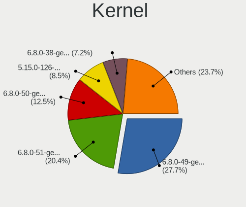
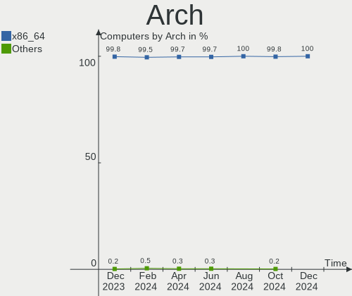
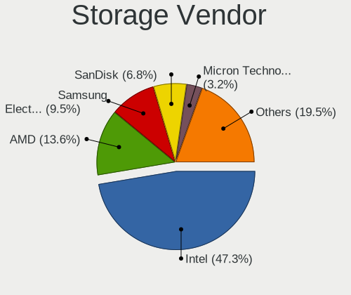
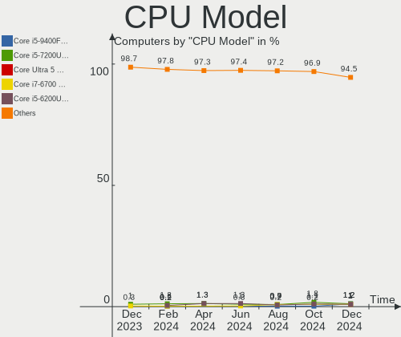
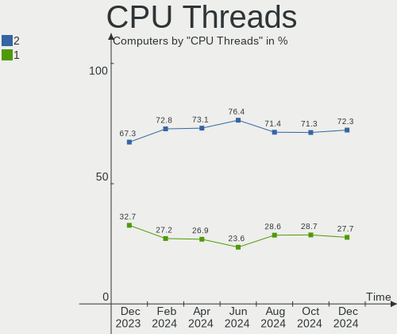

Linux Mint - Hardware Trends
----------------------------

A project to identify most popular hardware characteristics and track their change
over time based on data collected by Linux users at https://Linux-Hardware.org.

Anyone can contribute to this report by the [hw-probe](https://github.com/linuxhw/hw-probe) tool:

    sudo -E hw-probe -all -upload

This is a report for all computer types. See also reports for [desktops](/Dist/Linux_Mint/Desktop/README.md) and [notebooks](/Dist/Linux_Mint/Notebook/README.md).

This report is for one last month. Overall report since the beginning of time: [TestCoverage](https://github.com/linuxhw/TestCoverage)

Period: May, 2022.

Contents
--------

* [ System ](#system)
  - [ OS                       ](#os)
  - [ OS Family                ](#os-family)
  - [ Kernel                   ](#kernel)
  - [ Kernel Family            ](#kernel-family)
  - [ Kernel Major Ver.        ](#kernel-major-ver)
  - [ Arch                     ](#arch)
  - [ DE                       ](#de)
  - [ Display Server           ](#display-server)
  - [ Display Manager          ](#display-manager)
  - [ OS Lang                  ](#os-lang)
  - [ Boot Mode                ](#boot-mode)
  - [ Filesystem               ](#filesystem)
  - [ Part. scheme             ](#part-scheme)
  - [ Dual Boot with Linux/BSD ](#dual-boot-with-linuxbsd)
  - [ Dual Boot (Win)          ](#dual-boot-win)

* [ Board ](#board)
  - [ Vendor                   ](#vendor)
  - [ Model                    ](#model)
  - [ Model Family             ](#model-family)
  - [ MFG Year                 ](#mfg-year)
  - [ Form Factor              ](#form-factor)
  - [ Secure Boot              ](#secure-boot)
  - [ Coreboot                 ](#coreboot)
  - [ RAM Size                 ](#ram-size)
  - [ RAM Used                 ](#ram-used)
  - [ Total Drives             ](#total-drives)
  - [ Has CD-ROM               ](#has-cd-rom)
  - [ Has Ethernet             ](#has-ethernet)
  - [ Has WiFi                 ](#has-wifi)
  - [ Has Bluetooth            ](#has-bluetooth)

* [ Location ](#location)
  - [ Country                  ](#country)
  - [ City                     ](#city)

* [ Drives ](#drives)
  - [ Drive Vendor             ](#drive-vendor)
  - [ Drive Model              ](#drive-model)
  - [ HDD Vendor               ](#hdd-vendor)
  - [ SSD Vendor               ](#ssd-vendor)
  - [ Drive Kind               ](#drive-kind)
  - [ Drive Connector          ](#drive-connector)
  - [ Drive Size               ](#drive-size)
  - [ Space Total              ](#space-total)
  - [ Space Used               ](#space-used)
  - [ Malfunc. Drives          ](#malfunc-drives)
  - [ Malfunc. Drive Vendor    ](#malfunc-drive-vendor)
  - [ Malfunc. HDD Vendor      ](#malfunc-hdd-vendor)
  - [ Malfunc. Drive Kind      ](#malfunc-drive-kind)
  - [ Failed Drives            ](#failed-drives)
  - [ Failed Drive Vendor      ](#failed-drive-vendor)
  - [ Drive Status             ](#drive-status)

* [ Storage controller ](#storage-controller)
  - [ Storage Vendor           ](#storage-vendor)
  - [ Storage Model            ](#storage-model)
  - [ Storage Kind             ](#storage-kind)

* [ Processor ](#processor)
  - [ CPU Vendor               ](#cpu-vendor)
  - [ CPU Model                ](#cpu-model)
  - [ CPU Model Family         ](#cpu-model-family)
  - [ CPU Cores                ](#cpu-cores)
  - [ CPU Sockets              ](#cpu-sockets)
  - [ CPU Threads              ](#cpu-threads)
  - [ CPU Op-Modes             ](#cpu-op-modes)
  - [ CPU Microcode            ](#cpu-microcode)
  - [ CPU Microarch            ](#cpu-microarch)

* [ Graphics ](#graphics)
  - [ GPU Vendor               ](#gpu-vendor)
  - [ GPU Model                ](#gpu-model)
  - [ GPU Combo                ](#gpu-combo)
  - [ GPU Driver               ](#gpu-driver)
  - [ GPU Memory               ](#gpu-memory)

* [ Monitor ](#monitor)
  - [ Monitor Vendor           ](#monitor-vendor)
  - [ Monitor Model            ](#monitor-model)
  - [ Monitor Resolution       ](#monitor-resolution)
  - [ Monitor Diagonal         ](#monitor-diagonal)
  - [ Monitor Width            ](#monitor-width)
  - [ Aspect Ratio             ](#aspect-ratio)
  - [ Monitor Area             ](#monitor-area)
  - [ Pixel Density            ](#pixel-density)
  - [ Multiple Monitors        ](#multiple-monitors)

* [ Network ](#network)
  - [ Net Controller Vendor    ](#net-controller-vendor)
  - [ Net Controller Model     ](#net-controller-model)
  - [ Wireless Vendor          ](#wireless-vendor)
  - [ Wireless Model           ](#wireless-model)
  - [ Ethernet Vendor          ](#ethernet-vendor)
  - [ Ethernet Model           ](#ethernet-model)
  - [ Net Controller Kind      ](#net-controller-kind)
  - [ Used Controller          ](#used-controller)
  - [ NICs                     ](#nics)
  - [ IPv6                     ](#ipv6)

* [ Bluetooth ](#bluetooth)
  - [ Bluetooth Vendor         ](#bluetooth-vendor)
  - [ Bluetooth Model          ](#bluetooth-model)

* [ Sound ](#sound)
  - [ Sound Vendor             ](#sound-vendor)
  - [ Sound Model              ](#sound-model)

* [ Memory ](#memory)
  - [ Memory Vendor            ](#memory-vendor)
  - [ Memory Model             ](#memory-model)
  - [ Memory Kind              ](#memory-kind)
  - [ Memory Form Factor       ](#memory-form-factor)
  - [ Memory Size              ](#memory-size)
  - [ Memory Speed             ](#memory-speed)

* [ Printers & scanners ](#printers--scanners)
  - [ Printer Vendor           ](#printer-vendor)
  - [ Printer Model            ](#printer-model)
  - [ Scanner Vendor           ](#scanner-vendor)
  - [ Scanner Model            ](#scanner-model)

* [ Camera ](#camera)
  - [ Camera Vendor            ](#camera-vendor)
  - [ Camera Model             ](#camera-model)

* [ Security ](#security)
  - [ Fingerprint Vendor       ](#fingerprint-vendor)
  - [ Fingerprint Model        ](#fingerprint-model)
  - [ Chipcard Vendor          ](#chipcard-vendor)
  - [ Chipcard Model           ](#chipcard-model)

* [ Unsupported ](#unsupported)
  - [ Unsupported Devices      ](#unsupported-devices)
  - [ Unsupported Device Types ](#unsupported-device-types)

System
------

OS
--

Installed operating systems

| Name            | Computers | Percent |
|-----------------|-----------|---------|
| Linux Mint 20.3 | 343       | 84.69%  |
| Linux Mint 20.2 | 20        | 4.94%   |
| Linux Mint 20.1 | 13        | 3.21%   |
| Linux Mint 19.3 | 11        | 2.72%   |
| Linux Mint 20   | 8         | 1.98%   |
| Linux Mint 19.1 | 5         | 1.23%   |
| Linux Mint 19.2 | 3         | 0.74%   |
| Linux Mint 19   | 1         | 0.25%   |
| Linux Mint 18.3 | 1         | 0.25%   |

OS Family
---------

OS without a version

| Name       | Computers | Percent |
|------------|-----------|---------|
| Linux Mint | 405       | 100%    |

Kernel
------

Version of the Linux kernel

| Version                   | Computers | Percent |
|---------------------------|-----------|---------|
| 5.4.0-110-generic         | 107       | 26.42%  |
| 5.4.0-109-generic         | 96        | 23.7%   |
| 5.4.0-113-generic         | 64        | 15.8%   |
| 5.4.0-91-generic          | 30        | 7.41%   |
| 5.13.0-40-generic         | 14        | 3.46%   |
| 5.13.0-41-generic         | 13        | 3.21%   |
| 5.13.0-27-generic         | 10        | 2.47%   |
| 5.13.0-44-generic         | 7         | 1.73%   |
| 5.4.0-107-generic         | 6         | 1.48%   |
| 5.4.0-74-generic          | 5         | 1.23%   |
| 5.14.0-1038-oem           | 4         | 0.99%   |
| 5.4.0-99-generic          | 3         | 0.74%   |
| 5.4.0-105-generic         | 3         | 0.74%   |
| 5.4.0-100-generic         | 3         | 0.74%   |
| 4.15.0-176-generic        | 3         | 0.74%   |
| 5.4.0-90-generic          | 2         | 0.49%   |
| 5.4.0-104-generic         | 2         | 0.49%   |
| 5.17.6-051706-generic     | 2         | 0.49%   |
| 5.17.5-051705-generic     | 2         | 0.49%   |
| 5.14.0-1034-oem           | 2         | 0.49%   |
| 5.8.0-28-generic          | 1         | 0.25%   |
| 5.4.0-97-generic          | 1         | 0.25%   |
| 5.4.0-94-generic          | 1         | 0.25%   |
| 5.4.0-91-lowlatency       | 1         | 0.25%   |
| 5.4.0-89-generic          | 1         | 0.25%   |
| 5.4.0-77-generic          | 1         | 0.25%   |
| 5.4.0-113-lowlatency      | 1         | 0.25%   |
| 5.4.0-110-lowlatency      | 1         | 0.25%   |
| 5.18.0-051800-generic     | 1         | 0.25%   |
| 5.17.8-051708-generic     | 1         | 0.25%   |
| 5.17.0-5.2-liquorix-amd64 | 1         | 0.25%   |
| 5.16.6-051606-generic     | 1         | 0.25%   |
| 5.15.35-xanmod1           | 1         | 0.25%   |
| 5.15.13-051513-generic    | 1         | 0.25%   |
| 5.15.0-28-generic         | 1         | 0.25%   |
| 5.14.0-1036-oem           | 1         | 0.25%   |
| 5.13.0-39-generic         | 1         | 0.25%   |
| 5.13.0-30-generic         | 1         | 0.25%   |
| 5.13.0-28-generic         | 1         | 0.25%   |
| 5.13.0-25-generic         | 1         | 0.25%   |
| 5.11.0-44-generic         | 1         | 0.25%   |
| 5.0.0-32-generic          | 1         | 0.25%   |
| 4.15.0-51-generic         | 1         | 0.25%   |
| 4.15.0-177-lowlatency     | 1         | 0.25%   |
| 4.15.0-142-generic        | 1         | 0.25%   |
| 4.15.0-135-generic        | 1         | 0.25%   |
| 4.15.0-108-generic        | 1         | 0.25%   |

Kernel Family
-------------

Linux kernel without a distro release

| Version | Computers | Percent |
|---------|-----------|---------|
| 5.4.0   | 328       | 80.99%  |
| 5.13.0  | 48        | 11.85%  |
| 4.15.0  | 8         | 1.98%   |
| 5.14.0  | 7         | 1.73%   |
| 5.17.6  | 2         | 0.49%   |
| 5.17.5  | 2         | 0.49%   |
| 5.8.0   | 1         | 0.25%   |
| 5.18.0  | 1         | 0.25%   |
| 5.17.8  | 1         | 0.25%   |
| 5.17.0  | 1         | 0.25%   |
| 5.16.6  | 1         | 0.25%   |
| 5.15.35 | 1         | 0.25%   |
| 5.15.13 | 1         | 0.25%   |
| 5.15.0  | 1         | 0.25%   |
| 5.11.0  | 1         | 0.25%   |
| 5.0.0   | 1         | 0.25%   |

Kernel Major Ver.
-----------------

Linux kernel major version

| Version | Computers | Percent |
|---------|-----------|---------|
| 5.4     | 328       | 80.99%  |
| 5.13    | 48        | 11.85%  |
| 4.15    | 8         | 1.98%   |
| 5.14    | 7         | 1.73%   |
| 5.17    | 6         | 1.48%   |
| 5.15    | 3         | 0.74%   |
| 5.8     | 1         | 0.25%   |
| 5.18    | 1         | 0.25%   |
| 5.16    | 1         | 0.25%   |
| 5.11    | 1         | 0.25%   |
| 5.0     | 1         | 0.25%   |

Arch
----

OS architecture (x86_64, i586, etc.)

| Name   | Computers | Percent |
|--------|-----------|---------|
| x86_64 | 404       | 99.75%  |
| i686   | 1         | 0.25%   |

DE
--

Desktop Environment

| Name       | Computers | Percent |
|------------|-----------|---------|
| X-Cinnamon | 273       | 67.41%  |
| MATE       | 48        | 11.85%  |
| XFCE       | 47        | 11.6%   |
| Cinnamon   | 17        | 4.2%    |
| GNOME      | 8         | 1.98%   |
| Unknown    | 6         | 1.48%   |
| KDE5       | 3         | 0.74%   |
| qtile      | 1         | 0.25%   |
| KDE        | 1         | 0.25%   |
| i3         | 1         | 0.25%   |

Display Server
--------------

X11 or Wayland

| Name    | Computers | Percent |
|---------|-----------|---------|
| X11     | 401       | 99.01%  |
| Tty     | 3         | 0.74%   |
| Wayland | 1         | 0.25%   |

Display Manager
---------------

SDDM, LightDM, etc.

| Name    | Computers | Percent |
|---------|-----------|---------|
| Unknown | 238       | 58.77%  |
| LightDM | 163       | 40.25%  |
| SDDM    | 3         | 0.74%   |
| GDM3    | 1         | 0.25%   |

OS Lang
-------

Language

| Lang    | Computers | Percent |
|---------|-----------|---------|
| en_US   | 118       | 29.14%  |
| de_DE   | 76        | 18.77%  |
| pt_BR   | 30        | 7.41%   |
| en_GB   | 22        | 5.43%   |
| ru_RU   | 19        | 4.69%   |
| fr_FR   | 18        | 4.44%   |
| C       | 12        | 2.96%   |
| en_AU   | 11        | 2.72%   |
| es_ES   | 10        | 2.47%   |
| en_CA   | 10        | 2.47%   |
| pl_PL   | 9         | 2.22%   |
| it_IT   | 8         | 1.98%   |
| hu_HU   | 8         | 1.98%   |
| nl_NL   | 5         | 1.23%   |
| de_CH   | 5         | 1.23%   |
| tr_TR   | 4         | 0.99%   |
| pt_PT   | 4         | 0.99%   |
| es_AR   | 3         | 0.74%   |
| de_AT   | 3         | 0.74%   |
| he_IL   | 2         | 0.49%   |
| es_CL   | 2         | 0.49%   |
| en_IN   | 2         | 0.49%   |
| el_GR   | 2         | 0.49%   |
| cs_CZ   | 2         | 0.49%   |
| Unknown | 2         | 0.49%   |
| zh_TW   | 1         | 0.25%   |
| zh_CN   | 1         | 0.25%   |
| sk_SK   | 1         | 0.25%   |
| ro_RO   | 1         | 0.25%   |
| nb_NO   | 1         | 0.25%   |
| ko_KR   | 1         | 0.25%   |
| fr_CA   | 1         | 0.25%   |
| fr_BE   | 1         | 0.25%   |
| es_VE   | 1         | 0.25%   |
| es_PE   | 1         | 0.25%   |
| es_MX   | 1         | 0.25%   |
| es_HN   | 1         | 0.25%   |
| es_EC   | 1         | 0.25%   |
| en_ZA   | 1         | 0.25%   |
| en_PH   | 1         | 0.25%   |
| en_NZ   | 1         | 0.25%   |
| en_IL   | 1         | 0.25%   |
| en_HK   | 1         | 0.25%   |

Boot Mode
---------

EFI or BIOS

| Mode | Computers | Percent |
|------|-----------|---------|
| EFI  | 223       | 55.06%  |
| BIOS | 182       | 44.94%  |

Filesystem
----------

Type of filesystem

| Type    | Computers | Percent |
|---------|-----------|---------|
| Ext4    | 387       | 95.56%  |
| Overlay | 11        | 2.72%   |
| Btrfs   | 5         | 1.23%   |
| Jfs     | 1         | 0.25%   |
| Ext3    | 1         | 0.25%   |

Part. scheme
------------

Scheme of partitioning

| Type    | Computers | Percent |
|---------|-----------|---------|
| Unknown | 257       | 63.46%  |
| GPT     | 110       | 27.16%  |
| MBR     | 38        | 9.38%   |

Dual Boot with Linux/BSD
------------------------

Hosting more than one Linux/BSD

| Dual boot | Computers | Percent |
|-----------|-----------|---------|
| No        | 374       | 92.35%  |
| Yes       | 31        | 7.65%   |

Dual Boot (Win)
---------------

Hosting Linux and Windows

| Dual boot | Computers | Percent |
|-----------|-----------|---------|
| No        | 337       | 83.21%  |
| Yes       | 68        | 16.79%  |

Board
-----

Vendor
------

Motherboard manufacturer

| Name                  | Computers | Percent |
|-----------------------|-----------|---------|
| Hewlett-Packard       | 63        | 15.56%  |
| Lenovo                | 62        | 15.31%  |
| ASUSTek Computer      | 50        | 12.35%  |
| Dell                  | 49        | 12.1%   |
| Acer                  | 32        | 7.9%    |
| MSI                   | 30        | 7.41%   |
| Gigabyte Technology   | 25        | 6.17%   |
| ASRock                | 9         | 2.22%   |
| Samsung Electronics   | 7         | 1.73%   |
| Intel                 | 7         | 1.73%   |
| Apple                 | 7         | 1.73%   |
| Medion                | 6         | 1.48%   |
| Pegatron              | 4         | 0.99%   |
| Positivo              | 3         | 0.74%   |
| Packard Bell          | 3         | 0.74%   |
| Notebook              | 3         | 0.74%   |
| Google                | 3         | 0.74%   |
| ECS                   | 3         | 0.74%   |
| Unknown               | 3         | 0.74%   |
| Toshiba               | 2         | 0.49%   |
| Sony                  | 2         | 0.49%   |
| Microsoft             | 2         | 0.49%   |
| GPU Company           | 2         | 0.49%   |
| BESSTAR Tech          | 2         | 0.49%   |
| Azulle                | 2         | 0.49%   |
| AMI                   | 2         | 0.49%   |
| Alienware             | 2         | 0.49%   |
| YANYU                 | 1         | 0.25%   |
| Wortmann AG           | 1         | 0.25%   |
| Supermicro            | 1         | 0.25%   |
| Purism                | 1         | 0.25%   |
| Positivo Bahia - VAIO | 1         | 0.25%   |
| LG Electronics        | 1         | 0.25%   |
| Itautec               | 1         | 0.25%   |
| Irbis                 | 1         | 0.25%   |
| HUAWEI                | 1         | 0.25%   |
| HONOR                 | 1         | 0.25%   |
| Fujitsu Siemens       | 1         | 0.25%   |
| Fujitsu               | 1         | 0.25%   |
| Framework             | 1         | 0.25%   |
| DTRI                  | 1         | 0.25%   |
| Clevo                 | 1         | 0.25%   |
| Chuwi                 | 1         | 0.25%   |
| BOX                   | 1         | 0.25%   |
| Biostar               | 1         | 0.25%   |
| AZW                   | 1         | 0.25%   |
| AXDIA International   | 1         | 0.25%   |

Model
-----

Motherboard model

| Name                                    | Computers | Percent |
|-----------------------------------------|-----------|---------|
| ASUS All Series                         | 7         | 1.73%   |
| Samsung 550XDA                          | 3         | 0.74%   |
| Unknown                                 | 3         | 0.74%   |
| MSI MS-7D46                             | 2         | 0.49%   |
| MSI MS-7C56                             | 2         | 0.49%   |
| MSI MS-7721                             | 2         | 0.49%   |
| MSI MS-7693                             | 2         | 0.49%   |
| Lenovo IdeaPad S145-14IWL 81MU          | 2         | 0.49%   |
| Lenovo G580 20150                       | 2         | 0.49%   |
| Intel H61                               | 2         | 0.49%   |
| HP Notebook                             | 2         | 0.49%   |
| HP G62                                  | 2         | 0.49%   |
| HP EliteBook 8470p                      | 2         | 0.49%   |
| HP EliteBook 2560p                      | 2         | 0.49%   |
| HP Compaq 6200 Pro SFF PC               | 2         | 0.49%   |
| GPU Company GWTC116-2                   | 2         | 0.49%   |
| Gigabyte GA-78LMT-USB3                  | 2         | 0.49%   |
| Gigabyte GA-78LMT-S2P                   | 2         | 0.49%   |
| Gigabyte 970A-DS3P                      | 2         | 0.49%   |
| Dell Studio 1555                        | 2         | 0.49%   |
| Dell OptiPlex 780                       | 2         | 0.49%   |
| BESSTAR Tech N40                        | 2         | 0.49%   |
| Azulle Access4                          | 2         | 0.49%   |
| ASUS PRIME X570-P                       | 2         | 0.49%   |
| Acer Aspire A315-55G                    | 2         | 0.49%   |
| YANYU ITX-N29 VER:1.3                   | 1         | 0.25%   |
| Wortmann AG TERRA_MOBILE_1450           | 1         | 0.25%   |
| Toshiba TECRA R850                      | 1         | 0.25%   |
| Toshiba Satellite Radius P55W-B         | 1         | 0.25%   |
| Supermicro X9SRA/X9SRA-3                | 1         | 0.25%   |
| Sony VGN-SZ430N                         | 1         | 0.25%   |
| Sony SVE14113ELW                        | 1         | 0.25%   |
| Samsung RF510/RF410/RF710               | 1         | 0.25%   |
| Samsung 535U3C                          | 1         | 0.25%   |
| Samsung 350V5C/351V5C/3540VC/3440VC     | 1         | 0.25%   |
| Samsung 340XAA/350XAA/550XAA            | 1         | 0.25%   |
| Purism Librem Mini v2                   | 1         | 0.25%   |
| Positivo POS-PIH77CM                    | 1         | 0.25%   |
| Positivo ONE700                         | 1         | 0.25%   |
| Positivo C14CR21TV                      | 1         | 0.25%   |
| Positivo Bahia - VAIO VJFE51F11X-B0111H | 1         | 0.25%   |
| Pegatron s5-1050br                      | 1         | 0.25%   |
| Pegatron IPPPV-D3G                      | 1         | 0.25%   |
| Pegatron IPMIP-GS                       | 1         | 0.25%   |
| Pegatron Compaq dx2400 Microtower PC    | 1         | 0.25%   |
| Packard Bell IMEDIA S3720               | 1         | 0.25%   |
| Packard Bell EasyNote LE69KB            | 1         | 0.25%   |
| Packard Bell DOT S                      | 1         | 0.25%   |
| Notebook V15x_V17xPNKPNJPNH             | 1         | 0.25%   |
| Notebook PD5x_7xPNP_PNN_PNT             | 1         | 0.25%   |
| Notebook N8xEJEK                        | 1         | 0.25%   |
| MSI Summit E16Flip A12UCT               | 1         | 0.25%   |
| MSI PS63 Modern 8M                      | 1         | 0.25%   |
| MSI Prestige 15 A12UC                   | 1         | 0.25%   |
| MSI PR600                               | 1         | 0.25%   |
| MSI MS-7D22                             | 1         | 0.25%   |
| MSI MS-7D19                             | 1         | 0.25%   |
| MSI MS-7C37                             | 1         | 0.25%   |
| MSI MS-7B54                             | 1         | 0.25%   |
| MSI MS-7B48                             | 1         | 0.25%   |

Model Family
------------

Motherboard model prefix

| Name                   | Computers | Percent |
|------------------------|-----------|---------|
| Acer Aspire            | 23        | 5.68%   |
| Lenovo ThinkPad        | 20        | 4.94%   |
| Lenovo IdeaPad         | 15        | 3.7%    |
| Dell Inspiron          | 15        | 3.7%    |
| Dell OptiPlex          | 12        | 2.96%   |
| Dell Latitude          | 11        | 2.72%   |
| HP Compaq              | 10        | 2.47%   |
| Lenovo ThinkCentre     | 9         | 2.22%   |
| HP ProBook             | 7         | 1.73%   |
| HP Pavilion            | 7         | 1.73%   |
| HP EliteBook           | 7         | 1.73%   |
| ASUS All               | 7         | 1.73%   |
| ASUS PRIME             | 6         | 1.48%   |
| HP Laptop              | 4         | 0.99%   |
| ASUS VivoBook          | 4         | 0.99%   |
| ASUS ROG               | 4         | 0.99%   |
| Samsung 550XDA         | 3         | 0.74%   |
| ASUS TUF               | 3         | 0.74%   |
| Unknown                | 3         | 0.74%   |
| MSI MS-7D46            | 2         | 0.49%   |
| MSI MS-7C56            | 2         | 0.49%   |
| MSI MS-7721            | 2         | 0.49%   |
| MSI MS-7693            | 2         | 0.49%   |
| Microsoft Surface      | 2         | 0.49%   |
| Lenovo G580            | 2         | 0.49%   |
| Intel H61              | 2         | 0.49%   |
| HP ProDesk             | 2         | 0.49%   |
| HP Notebook            | 2         | 0.49%   |
| HP G62                 | 2         | 0.49%   |
| HP All-in-One          | 2         | 0.49%   |
| HP 250                 | 2         | 0.49%   |
| GPU Company GWTC116-2  | 2         | 0.49%   |
| Gigabyte GA-78LMT-USB3 | 2         | 0.49%   |
| Gigabyte GA-78LMT-S2P  | 2         | 0.49%   |
| Gigabyte 970A-DS3P     | 2         | 0.49%   |
| Dell XPS               | 2         | 0.49%   |
| Dell Vostro            | 2         | 0.49%   |
| Dell Studio            | 2         | 0.49%   |
| Dell G3                | 2         | 0.49%   |
| BESSTAR Tech N40       | 2         | 0.49%   |
| Azulle Access4         | 2         | 0.49%   |
| ASUS SABERTOOTH        | 2         | 0.49%   |
| ASUS M5A97             | 2         | 0.49%   |
| Acer TravelMate        | 2         | 0.49%   |
| Acer Swift             | 2         | 0.49%   |
| Acer Extensa           | 2         | 0.49%   |
| YANYU ITX-N29          | 1         | 0.25%   |
| Wortmann AG TERRA      | 1         | 0.25%   |
| Toshiba TECRA          | 1         | 0.25%   |
| Toshiba Satellite      | 1         | 0.25%   |
| Supermicro X9SRA       | 1         | 0.25%   |
| Sony VGN-SZ430N        | 1         | 0.25%   |
| Sony SVE14113ELW       | 1         | 0.25%   |
| Samsung RF510          | 1         | 0.25%   |
| Samsung 535U3C         | 1         | 0.25%   |
| Samsung 350V5C         | 1         | 0.25%   |
| Samsung 340XAA         | 1         | 0.25%   |
| Purism Librem          | 1         | 0.25%   |
| Positivo POS-PIH77CM   | 1         | 0.25%   |
| Positivo ONE700        | 1         | 0.25%   |

MFG Year
--------

Motherboard manufacture year

| Year | Computers | Percent |
|------|-----------|---------|
| 2021 | 46        | 11.36%  |
| 2012 | 43        | 10.62%  |
| 2013 | 40        | 9.88%   |
| 2011 | 39        | 9.63%   |
| 2019 | 29        | 7.16%   |
| 2018 | 29        | 7.16%   |
| 2017 | 29        | 7.16%   |
| 2014 | 26        | 6.42%   |
| 2020 | 23        | 5.68%   |
| 2010 | 22        | 5.43%   |
| 2016 | 17        | 4.2%    |
| 2008 | 17        | 4.2%    |
| 2015 | 15        | 3.7%    |
| 2009 | 14        | 3.46%   |
| 2022 | 9         | 2.22%   |
| 2006 | 4         | 0.99%   |
| 2007 | 3         | 0.74%   |

Form Factor
-----------

Physical design of the computer

| Name        | Computers | Percent |
|-------------|-----------|---------|
| Notebook    | 214       | 52.84%  |
| Desktop     | 164       | 40.49%  |
| All in one  | 9         | 2.22%   |
| Mini pc     | 7         | 1.73%   |
| Convertible | 4         | 0.99%   |
| Tablet      | 3         | 0.74%   |
| Stick pc    | 2         | 0.49%   |
| Server      | 2         | 0.49%   |

Secure Boot
-----------

Enabled or disabled

| State    | Computers | Percent |
|----------|-----------|---------|
| Disabled | 359       | 88.64%  |
| Enabled  | 46        | 11.36%  |

Coreboot
--------

Have coreboot on board

| Used | Computers | Percent |
|------|-----------|---------|
| No   | 401       | 99.01%  |
| Yes  | 4         | 0.99%   |

RAM Size
--------

Total RAM memory

| Size in GB  | Computers | Percent |
|-------------|-----------|---------|
| 4.01-8.0    | 102       | 25.19%  |
| 3.01-4.0    | 97        | 23.95%  |
| 16.01-24.0  | 83        | 20.49%  |
| 8.01-16.0   | 67        | 16.54%  |
| 32.01-64.0  | 34        | 8.4%    |
| 1.01-2.0    | 9         | 2.22%   |
| 24.01-32.0  | 4         | 0.99%   |
| 2.01-3.0    | 4         | 0.99%   |
| 64.01-256.0 | 4         | 0.99%   |
| 0.51-1.0    | 1         | 0.25%   |

RAM Used
--------

Used RAM memory

| Used GB   | Computers | Percent |
|-----------|-----------|---------|
| 1.01-2.0  | 166       | 40.99%  |
| 2.01-3.0  | 114       | 28.15%  |
| 3.01-4.0  | 53        | 13.09%  |
| 4.01-8.0  | 38        | 9.38%   |
| 0.51-1.0  | 23        | 5.68%   |
| 8.01-16.0 | 10        | 2.47%   |
| 0.01-0.5  | 1         | 0.25%   |

Total Drives
------------

Number of drives on board

| Drives | Computers | Percent |
|--------|-----------|---------|
| 1      | 242       | 59.75%  |
| 2      | 105       | 25.93%  |
| 3      | 33        | 8.15%   |
| 4      | 14        | 3.46%   |
| 5      | 6         | 1.48%   |
| 7      | 2         | 0.49%   |
| 0      | 2         | 0.49%   |
| 8      | 1         | 0.25%   |

Has CD-ROM
----------

Has CD-ROM on board

| Presented | Computers | Percent |
|-----------|-----------|---------|
| No        | 213       | 52.59%  |
| Yes       | 192       | 47.41%  |

Has Ethernet
------------

Has Ethernet on board

| Presented | Computers | Percent |
|-----------|-----------|---------|
| Yes       | 358       | 88.4%   |
| No        | 47        | 11.6%   |

Has WiFi
--------

Has WiFi module

| Presented | Computers | Percent |
|-----------|-----------|---------|
| Yes       | 304       | 75.06%  |
| No        | 101       | 24.94%  |

Has Bluetooth
-------------

Has Bluetooth module

| Presented | Computers | Percent |
|-----------|-----------|---------|
| Yes       | 225       | 55.56%  |
| No        | 180       | 44.44%  |

Location
--------

Country
-------

Geographic location (country)

| Country            | Computers | Percent |
|--------------------|-----------|---------|
| Germany            | 75        | 18.52%  |
| USA                | 67        | 16.54%  |
| Brazil             | 34        | 8.4%    |
| UK                 | 20        | 4.94%   |
| France             | 20        | 4.94%   |
| Russia             | 16        | 3.95%   |
| Spain              | 15        | 3.7%    |
| Poland             | 12        | 2.96%   |
| Canada             | 12        | 2.96%   |
| Italy              | 11        | 2.72%   |
| Australia          | 11        | 2.72%   |
| Hungary            | 9         | 2.22%   |
| Netherlands        | 8         | 1.98%   |
| Turkey             | 6         | 1.48%   |
| Switzerland        | 6         | 1.48%   |
| Portugal           | 6         | 1.48%   |
| Austria            | 5         | 1.23%   |
| Greece             | 4         | 0.99%   |
| Belgium            | 4         | 0.99%   |
| Argentina          | 4         | 0.99%   |
| Israel             | 3         | 0.74%   |
| Indonesia          | 3         | 0.74%   |
| Venezuela          | 2         | 0.49%   |
| Sweden             | 2         | 0.49%   |
| Serbia             | 2         | 0.49%   |
| Romania            | 2         | 0.49%   |
| Norway             | 2         | 0.49%   |
| Mexico             | 2         | 0.49%   |
| India              | 2         | 0.49%   |
| Ecuador            | 2         | 0.49%   |
| Dominican Republic | 2         | 0.49%   |
| Czechia            | 2         | 0.49%   |
| Chile              | 2         | 0.49%   |
| Belarus            | 2         | 0.49%   |
| Vietnam            | 1         | 0.25%   |
| Uzbekistan         | 1         | 0.25%   |
| Ukraine            | 1         | 0.25%   |
| Uganda             | 1         | 0.25%   |
| Timor Leste        | 1         | 0.25%   |
| Taiwan             | 1         | 0.25%   |
| South Korea        | 1         | 0.25%   |
| South Africa       | 1         | 0.25%   |
| Slovakia           | 1         | 0.25%   |
| Puerto Rico        | 1         | 0.25%   |
| Philippines        | 1         | 0.25%   |
| Peru               | 1         | 0.25%   |
| Paraguay           | 1         | 0.25%   |
| New Zealand        | 1         | 0.25%   |
| Morocco            | 1         | 0.25%   |
| Lithuania          | 1         | 0.25%   |
| Latvia             | 1         | 0.25%   |
| Jordan             | 1         | 0.25%   |
| Jamaica            | 1         | 0.25%   |
| Hong Kong          | 1         | 0.25%   |
| Honduras           | 1         | 0.25%   |
| Guatemala          | 1         | 0.25%   |
| Georgia            | 1         | 0.25%   |
| Finland            | 1         | 0.25%   |
| Estonia            | 1         | 0.25%   |
| Croatia            | 1         | 0.25%   |

City
----

Geographic location (city)

| City                   | Computers | Percent |
|------------------------|-----------|---------|
| Sao Paulo              | 7         | 1.73%   |
| Milan                  | 4         | 0.99%   |
| Vienna                 | 3         | 0.74%   |
| St Petersburg          | 3         | 0.74%   |
| Rio de Janeiro         | 3         | 0.74%   |
| Point Cook             | 3         | 0.74%   |
| Munich                 | 3         | 0.74%   |
| Moscow                 | 3         | 0.74%   |
| Las Vegas              | 3         | 0.74%   |
| Cologne                | 3         | 0.74%   |
| Cambridge              | 3         | 0.74%   |
| Budapest               | 3         | 0.74%   |
| Berlin                 | 3         | 0.74%   |
| Zurich                 | 2         | 0.49%   |
| Warsaw                 | 2         | 0.49%   |
| Vancouver              | 2         | 0.49%   |
| Turin                  | 2         | 0.49%   |
| Troisdorf              | 2         | 0.49%   |
| The Hague              | 2         | 0.49%   |
| The Bronx              | 2         | 0.49%   |
| Santo Domingo Este     | 2         | 0.49%   |
| Ribeirao Preto         | 2         | 0.49%   |
| Poznan                 | 2         | 0.49%   |
| Niederkassel           | 2         | 0.49%   |
| Midlothian             | 2         | 0.49%   |
| Melbourne              | 2         | 0.49%   |
| Kirchgellersen         | 2         | 0.49%   |
| Karlsruhe              | 2         | 0.49%   |
| Hamburg                | 2         | 0.49%   |
| Fair Lawn              | 2         | 0.49%   |
| Duisburg               | 2         | 0.49%   |
| Croydon                | 2         | 0.49%   |
| Chicago                | 2         | 0.49%   |
| Chelsea                | 2         | 0.49%   |
| Bursa                  | 2         | 0.49%   |
| Brussels               | 2         | 0.49%   |
| Brisbane               | 2         | 0.49%   |
| Bengaluru              | 2         | 0.49%   |
| Belgrade               | 2         | 0.49%   |
| Barcelona              | 2         | 0.49%   |
| Athens                 | 2         | 0.49%   |
| Ankara                 | 2         | 0.49%   |
| Zwolle                 | 1         | 0.25%   |
| Zagreb                 | 1         | 0.25%   |
| Yogyakarta             | 1         | 0.25%   |
| Yerevan                | 1         | 0.25%   |
| Wuppertal              | 1         | 0.25%   |
| Wroclaw                | 1         | 0.25%   |
| Witham                 | 1         | 0.25%   |
| Wilmette               | 1         | 0.25%   |
| West Lebanon           | 1         | 0.25%   |
| Wellington             | 1         | 0.25%   |
| Wahiawa                | 1         | 0.25%   |
| Voluntari              | 1         | 0.25%   |
| Vologda                | 1         | 0.25%   |
| Vilnius                | 1         | 0.25%   |
| Villeneuve les beziers | 1         | 0.25%   |
| Villejuif              | 1         | 0.25%   |
| Vilagarcia de Arousa   | 1         | 0.25%   |
| Vestal                 | 1         | 0.25%   |

Drives
------

Drive Vendor
------------

Hard drive vendors

| Vendor                      | Computers | Drives | Percent |
|-----------------------------|-----------|--------|---------|
| Seagate                     | 96        | 116    | 16.52%  |
| WDC                         | 92        | 106    | 15.83%  |
| Samsung Electronics         | 88        | 105    | 15.15%  |
| Toshiba                     | 39        | 42     | 6.71%   |
| Kingston                    | 35        | 36     | 6.02%   |
| SanDisk                     | 32        | 34     | 5.51%   |
| Crucial                     | 25        | 28     | 4.3%    |
| Hitachi                     | 22        | 23     | 3.79%   |
| Unknown                     | 20        | 22     | 3.44%   |
| China                       | 11        | 11     | 1.89%   |
| SK Hynix                    | 7         | 7      | 1.2%    |
| Intel                       | 7         | 8      | 1.2%    |
| HGST                        | 6         | 6      | 1.03%   |
| A-DATA Technology           | 6         | 6      | 1.03%   |
| Phison                      | 5         | 6      | 0.86%   |
| Micron Technology           | 5         | 6      | 0.86%   |
| KIOXIA                      | 5         | 5      | 0.86%   |
| Intenso                     | 5         | 6      | 0.86%   |
| Silicon Motion              | 4         | 4      | 0.69%   |
| Unknown                     | 4         | 4      | 0.69%   |
| UMIS                        | 3         | 3      | 0.52%   |
| SPCC                        | 3         | 3      | 0.52%   |
| Netac                       | 3         | 3      | 0.52%   |
| JMicron                     | 3         | 3      | 0.52%   |
| Dogfish                     | 3         | 3      | 0.52%   |
| Union Memory                | 2         | 2      | 0.34%   |
| Transcend                   | 2         | 2      | 0.34%   |
| TO Exter                    | 2         | 2      | 0.34%   |
| Team                        | 2         | 2      | 0.34%   |
| SABRENT                     | 2         | 2      | 0.34%   |
| Patriot                     | 2         | 2      | 0.34%   |
| OCZ                         | 2         | 2      | 0.34%   |
| LITEONIT                    | 2         | 2      | 0.34%   |
| LITEON                      | 2         | 2      | 0.34%   |
| Lexar                       | 2         | 2      | 0.34%   |
| Hewlett-Packard             | 2         | 2      | 0.34%   |
| GOODRAM                     | 2         | 2      | 0.34%   |
| Fujitsu                     | 2         | 2      | 0.34%   |
| BIWIN                       | 2         | 2      | 0.34%   |
| Apple                       | 2         | 2      | 0.34%   |
| V-GeN                       | 1         | 1      | 0.17%   |
| USB 3.0                     | 1         | 1      | 0.17%   |
| TDAS                        | 1         | 3      | 0.17%   |
| SSSTC                       | 1         | 1      | 0.17%   |
| sobetter                    | 1         | 1      | 0.17%   |
| Smartbuy                    | 1         | 1      | 0.17%   |
| S3+                         | 1         | 1      | 0.17%   |
| PNY                         | 1         | 1      | 0.17%   |
| OCZ-AGIL                    | 1         | 1      | 0.17%   |
| Mushkin                     | 1         | 1      | 0.17%   |
| Micron/Crucial Technology   | 1         | 1      | 0.17%   |
| MAXTOR                      | 1         | 1      | 0.17%   |
| MAXIO Technology (Hangzhou) | 1         | 1      | 0.17%   |
| MACROVIP                    | 1         | 1      | 0.17%   |
| Leven                       | 1         | 1      | 0.17%   |
| KingDian                    | 1         | 1      | 0.17%   |
| Hoodisk                     | 1         | 1      | 0.17%   |
| DREVO                       | 1         | 1      | 0.17%   |
| ASUSTOR                     | 1         | 2      | 0.17%   |
| ASMT106x                    | 1         | 1      | 0.17%   |

Drive Model
-----------

Hard drive models

| Model                                  | Computers | Percent |
|----------------------------------------|-----------|---------|
| Kingston SA400S37240G 240GB SSD        | 9         | 1.42%   |
| Seagate ST500DM002-1BD142 500GB        | 7         | 1.11%   |
| Seagate ST1000LM035-1RK172 1TB         | 6         | 0.95%   |
| Samsung SSD 860 EVO 250GB              | 6         | 0.95%   |
| Unknown SLD64G  64GB                   | 5         | 0.79%   |
| Seagate ST500LT012-9WS142 500GB        | 5         | 0.79%   |
| Seagate ST500LT012-1DG142 500GB        | 5         | 0.79%   |
| Samsung SSD 850 EVO 250GB              | 5         | 0.79%   |
| Crucial CT1000MX500SSD1 1TB            | 5         | 0.79%   |
| WDC WDS500G2B0A-00SM50 500GB SSD       | 4         | 0.63%   |
| WDC WD10SPZX-21Z10T0 1TB               | 4         | 0.63%   |
| Unknown MMC Card  32GB                 | 4         | 0.63%   |
| Toshiba MK5059GSXP 500GB               | 4         | 0.63%   |
| Toshiba DT01ACA100 1TB                 | 4         | 0.63%   |
| Seagate ST3500413AS 500GB              | 4         | 0.63%   |
| Seagate ST1000DM010-2EP102 1TB         | 4         | 0.63%   |
| Seagate ST1000DM003-1ER162 1TB         | 4         | 0.63%   |
| Samsung NVMe SSD Drive 256GB           | 4         | 0.63%   |
| Unknown                                | 4         | 0.63%   |
| WDC WDS100T2B0A-00SM50 1TB SSD         | 3         | 0.47%   |
| Unknown MMC Card  64GB                 | 3         | 0.47%   |
| Toshiba MQ01ABF050 500GB               | 3         | 0.47%   |
| Toshiba KBG30ZMS128G 128GB NVMe SSD    | 3         | 0.47%   |
| Seagate ST9320325AS 320GB              | 3         | 0.47%   |
| Seagate ST31000524AS 1TB               | 3         | 0.47%   |
| Seagate ST1000LM024 HN-M101MBB 1TB     | 3         | 0.47%   |
| Seagate ST1000DM003-1SB102 1TB         | 3         | 0.47%   |
| Sandisk NVMe SSD Drive 512GB           | 3         | 0.47%   |
| Samsung SSD 970 EVO Plus 1TB           | 3         | 0.47%   |
| Samsung SSD 870 EVO 1TB                | 3         | 0.47%   |
| Samsung SSD 860 EVO 500GB              | 3         | 0.47%   |
| Samsung SSD 840 EVO 250GB              | 3         | 0.47%   |
| Samsung NVMe SSD Drive 250GB           | 3         | 0.47%   |
| Kingston SA400S37480G 480GB SSD        | 3         | 0.47%   |
| Crucial CT525MX300SSD1 528GB           | 3         | 0.47%   |
| Crucial CT480BX500SSD1 480GB           | 3         | 0.47%   |
| Crucial CT240BX500SSD1 240GB           | 3         | 0.47%   |
| WDC WDS500G1X0E-00AFY0 500GB           | 2         | 0.32%   |
| WDC WDS480G2G0A-00JH30 480GB SSD       | 2         | 0.32%   |
| WDC WDS240G2G0A-00JH30 240GB SSD       | 2         | 0.32%   |
| WDC WD800BEVS-22RST0 80GB              | 2         | 0.32%   |
| WDC WD6400AAKS-65Z7B0 640GB            | 2         | 0.32%   |
| WDC WD5000LPCX-75VHAT0 500GB           | 2         | 0.32%   |
| WDC WD20EZRX-00D8PB0 2TB               | 2         | 0.32%   |
| WDC WD10JPCX-24UE4T0 1TB               | 2         | 0.32%   |
| WDC PC SN530 SDBPNPZ-256G-1006 256GB   | 2         | 0.32%   |
| Unknown SD/MMC/MS PRO 999GB            | 2         | 0.32%   |
| Unknown MMC Card  16GB                 | 2         | 0.32%   |
| Union Memory RTOTJ128VGD2EYX 128GB SSD | 2         | 0.32%   |
| UMIS RPFTJ256PDD2MWX 256GB             | 2         | 0.32%   |
| Toshiba MQ04ABF100 1TB                 | 2         | 0.32%   |
| Toshiba MQ01ABD100 1TB                 | 2         | 0.32%   |
| Toshiba HDWD110 1TB                    | 2         | 0.32%   |
| Toshiba DT01ACA050 500GB               | 2         | 0.32%   |
| TO Exter nal USB 3.0 320GB             | 2         | 0.32%   |
| Silicon Motion NVMe SSD Drive 1TB      | 2         | 0.32%   |
| Seagate ST9500325AS 500GB              | 2         | 0.32%   |
| Seagate ST750LM022 HN-M750MBB 752GB    | 2         | 0.32%   |
| Seagate ST500LM012 HN-M500MBB 500GB    | 2         | 0.32%   |
| Seagate ST4000DM004-2CV104 4TB         | 2         | 0.32%   |

HDD Vendor
----------

Hard disk drive vendors

| Vendor              | Computers | Drives | Percent |
|---------------------|-----------|--------|---------|
| Seagate             | 94        | 112    | 37.15%  |
| WDC                 | 69        | 76     | 27.27%  |
| Toshiba             | 31        | 33     | 12.25%  |
| Hitachi             | 22        | 23     | 8.7%    |
| Samsung Electronics | 18        | 19     | 7.11%   |
| HGST                | 6         | 6      | 2.37%   |
| Unknown             | 2         | 2      | 0.79%   |
| SABRENT             | 2         | 2      | 0.79%   |
| Fujitsu             | 2         | 2      | 0.79%   |
| USB 3.0             | 1         | 1      | 0.4%    |
| MAXTOR              | 1         | 1      | 0.4%    |
| JMicron             | 1         | 1      | 0.4%    |
| Intenso             | 1         | 1      | 0.4%    |
| ASUSTOR             | 1         | 2      | 0.4%    |
| ASMT                | 1         | 1      | 0.4%    |
| Apple               | 1         | 1      | 0.4%    |

SSD Vendor
----------

Solid state drive vendors

| Vendor              | Computers | Drives | Percent |
|---------------------|-----------|--------|---------|
| Samsung Electronics | 40        | 47     | 19.51%  |
| Kingston            | 27        | 28     | 13.17%  |
| Crucial             | 25        | 28     | 12.2%   |
| SanDisk             | 22        | 22     | 10.73%  |
| WDC                 | 18        | 19     | 8.78%   |
| China               | 11        | 11     | 5.37%   |
| A-DATA Technology   | 5         | 5      | 2.44%   |
| Toshiba             | 4         | 4      | 1.95%   |
| SPCC                | 3         | 3      | 1.46%   |
| Netac               | 3         | 3      | 1.46%   |
| Intel               | 3         | 3      | 1.46%   |
| Dogfish             | 3         | 3      | 1.46%   |
| Union Memory        | 2         | 2      | 0.98%   |
| Transcend           | 2         | 2      | 0.98%   |
| TO Exter            | 2         | 2      | 0.98%   |
| Team                | 2         | 2      | 0.98%   |
| OCZ                 | 2         | 2      | 0.98%   |
| Micron Technology   | 2         | 2      | 0.98%   |
| LITEONIT            | 2         | 2      | 0.98%   |
| Lexar               | 2         | 2      | 0.98%   |
| JMicron             | 2         | 2      | 0.98%   |
| Intenso             | 2         | 3      | 0.98%   |
| GOODRAM             | 2         | 2      | 0.98%   |
| BIWIN               | 2         | 2      | 0.98%   |
| Unknown             | 2         | 2      | 0.98%   |
| Smartbuy            | 1         | 1      | 0.49%   |
| Seagate             | 1         | 1      | 0.49%   |
| S3+                 | 1         | 1      | 0.49%   |
| PNY                 | 1         | 1      | 0.49%   |
| Phison              | 1         | 1      | 0.49%   |
| Patriot             | 1         | 1      | 0.49%   |
| OCZ-AGIL            | 1         | 1      | 0.49%   |
| Mushkin             | 1         | 1      | 0.49%   |
| LITEON              | 1         | 1      | 0.49%   |
| KingDian            | 1         | 1      | 0.49%   |
| Hoodisk             | 1         | 1      | 0.49%   |
| Hewlett-Packard     | 1         | 1      | 0.49%   |
| DREVO               | 1         | 1      | 0.49%   |
| Apple               | 1         | 1      | 0.49%   |
| ADATA SU            | 1         | 1      | 0.49%   |

Drive Kind
----------

HDD or SSD

| Kind    | Computers | Drives | Percent |
|---------|-----------|--------|---------|
| HDD     | 208       | 283    | 40.15%  |
| SSD     | 177       | 218    | 34.17%  |
| NVMe    | 101       | 113    | 19.5%   |
| MMC     | 20        | 23     | 3.86%   |
| Unknown | 12        | 14     | 2.32%   |

Drive Connector
---------------

SATA, SAS, NVMe, etc.

| Type | Computers | Drives | Percent |
|------|-----------|--------|---------|
| SATA | 323       | 484    | 69.02%  |
| NVMe | 101       | 113    | 21.58%  |
| SAS  | 24        | 31     | 5.13%   |
| MMC  | 20        | 23     | 4.27%   |

Drive Size
----------

Size of hard drive

| Size in TB | Computers | Drives | Percent |
|------------|-----------|--------|---------|
| 0.01-0.5   | 230       | 302    | 56.93%  |
| 0.51-1.0   | 123       | 140    | 30.45%  |
| 1.01-2.0   | 31        | 34     | 7.67%   |
| 3.01-4.0   | 9         | 11     | 2.23%   |
| 4.01-10.0  | 6         | 8      | 1.49%   |
| 2.01-3.0   | 4         | 5      | 0.99%   |
| 10.01-20.0 | 1         | 1      | 0.25%   |

Space Total
-----------

Amount of disk space available on the file system

| Size in GB     | Computers | Percent |
|----------------|-----------|---------|
| 101-250        | 125       | 30.86%  |
| 251-500        | 112       | 27.65%  |
| 501-1000       | 56        | 13.83%  |
| 1001-2000      | 38        | 9.38%   |
| More than 3000 | 22        | 5.43%   |
| 51-100         | 22        | 5.43%   |
| 1-20           | 13        | 3.21%   |
| 21-50          | 8         | 1.98%   |
| 2001-3000      | 7         | 1.73%   |
| Unknown        | 2         | 0.49%   |

Space Used
----------

Amount of used disk space

| Used GB        | Computers | Percent |
|----------------|-----------|---------|
| 1-20           | 102       | 25.19%  |
| 21-50          | 80        | 19.75%  |
| 101-250        | 68        | 16.79%  |
| 51-100         | 63        | 15.56%  |
| 251-500        | 39        | 9.63%   |
| 501-1000       | 29        | 7.16%   |
| 1001-2000      | 10        | 2.47%   |
| More than 3000 | 8         | 1.98%   |
| 2001-3000      | 4         | 0.99%   |
| Unknown        | 2         | 0.49%   |

Malfunc. Drives
---------------

Drive models with a malfunction

| Model                              | Computers | Drives | Percent |
|------------------------------------|-----------|--------|---------|
| WDC WDS240G2G0B-00EPW0 240GB SSD   | 1         | 1      | 2.94%   |
| WDC WD5002ABYS-01B1B0 500GB        | 1         | 1      | 2.94%   |
| WDC WD5000LPVT-22G33T0 500GB       | 1         | 1      | 2.94%   |
| WDC WD2500JS-22NCB1 250GB          | 1         | 1      | 2.94%   |
| WDC WD10JPVX-22JC3T0 1TB           | 1         | 1      | 2.94%   |
| WDC WD10EZEX-00KUWA0 1TB           | 1         | 1      | 2.94%   |
| WDC WD10EARS-00Y5B1 1TB            | 1         | 1      | 2.94%   |
| WDC WD10EADS-22M2B0 1TB            | 1         | 1      | 2.94%   |
| Transcend TS240GMTS420S 240GB SSD  | 1         | 1      | 2.94%   |
| Toshiba MQ01ABF050 500GB           | 1         | 1      | 2.94%   |
| SPCC Solid State Disk 512GB        | 1         | 1      | 2.94%   |
| Seagate ST9500325AS 500GB          | 1         | 1      | 2.94%   |
| Seagate ST9320325AS 320GB          | 1         | 1      | 2.94%   |
| Seagate ST500LT012-1DG142 500GB    | 1         | 1      | 2.94%   |
| Seagate ST500LM000-SSHD-8GB        | 1         | 1      | 2.94%   |
| Seagate ST380215AS 80GB            | 1         | 1      | 2.94%   |
| Seagate ST3500413AS 500GB          | 1         | 2      | 2.94%   |
| Seagate ST31000528AS 1TB           | 1         | 1      | 2.94%   |
| Seagate ST2000LM003 HN-M201RAD 2TB | 1         | 1      | 2.94%   |
| Seagate ST2000DL003-9VT166 2TB     | 1         | 1      | 2.94%   |
| Seagate ST1000LM035-1RK172 1TB     | 1         | 1      | 2.94%   |
| Seagate ST1000LM024 HN-M101MBB 1TB | 1         | 1      | 2.94%   |
| Seagate ST1000DX002-2DV162 1TB     | 1         | 1      | 2.94%   |
| Seagate ST1000DM003-1ER162 1TB     | 1         | 2      | 2.94%   |
| SanDisk SD6SF1M128G1022I 128GB SSD | 1         | 1      | 2.94%   |
| Samsung Electronics SP2014N 200GB  | 1         | 1      | 2.94%   |
| Samsung Electronics HD321HJ 320GB  | 1         | 1      | 2.94%   |
| Hitachi HTS547575A9E384 752GB      | 1         | 1      | 2.94%   |
| Hitachi HTS545050B9A300 500GB      | 1         | 1      | 2.94%   |
| Hitachi HDS721616PLA380 164GB      | 1         | 1      | 2.94%   |
| Hitachi HDS721050CLA360 500GB      | 1         | 1      | 2.94%   |
| Crucial CT525MX300SSD1 528GB       | 1         | 1      | 2.94%   |
| Crucial CT275MX300SSD1 275GB       | 1         | 1      | 2.94%   |
| Crucial CT128M550SSD3 128GB        | 1         | 1      | 2.94%   |

Malfunc. Drive Vendor
---------------------

Vendors of faulty drives

| Vendor              | Computers | Drives | Percent |
|---------------------|-----------|--------|---------|
| Seagate             | 13        | 15     | 38.24%  |
| WDC                 | 8         | 8      | 23.53%  |
| Hitachi             | 4         | 4      | 11.76%  |
| Crucial             | 3         | 3      | 8.82%   |
| Samsung Electronics | 2         | 2      | 5.88%   |
| Transcend           | 1         | 1      | 2.94%   |
| Toshiba             | 1         | 1      | 2.94%   |
| SPCC                | 1         | 1      | 2.94%   |
| SanDisk             | 1         | 1      | 2.94%   |

Malfunc. HDD Vendor
-------------------

Vendors of faulty HDD drives

| Vendor              | Computers | Drives | Percent |
|---------------------|-----------|--------|---------|
| Seagate             | 13        | 15     | 48.15%  |
| WDC                 | 7         | 7      | 25.93%  |
| Hitachi             | 4         | 4      | 14.81%  |
| Samsung Electronics | 2         | 2      | 7.41%   |
| Toshiba             | 1         | 1      | 3.7%    |

Malfunc. Drive Kind
-------------------

Kinds of faulty drives

| Kind | Computers | Drives | Percent |
|------|-----------|--------|---------|
| HDD  | 24        | 29     | 77.42%  |
| SSD  | 7         | 7      | 22.58%  |

Failed Drives
-------------

Failed drive models

Zero info for selected period =(

Failed Drive Vendor
-------------------

Failed drive vendors

Zero info for selected period =(

Drive Status
------------

Number of failed and malfunc. drives

| Status   | Computers | Drives | Percent |
|----------|-----------|--------|---------|
| Detected | 271       | 427    | 62.73%  |
| Works    | 131       | 188    | 30.32%  |
| Malfunc  | 30        | 36     | 6.94%   |

Storage controller
------------------

Storage Vendor
--------------

Storage controller vendors

| Vendor                           | Computers | Percent |
|----------------------------------|-----------|---------|
| Intel                            | 286       | 57.31%  |
| AMD                              | 78        | 15.63%  |
| Samsung Electronics              | 36        | 7.21%   |
| Sandisk                          | 20        | 4.01%   |
| ASMedia Technology               | 11        | 2.2%    |
| Nvidia                           | 9         | 1.8%    |
| Kingston Technology Company      | 9         | 1.8%    |
| SK Hynix                         | 7         | 1.4%    |
| KIOXIA                           | 6         | 1.2%    |
| Phison Electronics               | 5         | 1%      |
| JMicron Technology               | 5         | 1%      |
| Toshiba America Info Systems     | 4         | 0.8%    |
| Silicon Motion                   | 4         | 0.8%    |
| Union Memory (Shenzhen)          | 3         | 0.6%    |
| Micron Technology                | 3         | 0.6%    |
| Marvell Technology Group         | 3         | 0.6%    |
| VIA Technologies                 | 1         | 0.2%    |
| Solid State Storage Technology   | 1         | 0.2%    |
| Silicon Integrated Systems [SiS] | 1         | 0.2%    |
| Micron/Crucial Technology        | 1         | 0.2%    |
| MAXIO Technology (Hangzhou)      | 1         | 0.2%    |
| LSI Logic / Symbios Logic        | 1         | 0.2%    |
| Lite-On Technology               | 1         | 0.2%    |
| Hewlett-Packard                  | 1         | 0.2%    |
| Broadcom / LSI                   | 1         | 0.2%    |
| ADATA Technology                 | 1         | 0.2%    |

Storage Model
-------------

Storage controller models

| Model                                                                                   | Computers | Percent |
|-----------------------------------------------------------------------------------------|-----------|---------|
| AMD FCH SATA Controller [AHCI mode]                                                     | 42        | 7.36%   |
| Intel 7 Series Chipset Family 6-port SATA Controller [AHCI mode]                        | 26        | 4.55%   |
| Intel 8 Series/C220 Series Chipset Family 6-port SATA Controller 1 [AHCI mode]          | 22        | 3.85%   |
| Intel Sunrise Point-LP SATA Controller [AHCI mode]                                      | 18        | 3.15%   |
| Samsung NVMe SSD Controller SM981/PM981/PM983                                           | 17        | 2.98%   |
| Intel 6 Series/C200 Series Chipset Family 6 port Mobile SATA AHCI Controller            | 16        | 2.8%    |
| AMD SB7x0/SB8x0/SB9x0 SATA Controller [AHCI mode]                                       | 15        | 2.63%   |
| Intel 6 Series/C200 Series Chipset Family 6 port Desktop SATA AHCI Controller           | 13        | 2.28%   |
| Intel Celeron/Pentium Silver Processor SATA Controller                                  | 12        | 2.1%    |
| AMD SB7x0/SB8x0/SB9x0 IDE Controller                                                    | 12        | 2.1%    |
| Intel Tiger Lake-LP SATA Controller [AHCI mode]                                         | 11        | 1.93%   |
| Intel 82801 Mobile SATA Controller [RAID mode]                                          | 11        | 1.93%   |
| Intel 8 Series SATA Controller 1 [AHCI mode]                                            | 10        | 1.75%   |
| Intel Cannon Lake PCH SATA AHCI Controller                                              | 9         | 1.58%   |
| Intel 7 Series/C210 Series Chipset Family 6-port SATA Controller [AHCI mode]            | 9         | 1.58%   |
| ASMedia ASM1062 Serial ATA Controller                                                   | 9         | 1.58%   |
| Samsung NVMe SSD Controller 980                                                         | 8         | 1.4%    |
| Intel SATA Controller [RAID mode]                                                       | 8         | 1.4%    |
| Intel Cannon Point-LP SATA Controller [AHCI Mode]                                       | 8         | 1.4%    |
| Intel 82801IBM/IEM (ICH9M/ICH9M-E) 4 port SATA Controller [AHCI mode]                   | 8         | 1.4%    |
| AMD SB7x0/SB8x0/SB9x0 SATA Controller [IDE mode]                                        | 8         | 1.4%    |
| Sandisk WD Blue SN550 NVMe SSD                                                          | 7         | 1.23%   |
| Samsung NVMe SSD Controller PM9A1/PM9A3/980PRO                                          | 7         | 1.23%   |
| Intel Volume Management Device NVMe RAID Controller                                     | 7         | 1.23%   |
| Intel NM10/ICH7 Family SATA Controller [IDE mode]                                       | 7         | 1.23%   |
| Intel Comet Lake SATA AHCI Controller                                                   | 7         | 1.23%   |
| Intel Cannon Lake Mobile PCH SATA AHCI Controller                                       | 7         | 1.23%   |
| Intel 82801G (ICH7 Family) IDE Controller                                               | 7         | 1.23%   |
| Intel 5 Series/3400 Series Chipset 4 port SATA AHCI Controller                          | 7         | 1.23%   |
| Intel 200 Series PCH SATA controller [AHCI mode]                                        | 7         | 1.23%   |
| KIOXIA Non-Volatile memory controller                                                   | 6         | 1.05%   |
| Intel Q170/Q150/B150/H170/H110/Z170/CM236 Chipset SATA Controller [AHCI Mode]           | 6         | 1.05%   |
| AMD 500 Series Chipset SATA Controller                                                  | 6         | 1.05%   |
| Silicon Motion SM2263EN/SM2263XT SSD Controller                                         | 4         | 0.7%    |
| Sandisk WD PC SN810 / Black SN850 NVMe SSD                                              | 4         | 0.7%    |
| Samsung NVMe SSD Controller SM961/PM961/SM963                                           | 4         | 0.7%    |
| Nvidia MCP79 AHCI Controller                                                            | 4         | 0.7%    |
| Kingston Company Company Non-Volatile memory controller                                 | 4         | 0.7%    |
| Intel Wildcat Point-LP SATA Controller [AHCI Mode]                                      | 4         | 0.7%    |
| Intel NM10/ICH7 Family SATA Controller [AHCI mode]                                      | 4         | 0.7%    |
| Intel 5 Series/3400 Series Chipset 6 port SATA AHCI Controller                          | 4         | 0.7%    |
| Union Memory (Shenzhen) Non-Volatile memory controller                                  | 3         | 0.53%   |
| SK Hynix BC511                                                                          | 3         | 0.53%   |
| Sandisk WD Blue SN500 / PC SN520 NVMe SSD                                               | 3         | 0.53%   |
| Sandisk PC SN520 NVMe SSD                                                               | 3         | 0.53%   |
| Phison E12 NVMe Controller                                                              | 3         | 0.53%   |
| Micron Non-Volatile memory controller                                                   | 3         | 0.53%   |
| Kingston Company U-SNS8154P3 NVMe SSD                                                   | 3         | 0.53%   |
| Intel Ice Lake-LP SATA Controller [AHCI mode]                                           | 3         | 0.53%   |
| Intel Atom Processor E3800 Series SATA AHCI Controller                                  | 3         | 0.53%   |
| Intel Alder Lake-S PCH SATA Controller [AHCI Mode]                                      | 3         | 0.53%   |
| Intel 82801I (ICH9 Family) 2 port SATA Controller [IDE mode]                            | 3         | 0.53%   |
| Intel 6 Series/C200 Series Chipset Family Desktop SATA Controller (IDE mode, ports 4-5) | 3         | 0.53%   |
| Intel 6 Series/C200 Series Chipset Family Desktop SATA Controller (IDE mode, ports 0-3) | 3         | 0.53%   |
| Intel 4 Series Chipset PT IDER Controller                                               | 3         | 0.53%   |
| AMD 400 Series Chipset SATA Controller                                                  | 3         | 0.53%   |
| AMD 300 Series Chipset SATA Controller                                                  | 3         | 0.53%   |
| Toshiba America Info Systems XG6 NVMe SSD Controller                                    | 2         | 0.35%   |
| SK Hynix Gold P31 SSD                                                                   | 2         | 0.35%   |
| Sandisk WD Black SN750 / PC SN730 NVMe SSD                                              | 2         | 0.35%   |

Storage Kind
------------

Kind of storage controller (IDE, SATA, NVMe, SAS, ...)

| Kind | Computers | Percent |
|------|-----------|---------|
| SATA | 318       | 61.87%  |
| NVMe | 102       | 19.84%  |
| IDE  | 59        | 11.48%  |
| RAID | 31        | 6.03%   |
| SAS  | 2         | 0.39%   |
| SCSI | 2         | 0.39%   |

Processor
---------

CPU Vendor
----------

Processor vendors

| Vendor | Computers | Percent |
|--------|-----------|---------|
| Intel  | 314       | 77.53%  |
| AMD    | 91        | 22.47%  |

CPU Model
---------

Processor models

| Model                                         | Computers | Percent |
|-----------------------------------------------|-----------|---------|
| Intel Celeron N4020 CPU @ 1.10GHz             | 8         | 1.98%   |
| Intel Core i5-7200U CPU @ 2.50GHz             | 5         | 1.23%   |
| Intel Core i5-3320M CPU @ 2.60GHz             | 5         | 1.23%   |
| Intel 11th Gen Core i5-1135G7 @ 2.40GHz       | 5         | 1.23%   |
| Intel Core i7-3770 CPU @ 3.40GHz              | 4         | 0.99%   |
| Intel 11th Gen Core i7-1165G7 @ 2.80GHz       | 4         | 0.99%   |
| AMD FX-8320 Eight-Core Processor              | 4         | 0.99%   |
| Intel Core i7-8750H CPU @ 2.20GHz             | 3         | 0.74%   |
| Intel Core i5-6300U CPU @ 2.40GHz             | 3         | 0.74%   |
| Intel Core i5-6200U CPU @ 2.30GHz             | 3         | 0.74%   |
| Intel Core i5-4300M CPU @ 2.60GHz             | 3         | 0.74%   |
| Intel Core i5-3470 CPU @ 3.20GHz              | 3         | 0.74%   |
| Intel Core i5-3210M CPU @ 2.50GHz             | 3         | 0.74%   |
| Intel Core i5-10210U CPU @ 1.60GHz            | 3         | 0.74%   |
| Intel Core i3-8145U CPU @ 2.10GHz             | 3         | 0.74%   |
| Intel Core i3-8100 CPU @ 3.60GHz              | 3         | 0.74%   |
| Intel Core i3-4170 CPU @ 3.70GHz              | 3         | 0.74%   |
| Intel Core i3-4130 CPU @ 3.40GHz              | 3         | 0.74%   |
| Intel Core i3-3120M CPU @ 2.50GHz             | 3         | 0.74%   |
| Intel Core i3-3110M CPU @ 2.40GHz             | 3         | 0.74%   |
| Intel Core i3-2100 CPU @ 3.10GHz              | 3         | 0.74%   |
| Intel Core 2 Duo CPU E7500 @ 2.93GHz          | 3         | 0.74%   |
| Intel Celeron J4125 CPU @ 2.00GHz             | 3         | 0.74%   |
| AMD Ryzen 5 5500U with Radeon Graphics        | 3         | 0.74%   |
| AMD Ryzen 5 3600 6-Core Processor             | 3         | 0.74%   |
| AMD Ryzen 5 3500U with Radeon Vega Mobile Gfx | 3         | 0.74%   |
| AMD FX-8350 Eight-Core Processor              | 3         | 0.74%   |
| AMD FX-6300 Six-Core Processor                | 3         | 0.74%   |
| Intel Pentium Gold G5400 CPU @ 3.70GHz        | 2         | 0.49%   |
| Intel Core i7-8565U CPU @ 1.80GHz             | 2         | 0.49%   |
| Intel Core i7-8550U CPU @ 1.80GHz             | 2         | 0.49%   |
| Intel Core i7-7700 CPU @ 3.60GHz              | 2         | 0.49%   |
| Intel Core i7-6700K CPU @ 4.00GHz             | 2         | 0.49%   |
| Intel Core i7-6500U CPU @ 2.50GHz             | 2         | 0.49%   |
| Intel Core i7-4790 CPU @ 3.60GHz              | 2         | 0.49%   |
| Intel Core i7-4510U CPU @ 2.00GHz             | 2         | 0.49%   |
| Intel Core i7-3520M CPU @ 2.90GHz             | 2         | 0.49%   |
| Intel Core i7-2760QM CPU @ 2.40GHz            | 2         | 0.49%   |
| Intel Core i7-2600 CPU @ 3.40GHz              | 2         | 0.49%   |
| Intel Core i5-9300H CPU @ 2.40GHz             | 2         | 0.49%   |
| Intel Core i5-8265U CPU @ 1.60GHz             | 2         | 0.49%   |
| Intel Core i5-8250U CPU @ 1.60GHz             | 2         | 0.49%   |
| Intel Core i5-5300U CPU @ 2.30GHz             | 2         | 0.49%   |
| Intel Core i5-4690K CPU @ 3.50GHz             | 2         | 0.49%   |
| Intel Core i5-4210U CPU @ 1.70GHz             | 2         | 0.49%   |
| Intel Core i5-3230M CPU @ 2.60GHz             | 2         | 0.49%   |
| Intel Core i5-2540M CPU @ 2.60GHz             | 2         | 0.49%   |
| Intel Core i5-2520M CPU @ 2.50GHz             | 2         | 0.49%   |
| Intel Core i5-2467M CPU @ 1.60GHz             | 2         | 0.49%   |
| Intel Core i5-1035G1 CPU @ 1.00GHz            | 2         | 0.49%   |
| Intel Core i5 CPU 650 @ 3.20GHz               | 2         | 0.49%   |
| Intel Core i3-8130U CPU @ 2.20GHz             | 2         | 0.49%   |
| Intel Core i3-7020U CPU @ 2.30GHz             | 2         | 0.49%   |
| Intel Core i3-4005U CPU @ 1.70GHz             | 2         | 0.49%   |
| Intel Core i3-2350M CPU @ 2.30GHz             | 2         | 0.49%   |
| Intel Core 2 Duo CPU T5800 @ 2.00GHz          | 2         | 0.49%   |
| Intel Core 2 Duo CPU E4500 @ 2.20GHz          | 2         | 0.49%   |
| Intel Celeron CPU 4205U @ 1.80GHz             | 2         | 0.49%   |
| Intel Atom x5-Z8350 CPU @ 1.44GHz             | 2         | 0.49%   |
| Intel Atom CPU N570 @ 1.66GHz                 | 2         | 0.49%   |

CPU Model Family
----------------

Processor model prefix

| Model                   | Computers | Percent |
|-------------------------|-----------|---------|
| Intel Core i5           | 85        | 20.99%  |
| Intel Core i7           | 56        | 13.83%  |
| Intel Core i3           | 49        | 12.1%   |
| Other                   | 28        | 6.91%   |
| Intel Celeron           | 28        | 6.91%   |
| Intel Core 2 Duo        | 18        | 4.44%   |
| AMD Ryzen 5             | 17        | 4.2%    |
| AMD FX                  | 14        | 3.46%   |
| AMD Ryzen 7             | 12        | 2.96%   |
| Intel Xeon              | 11        | 2.72%   |
| Intel Pentium           | 10        | 2.47%   |
| Intel Core 2 Quad       | 6         | 1.48%   |
| Intel Atom              | 6         | 1.48%   |
| AMD A4                  | 6         | 1.48%   |
| Intel Pentium Gold      | 5         | 1.23%   |
| AMD Ryzen 3             | 5         | 1.23%   |
| AMD E2                  | 5         | 1.23%   |
| AMD A8                  | 5         | 1.23%   |
| AMD A6                  | 4         | 0.99%   |
| Intel Pentium Dual-Core | 3         | 0.74%   |
| Intel Pentium Silver    | 2         | 0.49%   |
| Intel Pentium Dual      | 2         | 0.49%   |
| Intel Core i9           | 2         | 0.49%   |
| AMD Ryzen 9             | 2         | 0.49%   |
| AMD Ryzen 5 PRO         | 2         | 0.49%   |
| AMD Phenom II X6        | 2         | 0.49%   |
| AMD Phenom II X4        | 2         | 0.49%   |
| AMD Athlon II X3        | 2         | 0.49%   |
| AMD Athlon II X2        | 2         | 0.49%   |
| AMD Athlon 64 X2        | 2         | 0.49%   |
| AMD A10                 | 2         | 0.49%   |
| Intel Genuine           | 1         | 0.25%   |
| Intel Core m3           | 1         | 0.25%   |
| Intel Core 2            | 1         | 0.25%   |
| Intel Celeron M         | 1         | 0.25%   |
| AMD Sempron             | 1         | 0.25%   |
| AMD Mobile Sempron      | 1         | 0.25%   |
| AMD E1                  | 1         | 0.25%   |
| AMD E                   | 1         | 0.25%   |
| AMD Athlon X2           | 1         | 0.25%   |
| AMD Athlon II X4        | 1         | 0.25%   |

CPU Cores
---------

Number of processor cores

| Number | Computers | Percent |
|--------|-----------|---------|
| 2      | 195       | 48.15%  |
| 4      | 132       | 32.59%  |
| 6      | 28        | 6.91%   |
| 8      | 22        | 5.43%   |
| 1      | 11        | 2.72%   |
| 12     | 5         | 1.23%   |
| 3      | 5         | 1.23%   |
| 14     | 4         | 0.99%   |
| 10     | 2         | 0.49%   |
| 16     | 1         | 0.25%   |

CPU Sockets
-----------

Number of sockets

| Number | Computers | Percent |
|--------|-----------|---------|
| 1      | 402       | 99.26%  |
| 2      | 3         | 0.74%   |

CPU Threads
-----------

Threads per core (Hyper-Threading)

| Number | Computers | Percent |
|--------|-----------|---------|
| 2      | 253       | 62.47%  |
| 1      | 150       | 37.04%  |
| 8      | 1         | 0.25%   |
| 4      | 1         | 0.25%   |

CPU Op-Modes
------------

CPU Operation Modes (32-bit, 64-bit)

| Op mode        | Computers | Percent |
|----------------|-----------|---------|
| 32-bit, 64-bit | 404       | 99.75%  |
| 32-bit         | 1         | 0.25%   |

CPU Microcode
-------------

Microcode number

| Number     | Computers | Percent |
|------------|-----------|---------|
| 0x206a7    | 34        | 8.4%    |
| 0x306a9    | 33        | 8.15%   |
| Unknown    | 29        | 7.16%   |
| 0x306c3    | 27        | 6.67%   |
| 0x806c1    | 18        | 4.44%   |
| 0x1067a    | 16        | 3.95%   |
| 0x06000852 | 12        | 2.96%   |
| 0x906ea    | 10        | 2.47%   |
| 0x806ec    | 10        | 2.47%   |
| 0x706a8    | 10        | 2.47%   |
| 0x406e3    | 10        | 2.47%   |
| 0x40651    | 10        | 2.47%   |
| 0x20655    | 10        | 2.47%   |
| 0x806e9    | 9         | 2.22%   |
| 0x506e3    | 9         | 2.22%   |
| 0x806ea    | 8         | 1.98%   |
| 0x6fd      | 7         | 1.73%   |
| 0x08608103 | 6         | 1.48%   |
| 0x906a3    | 5         | 1.23%   |
| 0x306d4    | 5         | 1.23%   |
| 0x30678    | 5         | 1.23%   |
| 0x06001119 | 5         | 1.23%   |
| 0x906e9    | 4         | 0.99%   |
| 0x806eb    | 4         | 0.99%   |
| 0x106ca    | 4         | 0.99%   |
| 0x08701021 | 4         | 0.99%   |
| 0x0700010f | 4         | 0.99%   |
| 0x06006705 | 4         | 0.99%   |
| 0x010000c8 | 4         | 0.99%   |
| 0x90672    | 3         | 0.74%   |
| 0x706e5    | 3         | 0.74%   |
| 0x6fb      | 3         | 0.74%   |
| 0x406c4    | 3         | 0.74%   |
| 0x20652    | 3         | 0.74%   |
| 0x10677    | 3         | 0.74%   |
| 0x10676    | 3         | 0.74%   |
| 0x08600106 | 3         | 0.74%   |
| 0x0800820d | 3         | 0.74%   |
| 0x06003106 | 3         | 0.74%   |
| 0x05000119 | 3         | 0.74%   |
| 0xa0671    | 2         | 0.49%   |
| 0xa0655    | 2         | 0.49%   |
| 0xa0653    | 2         | 0.49%   |
| 0x906ed    | 2         | 0.49%   |
| 0x906eb    | 2         | 0.49%   |
| 0x906c0    | 2         | 0.49%   |
| 0x0a50000c | 2         | 0.49%   |
| 0x08600104 | 2         | 0.49%   |
| 0x08108109 | 2         | 0.49%   |
| 0x0810100b | 2         | 0.49%   |
| 0x08001137 | 2         | 0.49%   |
| 0x06006704 | 2         | 0.49%   |
| 0x03000027 | 2         | 0.49%   |
| 0x010000dc | 2         | 0.49%   |
| 0x906ec    | 1         | 0.25%   |
| 0x806d1    | 1         | 0.25%   |
| 0x706a1    | 1         | 0.25%   |
| 0x6f6      | 1         | 0.25%   |
| 0x6e8      | 1         | 0.25%   |
| 0x506ca    | 1         | 0.25%   |

CPU Microarch
-------------

Microarchitecture

| Name             | Computers | Percent |
|------------------|-----------|---------|
| KabyLake         | 56        | 13.83%  |
| Haswell          | 39        | 9.63%   |
| IvyBridge        | 38        | 9.38%   |
| SandyBridge      | 37        | 9.14%   |
| Penryn           | 23        | 5.68%   |
| Skylake          | 19        | 4.69%   |
| TigerLake        | 18        | 4.44%   |
| Piledriver       | 18        | 4.44%   |
| Unknown          | 15        | 3.7%    |
| Westmere         | 14        | 3.46%   |
| Zen 2            | 12        | 2.96%   |
| Goldmont plus    | 12        | 2.96%   |
| Core             | 11        | 2.72%   |
| K10              | 10        | 2.47%   |
| Silvermont       | 9         | 2.22%   |
| Zen+             | 7         | 1.73%   |
| Zen 3            | 7         | 1.73%   |
| Broadwell        | 7         | 1.73%   |
| Zen              | 6         | 1.48%   |
| Excavator        | 6         | 1.48%   |
| Icelake          | 5         | 1.23%   |
| Nehalem          | 4         | 0.99%   |
| Jaguar           | 4         | 0.99%   |
| CometLake        | 4         | 0.99%   |
| Bonnell          | 4         | 0.99%   |
| Bobcat           | 4         | 0.99%   |
| Steamroller      | 3         | 0.74%   |
| K8 Hammer        | 3         | 0.74%   |
| K10 Llano        | 2         | 0.49%   |
| Goldmont         | 2         | 0.49%   |
| Alderlake Hybrid | 2         | 0.49%   |
| Puma             | 1         | 0.25%   |
| P6               | 1         | 0.25%   |
| K8 & K10 hybrid  | 1         | 0.25%   |
| Bulldozer        | 1         | 0.25%   |

Graphics
--------

GPU Vendor
----------

Vendors of graphics cards

| Vendor                           | Computers | Percent |
|----------------------------------|-----------|---------|
| Intel                            | 245       | 52.8%   |
| Nvidia                           | 119       | 25.65%  |
| AMD                              | 98        | 21.12%  |
| Silicon Integrated Systems [SiS] | 1         | 0.22%   |
| Matrox Electronics Systems       | 1         | 0.22%   |

GPU Model
---------

Graphics card models

| Model                                                                                    | Computers | Percent |
|------------------------------------------------------------------------------------------|-----------|---------|
| Intel 2nd Generation Core Processor Family Integrated Graphics Controller                | 28        | 5.89%   |
| Intel 3rd Gen Core processor Graphics Controller                                         | 23        | 4.84%   |
| Intel TigerLake-LP GT2 [Iris Xe Graphics]                                                | 14        | 2.95%   |
| Intel Haswell-ULT Integrated Graphics Controller                                         | 11        | 2.32%   |
| Intel GeminiLake [UHD Graphics 600]                                                      | 11        | 2.32%   |
| Intel Skylake GT2 [HD Graphics 520]                                                      | 9         | 1.89%   |
| Intel Core Processor Integrated Graphics Controller                                      | 9         | 1.89%   |
| Intel WhiskeyLake-U GT2 [UHD Graphics 620]                                               | 8         | 1.68%   |
| Intel HD Graphics 620                                                                    | 8         | 1.68%   |
| Intel CoffeeLake-S GT2 [UHD Graphics 630]                                                | 7         | 1.47%   |
| Intel 4th Gen Core Processor Integrated Graphics Controller                              | 7         | 1.47%   |
| Nvidia GP108 [GeForce GT 1030]                                                           | 6         | 1.26%   |
| Intel Xeon E3-1200 v3/4th Gen Core Processor Integrated Graphics Controller              | 6         | 1.26%   |
| Intel UHD Graphics 620                                                                   | 6         | 1.26%   |
| Intel Mobile 4 Series Chipset Integrated Graphics Controller                             | 6         | 1.26%   |
| Intel CoffeeLake-H GT2 [UHD Graphics 630]                                                | 6         | 1.26%   |
| AMD Stoney [Radeon R2/R3/R4/R5 Graphics]                                                 | 6         | 1.26%   |
| AMD Renoir                                                                               | 6         | 1.26%   |
| AMD Lucienne                                                                             | 6         | 1.26%   |
| Nvidia GT218 [GeForce 210]                                                               | 5         | 1.05%   |
| Intel HD Graphics 630                                                                    | 5         | 1.05%   |
| Intel HD Graphics 530                                                                    | 5         | 1.05%   |
| Intel Atom Processor Z36xxx/Z37xxx Series Graphics & Display                             | 5         | 1.05%   |
| Intel Alder Lake-P Integrated Graphics Controller                                        | 5         | 1.05%   |
| Intel 4th Generation Core Processor Family Integrated Graphics Controller                | 5         | 1.05%   |
| AMD Ellesmere [Radeon RX 470/480/570/570X/580/580X/590]                                  | 5         | 1.05%   |
| Nvidia GK208B [GeForce GT 730]                                                           | 4         | 0.84%   |
| Intel Tiger Lake UHD Graphics                                                            | 4         | 0.84%   |
| Intel IvyBridge GT2 [HD Graphics 4000]                                                   | 4         | 0.84%   |
| Intel HD Graphics 5500                                                                   | 4         | 0.84%   |
| Intel CometLake-U GT2 [UHD Graphics]                                                     | 4         | 0.84%   |
| Intel Atom/Celeron/Pentium Processor x5-E8000/J3xxx/N3xxx Integrated Graphics Controller | 4         | 0.84%   |
| Nvidia GP107 [GeForce GTX 1050 Ti]                                                       | 3         | 0.63%   |
| Nvidia GM204 [GeForce GTX 970]                                                           | 3         | 0.63%   |
| Nvidia GM107 [GeForce GTX 750 Ti]                                                        | 3         | 0.63%   |
| Nvidia GF117M [GeForce 610M/710M/810M/820M / GT 620M/625M/630M/720M]                     | 3         | 0.63%   |
| Nvidia GA107M [GeForce RTX 3050 Mobile]                                                  | 3         | 0.63%   |
| Intel Iris Plus Graphics G1 (Ice Lake)                                                   | 3         | 0.63%   |
| Intel Atom Processor D4xx/D5xx/N4xx/N5xx Integrated Graphics Controller                  | 3         | 0.63%   |
| Intel 4 Series Chipset Integrated Graphics Controller                                    | 3         | 0.63%   |
| AMD Wrestler [Radeon HD 7340]                                                            | 3         | 0.63%   |
| AMD Sun XT [Radeon HD 8670A/8670M/8690M / R5 M330 / M430 / Radeon 520 Mobile]            | 3         | 0.63%   |
| AMD RS780L [Radeon 3000]                                                                 | 3         | 0.63%   |
| AMD Raven Ridge [Radeon Vega Series / Radeon Vega Mobile Series]                         | 3         | 0.63%   |
| AMD Picasso/Raven 2 [Radeon Vega Series / Radeon Vega Mobile Series]                     | 3         | 0.63%   |
| AMD Cezanne                                                                              | 3         | 0.63%   |
| AMD Caicos [Radeon HD 6450/7450/8450 / R5 230 OEM]                                       | 3         | 0.63%   |
| Nvidia TU117M [GeForce GTX 1650 Mobile / Max-Q]                                          | 2         | 0.42%   |
| Nvidia TU117 [GeForce GTX 1650]                                                          | 2         | 0.42%   |
| Nvidia TU106 [GeForce RTX 2060 Rev. A]                                                   | 2         | 0.42%   |
| Nvidia GP108M [GeForce MX230]                                                            | 2         | 0.42%   |
| Nvidia GP108M [GeForce MX150]                                                            | 2         | 0.42%   |
| Nvidia GP107 [GeForce GTX 1050]                                                          | 2         | 0.42%   |
| Nvidia GP106M [GeForce GTX 1060 Mobile]                                                  | 2         | 0.42%   |
| Nvidia GP104 [GeForce GTX 1070]                                                          | 2         | 0.42%   |
| Nvidia GM206 [GeForce GTX 960]                                                           | 2         | 0.42%   |
| Nvidia GM108M [GeForce MX130]                                                            | 2         | 0.42%   |
| Nvidia GM108M [GeForce 840M]                                                             | 2         | 0.42%   |
| Nvidia GK106 [GeForce GTX 660]                                                           | 2         | 0.42%   |
| Nvidia G96CM [GeForce 9600M GT]                                                          | 2         | 0.42%   |

GPU Combo
---------

Combinations of graphics cards

| Name            | Computers | Percent |
|-----------------|-----------|---------|
| 1 x Intel       | 190       | 46.91%  |
| 1 x AMD         | 82        | 20.25%  |
| 1 x Nvidia      | 72        | 17.78%  |
| Intel + Nvidia  | 39        | 9.63%   |
| Intel + AMD     | 11        | 2.72%   |
| 2 x Nvidia      | 4         | 0.99%   |
| 2 x AMD         | 3         | 0.74%   |
| AMD + Nvidia    | 2         | 0.49%   |
| 1 x SiS         | 1         | 0.25%   |
| Nvidia + Matrox | 1         | 0.25%   |

GPU Driver
----------

Free vs proprietary

| Driver      | Computers | Percent |
|-------------|-----------|---------|
| Free        | 288       | 71.11%  |
| Proprietary | 86        | 21.23%  |
| Unknown     | 31        | 7.65%   |

GPU Memory
----------

Total video memory

| Size in GB | Computers | Percent |
|------------|-----------|---------|
| Unknown    | 230       | 56.79%  |
| 1.01-2.0   | 51        | 12.59%  |
| 0.01-0.5   | 47        | 11.6%   |
| 0.51-1.0   | 36        | 8.89%   |
| 3.01-4.0   | 21        | 5.19%   |
| 7.01-8.0   | 10        | 2.47%   |
| 5.01-6.0   | 4         | 0.99%   |
| 2.01-3.0   | 3         | 0.74%   |
| 8.01-16.0  | 3         | 0.74%   |

Monitor
-------

Monitor Vendor
--------------

Monitor vendors

| Vendor                  | Computers | Percent |
|-------------------------|-----------|---------|
| Samsung Electronics     | 56        | 13.59%  |
| AU Optronics            | 44        | 10.68%  |
| Chimei Innolux          | 36        | 8.74%   |
| BOE                     | 36        | 8.74%   |
| Goldstar                | 28        | 6.8%    |
| LG Display              | 26        | 6.31%   |
| Dell                    | 25        | 6.07%   |
| AOC                     | 15        | 3.64%   |
| Hewlett-Packard         | 12        | 2.91%   |
| BenQ                    | 9         | 2.18%   |
| Philips                 | 7         | 1.7%    |
| Unknown                 | 6         | 1.46%   |
| Apple                   | 6         | 1.46%   |
| Acer                    | 6         | 1.46%   |
| ViewSonic               | 5         | 1.21%   |
| Iiyama                  | 5         | 1.21%   |
| HannStar                | 5         | 1.21%   |
| Ancor Communications    | 5         | 1.21%   |
| Toshiba                 | 4         | 0.97%   |
| Sony                    | 4         | 0.97%   |
| NEC Computers           | 4         | 0.97%   |
| Chi Mei Optoelectronics | 4         | 0.97%   |
| Unknown                 | 4         | 0.97%   |
| Sharp                   | 3         | 0.73%   |
| Sceptre Tech            | 3         | 0.73%   |
| RTK                     | 3         | 0.73%   |
| Medion                  | 3         | 0.73%   |
| Lenovo                  | 3         | 0.73%   |
| ASUSTek Computer        | 3         | 0.73%   |
| Vizio                   | 2         | 0.49%   |
| LG Electronics          | 2         | 0.49%   |
| Insignia                | 2         | 0.49%   |
| InfoVision              | 2         | 0.49%   |
| FUS                     | 2         | 0.49%   |
| CMN                     | 2         | 0.49%   |
| AUS                     | 2         | 0.49%   |
| AGO                     | 2         | 0.49%   |
| Vestel Elektronik       | 1         | 0.24%   |
| Unknown (XXX)           | 1         | 0.24%   |
| Unknown (AAA)           | 1         | 0.24%   |
| TAR                     | 1         | 0.24%   |
| Seiko/Epson             | 1         | 0.24%   |
| RXT                     | 1         | 0.24%   |
| PANDA                   | 1         | 0.24%   |
| Panasonic               | 1         | 0.24%   |
| Orion                   | 1         | 0.24%   |
| MiTAC                   | 1         | 0.24%   |
| Mi                      | 1         | 0.24%   |
| LGD                     | 1         | 0.24%   |
| LG Philips              | 1         | 0.24%   |
| Lenovo Group Limited    | 1         | 0.24%   |
| InnoLux Display         | 1         | 0.24%   |
| HPN                     | 1         | 0.24%   |
| HKC                     | 1         | 0.24%   |
| HannStar Display        | 1         | 0.24%   |
| Grundig                 | 1         | 0.24%   |
| Fujitsu Siemens         | 1         | 0.24%   |
| DTR                     | 1         | 0.24%   |
| CVTE                    | 1         | 0.24%   |
| CSO                     | 1         | 0.24%   |

Monitor Model
-------------

Monitor models

| Model                                                                  | Computers | Percent |
|------------------------------------------------------------------------|-----------|---------|
| Samsung Electronics LCD Monitor SEC5441 1366x768 309x174mm 14.0-inch   | 4         | 0.94%   |
| Chimei Innolux LCD Monitor CMN15DB 1366x768 344x193mm 15.5-inch        | 4         | 0.94%   |
| AU Optronics LCD Monitor AUO38ED 1920x1080 344x193mm 15.5-inch         | 4         | 0.94%   |
| Unknown                                                                | 4         | 0.94%   |
| Unknown LCD Monitor SAMSUNG                                            | 3         | 0.7%    |
| LG Display LCD Monitor LGD033A 1366x768 344x194mm 15.5-inch            | 3         | 0.7%    |
| Goldstar FULL HD GSM5B55 1920x1080 480x270mm 21.7-inch                 | 3         | 0.7%    |
| Chimei Innolux LCD Monitor CMN15E6 1366x768 344x193mm 15.5-inch        | 3         | 0.7%    |
| BOE LCD Monitor BOE0812 1920x1080 344x194mm 15.5-inch                  | 3         | 0.7%    |
| AU Optronics LCD Monitor AUO206C 1366x768 277x156mm 12.5-inch          | 3         | 0.7%    |
| Samsung Electronics LCD Monitor SAM7016 3840x2160 1210x680mm 54.6-inch | 2         | 0.47%   |
| RTK LCD Monitor RTK1D1A 1920x1080 1020x570mm 46.0-inch                 | 2         | 0.47%   |
| LG Display LCD Monitor LGD0563 1920x1080 344x194mm 15.5-inch           | 2         | 0.47%   |
| LG Display LCD Monitor LGD03A3 1366x768 277x156mm 12.5-inch            | 2         | 0.47%   |
| Iiyama PLE2483H IVM6113 1920x1080 531x299mm 24.0-inch                  | 2         | 0.47%   |
| HannStar HSD140PHW1 HSD0583 1366x768 309x174mm 14.0-inch               | 2         | 0.47%   |
| Goldstar LG HDR 4K GSM7707 3840x2160 600x340mm 27.2-inch               | 2         | 0.47%   |
| Dell U2415 DELA0BA 1920x1200 518x324mm 24.1-inch                       | 2         | 0.47%   |
| Dell 1704FPV DEL3016 1280x1024 338x270mm 17.0-inch                     | 2         | 0.47%   |
| CMN LCD Monitor 1920x1080                                              | 2         | 0.47%   |
| Chimei Innolux LCD Monitor CMN15BC 1366x768 344x193mm 15.5-inch        | 2         | 0.47%   |
| Chimei Innolux LCD Monitor CMN14D6 1366x768 309x173mm 13.9-inch        | 2         | 0.47%   |
| Chimei Innolux LCD Monitor CMN14D4 1920x1080 309x173mm 13.9-inch       | 2         | 0.47%   |
| BOE LCD Monitor BOE09AD 1366x768 256x144mm 11.6-inch                   | 2         | 0.47%   |
| BOE LCD Monitor BOE0685 1600x900 382x215mm 17.3-inch                   | 2         | 0.47%   |
| BenQ GW2480 BNQ78E7 1920x1080 527x296mm 23.8-inch                      | 2         | 0.47%   |
| AU Optronics LCD Monitor AUO61ED 1920x1080 344x194mm 15.5-inch         | 2         | 0.47%   |
| AU Optronics LCD Monitor AUO32EC 1366x768 344x193mm 15.5-inch          | 2         | 0.47%   |
| AU Optronics LCD Monitor AUO2E3C 1366x768 309x173mm 13.9-inch          | 2         | 0.47%   |
| AU Optronics LCD Monitor AUO139D 1920x1080 381x214mm 17.2-inch         | 2         | 0.47%   |
| AU Optronics LCD Monitor 1366x768                                      | 2         | 0.47%   |
| Vizio VA19L HDTV10T VIZ0019 1360x768 410x230mm 18.5-inch               | 1         | 0.23%   |
| Vizio E28h-C1 VIZ1002 1360x768 610x350mm 27.7-inch                     | 1         | 0.23%   |
| ViewSonic VP2765 SERIES VSC9F28 1920x1080 598x336mm 27.0-inch          | 1         | 0.23%   |
| ViewSonic VA2448 SERIES VSC3828 1920x1080 521x293mm 23.5-inch          | 1         | 0.23%   |
| ViewSonic TD2220 VSC052C 1920x1080 480x270mm 21.7-inch                 | 1         | 0.23%   |
| ViewSonic Q201WB VSC5E21 1680x1050 433x271mm 20.1-inch                 | 1         | 0.23%   |
| ViewSonic LCD Monitor VA2465 SERIES 3840x1080                          | 1         | 0.23%   |
| Vestel Elektronik 22W_LCD_TV VES3700 1920x540                          | 1         | 0.23%   |
| Unknown LCD Monitor SAMSUNG 3840x2160                                  | 1         | 0.23%   |
| Unknown LCD Monitor SAMSUNG 1366x768                                   | 1         | 0.23%   |
| Unknown LCD Monitor SAMSUNG 1360x768                                   | 1         | 0.23%   |
| Unknown (XXX) LED TV XXX3553 1920x1080 530x290mm 23.8-inch             | 1         | 0.23%   |
| Unknown (AAA) LCDTV AAA3393 1360x768 890x500mm 40.2-inch               | 1         | 0.23%   |
| Toshiba TV TSB0108 1920x540                                            | 1         | 0.23%   |
| Toshiba TV TSB0105 1920x1080 708x398mm 32.0-inch                       | 1         | 0.23%   |
| Toshiba LCD Monitor TV                                                 | 1         | 0.23%   |
| Toshiba 49UHD_LCD_TV TSB3700 3840x2160 1872x1053mm 84.6-inch           | 1         | 0.23%   |
| TAR LCD Monitor LCD 24-1 Wide                                          | 1         | 0.23%   |
| Sony TV SNYEE01 1920x1080                                              | 1         | 0.23%   |
| Sony TV SNY4302 1920x1080                                              | 1         | 0.23%   |
| Sony TV *00 SNY3F05 3840x2160 952x535mm 43.0-inch                      | 1         | 0.23%   |
| Sony LCD Monitor SNY050C 1280x720 800x450mm 36.1-inch                  | 1         | 0.23%   |
| Sharp LCD Monitor SHP1542 1920x1080 309x174mm 14.0-inch                | 1         | 0.23%   |
| Sharp LCD Monitor SHP1449 1920x1080 294x165mm 13.3-inch                | 1         | 0.23%   |
| Sharp LCD Monitor SHP141B 1920x1080 294x165mm 13.3-inch                | 1         | 0.23%   |
| Seiko/Epson LCD Monitor 2646x1024                                      | 1         | 0.23%   |
| Sceptre Tech Sceptre N65 SPT19A4 3840x2160 575x323mm 26.0-inch         | 1         | 0.23%   |
| Sceptre Tech Sceptre H40 SPT0FF1 1920x1080 575x323mm 26.0-inch         | 1         | 0.23%   |
| Sceptre Tech Sceptre E22 SPT08D5 1920x1080 470x300mm 22.0-inch         | 1         | 0.23%   |

Monitor Resolution
------------------

Monitor screen resolution

| Resolution         | Computers | Percent |
|--------------------|-----------|---------|
| 1920x1080 (FHD)    | 145       | 35.63%  |
| 1366x768 (WXGA)    | 109       | 26.78%  |
| 3840x2160 (4K)     | 25        | 6.14%   |
| 1280x1024 (SXGA)   | 16        | 3.93%   |
| 1600x900 (HD+)     | 15        | 3.69%   |
| 1680x1050 (WSXGA+) | 14        | 3.44%   |
| Unknown            | 14        | 3.44%   |
| 1440x900 (WXGA+)   | 10        | 2.46%   |
| 1920x1200 (WUXGA)  | 9         | 2.21%   |
| 2560x1440 (QHD)    | 7         | 1.72%   |
| 1360x768           | 6         | 1.47%   |
| 1920x540           | 4         | 0.98%   |
| 1280x800 (WXGA)    | 4         | 0.98%   |
| 5760x1080          | 2         | 0.49%   |
| 3840x1080          | 2         | 0.49%   |
| 2736x1824          | 2         | 0.49%   |
| 2560x1080          | 2         | 0.49%   |
| 1600x1200          | 2         | 0.49%   |
| 5760x2160          | 1         | 0.25%   |
| 5200x1200          | 1         | 0.25%   |
| 4480x1080          | 1         | 0.25%   |
| 3653x1080          | 1         | 0.25%   |
| 3360x1050          | 1         | 0.25%   |
| 3280x1080          | 1         | 0.25%   |
| 3200x1080          | 1         | 0.25%   |
| 2944x1080          | 1         | 0.25%   |
| 2880x1800          | 1         | 0.25%   |
| 2646x1024          | 1         | 0.25%   |
| 2560x1600          | 1         | 0.25%   |
| 2384x768           | 1         | 0.25%   |
| 2256x1504          | 1         | 0.25%   |
| 1920x1280          | 1         | 0.25%   |
| 1680x945           | 1         | 0.25%   |
| 1280x768           | 1         | 0.25%   |
| 1280x720 (HD)      | 1         | 0.25%   |
| 1024x768 (XGA)     | 1         | 0.25%   |
| 1024x600           | 1         | 0.25%   |

Monitor Diagonal
----------------

Diagonal size in inches

| Inches  | Computers | Percent |
|---------|-----------|---------|
| 15      | 89        | 21.92%  |
| Unknown | 47        | 11.58%  |
| 13      | 35        | 8.62%   |
| 23      | 28        | 6.9%    |
| 14      | 22        | 5.42%   |
| 27      | 21        | 5.17%   |
| 24      | 21        | 5.17%   |
| 21      | 21        | 5.17%   |
| 19      | 16        | 3.94%   |
| 17      | 15        | 3.69%   |
| 18      | 14        | 3.45%   |
| 20      | 10        | 2.46%   |
| 12      | 10        | 2.46%   |
| 11      | 10        | 2.46%   |
| 84      | 7         | 1.72%   |
| 22      | 7         | 1.72%   |
| 31      | 5         | 1.23%   |
| 72      | 4         | 0.99%   |
| 32      | 4         | 0.99%   |
| 46      | 3         | 0.74%   |
| 54      | 2         | 0.49%   |
| 40      | 2         | 0.49%   |
| 34      | 2         | 0.49%   |
| 26      | 2         | 0.49%   |
| 16      | 2         | 0.49%   |
| 10      | 2         | 0.49%   |
| 55      | 1         | 0.25%   |
| 48      | 1         | 0.25%   |
| 38      | 1         | 0.25%   |
| 36      | 1         | 0.25%   |
| 28      | 1         | 0.25%   |

Monitor Width
-------------

Physical width

| Width in mm | Computers | Percent |
|-------------|-----------|---------|
| 301-350     | 136       | 34.09%  |
| 501-600     | 68        | 17.04%  |
| 401-500     | 56        | 14.04%  |
| Unknown     | 47        | 11.78%  |
| 201-300     | 31        | 7.77%   |
| 351-400     | 27        | 6.77%   |
| 1501-2000   | 11        | 2.76%   |
| 701-800     | 7         | 1.75%   |
| 1001-1500   | 7         | 1.75%   |
| 601-700     | 6         | 1.5%    |
| 801-900     | 3         | 0.75%   |

Aspect Ratio
------------

Proportional relationship between the width and the height

| Ratio   | Computers | Percent |
|---------|-----------|---------|
| 16/9    | 276       | 72.63%  |
| Unknown | 43        | 11.32%  |
| 16/10   | 38        | 10%     |
| 5/4     | 14        | 3.68%   |
| 3/2     | 4         | 1.05%   |
| 4/3     | 2         | 0.53%   |
| 21/9    | 2         | 0.53%   |
| 1.96    | 1         | 0.26%   |

Monitor Area
------------

Area in inch

| Area in inch | Computers | Percent |
|----------------|-----------|---------|
| 101-110        | 89        | 21.98%  |
| 201-250        | 61        | 15.06%  |
| 81-90          | 50        | 12.35%  |
| Unknown        | 47        | 11.6%   |
| 151-200        | 35        | 8.64%   |
| 301-350        | 21        | 5.19%   |
| 141-150        | 15        | 3.7%    |
| More than 1000 | 14        | 3.46%   |
| 351-500        | 12        | 2.96%   |
| 51-60          | 11        | 2.72%   |
| 251-300        | 11        | 2.72%   |
| 121-130        | 11        | 2.72%   |
| 61-70          | 10        | 2.47%   |
| 501-1000       | 8         | 1.98%   |
| 71-80          | 7         | 1.73%   |
| 41-50          | 1         | 0.25%   |
| 111-120        | 1         | 0.25%   |
| 91-100         | 1         | 0.25%   |

Pixel Density
-------------

Pixels per inch

| Density       | Computers | Percent |
|---------------|-----------|---------|
| 51-100        | 127       | 32.73%  |
| 101-120       | 110       | 28.35%  |
| 121-160       | 75        | 19.33%  |
| Unknown       | 47        | 12.11%  |
| 1-50          | 13        | 3.35%   |
| 161-240       | 13        | 3.35%   |
| More than 240 | 3         | 0.77%   |

Multiple Monitors
-----------------

Total monitors connected

| Total | Computers | Percent |
|-------|-----------|---------|
| 1     | 310       | 76.54%  |
| 2     | 59        | 14.57%  |
| 0     | 31        | 7.65%   |
| 3     | 5         | 1.23%   |

Network
-------

Net Controller Vendor
---------------------

Controller vendors

| Vendor                            | Computers | Percent |
|-----------------------------------|-----------|---------|
| Realtek Semiconductor             | 220       | 36.01%  |
| Intel                             | 183       | 29.95%  |
| Qualcomm Atheros                  | 84        | 13.75%  |
| Broadcom                          | 34        | 5.56%   |
| Ralink Technology                 | 11        | 1.8%    |
| TP-Link                           | 9         | 1.47%   |
| Ralink                            | 9         | 1.47%   |
| Marvell Technology Group          | 7         | 1.15%   |
| Broadcom Limited                  | 7         | 1.15%   |
| Nvidia                            | 5         | 0.82%   |
| MediaTek                          | 4         | 0.65%   |
| Xiaomi                            | 3         | 0.49%   |
| Microsoft                         | 3         | 0.49%   |
| Dell                              | 3         | 0.49%   |
| ASIX Electronics                  | 3         | 0.49%   |
| Samsung Electronics               | 2         | 0.33%   |
| OPPO Electronics                  | 2         | 0.33%   |
| JMicron Technology                | 2         | 0.33%   |
| Hewlett-Packard                   | 2         | 0.33%   |
| Google                            | 2         | 0.33%   |
| Ericsson Business Mobile Networks | 2         | 0.33%   |
| D-Link                            | 2         | 0.33%   |
| ASUSTek Computer                  | 2         | 0.33%   |
| VIA Technologies                  | 1         | 0.16%   |
| Toshiba                           | 1         | 0.16%   |
| Silicon Integrated Systems [SiS]  | 1         | 0.16%   |
| Qualcomm Atheros Communications   | 1         | 0.16%   |
| IMC Networks                      | 1         | 0.16%   |
| DisplayLink                       | 1         | 0.16%   |
| D-Link System                     | 1         | 0.16%   |
| Belkin Components                 | 1         | 0.16%   |
| Attansic Technology               | 1         | 0.16%   |
| Aquantia                          | 1         | 0.16%   |

Net Controller Model
--------------------

Controller models

| Model                                                             | Computers | Percent |
|-------------------------------------------------------------------|-----------|---------|
| Realtek RTL8111/8168/8411 PCI Express Gigabit Ethernet Controller | 144       | 20.31%  |
| Intel 82579LM Gigabit Network Connection (Lewisville)             | 27        | 3.81%   |
| Realtek RTL810xE PCI Express Fast Ethernet controller             | 26        | 3.67%   |
| Qualcomm Atheros QCA9377 802.11ac Wireless Network Adapter        | 15        | 2.12%   |
| Qualcomm Atheros AR9485 Wireless Network Adapter                  | 13        | 1.83%   |
| Intel Wi-Fi 6 AX201                                               | 13        | 1.83%   |
| Realtek RTL8821CE 802.11ac PCIe Wireless Network Adapter          | 12        | 1.69%   |
| Realtek RTL8822CE 802.11ac PCIe Wireless Network Adapter          | 9         | 1.27%   |
| Intel Wireless 7265                                               | 9         | 1.27%   |
| Intel Centrino Advanced-N 6205 [Taylor Peak]                      | 9         | 1.27%   |
| Intel Wi-Fi 6 AX200                                               | 8         | 1.13%   |
| Intel I211 Gigabit Network Connection                             | 8         | 1.13%   |
| Realtek RTL88x2bu [AC1200 Techkey]                                | 7         | 0.99%   |
| Qualcomm Atheros QCA9565 / AR9565 Wireless Network Adapter        | 7         | 0.99%   |
| Intel Wireless 8265 / 8275                                        | 7         | 0.99%   |
| Intel Cannon Lake PCH CNVi WiFi                                   | 7         | 0.99%   |
| Realtek RTL8153 Gigabit Ethernet Adapter                          | 6         | 0.85%   |
| Qualcomm Atheros AR9285 Wireless Network Adapter (PCI-Express)    | 6         | 0.85%   |
| Intel Wireless 7260                                               | 6         | 0.85%   |
| Intel Ethernet Connection I217-LM                                 | 6         | 0.85%   |
| Realtek RTL8125 2.5GbE Controller                                 | 5         | 0.71%   |
| Qualcomm Atheros AR8151 v2.0 Gigabit Ethernet                     | 5         | 0.71%   |
| Qualcomm Atheros AR8131 Gigabit Ethernet                          | 5         | 0.71%   |
| Intel Wireless 3165                                               | 5         | 0.71%   |
| Intel Ethernet Connection (2) I219-V                              | 5         | 0.71%   |
| Intel Cannon Point-LP CNVi [Wireless-AC]                          | 5         | 0.71%   |
| Intel Alder Lake-P PCH CNVi WiFi                                  | 5         | 0.71%   |
| Realtek RTL8723BU 802.11b/g/n WLAN Adapter                        | 4         | 0.56%   |
| Realtek 802.11ac NIC                                              | 4         | 0.56%   |
| Ralink MT7601U Wireless Adapter                                   | 4         | 0.56%   |
| Ralink RT3290 Wireless 802.11n 1T/1R PCIe                         | 4         | 0.56%   |
| Qualcomm Atheros QCA8172 Fast Ethernet                            | 4         | 0.56%   |
| Qualcomm Atheros QCA6174 802.11ac Wireless Network Adapter        | 4         | 0.56%   |
| Qualcomm Atheros Killer E220x Gigabit Ethernet Controller         | 4         | 0.56%   |
| Qualcomm Atheros AR9462 Wireless Network Adapter                  | 4         | 0.56%   |
| Qualcomm Atheros AR8121/AR8113/AR8114 Gigabit or Fast Ethernet    | 4         | 0.56%   |
| Intel Wireless-AC 9260                                            | 4         | 0.56%   |
| Intel Wi-Fi 6 AX210/AX211/AX411 160MHz                            | 4         | 0.56%   |
| Intel Ethernet Controller I225-V                                  | 4         | 0.56%   |
| Intel Dual Band Wireless-AC 3168NGW [Stone Peak]                  | 4         | 0.56%   |
| Intel Centrino Wireless-N 2230                                    | 4         | 0.56%   |
| Intel 82579V Gigabit Network Connection                           | 4         | 0.56%   |
| Intel 82567LM-3 Gigabit Network Connection                        | 4         | 0.56%   |
| Broadcom NetXtreme BCM5764M Gigabit Ethernet PCIe                 | 4         | 0.56%   |
| Broadcom BCM43228 802.11a/b/g/n                                   | 4         | 0.56%   |
| Broadcom BCM43142 802.11b/g/n                                     | 4         | 0.56%   |
| Broadcom BCM4313 802.11bgn Wireless Network Adapter               | 4         | 0.56%   |
| TP-Link 802.11ac WLAN Adapter                                     | 3         | 0.42%   |
| Realtek RTL8822BE 802.11a/b/g/n/ac WiFi adapter                   | 3         | 0.42%   |
| Realtek RTL8723BE PCIe Wireless Network Adapter                   | 3         | 0.42%   |
| Realtek RTL8192EU 802.11b/g/n WLAN Adapter                        | 3         | 0.42%   |
| Realtek RTL8188EUS 802.11n Wireless Network Adapter               | 3         | 0.42%   |
| Realtek RTL8188CE 802.11b/g/n WiFi Adapter                        | 3         | 0.42%   |
| Realtek RTL-8100/8101L/8139 PCI Fast Ethernet Adapter             | 3         | 0.42%   |
| Qualcomm Atheros AR928X Wireless Network Adapter (PCI-Express)    | 3         | 0.42%   |
| Qualcomm Atheros AR8162 Fast Ethernet                             | 3         | 0.42%   |
| Microsoft Xbox 360 Wireless Adapter                               | 3         | 0.42%   |
| Marvell Group 88E8056 PCI-E Gigabit Ethernet Controller           | 3         | 0.42%   |
| Intel Wireless 8260                                               | 3         | 0.42%   |
| Intel Wireless 3160                                               | 3         | 0.42%   |

Wireless Vendor
---------------

Wireless vendors

| Vendor                          | Computers | Percent |
|---------------------------------|-----------|---------|
| Intel                           | 124       | 38.51%  |
| Realtek Semiconductor           | 67        | 20.81%  |
| Qualcomm Atheros                | 57        | 17.7%   |
| Broadcom                        | 23        | 7.14%   |
| Ralink Technology               | 11        | 3.42%   |
| Ralink                          | 9         | 2.8%    |
| TP-Link                         | 8         | 2.48%   |
| MEDIATEK                        | 4         | 1.24%   |
| Microsoft                       | 3         | 0.93%   |
| Dell                            | 3         | 0.93%   |
| Broadcom Limited                | 3         | 0.93%   |
| Marvell Technology Group        | 2         | 0.62%   |
| D-Link                          | 2         | 0.62%   |
| ASUSTek Computer                | 2         | 0.62%   |
| VIA Technologies                | 1         | 0.31%   |
| Qualcomm Atheros Communications | 1         | 0.31%   |
| IMC Networks                    | 1         | 0.31%   |
| D-Link System                   | 1         | 0.31%   |

Wireless Model
--------------

Wireless models

| Model                                                                   | Computers | Percent |
|-------------------------------------------------------------------------|-----------|---------|
| Qualcomm Atheros QCA9377 802.11ac Wireless Network Adapter              | 15        | 4.59%   |
| Qualcomm Atheros AR9485 Wireless Network Adapter                        | 13        | 3.98%   |
| Intel Wi-Fi 6 AX201                                                     | 13        | 3.98%   |
| Realtek RTL8821CE 802.11ac PCIe Wireless Network Adapter                | 12        | 3.67%   |
| Realtek RTL8822CE 802.11ac PCIe Wireless Network Adapter                | 9         | 2.75%   |
| Intel Wireless 7265                                                     | 9         | 2.75%   |
| Intel Centrino Advanced-N 6205 [Taylor Peak]                            | 9         | 2.75%   |
| Intel Wi-Fi 6 AX200                                                     | 8         | 2.45%   |
| Realtek RTL88x2bu [AC1200 Techkey]                                      | 7         | 2.14%   |
| Qualcomm Atheros QCA9565 / AR9565 Wireless Network Adapter              | 7         | 2.14%   |
| Intel Wireless 8265 / 8275                                              | 7         | 2.14%   |
| Intel Cannon Lake PCH CNVi WiFi                                         | 7         | 2.14%   |
| Qualcomm Atheros AR9285 Wireless Network Adapter (PCI-Express)          | 6         | 1.83%   |
| Intel Wireless 7260                                                     | 6         | 1.83%   |
| Intel Wireless 3165                                                     | 5         | 1.53%   |
| Intel Cannon Point-LP CNVi [Wireless-AC]                                | 5         | 1.53%   |
| Intel Alder Lake-P PCH CNVi WiFi                                        | 5         | 1.53%   |
| Realtek RTL8723BU 802.11b/g/n WLAN Adapter                              | 4         | 1.22%   |
| Realtek 802.11ac NIC                                                    | 4         | 1.22%   |
| Ralink MT7601U Wireless Adapter                                         | 4         | 1.22%   |
| Ralink RT3290 Wireless 802.11n 1T/1R PCIe                               | 4         | 1.22%   |
| Qualcomm Atheros QCA6174 802.11ac Wireless Network Adapter              | 4         | 1.22%   |
| Qualcomm Atheros AR9462 Wireless Network Adapter                        | 4         | 1.22%   |
| Intel Wireless-AC 9260                                                  | 4         | 1.22%   |
| Intel Wi-Fi 6 AX210/AX211/AX411 160MHz                                  | 4         | 1.22%   |
| Intel Dual Band Wireless-AC 3168NGW [Stone Peak]                        | 4         | 1.22%   |
| Intel Centrino Wireless-N 2230                                          | 4         | 1.22%   |
| Broadcom BCM43228 802.11a/b/g/n                                         | 4         | 1.22%   |
| Broadcom BCM43142 802.11b/g/n                                           | 4         | 1.22%   |
| Broadcom BCM4313 802.11bgn Wireless Network Adapter                     | 4         | 1.22%   |
| TP-Link 802.11ac WLAN Adapter                                           | 3         | 0.92%   |
| Realtek RTL8822BE 802.11a/b/g/n/ac WiFi adapter                         | 3         | 0.92%   |
| Realtek RTL8723BE PCIe Wireless Network Adapter                         | 3         | 0.92%   |
| Realtek RTL8192EU 802.11b/g/n WLAN Adapter                              | 3         | 0.92%   |
| Realtek RTL8188EUS 802.11n Wireless Network Adapter                     | 3         | 0.92%   |
| Realtek RTL8188CE 802.11b/g/n WiFi Adapter                              | 3         | 0.92%   |
| Qualcomm Atheros AR928X Wireless Network Adapter (PCI-Express)          | 3         | 0.92%   |
| Microsoft Xbox 360 Wireless Adapter                                     | 3         | 0.92%   |
| Intel Wireless 8260                                                     | 3         | 0.92%   |
| Intel Wireless 3160                                                     | 3         | 0.92%   |
| Intel WiFi Link 5100                                                    | 3         | 0.92%   |
| Intel Gemini Lake PCH CNVi WiFi                                         | 3         | 0.92%   |
| Intel Centrino Wireless-N 1030 [Rainbow Peak]                           | 3         | 0.92%   |
| Intel Centrino Ultimate-N 6300                                          | 3         | 0.92%   |
| Intel Centrino Advanced-N 6235                                          | 3         | 0.92%   |
| Broadcom BCM43224 802.11a/b/g/n                                         | 3         | 0.92%   |
| TP-Link TL-WN823N v2/v3 [Realtek RTL8192EU]                             | 2         | 0.61%   |
| TP-Link TL-WN722N v2/v3 [Realtek RTL8188EUS]                            | 2         | 0.61%   |
| Realtek RTL8852AE 802.11ax PCIe Wireless Network Adapter                | 2         | 0.61%   |
| Realtek RTL8723DE Wireless Network Adapter                              | 2         | 0.61%   |
| Realtek RTL8191SEvB Wireless LAN Controller                             | 2         | 0.61%   |
| Realtek 802.11n WLAN Adapter                                            | 2         | 0.61%   |
| Ralink RT5370 Wireless Adapter                                          | 2         | 0.61%   |
| Ralink RT2870/RT3070 Wireless Adapter                                   | 2         | 0.61%   |
| Ralink RT5390 Wireless 802.11n 1T/1R PCIe                               | 2         | 0.61%   |
| Ralink RT3090 Wireless 802.11n 1T/1R PCIe                               | 2         | 0.61%   |
| Qualcomm Atheros AR242x / AR542x Wireless Network Adapter (PCI-Express) | 2         | 0.61%   |
| MEDIATEK MT7921 802.11ax PCI Express Wireless Network Adapter           | 2         | 0.61%   |
| Intel Wi-Fi 6 AX201 160MHz                                              | 2         | 0.61%   |
| Intel PRO/Wireless 3945ABG [Golan] Network Connection                   | 2         | 0.61%   |

Ethernet Vendor
---------------

Ethernet vendors

| Vendor                           | Computers | Percent |
|----------------------------------|-----------|---------|
| Realtek Semiconductor            | 184       | 50%     |
| Intel                            | 101       | 27.45%  |
| Qualcomm Atheros                 | 34        | 9.24%   |
| Broadcom                         | 15        | 4.08%   |
| Nvidia                           | 5         | 1.36%   |
| Marvell Technology Group         | 5         | 1.36%   |
| Broadcom Limited                 | 5         | 1.36%   |
| Xiaomi                           | 3         | 0.82%   |
| ASIX Electronics                 | 3         | 0.82%   |
| Samsung Electronics              | 2         | 0.54%   |
| JMicron Technology               | 2         | 0.54%   |
| Google                           | 2         | 0.54%   |
| TP-Link                          | 1         | 0.27%   |
| Silicon Integrated Systems [SiS] | 1         | 0.27%   |
| OPPO Electronics                 | 1         | 0.27%   |
| Hewlett-Packard                  | 1         | 0.27%   |
| DisplayLink                      | 1         | 0.27%   |
| Attansic Technology              | 1         | 0.27%   |
| Aquantia                         | 1         | 0.27%   |

Ethernet Model
--------------

Ethernet models

| Model                                                                          | Computers | Percent |
|--------------------------------------------------------------------------------|-----------|---------|
| Realtek RTL8111/8168/8411 PCI Express Gigabit Ethernet Controller              | 144       | 38.3%   |
| Intel 82579LM Gigabit Network Connection (Lewisville)                          | 27        | 7.18%   |
| Realtek RTL810xE PCI Express Fast Ethernet controller                          | 26        | 6.91%   |
| Intel I211 Gigabit Network Connection                                          | 8         | 2.13%   |
| Realtek RTL8153 Gigabit Ethernet Adapter                                       | 6         | 1.6%    |
| Intel Ethernet Connection I217-LM                                              | 6         | 1.6%    |
| Realtek RTL8125 2.5GbE Controller                                              | 5         | 1.33%   |
| Qualcomm Atheros AR8151 v2.0 Gigabit Ethernet                                  | 5         | 1.33%   |
| Qualcomm Atheros AR8131 Gigabit Ethernet                                       | 5         | 1.33%   |
| Intel Ethernet Connection (2) I219-V                                           | 5         | 1.33%   |
| Qualcomm Atheros QCA8172 Fast Ethernet                                         | 4         | 1.06%   |
| Qualcomm Atheros Killer E220x Gigabit Ethernet Controller                      | 4         | 1.06%   |
| Qualcomm Atheros AR8121/AR8113/AR8114 Gigabit or Fast Ethernet                 | 4         | 1.06%   |
| Intel Ethernet Controller I225-V                                               | 4         | 1.06%   |
| Intel 82579V Gigabit Network Connection                                        | 4         | 1.06%   |
| Intel 82567LM-3 Gigabit Network Connection                                     | 4         | 1.06%   |
| Broadcom NetXtreme BCM5764M Gigabit Ethernet PCIe                              | 4         | 1.06%   |
| Realtek RTL-8100/8101L/8139 PCI Fast Ethernet Adapter                          | 3         | 0.8%    |
| Qualcomm Atheros AR8162 Fast Ethernet                                          | 3         | 0.8%    |
| Marvell Group 88E8056 PCI-E Gigabit Ethernet Controller                        | 3         | 0.8%    |
| Intel Ethernet Connection I219-LM                                              | 3         | 0.8%    |
| Intel Ethernet Connection I218-LM                                              | 3         | 0.8%    |
| Intel Ethernet Connection (7) I219-V                                           | 3         | 0.8%    |
| Intel Ethernet Connection (7) I219-LM                                          | 3         | 0.8%    |
| Intel Ethernet Connection (5) I219-LM                                          | 3         | 0.8%    |
| Intel Ethernet Connection (13) I219-LM                                         | 3         | 0.8%    |
| Broadcom NetXtreme BCM57765 Gigabit Ethernet PCIe                              | 3         | 0.8%    |
| ASIX AX88179 Gigabit Ethernet                                                  | 3         | 0.8%    |
| Xiaomi Mi/Redmi series (RNDIS)                                                 | 2         | 0.53%   |
| Samsung Galaxy series, misc. (tethering mode)                                  | 2         | 0.53%   |
| Realtek Killer E3000 2.5GbE Controller                                         | 2         | 0.53%   |
| Qualcomm Atheros QCA8171 Gigabit Ethernet                                      | 2         | 0.53%   |
| Qualcomm Atheros Killer E2400 Gigabit Ethernet Controller                      | 2         | 0.53%   |
| Qualcomm Atheros AR8161 Gigabit Ethernet                                       | 2         | 0.53%   |
| Nvidia MCP79 Ethernet                                                          | 2         | 0.53%   |
| Nvidia MCP77 Ethernet                                                          | 2         | 0.53%   |
| Intel Ethernet Connection I217-V                                               | 2         | 0.53%   |
| Intel Ethernet Connection (3) I218-LM                                          | 2         | 0.53%   |
| Intel Ethernet Connection (2) I219-LM                                          | 2         | 0.53%   |
| Intel Ethernet Connection (2) I218-V                                           | 2         | 0.53%   |
| Intel Ethernet Connection (17) I219-V                                          | 2         | 0.53%   |
| Intel 82577LM Gigabit Network Connection                                       | 2         | 0.53%   |
| Broadcom NetXtreme BCM5761 Gigabit Ethernet PCIe                               | 2         | 0.53%   |
| Broadcom NetLink BCM57780 Gigabit Ethernet PCIe                                | 2         | 0.53%   |
| Broadcom Limited NetLink BCM5784M Gigabit Ethernet PCIe                        | 2         | 0.53%   |
| Xiaomi Mi/Redmi series (RNDIS + ADB)                                           | 1         | 0.27%   |
| TP-Link USB 10/100/1000 LAN                                                    | 1         | 0.27%   |
| Silicon Integrated Systems [SiS] 191 Gigabit Ethernet Adapter                  | 1         | 0.27%   |
| Realtek RTL8169 PCI Gigabit Ethernet Controller                                | 1         | 0.27%   |
| Realtek RTL-8110SC/8169SC Gigabit Ethernet                                     | 1         | 0.27%   |
| Qualcomm Atheros Killer E2500 Gigabit Ethernet Controller                      | 1         | 0.27%   |
| Qualcomm Atheros Attansic L2 Fast Ethernet                                     | 1         | 0.27%   |
| Qualcomm Atheros Attansic L1 Gigabit Ethernet                                  | 1         | 0.27%   |
| OPPO realme X50 5G                                                             | 1         | 0.27%   |
| Nvidia MCP73 Ethernet                                                          | 1         | 0.27%   |
| Marvell Group Yukon Optima 88E8059 [PCIe Gigabit Ethernet Controller with AVB] | 1         | 0.27%   |
| Marvell Group 88E8036 PCI-E Fast Ethernet Controller                           | 1         | 0.27%   |
| Marvell Group 88E8001 Gigabit Ethernet Controller                              | 1         | 0.27%   |
| JMicron JMC260 PCI Express Fast Ethernet Controller                            | 1         | 0.27%   |
| JMicron JMC250 PCI Express Gigabit Ethernet Controller                         | 1         | 0.27%   |

Net Controller Kind
-------------------

Ethernet, WiFi or modem

| Kind     | Computers | Percent |
|----------|-----------|---------|
| Ethernet | 358       | 53.67%  |
| WiFi     | 303       | 45.43%  |
| Modem    | 4         | 0.6%    |
| Unknown  | 2         | 0.3%    |

Used Controller
---------------

Currently used network controller

| Kind     | Computers | Percent |
|----------|-----------|---------|
| WiFi     | 230       | 54.37%  |
| Ethernet | 192       | 45.39%  |
| Unknown  | 1         | 0.24%   |

NICs
----

Total network controllers on board

| Total | Computers | Percent |
|-------|-----------|---------|
| 2     | 213       | 52.59%  |
| 1     | 180       | 44.44%  |
| 0     | 6         | 1.48%   |
| 4     | 4         | 0.99%   |
| 5     | 1         | 0.25%   |
| 3     | 1         | 0.25%   |

IPv6
----

IPv6 vs IPv4

| Used | Computers | Percent |
|------|-----------|---------|
| No   | 278       | 68.64%  |
| Yes  | 127       | 31.36%  |

Bluetooth
---------

Bluetooth Vendor
----------------

Controller vendors

| Vendor                          | Computers | Percent |
|---------------------------------|-----------|---------|
| Intel                           | 95        | 41.85%  |
| Realtek Semiconductor           | 26        | 11.45%  |
| Qualcomm Atheros Communications | 22        | 9.69%   |
| Cambridge Silicon Radio         | 15        | 6.61%   |
| Broadcom                        | 13        | 5.73%   |
| Lite-On Technology              | 11        | 4.85%   |
| IMC Networks                    | 9         | 3.96%   |
| Apple                           | 7         | 3.08%   |
| Foxconn / Hon Hai               | 5         | 2.2%    |
| ASUSTek Computer                | 5         | 2.2%    |
| Ralink                          | 4         | 1.76%   |
| Realtek                         | 2         | 0.88%   |
| Hewlett-Packard                 | 2         | 0.88%   |
| Foxconn International           | 2         | 0.88%   |
| Belkin Components               | 2         | 0.88%   |
| Ralink Technology               | 1         | 0.44%   |
| Qcom                            | 1         | 0.44%   |
| MediaTek                        | 1         | 0.44%   |
| Marvell Semiconductor           | 1         | 0.44%   |
| Edimax Technology               | 1         | 0.44%   |
| Conwise Technology              | 1         | 0.44%   |
| Alps Electric                   | 1         | 0.44%   |

Bluetooth Model
---------------

Controller models

| Model                                                 | Computers | Percent |
|-------------------------------------------------------|-----------|---------|
| Intel Bluetooth wireless interface                    | 30        | 13.16%  |
| Intel Bluetooth 9460/9560 Jefferson Peak (JfP)        | 22        | 9.65%   |
| Realtek Bluetooth Radio                               | 18        | 7.89%   |
| Cambridge Silicon Radio Bluetooth Dongle (HCI mode)   | 15        | 6.58%   |
| Qualcomm Atheros  Bluetooth Device                    | 14        | 6.14%   |
| Intel AX201 Bluetooth                                 | 10        | 4.39%   |
| Intel AX200 Bluetooth                                 | 8         | 3.51%   |
| Realtek  Bluetooth 4.2 Adapter                        | 7         | 3.07%   |
| Intel Centrino Bluetooth Wireless Transceiver         | 6         | 2.63%   |
| Intel AX210 Bluetooth                                 | 5         | 2.19%   |
| Ralink RT3290 Bluetooth                               | 4         | 1.75%   |
| Qualcomm Atheros AR3012 Bluetooth 4.0                 | 4         | 1.75%   |
| Lite-On Qualcomm Atheros QCA9377 Bluetooth            | 4         | 1.75%   |
| Intel Wireless-AC 9260 Bluetooth Adapter              | 4         | 1.75%   |
| Intel Wireless-AC 3168 Bluetooth                      | 4         | 1.75%   |
| Intel Bluetooth Device                                | 4         | 1.75%   |
| IMC Networks Bluetooth Radio                          | 4         | 1.75%   |
| Apple Built-in Bluetooth 2.0+EDR HCI                  | 4         | 1.75%   |
| Lite-On Bluetooth Device                              | 3         | 1.32%   |
| Intel Centrino Advanced-N 6230 Bluetooth adapter      | 3         | 1.32%   |
| Broadcom BCM20702A0 Bluetooth 4.0                     | 3         | 1.32%   |
| ASUS Broadcom BCM20702A0 Bluetooth                    | 3         | 1.32%   |
| Realtek Bluetooth Radio                               | 2         | 0.88%   |
| Qualcomm Atheros QCA61x4 Bluetooth 4.0                | 2         | 0.88%   |
| Qualcomm Atheros AR3011 Bluetooth                     | 2         | 0.88%   |
| IMC Networks Bluetooth Device                         | 2         | 0.88%   |
| HP Broadcom 2070 Bluetooth Combo                      | 2         | 0.88%   |
| Foxconn International BCM43142A0 Bluetooth module     | 2         | 0.88%   |
| Foxconn / Hon Hai Bluetooth Device                    | 2         | 0.88%   |
| Broadcom HP Portable Bumble Bee                       | 2         | 0.88%   |
| Broadcom Bluetooth 3.0 Dongle                         | 2         | 0.88%   |
| Belkin Components F8T065BF Mini Bluetooth 4.0 Adapter | 2         | 0.88%   |
| Apple Bluetooth Host Controller                       | 2         | 0.88%   |
| Realtek CSR BS8510                                    | 1         | 0.44%   |
| Ralink Motorola BC4 Bluetooth 3.0+HS Adapter          | 1         | 0.44%   |
| Qcom Bluetooth USB                                    | 1         | 0.44%   |
| MediaTek Wireless_Device                              | 1         | 0.44%   |
| Marvell Bluetooth and Wireless LAN Composite          | 1         | 0.44%   |
| Lite-On Bluetooth USB Host Controller                 | 1         | 0.44%   |
| Lite-On BCM43142A0                                    | 1         | 0.44%   |
| Lite-On Atheros Bluetooth                             | 1         | 0.44%   |
| Lite-On Atheros AR3012 Bluetooth                      | 1         | 0.44%   |
| IMC Networks Wireless_Device                          | 1         | 0.44%   |
| IMC Networks Bluetooth                                | 1         | 0.44%   |
| IMC Networks Atheros AR3012 Bluetooth 4.0 Adapter     | 1         | 0.44%   |
| Foxconn / Hon Hai Wireless_Device                     | 1         | 0.44%   |
| Foxconn / Hon Hai Broadcom BCM20702 Bluetooth         | 1         | 0.44%   |
| Foxconn / Hon Hai Bluetooth USB Host Controller       | 1         | 0.44%   |
| Edimax Wi-Fi N150 Bluetooth4.0 USB Adapter            | 1         | 0.44%   |
| Conwise CW6622                                        | 1         | 0.44%   |
| Broadcom HP Portable SoftSailing                      | 1         | 0.44%   |
| Broadcom BCM43142 Bluetooth 4.0                       | 1         | 0.44%   |
| Broadcom BCM20702 Bluetooth 4.0 [ThinkPad]            | 1         | 0.44%   |
| Broadcom BCM2046 Bluetooth Device                     | 1         | 0.44%   |
| Broadcom BCM2045B (BDC-2.1)                           | 1         | 0.44%   |
| Broadcom BCM2045 Bluetooth                            | 1         | 0.44%   |
| ASUS BCM20702A0                                       | 1         | 0.44%   |
| ASUS ASUS USB-BT500                                   | 1         | 0.44%   |
| Apple Bluetooth USB Host Controller                   | 1         | 0.44%   |
| Alps Electric Bluetooth Controller (ALPS/UGPZ6)       | 1         | 0.44%   |

Sound
-----

Sound Vendor
------------

Sound card vendors

| Vendor                           | Computers | Percent |
|----------------------------------|-----------|---------|
| Intel                            | 300       | 55.15%  |
| AMD                              | 107       | 19.67%  |
| Nvidia                           | 86        | 15.81%  |
| C-Media Electronics              | 13        | 2.39%   |
| Texas Instruments                | 5         | 0.92%   |
| GN Netcom                        | 5         | 0.92%   |
| Generalplus Technology           | 5         | 0.92%   |
| Logitech                         | 3         | 0.55%   |
| JMTek                            | 3         | 0.55%   |
| SteelSeries ApS                  | 2         | 0.37%   |
| Asahi Kasei Microsystems         | 2         | 0.37%   |
| Silicon Integrated Systems [SiS] | 1         | 0.18%   |
| Realtek Semiconductor            | 1         | 0.18%   |
| Razer USA                        | 1         | 0.18%   |
| Plantronics                      | 1         | 0.18%   |
| Microsoft                        | 1         | 0.18%   |
| Microchip Technology             | 1         | 0.18%   |
| Kingston Technology              | 1         | 0.18%   |
| Jieli Technology                 | 1         | 0.18%   |
| Ensoniq                          | 1         | 0.18%   |
| Corsair                          | 1         | 0.18%   |
| Cambridge Silicon Radio          | 1         | 0.18%   |
| Barco Display Systems            | 1         | 0.18%   |
| AKAI Professional M.I.           | 1         | 0.18%   |

Sound Model
-----------

Sound card models

| Model                                                                             | Computers | Percent |
|-----------------------------------------------------------------------------------|-----------|---------|
| Intel 7 Series/C216 Chipset Family High Definition Audio Controller               | 37        | 5.79%   |
| Intel 6 Series/C200 Series Chipset Family High Definition Audio Controller        | 34        | 5.32%   |
| Intel Sunrise Point-LP HD Audio                                                   | 27        | 4.23%   |
| Intel 8 Series/C220 Series Chipset High Definition Audio Controller               | 24        | 3.76%   |
| AMD SBx00 Azalia (Intel HDA)                                                      | 24        | 3.76%   |
| AMD Family 17h/19h HD Audio Controller                                            | 22        | 3.44%   |
| Intel Xeon E3-1200 v3/4th Gen Core Processor HD Audio Controller                  | 18        | 2.82%   |
| Intel Tiger Lake-LP Smart Sound Technology Audio Controller                       | 18        | 2.82%   |
| AMD Renoir Radeon High Definition Audio Controller                                | 17        | 2.66%   |
| AMD FCH Azalia Controller                                                         | 16        | 2.5%    |
| Intel Cannon Lake PCH cAVS                                                        | 15        | 2.35%   |
| Intel 5 Series/3400 Series Chipset High Definition Audio                          | 15        | 2.35%   |
| Intel NM10/ICH7 Family High Definition Audio Controller                           | 12        | 1.88%   |
| Intel Celeron/Pentium Silver Processor High Definition Audio                      | 12        | 1.88%   |
| Intel 82801I (ICH9 Family) HD Audio Controller                                    | 12        | 1.88%   |
| Intel Haswell-ULT HD Audio Controller                                             | 11        | 1.72%   |
| Intel Cannon Point-LP High Definition Audio Controller                            | 11        | 1.72%   |
| Intel 8 Series HD Audio Controller                                                | 10        | 1.56%   |
| Nvidia GP107GL High Definition Audio Controller                                   | 8         | 1.25%   |
| Intel 200 Series PCH HD Audio                                                     | 8         | 1.25%   |
| AMD Starship/Matisse HD Audio Controller                                          | 8         | 1.25%   |
| Nvidia High Definition Audio Controller                                           | 7         | 1.1%    |
| Intel 100 Series/C230 Series Chipset Family HD Audio Controller                   | 7         | 1.1%    |
| AMD Family 17h (Models 00h-0fh) HD Audio Controller                               | 7         | 1.1%    |
| Nvidia GP108 High Definition Audio Controller                                     | 6         | 0.94%   |
| Nvidia GF108 High Definition Audio Controller                                     | 6         | 0.94%   |
| AMD Raven/Raven2/Fenghuang HDMI/DP Audio Controller                               | 6         | 0.94%   |
| AMD Oland/Hainan/Cape Verde/Pitcairn HDMI Audio [Radeon HD 7000 Series]           | 6         | 0.94%   |
| AMD High Definition Audio Controller                                              | 6         | 0.94%   |
| AMD Caicos HDMI Audio [Radeon HD 6450 / 7450/8450/8490 OEM / R5 230/235/235X OEM] | 6         | 0.94%   |
| Nvidia GK208 HDMI/DP Audio Controller                                             | 5         | 0.78%   |
| Nvidia GK106 HDMI Audio Controller                                                | 5         | 0.78%   |
| Intel Wildcat Point-LP High Definition Audio Controller                           | 5         | 0.78%   |
| Intel Broadwell-U Audio Controller                                                | 5         | 0.78%   |
| Intel Atom Processor Z36xxx/Z37xxx Series High Definition Audio Controller        | 5         | 0.78%   |
| Intel Alder Lake PCH-P High Definition Audio Controller                           | 5         | 0.78%   |
| Generalplus Technology Usb Audio Device                                           | 5         | 0.78%   |
| AMD Trinity HDMI Audio Controller                                                 | 5         | 0.78%   |
| AMD Kabini HDMI/DP Audio                                                          | 5         | 0.78%   |
| AMD Ellesmere HDMI Audio [Radeon RX 470/480 / 570/580/590]                        | 5         | 0.78%   |
| Nvidia TU107 GeForce GTX 1650 High Definition Audio Controller                    | 4         | 0.63%   |
| Nvidia MCP79 High Definition Audio                                                | 4         | 0.63%   |
| Nvidia GP104 High Definition Audio Controller                                     | 4         | 0.63%   |
| Nvidia GM204 High Definition Audio Controller                                     | 4         | 0.63%   |
| Nvidia GA104 High Definition Audio Controller                                     | 4         | 0.63%   |
| Intel Comet Lake PCH-LP cAVS                                                      | 4         | 0.63%   |
| Intel Comet Lake PCH cAVS                                                         | 4         | 0.63%   |
| Intel 82801JI (ICH10 Family) HD Audio Controller                                  | 4         | 0.63%   |
| Intel 82801JD/DO (ICH10 Family) HD Audio Controller                               | 4         | 0.63%   |
| C-Media Electronics Audio Adapter (Unitek Y-247A)                                 | 4         | 0.63%   |
| AMD RV710/730 HDMI Audio [Radeon HD 4000 series]                                  | 4         | 0.63%   |
| AMD Family 15h (Models 60h-6fh) Audio Controller                                  | 4         | 0.63%   |
| Nvidia GP106 High Definition Audio Controller                                     | 3         | 0.47%   |
| Nvidia GM107 High Definition Audio Controller [GeForce 940MX]                     | 3         | 0.47%   |
| Nvidia GF106 High Definition Audio Controller                                     | 3         | 0.47%   |
| Intel Ice Lake-LP Smart Sound Technology Audio Controller                         | 3         | 0.47%   |
| Intel C600/X79 series chipset High Definition Audio Controller                    | 3         | 0.47%   |
| Intel Alder Lake-S HD Audio Controller                                            | 3         | 0.47%   |
| Intel 9 Series Chipset Family HD Audio Controller                                 | 3         | 0.47%   |
| AMD Turks HDMI Audio [Radeon HD 6500/6600 / 6700M Series]                         | 3         | 0.47%   |

Memory
------

Memory Vendor
-------------

Memory module vendors

| Vendor                       | Computers | Percent |
|------------------------------|-----------|---------|
| Samsung Electronics          | 39        | 19.7%   |
| SK Hynix                     | 37        | 18.69%  |
| Kingston                     | 18        | 9.09%   |
| Crucial                      | 18        | 9.09%   |
| Unknown                      | 17        | 8.59%   |
| Micron Technology            | 17        | 8.59%   |
| Unknown (ABCD)               | 8         | 4.04%   |
| Corsair                      | 8         | 4.04%   |
| G.Skill                      | 7         | 3.54%   |
| Smart                        | 5         | 2.53%   |
| A-DATA Technology            | 5         | 2.53%   |
| Ramaxel Technology           | 3         | 1.52%   |
| Elpida                       | 3         | 1.52%   |
| Kllisre                      | 2         | 1.01%   |
| Unknown (AB)                 | 1         | 0.51%   |
| Unknown (094A)               | 1         | 0.51%   |
| Team                         | 1         | 0.51%   |
| Qumo                         | 1         | 0.51%   |
| Qimonda                      | 1         | 0.51%   |
| Patriot Memory (PDP Systems) | 1         | 0.51%   |
| Nanya Technology             | 1         | 0.51%   |
| Mushkin                      | 1         | 0.51%   |
| Kimtigo                      | 1         | 0.51%   |
| GOODRAM                      | 1         | 0.51%   |
| ASint Technology             | 1         | 0.51%   |

Memory Model
------------

Memory module models

| Model                                                           | Computers | Percent |
|-----------------------------------------------------------------|-----------|---------|
| Unknown (ABCD) RAM 123456789012345678 2GB SODIMM DDR4 2400MT/s  | 6         | 2.86%   |
| Samsung RAM M471A5244CB0-CTD 4GB SODIMM DDR4 3266MT/s           | 5         | 2.38%   |
| Unknown RAM Module 8192MB DIMM DDR3 1333MT/s                    | 3         | 1.43%   |
| Unknown RAM Module 8192MB DIMM 1333MT/s                         | 3         | 1.43%   |
| SK Hynix RAM HMA81GS6AFR8N-UH 8GB SODIMM DDR4 2667MT/s          | 3         | 1.43%   |
| Micron RAM 16KTF1G64HZ-1G6E1 8192MB SODIMM DDR3 1600MT/s        | 3         | 1.43%   |
| Unknown RAM Module 4096MB DIMM DDR3 800MT/s                     | 2         | 0.95%   |
| Unknown (ABCD) RAM 123456789012345678 2GB DIMM LPDDR4 2400MT/s  | 2         | 0.95%   |
| SK Hynix RAM HMT451S6BFR8A-PB 4GB SODIMM DDR3 1600MT/s          | 2         | 0.95%   |
| SK Hynix RAM HMT41GS6BFR8A-PB 8GB SODIMM DDR3 1600MT/s          | 2         | 0.95%   |
| SK Hynix RAM HMT351S6BFR8C-H9 4096MB SODIMM DDR3 1334MT/s       | 2         | 0.95%   |
| SK Hynix RAM HMAA2GS6CJR8N-XN 16384MB SODIMM DDR4 3200MT/s      | 2         | 0.95%   |
| Samsung RAM M471B1G73QH0-YK0 8192MB SODIMM DDR3 1600MT/s        | 2         | 0.95%   |
| Samsung RAM M471A5244CB0-CWE 4GB SODIMM DDR4 3200MT/s           | 2         | 0.95%   |
| Samsung RAM M471A1G44AB0-CWE 8GB SODIMM DDR4 3200MT/s           | 2         | 0.95%   |
| Micron RAM 4ATF51264HZ-2G6E1 4GB SODIMM DDR4 2667MT/s           | 2         | 0.95%   |
| Kllisre RAM KRE-D3S1600M/8G 8192MB SODIMM DDR3 1600MT/s         | 2         | 0.95%   |
| Elpida RAM EBJ41UF8BCS0-DJ-F 4GB SODIMM DDR3 1334MT/s           | 2         | 0.95%   |
| Crucial RAM CT16G4DFRA32A.M16FR 16384MB DIMM DDR4 3200MT/s      | 2         | 0.95%   |
| Crucial RAM CT102464BF160B.C16 8192MB SODIMM DDR3 1600MT/s      | 2         | 0.95%   |
| Crucial RAM BLS8G3D1609DS1S00. 8192MB DIMM DDR3 1600MT/s        | 2         | 0.95%   |
| Unknown RAM Module 8GB SODIMM DDR3 1600MT/s                     | 1         | 0.48%   |
| Unknown RAM Module 8192MB SODIMM DDR4 2667MT/s                  | 1         | 0.48%   |
| Unknown RAM Module 8192MB SODIMM DDR3 1600MT/s                  | 1         | 0.48%   |
| Unknown RAM Module 8192MB SODIMM DDR3 1333MT/s                  | 1         | 0.48%   |
| Unknown RAM Module 8192MB DIMM 1600MT/s                         | 1         | 0.48%   |
| Unknown RAM Module 4096MB DIMM DDR3 1600MT/s                    | 1         | 0.48%   |
| Unknown RAM Module 4096MB DIMM 1333MT/s                         | 1         | 0.48%   |
| Unknown RAM Module 2048MB SODIMM DDR2 667MT/s                   | 1         | 0.48%   |
| Unknown RAM Module 2048MB DIMM DDR2 667MT/s                     | 1         | 0.48%   |
| Unknown RAM Module 2048MB DIMM DDR2                             | 1         | 0.48%   |
| Unknown RAM Module 2048MB DIMM 1333MT/s                         | 1         | 0.48%   |
| Unknown RAM Module 1024MB DIMM DDR2 667MT/s                     | 1         | 0.48%   |
| Unknown (AB) RAM Module 2048MB SODIMM LPDDR3 1600MT/s           | 1         | 0.48%   |
| Unknown (094A) RAM ZFWY8G1600LNB 8192MB SODIMM DDR3 1600MT/s    | 1         | 0.48%   |
| Team RAM TEAMGROUP-SD4-2400 16GB SODIMM DDR4 8400MT/s           | 1         | 0.48%   |
| Smart RAM SH564568FH8N0QHSCG 2048MB DIMM DDR3 1333MT/s          | 1         | 0.48%   |
| Smart RAM SH5641G8FJ8NWRNSQG 8192MB SODIMM DDR3 1600MT/s        | 1         | 0.48%   |
| Smart RAM SH564128FJ8NWRNSQG 4096MB SODIMM DDR3 1600MT/s        | 1         | 0.48%   |
| Smart RAM SF4641G8CK8IEGKSBG 8192MB SODIMM DDR4 2400MT/s        | 1         | 0.48%   |
| Smart RAM SF4641G8CK8I8HLSBG 8192MB DIMM DDR4 2667MT/s          | 1         | 0.48%   |
| SK Hynix RAM Module 4096MB SODIMM DDR3 1600MT/s                 | 1         | 0.48%   |
| SK Hynix RAM Module 2048MB DIMM DDR3 800MT/s                    | 1         | 0.48%   |
| SK Hynix RAM HMT451S6MFR8C-PB 4096MB SODIMM DDR3 1600MT/s       | 1         | 0.48%   |
| SK Hynix RAM HMT41GS6AFR8A-PB 8GB SODIMM DDR3 1600MT/s          | 1         | 0.48%   |
| SK Hynix RAM HMT351U6CFR8C-PB 4096MB DIMM DDR3 1800MT/s         | 1         | 0.48%   |
| SK Hynix RAM HMT351S6EFR8C-PB 4096MB SODIMM DDR3 1600MT/s       | 1         | 0.48%   |
| SK Hynix RAM HMT351S6CFR8C-H9 4096MB SODIMM DDR3 1334MT/s       | 1         | 0.48%   |
| SK Hynix RAM HMT325S6CFR8C-H9 2048MB SODIMM DDR3 1334MT/s       | 1         | 0.48%   |
| SK Hynix RAM HMT125U6TFR8C-H9 2048MB DIMM DDR3                  | 1         | 0.48%   |
| SK Hynix RAM HMT125S6BFR8C-H9 2GB SODIMM DDR3 1333MT/s          | 1         | 0.48%   |
| SK Hynix RAM HMCG78MEBSA095N 16384MB SODIMM 4800MT/s            | 1         | 0.48%   |
| SK Hynix RAM HMAA2GU6AJR8N-XN 16384MB DIMM DDR4 3200MT/s        | 1         | 0.48%   |
| SK Hynix RAM HMAA1GS6CJR6N-XN 8192MB SODIMM DDR4 3200MT/s       | 1         | 0.48%   |
| SK Hynix RAM HMAA1GS6CJR6N-XN 8192MB Row Of Chips DDR4 3200MT/s | 1         | 0.48%   |
| SK Hynix RAM HMA851U6DJR6N-WM 4096MB DIMM DDR4 2933MT/s         | 1         | 0.48%   |
| SK Hynix RAM HMA851S6JJR6N-VK 4096MB SODIMM DDR4 2667MT/s       | 1         | 0.48%   |
| SK Hynix RAM HMA851S6AFR6N-UH 4GB SODIMM DDR4 2667MT/s          | 1         | 0.48%   |
| SK Hynix RAM HMA82GS6JJR8N-VK 16GB SODIMM DDR4 2667MT/s         | 1         | 0.48%   |
| SK Hynix RAM HMA82GS6DJR8N-VK 16384MB SODIMM DDR4 2667MT/s      | 1         | 0.48%   |

Memory Kind
-----------

Memory module kinds

| Kind    | Computers | Percent |
|---------|-----------|---------|
| DDR4    | 75        | 43.86%  |
| DDR3    | 68        | 39.77%  |
| LPDDR4  | 12        | 7.02%   |
| Unknown | 6         | 3.51%   |
| DDR2    | 5         | 2.92%   |
| SDRAM   | 4         | 2.34%   |
| LPDDR3  | 1         | 0.58%   |

Memory Form Factor
------------------

Physical design of the memory module

| Name         | Computers | Percent |
|--------------|-----------|---------|
| SODIMM       | 102       | 60.71%  |
| DIMM         | 58        | 34.52%  |
| Row Of Chips | 8         | 4.76%   |

Memory Size
-----------

Memory module size

| Size  | Computers | Percent |
|-------|-----------|---------|
| 8192  | 69        | 37.5%   |
| 4096  | 67        | 36.41%  |
| 16384 | 26        | 14.13%  |
| 2048  | 18        | 9.78%   |
| 32768 | 2         | 1.09%   |
| 1024  | 2         | 1.09%   |

Memory Speed
------------

Memory module speed

| Speed   | Computers | Percent |
|---------|-----------|---------|
| 1600    | 39        | 20.63%  |
| 3200    | 31        | 16.4%   |
| 2667    | 27        | 14.29%  |
| 2400    | 19        | 10.05%  |
| 1333    | 19        | 10.05%  |
| 1334    | 10        | 5.29%   |
| 3266    | 5         | 2.65%   |
| 3600    | 4         | 2.12%   |
| 800     | 4         | 2.12%   |
| 667     | 4         | 2.12%   |
| 4199    | 3         | 1.59%   |
| 2933    | 3         | 1.59%   |
| 2133    | 3         | 1.59%   |
| 4267    | 2         | 1.06%   |
| 3733    | 2         | 1.06%   |
| 1867    | 2         | 1.06%   |
| 1067    | 2         | 1.06%   |
| 8400    | 1         | 0.53%   |
| 6400    | 1         | 0.53%   |
| 4800    | 1         | 0.53%   |
| 2733    | 1         | 0.53%   |
| 2666    | 1         | 0.53%   |
| 1866    | 1         | 0.53%   |
| 1800    | 1         | 0.53%   |
| 1066    | 1         | 0.53%   |
| 933     | 1         | 0.53%   |
| Unknown | 1         | 0.53%   |

Printers & scanners
-------------------

Printer Vendor
--------------

Printer device vendors

| Vendor              | Computers | Percent |
|---------------------|-----------|---------|
| Hewlett-Packard     | 7         | 46.67%  |
| Brother Industries  | 3         | 20%     |
| Canon               | 2         | 13.33%  |
| Samsung Electronics | 1         | 6.67%   |
| QinHeng Electronics | 1         | 6.67%   |
| Oki Data            | 1         | 6.67%   |

Printer Model
-------------

Printer device models

| Model                              | Computers | Percent |
|------------------------------------|-----------|---------|
| Brother MFC-L8600CDW               | 2         | 13.33%  |
| Samsung SCX-3400 Series            | 1         | 6.67%   |
| QinHeng CH340S                     | 1         | 6.67%   |
| Oki Data USB Device                | 1         | 6.67%   |
| HP OfficeJet Pro 8020 series       | 1         | 6.67%   |
| HP LaserJet 1200                   | 1         | 6.67%   |
| HP DeskJet 3630 series             | 1         | 6.67%   |
| HP Deskjet 3520 series             | 1         | 6.67%   |
| HP DeskJet 2620 All-in-One Printer | 1         | 6.67%   |
| HP Deskjet 2540 series             | 1         | 6.67%   |
| HP Color LaserJet CP2025dn         | 1         | 6.67%   |
| Canon iP4700 series                | 1         | 6.67%   |
| Canon G6000 series                 | 1         | 6.67%   |
| Brother DCP-L2540DW                | 1         | 6.67%   |

Scanner Vendor
--------------

Scanner device vendors

| Vendor         | Computers | Percent |
|----------------|-----------|---------|
| Seiko Epson    | 2         | 40%     |
| Canon          | 2         | 40%     |
| Mustek Systems | 1         | 20%     |

Scanner Model
-------------

Scanner device models

| Model                                         | Computers | Percent |
|-----------------------------------------------|-----------|---------|
| Seiko Epson GT-X820 [Perfection V600 Photo]   | 1         | 20%     |
| Seiko Epson GT-8300UF [Perfection 1660 PHOTO] | 1         | 20%     |
| Mustek Systems ScanExpress 1200 UB            | 1         | 20%     |
| Canon CanoScan LiDE 210                       | 1         | 20%     |
| Canon CanoScan LiDE 110                       | 1         | 20%     |

Camera
------

Camera Vendor
-------------

Camera device vendors

| Vendor                                 | Computers | Percent |
|----------------------------------------|-----------|---------|
| Chicony Electronics                    | 48        | 19.51%  |
| Sunplus Innovation Technology          | 20        | 8.13%   |
| Microdia                               | 18        | 7.32%   |
| Logitech                               | 17        | 6.91%   |
| Quanta                                 | 15        | 6.1%    |
| IMC Networks                           | 15        | 6.1%    |
| Suyin                                  | 14        | 5.69%   |
| Realtek Semiconductor                  | 13        | 5.28%   |
| Acer                                   | 13        | 5.28%   |
| Cheng Uei Precision Industry (Foxlink) | 10        | 4.07%   |
| Syntek                                 | 9         | 3.66%   |
| Apple                                  | 9         | 3.66%   |
| Silicon Motion                         | 6         | 2.44%   |
| Samsung Electronics                    | 5         | 2.03%   |
| Alcor Micro                            | 3         | 1.22%   |
| USB Camera                             | 2         | 0.81%   |
| Sonix Technology                       | 2         | 0.81%   |
| Ricoh                                  | 2         | 0.81%   |
| HD USB Camera                          | 2         | 0.81%   |
| Cubeternet                             | 2         | 0.81%   |
| Aveo Technology                        | 2         | 0.81%   |
| Y Media                                | 1         | 0.41%   |
| Tobii Technology AB                    | 1         | 0.41%   |
| SunplusIT                              | 1         | 0.41%   |
| Primax Electronics                     | 1         | 0.41%   |
| Omnivision                             | 1         | 0.41%   |
| Nokia Mobile Phones                    | 1         | 0.41%   |
| Microsoft                              | 1         | 0.41%   |
| Luxvisions Innotech Limited            | 1         | 0.41%   |
| Lite-On Technology                     | 1         | 0.41%   |
| KYE Systems (Mouse Systems)            | 1         | 0.41%   |
| Jieli Technology                       | 1         | 0.41%   |
| Image Processor                        | 1         | 0.41%   |
| Guillemot                              | 1         | 0.41%   |
| Generalplus Technology                 | 1         | 0.41%   |
| GEMBIRD                                | 1         | 0.41%   |
| DMEDCA1TSFFNU3                         | 1         | 0.41%   |
| Creative Technology                    | 1         | 0.41%   |
| AVerMedia Technologies                 | 1         | 0.41%   |
| ALi                                    | 1         | 0.41%   |

Camera Model
------------

Camera device models

| Model                                                          | Computers | Percent |
|----------------------------------------------------------------|-----------|---------|
| Chicony Integrated Camera                                      | 13        | 5.28%   |
| Sunplus Integrated_Webcam_HD                                   | 6         | 2.44%   |
| Realtek Integrated_Webcam_HD                                   | 6         | 2.44%   |
| Microdia Integrated_Webcam_HD                                  | 6         | 2.44%   |
| Samsung Galaxy A5 (MTP)                                        | 5         | 2.03%   |
| Quanta VGA WebCam                                              | 5         | 2.03%   |
| Chicony HD WebCam                                              | 5         | 2.03%   |
| Syntek Lenovo EasyCamera                                       | 4         | 1.63%   |
| Syntek Integrated Camera                                       | 4         | 1.63%   |
| Logitech Webcam C270                                           | 4         | 1.63%   |
| Suyin Integrated_Webcam_HD                                     | 3         | 1.22%   |
| Suyin Acer/HP Integrated Webcam [CN0314]                       | 3         | 1.22%   |
| Sunplus Laptop Integrated WebCam HD                            | 3         | 1.22%   |
| IMC Networks VGA camera                                        | 3         | 1.22%   |
| IMC Networks USB2.0 VGA UVC WebCam                             | 3         | 1.22%   |
| IMC Networks USB2.0 HD UVC WebCam                              | 3         | 1.22%   |
| Chicony USB 2.0 Camera                                         | 3         | 1.22%   |
| Chicony HP HD Webcam [Fixed]                                   | 3         | 1.22%   |
| Apple Built-in iSight                                          | 3         | 1.22%   |
| Acer Lenovo EasyCamera                                         | 3         | 1.22%   |
| USB Camera USB Camera                                          | 2         | 0.81%   |
| Suyin HP Webcam-101                                            | 2         | 0.81%   |
| Suyin HP Truevision HD                                         | 2         | 0.81%   |
| Sunplus Integrated_Webcam_FHD                                  | 2         | 0.81%   |
| Sunplus HP Universal Camera                                    | 2         | 0.81%   |
| Sunplus HD WebCam                                              | 2         | 0.81%   |
| Quanta HD WebCam                                               | 2         | 0.81%   |
| Microdia Laptop_Integrated_Webcam_2M                           | 2         | 0.81%   |
| Logitech HD Webcam C510                                        | 2         | 0.81%   |
| Logitech HD Pro Webcam C920                                    | 2         | 0.81%   |
| Logitech C922 Pro Stream Webcam                                | 2         | 0.81%   |
| HD USB Camera                                                  | 2         | 0.81%   |
| Cubeternet USB2.0 Camera                                       | 2         | 0.81%   |
| Chicony Lenovo EasyCamera                                      | 2         | 0.81%   |
| Chicony HP HD Camera                                           | 2         | 0.81%   |
| Chicony HD User Facing                                         | 2         | 0.81%   |
| Chicony CNFA078                                                | 2         | 0.81%   |
| Cheng Uei Precision Industry (Foxlink) Webcam                  | 2         | 0.81%   |
| Cheng Uei Precision Industry (Foxlink) HP Webcam               | 2         | 0.81%   |
| Cheng Uei Precision Industry (Foxlink) HP TrueVision HD Camera | 2         | 0.81%   |
| Cheng Uei Precision Industry (Foxlink) HP HD Webcam            | 2         | 0.81%   |
| Apple iPhone 5/5C/5S/6/SE                                      | 2         | 0.81%   |
| Apple FaceTime HD Camera                                       | 2         | 0.81%   |
| Acer Lenovo Integrated Webcam                                  | 2         | 0.81%   |
| Acer Integrated Camera                                         | 2         | 0.81%   |
| Acer BisonCam,NB Pro                                           | 2         | 0.81%   |
| Y Media USB Camera                                             | 1         | 0.41%   |
| Tobii AB EyeChip                                               | 1         | 0.41%   |
| Syntek EasyCamera                                              | 1         | 0.41%   |
| Suyin Laptop_Integrated_Webcam_HD                              | 1         | 0.41%   |
| Suyin Integrated Webcam                                        | 1         | 0.41%   |
| Suyin HD WebCam                                                | 1         | 0.41%   |
| Suyin 1.3M WebCam (notebook emachines E730, Acer sub-brand)    | 1         | 0.41%   |
| SunplusIT USB Camera                                           | 1         | 0.41%   |
| Sunplus USB 2.0 Camera                                         | 1         | 0.41%   |
| Sunplus SunplusIT PC Camera                                    | 1         | 0.41%   |
| Sunplus HP Truevision Full HD                                  | 1         | 0.41%   |
| Sunplus HD 720P webcam                                         | 1         | 0.41%   |
| Sunplus Dell HD Webcam                                         | 1         | 0.41%   |
| Sonix USB2.0 HD UVC WebCam                                     | 1         | 0.41%   |

Security
--------

Fingerprint Vendor
------------------

Fingerprint sensor vendors

| Vendor                     | Computers | Percent |
|----------------------------|-----------|---------|
| Validity Sensors           | 13        | 38.24%  |
| Shenzhen Goodix Technology | 6         | 17.65%  |
| Synaptics                  | 4         | 11.76%  |
| Upek                       | 3         | 8.82%   |
| LighTuning Technology      | 3         | 8.82%   |
| STMicroelectronics         | 2         | 5.88%   |
| Focal-systems.Corp         | 1         | 2.94%   |
| Elan Microelectronics      | 1         | 2.94%   |
| AuthenTec                  | 1         | 2.94%   |

Fingerprint Model
-----------------

Fingerprint sensor models

| Model                                                       | Computers | Percent |
|-------------------------------------------------------------|-----------|---------|
| Validity Sensors VFS5011 Fingerprint Reader                 | 3         | 8.82%   |
| Upek Biometric Touchchip/Touchstrip Fingerprint Sensor      | 3         | 8.82%   |
| Shenzhen Goodix  FingerPrint Device                         | 3         | 8.82%   |
| Shenzhen Goodix Fingerprint Reader                          | 3         | 8.82%   |
| Validity Sensors VFS471 Fingerprint Reader                  | 2         | 5.88%   |
| Validity Sensors VFS451 Fingerprint Reader                  | 2         | 5.88%   |
| Validity Sensors VFS 5011 fingerprint sensor                | 2         | 5.88%   |
| STMicroelectronics Fingerprint Reader                       | 2         | 5.88%   |
| Unknown                                                     | 2         | 5.88%   |
| Validity Sensors VFS491                                     | 1         | 2.94%   |
| Validity Sensors Synaptics WBDI                             | 1         | 2.94%   |
| Validity Sensors Synaptics VFS7552 Touch Fingerprint Sensor | 1         | 2.94%   |
| Validity Sensors Swipe Fingerprint Sensor                   | 1         | 2.94%   |
| Synaptics  WBDI                                             | 1         | 2.94%   |
| Synaptics Prometheus MIS Touch Fingerprint Reader           | 1         | 2.94%   |
| LighTuning Fingerprint Sensor                               | 1         | 2.94%   |
| LighTuning ES603 Swipe Fingerprint Sensor                   | 1         | 2.94%   |
| LighTuning EgisTec Touch Fingerprint Sensor                 | 1         | 2.94%   |
| Focal-systems.Corp FT9201Fingerprint.                       | 1         | 2.94%   |
| Elan ELAN:ARM-M4                                            | 1         | 2.94%   |
| AuthenTec Fingerprint Sensor                                | 1         | 2.94%   |

Chipcard Vendor
---------------

Chipcard module vendors

| Vendor                    | Computers | Percent |
|---------------------------|-----------|---------|
| Broadcom                  | 6         | 31.58%  |
| Alcor Micro               | 6         | 31.58%  |
| Lenovo                    | 2         | 10.53%  |
| Gemalto (was Gemplus)     | 2         | 10.53%  |
| Upek                      | 1         | 5.26%   |
| Hewlett-Packard           | 1         | 5.26%   |
| Aladdin Knowledge Systems | 1         | 5.26%   |

Chipcard Model
--------------

Chipcard module models

| Model                                                                        | Computers | Percent |
|------------------------------------------------------------------------------|-----------|---------|
| Alcor Micro AU9540 Smartcard Reader                                          | 5         | 26.32%  |
| Lenovo Integrated Smart Card Reader                                          | 2         | 10.53%  |
| Gemalto (was Gemplus) Compact Smart Card Reader Writer                       | 2         | 10.53%  |
| Broadcom 5880                                                                | 2         | 10.53%  |
| Broadcom 58200                                                               | 2         | 10.53%  |
| Upek TouchChip Fingerprint Coprocessor (WBF advanced mode)                   | 1         | 5.26%   |
| Hewlett-Packard SC Keyboard - Apollo (Liteon)                                | 1         | 5.26%   |
| Broadcom BCM5880 Secure Applications Processor with fingerprint swipe sensor | 1         | 5.26%   |
| Broadcom BCM5880 Secure Applications Processor                               | 1         | 5.26%   |
| Alcor Micro Watchdata W 1981                                                 | 1         | 5.26%   |
| Aladdin Knowledge Systems Token JC                                           | 1         | 5.26%   |

Unsupported
-----------

Unsupported Devices
-------------------

Total unsupported devices on board

| Total | Computers | Percent |
|-------|-----------|---------|
| 0     | 289       | 71.36%  |
| 1     | 81        | 20%     |
| 2     | 24        | 5.93%   |
| 4     | 4         | 0.99%   |
| 3     | 3         | 0.74%   |
| 6     | 2         | 0.49%   |
| 5     | 2         | 0.49%   |

Unsupported Device Types
------------------------

Types of unsupported devices

| Type                     | Computers | Percent |
|--------------------------|-----------|---------|
| Graphics card            | 46        | 27.22%  |
| Fingerprint reader       | 34        | 20.12%  |
| Net/wireless             | 27        | 15.98%  |
| Chipcard                 | 14        | 8.28%   |
| Communication controller | 11        | 6.51%   |
| Bluetooth                | 10        | 5.92%   |
| Multimedia controller    | 8         | 4.73%   |
| Sound                    | 4         | 2.37%   |
| Unassigned class         | 3         | 1.78%   |
| Camera                   | 3         | 1.78%   |
| Net/ethernet             | 2         | 1.18%   |
| Card reader              | 2         | 1.18%   |
| Storage/raid             | 1         | 0.59%   |
| Storage/nvme             | 1         | 0.59%   |
| Storage/ide              | 1         | 0.59%   |
| Storage                  | 1         | 0.59%   |
| Flash memory             | 1         | 0.59%   |

