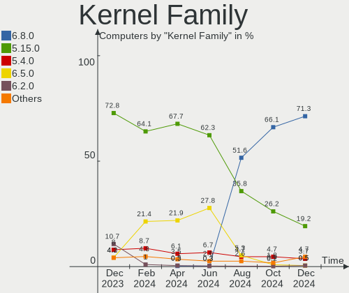
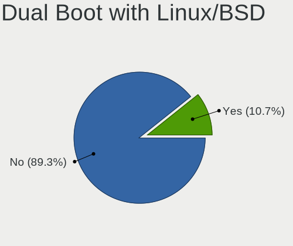
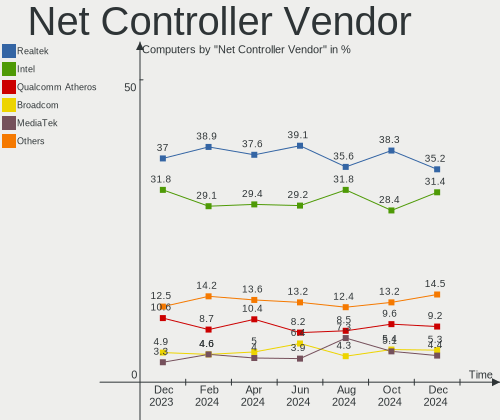
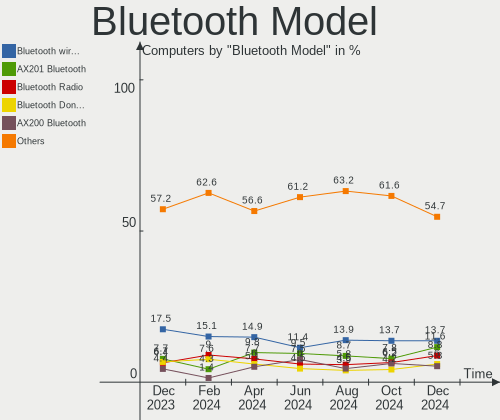
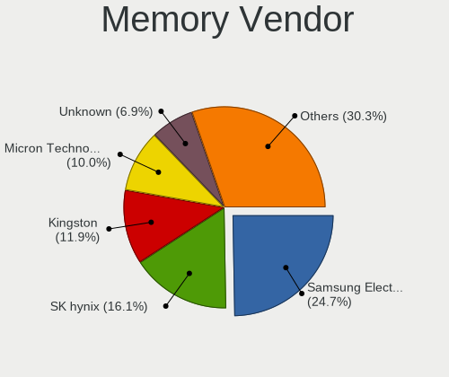
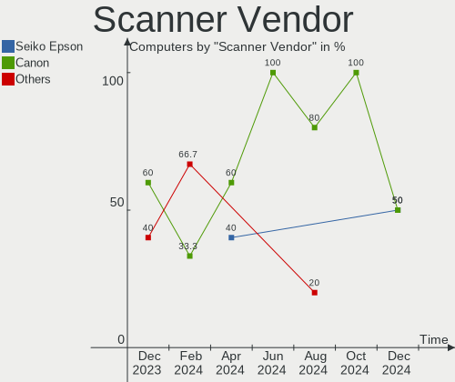

Linux Mint - Hardware Trends
----------------------------

A project to identify most popular hardware characteristics and track their change
over time based on data collected by Linux users at https://Linux-Hardware.org.

Anyone can contribute to this report by the [hw-probe](https://github.com/linuxhw/hw-probe) tool:

    sudo -E hw-probe -all -upload

This is a report for all computer types. See also reports for [desktops](/Dist/Linux_Mint/Desktop/README.md) and [notebooks](/Dist/Linux_Mint/Notebook/README.md).

This report is for one last month. Overall report since the beginning of time: [TestCoverage](https://github.com/linuxhw/TestCoverage)

Period: Jun, 2022.

Contents
--------

* [ System ](#system)
  - [ OS                       ](#os)
  - [ OS Family                ](#os-family)
  - [ Kernel                   ](#kernel)
  - [ Kernel Family            ](#kernel-family)
  - [ Kernel Major Ver.        ](#kernel-major-ver)
  - [ Arch                     ](#arch)
  - [ DE                       ](#de)
  - [ Display Server           ](#display-server)
  - [ Display Manager          ](#display-manager)
  - [ OS Lang                  ](#os-lang)
  - [ Boot Mode                ](#boot-mode)
  - [ Filesystem               ](#filesystem)
  - [ Part. scheme             ](#part-scheme)
  - [ Dual Boot with Linux/BSD ](#dual-boot-with-linuxbsd)
  - [ Dual Boot (Win)          ](#dual-boot-win)

* [ Board ](#board)
  - [ Vendor                   ](#vendor)
  - [ Model                    ](#model)
  - [ Model Family             ](#model-family)
  - [ MFG Year                 ](#mfg-year)
  - [ Form Factor              ](#form-factor)
  - [ Secure Boot              ](#secure-boot)
  - [ Coreboot                 ](#coreboot)
  - [ RAM Size                 ](#ram-size)
  - [ RAM Used                 ](#ram-used)
  - [ Total Drives             ](#total-drives)
  - [ Has CD-ROM               ](#has-cd-rom)
  - [ Has Ethernet             ](#has-ethernet)
  - [ Has WiFi                 ](#has-wifi)
  - [ Has Bluetooth            ](#has-bluetooth)

* [ Location ](#location)
  - [ Country                  ](#country)
  - [ City                     ](#city)

* [ Drives ](#drives)
  - [ Drive Vendor             ](#drive-vendor)
  - [ Drive Model              ](#drive-model)
  - [ HDD Vendor               ](#hdd-vendor)
  - [ SSD Vendor               ](#ssd-vendor)
  - [ Drive Kind               ](#drive-kind)
  - [ Drive Connector          ](#drive-connector)
  - [ Drive Size               ](#drive-size)
  - [ Space Total              ](#space-total)
  - [ Space Used               ](#space-used)
  - [ Malfunc. Drives          ](#malfunc-drives)
  - [ Malfunc. Drive Vendor    ](#malfunc-drive-vendor)
  - [ Malfunc. HDD Vendor      ](#malfunc-hdd-vendor)
  - [ Malfunc. Drive Kind      ](#malfunc-drive-kind)
  - [ Failed Drives            ](#failed-drives)
  - [ Failed Drive Vendor      ](#failed-drive-vendor)
  - [ Drive Status             ](#drive-status)

* [ Storage controller ](#storage-controller)
  - [ Storage Vendor           ](#storage-vendor)
  - [ Storage Model            ](#storage-model)
  - [ Storage Kind             ](#storage-kind)

* [ Processor ](#processor)
  - [ CPU Vendor               ](#cpu-vendor)
  - [ CPU Model                ](#cpu-model)
  - [ CPU Model Family         ](#cpu-model-family)
  - [ CPU Cores                ](#cpu-cores)
  - [ CPU Sockets              ](#cpu-sockets)
  - [ CPU Threads              ](#cpu-threads)
  - [ CPU Op-Modes             ](#cpu-op-modes)
  - [ CPU Microcode            ](#cpu-microcode)
  - [ CPU Microarch            ](#cpu-microarch)

* [ Graphics ](#graphics)
  - [ GPU Vendor               ](#gpu-vendor)
  - [ GPU Model                ](#gpu-model)
  - [ GPU Combo                ](#gpu-combo)
  - [ GPU Driver               ](#gpu-driver)
  - [ GPU Memory               ](#gpu-memory)

* [ Monitor ](#monitor)
  - [ Monitor Vendor           ](#monitor-vendor)
  - [ Monitor Model            ](#monitor-model)
  - [ Monitor Resolution       ](#monitor-resolution)
  - [ Monitor Diagonal         ](#monitor-diagonal)
  - [ Monitor Width            ](#monitor-width)
  - [ Aspect Ratio             ](#aspect-ratio)
  - [ Monitor Area             ](#monitor-area)
  - [ Pixel Density            ](#pixel-density)
  - [ Multiple Monitors        ](#multiple-monitors)

* [ Network ](#network)
  - [ Net Controller Vendor    ](#net-controller-vendor)
  - [ Net Controller Model     ](#net-controller-model)
  - [ Wireless Vendor          ](#wireless-vendor)
  - [ Wireless Model           ](#wireless-model)
  - [ Ethernet Vendor          ](#ethernet-vendor)
  - [ Ethernet Model           ](#ethernet-model)
  - [ Net Controller Kind      ](#net-controller-kind)
  - [ Used Controller          ](#used-controller)
  - [ NICs                     ](#nics)
  - [ IPv6                     ](#ipv6)

* [ Bluetooth ](#bluetooth)
  - [ Bluetooth Vendor         ](#bluetooth-vendor)
  - [ Bluetooth Model          ](#bluetooth-model)

* [ Sound ](#sound)
  - [ Sound Vendor             ](#sound-vendor)
  - [ Sound Model              ](#sound-model)

* [ Memory ](#memory)
  - [ Memory Vendor            ](#memory-vendor)
  - [ Memory Model             ](#memory-model)
  - [ Memory Kind              ](#memory-kind)
  - [ Memory Form Factor       ](#memory-form-factor)
  - [ Memory Size              ](#memory-size)
  - [ Memory Speed             ](#memory-speed)

* [ Printers & scanners ](#printers--scanners)
  - [ Printer Vendor           ](#printer-vendor)
  - [ Printer Model            ](#printer-model)
  - [ Scanner Vendor           ](#scanner-vendor)
  - [ Scanner Model            ](#scanner-model)

* [ Camera ](#camera)
  - [ Camera Vendor            ](#camera-vendor)
  - [ Camera Model             ](#camera-model)

* [ Security ](#security)
  - [ Fingerprint Vendor       ](#fingerprint-vendor)
  - [ Fingerprint Model        ](#fingerprint-model)
  - [ Chipcard Vendor          ](#chipcard-vendor)
  - [ Chipcard Model           ](#chipcard-model)

* [ Unsupported ](#unsupported)
  - [ Unsupported Devices      ](#unsupported-devices)
  - [ Unsupported Device Types ](#unsupported-device-types)

System
------

OS
--

Installed operating systems

| Name            | Computers | Percent |
|-----------------|-----------|---------|
| Linux Mint 20.3 | 320       | 84.88%  |
| Linux Mint 20.2 | 17        | 4.51%   |
| Linux Mint 19.3 | 15        | 3.98%   |
| Linux Mint 20.1 | 13        | 3.45%   |
| Linux Mint 20   | 7         | 1.86%   |
| Linux Mint 19.1 | 2         | 0.53%   |
| Linux Mint 19.2 | 1         | 0.27%   |
| Linux Mint 19   | 1         | 0.27%   |
| Linux Mint 18.3 | 1         | 0.27%   |

OS Family
---------

OS without a version

| Name       | Computers | Percent |
|------------|-----------|---------|
| Linux Mint | 377       | 100%    |

Kernel
------

Version of the Linux kernel

| Version                 | Computers | Percent |
|-------------------------|-----------|---------|
| 5.4.0-117-generic       | 64        | 16.98%  |
| 5.4.0-113-generic       | 62        | 16.45%  |
| 5.4.0-121-generic       | 57        | 15.12%  |
| 5.4.0-120-generic       | 48        | 12.73%  |
| 5.15.0-33-generic       | 31        | 8.22%   |
| 5.4.0-91-generic        | 30        | 7.96%   |
| 5.4.0-110-generic       | 10        | 2.65%   |
| 5.4.0-109-generic       | 7         | 1.86%   |
| 5.13.0-51-generic       | 7         | 1.86%   |
| 5.13.0-48-generic       | 7         | 1.86%   |
| 5.4.0-74-generic        | 6         | 1.59%   |
| 5.14.0-1042-oem         | 5         | 1.33%   |
| 5.13.0-27-generic       | 4         | 1.06%   |
| 5.4.0-89-generic        | 3         | 0.8%    |
| 5.18.2-051802-generic   | 3         | 0.8%    |
| 5.13.0-25-generic       | 3         | 0.8%    |
| 4.15.0-188-generic      | 3         | 0.8%    |
| 5.4.0-58-generic        | 2         | 0.53%   |
| 5.4.0-104-generic       | 2         | 0.53%   |
| 5.13.0-44-generic       | 2         | 0.53%   |
| 4.15.0-176-generic      | 2         | 0.53%   |
| 5.9.0-050900-generic    | 1         | 0.27%   |
| 5.7.1-050701-generic    | 1         | 0.27%   |
| 5.4.197-tkg-bmq         | 1         | 0.27%   |
| 5.4.0-99-generic        | 1         | 0.27%   |
| 5.4.0-96-generic        | 1         | 0.27%   |
| 5.4.0-94-generic        | 1         | 0.27%   |
| 5.4.0-81-generic        | 1         | 0.27%   |
| 5.4.0-80-generic        | 1         | 0.27%   |
| 5.4.0-107-generic       | 1         | 0.27%   |
| 5.17.9-xanmod1          | 1         | 0.27%   |
| 5.17.5-76051705-generic | 1         | 0.27%   |
| 5.17.14-xanmod1         | 1         | 0.27%   |
| 5.13.0-30-generic       | 1         | 0.27%   |
| 5.12.6-glk              | 1         | 0.27%   |
| 5.11.0-27-generic       | 1         | 0.27%   |
| 5.0.0-32-generic        | 1         | 0.27%   |
| 5.0.0-23-generic        | 1         | 0.27%   |
| 4.15.0-180-generic      | 1         | 0.27%   |
| 4.10.0-38-generic       | 1         | 0.27%   |

Kernel Family
-------------

Linux kernel without a distro release

| Version | Computers | Percent |
|---------|-----------|---------|
| 5.4.0   | 297       | 78.78%  |
| 5.15.0  | 31        | 8.22%   |
| 5.13.0  | 24        | 6.37%   |
| 4.15.0  | 6         | 1.59%   |
| 5.14.0  | 5         | 1.33%   |
| 5.18.2  | 3         | 0.8%    |
| 5.0.0   | 2         | 0.53%   |
| 5.9.0   | 1         | 0.27%   |
| 5.7.1   | 1         | 0.27%   |
| 5.4.197 | 1         | 0.27%   |
| 5.17.9  | 1         | 0.27%   |
| 5.17.5  | 1         | 0.27%   |
| 5.17.14 | 1         | 0.27%   |
| 5.12.6  | 1         | 0.27%   |
| 5.11.0  | 1         | 0.27%   |
| 4.10.0  | 1         | 0.27%   |

Kernel Major Ver.
-----------------

Linux kernel major version

| Version | Computers | Percent |
|---------|-----------|---------|
| 5.4     | 298       | 79.05%  |
| 5.15    | 31        | 8.22%   |
| 5.13    | 24        | 6.37%   |
| 4.15    | 6         | 1.59%   |
| 5.14    | 5         | 1.33%   |
| 5.18    | 3         | 0.8%    |
| 5.17    | 3         | 0.8%    |
| 5.0     | 2         | 0.53%   |
| 5.9     | 1         | 0.27%   |
| 5.7     | 1         | 0.27%   |
| 5.12    | 1         | 0.27%   |
| 5.11    | 1         | 0.27%   |
| 4.10    | 1         | 0.27%   |

Arch
----

OS architecture (x86_64, i586, etc.)

| Name   | Computers | Percent |
|--------|-----------|---------|
| x86_64 | 374       | 99.2%   |
| i686   | 3         | 0.8%    |

DE
--

Desktop Environment

| Name       | Computers | Percent |
|------------|-----------|---------|
| X-Cinnamon | 259       | 68.7%   |
| MATE       | 45        | 11.94%  |
| XFCE       | 42        | 11.14%  |
| Cinnamon   | 22        | 5.84%   |
| GNOME      | 3         | 0.8%    |
| Unknown    | 3         | 0.8%    |
| KDE        | 2         | 0.53%   |
| Budgie     | 1         | 0.27%   |

Display Server
--------------

X11 or Wayland

| Name | Computers | Percent |
|------|-----------|---------|
| X11  | 374       | 99.2%   |
| Tty  | 3         | 0.8%    |

Display Manager
---------------

SDDM, LightDM, etc.

| Name    | Computers | Percent |
|---------|-----------|---------|
| Unknown | 206       | 54.64%  |
| LightDM | 168       | 44.56%  |
| SDDM    | 2         | 0.53%   |
| GDM     | 1         | 0.27%   |

OS Lang
-------

Language

| Lang    | Computers | Percent |
|---------|-----------|---------|
| en_US   | 114       | 30.24%  |
| de_DE   | 59        | 15.65%  |
| pt_BR   | 28        | 7.43%   |
| ru_RU   | 21        | 5.57%   |
| fr_FR   | 21        | 5.57%   |
| C       | 19        | 5.04%   |
| en_GB   | 18        | 4.77%   |
| en_AU   | 11        | 2.92%   |
| es_ES   | 10        | 2.65%   |
| en_CA   | 9         | 2.39%   |
| it_IT   | 6         | 1.59%   |
| en_ZA   | 6         | 1.59%   |
| pl_PL   | 5         | 1.33%   |
| es_MX   | 5         | 1.33%   |
| es_AR   | 4         | 1.06%   |
| nl_NL   | 3         | 0.8%    |
| hu_HU   | 3         | 0.8%    |
| en_NZ   | 3         | 0.8%    |
| en_IE   | 3         | 0.8%    |
| zh_CN   | 2         | 0.53%   |
| fr_BE   | 2         | 0.53%   |
| es_VE   | 2         | 0.53%   |
| de_CH   | 2         | 0.53%   |
| de_AT   | 2         | 0.53%   |
| da_DK   | 2         | 0.53%   |
| cs_CZ   | 2         | 0.53%   |
| bg_BG   | 2         | 0.53%   |
| sv_SE   | 1         | 0.27%   |
| he_IL   | 1         | 0.27%   |
| fr_CH   | 1         | 0.27%   |
| fr_CA   | 1         | 0.27%   |
| fi_FI   | 1         | 0.27%   |
| et_EE   | 1         | 0.27%   |
| es_UY   | 1         | 0.27%   |
| es_PE   | 1         | 0.27%   |
| es_GT   | 1         | 0.27%   |
| es_CO   | 1         | 0.27%   |
| es_CL   | 1         | 0.27%   |
| en_AG   | 1         | 0.27%   |
| Unknown | 1         | 0.27%   |

Boot Mode
---------

EFI or BIOS

| Mode | Computers | Percent |
|------|-----------|---------|
| EFI  | 206       | 54.64%  |
| BIOS | 171       | 45.36%  |

Filesystem
----------

Type of filesystem

| Type    | Computers | Percent |
|---------|-----------|---------|
| Ext4    | 353       | 93.63%  |
| Overlay | 17        | 4.51%   |
| Btrfs   | 5         | 1.33%   |
| Ext3    | 2         | 0.53%   |

Part. scheme
------------

Scheme of partitioning

| Type    | Computers | Percent |
|---------|-----------|---------|
| Unknown | 224       | 59.42%  |
| GPT     | 115       | 30.5%   |
| MBR     | 38        | 10.08%  |

Dual Boot with Linux/BSD
------------------------

Hosting more than one Linux/BSD

| Dual boot | Computers | Percent |
|-----------|-----------|---------|
| No        | 345       | 91.51%  |
| Yes       | 32        | 8.49%   |

Dual Boot (Win)
---------------

Hosting Linux and Windows

| Dual boot | Computers | Percent |
|-----------|-----------|---------|
| No        | 304       | 80.64%  |
| Yes       | 73        | 19.36%  |

Board
-----

Vendor
------

Motherboard manufacturer

| Name                | Computers | Percent |
|---------------------|-----------|---------|
| Lenovo              | 53        | 14.06%  |
| Hewlett-Packard     | 52        | 13.79%  |
| Dell                | 47        | 12.47%  |
| ASUSTek Computer    | 42        | 11.14%  |
| Gigabyte Technology | 26        | 6.9%    |
| Acer                | 24        | 6.37%   |
| MSI                 | 23        | 6.1%    |
| ASRock              | 22        | 5.84%   |
| Intel               | 8         | 2.12%   |
| Toshiba             | 7         | 1.86%   |
| Samsung Electronics | 7         | 1.86%   |
| Positivo            | 5         | 1.33%   |
| Google              | 5         | 1.33%   |
| Apple               | 5         | 1.33%   |
| Unknown             | 4         | 1.06%   |
| Pegatron            | 3         | 0.8%    |
| Medion              | 3         | 0.8%    |
| HUAWEI              | 3         | 0.8%    |
| Supermicro          | 2         | 0.53%   |
| Sony                | 2         | 0.53%   |
| Packard Bell        | 2         | 0.53%   |
| Fujitsu             | 2         | 0.53%   |
| Clevo               | 2         | 0.53%   |
| win element         | 1         | 0.27%   |
| VIT                 | 1         | 0.27%   |
| TYAN Computer       | 1         | 0.27%   |
| TPV-INVENTA         | 1         | 0.27%   |
| Thomson             | 1         | 0.27%   |
| Tactus              | 1         | 0.27%   |
| Shuttle             | 1         | 0.27%   |
| Razer               | 1         | 0.27%   |
| PCWare              | 1         | 0.27%   |
| mPTech              | 1         | 0.27%   |
| Monster             | 1         | 0.27%   |
| Microsoft           | 1         | 0.27%   |
| LG Electronics      | 1         | 0.27%   |
| Itautec             | 1         | 0.27%   |
| IP3 Tech            | 1         | 0.27%   |
| iClever             | 1         | 0.27%   |
| Hardkernel          | 1         | 0.27%   |
| Gateway             | 1         | 0.27%   |
| Gadnic              | 1         | 0.27%   |
| Foxconn             | 1         | 0.27%   |
| eMachines           | 1         | 0.27%   |
| ECS                 | 1         | 0.27%   |
| Chuwi               | 1         | 0.27%   |
| Biostar             | 1         | 0.27%   |
| BESSTAR Tech        | 1         | 0.27%   |
| AZW                 | 1         | 0.27%   |
| AMI                 | 1         | 0.27%   |
| Alienware           | 1         | 0.27%   |

Model
-----

Motherboard model

| Name                                | Computers | Percent |
|-------------------------------------|-----------|---------|
| Unknown                             | 4         | 1.06%   |
| Dell Inspiron 660                   | 3         | 0.8%    |
| Positivo S14CT01                    | 2         | 0.53%   |
| MSI MS-7C95                         | 2         | 0.53%   |
| MSI MS-7C94                         | 2         | 0.53%   |
| MSI MS-7C91                         | 2         | 0.53%   |
| HP Z420 Workstation                 | 2         | 0.53%   |
| HP Pavilion Laptop 15-cs3xxx        | 2         | 0.53%   |
| HP Compaq 8200 Elite USDT PC        | 2         | 0.53%   |
| Gigabyte GA-78LMT-USB3              | 2         | 0.53%   |
| Dell Latitude E5430 non-vPro        | 2         | 0.53%   |
| ASUS PRIME X570-P                   | 2         | 0.53%   |
| ASRock X470 Gaming K4               | 2         | 0.53%   |
| Acer Aspire 5742G                   | 2         | 0.53%   |
| win element MoreFine S500+          | 1         | 0.27%   |
| VIT M2420                           | 1         | 0.27%   |
| TYAN S7010                          | 1         | 0.27%   |
| TPV-INVENTA CQ1-3108LA              | 1         | 0.27%   |
| Toshiba Satellite Pro S300L         | 1         | 0.27%   |
| Toshiba Satellite L755D             | 1         | 0.27%   |
| Toshiba Satellite L55-B             | 1         | 0.27%   |
| Toshiba Satellite L50D-B            | 1         | 0.27%   |
| Toshiba Satellite L50-B             | 1         | 0.27%   |
| Toshiba Satellite C75D-B            | 1         | 0.27%   |
| Toshiba Satellite A665              | 1         | 0.27%   |
| Thomson N17V3C8WH512                | 1         | 0.27%   |
| Tactus GeoBook 140                  | 1         | 0.27%   |
| Supermicro Safeguard 3000           | 1         | 0.27%   |
| Supermicro KAURI                    | 1         | 0.27%   |
| Sony VPCM120AL                      | 1         | 0.27%   |
| Sony VGN-FS415B                     | 1         | 0.27%   |
| Shuttle XH61V                       | 1         | 0.27%   |
| Samsung RF510/RF410/RF710           | 1         | 0.27%   |
| Samsung 750XED                      | 1         | 0.27%   |
| Samsung 730QDA                      | 1         | 0.27%   |
| Samsung 700Z3A/700Z4A/700Z5A/700Z5B | 1         | 0.27%   |
| Samsung 530U3C/530U4C/532U3C        | 1         | 0.27%   |
| Samsung 370E4K                      | 1         | 0.27%   |
| Samsung 300E5K/300E5Q               | 1         | 0.27%   |
| Razer Blade                         | 1         | 0.27%   |
| Positivo W540EU                     | 1         | 0.27%   |
| Positivo NP11G-ER4                  | 1         | 0.27%   |
| Positivo Mobile                     | 1         | 0.27%   |
| Pegatron FZ084AA-ABF a6645fr        | 1         | 0.27%   |
| Pegatron AY627AA-ABA a4313w         | 1         | 0.27%   |
| Pegatron A15W8                      | 1         | 0.27%   |
| PCWare IPMH61R3                     | 1         | 0.27%   |
| Packard Bell EasyNote LS11HR        | 1         | 0.27%   |
| Packard Bell EasyNote LJ71          | 1         | 0.27%   |
| MSI MS-7C96                         | 1         | 0.27%   |
| MSI MS-7C52                         | 1         | 0.27%   |
| MSI MS-7C37                         | 1         | 0.27%   |
| MSI MS-7C35                         | 1         | 0.27%   |
| MSI MS-7C02                         | 1         | 0.27%   |
| MSI MS-7B86                         | 1         | 0.27%   |
| MSI MS-7B33                         | 1         | 0.27%   |
| MSI MS-7A38                         | 1         | 0.27%   |
| MSI MS-7A37                         | 1         | 0.27%   |
| MSI MS-7818                         | 1         | 0.27%   |
| MSI MS-7817                         | 1         | 0.27%   |

Model Family
------------

Motherboard model prefix

| Name                   | Computers | Percent |
|------------------------|-----------|---------|
| Acer Aspire            | 20        | 5.31%   |
| Lenovo ThinkPad        | 15        | 3.98%   |
| Dell Inspiron          | 13        | 3.45%   |
| Lenovo IdeaPad         | 12        | 3.18%   |
| Dell Latitude          | 12        | 3.18%   |
| Dell OptiPlex          | 9         | 2.39%   |
| Toshiba Satellite      | 7         | 1.86%   |
| HP Pavilion            | 7         | 1.86%   |
| HP Compaq              | 7         | 1.86%   |
| ASUS TUF               | 7         | 1.86%   |
| HP Laptop              | 5         | 1.33%   |
| Dell Precision         | 5         | 1.33%   |
| ASUS ROG               | 5         | 1.33%   |
| ASUS PRIME             | 5         | 1.33%   |
| Lenovo IdeaPadFlex     | 4         | 1.06%   |
| HP ProBook             | 4         | 1.06%   |
| HP EliteBook           | 4         | 1.06%   |
| Unknown                | 4         | 1.06%   |
| Lenovo Yoga            | 3         | 0.8%    |
| HP ProDesk             | 3         | 0.8%    |
| HP Presario            | 3         | 0.8%    |
| HP EliteDesk           | 3         | 0.8%    |
| Positivo S14CT01       | 2         | 0.53%   |
| Packard Bell EasyNote  | 2         | 0.53%   |
| MSI MS-7C95            | 2         | 0.53%   |
| MSI MS-7C94            | 2         | 0.53%   |
| MSI MS-7C91            | 2         | 0.53%   |
| Lenovo ThinkStation    | 2         | 0.53%   |
| Lenovo ThinkCentre     | 2         | 0.53%   |
| HP Z420                | 2         | 0.53%   |
| HP ENVY                | 2         | 0.53%   |
| HP 255                 | 2         | 0.53%   |
| Gigabyte GA-78LMT-USB3 | 2         | 0.53%   |
| Gigabyte B550          | 2         | 0.53%   |
| Dell XPS               | 2         | 0.53%   |
| Dell PowerEdge         | 2         | 0.53%   |
| ASUS ZenBook           | 2         | 0.53%   |
| ASUS VivoBook          | 2         | 0.53%   |
| ASUS P5KPL-AM          | 2         | 0.53%   |
| ASRock Z77             | 2         | 0.53%   |
| ASRock X470            | 2         | 0.53%   |
| ASRock B450M           | 2         | 0.53%   |
| Apple MacBook5         | 2         | 0.53%   |
| Acer Predator          | 2         | 0.53%   |
| win element MoreFine   | 1         | 0.27%   |
| VIT M2420              | 1         | 0.27%   |
| TYAN S7010             | 1         | 0.27%   |
| TPV-INVENTA CQ1-3108LA | 1         | 0.27%   |
| Thomson N17V3C8WH512   | 1         | 0.27%   |
| Tactus GeoBook         | 1         | 0.27%   |
| Supermicro Safeguard   | 1         | 0.27%   |
| Supermicro KAURI       | 1         | 0.27%   |
| Sony VPCM120AL         | 1         | 0.27%   |
| Sony VGN-FS415B        | 1         | 0.27%   |
| Shuttle XH61V          | 1         | 0.27%   |
| Samsung RF510          | 1         | 0.27%   |
| Samsung 750XED         | 1         | 0.27%   |
| Samsung 730QDA         | 1         | 0.27%   |
| Samsung 700Z3A         | 1         | 0.27%   |
| Samsung 530U3C         | 1         | 0.27%   |

MFG Year
--------

Motherboard manufacture year

| Year | Computers | Percent |
|------|-----------|---------|
| 2020 | 39        | 10.34%  |
| 2012 | 38        | 10.08%  |
| 2019 | 33        | 8.75%   |
| 2021 | 31        | 8.22%   |
| 2018 | 28        | 7.43%   |
| 2010 | 28        | 7.43%   |
| 2011 | 25        | 6.63%   |
| 2014 | 23        | 6.1%    |
| 2013 | 23        | 6.1%    |
| 2017 | 20        | 5.31%   |
| 2015 | 20        | 5.31%   |
| 2016 | 18        | 4.77%   |
| 2008 | 15        | 3.98%   |
| 2022 | 12        | 3.18%   |
| 2009 | 12        | 3.18%   |
| 2007 | 6         | 1.59%   |
| 2006 | 5         | 1.33%   |
| 2004 | 1         | 0.27%   |

Form Factor
-----------

Physical design of the computer

| Name        | Computers | Percent |
|-------------|-----------|---------|
| Notebook    | 191       | 50.66%  |
| Desktop     | 159       | 42.18%  |
| Convertible | 12        | 3.18%   |
| Server      | 5         | 1.33%   |
| Mini pc     | 4         | 1.06%   |
| Tablet      | 3         | 0.8%    |
| All in one  | 3         | 0.8%    |

Secure Boot
-----------

Enabled or disabled

| State    | Computers | Percent |
|----------|-----------|---------|
| Disabled | 338       | 89.66%  |
| Enabled  | 39        | 10.34%  |

Coreboot
--------

Have coreboot on board

| Used | Computers | Percent |
|------|-----------|---------|
| No   | 372       | 98.67%  |
| Yes  | 5         | 1.33%   |

RAM Size
--------

Total RAM memory

| Size in GB  | Computers | Percent |
|-------------|-----------|---------|
| 4.01-8.0    | 93        | 24.67%  |
| 3.01-4.0    | 74        | 19.63%  |
| 16.01-24.0  | 74        | 19.63%  |
| 8.01-16.0   | 72        | 19.1%   |
| 32.01-64.0  | 30        | 7.96%   |
| 1.01-2.0    | 17        | 4.51%   |
| 64.01-256.0 | 8         | 2.12%   |
| 24.01-32.0  | 6         | 1.59%   |
| 2.01-3.0    | 2         | 0.53%   |
| 0.51-1.0    | 1         | 0.27%   |

RAM Used
--------

Used RAM memory

| Used GB    | Computers | Percent |
|------------|-----------|---------|
| 1.01-2.0   | 162       | 42.97%  |
| 2.01-3.0   | 102       | 27.06%  |
| 3.01-4.0   | 47        | 12.47%  |
| 4.01-8.0   | 42        | 11.14%  |
| 0.51-1.0   | 15        | 3.98%   |
| 8.01-16.0  | 7         | 1.86%   |
| 16.01-24.0 | 2         | 0.53%   |

Total Drives
------------

Number of drives on board

| Drives | Computers | Percent |
|--------|-----------|---------|
| 1      | 214       | 56.76%  |
| 2      | 103       | 27.32%  |
| 3      | 38        | 10.08%  |
| 5      | 9         | 2.39%   |
| 4      | 9         | 2.39%   |
| 9      | 1         | 0.27%   |
| 7      | 1         | 0.27%   |
| 6      | 1         | 0.27%   |
| 0      | 1         | 0.27%   |

Has CD-ROM
----------

Has CD-ROM on board

| Presented | Computers | Percent |
|-----------|-----------|---------|
| No        | 199       | 52.79%  |
| Yes       | 178       | 47.21%  |

Has Ethernet
------------

Has Ethernet on board

| Presented | Computers | Percent |
|-----------|-----------|---------|
| Yes       | 325       | 86.21%  |
| No        | 52        | 13.79%  |

Has WiFi
--------

Has WiFi module

| Presented | Computers | Percent |
|-----------|-----------|---------|
| Yes       | 282       | 74.8%   |
| No        | 95        | 25.2%   |

Has Bluetooth
-------------

Has Bluetooth module

| Presented | Computers | Percent |
|-----------|-----------|---------|
| Yes       | 208       | 55.17%  |
| No        | 169       | 44.83%  |

Location
--------

Country
-------

Geographic location (country)

| Country      | Computers | Percent |
|--------------|-----------|---------|
| USA          | 76        | 20.16%  |
| Germany      | 62        | 16.45%  |
| Brazil       | 35        | 9.28%   |
| Russia       | 22        | 5.84%   |
| UK           | 21        | 5.57%   |
| France       | 21        | 5.57%   |
| Australia    | 12        | 3.18%   |
| Spain        | 11        | 2.92%   |
| Mexico       | 10        | 2.65%   |
| Canada       | 9         | 2.39%   |
| South Africa | 6         | 1.59%   |
| Poland       | 6         | 1.59%   |
| Italy        | 6         | 1.59%   |
| Netherlands  | 5         | 1.33%   |
| Argentina    | 5         | 1.33%   |
| Switzerland  | 4         | 1.06%   |
| Slovakia     | 3         | 0.8%    |
| New Zealand  | 3         | 0.8%    |
| Hungary      | 3         | 0.8%    |
| Denmark      | 3         | 0.8%    |
| China        | 3         | 0.8%    |
| Venezuela    | 2         | 0.53%   |
| Turkey       | 2         | 0.53%   |
| Sweden       | 2         | 0.53%   |
| Portugal     | 2         | 0.53%   |
| Morocco      | 2         | 0.53%   |
| Kazakhstan   | 2         | 0.53%   |
| Ireland      | 2         | 0.53%   |
| Czechia      | 2         | 0.53%   |
| Colombia     | 2         | 0.53%   |
| Chile        | 2         | 0.53%   |
| Bulgaria     | 2         | 0.53%   |
| Belgium      | 2         | 0.53%   |
| Austria      | 2         | 0.53%   |
| Uruguay      | 1         | 0.27%   |
| UAE          | 1         | 0.27%   |
| Thailand     | 1         | 0.27%   |
| Serbia       | 1         | 0.27%   |
| Romania      | 1         | 0.27%   |
| Peru         | 1         | 0.27%   |
| Nicaragua    | 1         | 0.27%   |
| Malta        | 1         | 0.27%   |
| Luxembourg   | 1         | 0.27%   |
| Latvia       | 1         | 0.27%   |
| Kenya        | 1         | 0.27%   |
| Japan        | 1         | 0.27%   |
| Israel       | 1         | 0.27%   |
| Iran         | 1         | 0.27%   |
| Indonesia    | 1         | 0.27%   |
| India        | 1         | 0.27%   |
| Iceland      | 1         | 0.27%   |
| Hong Kong    | 1         | 0.27%   |
| Guatemala    | 1         | 0.27%   |
| Guadeloupe   | 1         | 0.27%   |
| Finland      | 1         | 0.27%   |
| Estonia      | 1         | 0.27%   |
| Belarus      | 1         | 0.27%   |
| Bangladesh   | 1         | 0.27%   |
| Algeria      | 1         | 0.27%   |

City
----

Geographic location (city)

| City              | Computers | Percent |
|-------------------|-----------|---------|
| Berlin            | 7         | 1.86%   |
| St Petersburg     | 4         | 1.06%   |
| Paris             | 4         | 1.06%   |
| Munich            | 4         | 1.06%   |
| Moscow            | 4         | 1.06%   |
| Melbourne         | 4         | 1.06%   |
| Warsaw            | 3         | 0.8%    |
| Rio de Janeiro    | 3         | 0.8%    |
| Novosibirsk       | 3         | 0.8%    |
| Hamburg           | 3         | 0.8%    |
| Duncan            | 3         | 0.8%    |
| Cape Town         | 3         | 0.8%    |
| Bratislava        | 3         | 0.8%    |
| Worcester         | 2         | 0.53%   |
| Tolyatti          | 2         | 0.53%   |
| The Bronx         | 2         | 0.53%   |
| Slagelse          | 2         | 0.53%   |
| Ribeirao Preto    | 2         | 0.53%   |
| Queretaro         | 2         | 0.53%   |
| Orlando           | 2         | 0.53%   |
| Orange            | 2         | 0.53%   |
| Mission           | 2         | 0.53%   |
| Milan             | 2         | 0.53%   |
| Miami             | 2         | 0.53%   |
| Magdeburg         | 2         | 0.53%   |
| Madrid            | 2         | 0.53%   |
| Curitiba          | 2         | 0.53%   |
| Cologne           | 2         | 0.53%   |
| Chicago           | 2         | 0.53%   |
| Centurion         | 2         | 0.53%   |
| Campo Grande      | 2         | 0.53%   |
| Cambridge         | 2         | 0.53%   |
| Buenos Aires      | 2         | 0.53%   |
| Brussels          | 2         | 0.53%   |
| Brooklyn          | 2         | 0.53%   |
| Brisbane          | 2         | 0.53%   |
| Bogotá           | 2         | 0.53%   |
| Auckland          | 2         | 0.53%   |
| Zapopan           | 1         | 0.27%   |
| Yokohama          | 1         | 0.27%   |
| Yekaterinburg     | 1         | 0.27%   |
| Wuppertal         | 1         | 0.27%   |
| Wroclaw           | 1         | 0.27%   |
| Worms             | 1         | 0.27%   |
| Wittingen         | 1         | 0.27%   |
| Wil               | 1         | 0.27%   |
| Wichita           | 1         | 0.27%   |
| Wetzlar           | 1         | 0.27%   |
| Weston-super-Mare | 1         | 0.27%   |
| West Monroe       | 1         | 0.27%   |
| Wembley           | 1         | 0.27%   |
| Wellingborough    | 1         | 0.27%   |
| Waltenhofen       | 1         | 0.27%   |
| Walluf            | 1         | 0.27%   |
| Wallingford       | 1         | 0.27%   |
| Wakefield         | 1         | 0.27%   |
| Voronezh          | 1         | 0.27%   |
| Vladivostok       | 1         | 0.27%   |
| Viña del Mar     | 1         | 0.27%   |
| Villavedeo        | 1         | 0.27%   |

Drives
------

Drive Vendor
------------

Hard drive vendors

| Vendor                         | Computers | Drives | Percent |
|--------------------------------|-----------|--------|---------|
| Seagate                        | 87        | 112    | 15.9%   |
| WDC                            | 83        | 104    | 15.17%  |
| Samsung Electronics            | 75        | 85     | 13.71%  |
| Kingston                       | 36        | 38     | 6.58%   |
| SanDisk                        | 33        | 37     | 6.03%   |
| Toshiba                        | 31        | 35     | 5.67%   |
| Unknown                        | 22        | 25     | 4.02%   |
| Crucial                        | 22        | 23     | 4.02%   |
| Hitachi                        | 13        | 14     | 2.38%   |
| SK hynix                       | 11        | 11     | 2.01%   |
| A-DATA Technology              | 11        | 12     | 2.01%   |
| Intel                          | 9         | 11     | 1.65%   |
| HGST                           | 9         | 9      | 1.65%   |
| PNY                            | 6         | 6      | 1.1%    |
| Transcend                      | 5         | 5      | 0.91%   |
| Phison                         | 5         | 5      | 0.91%   |
| Intenso                        | 5         | 6      | 0.91%   |
| China                          | 5         | 5      | 0.91%   |
| Netac                          | 4         | 4      | 0.73%   |
| Team                           | 3         | 3      | 0.55%   |
| SPCC                           | 3         | 3      | 0.55%   |
| Patriot                        | 3         | 4      | 0.55%   |
| Micron Technology              | 3         | 3      | 0.55%   |
| JMicron Technology             | 3         | 3      | 0.55%   |
| Goodram                        | 3         | 3      | 0.55%   |
| Fujitsu                        | 3         | 3      | 0.55%   |
| Apacer                         | 3         | 3      | 0.55%   |
| Unknown                        | 3         | 3      | 0.55%   |
| UMIS                           | 2         | 2      | 0.37%   |
| SSSTC                          | 2         | 2      | 0.37%   |
| Realtek Semiconductor          | 2         | 2      | 0.37%   |
| OCZ                            | 2         | 2      | 0.37%   |
| Maxtor                         | 2         | 2      | 0.37%   |
| Leven                          | 2         | 2      | 0.37%   |
| KIOXIA                         | 2         | 2      | 0.37%   |
| Gigabyte Technology            | 2         | 2      | 0.37%   |
| Apple                          | 2         | 3      | 0.37%   |
| VICK                           | 1         | 1      | 0.18%   |
| Verbatim                       | 1         | 1      | 0.18%   |
| Union Memory                   | 1         | 1      | 0.18%   |
| Tanbassh                       | 1         | 1      | 0.18%   |
| T-FORCE                        | 1         | 1      | 0.18%   |
| Solid State Storage Technology | 1         | 1      | 0.18%   |
| SATA3 51                       | 1         | 1      | 0.18%   |
| SABRENT                        | 1         | 1      | 0.18%   |
| S3+                            | 1         | 1      | 0.18%   |
| Reeinno                        | 1         | 1      | 0.18%   |
| Plextor                        | 1         | 1      | 0.18%   |
| Mushkin                        | 1         | 1      | 0.18%   |
| Micron/Crucial Technology      | 1         | 1      | 0.18%   |
| Maxone                         | 1         | 1      | 0.18%   |
| LuminouTek                     | 1         | 1      | 0.18%   |
| LITEONIT                       | 1         | 1      | 0.18%   |
| Lite-On                        | 1         | 1      | 0.18%   |
| Lexar                          | 1         | 1      | 0.18%   |
| Lenovo                         | 1         | 1      | 0.18%   |
| KIOXIA-EXCERIA                 | 1         | 1      | 0.18%   |
| KingSpec                       | 1         | 1      | 0.18%   |
| KingFast                       | 1         | 1      | 0.18%   |
| KingDian                       | 1         | 1      | 0.18%   |

Drive Model
-----------

Hard drive models

| Model                                        | Computers | Percent |
|----------------------------------------------|-----------|---------|
| Kingston SA400S37240G 240GB SSD              | 9         | 1.49%   |
| Samsung SSD 860 EVO 500GB                    | 7         | 1.16%   |
| Seagate ST1000LM024 HN-M101MBB 1TB           | 6         | 0.99%   |
| Crucial CT1000MX500SSD1 1TB                  | 6         | 0.99%   |
| Seagate ST2000DM008-2FR102 2TB               | 4         | 0.66%   |
| Seagate Expansion 1TB                        | 4         | 0.66%   |
| SanDisk NVMe SSD Drive 512GB                 | 4         | 0.66%   |
| Samsung SSD 870 QVO 1TB                      | 4         | 0.66%   |
| Samsung SSD 850 EVO 250GB                    | 4         | 0.66%   |
| Samsung NVMe SSD Drive 256GB                 | 4         | 0.66%   |
| Kingston SV300S37A120G 120GB SSD             | 4         | 0.66%   |
| Kingston SA400S37480G 480GB SSD              | 4         | 0.66%   |
| WDC WD20EZRZ-00Z5HB0 2TB                     | 3         | 0.5%    |
| WDC WD20EARX-00PASB0 2TB                     | 3         | 0.5%    |
| Unknown SD/MMC/MS PRO 128GB                  | 3         | 0.5%    |
| Unknown MMC Card  16GB                       | 3         | 0.5%    |
| Toshiba MQ04ABF100 1TB                       | 3         | 0.5%    |
| Toshiba MQ01ABD100 1TB                       | 3         | 0.5%    |
| Toshiba MQ01ABD075 752GB                     | 3         | 0.5%    |
| Seagate ST3500413AS 500GB                    | 3         | 0.5%    |
| Seagate ST2000DM001-1CH164 2TB               | 3         | 0.5%    |
| Seagate ST1000DM003-1ER162 1TB               | 3         | 0.5%    |
| Seagate ST1000DM003-1CH162 1TB               | 3         | 0.5%    |
| Samsung SM963 2.5" NVMe PCIe SSD 500GB       | 3         | 0.5%    |
| Crucial CT250MX500SSD1 250GB                 | 3         | 0.5%    |
| Crucial CT240BX500SSD1 240GB                 | 3         | 0.5%    |
| Unknown                                      | 3         | 0.5%    |
| WDC WDS120G2G0A-00JH30 120GB SSD             | 2         | 0.33%   |
| WDC WD5002ABYS-01B1B0 500GB                  | 2         | 0.33%   |
| WDC WD5000LPLX-00ZNTT0 500GB                 | 2         | 0.33%   |
| WDC WD5000AAKX-08U6AA0 500GB                 | 2         | 0.33%   |
| WDC WD10SPZX-24Z10 1TB                       | 2         | 0.33%   |
| WDC WD10EZRX-00D8PB0 1TB                     | 2         | 0.33%   |
| WDC WD10EZEX-21WN4A0 1TB                     | 2         | 0.33%   |
| WDC WD10EZEX-08WN4A0 1TB                     | 2         | 0.33%   |
| WDC WD10EZEX-00WN4A0 1TB                     | 2         | 0.33%   |
| WDC WD10EARS-00Y5B1 1TB                      | 2         | 0.33%   |
| Unknown SC64G  64GB                          | 2         | 0.33%   |
| Unknown MMC Card  32GB                       | 2         | 0.33%   |
| Toshiba MQ01ABF050 500GB                     | 2         | 0.33%   |
| Toshiba MQ01ABD050 500GB                     | 2         | 0.33%   |
| Toshiba DT01ACA100 1TB                       | 2         | 0.33%   |
| Toshiba DT01ACA050 500GB                     | 2         | 0.33%   |
| SK hynix SC311 SATA 256GB SSD                | 2         | 0.33%   |
| SK hynix NVMe SSD Drive 256GB                | 2         | 0.33%   |
| Seagate ST9500325AS 500GB                    | 2         | 0.33%   |
| Seagate ST500LT012-1DG142 500GB              | 2         | 0.33%   |
| Seagate ST500LM021-1KJ152 500GB              | 2         | 0.33%   |
| Seagate ST500LM012 HN-M500MBB 500GB          | 2         | 0.33%   |
| Seagate ST500LM000-1EJ162-SSHD 500GB         | 2         | 0.33%   |
| Seagate ST500DM002-1BD142 500GB              | 2         | 0.33%   |
| Seagate ST4000DM000-1F2168 4TB               | 2         | 0.33%   |
| Seagate ST3500418AS 500GB                    | 2         | 0.33%   |
| Seagate ST3000DM001-1ER166 3TB               | 2         | 0.33%   |
| Seagate ST2000LM015-2E8174 2TB               | 2         | 0.33%   |
| Seagate ST1000LM035-1RK172 1TB               | 2         | 0.33%   |
| Seagate ST1000DM010-2EP102 1TB               | 2         | 0.33%   |
| Seagate ST1000DM003-1SB102 1TB               | 2         | 0.33%   |
| Seagate BarraCuda 120 SSD ZA500CM10003 500GB | 2         | 0.33%   |
| SanDisk SSD PLUS 240GB                       | 2         | 0.33%   |

HDD Vendor
----------

Hard disk drive vendors

| Vendor              | Computers | Drives | Percent |
|---------------------|-----------|--------|---------|
| Seagate             | 87        | 107    | 37.34%  |
| WDC                 | 71        | 89     | 30.47%  |
| Toshiba             | 27        | 31     | 11.59%  |
| Samsung Electronics | 14        | 14     | 6.01%   |
| Hitachi             | 13        | 14     | 5.58%   |
| HGST                | 9         | 9      | 3.86%   |
| Unknown             | 3         | 3      | 1.29%   |
| Fujitsu             | 3         | 3      | 1.29%   |
| Maxtor              | 2         | 2      | 0.86%   |
| JMicron Technology  | 2         | 2      | 0.86%   |
| Maxone              | 1         | 1      | 0.43%   |
| Hewlett-Packard     | 1         | 1      | 0.43%   |

SSD Vendor
----------

Solid state drive vendors

| Vendor              | Computers | Drives | Percent |
|---------------------|-----------|--------|---------|
| Samsung Electronics | 36        | 38     | 18.27%  |
| Kingston            | 29        | 31     | 14.72%  |
| SanDisk             | 23        | 25     | 11.68%  |
| Crucial             | 22        | 23     | 11.17%  |
| A-DATA Technology   | 10        | 11     | 5.08%   |
| WDC                 | 8         | 9      | 4.06%   |
| PNY                 | 6         | 6      | 3.05%   |
| Transcend           | 5         | 5      | 2.54%   |
| China               | 5         | 5      | 2.54%   |
| SK hynix            | 4         | 4      | 2.03%   |
| Seagate             | 4         | 5      | 2.03%   |
| Netac               | 4         | 4      | 2.03%   |
| Intenso             | 4         | 5      | 2.03%   |
| Team                | 3         | 3      | 1.52%   |
| Patriot             | 3         | 4      | 1.52%   |
| Micron Technology   | 3         | 3      | 1.52%   |
| SPCC                | 2         | 2      | 1.02%   |
| OCZ                 | 2         | 2      | 1.02%   |
| Goodram             | 2         | 2      | 1.02%   |
| Gigabyte Technology | 2         | 2      | 1.02%   |
| Apacer              | 2         | 2      | 1.02%   |
| VICK                | 1         | 1      | 0.51%   |
| Verbatim            | 1         | 1      | 0.51%   |
| Union Memory        | 1         | 1      | 0.51%   |
| SATA3 51            | 1         | 1      | 0.51%   |
| S3+                 | 1         | 1      | 0.51%   |
| Plextor             | 1         | 1      | 0.51%   |
| Mushkin             | 1         | 1      | 0.51%   |
| LITEONIT            | 1         | 1      | 0.51%   |
| Lexar               | 1         | 1      | 0.51%   |
| Leven               | 1         | 1      | 0.51%   |
| KingSpec            | 1         | 1      | 0.51%   |
| KingDian            | 1         | 1      | 0.51%   |
| Intel               | 1         | 1      | 0.51%   |
| EAGET               | 1         | 1      | 0.51%   |
| BIWIN               | 1         | 1      | 0.51%   |
| Apple               | 1         | 1      | 0.51%   |
| AMD                 | 1         | 1      | 0.51%   |
| Unknown             | 1         | 1      | 0.51%   |

Drive Kind
----------

HDD or SSD

| Kind    | Computers | Drives | Percent |
|---------|-----------|--------|---------|
| HDD     | 195       | 276    | 39.47%  |
| SSD     | 175       | 209    | 35.43%  |
| NVMe    | 92        | 104    | 18.62%  |
| MMC     | 22        | 25     | 4.45%   |
| Unknown | 10        | 10     | 2.02%   |

Drive Connector
---------------

SATA, SAS, NVMe, etc.

| Type | Computers | Drives | Percent |
|------|-----------|--------|---------|
| SATA | 299       | 472    | 68.58%  |
| NVMe | 90        | 102    | 20.64%  |
| SAS  | 25        | 25     | 5.73%   |
| MMC  | 22        | 25     | 5.05%   |

Drive Size
----------

Size of hard drive

| Size in TB | Computers | Drives | Percent |
|------------|-----------|--------|---------|
| 0.01-0.5   | 226       | 289    | 57.36%  |
| 0.51-1.0   | 103       | 118    | 26.14%  |
| 1.01-2.0   | 42        | 44     | 10.66%  |
| 3.01-4.0   | 9         | 15     | 2.28%   |
| 2.01-3.0   | 7         | 8      | 1.78%   |
| 4.01-10.0  | 5         | 6      | 1.27%   |
| 10.01-20.0 | 2         | 5      | 0.51%   |

Space Total
-----------

Amount of disk space available on the file system

| Size in GB     | Computers | Percent |
|----------------|-----------|---------|
| 101-250        | 115       | 30.5%   |
| 251-500        | 91        | 24.14%  |
| 501-1000       | 63        | 16.71%  |
| 1001-2000      | 31        | 8.22%   |
| More than 3000 | 18        | 4.77%   |
| 51-100         | 17        | 4.51%   |
| 1-20           | 15        | 3.98%   |
| 21-50          | 13        | 3.45%   |
| 2001-3000      | 12        | 3.18%   |
| Unknown        | 2         | 0.53%   |

Space Used
----------

Amount of used disk space

| Used GB        | Computers | Percent |
|----------------|-----------|---------|
| 1-20           | 110       | 29.18%  |
| 21-50          | 65        | 17.24%  |
| 101-250        | 65        | 17.24%  |
| 51-100         | 54        | 14.32%  |
| 251-500        | 32        | 8.49%   |
| 501-1000       | 22        | 5.84%   |
| 1001-2000      | 15        | 3.98%   |
| More than 3000 | 9         | 2.39%   |
| 2001-3000      | 3         | 0.8%    |
| Unknown        | 2         | 0.53%   |

Malfunc. Drives
---------------

Drive models with a malfunction

| Model                                               | Computers | Drives | Percent |
|-----------------------------------------------------|-----------|--------|---------|
| WDC WD5002ABYS-01B1B0 500GB                         | 1         | 1      | 3.33%   |
| WDC WD5000AZLX-22JKKA0 500GB                        | 1         | 1      | 3.33%   |
| WDC WD40EFRX-68WT0N0 4TB                            | 1         | 4      | 3.33%   |
| WDC WD3200BEVT-00A0RT0 320GB                        | 1         | 1      | 3.33%   |
| WDC WD2000JD-00HBB0 200GB                           | 1         | 1      | 3.33%   |
| WDC WD10EZEX-21WN4A0 1TB                            | 1         | 1      | 3.33%   |
| Toshiba MQ04ABF100 1TB                              | 1         | 1      | 3.33%   |
| Toshiba MQ01ABF050 500GB                            | 1         | 1      | 3.33%   |
| SK hynix BC501 HFM256GDJTNG-8310A 256GB             | 1         | 1      | 3.33%   |
| Seagate ST9500423AS 500GB                           | 1         | 1      | 3.33%   |
| Seagate ST9160412AS 160GB                           | 1         | 1      | 3.33%   |
| Seagate ST3400832AS 400GB                           | 1         | 1      | 3.33%   |
| Seagate ST1000LM024 HN-M101MBB 1TB                  | 1         | 1      | 3.33%   |
| Seagate ST1000LM014-SSHD-8GB                        | 1         | 1      | 3.33%   |
| Seagate ST1000DM003-1SB102 1TB                      | 1         | 1      | 3.33%   |
| SanDisk iSSD P4 8GB                                 | 1         | 1      | 3.33%   |
| Samsung Electronics HD753LJ 752GB                   | 1         | 1      | 3.33%   |
| Samsung Electronics HD501LJ 500GB                   | 1         | 1      | 3.33%   |
| Samsung Electronics HD322HJ 320GB                   | 1         | 1      | 3.33%   |
| Micron Technology MTFDDAK256TBN-1AR1ZABHA 256GB SSD | 1         | 1      | 3.33%   |
| LITEONIT LCT-256M3S 2.5 7mm 256GB SSD               | 1         | 1      | 3.33%   |
| Kingston RBU-SNS8350DES3128GP 128GB SSD             | 1         | 1      | 3.33%   |
| Hitachi HUA723020ALA641 2TB                         | 1         | 1      | 3.33%   |
| Hitachi HTS727550A9E364 500GB                       | 1         | 1      | 3.33%   |
| Hitachi HTS725032A9A364 320GB                       | 1         | 1      | 3.33%   |
| Hitachi HTS542512K9A300 120GB                       | 1         | 1      | 3.33%   |
| HGST HTS725032A7E630 320GB                          | 1         | 1      | 3.33%   |
| HGST HTS545050A7E680 500GB                          | 1         | 1      | 3.33%   |
| Crucial M4-CT128M4SSD2 128GB                        | 1         | 1      | 3.33%   |
| Crucial CT1050MX300SSD1 1TB                         | 1         | 1      | 3.33%   |

Malfunc. Drive Vendor
---------------------

Vendors of faulty drives

| Vendor              | Computers | Drives | Percent |
|---------------------|-----------|--------|---------|
| WDC                 | 6         | 9      | 20%     |
| Seagate             | 6         | 6      | 20%     |
| Hitachi             | 4         | 4      | 13.33%  |
| Samsung Electronics | 3         | 3      | 10%     |
| Toshiba             | 2         | 2      | 6.67%   |
| HGST                | 2         | 2      | 6.67%   |
| Crucial             | 2         | 2      | 6.67%   |
| SK hynix            | 1         | 1      | 3.33%   |
| SanDisk             | 1         | 1      | 3.33%   |
| Micron Technology   | 1         | 1      | 3.33%   |
| LITEONIT            | 1         | 1      | 3.33%   |
| Kingston            | 1         | 1      | 3.33%   |

Malfunc. HDD Vendor
-------------------

Vendors of faulty HDD drives

| Vendor              | Computers | Drives | Percent |
|---------------------|-----------|--------|---------|
| WDC                 | 6         | 9      | 26.09%  |
| Seagate             | 6         | 6      | 26.09%  |
| Hitachi             | 4         | 4      | 17.39%  |
| Samsung Electronics | 3         | 3      | 13.04%  |
| Toshiba             | 2         | 2      | 8.7%    |
| HGST                | 2         | 2      | 8.7%    |

Malfunc. Drive Kind
-------------------

Kinds of faulty drives

| Kind | Computers | Drives | Percent |
|------|-----------|--------|---------|
| HDD  | 20        | 26     | 74.07%  |
| SSD  | 6         | 6      | 22.22%  |
| NVMe | 1         | 1      | 3.7%    |

Failed Drives
-------------

Failed drive models

| Model                             | Computers | Drives | Percent |
|-----------------------------------|-----------|--------|---------|
| Samsung Electronics HD252HJ 250GB | 1         | 1      | 100%    |

Failed Drive Vendor
-------------------

Failed drive vendors

| Vendor              | Computers | Drives | Percent |
|---------------------|-----------|--------|---------|
| Samsung Electronics | 1         | 1      | 100%    |

Drive Status
------------

Number of failed and malfunc. drives

| Status   | Computers | Drives | Percent |
|----------|-----------|--------|---------|
| Detected | 245       | 384    | 60.79%  |
| Works    | 130       | 206    | 32.26%  |
| Malfunc  | 27        | 33     | 6.7%    |
| Failed   | 1         | 1      | 0.25%   |

Storage controller
------------------

Storage Vendor
--------------

Storage controller vendors

| Vendor                         | Computers | Percent |
|--------------------------------|-----------|---------|
| Intel                          | 254       | 56.57%  |
| AMD                            | 83        | 18.49%  |
| Samsung Electronics            | 33        | 7.35%   |
| SanDisk                        | 16        | 3.56%   |
| SK hynix                       | 7         | 1.56%   |
| Kingston Technology Company    | 7         | 1.56%   |
| Phison Electronics             | 6         | 1.34%   |
| Toshiba America Info Systems   | 4         | 0.89%   |
| Nvidia                         | 4         | 0.89%   |
| Marvell Technology Group       | 4         | 0.89%   |
| JMicron Technology             | 4         | 0.89%   |
| ASMedia Technology             | 4         | 0.89%   |
| Solid State Storage Technology | 3         | 0.67%   |
| Realtek Semiconductor          | 3         | 0.67%   |
| LSI Logic / Symbios Logic      | 3         | 0.67%   |
| KIOXIA                         | 3         | 0.67%   |
| VIA Technologies               | 2         | 0.45%   |
| Union Memory (Shenzhen)        | 2         | 0.45%   |
| Shenzhen Longsys Electronics   | 2         | 0.45%   |
| Micron/Crucial Technology      | 1         | 0.22%   |
| Lite-On Technology             | 1         | 0.22%   |
| Lenovo                         | 1         | 0.22%   |
| Broadcom / LSI                 | 1         | 0.22%   |
| Apple                          | 1         | 0.22%   |

Storage Model
-------------

Storage controller models

| Model                                                                            | Computers | Percent |
|----------------------------------------------------------------------------------|-----------|---------|
| AMD FCH SATA Controller [AHCI mode]                                              | 42        | 8.14%   |
| Intel 8 Series/C220 Series Chipset Family 6-port SATA Controller 1 [AHCI mode]   | 18        | 3.49%   |
| Samsung NVMe SSD Controller SM981/PM981/PM983                                    | 15        | 2.91%   |
| Intel 7 Series Chipset Family 6-port SATA Controller [AHCI mode]                 | 15        | 2.91%   |
| AMD 400 Series Chipset SATA Controller                                           | 14        | 2.71%   |
| Intel Sunrise Point-LP SATA Controller [AHCI mode]                               | 13        | 2.52%   |
| AMD SB7x0/SB8x0/SB9x0 IDE Controller                                             | 13        | 2.52%   |
| AMD 500 Series Chipset SATA Controller                                           | 13        | 2.52%   |
| Samsung NVMe SSD Controller 980                                                  | 11        | 2.13%   |
| Intel 8 Series SATA Controller 1 [AHCI mode]                                     | 11        | 2.13%   |
| Intel 6 Series/C200 Series Chipset Family 6 port Mobile SATA AHCI Controller     | 11        | 2.13%   |
| AMD SB7x0/SB8x0/SB9x0 SATA Controller [AHCI mode]                                | 11        | 2.13%   |
| Intel SATA Controller [RAID mode]                                                | 10        | 1.94%   |
| Intel Celeron/Pentium Silver Processor SATA Controller                           | 10        | 1.94%   |
| Intel 5 Series/3400 Series Chipset 4 port SATA AHCI Controller                   | 10        | 1.94%   |
| Intel 82801 Mobile SATA Controller [RAID mode]                                   | 9         | 1.74%   |
| Intel 7 Series/C210 Series Chipset Family 6-port SATA Controller [AHCI mode]     | 9         | 1.74%   |
| Intel Volume Management Device NVMe RAID Controller                              | 8         | 1.55%   |
| Intel 6 Series/C200 Series Chipset Family 6 port Desktop SATA AHCI Controller    | 8         | 1.55%   |
| AMD SB7x0/SB8x0/SB9x0 SATA Controller [IDE mode]                                 | 8         | 1.55%   |
| Intel NM10/ICH7 Family SATA Controller [IDE mode]                                | 7         | 1.36%   |
| Intel 82801IBM/IEM (ICH9M/ICH9M-E) 4 port SATA Controller [AHCI mode]            | 7         | 1.36%   |
| Intel Wildcat Point-LP SATA Controller [AHCI Mode]                               | 6         | 1.16%   |
| Intel Tiger Lake-LP SATA Controller [AHCI mode]                                  | 6         | 1.16%   |
| Intel Comet Lake SATA AHCI Controller                                            | 6         | 1.16%   |
| Intel Cannon Lake PCH SATA AHCI Controller                                       | 6         | 1.16%   |
| Intel 5 Series/3400 Series Chipset 6 port SATA AHCI Controller                   | 6         | 1.16%   |
| Phison E12 NVMe Controller                                                       | 5         | 0.97%   |
| Intel Q170/Q150/B150/H170/H110/Z170/CM236 Chipset SATA Controller [AHCI Mode]    | 5         | 0.97%   |
| Intel Atom/Celeron/Pentium Processor x5-E8000/J3xxx/N3xxx Series SATA Controller | 5         | 0.97%   |
| SanDisk PC SN520 NVMe SSD                                                        | 4         | 0.78%   |
| Kingston Company Company Non-Volatile memory controller                          | 4         | 0.78%   |
| Intel NM10/ICH7 Family SATA Controller [AHCI mode]                               | 4         | 0.78%   |
| Intel HM170/QM170 Chipset SATA Controller [AHCI Mode]                            | 4         | 0.78%   |
| Intel Celeron N3350/Pentium N4200/Atom E3900 Series SATA AHCI Controller         | 4         | 0.78%   |
| Intel Atom Processor E3800 Series SATA AHCI Controller                           | 4         | 0.78%   |
| Intel 82801G (ICH7 Family) IDE Controller                                        | 4         | 0.78%   |
| Intel 5 Series/3400 Series Chipset 4 port SATA IDE Controller                    | 4         | 0.78%   |
| Intel 5 Series/3400 Series Chipset 2 port SATA IDE Controller                    | 4         | 0.78%   |
| Intel 400 Series Chipset Family SATA AHCI Controller                             | 4         | 0.78%   |
| Intel 200 Series PCH SATA controller [AHCI mode]                                 | 4         | 0.78%   |
| ASMedia ASM1062 Serial ATA Controller                                            | 4         | 0.78%   |
| Solid State Storage Non-Volatile memory controller                               | 3         | 0.58%   |
| SanDisk WD Blue SN550 NVMe SSD                                                   | 3         | 0.58%   |
| SanDisk WD Blue SN500 / PC SN520 NVMe SSD                                        | 3         | 0.58%   |
| SanDisk Non-Volatile memory controller                                           | 3         | 0.58%   |
| JMicron JMB363 SATA/IDE Controller                                               | 3         | 0.58%   |
| Intel SSD 660P Series                                                            | 3         | 0.58%   |
| Intel Non-Volatile memory controller                                             | 3         | 0.58%   |
| Intel Ice Lake-LP SATA Controller [AHCI mode]                                    | 3         | 0.58%   |
| Intel C602 chipset 4-Port SATA Storage Control Unit                              | 3         | 0.58%   |
| Intel C600/X79 series chipset SATA RAID Controller                               | 3         | 0.58%   |
| Intel 82801JI (ICH10 Family) SATA AHCI Controller                                | 3         | 0.58%   |
| Intel 82801HM/HEM (ICH8M/ICH8M-E) IDE Controller                                 | 3         | 0.58%   |
| AMD FCH SATA Controller D                                                        | 3         | 0.58%   |
| AMD 300 Series Chipset SATA Controller                                           | 3         | 0.58%   |
| Union Memory (Shenzhen) Non-Volatile memory controller                           | 2         | 0.39%   |
| Toshiba America Info Systems Toshiba America Info Non-Volatile memory controller | 2         | 0.39%   |
| SK hynix PC401 NVMe Solid State Drive 256GB                                      | 2         | 0.39%   |
| SK hynix BC511                                                                   | 2         | 0.39%   |

Storage Kind
------------

Kind of storage controller (IDE, SATA, NVMe, SAS, ...)

| Kind | Computers | Percent |
|------|-----------|---------|
| SATA | 284       | 60.68%  |
| NVMe | 90        | 19.23%  |
| IDE  | 53        | 11.32%  |
| RAID | 35        | 7.48%   |
| SAS  | 3         | 0.64%   |
| SCSI | 3         | 0.64%   |

Processor
---------

CPU Vendor
----------

Processor vendors

| Vendor | Computers | Percent |
|--------|-----------|---------|
| Intel  | 281       | 74.54%  |
| AMD    | 96        | 25.46%  |

CPU Model
---------

Processor models

| Model                                         | Computers | Percent |
|-----------------------------------------------|-----------|---------|
| Intel Core i5-4210U CPU @ 1.70GHz             | 5         | 1.33%   |
| AMD Ryzen 7 3700X 8-Core Processor            | 5         | 1.33%   |
| Intel Core i7-3770 CPU @ 3.40GHz              | 4         | 1.06%   |
| Intel Core i5-7200U CPU @ 2.50GHz             | 4         | 1.06%   |
| Intel Core i5-4570 CPU @ 3.20GHz              | 4         | 1.06%   |
| Intel Core i5-10210U CPU @ 1.60GHz            | 4         | 1.06%   |
| Intel Celeron N4020 CPU @ 1.10GHz             | 4         | 1.06%   |
| Intel 11th Gen Core i7-1165G7 @ 2.80GHz       | 4         | 1.06%   |
| Intel 11th Gen Core i3-1115G4 @ 3.00GHz       | 4         | 1.06%   |
| AMD Ryzen 5 3600 6-Core Processor             | 4         | 1.06%   |
| Intel Pentium Dual-Core CPU T4500 @ 2.30GHz   | 3         | 0.8%    |
| Intel Core i7-8550U CPU @ 1.80GHz             | 3         | 0.8%    |
| Intel Core i7-7700HQ CPU @ 2.80GHz            | 3         | 0.8%    |
| Intel Core i5-6300U CPU @ 2.40GHz             | 3         | 0.8%    |
| Intel Core i5-3470 CPU @ 3.20GHz              | 3         | 0.8%    |
| Intel Core i5-3330 CPU @ 3.00GHz              | 3         | 0.8%    |
| Intel Core i5-2520M CPU @ 2.50GHz             | 3         | 0.8%    |
| Intel Core i5-1035G1 CPU @ 1.00GHz            | 3         | 0.8%    |
| Intel Core i3-2310M CPU @ 2.10GHz             | 3         | 0.8%    |
| Intel Core i3 CPU M 380 @ 2.53GHz             | 3         | 0.8%    |
| Intel Core i3 CPU M 370 @ 2.40GHz             | 3         | 0.8%    |
| Intel Celeron CPU N3060 @ 1.60GHz             | 3         | 0.8%    |
| Intel Atom x5-Z8350 CPU @ 1.44GHz             | 3         | 0.8%    |
| AMD Ryzen 7 5700G with Radeon Graphics        | 3         | 0.8%    |
| AMD Ryzen 7 2700X Eight-Core Processor        | 3         | 0.8%    |
| AMD Ryzen 5 5600G with Radeon Graphics        | 3         | 0.8%    |
| AMD Ryzen 5 5600 6-Core Processor             | 3         | 0.8%    |
| AMD FX-6300 Six-Core Processor                | 3         | 0.8%    |
| Intel Pentium CPU N3540 @ 2.16GHz             | 2         | 0.53%   |
| Intel Pentium CPU 6405U @ 2.40GHz             | 2         | 0.53%   |
| Intel Pentium 4 CPU 3.00GHz                   | 2         | 0.53%   |
| Intel Core i7-9750H CPU @ 2.60GHz             | 2         | 0.53%   |
| Intel Core i7-7700 CPU @ 3.60GHz              | 2         | 0.53%   |
| Intel Core i7-6700HQ CPU @ 2.60GHz            | 2         | 0.53%   |
| Intel Core i7-6700 CPU @ 3.40GHz              | 2         | 0.53%   |
| Intel Core i7-5500U CPU @ 2.40GHz             | 2         | 0.53%   |
| Intel Core i7-4790 CPU @ 3.60GHz              | 2         | 0.53%   |
| Intel Core i7-3517U CPU @ 1.90GHz             | 2         | 0.53%   |
| Intel Core i5-8250U CPU @ 1.60GHz             | 2         | 0.53%   |
| Intel Core i5-6500 CPU @ 3.20GHz              | 2         | 0.53%   |
| Intel Core i5-3320M CPU @ 2.60GHz             | 2         | 0.53%   |
| Intel Core i5-2540M CPU @ 2.60GHz             | 2         | 0.53%   |
| Intel Core i5-2500K CPU @ 3.30GHz             | 2         | 0.53%   |
| Intel Core i5-2450M CPU @ 2.50GHz             | 2         | 0.53%   |
| Intel Core i5-2400 CPU @ 3.10GHz              | 2         | 0.53%   |
| Intel Core i5 CPU M 480 @ 2.67GHz             | 2         | 0.53%   |
| Intel Core i3-7100U CPU @ 2.40GHz             | 2         | 0.53%   |
| Intel Core i3-5005U CPU @ 2.00GHz             | 2         | 0.53%   |
| Intel Core i3-1005G1 CPU @ 1.20GHz            | 2         | 0.53%   |
| Intel Core i3 CPU 530 @ 2.93GHz               | 2         | 0.53%   |
| Intel Core 2 Quad CPU Q8200 @ 2.33GHz         | 2         | 0.53%   |
| Intel Core 2 Duo CPU E7500 @ 2.93GHz          | 2         | 0.53%   |
| Intel Celeron J4115 CPU @ 1.80GHz             | 2         | 0.53%   |
| Intel Celeron CPU N3450 @ 1.10GHz             | 2         | 0.53%   |
| Intel Atom x5-Z8300 CPU @ 1.44GHz             | 2         | 0.53%   |
| Intel Atom CPU Z3735F @ 1.33GHz               | 2         | 0.53%   |
| Intel 11th Gen Core i5-1135G7 @ 2.40GHz       | 2         | 0.53%   |
| AMD Ryzen 7 5800X 8-Core Processor            | 2         | 0.53%   |
| AMD Ryzen 7 5800H with Radeon Graphics        | 2         | 0.53%   |
| AMD Ryzen 7 2700U with Radeon Vega Mobile Gfx | 2         | 0.53%   |

CPU Model Family
----------------

Processor model prefix

| Model                          | Computers | Percent |
|--------------------------------|-----------|---------|
| Intel Core i5                  | 82        | 21.75%  |
| Intel Core i7                  | 46        | 12.2%   |
| Intel Core i3                  | 34        | 9.02%   |
| Intel Celeron                  | 25        | 6.63%   |
| AMD Ryzen 5                    | 24        | 6.37%   |
| AMD Ryzen 7                    | 21        | 5.57%   |
| Intel Xeon                     | 16        | 4.24%   |
| Intel Pentium                  | 16        | 4.24%   |
| Other                          | 14        | 3.71%   |
| Intel Atom                     | 13        | 3.45%   |
| Intel Core 2 Duo               | 10        | 2.65%   |
| Intel Core 2 Quad              | 8         | 2.12%   |
| AMD FX                         | 8         | 2.12%   |
| Intel Pentium Dual-Core        | 5         | 1.33%   |
| AMD Ryzen 3                    | 5         | 1.33%   |
| AMD A6                         | 5         | 1.33%   |
| AMD A4                         | 4         | 1.06%   |
| Intel Core 2                   | 3         | 0.8%    |
| AMD Ryzen 9                    | 3         | 0.8%    |
| AMD A8                         | 3         | 0.8%    |
| Intel Pentium Silver           | 2         | 0.53%   |
| Intel Pentium 4                | 2         | 0.53%   |
| AMD Phenom II X6               | 2         | 0.53%   |
| AMD E2                         | 2         | 0.53%   |
| AMD E                          | 2         | 0.53%   |
| AMD Athlon II X4               | 2         | 0.53%   |
| Intel Pentium M                | 1         | 0.27%   |
| Intel Pentium Gold             | 1         | 0.27%   |
| Intel Core m5                  | 1         | 0.27%   |
| Intel Core m3                  | 1         | 0.27%   |
| Intel Core i9                  | 1         | 0.27%   |
| AMD V140                       | 1         | 0.27%   |
| AMD Turion X2 Dual-Core Mobile | 1         | 0.27%   |
| AMD Turion II Dual-Core        | 1         | 0.27%   |
| AMD Turion 64 X2 Mobile        | 1         | 0.27%   |
| AMD Sempron                    | 1         | 0.27%   |
| AMD Ryzen 7 PRO                | 1         | 0.27%   |
| AMD Ryzen 5 PRO                | 1         | 0.27%   |
| AMD PRO A8                     | 1         | 0.27%   |
| AMD Phenom II X2               | 1         | 0.27%   |
| AMD Opteron                    | 1         | 0.27%   |
| AMD Athlon X4                  | 1         | 0.27%   |
| AMD Athlon II Dual-Core        | 1         | 0.27%   |
| AMD Athlon 64 X2               | 1         | 0.27%   |
| AMD Athlon                     | 1         | 0.27%   |
| AMD A10                        | 1         | 0.27%   |

CPU Cores
---------

Number of processor cores

| Number | Computers | Percent |
|--------|-----------|---------|
| 2      | 150       | 39.79%  |
| 4      | 141       | 37.4%   |
| 6      | 34        | 9.02%   |
| 8      | 26        | 6.9%    |
| 1      | 14        | 3.71%   |
| 10     | 4         | 1.06%   |
| 12     | 3         | 0.8%    |
| 3      | 3         | 0.8%    |
| 16     | 2         | 0.53%   |

CPU Sockets
-----------

Number of sockets

| Number | Computers | Percent |
|--------|-----------|---------|
| 1      | 370       | 98.14%  |
| 2      | 7         | 1.86%   |

CPU Threads
-----------

Threads per core (Hyper-Threading)

| Number | Computers | Percent |
|--------|-----------|---------|
| 2      | 230       | 61.01%  |
| 1      | 147       | 38.99%  |

CPU Op-Modes
------------

CPU Operation Modes (32-bit, 64-bit)

| Op mode        | Computers | Percent |
|----------------|-----------|---------|
| 32-bit, 64-bit | 375       | 99.47%  |
| 32-bit         | 2         | 0.53%   |

CPU Microcode
-------------

Microcode number

| Number     | Computers | Percent |
|------------|-----------|---------|
| Unknown    | 28        | 7.43%   |
| 0x306a9    | 24        | 6.37%   |
| 0x206a7    | 23        | 6.1%    |
| 0x306c3    | 20        | 5.31%   |
| 0x40651    | 12        | 3.18%   |
| 0x20655    | 12        | 3.18%   |
| 0x1067a    | 12        | 3.18%   |
| 0x0a50000c | 11        | 2.92%   |
| 0x806c1    | 9         | 2.39%   |
| 0x906ea    | 8         | 2.12%   |
| 0x906e9    | 8         | 2.12%   |
| 0x806e9    | 8         | 2.12%   |
| 0x806ec    | 7         | 1.86%   |
| 0x706a8    | 7         | 1.86%   |
| 0x406e3    | 7         | 1.86%   |
| 0x406c4    | 7         | 1.86%   |
| 0x08701021 | 7         | 1.86%   |
| 0x806ea    | 6         | 1.59%   |
| 0x306d4    | 6         | 1.59%   |
| 0x30678    | 6         | 1.59%   |
| 0x06000852 | 6         | 1.59%   |
| 0x706e5    | 5         | 1.33%   |
| 0x506e3    | 5         | 1.33%   |
| 0x506c9    | 5         | 1.33%   |
| 0x406c3    | 5         | 1.33%   |
| 0x08108109 | 5         | 1.33%   |
| 0x306e4    | 4         | 1.06%   |
| 0x0800820d | 4         | 1.06%   |
| 0x07030105 | 4         | 1.06%   |
| 0x06001119 | 4         | 1.06%   |
| 0x010000c8 | 4         | 1.06%   |
| 0xa0655    | 3         | 0.8%    |
| 0x906eb    | 3         | 0.8%    |
| 0x806eb    | 3         | 0.8%    |
| 0x6fd      | 3         | 0.8%    |
| 0x6fb      | 3         | 0.8%    |
| 0x306f2    | 3         | 0.8%    |
| 0x30661    | 3         | 0.8%    |
| 0x106a5    | 3         | 0.8%    |
| 0x10677    | 3         | 0.8%    |
| 0x10676    | 3         | 0.8%    |
| 0x08600106 | 3         | 0.8%    |
| 0x05000119 | 3         | 0.8%    |
| 0xa0652    | 2         | 0.53%   |
| 0x906ed    | 2         | 0.53%   |
| 0x906c0    | 2         | 0.53%   |
| 0x706a1    | 2         | 0.53%   |
| 0x6f2      | 2         | 0.53%   |
| 0x206c2    | 2         | 0.53%   |
| 0x20652    | 2         | 0.53%   |
| 0x106e5    | 2         | 0.53%   |
| 0x106ca    | 2         | 0.53%   |
| 0x0a201016 | 2         | 0.53%   |
| 0x08701013 | 2         | 0.53%   |
| 0x08608103 | 2         | 0.53%   |
| 0x08108102 | 2         | 0.53%   |
| 0x08101016 | 2         | 0.53%   |
| 0x0810100b | 2         | 0.53%   |
| 0x0600611a | 2         | 0.53%   |
| 0x0600063e | 2         | 0.53%   |

CPU Microarch
-------------

Microarchitecture

| Name            | Computers | Percent |
|-----------------|-----------|---------|
| KabyLake        | 47        | 12.47%  |
| Haswell         | 36        | 9.55%   |
| IvyBridge       | 31        | 8.22%   |
| SandyBridge     | 23        | 6.1%    |
| Zen 3           | 20        | 5.31%   |
| Westmere        | 19        | 5.04%   |
| Silvermont      | 19        | 5.04%   |
| Penryn          | 19        | 5.04%   |
| Skylake         | 14        | 3.71%   |
| Zen+            | 13        | 3.45%   |
| Zen 2           | 13        | 3.45%   |
| TigerLake       | 11        | 2.92%   |
| Piledriver      | 10        | 2.65%   |
| Goldmont plus   | 10        | 2.65%   |
| Core            | 9         | 2.39%   |
| Zen             | 8         | 2.12%   |
| K10             | 8         | 2.12%   |
| Nehalem         | 6         | 1.59%   |
| IceLake         | 6         | 1.59%   |
| CometLake       | 6         | 1.59%   |
| Broadwell       | 6         | 1.59%   |
| Bonnell         | 6         | 1.59%   |
| Puma            | 5         | 1.33%   |
| Goldmont        | 5         | 1.33%   |
| Excavator       | 5         | 1.33%   |
| Unknown         | 5         | 1.33%   |
| NetBurst        | 3         | 0.8%    |
| K8 Hammer       | 3         | 0.8%    |
| Bobcat          | 3         | 0.8%    |
| K10 Llano       | 2         | 0.53%   |
| Bulldozer       | 2         | 0.53%   |
| Tremont         | 1         | 0.27%   |
| Steamroller     | 1         | 0.27%   |
| P6              | 1         | 0.27%   |
| K8 & K10 hybrid | 1         | 0.27%   |

Graphics
--------

GPU Vendor
----------

Vendors of graphics cards

| Vendor                                       | Computers | Percent |
|----------------------------------------------|-----------|---------|
| Intel                                        | 221       | 51.28%  |
| Nvidia                                       | 107       | 24.83%  |
| AMD                                          | 98        | 22.74%  |
| Matrox Electronics Systems                   | 3         | 0.7%    |
| XGI Technology (eXtreme Graphics Innovation) | 1         | 0.23%   |
| ASPEED Technology                            | 1         | 0.23%   |

GPU Model
---------

Graphics card models

| Model                                                                                    | Computers | Percent |
|------------------------------------------------------------------------------------------|-----------|---------|
| Intel 2nd Generation Core Processor Family Integrated Graphics Controller                | 18        | 4.04%   |
| Intel Core Processor Integrated Graphics Controller                                      | 14        | 3.15%   |
| Intel 3rd Gen Core processor Graphics Controller                                         | 14        | 3.15%   |
| AMD Cezanne                                                                              | 13        | 2.92%   |
| Intel Haswell-ULT Integrated Graphics Controller                                         | 12        | 2.7%    |
| Intel Atom/Celeron/Pentium Processor x5-E8000/J3xxx/N3xxx Integrated Graphics Controller | 12        | 2.7%    |
| Intel Xeon E3-1200 v3/4th Gen Core Processor Integrated Graphics Controller              | 9         | 2.02%   |
| Intel GeminiLake [UHD Graphics 600]                                                      | 9         | 2.02%   |
| AMD Picasso/Raven 2 [Radeon Vega Series / Radeon Vega Mobile Series]                     | 8         | 1.8%    |
| Nvidia GK208B [GeForce GT 710]                                                           | 7         | 1.57%   |
| Intel TigerLake-LP GT2 [Iris Xe Graphics]                                                | 7         | 1.57%   |
| Intel HD Graphics 630                                                                    | 7         | 1.57%   |
| Intel HD Graphics 530                                                                    | 7         | 1.57%   |
| Intel Atom Processor Z36xxx/Z37xxx Series Graphics & Display                             | 7         | 1.57%   |
| Intel Xeon E3-1200 v2/3rd Gen Core processor Graphics Controller                         | 6         | 1.35%   |
| Intel UHD Graphics 620                                                                   | 6         | 1.35%   |
| Intel Skylake GT2 [HD Graphics 520]                                                      | 6         | 1.35%   |
| Intel HD Graphics 620                                                                    | 6         | 1.35%   |
| Intel CoffeeLake-S GT2 [UHD Graphics 630]                                                | 6         | 1.35%   |
| Intel Mobile 4 Series Chipset Integrated Graphics Controller                             | 5         | 1.12%   |
| Intel Iris Plus Graphics G1 (Ice Lake)                                                   | 5         | 1.12%   |
| Intel HD Graphics 5500                                                                   | 5         | 1.12%   |
| Intel CometLake-U GT2 [UHD Graphics]                                                     | 5         | 1.12%   |
| Intel 4th Gen Core Processor Integrated Graphics Controller                              | 5         | 1.12%   |
| AMD Raven Ridge [Radeon Vega Series / Radeon Vega Mobile Series]                         | 5         | 1.12%   |
| Nvidia GP107 [GeForce GTX 1050 Ti]                                                       | 4         | 0.9%    |
| Intel Tiger Lake UHD Graphics                                                            | 4         | 0.9%    |
| Intel HD Graphics 500                                                                    | 4         | 0.9%    |
| AMD Mullins [Radeon R4/R5 Graphics]                                                      | 4         | 0.9%    |
| AMD Ellesmere [Radeon RX 470/480/570/570X/580/580X/590]                                  | 4         | 0.9%    |
| Nvidia GP107 [GeForce GTX 1050]                                                          | 3         | 0.67%   |
| Nvidia GP104 [GeForce GTX 1070]                                                          | 3         | 0.67%   |
| Nvidia GA106M [GeForce RTX 3060 Mobile / Max-Q]                                          | 3         | 0.67%   |
| Intel WhiskeyLake-U GT2 [UHD Graphics 620]                                               | 3         | 0.67%   |
| Intel IvyBridge GT2 [HD Graphics 4000]                                                   | 3         | 0.67%   |
| Intel Atom Processor D4xx/D5xx/N4xx/N5xx Integrated Graphics Controller                  | 3         | 0.67%   |
| Intel Atom Processor D2xxx/N2xxx Integrated Graphics Controller                          | 3         | 0.67%   |
| AMD Wani [Radeon R5/R6/R7 Graphics]                                                      | 3         | 0.67%   |
| AMD Seymour [Radeon HD 6400M/7400M Series]                                               | 3         | 0.67%   |
| AMD RS880M [Mobility Radeon HD 4225/4250]                                                | 3         | 0.67%   |
| AMD Renoir                                                                               | 3         | 0.67%   |
| AMD Park [Mobility Radeon HD 5430/5450/5470]                                             | 3         | 0.67%   |
| AMD Oland [Radeon HD 8570 / R5 430 OEM / R7 240/340 / Radeon 520 OEM]                    | 3         | 0.67%   |
| Nvidia TU117M [GeForce GTX 1650 Ti Mobile]                                               | 2         | 0.45%   |
| Nvidia TU117M [GeForce GTX 1650 Mobile / Max-Q]                                          | 2         | 0.45%   |
| Nvidia TU117 [GeForce GTX 1650]                                                          | 2         | 0.45%   |
| Nvidia TU116M [GeForce GTX 1660 Ti Mobile]                                               | 2         | 0.45%   |
| Nvidia TU104 [GeForce RTX 2070 SUPER]                                                    | 2         | 0.45%   |
| Nvidia GT218 [GeForce 210]                                                               | 2         | 0.45%   |
| Nvidia GT216M [GeForce GT 330M]                                                          | 2         | 0.45%   |
| Nvidia GP108 [GeForce GT 1030]                                                           | 2         | 0.45%   |
| Nvidia GP107M [GeForce GTX 1050 Mobile]                                                  | 2         | 0.45%   |
| Nvidia GP106 [GeForce GTX 1060 6GB]                                                      | 2         | 0.45%   |
| Nvidia GM206 [GeForce GTX 960]                                                           | 2         | 0.45%   |
| Nvidia GM204 [GeForce GTX 970]                                                           | 2         | 0.45%   |
| Nvidia GM108M [GeForce 930MX]                                                            | 2         | 0.45%   |
| Nvidia GM108M [GeForce 840M]                                                             | 2         | 0.45%   |
| Nvidia GK106GL [Quadro K4000]                                                            | 2         | 0.45%   |
| Nvidia GF117M [GeForce 610M/710M/810M/820M / GT 620M/625M/630M/720M]                     | 2         | 0.45%   |
| Nvidia GF108 [GeForce GT 620]                                                            | 2         | 0.45%   |

GPU Combo
---------

Combinations of graphics cards

| Name           | Computers | Percent |
|----------------|-----------|---------|
| 1 x Intel      | 176       | 46.68%  |
| 1 x AMD        | 76        | 20.16%  |
| 1 x Nvidia     | 65        | 17.24%  |
| Intel + Nvidia | 31        | 8.22%   |
| AMD + Nvidia   | 8         | 2.12%   |
| 2 x AMD        | 6         | 1.59%   |
| Intel + AMD    | 6         | 1.59%   |
| 2 x Nvidia     | 2         | 0.53%   |
| 1 x Matrox     | 2         | 0.53%   |
| Other          | 1         | 0.27%   |
| 3 x AMD        | 1         | 0.27%   |
| Nvidia + XGI   | 1         | 0.27%   |
| 1 x ASPEED     | 1         | 0.27%   |
| AMD + Matrox   | 1         | 0.27%   |

GPU Driver
----------

Free vs proprietary

| Driver      | Computers | Percent |
|-------------|-----------|---------|
| Free        | 280       | 74.27%  |
| Proprietary | 77        | 20.42%  |
| Unknown     | 20        | 5.31%   |

GPU Memory
----------

Total video memory

| Size in GB | Computers | Percent |
|------------|-----------|---------|
| Unknown    | 207       | 54.91%  |
| 0.01-0.5   | 49        | 13%     |
| 1.01-2.0   | 38        | 10.08%  |
| 0.51-1.0   | 34        | 9.02%   |
| 3.01-4.0   | 23        | 6.1%    |
| 7.01-8.0   | 15        | 3.98%   |
| 5.01-6.0   | 5         | 1.33%   |
| 2.01-3.0   | 4         | 1.06%   |
| 16.01-24.0 | 1         | 0.27%   |
| 8.01-16.0  | 1         | 0.27%   |

Monitor
-------

Monitor Vendor
--------------

Monitor vendors

| Vendor                  | Computers | Percent |
|-------------------------|-----------|---------|
| Samsung Electronics     | 49        | 12.76%  |
| AU Optronics            | 45        | 11.72%  |
| LG Display              | 37        | 9.64%   |
| Chimei Innolux          | 29        | 7.55%   |
| BOE                     | 25        | 6.51%   |
| Dell                    | 23        | 5.99%   |
| Goldstar                | 21        | 5.47%   |
| Hewlett-Packard         | 16        | 4.17%   |
| Acer                    | 14        | 3.65%   |
| BenQ                    | 10        | 2.6%    |
| Unknown                 | 8         | 2.08%   |
| Philips                 | 7         | 1.82%   |
| LG Electronics          | 7         | 1.82%   |
| AOC                     | 7         | 1.82%   |
| Chi Mei Optoelectronics | 6         | 1.56%   |
| Ancor Communications    | 6         | 1.56%   |
| ViewSonic               | 5         | 1.3%    |
| Sony                    | 4         | 1.04%   |
| ASUSTek Computer        | 4         | 1.04%   |
| Apple                   | 4         | 1.04%   |
| Vestel Elektronik       | 3         | 0.78%   |
| Toshiba                 | 3         | 0.78%   |
| Sharp                   | 3         | 0.78%   |
| PANDA                   | 3         | 0.78%   |
| Iiyama                  | 3         | 0.78%   |
| Vizio                   | 2         | 0.52%   |
| Unknown (XXX)           | 2         | 0.52%   |
| NEC Computers           | 2         | 0.52%   |
| InfoVision              | 2         | 0.52%   |
| HannStar                | 2         | 0.52%   |
| Compal                  | 2         | 0.52%   |
| Unknown                 | 2         | 0.52%   |
| ___                     | 1         | 0.26%   |
| YHI                     | 1         | 0.26%   |
| TRU                     | 1         | 0.26%   |
| SKY                     | 1         | 0.26%   |
| Seiko/Epson             | 1         | 0.26%   |
| Sceptre Tech            | 1         | 0.26%   |
| Sceptre                 | 1         | 0.26%   |
| Planar                  | 1         | 0.26%   |
| Pixio                   | 1         | 0.26%   |
| Panasonic               | 1         | 0.26%   |
| Onkyo                   | 1         | 0.26%   |
| OEM                     | 1         | 0.26%   |
| MXX                     | 1         | 0.26%   |
| MSI                     | 1         | 0.26%   |
| MLK                     | 1         | 0.26%   |
| LG Philips              | 1         | 0.26%   |
| Lenovo                  | 1         | 0.26%   |
| KDB                     | 1         | 0.26%   |
| Insignia                | 1         | 0.26%   |
| INS                     | 1         | 0.26%   |
| InnoLux Display         | 1         | 0.26%   |
| IBM                     | 1         | 0.26%   |
| HUAWEI                  | 1         | 0.26%   |
| Gericom                 | 1         | 0.26%   |
| ENMAR                   | 1         | 0.26%   |
| eMachines               | 1         | 0.26%   |
| Aosiman                 | 1         | 0.26%   |
| AGO                     | 1         | 0.26%   |

Monitor Model
-------------

Monitor models

| Model                                                                    | Computers | Percent |
|--------------------------------------------------------------------------|-----------|---------|
| Vestel Elektronik 28W_LCD_TV VES3700 1920x540                            | 3         | 0.75%   |
| Samsung Electronics LCD Monitor SEC5441 1366x768 344x194mm 15.5-inch     | 3         | 0.75%   |
| Goldstar FULL HD GSM5B55 1920x1080 480x270mm 21.7-inch                   | 3         | 0.75%   |
| Chimei Innolux LCD Monitor CMN15F5 1920x1080 344x193mm 15.5-inch         | 3         | 0.75%   |
| Chimei Innolux LCD Monitor CMN15E6 1366x768 344x193mm 15.5-inch          | 3         | 0.75%   |
| Chimei Innolux LCD Monitor CMN15C4 1920x1080 344x193mm 15.5-inch         | 3         | 0.75%   |
| Vizio E320-A1 VIZ0095 1360x768 697x392mm 31.5-inch                       | 2         | 0.5%    |
| Toshiba TV TSB0108 1920x540                                              | 2         | 0.5%    |
| Samsung Electronics SyncMaster SAM03E4 1680x1050 474x296mm 22.0-inch     | 2         | 0.5%    |
| LG Display LCD Monitor LGD056D 1920x1080 382x215mm 17.3-inch             | 2         | 0.5%    |
| LG Display LCD Monitor LGD0521 1920x1080 309x174mm 14.0-inch             | 2         | 0.5%    |
| LG Display LCD Monitor LGD0456 1366x768 344x194mm 15.5-inch              | 2         | 0.5%    |
| LG Display LCD Monitor LGD02AC 1366x768 344x194mm 15.5-inch              | 2         | 0.5%    |
| Hewlett-Packard LA1905 HWP2845 1440x900 408x255mm 18.9-inch              | 2         | 0.5%    |
| Compal TERRA 2450W WOR2450 1920x1080 341x256mm 16.8-inch                 | 2         | 0.5%    |
| Chimei Innolux LCD Monitor CMN1734 1600x900 382x214mm 17.2-inch          | 2         | 0.5%    |
| Chimei Innolux LCD Monitor CMN1138 1366x768 256x144mm 11.6-inch          | 2         | 0.5%    |
| Chi Mei Optoelectronics LCD Monitor CMO15A7 1366x768 344x193mm 15.5-inch | 2         | 0.5%    |
| AU Optronics LCD Monitor AUO61ED 1920x1080 344x194mm 15.5-inch           | 2         | 0.5%    |
| AU Optronics LCD Monitor AUO45EC 1366x768 344x193mm 15.5-inch            | 2         | 0.5%    |
| AU Optronics LCD Monitor AUO40EC 1366x768 344x193mm 15.5-inch            | 2         | 0.5%    |
| AU Optronics LCD Monitor AUO305C 1366x768 256x144mm 11.6-inch            | 2         | 0.5%    |
| AU Optronics LCD Monitor AUO2E3C 1366x768 309x173mm 13.9-inch            | 2         | 0.5%    |
| AU Optronics LCD Monitor AUO26EC 1366x768 344x193mm 15.5-inch            | 2         | 0.5%    |
| AU Optronics LCD Monitor AUO213E 1600x900 309x174mm 14.0-inch            | 2         | 0.5%    |
| AU Optronics LCD Monitor AUO105C 1366x768 256x144mm 11.6-inch            | 2         | 0.5%    |
| ASUSTek Computer VG245 AUS24A1 1920x1080 531x299mm 24.0-inch             | 2         | 0.5%    |
| Ancor Communications ASUS VS197 ACI19F2 1366x768 410x230mm 18.5-inch     | 2         | 0.5%    |
| Unknown                                                                  | 2         | 0.5%    |
| ___ LCDTV16 ___9000 1360x768                                             | 1         | 0.25%   |
| YHI 37MAH-L6A YHI4C54 1368x769 820x461mm 37.0-inch                       | 1         | 0.25%   |
| ViewSonic VA2719 Series VSCC132 1920x1080 598x336mm 27.0-inch            | 1         | 0.25%   |
| ViewSonic VA2249 Series VSC7B2E 1920x1080 476x268mm 21.5-inch            | 1         | 0.25%   |
| ViewSonic VA2038 SERIES VSC6C26 1600x900 443x249mm 20.0-inch             | 1         | 0.25%   |
| ViewSonic LCD Monitor VX3276-FHD 3840x1080                               | 1         | 0.25%   |
| ViewSonic LCD Monitor VX3276-FHD                                         | 1         | 0.25%   |
| ViewSonic LCD Monitor VA2465 SERIES 3840x1080                            | 1         | 0.25%   |
| Unknown LCD TV 9000 1360x768 1600x900mm 72.3-inch                        | 1         | 0.25%   |
| Unknown LCD Monitor WOR TERRA 2310W 3840x1080                            | 1         | 0.25%   |
| Unknown LCD Monitor SAMSUNG                                              | 1         | 0.25%   |
| Unknown LCD Monitor RIS RD24L 1920x1080                                  | 1         | 0.25%   |
| Unknown LCD Monitor Medion23.6 PC 1920x1080                              | 1         | 0.25%   |
| Unknown LCD Monitor HRX 32H4030 1920x1080                                | 1         | 0.25%   |
| Unknown LCD Monitor GDH CHHWJT                                           | 1         | 0.25%   |
| Unknown LCD Monitor FFFF 2288x1287 2550x2550mm 142.0-inch                | 1         | 0.25%   |
| Unknown (XXX) LED TV XXX3553 1920x1080 530x290mm 23.8-inch               | 1         | 0.25%   |
| Unknown (XXX) Beyond TV XXX2851 3840x2160 1209x680mm 54.6-inch           | 1         | 0.25%   |
| TRU LCD Monitor TRU235C 1366x768 256x144mm 11.6-inch                     | 1         | 0.25%   |
| Toshiba TV TSB0206 1920x1080                                             | 1         | 0.25%   |
| Sony TV SNYC901 1920x1080                                                | 1         | 0.25%   |
| Sony TV SNY2A03 1920x1080                                                | 1         | 0.25%   |
| Sony TV *30 SNY7105 3840x2160 952x535mm 43.0-inch                        | 1         | 0.25%   |
| Sony TV *00 SNYF903 3840x2160 1439x809mm 65.0-inch                       | 1         | 0.25%   |
| SKY TV-PHILCO SKY0104 1920x1080 885x498mm 40.0-inch                      | 1         | 0.25%   |
| Sharp LQ140Z1JW01 SHP1401 3200x1800 310x174mm 14.0-inch                  | 1         | 0.25%   |
| Sharp LQ123P1JX32 SHP148A 2400x1600 259x173mm 12.3-inch                  | 1         | 0.25%   |
| Sharp LCD Monitor SHP1453 1920x1080 346x194mm 15.6-inch                  | 1         | 0.25%   |
| Seiko/Epson LCD Monitor 1920x1080                                        | 1         | 0.25%   |
| Sceptre Tech E20 SPT080D 1600x900 434x236mm 19.4-inch                    | 1         | 0.25%   |
| Sceptre LCD Monitor F27 1920x1080                                        | 1         | 0.25%   |

Monitor Resolution
------------------

Monitor screen resolution

| Resolution         | Computers | Percent |
|--------------------|-----------|---------|
| 1920x1080 (FHD)    | 152       | 39.58%  |
| 1366x768 (WXGA)    | 86        | 22.4%   |
| 1600x900 (HD+)     | 24        | 6.25%   |
| 3840x2160 (4K)     | 21        | 5.47%   |
| 1440x900 (WXGA+)   | 12        | 3.13%   |
| 1280x1024 (SXGA)   | 11        | 2.86%   |
| Unknown            | 11        | 2.86%   |
| 2560x1440 (QHD)    | 10        | 2.6%    |
| 1680x1050 (WSXGA+) | 7         | 1.82%   |
| 1280x800 (WXGA)    | 6         | 1.56%   |
| 3840x1080          | 4         | 1.04%   |
| 1920x540           | 4         | 1.04%   |
| 1360x768           | 4         | 1.04%   |
| 1600x1200          | 3         | 0.78%   |
| 1024x768 (XGA)     | 3         | 0.78%   |
| 1024x600           | 3         | 0.78%   |
| 2560x1600          | 2         | 0.52%   |
| 2560x1080          | 2         | 0.52%   |
| 1920x1200 (WUXGA)  | 2         | 0.52%   |
| 5200x1200          | 1         | 0.26%   |
| 5120x1440          | 1         | 0.26%   |
| 4310x1080          | 1         | 0.26%   |
| 3840x1200          | 1         | 0.26%   |
| 3520x1080          | 1         | 0.26%   |
| 3200x1800 (QHD+)   | 1         | 0.26%   |
| 2960x1050          | 1         | 0.26%   |
| 2944x1080          | 1         | 0.26%   |
| 2736x1824          | 1         | 0.26%   |
| 2400x1600          | 1         | 0.26%   |
| 2304x1440          | 1         | 0.26%   |
| 2288x1287          | 1         | 0.26%   |
| 2160x1440          | 1         | 0.26%   |
| 1680x945           | 1         | 0.26%   |
| 1400x1050          | 1         | 0.26%   |
| 1368x769           | 1         | 0.26%   |
| 1280x720 (HD)      | 1         | 0.26%   |

Monitor Diagonal
----------------

Diagonal size in inches

| Inches  | Computers | Percent |
|---------|-----------|---------|
| 15      | 85        | 22.25%  |
| Unknown | 41        | 10.73%  |
| 14      | 28        | 7.33%   |
| 17      | 26        | 6.81%   |
| 23      | 24        | 6.28%   |
| 27      | 21        | 5.5%    |
| 24      | 21        | 5.5%    |
| 13      | 18        | 4.71%   |
| 21      | 17        | 4.45%   |
| 18      | 15        | 3.93%   |
| 19      | 12        | 3.14%   |
| 11      | 12        | 3.14%   |
| 12      | 8         | 2.09%   |
| 20      | 7         | 1.83%   |
| 84      | 6         | 1.57%   |
| 72      | 6         | 1.57%   |
| 31      | 5         | 1.31%   |
| 54      | 4         | 1.05%   |
| 22      | 4         | 1.05%   |
| 10      | 3         | 0.79%   |
| 65      | 2         | 0.52%   |
| 40      | 2         | 0.52%   |
| 37      | 2         | 0.52%   |
| 25      | 2         | 0.52%   |
| 16      | 2         | 0.52%   |
| 142     | 1         | 0.26%   |
| 74      | 1         | 0.26%   |
| 42      | 1         | 0.26%   |
| 39      | 1         | 0.26%   |
| 36      | 1         | 0.26%   |
| 34      | 1         | 0.26%   |
| 32      | 1         | 0.26%   |
| 30      | 1         | 0.26%   |
| 26      | 1         | 0.26%   |

Monitor Width
-------------

Physical width

| Width in mm    | Computers | Percent |
|----------------|-----------|---------|
| 301-350        | 126       | 33.6%   |
| 501-600        | 61        | 16.27%  |
| 401-500        | 46        | 12.27%  |
| Unknown        | 41        | 10.93%  |
| 351-400        | 34        | 9.07%   |
| 201-300        | 28        | 7.47%   |
| 1501-2000      | 13        | 3.47%   |
| 601-700        | 10        | 2.67%   |
| 1001-1500      | 6         | 1.6%    |
| 801-900        | 5         | 1.33%   |
| 701-800        | 3         | 0.8%    |
| More than 2000 | 1         | 0.27%   |
| 901-1000       | 1         | 0.27%   |

Aspect Ratio
------------

Proportional relationship between the width and the height

| Ratio   | Computers | Percent |
|---------|-----------|---------|
| 16/9    | 268       | 75.49%  |
| Unknown | 36        | 10.14%  |
| 16/10   | 29        | 8.17%   |
| 5/4     | 11        | 3.1%    |
| 4/3     | 5         | 1.41%   |
| 3/2     | 4         | 1.13%   |
| 21/9    | 1         | 0.28%   |
| 1.00    | 1         | 0.28%   |

Monitor Area
------------

Area in inch²

| Area in inch² | Computers | Percent |
|----------------|-----------|---------|
| 101-110        | 87        | 22.89%  |
| 201-250        | 59        | 15.53%  |
| 81-90          | 42        | 11.05%  |
| Unknown        | 41        | 10.79%  |
| 151-200        | 25        | 6.58%   |
| 301-350        | 22        | 5.79%   |
| More than 1000 | 20        | 5.26%   |
| 121-130        | 18        | 4.74%   |
| 141-150        | 17        | 4.47%   |
| 51-60          | 12        | 3.16%   |
| 61-70          | 8         | 2.11%   |
| 351-500        | 8         | 2.11%   |
| 501-1000       | 7         | 1.84%   |
| 251-300        | 4         | 1.05%   |
| 71-80          | 3         | 0.79%   |
| 41-50          | 3         | 0.79%   |
| 131-140        | 3         | 0.79%   |
| 91-100         | 1         | 0.26%   |

Pixel Density
-------------

Pixels per inch

| Density       | Computers | Percent |
|---------------|-----------|---------|
| 51-100        | 119       | 31.99%  |
| 101-120       | 100       | 26.88%  |
| 121-160       | 84        | 22.58%  |
| Unknown       | 41        | 11.02%  |
| 1-50          | 17        | 4.57%   |
| 161-240       | 9         | 2.42%   |
| More than 240 | 2         | 0.54%   |

Multiple Monitors
-----------------

Total monitors connected

| Total | Computers | Percent |
|-------|-----------|---------|
| 1     | 297       | 78.78%  |
| 2     | 54        | 14.32%  |
| 0     | 22        | 5.84%   |
| 3     | 4         | 1.06%   |

Network
-------

Net Controller Vendor
---------------------

Controller vendors

| Vendor                            | Computers | Percent |
|-----------------------------------|-----------|---------|
| Realtek Semiconductor             | 218       | 38.25%  |
| Intel                             | 157       | 27.54%  |
| Qualcomm Atheros                  | 67        | 11.75%  |
| Broadcom                          | 39        | 6.84%   |
| Ralink Technology                 | 12        | 2.11%   |
| MediaTek                          | 8         | 1.4%    |
| TP-Link                           | 7         | 1.23%   |
| Broadcom Limited                  | 7         | 1.23%   |
| Samsung Electronics               | 5         | 0.88%   |
| Ralink                            | 5         | 0.88%   |
| Nvidia                            | 4         | 0.7%    |
| Marvell Technology Group          | 4         | 0.7%    |
| JMicron Technology                | 4         | 0.7%    |
| D-Link System                     | 4         | 0.7%    |
| Google                            | 3         | 0.53%   |
| Qualcomm Atheros Communications   | 2         | 0.35%   |
| Qualcomm                          | 2         | 0.35%   |
| NetGear                           | 2         | 0.35%   |
| Huawei Technologies               | 2         | 0.35%   |
| Dell                              | 2         | 0.35%   |
| ASIX Electronics                  | 2         | 0.35%   |
| Xiaomi                            | 1         | 0.18%   |
| VIA Technologies                  | 1         | 0.18%   |
| Sundance Technology Inc / IC Plus | 1         | 0.18%   |
| Pulse-Eight                       | 1         | 0.18%   |
| OPPO Electronics                  | 1         | 0.18%   |
| Motorola PCS                      | 1         | 0.18%   |
| Microsoft                         | 1         | 0.18%   |
| ICS Advent                        | 1         | 0.18%   |
| HMD Global                        | 1         | 0.18%   |
| Ericsson Business Mobile Networks | 1         | 0.18%   |
| Edimax Technology                 | 1         | 0.18%   |
| DisplayLink                       | 1         | 0.18%   |
| ASUSTek Computer                  | 1         | 0.18%   |
| Aquantia                          | 1         | 0.18%   |

Net Controller Model
--------------------

Controller models

| Model                                                             | Computers | Percent |
|-------------------------------------------------------------------|-----------|---------|
| Realtek RTL8111/8168/8411 PCI Express Gigabit Ethernet Controller | 147       | 22.34%  |
| Realtek RTL810xE PCI Express Fast Ethernet controller             | 23        | 3.5%    |
| Intel 82579LM Gigabit Network Connection (Lewisville)             | 21        | 3.19%   |
| Realtek RTL8125 2.5GbE Controller                                 | 13        | 1.98%   |
| Realtek RTL8821CE 802.11ac PCIe Wireless Network Adapter          | 11        | 1.67%   |
| Qualcomm Atheros AR9485 Wireless Network Adapter                  | 11        | 1.67%   |
| Qualcomm Atheros QCA9565 / AR9565 Wireless Network Adapter        | 10        | 1.52%   |
| Intel Wireless 7265                                               | 10        | 1.52%   |
| Intel Wireless 7260                                               | 9         | 1.37%   |
| Broadcom BCM4313 802.11bgn Wireless Network Adapter               | 9         | 1.37%   |
| Qualcomm Atheros QCA9377 802.11ac Wireless Network Adapter        | 8         | 1.22%   |
| Intel Dual Band Wireless-AC 3168NGW [Stone Peak]                  | 8         | 1.22%   |
| Ralink MT7601U Wireless Adapter                                   | 7         | 1.06%   |
| Qualcomm Atheros QCA6174 802.11ac Wireless Network Adapter        | 7         | 1.06%   |
| Intel Wireless 8265 / 8275                                        | 7         | 1.06%   |
| Intel Wi-Fi 6 AX201                                               | 7         | 1.06%   |
| Intel I211 Gigabit Network Connection                             | 7         | 1.06%   |
| Intel Ethernet Connection I217-LM                                 | 7         | 1.06%   |
| MediaTek MT7921 802.11ax PCI Express Wireless Network Adapter     | 6         | 0.91%   |
| Intel Wi-Fi 6 AX200                                               | 6         | 0.91%   |
| Intel Comet Lake PCH-LP CNVi WiFi                                 | 6         | 0.91%   |
| Broadcom BCM43142 802.11b/g/n                                     | 6         | 0.91%   |
| Realtek RTL8822CE 802.11ac PCIe Wireless Network Adapter          | 5         | 0.76%   |
| Realtek RTL8153 Gigabit Ethernet Adapter                          | 5         | 0.76%   |
| Realtek 802.11ac NIC                                              | 5         | 0.76%   |
| Qualcomm Atheros AR9287 Wireless Network Adapter (PCI-Express)    | 5         | 0.76%   |
| Qualcomm Atheros AR9285 Wireless Network Adapter (PCI-Express)    | 5         | 0.76%   |
| Qualcomm Atheros AR8151 v2.0 Gigabit Ethernet                     | 5         | 0.76%   |
| Intel Wi-Fi 6 AX210/AX211/AX411 160MHz                            | 5         | 0.76%   |
| Intel Centrino Advanced-N 6205 [Taylor Peak]                      | 5         | 0.76%   |
| Intel Cannon Lake PCH CNVi WiFi                                   | 5         | 0.76%   |
| Intel 82574L Gigabit Network Connection                           | 5         | 0.76%   |
| Realtek 802.11n WLAN Adapter                                      | 4         | 0.61%   |
| Qualcomm Atheros AR928X Wireless Network Adapter (PCI-Express)    | 4         | 0.61%   |
| Qualcomm Atheros AR8131 Gigabit Ethernet                          | 4         | 0.61%   |
| Intel Wireless 8260                                               | 4         | 0.61%   |
| Intel Wireless 3165                                               | 4         | 0.61%   |
| Intel Ice Lake-LP PCH CNVi WiFi                                   | 4         | 0.61%   |
| Intel Ethernet Connection I219-LM                                 | 4         | 0.61%   |
| Intel Ethernet Connection (7) I219-V                              | 4         | 0.61%   |
| Intel Centrino Advanced-N 6235                                    | 4         | 0.61%   |
| Samsung GT-I9070 (network tethering, USB debugging enabled)       | 3         | 0.46%   |
| Realtek RTL88x2bu [AC1200 Techkey]                                | 3         | 0.46%   |
| Realtek RTL8192CU 802.11n WLAN Adapter                            | 3         | 0.46%   |
| Realtek RTL8191SEvB Wireless LAN Controller                       | 3         | 0.46%   |
| JMicron JMC260 PCI Express Fast Ethernet Controller               | 3         | 0.46%   |
| Intel Wireless 3160                                               | 3         | 0.46%   |
| Intel Ethernet Connection I217-V                                  | 3         | 0.46%   |
| Intel Ethernet Connection (7) I219-LM                             | 3         | 0.46%   |
| Intel Ethernet Connection (2) I219-LM                             | 3         | 0.46%   |
| Intel Centrino Ultimate-N 6300                                    | 3         | 0.46%   |
| Google Nexus/Pixel Device (tether)                                | 3         | 0.46%   |
| Broadcom NetXtreme BCM5761 Gigabit Ethernet PCIe                  | 3         | 0.46%   |
| Broadcom BCM43225 802.11b/g/n                                     | 3         | 0.46%   |
| Broadcom BCM4322 802.11a/b/g/n Wireless LAN Controller            | 3         | 0.46%   |
| TP-Link Archer T2U PLUS [RTL8821AU]                               | 2         | 0.3%    |
| Samsung Galaxy series, misc. (tethering mode)                     | 2         | 0.3%    |
| Realtek RTL8822BE 802.11a/b/g/n/ac WiFi adapter                   | 2         | 0.3%    |
| Realtek RTL8723DE Wireless Network Adapter                        | 2         | 0.3%    |
| Realtek RTL8723BE PCIe Wireless Network Adapter                   | 2         | 0.3%    |

Wireless Vendor
---------------

Wireless vendors

| Vendor                          | Computers | Percent |
|---------------------------------|-----------|---------|
| Intel                           | 116       | 38.8%   |
| Realtek Semiconductor           | 56        | 18.73%  |
| Qualcomm Atheros                | 54        | 18.06%  |
| Broadcom                        | 26        | 8.7%    |
| Ralink Technology               | 12        | 4.01%   |
| MediaTek                        | 8         | 2.68%   |
| TP-Link                         | 7         | 2.34%   |
| Ralink                          | 5         | 1.67%   |
| D-Link System                   | 3         | 1%      |
| Qualcomm Atheros Communications | 2         | 0.67%   |
| NetGear                         | 2         | 0.67%   |
| Marvell Technology Group        | 2         | 0.67%   |
| Broadcom Limited                | 2         | 0.67%   |
| Microsoft                       | 1         | 0.33%   |
| Edimax Technology               | 1         | 0.33%   |
| Dell                            | 1         | 0.33%   |
| ASUSTek Computer                | 1         | 0.33%   |

Wireless Model
--------------

Wireless models

| Model                                                          | Computers | Percent |
|----------------------------------------------------------------|-----------|---------|
| Realtek RTL8821CE 802.11ac PCIe Wireless Network Adapter       | 11        | 3.65%   |
| Qualcomm Atheros AR9485 Wireless Network Adapter               | 11        | 3.65%   |
| Qualcomm Atheros QCA9565 / AR9565 Wireless Network Adapter     | 10        | 3.32%   |
| Intel Wireless 7265                                            | 10        | 3.32%   |
| Intel Wireless 7260                                            | 9         | 2.99%   |
| Broadcom BCM4313 802.11bgn Wireless Network Adapter            | 9         | 2.99%   |
| Qualcomm Atheros QCA9377 802.11ac Wireless Network Adapter     | 8         | 2.66%   |
| Intel Dual Band Wireless-AC 3168NGW [Stone Peak]               | 8         | 2.66%   |
| Ralink MT7601U Wireless Adapter                                | 7         | 2.33%   |
| Qualcomm Atheros QCA6174 802.11ac Wireless Network Adapter     | 7         | 2.33%   |
| Intel Wireless 8265 / 8275                                     | 7         | 2.33%   |
| Intel Wi-Fi 6 AX201                                            | 7         | 2.33%   |
| MediaTek MT7921 802.11ax PCI Express Wireless Network Adapter  | 6         | 1.99%   |
| Intel Wi-Fi 6 AX200                                            | 6         | 1.99%   |
| Intel Comet Lake PCH-LP CNVi WiFi                              | 6         | 1.99%   |
| Broadcom BCM43142 802.11b/g/n                                  | 6         | 1.99%   |
| Realtek RTL8822CE 802.11ac PCIe Wireless Network Adapter       | 5         | 1.66%   |
| Realtek 802.11ac NIC                                           | 5         | 1.66%   |
| Qualcomm Atheros AR9287 Wireless Network Adapter (PCI-Express) | 5         | 1.66%   |
| Qualcomm Atheros AR9285 Wireless Network Adapter (PCI-Express) | 5         | 1.66%   |
| Intel Wi-Fi 6 AX210/AX211/AX411 160MHz                         | 5         | 1.66%   |
| Intel Centrino Advanced-N 6205 [Taylor Peak]                   | 5         | 1.66%   |
| Intel Cannon Lake PCH CNVi WiFi                                | 5         | 1.66%   |
| Realtek 802.11n WLAN Adapter                                   | 4         | 1.33%   |
| Qualcomm Atheros AR928X Wireless Network Adapter (PCI-Express) | 4         | 1.33%   |
| Intel Wireless 8260                                            | 4         | 1.33%   |
| Intel Wireless 3165                                            | 4         | 1.33%   |
| Intel Ice Lake-LP PCH CNVi WiFi                                | 4         | 1.33%   |
| Intel Centrino Advanced-N 6235                                 | 4         | 1.33%   |
| Realtek RTL88x2bu [AC1200 Techkey]                             | 3         | 1%      |
| Realtek RTL8192CU 802.11n WLAN Adapter                         | 3         | 1%      |
| Realtek RTL8191SEvB Wireless LAN Controller                    | 3         | 1%      |
| Intel Wireless 3160                                            | 3         | 1%      |
| Intel Centrino Ultimate-N 6300                                 | 3         | 1%      |
| Broadcom BCM43225 802.11b/g/n                                  | 3         | 1%      |
| Broadcom BCM4322 802.11a/b/g/n Wireless LAN Controller         | 3         | 1%      |
| TP-Link Archer T2U PLUS [RTL8821AU]                            | 2         | 0.66%   |
| Realtek RTL8822BE 802.11a/b/g/n/ac WiFi adapter                | 2         | 0.66%   |
| Realtek RTL8723DE Wireless Network Adapter                     | 2         | 0.66%   |
| Realtek RTL8723BE PCIe Wireless Network Adapter                | 2         | 0.66%   |
| Realtek RTL8192EU 802.11b/g/n WLAN Adapter                     | 2         | 0.66%   |
| Realtek RTL8188CUS 802.11n WLAN Adapter                        | 2         | 0.66%   |
| Realtek RTL8188CE 802.11b/g/n WiFi Adapter                     | 2         | 0.66%   |
| Ralink RT5572 Wireless Adapter                                 | 2         | 0.66%   |
| Ralink RT5370 Wireless Adapter                                 | 2         | 0.66%   |
| Ralink RT5390 Wireless 802.11n 1T/1R PCIe                      | 2         | 0.66%   |
| Qualcomm Atheros AR9271 802.11n                                | 2         | 0.66%   |
| Qualcomm Atheros AR9462 Wireless Network Adapter               | 2         | 0.66%   |
| Marvell Group 88W8897 [AVASTAR] 802.11ac Wireless              | 2         | 0.66%   |
| Intel Gemini Lake PCH CNVi WiFi                                | 2         | 0.66%   |
| Intel Comet Lake PCH CNVi WiFi                                 | 2         | 0.66%   |
| Intel Centrino Wireless-N 2230                                 | 2         | 0.66%   |
| Intel Centrino Wireless-N 2200                                 | 2         | 0.66%   |
| Intel Centrino Advanced-N 6200                                 | 2         | 0.66%   |
| Broadcom BCM43228 802.11a/b/g/n                                | 2         | 0.66%   |
| TP-Link TL-WN823N v2/v3 [Realtek RTL8192EU]                    | 1         | 0.33%   |
| TP-Link TL-WN821N v5/v6 [RTL8192EU]                            | 1         | 0.33%   |
| TP-Link TL-WN722N v2/v3 [Realtek RTL8188EUS]                   | 1         | 0.33%   |
| TP-Link AC600 wireless Realtek RTL8811AU [Archer T2U Nano]     | 1         | 0.33%   |
| TP-Link 802.11ac WLAN Adapter                                  | 1         | 0.33%   |

Ethernet Vendor
---------------

Ethernet vendors

| Vendor                            | Computers | Percent |
|-----------------------------------|-----------|---------|
| Realtek Semiconductor             | 189       | 55.1%   |
| Intel                             | 81        | 23.62%  |
| Qualcomm Atheros                  | 19        | 5.54%   |
| Broadcom                          | 18        | 5.25%   |
| Samsung Electronics               | 5         | 1.46%   |
| Broadcom Limited                  | 5         | 1.46%   |
| Nvidia                            | 4         | 1.17%   |
| JMicron Technology                | 4         | 1.17%   |
| Google                            | 3         | 0.87%   |
| Marvell Technology Group          | 2         | 0.58%   |
| ASIX Electronics                  | 2         | 0.58%   |
| Xiaomi                            | 1         | 0.29%   |
| VIA Technologies                  | 1         | 0.29%   |
| Sundance Technology Inc / IC Plus | 1         | 0.29%   |
| Qualcomm                          | 1         | 0.29%   |
| OPPO Electronics                  | 1         | 0.29%   |
| Motorola PCS                      | 1         | 0.29%   |
| ICS Advent                        | 1         | 0.29%   |
| HMD Global                        | 1         | 0.29%   |
| DisplayLink                       | 1         | 0.29%   |
| D-Link System                     | 1         | 0.29%   |
| Aquantia                          | 1         | 0.29%   |

Ethernet Model
--------------

Ethernet models

| Model                                                                          | Computers | Percent |
|--------------------------------------------------------------------------------|-----------|---------|
| Realtek RTL8111/8168/8411 PCI Express Gigabit Ethernet Controller              | 147       | 42%     |
| Realtek RTL810xE PCI Express Fast Ethernet controller                          | 23        | 6.57%   |
| Intel 82579LM Gigabit Network Connection (Lewisville)                          | 21        | 6%      |
| Realtek RTL8125 2.5GbE Controller                                              | 13        | 3.71%   |
| Intel I211 Gigabit Network Connection                                          | 7         | 2%      |
| Intel Ethernet Connection I217-LM                                              | 7         | 2%      |
| Realtek RTL8153 Gigabit Ethernet Adapter                                       | 5         | 1.43%   |
| Qualcomm Atheros AR8151 v2.0 Gigabit Ethernet                                  | 5         | 1.43%   |
| Intel 82574L Gigabit Network Connection                                        | 5         | 1.43%   |
| Qualcomm Atheros AR8131 Gigabit Ethernet                                       | 4         | 1.14%   |
| Intel Ethernet Connection I219-LM                                              | 4         | 1.14%   |
| Intel Ethernet Connection (7) I219-V                                           | 4         | 1.14%   |
| Samsung GT-I9070 (network tethering, USB debugging enabled)                    | 3         | 0.86%   |
| JMicron JMC260 PCI Express Fast Ethernet Controller                            | 3         | 0.86%   |
| Intel Ethernet Connection I217-V                                               | 3         | 0.86%   |
| Intel Ethernet Connection (7) I219-LM                                          | 3         | 0.86%   |
| Intel Ethernet Connection (2) I219-LM                                          | 3         | 0.86%   |
| Google Nexus/Pixel Device (tether)                                             | 3         | 0.86%   |
| Broadcom NetXtreme BCM5761 Gigabit Ethernet PCIe                               | 3         | 0.86%   |
| Samsung Galaxy series, misc. (tethering mode)                                  | 2         | 0.57%   |
| Qualcomm Atheros QCA8172 Fast Ethernet                                         | 2         | 0.57%   |
| Qualcomm Atheros AR8161 Gigabit Ethernet                                       | 2         | 0.57%   |
| Nvidia MCP79 Ethernet                                                          | 2         | 0.57%   |
| Intel Ethernet Controller I225-V                                               | 2         | 0.57%   |
| Intel Ethernet Connection I218-LM                                              | 2         | 0.57%   |
| Intel Ethernet Connection (12) I219-V                                          | 2         | 0.57%   |
| Broadcom NetXtreme BCM5764M Gigabit Ethernet PCIe                              | 2         | 0.57%   |
| Broadcom NetXtreme BCM5762 Gigabit Ethernet PCIe                               | 2         | 0.57%   |
| Broadcom NetXtreme BCM5754 Gigabit Ethernet PCI Express                        | 2         | 0.57%   |
| Broadcom NetLink BCM57780 Gigabit Ethernet PCIe                                | 2         | 0.57%   |
| Broadcom Limited NetLink BCM57780 Gigabit Ethernet PCIe                        | 2         | 0.57%   |
| ASIX AX88179 Gigabit Ethernet                                                  | 2         | 0.57%   |
| Xiaomi Mi/Redmi series (RNDIS)                                                 | 1         | 0.29%   |
| VIA VT6102/VT6103 [Rhine-II]                                                   | 1         | 0.29%   |
| Sundance Inc / IC Plus IC Plus IP100A Integrated 10/100 Ethernet MAC + PHY     | 1         | 0.29%   |
| Realtek USB 10/100/1G/2.5G LAN                                                 | 1         | 0.29%   |
| Realtek RTL8152 Fast Ethernet Adapter                                          | 1         | 0.29%   |
| Realtek RTL-8100/8101L/8139 PCI Fast Ethernet Adapter                          | 1         | 0.29%   |
| Realtek Killer E3000 2.5GbE Controller                                         | 1         | 0.29%   |
| Realtek Killer E2500 Gigabit Ethernet Controller                               | 1         | 0.29%   |
| Qualcomm POCO F2 Pro                                                           | 1         | 0.29%   |
| Qualcomm Atheros Killer E2400 Gigabit Ethernet Controller                      | 1         | 0.29%   |
| Qualcomm Atheros Killer E220x Gigabit Ethernet Controller                      | 1         | 0.29%   |
| Qualcomm Atheros Attansic L1 Gigabit Ethernet                                  | 1         | 0.29%   |
| Qualcomm Atheros AR8162 Fast Ethernet                                          | 1         | 0.29%   |
| Qualcomm Atheros AR8152 v1.1 Fast Ethernet                                     | 1         | 0.29%   |
| Qualcomm Atheros AR8132 Fast Ethernet                                          | 1         | 0.29%   |
| OPPO Find X2 Lite                                                              | 1         | 0.29%   |
| Nvidia MCP61 Ethernet                                                          | 1         | 0.29%   |
| Nvidia MCP55 Ethernet                                                          | 1         | 0.29%   |
| Motorola PCS moto g stylus                                                     | 1         | 0.29%   |
| Marvell Group Yukon Optima 88E8059 [PCIe Gigabit Ethernet Controller with AVB] | 1         | 0.29%   |
| Marvell Group 88E8056 PCI-E Gigabit Ethernet Controller                        | 1         | 0.29%   |
| JMicron JMC250 PCI Express Gigabit Ethernet Controller                         | 1         | 0.29%   |
| Intel WiMAX Connection 2400m                                                   | 1         | 0.29%   |
| Intel I350 Gigabit Network Connection                                          | 1         | 0.29%   |
| Intel I210 Gigabit Network Connection                                          | 1         | 0.29%   |
| Intel Ethernet Connection (5) I219-LM                                          | 1         | 0.29%   |
| Intel Ethernet Connection (4) I219-V                                           | 1         | 0.29%   |
| Intel Ethernet Connection (4) I219-LM                                          | 1         | 0.29%   |

Net Controller Kind
-------------------

Ethernet, WiFi or modem

| Kind     | Computers | Percent |
|----------|-----------|---------|
| Ethernet | 324       | 52.85%  |
| WiFi     | 282       | 46%     |
| Modem    | 5         | 0.82%   |
| Unknown  | 2         | 0.33%   |

Used Controller
---------------

Currently used network controller

| Kind     | Computers | Percent |
|----------|-----------|---------|
| WiFi     | 205       | 53.66%  |
| Ethernet | 177       | 46.34%  |

NICs
----

Total network controllers on board

| Total | Computers | Percent |
|-------|-----------|---------|
| 2     | 198       | 52.52%  |
| 1     | 157       | 41.64%  |
| 0     | 11        | 2.92%   |
| 3     | 9         | 2.39%   |
| 6     | 1         | 0.27%   |
| 4     | 1         | 0.27%   |

IPv6
----

IPv6 vs IPv4

| Used | Computers | Percent |
|------|-----------|---------|
| No   | 258       | 68.44%  |
| Yes  | 119       | 31.56%  |

Bluetooth
---------

Bluetooth Vendor
----------------

Controller vendors

| Vendor                          | Computers | Percent |
|---------------------------------|-----------|---------|
| Intel                           | 86        | 41.35%  |
| Realtek Semiconductor           | 24        | 11.54%  |
| Qualcomm Atheros Communications | 18        | 8.65%   |
| Cambridge Silicon Radio         | 14        | 6.73%   |
| Broadcom                        | 13        | 6.25%   |
| Lite-On Technology              | 11        | 5.29%   |
| IMC Networks                    | 10        | 4.81%   |
| ASUSTek Computer                | 6         | 2.88%   |
| Dell                            | 5         | 2.4%    |
| Foxconn / Hon Hai               | 4         | 1.92%   |
| Apple                           | 4         | 1.92%   |
| Hewlett-Packard                 | 2         | 0.96%   |
| TP-Link                         | 1         | 0.48%   |
| Toshiba                         | 1         | 0.48%   |
| Realtek                         | 1         | 0.48%   |
| Qcom                            | 1         | 0.48%   |
| Motorola PCS                    | 1         | 0.48%   |
| MediaTek                        | 1         | 0.48%   |
| Marvell Semiconductor           | 1         | 0.48%   |
| Integrated System Solution      | 1         | 0.48%   |
| Foxconn International           | 1         | 0.48%   |
| Chicony Electronics             | 1         | 0.48%   |
| Belkin Components               | 1         | 0.48%   |

Bluetooth Model
---------------

Controller models

| Model                                                                               | Computers | Percent |
|-------------------------------------------------------------------------------------|-----------|---------|
| Intel Bluetooth wireless interface                                                  | 33        | 15.87%  |
| Realtek Bluetooth Radio                                                             | 16        | 7.69%   |
| Intel Bluetooth 9460/9560 Jefferson Peak (JfP)                                      | 16        | 7.69%   |
| Intel Bluetooth Device                                                              | 14        | 6.73%   |
| Cambridge Silicon Radio Bluetooth Dongle (HCI mode)                                 | 14        | 6.73%   |
| Intel Wireless-AC 3168 Bluetooth                                                    | 8         | 3.85%   |
| Qualcomm Atheros  Bluetooth Device                                                  | 7         | 3.37%   |
| Qualcomm Atheros AR3012 Bluetooth 4.0                                               | 6         | 2.88%   |
| Realtek  Bluetooth 4.2 Adapter                                                      | 5         | 2.4%    |
| Intel AX210 Bluetooth                                                               | 5         | 2.4%    |
| Intel AX200 Bluetooth                                                               | 5         | 2.4%    |
| Lite-On Qualcomm Atheros QCA9377 Bluetooth                                          | 4         | 1.92%   |
| Lite-On Atheros AR3012 Bluetooth                                                    | 3         | 1.44%   |
| Intel Centrino Bluetooth Wireless Transceiver                                       | 3         | 1.44%   |
| Foxconn / Hon Hai Wireless_Device                                                   | 3         | 1.44%   |
| Broadcom BCM20702A0 Bluetooth 4.0                                                   | 3         | 1.44%   |
| ASUS ASUS USB-BT500                                                                 | 3         | 1.44%   |
| Qualcomm Atheros QCA61x4 Bluetooth 4.0                                              | 2         | 0.96%   |
| Lite-On Bluetooth Device                                                            | 2         | 0.96%   |
| Intel Centrino Advanced-N 6230 Bluetooth adapter                                    | 2         | 0.96%   |
| IMC Networks Wireless_Device                                                        | 2         | 0.96%   |
| IMC Networks Bluetooth Radio                                                        | 2         | 0.96%   |
| IMC Networks Bluetooth Device                                                       | 2         | 0.96%   |
| IMC Networks Atheros AR3012 Bluetooth 4.0 Adapter                                   | 2         | 0.96%   |
| Dell BCM20702A0 Bluetooth Module                                                    | 2         | 0.96%   |
| Broadcom BCM43142A0 Bluetooth Device                                                | 2         | 0.96%   |
| Broadcom BCM20702 Bluetooth 4.0 [ThinkPad]                                          | 2         | 0.96%   |
| ASUS Broadcom BCM20702A0 Bluetooth                                                  | 2         | 0.96%   |
| Apple Built-in Bluetooth 2.0+EDR HCI                                                | 2         | 0.96%   |
| TP-Link UB500 Adapter                                                               | 1         | 0.48%   |
| Toshiba BCM43142A0                                                                  | 1         | 0.48%   |
| Realtek RTL8822BE Bluetooth 4.2 Adapter                                             | 1         | 0.48%   |
| Realtek RTL8821A Bluetooth                                                          | 1         | 0.48%   |
| Realtek RTL8723B Bluetooth                                                          | 1         | 0.48%   |
| Realtek Bluetooth Radio                                                             | 1         | 0.48%   |
| Qualcomm Atheros Bluetooth (AR3011)                                                 | 1         | 0.48%   |
| Qualcomm Atheros AR9462 Bluetooth                                                   | 1         | 0.48%   |
| Qualcomm Atheros AR3011 Bluetooth                                                   | 1         | 0.48%   |
| Qcom Bluetooth USB                                                                  | 1         | 0.48%   |
| Motorola PCS Bluetooth Device                                                       | 1         | 0.48%   |
| MediaTek Wireless_Device                                                            | 1         | 0.48%   |
| Marvell Bluetooth and Wireless LAN Composite                                        | 1         | 0.48%   |
| Lite-On Wireless_Device                                                             | 1         | 0.48%   |
| Lite-On Bluetooth USB Host Controller                                               | 1         | 0.48%   |
| Integrated System Solution KY-BT100 Bluetooth Adapter                               | 1         | 0.48%   |
| IMC Networks Bluetooth Module                                                       | 1         | 0.48%   |
| IMC Networks Bluetooth                                                              | 1         | 0.48%   |
| HP Broadcom 2070 Bluetooth Combo                                                    | 1         | 0.48%   |
| HP Bluetooth 2.0 Interface [Broadcom BCM2045]                                       | 1         | 0.48%   |
| Foxconn International BCM43142A0 Bluetooth module                                   | 1         | 0.48%   |
| Foxconn / Hon Hai Foxconn T77H114 BCM2070 [Single-Chip Bluetooth 2.1 + EDR Adapter] | 1         | 0.48%   |
| Dell Wireless 370 Bluetooth Mini-card                                               | 1         | 0.48%   |
| Dell Wireless 365 Bluetooth                                                         | 1         | 0.48%   |
| Dell DW375 Bluetooth Module                                                         | 1         | 0.48%   |
| Chicony Bluetooth (RTL8723BE)                                                       | 1         | 0.48%   |
| Broadcom HP Portable Valentine                                                      | 1         | 0.48%   |
| Broadcom HP Portable Bumble Bee                                                     | 1         | 0.48%   |
| Broadcom Bluetooth Device                                                           | 1         | 0.48%   |
| Broadcom BCM43142A0 Bluetooth 4.0                                                   | 1         | 0.48%   |
| Broadcom BCM2070 Bluetooth Device                                                   | 1         | 0.48%   |

Sound
-----

Sound Vendor
------------

Sound card vendors

| Vendor                    | Computers | Percent |
|---------------------------|-----------|---------|
| Intel                     | 261       | 53.81%  |
| AMD                       | 112       | 23.09%  |
| Nvidia                    | 79        | 16.29%  |
| C-Media Electronics       | 10        | 2.06%   |
| Creative Labs             | 4         | 0.82%   |
| Texas Instruments         | 2         | 0.41%   |
| Kingston Technology       | 2         | 0.41%   |
| VIA Technologies          | 1         | 0.21%   |
| Tenx Technology           | 1         | 0.21%   |
| Sony                      | 1         | 0.21%   |
| Shure                     | 1         | 0.21%   |
| Sennheiser Communications | 1         | 0.21%   |
| Razer USA                 | 1         | 0.21%   |
| Plantronics               | 1         | 0.21%   |
| Microsoft                 | 1         | 0.21%   |
| M-Audio                   | 1         | 0.21%   |
| JMTek                     | 1         | 0.21%   |
| Generalplus Technology    | 1         | 0.21%   |
| Focusrite-Novation        | 1         | 0.21%   |
| Creative Technology       | 1         | 0.21%   |
| C&T                       | 1         | 0.21%   |
| Bose                      | 1         | 0.21%   |

Sound Model
-----------

Sound card models

| Model                                                                                             | Computers | Percent |
|---------------------------------------------------------------------------------------------------|-----------|---------|
| AMD Family 17h/19h HD Audio Controller                                                            | 31        | 5.27%   |
| Intel 7 Series/C216 Chipset Family High Definition Audio Controller                               | 27        | 4.59%   |
| Intel Sunrise Point-LP HD Audio                                                                   | 21        | 3.57%   |
| Intel 8 Series/C220 Series Chipset High Definition Audio Controller                               | 20        | 3.4%    |
| Intel 6 Series/C200 Series Chipset Family High Definition Audio Controller                        | 20        | 3.4%    |
| Intel 5 Series/3400 Series Chipset High Definition Audio                                          | 20        | 3.4%    |
| AMD Starship/Matisse HD Audio Controller                                                          | 17        | 2.89%   |
| AMD SBx00 Azalia (Intel HDA)                                                                      | 17        | 2.89%   |
| Intel Xeon E3-1200 v3/4th Gen Core Processor HD Audio Controller                                  | 16        | 2.72%   |
| AMD Renoir Radeon High Definition Audio Controller                                                | 16        | 2.72%   |
| AMD FCH Azalia Controller                                                                         | 13        | 2.21%   |
| Intel NM10/ICH7 Family High Definition Audio Controller                                           | 12        | 2.04%   |
| Intel Haswell-ULT HD Audio Controller                                                             | 12        | 2.04%   |
| Intel 8 Series HD Audio Controller                                                                | 12        | 2.04%   |
| AMD Raven/Raven2/Fenghuang HDMI/DP Audio Controller                                               | 12        | 2.04%   |
| Intel Tiger Lake-LP Smart Sound Technology Audio Controller                                       | 11        | 1.87%   |
| Intel 82801I (ICH9 Family) HD Audio Controller                                                    | 11        | 1.87%   |
| AMD Oland/Hainan/Cape Verde/Pitcairn HDMI Audio [Radeon HD 7000 Series]                           | 11        | 1.87%   |
| Intel Celeron/Pentium Silver Processor High Definition Audio                                      | 10        | 1.7%    |
| Intel Cannon Lake PCH cAVS                                                                        | 10        | 1.7%    |
| Nvidia GK208 HDMI/DP Audio Controller                                                             | 9         | 1.53%   |
| AMD Kabini HDMI/DP Audio                                                                          | 8         | 1.36%   |
| AMD Family 17h (Models 00h-0fh) HD Audio Controller                                               | 8         | 1.36%   |
| Nvidia GP107GL High Definition Audio Controller                                                   | 7         | 1.19%   |
| Intel Comet Lake PCH-LP cAVS                                                                      | 7         | 1.19%   |
| Intel Atom/Celeron/Pentium Processor x5-E8000/J3xxx/N3xxx Series High Definition Audio Controller | 7         | 1.19%   |
| Intel 100 Series/C230 Series Chipset Family HD Audio Controller                                   | 7         | 1.19%   |
| Intel Wildcat Point-LP High Definition Audio Controller                                           | 6         | 1.02%   |
| Intel Broadwell-U Audio Controller                                                                | 6         | 1.02%   |
| Intel 82801JI (ICH10 Family) HD Audio Controller                                                  | 6         | 1.02%   |
| Intel 200 Series PCH HD Audio                                                                     | 6         | 1.02%   |
| Nvidia TU116 High Definition Audio Controller                                                     | 5         | 0.85%   |
| Nvidia TU107 GeForce GTX 1650 High Definition Audio Controller                                    | 5         | 0.85%   |
| Nvidia GF108 High Definition Audio Controller                                                     | 5         | 0.85%   |
| Intel Ice Lake-LP Smart Sound Technology Audio Controller                                         | 5         | 0.85%   |
| Intel Celeron N3350/Pentium N4200/Atom E3900 Series Audio Cluster                                 | 5         | 0.85%   |
| Intel Atom Processor Z36xxx/Z37xxx Series High Definition Audio Controller                        | 5         | 0.85%   |
| Intel 82801H (ICH8 Family) HD Audio Controller                                                    | 5         | 0.85%   |
| AMD Family 15h (Models 60h-6fh) Audio Controller                                                  | 5         | 0.85%   |
| AMD Cedar HDMI Audio [Radeon HD 5400/6300/7300 Series]                                            | 5         | 0.85%   |
| Nvidia GP106 High Definition Audio Controller                                                     | 4         | 0.68%   |
| Nvidia GP104 High Definition Audio Controller                                                     | 4         | 0.68%   |
| Nvidia Audio device                                                                               | 4         | 0.68%   |
| Intel CM238 HD Audio Controller                                                                   | 4         | 0.68%   |
| Intel C600/X79 series chipset High Definition Audio Controller                                    | 4         | 0.68%   |
| AMD Ellesmere HDMI Audio [Radeon RX 470/480 / 570/580/590]                                        | 4         | 0.68%   |
| Nvidia High Definition Audio Controller                                                           | 3         | 0.51%   |
| Nvidia GT216 HDMI Audio Controller                                                                | 3         | 0.51%   |
| Nvidia GM204 High Definition Audio Controller                                                     | 3         | 0.51%   |
| Nvidia GK106 HDMI Audio Controller                                                                | 3         | 0.51%   |
| Nvidia GF119 HDMI Audio Controller                                                                | 3         | 0.51%   |
| Intel Cannon Point-LP High Definition Audio Controller                                            | 3         | 0.51%   |
| C-Media Electronics CMI8738/CMI8768 PCI Audio                                                     | 3         | 0.51%   |
| AMD RS880 HDMI Audio [Radeon HD 4200 Series]                                                      | 3         | 0.51%   |
| AMD Navi 21/23 HDMI/DP Audio Controller                                                           | 3         | 0.51%   |
| AMD Baffin HDMI/DP Audio [Radeon RX 550 640SP / RX 560/560X]                                      | 3         | 0.51%   |
| Texas Instruments PCM2902 Audio Codec                                                             | 2         | 0.34%   |
| Nvidia TU104 HD Audio Controller                                                                  | 2         | 0.34%   |
| Nvidia MCP79 High Definition Audio                                                                | 2         | 0.34%   |
| Nvidia GP108 High Definition Audio Controller                                                     | 2         | 0.34%   |

Memory
------

Memory Vendor
-------------

Memory module vendors

| Vendor              | Computers | Percent |
|---------------------|-----------|---------|
| Samsung Electronics | 37        | 18.32%  |
| SK hynix            | 32        | 15.84%  |
| Micron Technology   | 22        | 10.89%  |
| Crucial             | 17        | 8.42%   |
| Kingston            | 15        | 7.43%   |
| Unknown             | 13        | 6.44%   |
| G.Skill             | 8         | 3.96%   |
| Elpida              | 7         | 3.47%   |
| Corsair             | 7         | 3.47%   |
| A-DATA Technology   | 7         | 3.47%   |
| Unknown (ABCD)      | 6         | 2.97%   |
| Ramaxel Technology  | 5         | 2.48%   |
| Nanya Technology    | 5         | 2.48%   |
| Team                | 3         | 1.49%   |
| Patriot             | 3         | 1.49%   |
| Kllisre             | 3         | 1.49%   |
| Smart               | 2         | 0.99%   |
| Timetec             | 1         | 0.5%    |
| Teikon              | 1         | 0.5%    |
| Sesame              | 1         | 0.5%    |
| OCZ                 | 1         | 0.5%    |
| Goodram             | 1         | 0.5%    |
| Gigabyte Technology | 1         | 0.5%    |
| fef5                | 1         | 0.5%    |
| ASint Technology    | 1         | 0.5%    |
| Apacer              | 1         | 0.5%    |
| Unknown             | 1         | 0.5%    |

Memory Model
------------

Memory module models

| Model                                                               | Computers | Percent |
|---------------------------------------------------------------------|-----------|---------|
| Unknown (ABCD) RAM 123456789012345678 2048MB SODIMM LPDDR4 2400MT/s | 4         | 1.9%    |
| SK hynix RAM HMT41GS6BFR8A-PB 8GB SODIMM DDR3 1600MT/s              | 3         | 1.42%   |
| Micron RAM 8ATF1G64HZ-2G6E1 8192MB SODIMM DDR4 2667MT/s             | 3         | 1.42%   |
| Unknown RAM Module 4096MB DIMM 1333MT/s                             | 2         | 0.95%   |
| Unknown (ABCD) RAM 123456789012345678 2GB DIMM LPDDR4 2400MT/s      | 2         | 0.95%   |
| Team RAM TEAMGROUP-UD3-1600 8GB DIMM DDR3 1600MT/s                  | 2         | 0.95%   |
| SK hynix RAM HMT351S6EFR8A-PB 4096MB SODIMM DDR3 1600MT/s           | 2         | 0.95%   |
| SK hynix RAM HMA81GS6JJR8N-VK 8GB SODIMM DDR4 2667MT/s              | 2         | 0.95%   |
| Samsung RAM M471B5173DB0-YK0 4GB SODIMM DDR3 1600MT/s               | 2         | 0.95%   |
| Samsung RAM M471A5244CB0-CRC 4GB SODIMM DDR4 2667MT/s               | 2         | 0.95%   |
| Samsung RAM M471A2K43CB1-CRC 16GB SODIMM DDR4 2667MT/s              | 2         | 0.95%   |
| Samsung RAM M471A1K43DB1-CWE 8GB SODIMM DDR4 3200MT/s               | 2         | 0.95%   |
| Samsung RAM M471A1K43CB1-CRC 8192MB SODIMM DDR4 2667MT/s            | 2         | 0.95%   |
| Nanya RAM NT8GA64D88CX3S-JR 8192MB SODIMM DDR4 3200MT/s             | 2         | 0.95%   |
| Micron RAM 4ATF1G64HZ-3G2E2 8GB SODIMM DDR4 3200MT/s                | 2         | 0.95%   |
| Micron RAM 4ATF1G64HZ-3G2E1 8192MB Row Of Chips DDR4 3200MT/s       | 2         | 0.95%   |
| Micron RAM 16ATF1G64HZ-2G1B1 8192MB SODIMM DDR4 2133MT/s            | 2         | 0.95%   |
| Crucial RAM BLS8G3D1609DS1S00. 8192MB DIMM DDR3 1600MT/s            | 2         | 0.95%   |
| Corsair RAM CMSX4GX3M1A1600C9 4GB SODIMM DDR3 1600MT/s              | 2         | 0.95%   |
| Unknown RAM Module 8192MB DIMM DDR3 1600MT/s                        | 1         | 0.47%   |
| Unknown RAM Module 512MB DIMM SDRAM 533MT/s                         | 1         | 0.47%   |
| Unknown RAM Module 4096MB DIMM 1600MT/s                             | 1         | 0.47%   |
| Unknown RAM Module 2048MB SODIMM RAM                                | 1         | 0.47%   |
| Unknown RAM Module 2048MB SODIMM DDR3 1333MT/s                      | 1         | 0.47%   |
| Unknown RAM Module 2048MB SODIMM DDR2 800MT/s                       | 1         | 0.47%   |
| Unknown RAM Module 2048MB DIMM SDRAM                                | 1         | 0.47%   |
| Unknown RAM Module 2048MB DIMM DDR3 1333MT/s                        | 1         | 0.47%   |
| Unknown RAM Module 2048MB DIMM DDR2 800MT/s                         | 1         | 0.47%   |
| Unknown RAM Module 2048MB DIMM DDR2 1067MT/s                        | 1         | 0.47%   |
| Unknown RAM Module 2048MB DIMM 800MT/s                              | 1         | 0.47%   |
| Unknown RAM Module 2048MB DIMM 667MT/s                              | 1         | 0.47%   |
| Timetec RAM SD3-1600 8192MB SODIMM DDR3 1600MT/s                    | 1         | 0.47%   |
| Teikon RAM TMT451S6BFR8A-PBHC 4096MB SODIMM DDR3 1600MT/s           | 1         | 0.47%   |
| Team RAM TEAMGROUP-UD4-3200 32GB DIMM DDR4 3200MT/s                 | 1         | 0.47%   |
| Team RAM Elite-1600 8GB DIMM DDR3 1600MT/s                          | 1         | 0.47%   |
| Smart RAM SH564128FH8NZQNSCR 4096MB SODIMM DDR3 1600MT/s            | 1         | 0.47%   |
| Smart RAM Module 2048MB SODIMM DDR2 800MT/s                         | 1         | 0.47%   |
| SK hynix RAM Module 8192MB SODIMM DDR4 2400MT/s                     | 1         | 0.47%   |
| SK hynix RAM Module 2GB SODIMM DDR3 1600MT/s                        | 1         | 0.47%   |
| SK hynix RAM Module 2048MB SODIMM DDR3 1066MT/s                     | 1         | 0.47%   |
| SK hynix RAM Module 2048MB DIMM DDR3 800MT/s                        | 1         | 0.47%   |
| SK hynix RAM Module 2048MB DIMM DDR3 1600MT/s                       | 1         | 0.47%   |
| SK hynix RAM HYMP512S64CP8-Y5 1GB SODIMM DDR 667MT/s                | 1         | 0.47%   |
| SK hynix RAM HYMP125U64CP8-S6 2GB DIMM DDR2 49926MT/s               | 1         | 0.47%   |
| SK hynix RAM HYMP125S64CR8-S6 2048MB SODIMM DDR2 800MT/s            | 1         | 0.47%   |
| SK hynix RAM HYMP112S64CP6-Y5 1024MB SODIMM DDR2 667MT/s            | 1         | 0.47%   |
| SK hynix RAM HMT84GL7AMR4C-RD 32GB DIMM DDR3 1866MT/s               | 1         | 0.47%   |
| SK hynix RAM HMT451S6MFR8C-PB 4096MB SODIMM DDR3 1600MT/s           | 1         | 0.47%   |
| SK hynix RAM HMT451S6BFR8A-PB 4GB SODIMM DDR3 1600MT/s              | 1         | 0.47%   |
| SK hynix RAM HMT451S6BFR8A-PB 4096MB SODIMM DDR3 1600MT/s           | 1         | 0.47%   |
| SK hynix RAM HMT425S6CFR6A-PB 2048MB SODIMM DDR3 1600MT/s           | 1         | 0.47%   |
| SK hynix RAM HMT41GS6AFR8A-PB 8192MB SODIMM DDR3 1600MT/s           | 1         | 0.47%   |
| SK hynix RAM HMT351U6CFR8C-PB 4GB DIMM DDR3 1800MT/s                | 1         | 0.47%   |
| SK hynix RAM HMT351S6CFR8C-PB 4GB SODIMM DDR3 1600MT/s              | 1         | 0.47%   |
| SK hynix RAM HMT325U6CFR8C-PB 2GB DIMM DDR3 1600MT/s                | 1         | 0.47%   |
| SK hynix RAM HMAA1GS6CMR8N-VK 8192MB SODIMM DDR4 2667MT/s           | 1         | 0.47%   |
| SK hynix RAM HMA851S6CJR6N-XN 4096MB Row Of Chips DDR4 3200MT/s     | 1         | 0.47%   |
| SK hynix RAM HMA82GS6DJR8N-VK 16384MB SODIMM DDR4 2667MT/s          | 1         | 0.47%   |
| SK hynix RAM HMA82GS6CJR8N-VK 16GB SODIMM DDR4 2667MT/s             | 1         | 0.47%   |
| SK hynix RAM HMA82GS6CJR8N-VK 16384MB SODIMM DDR4 2667MT/s          | 1         | 0.47%   |

Memory Kind
-----------

Memory module kinds

| Kind    | Computers | Percent |
|---------|-----------|---------|
| DDR4    | 73        | 42.94%  |
| DDR3    | 63        | 37.06%  |
| LPDDR4  | 9         | 5.29%   |
| DDR2    | 9         | 5.29%   |
| Unknown | 6         | 3.53%   |
| SDRAM   | 5         | 2.94%   |
| LPDDR3  | 4         | 2.35%   |
| RAM     | 1         | 0.59%   |

Memory Form Factor
------------------

Physical design of the memory module

| Name         | Computers | Percent |
|--------------|-----------|---------|
| SODIMM       | 89        | 52.66%  |
| DIMM         | 66        | 39.05%  |
| Row Of Chips | 10        | 5.92%   |
| Unknown      | 3         | 1.78%   |
| RIMM         | 1         | 0.59%   |

Memory Size
-----------

Memory module size

| Size  | Computers | Percent |
|-------|-----------|---------|
| 8192  | 76        | 40.86%  |
| 4096  | 50        | 26.88%  |
| 2048  | 30        | 16.13%  |
| 16384 | 21        | 11.29%  |
| 32768 | 5         | 2.69%   |
| 1024  | 3         | 1.61%   |
| 512   | 1         | 0.54%   |

Memory Speed
------------

Memory module speed

| Speed   | Computers | Percent |
|---------|-----------|---------|
| 1600    | 46        | 25.27%  |
| 3200    | 26        | 14.29%  |
| 2667    | 23        | 12.64%  |
| 2400    | 17        | 9.34%   |
| 1333    | 15        | 8.24%   |
| 800     | 7         | 3.85%   |
| 1867    | 5         | 2.75%   |
| 1334    | 4         | 2.2%    |
| 667     | 4         | 2.2%    |
| 3800    | 3         | 1.65%   |
| 3600    | 3         | 1.65%   |
| 2133    | 3         | 1.65%   |
| 1800    | 3         | 1.65%   |
| 4267    | 2         | 1.1%    |
| 2666    | 2         | 1.1%    |
| 2048    | 2         | 1.1%    |
| 1866    | 2         | 1.1%    |
| 1066    | 2         | 1.1%    |
| Unknown | 2         | 1.1%    |
| 49926   | 1         | 0.55%   |
| 4333    | 1         | 0.55%   |
| 3533    | 1         | 0.55%   |
| 3466    | 1         | 0.55%   |
| 3400    | 1         | 0.55%   |
| 3266    | 1         | 0.55%   |
| 3100    | 1         | 0.55%   |
| 2934    | 1         | 0.55%   |
| 2933    | 1         | 0.55%   |
| 1067    | 1         | 0.55%   |
| 533     | 1         | 0.55%   |

Printers & scanners
-------------------

Printer Vendor
--------------

Printer device vendors

| Vendor              | Computers | Percent |
|---------------------|-----------|---------|
| Hewlett-Packard     | 6         | 42.86%  |
| Brother Industries  | 4         | 28.57%  |
| Samsung Electronics | 2         | 14.29%  |
| Seiko Epson         | 1         | 7.14%   |
| Canon               | 1         | 7.14%   |

Printer Model
-------------

Printer device models

| Model                                                 | Computers | Percent |
|-------------------------------------------------------|-----------|---------|
| Seiko Epson WF-7830 Series                            | 1         | 7.14%   |
| Samsung M2020 Series                                  | 1         | 7.14%   |
| Samsung C48x Series Color Laser Multifunction Printer | 1         | 7.14%   |
| HP OfficeJet 3830 series                              | 1         | 7.14%   |
| HP LaserJet 1020                                      | 1         | 7.14%   |
| HP ENVY 6400 series                                   | 1         | 7.14%   |
| HP Deskjet F2280 series                               | 1         | 7.14%   |
| HP DeskJet 2700 series                                | 1         | 7.14%   |
| HP Deskjet 1000 J110 series                           | 1         | 7.14%   |
| Canon PIXMA MX920 Series                              | 1         | 7.14%   |
| Brother Printer                                       | 1         | 7.14%   |
| Brother HL-3140CW series                              | 1         | 7.14%   |
| Brother HL-1210W series                               | 1         | 7.14%   |
| Brother DCP-J140W                                     | 1         | 7.14%   |

Scanner Vendor
--------------

Scanner device vendors

| Vendor | Computers | Percent |
|--------|-----------|---------|
| Canon  | 3         | 100%    |

Scanner Model
-------------

Scanner device models

| Model                              | Computers | Percent |
|------------------------------------|-----------|---------|
| Canon CanoScan N670U/N676U/LiDE 20 | 2         | 66.67%  |
| Canon CanoScan LiDE 210            | 1         | 33.33%  |

Camera
------

Camera Vendor
-------------

Camera device vendors

| Vendor                                 | Computers | Percent |
|----------------------------------------|-----------|---------|
| Chicony Electronics                    | 39        | 19.02%  |
| Acer                                   | 20        | 9.76%   |
| Realtek Semiconductor                  | 16        | 7.8%    |
| IMC Networks                           | 16        | 7.8%    |
| Microdia                               | 15        | 7.32%   |
| Quanta                                 | 13        | 6.34%   |
| Logitech                               | 13        | 6.34%   |
| Sunplus Innovation Technology          | 9         | 4.39%   |
| Suyin                                  | 8         | 3.9%    |
| Cheng Uei Precision Industry (Foxlink) | 8         | 3.9%    |
| Syntek                                 | 7         | 3.41%   |
| Silicon Motion                         | 6         | 2.93%   |
| Lite-On Technology                     | 4         | 1.95%   |
| Z-Star Microelectronics                | 3         | 1.46%   |
| Generalplus Technology                 | 3         | 1.46%   |
| Alcor Micro                            | 3         | 1.46%   |
| SunplusIT                              | 2         | 0.98%   |
| Microsoft                              | 2         | 0.98%   |
| Luxvisions Innotech Limited            | 2         | 0.98%   |
| Apple                                  | 2         | 0.98%   |
| ALi                                    | 2         | 0.98%   |
| Ricoh                                  | 1         | 0.49%   |
| Primax Electronics                     | 1         | 0.49%   |
| OmniVision Technologies                | 1         | 0.49%   |
| Linux Foundation                       | 1         | 0.49%   |
| KYE Systems (Mouse Systems)            | 1         | 0.49%   |
| Importek                               | 1         | 0.49%   |
| icSpring                               | 1         | 0.49%   |
| GEMBIRD                                | 1         | 0.49%   |
| Denron                                 | 1         | 0.49%   |
| AVerMedia Technologies                 | 1         | 0.49%   |
| Asuscom Network                        | 1         | 0.49%   |
| ARC International                      | 1         | 0.49%   |

Camera Model
------------

Camera device models

| Model                                                       | Computers | Percent |
|-------------------------------------------------------------|-----------|---------|
| Chicony Integrated Camera                                   | 9         | 4.39%   |
| Acer Integrated Camera                                      | 6         | 2.93%   |
| Microdia Integrated_Webcam_HD                               | 5         | 2.44%   |
| IMC Networks USB2.0 HD UVC WebCam                           | 5         | 2.44%   |
| Realtek USB Camera                                          | 4         | 1.95%   |
| Quanta HP Webcam                                            | 4         | 1.95%   |
| Acer Lenovo EasyCamera                                      | 4         | 1.95%   |
| Syntek Lenovo EasyCamera                                    | 3         | 1.46%   |
| Syntek Integrated Camera                                    | 3         | 1.46%   |
| Suyin 1.3M WebCam (notebook emachines E730, Acer sub-brand) | 3         | 1.46%   |
| Sunplus Integrated_Webcam_HD                                | 3         | 1.46%   |
| Quanta VGA WebCam                                           | 3         | 1.46%   |
| Logitech Webcam C270                                        | 3         | 1.46%   |
| IMC Networks Integrated Camera                              | 3         | 1.46%   |
| Alcor Micro USB 2.0 Camera                                  | 3         | 1.46%   |
| Acer BisonCam, NB Pro                                       | 3         | 1.46%   |
| Suyin HP TrueVision HD                                      | 2         | 0.98%   |
| Realtek Integrated Webcam                                   | 2         | 0.98%   |
| Realtek HD WebCam                                           | 2         | 0.98%   |
| Microdia USB 2.0 Camera                                     | 2         | 0.98%   |
| Microdia Laptop_Integrated_Webcam_HD                        | 2         | 0.98%   |
| Logitech Webcam C170                                        | 2         | 0.98%   |
| Logitech QuickCam Pro 9000                                  | 2         | 0.98%   |
| Logitech HD Pro Webcam C920                                 | 2         | 0.98%   |
| IMC Networks UVC VGA Webcam                                 | 2         | 0.98%   |
| Generalplus GENERAL WEBCAM                                  | 2         | 0.98%   |
| Chicony USB2.0 HD UVC WebCam                                | 2         | 0.98%   |
| Chicony TOSHIBA Web Camera - HD                             | 2         | 0.98%   |
| Chicony Integrated Camera (1280x720@30)                     | 2         | 0.98%   |
| Chicony HP HD Camera                                        | 2         | 0.98%   |
| Chicony HD WebCam                                           | 2         | 0.98%   |
| Acer VGA WebCam                                             | 2         | 0.98%   |
| Acer HD Webcam                                              | 2         | 0.98%   |
| Z-Star Integrated Camera                                    | 1         | 0.49%   |
| Z-Star A4 tech USB2.0 Camera                                | 1         | 0.49%   |
| Z-Star A4 TECH HD PC Camera                                 | 1         | 0.49%   |
| Syntek EasyCamera                                           | 1         | 0.49%   |
| Suyin LG Webcam                                             | 1         | 0.49%   |
| Suyin Integrated Webcam                                     | 1         | 0.49%   |
| Suyin Acer/HP Integrated Webcam [CN0314]                    | 1         | 0.49%   |
| SunplusIT MTD camera                                        | 1         | 0.49%   |
| SunplusIT 720p HD Camera                                    | 1         | 0.49%   |
| Sunplus USB 2.0 Camera                                      | 1         | 0.49%   |
| Sunplus Laptop_Integrated_Webcam_FHD                        | 1         | 0.49%   |
| Sunplus Integrated Camera                                   | 1         | 0.49%   |
| Sunplus HD WebCam                                           | 1         | 0.49%   |
| Sunplus Dell HD Webcam                                      | 1         | 0.49%   |
| Sunplus Aukey-PC-LM1E Camera                                | 1         | 0.49%   |
| Silicon Motion WebCam SCB-0370N                             | 1         | 0.49%   |
| Silicon Motion WebCam SC-13HDL12131N                        | 1         | 0.49%   |
| Silicon Motion WebCam SC-13HDL11431N                        | 1         | 0.49%   |
| Silicon Motion Web Camera                                   | 1         | 0.49%   |
| Silicon Motion Lenovo EasyCamera                            | 1         | 0.49%   |
| Silicon Motion ATIV VGA Camera                              | 1         | 0.49%   |
| Ricoh HD Webcam                                             | 1         | 0.49%   |
| Realtek WebCamera                                           | 1         | 0.49%   |
| Realtek Lenovo EasyCamera                                   | 1         | 0.49%   |
| Realtek Integrated_Webcam_HD                                | 1         | 0.49%   |
| Realtek Integrated_Webcam_FHD                               | 1         | 0.49%   |
| Realtek HD Webcam - Realtek                                 | 1         | 0.49%   |

Security
--------

Fingerprint Vendor
------------------

Fingerprint sensor vendors

| Vendor                     | Computers | Percent |
|----------------------------|-----------|---------|
| Validity Sensors           | 12        | 42.86%  |
| Synaptics                  | 6         | 21.43%  |
| Shenzhen Goodix Technology | 5         | 17.86%  |
| AuthenTec                  | 2         | 7.14%   |
| Upek                       | 1         | 3.57%   |
| Samsung Electronics        | 1         | 3.57%   |
| Elan Microelectronics      | 1         | 3.57%   |

Fingerprint Model
-----------------

Fingerprint sensor models

| Model                                                  | Computers | Percent |
|--------------------------------------------------------|-----------|---------|
| Shenzhen Goodix Fingerprint Reader                     | 3         | 10.71%  |
| Validity Sensors VFS5011 Fingerprint Reader            | 2         | 7.14%   |
| Validity Sensors VFS495 Fingerprint Reader             | 2         | 7.14%   |
| Validity Sensors VFS471 Fingerprint Reader             | 2         | 7.14%   |
| Validity Sensors VFS 5011 fingerprint sensor           | 2         | 7.14%   |
| Synaptics  WBDI                                        | 2         | 7.14%   |
| Synaptics Metallica MIS Touch Fingerprint Reader       | 2         | 7.14%   |
| Shenzhen Goodix  FingerPrint Device                    | 2         | 7.14%   |
| Unknown                                                | 2         | 7.14%   |
| Validity Sensors VFS491                                | 1         | 3.57%   |
| Validity Sensors VFS301 Fingerprint Reader             | 1         | 3.57%   |
| Validity Sensors VFS101 Fingerprint Reader             | 1         | 3.57%   |
| Validity Sensors Synaptics WBDI                        | 1         | 3.57%   |
| Upek Biometric Touchchip/Touchstrip Fingerprint Sensor | 1         | 3.57%   |
| Samsung Fingerprint Sensor Device - 730B               | 1         | 3.57%   |
| Elan ELAN:Fingerprint                                  | 1         | 3.57%   |
| AuthenTec AES2810                                      | 1         | 3.57%   |
| AuthenTec AES2501 Fingerprint Sensor                   | 1         | 3.57%   |

Chipcard Vendor
---------------

Chipcard module vendors

| Vendor              | Computers | Percent |
|---------------------|-----------|---------|
| Broadcom            | 4         | 30.77%  |
| Alcor Micro         | 3         | 23.08%  |
| Upek                | 2         | 15.38%  |
| O2 Micro            | 2         | 15.38%  |
| Lenovo              | 1         | 7.69%   |
| Chicony Electronics | 1         | 7.69%   |

Chipcard Model
--------------

Chipcard module models

| Model                                                      | Computers | Percent |
|------------------------------------------------------------|-----------|---------|
| Alcor Micro AU9540 Smartcard Reader                        | 3         | 23.08%  |
| Upek TouchChip Fingerprint Coprocessor (WBF advanced mode) | 2         | 15.38%  |
| O2 Micro OZ776 CCID Smartcard Reader                       | 2         | 15.38%  |
| Broadcom BCM5880 Secure Applications Processor             | 2         | 15.38%  |
| Broadcom 5880                                              | 2         | 15.38%  |
| Lenovo Integrated Smart Card Reader                        | 1         | 7.69%   |
| Chicony Electronics HP Skylab USB Smartcard Keyboard       | 1         | 7.69%   |

Unsupported
-----------

Unsupported Devices
-------------------

Total unsupported devices on board

| Total | Computers | Percent |
|-------|-----------|---------|
| 0     | 274       | 72.68%  |
| 1     | 71        | 18.83%  |
| 2     | 21        | 5.57%   |
| 3     | 8         | 2.12%   |
| 4     | 2         | 0.53%   |
| 5     | 1         | 0.27%   |

Unsupported Device Types
------------------------

Types of unsupported devices

| Type                     | Computers | Percent |
|--------------------------|-----------|---------|
| Graphics card            | 36        | 25.53%  |
| Net/wireless             | 27        | 19.15%  |
| Fingerprint reader       | 26        | 18.44%  |
| Chipcard                 | 12        | 8.51%   |
| Multimedia controller    | 8         | 5.67%   |
| Communication controller | 8         | 5.67%   |
| Sound                    | 6         | 4.26%   |
| Bluetooth                | 6         | 4.26%   |
| Network                  | 3         | 2.13%   |
| Net/ethernet             | 3         | 2.13%   |
| Unassigned class         | 2         | 1.42%   |
| Storage/raid             | 1         | 0.71%   |
| Storage/ide              | 1         | 0.71%   |
| Storage                  | 1         | 0.71%   |
| Card reader              | 1         | 0.71%   |

