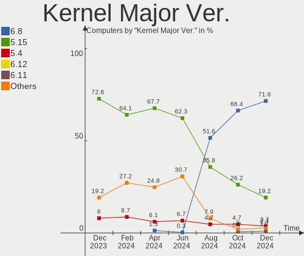
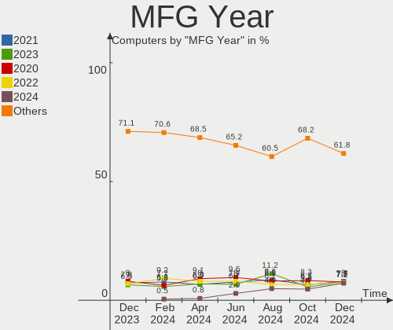
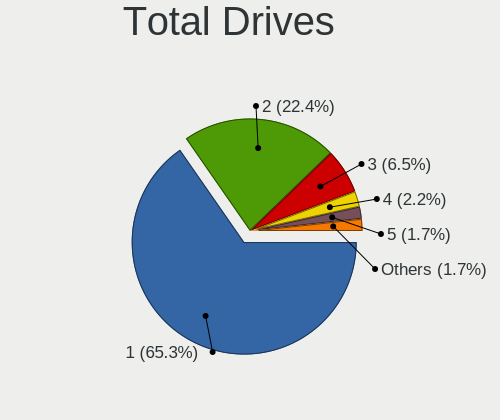
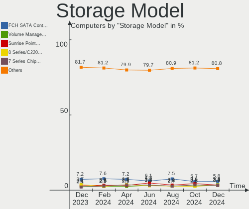
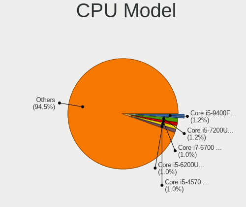
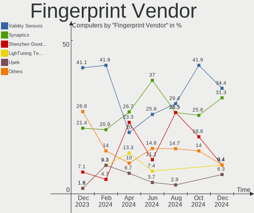
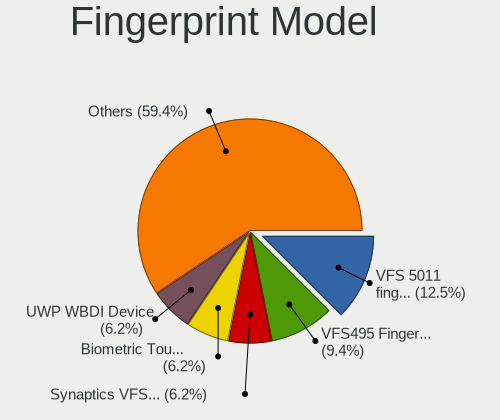

Linux Mint Hardware Trends
--------------------------

A project to identify most popular hardware characteristics and track their change
over time based on data collected by Linux Mint users at https://Linux-Hardware.org.

Anyone can contribute to this report by the [hw-probe](https://github.com/linuxhw/hw-probe) tool:

    sudo -E hw-probe -all -upload

This is a report for all computer types. See also reports for [desktops](/Dist/Linux_Mint/Desktop/README.md) and [notebooks](/Dist/Linux_Mint/Notebook/README.md).

Full-feature report is available here: https://linux-hardware.org/?view=trends

Period: Feb, 2022.

Contents
--------

* [ System ](#system)
  - [ OS                       ](#os)
  - [ OS Family                ](#os-family)
  - [ Kernel                   ](#kernel)
  - [ Kernel Family            ](#kernel-family)
  - [ Kernel Major Ver.        ](#kernel-major-ver)
  - [ Arch                     ](#arch)
  - [ DE                       ](#de)
  - [ Display Server           ](#display-server)
  - [ Display Manager          ](#display-manager)
  - [ OS Lang                  ](#os-lang)
  - [ Boot Mode                ](#boot-mode)
  - [ Filesystem               ](#filesystem)
  - [ Part. scheme             ](#part-scheme)
  - [ Dual Boot with Linux/BSD ](#dual-boot-with-linuxbsd)
  - [ Dual Boot (Win)          ](#dual-boot-win)

* [ Board ](#board)
  - [ Vendor                   ](#vendor)
  - [ Model                    ](#model)
  - [ Model Family             ](#model-family)
  - [ MFG Year                 ](#mfg-year)
  - [ Form Factor              ](#form-factor)
  - [ Secure Boot              ](#secure-boot)
  - [ Coreboot                 ](#coreboot)
  - [ RAM Size                 ](#ram-size)
  - [ RAM Used                 ](#ram-used)
  - [ Total Drives             ](#total-drives)
  - [ Has CD-ROM               ](#has-cd-rom)
  - [ Has Ethernet             ](#has-ethernet)
  - [ Has WiFi                 ](#has-wifi)
  - [ Has Bluetooth            ](#has-bluetooth)

* [ Location ](#location)
  - [ Country                  ](#country)
  - [ City                     ](#city)

* [ Drives ](#drives)
  - [ Drive Vendor             ](#drive-vendor)
  - [ Drive Model              ](#drive-model)
  - [ HDD Vendor               ](#hdd-vendor)
  - [ SSD Vendor               ](#ssd-vendor)
  - [ Drive Kind               ](#drive-kind)
  - [ Drive Connector          ](#drive-connector)
  - [ Drive Size               ](#drive-size)
  - [ Space Total              ](#space-total)
  - [ Space Used               ](#space-used)
  - [ Malfunc. Drives          ](#malfunc-drives)
  - [ Malfunc. Drive Vendor    ](#malfunc-drive-vendor)
  - [ Malfunc. HDD Vendor      ](#malfunc-hdd-vendor)
  - [ Malfunc. Drive Kind      ](#malfunc-drive-kind)
  - [ Failed Drives            ](#failed-drives)
  - [ Failed Drive Vendor      ](#failed-drive-vendor)
  - [ Drive Status             ](#drive-status)

* [ Storage controller ](#storage-controller)
  - [ Storage Vendor           ](#storage-vendor)
  - [ Storage Model            ](#storage-model)
  - [ Storage Kind             ](#storage-kind)

* [ Processor ](#processor)
  - [ CPU Vendor               ](#cpu-vendor)
  - [ CPU Model                ](#cpu-model)
  - [ CPU Model Family         ](#cpu-model-family)
  - [ CPU Cores                ](#cpu-cores)
  - [ CPU Sockets              ](#cpu-sockets)
  - [ CPU Threads              ](#cpu-threads)
  - [ CPU Op-Modes             ](#cpu-op-modes)
  - [ CPU Microcode            ](#cpu-microcode)
  - [ CPU Microarch            ](#cpu-microarch)

* [ Graphics ](#graphics)
  - [ GPU Vendor               ](#gpu-vendor)
  - [ GPU Model                ](#gpu-model)
  - [ GPU Combo                ](#gpu-combo)
  - [ GPU Driver               ](#gpu-driver)
  - [ GPU Memory               ](#gpu-memory)

* [ Monitor ](#monitor)
  - [ Monitor Vendor           ](#monitor-vendor)
  - [ Monitor Model            ](#monitor-model)
  - [ Monitor Resolution       ](#monitor-resolution)
  - [ Monitor Diagonal         ](#monitor-diagonal)
  - [ Monitor Width            ](#monitor-width)
  - [ Aspect Ratio             ](#aspect-ratio)
  - [ Monitor Area             ](#monitor-area)
  - [ Pixel Density            ](#pixel-density)
  - [ Multiple Monitors        ](#multiple-monitors)

* [ Network ](#network)
  - [ Net Controller Vendor    ](#net-controller-vendor)
  - [ Net Controller Model     ](#net-controller-model)
  - [ Wireless Vendor          ](#wireless-vendor)
  - [ Wireless Model           ](#wireless-model)
  - [ Ethernet Vendor          ](#ethernet-vendor)
  - [ Ethernet Model           ](#ethernet-model)
  - [ Net Controller Kind      ](#net-controller-kind)
  - [ Used Controller          ](#used-controller)
  - [ NICs                     ](#nics)
  - [ IPv6                     ](#ipv6)

* [ Bluetooth ](#bluetooth)
  - [ Bluetooth Vendor         ](#bluetooth-vendor)
  - [ Bluetooth Model          ](#bluetooth-model)

* [ Sound ](#sound)
  - [ Sound Vendor             ](#sound-vendor)
  - [ Sound Model              ](#sound-model)

* [ Memory ](#memory)
  - [ Memory Vendor            ](#memory-vendor)
  - [ Memory Model             ](#memory-model)
  - [ Memory Kind              ](#memory-kind)
  - [ Memory Form Factor       ](#memory-form-factor)
  - [ Memory Size              ](#memory-size)
  - [ Memory Speed             ](#memory-speed)

* [ Printers & scanners ](#printers--scanners)
  - [ Printer Vendor           ](#printer-vendor)
  - [ Printer Model            ](#printer-model)
  - [ Scanner Vendor           ](#scanner-vendor)
  - [ Scanner Model            ](#scanner-model)

* [ Camera ](#camera)
  - [ Camera Vendor            ](#camera-vendor)
  - [ Camera Model             ](#camera-model)

* [ Security ](#security)
  - [ Fingerprint Vendor       ](#fingerprint-vendor)
  - [ Fingerprint Model        ](#fingerprint-model)
  - [ Chipcard Vendor          ](#chipcard-vendor)
  - [ Chipcard Model           ](#chipcard-model)

* [ Unsupported ](#unsupported)
  - [ Unsupported Devices      ](#unsupported-devices)
  - [ Unsupported Device Types ](#unsupported-device-types)

System
------

OS
--

Installed operating systems

| Name            | Computers | Percent |
|-----------------|-----------|---------|
| Linux Mint 20.3 | 373       | 72.99%  |
| Linux Mint 20.2 | 71        | 13.89%  |
| Linux Mint 20.1 | 26        | 5.09%   |
| Linux Mint 19.3 | 20        | 3.91%   |
| Linux Mint 20   | 13        | 2.54%   |
| Linux Mint 19.1 | 5         | 0.98%   |
| Linux Mint 19.2 | 2         | 0.39%   |
| Linux Mint 19   | 1         | 0.2%    |

OS Family
---------

OS without a version

| Name       | Computers | Percent |
|------------|-----------|---------|
| Linux Mint | 511       | 100%    |

Kernel
------

Version of the Linux kernel

| Version                    | Computers | Percent |
|----------------------------|-----------|---------|
| 5.4.0-100-generic          | 137       | 26.81%  |
| 5.4.0-99-generic           | 119       | 23.29%  |
| 5.4.0-97-generic           | 91        | 17.81%  |
| 5.4.0-91-generic           | 28        | 5.48%   |
| 5.4.0-96-generic           | 23        | 4.5%    |
| 5.13.0-28-generic          | 20        | 3.91%   |
| 5.13.0-27-generic          | 15        | 2.94%   |
| 5.13.0-30-generic          | 13        | 2.54%   |
| 5.4.0-74-generic           | 8         | 1.57%   |
| 5.4.0-94-generic           | 6         | 1.17%   |
| 5.4.0-92-generic           | 5         | 0.98%   |
| 5.0.0-32-generic           | 5         | 0.98%   |
| 4.15.0-167-generic         | 3         | 0.59%   |
| 5.4.0-80-generic           | 2         | 0.39%   |
| 5.4.0-58-generic           | 2         | 0.39%   |
| 5.4.0-26-generic           | 2         | 0.39%   |
| 5.16.6-051606-generic      | 2         | 0.39%   |
| 4.15.0-20-generic          | 2         | 0.39%   |
| 5.8.0-23-generic           | 1         | 0.2%    |
| 5.4.2-050402-generic       | 1         | 0.2%    |
| 5.4.0-90-generic           | 1         | 0.2%    |
| 5.4.0-88-generic           | 1         | 0.2%    |
| 5.4.0-81-generic           | 1         | 0.2%    |
| 5.4.0-77-generic           | 1         | 0.2%    |
| 5.4.0-70-generic           | 1         | 0.2%    |
| 5.3.0-76-generic           | 1         | 0.2%    |
| 5.16.8-051608-generic      | 1         | 0.2%    |
| 5.16.7-051607-lowlatency   | 1         | 0.2%    |
| 5.16.4-051604-generic      | 1         | 0.2%    |
| 5.16.2-051602-generic      | 1         | 0.2%    |
| 5.16.10-051610-generic     | 1         | 0.2%    |
| 5.16.0-8.2-liquorix-amd64  | 1         | 0.2%    |
| 5.15.22-xanmod1            | 1         | 0.2%    |
| 5.15.15-76051515-generic   | 1         | 0.2%    |
| 5.15.0-18-generic          | 1         | 0.2%    |
| 5.15.0-16.1-liquorix-amd64 | 1         | 0.2%    |
| 5.14.0-1020-oem            | 1         | 0.2%    |
| 5.13.0-22-generic          | 1         | 0.2%    |
| 5.11.0-60-generic          | 1         | 0.2%    |
| 5.11.0-46-generic          | 1         | 0.2%    |
| 5.11.0-27-generic          | 1         | 0.2%    |
| 5.10.0-1057-oem            | 1         | 0.2%    |
| 4.15.0-43-generic          | 1         | 0.2%    |
| 4.15.0-169-generic         | 1         | 0.2%    |
| 4.15.0-166-generic         | 1         | 0.2%    |
| 4.15.0-163-generic         | 1         | 0.2%    |

Kernel Family
-------------

Linux kernel without a distro release

| Version | Computers | Percent |
|---------|-----------|---------|
| 5.4.0   | 428       | 83.76%  |
| 5.13.0  | 49        | 9.59%   |
| 4.15.0  | 9         | 1.76%   |
| 5.0.0   | 5         | 0.98%   |
| 5.11.0  | 3         | 0.59%   |
| 5.16.6  | 2         | 0.39%   |
| 5.15.0  | 2         | 0.39%   |
| 5.8.0   | 1         | 0.2%    |
| 5.4.2   | 1         | 0.2%    |
| 5.3.0   | 1         | 0.2%    |
| 5.16.8  | 1         | 0.2%    |
| 5.16.7  | 1         | 0.2%    |
| 5.16.4  | 1         | 0.2%    |
| 5.16.2  | 1         | 0.2%    |
| 5.16.10 | 1         | 0.2%    |
| 5.16.0  | 1         | 0.2%    |
| 5.15.22 | 1         | 0.2%    |
| 5.15.15 | 1         | 0.2%    |
| 5.14.0  | 1         | 0.2%    |
| 5.10.0  | 1         | 0.2%    |

Kernel Major Ver.
-----------------

Linux kernel major version

| Version | Computers | Percent |
|---------|-----------|---------|
| 5.4     | 429       | 83.95%  |
| 5.13    | 49        | 9.59%   |
| 4.15    | 9         | 1.76%   |
| 5.16    | 8         | 1.57%   |
| 5.0     | 5         | 0.98%   |
| 5.15    | 4         | 0.78%   |
| 5.11    | 3         | 0.59%   |
| 5.8     | 1         | 0.2%    |
| 5.3     | 1         | 0.2%    |
| 5.14    | 1         | 0.2%    |
| 5.10    | 1         | 0.2%    |

Arch
----

OS architecture (x86_64, i586, etc.)

| Name   | Computers | Percent |
|--------|-----------|---------|
| x86_64 | 503       | 98.43%  |
| i686   | 8         | 1.57%   |

DE
--

Desktop Environment

| Name       | Computers | Percent |
|------------|-----------|---------|
| X-Cinnamon | 368       | 72.02%  |
| MATE       | 58        | 11.35%  |
| XFCE       | 50        | 9.78%   |
| Cinnamon   | 17        | 3.33%   |
| GNOME      | 8         | 1.57%   |
| Unknown    | 5         | 0.98%   |
| KDE5       | 4         | 0.78%   |
| Budgie     | 1         | 0.2%    |

Display Server
--------------

X11 or Wayland

| Name    | Computers | Percent |
|---------|-----------|---------|
| X11     | 509       | 99.61%  |
| Wayland | 2         | 0.39%   |

Display Manager
---------------

SDDM, LightDM, etc.

| Name    | Computers | Percent |
|---------|-----------|---------|
| Unknown | 286       | 55.97%  |
| LightDM | 224       | 43.84%  |
| MDM     | 1         | 0.2%    |

OS Lang
-------

Language

| Lang    | Computers | Percent |
|---------|-----------|---------|
| en_US   | 154       | 30.14%  |
| de_DE   | 103       | 20.16%  |
| pt_BR   | 32        | 6.26%   |
| en_GB   | 23        | 4.5%    |
| fr_FR   | 22        | 4.31%   |
| C       | 18        | 3.52%   |
| ru_RU   | 17        | 3.33%   |
| pl_PL   | 14        | 2.74%   |
| nl_NL   | 13        | 2.54%   |
| es_ES   | 13        | 2.54%   |
| en_CA   | 13        | 2.54%   |
| it_IT   | 12        | 2.35%   |
| en_AU   | 12        | 2.35%   |
| cs_CZ   | 6         | 1.17%   |
| hu_HU   | 4         | 0.78%   |
| fr_BE   | 4         | 0.78%   |
| es_AR   | 4         | 0.78%   |
| nl_BE   | 3         | 0.59%   |
| fr_CH   | 3         | 0.59%   |
| es_MX   | 3         | 0.59%   |
| en_IN   | 3         | 0.59%   |
| de_CH   | 3         | 0.59%   |
| zh_TW   | 2         | 0.39%   |
| tr_TR   | 2         | 0.39%   |
| sv_SE   | 2         | 0.39%   |
| ru_UA   | 2         | 0.39%   |
| es_CO   | 2         | 0.39%   |
| en_NZ   | 2         | 0.39%   |
| en_IE   | 2         | 0.39%   |
| en_HK   | 2         | 0.39%   |
| de_AT   | 2         | 0.39%   |
| vi_VN   | 1         | 0.2%    |
| uk_UA   | 1         | 0.2%    |
| sk_SK   | 1         | 0.2%    |
| nb_NO   | 1         | 0.2%    |
| ja_JP   | 1         | 0.2%    |
| fi_FI   | 1         | 0.2%    |
| es_VE   | 1         | 0.2%    |
| en_ZW   | 1         | 0.2%    |
| en_ZA   | 1         | 0.2%    |
| en_PH   | 1         | 0.2%    |
| de_IT   | 1         | 0.2%    |
| da_DK   | 1         | 0.2%    |
| bg_BG   | 1         | 0.2%    |
| Unknown | 1         | 0.2%    |

Boot Mode
---------

EFI or BIOS

| Mode | Computers | Percent |
|------|-----------|---------|
| EFI  | 257       | 50.29%  |
| BIOS | 254       | 49.71%  |

Filesystem
----------

Type of filesystem

| Type    | Computers | Percent |
|---------|-----------|---------|
| Ext4    | 476       | 93.15%  |
| Overlay | 17        | 3.33%   |
| Btrfs   | 9         | 1.76%   |
| Xfs     | 3         | 0.59%   |
| Ext3    | 3         | 0.59%   |
| Ext2    | 2         | 0.39%   |
| Zfs     | 1         | 0.2%    |

Part. scheme
------------

Scheme of partitioning

| Type    | Computers | Percent |
|---------|-----------|---------|
| Unknown | 316       | 61.84%  |
| GPT     | 140       | 27.4%   |
| MBR     | 55        | 10.76%  |

Dual Boot with Linux/BSD
------------------------

Hosting more than one Linux/BSD

| Dual boot | Computers | Percent |
|-----------|-----------|---------|
| No        | 473       | 92.56%  |
| Yes       | 38        | 7.44%   |

Dual Boot (Win)
---------------

Hosting Linux and Windows

| Dual boot | Computers | Percent |
|-----------|-----------|---------|
| No        | 396       | 77.5%   |
| Yes       | 115       | 22.5%   |

Board
-----

Vendor
------

Motherboard manufacturer

| Name                    | Computers | Percent |
|-------------------------|-----------|---------|
| Hewlett-Packard         | 77        | 15.07%  |
| ASUSTek Computer        | 77        | 15.07%  |
| Lenovo                  | 65        | 12.72%  |
| Dell                    | 55        | 10.76%  |
| Gigabyte Technology     | 41        | 8.02%   |
| MSI                     | 35        | 6.85%   |
| Acer                    | 32        | 6.26%   |
| ASRock                  | 17        | 3.33%   |
| Apple                   | 13        | 2.54%   |
| Toshiba                 | 9         | 1.76%   |
| Samsung Electronics     | 8         | 1.57%   |
| Medion                  | 6         | 1.17%   |
| Intel                   | 5         | 0.98%   |
| Google                  | 5         | 0.98%   |
| Positivo                | 4         | 0.78%   |
| Microsoft               | 4         | 0.78%   |
| Sony                    | 3         | 0.59%   |
| Fujitsu Siemens         | 3         | 0.59%   |
| Foxconn                 | 3         | 0.59%   |
| Chuwi                   | 3         | 0.59%   |
| Biostar                 | 3         | 0.59%   |
| Unknown                 | 3         | 0.59%   |
| Notebook                | 2         | 0.39%   |
| LG Electronics          | 2         | 0.39%   |
| HUAWEI                  | 2         | 0.39%   |
| HONOR                   | 2         | 0.39%   |
| Gateway                 | 2         | 0.39%   |
| Fujitsu                 | 2         | 0.39%   |
| ZOTAC                   | 1         | 0.2%    |
| ZEPTO                   | 1         | 0.2%    |
| WeiBu                   | 1         | 0.2%    |
| TYAN Computer           | 1         | 0.2%    |
| TUXEDO                  | 1         | 0.2%    |
| Timi                    | 1         | 0.2%    |
| System76                | 1         | 0.2%    |
| Shuttle                 | 1         | 0.2%    |
| Schenker                | 1         | 0.2%    |
| Primux Tech             | 1         | 0.2%    |
| Positivo Bahia - VAIO   | 1         | 0.2%    |
| Pegatron                | 1         | 0.2%    |
| Packard Bell            | 1         | 0.2%    |
| Monster                 | 1         | 0.2%    |
| Microtech               | 1         | 0.2%    |
| MicroStar International | 1         | 0.2%    |
| Mediacom                | 1         | 0.2%    |
| Jumper                  | 1         | 0.2%    |
| Itautec                 | 1         | 0.2%    |
| Insyde                  | 1         | 0.2%    |
| Hyundai Technology      | 1         | 0.2%    |
| HC                      | 1         | 0.2%    |
| Getac                   | 1         | 0.2%    |
| EVGA                    | 1         | 0.2%    |
| eMachines               | 1         | 0.2%    |
| ECT                     | 1         | 0.2%    |
| AVITA                   | 1         | 0.2%    |
| AIO                     | 1         | 0.2%    |

Model
-----

Motherboard model

| Name                                        | Computers | Percent |
|---------------------------------------------|-----------|---------|
| MSI MS-7693                                 | 4         | 0.78%   |
| MSI MS-7C56                                 | 3         | 0.59%   |
| Lenovo G50-70 20351                         | 3         | 0.59%   |
| Gigabyte 970A-DS3P                          | 3         | 0.59%   |
| ASUS All Series                             | 3         | 0.59%   |
| Unknown                                     | 3         | 0.59%   |
| Samsung 730QDA                              | 2         | 0.39%   |
| MSI MS-7C91                                 | 2         | 0.39%   |
| MSI MS-7C52                                 | 2         | 0.39%   |
| MSI MS-7C37                                 | 2         | 0.39%   |
| MSI MS-7B86                                 | 2         | 0.39%   |
| Lenovo IdeaPad S206 2638                    | 2         | 0.39%   |
| HONOR HLYL-WXX9                             | 2         | 0.39%   |
| HP Pavilion 15                              | 2         | 0.39%   |
| HP Notebook                                 | 2         | 0.39%   |
| HP Laptop 17-ca0xxx                         | 2         | 0.39%   |
| HP Laptop 15s-eq2xxx                        | 2         | 0.39%   |
| HP Laptop 15-da2xxx                         | 2         | 0.39%   |
| HP Compaq Elite 8300 SFF                    | 2         | 0.39%   |
| Dell Latitude E7240                         | 2         | 0.39%   |
| Dell Inspiron 7501                          | 2         | 0.39%   |
| ASUS PRIME B350-PLUS                        | 2         | 0.39%   |
| ASUS PRIME A320M-K                          | 2         | 0.39%   |
| Acer Aspire 7750G                           | 2         | 0.39%   |
| ZOTAC ZBOXNANO-ID67                         | 1         | 0.2%    |
| ZEPTO ZNOTE                                 | 1         | 0.2%    |
| WeiBu Unity F24W                            | 1         | 0.2%    |
| TYAN CELSIUS R630                           | 1         | 0.2%    |
| TUXEDO InfinityBook Pro 14 Gen6             | 1         | 0.2%    |
| Toshiba Satellite Z830                      | 1         | 0.2%    |
| Toshiba Satellite S855D                     | 1         | 0.2%    |
| Toshiba Satellite S55-C                     | 1         | 0.2%    |
| Toshiba Satellite Pro C850                  | 1         | 0.2%    |
| Toshiba Satellite P875                      | 1         | 0.2%    |
| Toshiba Satellite L350D                     | 1         | 0.2%    |
| Toshiba Satellite C70D-B                    | 1         | 0.2%    |
| Toshiba Satellite C50-A                     | 1         | 0.2%    |
| Toshiba QOSMIO F60                          | 1         | 0.2%    |
| Timi TM1701                                 | 1         | 0.2%    |
| System76 Oryx Pro                           | 1         | 0.2%    |
| Sony VPCEH2E0E                              | 1         | 0.2%    |
| Sony VPCEC2S1E                              | 1         | 0.2%    |
| Sony SVE1711V1EB                            | 1         | 0.2%    |
| Shuttle System                              | 1         | 0.2%    |
| Schenker XMG NEO (TGL/M21)                  | 1         | 0.2%    |
| Samsung RV411/RV511/E3511/S3511/RV711/E3411 | 1         | 0.2%    |
| Samsung RV411/RV511/E3511/S3511/RV711       | 1         | 0.2%    |
| Samsung NC210/NC110                         | 1         | 0.2%    |
| Samsung N150/N210/N220                      | 1         | 0.2%    |
| Samsung 700Z3A/700Z4A/700Z5A/700Z5B         | 1         | 0.2%    |
| Samsung 350V5C/351V5C/3540VC/3440VC         | 1         | 0.2%    |
| Primux Tech Ioxbook1402MC                   | 1         | 0.2%    |
| Positivo POS-EIBTPDC                        | 1         | 0.2%    |
| Positivo N4340                              | 1         | 0.2%    |
| Positivo Mobile                             | 1         | 0.2%    |
| Positivo C14CU51                            | 1         | 0.2%    |
| Positivo Bahia - VAIO VJFE52F11X-B1111S     | 1         | 0.2%    |
| Pegatron Elite 7300 Series MT               | 1         | 0.2%    |
| Packard Bell ISTART D5535                   | 1         | 0.2%    |
| Notebook W35xSTQ_370ST                      | 1         | 0.2%    |

Model Family
------------

Motherboard model prefix

| Name                | Computers | Percent |
|---------------------|-----------|---------|
| Lenovo ThinkPad     | 22        | 4.31%   |
| HP Pavilion         | 21        | 4.11%   |
| Acer Aspire         | 21        | 4.11%   |
| Dell Latitude       | 20        | 3.91%   |
| Dell Inspiron       | 18        | 3.52%   |
| HP Laptop           | 13        | 2.54%   |
| Lenovo IdeaPad      | 12        | 2.35%   |
| HP EliteBook        | 11        | 2.15%   |
| Toshiba Satellite   | 8         | 1.57%   |
| ASUS ROG            | 7         | 1.37%   |
| Lenovo ThinkCentre  | 6         | 1.17%   |
| HP Compaq           | 6         | 1.17%   |
| Dell XPS            | 6         | 1.17%   |
| ASUS PRIME          | 6         | 1.17%   |
| HP ProBook          | 5         | 0.98%   |
| ASUS VivoBook       | 5         | 0.98%   |
| MSI MS-7693         | 4         | 0.78%   |
| Microsoft Surface   | 4         | 0.78%   |
| MSI MS-7C56         | 3         | 0.59%   |
| Lenovo Legion       | 3         | 0.59%   |
| Lenovo G50-70       | 3         | 0.59%   |
| HP ENVY             | 3         | 0.59%   |
| Gigabyte 970A-DS3P  | 3         | 0.59%   |
| Dell OptiPlex       | 3         | 0.59%   |
| ASUS ASUS           | 3         | 0.59%   |
| ASUS All            | 3         | 0.59%   |
| Acer Predator       | 3         | 0.59%   |
| Unknown             | 3         | 0.59%   |
| Samsung RV411       | 2         | 0.39%   |
| Samsung 730QDA      | 2         | 0.39%   |
| MSI MS-7C91         | 2         | 0.39%   |
| MSI MS-7C52         | 2         | 0.39%   |
| MSI MS-7C37         | 2         | 0.39%   |
| MSI MS-7B86         | 2         | 0.39%   |
| Lenovo Yoga         | 2         | 0.39%   |
| Lenovo IdeaPadFlex  | 2         | 0.39%   |
| HONOR HLYL-WXX9     | 2         | 0.39%   |
| HP Notebook         | 2         | 0.39%   |
| HP 255              | 2         | 0.39%   |
| HP 250              | 2         | 0.39%   |
| Fujitsu LIFEBOOK    | 2         | 0.39%   |
| Dell Vostro         | 2         | 0.39%   |
| Dell Precision      | 2         | 0.39%   |
| Chuwi HeroBook      | 2         | 0.39%   |
| ASUS ZenBook        | 2         | 0.39%   |
| Apple MacBookPro8   | 2         | 0.39%   |
| Acer TravelMate     | 2         | 0.39%   |
| ZOTAC ZBOXNANO-ID67 | 1         | 0.2%    |
| ZEPTO ZNOTE         | 1         | 0.2%    |
| WeiBu Unity         | 1         | 0.2%    |
| TYAN CELSIUS        | 1         | 0.2%    |
| TUXEDO InfinityBook | 1         | 0.2%    |
| Toshiba QOSMIO      | 1         | 0.2%    |
| Timi TM1701         | 1         | 0.2%    |
| System76 Oryx       | 1         | 0.2%    |
| Sony VPCEH2E0E      | 1         | 0.2%    |
| Sony VPCEC2S1E      | 1         | 0.2%    |
| Sony SVE1711V1EB    | 1         | 0.2%    |
| Shuttle System      | 1         | 0.2%    |
| Schenker XMG        | 1         | 0.2%    |

MFG Year
--------

Motherboard manufacture year

| Year | Computers | Percent |
|------|-----------|---------|
| 2012 | 50        | 9.78%   |
| 2021 | 49        | 9.59%   |
| 2020 | 47        | 9.2%    |
| 2011 | 46        | 9%      |
| 2013 | 45        | 8.81%   |
| 2018 | 36        | 7.05%   |
| 2014 | 34        | 6.65%   |
| 2019 | 31        | 6.07%   |
| 2017 | 29        | 5.68%   |
| 2010 | 28        | 5.48%   |
| 2015 | 26        | 5.09%   |
| 2016 | 25        | 4.89%   |
| 2008 | 21        | 4.11%   |
| 2009 | 20        | 3.91%   |
| 2007 | 16        | 3.13%   |
| 2006 | 6         | 1.17%   |
| 2005 | 1         | 0.2%    |
| 2004 | 1         | 0.2%    |

Form Factor
-----------

Physical design of the computer

| Name        | Computers | Percent |
|-------------|-----------|---------|
| Notebook    | 292       | 57.14%  |
| Desktop     | 189       | 36.99%  |
| Convertible | 11        | 2.15%   |
| Tablet      | 8         | 1.57%   |
| All in one  | 7         | 1.37%   |
| Mini pc     | 3         | 0.59%   |
| Other       | 1         | 0.2%    |

Secure Boot
-----------

Enabled or disabled

| State    | Computers | Percent |
|----------|-----------|---------|
| Disabled | 476       | 93.15%  |
| Enabled  | 35        | 6.85%   |

Coreboot
--------

Have coreboot on board

| Used | Computers | Percent |
|------|-----------|---------|
| No   | 505       | 98.83%  |
| Yes  | 6         | 1.17%   |

RAM Size
--------

Total RAM memory

| Size in GB  | Computers | Percent |
|-------------|-----------|---------|
| 4.01-8.0    | 120       | 23.48%  |
| 3.01-4.0    | 114       | 22.31%  |
| 8.01-16.0   | 101       | 19.77%  |
| 16.01-24.0  | 97        | 18.98%  |
| 32.01-64.0  | 31        | 6.07%   |
| 1.01-2.0    | 27        | 5.28%   |
| 64.01-256.0 | 11        | 2.15%   |
| 24.01-32.0  | 4         | 0.78%   |
| 2.01-3.0    | 3         | 0.59%   |
| 0.51-1.0    | 3         | 0.59%   |

RAM Used
--------

Used RAM memory

| Used GB    | Computers | Percent |
|------------|-----------|---------|
| 1.01-2.0   | 232       | 45.4%   |
| 2.01-3.0   | 133       | 26.03%  |
| 4.01-8.0   | 52        | 10.18%  |
| 3.01-4.0   | 50        | 9.78%   |
| 0.51-1.0   | 33        | 6.46%   |
| 8.01-16.0  | 7         | 1.37%   |
| 24.01-32.0 | 2         | 0.39%   |
| 16.01-24.0 | 1         | 0.2%    |
| 0.01-0.5   | 1         | 0.2%    |

Total Drives
------------

Number of drives on board

| Drives | Computers | Percent |
|--------|-----------|---------|
| 1      | 313       | 61.25%  |
| 2      | 121       | 23.68%  |
| 3      | 39        | 7.63%   |
| 4      | 24        | 4.7%    |
| 5      | 8         | 1.57%   |
| 7      | 2         | 0.39%   |
| 6      | 2         | 0.39%   |
| 8      | 1         | 0.2%    |
| 0      | 1         | 0.2%    |

Has CD-ROM
----------

Has CD-ROM on board

| Presented | Computers | Percent |
|-----------|-----------|---------|
| No        | 264       | 51.66%  |
| Yes       | 247       | 48.34%  |

Has Ethernet
------------

Has Ethernet on board

| Presented | Computers | Percent |
|-----------|-----------|---------|
| Yes       | 436       | 85.32%  |
| No        | 75        | 14.68%  |

Has WiFi
--------

Has WiFi module

| Presented | Computers | Percent |
|-----------|-----------|---------|
| Yes       | 411       | 80.43%  |
| No        | 100       | 19.57%  |

Has Bluetooth
-------------

Has Bluetooth module

| Presented | Computers | Percent |
|-----------|-----------|---------|
| Yes       | 310       | 60.67%  |
| No        | 201       | 39.33%  |

Location
--------

Country
-------

Geographic location (country)

| Country      | Computers | Percent |
|--------------|-----------|---------|
| Germany      | 110       | 21.53%  |
| USA          | 99        | 19.37%  |
| Brazil       | 38        | 7.44%   |
| France       | 27        | 5.28%   |
| UK           | 23        | 4.5%    |
| Netherlands  | 20        | 3.91%   |
| Canada       | 17        | 3.33%   |
| Russia       | 15        | 2.94%   |
| Poland       | 15        | 2.94%   |
| Italy        | 14        | 2.74%   |
| Australia    | 13        | 2.54%   |
| Spain        | 12        | 2.35%   |
| Belgium      | 11        | 2.15%   |
| Switzerland  | 7         | 1.37%   |
| Czechia      | 7         | 1.37%   |
| Sweden       | 6         | 1.17%   |
| India        | 6         | 1.17%   |
| Hungary      | 6         | 1.17%   |
| Argentina    | 6         | 1.17%   |
| Austria      | 5         | 0.98%   |
| Ukraine      | 3         | 0.59%   |
| Turkey       | 3         | 0.59%   |
| Romania      | 3         | 0.59%   |
| Mexico       | 3         | 0.59%   |
| Japan        | 3         | 0.59%   |
| Colombia     | 3         | 0.59%   |
| Bulgaria     | 3         | 0.59%   |
| Taiwan       | 2         | 0.39%   |
| Norway       | 2         | 0.39%   |
| New Zealand  | 2         | 0.39%   |
| Ireland      | 2         | 0.39%   |
| Egypt        | 2         | 0.39%   |
| China        | 2         | 0.39%   |
| Zimbabwe     | 1         | 0.2%    |
| Vietnam      | 1         | 0.2%    |
| Venezuela    | 1         | 0.2%    |
| UAE          | 1         | 0.2%    |
| Thailand     | 1         | 0.2%    |
| South Africa | 1         | 0.2%    |
| Slovakia     | 1         | 0.2%    |
| Serbia       | 1         | 0.2%    |
| Saudi Arabia | 1         | 0.2%    |
| Philippines  | 1         | 0.2%    |
| Moldova      | 1         | 0.2%    |
| Latvia       | 1         | 0.2%    |
| Finland      | 1         | 0.2%    |
| Ethiopia     | 1         | 0.2%    |
| Denmark      | 1         | 0.2%    |
| Cyprus       | 1         | 0.2%    |
| Croatia      | 1         | 0.2%    |
| Costa Rica   | 1         | 0.2%    |
| Cambodia     | 1         | 0.2%    |
| Belarus      | 1         | 0.2%    |
| Algeria      | 1         | 0.2%    |

City
----

Geographic location (city)

| City              | Computers | Percent |
|-------------------|-----------|---------|
| Munich            | 7         | 1.37%   |
| Berlin            | 7         | 1.37%   |
| Cologne           | 6         | 1.17%   |
| Stuttgart         | 4         | 0.78%   |
| Rio de Janeiro    | 4         | 0.78%   |
| Milan             | 4         | 0.78%   |
| Mannheim          | 4         | 0.78%   |
| Warsaw            | 3         | 0.59%   |
| Toronto           | 3         | 0.59%   |
| The Hague         | 3         | 0.59%   |
| Sydney            | 3         | 0.59%   |
| São Paulo      | 3         | 0.59%   |
| New Delhi         | 3         | 0.59%   |
| Moscow            | 3         | 0.59%   |
| Montreal          | 3         | 0.59%   |
| Madrid            | 3         | 0.59%   |
| Krasnodar         | 3         | 0.59%   |
| Brisbane          | 3         | 0.59%   |
| Bremen            | 3         | 0.59%   |
| Zurich            | 2         | 0.39%   |
| Yekaterinburg     | 2         | 0.39%   |
| Wroclaw           | 2         | 0.39%   |
| Vleuten           | 2         | 0.39%   |
| Vitry-sur-Seine   | 2         | 0.39%   |
| Vigo              | 2         | 0.39%   |
| Vienna            | 2         | 0.39%   |
| Vancouver         | 2         | 0.39%   |
| Szolnok           | 2         | 0.39%   |
| Staten Island     | 2         | 0.39%   |
| Sofia             | 2         | 0.39%   |
| Soest             | 2         | 0.39%   |
| Sint-Truiden      | 2         | 0.39%   |
| Shenzhen          | 2         | 0.39%   |
| Saco              | 2         | 0.39%   |
| Rockville         | 2         | 0.39%   |
| Prague            | 2         | 0.39%   |
| Porto Alegre      | 2         | 0.39%   |
| Olemps            | 2         | 0.39%   |
| Odessa            | 2         | 0.39%   |
| Minneapolis       | 2         | 0.39%   |
| Miami             | 2         | 0.39%   |
| Leipzig           | 2         | 0.39%   |
| Hanover           | 2         | 0.39%   |
| Haarlem           | 2         | 0.39%   |
| Gurnee            | 2         | 0.39%   |
| Frankfurt am Main | 2         | 0.39%   |
| Dublin            | 2         | 0.39%   |
| Düsseldorf     | 2         | 0.39%   |
| Clermont-Ferrand  | 2         | 0.39%   |
| Citrus Heights    | 2         | 0.39%   |
| Chicago           | 2         | 0.39%   |
| Canoas            | 2         | 0.39%   |
| Cairo             | 2         | 0.39%   |
| Budapest          | 2         | 0.39%   |
| Bucharest         | 2         | 0.39%   |
| Brighton          | 2         | 0.39%   |
| Brigham City      | 2         | 0.39%   |
| Blankenburg       | 2         | 0.39%   |
| Bixby             | 2         | 0.39%   |
| Austin            | 2         | 0.39%   |

Drives
------

Drive Vendor
------------

Hard drive vendors

| Vendor                         | Computers | Drives | Percent |
|--------------------------------|-----------|--------|---------|
| WDC                            | 117       | 145    | 15.66%  |
| Samsung Electronics            | 110       | 129    | 14.73%  |
| Seagate                        | 108       | 129    | 14.46%  |
| Unknown                        | 39        | 45     | 5.22%   |
| SanDisk                        | 39        | 40     | 5.22%   |
| Crucial                        | 37        | 38     | 4.95%   |
| Toshiba                        | 33        | 36     | 4.42%   |
| Kingston                       | 30        | 30     | 4.02%   |
| Hitachi                        | 29        | 30     | 3.88%   |
| Intel                          | 17        | 18     | 2.28%   |
| HGST                           | 17        | 18     | 2.28%   |
| A-DATA Technology              | 14        | 14     | 1.87%   |
| Intenso                        | 13        | 13     | 1.74%   |
| SK Hynix                       | 12        | 12     | 1.61%   |
| KIOXIA                         | 8         | 8      | 1.07%   |
| PNY                            | 6         | 6      | 0.8%    |
| Netac                          | 6         | 6      | 0.8%    |
| LITEONIT                       | 6         | 6      | 0.8%    |
| China                          | 6         | 6      | 0.8%    |
| Patriot                        | 5         | 5      | 0.67%   |
| Micron Technology              | 5         | 5      | 0.67%   |
| LITEON                         | 5         | 5      | 0.67%   |
| Fujitsu                        | 5         | 6      | 0.67%   |
| Apple                          | 5         | 5      | 0.67%   |
| Phison                         | 4         | 4      | 0.54%   |
| MAXTOR                         | 4         | 4      | 0.54%   |
| Corsair                        | 4         | 4      | 0.54%   |
| Apacer                         | 4         | 4      | 0.54%   |
| SPCC                           | 3         | 3      | 0.4%    |
| OCZ                            | 3         | 3      | 0.4%    |
| Gigabyte Technology            | 3         | 3      | 0.4%    |
| DOGFISH                        | 3         | 3      | 0.4%    |
| Unknown                        | 3         | 3      | 0.4%    |
| Transcend                      | 2         | 2      | 0.27%   |
| TO Exter                       | 2         | 2      | 0.27%   |
| Solid State Storage Technology | 2         | 2      | 0.27%   |
| Silicon Motion                 | 2         | 2      | 0.27%   |
| SABRENT                        | 2         | 2      | 0.27%   |
| Lenovo                         | 2         | 2      | 0.27%   |
| ExcelStor                      | 2         | 2      | 0.27%   |
| ASMT                           | 2         | 4      | 0.27%   |
| ZOTAC                          | 1         | 1      | 0.13%   |
| Verbatim                       | 1         | 1      | 0.13%   |
| USB30                          | 1         | 1      | 0.13%   |
| Union Memory (Shenzhen)        | 1         | 1      | 0.13%   |
| UMIS                           | 1         | 1      | 0.13%   |
| TEXTORM                        | 1         | 1      | 0.13%   |
| Team                           | 1         | 1      | 0.13%   |
| SSSTC                          | 1         | 1      | 0.13%   |
| SP B75P                        | 1         | 1      | 0.13%   |
| SATA3 51                       | 1         | 1      | 0.13%   |
| Realtek Semiconductor          | 1         | 1      | 0.13%   |
| Neo Forza                      | 1         | 1      | 0.13%   |
| MyDigitalSSD                   | 1         | 1      | 0.13%   |
| Microtech                      | 1         | 1      | 0.13%   |
| Micron/Crucial Technology      | 1         | 1      | 0.13%   |
| LVCARDS                        | 1         | 1      | 0.13%   |
| LS                             | 1         | 1      | 0.13%   |
| Lite-On                        | 1         | 1      | 0.13%   |
| Lexar                          | 1         | 1      | 0.13%   |

Drive Model
-----------

Hard drive models

| Model                              | Computers | Percent |
|------------------------------------|-----------|---------|
| Samsung SSD 860 EVO 1TB            | 8         | 0.98%   |
| Kingston SA400S37240G 240GB SSD    | 8         | 0.98%   |
| Crucial CT240BX500SSD1 240GB       | 8         | 0.98%   |
| Crucial CT1000MX500SSD1 1TB        | 8         | 0.98%   |
| Seagate ST1000LM024 HN-M101MBB 1TB | 7         | 0.86%   |
| Samsung SSD 860 EVO 500GB          | 7         | 0.86%   |
| Unknown MMC Card  64GB             | 6         | 0.74%   |
| Unknown MMC Card  32GB             | 6         | 0.74%   |
| Seagate ST3500418AS 500GB          | 6         | 0.74%   |
| Samsung SSD 970 EVO Plus 2TB       | 6         | 0.74%   |
| Crucial CT500MX500SSD1 500GB       | 6         | 0.74%   |
| WDC WD40EZRZ-00GXCB0 4TB           | 5         | 0.62%   |
| Seagate ST500LT012-1DG142 500GB    | 5         | 0.62%   |
| Seagate ST1000LM048-2E7172 1TB     | 5         | 0.62%   |
| Seagate ST1000LM035-1RK172 1TB     | 5         | 0.62%   |
| Seagate Expansion+ 2TB             | 5         | 0.62%   |
| Samsung SSD 840 EVO 250GB          | 5         | 0.62%   |
| Intenso SSD SATAIII 480GB          | 5         | 0.62%   |
| HGST HTS721010A9E630 1TB           | 5         | 0.62%   |
| WDC WDS500G2B0B-00YS70 500GB SSD   | 4         | 0.49%   |
| Unknown SD/MMC/MS PRO 64GB         | 4         | 0.49%   |
| Unknown MMC Card  16GB             | 4         | 0.49%   |
| Toshiba MQ01ABD100 1TB             | 4         | 0.49%   |
| Seagate ST9320325AS 320GB          | 4         | 0.49%   |
| Sandisk NVMe SSD Drive 512GB       | 4         | 0.49%   |
| Sandisk NVMe SSD Drive 1TB         | 4         | 0.49%   |
| Samsung SSD 870 EVO 500GB          | 4         | 0.49%   |
| Samsung SSD 850 EVO 250GB          | 4         | 0.49%   |
| Kingston SA400S37120G 120GB SSD    | 4         | 0.49%   |
| China SSD 256GB                    | 4         | 0.49%   |
| WDC WDS500G2B0A-00SM50 500GB SSD   | 3         | 0.37%   |
| WDC WDS120G2G0A-00JH30 120GB SSD   | 3         | 0.37%   |
| WDC WD20EARX-00PASB0 2TB           | 3         | 0.37%   |
| WDC WD10EZEX-08WN4A0 1TB           | 3         | 0.37%   |
| Unknown MMC Card  128GB            | 3         | 0.37%   |
| Toshiba MQ01ABD075 752GB           | 3         | 0.37%   |
| Toshiba DT01ACA100 1TB             | 3         | 0.37%   |
| Seagate ST4000DM004-2CV104 4TB     | 3         | 0.37%   |
| Seagate ST2000DM008-2FR102 2TB     | 3         | 0.37%   |
| Seagate ST1000DM010-2EP102 1TB     | 3         | 0.37%   |
| Seagate ST1000DM003-1CH162 1TB     | 3         | 0.37%   |
| SanDisk SSD PLUS 480GB             | 3         | 0.37%   |
| SanDisk SSD PLUS 240GB             | 3         | 0.37%   |
| Samsung SSD 970 EVO Plus 500GB     | 3         | 0.37%   |
| Samsung SSD 850 PRO 256GB          | 3         | 0.37%   |
| Samsung SSD 850 EVO 500GB          | 3         | 0.37%   |
| Samsung SSD 840 EVO 120GB          | 3         | 0.37%   |
| Samsung NVMe SSD Drive 500GB       | 3         | 0.37%   |
| Samsung NVMe SSD Drive 2TB         | 3         | 0.37%   |
| Samsung HD103UJ 1TB                | 3         | 0.37%   |
| Patriot Burst 120GB SSD            | 3         | 0.37%   |
| KIOXIA NVMe SSD Drive 256GB        | 3         | 0.37%   |
| Intel NVMe SSD Drive 512GB         | 3         | 0.37%   |
| Hitachi HTS547550A9E384 500GB      | 3         | 0.37%   |
| Hitachi HDS721010CLA332 1TB        | 3         | 0.37%   |
| HGST HTS541010A9E680 1TB           | 3         | 0.37%   |
| Crucial CT480BX500SSD1 480GB       | 3         | 0.37%   |
| Unknown                            | 3         | 0.37%   |
| WDC WDBNCE5000PNC 500GB SSD        | 2         | 0.25%   |
| WDC WD5000LPVX-00V0TT0 500GB       | 2         | 0.25%   |

HDD Vendor
----------

Hard disk drive vendors

| Vendor              | Computers | Drives | Percent |
|---------------------|-----------|--------|---------|
| Seagate             | 107       | 126    | 34.97%  |
| WDC                 | 91        | 112    | 29.74%  |
| Hitachi             | 29        | 30     | 9.48%   |
| Toshiba             | 27        | 29     | 8.82%   |
| Samsung Electronics | 17        | 18     | 5.56%   |
| HGST                | 17        | 18     | 5.56%   |
| Fujitsu             | 5         | 6      | 1.63%   |
| Unknown             | 4         | 4      | 1.31%   |
| MAXTOR              | 4         | 4      | 1.31%   |
| SABRENT             | 2         | 2      | 0.65%   |
| HGST HUS            | 1         | 1      | 0.33%   |
| ExcelStor           | 1         | 1      | 0.33%   |
| ASMT                | 1         | 2      | 0.33%   |

SSD Vendor
----------

Solid state drive vendors

| Vendor              | Computers | Drives | Percent |
|---------------------|-----------|--------|---------|
| Samsung Electronics | 61        | 68     | 21.33%  |
| Crucial             | 34        | 35     | 11.89%  |
| SanDisk             | 30        | 30     | 10.49%  |
| Kingston            | 23        | 23     | 8.04%   |
| WDC                 | 22        | 24     | 7.69%   |
| A-DATA Technology   | 12        | 12     | 4.2%    |
| Intenso             | 11        | 11     | 3.85%   |
| PNY                 | 6         | 6      | 2.1%    |
| LITEONIT            | 6         | 6      | 2.1%    |
| China               | 6         | 6      | 2.1%    |
| Patriot             | 5         | 5      | 1.75%   |
| Netac               | 5         | 5      | 1.75%   |
| Intel               | 5         | 5      | 1.75%   |
| LITEON              | 4         | 4      | 1.4%    |
| Apacer              | 4         | 4      | 1.4%    |
| Toshiba             | 3         | 4      | 1.05%   |
| SPCC                | 3         | 3      | 1.05%   |
| SK Hynix            | 3         | 3      | 1.05%   |
| Seagate             | 3         | 3      | 1.05%   |
| OCZ                 | 3         | 3      | 1.05%   |
| Micron Technology   | 3         | 3      | 1.05%   |
| DOGFISH             | 3         | 3      | 1.05%   |
| Corsair             | 3         | 3      | 1.05%   |
| Unknown             | 3         | 3      | 1.05%   |
| Transcend           | 2         | 2      | 0.7%    |
| TO Exter            | 2         | 2      | 0.7%    |
| Lenovo              | 2         | 2      | 0.7%    |
| Gigabyte Technology | 2         | 2      | 0.7%    |
| Apple               | 2         | 2      | 0.7%    |
| ZOTAC               | 1         | 1      | 0.35%   |
| Verbatim            | 1         | 1      | 0.35%   |
| USB30               | 1         | 1      | 0.35%   |
| TEXTORM             | 1         | 1      | 0.35%   |
| Team                | 1         | 1      | 0.35%   |
| SATA3 51            | 1         | 1      | 0.35%   |
| Neo Forza           | 1         | 1      | 0.35%   |
| MyDigitalSSD        | 1         | 1      | 0.35%   |
| Microtech           | 1         | 1      | 0.35%   |
| LVCARDS             | 1         | 1      | 0.35%   |
| LS                  | 1         | 1      | 0.35%   |
| Lexar               | 1         | 1      | 0.35%   |
| INTEL SS            | 1         | 1      | 0.35%   |
| GOODRAM             | 1         | 1      | 0.35%   |
| Colorful            | 1         | 1      | 0.35%   |

Drive Kind
----------

HDD or SSD

| Kind    | Computers | Drives | Percent |
|---------|-----------|--------|---------|
| HDD     | 260       | 353    | 38.35%  |
| SSD     | 254       | 297    | 37.46%  |
| NVMe    | 119       | 131    | 17.55%  |
| MMC     | 36        | 41     | 5.31%   |
| Unknown | 9         | 12     | 1.33%   |

Drive Connector
---------------

SATA, SAS, NVMe, etc.

| Type | Computers | Drives | Percent |
|------|-----------|--------|---------|
| SATA | 408       | 619    | 68.57%  |
| NVMe | 119       | 130    | 20%     |
| MMC  | 36        | 41     | 6.05%   |
| SAS  | 32        | 44     | 5.38%   |

Drive Size
----------

Size of hard drive

| Size in TB | Computers | Drives | Percent |
|------------|-----------|--------|---------|
| 0.01-0.5   | 310       | 389    | 58.94%  |
| 0.51-1.0   | 147       | 173    | 27.95%  |
| 1.01-2.0   | 36        | 43     | 6.84%   |
| 3.01-4.0   | 14        | 18     | 2.66%   |
| 2.01-3.0   | 11        | 13     | 2.09%   |
| 4.01-10.0  | 8         | 14     | 1.52%   |

Space Total
-----------

Amount of disk space available on the file system

| Size in GB     | Computers | Percent |
|----------------|-----------|---------|
| 101-250        | 155       | 30.33%  |
| 251-500        | 122       | 23.87%  |
| 501-1000       | 84        | 16.44%  |
| More than 3000 | 33        | 6.46%   |
| 1001-2000      | 31        | 6.07%   |
| 51-100         | 31        | 6.07%   |
| 1-20           | 19        | 3.72%   |
| 21-50          | 18        | 3.52%   |
| 2001-3000      | 17        | 3.33%   |
| Unknown        | 1         | 0.2%    |

Space Used
----------

Amount of used disk space

| Used GB        | Computers | Percent |
|----------------|-----------|---------|
| 1-20           | 135       | 26.42%  |
| 21-50          | 116       | 22.7%   |
| 101-250        | 84        | 16.44%  |
| 51-100         | 68        | 13.31%  |
| 251-500        | 42        | 8.22%   |
| 501-1000       | 25        | 4.89%   |
| 1001-2000      | 22        | 4.31%   |
| More than 3000 | 15        | 2.94%   |
| 2001-3000      | 3         | 0.59%   |
| Unknown        | 1         | 0.2%    |

Malfunc. Drives
---------------

Drive models with a malfunction

| Model                                    | Computers | Drives | Percent |
|------------------------------------------|-----------|--------|---------|
| WDC WD7500BPVX-22JC3T0 752GB             | 1         | 1      | 3.13%   |
| WDC WD6401AALS-00L3B2 640GB              | 1         | 1      | 3.13%   |
| WDC WD5002ABYS-01B1B0 500GB              | 1         | 1      | 3.13%   |
| WDC WD5000BEVT-75ZAT0 500GB              | 1         | 1      | 3.13%   |
| WDC WD5000AAKS-00A7B0 500GB              | 1         | 1      | 3.13%   |
| WDC WD3200BEVT-80A0RT0 320GB             | 1         | 1      | 3.13%   |
| WDC WD10EALX-759BA1 1TB                  | 1         | 1      | 3.13%   |
| WDC WD1003FBYX-01Y7B1 1TB                | 1         | 1      | 3.13%   |
| Toshiba THNSNK256GVN8 M.2 2280 256GB SSD | 1         | 1      | 3.13%   |
| Toshiba MQ01ABD100 1TB                   | 1         | 1      | 3.13%   |
| Toshiba MK5075GSX 500GB                  | 1         | 1      | 3.13%   |
| SK Hynix BC711 HFM512GD3JX013N 512GB     | 1         | 1      | 3.13%   |
| Seagate ST500LM021-1KJ152 500GB          | 1         | 1      | 3.13%   |
| Seagate ST500LM012 HN-M500MBB 500GB      | 1         | 1      | 3.13%   |
| Seagate ST500DM002-1BD142 500GB          | 1         | 1      | 3.13%   |
| Seagate ST3500620AS 500GB                | 1         | 1      | 3.13%   |
| Seagate ST3500418AS 500GB                | 1         | 1      | 3.13%   |
| Seagate ST320LT020-9YG142 320GB          | 1         | 1      | 3.13%   |
| Seagate ST1000DM003-9YN162 1TB           | 1         | 1      | 3.13%   |
| SanDisk Ultra II 480GB SSD               | 1         | 1      | 3.13%   |
| Samsung Electronics HD160JJ 160GB        | 1         | 1      | 3.13%   |
| Samsung Electronics HD154UI 1TB          | 1         | 2      | 3.13%   |
| LITEON CV8-8E128-HP 128GB SSD            | 1         | 1      | 3.13%   |
| Kingston SHFS37A120G 120GB SSD           | 1         | 1      | 3.13%   |
| Hitachi HTS727575A9E364 752GB            | 1         | 1      | 3.13%   |
| Hitachi HTS723216A7A364 160GB            | 1         | 1      | 3.13%   |
| Hitachi HTS547550A9E384 500GB            | 1         | 1      | 3.13%   |
| Hitachi HDS721010CLA332 1TB              | 1         | 1      | 3.13%   |
| HGST HTS721010A9E630 1TB                 | 1         | 1      | 3.13%   |
| HGST HTS545050A7E680 500GB               | 1         | 1      | 3.13%   |
| Crucial CT525MX300SSD1 528GB             | 1         | 1      | 3.13%   |
| Crucial CT240M500SSD1 240GB              | 1         | 1      | 3.13%   |

Malfunc. Drive Vendor
---------------------

Vendors of faulty drives

| Vendor              | Computers | Drives | Percent |
|---------------------|-----------|--------|---------|
| WDC                 | 8         | 8      | 25%     |
| Seagate             | 7         | 7      | 21.88%  |
| Hitachi             | 4         | 4      | 12.5%   |
| Toshiba             | 3         | 3      | 9.38%   |
| Samsung Electronics | 2         | 3      | 6.25%   |
| HGST                | 2         | 2      | 6.25%   |
| Crucial             | 2         | 2      | 6.25%   |
| SK Hynix            | 1         | 1      | 3.13%   |
| SanDisk             | 1         | 1      | 3.13%   |
| LITEON              | 1         | 1      | 3.13%   |
| Kingston            | 1         | 1      | 3.13%   |

Malfunc. HDD Vendor
-------------------

Vendors of faulty HDD drives

| Vendor              | Computers | Drives | Percent |
|---------------------|-----------|--------|---------|
| WDC                 | 8         | 8      | 32%     |
| Seagate             | 7         | 7      | 28%     |
| Hitachi             | 4         | 4      | 16%     |
| Toshiba             | 2         | 2      | 8%      |
| Samsung Electronics | 2         | 3      | 8%      |
| HGST                | 2         | 2      | 8%      |

Malfunc. Drive Kind
-------------------

Kinds of faulty drives

| Kind | Computers | Drives | Percent |
|------|-----------|--------|---------|
| HDD  | 23        | 26     | 76.67%  |
| SSD  | 6         | 6      | 20%     |
| NVMe | 1         | 1      | 3.33%   |

Failed Drives
-------------

Failed drive models

| Model                               | Computers | Drives | Percent |
|-------------------------------------|-----------|--------|---------|
| Seagate ST1000LM 024 HN-M101MBB 1TB | 1         | 1      | 100%    |

Failed Drive Vendor
-------------------

Failed drive vendors

| Vendor  | Computers | Drives | Percent |
|---------|-----------|--------|---------|
| Seagate | 1         | 1      | 100%    |

Drive Status
------------

Number of failed and malfunc. drives

| Status   | Computers | Drives | Percent |
|----------|-----------|--------|---------|
| Detected | 334       | 543    | 61.4%   |
| Works    | 179       | 257    | 32.9%   |
| Malfunc  | 30        | 33     | 5.51%   |
| Failed   | 1         | 1      | 0.18%   |

Storage controller
------------------

Storage Vendor
--------------

Storage controller vendors

| Vendor                           | Computers | Percent |
|----------------------------------|-----------|---------|
| Intel                            | 343       | 55.32%  |
| AMD                              | 112       | 18.06%  |
| Samsung Electronics              | 41        | 6.61%   |
| Sandisk                          | 17        | 2.74%   |
| ASMedia Technology               | 13        | 2.1%    |
| Nvidia                           | 10        | 1.61%   |
| Marvell Technology Group         | 10        | 1.61%   |
| SK Hynix                         | 9         | 1.45%   |
| KIOXIA                           | 7         | 1.13%   |
| Kingston Technology Company      | 7         | 1.13%   |
| JMicron Technology               | 7         | 1.13%   |
| Phison Electronics               | 6         | 0.97%   |
| Toshiba America Info Systems     | 4         | 0.65%   |
| Silicon Integrated Systems [SiS] | 4         | 0.65%   |
| Micron/Crucial Technology        | 4         | 0.65%   |
| LSI Logic / Symbios Logic        | 4         | 0.65%   |
| Solid State Storage Technology   | 3         | 0.48%   |
| Silicon Motion                   | 3         | 0.48%   |
| Apple                            | 3         | 0.48%   |
| Realtek Semiconductor            | 2         | 0.32%   |
| Micron Technology                | 2         | 0.32%   |
| Lite-On Technology               | 2         | 0.32%   |
| ADATA Technology                 | 2         | 0.32%   |
| Union Memory (Shenzhen)          | 1         | 0.16%   |
| Silicon Image                    | 1         | 0.16%   |
| Promise Technology               | 1         | 0.16%   |
| Broadcom / LSI                   | 1         | 0.16%   |
| Adaptec                          | 1         | 0.16%   |

Storage Model
-------------

Storage controller models

| Model                                                                                   | Computers | Percent |
|-----------------------------------------------------------------------------------------|-----------|---------|
| AMD FCH SATA Controller [AHCI mode]                                                     | 66        | 8.97%   |
| Intel 8 Series/C220 Series Chipset Family 6-port SATA Controller 1 [AHCI mode]          | 29        | 3.94%   |
| Samsung NVMe SSD Controller SM981/PM981/PM983                                           | 27        | 3.67%   |
| AMD SB7x0/SB8x0/SB9x0 SATA Controller [AHCI mode]                                       | 23        | 3.13%   |
| Intel Sunrise Point-LP SATA Controller [AHCI mode]                                      | 22        | 2.99%   |
| Intel 6 Series/C200 Series Chipset Family 6 port Mobile SATA AHCI Controller            | 22        | 2.99%   |
| Intel 7 Series Chipset Family 6-port SATA Controller [AHCI mode]                        | 19        | 2.58%   |
| Intel 82801 Mobile SATA Controller [RAID mode]                                          | 18        | 2.45%   |
| Intel 6 Series/C200 Series Chipset Family 6 port Desktop SATA AHCI Controller           | 16        | 2.17%   |
| Intel 8 Series SATA Controller 1 [AHCI mode]                                            | 15        | 2.04%   |
| AMD SB7x0/SB8x0/SB9x0 IDE Controller                                                    | 13        | 1.77%   |
| Intel Wildcat Point-LP SATA Controller [AHCI Mode]                                      | 10        | 1.36%   |
| Intel NM10/ICH7 Family SATA Controller [IDE mode]                                       | 10        | 1.36%   |
| Intel Comet Lake SATA AHCI Controller                                                   | 10        | 1.36%   |
| Intel 82801G (ICH7 Family) IDE Controller                                               | 10        | 1.36%   |
| ASMedia ASM1062 Serial ATA Controller                                                   | 10        | 1.36%   |
| AMD Starship/Matisse Chipset SATA Controller [AHCI mode]                                | 10        | 1.36%   |
| Intel Volume Management Device NVMe RAID Controller                                     | 9         | 1.22%   |
| Intel NM10/ICH7 Family SATA Controller [AHCI mode]                                      | 9         | 1.22%   |
| Intel Celeron/Pentium Silver Processor SATA Controller                                  | 9         | 1.22%   |
| Intel Atom Processor E3800 Series SATA AHCI Controller                                  | 9         | 1.22%   |
| AMD 400 Series Chipset SATA Controller                                                  | 9         | 1.22%   |
| Sandisk WD Black SN750 / PC SN730 NVMe SSD                                              | 8         | 1.09%   |
| Intel 82801IBM/IEM (ICH9M/ICH9M-E) 4 port SATA Controller [AHCI mode]                   | 8         | 1.09%   |
| Intel 400 Series Chipset Family SATA AHCI Controller                                    | 8         | 1.09%   |
| AMD FCH SATA Controller D                                                               | 8         | 1.09%   |
| SK Hynix Gold P31 SSD                                                                   | 7         | 0.95%   |
| Sandisk WD Blue SN550 NVMe SSD                                                          | 7         | 0.95%   |
| Samsung NVMe SSD Controller 980                                                         | 7         | 0.95%   |
| KIOXIA Non-Volatile memory controller                                                   | 7         | 0.95%   |
| Intel Cannon Lake Mobile PCH SATA AHCI Controller                                       | 7         | 0.95%   |
| Intel 82801HM/HEM (ICH8M/ICH8M-E) IDE Controller                                        | 7         | 0.95%   |
| Intel 7 Series/C210 Series Chipset Family 6-port SATA Controller [AHCI mode]            | 7         | 0.95%   |
| Intel 5 Series/3400 Series Chipset 4 port SATA AHCI Controller                          | 7         | 0.95%   |
| AMD 300 Series Chipset SATA Controller                                                  | 7         | 0.95%   |
| Intel Q170/Q150/B150/H170/H110/Z170/CM236 Chipset SATA Controller [AHCI Mode]           | 6         | 0.82%   |
| Intel Cannon Lake PCH SATA AHCI Controller                                              | 6         | 0.82%   |
| Intel Tiger Lake-LP SATA Controller [AHCI mode]                                         | 5         | 0.68%   |
| Intel Celeron N3350/Pentium N4200/Atom E3900 Series SATA AHCI Controller                | 5         | 0.68%   |
| Intel 6 Series/C200 Series Chipset Family Desktop SATA Controller (IDE mode, ports 4-5) | 5         | 0.68%   |
| Intel 6 Series/C200 Series Chipset Family Desktop SATA Controller (IDE mode, ports 0-3) | 5         | 0.68%   |
| Intel 500 Series Chipset Family SATA AHCI Controller                                    | 5         | 0.68%   |
| Intel 5 Series/3400 Series Chipset 4 port SATA IDE Controller                           | 5         | 0.68%   |
| Silicon Integrated Systems [SiS] SATA Controller / IDE mode                             | 4         | 0.54%   |
| Silicon Integrated Systems [SiS] 5513 IDE Controller                                    | 4         | 0.54%   |
| JMicron JMB363 SATA/IDE Controller                                                      | 4         | 0.54%   |
| Intel SSD 660P Series                                                                   | 4         | 0.54%   |
| Intel SATA Controller [RAID mode]                                                       | 4         | 0.54%   |
| Intel Non-Volatile memory controller                                                    | 4         | 0.54%   |
| Intel HM170/QM170 Chipset SATA Controller [AHCI Mode]                                   | 4         | 0.54%   |
| Intel 82801JI (ICH10 Family) SATA AHCI Controller                                       | 4         | 0.54%   |
| Intel 82801HM/HEM (ICH8M/ICH8M-E) SATA Controller [IDE mode]                            | 4         | 0.54%   |
| Intel 82801HM/HEM (ICH8M/ICH8M-E) SATA Controller [AHCI mode]                           | 4         | 0.54%   |
| Intel 5 Series/3400 Series Chipset 2 port SATA IDE Controller                           | 4         | 0.54%   |
| Solid State Storage Non-Volatile memory controller                                      | 3         | 0.41%   |
| Samsung NVMe SSD Controller SM961/PM961/SM963                                           | 3         | 0.41%   |
| Samsung NVMe SSD Controller PM9A1/PM9A3/980PRO                                          | 3         | 0.41%   |
| Phison E12 NVMe Controller                                                              | 3         | 0.41%   |
| Nvidia MCP61 SATA Controller                                                            | 3         | 0.41%   |
| Nvidia MCP61 IDE                                                                        | 3         | 0.41%   |

Storage Kind
------------

Kind of storage controller (IDE, SATA, NVMe, SAS, ...)

| Kind | Computers | Percent |
|------|-----------|---------|
| SATA | 380       | 59.84%  |
| NVMe | 119       | 18.74%  |
| IDE  | 92        | 14.49%  |
| RAID | 40        | 6.3%    |
| SAS  | 2         | 0.31%   |
| SCSI | 2         | 0.31%   |

Processor
---------

CPU Vendor
----------

Processor vendors

| Vendor | Computers | Percent |
|--------|-----------|---------|
| Intel  | 377       | 73.78%  |
| AMD    | 134       | 26.22%  |

CPU Model
---------

Processor models

| Model                                       | Computers | Percent |
|---------------------------------------------|-----------|---------|
| Intel Core i5-10210U CPU @ 1.60GHz          | 8         | 1.57%   |
| Intel 11th Gen Core i7-1165G7 @ 2.80GHz     | 7         | 1.37%   |
| Intel Core i5-4200U CPU @ 1.60GHz           | 6         | 1.17%   |
| Intel 11th Gen Core i5-1135G7 @ 2.40GHz     | 6         | 1.17%   |
| AMD Ryzen 5 3600 6-Core Processor           | 6         | 1.17%   |
| Intel Atom CPU N455 @ 1.66GHz               | 5         | 0.98%   |
| AMD Ryzen 5 5500U with Radeon Graphics      | 5         | 0.98%   |
| Intel Core i7-9750H CPU @ 2.60GHz           | 4         | 0.78%   |
| Intel Core i7-2600 CPU @ 3.40GHz            | 4         | 0.78%   |
| Intel Core i5-3210M CPU @ 2.50GHz           | 4         | 0.78%   |
| Intel Celeron N4020 CPU @ 1.10GHz           | 4         | 0.78%   |
| AMD Ryzen 7 5800H with Radeon Graphics      | 4         | 0.78%   |
| AMD Ryzen 7 5700G with Radeon Graphics      | 4         | 0.78%   |
| Intel Core i7-8750H CPU @ 2.20GHz           | 3         | 0.59%   |
| Intel Core i7-6700 CPU @ 3.40GHz            | 3         | 0.59%   |
| Intel Core i7-5500U CPU @ 2.40GHz           | 3         | 0.59%   |
| Intel Core i7-4770K CPU @ 3.50GHz           | 3         | 0.59%   |
| Intel Core i7-4500U CPU @ 1.80GHz           | 3         | 0.59%   |
| Intel Core i7-3520M CPU @ 2.90GHz           | 3         | 0.59%   |
| Intel Core i7-10510U CPU @ 1.80GHz          | 3         | 0.59%   |
| Intel Core i5-6300U CPU @ 2.40GHz           | 3         | 0.59%   |
| Intel Core i5-6200U CPU @ 2.30GHz           | 3         | 0.59%   |
| Intel Core i5-5200U CPU @ 2.20GHz           | 3         | 0.59%   |
| Intel Core i5-3470 CPU @ 3.20GHz            | 3         | 0.59%   |
| Intel Core i5-3320M CPU @ 2.60GHz           | 3         | 0.59%   |
| Intel Core i5-2500K CPU @ 3.30GHz           | 3         | 0.59%   |
| Intel Core i5-2400 CPU @ 3.10GHz            | 3         | 0.59%   |
| Intel Core i3-6006U CPU @ 2.00GHz           | 3         | 0.59%   |
| Intel Core i3-5005U CPU @ 2.00GHz           | 3         | 0.59%   |
| Intel Core i3-2350M CPU @ 2.30GHz           | 3         | 0.59%   |
| Intel Core i3-2310M CPU @ 2.10GHz           | 3         | 0.59%   |
| Intel Celeron CPU N3060 @ 1.60GHz           | 3         | 0.59%   |
| AMD Ryzen 7 5800X 8-Core Processor          | 3         | 0.59%   |
| AMD Ryzen 7 4700U with Radeon Graphics      | 3         | 0.59%   |
| AMD Ryzen 7 1700 Eight-Core Processor       | 3         | 0.59%   |
| AMD FX-8300 Eight-Core Processor            | 3         | 0.59%   |
| AMD FX-6300 Six-Core Processor              | 3         | 0.59%   |
| AMD E2-1800 APU with Radeon HD Graphics     | 3         | 0.59%   |
| Intel Pentium Dual-Core CPU E5400 @ 2.70GHz | 2         | 0.39%   |
| Intel Pentium Dual-Core CPU E5300 @ 2.60GHz | 2         | 0.39%   |
| Intel Pentium CPU N3540 @ 2.16GHz           | 2         | 0.39%   |
| Intel Pentium CPU G4560 @ 3.50GHz           | 2         | 0.39%   |
| Intel Pentium CPU B960 @ 2.20GHz            | 2         | 0.39%   |
| Intel Pentium CPU 4405U @ 2.10GHz           | 2         | 0.39%   |
| Intel Core i7-7700HQ CPU @ 2.80GHz          | 2         | 0.39%   |
| Intel Core i7-6700HQ CPU @ 2.60GHz          | 2         | 0.39%   |
| Intel Core i7-4810MQ CPU @ 2.80GHz          | 2         | 0.39%   |
| Intel Core i7-4700MQ CPU @ 2.40GHz          | 2         | 0.39%   |
| Intel Core i7-4600U CPU @ 2.10GHz           | 2         | 0.39%   |
| Intel Core i7-3770 CPU @ 3.40GHz            | 2         | 0.39%   |
| Intel Core i7-3632QM CPU @ 2.20GHz          | 2         | 0.39%   |
| Intel Core i7-3630QM CPU @ 2.40GHz          | 2         | 0.39%   |
| Intel Core i7-10750H CPU @ 2.60GHz          | 2         | 0.39%   |
| Intel Core i5-9400F CPU @ 2.90GHz           | 2         | 0.39%   |
| Intel Core i5-9300H CPU @ 2.40GHz           | 2         | 0.39%   |
| Intel Core i5-8250U CPU @ 1.60GHz           | 2         | 0.39%   |
| Intel Core i5-5300U CPU @ 2.30GHz           | 2         | 0.39%   |
| Intel Core i5-4670 CPU @ 3.40GHz            | 2         | 0.39%   |
| Intel Core i5-4590 CPU @ 3.30GHz            | 2         | 0.39%   |
| Intel Core i5-4570S CPU @ 2.90GHz           | 2         | 0.39%   |

CPU Model Family
----------------

Processor model prefix

| Model                   | Computers | Percent |
|-------------------------|-----------|---------|
| Intel Core i5           | 106       | 20.74%  |
| Intel Core i7           | 83        | 16.24%  |
| Intel Core i3           | 38        | 7.44%   |
| Intel Celeron           | 31        | 6.07%   |
| AMD Ryzen 5             | 30        | 5.87%   |
| Intel Core 2 Duo        | 28        | 5.48%   |
| AMD Ryzen 7             | 24        | 4.7%    |
| Other                   | 23        | 4.5%    |
| Intel Pentium           | 18        | 3.52%   |
| Intel Atom              | 17        | 3.33%   |
| AMD FX                  | 14        | 2.74%   |
| AMD Ryzen 3             | 8         | 1.57%   |
| AMD A4                  | 8         | 1.57%   |
| AMD A8                  | 6         | 1.17%   |
| AMD A10                 | 6         | 1.17%   |
| Intel Xeon              | 5         | 0.98%   |
| Intel Pentium Dual-Core | 5         | 0.98%   |
| Intel Core 2 Quad       | 5         | 0.98%   |
| Intel Pentium Dual      | 4         | 0.78%   |
| AMD E2                  | 4         | 0.78%   |
| AMD A6                  | 4         | 0.78%   |
| Intel Pentium D         | 3         | 0.59%   |
| Intel Core i9           | 3         | 0.59%   |
| AMD Turion 64 X2 Mobile | 3         | 0.59%   |
| AMD Ryzen 9             | 3         | 0.59%   |
| AMD E                   | 3         | 0.59%   |
| AMD Athlon II X4        | 3         | 0.59%   |
| Intel Pentium 4         | 2         | 0.39%   |
| Intel Genuine           | 2         | 0.39%   |
| AMD Ryzen 7 PRO         | 2         | 0.39%   |
| AMD Phenom II X6        | 2         | 0.39%   |
| AMD Phenom II X4        | 2         | 0.39%   |
| AMD E1                  | 2         | 0.39%   |
| AMD Athlon X2           | 2         | 0.39%   |
| Intel Pentium Silver    | 1         | 0.2%    |
| Intel Pentium Gold      | 1         | 0.2%    |
| Intel Core m7           | 1         | 0.2%    |
| Intel Core m3           | 1         | 0.2%    |
| Intel Core 2            | 1         | 0.2%    |
| Intel Celeron Dual-Core | 1         | 0.2%    |
| AMD Turion 64 Mobile    | 1         | 0.2%    |
| AMD Ryzen 5 PRO         | 1         | 0.2%    |
| AMD PRO A10             | 1         | 0.2%    |
| AMD Phenom              | 1         | 0.2%    |
| AMD Athlon II Dual-Core | 1         | 0.2%    |
| AMD Athlon II           | 1         | 0.2%    |

CPU Cores
---------

Number of processor cores

| Number | Computers | Percent |
|--------|-----------|---------|
| 2      | 228       | 44.62%  |
| 4      | 179       | 35.03%  |
| 6      | 46        | 9%      |
| 8      | 32        | 6.26%   |
| 1      | 16        | 3.13%   |
| 3      | 4         | 0.78%   |
| 12     | 3         | 0.59%   |
| 10     | 2         | 0.39%   |
| 16     | 1         | 0.2%    |

CPU Sockets
-----------

Number of sockets

| Number | Computers | Percent |
|--------|-----------|---------|
| 1      | 509       | 99.61%  |
| 2      | 2         | 0.39%   |

CPU Threads
-----------

Threads per core (Hyper-Threading)

| Number | Computers | Percent |
|--------|-----------|---------|
| 2      | 318       | 62.23%  |
| 1      | 193       | 37.77%  |

CPU Op-Modes
------------

CPU Operation Modes (32-bit, 64-bit)

| Op mode        | Computers | Percent |
|----------------|-----------|---------|
| 32-bit, 64-bit | 507       | 99.22%  |
| 32-bit         | 4         | 0.78%   |

CPU Microcode
-------------

Microcode number

| Number     | Computers | Percent |
|------------|-----------|---------|
| 0x206a7    | 42        | 8.22%   |
| Unknown    | 36        | 7.05%   |
| 0x306c3    | 34        | 6.65%   |
| 0x306a9    | 31        | 6.07%   |
| 0x1067a    | 22        | 4.31%   |
| 0x40651    | 20        | 3.91%   |
| 0x906ea    | 15        | 2.94%   |
| 0x806ec    | 14        | 2.74%   |
| 0x806c1    | 14        | 2.74%   |
| 0x406e3    | 14        | 2.74%   |
| 0x306d4    | 12        | 2.35%   |
| 0x6fd      | 9         | 1.76%   |
| 0x30678    | 8         | 1.57%   |
| 0x0a50000c | 8         | 1.57%   |
| 0x08701021 | 8         | 1.57%   |
| 0x20655    | 7         | 1.37%   |
| 0x08608103 | 7         | 1.37%   |
| 0x06000852 | 7         | 1.37%   |
| 0x05000119 | 7         | 1.37%   |
| 0x806e9    | 6         | 1.17%   |
| 0x506e3    | 6         | 1.17%   |
| 0x106ca    | 6         | 1.17%   |
| 0x10676    | 6         | 1.17%   |
| 0x08600106 | 6         | 1.17%   |
| 0x08001138 | 6         | 1.17%   |
| 0x0600611a | 6         | 1.17%   |
| 0xa0652    | 5         | 0.98%   |
| 0x906e9    | 5         | 0.98%   |
| 0x806ea    | 5         | 0.98%   |
| 0x706a8    | 5         | 0.98%   |
| 0x506c9    | 5         | 0.98%   |
| 0x406c4    | 5         | 0.98%   |
| 0x406c3    | 5         | 0.98%   |
| 0x20652    | 5         | 0.98%   |
| 0x010000c8 | 5         | 0.98%   |
| 0x706a1    | 4         | 0.78%   |
| 0x0a201016 | 4         | 0.78%   |
| 0x0810100b | 4         | 0.78%   |
| 0x06001119 | 4         | 0.78%   |
| 0x03000027 | 4         | 0.78%   |
| 0xa0655    | 3         | 0.59%   |
| 0x906ed    | 3         | 0.59%   |
| 0x106e5    | 3         | 0.59%   |
| 0x08600104 | 3         | 0.59%   |
| 0x08108109 | 3         | 0.59%   |
| 0x0700010f | 3         | 0.59%   |
| 0x06006705 | 3         | 0.59%   |
| 0x0600063e | 3         | 0.59%   |
| 0xa0671    | 2         | 0.39%   |
| 0xa0653    | 2         | 0.39%   |
| 0x806d1    | 2         | 0.39%   |
| 0x706e5    | 2         | 0.39%   |
| 0x6fb      | 2         | 0.39%   |
| 0x6fa      | 2         | 0.39%   |
| 0x30673    | 2         | 0.39%   |
| 0x30661    | 2         | 0.39%   |
| 0x206c2    | 2         | 0.39%   |
| 0x106c2    | 2         | 0.39%   |
| 0x106a5    | 2         | 0.39%   |
| 0x10677    | 2         | 0.39%   |

CPU Microarch
-------------

Microarchitecture

| Name             | Computers | Percent |
|------------------|-----------|---------|
| Haswell          | 57        | 11.15%  |
| KabyLake         | 50        | 9.78%   |
| SandyBridge      | 45        | 8.81%   |
| IvyBridge        | 33        | 6.46%   |
| Penryn           | 31        | 6.07%   |
| Skylake          | 26        | 5.09%   |
| Zen 2            | 20        | 3.91%   |
| Silvermont       | 20        | 3.91%   |
| Zen 3            | 17        | 3.33%   |
| Zen              | 17        | 3.33%   |
| TigerLake        | 16        | 3.13%   |
| Core             | 16        | 3.13%   |
| Westmere         | 15        | 2.94%   |
| Piledriver       | 15        | 2.94%   |
| Excavator        | 13        | 2.54%   |
| CometLake        | 12        | 2.35%   |
| Broadwell        | 12        | 2.35%   |
| K10              | 10        | 1.96%   |
| Bonnell          | 10        | 1.96%   |
| Unknown          | 10        | 1.96%   |
| Goldmont plus    | 9         | 1.76%   |
| Zen+             | 8         | 1.57%   |
| Bobcat           | 8         | 1.57%   |
| NetBurst         | 6         | 1.17%   |
| Nehalem          | 5         | 0.98%   |
| Goldmont         | 5         | 0.98%   |
| K8 Hammer        | 4         | 0.78%   |
| K10 Llano        | 4         | 0.78%   |
| IceLake          | 4         | 0.78%   |
| Jaguar           | 3         | 0.59%   |
| Bulldozer        | 3         | 0.59%   |
| Steamroller      | 2         | 0.39%   |
| K8 & K10 hybrid  | 2         | 0.39%   |
| Puma             | 1         | 0.2%    |
| P6               | 1         | 0.2%    |
| Alderlake Hybrid | 1         | 0.2%    |

Graphics
--------

GPU Vendor
----------

Vendors of graphics cards

| Vendor                           | Computers | Percent |
|----------------------------------|-----------|---------|
| Intel                            | 287       | 48.81%  |
| AMD                              | 152       | 25.85%  |
| Nvidia                           | 146       | 24.83%  |
| Silicon Integrated Systems [SiS] | 3         | 0.51%   |

GPU Model
---------

Graphics card models

| Model                                                                                    | Computers | Percent |
|------------------------------------------------------------------------------------------|-----------|---------|
| Intel 2nd Generation Core Processor Family Integrated Graphics Controller                | 30        | 4.97%   |
| Intel Haswell-ULT Integrated Graphics Controller                                         | 21        | 3.48%   |
| Intel 3rd Gen Core processor Graphics Controller                                         | 17        | 2.81%   |
| Intel TigerLake-LP GT2 [Iris Xe Graphics]                                                | 15        | 2.48%   |
| Intel CometLake-U GT2 [UHD Graphics]                                                     | 12        | 1.99%   |
| Intel Skylake GT2 [HD Graphics 520]                                                      | 11        | 1.82%   |
| Intel HD Graphics 5500                                                                   | 11        | 1.82%   |
| Intel CoffeeLake-H GT2 [UHD Graphics 630]                                                | 10        | 1.66%   |
| Intel Atom/Celeron/Pentium Processor x5-E8000/J3xxx/N3xxx Integrated Graphics Controller | 10        | 1.66%   |
| Intel Atom Processor Z36xxx/Z37xxx Series Graphics & Display                             | 10        | 1.66%   |
| Intel 4th Gen Core Processor Integrated Graphics Controller                              | 10        | 1.66%   |
| AMD Renoir                                                                               | 9         | 1.49%   |
| Nvidia GK208B [GeForce GT 710]                                                           | 8         | 1.32%   |
| Intel Xeon E3-1200 v3/4th Gen Core Processor Integrated Graphics Controller              | 8         | 1.32%   |
| Intel GeminiLake [UHD Graphics 600]                                                      | 8         | 1.32%   |
| Nvidia GP108 [GeForce GT 1030]                                                           | 7         | 1.16%   |
| Intel Xeon E3-1200 v2/3rd Gen Core processor Graphics Controller                         | 7         | 1.16%   |
| Intel Core Processor Integrated Graphics Controller                                      | 7         | 1.16%   |
| AMD Lucienne                                                                             | 7         | 1.16%   |
| AMD Cezanne                                                                              | 7         | 1.16%   |
| Intel Mobile 4 Series Chipset Integrated Graphics Controller                             | 6         | 0.99%   |
| Intel Atom Processor D4xx/D5xx/N4xx/N5xx Integrated Graphics Controller                  | 6         | 0.99%   |
| AMD Wani [Radeon R5/R6/R7 Graphics]                                                      | 6         | 0.99%   |
| AMD Stoney [Radeon R2/R3/R4/R5 Graphics]                                                 | 6         | 0.99%   |
| AMD Picasso/Raven 2 [Radeon Vega Series / Radeon Vega Mobile Series]                     | 6         | 0.99%   |
| AMD Ellesmere [Radeon RX 470/480/570/570X/580/580X/590]                                  | 6         | 0.99%   |
| Intel UHD Graphics 620                                                                   | 5         | 0.83%   |
| Intel Mobile GM965/GL960 Integrated Graphics Controller (secondary)                      | 5         | 0.83%   |
| Intel Mobile GM965/GL960 Integrated Graphics Controller (primary)                        | 5         | 0.83%   |
| Intel IvyBridge GT2 [HD Graphics 4000]                                                   | 5         | 0.83%   |
| Intel HD Graphics 530                                                                    | 5         | 0.83%   |
| Intel HD Graphics 500                                                                    | 5         | 0.83%   |
| Intel 4 Series Chipset Integrated Graphics Controller                                    | 5         | 0.83%   |
| AMD Raven Ridge [Radeon Vega Series / Radeon Vega Mobile Series]                         | 5         | 0.83%   |
| Nvidia GF117M [GeForce 610M/710M/810M/820M / GT 620M/625M/630M/720M]                     | 4         | 0.66%   |
| Intel HD Graphics 620                                                                    | 4         | 0.66%   |
| Intel CometLake-S GT2 [UHD Graphics 630]                                                 | 4         | 0.66%   |
| Intel CometLake-H GT2 [UHD Graphics]                                                     | 4         | 0.66%   |
| Intel 4th Generation Core Processor Family Integrated Graphics Controller                | 4         | 0.66%   |
| AMD Whistler [Radeon HD 6630M/6650M/6750M/7670M/7690M]                                   | 4         | 0.66%   |
| AMD Topaz XT [Radeon R7 M260/M265 / M340/M360 / M440/M445 / 530/535 / 620/625 Mobile]    | 4         | 0.66%   |
| AMD Baffin [Radeon RX 460/560D / Pro 450/455/460/555/555X/560/560X]                      | 4         | 0.66%   |
| Silicon Integrated Systems [SiS] 771/671 PCIE VGA Display Adapter                        | 3         | 0.5%    |
| Nvidia TU117M [GeForce GTX 1650 Mobile / Max-Q]                                          | 3         | 0.5%    |
| Nvidia TU117 [GeForce GTX 1650]                                                          | 3         | 0.5%    |
| Nvidia TU116 [GeForce GTX 1660 Ti]                                                       | 3         | 0.5%    |
| Nvidia TU116 [GeForce GTX 1660 SUPER]                                                    | 3         | 0.5%    |
| Nvidia TU104 [GeForce RTX 2070 SUPER]                                                    | 3         | 0.5%    |
| Nvidia GT218 [GeForce 210]                                                               | 3         | 0.5%    |
| Nvidia GP107M [GeForce GTX 1050 Mobile]                                                  | 3         | 0.5%    |
| Nvidia GK208B [GeForce GT 730]                                                           | 3         | 0.5%    |
| Nvidia GK107M [GeForce GT 750M]                                                          | 3         | 0.5%    |
| Intel HD Graphics 510                                                                    | 3         | 0.5%    |
| Intel CoffeeLake-S GT2 [UHD Graphics 630]                                                | 3         | 0.5%    |
| Intel 82G33/G31 Express Integrated Graphics Controller                                   | 3         | 0.5%    |
| AMD Wrestler [Radeon HD 7340]                                                            | 3         | 0.5%    |
| AMD Sun XT [Radeon HD 8670A/8670M/8690M / R5 M330 / M430 / Radeon 520 Mobile]            | 3         | 0.5%    |
| AMD Cape Verde XT [Radeon HD 7770/8760 / R7 250X]                                        | 3         | 0.5%    |
| AMD Caicos [Radeon HD 6450/7450/8450 / R5 230 OEM]                                       | 3         | 0.5%    |
| Nvidia TU117M [GeForce MX450]                                                            | 2         | 0.33%   |

GPU Combo
---------

Combinations of graphics cards

| Name           | Computers | Percent |
|----------------|-----------|---------|
| 1 x Intel      | 212       | 41.49%  |
| 1 x AMD        | 122       | 23.87%  |
| 1 x Nvidia     | 93        | 18.2%   |
| Intel + Nvidia | 51        | 9.98%   |
| Intel + AMD    | 19        | 3.72%   |
| 2 x AMD        | 9         | 1.76%   |
| 1 x SiS        | 3         | 0.59%   |
| AMD + Nvidia   | 2         | 0.39%   |

GPU Driver
----------

Free vs proprietary

| Driver      | Computers | Percent |
|-------------|-----------|---------|
| Free        | 382       | 74.76%  |
| Proprietary | 99        | 19.37%  |
| Unknown     | 30        | 5.87%   |

GPU Memory
----------

Total video memory

| Size in GB | Computers | Percent |
|------------|-----------|---------|
| Unknown    | 267       | 52.25%  |
| 0.01-0.5   | 78        | 15.26%  |
| 1.01-2.0   | 56        | 10.96%  |
| 0.51-1.0   | 50        | 9.78%   |
| 3.01-4.0   | 30        | 5.87%   |
| 7.01-8.0   | 12        | 2.35%   |
| 5.01-6.0   | 11        | 2.15%   |
| 2.01-3.0   | 6         | 1.17%   |
| 8.01-16.0  | 1         | 0.2%    |

Monitor
-------

Monitor Vendor
--------------

Monitor vendors

| Vendor                  | Computers | Percent |
|-------------------------|-----------|---------|
| AU Optronics            | 58        | 11.37%  |
| Samsung Electronics     | 50        | 9.8%    |
| Chimei Innolux          | 45        | 8.82%   |
| BOE                     | 42        | 8.24%   |
| LG Display              | 38        | 7.45%   |
| Dell                    | 25        | 4.9%    |
| Goldstar                | 23        | 4.51%   |
| Acer                    | 19        | 3.73%   |
| Hewlett-Packard         | 14        | 2.75%   |
| Lenovo                  | 13        | 2.55%   |
| AOC                     | 13        | 2.55%   |
| Chi Mei Optoelectronics | 12        | 2.35%   |
| Apple                   | 12        | 2.35%   |
| Ancor Communications    | 12        | 2.35%   |
| BenQ                    | 11        | 2.16%   |
| Unknown                 | 7         | 1.37%   |
| Philips                 | 7         | 1.37%   |
| LG Philips              | 7         | 1.37%   |
| InfoVision              | 7         | 1.37%   |
| Sony                    | 6         | 1.18%   |
| Iiyama                  | 6         | 1.18%   |
| Sharp                   | 5         | 0.98%   |
| ASUSTek Computer        | 5         | 0.98%   |
| ViewSonic               | 4         | 0.78%   |
| LG Electronics          | 4         | 0.78%   |
| Hitachi                 | 4         | 0.78%   |
| HannStar                | 4         | 0.78%   |
| Fujitsu Siemens         | 4         | 0.78%   |
| CPT                     | 4         | 0.78%   |
| PANDA                   | 3         | 0.59%   |
| NEC Computers           | 3         | 0.59%   |
| Medion                  | 3         | 0.59%   |
| Idek Iiyama             | 3         | 0.59%   |
| Eizo                    | 3         | 0.59%   |
| Toshiba                 | 2         | 0.39%   |
| Seiko/Epson             | 2         | 0.39%   |
| Sceptre Tech            | 2         | 0.39%   |
| Panasonic               | 2         | 0.39%   |
| MSI                     | 2         | 0.39%   |
| CSO                     | 2         | 0.39%   |
| ___                     | 1         | 0.2%    |
| Vizio                   | 1         | 0.2%    |
| Vestel Elektronik       | 1         | 0.2%    |
| Unknown (XXX)           | 1         | 0.2%    |
| TVT                     | 1         | 0.2%    |
| Quanta Display          | 1         | 0.2%    |
| Packard Bell            | 1         | 0.2%    |
| Microstep               | 1         | 0.2%    |
| LPL                     | 1         | 0.2%    |
| Lenovo Group Limited    | 1         | 0.2%    |
| Impression              | 1         | 0.2%    |
| HYT                     | 1         | 0.2%    |
| HUAWEI                  | 1         | 0.2%    |
| HannStar Display        | 1         | 0.2%    |
| Grundig                 | 1         | 0.2%    |
| GKE                     | 1         | 0.2%    |
| Envision                | 1         | 0.2%    |
| Elgato                  | 1         | 0.2%    |
| ECS                     | 1         | 0.2%    |
| COZ                     | 1         | 0.2%    |

Monitor Model
-------------

Monitor models

| Model                                                                     | Computers | Percent |
|---------------------------------------------------------------------------|-----------|---------|
| Chi Mei Optoelectronics LCD Monitor CMO1720 1920x1080 382x215mm 17.3-inch | 5         | 0.95%   |
| Samsung Electronics LCD Monitor SEC5441 1366x768 344x194mm 15.5-inch      | 3         | 0.57%   |
| LG Display LCD Monitor LGD0468 1366x768 344x194mm 15.5-inch               | 3         | 0.57%   |
| LG Display LCD Monitor LGD033A 1366x768 344x194mm 15.5-inch               | 3         | 0.57%   |
| HannStar HSD101PFW2 HSD03E9 1024x600 222x125mm 10.0-inch                  | 3         | 0.57%   |
| CPT LCD Monitor CPT1401 1280x800 331x207mm 15.4-inch                      | 3         | 0.57%   |
| Chimei Innolux LCD Monitor CMN15DB 1366x768 344x193mm 15.5-inch           | 3         | 0.57%   |
| Chimei Innolux LCD Monitor CMN14D4 1920x1080 309x173mm 13.9-inch          | 3         | 0.57%   |
| Chimei Innolux LCD Monitor CMN14C3 1366x768 309x173mm 13.9-inch           | 3         | 0.57%   |
| Chimei Innolux LCD Monitor CMN1118 1366x768 256x144mm 11.6-inch           | 3         | 0.57%   |
| BenQ GW2280 BNQ78E8 1920x1080 476x268mm 21.5-inch                         | 3         | 0.57%   |
| AU Optronics LCD Monitor AUO71EC 1366x768 344x193mm 15.5-inch             | 3         | 0.57%   |
| AU Optronics LCD Monitor AUO38ED 1920x1080 344x193mm 15.5-inch            | 3         | 0.57%   |
| AU Optronics LCD Monitor AUO109D 1920x1080 381x214mm 17.2-inch            | 3         | 0.57%   |
| Samsung Electronics S27B350 SAM08DC 1920x1080 598x336mm 27.0-inch         | 2         | 0.38%   |
| Samsung Electronics LCD Monitor SDC5441 1366x768 344x194mm 15.5-inch      | 2         | 0.38%   |
| LG Philips LCD Monitor LPLA101 1440x900 367x230mm 17.1-inch               | 2         | 0.38%   |
| LG Display LCD Monitor LGD0563 1920x1080 344x194mm 15.5-inch              | 2         | 0.38%   |
| LG Display LCD Monitor LGD0555 2736x1824 260x173mm 12.3-inch              | 2         | 0.38%   |
| LG Display LCD Monitor LGD0469 1920x1080 382x215mm 17.3-inch              | 2         | 0.38%   |
| LG Display LCD Monitor LGD02F2 1366x768 344x194mm 15.5-inch               | 2         | 0.38%   |
| LG Display LCD Monitor LGD02E3 1366x768 344x194mm 15.5-inch               | 2         | 0.38%   |
| LG Display LCD Monitor LGD0259 1920x1080 345x194mm 15.6-inch              | 2         | 0.38%   |
| Lenovo LCD Monitor LEN40B0 1366x768 344x194mm 15.5-inch                   | 2         | 0.38%   |
| InfoVision LCD Monitor IVO0489 1366x768 256x144mm 11.6-inch               | 2         | 0.38%   |
| InfoVision LCD Monitor IVO03F4 1024x600 223x125mm 10.1-inch               | 2         | 0.38%   |
| Dell U2412M DELA07A 1920x1200 518x324mm 24.1-inch                         | 2         | 0.38%   |
| Chimei Innolux LCD Monitor CMN15F5 1920x1080 344x193mm 15.5-inch          | 2         | 0.38%   |
| Chimei Innolux LCD Monitor CMN15C6 1366x768 344x193mm 15.5-inch           | 2         | 0.38%   |
| Chimei Innolux LCD Monitor CMN15C3 1920x1080 344x193mm 15.5-inch          | 2         | 0.38%   |
| Chimei Innolux LCD Monitor CMN15AB 1366x768 344x193mm 15.5-inch           | 2         | 0.38%   |
| Chimei Innolux LCD Monitor CMN14D6 1366x768 309x173mm 13.9-inch           | 2         | 0.38%   |
| Chimei Innolux LCD Monitor CMN1490 1366x768 309x173mm 13.9-inch           | 2         | 0.38%   |
| Chimei Innolux LCD Monitor CMN1132 1366x768 256x144mm 11.6-inch           | 2         | 0.38%   |
| Chi Mei Optoelectronics LCD Monitor CMO15A7 1366x768 344x193mm 15.5-inch  | 2         | 0.38%   |
| BOE LCD Monitor BOE05DA 1366x768 277x156mm 12.5-inch                      | 2         | 0.38%   |
| AU Optronics LCD Monitor AUO23ED 1920x1080 344x194mm 15.5-inch            | 2         | 0.38%   |
| AU Optronics LCD Monitor AUO21EC 1366x768 344x193mm 15.5-inch             | 2         | 0.38%   |
| AU Optronics LCD Monitor AUO20EC 1366x768 344x193mm 15.5-inch             | 2         | 0.38%   |
| AU Optronics LCD Monitor AUO206C 1366x768 277x156mm 12.5-inch             | 2         | 0.38%   |
| AU Optronics LCD Monitor AUO159E 1600x900 382x214mm 17.2-inch             | 2         | 0.38%   |
| AU Optronics LCD Monitor AUO139E 1600x900 382x214mm 17.2-inch             | 2         | 0.38%   |
| ___ LCDTV ___0309 1920x1080 700x390mm 31.5-inch                           | 1         | 0.19%   |
| Vizio VA19L HDTV10T VIZ0019 1360x768 410x230mm 18.5-inch                  | 1         | 0.19%   |
| ViewSonic XG2405 VSC0D39 1920x1080 527x296mm 23.8-inch                    | 1         | 0.19%   |
| ViewSonic VA2246 SERIES VSC6F2E 1920x1080 477x268mm 21.5-inch             | 1         | 0.19%   |
| ViewSonic VA1916wSERIES VSCF91F 1440x900 410x256mm 19.0-inch              | 1         | 0.19%   |
| ViewSonic LCD Monitor VX3276-FHD 1920x1080                                | 1         | 0.19%   |
| Vestel Elektronik 50UHD_LCD_TV VES3700 3840x2160 1100x620mm 49.7-inch     | 1         | 0.19%   |
| Unknown LCDTV 0309 1366x768 410x260mm 19.1-inch                           | 1         | 0.19%   |
| Unknown LCD Monitor Toshiba PA3552                                        | 1         | 0.19%   |
| Unknown LCD Monitor SAMSUNG 3840x2160                                     | 1         | 0.19%   |
| Unknown LCD Monitor SAMSUNG 3200x1080                                     | 1         | 0.19%   |
| Unknown LCD Monitor SAMSUNG 1920x1080                                     | 1         | 0.19%   |
| Unknown LCD Monitor SAMSUNG 1366x768                                      | 1         | 0.19%   |
| Unknown LCD Monitor MARANTZ JAPAN, INC. marantz-AVR 1920x1080             | 1         | 0.19%   |
| Unknown (XXX) Beyond TV XXX2851 3840x2160 1209x680mm 54.6-inch            | 1         | 0.19%   |
| TVT T910 TVT005E 1280x1024 376x301mm 19.0-inch                            | 1         | 0.19%   |
| Toshiba TV TSB0206 1920x1080 886x498mm 40.0-inch                          | 1         | 0.19%   |
| Toshiba ScreenXpert TSB8888 1080x2160                                     | 1         | 0.19%   |

Monitor Resolution
------------------

Monitor screen resolution

| Resolution         | Computers | Percent |
|--------------------|-----------|---------|
| 1920x1080 (FHD)    | 198       | 39.52%  |
| 1366x768 (WXGA)    | 113       | 22.55%  |
| 1600x900 (HD+)     | 25        | 4.99%   |
| 3840x2160 (4K)     | 23        | 4.59%   |
| 1280x1024 (SXGA)   | 19        | 3.79%   |
| 1440x900 (WXGA+)   | 16        | 3.19%   |
| 1280x800 (WXGA)    | 15        | 2.99%   |
| 1680x1050 (WSXGA+) | 14        | 2.79%   |
| 2560x1440 (QHD)    | 12        | 2.4%    |
| 1920x1200 (WUXGA)  | 12        | 2.4%    |
| Unknown            | 11        | 2.2%    |
| 3440x1440          | 5         | 1%      |
| 1024x600           | 5         | 1%      |
| 1360x768           | 4         | 0.8%    |
| 3840x1080          | 3         | 0.6%    |
| 2560x1600          | 3         | 0.6%    |
| 2560x1080          | 3         | 0.6%    |
| 3200x1800 (QHD+)   | 2         | 0.4%    |
| 2960x1050          | 2         | 0.4%    |
| 2880x1800          | 2         | 0.4%    |
| 2736x1824          | 2         | 0.4%    |
| 3840x1200          | 1         | 0.2%    |
| 3600x1080          | 1         | 0.2%    |
| 3360x1050          | 1         | 0.2%    |
| 3200x1080          | 1         | 0.2%    |
| 3072x1920          | 1         | 0.2%    |
| 2560x1024          | 1         | 0.2%    |
| 2160x1440          | 1         | 0.2%    |
| 1920x540           | 1         | 0.2%    |
| 1680x945           | 1         | 0.2%    |
| 1600x1200          | 1         | 0.2%    |
| 1152x864           | 1         | 0.2%    |
| 1024x768 (XGA)     | 1         | 0.2%    |

Monitor Diagonal
----------------

Diagonal size in inches

| Inches  | Computers | Percent |
|---------|-----------|---------|
| 15      | 138       | 27.27%  |
| 17      | 43        | 8.5%    |
| Unknown | 40        | 7.91%   |
| 13      | 38        | 7.51%   |
| 24      | 31        | 6.13%   |
| 27      | 28        | 5.53%   |
| 21      | 25        | 4.94%   |
| 23      | 23        | 4.55%   |
| 14      | 21        | 4.15%   |
| 11      | 15        | 2.96%   |
| 31      | 11        | 2.17%   |
| 22      | 11        | 2.17%   |
| 12      | 11        | 2.17%   |
| 20      | 10        | 1.98%   |
| 19      | 10        | 1.98%   |
| 18      | 10        | 1.98%   |
| 34      | 7         | 1.38%   |
| 10      | 7         | 1.38%   |
| 84      | 5         | 0.99%   |
| 26      | 4         | 0.79%   |
| 32      | 3         | 0.59%   |
| 16      | 3         | 0.59%   |
| 72      | 2         | 0.4%    |
| 54      | 2         | 0.4%    |
| 28      | 2         | 0.4%    |
| 25      | 2         | 0.4%    |
| 74      | 1         | 0.2%    |
| 50      | 1         | 0.2%    |
| 39      | 1         | 0.2%    |
| 8       | 1         | 0.2%    |

Monitor Width
-------------

Physical width

| Width in mm | Computers | Percent |
|-------------|-----------|---------|
| 301-350     | 184       | 36.8%   |
| 501-600     | 81        | 16.2%   |
| 401-500     | 59        | 11.8%   |
| 351-400     | 48        | 9.6%    |
| 201-300     | 48        | 9.6%    |
| Unknown     | 40        | 8%      |
| 601-700     | 17        | 3.4%    |
| 701-800     | 10        | 2%      |
| 1501-2000   | 8         | 1.6%    |
| 1001-1500   | 3         | 0.6%    |
| 801-900     | 1         | 0.2%    |
| 101-200     | 1         | 0.2%    |

Aspect Ratio
------------

Proportional relationship between the width and the height

| Ratio   | Computers | Percent |
|---------|-----------|---------|
| 16/9    | 345       | 73.25%  |
| 16/10   | 61        | 12.95%  |
| Unknown | 38        | 8.07%   |
| 5/4     | 12        | 2.55%   |
| 21/9    | 7         | 1.49%   |
| 4/3     | 4         | 0.85%   |
| 3/2     | 3         | 0.64%   |
| 6/5     | 1         | 0.21%   |

Monitor Area
------------

Area in inch²

| Area in inch² | Computers | Percent |
|----------------|-----------|---------|
| 101-110        | 137       | 27.08%  |
| 201-250        | 74        | 14.62%  |
| 81-90          | 47        | 9.29%   |
| Unknown        | 40        | 7.91%   |
| 121-130        | 31        | 6.13%   |
| 301-350        | 30        | 5.93%   |
| 151-200        | 30        | 5.93%   |
| 351-500        | 23        | 4.55%   |
| 51-60          | 15        | 2.96%   |
| 71-80          | 14        | 2.77%   |
| 141-150        | 14        | 2.77%   |
| 251-300        | 13        | 2.57%   |
| More than 1000 | 11        | 2.17%   |
| 61-70          | 9         | 1.78%   |
| 41-50          | 7         | 1.38%   |
| 131-140        | 6         | 1.19%   |
| 111-120        | 3         | 0.59%   |
| 1-40           | 1         | 0.2%    |
| 501-1000       | 1         | 0.2%    |

Pixel Density
-------------

Pixels per inch

| Density       | Computers | Percent |
|---------------|-----------|---------|
| 51-100        | 158       | 32.11%  |
| 101-120       | 144       | 29.27%  |
| 121-160       | 118       | 23.98%  |
| Unknown       | 40        | 8.13%   |
| 161-240       | 16        | 3.25%   |
| More than 240 | 9         | 1.83%   |
| 1-50          | 7         | 1.42%   |

Multiple Monitors
-----------------

Total monitors connected

| Total | Computers | Percent |
|-------|-----------|---------|
| 1     | 415       | 81.21%  |
| 2     | 64        | 12.52%  |
| 0     | 28        | 5.48%   |
| 3     | 4         | 0.78%   |

Network
-------

Net Controller Vendor
---------------------

Controller vendors

| Vendor                            | Computers | Percent |
|-----------------------------------|-----------|---------|
| Realtek Semiconductor             | 314       | 39.7%   |
| Intel                             | 208       | 26.3%   |
| Qualcomm Atheros                  | 93        | 11.76%  |
| Broadcom                          | 53        | 6.7%    |
| Ralink Technology                 | 16        | 2.02%   |
| Marvell Technology Group          | 14        | 1.77%   |
| Broadcom Limited                  | 13        | 1.64%   |
| TP-Link                           | 8         | 1.01%   |
| Ralink                            | 8         | 1.01%   |
| Nvidia                            | 8         | 1.01%   |
| MEDIATEK                          | 5         | 0.63%   |
| Dell                              | 5         | 0.63%   |
| NetGear                           | 4         | 0.51%   |
| Xiaomi                            | 3         | 0.38%   |
| Samsung Electronics               | 3         | 0.38%   |
| ASIX Electronics                  | 3         | 0.38%   |
| Qualcomm Atheros Communications   | 2         | 0.25%   |
| IMC Networks                      | 2         | 0.25%   |
| Hewlett-Packard                   | 2         | 0.25%   |
| Edimax Technology                 | 2         | 0.25%   |
| Attansic Technology               | 2         | 0.25%   |
| ASUSTek Computer                  | 2         | 0.25%   |
| ZyXEL Communications              | 1         | 0.13%   |
| VIA Technologies                  | 1         | 0.13%   |
| U-Blox                            | 1         | 0.13%   |
| TRENDnet                          | 1         | 0.13%   |
| Sitecom Europe                    | 1         | 0.13%   |
| Silicon Integrated Systems [SiS]  | 1         | 0.13%   |
| Sierra Wireless                   | 1         | 0.13%   |
| SEGGER                            | 1         | 0.13%   |
| Qualcomm                          | 1         | 0.13%   |
| Prusa                             | 1         | 0.13%   |
| OnePlus                           | 1         | 0.13%   |
| Motorola PCS                      | 1         | 0.13%   |
| Holtek Semiconductor              | 1         | 0.13%   |
| Ericsson Business Mobile Networks | 1         | 0.13%   |
| D-Link System                     | 1         | 0.13%   |
| D-Link                            | 1         | 0.13%   |
| AVM                               | 1         | 0.13%   |
| Atmel                             | 1         | 0.13%   |
| Apple                             | 1         | 0.13%   |
| AMD                               | 1         | 0.13%   |
| AirVast                           | 1         | 0.13%   |

Net Controller Model
--------------------

Controller models

| Model                                                                   | Computers | Percent |
|-------------------------------------------------------------------------|-----------|---------|
| Realtek RTL8111/8168/8411 PCI Express Gigabit Ethernet Controller       | 213       | 23.13%  |
| Realtek RTL810xE PCI Express Fast Ethernet controller                   | 33        | 3.58%   |
| Intel Wireless 7260                                                     | 20        | 2.17%   |
| Intel 82579LM Gigabit Network Connection (Lewisville)                   | 20        | 2.17%   |
| Intel Wi-Fi 6 AX200                                                     | 19        | 2.06%   |
| Qualcomm Atheros AR9285 Wireless Network Adapter (PCI-Express)          | 16        | 1.74%   |
| Realtek RTL8821CE 802.11ac PCIe Wireless Network Adapter                | 15        | 1.63%   |
| Realtek RTL8153 Gigabit Ethernet Adapter                                | 14        | 1.52%   |
| Intel Wi-Fi 6 AX201                                                     | 13        | 1.41%   |
| Qualcomm Atheros QCA9565 / AR9565 Wireless Network Adapter              | 12        | 1.3%    |
| Qualcomm Atheros AR8151 v2.0 Gigabit Ethernet                           | 11        | 1.19%   |
| Intel Comet Lake PCH-LP CNVi WiFi                                       | 10        | 1.09%   |
| Realtek RTL8822CE 802.11ac PCIe Wireless Network Adapter                | 9         | 0.98%   |
| Realtek RTL8125 2.5GbE Controller                                       | 9         | 0.98%   |
| Realtek 802.11ac NIC                                                    | 9         | 0.98%   |
| Intel Wireless 7265                                                     | 9         | 0.98%   |
| Intel Wireless 3165                                                     | 9         | 0.98%   |
| Intel Wireless 3160                                                     | 9         | 0.98%   |
| Realtek RTL8723BE PCIe Wireless Network Adapter                         | 8         | 0.87%   |
| Qualcomm Atheros QCA9377 802.11ac Wireless Network Adapter              | 8         | 0.87%   |
| Intel Wireless 8265 / 8275                                              | 8         | 0.87%   |
| Intel I211 Gigabit Network Connection                                   | 8         | 0.87%   |
| Realtek RTL8822BE 802.11a/b/g/n/ac WiFi adapter                         | 7         | 0.76%   |
| Qualcomm Atheros Killer E220x Gigabit Ethernet Controller               | 7         | 0.76%   |
| Qualcomm Atheros AR9485 Wireless Network Adapter                        | 7         | 0.76%   |
| Broadcom BCM43142 802.11b/g/n                                           | 7         | 0.76%   |
| Broadcom BCM4313 802.11bgn Wireless Network Adapter                     | 7         | 0.76%   |
| Qualcomm Atheros AR242x / AR542x Wireless Network Adapter (PCI-Express) | 6         | 0.65%   |
| Intel Wireless 8260                                                     | 6         | 0.65%   |
| Intel Dual Band Wireless-AC 3168NGW [Stone Peak]                        | 6         | 0.65%   |
| Intel Comet Lake PCH CNVi WiFi                                          | 6         | 0.65%   |
| Intel Centrino Advanced-N 6205 [Taylor Peak]                            | 6         | 0.65%   |
| Realtek RTL8852AE 802.11ax PCIe Wireless Network Adapter                | 5         | 0.54%   |
| Ralink MT7601U Wireless Adapter                                         | 5         | 0.54%   |
| Qualcomm Atheros QCA6174 802.11ac Wireless Network Adapter              | 5         | 0.54%   |
| Qualcomm Atheros AR928X Wireless Network Adapter (PCI-Express)          | 5         | 0.54%   |
| MEDIATEK MT7921 802.11ax PCI Express Wireless Network Adapter           | 5         | 0.54%   |
| Intel PRO/Wireless 3945ABG [Golan] Network Connection                   | 5         | 0.54%   |
| Intel Ethernet Connection I218-LM                                       | 5         | 0.54%   |
| Intel Ethernet Connection (2) I219-V                                    | 5         | 0.54%   |
| Intel 82579V Gigabit Network Connection                                 | 5         | 0.54%   |
| Realtek RTL88x2bu [AC1200 Techkey]                                      | 4         | 0.43%   |
| Realtek RTL-8100/8101L/8139 PCI Fast Ethernet Adapter                   | 4         | 0.43%   |
| Ralink RT5370 Wireless Adapter                                          | 4         | 0.43%   |
| Ralink MT7610U ("Archer T2U" 2.4G+5G WLAN Adapter                       | 4         | 0.43%   |
| Qualcomm Atheros AR9462 Wireless Network Adapter                        | 4         | 0.43%   |
| Marvell Group 88W8897 [AVASTAR] 802.11ac Wireless                       | 4         | 0.43%   |
| Intel Ethernet Connection I217-LM                                       | 4         | 0.43%   |
| Intel Centrino Ultimate-N 6300                                          | 4         | 0.43%   |
| Intel Cannon Lake PCH CNVi WiFi                                         | 4         | 0.43%   |
| Broadcom NetLink BCM5906M Fast Ethernet PCI Express                     | 4         | 0.43%   |
| Xiaomi Mi/Redmi series (RNDIS)                                          | 3         | 0.33%   |
| TP-Link 802.11ac NIC                                                    | 3         | 0.33%   |
| Realtek RTL8192EU 802.11b/g/n WLAN Adapter                              | 3         | 0.33%   |
| Realtek RTL8192CU 802.11n WLAN Adapter                                  | 3         | 0.33%   |
| Realtek RTL8191SEvB Wireless LAN Controller                             | 3         | 0.33%   |
| Realtek RTL8188EUS 802.11n Wireless Network Adapter                     | 3         | 0.33%   |
| Realtek RTL8188CE 802.11b/g/n WiFi Adapter                              | 3         | 0.33%   |
| Realtek 802.11n WLAN Adapter                                            | 3         | 0.33%   |
| Qualcomm Atheros AR9287 Wireless Network Adapter (PCI-Express)          | 3         | 0.33%   |

Wireless Vendor
---------------

Wireless vendors

| Vendor                          | Computers | Percent |
|---------------------------------|-----------|---------|
| Intel                           | 169       | 38.06%  |
| Realtek Semiconductor           | 95        | 21.4%   |
| Qualcomm Atheros                | 72        | 16.22%  |
| Broadcom                        | 34        | 7.66%   |
| Ralink Technology               | 16        | 3.6%    |
| Broadcom Limited                | 9         | 2.03%   |
| Ralink                          | 8         | 1.8%    |
| TP-Link                         | 7         | 1.58%   |
| MEDIATEK                        | 5         | 1.13%   |
| NetGear                         | 4         | 0.9%    |
| Marvell Technology Group        | 4         | 0.9%    |
| Dell                            | 4         | 0.9%    |
| Qualcomm Atheros Communications | 2         | 0.45%   |
| IMC Networks                    | 2         | 0.45%   |
| Edimax Technology               | 2         | 0.45%   |
| ASUSTek Computer                | 2         | 0.45%   |
| ZyXEL Communications            | 1         | 0.23%   |
| TRENDnet                        | 1         | 0.23%   |
| Sitecom Europe                  | 1         | 0.23%   |
| Sierra Wireless                 | 1         | 0.23%   |
| D-Link System                   | 1         | 0.23%   |
| D-Link                          | 1         | 0.23%   |
| AVM                             | 1         | 0.23%   |
| Atmel                           | 1         | 0.23%   |
| AirVast                         | 1         | 0.23%   |

Wireless Model
--------------

Wireless models

| Model                                                                   | Computers | Percent |
|-------------------------------------------------------------------------|-----------|---------|
| Intel Wireless 7260                                                     | 20        | 4.47%   |
| Intel Wi-Fi 6 AX200                                                     | 19        | 4.25%   |
| Qualcomm Atheros AR9285 Wireless Network Adapter (PCI-Express)          | 16        | 3.58%   |
| Realtek RTL8821CE 802.11ac PCIe Wireless Network Adapter                | 15        | 3.36%   |
| Intel Wi-Fi 6 AX201                                                     | 13        | 2.91%   |
| Qualcomm Atheros QCA9565 / AR9565 Wireless Network Adapter              | 12        | 2.68%   |
| Intel Comet Lake PCH-LP CNVi WiFi                                       | 10        | 2.24%   |
| Realtek RTL8822CE 802.11ac PCIe Wireless Network Adapter                | 9         | 2.01%   |
| Realtek 802.11ac NIC                                                    | 9         | 2.01%   |
| Intel Wireless 7265                                                     | 9         | 2.01%   |
| Intel Wireless 3165                                                     | 9         | 2.01%   |
| Intel Wireless 3160                                                     | 9         | 2.01%   |
| Realtek RTL8723BE PCIe Wireless Network Adapter                         | 8         | 1.79%   |
| Qualcomm Atheros QCA9377 802.11ac Wireless Network Adapter              | 8         | 1.79%   |
| Intel Wireless 8265 / 8275                                              | 8         | 1.79%   |
| Realtek RTL8822BE 802.11a/b/g/n/ac WiFi adapter                         | 7         | 1.57%   |
| Qualcomm Atheros AR9485 Wireless Network Adapter                        | 7         | 1.57%   |
| Broadcom BCM43142 802.11b/g/n                                           | 7         | 1.57%   |
| Broadcom BCM4313 802.11bgn Wireless Network Adapter                     | 7         | 1.57%   |
| Qualcomm Atheros AR242x / AR542x Wireless Network Adapter (PCI-Express) | 6         | 1.34%   |
| Intel Wireless 8260                                                     | 6         | 1.34%   |
| Intel Dual Band Wireless-AC 3168NGW [Stone Peak]                        | 6         | 1.34%   |
| Intel Comet Lake PCH CNVi WiFi                                          | 6         | 1.34%   |
| Intel Centrino Advanced-N 6205 [Taylor Peak]                            | 6         | 1.34%   |
| Realtek RTL8852AE 802.11ax PCIe Wireless Network Adapter                | 5         | 1.12%   |
| Ralink MT7601U Wireless Adapter                                         | 5         | 1.12%   |
| Qualcomm Atheros QCA6174 802.11ac Wireless Network Adapter              | 5         | 1.12%   |
| Qualcomm Atheros AR928X Wireless Network Adapter (PCI-Express)          | 5         | 1.12%   |
| MEDIATEK MT7921 802.11ax PCI Express Wireless Network Adapter           | 5         | 1.12%   |
| Intel PRO/Wireless 3945ABG [Golan] Network Connection                   | 5         | 1.12%   |
| Realtek RTL88x2bu [AC1200 Techkey]                                      | 4         | 0.89%   |
| Ralink RT5370 Wireless Adapter                                          | 4         | 0.89%   |
| Ralink MT7610U ("Archer T2U" 2.4G+5G WLAN Adapter                       | 4         | 0.89%   |
| Qualcomm Atheros AR9462 Wireless Network Adapter                        | 4         | 0.89%   |
| Marvell Group 88W8897 [AVASTAR] 802.11ac Wireless                       | 4         | 0.89%   |
| Intel Centrino Ultimate-N 6300                                          | 4         | 0.89%   |
| Intel Cannon Lake PCH CNVi WiFi                                         | 4         | 0.89%   |
| TP-Link 802.11ac NIC                                                    | 3         | 0.67%   |
| Realtek RTL8192EU 802.11b/g/n WLAN Adapter                              | 3         | 0.67%   |
| Realtek RTL8192CU 802.11n WLAN Adapter                                  | 3         | 0.67%   |
| Realtek RTL8191SEvB Wireless LAN Controller                             | 3         | 0.67%   |
| Realtek RTL8188EUS 802.11n Wireless Network Adapter                     | 3         | 0.67%   |
| Realtek RTL8188CE 802.11b/g/n WiFi Adapter                              | 3         | 0.67%   |
| Realtek 802.11n WLAN Adapter                                            | 3         | 0.67%   |
| Qualcomm Atheros AR9287 Wireless Network Adapter (PCI-Express)          | 3         | 0.67%   |
| Intel WiFi Link 5100                                                    | 3         | 0.67%   |
| Intel Wi-Fi 6 AX210/AX211/AX411 160MHz                                  | 3         | 0.67%   |
| Intel PRO/Wireless 5100 AGN [Shiloh] Network Connection                 | 3         | 0.67%   |
| Intel Centrino Wireless-N 2230                                          | 3         | 0.67%   |
| Intel Centrino Wireless-N 1030 [Rainbow Peak]                           | 3         | 0.67%   |
| Intel Centrino Wireless-N 1000 [Condor Peak]                            | 3         | 0.67%   |
| Intel Centrino Advanced-N 6200                                          | 3         | 0.67%   |
| Broadcom Limited BCM4360 802.11ac Wireless Network Adapter              | 3         | 0.67%   |
| Broadcom BCM4322 802.11a/b/g/n Wireless LAN Controller                  | 3         | 0.67%   |
| Realtek RTL8821AE 802.11ac PCIe Wireless Network Adapter                | 2         | 0.45%   |
| Realtek RTL8812AE 802.11ac PCIe Wireless Network Adapter                | 2         | 0.45%   |
| Realtek RTL8811AU 802.11a/b/g/n/ac WLAN Adapter                         | 2         | 0.45%   |
| Realtek RTL8723DE Wireless Network Adapter                              | 2         | 0.45%   |
| Realtek RTL8723AE PCIe Wireless Network Adapter                         | 2         | 0.45%   |
| Realtek RTL8190 802.11n PCI Wireless Network Adapter                    | 2         | 0.45%   |

Ethernet Vendor
---------------

Ethernet vendors

| Vendor                           | Computers | Percent |
|----------------------------------|-----------|---------|
| Realtek Semiconductor            | 274       | 60.09%  |
| Intel                            | 87        | 19.08%  |
| Qualcomm Atheros                 | 32        | 7.02%   |
| Broadcom                         | 25        | 5.48%   |
| Marvell Technology Group         | 10        | 2.19%   |
| Nvidia                           | 8         | 1.75%   |
| Broadcom Limited                 | 4         | 0.88%   |
| Xiaomi                           | 3         | 0.66%   |
| ASIX Electronics                 | 3         | 0.66%   |
| Samsung Electronics              | 2         | 0.44%   |
| Attansic Technology              | 2         | 0.44%   |
| VIA Technologies                 | 1         | 0.22%   |
| TP-Link                          | 1         | 0.22%   |
| Silicon Integrated Systems [SiS] | 1         | 0.22%   |
| Qualcomm                         | 1         | 0.22%   |
| OnePlus                          | 1         | 0.22%   |
| Apple                            | 1         | 0.22%   |

Ethernet Model
--------------

Ethernet models

| Model                                                             | Computers | Percent |
|-------------------------------------------------------------------|-----------|---------|
| Realtek RTL8111/8168/8411 PCI Express Gigabit Ethernet Controller | 213       | 46%     |
| Realtek RTL810xE PCI Express Fast Ethernet controller             | 33        | 7.13%   |
| Intel 82579LM Gigabit Network Connection (Lewisville)             | 20        | 4.32%   |
| Realtek RTL8153 Gigabit Ethernet Adapter                          | 14        | 3.02%   |
| Qualcomm Atheros AR8151 v2.0 Gigabit Ethernet                     | 11        | 2.38%   |
| Realtek RTL8125 2.5GbE Controller                                 | 9         | 1.94%   |
| Intel I211 Gigabit Network Connection                             | 8         | 1.73%   |
| Qualcomm Atheros Killer E220x Gigabit Ethernet Controller         | 7         | 1.51%   |
| Intel Ethernet Connection I218-LM                                 | 5         | 1.08%   |
| Intel Ethernet Connection (2) I219-V                              | 5         | 1.08%   |
| Intel 82579V Gigabit Network Connection                           | 5         | 1.08%   |
| Realtek RTL-8100/8101L/8139 PCI Fast Ethernet Adapter             | 4         | 0.86%   |
| Intel Ethernet Connection I217-LM                                 | 4         | 0.86%   |
| Broadcom NetLink BCM5906M Fast Ethernet PCI Express               | 4         | 0.86%   |
| Xiaomi Mi/Redmi series (RNDIS)                                    | 3         | 0.65%   |
| Nvidia MCP79 Ethernet                                             | 3         | 0.65%   |
| Intel Ethernet Connection (7) I219-V                              | 3         | 0.65%   |
| Intel Ethernet Connection (4) I219-LM                             | 3         | 0.65%   |
| Intel 82567LM Gigabit Network Connection                          | 3         | 0.65%   |
| Broadcom NetLink BCM5787M Gigabit Ethernet PCI Express            | 3         | 0.65%   |
| Samsung Galaxy series, misc. (tethering mode)                     | 2         | 0.43%   |
| Realtek RTL8169 PCI Gigabit Ethernet Controller                   | 2         | 0.43%   |
| Realtek RTL8152 Fast Ethernet Adapter                             | 2         | 0.43%   |
| Qualcomm Atheros QCA8171 Gigabit Ethernet                         | 2         | 0.43%   |
| Qualcomm Atheros Killer E2400 Gigabit Ethernet Controller         | 2         | 0.43%   |
| Qualcomm Atheros AR8161 Gigabit Ethernet                          | 2         | 0.43%   |
| Qualcomm Atheros AR8121/AR8113/AR8114 Gigabit or Fast Ethernet    | 2         | 0.43%   |
| Nvidia MCP61 Ethernet                                             | 2         | 0.43%   |
| Marvell Group 88E8057 PCI-E Gigabit Ethernet Controller           | 2         | 0.43%   |
| Marvell Group 88E8053 PCI-E Gigabit Ethernet Controller           | 2         | 0.43%   |
| Intel Ethernet Controller I225-V                                  | 2         | 0.43%   |
| Intel Ethernet Connection I219-LM                                 | 2         | 0.43%   |
| Intel Ethernet Connection I217-V                                  | 2         | 0.43%   |
| Intel Ethernet Connection (3) I218-LM                             | 2         | 0.43%   |
| Intel Ethernet Connection (13) I219-V                             | 2         | 0.43%   |
| Intel Ethernet Connection (10) I219-LM                            | 2         | 0.43%   |
| Intel 82577LM Gigabit Network Connection                          | 2         | 0.43%   |
| Intel 82574L Gigabit Network Connection                           | 2         | 0.43%   |
| Intel 82566DM-2 Gigabit Network Connection                        | 2         | 0.43%   |
| Broadcom NetXtreme BCM57765 Gigabit Ethernet PCIe                 | 2         | 0.43%   |
| Broadcom NetXtreme BCM5764M Gigabit Ethernet PCIe                 | 2         | 0.43%   |
| Broadcom NetXtreme BCM5761e Gigabit Ethernet PCIe                 | 2         | 0.43%   |
| Broadcom NetLink BCM57788 Gigabit Ethernet PCIe                   | 2         | 0.43%   |
| Broadcom NetLink BCM57781 Gigabit Ethernet PCIe                   | 2         | 0.43%   |
| Broadcom NetLink BCM57780 Gigabit Ethernet PCIe                   | 2         | 0.43%   |
| Broadcom Limited NetXtreme BCM5751 Gigabit Ethernet PCI Express   | 2         | 0.43%   |
| Attansic AR8152 v2.0 Fast Ethernet                                | 2         | 0.43%   |
| ASIX AX88179 Gigabit Ethernet                                     | 2         | 0.43%   |
| VIA VT86C100A [Rhine]                                             | 1         | 0.22%   |
| TP-Link UE300 10/100/1000 LAN (ethernet mode) [Realtek RTL8153]   | 1         | 0.22%   |
| Silicon Integrated Systems [SiS] 191 Gigabit Ethernet Adapter     | 1         | 0.22%   |
| Realtek Killer E2600 Gigabit Ethernet Controller                  | 1         | 0.22%   |
| Qualcomm Atheros QCA8172 Fast Ethernet                            | 1         | 0.22%   |
| Qualcomm Atheros Killer E2500 Gigabit Ethernet Controller         | 1         | 0.22%   |
| Qualcomm Atheros Attansic L2 Fast Ethernet                        | 1         | 0.22%   |
| Qualcomm Atheros AR8162 Fast Ethernet                             | 1         | 0.22%   |
| Qualcomm Atheros AR8152 v2.0 Fast Ethernet                        | 1         | 0.22%   |
| Qualcomm Atheros AR8131 Gigabit Ethernet                          | 1         | 0.22%   |
| Qualcomm 8920FT CD-ROM                                            | 1         | 0.22%   |
| OnePlus OnePlus                                                   | 1         | 0.22%   |

Net Controller Kind
-------------------

Ethernet, WiFi or modem

| Kind     | Computers | Percent |
|----------|-----------|---------|
| Ethernet | 435       | 50.76%  |
| WiFi     | 411       | 47.96%  |
| Modem    | 9         | 1.05%   |
| Unknown  | 2         | 0.23%   |

Used Controller
---------------

Currently used network controller

| Kind     | Computers | Percent |
|----------|-----------|---------|
| WiFi     | 357       | 50.28%  |
| Ethernet | 353       | 49.72%  |

NICs
----

Total network controllers on board

| Total | Computers | Percent |
|-------|-----------|---------|
| 2     | 284       | 55.58%  |
| 1     | 210       | 41.1%   |
| 3     | 8         | 1.57%   |
| 0     | 7         | 1.37%   |
| 7     | 1         | 0.2%    |
| 4     | 1         | 0.2%    |

IPv6
----

IPv6 vs IPv4

| Used | Computers | Percent |
|------|-----------|---------|
| No   | 338       | 66.14%  |
| Yes  | 173       | 33.86%  |

Bluetooth
---------

Bluetooth Vendor
----------------

Controller vendors

| Vendor                          | Computers | Percent |
|---------------------------------|-----------|---------|
| Intel                           | 126       | 40%     |
| Realtek Semiconductor           | 46        | 14.6%   |
| Broadcom                        | 27        | 8.57%   |
| Cambridge Silicon Radio         | 22        | 6.98%   |
| Qualcomm Atheros Communications | 19        | 6.03%   |
| IMC Networks                    | 11        | 3.49%   |
| Apple                           | 11        | 3.49%   |
| Lite-On Technology              | 10        | 3.17%   |
| Qualcomm Atheros                | 5         | 1.59%   |
| Hewlett-Packard                 | 5         | 1.59%   |
| Foxconn / Hon Hai               | 5         | 1.59%   |
| Dell                            | 5         | 1.59%   |
| Marvell Semiconductor           | 4         | 1.27%   |
| ASUSTek Computer                | 4         | 1.27%   |
| Toshiba                         | 3         | 0.95%   |
| Realtek                         | 2         | 0.63%   |
| Ralink                          | 2         | 0.63%   |
| Edimax Technology               | 2         | 0.63%   |
| TP-Link                         | 1         | 0.32%   |
| Qcom                            | 1         | 0.32%   |
| Integrated System Solution      | 1         | 0.32%   |
| Foxconn International           | 1         | 0.32%   |
| Dynex                           | 1         | 0.32%   |
| Conwise Technology              | 1         | 0.32%   |

Bluetooth Model
---------------

Controller models

| Model                                                                               | Computers | Percent |
|-------------------------------------------------------------------------------------|-----------|---------|
| Intel Bluetooth wireless interface                                                  | 46        | 14.6%   |
| Realtek Bluetooth Radio                                                             | 34        | 10.79%  |
| Intel Bluetooth Device                                                              | 28        | 8.89%   |
| Intel AX201 Bluetooth                                                               | 24        | 7.62%   |
| Cambridge Silicon Radio Bluetooth Dongle (HCI mode)                                 | 22        | 6.98%   |
| Intel AX200 Bluetooth                                                               | 16        | 5.08%   |
| Qualcomm Atheros  Bluetooth Device                                                  | 12        | 3.81%   |
| Realtek  Bluetooth 4.2 Adapter                                                      | 10        | 3.17%   |
| Qualcomm Atheros AR3011 Bluetooth                                                   | 6         | 1.9%    |
| Intel Wireless-AC 3168 Bluetooth                                                    | 6         | 1.9%    |
| Qualcomm Atheros AR3012 Bluetooth 4.0                                               | 5         | 1.59%   |
| Lite-On Bluetooth Device                                                            | 5         | 1.59%   |
| Intel Centrino Bluetooth Wireless Transceiver                                       | 5         | 1.59%   |
| Apple Bluetooth Host Controller                                                     | 5         | 1.59%   |
| Marvell Bluetooth and Wireless LAN Composite                                        | 4         | 1.27%   |
| IMC Networks Bluetooth Radio                                                        | 3         | 0.95%   |
| IMC Networks Bluetooth Device                                                       | 3         | 0.95%   |
| Broadcom HP Portable SoftSailing                                                    | 3         | 0.95%   |
| Apple Built-in Bluetooth 2.0+EDR HCI                                                | 3         | 0.95%   |
| Realtek Bluetooth Radio                                                             | 2         | 0.63%   |
| Ralink RT3290 Bluetooth                                                             | 2         | 0.63%   |
| Lite-On Wireless_Device                                                             | 2         | 0.63%   |
| IMC Networks Wireless_Device                                                        | 2         | 0.63%   |
| HP Broadcom 2070 Bluetooth Combo                                                    | 2         | 0.63%   |
| HP Bluetooth 2.0 Interface [Broadcom BCM2045]                                       | 2         | 0.63%   |
| Edimax Bluetooth Adapter                                                            | 2         | 0.63%   |
| Dell DW375 Bluetooth Module                                                         | 2         | 0.63%   |
| Broadcom BCM43142A0 Bluetooth 4.0                                                   | 2         | 0.63%   |
| Broadcom BCM43142 Bluetooth 4.0                                                     | 2         | 0.63%   |
| Broadcom BCM20702A0 Bluetooth 4.0                                                   | 2         | 0.63%   |
| Broadcom BCM20702A0                                                                 | 2         | 0.63%   |
| Broadcom BCM2070 Bluetooth 2.1 + EDR                                                | 2         | 0.63%   |
| Broadcom BCM2045B (BDC-2.1) [Bluetooth Controller]                                  | 2         | 0.63%   |
| Broadcom BCM2045 Bluetooth                                                          | 2         | 0.63%   |
| Apple Bluetooth USB Host Controller                                                 | 2         | 0.63%   |
| TP-Link UB500 Adapter                                                               | 1         | 0.32%   |
| Toshiba Integrated Bluetooth HCI                                                    | 1         | 0.32%   |
| Toshiba Bluetooth Device                                                            | 1         | 0.32%   |
| Toshiba BCM43142A0                                                                  | 1         | 0.32%   |
| Realtek RTL8821A Bluetooth                                                          | 1         | 0.32%   |
| Realtek RTL8723B Bluetooth                                                          | 1         | 0.32%   |
| Qualcomm Atheros AR9462 Bluetooth                                                   | 1         | 0.32%   |
| Qcom Broadcom Bluetooth USB                                                         | 1         | 0.32%   |
| Lite-On Qualcomm Atheros Bluetooth                                                  | 1         | 0.32%   |
| Lite-On Bluetooth 4.0 [Broadcom BCM20702A0]                                         | 1         | 0.32%   |
| Lite-On Atheros AR3012 Bluetooth                                                    | 1         | 0.32%   |
| Intel Wireless-AC 9260 Bluetooth Adapter                                            | 1         | 0.32%   |
| Integrated System Solution Bluetooth Device                                         | 1         | 0.32%   |
| IMC Networks Broadcom Bluetooth 2.1                                                 | 1         | 0.32%   |
| IMC Networks Bluetooth                                                              | 1         | 0.32%   |
| IMC Networks Atheros AR3012 Bluetooth 4.0 Adapter                                   | 1         | 0.32%   |
| HP Bluetooth Adapter                                                                | 1         | 0.32%   |
| Foxconn International BCM43142A0 Bluetooth module                                   | 1         | 0.32%   |
| Foxconn / Hon Hai Wireless_Device                                                   | 1         | 0.32%   |
| Foxconn / Hon Hai Foxconn T77H114 BCM2070 [Single-Chip Bluetooth 2.1 + EDR Adapter] | 1         | 0.32%   |
| Foxconn / Hon Hai Broadcom BCM20702 Bluetooth                                       | 1         | 0.32%   |
| Foxconn / Hon Hai Bluetooth USB Host Controller                                     | 1         | 0.32%   |
| Foxconn / Hon Hai Bluetooth Device                                                  | 1         | 0.32%   |
| Dynex Bluetooth 4.0 Adapter [Broadcom, 1.12, BCM20702A0]                            | 1         | 0.32%   |
| Dell Wireless 360 Bluetooth                                                         | 1         | 0.32%   |

Sound
-----

Sound Vendor
------------

Sound card vendors

| Vendor                           | Computers | Percent |
|----------------------------------|-----------|---------|
| Intel                            | 354       | 51.98%  |
| AMD                              | 168       | 24.67%  |
| Nvidia                           | 101       | 14.83%  |
| C-Media Electronics              | 13        | 1.91%   |
| Creative Labs                    | 5         | 0.73%   |
| Silicon Integrated Systems [SiS] | 4         | 0.59%   |
| Logitech                         | 3         | 0.44%   |
| GN Netcom                        | 3         | 0.44%   |
| Creative Technology              | 3         | 0.44%   |
| Realtek Semiconductor            | 2         | 0.29%   |
| Razer USA                        | 2         | 0.29%   |
| Kingston Technology              | 2         | 0.29%   |
| JMTek                            | 2         | 0.29%   |
| Generalplus Technology           | 2         | 0.29%   |
| Focusrite-Novation               | 2         | 0.29%   |
| Apple                            | 2         | 0.29%   |
| Turtle Beach                     | 1         | 0.15%   |
| Texas Instruments                | 1         | 0.15%   |
| Tenx Technology                  | 1         | 0.15%   |
| Sennheiser Communications        | 1         | 0.15%   |
| OPPO Electronics                 | 1         | 0.15%   |
| Lenovo                           | 1         | 0.15%   |
| GS3                              | 1         | 0.15%   |
| Corsair                          | 1         | 0.15%   |
| Cambridge Audio                  | 1         | 0.15%   |
| BR25                             | 1         | 0.15%   |
| Audio-Technica                   | 1         | 0.15%   |
| Atmel                            | 1         | 0.15%   |
| ASUSTek Computer                 | 1         | 0.15%   |

Sound Model
-----------

Sound card models

| Model                                                                                             | Computers | Percent |
|---------------------------------------------------------------------------------------------------|-----------|---------|
| Intel 6 Series/C200 Series Chipset Family High Definition Audio Controller                        | 44        | 5.34%   |
| AMD Family 17h/19h HD Audio Controller                                                            | 39        | 4.73%   |
| Intel 7 Series/C216 Chipset Family High Definition Audio Controller                               | 32        | 3.88%   |
| Intel 8 Series/C220 Series Chipset High Definition Audio Controller                               | 31        | 3.76%   |
| AMD SBx00 Azalia (Intel HDA)                                                                      | 28        | 3.4%    |
| Intel Sunrise Point-LP HD Audio                                                                   | 27        | 3.28%   |
| AMD Renoir Radeon High Definition Audio Controller                                                | 23        | 2.79%   |
| Intel NM10/ICH7 Family High Definition Audio Controller                                           | 22        | 2.67%   |
| Intel Haswell-ULT HD Audio Controller                                                             | 21        | 2.55%   |
| Intel 8 Series HD Audio Controller                                                                | 21        | 2.55%   |
| Intel Xeon E3-1200 v3/4th Gen Core Processor HD Audio Controller                                  | 18        | 2.18%   |
| AMD FCH Azalia Controller                                                                         | 18        | 2.18%   |
| AMD Starship/Matisse HD Audio Controller                                                          | 17        | 2.06%   |
| Intel Tiger Lake-LP Smart Sound Technology Audio Controller                                       | 16        | 1.94%   |
| Intel Cannon Lake PCH cAVS                                                                        | 16        | 1.94%   |
| Intel 5 Series/3400 Series Chipset High Definition Audio                                          | 15        | 1.82%   |
| Intel 82801I (ICH9 Family) HD Audio Controller                                                    | 14        | 1.7%    |
| Intel Comet Lake PCH-LP cAVS                                                                      | 13        | 1.58%   |
| Nvidia GK208 HDMI/DP Audio Controller                                                             | 12        | 1.46%   |
| Intel Broadwell-U Audio Controller                                                                | 12        | 1.46%   |
| AMD Family 17h (Models 00h-0fh) HD Audio Controller                                               | 12        | 1.46%   |
| Intel Wildcat Point-LP High Definition Audio Controller                                           | 11        | 1.33%   |
| Intel 100 Series/C230 Series Chipset Family HD Audio Controller                                   | 11        | 1.33%   |
| AMD Raven/Raven2/Fenghuang HDMI/DP Audio Controller                                               | 11        | 1.33%   |
| AMD Oland/Hainan/Cape Verde/Pitcairn HDMI Audio [Radeon HD 7000 Series]                           | 11        | 1.33%   |
| AMD Family 15h (Models 60h-6fh) Audio Controller                                                  | 11        | 1.33%   |
| AMD Kabini HDMI/DP Audio                                                                          | 10        | 1.21%   |
| Nvidia TU107 GeForce GTX 1650 High Definition Audio Controller                                    | 9         | 1.09%   |
| Intel Celeron/Pentium Silver Processor High Definition Audio                                      | 9         | 1.09%   |
| Intel Atom Processor Z36xxx/Z37xxx Series High Definition Audio Controller                        | 9         | 1.09%   |
| Intel 82801H (ICH8 Family) HD Audio Controller                                                    | 9         | 1.09%   |
| Intel 82801JI (ICH10 Family) HD Audio Controller                                                  | 8         | 0.97%   |
| Nvidia GP108 High Definition Audio Controller                                                     | 7         | 0.85%   |
| Nvidia GP107GL High Definition Audio Controller                                                   | 7         | 0.85%   |
| Intel Comet Lake PCH cAVS                                                                         | 7         | 0.85%   |
| AMD Wrestler HDMI Audio                                                                           | 7         | 0.85%   |
| Nvidia TU116 High Definition Audio Controller                                                     | 6         | 0.73%   |
| Nvidia GF108 High Definition Audio Controller                                                     | 6         | 0.73%   |
| AMD Turks HDMI Audio [Radeon HD 6500/6600 / 6700M Series]                                         | 6         | 0.73%   |
| AMD RV710/730 HDMI Audio [Radeon HD 4000 series]                                                  | 6         | 0.73%   |
| AMD High Definition Audio Controller                                                              | 6         | 0.73%   |
| AMD Ellesmere HDMI Audio [Radeon RX 470/480 / 570/580/590]                                        | 6         | 0.73%   |
| AMD Caicos HDMI Audio [Radeon HD 6450 / 7450/8450/8490 OEM / R5 230/235/235X OEM]                 | 6         | 0.73%   |
| AMD Baffin HDMI/DP Audio [Radeon RX 550 640SP / RX 560/560X]                                      | 6         | 0.73%   |
| Nvidia High Definition Audio Controller                                                           | 5         | 0.61%   |
| Nvidia GP106 High Definition Audio Controller                                                     | 5         | 0.61%   |
| Intel Celeron N3350/Pentium N4200/Atom E3900 Series Audio Cluster                                 | 5         | 0.61%   |
| AMD Tobago HDMI Audio [Radeon R7 360 / R9 360 OEM]                                                | 5         | 0.61%   |
| Silicon Integrated Systems [SiS] Azalia Audio Controller                                          | 4         | 0.49%   |
| Nvidia TU104 HD Audio Controller                                                                  | 4         | 0.49%   |
| Nvidia GM107 High Definition Audio Controller [GeForce 940MX]                                     | 4         | 0.49%   |
| Nvidia Audio device                                                                               | 4         | 0.49%   |
| Intel Tiger Lake-H HD Audio Controller                                                            | 4         | 0.49%   |
| Intel Atom/Celeron/Pentium Processor x5-E8000/J3xxx/N3xxx Series High Definition Audio Controller | 4         | 0.49%   |
| Intel 9 Series Chipset Family HD Audio Controller                                                 | 4         | 0.49%   |
| Intel 200 Series PCH HD Audio                                                                     | 4         | 0.49%   |
| C-Media Electronics CMI8788 [Oxygen HD Audio]                                                     | 4         | 0.49%   |
| Nvidia MCP79 High Definition Audio                                                                | 3         | 0.36%   |
| Nvidia MCP61 High Definition Audio                                                                | 3         | 0.36%   |
| Nvidia GP104 High Definition Audio Controller                                                     | 3         | 0.36%   |

Memory
------

Memory Vendor
-------------

Memory module vendors

| Vendor              | Computers | Percent |
|---------------------|-----------|---------|
| SK Hynix            | 51        | 20.16%  |
| Samsung Electronics | 48        | 18.97%  |
| Kingston            | 24        | 9.49%   |
| Unknown             | 22        | 8.7%    |
| Micron Technology   | 22        | 8.7%    |
| Crucial             | 19        | 7.51%   |
| Corsair             | 12        | 4.74%   |
| G.Skill             | 7         | 2.77%   |
| Ramaxel Technology  | 6         | 2.37%   |
| Elpida              | 5         | 1.98%   |
| Unknown             | 5         | 1.98%   |
| Unknown (ABCD)      | 4         | 1.58%   |
| Nanya Technology    | 4         | 1.58%   |
| A-DATA Technology   | 3         | 1.19%   |
| Patriot             | 2         | 0.79%   |
| Apacer              | 2         | 0.79%   |
| Veineda             | 1         | 0.4%    |
| Unknown (02BA)      | 1         | 0.4%    |
| Unifosa             | 1         | 0.4%    |
| Transcend           | 1         | 0.4%    |
| TIMETEC             | 1         | 0.4%    |
| Team                | 1         | 0.4%    |
| TakeMS              | 1         | 0.4%    |
| Smart               | 1         | 0.4%    |
| Sesame              | 1         | 0.4%    |
| NETSOL              | 1         | 0.4%    |
| GOODRAM             | 1         | 0.4%    |
| Goldkey             | 1         | 0.4%    |
| Essencore Limited   | 1         | 0.4%    |
| Avant               | 1         | 0.4%    |
| ASint Technology    | 1         | 0.4%    |
| 8945000080AD        | 1         | 0.4%    |
| 48spaces            | 1         | 0.4%    |

Memory Model
------------

Memory module models

| Model                                                            | Computers | Percent |
|------------------------------------------------------------------|-----------|---------|
| Samsung RAM M471A1G44AB0-CWE 8GB SODIMM DDR4 3200MT/s            | 7         | 2.59%   |
| Unknown                                                          | 5         | 1.85%   |
| Samsung RAM M471A1K43EB1-CWE 8GB SODIMM DDR4 3200MT/s            | 4         | 1.48%   |
| Unknown (ABCD) RAM 123456789012345678 2GB SODIMM LPDDR4 2400MT/s | 3         | 1.11%   |
| Samsung RAM M471A5244CB0-CWE 4GB SODIMM DDR4 3200MT/s            | 3         | 1.11%   |
| Samsung RAM M471A1K43DB1-CWE 8GB SODIMM DDR4 3200MT/s            | 3         | 1.11%   |
| Micron RAM 8ATF1G64HZ-2G6E1 8GB SODIMM DDR4 2667MT/s             | 3         | 1.11%   |
| Unknown RAM Module 8192MB SODIMM DDR3 1600MT/s                   | 2         | 0.74%   |
| Unknown RAM Module 8192MB SODIMM DDR3 1333MT/s                   | 2         | 0.74%   |
| Unknown RAM Module 4096MB DIMM 1333MT/s                          | 2         | 0.74%   |
| Unknown RAM Module 2048MB SODIMM DDR3 1600MT/s                   | 2         | 0.74%   |
| SK Hynix RAM Module 2048MB SODIMM DDR3 1600MT/s                  | 2         | 0.74%   |
| SK Hynix RAM HMT451S6BFR8A-PB 4096MB SODIMM DDR3 1600MT/s        | 2         | 0.74%   |
| SK Hynix RAM HMT41GS6BFR8A-PB 8GB SODIMM DDR3 1600MT/s           | 2         | 0.74%   |
| SK Hynix RAM HMA851S6DJR6N-XN 4GB SODIMM DDR4 3200MT/s           | 2         | 0.74%   |
| SK Hynix RAM HMA851S6CJR6N-VK 4GB SODIMM DDR4 2667MT/s           | 2         | 0.74%   |
| SK Hynix RAM HMA81GS6DJR8N-XN 8192MB SODIMM DDR4 3200MT/s        | 2         | 0.74%   |
| Samsung RAM M471B5773CHS-CH9 2GB SODIMM DDR3 4199MT/s            | 2         | 0.74%   |
| Samsung RAM M471B5173EB0-YK0 4GB SODIMM DDR3 1600MT/s            | 2         | 0.74%   |
| Samsung RAM M471B5173DB0-YK0 4GB SODIMM DDR3 1600MT/s            | 2         | 0.74%   |
| Samsung RAM M471A4G43AB1-CWE 32GB SODIMM DDR4 3200MT/s           | 2         | 0.74%   |
| Samsung RAM M471A1K43CB1-CTD 8192MB SODIMM DDR4 2667MT/s         | 2         | 0.74%   |
| Samsung RAM M4 70T5663QZ3-CF7 2048MB SODIMM DDR2 2048MT/s        | 2         | 0.74%   |
| Micron RAM 4ATF1G64HZ-3G2E1 8192MB Row Of Chips DDR4 3200MT/s    | 2         | 0.74%   |
| Micron RAM 16JTF51264AZ-1G4M1 4096MB DIMM DDR3 1333MT/s          | 2         | 0.74%   |
| Crucial RAM BLS8G3D1609DS1S00. 8192MB DIMM DDR3 1600MT/s         | 2         | 0.74%   |
| Corsair RAM CMK16GX4M2B3200C16 8192MB DIMM DDR4 3600MT/s         | 2         | 0.74%   |
| Veineda RAM M471B1G73DB0-YK0 8192MB SODIMM DDR3 1333MT/s         | 1         | 0.37%   |
| Unknown RAM Module 8192MB DIMM 1600MT/s                          | 1         | 0.37%   |
| Unknown RAM Module 512MB DIMM SDRAM                              | 1         | 0.37%   |
| Unknown RAM Module 4096MB SODIMM LPDDR3 1600MT/s                 | 1         | 0.37%   |
| Unknown RAM Module 4096MB DIMM SDRAM                             | 1         | 0.37%   |
| Unknown RAM Module 4096MB DIMM DDR3 1333MT/s                     | 1         | 0.37%   |
| Unknown RAM Module 4096MB DIMM DDR3 1066MT/s                     | 1         | 0.37%   |
| Unknown RAM Module 4096MB DIMM 1600MT/s                          | 1         | 0.37%   |
| Unknown RAM Module 2048MB SODIMM SDRAM                           | 1         | 0.37%   |
| Unknown RAM Module 2048MB SODIMM DDR3 1066MT/s                   | 1         | 0.37%   |
| Unknown RAM Module 2048MB SODIMM DDR2 800MT/s                    | 1         | 0.37%   |
| Unknown RAM Module 2048MB SODIMM DDR2 333MT/s                    | 1         | 0.37%   |
| Unknown RAM Module 1024MB SODIMM SDRAM                           | 1         | 0.37%   |
| Unknown RAM Module 1024MB SODIMM DRAM                            | 1         | 0.37%   |
| Unknown RAM Module 1024MB SODIMM DDR2 800MT/s                    | 1         | 0.37%   |
| Unknown RAM Module 1024MB DIMM DDR2 533MT/s                      | 1         | 0.37%   |
| Unknown RAM Module 1024MB DIMM DDR                               | 1         | 0.37%   |
| Unknown RAM Module 1024MB DIMM                                   | 1         | 0.37%   |
| Unknown (ABCD) RAM 123456789012345678 4GB DIMM DDR4 2400MT/s     | 1         | 0.37%   |
| Unknown (02BA) RAM Module 4096MB SODIMM DDR3 1066MT/s            | 1         | 0.37%   |
| Unifosa RAM HU524303EP0200 2048MB DIMM DDR3 1333MT/s             | 1         | 0.37%   |
| Transcend RAM TS1GSK64W6H 8192MB SODIMM DDR3 1600MT/s            | 1         | 0.37%   |
| TIMETEC RAM SD3-1600 8192MB SODIMM DDR3 1600MT/s                 | 1         | 0.37%   |
| Team RAM Elite-2400 8192MB DIMM DDR4 2400MT/s                    | 1         | 0.37%   |
| TakeMS RAM TMS4GB364F081139EM 4096MB DIMM DDR3 1333MT/s          | 1         | 0.37%   |
| Smart RAM SF4641G8CK8IEHLSBG 8GB SODIMM DDR4 2667MT/s            | 1         | 0.37%   |
| SK Hynix RAM Module 8192MB SODIMM DDR4 3200MT/s                  | 1         | 0.37%   |
| SK Hynix RAM Module 8192MB SODIMM DDR3 1600MT/s                  | 1         | 0.37%   |
| SK Hynix RAM Module 8192MB Row Of Chips LPDDR3 1867MT/s          | 1         | 0.37%   |
| SK Hynix RAM Module 2GB SODIMM DDR3 1067MT/s                     | 1         | 0.37%   |
| SK Hynix RAM Module 2048MB DIMM DDR3 1333MT/s                    | 1         | 0.37%   |
| SK Hynix RAM Module 1024MB SODIMM DDR2 667MT/s                   | 1         | 0.37%   |
| SK Hynix RAM HYMP125S64CP8-S6 2048MB SODIMM DDR2 800MT/s         | 1         | 0.37%   |

Memory Kind
-----------

Memory module kinds

| Kind    | Computers | Percent |
|---------|-----------|---------|
| DDR4    | 97        | 43.89%  |
| DDR3    | 88        | 39.82%  |
| SDRAM   | 9         | 4.07%   |
| DDR2    | 7         | 3.17%   |
| LPDDR4  | 6         | 2.71%   |
| Unknown | 6         | 2.71%   |
| LPDDR3  | 5         | 2.26%   |
| DRAM    | 2         | 0.9%    |
| DDR     | 1         | 0.45%   |

Memory Form Factor
------------------

Physical design of the memory module

| Name         | Computers | Percent |
|--------------|-----------|---------|
| SODIMM       | 126       | 58.33%  |
| DIMM         | 78        | 36.11%  |
| Row Of Chips | 6         | 2.78%   |
| Unknown      | 3         | 1.39%   |
| Chip         | 2         | 0.93%   |
| FB-DIMM      | 1         | 0.46%   |

Memory Size
-----------

Memory module size

| Size  | Computers | Percent |
|-------|-----------|---------|
| 8192  | 93        | 38.43%  |
| 4096  | 76        | 31.4%   |
| 2048  | 37        | 15.29%  |
| 16384 | 22        | 9.09%   |
| 1024  | 9         | 3.72%   |
| 32768 | 4         | 1.65%   |
| 512   | 1         | 0.41%   |

Memory Speed
------------

Memory module speed

| Speed   | Computers | Percent |
|---------|-----------|---------|
| 1600    | 59        | 24.58%  |
| 3200    | 49        | 20.42%  |
| 2667    | 27        | 11.25%  |
| 1333    | 21        | 8.75%   |
| 2400    | 12        | 5%      |
| 2133    | 10        | 4.17%   |
| 1334    | 8         | 3.33%   |
| 1867    | 7         | 2.92%   |
| Unknown | 6         | 2.5%    |
| 3600    | 4         | 1.67%   |
| 1866    | 4         | 1.67%   |
| 1067    | 4         | 1.67%   |
| 4199    | 3         | 1.25%   |
| 3000    | 3         | 1.25%   |
| 1066    | 3         | 1.25%   |
| 800     | 3         | 1.25%   |
| 667     | 3         | 1.25%   |
| 2933    | 2         | 0.83%   |
| 2048    | 2         | 0.83%   |
| 4266    | 1         | 0.42%   |
| 3500    | 1         | 0.42%   |
| 3266    | 1         | 0.42%   |
| 2666    | 1         | 0.42%   |
| 2134    | 1         | 0.42%   |
| 1200    | 1         | 0.42%   |
| 933     | 1         | 0.42%   |
| 840     | 1         | 0.42%   |
| 533     | 1         | 0.42%   |
| 333     | 1         | 0.42%   |

Printers & scanners
-------------------

Printer Vendor
--------------

Printer device vendors

| Vendor              | Computers | Percent |
|---------------------|-----------|---------|
| Brother Industries  | 6         | 31.58%  |
| Hewlett-Packard     | 4         | 21.05%  |
| Canon               | 4         | 21.05%  |
| Seiko Epson         | 1         | 5.26%   |
| Samsung Electronics | 1         | 5.26%   |
| Oki Data            | 1         | 5.26%   |
| Kyocera             | 1         | 5.26%   |
| Dell                | 1         | 5.26%   |

Printer Model
-------------

Printer device models

| Model                                                                 | Computers | Percent |
|-----------------------------------------------------------------------|-----------|---------|
| Seiko Epson XP-4100 Series                                            | 1         | 4.76%   |
| Seiko Epson ME OFFICE 620F Series/Stylus Office BX305F/BX305FW/TX320F | 1         | 4.76%   |
| Samsung M2070 Series                                                  | 1         | 4.76%   |
| Oki Data USB Device                                                   | 1         | 4.76%   |
| Kyocera ECOSYS M5521cdw                                               | 1         | 4.76%   |
| HP LaserJet Pro M12a                                                  | 1         | 4.76%   |
| HP LaserJet 2300d                                                     | 1         | 4.76%   |
| HP DeskJet 2620 All-in-One Printer                                    | 1         | 4.76%   |
| HP designjet 30/130 series                                            | 1         | 4.76%   |
| Dell Laser Printer 1720dn                                             | 1         | 4.76%   |
| Canon TS8000 series                                                   | 1         | 4.76%   |
| Canon PIXMA MP230                                                     | 1         | 4.76%   |
| Canon MP140 ser                                                       | 1         | 4.76%   |
| Canon MF4320-4350                                                     | 1         | 4.76%   |
| Brother QL-570 Label Printer                                          | 1         | 4.76%   |
| Brother MFC-L2710DW series                                            | 1         | 4.76%   |
| Brother MFC-J497DW                                                    | 1         | 4.76%   |
| Brother MFC-8690DW                                                    | 1         | 4.76%   |
| Brother HL-L2390DW                                                    | 1         | 4.76%   |
| Brother HL-2270DW Laser Printer                                       | 1         | 4.76%   |
| Brother HL-2240 series                                                | 1         | 4.76%   |

Scanner Vendor
--------------

Scanner device vendors

| Vendor                      | Computers | Percent |
|-----------------------------|-----------|---------|
| Seiko Epson                 | 1         | 16.67%  |
| Microtek International      | 1         | 16.67%  |
| Hewlett-Packard             | 1         | 16.67%  |
| Canon                       | 1         | 16.67%  |
| AGFA-Gevaert NV             | 1         | 16.67%  |
| Acer Peripherals (now BenQ) | 1         | 16.67%  |

Scanner Model
-------------

Scanner device models

| Model                                       | Computers | Percent |
|---------------------------------------------|-----------|---------|
| Seiko Epson GT-X820 [Perfection V600 Photo] | 1         | 16.67%  |
| Microtek International USB1200 Scanner      | 1         | 16.67%  |
| HP ScanJet 2200c                            | 1         | 16.67%  |
| Canon CanoScan LiDE 220                     | 1         | 16.67%  |
| AGFA-Gevaert NV SnapScan 1212U (?)          | 1         | 16.67%  |
| Acer Peripherals (now BenQ) S2W 3300U/4300U | 1         | 16.67%  |

Camera
------

Camera Vendor
-------------

Camera device vendors

| Vendor                                 | Computers | Percent |
|----------------------------------------|-----------|---------|
| Chicony Electronics                    | 71        | 22.61%  |
| IMC Networks                           | 29        | 9.24%   |
| Microdia                               | 27        | 8.6%    |
| Realtek Semiconductor                  | 22        | 7.01%   |
| Sunplus Innovation Technology          | 18        | 5.73%   |
| Acer                                   | 18        | 5.73%   |
| Quanta                                 | 14        | 4.46%   |
| Cheng Uei Precision Industry (Foxlink) | 13        | 4.14%   |
| Logitech                               | 12        | 3.82%   |
| Suyin                                  | 10        | 3.18%   |
| Apple                                  | 9         | 2.87%   |
| Syntek                                 | 8         | 2.55%   |
| Alcor Micro                            | 8         | 2.55%   |
| Lite-On Technology                     | 7         | 2.23%   |
| Silicon Motion                         | 5         | 1.59%   |
| Samsung Electronics                    | 3         | 0.96%   |
| Luxvisions Innotech Limited            | 3         | 0.96%   |
| Importek                               | 3         | 0.96%   |
| Generalplus Technology                 | 3         | 0.96%   |
| Z-Star Microelectronics                | 2         | 0.64%   |
| Unknown                                | 2         | 0.64%   |
| Trust                                  | 2         | 0.64%   |
| Sonix Technology                       | 2         | 0.64%   |
| Ricoh                                  | 2         | 0.64%   |
| Razer USA                              | 2         | 0.64%   |
| Primax Electronics                     | 2         | 0.64%   |
| icSpring                               | 2         | 0.64%   |
| Sunplus Technology                     | 1         | 0.32%   |
| SJ-180517-N                            | 1         | 0.32%   |
| SHENZHEN EMEET TECHNOLOGY              | 1         | 0.32%   |
| Oculus                                 | 1         | 0.32%   |
| Microsoft                              | 1         | 0.32%   |
| MacroSilicon                           | 1         | 0.32%   |
| LG Electronics                         | 1         | 0.32%   |
| Lenovo                                 | 1         | 0.32%   |
| Jieli Technology                       | 1         | 0.32%   |
| Intel                                  | 1         | 0.32%   |
| eMeet-200611                           | 1         | 0.32%   |
| DJKANA1BIF866I                         | 1         | 0.32%   |
| Cubeternet                             | 1         | 0.32%   |
| ARC International                      | 1         | 0.32%   |
| ALi                                    | 1         | 0.32%   |

Camera Model
------------

Camera device models

| Model                                               | Computers | Percent |
|-----------------------------------------------------|-----------|---------|
| Realtek Integrated_Webcam_HD                        | 9         | 2.87%   |
| IMC Networks USB2.0 HD UVC WebCam                   | 7         | 2.23%   |
| Chicony Integrated Camera                           | 7         | 2.23%   |
| Microdia Integrated_Webcam_HD                       | 6         | 1.91%   |
| Microdia Integrated Webcam                          | 5         | 1.59%   |
| Chicony HD WebCam                                   | 5         | 1.59%   |
| Acer Lenovo EasyCamera                              | 5         | 1.59%   |
| IMC Networks Integrated Camera                      | 4         | 1.27%   |
| Chicony USB 2.0 Camera                              | 4         | 1.27%   |
| Chicony HP Webcam                                   | 4         | 1.27%   |
| Chicony HP TrueVision HD Camera                     | 4         | 1.27%   |
| Chicony HD User Facing                              | 4         | 1.27%   |
| Chicony EasyCamera                                  | 4         | 1.27%   |
| Apple Built-in iSight                               | 4         | 1.27%   |
| Acer Integrated Camera                              | 4         | 1.27%   |
| Syntek EasyCamera                                   | 3         | 0.96%   |
| Sunplus Laptop Integrated Webcam HD                 | 3         | 0.96%   |
| Sunplus Integrated_Webcam_HD                        | 3         | 0.96%   |
| Samsung Galaxy A5 (MTP)                             | 3         | 0.96%   |
| Realtek USB Camera                                  | 3         | 0.96%   |
| Quanta HP TrueVision HD Camera                      | 3         | 0.96%   |
| Microdia Webcam Vitade AF                           | 3         | 0.96%   |
| Luxvisions Innotech Limited HP TrueVision HD Camera | 3         | 0.96%   |
| Logitech HD Pro Webcam C920                         | 3         | 0.96%   |
| Importek TOSHIBA Web Camera - HD                    | 3         | 0.96%   |
| IMC Networks UVC VGA Webcam                         | 3         | 0.96%   |
| IMC Networks USB2.0 VGA UVC WebCam                  | 3         | 0.96%   |
| Generalplus GENERAL WEBCAM                          | 3         | 0.96%   |
| Chicony USB2.0 HD UVC WebCam                        | 3         | 0.96%   |
| Chicony Lenovo EasyCamera                           | 3         | 0.96%   |
| Chicony HP TrueVision HD                            | 3         | 0.96%   |
| Chicony HP HD Camera                                | 3         | 0.96%   |
| Cheng Uei Precision Industry (Foxlink) Webcam       | 3         | 0.96%   |
| Alcor Micro USB 2.0 Camera                          | 3         | 0.96%   |
| Acer BisonCam,NB Pro                                | 3         | 0.96%   |
| Unknown 720p HD Camera                              | 2         | 0.64%   |
| Suyin HD WebCam                                     | 2         | 0.64%   |
| Suyin Acer CrystalEye Webcam                        | 2         | 0.64%   |
| Sunplus HP HD Webcam [Fixed]                        | 2         | 0.64%   |
| Silicon Motion WebCam SCB-0385N                     | 2         | 0.64%   |
| Realtek Lenovo EasyCamera                           | 2         | 0.64%   |
| Realtek Integrated Camera                           | 2         | 0.64%   |
| Realtek Acer 640 x 480 laptop camera                | 2         | 0.64%   |
| Quanta HP Webcam                                    | 2         | 0.64%   |
| Quanta HD Camera                                    | 2         | 0.64%   |
| Primax HP HD Webcam [Fixed]                         | 2         | 0.64%   |
| Microdia Sonix USB 2.0 Camera                       | 2         | 0.64%   |
| Microdia Laptop_Integrated_Webcam_HD                | 2         | 0.64%   |
| Microdia Integrated Webcam HD                       | 2         | 0.64%   |
| Microdia Dell Laptop Integrated Webcam HD           | 2         | 0.64%   |
| Logitech Webcam C270                                | 2         | 0.64%   |
| Logitech HD Webcam C525                             | 2         | 0.64%   |
| Lite-On HP Wide Vision HD Camera                    | 2         | 0.64%   |
| Lite-On HP HD Camera                                | 2         | 0.64%   |
| IMC Networks USB2.0 UVC HD Webcam                   | 2         | 0.64%   |
| IMC Networks USB 2.0 UVC VGA WebCam                 | 2         | 0.64%   |
| IMC Networks HD Camera                              | 2         | 0.64%   |
| icSpring camera                                     | 2         | 0.64%   |
| Chicony VGA WebCam                                  | 2         | 0.64%   |
| Chicony HP HD Webcam [Fixed]                        | 2         | 0.64%   |

Security
--------

Fingerprint Vendor
------------------

Fingerprint sensor vendors

| Vendor                     | Computers | Percent |
|----------------------------|-----------|---------|
| Validity Sensors           | 13        | 34.21%  |
| Synaptics                  | 9         | 23.68%  |
| Upek                       | 3         | 7.89%   |
| Shenzhen Goodix Technology | 3         | 7.89%   |
| AuthenTec                  | 3         | 7.89%   |
| Samsung Electronics        | 2         | 5.26%   |
| Elan Microelectronics      | 2         | 5.26%   |
| STMicroelectronics         | 1         | 2.63%   |
| LighTuning Technology      | 1         | 2.63%   |
| Focal-systems.Corp         | 1         | 2.63%   |

Fingerprint Model
-----------------

Fingerprint sensor models

| Model                                                      | Computers | Percent |
|------------------------------------------------------------|-----------|---------|
| Validity Sensors Fingerprint scanner                       | 3         | 7.89%   |
| Upek Biometric Touchchip/Touchstrip Fingerprint Sensor     | 3         | 7.89%   |
| Validity Sensors VFS5011 Fingerprint Reader                | 2         | 5.26%   |
| Validity Sensors VFS495 Fingerprint Reader                 | 2         | 5.26%   |
| Validity Sensors VFS491                                    | 2         | 5.26%   |
| Validity Sensors VFS471 Fingerprint Reader                 | 2         | 5.26%   |
| Shenzhen Goodix Fingerprint Reader                         | 2         | 5.26%   |
| Samsung Fingerprint Sensor Device - 730B                   | 2         | 5.26%   |
| Unknown                                                    | 2         | 5.26%   |
| Validity Sensors VFS301 Fingerprint Reader                 | 1         | 2.63%   |
| Validity Sensors Swipe Fingerprint Sensor                  | 1         | 2.63%   |
| Synaptics WBDI Device                                      | 1         | 2.63%   |
| Synaptics  WBDI Fingerprint Reader - USB 052               | 1         | 2.63%   |
| Synaptics  WBDI                                            | 1         | 2.63%   |
| Synaptics  VFS7552 Touch Fingerprint Sensor with PurePrint | 1         | 2.63%   |
| Synaptics  FS7604 Touch Fingerprint Sensor with PurePrint  | 1         | 2.63%   |
| Synaptics Prometheus MIS Touch Fingerprint Reader          | 1         | 2.63%   |
| Synaptics Metallica MOH Touch Fingerprint Reader           | 1         | 2.63%   |
| STMicroelectronics Fingerprint Reader                      | 1         | 2.63%   |
| Shenzhen Goodix  FingerPrint Device                        | 1         | 2.63%   |
| LighTuning EgisTec Touch Fingerprint Sensor                | 1         | 2.63%   |
| Focal-systems.Corp FT9201Fingerprint.                      | 1         | 2.63%   |
| Elan fingerprint sensor [FeinTech FPS00200]                | 1         | 2.63%   |
| Elan ELAN:Fingerprint                                      | 1         | 2.63%   |
| AuthenTec Fingerprint Sensor                               | 1         | 2.63%   |
| AuthenTec AES2810                                          | 1         | 2.63%   |
| AuthenTec AES1600                                          | 1         | 2.63%   |

Chipcard Vendor
---------------

Chipcard module vendors

| Vendor                | Computers | Percent |
|-----------------------|-----------|---------|
| Broadcom              | 12        | 52.17%  |
| Alcor Micro           | 6         | 26.09%  |
| O2 Micro              | 2         | 8.7%    |
| Upek                  | 1         | 4.35%   |
| Realtek Semiconductor | 1         | 4.35%   |
| Lenovo                | 1         | 4.35%   |

Chipcard Model
--------------

Chipcard module models

| Model                                                                        | Computers | Percent |
|------------------------------------------------------------------------------|-----------|---------|
| Broadcom BCM5880 Secure Applications Processor with fingerprint swipe sensor | 5         | 21.74%  |
| Broadcom 5880                                                                | 4         | 17.39%  |
| Alcor Micro Watchdata W 1981                                                 | 3         | 13.04%  |
| Alcor Micro AU9540 Smartcard Reader                                          | 3         | 13.04%  |
| O2 Micro OZ776 CCID Smartcard Reader                                         | 2         | 8.7%    |
| Broadcom BCM5880 Secure Applications Processor                               | 2         | 8.7%    |
| Upek TouchChip Fingerprint Coprocessor (WBF advanced mode)                   | 1         | 4.35%   |
| Realtek Semiconductor Smart Card Reader Interface                            | 1         | 4.35%   |
| Lenovo Integrated Smart Card Reader                                          | 1         | 4.35%   |
| Broadcom 58200                                                               | 1         | 4.35%   |

Unsupported
-----------

Unsupported Devices
-------------------

Total unsupported devices on board

| Total | Computers | Percent |
|-------|-----------|---------|
| 0     | 354       | 69.28%  |
| 1     | 129       | 25.24%  |
| 2     | 19        | 3.72%   |
| 3     | 8         | 1.57%   |
| 4     | 1         | 0.2%    |

Unsupported Device Types
------------------------

Types of unsupported devices

| Type                     | Computers | Percent |
|--------------------------|-----------|---------|
| Graphics card            | 49        | 25.52%  |
| Fingerprint reader       | 38        | 19.79%  |
| Net/wireless             | 34        | 17.71%  |
| Chipcard                 | 20        | 10.42%  |
| Multimedia controller    | 13        | 6.77%   |
| Communication controller | 13        | 6.77%   |
| Network                  | 4         | 2.08%   |
| Net/ethernet             | 4         | 2.08%   |
| Bluetooth                | 4         | 2.08%   |
| Sound                    | 3         | 1.56%   |
| Card reader              | 3         | 1.56%   |
| Camera                   | 3         | 1.56%   |
| Dvb card                 | 2         | 1.04%   |
| Storage/raid             | 1         | 0.52%   |
| Storage/ide              | 1         | 0.52%   |

