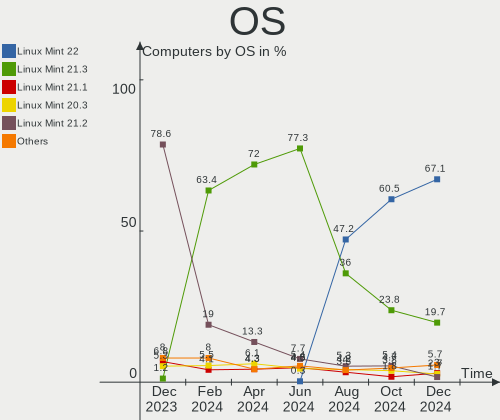
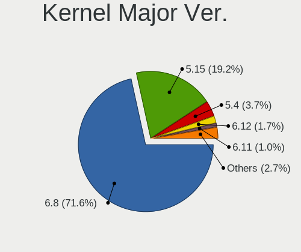
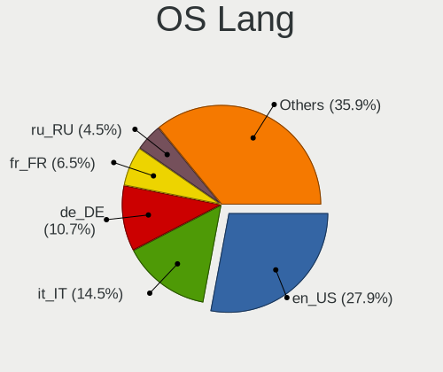
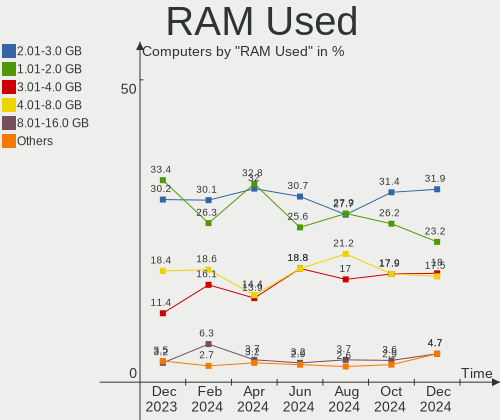
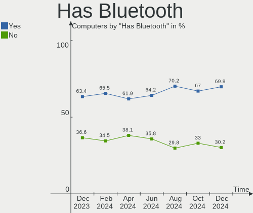
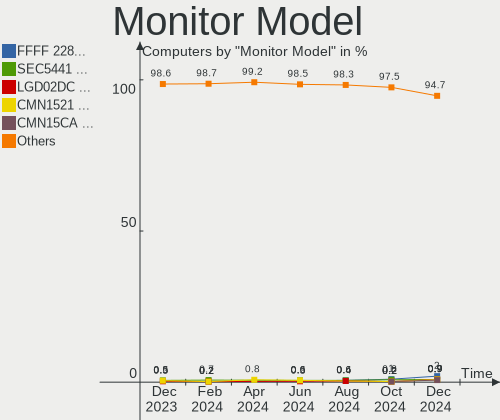
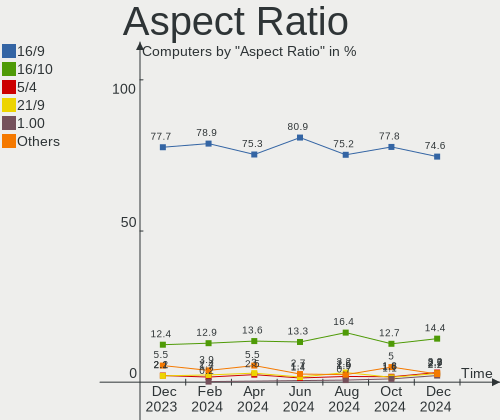
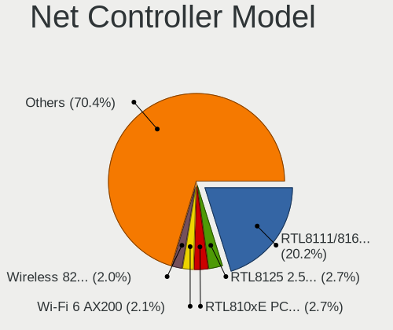
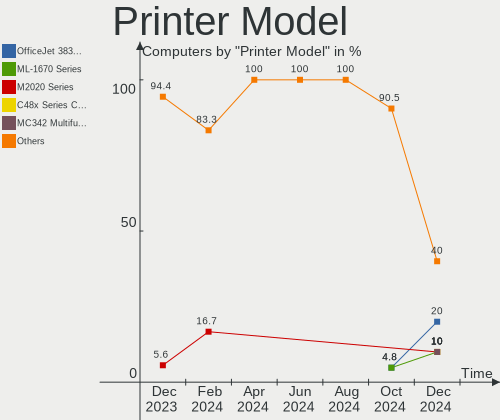

Linux Mint Hardware Trends
--------------------------

A project to identify most popular hardware characteristics and track their change
over time based on data collected by Linux Mint users at https://Linux-Hardware.org.

Anyone can contribute to this report by the [hw-probe](https://github.com/linuxhw/hw-probe) tool:

    sudo -E hw-probe -all -upload

This is a report for all computer types. See also reports for [desktops](/Dist/Linux_Mint/Desktop/README.md) and [notebooks](/Dist/Linux_Mint/Notebook/README.md).

Full-feature report is available here: https://linux-hardware.org/?view=trends

Period: Aug, 2021.

Contents
--------

* [ System ](#system)
  - [ OS                       ](#os)
  - [ OS Family                ](#os-family)
  - [ Kernel                   ](#kernel)
  - [ Kernel Family            ](#kernel-family)
  - [ Kernel Major Ver.        ](#kernel-major-ver)
  - [ Arch                     ](#arch)
  - [ DE                       ](#de)
  - [ Display Server           ](#display-server)
  - [ Display Manager          ](#display-manager)
  - [ OS Lang                  ](#os-lang)
  - [ Boot Mode                ](#boot-mode)
  - [ Filesystem               ](#filesystem)
  - [ Part. scheme             ](#part-scheme)
  - [ Dual Boot with Linux/BSD ](#dual-boot-with-linuxbsd)
  - [ Dual Boot (Win)          ](#dual-boot-win)

* [ Board ](#board)
  - [ Vendor                   ](#vendor)
  - [ Model                    ](#model)
  - [ Model Family             ](#model-family)
  - [ MFG Year                 ](#mfg-year)
  - [ Form Factor              ](#form-factor)
  - [ Secure Boot              ](#secure-boot)
  - [ Coreboot                 ](#coreboot)
  - [ RAM Size                 ](#ram-size)
  - [ RAM Used                 ](#ram-used)
  - [ Total Drives             ](#total-drives)
  - [ Has CD-ROM               ](#has-cd-rom)
  - [ Has Ethernet             ](#has-ethernet)
  - [ Has WiFi                 ](#has-wifi)
  - [ Has Bluetooth            ](#has-bluetooth)

* [ Location ](#location)
  - [ Country                  ](#country)
  - [ City                     ](#city)

* [ Drives ](#drives)
  - [ Drive Vendor             ](#drive-vendor)
  - [ Drive Model              ](#drive-model)
  - [ HDD Vendor               ](#hdd-vendor)
  - [ SSD Vendor               ](#ssd-vendor)
  - [ Drive Kind               ](#drive-kind)
  - [ Drive Connector          ](#drive-connector)
  - [ Drive Size               ](#drive-size)
  - [ Space Total              ](#space-total)
  - [ Space Used               ](#space-used)
  - [ Malfunc. Drives          ](#malfunc-drives)
  - [ Malfunc. Drive Vendor    ](#malfunc-drive-vendor)
  - [ Malfunc. HDD Vendor      ](#malfunc-hdd-vendor)
  - [ Malfunc. Drive Kind      ](#malfunc-drive-kind)
  - [ Failed Drives            ](#failed-drives)
  - [ Failed Drive Vendor      ](#failed-drive-vendor)
  - [ Drive Status             ](#drive-status)

* [ Storage controller ](#storage-controller)
  - [ Storage Vendor           ](#storage-vendor)
  - [ Storage Model            ](#storage-model)
  - [ Storage Kind             ](#storage-kind)

* [ Processor ](#processor)
  - [ CPU Vendor               ](#cpu-vendor)
  - [ CPU Model                ](#cpu-model)
  - [ CPU Model Family         ](#cpu-model-family)
  - [ CPU Cores                ](#cpu-cores)
  - [ CPU Sockets              ](#cpu-sockets)
  - [ CPU Threads              ](#cpu-threads)
  - [ CPU Op-Modes             ](#cpu-op-modes)
  - [ CPU Microcode            ](#cpu-microcode)
  - [ CPU Microarch            ](#cpu-microarch)

* [ Graphics ](#graphics)
  - [ GPU Vendor               ](#gpu-vendor)
  - [ GPU Model                ](#gpu-model)
  - [ GPU Combo                ](#gpu-combo)
  - [ GPU Driver               ](#gpu-driver)
  - [ GPU Memory               ](#gpu-memory)

* [ Monitor ](#monitor)
  - [ Monitor Vendor           ](#monitor-vendor)
  - [ Monitor Model            ](#monitor-model)
  - [ Monitor Resolution       ](#monitor-resolution)
  - [ Monitor Diagonal         ](#monitor-diagonal)
  - [ Monitor Width            ](#monitor-width)
  - [ Aspect Ratio             ](#aspect-ratio)
  - [ Monitor Area             ](#monitor-area)
  - [ Pixel Density            ](#pixel-density)
  - [ Multiple Monitors        ](#multiple-monitors)

* [ Network ](#network)
  - [ Net Controller Vendor    ](#net-controller-vendor)
  - [ Net Controller Model     ](#net-controller-model)
  - [ Wireless Vendor          ](#wireless-vendor)
  - [ Wireless Model           ](#wireless-model)
  - [ Ethernet Vendor          ](#ethernet-vendor)
  - [ Ethernet Model           ](#ethernet-model)
  - [ Net Controller Kind      ](#net-controller-kind)
  - [ Used Controller          ](#used-controller)
  - [ NICs                     ](#nics)
  - [ IPv6                     ](#ipv6)

* [ Bluetooth ](#bluetooth)
  - [ Bluetooth Vendor         ](#bluetooth-vendor)
  - [ Bluetooth Model          ](#bluetooth-model)

* [ Sound ](#sound)
  - [ Sound Vendor             ](#sound-vendor)
  - [ Sound Model              ](#sound-model)

* [ Memory ](#memory)
  - [ Memory Vendor            ](#memory-vendor)
  - [ Memory Model             ](#memory-model)
  - [ Memory Kind              ](#memory-kind)
  - [ Memory Form Factor       ](#memory-form-factor)
  - [ Memory Size              ](#memory-size)
  - [ Memory Speed             ](#memory-speed)

* [ Printers & scanners ](#printers--scanners)
  - [ Printer Vendor           ](#printer-vendor)
  - [ Printer Model            ](#printer-model)
  - [ Scanner Vendor           ](#scanner-vendor)
  - [ Scanner Model            ](#scanner-model)

* [ Camera ](#camera)
  - [ Camera Vendor            ](#camera-vendor)
  - [ Camera Model             ](#camera-model)

* [ Security ](#security)
  - [ Fingerprint Vendor       ](#fingerprint-vendor)
  - [ Fingerprint Model        ](#fingerprint-model)
  - [ Chipcard Vendor          ](#chipcard-vendor)
  - [ Chipcard Model           ](#chipcard-model)

* [ Unsupported ](#unsupported)
  - [ Unsupported Devices      ](#unsupported-devices)
  - [ Unsupported Device Types ](#unsupported-device-types)

System
------

OS
--

Installed operating systems

| Name            | Computers | Percent |
|-----------------|-----------|---------|
| Linux Mint 20.2 | 369       | 73.36%  |
| Linux Mint 20.1 | 50        | 9.94%   |
| Linux Mint 19.3 | 44        | 8.75%   |
| Linux Mint 20   | 27        | 5.37%   |
| Linux Mint 19   | 5         | 0.99%   |
| Linux Mint 19.1 | 3         | 0.6%    |
| Linux Mint 18.3 | 3         | 0.6%    |
| Linux Mint 19.2 | 2         | 0.4%    |

OS Family
---------

OS without a version

| Name       | Computers | Percent |
|------------|-----------|---------|
| Linux Mint | 503       | 100%    |

Kernel
------

Version of the Linux kernel

| Version                    | Computers | Percent |
|----------------------------|-----------|---------|
| 5.4.0-81-generic           | 206       | 40.95%  |
| 5.4.0-80-generic           | 154       | 30.62%  |
| 5.4.0-74-generic           | 40        | 7.95%   |
| 5.11.0-27-generic          | 21        | 4.17%   |
| 5.11.0-25-generic          | 16        | 3.18%   |
| 5.4.0-77-generic           | 9         | 1.79%   |
| 5.4.0-73-generic           | 5         | 0.99%   |
| 5.4.0-58-generic           | 5         | 0.99%   |
| 5.0.0-32-generic           | 5         | 0.99%   |
| 4.15.0-151-generic         | 4         | 0.8%    |
| 4.15.0-154-generic         | 3         | 0.6%    |
| 5.8.0-63-generic           | 2         | 0.4%    |
| 5.4.0-66-generic           | 2         | 0.4%    |
| 5.4.0-62-generic           | 2         | 0.4%    |
| 5.13.11-051311-generic     | 2         | 0.4%    |
| 4.15.0-54-generic          | 2         | 0.4%    |
| 4.15.0-20-generic          | 2         | 0.4%    |
| 5.9.16-050916-generic      | 1         | 0.2%    |
| 5.8.0-59-generic           | 1         | 0.2%    |
| 5.8.0-43-generic           | 1         | 0.2%    |
| 5.4.0-80-lowlatency        | 1         | 0.2%    |
| 5.4.0-70-generic           | 1         | 0.2%    |
| 5.4.0-67-generic           | 1         | 0.2%    |
| 5.4.0-26-generic           | 1         | 0.2%    |
| 5.13.9-custom              | 1         | 0.2%    |
| 5.13.8                     | 1         | 0.2%    |
| 5.13.4-051304-generic      | 1         | 0.2%    |
| 5.12.5-051205-generic      | 1         | 0.2%    |
| 5.12.19-051219-generic     | 1         | 0.2%    |
| 5.12.0-19.3-liquorix-amd64 | 1         | 0.2%    |
| 5.11.15-051115-generic     | 1         | 0.2%    |
| 5.11.0-34-lowlatency       | 1         | 0.2%    |
| 5.11.0-22-generic          | 1         | 0.2%    |
| 5.10.5-2006-amd+           | 1         | 0.2%    |
| 5.0.21-050021-generic      | 1         | 0.2%    |
| 4.4.0-210-generic          | 1         | 0.2%    |
| 4.15.0-153-generic         | 1         | 0.2%    |
| 4.15.0-144-generic         | 1         | 0.2%    |
| 4.15.0-142-generic         | 1         | 0.2%    |
| 4.10.0-38-generic          | 1         | 0.2%    |

Kernel Family
-------------

Linux kernel without a distro release

| Version | Computers | Percent |
|---------|-----------|---------|
| 5.4.0   | 427       | 84.89%  |
| 5.11.0  | 39        | 7.75%   |
| 4.15.0  | 14        | 2.78%   |
| 5.0.0   | 5         | 0.99%   |
| 5.8.0   | 4         | 0.8%    |
| 5.13.11 | 2         | 0.4%    |
| 5.9.16  | 1         | 0.2%    |
| 5.13.9  | 1         | 0.2%    |
| 5.13.8  | 1         | 0.2%    |
| 5.13.4  | 1         | 0.2%    |
| 5.12.5  | 1         | 0.2%    |
| 5.12.19 | 1         | 0.2%    |
| 5.12.0  | 1         | 0.2%    |
| 5.11.15 | 1         | 0.2%    |
| 5.10.5  | 1         | 0.2%    |
| 5.0.21  | 1         | 0.2%    |
| 4.4.0   | 1         | 0.2%    |
| 4.10.0  | 1         | 0.2%    |

Kernel Major Ver.
-----------------

Linux kernel major version

| Version | Computers | Percent |
|---------|-----------|---------|
| 5.4     | 427       | 84.89%  |
| 5.11    | 40        | 7.95%   |
| 4.15    | 14        | 2.78%   |
| 5.0     | 6         | 1.19%   |
| 5.13    | 5         | 0.99%   |
| 5.8     | 4         | 0.8%    |
| 5.12    | 3         | 0.6%    |
| 5.9     | 1         | 0.2%    |
| 5.10    | 1         | 0.2%    |
| 4.4     | 1         | 0.2%    |
| 4.10    | 1         | 0.2%    |

Arch
----

OS architecture (x86_64, i586, etc.)

| Name   | Computers | Percent |
|--------|-----------|---------|
| x86_64 | 489       | 97.22%  |
| i686   | 14        | 2.78%   |

DE
--

Desktop Environment

| Name          | Computers | Percent |
|---------------|-----------|---------|
| X-Cinnamon    | 324       | 64.41%  |
| MATE          | 74        | 14.71%  |
| XFCE          | 58        | 11.53%  |
| Cinnamon      | 29        | 5.77%   |
| GNOME         | 10        | 1.99%   |
| Unknown       | 4         | 0.8%    |
| LXDE          | 2         | 0.4%    |
| KDE           | 1         | 0.2%    |
| GNOME Classic | 1         | 0.2%    |

Display Server
--------------

X11 or Wayland

| Name | Computers | Percent |
|------|-----------|---------|
| X11  | 503       | 100%    |

Display Manager
---------------

SDDM, LightDM, etc.

| Name    | Computers | Percent |
|---------|-----------|---------|
| Unknown | 306       | 60.83%  |
| TDM     | 120       | 23.86%  |
| LightDM | 71        | 14.12%  |
| GDM     | 6         | 1.19%   |

OS Lang
-------

Language

| Lang    | Computers | Percent |
|---------|-----------|---------|
| en_US   | 148       | 29.42%  |
| de_DE   | 118       | 23.46%  |
| pt_BR   | 40        | 7.95%   |
| en_GB   | 29        | 5.77%   |
| fr_FR   | 26        | 5.17%   |
| C       | 26        | 5.17%   |
| ru_RU   | 13        | 2.58%   |
| pl_PL   | 10        | 1.99%   |
| en_CA   | 8         | 1.59%   |
| de_CH   | 7         | 1.39%   |
| en_AU   | 6         | 1.19%   |
| de_AT   | 6         | 1.19%   |
| it_IT   | 5         | 0.99%   |
| es_AR   | 5         | 0.99%   |
| es_MX   | 4         | 0.8%    |
| ru_UA   | 3         | 0.6%    |
| nl_NL   | 3         | 0.6%    |
| en_ZA   | 3         | 0.6%    |
| en_PH   | 3         | 0.6%    |
| en_NZ   | 3         | 0.6%    |
| en_IN   | 3         | 0.6%    |
| th_TH   | 2         | 0.4%    |
| pt_PT   | 2         | 0.4%    |
| fr_CA   | 2         | 0.4%    |
| fr_BE   | 2         | 0.4%    |
| es_PE   | 2         | 0.4%    |
| es_ES   | 2         | 0.4%    |
| es_CL   | 2         | 0.4%    |
| da_DK   | 2         | 0.4%    |
| cs_CZ   | 2         | 0.4%    |
| ar_KW   | 2         | 0.4%    |
| zh_TW   | 1         | 0.2%    |
| sk_SK   | 1         | 0.2%    |
| nl_BE   | 1         | 0.2%    |
| hu_HU   | 1         | 0.2%    |
| he_IL   | 1         | 0.2%    |
| fr_CH   | 1         | 0.2%    |
| es_UY   | 1         | 0.2%    |
| es_CU   | 1         | 0.2%    |
| es_CO   | 1         | 0.2%    |
| en_SG   | 1         | 0.2%    |
| en_IL   | 1         | 0.2%    |
| en_IE   | 1         | 0.2%    |
| el_GR   | 1         | 0.2%    |
| Unknown | 1         | 0.2%    |

Boot Mode
---------

EFI or BIOS

| Mode | Computers | Percent |
|------|-----------|---------|
| BIOS | 258       | 51.29%  |
| EFI  | 245       | 48.71%  |

Filesystem
----------

Type of filesystem

| Type    | Computers | Percent |
|---------|-----------|---------|
| Ext4    | 467       | 92.84%  |
| Overlay | 24        | 4.77%   |
| Btrfs   | 10        | 1.99%   |
| Ext3    | 1         | 0.2%    |
| Unknown | 1         | 0.2%    |

Part. scheme
------------

Scheme of partitioning

| Type    | Computers | Percent |
|---------|-----------|---------|
| Unknown | 305       | 60.64%  |
| GPT     | 132       | 26.24%  |
| MBR     | 66        | 13.12%  |

Dual Boot with Linux/BSD
------------------------

Hosting more than one Linux/BSD

| Dual boot | Computers | Percent |
|-----------|-----------|---------|
| No        | 459       | 91.25%  |
| Yes       | 44        | 8.75%   |

Dual Boot (Win)
---------------

Hosting Linux and Windows

| Dual boot | Computers | Percent |
|-----------|-----------|---------|
| No        | 408       | 81.11%  |
| Yes       | 95        | 18.89%  |

Board
-----

Vendor
------

Motherboard manufacturer

| Name                | Computers | Percent |
|---------------------|-----------|---------|
| ASUSTek Computer    | 80        | 15.9%   |
| Hewlett-Packard     | 72        | 14.31%  |
| Lenovo              | 59        | 11.73%  |
| Dell                | 58        | 11.53%  |
| Acer                | 48        | 9.54%   |
| Gigabyte Technology | 27        | 5.37%   |
| ASRock              | 24        | 4.77%   |
| MSI                 | 19        | 3.78%   |
| Toshiba             | 13        | 2.58%   |
| Intel               | 10        | 1.99%   |
| Fujitsu             | 10        | 1.99%   |
| Apple               | 8         | 1.59%   |
| Sony                | 6         | 1.19%   |
| Medion              | 6         | 1.19%   |
| Samsung Electronics | 5         | 0.99%   |
| Unknown             | 4         | 0.8%    |
| Positivo            | 3         | 0.6%    |
| Notebook            | 3         | 0.6%    |
| Microsoft           | 3         | 0.6%    |
| ECS                 | 3         | 0.6%    |
| Pegatron            | 2         | 0.4%    |
| PCWare              | 2         | 0.4%    |
| Gateway             | 2         | 0.4%    |
| Fujitsu Siemens     | 2         | 0.4%    |
| eMachines           | 2         | 0.4%    |
| Compulab            | 2         | 0.4%    |
| Zillion B75FEL3     | 1         | 0.2%    |
| Wortmann AG         | 1         | 0.2%    |
| Ultra               | 1         | 0.2%    |
| TWG                 | 1         | 0.2%    |
| TaNix               | 1         | 0.2%    |
| Seco                | 1         | 0.2%    |
| Razer               | 1         | 0.2%    |
| QUANMAX             | 1         | 0.2%    |
| Philco              | 1         | 0.2%    |
| PCChips             | 1         | 0.2%    |
| Packard Bell        | 1         | 0.2%    |
| OEM                 | 1         | 0.2%    |
| LG Electronics      | 1         | 0.2%    |
| Itautec             | 1         | 0.2%    |
| IGEL Technology     | 1         | 0.2%    |
| HUAWEI              | 1         | 0.2%    |
| Huanan              | 1         | 0.2%    |
| HC                  | 1         | 0.2%    |
| Google              | 1         | 0.2%    |
| Foxconn             | 1         | 0.2%    |
| Dynabook            | 1         | 0.2%    |
| Digibras            | 1         | 0.2%    |
| DFI                 | 1         | 0.2%    |
| Cubix               | 1         | 0.2%    |
| Compaq              | 1         | 0.2%    |
| Biostar             | 1         | 0.2%    |
| AZW                 | 1         | 0.2%    |
| AVITA               | 1         | 0.2%    |
| AMI                 | 1         | 0.2%    |
| Alienware           | 1         | 0.2%    |

Model
-----

Motherboard model

| Name                                     | Computers | Percent |
|------------------------------------------|-----------|---------|
| Unknown                                  | 6         | 1.19%   |
| ASUS All Series                          | 5         | 0.99%   |
| ASUS P50IJ                               | 3         | 0.6%    |
| Toshiba Satellite L40                    | 2         | 0.4%    |
| Toshiba Satellite C660                   | 2         | 0.4%    |
| MSI MS-7B86                              | 2         | 0.4%    |
| Lenovo IdeaPad 3 15ALC6 82KU             | 2         | 0.4%    |
| HP Pavilion Gaming Laptop 17-cd1xxx      | 2         | 0.4%    |
| HP Laptop 15-bw0xx                       | 2         | 0.4%    |
| HP ENVY x360 Convertible                 | 2         | 0.4%    |
| HP Compaq 8200 Elite SFF PC              | 2         | 0.4%    |
| HP Compaq 8100 Elite SFF PC              | 2         | 0.4%    |
| HP Compaq 6200 Pro SFF PC                | 2         | 0.4%    |
| HP Compaq 6000 Pro MT PC                 | 2         | 0.4%    |
| HP 620                                   | 2         | 0.4%    |
| Gigabyte H81M-D2V                        | 2         | 0.4%    |
| Gigabyte F2A88XM-D3H                     | 2         | 0.4%    |
| Fujitsu ESPRIMO P910                     | 2         | 0.4%    |
| Dell OptiPlex 9020                       | 2         | 0.4%    |
| Dell Latitude E7270                      | 2         | 0.4%    |
| Dell Latitude E5570                      | 2         | 0.4%    |
| Compulab fitlet2                         | 2         | 0.4%    |
| ASUS VivoBook_ASUSLaptop X515DA_M515DA   | 2         | 0.4%    |
| ASUS PRIME Z390-A                        | 2         | 0.4%    |
| ASUS PRIME Z370-A                        | 2         | 0.4%    |
| ASUS PRIME X570-P                        | 2         | 0.4%    |
| ASUS P8H61-M LX3 PLUS R2.0               | 2         | 0.4%    |
| ASUS P8B75-M LX                          | 2         | 0.4%    |
| ASUS ASUS TUF Gaming F15 FX506LH_FX506LH | 2         | 0.4%    |
| ASRock N68-GS4 FX R2.0                   | 2         | 0.4%    |
| ASRock B550M Pro4                        | 2         | 0.4%    |
| Acer Nitro AN515-52                      | 2         | 0.4%    |
| Acer Nitro AN515-51                      | 2         | 0.4%    |
| Acer Aspire ES1-521                      | 2         | 0.4%    |
| Zillion B75FEL3 Board                    | 1         | 0.2%    |
| Wortmann AG TERRA_MOBILE_1512/1712       | 1         | 0.2%    |
| Ultra UB422                              | 1         | 0.2%    |
| TWG E2017                                | 1         | 0.2%    |
| Toshiba TECRA A10                        | 1         | 0.2%    |
| Toshiba Satellite R630                   | 1         | 0.2%    |
| Toshiba Satellite L855                   | 1         | 0.2%    |
| Toshiba Satellite C660D                  | 1         | 0.2%    |
| Toshiba Satellite C655                   | 1         | 0.2%    |
| Toshiba Satellite C55t-C                 | 1         | 0.2%    |
| Toshiba Satellite C50D-C                 | 1         | 0.2%    |
| Toshiba Satellite C50-A-19U              | 1         | 0.2%    |
| Toshiba QOSMIO X875                      | 1         | 0.2%    |
| TaNix Tx85                               | 1         | 0.2%    |
| Sony VPCF13WFX                           | 1         | 0.2%    |
| Sony VPCEB1E9R                           | 1         | 0.2%    |
| Sony VGN-NW21MF_W                        | 1         | 0.2%    |
| Sony VGN-AR71J                           | 1         | 0.2%    |
| Sony SVT1122B2EW                         | 1         | 0.2%    |
| Sony SVE14A27CLS                         | 1         | 0.2%    |
| Seco C40                                 | 1         | 0.2%    |
| Samsung R780                             | 1         | 0.2%    |
| Samsung R520/R522/R620                   | 1         | 0.2%    |
| Samsung R519/R719                        | 1         | 0.2%    |
| Samsung 700Z3C/700Z5C                    | 1         | 0.2%    |
| Samsung 350V5C/351V5C/3540VC/3440VC      | 1         | 0.2%    |

Model Family
------------

Motherboard model prefix

| Name                    | Computers | Percent |
|-------------------------|-----------|---------|
| Acer Aspire             | 32        | 6.36%   |
| Lenovo ThinkPad         | 28        | 5.57%   |
| Dell Latitude           | 20        | 3.98%   |
| HP Pavilion             | 14        | 2.78%   |
| HP Compaq               | 14        | 2.78%   |
| Dell OptiPlex           | 12        | 2.39%   |
| Toshiba Satellite       | 11        | 2.19%   |
| Dell Inspiron           | 11        | 2.19%   |
| ASUS PRIME              | 11        | 2.19%   |
| Lenovo IdeaPad          | 8         | 1.59%   |
| HP ProBook              | 6         | 1.19%   |
| HP ENVY                 | 6         | 1.19%   |
| HP EliteBook            | 6         | 1.19%   |
| ASUS TUF                | 6         | 1.19%   |
| Acer Nitro              | 6         | 1.19%   |
| Unknown                 | 6         | 1.19%   |
| Dell Vostro             | 5         | 0.99%   |
| Dell Precision          | 5         | 0.99%   |
| ASUS ROG                | 5         | 0.99%   |
| ASUS All                | 5         | 0.99%   |
| Lenovo ThinkCentre      | 4         | 0.8%    |
| HP ZBook                | 4         | 0.8%    |
| HP Laptop               | 4         | 0.8%    |
| Fujitsu LIFEBOOK        | 4         | 0.8%    |
| ASUS VivoBook           | 4         | 0.8%    |
| Microsoft Surface       | 3         | 0.6%    |
| Fujitsu ESPRIMO         | 3         | 0.6%    |
| Dell XPS                | 3         | 0.6%    |
| ASUS ZenBook            | 3         | 0.6%    |
| ASUS P50IJ              | 3         | 0.6%    |
| ASUS M5A78L-M           | 3         | 0.6%    |
| ASUS ASUS               | 3         | 0.6%    |
| MSI MS-7B86             | 2         | 0.4%    |
| Medion E2228T           | 2         | 0.4%    |
| Lenovo ThinkBook        | 2         | 0.4%    |
| Lenovo G560             | 2         | 0.4%    |
| HP EliteDesk            | 2         | 0.4%    |
| HP 620                  | 2         | 0.4%    |
| Gigabyte H81M-D2V       | 2         | 0.4%    |
| Gigabyte F2A88XM-D3H    | 2         | 0.4%    |
| Gigabyte B450           | 2         | 0.4%    |
| Fujitsu Siemens ESPRIMO | 2         | 0.4%    |
| Compulab fitlet2        | 2         | 0.4%    |
| ASUS P8H61-M            | 2         | 0.4%    |
| ASUS P8B75-M            | 2         | 0.4%    |
| ASUS M5A97              | 2         | 0.4%    |
| ASRock X399             | 2         | 0.4%    |
| ASRock N68-GS4          | 2         | 0.4%    |
| ASRock B550M            | 2         | 0.4%    |
| Acer Veriton            | 2         | 0.4%    |
| Acer Extensa            | 2         | 0.4%    |
| Zillion B75FEL3 Board   | 1         | 0.2%    |
| Wortmann AG TERRA       | 1         | 0.2%    |
| Ultra UB422             | 1         | 0.2%    |
| TWG E2017               | 1         | 0.2%    |
| Toshiba TECRA           | 1         | 0.2%    |
| Toshiba QOSMIO          | 1         | 0.2%    |
| TaNix Tx85              | 1         | 0.2%    |
| Sony VPCF13WFX          | 1         | 0.2%    |
| Sony VPCEB1E9R          | 1         | 0.2%    |

MFG Year
--------

Motherboard manufacture year

| Year | Computers | Percent |
|------|-----------|---------|
| 2021 | 65        | 12.92%  |
| 2020 | 54        | 10.74%  |
| 2019 | 43        | 8.55%   |
| 2013 | 41        | 8.15%   |
| 2015 | 38        | 7.55%   |
| 2010 | 38        | 7.55%   |
| 2014 | 35        | 6.96%   |
| 2018 | 34        | 6.76%   |
| 2012 | 31        | 6.16%   |
| 2009 | 29        | 5.77%   |
| 2011 | 28        | 5.57%   |
| 2017 | 18        | 3.58%   |
| 2016 | 15        | 2.98%   |
| 2008 | 15        | 2.98%   |
| 2007 | 13        | 2.58%   |
| 2006 | 3         | 0.6%    |
| 2005 | 2         | 0.4%    |
| 2004 | 1         | 0.2%    |

Form Factor
-----------

Physical design of the computer

| Name        | Computers | Percent |
|-------------|-----------|---------|
| Notebook    | 275       | 54.67%  |
| Desktop     | 197       | 39.17%  |
| Convertible | 13        | 2.58%   |
| Mini pc     | 8         | 1.59%   |
| Tablet      | 4         | 0.8%    |
| All in one  | 4         | 0.8%    |
| Server      | 2         | 0.4%    |

Secure Boot
-----------

Enabled or disabled

| State    | Computers | Percent |
|----------|-----------|---------|
| Disabled | 467       | 92.84%  |
| Enabled  | 36        | 7.16%   |

Coreboot
--------

Have coreboot on board

| Used | Computers | Percent |
|------|-----------|---------|
| No   | 501       | 99.6%   |
| Yes  | 2         | 0.4%    |

RAM Size
--------

Total RAM memory

| Size in GB  | Computers | Percent |
|-------------|-----------|---------|
| 3.01-4.0    | 131       | 26.04%  |
| 4.01-8.0    | 119       | 23.66%  |
| 8.01-16.0   | 93        | 18.49%  |
| 16.01-24.0  | 77        | 15.31%  |
| 32.01-64.0  | 36        | 7.16%   |
| 1.01-2.0    | 22        | 4.37%   |
| 64.01-256.0 | 8         | 1.59%   |
| 2.01-3.0    | 7         | 1.39%   |
| 24.01-32.0  | 6         | 1.19%   |
| 0.51-1.0    | 4         | 0.8%    |

RAM Used
--------

Used RAM memory

| Used GB    | Computers | Percent |
|------------|-----------|---------|
| 1.01-2.0   | 213       | 42.35%  |
| 2.01-3.0   | 151       | 30.02%  |
| 3.01-4.0   | 51        | 10.14%  |
| 4.01-8.0   | 40        | 7.95%   |
| 0.51-1.0   | 35        | 6.96%   |
| 8.01-16.0  | 7         | 1.39%   |
| 16.01-24.0 | 2         | 0.4%    |
| 0.01-0.5   | 2         | 0.4%    |
| 32.01-64.0 | 1         | 0.2%    |
| 24.01-32.0 | 1         | 0.2%    |

Total Drives
------------

Number of drives on board

| Drives | Computers | Percent |
|--------|-----------|---------|
| 1      | 288       | 57.26%  |
| 2      | 135       | 26.84%  |
| 3      | 40        | 7.95%   |
| 4      | 19        | 3.78%   |
| 5      | 7         | 1.39%   |
| 6      | 6         | 1.19%   |
| 0      | 4         | 0.8%    |
| 8      | 3         | 0.6%    |
| 7      | 1         | 0.2%    |

Has CD-ROM
----------

Has CD-ROM on board

| Presented | Computers | Percent |
|-----------|-----------|---------|
| No        | 261       | 51.89%  |
| Yes       | 242       | 48.11%  |

Has Ethernet
------------

Has Ethernet on board

| Presented | Computers | Percent |
|-----------|-----------|---------|
| Yes       | 456       | 90.66%  |
| No        | 47        | 9.34%   |

Has WiFi
--------

Has WiFi module

| Presented | Computers | Percent |
|-----------|-----------|---------|
| Yes       | 386       | 76.74%  |
| No        | 117       | 23.26%  |

Has Bluetooth
-------------

Has Bluetooth module

| Presented | Computers | Percent |
|-----------|-----------|---------|
| Yes       | 268       | 53.28%  |
| No        | 235       | 46.72%  |

Location
--------

Country
-------

Geographic location (country)

| Country      | Computers | Percent |
|--------------|-----------|---------|
| Germany      | 128       | 25.45%  |
| USA          | 82        | 16.3%   |
| Brazil       | 46        | 9.15%   |
| France       | 27        | 5.37%   |
| UK           | 26        | 5.17%   |
| Russia       | 20        | 3.98%   |
| Canada       | 16        | 3.18%   |
| Switzerland  | 13        | 2.58%   |
| Poland       | 11        | 2.19%   |
| Netherlands  | 10        | 1.99%   |
| Italy        | 9         | 1.79%   |
| Mexico       | 8         | 1.59%   |
| Ukraine      | 7         | 1.39%   |
| Austria      | 7         | 1.39%   |
| Australia    | 7         | 1.39%   |
| Argentina    | 5         | 0.99%   |
| Spain        | 4         | 0.8%    |
| South Korea  | 4         | 0.8%    |
| South Africa | 4         | 0.8%    |
| India        | 4         | 0.8%    |
| Belgium      | 4         | 0.8%    |
| Turkey       | 3         | 0.6%    |
| Thailand     | 3         | 0.6%    |
| Philippines  | 3         | 0.6%    |
| New Zealand  | 3         | 0.6%    |
| Indonesia    | 3         | 0.6%    |
| Finland      | 3         | 0.6%    |
| Denmark      | 3         | 0.6%    |
| Sweden       | 2         | 0.4%    |
| Slovakia     | 2         | 0.4%    |
| Romania      | 2         | 0.4%    |
| Portugal     | 2         | 0.4%    |
| Peru         | 2         | 0.4%    |
| Latvia       | 2         | 0.4%    |
| Israel       | 2         | 0.4%    |
| Greece       | 2         | 0.4%    |
| Czechia      | 2         | 0.4%    |
| Colombia     | 2         | 0.4%    |
| Chile        | 2         | 0.4%    |
| Uruguay      | 1         | 0.2%    |
| Uganda       | 1         | 0.2%    |
| Taiwan       | 1         | 0.2%    |
| Sri Lanka    | 1         | 0.2%    |
| Serbia       | 1         | 0.2%    |
| Norway       | 1         | 0.2%    |
| Morocco      | 1         | 0.2%    |
| Kenya        | 1         | 0.2%    |
| Jersey       | 1         | 0.2%    |
| Japan        | 1         | 0.2%    |
| Ivory Coast  | 1         | 0.2%    |
| Ireland      | 1         | 0.2%    |
| Hungary      | 1         | 0.2%    |
| Cyprus       | 1         | 0.2%    |
| Cuba         | 1         | 0.2%    |
| Bulgaria     | 1         | 0.2%    |
| Armenia      | 1         | 0.2%    |
| Algeria      | 1         | 0.2%    |

City
----

Geographic location (city)

| City                  | Computers | Percent |
|-----------------------|-----------|---------|
| Berlin                | 14        | 2.78%   |
| Moscow                | 6         | 1.19%   |
| Stuttgart             | 5         | 0.99%   |
| Warsaw                | 4         | 0.8%    |
| S??o Paulo            | 4         | 0.8%    |
| Maurecourt            | 4         | 0.8%    |
| Hamburg               | 4         | 0.8%    |
| Frankfurt am Main     | 4         | 0.8%    |
| Zurich                | 3         | 0.6%    |
| Wiesbaden             | 3         | 0.6%    |
| Vienna                | 3         | 0.6%    |
| Rome                  | 3         | 0.6%    |
| Rio de Janeiro        | 3         | 0.6%    |
| Paris                 | 3         | 0.6%    |
| London                | 3         | 0.6%    |
| Leipzig               | 3         | 0.6%    |
| Krasnodar             | 3         | 0.6%    |
| Helsinki              | 3         | 0.6%    |
| Dortmund              | 3         | 0.6%    |
| D??sseldorf           | 3         | 0.6%    |
| Cologne               | 3         | 0.6%    |
| Tel Aviv              | 2         | 0.4%    |
| Sens                  | 2         | 0.4%    |
| S??o Jos?© dos Campos | 2         | 0.4%    |
| Rockville             | 2         | 0.4%    |
| Oregon City           | 2         | 0.4%    |
| Nettetal              | 2         | 0.4%    |
| Montreal              | 2         | 0.4%    |
| Miami                 | 2         | 0.4%    |
| Mendoza               | 2         | 0.4%    |
| Melbourne             | 2         | 0.4%    |
| Mainz                 | 2         | 0.4%    |
| Lima                  | 2         | 0.4%    |
| Jakarta               | 2         | 0.4%    |
| Ganterschwil          | 2         | 0.4%    |
| Essen                 | 2         | 0.4%    |
| Erfurt                | 2         | 0.4%    |
| Effretikon            | 2         | 0.4%    |
| Dordrecht             | 2         | 0.4%    |
| Copenhagen            | 2         | 0.4%    |
| Betim                 | 2         | 0.4%    |
| Belo Horizonte        | 2         | 0.4%    |
| Adelaide              | 2         | 0.4%    |
| Zhytomyr              | 1         | 0.2%    |
| Zehdenick             | 1         | 0.2%    |
| Yuma                  | 1         | 0.2%    |
| Xicotepec de Juarez   | 1         | 0.2%    |
| Worpswede             | 1         | 0.2%    |
| Witten                | 1         | 0.2%    |
| Whangarei             | 1         | 0.2%    |
| Wendeburg             | 1         | 0.2%    |
| Weiterstadt           | 1         | 0.2%    |
| Waterloo              | 1         | 0.2%    |
| Waimea                | 1         | 0.2%    |
| Volgograd             | 1         | 0.2%    |
| Voerde                | 1         | 0.2%    |
| Vladivostok           | 1         | 0.2%    |
| Villa Hidalgo         | 1         | 0.2%    |
| Vasylkiv              | 1         | 0.2%    |
| Vashon                | 1         | 0.2%    |

Drives
------

Drive Vendor
------------

Hard drive vendors

| Vendor                    | Computers | Drives | Percent |
|---------------------------|-----------|--------|---------|
| WDC                       | 120       | 146    | 16.28%  |
| Seagate                   | 106       | 131    | 14.38%  |
| Samsung Electronics       | 99        | 127    | 13.43%  |
| Toshiba                   | 51        | 51     | 6.92%   |
| SanDisk                   | 45        | 49     | 6.11%   |
| Unknown                   | 38        | 44     | 5.16%   |
| Kingston                  | 35        | 37     | 4.75%   |
| Hitachi                   | 31        | 33     | 4.21%   |
| Crucial                   | 26        | 27     | 3.53%   |
| SK Hynix                  | 22        | 22     | 2.99%   |
| Intel                     | 16        | 18     | 2.17%   |
| A-DATA Technology         | 15        | 15     | 2.04%   |
| HGST                      | 13        | 14     | 1.76%   |
| China                     | 12        | 12     | 1.63%   |
| Intenso                   | 8         | 8      | 1.09%   |
| Micron Technology         | 7         | 7      | 0.95%   |
| Apple                     | 5         | 6      | 0.68%   |
| SPCC                      | 4         | 4      | 0.54%   |
| Silicon Motion            | 4         | 5      | 0.54%   |
| PNY                       | 4         | 4      | 0.54%   |
| Team                      | 3         | 3      | 0.41%   |
| PLEXTOR                   | 3         | 3      | 0.41%   |
| OCZ                       | 3         | 3      | 0.41%   |
| Fujitsu                   | 3         | 3      | 0.41%   |
| Apacer                    | 3         | 3      | 0.41%   |
| XPG                       | 2         | 2      | 0.27%   |
| Union Memory              | 2         | 2      | 0.27%   |
| Transcend                 | 2         | 5      | 0.27%   |
| SABRENT                   | 2         | 2      | 0.27%   |
| Phison                    | 2         | 3      | 0.27%   |
| Patriot                   | 2         | 2      | 0.27%   |
| Micron/Crucial Technology | 2         | 2      | 0.27%   |
| LITEON                    | 2         | 2      | 0.27%   |
| KIOXIA-EXCERIA            | 2         | 2      | 0.27%   |
| KIOXIA                    | 2         | 2      | 0.27%   |
| JMicron                   | 2         | 2      | 0.27%   |
| Hewlett-Packard           | 2         | 2      | 0.27%   |
| Corsair                   | 2         | 2      | 0.27%   |
| asmedia                   | 2         | 2      | 0.27%   |
| Yeyian                    | 1         | 1      | 0.14%   |
| Vaseky                    | 1         | 1      | 0.14%   |
| USB3.0                    | 1         | 1      | 0.14%   |
| TEYADI                    | 1         | 1      | 0.14%   |
| sobetter                  | 1         | 1      | 0.14%   |
| Realtek Semiconductor     | 1         | 1      | 0.14%   |
| Pioneer                   | 1         | 1      | 0.14%   |
| Phison Electronics        | 1         | 1      | 0.14%   |
| Palit                     | 1         | 1      | 0.14%   |
| Netac                     | 1         | 1      | 0.14%   |
| Maxtor                    | 1         | 1      | 0.14%   |
| Maximus                   | 1         | 1      | 0.14%   |
| LITEONIT                  | 1         | 2      | 0.14%   |
| Leven                     | 1         | 1      | 0.14%   |
| KingFast                  | 1         | 1      | 0.14%   |
| KingDian                  | 1         | 1      | 0.14%   |
| JDa                       | 1         | 1      | 0.14%   |
| Hoodisk                   | 1         | 1      | 0.14%   |
| Golden                    | 1         | 1      | 0.14%   |
| Gigabyte Technology       | 1         | 1      | 0.14%   |
| GeIL                      | 1         | 1      | 0.14%   |

Drive Model
-----------

Hard drive models

| Model                                | Computers | Percent |
|--------------------------------------|-----------|---------|
| Kingston SA400S37240G 240GB SSD      | 13        | 1.6%    |
| Unknown MMC Card  64GB               | 8         | 0.99%   |
| Unknown MMC Card  32GB               | 8         | 0.99%   |
| Samsung SSD 850 EVO 500GB            | 8         | 0.99%   |
| WDC WDS500G2B0A-00SM50 500GB SSD     | 7         | 0.86%   |
| Toshiba MQ01ABF050 500GB             | 7         | 0.86%   |
| Seagate ST500DM002-1BD142 500GB      | 7         | 0.86%   |
| Samsung SSD 860 EVO 500GB            | 7         | 0.86%   |
| Samsung SSD 840 EVO 500GB            | 7         | 0.86%   |
| Unknown SD/MMC/MS PRO 128GB          | 6         | 0.74%   |
| Unknown MMC Card  128GB              | 6         | 0.74%   |
| Toshiba MQ01ABD100 1TB               | 6         | 0.74%   |
| Samsung SSD 850 EVO 250GB            | 6         | 0.74%   |
| Kingston SA400S37120G 120GB SSD      | 6         | 0.74%   |
| Crucial CT1000MX500SSD1 1TB          | 6         | 0.74%   |
| Seagate ST1000LM035-1RK172 1TB       | 5         | 0.62%   |
| Seagate ST1000DM010-2EP102 1TB       | 5         | 0.62%   |
| SanDisk SSD PLUS 120GB               | 5         | 0.62%   |
| WDC WD10EARS-00Y5B1 1TB              | 4         | 0.49%   |
| Toshiba MQ04ABF100 1TB               | 4         | 0.49%   |
| SK Hynix NVMe SSD Drive 512GB        | 4         | 0.49%   |
| Seagate ST9500325AS 500GB            | 4         | 0.49%   |
| SanDisk SSD PLUS 240GB               | 4         | 0.49%   |
| Samsung SSD 860 EVO 250GB            | 4         | 0.49%   |
| Samsung SSD 860 EVO 1TB              | 4         | 0.49%   |
| Crucial CT500MX500SSD1 500GB         | 4         | 0.49%   |
| WDC WD20EZRZ-00Z5HB0 2TB             | 3         | 0.37%   |
| WDC WD20EZRX-00D8PB0 2TB             | 3         | 0.37%   |
| Toshiba HDWD110 1TB                  | 3         | 0.37%   |
| Toshiba DT01ACA100 1TB               | 3         | 0.37%   |
| Seagate ST500LM012 HN-M500MBB 500GB  | 3         | 0.37%   |
| Seagate ST31000528AS 1TB             | 3         | 0.37%   |
| Seagate ST2000DM008-2FR102 2TB       | 3         | 0.37%   |
| Seagate ST1000DM003-1ER162 1TB       | 3         | 0.37%   |
| Seagate ST1000DM003-1CH162 1TB       | 3         | 0.37%   |
| Seagate Expansion 2TB                | 3         | 0.37%   |
| Seagate Backup+ Hub BK 10TB          | 3         | 0.37%   |
| SanDisk SDSSDA240G 240GB             | 3         | 0.37%   |
| SanDisk SDSSDA120G 120GB             | 3         | 0.37%   |
| Samsung SSD 980 1TB                  | 3         | 0.37%   |
| Samsung SSD 840 EVO 120GB            | 3         | 0.37%   |
| Samsung NVMe SSD Drive 512GB         | 3         | 0.37%   |
| Samsung HD103SJ 1TB                  | 3         | 0.37%   |
| Kingston SA400S37480G 480GB SSD      | 3         | 0.37%   |
| Intenso SSD SATAIII 960GB            | 3         | 0.37%   |
| Crucial CT240BX500SSD1 240GB         | 3         | 0.37%   |
| Crucial CT120BX500SSD1 120GB         | 3         | 0.37%   |
| China SATA SSD 120GB                 | 3         | 0.37%   |
| WDC WDS100T2B0B-00YS70 1TB SSD       | 2         | 0.25%   |
| WDC WDS100T2B0A-00SM50 1TB SSD       | 2         | 0.25%   |
| WDC WD6400AAKS-00A7B0 640GB          | 2         | 0.25%   |
| WDC WD5000LPCX-00VHAT0 500GB         | 2         | 0.25%   |
| WDC WD5000AAKX-001CA0 500GB          | 2         | 0.25%   |
| WDC WD40EZRZ-00GXCB0 4TB             | 2         | 0.25%   |
| WDC WD3200BEVT-22ZCT0 320GB          | 2         | 0.25%   |
| WDC WD20EARX-00PASB0 2TB             | 2         | 0.25%   |
| WDC WD10EZEX-00BN5A0 1TB             | 2         | 0.25%   |
| WDC WD10EADS-00L5B1 1TB              | 2         | 0.25%   |
| WDC PC SN530 SDBPNPZ-256G-1002 256GB | 2         | 0.25%   |
| Unknown MMC Card  16GB               | 2         | 0.25%   |

HDD Vendor
----------

Hard disk drive vendors

| Vendor              | Computers | Drives | Percent |
|---------------------|-----------|--------|---------|
| Seagate             | 101       | 121    | 32.69%  |
| WDC                 | 94        | 117    | 30.42%  |
| Toshiba             | 40        | 40     | 12.94%  |
| Hitachi             | 31        | 33     | 10.03%  |
| Samsung Electronics | 19        | 22     | 6.15%   |
| HGST                | 13        | 14     | 4.21%   |
| Fujitsu             | 3         | 3      | 0.97%   |
| asmedia             | 2         | 2      | 0.65%   |
| Apple               | 2         | 2      | 0.65%   |
| USB3.0              | 1         | 1      | 0.32%   |
| Maxtor              | 1         | 1      | 0.32%   |
| Intenso             | 1         | 1      | 0.32%   |
| ASMT                | 1         | 2      | 0.32%   |

SSD Vendor
----------

Solid state drive vendors

| Vendor              | Computers | Drives | Percent |
|---------------------|-----------|--------|---------|
| Samsung Electronics | 62        | 70     | 22.55%  |
| SanDisk             | 35        | 39     | 12.73%  |
| Kingston            | 31        | 32     | 11.27%  |
| Crucial             | 26        | 27     | 9.45%   |
| WDC                 | 16        | 16     | 5.82%   |
| China               | 12        | 12     | 4.36%   |
| A-DATA Technology   | 11        | 11     | 4%      |
| Intel               | 8         | 8      | 2.91%   |
| SK Hynix            | 7         | 7      | 2.55%   |
| Toshiba             | 6         | 6      | 2.18%   |
| Intenso             | 6         | 6      | 2.18%   |
| PNY                 | 4         | 4      | 1.45%   |
| Micron Technology   | 4         | 4      | 1.45%   |
| SPCC                | 3         | 3      | 1.09%   |
| Seagate             | 3         | 3      | 1.09%   |
| PLEXTOR             | 3         | 3      | 1.09%   |
| OCZ                 | 3         | 3      | 1.09%   |
| Apacer              | 3         | 3      | 1.09%   |
| Team                | 2         | 2      | 0.73%   |
| SABRENT             | 2         | 2      | 0.73%   |
| LITEON              | 2         | 2      | 0.73%   |
| KIOXIA-EXCERIA      | 2         | 2      | 0.73%   |
| Hewlett-Packard     | 2         | 2      | 0.73%   |
| Corsair             | 2         | 2      | 0.73%   |
| Apple               | 2         | 2      | 0.73%   |
| Yeyian              | 1         | 1      | 0.36%   |
| Vaseky              | 1         | 1      | 0.36%   |
| Unknown             | 1         | 1      | 0.36%   |
| Pioneer             | 1         | 1      | 0.36%   |
| Patriot             | 1         | 1      | 0.36%   |
| Palit               | 1         | 1      | 0.36%   |
| Maximus             | 1         | 1      | 0.36%   |
| LITEONIT            | 1         | 2      | 0.36%   |
| KingDian            | 1         | 1      | 0.36%   |
| JDa                 | 1         | 1      | 0.36%   |
| Hoodisk             | 1         | 1      | 0.36%   |
| Golden              | 1         | 1      | 0.36%   |
| GeIL                | 1         | 1      | 0.36%   |
| CT240BX5            | 1         | 1      | 0.36%   |
| BIWIN               | 1         | 1      | 0.36%   |
| BAITITON            | 1         | 1      | 0.36%   |
| AMD                 | 1         | 1      | 0.36%   |
| 1TB                 | 1         | 2      | 0.36%   |

Drive Kind
----------

HDD or SSD

| Kind    | Computers | Drives | Percent |
|---------|-----------|--------|---------|
| HDD     | 262       | 359    | 39.4%   |
| SSD     | 240       | 291    | 36.09%  |
| NVMe    | 107       | 130    | 16.09%  |
| MMC     | 32        | 36     | 4.81%   |
| Unknown | 24        | 28     | 3.61%   |

Drive Connector
---------------

SATA, SAS, NVMe, etc.

| Type | Computers | Drives | Percent |
|------|-----------|--------|---------|
| SATA | 409       | 624    | 69.32%  |
| NVMe | 107       | 130    | 18.14%  |
| SAS  | 42        | 54     | 7.12%   |
| MMC  | 32        | 36     | 5.42%   |

Drive Size
----------

Size of hard drive

| Size in TB | Computers | Drives | Percent |
|------------|-----------|--------|---------|
| 0.01-0.5   | 319       | 404    | 60.42%  |
| 0.51-1.0   | 148       | 169    | 28.03%  |
| 1.01-2.0   | 38        | 48     | 7.2%    |
| 3.01-4.0   | 11        | 16     | 2.08%   |
| 4.01-10.0  | 6         | 7      | 1.14%   |
| 2.01-3.0   | 4         | 4      | 0.76%   |
| 10.01-20.0 | 2         | 2      | 0.38%   |

Space Total
-----------

Amount of disk space available on the file system

| Size in GB     | Computers | Percent |
|----------------|-----------|---------|
| 101-250        | 144       | 28.63%  |
| 251-500        | 120       | 23.86%  |
| 501-1000       | 85        | 16.9%   |
| 1001-2000      | 36        | 7.16%   |
| 51-100         | 36        | 7.16%   |
| More than 3000 | 26        | 5.17%   |
| 21-50          | 19        | 3.78%   |
| 1-20           | 18        | 3.58%   |
| 2001-3000      | 14        | 2.78%   |
| Unknown        | 5         | 0.99%   |

Space Used
----------

Amount of used disk space

| Used GB        | Computers | Percent |
|----------------|-----------|---------|
| 1-20           | 135       | 26.84%  |
| 21-50          | 100       | 19.88%  |
| 101-250        | 83        | 16.5%   |
| 51-100         | 66        | 13.12%  |
| 251-500        | 48        | 9.54%   |
| 501-1000       | 34        | 6.76%   |
| 1001-2000      | 15        | 2.98%   |
| More than 3000 | 10        | 1.99%   |
| 2001-3000      | 7         | 1.39%   |
| Unknown        | 5         | 0.99%   |

Malfunc. Drives
---------------

Drive models with a malfunction

| Model                                 | Computers | Drives | Percent |
|---------------------------------------|-----------|--------|---------|
| Toshiba MQ01ABD100 1TB                | 3         | 3      | 7.32%   |
| Seagate ST500DM002-1BD142 500GB       | 3         | 3      | 7.32%   |
| Seagate ST9320325AS 320GB             | 2         | 2      | 4.88%   |
| Seagate ST500LT012-1DG142 500GB       | 2         | 2      | 4.88%   |
| WDC WD5002ABYS-01B1B0 500GB           | 1         | 1      | 2.44%   |
| WDC WD3200AVJS-63B6A0 320GB           | 1         | 1      | 2.44%   |
| WDC WD3200AAJS-60Z0A0 320GB           | 1         | 1      | 2.44%   |
| WDC WD20EFRX-68EUZN0 2TB              | 1         | 1      | 2.44%   |
| WDC WD1600BEVT-22A23T0 160GB          | 1         | 1      | 2.44%   |
| WDC WD10JPVX-60JC3T0 1TB              | 1         | 1      | 2.44%   |
| WDC WD10EARS-22Y5B1 1TB               | 1         | 1      | 2.44%   |
| WDC WD10EARS-00Y5B1 1TB               | 1         | 1      | 2.44%   |
| Toshiba MQ01ACF050 500GB              | 1         | 1      | 2.44%   |
| Toshiba MK5059GSXP 500GB              | 1         | 1      | 2.44%   |
| Toshiba MK1237GSX 120GB               | 1         | 1      | 2.44%   |
| Seagate ST9500423AS 500GB             | 1         | 1      | 2.44%   |
| Seagate ST9500325AS 500GB             | 1         | 1      | 2.44%   |
| Seagate ST500LM000-1EJ162 500GB       | 1         | 1      | 2.44%   |
| Seagate ST31000528AS 1TB              | 1         | 1      | 2.44%   |
| Seagate ST31000333AS 1TB              | 1         | 1      | 2.44%   |
| Seagate ST2000DM001-9YN164 2TB        | 1         | 1      | 2.44%   |
| Seagate ST1000LM035-1RK172 1TB        | 1         | 1      | 2.44%   |
| SanDisk SDSSDHII480G 480GB            | 1         | 1      | 2.44%   |
| Samsung Electronics SSD 970 EVO 500GB | 1         | 1      | 2.44%   |
| Samsung Electronics SSD 970 EVO 250GB | 1         | 1      | 2.44%   |
| Samsung Electronics SSD 960 EVO 250GB | 1         | 1      | 2.44%   |
| Samsung Electronics SP1644N 160GB     | 1         | 1      | 2.44%   |
| Samsung Electronics HD322HJ 320GB     | 1         | 1      | 2.44%   |
| PLEXTOR PX-128M3 128GB SSD            | 1         | 1      | 2.44%   |
| JDa He SATA DISK 64GB SSD             | 1         | 1      | 2.44%   |
| Hitachi HTS723216L9SA60 160GB         | 1         | 1      | 2.44%   |
| Hitachi HTS541010A9E680 1TB           | 1         | 1      | 2.44%   |
| Hitachi HDS721010KLA330 1TB           | 1         | 1      | 2.44%   |
| HGST HTS721010A9E630 1TB              | 1         | 1      | 2.44%   |
| Crucial CT1000MX500SSD1 1TB           | 1         | 1      | 2.44%   |

Malfunc. Drive Vendor
---------------------

Vendors of faulty drives

| Vendor              | Computers | Drives | Percent |
|---------------------|-----------|--------|---------|
| Seagate             | 14        | 14     | 34.15%  |
| WDC                 | 8         | 8      | 19.51%  |
| Toshiba             | 6         | 6      | 14.63%  |
| Samsung Electronics | 5         | 5      | 12.2%   |
| Hitachi             | 3         | 3      | 7.32%   |
| SanDisk             | 1         | 1      | 2.44%   |
| PLEXTOR             | 1         | 1      | 2.44%   |
| JDa                 | 1         | 1      | 2.44%   |
| HGST                | 1         | 1      | 2.44%   |
| Crucial             | 1         | 1      | 2.44%   |

Malfunc. HDD Vendor
-------------------

Vendors of faulty HDD drives

| Vendor              | Computers | Drives | Percent |
|---------------------|-----------|--------|---------|
| Seagate             | 14        | 14     | 41.18%  |
| WDC                 | 8         | 8      | 23.53%  |
| Toshiba             | 6         | 6      | 17.65%  |
| Hitachi             | 3         | 3      | 8.82%   |
| Samsung Electronics | 2         | 2      | 5.88%   |
| HGST                | 1         | 1      | 2.94%   |

Malfunc. Drive Kind
-------------------

Kinds of faulty drives

| Kind | Computers | Drives | Percent |
|------|-----------|--------|---------|
| HDD  | 33        | 34     | 82.5%   |
| SSD  | 4         | 4      | 10%     |
| NVMe | 3         | 3      | 7.5%    |

Failed Drives
-------------

Failed drive models

Zero info for selected period =(

Failed Drive Vendor
-------------------

Failed drive vendors

Zero info for selected period =(

Drive Status
------------

Number of failed and malfunc. drives

| Status   | Computers | Drives | Percent |
|----------|-----------|--------|---------|
| Detected | 325       | 523    | 59.85%  |
| Works    | 179       | 280    | 32.97%  |
| Malfunc  | 39        | 41     | 7.18%   |

Storage controller
------------------

Storage Vendor
--------------

Storage controller vendors

| Vendor                           | Computers | Percent |
|----------------------------------|-----------|---------|
| Intel                            | 342       | 57.77%  |
| AMD                              | 99        | 16.72%  |
| Samsung Electronics              | 30        | 5.07%   |
| Sandisk                          | 20        | 3.38%   |
| SK Hynix                         | 15        | 2.53%   |
| Nvidia                           | 10        | 1.69%   |
| Silicon Motion                   | 9         | 1.52%   |
| Marvell Technology Group         | 8         | 1.35%   |
| ASMedia Technology               | 8         | 1.35%   |
| Phison Electronics               | 7         | 1.18%   |
| Toshiba America Info Systems     | 5         | 0.84%   |
| JMicron Technology               | 5         | 0.84%   |
| Silicon Integrated Systems [SiS] | 4         | 0.68%   |
| Realtek Semiconductor            | 4         | 0.68%   |
| Kingston Technology Company      | 4         | 0.68%   |
| Micron Technology                | 3         | 0.51%   |
| VIA Technologies                 | 2         | 0.34%   |
| Union Memory (Shenzhen)          | 2         | 0.34%   |
| Micron/Crucial Technology        | 2         | 0.34%   |
| LSI Logic / Symbios Logic        | 2         | 0.34%   |
| KIOXIA                           | 2         | 0.34%   |
| ADATA Technology                 | 2         | 0.34%   |
| Adaptec                          | 2         | 0.34%   |
| ULi Electronics                  | 1         | 0.17%   |
| Silicon Image                    | 1         | 0.17%   |
| Seagate Technology               | 1         | 0.17%   |
| Lite-On IT Corp. / Plextor       | 1         | 0.17%   |
| Apple                            | 1         | 0.17%   |

Storage Model
-------------

Storage controller models

| Model                                                                                   | Computers | Percent |
|-----------------------------------------------------------------------------------------|-----------|---------|
| AMD FCH SATA Controller [AHCI mode]                                                     | 58        | 8.18%   |
| Intel Sunrise Point-LP SATA Controller [AHCI mode]                                      | 26        | 3.67%   |
| Intel 82801IBM/IEM (ICH9M/ICH9M-E) 4 port SATA Controller [AHCI mode]                   | 26        | 3.67%   |
| Intel 7 Series Chipset Family 6-port SATA Controller [AHCI mode]                        | 24        | 3.39%   |
| Intel 8 Series/C220 Series Chipset Family 6-port SATA Controller 1 [AHCI mode]          | 23        | 3.24%   |
| Samsung NVMe SSD Controller SM981/PM981/PM983                                           | 20        | 2.82%   |
| Intel 82801 Mobile SATA Controller [RAID mode]                                          | 20        | 2.82%   |
| AMD SB7x0/SB8x0/SB9x0 SATA Controller [AHCI mode]                                       | 19        | 2.68%   |
| Intel 6 Series/C200 Series Chipset Family 6 port Desktop SATA AHCI Controller           | 16        | 2.26%   |
| AMD SB7x0/SB8x0/SB9x0 IDE Controller                                                    | 14        | 1.97%   |
| Intel 6 Series/C200 Series Chipset Family 6 port Mobile SATA AHCI Controller            | 13        | 1.83%   |
| Intel 5 Series/3400 Series Chipset 4 port SATA AHCI Controller                          | 13        | 1.83%   |
| Intel 82801G (ICH7 Family) IDE Controller                                               | 11        | 1.55%   |
| Intel 8 Series SATA Controller 1 [AHCI mode]                                            | 11        | 1.55%   |
| AMD 400 Series Chipset SATA Controller                                                  | 11        | 1.55%   |
| Intel Wildcat Point-LP SATA Controller [AHCI Mode]                                      | 10        | 1.41%   |
| Intel NM10/ICH7 Family SATA Controller [IDE mode]                                       | 10        | 1.41%   |
| Intel 7 Series/C210 Series Chipset Family 6-port SATA Controller [AHCI mode]            | 10        | 1.41%   |
| Intel 5 Series/3400 Series Chipset 6 port SATA AHCI Controller                          | 9         | 1.27%   |
| Sandisk WD Blue SN550 NVMe SSD                                                          | 8         | 1.13%   |
| Intel SATA Controller [RAID mode]                                                       | 8         | 1.13%   |
| Intel Q170/Q150/B150/H170/H110/Z170/CM236 Chipset SATA Controller [AHCI Mode]           | 8         | 1.13%   |
| Intel Celeron N3350/Pentium N4200/Atom E3900 Series SATA AHCI Controller                | 8         | 1.13%   |
| ASMedia ASM1062 Serial ATA Controller                                                   | 8         | 1.13%   |
| Intel Atom Processor E3800 Series SATA AHCI Controller                                  | 7         | 0.99%   |
| Intel 82801HM/HEM (ICH8M/ICH8M-E) SATA Controller [AHCI mode]                           | 7         | 0.99%   |
| Intel 82801HM/HEM (ICH8M/ICH8M-E) IDE Controller                                        | 7         | 0.99%   |
| AMD Starship/Matisse Chipset SATA Controller [AHCI mode]                                | 7         | 0.99%   |
| AMD SB7x0/SB8x0/SB9x0 SATA Controller [IDE mode]                                        | 7         | 0.99%   |
| Sandisk WD Black SN750 / PC SN730 NVMe SSD                                              | 6         | 0.85%   |
| Samsung NVMe Controller                                                                 | 6         | 0.85%   |
| Intel 82801JI (ICH10 Family) 4 port SATA IDE Controller #1                              | 6         | 0.85%   |
| Intel 6 Series/C200 Series Chipset Family Desktop SATA Controller (IDE mode, ports 4-5) | 6         | 0.85%   |
| Intel 6 Series/C200 Series Chipset Family Desktop SATA Controller (IDE mode, ports 0-3) | 6         | 0.85%   |
| SK Hynix BC511                                                                          | 5         | 0.71%   |
| Silicon Motion SM2263EN/SM2263XT SSD Controller                                         | 5         | 0.71%   |
| Samsung NVMe SSD Controller SM961/PM961/SM963                                           | 5         | 0.71%   |
| Nvidia MCP61 SATA Controller                                                            | 5         | 0.71%   |
| Intel SSD 660P Series                                                                   | 5         | 0.71%   |
| Intel Comet Lake SATA AHCI Controller                                                   | 5         | 0.71%   |
| Intel 82801JI (ICH10 Family) 2 port SATA IDE Controller #2                              | 5         | 0.71%   |
| Toshiba America Info Systems XG6 NVMe SSD Controller                                    | 4         | 0.56%   |
| Silicon Integrated Systems [SiS] SATA Controller / IDE mode                             | 4         | 0.56%   |
| Silicon Integrated Systems [SiS] 5513 IDE Controller                                    | 4         | 0.56%   |
| Phison PS5013 E13 NVMe Controller                                                       | 4         | 0.56%   |
| Intel Volume Management Device NVMe RAID Controller                                     | 4         | 0.56%   |
| Intel HM170/QM170 Chipset SATA Controller [AHCI Mode]                                   | 4         | 0.56%   |
| Intel Cannon Lake Mobile PCH SATA AHCI Controller                                       | 4         | 0.56%   |
| Intel Atom/Celeron/Pentium Processor x5-E8000/J3xxx/N3xxx Series SATA Controller        | 4         | 0.56%   |
| Intel 82801GBM/GHM (ICH7-M Family) SATA Controller [IDE mode]                           | 4         | 0.56%   |
| Intel 5 Series/3400 Series Chipset 4 port SATA IDE Controller                           | 4         | 0.56%   |
| Intel 5 Series/3400 Series Chipset 2 port SATA IDE Controller                           | 4         | 0.56%   |
| Intel 400 Series Chipset Family SATA AHCI Controller                                    | 4         | 0.56%   |
| Intel 200 Series PCH SATA controller [AHCI mode]                                        | 4         | 0.56%   |
| SK Hynix NVMe SSD Controller                                                            | 3         | 0.42%   |
| SK Hynix Non-Volatile memory controller                                                 | 3         | 0.42%   |
| SK Hynix BC501 NVMe Solid State Drive                                                   | 3         | 0.42%   |
| Silicon Motion SM2262/SM2262EN SSD Controller                                           | 3         | 0.42%   |
| Sandisk WD Black 2018/SN750 / PC SN720 NVMe SSD                                         | 3         | 0.42%   |
| Realtek RTS5763DL NVMe SSD Controller                                                   | 3         | 0.42%   |

Storage Kind
------------

Kind of storage controller (IDE, SATA, NVMe, SAS, ...)

| Kind | Computers | Percent |
|------|-----------|---------|
| SATA | 365       | 59.74%  |
| NVMe | 107       | 17.51%  |
| IDE  | 97        | 15.88%  |
| RAID | 38        | 6.22%   |
| SAS  | 2         | 0.33%   |
| SCSI | 2         | 0.33%   |

Processor
---------

CPU Vendor
----------

Processor vendors

| Vendor | Computers | Percent |
|--------|-----------|---------|
| Intel  | 382       | 75.94%  |
| AMD    | 121       | 24.06%  |

CPU Model
---------

Processor models

| Model                                         | Computers | Percent |
|-----------------------------------------------|-----------|---------|
| AMD Ryzen 5 3600 6-Core Processor             | 10        | 1.99%   |
| Intel Atom x5-Z8350 CPU @ 1.44GHz             | 7         | 1.39%   |
| AMD Ryzen 5 3500U with Radeon Vega Mobile Gfx | 6         | 1.19%   |
| AMD FX-6300 Six-Core Processor                | 6         | 1.19%   |
| Intel Core i7-3770 CPU @ 3.40GHz              | 5         | 0.99%   |
| Intel Core i7-2600 CPU @ 3.40GHz              | 5         | 0.99%   |
| Intel Core i7-10750H CPU @ 2.60GHz            | 5         | 0.99%   |
| Intel Core i5 CPU M 520 @ 2.40GHz             | 5         | 0.99%   |
| Intel Core 2 Duo CPU T6670 @ 2.20GHz          | 5         | 0.99%   |
| Intel Core i7-8565U CPU @ 1.80GHz             | 4         | 0.8%    |
| Intel Core i5-8250U CPU @ 1.60GHz             | 4         | 0.8%    |
| Intel Core i5-7200U CPU @ 2.50GHz             | 4         | 0.8%    |
| Intel Core i5-4570 CPU @ 3.20GHz              | 4         | 0.8%    |
| Intel Core i5-3210M CPU @ 2.50GHz             | 4         | 0.8%    |
| Intel Core i5-10300H CPU @ 2.50GHz            | 4         | 0.8%    |
| Intel Core i3-2120 CPU @ 3.30GHz              | 4         | 0.8%    |
| Intel 11th Gen Core i5-1135G7 @ 2.40GHz       | 4         | 0.8%    |
| AMD FX-8350 Eight-Core Processor              | 4         | 0.8%    |
| Intel Pentium Dual-Core CPU T4200 @ 2.00GHz   | 3         | 0.6%    |
| Intel Pentium CPU N4200 @ 1.10GHz             | 3         | 0.6%    |
| Intel Core i9-9900KF CPU @ 3.60GHz            | 3         | 0.6%    |
| Intel Core i7-8750H CPU @ 2.20GHz             | 3         | 0.6%    |
| Intel Core i7-7500U CPU @ 2.70GHz             | 3         | 0.6%    |
| Intel Core i7-6600U CPU @ 2.60GHz             | 3         | 0.6%    |
| Intel Core i7-6500U CPU @ 2.50GHz             | 3         | 0.6%    |
| Intel Core i7-5500U CPU @ 2.40GHz             | 3         | 0.6%    |
| Intel Core i7-4790 CPU @ 3.60GHz              | 3         | 0.6%    |
| Intel Core i5-8265U CPU @ 1.60GHz             | 3         | 0.6%    |
| Intel Core i5-7300HQ CPU @ 2.50GHz            | 3         | 0.6%    |
| Intel Core i5-4210M CPU @ 2.60GHz             | 3         | 0.6%    |
| Intel Core i5-3470 CPU @ 3.20GHz              | 3         | 0.6%    |
| Intel Core i5-2400 CPU @ 3.10GHz              | 3         | 0.6%    |
| Intel Core i5 CPU M 430 @ 2.27GHz             | 3         | 0.6%    |
| Intel Core i3-5005U CPU @ 2.00GHz             | 3         | 0.6%    |
| Intel Core i3-2100 CPU @ 3.10GHz              | 3         | 0.6%    |
| Intel Core 2 Duo CPU T9400 @ 2.53GHz          | 3         | 0.6%    |
| Intel Core 2 Duo CPU E7500 @ 2.93GHz          | 3         | 0.6%    |
| Intel Celeron CPU N3350 @ 1.10GHz             | 3         | 0.6%    |
| AMD Ryzen 7 PRO 4750U with Radeon Graphics    | 3         | 0.6%    |
| AMD Ryzen 7 4700U with Radeon Graphics        | 3         | 0.6%    |
| AMD Ryzen 7 3700X 8-Core Processor            | 3         | 0.6%    |
| AMD Ryzen 5 3400G with Radeon Vega Graphics   | 3         | 0.6%    |
| Intel Xeon CPU X5650 @ 2.67GHz                | 2         | 0.4%    |
| Intel Pentium Dual-Core CPU E5200 @ 2.50GHz   | 2         | 0.4%    |
| Intel Pentium Dual CPU T2310 @ 1.46GHz        | 2         | 0.4%    |
| Intel Pentium D CPU 3.00GHz                   | 2         | 0.4%    |
| Intel Pentium CPU P6200 @ 2.13GHz             | 2         | 0.4%    |
| Intel Pentium CPU N3700 @ 1.60GHz             | 2         | 0.4%    |
| Intel Pentium CPU G3220 @ 3.00GHz             | 2         | 0.4%    |
| Intel Pentium CPU G2020 @ 2.90GHz             | 2         | 0.4%    |
| Intel Pentium CPU B950 @ 2.10GHz              | 2         | 0.4%    |
| Intel Core i7-9750H CPU @ 2.60GHz             | 2         | 0.4%    |
| Intel Core i7-8700K CPU @ 3.70GHz             | 2         | 0.4%    |
| Intel Core i7-8650U CPU @ 1.90GHz             | 2         | 0.4%    |
| Intel Core i7-8550U CPU @ 1.80GHz             | 2         | 0.4%    |
| Intel Core i7-7700K CPU @ 4.20GHz             | 2         | 0.4%    |
| Intel Core i7-6700 CPU @ 3.40GHz              | 2         | 0.4%    |
| Intel Core i7-4790K CPU @ 4.00GHz             | 2         | 0.4%    |
| Intel Core i7 CPU Q 720 @ 1.60GHz             | 2         | 0.4%    |
| Intel Core i5-9300H CPU @ 2.40GHz             | 2         | 0.4%    |

CPU Model Family
----------------

Processor model prefix

| Model                   | Computers | Percent |
|-------------------------|-----------|---------|
| Intel Core i5           | 106       | 21.07%  |
| Intel Core i7           | 82        | 16.3%   |
| Intel Core i3           | 38        | 7.55%   |
| Intel Core 2 Duo        | 31        | 6.16%   |
| AMD Ryzen 5             | 26        | 5.17%   |
| Intel Celeron           | 25        | 4.97%   |
| Intel Pentium           | 20        | 3.98%   |
| AMD Ryzen 7             | 18        | 3.58%   |
| Intel Atom              | 16        | 3.18%   |
| Other                   | 13        | 2.58%   |
| AMD FX                  | 13        | 2.58%   |
| Intel Xeon              | 10        | 1.99%   |
| Intel Pentium Dual-Core | 10        | 1.99%   |
| Intel Pentium Dual      | 7         | 1.39%   |
| Intel Core i9           | 6         | 1.19%   |
| AMD Athlon II X2        | 6         | 1.19%   |
| AMD A8                  | 5         | 0.99%   |
| AMD A6                  | 5         | 0.99%   |
| Intel Core 2 Quad       | 4         | 0.8%    |
| Intel Core 2            | 4         | 0.8%    |
| AMD Ryzen 3             | 4         | 0.8%    |
| AMD A10                 | 4         | 0.8%    |
| Intel Pentium D         | 3         | 0.6%    |
| AMD Turion 64 X2 Mobile | 3         | 0.6%    |
| AMD Sempron             | 3         | 0.6%    |
| AMD Ryzen Threadripper  | 3         | 0.6%    |
| AMD Ryzen 7 PRO         | 3         | 0.6%    |
| AMD E                   | 3         | 0.6%    |
| Intel Pentium 4         | 2         | 0.4%    |
| Intel Core m3           | 2         | 0.4%    |
| Intel Celeron M         | 2         | 0.4%    |
| AMD Ryzen 5 PRO         | 2         | 0.4%    |
| AMD Phenom II X4        | 2         | 0.4%    |
| AMD E2                  | 2         | 0.4%    |
| AMD E1                  | 2         | 0.4%    |
| AMD Athlon II           | 2         | 0.4%    |
| AMD A4                  | 2         | 0.4%    |
| Intel Genuine           | 1         | 0.2%    |
| Intel Core Duo          | 1         | 0.2%    |
| Intel Celeron Dual-Core | 1         | 0.2%    |
| AMD Turion II           | 1         | 0.2%    |
| AMD Ryzen Embedded      | 1         | 0.2%    |
| AMD Ryzen 9             | 1         | 0.2%    |
| AMD Phenom              | 1         | 0.2%    |
| AMD GX                  | 1         | 0.2%    |
| AMD C-70                | 1         | 0.2%    |
| AMD Athlon X4           | 1         | 0.2%    |
| AMD Athlon II X4        | 1         | 0.2%    |
| AMD Athlon II X3        | 1         | 0.2%    |
| AMD Athlon 64 X2        | 1         | 0.2%    |
| AMD Athlon              | 1         | 0.2%    |

CPU Cores
---------

Number of processor cores

| Number | Computers | Percent |
|--------|-----------|---------|
| 2      | 237       | 47.12%  |
| 4      | 172       | 34.19%  |
| 6      | 34        | 6.76%   |
| 8      | 26        | 5.17%   |
| 1      | 16        | 3.18%   |
| 3      | 9         | 1.79%   |
| 12     | 5         | 0.99%   |
| 10     | 2         | 0.4%    |
| 24     | 1         | 0.2%    |
| 5      | 1         | 0.2%    |

CPU Sockets
-----------

Number of sockets

| Number | Computers | Percent |
|--------|-----------|---------|
| 1      | 498       | 99.01%  |
| 2      | 5         | 0.99%   |

CPU Threads
-----------

Threads per core (Hyper-Threading)

| Number | Computers | Percent |
|--------|-----------|---------|
| 2      | 299       | 59.44%  |
| 1      | 204       | 40.56%  |

CPU Op-Modes
------------

CPU Operation Modes (32-bit, 64-bit)

| Op mode        | Computers | Percent |
|----------------|-----------|---------|
| 32-bit, 64-bit | 498       | 99.01%  |
| 32-bit         | 5         | 0.99%   |

CPU Microcode
-------------

Microcode number

| Number     | Computers | Percent |
|------------|-----------|---------|
| Unknown    | 48        | 9.54%   |
| 0x206a7    | 40        | 7.95%   |
| 0x306a9    | 32        | 6.36%   |
| 0x1067a    | 32        | 6.36%   |
| 0x306c3    | 24        | 4.77%   |
| 0x406e3    | 13        | 2.58%   |
| 0x20655    | 13        | 2.58%   |
| 0x40651    | 12        | 2.39%   |
| 0x6fd      | 11        | 2.19%   |
| 0x306d4    | 11        | 2.19%   |
| 0x08701021 | 11        | 2.19%   |
| 0x906ea    | 10        | 1.99%   |
| 0x806e9    | 10        | 1.99%   |
| 0xa0652    | 9         | 1.79%   |
| 0x08108109 | 9         | 1.79%   |
| 0x06000852 | 9         | 1.79%   |
| 0x806ec    | 8         | 1.59%   |
| 0x806c1    | 8         | 1.59%   |
| 0x30678    | 8         | 1.59%   |
| 0x20652    | 8         | 1.59%   |
| 0x010000c8 | 8         | 1.59%   |
| 0x806ea    | 7         | 1.39%   |
| 0x506e3    | 7         | 1.39%   |
| 0x506c9    | 7         | 1.39%   |
| 0x406c4    | 7         | 1.39%   |
| 0x10676    | 7         | 1.39%   |
| 0x07030105 | 7         | 1.39%   |
| 0x06001119 | 7         | 1.39%   |
| 0x906e9    | 5         | 0.99%   |
| 0x406c3    | 5         | 0.99%   |
| 0x08600106 | 5         | 0.99%   |
| 0x106e5    | 4         | 0.8%    |
| 0x08108102 | 4         | 0.8%    |
| 0xa0671    | 3         | 0.6%    |
| 0x906ec    | 3         | 0.6%    |
| 0x706e5    | 3         | 0.6%    |
| 0x08600103 | 3         | 0.6%    |
| 0x0800820d | 3         | 0.6%    |
| 0x010000c7 | 3         | 0.6%    |
| 0xf65      | 2         | 0.4%    |
| 0xa0655    | 2         | 0.4%    |
| 0xa0653    | 2         | 0.4%    |
| 0x906ed    | 2         | 0.4%    |
| 0x806eb    | 2         | 0.4%    |
| 0x706a1    | 2         | 0.4%    |
| 0x6fb      | 2         | 0.4%    |
| 0x6fa      | 2         | 0.4%    |
| 0x6f6      | 2         | 0.4%    |
| 0x6f2      | 2         | 0.4%    |
| 0x30661    | 2         | 0.4%    |
| 0x206d7    | 2         | 0.4%    |
| 0x206c2    | 2         | 0.4%    |
| 0x106c2    | 2         | 0.4%    |
| 0x106a5    | 2         | 0.4%    |
| 0x0a50000c | 2         | 0.4%    |
| 0x08701013 | 2         | 0.4%    |
| 0x08608103 | 2         | 0.4%    |
| 0x08600104 | 2         | 0.4%    |
| 0x08101016 | 2         | 0.4%    |
| 0x0810100b | 2         | 0.4%    |

CPU Microarch
-------------

Microarchitecture

| Name          | Computers | Percent |
|---------------|-----------|---------|
| KabyLake      | 56        | 11.13%  |
| SandyBridge   | 46        | 9.15%   |
| Haswell       | 42        | 8.35%   |
| Penryn        | 41        | 8.15%   |
| IvyBridge     | 35        | 6.96%   |
| Westmere      | 26        | 5.17%   |
| Zen 2         | 25        | 4.97%   |
| Skylake       | 22        | 4.37%   |
| Silvermont    | 22        | 4.37%   |
| Core          | 22        | 4.37%   |
| Zen+          | 19        | 3.78%   |
| Piledriver    | 18        | 3.58%   |
| K10           | 16        | 3.18%   |
| CometLake     | 14        | 2.78%   |
| Broadwell     | 11        | 2.19%   |
| Puma          | 9         | 1.79%   |
| Zen           | 8         | 1.59%   |
| TigerLake     | 8         | 1.59%   |
| Goldmont      | 8         | 1.59%   |
| Nehalem       | 7         | 1.39%   |
| NetBurst      | 6         | 1.19%   |
| Unknown       | 6         | 1.19%   |
| K8 Hammer     | 5         | 0.99%   |
| Excavator     | 5         | 0.99%   |
| Bonnell       | 5         | 0.99%   |
| Bobcat        | 4         | 0.8%    |
| Zen 3         | 3         | 0.6%    |
| IceLake       | 3         | 0.6%    |
| Goldmont plus | 3         | 0.6%    |
| P6            | 2         | 0.4%    |
| K10 Llano     | 2         | 0.4%    |
| Bulldozer     | 2         | 0.4%    |
| Steamroller   | 1         | 0.2%    |
| Jaguar        | 1         | 0.2%    |

Graphics
--------

GPU Vendor
----------

Vendors of graphics cards

| Vendor                           | Computers | Percent |
|----------------------------------|-----------|---------|
| Intel                            | 289       | 50.26%  |
| Nvidia                           | 152       | 26.43%  |
| AMD                              | 131       | 22.78%  |
| Silicon Integrated Systems [SiS] | 2         | 0.35%   |
| VIA Technologies                 | 1         | 0.17%   |

GPU Model
---------

Graphics card models

| Model                                                                                    | Computers | Percent |
|------------------------------------------------------------------------------------------|-----------|---------|
| Intel 2nd Generation Core Processor Family Integrated Graphics Controller                | 32        | 5.4%    |
| Intel 3rd Gen Core processor Graphics Controller                                         | 22        | 3.71%   |
| Intel Core Processor Integrated Graphics Controller                                      | 19        | 3.2%    |
| Intel Mobile 4 Series Chipset Integrated Graphics Controller                             | 16        | 2.7%    |
| AMD Picasso                                                                              | 15        | 2.53%   |
| Intel Atom/Celeron/Pentium Processor x5-E8000/J3xxx/N3xxx Integrated Graphics Controller | 13        | 2.19%   |
| Intel Skylake GT2 [HD Graphics 520]                                                      | 12        | 2.02%   |
| Intel Haswell-ULT Integrated Graphics Controller                                         | 12        | 2.02%   |
| Intel Xeon E3-1200 v3/4th Gen Core Processor Integrated Graphics Controller              | 10        | 1.69%   |
| AMD Renoir                                                                               | 10        | 1.69%   |
| Nvidia GK208B [GeForce GT 710]                                                           | 9         | 1.52%   |
| Intel UHD Graphics 620                                                                   | 9         | 1.52%   |
| Intel HD Graphics 5500                                                                   | 9         | 1.52%   |
| Intel CometLake-H GT2 [UHD Graphics]                                                     | 9         | 1.52%   |
| Intel Atom Processor Z36xxx/Z37xxx Series Graphics & Display                             | 9         | 1.52%   |
| Intel WhiskeyLake-U GT2 [UHD Graphics 620]                                               | 8         | 1.35%   |
| Intel HD Graphics 620                                                                    | 8         | 1.35%   |
| Intel CoffeeLake-H GT2 [UHD Graphics 630]                                                | 8         | 1.35%   |
| Intel 4th Gen Core Processor Integrated Graphics Controller                              | 8         | 1.35%   |
| AMD Ellesmere [Radeon RX 470/480/570/570X/580/580X/590]                                  | 7         | 1.18%   |
| Nvidia GP108 [GeForce GT 1030]                                                           | 6         | 1.01%   |
| Intel Xeon E3-1200 v2/3rd Gen Core processor Graphics Controller                         | 6         | 1.01%   |
| Intel TigerLake-LP GT2 [Iris Xe Graphics]                                                | 6         | 1.01%   |
| Intel CometLake-S GT2 [UHD Graphics 630]                                                 | 6         | 1.01%   |
| Intel 4 Series Chipset Integrated Graphics Controller                                    | 6         | 1.01%   |
| Nvidia GP107 [GeForce GTX 1050 Ti]                                                       | 5         | 0.84%   |
| Intel HD Graphics 530                                                                    | 5         | 0.84%   |
| Nvidia TU116M [GeForce GTX 1660 Ti Mobile]                                               | 4         | 0.67%   |
| Nvidia GT218 [GeForce 210]                                                               | 4         | 0.67%   |
| Nvidia GP107M [GeForce GTX 1050 Mobile]                                                  | 4         | 0.67%   |
| Nvidia GF117M [GeForce 610M/710M/810M/820M / GT 620M/625M/630M/720M]                     | 4         | 0.67%   |
| Intel Mobile 945GM/GMS/GME, 943/940GML Express Integrated Graphics Controller            | 4         | 0.67%   |
| Intel HD Graphics 500                                                                    | 4         | 0.67%   |
| Intel Celeron N3350/Pentium N4200/Atom E3900 Series Integrated Graphics Controller       | 4         | 0.67%   |
| AMD Topaz XT [Radeon R7 M260/M265 / M340/M360 / M440/M445 / 530/535 / 620/625 Mobile]    | 4         | 0.67%   |
| AMD Raven Ridge [Radeon Vega Series / Radeon Vega Mobile Series]                         | 4         | 0.67%   |
| Nvidia TU117M [GeForce GTX 1650 Ti Mobile]                                               | 3         | 0.51%   |
| Nvidia GP107 [GeForce GTX 1050]                                                          | 3         | 0.51%   |
| Nvidia GM206 [GeForce GTX 960]                                                           | 3         | 0.51%   |
| Nvidia GM204 [GeForce GTX 970]                                                           | 3         | 0.51%   |
| Nvidia GM108M [GeForce 840M]                                                             | 3         | 0.51%   |
| Nvidia GK208B [GeForce GT 730]                                                           | 3         | 0.51%   |
| Nvidia G98M [GeForce G 105M]                                                             | 3         | 0.51%   |
| Nvidia G96CM [GeForce 9600M GT]                                                          | 3         | 0.51%   |
| Nvidia G96C [GeForce 9500 GT]                                                            | 3         | 0.51%   |
| Intel Mobile GM965/GL960 Integrated Graphics Controller (secondary)                      | 3         | 0.51%   |
| Intel Mobile GM965/GL960 Integrated Graphics Controller (primary)                        | 3         | 0.51%   |
| Intel HD Graphics 630                                                                    | 3         | 0.51%   |
| Intel GeminiLake [UHD Graphics 600]                                                      | 3         | 0.51%   |
| Intel CometLake-U GT2 [UHD Graphics]                                                     | 3         | 0.51%   |
| Intel 4th Generation Core Processor Family Integrated Graphics Controller                | 3         | 0.51%   |
| AMD Wrestler [Radeon HD 6310]                                                            | 3         | 0.51%   |
| AMD Stoney [Radeon R2/R3/R4/R5 Graphics]                                                 | 3         | 0.51%   |
| AMD RS880M [Mobility Radeon HD 4225/4250]                                                | 3         | 0.51%   |
| AMD RS780L [Radeon 3000]                                                                 | 3         | 0.51%   |
| AMD Mullins [Radeon R4/R5 Graphics]                                                      | 3         | 0.51%   |
| AMD Lucienne                                                                             | 3         | 0.51%   |
| AMD Baffin [Radeon RX 550 640SP / RX 560/560X]                                           | 3         | 0.51%   |
| Silicon Integrated Systems [SiS] 771/671 PCIE VGA Display Adapter                        | 2         | 0.34%   |
| Nvidia TU117M [GeForce GTX 1650 Mobile / Max-Q]                                          | 2         | 0.34%   |

GPU Combo
---------

Combinations of graphics cards

| Name           | Computers | Percent |
|----------------|-----------|---------|
| 1 x Intel      | 220       | 43.74%  |
| 1 x AMD        | 106       | 21.07%  |
| 1 x Nvidia     | 95        | 18.89%  |
| Intel + Nvidia | 53        | 10.54%  |
| Intel + AMD    | 13        | 2.58%   |
| 2 x AMD        | 8         | 1.59%   |
| AMD + Nvidia   | 3         | 0.6%    |
| 1 x SiS        | 2         | 0.4%    |
| 3 x AMD        | 1         | 0.2%    |
| 2 x Nvidia     | 1         | 0.2%    |
| 1 x VIA        | 1         | 0.2%    |

GPU Driver
----------

Free vs proprietary

| Driver      | Computers | Percent |
|-------------|-----------|---------|
| Free        | 373       | 74.16%  |
| Proprietary | 96        | 19.09%  |
| Unknown     | 34        | 6.76%   |

GPU Memory
----------

Total video memory

| Size in GB | Computers | Percent |
|------------|-----------|---------|
| Unknown    | 263       | 52.29%  |
| 1.01-2.0   | 73        | 14.51%  |
| 0.01-0.5   | 62        | 12.33%  |
| 0.51-1.0   | 45        | 8.95%   |
| 3.01-4.0   | 30        | 5.96%   |
| 7.01-8.0   | 14        | 2.78%   |
| 5.01-6.0   | 10        | 1.99%   |
| 2.01-3.0   | 4         | 0.8%    |
| 16.01-24.0 | 1         | 0.2%    |
| 8.01-16.0  | 1         | 0.2%    |

Monitor
-------

Monitor Vendor
--------------

Monitor vendors

| Vendor                  | Computers | Percent |
|-------------------------|-----------|---------|
| AU Optronics            | 65        | 13%     |
| Samsung Electronics     | 57        | 11.4%   |
| LG Display              | 56        | 11.2%   |
| Chimei Innolux          | 39        | 7.8%    |
| BOE                     | 27        | 5.4%    |
| Goldstar                | 23        | 4.6%    |
| Hewlett-Packard         | 18        | 3.6%    |
| Dell                    | 18        | 3.6%    |
| Acer                    | 16        | 3.2%    |
| BenQ                    | 13        | 2.6%    |
| AOC                     | 13        | 2.6%    |
| Lenovo                  | 12        | 2.4%    |
| Ancor Communications    | 12        | 2.4%    |
| PANDA                   | 9         | 1.8%    |
| Philips                 | 8         | 1.6%    |
| Unknown                 | 7         | 1.4%    |
| LG Philips              | 7         | 1.4%    |
| Chi Mei Optoelectronics | 7         | 1.4%    |
| ViewSonic               | 6         | 1.2%    |
| Fujitsu Siemens         | 6         | 1.2%    |
| Apple                   | 6         | 1.2%    |
| LG Electronics          | 5         | 1%      |
| Medion                  | 4         | 0.8%    |
| Iiyama                  | 4         | 0.8%    |
| CPT                     | 4         | 0.8%    |
| Sony                    | 3         | 0.6%    |
| Sharp                   | 3         | 0.6%    |
| Seiko/Epson             | 3         | 0.6%    |
| InfoVision              | 3         | 0.6%    |
| FUS                     | 3         | 0.6%    |
| ASUSTek Computer        | 3         | 0.6%    |
| Xiaomi                  | 2         | 0.4%    |
| Panasonic               | 2         | 0.4%    |
| Packard Bell            | 2         | 0.4%    |
| NEC Computers           | 2         | 0.4%    |
| HPN                     | 2         | 0.4%    |
| HannStar                | 2         | 0.4%    |
| Grundig                 | 2         | 0.4%    |
| Belinea                 | 2         | 0.4%    |
| ___                     | 1         | 0.2%    |
| VIZ                     | 1         | 0.2%    |
| Vestel Elektronik       | 1         | 0.2%    |
| Unknown (XXX)           | 1         | 0.2%    |
| Toshiba                 | 1         | 0.2%    |
| RS                      | 1         | 0.2%    |
| PZG                     | 1         | 0.2%    |
| Positivo                | 1         | 0.2%    |
| ONN                     | 1         | 0.2%    |
| Nvidia                  | 1         | 0.2%    |
| NAD                     | 1         | 0.2%    |
| MSI                     | 1         | 0.2%    |
| Microstep               | 1         | 0.2%    |
| Marantz                 | 1         | 0.2%    |
| LPL                     | 1         | 0.2%    |
| JDI                     | 1         | 0.2%    |
| ITE                     | 1         | 0.2%    |
| InnoLux Display         | 1         | 0.2%    |
| Hitachi                 | 1         | 0.2%    |
| Hannspree               | 1         | 0.2%    |
| Eizo                    | 1         | 0.2%    |

Monitor Model
-------------

Monitor models

| Model                                                                    | Computers | Percent |
|--------------------------------------------------------------------------|-----------|---------|
| AU Optronics LCD Monitor AUO23EC 1366x768 344x193mm 15.5-inch            | 5         | 0.98%   |
| PANDA LCD Monitor NCP004D 1920x1080 344x194mm 15.5-inch                  | 4         | 0.78%   |
| AU Optronics LCD Monitor AUO61ED 1920x1080 340x190mm 15.3-inch           | 3         | 0.59%   |
| AU Optronics LCD Monitor AUO22EC 1366x768 344x193mm 15.5-inch            | 3         | 0.59%   |
| AU Optronics LCD Monitor AUO159E 1600x900 380x210mm 17.1-inch            | 3         | 0.59%   |
| AU Optronics LCD Monitor 1920x1080                                       | 3         | 0.59%   |
| Unknown LCD Monitor SAMSUNG                                              | 2         | 0.39%   |
| Seiko/Epson LCD Monitor 1366x768                                         | 2         | 0.39%   |
| Samsung Electronics LCD Monitor SEC5541 1366x768 344x193mm 15.5-inch     | 2         | 0.39%   |
| Samsung Electronics LCD Monitor SAM0C39 1920x1080 1050x590mm 47.4-inch   | 2         | 0.39%   |
| Samsung Electronics C24F390 SAM0D2C 1920x1080 520x290mm 23.4-inch        | 2         | 0.39%   |
| LG Display LCD Monitor LGD05EC 1920x1080 309x174mm 14.0-inch             | 2         | 0.39%   |
| LG Display LCD Monitor LGD0555 2736x1824 260x173mm 12.3-inch             | 2         | 0.39%   |
| LG Display LCD Monitor LGD02DC 1366x768 344x194mm 15.5-inch              | 2         | 0.39%   |
| InfoVision LCD Monitor IVO03F4 1920x1200 263x164mm 12.2-inch             | 2         | 0.39%   |
| Grundig G2 1080p dig GRU4448 1920x1080 1600x900mm 72.3-inch              | 2         | 0.39%   |
| Goldstar FULL HD GSM5B55 1920x1080 480x270mm 21.7-inch                   | 2         | 0.39%   |
| Dell E176FP DELA014 1280x1024 340x270mm 17.1-inch                        | 2         | 0.39%   |
| Chimei Innolux LCD Monitor CMN15E7 1920x1080 344x193mm 15.5-inch         | 2         | 0.39%   |
| Chimei Innolux LCD Monitor CMN15DB 1366x768 344x193mm 15.5-inch          | 2         | 0.39%   |
| Chimei Innolux LCD Monitor CMN15C9 1366x768 344x193mm 15.5-inch          | 2         | 0.39%   |
| Chimei Innolux LCD Monitor CMN15C3 1920x1080 340x190mm 15.3-inch         | 2         | 0.39%   |
| Chimei Innolux LCD Monitor CMN151E 1920x1080 344x193mm 15.5-inch         | 2         | 0.39%   |
| Chimei Innolux LCD Monitor CMN1490 1366x768 309x173mm 13.9-inch          | 2         | 0.39%   |
| Chi Mei Optoelectronics LCD Monitor CMO1711 1600x900 382x215mm 17.3-inch | 2         | 0.39%   |
| BOE LCD Monitor BOE0729 1920x1080 344x193mm 15.5-inch                    | 2         | 0.39%   |
| BOE LCD Monitor BOE06A4 1366x768 344x194mm 15.5-inch                     | 2         | 0.39%   |
| AU Optronics LCD Monitor AUO80ED 1920x1080 344x193mm 15.5-inch           | 2         | 0.39%   |
| AU Optronics LCD Monitor AUO45EC 1366x768 340x190mm 15.3-inch            | 2         | 0.39%   |
| AU Optronics LCD Monitor AUO38ED 1920x1080 340x190mm 15.3-inch           | 2         | 0.39%   |
| AU Optronics LCD Monitor AUO31EC 1366x768 340x190mm 15.3-inch            | 2         | 0.39%   |
| AU Optronics LCD Monitor AUO26EC 1366x768 344x193mm 15.5-inch            | 2         | 0.39%   |
| AU Optronics LCD Monitor AUO21EC 1366x768 340x190mm 15.3-inch            | 2         | 0.39%   |
| AU Optronics LCD Monitor AUO139E 1600x900 382x214mm 17.2-inch            | 2         | 0.39%   |
| AU Optronics LCD Monitor AUO106C 1366x768 277x156mm 12.5-inch            | 2         | 0.39%   |
| Ancor Communications VS278 ACI27A1 1920x1080 598x336mm 27.0-inch         | 2         | 0.39%   |
| ___ LCDTV ___0309 1366x768 410x260mm 19.1-inch                           | 1         | 0.2%    |
| Xiaomi Mi TV XMD00E1 3840x2160 708x398mm 32.0-inch                       | 1         | 0.2%    |
| Xiaomi Mi TV XMD009A 2880x1800 480x270mm 21.7-inch                       | 1         | 0.2%    |
| VIZ LCD Monitor M506x-H9 1920x1080                                       | 1         | 0.2%    |
| ViewSonic VX2739 Series VSC3F24 1920x1080 598x336mm 27.0-inch            | 1         | 0.2%    |
| ViewSonic VX2263 Series VSC692F 1920x1080 476x268mm 21.5-inch            | 1         | 0.2%    |
| ViewSonic VP2765 SERIES VSC9F28 1920x1080 598x336mm 27.0-inch            | 1         | 0.2%    |
| ViewSonic VE710s-2 VSC3A19 1280x1024 338x270mm 17.0-inch                 | 1         | 0.2%    |
| ViewSonic VA2246 SERIES VSC6F2E 1920x1080 477x268mm 21.5-inch            | 1         | 0.2%    |
| ViewSonic LCD Monitor VSCDE2E 1920x1080 520x290mm 23.4-inch              | 1         | 0.2%    |
| Vestel Elektronik 50UHD_LCD_TV VES3700 3840x2160 1872x1053mm 84.6-inch   | 1         | 0.2%    |
| Unknown LCDTV 0309 1366x768 410x260mm 19.1-inch                          | 1         | 0.2%    |
| Unknown LCD Monitor Sony Nvidia Default Flat Panel 1600x900              | 1         | 0.2%    |
| Unknown LCD Monitor NVIDIA TV Encoder 1024x768                           | 1         | 0.2%    |
| Unknown LCD Monitor NVIDIA LCD_VGA                                       | 1         | 0.2%    |
| Unknown LCD Monitor hp L1702 2560x1024                                   | 1         | 0.2%    |
| Unknown LCD Monitor hp L1702 1280x1024                                   | 1         | 0.2%    |
| Unknown LCD Monitor GDH CHHWJT                                           | 1         | 0.2%    |
| Unknown (XXX) Beyond TV XXX2851 3840x2160 1209x680mm 54.6-inch           | 1         | 0.2%    |
| Toshiba SP9106 LCD9106 1280x1024 338x301mm 17.8-inch                     | 1         | 0.2%    |
| Sony TV SNYF500 1360x768 1600x900mm 72.3-inch                            | 1         | 0.2%    |
| Sony TV SNYDC02 1920x1080 930x520mm 41.9-inch                            | 1         | 0.2%    |
| Sony TV SNY2601 1360x768 710x400mm 32.1-inch                             | 1         | 0.2%    |
| Sharp LQ133M1JW40 SHP10CD 1920x1080 294x165mm 13.3-inch                  | 1         | 0.2%    |

Monitor Resolution
------------------

Monitor screen resolution

| Resolution         | Computers | Percent |
|--------------------|-----------|---------|
| 1920x1080 (FHD)    | 191       | 39.22%  |
| 1366x768 (WXGA)    | 112       | 23%     |
| 3840x2160 (4K)     | 28        | 5.75%   |
| 1600x900 (HD+)     | 25        | 5.13%   |
| 1440x900 (WXGA+)   | 21        | 4.31%   |
| 1280x1024 (SXGA)   | 20        | 4.11%   |
| 1280x800 (WXGA)    | 14        | 2.87%   |
| 1680x1050 (WSXGA+) | 13        | 2.67%   |
| 1920x1200 (WUXGA)  | 10        | 2.05%   |
| Unknown            | 8         | 1.64%   |
| 2560x1440 (QHD)    | 7         | 1.44%   |
| 1360x768           | 5         | 1.03%   |
| 3440x1440          | 4         | 0.82%   |
| 1024x768 (XGA)     | 4         | 0.82%   |
| 3840x1080          | 3         | 0.62%   |
| 2560x1080          | 3         | 0.62%   |
| 1280x720 (HD)      | 3         | 0.62%   |
| 2736x1824          | 2         | 0.41%   |
| 2560x1024          | 2         | 0.41%   |
| 5200x1200          | 1         | 0.21%   |
| 5120x1440          | 1         | 0.21%   |
| 4721x1050          | 1         | 0.21%   |
| 3840x2400          | 1         | 0.21%   |
| 3600x1080          | 1         | 0.21%   |
| 3456x2160          | 1         | 0.21%   |
| 2880x1800          | 1         | 0.21%   |
| 2560x1600          | 1         | 0.21%   |
| 2400x1600          | 1         | 0.21%   |
| 2304x768           | 1         | 0.21%   |
| 1400x1050          | 1         | 0.21%   |
| 1024x600           | 1         | 0.21%   |

Monitor Diagonal
----------------

Diagonal size in inches

| Inches  | Computers | Percent |
|---------|-----------|---------|
| 15      | 134       | 27.29%  |
| Unknown | 39        | 7.94%   |
| 17      | 38        | 7.74%   |
| 14      | 38        | 7.74%   |
| 24      | 27        | 5.5%    |
| 23      | 27        | 5.5%    |
| 13      | 27        | 5.5%    |
| 27      | 26        | 5.3%    |
| 21      | 24        | 4.89%   |
| 19      | 19        | 3.87%   |
| 12      | 13        | 2.65%   |
| 11      | 11        | 2.24%   |
| 22      | 10        | 2.04%   |
| 20      | 10        | 2.04%   |
| 18      | 7         | 1.43%   |
| 84      | 5         | 1.02%   |
| 34      | 5         | 1.02%   |
| 31      | 5         | 1.02%   |
| 25      | 4         | 0.81%   |
| 72      | 3         | 0.61%   |
| 10      | 3         | 0.61%   |
| 54      | 2         | 0.41%   |
| 47      | 2         | 0.41%   |
| 43      | 2         | 0.41%   |
| 33      | 2         | 0.41%   |
| 65      | 1         | 0.2%    |
| 60      | 1         | 0.2%    |
| 46      | 1         | 0.2%    |
| 41      | 1         | 0.2%    |
| 40      | 1         | 0.2%    |
| 35      | 1         | 0.2%    |
| 32      | 1         | 0.2%    |
| 16      | 1         | 0.2%    |

Monitor Width
-------------

Physical width

| Width in mm | Computers | Percent |
|-------------|-----------|---------|
| 301-350     | 190       | 39.09%  |
| 501-600     | 81        | 16.67%  |
| 401-500     | 55        | 11.32%  |
| 351-400     | 44        | 9.05%   |
| 201-300     | 41        | 8.44%   |
| Unknown     | 39        | 8.02%   |
| 701-800     | 8         | 1.65%   |
| 601-700     | 8         | 1.65%   |
| 1501-2000   | 8         | 1.65%   |
| 1001-1500   | 7         | 1.44%   |
| 901-1000    | 3         | 0.62%   |
| 801-900     | 2         | 0.41%   |

Aspect Ratio
------------

Proportional relationship between the width and the height

| Ratio   | Computers | Percent |
|---------|-----------|---------|
| 16/9    | 331       | 71.96%  |
| 16/10   | 56        | 12.17%  |
| Unknown | 38        | 8.26%   |
| 5/4     | 17        | 3.7%    |
| 21/9    | 7         | 1.52%   |
| 4/3     | 4         | 0.87%   |
| 3/2     | 4         | 0.87%   |
| 6/5     | 1         | 0.22%   |
| 11/10   | 1         | 0.22%   |
| 1.00    | 1         | 0.22%   |

Monitor Area
------------

Area in inch²

| Area in inch² | Computers | Percent |
|----------------|-----------|---------|
| 101-110        | 135       | 27.55%  |
| 201-250        | 76        | 15.51%  |
| 81-90          | 53        | 10.82%  |
| Unknown        | 39        | 7.96%   |
| 151-200        | 37        | 7.55%   |
| 301-350        | 26        | 5.31%   |
| 121-130        | 21        | 4.29%   |
| 351-500        | 14        | 2.86%   |
| 71-80          | 13        | 2.65%   |
| More than 1000 | 12        | 2.45%   |
| 141-150        | 12        | 2.45%   |
| 61-70          | 11        | 2.24%   |
| 51-60          | 11        | 2.24%   |
| 251-300        | 11        | 2.24%   |
| 131-140        | 9         | 1.84%   |
| 501-1000       | 7         | 1.43%   |
| 41-50          | 3         | 0.61%   |

Pixel Density
-------------

Pixels per inch

| Density       | Computers | Percent |
|---------------|-----------|---------|
| 51-100        | 161       | 33.33%  |
| 101-120       | 135       | 27.95%  |
| 121-160       | 112       | 23.19%  |
| Unknown       | 39        | 8.07%   |
| 161-240       | 15        | 3.11%   |
| 1-50          | 12        | 2.48%   |
| More than 240 | 9         | 1.86%   |

Multiple Monitors
-----------------

Total monitors connected

| Total | Computers | Percent |
|-------|-----------|---------|
| 1     | 417       | 82.9%   |
| 2     | 48        | 9.54%   |
| 0     | 31        | 6.16%   |
| 3     | 7         | 1.39%   |

Network
-------

Net Controller Vendor
---------------------

Controller vendors

| Vendor                            | Computers | Percent |
|-----------------------------------|-----------|---------|
| Realtek Semiconductor             | 272       | 35.28%  |
| Intel                             | 227       | 29.44%  |
| Qualcomm Atheros                  | 99        | 12.84%  |
| Broadcom                          | 48        | 6.23%   |
| Marvell Technology Group          | 16        | 2.08%   |
| Ralink Technology                 | 15        | 1.95%   |
| Broadcom Limited                  | 14        | 1.82%   |
| Nvidia                            | 10        | 1.3%    |
| TP-Link                           | 8         | 1.04%   |
| Ralink                            | 8         | 1.04%   |
| MEDIATEK                          | 6         | 0.78%   |
| D-Link                            | 4         | 0.52%   |
| Silicon Integrated Systems [SiS]  | 3         | 0.39%   |
| Samsung Electronics               | 3         | 0.39%   |
| Ericsson Business Mobile Networks | 3         | 0.39%   |
| Dell                              | 3         | 0.39%   |
| NetGear                           | 2         | 0.26%   |
| Microsoft                         | 2         | 0.26%   |
| JMicron Technology                | 2         | 0.26%   |
| IMC Networks                      | 2         | 0.26%   |
| Davicom Semiconductor             | 2         | 0.26%   |
| Aquantia                          | 2         | 0.26%   |
| ZyDAS                             | 1         | 0.13%   |
| Xiaomi                            | 1         | 0.13%   |
| Wacom                             | 1         | 0.13%   |
| VIA Technologies                  | 1         | 0.13%   |
| Tenda                             | 1         | 0.13%   |
| T & A Mobile Phones               | 1         | 0.13%   |
| Sierra Wireless                   | 1         | 0.13%   |
| Qualcomm Atheros Communications   | 1         | 0.13%   |
| Pegatron                          | 1         | 0.13%   |
| NetXen Incorporated               | 1         | 0.13%   |
| Motorola PCS                      | 1         | 0.13%   |
| LG Electronics                    | 1         | 0.13%   |
| Huawei Technologies               | 1         | 0.13%   |
| Fibocom                           | 1         | 0.13%   |
| Encore Electronics                | 1         | 0.13%   |
| DisplayLink                       | 1         | 0.13%   |
| Belkin Components                 | 1         | 0.13%   |
| AVM                               | 1         | 0.13%   |
| ASIX Electronics                  | 1         | 0.13%   |
| ADMtek                            | 1         | 0.13%   |

Net Controller Model
--------------------

Controller models

| Model                                                                   | Computers | Percent |
|-------------------------------------------------------------------------|-----------|---------|
| Realtek RTL8111/8168/8411 PCI Express Gigabit Ethernet Controller       | 184       | 20.47%  |
| Realtek RTL810xE PCI Express Fast Ethernet controller                   | 42        | 4.67%   |
| Intel 82579LM Gigabit Network Connection (Lewisville)                   | 30        | 3.34%   |
| Qualcomm Atheros AR9285 Wireless Network Adapter (PCI-Express)          | 19        | 2.11%   |
| Intel Wi-Fi 6 AX200                                                     | 19        | 2.11%   |
| Intel Wireless 7265                                                     | 13        | 1.45%   |
| Qualcomm Atheros QCA9377 802.11ac Wireless Network Adapter              | 12        | 1.33%   |
| Intel Wireless 7260                                                     | 12        | 1.33%   |
| Qualcomm Atheros AR9485 Wireless Network Adapter                        | 11        | 1.22%   |
| Intel Wireless 8260                                                     | 11        | 1.22%   |
| Qualcomm Atheros QCA9565 / AR9565 Wireless Network Adapter              | 9         | 1%      |
| Qualcomm Atheros AR242x / AR542x Wireless Network Adapter (PCI-Express) | 9         | 1%      |
| Intel I211 Gigabit Network Connection                                   | 9         | 1%      |
| Intel Dual Band Wireless-AC 3168NGW [Stone Peak]                        | 9         | 1%      |
| Intel Comet Lake PCH CNVi WiFi                                          | 9         | 1%      |
| Realtek RTL88x2bu [AC1200 Techkey]                                      | 8         | 0.89%   |
| Intel Ethernet Connection (2) I219-V                                    | 8         | 0.89%   |
| Intel Cannon Lake PCH CNVi WiFi                                         | 8         | 0.89%   |
| Broadcom BCM4313 802.11bgn Wireless Network Adapter                     | 8         | 0.89%   |
| Intel Cannon Point-LP CNVi [Wireless-AC]                                | 7         | 0.78%   |
| Broadcom BCM43142 802.11b/g/n                                           | 7         | 0.78%   |
| Realtek RTL8822CE 802.11ac PCIe Wireless Network Adapter                | 6         | 0.67%   |
| Realtek RTL8723BE PCIe Wireless Network Adapter                         | 6         | 0.67%   |
| Realtek RTL8188EUS 802.11n Wireless Network Adapter                     | 6         | 0.67%   |
| Realtek RTL8153 Gigabit Ethernet Adapter                                | 6         | 0.67%   |
| Realtek RTL-8100/8101L/8139 PCI Fast Ethernet Adapter                   | 6         | 0.67%   |
| Ralink MT7601U Wireless Adapter                                         | 6         | 0.67%   |
| Qualcomm Atheros AR9462 Wireless Network Adapter                        | 6         | 0.67%   |
| Qualcomm Atheros AR8151 v2.0 Gigabit Ethernet                           | 6         | 0.67%   |
| Intel Wireless 3165                                                     | 6         | 0.67%   |
| Intel Ethernet Connection I219-LM                                       | 6         | 0.67%   |
| Intel Ethernet Connection I217-LM                                       | 6         | 0.67%   |
| Intel Centrino Wireless-N 2230                                          | 6         | 0.67%   |
| TP-Link TL-WN823N v2/v3 [Realtek RTL8192EU]                             | 5         | 0.56%   |
| Realtek RTL8822BE 802.11a/b/g/n/ac WiFi adapter                         | 5         | 0.56%   |
| Realtek RTL8821CE 802.11ac PCIe Wireless Network Adapter                | 5         | 0.56%   |
| Realtek RTL8188CE 802.11b/g/n WiFi Adapter                              | 5         | 0.56%   |
| Realtek 802.11ac NIC                                                    | 5         | 0.56%   |
| Qualcomm Atheros QCA6174 802.11ac Wireless Network Adapter              | 5         | 0.56%   |
| Qualcomm Atheros AR9287 Wireless Network Adapter (PCI-Express)          | 5         | 0.56%   |
| Nvidia MCP61 Ethernet                                                   | 5         | 0.56%   |
| Intel Wireless-AC 9260                                                  | 5         | 0.56%   |
| Intel Wireless 8265 / 8275                                              | 5         | 0.56%   |
| Intel Wireless 3160                                                     | 5         | 0.56%   |
| Intel PRO/Wireless 3945ABG [Golan] Network Connection                   | 5         | 0.56%   |
| Intel Ethernet Connection I219-V                                        | 5         | 0.56%   |
| Intel Centrino Advanced-N 6205 [Taylor Peak]                            | 5         | 0.56%   |
| Intel 82577LM Gigabit Network Connection                                | 5         | 0.56%   |
| Realtek RTL8821AE 802.11ac PCIe Wireless Network Adapter                | 4         | 0.44%   |
| Realtek RTL8192CU 802.11n WLAN Adapter                                  | 4         | 0.44%   |
| Ralink RT5370 Wireless Adapter                                          | 4         | 0.44%   |
| Qualcomm Atheros AR8151 v1.0 Gigabit Ethernet                           | 4         | 0.44%   |
| Qualcomm Atheros AR8121/AR8113/AR8114 Gigabit or Fast Ethernet          | 4         | 0.44%   |
| MEDIATEK Network controller                                             | 4         | 0.44%   |
| Intel Wi-Fi 6 AX201                                                     | 4         | 0.44%   |
| Intel PRO/Wireless 5100 AGN [Shiloh] Network Connection                 | 4         | 0.44%   |
| Intel Ethernet Connection (7) I219-V                                    | 4         | 0.44%   |
| Broadcom BCM43228 802.11a/b/g/n                                         | 4         | 0.44%   |
| Silicon Integrated Systems [SiS] 191 Gigabit Ethernet Adapter           | 3         | 0.33%   |
| Realtek RTL8188EE Wireless Network Adapter                              | 3         | 0.33%   |

Wireless Vendor
---------------

Wireless vendors

| Vendor                          | Computers | Percent |
|---------------------------------|-----------|---------|
| Intel                           | 158       | 38.44%  |
| Qualcomm Atheros                | 82        | 19.95%  |
| Realtek Semiconductor           | 72        | 17.52%  |
| Broadcom                        | 31        | 7.54%   |
| Ralink Technology               | 15        | 3.65%   |
| Ralink                          | 8         | 1.95%   |
| Broadcom Limited                | 8         | 1.95%   |
| TP-Link                         | 7         | 1.7%    |
| MEDIATEK                        | 5         | 1.22%   |
| D-Link                          | 4         | 0.97%   |
| Marvell Technology Group        | 3         | 0.73%   |
| Dell                            | 3         | 0.73%   |
| NetGear                         | 2         | 0.49%   |
| Microsoft                       | 2         | 0.49%   |
| IMC Networks                    | 2         | 0.49%   |
| ZyDAS                           | 1         | 0.24%   |
| Wacom                           | 1         | 0.24%   |
| Tenda                           | 1         | 0.24%   |
| Qualcomm Atheros Communications | 1         | 0.24%   |
| Pegatron                        | 1         | 0.24%   |
| Fibocom                         | 1         | 0.24%   |
| Encore Electronics              | 1         | 0.24%   |
| Belkin Components               | 1         | 0.24%   |
| AVM                             | 1         | 0.24%   |

Wireless Model
--------------

Wireless models

| Model                                                                   | Computers | Percent |
|-------------------------------------------------------------------------|-----------|---------|
| Qualcomm Atheros AR9285 Wireless Network Adapter (PCI-Express)          | 19        | 4.6%    |
| Intel Wi-Fi 6 AX200                                                     | 19        | 4.6%    |
| Intel Wireless 7265                                                     | 13        | 3.15%   |
| Qualcomm Atheros QCA9377 802.11ac Wireless Network Adapter              | 12        | 2.91%   |
| Intel Wireless 7260                                                     | 12        | 2.91%   |
| Qualcomm Atheros AR9485 Wireless Network Adapter                        | 11        | 2.66%   |
| Intel Wireless 8260                                                     | 11        | 2.66%   |
| Qualcomm Atheros QCA9565 / AR9565 Wireless Network Adapter              | 9         | 2.18%   |
| Qualcomm Atheros AR242x / AR542x Wireless Network Adapter (PCI-Express) | 9         | 2.18%   |
| Intel Dual Band Wireless-AC 3168NGW [Stone Peak]                        | 9         | 2.18%   |
| Intel Comet Lake PCH CNVi WiFi                                          | 9         | 2.18%   |
| Realtek RTL88x2bu [AC1200 Techkey]                                      | 8         | 1.94%   |
| Intel Cannon Lake PCH CNVi WiFi                                         | 8         | 1.94%   |
| Broadcom BCM4313 802.11bgn Wireless Network Adapter                     | 8         | 1.94%   |
| Intel Cannon Point-LP CNVi [Wireless-AC]                                | 7         | 1.69%   |
| Broadcom BCM43142 802.11b/g/n                                           | 7         | 1.69%   |
| Realtek RTL8723BE PCIe Wireless Network Adapter                         | 6         | 1.45%   |
| Realtek RTL8188EUS 802.11n Wireless Network Adapter                     | 6         | 1.45%   |
| Ralink MT7601U Wireless Adapter                                         | 6         | 1.45%   |
| Qualcomm Atheros AR9462 Wireless Network Adapter                        | 6         | 1.45%   |
| Intel Wireless 3165                                                     | 6         | 1.45%   |
| Intel Centrino Wireless-N 2230                                          | 6         | 1.45%   |
| TP-Link TL-WN823N v2/v3 [Realtek RTL8192EU]                             | 5         | 1.21%   |
| Realtek RTL8822BE 802.11a/b/g/n/ac WiFi adapter                         | 5         | 1.21%   |
| Realtek RTL8821CE 802.11ac PCIe Wireless Network Adapter                | 5         | 1.21%   |
| Realtek RTL8188CE 802.11b/g/n WiFi Adapter                              | 5         | 1.21%   |
| Realtek 802.11ac NIC                                                    | 5         | 1.21%   |
| Qualcomm Atheros QCA6174 802.11ac Wireless Network Adapter              | 5         | 1.21%   |
| Qualcomm Atheros AR9287 Wireless Network Adapter (PCI-Express)          | 5         | 1.21%   |
| Intel Wireless-AC 9260                                                  | 5         | 1.21%   |
| Intel Wireless 8265 / 8275                                              | 5         | 1.21%   |
| Intel Wireless 3160                                                     | 5         | 1.21%   |
| Intel PRO/Wireless 3945ABG [Golan] Network Connection                   | 5         | 1.21%   |
| Intel Centrino Advanced-N 6205 [Taylor Peak]                            | 5         | 1.21%   |
| Realtek RTL8822CE 802.11ac PCIe Wireless Network Adapter                | 4         | 0.97%   |
| Realtek RTL8821AE 802.11ac PCIe Wireless Network Adapter                | 4         | 0.97%   |
| Realtek RTL8192CU 802.11n WLAN Adapter                                  | 4         | 0.97%   |
| Ralink RT5370 Wireless Adapter                                          | 4         | 0.97%   |
| MEDIATEK Network controller                                             | 4         | 0.97%   |
| Intel Wi-Fi 6 AX201                                                     | 4         | 0.97%   |
| Intel PRO/Wireless 5100 AGN [Shiloh] Network Connection                 | 4         | 0.97%   |
| Broadcom BCM43228 802.11a/b/g/n                                         | 4         | 0.97%   |
| Realtek RTL8188EE Wireless Network Adapter                              | 3         | 0.73%   |
| Realtek RTL8187B Wireless Adapter                                       | 3         | 0.73%   |
| Ralink RT2790 Wireless 802.11n 1T/2R PCIe                               | 3         | 0.73%   |
| Qualcomm Atheros AR928X Wireless Network Adapter (PCI-Express)          | 3         | 0.73%   |
| Marvell Group 88W8897 [AVASTAR] 802.11ac Wireless                       | 3         | 0.73%   |
| Intel WiFi Link 5100                                                    | 3         | 0.73%   |
| Intel Comet Lake PCH-LP CNVi WiFi                                       | 3         | 0.73%   |
| Intel Centrino Ultimate-N 6300                                          | 3         | 0.73%   |
| Intel Centrino Advanced-N 6200                                          | 3         | 0.73%   |
| Broadcom Limited BCM4360 802.11ac Wireless Network Adapter              | 3         | 0.73%   |
| Broadcom Limited BCM4312 802.11b/g LP-PHY                               | 3         | 0.73%   |
| Broadcom BCM43225 802.11b/g/n                                           | 3         | 0.73%   |
| Broadcom BCM43224 802.11a/b/g/n                                         | 3         | 0.73%   |
| Realtek RTL8723DE Wireless Network Adapter                              | 2         | 0.48%   |
| Realtek RTL8723AE PCIe Wireless Network Adapter                         | 2         | 0.48%   |
| Realtek RTL8188FTV 802.11b/g/n 1T1R 2.4G WLAN Adapter                   | 2         | 0.48%   |
| Realtek RTL8187SE Wireless LAN Controller                               | 2         | 0.48%   |
| Ralink MT7610U ("Archer T2U" 2.4G+5G WLAN Adapter                       | 2         | 0.48%   |

Ethernet Vendor
---------------

Ethernet vendors

| Vendor                           | Computers | Percent |
|----------------------------------|-----------|---------|
| Realtek Semiconductor            | 245       | 51.36%  |
| Intel                            | 126       | 26.42%  |
| Qualcomm Atheros                 | 33        | 6.92%   |
| Broadcom                         | 20        | 4.19%   |
| Marvell Technology Group         | 13        | 2.73%   |
| Nvidia                           | 10        | 2.1%    |
| Broadcom Limited                 | 6         | 1.26%   |
| Silicon Integrated Systems [SiS] | 3         | 0.63%   |
| Samsung Electronics              | 3         | 0.63%   |
| JMicron Technology               | 2         | 0.42%   |
| Davicom Semiconductor            | 2         | 0.42%   |
| Aquantia                         | 2         | 0.42%   |
| Xiaomi                           | 1         | 0.21%   |
| VIA Technologies                 | 1         | 0.21%   |
| TP-Link                          | 1         | 0.21%   |
| T & A Mobile Phones              | 1         | 0.21%   |
| Sierra Wireless                  | 1         | 0.21%   |
| NetXen Incorporated              | 1         | 0.21%   |
| MediaTek                         | 1         | 0.21%   |
| LG Electronics                   | 1         | 0.21%   |
| Huawei Technologies              | 1         | 0.21%   |
| DisplayLink                      | 1         | 0.21%   |
| ASIX Electronics                 | 1         | 0.21%   |
| ADMtek                           | 1         | 0.21%   |

Ethernet Model
--------------

Ethernet models

| Model                                                                          | Computers | Percent |
|--------------------------------------------------------------------------------|-----------|---------|
| Realtek RTL8111/8168/8411 PCI Express Gigabit Ethernet Controller              | 184       | 38.17%  |
| Realtek RTL810xE PCI Express Fast Ethernet controller                          | 42        | 8.71%   |
| Intel 82579LM Gigabit Network Connection (Lewisville)                          | 30        | 6.22%   |
| Intel I211 Gigabit Network Connection                                          | 9         | 1.87%   |
| Intel Ethernet Connection (2) I219-V                                           | 8         | 1.66%   |
| Realtek RTL8153 Gigabit Ethernet Adapter                                       | 6         | 1.24%   |
| Realtek RTL-8100/8101L/8139 PCI Fast Ethernet Adapter                          | 6         | 1.24%   |
| Qualcomm Atheros AR8151 v2.0 Gigabit Ethernet                                  | 6         | 1.24%   |
| Intel Ethernet Connection I219-LM                                              | 6         | 1.24%   |
| Intel Ethernet Connection I217-LM                                              | 6         | 1.24%   |
| Nvidia MCP61 Ethernet                                                          | 5         | 1.04%   |
| Intel Ethernet Connection I219-V                                               | 5         | 1.04%   |
| Intel 82577LM Gigabit Network Connection                                       | 5         | 1.04%   |
| Qualcomm Atheros AR8151 v1.0 Gigabit Ethernet                                  | 4         | 0.83%   |
| Qualcomm Atheros AR8121/AR8113/AR8114 Gigabit or Fast Ethernet                 | 4         | 0.83%   |
| Intel Ethernet Connection (7) I219-V                                           | 4         | 0.83%   |
| Silicon Integrated Systems [SiS] 191 Gigabit Ethernet Adapter                  | 3         | 0.62%   |
| Realtek RTL8125 2.5GbE Controller                                              | 3         | 0.62%   |
| Qualcomm Atheros AR8161 Gigabit Ethernet                                       | 3         | 0.62%   |
| Qualcomm Atheros AR8152 v2.0 Fast Ethernet                                     | 3         | 0.62%   |
| Qualcomm Atheros AR8131 Gigabit Ethernet                                       | 3         | 0.62%   |
| Marvell Group 88E8057 PCI-E Gigabit Ethernet Controller                        | 3         | 0.62%   |
| Intel Ethernet Connection I218-LM                                              | 3         | 0.62%   |
| Intel Ethernet Connection I217-V                                               | 3         | 0.62%   |
| Intel Ethernet Connection (6) I219-V                                           | 3         | 0.62%   |
| Intel Ethernet Connection (4) I219-LM                                          | 3         | 0.62%   |
| Intel Ethernet Connection (2) I218-V                                           | 3         | 0.62%   |
| Intel 82578DM Gigabit Network Connection                                       | 3         | 0.62%   |
| Intel 82567LM-3 Gigabit Network Connection                                     | 3         | 0.62%   |
| Broadcom NetXtreme BCM5761 Gigabit Ethernet PCIe                               | 3         | 0.62%   |
| Broadcom NetLink BCM5784M Gigabit Ethernet PCIe                                | 3         | 0.62%   |
| Broadcom NetLink BCM57785 Gigabit Ethernet PCIe                                | 3         | 0.62%   |
| Samsung GT-I9070 (network tethering, USB debugging enabled)                    | 2         | 0.41%   |
| Realtek RTL8822CE 802.11ac PCIe Wireless Network Adapter                       | 2         | 0.41%   |
| Realtek Killer E3000 2.5GbE Controller                                         | 2         | 0.41%   |
| Realtek Killer E2600 Gigabit Ethernet Controller                               | 2         | 0.41%   |
| Qualcomm Atheros QCA8172 Fast Ethernet                                         | 2         | 0.41%   |
| Qualcomm Atheros AR8132 Fast Ethernet                                          | 2         | 0.41%   |
| Nvidia MCP65 Ethernet                                                          | 2         | 0.41%   |
| Marvell Group Yukon Optima 88E8059 [PCIe Gigabit Ethernet Controller with AVB] | 2         | 0.41%   |
| Marvell Group 88E8058 PCI-E Gigabit Ethernet Controller                        | 2         | 0.41%   |
| Marvell Group 88E8056 PCI-E Gigabit Ethernet Controller                        | 2         | 0.41%   |
| Intel Ethernet Controller I225-V                                               | 2         | 0.41%   |
| Intel Ethernet Connection (2) I219-LM                                          | 2         | 0.41%   |
| Intel Ethernet Connection (12) I219-V                                          | 2         | 0.41%   |
| Intel Ethernet Connection (11) I219-LM                                         | 2         | 0.41%   |
| Intel Ethernet Connection (10) I219-V                                          | 2         | 0.41%   |
| Intel 82579V Gigabit Network Connection                                        | 2         | 0.41%   |
| Intel 82567LM Gigabit Network Connection                                       | 2         | 0.41%   |
| Intel 82566DC-2 Gigabit Network Connection                                     | 2         | 0.41%   |
| Intel 80003ES2LAN Gigabit Ethernet Controller (Copper)                         | 2         | 0.41%   |
| Davicom DM9621A USB To FastEther                                               | 2         | 0.41%   |
| Broadcom NetXtreme BCM57766 Gigabit Ethernet PCIe                              | 2         | 0.41%   |
| Broadcom NetXtreme BCM5764M Gigabit Ethernet PCIe                              | 2         | 0.41%   |
| Broadcom NetXtreme BCM5751 Gigabit Ethernet PCI Express                        | 2         | 0.41%   |
| Broadcom NetLink BCM57780 Gigabit Ethernet PCIe                                | 2         | 0.41%   |
| Aquantia AQC107 NBase-T/IEEE 802.3bz Ethernet Controller [AQtion]              | 2         | 0.41%   |
| Xiaomi Mi/Redmi series (RNDIS)                                                 | 1         | 0.21%   |
| VIA VT6102/VT6103 [Rhine-II]                                                   | 1         | 0.21%   |
| TP-Link USB 10/100/1000 LAN                                                    | 1         | 0.21%   |

Net Controller Kind
-------------------

Ethernet, WiFi or modem

| Kind     | Computers | Percent |
|----------|-----------|---------|
| Ethernet | 456       | 53.9%   |
| WiFi     | 386       | 45.63%  |
| Modem    | 3         | 0.35%   |
| Unknown  | 1         | 0.12%   |

Used Controller
---------------

Currently used network controller

| Kind     | Computers | Percent |
|----------|-----------|---------|
| WiFi     | 350       | 50.14%  |
| Ethernet | 346       | 49.57%  |
| Modem    | 2         | 0.29%   |

NICs
----

Total network controllers on board

| Total | Computers | Percent |
|-------|-----------|---------|
| 2     | 291       | 57.85%  |
| 1     | 199       | 39.56%  |
| 3     | 7         | 1.39%   |
| 0     | 4         | 0.8%    |
| 6     | 1         | 0.2%    |
| 4     | 1         | 0.2%    |

IPv6
----

IPv6 vs IPv4

| Used | Computers | Percent |
|------|-----------|---------|
| No   | 348       | 69.18%  |
| Yes  | 155       | 30.82%  |

Bluetooth
---------

Bluetooth Vendor
----------------

Controller vendors

| Vendor                          | Computers | Percent |
|---------------------------------|-----------|---------|
| Intel                           | 116       | 42.8%   |
| Cambridge Silicon Radio         | 26        | 9.59%   |
| Realtek Semiconductor           | 25        | 9.23%   |
| Qualcomm Atheros Communications | 24        | 8.86%   |
| Broadcom                        | 18        | 6.64%   |
| IMC Networks                    | 12        | 4.43%   |
| Lite-On Technology              | 8         | 2.95%   |
| Foxconn / Hon Hai               | 8         | 2.95%   |
| Apple                           | 7         | 2.58%   |
| Toshiba                         | 5         | 1.85%   |
| Dell                            | 4         | 1.48%   |
| ASUSTek Computer                | 4         | 1.48%   |
| Marvell Semiconductor           | 3         | 1.11%   |
| Ralink Technology               | 2         | 0.74%   |
| Hewlett-Packard                 | 2         | 0.74%   |
| Foxconn International           | 2         | 0.74%   |
| Askey Computer                  | 2         | 0.74%   |
| Realtek                         | 1         | 0.37%   |
| Ralink                          | 1         | 0.37%   |
| Belkin Components               | 1         | 0.37%   |

Bluetooth Model
---------------

Controller models

| Model                                                                               | Computers | Percent |
|-------------------------------------------------------------------------------------|-----------|---------|
| Intel Bluetooth wireless interface                                                  | 43        | 15.87%  |
| Cambridge Silicon Radio Bluetooth Dongle (HCI mode)                                 | 26        | 9.59%   |
| Intel Bluetooth Device                                                              | 22        | 8.12%   |
| Realtek Bluetooth Radio                                                             | 17        | 6.27%   |
| Intel Bluetooth 9460/9560 Jefferson Peak (JfP)                                      | 17        | 6.27%   |
| Intel AX200 Bluetooth                                                               | 17        | 6.27%   |
| Qualcomm Atheros  Bluetooth Device                                                  | 11        | 4.06%   |
| Intel Wireless-AC 3168 Bluetooth                                                    | 8         | 2.95%   |
| Intel Centrino Bluetooth Wireless Transceiver                                       | 8         | 2.95%   |
| Qualcomm Atheros AR3012 Bluetooth 4.0                                               | 6         | 2.21%   |
| IMC Networks Bluetooth Radio                                                        | 6         | 2.21%   |
| Qualcomm Atheros AR3011 Bluetooth                                                   | 4         | 1.48%   |
| Realtek  Bluetooth 4.2 Adapter                                                      | 3         | 1.11%   |
| Marvell Bluetooth and Wireless LAN Composite                                        | 3         | 1.11%   |
| IMC Networks Wireless_Device                                                        | 3         | 1.11%   |
| Foxconn / Hon Hai Bluetooth Device                                                  | 3         | 1.11%   |
| Broadcom BCM20702A0 Bluetooth 4.0                                                   | 3         | 1.11%   |
| Broadcom BCM20702 Bluetooth 4.0 [ThinkPad]                                          | 3         | 1.11%   |
| Toshiba Askey Bluetooth Module                                                      | 2         | 0.74%   |
| Realtek RTL8822BE Bluetooth 4.2 Adapter                                             | 2         | 0.74%   |
| Realtek 802.11n WLAN Adapter                                                        | 2         | 0.74%   |
| Ralink Motorola BC4 Bluetooth 3.0+HS Adapter                                        | 2         | 0.74%   |
| Qualcomm Atheros QCA61x4 Bluetooth 4.0                                              | 2         | 0.74%   |
| Lite-On Qualcomm Atheros QCA9377 Bluetooth                                          | 2         | 0.74%   |
| Lite-On Bluetooth Device                                                            | 2         | 0.74%   |
| Lite-On Atheros AR3012 Bluetooth                                                    | 2         | 0.74%   |
| IMC Networks Bluetooth Device                                                       | 2         | 0.74%   |
| HP Broadcom 2070 Bluetooth Combo                                                    | 2         | 0.74%   |
| Foxconn International BCM43142A0 Bluetooth module                                   | 2         | 0.74%   |
| Foxconn / Hon Hai Foxconn T77H114 BCM2070 [Single-Chip Bluetooth 2.1 + EDR Adapter] | 2         | 0.74%   |
| Broadcom BCM43142A0 Bluetooth Device                                                | 2         | 0.74%   |
| Broadcom BCM2045B (BDC-2.1) [Bluetooth Controller]                                  | 2         | 0.74%   |
| Broadcom BCM2045 Bluetooth                                                          | 2         | 0.74%   |
| ASUS Broadcom BCM20702A0 Bluetooth                                                  | 2         | 0.74%   |
| Askey Bluetooth Device                                                              | 2         | 0.74%   |
| Apple Bluetooth USB Host Controller                                                 | 2         | 0.74%   |
| Apple Bluetooth Host Controller                                                     | 2         | 0.74%   |
| Apple Bluetooth HCI                                                                 | 2         | 0.74%   |
| Toshiba Integrated Bluetooth HCI                                                    | 1         | 0.37%   |
| Toshiba Bluetooth Radio                                                             | 1         | 0.37%   |
| Toshiba BCM43142A0                                                                  | 1         | 0.37%   |
| Realtek RTL8723B Bluetooth                                                          | 1         | 0.37%   |
| Realtek Bluetooth Radio                                                             | 1         | 0.37%   |
| Ralink RT3290 Bluetooth                                                             | 1         | 0.37%   |
| Qualcomm Atheros Bluetooth USB Host Controller                                      | 1         | 0.37%   |
| Lite-On Wireless_Device                                                             | 1         | 0.37%   |
| Lite-On BCM43142A0                                                                  | 1         | 0.37%   |
| Intel Centrino Advanced-N 6230 Bluetooth adapter                                    | 1         | 0.37%   |
| IMC Networks Bluetooth                                                              | 1         | 0.37%   |
| Foxconn / Hon Hai Bluetooth USB Host Controller                                     | 1         | 0.37%   |
| Foxconn / Hon Hai BCM43142A0 broadcom bluetooth                                     | 1         | 0.37%   |
| Foxconn / Hon Hai BCM20702A0                                                        | 1         | 0.37%   |
| Dell Wireless 360 Bluetooth                                                         | 1         | 0.37%   |
| Dell DW375 Bluetooth Module                                                         | 1         | 0.37%   |
| Dell Broadcom BCM20702A0 Bluetooth                                                  | 1         | 0.37%   |
| Dell BCM20702A0 Bluetooth Module                                                    | 1         | 0.37%   |
| Broadcom HP Bluethunder                                                             | 1         | 0.37%   |
| Broadcom Bluetooth 2.1 Device                                                       | 1         | 0.37%   |
| Broadcom BCM92046DG-CL1ROM Bluetooth 2.1 Adapter                                    | 1         | 0.37%   |
| Broadcom BCM2070 Bluetooth 2.1 + EDR                                                | 1         | 0.37%   |

Sound
-----

Sound Vendor
------------

Sound card vendors

| Vendor                           | Computers | Percent |
|----------------------------------|-----------|---------|
| Intel                            | 361       | 55.2%   |
| AMD                              | 136       | 20.8%   |
| Nvidia                           | 108       | 16.51%  |
| C-Media Electronics              | 9         | 1.38%   |
| Generalplus Technology           | 5         | 0.76%   |
| Silicon Integrated Systems [SiS] | 4         | 0.61%   |
| Creative Labs                    | 4         | 0.61%   |
| VIA Technologies                 | 2         | 0.31%   |
| Texas Instruments                | 2         | 0.31%   |
| Razer USA                        | 2         | 0.31%   |
| Kingston Technology              | 2         | 0.31%   |
| JMTek                            | 2         | 0.31%   |
| GN Netcom                        | 2         | 0.31%   |
| XMOS                             | 1         | 0.15%   |
| ULi Electronics                  | 1         | 0.15%   |
| Trust                            | 1         | 0.15%   |
| ThrustMaster                     | 1         | 0.15%   |
| Tenx Technology                  | 1         | 0.15%   |
| Sony                             | 1         | 0.15%   |
| Sennheiser Communications        | 1         | 0.15%   |
| Realtek Semiconductor            | 1         | 0.15%   |
| Microsoft                        | 1         | 0.15%   |
| Logitech                         | 1         | 0.15%   |
| Focusrite-Novation               | 1         | 0.15%   |
| Dell                             | 1         | 0.15%   |
| Bose                             | 1         | 0.15%   |
| BEHRINGER International          | 1         | 0.15%   |
| ATI Technologies                 | 1         | 0.15%   |

Sound Model
-----------

Sound card models

| Model                                                                                             | Computers | Percent |
|---------------------------------------------------------------------------------------------------|-----------|---------|
| Intel 7 Series/C216 Chipset Family High Definition Audio Controller                               | 44        | 5.62%   |
| Intel Sunrise Point-LP HD Audio                                                                   | 34        | 4.34%   |
| Intel 6 Series/C200 Series Chipset Family High Definition Audio Controller                        | 34        | 4.34%   |
| AMD Family 17h (Models 10h-1fh) HD Audio Controller                                               | 34        | 4.34%   |
| Intel 82801I (ICH9 Family) HD Audio Controller                                                    | 30        | 3.83%   |
| Intel 5 Series/3400 Series Chipset High Definition Audio                                          | 28        | 3.58%   |
| AMD SBx00 Azalia (Intel HDA)                                                                      | 28        | 3.58%   |
| Intel 8 Series/C220 Series Chipset High Definition Audio Controller                               | 24        | 3.07%   |
| Intel Xeon E3-1200 v3/4th Gen Core Processor HD Audio Controller                                  | 20        | 2.55%   |
| AMD FCH Azalia Controller                                                                         | 20        | 2.55%   |
| Intel NM10/ICH7 Family High Definition Audio Controller                                           | 18        | 2.3%    |
| AMD Raven/Raven2/Fenghuang HDMI/DP Audio Controller                                               | 17        | 2.17%   |
| Nvidia GK208 HDMI/DP Audio Controller                                                             | 16        | 2.04%   |
| AMD Starship/Matisse HD Audio Controller                                                          | 16        | 2.04%   |
| Intel Cannon Lake PCH cAVS                                                                        | 14        | 1.79%   |
| AMD Renoir Radeon High Definition Audio Controller                                                | 14        | 1.79%   |
| Nvidia GP107GL High Definition Audio Controller                                                   | 13        | 1.66%   |
| Intel Haswell-ULT HD Audio Controller                                                             | 13        | 1.66%   |
| Intel 8 Series HD Audio Controller                                                                | 13        | 1.66%   |
| Intel Wildcat Point-LP High Definition Audio Controller                                           | 11        | 1.4%    |
| Intel Comet Lake PCH cAVS                                                                         | 11        | 1.4%    |
| Intel Broadwell-U Audio Controller                                                                | 11        | 1.4%    |
| AMD Kabini HDMI/DP Audio                                                                          | 11        | 1.4%    |
| Nvidia High Definition Audio Controller                                                           | 9         | 1.15%   |
| Intel Cannon Point-LP High Definition Audio Controller                                            | 9         | 1.15%   |
| Intel 82801H (ICH8 Family) HD Audio Controller                                                    | 9         | 1.15%   |
| Intel 100 Series/C230 Series Chipset Family HD Audio Controller                                   | 9         | 1.15%   |
| AMD Oland/Hainan/Cape Verde/Pitcairn HDMI Audio [Radeon HD 7000 Series]                           | 9         | 1.15%   |
| Intel Tiger Lake-LP Smart Sound Technology Audio Controller                                       | 8         | 1.02%   |
| Intel Celeron N3350/Pentium N4200/Atom E3900 Series Audio Cluster                                 | 8         | 1.02%   |
| Intel Atom Processor Z36xxx/Z37xxx Series High Definition Audio Controller                        | 8         | 1.02%   |
| Intel 82801JI (ICH10 Family) HD Audio Controller                                                  | 8         | 1.02%   |
| AMD Family 17h (Models 00h-0fh) HD Audio Controller                                               | 8         | 1.02%   |
| Nvidia TU107 GeForce GTX 1650 High Definition Audio Controller                                    | 7         | 0.89%   |
| AMD Ellesmere HDMI Audio [Radeon RX 470/480 / 570/580/590]                                        | 7         | 0.89%   |
| Nvidia GP108 High Definition Audio Controller                                                     | 6         | 0.77%   |
| Intel 200 Series PCH HD Audio                                                                     | 6         | 0.77%   |
| Nvidia TU116 High Definition Audio Controller                                                     | 5         | 0.64%   |
| Nvidia TU106 High Definition Audio Controller                                                     | 5         | 0.64%   |
| Nvidia MCP61 High Definition Audio                                                                | 5         | 0.64%   |
| Nvidia GP106 High Definition Audio Controller                                                     | 5         | 0.64%   |
| Nvidia GF108 High Definition Audio Controller                                                     | 5         | 0.64%   |
| Generalplus Technology USB Audio Device                                                           | 5         | 0.64%   |
| AMD Trinity HDMI Audio Controller                                                                 | 5         | 0.64%   |
| AMD Family 15h (Models 60h-6fh) Audio Controller                                                  | 5         | 0.64%   |
| Silicon Integrated Systems [SiS] Azalia Audio Controller                                          | 4         | 0.51%   |
| Nvidia GM204 High Definition Audio Controller                                                     | 4         | 0.51%   |
| Intel Atom/Celeron/Pentium Processor x5-E8000/J3xxx/N3xxx Series High Definition Audio Controller | 4         | 0.51%   |
| Intel 9 Series Chipset Family HD Audio Controller                                                 | 4         | 0.51%   |
| AMD RV710/730 HDMI Audio [Radeon HD 4000 series]                                                  | 4         | 0.51%   |
| AMD Cedar HDMI Audio [Radeon HD 5400/6300/7300 Series]                                            | 4         | 0.51%   |
| Nvidia GT216 HDMI Audio Controller                                                                | 3         | 0.38%   |
| Nvidia GP104 High Definition Audio Controller                                                     | 3         | 0.38%   |
| Nvidia GK107 HDMI Audio Controller                                                                | 3         | 0.38%   |
| Intel Ice Lake-LP Smart Sound Technology Audio Controller                                         | 3         | 0.38%   |
| Intel Comet Lake PCH-LP cAVS                                                                      | 3         | 0.38%   |
| Intel CM238 HD Audio Controller                                                                   | 3         | 0.38%   |
| Intel Celeron/Pentium Silver Processor High Definition Audio                                      | 3         | 0.38%   |
| Intel 82801JD/DO (ICH10 Family) HD Audio Controller                                               | 3         | 0.38%   |
| C-Media Electronics Audio Adapter (Unitek Y-247A)                                                 | 3         | 0.38%   |

Memory
------

Memory Vendor
-------------

Memory module vendors

| Vendor                               | Computers | Percent |
|--------------------------------------|-----------|---------|
| Samsung Electronics                  | 52        | 21.49%  |
| SK Hynix                             | 47        | 19.42%  |
| Micron Technology                    | 26        | 10.74%  |
| Kingston                             | 23        | 9.5%    |
| Unknown                              | 17        | 7.02%   |
| Corsair                              | 17        | 7.02%   |
| Crucial                              | 16        | 6.61%   |
| G.Skill                              | 10        | 4.13%   |
| A-DATA Technology                    | 6         | 2.48%   |
| Elpida                               | 5         | 2.07%   |
| Smart                                | 2         | 0.83%   |
| Ramaxel Technology                   | 2         | 0.83%   |
| Patriot                              | 2         | 0.83%   |
| Nanya Technology                     | 2         | 0.83%   |
| GOODRAM                              | 2         | 0.83%   |
| Wilk                                 | 1         | 0.41%   |
| Unknown (ABCD)                       | 1         | 0.41%   |
| Unknown (8AA2)                       | 1         | 0.41%   |
| Unknown (897A)                       | 1         | 0.41%   |
| Unifosa                              | 1         | 0.41%   |
| Transcend                            | 1         | 0.41%   |
| Team                                 | 1         | 0.41%   |
| Silicon Power                        | 1         | 0.41%   |
| HMD                                  | 1         | 0.41%   |
| GeIL                                 | 1         | 0.41%   |
| CSX                                  | 1         | 0.41%   |
| Chun Well Technology Holding Limited | 1         | 0.41%   |
| Avant                                | 1         | 0.41%   |

Memory Model
------------

Memory module models

| Model                                                             | Computers | Percent |
|-------------------------------------------------------------------|-----------|---------|
| SK Hynix RAM HMA81GS6AFR8N-UH 8GB SODIMM DDR4 2667MT/s            | 4         | 1.54%   |
| Unknown RAM Module 2048MB SODIMM DDR2 667MT/s                     | 3         | 1.16%   |
| SK Hynix RAM HMT451S6BFR8A-PB 4096MB SODIMM DDR3 1600MT/s         | 3         | 1.16%   |
| Samsung RAM M471B5173QH0-YK0 4GB SODIMM DDR3 1600MT/s             | 3         | 1.16%   |
| Samsung RAM M471B5173DB0-YK0 4GB SODIMM DDR3 1600MT/s             | 3         | 1.16%   |
| Micron RAM 4ATF1G64HZ-3G2E2 8GB SODIMM DDR4 3200MT/s              | 3         | 1.16%   |
| Unknown RAM Module 4096MB DIMM 1333MT/s                           | 2         | 0.77%   |
| Unknown RAM Module 2048MB SODIMM DDR2                             | 2         | 0.77%   |
| SK Hynix RAM Module 2048MB SODIMM DDR3 1600MT/s                   | 2         | 0.77%   |
| SK Hynix RAM HMT451U6AFR8C-PB 4GB DIMM DDR3 1600MT/s              | 2         | 0.77%   |
| SK Hynix RAM HMT41GS6BFR8A-PB 8GB SODIMM DDR3 1600MT/s            | 2         | 0.77%   |
| SK Hynix RAM HMA851S6AFR6N-UH 4096MB SODIMM DDR4 2667MT/s         | 2         | 0.77%   |
| Samsung RAM M471B5173EB0-YK0 4096MB SODIMM DDR3 1600MT/s          | 2         | 0.77%   |
| Samsung RAM M471B1G73QH0-YK0 8192MB SODIMM DDR3 2667MT/s          | 2         | 0.77%   |
| Samsung RAM M471A5244CB0-CWE 4GB SODIMM DDR4 3200MT/s             | 2         | 0.77%   |
| Samsung RAM M471A5244CB0-CRC 4GB SODIMM DDR4 2667MT/s             | 2         | 0.77%   |
| Samsung RAM M471A2K43DB1-CWE 16GB SODIMM DDR4 3200MT/s            | 2         | 0.77%   |
| Samsung RAM M471A1K43CB1-CTD 8192MB SODIMM DDR4 2667MT/s          | 2         | 0.77%   |
| Samsung RAM M471A1G44AB0-CWE 8GB SODIMM DDR4 3200MT/s             | 2         | 0.77%   |
| Micron RAM 8JTF51264AZ-1G6E1 4096MB DIMM DDR3 1600MT/s            | 2         | 0.77%   |
| Micron RAM 8ATF1G64HZ-3G2J1 8192MB SODIMM DDR4 3200MT/s           | 2         | 0.77%   |
| Micron RAM 4ATF51264HZ-3G2J1 4096MB SODIMM DDR4 3200MT/s          | 2         | 0.77%   |
| Micron RAM 16ATF1G64HZ-2G1B1 8192MB SODIMM DDR4 2133MT/s          | 2         | 0.77%   |
| Kingston RAM KHX3200C16D4/8GX 8GB DIMM DDR4 3533MT/s              | 2         | 0.77%   |
| G.Skill RAM F4-3000C16-8GISB 8192MB DIMM DDR4 3200MT/s            | 2         | 0.77%   |
| Crucial RAM CT4G4SFS824A.C8FF 4096MB SODIMM DDR4 2400MT/s         | 2         | 0.77%   |
| Crucial RAM CT16G4DFD8266.M16FH 16384MB DIMM DDR4 2667MT/s        | 2         | 0.77%   |
| Corsair RAM CMK8GX4M1A2666C16 8192MB DIMM DDR4 3000MT/s           | 2         | 0.77%   |
| Corsair RAM CMK32GX4M2A2666C16 16GB DIMM DDR4 3100MT/s            | 2         | 0.77%   |
| Corsair RAM CMK16GX4M2B3200C16 8GB DIMM DDR4 3600MT/s             | 2         | 0.77%   |
| Wilk RAM GR3200S464L22S/8G 8192MB SODIMM DDR4 3200MT/s            | 1         | 0.39%   |
| Unknown RAM Module 8192MB DIMM DDR3 1066MT/s                      | 1         | 0.39%   |
| Unknown RAM Module 512MB DIMM SDRAM                               | 1         | 0.39%   |
| Unknown RAM Module 4096MB SODIMM DDR3 1067MT/s                    | 1         | 0.39%   |
| Unknown RAM Module 4096MB SODIMM DDR3                             | 1         | 0.39%   |
| Unknown RAM Module 4096MB SODIMM DDR2 800MT/s                     | 1         | 0.39%   |
| Unknown RAM Module 2GB SODIMM DDR3                                | 1         | 0.39%   |
| Unknown RAM Module 2048MB SODIMM SDRAM                            | 1         | 0.39%   |
| Unknown RAM Module 2048MB DIMM DDR2                               | 1         | 0.39%   |
| Unknown RAM Module 1024MB SODIMM SDRAM                            | 1         | 0.39%   |
| Unknown RAM Module 1024MB SODIMM DDR2                             | 1         | 0.39%   |
| Unknown RAM CMA5-4GAA3BAL01UU0 8192MB SODIMM DDR3 1600MT/s        | 1         | 0.39%   |
| Unknown (ABCD) RAM 123456789012345678 2GB SODIMM LPDDR4 2400MT/s  | 1         | 0.39%   |
| Unknown (8AA2) RAM DERLAR 8GB 2666MHz 8192MB SODIMM DDR4 2667MT/s | 1         | 0.39%   |
| Unknown (897A) RAM KF1600NDBD3 4096MB SODIMM DDR3 1333MT/s        | 1         | 0.39%   |
| Unifosa RAM Module 2048MB DIMM DDR3 1333MT/s                      | 1         | 0.39%   |
| Transcend RAM TX2400KLN-8GK 4096MB DIMM DDR3 1600MT/s             | 1         | 0.39%   |
| Team RAM TEAMGROUP-SD4-2133 8192MB SODIMM DDR4 2133MT/s           | 1         | 0.39%   |
| Smart RAM SMS4WEC8C1K0446FCG 8192MB SODIMM DDR4 3200MT/s          | 1         | 0.39%   |
| Smart RAM SH564128FJ8NZRNSDG 4096MB SODIMM DDR3 1600MT/s          | 1         | 0.39%   |
| Smart RAM SH564128FJ8NWRNSQG 4096MB SODIMM DDR3 1600MT/s          | 1         | 0.39%   |
| Smart RAM SF4641G8CKHIWDFSEG 8192MB SODIMM DDR4 2133MT/s          | 1         | 0.39%   |
| SK Hynix RAM Module 8GB SODIMM DDR4 2667MT/s                      | 1         | 0.39%   |
| SK Hynix RAM Module 8192MB SODIMM DDR4 2667MT/s                   | 1         | 0.39%   |
| SK Hynix RAM Module 8192MB SODIMM DDR4 2400MT/s                   | 1         | 0.39%   |
| SK Hynix RAM Module 8192MB SODIMM DDR4 2133MT/s                   | 1         | 0.39%   |
| SK Hynix RAM Module 8192MB Row Of Chips LPDDR3 2133MT/s           | 1         | 0.39%   |
| SK Hynix RAM Module 2048MB SODIMM DDR3 1333MT/s                   | 1         | 0.39%   |
| SK Hynix RAM Module 16384MB SODIMM DDR4 2133MT/s                  | 1         | 0.39%   |
| SK Hynix RAM HMT451U6BFR8A-PB 4GB DIMM DDR3 1600MT/s              | 1         | 0.39%   |

Memory Kind
-----------

Memory module kinds

| Kind    | Computers | Percent |
|---------|-----------|---------|
| DDR4    | 101       | 47.2%   |
| DDR3    | 83        | 38.79%  |
| DDR2    | 13        | 6.07%   |
| SDRAM   | 6         | 2.8%    |
| LPDDR4  | 4         | 1.87%   |
| LPDDR3  | 4         | 1.87%   |
| Unknown | 2         | 0.93%   |
| DDR     | 1         | 0.47%   |

Memory Form Factor
------------------

Physical design of the memory module

| Name         | Computers | Percent |
|--------------|-----------|---------|
| SODIMM       | 124       | 58.22%  |
| DIMM         | 79        | 37.09%  |
| Row Of Chips | 10        | 4.69%   |

Memory Size
-----------

Memory module size

| Size  | Computers | Percent |
|-------|-----------|---------|
| 8192  | 82        | 35.96%  |
| 4096  | 72        | 31.58%  |
| 2048  | 38        | 16.67%  |
| 16384 | 27        | 11.84%  |
| 32768 | 5         | 2.19%   |
| 1024  | 3         | 1.32%   |
| 512   | 1         | 0.44%   |

Memory Speed
------------

Memory module speed

| Speed   | Computers | Percent |
|---------|-----------|---------|
| 1600    | 52        | 22.41%  |
| 2667    | 36        | 15.52%  |
| 3200    | 34        | 14.66%  |
| 1333    | 22        | 9.48%   |
| 2133    | 14        | 6.03%   |
| 2400    | 11        | 4.74%   |
| Unknown | 8         | 3.45%   |
| 667     | 7         | 3.02%   |
| 1334    | 6         | 2.59%   |
| 3000    | 5         | 2.16%   |
| 3600    | 4         | 1.72%   |
| 1867    | 3         | 1.29%   |
| 1067    | 3         | 1.29%   |
| 800     | 3         | 1.29%   |
| 4199    | 2         | 0.86%   |
| 3533    | 2         | 0.86%   |
| 3100    | 2         | 0.86%   |
| 2933    | 2         | 0.86%   |
| 2048    | 2         | 0.86%   |
| 1066    | 2         | 0.86%   |
| 4267    | 1         | 0.43%   |
| 4133    | 1         | 0.43%   |
| 3866    | 1         | 0.43%   |
| 3400    | 1         | 0.43%   |
| 3333    | 1         | 0.43%   |
| 3007    | 1         | 0.43%   |
| 2800    | 1         | 0.43%   |
| 2200    | 1         | 0.43%   |
| 1866    | 1         | 0.43%   |
| 1800    | 1         | 0.43%   |
| 975     | 1         | 0.43%   |
| 533     | 1         | 0.43%   |

Printers & scanners
-------------------

Printer Vendor
--------------

Printer device vendors

| Vendor                   | Computers | Percent |
|--------------------------|-----------|---------|
| Hewlett-Packard          | 10        | 45.45%  |
| Brother Industries       | 5         | 22.73%  |
| Samsung Electronics      | 2         | 9.09%   |
| Canon                    | 2         | 9.09%   |
| Oki Data                 | 1         | 4.55%   |
| Magic Control Technology | 1         | 4.55%   |
| Dell                     | 1         | 4.55%   |

Printer Model
-------------

Printer device models

| Model                                  | Computers | Percent |
|----------------------------------------|-----------|---------|
| HP ENVY 5540 series                    | 2         | 9.09%   |
| HP ENVY 4520 series                    | 2         | 9.09%   |
| Samsung SCX-3400 Series                | 1         | 4.55%   |
| Samsung ML-1740 Printer                | 1         | 4.55%   |
| Oki Data USB Device                    | 1         | 4.55%   |
| Magic Control BAY-3U1S1P Parallel Port | 1         | 4.55%   |
| HP Officejet 4500 G510g-m              | 1         | 4.55%   |
| HP DeskJet Plus 4100 series            | 1         | 4.55%   |
| HP Deskjet F2280 series                | 1         | 4.55%   |
| HP DeskJet 3630 series                 | 1         | 4.55%   |
| HP Deskjet 3510 series                 | 1         | 4.55%   |
| HP DeskJet 2600 series                 | 1         | 4.55%   |
| Dell 1110 Laser Printer                | 1         | 4.55%   |
| Canon PIXMA MG3500 Series              | 1         | 4.55%   |
| Canon LiDE 400                         | 1         | 4.55%   |
| Brother HL-L3230CDW series             | 1         | 4.55%   |
| Brother HL-3070CW series               | 1         | 4.55%   |
| Brother HL-2230 series                 | 1         | 4.55%   |
| Brother HL-1240 Laser Printer          | 1         | 4.55%   |
| Brother DCP-1600                       | 1         | 4.55%   |

Scanner Vendor
--------------

Scanner device vendors

| Vendor      | Computers | Percent |
|-------------|-----------|---------|
| Seiko Epson | 1         | 50%     |
| Canon       | 1         | 50%     |

Scanner Model
-------------

Scanner device models

| Model                                       | Computers | Percent |
|---------------------------------------------|-----------|---------|
| Seiko Epson GT-X820 [Perfection V600 Photo] | 1         | 50%     |
| Canon CanoScan N670U/N676U/LiDE 20          | 1         | 50%     |

Camera
------

Camera Vendor
-------------

Camera device vendors

| Vendor                                 | Computers | Percent |
|----------------------------------------|-----------|---------|
| Chicony Electronics                    | 68        | 23.37%  |
| Realtek Semiconductor                  | 26        | 8.93%   |
| IMC Networks                           | 25        | 8.59%   |
| Microdia                               | 24        | 8.25%   |
| Logitech                               | 22        | 7.56%   |
| Acer                                   | 17        | 5.84%   |
| Quanta                                 | 16        | 5.5%    |
| Suyin                                  | 14        | 4.81%   |
| Sunplus Innovation Technology          | 14        | 4.81%   |
| Cheng Uei Precision Industry (Foxlink) | 13        | 4.47%   |
| Lite-On Technology                     | 6         | 2.06%   |
| Alcor Micro                            | 6         | 2.06%   |
| Apple                                  | 5         | 1.72%   |
| Z-Star Microelectronics                | 3         | 1.03%   |
| Samsung Electronics                    | 3         | 1.03%   |
| Microsoft                              | 3         | 1.03%   |
| Generalplus Technology                 | 3         | 1.03%   |
| Syntek                                 | 2         | 0.69%   |
| Sunplus Technology                     | 2         | 0.69%   |
| Silicon Motion                         | 2         | 0.69%   |
| Ricoh                                  | 2         | 0.69%   |
| Lenovo                                 | 2         | 0.69%   |
| Importek                               | 2         | 0.69%   |
| Xiaomi                                 | 1         | 0.34%   |
| Sonix Technology                       | 1         | 0.34%   |
| Primax Electronics                     | 1         | 0.34%   |
| MacroSilicon                           | 1         | 0.34%   |
| Google                                 | 1         | 0.34%   |
| Goodong Industry                       | 1         | 0.34%   |
| GEMBIRD                                | 1         | 0.34%   |
| Foxconn / Hon Hai                      | 1         | 0.34%   |
| Creative Technology                    | 1         | 0.34%   |
| Aveo Technology                        | 1         | 0.34%   |
| ALi                                    | 1         | 0.34%   |

Camera Model
------------

Camera device models

| Model                                         | Computers | Percent |
|-----------------------------------------------|-----------|---------|
| Chicony Integrated Camera                     | 9         | 3.09%   |
| Chicony HD WebCam                             | 9         | 3.09%   |
| IMC Networks USB2.0 HD UVC WebCam             | 8         | 2.75%   |
| Sunplus Integrated_Webcam_HD                  | 7         | 2.41%   |
| Realtek Integrated_Webcam_HD                  | 7         | 2.41%   |
| Microdia Sonix USB 2.0 Camera                 | 6         | 2.06%   |
| IMC Networks Integrated Camera                | 6         | 2.06%   |
| Microdia Integrated_Webcam_HD                 | 4         | 1.37%   |
| Chicony USB 2.0 Camera                        | 4         | 1.37%   |
| Chicony HP HD Camera                          | 4         | 1.37%   |
| Chicony HD User Facing                        | 4         | 1.37%   |
| Acer Lenovo EasyCamera                        | 4         | 1.37%   |
| Suyin Acer/HP Integrated Webcam [CN0314]      | 3         | 1.03%   |
| Sunplus HD WebCam                             | 3         | 1.03%   |
| Samsung Galaxy series, misc. (MTP mode)       | 3         | 1.03%   |
| Realtek HP Truevision HD                      | 3         | 1.03%   |
| Quanta HP TrueVision HD Camera                | 3         | 1.03%   |
| Quanta HD Webcam                              | 3         | 1.03%   |
| Microdia Integrated Webcam                    | 3         | 1.03%   |
| Logitech Webcam C270                          | 3         | 1.03%   |
| Logitech Webcam C170                          | 3         | 1.03%   |
| Logitech HD Pro Webcam C920                   | 3         | 1.03%   |
| IMC Networks USB2.0 UVC VGA WebCam            | 3         | 1.03%   |
| Chicony Integrated Camera (1280x720@30)       | 3         | 1.03%   |
| Chicony FJ Camera                             | 3         | 1.03%   |
| Sunplus HD Camera                             | 2         | 0.69%   |
| Realtek USB2.0 VGA UVC WebCam                 | 2         | 0.69%   |
| Realtek Lenovo EasyCamera                     | 2         | 0.69%   |
| Realtek Acer 640 x 480 laptop camera          | 2         | 0.69%   |
| Quanta USB2.0 VGA UVC WebCam                  | 2         | 0.69%   |
| Quanta HP Webcam                              | 2         | 0.69%   |
| Quanta HP HD Camera                           | 2         | 0.69%   |
| Microdia Webcam Vitade AF                     | 2         | 0.69%   |
| Microdia USB 2.0 Camera                       | 2         | 0.69%   |
| Logitech Webcam C310                          | 2         | 0.69%   |
| Logitech Webcam C210                          | 2         | 0.69%   |
| Lite-On HP Wide Vision HD Camera              | 2         | 0.69%   |
| Lite-On HP HD Camera                          | 2         | 0.69%   |
| IMC Networks USB2.0 VGA UVC WebCam            | 2         | 0.69%   |
| IMC Networks EasyCamera                       | 2         | 0.69%   |
| Generalplus GENERAL WEBCAM                    | 2         | 0.69%   |
| Chicony USB2.0 VGA UVC WebCam                 | 2         | 0.69%   |
| Chicony USB2.0 HD UVC WebCam                  | 2         | 0.69%   |
| Chicony USB2.0 Camera                         | 2         | 0.69%   |
| Chicony Lenovo EasyCamera                     | 2         | 0.69%   |
| Chicony Integrated Camera [ThinkPad]          | 2         | 0.69%   |
| Chicony HP Wide Vision HD Camera              | 2         | 0.69%   |
| Chicony HP Truevision HD camera               | 2         | 0.69%   |
| Chicony HP Truevision HD                      | 2         | 0.69%   |
| Chicony EasyCamera                            | 2         | 0.69%   |
| Cheng Uei Precision Industry (Foxlink) Webcam | 2         | 0.69%   |
| Alcor Micro USB 2.0 PC cam                    | 2         | 0.69%   |
| Alcor Micro Acer Integrated Webcam            | 2         | 0.69%   |
| Acer Integrated Camera                        | 2         | 0.69%   |
| Z-Star WebCam SCB-1900N                       | 1         | 0.34%   |
| Z-Star WebCam SCB-0320N                       | 1         | 0.34%   |
| Z-Star Namuga 1.3M Webcam                     | 1         | 0.34%   |
| Xiaomi Mi/Redmi series (PTP)                  | 1         | 0.34%   |
| Syntek Lenovo EasyCamera                      | 1         | 0.34%   |
| Syntek Integrated Camera                      | 1         | 0.34%   |

Security
--------

Fingerprint Vendor
------------------

Fingerprint sensor vendors

| Vendor                     | Computers | Percent |
|----------------------------|-----------|---------|
| Validity Sensors           | 13        | 37.14%  |
| Synaptics                  | 8         | 22.86%  |
| Shenzhen Goodix Technology | 7         | 20%     |
| LighTuning Technology      | 2         | 5.71%   |
| AuthenTec                  | 2         | 5.71%   |
| Upek                       | 1         | 2.86%   |
| STMicroelectronics         | 1         | 2.86%   |
| Elan Microelectronics      | 1         | 2.86%   |

Fingerprint Model
-----------------

Fingerprint sensor models

| Model                                                      | Computers | Percent |
|------------------------------------------------------------|-----------|---------|
| Synaptics Prometheus MIS Touch Fingerprint Reader          | 4         | 11.43%  |
| Shenzhen Goodix Fingerprint Reader                         | 4         | 11.43%  |
| Validity Sensors VFS495 Fingerprint Reader                 | 3         | 8.57%   |
| Validity Sensors VFS471 Fingerprint Reader                 | 2         | 5.71%   |
| Validity Sensors VFS 5011 fingerprint sensor               | 2         | 5.71%   |
| Shenzhen Goodix  Fingerprint Device                        | 2         | 5.71%   |
| LighTuning EgisTec Touch Fingerprint Sensor                | 2         | 5.71%   |
| Validity Sensors VFS5011 Fingerprint Reader                | 1         | 2.86%   |
| Validity Sensors VFS300 Fingerprint Reader                 | 1         | 2.86%   |
| Validity Sensors VFS101 Fingerprint Reader                 | 1         | 2.86%   |
| Validity Sensors VFS Fingerprint sensor                    | 1         | 2.86%   |
| Validity Sensors Swipe Fingerprint Sensor                  | 1         | 2.86%   |
| Validity Sensors Fingerprint scanner                       | 1         | 2.86%   |
| Upek Biometric Touchchip/Touchstrip Fingerprint Sensor     | 1         | 2.86%   |
| Synaptics  WBDI                                            | 1         | 2.86%   |
| Synaptics  VFS7552 Touch Fingerprint Sensor with PurePrint | 1         | 2.86%   |
| Synaptics  FS7604 Touch Fingerprint Sensor with PurePrint  | 1         | 2.86%   |
| STMicroelectronics Fingerprint Reader                      | 1         | 2.86%   |
| Shenzhen Goodix FingerPrint                                | 1         | 2.86%   |
| Elan ELAN:Fingerprint                                      | 1         | 2.86%   |
| AuthenTec Fingerprint Sensor                               | 1         | 2.86%   |
| AuthenTec AES1600                                          | 1         | 2.86%   |
| Unknown                                                    | 1         | 2.86%   |

Chipcard Vendor
---------------

Chipcard module vendors

| Vendor                | Computers | Percent |
|-----------------------|-----------|---------|
| Broadcom              | 14        | 50%     |
| Alcor Micro           | 8         | 28.57%  |
| Upek                  | 2         | 7.14%   |
| Realtek Semiconductor | 1         | 3.57%   |
| O2 Micro              | 1         | 3.57%   |
| Lenovo                | 1         | 3.57%   |
| Gemalto (was Gemplus) | 1         | 3.57%   |

Chipcard Model
--------------

Chipcard module models

| Model                                                                        | Computers | Percent |
|------------------------------------------------------------------------------|-----------|---------|
| Alcor Micro AU9540 Smartcard Reader                                          | 8         | 28.57%  |
| Broadcom BCM5880 Secure Applications Processor                               | 6         | 21.43%  |
| Broadcom 5880                                                                | 4         | 14.29%  |
| Upek TouchChip Fingerprint Coprocessor (WBF advanced mode)                   | 2         | 7.14%   |
| Broadcom BCM5880 Secure Applications Processor with fingerprint swipe sensor | 2         | 7.14%   |
| Broadcom 58200                                                               | 2         | 7.14%   |
| Realtek Semiconductor Smart Card Reader Interface                            | 1         | 3.57%   |
| O2 Micro OZ776 CCID Smartcard Reader                                         | 1         | 3.57%   |
| Lenovo Integrated Smart Card Reader                                          | 1         | 3.57%   |
| Gemalto (was Gemplus) Compact Smart Card Reader Writer                       | 1         | 3.57%   |

Unsupported
-----------

Unsupported Devices
-------------------

Total unsupported devices on board

| Total | Computers | Percent |
|-------|-----------|---------|
| 0     | 360       | 71.57%  |
| 1     | 111       | 22.07%  |
| 2     | 24        | 4.77%   |
| 3     | 6         | 1.19%   |
| 6     | 1         | 0.2%    |
| 4     | 1         | 0.2%    |

Unsupported Device Types
------------------------

Types of unsupported devices

| Type                     | Computers | Percent |
|--------------------------|-----------|---------|
| Graphics card            | 53        | 30.64%  |
| Fingerprint reader       | 34        | 19.65%  |
| Chipcard                 | 25        | 14.45%  |
| Net/wireless             | 18        | 10.4%   |
| Multimedia controller    | 10        | 5.78%   |
| Communication controller | 9         | 5.2%    |
| Bluetooth                | 5         | 2.89%   |
| Sound                    | 4         | 2.31%   |
| Storage                  | 3         | 1.73%   |
| Flash memory             | 3         | 1.73%   |
| Camera                   | 3         | 1.73%   |
| Net/ethernet             | 2         | 1.16%   |
| Unassigned class         | 1         | 0.58%   |
| Storage/ide              | 1         | 0.58%   |
| Dvb card                 | 1         | 0.58%   |
| Card reader              | 1         | 0.58%   |

