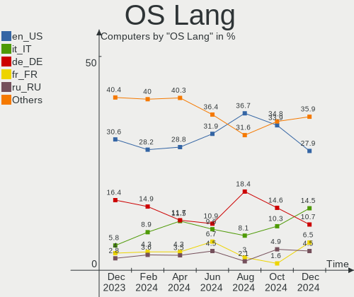
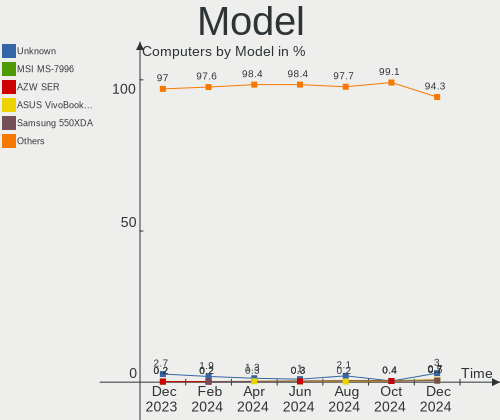
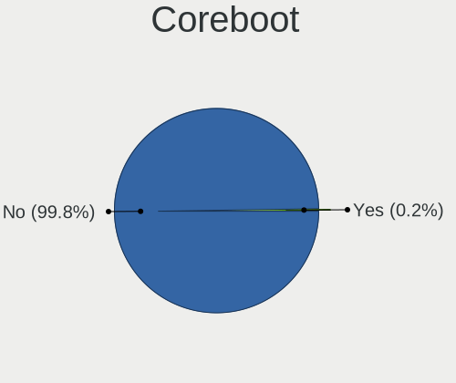
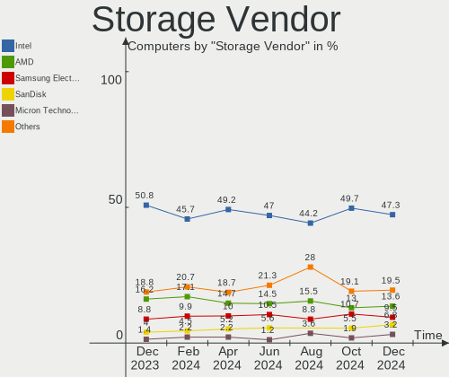
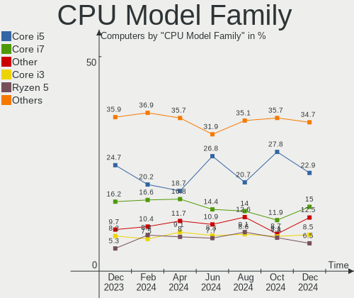
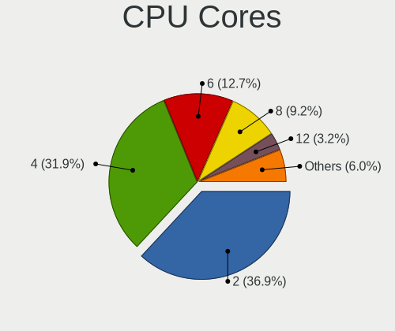
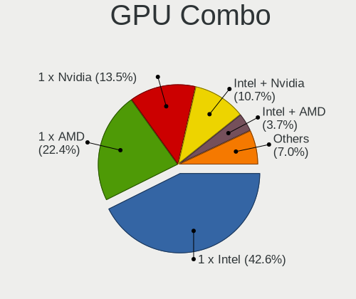
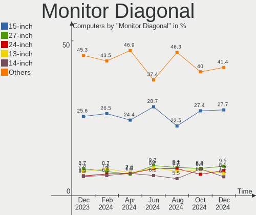
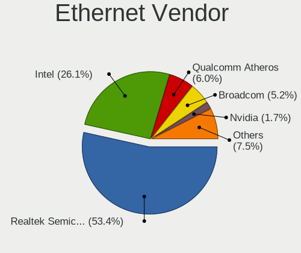

Linux Mint - Hardware Trends
----------------------------

A project to identify most popular hardware characteristics and track their change
over time based on data collected by Linux users at https://Linux-Hardware.org.

Anyone can contribute to this report by the [hw-probe](https://github.com/linuxhw/hw-probe) tool:

    sudo -E hw-probe -all -upload

This is a report for all computer types. See also reports for [desktops](/Dist/Linux_Mint/Desktop/README.md) and [notebooks](/Dist/Linux_Mint/Notebook/README.md).

This report is for one last month. Overall report since the beginning of time: [TestDays](https://github.com/linuxhw/TestDays)

Period: Oct, 2023.

Contents
--------

* [ System ](#system)
  - [ OS                       ](#os)
  - [ OS Family                ](#os-family)
  - [ Kernel                   ](#kernel)
  - [ Kernel Family            ](#kernel-family)
  - [ Kernel Major Ver.        ](#kernel-major-ver)
  - [ Arch                     ](#arch)
  - [ DE                       ](#de)
  - [ Display Server           ](#display-server)
  - [ Display Manager          ](#display-manager)
  - [ OS Lang                  ](#os-lang)
  - [ Boot Mode                ](#boot-mode)
  - [ Filesystem               ](#filesystem)
  - [ Part. scheme             ](#part-scheme)
  - [ Dual Boot with Linux/BSD ](#dual-boot-with-linuxbsd)
  - [ Dual Boot (Win)          ](#dual-boot-win)

* [ Board ](#board)
  - [ Vendor                   ](#vendor)
  - [ Model                    ](#model)
  - [ Model Family             ](#model-family)
  - [ MFG Year                 ](#mfg-year)
  - [ Form Factor              ](#form-factor)
  - [ Secure Boot              ](#secure-boot)
  - [ Coreboot                 ](#coreboot)
  - [ RAM Size                 ](#ram-size)
  - [ RAM Used                 ](#ram-used)
  - [ Total Drives             ](#total-drives)
  - [ Has CD-ROM               ](#has-cd-rom)
  - [ Has Ethernet             ](#has-ethernet)
  - [ Has WiFi                 ](#has-wifi)
  - [ Has Bluetooth            ](#has-bluetooth)

* [ Location ](#location)
  - [ Country                  ](#country)
  - [ City                     ](#city)

* [ Drives ](#drives)
  - [ Drive Vendor             ](#drive-vendor)
  - [ Drive Model              ](#drive-model)
  - [ HDD Vendor               ](#hdd-vendor)
  - [ SSD Vendor               ](#ssd-vendor)
  - [ Drive Kind               ](#drive-kind)
  - [ Drive Connector          ](#drive-connector)
  - [ Drive Size               ](#drive-size)
  - [ Space Total              ](#space-total)
  - [ Space Used               ](#space-used)
  - [ Malfunc. Drives          ](#malfunc-drives)
  - [ Malfunc. Drive Vendor    ](#malfunc-drive-vendor)
  - [ Malfunc. HDD Vendor      ](#malfunc-hdd-vendor)
  - [ Malfunc. Drive Kind      ](#malfunc-drive-kind)
  - [ Failed Drives            ](#failed-drives)
  - [ Failed Drive Vendor      ](#failed-drive-vendor)
  - [ Drive Status             ](#drive-status)

* [ Storage controller ](#storage-controller)
  - [ Storage Vendor           ](#storage-vendor)
  - [ Storage Model            ](#storage-model)
  - [ Storage Kind             ](#storage-kind)

* [ Processor ](#processor)
  - [ CPU Vendor               ](#cpu-vendor)
  - [ CPU Model                ](#cpu-model)
  - [ CPU Model Family         ](#cpu-model-family)
  - [ CPU Cores                ](#cpu-cores)
  - [ CPU Sockets              ](#cpu-sockets)
  - [ CPU Threads              ](#cpu-threads)
  - [ CPU Op-Modes             ](#cpu-op-modes)
  - [ CPU Microcode            ](#cpu-microcode)
  - [ CPU Microarch            ](#cpu-microarch)

* [ Graphics ](#graphics)
  - [ GPU Vendor               ](#gpu-vendor)
  - [ GPU Model                ](#gpu-model)
  - [ GPU Combo                ](#gpu-combo)
  - [ GPU Driver               ](#gpu-driver)
  - [ GPU Memory               ](#gpu-memory)

* [ Monitor ](#monitor)
  - [ Monitor Vendor           ](#monitor-vendor)
  - [ Monitor Model            ](#monitor-model)
  - [ Monitor Resolution       ](#monitor-resolution)
  - [ Monitor Diagonal         ](#monitor-diagonal)
  - [ Monitor Width            ](#monitor-width)
  - [ Aspect Ratio             ](#aspect-ratio)
  - [ Monitor Area             ](#monitor-area)
  - [ Pixel Density            ](#pixel-density)
  - [ Multiple Monitors        ](#multiple-monitors)

* [ Network ](#network)
  - [ Net Controller Vendor    ](#net-controller-vendor)
  - [ Net Controller Model     ](#net-controller-model)
  - [ Wireless Vendor          ](#wireless-vendor)
  - [ Wireless Model           ](#wireless-model)
  - [ Ethernet Vendor          ](#ethernet-vendor)
  - [ Ethernet Model           ](#ethernet-model)
  - [ Net Controller Kind      ](#net-controller-kind)
  - [ Used Controller          ](#used-controller)
  - [ NICs                     ](#nics)
  - [ IPv6                     ](#ipv6)

* [ Bluetooth ](#bluetooth)
  - [ Bluetooth Vendor         ](#bluetooth-vendor)
  - [ Bluetooth Model          ](#bluetooth-model)

* [ Sound ](#sound)
  - [ Sound Vendor             ](#sound-vendor)
  - [ Sound Model              ](#sound-model)

* [ Memory ](#memory)
  - [ Memory Vendor            ](#memory-vendor)
  - [ Memory Model             ](#memory-model)
  - [ Memory Kind              ](#memory-kind)
  - [ Memory Form Factor       ](#memory-form-factor)
  - [ Memory Size              ](#memory-size)
  - [ Memory Speed             ](#memory-speed)

* [ Printers & scanners ](#printers--scanners)
  - [ Printer Vendor           ](#printer-vendor)
  - [ Printer Model            ](#printer-model)
  - [ Scanner Vendor           ](#scanner-vendor)
  - [ Scanner Model            ](#scanner-model)

* [ Camera ](#camera)
  - [ Camera Vendor            ](#camera-vendor)
  - [ Camera Model             ](#camera-model)

* [ Security ](#security)
  - [ Fingerprint Vendor       ](#fingerprint-vendor)
  - [ Fingerprint Model        ](#fingerprint-model)
  - [ Chipcard Vendor          ](#chipcard-vendor)
  - [ Chipcard Model           ](#chipcard-model)

* [ Unsupported ](#unsupported)
  - [ Unsupported Devices      ](#unsupported-devices)
  - [ Unsupported Device Types ](#unsupported-device-types)

System
------

OS
--

Installed operating systems

| Name              | Computers | Percent |
|-------------------|-----------|---------|
| Linux Mint 21.2   | 429       | 76.47%  |
| Linux Mint 21.1   | 44        | 7.84%   |
| Linux Mint 20.3   | 38        | 6.77%   |
| Linux Mint 21     | 22        | 3.92%   |
| Linux Mint 20.2   | 10        | 1.78%   |
| Linux Mint 20.1   | 8         | 1.43%   |
| Linux Mint 19.3   | 4         | 0.71%   |
| Linux Mint 20     | 3         | 0.53%   |
| Linux Mint 21.2.1 | 1         | 0.18%   |
| Linux Mint 19.2   | 1         | 0.18%   |
| Linux Mint 18.3   | 1         | 0.18%   |

OS Family
---------

OS without a version

| Name       | Computers | Percent |
|------------|-----------|---------|
| Linux Mint | 561       | 100%    |

Kernel
------

Version of the Linux kernel

| Version                 | Computers | Percent |
|-------------------------|-----------|---------|
| 5.15.0-86-generic       | 147       | 26.2%   |
| 5.15.0-87-generic       | 116       | 20.68%  |
| 5.15.0-76-generic       | 46        | 8.2%    |
| 5.15.0-84-generic       | 43        | 7.66%   |
| 6.2.0-34-generic        | 37        | 6.6%    |
| 6.2.0-35-generic        | 22        | 3.92%   |
| 6.2.0-33-generic        | 15        | 2.67%   |
| 5.4.0-164-generic       | 13        | 2.32%   |
| 5.15.0-88-generic       | 11        | 1.96%   |
| 5.4.0-163-generic       | 10        | 1.78%   |
| 5.4.0-165-generic       | 8         | 1.43%   |
| 5.15.0-83-generic       | 8         | 1.43%   |
| 6.1.0-1023-oem          | 6         | 1.07%   |
| 5.15.0-79-generic       | 6         | 1.07%   |
| 5.15.0-56-generic       | 6         | 1.07%   |
| 6.5.0-1004-oem          | 4         | 0.71%   |
| 6.2.0-36-generic        | 4         | 0.71%   |
| 5.15.0-41-generic       | 4         | 0.71%   |
| 5.4.0-166-generic       | 3         | 0.53%   |
| 5.15.0-78-generic       | 3         | 0.53%   |
| 5.15.0-67-generic       | 3         | 0.53%   |
| 6.5.7-060507-generic    | 2         | 0.36%   |
| 6.2.0-32-generic        | 2         | 0.36%   |
| 6.2.0-26-generic        | 2         | 0.36%   |
| 6.1.0-1024-oem          | 2         | 0.36%   |
| 6.1.0-1022-oem          | 2         | 0.36%   |
| 5.4.0-91-generic        | 2         | 0.36%   |
| 5.4.0-74-generic        | 2         | 0.36%   |
| 5.4.0-162-generic       | 2         | 0.36%   |
| 5.4.0-156-generic       | 2         | 0.36%   |
| 5.4.0-150-generic       | 2         | 0.36%   |
| 5.4.0-148-generic       | 2         | 0.36%   |
| 5.0.0-32-generic        | 2         | 0.36%   |
| 6.6.0-060600rc5-generic | 1         | 0.18%   |
| 6.5.7-zabbly+           | 1         | 0.18%   |
| 6.5.5-060505-generic    | 1         | 0.18%   |
| 6.5.4-aq                | 1         | 0.18%   |
| 6.5.3-x64v3-xanmod1     | 1         | 0.18%   |
| 6.5.0-1003-oem          | 1         | 0.18%   |
| 6.3.1-060301-generic    | 1         | 0.18%   |

Kernel Family
-------------

Linux kernel without a distro release

| Version | Computers | Percent |
|---------|-----------|---------|
| 5.15.0  | 397       | 70.77%  |
| 6.2.0   | 82        | 14.62%  |
| 5.4.0   | 51        | 9.09%   |
| 6.1.0   | 10        | 1.78%   |
| 6.5.0   | 5         | 0.89%   |
| 6.5.7   | 3         | 0.53%   |
| 5.0.0   | 3         | 0.53%   |
| 4.15.0  | 2         | 0.36%   |
| 6.6.0   | 1         | 0.18%   |
| 6.5.5   | 1         | 0.18%   |
| 6.5.4   | 1         | 0.18%   |
| 6.5.3   | 1         | 0.18%   |
| 6.3.1   | 1         | 0.18%   |
| 6.2.1   | 1         | 0.18%   |
| 5.19.0  | 1         | 0.18%   |
| 5.14.0  | 1         | 0.18%   |

Kernel Major Ver.
-----------------

Linux kernel major version

| Version | Computers | Percent |
|---------|-----------|---------|
| 5.15    | 397       | 70.77%  |
| 6.2     | 83        | 14.8%   |
| 5.4     | 51        | 9.09%   |
| 6.5     | 11        | 1.96%   |
| 6.1     | 10        | 1.78%   |
| 5.0     | 3         | 0.53%   |
| 4.15    | 2         | 0.36%   |
| 6.6     | 1         | 0.18%   |
| 6.3     | 1         | 0.18%   |
| 5.19    | 1         | 0.18%   |
| 5.14    | 1         | 0.18%   |

Arch
----

OS architecture (x86_64, i586, etc.)

| Name   | Computers | Percent |
|--------|-----------|---------|
| x86_64 | 560       | 99.82%  |
| i686   | 1         | 0.18%   |

DE
--

Desktop Environment

| Name       | Computers | Percent |
|------------|-----------|---------|
| X-Cinnamon | 430       | 76.65%  |
| MATE       | 65        | 11.59%  |
| XFCE       | 42        | 7.49%   |
| Cinnamon   | 13        | 2.32%   |
| GNOME      | 5         | 0.89%   |
| Unknown    | 4         | 0.71%   |
| KDE5       | 1         | 0.18%   |
| Jwm        | 1         | 0.18%   |

Display Server
--------------

X11 or Wayland

| Name    | Computers | Percent |
|---------|-----------|---------|
| X11     | 556       | 99.11%  |
| Tty     | 3         | 0.53%   |
| Wayland | 2         | 0.36%   |

Display Manager
---------------

SDDM, LightDM, etc.

| Name    | Computers | Percent |
|---------|-----------|---------|
| Unknown | 305       | 54.37%  |
| LightDM | 254       | 45.28%  |
| SDDM    | 1         | 0.18%   |
| LXDM    | 1         | 0.18%   |

OS Lang
-------

Language

| Lang    | Computers | Percent |
|---------|-----------|---------|
| en_US   | 169       | 30.12%  |
| de_DE   | 95        | 16.93%  |
| it_IT   | 35        | 6.24%   |
| pt_BR   | 32        | 5.7%    |
| en_GB   | 24        | 4.28%   |
| fr_FR   | 22        | 3.92%   |
| C       | 20        | 3.57%   |
| en_CA   | 17        | 3.03%   |
| en_AU   | 17        | 3.03%   |
| ru_RU   | 16        | 2.85%   |
| es_ES   | 12        | 2.14%   |
| pl_PL   | 10        | 1.78%   |
| es_MX   | 8         | 1.43%   |
| de_CH   | 6         | 1.07%   |
| pt_PT   | 5         | 0.89%   |
| en_IN   | 5         | 0.89%   |
| tr_TR   | 4         | 0.71%   |
| sv_SE   | 4         | 0.71%   |
| nl_NL   | 4         | 0.71%   |
| fi_FI   | 4         | 0.71%   |
| de_AT   | 4         | 0.71%   |
| Unknown | 4         | 0.71%   |
| nl_BE   | 3         | 0.53%   |
| hu_HU   | 3         | 0.53%   |
| fr_BE   | 3         | 0.53%   |
| es_AR   | 3         | 0.53%   |
| en_ZA   | 3         | 0.53%   |
| en_IL   | 3         | 0.53%   |
| zh_CN   | 2         | 0.36%   |
| ja_JP   | 2         | 0.36%   |
| es_VE   | 2         | 0.36%   |
| es_CO   | 2         | 0.36%   |
| en_SG   | 2         | 0.36%   |
| en_NZ   | 2         | 0.36%   |
| el_GR   | 2         | 0.36%   |
| ru_UA   | 1         | 0.18%   |
| ro_RO   | 1         | 0.18%   |
| lv_LV   | 1         | 0.18%   |
| lt_LT   | 1         | 0.18%   |
| id_ID   | 1         | 0.18%   |

Boot Mode
---------

EFI or BIOS

| Mode | Computers | Percent |
|------|-----------|---------|
| EFI  | 383       | 68.27%  |
| BIOS | 178       | 31.73%  |

Filesystem
----------

Type of filesystem

| Type    | Computers | Percent |
|---------|-----------|---------|
| Ext4    | 502       | 89.48%  |
| Overlay | 18        | 3.21%   |
| Tmpfs   | 15        | 2.67%   |
| Btrfs   | 12        | 2.14%   |
| Zfs     | 9         | 1.6%    |
| Ext3    | 3         | 0.53%   |
| Xfs     | 2         | 0.36%   |

Part. scheme
------------

Scheme of partitioning

| Type    | Computers | Percent |
|---------|-----------|---------|
| Unknown | 300       | 53.48%  |
| GPT     | 229       | 40.82%  |
| MBR     | 32        | 5.7%    |

Dual Boot with Linux/BSD
------------------------

Hosting more than one Linux/BSD

| Dual boot | Computers | Percent |
|-----------|-----------|---------|
| No        | 518       | 92.34%  |
| Yes       | 43        | 7.66%   |

Dual Boot (Win)
---------------

Hosting Linux and Windows

| Dual boot | Computers | Percent |
|-----------|-----------|---------|
| No        | 446       | 79.5%   |
| Yes       | 115       | 20.5%   |

Board
-----

Vendor
------

Motherboard manufacturer

| Name                | Computers | Percent |
|---------------------|-----------|---------|
| ASUSTek Computer    | 89        | 15.86%  |
| Hewlett-Packard     | 75        | 13.37%  |
| Lenovo              | 70        | 12.48%  |
| Dell                | 60        | 10.7%   |
| Gigabyte Technology | 42        | 7.49%   |
| MSI                 | 38        | 6.77%   |
| Acer                | 29        | 5.17%   |
| ASRock              | 17        | 3.03%   |
| Apple               | 15        | 2.67%   |
| Toshiba             | 14        | 2.5%    |
| Intel               | 10        | 1.78%   |
| Samsung Electronics | 9         | 1.6%    |
| Sony                | 8         | 1.43%   |
| Unknown             | 7         | 1.25%   |
| HUAWEI              | 5         | 0.89%   |
| Fujitsu             | 5         | 0.89%   |
| Pegatron            | 4         | 0.71%   |
| Packard Bell        | 3         | 0.53%   |
| Notebook            | 3         | 0.53%   |
| Medion              | 3         | 0.53%   |
| Google              | 3         | 0.53%   |
| Chuwi               | 3         | 0.53%   |
| AZW                 | 3         | 0.53%   |
| Alienware           | 3         | 0.53%   |
| ZOTAC               | 2         | 0.36%   |
| Shuttle             | 2         | 0.36%   |
| Panasonic           | 2         | 0.36%   |
| Novatech            | 2         | 0.36%   |
| LG Electronics      | 2         | 0.36%   |
| Fujitsu Siemens     | 2         | 0.36%   |
| Foxconn             | 2         | 0.36%   |
| XIAOMI              | 1         | 0.18%   |
| Wortmann AG         | 1         | 0.18%   |
| VALE                | 1         | 0.18%   |
| UNOWHY              | 1         | 0.18%   |
| Thomson             | 1         | 0.18%   |
| TH510               | 1         | 0.18%   |
| Razer               | 1         | 0.18%   |
| ONDA                | 1         | 0.18%   |
| NF-M2S              | 1         | 0.18%   |

Model
-----

Motherboard model

| Name                             | Computers | Percent |
|----------------------------------|-----------|---------|
| ASUS All Series                  | 9         | 1.6%    |
| Unknown                          | 8         | 1.43%   |
| Dell OptiPlex 9020               | 4         | 0.71%   |
| HP Notebook                      | 3         | 0.53%   |
| HP Laptop 15-ef2xxx              | 3         | 0.53%   |
| HP Laptop 15-db0xxx              | 3         | 0.53%   |
| Gigabyte A320M-S2H               | 3         | 0.53%   |
| Dell OptiPlex 7050               | 3         | 0.53%   |
| ASUS M5A78L-M/USB3               | 3         | 0.53%   |
| Toshiba Satellite C660D          | 2         | 0.36%   |
| Samsung 940XFG                   | 2         | 0.36%   |
| MSI MS-7C79                      | 2         | 0.36%   |
| MSI MS-7C02                      | 2         | 0.36%   |
| MSI MS-7821                      | 2         | 0.36%   |
| Lenovo ThinkPad T450 20BUS50Q16  | 2         | 0.36%   |
| Intel H61                        | 2         | 0.36%   |
| HUAWEI NBLK-WAX9X                | 2         | 0.36%   |
| HP Pavilion g7                   | 2         | 0.36%   |
| HP EliteBook 8560w               | 2         | 0.36%   |
| HP 250 G6 Notebook PC            | 2         | 0.36%   |
| Gigabyte B550M AORUS ELITE       | 2         | 0.36%   |
| Dell Precision WorkStation T3500 | 2         | 0.36%   |
| Dell OptiPlex 790                | 2         | 0.36%   |
| Dell OptiPlex 3020               | 2         | 0.36%   |
| Dell Latitude E6530              | 2         | 0.36%   |
| Dell Latitude E6440              | 2         | 0.36%   |
| Dell Latitude E6410              | 2         | 0.36%   |
| Dell Latitude E6400              | 2         | 0.36%   |
| Dell Latitude E5530 non-vPro     | 2         | 0.36%   |
| Dell Latitude 5520               | 2         | 0.36%   |
| Dell Inspiron 3437               | 2         | 0.36%   |
| ASUS Zenbook UX7602VI_UX7602VI   | 2         | 0.36%   |
| ASUS X75VC                       | 2         | 0.36%   |
| ASUS ROG Maximus XI HERO         | 2         | 0.36%   |
| ASUS PRIME A320M-K               | 2         | 0.36%   |
| ASRock B450M Pro4                | 2         | 0.36%   |
| Apple MacBookPro8,1              | 2         | 0.36%   |
| Apple MacBookPro11,1             | 2         | 0.36%   |
| ZOTAC ZBOX-MI643/MI623           | 1         | 0.18%   |
| ZOTAC ZBOX-CI669/CI649NANO       | 1         | 0.18%   |

Model Family
------------

Motherboard model prefix

| Name                  | Computers | Percent |
|-----------------------|-----------|---------|
| Lenovo ThinkPad       | 33        | 5.88%   |
| Dell Latitude         | 23        | 4.1%    |
| Acer Aspire           | 21        | 3.74%   |
| Dell OptiPlex         | 16        | 2.85%   |
| Lenovo IdeaPad        | 15        | 2.67%   |
| ASUS VivoBook         | 13        | 2.32%   |
| HP Pavilion           | 12        | 2.14%   |
| ASUS ROG              | 12        | 2.14%   |
| Toshiba Satellite     | 11        | 1.96%   |
| HP Laptop             | 10        | 1.78%   |
| ASUS PRIME            | 10        | 1.78%   |
| HP ProBook            | 9         | 1.6%    |
| ASUS All              | 9         | 1.6%    |
| Unknown               | 8         | 1.43%   |
| HP EliteBook          | 7         | 1.25%   |
| Dell Precision        | 7         | 1.25%   |
| Dell Inspiron         | 6         | 1.07%   |
| Dell XPS              | 5         | 0.89%   |
| Lenovo ThinkCentre    | 4         | 0.71%   |
| Lenovo Legion         | 4         | 0.71%   |
| HP OMEN               | 4         | 0.71%   |
| HP ENVY               | 4         | 0.71%   |
| Gigabyte B550M        | 4         | 0.71%   |
| ASUS M5A78L-M         | 4         | 0.71%   |
| Acer Nitro            | 4         | 0.71%   |
| Lenovo V15            | 3         | 0.53%   |
| Lenovo IdeaCentre     | 3         | 0.53%   |
| HP Notebook           | 3         | 0.53%   |
| HP EliteDesk          | 3         | 0.53%   |
| Gigabyte A320M-S2H    | 3         | 0.53%   |
| Fujitsu ESPRIMO       | 3         | 0.53%   |
| ASUS Zenbook          | 3         | 0.53%   |
| ASUS TUF              | 3         | 0.53%   |
| ASUS ASUS             | 3         | 0.53%   |
| Apple MacBookPro8     | 3         | 0.53%   |
| Samsung 940XFG        | 2         | 0.36%   |
| Packard Bell EasyNote | 2         | 0.36%   |
| MSI Prestige          | 2         | 0.36%   |
| MSI MS-7C79           | 2         | 0.36%   |
| MSI MS-7C02           | 2         | 0.36%   |

MFG Year
--------

Motherboard manufacture year

| Year | Computers | Percent |
|------|-----------|---------|
| 2021 | 68        | 12.12%  |
| 2013 | 49        | 8.73%   |
| 2011 | 41        | 7.31%   |
| 2017 | 40        | 7.13%   |
| 2022 | 37        | 6.6%    |
| 2018 | 36        | 6.42%   |
| 2020 | 35        | 6.24%   |
| 2019 | 34        | 6.06%   |
| 2012 | 32        | 5.7%    |
| 2014 | 31        | 5.53%   |
| 2015 | 30        | 5.35%   |
| 2010 | 29        | 5.17%   |
| 2023 | 28        | 4.99%   |
| 2016 | 26        | 4.63%   |
| 2009 | 17        | 3.03%   |
| 2008 | 12        | 2.14%   |
| 2007 | 11        | 1.96%   |
| 2006 | 5         | 0.89%   |

Form Factor
-----------

Physical design of the computer

| Name        | Computers | Percent |
|-------------|-----------|---------|
| Notebook    | 302       | 53.83%  |
| Desktop     | 221       | 39.39%  |
| Convertible | 14        | 2.5%    |
| Mini pc     | 13        | 2.32%   |
| All in one  | 9         | 1.6%    |
| Tablet      | 2         | 0.36%   |

Secure Boot
-----------

Enabled or disabled

| State    | Computers | Percent |
|----------|-----------|---------|
| Disabled | 508       | 90.55%  |
| Enabled  | 53        | 9.45%   |

Coreboot
--------

Have coreboot on board

| Used | Computers | Percent |
|------|-----------|---------|
| No   | 558       | 99.47%  |
| Yes  | 3         | 0.53%   |

RAM Size
--------

Total RAM memory

| Size in GB  | Computers | Percent |
|-------------|-----------|---------|
| 4.01-8.0    | 159       | 28.34%  |
| 16.01-24.0  | 119       | 21.21%  |
| 8.01-16.0   | 85        | 15.15%  |
| 3.01-4.0    | 83        | 14.8%   |
| 32.01-64.0  | 62        | 11.05%  |
| 64.01-256.0 | 19        | 3.39%   |
| 1.01-2.0    | 15        | 2.67%   |
| 24.01-32.0  | 11        | 1.96%   |
| 2.01-3.0    | 8         | 1.43%   |

RAM Used
--------

Used RAM memory

| Used GB    | Computers | Percent |
|------------|-----------|---------|
| 1.01-2.0   | 188       | 33.51%  |
| 2.01-3.0   | 172       | 30.66%  |
| 4.01-8.0   | 87        | 15.51%  |
| 3.01-4.0   | 75        | 13.37%  |
| 8.01-16.0  | 20        | 3.57%   |
| 0.51-1.0   | 13        | 2.32%   |
| 16.01-24.0 | 4         | 0.71%   |
| 32.01-64.0 | 1         | 0.18%   |
| 0.01-0.5   | 1         | 0.18%   |

Total Drives
------------

Number of drives on board

| Drives | Computers | Percent |
|--------|-----------|---------|
| 1      | 316       | 56.33%  |
| 2      | 143       | 25.49%  |
| 3      | 63        | 11.23%  |
| 4      | 21        | 3.74%   |
| 5      | 10        | 1.78%   |
| 6      | 4         | 0.71%   |
| 7      | 3         | 0.53%   |
| 0      | 1         | 0.18%   |

Has CD-ROM
----------

Has CD-ROM on board

| Presented | Computers | Percent |
|-----------|-----------|---------|
| No        | 344       | 61.32%  |
| Yes       | 217       | 38.68%  |

Has Ethernet
------------

Has Ethernet on board

| Presented | Computers | Percent |
|-----------|-----------|---------|
| Yes       | 482       | 85.92%  |
| No        | 79        | 14.08%  |

Has WiFi
--------

Has WiFi module

| Presented | Computers | Percent |
|-----------|-----------|---------|
| Yes       | 446       | 79.5%   |
| No        | 115       | 20.5%   |

Has Bluetooth
-------------

Has Bluetooth module

| Presented | Computers | Percent |
|-----------|-----------|---------|
| Yes       | 341       | 60.78%  |
| No        | 220       | 39.22%  |

Location
--------

Country
-------

Geographic location (country)

| Country      | Computers | Percent |
|--------------|-----------|---------|
| Germany      | 104       | 18.54%  |
| USA          | 102       | 18.18%  |
| Brazil       | 41        | 7.31%   |
| Italy        | 39        | 6.95%   |
| UK           | 26        | 4.63%   |
| France       | 24        | 4.28%   |
| Russia       | 19        | 3.39%   |
| Canada       | 18        | 3.21%   |
| Australia    | 18        | 3.21%   |
| Spain        | 14        | 2.5%    |
| Poland       | 12        | 2.14%   |
| Switzerland  | 10        | 1.78%   |
| Netherlands  | 8         | 1.43%   |
| Mexico       | 8         | 1.43%   |
| Portugal     | 7         | 1.25%   |
| Turkey       | 6         | 1.07%   |
| Finland      | 6         | 1.07%   |
| Belgium      | 6         | 1.07%   |
| Austria      | 6         | 1.07%   |
| Sweden       | 5         | 0.89%   |
| India        | 5         | 0.89%   |
| Argentina    | 5         | 0.89%   |
| South Africa | 4         | 0.71%   |
| Czechia      | 4         | 0.71%   |
| Romania      | 3         | 0.53%   |
| Israel       | 3         | 0.53%   |
| Indonesia    | 3         | 0.53%   |
| Hungary      | 3         | 0.53%   |
| Honduras     | 3         | 0.53%   |
| Greece       | 3         | 0.53%   |
| Denmark      | 3         | 0.53%   |
| Venezuela    | 2         | 0.36%   |
| Slovakia     | 2         | 0.36%   |
| Singapore    | 2         | 0.36%   |
| Philippines  | 2         | 0.36%   |
| Paraguay     | 2         | 0.36%   |
| New Zealand  | 2         | 0.36%   |
| Latvia       | 2         | 0.36%   |
| Japan        | 2         | 0.36%   |
| Iran         | 2         | 0.36%   |

City
----

Geographic location (city)

| City                 | Computers | Percent |
|----------------------|-----------|---------|
| Sydney               | 8         | 1.43%   |
| Paris                | 7         | 1.25%   |
| Berlin               | 7         | 1.25%   |
| Vienna               | 6         | 1.07%   |
| Dresden              | 5         | 0.89%   |
| Warsaw               | 4         | 0.71%   |
| New York             | 4         | 0.71%   |
| Milan                | 4         | 0.71%   |
| Mannheim             | 4         | 0.71%   |
| Toronto              | 3         | 0.53%   |
| Tel Aviv             | 3         | 0.53%   |
| Tegucigalpa          | 3         | 0.53%   |
| Skokie               | 3         | 0.53%   |
| Sao Paulo            | 3         | 0.53%   |
| Prague               | 3         | 0.53%   |
| Melbourne            | 3         | 0.53%   |
| Leipzig              | 3         | 0.53%   |
| Hamburg              | 3         | 0.53%   |
| Granada              | 3         | 0.53%   |
| Florence             | 3         | 0.53%   |
| Cologne              | 3         | 0.53%   |
| Brasília            | 3         | 0.53%   |
| York                 | 2         | 0.36%   |
| Yekaterinburg        | 2         | 0.36%   |
| Verona               | 2         | 0.36%   |
| St Petersburg        | 2         | 0.36%   |
| Singapore            | 2         | 0.36%   |
| Serra                | 2         | 0.36%   |
| Sao José dos Campos | 2         | 0.36%   |
| Rostov-on-Don        | 2         | 0.36%   |
| Rio de Janeiro       | 2         | 0.36%   |
| Ratingen             | 2         | 0.36%   |
| Pretoria             | 2         | 0.36%   |
| Padova               | 2         | 0.36%   |
| Osasco               | 2         | 0.36%   |
| Moscow               | 2         | 0.36%   |
| Lostorf              | 2         | 0.36%   |
| Los Angeles          | 2         | 0.36%   |
| Lezoux               | 2         | 0.36%   |
| Krakow               | 2         | 0.36%   |

Drives
------

Drive Vendor
------------

Hard drive vendors

| Vendor                         | Computers | Drives | Percent |
|--------------------------------|-----------|--------|---------|
| Samsung Electronics            | 141       | 172    | 16.51%  |
| WDC                            | 121       | 144    | 14.17%  |
| Seagate                        | 106       | 124    | 12.41%  |
| Crucial                        | 49        | 57     | 5.74%   |
| SanDisk                        | 45        | 52     | 5.27%   |
| Kingston                       | 43        | 45     | 5.04%   |
| Toshiba                        | 38        | 39     | 4.45%   |
| Unknown                        | 37        | 42     | 4.33%   |
| Hitachi                        | 20        | 20     | 2.34%   |
| Micron Technology              | 19        | 19     | 2.22%   |
| Intel                          | 16        | 17     | 1.87%   |
| Micron/Crucial Technology      | 15        | 17     | 1.76%   |
| China                          | 14        | 14     | 1.64%   |
| Intenso                        | 13        | 14     | 1.52%   |
| HGST                           | 13        | 14     | 1.52%   |
| SK hynix                       | 10        | 11     | 1.17%   |
| A-DATA Technology              | 9         | 10     | 1.05%   |
| Silicon Motion                 | 7         | 7      | 0.82%   |
| PNY                            | 7         | 9      | 0.82%   |
| KIOXIA                         | 7         | 7      | 0.82%   |
| MAXIO Technology (Hangzhou)    | 6         | 6      | 0.7%    |
| Phison Electronics             | 5         | 6      | 0.59%   |
| Patriot                        | 5         | 5      | 0.59%   |
| Apple                          | 5         | 5      | 0.59%   |
| Unknown                        | 5         | 5      | 0.59%   |
| Transcend                      | 4         | 4      | 0.47%   |
| Team                           | 4         | 4      | 0.47%   |
| Kingston Technology Company    | 4         | 4      | 0.47%   |
| SSSTC                          | 3         | 3      | 0.35%   |
| SPCC                           | 3         | 3      | 0.35%   |
| Phison                         | 3         | 3      | 0.35%   |
| Lexar                          | 3         | 4      | 0.35%   |
| KingSpec                       | 3         | 3      | 0.35%   |
| GOODRAM                        | 3         | 3      | 0.35%   |
| Fujitsu                        | 3         | 3      | 0.35%   |
| Apacer                         | 3         | 3      | 0.35%   |
| ADATA Technology               | 3         | 4      | 0.35%   |
| WDC PC S                       | 2         | 2      | 0.23%   |
| Solid State Storage Technology | 2         | 2      | 0.23%   |
| Shenzhen Longsys Electronics   | 2         | 3      | 0.23%   |

Drive Model
-----------

Hard drive models

| Model                                                 | Computers | Percent |
|-------------------------------------------------------|-----------|---------|
| Samsung NVMe SSD Controller SM981/PM981/PM983 1TB     | 13        | 1.39%   |
| Samsung SSD 850 EVO 250GB                             | 12        | 1.28%   |
| Samsung SSD 860 EVO 1TB                               | 9         | 0.96%   |
| Micron/Crucial P2 NVMe PCIe SSD 500GB                 | 9         | 0.96%   |
| Kingston SA400S37240G 240GB SSD                       | 9         | 0.96%   |
| Unknown SD/MMC/MS PRO 16GB                            | 8         | 0.86%   |
| Unknown MMC Card  32GB                                | 8         | 0.86%   |
| Crucial CT1000MX500SSD1 1TB                           | 8         | 0.86%   |
| Samsung SSD 860 EVO 500GB                             | 7         | 0.75%   |
| Samsung SSD 850 EVO 500GB                             | 7         | 0.75%   |
| Crucial CT240BX500SSD1 240GB                          | 7         | 0.75%   |
| Unknown MMC Card  64GB                                | 6         | 0.64%   |
| Toshiba MQ01ABD100 1TB                                | 6         | 0.64%   |
| Seagate ST2000DM008-2FR102 2TB                        | 6         | 0.64%   |
| Kingston SV300S37A120G 120GB SSD                      | 6         | 0.64%   |
| Crucial CT500MX500SSD1 500GB                          | 6         | 0.64%   |
| WDC WD10EZEX-08WN4A0 1TB                              | 5         | 0.53%   |
| Toshiba MQ01ABF050 500GB                              | 5         | 0.53%   |
| Silicon Motion SM2263EN/SM2263XT SSD Controller 256GB | 5         | 0.53%   |
| Seagate ST500DM002-1BD142 500GB                       | 5         | 0.53%   |
| Seagate ST1000LM035-1RK172 1TB                        | 5         | 0.53%   |
| Samsung SSD 870 EVO 500GB                             | 5         | 0.53%   |
| Samsung SSD 870 EVO 1TB                               | 5         | 0.53%   |
| Micron 2450_MTFDKBA512TFK 512GB                       | 5         | 0.53%   |
| Kingston SA400S37120G 120GB SSD                       | 5         | 0.53%   |
| Crucial CT480BX500SSD1 480GB                          | 5         | 0.53%   |
| Unknown                                               | 5         | 0.53%   |
| WDC WD5000LPCX-24VHAT0 500GB                          | 4         | 0.43%   |
| Unknown MMC Card  128GB                               | 4         | 0.43%   |
| Seagate ST500LT012-1DG142 500GB                       | 4         | 0.43%   |
| Seagate ST3500418AS 500GB                             | 4         | 0.43%   |
| Seagate ST1000DM003-1CH162 1TB                        | 4         | 0.43%   |
| Sandisk WD Black 2018/SN750 / PC SN720 NVMe SSD 1TB   | 4         | 0.43%   |
| Samsung SSD 970 EVO Plus 1TB                          | 4         | 0.43%   |
| Samsung NVMe SSD Controller SM961/PM961/SM963 121GB   | 4         | 0.43%   |
| Samsung NVMe SSD Controller PM9A1/PM9A3/980PRO 1TB    | 4         | 0.43%   |
| MAXIO (Hangzhou) NVMe SSD Controller MAP1202 250GB    | 4         | 0.43%   |
| Kingston SA400S37960G 960GB SSD                       | 4         | 0.43%   |
| Kingston SA400S37480G 480GB SSD                       | 4         | 0.43%   |
| WDC WD40EZRZ-00GXCB0 4TB                              | 3         | 0.32%   |

HDD Vendor
----------

Hard disk drive vendors

| Vendor              | Computers | Drives | Percent |
|---------------------|-----------|--------|---------|
| Seagate             | 102       | 120    | 35.17%  |
| WDC                 | 98        | 119    | 33.79%  |
| Toshiba             | 29        | 30     | 10%     |
| Hitachi             | 20        | 20     | 6.9%    |
| HGST                | 13        | 14     | 4.48%   |
| Samsung Electronics | 12        | 13     | 4.14%   |
| Unknown             | 8         | 8      | 2.76%   |
| Fujitsu             | 3         | 3      | 1.03%   |
| HGST HTS            | 2         | 2      | 0.69%   |
| Intenso             | 1         | 1      | 0.34%   |
| Hewlett-Packard     | 1         | 1      | 0.34%   |
| Apple               | 1         | 1      | 0.34%   |

SSD Vendor
----------

Solid state drive vendors

| Vendor              | Computers | Drives | Percent |
|---------------------|-----------|--------|---------|
| Samsung Electronics | 77        | 90     | 25.16%  |
| Crucial             | 42        | 46     | 13.73%  |
| Kingston            | 34        | 35     | 11.11%  |
| SanDisk             | 22        | 24     | 7.19%   |
| WDC                 | 14        | 14     | 4.58%   |
| China               | 14        | 14     | 4.58%   |
| Intenso             | 10        | 11     | 3.27%   |
| A-DATA Technology   | 8         | 9      | 2.61%   |
| PNY                 | 6         | 8      | 1.96%   |
| Patriot             | 5         | 5      | 1.63%   |
| Toshiba             | 4         | 4      | 1.31%   |
| Team                | 4         | 4      | 1.31%   |
| Transcend           | 3         | 3      | 0.98%   |
| SK hynix            | 3         | 3      | 0.98%   |
| Micron Technology   | 3         | 3      | 0.98%   |
| Lexar               | 3         | 4      | 0.98%   |
| KingSpec            | 3         | 3      | 0.98%   |
| Intel               | 3         | 3      | 0.98%   |
| GOODRAM             | 3         | 3      | 0.98%   |
| Apple               | 3         | 3      | 0.98%   |
| Apacer              | 3         | 3      | 0.98%   |
| KingDian            | 2         | 2      | 0.65%   |
| ZXFZ                | 1         | 1      | 0.33%   |
| XrayDisk            | 1         | 1      | 0.33%   |
| X12                 | 1         | 1      | 0.33%   |
| Wodposit            | 1         | 1      | 0.33%   |
| Win Memory          | 1         | 1      | 0.33%   |
| VERICO              | 1         | 1      | 0.33%   |
| Verbatim            | 1         | 1      | 0.33%   |
| Unknown             | 1         | 1      | 0.33%   |
| TO Exter            | 1         | 2      | 0.33%   |
| Timetec             | 1         | 1      | 0.33%   |
| SPCC                | 1         | 1      | 0.33%   |
| Seagate             | 1         | 1      | 0.33%   |
| SABRENT             | 1         | 1      | 0.33%   |
| Qumo                | 1         | 1      | 0.33%   |
| OWC                 | 1         | 1      | 0.33%   |
| OCZ                 | 1         | 1      | 0.33%   |
| Netac NV            | 1         | 1      | 0.33%   |
| Netac               | 1         | 1      | 0.33%   |

Drive Kind
----------

HDD or SSD

| Kind    | Computers | Drives | Percent |
|---------|-----------|--------|---------|
| SSD     | 270       | 332    | 35.34%  |
| HDD     | 244       | 332    | 31.94%  |
| NVMe    | 207       | 249    | 27.09%  |
| MMC     | 27        | 32     | 3.53%   |
| Unknown | 16        | 18     | 2.09%   |

Drive Connector
---------------

SATA, SAS, NVMe, etc.

| Type | Computers | Drives | Percent |
|------|-----------|--------|---------|
| SATA | 419       | 632    | 59.94%  |
| NVMe | 205       | 246    | 29.33%  |
| SAS  | 48        | 53     | 6.87%   |
| MMC  | 27        | 32     | 3.86%   |

Drive Size
----------

Size of hard drive

| Size in TB | Computers | Drives | Percent |
|------------|-----------|--------|---------|
| 0.01-0.5   | 290       | 357    | 53.02%  |
| 0.51-1.0   | 167       | 207    | 30.53%  |
| 1.01-2.0   | 55        | 58     | 10.05%  |
| 4.01-10.0  | 16        | 18     | 2.93%   |
| 3.01-4.0   | 11        | 15     | 2.01%   |
| 2.01-3.0   | 8         | 9      | 1.46%   |

Space Total
-----------

Amount of disk space available on the file system

| Size in GB     | Computers | Percent |
|----------------|-----------|---------|
| 101-250        | 142       | 25.31%  |
| 251-500        | 137       | 24.42%  |
| 501-1000       | 95        | 16.93%  |
| 1001-2000      | 56        | 9.98%   |
| More than 3000 | 36        | 6.42%   |
| 51-100         | 31        | 5.53%   |
| 2001-3000      | 25        | 4.46%   |
| 1-20           | 21        | 3.74%   |
| 21-50          | 10        | 1.78%   |
| Unknown        | 8         | 1.43%   |

Space Used
----------

Amount of used disk space

| Used GB        | Computers | Percent |
|----------------|-----------|---------|
| 21-50          | 119       | 21.21%  |
| 101-250        | 118       | 21.03%  |
| 1-20           | 97        | 17.29%  |
| 51-100         | 84        | 14.97%  |
| 251-500        | 53        | 9.45%   |
| 501-1000       | 36        | 6.42%   |
| 1001-2000      | 22        | 3.92%   |
| More than 3000 | 16        | 2.85%   |
| 2001-3000      | 8         | 1.43%   |
| Unknown        | 8         | 1.43%   |

Malfunc. Drives
---------------

Drive models with a malfunction

| Model                                 | Computers | Drives | Percent |
|---------------------------------------|-----------|--------|---------|
| Seagate ST500DM002-1BD142 500GB       | 2         | 2      | 4.35%   |
| Seagate ST3500418AS 500GB             | 2         | 4      | 4.35%   |
| Seagate ST1000DM003-1CH162 1TB        | 2         | 2      | 4.35%   |
| Hitachi HTS545032B9A300 320GB         | 2         | 2      | 4.35%   |
| WDC WD5000LPLX-75ZNTT0 500GB          | 1         | 1      | 2.17%   |
| WDC WD40EFRX-68WT0N0 4TB              | 1         | 1      | 2.17%   |
| WDC WD40EFRX-68N32N0 4TB              | 1         | 2      | 2.17%   |
| WDC WD30EFRX-68EUZN0 3TB              | 1         | 1      | 2.17%   |
| WDC WD20EARX-00PASB0 2TB              | 1         | 1      | 2.17%   |
| WDC WD20EARS-60MVWB0 2TB              | 1         | 1      | 2.17%   |
| WDC WD20 EARS-00J2GB0 2TB             | 1         | 1      | 2.17%   |
| WDC WD10SPZX-35Z10T0 1TB              | 1         | 1      | 2.17%   |
| WDC WD10EADX-22TDHB0 1TB              | 1         | 1      | 2.17%   |
| Toshiba MK5065GSXF 500GB              | 1         | 1      | 2.17%   |
| SK hynix SC300 mSATA 512GB SSD        | 1         | 1      | 2.17%   |
| SK hynix HFS256G32TND-N210A 256GB SSD | 1         | 1      | 2.17%   |
| SK hynix BC711 HFM256GD3JX013N 256GB  | 1         | 1      | 2.17%   |
| Seagate ST9500325AS 500GB             | 1         | 1      | 2.17%   |
| Seagate ST500LT012-9WS142 500GB       | 1         | 1      | 2.17%   |
| Seagate ST3500312CS 500GB             | 1         | 1      | 2.17%   |
| Seagate ST3200827AS 200GB             | 1         | 1      | 2.17%   |
| Seagate ST3160815AS 160GB             | 1         | 1      | 2.17%   |
| Seagate ST2000DX001-1CM164 2TB        | 1         | 1      | 2.17%   |
| Seagate ST1000DM010-2EP102 1TB        | 1         | 1      | 2.17%   |
| Samsung Electronics SSD 860 EVO 500GB | 1         | 1      | 2.17%   |
| Samsung Electronics SSD 850 EVO 1TB   | 1         | 1      | 2.17%   |
| Samsung Electronics SSD 840 EVO 120GB | 1         | 1      | 2.17%   |
| Samsung Electronics HD103UI 1TB       | 1         | 1      | 2.17%   |
| Samsung Electronics HD103SI 1TB       | 1         | 2      | 2.17%   |
| PNY CS1311 240GB SSD                  | 1         | 1      | 2.17%   |
| LITEON CA5-8D512 512GB                | 1         | 1      | 2.17%   |
| Kingston SUV400S37240G 240GB SSD      | 1         | 1      | 2.17%   |
| Intel SSDPEKKW256G7 256GB             | 1         | 1      | 2.17%   |
| Hitachi HTS541010A9E680 1TB           | 1         | 1      | 2.17%   |
| Hitachi HDT721025SLA380 250GB         | 1         | 1      | 2.17%   |
| Hitachi HDP725050GLA360 500GB         | 1         | 1      | 2.17%   |
| HGST HTS721010A9E630 1TB              | 1         | 1      | 2.17%   |
| Gigastone SSD 1TB                     | 1         | 1      | 2.17%   |
| Fujitsu MHV2080AH 80GB                | 1         | 1      | 2.17%   |
| Crucial CT525MX300SSD1 528GB          | 1         | 1      | 2.17%   |

Malfunc. Drive Vendor
---------------------

Vendors of faulty drives

| Vendor              | Computers | Drives | Percent |
|---------------------|-----------|--------|---------|
| Seagate             | 11        | 15     | 25%     |
| WDC                 | 9         | 10     | 20.45%  |
| Samsung Electronics | 5         | 6      | 11.36%  |
| Hitachi             | 5         | 5      | 11.36%  |
| SK hynix            | 3         | 3      | 6.82%   |
| Crucial             | 3         | 3      | 6.82%   |
| Toshiba             | 1         | 1      | 2.27%   |
| PNY                 | 1         | 1      | 2.27%   |
| LITEON              | 1         | 1      | 2.27%   |
| Kingston            | 1         | 1      | 2.27%   |
| Intel               | 1         | 1      | 2.27%   |
| HGST                | 1         | 1      | 2.27%   |
| Gigastone           | 1         | 1      | 2.27%   |
| Fujitsu             | 1         | 1      | 2.27%   |

Malfunc. HDD Vendor
-------------------

Vendors of faulty HDD drives

| Vendor              | Computers | Drives | Percent |
|---------------------|-----------|--------|---------|
| Seagate             | 11        | 15     | 36.67%  |
| WDC                 | 9         | 10     | 30%     |
| Hitachi             | 5         | 5      | 16.67%  |
| Samsung Electronics | 2         | 3      | 6.67%   |
| Toshiba             | 1         | 1      | 3.33%   |
| HGST                | 1         | 1      | 3.33%   |
| Fujitsu             | 1         | 1      | 3.33%   |

Malfunc. Drive Kind
-------------------

Kinds of faulty drives

| Kind | Computers | Drives | Percent |
|------|-----------|--------|---------|
| HDD  | 29        | 36     | 67.44%  |
| SSD  | 11        | 11     | 25.58%  |
| NVMe | 3         | 3      | 6.98%   |

Failed Drives
-------------

Failed drive models

| Model                             | Computers | Drives | Percent |
|-----------------------------------|-----------|--------|---------|
| Samsung Electronics HM160HC 160GB | 1         | 1      | 100%    |

Failed Drive Vendor
-------------------

Failed drive vendors

| Vendor              | Computers | Drives | Percent |
|---------------------|-----------|--------|---------|
| Samsung Electronics | 1         | 1      | 100%    |

Drive Status
------------

Number of failed and malfunc. drives

| Status   | Computers | Drives | Percent |
|----------|-----------|--------|---------|
| Detected | 339       | 594    | 56.31%  |
| Works    | 220       | 318    | 36.54%  |
| Malfunc  | 42        | 50     | 6.98%   |
| Failed   | 1         | 1      | 0.17%   |

Storage controller
------------------

Storage Vendor
--------------

Storage controller vendors

| Vendor                         | Computers | Percent |
|--------------------------------|-----------|---------|
| Intel                          | 366       | 49.73%  |
| AMD                            | 122       | 16.58%  |
| Samsung Electronics            | 64        | 8.7%    |
| SanDisk                        | 35        | 4.76%   |
| Micron/Crucial Technology      | 25        | 3.4%    |
| Micron Technology              | 16        | 2.17%   |
| Phison Electronics             | 13        | 1.77%   |
| Kingston Technology Company    | 13        | 1.77%   |
| ASMedia Technology             | 11        | 1.49%   |
| Silicon Motion                 | 8         | 1.09%   |
| SK hynix                       | 7         | 0.95%   |
| Nvidia                         | 7         | 0.95%   |
| KIOXIA                         | 7         | 0.95%   |
| MAXIO Technology (Hangzhou)    | 6         | 0.82%   |
| Toshiba America Info Systems   | 5         | 0.68%   |
| Marvell Technology Group       | 5         | 0.68%   |
| Solid State Storage Technology | 4         | 0.54%   |
| JMicron Technology             | 4         | 0.54%   |
| ADATA Technology               | 4         | 0.54%   |
| VIA Technologies               | 2         | 0.27%   |
| Silicon Image                  | 2         | 0.27%   |
| Shenzhen Longsys Electronics   | 2         | 0.27%   |
| Realtek Semiconductor          | 2         | 0.27%   |
| Solidigm                       | 1         | 0.14%   |
| Netac Technology               | 1         | 0.14%   |
| Lite-On Technology             | 1         | 0.14%   |
| Broadcom / LSI                 | 1         | 0.14%   |
| Biwin Storage Technology       | 1         | 0.14%   |
| Adaptec                        | 1         | 0.14%   |

Storage Model
-------------

Storage controller models

| Model                                                                            | Computers | Percent |
|----------------------------------------------------------------------------------|-----------|---------|
| AMD FCH SATA Controller [AHCI mode]                                              | 74        | 8.86%   |
| Samsung NVMe SSD Controller SM981/PM981/PM983                                    | 29        | 3.47%   |
| Intel 8 Series/C220 Series Chipset Family 6-port SATA Controller 1 [AHCI mode]   | 28        | 3.35%   |
| Intel Sunrise Point-LP SATA Controller [AHCI mode]                               | 26        | 3.11%   |
| Intel 7 Series Chipset Family 6-port SATA Controller [AHCI mode]                 | 26        | 3.11%   |
| Intel Volume Management Device NVMe RAID Controller                              | 20        | 2.4%    |
| Intel 6 Series/C200 Series Chipset Family 6 port Mobile SATA AHCI Controller     | 19        | 2.28%   |
| AMD 500 Series Chipset SATA Controller                                           | 18        | 2.16%   |
| Micron/Crucial P2 [Nick P2] / P3 / P3 Plus NVMe PCIe SSD (DRAM-less)             | 17        | 2.04%   |
| Intel 82801 Mobile SATA Controller [RAID mode]                                   | 16        | 1.92%   |
| Intel Q170/Q150/B150/H170/H110/Z170/CM236 Chipset SATA Controller [AHCI Mode]    | 15        | 1.8%    |
| AMD SB7x0/SB8x0/SB9x0 IDE Controller                                             | 15        | 1.8%    |
| AMD 400 Series Chipset SATA Controller                                           | 14        | 1.68%   |
| AMD SB7x0/SB8x0/SB9x0 SATA Controller [AHCI mode]                                | 13        | 1.56%   |
| Samsung NVMe SSD Controller 980 (DRAM-less)                                      | 12        | 1.44%   |
| Intel Wildcat Point-LP SATA Controller [AHCI Mode]                               | 12        | 1.44%   |
| Intel 6 Series/C200 Series Chipset Family 6 port Desktop SATA AHCI Controller    | 12        | 1.44%   |
| Intel SATA Controller [RAID mode]                                                | 11        | 1.32%   |
| Intel 200 Series PCH SATA controller [AHCI mode]                                 | 11        | 1.32%   |
| ASMedia ASM1062 Serial ATA Controller                                            | 11        | 1.32%   |
| Intel 5 Series/3400 Series Chipset 4 port SATA AHCI Controller                   | 10        | 1.2%    |
| Samsung NVMe SSD Controller PM9A1/PM9A3/980PRO                                   | 9         | 1.08%   |
| Intel Comet Lake SATA AHCI Controller                                            | 9         | 1.08%   |
| Intel Cannon Lake PCH SATA AHCI Controller                                       | 8         | 0.96%   |
| Intel Alder Lake-S PCH SATA Controller [AHCI Mode]                               | 8         | 0.96%   |
| Intel 9 Series Chipset Family SATA Controller [AHCI Mode]                        | 8         | 0.96%   |
| SanDisk Ultra 3D / WD Blue SN550 NVMe SSD                                        | 7         | 0.84%   |
| Samsung NVMe SSD Controller SM961/PM961/SM963                                    | 7         | 0.84%   |
| Micron 2450 NVMe SSD [HendrixV] (DRAM-less)                                      | 7         | 0.84%   |
| Intel HM170/QM170 Chipset SATA Controller [AHCI Mode]                            | 7         | 0.84%   |
| Intel Celeron N3350/Pentium N4200/Atom E3900 Series SATA AHCI Controller         | 7         | 0.84%   |
| Intel 82801IBM/IEM (ICH9M/ICH9M-E) 4 port SATA Controller [AHCI mode]            | 7         | 0.84%   |
| AMD FCH SATA Controller D                                                        | 7         | 0.84%   |
| Silicon Motion SM2263EN/SM2263XT (DRAM-less) NVMe SSD Controllers                | 6         | 0.72%   |
| SanDisk Extreme Pro / WD Black 2018/SN750/PC SN720 NVMe SSD                      | 6         | 0.72%   |
| Micron/Crucial P5 Plus NVMe PCIe SSD                                             | 6         | 0.72%   |
| Intel NM10/ICH7 Family SATA Controller [IDE mode]                                | 6         | 0.72%   |
| Intel Celeron/Pentium Silver Processor SATA Controller                           | 6         | 0.72%   |
| Intel Atom/Celeron/Pentium Processor x5-E8000/J3xxx/N3xxx Series SATA Controller | 6         | 0.72%   |
| Intel Atom Processor E3800 Series SATA AHCI Controller                           | 6         | 0.72%   |

Storage Kind
------------

Kind of storage controller (IDE, SATA, NVMe, SAS, ...)

| Kind | Computers | Percent |
|------|-----------|---------|
| SATA | 420       | 56.76%  |
| NVMe | 204       | 27.57%  |
| IDE  | 59        | 7.97%   |
| RAID | 54        | 7.3%    |
| SAS  | 2         | 0.27%   |
| SCSI | 1         | 0.14%   |

Processor
---------

CPU Vendor
----------

Processor vendors

| Vendor | Computers | Percent |
|--------|-----------|---------|
| Intel  | 410       | 73.08%  |
| AMD    | 151       | 26.92%  |

CPU Model
---------

Processor models

| Model                                         | Computers | Percent |
|-----------------------------------------------|-----------|---------|
| Intel Core i5-7200U CPU @ 2.50GHz             | 6         | 1.07%   |
| Intel Core i5-4590 CPU @ 3.30GHz              | 6         | 1.07%   |
| Intel Core i5 CPU M 520 @ 2.40GHz             | 6         | 1.07%   |
| AMD Ryzen 7 5700G with Radeon Graphics        | 6         | 1.07%   |
| AMD Ryzen 5 5500U with Radeon Graphics        | 6         | 1.07%   |
| Intel Core i5-5300U CPU @ 2.30GHz             | 5         | 0.89%   |
| Intel Core i5-3230M CPU @ 2.60GHz             | 5         | 0.89%   |
| Intel Core i5-10210U CPU @ 1.60GHz            | 5         | 0.89%   |
| Intel 13th Gen Core i7-1360P                  | 5         | 0.89%   |
| Intel 12th Gen Core i5-1235U                  | 5         | 0.89%   |
| Intel 11th Gen Core i5-1135G7 @ 2.40GHz       | 5         | 0.89%   |
| Intel Core i7-8700K CPU @ 3.70GHz             | 4         | 0.71%   |
| Intel Core i7-7700 CPU @ 3.60GHz              | 4         | 0.71%   |
| Intel Core i7-4790K CPU @ 4.00GHz             | 4         | 0.71%   |
| Intel Core i7-2670QM CPU @ 2.20GHz            | 4         | 0.71%   |
| Intel Core i5-8265U CPU @ 1.60GHz             | 4         | 0.71%   |
| Intel Core i5-8250U CPU @ 1.60GHz             | 4         | 0.71%   |
| Intel Core i5-6300U CPU @ 2.40GHz             | 4         | 0.71%   |
| Intel Core i5-6200U CPU @ 2.30GHz             | 4         | 0.71%   |
| Intel Core i3-6006U CPU @ 2.00GHz             | 4         | 0.71%   |
| Intel 11th Gen Core i7-1165G7 @ 2.80GHz       | 4         | 0.71%   |
| AMD Ryzen 7 5800H with Radeon Graphics        | 4         | 0.71%   |
| AMD Ryzen 5 5600G with Radeon Graphics        | 4         | 0.71%   |
| AMD Ryzen 5 3600 6-Core Processor             | 4         | 0.71%   |
| AMD Ryzen 5 3500U with Radeon Vega Mobile Gfx | 4         | 0.71%   |
| Intel Core i7-8650U CPU @ 1.90GHz             | 3         | 0.53%   |
| Intel Core i7-7700HQ CPU @ 2.80GHz            | 3         | 0.53%   |
| Intel Core i7-4770 CPU @ 3.40GHz              | 3         | 0.53%   |
| Intel Core i5-6500T CPU @ 2.50GHz             | 3         | 0.53%   |
| Intel Core i5-6500 CPU @ 3.20GHz              | 3         | 0.53%   |
| Intel Core i5-4670K CPU @ 3.40GHz             | 3         | 0.53%   |
| Intel Core i5-3340M CPU @ 2.70GHz             | 3         | 0.53%   |
| Intel Core i5-3210M CPU @ 2.50GHz             | 3         | 0.53%   |
| Intel Core i3-3110M CPU @ 2.40GHz             | 3         | 0.53%   |
| Intel Core 2 Duo CPU P8700 @ 2.53GHz          | 3         | 0.53%   |
| Intel Celeron CPU N3350 @ 1.10GHz             | 3         | 0.53%   |
| Intel Celeron CPU N3060 @ 1.60GHz             | 3         | 0.53%   |
| Intel 13th Gen Core i9-13900H                 | 3         | 0.53%   |
| AMD Ryzen 9 5900X 12-Core Processor           | 3         | 0.53%   |
| AMD Ryzen 3 5300U with Radeon Graphics        | 3         | 0.53%   |

CPU Model Family
----------------

Processor model prefix

| Model                   | Computers | Percent |
|-------------------------|-----------|---------|
| Intel Core i5           | 134       | 23.89%  |
| Intel Core i7           | 87        | 15.51%  |
| Other                   | 64        | 11.41%  |
| AMD Ryzen 5             | 40        | 7.13%   |
| Intel Core i3           | 33        | 5.88%   |
| Intel Celeron           | 31        | 5.53%   |
| AMD Ryzen 7             | 31        | 5.53%   |
| Intel Core 2 Duo        | 17        | 3.03%   |
| Intel Pentium           | 13        | 2.32%   |
| AMD A6                  | 10        | 1.78%   |
| AMD FX                  | 9         | 1.6%    |
| Intel Xeon              | 8         | 1.43%   |
| AMD Ryzen 3             | 7         | 1.25%   |
| AMD A4                  | 6         | 1.07%   |
| Intel Core i9           | 5         | 0.89%   |
| AMD Ryzen 9             | 5         | 0.89%   |
| AMD E2                  | 5         | 0.89%   |
| AMD A8                  | 5         | 0.89%   |
| AMD A10                 | 4         | 0.71%   |
| Intel Pentium Silver    | 3         | 0.53%   |
| Intel Pentium Dual-Core | 3         | 0.53%   |
| Intel Pentium Dual      | 3         | 0.53%   |
| Intel Core 2 Quad       | 3         | 0.53%   |
| Intel Core 2            | 3         | 0.53%   |
| AMD Ryzen 5 PRO         | 3         | 0.53%   |
| AMD Phenom II X4        | 3         | 0.53%   |
| Intel Genuine           | 2         | 0.36%   |
| Intel Atom              | 2         | 0.36%   |
| AMD E                   | 2         | 0.36%   |
| AMD Athlon II X4        | 2         | 0.36%   |
| AMD Athlon II X2        | 2         | 0.36%   |
| AMD Athlon II           | 2         | 0.36%   |
| AMD Athlon 64 X2        | 2         | 0.36%   |
| AMD Athlon              | 2         | 0.36%   |
| Intel Pentium 4         | 1         | 0.18%   |
| Intel Core m5           | 1         | 0.18%   |
| Intel Core m3           | 1         | 0.18%   |
| Intel Celeron Dual-Core | 1         | 0.18%   |
| AMD Turion 64 X2 Mobile | 1         | 0.18%   |
| AMD Turion 64 Mobile    | 1         | 0.18%   |

CPU Cores
---------

Number of processor cores

| Number | Computers | Percent |
|--------|-----------|---------|
| 2      | 208       | 37.08%  |
| 4      | 202       | 36.01%  |
| 6      | 56        | 9.98%   |
| 8      | 39        | 6.95%   |
| 12     | 17        | 3.03%   |
| 10     | 15        | 2.67%   |
| 14     | 8         | 1.43%   |
| 1      | 6         | 1.07%   |
| 3      | 5         | 0.89%   |
| 16     | 3         | 0.53%   |
| 24     | 2         | 0.36%   |

CPU Sockets
-----------

Number of sockets

| Number | Computers | Percent |
|--------|-----------|---------|
| 1      | 560       | 99.82%  |
| 2      | 1         | 0.18%   |

CPU Threads
-----------

Threads per core (Hyper-Threading)

| Number | Computers | Percent |
|--------|-----------|---------|
| 2      | 372       | 66.31%  |
| 1      | 189       | 33.69%  |

CPU Op-Modes
------------

CPU Operation Modes (32-bit, 64-bit)

| Op mode        | Computers | Percent |
|----------------|-----------|---------|
| 32-bit, 64-bit | 560       | 99.82%  |
| 32-bit         | 1         | 0.18%   |

CPU Microcode
-------------

Microcode number

| Number     | Computers | Percent |
|------------|-----------|---------|
| Unknown    | 94        | 16.76%  |
| 0x306c3    | 36        | 6.42%   |
| 0x306a9    | 36        | 6.42%   |
| 0x206a7    | 34        | 6.06%   |
| 0x506e3    | 16        | 2.85%   |
| 0x1067a    | 16        | 2.85%   |
| 0x906ea    | 13        | 2.32%   |
| 0x406e3    | 12        | 2.14%   |
| 0x0a50000d | 11        | 1.96%   |
| 0x906e9    | 10        | 1.78%   |
| 0x806ea    | 9         | 1.6%    |
| 0x40651    | 9         | 1.6%    |
| 0x20655    | 9         | 1.6%    |
| 0x08108109 | 9         | 1.6%    |
| 0x806c1    | 8         | 1.43%   |
| 0x306d4    | 8         | 1.43%   |
| 0x0a50000c | 8         | 1.43%   |
| 0x06006705 | 8         | 1.43%   |
| 0xb06a2    | 7         | 1.25%   |
| 0x806ec    | 7         | 1.25%   |
| 0x20652    | 7         | 1.25%   |
| 0x08608103 | 7         | 1.25%   |
| 0x806e9    | 6         | 1.07%   |
| 0x06000852 | 6         | 1.07%   |
| 0x010000c8 | 6         | 1.07%   |
| 0x0a20120a | 5         | 0.89%   |
| 0x08701021 | 5         | 0.89%   |
| 0x08101016 | 5         | 0.89%   |
| 0x07030105 | 5         | 0.89%   |
| 0x06001119 | 5         | 0.89%   |
| 0xb06a3    | 4         | 0.71%   |
| 0x906c0    | 4         | 0.71%   |
| 0x906a4    | 4         | 0.71%   |
| 0x906a3    | 4         | 0.71%   |
| 0x706a8    | 4         | 0.71%   |
| 0x6fd      | 4         | 0.71%   |
| 0x6fb      | 4         | 0.71%   |
| 0x406c4    | 4         | 0.71%   |
| 0x406c3    | 4         | 0.71%   |
| 0x0a601203 | 4         | 0.71%   |

CPU Microarch
-------------

Microarchitecture

| Name             | Computers | Percent |
|------------------|-----------|---------|
| KabyLake         | 66        | 11.76%  |
| Haswell          | 54        | 9.63%   |
| IvyBridge        | 41        | 7.31%   |
| SandyBridge      | 39        | 6.95%   |
| Unknown          | 38        | 6.77%   |
| Skylake          | 35        | 6.24%   |
| Zen 3            | 29        | 5.17%   |
| Alderlake Hybrid | 25        | 4.46%   |
| Westmere         | 19        | 3.39%   |
| Penryn           | 19        | 3.39%   |
| Excavator        | 17        | 3.03%   |
| TigerLake        | 15        | 2.67%   |
| Silvermont       | 15        | 2.67%   |
| Zen 2            | 14        | 2.5%    |
| Zen+             | 13        | 2.32%   |
| Core             | 13        | 2.32%   |
| Broadwell        | 13        | 2.32%   |
| Piledriver       | 11        | 1.96%   |
| Zen              | 10        | 1.78%   |
| CometLake        | 10        | 1.78%   |
| K10              | 9         | 1.6%    |
| Puma             | 7         | 1.25%   |
| Goldmont plus    | 7         | 1.25%   |
| Goldmont         | 7         | 1.25%   |
| Nehalem          | 5         | 0.89%   |
| Icelake          | 5         | 0.89%   |
| K8 Hammer        | 4         | 0.71%   |
| K10 Llano        | 4         | 0.71%   |
| Jaguar           | 3         | 0.53%   |
| Bulldozer        | 3         | 0.53%   |
| Tremont          | 2         | 0.36%   |
| Steamroller      | 2         | 0.36%   |
| Gracemont        | 2         | 0.36%   |
| Bobcat           | 2         | 0.36%   |
| P6               | 1         | 0.18%   |
| NetBurst         | 1         | 0.18%   |
| K8 & K10 hybrid  | 1         | 0.18%   |

Graphics
--------

GPU Vendor
----------

Vendors of graphics cards

| Vendor           | Computers | Percent |
|------------------|-----------|---------|
| Intel            | 320       | 49.08%  |
| AMD              | 168       | 25.77%  |
| Nvidia           | 162       | 24.85%  |
| VIA Technologies | 1         | 0.15%   |
| ATI Technologies | 1         | 0.15%   |

GPU Model
---------

Graphics card models

| Model                                                                                    | Computers | Percent |
|------------------------------------------------------------------------------------------|-----------|---------|
| Intel 2nd Generation Core Processor Family Integrated Graphics Controller                | 30        | 4.53%   |
| Intel 3rd Gen Core processor Graphics Controller                                         | 28        | 4.23%   |
| Intel Xeon E3-1200 v3/4th Gen Core Processor Integrated Graphics Controller              | 24        | 3.63%   |
| Intel Skylake GT2 [HD Graphics 520]                                                      | 15        | 2.27%   |
| Intel Core Processor Integrated Graphics Controller                                      | 15        | 2.27%   |
| Intel Raptor Lake-P [Iris Xe Graphics]                                                   | 14        | 2.11%   |
| Intel TigerLake-LP GT2 [Iris Xe Graphics]                                                | 12        | 1.81%   |
| Intel HD Graphics 530                                                                    | 12        | 1.81%   |
| AMD Stoney [Radeon R2/R3/R4/R5 Graphics]                                                 | 12        | 1.81%   |
| AMD Cezanne [Radeon Vega Series / Radeon Vega Mobile Series]                             | 12        | 1.81%   |
| Intel HD Graphics 5500                                                                   | 11        | 1.66%   |
| Intel Haswell-ULT Integrated Graphics Controller                                         | 10        | 1.51%   |
| AMD Picasso/Raven 2 [Radeon Vega Series / Radeon Vega Mobile Series]                     | 10        | 1.51%   |
| AMD Lucienne                                                                             | 10        | 1.51%   |
| Intel UHD Graphics 620                                                                   | 9         | 1.36%   |
| Intel Mobile 4 Series Chipset Integrated Graphics Controller                             | 9         | 1.36%   |
| Intel HD Graphics 630                                                                    | 9         | 1.36%   |
| Intel Atom/Celeron/Pentium Processor x5-E8000/J3xxx/N3xxx Integrated Graphics Controller | 9         | 1.36%   |
| Intel HD Graphics 620                                                                    | 8         | 1.21%   |
| Intel HD Graphics 500                                                                    | 7         | 1.06%   |
| Intel CometLake-U GT2 [UHD Graphics]                                                     | 7         | 1.06%   |
| AMD Renoir [Radeon RX Vega 6 (Ryzen 4000/5000 Mobile Series)]                            | 7         | 1.06%   |
| Nvidia GF117M [GeForce 610M/710M/810M/820M / GT 620M/625M/630M/720M]                     | 6         | 0.91%   |
| Nvidia GA106M [GeForce RTX 3060 Mobile / Max-Q]                                          | 6         | 0.91%   |
| Intel WhiskeyLake-U GT2 [UHD Graphics 620]                                               | 6         | 0.91%   |
| Intel CoffeeLake-H GT2 [UHD Graphics 630]                                                | 6         | 0.91%   |
| Intel Atom Processor Z36xxx/Z37xxx Series Graphics & Display                             | 6         | 0.91%   |
| Intel 4th Gen Core Processor Integrated Graphics Controller                              | 6         | 0.91%   |
| AMD Raven Ridge [Radeon Vega Series / Radeon Vega Mobile Series]                         | 6         | 0.91%   |
| AMD Ellesmere [Radeon RX 470/480/570/570X/580/580X/590]                                  | 6         | 0.91%   |
| Nvidia TU117M [GeForce GTX 1650 Mobile / Max-Q]                                          | 5         | 0.76%   |
| Nvidia GP108 [GeForce GT 1030]                                                           | 5         | 0.76%   |
| Intel GeminiLake [UHD Graphics 600]                                                      | 5         | 0.76%   |
| AMD Rembrandt [Radeon 680M]                                                              | 5         | 0.76%   |
| AMD Mullins [Radeon R4/R5 Graphics]                                                      | 5         | 0.76%   |
| Nvidia TU117 [GeForce GTX 1650]                                                          | 4         | 0.6%    |
| Nvidia GP104 [GeForce GTX 1070]                                                          | 4         | 0.6%    |
| Nvidia GK208B [GeForce GT 730]                                                           | 4         | 0.6%    |
| Nvidia GK208B [GeForce GT 710]                                                           | 4         | 0.6%    |
| Nvidia GF119 [GeForce GT 610]                                                            | 4         | 0.6%    |

GPU Combo
---------

Combinations of graphics cards

| Name           | Computers | Percent |
|----------------|-----------|---------|
| 1 x Intel      | 245       | 43.67%  |
| 1 x AMD        | 134       | 23.89%  |
| 1 x Nvidia     | 97        | 17.29%  |
| Intel + Nvidia | 49        | 8.73%   |
| AMD + Nvidia   | 15        | 2.67%   |
| Intel + AMD    | 13        | 2.32%   |
| 2 x AMD        | 7         | 1.25%   |
| 1 x VIA        | 1         | 0.18%   |

GPU Driver
----------

Free vs proprietary

| Driver      | Computers | Percent |
|-------------|-----------|---------|
| Free        | 430       | 76.65%  |
| Proprietary | 107       | 19.07%  |
| Unknown     | 24        | 4.28%   |

GPU Memory
----------

Total video memory

| Size in GB | Computers | Percent |
|------------|-----------|---------|
| Unknown    | 297       | 52.94%  |
| 0.01-0.5   | 82        | 14.62%  |
| 1.01-2.0   | 50        | 8.91%   |
| 0.51-1.0   | 47        | 8.38%   |
| 3.01-4.0   | 30        | 5.35%   |
| 7.01-8.0   | 27        | 4.81%   |
| 5.01-6.0   | 16        | 2.85%   |
| 8.01-16.0  | 9         | 1.6%    |
| 2.01-3.0   | 2         | 0.36%   |
| 16.01-24.0 | 1         | 0.18%   |

Monitor
-------

Monitor Vendor
--------------

Monitor vendors

| Vendor                  | Computers | Percent |
|-------------------------|-----------|---------|
| Samsung Electronics     | 75        | 12.84%  |
| AU Optronics            | 60        | 10.27%  |
| Chimei Innolux          | 53        | 9.08%   |
| BOE                     | 53        | 9.08%   |
| LG Display              | 51        | 8.73%   |
| Goldstar                | 31        | 5.31%   |
| Dell                    | 30        | 5.14%   |
| Hewlett-Packard         | 25        | 4.28%   |
| Acer                    | 22        | 3.77%   |
| BenQ                    | 17        | 2.91%   |
| Apple                   | 15        | 2.57%   |
| Ancor Communications    | 15        | 2.57%   |
| AOC                     | 14        | 2.4%    |
| Philips                 | 12        | 2.05%   |
| Lenovo                  | 8         | 1.37%   |
| Iiyama                  | 6         | 1.03%   |
| Chi Mei Optoelectronics | 6         | 1.03%   |
| Sharp                   | 5         | 0.86%   |
| Panasonic               | 5         | 0.86%   |
| InfoVision              | 5         | 0.86%   |
| HKC                     | 5         | 0.86%   |
| ViewSonic               | 4         | 0.68%   |
| Eizo                    | 4         | 0.68%   |
| ASUSTek Computer        | 4         | 0.68%   |
| PANDA                   | 3         | 0.51%   |
| LG Electronics          | 3         | 0.51%   |
| Unknown                 | 2         | 0.34%   |
| Sony                    | 2         | 0.34%   |
| MSI                     | 2         | 0.34%   |
| LG Philips              | 2         | 0.34%   |
| JRY                     | 2         | 0.34%   |
| Insignia                | 2         | 0.34%   |
| HUAWEI                  | 2         | 0.34%   |
| Gigabyte Technology     | 2         | 0.34%   |
| Fujitsu Siemens         | 2         | 0.34%   |
| CSO                     | 2         | 0.34%   |
| CPT                     | 2         | 0.34%   |
| VIE                     | 1         | 0.17%   |
| Vestel Elektronik       | 1         | 0.17%   |
| Vestel                  | 1         | 0.17%   |

Monitor Model
-------------

Monitor models

| Model                                                                | Computers | Percent |
|----------------------------------------------------------------------|-----------|---------|
| Chimei Innolux LCD Monitor CMN1521 1920x1080 344x193mm 15.5-inch     | 4         | 0.67%   |
| BOE LCD Monitor BOE0877 1920x1080 309x173mm 13.9-inch                | 4         | 0.67%   |
| AU Optronics LCD Monitor AUO38ED 1920x1080 344x193mm 15.5-inch       | 4         | 0.67%   |
| Samsung Electronics C27F390 SAM0D32 1920x1080 598x336mm 27.0-inch    | 3         | 0.5%    |
| LG Display LCD Monitor LGD02DC 1366x768 344x194mm 15.5-inch          | 3         | 0.5%    |
| Chimei Innolux LCD Monitor CMN1728 1600x900 382x215mm 17.3-inch      | 3         | 0.5%    |
| Chimei Innolux LCD Monitor CMN15F5 1920x1080 344x193mm 15.5-inch     | 3         | 0.5%    |
| Unknown LCD Monitor FFFF 2288x1287 2550x2550mm 142.0-inch            | 2         | 0.33%   |
| Sharp LCD Monitor SHP14BA 1920x1080 340x190mm 15.3-inch              | 2         | 0.33%   |
| Samsung Electronics LCD Monitor SEC5441 1366x768 309x174mm 14.0-inch | 2         | 0.33%   |
| Samsung Electronics C24F390 SAM0D2C 1920x1080 521x293mm 23.5-inch    | 2         | 0.33%   |
| Philips PHL 242V8 PHLC219 1920x1080 527x296mm 23.8-inch              | 2         | 0.33%   |
| Philips 248CLH PHLC088 1920x1080 521x293mm 23.5-inch                 | 2         | 0.33%   |
| Panasonic TV MEIA296 1920x1080 698x392mm 31.5-inch                   | 2         | 0.33%   |
| Panasonic LCD Monitor MEI96A2 2880x1620 344x193mm 15.5-inch          | 2         | 0.33%   |
| Lenovo LCD Monitor LEN4036 1440x900 304x190mm 14.1-inch              | 2         | 0.33%   |
| Lenovo D24-20 LEN66AE 1920x1080 527x296mm 23.8-inch                  | 2         | 0.33%   |
| Iiyama PL2492H IVM612F 1920x1080 527x296mm 23.8-inch                 | 2         | 0.33%   |
| Goldstar L227W GSM566F 1680x1050 474x296mm 22.0-inch                 | 2         | 0.33%   |
| Goldstar HDR 4K GSM7707 3840x2160 600x340mm 27.2-inch                | 2         | 0.33%   |
| Goldstar HDR 4K GSM7706 3840x2160 600x340mm 27.2-inch                | 2         | 0.33%   |
| Goldstar FULL HD GSM5B55 1920x1080 480x270mm 21.7-inch               | 2         | 0.33%   |
| Eizo S2402W ENC1996 1920x1200 519x324mm 24.1-inch                    | 2         | 0.33%   |
| Dell U2412M DELA07A 1920x1200 518x324mm 24.1-inch                    | 2         | 0.33%   |
| Dell P2719H DEL4185 1920x1080 598x336mm 27.0-inch                    | 2         | 0.33%   |
| Dell P2419H DELD0DA 1920x1080 527x296mm 23.8-inch                    | 2         | 0.33%   |
| Chimei Innolux LCD Monitor CMN15E7 1920x1080 344x193mm 15.5-inch     | 2         | 0.33%   |
| Chimei Innolux LCD Monitor CMN15DC 1366x768 344x193mm 15.5-inch      | 2         | 0.33%   |
| Chimei Innolux LCD Monitor CMN153B 1920x1080 344x193mm 15.5-inch     | 2         | 0.33%   |
| Chimei Innolux LCD Monitor CMN14D4 1920x1080 309x173mm 13.9-inch     | 2         | 0.33%   |
| Chimei Innolux LCD Monitor CMN1482 1600x900 309x174mm 14.0-inch      | 2         | 0.33%   |
| Chimei Innolux LCD Monitor CMN114C 1366x768 256x144mm 11.6-inch      | 2         | 0.33%   |
| Chimei Innolux LCD Monitor CMN1119 1366x768 256x144mm 11.6-inch      | 2         | 0.33%   |
| BOE LCD Monitor BOE07CB 1920x1080 344x193mm 15.5-inch                | 2         | 0.33%   |
| BOE LCD Monitor BOE06A4 1366x768 344x194mm 15.5-inch                 | 2         | 0.33%   |
| BOE LCD Monitor BOE0675 1366x768 344x194mm 15.5-inch                 | 2         | 0.33%   |
| BenQ ZOWIE XL LCD BNQ7F7F 1920x1080 531x299mm 24.0-inch              | 2         | 0.33%   |
| BenQ GL2480 BNQ78ED 1920x1080 531x298mm 24.0-inch                    | 2         | 0.33%   |
| AU Optronics LCD Monitor AUO5344 1280x800 303x189mm 14.1-inch        | 2         | 0.33%   |
| AU Optronics LCD Monitor AUO4A99 1920x1080 344x194mm 15.5-inch       | 2         | 0.33%   |

Monitor Resolution
------------------

Monitor screen resolution

| Resolution         | Computers | Percent |
|--------------------|-----------|---------|
| 1920x1080 (FHD)    | 256       | 45.55%  |
| 1366x768 (WXGA)    | 114       | 20.28%  |
| 3840x2160 (4K)     | 36        | 6.41%   |
| 2560x1440 (QHD)    | 24        | 4.27%   |
| 1600x900 (HD+)     | 24        | 4.27%   |
| 1920x1200 (WUXGA)  | 17        | 3.02%   |
| 1680x1050 (WSXGA+) | 14        | 2.49%   |
| 1440x900 (WXGA+)   | 13        | 2.31%   |
| 1280x800 (WXGA)    | 11        | 1.96%   |
| 1280x1024 (SXGA)   | 11        | 1.96%   |
| 2560x1600          | 5         | 0.89%   |
| 3440x1440          | 4         | 0.71%   |
| 2880x1800          | 4         | 0.71%   |
| 2560x1080          | 3         | 0.53%   |
| 1360x768           | 3         | 0.53%   |
| 1280x720 (HD)      | 3         | 0.53%   |
| Unknown            | 3         | 0.53%   |
| 3840x1080          | 2         | 0.36%   |
| 3200x2000          | 2         | 0.36%   |
| 2288x1287          | 2         | 0.36%   |
| 3840x1600          | 1         | 0.18%   |
| 3456x2160          | 1         | 0.18%   |
| 3200x1800 (QHD+)   | 1         | 0.18%   |
| 2880x1620          | 1         | 0.18%   |
| 2880x1024          | 1         | 0.18%   |
| 2048x1152          | 1         | 0.18%   |
| 1920x540           | 1         | 0.18%   |
| 1920x1280          | 1         | 0.18%   |
| 1600x1200          | 1         | 0.18%   |
| 1200x1920          | 1         | 0.18%   |
| 1024x768 (XGA)     | 1         | 0.18%   |

Monitor Diagonal
----------------

Diagonal size in inches

| Inches  | Computers | Percent |
|---------|-----------|---------|
| 15      | 150       | 25.64%  |
| 24      | 57        | 9.74%   |
| 27      | 52        | 8.89%   |
| 13      | 47        | 8.03%   |
| 14      | 40        | 6.84%   |
| 17      | 38        | 6.5%    |
| 23      | 32        | 5.47%   |
| 21      | 30        | 5.13%   |
| Unknown | 19        | 3.25%   |
| 31      | 16        | 2.74%   |
| 19      | 14        | 2.39%   |
| 11      | 12        | 2.05%   |
| 20      | 9         | 1.54%   |
| 18      | 9         | 1.54%   |
| 12      | 9         | 1.54%   |
| 34      | 7         | 1.2%    |
| 22      | 7         | 1.2%    |
| 16      | 6         | 1.03%   |
| 54      | 5         | 0.85%   |
| 84      | 4         | 0.68%   |
| 40      | 4         | 0.68%   |
| 142     | 2         | 0.34%   |
| 43      | 2         | 0.34%   |
| 72      | 1         | 0.17%   |
| 65      | 1         | 0.17%   |
| 63      | 1         | 0.17%   |
| 52      | 1         | 0.17%   |
| 49      | 1         | 0.17%   |
| 48      | 1         | 0.17%   |
| 46      | 1         | 0.17%   |
| 37      | 1         | 0.17%   |
| 32      | 1         | 0.17%   |
| 29      | 1         | 0.17%   |
| 28      | 1         | 0.17%   |
| 26      | 1         | 0.17%   |
| 25      | 1         | 0.17%   |
| 8       | 1         | 0.17%   |

Monitor Width
-------------

Physical width

| Width in mm    | Computers | Percent |
|----------------|-----------|---------|
| 301-350        | 228       | 39.45%  |
| 501-600        | 131       | 22.66%  |
| 401-500        | 64        | 11.07%  |
| 351-400        | 39        | 6.75%   |
| 201-300        | 39        | 6.75%   |
| 601-700        | 24        | 4.15%   |
| Unknown        | 19        | 3.29%   |
| 1001-1500      | 11        | 1.9%    |
| 701-800        | 8         | 1.38%   |
| 801-900        | 5         | 0.87%   |
| 1501-2000      | 5         | 0.87%   |
| More than 2000 | 2         | 0.35%   |
| 901-1000       | 2         | 0.35%   |
| 101-200        | 1         | 0.17%   |

Aspect Ratio
------------

Proportional relationship between the width and the height

| Ratio   | Computers | Percent |
|---------|-----------|---------|
| 16/9    | 414       | 78.41%  |
| 16/10   | 67        | 12.69%  |
| 5/4     | 13        | 2.46%   |
| Unknown | 12        | 2.27%   |
| 21/9    | 8         | 1.52%   |
| 4/3     | 4         | 0.76%   |
| 3/2     | 4         | 0.76%   |
| 32/9    | 3         | 0.57%   |
| 1.00    | 2         | 0.38%   |
| 0.65    | 1         | 0.19%   |

Monitor Area
------------

Area in inch²

| Area in inch² | Computers | Percent |
|----------------|-----------|---------|
| 101-110        | 150       | 25.95%  |
| 201-250        | 94        | 16.26%  |
| 81-90          | 71        | 12.28%  |
| 301-350        | 52        | 9%      |
| 151-200        | 31        | 5.36%   |
| 351-500        | 26        | 4.5%    |
| 121-130        | 21        | 3.63%   |
| 251-300        | 20        | 3.46%   |
| Unknown        | 19        | 3.29%   |
| 141-150        | 17        | 2.94%   |
| 71-80          | 16        | 2.77%   |
| More than 1000 | 15        | 2.6%    |
| 51-60          | 12        | 2.08%   |
| 501-1000       | 10        | 1.73%   |
| 61-70          | 9         | 1.56%   |
| 131-140        | 9         | 1.56%   |
| 111-120        | 4         | 0.69%   |
| 1-40           | 1         | 0.17%   |
| 91-100         | 1         | 0.17%   |

Pixel Density
-------------

Pixels per inch

| Density       | Computers | Percent |
|---------------|-----------|---------|
| 51-100        | 192       | 33.8%   |
| 101-120       | 157       | 27.64%  |
| 121-160       | 148       | 26.06%  |
| 161-240       | 31        | 5.46%   |
| Unknown       | 19        | 3.35%   |
| 1-50          | 11        | 1.94%   |
| More than 240 | 10        | 1.76%   |

Multiple Monitors
-----------------

Total monitors connected

| Total | Computers | Percent |
|-------|-----------|---------|
| 1     | 454       | 80.93%  |
| 2     | 84        | 14.97%  |
| 0     | 18        | 3.21%   |
| 3     | 5         | 0.89%   |

Network
-------

Net Controller Vendor
---------------------

Controller vendors

| Vendor                          | Computers | Percent |
|---------------------------------|-----------|---------|
| Realtek Semiconductor           | 333       | 40.02%  |
| Intel                           | 249       | 29.93%  |
| Qualcomm Atheros                | 77        | 9.25%   |
| Broadcom                        | 43        | 5.17%   |
| MediaTek                        | 28        | 3.37%   |
| Ralink                          | 12        | 1.44%   |
| Broadcom Limited                | 9         | 1.08%   |
| Ralink Technology               | 7         | 0.84%   |
| Marvell Technology Group        | 6         | 0.72%   |
| Dell                            | 6         | 0.72%   |
| Xiaomi                          | 5         | 0.6%    |
| Nvidia                          | 5         | 0.6%    |
| ASIX Electronics                | 5         | 0.6%    |
| TP-Link                         | 4         | 0.48%   |
| Sierra Wireless                 | 4         | 0.48%   |
| Samsung Electronics             | 4         | 0.48%   |
| AVM                             | 4         | 0.48%   |
| Qualcomm Atheros Communications | 3         | 0.36%   |
| OPPO Electronics                | 3         | 0.36%   |
| Linksys                         | 3         | 0.36%   |
| Edimax Technology               | 3         | 0.36%   |
| Arduino SA                      | 3         | 0.36%   |
| Hewlett-Packard                 | 2         | 0.24%   |
| D-Link System                   | 2         | 0.24%   |
| D-Link                          | 2         | 0.24%   |
| VIA Technologies                | 1         | 0.12%   |
| QinHeng Electronics             | 1         | 0.12%   |
| NetGear                         | 1         | 0.12%   |
| Mercucys                        | 1         | 0.12%   |
| Lenovo                          | 1         | 0.12%   |
| IMC Networks                    | 1         | 0.12%   |
| Huawei Technologies             | 1         | 0.12%   |
| ASUSTek Computer                | 1         | 0.12%   |
| AMD                             | 1         | 0.12%   |
| Unknown                         | 1         | 0.12%   |

Net Controller Model
--------------------

Controller models

| Model                                                             | Computers | Percent |
|-------------------------------------------------------------------|-----------|---------|
| Realtek RTL8111/8168/8411 PCI Express Gigabit Ethernet Controller | 216       | 21.73%  |
| Realtek RTL810xE PCI Express Fast Ethernet controller             | 36        | 3.62%   |
| Realtek RTL8125 2.5GbE Controller                                 | 24        | 2.41%   |
| Realtek RTL8821CE 802.11ac PCIe Wireless Network Adapter          | 18        | 1.81%   |
| Intel Wi-Fi 6 AX200                                               | 18        | 1.81%   |
| Intel Ethernet Connection I217-LM                                 | 16        | 1.61%   |
| Intel 82579LM Gigabit Network Connection (Lewisville)             | 16        | 1.61%   |
| Intel Wireless 8260                                               | 15        | 1.51%   |
| Qualcomm Atheros AR9485 Wireless Network Adapter                  | 11        | 1.11%   |
| Intel Wireless 7265                                               | 11        | 1.11%   |
| Intel Wireless 7260                                               | 11        | 1.11%   |
| Intel Wi-Fi 6 AX201                                               | 11        | 1.11%   |
| Intel Raptor Lake PCH CNVi WiFi                                   | 11        | 1.11%   |
| Qualcomm Atheros QCA9565 / AR9565 Wireless Network Adapter        | 9         | 0.91%   |
| Intel Dual Band Wireless-AC 3168NGW [Stone Peak]                  | 9         | 0.91%   |
| Intel Centrino Advanced-N 6235                                    | 9         | 0.91%   |
| Realtek RTL8822CE 802.11ac PCIe Wireless Network Adapter          | 8         | 0.8%    |
| Realtek RTL8723BE PCIe Wireless Network Adapter                   | 8         | 0.8%    |
| Qualcomm Atheros AR9285 Wireless Network Adapter (PCI-Express)    | 8         | 0.8%    |
| MediaTek Wi-Fi 6E MT7902 Wireless Network Adapter                 | 8         | 0.8%    |
| MediaTek MT7921 802.11ax PCI Express Wireless Network Adapter     | 8         | 0.8%    |
| Intel Wireless 8265 / 8275                                        | 8         | 0.8%    |
| Intel Ethernet Controller I225-V                                  | 8         | 0.8%    |
| Realtek RTL8822BE 802.11a/b/g/n/ac WiFi adapter                   | 7         | 0.7%    |
| Realtek RTL8153 Gigabit Ethernet Adapter                          | 7         | 0.7%    |
| Realtek 802.11ac NIC                                              | 7         | 0.7%    |
| Qualcomm Atheros QCA9377 802.11ac Wireless Network Adapter        | 7         | 0.7%    |
| Intel Wireless 3165                                               | 7         | 0.7%    |
| Intel I211 Gigabit Network Connection                             | 7         | 0.7%    |
| Intel 82577LM Gigabit Network Connection                          | 7         | 0.7%    |
| Realtek RTL88x2bu [AC1200 Techkey]                                | 6         | 0.6%    |
| Intel Wi-Fi 6 AX210/AX211/AX411 160MHz                            | 6         | 0.6%    |
| Intel Ethernet Connection I219-LM                                 | 6         | 0.6%    |
| Intel Ethernet Connection (3) I218-LM                             | 6         | 0.6%    |
| Intel Alder Lake-P PCH CNVi WiFi                                  | 6         | 0.6%    |
| Broadcom BCM43142 802.11b/g/n                                     | 6         | 0.6%    |
| Broadcom BCM4313 802.11bgn Wireless Network Adapter               | 6         | 0.6%    |
| Realtek RTL8188EUS 802.11n Wireless Network Adapter               | 5         | 0.5%    |
| Realtek RTL8188CE 802.11b/g/n WiFi Adapter                        | 5         | 0.5%    |
| Qualcomm Atheros QCA6174 802.11ac Wireless Network Adapter        | 5         | 0.5%    |

Wireless Vendor
---------------

Wireless vendors

| Vendor                          | Computers | Percent |
|---------------------------------|-----------|---------|
| Intel                           | 191       | 40.55%  |
| Realtek Semiconductor           | 102       | 21.66%  |
| Qualcomm Atheros                | 57        | 12.1%   |
| Broadcom                        | 30        | 6.37%   |
| MediaTek                        | 28        | 5.94%   |
| Ralink                          | 12        | 2.55%   |
| Broadcom Limited                | 9         | 1.91%   |
| Ralink Technology               | 7         | 1.49%   |
| TP-Link                         | 4         | 0.85%   |
| Sierra Wireless                 | 4         | 0.85%   |
| AVM                             | 4         | 0.85%   |
| Qualcomm Atheros Communications | 3         | 0.64%   |
| Linksys                         | 3         | 0.64%   |
| Edimax Technology               | 3         | 0.64%   |
| Dell                            | 3         | 0.64%   |
| D-Link System                   | 2         | 0.42%   |
| D-Link                          | 2         | 0.42%   |
| NetGear                         | 1         | 0.21%   |
| Mercucys                        | 1         | 0.21%   |
| Marvell Technology Group        | 1         | 0.21%   |
| IMC Networks                    | 1         | 0.21%   |
| ASUSTek Computer                | 1         | 0.21%   |
| Arduino SA                      | 1         | 0.21%   |
| Unknown                         | 1         | 0.21%   |

Wireless Model
--------------

Wireless models

| Model                                                                | Computers | Percent |
|----------------------------------------------------------------------|-----------|---------|
| Realtek RTL8821CE 802.11ac PCIe Wireless Network Adapter             | 18        | 3.81%   |
| Intel Wi-Fi 6 AX200                                                  | 18        | 3.81%   |
| Intel Wireless 8260                                                  | 15        | 3.17%   |
| Qualcomm Atheros AR9485 Wireless Network Adapter                     | 11        | 2.33%   |
| Intel Wireless 7265                                                  | 11        | 2.33%   |
| Intel Wireless 7260                                                  | 11        | 2.33%   |
| Intel Wi-Fi 6 AX201                                                  | 11        | 2.33%   |
| Intel Raptor Lake PCH CNVi WiFi                                      | 11        | 2.33%   |
| Qualcomm Atheros QCA9565 / AR9565 Wireless Network Adapter           | 9         | 1.9%    |
| Intel Dual Band Wireless-AC 3168NGW [Stone Peak]                     | 9         | 1.9%    |
| Intel Centrino Advanced-N 6235                                       | 9         | 1.9%    |
| Realtek RTL8822CE 802.11ac PCIe Wireless Network Adapter             | 8         | 1.69%   |
| Realtek RTL8723BE PCIe Wireless Network Adapter                      | 8         | 1.69%   |
| Qualcomm Atheros AR9285 Wireless Network Adapter (PCI-Express)       | 8         | 1.69%   |
| MediaTek Wi-Fi 6E MT7902 Wireless Network Adapter                    | 8         | 1.69%   |
| MediaTek MT7921 802.11ax PCI Express Wireless Network Adapter        | 8         | 1.69%   |
| Intel Wireless 8265 / 8275                                           | 8         | 1.69%   |
| Realtek RTL8822BE 802.11a/b/g/n/ac WiFi adapter                      | 7         | 1.48%   |
| Realtek 802.11ac NIC                                                 | 7         | 1.48%   |
| Qualcomm Atheros QCA9377 802.11ac Wireless Network Adapter           | 7         | 1.48%   |
| Intel Wireless 3165                                                  | 7         | 1.48%   |
| Realtek RTL88x2bu [AC1200 Techkey]                                   | 6         | 1.27%   |
| Intel Wi-Fi 6 AX210/AX211/AX411 160MHz                               | 6         | 1.27%   |
| Intel Alder Lake-P PCH CNVi WiFi                                     | 6         | 1.27%   |
| Broadcom BCM43142 802.11b/g/n                                        | 6         | 1.27%   |
| Broadcom BCM4313 802.11bgn Wireless Network Adapter                  | 6         | 1.27%   |
| Realtek RTL8188EUS 802.11n Wireless Network Adapter                  | 5         | 1.06%   |
| Realtek RTL8188CE 802.11b/g/n WiFi Adapter                           | 5         | 1.06%   |
| Qualcomm Atheros QCA6174 802.11ac Wireless Network Adapter           | 5         | 1.06%   |
| Qualcomm Atheros AR9287 Wireless Network Adapter (PCI-Express)       | 5         | 1.06%   |
| MediaTek MT7922 802.11ax PCI Express Wireless Network Adapter        | 5         | 1.06%   |
| Intel Wireless-AC 9260                                               | 5         | 1.06%   |
| Intel Wireless 3160                                                  | 5         | 1.06%   |
| Intel Dual Band Wireless-AC 3165 Plus Bluetooth                      | 5         | 1.06%   |
| Intel Comet Lake PCH-LP CNVi WiFi                                    | 5         | 1.06%   |
| Intel Centrino Ultimate-N 6300                                       | 5         | 1.06%   |
| Intel Cannon Lake PCH CNVi WiFi                                      | 5         | 1.06%   |
| Broadcom Limited BCM4360 802.11ac Dual Band Wireless Network Adapter | 5         | 1.06%   |
| Ralink RT5390 Wireless 802.11n 1T/1R PCIe                            | 4         | 0.85%   |
| Intel WiFi Link 5100                                                 | 4         | 0.85%   |

Ethernet Vendor
---------------

Ethernet vendors

| Vendor                   | Computers | Percent |
|--------------------------|-----------|---------|
| Realtek Semiconductor    | 289       | 58.03%  |
| Intel                    | 126       | 25.3%   |
| Qualcomm Atheros         | 31        | 6.22%   |
| Broadcom                 | 21        | 4.22%   |
| Xiaomi                   | 5         | 1%      |
| Nvidia                   | 5         | 1%      |
| Marvell Technology Group | 5         | 1%      |
| ASIX Electronics         | 5         | 1%      |
| Samsung Electronics      | 4         | 0.8%    |
| OPPO Electronics         | 3         | 0.6%    |
| Hewlett-Packard          | 2         | 0.4%    |
| VIA Technologies         | 1         | 0.2%    |
| Lenovo                   | 1         | 0.2%    |

Ethernet Model
--------------

Ethernet models

| Model                                                             | Computers | Percent |
|-------------------------------------------------------------------|-----------|---------|
| Realtek RTL8111/8168/8411 PCI Express Gigabit Ethernet Controller | 216       | 42.11%  |
| Realtek RTL810xE PCI Express Fast Ethernet controller             | 36        | 7.02%   |
| Realtek RTL8125 2.5GbE Controller                                 | 24        | 4.68%   |
| Intel Ethernet Connection I217-LM                                 | 16        | 3.12%   |
| Intel 82579LM Gigabit Network Connection (Lewisville)             | 16        | 3.12%   |
| Intel Ethernet Controller I225-V                                  | 8         | 1.56%   |
| Realtek RTL8153 Gigabit Ethernet Adapter                          | 7         | 1.36%   |
| Intel I211 Gigabit Network Connection                             | 7         | 1.36%   |
| Intel 82577LM Gigabit Network Connection                          | 7         | 1.36%   |
| Intel Ethernet Connection I219-LM                                 | 6         | 1.17%   |
| Intel Ethernet Connection (3) I218-LM                             | 6         | 1.17%   |
| Intel Ethernet Connection I217-V                                  | 5         | 0.97%   |
| Intel Ethernet Connection (7) I219-V                              | 5         | 0.97%   |
| Broadcom NetXtreme BCM57765 Gigabit Ethernet PCIe                 | 5         | 0.97%   |
| Xiaomi Mi/Redmi series (RNDIS)                                    | 4         | 0.78%   |
| Realtek RTL8152 Fast Ethernet Adapter                             | 4         | 0.78%   |
| Realtek Killer E2600 Gigabit Ethernet Controller                  | 4         | 0.78%   |
| Qualcomm Atheros Killer E220x Gigabit Ethernet Controller         | 4         | 0.78%   |
| Qualcomm Atheros AR8161 Gigabit Ethernet                          | 4         | 0.78%   |
| Intel I210 Gigabit Network Connection                             | 4         | 0.78%   |
| Intel Ethernet Connection (5) I219-LM                             | 4         | 0.78%   |
| Intel Ethernet Connection (2) I219-LM                             | 4         | 0.78%   |
| Intel 82567LM Gigabit Network Connection                          | 4         | 0.78%   |
| Broadcom NetXtreme BCM5761 Gigabit Ethernet PCIe                  | 4         | 0.78%   |
| Samsung Galaxy series, misc. (tethering mode)                     | 3         | 0.58%   |
| Qualcomm Atheros Killer E2500 Gigabit Ethernet Controller         | 3         | 0.58%   |
| Qualcomm Atheros Killer E2400 Gigabit Ethernet Controller         | 3         | 0.58%   |
| Qualcomm Atheros AR8151 v2.0 Gigabit Ethernet                     | 3         | 0.58%   |
| Intel Ethernet Controller I226-V                                  | 3         | 0.58%   |
| Intel Ethernet Connection I219-V                                  | 3         | 0.58%   |
| Intel Ethernet Connection (4) I219-LM                             | 3         | 0.58%   |
| Intel Ethernet Connection (13) I219-LM                            | 3         | 0.58%   |
| Broadcom NetLink BCM57780 Gigabit Ethernet PCIe                   | 3         | 0.58%   |
| ASIX AX88179 Gigabit Ethernet                                     | 3         | 0.58%   |
| Realtek Killer E3000 2.5GbE Controller                            | 2         | 0.39%   |
| Qualcomm Atheros QCA8172 Fast Ethernet                            | 2         | 0.39%   |
| Qualcomm Atheros AR8152 v2.0 Fast Ethernet                        | 2         | 0.39%   |
| Qualcomm Atheros AR8152 v1.1 Fast Ethernet                        | 2         | 0.39%   |
| Qualcomm Atheros AR8131 Gigabit Ethernet                          | 2         | 0.39%   |
| Qualcomm Atheros AR8121/AR8113/AR8114 Gigabit or Fast Ethernet    | 2         | 0.39%   |

Net Controller Kind
-------------------

Ethernet, WiFi or modem

| Kind     | Computers | Percent |
|----------|-----------|---------|
| Ethernet | 482       | 51.61%  |
| WiFi     | 444       | 47.54%  |
| Modem    | 8         | 0.86%   |

Used Controller
---------------

Currently used network controller

| Kind     | Computers | Percent |
|----------|-----------|---------|
| WiFi     | 338       | 58.68%  |
| Ethernet | 238       | 41.32%  |

NICs
----

Total network controllers on board

| Total | Computers | Percent |
|-------|-----------|---------|
| 2     | 304       | 54.19%  |
| 1     | 234       | 41.71%  |
| 3     | 12        | 2.14%   |
| 0     | 11        | 1.96%   |

IPv6
----

IPv6 vs IPv4

| Used | Computers | Percent |
|------|-----------|---------|
| No   | 372       | 66.31%  |
| Yes  | 189       | 33.69%  |

Bluetooth
---------

Bluetooth Vendor
----------------

Controller vendors

| Vendor                          | Computers | Percent |
|---------------------------------|-----------|---------|
| Intel                           | 163       | 46.57%  |
| Realtek Semiconductor           | 46        | 13.14%  |
| Cambridge Silicon Radio         | 24        | 6.86%   |
| IMC Networks                    | 23        | 6.57%   |
| Qualcomm Atheros Communications | 19        | 5.43%   |
| Apple                           | 15        | 4.29%   |
| Foxconn / Hon Hai               | 9         | 2.57%   |
| Broadcom                        | 8         | 2.29%   |
| ASUSTek Computer                | 7         | 2%      |
| Lite-On Technology              | 5         | 1.43%   |
| Toshiba                         | 4         | 1.14%   |
| Realtek                         | 4         | 1.14%   |
| MediaTek                        | 4         | 1.14%   |
| Ralink                          | 3         | 0.86%   |
| Hewlett-Packard                 | 2         | 0.57%   |
| Dell                            | 2         | 0.57%   |
| TP-Link                         | 1         | 0.29%   |
| Ralink Technology               | 1         | 0.29%   |
| Qcom                            | 1         | 0.29%   |
| Marvell Semiconductor           | 1         | 0.29%   |
| Logitech                        | 1         | 0.29%   |
| Kensington                      | 1         | 0.29%   |
| Fujitsu                         | 1         | 0.29%   |
| Edimax Technology               | 1         | 0.29%   |
| Belkin Components               | 1         | 0.29%   |
| Askey Computer                  | 1         | 0.29%   |
| Alps Electric                   | 1         | 0.29%   |
| 8BitDo                          | 1         | 0.29%   |

Bluetooth Model
---------------

Controller models

| Model                                               | Computers | Percent |
|-----------------------------------------------------|-----------|---------|
| Intel Bluetooth wireless interface                  | 54        | 15.43%  |
| Realtek Bluetooth Radio                             | 31        | 8.86%   |
| Cambridge Silicon Radio Bluetooth Dongle (HCI mode) | 24        | 6.86%   |
| Intel Bluetooth Device                              | 23        | 6.57%   |
| Intel AX201 Bluetooth                               | 23        | 6.57%   |
| Intel AX200 Bluetooth                               | 18        | 5.14%   |
| Intel Bluetooth 9460/9560 Jefferson Peak (JfP)      | 16        | 4.57%   |
| IMC Networks Wireless_Device                        | 13        | 3.71%   |
| Realtek  Bluetooth 4.2 Adapter                      | 10        | 2.86%   |
| Intel Wireless-AC 3168 Bluetooth                    | 9         | 2.57%   |
| Intel Centrino Bluetooth Wireless Transceiver       | 9         | 2.57%   |
| Apple Bluetooth Host Controller                     | 9         | 2.57%   |
| Intel AX210 Bluetooth                               | 7         | 2%      |
| Qualcomm Atheros  Bluetooth Device                  | 6         | 1.71%   |
| IMC Networks Bluetooth Radio                        | 5         | 1.43%   |
| Foxconn / Hon Hai Wireless_Device                   | 5         | 1.43%   |
| Realtek Bluetooth Radio                             | 4         | 1.14%   |
| Qualcomm Atheros QCA61x4 Bluetooth 4.0              | 4         | 1.14%   |
| Qualcomm Atheros AR3011 Bluetooth                   | 4         | 1.14%   |
| MediaTek Wireless_Device                            | 4         | 1.14%   |
| Intel Wireless-AC 9260 Bluetooth Adapter            | 4         | 1.14%   |
| IMC Networks Bluetooth Device                       | 4         | 1.14%   |
| Realtek RTL8821A Bluetooth                          | 3         | 0.86%   |
| Ralink RT3290 Bluetooth                             | 3         | 0.86%   |
| Qualcomm Atheros AR3012 Bluetooth 4.0               | 3         | 0.86%   |
| Apple Built-in Bluetooth 2.0+EDR HCI                | 3         | 0.86%   |
| Toshiba Bluetooth Device                            | 2         | 0.57%   |
| Lite-On Wireless_Device                             | 2         | 0.57%   |
| Lite-On Qualcomm Atheros QCA9377 Bluetooth          | 2         | 0.57%   |
| HP Broadcom 2070 Bluetooth Combo                    | 2         | 0.57%   |
| Foxconn / Hon Hai Bluetooth USB Host Controller     | 2         | 0.57%   |
| Dell BCM20702A0 Bluetooth Module                    | 2         | 0.57%   |
| Broadcom BCM20702A0 Bluetooth 4.0                   | 2         | 0.57%   |
| Broadcom BCM2045B (BDC-2.1)                         | 2         | 0.57%   |
| ASUS Broadcom BCM20702A0 Bluetooth                  | 2         | 0.57%   |
| ASUS ASUS USB-BT500                                 | 2         | 0.57%   |
| Apple Bluetooth USB Host Controller                 | 2         | 0.57%   |
| TP-Link UB500 Adapter                               | 1         | 0.29%   |
| Toshiba Integrated Bluetooth HCI                    | 1         | 0.29%   |
| Toshiba Askey Bluetooth Module                      | 1         | 0.29%   |

Sound
-----

Sound Vendor
------------

Sound card vendors

| Vendor                                          | Computers | Percent |
|-------------------------------------------------|-----------|---------|
| Intel                                           | 401       | 50.57%  |
| AMD                                             | 176       | 22.19%  |
| Nvidia                                          | 128       | 16.14%  |
| C-Media Electronics                             | 12        | 1.51%   |
| Texas Instruments                               | 9         | 1.13%   |
| Generalplus Technology                          | 7         | 0.88%   |
| Creative Labs                                   | 7         | 0.88%   |
| GN Netcom                                       | 5         | 0.63%   |
| Realtek Semiconductor                           | 4         | 0.5%    |
| VIA Technologies                                | 3         | 0.38%   |
| Micro Star International                        | 3         | 0.38%   |
| Logitech                                        | 3         | 0.38%   |
| JMTek                                           | 3         | 0.38%   |
| ASUSTek Computer                                | 3         | 0.38%   |
| Sony                                            | 2         | 0.25%   |
| Corsair                                         | 2         | 0.25%   |
| Blue Microphones                                | 2         | 0.25%   |
| Audient                                         | 2         | 0.25%   |
| Turtle Beach                                    | 1         | 0.13%   |
| SteelSeries ApS                                 | 1         | 0.13%   |
| Sennheiser Communications                       | 1         | 0.13%   |
| RODE Microphones                                | 1         | 0.13%   |
| ROCCAT                                          | 1         | 0.13%   |
| PreSonus Audio Electronics                      | 1         | 0.13%   |
| Plantronics                                     | 1         | 0.13%   |
| Native Instruments                              | 1         | 0.13%   |
| Licensed by Sony Computer Entertainment America | 1         | 0.13%   |
| Lenovo                                          | 1         | 0.13%   |
| Kingston Technology                             | 1         | 0.13%   |
| Jieli Technology                                | 1         | 0.13%   |
| Fry's Electronics                               | 1         | 0.13%   |
| ESS Technology                                  | 1         | 0.13%   |
| Elgato Systems                                  | 1         | 0.13%   |
| DigiTech                                        | 1         | 0.13%   |
| BTD 600                                         | 1         | 0.13%   |
| BEHRINGER International                         | 1         | 0.13%   |
| Audio-Technica                                  | 1         | 0.13%   |
| ATI Technologies                                | 1         | 0.13%   |
| Asahi Kasei Microsystems                        | 1         | 0.13%   |

Sound Model
-----------

Sound card models

| Model                                                                      | Computers | Percent |
|----------------------------------------------------------------------------|-----------|---------|
| AMD Family 17h/19h HD Audio Controller                                     | 63        | 6.57%   |
| Intel 7 Series/C216 Chipset Family High Definition Audio Controller        | 42        | 4.38%   |
| Intel 6 Series/C200 Series Chipset Family High Definition Audio Controller | 36        | 3.75%   |
| Intel Sunrise Point-LP HD Audio                                            | 35        | 3.65%   |
| Intel 8 Series/C220 Series Chipset High Definition Audio Controller        | 35        | 3.65%   |
| AMD Renoir Radeon High Definition Audio Controller                         | 32        | 3.34%   |
| Intel Xeon E3-1200 v3/4th Gen Core Processor HD Audio Controller           | 30        | 3.13%   |
| AMD FCH Azalia Controller                                                  | 23        | 2.4%    |
| Intel 5 Series/3400 Series Chipset High Definition Audio                   | 20        | 2.09%   |
| AMD SBx00 Azalia (Intel HDA)                                               | 19        | 1.98%   |
| Intel 100 Series/C230 Series Chipset Family HD Audio Controller            | 18        | 1.88%   |
| Intel Raptor Lake-P/U/H cAVS                                               | 16        | 1.67%   |
| AMD Raven/Raven2/Fenghuang HDMI/DP Audio Controller                        | 16        | 1.67%   |
| Intel Tiger Lake-LP Smart Sound Technology Audio Controller                | 15        | 1.56%   |
| AMD Starship/Matisse HD Audio Controller                                   | 15        | 1.56%   |
| AMD Family 15h (Models 60h-6fh) Audio Controller                           | 15        | 1.56%   |
| Intel Cannon Lake PCH cAVS                                                 | 14        | 1.46%   |
| Intel 82801I (ICH9 Family) HD Audio Controller                             | 14        | 1.46%   |
| AMD Kabini HDMI/DP Audio                                                   | 14        | 1.46%   |
| Nvidia GA106 High Definition Audio Controller                              | 13        | 1.36%   |
| Intel 200 Series PCH HD Audio                                              | 13        | 1.36%   |
| Intel Wildcat Point-LP High Definition Audio Controller                    | 12        | 1.25%   |
| Intel Broadwell-U Audio Controller                                         | 12        | 1.25%   |
| AMD High Definition Audio Controller                                       | 12        | 1.25%   |
| Intel Alder Lake PCH-P High Definition Audio Controller                    | 11        | 1.15%   |
| Intel NM10/ICH7 Family High Definition Audio Controller                    | 10        | 1.04%   |
| Intel Haswell-ULT HD Audio Controller                                      | 10        | 1.04%   |
| Intel 8 Series HD Audio Controller                                         | 10        | 1.04%   |
| AMD Rembrandt Radeon High Definition Audio Controller                      | 10        | 1.04%   |
| Nvidia GK208 HDMI/DP Audio Controller                                      | 9         | 0.94%   |
| Nvidia TU107 GeForce GTX 1650 High Definition Audio Controller             | 8         | 0.83%   |
| Nvidia Audio device                                                        | 8         | 0.83%   |
| Intel Alder Lake-S HD Audio Controller                                     | 8         | 0.83%   |
| Intel 9 Series Chipset Family HD Audio Controller                          | 8         | 0.83%   |
| AMD Navi 21/23 HDMI/DP Audio Controller                                    | 8         | 0.83%   |
| Nvidia TU106 High Definition Audio Controller                              | 7         | 0.73%   |
| Nvidia High Definition Audio Controller                                    | 7         | 0.73%   |
| Nvidia GF108 High Definition Audio Controller                              | 7         | 0.73%   |
| Intel Comet Lake PCH-LP cAVS                                               | 7         | 0.73%   |
| Intel Comet Lake PCH cAVS                                                  | 7         | 0.73%   |

Memory
------

Memory Vendor
-------------

Memory module vendors

| Vendor              | Computers | Percent |
|---------------------|-----------|---------|
| SK hynix            | 63        | 20.86%  |
| Samsung Electronics | 54        | 17.88%  |
| Kingston            | 36        | 11.92%  |
| Micron Technology   | 32        | 10.6%   |
| Crucial             | 26        | 8.61%   |
| Unknown             | 21        | 6.95%   |
| Corsair             | 20        | 6.62%   |
| G.Skill             | 7         | 2.32%   |
| Elpida              | 7         | 2.32%   |
| Unknown (ABCD)      | 6         | 1.99%   |
| Ramaxel Technology  | 4         | 1.32%   |
| A-DATA Technology   | 4         | 1.32%   |
| Unknown             | 3         | 0.99%   |
| Team                | 2         | 0.66%   |
| Nanya Technology    | 2         | 0.66%   |
| CSX                 | 2         | 0.66%   |
| Unknown (AB)        | 1         | 0.33%   |
| Unknown (0x9801)    | 1         | 0.33%   |
| Unknown (0x0B45)    | 1         | 0.33%   |
| Smart               | 1         | 0.33%   |
| Silicon Power       | 1         | 0.33%   |
| SHARETRONIC         | 1         | 0.33%   |
| PUSKILL             | 1         | 0.33%   |
| Patriot             | 1         | 0.33%   |
| Netac               | 1         | 0.33%   |
| Neo Forza           | 1         | 0.33%   |
| Kreton              | 1         | 0.33%   |
| Exceleram           | 1         | 0.33%   |
| AMD                 | 1         | 0.33%   |

Memory Model
------------

Memory module models

| Model                                                            | Computers | Percent |
|------------------------------------------------------------------|-----------|---------|
| SK hynix RAM HMAA2GS6CJR8N-XN 16GB SODIMM DDR4 3200MT/s          | 4         | 1.28%   |
| Samsung RAM M471B1G73QH0-YK0 8GB SODIMM DDR3 1867MT/s            | 4         | 1.28%   |
| Samsung RAM M471A1K43DB1-CTD 8GB SODIMM DDR4 2667MT/s            | 4         | 1.28%   |
| Unknown RAM Module 4GB DIMM 1600MT/s                             | 3         | 0.96%   |
| Unknown (ABCD) RAM 123456789012345678 2GB SODIMM LPDDR4 2400MT/s | 3         | 0.96%   |
| Unknown (ABCD) RAM 123456789012345678 2GB DIMM LPDDR4 2400MT/s   | 3         | 0.96%   |
| SK hynix RAM HMT351S6BFR8C-H9 4GB SODIMM DDR3 1333MT/s           | 3         | 0.96%   |
| SK hynix RAM HMA41GS6AFR8N-TF 8GB SODIMM DDR4 2667MT/s           | 3         | 0.96%   |
| Samsung RAM M471A1G44BB0-CWE 8GB SODIMM DDR4 3200MT/s            | 3         | 0.96%   |
| Samsung RAM M471A1G44AB0-CWE 8GB SODIMM DDR4 3200MT/s            | 3         | 0.96%   |
| Micron RAM 4ATF1G64HZ-3G2F1 8GB SODIMM DDR4 3200MT/s             | 3         | 0.96%   |
| Unknown                                                          | 3         | 0.96%   |
| Unknown RAM Module 8GB DIMM DDR4 2400MT/s                        | 2         | 0.64%   |
| SK hynix RAM HMT351U6CFR8C-H9 4GB DIMM DDR3 1600MT/s             | 2         | 0.64%   |
| SK hynix RAM HMT351S6CFR8C-PB 4GB SODIMM DDR3 1600MT/s           | 2         | 0.64%   |
| SK hynix RAM HMAG68EXNSA051N 8GB SODIMM DDR4 3200MT/s            | 2         | 0.64%   |
| SK hynix RAM HMA851S6CJR6N-VK 4GB SODIMM DDR4 2667MT/s           | 2         | 0.64%   |
| SK hynix RAM HMA81GS6JJR8N-VK 8GB SODIMM DDR4 2667MT/s           | 2         | 0.64%   |
| SK hynix RAM HMA81GS6AFR8N-UH 8GB SODIMM DDR4 2667MT/s           | 2         | 0.64%   |
| SK hynix RAM H58G78BK7BX114 8GB SODIMM LPDDR4 6400MT/s           | 2         | 0.64%   |
| Samsung RAM M471B1G73DB0-YK0 8GB SODIMM DDR3 1600MT/s            | 2         | 0.64%   |
| Samsung RAM M471A5244CB0-CWE 4GB SODIMM DDR4 3200MT/s            | 2         | 0.64%   |
| Samsung RAM M471A5244CB0-CRC 4GB SODIMM DDR4 2667MT/s            | 2         | 0.64%   |
| Samsung RAM M471A2K43DB1-CWE 16GB SODIMM DDR4 3200MT/s           | 2         | 0.64%   |
| Samsung RAM M471A1K43EB1-CWE 8GB SODIMM DDR4 3200MT/s            | 2         | 0.64%   |
| Samsung RAM K4EBE304EB-EGCG 8GB Row Of Chips LPDDR3 2133MT/s     | 2         | 0.64%   |
| Micron RAM Module 4GB SODIMM DDR3 1600MT/s                       | 2         | 0.64%   |
| Micron RAM 8ATF1G64HZ-3G2R1 8GB SODIMM DDR4 3200MT/s             | 2         | 0.64%   |
| Micron RAM 4ATF51264HZ-2G6E1 4GB SODIMM DDR4 2667MT/s            | 2         | 0.64%   |
| Micron RAM 16KTF1G64HZ-1G6E1 8GB SODIMM DDR3 1600MT/s            | 2         | 0.64%   |
| G.Skill RAM F4-3200C16-8GVKB 8GB DIMM DDR4 3866MT/s              | 2         | 0.64%   |
| Elpida RAM EBJ41UF8BCS0-DJ-F 4GB SODIMM DDR3 1334MT/s            | 2         | 0.64%   |
| Crucial RAM CT16G4SFRA32A.M16FR 16GB SODIMM DDR4 3200MT/s        | 2         | 0.64%   |
| Crucial RAM BLS8G3D1609DS1S00. 8GB DIMM DDR3 1800MT/s            | 2         | 0.64%   |
| Corsair RAM CMW16GX4M1Z3200C16 16GB DIMM DDR4 3200MT/s           | 2         | 0.64%   |
| Corsair RAM CMK16GX4M2B3200C16 8GB DIMM DDR4 3600MT/s            | 2         | 0.64%   |
| Unknown RAM Module 8GB SODIMM DDR4 2667MT/s                      | 1         | 0.32%   |
| Unknown RAM Module 8GB SODIMM DDR3 1333MT/s                      | 1         | 0.32%   |
| Unknown RAM Module 8GB SODIMM DDR3                               | 1         | 0.32%   |
| Unknown RAM Module 8GB DIMM DDR4 2667MT/s                        | 1         | 0.32%   |

Memory Kind
-----------

Memory module kinds

| Kind    | Computers | Percent |
|---------|-----------|---------|
| DDR4    | 119       | 46.48%  |
| DDR3    | 84        | 32.81%  |
| LPDDR4  | 12        | 4.69%   |
| DDR5    | 12        | 4.69%   |
| LPDDR5  | 9         | 3.52%   |
| LPDDR3  | 6         | 2.34%   |
| DDR2    | 5         | 1.95%   |
| Unknown | 5         | 1.95%   |
| SDRAM   | 3         | 1.17%   |
| DRAM    | 1         | 0.39%   |

Memory Form Factor
------------------

Physical design of the memory module

| Name         | Computers | Percent |
|--------------|-----------|---------|
| SODIMM       | 152       | 59.14%  |
| DIMM         | 83        | 32.3%   |
| Row Of Chips | 22        | 8.56%   |

Memory Size
-----------

Memory module size

| Size  | Computers | Percent |
|-------|-----------|---------|
| 8192  | 119       | 43.75%  |
| 4096  | 78        | 28.68%  |
| 16384 | 44        | 16.18%  |
| 2048  | 18        | 6.62%   |
| 32768 | 8         | 2.94%   |
| 1024  | 4         | 1.47%   |
| 3072  | 1         | 0.37%   |

Memory Speed
------------

Memory module speed

| Speed   | Computers | Percent |
|---------|-----------|---------|
| 3200    | 57        | 20.65%  |
| 1600    | 52        | 18.84%  |
| 2667    | 39        | 14.13%  |
| 2400    | 19        | 6.88%   |
| 1333    | 18        | 6.52%   |
| 2133    | 12        | 4.35%   |
| 6400    | 9         | 3.26%   |
| 4800    | 6         | 2.17%   |
| 3600    | 5         | 1.81%   |
| 1334    | 5         | 1.81%   |
| 1800    | 4         | 1.45%   |
| 5600    | 3         | 1.09%   |
| 4267    | 3         | 1.09%   |
| 4199    | 3         | 1.09%   |
| 3733    | 3         | 1.09%   |
| 3000    | 3         | 1.09%   |
| 1867    | 3         | 1.09%   |
| 1067    | 3         | 1.09%   |
| 800     | 3         | 1.09%   |
| Unknown | 3         | 1.09%   |
| 3866    | 2         | 0.72%   |
| 3266    | 2         | 0.72%   |
| 667     | 2         | 0.72%   |
| 8400    | 1         | 0.36%   |
| 7467    | 1         | 0.36%   |
| 6000    | 1         | 0.36%   |
| 5808    | 1         | 0.36%   |
| 5500    | 1         | 0.36%   |
| 5200    | 1         | 0.36%   |
| 4333    | 1         | 0.36%   |
| 3800    | 1         | 0.36%   |
| 3534    | 1         | 0.36%   |
| 3533    | 1         | 0.36%   |
| 3500    | 1         | 0.36%   |
| 3400    | 1         | 0.36%   |
| 3066    | 1         | 0.36%   |
| 2733    | 1         | 0.36%   |
| 1866    | 1         | 0.36%   |
| 1066    | 1         | 0.36%   |
| 333     | 1         | 0.36%   |

Printers & scanners
-------------------

Printer Vendor
--------------

Printer device vendors

| Vendor              | Computers | Percent |
|---------------------|-----------|---------|
| Brother Industries  | 6         | 42.86%  |
| Canon               | 4         | 28.57%  |
| Hewlett-Packard     | 3         | 21.43%  |
| Samsung Electronics | 1         | 7.14%   |

Printer Model
-------------

Printer device models

| Model                           | Computers | Percent |
|---------------------------------|-----------|---------|
| Samsung M267x 287x Series       | 1         | 6.67%   |
| HP Officejet 4630 series        | 1         | 6.67%   |
| HP LaserJet P1005               | 1         | 6.67%   |
| HP Laserjet CP1525nw            | 1         | 6.67%   |
| HP Deskjet F4400 series         | 1         | 6.67%   |
| Canon TR4600 series             | 1         | 6.67%   |
| Canon TR4500 series             | 1         | 6.67%   |
| Canon MF230 Series UFRII LT     | 1         | 6.67%   |
| Canon iP4800 series             | 1         | 6.67%   |
| Brother Printer                 | 1         | 6.67%   |
| Brother MFC-L2700DW             | 1         | 6.67%   |
| Brother HL-L2380DW              | 1         | 6.67%   |
| Brother HL-2270DW Laser Printer | 1         | 6.67%   |
| Brother DCP-L2530DW series      | 1         | 6.67%   |
| Brother DCP-J140W               | 1         | 6.67%   |

Scanner Vendor
--------------

Scanner device vendors

| Vendor  | Computers | Percent |
|---------|-----------|---------|
| Canon   | 7         | 87.5%   |
| Plustek | 1         | 12.5%   |

Scanner Model
-------------

Scanner device models

| Model                       | Computers | Percent |
|-----------------------------|-----------|---------|
| Canon CanoScan LiDE 110     | 2         | 25%     |
| Plustek 1200dpi USB Scanner | 1         | 12.5%   |
| Canon CanoScan LiDE 500F    | 1         | 12.5%   |
| Canon CanoScan LiDE 220     | 1         | 12.5%   |
| Canon CanoScan LiDE 210     | 1         | 12.5%   |
| Canon CanoScan LiDE 120     | 1         | 12.5%   |
| Canon CanoScan 4400F        | 1         | 12.5%   |

Camera
------

Camera Vendor
-------------

Camera device vendors

| Vendor                                 | Computers | Percent |
|----------------------------------------|-----------|---------|
| Chicony Electronics                    | 73        | 21.28%  |
| Realtek Semiconductor                  | 30        | 8.75%   |
| IMC Networks                           | 30        | 8.75%   |
| Logitech                               | 27        | 7.87%   |
| Microdia                               | 24        | 7%      |
| Sunplus Innovation Technology          | 15        | 4.37%   |
| Bison Electronics                      | 15        | 4.37%   |
| Quanta                                 | 14        | 4.08%   |
| Cheng Uei Precision Industry (Foxlink) | 12        | 3.5%    |
| Luxvisions Innotech Limited            | 11        | 3.21%   |
| Apple                                  | 10        | 2.92%   |
| Silicon Motion                         | 8         | 2.33%   |
| Suyin                                  | 7         | 2.04%   |
| Acer                                   | 7         | 2.04%   |
| Ricoh                                  | 4         | 1.17%   |
| Lite-On Technology                     | 4         | 1.17%   |
| Z-Star Microelectronics                | 3         | 0.87%   |
| Generalplus Technology                 | 3         | 0.87%   |
| ALi                                    | 3         | 0.87%   |
| Alcor Micro                            | 3         | 0.87%   |
| WaveRider Communications               | 2         | 0.58%   |
| Syntek                                 | 2         | 0.58%   |
| SunplusIT                              | 2         | 0.58%   |
| ShineTech                              | 2         | 0.58%   |
| SHENZHEN AONI ELECTRONIC               | 2         | 0.58%   |
| Microsoft                              | 2         | 0.58%   |
| Lenovo                                 | 2         | 0.58%   |
| Importek                               | 2         | 0.58%   |
| Creative Technology                    | 2         | 0.58%   |
| Y Media                                | 1         | 0.29%   |
| Trust                                  | 1         | 0.29%   |
| Tripath Technology                     | 1         | 0.29%   |
| Sunplus Technology                     | 1         | 0.29%   |
| Sonix Technology                       | 1         | 0.29%   |
| Shenzhen Kingcome Optoelectronic       | 1         | 0.29%   |
| Samsung Electronics                    | 1         | 0.29%   |
| OmniVision Technologies                | 1         | 0.29%   |
| MacroSilicon                           | 1         | 0.29%   |
| KYE Systems (Mouse Systems)            | 1         | 0.29%   |
| Intel                                  | 1         | 0.29%   |

Camera Model
------------

Camera device models

| Model                                               | Computers | Percent |
|-----------------------------------------------------|-----------|---------|
| Chicony Integrated Camera                           | 14        | 4.05%   |
| IMC Networks USB2.0 HD UVC WebCam                   | 10        | 2.89%   |
| Logitech Webcam C270                                | 7         | 2.02%   |
| Microdia Integrated_Webcam_HD                       | 6         | 1.73%   |
| IMC Networks Integrated Camera                      | 6         | 1.73%   |
| Chicony HP TrueVision HD Camera                     | 5         | 1.45%   |
| Chicony EasyCamera                                  | 5         | 1.45%   |
| Realtek Integrated_Webcam_HD                        | 4         | 1.16%   |
| Microdia Integrated Webcam                          | 4         | 1.16%   |
| Logitech C920 PRO HD Webcam                         | 4         | 1.16%   |
| Chicony HD WebCam                                   | 4         | 1.16%   |
| Bison Integrated Camera                             | 4         | 1.16%   |
| Z-Star Venus USB2.0 Camera                          | 3         | 0.87%   |
| Sunplus Asus Webcam                                 | 3         | 0.87%   |
| Realtek USB2.0 HD UVC WebCam                        | 3         | 0.87%   |
| Realtek USB Camera                                  | 3         | 0.87%   |
| Realtek Integrated Webcam HD                        | 3         | 0.87%   |
| Quanta VGA WebCam                                   | 3         | 0.87%   |
| Quanta HD User Facing                               | 3         | 0.87%   |
| Microdia Integrated_Webcam_FHD                      | 3         | 0.87%   |
| Luxvisions Innotech Limited Integrated RGB Camera   | 3         | 0.87%   |
| Luxvisions Innotech Limited HP TrueVision HD Camera | 3         | 0.87%   |
| Logitech Webcam C310                                | 3         | 0.87%   |
| IMC Networks USB2.0 VGA UVC WebCam                  | 3         | 0.87%   |
| Chicony USB2.0 VGA UVC WebCam                       | 3         | 0.87%   |
| Chicony USB 2.0 Camera                              | 3         | 0.87%   |
| Chicony TOSHIBA Web Camera - HD                     | 3         | 0.87%   |
| Chicony HP Truevision HD                            | 3         | 0.87%   |
| Chicony ACER HD User Facing                         | 3         | 0.87%   |
| Apple FaceTime HD Camera (Built-in)                 | 3         | 0.87%   |
| Apple FaceTime HD Camera                            | 3         | 0.87%   |
| Apple Built-in iSight                               | 3         | 0.87%   |
| WaveRider USB Live camera                           | 2         | 0.58%   |
| Suyin Acer/HP Integrated Webcam [CN0314]            | 2         | 0.58%   |
| Sunplus NexiGo N940P 2K Webcam                      | 2         | 0.58%   |
| SHENZHEN AONI ELECTRONIC NexiGo N930E FHD Webcam    | 2         | 0.58%   |
| Ricoh USB2.0 Camera                                 | 2         | 0.58%   |
| Realtek USB2.0 camera                               | 2         | 0.58%   |
| Realtek HP Webcam                                   | 2         | 0.58%   |
| Realtek HP Truevision HD                            | 2         | 0.58%   |

Security
--------

Fingerprint Vendor
------------------

Fingerprint sensor vendors

| Vendor                             | Computers | Percent |
|------------------------------------|-----------|---------|
| Validity Sensors                   | 19        | 36.54%  |
| Synaptics                          | 14        | 26.92%  |
| Shenzhen Goodix Technology         | 8         | 15.38%  |
| Upek                               | 3         | 5.77%   |
| Elan Microelectronics              | 3         | 5.77%   |
| AuthenTec                          | 3         | 5.77%   |
| Realtek USB2.0 Finger Print Bridge | 1         | 1.92%   |
| LighTuning Technology              | 1         | 1.92%   |

Fingerprint Model
-----------------

Fingerprint sensor models

| Model                                                           | Computers | Percent |
|-----------------------------------------------------------------|-----------|---------|
| Shenzhen Goodix  Fingerprint Device                             | 5         | 9.62%   |
| Validity Sensors VFS495 Fingerprint Reader                      | 4         | 7.69%   |
| Synaptics Metallica MIS Touch Fingerprint Reader                | 4         | 7.69%   |
| Validity Sensors VFS5011 Fingerprint Reader                     | 3         | 5.77%   |
| Validity Sensors VFS471 Fingerprint Reader                      | 3         | 5.77%   |
| Validity Sensors VFS 5011 fingerprint sensor                    | 3         | 5.77%   |
| Validity Sensors Fingerprint scanner                            | 3         | 5.77%   |
| Upek Biometric Touchchip/Touchstrip Fingerprint Sensor          | 3         | 5.77%   |
| Shenzhen Goodix Fingerprint Reader                              | 3         | 5.77%   |
| Synaptics  WBDI                                                 | 2         | 3.85%   |
| Synaptics Prometheus MIS Touch Fingerprint Reader               | 2         | 3.85%   |
| Synaptics FS7604 Touch Fingerprint Sensor with PurePrint        | 2         | 3.85%   |
| Elan ELAN:Fingerprint                                           | 2         | 3.85%   |
| AuthenTec AES2810                                               | 2         | 3.85%   |
| Validity Sensors VFS7552 Touch Fingerprint Sensor               | 1         | 1.92%   |
| Validity Sensors VFS7500 Touch Fingerprint Sensor               | 1         | 1.92%   |
| Validity Sensors VFS491                                         | 1         | 1.92%   |
| Synaptics WBDI Fingerprint Reader USB 086                       | 1         | 1.92%   |
| Synaptics WBDI Device                                           | 1         | 1.92%   |
| Synaptics WBDI                                                  | 1         | 1.92%   |
| Synaptics Fingerprint reader [HP G6]                            | 1         | 1.92%   |
| Realtek USB2.0 Finger Print Bridge FocalTech Fingerprint Device | 1         | 1.92%   |
| LighTuning EgisTec Touch Fingerprint Sensor                     | 1         | 1.92%   |
| Elan ELAN:ARM-M4                                                | 1         | 1.92%   |
| AuthenTec Fingerprint Sensor                                    | 1         | 1.92%   |

Chipcard Vendor
---------------

Chipcard module vendors

| Vendor                | Computers | Percent |
|-----------------------|-----------|---------|
| Broadcom              | 17        | 60.71%  |
| Alcor Micro           | 7         | 25%     |
| Realtek Semiconductor | 1         | 3.57%   |
| O2 Micro              | 1         | 3.57%   |
| Cherry                | 1         | 3.57%   |
| Advanced Card Systems | 1         | 3.57%   |

Chipcard Model
--------------

Chipcard module models

| Model                                                                        | Computers | Percent |
|------------------------------------------------------------------------------|-----------|---------|
| Broadcom BCM5880 Secure Applications Processor                               | 7         | 25%     |
| Alcor Micro AU9540 Smartcard Reader                                          | 7         | 25%     |
| Broadcom BCM5880 Secure Applications Processor with fingerprint swipe sensor | 4         | 14.29%  |
| Broadcom 58200                                                               | 4         | 14.29%  |
| Realtek Semiconductor Smart Card Reader Interface                            | 1         | 3.57%   |
| O2 Micro OZ776 CCID Smartcard Reader                                         | 1         | 3.57%   |
| Cherry SmartCard Reader Keyboard KC 1000 SC                                  | 1         | 3.57%   |
| Broadcom BCM5880 Secure Applications Processor with fingerprint touch sensor | 1         | 3.57%   |
| Broadcom 5880                                                                | 1         | 3.57%   |
| Advanced Card Systems ACR38 SmartCard Reader                                 | 1         | 3.57%   |

Unsupported
-----------

Unsupported Devices
-------------------

Total unsupported devices on board

| Total | Computers | Percent |
|-------|-----------|---------|
| 0     | 384       | 68.45%  |
| 1     | 144       | 25.67%  |
| 2     | 24        | 4.28%   |
| 3     | 7         | 1.25%   |
| 6     | 1         | 0.18%   |
| 4     | 1         | 0.18%   |

Unsupported Device Types
------------------------

Types of unsupported devices

| Type                     | Computers | Percent |
|--------------------------|-----------|---------|
| Fingerprint reader       | 51        | 23.18%  |
| Net/wireless             | 43        | 19.55%  |
| Graphics card            | 42        | 19.09%  |
| Chipcard                 | 26        | 11.82%  |
| Multimedia controller    | 16        | 7.27%   |
| Bluetooth                | 8         | 3.64%   |
| Camera                   | 7         | 3.18%   |
| Communication controller | 6         | 2.73%   |
| Storage                  | 4         | 1.82%   |
| Net/ethernet             | 4         | 1.82%   |
| Sound                    | 3         | 1.36%   |
| Unassigned class         | 2         | 0.91%   |
| Network                  | 2         | 0.91%   |
| Video                    | 1         | 0.45%   |
| Unclassified device      | 1         | 0.45%   |
| Storage/raid             | 1         | 0.45%   |
| Flash memory             | 1         | 0.45%   |
| Firewire controller      | 1         | 0.45%   |
| Card reader              | 1         | 0.45%   |

