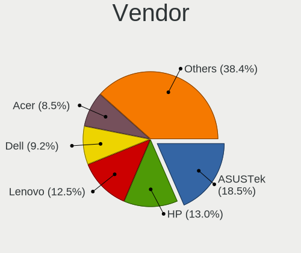
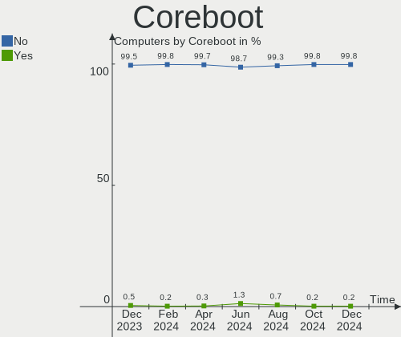
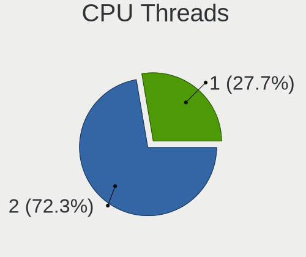
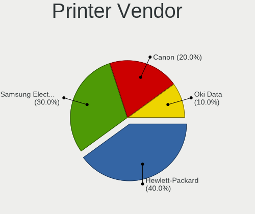

Linux Mint Hardware Trends
--------------------------

A project to identify most popular hardware characteristics and track their change
over time based on data collected by Linux Mint users at https://Linux-Hardware.org.

Anyone can contribute to this report by the [hw-probe](https://github.com/linuxhw/hw-probe) tool:

    sudo -E hw-probe -all -upload

This is a report for all computer types. See also reports for [desktops](/Dist/Linux_Mint/Desktop/README.md) and [notebooks](/Dist/Linux_Mint/Notebook/README.md).

Full-feature report is available here: https://linux-hardware.org/?view=trends

Period: Oct, 2021.

Contents
--------

* [ System ](#system)
  - [ OS                       ](#os)
  - [ OS Family                ](#os-family)
  - [ Kernel                   ](#kernel)
  - [ Kernel Family            ](#kernel-family)
  - [ Kernel Major Ver.        ](#kernel-major-ver)
  - [ Arch                     ](#arch)
  - [ DE                       ](#de)
  - [ Display Server           ](#display-server)
  - [ Display Manager          ](#display-manager)
  - [ OS Lang                  ](#os-lang)
  - [ Boot Mode                ](#boot-mode)
  - [ Filesystem               ](#filesystem)
  - [ Part. scheme             ](#part-scheme)
  - [ Dual Boot with Linux/BSD ](#dual-boot-with-linuxbsd)
  - [ Dual Boot (Win)          ](#dual-boot-win)

* [ Board ](#board)
  - [ Vendor                   ](#vendor)
  - [ Model                    ](#model)
  - [ Model Family             ](#model-family)
  - [ MFG Year                 ](#mfg-year)
  - [ Form Factor              ](#form-factor)
  - [ Secure Boot              ](#secure-boot)
  - [ Coreboot                 ](#coreboot)
  - [ RAM Size                 ](#ram-size)
  - [ RAM Used                 ](#ram-used)
  - [ Total Drives             ](#total-drives)
  - [ Has CD-ROM               ](#has-cd-rom)
  - [ Has Ethernet             ](#has-ethernet)
  - [ Has WiFi                 ](#has-wifi)
  - [ Has Bluetooth            ](#has-bluetooth)

* [ Location ](#location)
  - [ Country                  ](#country)
  - [ City                     ](#city)

* [ Drives ](#drives)
  - [ Drive Vendor             ](#drive-vendor)
  - [ Drive Model              ](#drive-model)
  - [ HDD Vendor               ](#hdd-vendor)
  - [ SSD Vendor               ](#ssd-vendor)
  - [ Drive Kind               ](#drive-kind)
  - [ Drive Connector          ](#drive-connector)
  - [ Drive Size               ](#drive-size)
  - [ Space Total              ](#space-total)
  - [ Space Used               ](#space-used)
  - [ Malfunc. Drives          ](#malfunc-drives)
  - [ Malfunc. Drive Vendor    ](#malfunc-drive-vendor)
  - [ Malfunc. HDD Vendor      ](#malfunc-hdd-vendor)
  - [ Malfunc. Drive Kind      ](#malfunc-drive-kind)
  - [ Failed Drives            ](#failed-drives)
  - [ Failed Drive Vendor      ](#failed-drive-vendor)
  - [ Drive Status             ](#drive-status)

* [ Storage controller ](#storage-controller)
  - [ Storage Vendor           ](#storage-vendor)
  - [ Storage Model            ](#storage-model)
  - [ Storage Kind             ](#storage-kind)

* [ Processor ](#processor)
  - [ CPU Vendor               ](#cpu-vendor)
  - [ CPU Model                ](#cpu-model)
  - [ CPU Model Family         ](#cpu-model-family)
  - [ CPU Cores                ](#cpu-cores)
  - [ CPU Sockets              ](#cpu-sockets)
  - [ CPU Threads              ](#cpu-threads)
  - [ CPU Op-Modes             ](#cpu-op-modes)
  - [ CPU Microcode            ](#cpu-microcode)
  - [ CPU Microarch            ](#cpu-microarch)

* [ Graphics ](#graphics)
  - [ GPU Vendor               ](#gpu-vendor)
  - [ GPU Model                ](#gpu-model)
  - [ GPU Combo                ](#gpu-combo)
  - [ GPU Driver               ](#gpu-driver)
  - [ GPU Memory               ](#gpu-memory)

* [ Monitor ](#monitor)
  - [ Monitor Vendor           ](#monitor-vendor)
  - [ Monitor Model            ](#monitor-model)
  - [ Monitor Resolution       ](#monitor-resolution)
  - [ Monitor Diagonal         ](#monitor-diagonal)
  - [ Monitor Width            ](#monitor-width)
  - [ Aspect Ratio             ](#aspect-ratio)
  - [ Monitor Area             ](#monitor-area)
  - [ Pixel Density            ](#pixel-density)
  - [ Multiple Monitors        ](#multiple-monitors)

* [ Network ](#network)
  - [ Net Controller Vendor    ](#net-controller-vendor)
  - [ Net Controller Model     ](#net-controller-model)
  - [ Wireless Vendor          ](#wireless-vendor)
  - [ Wireless Model           ](#wireless-model)
  - [ Ethernet Vendor          ](#ethernet-vendor)
  - [ Ethernet Model           ](#ethernet-model)
  - [ Net Controller Kind      ](#net-controller-kind)
  - [ Used Controller          ](#used-controller)
  - [ NICs                     ](#nics)
  - [ IPv6                     ](#ipv6)

* [ Bluetooth ](#bluetooth)
  - [ Bluetooth Vendor         ](#bluetooth-vendor)
  - [ Bluetooth Model          ](#bluetooth-model)

* [ Sound ](#sound)
  - [ Sound Vendor             ](#sound-vendor)
  - [ Sound Model              ](#sound-model)

* [ Memory ](#memory)
  - [ Memory Vendor            ](#memory-vendor)
  - [ Memory Model             ](#memory-model)
  - [ Memory Kind              ](#memory-kind)
  - [ Memory Form Factor       ](#memory-form-factor)
  - [ Memory Size              ](#memory-size)
  - [ Memory Speed             ](#memory-speed)

* [ Printers & scanners ](#printers--scanners)
  - [ Printer Vendor           ](#printer-vendor)
  - [ Printer Model            ](#printer-model)
  - [ Scanner Vendor           ](#scanner-vendor)
  - [ Scanner Model            ](#scanner-model)

* [ Camera ](#camera)
  - [ Camera Vendor            ](#camera-vendor)
  - [ Camera Model             ](#camera-model)

* [ Security ](#security)
  - [ Fingerprint Vendor       ](#fingerprint-vendor)
  - [ Fingerprint Model        ](#fingerprint-model)
  - [ Chipcard Vendor          ](#chipcard-vendor)
  - [ Chipcard Model           ](#chipcard-model)

* [ Unsupported ](#unsupported)
  - [ Unsupported Devices      ](#unsupported-devices)
  - [ Unsupported Device Types ](#unsupported-device-types)

System
------

OS
--

Installed operating systems

| Name            | Computers | Percent |
|-----------------|-----------|---------|
| Linux Mint 20.2 | 398       | 79.13%  |
| Linux Mint 20.1 | 36        | 7.16%   |
| Linux Mint 19.3 | 36        | 7.16%   |
| Linux Mint 20   | 20        | 3.98%   |
| Linux Mint 19.2 | 4         | 0.8%    |
| Linux Mint 19.1 | 3         | 0.6%    |
| Linux Mint 19   | 3         | 0.6%    |
| Linux Mint 18.3 | 3         | 0.6%    |

OS Family
---------

OS without a version

| Name       | Computers | Percent |
|------------|-----------|---------|
| Linux Mint | 503       | 100%    |

Kernel
------

Version of the Linux kernel

| Version                    | Computers | Percent |
|----------------------------|-----------|---------|
| 5.4.0-88-generic           | 209       | 41.55%  |
| 5.4.0-89-generic           | 112       | 22.27%  |
| 5.11.0-37-generic          | 31        | 6.16%   |
| 5.4.0-74-generic           | 27        | 5.37%   |
| 5.11.0-38-generic          | 26        | 5.17%   |
| 5.4.0-87-generic           | 13        | 2.58%   |
| 5.4.0-84-generic           | 7         | 1.39%   |
| 5.0.0-32-generic           | 6         | 1.19%   |
| 5.4.0-86-generic           | 5         | 0.99%   |
| 5.4.0-81-generic           | 4         | 0.8%    |
| 5.4.0-80-generic           | 4         | 0.8%    |
| 4.15.0-159-generic         | 4         | 0.8%    |
| 5.4.0-58-generic           | 3         | 0.6%    |
| 5.4.0-26-generic           | 3         | 0.6%    |
| 5.11.0-37-lowlatency       | 3         | 0.6%    |
| 5.11.0-34-generic          | 3         | 0.6%    |
| 4.15.0-54-generic          | 3         | 0.6%    |
| 5.11.0-36-generic          | 2         | 0.4%    |
| 5.11.0-22-generic          | 2         | 0.4%    |
| 5.10.0-1050-oem            | 2         | 0.4%    |
| 5.10.0-1049-oem            | 2         | 0.4%    |
| 4.15.0-20-generic          | 2         | 0.4%    |
| 4.15.0-142-generic         | 2         | 0.4%    |
| 5.8.0-59-generic           | 1         | 0.2%    |
| 5.8.0-43-generic           | 1         | 0.2%    |
| 5.4.0-85-generic           | 1         | 0.2%    |
| 5.4.0-77-generic           | 1         | 0.2%    |
| 5.4.0-72-generic           | 1         | 0.2%    |
| 5.4.0-70-generic           | 1         | 0.2%    |
| 5.4.0-66-generic           | 1         | 0.2%    |
| 5.4.0-62-generic           | 1         | 0.2%    |
| 5.4.0-56-generic           | 1         | 0.2%    |
| 5.4.0-48-generic           | 1         | 0.2%    |
| 5.4.0-39-generic           | 1         | 0.2%    |
| 5.3.0-46-generic           | 1         | 0.2%    |
| 5.3.0-40-generic           | 1         | 0.2%    |
| 5.15.0-rc5+                | 1         | 0.2%    |
| 5.14.15-xanmod1-cacule     | 1         | 0.2%    |
| 5.14.15-xanmod1            | 1         | 0.2%    |
| 5.14.12-xanmod1            | 1         | 0.2%    |
| 5.14.0-12.1-liquorix-amd64 | 1         | 0.2%    |
| 5.14.0-10.1-liquorix-amd64 | 1         | 0.2%    |
| 5.13.12-xanmod1            | 1         | 0.2%    |
| 5.13.12-051312-generic     | 1         | 0.2%    |
| 5.13.0-7620-generic        | 1         | 0.2%    |
| 5.12.9-steamvr-generic     | 1         | 0.2%    |
| 5.11.0-27-generic          | 1         | 0.2%    |
| 5.10.0-1045-oem            | 1         | 0.2%    |
| 5.0.0-23-generic           | 1         | 0.2%    |
| 4.15.0-55-generic          | 1         | 0.2%    |
| 4.10.0-38-generic          | 1         | 0.2%    |

Kernel Family
-------------

Linux kernel without a distro release

| Version | Computers | Percent |
|---------|-----------|---------|
| 5.4.0   | 396       | 78.73%  |
| 5.11.0  | 68        | 13.52%  |
| 4.15.0  | 12        | 2.39%   |
| 5.0.0   | 7         | 1.39%   |
| 5.10.0  | 5         | 0.99%   |
| 5.8.0   | 2         | 0.4%    |
| 5.3.0   | 2         | 0.4%    |
| 5.14.15 | 2         | 0.4%    |
| 5.14.0  | 2         | 0.4%    |
| 5.13.12 | 2         | 0.4%    |
| 5.15.0  | 1         | 0.2%    |
| 5.14.12 | 1         | 0.2%    |
| 5.13.0  | 1         | 0.2%    |
| 5.12.9  | 1         | 0.2%    |
| 4.10.0  | 1         | 0.2%    |

Kernel Major Ver.
-----------------

Linux kernel major version

| Version | Computers | Percent |
|---------|-----------|---------|
| 5.4     | 396       | 78.73%  |
| 5.11    | 68        | 13.52%  |
| 4.15    | 12        | 2.39%   |
| 5.0     | 7         | 1.39%   |
| 5.14    | 5         | 0.99%   |
| 5.10    | 5         | 0.99%   |
| 5.13    | 3         | 0.6%    |
| 5.8     | 2         | 0.4%    |
| 5.3     | 2         | 0.4%    |
| 5.15    | 1         | 0.2%    |
| 5.12    | 1         | 0.2%    |
| 4.10    | 1         | 0.2%    |

Arch
----

OS architecture (x86_64, i586, etc.)

| Name   | Computers | Percent |
|--------|-----------|---------|
| x86_64 | 486       | 96.62%  |
| i686   | 17        | 3.38%   |

DE
--

Desktop Environment

| Name       | Computers | Percent |
|------------|-----------|---------|
| X-Cinnamon | 350       | 69.58%  |
| MATE       | 63        | 12.52%  |
| XFCE       | 45        | 8.95%   |
| Cinnamon   | 25        | 4.97%   |
| GNOME      | 8         | 1.59%   |
| Unknown    | 8         | 1.59%   |
| KDE        | 3         | 0.6%    |
| Deepin     | 1         | 0.2%    |

Display Server
--------------

X11 or Wayland

| Name    | Computers | Percent |
|---------|-----------|---------|
| X11     | 499       | 99.2%   |
| Tty     | 3         | 0.6%    |
| Wayland | 1         | 0.2%    |

Display Manager
---------------

SDDM, LightDM, etc.

| Name    | Computers | Percent |
|---------|-----------|---------|
| Unknown | 298       | 59.24%  |
| LightDM | 204       | 40.56%  |
| GDM     | 1         | 0.2%    |

OS Lang
-------

Language

| Lang    | Computers | Percent |
|---------|-----------|---------|
| en_US   | 119       | 23.66%  |
| de_DE   | 114       | 22.66%  |
| pt_BR   | 37        | 7.36%   |
| en_GB   | 28        | 5.57%   |
| fr_FR   | 27        | 5.37%   |
| ru_RU   | 23        | 4.57%   |
| pl_PL   | 14        | 2.78%   |
| en_CA   | 13        | 2.58%   |
| es_ES   | 11        | 2.19%   |
| en_AU   | 10        | 1.99%   |
| it_IT   | 8         | 1.59%   |
| cs_CZ   | 8         | 1.59%   |
| C       | 8         | 1.59%   |
| de_CH   | 7         | 1.39%   |
| ru_UA   | 5         | 0.99%   |
| nl_NL   | 5         | 0.99%   |
| en_IN   | 5         | 0.99%   |
| fr_CA   | 4         | 0.8%    |
| fr_BE   | 4         | 0.8%    |
| es_CO   | 4         | 0.8%    |
| es_AR   | 4         | 0.8%    |
| da_DK   | 4         | 0.8%    |
| zh_CN   | 3         | 0.6%    |
| sk_SK   | 3         | 0.6%    |
| pt_PT   | 3         | 0.6%    |
| hu_HU   | 3         | 0.6%    |
| es_MX   | 3         | 0.6%    |
| nl_BE   | 2         | 0.4%    |
| hr_HR   | 2         | 0.4%    |
| es_VE   | 2         | 0.4%    |
| es_CL   | 2         | 0.4%    |
| en_ZA   | 2         | 0.4%    |
| tr_TR   | 1         | 0.2%    |
| th_TH   | 1         | 0.2%    |
| sv_SE   | 1         | 0.2%    |
| nb_NO   | 1         | 0.2%    |
| fi_FI   | 1         | 0.2%    |
| et_EE   | 1         | 0.2%    |
| es_PE   | 1         | 0.2%    |
| es_CR   | 1         | 0.2%    |
| en_PH   | 1         | 0.2%    |
| en_NZ   | 1         | 0.2%    |
| en_IL   | 1         | 0.2%    |
| en_IE   | 1         | 0.2%    |
| de_BE   | 1         | 0.2%    |
| de_AT   | 1         | 0.2%    |
| ca_ES   | 1         | 0.2%    |
| Unknown | 1         | 0.2%    |

Boot Mode
---------

EFI or BIOS

| Mode | Computers | Percent |
|------|-----------|---------|
| EFI  | 255       | 50.7%   |
| BIOS | 248       | 49.3%   |

Filesystem
----------

Type of filesystem

| Type    | Computers | Percent |
|---------|-----------|---------|
| Ext4    | 486       | 96.62%  |
| Btrfs   | 8         | 1.59%   |
| Overlay | 7         | 1.39%   |
| Xfs     | 1         | 0.2%    |
| Ext3    | 1         | 0.2%    |

Part. scheme
------------

Scheme of partitioning

| Type    | Computers | Percent |
|---------|-----------|---------|
| Unknown | 320       | 63.62%  |
| GPT     | 125       | 24.85%  |
| MBR     | 58        | 11.53%  |

Dual Boot with Linux/BSD
------------------------

Hosting more than one Linux/BSD

| Dual boot | Computers | Percent |
|-----------|-----------|---------|
| No        | 467       | 92.84%  |
| Yes       | 36        | 7.16%   |

Dual Boot (Win)
---------------

Hosting Linux and Windows

| Dual boot | Computers | Percent |
|-----------|-----------|---------|
| No        | 417       | 82.9%   |
| Yes       | 86        | 17.1%   |

Board
-----

Vendor
------

Motherboard manufacturer

| Name                           | Computers | Percent |
|--------------------------------|-----------|---------|
| Hewlett-Packard                | 93        | 18.49%  |
| ASUSTek Computer               | 80        | 15.9%   |
| Lenovo                         | 60        | 11.93%  |
| Dell                           | 60        | 11.93%  |
| Gigabyte Technology            | 31        | 6.16%   |
| Acer                           | 25        | 4.97%   |
| MSI                            | 19        | 3.78%   |
| ASRock                         | 19        | 3.78%   |
| Intel                          | 12        | 2.39%   |
| Samsung Electronics            | 11        | 2.19%   |
| Medion                         | 11        | 2.19%   |
| Apple                          | 8         | 1.59%   |
| Toshiba                        | 7         | 1.39%   |
| Fujitsu                        | 6         | 1.19%   |
| Unknown                        | 6         | 1.19%   |
| Pegatron                       | 5         | 0.99%   |
| Timi                           | 3         | 0.6%    |
| Sony                           | 3         | 0.6%    |
| Fujitsu Siemens                | 3         | 0.6%    |
| Biostar                        | 3         | 0.6%    |
| Matsushita Electric Industrial | 2         | 0.4%    |
| Gateway                        | 2         | 0.4%    |
| Foxconn                        | 2         | 0.4%    |
| BESSTAR Tech                   | 2         | 0.4%    |
| Alienware                      | 2         | 0.4%    |
| ZOTAC                          | 1         | 0.2%    |
| TUXEDO                         | 1         | 0.2%    |
| TrekStor                       | 1         | 0.2%    |
| TQ-Group                       | 1         | 0.2%    |
| TPV-INVENTA                    | 1         | 0.2%    |
| T-bao                          | 1         | 0.2%    |
| Supermicro                     | 1         | 0.2%    |
| Shuttle                        | 1         | 0.2%    |
| Semp Toshiba                   | 1         | 0.2%    |
| Schenker                       | 1         | 0.2%    |
| R-StyleComputers               | 1         | 0.2%    |
| Quanta                         | 1         | 0.2%    |
| Positivo                       | 1         | 0.2%    |
| Philco                         | 1         | 0.2%    |
| OEM                            | 1         | 0.2%    |
| Notebook                       | 1         | 0.2%    |
| LattePanda                     | 1         | 0.2%    |
| Intel Client Systems           | 1         | 0.2%    |
| HUAWEI                         | 1         | 0.2%    |
| Huanan                         | 1         | 0.2%    |
| HONOR                          | 1         | 0.2%    |
| GPU Company                    | 1         | 0.2%    |
| Google                         | 1         | 0.2%    |
| Getac                          | 1         | 0.2%    |
| eMachines                      | 1         | 0.2%    |
| Digitron                       | 1         | 0.2%    |
| COM1                           | 1         | 0.2%    |
| Chuwi                          | 1         | 0.2%    |

Model
-----

Motherboard model

| Name                                | Computers | Percent |
|-------------------------------------|-----------|---------|
| Unknown                             | 8         | 1.59%   |
| HP Notebook                         | 5         | 0.99%   |
| ASUS All Series                     | 5         | 0.99%   |
| Gigabyte B450M DS3H                 | 4         | 0.8%    |
| Intel NUC8i3BEH                     | 3         | 0.6%    |
| ASUS TUF GAMING X570-PLUS           | 3         | 0.6%    |
| Samsung 550P5C/550P7C               | 2         | 0.4%    |
| MSI MS-7982                         | 2         | 0.4%    |
| Lenovo ThinkPad T495 20NK000MGE     | 2         | 0.4%    |
| Intel H61                           | 2         | 0.4%    |
| HP ProBook 450 G5                   | 2         | 0.4%    |
| HP Pavilion g6                      | 2         | 0.4%    |
| HP Pavilion 14                      | 2         | 0.4%    |
| HP Laptop 17-cn0xxx                 | 2         | 0.4%    |
| HP Laptop 15-bs0xx                  | 2         | 0.4%    |
| HP EliteBook 850 G3                 | 2         | 0.4%    |
| HP EliteBook 8440p                  | 2         | 0.4%    |
| HP EliteBook 840 G3                 | 2         | 0.4%    |
| HP EliteBook 820 G1                 | 2         | 0.4%    |
| Gigabyte GA-870A-UD3                | 2         | 0.4%    |
| Dell PowerEdge T30                  | 2         | 0.4%    |
| Dell OptiPlex 790                   | 2         | 0.4%    |
| Dell OptiPlex 7010                  | 2         | 0.4%    |
| Dell Inspiron MM061                 | 2         | 0.4%    |
| Dell Inspiron 5565                  | 2         | 0.4%    |
| Dell Inspiron 3505                  | 2         | 0.4%    |
| Dell Inspiron 15-3567               | 2         | 0.4%    |
| ASUS ROG STRIX X470-F GAMING        | 2         | 0.4%    |
| ASRock B450M Pro4                   | 2         | 0.4%    |
| ZOTAC ZBOX-AD04                     | 1         | 0.2%    |
| TUXEDO N7x0WU                       | 1         | 0.2%    |
| TrekStor Primetab T13B              | 1         | 0.2%    |
| TQ-Group TQMxE39S                   | 1         | 0.2%    |
| TPV-INVENTA 18-2003LA               | 1         | 0.2%    |
| Toshiba Satellite Pro C850-1HD      | 1         | 0.2%    |
| Toshiba Satellite P105              | 1         | 0.2%    |
| Toshiba Satellite L755D             | 1         | 0.2%    |
| Toshiba Satellite L40               | 1         | 0.2%    |
| Toshiba Satellite L300              | 1         | 0.2%    |
| Toshiba Satellite C55t-C            | 1         | 0.2%    |
| Toshiba Satellite A200              | 1         | 0.2%    |
| Timi RedmiBook Pro 14               | 1         | 0.2%    |
| Timi Mi NoteBook Pro                | 1         | 0.2%    |
| Timi A34R                           | 1         | 0.2%    |
| T-bao MINI PC                       | 1         | 0.2%    |
| Supermicro X7SPA-HF                 | 1         | 0.2%    |
| Sony VGN-FZ480E                     | 1         | 0.2%    |
| Sony VGN-CS31S_W                    | 1         | 0.2%    |
| Sony SVE14122CAW                    | 1         | 0.2%    |
| Shuttle SX50                        | 1         | 0.2%    |
| Semp Toshiba STI NA 1401            | 1         | 0.2%    |
| Schenker SCHENKER_SLIM15_SSL15L19   | 1         | 0.2%    |
| Samsung P500A2D                     | 1         | 0.2%    |
| Samsung 700G7A                      | 1         | 0.2%    |
| Samsung 550XDA                      | 1         | 0.2%    |
| Samsung 550XBE/350XBE               | 1         | 0.2%    |
| Samsung 350V5C/351V5C/3540VC/3440VC | 1         | 0.2%    |
| Samsung 340XAA/350XAA/550XAA        | 1         | 0.2%    |
| Samsung 305V4A/305V5A               | 1         | 0.2%    |
| Samsung 305E4A/305E5A/305E7A        | 1         | 0.2%    |

Model Family
------------

Motherboard model prefix

| Name                  | Computers | Percent |
|-----------------------|-----------|---------|
| Lenovo ThinkPad       | 25        | 4.97%   |
| Dell Inspiron         | 24        | 4.77%   |
| HP Pavilion           | 16        | 3.18%   |
| Acer Aspire           | 16        | 3.18%   |
| Lenovo IdeaPad        | 14        | 2.78%   |
| Dell OptiPlex         | 14        | 2.78%   |
| HP Laptop             | 12        | 2.39%   |
| HP EliteBook          | 12        | 2.39%   |
| HP ProBook            | 11        | 2.19%   |
| HP Compaq             | 11        | 2.19%   |
| Dell Latitude         | 9         | 1.79%   |
| ASUS PRIME            | 9         | 1.79%   |
| Unknown               | 8         | 1.59%   |
| Toshiba Satellite     | 7         | 1.39%   |
| ASUS VivoBook         | 6         | 1.19%   |
| HP Notebook           | 5         | 0.99%   |
| ASUS ROG              | 5         | 0.99%   |
| ASUS All              | 5         | 0.99%   |
| Gigabyte B450M        | 4         | 0.8%    |
| Dell Vostro           | 4         | 0.8%    |
| ASUS TUF              | 4         | 0.8%    |
| Lenovo Yoga           | 3         | 0.6%    |
| Lenovo ThinkCentre    | 3         | 0.6%    |
| Intel NUC8i3BEH       | 3         | 0.6%    |
| HP ENVY               | 3         | 0.6%    |
| HP 255                | 3         | 0.6%    |
| Fujitsu LIFEBOOK      | 3         | 0.6%    |
| Dell Precision        | 3         | 0.6%    |
| Acer TravelMate       | 3         | 0.6%    |
| Samsung 550P5C        | 2         | 0.4%    |
| MSI MS-7982           | 2         | 0.4%    |
| Lenovo ThinkBook      | 2         | 0.4%    |
| Lenovo MIIX           | 2         | 0.4%    |
| Intel H61             | 2         | 0.4%    |
| HP ZBook              | 2         | 0.4%    |
| HP OMEN               | 2         | 0.4%    |
| HP EliteDesk          | 2         | 0.4%    |
| HP 250                | 2         | 0.4%    |
| Gigabyte GA-870A-UD3  | 2         | 0.4%    |
| Fujitsu ESPRIMO       | 2         | 0.4%    |
| Dell XPS              | 2         | 0.4%    |
| Dell Studio           | 2         | 0.4%    |
| Dell PowerEdge        | 2         | 0.4%    |
| ASUS P8H61-M          | 2         | 0.4%    |
| ASRock B450M          | 2         | 0.4%    |
| ASRock 970            | 2         | 0.4%    |
| Apple MacBookPro8     | 2         | 0.4%    |
| Acer Swift            | 2         | 0.4%    |
| ZOTAC ZBOX-AD04       | 1         | 0.2%    |
| TUXEDO N7x0WU         | 1         | 0.2%    |
| TrekStor Primetab     | 1         | 0.2%    |
| TQ-Group TQMxE39S     | 1         | 0.2%    |
| TPV-INVENTA 18-2003LA | 1         | 0.2%    |
| Timi RedmiBook        | 1         | 0.2%    |
| Timi Mi               | 1         | 0.2%    |
| Timi A34R             | 1         | 0.2%    |
| T-bao MINI            | 1         | 0.2%    |
| Supermicro X7SPA-HF   | 1         | 0.2%    |
| Sony VGN-FZ480E       | 1         | 0.2%    |
| Sony VGN-CS31S        | 1         | 0.2%    |

MFG Year
--------

Motherboard manufacture year

| Year    | Computers | Percent |
|---------|-----------|---------|
| 2021    | 78        | 15.51%  |
| 2020    | 55        | 10.93%  |
| 2019    | 55        | 10.93%  |
| 2018    | 42        | 8.35%   |
| 2012    | 41        | 8.15%   |
| 2011    | 36        | 7.16%   |
| 2013    | 32        | 6.36%   |
| 2016    | 26        | 5.17%   |
| 2015    | 24        | 4.77%   |
| 2009    | 23        | 4.57%   |
| 2014    | 20        | 3.98%   |
| 2010    | 19        | 3.78%   |
| 2017    | 17        | 3.38%   |
| 2007    | 16        | 3.18%   |
| 2008    | 13        | 2.58%   |
| 2006    | 2         | 0.4%    |
| 2005    | 1         | 0.2%    |
| 2004    | 1         | 0.2%    |
| 2003    | 1         | 0.2%    |
| Unknown | 1         | 0.2%    |

Form Factor
-----------

Physical design of the computer

| Name        | Computers | Percent |
|-------------|-----------|---------|
| Notebook    | 269       | 53.48%  |
| Desktop     | 203       | 40.36%  |
| Convertible | 11        | 2.19%   |
| Mini pc     | 9         | 1.79%   |
| All in one  | 7         | 1.39%   |
| Tablet      | 4         | 0.8%    |

Secure Boot
-----------

Enabled or disabled

| State    | Computers | Percent |
|----------|-----------|---------|
| Disabled | 448       | 89.07%  |
| Enabled  | 55        | 10.93%  |

Coreboot
--------

Have coreboot on board

| Used | Computers | Percent |
|------|-----------|---------|
| No   | 501       | 99.6%   |
| Yes  | 2         | 0.4%    |

RAM Size
--------

Total RAM memory

| Size in GB  | Computers | Percent |
|-------------|-----------|---------|
| 3.01-4.0    | 119       | 23.66%  |
| 4.01-8.0    | 114       | 22.66%  |
| 16.01-24.0  | 107       | 21.27%  |
| 8.01-16.0   | 84        | 16.7%   |
| 32.01-64.0  | 29        | 5.77%   |
| 1.01-2.0    | 24        | 4.77%   |
| 2.01-3.0    | 10        | 1.99%   |
| 0.51-1.0    | 7         | 1.39%   |
| 64.01-256.0 | 5         | 0.99%   |
| 24.01-32.0  | 4         | 0.8%    |

RAM Used
--------

Used RAM memory

| Used GB    | Computers | Percent |
|------------|-----------|---------|
| 1.01-2.0   | 208       | 41.35%  |
| 2.01-3.0   | 128       | 25.45%  |
| 3.01-4.0   | 68        | 13.52%  |
| 4.01-8.0   | 42        | 8.35%   |
| 0.51-1.0   | 37        | 7.36%   |
| 8.01-16.0  | 15        | 2.98%   |
| 0.01-0.5   | 4         | 0.8%    |
| 16.01-24.0 | 1         | 0.2%    |

Total Drives
------------

Number of drives on board

| Drives | Computers | Percent |
|--------|-----------|---------|
| 1      | 299       | 59.44%  |
| 2      | 131       | 26.04%  |
| 3      | 39        | 7.75%   |
| 4      | 22        | 4.37%   |
| 5      | 4         | 0.8%    |
| 6      | 3         | 0.6%    |
| 0      | 3         | 0.6%    |
| 22     | 1         | 0.2%    |
| 8      | 1         | 0.2%    |

Has CD-ROM
----------

Has CD-ROM on board

| Presented | Computers | Percent |
|-----------|-----------|---------|
| No        | 262       | 52.09%  |
| Yes       | 241       | 47.91%  |

Has Ethernet
------------

Has Ethernet on board

| Presented | Computers | Percent |
|-----------|-----------|---------|
| Yes       | 446       | 88.67%  |
| No        | 57        | 11.33%  |

Has WiFi
--------

Has WiFi module

| Presented | Computers | Percent |
|-----------|-----------|---------|
| Yes       | 373       | 74.16%  |
| No        | 130       | 25.84%  |

Has Bluetooth
-------------

Has Bluetooth module

| Presented | Computers | Percent |
|-----------|-----------|---------|
| Yes       | 279       | 55.47%  |
| No        | 224       | 44.53%  |

Location
--------

Country
-------

Geographic location (country)

| Country      | Computers | Percent |
|--------------|-----------|---------|
| Germany      | 115       | 22.86%  |
| USA          | 68        | 13.52%  |
| Brazil       | 42        | 8.35%   |
| UK           | 24        | 4.77%   |
| Russia       | 22        | 4.37%   |
| France       | 22        | 4.37%   |
| Canada       | 20        | 3.98%   |
| Spain        | 15        | 2.98%   |
| Poland       | 13        | 2.58%   |
| Switzerland  | 11        | 2.19%   |
| Australia    | 10        | 1.99%   |
| Ukraine      | 8         | 1.59%   |
| Italy        | 8         | 1.59%   |
| Czechia      | 8         | 1.59%   |
| India        | 7         | 1.39%   |
| Denmark      | 7         | 1.39%   |
| Belgium      | 7         | 1.39%   |
| Netherlands  | 6         | 1.19%   |
| Mexico       | 5         | 0.99%   |
| Hungary      | 5         | 0.99%   |
| Colombia     | 5         | 0.99%   |
| Slovakia     | 4         | 0.8%    |
| Portugal     | 4         | 0.8%    |
| Argentina    | 4         | 0.8%    |
| Sweden       | 3         | 0.6%    |
| Romania      | 3         | 0.6%    |
| Morocco      | 3         | 0.6%    |
| China        | 3         | 0.6%    |
| Austria      | 3         | 0.6%    |
| Venezuela    | 2         | 0.4%    |
| Turkey       | 2         | 0.4%    |
| Thailand     | 2         | 0.4%    |
| South Africa | 2         | 0.4%    |
| Slovenia     | 2         | 0.4%    |
| Norway       | 2         | 0.4%    |
| Ireland      | 2         | 0.4%    |
| Indonesia    | 2         | 0.4%    |
| Finland      | 2         | 0.4%    |
| Estonia      | 2         | 0.4%    |
| Chile        | 2         | 0.4%    |
| Bulgaria     | 2         | 0.4%    |
| Belarus      | 2         | 0.4%    |
| Serbia       | 1         | 0.2%    |
| Saudi Arabia | 1         | 0.2%    |
| Qatar        | 1         | 0.2%    |
| Philippines  | 1         | 0.2%    |
| Peru         | 1         | 0.2%    |
| Pakistan     | 1         | 0.2%    |
| New Zealand  | 1         | 0.2%    |
| Mozambique   | 1         | 0.2%    |
| Moldova      | 1         | 0.2%    |
| Malaysia     | 1         | 0.2%    |
| Luxembourg   | 1         | 0.2%    |
| Lithuania    | 1         | 0.2%    |
| Lebanon      | 1         | 0.2%    |
| Jamaica      | 1         | 0.2%    |
| Israel       | 1         | 0.2%    |
| Iran         | 1         | 0.2%    |
| Egypt        | 1         | 0.2%    |
| Costa Rica   | 1         | 0.2%    |

City
----

Geographic location (city)

| City                   | Computers | Percent |
|------------------------|-----------|---------|
| Berlin                 | 6         | 1.19%   |
| Sydney                 | 5         | 0.99%   |
| Munich                 | 5         | 0.99%   |
| Stuttgart              | 4         | 0.8%    |
| Rio de Janeiro         | 4         | 0.8%    |
| Hamburg                | 4         | 0.8%    |
| Frankfurt am Main      | 4         | 0.8%    |
| Budapest               | 4         | 0.8%    |
| Zurich                 | 3         | 0.6%    |
| San Antonio            | 3         | 0.6%    |
| Rockville              | 3         | 0.6%    |
| Recife                 | 3         | 0.6%    |
| Paris                  | 3         | 0.6%    |
| Moscow                 | 3         | 0.6%    |
| Mexico City            | 3         | 0.6%    |
| Kyiv                   | 3         | 0.6%    |
| Houston                | 3         | 0.6%    |
| Copenhagen             | 3         | 0.6%    |
| Brussels               | 3         | 0.6%    |
| Bremen                 | 3         | 0.6%    |
| Barcelona              | 3         | 0.6%    |
| Wuppertal              | 2         | 0.4%    |
| Wroclaw                | 2         | 0.4%    |
| Warsaw                 | 2         | 0.4%    |
| Vienna                 | 2         | 0.4%    |
| Teplice                | 2         | 0.4%    |
| St Petersburg          | 2         | 0.4%    |
| Sofia                  | 2         | 0.4%    |
| S??o Paulo             | 2         | 0.4%    |
| Salvador               | 2         | 0.4%    |
| Saint-Guillaume        | 2         | 0.4%    |
| New Bedford            | 2         | 0.4%    |
| Montreal               | 2         | 0.4%    |
| Mississauga            | 2         | 0.4%    |
| Minsk                  | 2         | 0.4%    |
| Melbourne              | 2         | 0.4%    |
| Marktredwitz           | 2         | 0.4%    |
| Lilienthal             | 2         | 0.4%    |
| Kingston               | 2         | 0.4%    |
| Kiel                   | 2         | 0.4%    |
| Katowice               | 2         | 0.4%    |
| Hongkou                | 2         | 0.4%    |
| Heidelberg             | 2         | 0.4%    |
| Harrison               | 2         | 0.4%    |
| Goi??nia               | 2         | 0.4%    |
| Frechen                | 2         | 0.4%    |
| Fes                    | 2         | 0.4%    |
| Dillingen an der Donau | 2         | 0.4%    |
| D??sseldorf            | 2         | 0.4%    |
| Curitiba               | 2         | 0.4%    |
| Clemmons               | 2         | 0.4%    |
| Chicago                | 2         | 0.4%    |
| Chemnitz               | 2         | 0.4%    |
| Braak                  | 2         | 0.4%    |
| Bogot??                | 2         | 0.4%    |
| Amsterdam              | 2         | 0.4%    |
| Zaporizhzhya           | 1         | 0.2%    |
| Wuhan                  | 1         | 0.2%    |
| Worms                  | 1         | 0.2%    |
| Woodway                | 1         | 0.2%    |

Drives
------

Drive Vendor
------------

Hard drive vendors

| Vendor                         | Computers | Drives | Percent |
|--------------------------------|-----------|--------|---------|
| WDC                            | 134       | 151    | 18.11%  |
| Seagate                        | 120       | 141    | 16.22%  |
| Samsung Electronics            | 111       | 122    | 15%     |
| Kingston                       | 44        | 46     | 5.95%   |
| Toshiba                        | 39        | 40     | 5.27%   |
| SanDisk                        | 37        | 38     | 5%      |
| Hitachi                        | 30        | 31     | 4.05%   |
| Unknown                        | 28        | 33     | 3.78%   |
| Crucial                        | 23        | 27     | 3.11%   |
| Intel                          | 15        | 16     | 2.03%   |
| SK Hynix                       | 13        | 14     | 1.76%   |
| HGST                           | 11        | 12     | 1.49%   |
| A-DATA Technology              | 11        | 11     | 1.49%   |
| China                          | 10        | 10     | 1.35%   |
| Phison                         | 6         | 6      | 0.81%   |
| KIOXIA                         | 6         | 6      | 0.81%   |
| Intenso                        | 6         | 6      | 0.81%   |
| Patriot                        | 5         | 5      | 0.68%   |
| Micron Technology              | 5         | 5      | 0.68%   |
| MAXTOR                         | 5         | 5      | 0.68%   |
| GOODRAM                        | 5         | 5      | 0.68%   |
| Unknown                        | 5         | 5      | 0.68%   |
| SPCC                           | 4         | 4      | 0.54%   |
| PNY                            | 4         | 4      | 0.54%   |
| LITEON                         | 4         | 4      | 0.54%   |
| XPG                            | 3         | 3      | 0.41%   |
| Verbatim                       | 3         | 3      | 0.41%   |
| Union Memory                   | 3         | 3      | 0.41%   |
| Silicon Motion                 | 3         | 3      | 0.41%   |
| Fujitsu                        | 3         | 3      | 0.41%   |
| Team                           | 2         | 2      | 0.27%   |
| TCSUNBOW                       | 2         | 3      | 0.27%   |
| Realtek                        | 2         | 2      | 0.27%   |
| Micron/Crucial Technology      | 2         | 2      | 0.27%   |
| Lexar                          | 2         | 2      | 0.27%   |
| Inateck                        | 2         | 2      | 0.27%   |
| Apple                          | 2         | 3      | 0.27%   |
| Apacer                         | 2         | 2      | 0.27%   |
| Yangtze Memory Technologies    | 1         | 1      | 0.14%   |
| TrekStor                       | 1         | 1      | 0.14%   |
| Transcend                      | 1         | 4      | 0.14%   |
| TO Exter                       | 1         | 1      | 0.14%   |
| Solid State Storage Technology | 1         | 1      | 0.14%   |
| Solid                          | 1         | 1      | 0.14%   |
| Smartbuy                       | 1         | 1      | 0.14%   |
| Realtek Semiconductor          | 1         | 1      | 0.14%   |
| PLEXTOR                        | 1         | 1      | 0.14%   |
| PHD 3.0                        | 1         | 1      | 0.14%   |
| Oyen                           | 1         | 1      | 0.14%   |
| NETAPP                         | 1         | 4      | 0.14%   |
| MyDigitalSSD                   | 1         | 1      | 0.14%   |
| Mushkin                        | 1         | 1      | 0.14%   |
| LITEONIT                       | 1         | 1      | 0.14%   |
| KingSpec                       | 1         | 1      | 0.14%   |
| KingDian                       | 1         | 1      | 0.14%   |
| JMicron                        | 1         | 1      | 0.14%   |
| IBM-SSG                        | 1         | 7      | 0.14%   |
| HUAWEI                         | 1         | 1      | 0.14%   |
| HS-SSD-E100                    | 1         | 1      | 0.14%   |
| ExcelStor                      | 1         | 1      | 0.14%   |

Drive Model
-----------

Hard drive models

| Model                                  | Computers | Percent |
|----------------------------------------|-----------|---------|
| Seagate ST1000LM035-1RK172 1TB         | 10        | 1.26%   |
| Kingston SA400S37240G 240GB SSD        | 10        | 1.26%   |
| Seagate ST500DM002-1BD142 500GB        | 8         | 1.01%   |
| SanDisk SSD PLUS 480GB                 | 7         | 0.88%   |
| Samsung SSD 860 EVO 250GB              | 7         | 0.88%   |
| Kingston SA400S37480G 480GB SSD        | 7         | 0.88%   |
| Kingston SA400S37120G 120GB SSD        | 7         | 0.88%   |
| Unknown MMC Card  64GB                 | 6         | 0.76%   |
| Toshiba MQ01ABF050 500GB               | 6         | 0.76%   |
| Samsung SSD 850 EVO 500GB              | 6         | 0.76%   |
| WDC WD20EARX-00PASB0 2TB               | 5         | 0.63%   |
| Toshiba MQ04ABF100 1TB                 | 5         | 0.63%   |
| SK Hynix NVMe SSD Drive 256GB          | 5         | 0.63%   |
| Seagate ST3500418AS 500GB              | 5         | 0.63%   |
| Samsung SSD 850 EVO 250GB              | 5         | 0.63%   |
| Samsung NVMe SSD Drive 500GB           | 5         | 0.63%   |
| Samsung NVMe SSD Drive 2TB             | 5         | 0.63%   |
| Crucial CT240BX500SSD1 240GB           | 5         | 0.63%   |
| Unknown                                | 5         | 0.63%   |
| WDC WDS500G2B0A-00SM50 500GB SSD       | 4         | 0.51%   |
| WDC WD10EZEX-08WN4A0 1TB               | 4         | 0.51%   |
| Unknown MMC Card  128GB                | 4         | 0.51%   |
| Seagate ST500LM012 HN-M500MBB 500GB    | 4         | 0.51%   |
| Seagate ST1000DM010-2EP102 1TB         | 4         | 0.51%   |
| Seagate ST1000DM003-1CH162 1TB         | 4         | 0.51%   |
| Sandisk NVMe SSD Drive 512GB           | 4         | 0.51%   |
| Samsung SSD 860 EVO 500GB              | 4         | 0.51%   |
| Samsung SSD 860 EVO 1TB                | 4         | 0.51%   |
| Samsung NVMe SSD Drive 1TB             | 4         | 0.51%   |
| Kingston SV300S37A120G 120GB SSD       | 4         | 0.51%   |
| Intel SSDSC2KW256G8 256GB              | 4         | 0.51%   |
| Crucial CT480BX500SSD1 480GB           | 4         | 0.51%   |
| Crucial CT1000BX500SSD1 1TB            | 4         | 0.51%   |
| WDC WDS240G2G0A-00JH30 240GB SSD       | 3         | 0.38%   |
| WDC WDS120G2G0A-00JH30 120GB SSD       | 3         | 0.38%   |
| WDC WD5000AAKX-60U6AA0 500GB           | 3         | 0.38%   |
| WDC WD20EZRZ-00Z5HB0 2TB               | 3         | 0.38%   |
| WDC WD10EZEX-00WN4A0 1TB               | 3         | 0.38%   |
| WDC PC SN530 SDBPMPZ-512G-1101 512GB   | 3         | 0.38%   |
| Unknown SD/MMC/MS PRO 128GB            | 3         | 0.38%   |
| Unknown MMC Card  32GB                 | 3         | 0.38%   |
| Toshiba NVMe SSD Drive 256GB           | 3         | 0.38%   |
| Toshiba MQ01ABD100 1TB                 | 3         | 0.38%   |
| SK Hynix HFS256G39TND-N210A 256GB SSD  | 3         | 0.38%   |
| Seagate ST750LM022 HN-M750MBB 752GB    | 3         | 0.38%   |
| Seagate ST3500413AS 500GB              | 3         | 0.38%   |
| Seagate ST31000524AS 1TB               | 3         | 0.38%   |
| Seagate ST2000LM003 HN-M201RAD 2TB     | 3         | 0.38%   |
| Seagate ST2000DM008-2FR102 2TB         | 3         | 0.38%   |
| Seagate ST2000DM006-2DM164 2TB         | 3         | 0.38%   |
| Sandisk NVMe SSD Drive 256GB           | 3         | 0.38%   |
| Samsung SSD 860 QVO 1TB                | 3         | 0.38%   |
| Samsung SSD 840 Series 120GB           | 3         | 0.38%   |
| Samsung PM963 2.5" NVMe PCIe SSD 512GB | 3         | 0.38%   |
| Samsung NVMe SSD Drive 256GB           | 3         | 0.38%   |
| Hitachi HTS545016B9A300 160GB          | 3         | 0.38%   |
| HGST HTS721010A9E630 1TB               | 3         | 0.38%   |
| A-DATA SU650 120GB SSD                 | 3         | 0.38%   |
| WDC WD5000AAKS-00A7B0 500GB            | 2         | 0.25%   |
| WDC WD3200BEVT-22ZCT0 320GB            | 2         | 0.25%   |

HDD Vendor
----------

Hard disk drive vendors

| Vendor              | Computers | Drives | Percent |
|---------------------|-----------|--------|---------|
| Seagate             | 119       | 138    | 35.84%  |
| WDC                 | 102       | 118    | 30.72%  |
| Toshiba             | 30        | 30     | 9.04%   |
| Hitachi             | 30        | 31     | 9.04%   |
| Samsung Electronics | 22        | 22     | 6.63%   |
| HGST                | 11        | 12     | 3.31%   |
| MAXTOR              | 5         | 5      | 1.51%   |
| Unknown             | 3         | 3      | 0.9%    |
| Fujitsu             | 3         | 3      | 0.9%    |
| TO Exter            | 1         | 1      | 0.3%    |
| Realtek             | 1         | 1      | 0.3%    |
| PHD 3.0             | 1         | 1      | 0.3%    |
| JMicron             | 1         | 1      | 0.3%    |
| Inateck             | 1         | 1      | 0.3%    |
| ExcelStor           | 1         | 1      | 0.3%    |
| Apple               | 1         | 1      | 0.3%    |

SSD Vendor
----------

Solid state drive vendors

| Vendor              | Computers | Drives | Percent |
|---------------------|-----------|--------|---------|
| Samsung Electronics | 59        | 61     | 22.61%  |
| Kingston            | 35        | 37     | 13.41%  |
| SanDisk             | 25        | 25     | 9.58%   |
| Crucial             | 23        | 26     | 8.81%   |
| WDC                 | 18        | 18     | 6.9%    |
| China               | 10        | 10     | 3.83%   |
| A-DATA Technology   | 10        | 10     | 3.83%   |
| Intel               | 8         | 8      | 3.07%   |
| Intenso             | 6         | 6      | 2.3%    |
| Toshiba             | 5         | 5      | 1.92%   |
| Patriot             | 5         | 5      | 1.92%   |
| GOODRAM             | 5         | 5      | 1.92%   |
| SK Hynix            | 4         | 4      | 1.53%   |
| PNY                 | 4         | 4      | 1.53%   |
| Micron Technology   | 4         | 4      | 1.53%   |
| LITEON              | 4         | 4      | 1.53%   |
| Verbatim            | 3         | 3      | 1.15%   |
| SPCC                | 3         | 3      | 1.15%   |
| Unknown             | 3         | 3      | 1.15%   |
| Union Memory        | 2         | 2      | 0.77%   |
| Team                | 2         | 2      | 0.77%   |
| TCSUNBOW            | 2         | 3      | 0.77%   |
| Lexar               | 2         | 2      | 0.77%   |
| Apple               | 2         | 2      | 0.77%   |
| TrekStor            | 1         | 1      | 0.38%   |
| Solid               | 1         | 1      | 0.38%   |
| Seagate             | 1         | 1      | 0.38%   |
| PLEXTOR             | 1         | 1      | 0.38%   |
| Phison              | 1         | 1      | 0.38%   |
| MyDigitalSSD        | 1         | 1      | 0.38%   |
| Mushkin             | 1         | 1      | 0.38%   |
| LITEONIT            | 1         | 1      | 0.38%   |
| KingSpec            | 1         | 1      | 0.38%   |
| KingDian            | 1         | 1      | 0.38%   |
| EMTEC               | 1         | 1      | 0.38%   |
| Corsair             | 1         | 1      | 0.38%   |
| CIE                 | 1         | 1      | 0.38%   |
| ASMT                | 1         | 1      | 0.38%   |
| Apacer              | 1         | 1      | 0.38%   |
| ADATA SU            | 1         | 1      | 0.38%   |
| 1TB                 | 1         | 1      | 0.38%   |

Drive Kind
----------

HDD or SSD

| Kind    | Computers | Drives | Percent |
|---------|-----------|--------|---------|
| HDD     | 277       | 369    | 41.84%  |
| SSD     | 232       | 269    | 35.05%  |
| NVMe    | 117       | 131    | 17.67%  |
| MMC     | 26        | 30     | 3.93%   |
| Unknown | 10        | 21     | 1.51%   |

Drive Connector
---------------

SATA, SAS, NVMe, etc.

| Type | Computers | Drives | Percent |
|------|-----------|--------|---------|
| SATA | 421       | 616    | 71.36%  |
| NVMe | 117       | 129    | 19.83%  |
| SAS  | 26        | 45     | 4.41%   |
| MMC  | 26        | 30     | 4.41%   |

Drive Size
----------

Size of hard drive

| Size in TB | Computers | Drives | Percent |
|------------|-----------|--------|---------|
| 0.01-0.5   | 322       | 405    | 62.65%  |
| 0.51-1.0   | 132       | 154    | 25.68%  |
| 1.01-2.0   | 43        | 56     | 8.37%   |
| 3.01-4.0   | 9         | 12     | 1.75%   |
| 2.01-3.0   | 6         | 9      | 1.17%   |
| 4.01-10.0  | 2         | 2      | 0.39%   |

Space Total
-----------

Amount of disk space available on the file system

| Size in GB     | Computers | Percent |
|----------------|-----------|---------|
| 101-250        | 167       | 33.2%   |
| 251-500        | 130       | 25.84%  |
| 501-1000       | 70        | 13.92%  |
| 51-100         | 38        | 7.55%   |
| 1001-2000      | 37        | 7.36%   |
| More than 3000 | 25        | 4.97%   |
| 2001-3000      | 13        | 2.58%   |
| 21-50          | 11        | 2.19%   |
| 1-20           | 11        | 2.19%   |
| Unknown        | 1         | 0.2%    |

Space Used
----------

Amount of used disk space

| Used GB        | Computers | Percent |
|----------------|-----------|---------|
| 1-20           | 143       | 28.43%  |
| 21-50          | 87        | 17.3%   |
| 51-100         | 87        | 17.3%   |
| 101-250        | 86        | 17.1%   |
| 251-500        | 47        | 9.34%   |
| 501-1000       | 21        | 4.17%   |
| 1001-2000      | 19        | 3.78%   |
| More than 3000 | 8         | 1.59%   |
| 2001-3000      | 4         | 0.8%    |
| Unknown        | 1         | 0.2%    |

Malfunc. Drives
---------------

Drive models with a malfunction

| Model                                 | Computers | Drives | Percent |
|---------------------------------------|-----------|--------|---------|
| Seagate ST3500418AS 500GB             | 3         | 3      | 7.69%   |
| Seagate ST500DM002-1BD142 500GB       | 2         | 2      | 5.13%   |
| Seagate ST320LT012-1DG14C 320GB       | 2         | 2      | 5.13%   |
| HGST HTS721010A9E630 1TB              | 2         | 2      | 5.13%   |
| WDC WD5002ABYS-01B1B0 500GB           | 1         | 1      | 2.56%   |
| WDC WD5000LPVT-22G33T0 500GB          | 1         | 1      | 2.56%   |
| WDC WD5000AAKS-00A7B0 500GB           | 1         | 1      | 2.56%   |
| WDC WD3200BEKT-60F3T1 320GB           | 1         | 1      | 2.56%   |
| WDC WD3200AAJS-00B4A0 320GB           | 1         | 1      | 2.56%   |
| WDC WD30EFRX-68AX9N0 3TB              | 1         | 1      | 2.56%   |
| WDC WD20EZRZ-00Z5HB0 2TB              | 1         | 1      | 2.56%   |
| WDC WD10PURZ-85U8XY0 1TB              | 1         | 1      | 2.56%   |
| WDC WD10JPVX-60JC3T0 1TB              | 1         | 1      | 2.56%   |
| WDC WD1003FZEX-00MK2A0 1TB            | 1         | 1      | 2.56%   |
| Toshiba MK2561GSY 250GB               | 1         | 1      | 2.56%   |
| Toshiba MK1237GSX 120GB               | 1         | 1      | 2.56%   |
| Seagate ST750LM022 HN-M750MBB 752GB   | 1         | 1      | 2.56%   |
| Seagate ST500LT012-9WS142 500GB       | 1         | 1      | 2.56%   |
| Seagate ST500LT012-1DG142 500GB       | 1         | 1      | 2.56%   |
| Seagate ST500LM012 HN-M500MBB 500GB   | 1         | 1      | 2.56%   |
| Seagate ST3500413AS 500GB             | 1         | 2      | 2.56%   |
| Seagate ST2000LM007-1R8174 2TB        | 1         | 1      | 2.56%   |
| SanDisk SSD PLUS 240GB                | 1         | 1      | 2.56%   |
| SanDisk SD8SBAT-032G-1006 32GB SSD    | 1         | 1      | 2.56%   |
| SanDisk iSSD P4 8GB                   | 1         | 1      | 2.56%   |
| Samsung Electronics SSD 960 EVO 250GB | 1         | 1      | 2.56%   |
| Samsung Electronics HM250HI 250GB     | 1         | 1      | 2.56%   |
| Samsung Electronics HD250HJ 250GB     | 1         | 1      | 2.56%   |
| Samsung Electronics HD081GJ 80GB      | 1         | 1      | 2.56%   |
| Intel SSDSCKKF180H6H 180GB            | 1         | 1      | 2.56%   |
| Hitachi HTS725016A9A364 160GB         | 1         | 1      | 2.56%   |
| Hitachi HTS545050B9A300 500GB         | 1         | 1      | 2.56%   |
| Hitachi HDS721010DLE630 1TB           | 1         | 1      | 2.56%   |
| Hitachi HCS5C3225SLA380 250GB         | 1         | 1      | 2.56%   |

Malfunc. Drive Vendor
---------------------

Vendors of faulty drives

| Vendor              | Computers | Drives | Percent |
|---------------------|-----------|--------|---------|
| Seagate             | 12        | 14     | 32.43%  |
| WDC                 | 9         | 10     | 24.32%  |
| Samsung Electronics | 4         | 4      | 10.81%  |
| Hitachi             | 4         | 4      | 10.81%  |
| SanDisk             | 3         | 3      | 8.11%   |
| Toshiba             | 2         | 2      | 5.41%   |
| HGST                | 2         | 2      | 5.41%   |
| Intel               | 1         | 1      | 2.7%    |

Malfunc. HDD Vendor
-------------------

Vendors of faulty HDD drives

| Vendor              | Computers | Drives | Percent |
|---------------------|-----------|--------|---------|
| Seagate             | 12        | 14     | 37.5%   |
| WDC                 | 9         | 10     | 28.13%  |
| Hitachi             | 4         | 4      | 12.5%   |
| Samsung Electronics | 3         | 3      | 9.38%   |
| Toshiba             | 2         | 2      | 6.25%   |
| HGST                | 2         | 2      | 6.25%   |

Malfunc. Drive Kind
-------------------

Kinds of faulty drives

| Kind | Computers | Drives | Percent |
|------|-----------|--------|---------|
| HDD  | 30        | 35     | 85.71%  |
| SSD  | 4         | 4      | 11.43%  |
| NVMe | 1         | 1      | 2.86%   |

Failed Drives
-------------

Failed drive models

Zero info for selected period =(

Failed Drive Vendor
-------------------

Failed drive vendors

Zero info for selected period =(

Drive Status
------------

Number of failed and malfunc. drives

| Status   | Computers | Drives | Percent |
|----------|-----------|--------|---------|
| Detected | 344       | 558    | 64.18%  |
| Works    | 158       | 222    | 29.48%  |
| Malfunc  | 34        | 40     | 6.34%   |

Storage controller
------------------

Storage Vendor
--------------

Storage controller vendors

| Vendor                           | Computers | Percent |
|----------------------------------|-----------|---------|
| Intel                            | 333       | 55.13%  |
| AMD                              | 109       | 18.05%  |
| Samsung Electronics              | 36        | 5.96%   |
| Sandisk                          | 25        | 4.14%   |
| Nvidia                           | 12        | 1.99%   |
| ASMedia Technology               | 10        | 1.66%   |
| SK Hynix                         | 9         | 1.49%   |
| Kingston Technology Company      | 9         | 1.49%   |
| JMicron Technology               | 9         | 1.49%   |
| Phison Electronics               | 6         | 0.99%   |
| KIOXIA                           | 6         | 0.99%   |
| Toshiba America Info Systems     | 5         | 0.83%   |
| Silicon Motion                   | 5         | 0.83%   |
| Marvell Technology Group         | 5         | 0.83%   |
| VIA Technologies                 | 4         | 0.66%   |
| Silicon Integrated Systems [SiS] | 4         | 0.66%   |
| ADATA Technology                 | 4         | 0.66%   |
| Micron/Crucial Technology        | 3         | 0.5%    |
| Realtek Semiconductor            | 2         | 0.33%   |
| Yangtze Memory Technologies      | 1         | 0.17%   |
| Union Memory (Shenzhen)          | 1         | 0.17%   |
| ULi Electronics                  | 1         | 0.17%   |
| Solid State Storage Technology   | 1         | 0.17%   |
| Silicon Image                    | 1         | 0.17%   |
| Micron Technology                | 1         | 0.17%   |
| LSI Logic / Symbios Logic        | 1         | 0.17%   |
| Adaptec                          | 1         | 0.17%   |

Storage Model
-------------

Storage controller models

| Model                                                                            | Computers | Percent |
|----------------------------------------------------------------------------------|-----------|---------|
| AMD FCH SATA Controller [AHCI mode]                                              | 69        | 9.75%   |
| Intel Sunrise Point-LP SATA Controller [AHCI mode]                               | 34        | 4.8%    |
| Intel 6 Series/C200 Series Chipset Family 6 port Desktop SATA AHCI Controller    | 26        | 3.67%   |
| Intel 7 Series Chipset Family 6-port SATA Controller [AHCI mode]                 | 25        | 3.53%   |
| AMD SB7x0/SB8x0/SB9x0 SATA Controller [AHCI mode]                                | 20        | 2.82%   |
| Samsung NVMe SSD Controller SM981/PM981/PM983                                    | 19        | 2.68%   |
| Intel 82801IBM/IEM (ICH9M/ICH9M-E) 4 port SATA Controller [AHCI mode]            | 18        | 2.54%   |
| Intel 8 Series/C220 Series Chipset Family 6-port SATA Controller 1 [AHCI mode]   | 16        | 2.26%   |
| Intel 6 Series/C200 Series Chipset Family 6 port Mobile SATA AHCI Controller     | 15        | 2.12%   |
| Intel 8 Series SATA Controller 1 [AHCI mode]                                     | 14        | 1.98%   |
| AMD 400 Series Chipset SATA Controller                                           | 14        | 1.98%   |
| AMD SB7x0/SB8x0/SB9x0 IDE Controller                                             | 13        | 1.84%   |
| Intel Volume Management Device NVMe RAID Controller                              | 12        | 1.69%   |
| Intel Q170/Q150/B150/H170/H110/Z170/CM236 Chipset SATA Controller [AHCI Mode]    | 12        | 1.69%   |
| Intel NM10/ICH7 Family SATA Controller [IDE mode]                                | 12        | 1.69%   |
| Intel 82801 Mobile SATA Controller [RAID mode]                                   | 11        | 1.55%   |
| Intel 82801G (ICH7 Family) IDE Controller                                        | 10        | 1.41%   |
| Intel 7 Series/C210 Series Chipset Family 6-port SATA Controller [AHCI mode]     | 10        | 1.41%   |
| ASMedia ASM1062 Serial ATA Controller                                            | 10        | 1.41%   |
| Sandisk WD Blue SN550 NVMe SSD                                                   | 9         | 1.27%   |
| Intel 200 Series PCH SATA controller [AHCI mode]                                 | 9         | 1.27%   |
| AMD SB7x0/SB8x0/SB9x0 SATA Controller [IDE mode]                                 | 9         | 1.27%   |
| Samsung NVMe SSD Controller 980                                                  | 8         | 1.13%   |
| Samsung NVMe SSD Controller SM961/PM961/SM963                                    | 7         | 0.99%   |
| JMicron JMB363 SATA/IDE Controller                                               | 7         | 0.99%   |
| Intel Cannon Lake PCH SATA AHCI Controller                                       | 7         | 0.99%   |
| Sandisk WD Black SN750 / PC SN730 NVMe SSD                                       | 6         | 0.85%   |
| KIOXIA Non-Volatile memory controller                                            | 6         | 0.85%   |
| Intel Wildcat Point-LP SATA Controller [AHCI Mode]                               | 6         | 0.85%   |
| Intel Tiger Lake-LP SATA Controller [AHCI mode]                                  | 6         | 0.85%   |
| Intel Celeron/Pentium Silver Processor SATA Controller                           | 6         | 0.85%   |
| Intel Cannon Point-LP SATA Controller [AHCI Mode]                                | 6         | 0.85%   |
| Intel 5 Series/3400 Series Chipset 6 port SATA AHCI Controller                   | 6         | 0.85%   |
| SK Hynix BC511                                                                   | 5         | 0.71%   |
| Sandisk Non-Volatile memory controller                                           | 5         | 0.71%   |
| Intel HM170/QM170 Chipset SATA Controller [AHCI Mode]                            | 5         | 0.71%   |
| Intel Atom/Celeron/Pentium Processor x5-E8000/J3xxx/N3xxx Series SATA Controller | 5         | 0.71%   |
| Intel 9 Series Chipset Family SATA Controller [AHCI Mode]                        | 5         | 0.71%   |
| Intel 82801HM/HEM (ICH8M/ICH8M-E) SATA Controller [AHCI mode]                    | 5         | 0.71%   |
| Intel 82801GBM/GHM (ICH7-M Family) SATA Controller [IDE mode]                    | 5         | 0.71%   |
| VIA VT82C586A/B/VT82C686/A/B/VT823x/A/C PIPC Bus Master IDE                      | 4         | 0.56%   |
| Toshiba America Info Systems XG6 NVMe SSD Controller                             | 4         | 0.56%   |
| Silicon Motion SM2263EN/SM2263XT SSD Controller                                  | 4         | 0.56%   |
| Silicon Integrated Systems [SiS] 5513 IDE Controller                             | 4         | 0.56%   |
| Sandisk WD Blue SN500 / PC SN520 NVMe SSD                                        | 4         | 0.56%   |
| Nvidia MCP61 SATA Controller                                                     | 4         | 0.56%   |
| Intel SATA Controller [RAID mode]                                                | 4         | 0.56%   |
| Intel Celeron N3350/Pentium N4200/Atom E3900 Series SATA AHCI Controller         | 4         | 0.56%   |
| Intel 82801JD/DO (ICH10 Family) SATA AHCI Controller                             | 4         | 0.56%   |
| Intel 82801I (ICH9 Family) 2 port SATA Controller [IDE mode]                     | 4         | 0.56%   |
| Intel 82801HM/HEM (ICH8M/ICH8M-E) IDE Controller                                 | 4         | 0.56%   |
| Intel 5 Series/3400 Series Chipset 4 port SATA IDE Controller                    | 4         | 0.56%   |
| Intel 5 Series/3400 Series Chipset 2 port SATA IDE Controller                    | 4         | 0.56%   |
| AMD Starship/Matisse Chipset SATA Controller [AHCI mode]                         | 4         | 0.56%   |
| ADATA XPG SX8200 Pro PCIe Gen3x4 M.2 2280 Solid State Drive                      | 4         | 0.56%   |
| SK Hynix Gold P31 SSD                                                            | 3         | 0.42%   |
| Silicon Integrated Systems [SiS] SATA Controller / IDE mode                      | 3         | 0.42%   |
| Phison E12 NVMe Controller                                                       | 3         | 0.42%   |
| Nvidia MCP78S [GeForce 8200] SATA Controller (non-AHCI mode)                     | 3         | 0.42%   |
| Nvidia MCP78S [GeForce 8200] IDE                                                 | 3         | 0.42%   |

Storage Kind
------------

Kind of storage controller (IDE, SATA, NVMe, SAS, ...)

| Kind | Computers | Percent |
|------|-----------|---------|
| SATA | 385       | 61.11%  |
| NVMe | 116       | 18.41%  |
| IDE  | 94        | 14.92%  |
| RAID | 32        | 5.08%   |
| SAS  | 2         | 0.32%   |
| SCSI | 1         | 0.16%   |

Processor
---------

CPU Vendor
----------

Processor vendors

| Vendor | Computers | Percent |
|--------|-----------|---------|
| Intel  | 368       | 73.16%  |
| AMD    | 135       | 26.84%  |

CPU Model
---------

Processor models

| Model                                       | Computers | Percent |
|---------------------------------------------|-----------|---------|
| Intel 11th Gen Core i5-1135G7 @ 2.40GHz     | 11        | 2.19%   |
| Intel Core i7-2600 CPU @ 3.40GHz            | 7         | 1.39%   |
| Intel Core i5-7200U CPU @ 2.50GHz           | 7         | 1.39%   |
| Intel Core i7-6700HQ CPU @ 2.60GHz          | 5         | 0.99%   |
| Intel Core i5-3230M CPU @ 2.60GHz           | 5         | 0.99%   |
| Intel 11th Gen Core i7-1165G7 @ 2.80GHz     | 5         | 0.99%   |
| Intel Pentium Silver N5030 CPU @ 1.10GHz    | 4         | 0.8%    |
| Intel Core i7-8550U CPU @ 1.80GHz           | 4         | 0.8%    |
| Intel Core i7-3770 CPU @ 3.40GHz            | 4         | 0.8%    |
| Intel Core i5-8250U CPU @ 1.60GHz           | 4         | 0.8%    |
| Intel Core i5-3320M CPU @ 2.60GHz           | 4         | 0.8%    |
| Intel Core i3-2120 CPU @ 3.30GHz            | 4         | 0.8%    |
| Intel Core 2 Duo CPU P8600 @ 2.40GHz        | 4         | 0.8%    |
| AMD Ryzen 7 3700X 8-Core Processor          | 4         | 0.8%    |
| AMD Ryzen 7 2700X Eight-Core Processor      | 4         | 0.8%    |
| AMD Ryzen 5 5500U with Radeon Graphics      | 4         | 0.8%    |
| AMD Ryzen 5 3600 6-Core Processor           | 4         | 0.8%    |
| AMD Ryzen 5 1600 Six-Core Processor         | 4         | 0.8%    |
| Intel Pentium CPU N3700 @ 1.60GHz           | 3         | 0.6%    |
| Intel Core i7-9750H CPU @ 2.60GHz           | 3         | 0.6%    |
| Intel Core i7-8750H CPU @ 2.20GHz           | 3         | 0.6%    |
| Intel Core i7-8700 CPU @ 3.20GHz            | 3         | 0.6%    |
| Intel Core i7-8565U CPU @ 1.80GHz           | 3         | 0.6%    |
| Intel Core i7-7500U CPU @ 2.70GHz           | 3         | 0.6%    |
| Intel Core i7-10750H CPU @ 2.60GHz          | 3         | 0.6%    |
| Intel Core i5-6300U CPU @ 2.40GHz           | 3         | 0.6%    |
| Intel Core i5-4590 CPU @ 3.30GHz            | 3         | 0.6%    |
| Intel Core i5-3210M CPU @ 2.50GHz           | 3         | 0.6%    |
| Intel Core i5-2520M CPU @ 2.50GHz           | 3         | 0.6%    |
| Intel Core i5 CPU 650 @ 3.20GHz             | 3         | 0.6%    |
| Intel Core i3-8109U CPU @ 3.00GHz           | 3         | 0.6%    |
| Intel Core i3-4130 CPU @ 3.40GHz            | 3         | 0.6%    |
| Intel Core i3-4005U CPU @ 1.70GHz           | 3         | 0.6%    |
| Intel Core i3-2350M CPU @ 2.30GHz           | 3         | 0.6%    |
| Intel Core 2 Quad CPU Q6600 @ 2.40GHz       | 3         | 0.6%    |
| Intel Core 2 Duo CPU P8700 @ 2.53GHz        | 3         | 0.6%    |
| AMD Ryzen 5 3400G with Radeon Vega Graphics | 3         | 0.6%    |
| AMD A6-3420M APU with Radeon HD Graphics    | 3         | 0.6%    |
| Intel Xeon CPU E3-1225 v5 @ 3.30GHz         | 2         | 0.4%    |
| Intel Pentium Silver N6000 @ 1.10GHz        | 2         | 0.4%    |
| Intel Pentium Dual-Core CPU T4200 @ 2.00GHz | 2         | 0.4%    |
| Intel Pentium Dual-Core CPU E5400 @ 2.70GHz | 2         | 0.4%    |
| Intel Pentium Dual-Core CPU E5200 @ 2.50GHz | 2         | 0.4%    |
| Intel Pentium CPU B960 @ 2.20GHz            | 2         | 0.4%    |
| Intel Genuine CPU T2300 @ 1.66GHz           | 2         | 0.4%    |
| Intel Core i7-7700K CPU @ 4.20GHz           | 2         | 0.4%    |
| Intel Core i7-6700K CPU @ 4.00GHz           | 2         | 0.4%    |
| Intel Core i7-4500U CPU @ 1.80GHz           | 2         | 0.4%    |
| Intel Core i7-2600K CPU @ 3.40GHz           | 2         | 0.4%    |
| Intel Core i7-1065G7 CPU @ 1.30GHz          | 2         | 0.4%    |
| Intel Core i5-9600K CPU @ 3.70GHz           | 2         | 0.4%    |
| Intel Core i5-8500 CPU @ 3.00GHz            | 2         | 0.4%    |
| Intel Core i5-8265U CPU @ 1.60GHz           | 2         | 0.4%    |
| Intel Core i5-6400 CPU @ 2.70GHz            | 2         | 0.4%    |
| Intel Core i5-5300U CPU @ 2.30GHz           | 2         | 0.4%    |
| Intel Core i5-4300U CPU @ 1.90GHz           | 2         | 0.4%    |
| Intel Core i5-4200U CPU @ 1.60GHz           | 2         | 0.4%    |
| Intel Core i5-3570 CPU @ 3.40GHz            | 2         | 0.4%    |
| Intel Core i5-3470 CPU @ 3.20GHz            | 2         | 0.4%    |
| Intel Core i5-2540M CPU @ 2.60GHz           | 2         | 0.4%    |

CPU Model Family
----------------

Processor model prefix

| Model                   | Computers | Percent |
|-------------------------|-----------|---------|
| Intel Core i5           | 92        | 18.29%  |
| Intel Core i7           | 74        | 14.71%  |
| Intel Core i3           | 53        | 10.54%  |
| Intel Core 2 Duo        | 30        | 5.96%   |
| AMD Ryzen 5             | 29        | 5.77%   |
| Other                   | 23        | 4.57%   |
| Intel Celeron           | 22        | 4.37%   |
| Intel Pentium           | 17        | 3.38%   |
| AMD Ryzen 7             | 13        | 2.58%   |
| Intel Atom              | 11        | 2.19%   |
| Intel Xeon              | 10        | 1.99%   |
| Intel Pentium Dual-Core | 9         | 1.79%   |
| AMD A4                  | 9         | 1.79%   |
| AMD FX                  | 7         | 1.39%   |
| AMD A6                  | 7         | 1.39%   |
| Intel Pentium Silver    | 6         | 1.19%   |
| Intel Core 2 Quad       | 6         | 1.19%   |
| AMD Phenom II X4        | 6         | 1.19%   |
| Intel Pentium Dual      | 5         | 0.99%   |
| AMD Athlon 64 X2        | 5         | 0.99%   |
| AMD Athlon              | 5         | 0.99%   |
| AMD A8                  | 5         | 0.99%   |
| AMD Ryzen 5 PRO         | 4         | 0.8%    |
| AMD A10                 | 4         | 0.8%    |
| Intel Genuine           | 3         | 0.6%    |
| AMD Ryzen 9             | 3         | 0.6%    |
| AMD Ryzen 3             | 3         | 0.6%    |
| AMD E                   | 3         | 0.6%    |
| Intel Core 2            | 2         | 0.4%    |
| AMD Ryzen 7 PRO         | 2         | 0.4%    |
| AMD Phenom II X3        | 2         | 0.4%    |
| AMD E2                  | 2         | 0.4%    |
| AMD C-60                | 2         | 0.4%    |
| AMD Athlon II X2        | 2         | 0.4%    |
| Intel Pentium M         | 1         | 0.2%    |
| Intel Pentium Gold      | 1         | 0.2%    |
| Intel Pentium D         | 1         | 0.2%    |
| Intel Pentium 4         | 1         | 0.2%    |
| Intel Core m7           | 1         | 0.2%    |
| Intel Core m5           | 1         | 0.2%    |
| Intel Core m3           | 1         | 0.2%    |
| Intel Core Duo          | 1         | 0.2%    |
| AMD Turion Neo X2       | 1         | 0.2%    |
| AMD Turion 64 X2 Mobile | 1         | 0.2%    |
| AMD Turion              | 1         | 0.2%    |
| AMD Ryzen Threadripper  | 1         | 0.2%    |
| AMD Phenom II X2        | 1         | 0.2%    |
| AMD Phenom II           | 1         | 0.2%    |
| AMD Phenom              | 1         | 0.2%    |
| AMD Opteron             | 1         | 0.2%    |
| AMD E1                  | 1         | 0.2%    |
| AMD C-70                | 1         | 0.2%    |
| AMD Athlon XP           | 1         | 0.2%    |
| AMD Athlon X4           | 1         | 0.2%    |
| AMD Athlon X2           | 1         | 0.2%    |
| AMD Athlon II X4        | 1         | 0.2%    |
| AMD Athlon II X3        | 1         | 0.2%    |
| AMD Athlon II Neo       | 1         | 0.2%    |
| AMD Athlon II Dual-Core | 1         | 0.2%    |
| AMD Athlon II           | 1         | 0.2%    |

CPU Cores
---------

Number of processor cores

| Number | Computers | Percent |
|--------|-----------|---------|
| 2      | 244       | 48.51%  |
| 4      | 172       | 34.19%  |
| 6      | 43        | 8.55%   |
| 1      | 19        | 3.78%   |
| 8      | 17        | 3.38%   |
| 16     | 4         | 0.8%    |
| 3      | 4         | 0.8%    |

CPU Sockets
-----------

Number of sockets

| Number | Computers | Percent |
|--------|-----------|---------|
| 1      | 503       | 100%    |

CPU Threads
-----------

Threads per core (Hyper-Threading)

| Number | Computers | Percent |
|--------|-----------|---------|
| 2      | 298       | 59.24%  |
| 1      | 205       | 40.76%  |

CPU Op-Modes
------------

CPU Operation Modes (32-bit, 64-bit)

| Op mode        | Computers | Percent |
|----------------|-----------|---------|
| 32-bit, 64-bit | 494       | 98.21%  |
| 32-bit         | 9         | 1.79%   |

CPU Microcode
-------------

Microcode number

| Number     | Computers | Percent |
|------------|-----------|---------|
| 0x206a7    | 43        | 8.55%   |
| Unknown    | 42        | 8.35%   |
| 0x306a9    | 33        | 6.56%   |
| 0x1067a    | 28        | 5.57%   |
| 0x806c1    | 19        | 3.78%   |
| 0x306c3    | 19        | 3.78%   |
| 0x506e3    | 15        | 2.98%   |
| 0x40651    | 15        | 2.98%   |
| 0x906ea    | 12        | 2.39%   |
| 0x806ea    | 12        | 2.39%   |
| 0x806e9    | 12        | 2.39%   |
| 0x6fd      | 11        | 2.19%   |
| 0x406e3    | 10        | 1.99%   |
| 0x010000c8 | 10        | 1.99%   |
| 0x20655    | 8         | 1.59%   |
| 0x08108109 | 8         | 1.59%   |
| 0x0800820d | 7         | 1.39%   |
| 0x06001119 | 7         | 1.39%   |
| 0x05000119 | 7         | 1.39%   |
| 0x706a8    | 6         | 1.19%   |
| 0x306d4    | 6         | 1.19%   |
| 0x08701021 | 6         | 1.19%   |
| 0x06000852 | 6         | 1.19%   |
| 0x03000027 | 6         | 1.19%   |
| 0x806ec    | 5         | 0.99%   |
| 0x806eb    | 5         | 0.99%   |
| 0x6fb      | 5         | 0.99%   |
| 0x30678    | 5         | 0.99%   |
| 0x10676    | 5         | 0.99%   |
| 0x906e9    | 4         | 0.8%    |
| 0x406c4    | 4         | 0.8%    |
| 0x406c3    | 4         | 0.8%    |
| 0x20652    | 4         | 0.8%    |
| 0x106ca    | 4         | 0.8%    |
| 0x08608103 | 4         | 0.8%    |
| 0x08600106 | 4         | 0.8%    |
| 0x08108102 | 4         | 0.8%    |
| 0x06006705 | 4         | 0.8%    |
| 0x0600611a | 4         | 0.8%    |
| 0xa0652    | 3         | 0.6%    |
| 0x906ed    | 3         | 0.6%    |
| 0x706e5    | 3         | 0.6%    |
| 0x6e8      | 3         | 0.6%    |
| 0x506c9    | 3         | 0.6%    |
| 0x106c2    | 3         | 0.6%    |
| 0x0a50000c | 3         | 0.6%    |
| 0x08701013 | 3         | 0.6%    |
| 0x0810100b | 3         | 0.6%    |
| 0x07030105 | 3         | 0.6%    |
| 0x0700010f | 3         | 0.6%    |
| 0x010000db | 3         | 0.6%    |
| 0xa0653    | 2         | 0.4%    |
| 0x906c0    | 2         | 0.4%    |
| 0x706a1    | 2         | 0.4%    |
| 0x6f2      | 2         | 0.4%    |
| 0x0a201016 | 2         | 0.4%    |
| 0x08600103 | 2         | 0.4%    |
| 0x06003106 | 2         | 0.4%    |
| 0x010000c7 | 2         | 0.4%    |
| 0xf64      | 1         | 0.2%    |

CPU Microarch
-------------

Microarchitecture

| Name            | Computers | Percent |
|-----------------|-----------|---------|
| KabyLake        | 62        | 12.33%  |
| SandyBridge     | 51        | 10.14%  |
| Haswell         | 38        | 7.55%   |
| Penryn          | 37        | 7.36%   |
| IvyBridge       | 35        | 6.96%   |
| Skylake         | 29        | 5.77%   |
| Zen+            | 22        | 4.37%   |
| TigerLake       | 20        | 3.98%   |
| K10             | 20        | 3.98%   |
| Core            | 20        | 3.98%   |
| Zen 2           | 16        | 3.18%   |
| Silvermont      | 14        | 2.78%   |
| Piledriver      | 14        | 2.78%   |
| Westmere        | 13        | 2.58%   |
| Excavator       | 10        | 1.99%   |
| Zen             | 8         | 1.59%   |
| K8 Hammer       | 8         | 1.59%   |
| Goldmont plus   | 8         | 1.59%   |
| Zen 3           | 7         | 1.39%   |
| CometLake       | 7         | 1.39%   |
| Bonnell         | 7         | 1.39%   |
| Bobcat          | 7         | 1.39%   |
| Unknown         | 7         | 1.39%   |
| K10 Llano       | 6         | 1.19%   |
| Broadwell       | 6         | 1.19%   |
| P6              | 5         | 0.99%   |
| Icelake         | 5         | 0.99%   |
| Puma            | 4         | 0.8%    |
| Goldmont        | 4         | 0.8%    |
| Nehalem         | 3         | 0.6%    |
| Jaguar          | 3         | 0.6%    |
| Steamroller     | 2         | 0.4%    |
| NetBurst        | 2         | 0.4%    |
| K8 & K10 hybrid | 1         | 0.2%    |
| K6              | 1         | 0.2%    |
| Bulldozer       | 1         | 0.2%    |

Graphics
--------

GPU Vendor
----------

Vendors of graphics cards

| Vendor                           | Computers | Percent |
|----------------------------------|-----------|---------|
| Intel                            | 285       | 50.8%   |
| Nvidia                           | 138       | 24.6%   |
| AMD                              | 133       | 23.71%  |
| VIA Technologies                 | 2         | 0.36%   |
| Silicon Integrated Systems [SiS] | 2         | 0.36%   |
| Matrox Electronics Systems       | 1         | 0.18%   |

GPU Model
---------

Graphics card models

| Model                                                                                    | Computers | Percent |
|------------------------------------------------------------------------------------------|-----------|---------|
| Intel 2nd Generation Core Processor Family Integrated Graphics Controller                | 36        | 6.23%   |
| Intel TigerLake-LP GT2 [Iris Xe Graphics]                                                | 19        | 3.29%   |
| Intel 3rd Gen Core processor Graphics Controller                                         | 19        | 3.29%   |
| Intel HD Graphics 620                                                                    | 15        | 2.6%    |
| Intel Haswell-ULT Integrated Graphics Controller                                         | 15        | 2.6%    |
| AMD Picasso                                                                              | 15        | 2.6%    |
| Intel Mobile 4 Series Chipset Integrated Graphics Controller                             | 14        | 2.42%   |
| Intel Xeon E3-1200 v2/3rd Gen Core processor Graphics Controller                         | 11        | 1.9%    |
| Intel UHD Graphics 620                                                                   | 10        | 1.73%   |
| Intel Xeon E3-1200 v3/4th Gen Core Processor Integrated Graphics Controller              | 9         | 1.56%   |
| Intel Skylake GT2 [HD Graphics 520]                                                      | 9         | 1.56%   |
| Intel Atom/Celeron/Pentium Processor x5-E8000/J3xxx/N3xxx Integrated Graphics Controller | 9         | 1.56%   |
| Intel CometLake-S GT2 [UHD Graphics 630]                                                 | 8         | 1.38%   |
| AMD Ellesmere [Radeon RX 470/480/570/570X/580/580X/590]                                  | 8         | 1.38%   |
| Intel HD Graphics 530                                                                    | 7         | 1.21%   |
| AMD Renoir                                                                               | 7         | 1.21%   |
| Nvidia GT218 [GeForce 210]                                                               | 6         | 1.04%   |
| Nvidia GP107 [GeForce GTX 1050 Ti]                                                       | 6         | 1.04%   |
| Nvidia GP106 [GeForce GTX 1060 6GB]                                                      | 6         | 1.04%   |
| Intel Mobile 945GM/GMS/GME, 943/940GML Express Integrated Graphics Controller            | 6         | 1.04%   |
| Intel HD Graphics 5500                                                                   | 6         | 1.04%   |
| Intel Core Processor Integrated Graphics Controller                                      | 6         | 1.04%   |
| Intel 4 Series Chipset Integrated Graphics Controller                                    | 6         | 1.04%   |
| Nvidia GK208B [GeForce GT 710]                                                           | 5         | 0.87%   |
| Intel WhiskeyLake-U GT2 [UHD Graphics 620]                                               | 5         | 0.87%   |
| Intel CoffeeLake-H GT2 [UHD Graphics 630]                                                | 5         | 0.87%   |
| Intel Atom Processor Z36xxx/Z37xxx Series Graphics & Display                             | 5         | 0.87%   |
| Intel 4th Generation Core Processor Family Integrated Graphics Controller                | 5         | 0.87%   |
| AMD Sun XT [Radeon HD 8670A/8670M/8690M / R5 M330 / M430 / Radeon 520 Mobile]            | 5         | 0.87%   |
| AMD Sumo [Radeon HD 6520G]                                                               | 5         | 0.87%   |
| AMD Stoney [Radeon R2/R3/R4/R5 Graphics]                                                 | 5         | 0.87%   |
| AMD Lucienne                                                                             | 5         | 0.87%   |
| Intel Mobile 945GM/GMS, 943/940GML Express Integrated Graphics Controller                | 4         | 0.69%   |
| Intel HD Graphics P530                                                                   | 4         | 0.69%   |
| Intel GeminiLake [UHD Graphics 605]                                                      | 4         | 0.69%   |
| Intel GeminiLake [UHD Graphics 600]                                                      | 4         | 0.69%   |
| AMD Wani [Radeon R5/R6/R7 Graphics]                                                      | 4         | 0.69%   |
| AMD Raven Ridge [Radeon Vega Series / Radeon Vega Mobile Series]                         | 4         | 0.69%   |
| Nvidia GM204 [GeForce GTX 970]                                                           | 3         | 0.52%   |
| Nvidia GM107M [GeForce GTX 950M]                                                         | 3         | 0.52%   |
| Nvidia GK208B [GeForce GT 730]                                                           | 3         | 0.52%   |
| Nvidia GK106 [GeForce GTX 660]                                                           | 3         | 0.52%   |
| Nvidia GF119 [GeForce GT 610]                                                            | 3         | 0.52%   |
| Nvidia GF117M [GeForce 610M/710M/810M/820M / GT 620M/625M/630M/720M]                     | 3         | 0.52%   |
| Intel Mobile GM965/GL960 Integrated Graphics Controller (secondary)                      | 3         | 0.52%   |
| Intel Mobile GM965/GL960 Integrated Graphics Controller (primary)                        | 3         | 0.52%   |
| Intel HD Graphics 630                                                                    | 3         | 0.52%   |
| Intel HD Graphics 500                                                                    | 3         | 0.52%   |
| Intel CometLake-U GT2 [UHD Graphics]                                                     | 3         | 0.52%   |
| Intel CometLake-H GT2 [UHD Graphics]                                                     | 3         | 0.52%   |
| Intel CoffeeLake-U GT3e [Iris Plus Graphics 655]                                         | 3         | 0.52%   |
| Intel Atom Processor D4xx/D5xx/N4xx/N5xx Integrated Graphics Controller                  | 3         | 0.52%   |
| Intel 82G33/G31 Express Integrated Graphics Controller                                   | 3         | 0.52%   |
| AMD Seymour [Radeon HD 6400M/7400M Series]                                               | 3         | 0.52%   |
| AMD RS880M [Mobility Radeon HD 4225/4250]                                                | 3         | 0.52%   |
| AMD RS780L [Radeon 3000]                                                                 | 3         | 0.52%   |
| AMD Cezanne                                                                              | 3         | 0.52%   |
| AMD Cedar [Radeon HD 5000/6000/7350/8350 Series]                                         | 3         | 0.52%   |
| AMD Caicos [Radeon HD 6450/7450/8450 / R5 230 OEM]                                       | 3         | 0.52%   |
| Silicon Integrated Systems [SiS] 771/671 PCIE VGA Display Adapter                        | 2         | 0.35%   |

GPU Combo
---------

Combinations of graphics cards

| Name           | Computers | Percent |
|----------------|-----------|---------|
| 1 x Intel      | 231       | 45.92%  |
| 1 x AMD        | 118       | 23.46%  |
| 1 x Nvidia     | 93        | 18.49%  |
| Intel + Nvidia | 38        | 7.55%   |
| Intel + AMD    | 8         | 1.59%   |
| 2 x AMD        | 5         | 0.99%   |
| 2 x Nvidia     | 3         | 0.6%    |
| 1 x VIA        | 2         | 0.4%    |
| 1 x SiS        | 2         | 0.4%    |
| AMD + Nvidia   | 2         | 0.4%    |
| 1 x Matrox     | 1         | 0.2%    |

GPU Driver
----------

Free vs proprietary

| Driver      | Computers | Percent |
|-------------|-----------|---------|
| Free        | 378       | 75.15%  |
| Proprietary | 93        | 18.49%  |
| Unknown     | 32        | 6.36%   |

GPU Memory
----------

Total video memory

| Size in GB | Computers | Percent |
|------------|-----------|---------|
| Unknown    | 269       | 53.48%  |
| 0.01-0.5   | 72        | 14.31%  |
| 0.51-1.0   | 54        | 10.74%  |
| 1.01-2.0   | 51        | 10.14%  |
| 3.01-4.0   | 24        | 4.77%   |
| 5.01-6.0   | 17        | 3.38%   |
| 7.01-8.0   | 11        | 2.19%   |
| 2.01-3.0   | 3         | 0.6%    |
| 16.01-24.0 | 1         | 0.2%    |
| 8.01-16.0  | 1         | 0.2%    |

Monitor
-------

Monitor Vendor
--------------

Monitor vendors

| Vendor                  | Computers | Percent |
|-------------------------|-----------|---------|
| AU Optronics            | 77        | 15.19%  |
| Samsung Electronics     | 72        | 14.2%   |
| LG Display              | 45        | 8.88%   |
| BOE                     | 33        | 6.51%   |
| Chimei Innolux          | 26        | 5.13%   |
| Hewlett-Packard         | 25        | 4.93%   |
| Acer                    | 23        | 4.54%   |
| Goldstar                | 20        | 3.94%   |
| Dell                    | 17        | 3.35%   |
| Ancor Communications    | 15        | 2.96%   |
| BenQ                    | 14        | 2.76%   |
| AOC                     | 12        | 2.37%   |
| LG Electronics          | 8         | 1.58%   |
| Lenovo                  | 8         | 1.58%   |
| Chi Mei Optoelectronics | 8         | 1.58%   |
| PANDA                   | 6         | 1.18%   |
| Apple                   | 6         | 1.18%   |
| InfoVision              | 5         | 0.99%   |
| Iiyama                  | 5         | 0.99%   |
| ViewSonic               | 4         | 0.79%   |
| Unknown                 | 4         | 0.79%   |
| Philips                 | 4         | 0.79%   |
| LG Philips              | 4         | 0.79%   |
| Eizo                    | 3         | 0.59%   |
| Vizio                   | 2         | 0.39%   |
| Unknown (XXX)           | 2         | 0.39%   |
| Toshiba                 | 2         | 0.39%   |
| Sony                    | 2         | 0.39%   |
| Quanta Display          | 2         | 0.39%   |
| Nvidia                  | 2         | 0.39%   |
| MSI                     | 2         | 0.39%   |
| Medion                  | 2         | 0.39%   |
| FUS                     | 2         | 0.39%   |
| DENON                   | 2         | 0.39%   |
| Unknown                 | 2         | 0.39%   |
| ___                     | 1         | 0.2%    |
| Vestel Elektronik       | 1         | 0.2%    |
| Vestel                  | 1         | 0.2%    |
| TopView                 | 1         | 0.2%    |
| Tech Concepts           | 1         | 0.2%    |
| SKY                     | 1         | 0.2%    |
| Sharp                   | 1         | 0.2%    |
| Seiko/Epson             | 1         | 0.2%    |
| Sceptre Tech            | 1         | 0.2%    |
| PRI                     | 1         | 0.2%    |
| Positivo                | 1         | 0.2%    |
| Plain Tree Systems      | 1         | 0.2%    |
| Panasonic               | 1         | 0.2%    |
| OTC                     | 1         | 0.2%    |
| ONN                     | 1         | 0.2%    |
| OEM                     | 1         | 0.2%    |
| NEC Computers           | 1         | 0.2%    |
| NCS                     | 1         | 0.2%    |
| Multilaser              | 1         | 0.2%    |
| LPL                     | 1         | 0.2%    |
| Lenovo Group Limited    | 1         | 0.2%    |
| ITE                     | 1         | 0.2%    |
| InnoLux Display         | 1         | 0.2%    |
| HUAWEI                  | 1         | 0.2%    |
| HSJ                     | 1         | 0.2%    |

Monitor Model
-------------

Monitor models

| Model                                                                                 | Computers | Percent |
|---------------------------------------------------------------------------------------|-----------|---------|
| AU Optronics LCD Monitor AUO71EC 1366x768 340x190mm 15.3-inch                         | 5         | 0.97%   |
| AU Optronics LCD Monitor AUO38ED 1920x1080 340x190mm 15.3-inch                        | 4         | 0.78%   |
| Samsung Electronics LCD Monitor SEC5441 1366x768 344x194mm 15.5-inch                  | 3         | 0.58%   |
| LG Display LCD Monitor LGD02AC 1366x768 344x194mm 15.5-inch                           | 3         | 0.58%   |
| BOE LCD Monitor BOE06A4 1366x768 344x194mm 15.5-inch                                  | 3         | 0.58%   |
| BOE LCD Monitor BOE0696 1366x768 309x173mm 13.9-inch                                  | 3         | 0.58%   |
| BOE LCD Monitor BOE0687 1920x1080 344x193mm 15.5-inch                                 | 3         | 0.58%   |
| AU Optronics LCD Monitor AUO81EC 1366x768 344x193mm 15.5-inch                         | 3         | 0.58%   |
| AU Optronics LCD Monitor AUO23EC 1366x768 344x193mm 15.5-inch                         | 3         | 0.58%   |
| AU Optronics LCD Monitor AUO22EC 1366x768 344x193mm 15.5-inch                         | 3         | 0.58%   |
| Toshiba TV TSB0206 1920x1080 886x498mm 40.0-inch                                      | 2         | 0.39%   |
| Samsung Electronics C27F390 SAM0D33 1920x1080 598x336mm 27.0-inch                     | 2         | 0.39%   |
| PANDA LCD Monitor NCP006A 2560x1600 302x189mm 14.0-inch                               | 2         | 0.39%   |
| Nvidia LCD Monitor Default Flat Panel 1280x800                                        | 2         | 0.39%   |
| LG Electronics LCD Monitor MP59G 1920x1080                                            | 2         | 0.39%   |
| LG Display LCD Monitor LGD05FA 1920x1080 309x174mm 14.0-inch                          | 2         | 0.39%   |
| LG Display LCD Monitor LGD05E5 1920x1080 344x194mm 15.5-inch                          | 2         | 0.39%   |
| LG Display LCD Monitor LGD0573 1920x1080 344x194mm 15.5-inch                          | 2         | 0.39%   |
| LG Display LCD Monitor LGD038E 1366x768 340x190mm 15.3-inch                           | 2         | 0.39%   |
| LG Display LCD Monitor LGD033B 1366x768 344x194mm 15.5-inch                           | 2         | 0.39%   |
| LG Display LCD Monitor LGD02D8 1366x768 277x156mm 12.5-inch                           | 2         | 0.39%   |
| Lenovo LCD Monitor LEN4010 1280x800 261x163mm 12.1-inch                               | 2         | 0.39%   |
| InfoVision LCD Monitor IVO03F4 1920x1200 263x164mm 12.2-inch                          | 2         | 0.39%   |
| Hewlett-Packard 24w HPN3431 1920x1080 527x296mm 23.8-inch                             | 2         | 0.39%   |
| Goldstar FULL HD GSM5B55 1920x1080 480x270mm 21.7-inch                                | 2         | 0.39%   |
| Dell 2009W DEL4041 1680x1050 430x270mm 20.0-inch                                      | 2         | 0.39%   |
| Chimei Innolux LCD Monitor CMN15DB 1366x768 344x193mm 15.5-inch                       | 2         | 0.39%   |
| Chimei Innolux LCD Monitor CMN140A 1920x1080 309x173mm 13.9-inch                      | 2         | 0.39%   |
| Chi Mei Optoelectronics LCD Monitor CMO15A2 1366x768 344x193mm 15.5-inch              | 2         | 0.39%   |
| BOE LCD Monitor BOE08F2 1920x1080 310x174mm 14.0-inch                                 | 2         | 0.39%   |
| BOE LCD Monitor BOE0757 1366x768 344x194mm 15.5-inch                                  | 2         | 0.39%   |
| BOE LCD Monitor BOE05B5 1366x768 309x173mm 13.9-inch                                  | 2         | 0.39%   |
| BenQ G925HDA BNQ7843 1152x720 410x230mm 18.5-inch                                     | 2         | 0.39%   |
| AU Optronics LCD Monitor AUO8174 1280x800 331x207mm 15.4-inch                         | 2         | 0.39%   |
| AU Optronics LCD Monitor AUO61ED 1920x1080 340x190mm 15.3-inch                        | 2         | 0.39%   |
| AU Optronics LCD Monitor AUO35ED 1920x1080 344x193mm 15.5-inch                        | 2         | 0.39%   |
| AU Optronics LCD Monitor AUO325C 1366x768 256x144mm 11.6-inch                         | 2         | 0.39%   |
| AU Optronics LCD Monitor AUO23ED 1920x1080 344x193mm 15.5-inch                        | 2         | 0.39%   |
| AU Optronics LCD Monitor AUO159E 1600x900 380x210mm 17.1-inch                         | 2         | 0.39%   |
| AU Optronics LCD Monitor AUO149E 1600x900 382x214mm 17.2-inch                         | 2         | 0.39%   |
| AU Optronics LCD Monitor AUO123D 1920x1080 309x173mm 13.9-inch                        | 2         | 0.39%   |
| AOC 24B1W AOC2401 1920x1080 521x293mm 23.5-inch                                       | 2         | 0.39%   |
| Acer V193W ACR001A 1440x900 410x256mm 19.0-inch                                       | 2         | 0.39%   |
| Unknown                                                                               | 2         | 0.39%   |
| ___ Monitor ranges (GTF): 48-62Hz V, 14-68kHz H, max dotclock 150MHz ___9000 1440x900 | 1         | 0.19%   |
| Vizio VA19L HDTV10T VIZ0019 1360x768 410x230mm 18.5-inch                              | 1         | 0.19%   |
| Vizio E241i-A1 VIZ1005 1920x1080 521x293mm 23.5-inch                                  | 1         | 0.19%   |
| ViewSonic VX3276-QHD VSCE635 2560x1440 698x393mm 31.5-inch                            | 1         | 0.19%   |
| ViewSonic LCD Monitor VX2433wm                                                        | 1         | 0.19%   |
| ViewSonic LCD Monitor VP2458                                                          | 1         | 0.19%   |
| ViewSonic LCD Monitor VA1703w-2 1024x768                                              | 1         | 0.19%   |
| Vestel LCD Monitor 22W_LCD_TV                                                         | 1         | 0.19%   |
| Vestel Elektronik 50UHD_LCD_TV VES3700 3840x2160 1872x1053mm 84.6-inch                | 1         | 0.19%   |
| Unknown LCDTV16 9000 1360x768 1600x900mm 72.3-inch                                    | 1         | 0.19%   |
| Unknown LCD Monitor SAMSUNG 5760x1080                                                 | 1         | 0.19%   |
| Unknown LCD Monitor RJT HDMI                                                          | 1         | 0.19%   |
| Unknown LCD Monitor GDH Smart TV 1920x1080                                            | 1         | 0.19%   |
| Unknown (XXX) LED TV XXX3553 1920x1080 530x290mm 23.8-inch                            | 1         | 0.19%   |
| Unknown (XXX) HDMI XXX0088 1920x540                                                   | 1         | 0.19%   |
| TopView Digital TOP0001 1920x1080                                                     | 1         | 0.19%   |

Monitor Resolution
------------------

Monitor screen resolution

| Resolution         | Computers | Percent |
|--------------------|-----------|---------|
| 1920x1080 (FHD)    | 187       | 38.09%  |
| 1366x768 (WXGA)    | 121       | 24.64%  |
| 1440x900 (WXGA+)   | 20        | 4.07%   |
| 1280x800 (WXGA)    | 19        | 3.87%   |
| 3840x2160 (4K)     | 18        | 3.67%   |
| 1600x900 (HD+)     | 17        | 3.46%   |
| 1280x1024 (SXGA)   | 15        | 3.05%   |
| 2560x1440 (QHD)    | 13        | 2.65%   |
| 1920x1200 (WUXGA)  | 12        | 2.44%   |
| 1680x1050 (WSXGA+) | 12        | 2.44%   |
| Unknown            | 10        | 2.04%   |
| 1360x768           | 9         | 1.83%   |
| 3840x1080          | 8         | 1.63%   |
| 2560x1600          | 6         | 1.22%   |
| 3440x1440          | 3         | 0.61%   |
| 2560x1080          | 3         | 0.61%   |
| 1024x768 (XGA)     | 3         | 0.61%   |
| 3200x1800 (QHD+)   | 2         | 0.41%   |
| 1920x540           | 2         | 0.41%   |
| 8960x2160          | 1         | 0.2%    |
| 5760x1080          | 1         | 0.2%    |
| 3600x1080          | 1         | 0.2%    |
| 3360x1080          | 1         | 0.2%    |
| 3072x1920          | 1         | 0.2%    |
| 2944x1080          | 1         | 0.2%    |
| 2160x1440          | 1         | 0.2%    |
| 1920x1280          | 1         | 0.2%    |
| 1600x1200          | 1         | 0.2%    |
| 1204x677           | 1         | 0.2%    |
| 1024x600           | 1         | 0.2%    |

Monitor Diagonal
----------------

Diagonal size in inches

| Inches  | Computers | Percent |
|---------|-----------|---------|
| 15      | 137       | 27.4%   |
| Unknown | 58        | 11.6%   |
| 13      | 33        | 6.6%    |
| 23      | 32        | 6.4%    |
| 24      | 31        | 6.2%    |
| 14      | 30        | 6%      |
| 27      | 27        | 5.4%    |
| 21      | 24        | 4.8%    |
| 17      | 22        | 4.4%    |
| 19      | 17        | 3.4%    |
| 18      | 13        | 2.6%    |
| 31      | 12        | 2.4%    |
| 12      | 11        | 2.2%    |
| 11      | 9         | 1.8%    |
| 22      | 7         | 1.4%    |
| 40      | 6         | 1.2%    |
| 34      | 5         | 1%      |
| 20      | 5         | 1%      |
| 32      | 3         | 0.6%    |
| 25      | 3         | 0.6%    |
| 74      | 2         | 0.4%    |
| 49      | 2         | 0.4%    |
| 28      | 2         | 0.4%    |
| 16      | 2         | 0.4%    |
| 10      | 2         | 0.4%    |
| 84      | 1         | 0.2%    |
| 72      | 1         | 0.2%    |
| 55      | 1         | 0.2%    |
| 30      | 1         | 0.2%    |
| 26      | 1         | 0.2%    |

Monitor Width
-------------

Physical width

| Width in mm | Computers | Percent |
|-------------|-----------|---------|
| 301-350     | 184       | 37.32%  |
| 501-600     | 88        | 17.85%  |
| Unknown     | 58        | 11.76%  |
| 401-500     | 57        | 11.56%  |
| 201-300     | 36        | 7.3%    |
| 351-400     | 32        | 6.49%   |
| 601-700     | 17        | 3.45%   |
| 701-800     | 8         | 1.62%   |
| 801-900     | 6         | 1.22%   |
| 1501-2000   | 4         | 0.81%   |
| 1001-1500   | 3         | 0.61%   |

Aspect Ratio
------------

Proportional relationship between the width and the height

| Ratio   | Computers | Percent |
|---------|-----------|---------|
| 16/9    | 316       | 68.55%  |
| 16/10   | 67        | 14.53%  |
| Unknown | 52        | 11.28%  |
| 5/4     | 10        | 2.17%   |
| 4/3     | 5         | 1.08%   |
| 21/9    | 5         | 1.08%   |
| 32/9    | 3         | 0.65%   |
| 3/2     | 3         | 0.65%   |

Monitor Area
------------

Area in inch

| Area in inch | Computers | Percent |
|----------------|-----------|---------|
| 101-110        | 139       | 27.97%  |
| 201-250        | 75        | 15.09%  |
| Unknown        | 58        | 11.67%  |
| 81-90          | 50        | 10.06%  |
| 301-350        | 28        | 5.63%   |
| 151-200        | 25        | 5.03%   |
| 351-500        | 23        | 4.63%   |
| 251-300        | 17        | 3.42%   |
| 121-130        | 17        | 3.42%   |
| 141-150        | 15        | 3.02%   |
| 71-80          | 12        | 2.41%   |
| 61-70          | 11        | 2.21%   |
| 51-60          | 9         | 1.81%   |
| 501-1000       | 8         | 1.61%   |
| More than 1000 | 5         | 1.01%   |
| 41-50          | 2         | 0.4%    |
| 131-140        | 2         | 0.4%    |
| 111-120        | 1         | 0.2%    |

Pixel Density
-------------

Pixels per inch

| Density       | Computers | Percent |
|---------------|-----------|---------|
| 51-100        | 168       | 34.64%  |
| 101-120       | 131       | 27.01%  |
| 121-160       | 99        | 20.41%  |
| Unknown       | 58        | 11.96%  |
| 161-240       | 17        | 3.51%   |
| 1-50          | 8         | 1.65%   |
| More than 240 | 4         | 0.82%   |

Multiple Monitors
-----------------

Total monitors connected

| Total | Computers | Percent |
|-------|-----------|---------|
| 1     | 402       | 79.92%  |
| 2     | 63        | 12.52%  |
| 0     | 33        | 6.56%   |
| 3     | 5         | 0.99%   |

Network
-------

Net Controller Vendor
---------------------

Controller vendors

| Vendor                                 | Computers | Percent |
|----------------------------------------|-----------|---------|
| Realtek Semiconductor                  | 297       | 38.77%  |
| Intel                                  | 197       | 25.72%  |
| Qualcomm Atheros                       | 101       | 13.19%  |
| Broadcom                               | 39        | 5.09%   |
| Ralink Technology                      | 12        | 1.57%   |
| Marvell Technology Group               | 12        | 1.57%   |
| Ralink                                 | 11        | 1.44%   |
| Nvidia                                 | 10        | 1.31%   |
| TP-Link                                | 8         | 1.04%   |
| Samsung Electronics                    | 6         | 0.78%   |
| Broadcom Limited                       | 6         | 0.78%   |
| Realtek                                | 5         | 0.65%   |
| Xiaomi                                 | 4         | 0.52%   |
| VIA Technologies                       | 4         | 0.52%   |
| Microsoft                              | 4         | 0.52%   |
| Qualcomm Atheros Communications        | 3         | 0.39%   |
| MediaTek                               | 3         | 0.39%   |
| JMicron Technology                     | 3         | 0.39%   |
| IMC Networks                           | 3         | 0.39%   |
| D-Link System                          | 3         | 0.39%   |
| ASUSTek Computer                       | 3         | 0.39%   |
| ULi Electronics                        | 2         | 0.26%   |
| Silicon Integrated Systems [SiS]       | 2         | 0.26%   |
| Sierra Wireless                        | 2         | 0.26%   |
| ICS Advent                             | 2         | 0.26%   |
| Huawei Technologies                    | 2         | 0.26%   |
| Hewlett-Packard                        | 2         | 0.26%   |
| Ericsson Business Mobile Networks      | 2         | 0.26%   |
| Edimax Technology                      | 2         | 0.26%   |
| DisplayLink                            | 2         | 0.26%   |
| Attansic Technology                    | 2         | 0.26%   |
| Sony Ericsson Mobile Communications AB | 1         | 0.13%   |
| Qualcomm                               | 1         | 0.13%   |
| OPPO Electronics                       | 1         | 0.13%   |
| OnePlus Technology (Shenzhen)          | 1         | 0.13%   |
| NetGear                                | 1         | 0.13%   |
| Linksys                                | 1         | 0.13%   |
| Exar                                   | 1         | 0.13%   |
| Dell                                   | 1         | 0.13%   |
| Belkin Components                      | 1         | 0.13%   |
| AVM                                    | 1         | 0.13%   |
| ASIX Electronics                       | 1         | 0.13%   |
| Accton Technology                      | 1         | 0.13%   |

Net Controller Model
--------------------

Controller models

| Model                                                                   | Computers | Percent |
|-------------------------------------------------------------------------|-----------|---------|
| Realtek RTL8111/8168/8411 PCI Express Gigabit Ethernet Controller       | 199       | 22.44%  |
| Realtek RTL810xE PCI Express Fast Ethernet controller                   | 49        | 5.52%   |
| Qualcomm Atheros QCA9377 802.11ac Wireless Network Adapter              | 22        | 2.48%   |
| Intel 82579LM Gigabit Network Connection (Lewisville)                   | 22        | 2.48%   |
| Qualcomm Atheros AR9285 Wireless Network Adapter (PCI-Express)          | 15        | 1.69%   |
| Intel Wi-Fi 6 AX200                                                     | 15        | 1.69%   |
| Realtek RTL8821CE 802.11ac PCIe Wireless Network Adapter                | 14        | 1.58%   |
| Qualcomm Atheros AR9485 Wireless Network Adapter                        | 13        | 1.47%   |
| Intel Wireless 7260                                                     | 12        | 1.35%   |
| Intel Wi-Fi 6 AX201                                                     | 11        | 1.24%   |
| Intel I211 Gigabit Network Connection                                   | 11        | 1.24%   |
| Realtek RTL8188CE 802.11b/g/n WiFi Adapter                              | 9         | 1.01%   |
| Ralink MT7601U Wireless Adapter                                         | 9         | 1.01%   |
| Qualcomm Atheros QCA9565 / AR9565 Wireless Network Adapter              | 9         | 1.01%   |
| Broadcom BCM4313 802.11bgn Wireless Network Adapter                     | 9         | 1.01%   |
| Realtek RTL8822CE 802.11ac PCIe Wireless Network Adapter                | 8         | 0.9%    |
| Realtek RTL8723BE PCIe Wireless Network Adapter                         | 8         | 0.9%    |
| Realtek RTL8153 Gigabit Ethernet Adapter                                | 8         | 0.9%    |
| Qualcomm Atheros QCA6174 802.11ac Wireless Network Adapter              | 8         | 0.9%    |
| Intel Wireless 8265 / 8275                                              | 8         | 0.9%    |
| Realtek 802.11ac NIC                                                    | 7         | 0.79%   |
| Intel Wireless-AC 9260                                                  | 7         | 0.79%   |
| Intel Wireless 8260                                                     | 7         | 0.79%   |
| Intel Wireless 7265                                                     | 7         | 0.79%   |
| Intel Wireless 3165                                                     | 7         | 0.79%   |
| Intel Centrino Advanced-N 6205 [Taylor Peak]                            | 7         | 0.79%   |
| Intel Cannon Point-LP CNVi [Wireless-AC]                                | 7         | 0.79%   |
| Realtek RTL8852AE 802.11ax PCIe Wireless Network Adapter                | 6         | 0.68%   |
| Intel PRO/Wireless 3945ABG [Golan] Network Connection                   | 6         | 0.68%   |
| Intel Ethernet Connection I217-LM                                       | 6         | 0.68%   |
| Intel Ethernet Connection (2) I219-V                                    | 6         | 0.68%   |
| Realtek RTL-8100/8101L/8139 PCI Fast Ethernet Adapter                   | 5         | 0.56%   |
| Realtek 802.11n NIC                                                     | 5         | 0.56%   |
| Qualcomm Atheros AR242x / AR542x Wireless Network Adapter (PCI-Express) | 5         | 0.56%   |
| Intel Ethernet Connection (2) I219-LM                                   | 5         | 0.56%   |
| Intel Dual Band Wireless-AC 3168NGW [Stone Peak]                        | 5         | 0.56%   |
| Samsung Galaxy series, misc. (tethering mode)                           | 4         | 0.45%   |
| Ralink RT3290 Wireless 802.11n 1T/1R PCIe                               | 4         | 0.45%   |
| Qualcomm Atheros Killer E2400 Gigabit Ethernet Controller               | 4         | 0.45%   |
| Qualcomm Atheros AR9462 Wireless Network Adapter                        | 4         | 0.45%   |
| Qualcomm Atheros AR8152 v2.0 Fast Ethernet                              | 4         | 0.45%   |
| Qualcomm Atheros AR8151 v2.0 Gigabit Ethernet                           | 4         | 0.45%   |
| Intel Ethernet Connection I218-LM                                       | 4         | 0.45%   |
| Intel Ethernet Connection (7) I219-V                                    | 4         | 0.45%   |
| Intel Ethernet Connection (6) I219-V                                    | 4         | 0.45%   |
| Intel Comet Lake PCH-LP CNVi WiFi                                       | 4         | 0.45%   |
| Intel 82579V Gigabit Network Connection                                 | 4         | 0.45%   |
| Intel 82567LM-3 Gigabit Network Connection                              | 4         | 0.45%   |
| Broadcom NetXtreme BCM57765 Gigabit Ethernet PCIe                       | 4         | 0.45%   |
| Broadcom NetXtreme BCM5761 Gigabit Ethernet PCIe                        | 4         | 0.45%   |
| Broadcom BCM43142 802.11b/g/n                                           | 4         | 0.45%   |
| VIA VT6102/VT6103 [Rhine-II]                                            | 3         | 0.34%   |
| Realtek RTL88x2bu [AC1200 Techkey]                                      | 3         | 0.34%   |
| Realtek RTL8822BE 802.11a/b/g/n/ac WiFi adapter                         | 3         | 0.34%   |
| Realtek RTL8192EU 802.11b/g/n WLAN Adapter                              | 3         | 0.34%   |
| Realtek RTL8192CE PCIe Wireless Network Adapter                         | 3         | 0.34%   |
| Realtek RTL8191SEvB Wireless LAN Controller                             | 3         | 0.34%   |
| Realtek RTL8187B Wireless 802.11g 54Mbps Network Adapter                | 3         | 0.34%   |
| Qualcomm Atheros AR9271 802.11n                                         | 3         | 0.34%   |
| Qualcomm Atheros AR928X Wireless Network Adapter (PCI-Express)          | 3         | 0.34%   |

Wireless Vendor
---------------

Wireless vendors

| Vendor                          | Computers | Percent |
|---------------------------------|-----------|---------|
| Intel                           | 142       | 35.5%   |
| Realtek Semiconductor           | 83        | 20.75%  |
| Qualcomm Atheros                | 83        | 20.75%  |
| Broadcom                        | 27        | 6.75%   |
| Ralink Technology               | 12        | 3%      |
| Ralink                          | 11        | 2.75%   |
| TP-Link                         | 8         | 2%      |
| Realtek                         | 5         | 1.25%   |
| Microsoft                       | 4         | 1%      |
| Broadcom Limited                | 4         | 1%      |
| Qualcomm Atheros Communications | 3         | 0.75%   |
| IMC Networks                    | 3         | 0.75%   |
| ASUSTek Computer                | 3         | 0.75%   |
| Sierra Wireless                 | 2         | 0.5%    |
| Edimax Technology               | 2         | 0.5%    |
| D-Link System                   | 2         | 0.5%    |
| VIA Technologies                | 1         | 0.25%   |
| NetGear                         | 1         | 0.25%   |
| Linksys                         | 1         | 0.25%   |
| Hewlett-Packard                 | 1         | 0.25%   |
| Belkin Components               | 1         | 0.25%   |
| AVM                             | 1         | 0.25%   |

Wireless Model
--------------

Wireless models

| Model                                                                   | Computers | Percent |
|-------------------------------------------------------------------------|-----------|---------|
| Qualcomm Atheros QCA9377 802.11ac Wireless Network Adapter              | 22        | 5.49%   |
| Qualcomm Atheros AR9285 Wireless Network Adapter (PCI-Express)          | 15        | 3.74%   |
| Intel Wi-Fi 6 AX200                                                     | 15        | 3.74%   |
| Realtek RTL8821CE 802.11ac PCIe Wireless Network Adapter                | 14        | 3.49%   |
| Qualcomm Atheros AR9485 Wireless Network Adapter                        | 13        | 3.24%   |
| Intel Wireless 7260                                                     | 12        | 2.99%   |
| Intel Wi-Fi 6 AX201                                                     | 11        | 2.74%   |
| Realtek RTL8188CE 802.11b/g/n WiFi Adapter                              | 9         | 2.24%   |
| Ralink MT7601U Wireless Adapter                                         | 9         | 2.24%   |
| Qualcomm Atheros QCA9565 / AR9565 Wireless Network Adapter              | 9         | 2.24%   |
| Broadcom BCM4313 802.11bgn Wireless Network Adapter                     | 9         | 2.24%   |
| Realtek RTL8822CE 802.11ac PCIe Wireless Network Adapter                | 8         | 2%      |
| Realtek RTL8723BE PCIe Wireless Network Adapter                         | 8         | 2%      |
| Qualcomm Atheros QCA6174 802.11ac Wireless Network Adapter              | 8         | 2%      |
| Intel Wireless 8265 / 8275                                              | 8         | 2%      |
| Realtek 802.11ac NIC                                                    | 7         | 1.75%   |
| Intel Wireless-AC 9260                                                  | 7         | 1.75%   |
| Intel Wireless 8260                                                     | 7         | 1.75%   |
| Intel Wireless 7265                                                     | 7         | 1.75%   |
| Intel Wireless 3165                                                     | 7         | 1.75%   |
| Intel Centrino Advanced-N 6205 [Taylor Peak]                            | 7         | 1.75%   |
| Intel Cannon Point-LP CNVi [Wireless-AC]                                | 7         | 1.75%   |
| Realtek RTL8852AE 802.11ax PCIe Wireless Network Adapter                | 6         | 1.5%    |
| Intel PRO/Wireless 3945ABG [Golan] Network Connection                   | 6         | 1.5%    |
| Realtek 802.11n NIC                                                     | 5         | 1.25%   |
| Qualcomm Atheros AR242x / AR542x Wireless Network Adapter (PCI-Express) | 5         | 1.25%   |
| Intel Dual Band Wireless-AC 3168NGW [Stone Peak]                        | 5         | 1.25%   |
| Ralink RT3290 Wireless 802.11n 1T/1R PCIe                               | 4         | 1%      |
| Qualcomm Atheros AR9462 Wireless Network Adapter                        | 4         | 1%      |
| Intel Comet Lake PCH-LP CNVi WiFi                                       | 4         | 1%      |
| Broadcom BCM43142 802.11b/g/n                                           | 4         | 1%      |
| Realtek RTL88x2bu [AC1200 Techkey]                                      | 3         | 0.75%   |
| Realtek RTL8822BE 802.11a/b/g/n/ac WiFi adapter                         | 3         | 0.75%   |
| Realtek RTL8192EU 802.11b/g/n WLAN Adapter                              | 3         | 0.75%   |
| Realtek RTL8192CE PCIe Wireless Network Adapter                         | 3         | 0.75%   |
| Realtek RTL8191SEvB Wireless LAN Controller                             | 3         | 0.75%   |
| Realtek RTL8187B Wireless 802.11g 54Mbps Network Adapter                | 3         | 0.75%   |
| Qualcomm Atheros AR9271 802.11n                                         | 3         | 0.75%   |
| Qualcomm Atheros AR928X Wireless Network Adapter (PCI-Express)          | 3         | 0.75%   |
| Microsoft Xbox 360 Wireless Adapter                                     | 3         | 0.75%   |
| Intel Wireless 3160                                                     | 3         | 0.75%   |
| Intel WiFi Link 5100                                                    | 3         | 0.75%   |
| Intel Gemini Lake PCH CNVi WiFi                                         | 3         | 0.75%   |
| Intel Comet Lake PCH CNVi WiFi                                          | 3         | 0.75%   |
| Intel Centrino Ultimate-N 6300                                          | 3         | 0.75%   |
| IMC Networks Mediao 802.11n WLAN [Realtek RTL8191SU]                    | 3         | 0.75%   |
| Broadcom BCM4331 802.11a/b/g/n                                          | 3         | 0.75%   |
| Broadcom BCM43224 802.11a/b/g/n                                         | 3         | 0.75%   |
| Sierra Wireless EM7345 4G LTE                                           | 2         | 0.5%    |
| Realtek RTL8723DE Wireless Network Adapter                              | 2         | 0.5%    |
| Realtek RTL8188EUS 802.11n Wireless Network Adapter                     | 2         | 0.5%    |
| Ralink RT5390 Wireless 802.11n 1T/1R PCIe                               | 2         | 0.5%    |
| Ralink RT2790 Wireless 802.11n 1T/2R PCIe                               | 2         | 0.5%    |
| Intel Wi-Fi 6 AX210/AX211/AX411 160MHz                                  | 2         | 0.5%    |
| Intel Wi-Fi 6 AX201 160MHz                                              | 2         | 0.5%    |
| Intel Ultimate N WiFi Link 5300                                         | 2         | 0.5%    |
| Intel PRO/Wireless 4965 AG or AGN [Kedron] Network Connection           | 2         | 0.5%    |
| Intel PRO/Wireless 2200BG [Calexico2] Network Connection                | 2         | 0.5%    |
| Intel Centrino Wireless-N 2230                                          | 2         | 0.5%    |
| Intel Centrino Advanced-N 6235                                          | 2         | 0.5%    |

Ethernet Vendor
---------------

Ethernet vendors

| Vendor                                 | Computers | Percent |
|----------------------------------------|-----------|---------|
| Realtek Semiconductor                  | 264       | 56.05%  |
| Intel                                  | 100       | 21.23%  |
| Qualcomm Atheros                       | 29        | 6.16%   |
| Broadcom                               | 18        | 3.82%   |
| Marvell Technology Group               | 12        | 2.55%   |
| Nvidia                                 | 10        | 2.12%   |
| Samsung Electronics                    | 6         | 1.27%   |
| Xiaomi                                 | 4         | 0.85%   |
| VIA Technologies                       | 3         | 0.64%   |
| MediaTek                               | 3         | 0.64%   |
| JMicron Technology                     | 3         | 0.64%   |
| Silicon Integrated Systems [SiS]       | 2         | 0.42%   |
| ICS Advent                             | 2         | 0.42%   |
| DisplayLink                            | 2         | 0.42%   |
| Broadcom Limited                       | 2         | 0.42%   |
| Attansic Technology                    | 2         | 0.42%   |
| ULi Electronics                        | 1         | 0.21%   |
| Sony Ericsson Mobile Communications AB | 1         | 0.21%   |
| OPPO Electronics                       | 1         | 0.21%   |
| OnePlus Technology (Shenzhen)          | 1         | 0.21%   |
| Huawei Technologies                    | 1         | 0.21%   |
| Hewlett-Packard                        | 1         | 0.21%   |
| D-Link System                          | 1         | 0.21%   |
| ASIX Electronics                       | 1         | 0.21%   |
| Accton Technology                      | 1         | 0.21%   |

Ethernet Model
--------------

Ethernet models

| Model                                                             | Computers | Percent |
|-------------------------------------------------------------------|-----------|---------|
| Realtek RTL8111/8168/8411 PCI Express Gigabit Ethernet Controller | 199       | 41.81%  |
| Realtek RTL810xE PCI Express Fast Ethernet controller             | 49        | 10.29%  |
| Intel 82579LM Gigabit Network Connection (Lewisville)             | 22        | 4.62%   |
| Intel I211 Gigabit Network Connection                             | 11        | 2.31%   |
| Realtek RTL8153 Gigabit Ethernet Adapter                          | 8         | 1.68%   |
| Intel Ethernet Connection I217-LM                                 | 6         | 1.26%   |
| Intel Ethernet Connection (2) I219-V                              | 6         | 1.26%   |
| Realtek RTL-8100/8101L/8139 PCI Fast Ethernet Adapter             | 5         | 1.05%   |
| Intel Ethernet Connection (2) I219-LM                             | 5         | 1.05%   |
| Samsung Galaxy series, misc. (tethering mode)                     | 4         | 0.84%   |
| Qualcomm Atheros Killer E2400 Gigabit Ethernet Controller         | 4         | 0.84%   |
| Qualcomm Atheros AR8152 v2.0 Fast Ethernet                        | 4         | 0.84%   |
| Qualcomm Atheros AR8151 v2.0 Gigabit Ethernet                     | 4         | 0.84%   |
| Intel Ethernet Connection I218-LM                                 | 4         | 0.84%   |
| Intel Ethernet Connection (7) I219-V                              | 4         | 0.84%   |
| Intel Ethernet Connection (6) I219-V                              | 4         | 0.84%   |
| Intel 82579V Gigabit Network Connection                           | 4         | 0.84%   |
| Intel 82567LM-3 Gigabit Network Connection                        | 4         | 0.84%   |
| Broadcom NetXtreme BCM57765 Gigabit Ethernet PCIe                 | 4         | 0.84%   |
| Broadcom NetXtreme BCM5761 Gigabit Ethernet PCIe                  | 4         | 0.84%   |
| VIA VT6102/VT6103 [Rhine-II]                                      | 3         | 0.63%   |
| Qualcomm Atheros AR8132 Fast Ethernet                             | 3         | 0.63%   |
| Qualcomm Atheros AR8131 Gigabit Ethernet                          | 3         | 0.63%   |
| Nvidia MCP77 Ethernet                                             | 3         | 0.63%   |
| Nvidia MCP61 Ethernet                                             | 3         | 0.63%   |
| MediaTek moto g(8) power lite                                     | 3         | 0.63%   |
| Marvell Group 88E8056 PCI-E Gigabit Ethernet Controller           | 3         | 0.63%   |
| Marvell Group 88E8055 PCI-E Gigabit Ethernet Controller           | 3         | 0.63%   |
| JMicron JMC250 PCI Express Gigabit Ethernet Controller            | 3         | 0.63%   |
| Intel Ethernet Connection I217-V                                  | 3         | 0.63%   |
| Intel 82577LM Gigabit Network Connection                          | 3         | 0.63%   |
| Xiaomi Mi/Redmi series (RNDIS)                                    | 2         | 0.42%   |
| Xiaomi Mi/Redmi series (RNDIS + ADB)                              | 2         | 0.42%   |
| Silicon Integrated Systems [SiS] 191 Gigabit Ethernet Adapter     | 2         | 0.42%   |
| Samsung GT-I9070 (network tethering, USB debugging enabled)       | 2         | 0.42%   |
| Realtek RTL8125 2.5GbE Controller                                 | 2         | 0.42%   |
| Qualcomm Atheros Killer E2500 Gigabit Ethernet Controller         | 2         | 0.42%   |
| Qualcomm Atheros Killer E220x Gigabit Ethernet Controller         | 2         | 0.42%   |
| Qualcomm Atheros Attansic L2 Fast Ethernet                        | 2         | 0.42%   |
| Qualcomm Atheros AR8161 Gigabit Ethernet                          | 2         | 0.42%   |
| Qualcomm Atheros AR8121/AR8113/AR8114 Gigabit or Fast Ethernet    | 2         | 0.42%   |
| Marvell Group 88E8040 PCI-E Fast Ethernet Controller              | 2         | 0.42%   |
| Intel Ethernet Controller I225-V                                  | 2         | 0.42%   |
| Intel Ethernet Connection I219-V                                  | 2         | 0.42%   |
| Intel Ethernet Connection I219-LM                                 | 2         | 0.42%   |
| Intel Ethernet Connection (3) I218-LM                             | 2         | 0.42%   |
| Intel Ethernet Connection (13) I219-V                             | 2         | 0.42%   |
| Intel Ethernet Connection (10) I219-V                             | 2         | 0.42%   |
| Intel 82567LM Gigabit Network Connection                          | 2         | 0.42%   |
| Intel 82567LF Gigabit Network Connection                          | 2         | 0.42%   |
| Intel 82566DM-2 Gigabit Network Connection                        | 2         | 0.42%   |
| ICS Advent DM9601 Fast Ethernet Adapter                           | 2         | 0.42%   |
| Broadcom NetXtreme BCM5764M Gigabit Ethernet PCIe                 | 2         | 0.42%   |
| Broadcom NetLink BCM57785 Gigabit Ethernet PCIe                   | 2         | 0.42%   |
| Broadcom BCM4401-B0 100Base-TX                                    | 2         | 0.42%   |
| Attansic AR8152 v2.0 Fast Ethernet                                | 2         | 0.42%   |
| ULi ULi 1689,1573 integrated ethernet.                            | 1         | 0.21%   |
| Sony Ericsson Mobile AB H9436                                     | 1         | 0.21%   |
| Realtek RTL8169 PCI Gigabit Ethernet Controller                   | 1         | 0.21%   |
| Realtek RTL-8110SC/8169SC Gigabit Ethernet                        | 1         | 0.21%   |

Net Controller Kind
-------------------

Ethernet, WiFi or modem

| Kind     | Computers | Percent |
|----------|-----------|---------|
| Ethernet | 444       | 53.62%  |
| WiFi     | 374       | 45.17%  |
| Modem    | 8         | 0.97%   |
| Unknown  | 2         | 0.24%   |

Used Controller
---------------

Currently used network controller

| Kind     | Computers | Percent |
|----------|-----------|---------|
| Ethernet | 352       | 51.84%  |
| WiFi     | 324       | 47.72%  |
| Unknown  | 2         | 0.29%   |
| Modem    | 1         | 0.15%   |

NICs
----

Total network controllers on board

| Total | Computers | Percent |
|-------|-----------|---------|
| 2     | 266       | 52.88%  |
| 1     | 224       | 44.53%  |
| 3     | 8         | 1.59%   |
| 0     | 5         | 0.99%   |

IPv6
----

IPv6 vs IPv4

| Used | Computers | Percent |
|------|-----------|---------|
| No   | 359       | 71.37%  |
| Yes  | 144       | 28.63%  |

Bluetooth
---------

Bluetooth Vendor
----------------

Controller vendors

| Vendor                          | Computers | Percent |
|---------------------------------|-----------|---------|
| Intel                           | 109       | 38.79%  |
| Qualcomm Atheros Communications | 40        | 14.23%  |
| Realtek Semiconductor           | 38        | 13.52%  |
| Broadcom                        | 22        | 7.83%   |
| Cambridge Silicon Radio         | 20        | 7.12%   |
| Lite-On Technology              | 9         | 3.2%    |
| Apple                           | 8         | 2.85%   |
| IMC Networks                    | 7         | 2.49%   |
| Foxconn / Hon Hai               | 6         | 2.14%   |
| Dell                            | 5         | 1.78%   |
| Ralink                          | 4         | 1.42%   |
| Hewlett-Packard                 | 4         | 1.42%   |
| Taiyo Yuden                     | 2         | 0.71%   |
| ASUSTek Computer                | 2         | 0.71%   |
| Toshiba                         | 1         | 0.36%   |
| Realtek                         | 1         | 0.36%   |
| Logitech                        | 1         | 0.36%   |
| Edimax Technology               | 1         | 0.36%   |
| Alps Electric                   | 1         | 0.36%   |

Bluetooth Model
---------------

Controller models

| Model                                                     | Computers | Percent |
|-----------------------------------------------------------|-----------|---------|
| Realtek Bluetooth Radio                                   | 28        | 9.96%   |
| Intel Bluetooth wireless interface                        | 28        | 9.96%   |
| Qualcomm Atheros  Bluetooth Device                        | 23        | 8.19%   |
| Intel Bluetooth Device                                    | 19        | 6.76%   |
| Intel AX201 Bluetooth                                     | 19        | 6.76%   |
| Cambridge Silicon Radio Bluetooth Dongle (HCI mode)       | 19        | 6.76%   |
| Intel Bluetooth 9460/9560 Jefferson Peak (JfP)            | 15        | 5.34%   |
| Intel AX200 Bluetooth                                     | 15        | 5.34%   |
| Realtek  Bluetooth 4.2 Adapter                            | 9         | 3.2%    |
| Qualcomm Atheros AR3012 Bluetooth 4.0                     | 7         | 2.49%   |
| Intel Wireless-AC 9260 Bluetooth Adapter                  | 7         | 2.49%   |
| Lite-On Bluetooth Device                                  | 6         | 2.14%   |
| Apple Bluetooth Host Controller                           | 6         | 2.14%   |
| Ralink RT3290 Bluetooth                                   | 4         | 1.42%   |
| Qualcomm Atheros AR3011 Bluetooth                         | 4         | 1.42%   |
| Intel Wireless-AC 3168 Bluetooth                          | 4         | 1.42%   |
| IMC Networks Bluetooth Radio                              | 4         | 1.42%   |
| Broadcom BCM20702A0 Bluetooth 4.0                         | 4         | 1.42%   |
| Qualcomm Atheros QCA61x4 Bluetooth 4.0                    | 3         | 1.07%   |
| IMC Networks Bluetooth Device                             | 3         | 1.07%   |
| HP Broadcom 2070 Bluetooth Combo                          | 3         | 1.07%   |
| Broadcom BCM2045B (BDC-2.1)                               | 3         | 1.07%   |
| Qualcomm Atheros AR9462 Bluetooth                         | 2         | 0.71%   |
| Intel AX210 Bluetooth                                     | 2         | 0.71%   |
| Foxconn / Hon Hai Broadcom Bluetooth 2.1 Device           | 2         | 0.71%   |
| Foxconn / Hon Hai Bluetooth Device                        | 2         | 0.71%   |
| Dell DW375 Bluetooth Module                               | 2         | 0.71%   |
| Broadcom BCM43142A0 Bluetooth 4.0                         | 2         | 0.71%   |
| Broadcom BCM20702A0                                       | 2         | 0.71%   |
| Broadcom BCM20702 Bluetooth 4.0 [ThinkPad]                | 2         | 0.71%   |
| Broadcom BCM2070 Bluetooth 2.1 + EDR                      | 2         | 0.71%   |
| Toshiba BCM43142A0                                        | 1         | 0.36%   |
| Taiyo Yuden Bluetooth Device(BC04-External)               | 1         | 0.36%   |
| Taiyo Yuden Bluetooth Device (V2.0+EDR)                   | 1         | 0.36%   |
| Realtek RTL8723B Bluetooth                                | 1         | 0.36%   |
| Realtek Bluetooth Radio                                   | 1         | 0.36%   |
| Qualcomm Atheros Bluetooth USB Host Controller            | 1         | 0.36%   |
| Logitech BT Mini-Receiver (HCI mode)                      | 1         | 0.36%   |
| Lite-On Qualcomm Atheros Bluetooth                        | 1         | 0.36%   |
| Lite-On Atheros Bluetooth                                 | 1         | 0.36%   |
| Lite-On Atheros AR3012 Bluetooth                          | 1         | 0.36%   |
| HP Bluetooth 2.0 Interface [Broadcom BCM2045]             | 1         | 0.36%   |
| Foxconn / Hon Hai Bluetooth USB Host Controller           | 1         | 0.36%   |
| Foxconn / Hon Hai BCM20702A0                              | 1         | 0.36%   |
| Edimax EW-7611ULB 802.11b/g/n and Bluetooth 4.0 Adapter   | 1         | 0.36%   |
| Dell Wireless 370 Bluetooth Mini-card                     | 1         | 0.36%   |
| Dell Wireless 365 Bluetooth                               | 1         | 0.36%   |
| Dell Wireless 355 Bluetooth                               | 1         | 0.36%   |
| Cambridge Silicon Radio USB Bluetooth Device in DFU State | 1         | 0.36%   |
| Broadcom HP Portable Valentine                            | 1         | 0.36%   |
| Broadcom HP Bluethunder                                   | 1         | 0.36%   |
| Broadcom Bluetooth Device                                 | 1         | 0.36%   |
| Broadcom Bluetooth 3.0 Dongle                             | 1         | 0.36%   |
| Broadcom Bluetooth                                        | 1         | 0.36%   |
| Broadcom BCM92046DG-CL1ROM Bluetooth 2.1 Adapter          | 1         | 0.36%   |
| Broadcom BCM2045 Bluetooth                                | 1         | 0.36%   |
| ASUS BT-183 Bluetooth 2.0+EDR adapter                     | 1         | 0.36%   |
| ASUS Bluetooth Radio                                      | 1         | 0.36%   |
| Apple Built-in Bluetooth 2.0+EDR HCI                      | 1         | 0.36%   |
| Apple Bluetooth USB Host Controller                       | 1         | 0.36%   |

Sound
-----

Sound Vendor
------------

Sound card vendors

| Vendor                           | Computers | Percent |
|----------------------------------|-----------|---------|
| Intel                            | 349       | 53.78%  |
| AMD                              | 149       | 22.96%  |
| Nvidia                           | 99        | 15.25%  |
| C-Media Electronics              | 11        | 1.69%   |
| VIA Technologies                 | 4         | 0.62%   |
| Silicon Integrated Systems [SiS] | 4         | 0.62%   |
| Logitech                         | 4         | 0.62%   |
| Creative Labs                    | 4         | 0.62%   |
| SteelSeries ApS                  | 3         | 0.46%   |
| GN Netcom                        | 3         | 0.46%   |
| Generalplus Technology           | 3         | 0.46%   |
| Corsair                          | 3         | 0.46%   |
| Texas Instruments                | 2         | 0.31%   |
| Kingston Technology              | 2         | 0.31%   |
| ULi Electronics                  | 1         | 0.15%   |
| Tenx Technology                  | 1         | 0.15%   |
| Sennheiser Communications        | 1         | 0.15%   |
| Mark of the Unicorn              | 1         | 0.15%   |
| M-Audio                          | 1         | 0.15%   |
| Hewlett-Packard                  | 1         | 0.15%   |
| Griffin Technology               | 1         | 0.15%   |
| Fry's Electronics                | 1         | 0.15%   |
| Cambridge Audio                  | 1         | 0.15%   |

Sound Model
-----------

Sound card models

| Model                                                                                             | Computers | Percent |
|---------------------------------------------------------------------------------------------------|-----------|---------|
| Intel 6 Series/C200 Series Chipset Family High Definition Audio Controller                        | 45        | 5.82%   |
| Intel Sunrise Point-LP HD Audio                                                                   | 38        | 4.92%   |
| Intel 7 Series/C216 Chipset Family High Definition Audio Controller                               | 37        | 4.79%   |
| AMD Family 17h (Models 10h-1fh) HD Audio Controller                                               | 35        | 4.53%   |
| AMD SBx00 Azalia (Intel HDA)                                                                      | 31        | 4.01%   |
| AMD FCH Azalia Controller                                                                         | 26        | 3.36%   |
| Intel 82801I (ICH9 Family) HD Audio Controller                                                    | 24        | 3.1%    |
| Intel Tiger Lake-LP Smart Sound Technology Audio Controller                                       | 20        | 2.59%   |
| Intel NM10/ICH7 Family High Definition Audio Controller                                           | 20        | 2.59%   |
| AMD Raven/Raven2/Fenghuang HDMI/DP Audio Controller                                               | 19        | 2.46%   |
| Intel 8 Series/C220 Series Chipset High Definition Audio Controller                               | 17        | 2.2%    |
| Intel 100 Series/C230 Series Chipset Family HD Audio Controller                                   | 17        | 2.2%    |
| Intel Haswell-ULT HD Audio Controller                                                             | 15        | 1.94%   |
| Intel 8 Series HD Audio Controller                                                                | 15        | 1.94%   |
| Intel Xeon E3-1200 v3/4th Gen Core Processor HD Audio Controller                                  | 14        | 1.81%   |
| AMD Renoir Radeon High Definition Audio Controller                                                | 14        | 1.81%   |
| Intel Cannon Lake PCH cAVS                                                                        | 13        | 1.68%   |
| Intel 5 Series/3400 Series Chipset High Definition Audio                                          | 13        | 1.68%   |
| AMD Starship/Matisse HD Audio Controller                                                          | 13        | 1.68%   |
| Intel Cannon Point-LP High Definition Audio Controller                                            | 10        | 1.29%   |
| AMD Kabini HDMI/DP Audio                                                                          | 10        | 1.29%   |
| AMD Family 17h (Models 00h-0fh) HD Audio Controller                                               | 10        | 1.29%   |
| Intel 200 Series PCH HD Audio                                                                     | 9         | 1.16%   |
| AMD Family 15h (Models 60h-6fh) Audio Controller                                                  | 9         | 1.16%   |
| Nvidia High Definition Audio Controller                                                           | 8         | 1.03%   |
| Nvidia GP106 High Definition Audio Controller                                                     | 8         | 1.03%   |
| Nvidia GK208 HDMI/DP Audio Controller                                                             | 8         | 1.03%   |
| Intel Celeron/Pentium Silver Processor High Definition Audio                                      | 8         | 1.03%   |
| AMD Ellesmere HDMI Audio [Radeon RX 470/480 / 570/580/590]                                        | 8         | 1.03%   |
| Intel Atom/Celeron/Pentium Processor x5-E8000/J3xxx/N3xxx Series High Definition Audio Controller | 7         | 0.91%   |
| AMD Cedar HDMI Audio [Radeon HD 5400/6300/7300 Series]                                            | 7         | 0.91%   |
| Nvidia GP107GL High Definition Audio Controller                                                   | 6         | 0.78%   |
| Nvidia GP104 High Definition Audio Controller                                                     | 6         | 0.78%   |
| Intel Wildcat Point-LP High Definition Audio Controller                                           | 6         | 0.78%   |
| Intel Broadwell-U Audio Controller                                                                | 6         | 0.78%   |
| Intel 82801H (ICH8 Family) HD Audio Controller                                                    | 6         | 0.78%   |
| AMD Caicos HDMI Audio [Radeon HD 6450 / 7450/8450/8490 OEM / R5 230/235/235X OEM]                 | 6         | 0.78%   |
| AMD BeaverCreek HDMI Audio [Radeon HD 6500D and 6400G-6600G series]                               | 6         | 0.78%   |
| Nvidia TU116 High Definition Audio Controller                                                     | 5         | 0.65%   |
| Nvidia TU106 High Definition Audio Controller                                                     | 5         | 0.65%   |
| Nvidia GF119 HDMI Audio Controller                                                                | 5         | 0.65%   |
| Intel 9 Series Chipset Family HD Audio Controller                                                 | 5         | 0.65%   |
| AMD Wrestler HDMI Audio                                                                           | 5         | 0.65%   |
| AMD Turks HDMI Audio [Radeon HD 6500/6600 / 6700M Series]                                         | 5         | 0.65%   |
| AMD High Definition Audio Controller                                                              | 5         | 0.65%   |
| Silicon Integrated Systems [SiS] Azalia Audio Controller                                          | 4         | 0.52%   |
| Nvidia TU107 GeForce GTX 1650 High Definition Audio Controller                                    | 4         | 0.52%   |
| Nvidia MCP61 High Definition Audio                                                                | 4         | 0.52%   |
| Nvidia GM107 High Definition Audio Controller [GeForce 940MX]                                     | 4         | 0.52%   |
| Nvidia GK107 HDMI Audio Controller                                                                | 4         | 0.52%   |
| Nvidia GF106 High Definition Audio Controller                                                     | 4         | 0.52%   |
| Intel Ice Lake-LP Smart Sound Technology Audio Controller                                         | 4         | 0.52%   |
| Intel Comet Lake PCH-LP cAVS                                                                      | 4         | 0.52%   |
| Intel Celeron N3350/Pentium N4200/Atom E3900 Series Audio Cluster                                 | 4         | 0.52%   |
| Intel Atom Processor Z36xxx/Z37xxx Series High Definition Audio Controller                        | 4         | 0.52%   |
| Intel 82801JI (ICH10 Family) HD Audio Controller                                                  | 4         | 0.52%   |
| Intel 82801JD/DO (ICH10 Family) HD Audio Controller                                               | 4         | 0.52%   |
| C-Media Electronics CMI8788 [Oxygen HD Audio]                                                     | 4         | 0.52%   |
| AMD RV710/730 HDMI Audio [Radeon HD 4000 series]                                                  | 4         | 0.52%   |
| AMD Oland/Hainan/Cape Verde/Pitcairn HDMI Audio [Radeon HD 7000 Series]                           | 4         | 0.52%   |

Memory
------

Memory Vendor
-------------

Memory module vendors

| Vendor              | Computers | Percent |
|---------------------|-----------|---------|
| Samsung Electronics | 49        | 20.16%  |
| SK Hynix            | 46        | 18.93%  |
| Unknown             | 36        | 14.81%  |
| Kingston            | 30        | 12.35%  |
| Micron Technology   | 24        | 9.88%   |
| Corsair             | 14        | 5.76%   |
| Crucial             | 10        | 4.12%   |
| A-DATA Technology   | 5         | 2.06%   |
| Unknown (ABCD)      | 4         | 1.65%   |
| Ramaxel Technology  | 4         | 1.65%   |
| Smart               | 3         | 1.23%   |
| G.Skill             | 3         | 1.23%   |
| PNY                 | 2         | 0.82%   |
| Wilk                | 1         | 0.41%   |
| SMART Brazil        | 1         | 0.41%   |
| Silicon Power       | 1         | 0.41%   |
| Qimonda             | 1         | 0.41%   |
| Patriot             | 1         | 0.41%   |
| Nanya Technology    | 1         | 0.41%   |
| MCI Computer        | 1         | 0.41%   |
| M                   | 1         | 0.41%   |
| Kingmax             | 1         | 0.41%   |
| GOODRAM             | 1         | 0.41%   |
| Goldkey             | 1         | 0.41%   |
| AMD                 | 1         | 0.41%   |
| Unknown             | 1         | 0.41%   |

Memory Model
------------

Memory module models

| Model                                                             | Computers | Percent |
|-------------------------------------------------------------------|-----------|---------|
| Samsung RAM M471A5244CB0-CTD 4GB SODIMM DDR4 3266MT/s             | 4         | 1.53%   |
| SK Hynix RAM HMA81GS6AFR8N-UH 8GB SODIMM DDR4 2667MT/s            | 3         | 1.15%   |
| Samsung RAM M471A5244CB0-CWE 4GB SODIMM DDR4 3200MT/s             | 3         | 1.15%   |
| Samsung RAM M471A1G44AB0-CWE 8GB SODIMM DDR4 3200MT/s             | 3         | 1.15%   |
| Micron RAM 4ATF1G64HZ-3G2E1 8192MB Row Of Chips DDR4 3200MT/s     | 3         | 1.15%   |
| Unknown RAM Module 8192MB SODIMM DDR3 1600MT/s                    | 2         | 0.77%   |
| Unknown RAM Module 8192MB DIMM DDR3 1333MT/s                      | 2         | 0.77%   |
| Unknown RAM Module 4096MB DIMM DDR3 1333MT/s                      | 2         | 0.77%   |
| Unknown RAM Module 2048MB SODIMM DDR3 1600MT/s                    | 2         | 0.77%   |
| Unknown RAM Module 2048MB SODIMM DDR2 667MT/s                     | 2         | 0.77%   |
| Unknown (ABCD) RAM 123456789012345678 2048MB SODIMM DDR3 2400MT/s | 2         | 0.77%   |
| Unknown (ABCD) RAM 123456789012345678 1GB DIMM DDR3 2400MT/s      | 2         | 0.77%   |
| SK Hynix RAM HYMP125S64CP8-S6 2GB SODIMM DDR2 975MT/s             | 2         | 0.77%   |
| SK Hynix RAM HMAA2GS6CJR8N-XN 16GB SODIMM DDR4 3200MT/s           | 2         | 0.77%   |
| SK Hynix RAM HMAA1GS6CJR6N-XN 8GB SODIMM DDR4 3200MT/s            | 2         | 0.77%   |
| SK Hynix RAM HMA851S6CJR6N-VK 4GB SODIMM DDR4 2667MT/s            | 2         | 0.77%   |
| Samsung RAM Module 8192MB SODIMM DDR4 2133MT/s                    | 2         | 0.77%   |
| Samsung RAM Module 4096MB SODIMM DDR3 1333MT/s                    | 2         | 0.77%   |
| Samsung RAM M471B5773CHS-CH9 2048MB SODIMM DDR3 4199MT/s          | 2         | 0.77%   |
| Samsung RAM M471B5674QH0-YK0 2GB SODIMM DDR3 1600MT/s             | 2         | 0.77%   |
| Samsung RAM M471A1K43CB1-CRC 8GB SODIMM DDR4 2667MT/s             | 2         | 0.77%   |
| Micron RAM 8ATF1G64HZ-2G3B1 8GB SODIMM DDR4 2400MT/s              | 2         | 0.77%   |
| Micron RAM 4ATF51264HZ-2G3B1 4096MB SODIMM DDR4 2400MT/s          | 2         | 0.77%   |
| Kingston RAM KHX1600C9S3L/8G 8GB SODIMM DDR3 1600MT/s             | 2         | 0.77%   |
| Kingston RAM KHX1600C10D3/4G 4096MB DIMM DDR3 1866MT/s            | 2         | 0.77%   |
| Crucial RAM CT102464BF160B.M16 8GB SODIMM DDR3 1600MT/s           | 2         | 0.77%   |
| Corsair RAM CMK16GX4M2B3200C16 8GB DIMM DDR4 3600MT/s             | 2         | 0.77%   |
| Wilk RAM GR2666D464L19/16G 16384MB DIMM DDR4 2666MT/s             | 1         | 0.38%   |
| Unknown RAM UBE3D4AA-MGCR 8192MB Row Of Chips LPDDR4 4267MT/s     | 1         | 0.38%   |
| Unknown RAM Module 8192MB SODIMM DDR4 1866MT/s                    | 1         | 0.38%   |
| Unknown RAM Module 8192MB SODIMM DDR3 1867MT/s                    | 1         | 0.38%   |
| Unknown RAM Module 8192MB DIMM 1333MT/s                           | 1         | 0.38%   |
| Unknown RAM Module 512MB SODIMM LPDDR4 2133MT/s                   | 1         | 0.38%   |
| Unknown RAM Module 512MB SODIMM DDR2 667MT/s                      | 1         | 0.38%   |
| Unknown RAM Module 4096MB SODIMM LPDDR3 1600MT/s                  | 1         | 0.38%   |
| Unknown RAM Module 4096MB SODIMM DDR4 2667MT/s                    | 1         | 0.38%   |
| Unknown RAM Module 4096MB SODIMM DDR3 1600MT/s                    | 1         | 0.38%   |
| Unknown RAM Module 4096MB DIMM SDRAM                              | 1         | 0.38%   |
| Unknown RAM Module 4096MB DIMM DDR3 1600MT/s                      | 1         | 0.38%   |
| Unknown RAM Module 4096MB DIMM DDR2 800MT/s                       | 1         | 0.38%   |
| Unknown RAM Module 4096MB DIMM 667MT/s                            | 1         | 0.38%   |
| Unknown RAM Module 4096MB DIMM 1333MT/s                           | 1         | 0.38%   |
| Unknown RAM Module 2048MB SODIMM SDRAM                            | 1         | 0.38%   |
| Unknown RAM Module 2048MB SODIMM DDR3 800MT/s                     | 1         | 0.38%   |
| Unknown RAM Module 2048MB DIMM DDR3 667MT/s                       | 1         | 0.38%   |
| Unknown RAM Module 2048MB DIMM DDR2 667MT/s                       | 1         | 0.38%   |
| Unknown RAM Module 2048MB DIMM DDR2                               | 1         | 0.38%   |
| Unknown RAM Module 2048MB DIMM DDR 800MT/s                        | 1         | 0.38%   |
| Unknown RAM Module 2048MB DIMM DDR 667MT/s                        | 1         | 0.38%   |
| Unknown RAM Module 2048MB DIMM 667MT/s                            | 1         | 0.38%   |
| Unknown RAM Module 2048MB DIMM 533MT/s                            | 1         | 0.38%   |
| Unknown RAM Module 2048MB Chip DDR3 1066MT/s                      | 1         | 0.38%   |
| Unknown RAM Module 16384MB DIMM DDR4 2666MT/s                     | 1         | 0.38%   |
| Unknown RAM Module 1024MB SODIMM SDRAM                            | 1         | 0.38%   |
| Unknown RAM Module 1024MB SODIMM DDR2                             | 1         | 0.38%   |
| Unknown RAM Module 1024MB DIMM DDR2 667MT/s                       | 1         | 0.38%   |
| Unknown RAM Module 1024MB DIMM DDR2                               | 1         | 0.38%   |
| Unknown RAM Module 1024MB DIMM 667MT/s                            | 1         | 0.38%   |
| Unknown RAM Module 1024MB DIMM 533MT/s                            | 1         | 0.38%   |
| Unknown RAM DDR4 NB 16G 2666 16384MB SODIMM DDR4 2667MT/s         | 1         | 0.38%   |

Memory Kind
-----------

Memory module kinds

| Kind    | Computers | Percent |
|---------|-----------|---------|
| DDR4    | 88        | 42.51%  |
| DDR3    | 79        | 38.16%  |
| DDR2    | 11        | 5.31%   |
| LPDDR4  | 9         | 4.35%   |
| SDRAM   | 8         | 3.86%   |
| Unknown | 6         | 2.9%    |
| DDR     | 4         | 1.93%   |
| LPDDR3  | 2         | 0.97%   |

Memory Form Factor
------------------

Physical design of the memory module

| Name         | Computers | Percent |
|--------------|-----------|---------|
| SODIMM       | 132       | 63.77%  |
| DIMM         | 62        | 29.95%  |
| Row Of Chips | 12        | 5.8%    |
| Chip         | 1         | 0.48%   |

Memory Size
-----------

Memory module size

| Size  | Computers | Percent |
|-------|-----------|---------|
| 4096  | 79        | 34.8%   |
| 8192  | 74        | 32.6%   |
| 2048  | 40        | 17.62%  |
| 16384 | 22        | 9.69%   |
| 1024  | 9         | 3.96%   |
| 512   | 3         | 1.32%   |

Memory Speed
------------

Memory module speed

| Speed   | Computers | Percent |
|---------|-----------|---------|
| 1600    | 43        | 19.37%  |
| 3200    | 31        | 13.96%  |
| 2667    | 24        | 10.81%  |
| 1333    | 23        | 10.36%  |
| 2400    | 21        | 9.46%   |
| 2133    | 13        | 5.86%   |
| 667     | 10        | 4.5%    |
| 1334    | 7         | 3.15%   |
| 800     | 6         | 2.7%    |
| 4199    | 4         | 1.8%    |
| 3266    | 4         | 1.8%    |
| 3000    | 4         | 1.8%    |
| 1867    | 4         | 1.8%    |
| 1866    | 4         | 1.8%    |
| Unknown | 4         | 1.8%    |
| 4267    | 3         | 1.35%   |
| 3600    | 3         | 1.35%   |
| 2666    | 3         | 1.35%   |
| 1067    | 2         | 0.9%    |
| 975     | 2         | 0.9%    |
| 4133    | 1         | 0.45%   |
| 3533    | 1         | 0.45%   |
| 2933    | 1         | 0.45%   |
| 2048    | 1         | 0.45%   |
| 1639    | 1         | 0.45%   |
| 1066    | 1         | 0.45%   |
| 533     | 1         | 0.45%   |

Printers & scanners
-------------------

Printer Vendor
--------------

Printer device vendors

| Vendor             | Computers | Percent |
|--------------------|-----------|---------|
| Brother Industries | 8         | 36.36%  |
| Hewlett-Packard    | 5         | 22.73%  |
| Seiko Epson        | 4         | 18.18%  |
| Canon              | 3         | 13.64%  |
| Kyocera            | 1         | 4.55%   |
| Unknown            | 1         | 4.55%   |

Printer Model
-------------

Printer device models

| Model                                        | Computers | Percent |
|----------------------------------------------|-----------|---------|
| Seiko Epson ME 320/330 Series [Stylus SX125] | 1         | 4.55%   |
| Seiko Epson L365 Series                      | 1         | 4.55%   |
| Seiko Epson L3150 Series                     | 1         | 4.55%   |
| Seiko Epson L3110 Series                     | 1         | 4.55%   |
| Kyocera ECOSYS M5526cdw                      | 1         | 4.55%   |
| HP Officejet 2620 series                     | 1         | 4.55%   |
| HP ENVY 5540 series                          | 1         | 4.55%   |
| HP Deskjet F2280 series                      | 1         | 4.55%   |
| HP DeskJet 930c                              | 1         | 4.55%   |
| HP Deskjet 2540 series                       | 1         | 4.55%   |
| Canon PIXMA MX530 Series                     | 1         | 4.55%   |
| Canon PIXMA MG3600 Series                    | 1         | 4.55%   |
| Canon G2000 series                           | 1         | 4.55%   |
| Brother Printer                              | 1         | 4.55%   |
| Brother MFC-L3750CDW                         | 1         | 4.55%   |
| Brother MFC-J470DW                           | 1         | 4.55%   |
| Brother HL-5340 series                       | 1         | 4.55%   |
| Brother HL-3152CDW series                    | 1         | 4.55%   |
| Brother HL-3040CN series                     | 1         | 4.55%   |
| Brother HL-2240D series                      | 1         | 4.55%   |
| Brother DCP-L2500D                           | 1         | 4.55%   |
| Unknown                                      | 1         | 4.55%   |

Scanner Vendor
--------------

Scanner device vendors

| Vendor          | Computers | Percent |
|-----------------|-----------|---------|
| Canon           | 6         | 85.71%  |
| Hewlett-Packard | 1         | 14.29%  |

Scanner Model
-------------

Scanner device models

| Model                                  | Computers | Percent |
|----------------------------------------|-----------|---------|
| Canon CanoScan LiDE 50/LiDE 35/LiDE 40 | 2         | 28.57%  |
| HP ScanJet 2200c                       | 1         | 14.29%  |
| Canon CanoScan N670U/N676U/LiDE 20     | 1         | 14.29%  |
| Canon CanoScan LiDE 220                | 1         | 14.29%  |
| Canon CanoScan LiDE 210                | 1         | 14.29%  |
| Canon CanoScan LiDE 110                | 1         | 14.29%  |

Camera
------

Camera Vendor
-------------

Camera device vendors

| Vendor                                 | Computers | Percent |
|----------------------------------------|-----------|---------|
| Chicony Electronics                    | 77        | 25.93%  |
| IMC Networks                           | 29        | 9.76%   |
| Realtek Semiconductor                  | 20        | 6.73%   |
| Microdia                               | 20        | 6.73%   |
| Sunplus Innovation Technology          | 19        | 6.4%    |
| Cheng Uei Precision Industry (Foxlink) | 18        | 6.06%   |
| Logitech                               | 17        | 5.72%   |
| Acer                                   | 11        | 3.7%    |
| Quanta                                 | 10        | 3.37%   |
| Syntek                                 | 9         | 3.03%   |
| Silicon Motion                         | 9         | 3.03%   |
| Lite-On Technology                     | 9         | 3.03%   |
| Apple                                  | 8         | 2.69%   |
| Alcor Micro                            | 6         | 2.02%   |
| Suyin                                  | 5         | 1.68%   |
| Ricoh                                  | 4         | 1.35%   |
| Samsung Electronics                    | 2         | 0.67%   |
| Primax Electronics                     | 2         | 0.67%   |
| Generalplus Technology                 | 2         | 0.67%   |
| ARC International                      | 2         | 0.67%   |
| Xiaomi                                 | 1         | 0.34%   |
| Trust                                  | 1         | 0.34%   |
| SunplusIT                              | 1         | 0.34%   |
| Sunplus Technology                     | 1         | 0.34%   |
| Pixart Imaging                         | 1         | 0.34%   |
| Philips (or NXP)                       | 1         | 0.34%   |
| Novatek Microelectronics               | 1         | 0.34%   |
| NHJ                                    | 1         | 0.34%   |
| Microsoft                              | 1         | 0.34%   |
| MacroSilicon                           | 1         | 0.34%   |
| Luxvisions Innotech Limited            | 1         | 0.34%   |
| Lenovo                                 | 1         | 0.34%   |
| JMicron Technology                     | 1         | 0.34%   |
| Intel                                  | 1         | 0.34%   |
| Hewlett-Packard                        | 1         | 0.34%   |
| Genesys Logic                          | 1         | 0.34%   |
| DigiTech                               | 1         | 0.34%   |
| Arkmicro Technologies                  | 1         | 0.34%   |

Camera Model
------------

Camera device models

| Model                                                          | Computers | Percent |
|----------------------------------------------------------------|-----------|---------|
| Chicony Integrated Camera                                      | 11        | 3.68%   |
| Logitech Webcam C270                                           | 9         | 3.01%   |
| Sunplus Integrated_Webcam_HD                                   | 8         | 2.68%   |
| IMC Networks Integrated Camera                                 | 7         | 2.34%   |
| Syntek Integrated Camera                                       | 6         | 2.01%   |
| Realtek Integrated_Webcam_HD                                   | 5         | 1.67%   |
| Chicony HD Webcam                                              | 5         | 1.67%   |
| IMC Networks USB2.0 HD UVC WebCam                              | 4         | 1.34%   |
| Chicony VGA WebCam                                             | 4         | 1.34%   |
| Chicony HP Webcam                                              | 4         | 1.34%   |
| Chicony HP TrueVision HD Camera                                | 4         | 1.34%   |
| Chicony HD User Facing                                         | 4         | 1.34%   |
| Chicony EasyCamera                                             | 4         | 1.34%   |
| Cheng Uei Precision Industry (Foxlink) HP HD Webcam            | 4         | 1.34%   |
| Silicon Motion WebCam SC-13HDL11939N                           | 3         | 1%      |
| Realtek USB2.0 HD UVC WebCam                                   | 3         | 1%      |
| Realtek USB Camera                                             | 3         | 1%      |
| Realtek Integrated Webcam                                      | 3         | 1%      |
| Quanta VGA WebCam                                              | 3         | 1%      |
| IMC Networks USB2.0 VGA UVC WebCam                             | 3         | 1%      |
| IMC Networks HP TrueVision HD Camera                           | 3         | 1%      |
| Chicony USB2.0 Camera                                          | 3         | 1%      |
| Chicony HP Truevision HD                                       | 3         | 1%      |
| Cheng Uei Precision Industry (Foxlink) HP HD Camera            | 3         | 1%      |
| Apple iPhone 5/5C/5S/6/SE                                      | 3         | 1%      |
| Sunplus HP Wide Vision HD                                      | 2         | 0.67%   |
| Sunplus HD WebCam                                              | 2         | 0.67%   |
| Silicon Motion WebCam SCB-1100N                                | 2         | 0.67%   |
| Silicon Motion Web Camera                                      | 2         | 0.67%   |
| Samsung Galaxy A5 (MTP)                                        | 2         | 0.67%   |
| Ricoh Integrated Webcam                                        | 2         | 0.67%   |
| Realtek HP Truevision HD                                       | 2         | 0.67%   |
| Quanta HP HD Camera                                            | 2         | 0.67%   |
| Microdia USB 2.0 Camera                                        | 2         | 0.67%   |
| Microdia Sonix USB 2.0 Camera                                  | 2         | 0.67%   |
| Microdia Integrated Camera                                     | 2         | 0.67%   |
| Microdia HP Webcam                                             | 2         | 0.67%   |
| Lite-On Integrated Camera                                      | 2         | 0.67%   |
| Lite-On HP HD Webcam                                           | 2         | 0.67%   |
| Lite-On HP HD Camera                                           | 2         | 0.67%   |
| IMC Networks VGA UVC WebCam                                    | 2         | 0.67%   |
| IMC Networks UVC VGA Webcam                                    | 2         | 0.67%   |
| IMC Networks USB2.0 UVC VGA WebCam                             | 2         | 0.67%   |
| IMC Networks HD Camera                                         | 2         | 0.67%   |
| Chicony USB2.0 HD UVC WebCam                                   | 2         | 0.67%   |
| Chicony USB 2.0 Camera                                         | 2         | 0.67%   |
| Chicony Lenovo Integrated Camera (0.3MP)                       | 2         | 0.67%   |
| Chicony Integrated Camera [ThinkPad]                           | 2         | 0.67%   |
| Chicony HP Wide Vision HD Camera                               | 2         | 0.67%   |
| Chicony HP Webcam-101                                          | 2         | 0.67%   |
| Chicony HP Webcam [2 MP Macro]                                 | 2         | 0.67%   |
| Chicony FJ Camera                                              | 2         | 0.67%   |
| Cheng Uei Precision Industry (Foxlink) XiaoMi USB 2.0 Webcam   | 2         | 0.67%   |
| Cheng Uei Precision Industry (Foxlink) HP Webcam-101           | 2         | 0.67%   |
| Cheng Uei Precision Industry (Foxlink) HP TrueVision HD Camera | 2         | 0.67%   |
| ARC International Camera                                       | 2         | 0.67%   |
| Apple FaceTime HD Camera                                       | 2         | 0.67%   |
| Apple Built-in iSight                                          | 2         | 0.67%   |
| Alcor Micro USB 2.0 Camera                                     | 2         | 0.67%   |
| Alcor Micro Asus Integrated Webcam                             | 2         | 0.67%   |

Security
--------

Fingerprint Vendor
------------------

Fingerprint sensor vendors

| Vendor                     | Computers | Percent |
|----------------------------|-----------|---------|
| Validity Sensors           | 13        | 33.33%  |
| Synaptics                  | 12        | 30.77%  |
| AuthenTec                  | 4         | 10.26%  |
| Upek                       | 3         | 7.69%   |
| LighTuning Technology      | 3         | 7.69%   |
| Shenzhen Goodix Technology | 2         | 5.13%   |
| STMicroelectronics         | 1         | 2.56%   |
| Elan Microelectronics      | 1         | 2.56%   |

Fingerprint Model
-----------------

Fingerprint sensor models

| Model                                                     | Computers | Percent |
|-----------------------------------------------------------|-----------|---------|
| Synaptics Prometheus MIS Touch Fingerprint Reader         | 7         | 17.95%  |
| Validity Sensors VFS495 Fingerprint Reader                | 6         | 15.38%  |
| Validity Sensors VFS451 Fingerprint Reader                | 3         | 7.69%   |
| Upek Biometric Touchchip/Touchstrip Fingerprint Sensor    | 3         | 7.69%   |
| Unknown                                                   | 3         | 7.69%   |
| LighTuning EgisTec Touch Fingerprint Sensor               | 2         | 5.13%   |
| AuthenTec AES2810                                         | 2         | 5.13%   |
| Validity Sensors VFS7500 Touch Fingerprint Sensor         | 1         | 2.56%   |
| Validity Sensors VFS491                                   | 1         | 2.56%   |
| Validity Sensors VFS300 Fingerprint Reader                | 1         | 2.56%   |
| Validity Sensors Synaptics WBDI                           | 1         | 2.56%   |
| Synaptics  FS7604 Touch Fingerprint Sensor with PurePrint | 1         | 2.56%   |
| Synaptics Metallica MOH Touch Fingerprint Reader          | 1         | 2.56%   |
| STMicroelectronics Fingerprint Reader                     | 1         | 2.56%   |
| Shenzhen Goodix  FingerPrint Device                       | 1         | 2.56%   |
| Shenzhen Goodix Fingerprint Reader                        | 1         | 2.56%   |
| LighTuning ES603 Swipe Fingerprint Sensor                 | 1         | 2.56%   |
| Elan ELAN:Fingerprint                                     | 1         | 2.56%   |
| AuthenTec AES2550 Fingerprint Sensor                      | 1         | 2.56%   |
| AuthenTec AES2501 Fingerprint Sensor                      | 1         | 2.56%   |

Chipcard Vendor
---------------

Chipcard module vendors

| Vendor                   | Computers | Percent |
|--------------------------|-----------|---------|
| Alcor Micro              | 8         | 34.78%  |
| Broadcom                 | 7         | 30.43%  |
| O2 Micro                 | 2         | 8.7%    |
| Upek                     | 1         | 4.35%   |
| Reiner SCT Kartensysteme | 1         | 4.35%   |
| OmniKey                  | 1         | 4.35%   |
| In Focus Systems         | 1         | 4.35%   |
| Giesecke & Devrient      | 1         | 4.35%   |
| Aktiv                    | 1         | 4.35%   |

Chipcard Model
--------------

Chipcard module models

| Model                                                                        | Computers | Percent |
|------------------------------------------------------------------------------|-----------|---------|
| Alcor Micro AU9540 Smartcard Reader                                          | 8         | 34.78%  |
| Broadcom BCM5880 Secure Applications Processor                               | 3         | 13.04%  |
| O2 Micro OZ776 CCID Smartcard Reader                                         | 2         | 8.7%    |
| Broadcom 5880                                                                | 2         | 8.7%    |
| Upek TouchChip Fingerprint Coprocessor (WBF advanced mode)                   | 1         | 4.35%   |
| Reiner SCT Kartensysteme tanJack USB                                         | 1         | 4.35%   |
| OmniKey CardMan 4321                                                         | 1         | 4.35%   |
| In Focus Systems EMV Smartcard Reader                                        | 1         | 4.35%   |
| Giesecke & Devrient StarSign CUT                                             | 1         | 4.35%   |
| Broadcom BCM5880 Secure Applications Processor with fingerprint swipe sensor | 1         | 4.35%   |
| Broadcom 58200                                                               | 1         | 4.35%   |
| Aktiv Rutoken lite                                                           | 1         | 4.35%   |

Unsupported
-----------

Unsupported Devices
-------------------

Total unsupported devices on board

| Total | Computers | Percent |
|-------|-----------|---------|
| 0     | 356       | 70.78%  |
| 1     | 114       | 22.66%  |
| 2     | 26        | 5.17%   |
| 3     | 5         | 0.99%   |
| 4     | 2         | 0.4%    |

Unsupported Device Types
------------------------

Types of unsupported devices

| Type                     | Computers | Percent |
|--------------------------|-----------|---------|
| Graphics card            | 52        | 28.11%  |
| Fingerprint reader       | 39        | 21.08%  |
| Net/wireless             | 29        | 15.68%  |
| Chipcard                 | 23        | 12.43%  |
| Multimedia controller    | 12        | 6.49%   |
| Bluetooth                | 8         | 4.32%   |
| Storage                  | 4         | 2.16%   |
| Sound                    | 4         | 2.16%   |
| Communication controller | 4         | 2.16%   |
| Unassigned class         | 3         | 1.62%   |
| Storage/ide              | 2         | 1.08%   |
| Modem                    | 2         | 1.08%   |
| Camera                   | 2         | 1.08%   |
| Card reader              | 1         | 0.54%   |

