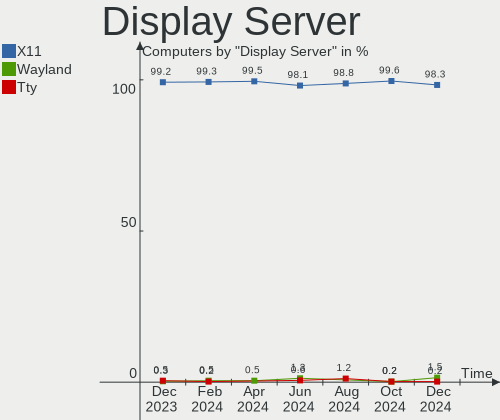
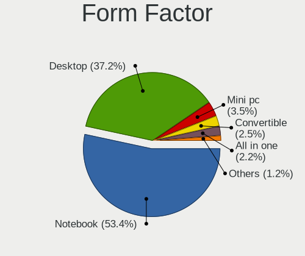
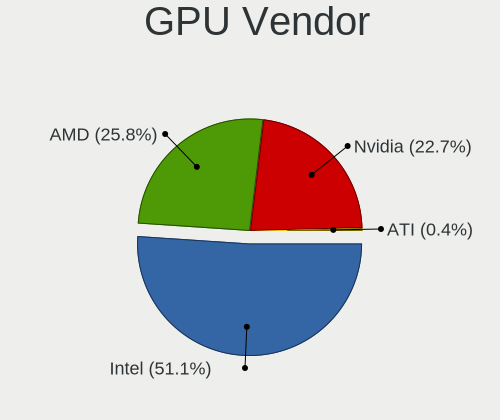
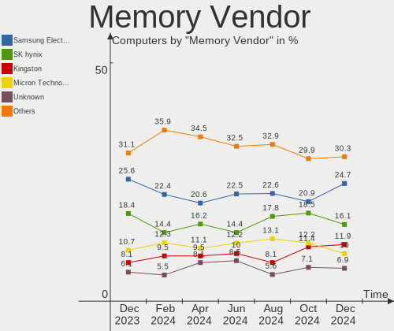

Linux Mint - Hardware Trends
----------------------------

A project to identify most popular hardware characteristics and track their change
over time based on data collected by Linux users at https://Linux-Hardware.org.

Anyone can contribute to this report by the [hw-probe](https://github.com/linuxhw/hw-probe) tool:

    sudo -E hw-probe -all -upload

This is a report for all computer types. See also reports for [desktops](/Dist/Linux_Mint/Desktop/README.md) and [notebooks](/Dist/Linux_Mint/Notebook/README.md).

This report is for one last month. Overall report since the beginning of time: [TestDays](https://github.com/linuxhw/TestDays)

Period: Apr, 2024.

Contents
--------

* [ System ](#system)
  - [ OS                       ](#os)
  - [ OS Family                ](#os-family)
  - [ Kernel                   ](#kernel)
  - [ Kernel Family            ](#kernel-family)
  - [ Kernel Major Ver.        ](#kernel-major-ver)
  - [ Arch                     ](#arch)
  - [ DE                       ](#de)
  - [ Display Server           ](#display-server)
  - [ Display Manager          ](#display-manager)
  - [ OS Lang                  ](#os-lang)
  - [ Boot Mode                ](#boot-mode)
  - [ Filesystem               ](#filesystem)
  - [ Part. scheme             ](#part-scheme)
  - [ Dual Boot with Linux/BSD ](#dual-boot-with-linuxbsd)
  - [ Dual Boot (Win)          ](#dual-boot-win)

* [ Board ](#board)
  - [ Vendor                   ](#vendor)
  - [ Model                    ](#model)
  - [ Model Family             ](#model-family)
  - [ MFG Year                 ](#mfg-year)
  - [ Form Factor              ](#form-factor)
  - [ Secure Boot              ](#secure-boot)
  - [ Coreboot                 ](#coreboot)
  - [ RAM Size                 ](#ram-size)
  - [ RAM Used                 ](#ram-used)
  - [ Total Drives             ](#total-drives)
  - [ Has CD-ROM               ](#has-cd-rom)
  - [ Has Ethernet             ](#has-ethernet)
  - [ Has WiFi                 ](#has-wifi)
  - [ Has Bluetooth            ](#has-bluetooth)

* [ Location ](#location)
  - [ Country                  ](#country)
  - [ City                     ](#city)

* [ Drives ](#drives)
  - [ Drive Vendor             ](#drive-vendor)
  - [ Drive Model              ](#drive-model)
  - [ HDD Vendor               ](#hdd-vendor)
  - [ SSD Vendor               ](#ssd-vendor)
  - [ Drive Kind               ](#drive-kind)
  - [ Drive Connector          ](#drive-connector)
  - [ Drive Size               ](#drive-size)
  - [ Space Total              ](#space-total)
  - [ Space Used               ](#space-used)
  - [ Malfunc. Drives          ](#malfunc-drives)
  - [ Malfunc. Drive Vendor    ](#malfunc-drive-vendor)
  - [ Malfunc. HDD Vendor      ](#malfunc-hdd-vendor)
  - [ Malfunc. Drive Kind      ](#malfunc-drive-kind)
  - [ Failed Drives            ](#failed-drives)
  - [ Failed Drive Vendor      ](#failed-drive-vendor)
  - [ Drive Status             ](#drive-status)

* [ Storage controller ](#storage-controller)
  - [ Storage Vendor           ](#storage-vendor)
  - [ Storage Model            ](#storage-model)
  - [ Storage Kind             ](#storage-kind)

* [ Processor ](#processor)
  - [ CPU Vendor               ](#cpu-vendor)
  - [ CPU Model                ](#cpu-model)
  - [ CPU Model Family         ](#cpu-model-family)
  - [ CPU Cores                ](#cpu-cores)
  - [ CPU Sockets              ](#cpu-sockets)
  - [ CPU Threads              ](#cpu-threads)
  - [ CPU Op-Modes             ](#cpu-op-modes)
  - [ CPU Microcode            ](#cpu-microcode)
  - [ CPU Microarch            ](#cpu-microarch)

* [ Graphics ](#graphics)
  - [ GPU Vendor               ](#gpu-vendor)
  - [ GPU Model                ](#gpu-model)
  - [ GPU Combo                ](#gpu-combo)
  - [ GPU Driver               ](#gpu-driver)
  - [ GPU Memory               ](#gpu-memory)

* [ Monitor ](#monitor)
  - [ Monitor Vendor           ](#monitor-vendor)
  - [ Monitor Model            ](#monitor-model)
  - [ Monitor Resolution       ](#monitor-resolution)
  - [ Monitor Diagonal         ](#monitor-diagonal)
  - [ Monitor Width            ](#monitor-width)
  - [ Aspect Ratio             ](#aspect-ratio)
  - [ Monitor Area             ](#monitor-area)
  - [ Pixel Density            ](#pixel-density)
  - [ Multiple Monitors        ](#multiple-monitors)

* [ Network ](#network)
  - [ Net Controller Vendor    ](#net-controller-vendor)
  - [ Net Controller Model     ](#net-controller-model)
  - [ Wireless Vendor          ](#wireless-vendor)
  - [ Wireless Model           ](#wireless-model)
  - [ Ethernet Vendor          ](#ethernet-vendor)
  - [ Ethernet Model           ](#ethernet-model)
  - [ Net Controller Kind      ](#net-controller-kind)
  - [ Used Controller          ](#used-controller)
  - [ NICs                     ](#nics)
  - [ IPv6                     ](#ipv6)

* [ Bluetooth ](#bluetooth)
  - [ Bluetooth Vendor         ](#bluetooth-vendor)
  - [ Bluetooth Model          ](#bluetooth-model)

* [ Sound ](#sound)
  - [ Sound Vendor             ](#sound-vendor)
  - [ Sound Model              ](#sound-model)

* [ Memory ](#memory)
  - [ Memory Vendor            ](#memory-vendor)
  - [ Memory Model             ](#memory-model)
  - [ Memory Kind              ](#memory-kind)
  - [ Memory Form Factor       ](#memory-form-factor)
  - [ Memory Size              ](#memory-size)
  - [ Memory Speed             ](#memory-speed)

* [ Printers & scanners ](#printers--scanners)
  - [ Printer Vendor           ](#printer-vendor)
  - [ Printer Model            ](#printer-model)
  - [ Scanner Vendor           ](#scanner-vendor)
  - [ Scanner Model            ](#scanner-model)

* [ Camera ](#camera)
  - [ Camera Vendor            ](#camera-vendor)
  - [ Camera Model             ](#camera-model)

* [ Security ](#security)
  - [ Fingerprint Vendor       ](#fingerprint-vendor)
  - [ Fingerprint Model        ](#fingerprint-model)
  - [ Chipcard Vendor          ](#chipcard-vendor)
  - [ Chipcard Model           ](#chipcard-model)

* [ Unsupported ](#unsupported)
  - [ Unsupported Devices      ](#unsupported-devices)
  - [ Unsupported Device Types ](#unsupported-device-types)

System
------

OS
--

Installed operating systems

| Name            | Computers | Percent |
|-----------------|-----------|---------|
| Linux Mint 21.3 | 270       | 72%     |
| Linux Mint 21.2 | 50        | 13.33%  |
| Linux Mint 20.3 | 23        | 6.13%   |
| Linux Mint 21.1 | 16        | 4.27%   |
| Linux Mint 21   | 7         | 1.87%   |
| Linux Mint 20   | 3         | 0.8%    |
| Linux Mint 19.3 | 3         | 0.8%    |
| Linux Mint 20.1 | 2         | 0.53%   |
| Linux Mint 20.2 | 1         | 0.27%   |

OS Family
---------

OS without a version

| Name       | Computers | Percent |
|------------|-----------|---------|
| Linux Mint | 375       | 100%    |

Kernel
------

Version of the Linux kernel

| Version                   | Computers | Percent |
|---------------------------|-----------|---------|
| 5.15.0-102-generic        | 69        | 18.4%   |
| 5.15.0-105-generic        | 64        | 17.07%  |
| 5.15.0-101-generic        | 62        | 16.53%  |
| 6.5.0-26-generic          | 31        | 8.27%   |
| 5.15.0-91-generic         | 30        | 8%      |
| 6.5.0-28-generic          | 25        | 6.67%   |
| 6.5.0-27-generic          | 22        | 5.87%   |
| 5.15.0-100-generic        | 7         | 1.87%   |
| 5.15.0-76-generic         | 6         | 1.6%    |
| 5.4.0-174-generic         | 5         | 1.33%   |
| 5.15.0-97-generic         | 5         | 1.33%   |
| 5.4.0-177-generic         | 4         | 1.07%   |
| 5.4.0-176-generic         | 4         | 1.07%   |
| 5.4.0-91-generic          | 3         | 0.8%    |
| 6.8.4-060804-generic      | 2         | 0.53%   |
| 5.4.0-150-generic         | 2         | 0.53%   |
| 5.15.0-56-generic         | 2         | 0.53%   |
| 6.8.7-060807-generic      | 1         | 0.27%   |
| 6.8.5-i3-370M             | 1         | 0.27%   |
| 6.8.0-060800rc7-generic   | 1         | 0.27%   |
| 6.7.6-060706-generic      | 1         | 0.27%   |
| 6.7.12-1-liquorix-amd64   | 1         | 0.27%   |
| 6.7.1-060701-generic      | 1         | 0.27%   |
| 6.6.22-rt27-x64v3-xanmod1 | 1         | 0.27%   |
| 6.5.0-26-lowlatency       | 1         | 0.27%   |
| 6.5.0-14-generic          | 1         | 0.27%   |
| 6.5.0-1020-oem            | 1         | 0.27%   |
| 6.5.0-1019-oem            | 1         | 0.27%   |
| 6.3.0-060300-generic      | 1         | 0.27%   |
| 6.2.0-39-generic          | 1         | 0.27%   |
| 6.2.0-33-generic          | 1         | 0.27%   |
| 5.4.0-73-generic          | 1         | 0.27%   |
| 5.4.0-173-generic         | 1         | 0.27%   |
| 5.4.0-170-generic         | 1         | 0.27%   |
| 5.4.0-120-generic         | 1         | 0.27%   |
| 5.4.0-109-generic         | 1         | 0.27%   |
| 5.19.0-41-generic         | 1         | 0.27%   |
| 5.17.6-051706-generic     | 1         | 0.27%   |
| 5.15.0-94-generic         | 1         | 0.27%   |
| 5.15.0-92-generic         | 1         | 0.27%   |

Kernel Family
-------------

Linux kernel without a distro release

| Version | Computers | Percent |
|---------|-----------|---------|
| 5.15.0  | 254       | 67.73%  |
| 6.5.0   | 82        | 21.87%  |
| 5.4.0   | 23        | 6.13%   |
| 6.8.4   | 2         | 0.53%   |
| 6.2.0   | 2         | 0.53%   |
| 6.8.7   | 1         | 0.27%   |
| 6.8.5   | 1         | 0.27%   |
| 6.8.0   | 1         | 0.27%   |
| 6.7.6   | 1         | 0.27%   |
| 6.7.12  | 1         | 0.27%   |
| 6.7.1   | 1         | 0.27%   |
| 6.6.22  | 1         | 0.27%   |
| 6.3.0   | 1         | 0.27%   |
| 5.19.0  | 1         | 0.27%   |
| 5.17.6  | 1         | 0.27%   |
| 5.0.0   | 1         | 0.27%   |
| 4.15.0  | 1         | 0.27%   |

Kernel Major Ver.
-----------------

Linux kernel major version

| Version | Computers | Percent |
|---------|-----------|---------|
| 5.15    | 254       | 67.73%  |
| 6.5     | 82        | 21.87%  |
| 5.4     | 23        | 6.13%   |
| 6.8     | 5         | 1.33%   |
| 6.7     | 3         | 0.8%    |
| 6.2     | 2         | 0.53%   |
| 6.6     | 1         | 0.27%   |
| 6.3     | 1         | 0.27%   |
| 5.19    | 1         | 0.27%   |
| 5.17    | 1         | 0.27%   |
| 5.0     | 1         | 0.27%   |
| 4.15    | 1         | 0.27%   |

Arch
----

OS architecture (x86_64, i586, etc.)

| Name   | Computers | Percent |
|--------|-----------|---------|
| x86_64 | 374       | 99.73%  |
| i686   | 1         | 0.27%   |

DE
--

Desktop Environment

| Name       | Computers | Percent |
|------------|-----------|---------|
| X-Cinnamon | 293       | 78.13%  |
| MATE       | 36        | 9.6%    |
| XFCE       | 32        | 8.53%   |
| GNOME      | 5         | 1.33%   |
| Cinnamon   | 3         | 0.8%    |
| KDE5       | 2         | 0.53%   |
| Unknown    | 2         | 0.53%   |
| i3         | 1         | 0.27%   |
| bspwm      | 1         | 0.27%   |

Display Server
--------------

X11 or Wayland

| Name    | Computers | Percent |
|---------|-----------|---------|
| X11     | 373       | 99.47%  |
| Wayland | 2         | 0.53%   |

Display Manager
---------------

SDDM, LightDM, etc.

| Name    | Computers | Percent |
|---------|-----------|---------|
| LightDM | 259       | 69.07%  |
| Unknown | 111       | 29.6%   |
| GDM3    | 4         | 1.07%   |
| SDDM    | 1         | 0.27%   |

OS Lang
-------

Language

| Lang    | Computers | Percent |
|---------|-----------|---------|
| en_US   | 108       | 28.8%   |
| de_DE   | 44        | 11.73%  |
| it_IT   | 43        | 11.47%  |
| en_GB   | 23        | 6.13%   |
| pt_BR   | 21        | 5.6%    |
| C       | 17        | 4.53%   |
| fr_FR   | 16        | 4.27%   |
| ru_RU   | 13        | 3.47%   |
| en_CA   | 13        | 3.47%   |
| hu_HU   | 8         | 2.13%   |
| es_ES   | 8         | 2.13%   |
| pl_PL   | 6         | 1.6%    |
| es_AR   | 5         | 1.33%   |
| en_AU   | 5         | 1.33%   |
| de_CH   | 5         | 1.33%   |
| de_AT   | 5         | 1.33%   |
| es_CO   | 4         | 1.07%   |
| tr_TR   | 2         | 0.53%   |
| pt_PT   | 2         | 0.53%   |
| nl_NL   | 2         | 0.53%   |
| ja_JP   | 2         | 0.53%   |
| fi_FI   | 2         | 0.53%   |
| es_UY   | 2         | 0.53%   |
| en_ZA   | 2         | 0.53%   |
| en_IE   | 2         | 0.53%   |
| cs_CZ   | 2         | 0.53%   |
| Unknown | 2         | 0.53%   |
| zh_CN   | 1         | 0.27%   |
| sv_SE   | 1         | 0.27%   |
| sr_RS   | 1         | 0.27%   |
| nl_BE   | 1         | 0.27%   |
| nb_NO   | 1         | 0.27%   |
| es_US   | 1         | 0.27%   |
| es_CL   | 1         | 0.27%   |
| en_PH   | 1         | 0.27%   |
| en_NZ   | 1         | 0.27%   |
| en_IN   | 1         | 0.27%   |
| bg_BG   | 1         | 0.27%   |

Boot Mode
---------

EFI or BIOS

| Mode | Computers | Percent |
|------|-----------|---------|
| EFI  | 270       | 72%     |
| BIOS | 105       | 28%     |

Filesystem
----------

Type of filesystem

| Type    | Computers | Percent |
|---------|-----------|---------|
| Ext4    | 332       | 88.53%  |
| Overlay | 16        | 4.27%   |
| Tmpfs   | 15        | 4%      |
| Btrfs   | 6         | 1.6%    |
| Zfs     | 3         | 0.8%    |
| Xfs     | 3         | 0.8%    |

Part. scheme
------------

Scheme of partitioning

| Type    | Computers | Percent |
|---------|-----------|---------|
| GPT     | 242       | 64.53%  |
| Unknown | 109       | 29.07%  |
| MBR     | 24        | 6.4%    |

Dual Boot with Linux/BSD
------------------------

Hosting more than one Linux/BSD

| Dual boot | Computers | Percent |
|-----------|-----------|---------|
| No        | 322       | 85.87%  |
| Yes       | 53        | 14.13%  |

Dual Boot (Win)
---------------

Hosting Linux and Windows

| Dual boot | Computers | Percent |
|-----------|-----------|---------|
| No        | 256       | 68.27%  |
| Yes       | 119       | 31.73%  |

Board
-----

Vendor
------

Motherboard manufacturer

| Name                                 | Computers | Percent |
|--------------------------------------|-----------|---------|
| ASUSTek Computer                     | 56        | 14.93%  |
| Lenovo                               | 46        | 12.27%  |
| Hewlett-Packard                      | 43        | 11.47%  |
| Dell                                 | 36        | 9.6%    |
| Gigabyte Technology                  | 31        | 8.27%   |
| Acer                                 | 30        | 8%      |
| MSI                                  | 29        | 7.73%   |
| ASRock                               | 12        | 3.2%    |
| Apple                                | 12        | 3.2%    |
| Samsung Electronics                  | 7         | 1.87%   |
| Intel                                | 7         | 1.87%   |
| Toshiba                              | 5         | 1.33%   |
| HUAWEI                               | 5         | 1.33%   |
| Sony                                 | 4         | 1.07%   |
| Packard Bell                         | 4         | 1.07%   |
| Medion                               | 4         | 1.07%   |
| Unknown                              | 4         | 1.07%   |
| Shenzhen Meigao Electronic Equipment | 3         | 0.8%    |
| Positivo                             | 2         | 0.53%   |
| Notebook                             | 2         | 0.53%   |
| GEEKOM                               | 2         | 0.53%   |
| Biostar                              | 2         | 0.53%   |
| ZOTAC                                | 1         | 0.27%   |
| TrekStor                             | 1         | 0.27%   |
| Timi                                 | 1         | 0.27%   |
| Supermicro                           | 1         | 0.27%   |
| Seco                                 | 1         | 0.27%   |
| PC Specialist                        | 1         | 0.27%   |
| Novatech                             | 1         | 0.27%   |
| NCR                                  | 1         | 0.27%   |
| Microsoft                            | 1         | 0.27%   |
| Mediacom                             | 1         | 0.27%   |
| MECHREVO                             | 1         | 0.27%   |
| MACHINIST                            | 1         | 0.27%   |
| LG Electronics                       | 1         | 0.27%   |
| Kraftway                             | 1         | 0.27%   |
| Itronix                              | 1         | 0.27%   |
| Irbis                                | 1         | 0.27%   |
| iQual                                | 1         | 0.27%   |
| Hardkernel                           | 1         | 0.27%   |

Model
-----

Motherboard model

| Name                                              | Computers | Percent |
|---------------------------------------------------|-----------|---------|
| Unknown                                           | 5         | 1.33%   |
| ASUS All Series                                   | 4         | 1.07%   |
| Shenzhen Meigao Electronic Equipment UM690        | 2         | 0.53%   |
| MSI MS-7C56                                       | 2         | 0.53%   |
| MSI MS-7817                                       | 2         | 0.53%   |
| Intel H61                                         | 2         | 0.53%   |
| HP Pavilion Notebook                              | 2         | 0.53%   |
| Gigabyte B550 AORUS ELITE V2                      | 2         | 0.53%   |
| Gigabyte B450M GAMING                             | 2         | 0.53%   |
| GEEKOM Mini IT13                                  | 2         | 0.53%   |
| Dell Latitude 7290                                | 2         | 0.53%   |
| Apple MacBookAir7,2                               | 2         | 0.53%   |
| Acer Nitro AN515-57                               | 2         | 0.53%   |
| ZOTAC ZBOX                                        | 1         | 0.27%   |
| TrekStor Surfbook A13B                            | 1         | 0.27%   |
| Toshiba Satellite Pro L850-1L2                    | 1         | 0.27%   |
| Toshiba Satellite Pro L670                        | 1         | 0.27%   |
| Toshiba Satellite Pro C50-A-1C8                   | 1         | 0.27%   |
| Toshiba Satellite L50-C                           | 1         | 0.27%   |
| Toshiba Satellite C70D-B                          | 1         | 0.27%   |
| Timi RedmiBook 16                                 | 1         | 0.27%   |
| Supermicro X9SPU-F                                | 1         | 0.27%   |
| Sony VPCEA3UFX                                    | 1         | 0.27%   |
| Sony SVF1521C5E                                   | 1         | 0.27%   |
| Sony SVF15213CDW                                  | 1         | 0.27%   |
| Sony SVE1713L1EW                                  | 1         | 0.27%   |
| Shenzhen Meigao Electronic Equipment Venus series | 1         | 0.27%   |
| Seco UDOO x86                                     | 1         | 0.27%   |
| Samsung RV411/RV511/E3511/S3511/RV711/E3411       | 1         | 0.27%   |
| Samsung RV411/RV511/E3511/S3511/RV711             | 1         | 0.27%   |
| Samsung RC530/RC730                               | 1         | 0.27%   |
| Samsung R530/R730                                 | 1         | 0.27%   |
| Samsung 355V4C/356V4C/3445VC/3545VC               | 1         | 0.27%   |
| Samsung 350V5C/351V5C/3540VC/3440VC               | 1         | 0.27%   |
| Samsung 300E4A/300E5A/300E7A/3430EA/3530EA        | 1         | 0.27%   |
| Positivo Z100                                     | 1         | 0.27%   |
| Positivo POS-AG31AP                               | 1         | 0.27%   |
| PC Specialist Ionico 16                           | 1         | 0.27%   |
| Packard Bell IMEDIA S3210                         | 1         | 0.27%   |
| Packard Bell EasyNote TK36                        | 1         | 0.27%   |

Model Family
------------

Motherboard model prefix

| Name                                       | Computers | Percent |
|--------------------------------------------|-----------|---------|
| Lenovo ThinkPad                            | 24        | 6.4%    |
| Acer Aspire                                | 19        | 5.07%   |
| Dell Inspiron                              | 11        | 2.93%   |
| HP Pavilion                                | 10        | 2.67%   |
| Dell Latitude                              | 10        | 2.67%   |
| ASUS PRIME                                 | 9         | 2.4%    |
| Lenovo IdeaPad                             | 8         | 2.13%   |
| Dell OptiPlex                              | 7         | 1.87%   |
| ASUS Vivobook                              | 6         | 1.6%    |
| Toshiba Satellite                          | 5         | 1.33%   |
| ASUS ROG                                   | 5         | 1.33%   |
| Unknown                                    | 5         | 1.33%   |
| HP ProBook                                 | 4         | 1.07%   |
| HP EliteBook                               | 4         | 1.07%   |
| Gigabyte B550                              | 4         | 1.07%   |
| Dell Precision                             | 4         | 1.07%   |
| ASUS All                                   | 4         | 1.07%   |
| Acer Nitro                                 | 4         | 1.07%   |
| Lenovo Legion                              | 3         | 0.8%    |
| HP Laptop                                  | 3         | 0.8%    |
| Gigabyte B450M                             | 3         | 0.8%    |
| Gigabyte B450                              | 3         | 0.8%    |
| ASUS TUF                                   | 3         | 0.8%    |
| Shenzhen Meigao Electronic Equipment UM690 | 2         | 0.53%   |
| Samsung RV411                              | 2         | 0.53%   |
| Packard Bell EasyNote                      | 2         | 0.53%   |
| MSI MS-7C56                                | 2         | 0.53%   |
| MSI MS-7817                                | 2         | 0.53%   |
| Lenovo ThinkStation                        | 2         | 0.53%   |
| Intel H61                                  | 2         | 0.53%   |
| HP ENVY                                    | 2         | 0.53%   |
| HP Compaq                                  | 2         | 0.53%   |
| HP 255                                     | 2         | 0.53%   |
| Gigabyte B760M                             | 2         | 0.53%   |
| GEEKOM Mini                                | 2         | 0.53%   |
| ASUS P5GC-MX                               | 2         | 0.53%   |
| ASUS ASUS                                  | 2         | 0.53%   |
| Apple MacBookAir7                          | 2         | 0.53%   |
| Acer Swift                                 | 2         | 0.53%   |
| Acer Predator                              | 2         | 0.53%   |

MFG Year
--------

Motherboard manufacture year

| Year | Computers | Percent |
|------|-----------|---------|
| 2020 | 34        | 9.07%   |
| 2018 | 32        | 8.53%   |
| 2022 | 29        | 7.73%   |
| 2019 | 29        | 7.73%   |
| 2013 | 29        | 7.73%   |
| 2023 | 27        | 7.2%    |
| 2021 | 25        | 6.67%   |
| 2014 | 23        | 6.13%   |
| 2017 | 22        | 5.87%   |
| 2012 | 22        | 5.87%   |
| 2011 | 20        | 5.33%   |
| 2016 | 18        | 4.8%    |
| 2010 | 17        | 4.53%   |
| 2009 | 14        | 3.73%   |
| 2015 | 13        | 3.47%   |
| 2008 | 9         | 2.4%    |
| 2007 | 7         | 1.87%   |
| 2024 | 3         | 0.8%    |
| 2006 | 2         | 0.53%   |

Form Factor
-----------

Physical design of the computer

| Name        | Computers | Percent |
|-------------|-----------|---------|
| Notebook    | 208       | 55.47%  |
| Desktop     | 151       | 40.27%  |
| Convertible | 5         | 1.33%   |
| All in one  | 5         | 1.33%   |
| Tablet      | 3         | 0.8%    |
| Mini pc     | 3         | 0.8%    |

Secure Boot
-----------

Enabled or disabled

| State    | Computers | Percent |
|----------|-----------|---------|
| Disabled | 338       | 90.13%  |
| Enabled  | 37        | 9.87%   |

Coreboot
--------

Have coreboot on board

| Used | Computers | Percent |
|------|-----------|---------|
| No   | 374       | 99.73%  |
| Yes  | 1         | 0.27%   |

RAM Size
--------

Total RAM memory

| Size in GB  | Computers | Percent |
|-------------|-----------|---------|
| 4.01-8.0    | 96        | 25.6%   |
| 16.01-24.0  | 67        | 17.87%  |
| 8.01-16.0   | 65        | 17.33%  |
| 3.01-4.0    | 56        | 14.93%  |
| 32.01-64.0  | 54        | 14.4%   |
| 64.01-256.0 | 17        | 4.53%   |
| 1.01-2.0    | 9         | 2.4%    |
| 24.01-32.0  | 8         | 2.13%   |
| 2.01-3.0    | 3         | 0.8%    |

RAM Used
--------

Used RAM memory

| Used GB    | Computers | Percent |
|------------|-----------|---------|
| 1.01-2.0   | 123       | 32.8%   |
| 2.01-3.0   | 120       | 32%     |
| 4.01-8.0   | 54        | 14.4%   |
| 3.01-4.0   | 52        | 13.87%  |
| 8.01-16.0  | 14        | 3.73%   |
| 0.51-1.0   | 8         | 2.13%   |
| 16.01-24.0 | 2         | 0.53%   |
| 32.01-64.0 | 1         | 0.27%   |
| 0.01-0.5   | 1         | 0.27%   |

Total Drives
------------

Number of drives on board

| Drives | Computers | Percent |
|--------|-----------|---------|
| 1      | 214       | 57.07%  |
| 2      | 99        | 26.4%   |
| 3      | 29        | 7.73%   |
| 4      | 17        | 4.53%   |
| 6      | 5         | 1.33%   |
| 5      | 4         | 1.07%   |
| 0      | 3         | 0.8%    |
| 8      | 2         | 0.53%   |
| 10     | 1         | 0.27%   |
| 7      | 1         | 0.27%   |

Has CD-ROM
----------

Has CD-ROM on board

| Presented | Computers | Percent |
|-----------|-----------|---------|
| No        | 240       | 64%     |
| Yes       | 135       | 36%     |

Has Ethernet
------------

Has Ethernet on board

| Presented | Computers | Percent |
|-----------|-----------|---------|
| Yes       | 330       | 88%     |
| No        | 45        | 12%     |

Has WiFi
--------

Has WiFi module

| Presented | Computers | Percent |
|-----------|-----------|---------|
| Yes       | 297       | 79.2%   |
| No        | 78        | 20.8%   |

Has Bluetooth
-------------

Has Bluetooth module

| Presented | Computers | Percent |
|-----------|-----------|---------|
| Yes       | 232       | 61.87%  |
| No        | 143       | 38.13%  |

Location
--------

Country
-------

Geographic location (country)

| Country      | Computers | Percent |
|--------------|-----------|---------|
| USA          | 65        | 17.33%  |
| Germany      | 47        | 12.53%  |
| Italy        | 44        | 11.73%  |
| Brazil       | 27        | 7.2%    |
| UK           | 21        | 5.6%    |
| France       | 19        | 5.07%   |
| Russia       | 15        | 4%      |
| Canada       | 14        | 3.73%   |
| Hungary      | 9         | 2.4%    |
| Switzerland  | 8         | 2.13%   |
| Austria      | 8         | 2.13%   |
| Spain        | 7         | 1.87%   |
| Poland       | 7         | 1.87%   |
| Australia    | 7         | 1.87%   |
| Netherlands  | 6         | 1.6%    |
| Colombia     | 5         | 1.33%   |
| Argentina    | 5         | 1.33%   |
| Turkey       | 4         | 1.07%   |
| Portugal     | 4         | 1.07%   |
| Sweden       | 3         | 0.8%    |
| Romania      | 3         | 0.8%    |
| Czechia      | 3         | 0.8%    |
| Bulgaria     | 3         | 0.8%    |
| Vietnam      | 2         | 0.53%   |
| Uruguay      | 2         | 0.53%   |
| South Africa | 2         | 0.53%   |
| Norway       | 2         | 0.53%   |
| Japan        | 2         | 0.53%   |
| Ireland      | 2         | 0.53%   |
| Iran         | 2         | 0.53%   |
| Greece       | 2         | 0.53%   |
| Finland      | 2         | 0.53%   |
| China        | 2         | 0.53%   |
| Belgium      | 2         | 0.53%   |
| Thailand     | 1         | 0.27%   |
| Taiwan       | 1         | 0.27%   |
| Somalia      | 1         | 0.27%   |
| Serbia       | 1         | 0.27%   |
| Saudi Arabia | 1         | 0.27%   |
| Philippines  | 1         | 0.27%   |

City
----

Geographic location (city)

| City             | Computers | Percent |
|------------------|-----------|---------|
| Milan            | 7         | 1.87%   |
| Sydney           | 6         | 1.6%    |
| Rome             | 5         | 1.33%   |
| Berlin           | 5         | 1.33%   |
| Vienna           | 4         | 1.07%   |
| Sao Paulo        | 4         | 1.07%   |
| Rio de Janeiro   | 4         | 1.07%   |
| Moscow           | 4         | 1.07%   |
| Milano           | 4         | 1.07%   |
| Istanbul         | 4         | 1.07%   |
| Sofia            | 3         | 0.8%    |
| Budapest         | 3         | 0.8%    |
| Bucharest        | 3         | 0.8%    |
| Zurich           | 2         | 0.53%   |
| Warsaw           | 2         | 0.53%   |
| Turin            | 2         | 0.53%   |
| Toronto          | 2         | 0.53%   |
| Suhr             | 2         | 0.53%   |
| Stuttgart        | 2         | 0.53%   |
| Stockton-on-Tees | 2         | 0.53%   |
| St Louis         | 2         | 0.53%   |
| Rotherham        | 2         | 0.53%   |
| Rho              | 2         | 0.53%   |
| Penza            | 2         | 0.53%   |
| Ottawa           | 2         | 0.53%   |
| Orlando          | 2         | 0.53%   |
| New York         | 2         | 0.53%   |
| Naples           | 2         | 0.53%   |
| Montevideo       | 2         | 0.53%   |
| Monteux          | 2         | 0.53%   |
| Leipzig          | 2         | 0.53%   |
| Lahr             | 2         | 0.53%   |
| Kilkelly         | 2         | 0.53%   |
| Hamburg          | 2         | 0.53%   |
| Glasgow          | 2         | 0.53%   |
| Chicago          | 2         | 0.53%   |
| Bologna          | 2         | 0.53%   |
| Amsterdam        | 2         | 0.53%   |
| Almada           | 2         | 0.53%   |
| Zionsville       | 1         | 0.27%   |

Drives
------

Drive Vendor
------------

Hard drive vendors

| Vendor                      | Computers | Drives | Percent |
|-----------------------------|-----------|--------|---------|
| Samsung Electronics         | 86        | 108    | 15.38%  |
| WDC                         | 85        | 103    | 15.21%  |
| Seagate                     | 65        | 82     | 11.63%  |
| SanDisk                     | 39        | 39     | 6.98%   |
| Kingston                    | 32        | 35     | 5.72%   |
| Toshiba                     | 27        | 27     | 4.83%   |
| Crucial                     | 27        | 34     | 4.83%   |
| Unknown                     | 16        | 17     | 2.86%   |
| Micron Technology           | 13        | 13     | 2.33%   |
| Hitachi                     | 12        | 13     | 2.15%   |
| Intel                       | 11        | 12     | 1.97%   |
| China                       | 8         | 10     | 1.43%   |
| Apple                       | 8         | 10     | 1.43%   |
| A-DATA Technology           | 8         | 8      | 1.43%   |
| Unknown                     | 7         | 7      | 1.25%   |
| SK hynix                    | 6         | 6      | 1.07%   |
| Micron/Crucial Technology   | 6         | 7      | 1.07%   |
| SPCC                        | 5         | 5      | 0.89%   |
| Phison Electronics          | 5         | 5      | 0.89%   |
| PNY                         | 4         | 5      | 0.72%   |
| Lexar                       | 4         | 5      | 0.72%   |
| Fujitsu                     | 4         | 4      | 0.72%   |
| Fanxiang                    | 4         | 4      | 0.72%   |
| Silicon Motion              | 3         | 3      | 0.54%   |
| Phison                      | 3         | 3      | 0.54%   |
| Patriot                     | 3         | 3      | 0.54%   |
| Maxtor                      | 3         | 4      | 0.54%   |
| KIOXIA                      | 3         | 3      | 0.54%   |
| Kingston Technology Company | 3         | 3      | 0.54%   |
| Intenso                     | 3         | 4      | 0.54%   |
| ADATA Technology            | 3         | 3      | 0.54%   |
| YMTC                        | 2         | 2      | 0.36%   |
| T-FORCE                     | 2         | 2      | 0.36%   |
| SSSTC                       | 2         | 2      | 0.36%   |
| SABRENT                     | 2         | 2      | 0.36%   |
| MAXIO Technology (Hangzhou) | 2         | 3      | 0.36%   |
| KingSpec                    | 2         | 2      | 0.36%   |
| JMicron Technology          | 2         | 2      | 0.36%   |
| HGST                        | 2         | 2      | 0.36%   |
| FORESEE                     | 2         | 2      | 0.36%   |

Drive Model
-----------

Hard drive models

| Model                                              | Computers | Percent |
|----------------------------------------------------|-----------|---------|
| Seagate ST2000DM008-2FR102 2TB                     | 8         | 1.28%   |
| Kingston SA400S37240G 240GB SSD                    | 8         | 1.28%   |
| Unknown                                            | 7         | 1.12%   |
| Seagate ST500DM002-1BD142 500GB                    | 6         | 0.96%   |
| Samsung SSD 870 EVO 1TB                            | 6         | 0.96%   |
| Kingston SA400S37480G 480GB SSD                    | 6         | 0.96%   |
| WDC WD10EZEX-08WN4A0 1TB                           | 5         | 0.8%    |
| SanDisk NVMe SSD Drive 512GB                       | 5         | 0.8%    |
| Samsung SSD 850 EVO 250GB                          | 5         | 0.8%    |
| Crucial CT1000MX500SSD1 1TB                        | 5         | 0.8%    |
| SanDisk SSD PLUS 480GB                             | 4         | 0.64%   |
| Samsung SSD 870 EVO 500GB                          | 4         | 0.64%   |
| Samsung SSD 860 EVO 500GB                          | 4         | 0.64%   |
| Samsung SSD 860 EVO 1TB                            | 4         | 0.64%   |
| Crucial CT480BX500SSD1 480GB                       | 4         | 0.64%   |
| Crucial CT1000BX500SSD1 1TB                        | 4         | 0.64%   |
| Toshiba MQ01ABD100 1TB                             | 3         | 0.48%   |
| Toshiba DT01ACA050 500GB                           | 3         | 0.48%   |
| SPCC Solid State Disk 512GB                        | 3         | 0.48%   |
| Seagate ST31000524AS 1TB                           | 3         | 0.48%   |
| Seagate ST2000DM006-2DM164 2TB                     | 3         | 0.48%   |
| Seagate ST1000LM049-2GH172 1TB                     | 3         | 0.48%   |
| Seagate ST1000LM024 HN-M101MBB 1TB                 | 3         | 0.48%   |
| Seagate ST1000DM003-1ER162 1TB                     | 3         | 0.48%   |
| SanDisk SDSSDH3 1T00 1TB                           | 3         | 0.48%   |
| Samsung SSD 980 PRO 1TB                            | 3         | 0.48%   |
| Samsung SSD 980 1TB                                | 3         | 0.48%   |
| Samsung SSD 970 EVO Plus 2TB                       | 3         | 0.48%   |
| Samsung NVMe SSD Controller SM981/PM981/PM983 1TB  | 3         | 0.48%   |
| Samsung NVMe SSD Controller PM9A1/PM9A3/980PRO 1TB | 3         | 0.48%   |
| Phison PS5013 E13 NVMe Controller 512GB            | 3         | 0.48%   |
| Micron 2450_MTFDKBA512TFK 512GB                    | 3         | 0.48%   |
| Fujitsu MHV2060BH 64GB                             | 3         | 0.48%   |
| Crucial CT500MX500SSD1 500GB                       | 3         | 0.48%   |
| WDC WDS500G2B0A-00SM50 500GB SSD                   | 2         | 0.32%   |
| WDC WDS240G2G0A-00JH30 240GB SSD                   | 2         | 0.32%   |
| WDC WDS120G2G0A-00JH30 120GB SSD                   | 2         | 0.32%   |
| WDC WDS100T3X0C-00SJG0 1TB                         | 2         | 0.32%   |
| WDC WDS100T2B0C-00PXH0 1TB                         | 2         | 0.32%   |
| WDC WDS100T2B0A-00SM50 1TB SSD                     | 2         | 0.32%   |

HDD Vendor
----------

Hard disk drive vendors

| Vendor              | Computers | Drives | Percent |
|---------------------|-----------|--------|---------|
| WDC                 | 66        | 79     | 37.08%  |
| Seagate             | 62        | 79     | 34.83%  |
| Toshiba             | 19        | 19     | 10.67%  |
| Hitachi             | 12        | 13     | 6.74%   |
| Samsung Electronics | 4         | 4      | 2.25%   |
| Fujitsu             | 4         | 4      | 2.25%   |
| Maxtor              | 3         | 4      | 1.69%   |
| Apple               | 3         | 3      | 1.69%   |
| SABRENT             | 2         | 2      | 1.12%   |
| HGST                | 2         | 2      | 1.12%   |
| Unknown             | 1         | 1      | 0.56%   |

SSD Vendor
----------

Solid state drive vendors

| Vendor              | Computers | Drives | Percent |
|---------------------|-----------|--------|---------|
| Samsung Electronics | 40        | 47     | 19.61%  |
| Kingston            | 24        | 25     | 11.76%  |
| Crucial             | 23        | 26     | 11.27%  |
| SanDisk             | 21        | 21     | 10.29%  |
| WDC                 | 15        | 15     | 7.35%   |
| China               | 8         | 10     | 3.92%   |
| A-DATA Technology   | 6         | 6      | 2.94%   |
| SPCC                | 5         | 5      | 2.45%   |
| PNY                 | 4         | 5      | 1.96%   |
| Apple               | 4         | 4      | 1.96%   |
| Toshiba             | 3         | 3      | 1.47%   |
| Patriot             | 3         | 3      | 1.47%   |
| Micron Technology   | 3         | 3      | 1.47%   |
| Intenso             | 3         | 4      | 1.47%   |
| Unknown             | 3         | 3      | 1.47%   |
| T-FORCE             | 2         | 2      | 0.98%   |
| SSSTC               | 2         | 2      | 0.98%   |
| Lexar               | 2         | 2      | 0.98%   |
| KingSpec            | 2         | 2      | 0.98%   |
| Intel               | 2         | 2      | 0.98%   |
| Fanxiang            | 2         | 2      | 0.98%   |
| TwinMOS             | 1         | 1      | 0.49%   |
| TSA                 | 1         | 1      | 0.49%   |
| Transcend           | 1         | 2      | 0.49%   |
| Teclast             | 1         | 1      | 0.49%   |
| Team                | 1         | 1      | 0.49%   |
| SUNEAST             | 1         | 1      | 0.49%   |
| SK hynix            | 1         | 1      | 0.49%   |
| Seagate             | 1         | 1      | 0.49%   |
| S3+                 | 1         | 1      | 0.49%   |
| Pichau              | 1         | 1      | 0.49%   |
| OCZ                 | 1         | 1      | 0.49%   |
| MSI                 | 1         | 1      | 0.49%   |
| KW                  | 1         | 1      | 0.49%   |
| KINGPAN             | 1         | 1      | 0.49%   |
| KingDian            | 1         | 1      | 0.49%   |
| Kimtigo             | 1         | 1      | 0.49%   |
| HUSKY               | 1         | 1      | 0.49%   |
| Gigastone           | 1         | 1      | 0.49%   |
| Gigabyte Technology | 1         | 1      | 0.49%   |

Drive Kind
----------

HDD or SSD

| Kind    | Computers | Drives | Percent |
|---------|-----------|--------|---------|
| SSD     | 179       | 221    | 35.17%  |
| HDD     | 157       | 210    | 30.84%  |
| NVMe    | 148       | 183    | 29.08%  |
| MMC     | 15        | 17     | 2.95%   |
| Unknown | 10        | 11     | 1.96%   |

Drive Connector
---------------

SATA, SAS, NVMe, etc.

| Type | Computers | Drives | Percent |
|------|-----------|--------|---------|
| SATA | 275       | 423    | 60.44%  |
| NVMe | 147       | 181    | 32.31%  |
| SAS  | 18        | 21     | 3.96%   |
| MMC  | 15        | 17     | 3.3%    |

Drive Size
----------

Size of hard drive

| Size in TB | Computers | Drives | Percent |
|------------|-----------|--------|---------|
| 0.01-0.5   | 188       | 224    | 53.26%  |
| 0.51-1.0   | 107       | 133    | 30.31%  |
| 1.01-2.0   | 37        | 44     | 10.48%  |
| 3.01-4.0   | 11        | 17     | 3.12%   |
| 4.01-10.0  | 5         | 6      | 1.42%   |
| 2.01-3.0   | 3         | 4      | 0.85%   |
| 10.01-20.0 | 2         | 3      | 0.57%   |

Space Total
-----------

Amount of disk space available on the file system

| Size in GB     | Computers | Percent |
|----------------|-----------|---------|
| 251-500        | 114       | 30.4%   |
| 101-250        | 95        | 25.33%  |
| 501-1000       | 66        | 17.6%   |
| 1001-2000      | 30        | 8%      |
| More than 3000 | 23        | 6.13%   |
| 51-100         | 19        | 5.07%   |
| 1-20           | 11        | 2.93%   |
| 2001-3000      | 9         | 2.4%    |
| 21-50          | 4         | 1.07%   |
| Unknown        | 4         | 1.07%   |

Space Used
----------

Amount of used disk space

| Used GB        | Computers | Percent |
|----------------|-----------|---------|
| 21-50          | 81        | 21.6%   |
| 101-250        | 79        | 21.07%  |
| 1-20           | 68        | 18.13%  |
| 51-100         | 64        | 17.07%  |
| 251-500        | 33        | 8.8%    |
| 501-1000       | 17        | 4.53%   |
| 1001-2000      | 16        | 4.27%   |
| More than 3000 | 11        | 2.93%   |
| Unknown        | 4         | 1.07%   |
| 2001-3000      | 2         | 0.53%   |

Malfunc. Drives
---------------

Drive models with a malfunction

| Model                                 | Computers | Drives | Percent |
|---------------------------------------|-----------|--------|---------|
| WDC WD10SPZX-60Z10T0 1TB              | 2         | 2      | 4.26%   |
| Toshiba MQ01ABD100 1TB                | 2         | 2      | 4.26%   |
| SSSTC CV8-8E128-HP 128GB              | 2         | 2      | 4.26%   |
| Samsung Electronics SSD 980 1TB       | 2         | 2      | 4.26%   |
| WDC WDS480G2G0A-00JH30 480GB SSD      | 1         | 1      | 2.13%   |
| WDC WDS240G2G0A-00JH30 240GB SSD      | 1         | 1      | 2.13%   |
| WDC WDS120G2G0A-00JH30 120GB SSD      | 1         | 1      | 2.13%   |
| WDC WD60EZRZ-00RWYB1 6TB              | 1         | 1      | 2.13%   |
| WDC WD5000LPVX-22V0TT0 500GB          | 1         | 1      | 2.13%   |
| WDC WD5000LPLX-60ZNTT2 500GB          | 1         | 1      | 2.13%   |
| WDC WD3200BEKT-08PVMT1 320GB          | 1         | 1      | 2.13%   |
| WDC WD30EFRX-68EUZN0 3TB              | 1         | 1      | 2.13%   |
| WDC WD2003FYYS-05T9B0 2TB             | 1         | 1      | 2.13%   |
| WDC WD10JPVX-75JC3T0 1TB              | 1         | 1      | 2.13%   |
| WDC WD10EZEX-21WN4A0 1TB              | 1         | 1      | 2.13%   |
| WDC WD10EARS-00Y5B1 1TB               | 1         | 1      | 2.13%   |
| WDC WD1002FBYS-18W8B1 1TB             | 1         | 1      | 2.13%   |
| Toshiba MQ02ABF050H 500GB             | 1         | 1      | 2.13%   |
| Toshiba MQ01ABF050 500GB              | 1         | 1      | 2.13%   |
| Toshiba MQ01ABD075 752GB              | 1         | 1      | 2.13%   |
| Toshiba MK2555GSX 250GB               | 1         | 1      | 2.13%   |
| Seagate ST500LM021-1KJ152 500GB       | 1         | 1      | 2.13%   |
| Seagate ST500DM002-1BD142 500GB       | 1         | 1      | 2.13%   |
| Seagate ST380013AS 80GB               | 1         | 1      | 2.13%   |
| Seagate ST3500418AS 500GB             | 1         | 1      | 2.13%   |
| Seagate ST3500413AS 500GB             | 1         | 1      | 2.13%   |
| Seagate ST31000524AS 1TB              | 1         | 1      | 2.13%   |
| Seagate ST2000LX001-1RG174 2TB        | 1         | 1      | 2.13%   |
| Seagate ST1000LM048-2E7172 1TB        | 1         | 1      | 2.13%   |
| Seagate ST1000LM035-1RK172 1TB        | 1         | 1      | 2.13%   |
| Seagate ST1000LM024 HN-M101MBB 1TB    | 1         | 1      | 2.13%   |
| Seagate ST1000LM014-1EJ164-SSHD 1TB   | 1         | 1      | 2.13%   |
| SanDisk SSD PLUS 480GB                | 1         | 1      | 2.13%   |
| Samsung Electronics SSD 870 EVO 500GB | 1         | 1      | 2.13%   |
| Samsung Electronics HD753LJ 752GB     | 1         | 1      | 2.13%   |
| Maxtor STM3160215AS 160GB             | 1         | 1      | 2.13%   |
| KingSpec P3-512 512GB SSD             | 1         | 1      | 2.13%   |
| Intel SSDSC2BF180A5L 180GB            | 1         | 1      | 2.13%   |
| Hitachi HTS545032B9A300 320GB         | 1         | 1      | 2.13%   |
| Hitachi HTS545025B9A300 250GB         | 1         | 1      | 2.13%   |

Malfunc. Drive Vendor
---------------------

Vendors of faulty drives

| Vendor              | Computers | Drives | Percent |
|---------------------|-----------|--------|---------|
| WDC                 | 15        | 15     | 31.91%  |
| Seagate             | 11        | 11     | 23.4%   |
| Toshiba             | 6         | 6      | 12.77%  |
| Samsung Electronics | 4         | 4      | 8.51%   |
| Hitachi             | 3         | 3      | 6.38%   |
| SSSTC               | 2         | 2      | 4.26%   |
| SanDisk             | 1         | 1      | 2.13%   |
| Maxtor              | 1         | 1      | 2.13%   |
| KingSpec            | 1         | 1      | 2.13%   |
| Intel               | 1         | 1      | 2.13%   |
| China               | 1         | 1      | 2.13%   |
| A-DATA Technology   | 1         | 1      | 2.13%   |

Malfunc. HDD Vendor
-------------------

Vendors of faulty HDD drives

| Vendor              | Computers | Drives | Percent |
|---------------------|-----------|--------|---------|
| WDC                 | 12        | 12     | 35.29%  |
| Seagate             | 11        | 11     | 32.35%  |
| Toshiba             | 6         | 6      | 17.65%  |
| Hitachi             | 3         | 3      | 8.82%   |
| Samsung Electronics | 1         | 1      | 2.94%   |
| Maxtor              | 1         | 1      | 2.94%   |

Malfunc. Drive Kind
-------------------

Kinds of faulty drives

| Kind | Computers | Drives | Percent |
|------|-----------|--------|---------|
| HDD  | 33        | 34     | 71.74%  |
| SSD  | 11        | 11     | 23.91%  |
| NVMe | 2         | 2      | 4.35%   |

Failed Drives
-------------

Failed drive models

Zero info for selected period =(

Failed Drive Vendor
-------------------

Failed drive vendors

Zero info for selected period =(

Drive Status
------------

Number of failed and malfunc. drives

| Status   | Computers | Drives | Percent |
|----------|-----------|--------|---------|
| Works    | 215       | 346    | 52.06%  |
| Detected | 154       | 249    | 37.29%  |
| Malfunc  | 44        | 47     | 10.65%  |

Storage controller
------------------

Storage Vendor
--------------

Storage controller vendors

| Vendor                       | Computers | Percent |
|------------------------------|-----------|---------|
| Intel                        | 245       | 49.2%   |
| AMD                          | 73        | 14.66%  |
| Samsung Electronics          | 50        | 10.04%  |
| Sandisk                      | 26        | 5.22%   |
| Micron/Crucial Technology    | 13        | 2.61%   |
| Kingston Technology Company  | 12        | 2.41%   |
| Micron Technology            | 11        | 2.21%   |
| MAXIO Technology (Hangzhou)  | 9         | 1.81%   |
| Phison Electronics           | 8         | 1.61%   |
| Nvidia                       | 7         | 1.41%   |
| Toshiba America Info Systems | 5         | 1%      |
| ASMedia Technology           | 5         | 1%      |
| SK hynix                     | 4         | 0.8%    |
| ADATA Technology             | 4         | 0.8%    |
| Silicon Motion               | 3         | 0.6%    |
| Shenzhen Longsys Electronics | 3         | 0.6%    |
| Marvell Technology Group     | 3         | 0.6%    |
| KIOXIA                       | 3         | 0.6%    |
| Yangtze Memory Technologies  | 2         | 0.4%    |
| Realtek Semiconductor        | 2         | 0.4%    |
| JMicron Technology           | 2         | 0.4%    |
| Apple                        | 2         | 0.4%    |
| VIA Technologies             | 1         | 0.2%    |
| Union Memory (Shenzhen)      | 1         | 0.2%    |
| Transcend                    | 1         | 0.2%    |
| Lite-On Technology           | 1         | 0.2%    |
| Lenovo                       | 1         | 0.2%    |
| INNOGRIT                     | 1         | 0.2%    |

Storage Model
-------------

Storage controller models

| Model                                                                                   | Computers | Percent |
|-----------------------------------------------------------------------------------------|-----------|---------|
| AMD FCH SATA Controller [AHCI mode]                                                     | 41        | 7.23%   |
| Intel 8 Series/C220 Series Chipset Family 6-port SATA Controller 1 [AHCI mode]          | 21        | 3.7%    |
| Intel 7 Series Chipset Family 6-port SATA Controller [AHCI mode]                        | 20        | 3.53%   |
| Intel Sunrise Point-LP SATA Controller [AHCI mode]                                      | 18        | 3.17%   |
| Samsung NVMe SSD Controller SM981/PM981/PM983                                           | 14        | 2.47%   |
| Intel Volume Management Device NVMe RAID Controller                                     | 14        | 2.47%   |
| Samsung NVMe SSD Controller PM9A1/PM9A3/980PRO                                          | 12        | 2.12%   |
| AMD 400 Series Chipset SATA Controller                                                  | 12        | 2.12%   |
| AMD 500 Series Chipset SATA Controller                                                  | 11        | 1.94%   |
| Samsung NVMe SSD Controller 980 (DRAM-less)                                             | 10        | 1.76%   |
| Intel SATA Controller [RAID mode]                                                       | 9         | 1.59%   |
| Intel 82801IBM/IEM (ICH9M/ICH9M-E) 4 port SATA Controller [AHCI mode]                   | 9         | 1.59%   |
| Intel 82801 Mobile SATA Controller [RAID mode]                                          | 9         | 1.59%   |
| Intel 6 Series/C200 Series Chipset Family 6 port Mobile SATA AHCI Controller            | 9         | 1.59%   |
| AMD SB7x0/SB8x0/SB9x0 IDE Controller                                                    | 9         | 1.59%   |
| Intel Cannon Lake PCH SATA AHCI Controller                                              | 8         | 1.41%   |
| Intel 6 Series/C200 Series Chipset Family 6 port Desktop SATA AHCI Controller           | 8         | 1.41%   |
| MAXIO (Hangzhou) NVMe SSD Controller MAP1202 (DRAM-less)                                | 7         | 1.23%   |
| Intel 5 Series/3400 Series Chipset 4 port SATA AHCI Controller                          | 7         | 1.23%   |
| AMD SB7x0/SB8x0/SB9x0 SATA Controller [AHCI mode]                                       | 7         | 1.23%   |
| SanDisk Extreme Pro / WD Black SN750 / PC SN730 / Red SN700 NVMe SSD                    | 6         | 1.06%   |
| Micron/Crucial P5 Plus NVMe PCIe SSD                                                    | 6         | 1.06%   |
| Intel Wildcat Point-LP SATA Controller [AHCI Mode]                                      | 6         | 1.06%   |
| Intel NM10/ICH7 Family SATA Controller [IDE mode]                                       | 6         | 1.06%   |
| Intel Alder Lake-P SATA AHCI Controller                                                 | 6         | 1.06%   |
| Intel 7 Series/C210 Series Chipset Family 6-port SATA Controller [AHCI mode]            | 6         | 1.06%   |
| Samsung NVMe SSD Controller SM961/PM961/SM963                                           | 5         | 0.88%   |
| Samsung NVMe SSD Controller S4LV008[Pascal]                                             | 5         | 0.88%   |
| Phison E12 NVMe Controller                                                              | 5         | 0.88%   |
| Micron 2450 NVMe SSD [HendrixV] (DRAM-less)                                             | 5         | 0.88%   |
| Intel SSD 670p Series [Keystone Harbor]                                                 | 5         | 0.88%   |
| Intel Celeron/Pentium Silver Processor SATA Controller                                  | 5         | 0.88%   |
| Intel Celeron N3350/Pentium N4200/Atom E3900 Series SATA AHCI Controller                | 5         | 0.88%   |
| Intel Cannon Point-LP SATA Controller [AHCI Mode]                                       | 5         | 0.88%   |
| Intel Alder Lake-S PCH SATA Controller [AHCI Mode]                                      | 5         | 0.88%   |
| Intel 82801G (ICH7 Family) IDE Controller                                               | 5         | 0.88%   |
| Intel 8 Series SATA Controller 1 [AHCI mode]                                            | 5         | 0.88%   |
| Intel 6 Series/C200 Series Chipset Family Desktop SATA Controller (IDE mode, ports 4-5) | 5         | 0.88%   |
| Intel 6 Series/C200 Series Chipset Family Desktop SATA Controller (IDE mode, ports 0-3) | 5         | 0.88%   |
| Intel 5 Series/3400 Series Chipset 6 port SATA AHCI Controller                          | 5         | 0.88%   |

Storage Kind
------------

Kind of storage controller (IDE, SATA, NVMe, SAS, ...)

| Kind | Computers | Percent |
|------|-----------|---------|
| SATA | 277       | 55.96%  |
| NVMe | 146       | 29.49%  |
| IDE  | 37        | 7.47%   |
| RAID | 35        | 7.07%   |

Processor
---------

CPU Vendor
----------

Processor vendors

| Vendor | Computers | Percent |
|--------|-----------|---------|
| Intel  | 276       | 73.6%   |
| AMD    | 99        | 26.4%   |

CPU Model
---------

Processor models

| Model                                         | Computers | Percent |
|-----------------------------------------------|-----------|---------|
| Intel Core i5-7200U CPU @ 2.50GHz             | 5         | 1.33%   |
| Intel Core i5-6200U CPU @ 2.30GHz             | 5         | 1.33%   |
| AMD Ryzen 5 7520U with Radeon Graphics        | 5         | 1.33%   |
| Intel Core i7-10750H CPU @ 2.60GHz            | 4         | 1.07%   |
| Intel Celeron N4020 CPU @ 1.10GHz             | 4         | 1.07%   |
| Intel Celeron CPU N3350 @ 1.10GHz             | 4         | 1.07%   |
| Intel 11th Gen Core i5-1135G7 @ 2.40GHz       | 4         | 1.07%   |
| AMD Ryzen 7 5700G with Radeon Graphics        | 4         | 1.07%   |
| AMD Ryzen 7 3800X 8-Core Processor            | 4         | 1.07%   |
| AMD FX-6300 Six-Core Processor                | 4         | 1.07%   |
| Intel Core i7-8550U CPU @ 1.80GHz             | 3         | 0.8%    |
| Intel Core i7-3770 CPU @ 3.40GHz              | 3         | 0.8%    |
| Intel Core i7-2670QM CPU @ 2.20GHz            | 3         | 0.8%    |
| Intel Core i5-6500 CPU @ 3.20GHz              | 3         | 0.8%    |
| Intel Core i5-6300U CPU @ 2.40GHz             | 3         | 0.8%    |
| Intel Core i5-3210M CPU @ 2.50GHz             | 3         | 0.8%    |
| Intel Core i3-1005G1 CPU @ 1.20GHz            | 3         | 0.8%    |
| Intel Core i3 CPU M 370 @ 2.40GHz             | 3         | 0.8%    |
| Intel 13th Gen Core i9-13900H                 | 3         | 0.8%    |
| Intel 12th Gen Core i5-1235U                  | 3         | 0.8%    |
| Intel 11th Gen Core i7-1165G7 @ 2.80GHz       | 3         | 0.8%    |
| Intel 11th Gen Core i5-11400H @ 2.70GHz       | 3         | 0.8%    |
| AMD Ryzen 9 6900HX with Radeon Graphics       | 3         | 0.8%    |
| AMD Ryzen 9 5900X 12-Core Processor           | 3         | 0.8%    |
| AMD Ryzen 7 7730U with Radeon Graphics        | 3         | 0.8%    |
| AMD Ryzen 5 5600G with Radeon Graphics        | 3         | 0.8%    |
| AMD Ryzen 5 3500U with Radeon Vega Mobile Gfx | 3         | 0.8%    |
| AMD Ryzen 5 2600 Six-Core Processor           | 3         | 0.8%    |
| Intel Core i9-9900K CPU @ 3.60GHz             | 2         | 0.53%   |
| Intel Core i7-9750H CPU @ 2.60GHz             | 2         | 0.53%   |
| Intel Core i7-8565U CPU @ 1.80GHz             | 2         | 0.53%   |
| Intel Core i7-7700 CPU @ 3.60GHz              | 2         | 0.53%   |
| Intel Core i7-7500U CPU @ 2.70GHz             | 2         | 0.53%   |
| Intel Core i7-6700K CPU @ 4.00GHz             | 2         | 0.53%   |
| Intel Core i7-6700HQ CPU @ 2.60GHz            | 2         | 0.53%   |
| Intel Core i7-5650U CPU @ 2.20GHz             | 2         | 0.53%   |
| Intel Core i7-5500U CPU @ 2.40GHz             | 2         | 0.53%   |
| Intel Core i7-3720QM CPU @ 2.60GHz            | 2         | 0.53%   |
| Intel Core i7-2630QM CPU @ 2.00GHz            | 2         | 0.53%   |
| Intel Core i5-9400 CPU @ 2.90GHz              | 2         | 0.53%   |

CPU Model Family
----------------

Processor model prefix

| Model                   | Computers | Percent |
|-------------------------|-----------|---------|
| Intel Core i5           | 70        | 18.67%  |
| Intel Core i7           | 63        | 16.8%   |
| Other                   | 44        | 11.73%  |
| Intel Core i3           | 34        | 9.07%   |
| AMD Ryzen 5             | 30        | 8%      |
| Intel Celeron           | 22        | 5.87%   |
| AMD Ryzen 7             | 21        | 5.6%    |
| Intel Core 2 Duo        | 11        | 2.93%   |
| AMD Ryzen 9             | 11        | 2.93%   |
| AMD FX                  | 7         | 1.87%   |
| Intel Xeon              | 6         | 1.6%    |
| Intel Pentium           | 6         | 1.6%    |
| Intel Core i9           | 5         | 1.33%   |
| AMD A6                  | 5         | 1.33%   |
| Intel Atom              | 4         | 1.07%   |
| AMD A8                  | 4         | 1.07%   |
| Intel Pentium Dual-Core | 3         | 0.8%    |
| AMD Ryzen 3             | 3         | 0.8%    |
| AMD Athlon II X2        | 3         | 0.8%    |
| AMD A10                 | 3         | 0.8%    |
| Intel Pentium Silver    | 2         | 0.53%   |
| Intel Pentium Dual      | 2         | 0.53%   |
| Intel Genuine           | 2         | 0.53%   |
| AMD Ryzen 5 PRO         | 2         | 0.53%   |
| AMD Athlon II X4        | 2         | 0.53%   |
| Intel Pentium D         | 1         | 0.27%   |
| Intel Pentium 4         | 1         | 0.27%   |
| Intel Celeron Dual-Core | 1         | 0.27%   |
| AMD Turion 64 X2 Mobile | 1         | 0.27%   |
| AMD Ryzen 7 PRO         | 1         | 0.27%   |
| AMD Ryzen 3 PRO         | 1         | 0.27%   |
| AMD Phenom II X4        | 1         | 0.27%   |
| AMD Phenom              | 1         | 0.27%   |
| AMD E2                  | 1         | 0.27%   |
| AMD A4                  | 1         | 0.27%   |

CPU Cores
---------

Number of processor cores

| Number | Computers | Percent |
|--------|-----------|---------|
| 2      | 134       | 35.73%  |
| 4      | 114       | 30.4%   |
| 6      | 43        | 11.47%  |
| 8      | 35        | 9.33%   |
| 12     | 13        | 3.47%   |
| 1      | 10        | 2.67%   |
| 10     | 9         | 2.4%    |
| 14     | 5         | 1.33%   |
| 3      | 5         | 1.33%   |
| 16     | 3         | 0.8%    |
| 20     | 2         | 0.53%   |
| 28     | 1         | 0.27%   |
| 24     | 1         | 0.27%   |

CPU Sockets
-----------

Number of sockets

| Number | Computers | Percent |
|--------|-----------|---------|
| 1      | 373       | 99.47%  |
| 2      | 2         | 0.53%   |

CPU Threads
-----------

Threads per core (Hyper-Threading)

| Number | Computers | Percent |
|--------|-----------|---------|
| 2      | 274       | 73.07%  |
| 1      | 101       | 26.93%  |

CPU Op-Modes
------------

CPU Operation Modes (32-bit, 64-bit)

| Op mode        | Computers | Percent |
|----------------|-----------|---------|
| 32-bit, 64-bit | 374       | 99.73%  |
| 32-bit         | 1         | 0.27%   |

CPU Microcode
-------------

Microcode number

| Number     | Computers | Percent |
|------------|-----------|---------|
| Unknown    | 80        | 21.33%  |
| 0x306a9    | 22        | 5.87%   |
| 0x206a7    | 19        | 5.07%   |
| 0x306c3    | 16        | 4.27%   |
| 0x1067a    | 14        | 3.73%   |
| 0x906ea    | 9         | 2.4%    |
| 0x806e9    | 9         | 2.4%    |
| 0x0a50000d | 9         | 2.4%    |
| 0x806c1    | 8         | 2.13%   |
| 0x406e3    | 7         | 1.87%   |
| 0x20655    | 7         | 1.87%   |
| 0x506e3    | 6         | 1.6%    |
| 0x306d4    | 6         | 1.6%    |
| 0x0800820d | 6         | 1.6%    |
| 0x40651    | 5         | 1.33%   |
| 0x08a00008 | 5         | 1.33%   |
| 0x06001119 | 5         | 1.33%   |
| 0x06000852 | 5         | 1.33%   |
| 0x906c0    | 4         | 1.07%   |
| 0x906a4    | 4         | 1.07%   |
| 0x806ec    | 4         | 1.07%   |
| 0x806ea    | 4         | 1.07%   |
| 0x706e5    | 4         | 1.07%   |
| 0x706a8    | 4         | 1.07%   |
| 0x30678    | 4         | 1.07%   |
| 0x010000c8 | 4         | 1.07%   |
| 0xb0671    | 3         | 0.8%    |
| 0x90672    | 3         | 0.8%    |
| 0x6fd      | 3         | 0.8%    |
| 0x306f2    | 3         | 0.8%    |
| 0x20652    | 3         | 0.8%    |
| 0x0a601206 | 3         | 0.8%    |
| 0x0a50000c | 3         | 0.8%    |
| 0x0a404102 | 3         | 0.8%    |
| 0x08701030 | 3         | 0.8%    |
| 0x08108109 | 3         | 0.8%    |
| 0x07030105 | 3         | 0.8%    |
| 0xb06e0    | 2         | 0.53%   |
| 0xa0671    | 2         | 0.53%   |
| 0xa0655    | 2         | 0.53%   |

CPU Microarch
-------------

Microarchitecture

| Name             | Computers | Percent |
|------------------|-----------|---------|
| KabyLake         | 45        | 12%     |
| Haswell          | 34        | 9.07%   |
| IvyBridge        | 29        | 7.73%   |
| Unknown          | 25        | 6.67%   |
| SandyBridge      | 23        | 6.13%   |
| Zen 3            | 22        | 5.87%   |
| Alderlake Hybrid | 22        | 5.87%   |
| Skylake          | 20        | 5.33%   |
| Penryn           | 15        | 4%      |
| Zen 2            | 14        | 3.73%   |
| Westmere         | 13        | 3.47%   |
| Zen+             | 11        | 2.93%   |
| TigerLake        | 11        | 2.93%   |
| Piledriver       | 11        | 2.93%   |
| Broadwell        | 10        | 2.67%   |
| Icelake          | 8         | 2.13%   |
| Silvermont       | 7         | 1.87%   |
| K10              | 7         | 1.87%   |
| Core             | 6         | 1.6%    |
| CometLake        | 6         | 1.6%    |
| Zen              | 5         | 1.33%   |
| Goldmont plus    | 5         | 1.33%   |
| Goldmont         | 5         | 1.33%   |
| Tremont          | 4         | 1.07%   |
| Puma             | 3         | 0.8%    |
| Excavator        | 3         | 0.8%    |
| Steamroller      | 2         | 0.53%   |
| NetBurst         | 2         | 0.53%   |
| Bonnell          | 2         | 0.53%   |
| Nehalem          | 1         | 0.27%   |
| K8 Hammer        | 1         | 0.27%   |
| K10 Llano        | 1         | 0.27%   |
| Jaguar           | 1         | 0.27%   |
| Bulldozer        | 1         | 0.27%   |

Graphics
--------

GPU Vendor
----------

Vendors of graphics cards

| Vendor                     | Computers | Percent |
|----------------------------|-----------|---------|
| Intel                      | 215       | 48.31%  |
| Nvidia                     | 130       | 29.21%  |
| AMD                        | 99        | 22.25%  |
| Matrox Electronics Systems | 1         | 0.22%   |

GPU Model
---------

Graphics card models

| Model                                                                                 | Computers | Percent |
|---------------------------------------------------------------------------------------|-----------|---------|
| Intel 3rd Gen Core processor Graphics Controller                                      | 16        | 3.49%   |
| Intel 2nd Generation Core Processor Family Integrated Graphics Controller             | 16        | 3.49%   |
| Intel Core Processor Integrated Graphics Controller                                   | 11        | 2.4%    |
| Intel UHD Graphics 620                                                                | 9         | 1.96%   |
| Intel TigerLake-LP GT2 [Iris Xe Graphics]                                             | 9         | 1.96%   |
| Intel Mobile 4 Series Chipset Integrated Graphics Controller                          | 9         | 1.96%   |
| Intel HD Graphics 620                                                                 | 9         | 1.96%   |
| Intel Skylake GT2 [HD Graphics 520]                                                   | 8         | 1.74%   |
| Nvidia GP108 [GeForce GT 1030]                                                        | 7         | 1.53%   |
| Intel Xeon E3-1200 v3/4th Gen Core Processor Integrated Graphics Controller           | 7         | 1.53%   |
| Intel Raptor Lake-P [Iris Xe Graphics]                                                | 7         | 1.53%   |
| Intel HD Graphics 530                                                                 | 7         | 1.53%   |
| AMD Cezanne [Radeon Vega Series / Radeon Vega Mobile Series]                          | 7         | 1.53%   |
| Intel Haswell-ULT Integrated Graphics Controller                                      | 6         | 1.31%   |
| Intel 4th Gen Core Processor Integrated Graphics Controller                           | 6         | 1.31%   |
| AMD Renoir [Radeon RX Vega 6 (Ryzen 4000/5000 Mobile Series)]                         | 6         | 1.31%   |
| AMD Mendocino                                                                         | 6         | 1.31%   |
| AMD Ellesmere [Radeon RX 470/480/570/570X/580/580X/590]                               | 6         | 1.31%   |
| AMD Barcelo                                                                           | 6         | 1.31%   |
| Nvidia GK208B [GeForce GT 710]                                                        | 5         | 1.09%   |
| Nvidia GA106 [GeForce RTX 3060 Lite Hash Rate]                                        | 5         | 1.09%   |
| AMD Picasso/Raven 2 [Radeon Vega Series / Radeon Vega Mobile Series]                  | 5         | 1.09%   |
| Intel Xeon E3-1200 v2/3rd Gen Core processor Graphics Controller                      | 4         | 0.87%   |
| Intel WhiskeyLake-U GT2 [UHD Graphics 620]                                            | 4         | 0.87%   |
| Intel JasperLake [UHD Graphics]                                                       | 4         | 0.87%   |
| Intel Iris Plus Graphics G1 (Ice Lake)                                                | 4         | 0.87%   |
| Intel HD Graphics 5500                                                                | 4         | 0.87%   |
| Intel HD Graphics 500                                                                 | 4         | 0.87%   |
| Intel GeminiLake [UHD Graphics 600]                                                   | 4         | 0.87%   |
| Intel CometLake-H GT2 [UHD Graphics]                                                  | 4         | 0.87%   |
| Intel CoffeeLake-S GT2 [UHD Graphics 630]                                             | 4         | 0.87%   |
| Intel Atom Processor Z36xxx/Z37xxx Series Graphics & Display                          | 4         | 0.87%   |
| Intel 4th Generation Core Processor Family Integrated Graphics Controller             | 4         | 0.87%   |
| AMD Topaz XT [Radeon R7 M260/M265 / M340/M360 / M440/M445 / 530/535 / 620/625 Mobile] | 4         | 0.87%   |
| AMD Rembrandt [Radeon 680M]                                                           | 4         | 0.87%   |
| AMD Raphael                                                                           | 4         | 0.87%   |
| AMD Cedar [Radeon HD 5000/6000/7350/8350 Series]                                      | 4         | 0.87%   |
| Nvidia GT215 [GeForce GT 240]                                                         | 3         | 0.65%   |
| Nvidia GP106 [GeForce GTX 1060 6GB]                                                   | 3         | 0.65%   |
| Nvidia GF119 [GeForce GT 610]                                                         | 3         | 0.65%   |

GPU Combo
---------

Combinations of graphics cards

| Name           | Computers | Percent |
|----------------|-----------|---------|
| 1 x Intel      | 153       | 40.8%   |
| 1 x Nvidia     | 76        | 20.27%  |
| 1 x AMD        | 71        | 18.93%  |
| Intel + Nvidia | 45        | 12%     |
| Intel + AMD    | 11        | 2.93%   |
| 2 x AMD        | 9         | 2.4%    |
| AMD + Nvidia   | 7         | 1.87%   |
| 2 x Nvidia     | 2         | 0.53%   |
| 1 x Matrox     | 1         | 0.27%   |

GPU Driver
----------

Free vs proprietary

| Driver      | Computers | Percent |
|-------------|-----------|---------|
| Free        | 265       | 70.67%  |
| Proprietary | 94        | 25.07%  |
| Unknown     | 16        | 4.27%   |

GPU Memory
----------

Total video memory

| Size in GB | Computers | Percent |
|------------|-----------|---------|
| Unknown    | 187       | 49.87%  |
| 1.01-2.0   | 51        | 13.6%   |
| 0.01-0.5   | 39        | 10.4%   |
| 0.51-1.0   | 36        | 9.6%    |
| 7.01-8.0   | 22        | 5.87%   |
| 8.01-16.0  | 13        | 3.47%   |
| 3.01-4.0   | 12        | 3.2%    |
| 5.01-6.0   | 11        | 2.93%   |
| 16.01-24.0 | 2         | 0.53%   |
| 4.01-5.0   | 1         | 0.27%   |
| 2.01-3.0   | 1         | 0.27%   |

Monitor
-------

Monitor Vendor
--------------

Monitor vendors

| Vendor                  | Computers | Percent |
|-------------------------|-----------|---------|
| Samsung Electronics     | 53        | 13.7%   |
| AU Optronics            | 49        | 12.66%  |
| BOE                     | 37        | 9.56%   |
| Chimei Innolux          | 36        | 9.3%    |
| LG Display              | 27        | 6.98%   |
| Goldstar                | 22        | 5.68%   |
| Acer                    | 16        | 4.13%   |
| Apple                   | 13        | 3.36%   |
| Hewlett-Packard         | 12        | 3.1%    |
| Dell                    | 12        | 3.1%    |
| AOC                     | 12        | 3.1%    |
| Ancor Communications    | 10        | 2.58%   |
| Philips                 | 9         | 2.33%   |
| Lenovo                  | 7         | 1.81%   |
| ViewSonic               | 5         | 1.29%   |
| Chi Mei Optoelectronics | 5         | 1.29%   |
| BenQ                    | 5         | 1.29%   |
| InfoVision              | 4         | 1.03%   |
| Iiyama                  | 3         | 0.78%   |
| HannStar                | 3         | 0.78%   |
| Eizo                    | 3         | 0.78%   |
| ASUSTek Computer        | 3         | 0.78%   |
| Sharp                   | 2         | 0.52%   |
| PANDA                   | 2         | 0.52%   |
| Mi                      | 2         | 0.52%   |
| LG Philips              | 2         | 0.52%   |
| IOD                     | 2         | 0.52%   |
| Insignia                | 2         | 0.52%   |
| Westinghouse            | 1         | 0.26%   |
| Vizio                   | 1         | 0.26%   |
| Unknown (AAA)           | 1         | 0.26%   |
| Toshiba                 | 1         | 0.26%   |
| TMX                     | 1         | 0.26%   |
| STA                     | 1         | 0.26%   |
| Sony                    | 1         | 0.26%   |
| SNC                     | 1         | 0.26%   |
| Sceptre Tech            | 1         | 0.26%   |
| Plain Tree Systems      | 1         | 0.26%   |
| PKB                     | 1         | 0.26%   |
| ONN                     | 1         | 0.26%   |

Monitor Model
-------------

Monitor models

| Model                                                                    | Computers | Percent |
|--------------------------------------------------------------------------|-----------|---------|
| Dell U2518D DEL413A 2560x1440 553x311mm 25.0-inch                        | 3         | 0.76%   |
| Chimei Innolux LCD Monitor CMN1521 1920x1080 344x193mm 15.5-inch         | 3         | 0.76%   |
| Chimei Innolux LCD Monitor CMN14D4 1920x1080 309x173mm 13.9-inch         | 3         | 0.76%   |
| BOE LCD Monitor BOE0872 1920x1080 344x194mm 15.5-inch                    | 3         | 0.76%   |
| AU Optronics LCD Monitor AUO978F 1920x1080 382x215mm 17.3-inch           | 3         | 0.76%   |
| AU Optronics LCD Monitor AUO26EC 1366x768 344x193mm 15.5-inch            | 3         | 0.76%   |
| AU Optronics LCD Monitor AUO21ED 1920x1080 344x193mm 15.5-inch           | 3         | 0.76%   |
| AOC 27G2G3 AOC2702 1920x1080 598x336mm 27.0-inch                         | 3         | 0.76%   |
| Ancor Communications VE247 ACI2493 1920x1080 531x299mm 24.0-inch         | 3         | 0.76%   |
| Samsung Electronics LCD Monitor SEC334A 1366x768 344x194mm 15.5-inch     | 2         | 0.51%   |
| Samsung Electronics LCD Monitor SEC3245 1366x768 344x194mm 15.5-inch     | 2         | 0.51%   |
| Samsung Electronics C27F390 SAM0D32 1920x1080 598x336mm 27.0-inch        | 2         | 0.51%   |
| LG Display LCD Monitor LGD02DA 1920x1080 382x215mm 17.3-inch             | 2         | 0.51%   |
| Lenovo LCD Monitor LEN40B2 1920x1080 344x193mm 15.5-inch                 | 2         | 0.51%   |
| InfoVision LCD Monitor IVO04E3 1366x768 277x156mm 12.5-inch              | 2         | 0.51%   |
| Chimei Innolux LCD Monitor CMN15F5 1920x1080 344x193mm 15.5-inch         | 2         | 0.51%   |
| Chimei Innolux LCD Monitor CMN14D6 1366x768 309x173mm 13.9-inch          | 2         | 0.51%   |
| Chi Mei Optoelectronics LCD Monitor CMO15AB 1366x768 340x190mm 15.3-inch | 2         | 0.51%   |
| BOE LCD Monitor BOE084E 1920x1080 382x215mm 17.3-inch                    | 2         | 0.51%   |
| BOE LCD Monitor BOE07CB 1920x1080 344x193mm 15.5-inch                    | 2         | 0.51%   |
| AU Optronics LCD Monitor AUOFA9B 1920x1200 301x188mm 14.0-inch           | 2         | 0.51%   |
| AU Optronics LCD Monitor AUO38ED 1920x1080 344x193mm 15.5-inch           | 2         | 0.51%   |
| AU Optronics LCD Monitor AUO22EC 1366x768 344x193mm 15.5-inch            | 2         | 0.51%   |
| AU Optronics LCD Monitor AUO149E 1600x900 382x214mm 17.2-inch            | 2         | 0.51%   |
| AU Optronics LCD Monitor AUO10EC 1366x768 344x193mm 15.5-inch            | 2         | 0.51%   |
| AOC Q3279WG5B AOC3279 2560x1440 725x428mm 33.1-inch                      | 2         | 0.51%   |
| Acer SA240Y ACR057F 1920x1080 530x300mm 24.0-inch                        | 2         | 0.51%   |
| Westinghouse SK-26H590D WDE5040 1366x768 576x324mm 26.0-inch             | 1         | 0.25%   |
| Vizio M322i-B1 VIZ1005 1920x1080 698x392mm 31.5-inch                     | 1         | 0.25%   |
| ViewSonic VX2457 VSCB931 1920x1080 521x293mm 23.5-inch                   | 1         | 0.25%   |
| ViewSonic VX2452 Series VSCDE2E 1920x1080 521x293mm 23.5-inch            | 1         | 0.25%   |
| ViewSonic VA2718-FHD VSCD839 1920x1080 598x336mm 27.0-inch               | 1         | 0.25%   |
| ViewSonic VA2248 SERIES VSC0E28 1920x1080 477x268mm 21.5-inch            | 1         | 0.25%   |
| ViewSonic VA1938 Series VSC0626 1366x768 410x230mm 18.5-inch             | 1         | 0.25%   |
| Unknown (AAA) '' AAA1900 1440x900 400x270mm 19.0-inch                    | 1         | 0.25%   |
| Toshiba TV TSB0105 1920x1080 708x398mm 32.0-inch                         | 1         | 0.25%   |
| TMX TL142GDXP02-0 TMX1420 2520x1680 300x200mm 14.2-inch                  | 1         | 0.25%   |
| STA XR140EA1T STA0450 1366x768 310x174mm 14.0-inch                       | 1         | 0.25%   |
| Sony TV SNYA401 1920x1080                                                | 1         | 0.25%   |
| SNC SKP_E5-24 SNC2360 1920x1080 521x293mm 23.5-inch                      | 1         | 0.25%   |

Monitor Resolution
------------------

Monitor screen resolution

| Resolution         | Computers | Percent |
|--------------------|-----------|---------|
| 1920x1080 (FHD)    | 151       | 40.48%  |
| 1366x768 (WXGA)    | 69        | 18.5%   |
| 3840x2160 (4K)     | 25        | 6.7%    |
| 2560x1440 (QHD)    | 23        | 6.17%   |
| 1600x900 (HD+)     | 18        | 4.83%   |
| 1920x1200 (WUXGA)  | 15        | 4.02%   |
| 1440x900 (WXGA+)   | 11        | 2.95%   |
| 1680x1050 (WSXGA+) | 10        | 2.68%   |
| 1280x1024 (SXGA)   | 10        | 2.68%   |
| 3440x1440          | 9         | 2.41%   |
| 1280x800 (WXGA)    | 6         | 1.61%   |
| 2560x1600          | 5         | 1.34%   |
| 2560x1080          | 4         | 1.07%   |
| 1024x768 (XGA)     | 3         | 0.8%    |
| 3840x1080          | 2         | 0.54%   |
| 1360x768           | 2         | 0.54%   |
| 1024x600           | 2         | 0.54%   |
| 3072x1920          | 1         | 0.27%   |
| 2736x1824          | 1         | 0.27%   |
| 2560x1024          | 1         | 0.27%   |
| 2520x1680          | 1         | 0.27%   |
| 2160x1350          | 1         | 0.27%   |
| 1920x1280          | 1         | 0.27%   |
| 1280x720 (HD)      | 1         | 0.27%   |
| 1080x1920          | 1         | 0.27%   |

Monitor Diagonal
----------------

Diagonal size in inches

| Inches  | Computers | Percent |
|---------|-----------|---------|
| 15      | 95        | 24.42%  |
| 17      | 31        | 7.97%   |
| 14      | 28        | 7.2%    |
| 13      | 28        | 7.2%    |
| 27      | 27        | 6.94%   |
| 24      | 27        | 6.94%   |
| 23      | 21        | 5.4%    |
| 21      | 19        | 4.88%   |
| 18      | 12        | 3.08%   |
| Unknown | 12        | 3.08%   |
| 31      | 11        | 2.83%   |
| 34      | 10        | 2.57%   |
| 16      | 8         | 2.06%   |
| 12      | 8         | 2.06%   |
| 22      | 7         | 1.8%    |
| 19      | 7         | 1.8%    |
| 84      | 3         | 0.77%   |
| 48      | 3         | 0.77%   |
| 40      | 3         | 0.77%   |
| 25      | 3         | 0.77%   |
| 20      | 3         | 0.77%   |
| 11      | 3         | 0.77%   |
| 10      | 3         | 0.77%   |
| 72      | 2         | 0.51%   |
| 49      | 2         | 0.51%   |
| 33      | 2         | 0.51%   |
| 32      | 2         | 0.51%   |
| 26      | 2         | 0.51%   |
| 54      | 1         | 0.26%   |
| 47      | 1         | 0.26%   |
| 43      | 1         | 0.26%   |
| 39      | 1         | 0.26%   |
| 35      | 1         | 0.26%   |
| 29      | 1         | 0.26%   |
| 28      | 1         | 0.26%   |

Monitor Width
-------------

Physical width

| Width in mm | Computers | Percent |
|-------------|-----------|---------|
| 301-350     | 148       | 38.44%  |
| 501-600     | 74        | 19.22%  |
| 401-500     | 42        | 10.91%  |
| 351-400     | 33        | 8.57%   |
| 201-300     | 27        | 7.01%   |
| 601-700     | 17        | 4.42%   |
| 701-800     | 14        | 3.64%   |
| Unknown     | 12        | 3.12%   |
| 1001-1500   | 7         | 1.82%   |
| 801-900     | 5         | 1.3%    |
| 1501-2000   | 5         | 1.3%    |
| 901-1000    | 1         | 0.26%   |

Aspect Ratio
------------

Proportional relationship between the width and the height

| Ratio   | Computers | Percent |
|---------|-----------|---------|
| 16/9    | 273       | 75.62%  |
| 16/10   | 48        | 13.3%   |
| 21/9    | 11        | 3.05%   |
| 5/4     | 9         | 2.49%   |
| Unknown | 8         | 2.22%   |
| 3/2     | 4         | 1.11%   |
| 4/3     | 3         | 0.83%   |
| 32/9    | 3         | 0.83%   |
| 2.50    | 1         | 0.28%   |
| 0.56    | 1         | 0.28%   |

Monitor Area
------------

Area in inch

| Area in inch | Computers | Percent |
|----------------|-----------|---------|
| 101-110        | 95        | 24.68%  |
| 201-250        | 59        | 15.32%  |
| 81-90          | 46        | 11.95%  |
| 351-500        | 28        | 7.27%   |
| 301-350        | 27        | 7.01%   |
| 121-130        | 24        | 6.23%   |
| 151-200        | 16        | 4.16%   |
| 141-150        | 16        | 4.16%   |
| 251-300        | 12        | 3.12%   |
| Unknown        | 12        | 3.12%   |
| 71-80          | 11        | 2.86%   |
| 501-1000       | 9         | 2.34%   |
| More than 1000 | 8         | 2.08%   |
| 111-120        | 8         | 2.08%   |
| 61-70          | 6         | 1.56%   |
| 51-60          | 3         | 0.78%   |
| 41-50          | 3         | 0.78%   |
| 131-140        | 1         | 0.26%   |
| 91-100         | 1         | 0.26%   |

Pixel Density
-------------

Pixels per inch

| Density       | Computers | Percent |
|---------------|-----------|---------|
| 51-100        | 117       | 31.03%  |
| 101-120       | 109       | 28.91%  |
| 121-160       | 107       | 28.38%  |
| 161-240       | 23        | 6.1%    |
| Unknown       | 12        | 3.18%   |
| 1-50          | 8         | 2.12%   |
| More than 240 | 1         | 0.27%   |

Multiple Monitors
-----------------

Total monitors connected

| Total | Computers | Percent |
|-------|-----------|---------|
| 1     | 312       | 83.2%   |
| 2     | 44        | 11.73%  |
| 0     | 15        | 4%      |
| 3     | 4         | 1.07%   |

Network
-------

Net Controller Vendor
---------------------

Controller vendors

| Vendor                                 | Computers | Percent |
|----------------------------------------|-----------|---------|
| Realtek Semiconductor                  | 216       | 37.57%  |
| Intel                                  | 169       | 29.39%  |
| Qualcomm Atheros                       | 60        | 10.43%  |
| Broadcom                               | 29        | 5.04%   |
| MediaTek                               | 23        | 4%      |
| Broadcom Limited                       | 10        | 1.74%   |
| Samsung Electronics                    | 9         | 1.57%   |
| TP-Link                                | 5         | 0.87%   |
| Nvidia                                 | 5         | 0.87%   |
| Ralink Technology                      | 4         | 0.7%    |
| Ralink                                 | 4         | 0.7%    |
| Qualcomm Atheros Communications        | 3         | 0.52%   |
| Microsoft                              | 3         | 0.52%   |
| Marvell Technology Group               | 3         | 0.52%   |
| Google                                 | 3         | 0.52%   |
| ASIX Electronics                       | 3         | 0.52%   |
| Linksys                                | 2         | 0.35%   |
| Lenovo                                 | 2         | 0.35%   |
| DisplayLink                            | 2         | 0.35%   |
| AVM                                    | 2         | 0.35%   |
| Xiaomi                                 | 1         | 0.17%   |
| Suzhou Motorcomm Electronic Technology | 1         | 0.17%   |
| Sierra Wireless                        | 1         | 0.17%   |
| QinHeng Electronics                    | 1         | 0.17%   |
| OPPO Electronics                       | 1         | 0.17%   |
| Oculus VR                              | 1         | 0.17%   |
| NetGear                                | 1         | 0.17%   |
| Netchip Technology                     | 1         | 0.17%   |
| Motorola PCS                           | 1         | 0.17%   |
| IMC Networks                           | 1         | 0.17%   |
| ID BOX                                 | 1         | 0.17%   |
| Huawei Technologies                    | 1         | 0.17%   |
| Hewlett-Packard                        | 1         | 0.17%   |
| Fitbit                                 | 1         | 0.17%   |
| FIBOCOM                                | 1         | 0.17%   |
| Espressif                              | 1         | 0.17%   |
| Ericsson Business Mobile Networks      | 1         | 0.17%   |
| D-Link                                 | 1         | 0.17%   |

Net Controller Model
--------------------

Controller models

| Model                                                                  | Computers | Percent |
|------------------------------------------------------------------------|-----------|---------|
| Realtek RTL8111/8168/8211/8411 PCI Express Gigabit Ethernet Controller | 147       | 21.59%  |
| Realtek RTL810xE PCI Express Fast Ethernet controller                  | 22        | 3.23%   |
| Intel Wi-Fi 6 AX200                                                    | 13        | 1.91%   |
| Realtek RTL8125 2.5GbE Controller                                      | 12        | 1.76%   |
| Qualcomm Atheros AR9485 Wireless Network Adapter                       | 12        | 1.76%   |
| Intel Ethernet Controller I225-V                                       | 11        | 1.62%   |
| Realtek RTL8821CE 802.11ac PCIe Wireless Network Adapter               | 10        | 1.47%   |
| Intel 82579LM Gigabit Network Connection (Lewisville)                  | 10        | 1.47%   |
| Realtek RTL88x2bu [AC1200 Techkey]                                     | 9         | 1.32%   |
| Intel Wireless 8265 / 8275                                             | 9         | 1.32%   |
| Intel Wi-Fi 6E(802.11ax) AX210/AX1675* 2x2 [Typhoon Peak]              | 9         | 1.32%   |
| Intel Wi-Fi 6 AX201                                                    | 9         | 1.32%   |
| Intel Ethernet Connection I217-LM                                      | 9         | 1.32%   |
| Qualcomm Atheros QCA9565 / AR9565 Wireless Network Adapter             | 8         | 1.17%   |
| Qualcomm Atheros QCA9377 802.11ac Wireless Network Adapter             | 7         | 1.03%   |
| MediaTek Wi-Fi 6E MT7902 Wireless Network Adapter                      | 7         | 1.03%   |
| Intel Wireless 8260                                                    | 7         | 1.03%   |
| Samsung Galaxy series, misc. (tethering mode)                          | 6         | 0.88%   |
| Realtek RTL8852BE PCIe 802.11ax Wireless Network Controller            | 6         | 0.88%   |
| MediaTek MT7922 802.11ax PCI Express Wireless Network Adapter          | 6         | 0.88%   |
| Intel Raptor Lake PCH CNVi WiFi                                        | 6         | 0.88%   |
| Intel Centrino Advanced-N 6205 [Taylor Peak]                           | 6         | 0.88%   |
| Intel Alder Lake-P PCH CNVi WiFi                                       | 6         | 0.88%   |
| Broadcom BCM43142 802.11b/g/n                                          | 6         | 0.88%   |
| Broadcom BCM4313 802.11bgn Wireless Network Adapter                    | 6         | 0.88%   |
| Realtek RTL8822CE 802.11ac PCIe Wireless Network Adapter               | 5         | 0.73%   |
| Realtek RTL8153 Gigabit Ethernet Adapter                               | 5         | 0.73%   |
| MediaTek MT7921 802.11ax PCI Express Wireless Network Adapter          | 5         | 0.73%   |
| Intel Wireless 7265                                                    | 5         | 0.73%   |
| Intel Wireless 7260                                                    | 5         | 0.73%   |
| Intel Wireless 3165                                                    | 5         | 0.73%   |
| Intel I211 Gigabit Network Connection                                  | 5         | 0.73%   |
| Intel Cannon Lake PCH CNVi WiFi                                        | 5         | 0.73%   |
| Realtek RTL8188EUS 802.11n Wireless Network Adapter                    | 4         | 0.59%   |
| Realtek Killer E2600 GbE Controller                                    | 4         | 0.59%   |
| Realtek 802.11n WLAN Adapter                                           | 4         | 0.59%   |
| Realtek 802.11ac NIC                                                   | 4         | 0.59%   |
| Qualcomm Atheros Killer E2400 Gigabit Ethernet Controller              | 4         | 0.59%   |
| Qualcomm Atheros AR8151 v2.0 Gigabit Ethernet                          | 4         | 0.59%   |
| Intel Ethernet Connection (7) I219-V                                   | 4         | 0.59%   |

Wireless Vendor
---------------

Wireless vendors

| Vendor                          | Computers | Percent |
|---------------------------------|-----------|---------|
| Intel                           | 130       | 41.53%  |
| Realtek Semiconductor           | 62        | 19.81%  |
| Qualcomm Atheros                | 43        | 13.74%  |
| Broadcom                        | 23        | 7.35%   |
| MediaTek                        | 21        | 6.71%   |
| Broadcom Limited                | 6         | 1.92%   |
| TP-Link                         | 5         | 1.6%    |
| Ralink Technology               | 4         | 1.28%   |
| Ralink                          | 4         | 1.28%   |
| Qualcomm Atheros Communications | 3         | 0.96%   |
| Microsoft                       | 3         | 0.96%   |
| Linksys                         | 2         | 0.64%   |
| AVM                             | 2         | 0.64%   |
| Sierra Wireless                 | 1         | 0.32%   |
| NetGear                         | 1         | 0.32%   |
| IMC Networks                    | 1         | 0.32%   |
| FIBOCOM                         | 1         | 0.32%   |
| D-Link                          | 1         | 0.32%   |

Wireless Model
--------------

Wireless models

| Model                                                          | Computers | Percent |
|----------------------------------------------------------------|-----------|---------|
| Intel Wi-Fi 6 AX200                                            | 13        | 4.1%    |
| Qualcomm Atheros AR9485 Wireless Network Adapter               | 12        | 3.79%   |
| Realtek RTL8821CE 802.11ac PCIe Wireless Network Adapter       | 10        | 3.15%   |
| Realtek RTL88x2bu [AC1200 Techkey]                             | 9         | 2.84%   |
| Intel Wireless 8265 / 8275                                     | 9         | 2.84%   |
| Intel Wi-Fi 6E(802.11ax) AX210/AX1675* 2x2 [Typhoon Peak]      | 9         | 2.84%   |
| Intel Wi-Fi 6 AX201                                            | 9         | 2.84%   |
| Qualcomm Atheros QCA9565 / AR9565 Wireless Network Adapter     | 8         | 2.52%   |
| Qualcomm Atheros QCA9377 802.11ac Wireless Network Adapter     | 7         | 2.21%   |
| MediaTek Wi-Fi 6E MT7902 Wireless Network Adapter              | 7         | 2.21%   |
| Intel Wireless 8260                                            | 7         | 2.21%   |
| Realtek RTL8852BE PCIe 802.11ax Wireless Network Controller    | 6         | 1.89%   |
| MediaTek MT7922 802.11ax PCI Express Wireless Network Adapter  | 6         | 1.89%   |
| Intel Raptor Lake PCH CNVi WiFi                                | 6         | 1.89%   |
| Intel Centrino Advanced-N 6205 [Taylor Peak]                   | 6         | 1.89%   |
| Intel Alder Lake-P PCH CNVi WiFi                               | 6         | 1.89%   |
| Broadcom BCM43142 802.11b/g/n                                  | 6         | 1.89%   |
| Broadcom BCM4313 802.11bgn Wireless Network Adapter            | 6         | 1.89%   |
| Realtek RTL8822CE 802.11ac PCIe Wireless Network Adapter       | 5         | 1.58%   |
| MediaTek MT7921 802.11ax PCI Express Wireless Network Adapter  | 5         | 1.58%   |
| Intel Wireless 7265                                            | 5         | 1.58%   |
| Intel Wireless 7260                                            | 5         | 1.58%   |
| Intel Wireless 3165                                            | 5         | 1.58%   |
| Intel Cannon Lake PCH CNVi WiFi                                | 5         | 1.58%   |
| Realtek RTL8188EUS 802.11n Wireless Network Adapter            | 4         | 1.26%   |
| Realtek 802.11n WLAN Adapter                                   | 4         | 1.26%   |
| Realtek 802.11ac NIC                                           | 4         | 1.26%   |
| Intel Comet Lake PCH CNVi WiFi                                 | 4         | 1.26%   |
| Intel Centrino Advanced-N 6235                                 | 4         | 1.26%   |
| Intel Centrino Advanced-N 6200                                 | 4         | 1.26%   |
| Realtek RTL8812AU 802.11a/b/g/n/ac 2T2R DB WLAN Adapter        | 3         | 0.95%   |
| Realtek RTL8188CUS 802.11n WLAN Adapter                        | 3         | 0.95%   |
| Qualcomm Atheros QCA6174 802.11ac Wireless Network Adapter     | 3         | 0.95%   |
| Qualcomm Atheros AR9271 802.11n                                | 3         | 0.95%   |
| Qualcomm Atheros AR928X Wireless Network Adapter (PCI-Express) | 3         | 0.95%   |
| Qualcomm Atheros AR9285 Wireless Network Adapter (PCI-Express) | 3         | 0.95%   |
| Intel Wireless 3160                                            | 3         | 0.95%   |
| Intel WiFi Link 5100                                           | 3         | 0.95%   |
| Intel Centrino Wireless-N 100                                  | 3         | 0.95%   |
| Intel Cannon Point-LP CNVi [Wireless-AC]                       | 3         | 0.95%   |

Ethernet Vendor
---------------

Ethernet vendors

| Vendor                                 | Computers | Percent |
|----------------------------------------|-----------|---------|
| Realtek Semiconductor                  | 191       | 55.04%  |
| Intel                                  | 85        | 24.5%   |
| Qualcomm Atheros                       | 25        | 7.2%    |
| Samsung Electronics                    | 9         | 2.59%   |
| Broadcom                               | 9         | 2.59%   |
| Nvidia                                 | 5         | 1.44%   |
| Broadcom Limited                       | 4         | 1.15%   |
| Marvell Technology Group               | 3         | 0.86%   |
| Google                                 | 3         | 0.86%   |
| ASIX Electronics                       | 3         | 0.86%   |
| MediaTek                               | 2         | 0.58%   |
| DisplayLink                            | 2         | 0.58%   |
| Xiaomi                                 | 1         | 0.29%   |
| Suzhou Motorcomm Electronic Technology | 1         | 0.29%   |
| OPPO Electronics                       | 1         | 0.29%   |
| Motorola PCS                           | 1         | 0.29%   |
| Lenovo                                 | 1         | 0.29%   |
| Huawei Technologies                    | 1         | 0.29%   |

Ethernet Model
--------------

Ethernet models

| Model                                                                  | Computers | Percent |
|------------------------------------------------------------------------|-----------|---------|
| Realtek RTL8111/8168/8211/8411 PCI Express Gigabit Ethernet Controller | 147       | 41.53%  |
| Realtek RTL810xE PCI Express Fast Ethernet controller                  | 22        | 6.21%   |
| Realtek RTL8125 2.5GbE Controller                                      | 12        | 3.39%   |
| Intel Ethernet Controller I225-V                                       | 11        | 3.11%   |
| Intel 82579LM Gigabit Network Connection (Lewisville)                  | 10        | 2.82%   |
| Intel Ethernet Connection I217-LM                                      | 9         | 2.54%   |
| Samsung Galaxy series, misc. (tethering mode)                          | 6         | 1.69%   |
| Realtek RTL8153 Gigabit Ethernet Adapter                               | 5         | 1.41%   |
| Intel I211 Gigabit Network Connection                                  | 5         | 1.41%   |
| Realtek Killer E2600 GbE Controller                                    | 4         | 1.13%   |
| Qualcomm Atheros Killer E2400 Gigabit Ethernet Controller              | 4         | 1.13%   |
| Qualcomm Atheros AR8151 v2.0 Gigabit Ethernet                          | 4         | 1.13%   |
| Intel Ethernet Connection (7) I219-V                                   | 4         | 1.13%   |
| Intel Ethernet Connection (4) I219-V                                   | 4         | 1.13%   |
| Intel Ethernet Connection (4) I219-LM                                  | 4         | 1.13%   |
| Intel Ethernet Connection (2) I219-LM                                  | 4         | 1.13%   |
| Samsung GT-I9070 (network tethering, USB debugging enabled)            | 3         | 0.85%   |
| Qualcomm Atheros QCA8172 Fast Ethernet                                 | 3         | 0.85%   |
| Intel I210 Gigabit Network Connection                                  | 3         | 0.85%   |
| Intel Ethernet Connection I219-LM                                      | 3         | 0.85%   |
| Intel Ethernet Connection (2) I219-V                                   | 3         | 0.85%   |
| Intel 82579V Gigabit Network Connection                                | 3         | 0.85%   |
| Intel 82577LM Gigabit Network Connection                               | 3         | 0.85%   |
| Realtek RTL-8100/8101L/8139 PCI Fast Ethernet Adapter                  | 2         | 0.56%   |
| Qualcomm Atheros Attansic L2 Fast Ethernet                             | 2         | 0.56%   |
| Qualcomm Atheros AR8152 v2.0 Fast Ethernet                             | 2         | 0.56%   |
| Qualcomm Atheros AR8132 Fast Ethernet                                  | 2         | 0.56%   |
| Nvidia MCP79 Ethernet                                                  | 2         | 0.56%   |
| Nvidia MCP77 Ethernet                                                  | 2         | 0.56%   |
| MediaTek RMX3085                                                       | 2         | 0.56%   |
| Intel Ethernet Controller I226-V                                       | 2         | 0.56%   |
| Intel Ethernet Connection (23) I219-V                                  | 2         | 0.56%   |
| Intel Ethernet Connection (13) I219-V                                  | 2         | 0.56%   |
| Broadcom NetXtreme BCM57766 Gigabit Ethernet PCIe                      | 2         | 0.56%   |
| Broadcom NetLink BCM57785 Gigabit Ethernet PCIe                        | 2         | 0.56%   |
| ASIX AX88772A Fast Ethernet                                            | 2         | 0.56%   |
| Xiaomi Mi/Redmi series (RNDIS)                                         | 1         | 0.28%   |
| Suzhou Motorcomm Electronic YT6801 Gigabit Ethernet Controller         | 1         | 0.28%   |
| Realtek RTL8152 Fast Ethernet Adapter                                  | 1         | 0.28%   |
| Realtek PCIe GbE Family Controller                                     | 1         | 0.28%   |

Net Controller Kind
-------------------

Ethernet, WiFi or modem

| Kind     | Computers | Percent |
|----------|-----------|---------|
| Ethernet | 330       | 51.81%  |
| WiFi     | 297       | 46.62%  |
| Modem    | 10        | 1.57%   |

Used Controller
---------------

Currently used network controller

| Kind     | Computers | Percent |
|----------|-----------|---------|
| WiFi     | 224       | 58.49%  |
| Ethernet | 159       | 41.51%  |

NICs
----

Total network controllers on board

| Total | Computers | Percent |
|-------|-----------|---------|
| 2     | 208       | 55.47%  |
| 1     | 152       | 40.53%  |
| 0     | 8         | 2.13%   |
| 3     | 6         | 1.6%    |
| 4     | 1         | 0.27%   |

IPv6
----

IPv6 vs IPv4

| Used | Computers | Percent |
|------|-----------|---------|
| No   | 248       | 66.13%  |
| Yes  | 127       | 33.87%  |

Bluetooth
---------

Bluetooth Vendor
----------------

Controller vendors

| Vendor                          | Computers | Percent |
|---------------------------------|-----------|---------|
| Intel                           | 104       | 44.26%  |
| Realtek Semiconductor           | 22        | 9.36%   |
| IMC Networks                    | 16        | 6.81%   |
| Cambridge Silicon Radio         | 14        | 5.96%   |
| Qualcomm Atheros Communications | 12        | 5.11%   |
| Broadcom                        | 11        | 4.68%   |
| Apple                           | 11        | 4.68%   |
| Foxconn / Hon Hai               | 8         | 3.4%    |
| ASUSTek Computer                | 7         | 2.98%   |
| MediaTek                        | 6         | 2.55%   |
| Lite-On Technology              | 6         | 2.55%   |
| Toshiba                         | 3         | 1.28%   |
| TP-Link                         | 2         | 0.85%   |
| Realtek                         | 2         | 0.85%   |
| Actions                         | 2         | 0.85%   |
| Unknown                         | 2         | 0.85%   |
| Ralink                          | 1         | 0.43%   |
| Micro Star International        | 1         | 0.43%   |
| Hewlett-Packard                 | 1         | 0.43%   |
| Foxconn International           | 1         | 0.43%   |
| Edimax Technology               | 1         | 0.43%   |
| Dell                            | 1         | 0.43%   |
| Belkin Components               | 1         | 0.43%   |

Bluetooth Model
---------------

Controller models

| Model                                               | Computers | Percent |
|-----------------------------------------------------|-----------|---------|
| Intel AX201 Bluetooth                               | 23        | 9.79%   |
| Intel Bluetooth wireless interface                  | 21        | 8.94%   |
| Realtek Bluetooth Radio                             | 16        | 6.81%   |
| Intel Bluetooth Device                              | 14        | 5.96%   |
| Cambridge Silicon Radio Bluetooth Dongle (HCI mode) | 14        | 5.96%   |
| Intel AX200 Bluetooth                               | 12        | 5.11%   |
| IMC Networks Wireless_Device                        | 11        | 4.68%   |
| Intel Bluetooth 9460/9560 Jefferson Peak (JfP)      | 10        | 4.26%   |
| Intel AX211 Bluetooth                               | 9         | 3.83%   |
| Intel AX210 Bluetooth                               | 7         | 2.98%   |
| MediaTek Wireless_Device                            | 6         | 2.55%   |
| Apple Bluetooth USB Host Controller                 | 6         | 2.55%   |
| Qualcomm Atheros  Bluetooth Device                  | 5         | 2.13%   |
| Intel Centrino Bluetooth Wireless Transceiver       | 5         | 2.13%   |
| Qualcomm Atheros AR3012 Bluetooth 4.0               | 4         | 1.7%    |
| Lite-On Qualcomm Atheros QCA9377 Bluetooth          | 4         | 1.7%    |
| Broadcom BCM2045B (BDC-2.1)                         | 4         | 1.7%    |
| Realtek 802.11ac WLAN Adapter                       | 3         | 1.28%   |
| ASUS Bluetooth Radio                                | 3         | 1.28%   |
| Apple Built-in Bluetooth 2.0+EDR HCI                | 3         | 1.28%   |
| TP-Link UB500 Adapter                               | 2         | 0.85%   |
| Realtek  Bluetooth 4.2 Adapter                      | 2         | 0.85%   |
| Realtek Bluetooth Radio                             | 2         | 0.85%   |
| Qualcomm Atheros QCA61x4 Bluetooth 4.0              | 2         | 0.85%   |
| Intel Wireless-AC 3168 Bluetooth                    | 2         | 0.85%   |
| IMC Networks Bluetooth Radio                        | 2         | 0.85%   |
| IMC Networks Bluetooth Device                       | 2         | 0.85%   |
| Broadcom HP Portable SoftSailing                    | 2         | 0.85%   |
| Broadcom BCM20702A0 Bluetooth 4.0                   | 2         | 0.85%   |
| ASUS Broadcom BCM20702A0 Bluetooth                  | 2         | 0.85%   |
| Apple Bluetooth Host Controller                     | 2         | 0.85%   |
| Actions general adapter                             | 2         | 0.85%   |
| Unknown                                             | 2         | 0.85%   |
| Toshiba Bluetooth USB Host Controller               | 1         | 0.43%   |
| Toshiba Bluetooth Device                            | 1         | 0.43%   |
| Toshiba BCM43142A0                                  | 1         | 0.43%   |
| Realtek RTL8723B Bluetooth                          | 1         | 0.43%   |
| Ralink RT3290 Bluetooth                             | 1         | 0.43%   |
| Qualcomm Atheros AR9462 Bluetooth                   | 1         | 0.43%   |
| Micro Star International Bluetooth EDR Device       | 1         | 0.43%   |

Sound
-----

Sound Vendor
------------

Sound card vendors

| Vendor                                       | Computers | Percent |
|----------------------------------------------|-----------|---------|
| Intel                                        | 269       | 49.54%  |
| AMD                                          | 116       | 21.36%  |
| Nvidia                                       | 105       | 19.34%  |
| C-Media Electronics                          | 8         | 1.47%   |
| Logitech                                     | 4         | 0.74%   |
| GN Netcom                                    | 4         | 0.74%   |
| Creative Labs                                | 4         | 0.74%   |
| Razer USA                                    | 3         | 0.55%   |
| Generalplus Technology                       | 3         | 0.55%   |
| Texas Instruments                            | 2         | 0.37%   |
| Lenovo                                       | 2         | 0.37%   |
| Kingston Technology                          | 2         | 0.37%   |
| Focusrite-Novation                           | 2         | 0.37%   |
| Zoran Co. Personal Media Division (Nogatech) | 1         | 0.18%   |
| VIA Technologies                             | 1         | 0.18%   |
| Trust                                        | 1         | 0.18%   |
| SteelSeries ApS                              | 1         | 0.18%   |
| Sony                                         | 1         | 0.18%   |
| SAVITECH                                     | 1         | 0.18%   |
| Realtek Semiconductor                        | 1         | 0.18%   |
| Nordic Semiconductor ASA                     | 1         | 0.18%   |
| Micro Star International                     | 1         | 0.18%   |
| Hewlett-Packard                              | 1         | 0.18%   |
| FIFINE 683 Microphone                        | 1         | 0.18%   |
| Dell                                         | 1         | 0.18%   |
| DCMT Technology                              | 1         | 0.18%   |
| Creative Technology                          | 1         | 0.18%   |
| Corsair                                      | 1         | 0.18%   |
| AudioQuest                                   | 1         | 0.18%   |
| Apple                                        | 1         | 0.18%   |
| A4Tech                                       | 1         | 0.18%   |
| Unknown                                      | 1         | 0.18%   |

Sound Model
-----------

Sound card models

| Model                                                                      | Computers | Percent |
|----------------------------------------------------------------------------|-----------|---------|
| AMD Family 17h/19h HD Audio Controller                                     | 44        | 6.93%   |
| Intel Sunrise Point-LP HD Audio                                            | 28        | 4.41%   |
| Intel 7 Series/C216 Chipset Family High Definition Audio Controller        | 26        | 4.09%   |
| Intel 6 Series/C200 Series Chipset Family High Definition Audio Controller | 25        | 3.94%   |
| Intel 8 Series/C220 Series Chipset High Definition Audio Controller        | 23        | 3.62%   |
| AMD Renoir Radeon High Definition Audio Controller                         | 20        | 3.15%   |
| AMD Starship/Matisse HD Audio Controller                                   | 15        | 2.36%   |
| AMD Rembrandt Radeon High Definition Audio Controller                      | 15        | 2.36%   |
| Intel 5 Series/3400 Series Chipset High Definition Audio                   | 14        | 2.2%    |
| Intel Xeon E3-1200 v3/4th Gen Core Processor HD Audio Controller           | 13        | 2.05%   |
| Intel Cannon Lake PCH cAVS                                                 | 13        | 2.05%   |
| Nvidia Audio device                                                        | 12        | 1.89%   |
| AMD FCH Azalia Controller                                                  | 12        | 1.89%   |
| Intel Tiger Lake-LP Smart Sound Technology Audio Controller                | 11        | 1.73%   |
| Intel Alder Lake PCH-P High Definition Audio Controller                    | 10        | 1.57%   |
| Intel 82801I (ICH9 Family) HD Audio Controller                             | 10        | 1.57%   |
| Intel 100 Series/C230 Series Chipset Family HD Audio Controller            | 9         | 1.42%   |
| AMD SBx00 Azalia (Intel HDA)                                               | 9         | 1.42%   |
| Nvidia GF108 High Definition Audio Controller                              | 8         | 1.26%   |
| Nvidia GA106 High Definition Audio Controller                              | 8         | 1.26%   |
| Intel Wildcat Point-LP High Definition Audio Controller                    | 8         | 1.26%   |
| Intel Raptor Lake-P/U/H cAVS                                               | 8         | 1.26%   |
| Intel Broadwell-U Audio Controller                                         | 8         | 1.26%   |
| Nvidia High Definition Audio Controller                                    | 7         | 1.1%    |
| Nvidia GP108 High Definition Audio Controller                              | 7         | 1.1%    |
| Intel NM10/ICH7 Family High Definition Audio Controller                    | 7         | 1.1%    |
| AMD Family 17h (Models 00h-0fh) HD Audio Controller                        | 7         | 1.1%    |
| Nvidia GK208 HDMI/DP Audio Controller                                      | 6         | 0.94%   |
| Intel Haswell-ULT HD Audio Controller                                      | 6         | 0.94%   |
| Intel Comet Lake PCH cAVS                                                  | 6         | 0.94%   |
| Intel 8 Series HD Audio Controller                                         | 6         | 0.94%   |
| Intel 200 Series PCH HD Audio                                              | 6         | 0.94%   |
| AMD Raven/Raven2/Fenghuang HDMI/DP Audio Controller                        | 6         | 0.94%   |
| AMD Ellesmere HDMI Audio [Radeon RX 470/480 / 570/580/590]                 | 6         | 0.94%   |
| Nvidia TU106 High Definition Audio Controller                              | 5         | 0.79%   |
| Nvidia GF119 HDMI Audio Controller                                         | 5         | 0.79%   |
| Nvidia GA104 High Definition Audio Controller                              | 5         | 0.79%   |
| Intel Tiger Lake-H HD Audio Controller                                     | 5         | 0.79%   |
| Intel Celeron/Pentium Silver Processor High Definition Audio               | 5         | 0.79%   |
| Intel Celeron N3350/Pentium N4200/Atom E3900 Series Audio Cluster          | 5         | 0.79%   |

Memory
------

Memory Vendor
-------------

Memory module vendors

| Vendor              | Computers | Percent |
|---------------------|-----------|---------|
| Samsung Electronics | 61        | 20.61%  |
| SK hynix            | 48        | 16.22%  |
| Micron Technology   | 33        | 11.15%  |
| Kingston            | 28        | 9.46%   |
| Unknown             | 24        | 8.11%   |
| Corsair             | 20        | 6.76%   |
| Crucial             | 17        | 5.74%   |
| G.Skill             | 10        | 3.38%   |
| Unknown (ABCD)      | 7         | 2.36%   |
| A-DATA Technology   | 7         | 2.36%   |
| Unknown             | 7         | 2.36%   |
| Team                | 6         | 2.03%   |
| Elpida              | 4         | 1.35%   |
| Ramaxel Technology  | 3         | 1.01%   |
| Unknown (0x0B45)    | 2         | 0.68%   |
| Transcend           | 2         | 0.68%   |
| Patriot             | 2         | 0.68%   |
| Lexar Co Limited    | 2         | 0.68%   |
| Unknown (AB)        | 1         | 0.34%   |
| Unifosa             | 1         | 0.34%   |
| Smart               | 1         | 0.34%   |
| Silicon Power       | 1         | 0.34%   |
| Multilaser          | 1         | 0.34%   |
| Lexar               | 1         | 0.34%   |
| Kllisre             | 1         | 0.34%   |
| Kingmax             | 1         | 0.34%   |
| GeIL                | 1         | 0.34%   |
| Exceleram           | 1         | 0.34%   |
| ChangXin Memory     | 1         | 0.34%   |
| Apacer              | 1         | 0.34%   |
| AMD                 | 1         | 0.34%   |

Memory Model
------------

Memory module models

| Model                                                            | Computers | Percent |
|------------------------------------------------------------------|-----------|---------|
| Unknown                                                          | 7         | 2.24%   |
| Unknown (ABCD) RAM 123456789012345678 2GB SODIMM LPDDR4 2400MT/s | 6         | 1.92%   |
| Unknown RAM Module 4GB SODIMM DDR3 1333MT/s                      | 3         | 0.96%   |
| SK hynix RAM Module 4GB SODIMM DDR3 1600MT/s                     | 3         | 0.96%   |
| SK hynix RAM HMT451S6BFR8A-PB 4GB SODIMM DDR3 1600MT/s           | 3         | 0.96%   |
| SK hynix RAM HMA851S6CJR6N-VK 8GB SODIMM DDR4 2667MT/s           | 3         | 0.96%   |
| Samsung RAM M471B5273DH0-CH9 4GB SODIMM DDR3 1334MT/s            | 3         | 0.96%   |
| Samsung RAM M471B5173QH0-YK0 4GB SODIMM DDR3 1600MT/s            | 3         | 0.96%   |
| Samsung RAM M471B5173DB0-YK0 4GB SODIMM DDR3 1600MT/s            | 3         | 0.96%   |
| Samsung RAM M471B1G73QH0-YK0 8GB SODIMM DDR3 1600MT/s            | 3         | 0.96%   |
| Samsung RAM M471A5244CB0-CWE 4GB SODIMM DDR4 3200MT/s            | 3         | 0.96%   |
| Samsung RAM M471A1G44BB0-CWE 8GB SODIMM DDR4 3200MT/s            | 3         | 0.96%   |
| Micron RAM 4ATF51264HZ-2G6E1 4GB SODIMM DDR4 2667MT/s            | 3         | 0.96%   |
| Corsair RAM CMK32GX4M2B3200C16 16GB DIMM DDR4 3800MT/s           | 3         | 0.96%   |
| Unknown RAM Module 4GB DIMM DDR3 1600MT/s                        | 2         | 0.64%   |
| Unknown RAM Module 4GB DIMM 1333MT/s                             | 2         | 0.64%   |
| Unknown RAM Module 2GB SODIMM 800MT/s                            | 2         | 0.64%   |
| Unknown RAM Module 2GB DIMM DDR2 333MT/s                         | 2         | 0.64%   |
| Unknown RAM Module 2GB DIMM 1333MT/s                             | 2         | 0.64%   |
| Unknown (0x0B45) RAM WPBH32D408SWM-16G 16GB SODIMM DDR4 3200MT/s | 2         | 0.64%   |
| Team RAM TEAMGROUP-UD4-3200 16GB DIMM DDR4 3733MT/s              | 2         | 0.64%   |
| SK hynix RAM Module 16GB SODIMM DDR4 3200MT/s                    | 2         | 0.64%   |
| SK hynix RAM HMT351U6EFR8C-PB 4GB DIMM DDR3 1600MT/s             | 2         | 0.64%   |
| SK hynix RAM HMAA1GS6CJR6N-XN 8GB SODIMM DDR4 3200MT/s           | 2         | 0.64%   |
| SK hynix RAM HMA82GS6CJR8N-VK 16GB SODIMM DDR4 2667MT/s          | 2         | 0.64%   |
| SK hynix RAM HMA82GS6AFR8N-UH 16GB SODIMM DDR4 2667MT/s          | 2         | 0.64%   |
| SK hynix RAM HMA81GS6AFR8N-UH 8GB SODIMM DDR4 2667MT/s           | 2         | 0.64%   |
| Samsung RAM M471B1G73EB0-YK0 8GB SODIMM DDR3 1600MT/s            | 2         | 0.64%   |
| Samsung RAM M471A5244CB0-CTD 4GB SODIMM DDR4 3266MT/s            | 2         | 0.64%   |
| Samsung RAM M471A2K43EB1-CWE 16GB SODIMM DDR4 3200MT/s           | 2         | 0.64%   |
| Samsung RAM M471A2K43CB1-CRC 16GB SODIMM DDR4 2667MT/s           | 2         | 0.64%   |
| Samsung RAM M471A1K43EB1-CWE 8GB SODIMM DDR4 3200MT/s            | 2         | 0.64%   |
| Samsung RAM M471A1K43CB1-CTD 8GB SODIMM DDR4 2667MT/s            | 2         | 0.64%   |
| Samsung RAM K3LKBKB0BM-MGCP 4GB SODIMM LPDDR5 6400MT/s           | 2         | 0.64%   |
| Micron RAM 4ATF51264HZ-2G3B1 4GB SODIMM DDR4 3200MT/s            | 2         | 0.64%   |
| Micron RAM 4ATF1G64HZ-3G2F1 8GB SODIMM DDR4 3200MT/s             | 2         | 0.64%   |
| Micron RAM 4ATF1G64HZ-3G2E2 8GB SODIMM DDR4 3200MT/s             | 2         | 0.64%   |
| Micron RAM 16KTF1G64HZ-1G6E1 8GB SODIMM DDR3 1600MT/s            | 2         | 0.64%   |
| Kingston RAM KHX2666C16/8G 8GB DIMM DDR4 3466MT/s                | 2         | 0.64%   |
| G.Skill RAM F4-3200C16-16GIS 16GB DIMM DDR4 3600MT/s             | 2         | 0.64%   |

Memory Kind
-----------

Memory module kinds

| Kind    | Computers | Percent |
|---------|-----------|---------|
| DDR4    | 115       | 44.92%  |
| DDR3    | 83        | 32.42%  |
| DDR5    | 13        | 5.08%   |
| LPDDR4  | 11        | 4.3%    |
| DDR2    | 10        | 3.91%   |
| LPDDR5  | 8         | 3.13%   |
| Unknown | 5         | 1.95%   |
| SDRAM   | 4         | 1.56%   |
| LPDDR3  | 4         | 1.56%   |
| DDR     | 2         | 0.78%   |
| DRAM    | 1         | 0.39%   |

Memory Form Factor
------------------

Physical design of the memory module

| Name         | Computers | Percent |
|--------------|-----------|---------|
| SODIMM       | 155       | 61.02%  |
| DIMM         | 85        | 33.46%  |
| Row Of Chips | 11        | 4.33%   |
| Unknown      | 3         | 1.18%   |

Memory Size
-----------

Memory module size

| Size  | Computers | Percent |
|-------|-----------|---------|
| 8192  | 98        | 34.39%  |
| 4096  | 70        | 24.56%  |
| 16384 | 56        | 19.65%  |
| 2048  | 32        | 11.23%  |
| 32768 | 20        | 7.02%   |
| 1024  | 7         | 2.46%   |
| 12288 | 1         | 0.35%   |
| 512   | 1         | 0.35%   |

Memory Speed
------------

Memory module speed

| Speed   | Computers | Percent |
|---------|-----------|---------|
| 1600    | 56        | 20.07%  |
| 3200    | 53        | 19%     |
| 2667    | 33        | 11.83%  |
| 2400    | 18        | 6.45%   |
| 1333    | 13        | 4.66%   |
| 6400    | 9         | 3.23%   |
| 3800    | 9         | 3.23%   |
| 3600    | 8         | 2.87%   |
| 1867    | 7         | 2.51%   |
| 1334    | 7         | 2.51%   |
| 4800    | 5         | 1.79%   |
| 2133    | 5         | 1.79%   |
| Unknown | 5         | 1.79%   |
| 3733    | 4         | 1.43%   |
| 1800    | 4         | 1.43%   |
| 800     | 4         | 1.43%   |
| 3466    | 3         | 1.08%   |
| 2666    | 3         | 1.08%   |
| 1067    | 3         | 1.08%   |
| 667     | 3         | 1.08%   |
| 333     | 3         | 1.08%   |
| 5600    | 2         | 0.72%   |
| 5500    | 2         | 0.72%   |
| 4267    | 2         | 0.72%   |
| 4199    | 2         | 0.72%   |
| 3266    | 2         | 0.72%   |
| 2933    | 2         | 0.72%   |
| 533     | 2         | 0.72%   |
| 6000    | 1         | 0.36%   |
| 5808    | 1         | 0.36%   |
| 5200    | 1         | 0.36%   |
| 4333    | 1         | 0.36%   |
| 3534    | 1         | 0.36%   |
| 3000    | 1         | 0.36%   |
| 2465    | 1         | 0.36%   |
| 2048    | 1         | 0.36%   |
| 2000    | 1         | 0.36%   |
| 1866    | 1         | 0.36%   |

Printers & scanners
-------------------

Printer Vendor
--------------

Printer device vendors

| Vendor              | Computers | Percent |
|---------------------|-----------|---------|
| Seiko Epson         | 4         | 33.33%  |
| Samsung Electronics | 3         | 25%     |
| Canon               | 2         | 16.67%  |
| Brother Industries  | 2         | 16.67%  |
| Hewlett-Packard     | 1         | 8.33%   |

Printer Model
-------------

Printer device models

| Model                                                  | Computers | Percent |
|--------------------------------------------------------|-----------|---------|
| Seiko Epson XP-2100 Series                             | 1         | 8.33%   |
| Seiko Epson ME Office 600F/Stylus Office BX300F/TX300F | 1         | 8.33%   |
| Seiko Epson L395 Series                                | 1         | 8.33%   |
| Seiko Epson ET-2710 Series                             | 1         | 8.33%   |
| Samsung ML-216x Series Laser Printer                   | 1         | 8.33%   |
| Samsung ML-2010P Mono Laser Printer                    | 1         | 8.33%   |
| Samsung M2070 Series                                   | 1         | 8.33%   |
| HP Deskjet 2540 series                                 | 1         | 8.33%   |
| Canon TS3300 series                                    | 1         | 8.33%   |
| Canon LiDE 300                                         | 1         | 8.33%   |
| Brother HL-1210W series                                | 1         | 8.33%   |
| Brother DCP-9020CDW                                    | 1         | 8.33%   |

Scanner Vendor
--------------

Scanner device vendors

| Vendor      | Computers | Percent |
|-------------|-----------|---------|
| Canon       | 3         | 60%     |
| Seiko Epson | 2         | 40%     |

Scanner Model
-------------

Scanner device models

| Model                                         | Computers | Percent |
|-----------------------------------------------|-----------|---------|
| Canon CanoScan LiDE 120                       | 2         | 40%     |
| Seiko Epson GT-X820 [Perfection V600 Photo]   | 1         | 20%     |
| Seiko Epson GT-9300UF [Perfection 2400 PHOTO] | 1         | 20%     |
| Canon CanoScan LiDE 210                       | 1         | 20%     |

Camera
------

Camera Vendor
-------------

Camera device vendors

| Vendor                                 | Computers | Percent |
|----------------------------------------|-----------|---------|
| Chicony Electronics                    | 48        | 20.96%  |
| Quanta                                 | 16        | 6.99%   |
| Microdia                               | 16        | 6.99%   |
| Logitech                               | 15        | 6.55%   |
| IMC Networks                           | 15        | 6.55%   |
| Sunplus Innovation Technology          | 14        | 6.11%   |
| Realtek Semiconductor                  | 12        | 5.24%   |
| Suyin                                  | 11        | 4.8%    |
| Bison Electronics                      | 9         | 3.93%   |
| Apple                                  | 9         | 3.93%   |
| Luxvisions Innotech Limited            | 7         | 3.06%   |
| Silicon Motion                         | 5         | 2.18%   |
| Acer                                   | 5         | 2.18%   |
| Syntek                                 | 4         | 1.75%   |
| Microsoft                              | 4         | 1.75%   |
| SunplusIT                              | 3         | 1.31%   |
| Samsung Electronics                    | 3         | 1.31%   |
| Lite-On Technology                     | 3         | 1.31%   |
| Alcor Micro                            | 3         | 1.31%   |
| Sonix Technology                       | 2         | 0.87%   |
| ShineTech                              | 2         | 0.87%   |
| Ricoh                                  | 2         | 0.87%   |
| Generalplus Technology                 | 2         | 0.87%   |
| Cheng Uei Precision Industry (Foxlink) | 2         | 0.87%   |
| ALi                                    | 2         | 0.87%   |
| Y Media                                | 1         | 0.44%   |
| USB Camera CS                          | 1         | 0.44%   |
| SHENZHEN AONI ELECTRONIC               | 1         | 0.44%   |
| MacroSilicon                           | 1         | 0.44%   |
| Linux Foundation                       | 1         | 0.44%   |
| Lenovo                                 | 1         | 0.44%   |
| Jieli Technology                       | 1         | 0.44%   |
| Image Processor                        | 1         | 0.44%   |
| icSpring                               | 1         | 0.44%   |
| GEMBIRD                                | 1         | 0.44%   |
| DigiTech                               | 1         | 0.44%   |
| DarkHorse .                            | 1         | 0.44%   |
| Arkmicro Technologies                  | 1         | 0.44%   |
| ARC International                      | 1         | 0.44%   |
| 2M UVC CAMERA                          | 1         | 0.44%   |

Camera Model
------------

Camera device models

| Model                                                          | Computers | Percent |
|----------------------------------------------------------------|-----------|---------|
| Chicony Integrated Camera                                      | 13        | 5.68%   |
| Sunplus Integrated_Webcam_HD                                   | 5         | 2.18%   |
| Microdia USB 2.0 Camera                                        | 5         | 2.18%   |
| Quanta HD User Facing                                          | 4         | 1.75%   |
| Logitech Webcam C270                                           | 4         | 1.75%   |
| IMC Networks USB2.0 HD UVC WebCam                              | 4         | 1.75%   |
| Chicony TOSHIBA Web Camera - HD                                | 4         | 1.75%   |
| Chicony HD WebCam                                              | 4         | 1.75%   |
| Apple FaceTime HD Camera (Built-in)                            | 4         | 1.75%   |
| Samsung Galaxy series, misc. (MTP mode)                        | 3         | 1.31%   |
| Quanta ACER HD User Facing                                     | 3         | 1.31%   |
| Microsoft LifeCam HD-3000                                      | 3         | 1.31%   |
| Microdia Integrated_Webcam_HD                                  | 3         | 1.31%   |
| Logitech C920 PRO HD Webcam                                    | 3         | 1.31%   |
| Bison HD Webcam                                                | 3         | 1.31%   |
| Apple Built-in iSight                                          | 3         | 1.31%   |
| Syntek Integrated Camera                                       | 2         | 0.87%   |
| Suyin HP Truevision HD                                         | 2         | 0.87%   |
| Suyin 1.3M WebCam (notebook emachines E730, Acer sub-brand)    | 2         | 0.87%   |
| Sonix USB2.0 HD UVC WebCam                                     | 2         | 0.87%   |
| Silicon Motion WebCam SCB-0385N                                | 2         | 0.87%   |
| ShineTech USB2.0 HD UVC WebCam                                 | 2         | 0.87%   |
| Realtek USB Camera                                             | 2         | 0.87%   |
| Realtek Integrated_Webcam_HD                                   | 2         | 0.87%   |
| Realtek Acer 640 x 480 laptop camera                           | 2         | 0.87%   |
| Quanta VGA WebCam                                              | 2         | 0.87%   |
| Microdia WebCam SC-13HDL12639P                                 | 2         | 0.87%   |
| Microdia Integrated_Webcam_FHD                                 | 2         | 0.87%   |
| Microdia Integrated Webcam                                     | 2         | 0.87%   |
| Luxvisions Innotech Limited Integrated Camera                  | 2         | 0.87%   |
| Luxvisions Innotech Limited HP Wide Vision HD Camera           | 2         | 0.87%   |
| Logitech Webcam C310                                           | 2         | 0.87%   |
| IMC Networks UVC VGA Webcam                                    | 2         | 0.87%   |
| IMC Networks USB2.0 UVC HD Webcam                              | 2         | 0.87%   |
| IMC Networks Integrated Camera                                 | 2         | 0.87%   |
| IMC Networks HD Camera                                         | 2         | 0.87%   |
| Chicony HP Truevision HD                                       | 2         | 0.87%   |
| Chicony HD User Facing                                         | 2         | 0.87%   |
| Cheng Uei Precision Industry (Foxlink) HP TrueVision HD Camera | 2         | 0.87%   |
| Bison SunplusIT Integrated Camera                              | 2         | 0.87%   |

Security
--------

Fingerprint Vendor
------------------

Fingerprint sensor vendors

| Vendor                     | Computers | Percent |
|----------------------------|-----------|---------|
| Synaptics                  | 8         | 26.67%  |
| Shenzhen Goodix Technology | 7         | 23.33%  |
| Validity Sensors           | 6         | 20%     |
| LighTuning Technology      | 4         | 13.33%  |
| Elan Microelectronics      | 3         | 10%     |
| Upek                       | 2         | 6.67%   |

Fingerprint Model
-----------------

Fingerprint sensor models

| Model                                                       | Computers | Percent |
|-------------------------------------------------------------|-----------|---------|
| Shenzhen Goodix  FingerPrint Device                         | 6         | 20%     |
| Synaptics Prometheus MIS Touch Fingerprint Reader           | 3         | 10%     |
| Elan ELAN:ARM-M4                                            | 3         | 10%     |
| Upek Biometric Touchchip/Touchstrip Fingerprint Sensor      | 2         | 6.67%   |
| Synaptics Metallica MIS Touch Fingerprint Reader            | 2         | 6.67%   |
| LighTuning EgisTec Touch Fingerprint Sensor                 | 2         | 6.67%   |
| Validity Sensors VFS5011 Fingerprint Reader                 | 1         | 3.33%   |
| Validity Sensors VFS491                                     | 1         | 3.33%   |
| Validity Sensors VFS 5011 fingerprint sensor                | 1         | 3.33%   |
| Validity Sensors Synaptics WBDI                             | 1         | 3.33%   |
| Validity Sensors Synaptics VFS7552 Touch Fingerprint Sensor | 1         | 3.33%   |
| Validity Sensors Fingerprint scanner                        | 1         | 3.33%   |
| Synaptics  FS7604 Touch Fingerprint Sensor with PurePrint   | 1         | 3.33%   |
| Synaptics Metallica MOH Touch Fingerprint Reader            | 1         | 3.33%   |
| Synaptics Fingerprint reader [HP G6]                        | 1         | 3.33%   |
| Shenzhen Goodix Fingerprint Reader                          | 1         | 3.33%   |
| LighTuning Fingerprint Reader                               | 1         | 3.33%   |
| LighTuning ES603 Swipe Fingerprint Sensor                   | 1         | 3.33%   |

Chipcard Vendor
---------------

Chipcard module vendors

| Vendor      | Computers | Percent |
|-------------|-----------|---------|
| Alcor Micro | 8         | 47.06%  |
| Broadcom    | 7         | 41.18%  |
| O2 Micro    | 1         | 5.88%   |
| Lenovo      | 1         | 5.88%   |

Chipcard Model
--------------

Chipcard module models

| Model                                          | Computers | Percent |
|------------------------------------------------|-----------|---------|
| Alcor Micro AU9540 Smartcard Reader            | 8         | 47.06%  |
| Broadcom BCM5880 Secure Applications Processor | 3         | 17.65%  |
| Broadcom 5880                                  | 3         | 17.65%  |
| O2 Micro OZ776 CCID Smartcard Reader           | 1         | 5.88%   |
| Lenovo Integrated Smart Card Reader            | 1         | 5.88%   |
| Broadcom 58200                                 | 1         | 5.88%   |

Unsupported
-----------

Unsupported Devices
-------------------

Total unsupported devices on board

| Total | Computers | Percent |
|-------|-----------|---------|
| 0     | 262       | 69.87%  |
| 1     | 91        | 24.27%  |
| 2     | 17        | 4.53%   |
| 3     | 3         | 0.8%    |
| 8     | 1         | 0.27%   |
| 4     | 1         | 0.27%   |

Unsupported Device Types
------------------------

Types of unsupported devices

| Type                     | Computers | Percent |
|--------------------------|-----------|---------|
| Fingerprint reader       | 30        | 21.74%  |
| Graphics card            | 28        | 20.29%  |
| Net/wireless             | 23        | 16.67%  |
| Chipcard                 | 17        | 12.32%  |
| Camera                   | 9         | 6.52%   |
| Multimedia controller    | 6         | 4.35%   |
| Unassigned class         | 5         | 3.62%   |
| Bluetooth                | 5         | 3.62%   |
| Sound                    | 4         | 2.9%    |
| Storage                  | 3         | 2.17%   |
| Communication controller | 3         | 2.17%   |
| Card reader              | 2         | 1.45%   |
| Storage/raid             | 1         | 0.72%   |
| Network                  | 1         | 0.72%   |
| Net/ethernet             | 1         | 0.72%   |

