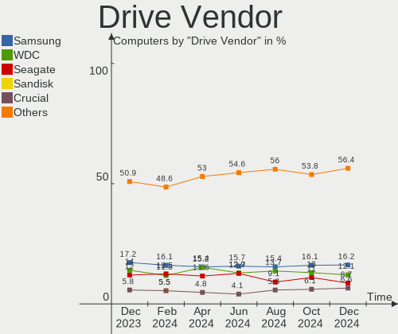
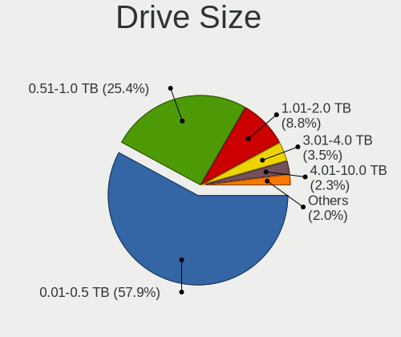
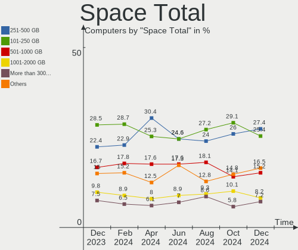
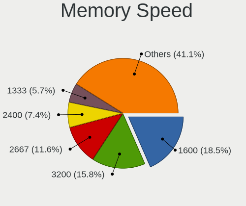

Linux Mint Hardware Trends
--------------------------

A project to identify most popular hardware characteristics and track their change
over time based on data collected by Linux Mint users at https://Linux-Hardware.org.

Anyone can contribute to this report by the [hw-probe](https://github.com/linuxhw/hw-probe) tool:

    sudo -E hw-probe -all -upload

This is a report for all computer types. See also reports for [desktops](/Dist/Linux_Mint/Desktop/README.md) and [notebooks](/Dist/Linux_Mint/Notebook/README.md).

Full-feature report is available here: https://linux-hardware.org/?view=trends

Period: Mar, 2022.

Contents
--------

* [ System ](#system)
  - [ OS                       ](#os)
  - [ OS Family                ](#os-family)
  - [ Kernel                   ](#kernel)
  - [ Kernel Family            ](#kernel-family)
  - [ Kernel Major Ver.        ](#kernel-major-ver)
  - [ Arch                     ](#arch)
  - [ DE                       ](#de)
  - [ Display Server           ](#display-server)
  - [ Display Manager          ](#display-manager)
  - [ OS Lang                  ](#os-lang)
  - [ Boot Mode                ](#boot-mode)
  - [ Filesystem               ](#filesystem)
  - [ Part. scheme             ](#part-scheme)
  - [ Dual Boot with Linux/BSD ](#dual-boot-with-linuxbsd)
  - [ Dual Boot (Win)          ](#dual-boot-win)

* [ Board ](#board)
  - [ Vendor                   ](#vendor)
  - [ Model                    ](#model)
  - [ Model Family             ](#model-family)
  - [ MFG Year                 ](#mfg-year)
  - [ Form Factor              ](#form-factor)
  - [ Secure Boot              ](#secure-boot)
  - [ Coreboot                 ](#coreboot)
  - [ RAM Size                 ](#ram-size)
  - [ RAM Used                 ](#ram-used)
  - [ Total Drives             ](#total-drives)
  - [ Has CD-ROM               ](#has-cd-rom)
  - [ Has Ethernet             ](#has-ethernet)
  - [ Has WiFi                 ](#has-wifi)
  - [ Has Bluetooth            ](#has-bluetooth)

* [ Location ](#location)
  - [ Country                  ](#country)
  - [ City                     ](#city)

* [ Drives ](#drives)
  - [ Drive Vendor             ](#drive-vendor)
  - [ Drive Model              ](#drive-model)
  - [ HDD Vendor               ](#hdd-vendor)
  - [ SSD Vendor               ](#ssd-vendor)
  - [ Drive Kind               ](#drive-kind)
  - [ Drive Connector          ](#drive-connector)
  - [ Drive Size               ](#drive-size)
  - [ Space Total              ](#space-total)
  - [ Space Used               ](#space-used)
  - [ Malfunc. Drives          ](#malfunc-drives)
  - [ Malfunc. Drive Vendor    ](#malfunc-drive-vendor)
  - [ Malfunc. HDD Vendor      ](#malfunc-hdd-vendor)
  - [ Malfunc. Drive Kind      ](#malfunc-drive-kind)
  - [ Failed Drives            ](#failed-drives)
  - [ Failed Drive Vendor      ](#failed-drive-vendor)
  - [ Drive Status             ](#drive-status)

* [ Storage controller ](#storage-controller)
  - [ Storage Vendor           ](#storage-vendor)
  - [ Storage Model            ](#storage-model)
  - [ Storage Kind             ](#storage-kind)

* [ Processor ](#processor)
  - [ CPU Vendor               ](#cpu-vendor)
  - [ CPU Model                ](#cpu-model)
  - [ CPU Model Family         ](#cpu-model-family)
  - [ CPU Cores                ](#cpu-cores)
  - [ CPU Sockets              ](#cpu-sockets)
  - [ CPU Threads              ](#cpu-threads)
  - [ CPU Op-Modes             ](#cpu-op-modes)
  - [ CPU Microcode            ](#cpu-microcode)
  - [ CPU Microarch            ](#cpu-microarch)

* [ Graphics ](#graphics)
  - [ GPU Vendor               ](#gpu-vendor)
  - [ GPU Model                ](#gpu-model)
  - [ GPU Combo                ](#gpu-combo)
  - [ GPU Driver               ](#gpu-driver)
  - [ GPU Memory               ](#gpu-memory)

* [ Monitor ](#monitor)
  - [ Monitor Vendor           ](#monitor-vendor)
  - [ Monitor Model            ](#monitor-model)
  - [ Monitor Resolution       ](#monitor-resolution)
  - [ Monitor Diagonal         ](#monitor-diagonal)
  - [ Monitor Width            ](#monitor-width)
  - [ Aspect Ratio             ](#aspect-ratio)
  - [ Monitor Area             ](#monitor-area)
  - [ Pixel Density            ](#pixel-density)
  - [ Multiple Monitors        ](#multiple-monitors)

* [ Network ](#network)
  - [ Net Controller Vendor    ](#net-controller-vendor)
  - [ Net Controller Model     ](#net-controller-model)
  - [ Wireless Vendor          ](#wireless-vendor)
  - [ Wireless Model           ](#wireless-model)
  - [ Ethernet Vendor          ](#ethernet-vendor)
  - [ Ethernet Model           ](#ethernet-model)
  - [ Net Controller Kind      ](#net-controller-kind)
  - [ Used Controller          ](#used-controller)
  - [ NICs                     ](#nics)
  - [ IPv6                     ](#ipv6)

* [ Bluetooth ](#bluetooth)
  - [ Bluetooth Vendor         ](#bluetooth-vendor)
  - [ Bluetooth Model          ](#bluetooth-model)

* [ Sound ](#sound)
  - [ Sound Vendor             ](#sound-vendor)
  - [ Sound Model              ](#sound-model)

* [ Memory ](#memory)
  - [ Memory Vendor            ](#memory-vendor)
  - [ Memory Model             ](#memory-model)
  - [ Memory Kind              ](#memory-kind)
  - [ Memory Form Factor       ](#memory-form-factor)
  - [ Memory Size              ](#memory-size)
  - [ Memory Speed             ](#memory-speed)

* [ Printers & scanners ](#printers--scanners)
  - [ Printer Vendor           ](#printer-vendor)
  - [ Printer Model            ](#printer-model)
  - [ Scanner Vendor           ](#scanner-vendor)
  - [ Scanner Model            ](#scanner-model)

* [ Camera ](#camera)
  - [ Camera Vendor            ](#camera-vendor)
  - [ Camera Model             ](#camera-model)

* [ Security ](#security)
  - [ Fingerprint Vendor       ](#fingerprint-vendor)
  - [ Fingerprint Model        ](#fingerprint-model)
  - [ Chipcard Vendor          ](#chipcard-vendor)
  - [ Chipcard Model           ](#chipcard-model)

* [ Unsupported ](#unsupported)
  - [ Unsupported Devices      ](#unsupported-devices)
  - [ Unsupported Device Types ](#unsupported-device-types)

System
------

OS
--

Installed operating systems

| Name            | Computers | Percent |
|-----------------|-----------|---------|
| Linux Mint 20.3 | 378       | 77.78%  |
| Linux Mint 20.2 | 50        | 10.29%  |
| Linux Mint 19.3 | 17        | 3.5%    |
| Linux Mint 20.1 | 16        | 3.29%   |
| Linux Mint 20   | 11        | 2.26%   |
| Linux Mint 19.2 | 5         | 1.03%   |
| Linux Mint 19.1 | 4         | 0.82%   |
| Linux Mint 19   | 3         | 0.62%   |
| Linux Mint 18.3 | 2         | 0.41%   |

OS Family
---------

OS without a version

| Name       | Computers | Percent |
|------------|-----------|---------|
| Linux Mint | 486       | 100%    |

Kernel
------

Version of the Linux kernel

| Version                    | Computers | Percent |
|----------------------------|-----------|---------|
| 5.4.0-104-generic          | 132       | 27.16%  |
| 5.4.0-100-generic          | 112       | 23.05%  |
| 5.4.0-105-generic          | 75        | 15.43%  |
| 5.4.0-91-generic           | 26        | 5.35%   |
| 5.13.0-35-generic          | 17        | 3.5%    |
| 5.4.0-107-generic          | 16        | 3.29%   |
| 5.13.0-27-generic          | 15        | 3.09%   |
| 5.13.0-30-generic          | 13        | 2.67%   |
| 5.13.0-37-generic          | 11        | 2.26%   |
| 5.4.0-97-generic           | 5         | 1.03%   |
| 4.15.0-54-generic          | 4         | 0.82%   |
| 5.4.0-96-generic           | 3         | 0.62%   |
| 5.4.0-92-generic           | 3         | 0.62%   |
| 5.14.0-1029-oem            | 3         | 0.62%   |
| 5.13.0-28-generic          | 3         | 0.62%   |
| 4.15.0-20-generic          | 3         | 0.62%   |
| 5.4.0-99-generic           | 2         | 0.41%   |
| 5.4.0-26-generic           | 2         | 0.41%   |
| 5.14.0-1027-oem            | 2         | 0.41%   |
| 5.13.0-39-generic          | 2         | 0.41%   |
| 4.15.0-171-generic         | 2         | 0.41%   |
| 4.15.0-142-generic         | 2         | 0.41%   |
| 5.8.0-63-generic           | 1         | 0.21%   |
| 5.4.185-0504185-generic    | 1         | 0.21%   |
| 5.4.177-rt69               | 1         | 0.21%   |
| 5.4.0-94-generic           | 1         | 0.21%   |
| 5.4.0-88-generic           | 1         | 0.21%   |
| 5.4.0-84-generic           | 1         | 0.21%   |
| 5.4.0-81-generic           | 1         | 0.21%   |
| 5.4.0-77-generic           | 1         | 0.21%   |
| 5.4.0-74-generic           | 1         | 0.21%   |
| 5.4.0-73-generic           | 1         | 0.21%   |
| 5.4.0-72-generic           | 1         | 0.21%   |
| 5.4.0-70-generic           | 1         | 0.21%   |
| 5.17.0-xanmod1             | 1         | 0.21%   |
| 5.17.0-051700-generic      | 1         | 0.21%   |
| 5.17-051700-generic        | 1         | 0.21%   |
| 5.16.12-xanmod1            | 1         | 0.21%   |
| 5.16.12-051612-generic     | 1         | 0.21%   |
| 5.16.0-17.1-liquorix-amd64 | 1         | 0.21%   |
| 5.16.0-051600-lowlatency   | 1         | 0.21%   |
| 5.15.26-xanmod1            | 1         | 0.21%   |
| 5.15.25-xanmod1            | 1         | 0.21%   |
| 5.15.13-051513-generic     | 1         | 0.21%   |
| 5.14.0-1031-oem            | 1         | 0.21%   |
| 5.14.0-1024-oem            | 1         | 0.21%   |
| 5.13.0-1009-intel          | 1         | 0.21%   |
| 5.13.0-1008-intel          | 1         | 0.21%   |
| 5.11.0-46-generic          | 1         | 0.21%   |
| 5.11.0-34-generic          | 1         | 0.21%   |
| 5.10.0-1052-oem            | 1         | 0.21%   |
| 4.15.0-175-generic         | 1         | 0.21%   |
| 4.15.0-173-generic         | 1         | 0.21%   |
| 4.15.0-169-generic         | 1         | 0.21%   |
| 4.15.0-106-generic         | 1         | 0.21%   |

Kernel Family
-------------

Linux kernel without a distro release

| Version | Computers | Percent |
|---------|-----------|---------|
| 5.4.0   | 385       | 79.22%  |
| 5.13.0  | 63        | 12.96%  |
| 4.15.0  | 15        | 3.09%   |
| 5.14.0  | 7         | 1.44%   |
| 5.17.0  | 2         | 0.41%   |
| 5.16.12 | 2         | 0.41%   |
| 5.16.0  | 2         | 0.41%   |
| 5.11.0  | 2         | 0.41%   |
| 5.8.0   | 1         | 0.21%   |
| 5.4.185 | 1         | 0.21%   |
| 5.4.177 | 1         | 0.21%   |
| 5.17    | 1         | 0.21%   |
| 5.15.26 | 1         | 0.21%   |
| 5.15.25 | 1         | 0.21%   |
| 5.15.13 | 1         | 0.21%   |
| 5.10.0  | 1         | 0.21%   |

Kernel Major Ver.
-----------------

Linux kernel major version

| Version | Computers | Percent |
|---------|-----------|---------|
| 5.4     | 387       | 79.63%  |
| 5.13    | 63        | 12.96%  |
| 4.15    | 15        | 3.09%   |
| 5.14    | 7         | 1.44%   |
| 5.16    | 4         | 0.82%   |
| 5.15    | 3         | 0.62%   |
| 5.17    | 2         | 0.41%   |
| 5.11    | 2         | 0.41%   |
| 5.8     | 1         | 0.21%   |
| 5.10    | 1         | 0.21%   |
| 5       | 1         | 0.21%   |

Arch
----

OS architecture (x86_64, i586, etc.)

| Name   | Computers | Percent |
|--------|-----------|---------|
| x86_64 | 476       | 97.94%  |
| i686   | 10        | 2.06%   |

DE
--

Desktop Environment

| Name       | Computers | Percent |
|------------|-----------|---------|
| X-Cinnamon | 329       | 67.7%   |
| MATE       | 72        | 14.81%  |
| XFCE       | 48        | 9.88%   |
| Cinnamon   | 31        | 6.38%   |
| GNOME      | 4         | 0.82%   |
| KDE5       | 1         | 0.21%   |
| KDE        | 1         | 0.21%   |

Display Server
--------------

X11 or Wayland

| Name    | Computers | Percent |
|---------|-----------|---------|
| X11     | 483       | 99.38%  |
| Tty     | 2         | 0.41%   |
| Wayland | 1         | 0.21%   |

Display Manager
---------------

SDDM, LightDM, etc.

| Name    | Computers | Percent |
|---------|-----------|---------|
| Unknown | 274       | 56.38%  |
| LightDM | 207       | 42.59%  |
| SDDM    | 2         | 0.41%   |
| MDM     | 2         | 0.41%   |
| GDM     | 1         | 0.21%   |

OS Lang
-------

Language

| Lang  | Computers | Percent |
|-------|-----------|---------|
| en_US | 162       | 33.33%  |
| de_DE | 79        | 16.26%  |
| fr_FR | 26        | 5.35%   |
| en_GB | 26        | 5.35%   |
| pt_BR | 25        | 5.14%   |
| ru_RU | 19        | 3.91%   |
| en_CA | 19        | 3.91%   |
| it_IT | 16        | 3.29%   |
| pl_PL | 11        | 2.26%   |
| C     | 11        | 2.26%   |
| es_ES | 10        | 2.06%   |
| nl_NL | 9         | 1.85%   |
| es_AR | 7         | 1.44%   |
| en_AU | 7         | 1.44%   |
| en_ZA | 5         | 1.03%   |
| en_IN | 5         | 1.03%   |
| cs_CZ | 5         | 1.03%   |
| fr_CA | 4         | 0.82%   |
| el_GR | 4         | 0.82%   |
| sv_SE | 3         | 0.62%   |
| sk_SK | 3         | 0.62%   |
| pt_PT | 3         | 0.62%   |
| hu_HU | 3         | 0.62%   |
| es_EC | 3         | 0.62%   |
| en_PH | 2         | 0.41%   |
| en_NZ | 2         | 0.41%   |
| de_AT | 2         | 0.41%   |
| tr_TR | 1         | 0.21%   |
| ru_UA | 1         | 0.21%   |
| nl_BE | 1         | 0.21%   |
| ja_JP | 1         | 0.21%   |
| fr_BE | 1         | 0.21%   |
| eu_ES | 1         | 0.21%   |
| es_VE | 1         | 0.21%   |
| es_NI | 1         | 0.21%   |
| es_MX | 1         | 0.21%   |
| es_CO | 1         | 0.21%   |
| en_IE | 1         | 0.21%   |
| de_CH | 1         | 0.21%   |
| da_DK | 1         | 0.21%   |
| ca_ES | 1         | 0.21%   |
| bg_BG | 1         | 0.21%   |

Boot Mode
---------

EFI or BIOS

| Mode | Computers | Percent |
|------|-----------|---------|
| EFI  | 254       | 52.26%  |
| BIOS | 232       | 47.74%  |

Filesystem
----------

Type of filesystem

| Type    | Computers | Percent |
|---------|-----------|---------|
| Ext4    | 467       | 96.09%  |
| Overlay | 9         | 1.85%   |
| Btrfs   | 6         | 1.23%   |
| Xfs     | 2         | 0.41%   |
| Ext3    | 1         | 0.21%   |
| Ext2    | 1         | 0.21%   |

Part. scheme
------------

Scheme of partitioning

| Type    | Computers | Percent |
|---------|-----------|---------|
| Unknown | 301       | 61.93%  |
| GPT     | 127       | 26.13%  |
| MBR     | 58        | 11.93%  |

Dual Boot with Linux/BSD
------------------------

Hosting more than one Linux/BSD

| Dual boot | Computers | Percent |
|-----------|-----------|---------|
| No        | 453       | 93.21%  |
| Yes       | 33        | 6.79%   |

Dual Boot (Win)
---------------

Hosting Linux and Windows

| Dual boot | Computers | Percent |
|-----------|-----------|---------|
| No        | 395       | 81.28%  |
| Yes       | 91        | 18.72%  |

Board
-----

Vendor
------

Motherboard manufacturer

| Name                        | Computers | Percent |
|-----------------------------|-----------|---------|
| Hewlett-Packard             | 86        | 17.7%   |
| ASUSTek Computer            | 74        | 15.23%  |
| Lenovo                      | 59        | 12.14%  |
| Dell                        | 51        | 10.49%  |
| Gigabyte Technology         | 32        | 6.58%   |
| MSI                         | 30        | 6.17%   |
| Acer                        | 28        | 5.76%   |
| ASRock                      | 19        | 3.91%   |
| Samsung Electronics         | 11        | 2.26%   |
| Toshiba                     | 10        | 2.06%   |
| Apple                       | 9         | 1.85%   |
| Intel                       | 7         | 1.44%   |
| Sony                        | 6         | 1.23%   |
| Positivo                    | 6         | 1.23%   |
| Fujitsu Siemens             | 5         | 1.03%   |
| Unknown                     | 5         | 1.03%   |
| Fujitsu                     | 4         | 0.82%   |
| Biostar                     | 3         | 0.62%   |
| Quanta                      | 2         | 0.41%   |
| Chuwi                       | 2         | 0.41%   |
| Alienware                   | 2         | 0.41%   |
| Visum                       | 1         | 0.21%   |
| VIA Technologies            | 1         | 0.21%   |
| Thomson                     | 1         | 0.21%   |
| Teclast                     | 1         | 0.21%   |
| Shuttle                     | 1         | 0.21%   |
| SHENZHEN YOUDISI E-COMMERCE | 1         | 0.21%   |
| Shenzhen Bmorn Technology   | 1         | 0.21%   |
| Schenker                    | 1         | 0.21%   |
| Purism                      | 1         | 0.21%   |
| Positivo Bahia - VAIO       | 1         | 0.21%   |
| Pegatron                    | 1         | 0.21%   |
| Packard Bell                | 1         | 0.21%   |
| Notebook                    | 1         | 0.21%   |
| Multilaser                  | 1         | 0.21%   |
| Microtech                   | 1         | 0.21%   |
| Microsoft                   | 1         | 0.21%   |
| Micromax                    | 1         | 0.21%   |
| MicroByte                   | 1         | 0.21%   |
| Megaware                    | 1         | 0.21%   |
| MAXDATA                     | 1         | 0.21%   |
| Maita                       | 1         | 0.21%   |
| LincPlus                    | 1         | 0.21%   |
| LG Electronics              | 1         | 0.21%   |
| KLLISRE                     | 1         | 0.21%   |
| Itautec                     | 1         | 0.21%   |
| GPU Company                 | 1         | 0.21%   |
| Google                      | 1         | 0.21%   |
| Foxconn                     | 1         | 0.21%   |
| Exo                         | 1         | 0.21%   |
| eMachines                   | 1         | 0.21%   |
| ECS                         | 1         | 0.21%   |
| DIODE                       | 1         | 0.21%   |
| Clevo                       | 1         | 0.21%   |
| AZW                         | 1         | 0.21%   |
| AMI                         | 1         | 0.21%   |

Model
-----

Motherboard model

| Name                                                                                     | Computers | Percent |
|------------------------------------------------------------------------------------------|-----------|---------|
| Unknown                                                                                  | 7         | 1.44%   |
| ASUS TUF Gaming X570-PLUS                                                                | 3         | 0.62%   |
| ASUS All Series                                                                          | 3         | 0.62%   |
| MSI MS-7B86                                                                              | 2         | 0.41%   |
| MSI MS-7693                                                                              | 2         | 0.41%   |
| Lenovo IdeaPad 3 15ALC6 82KU                                                             | 2         | 0.41%   |
| Lenovo G510 20238                                                                        | 2         | 0.41%   |
| Lenovo G500 20236                                                                        | 2         | 0.41%   |
| Lenovo G50-70 20351                                                                      | 2         | 0.41%   |
| HP Pavilion g6                                                                           | 2         | 0.41%   |
| HP Pavilion dv7                                                                          | 2         | 0.41%   |
| HP Notebook                                                                              | 2         | 0.41%   |
| HP Laptop 17-cn0xxx                                                                      | 2         | 0.41%   |
| HP EliteBook 2560p                                                                       | 2         | 0.41%   |
| HP 15                                                                                    | 2         | 0.41%   |
| Gigabyte B450 AORUS M                                                                    | 2         | 0.41%   |
| Gigabyte 970A-DS3P                                                                       | 2         | 0.41%   |
| Dell OptiPlex 760                                                                        | 2         | 0.41%   |
| Dell OptiPlex 390                                                                        | 2         | 0.41%   |
| Dell Latitude E5420                                                                      | 2         | 0.41%   |
| ASUS ROG STRIX X470-F GAMING                                                             | 2         | 0.41%   |
| ASUS P50IJ                                                                               | 2         | 0.41%   |
| ASUS M5A99FX PRO R2.0                                                                    | 2         | 0.41%   |
| ASUS M5A78L-M/USB3                                                                       | 2         | 0.41%   |
| Visum A6VMX                                                                              | 1         | 0.21%   |
| VIA KM266-8235                                                                           | 1         | 0.21%   |
| Toshiba TECRA Z50-A                                                                      | 1         | 0.21%   |
| Toshiba Satellite P755                                                                   | 1         | 0.21%   |
| Toshiba Satellite L350D                                                                  | 1         | 0.21%   |
| Toshiba Satellite C75D-A                                                                 | 1         | 0.21%   |
| Toshiba Satellite C75-A                                                                  | 1         | 0.21%   |
| Toshiba Satellite C70-C-1G2                                                              | 1         | 0.21%   |
| Toshiba Satellite C655                                                                   | 1         | 0.21%   |
| Toshiba Satellite C50-A                                                                  | 1         | 0.21%   |
| Toshiba Satellite A215                                                                   | 1         | 0.21%   |
| Toshiba Satellite A105                                                                   | 1         | 0.21%   |
| Thomson N17C8SR1T                                                                        | 1         | 0.21%   |
| Teclast F15Plus 2                                                                        | 1         | 0.21%   |
| Sony VPCSB35FG                                                                           | 1         | 0.21%   |
| Sony VPCEB1S1E                                                                           | 1         | 0.21%   |
| Sony VGN-NR11Z_S                                                                         | 1         | 0.21%   |
| Sony VGN-FW21E                                                                           | 1         | 0.21%   |
| Sony SVE15111EBS                                                                         | 1         | 0.21%   |
| Sony SVE14A25CLB                                                                         | 1         | 0.21%   |
| Shuttle XH61V                                                                            | 1         | 0.21%   |
| SHENZHEN YOUDISI E-COMMERCE A8S PRO                                                      | 1         | 0.21%   |
| Shenzhen Bmorn NBPC1078                                                                  | 1         | 0.21%   |
| Schenker XMG NEO (M19, RTX 2060)                                                         | 1         | 0.21%   |
| Samsung RV420/RV520/RV720/E3530/S3530/E3420/E3520                                        | 1         | 0.21%   |
| Samsung R59P/R60P/R61P                                                                   | 1         | 0.21%   |
| Samsung N150/N210/N220                                                                   | 1         | 0.21%   |
| Samsung 950QDB                                                                           | 1         | 0.21%   |
| Samsung 940X5N                                                                           | 1         | 0.21%   |
| Samsung 730QDA                                                                           | 1         | 0.21%   |
| Samsung 550XDA                                                                           | 1         | 0.21%   |
| Samsung 370E4K                                                                           | 1         | 0.21%   |
| Samsung 350V5C/351V5C/3540VC/3440VC                                                      | 1         | 0.21%   |
| Samsung 350V5C/350V5X/350V4C/350V4X/351V5C/351V5X/351V4C/351V4X/3540VC/3540VX/3440VC/344 | 1         | 0.21%   |
| Samsung 300E4Z/300E5Z/300E7Z                                                             | 1         | 0.21%   |
| Quanta XV1                                                                               | 1         | 0.21%   |

Model Family
------------

Motherboard model prefix

| Name                            | Computers | Percent |
|---------------------------------|-----------|---------|
| Lenovo ThinkPad                 | 25        | 5.14%   |
| Acer Aspire                     | 20        | 4.12%   |
| Dell OptiPlex                   | 16        | 3.29%   |
| HP Pavilion                     | 15        | 3.09%   |
| HP Laptop                       | 13        | 2.67%   |
| Lenovo IdeaPad                  | 12        | 2.47%   |
| Dell Latitude                   | 11        | 2.26%   |
| HP ProBook                      | 10        | 2.06%   |
| Dell Inspiron                   | 10        | 2.06%   |
| Toshiba Satellite               | 9         | 1.85%   |
| Lenovo ThinkCentre              | 7         | 1.44%   |
| HP EliteBook                    | 7         | 1.44%   |
| HP Compaq                       | 7         | 1.44%   |
| ASUS PRIME                      | 7         | 1.44%   |
| Unknown                         | 7         | 1.44%   |
| Dell XPS                        | 6         | 1.23%   |
| ASUS ROG                        | 6         | 1.23%   |
| HP ENVY                         | 5         | 1.03%   |
| ASUS TUF                        | 5         | 1.03%   |
| Fujitsu Siemens ESPRIMO         | 4         | 0.82%   |
| Dell Vostro                     | 4         | 0.82%   |
| ASUS VivoBook                   | 4         | 0.82%   |
| ASUS M5A78L-M                   | 4         | 0.82%   |
| HP EliteDesk                    | 3         | 0.62%   |
| ASUS All                        | 3         | 0.62%   |
| Acer TravelMate                 | 3         | 0.62%   |
| Samsung 350V5C                  | 2         | 0.41%   |
| MSI MS-7B86                     | 2         | 0.41%   |
| MSI MS-7693                     | 2         | 0.41%   |
| Lenovo ThinkStation             | 2         | 0.41%   |
| Lenovo IdeaCentre               | 2         | 0.41%   |
| Lenovo G510                     | 2         | 0.41%   |
| Lenovo G500                     | 2         | 0.41%   |
| Lenovo G50-70                   | 2         | 0.41%   |
| HP Notebook                     | 2         | 0.41%   |
| HP 255                          | 2         | 0.41%   |
| HP 15                           | 2         | 0.41%   |
| Gigabyte B450                   | 2         | 0.41%   |
| Gigabyte 970A-DS3P              | 2         | 0.41%   |
| Fujitsu LIFEBOOK                | 2         | 0.41%   |
| Dell Precision                  | 2         | 0.41%   |
| ASUS P50IJ                      | 2         | 0.41%   |
| ASUS M5A99FX                    | 2         | 0.41%   |
| ASRock B550M                    | 2         | 0.41%   |
| Acer Swift                      | 2         | 0.41%   |
| Acer Nitro                      | 2         | 0.41%   |
| Visum A6VMX                     | 1         | 0.21%   |
| VIA KM266-8235                  | 1         | 0.21%   |
| Toshiba TECRA                   | 1         | 0.21%   |
| Thomson N17C8SR1T               | 1         | 0.21%   |
| Teclast F15Plus                 | 1         | 0.21%   |
| Sony VPCSB35FG                  | 1         | 0.21%   |
| Sony VPCEB1S1E                  | 1         | 0.21%   |
| Sony VGN-NR11Z                  | 1         | 0.21%   |
| Sony VGN-FW21E                  | 1         | 0.21%   |
| Sony SVE15111EBS                | 1         | 0.21%   |
| Sony SVE14A25CLB                | 1         | 0.21%   |
| Shuttle XH61V                   | 1         | 0.21%   |
| SHENZHEN YOUDISI E-COMMERCE A8S | 1         | 0.21%   |
| Shenzhen Bmorn NBPC1078         | 1         | 0.21%   |

MFG Year
--------

Motherboard manufacture year

| Year    | Computers | Percent |
|---------|-----------|---------|
| 2021    | 56        | 11.52%  |
| 2012    | 49        | 10.08%  |
| 2011    | 45        | 9.26%   |
| 2020    | 44        | 9.05%   |
| 2013    | 37        | 7.61%   |
| 2019    | 34        | 7%      |
| 2017    | 31        | 6.38%   |
| 2018    | 25        | 5.14%   |
| 2015    | 25        | 5.14%   |
| 2016    | 24        | 4.94%   |
| 2014    | 22        | 4.53%   |
| 2010    | 22        | 4.53%   |
| 2009    | 21        | 4.32%   |
| 2008    | 20        | 4.12%   |
| 2007    | 15        | 3.09%   |
| 2022    | 7         | 1.44%   |
| 2006    | 4         | 0.82%   |
| 2005    | 3         | 0.62%   |
| 2002    | 1         | 0.21%   |
| Unknown | 1         | 0.21%   |

Form Factor
-----------

Physical design of the computer

| Name        | Computers | Percent |
|-------------|-----------|---------|
| Notebook    | 264       | 54.32%  |
| Desktop     | 193       | 39.71%  |
| Convertible | 9         | 1.85%   |
| All in one  | 9         | 1.85%   |
| Mini pc     | 6         | 1.23%   |
| Tablet      | 3         | 0.62%   |
| Server      | 2         | 0.41%   |

Secure Boot
-----------

Enabled or disabled

| State    | Computers | Percent |
|----------|-----------|---------|
| Disabled | 443       | 91.15%  |
| Enabled  | 43        | 8.85%   |

Coreboot
--------

Have coreboot on board

| Used | Computers | Percent |
|------|-----------|---------|
| No   | 484       | 99.59%  |
| Yes  | 2         | 0.41%   |

RAM Size
--------

Total RAM memory

| Size in GB  | Computers | Percent |
|-------------|-----------|---------|
| 3.01-4.0    | 111       | 22.84%  |
| 4.01-8.0    | 102       | 20.99%  |
| 8.01-16.0   | 100       | 20.58%  |
| 16.01-24.0  | 81        | 16.67%  |
| 32.01-64.0  | 40        | 8.23%   |
| 1.01-2.0    | 19        | 3.91%   |
| 2.01-3.0    | 11        | 2.26%   |
| 64.01-256.0 | 11        | 2.26%   |
| 24.01-32.0  | 6         | 1.23%   |
| 0.51-1.0    | 5         | 1.03%   |

RAM Used
--------

Used RAM memory

| Used GB   | Computers | Percent |
|-----------|-----------|---------|
| 1.01-2.0  | 179       | 36.83%  |
| 2.01-3.0  | 126       | 25.93%  |
| 3.01-4.0  | 63        | 12.96%  |
| 4.01-8.0  | 58        | 11.93%  |
| 0.51-1.0  | 44        | 9.05%   |
| 8.01-16.0 | 13        | 2.67%   |
| 0.01-0.5  | 3         | 0.62%   |

Total Drives
------------

Number of drives on board

| Drives | Computers | Percent |
|--------|-----------|---------|
| 1      | 286       | 58.85%  |
| 2      | 120       | 24.69%  |
| 3      | 45        | 9.26%   |
| 4      | 20        | 4.12%   |
| 6      | 6         | 1.23%   |
| 5      | 6         | 1.23%   |
| 0      | 2         | 0.41%   |
| 7      | 1         | 0.21%   |

Has CD-ROM
----------

Has CD-ROM on board

| Presented | Computers | Percent |
|-----------|-----------|---------|
| No        | 266       | 54.73%  |
| Yes       | 220       | 45.27%  |

Has Ethernet
------------

Has Ethernet on board

| Presented | Computers | Percent |
|-----------|-----------|---------|
| Yes       | 429       | 88.27%  |
| No        | 57        | 11.73%  |

Has WiFi
--------

Has WiFi module

| Presented | Computers | Percent |
|-----------|-----------|---------|
| Yes       | 372       | 76.54%  |
| No        | 114       | 23.46%  |

Has Bluetooth
-------------

Has Bluetooth module

| Presented | Computers | Percent |
|-----------|-----------|---------|
| Yes       | 278       | 57.2%   |
| No        | 208       | 42.8%   |

Location
--------

Country
-------

Geographic location (country)

| Country            | Computers | Percent |
|--------------------|-----------|---------|
| USA                | 101       | 20.78%  |
| Germany            | 85        | 17.49%  |
| France             | 31        | 6.38%   |
| Brazil             | 30        | 6.17%   |
| Canada             | 24        | 4.94%   |
| Russia             | 21        | 4.32%   |
| UK                 | 20        | 4.12%   |
| Italy              | 19        | 3.91%   |
| Poland             | 15        | 3.09%   |
| Netherlands        | 15        | 3.09%   |
| Spain              | 12        | 2.47%   |
| Czechia            | 7         | 1.44%   |
| Australia          | 7         | 1.44%   |
| Argentina          | 7         | 1.44%   |
| Sweden             | 5         | 1.03%   |
| South Africa       | 5         | 1.03%   |
| Portugal           | 5         | 1.03%   |
| India              | 5         | 1.03%   |
| Hungary            | 5         | 1.03%   |
| Slovakia           | 4         | 0.82%   |
| Romania            | 4         | 0.82%   |
| Greece             | 4         | 0.82%   |
| Croatia            | 4         | 0.82%   |
| Switzerland        | 3         | 0.62%   |
| Serbia             | 3         | 0.62%   |
| Norway             | 3         | 0.62%   |
| Indonesia          | 3         | 0.62%   |
| Ecuador            | 3         | 0.62%   |
| Colombia           | 3         | 0.62%   |
| Belgium            | 3         | 0.62%   |
| Belarus            | 3         | 0.62%   |
| Philippines        | 2         | 0.41%   |
| New Zealand        | 2         | 0.41%   |
| Japan              | 2         | 0.41%   |
| Denmark            | 2         | 0.41%   |
| Bulgaria           | 2         | 0.41%   |
| Austria            | 2         | 0.41%   |
| Venezuela          | 1         | 0.21%   |
| Turkey             | 1         | 0.21%   |
| Thailand           | 1         | 0.21%   |
| Taiwan             | 1         | 0.21%   |
| Slovenia           | 1         | 0.21%   |
| Paraguay           | 1         | 0.21%   |
| Pakistan           | 1         | 0.21%   |
| Nicaragua          | 1         | 0.21%   |
| Mexico             | 1         | 0.21%   |
| Malaysia           | 1         | 0.21%   |
| Ireland            | 1         | 0.21%   |
| Iran               | 1         | 0.21%   |
| Egypt              | 1         | 0.21%   |
| Dominican Republic | 1         | 0.21%   |
| Albania            | 1         | 0.21%   |

City
----

Geographic location (city)

| City                   | Computers | Percent |
|------------------------|-----------|---------|
| Berlin                 | 8         | 1.65%   |
| St Petersburg          | 7         | 1.44%   |
| Stuttgart              | 5         | 1.03%   |
| Paris                  | 5         | 1.03%   |
| Moscow                 | 5         | 1.03%   |
| Leimuiden              | 5         | 1.03%   |
| Warsaw                 | 4         | 0.82%   |
| Toronto                | 4         | 0.82%   |
| Sao Paulo              | 4         | 0.82%   |
| Montreal               | 4         | 0.82%   |
| Zagreb                 | 3         | 0.62%   |
| Oslo                   | 3         | 0.62%   |
| New York               | 3         | 0.62%   |
| Minsk                  | 3         | 0.62%   |
| Milan                  | 3         | 0.62%   |
| Marseille              | 3         | 0.62%   |
| Cambridge              | 3         | 0.62%   |
| Calgary                | 3         | 0.62%   |
| Bratislava             | 3         | 0.62%   |
| Villingen-Schwenningen | 2         | 0.41%   |
| Strasbourg             | 2         | 0.41%   |
| Seattle                | 2         | 0.41%   |
| Sao Jose               | 2         | 0.41%   |
| Santa Monica           | 2         | 0.41%   |
| Salt Lake City         | 2         | 0.41%   |
| Saarbrücken           | 2         | 0.41%   |
| Rockville              | 2         | 0.41%   |
| Prague                 | 2         | 0.41%   |
| Porto Alegre           | 2         | 0.41%   |
| Maule                  | 2         | 0.41%   |
| Madrid                 | 2         | 0.41%   |
| Leipzig                | 2         | 0.41%   |
| Kecskemét             | 2         | 0.41%   |
| Jakarta                | 2         | 0.41%   |
| Huntingdon             | 2         | 0.41%   |
| Guayaquil              | 2         | 0.41%   |
| Goiânia               | 2         | 0.41%   |
| Freiburg im Breisgau   | 2         | 0.41%   |
| Frankfurt am Main      | 2         | 0.41%   |
| Fairmont               | 2         | 0.41%   |
| Coeur d'Alene          | 2         | 0.41%   |
| Centreville            | 2         | 0.41%   |
| Cape Town              | 2         | 0.41%   |
| Buenos Aires           | 2         | 0.41%   |
| Bucharest              | 2         | 0.41%   |
| Braunschweig           | 2         | 0.41%   |
| Bogotá                | 2         | 0.41%   |
| Belo Horizonte         | 2         | 0.41%   |
| Belleview              | 2         | 0.41%   |
| Belgrade               | 2         | 0.41%   |
| Athens                 | 2         | 0.41%   |
| Aachen                 | 2         | 0.41%   |
| Zurich                 | 1         | 0.21%   |
| Zirndorf               | 1         | 0.21%   |
| Zevenaar               | 1         | 0.21%   |
| Yonkers                | 1         | 0.21%   |
| Würzburg              | 1         | 0.21%   |
| Wuppertal              | 1         | 0.21%   |
| Wolfsburg              | 1         | 0.21%   |
| Wismar                 | 1         | 0.21%   |

Drives
------

Drive Vendor
------------

Hard drive vendors

| Vendor                    | Computers | Drives | Percent |
|---------------------------|-----------|--------|---------|
| Seagate                   | 114       | 133    | 15.94%  |
| WDC                       | 112       | 129    | 15.66%  |
| Samsung Electronics       | 94        | 116    | 13.15%  |
| SanDisk                   | 53        | 62     | 7.41%   |
| Toshiba                   | 51        | 56     | 7.13%   |
| Crucial                   | 34        | 37     | 4.76%   |
| Kingston                  | 31        | 35     | 4.34%   |
| Hitachi                   | 28        | 29     | 3.92%   |
| Unknown                   | 25        | 31     | 3.5%    |
| Intel                     | 18        | 20     | 2.52%   |
| SK Hynix                  | 11        | 11     | 1.54%   |
| HGST                      | 11        | 12     | 1.54%   |
| Micron Technology         | 9         | 9      | 1.26%   |
| A-DATA Technology         | 9         | 9      | 1.26%   |
| Intenso                   | 8         | 10     | 1.12%   |
| China                     | 7         | 7      | 0.98%   |
| Unknown                   | 7         | 7      | 0.98%   |
| SPCC                      | 6         | 7      | 0.84%   |
| Phison                    | 5         | 5      | 0.7%    |
| LITEONIT                  | 5         | 5      | 0.7%    |
| Patriot                   | 4         | 4      | 0.56%   |
| KIOXIA                    | 3         | 3      | 0.42%   |
| Fujitsu                   | 3         | 3      | 0.42%   |
| Apple                     | 3         | 6      | 0.42%   |
| XrayDisk                  | 2         | 2      | 0.28%   |
| XPG                       | 2         | 2      | 0.28%   |
| Transcend                 | 2         | 2      | 0.28%   |
| Silicon Motion            | 2         | 2      | 0.28%   |
| PNY                       | 2         | 2      | 0.28%   |
| OCZ                       | 2         | 2      | 0.28%   |
| Mushkin                   | 2         | 2      | 0.28%   |
| MAXTOR                    | 2         | 2      | 0.28%   |
| Lexar                     | 2         | 2      | 0.28%   |
| Lenovo                    | 2         | 2      | 0.28%   |
| GOODRAM                   | 2         | 2      | 0.28%   |
| Gigabyte Technology       | 2         | 2      | 0.28%   |
| Corsair                   | 2         | 2      | 0.28%   |
| Apacer                    | 2         | 2      | 0.28%   |
| Zheino                    | 1         | 1      | 0.14%   |
| WD MediaMax               | 1         | 1      | 0.14%   |
| USB3.0                    | 1         | 1      | 0.14%   |
| USB 3.0                   | 1         | 1      | 0.14%   |
| Teclast                   | 1         | 1      | 0.14%   |
| TEAM T25                  | 1         | 1      | 0.14%   |
| Super Talent              | 1         | 1      | 0.14%   |
| SUNEAST                   | 1         | 1      | 0.14%   |
| SSSTC                     | 1         | 1      | 0.14%   |
| SMART                     | 1         | 1      | 0.14%   |
| sage                      | 1         | 1      | 0.14%   |
| SABRENT                   | 1         | 1      | 0.14%   |
| OWC                       | 1         | 1      | 0.14%   |
| Netac                     | 1         | 1      | 0.14%   |
| Microtech                 | 1         | 1      | 0.14%   |
| Micron/Crucial Technology | 1         | 1      | 0.14%   |
| Mercury                   | 1         | 1      | 0.14%   |
| M.2 SSD                   | 1         | 1      | 0.14%   |
| LITEON                    | 1         | 1      | 0.14%   |
| KLLISRE                   | 1         | 1      | 0.14%   |
| KIOXIA-EXCERIA            | 1         | 1      | 0.14%   |
| KingFast                  | 1         | 1      | 0.14%   |

Drive Model
-----------

Hard drive models

| Model                              | Computers | Percent |
|------------------------------------|-----------|---------|
| WDC WDS500G2B0A-00SM50 500GB SSD   | 7         | 0.89%   |
| Unknown MMC Card  32GB             | 7         | 0.89%   |
| Seagate ST1000LM035-1RK172 1TB     | 7         | 0.89%   |
| Seagate Expansion 320GB            | 7         | 0.89%   |
| Sandisk NVMe SSD Drive 512GB       | 7         | 0.89%   |
| Kingston SA400S37240G 240GB SSD    | 7         | 0.89%   |
| Unknown                            | 7         | 0.89%   |
| Unknown SD/MMC/MS PRO 32GB         | 6         | 0.77%   |
| Toshiba MQ01ABD100 1TB             | 6         | 0.77%   |
| Seagate ST1000LM024 HN-M101MBB 1TB | 6         | 0.77%   |
| Toshiba MQ04ABF100 1TB             | 5         | 0.64%   |
| Seagate ST500LT012-1DG142 500GB    | 5         | 0.64%   |
| Seagate ST500DM002-1BD142 500GB    | 5         | 0.64%   |
| Seagate ST2000DM008-2FR102 2TB     | 5         | 0.64%   |
| Samsung SSD 860 EVO 1TB            | 5         | 0.64%   |
| Crucial CT500MX500SSD1 500GB       | 5         | 0.64%   |
| Crucial CT1000MX500SSD1 1TB        | 5         | 0.64%   |
| Toshiba MQ01ABF050 500GB           | 4         | 0.51%   |
| Toshiba MK5059GSXP 500GB           | 4         | 0.51%   |
| Toshiba DT01ACA100 1TB             | 4         | 0.51%   |
| Seagate ST1000DM010-2EP102 1TB     | 4         | 0.51%   |
| SanDisk SSD PLUS 480GB             | 4         | 0.51%   |
| SanDisk SSD PLUS 240GB             | 4         | 0.51%   |
| Samsung SSD 850 EVO 500GB          | 4         | 0.51%   |
| Samsung SSD 850 EVO 250GB          | 4         | 0.51%   |
| Samsung SSD 840 EVO 250GB          | 4         | 0.51%   |
| Samsung NVMe SSD Drive 1TB         | 4         | 0.51%   |
| Intel NVMe SSD Drive 512GB         | 4         | 0.51%   |
| Hitachi HTS723232A7A364 320GB      | 4         | 0.51%   |
| Hitachi HTS542525K9SA00 250GB      | 4         | 0.51%   |
| WDC WD40EFRX-68N32N0 4TB           | 3         | 0.38%   |
| WDC WD20EZRX-00D8PB0 2TB           | 3         | 0.38%   |
| WDC WD20EFRX-68EUZN0 2TB           | 3         | 0.38%   |
| WDC WD10SPZX-21Z10T0 1TB           | 3         | 0.38%   |
| Unknown MMC Card  64GB             | 3         | 0.38%   |
| SPCC Solid State Disk 256GB        | 3         | 0.38%   |
| Seagate ST31000528AS 1TB           | 3         | 0.38%   |
| Seagate ST2000DM006-2DM164 2TB     | 3         | 0.38%   |
| Seagate ST1000DM003-1CH162 1TB     | 3         | 0.38%   |
| SanDisk SSD PLUS 120GB             | 3         | 0.38%   |
| Sandisk NVMe SSD Drive 500GB       | 3         | 0.38%   |
| Sandisk NVMe SSD Drive 256GB       | 3         | 0.38%   |
| Sandisk NVMe SSD Drive 1TB         | 3         | 0.38%   |
| Samsung SSD 860 EVO 500GB          | 3         | 0.38%   |
| Samsung SSD 860 EVO 250GB          | 3         | 0.38%   |
| Samsung NVMe SSD Drive 2TB         | 3         | 0.38%   |
| Samsung NVMe SSD Drive 250GB       | 3         | 0.38%   |
| Micron NVMe SSD Drive 512GB        | 3         | 0.38%   |
| KIOXIA KBG40ZNS256G NVMe 256GB     | 3         | 0.38%   |
| Kingston SA400S37480G 480GB SSD    | 3         | 0.38%   |
| Intel SSDPEKNW512G8H 512GB         | 3         | 0.38%   |
| Crucial CT525MX300SSD1 528GB       | 3         | 0.38%   |
| Crucial CT240BX500SSD1 240GB       | 3         | 0.38%   |
| Crucial CT1000P2SSD8 1TB           | 3         | 0.38%   |
| WDC WDS100T2B0A-00SM50 1TB SSD     | 2         | 0.26%   |
| WDC WD5000BPVT-55HXZT3 500GB       | 2         | 0.26%   |
| WDC WD40EZRZ-00GXCB0 4TB           | 2         | 0.26%   |
| WDC WD20EARS-00MVWB0 2TB           | 2         | 0.26%   |
| WDC WD10PURZ-85U8XY0 1TB           | 2         | 0.26%   |
| WDC WD10EZEX-60WN4A0 1TB           | 2         | 0.26%   |

HDD Vendor
----------

Hard disk drive vendors

| Vendor              | Computers | Drives | Percent |
|---------------------|-----------|--------|---------|
| Seagate             | 110       | 126    | 34.7%   |
| WDC                 | 91        | 104    | 28.71%  |
| Toshiba             | 41        | 43     | 12.93%  |
| Hitachi             | 28        | 29     | 8.83%   |
| Samsung Electronics | 18        | 19     | 5.68%   |
| HGST                | 11        | 12     | 3.47%   |
| Unknown             | 6         | 6      | 1.89%   |
| Fujitsu             | 3         | 3      | 0.95%   |
| MAXTOR              | 2         | 2      | 0.63%   |
| Apple               | 2         | 2      | 0.63%   |
| USB 3.0             | 1         | 1      | 0.32%   |
| sage                | 1         | 1      | 0.32%   |
| SABRENT             | 1         | 1      | 0.32%   |
| IBM/Hitachi         | 1         | 1      | 0.32%   |
| HGST HUS            | 1         | 1      | 0.32%   |

SSD Vendor
----------

Solid state drive vendors

| Vendor              | Computers | Drives | Percent |
|---------------------|-----------|--------|---------|
| Samsung Electronics | 49        | 57     | 20.25%  |
| SanDisk             | 33        | 39     | 13.64%  |
| Crucial             | 29        | 31     | 11.98%  |
| Kingston            | 27        | 31     | 11.16%  |
| WDC                 | 16        | 18     | 6.61%   |
| Intenso             | 7         | 9      | 2.89%   |
| China               | 7         | 7      | 2.89%   |
| SPCC                | 6         | 7      | 2.48%   |
| A-DATA Technology   | 6         | 6      | 2.48%   |
| Toshiba             | 5         | 5      | 2.07%   |
| LITEONIT            | 5         | 5      | 2.07%   |
| Micron Technology   | 4         | 4      | 1.65%   |
| Patriot             | 3         | 3      | 1.24%   |
| Intel               | 3         | 3      | 1.24%   |
| Unknown             | 3         | 3      | 1.24%   |
| Transcend           | 2         | 2      | 0.83%   |
| SK Hynix            | 2         | 2      | 0.83%   |
| Seagate             | 2         | 2      | 0.83%   |
| OCZ                 | 2         | 2      | 0.83%   |
| Mushkin             | 2         | 2      | 0.83%   |
| Lexar               | 2         | 2      | 0.83%   |
| GOODRAM             | 2         | 2      | 0.83%   |
| Apacer              | 2         | 2      | 0.83%   |
| Zheino              | 1         | 1      | 0.41%   |
| USB3.0              | 1         | 1      | 0.41%   |
| Teclast             | 1         | 1      | 0.41%   |
| TEAM T25            | 1         | 1      | 0.41%   |
| Super Talent        | 1         | 1      | 0.41%   |
| SUNEAST             | 1         | 1      | 0.41%   |
| SMART               | 1         | 1      | 0.41%   |
| PNY                 | 1         | 1      | 0.41%   |
| OWC                 | 1         | 1      | 0.41%   |
| Netac               | 1         | 1      | 0.41%   |
| Microtech           | 1         | 1      | 0.41%   |
| Mercury             | 1         | 1      | 0.41%   |
| LITEON              | 1         | 1      | 0.41%   |
| KingDian            | 1         | 1      | 0.41%   |
| INNOVATION IT       | 1         | 2      | 0.41%   |
| Hewlett-Packard     | 1         | 1      | 0.41%   |
| Gigabyte Technology | 1         | 1      | 0.41%   |
| FORESEE             | 1         | 1      | 0.41%   |
| Dell                | 1         | 1      | 0.41%   |
| Corsair             | 1         | 1      | 0.41%   |
| BHT                 | 1         | 1      | 0.41%   |
| 2.5                 | 1         | 1      | 0.41%   |
| 1TB                 | 1         | 1      | 0.41%   |

Drive Kind
----------

HDD or SSD

| Kind    | Computers | Drives | Percent |
|---------|-----------|--------|---------|
| HDD     | 270       | 351    | 41.35%  |
| SSD     | 219       | 268    | 33.54%  |
| NVMe    | 127       | 149    | 19.45%  |
| MMC     | 24        | 30     | 3.68%   |
| Unknown | 13        | 13     | 1.99%   |

Drive Connector
---------------

SATA, SAS, NVMe, etc.

| Type | Computers | Drives | Percent |
|------|-----------|--------|---------|
| SATA | 396       | 597    | 68.75%  |
| NVMe | 127       | 148    | 22.05%  |
| SAS  | 29        | 36     | 5.03%   |
| MMC  | 24        | 30     | 4.17%   |

Drive Size
----------

Size of hard drive

| Size in TB | Computers | Drives | Percent |
|------------|-----------|--------|---------|
| 0.01-0.5   | 288       | 373    | 57.95%  |
| 0.51-1.0   | 139       | 160    | 27.97%  |
| 1.01-2.0   | 47        | 54     | 9.46%   |
| 3.01-4.0   | 15        | 19     | 3.02%   |
| 2.01-3.0   | 3         | 4      | 0.6%    |
| 4.01-10.0  | 3         | 5      | 0.6%    |
| 10.01-20.0 | 2         | 4      | 0.4%    |

Space Total
-----------

Amount of disk space available on the file system

| Size in GB     | Computers | Percent |
|----------------|-----------|---------|
| 101-250        | 148       | 30.45%  |
| 251-500        | 111       | 22.84%  |
| 501-1000       | 84        | 17.28%  |
| More than 3000 | 34        | 7%      |
| 1001-2000      | 34        | 7%      |
| 51-100         | 33        | 6.79%   |
| 2001-3000      | 19        | 3.91%   |
| 21-50          | 13        | 2.67%   |
| 1-20           | 8         | 1.65%   |
| Unknown        | 2         | 0.41%   |

Space Used
----------

Amount of used disk space

| Used GB        | Computers | Percent |
|----------------|-----------|---------|
| 1-20           | 124       | 25.51%  |
| 21-50          | 93        | 19.14%  |
| 51-100         | 83        | 17.08%  |
| 101-250        | 66        | 13.58%  |
| 251-500        | 52        | 10.7%   |
| 1001-2000      | 24        | 4.94%   |
| 501-1000       | 17        | 3.5%    |
| More than 3000 | 13        | 2.67%   |
| 2001-3000      | 12        | 2.47%   |
| Unknown        | 2         | 0.41%   |

Malfunc. Drives
---------------

Drive models with a malfunction

| Model                                         | Computers | Drives | Percent |
|-----------------------------------------------|-----------|--------|---------|
| Crucial CT525MX300SSD1 528GB                  | 2         | 2      | 5.71%   |
| WDC WD5002ABYS-01B1B0 500GB                   | 1         | 1      | 2.86%   |
| WDC WD5000BPVT-55HXZT3 500GB                  | 1         | 1      | 2.86%   |
| WDC WD5000AAKS-00A7B0 500GB                   | 1         | 1      | 2.86%   |
| WDC WD30EFRX-68EUZN0 3TB                      | 1         | 1      | 2.86%   |
| WDC WD20EARS-00MVWB0 2TB                      | 1         | 1      | 2.86%   |
| Toshiba MK3265GSX 320GB                       | 1         | 1      | 2.86%   |
| Toshiba MK1234GSX 120GB                       | 1         | 1      | 2.86%   |
| SK Hynix BC711 HFM512GD3JX013N 512GB          | 1         | 1      | 2.86%   |
| Seagate ST9500325AS 500GB                     | 1         | 1      | 2.86%   |
| Seagate ST9250410AS 250GB                     | 1         | 1      | 2.86%   |
| Seagate ST500LT012-1DG142 500GB               | 1         | 1      | 2.86%   |
| Seagate ST320LT012-1DG14C 320GB               | 1         | 1      | 2.86%   |
| Seagate ST31000524NS 1TB                      | 1         | 1      | 2.86%   |
| Seagate ST31000333AS 1TB                      | 1         | 1      | 2.86%   |
| Seagate ST1500DL003-9VT16L 1TB                | 1         | 1      | 2.86%   |
| Seagate ST1000LM024 HN-M101MBB 1TB            | 1         | 1      | 2.86%   |
| SanDisk SSD PLUS 1000GB                       | 1         | 2      | 2.86%   |
| SanDisk SDSSDA240G 240GB                      | 1         | 1      | 2.86%   |
| SanDisk SD6SN1M-256G-1006 256GB SSD           | 1         | 1      | 2.86%   |
| Samsung Electronics HD501LJ 500GB             | 1         | 1      | 2.86%   |
| Samsung Electronics HD322GJ 320GB             | 1         | 1      | 2.86%   |
| Samsung Electronics HD252HJ 250GB             | 1         | 1      | 2.86%   |
| Samsung Electronics HD161HJ 160GB             | 1         | 1      | 2.86%   |
| Samsung Electronics HD103UI 1TB               | 1         | 1      | 2.86%   |
| Micron Technology MTFDDAK512MAM-1K1 512GB SSD | 1         | 1      | 2.86%   |
| LITEONIT E200-080 80GB SSD                    | 1         | 1      | 2.86%   |
| Lenovo LENSE30512GMSP34MEAT3TA 512GB          | 1         | 1      | 2.86%   |
| Lenovo LENSE20256GMSP34MEAT2TA 256GB          | 1         | 1      | 2.86%   |
| Kingston SV300S37A60G 64GB SSD                | 1         | 1      | 2.86%   |
| Intenso SSD Sata III 256GB                    | 1         | 1      | 2.86%   |
| Hitachi HTS541616J9SA00 160GB                 | 1         | 1      | 2.86%   |
| Hitachi HDT721010SLA360 1TB                   | 1         | 1      | 2.86%   |
| HGST HTS545050A7E380 500GB                    | 1         | 1      | 2.86%   |

Malfunc. Drive Vendor
---------------------

Vendors of faulty drives

| Vendor              | Computers | Drives | Percent |
|---------------------|-----------|--------|---------|
| Seagate             | 8         | 8      | 23.53%  |
| WDC                 | 5         | 5      | 14.71%  |
| Samsung Electronics | 4         | 5      | 11.76%  |
| SanDisk             | 3         | 4      | 8.82%   |
| Toshiba             | 2         | 2      | 5.88%   |
| Lenovo              | 2         | 2      | 5.88%   |
| Hitachi             | 2         | 2      | 5.88%   |
| Crucial             | 2         | 2      | 5.88%   |
| SK Hynix            | 1         | 1      | 2.94%   |
| Micron Technology   | 1         | 1      | 2.94%   |
| LITEONIT            | 1         | 1      | 2.94%   |
| Kingston            | 1         | 1      | 2.94%   |
| Intenso             | 1         | 1      | 2.94%   |
| HGST                | 1         | 1      | 2.94%   |

Malfunc. HDD Vendor
-------------------

Vendors of faulty HDD drives

| Vendor              | Computers | Drives | Percent |
|---------------------|-----------|--------|---------|
| Seagate             | 8         | 8      | 36.36%  |
| WDC                 | 5         | 5      | 22.73%  |
| Samsung Electronics | 4         | 5      | 18.18%  |
| Toshiba             | 2         | 2      | 9.09%   |
| Hitachi             | 2         | 2      | 9.09%   |
| HGST                | 1         | 1      | 4.55%   |

Malfunc. Drive Kind
-------------------

Kinds of faulty drives

| Kind | Computers | Drives | Percent |
|------|-----------|--------|---------|
| HDD  | 22        | 23     | 64.71%  |
| SSD  | 9         | 10     | 26.47%  |
| NVMe | 3         | 3      | 8.82%   |

Failed Drives
-------------

Failed drive models

| Model                                          | Computers | Drives | Percent |
|------------------------------------------------|-----------|--------|---------|
| WDC WD2003FYYS-18W0B0 2TB                      | 1         | 1      | 33.33%  |
| Toshiba DT01ACA100 1TB                         | 1         | 1      | 33.33%  |
| Micron Technology 1100_MTFDDAV256TBN 256GB SSD | 1         | 1      | 33.33%  |

Failed Drive Vendor
-------------------

Failed drive vendors

| Vendor            | Computers | Drives | Percent |
|-------------------|-----------|--------|---------|
| WDC               | 1         | 1      | 33.33%  |
| Toshiba           | 1         | 1      | 33.33%  |
| Micron Technology | 1         | 1      | 33.33%  |

Drive Status
------------

Number of failed and malfunc. drives

| Status   | Computers | Drives | Percent |
|----------|-----------|--------|---------|
| Detected | 318       | 504    | 61.27%  |
| Works    | 164       | 268    | 31.6%   |
| Malfunc  | 34        | 36     | 6.55%   |
| Failed   | 3         | 3      | 0.58%   |

Storage controller
------------------

Storage Vendor
--------------

Storage controller vendors

| Vendor                           | Computers | Percent |
|----------------------------------|-----------|---------|
| Intel                            | 323       | 54.01%  |
| AMD                              | 112       | 18.73%  |
| Samsung Electronics              | 34        | 5.69%   |
| Sandisk                          | 25        | 4.18%   |
| Nvidia                           | 13        | 2.17%   |
| ASMedia Technology               | 12        | 2.01%   |
| SK Hynix                         | 9         | 1.51%   |
| Phison Electronics               | 8         | 1.34%   |
| Toshiba America Info Systems     | 7         | 1.17%   |
| Micron/Crucial Technology        | 7         | 1.17%   |
| Marvell Technology Group         | 7         | 1.17%   |
| Micron Technology                | 5         | 0.84%   |
| JMicron Technology               | 5         | 0.84%   |
| ADATA Technology                 | 5         | 0.84%   |
| Silicon Motion                   | 4         | 0.67%   |
| KIOXIA                           | 4         | 0.67%   |
| Kingston Technology Company      | 4         | 0.67%   |
| Silicon Integrated Systems [SiS] | 2         | 0.33%   |
| Seagate Technology               | 2         | 0.33%   |
| Lenovo                           | 2         | 0.33%   |
| VIA Technologies                 | 1         | 0.17%   |
| Solid State Storage Technology   | 1         | 0.17%   |
| Realtek Semiconductor            | 1         | 0.17%   |
| OCZ Technology Group             | 1         | 0.17%   |
| LSI Logic / Symbios Logic        | 1         | 0.17%   |
| Broadcom / LSI                   | 1         | 0.17%   |
| Artop Electronic                 | 1         | 0.17%   |
| Apple                            | 1         | 0.17%   |

Storage Model
-------------

Storage controller models

| Model                                                                                   | Computers | Percent |
|-----------------------------------------------------------------------------------------|-----------|---------|
| AMD FCH SATA Controller [AHCI mode]                                                     | 61        | 8.6%    |
| Intel 6 Series/C200 Series Chipset Family 6 port Mobile SATA AHCI Controller            | 26        | 3.67%   |
| Intel 7 Series Chipset Family 6-port SATA Controller [AHCI mode]                        | 21        | 2.96%   |
| Intel Sunrise Point-LP SATA Controller [AHCI mode]                                      | 20        | 2.82%   |
| Intel 8 Series/C220 Series Chipset Family 6-port SATA Controller 1 [AHCI mode]          | 18        | 2.54%   |
| Samsung NVMe SSD Controller SM981/PM981/PM983                                           | 17        | 2.4%    |
| Intel 82801 Mobile SATA Controller [RAID mode]                                          | 17        | 2.4%    |
| AMD SB7x0/SB8x0/SB9x0 SATA Controller [AHCI mode]                                       | 16        | 2.26%   |
| Intel 8 Series SATA Controller 1 [AHCI mode]                                            | 14        | 1.97%   |
| Intel 6 Series/C200 Series Chipset Family 6 port Desktop SATA AHCI Controller           | 13        | 1.83%   |
| Intel Celeron/Pentium Silver Processor SATA Controller                                  | 12        | 1.69%   |
| AMD SB7x0/SB8x0/SB9x0 IDE Controller                                                    | 12        | 1.69%   |
| AMD 400 Series Chipset SATA Controller                                                  | 12        | 1.69%   |
| Sandisk WD Blue SN550 NVMe SSD                                                          | 11        | 1.55%   |
| Intel Volume Management Device NVMe RAID Controller                                     | 11        | 1.55%   |
| Intel 7 Series/C210 Series Chipset Family 6-port SATA Controller [AHCI mode]            | 11        | 1.55%   |
| ASMedia ASM1062 Serial ATA Controller                                                   | 11        | 1.55%   |
| Intel Comet Lake SATA AHCI Controller                                                   | 10        | 1.41%   |
| Intel 82801IBM/IEM (ICH9M/ICH9M-E) 4 port SATA Controller [AHCI mode]                   | 10        | 1.41%   |
| AMD SB7x0/SB8x0/SB9x0 SATA Controller [IDE mode]                                        | 10        | 1.41%   |
| Samsung NVMe SSD Controller 980                                                         | 9         | 1.27%   |
| Intel Tiger Lake-LP SATA Controller [AHCI mode]                                         | 8         | 1.13%   |
| Intel SATA Controller [RAID mode]                                                       | 8         | 1.13%   |
| AMD 500 Series Chipset SATA Controller                                                  | 8         | 1.13%   |
| SK Hynix Gold P31 SSD                                                                   | 7         | 0.99%   |
| Intel Atom Processor E3800 Series SATA AHCI Controller                                  | 7         | 0.99%   |
| Intel 6 Series/C200 Series Chipset Family Desktop SATA Controller (IDE mode, ports 4-5) | 7         | 0.99%   |
| Intel 6 Series/C200 Series Chipset Family Desktop SATA Controller (IDE mode, ports 0-3) | 7         | 0.99%   |
| Intel 500 Series Chipset Family SATA AHCI Controller                                    | 7         | 0.99%   |
| Intel 5 Series/3400 Series Chipset 4 port SATA AHCI Controller                          | 7         | 0.99%   |
| Intel 200 Series PCH SATA controller [AHCI mode]                                        | 7         | 0.99%   |
| Samsung NVMe SSD Controller PM9A1/PM9A3/980PRO                                          | 6         | 0.85%   |
| Intel Wildcat Point-LP SATA Controller [AHCI Mode]                                      | 6         | 0.85%   |
| Intel SSD 660P Series                                                                   | 6         | 0.85%   |
| Intel Q170/Q150/B150/H170/H110/Z170/CM236 Chipset SATA Controller [AHCI Mode]           | 6         | 0.85%   |
| Intel NM10/ICH7 Family SATA Controller [IDE mode]                                       | 6         | 0.85%   |
| Intel Cannon Lake Mobile PCH SATA AHCI Controller                                       | 6         | 0.85%   |
| Intel Alder Lake-S PCH SATA Controller [AHCI Mode]                                      | 6         | 0.85%   |
| AMD SB600 Non-Raid-5 SATA                                                               | 6         | 0.85%   |
| AMD SB600 IDE                                                                           | 6         | 0.85%   |
| Sandisk Non-Volatile memory controller                                                  | 5         | 0.71%   |
| Phison E12 NVMe Controller                                                              | 5         | 0.71%   |
| Micron/Crucial P2 NVMe PCIe SSD                                                         | 5         | 0.71%   |
| Micron Non-Volatile memory controller                                                   | 5         | 0.71%   |
| Intel Non-Volatile memory controller                                                    | 5         | 0.71%   |
| Intel 82801HM/HEM (ICH8M/ICH8M-E) IDE Controller                                        | 5         | 0.71%   |
| Intel 82801G (ICH7 Family) IDE Controller                                               | 5         | 0.71%   |
| Intel 4 Series Chipset PT IDER Controller                                               | 5         | 0.71%   |
| AMD 300 Series Chipset SATA Controller                                                  | 5         | 0.71%   |
| Toshiba America Info Systems BG3 NVMe SSD Controller                                    | 4         | 0.56%   |
| Silicon Motion SM2263EN/SM2263XT SSD Controller                                         | 4         | 0.56%   |
| Sandisk WD Black 2018/SN750 / PC SN720 NVMe SSD                                         | 4         | 0.56%   |
| Nvidia MCP61 SATA Controller                                                            | 4         | 0.56%   |
| Intel Celeron N3350/Pentium N4200/Atom E3900 Series SATA AHCI Controller                | 4         | 0.56%   |
| Intel Cannon Lake PCH SATA AHCI Controller                                              | 4         | 0.56%   |
| Intel Atom/Celeron/Pentium Processor x5-E8000/J3xxx/N3xxx Series SATA Controller        | 4         | 0.56%   |
| Intel 82801JI (ICH10 Family) SATA AHCI Controller                                       | 4         | 0.56%   |
| Intel 82801HM/HEM (ICH8M/ICH8M-E) SATA Controller [AHCI mode]                           | 4         | 0.56%   |
| Intel 5 Series/3400 Series Chipset 6 port SATA AHCI Controller                          | 4         | 0.56%   |
| AMD IXP SB4x0 IDE Controller                                                            | 4         | 0.56%   |

Storage Kind
------------

Kind of storage controller (IDE, SATA, NVMe, SAS, ...)

| Kind | Computers | Percent |
|------|-----------|---------|
| SATA | 368       | 59.26%  |
| NVMe | 126       | 20.29%  |
| IDE  | 83        | 13.37%  |
| RAID | 41        | 6.6%    |
| SCSI | 2         | 0.32%   |
| SAS  | 1         | 0.16%   |

Processor
---------

CPU Vendor
----------

Processor vendors

| Vendor | Computers | Percent |
|--------|-----------|---------|
| Intel  | 352       | 72.43%  |
| AMD    | 134       | 27.57%  |

CPU Model
---------

Processor models

| Model                                       | Computers | Percent |
|---------------------------------------------|-----------|---------|
| Intel 11th Gen Core i7-1165G7 @ 2.80GHz     | 7         | 1.44%   |
| Intel Core i5-3470 CPU @ 3.20GHz            | 6         | 1.23%   |
| Intel Core i5-3210M CPU @ 2.50GHz           | 6         | 1.23%   |
| Intel Core i5-2540M CPU @ 2.60GHz           | 6         | 1.23%   |
| Intel Core i7-9750H CPU @ 2.60GHz           | 5         | 1.03%   |
| Intel Core i5-10210U CPU @ 1.60GHz          | 5         | 1.03%   |
| Intel Celeron N4020 CPU @ 1.10GHz           | 5         | 1.03%   |
| AMD FX-6300 Six-Core Processor              | 5         | 1.03%   |
| Intel Core i7-8550U CPU @ 1.80GHz           | 4         | 0.82%   |
| Intel Core i7-4790 CPU @ 3.60GHz            | 4         | 0.82%   |
| Intel Core i5-7200U CPU @ 2.50GHz           | 4         | 0.82%   |
| Intel Core i5-3320M CPU @ 2.60GHz           | 4         | 0.82%   |
| Intel Core i5-2500K CPU @ 3.30GHz           | 4         | 0.82%   |
| Intel Core i3-6006U CPU @ 2.00GHz           | 4         | 0.82%   |
| Intel 12th Gen Core i7-12700K               | 4         | 0.82%   |
| Intel 11th Gen Core i5-1135G7 @ 2.40GHz     | 4         | 0.82%   |
| AMD Ryzen 7 5800H with Radeon Graphics      | 4         | 0.82%   |
| AMD Ryzen 5 5500U with Radeon Graphics      | 4         | 0.82%   |
| AMD FX-8350 Eight-Core Processor            | 4         | 0.82%   |
| Intel Core i7-4510U CPU @ 2.00GHz           | 3         | 0.62%   |
| Intel Core i7-3770 CPU @ 3.40GHz            | 3         | 0.62%   |
| Intel Core i7-10510U CPU @ 1.80GHz          | 3         | 0.62%   |
| Intel Core i5-4200U CPU @ 1.60GHz           | 3         | 0.62%   |
| Intel Core i5-2520M CPU @ 2.50GHz           | 3         | 0.62%   |
| Intel Core i3-4000M CPU @ 2.40GHz           | 3         | 0.62%   |
| Intel Core i3-3220 CPU @ 3.30GHz            | 3         | 0.62%   |
| Intel Core 2 Duo CPU E7600 @ 3.06GHz        | 3         | 0.62%   |
| Intel Celeron N4000 CPU @ 1.10GHz           | 3         | 0.62%   |
| Intel 11th Gen Core i5-11400 @ 2.60GHz      | 3         | 0.62%   |
| AMD Ryzen 7 4700U with Radeon Graphics      | 3         | 0.62%   |
| AMD Ryzen 7 2700X Eight-Core Processor      | 3         | 0.62%   |
| AMD Ryzen 5 5600X 6-Core Processor          | 3         | 0.62%   |
| AMD Ryzen 5 3600X 6-Core Processor          | 3         | 0.62%   |
| AMD Ryzen 5 3600 6-Core Processor           | 3         | 0.62%   |
| AMD A6-5200 APU with Radeon HD Graphics     | 3         | 0.62%   |
| Intel Xeon CPU X5670 @ 2.93GHz              | 2         | 0.41%   |
| Intel Pentium Dual-Core CPU T4200 @ 2.00GHz | 2         | 0.41%   |
| Intel Pentium Dual CPU T2330 @ 1.60GHz      | 2         | 0.41%   |
| Intel Pentium CPU N3700 @ 1.60GHz           | 2         | 0.41%   |
| Intel Pentium CPU G4400 @ 3.30GHz           | 2         | 0.41%   |
| Intel Core i7-8565U CPU @ 1.80GHz           | 2         | 0.41%   |
| Intel Core i7-7700K CPU @ 4.20GHz           | 2         | 0.41%   |
| Intel Core i7-7700 CPU @ 3.60GHz            | 2         | 0.41%   |
| Intel Core i7-4770K CPU @ 3.50GHz           | 2         | 0.41%   |
| Intel Core i7-4500U CPU @ 1.80GHz           | 2         | 0.41%   |
| Intel Core i7-3610QM CPU @ 2.30GHz          | 2         | 0.41%   |
| Intel Core i7-3520M CPU @ 2.90GHz           | 2         | 0.41%   |
| Intel Core i7-2670QM CPU @ 2.20GHz          | 2         | 0.41%   |
| Intel Core i7-10700K CPU @ 3.80GHz          | 2         | 0.41%   |
| Intel Core i5-8250U CPU @ 1.60GHz           | 2         | 0.41%   |
| Intel Core i5-7400 CPU @ 3.00GHz            | 2         | 0.41%   |
| Intel Core i5-6300U CPU @ 2.40GHz           | 2         | 0.41%   |
| Intel Core i5-6200U CPU @ 2.30GHz           | 2         | 0.41%   |
| Intel Core i5-4210U CPU @ 1.70GHz           | 2         | 0.41%   |
| Intel Core i5-3570 CPU @ 3.40GHz            | 2         | 0.41%   |
| Intel Core i5-3550 CPU @ 3.30GHz            | 2         | 0.41%   |
| Intel Core i5-2430M CPU @ 2.40GHz           | 2         | 0.41%   |
| Intel Core i5-2410M CPU @ 2.30GHz           | 2         | 0.41%   |
| Intel Core i5-2400 CPU @ 3.10GHz            | 2         | 0.41%   |
| Intel Core i5-10500 CPU @ 3.10GHz           | 2         | 0.41%   |

CPU Model Family
----------------

Processor model prefix

| Model                                | Computers | Percent |
|--------------------------------------|-----------|---------|
| Intel Core i5                        | 92        | 18.93%  |
| Intel Core i7                        | 75        | 15.43%  |
| Intel Core i3                        | 41        | 8.44%   |
| Intel Celeron                        | 30        | 6.17%   |
| Other                                | 27        | 5.56%   |
| Intel Core 2 Duo                     | 25        | 5.14%   |
| AMD Ryzen 5                          | 25        | 5.14%   |
| AMD Ryzen 7                          | 24        | 4.94%   |
| Intel Pentium                        | 19        | 3.91%   |
| AMD FX                               | 16        | 3.29%   |
| Intel Xeon                           | 12        | 2.47%   |
| Intel Atom                           | 7         | 1.44%   |
| Intel Pentium Dual                   | 6         | 1.23%   |
| AMD A8                               | 6         | 1.23%   |
| AMD A4                               | 6         | 1.23%   |
| Intel Pentium Dual-Core              | 5         | 1.03%   |
| AMD Ryzen 9                          | 5         | 1.03%   |
| AMD A6                               | 5         | 1.03%   |
| AMD Ryzen 3                          | 4         | 0.82%   |
| AMD A10                              | 4         | 0.82%   |
| Intel Core 2 Quad                    | 3         | 0.62%   |
| AMD Turion 64 X2 Mobile              | 3         | 0.62%   |
| AMD Ryzen 5 PRO                      | 3         | 0.62%   |
| Intel Pentium Silver                 | 2         | 0.41%   |
| Intel Pentium 4                      | 2         | 0.41%   |
| Intel Genuine                        | 2         | 0.41%   |
| Intel Core i9                        | 2         | 0.41%   |
| Intel Core 2                         | 2         | 0.41%   |
| AMD Sempron                          | 2         | 0.41%   |
| AMD Phenom II X6                     | 2         | 0.41%   |
| AMD Phenom II X4                     | 2         | 0.41%   |
| AMD E2                               | 2         | 0.41%   |
| AMD Athlon X2                        | 2         | 0.41%   |
| AMD Athlon II X2                     | 2         | 0.41%   |
| AMD Athlon 64 X2                     | 2         | 0.41%   |
| AMD Athlon 64                        | 2         | 0.41%   |
| Intel Core m3                        | 1         | 0.21%   |
| AMD Turion II Ultra Dual-Core Mobile | 1         | 0.21%   |
| AMD Turion II Dual-Core              | 1         | 0.21%   |
| AMD Turion Dual-Core                 | 1         | 0.21%   |
| AMD Turion 64 Mobile                 | 1         | 0.21%   |
| AMD Ryzen 7 PRO                      | 1         | 0.21%   |
| AMD PRO A10                          | 1         | 0.21%   |
| AMD Phenom                           | 1         | 0.21%   |
| AMD Mobile Sempron                   | 1         | 0.21%   |
| AMD E1                               | 1         | 0.21%   |
| AMD E                                | 1         | 0.21%   |
| AMD C-60                             | 1         | 0.21%   |
| AMD Athlon XP                        | 1         | 0.21%   |
| AMD Athlon II X4                     | 1         | 0.21%   |
| AMD Athlon Dual Core                 | 1         | 0.21%   |
| AMD Athlon                           | 1         | 0.21%   |
| AMD A12                              | 1         | 0.21%   |

CPU Cores
---------

Number of processor cores

| Number | Computers | Percent |
|--------|-----------|---------|
| 2      | 210       | 43.21%  |
| 4      | 158       | 32.51%  |
| 6      | 47        | 9.67%   |
| 8      | 34        | 7%      |
| 1      | 16        | 3.29%   |
| 12     | 7         | 1.44%   |
| 3      | 7         | 1.44%   |
| 16     | 3         | 0.62%   |
| 10     | 2         | 0.41%   |
| 18     | 1         | 0.21%   |
| 14     | 1         | 0.21%   |

CPU Sockets
-----------

Number of sockets

| Number | Computers | Percent |
|--------|-----------|---------|
| 1      | 485       | 99.79%  |
| 2      | 1         | 0.21%   |

CPU Threads
-----------

Threads per core (Hyper-Threading)

| Number | Computers | Percent |
|--------|-----------|---------|
| 2      | 296       | 60.91%  |
| 1      | 190       | 39.09%  |

CPU Op-Modes
------------

CPU Operation Modes (32-bit, 64-bit)

| Op mode        | Computers | Percent |
|----------------|-----------|---------|
| 32-bit, 64-bit | 483       | 99.38%  |
| 32-bit         | 3         | 0.62%   |

CPU Microcode
-------------

Microcode number

| Number     | Computers | Percent |
|------------|-----------|---------|
| 0x206a7    | 44        | 9.05%   |
| Unknown    | 43        | 8.85%   |
| 0x306a9    | 40        | 8.23%   |
| 0x1067a    | 25        | 5.14%   |
| 0x306c3    | 22        | 4.53%   |
| 0x806c1    | 15        | 3.09%   |
| 0x40651    | 14        | 2.88%   |
| 0x6fd      | 12        | 2.47%   |
| 0x06000852 | 11        | 2.26%   |
| 0x806ec    | 10        | 2.06%   |
| 0x08701021 | 10        | 2.06%   |
| 0x906ea    | 9         | 1.85%   |
| 0x706a8    | 9         | 1.85%   |
| 0x406e3    | 9         | 1.85%   |
| 0x0a50000c | 9         | 1.85%   |
| 0x906e9    | 8         | 1.65%   |
| 0x806ea    | 8         | 1.65%   |
| 0x806e9    | 7         | 1.44%   |
| 0x30678    | 7         | 1.44%   |
| 0x306d4    | 6         | 1.23%   |
| 0x08108109 | 6         | 1.23%   |
| 0x90672    | 5         | 1.03%   |
| 0x706a1    | 5         | 1.03%   |
| 0x506e3    | 5         | 1.03%   |
| 0x20655    | 5         | 1.03%   |
| 0x106e5    | 5         | 1.03%   |
| 0x08608103 | 5         | 1.03%   |
| 0xa0655    | 4         | 0.82%   |
| 0xa0653    | 4         | 0.82%   |
| 0x506c9    | 4         | 0.82%   |
| 0x406c3    | 4         | 0.82%   |
| 0x206c2    | 4         | 0.82%   |
| 0x0800820d | 4         | 0.82%   |
| 0x0700010f | 4         | 0.82%   |
| 0x0600611a | 4         | 0.82%   |
| 0x03000027 | 4         | 0.82%   |
| 0xa0671    | 3         | 0.62%   |
| 0x20652    | 3         | 0.62%   |
| 0x106ca    | 3         | 0.62%   |
| 0x08701013 | 3         | 0.62%   |
| 0x08600106 | 3         | 0.62%   |
| 0x08101016 | 3         | 0.62%   |
| 0x06006704 | 3         | 0.62%   |
| 0x02000032 | 3         | 0.62%   |
| 0xf43      | 2         | 0.41%   |
| 0x906eb    | 2         | 0.41%   |
| 0x906c0    | 2         | 0.41%   |
| 0x806eb    | 2         | 0.41%   |
| 0x806d1    | 2         | 0.41%   |
| 0x706e5    | 2         | 0.41%   |
| 0x6f6      | 2         | 0.41%   |
| 0x406c4    | 2         | 0.41%   |
| 0x306e4    | 2         | 0.41%   |
| 0x206d7    | 2         | 0.41%   |
| 0x10676    | 2         | 0.41%   |
| 0x0a201016 | 2         | 0.41%   |
| 0x0a201009 | 2         | 0.41%   |
| 0x08600104 | 2         | 0.41%   |
| 0x08108102 | 2         | 0.41%   |
| 0x07030106 | 2         | 0.41%   |

CPU Microarch
-------------

Microarchitecture

| Name             | Computers | Percent |
|------------------|-----------|---------|
| KabyLake         | 54        | 11.11%  |
| SandyBridge      | 46        | 9.47%   |
| IvyBridge        | 45        | 9.26%   |
| Haswell          | 39        | 8.02%   |
| Penryn           | 27        | 5.56%   |
| Zen 2            | 21        | 4.32%   |
| Skylake          | 16        | 3.29%   |
| Silvermont       | 16        | 3.29%   |
| Zen 3            | 15        | 3.09%   |
| TigerLake        | 15        | 3.09%   |
| Piledriver       | 15        | 3.09%   |
| Core             | 15        | 3.09%   |
| Zen+             | 14        | 2.88%   |
| Goldmont plus    | 14        | 2.88%   |
| Westmere         | 13        | 2.67%   |
| K8 Hammer        | 11        | 2.26%   |
| Unknown          | 11        | 2.26%   |
| K10              | 10        | 2.06%   |
| CometLake        | 10        | 2.06%   |
| Broadwell        | 9         | 1.85%   |
| Excavator        | 8         | 1.65%   |
| Zen              | 7         | 1.44%   |
| Alderlake Hybrid | 6         | 1.23%   |
| Puma             | 5         | 1.03%   |
| Nehalem          | 5         | 1.03%   |
| K10 Llano        | 5         | 1.03%   |
| Jaguar           | 5         | 1.03%   |
| Icelake          | 5         | 1.03%   |
| K8 & K10 hybrid  | 4         | 0.82%   |
| Goldmont         | 4         | 0.82%   |
| Bulldozer        | 3         | 0.62%   |
| Bonnell          | 3         | 0.62%   |
| Steamroller      | 2         | 0.41%   |
| P6               | 2         | 0.41%   |
| NetBurst         | 2         | 0.41%   |
| Bobcat           | 2         | 0.41%   |
| Tremont          | 1         | 0.21%   |
| K6               | 1         | 0.21%   |

Graphics
--------

GPU Vendor
----------

Vendors of graphics cards

| Vendor                           | Computers | Percent |
|----------------------------------|-----------|---------|
| Intel                            | 274       | 49.91%  |
| AMD                              | 141       | 25.68%  |
| Nvidia                           | 130       | 23.68%  |
| Silicon Integrated Systems [SiS] | 2         | 0.36%   |
| S3 Graphics                      | 1         | 0.18%   |
| Matrox Electronics Systems       | 1         | 0.18%   |

GPU Model
---------

Graphics card models

| Model                                                                                    | Computers | Percent |
|------------------------------------------------------------------------------------------|-----------|---------|
| Intel 2nd Generation Core Processor Family Integrated Graphics Controller                | 38        | 6.69%   |
| Intel 3rd Gen Core processor Graphics Controller                                         | 21        | 3.7%    |
| Intel Haswell-ULT Integrated Graphics Controller                                         | 14        | 2.46%   |
| Intel TigerLake-LP GT2 [Iris Xe Graphics]                                                | 13        | 2.29%   |
| Intel GeminiLake [UHD Graphics 600]                                                      | 13        | 2.29%   |
| Intel Skylake GT2 [HD Graphics 520]                                                      | 10        | 1.76%   |
| Intel CometLake-U GT2 [UHD Graphics]                                                     | 10        | 1.76%   |
| AMD Ellesmere [Radeon RX 470/480/570/570X/580/580X/590]                                  | 10        | 1.76%   |
| Intel Xeon E3-1200 v3/4th Gen Core Processor Integrated Graphics Controller              | 9         | 1.58%   |
| Intel Xeon E3-1200 v2/3rd Gen Core processor Graphics Controller                         | 9         | 1.58%   |
| Intel Mobile 4 Series Chipset Integrated Graphics Controller                             | 9         | 1.58%   |
| Intel CoffeeLake-H GT2 [UHD Graphics 630]                                                | 8         | 1.41%   |
| Intel Atom/Celeron/Pentium Processor x5-E8000/J3xxx/N3xxx Integrated Graphics Controller | 8         | 1.41%   |
| Intel Atom Processor Z36xxx/Z37xxx Series Graphics & Display                             | 8         | 1.41%   |
| AMD Picasso/Raven 2 [Radeon Vega Series / Radeon Vega Mobile Series]                     | 8         | 1.41%   |
| AMD Cezanne                                                                              | 8         | 1.41%   |
| Intel UHD Graphics 620                                                                   | 7         | 1.23%   |
| Intel Core Processor Integrated Graphics Controller                                      | 7         | 1.23%   |
| Intel 4 Series Chipset Integrated Graphics Controller                                    | 7         | 1.23%   |
| Nvidia GP106 [GeForce GTX 1060 6GB]                                                      | 6         | 1.06%   |
| Intel HD Graphics 620                                                                    | 6         | 1.06%   |
| Intel 4th Gen Core Processor Integrated Graphics Controller                              | 6         | 1.06%   |
| AMD Renoir                                                                               | 6         | 1.06%   |
| AMD Lucienne                                                                             | 6         | 1.06%   |
| Nvidia GK208B [GeForce GT 710]                                                           | 5         | 0.88%   |
| Intel Mobile GM965/GL960 Integrated Graphics Controller (secondary)                      | 5         | 0.88%   |
| Intel Mobile GM965/GL960 Integrated Graphics Controller (primary)                        | 5         | 0.88%   |
| Intel HD Graphics 5500                                                                   | 5         | 0.88%   |
| Intel CoffeeLake-S GT2 [UHD Graphics 630]                                                | 5         | 0.88%   |
| AMD Wani [Radeon R5/R6/R7 Graphics]                                                      | 5         | 0.88%   |
| AMD Topaz XT [Radeon R7 M260/M265 / M340/M360 / M440/M445 / 530/535 / 620/625 Mobile]    | 5         | 0.88%   |
| Nvidia TU117M [GeForce GTX 1650 Mobile / Max-Q]                                          | 4         | 0.7%    |
| Nvidia GT218 [GeForce 210]                                                               | 4         | 0.7%    |
| Nvidia GP104 [GeForce GTX 1070]                                                          | 4         | 0.7%    |
| Nvidia GM206 [GeForce GTX 960]                                                           | 4         | 0.7%    |
| Nvidia GM107 [GeForce GTX 750 Ti]                                                        | 4         | 0.7%    |
| Intel HD Graphics 630                                                                    | 4         | 0.7%    |
| Intel HD Graphics 530                                                                    | 4         | 0.7%    |
| Intel HD Graphics 500                                                                    | 4         | 0.7%    |
| Intel AlderLake-S GT1                                                                    | 4         | 0.7%    |
| AMD Thames [Radeon HD 7500M/7600M Series]                                                | 4         | 0.7%    |
| AMD Lexa PRO [Radeon 540/540X/550/550X / RX 540X/550/550X]                               | 4         | 0.7%    |
| AMD Cedar [Radeon HD 5000/6000/7350/8350 Series]                                         | 4         | 0.7%    |
| Nvidia TU116M [GeForce GTX 1660 Ti Mobile]                                               | 3         | 0.53%   |
| Nvidia TU116 [GeForce GTX 1660 SUPER]                                                    | 3         | 0.53%   |
| Nvidia GP108M [GeForce MX250]                                                            | 3         | 0.53%   |
| Nvidia GP107 [GeForce GTX 1050 Ti]                                                       | 3         | 0.53%   |
| Nvidia GP104 [GeForce GTX 1080]                                                          | 3         | 0.53%   |
| Nvidia GF108M [GeForce GT 540M]                                                          | 3         | 0.53%   |
| Nvidia GF108 [GeForce GT 730]                                                            | 3         | 0.53%   |
| Intel WhiskeyLake-U GT2 [UHD Graphics 620]                                               | 3         | 0.53%   |
| Intel IvyBridge GT2 [HD Graphics 4000]                                                   | 3         | 0.53%   |
| Intel CometLake-S GT2 [UHD Graphics 630]                                                 | 3         | 0.53%   |
| Intel Atom Processor D4xx/D5xx/N4xx/N5xx Integrated Graphics Controller                  | 3         | 0.53%   |
| Intel 4th Generation Core Processor Family Integrated Graphics Controller                | 3         | 0.53%   |
| AMD Sun XT [Radeon HD 8670A/8670M/8690M / R5 M330 / M430 / Radeon 520 Mobile]            | 3         | 0.53%   |
| AMD Stoney [Radeon R2/R3/R4/R5 Graphics]                                                 | 3         | 0.53%   |
| AMD Seymour [Radeon HD 6400M/7400M Series]                                               | 3         | 0.53%   |
| AMD Raven Ridge [Radeon Vega Series / Radeon Vega Mobile Series]                         | 3         | 0.53%   |
| AMD Mullins [Radeon R3 Graphics]                                                         | 3         | 0.53%   |

GPU Combo
---------

Combinations of graphics cards

| Name            | Computers | Percent |
|-----------------|-----------|---------|
| 1 x Intel       | 217       | 44.65%  |
| 1 x AMD         | 107       | 22.02%  |
| 1 x Nvidia      | 87        | 17.9%   |
| Intel + Nvidia  | 36        | 7.41%   |
| Intel + AMD     | 17        | 3.5%    |
| 2 x AMD         | 11        | 2.26%   |
| AMD + Nvidia    | 6         | 1.23%   |
| 1 x SiS         | 2         | 0.41%   |
| 2 x Nvidia      | 1         | 0.21%   |
| 1 x S3 Graphics | 1         | 0.21%   |
| 1 x Matrox      | 1         | 0.21%   |

GPU Driver
----------

Free vs proprietary

| Driver      | Computers | Percent |
|-------------|-----------|---------|
| Free        | 359       | 73.87%  |
| Proprietary | 92        | 18.93%  |
| Unknown     | 35        | 7.2%    |

GPU Memory
----------

Total video memory

| Size in GB | Computers | Percent |
|------------|-----------|---------|
| Unknown    | 265       | 54.53%  |
| 0.01-0.5   | 63        | 12.96%  |
| 1.01-2.0   | 56        | 11.52%  |
| 3.01-4.0   | 32        | 6.58%   |
| 0.51-1.0   | 27        | 5.56%   |
| 7.01-8.0   | 22        | 4.53%   |
| 5.01-6.0   | 15        | 3.09%   |
| 8.01-16.0  | 4         | 0.82%   |
| 2.01-3.0   | 2         | 0.41%   |

Monitor
-------

Monitor Vendor
--------------

Monitor vendors

| Vendor                  | Computers | Percent |
|-------------------------|-----------|---------|
| AU Optronics            | 64        | 13.09%  |
| Samsung Electronics     | 59        | 12.07%  |
| LG Display              | 53        | 10.84%  |
| BOE                     | 32        | 6.54%   |
| Chimei Innolux          | 29        | 5.93%   |
| Dell                    | 24        | 4.91%   |
| Goldstar                | 23        | 4.7%    |
| Acer                    | 17        | 3.48%   |
| Hewlett-Packard         | 16        | 3.27%   |
| BenQ                    | 14        | 2.86%   |
| Philips                 | 10        | 2.04%   |
| AOC                     | 10        | 2.04%   |
| Ancor Communications    | 10        | 2.04%   |
| Iiyama                  | 8         | 1.64%   |
| Chi Mei Optoelectronics | 7         | 1.43%   |
| Apple                   | 7         | 1.43%   |
| Unknown                 | 6         | 1.23%   |
| Lenovo                  | 6         | 1.23%   |
| Sharp                   | 5         | 1.02%   |
| LG Electronics          | 5         | 1.02%   |
| ViewSonic               | 4         | 0.82%   |
| PANDA                   | 4         | 0.82%   |
| LG Philips              | 4         | 0.82%   |
| Vizio                   | 3         | 0.61%   |
| Toshiba                 | 3         | 0.61%   |
| Sceptre Tech            | 3         | 0.61%   |
| Panasonic               | 3         | 0.61%   |
| MSI                     | 3         | 0.61%   |
| Medion                  | 3         | 0.61%   |
| HannStar                | 3         | 0.61%   |
| Fujitsu Siemens         | 3         | 0.61%   |
| DENON                   | 3         | 0.61%   |
| ASUSTek Computer        | 3         | 0.61%   |
| ___                     | 2         | 0.41%   |
| Vestel Elektronik       | 2         | 0.41%   |
| Sony                    | 2         | 0.41%   |
| Quanta Display          | 2         | 0.41%   |
| KDC                     | 2         | 0.41%   |
| Eizo                    | 2         | 0.41%   |
| Vestel                  | 1         | 0.2%    |
| STA                     | 1         | 0.2%    |
| SKY                     | 1         | 0.2%    |
| Seiko/Epson             | 1         | 0.2%    |
| Sanyo                   | 1         | 0.2%    |
| Sampo                   | 1         | 0.2%    |
| S2-Tek                  | 1         | 0.2%    |
| PZG                     | 1         | 0.2%    |
| PKB                     | 1         | 0.2%    |
| Packard Bell            | 1         | 0.2%    |
| Onkyo                   | 1         | 0.2%    |
| Olevia                  | 1         | 0.2%    |
| Microstep               | 1         | 0.2%    |
| Lenovo Group Limited    | 1         | 0.2%    |
| Jean                    | 1         | 0.2%    |
| Insignia                | 1         | 0.2%    |
| InfoVision              | 1         | 0.2%    |
| Idek Iiyama             | 1         | 0.2%    |
| Hitachi                 | 1         | 0.2%    |
| Haier                   | 1         | 0.2%    |
| Gericom                 | 1         | 0.2%    |

Monitor Model
-------------

Monitor models

| Model                                                                | Computers | Percent |
|----------------------------------------------------------------------|-----------|---------|
| AU Optronics LCD Monitor AUO61ED 1920x1080 344x193mm 15.5-inch       | 4         | 0.79%   |
| LG Display LCD Monitor LGD0468 1366x768 344x194mm 15.5-inch          | 3         | 0.59%   |
| LG Display LCD Monitor LGD033A 1366x768 344x194mm 15.5-inch          | 3         | 0.59%   |
| AU Optronics LCD Monitor AUO38ED 1920x1080 344x193mm 15.5-inch       | 3         | 0.59%   |
| AU Optronics LCD Monitor AUO193C 1366x768 309x173mm 13.9-inch        | 3         | 0.59%   |
| AU Optronics LCD Monitor AUO10EC 1366x768 344x193mm 15.5-inch        | 3         | 0.59%   |
| ___ LCD TV ___9000 1360x768                                          | 2         | 0.39%   |
| Vestel Elektronik 22W_LCD_TV VES3700 1920x540                        | 2         | 0.39%   |
| Toshiba TV TSB0206 1920x1080                                         | 2         | 0.39%   |
| Samsung Electronics LCD Monitor SEC504B 1600x900 382x215mm 17.3-inch | 2         | 0.39%   |
| Samsung Electronics LCD Monitor SEC304C 1366x768 353x198mm 15.9-inch | 2         | 0.39%   |
| Quanta Display LCD Monitor QDS0041 1280x800 331x207mm 15.4-inch      | 2         | 0.39%   |
| LG Display LCD Monitor LGD0493 1366x768 344x194mm 15.5-inch          | 2         | 0.39%   |
| LG Display LCD Monitor LGD033F 1366x768 310x174mm 14.0-inch          | 2         | 0.39%   |
| LG Display LCD Monitor LGD033E 1366x768 309x174mm 14.0-inch          | 2         | 0.39%   |
| LG Display LCD Monitor LGD02F1 1366x768 344x194mm 15.5-inch          | 2         | 0.39%   |
| LG Display LCD Monitor LGD02E3 1366x768 344x194mm 15.5-inch          | 2         | 0.39%   |
| LG Display LCD Monitor LGD02DC 1366x768 344x194mm 15.5-inch          | 2         | 0.39%   |
| HannStar HSD100IFW1 HSD03E9 1024x600 220x129mm 10.0-inch             | 2         | 0.39%   |
| Goldstar ULTRAWIDE GSM59F1 2560x1080 673x284mm 28.8-inch             | 2         | 0.39%   |
| Dell U2720Q DEL41B3 3840x2160 597x336mm 27.0-inch                    | 2         | 0.39%   |
| Chimei Innolux LCD Monitor CMN1490 1366x768 309x173mm 13.9-inch      | 2         | 0.39%   |
| BOE LCD Monitor BOE0696 1366x768 309x173mm 13.9-inch                 | 2         | 0.39%   |
| BOE LCD Monitor BOE0687 1920x1080 344x193mm 15.5-inch                | 2         | 0.39%   |
| BenQ GW2765 BNQ78D6 2560x1440 597x336mm 27.0-inch                    | 2         | 0.39%   |
| AU Optronics LCD Monitor AUO45EC 1366x768 344x193mm 15.5-inch        | 2         | 0.39%   |
| AU Optronics LCD Monitor AUO43EC 1366x768 344x193mm 15.5-inch        | 2         | 0.39%   |
| AU Optronics LCD Monitor AUO42EC 1366x768 344x193mm 15.5-inch        | 2         | 0.39%   |
| AU Optronics LCD Monitor AUO312C 1366x768 293x164mm 13.2-inch        | 2         | 0.39%   |
| AU Optronics LCD Monitor AUO23EC 1366x768 344x193mm 15.5-inch        | 2         | 0.39%   |
| AU Optronics LCD Monitor AUO21ED 1920x1080 344x194mm 15.5-inch       | 2         | 0.39%   |
| AU Optronics LCD Monitor AUO21EC 1366x768 344x193mm 15.5-inch        | 2         | 0.39%   |
| AU Optronics LCD Monitor AUO213E 1600x900 309x174mm 14.0-inch        | 2         | 0.39%   |
| AU Optronics LCD Monitor AUO206C 1366x768 277x156mm 12.5-inch        | 2         | 0.39%   |
| AU Optronics LCD Monitor AUO105C 1366x768 256x144mm 11.6-inch        | 2         | 0.39%   |
| Acer S230HL ACR0280 1920x1080 509x286mm 23.0-inch                    | 2         | 0.39%   |
| Acer G236HL ACR02EB 1920x1080 509x286mm 23.0-inch                    | 2         | 0.39%   |
| Vizio PC VIZCA24 1920x1080 531x299mm 24.0-inch                       | 1         | 0.2%    |
| Vizio M322i-B1 VIZ1005 1920x1080 698x392mm 31.5-inch                 | 1         | 0.2%    |
| Vizio E320-B2 VIZ0095 1360x768 477x268mm 21.5-inch                   | 1         | 0.2%    |
| ViewSonic VA2248 SERIES VSC0E28 1920x1080 477x268mm 21.5-inch        | 1         | 0.2%    |
| ViewSonic VA2246 Series VSC6F2E 1920x1080 477x268mm 21.5-inch        | 1         | 0.2%    |
| ViewSonic VA1912wSERIES VSC711C 1440x900 410x256mm 19.0-inch         | 1         | 0.2%    |
| ViewSonic LCD Monitor VSC7931 1920x1080 520x290mm 23.4-inch          | 1         | 0.2%    |
| Vestel LCD Monitor 40W_LCD_TV 1920x1080                              | 1         | 0.2%    |
| Unknown LCDTV16 9000 1360x768 1600x900mm 72.3-inch                   | 1         | 0.2%    |
| Unknown LCD TV 9000 1360x768 1600x900mm 72.3-inch                    | 1         | 0.2%    |
| Unknown LCD Monitor Toshiba PA3552                                   | 1         | 0.2%    |
| Unknown LCD Monitor SAMSUNG 3840x2160                                | 1         | 0.2%    |
| Unknown LCD Monitor SAMSUNG 3840x1080                                | 1         | 0.2%    |
| Unknown LCD Monitor SAMSUNG 3200x1080                                | 1         | 0.2%    |
| Unknown LCD Monitor SAMSUNG                                          | 1         | 0.2%    |
| Toshiba TV TSB0108 1360x768 698x393mm 31.5-inch                      | 1         | 0.2%    |
| STA LCD Monitor STAAFC9 1920x1080 344x194mm 15.5-inch                | 1         | 0.2%    |
| Sony TV SNYB801 1360x768                                             | 1         | 0.2%    |
| Sony LCD Monitor SNY05FA 1366x768 340x190mm 15.3-inch                | 1         | 0.2%    |
| SKY TV Monitor SKY0001 1920x1080 885x498mm 40.0-inch                 | 1         | 0.2%    |
| Sharp LQ133M1JW08 SHP1425 1920x1080 294x165mm 13.3-inch              | 1         | 0.2%    |
| Sharp LCD Monitor SHP1517 3840x2400 366x229mm 17.0-inch              | 1         | 0.2%    |
| Sharp LCD Monitor SHP14FA 3840x2400 288x180mm 13.4-inch              | 1         | 0.2%    |

Monitor Resolution
------------------

Monitor screen resolution

| Resolution         | Computers | Percent |
|--------------------|-----------|---------|
| 1920x1080 (FHD)    | 177       | 36.27%  |
| 1366x768 (WXGA)    | 123       | 25.2%   |
| 3840x2160 (4K)     | 27        | 5.53%   |
| 1600x900 (HD+)     | 24        | 4.92%   |
| 1280x800 (WXGA)    | 18        | 3.69%   |
| 2560x1440 (QHD)    | 16        | 3.28%   |
| Unknown            | 14        | 2.87%   |
| 1680x1050 (WSXGA+) | 12        | 2.46%   |
| 1280x1024 (SXGA)   | 11        | 2.25%   |
| 1440x900 (WXGA+)   | 10        | 2.05%   |
| 1920x1200 (WUXGA)  | 9         | 1.84%   |
| 1360x768           | 9         | 1.84%   |
| 3840x1080          | 6         | 1.23%   |
| 2560x1080          | 6         | 1.23%   |
| 3440x1440          | 3         | 0.61%   |
| 1920x540           | 3         | 0.61%   |
| 3840x2400          | 2         | 0.41%   |
| 3200x1080          | 2         | 0.41%   |
| 1600x1200          | 2         | 0.41%   |
| 1024x768 (XGA)     | 2         | 0.41%   |
| 1024x600           | 2         | 0.41%   |
| 4480x1440          | 1         | 0.2%    |
| 3840x1200          | 1         | 0.2%    |
| 3653x1080          | 1         | 0.2%    |
| 3600x1080          | 1         | 0.2%    |
| 3520x1080          | 1         | 0.2%    |
| 3280x1080          | 1         | 0.2%    |
| 3200x1800 (QHD+)   | 1         | 0.2%    |
| 2880x1800          | 1         | 0.2%    |
| 2736x1824          | 1         | 0.2%    |
| 2160x1440          | 1         | 0.2%    |

Monitor Diagonal
----------------

Diagonal size in inches

| Inches  | Computers | Percent |
|---------|-----------|---------|
| 15      | 129       | 26.76%  |
| Unknown | 45        | 9.34%   |
| 14      | 37        | 7.68%   |
| 27      | 35        | 7.26%   |
| 13      | 33        | 6.85%   |
| 23      | 31        | 6.43%   |
| 24      | 27        | 5.6%    |
| 17      | 26        | 5.39%   |
| 19      | 15        | 3.11%   |
| 21      | 12        | 2.49%   |
| 31      | 11        | 2.28%   |
| 18      | 11        | 2.28%   |
| 22      | 10        | 2.07%   |
| 12      | 10        | 2.07%   |
| 34      | 8         | 1.66%   |
| 20      | 7         | 1.45%   |
| 11      | 7         | 1.45%   |
| 72      | 4         | 0.83%   |
| 84      | 3         | 0.62%   |
| 40      | 3         | 0.62%   |
| 25      | 3         | 0.62%   |
| 74      | 2         | 0.41%   |
| 10      | 2         | 0.41%   |
| 75      | 1         | 0.21%   |
| 60      | 1         | 0.21%   |
| 54      | 1         | 0.21%   |
| 52      | 1         | 0.21%   |
| 48      | 1         | 0.21%   |
| 42      | 1         | 0.21%   |
| 37      | 1         | 0.21%   |
| 32      | 1         | 0.21%   |
| 29      | 1         | 0.21%   |
| 26      | 1         | 0.21%   |
| 16      | 1         | 0.21%   |

Monitor Width
-------------

Physical width

| Width in mm | Computers | Percent |
|-------------|-----------|---------|
| 301-350     | 178       | 37.01%  |
| 501-600     | 91        | 18.92%  |
| 401-500     | 48        | 9.98%   |
| Unknown     | 45        | 9.36%   |
| 201-300     | 38        | 7.9%    |
| 351-400     | 35        | 7.28%   |
| 601-700     | 18        | 3.74%   |
| 1501-2000   | 10        | 2.08%   |
| 701-800     | 9         | 1.87%   |
| 801-900     | 4         | 0.83%   |
| 1001-1500   | 4         | 0.83%   |
| 901-1000    | 1         | 0.21%   |

Aspect Ratio
------------

Proportional relationship between the width and the height

| Ratio   | Computers | Percent |
|---------|-----------|---------|
| 16/9    | 339       | 74.51%  |
| 16/10   | 49        | 10.77%  |
| Unknown | 38        | 8.35%   |
| 5/4     | 10        | 2.2%    |
| 21/9    | 8         | 1.76%   |
| 4/3     | 4         | 0.88%   |
| 3/2     | 4         | 0.88%   |
| 6/5     | 1         | 0.22%   |
| 32/9    | 1         | 0.22%   |
| 1.96    | 1         | 0.22%   |

Monitor Area
------------

Area in inch²

| Area in inch² | Computers | Percent |
|----------------|-----------|---------|
| 101-110        | 127       | 26.35%  |
| 201-250        | 68        | 14.11%  |
| 81-90          | 54        | 11.2%   |
| Unknown        | 45        | 9.34%   |
| 301-350        | 35        | 7.26%   |
| 151-200        | 27        | 5.6%    |
| 351-500        | 21        | 4.36%   |
| 121-130        | 20        | 4.15%   |
| 71-80          | 17        | 3.53%   |
| More than 1000 | 13        | 2.7%    |
| 251-300        | 12        | 2.49%   |
| 141-150        | 12        | 2.49%   |
| 61-70          | 9         | 1.87%   |
| 51-60          | 7         | 1.45%   |
| 501-1000       | 6         | 1.24%   |
| 131-140        | 5         | 1.04%   |
| 41-50          | 2         | 0.41%   |
| 91-100         | 2         | 0.41%   |

Pixel Density
-------------

Pixels per inch

| Density       | Computers | Percent |
|---------------|-----------|---------|
| 51-100        | 161       | 33.68%  |
| 101-120       | 143       | 29.92%  |
| 121-160       | 90        | 18.83%  |
| Unknown       | 45        | 9.41%   |
| 161-240       | 19        | 3.97%   |
| 1-50          | 13        | 2.72%   |
| More than 240 | 7         | 1.46%   |

Multiple Monitors
-----------------

Total monitors connected

| Total | Computers | Percent |
|-------|-----------|---------|
| 1     | 383       | 78.81%  |
| 2     | 61        | 12.55%  |
| 0     | 36        | 7.41%   |
| 3     | 5         | 1.03%   |
| 4     | 1         | 0.21%   |

Network
-------

Net Controller Vendor
---------------------

Controller vendors

| Vendor                            | Computers | Percent |
|-----------------------------------|-----------|---------|
| Realtek Semiconductor             | 287       | 38.32%  |
| Intel                             | 199       | 26.57%  |
| Qualcomm Atheros                  | 99        | 13.22%  |
| Broadcom                          | 42        | 5.61%   |
| TP-Link                           | 11        | 1.47%   |
| Ralink Technology                 | 10        | 1.34%   |
| Broadcom Limited                  | 10        | 1.34%   |
| Ralink                            | 9         | 1.2%    |
| Nvidia                            | 9         | 1.2%    |
| MediaTek                          | 9         | 1.2%    |
| Marvell Technology Group          | 9         | 1.2%    |
| Ericsson Business Mobile Networks | 5         | 0.67%   |
| Samsung Electronics               | 3         | 0.4%    |
| Qualcomm Atheros Communications   | 3         | 0.4%    |
| JMicron Technology                | 3         | 0.4%    |
| Hewlett-Packard                   | 3         | 0.4%    |
| Edimax Technology                 | 3         | 0.4%    |
| D-Link                            | 3         | 0.4%    |
| ASIX Electronics                  | 3         | 0.4%    |
| VIA Technologies                  | 2         | 0.27%   |
| Silicon Integrated Systems [SiS]  | 2         | 0.27%   |
| Sierra Wireless                   | 2         | 0.27%   |
| Qualcomm                          | 2         | 0.27%   |
| NetGear                           | 2         | 0.27%   |
| Dell                              | 2         | 0.27%   |
| ASUSTek Computer                  | 2         | 0.27%   |
| ZTE WCDMA Technologies MSM        | 1         | 0.13%   |
| Xiaomi                            | 1         | 0.13%   |
| T & A Mobile Phones               | 1         | 0.13%   |
| SparkFun                          | 1         | 0.13%   |
| Pulse-Eight                       | 1         | 0.13%   |
| OnePlus Technology (Shenzhen)     | 1         | 0.13%   |
| Nokia Mobile Phones               | 1         | 0.13%   |
| Motorola PCS                      | 1         | 0.13%   |
| Motorola                          | 1         | 0.13%   |
| Microchip Technology              | 1         | 0.13%   |
| DisplayLink                       | 1         | 0.13%   |
| AVM                               | 1         | 0.13%   |
| Attansic Technology               | 1         | 0.13%   |
| AMD                               | 1         | 0.13%   |
| Unknown                           | 1         | 0.13%   |

Net Controller Model
--------------------

Controller models

| Model                                                                   | Computers | Percent |
|-------------------------------------------------------------------------|-----------|---------|
| Realtek RTL8111/8168/8411 PCI Express Gigabit Ethernet Controller       | 186       | 21.11%  |
| Realtek RTL810xE PCI Express Fast Ethernet controller                   | 32        | 3.63%   |
| Intel 82579LM Gigabit Network Connection (Lewisville)                   | 23        | 2.61%   |
| Qualcomm Atheros QCA9565 / AR9565 Wireless Network Adapter              | 17        | 1.93%   |
| Qualcomm Atheros AR9285 Wireless Network Adapter (PCI-Express)          | 17        | 1.93%   |
| Realtek RTL8125 2.5GbE Controller                                       | 16        | 1.82%   |
| Intel Centrino Advanced-N 6205 [Taylor Peak]                            | 14        | 1.59%   |
| Realtek RTL8822CE 802.11ac PCIe Wireless Network Adapter                | 13        | 1.48%   |
| Realtek RTL8821CE 802.11ac PCIe Wireless Network Adapter                | 13        | 1.48%   |
| Intel Wi-Fi 6 AX200                                                     | 13        | 1.48%   |
| Qualcomm Atheros QCA9377 802.11ac Wireless Network Adapter              | 12        | 1.36%   |
| Intel Wireless 7265                                                     | 12        | 1.36%   |
| Intel Wireless 3165                                                     | 11        | 1.25%   |
| Intel I211 Gigabit Network Connection                                   | 10        | 1.14%   |
| Qualcomm Atheros AR9485 Wireless Network Adapter                        | 9         | 1.02%   |
| Intel Wireless 8265 / 8275                                              | 9         | 1.02%   |
| Intel Ethernet Connection I217-LM                                       | 8         | 0.91%   |
| Intel Comet Lake PCH-LP CNVi WiFi                                       | 8         | 0.91%   |
| Intel 82579V Gigabit Network Connection                                 | 8         | 0.91%   |
| Realtek RTL-8100/8101L/8139 PCI Fast Ethernet Adapter                   | 7         | 0.79%   |
| Realtek 802.11ac NIC                                                    | 7         | 0.79%   |
| Qualcomm Atheros AR8151 v2.0 Gigabit Ethernet                           | 7         | 0.79%   |
| Qualcomm Atheros AR242x / AR542x Wireless Network Adapter (PCI-Express) | 7         | 0.79%   |
| Intel PRO/Wireless 3945ABG [Golan] Network Connection                   | 7         | 0.79%   |
| Intel Cannon Lake PCH CNVi WiFi                                         | 7         | 0.79%   |
| Realtek RTL8153 Gigabit Ethernet Adapter                                | 6         | 0.68%   |
| Qualcomm Atheros AR928X Wireless Network Adapter (PCI-Express)          | 6         | 0.68%   |
| Intel Wireless-AC 9260                                                  | 6         | 0.68%   |
| Intel Ethernet Controller I225-V                                        | 6         | 0.68%   |
| Intel 82567LM-3 Gigabit Network Connection                              | 6         | 0.68%   |
| Broadcom BCM43142 802.11b/g/n                                           | 6         | 0.68%   |
| Broadcom BCM4313 802.11bgn Wireless Network Adapter                     | 6         | 0.68%   |
| Realtek RTL8852AE 802.11ax PCIe Wireless Network Adapter                | 5         | 0.57%   |
| Realtek RTL8822BE 802.11a/b/g/n/ac WiFi adapter                         | 5         | 0.57%   |
| Realtek RTL8723BE PCIe Wireless Network Adapter                         | 5         | 0.57%   |
| Qualcomm Atheros AR8121/AR8113/AR8114 Gigabit or Fast Ethernet          | 5         | 0.57%   |
| MEDIATEK MT7921 802.11ax PCI Express Wireless Network Adapter           | 5         | 0.57%   |
| Intel Wi-Fi 6 AX201                                                     | 5         | 0.57%   |
| Realtek RTL8188EUS 802.11n Wireless Network Adapter                     | 4         | 0.45%   |
| Realtek RTL8188EE Wireless Network Adapter                              | 4         | 0.45%   |
| Realtek RTL8188CE 802.11b/g/n WiFi Adapter                              | 4         | 0.45%   |
| Ralink MT7601U Wireless Adapter                                         | 4         | 0.45%   |
| Qualcomm Atheros QCA8172 Fast Ethernet                                  | 4         | 0.45%   |
| Qualcomm Atheros Killer E220x Gigabit Ethernet Controller               | 4         | 0.45%   |
| Intel Wireless 8260                                                     | 4         | 0.45%   |
| Intel Wireless 3160                                                     | 4         | 0.45%   |
| Intel Wi-Fi 6 AX210/AX211/AX411 160MHz                                  | 4         | 0.45%   |
| Intel Ethernet Connection (7) I219-V                                    | 4         | 0.45%   |
| Intel Ethernet Connection (2) I219-LM                                   | 4         | 0.45%   |
| Intel Dual Band Wireless-AC 3168NGW [Stone Peak]                        | 4         | 0.45%   |
| Intel Alder Lake-S PCH CNVi WiFi                                        | 4         | 0.45%   |
| Broadcom BCM4360 802.11ac Wireless Network Adapter                      | 4         | 0.45%   |
| TP-Link Archer T2U PLUS [RTL8821AU]                                     | 3         | 0.34%   |
| Realtek RTL88x2bu [AC1200 Techkey]                                      | 3         | 0.34%   |
| Realtek RTL8723DE Wireless Network Adapter                              | 3         | 0.34%   |
| Qualcomm Atheros Killer E2500 Gigabit Ethernet Controller               | 3         | 0.34%   |
| Qualcomm Atheros AR9462 Wireless Network Adapter                        | 3         | 0.34%   |
| Nvidia MCP79 Ethernet                                                   | 3         | 0.34%   |
| Nvidia MCP61 Ethernet                                                   | 3         | 0.34%   |
| JMicron JMC250 PCI Express Gigabit Ethernet Controller                  | 3         | 0.34%   |

Wireless Vendor
---------------

Wireless vendors

| Vendor                          | Computers | Percent |
|---------------------------------|-----------|---------|
| Intel                           | 141       | 35.25%  |
| Realtek Semiconductor           | 87        | 21.75%  |
| Qualcomm Atheros                | 79        | 19.75%  |
| Broadcom                        | 33        | 8.25%   |
| TP-Link                         | 11        | 2.75%   |
| Ralink Technology               | 10        | 2.5%    |
| Ralink                          | 9         | 2.25%   |
| MEDIATEK                        | 8         | 2%      |
| Broadcom Limited                | 4         | 1%      |
| Qualcomm Atheros Communications | 3         | 0.75%   |
| Edimax Technology               | 3         | 0.75%   |
| D-Link                          | 3         | 0.75%   |
| Sierra Wireless                 | 2         | 0.5%    |
| NetGear                         | 2         | 0.5%    |
| ASUSTek Computer                | 2         | 0.5%    |
| Qualcomm                        | 1         | 0.25%   |
| Marvell Technology Group        | 1         | 0.25%   |
| AVM                             | 1         | 0.25%   |

Wireless Model
--------------

Wireless models

| Model                                                                   | Computers | Percent |
|-------------------------------------------------------------------------|-----------|---------|
| Qualcomm Atheros QCA9565 / AR9565 Wireless Network Adapter              | 17        | 4.21%   |
| Qualcomm Atheros AR9285 Wireless Network Adapter (PCI-Express)          | 17        | 4.21%   |
| Intel Centrino Advanced-N 6205 [Taylor Peak]                            | 14        | 3.47%   |
| Realtek RTL8822CE 802.11ac PCIe Wireless Network Adapter                | 13        | 3.22%   |
| Realtek RTL8821CE 802.11ac PCIe Wireless Network Adapter                | 13        | 3.22%   |
| Intel Wi-Fi 6 AX200                                                     | 13        | 3.22%   |
| Qualcomm Atheros QCA9377 802.11ac Wireless Network Adapter              | 12        | 2.97%   |
| Intel Wireless 7265                                                     | 12        | 2.97%   |
| Intel Wireless 3165                                                     | 11        | 2.72%   |
| Qualcomm Atheros AR9485 Wireless Network Adapter                        | 9         | 2.23%   |
| Intel Wireless 8265 / 8275                                              | 9         | 2.23%   |
| Intel Comet Lake PCH-LP CNVi WiFi                                       | 8         | 1.98%   |
| Realtek 802.11ac NIC                                                    | 7         | 1.73%   |
| Qualcomm Atheros AR242x / AR542x Wireless Network Adapter (PCI-Express) | 7         | 1.73%   |
| Intel PRO/Wireless 3945ABG [Golan] Network Connection                   | 7         | 1.73%   |
| Intel Cannon Lake PCH CNVi WiFi                                         | 7         | 1.73%   |
| Qualcomm Atheros AR928X Wireless Network Adapter (PCI-Express)          | 6         | 1.49%   |
| Intel Wireless-AC 9260                                                  | 6         | 1.49%   |
| Broadcom BCM43142 802.11b/g/n                                           | 6         | 1.49%   |
| Broadcom BCM4313 802.11bgn Wireless Network Adapter                     | 6         | 1.49%   |
| Realtek RTL8852AE 802.11ax PCIe Wireless Network Adapter                | 5         | 1.24%   |
| Realtek RTL8822BE 802.11a/b/g/n/ac WiFi adapter                         | 5         | 1.24%   |
| Realtek RTL8723BE PCIe Wireless Network Adapter                         | 5         | 1.24%   |
| MEDIATEK MT7921 802.11ax PCI Express Wireless Network Adapter           | 5         | 1.24%   |
| Intel Wi-Fi 6 AX201                                                     | 5         | 1.24%   |
| Realtek RTL8188EUS 802.11n Wireless Network Adapter                     | 4         | 0.99%   |
| Realtek RTL8188EE Wireless Network Adapter                              | 4         | 0.99%   |
| Realtek RTL8188CE 802.11b/g/n WiFi Adapter                              | 4         | 0.99%   |
| Ralink MT7601U Wireless Adapter                                         | 4         | 0.99%   |
| Intel Wireless 8260                                                     | 4         | 0.99%   |
| Intel Wireless 3160                                                     | 4         | 0.99%   |
| Intel Wi-Fi 6 AX210/AX211/AX411 160MHz                                  | 4         | 0.99%   |
| Intel Dual Band Wireless-AC 3168NGW [Stone Peak]                        | 4         | 0.99%   |
| Intel Alder Lake-S PCH CNVi WiFi                                        | 4         | 0.99%   |
| Broadcom BCM4360 802.11ac Wireless Network Adapter                      | 4         | 0.99%   |
| TP-Link Archer T2U PLUS [RTL8821AU]                                     | 3         | 0.74%   |
| Realtek RTL88x2bu [AC1200 Techkey]                                      | 3         | 0.74%   |
| Realtek RTL8723DE Wireless Network Adapter                              | 3         | 0.74%   |
| Qualcomm Atheros AR9462 Wireless Network Adapter                        | 3         | 0.74%   |
| Intel WiFi Link 5100                                                    | 3         | 0.74%   |
| Broadcom BCM43224 802.11a/b/g/n                                         | 3         | 0.74%   |
| Broadcom BCM4322 802.11a/b/g/n Wireless LAN Controller                  | 3         | 0.74%   |
| TP-Link TL-WN722N v2/v3 [Realtek RTL8188EUS]                            | 2         | 0.5%    |
| TP-Link AC600 wireless Realtek RTL8811AU [Archer T2U Nano]              | 2         | 0.5%    |
| Realtek RTL8192EU 802.11b/g/n WLAN Adapter                              | 2         | 0.5%    |
| Realtek RTL8192CU 802.11n WLAN Adapter                                  | 2         | 0.5%    |
| Realtek RTL8187B Wireless 802.11g 54Mbps Network Adapter                | 2         | 0.5%    |
| Realtek Realtek Network controller                                      | 2         | 0.5%    |
| Realtek 802.11n WLAN Adapter                                            | 2         | 0.5%    |
| Realtek 802.11n                                                         | 2         | 0.5%    |
| Ralink RT5370 Wireless Adapter                                          | 2         | 0.5%    |
| Ralink RT3090 Wireless 802.11n 1T/1R PCIe                               | 2         | 0.5%    |
| Ralink RT2790 Wireless 802.11n 1T/2R PCIe                               | 2         | 0.5%    |
| Qualcomm Atheros QCA6174 802.11ac Wireless Network Adapter              | 2         | 0.5%    |
| Qualcomm Atheros AR9271 802.11n                                         | 2         | 0.5%    |
| Qualcomm Atheros AR9287 Wireless Network Adapter (PCI-Express)          | 2         | 0.5%    |
| Qualcomm Atheros AR5212/5213/2414 Wireless Network Adapter              | 2         | 0.5%    |
| MEDIATEK RZ608 Wi-Fi 6E 80MHz                                           | 2         | 0.5%    |
| Intel Wireless 7260                                                     | 2         | 0.5%    |
| Intel Ultimate N WiFi Link 5300                                         | 2         | 0.5%    |

Ethernet Vendor
---------------

Ethernet vendors

| Vendor                           | Computers | Percent |
|----------------------------------|-----------|---------|
| Realtek Semiconductor            | 247       | 55.38%  |
| Intel                            | 110       | 24.66%  |
| Qualcomm Atheros                 | 32        | 7.17%   |
| Broadcom                         | 13        | 2.91%   |
| Nvidia                           | 9         | 2.02%   |
| Marvell Technology Group         | 8         | 1.79%   |
| Broadcom Limited                 | 6         | 1.35%   |
| Samsung Electronics              | 3         | 0.67%   |
| JMicron Technology               | 3         | 0.67%   |
| ASIX Electronics                 | 3         | 0.67%   |
| VIA Technologies                 | 2         | 0.45%   |
| Silicon Integrated Systems [SiS] | 2         | 0.45%   |
| ZTE WCDMA Technologies MSM       | 1         | 0.22%   |
| Xiaomi                           | 1         | 0.22%   |
| Qualcomm                         | 1         | 0.22%   |
| Nokia Mobile Phones              | 1         | 0.22%   |
| MediaTek                         | 1         | 0.22%   |
| Hewlett-Packard                  | 1         | 0.22%   |
| DisplayLink                      | 1         | 0.22%   |
| Attansic Technology              | 1         | 0.22%   |

Ethernet Model
--------------

Ethernet models

| Model                                                                          | Computers | Percent |
|--------------------------------------------------------------------------------|-----------|---------|
| Realtek RTL8111/8168/8411 PCI Express Gigabit Ethernet Controller              | 186       | 40.7%   |
| Realtek RTL810xE PCI Express Fast Ethernet controller                          | 32        | 7%      |
| Intel 82579LM Gigabit Network Connection (Lewisville)                          | 23        | 5.03%   |
| Realtek RTL8125 2.5GbE Controller                                              | 15        | 3.28%   |
| Intel I211 Gigabit Network Connection                                          | 10        | 2.19%   |
| Intel Ethernet Connection I217-LM                                              | 8         | 1.75%   |
| Intel 82579V Gigabit Network Connection                                        | 8         | 1.75%   |
| Realtek RTL-8100/8101L/8139 PCI Fast Ethernet Adapter                          | 7         | 1.53%   |
| Qualcomm Atheros AR8151 v2.0 Gigabit Ethernet                                  | 7         | 1.53%   |
| Realtek RTL8153 Gigabit Ethernet Adapter                                       | 6         | 1.31%   |
| Intel Ethernet Controller I225-V                                               | 6         | 1.31%   |
| Intel 82567LM-3 Gigabit Network Connection                                     | 6         | 1.31%   |
| Qualcomm Atheros AR8121/AR8113/AR8114 Gigabit or Fast Ethernet                 | 5         | 1.09%   |
| Qualcomm Atheros QCA8172 Fast Ethernet                                         | 4         | 0.88%   |
| Qualcomm Atheros Killer E220x Gigabit Ethernet Controller                      | 4         | 0.88%   |
| Intel Ethernet Connection (7) I219-V                                           | 4         | 0.88%   |
| Intel Ethernet Connection (2) I219-LM                                          | 4         | 0.88%   |
| Qualcomm Atheros Killer E2500 Gigabit Ethernet Controller                      | 3         | 0.66%   |
| Nvidia MCP79 Ethernet                                                          | 3         | 0.66%   |
| Nvidia MCP61 Ethernet                                                          | 3         | 0.66%   |
| JMicron JMC250 PCI Express Gigabit Ethernet Controller                         | 3         | 0.66%   |
| Intel Ethernet Connection I217-V                                               | 3         | 0.66%   |
| Intel Ethernet Connection (3) I218-LM                                          | 3         | 0.66%   |
| Intel Ethernet Connection (14) I219-V                                          | 3         | 0.66%   |
| Intel 82578DM Gigabit Network Connection                                       | 3         | 0.66%   |
| Intel 82574L Gigabit Network Connection                                        | 3         | 0.66%   |
| VIA VT6105/VT6106S [Rhine-III]                                                 | 2         | 0.44%   |
| Silicon Integrated Systems [SiS] 191 Gigabit Ethernet Adapter                  | 2         | 0.44%   |
| Samsung Galaxy series, misc. (tethering mode)                                  | 2         | 0.44%   |
| Realtek RTL8152 Fast Ethernet Adapter                                          | 2         | 0.44%   |
| Realtek Killer E3000 2.5GbE Controller                                         | 2         | 0.44%   |
| Qualcomm Atheros AR8161 Gigabit Ethernet                                       | 2         | 0.44%   |
| Nvidia MCP77 Ethernet                                                          | 2         | 0.44%   |
| Marvell Group Yukon Optima 88E8059 [PCIe Gigabit Ethernet Controller with AVB] | 2         | 0.44%   |
| Marvell Group 88E8055 PCI-E Gigabit Ethernet Controller                        | 2         | 0.44%   |
| Marvell Group 88E8039 PCI-E Fast Ethernet Controller                           | 2         | 0.44%   |
| Intel I210 Gigabit Network Connection                                          | 2         | 0.44%   |
| Intel Ethernet Connection I219-V                                               | 2         | 0.44%   |
| Intel Ethernet Connection (4) I219-V                                           | 2         | 0.44%   |
| Intel Ethernet Connection (4) I219-LM                                          | 2         | 0.44%   |
| Intel Ethernet Connection (2) I219-V                                           | 2         | 0.44%   |
| Intel Ethernet Connection (2) I218-V                                           | 2         | 0.44%   |
| Intel Ethernet Connection (11) I219-V                                          | 2         | 0.44%   |
| Intel 82567LM Gigabit Network Connection                                       | 2         | 0.44%   |
| Broadcom NetXtreme BCM57766 Gigabit Ethernet PCIe                              | 2         | 0.44%   |
| Broadcom NetXtreme BCM57765 Gigabit Ethernet PCIe                              | 2         | 0.44%   |
| Broadcom NetXtreme BCM5764M Gigabit Ethernet PCIe                              | 2         | 0.44%   |
| Broadcom Limited NetXtreme BCM5761 Gigabit Ethernet PCIe                       | 2         | 0.44%   |
| ASIX AX88179 Gigabit Ethernet                                                  | 2         | 0.44%   |
| ZTE WCDMA MSM Android                                                          | 1         | 0.22%   |
| Xiaomi Mi/Redmi series (RNDIS)                                                 | 1         | 0.22%   |
| Samsung GT-I9070 (network tethering, USB debugging enabled)                    | 1         | 0.22%   |
| Realtek Killer E2600 Gigabit Ethernet Controller                               | 1         | 0.22%   |
| Realtek Killer E2500 Gigabit Ethernet Controller                               | 1         | 0.22%   |
| Qualcomm Redmi Note 7                                                          | 1         | 0.22%   |
| Qualcomm Atheros QCA8171 Gigabit Ethernet                                      | 1         | 0.22%   |
| Qualcomm Atheros Killer E2400 Gigabit Ethernet Controller                      | 1         | 0.22%   |
| Qualcomm Atheros Attansic L2 Fast Ethernet                                     | 1         | 0.22%   |
| Qualcomm Atheros AR8162 Fast Ethernet                                          | 1         | 0.22%   |
| Qualcomm Atheros AR8152 v2.0 Fast Ethernet                                     | 1         | 0.22%   |

Net Controller Kind
-------------------

Ethernet, WiFi or modem

| Kind     | Computers | Percent |
|----------|-----------|---------|
| Ethernet | 429       | 52.25%  |
| WiFi     | 372       | 45.31%  |
| Modem    | 17        | 2.07%   |
| Unknown  | 3         | 0.37%   |

Used Controller
---------------

Currently used network controller

| Kind     | Computers | Percent |
|----------|-----------|---------|
| WiFi     | 299       | 52.64%  |
| Ethernet | 267       | 47.01%  |
| Modem    | 2         | 0.35%   |

NICs
----

Total network controllers on board

| Total | Computers | Percent |
|-------|-----------|---------|
| 2     | 283       | 58.23%  |
| 1     | 185       | 38.07%  |
| 0     | 8         | 1.65%   |
| 3     | 7         | 1.44%   |
| 4     | 2         | 0.41%   |
| 7     | 1         | 0.21%   |

IPv6
----

IPv6 vs IPv4

| Used | Computers | Percent |
|------|-----------|---------|
| No   | 331       | 68.11%  |
| Yes  | 155       | 31.89%  |

Bluetooth
---------

Bluetooth Vendor
----------------

Controller vendors

| Vendor                          | Computers | Percent |
|---------------------------------|-----------|---------|
| Intel                           | 101       | 35.82%  |
| Realtek Semiconductor           | 46        | 16.31%  |
| Cambridge Silicon Radio         | 26        | 9.22%   |
| Qualcomm Atheros Communications | 23        | 8.16%   |
| Broadcom                        | 22        | 7.8%    |
| Lite-On Technology              | 15        | 5.32%   |
| IMC Networks                    | 13        | 4.61%   |
| Apple                           | 9         | 3.19%   |
| Foxconn / Hon Hai               | 6         | 2.13%   |
| Dell                            | 5         | 1.77%   |
| Hewlett-Packard                 | 3         | 1.06%   |
| ASUSTek Computer                | 3         | 1.06%   |
| MediaTek                        | 2         | 0.71%   |
| Toshiba                         | 1         | 0.35%   |
| Ralink                          | 1         | 0.35%   |
| Qcom                            | 1         | 0.35%   |
| Micro Star International        | 1         | 0.35%   |
| Marvell Semiconductor           | 1         | 0.35%   |
| Foxconn International           | 1         | 0.35%   |
| Chicony Electronics             | 1         | 0.35%   |
| Alps Electric                   | 1         | 0.35%   |

Bluetooth Model
---------------

Controller models

| Model                                               | Computers | Percent |
|-----------------------------------------------------|-----------|---------|
| Intel Bluetooth wireless interface                  | 39        | 13.78%  |
| Realtek Bluetooth Radio                             | 36        | 12.72%  |
| Cambridge Silicon Radio Bluetooth Dongle (HCI mode) | 26        | 9.19%   |
| Intel AX201 Bluetooth                               | 15        | 5.3%    |
| Intel Bluetooth 9460/9560 Jefferson Peak (JfP)      | 14        | 4.95%   |
| Intel AX200 Bluetooth                               | 13        | 4.59%   |
| Realtek  Bluetooth 4.2 Adapter                      | 8         | 2.83%   |
| Intel Bluetooth Device                              | 7         | 2.47%   |
| Qualcomm Atheros  Bluetooth Device                  | 6         | 2.12%   |
| Qualcomm Atheros AR3012 Bluetooth 4.0               | 6         | 2.12%   |
| Lite-On Qualcomm Atheros QCA9377 Bluetooth          | 6         | 2.12%   |
| IMC Networks Bluetooth Device                       | 6         | 2.12%   |
| Qualcomm Atheros AR3011 Bluetooth                   | 5         | 1.77%   |
| Intel Wireless-AC 3168 Bluetooth                    | 4         | 1.41%   |
| Intel Centrino Bluetooth Wireless Transceiver       | 4         | 1.41%   |
| Intel AX210 Bluetooth                               | 4         | 1.41%   |
| IMC Networks Bluetooth Radio                        | 4         | 1.41%   |
| Apple Bluetooth Host Controller                     | 4         | 1.41%   |
| Qualcomm Atheros AR9462 Bluetooth                   | 3         | 1.06%   |
| Lite-On Bluetooth Device                            | 3         | 1.06%   |
| Lite-On Atheros AR3012 Bluetooth                    | 3         | 1.06%   |
| Foxconn / Hon Hai BCM20702A0                        | 3         | 1.06%   |
| Broadcom BCM20702 Bluetooth 4.0 [ThinkPad]          | 3         | 1.06%   |
| Apple Bluetooth USB Host Controller                 | 3         | 1.06%   |
| Realtek RTL8723B Bluetooth                          | 2         | 0.71%   |
| MediaTek Wireless_Device                            | 2         | 0.71%   |
| Lite-On Wireless_Device                             | 2         | 0.71%   |
| Intel Centrino Advanced-N 6230 Bluetooth adapter    | 2         | 0.71%   |
| IMC Networks Wireless_Device                        | 2         | 0.71%   |
| HP Broadcom 2070 Bluetooth Combo                    | 2         | 0.71%   |
| Foxconn / Hon Hai Bluetooth USB Host Controller     | 2         | 0.71%   |
| Dell Wireless 370 Bluetooth Mini-card               | 2         | 0.71%   |
| Broadcom BCM43142 Bluetooth 4.0                     | 2         | 0.71%   |
| Broadcom BCM20702A0 Bluetooth 4.0                   | 2         | 0.71%   |
| Broadcom BCM2045B (BDC-2.1)                         | 2         | 0.71%   |
| Broadcom BCM2045 Bluetooth                          | 2         | 0.71%   |
| Toshiba Bluetooth Device                            | 1         | 0.35%   |
| Ralink RT3290 Bluetooth                             | 1         | 0.35%   |
| Qualcomm Atheros QCA61x4 Bluetooth 4.0              | 1         | 0.35%   |
| Qualcomm Atheros Bluetooth USB Host Controller      | 1         | 0.35%   |
| Qualcomm Atheros AR3012 Bluetooth                   | 1         | 0.35%   |
| Qcom Broadcom Bluetooth USB                         | 1         | 0.35%   |
| Micro Star International Bluetooth Device           | 1         | 0.35%   |
| Marvell Bluetooth and Wireless LAN Composite        | 1         | 0.35%   |
| Lite-On Bluetooth Radio                             | 1         | 0.35%   |
| IMC Networks Atheros AR3012 Bluetooth 4.0 Adapter   | 1         | 0.35%   |
| HP Bluetooth 2.0 Interface [Broadcom BCM2045]       | 1         | 0.35%   |
| Foxconn International BCM43142A0 Bluetooth module   | 1         | 0.35%   |
| Foxconn / Hon Hai Wireless_Device                   | 1         | 0.35%   |
| Dell DW375 Bluetooth Module                         | 1         | 0.35%   |
| Dell Broadcom BCM20702A0 Bluetooth                  | 1         | 0.35%   |
| Dell BCM20702A0 Bluetooth Module                    | 1         | 0.35%   |
| Chicony Bluetooth Radio                             | 1         | 0.35%   |
| Broadcom HP Portable Bumble Bee                     | 1         | 0.35%   |
| Broadcom Bluetooth Device                           | 1         | 0.35%   |
| Broadcom Bluetooth Controller                       | 1         | 0.35%   |
| Broadcom Bluetooth 2.1 Device                       | 1         | 0.35%   |
| Broadcom BCM92046DG-CL1ROM Bluetooth 2.1 Adapter    | 1         | 0.35%   |
| Broadcom BCM43142A0 Bluetooth Device                | 1         | 0.35%   |
| Broadcom BCM43142A0 Bluetooth 4.0                   | 1         | 0.35%   |

Sound
-----

Sound Vendor
------------

Sound card vendors

| Vendor                           | Computers | Percent |
|----------------------------------|-----------|---------|
| Intel                            | 334       | 50.84%  |
| AMD                              | 150       | 22.83%  |
| Nvidia                           | 112       | 17.05%  |
| C-Media Electronics              | 7         | 1.07%   |
| JMTek                            | 5         | 0.76%   |
| Creative Technology              | 4         | 0.61%   |
| Creative Labs                    | 4         | 0.61%   |
| Texas Instruments                | 3         | 0.46%   |
| Logitech                         | 3         | 0.46%   |
| Kingston Technology              | 3         | 0.46%   |
| VIA Technologies                 | 2         | 0.3%    |
| Silicon Integrated Systems [SiS] | 2         | 0.3%    |
| Samson Technologies              | 2         | 0.3%    |
| Razer USA                        | 2         | 0.3%    |
| Corsair                          | 2         | 0.3%    |
| Cambridge Silicon Radio          | 2         | 0.3%    |
| Yamaha                           | 1         | 0.15%   |
| USB-MIC                          | 1         | 0.15%   |
| Trust                            | 1         | 0.15%   |
| TOWA Electronics                 | 1         | 0.15%   |
| Tenx Technology                  | 1         | 0.15%   |
| SteelSeries ApS                  | 1         | 0.15%   |
| SM900T Microphone                | 1         | 0.15%   |
| Sennheiser Communications        | 1         | 0.15%   |
| Realtek Semiconductor            | 1         | 0.15%   |
| Plantronics                      | 1         | 0.15%   |
| Micro Star International         | 1         | 0.15%   |
| GN Netcom                        | 1         | 0.15%   |
| ESI Audiotechnik                 | 1         | 0.15%   |
| Dell                             | 1         | 0.15%   |
| Bose                             | 1         | 0.15%   |
| Audio-Technica                   | 1         | 0.15%   |
| AlfaPlus Semiconductor           | 1         | 0.15%   |
| Alesis                           | 1         | 0.15%   |
| AKAI Professional M.I.           | 1         | 0.15%   |
| A4Tech                           | 1         | 0.15%   |

Sound Model
-----------

Sound card models

| Model                                                                                             | Computers | Percent |
|---------------------------------------------------------------------------------------------------|-----------|---------|
| Intel 6 Series/C200 Series Chipset Family High Definition Audio Controller                        | 46        | 5.86%   |
| Intel 7 Series/C216 Chipset Family High Definition Audio Controller                               | 40        | 5.1%    |
| AMD Family 17h/19h HD Audio Controller                                                            | 32        | 4.08%   |
| AMD SBx00 Azalia (Intel HDA)                                                                      | 31        | 3.95%   |
| Intel Sunrise Point-LP HD Audio                                                                   | 27        | 3.44%   |
| Intel 8 Series/C220 Series Chipset High Definition Audio Controller                               | 22        | 2.8%    |
| AMD Starship/Matisse HD Audio Controller                                                          | 21        | 2.68%   |
| AMD Renoir Radeon High Definition Audio Controller                                                | 20        | 2.55%   |
| AMD FCH Azalia Controller                                                                         | 20        | 2.55%   |
| Intel Xeon E3-1200 v3/4th Gen Core Processor HD Audio Controller                                  | 16        | 2.04%   |
| Intel Tiger Lake-LP Smart Sound Technology Audio Controller                                       | 15        | 1.91%   |
| AMD Kabini HDMI/DP Audio                                                                          | 15        | 1.91%   |
| Intel Haswell-ULT HD Audio Controller                                                             | 14        | 1.78%   |
| Intel Celeron/Pentium Silver Processor High Definition Audio                                      | 14        | 1.78%   |
| Intel 8 Series HD Audio Controller                                                                | 14        | 1.78%   |
| Nvidia GF108 High Definition Audio Controller                                                     | 13        | 1.66%   |
| Intel 82801I (ICH9 Family) HD Audio Controller                                                    | 13        | 1.66%   |
| Intel Cannon Lake PCH cAVS                                                                        | 12        | 1.53%   |
| Intel 5 Series/3400 Series Chipset High Definition Audio                                          | 12        | 1.53%   |
| Intel NM10/ICH7 Family High Definition Audio Controller                                           | 11        | 1.4%    |
| Intel Comet Lake PCH-LP cAVS                                                                      | 11        | 1.4%    |
| AMD Family 17h (Models 00h-0fh) HD Audio Controller                                               | 10        | 1.27%   |
| AMD Ellesmere HDMI Audio [Radeon RX 470/480 / 570/580/590]                                        | 10        | 1.27%   |
| AMD Raven/Raven2/Fenghuang HDMI/DP Audio Controller                                               | 9         | 1.15%   |
| Nvidia GP107GL High Definition Audio Controller                                                   | 8         | 1.02%   |
| Intel 100 Series/C230 Series Chipset Family HD Audio Controller                                   | 8         | 1.02%   |
| AMD Oland/Hainan/Cape Verde/Pitcairn HDMI Audio [Radeon HD 7000 Series]                           | 8         | 1.02%   |
| AMD Family 15h (Models 60h-6fh) Audio Controller                                                  | 8         | 1.02%   |
| Nvidia TU116 High Definition Audio Controller                                                     | 7         | 0.89%   |
| Nvidia GP106 High Definition Audio Controller                                                     | 7         | 0.89%   |
| Nvidia GP104 High Definition Audio Controller                                                     | 7         | 0.89%   |
| Nvidia GM107 High Definition Audio Controller [GeForce 940MX]                                     | 7         | 0.89%   |
| Nvidia GK208 HDMI/DP Audio Controller                                                             | 7         | 0.89%   |
| Intel Broadwell-U Audio Controller                                                                | 7         | 0.89%   |
| Intel Atom Processor Z36xxx/Z37xxx Series High Definition Audio Controller                        | 7         | 0.89%   |
| Intel 82801H (ICH8 Family) HD Audio Controller                                                    | 7         | 0.89%   |
| Intel 200 Series PCH HD Audio                                                                     | 7         | 0.89%   |
| Intel Wildcat Point-LP High Definition Audio Controller                                           | 6         | 0.76%   |
| Intel Alder Lake-S HD Audio Controller                                                            | 6         | 0.76%   |
| Intel 82801JD/DO (ICH10 Family) HD Audio Controller                                               | 6         | 0.76%   |
| Nvidia High Definition Audio Controller                                                           | 5         | 0.64%   |
| Nvidia GM204 High Definition Audio Controller                                                     | 5         | 0.64%   |
| Nvidia GA104 High Definition Audio Controller                                                     | 5         | 0.64%   |
| Nvidia Audio device                                                                               | 5         | 0.64%   |
| JMTek USB PnP Audio Device                                                                        | 5         | 0.64%   |
| Intel Tiger Lake-H HD Audio Controller                                                            | 5         | 0.64%   |
| Intel Atom/Celeron/Pentium Processor x5-E8000/J3xxx/N3xxx Series High Definition Audio Controller | 5         | 0.64%   |
| Intel 82801JI (ICH10 Family) HD Audio Controller                                                  | 5         | 0.64%   |
| AMD Cedar HDMI Audio [Radeon HD 5400/6300/7300 Series]                                            | 5         | 0.64%   |
| AMD Caicos HDMI Audio [Radeon HD 6450 / 7450/8450/8490 OEM / R5 230/235/235X OEM]                 | 5         | 0.64%   |
| AMD BeaverCreek HDMI Audio [Radeon HD 6500D and 6400G-6600G series]                               | 5         | 0.64%   |
| AMD Baffin HDMI/DP Audio [Radeon RX 550 640SP / RX 560/560X]                                      | 5         | 0.64%   |
| Nvidia MCP79 High Definition Audio                                                                | 4         | 0.51%   |
| Nvidia GM206 High Definition Audio Controller                                                     | 4         | 0.51%   |
| Intel Comet Lake PCH cAVS                                                                         | 4         | 0.51%   |
| Intel Celeron N3350/Pentium N4200/Atom E3900 Series Audio Cluster                                 | 4         | 0.51%   |
| Intel Cannon Point-LP High Definition Audio Controller                                            | 4         | 0.51%   |
| Intel C600/X79 series chipset High Definition Audio Controller                                    | 4         | 0.51%   |
| Intel Audio device                                                                                | 4         | 0.51%   |
| Nvidia TU106 High Definition Audio Controller                                                     | 3         | 0.38%   |

Memory
------

Memory Vendor
-------------

Memory module vendors

| Vendor              | Computers | Percent |
|---------------------|-----------|---------|
| SK Hynix            | 39        | 16.46%  |
| Samsung Electronics | 39        | 16.46%  |
| Unknown             | 33        | 13.92%  |
| Kingston            | 28        | 11.81%  |
| Micron Technology   | 16        | 6.75%   |
| Corsair             | 16        | 6.75%   |
| Crucial             | 14        | 5.91%   |
| G.Skill             | 11        | 4.64%   |
| Unknown (ABCD)      | 5         | 2.11%   |
| Smart               | 5         | 2.11%   |
| Ramaxel Technology  | 4         | 1.69%   |
| Elpida              | 4         | 1.69%   |
| A-DATA Technology   | 4         | 1.69%   |
| Unknown             | 3         | 1.27%   |
| Teikon              | 2         | 0.84%   |
| Team                | 2         | 0.84%   |
| Patriot             | 2         | 0.84%   |
| Nanya Technology    | 2         | 0.84%   |
| V-Color             | 1         | 0.42%   |
| Transcend           | 1         | 0.42%   |
| TIMETEC             | 1         | 0.42%   |
| PNY                 | 1         | 0.42%   |
| Patriot Memory      | 1         | 0.42%   |
| Neo Forza           | 1         | 0.42%   |
| Mushkin             | 1         | 0.42%   |
| Avant               | 1         | 0.42%   |

Memory Model
------------

Memory module models

| Model                                                               | Computers | Percent |
|---------------------------------------------------------------------|-----------|---------|
| Unknown (ABCD) RAM 123456789012345678 2048MB SODIMM LPDDR4 2400MT/s | 5         | 1.96%   |
| SK Hynix RAM HMT41GS6AFR8A-PB 8192MB SODIMM DDR3 1600MT/s           | 5         | 1.96%   |
| Unknown RAM Module 2048MB SODIMM DDR2                               | 4         | 1.57%   |
| Unknown RAM Module 2048MB DIMM DDR2 333MT/s                         | 3         | 1.18%   |
| Samsung RAM M471A5244CB0-CRC 4GB SODIMM DDR4 2667MT/s               | 3         | 1.18%   |
| Samsung RAM M471A1K43CB1-CTD 8192MB SODIMM DDR4 2667MT/s            | 3         | 1.18%   |
| Corsair RAM CMK16GX4M2B3200C16 8192MB DIMM DDR4 3600MT/s            | 3         | 1.18%   |
| Unknown                                                             | 3         | 1.18%   |
| Unknown RAM Module 8192MB DIMM DDR3 1333MT/s                        | 2         | 0.78%   |
| Unknown RAM Module 2048MB SODIMM DDR3                               | 2         | 0.78%   |
| Unknown RAM Module 2048MB DIMM 400MT/s                              | 2         | 0.78%   |
| SK Hynix RAM HMT451S6AFR8A-PB 4096MB SODIMM DDR3 1600MT/s           | 2         | 0.78%   |
| SK Hynix RAM HMT41GS6BFR8A-PB 8192MB SODIMM DDR3 1600MT/s           | 2         | 0.78%   |
| SK Hynix RAM HMA851S6AFR6N-UH 4096MB SODIMM DDR4 2667MT/s           | 2         | 0.78%   |
| Samsung RAM UBE3D4AA-MGCR 8GB Row Of Chips LPDDR4 4267MT/s          | 2         | 0.78%   |
| Samsung RAM M471B5273EB0-CK0 4096MB SODIMM DDR3 4199MT/s            | 2         | 0.78%   |
| Samsung RAM M471A1K43CB1-CRC 8GB SODIMM DDR4 2667MT/s               | 2         | 0.78%   |
| Samsung RAM M471A1G44AB0-CWE 8GB SODIMM DDR4 3200MT/s               | 2         | 0.78%   |
| Samsung RAM M378B5173QH0-CK0 4GB DIMM DDR3 1866MT/s                 | 2         | 0.78%   |
| Kingston RAM KF3200C16D4/16GX 16384MB DIMM DDR4 3200MT/s            | 2         | 0.78%   |
| Kingston RAM 99U5428-018.A00LF 8GB SODIMM DDR3 1600MT/s             | 2         | 0.78%   |
| G.Skill RAM F4-3000C16-8GISB 8GB DIMM DDR4 3200MT/s                 | 2         | 0.78%   |
| G.Skill RAM F3-10666CL9-4GBNT 4096MB DIMM DDR3 1400MT/s             | 2         | 0.78%   |
| Elpida RAM EBJ41UF8BCS0-DJ-F 4096MB SODIMM DDR3 1334MT/s            | 2         | 0.78%   |
| Corsair RAM CMK32GX4M2E3200C16 16384MB DIMM DDR4 3200MT/s           | 2         | 0.78%   |
| V-Color RAM TD48G26S819-VC 8GB DIMM DDR4 2400MT/s                   | 1         | 0.39%   |
| Unknown RAM Module 512MB SODIMM DDR2                                | 1         | 0.39%   |
| Unknown RAM Module 4GB Row Of Chips LPDDR4 4267MT/s                 | 1         | 0.39%   |
| Unknown RAM Module 4GB DIMM DDR3 1333MT/s                           | 1         | 0.39%   |
| Unknown RAM Module 4GB DIMM 1600MT/s                                | 1         | 0.39%   |
| Unknown RAM Module 4096MB SODIMM DDR4 2667MT/s                      | 1         | 0.39%   |
| Unknown RAM Module 4096MB SODIMM DDR4 2400MT/s                      | 1         | 0.39%   |
| Unknown RAM Module 4096MB SODIMM DDR3 1333MT/s                      | 1         | 0.39%   |
| Unknown RAM Module 4096MB SODIMM DDR3                               | 1         | 0.39%   |
| Unknown RAM Module 4096MB DIMM 400MT/s                              | 1         | 0.39%   |
| Unknown RAM Module 4096MB DIMM 1600MT/s                             | 1         | 0.39%   |
| Unknown RAM Module 2GB SODIMM DDR                                   | 1         | 0.39%   |
| Unknown RAM Module 2048MB SODIMM DRAM 667MT/s                       | 1         | 0.39%   |
| Unknown RAM Module 2048MB SODIMM DDR2 533MT/s                       | 1         | 0.39%   |
| Unknown RAM Module 2048MB DIMM DDR3 1333MT/s                        | 1         | 0.39%   |
| Unknown RAM Module 2048MB DIMM DDR2 800MT/s                         | 1         | 0.39%   |
| Unknown RAM Module 2048MB DIMM DDR2 667MT/s                         | 1         | 0.39%   |
| Unknown RAM Module 2048MB DIMM 800MT/s                              | 1         | 0.39%   |
| Unknown RAM Module 2048MB DIMM 1600MT/s                             | 1         | 0.39%   |
| Unknown RAM Module 1GB SODIMM DDR                                   | 1         | 0.39%   |
| Unknown RAM Module 16384MB SODIMM DDR4 2400MT/s                     | 1         | 0.39%   |
| Unknown RAM Module 16384MB DIMM DDR4 2666MT/s                       | 1         | 0.39%   |
| Unknown RAM Module 1024MB SODIMM DRAM 667MT/s                       | 1         | 0.39%   |
| Unknown RAM Module 1024MB SODIMM DDR2                               | 1         | 0.39%   |
| Unknown RAM Module 1024MB SODIMM 667MT/s                            | 1         | 0.39%   |
| Unknown RAM Module 1024MB DIMM DDR2 800MT/s                         | 1         | 0.39%   |
| Unknown RAM Module 1024MB DIMM 800MT/s                              | 1         | 0.39%   |
| Unknown RAM 3600 C18 Series 16GB DIMM DDR4 2933MT/s                 | 1         | 0.39%   |
| Transcend RAM TS256MSQ64V6U 1024MB DIMM DDR2 333MT/s                | 1         | 0.39%   |
| TIMETEC RAM SD3-1600 8GB SODIMM DDR3 1600MT/s                       | 1         | 0.39%   |
| Teikon RAM TMT251U6DFP8C-PBTJ 4096MB DIMM DDR3 1333MT/s             | 1         | 0.39%   |
| Teikon RAM TMA851S6AFR6N-UHHC 4096MB SODIMM DDR4 2400MT/s           | 1         | 0.39%   |
| Team RAM TEAMGROUP-UD4-3200 16384MB DIMM DDR4 3733MT/s              | 1         | 0.39%   |
| Team RAM TEAMGROUP-SD4-2666 8GB SODIMM DDR4 2667MT/s                | 1         | 0.39%   |
| Smart RAM SH564568FH8NWPHSFG 2GB SODIMM DDR3 1333MT/s               | 1         | 0.39%   |

Memory Kind
-----------

Memory module kinds

| Kind    | Computers | Percent |
|---------|-----------|---------|
| DDR4    | 84        | 40%     |
| DDR3    | 71        | 33.81%  |
| LPDDR4  | 16        | 7.62%   |
| DDR2    | 15        | 7.14%   |
| Unknown | 13        | 6.19%   |
| LPDDR3  | 5         | 2.38%   |
| SDRAM   | 4         | 1.9%    |
| DRAM    | 1         | 0.48%   |
| DDR     | 1         | 0.48%   |

Memory Form Factor
------------------

Physical design of the memory module

| Name         | Computers | Percent |
|--------------|-----------|---------|
| SODIMM       | 111       | 53.37%  |
| DIMM         | 83        | 39.9%   |
| Row Of Chips | 14        | 6.73%   |

Memory Size
-----------

Memory module size

| Size  | Computers | Percent |
|-------|-----------|---------|
| 4096  | 71        | 31.14%  |
| 8192  | 69        | 30.26%  |
| 2048  | 43        | 18.86%  |
| 16384 | 27        | 11.84%  |
| 1024  | 9         | 3.95%   |
| 32768 | 7         | 3.07%   |
| 512   | 1         | 0.44%   |
| 16    | 1         | 0.44%   |

Memory Speed
------------

Memory module speed

| Speed   | Computers | Percent |
|---------|-----------|---------|
| 1600    | 48        | 21.33%  |
| 3200    | 30        | 13.33%  |
| 2667    | 24        | 10.67%  |
| 2400    | 18        | 8%      |
| 1333    | 18        | 8%      |
| 3600    | 11        | 4.89%   |
| 800     | 8         | 3.56%   |
| 667     | 7         | 3.11%   |
| Unknown | 7         | 3.11%   |
| 4267    | 6         | 2.67%   |
| 1867    | 5         | 2.22%   |
| 3000    | 4         | 1.78%   |
| 2133    | 4         | 1.78%   |
| 1866    | 3         | 1.33%   |
| 1334    | 3         | 1.33%   |
| 333     | 3         | 1.33%   |
| 4800    | 2         | 0.89%   |
| 4199    | 2         | 0.89%   |
| 3733    | 2         | 0.89%   |
| 2666    | 2         | 0.89%   |
| 2048    | 2         | 0.89%   |
| 1400    | 2         | 0.89%   |
| 1067    | 2         | 0.89%   |
| 400     | 2         | 0.89%   |
| 3866    | 1         | 0.44%   |
| 3800    | 1         | 0.44%   |
| 3666    | 1         | 0.44%   |
| 3466    | 1         | 0.44%   |
| 3334    | 1         | 0.44%   |
| 3134    | 1         | 0.44%   |
| 1800    | 1         | 0.44%   |
| 1066    | 1         | 0.44%   |
| 533     | 1         | 0.44%   |
| 266     | 1         | 0.44%   |

Printers & scanners
-------------------

Printer Vendor
--------------

Printer device vendors

| Vendor              | Computers | Percent |
|---------------------|-----------|---------|
| Brother Industries  | 7         | 41.18%  |
| Hewlett-Packard     | 4         | 23.53%  |
| Canon               | 3         | 17.65%  |
| Samsung Electronics | 2         | 11.76%  |
| Prolific Technology | 1         | 5.88%   |

Printer Model
-------------

Printer device models

| Model                           | Computers | Percent |
|---------------------------------|-----------|---------|
| Samsung SCX-6545 Series         | 1         | 5.88%   |
| Samsung M2070 Series            | 1         | 5.88%   |
| Prolific PL2305 Parallel Port   | 1         | 5.88%   |
| HP OfficeJet Pro 8020 series    | 1         | 5.88%   |
| HP OfficeJet 5200 series        | 1         | 5.88%   |
| HP LaserJet Professional P1102w | 1         | 5.88%   |
| HP DeskJet 2700 series          | 1         | 5.88%   |
| Canon TR4500 series             | 1         | 5.88%   |
| Canon PIXMA MG3600 Series       | 1         | 5.88%   |
| Canon PIXMA MG2500 Series       | 1         | 5.88%   |
| Brother MFC-L2710DW series      | 1         | 5.88%   |
| Brother MFC-L2700DN             | 1         | 5.88%   |
| Brother MFC-J485DW              | 1         | 5.88%   |
| Brother HL-L2350DW series       | 1         | 5.88%   |
| Brother HL-3152CDW series       | 1         | 5.88%   |
| Brother HL-3140CW series        | 1         | 5.88%   |
| Brother HL-2270DW Laser Printer | 1         | 5.88%   |

Scanner Vendor
--------------

Scanner device vendors

| Vendor      | Computers | Percent |
|-------------|-----------|---------|
| Canon       | 3         | 75%     |
| Seiko Epson | 1         | 25%     |

Scanner Model
-------------

Scanner device models

| Model                                               | Computers | Percent |
|-----------------------------------------------------|-----------|---------|
| Canon CanoScan N670U/N676U/LiDE 20                  | 2         | 50%     |
| Seiko Epson GT-F520/GT-F570 [Perfection 3590 PHOTO] | 1         | 25%     |
| Canon CanoScan LiDE 90                              | 1         | 25%     |

Camera
------

Camera Vendor
-------------

Camera device vendors

| Vendor                                 | Computers | Percent |
|----------------------------------------|-----------|---------|
| Chicony Electronics                    | 63        | 21.07%  |
| Microdia                               | 29        | 9.7%    |
| IMC Networks                           | 25        | 8.36%   |
| Logitech                               | 21        | 7.02%   |
| Quanta                                 | 20        | 6.69%   |
| Acer                                   | 18        | 6.02%   |
| Realtek Semiconductor                  | 15        | 5.02%   |
| Sunplus Innovation Technology          | 14        | 4.68%   |
| Cheng Uei Precision Industry (Foxlink) | 14        | 4.68%   |
| Suyin                                  | 11        | 3.68%   |
| Syntek                                 | 8         | 2.68%   |
| Alcor Micro                            | 8         | 2.68%   |
| Silicon Motion                         | 7         | 2.34%   |
| Apple                                  | 7         | 2.34%   |
| Samsung Electronics                    | 6         | 2.01%   |
| Lite-On Technology                     | 4         | 1.34%   |
| DJKANA1BIFZTDM                         | 3         | 1%      |
| Creative Technology                    | 3         | 1%      |
| Z-Star Microelectronics                | 2         | 0.67%   |
| Ricoh                                  | 2         | 0.67%   |
| Primax Electronics                     | 2         | 0.67%   |
| Microsoft                              | 2         | 0.67%   |
| Luxvisions Innotech Limited            | 2         | 0.67%   |
| Importek                               | 2         | 0.67%   |
| Y Media                                | 1         | 0.33%   |
| Unknown                                | 1         | 0.33%   |
| Lenovo                                 | 1         | 0.33%   |
| KYE Systems (Mouse Systems)            | 1         | 0.33%   |
| Jieli Technology                       | 1         | 0.33%   |
| GenesysLogic Technology                | 1         | 0.33%   |
| Generalplus Technology                 | 1         | 0.33%   |
| GEMBIRD                                | 1         | 0.33%   |
| Foxconn / Hon Hai                      | 1         | 0.33%   |
| Arkmicro Technologies                  | 1         | 0.33%   |
| ARC International                      | 1         | 0.33%   |

Camera Model
------------

Camera device models

| Model                                                                    | Computers | Percent |
|--------------------------------------------------------------------------|-----------|---------|
| Microdia Integrated_Webcam_HD                                            | 9         | 2.98%   |
| IMC Networks Integrated Camera                                           | 9         | 2.98%   |
| Chicony Integrated Camera                                                | 9         | 2.98%   |
| Chicony HD Webcam                                                        | 7         | 2.32%   |
| Samsung Galaxy series, misc. (MTP mode)                                  | 6         | 1.99%   |
| Logitech HD Pro Webcam C920                                              | 6         | 1.99%   |
| Microdia Webcam Vitade AF                                                | 5         | 1.66%   |
| Syntek Lenovo EasyCamera                                                 | 4         | 1.32%   |
| Quanta HD Webcam                                                         | 4         | 1.32%   |
| Quanta HD User Facing                                                    | 4         | 1.32%   |
| IMC Networks USB2.0 VGA UVC WebCam                                       | 4         | 1.32%   |
| Chicony USB2.0 Camera                                                    | 4         | 1.32%   |
| Apple Built-in iSight                                                    | 4         | 1.32%   |
| Acer Lenovo EasyCamera                                                   | 4         | 1.32%   |
| Acer Integrated Camera                                                   | 4         | 1.32%   |
| Realtek Integrated Camera 2M                                             | 3         | 0.99%   |
| Quanta HP TrueVision HD Camera                                           | 3         | 0.99%   |
| Microdia Laptop_Integrated_Webcam_HD                                     | 3         | 0.99%   |
| Microdia Integrated Webcam                                               | 3         | 0.99%   |
| Logitech Webcam C270                                                     | 3         | 0.99%   |
| IMC Networks USB2.0 HD UVC WebCam                                        | 3         | 0.99%   |
| IMC Networks HP TrueVision HD Camera                                     | 3         | 0.99%   |
| DJKANA1BIFZTDM HP Wide Vision HD Camera                                  | 3         | 0.99%   |
| Chicony Integrated HP HD Webcam                                          | 3         | 0.99%   |
| Chicony HP TrueVision HD Camera                                          | 3         | 0.99%   |
| Cheng Uei Precision Industry (Foxlink) HP Webcam                         | 3         | 0.99%   |
| Cheng Uei Precision Industry (Foxlink) HP TrueVision HD Camera           | 3         | 0.99%   |
| Alcor Micro USB 2.0 PC cam                                               | 3         | 0.99%   |
| Suyin UVC 1.3MPixel WebCam                                               | 2         | 0.66%   |
| Sunplus Integrated_Webcam_HD                                             | 2         | 0.66%   |
| Sunplus HD WebCam                                                        | 2         | 0.66%   |
| Realtek Lenovo EasyCamera                                                | 2         | 0.66%   |
| Realtek Integrated_Webcam_HD                                             | 2         | 0.66%   |
| Quanta VGA WebCam                                                        | 2         | 0.66%   |
| Quanta HP Wide Vision HD Camera                                          | 2         | 0.66%   |
| Quanta HP Webcam                                                         | 2         | 0.66%   |
| Microdia USB 2.0 Camera                                                  | 2         | 0.66%   |
| Microdia Laptop_Integrated_Webcam_2M                                     | 2         | 0.66%   |
| Logitech Webcam C925e                                                    | 2         | 0.66%   |
| Lite-On HP HD Webcam                                                     | 2         | 0.66%   |
| IMC Networks USB2.0 UVC VGA WebCam                                       | 2         | 0.66%   |
| Creative Live! Cam Sync HD [VF0770]                                      | 2         | 0.66%   |
| Chicony USB 2.0 Camera                                                   | 2         | 0.66%   |
| Chicony TOSHIBA Web Camera - HD                                          | 2         | 0.66%   |
| Chicony Lenovo Integrated Camera (0.3MP)                                 | 2         | 0.66%   |
| Chicony HP Webcam                                                        | 2         | 0.66%   |
| Chicony HP Truevision HD                                                 | 2         | 0.66%   |
| Chicony HP Integrated Webcam                                             | 2         | 0.66%   |
| Chicony HP HD Webcam [Fixed]                                             | 2         | 0.66%   |
| Chicony FJ Camera                                                        | 2         | 0.66%   |
| Chicony EasyCamera                                                       | 2         | 0.66%   |
| Cheng Uei Precision Industry (Foxlink) HP EliteBook integrated HD Webcam | 2         | 0.66%   |
| Apple FaceTime HD Camera                                                 | 2         | 0.66%   |
| Acer Orbicam                                                             | 2         | 0.66%   |
| Z-Star Webcam                                                            | 1         | 0.33%   |
| Z-Star Vimicro USB2.0 Camera                                             | 1         | 0.33%   |
| Y Media USB Camera                                                       | 1         | 0.33%   |
| Unknown 720p HD Camera                                                   | 1         | 0.33%   |
| Syntek XYZ printing cameraR2                                             | 1         | 0.33%   |
| Syntek XYZ printing cameraL2                                             | 1         | 0.33%   |

Security
--------

Fingerprint Vendor
------------------

Fingerprint sensor vendors

| Vendor                     | Computers | Percent |
|----------------------------|-----------|---------|
| Validity Sensors           | 19        | 43.18%  |
| Synaptics                  | 8         | 18.18%  |
| Elan Microelectronics      | 6         | 13.64%  |
| AuthenTec                  | 4         | 9.09%   |
| Shenzhen Goodix Technology | 3         | 6.82%   |
| Upek                       | 1         | 2.27%   |
| Samsung Electronics        | 1         | 2.27%   |
| LighTuning Technology      | 1         | 2.27%   |
| Focal-systems.Corp         | 1         | 2.27%   |

Fingerprint Model
-----------------

Fingerprint sensor models

| Model                                                  | Computers | Percent |
|--------------------------------------------------------|-----------|---------|
| Elan ELAN:ARM-M4                                       | 6         | 13.64%  |
| Validity Sensors VFS471 Fingerprint Reader             | 4         | 9.09%   |
| Validity Sensors VFS495 Fingerprint Reader             | 3         | 6.82%   |
| Validity Sensors VFS 5011 fingerprint sensor           | 3         | 6.82%   |
| Synaptics Prometheus MIS Touch Fingerprint Reader      | 3         | 6.82%   |
| Unknown                                                | 3         | 6.82%   |
| Validity Sensors Synaptics WBDI                        | 2         | 4.55%   |
| Validity Sensors Fingerprint scanner                   | 2         | 4.55%   |
| Shenzhen Goodix  FingerPrint Device                    | 2         | 4.55%   |
| AuthenTec Fingerprint Sensor                           | 2         | 4.55%   |
| Validity Sensors VFS7500 Touch Fingerprint Sensor      | 1         | 2.27%   |
| Validity Sensors VFS5011 Fingerprint Reader            | 1         | 2.27%   |
| Validity Sensors VFS491                                | 1         | 2.27%   |
| Validity Sensors VFS301 Fingerprint Reader             | 1         | 2.27%   |
| Validity Sensors Swipe Fingerprint Sensor              | 1         | 2.27%   |
| Upek Biometric Touchchip/Touchstrip Fingerprint Sensor | 1         | 2.27%   |
| Synaptics  WBDI Fingerprint Reader - USB 052           | 1         | 2.27%   |
| Synaptics Metallica MIS Touch Fingerprint Reader       | 1         | 2.27%   |
| Shenzhen Goodix FingerPrint                            | 1         | 2.27%   |
| Samsung Fingerprint Sensor Device - 730B               | 1         | 2.27%   |
| LighTuning Fingerprint Sensor                          | 1         | 2.27%   |
| Focal-systems.Corp FT9201Fingerprint.                  | 1         | 2.27%   |
| AuthenTec AES2810                                      | 1         | 2.27%   |
| AuthenTec AES1660 Fingerprint Sensor                   | 1         | 2.27%   |

Chipcard Vendor
---------------

Chipcard module vendors

| Vendor                | Computers | Percent |
|-----------------------|-----------|---------|
| Alcor Micro           | 5         | 29.41%  |
| O2 Micro              | 4         | 23.53%  |
| Broadcom              | 3         | 17.65%  |
| Upek                  | 2         | 11.76%  |
| Lenovo                | 2         | 11.76%  |
| Gemalto (was Gemplus) | 1         | 5.88%   |

Chipcard Model
--------------

Chipcard module models

| Model                                                      | Computers | Percent |
|------------------------------------------------------------|-----------|---------|
| Alcor Micro AU9540 Smartcard Reader                        | 5         | 29.41%  |
| O2 Micro OZ776 CCID Smartcard Reader                       | 4         | 23.53%  |
| Broadcom BCM5880 Secure Applications Processor             | 3         | 17.65%  |
| Upek TouchChip Fingerprint Coprocessor (WBF advanced mode) | 2         | 11.76%  |
| Lenovo Integrated Smart Card Reader                        | 2         | 11.76%  |
| Gemalto (was Gemplus) Compact Smart Card Reader Writer     | 1         | 5.88%   |

Unsupported
-----------

Unsupported Devices
-------------------

Total unsupported devices on board

| Total | Computers | Percent |
|-------|-----------|---------|
| 0     | 343       | 70.58%  |
| 1     | 109       | 22.43%  |
| 2     | 24        | 4.94%   |
| 3     | 8         | 1.65%   |
| 4     | 2         | 0.41%   |

Unsupported Device Types
------------------------

Types of unsupported devices

| Type                     | Computers | Percent |
|--------------------------|-----------|---------|
| Graphics card            | 49        | 26.63%  |
| Fingerprint reader       | 43        | 23.37%  |
| Net/wireless             | 24        | 13.04%  |
| Chipcard                 | 17        | 9.24%   |
| Multimedia controller    | 14        | 7.61%   |
| Communication controller | 13        | 7.07%   |
| Storage                  | 4         | 2.17%   |
| Unassigned class         | 3         | 1.63%   |
| Flash memory             | 3         | 1.63%   |
| Bluetooth                | 3         | 1.63%   |
| Modem                    | 2         | 1.09%   |
| Firewire controller      | 2         | 1.09%   |
| Card reader              | 2         | 1.09%   |
| Camera                   | 2         | 1.09%   |
| Storage/raid             | 1         | 0.54%   |
| Network                  | 1         | 0.54%   |
| Net/ethernet             | 1         | 0.54%   |

