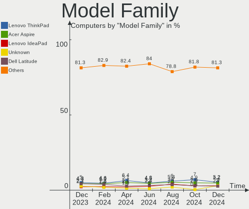
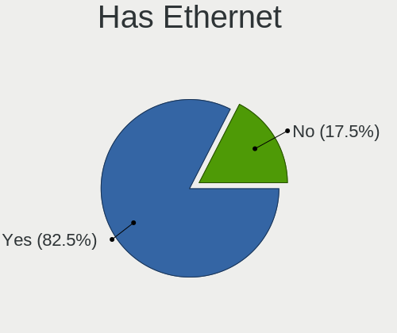
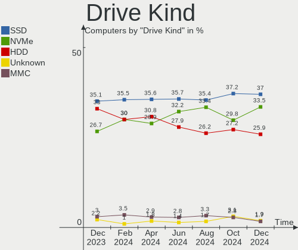
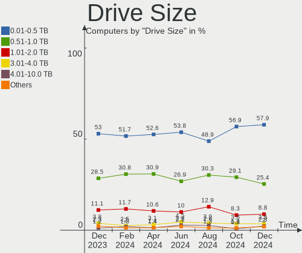
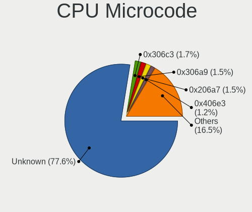

Linux Mint - Hardware Trends
----------------------------

A project to identify most popular hardware characteristics and track their change
over time based on data collected by Linux users at https://Linux-Hardware.org.

Anyone can contribute to this report by the [hw-probe](https://github.com/linuxhw/hw-probe) tool:

    sudo -E hw-probe -all -upload

This is a report for all computer types. See also reports for [desktops](/Dist/Linux_Mint/Desktop/README.md) and [notebooks](/Dist/Linux_Mint/Notebook/README.md).

This report is for one last month. Overall report since the beginning of time: [TestCoverage](https://github.com/linuxhw/TestCoverage)

Period: Jan, 2023.

Contents
--------

* [ System ](#system)
  - [ OS                       ](#os)
  - [ OS Family                ](#os-family)
  - [ Kernel                   ](#kernel)
  - [ Kernel Family            ](#kernel-family)
  - [ Kernel Major Ver.        ](#kernel-major-ver)
  - [ Arch                     ](#arch)
  - [ DE                       ](#de)
  - [ Display Server           ](#display-server)
  - [ Display Manager          ](#display-manager)
  - [ OS Lang                  ](#os-lang)
  - [ Boot Mode                ](#boot-mode)
  - [ Filesystem               ](#filesystem)
  - [ Part. scheme             ](#part-scheme)
  - [ Dual Boot with Linux/BSD ](#dual-boot-with-linuxbsd)
  - [ Dual Boot (Win)          ](#dual-boot-win)

* [ Board ](#board)
  - [ Vendor                   ](#vendor)
  - [ Model                    ](#model)
  - [ Model Family             ](#model-family)
  - [ MFG Year                 ](#mfg-year)
  - [ Form Factor              ](#form-factor)
  - [ Secure Boot              ](#secure-boot)
  - [ Coreboot                 ](#coreboot)
  - [ RAM Size                 ](#ram-size)
  - [ RAM Used                 ](#ram-used)
  - [ Total Drives             ](#total-drives)
  - [ Has CD-ROM               ](#has-cd-rom)
  - [ Has Ethernet             ](#has-ethernet)
  - [ Has WiFi                 ](#has-wifi)
  - [ Has Bluetooth            ](#has-bluetooth)

* [ Location ](#location)
  - [ Country                  ](#country)
  - [ City                     ](#city)

* [ Drives ](#drives)
  - [ Drive Vendor             ](#drive-vendor)
  - [ Drive Model              ](#drive-model)
  - [ HDD Vendor               ](#hdd-vendor)
  - [ SSD Vendor               ](#ssd-vendor)
  - [ Drive Kind               ](#drive-kind)
  - [ Drive Connector          ](#drive-connector)
  - [ Drive Size               ](#drive-size)
  - [ Space Total              ](#space-total)
  - [ Space Used               ](#space-used)
  - [ Malfunc. Drives          ](#malfunc-drives)
  - [ Malfunc. Drive Vendor    ](#malfunc-drive-vendor)
  - [ Malfunc. HDD Vendor      ](#malfunc-hdd-vendor)
  - [ Malfunc. Drive Kind      ](#malfunc-drive-kind)
  - [ Failed Drives            ](#failed-drives)
  - [ Failed Drive Vendor      ](#failed-drive-vendor)
  - [ Drive Status             ](#drive-status)

* [ Storage controller ](#storage-controller)
  - [ Storage Vendor           ](#storage-vendor)
  - [ Storage Model            ](#storage-model)
  - [ Storage Kind             ](#storage-kind)

* [ Processor ](#processor)
  - [ CPU Vendor               ](#cpu-vendor)
  - [ CPU Model                ](#cpu-model)
  - [ CPU Model Family         ](#cpu-model-family)
  - [ CPU Cores                ](#cpu-cores)
  - [ CPU Sockets              ](#cpu-sockets)
  - [ CPU Threads              ](#cpu-threads)
  - [ CPU Op-Modes             ](#cpu-op-modes)
  - [ CPU Microcode            ](#cpu-microcode)
  - [ CPU Microarch            ](#cpu-microarch)

* [ Graphics ](#graphics)
  - [ GPU Vendor               ](#gpu-vendor)
  - [ GPU Model                ](#gpu-model)
  - [ GPU Combo                ](#gpu-combo)
  - [ GPU Driver               ](#gpu-driver)
  - [ GPU Memory               ](#gpu-memory)

* [ Monitor ](#monitor)
  - [ Monitor Vendor           ](#monitor-vendor)
  - [ Monitor Model            ](#monitor-model)
  - [ Monitor Resolution       ](#monitor-resolution)
  - [ Monitor Diagonal         ](#monitor-diagonal)
  - [ Monitor Width            ](#monitor-width)
  - [ Aspect Ratio             ](#aspect-ratio)
  - [ Monitor Area             ](#monitor-area)
  - [ Pixel Density            ](#pixel-density)
  - [ Multiple Monitors        ](#multiple-monitors)

* [ Network ](#network)
  - [ Net Controller Vendor    ](#net-controller-vendor)
  - [ Net Controller Model     ](#net-controller-model)
  - [ Wireless Vendor          ](#wireless-vendor)
  - [ Wireless Model           ](#wireless-model)
  - [ Ethernet Vendor          ](#ethernet-vendor)
  - [ Ethernet Model           ](#ethernet-model)
  - [ Net Controller Kind      ](#net-controller-kind)
  - [ Used Controller          ](#used-controller)
  - [ NICs                     ](#nics)
  - [ IPv6                     ](#ipv6)

* [ Bluetooth ](#bluetooth)
  - [ Bluetooth Vendor         ](#bluetooth-vendor)
  - [ Bluetooth Model          ](#bluetooth-model)

* [ Sound ](#sound)
  - [ Sound Vendor             ](#sound-vendor)
  - [ Sound Model              ](#sound-model)

* [ Memory ](#memory)
  - [ Memory Vendor            ](#memory-vendor)
  - [ Memory Model             ](#memory-model)
  - [ Memory Kind              ](#memory-kind)
  - [ Memory Form Factor       ](#memory-form-factor)
  - [ Memory Size              ](#memory-size)
  - [ Memory Speed             ](#memory-speed)

* [ Printers & scanners ](#printers--scanners)
  - [ Printer Vendor           ](#printer-vendor)
  - [ Printer Model            ](#printer-model)
  - [ Scanner Vendor           ](#scanner-vendor)
  - [ Scanner Model            ](#scanner-model)

* [ Camera ](#camera)
  - [ Camera Vendor            ](#camera-vendor)
  - [ Camera Model             ](#camera-model)

* [ Security ](#security)
  - [ Fingerprint Vendor       ](#fingerprint-vendor)
  - [ Fingerprint Model        ](#fingerprint-model)
  - [ Chipcard Vendor          ](#chipcard-vendor)
  - [ Chipcard Model           ](#chipcard-model)

* [ Unsupported ](#unsupported)
  - [ Unsupported Devices      ](#unsupported-devices)
  - [ Unsupported Device Types ](#unsupported-device-types)

System
------

OS
--

Installed operating systems

| Name            | Computers | Percent |
|-----------------|-----------|---------|
| Linux Mint 21.1 | 417       | 66.19%  |
| Linux Mint 20.3 | 101       | 16.03%  |
| Linux Mint 21   | 60        | 9.52%   |
| Linux Mint 20.2 | 17        | 2.7%    |
| Linux Mint 20   | 13        | 2.06%   |
| Linux Mint 20.1 | 8         | 1.27%   |
| Linux Mint 19.3 | 8         | 1.27%   |
| Linux Mint 19.2 | 2         | 0.32%   |
| Linux Mint 19.1 | 2         | 0.32%   |
| Linux Mint 19   | 1         | 0.16%   |
| Linux Mint 18.3 | 1         | 0.16%   |

OS Family
---------

OS without a version

| Name       | Computers | Percent |
|------------|-----------|---------|
| Linux Mint | 630       | 100%    |

Kernel
------

Version of the Linux kernel

| Version                       | Computers | Percent |
|-------------------------------|-----------|---------|
| 5.15.0-58-generic             | 223       | 35.4%   |
| 5.15.0-56-generic             | 140       | 22.22%  |
| 5.15.0-57-generic             | 72        | 11.43%  |
| 5.4.0-137-generic             | 50        | 7.94%   |
| 5.4.0-135-generic             | 30        | 4.76%   |
| 5.4.0-136-generic             | 20        | 3.17%   |
| 5.19.0-28-generic             | 13        | 2.06%   |
| 5.15.0-41-generic             | 7         | 1.11%   |
| 5.4.0-91-generic              | 4         | 0.63%   |
| 5.15.0-52-generic             | 4         | 0.63%   |
| 6.1.4-060104-generic          | 3         | 0.48%   |
| 5.4.0-74-generic              | 3         | 0.48%   |
| 5.15.0-53-generic             | 3         | 0.48%   |
| 6.1.8-060108-generic          | 2         | 0.32%   |
| 6.1.0-4.2-liquorix-amd64      | 2         | 0.32%   |
| 6.0.0-1010-oem                | 2         | 0.32%   |
| 6.0.0-1009-oem                | 2         | 0.32%   |
| 5.4.0-26-generic              | 2         | 0.32%   |
| 5.4.0-131-generic             | 2         | 0.32%   |
| 5.4.0-113-generic             | 2         | 0.32%   |
| 5.15.84-xanmod1               | 2         | 0.32%   |
| 5.15.0-48-generic             | 2         | 0.32%   |
| 5.15.0-1010-nvidia-lowlatency | 2         | 0.32%   |
| 4.15.0-54-generic             | 2         | 0.32%   |
| 6.1.8-4-liquorix-amd64        | 1         | 0.16%   |
| 6.1.0-1004-oem                | 1         | 0.16%   |
| 6.1.0-1.1-liquorix-amd64      | 1         | 0.16%   |
| 6.0.9-060009-generic          | 1         | 0.16%   |
| 6.0.12-76060006-generic       | 1         | 0.16%   |
| 6.0.0-060000-generic          | 1         | 0.16%   |
| 5.4.0-99-generic              | 1         | 0.16%   |
| 5.4.0-89-generic              | 1         | 0.16%   |
| 5.4.0-70-generic              | 1         | 0.16%   |
| 5.4.0-132-generic             | 1         | 0.16%   |
| 5.4.0-122-generic             | 1         | 0.16%   |
| 5.4.0-121-generic             | 1         | 0.16%   |
| 5.4.0-120-generic             | 1         | 0.16%   |
| 5.4.0-117-generic             | 1         | 0.16%   |
| 5.4.0-109-generic             | 1         | 0.16%   |
| 5.4.0-107-generic             | 1         | 0.16%   |

Kernel Family
-------------

Linux kernel without a distro release

| Version | Computers | Percent |
|---------|-----------|---------|
| 5.15.0  | 461       | 73.17%  |
| 5.4.0   | 123       | 19.52%  |
| 5.19.0  | 13        | 2.06%   |
| 4.15.0  | 6         | 0.95%   |
| 6.0.0   | 5         | 0.79%   |
| 6.1.0   | 4         | 0.63%   |
| 6.1.8   | 3         | 0.48%   |
| 6.1.4   | 3         | 0.48%   |
| 5.14.0  | 3         | 0.48%   |
| 5.17.0  | 2         | 0.32%   |
| 5.15.84 | 2         | 0.32%   |
| 6.0.9   | 1         | 0.16%   |
| 6.0.12  | 1         | 0.16%   |
| 5.15.20 | 1         | 0.16%   |
| 5.13.0  | 1         | 0.16%   |
| 5.0.0   | 1         | 0.16%   |

Kernel Major Ver.
-----------------

Linux kernel major version

| Version | Computers | Percent |
|---------|-----------|---------|
| 5.15    | 464       | 73.65%  |
| 5.4     | 123       | 19.52%  |
| 5.19    | 13        | 2.06%   |
| 6.1     | 10        | 1.59%   |
| 6.0     | 7         | 1.11%   |
| 4.15    | 6         | 0.95%   |
| 5.14    | 3         | 0.48%   |
| 5.17    | 2         | 0.32%   |
| 5.13    | 1         | 0.16%   |
| 5.0     | 1         | 0.16%   |

Arch
----

OS architecture (x86_64, i586, etc.)

| Name   | Computers | Percent |
|--------|-----------|---------|
| x86_64 | 628       | 99.68%  |
| i686   | 2         | 0.32%   |

DE
--

Desktop Environment

| Name       | Computers | Percent |
|------------|-----------|---------|
| X-Cinnamon | 480       | 76.19%  |
| XFCE       | 59        | 9.37%   |
| MATE       | 59        | 9.37%   |
| Cinnamon   | 14        | 2.22%   |
| GNOME      | 11        | 1.75%   |
| KDE5       | 3         | 0.48%   |
| Unknown    | 2         | 0.32%   |
| Trinity    | 1         | 0.16%   |
| Pantheon   | 1         | 0.16%   |

Display Server
--------------

X11 or Wayland

| Name    | Computers | Percent |
|---------|-----------|---------|
| X11     | 624       | 99.05%  |
| Tty     | 3         | 0.48%   |
| Wayland | 2         | 0.32%   |
| Unknown | 1         | 0.16%   |

Display Manager
---------------

SDDM, LightDM, etc.

| Name    | Computers | Percent |
|---------|-----------|---------|
| Unknown | 347       | 55.08%  |
| LightDM | 281       | 44.6%   |
| GDM3    | 1         | 0.16%   |
| GDM     | 1         | 0.16%   |

OS Lang
-------

Language

| Lang  | Computers | Percent |
|-------|-----------|---------|
| en_US | 176       | 27.94%  |
| de_DE | 93        | 14.76%  |
| it_IT | 44        | 6.98%   |
| fr_FR | 36        | 5.71%   |
| ru_RU | 34        | 5.4%    |
| en_GB | 34        | 5.4%    |
| pt_BR | 29        | 4.6%    |
| C     | 23        | 3.65%   |
| en_CA | 22        | 3.49%   |
| es_ES | 16        | 2.54%   |
| pl_PL | 13        | 2.06%   |
| en_AU | 13        | 2.06%   |
| nl_NL | 9         | 1.43%   |
| cs_CZ | 6         | 0.95%   |
| pt_PT | 5         | 0.79%   |
| fr_CA | 5         | 0.79%   |
| es_MX | 5         | 0.79%   |
| tr_TR | 4         | 0.63%   |
| sv_SE | 4         | 0.63%   |
| es_AR | 4         | 0.63%   |
| en_NZ | 4         | 0.63%   |
| en_IN | 4         | 0.63%   |
| de_AT | 4         | 0.63%   |
| sk_SK | 3         | 0.48%   |
| es_VE | 3         | 0.48%   |
| el_GR | 3         | 0.48%   |
| da_DK | 3         | 0.48%   |
| uk_UA | 2         | 0.32%   |
| ru_UA | 2         | 0.32%   |
| nl_BE | 2         | 0.32%   |
| hu_HU | 2         | 0.32%   |
| fi_FI | 2         | 0.32%   |
| es_PE | 2         | 0.32%   |
| en_ZA | 2         | 0.32%   |
| en_IE | 2         | 0.32%   |
| bg_BG | 2         | 0.32%   |
| zh_CN | 1         | 0.16%   |
| sr_RS | 1         | 0.16%   |
| ro_RO | 1         | 0.16%   |
| lv_LV | 1         | 0.16%   |

Boot Mode
---------

EFI or BIOS

| Mode | Computers | Percent |
|------|-----------|---------|
| EFI  | 409       | 64.92%  |
| BIOS | 221       | 35.08%  |

Filesystem
----------

Type of filesystem

| Type    | Computers | Percent |
|---------|-----------|---------|
| Ext4    | 589       | 93.49%  |
| Overlay | 21        | 3.33%   |
| Zfs     | 10        | 1.59%   |
| Btrfs   | 7         | 1.11%   |
| Ext3    | 2         | 0.32%   |
| Xfs     | 1         | 0.16%   |

Part. scheme
------------

Scheme of partitioning

| Type    | Computers | Percent |
|---------|-----------|---------|
| Unknown | 343       | 54.44%  |
| GPT     | 234       | 37.14%  |
| MBR     | 53        | 8.41%   |

Dual Boot with Linux/BSD
------------------------

Hosting more than one Linux/BSD

| Dual boot | Computers | Percent |
|-----------|-----------|---------|
| No        | 586       | 93.02%  |
| Yes       | 44        | 6.98%   |

Dual Boot (Win)
---------------

Hosting Linux and Windows

| Dual boot | Computers | Percent |
|-----------|-----------|---------|
| No        | 517       | 82.06%  |
| Yes       | 113       | 17.94%  |

Board
-----

Vendor
------

Motherboard manufacturer

| Name                | Computers | Percent |
|---------------------|-----------|---------|
| Hewlett-Packard     | 100       | 15.87%  |
| ASUSTek Computer    | 99        | 15.71%  |
| Lenovo              | 96        | 15.24%  |
| Dell                | 56        | 8.89%   |
| Gigabyte Technology | 42        | 6.67%   |
| Acer                | 39        | 6.19%   |
| MSI                 | 33        | 5.24%   |
| ASRock              | 19        | 3.02%   |
| Apple               | 17        | 2.7%    |
| Toshiba             | 12        | 1.9%    |
| HUAWEI              | 8         | 1.27%   |
| Fujitsu             | 8         | 1.27%   |
| Unknown             | 8         | 1.27%   |
| Intel               | 7         | 1.11%   |
| Pegatron            | 6         | 0.95%   |
| GPU Company         | 6         | 0.95%   |
| Samsung Electronics | 5         | 0.79%   |
| Google              | 5         | 0.79%   |
| Notebook            | 4         | 0.63%   |
| Medion              | 4         | 0.63%   |
| UMAX                | 3         | 0.48%   |
| Sony                | 3         | 0.48%   |
| LG Electronics      | 3         | 0.48%   |
| ECS                 | 3         | 0.48%   |
| AZW                 | 3         | 0.48%   |
| Timi                | 2         | 0.32%   |
| Positivo            | 2         | 0.32%   |
| Biostar             | 2         | 0.32%   |
| AMD                 | 2         | 0.32%   |
| Wortmann AG         | 1         | 0.16%   |
| VALE                | 1         | 0.16%   |
| TrekStor            | 1         | 0.16%   |
| Teclast             | 1         | 0.16%   |
| Tactus              | 1         | 0.16%   |
| System76            | 1         | 0.16%   |
| Standard            | 1         | 0.16%   |
| Pyramid             | 1         | 0.16%   |
| PCWare              | 1         | 0.16%   |
| PC Specialist       | 1         | 0.16%   |
| Panasonic           | 1         | 0.16%   |

Model
-----

Motherboard model

| Name                            | Computers | Percent |
|---------------------------------|-----------|---------|
| Unknown                         | 11        | 1.75%   |
| ASUS All Series                 | 6         | 0.95%   |
| MSI MS-7C91                     | 3         | 0.48%   |
| HUAWEI HVY-WXX9                 | 3         | 0.48%   |
| HP Pavilion dv6                 | 3         | 0.48%   |
| HP Pavilion 15                  | 3         | 0.48%   |
| Gigabyte B450M DS3H             | 3         | 0.48%   |
| Dell Latitude E6530             | 3         | 0.48%   |
| MSI MS-7C02                     | 2         | 0.32%   |
| Lenovo ThinkPad E560 20EV002FUS | 2         | 0.32%   |
| Lenovo MIIX 320-10ICR 80XF      | 2         | 0.32%   |
| HUAWEI NBLK-WAX9X               | 2         | 0.32%   |
| HP Pavilion Notebook            | 2         | 0.32%   |
| HP Pavilion g6                  | 2         | 0.32%   |
| HP Pavilion 17                  | 2         | 0.32%   |
| HP EliteBook 2560p              | 2         | 0.32%   |
| HP 255 G8 Notebook PC           | 2         | 0.32%   |
| HP 255 15.6 inch G9 Notebook PC | 2         | 0.32%   |
| GPU Company GWNR71517           | 2         | 0.32%   |
| Google Kled                     | 2         | 0.32%   |
| Gigabyte H61M-S1                | 2         | 0.32%   |
| Gigabyte A320M-S2H              | 2         | 0.32%   |
| Fujitsu ESPRIMO Q920            | 2         | 0.32%   |
| Dell OptiPlex 3010              | 2         | 0.32%   |
| Dell Latitude 5490              | 2         | 0.32%   |
| Dell Inspiron N4050             | 2         | 0.32%   |
| Dell Inspiron 15 3511           | 2         | 0.32%   |
| ASUS TUF Gaming X570-PLUS       | 2         | 0.32%   |
| ASUS PRIME A320M-K              | 2         | 0.32%   |
| ASUS M5A97 EVO R2.0             | 2         | 0.32%   |
| ASUS F5VL                       | 2         | 0.32%   |
| ASRock H370M Pro4               | 2         | 0.32%   |
| Apple MacBook5,1                | 2         | 0.32%   |
| Acer Aspire E5-575G             | 2         | 0.32%   |
| Acer Aspire A315-59             | 2         | 0.32%   |
| Acer Aspire A315-55G            | 2         | 0.32%   |
| Wortmann AG CR700               | 1         | 0.16%   |
| VALE Notebook Classic C140      | 1         | 0.16%   |
| UMAX VisionBook N14G Plus       | 1         | 0.16%   |
| UMAX VisionBook 14Wr Plus       | 1         | 0.16%   |

Model Family
------------

Motherboard model prefix

| Name               | Computers | Percent |
|--------------------|-----------|---------|
| Lenovo ThinkPad    | 38        | 6.03%   |
| Acer Aspire        | 34        | 5.4%    |
| HP Pavilion        | 25        | 3.97%   |
| Lenovo IdeaPad     | 19        | 3.02%   |
| Dell Inspiron      | 18        | 2.86%   |
| HP Laptop          | 12        | 1.9%    |
| Dell Latitude      | 12        | 1.9%    |
| ASUS PRIME         | 12        | 1.9%    |
| Unknown            | 11        | 1.75%   |
| Toshiba Satellite  | 10        | 1.59%   |
| HP ProBook         | 10        | 1.59%   |
| HP EliteBook       | 9         | 1.43%   |
| Dell OptiPlex      | 9         | 1.43%   |
| Lenovo ThinkCentre | 7         | 1.11%   |
| HP Compaq          | 7         | 1.11%   |
| Dell Precision     | 6         | 0.95%   |
| ASUS All           | 6         | 0.95%   |
| Lenovo Yoga        | 5         | 0.79%   |
| HP 255             | 5         | 0.79%   |
| ASUS VivoBook      | 5         | 0.79%   |
| ASUS ROG           | 5         | 0.79%   |
| Gigabyte B450M     | 4         | 0.63%   |
| ASUS TUF           | 4         | 0.63%   |
| UMAX VisionBook    | 3         | 0.48%   |
| MSI MS-7C91        | 3         | 0.48%   |
| Lenovo IdeaPadFlex | 3         | 0.48%   |
| HUAWEI HVY-WXX9    | 3         | 0.48%   |
| HP ENVY            | 3         | 0.48%   |
| HP EliteDesk       | 3         | 0.48%   |
| HP 250             | 3         | 0.48%   |
| Fujitsu LIFEBOOK   | 3         | 0.48%   |
| Fujitsu ESPRIMO    | 3         | 0.48%   |
| Dell XPS           | 3         | 0.48%   |
| ASUS M5A97         | 3         | 0.48%   |
| Apple MacBookPro5  | 3         | 0.48%   |
| MSI MS-7C02        | 2         | 0.32%   |
| MSI Modern         | 2         | 0.32%   |
| Lenovo MIIX        | 2         | 0.32%   |
| Lenovo IdeaCentre  | 2         | 0.32%   |
| Lenovo G700        | 2         | 0.32%   |

MFG Year
--------

Motherboard manufacture year

| Year | Computers | Percent |
|------|-----------|---------|
| 2021 | 66        | 10.48%  |
| 2012 | 62        | 9.84%   |
| 2022 | 51        | 8.1%    |
| 2020 | 49        | 7.78%   |
| 2013 | 47        | 7.46%   |
| 2011 | 45        | 7.14%   |
| 2017 | 44        | 6.98%   |
| 2018 | 42        | 6.67%   |
| 2019 | 35        | 5.56%   |
| 2014 | 34        | 5.4%    |
| 2015 | 31        | 4.92%   |
| 2008 | 30        | 4.76%   |
| 2010 | 29        | 4.6%    |
| 2016 | 27        | 4.29%   |
| 2009 | 20        | 3.17%   |
| 2007 | 10        | 1.59%   |
| 2006 | 6         | 0.95%   |
| 2023 | 1         | 0.16%   |
| 2005 | 1         | 0.16%   |

Form Factor
-----------

Physical design of the computer

| Name        | Computers | Percent |
|-------------|-----------|---------|
| Notebook    | 363       | 57.62%  |
| Desktop     | 220       | 34.92%  |
| Convertible | 14        | 2.22%   |
| Mini pc     | 13        | 2.06%   |
| All in one  | 10        | 1.59%   |
| Tablet      | 7         | 1.11%   |
| Server      | 2         | 0.32%   |
| Other       | 1         | 0.16%   |

Secure Boot
-----------

Enabled or disabled

| State    | Computers | Percent |
|----------|-----------|---------|
| Disabled | 557       | 88.41%  |
| Enabled  | 73        | 11.59%  |

Coreboot
--------

Have coreboot on board

| Used | Computers | Percent |
|------|-----------|---------|
| No   | 624       | 99.05%  |
| Yes  | 6         | 0.95%   |

RAM Size
--------

Total RAM memory

| Size in GB  | Computers | Percent |
|-------------|-----------|---------|
| 4.01-8.0    | 182       | 28.89%  |
| 3.01-4.0    | 123       | 19.52%  |
| 16.01-24.0  | 114       | 18.1%   |
| 8.01-16.0   | 113       | 17.94%  |
| 32.01-64.0  | 44        | 6.98%   |
| 1.01-2.0    | 19        | 3.02%   |
| 24.01-32.0  | 14        | 2.22%   |
| 64.01-256.0 | 14        | 2.22%   |
| 2.01-3.0    | 6         | 0.95%   |
| 0.51-1.0    | 1         | 0.16%   |

RAM Used
--------

Used RAM memory

| Used GB    | Computers | Percent |
|------------|-----------|---------|
| 1.01-2.0   | 222       | 35.24%  |
| 2.01-3.0   | 187       | 29.68%  |
| 3.01-4.0   | 98        | 15.56%  |
| 4.01-8.0   | 82        | 13.02%  |
| 0.51-1.0   | 32        | 5.08%   |
| 8.01-16.0  | 8         | 1.27%   |
| 24.01-32.0 | 1         | 0.16%   |

Total Drives
------------

Number of drives on board

| Drives | Computers | Percent |
|--------|-----------|---------|
| 1      | 391       | 62.06%  |
| 2      | 140       | 22.22%  |
| 3      | 45        | 7.14%   |
| 4      | 26        | 4.13%   |
| 5      | 16        | 2.54%   |
| 0      | 5         | 0.79%   |
| 7      | 4         | 0.63%   |
| 6      | 2         | 0.32%   |
| 27     | 1         | 0.16%   |

Has CD-ROM
----------

Has CD-ROM on board

| Presented | Computers | Percent |
|-----------|-----------|---------|
| No        | 359       | 56.98%  |
| Yes       | 271       | 43.02%  |

Has Ethernet
------------

Has Ethernet on board

| Presented | Computers | Percent |
|-----------|-----------|---------|
| Yes       | 531       | 84.29%  |
| No        | 99        | 15.71%  |

Has WiFi
--------

Has WiFi module

| Presented | Computers | Percent |
|-----------|-----------|---------|
| Yes       | 510       | 80.95%  |
| No        | 120       | 19.05%  |

Has Bluetooth
-------------

Has Bluetooth module

| Presented | Computers | Percent |
|-----------|-----------|---------|
| Yes       | 399       | 63.33%  |
| No        | 231       | 36.67%  |

Location
--------

Country
-------

Geographic location (country)

| Country      | Computers | Percent |
|--------------|-----------|---------|
| USA          | 103       | 16.35%  |
| Germany      | 98        | 15.56%  |
| Italy        | 57        | 9.05%   |
| Brazil       | 38        | 6.03%   |
| France       | 36        | 5.71%   |
| Russia       | 30        | 4.76%   |
| Canada       | 30        | 4.76%   |
| UK           | 28        | 4.44%   |
| Spain        | 16        | 2.54%   |
| Netherlands  | 15        | 2.38%   |
| Poland       | 14        | 2.22%   |
| Australia    | 14        | 2.22%   |
| Turkey       | 11        | 1.75%   |
| Czechia      | 10        | 1.59%   |
| Portugal     | 8         | 1.27%   |
| Austria      | 8         | 1.27%   |
| Sweden       | 7         | 1.11%   |
| Mexico       | 6         | 0.95%   |
| Greece       | 6         | 0.95%   |
| Belgium      | 6         | 0.95%   |
| Serbia       | 5         | 0.79%   |
| Argentina    | 5         | 0.79%   |
| Switzerland  | 4         | 0.63%   |
| Slovakia     | 4         | 0.63%   |
| Romania      | 4         | 0.63%   |
| New Zealand  | 4         | 0.63%   |
| India        | 4         | 0.63%   |
| Denmark      | 4         | 0.63%   |
| Bulgaria     | 4         | 0.63%   |
| Venezuela    | 3         | 0.48%   |
| Ukraine      | 3         | 0.48%   |
| South Africa | 3         | 0.48%   |
| Peru         | 3         | 0.48%   |
| Ireland      | 3         | 0.48%   |
| Hungary      | 3         | 0.48%   |
| Finland      | 3         | 0.48%   |
| Croatia      | 3         | 0.48%   |
| Malaysia     | 2         | 0.32%   |
| Latvia       | 2         | 0.32%   |
| Japan        | 2         | 0.32%   |

City
----

Geographic location (city)

| City              | Computers | Percent |
|-------------------|-----------|---------|
| Moscow            | 7         | 1.11%   |
| Rome              | 6         | 0.95%   |
| Frankfurt am Main | 6         | 0.95%   |
| Milan             | 5         | 0.79%   |
| Melbourne         | 5         | 0.79%   |
| London            | 5         | 0.79%   |
| Hamburg           | 5         | 0.79%   |
| St Petersburg     | 4         | 0.63%   |
| Rho               | 4         | 0.63%   |
| Paris             | 4         | 0.63%   |
| Curitiba          | 4         | 0.63%   |
| Berlin            | 4         | 0.63%   |
| Warsaw            | 3         | 0.48%   |
| Vienna            | 3         | 0.48%   |
| Turin             | 3         | 0.48%   |
| Sydney            | 3         | 0.48%   |
| Stockholm         | 3         | 0.48%   |
| Sao Paulo         | 3         | 0.48%   |
| Prague            | 3         | 0.48%   |
| Niagara Falls     | 3         | 0.48%   |
| Montreal          | 3         | 0.48%   |
| Montescudo        | 3         | 0.48%   |
| Milano            | 3         | 0.48%   |
| Madrid            | 3         | 0.48%   |
| Los Angeles       | 3         | 0.48%   |
| Cologne           | 3         | 0.48%   |
| Augsburg          | 3         | 0.48%   |
| Auckland          | 3         | 0.48%   |
| Athens            | 3         | 0.48%   |
| Zurich            | 2         | 0.32%   |
| Zagreb            | 2         | 0.32%   |
| Vaudreuil-Dorion  | 2         | 0.32%   |
| Vancouver         | 2         | 0.32%   |
| Ulyanovsk         | 2         | 0.32%   |
| Tucson            | 2         | 0.32%   |
| Toulouse          | 2         | 0.32%   |
| Toronto           | 2         | 0.32%   |
| Stuttgart         | 2         | 0.32%   |
| San Francisco     | 2         | 0.32%   |
| Pune              | 2         | 0.32%   |

Drives
------

Drive Vendor
------------

Hard drive vendors

| Vendor                      | Computers | Drives | Percent |
|-----------------------------|-----------|--------|---------|
| Samsung Electronics         | 137       | 171    | 15.05%  |
| WDC                         | 124       | 160    | 13.63%  |
| Seagate                     | 112       | 143    | 12.31%  |
| Sandisk                     | 51        | 53     | 5.6%    |
| Toshiba                     | 50        | 54     | 5.49%   |
| Kingston                    | 47        | 48     | 5.16%   |
| Unknown                     | 42        | 51     | 4.62%   |
| Crucial                     | 40        | 42     | 4.4%    |
| Intel                       | 25        | 27     | 2.75%   |
| Hitachi                     | 19        | 19     | 2.09%   |
| HGST                        | 18        | 19     | 1.98%   |
| China                       | 18        | 19     | 1.98%   |
| SK hynix                    | 17        | 17     | 1.87%   |
| Micron Technology           | 12        | 12     | 1.32%   |
| A-DATA Technology           | 11        | 12     | 1.21%   |
| PNY                         | 10        | 10     | 1.1%    |
| Intenso                     | 8         | 9      | 0.88%   |
| Silicon Motion              | 7         | 7      | 0.77%   |
| Unknown                     | 7         | 7      | 0.77%   |
| Phison Electronics          | 6         | 7      | 0.66%   |
| Lexar                       | 6         | 6      | 0.66%   |
| JMicron Technology          | 6         | 6      | 0.66%   |
| Phison                      | 5         | 5      | 0.55%   |
| OCZ                         | 5         | 6      | 0.55%   |
| KIOXIA                      | 5         | 5      | 0.55%   |
| Apple                       | 5         | 5      | 0.55%   |
| SPCC                        | 4         | 4      | 0.44%   |
| Maxtor                      | 4         | 4      | 0.44%   |
| LITEON                      | 4         | 4      | 0.44%   |
| Fujitsu                     | 4         | 4      | 0.44%   |
| USB3.0                      | 3         | 3      | 0.33%   |
| UMIS                        | 3         | 3      | 0.33%   |
| Transcend                   | 3         | 3      | 0.33%   |
| Team                        | 3         | 3      | 0.33%   |
| Netac                       | 3         | 3      | 0.33%   |
| Micron/Crucial Technology   | 3         | 3      | 0.33%   |
| Kingston Technology Company | 3         | 3      | 0.33%   |
| Hewlett-Packard             | 3         | 6      | 0.33%   |
| GOODRAM                     | 3         | 3      | 0.33%   |
| Corsair                     | 3         | 3      | 0.33%   |

Drive Model
-----------

Hard drive models

| Model                                                 | Computers | Percent |
|-------------------------------------------------------|-----------|---------|
| Kingston SA400S37240G 240GB SSD                       | 15        | 1.48%   |
| Samsung SSD 860 EVO 500GB                             | 14        | 1.38%   |
| Unknown MMC Card  64GB                                | 10        | 0.99%   |
| Samsung NVMe SSD Controller SM981/PM981/PM983 500GB   | 10        | 0.99%   |
| Samsung SSD 850 EVO 250GB                             | 9         | 0.89%   |
| Kingston SA400S37480G 480GB SSD                       | 8         | 0.79%   |
| WDC WDS240G2G0A-00JH30 240GB SSD                      | 7         | 0.69%   |
| Unknown MMC Card  128GB                               | 7         | 0.69%   |
| Crucial CT1000MX500SSD1 1TB                           | 7         | 0.69%   |
| Unknown                                               | 7         | 0.69%   |
| Samsung SSD 870 EVO 1TB                               | 6         | 0.59%   |
| Samsung SSD 860 EVO 1TB                               | 6         | 0.59%   |
| Samsung SSD 850 EVO 500GB                             | 6         | 0.59%   |
| Crucial CT500MX500SSD1 500GB                          | 6         | 0.59%   |
| Unknown MMC Card  32GB                                | 5         | 0.49%   |
| Toshiba MQ01ABD100 1TB                                | 5         | 0.49%   |
| Silicon Motion SM2263EN/SM2263XT SSD Controller 512GB | 5         | 0.49%   |
| Seagate ST2000DM008-2FR102 2TB                        | 5         | 0.49%   |
| Seagate ST1000LM024 HN-M101MBB 1TB                    | 5         | 0.49%   |
| Sandisk WD Blue SN550 NVMe SSD 1TB                    | 5         | 0.49%   |
| HGST HTS545050A7E680 500GB                            | 5         | 0.49%   |
| China SSD 256GB                                       | 5         | 0.49%   |
| WDC WD10JPVX-22JC3T0 1TB                              | 4         | 0.4%    |
| Unknown SD/MMC/MS PRO 2GB                             | 4         | 0.4%    |
| Toshiba MQ04ABF100 1TB                                | 4         | 0.4%    |
| Toshiba MQ01ABF050 500GB                              | 4         | 0.4%    |
| Toshiba DT01ACA200 2TB                                | 4         | 0.4%    |
| Toshiba DT01ACA100 1TB                                | 4         | 0.4%    |
| Seagate ST9320325AS 320GB                             | 4         | 0.4%    |
| Seagate ST500DM002-1BD142 500GB                       | 4         | 0.4%    |
| Seagate ST1000DM010-2EP102 1TB                        | 4         | 0.4%    |
| Seagate Expansion 240GB                               | 4         | 0.4%    |
| Samsung SSD 870 QVO 1TB                               | 4         | 0.4%    |
| Samsung SSD 840 PRO Series 128GB                      | 4         | 0.4%    |
| JMicron Generic 500GB                                 | 4         | 0.4%    |
| HGST HTS541010A9E680 1TB                              | 4         | 0.4%    |
| Crucial CT1000BX500SSD1 1TB                           | 4         | 0.4%    |
| WDC WDS100T2B0A-00SM50 1TB SSD                        | 3         | 0.3%    |
| WDC WD30EFRX-68EUZN0 3TB                              | 3         | 0.3%    |
| WDC WD10EZEX-08WN4A0 1TB                              | 3         | 0.3%    |

HDD Vendor
----------

Hard disk drive vendors

| Vendor              | Computers | Drives | Percent |
|---------------------|-----------|--------|---------|
| Seagate             | 112       | 143    | 34.78%  |
| WDC                 | 95        | 121    | 29.5%   |
| Toshiba             | 37        | 41     | 11.49%  |
| Samsung Electronics | 21        | 21     | 6.52%   |
| Hitachi             | 19        | 19     | 5.9%    |
| HGST                | 18        | 19     | 5.59%   |
| Unknown             | 4         | 4      | 1.24%   |
| Fujitsu             | 4         | 4      | 1.24%   |
| USB3.0              | 3         | 3      | 0.93%   |
| Maxtor              | 3         | 3      | 0.93%   |
| Apple               | 2         | 2      | 0.62%   |
| SABRENT             | 1         | 1      | 0.31%   |
| JMicron Technology  | 1         | 1      | 0.31%   |
| HGST HTS            | 1         | 1      | 0.31%   |
| Hewlett-Packard     | 1         | 4      | 0.31%   |

SSD Vendor
----------

Solid state drive vendors

| Vendor              | Computers | Drives | Percent |
|---------------------|-----------|--------|---------|
| Samsung Electronics | 70        | 89     | 20.65%  |
| Kingston            | 39        | 40     | 11.5%   |
| Crucial             | 36        | 38     | 10.62%  |
| SanDisk             | 31        | 32     | 9.14%   |
| WDC                 | 22        | 22     | 6.49%   |
| China               | 17        | 18     | 5.01%   |
| Intel               | 13        | 14     | 3.83%   |
| PNY                 | 9         | 9      | 2.65%   |
| A-DATA Technology   | 9         | 10     | 2.65%   |
| Intenso             | 8         | 9      | 2.36%   |
| OCZ                 | 5         | 6      | 1.47%   |
| Lexar               | 5         | 5      | 1.47%   |
| LITEON              | 4         | 4      | 1.18%   |
| JMicron Technology  | 4         | 4      | 1.18%   |
| Team                | 3         | 3      | 0.88%   |
| SPCC                | 3         | 3      | 0.88%   |
| SK hynix            | 3         | 3      | 0.88%   |
| Netac               | 3         | 3      | 0.88%   |
| GOODRAM             | 3         | 3      | 0.88%   |
| Apacer              | 3         | 3      | 0.88%   |
| AMD                 | 3         | 3      | 0.88%   |
| Transcend           | 2         | 2      | 0.59%   |
| Toshiba             | 2         | 2      | 0.59%   |
| Patriot             | 2         | 2      | 0.59%   |
| NGFF                | 2         | 2      | 0.59%   |
| Mushkin             | 2         | 2      | 0.59%   |
| Micron Technology   | 2         | 2      | 0.59%   |
| KingDian            | 2         | 3      | 0.59%   |
| Hewlett-Packard     | 2         | 2      | 0.59%   |
| Dogfish             | 2         | 2      | 0.59%   |
| Apple               | 2         | 2      | 0.59%   |
| Unknown             | 2         | 2      | 0.59%   |
| XrayDisk            | 1         | 1      | 0.29%   |
| Wibtek              | 1         | 1      | 0.29%   |
| TO Exter            | 1         | 1      | 0.29%   |
| Teclast             | 1         | 1      | 0.29%   |
| TCSUNBOW            | 1         | 1      | 0.29%   |
| Smartbuy            | 1         | 1      | 0.29%   |
| ShiJi               | 1         | 1      | 0.29%   |
| s60                 | 1         | 1      | 0.29%   |

Drive Kind
----------

HDD or SSD

| Kind    | Computers | Drives | Percent |
|---------|-----------|--------|---------|
| SSD     | 297       | 368    | 36.44%  |
| HDD     | 267       | 387    | 32.76%  |
| NVMe    | 191       | 217    | 23.44%  |
| MMC     | 40        | 48     | 4.91%   |
| Unknown | 20        | 23     | 2.45%   |

Drive Connector
---------------

SATA, SAS, NVMe, etc.

| Type | Computers | Drives | Percent |
|------|-----------|--------|---------|
| SATA | 468       | 734    | 63.41%  |
| NVMe | 189       | 215    | 25.61%  |
| SAS  | 41        | 46     | 5.56%   |
| MMC  | 40        | 48     | 5.42%   |

Drive Size
----------

Size of hard drive

| Size in TB | Computers | Drives | Percent |
|------------|-----------|--------|---------|
| 0.01-0.5   | 335       | 434    | 56.59%  |
| 0.51-1.0   | 158       | 194    | 26.69%  |
| 1.01-2.0   | 51        | 63     | 8.61%   |
| 3.01-4.0   | 18        | 22     | 3.04%   |
| 2.01-3.0   | 14        | 18     | 2.36%   |
| 4.01-10.0  | 13        | 18     | 2.2%    |
| 10.01-20.0 | 3         | 6      | 0.51%   |

Space Total
-----------

Amount of disk space available on the file system

| Size in GB     | Computers | Percent |
|----------------|-----------|---------|
| 251-500        | 179       | 28.41%  |
| 101-250        | 175       | 27.78%  |
| 501-1000       | 91        | 14.44%  |
| 1001-2000      | 55        | 8.73%   |
| 51-100         | 42        | 6.67%   |
| More than 3000 | 33        | 5.24%   |
| 1-20           | 18        | 2.86%   |
| 2001-3000      | 16        | 2.54%   |
| 21-50          | 14        | 2.22%   |
| Unknown        | 7         | 1.11%   |

Space Used
----------

Amount of used disk space

| Used GB        | Computers | Percent |
|----------------|-----------|---------|
| 21-50          | 154       | 24.44%  |
| 1-20           | 146       | 23.17%  |
| 101-250        | 107       | 16.98%  |
| 51-100         | 89        | 14.13%  |
| 251-500        | 53        | 8.41%   |
| 501-1000       | 30        | 4.76%   |
| 1001-2000      | 18        | 2.86%   |
| More than 3000 | 14        | 2.22%   |
| 2001-3000      | 12        | 1.9%    |
| Unknown        | 7         | 1.11%   |

Malfunc. Drives
---------------

Drive models with a malfunction

| Model                               | Computers | Drives | Percent |
|-------------------------------------|-----------|--------|---------|
| Samsung Electronics SSD 870 EVO 1TB | 3         | 3      | 5.88%   |
| HGST HTS545050A7E680 500GB          | 2         | 2      | 3.92%   |
| XPG GAMMIX S11 Pro 1TB              | 1         | 1      | 1.96%   |
| WDC WDS240G2G0A-00JH30 240GB SSD    | 1         | 1      | 1.96%   |
| WDC WD800JD-00HKA0 80GB             | 1         | 1      | 1.96%   |
| WDC WD6400AAKS-00H2B0 640GB         | 1         | 1      | 1.96%   |
| WDC WD5000AAKX-60U6AA0 500GB        | 1         | 1      | 1.96%   |
| WDC WD3200AAKS-00L9A0 320GB         | 1         | 1      | 1.96%   |
| WDC WD30EFRX-68N32N0 3TB            | 1         | 1      | 1.96%   |
| WDC WD30EFRX-68EUZN0 3TB            | 1         | 1      | 1.96%   |
| WDC WD20EFRX-68EUZN0 2TB            | 1         | 2      | 1.96%   |
| WDC WD1600BEVS-26RST0 160GB         | 1         | 1      | 1.96%   |
| USB3.0 Super Speed 128GB            | 1         | 1      | 1.96%   |
| Toshiba MQ01ABF050 500GB            | 1         | 1      | 1.96%   |
| Toshiba MQ01ABD100 1TB              | 1         | 1      | 1.96%   |
| Toshiba MQ01ABC150 1TB              | 1         | 1      | 1.96%   |
| Toshiba MK5059GSXP 500GB            | 1         | 1      | 1.96%   |
| SK hynix SH920 mSATA 256GB SSD      | 1         | 1      | 1.96%   |
| Seagate ST9500325AS 500GB           | 1         | 1      | 1.96%   |
| Seagate ST9320423AS 320GB           | 1         | 1      | 1.96%   |
| Seagate ST9250315AS 250GB           | 1         | 1      | 1.96%   |
| Seagate ST9120821AS 120GB           | 1         | 1      | 1.96%   |
| Seagate ST4000VX007-2DT166 4TB      | 1         | 1      | 1.96%   |
| Seagate ST3500413AS 500GB           | 1         | 1      | 1.96%   |
| Seagate ST3500410AS 500GB           | 1         | 1      | 1.96%   |
| Seagate ST3320310CS 320GB           | 1         | 1      | 1.96%   |
| Seagate ST320LT012-1DG14C 320GB     | 1         | 1      | 1.96%   |
| Seagate ST31000333AS 1TB            | 1         | 1      | 1.96%   |
| Seagate ST2000LM015-2E8174 2TB      | 1         | 1      | 1.96%   |
| Seagate ST1000LM024 HN-M101MBB 1TB  | 1         | 1      | 1.96%   |
| Seagate ST1000DM010-2EP102 1TB      | 1         | 1      | 1.96%   |
| Samsung Electronics HM160HC 160GB   | 1         | 1      | 1.96%   |
| s60 60gb 55GB SSD                   | 1         | 1      | 1.96%   |
| OCZ VERTEX 64GB SSD                 | 1         | 1      | 1.96%   |
| LITEONIT LMT-256M6M-HP 256GB SSD    | 1         | 1      | 1.96%   |
| Kingston SV300S37A60G 64GB SSD      | 1         | 1      | 1.96%   |
| Kingston SV300S37A120G 120GB SSD    | 1         | 1      | 1.96%   |
| Intel SSDSC2BW240A4 240GB           | 1         | 1      | 1.96%   |
| Intel SSDPEKKF512G7L 512GB          | 1         | 1      | 1.96%   |
| Hitachi HTS543232L9A300 320GB       | 1         | 1      | 1.96%   |

Malfunc. Drive Vendor
---------------------

Vendors of faulty drives

| Vendor              | Computers | Drives | Percent |
|---------------------|-----------|--------|---------|
| Seagate             | 13        | 13     | 26.53%  |
| WDC                 | 7         | 10     | 14.29%  |
| Toshiba             | 4         | 4      | 8.16%   |
| Samsung Electronics | 4         | 4      | 8.16%   |
| HGST                | 4         | 4      | 8.16%   |
| Kingston            | 2         | 2      | 4.08%   |
| Intel               | 2         | 2      | 4.08%   |
| Hitachi             | 2         | 2      | 4.08%   |
| Fujitsu             | 2         | 2      | 4.08%   |
| XPG                 | 1         | 1      | 2.04%   |
| USB3.0              | 1         | 1      | 2.04%   |
| SK hynix            | 1         | 1      | 2.04%   |
| s60                 | 1         | 1      | 2.04%   |
| OCZ                 | 1         | 1      | 2.04%   |
| LITEONIT            | 1         | 1      | 2.04%   |
| Hewlett-Packard     | 1         | 1      | 2.04%   |
| Crucial             | 1         | 1      | 2.04%   |
| China               | 1         | 1      | 2.04%   |

Malfunc. HDD Vendor
-------------------

Vendors of faulty HDD drives

| Vendor              | Computers | Drives | Percent |
|---------------------|-----------|--------|---------|
| Seagate             | 13        | 13     | 39.39%  |
| WDC                 | 6         | 9      | 18.18%  |
| Toshiba             | 4         | 4      | 12.12%  |
| HGST                | 4         | 4      | 12.12%  |
| Hitachi             | 2         | 2      | 6.06%   |
| Fujitsu             | 2         | 2      | 6.06%   |
| USB3.0              | 1         | 1      | 3.03%   |
| Samsung Electronics | 1         | 1      | 3.03%   |

Malfunc. Drive Kind
-------------------

Kinds of faulty drives

| Kind | Computers | Drives | Percent |
|------|-----------|--------|---------|
| HDD  | 30        | 36     | 65.22%  |
| SSD  | 14        | 14     | 30.43%  |
| NVMe | 2         | 2      | 4.35%   |

Failed Drives
-------------

Failed drive models

Zero info for selected period =(

Failed Drive Vendor
-------------------

Failed drive vendors

Zero info for selected period =(

Drive Status
------------

Number of failed and malfunc. drives

| Status   | Computers | Drives | Percent |
|----------|-----------|--------|---------|
| Detected | 390       | 624    | 57.95%  |
| Works    | 237       | 367    | 35.22%  |
| Malfunc  | 46        | 52     | 6.84%   |

Storage controller
------------------

Storage Vendor
--------------

Storage controller vendors

| Vendor                           | Computers | Percent |
|----------------------------------|-----------|---------|
| Intel                            | 395       | 50.77%  |
| AMD                              | 139       | 17.87%  |
| Samsung Electronics              | 56        | 7.2%    |
| SanDisk                          | 32        | 4.11%   |
| Phison Electronics               | 17        | 2.19%   |
| Nvidia                           | 16        | 2.06%   |
| SK hynix                         | 14        | 1.8%    |
| Marvell Technology Group         | 11        | 1.41%   |
| Kingston Technology Company      | 11        | 1.41%   |
| JMicron Technology               | 11        | 1.41%   |
| Toshiba America Info Systems     | 10        | 1.29%   |
| Micron Technology                | 10        | 1.29%   |
| ASMedia Technology               | 8         | 1.03%   |
| Silicon Motion                   | 7         | 0.9%    |
| Micron/Crucial Technology        | 6         | 0.77%   |
| KIOXIA                           | 6         | 0.77%   |
| Union Memory (Shenzhen)          | 5         | 0.64%   |
| ADATA Technology                 | 5         | 0.64%   |
| Silicon Integrated Systems [SiS] | 4         | 0.51%   |
| VIA Technologies                 | 2         | 0.26%   |
| Transcend                        | 2         | 0.26%   |
| Hewlett-Packard                  | 2         | 0.26%   |
| Sony                             | 1         | 0.13%   |
| Solid State Storage Technology   | 1         | 0.13%   |
| Silicon Image                    | 1         | 0.13%   |
| Realtek Semiconductor            | 1         | 0.13%   |
| MAXIO Technology (Hangzhou)      | 1         | 0.13%   |
| Lite-On Technology               | 1         | 0.13%   |
| Integrated Technology Express    | 1         | 0.13%   |
| Biwin Storage Technology         | 1         | 0.13%   |
| Apple                            | 1         | 0.13%   |

Storage Model
-------------

Storage controller models

| Model                                                                            | Computers | Percent |
|----------------------------------------------------------------------------------|-----------|---------|
| AMD FCH SATA Controller [AHCI mode]                                              | 91        | 10.19%  |
| Intel 7 Series Chipset Family 6-port SATA Controller [AHCI mode]                 | 30        | 3.36%   |
| Samsung NVMe SSD Controller SM981/PM981/PM983                                    | 29        | 3.25%   |
| Intel Sunrise Point-LP SATA Controller [AHCI mode]                               | 28        | 3.14%   |
| Intel 8 Series/C220 Series Chipset Family 6-port SATA Controller 1 [AHCI mode]   | 26        | 2.91%   |
| Intel 6 Series/C200 Series Chipset Family 6 port Mobile SATA AHCI Controller     | 23        | 2.58%   |
| AMD SB7x0/SB8x0/SB9x0 SATA Controller [AHCI mode]                                | 21        | 2.35%   |
| Intel 82801 Mobile SATA Controller [RAID mode]                                   | 20        | 2.24%   |
| Intel 8 Series SATA Controller 1 [AHCI mode]                                     | 20        | 2.24%   |
| Intel Volume Management Device NVMe RAID Controller                              | 18        | 2.02%   |
| Intel Celeron/Pentium Silver Processor SATA Controller                           | 16        | 1.79%   |
| AMD 400 Series Chipset SATA Controller                                           | 16        | 1.79%   |
| Samsung NVMe SSD Controller 980                                                  | 14        | 1.57%   |
| Intel 6 Series/C200 Series Chipset Family 6 port Desktop SATA AHCI Controller    | 12        | 1.34%   |
| Intel Wildcat Point-LP SATA Controller [AHCI Mode]                               | 11        | 1.23%   |
| Micron Non-Volatile memory controller                                            | 10        | 1.12%   |
| Intel SATA Controller [RAID mode]                                                | 10        | 1.12%   |
| Intel 7 Series/C210 Series Chipset Family 6-port SATA Controller [AHCI mode]     | 10        | 1.12%   |
| Intel 5 Series/3400 Series Chipset 6 port SATA AHCI Controller                   | 10        | 1.12%   |
| Intel 5 Series/3400 Series Chipset 4 port SATA AHCI Controller                   | 10        | 1.12%   |
| AMD SB7x0/SB8x0/SB9x0 IDE Controller                                             | 10        | 1.12%   |
| SK hynix Gold P31/PC711 NVMe Solid State Drive                                   | 9         | 1.01%   |
| Intel Q170/Q150/B150/H170/H110/Z170/CM236 Chipset SATA Controller [AHCI Mode]    | 9         | 1.01%   |
| Intel 200 Series PCH SATA controller [AHCI mode]                                 | 9         | 1.01%   |
| SanDisk WD Blue SN550 NVMe SSD                                                   | 8         | 0.9%    |
| SanDisk WD Black SN750 / PC SN730 NVMe SSD                                       | 8         | 0.9%    |
| Sandisk Non-Volatile memory controller                                           | 8         | 0.9%    |
| Phison E12 NVMe Controller                                                       | 8         | 0.9%    |
| JMicron JMB363 SATA/IDE Controller                                               | 8         | 0.9%    |
| Intel Tiger Lake-LP SATA Controller                                              | 8         | 0.9%    |
| Intel NM10/ICH7 Family SATA Controller [IDE mode]                                | 8         | 0.9%    |
| Intel Atom/Celeron/Pentium Processor x5-E8000/J3xxx/N3xxx Series SATA Controller | 8         | 0.9%    |
| Intel 82801JI (ICH10 Family) 4 port SATA IDE Controller #1                       | 8         | 0.9%    |
| Intel 82801JI (ICH10 Family) 2 port SATA IDE Controller #2                       | 8         | 0.9%    |
| ASMedia ASM1062 Serial ATA Controller                                            | 8         | 0.9%    |
| Samsung NVMe SSD Controller PM9A1/PM9A3/980PRO                                   | 7         | 0.78%   |
| Nvidia MCP79 AHCI Controller                                                     | 7         | 0.78%   |
| Intel Alder Lake-S PCH SATA Controller [AHCI Mode]                               | 7         | 0.78%   |
| Intel Alder Lake-P SATA AHCI Controller                                          | 7         | 0.78%   |
| Intel 82801G (ICH7 Family) IDE Controller                                        | 7         | 0.78%   |

Storage Kind
------------

Kind of storage controller (IDE, SATA, NVMe, SAS, ...)

| Kind | Computers | Percent |
|------|-----------|---------|
| SATA | 461       | 58.28%  |
| NVMe | 189       | 23.89%  |
| IDE  | 80        | 10.11%  |
| RAID | 59        | 7.46%   |
| SAS  | 2         | 0.25%   |

Processor
---------

CPU Vendor
----------

Processor vendors

| Vendor | Computers | Percent |
|--------|-----------|---------|
| Intel  | 461       | 73.17%  |
| AMD    | 169       | 26.83%  |

CPU Model
---------

Processor models

| Model                                         | Computers | Percent |
|-----------------------------------------------|-----------|---------|
| Intel 11th Gen Core i7-1165G7 @ 2.80GHz       | 12        | 1.9%    |
| Intel 11th Gen Core i5-1135G7 @ 2.40GHz       | 9         | 1.43%   |
| Intel Celeron N4020 CPU @ 1.10GHz             | 8         | 1.27%   |
| AMD FX-8350 Eight-Core Processor              | 8         | 1.27%   |
| Intel Core i5-7200U CPU @ 2.50GHz             | 7         | 1.11%   |
| Intel Core i5-10210U CPU @ 1.60GHz            | 7         | 1.11%   |
| AMD Ryzen 5 4600H with Radeon Graphics        | 7         | 1.11%   |
| Intel Core i5-5200U CPU @ 2.20GHz             | 6         | 0.95%   |
| Intel Core i5-2520M CPU @ 2.50GHz             | 6         | 0.95%   |
| Intel Core i7-8550U CPU @ 1.80GHz             | 5         | 0.79%   |
| Intel Core i7-3770 CPU @ 3.40GHz              | 5         | 0.79%   |
| Intel Atom x5-Z8350 CPU @ 1.44GHz             | 5         | 0.79%   |
| AMD Ryzen 5 5625U with Radeon Graphics        | 5         | 0.79%   |
| AMD Ryzen 5 5500U with Radeon Graphics        | 5         | 0.79%   |
| Intel Core i7-7700HQ CPU @ 2.80GHz            | 4         | 0.63%   |
| Intel Core i5-8250U CPU @ 1.60GHz             | 4         | 0.63%   |
| Intel Core i5-6200U CPU @ 2.30GHz             | 4         | 0.63%   |
| Intel Core i5-3470 CPU @ 3.20GHz              | 4         | 0.63%   |
| Intel Core i5-3230M CPU @ 2.60GHz             | 4         | 0.63%   |
| Intel Core i5-3210M CPU @ 2.50GHz             | 4         | 0.63%   |
| Intel Core i3-6006U CPU @ 2.00GHz             | 4         | 0.63%   |
| Intel Core i3-4005U CPU @ 1.70GHz             | 4         | 0.63%   |
| Intel Core i3-3110M CPU @ 2.40GHz             | 4         | 0.63%   |
| Intel Celeron J4125 CPU @ 2.00GHz             | 4         | 0.63%   |
| AMD Ryzen 7 7700X 8-Core Processor            | 4         | 0.63%   |
| AMD Ryzen 7 5700G with Radeon Graphics        | 4         | 0.63%   |
| AMD Ryzen 7 3700U with Radeon Vega Mobile Gfx | 4         | 0.63%   |
| AMD Ryzen 5 3600 6-Core Processor             | 4         | 0.63%   |
| AMD Ryzen 5 2600 Six-Core Processor           | 4         | 0.63%   |
| AMD FX-6300 Six-Core Processor                | 4         | 0.63%   |
| Intel Core i7-9750H CPU @ 2.60GHz             | 3         | 0.48%   |
| Intel Core i7-8750H CPU @ 2.20GHz             | 3         | 0.48%   |
| Intel Core i7-7600U CPU @ 2.80GHz             | 3         | 0.48%   |
| Intel Core i7-4500U CPU @ 1.80GHz             | 3         | 0.48%   |
| Intel Core i7-3520M CPU @ 2.90GHz             | 3         | 0.48%   |
| Intel Core i7-2600 CPU @ 3.40GHz              | 3         | 0.48%   |
| Intel Core i7-10750H CPU @ 2.60GHz            | 3         | 0.48%   |
| Intel Core i5-8400 CPU @ 2.80GHz              | 3         | 0.48%   |
| Intel Core i5-7500 CPU @ 3.40GHz              | 3         | 0.48%   |
| Intel Core i5-4440 CPU @ 3.10GHz              | 3         | 0.48%   |

CPU Model Family
----------------

Processor model prefix

| Model                   | Computers | Percent |
|-------------------------|-----------|---------|
| Intel Core i5           | 132       | 20.95%  |
| Intel Core i7           | 94        | 14.92%  |
| Intel Core i3           | 59        | 9.37%   |
| Other                   | 56        | 8.89%   |
| AMD Ryzen 5             | 49        | 7.78%   |
| Intel Celeron           | 34        | 5.4%    |
| Intel Core 2 Duo        | 28        | 4.44%   |
| AMD Ryzen 7             | 27        | 4.29%   |
| Intel Pentium           | 15        | 2.38%   |
| AMD FX                  | 13        | 2.06%   |
| Intel Xeon              | 10        | 1.59%   |
| Intel Atom              | 10        | 1.59%   |
| AMD Ryzen 3             | 10        | 1.59%   |
| AMD A8                  | 8         | 1.27%   |
| AMD Ryzen 9             | 7         | 1.11%   |
| AMD A6                  | 7         | 1.11%   |
| AMD E2                  | 6         | 0.95%   |
| Intel Pentium Dual-Core | 5         | 0.79%   |
| Intel Pentium Dual      | 5         | 0.79%   |
| AMD E                   | 5         | 0.79%   |
| AMD A4                  | 5         | 0.79%   |
| Intel Core 2 Quad       | 4         | 0.63%   |
| AMD A10                 | 4         | 0.63%   |
| Intel Pentium Silver    | 3         | 0.48%   |
| Intel Pentium D         | 3         | 0.48%   |
| AMD Athlon 64 X2        | 3         | 0.48%   |
| Intel Core m3           | 2         | 0.32%   |
| AMD Ryzen Threadripper  | 2         | 0.32%   |
| AMD Athlon X2           | 2         | 0.32%   |
| AMD Athlon II X4        | 2         | 0.32%   |
| AMD Athlon II X2        | 2         | 0.32%   |
| AMD Athlon              | 2         | 0.32%   |
| Intel Pentium M         | 1         | 0.16%   |
| Intel Pentium Gold      | 1         | 0.16%   |
| Intel Pentium 4         | 1         | 0.16%   |
| Intel Core 2 Extreme    | 1         | 0.16%   |
| Intel Core 2            | 1         | 0.16%   |
| Intel Celeron Dual-Core | 1         | 0.16%   |
| AMD Turion 64 X2 Mobile | 1         | 0.16%   |
| AMD Turion 64 Mobile    | 1         | 0.16%   |

CPU Cores
---------

Number of processor cores

| Number | Computers | Percent |
|--------|-----------|---------|
| 2      | 278       | 44.13%  |
| 4      | 213       | 33.81%  |
| 6      | 66        | 10.48%  |
| 8      | 28        | 4.44%   |
| 12     | 14        | 2.22%   |
| 1      | 8         | 1.27%   |
| 14     | 7         | 1.11%   |
| 3      | 6         | 0.95%   |
| 10     | 5         | 0.79%   |
| 16     | 4         | 0.63%   |
| 20     | 1         | 0.16%   |

CPU Sockets
-----------

Number of sockets

| Number | Computers | Percent |
|--------|-----------|---------|
| 1      | 626       | 99.37%  |
| 2      | 4         | 0.63%   |

CPU Threads
-----------

Threads per core (Hyper-Threading)

| Number | Computers | Percent |
|--------|-----------|---------|
| 2      | 424       | 67.3%   |
| 1      | 206       | 32.7%   |

CPU Op-Modes
------------

CPU Operation Modes (32-bit, 64-bit)

| Op mode        | Computers | Percent |
|----------------|-----------|---------|
| 32-bit, 64-bit | 628       | 99.68%  |
| 32-bit         | 2         | 0.32%   |

CPU Microcode
-------------

Microcode number

| Number     | Computers | Percent |
|------------|-----------|---------|
| Unknown    | 50        | 7.94%   |
| 0x206a7    | 46        | 7.3%    |
| 0x306a9    | 43        | 6.83%   |
| 0x306c3    | 28        | 4.44%   |
| 0x806c1    | 24        | 3.81%   |
| 0x1067a    | 22        | 3.49%   |
| 0x40651    | 21        | 3.33%   |
| 0x406e3    | 16        | 2.54%   |
| 0x806ec    | 15        | 2.38%   |
| 0x706a8    | 15        | 2.38%   |
| 0x806e9    | 14        | 2.22%   |
| 0x906e9    | 13        | 2.06%   |
| 0x20655    | 12        | 1.9%    |
| 0x06000852 | 12        | 1.9%    |
| 0x806ea    | 11        | 1.75%   |
| 0x6fd      | 11        | 1.75%   |
| 0x406c4    | 11        | 1.75%   |
| 0x306d4    | 11        | 1.75%   |
| 0x08701021 | 11        | 1.75%   |
| 0x906ea    | 10        | 1.59%   |
| 0x906a3    | 10        | 1.59%   |
| 0x0a50000c | 10        | 1.59%   |
| 0x08108109 | 10        | 1.59%   |
| 0x506e3    | 9         | 1.43%   |
| 0x03000027 | 9         | 1.43%   |
| 0x08608103 | 7         | 1.11%   |
| 0x0800820d | 7         | 1.11%   |
| 0x30678    | 6         | 0.95%   |
| 0x08600106 | 6         | 0.95%   |
| 0x906a4    | 5         | 0.79%   |
| 0x20652    | 5         | 0.79%   |
| 0x0a50000d | 5         | 0.79%   |
| 0x0a20120a | 5         | 0.79%   |
| 0x06006705 | 5         | 0.79%   |
| 0x06001119 | 5         | 0.79%   |
| 0x05000119 | 5         | 0.79%   |
| 0xa0653    | 4         | 0.63%   |
| 0x906c0    | 4         | 0.63%   |
| 0x206d7    | 4         | 0.63%   |
| 0x106e5    | 4         | 0.63%   |

CPU Microarch
-------------

Microarchitecture

| Name             | Computers | Percent |
|------------------|-----------|---------|
| KabyLake         | 75        | 11.9%   |
| Haswell          | 54        | 8.57%   |
| SandyBridge      | 51        | 8.1%    |
| IvyBridge        | 50        | 7.94%   |
| Penryn           | 30        | 4.76%   |
| Skylake          | 27        | 4.29%   |
| TigerLake        | 25        | 3.97%   |
| Zen 2            | 23        | 3.65%   |
| Unknown          | 23        | 3.65%   |
| Zen 3            | 22        | 3.49%   |
| Silvermont       | 22        | 3.49%   |
| Zen+             | 21        | 3.33%   |
| Westmere         | 21        | 3.33%   |
| Alderlake Hybrid | 20        | 3.17%   |
| Piledriver       | 18        | 2.86%   |
| Goldmont plus    | 17        | 2.7%    |
| Core             | 16        | 2.54%   |
| Broadwell        | 14        | 2.22%   |
| Excavator        | 13        | 2.06%   |
| Zen              | 10        | 1.59%   |
| K10 Llano        | 9         | 1.43%   |
| CometLake        | 9         | 1.43%   |
| Nehalem          | 7         | 1.11%   |
| K8 Hammer        | 6         | 0.95%   |
| K10              | 6         | 0.95%   |
| Bobcat           | 6         | 0.95%   |
| Puma             | 5         | 0.79%   |
| Tremont          | 4         | 0.63%   |
| NetBurst         | 4         | 0.63%   |
| Jaguar           | 4         | 0.63%   |
| IceLake          | 4         | 0.63%   |
| Goldmont         | 4         | 0.63%   |
| Steamroller      | 3         | 0.48%   |
| K8 & K10 hybrid  | 3         | 0.48%   |
| Bonnell          | 3         | 0.48%   |
| P6               | 1         | 0.16%   |

Graphics
--------

GPU Vendor
----------

Vendors of graphics cards

| Vendor                           | Computers | Percent |
|----------------------------------|-----------|---------|
| Intel                            | 362       | 48.59%  |
| Nvidia                           | 194       | 26.04%  |
| AMD                              | 186       | 24.97%  |
| VIA Technologies                 | 1         | 0.13%   |
| Silicon Integrated Systems [SiS] | 1         | 0.13%   |
| ASPEED Technology                | 1         | 0.13%   |

GPU Model
---------

Graphics card models

| Model                                                                                    | Computers | Percent |
|------------------------------------------------------------------------------------------|-----------|---------|
| Intel 2nd Generation Core Processor Family Integrated Graphics Controller                | 35        | 4.56%   |
| Intel 3rd Gen Core processor Graphics Controller                                         | 31        | 4.04%   |
| Intel TigerLake-LP GT2 [Iris Xe Graphics]                                                | 24        | 3.13%   |
| Intel Haswell-ULT Integrated Graphics Controller                                         | 22        | 2.86%   |
| Intel GeminiLake [UHD Graphics 600]                                                      | 15        | 1.95%   |
| Intel Atom/Celeron/Pentium Processor x5-E8000/J3xxx/N3xxx Integrated Graphics Controller | 14        | 1.82%   |
| AMD Picasso/Raven 2 [Radeon Vega Series / Radeon Vega Mobile Series]                     | 14        | 1.82%   |
| Intel Skylake GT2 [HD Graphics 520]                                                      | 13        | 1.69%   |
| Intel HD Graphics 620                                                                    | 13        | 1.69%   |
| Intel CometLake-U GT2 [UHD Graphics]                                                     | 13        | 1.69%   |
| Intel 4th Gen Core Processor Integrated Graphics Controller                              | 13        | 1.69%   |
| Intel UHD Graphics 620                                                                   | 12        | 1.56%   |
| Intel HD Graphics 630                                                                    | 12        | 1.56%   |
| Intel Core Processor Integrated Graphics Controller                                      | 12        | 1.56%   |
| Intel Xeon E3-1200 v3/4th Gen Core Processor Integrated Graphics Controller              | 11        | 1.43%   |
| Intel HD Graphics 5500                                                                   | 11        | 1.43%   |
| Intel Alder Lake-P Integrated Graphics Controller                                        | 10        | 1.3%    |
| AMD Stoney [Radeon R2/R3/R4/R5 Graphics]                                                 | 10        | 1.3%    |
| AMD Renoir                                                                               | 10        | 1.3%    |
| AMD Lucienne                                                                             | 10        | 1.3%    |
| Intel HD Graphics 530                                                                    | 9         | 1.17%   |
| Nvidia GP107 [GeForce GTX 1050 Ti]                                                       | 8         | 1.04%   |
| Intel Atom Processor Z36xxx/Z37xxx Series Graphics & Display                             | 8         | 1.04%   |
| AMD Cezanne [Radeon Vega Series / Radeon Vega Mobile Series]                             | 8         | 1.04%   |
| Nvidia GP108 [GeForce GT 1030]                                                           | 7         | 0.91%   |
| Nvidia GF117M [GeForce 610M/710M/810M/820M / GT 620M/625M/630M/720M]                     | 7         | 0.91%   |
| Intel Xeon E3-1200 v2/3rd Gen Core processor Graphics Controller                         | 7         | 0.91%   |
| Intel CoffeeLake-H GT2 [UHD Graphics 630]                                                | 7         | 0.91%   |
| AMD Raven Ridge [Radeon Vega Series / Radeon Vega Mobile Series]                         | 7         | 0.91%   |
| AMD Raphael                                                                              | 6         | 0.78%   |
| AMD Ellesmere [Radeon RX 470/480/570/570X/580/580X/590]                                  | 6         | 0.78%   |
| AMD Caicos [Radeon HD 6450/7450/8450 / R5 230 OEM]                                       | 6         | 0.78%   |
| AMD Barcelo                                                                              | 6         | 0.78%   |
| Nvidia GM206 [GeForce GTX 960]                                                           | 5         | 0.65%   |
| Nvidia C79 [GeForce 9400M]                                                               | 5         | 0.65%   |
| Intel Mobile 4 Series Chipset Integrated Graphics Controller                             | 5         | 0.65%   |
| Intel CoffeeLake-S GT2 [UHD Graphics 630]                                                | 5         | 0.65%   |
| AMD Topaz XT [Radeon R7 M260/M265 / M340/M360 / M440/M445 / 530/535 / 620/625 Mobile]    | 5         | 0.65%   |
| AMD Seymour [Radeon HD 6400M/7400M Series]                                               | 5         | 0.65%   |
| AMD Navi 22 [Radeon RX 6700/6700 XT/6750 XT / 6800M]                                     | 5         | 0.65%   |

GPU Combo
---------

Combinations of graphics cards

| Name            | Computers | Percent |
|-----------------|-----------|---------|
| 1 x Intel       | 261       | 41.43%  |
| 1 x AMD         | 145       | 23.02%  |
| 1 x Nvidia      | 101       | 16.03%  |
| Intel + Nvidia  | 75        | 11.9%   |
| 2 x AMD         | 16        | 2.54%   |
| Intel + AMD     | 16        | 2.54%   |
| AMD + Nvidia    | 8         | 1.27%   |
| 2 x Nvidia      | 3         | 0.48%   |
| Other           | 1         | 0.16%   |
| 3 x AMD         | 1         | 0.16%   |
| 1 x VIA         | 1         | 0.16%   |
| 1 x SiS         | 1         | 0.16%   |
| Nvidia + ASPEED | 1         | 0.16%   |

GPU Driver
----------

Free vs proprietary

| Driver      | Computers | Percent |
|-------------|-----------|---------|
| Free        | 492       | 78.1%   |
| Proprietary | 120       | 19.05%  |
| Unknown     | 18        | 2.86%   |

GPU Memory
----------

Total video memory

| Size in GB | Computers | Percent |
|------------|-----------|---------|
| Unknown    | 332       | 52.7%   |
| 0.01-0.5   | 85        | 13.49%  |
| 1.01-2.0   | 69        | 10.95%  |
| 0.51-1.0   | 63        | 10%     |
| 3.01-4.0   | 34        | 5.4%    |
| 7.01-8.0   | 17        | 2.7%    |
| 8.01-16.0  | 13        | 2.06%   |
| 5.01-6.0   | 11        | 1.75%   |
| 2.01-3.0   | 6         | 0.95%   |

Monitor
-------

Monitor Vendor
--------------

Monitor vendors

| Vendor                  | Computers | Percent |
|-------------------------|-----------|---------|
| AU Optronics            | 85        | 12.63%  |
| Samsung Electronics     | 74        | 11%     |
| Chimei Innolux          | 72        | 10.7%   |
| LG Display              | 59        | 8.77%   |
| BOE                     | 55        | 8.17%   |
| Goldstar                | 45        | 6.69%   |
| Hewlett-Packard         | 26        | 3.86%   |
| Dell                    | 24        | 3.57%   |
| Acer                    | 24        | 3.57%   |
| Lenovo                  | 16        | 2.38%   |
| Apple                   | 15        | 2.23%   |
| Philips                 | 14        | 2.08%   |
| AOC                     | 14        | 2.08%   |
| Chi Mei Optoelectronics | 12        | 1.78%   |
| BenQ                    | 12        | 1.78%   |
| ViewSonic               | 11        | 1.63%   |
| Ancor Communications    | 11        | 1.63%   |
| ASUSTek Computer        | 8         | 1.19%   |
| PANDA                   | 6         | 0.89%   |
| InfoVision              | 6         | 0.89%   |
| Iiyama                  | 5         | 0.74%   |
| LG Philips              | 4         | 0.59%   |
| Eizo                    | 4         | 0.59%   |
| Sharp                   | 3         | 0.45%   |
| HKC                     | 3         | 0.45%   |
| CPT                     | 3         | 0.45%   |
| Vestel Elektronik       | 2         | 0.3%    |
| TMX                     | 2         | 0.3%    |
| Sony                    | 2         | 0.3%    |
| Sceptre Tech            | 2         | 0.3%    |
| RTK                     | 2         | 0.3%    |
| Panasonic               | 2         | 0.3%    |
| NEC Computers           | 2         | 0.3%    |
| Medion                  | 2         | 0.3%    |
| HannStar                | 2         | 0.3%    |
| Gigabyte Technology     | 2         | 0.3%    |
| eMachines               | 2         | 0.3%    |
| CSO                     | 2         | 0.3%    |
| Unknown                 | 2         | 0.3%    |
| ZTR                     | 1         | 0.15%   |

Monitor Model
-------------

Monitor models

| Model                                                                 | Computers | Percent |
|-----------------------------------------------------------------------|-----------|---------|
| Chimei Innolux LCD Monitor CMN15E7 1920x1080 344x193mm 15.5-inch      | 7         | 1.02%   |
| LG Display LCD Monitor LGD02DC 1366x768 344x194mm 15.5-inch           | 5         | 0.73%   |
| InfoVision M140NWR2 R1 IVO057A 1366x768 309x174mm 14.0-inch           | 4         | 0.58%   |
| AU Optronics LCD Monitor AUO61ED 1920x1080 344x194mm 15.5-inch        | 4         | 0.58%   |
| Samsung Electronics LCD Monitor SEC5441 1366x768 344x194mm 15.5-inch  | 3         | 0.44%   |
| LG Display LCD Monitor LGD033B 1366x768 344x194mm 15.5-inch           | 3         | 0.44%   |
| Hewlett-Packard w2207 HWP26A9 1680x1050 473x296mm 22.0-inch           | 3         | 0.44%   |
| Chimei Innolux LCD Monitor CMN15DC 1366x768 344x193mm 15.5-inch       | 3         | 0.44%   |
| AU Optronics LCD Monitor AUO47EC 1366x768 344x193mm 15.5-inch         | 3         | 0.44%   |
| AU Optronics LCD Monitor AUO45EC 1366x768 344x193mm 15.5-inch         | 3         | 0.44%   |
| AU Optronics LCD Monitor AUO38ED 1920x1080 344x193mm 15.5-inch        | 3         | 0.44%   |
| AU Optronics LCD Monitor AUO219E 1600x900 382x214mm 17.2-inch         | 3         | 0.44%   |
| AU Optronics LCD Monitor AUO206C 1366x768 277x156mm 12.5-inch         | 3         | 0.44%   |
| AU Optronics LCD Monitor AUO10EC 1366x768 344x193mm 15.5-inch         | 3         | 0.44%   |
| AOC 24B1W1G5 AOC2401 1920x1080 527x296mm 23.8-inch                    | 3         | 0.44%   |
| Vestel Elektronik 50FHD_LCD_TV VES3700 1920x1080 1280x720mm 57.8-inch | 2         | 0.29%   |
| Samsung Electronics LCD Monitor SAM0C3C 1366x768 609x347mm 27.6-inch  | 2         | 0.29%   |
| Samsung Electronics C24F390 SAM0D2C 1920x1080 521x293mm 23.5-inch     | 2         | 0.29%   |
| LG Display LCD Monitor LGD0493 1366x768 344x194mm 15.5-inch           | 2         | 0.29%   |
| LG Display LCD Monitor LGD0303 1600x900 382x215mm 17.3-inch           | 2         | 0.29%   |
| Lenovo AIO PC LEN2000 1920x1080 480x270mm 21.7-inch                   | 2         | 0.29%   |
| HKC LCD Monitor HKC3CFB 1920x1080 344x194mm 15.5-inch                 | 2         | 0.29%   |
| Goldstar L1952T GSM4AE2 1280x1024 376x301mm 19.0-inch                 | 2         | 0.29%   |
| Goldstar HDR 4K GSM7706 3840x2160 600x340mm 27.2-inch                 | 2         | 0.29%   |
| Goldstar FULL HD GSM5B55 1920x1080 480x270mm 21.7-inch                | 2         | 0.29%   |
| Goldstar E2350 GSM5790 1920x1080 510x290mm 23.1-inch                  | 2         | 0.29%   |
| Goldstar 32inch FHD GSM76F5 1920x1080 698x392mm 31.5-inch             | 2         | 0.29%   |
| eMachines E202H EMA00B5 1600x900 443x249mm 20.0-inch                  | 2         | 0.29%   |
| Dell U2718Q DELA0EC 3840x2160 609x349mm 27.6-inch                     | 2         | 0.29%   |
| Dell U2412M DELA07B 1920x1200 518x324mm 24.1-inch                     | 2         | 0.29%   |
| Dell U2410 DELF015 1920x1200 518x324mm 24.1-inch                      | 2         | 0.29%   |
| CSO LCD Monitor CSO140C 2880x1800 302x188mm 14.0-inch                 | 2         | 0.29%   |
| CPT LCD Monitor CPT1401 1280x800 331x207mm 15.4-inch                  | 2         | 0.29%   |
| Chimei Innolux LCD Monitor CMN15F5 1920x1080 344x193mm 15.5-inch      | 2         | 0.29%   |
| Chimei Innolux LCD Monitor CMN15C5 1366x768 344x193mm 15.5-inch       | 2         | 0.29%   |
| Chimei Innolux LCD Monitor CMN15BC 1366x768 344x193mm 15.5-inch       | 2         | 0.29%   |
| Chimei Innolux LCD Monitor CMN1512 1920x1080 344x193mm 15.5-inch      | 2         | 0.29%   |
| Chimei Innolux LCD Monitor CMN14D5 1920x1080 309x173mm 13.9-inch      | 2         | 0.29%   |
| Chimei Innolux LCD Monitor CMN14C9 1920x1080 309x173mm 13.9-inch      | 2         | 0.29%   |
| Chimei Innolux LCD Monitor CMN1406 1920x1080 309x173mm 13.9-inch      | 2         | 0.29%   |

Monitor Resolution
------------------

Monitor screen resolution

| Resolution         | Computers | Percent |
|--------------------|-----------|---------|
| 1920x1080 (FHD)    | 281       | 42.9%   |
| 1366x768 (WXGA)    | 143       | 21.83%  |
| 3840x2160 (4K)     | 41        | 6.26%   |
| 1600x900 (HD+)     | 41        | 6.26%   |
| 2560x1440 (QHD)    | 27        | 4.12%   |
| 1280x800 (WXGA)    | 15        | 2.29%   |
| 1280x1024 (SXGA)   | 15        | 2.29%   |
| 1920x1200 (WUXGA)  | 14        | 2.14%   |
| 1680x1050 (WSXGA+) | 14        | 2.14%   |
| 1440x900 (WXGA+)   | 11        | 1.68%   |
| 2560x1080          | 8         | 1.22%   |
| 2560x1600          | 6         | 0.92%   |
| 1360x768           | 5         | 0.76%   |
| Unknown            | 5         | 0.76%   |
| 3440x1440          | 4         | 0.61%   |
| 2880x1800          | 3         | 0.46%   |
| 1920x540           | 3         | 0.46%   |
| 3840x1200          | 2         | 0.31%   |
| 3840x1080          | 2         | 0.31%   |
| 3072x1920          | 2         | 0.31%   |
| 2256x1504          | 2         | 0.31%   |
| 2160x1440          | 2         | 0.31%   |
| 1024x600           | 2         | 0.31%   |
| 3520x1080          | 1         | 0.15%   |
| 3360x1080          | 1         | 0.15%   |
| 2736x1824          | 1         | 0.15%   |
| 2288x1287          | 1         | 0.15%   |
| 1920x1280          | 1         | 0.15%   |
| 1600x1200          | 1         | 0.15%   |
| 1280x768           | 1         | 0.15%   |

Monitor Diagonal
----------------

Diagonal size in inches

| Inches  | Computers | Percent |
|---------|-----------|---------|
| 15      | 170       | 25.41%  |
| 13      | 57        | 8.52%   |
| 24      | 52        | 7.77%   |
| 17      | 49        | 7.32%   |
| 14      | 49        | 7.32%   |
| 27      | 47        | 7.03%   |
| 23      | 40        | 5.98%   |
| 21      | 35        | 5.23%   |
| Unknown | 26        | 3.89%   |
| 31      | 21        | 3.14%   |
| 19      | 19        | 2.84%   |
| 20      | 15        | 2.24%   |
| 12      | 13        | 1.94%   |
| 18      | 11        | 1.64%   |
| 11      | 10        | 1.49%   |
| 34      | 9         | 1.35%   |
| 16      | 8         | 1.2%    |
| 84      | 6         | 0.9%    |
| 22      | 6         | 0.9%    |
| 54      | 4         | 0.6%    |
| 10      | 4         | 0.6%    |
| 26      | 3         | 0.45%   |
| 72      | 2         | 0.3%    |
| 46      | 2         | 0.3%    |
| 42      | 2         | 0.3%    |
| 32      | 2         | 0.3%    |
| 59      | 1         | 0.15%   |
| 52      | 1         | 0.15%   |
| 49      | 1         | 0.15%   |
| 48      | 1         | 0.15%   |
| 40      | 1         | 0.15%   |
| 36      | 1         | 0.15%   |
| 25      | 1         | 0.15%   |

Monitor Width
-------------

Physical width

| Width in mm | Computers | Percent |
|-------------|-----------|---------|
| 301-350     | 246       | 37.33%  |
| 501-600     | 129       | 19.58%  |
| 351-400     | 71        | 10.77%  |
| 401-500     | 70        | 10.62%  |
| 201-300     | 58        | 8.8%    |
| 601-700     | 26        | 3.95%   |
| Unknown     | 26        | 3.95%   |
| 701-800     | 12        | 1.82%   |
| 1001-1500   | 10        | 1.52%   |
| 1501-2000   | 8         | 1.21%   |
| 901-1000    | 2         | 0.3%    |
| 801-900     | 1         | 0.15%   |

Aspect Ratio
------------

Proportional relationship between the width and the height

| Ratio   | Computers | Percent |
|---------|-----------|---------|
| 16/9    | 488       | 79.35%  |
| 16/10   | 66        | 10.73%  |
| Unknown | 22        | 3.58%   |
| 5/4     | 15        | 2.44%   |
| 21/9    | 9         | 1.46%   |
| 3/2     | 8         | 1.3%    |
| 4/3     | 3         | 0.49%   |
| 6/5     | 2         | 0.33%   |
| 32/9    | 2         | 0.33%   |

Monitor Area
------------

Area in inch

| Area in inch | Computers | Percent |
|----------------|-----------|---------|
| 101-110        | 174       | 26.17%  |
| 201-250        | 96        | 14.44%  |
| 81-90          | 82        | 12.33%  |
| 301-350        | 50        | 7.52%   |
| 151-200        | 49        | 7.37%   |
| 121-130        | 38        | 5.71%   |
| 351-500        | 32        | 4.81%   |
| 71-80          | 26        | 3.91%   |
| Unknown        | 26        | 3.91%   |
| 251-300        | 20        | 3.01%   |
| More than 1000 | 15        | 2.26%   |
| 141-150        | 13        | 1.95%   |
| 61-70          | 10        | 1.5%    |
| 51-60          | 10        | 1.5%    |
| 131-140        | 8         | 1.2%    |
| 501-1000       | 7         | 1.05%   |
| 41-50          | 4         | 0.6%    |
| 111-120        | 4         | 0.6%    |
| 91-100         | 1         | 0.15%   |

Pixel Density
-------------

Pixels per inch

| Density       | Computers | Percent |
|---------------|-----------|---------|
| 51-100        | 204       | 31.48%  |
| 101-120       | 190       | 29.32%  |
| 121-160       | 163       | 25.15%  |
| 161-240       | 44        | 6.79%   |
| Unknown       | 26        | 4.01%   |
| 1-50          | 14        | 2.16%   |
| More than 240 | 7         | 1.08%   |

Multiple Monitors
-----------------

Total monitors connected

| Total | Computers | Percent |
|-------|-----------|---------|
| 1     | 522       | 82.86%  |
| 2     | 85        | 13.49%  |
| 0     | 18        | 2.86%   |
| 3     | 5         | 0.79%   |

Network
-------

Net Controller Vendor
---------------------

Controller vendors

| Vendor                            | Computers | Percent |
|-----------------------------------|-----------|---------|
| Realtek Semiconductor             | 373       | 39.14%  |
| Intel                             | 255       | 26.76%  |
| Qualcomm Atheros                  | 113       | 11.86%  |
| Broadcom                          | 54        | 5.67%   |
| MediaTek                          | 18        | 1.89%   |
| TP-Link                           | 15        | 1.57%   |
| Ralink Technology                 | 14        | 1.47%   |
| Ralink                            | 14        | 1.47%   |
| Nvidia                            | 13        | 1.36%   |
| Marvell Technology Group          | 13        | 1.36%   |
| Broadcom Limited                  | 12        | 1.26%   |
| Qualcomm Atheros Communications   | 6         | 0.63%   |
| Xiaomi                            | 4         | 0.42%   |
| Huawei Technologies               | 4         | 0.42%   |
| ASUSTek Computer                  | 4         | 0.42%   |
| Sierra Wireless                   | 3         | 0.31%   |
| Qualcomm                          | 3         | 0.31%   |
| VIA Technologies                  | 2         | 0.21%   |
| Samsung Electronics               | 2         | 0.21%   |
| NetGear                           | 2         | 0.21%   |
| Motorola PCS                      | 2         | 0.21%   |
| Lenovo                            | 2         | 0.21%   |
| ASIX Electronics                  | 2         | 0.21%   |
| Aquantia                          | 2         | 0.21%   |
| U-Blox                            | 1         | 0.1%    |
| Texas Instruments                 | 1         | 0.1%    |
| Silicon Integrated Systems [SiS]  | 1         | 0.1%    |
| Shenzhen Goodix Technology        | 1         | 0.1%    |
| OPPO Electronics                  | 1         | 0.1%    |
| MOBILE                            | 1         | 0.1%    |
| Microchip Technology              | 1         | 0.1%    |
| Linksys                           | 1         | 0.1%    |
| IMC Networks                      | 1         | 0.1%    |
| Google                            | 1         | 0.1%    |
| Gemtek                            | 1         | 0.1%    |
| Fibocom                           | 1         | 0.1%    |
| Ericsson Business Mobile Networks | 1         | 0.1%    |
| Edimax Technology                 | 1         | 0.1%    |
| D-Link System                     | 1         | 0.1%    |
| D-Link                            | 1         | 0.1%    |

Net Controller Model
--------------------

Controller models

| Model                                                             | Computers | Percent |
|-------------------------------------------------------------------|-----------|---------|
| Realtek RTL8111/8168/8411 PCI Express Gigabit Ethernet Controller | 242       | 21.63%  |
| Realtek RTL810xE PCI Express Fast Ethernet controller             | 42        | 3.75%   |
| Intel 82579LM Gigabit Network Connection (Lewisville)             | 30        | 2.68%   |
| Qualcomm Atheros QCA9565 / AR9565 Wireless Network Adapter        | 23        | 2.06%   |
| Qualcomm Atheros QCA9377 802.11ac Wireless Network Adapter        | 21        | 1.88%   |
| Realtek RTL8821CE 802.11ac PCIe Wireless Network Adapter          | 20        | 1.79%   |
| Intel Wi-Fi 6 AX200                                               | 20        | 1.79%   |
| Intel Wireless 8265 / 8275                                        | 18        | 1.61%   |
| Intel Wi-Fi 6 AX201                                               | 17        | 1.52%   |
| Realtek RTL8822CE 802.11ac PCIe Wireless Network Adapter          | 16        | 1.43%   |
| Realtek RTL8125 2.5GbE Controller                                 | 15        | 1.34%   |
| Qualcomm Atheros AR9285 Wireless Network Adapter (PCI-Express)    | 15        | 1.34%   |
| Qualcomm Atheros AR9485 Wireless Network Adapter                  | 14        | 1.25%   |
| Intel Wireless 3165                                               | 13        | 1.16%   |
| Realtek 802.11ac NIC                                              | 12        | 1.07%   |
| Intel Wireless 7265                                               | 12        | 1.07%   |
| Intel Alder Lake-P PCH CNVi WiFi                                  | 12        | 1.07%   |
| Intel Wireless 7260                                               | 11        | 0.98%   |
| Realtek RTL8723BE PCIe Wireless Network Adapter                   | 10        | 0.89%   |
| Intel Wireless 8260                                               | 10        | 0.89%   |
| Intel Ethernet Controller I225-V                                  | 10        | 0.89%   |
| Broadcom BCM4313 802.11bgn Wireless Network Adapter               | 10        | 0.89%   |
| Realtek RTL8188CE 802.11b/g/n WiFi Adapter                        | 9         | 0.8%    |
| Realtek RTL8153 Gigabit Ethernet Adapter                          | 9         | 0.8%    |
| Intel Comet Lake PCH-LP CNVi WiFi                                 | 9         | 0.8%    |
| Realtek Realtek Network controller                                | 8         | 0.71%   |
| Intel Wireless 3160                                               | 8         | 0.71%   |
| Intel Centrino Advanced-N 6205 [Taylor Peak]                      | 8         | 0.71%   |
| Realtek RTL8152 Fast Ethernet Adapter                             | 7         | 0.63%   |
| Qualcomm Atheros AR8151 v2.0 Gigabit Ethernet                     | 7         | 0.63%   |
| MediaTek MT7921 802.11ax PCI Express Wireless Network Adapter     | 7         | 0.63%   |
| Intel Wi-Fi 6 AX210/AX211/AX411 160MHz                            | 7         | 0.63%   |
| Intel I211 Gigabit Network Connection                             | 7         | 0.63%   |
| Broadcom BCM43142 802.11b/g/n                                     | 7         | 0.63%   |
| Realtek RTL88x2bu [AC1200 Techkey]                                | 6         | 0.54%   |
| Realtek RTL8188EE Wireless Network Adapter                        | 6         | 0.54%   |
| Realtek 802.11n WLAN Adapter                                      | 6         | 0.54%   |
| Nvidia MCP79 Ethernet                                             | 6         | 0.54%   |
| Intel Cannon Lake PCH CNVi WiFi                                   | 6         | 0.54%   |
| Realtek RTL8188EUS 802.11n Wireless Network Adapter               | 5         | 0.45%   |

Wireless Vendor
---------------

Wireless vendors

| Vendor                          | Computers | Percent |
|---------------------------------|-----------|---------|
| Intel                           | 190       | 34.99%  |
| Realtek Semiconductor           | 128       | 23.57%  |
| Qualcomm Atheros                | 94        | 17.31%  |
| Broadcom                        | 37        | 6.81%   |
| MediaTek                        | 17        | 3.13%   |
| TP-Link                         | 15        | 2.76%   |
| Ralink Technology               | 14        | 2.58%   |
| Ralink                          | 14        | 2.58%   |
| Broadcom Limited                | 8         | 1.47%   |
| Qualcomm Atheros Communications | 6         | 1.1%    |
| ASUSTek Computer                | 4         | 0.74%   |
| Sierra Wireless                 | 3         | 0.55%   |
| NetGear                         | 2         | 0.37%   |
| Texas Instruments               | 1         | 0.18%   |
| Marvell Technology Group        | 1         | 0.18%   |
| Linksys                         | 1         | 0.18%   |
| IMC Networks                    | 1         | 0.18%   |
| Gemtek                          | 1         | 0.18%   |
| Fibocom                         | 1         | 0.18%   |
| Edimax Technology               | 1         | 0.18%   |
| D-Link System                   | 1         | 0.18%   |
| D-Link                          | 1         | 0.18%   |
| Belkin Components               | 1         | 0.18%   |
| Belkin                          | 1         | 0.18%   |

Wireless Model
--------------

Wireless models

| Model                                                                   | Computers | Percent |
|-------------------------------------------------------------------------|-----------|---------|
| Qualcomm Atheros QCA9565 / AR9565 Wireless Network Adapter              | 23        | 4.22%   |
| Qualcomm Atheros QCA9377 802.11ac Wireless Network Adapter              | 21        | 3.85%   |
| Realtek RTL8821CE 802.11ac PCIe Wireless Network Adapter                | 20        | 3.67%   |
| Intel Wi-Fi 6 AX200                                                     | 20        | 3.67%   |
| Intel Wireless 8265 / 8275                                              | 18        | 3.3%    |
| Intel Wi-Fi 6 AX201                                                     | 17        | 3.12%   |
| Realtek RTL8822CE 802.11ac PCIe Wireless Network Adapter                | 16        | 2.94%   |
| Qualcomm Atheros AR9285 Wireless Network Adapter (PCI-Express)          | 15        | 2.75%   |
| Qualcomm Atheros AR9485 Wireless Network Adapter                        | 14        | 2.57%   |
| Intel Wireless 3165                                                     | 13        | 2.39%   |
| Realtek 802.11ac NIC                                                    | 12        | 2.2%    |
| Intel Wireless 7265                                                     | 12        | 2.2%    |
| Intel Alder Lake-P PCH CNVi WiFi                                        | 12        | 2.2%    |
| Intel Wireless 7260                                                     | 11        | 2.02%   |
| Realtek RTL8723BE PCIe Wireless Network Adapter                         | 10        | 1.83%   |
| Intel Wireless 8260                                                     | 10        | 1.83%   |
| Broadcom BCM4313 802.11bgn Wireless Network Adapter                     | 10        | 1.83%   |
| Realtek RTL8188CE 802.11b/g/n WiFi Adapter                              | 9         | 1.65%   |
| Intel Comet Lake PCH-LP CNVi WiFi                                       | 9         | 1.65%   |
| Realtek Realtek Network controller                                      | 8         | 1.47%   |
| Intel Wireless 3160                                                     | 8         | 1.47%   |
| Intel Centrino Advanced-N 6205 [Taylor Peak]                            | 8         | 1.47%   |
| MediaTek MT7921 802.11ax PCI Express Wireless Network Adapter           | 7         | 1.28%   |
| Intel Wi-Fi 6 AX210/AX211/AX411 160MHz                                  | 7         | 1.28%   |
| Broadcom BCM43142 802.11b/g/n                                           | 7         | 1.28%   |
| Realtek RTL88x2bu [AC1200 Techkey]                                      | 6         | 1.1%    |
| Realtek RTL8188EE Wireless Network Adapter                              | 6         | 1.1%    |
| Realtek 802.11n WLAN Adapter                                            | 6         | 1.1%    |
| Intel Cannon Lake PCH CNVi WiFi                                         | 6         | 1.1%    |
| Realtek RTL8188EUS 802.11n Wireless Network Adapter                     | 5         | 0.92%   |
| Ralink MT7601U Wireless Adapter                                         | 5         | 0.92%   |
| Ralink RT3290 Wireless 802.11n 1T/1R PCIe                               | 5         | 0.92%   |
| Qualcomm Atheros QCA6174 802.11ac Wireless Network Adapter              | 5         | 0.92%   |
| Qualcomm Atheros AR9271 802.11n                                         | 5         | 0.92%   |
| TP-Link TL-WN722N v2/v3 [Realtek RTL8188EUS]                            | 4         | 0.73%   |
| Realtek RTL8188CUS 802.11n WLAN Adapter                                 | 4         | 0.73%   |
| Qualcomm Atheros AR242x / AR542x Wireless Network Adapter (PCI-Express) | 4         | 0.73%   |
| MediaTek MT7922 802.11ax PCI Express Wireless Network Adapter           | 4         | 0.73%   |
| Intel Dual Band Wireless-AC 3168NGW [Stone Peak]                        | 4         | 0.73%   |
| Intel Comet Lake PCH CNVi WiFi                                          | 4         | 0.73%   |

Ethernet Vendor
---------------

Ethernet vendors

| Vendor                           | Computers | Percent |
|----------------------------------|-----------|---------|
| Realtek Semiconductor            | 317       | 57.64%  |
| Intel                            | 126       | 22.91%  |
| Qualcomm Atheros                 | 30        | 5.45%   |
| Broadcom                         | 22        | 4%      |
| Nvidia                           | 13        | 2.36%   |
| Marvell Technology Group         | 12        | 2.18%   |
| Xiaomi                           | 4         | 0.73%   |
| Broadcom Limited                 | 4         | 0.73%   |
| Qualcomm                         | 3         | 0.55%   |
| VIA Technologies                 | 2         | 0.36%   |
| Samsung Electronics              | 2         | 0.36%   |
| Lenovo                           | 2         | 0.36%   |
| Huawei Technologies              | 2         | 0.36%   |
| ASIX Electronics                 | 2         | 0.36%   |
| Aquantia                         | 2         | 0.36%   |
| Silicon Integrated Systems [SiS] | 1         | 0.18%   |
| OPPO Electronics                 | 1         | 0.18%   |
| Motorola PCS                     | 1         | 0.18%   |
| MOBILE                           | 1         | 0.18%   |
| MediaTek                         | 1         | 0.18%   |
| Google                           | 1         | 0.18%   |
| Apple                            | 1         | 0.18%   |

Ethernet Model
--------------

Ethernet models

| Model                                                             | Computers | Percent |
|-------------------------------------------------------------------|-----------|---------|
| Realtek RTL8111/8168/8411 PCI Express Gigabit Ethernet Controller | 242       | 42.91%  |
| Realtek RTL810xE PCI Express Fast Ethernet controller             | 42        | 7.45%   |
| Intel 82579LM Gigabit Network Connection (Lewisville)             | 30        | 5.32%   |
| Realtek RTL8125 2.5GbE Controller                                 | 15        | 2.66%   |
| Intel Ethernet Controller I225-V                                  | 10        | 1.77%   |
| Realtek RTL8153 Gigabit Ethernet Adapter                          | 9         | 1.6%    |
| Realtek RTL8152 Fast Ethernet Adapter                             | 7         | 1.24%   |
| Qualcomm Atheros AR8151 v2.0 Gigabit Ethernet                     | 7         | 1.24%   |
| Intel I211 Gigabit Network Connection                             | 7         | 1.24%   |
| Nvidia MCP79 Ethernet                                             | 6         | 1.06%   |
| Realtek RTL-8100/8101L/8139 PCI Fast Ethernet Adapter             | 5         | 0.89%   |
| Intel Ethernet Connection I218-LM                                 | 5         | 0.89%   |
| Intel Ethernet Connection I217-LM                                 | 5         | 0.89%   |
| Intel Ethernet Connection (4) I219-LM                             | 5         | 0.89%   |
| Intel Ethernet Connection (2) I219-V                              | 5         | 0.89%   |
| Xiaomi Mi/Redmi series (RNDIS)                                    | 4         | 0.71%   |
| Qualcomm Atheros QCA8171 Gigabit Ethernet                         | 4         | 0.71%   |
| Intel Ethernet Connection I219-LM                                 | 4         | 0.71%   |
| Intel Ethernet Connection (10) I219-V                             | 4         | 0.71%   |
| Broadcom NetLink BCM57785 Gigabit Ethernet PCIe                   | 4         | 0.71%   |
| Realtek Killer E3000 2.5GbE Controller                            | 3         | 0.53%   |
| Qualcomm Atheros QCA8172 Fast Ethernet                            | 3         | 0.53%   |
| Qualcomm Atheros Killer E2500 Gigabit Ethernet Controller         | 3         | 0.53%   |
| Qualcomm Atheros AR8161 Gigabit Ethernet                          | 3         | 0.53%   |
| Qualcomm Atheros AR8131 Gigabit Ethernet                          | 3         | 0.53%   |
| Nvidia MCP61 Ethernet                                             | 3         | 0.53%   |
| Marvell Group 88E8055 PCI-E Gigabit Ethernet Controller           | 3         | 0.53%   |
| Intel Ethernet Connection I219-V                                  | 3         | 0.53%   |
| Intel Ethernet Connection I217-V                                  | 3         | 0.53%   |
| Intel Ethernet Connection (7) I219-V                              | 3         | 0.53%   |
| Intel Ethernet Connection (5) I219-LM                             | 3         | 0.53%   |
| Intel Ethernet Connection (2) I219-LM                             | 3         | 0.53%   |
| Intel Ethernet Connection (2) I218-V                              | 3         | 0.53%   |
| Intel 82574L Gigabit Network Connection                           | 3         | 0.53%   |
| Intel 82567LM-3 Gigabit Network Connection                        | 3         | 0.53%   |
| Broadcom NetXtreme BCM57765 Gigabit Ethernet PCIe                 | 3         | 0.53%   |
| VIA VT6102/VT6103 [Rhine-II]                                      | 2         | 0.35%   |
| Samsung Galaxy series, misc. (tethering mode)                     | 2         | 0.35%   |
| Qualcomm FP3                                                      | 2         | 0.35%   |
| Qualcomm Atheros AR8121/AR8113/AR8114 Gigabit or Fast Ethernet    | 2         | 0.35%   |

Net Controller Kind
-------------------

Ethernet, WiFi or modem

| Kind     | Computers | Percent |
|----------|-----------|---------|
| Ethernet | 531       | 50.52%  |
| WiFi     | 510       | 48.53%  |
| Modem    | 7         | 0.67%   |
| Unknown  | 3         | 0.29%   |

Used Controller
---------------

Currently used network controller

| Kind     | Computers | Percent |
|----------|-----------|---------|
| WiFi     | 398       | 60.76%  |
| Ethernet | 257       | 39.24%  |

NICs
----

Total network controllers on board

| Total | Computers | Percent |
|-------|-----------|---------|
| 2     | 355       | 56.35%  |
| 1     | 251       | 39.84%  |
| 0     | 14        | 2.22%   |
| 3     | 8         | 1.27%   |
| 4     | 2         | 0.32%   |

IPv6
----

IPv6 vs IPv4

| Used | Computers | Percent |
|------|-----------|---------|
| No   | 416       | 66.03%  |
| Yes  | 214       | 33.97%  |

Bluetooth
---------

Bluetooth Vendor
----------------

Controller vendors

| Vendor                          | Computers | Percent |
|---------------------------------|-----------|---------|
| Intel                           | 159       | 39.45%  |
| Realtek Semiconductor           | 59        | 14.64%  |
| Qualcomm Atheros Communications | 34        | 8.44%   |
| Broadcom                        | 29        | 7.2%    |
| Cambridge Silicon Radio         | 24        | 5.96%   |
| IMC Networks                    | 19        | 4.71%   |
| Lite-On Technology              | 17        | 4.22%   |
| Apple                           | 14        | 3.47%   |
| Toshiba                         | 6         | 1.49%   |
| Ralink                          | 5         | 1.24%   |
| MediaTek                        | 5         | 1.24%   |
| Foxconn / Hon Hai               | 5         | 1.24%   |
| ASUSTek Computer                | 5         | 1.24%   |
| Realtek                         | 4         | 0.99%   |
| Hewlett-Packard                 | 4         | 0.99%   |
| TP-Link                         | 3         | 0.74%   |
| Dell                            | 3         | 0.74%   |
| Foxconn International           | 2         | 0.5%    |
| Taiyo Yuden                     | 1         | 0.25%   |
| Sitecom Europe                  | 1         | 0.25%   |
| Motorola PCS                    | 1         | 0.25%   |
| Marvell Semiconductor           | 1         | 0.25%   |
| Alps Electric                   | 1         | 0.25%   |
| Unknown                         | 1         | 0.25%   |

Bluetooth Model
---------------

Controller models

| Model                                               | Computers | Percent |
|-----------------------------------------------------|-----------|---------|
| Intel Bluetooth wireless interface                  | 69        | 17.12%  |
| Realtek Bluetooth Radio                             | 46        | 11.41%  |
| Intel Bluetooth Device                              | 38        | 9.43%   |
| Cambridge Silicon Radio Bluetooth Dongle (HCI mode) | 24        | 5.96%   |
| Intel AX200 Bluetooth                               | 19        | 4.71%   |
| Qualcomm Atheros  Bluetooth Device                  | 16        | 3.97%   |
| Intel Bluetooth 9460/9560 Jefferson Peak (JfP)      | 14        | 3.47%   |
| Lite-On Bluetooth Device                            | 9         | 2.23%   |
| IMC Networks Bluetooth Device                       | 8         | 1.99%   |
| Realtek  Bluetooth 4.2 Adapter                      | 7         | 1.74%   |
| Intel Centrino Bluetooth Wireless Transceiver       | 7         | 1.74%   |
| Qualcomm Atheros AR3012 Bluetooth 4.0               | 6         | 1.49%   |
| Qualcomm Atheros AR3011 Bluetooth                   | 6         | 1.49%   |
| Intel AX210 Bluetooth                               | 6         | 1.49%   |
| Apple Bluetooth Host Controller                     | 6         | 1.49%   |
| Ralink RT3290 Bluetooth                             | 5         | 1.24%   |
| MediaTek Wireless_Device                            | 5         | 1.24%   |
| Lite-On Atheros AR3012 Bluetooth                    | 5         | 1.24%   |
| Broadcom BCM20702A0 Bluetooth 4.0                   | 5         | 1.24%   |
| Apple Bluetooth USB Host Controller                 | 5         | 1.24%   |
| Realtek Bluetooth Radio                             | 4         | 0.99%   |
| Intel Wireless-AC 3168 Bluetooth                    | 4         | 0.99%   |
| IMC Networks Bluetooth Radio                        | 4         | 0.99%   |
| IMC Networks Atheros AR3012 Bluetooth 4.0 Adapter   | 4         | 0.99%   |
| Broadcom BCM43142A0 Bluetooth 4.0                   | 4         | 0.99%   |
| TP-Link TPuLink UB500 Adapter                       | 3         | 0.74%   |
| Realtek RTL8723B Bluetooth                          | 3         | 0.74%   |
| Lite-On Wireless_Device                             | 3         | 0.74%   |
| IMC Networks Wireless_Device                        | 3         | 0.74%   |
| HP Broadcom 2070 Bluetooth Combo                    | 3         | 0.74%   |
| Foxconn / Hon Hai Bluetooth Device                  | 3         | 0.74%   |
| Broadcom HP Portable Valentine                      | 3         | 0.74%   |
| Broadcom BCM2045 Bluetooth                          | 3         | 0.74%   |
| Toshiba Bluetooth Device                            | 2         | 0.5%    |
| Realtek RTL8821A Bluetooth                          | 2         | 0.5%    |
| Qualcomm Atheros QCA61x4 Bluetooth 4.0              | 2         | 0.5%    |
| Qualcomm Atheros Bluetooth                          | 2         | 0.5%    |
| Qualcomm Atheros AR9462 Bluetooth                   | 2         | 0.5%    |
| Foxconn International BCM43142A0 Bluetooth module   | 2         | 0.5%    |
| Foxconn / Hon Hai Wireless_Device                   | 2         | 0.5%    |

Sound
-----

Sound Vendor
------------

Sound card vendors

| Vendor                           | Computers | Percent |
|----------------------------------|-----------|---------|
| Intel                            | 437       | 51.65%  |
| AMD                              | 192       | 22.7%   |
| Nvidia                           | 140       | 16.55%  |
| C-Media Electronics              | 10        | 1.18%   |
| Creative Labs                    | 6         | 0.71%   |
| Texas Instruments                | 4         | 0.47%   |
| Silicon Integrated Systems [SiS] | 4         | 0.47%   |
| JMTek                            | 4         | 0.47%   |
| Generalplus Technology           | 4         | 0.47%   |
| VIA Technologies                 | 3         | 0.35%   |
| Razer USA                        | 3         | 0.35%   |
| Logitech                         | 3         | 0.35%   |
| GN Netcom                        | 3         | 0.35%   |
| Lenovo                           | 2         | 0.24%   |
| KTMicro                          | 2         | 0.24%   |
| JBL                              | 2         | 0.24%   |
| Hewlett-Packard                  | 2         | 0.24%   |
| FiiO Electronics Technology      | 2         | 0.24%   |
| ASUSTek Computer                 | 2         | 0.24%   |
| Xiaomi                           | 1         | 0.12%   |
| Unknown                          | 1         | 0.12%   |
| Trust                            | 1         | 0.12%   |
| Syntek                           | 1         | 0.12%   |
| SteelSeries ApS                  | 1         | 0.12%   |
| Sound Devices                    | 1         | 0.12%   |
| SG.Ltd                           | 1         | 0.12%   |
| Sennheiser Communications        | 1         | 0.12%   |
| Samson Technologies              | 1         | 0.12%   |
| Plantronics                      | 1         | 0.12%   |
| Pioneer DJ                       | 1         | 0.12%   |
| Philips (or NXP)                 | 1         | 0.12%   |
| Kingston Technology              | 1         | 0.12%   |
| Fry's Electronics                | 1         | 0.12%   |
| Focusrite-Novation               | 1         | 0.12%   |
| Creative Technology              | 1         | 0.12%   |
| Corsair                          | 1         | 0.12%   |
| Blue Microphones                 | 1         | 0.12%   |
| AST Research                     | 1         | 0.12%   |
| Asahi Kasei Microsystems         | 1         | 0.12%   |
| Apple                            | 1         | 0.12%   |

Sound Model
-----------

Sound card models

| Model                                                                                             | Computers | Percent |
|---------------------------------------------------------------------------------------------------|-----------|---------|
| AMD Family 17h/19h HD Audio Controller                                                            | 62        | 6%      |
| Intel 7 Series/C216 Chipset Family High Definition Audio Controller                               | 51        | 4.93%   |
| Intel 6 Series/C200 Series Chipset Family High Definition Audio Controller                        | 45        | 4.35%   |
| Intel Sunrise Point-LP HD Audio                                                                   | 44        | 4.26%   |
| AMD Renoir Radeon High Definition Audio Controller                                                | 32        | 3.09%   |
| Intel 8 Series/C220 Series Chipset High Definition Audio Controller                               | 28        | 2.71%   |
| AMD FCH Azalia Controller                                                                         | 28        | 2.71%   |
| Intel Tiger Lake-LP Smart Sound Technology Audio Controller                                       | 25        | 2.42%   |
| Intel Xeon E3-1200 v3/4th Gen Core Processor HD Audio Controller                                  | 23        | 2.22%   |
| Intel Haswell-ULT HD Audio Controller                                                             | 22        | 2.13%   |
| Intel 8 Series HD Audio Controller                                                                | 22        | 2.13%   |
| Intel 5 Series/3400 Series Chipset High Definition Audio                                          | 22        | 2.13%   |
| AMD SBx00 Azalia (Intel HDA)                                                                      | 22        | 2.13%   |
| AMD Raven/Raven2/Fenghuang HDMI/DP Audio Controller                                               | 20        | 1.93%   |
| Intel Celeron/Pentium Silver Processor High Definition Audio                                      | 17        | 1.64%   |
| AMD Starship/Matisse HD Audio Controller                                                          | 17        | 1.64%   |
| Intel Alder Lake PCH-P High Definition Audio Controller                                           | 15        | 1.45%   |
| Intel Comet Lake PCH-LP cAVS                                                                      | 13        | 1.26%   |
| AMD Family 15h (Models 60h-6fh) Audio Controller                                                  | 13        | 1.26%   |
| Intel Wildcat Point-LP High Definition Audio Controller                                           | 12        | 1.16%   |
| Intel NM10/ICH7 Family High Definition Audio Controller                                           | 12        | 1.16%   |
| Intel Cannon Lake PCH cAVS                                                                        | 12        | 1.16%   |
| Intel Broadwell-U Audio Controller                                                                | 12        | 1.16%   |
| Intel 82801I (ICH9 Family) HD Audio Controller                                                    | 12        | 1.16%   |
| Intel 100 Series/C230 Series Chipset Family HD Audio Controller                                   | 12        | 1.16%   |
| AMD Kabini HDMI/DP Audio                                                                          | 12        | 1.16%   |
| Nvidia GF108 High Definition Audio Controller                                                     | 11        | 1.06%   |
| AMD Caicos HDMI Audio [Radeon HD 6450 / 7450/8450/8490 OEM / R5 230/235/235X OEM]                 | 11        | 1.06%   |
| Nvidia GP107GL High Definition Audio Controller                                                   | 10        | 0.97%   |
| Intel 82801JI (ICH10 Family) HD Audio Controller                                                  | 10        | 0.97%   |
| Intel 200 Series PCH HD Audio                                                                     | 10        | 0.97%   |
| AMD Rembrandt Radeon High Definition Audio Controller                                             | 10        | 0.97%   |
| AMD Navi 21/23 HDMI/DP Audio Controller                                                           | 10        | 0.97%   |
| AMD High Definition Audio Controller                                                              | 10        | 0.97%   |
| AMD Family 17h (Models 00h-0fh) HD Audio Controller                                               | 10        | 0.97%   |
| Nvidia GM206 High Definition Audio Controller                                                     | 9         | 0.87%   |
| Intel Atom/Celeron/Pentium Processor x5-E8000/J3xxx/N3xxx Series High Definition Audio Controller | 8         | 0.77%   |
| AMD Ellesmere HDMI Audio [Radeon RX 470/480 / 570/580/590]                                        | 8         | 0.77%   |
| Nvidia TU107 GeForce GTX 1650 High Definition Audio Controller                                    | 7         | 0.68%   |
| Nvidia MCP79 High Definition Audio                                                                | 7         | 0.68%   |

Memory
------

Memory Vendor
-------------

Memory module vendors

| Vendor              | Computers | Percent |
|---------------------|-----------|---------|
| Samsung Electronics | 72        | 20.81%  |
| SK hynix            | 57        | 16.47%  |
| Micron Technology   | 41        | 11.85%  |
| Unknown             | 36        | 10.4%   |
| Kingston            | 30        | 8.67%   |
| Crucial             | 30        | 8.67%   |
| Corsair             | 22        | 6.36%   |
| Unknown (ABCD)      | 10        | 2.89%   |
| Ramaxel Technology  | 6         | 1.73%   |
| Elpida              | 6         | 1.73%   |
| A-DATA Technology   | 6         | 1.73%   |
| G.Skill             | 5         | 1.45%   |
| Unknown             | 5         | 1.45%   |
| Team                | 3         | 0.87%   |
| Nanya Technology    | 3         | 0.87%   |
| PNY                 | 2         | 0.58%   |
| GOODRAM             | 2         | 0.58%   |
| Goldkey             | 2         | 0.58%   |
| Unknown (89F7)      | 1         | 0.29%   |
| Smart               | 1         | 0.29%   |
| Sesame              | 1         | 0.29%   |
| Kllisre             | 1         | 0.29%   |
| Kingmax             | 1         | 0.29%   |
| KingFast            | 1         | 0.29%   |
| Apacer              | 1         | 0.29%   |
| Ankowall            | 1         | 0.29%   |

Memory Model
------------

Memory module models

| Model                                                            | Computers | Percent |
|------------------------------------------------------------------|-----------|---------|
| Unknown (ABCD) RAM 123456789012345678 2GB SODIMM LPDDR4 2400MT/s | 8         | 2.21%   |
| SK hynix RAM HMAA1GS6CJR6N-XN 8GB SODIMM DDR4 3200MT/s           | 5         | 1.38%   |
| Unknown                                                          | 5         | 1.38%   |
| SK hynix RAM HMA81GS6AFR8N-UH 8192MB SODIMM DDR4 2667MT/s        | 4         | 1.1%    |
| Samsung RAM M471B5173QH0-YK0 4GB SODIMM DDR3 1600MT/s            | 4         | 1.1%    |
| Samsung RAM M471B1G73QH0-YK0 8GB SODIMM DDR3 1867MT/s            | 4         | 1.1%    |
| Corsair RAM CMK16GX4M2B3200C16 8GB DIMM DDR4 3600MT/s            | 4         | 1.1%    |
| Unknown RAM Module 2048MB SODIMM DDR2 667MT/s                    | 3         | 0.83%   |
| SK hynix RAM HMT451S6AFR8A-PB 4GB SODIMM DDR3 1600MT/s           | 3         | 0.83%   |
| SK hynix RAM HMT41GS6BFR8A-PB 8GB SODIMM DDR3 1600MT/s           | 3         | 0.83%   |
| SK hynix RAM HMT351S6EFR8A-PB 4GB SODIMM DDR3 1600MT/s           | 3         | 0.83%   |
| SK hynix RAM HMA81GS6DJR8N-XN 8GB SODIMM DDR4 3200MT/s           | 3         | 0.83%   |
| Samsung RAM M471A1K43EB1-CWE 8GB SODIMM DDR4 3200MT/s            | 3         | 0.83%   |
| Micron RAM 4ATF51264HZ-2G6E1 4GB SODIMM DDR4 2667MT/s            | 3         | 0.83%   |
| Micron RAM 4ATF1G64HZ-3G2E1 8GB Row Of Chips DDR4 3200MT/s       | 3         | 0.83%   |
| Crucial RAM CT102464BF160B.C16 8192MB SODIMM DDR3 1600MT/s       | 3         | 0.83%   |
| Unknown RAM Module 4GB SODIMM DDR3 1600MT/s                      | 2         | 0.55%   |
| Unknown RAM Module 2GB DIMM DDR2 667MT/s                         | 2         | 0.55%   |
| Unknown (ABCD) RAM 123456789012345678 4GB DIMM DDR4 2400MT/s     | 2         | 0.55%   |
| SK hynix RAM Module 4GB SODIMM DDR3 1600MT/s                     | 2         | 0.55%   |
| SK hynix RAM Module 16GB SODIMM DDR4 2133MT/s                    | 2         | 0.55%   |
| SK hynix RAM HMT451S6BFR8A-PB 4GB SODIMM DDR3 1600MT/s           | 2         | 0.55%   |
| SK hynix RAM HMT451S6BFR8A-PB 4096MB SODIMM DDR3 1600MT/s        | 2         | 0.55%   |
| SK hynix RAM HMT351S6CFR8C-PB 4GB SODIMM DDR3 1600MT/s           | 2         | 0.55%   |
| SK hynix RAM HMA851S6AFR6N-UH 4GB SODIMM DDR4 2667MT/s           | 2         | 0.55%   |
| SK hynix RAM HMA451S6AFR8N-TF 4GB SODIMM DDR4 2133MT/s           | 2         | 0.55%   |
| Samsung RAM M471B5673FH0-CF8 2GB SODIMM 1067MT/s                 | 2         | 0.55%   |
| Samsung RAM M471B5173EB0-YK0 4GB SODIMM DDR3 1600MT/s            | 2         | 0.55%   |
| Samsung RAM M471B1G73DB0-YK0 8GB SODIMM DDR3 1600MT/s            | 2         | 0.55%   |
| Samsung RAM M471A5244CB0-CWE 4GB SODIMM DDR4 3200MT/s            | 2         | 0.55%   |
| Samsung RAM M471A5244CB0-CWE 4GB Row Of Chips DDR4 3200MT/s      | 2         | 0.55%   |
| Samsung RAM M471A5244CB0-CTD 4GB SODIMM DDR4 3266MT/s            | 2         | 0.55%   |
| Samsung RAM M471A2K43CB1-CTD 16384MB SODIMM DDR4 8400MT/s        | 2         | 0.55%   |
| Samsung RAM M471A1K43DB1-CWE 8GB SODIMM DDR4 3200MT/s            | 2         | 0.55%   |
| Samsung RAM M471A1G44AB0-CWE 8GB SODIMM DDR4 3200MT/s            | 2         | 0.55%   |
| Samsung RAM M471A1G44AB0-CWE 8GB Row Of Chips DDR4 3200MT/s      | 2         | 0.55%   |
| Ramaxel RAM RMT3160ED58E9W1600 4GB SODIMM DDR3 1600MT/s          | 2         | 0.55%   |
| Micron RAM MTC4C10163S1SC48BA1 8GB SODIMM DDR5 4800MT/s          | 2         | 0.55%   |
| Micron RAM 8KTF51264HZ-1G6E1 4GB SODIMM DDR3 1600MT/s            | 2         | 0.55%   |
| Micron RAM 53E1G32D2NP-046 2GB Row Of Chips LPDDR4 4267MT/s      | 2         | 0.55%   |

Memory Kind
-----------

Memory module kinds

| Kind    | Computers | Percent |
|---------|-----------|---------|
| DDR4    | 126       | 42%     |
| DDR3    | 106       | 35.33%  |
| LPDDR4  | 18        | 6%      |
| DDR2    | 16        | 5.33%   |
| DDR5    | 10        | 3.33%   |
| LPDDR3  | 8         | 2.67%   |
| SDRAM   | 5         | 1.67%   |
| Unknown | 5         | 1.67%   |
| DDR     | 3         | 1%      |
| LPDDR5  | 2         | 0.67%   |
| DRAM    | 1         | 0.33%   |

Memory Form Factor
------------------

Physical design of the memory module

| Name         | Computers | Percent |
|--------------|-----------|---------|
| SODIMM       | 184       | 61.13%  |
| DIMM         | 93        | 30.9%   |
| Row Of Chips | 20        | 6.64%   |
| Chip         | 3         | 1%      |
| Unknown      | 1         | 0.33%   |

Memory Size
-----------

Memory module size

| Size  | Computers | Percent |
|-------|-----------|---------|
| 8192  | 125       | 38.82%  |
| 4096  | 90        | 27.95%  |
| 16384 | 48        | 14.91%  |
| 2048  | 44        | 13.66%  |
| 32768 | 8         | 2.48%   |
| 1024  | 6         | 1.86%   |
| 8     | 1         | 0.31%   |

Memory Speed
------------

Memory module speed

| Speed   | Computers | Percent |
|---------|-----------|---------|
| 1600    | 75        | 23.51%  |
| 3200    | 49        | 15.36%  |
| 2667    | 34        | 10.66%  |
| 2400    | 31        | 9.72%   |
| 2133    | 15        | 4.7%    |
| 1333    | 15        | 4.7%    |
| 1867    | 10        | 3.13%   |
| 800     | 9         | 2.82%   |
| 3600    | 8         | 2.51%   |
| 4800    | 7         | 2.19%   |
| 667     | 7         | 2.19%   |
| 1334    | 6         | 1.88%   |
| 1067    | 5         | 1.57%   |
| 4267    | 4         | 1.25%   |
| 3466    | 4         | 1.25%   |
| 3000    | 4         | 1.25%   |
| Unknown | 4         | 1.25%   |
| 400     | 3         | 0.94%   |
| 333     | 3         | 0.94%   |
| 8400    | 2         | 0.63%   |
| 6400    | 2         | 0.63%   |
| 3733    | 2         | 0.63%   |
| 3400    | 2         | 0.63%   |
| 3266    | 2         | 0.63%   |
| 2933    | 2         | 0.63%   |
| 1066    | 2         | 0.63%   |
| 6000    | 1         | 0.31%   |
| 5800    | 1         | 0.31%   |
| 5200    | 1         | 0.31%   |
| 4266    | 1         | 0.31%   |
| 4199    | 1         | 0.31%   |
| 3666    | 1         | 0.31%   |
| 3500    | 1         | 0.31%   |
| 3007    | 1         | 0.31%   |
| 2666    | 1         | 0.31%   |
| 1866    | 1         | 0.31%   |
| 1200    | 1         | 0.31%   |
| 533     | 1         | 0.31%   |

Printers & scanners
-------------------

Printer Vendor
--------------

Printer device vendors

| Vendor              | Computers | Percent |
|---------------------|-----------|---------|
| Hewlett-Packard     | 6         | 35.29%  |
| Samsung Electronics | 4         | 23.53%  |
| Seiko Epson         | 3         | 17.65%  |
| Brother Industries  | 2         | 11.76%  |
| Seiko Instruments   | 1         | 5.88%   |
| Canon               | 1         | 5.88%   |

Printer Model
-------------

Printer device models

| Model                                     | Computers | Percent |
|-------------------------------------------|-----------|---------|
| Samsung SCX-3400 Series                   | 2         | 11.11%  |
| Samsung ML-2950 Series                    | 2         | 11.11%  |
| Seiko Instruments Smart Label Printer 620 | 1         | 5.56%   |
| Seiko Epson XP-225 Series                 | 1         | 5.56%   |
| Seiko Epson Printer                       | 1         | 5.56%   |
| Seiko Epson ET-2710 Series                | 1         | 5.56%   |
| HP OfficeJet 5200 series                  | 1         | 5.56%   |
| HP OfficeJet 4650 series                  | 1         | 5.56%   |
| HP LaserJet P1102                         | 1         | 5.56%   |
| HP LaserJet 1020                          | 1         | 5.56%   |
| HP ENVY 5000 series                       | 1         | 5.56%   |
| HP Deskjet 2510 series                    | 1         | 5.56%   |
| HP Deskjet 2050 J510                      | 1         | 5.56%   |
| Canon MF4410                              | 1         | 5.56%   |
| Brother HL-L2390DW                        | 1         | 5.56%   |
| Brother HL-L2340D series                  | 1         | 5.56%   |

Scanner Vendor
--------------

Scanner device vendors

| Vendor          | Computers | Percent |
|-----------------|-----------|---------|
| Canon           | 3         | 75%     |
| Hewlett-Packard | 1         | 25%     |

Scanner Model
-------------

Scanner device models

| Model                   | Computers | Percent |
|-------------------------|-----------|---------|
| HP ScanJet 3400cse      | 1         | 25%     |
| Canon CanoScan LiDE 210 | 1         | 25%     |
| Canon CanoScan LiDE 120 | 1         | 25%     |
| Canon CanoScan LiDE 110 | 1         | 25%     |

Camera
------

Camera Vendor
-------------

Camera device vendors

| Vendor                                 | Computers | Percent |
|----------------------------------------|-----------|---------|
| Chicony Electronics                    | 94        | 23.38%  |
| Microdia                               | 34        | 8.46%   |
| IMC Networks                           | 34        | 8.46%   |
| Realtek Semiconductor                  | 27        | 6.72%   |
| Logitech                               | 25        | 6.22%   |
| Acer                                   | 24        | 5.97%   |
| Quanta                                 | 21        | 5.22%   |
| Sunplus Innovation Technology          | 20        | 4.98%   |
| Cheng Uei Precision Industry (Foxlink) | 18        | 4.48%   |
| Apple                                  | 14        | 3.48%   |
| Syntek                                 | 11        | 2.74%   |
| Suyin                                  | 11        | 2.74%   |
| Samsung Electronics                    | 7         | 1.74%   |
| Luxvisions Innotech Limited            | 7         | 1.74%   |
| Lite-On Technology                     | 7         | 1.74%   |
| Z-Star Microelectronics                | 5         | 1.24%   |
| Silicon Motion                         | 5         | 1.24%   |
| ARC International                      | 4         | 1%      |
| Alcor Micro                            | 4         | 1%      |
| SunplusIT                              | 2         | 0.5%    |
| Primax Electronics                     | 2         | 0.5%    |
| MacroSilicon                           | 2         | 0.5%    |
| Jieli Technology                       | 2         | 0.5%    |
| Intel                                  | 2         | 0.5%    |
| icSpring                               | 2         | 0.5%    |
| HRY                                    | 2         | 0.5%    |
| Generalplus Technology                 | 2         | 0.5%    |
| Y Media                                | 1         | 0.25%   |
| Sonix Technology                       | 1         | 0.25%   |
| Ricoh                                  | 1         | 0.25%   |
| Razer USA                              | 1         | 0.25%   |
| Novatel Wireless                       | 1         | 0.25%   |
| Mustek Systems                         | 1         | 0.25%   |
| Mimaki Engineering                     | 1         | 0.25%   |
| Microsoft                              | 1         | 0.25%   |
| KYE Systems (Mouse Systems)            | 1         | 0.25%   |
| Importek                               | 1         | 0.25%   |
| Cubeternet                             | 1         | 0.25%   |
| BKX-Usb2.0 2MP Camera                  | 1         | 0.25%   |
| BKX-210918                             | 1         | 0.25%   |

Camera Model
------------

Camera device models

| Model                                               | Computers | Percent |
|-----------------------------------------------------|-----------|---------|
| Chicony Integrated Camera                           | 19        | 4.71%   |
| Chicony HD WebCam                                   | 15        | 3.72%   |
| IMC Networks Integrated Camera                      | 9         | 2.23%   |
| Samsung Galaxy A5 (MTP)                             | 7         | 1.74%   |
| Microdia Integrated_Webcam_HD                       | 7         | 1.74%   |
| IMC Networks USB2.0 HD UVC WebCam                   | 7         | 1.74%   |
| Chicony HP Truevision HD                            | 7         | 1.74%   |
| Apple Built-in iSight                               | 7         | 1.74%   |
| Acer Integrated Camera                              | 6         | 1.49%   |
| Syntek Integrated Camera                            | 5         | 1.24%   |
| Quanta ACER HD User Facing                          | 5         | 1.24%   |
| IMC Networks USB2.0 VGA UVC WebCam                  | 5         | 1.24%   |
| Chicony HP Truevision HD camera                     | 5         | 1.24%   |
| Suyin HP Truevision HD                              | 4         | 0.99%   |
| Sunplus HD WebCam                                   | 4         | 0.99%   |
| Realtek Integrated_Webcam_HD                        | 4         | 0.99%   |
| Microdia Integrated Webcam                          | 4         | 0.99%   |
| Logitech Webcam C270                                | 4         | 0.99%   |
| Chicony USB 2.0 Camera                              | 4         | 0.99%   |
| Cheng Uei Precision Industry (Foxlink) HP HD Camera | 4         | 0.99%   |
| ARC International Camera                            | 4         | 0.99%   |
| Apple iPhone 5/5C/5S/6/SE                           | 4         | 0.99%   |
| Syntek Lenovo EasyCamera                            | 3         | 0.74%   |
| Syntek EasyCamera                                   | 3         | 0.74%   |
| Sunplus Laptop_Integrated_Webcam_FHD                | 3         | 0.74%   |
| Realtek MTD camera                                  | 3         | 0.74%   |
| Realtek Acer 640 x 480 laptop camera                | 3         | 0.74%   |
| Quanta VGA WebCam                                   | 3         | 0.74%   |
| Quanta HP TrueVision HD Camera                      | 3         | 0.74%   |
| Microdia Webcam Vitade AF                           | 3         | 0.74%   |
| Microdia USB 2.0 Camera                             | 3         | 0.74%   |
| Microdia Sonix USB 2.0 Camera                       | 3         | 0.74%   |
| Microdia Lenovo EasyCamera                          | 3         | 0.74%   |
| Luxvisions Innotech Limited HP TrueVision HD Camera | 3         | 0.74%   |
| Logitech Webcam C930e                               | 3         | 0.74%   |
| Logitech Webcam C310                                | 3         | 0.74%   |
| Logitech HD Pro Webcam C920                         | 3         | 0.74%   |
| IMC Networks ov9734_azurewave_camera                | 3         | 0.74%   |
| IMC Networks Integrated Webcam                      | 3         | 0.74%   |
| Chicony USB2.0 VGA UVC WebCam                       | 3         | 0.74%   |

Security
--------

Fingerprint Vendor
------------------

Fingerprint sensor vendors

| Vendor                     | Computers | Percent |
|----------------------------|-----------|---------|
| Validity Sensors           | 29        | 42.03%  |
| Synaptics                  | 14        | 20.29%  |
| Shenzhen Goodix Technology | 8         | 11.59%  |
| Elan Microelectronics      | 5         | 7.25%   |
| AuthenTec                  | 5         | 7.25%   |
| LighTuning Technology      | 4         | 5.8%    |
| Upek                       | 2         | 2.9%    |
| Focal-systems.Corp         | 2         | 2.9%    |

Fingerprint Model
-----------------

Fingerprint sensor models

| Model                                                  | Computers | Percent |
|--------------------------------------------------------|-----------|---------|
| Unknown                                                | 7         | 10.14%  |
| Validity Sensors VFS495 Fingerprint Reader             | 6         | 8.7%    |
| Shenzhen Goodix  FingerPrint Device                    | 6         | 8.7%    |
| Validity Sensors VFS5011 Fingerprint Reader            | 4         | 5.8%    |
| Validity Sensors VFS471 Fingerprint Reader             | 4         | 5.8%    |
| Validity Sensors Synaptics WBDI                        | 4         | 5.8%    |
| Elan ELAN:ARM-M4                                       | 4         | 5.8%    |
| Validity Sensors VFS 5011 fingerprint sensor           | 3         | 4.35%   |
| LighTuning EgisTec Touch Fingerprint Sensor            | 3         | 4.35%   |
| Validity Sensors Fingerprint scanner                   | 2         | 2.9%    |
| Upek Biometric Touchchip/Touchstrip Fingerprint Sensor | 2         | 2.9%    |
| Synaptics  WBDI                                        | 2         | 2.9%    |
| Synaptics Prometheus MIS Touch Fingerprint Reader      | 2         | 2.9%    |
| Synaptics Metallica MIS Touch Fingerprint Reader       | 2         | 2.9%    |
| Focal-systems.Corp FT9201Fingerprint.                  | 2         | 2.9%    |
| AuthenTec AES2810                                      | 2         | 2.9%    |
| Validity Sensors VFS7500 Touch Fingerprint Sensor      | 1         | 1.45%   |
| Validity Sensors VFS491                                | 1         | 1.45%   |
| Validity Sensors VFS451 Fingerprint Reader             | 1         | 1.45%   |
| Validity Sensors VFS301 Fingerprint Reader             | 1         | 1.45%   |
| Validity Sensors VFS101 Fingerprint Reader             | 1         | 1.45%   |
| Validity Sensors Swipe Fingerprint Sensor              | 1         | 1.45%   |
| Synaptics WBDI Device                                  | 1         | 1.45%   |
| Shenzhen Goodix Fingerprint Reader                     | 1         | 1.45%   |
| Shenzhen Goodix FingerPrint                            | 1         | 1.45%   |
| LighTuning ES603 Swipe Fingerprint Sensor              | 1         | 1.45%   |
| Elan ELAN:Fingerprint                                  | 1         | 1.45%   |
| AuthenTec Fingerprint Sensor                           | 1         | 1.45%   |
| AuthenTec AES2501 Fingerprint Sensor                   | 1         | 1.45%   |
| AuthenTec AES1600                                      | 1         | 1.45%   |

Chipcard Vendor
---------------

Chipcard module vendors

| Vendor                | Computers | Percent |
|-----------------------|-----------|---------|
| Alcor Micro           | 7         | 38.89%  |
| Broadcom              | 6         | 33.33%  |
| Lenovo                | 3         | 16.67%  |
| Realtek Semiconductor | 1         | 5.56%   |
| Gemalto (was Gemplus) | 1         | 5.56%   |

Chipcard Model
--------------

Chipcard module models

| Model                                                                        | Computers | Percent |
|------------------------------------------------------------------------------|-----------|---------|
| Alcor Micro AU9540 Smartcard Reader                                          | 6         | 33.33%  |
| Lenovo Integrated Smart Card Reader                                          | 3         | 16.67%  |
| Broadcom 5880                                                                | 3         | 16.67%  |
| Broadcom BCM5880 Secure Applications Processor                               | 2         | 11.11%  |
| Realtek Semiconductor Smart Card Reader Interface                            | 1         | 5.56%   |
| Gemalto (was Gemplus) GemPC Twin SmartCard Reader                            | 1         | 5.56%   |
| Broadcom BCM5880 Secure Applications Processor with fingerprint swipe sensor | 1         | 5.56%   |
| Alcor Micro Watchdata W 1981                                                 | 1         | 5.56%   |

Unsupported
-----------

Unsupported Devices
-------------------

Total unsupported devices on board

| Total | Computers | Percent |
|-------|-----------|---------|
| 0     | 433       | 68.73%  |
| 1     | 144       | 22.86%  |
| 2     | 46        | 7.3%    |
| 3     | 6         | 0.95%   |
| 5     | 1         | 0.16%   |

Unsupported Device Types
------------------------

Types of unsupported devices

| Type                     | Computers | Percent |
|--------------------------|-----------|---------|
| Fingerprint reader       | 67        | 27.02%  |
| Graphics card            | 52        | 20.97%  |
| Net/wireless             | 40        | 16.13%  |
| Chipcard                 | 18        | 7.26%   |
| Multimedia controller    | 13        | 5.24%   |
| Camera                   | 11        | 4.44%   |
| Bluetooth                | 11        | 4.44%   |
| Storage                  | 6         | 2.42%   |
| Communication controller | 5         | 2.02%   |
| Network                  | 4         | 1.61%   |
| Unassigned class         | 3         | 1.21%   |
| Storage/raid             | 3         | 1.21%   |
| Sound                    | 3         | 1.21%   |
| Net/ethernet             | 2         | 0.81%   |
| Modem                    | 2         | 0.81%   |
| Dvb card                 | 2         | 0.81%   |
| Card reader              | 2         | 0.81%   |
| Wireless                 | 1         | 0.4%    |
| Storage/ide              | 1         | 0.4%    |
| Storage/ata              | 1         | 0.4%    |
| Flash memory             | 1         | 0.4%    |

