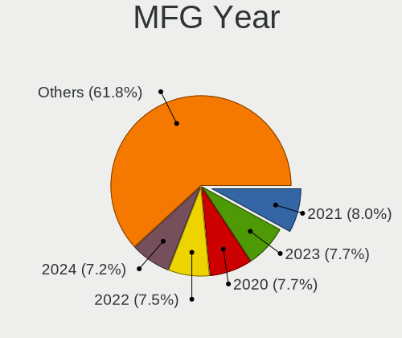
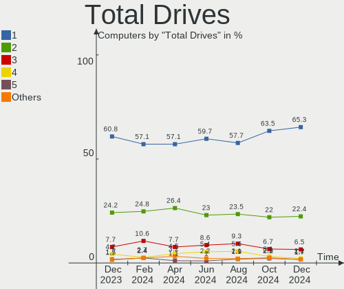
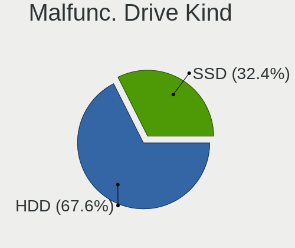
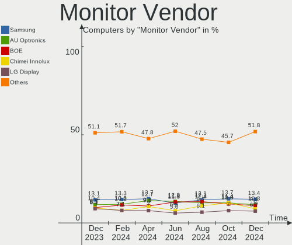
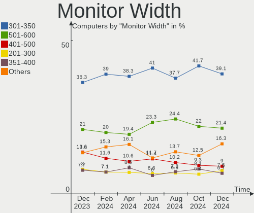
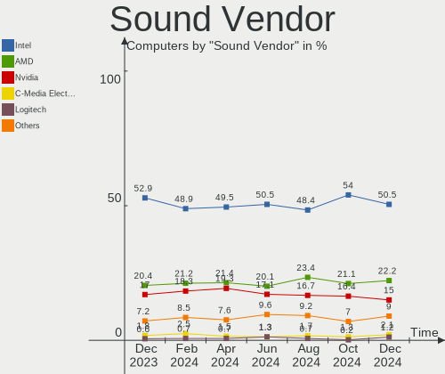
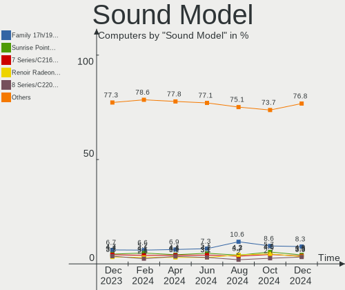

Linux Mint - Hardware Trends
----------------------------

A project to identify most popular hardware characteristics and track their change
over time based on data collected by Linux users at https://Linux-Hardware.org.

Anyone can contribute to this report by the [hw-probe](https://github.com/linuxhw/hw-probe) tool:

    sudo -E hw-probe -all -upload

This is a report for all computer types. See also reports for [desktops](/Dist/Linux_Mint/Desktop/README.md) and [notebooks](/Dist/Linux_Mint/Notebook/README.md).

This report is for one last month. Overall report since the beginning of time: [TestCoverage](https://github.com/linuxhw/TestCoverage)

Period: Nov, 2022.

Contents
--------

* [ System ](#system)
  - [ OS                       ](#os)
  - [ OS Family                ](#os-family)
  - [ Kernel                   ](#kernel)
  - [ Kernel Family            ](#kernel-family)
  - [ Kernel Major Ver.        ](#kernel-major-ver)
  - [ Arch                     ](#arch)
  - [ DE                       ](#de)
  - [ Display Server           ](#display-server)
  - [ Display Manager          ](#display-manager)
  - [ OS Lang                  ](#os-lang)
  - [ Boot Mode                ](#boot-mode)
  - [ Filesystem               ](#filesystem)
  - [ Part. scheme             ](#part-scheme)
  - [ Dual Boot with Linux/BSD ](#dual-boot-with-linuxbsd)
  - [ Dual Boot (Win)          ](#dual-boot-win)

* [ Board ](#board)
  - [ Vendor                   ](#vendor)
  - [ Model                    ](#model)
  - [ Model Family             ](#model-family)
  - [ MFG Year                 ](#mfg-year)
  - [ Form Factor              ](#form-factor)
  - [ Secure Boot              ](#secure-boot)
  - [ Coreboot                 ](#coreboot)
  - [ RAM Size                 ](#ram-size)
  - [ RAM Used                 ](#ram-used)
  - [ Total Drives             ](#total-drives)
  - [ Has CD-ROM               ](#has-cd-rom)
  - [ Has Ethernet             ](#has-ethernet)
  - [ Has WiFi                 ](#has-wifi)
  - [ Has Bluetooth            ](#has-bluetooth)

* [ Location ](#location)
  - [ Country                  ](#country)
  - [ City                     ](#city)

* [ Drives ](#drives)
  - [ Drive Vendor             ](#drive-vendor)
  - [ Drive Model              ](#drive-model)
  - [ HDD Vendor               ](#hdd-vendor)
  - [ SSD Vendor               ](#ssd-vendor)
  - [ Drive Kind               ](#drive-kind)
  - [ Drive Connector          ](#drive-connector)
  - [ Drive Size               ](#drive-size)
  - [ Space Total              ](#space-total)
  - [ Space Used               ](#space-used)
  - [ Malfunc. Drives          ](#malfunc-drives)
  - [ Malfunc. Drive Vendor    ](#malfunc-drive-vendor)
  - [ Malfunc. HDD Vendor      ](#malfunc-hdd-vendor)
  - [ Malfunc. Drive Kind      ](#malfunc-drive-kind)
  - [ Failed Drives            ](#failed-drives)
  - [ Failed Drive Vendor      ](#failed-drive-vendor)
  - [ Drive Status             ](#drive-status)

* [ Storage controller ](#storage-controller)
  - [ Storage Vendor           ](#storage-vendor)
  - [ Storage Model            ](#storage-model)
  - [ Storage Kind             ](#storage-kind)

* [ Processor ](#processor)
  - [ CPU Vendor               ](#cpu-vendor)
  - [ CPU Model                ](#cpu-model)
  - [ CPU Model Family         ](#cpu-model-family)
  - [ CPU Cores                ](#cpu-cores)
  - [ CPU Sockets              ](#cpu-sockets)
  - [ CPU Threads              ](#cpu-threads)
  - [ CPU Op-Modes             ](#cpu-op-modes)
  - [ CPU Microcode            ](#cpu-microcode)
  - [ CPU Microarch            ](#cpu-microarch)

* [ Graphics ](#graphics)
  - [ GPU Vendor               ](#gpu-vendor)
  - [ GPU Model                ](#gpu-model)
  - [ GPU Combo                ](#gpu-combo)
  - [ GPU Driver               ](#gpu-driver)
  - [ GPU Memory               ](#gpu-memory)

* [ Monitor ](#monitor)
  - [ Monitor Vendor           ](#monitor-vendor)
  - [ Monitor Model            ](#monitor-model)
  - [ Monitor Resolution       ](#monitor-resolution)
  - [ Monitor Diagonal         ](#monitor-diagonal)
  - [ Monitor Width            ](#monitor-width)
  - [ Aspect Ratio             ](#aspect-ratio)
  - [ Monitor Area             ](#monitor-area)
  - [ Pixel Density            ](#pixel-density)
  - [ Multiple Monitors        ](#multiple-monitors)

* [ Network ](#network)
  - [ Net Controller Vendor    ](#net-controller-vendor)
  - [ Net Controller Model     ](#net-controller-model)
  - [ Wireless Vendor          ](#wireless-vendor)
  - [ Wireless Model           ](#wireless-model)
  - [ Ethernet Vendor          ](#ethernet-vendor)
  - [ Ethernet Model           ](#ethernet-model)
  - [ Net Controller Kind      ](#net-controller-kind)
  - [ Used Controller          ](#used-controller)
  - [ NICs                     ](#nics)
  - [ IPv6                     ](#ipv6)

* [ Bluetooth ](#bluetooth)
  - [ Bluetooth Vendor         ](#bluetooth-vendor)
  - [ Bluetooth Model          ](#bluetooth-model)

* [ Sound ](#sound)
  - [ Sound Vendor             ](#sound-vendor)
  - [ Sound Model              ](#sound-model)

* [ Memory ](#memory)
  - [ Memory Vendor            ](#memory-vendor)
  - [ Memory Model             ](#memory-model)
  - [ Memory Kind              ](#memory-kind)
  - [ Memory Form Factor       ](#memory-form-factor)
  - [ Memory Size              ](#memory-size)
  - [ Memory Speed             ](#memory-speed)

* [ Printers & scanners ](#printers--scanners)
  - [ Printer Vendor           ](#printer-vendor)
  - [ Printer Model            ](#printer-model)
  - [ Scanner Vendor           ](#scanner-vendor)
  - [ Scanner Model            ](#scanner-model)

* [ Camera ](#camera)
  - [ Camera Vendor            ](#camera-vendor)
  - [ Camera Model             ](#camera-model)

* [ Security ](#security)
  - [ Fingerprint Vendor       ](#fingerprint-vendor)
  - [ Fingerprint Model        ](#fingerprint-model)
  - [ Chipcard Vendor          ](#chipcard-vendor)
  - [ Chipcard Model           ](#chipcard-model)

* [ Unsupported ](#unsupported)
  - [ Unsupported Devices      ](#unsupported-devices)
  - [ Unsupported Device Types ](#unsupported-device-types)

System
------

OS
--

Installed operating systems

| Name            | Computers | Percent |
|-----------------|-----------|---------|
| Linux Mint 21   | 269       | 62.41%  |
| Linux Mint 20.3 | 115       | 26.68%  |
| Linux Mint 20.2 | 16        | 3.71%   |
| Linux Mint 19.3 | 11        | 2.55%   |
| Linux Mint 20   | 8         | 1.86%   |
| Linux Mint 20.1 | 4         | 0.93%   |
| Linux Mint 19   | 4         | 0.93%   |
| Linux Mint 19.2 | 2         | 0.46%   |
| Linux Mint 18.3 | 2         | 0.46%   |

OS Family
---------

OS without a version

| Name       | Computers | Percent |
|------------|-----------|---------|
| Linux Mint | 431       | 100%    |

Kernel
------

Version of the Linux kernel

| Version                     | Computers | Percent |
|-----------------------------|-----------|---------|
| 5.15.0-52-generic           | 137       | 31.79%  |
| 5.15.0-53-generic           | 94        | 21.81%  |
| 5.4.0-131-generic           | 63        | 14.62%  |
| 5.4.0-132-generic           | 42        | 9.74%   |
| 5.15.0-41-generic           | 33        | 7.66%   |
| 5.4.0-126-generic           | 6         | 1.39%   |
| 5.4.0-91-generic            | 4         | 0.93%   |
| 5.15.0-47-generic           | 3         | 0.7%    |
| 6.0.9-060009-generic        | 2         | 0.46%   |
| 6.0.0-1007-oem              | 2         | 0.46%   |
| 5.4.0-125-generic           | 2         | 0.46%   |
| 5.15.0-50-generic           | 2         | 0.46%   |
| 5.15.0-48-generic           | 2         | 0.46%   |
| 5.15.0-46-generic           | 2         | 0.46%   |
| 4.15.0-197-generic          | 2         | 0.46%   |
| 4.15.0-142-generic          | 2         | 0.46%   |
| 6.0.8-surface               | 1         | 0.23%   |
| 6.0.8-060008-generic        | 1         | 0.23%   |
| 6.0.7-x64v1-xanmod1         | 1         | 0.23%   |
| 6.0.10-x64v1-xanmod1        | 1         | 0.23%   |
| 6.0.0-9.1-liquorix-amd64    | 1         | 0.23%   |
| 6.0.0-7.1-liquorix-amd64    | 1         | 0.23%   |
| 6.0.0-6.1-liquorix-amd64    | 1         | 0.23%   |
| 5.7.1-050701-generic        | 1         | 0.23%   |
| 5.4.0-99-generic            | 1         | 0.23%   |
| 5.4.0-74-generic            | 1         | 0.23%   |
| 5.4.0-26-generic            | 1         | 0.23%   |
| 5.4.0-128-generic           | 1         | 0.23%   |
| 5.4.0-122-generic           | 1         | 0.23%   |
| 5.4.0-121-generic           | 1         | 0.23%   |
| 5.4.0-1152206031516-generic | 1         | 0.23%   |
| 5.4.0-107-generic           | 1         | 0.23%   |
| 5.4.0-100-generic           | 1         | 0.23%   |
| 5.17.0-1020-oem             | 1         | 0.23%   |
| 5.16.14-051614-generic      | 1         | 0.23%   |
| 5.15.78-xanmod1             | 1         | 0.23%   |
| 5.15.0-54-generic           | 1         | 0.23%   |
| 5.15.0-52-lowlatency        | 1         | 0.23%   |
| 5.15.0-43-generic           | 1         | 0.23%   |
| 5.15.0-33-generic           | 1         | 0.23%   |

Kernel Family
-------------

Linux kernel without a distro release

| Version | Computers | Percent |
|---------|-----------|---------|
| 5.15.0  | 277       | 64.27%  |
| 5.4.0   | 126       | 29.23%  |
| 4.15.0  | 8         | 1.86%   |
| 6.0.0   | 5         | 1.16%   |
| 6.0.9   | 2         | 0.46%   |
| 6.0.8   | 2         | 0.46%   |
| 5.14.0  | 2         | 0.46%   |
| 6.0.7   | 1         | 0.23%   |
| 6.0.10  | 1         | 0.23%   |
| 5.7.1   | 1         | 0.23%   |
| 5.17.0  | 1         | 0.23%   |
| 5.16.14 | 1         | 0.23%   |
| 5.15.78 | 1         | 0.23%   |
| 5.13.0  | 1         | 0.23%   |
| 5.11.0  | 1         | 0.23%   |
| 5.0.0   | 1         | 0.23%   |

Kernel Major Ver.
-----------------

Linux kernel major version

| Version | Computers | Percent |
|---------|-----------|---------|
| 5.15    | 278       | 64.5%   |
| 5.4     | 126       | 29.23%  |
| 6.0     | 11        | 2.55%   |
| 4.15    | 8         | 1.86%   |
| 5.14    | 2         | 0.46%   |
| 5.7     | 1         | 0.23%   |
| 5.17    | 1         | 0.23%   |
| 5.16    | 1         | 0.23%   |
| 5.13    | 1         | 0.23%   |
| 5.11    | 1         | 0.23%   |
| 5.0     | 1         | 0.23%   |

Arch
----

OS architecture (x86_64, i586, etc.)

| Name   | Computers | Percent |
|--------|-----------|---------|
| x86_64 | 429       | 99.54%  |
| i686   | 2         | 0.46%   |

DE
--

Desktop Environment

| Name       | Computers | Percent |
|------------|-----------|---------|
| X-Cinnamon | 315       | 73.09%  |
| MATE       | 49        | 11.37%  |
| XFCE       | 39        | 9.05%   |
| Cinnamon   | 11        | 2.55%   |
| GNOME      | 7         | 1.62%   |
| KDE5       | 5         | 1.16%   |
| Unknown    | 4         | 0.93%   |
| openbox    | 1         | 0.23%   |

Display Server
--------------

X11 or Wayland

| Name    | Computers | Percent |
|---------|-----------|---------|
| X11     | 428       | 99.3%   |
| Tty     | 2         | 0.46%   |
| Wayland | 1         | 0.23%   |

Display Manager
---------------

SDDM, LightDM, etc.

| Name    | Computers | Percent |
|---------|-----------|---------|
| Unknown | 240       | 55.68%  |
| LightDM | 186       | 43.16%  |
| GDM3    | 3         | 0.7%    |
| SDDM    | 2         | 0.46%   |

OS Lang
-------

Language

| Lang    | Computers | Percent |
|---------|-----------|---------|
| en_US   | 135       | 31.32%  |
| de_DE   | 58        | 13.46%  |
| ru_RU   | 25        | 5.8%    |
| pt_BR   | 25        | 5.8%    |
| en_GB   | 24        | 5.57%   |
| it_IT   | 23        | 5.34%   |
| fr_FR   | 23        | 5.34%   |
| es_ES   | 15        | 3.48%   |
| en_AU   | 11        | 2.55%   |
| C       | 11        | 2.55%   |
| nl_NL   | 8         | 1.86%   |
| en_CA   | 7         | 1.62%   |
| hu_HU   | 6         | 1.39%   |
| es_CL   | 6         | 1.39%   |
| pl_PL   | 5         | 1.16%   |
| Unknown | 4         | 0.93%   |
| es_MX   | 3         | 0.7%    |
| es_AR   | 3         | 0.7%    |
| en_IN   | 3         | 0.7%    |
| cs_CZ   | 3         | 0.7%    |
| bg_BG   | 3         | 0.7%    |
| tr_TR   | 2         | 0.46%   |
| sk_SK   | 2         | 0.46%   |
| pt_PT   | 2         | 0.46%   |
| fr_CA   | 2         | 0.46%   |
| en_DK   | 2         | 0.46%   |
| de_CH   | 2         | 0.46%   |
| de_AT   | 2         | 0.46%   |
| da_DK   | 2         | 0.46%   |
| zh_TW   | 1         | 0.23%   |
| sv_SE   | 1         | 0.23%   |
| ro_RO   | 1         | 0.23%   |
| nl_BE   | 1         | 0.23%   |
| he_IL   | 1         | 0.23%   |
| fi_FI   | 1         | 0.23%   |
| es_VE   | 1         | 0.23%   |
| es_PE   | 1         | 0.23%   |
| es_BO   | 1         | 0.23%   |
| en_ZA   | 1         | 0.23%   |
| en_NZ   | 1         | 0.23%   |

Boot Mode
---------

EFI or BIOS

| Mode | Computers | Percent |
|------|-----------|---------|
| EFI  | 250       | 58%     |
| BIOS | 181       | 42%     |

Filesystem
----------

Type of filesystem

| Type    | Computers | Percent |
|---------|-----------|---------|
| Ext4    | 407       | 94.43%  |
| Overlay | 11        | 2.55%   |
| Btrfs   | 8         | 1.86%   |
| Zfs     | 3         | 0.7%    |
| Xfs     | 1         | 0.23%   |
| Ext3    | 1         | 0.23%   |

Part. scheme
------------

Scheme of partitioning

| Type    | Computers | Percent |
|---------|-----------|---------|
| Unknown | 237       | 54.99%  |
| GPT     | 159       | 36.89%  |
| MBR     | 35        | 8.12%   |

Dual Boot with Linux/BSD
------------------------

Hosting more than one Linux/BSD

| Dual boot | Computers | Percent |
|-----------|-----------|---------|
| No        | 404       | 93.74%  |
| Yes       | 27        | 6.26%   |

Dual Boot (Win)
---------------

Hosting Linux and Windows

| Dual boot | Computers | Percent |
|-----------|-----------|---------|
| No        | 354       | 82.13%  |
| Yes       | 77        | 17.87%  |

Board
-----

Vendor
------

Motherboard manufacturer

| Name                | Computers | Percent |
|---------------------|-----------|---------|
| Hewlett-Packard     | 74        | 17.17%  |
| ASUSTek Computer    | 60        | 13.92%  |
| Lenovo              | 54        | 12.53%  |
| Dell                | 49        | 11.37%  |
| Gigabyte Technology | 35        | 8.12%   |
| Acer                | 33        | 7.66%   |
| MSI                 | 27        | 6.26%   |
| ASRock              | 13        | 3.02%   |
| Samsung Electronics | 8         | 1.86%   |
| Intel               | 8         | 1.86%   |
| Apple               | 8         | 1.86%   |
| Unknown             | 8         | 1.86%   |
| Toshiba             | 6         | 1.39%   |
| HUAWEI              | 4         | 0.93%   |
| Sony                | 3         | 0.7%    |
| Google              | 3         | 0.7%    |
| Fujitsu             | 3         | 0.7%    |
| PCWare              | 2         | 0.46%   |
| Mediacom            | 2         | 0.46%   |
| Chuwi               | 2         | 0.46%   |
| Alienware           | 2         | 0.46%   |
| UMAX                | 1         | 0.23%   |
| Thomson             | 1         | 0.23%   |
| Tactus              | 1         | 0.23%   |
| Star Labs           | 1         | 0.23%   |
| Standard            | 1         | 0.23%   |
| Semp Toshiba        | 1         | 0.23%   |
| Razer               | 1         | 0.23%   |
| QIYIDA              | 1         | 0.23%   |
| Multilaser          | 1         | 0.23%   |
| Microtech           | 1         | 0.23%   |
| Microsoft           | 1         | 0.23%   |
| Medion              | 1         | 0.23%   |
| Jumper              | 1         | 0.23%   |
| Irbis               | 1         | 0.23%   |
| Infinix             | 1         | 0.23%   |
| Huanan              | 1         | 0.23%   |
| GPU Company         | 1         | 0.23%   |
| Gateway             | 1         | 0.23%   |
| Fujitsu Siemens     | 1         | 0.23%   |

Model
-----

Motherboard model

| Name                                  | Computers | Percent |
|---------------------------------------|-----------|---------|
| Unknown                               | 8         | 1.86%   |
| MSI MS-7C56                           | 2         | 0.46%   |
| MSI MS-7C02                           | 2         | 0.46%   |
| MSI MS-7B86                           | 2         | 0.46%   |
| MSI MS-7758                           | 2         | 0.46%   |
| HP ProBook 4530s                      | 2         | 0.46%   |
| HP Pavilion 17                        | 2         | 0.46%   |
| HP Compaq Pro 6300 SFF                | 2         | 0.46%   |
| HP Compaq Elite 8300 SFF              | 2         | 0.46%   |
| HP 15                                 | 2         | 0.46%   |
| Gigabyte Z170X-Gaming 7               | 2         | 0.46%   |
| Gigabyte GA-MA770-UD3                 | 2         | 0.46%   |
| Dell Latitude E6540                   | 2         | 0.46%   |
| Dell Latitude E6440                   | 2         | 0.46%   |
| Dell Latitude E6420                   | 2         | 0.46%   |
| Dell Latitude E6320                   | 2         | 0.46%   |
| Dell Latitude E5440                   | 2         | 0.46%   |
| ASUS K50IJ                            | 2         | 0.46%   |
| ASUS All Series                       | 2         | 0.46%   |
| UMAX VisionBook N15G Plus             | 1         | 0.23%   |
| Toshiba Satellite P55-B               | 1         | 0.23%   |
| Toshiba Satellite L50D-B              | 1         | 0.23%   |
| Toshiba Satellite L500                | 1         | 0.23%   |
| Toshiba Satellite L10W-B-101          | 1         | 0.23%   |
| Toshiba Satellite C50-A-1HF           | 1         | 0.23%   |
| Toshiba QOSMIO X70-A                  | 1         | 0.23%   |
| Thomson N17V3C8WH512                  | 1         | 0.23%   |
| Tactus GeoBook 140                    | 1         | 0.23%   |
| Star Labs StarBook                    | 1         | 0.23%   |
| Standard MB40II                       | 1         | 0.23%   |
| Sony VPCEB4L1E                        | 1         | 0.23%   |
| Sony VGN-CS11Z_R                      | 1         | 0.23%   |
| Sony SVE14A15FBB                      | 1         | 0.23%   |
| Semp Toshiba IS 1422                  | 1         | 0.23%   |
| Samsung RV411/RV511/E3511/S3511/RV711 | 1         | 0.23%   |
| Samsung RV411                         | 1         | 0.23%   |
| Samsung RV410/RV510/S3510/E3510       | 1         | 0.23%   |
| Samsung RC530/RC730                   | 1         | 0.23%   |
| Samsung RC410/RC510/RC710             | 1         | 0.23%   |
| Samsung R610                          | 1         | 0.23%   |

Model Family
------------

Motherboard model prefix

| Name                   | Computers | Percent |
|------------------------|-----------|---------|
| Acer Aspire            | 28        | 6.5%    |
| Lenovo ThinkPad        | 22        | 5.1%    |
| Dell Latitude          | 17        | 3.94%   |
| HP Pavilion            | 16        | 3.71%   |
| Dell Inspiron          | 16        | 3.71%   |
| Lenovo IdeaPad         | 13        | 3.02%   |
| HP EliteBook           | 13        | 3.02%   |
| Dell OptiPlex          | 9         | 2.09%   |
| Unknown                | 8         | 1.86%   |
| HP Compaq              | 7         | 1.62%   |
| HP Laptop              | 6         | 1.39%   |
| Toshiba Satellite      | 5         | 1.16%   |
| HP ZBook               | 4         | 0.93%   |
| HP ProBook             | 4         | 0.93%   |
| ASUS VivoBook          | 4         | 0.93%   |
| ASUS PRIME             | 4         | 0.93%   |
| ASUS M5A78L-M          | 4         | 0.93%   |
| HP ProDesk             | 3         | 0.7%    |
| HP EliteDesk           | 3         | 0.7%    |
| Gigabyte Z390          | 3         | 0.7%    |
| Dell XPS               | 3         | 0.7%    |
| Dell G3                | 3         | 0.7%    |
| ASUS TUF               | 3         | 0.7%    |
| Acer TravelMate        | 3         | 0.7%    |
| Samsung RV411          | 2         | 0.46%   |
| MSI MS-7C56            | 2         | 0.46%   |
| MSI MS-7C02            | 2         | 0.46%   |
| MSI MS-7B86            | 2         | 0.46%   |
| MSI MS-7758            | 2         | 0.46%   |
| Lenovo ThinkCentre     | 2         | 0.46%   |
| Lenovo Legion          | 2         | 0.46%   |
| Lenovo IdeaPadFlex     | 2         | 0.46%   |
| HP OMEN                | 2         | 0.46%   |
| HP ENVY                | 2         | 0.46%   |
| HP 15                  | 2         | 0.46%   |
| Gigabyte Z490          | 2         | 0.46%   |
| Gigabyte Z170X-Gaming  | 2         | 0.46%   |
| Gigabyte GA-MA770-UD3  | 2         | 0.46%   |
| Gigabyte GA-78LMT-USB3 | 2         | 0.46%   |
| Gigabyte B450          | 2         | 0.46%   |

MFG Year
--------

Motherboard manufacture year

| Year | Computers | Percent |
|------|-----------|---------|
| 2021 | 43        | 9.98%   |
| 2013 | 35        | 8.12%   |
| 2011 | 34        | 7.89%   |
| 2020 | 31        | 7.19%   |
| 2019 | 30        | 6.96%   |
| 2012 | 30        | 6.96%   |
| 2015 | 29        | 6.73%   |
| 2017 | 28        | 6.5%    |
| 2014 | 28        | 6.5%    |
| 2018 | 27        | 6.26%   |
| 2016 | 27        | 6.26%   |
| 2022 | 23        | 5.34%   |
| 2008 | 18        | 4.18%   |
| 2007 | 15        | 3.48%   |
| 2010 | 14        | 3.25%   |
| 2009 | 14        | 3.25%   |
| 2006 | 4         | 0.93%   |
| 2005 | 1         | 0.23%   |

Form Factor
-----------

Physical design of the computer

| Name        | Computers | Percent |
|-------------|-----------|---------|
| Notebook    | 256       | 59.4%   |
| Desktop     | 160       | 37.12%  |
| All in one  | 5         | 1.16%   |
| Tablet      | 4         | 0.93%   |
| Convertible | 4         | 0.93%   |
| Mini pc     | 1         | 0.23%   |
| Server      | 1         | 0.23%   |

Secure Boot
-----------

Enabled or disabled

| State    | Computers | Percent |
|----------|-----------|---------|
| Disabled | 385       | 89.33%  |
| Enabled  | 46        | 10.67%  |

Coreboot
--------

Have coreboot on board

| Used | Computers | Percent |
|------|-----------|---------|
| No   | 428       | 99.3%   |
| Yes  | 3         | 0.7%    |

RAM Size
--------

Total RAM memory

| Size in GB  | Computers | Percent |
|-------------|-----------|---------|
| 4.01-8.0    | 111       | 25.75%  |
| 16.01-24.0  | 88        | 20.42%  |
| 3.01-4.0    | 82        | 19.03%  |
| 8.01-16.0   | 81        | 18.79%  |
| 32.01-64.0  | 36        | 8.35%   |
| 1.01-2.0    | 17        | 3.94%   |
| 24.01-32.0  | 7         | 1.62%   |
| 64.01-256.0 | 7         | 1.62%   |
| 2.01-3.0    | 2         | 0.46%   |

RAM Used
--------

Used RAM memory

| Used GB    | Computers | Percent |
|------------|-----------|---------|
| 1.01-2.0   | 158       | 36.66%  |
| 2.01-3.0   | 128       | 29.7%   |
| 4.01-8.0   | 57        | 13.23%  |
| 3.01-4.0   | 51        | 11.83%  |
| 0.51-1.0   | 19        | 4.41%   |
| 8.01-16.0  | 17        | 3.94%   |
| 16.01-24.0 | 1         | 0.23%   |

Total Drives
------------

Number of drives on board

| Drives | Computers | Percent |
|--------|-----------|---------|
| 1      | 240       | 55.68%  |
| 2      | 117       | 27.15%  |
| 3      | 46        | 10.67%  |
| 4      | 14        | 3.25%   |
| 5      | 7         | 1.62%   |
| 6      | 5         | 1.16%   |
| 7      | 1         | 0.23%   |
| 0      | 1         | 0.23%   |

Has CD-ROM
----------

Has CD-ROM on board

| Presented | Computers | Percent |
|-----------|-----------|---------|
| No        | 247       | 57.31%  |
| Yes       | 184       | 42.69%  |

Has Ethernet
------------

Has Ethernet on board

| Presented | Computers | Percent |
|-----------|-----------|---------|
| Yes       | 367       | 85.15%  |
| No        | 64        | 14.85%  |

Has WiFi
--------

Has WiFi module

| Presented | Computers | Percent |
|-----------|-----------|---------|
| Yes       | 324       | 75.17%  |
| No        | 107       | 24.83%  |

Has Bluetooth
-------------

Has Bluetooth module

| Presented | Computers | Percent |
|-----------|-----------|---------|
| Yes       | 273       | 63.34%  |
| No        | 158       | 36.66%  |

Location
--------

Country
-------

Geographic location (country)

| Country                   | Computers | Percent |
|---------------------------|-----------|---------|
| USA                       | 74        | 17.17%  |
| Germany                   | 63        | 14.62%  |
| Brazil                    | 31        | 7.19%   |
| Italy                     | 27        | 6.26%   |
| Russia                    | 26        | 6.03%   |
| France                    | 22        | 5.1%    |
| UK                        | 19        | 4.41%   |
| Spain                     | 16        | 3.71%   |
| Canada                    | 14        | 3.25%   |
| Australia                 | 13        | 3.02%   |
| Netherlands               | 12        | 2.78%   |
| Czechia                   | 8         | 1.86%   |
| Poland                    | 7         | 1.62%   |
| Hungary                   | 7         | 1.62%   |
| Greece                    | 7         | 1.62%   |
| Latvia                    | 6         | 1.39%   |
| Chile                     | 6         | 1.39%   |
| Turkey                    | 5         | 1.16%   |
| Argentina                 | 5         | 1.16%   |
| Switzerland               | 4         | 0.93%   |
| Romania                   | 4         | 0.93%   |
| Mexico                    | 4         | 0.93%   |
| Denmark                   | 4         | 0.93%   |
| Belgium                   | 4         | 0.93%   |
| Slovakia                  | 3         | 0.7%    |
| Portugal                  | 3         | 0.7%    |
| India                     | 3         | 0.7%    |
| Bulgaria                  | 3         | 0.7%    |
| Austria                   | 3         | 0.7%    |
| Kenya                     | 2         | 0.46%   |
| Finland                   | 2         | 0.46%   |
| Venezuela                 | 1         | 0.23%   |
| Ukraine                   | 1         | 0.23%   |
| Taiwan                    | 1         | 0.23%   |
| Sweden                    | 1         | 0.23%   |
| St Vincent and Grenadines | 1         | 0.23%   |
| South Korea               | 1         | 0.23%   |
| South Africa              | 1         | 0.23%   |
| Singapore                 | 1         | 0.23%   |
| Serbia                    | 1         | 0.23%   |

City
----

Geographic location (city)

| City           | Computers | Percent |
|----------------|-----------|---------|
| Berlin         | 10        | 2.32%   |
| Sao Paulo      | 7         | 1.62%   |
| Moscow         | 7         | 1.62%   |
| St Petersburg  | 5         | 1.16%   |
| Rio de Janeiro | 5         | 1.16%   |
| Milan          | 5         | 1.16%   |
| Melbourne      | 5         | 1.16%   |
| Rome           | 4         | 0.93%   |
| Paris          | 4         | 0.93%   |
| Munich         | 4         | 0.93%   |
| Madrid         | 4         | 0.93%   |
| Amsterdam      | 4         | 0.93%   |
| Vienna         | 3         | 0.7%    |
| Santiago       | 3         | 0.7%    |
| San Francisco  | 3         | 0.7%    |
| Heemskerk      | 3         | 0.7%    |
| Barcelona      | 3         | 0.7%    |
| Ventspils      | 2         | 0.46%   |
| Toronto        | 2         | 0.46%   |
| Southbury      | 2         | 0.46%   |
| Rosario        | 2         | 0.46%   |
| Riga           | 2         | 0.46%   |
| Richmond       | 2         | 0.46%   |
| Porto Alegre   | 2         | 0.46%   |
| Perth          | 2         | 0.46%   |
| Naples         | 2         | 0.46%   |
| Nairobi        | 2         | 0.46%   |
| Montreal       | 2         | 0.46%   |
| Miami          | 2         | 0.46%   |
| Meissen        | 2         | 0.46%   |
| Manchester     | 2         | 0.46%   |
| Lisbon         | 2         | 0.46%   |
| Kitchener      | 2         | 0.46%   |
| Kazan’       | 2         | 0.46%   |
| Hamburg        | 2         | 0.46%   |
| Fort Worth     | 2         | 0.46%   |
| Dallas         | 2         | 0.46%   |
| Criciúma      | 2         | 0.46%   |
| Bucharest      | 2         | 0.46%   |
| Brisbane       | 2         | 0.46%   |

Drives
------

Drive Vendor
------------

Hard drive vendors

| Vendor                      | Computers | Drives | Percent |
|-----------------------------|-----------|--------|---------|
| WDC                         | 102       | 123    | 15.48%  |
| Seagate                     | 96        | 117    | 14.57%  |
| Samsung Electronics         | 96        | 108    | 14.57%  |
| Kingston                    | 38        | 40     | 5.77%   |
| Toshiba                     | 37        | 40     | 5.61%   |
| Unknown                     | 34        | 40     | 5.16%   |
| SanDisk                     | 32        | 33     | 4.86%   |
| Crucial                     | 22        | 24     | 3.34%   |
| Intel                       | 16        | 17     | 2.43%   |
| Micron Technology           | 15        | 15     | 2.28%   |
| Hitachi                     | 14        | 15     | 2.12%   |
| SK hynix                    | 13        | 13     | 1.97%   |
| HGST                        | 13        | 13     | 1.97%   |
| China                       | 12        | 12     | 1.82%   |
| Unknown                     | 10        | 10     | 1.52%   |
| Intenso                     | 6         | 8      | 0.91%   |
| A-DATA Technology           | 6         | 6      | 0.91%   |
| Phison Electronics          | 5         | 5      | 0.76%   |
| OCZ                         | 5         | 5      | 0.76%   |
| Patriot                     | 4         | 4      | 0.61%   |
| Micron/Crucial Technology   | 4         | 4      | 0.61%   |
| Silicon Motion              | 3         | 3      | 0.46%   |
| Lexar                       | 3         | 3      | 0.46%   |
| Kingston Technology Company | 3         | 3      | 0.46%   |
| JMicron Technology          | 3         | 3      | 0.46%   |
| Fujitsu                     | 3         | 3      | 0.46%   |
| TO Exter                    | 2         | 2      | 0.3%    |
| SPCC                        | 2         | 2      | 0.3%    |
| PNY                         | 2         | 2      | 0.3%    |
| Phison                      | 2         | 2      | 0.3%    |
| NGFF                        | 2         | 2      | 0.3%    |
| Netac                       | 2         | 2      | 0.3%    |
| Maxtor                      | 2         | 2      | 0.3%    |
| LITEONIT                    | 2         | 2      | 0.3%    |
| KIOXIA                      | 2         | 2      | 0.3%    |
| KingSpec                    | 2         | 2      | 0.3%    |
| HGST HTS                    | 2         | 2      | 0.3%    |
| ASMT                        | 2         | 2      | 0.3%    |
| Apple                       | 2         | 2      | 0.3%    |
| WDC WDS2                    | 1         | 1      | 0.15%   |

Drive Model
-----------

Hard drive models

| Model                                               | Computers | Percent |
|-----------------------------------------------------|-----------|---------|
| Kingston SA400S37240G 240GB SSD                     | 15        | 2.1%    |
| Seagate ST500DM002-1BD142 500GB                     | 10        | 1.4%    |
| Unknown                                             | 10        | 1.4%    |
| Unknown MMC Card  64GB                              | 9         | 1.26%   |
| Samsung SSD 850 EVO 250GB                           | 9         | 1.26%   |
| Seagate ST1000LM035-1RK172 1TB                      | 7         | 0.98%   |
| Samsung NVMe SSD Controller SM981/PM981/PM983 1TB   | 7         | 0.98%   |
| Samsung SSD 850 EVO 500GB                           | 6         | 0.84%   |
| WDC WD10JPVX-22JC3T0 1TB                            | 5         | 0.7%    |
| Unknown MMC Card  128GB                             | 5         | 0.7%    |
| Samsung SSD 860 EVO 1TB                             | 5         | 0.7%    |
| Kingston SA400S37120G 120GB SSD                     | 5         | 0.7%    |
| Crucial CT500MX500SSD1 500GB                        | 5         | 0.7%    |
| Crucial CT1000MX500SSD1 1TB                         | 5         | 0.7%    |
| WDC WD20EZRZ-00Z5HB0 2TB                            | 4         | 0.56%   |
| Unknown MMC Card  32GB                              | 4         | 0.56%   |
| Toshiba MQ01ABF050 500GB                            | 4         | 0.56%   |
| Toshiba MQ01ABD100 1TB                              | 4         | 0.56%   |
| Seagate ST3500312CS 500GB                           | 4         | 0.56%   |
| HGST HTS545050A7E380 500GB                          | 4         | 0.56%   |
| Crucial CT1000BX500SSD1 1TB                         | 4         | 0.56%   |
| WDC WDS500G2B0A-00SM50 500GB SSD                    | 3         | 0.42%   |
| WDC WDS120G2G0A-00JH30 120GB SSD                    | 3         | 0.42%   |
| WDC WD20EARS-00MVWB0 2TB                            | 3         | 0.42%   |
| WDC WD10EZEX-08WN4A0 1TB                            | 3         | 0.42%   |
| Unknown SD/MMC/MS PRO 8GB                           | 3         | 0.42%   |
| Seagate ST2000DM008-2FR102 2TB                      | 3         | 0.42%   |
| Seagate ST1000DM010-2EP102 1TB                      | 3         | 0.42%   |
| Sandisk WD Blue SN500 / PC SN520 NVMe SSD 512GB     | 3         | 0.42%   |
| SanDisk SSD PLUS 480GB                              | 3         | 0.42%   |
| SanDisk SDSSDH3 500G                                | 3         | 0.42%   |
| Samsung SSD 870 EVO 1TB                             | 3         | 0.42%   |
| Samsung SSD 860 EVO 500GB                           | 3         | 0.42%   |
| Samsung NVMe SSD Controller SM961/PM961/SM963 250GB | 3         | 0.42%   |
| Kingston Company OM3PDP3 NVMe SSD 256GB             | 3         | 0.42%   |
| Intenso SSD Sata III 256GB                          | 3         | 0.42%   |
| WDC WDS480G2G0A-00JH30 480GB SSD                    | 2         | 0.28%   |
| WDC WDS240G2G0A-00JH30 240GB SSD                    | 2         | 0.28%   |
| WDC WD6400BEVT-22A0RT0 640GB                        | 2         | 0.28%   |
| WDC WD5000LPVX-22V0TT0 500GB                        | 2         | 0.28%   |

HDD Vendor
----------

Hard disk drive vendors

| Vendor              | Computers | Drives | Percent |
|---------------------|-----------|--------|---------|
| Seagate             | 95        | 116    | 37.4%   |
| WDC                 | 80        | 96     | 31.5%   |
| Toshiba             | 27        | 29     | 10.63%  |
| Hitachi             | 14        | 15     | 5.51%   |
| HGST                | 13        | 13     | 5.12%   |
| Samsung Electronics | 10        | 11     | 3.94%   |
| Unknown             | 4         | 5      | 1.57%   |
| Fujitsu             | 3         | 3      | 1.18%   |
| Maxtor              | 2         | 2      | 0.79%   |
| Intenso             | 2         | 2      | 0.79%   |
| USB                 | 1         | 1      | 0.39%   |
| Hewlett-Packard     | 1         | 1      | 0.39%   |
| ExcelStor           | 1         | 1      | 0.39%   |
| ASMT                | 1         | 1      | 0.39%   |

SSD Vendor
----------

Solid state drive vendors

| Vendor              | Computers | Drives | Percent |
|---------------------|-----------|--------|---------|
| Samsung Electronics | 52        | 58     | 22.32%  |
| Kingston            | 34        | 36     | 14.59%  |
| Crucial             | 21        | 22     | 9.01%   |
| SanDisk             | 19        | 20     | 8.15%   |
| WDC                 | 15        | 17     | 6.44%   |
| China               | 12        | 12     | 5.15%   |
| Intel               | 6         | 6      | 2.58%   |
| Unknown             | 6         | 6      | 2.58%   |
| OCZ                 | 5         | 5      | 2.15%   |
| Intenso             | 5         | 6      | 2.15%   |
| A-DATA Technology   | 5         | 5      | 2.15%   |
| Toshiba             | 4         | 4      | 1.72%   |
| Patriot             | 4         | 4      | 1.72%   |
| Micron Technology   | 4         | 4      | 1.72%   |
| Lexar               | 3         | 3      | 1.29%   |
| TO Exter            | 2         | 2      | 0.86%   |
| SPCC                | 2         | 2      | 0.86%   |
| PNY                 | 2         | 2      | 0.86%   |
| NGFF                | 2         | 2      | 0.86%   |
| Netac               | 2         | 2      | 0.86%   |
| LITEONIT            | 2         | 2      | 0.86%   |
| KingSpec            | 2         | 2      | 0.86%   |
| WDC WDS2            | 1         | 1      | 0.43%   |
| TSA                 | 1         | 1      | 0.43%   |
| Transcend           | 1         | 1      | 0.43%   |
| Team                | 1         | 1      | 0.43%   |
| Super Talent        | 1         | 1      | 0.43%   |
| Smartbuy            | 1         | 1      | 0.43%   |
| SK hynix            | 1         | 1      | 0.43%   |
| Neo                 | 1         | 1      | 0.43%   |
| MyDigitalSSD        | 1         | 1      | 0.43%   |
| Maxell              | 1         | 1      | 0.43%   |
| LuminouTek          | 1         | 1      | 0.43%   |
| LITEON              | 1         | 1      | 0.43%   |
| Leven               | 1         | 1      | 0.43%   |
| LDLC                | 1         | 1      | 0.43%   |
| KNUP                | 1         | 1      | 0.43%   |
| KingDian            | 1         | 1      | 0.43%   |
| Jumper              | 1         | 1      | 0.43%   |
| JMicron Technology  | 1         | 1      | 0.43%   |

Drive Kind
----------

HDD or SSD

| Kind    | Computers | Drives | Percent |
|---------|-----------|--------|---------|
| SSD     | 214       | 246    | 36.15%  |
| HDD     | 210       | 296    | 35.47%  |
| NVMe    | 118       | 132    | 19.93%  |
| MMC     | 34        | 39     | 5.74%   |
| Unknown | 16        | 18     | 2.7%    |

Drive Connector
---------------

SATA, SAS, NVMe, etc.

| Type | Computers | Drives | Percent |
|------|-----------|--------|---------|
| SATA | 330       | 525    | 64.45%  |
| NVMe | 117       | 131    | 22.85%  |
| MMC  | 34        | 39     | 6.64%   |
| SAS  | 31        | 36     | 6.05%   |

Drive Size
----------

Size of hard drive

| Size in TB | Computers | Drives | Percent |
|------------|-----------|--------|---------|
| 0.01-0.5   | 253       | 317    | 57.76%  |
| 0.51-1.0   | 113       | 137    | 25.8%   |
| 1.01-2.0   | 39        | 51     | 8.9%    |
| 3.01-4.0   | 14        | 16     | 3.2%    |
| 4.01-10.0  | 9         | 10     | 2.05%   |
| 2.01-3.0   | 8         | 8      | 1.83%   |
| 10.01-20.0 | 2         | 3      | 0.46%   |

Space Total
-----------

Amount of disk space available on the file system

| Size in GB     | Computers | Percent |
|----------------|-----------|---------|
| 101-250        | 134       | 31.09%  |
| 251-500        | 98        | 22.74%  |
| 501-1000       | 65        | 15.08%  |
| 1001-2000      | 40        | 9.28%   |
| More than 3000 | 27        | 6.26%   |
| 51-100         | 26        | 6.03%   |
| 2001-3000      | 15        | 3.48%   |
| 21-50          | 12        | 2.78%   |
| 1-20           | 9         | 2.09%   |
| Unknown        | 5         | 1.16%   |

Space Used
----------

Amount of used disk space

| Used GB        | Computers | Percent |
|----------------|-----------|---------|
| 21-50          | 92        | 21.35%  |
| 1-20           | 87        | 20.19%  |
| 101-250        | 78        | 18.1%   |
| 51-100         | 56        | 12.99%  |
| 251-500        | 47        | 10.9%   |
| 501-1000       | 31        | 7.19%   |
| 1001-2000      | 18        | 4.18%   |
| More than 3000 | 9         | 2.09%   |
| 2001-3000      | 8         | 1.86%   |
| Unknown        | 5         | 1.16%   |

Malfunc. Drives
---------------

Drive models with a malfunction

| Model                                    | Computers | Drives | Percent |
|------------------------------------------|-----------|--------|---------|
| Seagate ST9500325AS 500GB                | 2         | 2      | 4.88%   |
| HGST HTS545050A7E380 500GB               | 2         | 2      | 4.88%   |
| WDC WD6400BEVT-22A0RT0 640GB             | 1         | 1      | 2.44%   |
| WDC WD3200BPVT-24ZEST0 320GB             | 1         | 1      | 2.44%   |
| WDC WD3200AAJS-00RYA0 320GB              | 1         | 1      | 2.44%   |
| WDC WD20EARS-00J2GB0 2TB                 | 1         | 1      | 2.44%   |
| WDC WD10JPVX-60JC3T0 1TB                 | 1         | 1      | 2.44%   |
| WDC WD10JPVX-22JC3T0 1TB                 | 1         | 1      | 2.44%   |
| WDC WD10EARS-00MVWB0 1TB                 | 1         | 1      | 2.44%   |
| WDC WD10EADS-00L5B1 1TB                  | 1         | 1      | 2.44%   |
| Toshiba MQ04ABF100 1TB                   | 1         | 1      | 2.44%   |
| Toshiba MQ01ABF050 500GB                 | 1         | 1      | 2.44%   |
| Toshiba MK8034GSX 80GB                   | 1         | 1      | 2.44%   |
| Seagate ST9640320AS 640GB                | 1         | 1      | 2.44%   |
| Seagate ST9160412AS 160GB                | 1         | 1      | 2.44%   |
| Seagate ST9160314AS 160GB                | 1         | 1      | 2.44%   |
| Seagate ST8000DM004-2CX188 8TB           | 1         | 1      | 2.44%   |
| Seagate ST640LM001 HN-M640MBB 640GB      | 1         | 1      | 2.44%   |
| Seagate ST500LT012-9WS142 500GB          | 1         | 1      | 2.44%   |
| Seagate ST500DM002-1BD142 500GB          | 1         | 1      | 2.44%   |
| Seagate ST32000641AS 2TB                 | 1         | 5      | 2.44%   |
| Seagate ST31000528AS 1TB                 | 1         | 1      | 2.44%   |
| Seagate ST3000DM001-9YN166 3TB           | 1         | 1      | 2.44%   |
| Seagate ST2000DM001-9YN164 2TB           | 1         | 1      | 2.44%   |
| Seagate ST2000DL003-9VT166 2TB           | 1         | 1      | 2.44%   |
| Seagate ST1000LM035-1RK172 1TB           | 1         | 1      | 2.44%   |
| Seagate ST1000DM003-1SB102 1TB           | 1         | 1      | 2.44%   |
| Samsung Electronics SSD 840 Series 500GB | 1         | 1      | 2.44%   |
| Samsung Electronics HM160HC 160GB        | 1         | 1      | 2.44%   |
| Samsung Electronics HD501LJ 500GB        | 1         | 1      | 2.44%   |
| Samsung Electronics HD322HJ 320GB        | 1         | 1      | 2.44%   |
| Maxtor STM3320820AS 320GB                | 1         | 1      | 2.44%   |
| Leven JAJS500M120C 120GB SSD             | 1         | 1      | 2.44%   |
| Kingston SA400S37120G 120GB SSD          | 1         | 1      | 2.44%   |
| Intel SSDSC2BW120A4 120GB                | 1         | 1      | 2.44%   |
| Intel SSDSC2BF240A5L 240GB               | 1         | 1      | 2.44%   |
| Hitachi HTS543232L9SA02 320GB            | 1         | 1      | 2.44%   |
| Hitachi HTS542512K9A300 120GB            | 1         | 1      | 2.44%   |
| HGST HTS721010A9E630 1TB                 | 1         | 1      | 2.44%   |

Malfunc. Drive Vendor
---------------------

Vendors of faulty drives

| Vendor              | Computers | Drives | Percent |
|---------------------|-----------|--------|---------|
| Seagate             | 14        | 20     | 35.9%   |
| WDC                 | 8         | 8      | 20.51%  |
| Samsung Electronics | 4         | 4      | 10.26%  |
| Toshiba             | 3         | 3      | 7.69%   |
| HGST                | 3         | 3      | 7.69%   |
| Intel               | 2         | 2      | 5.13%   |
| Hitachi             | 2         | 2      | 5.13%   |
| Maxtor              | 1         | 1      | 2.56%   |
| Leven               | 1         | 1      | 2.56%   |
| Kingston            | 1         | 1      | 2.56%   |

Malfunc. HDD Vendor
-------------------

Vendors of faulty HDD drives

| Vendor              | Computers | Drives | Percent |
|---------------------|-----------|--------|---------|
| Seagate             | 14        | 20     | 41.18%  |
| WDC                 | 8         | 8      | 23.53%  |
| Toshiba             | 3         | 3      | 8.82%   |
| Samsung Electronics | 3         | 3      | 8.82%   |
| HGST                | 3         | 3      | 8.82%   |
| Hitachi             | 2         | 2      | 5.88%   |
| Maxtor              | 1         | 1      | 2.94%   |

Malfunc. Drive Kind
-------------------

Kinds of faulty drives

| Kind | Computers | Drives | Percent |
|------|-----------|--------|---------|
| HDD  | 32        | 40     | 86.49%  |
| SSD  | 5         | 5      | 13.51%  |

Failed Drives
-------------

Failed drive models

Zero info for selected period =(

Failed Drive Vendor
-------------------

Failed drive vendors

Zero info for selected period =(

Drive Status
------------

Number of failed and malfunc. drives

| Status   | Computers | Drives | Percent |
|----------|-----------|--------|---------|
| Detected | 270       | 448    | 58.7%   |
| Works    | 154       | 238    | 33.48%  |
| Malfunc  | 36        | 45     | 7.83%   |

Storage controller
------------------

Storage Vendor
--------------

Storage controller vendors

| Vendor                           | Computers | Percent |
|----------------------------------|-----------|---------|
| Intel                            | 310       | 58.16%  |
| AMD                              | 73        | 13.7%   |
| Samsung Electronics              | 37        | 6.94%   |
| SanDisk                          | 21        | 3.94%   |
| Micron Technology                | 11        | 2.06%   |
| SK hynix                         | 10        | 1.88%   |
| ASMedia Technology               | 9         | 1.69%   |
| Phison Electronics               | 8         | 1.5%    |
| Marvell Technology Group         | 7         | 1.31%   |
| Kingston Technology Company      | 7         | 1.31%   |
| JMicron Technology               | 7         | 1.31%   |
| Toshiba America Info Systems     | 6         | 1.13%   |
| Micron/Crucial Technology        | 5         | 0.94%   |
| Nvidia                           | 4         | 0.75%   |
| Silicon Motion                   | 3         | 0.56%   |
| Silicon Integrated Systems [SiS] | 2         | 0.38%   |
| Broadcom / LSI                   | 2         | 0.38%   |
| Apple                            | 2         | 0.38%   |
| VIA Technologies                 | 1         | 0.19%   |
| Union Memory (Shenzhen)          | 1         | 0.19%   |
| Shenzhen Longsys Electronics     | 1         | 0.19%   |
| Realtek Semiconductor            | 1         | 0.19%   |
| OCZ Technology Group             | 1         | 0.19%   |
| KIOXIA                           | 1         | 0.19%   |
| Hewlett-Packard                  | 1         | 0.19%   |
| Beijing Starblaze Technology     | 1         | 0.19%   |
| ADATA Technology                 | 1         | 0.19%   |

Storage Model
-------------

Storage controller models

| Model                                                                            | Computers | Percent |
|----------------------------------------------------------------------------------|-----------|---------|
| AMD FCH SATA Controller [AHCI mode]                                              | 43        | 6.98%   |
| Intel 8 Series/C220 Series Chipset Family 6-port SATA Controller 1 [AHCI mode]   | 29        | 4.71%   |
| Intel 82801 Mobile SATA Controller [RAID mode]                                   | 16        | 2.6%    |
| Samsung NVMe SSD Controller SM981/PM981/PM983                                    | 15        | 2.44%   |
| Intel Celeron/Pentium Silver Processor SATA Controller                           | 15        | 2.44%   |
| AMD SB7x0/SB8x0/SB9x0 IDE Controller                                             | 15        | 2.44%   |
| Intel Sunrise Point-LP SATA Controller [AHCI mode]                               | 14        | 2.27%   |
| Intel 7 Series/C210 Series Chipset Family 6-port SATA Controller [AHCI mode]     | 14        | 2.27%   |
| Intel 7 Series Chipset Family 6-port SATA Controller [AHCI mode]                 | 14        | 2.27%   |
| Intel 8 Series SATA Controller 1 [AHCI mode]                                     | 13        | 2.11%   |
| Intel Q170/Q150/B150/H170/H110/Z170/CM236 Chipset SATA Controller [AHCI Mode]    | 12        | 1.95%   |
| Intel 6 Series/C200 Series Chipset Family 6 port Mobile SATA AHCI Controller     | 12        | 1.95%   |
| Micron Non-Volatile memory controller                                            | 11        | 1.79%   |
| AMD 400 Series Chipset SATA Controller                                           | 11        | 1.79%   |
| Samsung NVMe SSD Controller 980                                                  | 10        | 1.62%   |
| Intel Wildcat Point-LP SATA Controller [AHCI Mode]                               | 9         | 1.46%   |
| Intel Celeron N3350/Pentium N4200/Atom E3900 Series SATA AHCI Controller         | 9         | 1.46%   |
| Intel Atom/Celeron/Pentium Processor x5-E8000/J3xxx/N3xxx Series SATA Controller | 9         | 1.46%   |
| Intel 82801IBM/IEM (ICH9M/ICH9M-E) 4 port SATA Controller [AHCI mode]            | 9         | 1.46%   |
| Intel 5 Series/3400 Series Chipset 4 port SATA AHCI Controller                   | 9         | 1.46%   |
| AMD SB7x0/SB8x0/SB9x0 SATA Controller [IDE mode]                                 | 9         | 1.46%   |
| AMD SB7x0/SB8x0/SB9x0 SATA Controller [AHCI mode]                                | 9         | 1.46%   |
| SanDisk WD Blue SN550 NVMe SSD                                                   | 8         | 1.3%    |
| Intel Tiger Lake-LP SATA Controller                                              | 7         | 1.14%   |
| Intel HM170/QM170 Chipset SATA Controller [AHCI Mode]                            | 7         | 1.14%   |
| ASMedia ASM1062 Serial ATA Controller                                            | 7         | 1.14%   |
| AMD 500 Series Chipset SATA Controller                                           | 7         | 1.14%   |
| Samsung NVMe SSD Controller SM961/PM961/SM963                                    | 6         | 0.97%   |
| Intel Volume Management Device NVMe RAID Controller                              | 6         | 0.97%   |
| Intel NM10/ICH7 Family SATA Controller [IDE mode]                                | 6         | 0.97%   |
| Intel Cannon Lake PCH SATA AHCI Controller                                       | 6         | 0.97%   |
| Intel 6 Series/C200 Series Chipset Family 6 port Desktop SATA AHCI Controller    | 6         | 0.97%   |
| Intel SSD 660P Series                                                            | 5         | 0.81%   |
| Intel Cannon Lake Mobile PCH SATA AHCI Controller                                | 5         | 0.81%   |
| Intel Atom Processor E3800 Series SATA AHCI Controller                           | 5         | 0.81%   |
| Intel Alder Lake-S PCH SATA Controller [AHCI Mode]                               | 5         | 0.81%   |
| Intel 200 Series PCH SATA controller [AHCI mode]                                 | 5         | 0.81%   |
| SK hynix Gold P31/PC711 NVMe Solid State Drive                                   | 4         | 0.65%   |
| SanDisk WD Blue SN500 / PC SN520 NVMe SSD                                        | 4         | 0.65%   |
| SanDisk Non-Volatile memory controller                                           | 4         | 0.65%   |

Storage Kind
------------

Kind of storage controller (IDE, SATA, NVMe, SAS, ...)

| Kind | Computers | Percent |
|------|-----------|---------|
| SATA | 325       | 59.85%  |
| NVMe | 117       | 21.55%  |
| IDE  | 69        | 12.71%  |
| RAID | 29        | 5.34%   |
| SAS  | 2         | 0.37%   |
| SCSI | 1         | 0.18%   |

Processor
---------

CPU Vendor
----------

Processor vendors

| Vendor | Computers | Percent |
|--------|-----------|---------|
| Intel  | 345       | 80.05%  |
| AMD    | 86        | 19.95%  |

CPU Model
---------

Processor models

| Model                                         | Computers | Percent |
|-----------------------------------------------|-----------|---------|
| Intel Core i7-7700HQ CPU @ 2.80GHz            | 6         | 1.39%   |
| Intel Celeron N4020 CPU @ 1.10GHz             | 6         | 1.39%   |
| Intel Celeron J4125 CPU @ 2.00GHz             | 6         | 1.39%   |
| Intel Core i7-3770 CPU @ 3.40GHz              | 5         | 1.16%   |
| Intel 11th Gen Core i7-1165G7 @ 2.80GHz       | 5         | 1.16%   |
| AMD Ryzen 5 5600G with Radeon Graphics        | 5         | 1.16%   |
| Intel Core i7-8565U CPU @ 1.80GHz             | 4         | 0.93%   |
| Intel Core i7-8550U CPU @ 1.80GHz             | 4         | 0.93%   |
| Intel Core i7-4810MQ CPU @ 2.80GHz            | 4         | 0.93%   |
| Intel Core i7-3770K CPU @ 3.50GHz             | 4         | 0.93%   |
| Intel Core i5-5300U CPU @ 2.30GHz             | 4         | 0.93%   |
| Intel Core i5-2520M CPU @ 2.50GHz             | 4         | 0.93%   |
| Intel Core i5 CPU M 480 @ 2.67GHz             | 4         | 0.93%   |
| Intel Celeron CPU N3350 @ 1.10GHz             | 4         | 0.93%   |
| AMD FX-8350 Eight-Core Processor              | 4         | 0.93%   |
| Intel Pentium CPU N4200 @ 1.10GHz             | 3         | 0.7%    |
| Intel Pentium CPU N3700 @ 1.60GHz             | 3         | 0.7%    |
| Intel Pentium CPU G630 @ 2.70GHz              | 3         | 0.7%    |
| Intel Core i7-8750H CPU @ 2.20GHz             | 3         | 0.7%    |
| Intel Core i7-7500U CPU @ 2.70GHz             | 3         | 0.7%    |
| Intel Core i7-4720HQ CPU @ 2.60GHz            | 3         | 0.7%    |
| Intel Core i7-10510U CPU @ 1.80GHz            | 3         | 0.7%    |
| Intel Core i5-9300H CPU @ 2.40GHz             | 3         | 0.7%    |
| Intel Core i5-4310U CPU @ 2.00GHz             | 3         | 0.7%    |
| Intel Core i5-3470 CPU @ 3.20GHz              | 3         | 0.7%    |
| Intel Core i5-3320M CPU @ 2.60GHz             | 3         | 0.7%    |
| Intel Core i5-2410M CPU @ 2.30GHz             | 3         | 0.7%    |
| Intel Core i5-1035G1 CPU @ 1.00GHz            | 3         | 0.7%    |
| Intel Core i3-4005U CPU @ 1.70GHz             | 3         | 0.7%    |
| Intel Core i3-3110M CPU @ 2.40GHz             | 3         | 0.7%    |
| Intel Celeron CPU N2840 @ 2.16GHz             | 3         | 0.7%    |
| AMD Ryzen 7 5700U with Radeon Graphics        | 3         | 0.7%    |
| AMD Ryzen 5 3500U with Radeon Vega Mobile Gfx | 3         | 0.7%    |
| Intel Pentium Dual-Core CPU T4500 @ 2.30GHz   | 2         | 0.46%   |
| Intel Pentium Dual-Core CPU T4300 @ 2.10GHz   | 2         | 0.46%   |
| Intel Pentium Dual CPU E2140 @ 1.60GHz        | 2         | 0.46%   |
| Intel Pentium CPU P6200 @ 2.13GHz             | 2         | 0.46%   |
| Intel Pentium CPU N3710 @ 1.60GHz             | 2         | 0.46%   |
| Intel Pentium CPU 4405U @ 2.10GHz             | 2         | 0.46%   |
| Intel Core i7-8700 CPU @ 3.20GHz              | 2         | 0.46%   |

CPU Model Family
----------------

Processor model prefix

| Model                          | Computers | Percent |
|--------------------------------|-----------|---------|
| Intel Core i7                  | 90        | 20.88%  |
| Intel Core i5                  | 85        | 19.72%  |
| Intel Celeron                  | 38        | 8.82%   |
| Intel Core i3                  | 32        | 7.42%   |
| Other                          | 27        | 6.26%   |
| AMD Ryzen 5                    | 22        | 5.1%    |
| Intel Core 2 Duo               | 20        | 4.64%   |
| Intel Pentium                  | 18        | 4.18%   |
| AMD Ryzen 7                    | 13        | 3.02%   |
| Intel Atom                     | 9         | 2.09%   |
| AMD FX                         | 9         | 2.09%   |
| Intel Xeon                     | 7         | 1.62%   |
| AMD A6                         | 7         | 1.62%   |
| Intel Pentium Dual-Core        | 5         | 1.16%   |
| Intel Core 2 Quad              | 5         | 1.16%   |
| AMD Ryzen 3                    | 5         | 1.16%   |
| Intel Pentium Dual             | 3         | 0.7%    |
| Intel Core 2                   | 3         | 0.7%    |
| AMD Ryzen 9                    | 3         | 0.7%    |
| AMD E1                         | 3         | 0.7%    |
| Intel Genuine                  | 2         | 0.46%   |
| AMD Phenom II X4               | 2         | 0.46%   |
| AMD Athlon 64 X2               | 2         | 0.46%   |
| AMD Athlon 64                  | 2         | 0.46%   |
| AMD A8                         | 2         | 0.46%   |
| Intel Pentium Silver           | 1         | 0.23%   |
| Intel Core m5                  | 1         | 0.23%   |
| Intel Core m3                  | 1         | 0.23%   |
| Intel Core i9                  | 1         | 0.23%   |
| Intel Core 2 Extreme           | 1         | 0.23%   |
| AMD Turion X2 Dual-Core Mobile | 1         | 0.23%   |
| AMD Turion 64 Mobile           | 1         | 0.23%   |
| AMD Ryzen 7 PRO                | 1         | 0.23%   |
| AMD Ryzen 5 PRO                | 1         | 0.23%   |
| AMD Phenom II X3               | 1         | 0.23%   |
| AMD Phenom                     | 1         | 0.23%   |
| AMD E2                         | 1         | 0.23%   |
| AMD C-50                       | 1         | 0.23%   |
| AMD Athlon II X4               | 1         | 0.23%   |
| AMD Athlon II X3               | 1         | 0.23%   |

CPU Cores
---------

Number of processor cores

| Number | Computers | Percent |
|--------|-----------|---------|
| 2      | 181       | 42%     |
| 4      | 172       | 39.91%  |
| 6      | 33        | 7.66%   |
| 8      | 24        | 5.57%   |
| 1      | 9         | 2.09%   |
| 12     | 6         | 1.39%   |
| 3      | 3         | 0.7%    |
| 16     | 1         | 0.23%   |
| 14     | 1         | 0.23%   |
| 10     | 1         | 0.23%   |

CPU Sockets
-----------

Number of sockets

| Number | Computers | Percent |
|--------|-----------|---------|
| 1      | 428       | 99.3%   |
| 2      | 3         | 0.7%    |

CPU Threads
-----------

Threads per core (Hyper-Threading)

| Number | Computers | Percent |
|--------|-----------|---------|
| 2      | 265       | 61.48%  |
| 1      | 165       | 38.28%  |
| 4      | 1         | 0.23%   |

CPU Op-Modes
------------

CPU Operation Modes (32-bit, 64-bit)

| Op mode        | Computers | Percent |
|----------------|-----------|---------|
| 32-bit, 64-bit | 430       | 99.77%  |
| 32-bit         | 1         | 0.23%   |

CPU Microcode
-------------

Microcode number

| Number     | Computers | Percent |
|------------|-----------|---------|
| Unknown    | 41        | 9.51%   |
| 0x306c3    | 30        | 6.96%   |
| 0x306a9    | 28        | 6.5%    |
| 0x206a7    | 25        | 5.8%    |
| 0x1067a    | 15        | 3.48%   |
| 0x706a8    | 13        | 3.02%   |
| 0x40651    | 13        | 3.02%   |
| 0x906e9    | 11        | 2.55%   |
| 0x506e3    | 11        | 2.55%   |
| 0x806c1    | 10        | 2.32%   |
| 0x306d4    | 10        | 2.32%   |
| 0x20655    | 10        | 2.32%   |
| 0x906ea    | 9         | 2.09%   |
| 0x806ec    | 9         | 2.09%   |
| 0x806e9    | 9         | 2.09%   |
| 0x506c9    | 9         | 2.09%   |
| 0x6fd      | 8         | 1.86%   |
| 0x406e3    | 8         | 1.86%   |
| 0x406c3    | 7         | 1.62%   |
| 0x10676    | 7         | 1.62%   |
| 0x0a50000c | 6         | 1.39%   |
| 0x06000852 | 6         | 1.39%   |
| 0x906ed    | 5         | 1.16%   |
| 0x806ea    | 5         | 1.16%   |
| 0x6fb      | 5         | 1.16%   |
| 0x406c4    | 5         | 1.16%   |
| 0x30678    | 5         | 1.16%   |
| 0x08701021 | 5         | 1.16%   |
| 0x06006705 | 5         | 1.16%   |
| 0x20652    | 4         | 0.93%   |
| 0x0a50000d | 4         | 0.93%   |
| 0x08108109 | 4         | 0.93%   |
| 0xa0655    | 3         | 0.7%    |
| 0xa0652    | 3         | 0.7%    |
| 0x906c0    | 3         | 0.7%    |
| 0x906a4    | 3         | 0.7%    |
| 0x90672    | 3         | 0.7%    |
| 0x706e5    | 3         | 0.7%    |
| 0x706a1    | 3         | 0.7%    |
| 0x6f6      | 3         | 0.7%    |

CPU Microarch
-------------

Microarchitecture

| Name             | Computers | Percent |
|------------------|-----------|---------|
| KabyLake         | 54        | 12.53%  |
| Haswell          | 49        | 11.37%  |
| IvyBridge        | 34        | 7.89%   |
| SandyBridge      | 26        | 6.03%   |
| Silvermont       | 23        | 5.34%   |
| Penryn           | 23        | 5.34%   |
| Skylake          | 20        | 4.64%   |
| Core             | 18        | 4.18%   |
| Goldmont plus    | 16        | 3.71%   |
| Westmere         | 15        | 3.48%   |
| Zen 3            | 14        | 3.25%   |
| TigerLake        | 12        | 2.78%   |
| Broadwell        | 11        | 2.55%   |
| Zen 2            | 10        | 2.32%   |
| CometLake        | 10        | 2.32%   |
| Zen              | 9         | 2.09%   |
| Goldmont         | 9         | 2.09%   |
| Excavator        | 9         | 2.09%   |
| Zen+             | 8         | 1.86%   |
| IceLake          | 8         | 1.86%   |
| Unknown          | 8         | 1.86%   |
| Piledriver       | 7         | 1.62%   |
| Alderlake Hybrid | 7         | 1.62%   |
| K10              | 6         | 1.39%   |
| K8 Hammer        | 5         | 1.16%   |
| Tremont          | 3         | 0.7%    |
| Puma             | 3         | 0.7%    |
| Bulldozer        | 3         | 0.7%    |
| Nehalem          | 2         | 0.46%   |
| K10 Llano        | 2         | 0.46%   |
| Jaguar           | 2         | 0.46%   |
| Bobcat           | 2         | 0.46%   |
| P6               | 1         | 0.23%   |
| K8 & K10 hybrid  | 1         | 0.23%   |
| Bonnell          | 1         | 0.23%   |

Graphics
--------

GPU Vendor
----------

Vendors of graphics cards

| Vendor | Computers | Percent |
|--------|-----------|---------|
| Intel  | 263       | 52.18%  |
| Nvidia | 134       | 26.59%  |
| AMD    | 107       | 21.23%  |

GPU Model
---------

Graphics card models

| Model                                                                                    | Computers | Percent |
|------------------------------------------------------------------------------------------|-----------|---------|
| Intel 2nd Generation Core Processor Family Integrated Graphics Controller                | 23        | 4.47%   |
| Intel Haswell-ULT Integrated Graphics Controller                                         | 15        | 2.91%   |
| Intel GeminiLake [UHD Graphics 600]                                                      | 15        | 2.91%   |
| Intel Atom/Celeron/Pentium Processor x5-E8000/J3xxx/N3xxx Integrated Graphics Controller | 15        | 2.91%   |
| Intel 4th Gen Core Processor Integrated Graphics Controller                              | 13        | 2.52%   |
| Intel Core Processor Integrated Graphics Controller                                      | 12        | 2.33%   |
| Intel 3rd Gen Core processor Graphics Controller                                         | 12        | 2.33%   |
| AMD Picasso/Raven 2 [Radeon Vega Series / Radeon Vega Mobile Series]                     | 9         | 1.75%   |
| Intel Xeon E3-1200 v2/3rd Gen Core processor Graphics Controller                         | 8         | 1.55%   |
| Intel HD Graphics 620                                                                    | 8         | 1.55%   |
| Intel HD Graphics 5500                                                                   | 8         | 1.55%   |
| Intel HD Graphics 530                                                                    | 8         | 1.55%   |
| Intel CoffeeLake-H GT2 [UHD Graphics 630]                                                | 8         | 1.55%   |
| Intel Atom Processor Z36xxx/Z37xxx Series Graphics & Display                             | 8         | 1.55%   |
| AMD Cezanne [Radeon Vega Series / Radeon Vega Mobile Series]                             | 8         | 1.55%   |
| Intel WhiskeyLake-U GT2 [UHD Graphics 620]                                               | 7         | 1.36%   |
| Intel TigerLake-LP GT2 [Iris Xe Graphics]                                                | 7         | 1.36%   |
| AMD Ellesmere [Radeon RX 470/480/570/570X/580/580X/590]                                  | 7         | 1.36%   |
| Nvidia GF117M [GeForce 610M/710M/810M/820M / GT 620M/625M/630M/720M]                     | 6         | 1.17%   |
| Intel HD Graphics 500                                                                    | 6         | 1.17%   |
| AMD Raven Ridge [Radeon Vega Series / Radeon Vega Mobile Series]                         | 6         | 1.17%   |
| Intel Xeon E3-1200 v3/4th Gen Core Processor Integrated Graphics Controller              | 5         | 0.97%   |
| Intel UHD Graphics 620                                                                   | 5         | 0.97%   |
| Intel Tiger Lake-LP GT2 [UHD Graphics G4]                                                | 5         | 0.97%   |
| Intel Skylake GT2 [HD Graphics 520]                                                      | 5         | 0.97%   |
| Intel Mobile 4 Series Chipset Integrated Graphics Controller                             | 5         | 0.97%   |
| Intel HD Graphics 630                                                                    | 5         | 0.97%   |
| Intel CometLake-U GT2 [UHD Graphics]                                                     | 5         | 0.97%   |
| Intel CometLake-H GT2 [UHD Graphics]                                                     | 5         | 0.97%   |
| AMD Stoney [Radeon R2/R3/R4/R5 Graphics]                                                 | 5         | 0.97%   |
| AMD Renoir                                                                               | 5         | 0.97%   |
| Nvidia GP108 [GeForce GT 1030]                                                           | 4         | 0.78%   |
| Nvidia GP107 [GeForce GTX 1050 Ti]                                                       | 4         | 0.78%   |
| Intel JasperLake [UHD Graphics]                                                          | 4         | 0.78%   |
| AMD Sun XT [Radeon HD 8670A/8670M/8690M / R5 M330 / M430 / Radeon 520 Mobile]            | 4         | 0.78%   |
| AMD Lucienne                                                                             | 4         | 0.78%   |
| Nvidia GT218 [GeForce 210]                                                               | 3         | 0.58%   |
| Nvidia GP107M [GeForce GTX 1050 Mobile]                                                  | 3         | 0.58%   |
| Nvidia GK208B [GeForce GT 710]                                                           | 3         | 0.58%   |
| Intel IvyBridge GT2 [HD Graphics 4000]                                                   | 3         | 0.58%   |

GPU Combo
---------

Combinations of graphics cards

| Name           | Computers | Percent |
|----------------|-----------|---------|
| 1 x Intel      | 198       | 45.94%  |
| 1 x AMD        | 80        | 18.56%  |
| 1 x Nvidia     | 75        | 17.4%   |
| Intel + Nvidia | 49        | 11.37%  |
| Intel + AMD    | 11        | 2.55%   |
| AMD + Nvidia   | 9         | 2.09%   |
| 2 x AMD        | 7         | 1.62%   |
| Other          | 1         | 0.23%   |
| 2 x Nvidia     | 1         | 0.23%   |

GPU Driver
----------

Free vs proprietary

| Driver      | Computers | Percent |
|-------------|-----------|---------|
| Free        | 338       | 78.42%  |
| Proprietary | 87        | 20.19%  |
| Unknown     | 6         | 1.39%   |

GPU Memory
----------

Total video memory

| Size in GB | Computers | Percent |
|------------|-----------|---------|
| Unknown    | 233       | 54.06%  |
| 1.01-2.0   | 63        | 14.62%  |
| 0.01-0.5   | 50        | 11.6%   |
| 0.51-1.0   | 33        | 7.66%   |
| 3.01-4.0   | 24        | 5.57%   |
| 7.01-8.0   | 14        | 3.25%   |
| 5.01-6.0   | 10        | 2.32%   |
| 8.01-16.0  | 2         | 0.46%   |
| 2.01-3.0   | 1         | 0.23%   |
| 16.01-24.0 | 1         | 0.23%   |

Monitor
-------

Monitor Vendor
--------------

Monitor vendors

| Vendor                  | Computers | Percent |
|-------------------------|-----------|---------|
| AU Optronics            | 59        | 12.63%  |
| Samsung Electronics     | 49        | 10.49%  |
| BOE                     | 48        | 10.28%  |
| Chimei Innolux          | 47        | 10.06%  |
| LG Display              | 37        | 7.92%   |
| Dell                    | 23        | 4.93%   |
| Goldstar                | 19        | 4.07%   |
| Hewlett-Packard         | 17        | 3.64%   |
| Acer                    | 16        | 3.43%   |
| Ancor Communications    | 14        | 3%      |
| Philips                 | 13        | 2.78%   |
| AOC                     | 9         | 1.93%   |
| Iiyama                  | 8         | 1.71%   |
| Apple                   | 7         | 1.5%    |
| InfoVision              | 6         | 1.28%   |
| Sharp                   | 5         | 1.07%   |
| PANDA                   | 5         | 1.07%   |
| LG Philips              | 5         | 1.07%   |
| Lenovo                  | 5         | 1.07%   |
| BenQ                    | 5         | 1.07%   |
| Toshiba                 | 4         | 0.86%   |
| ViewSonic               | 3         | 0.64%   |
| Unknown                 | 3         | 0.64%   |
| Sceptre Tech            | 3         | 0.64%   |
| MSI                     | 3         | 0.64%   |
| Medion                  | 3         | 0.64%   |
| HUAWEI                  | 3         | 0.64%   |
| Eizo                    | 3         | 0.64%   |
| Chi Mei Optoelectronics | 3         | 0.64%   |
| Unknown                 | 3         | 0.64%   |
| Vestel Elektronik       | 2         | 0.43%   |
| Unknown (XXX)           | 2         | 0.43%   |
| Panasonic               | 2         | 0.43%   |
| LG Electronics          | 2         | 0.43%   |
| JDI                     | 2         | 0.43%   |
| Hitachi                 | 2         | 0.43%   |
| eMachines               | 2         | 0.43%   |
| CPT                     | 2         | 0.43%   |
| ASUSTek Computer        | 2         | 0.43%   |
| ___                     | 1         | 0.21%   |

Monitor Model
-------------

Monitor models

| Model                                                                  | Computers | Percent |
|------------------------------------------------------------------------|-----------|---------|
| Samsung Electronics LCD Monitor SEC5441 1366x768 344x194mm 15.5-inch   | 4         | 0.85%   |
| LG Display LCD Monitor LGD046F 1920x1080 345x194mm 15.6-inch           | 3         | 0.63%   |
| Dell U2410 DELF015 1920x1200 518x324mm 24.1-inch                       | 3         | 0.63%   |
| Chimei Innolux LCD Monitor CMN15C3 1920x1080 344x193mm 15.5-inch       | 3         | 0.63%   |
| AU Optronics LCD Monitor AUO573D 1920x1080 309x174mm 14.0-inch         | 3         | 0.63%   |
| AU Optronics LCD Monitor AUO105C 1366x768 256x144mm 11.6-inch          | 3         | 0.63%   |
| Unknown                                                                | 3         | 0.63%   |
| Vestel Elektronik 55UHD_LCD_TV VES3700 3840x2160 1872x1053mm 84.6-inch | 2         | 0.42%   |
| Toshiba TV TSB0108 1360x768 580x320mm 26.1-inch                        | 2         | 0.42%   |
| Samsung Electronics LCD Monitor SEC544B 1600x900 310x174mm 14.0-inch   | 2         | 0.42%   |
| Samsung Electronics LCD Monitor SDC4C48 1920x1080 344x194mm 15.5-inch  | 2         | 0.42%   |
| Samsung Electronics LCD Monitor SDC3654 1600x900 382x215mm 17.3-inch   | 2         | 0.42%   |
| Samsung Electronics C24F390 SAM0D2C 1920x1080 520x290mm 23.4-inch      | 2         | 0.42%   |
| Philips PHL 273V7 PHLC156 1920x1080 598x336mm 27.0-inch                | 2         | 0.42%   |
| LG Display LCD Monitor LGD0563 1920x1080 344x194mm 15.5-inch           | 2         | 0.42%   |
| LG Display LCD Monitor LGD044F 1920x1080 345x194mm 15.6-inch           | 2         | 0.42%   |
| LG Display LCD Monitor LGD02E9 1366x768 309x174mm 14.0-inch            | 2         | 0.42%   |
| LG Display LCD Monitor LGD02DC 1366x768 344x194mm 15.5-inch            | 2         | 0.42%   |
| LG Display LCD Monitor LGD0259 1920x1080 345x194mm 15.6-inch           | 2         | 0.42%   |
| JDI LCD Monitor JDI422A 3000x2000 293x196mm 13.9-inch                  | 2         | 0.42%   |
| Iiyama PLE2483H IVM6113 1920x1080 531x299mm 24.0-inch                  | 2         | 0.42%   |
| HUAWEI AD80HW HWV2402 1920x1080 527x296mm 23.8-inch                    | 2         | 0.42%   |
| Hewlett-Packard 24f HPN3545 1920x1080 527x296mm 23.8-inch              | 2         | 0.42%   |
| Chimei Innolux LCD Monitor CMN15DC 1366x768 344x193mm 15.5-inch        | 2         | 0.42%   |
| Chimei Innolux LCD Monitor CMN14D4 1920x1080 309x173mm 13.9-inch       | 2         | 0.42%   |
| Chimei Innolux LCD Monitor CMN1482 1600x900 309x174mm 14.0-inch        | 2         | 0.42%   |
| BOE LCD Monitor BOE097D 1920x1080 344x194mm 15.5-inch                  | 2         | 0.42%   |
| BOE LCD Monitor BOE08E2 1920x1080 344x194mm 15.5-inch                  | 2         | 0.42%   |
| BOE LCD Monitor BOE07F1 1920x1080 344x193mm 15.5-inch                  | 2         | 0.42%   |
| AU Optronics LCD Monitor AUO70EC 1366x768 344x193mm 15.5-inch          | 2         | 0.42%   |
| AU Optronics LCD Monitor AUO61ED 1920x1080 344x193mm 15.5-inch         | 2         | 0.42%   |
| AU Optronics LCD Monitor AUO405C 1366x768 256x144mm 11.6-inch          | 2         | 0.42%   |
| AU Optronics LCD Monitor AUO313C 1366x768 309x173mm 13.9-inch          | 2         | 0.42%   |
| AU Optronics LCD Monitor AUO243D 1920x1080 309x173mm 13.9-inch         | 2         | 0.42%   |
| AU Optronics LCD Monitor AUO23ED 1920x1080 344x194mm 15.5-inch         | 2         | 0.42%   |
| AU Optronics LCD Monitor AUO23EC 1366x768 344x193mm 15.5-inch          | 2         | 0.42%   |
| AU Optronics LCD Monitor AUO206C 1366x768 277x156mm 12.5-inch          | 2         | 0.42%   |
| AU Optronics LCD Monitor AUO203D 1920x1080 309x174mm 14.0-inch         | 2         | 0.42%   |
| ___ LCD TV ___9000 1360x768                                            | 1         | 0.21%   |
| Westinghouse LD-4080 WDT18C4 1920x1080 890x500mm 40.2-inch             | 1         | 0.21%   |

Monitor Resolution
------------------

Monitor screen resolution

| Resolution         | Computers | Percent |
|--------------------|-----------|---------|
| 1920x1080 (FHD)    | 213       | 47.76%  |
| 1366x768 (WXGA)    | 91        | 20.4%   |
| 1600x900 (HD+)     | 30        | 6.73%   |
| 3840x2160 (4K)     | 19        | 4.26%   |
| 1440x900 (WXGA+)   | 12        | 2.69%   |
| 1280x1024 (SXGA)   | 12        | 2.69%   |
| 1680x1050 (WSXGA+) | 10        | 2.24%   |
| 2560x1440 (QHD)    | 9         | 2.02%   |
| 1280x800 (WXGA)    | 9         | 2.02%   |
| 1920x1200 (WUXGA)  | 8         | 1.79%   |
| 1360x768           | 5         | 1.12%   |
| 3440x1440          | 4         | 0.9%    |
| 2560x1080          | 3         | 0.67%   |
| Unknown            | 3         | 0.67%   |
| 3000x2000          | 2         | 0.45%   |
| 2560x1600          | 2         | 0.45%   |
| 2160x1440          | 2         | 0.45%   |
| 1920x540           | 2         | 0.45%   |
| 640x480            | 1         | 0.22%   |
| 4093x4093          | 1         | 0.22%   |
| 3840x1080          | 1         | 0.22%   |
| 3200x1800 (QHD+)   | 1         | 0.22%   |
| 3200x1080          | 1         | 0.22%   |
| 2736x1824          | 1         | 0.22%   |
| 2720x900           | 1         | 0.22%   |
| 2520x1680          | 1         | 0.22%   |
| 2288x1287          | 1         | 0.22%   |
| 1920x1280          | 1         | 0.22%   |

Monitor Diagonal
----------------

Diagonal size in inches

| Inches  | Computers | Percent |
|---------|-----------|---------|
| 15      | 113       | 24.35%  |
| 13      | 43        | 9.27%   |
| 14      | 40        | 8.62%   |
| 17      | 31        | 6.68%   |
| 27      | 30        | 6.47%   |
| 24      | 27        | 5.82%   |
| Unknown | 26        | 5.6%    |
| 21      | 25        | 5.39%   |
| 23      | 24        | 5.17%   |
| 19      | 16        | 3.45%   |
| 11      | 12        | 2.59%   |
| 22      | 10        | 2.16%   |
| 18      | 9         | 1.94%   |
| 20      | 7         | 1.51%   |
| 12      | 7         | 1.51%   |
| 34      | 5         | 1.08%   |
| 31      | 5         | 1.08%   |
| 84      | 4         | 0.86%   |
| 72      | 4         | 0.86%   |
| 40      | 3         | 0.65%   |
| 25      | 3         | 0.65%   |
| 16      | 3         | 0.65%   |
| 10      | 3         | 0.65%   |
| 65      | 2         | 0.43%   |
| 54      | 2         | 0.43%   |
| 46      | 2         | 0.43%   |
| 32      | 2         | 0.43%   |
| 142     | 1         | 0.22%   |
| 57      | 1         | 0.22%   |
| 37      | 1         | 0.22%   |
| 35      | 1         | 0.22%   |
| 33      | 1         | 0.22%   |
| 30      | 1         | 0.22%   |

Monitor Width
-------------

Physical width

| Width in mm    | Computers | Percent |
|----------------|-----------|---------|
| 301-350        | 180       | 39.05%  |
| 501-600        | 78        | 16.92%  |
| 401-500        | 59        | 12.8%   |
| 351-400        | 40        | 8.68%   |
| 201-300        | 40        | 8.68%   |
| Unknown        | 26        | 5.64%   |
| 601-700        | 9         | 1.95%   |
| 701-800        | 8         | 1.74%   |
| 1501-2000      | 8         | 1.74%   |
| 1001-1500      | 7         | 1.52%   |
| 801-900        | 5         | 1.08%   |
| More than 2000 | 1         | 0.22%   |

Aspect Ratio
------------

Proportional relationship between the width and the height

| Ratio   | Computers | Percent |
|---------|-----------|---------|
| 16/9    | 332       | 78.86%  |
| 16/10   | 42        | 9.98%   |
| Unknown | 19        | 4.51%   |
| 5/4     | 12        | 2.85%   |
| 3/2     | 7         | 1.66%   |
| 21/9    | 7         | 1.66%   |
| 4/3     | 1         | 0.24%   |
| 1.00    | 1         | 0.24%   |

Monitor Area
------------

Area in inch²

| Area in inch² | Computers | Percent |
|----------------|-----------|---------|
| 101-110        | 113       | 24.35%  |
| 201-250        | 73        | 15.73%  |
| 81-90          | 68        | 14.66%  |
| 301-350        | 31        | 6.68%   |
| 151-200        | 29        | 6.25%   |
| Unknown        | 26        | 5.6%    |
| 121-130        | 21        | 4.53%   |
| 71-80          | 15        | 3.23%   |
| More than 1000 | 14        | 3.02%   |
| 351-500        | 14        | 3.02%   |
| 141-150        | 14        | 3.02%   |
| 51-60          | 12        | 2.59%   |
| 251-300        | 10        | 2.16%   |
| 61-70          | 6         | 1.29%   |
| 501-1000       | 6         | 1.29%   |
| 131-140        | 5         | 1.08%   |
| 41-50          | 3         | 0.65%   |
| 111-120        | 3         | 0.65%   |
| 91-100         | 1         | 0.22%   |

Pixel Density
-------------

Pixels per inch

| Density       | Computers | Percent |
|---------------|-----------|---------|
| 51-100        | 142       | 31.49%  |
| 121-160       | 127       | 28.16%  |
| 101-120       | 117       | 25.94%  |
| Unknown       | 26        | 5.76%   |
| 161-240       | 21        | 4.66%   |
| 1-50          | 12        | 2.66%   |
| More than 240 | 6         | 1.33%   |

Multiple Monitors
-----------------

Total monitors connected

| Total | Computers | Percent |
|-------|-----------|---------|
| 1     | 360       | 83.53%  |
| 2     | 61        | 14.15%  |
| 0     | 7         | 1.62%   |
| 3     | 3         | 0.7%    |

Network
-------

Net Controller Vendor
---------------------

Controller vendors

| Vendor                           | Computers | Percent |
|----------------------------------|-----------|---------|
| Realtek Semiconductor            | 241       | 38.5%   |
| Intel                            | 198       | 31.63%  |
| Qualcomm Atheros                 | 86        | 13.74%  |
| Broadcom                         | 25        | 3.99%   |
| Broadcom Limited                 | 7         | 1.12%   |
| TP-Link                          | 6         | 0.96%   |
| Ralink Technology                | 6         | 0.96%   |
| Marvell Technology Group         | 6         | 0.96%   |
| Ralink                           | 5         | 0.8%    |
| MediaTek                         | 4         | 0.64%   |
| Nvidia                           | 3         | 0.48%   |
| Huawei Technologies              | 3         | 0.48%   |
| Hewlett-Packard                  | 3         | 0.48%   |
| D-Link                           | 3         | 0.48%   |
| ASIX Electronics                 | 3         | 0.48%   |
| AMD                              | 3         | 0.48%   |
| Sierra Wireless                  | 2         | 0.32%   |
| Samsung Electronics              | 2         | 0.32%   |
| Microsoft                        | 2         | 0.32%   |
| Dell                             | 2         | 0.32%   |
| ASUSTek Computer                 | 2         | 0.32%   |
| Xiaomi                           | 1         | 0.16%   |
| U-Blox                           | 1         | 0.16%   |
| Silicon Integrated Systems [SiS] | 1         | 0.16%   |
| Qualcomm Atheros Communications  | 1         | 0.16%   |
| Qualcomm                         | 1         | 0.16%   |
| OPPO Electronics                 | 1         | 0.16%   |
| NetGear                          | 1         | 0.16%   |
| Motorola PCS                     | 1         | 0.16%   |
| Motorola                         | 1         | 0.16%   |
| MosChip Semiconductor            | 1         | 0.16%   |
| Micro Star International         | 1         | 0.16%   |
| JMicron Technology               | 1         | 0.16%   |
| Google                           | 1         | 0.16%   |
| 3Com                             | 1         | 0.16%   |

Net Controller Model
--------------------

Controller models

| Model                                                             | Computers | Percent |
|-------------------------------------------------------------------|-----------|---------|
| Realtek RTL8111/8168/8411 PCI Express Gigabit Ethernet Controller | 163       | 22%     |
| Realtek RTL810xE PCI Express Fast Ethernet controller             | 29        | 3.91%   |
| Intel 82579LM Gigabit Network Connection (Lewisville)             | 22        | 2.97%   |
| Qualcomm Atheros QCA9377 802.11ac Wireless Network Adapter        | 19        | 2.56%   |
| Realtek RTL8821CE 802.11ac PCIe Wireless Network Adapter          | 15        | 2.02%   |
| Intel Wireless 7265                                               | 14        | 1.89%   |
| Qualcomm Atheros QCA9565 / AR9565 Wireless Network Adapter        | 12        | 1.62%   |
| Intel Wireless 7260                                               | 12        | 1.62%   |
| Intel Wi-Fi 6 AX201                                               | 11        | 1.48%   |
| Intel Wireless 8265 / 8275                                        | 10        | 1.35%   |
| Intel Wireless 3165                                               | 10        | 1.35%   |
| Intel Ethernet Connection I217-LM                                 | 10        | 1.35%   |
| Qualcomm Atheros QCA6174 802.11ac Wireless Network Adapter        | 9         | 1.21%   |
| Intel Wi-Fi 6 AX200                                               | 9         | 1.21%   |
| Qualcomm Atheros AR9285 Wireless Network Adapter (PCI-Express)    | 8         | 1.08%   |
| Intel Cannon Lake PCH CNVi WiFi                                   | 8         | 1.08%   |
| Realtek RTL88x2bu [AC1200 Techkey]                                | 7         | 0.94%   |
| Realtek RTL8723BE PCIe Wireless Network Adapter                   | 7         | 0.94%   |
| Realtek RTL8125 2.5GbE Controller                                 | 7         | 0.94%   |
| Realtek RTL-8100/8101L/8139 PCI Fast Ethernet Adapter             | 7         | 0.94%   |
| Realtek 802.11ac NIC                                              | 7         | 0.94%   |
| Intel Ethernet Controller I225-V                                  | 7         | 0.94%   |
| Qualcomm Atheros Killer E2400 Gigabit Ethernet Controller         | 6         | 0.81%   |
| Qualcomm Atheros AR9485 Wireless Network Adapter                  | 6         | 0.81%   |
| Qualcomm Atheros AR8151 v2.0 Gigabit Ethernet                     | 6         | 0.81%   |
| Intel Ethernet Connection (2) I219-V                              | 6         | 0.81%   |
| Broadcom BCM4313 802.11bgn Wireless Network Adapter               | 6         | 0.81%   |
| Realtek RTL8821AE 802.11ac PCIe Wireless Network Adapter          | 5         | 0.67%   |
| Realtek RTL8153 Gigabit Ethernet Adapter                          | 5         | 0.67%   |
| Intel Wireless-AC 9260                                            | 5         | 0.67%   |
| Intel Ethernet Connection I218-LM                                 | 5         | 0.67%   |
| Intel Ethernet Connection (7) I219-V                              | 5         | 0.67%   |
| Intel Ethernet Connection (3) I218-LM                             | 5         | 0.67%   |
| Intel Cannon Point-LP CNVi [Wireless-AC]                          | 5         | 0.67%   |
| Realtek RTL8188EUS 802.11n Wireless Network Adapter               | 4         | 0.54%   |
| Realtek RTL8188EE Wireless Network Adapter                        | 4         | 0.54%   |
| Qualcomm Atheros AR9287 Wireless Network Adapter (PCI-Express)    | 4         | 0.54%   |
| Intel Wireless 8260                                               | 4         | 0.54%   |
| Intel PRO/Wireless 3945ABG [Golan] Network Connection             | 4         | 0.54%   |
| Intel Gemini Lake PCH CNVi WiFi                                   | 4         | 0.54%   |

Wireless Vendor
---------------

Wireless vendors

| Vendor                          | Computers | Percent |
|---------------------------------|-----------|---------|
| Intel                           | 147       | 42.98%  |
| Realtek Semiconductor           | 69        | 20.18%  |
| Qualcomm Atheros                | 69        | 20.18%  |
| Broadcom                        | 18        | 5.26%   |
| TP-Link                         | 6         | 1.75%   |
| Ralink Technology               | 6         | 1.75%   |
| Ralink                          | 5         | 1.46%   |
| MediaTek                        | 4         | 1.17%   |
| Broadcom Limited                | 4         | 1.17%   |
| Sierra Wireless                 | 2         | 0.58%   |
| Microsoft                       | 2         | 0.58%   |
| Hewlett-Packard                 | 2         | 0.58%   |
| D-Link                          | 2         | 0.58%   |
| ASUSTek Computer                | 2         | 0.58%   |
| Qualcomm Atheros Communications | 1         | 0.29%   |
| NetGear                         | 1         | 0.29%   |
| Micro Star International        | 1         | 0.29%   |
| Dell                            | 1         | 0.29%   |

Wireless Model
--------------

Wireless models

| Model                                                                   | Computers | Percent |
|-------------------------------------------------------------------------|-----------|---------|
| Qualcomm Atheros QCA9377 802.11ac Wireless Network Adapter              | 19        | 5.46%   |
| Realtek RTL8821CE 802.11ac PCIe Wireless Network Adapter                | 15        | 4.31%   |
| Intel Wireless 7265                                                     | 14        | 4.02%   |
| Qualcomm Atheros QCA9565 / AR9565 Wireless Network Adapter              | 12        | 3.45%   |
| Intel Wireless 7260                                                     | 12        | 3.45%   |
| Intel Wi-Fi 6 AX201                                                     | 11        | 3.16%   |
| Intel Wireless 8265 / 8275                                              | 10        | 2.87%   |
| Intel Wireless 3165                                                     | 10        | 2.87%   |
| Qualcomm Atheros QCA6174 802.11ac Wireless Network Adapter              | 9         | 2.59%   |
| Intel Wi-Fi 6 AX200                                                     | 9         | 2.59%   |
| Qualcomm Atheros AR9285 Wireless Network Adapter (PCI-Express)          | 8         | 2.3%    |
| Intel Cannon Lake PCH CNVi WiFi                                         | 8         | 2.3%    |
| Realtek RTL88x2bu [AC1200 Techkey]                                      | 7         | 2.01%   |
| Realtek RTL8723BE PCIe Wireless Network Adapter                         | 7         | 2.01%   |
| Realtek 802.11ac NIC                                                    | 7         | 2.01%   |
| Qualcomm Atheros AR9485 Wireless Network Adapter                        | 6         | 1.72%   |
| Broadcom BCM4313 802.11bgn Wireless Network Adapter                     | 6         | 1.72%   |
| Realtek RTL8821AE 802.11ac PCIe Wireless Network Adapter                | 5         | 1.44%   |
| Intel Wireless-AC 9260                                                  | 5         | 1.44%   |
| Intel Cannon Point-LP CNVi [Wireless-AC]                                | 5         | 1.44%   |
| Realtek RTL8188EUS 802.11n Wireless Network Adapter                     | 4         | 1.15%   |
| Realtek RTL8188EE Wireless Network Adapter                              | 4         | 1.15%   |
| Qualcomm Atheros AR9287 Wireless Network Adapter (PCI-Express)          | 4         | 1.15%   |
| Intel Wireless 8260                                                     | 4         | 1.15%   |
| Intel PRO/Wireless 3945ABG [Golan] Network Connection                   | 4         | 1.15%   |
| Intel Gemini Lake PCH CNVi WiFi                                         | 4         | 1.15%   |
| Intel Dual Band Wireless-AC 3165 Plus Bluetooth                         | 4         | 1.15%   |
| Intel Comet Lake PCH-LP CNVi WiFi                                       | 4         | 1.15%   |
| Intel Comet Lake PCH CNVi WiFi                                          | 4         | 1.15%   |
| Intel Centrino Ultimate-N 6300                                          | 4         | 1.15%   |
| Intel Centrino Advanced-N 6235                                          | 4         | 1.15%   |
| Intel Alder Lake-P PCH CNVi WiFi                                        | 4         | 1.15%   |
| Realtek RTL8822CE 802.11ac PCIe Wireless Network Adapter                | 3         | 0.86%   |
| Realtek RTL8192EE PCIe Wireless Network Adapter                         | 3         | 0.86%   |
| Realtek RTL8188CE 802.11b/g/n WiFi Adapter                              | 3         | 0.86%   |
| Ralink RT3290 Wireless 802.11n 1T/1R PCIe                               | 3         | 0.86%   |
| Qualcomm Atheros AR9462 Wireless Network Adapter                        | 3         | 0.86%   |
| Qualcomm Atheros AR242x / AR542x Wireless Network Adapter (PCI-Express) | 3         | 0.86%   |
| Intel Tiger Lake PCH CNVi WiFi                                          | 3         | 0.86%   |
| Intel Ice Lake-LP PCH CNVi WiFi                                         | 3         | 0.86%   |

Ethernet Vendor
---------------

Ethernet vendors

| Vendor                           | Computers | Percent |
|----------------------------------|-----------|---------|
| Realtek Semiconductor            | 210       | 55.12%  |
| Intel                            | 102       | 26.77%  |
| Qualcomm Atheros                 | 29        | 7.61%   |
| Broadcom                         | 9         | 2.36%   |
| Marvell Technology Group         | 6         | 1.57%   |
| Nvidia                           | 3         | 0.79%   |
| Huawei Technologies              | 3         | 0.79%   |
| Broadcom Limited                 | 3         | 0.79%   |
| ASIX Electronics                 | 3         | 0.79%   |
| Samsung Electronics              | 2         | 0.52%   |
| Xiaomi                           | 1         | 0.26%   |
| Silicon Integrated Systems [SiS] | 1         | 0.26%   |
| Qualcomm                         | 1         | 0.26%   |
| OPPO Electronics                 | 1         | 0.26%   |
| Motorola PCS                     | 1         | 0.26%   |
| MosChip Semiconductor            | 1         | 0.26%   |
| JMicron Technology               | 1         | 0.26%   |
| Google                           | 1         | 0.26%   |
| D-Link                           | 1         | 0.26%   |
| AMD                              | 1         | 0.26%   |
| 3Com                             | 1         | 0.26%   |

Ethernet Model
--------------

Ethernet models

| Model                                                             | Computers | Percent |
|-------------------------------------------------------------------|-----------|---------|
| Realtek RTL8111/8168/8411 PCI Express Gigabit Ethernet Controller | 163       | 42.12%  |
| Realtek RTL810xE PCI Express Fast Ethernet controller             | 29        | 7.49%   |
| Intel 82579LM Gigabit Network Connection (Lewisville)             | 22        | 5.68%   |
| Intel Ethernet Connection I217-LM                                 | 10        | 2.58%   |
| Realtek RTL8125 2.5GbE Controller                                 | 7         | 1.81%   |
| Realtek RTL-8100/8101L/8139 PCI Fast Ethernet Adapter             | 7         | 1.81%   |
| Intel Ethernet Controller I225-V                                  | 7         | 1.81%   |
| Qualcomm Atheros Killer E2400 Gigabit Ethernet Controller         | 6         | 1.55%   |
| Qualcomm Atheros AR8151 v2.0 Gigabit Ethernet                     | 6         | 1.55%   |
| Intel Ethernet Connection (2) I219-V                              | 6         | 1.55%   |
| Realtek RTL8153 Gigabit Ethernet Adapter                          | 5         | 1.29%   |
| Intel Ethernet Connection I218-LM                                 | 5         | 1.29%   |
| Intel Ethernet Connection (7) I219-V                              | 5         | 1.29%   |
| Intel Ethernet Connection (3) I218-LM                             | 5         | 1.29%   |
| Intel Ethernet Connection (4) I219-LM                             | 4         | 1.03%   |
| Intel Ethernet Connection (2) I219-LM                             | 4         | 1.03%   |
| Qualcomm Atheros Killer E220x Gigabit Ethernet Controller         | 3         | 0.78%   |
| Qualcomm Atheros AR8161 Gigabit Ethernet                          | 3         | 0.78%   |
| Intel Ethernet Connection I219-LM                                 | 3         | 0.78%   |
| Intel Ethernet Connection I217-V                                  | 3         | 0.78%   |
| Intel Ethernet Connection (2) I218-V                              | 3         | 0.78%   |
| ASIX AX88179 Gigabit Ethernet                                     | 3         | 0.78%   |
| Realtek RTL8152 Fast Ethernet Adapter                             | 2         | 0.52%   |
| Realtek RTL-8110SC/8169SC Gigabit Ethernet                        | 2         | 0.52%   |
| Qualcomm Atheros AR8152 v2.0 Fast Ethernet                        | 2         | 0.52%   |
| Qualcomm Atheros AR8121/AR8113/AR8114 Gigabit or Fast Ethernet    | 2         | 0.52%   |
| Nvidia MCP79 Ethernet                                             | 2         | 0.52%   |
| Marvell Group 88E8056 PCI-E Gigabit Ethernet Controller           | 2         | 0.52%   |
| Marvell Group 88E8040 PCI-E Fast Ethernet Controller              | 2         | 0.52%   |
| Intel Ethernet Connection (13) I219-V                             | 2         | 0.52%   |
| Intel Ethernet Connection (10) I219-V                             | 2         | 0.52%   |
| Intel 82567LM Gigabit Network Connection                          | 2         | 0.52%   |
| Intel 82566DM-2 Gigabit Network Connection                        | 2         | 0.52%   |
| Huawei SNE-LX1                                                    | 2         | 0.52%   |
| Broadcom NetXtreme BCM57765 Gigabit Ethernet PCIe                 | 2         | 0.52%   |
| Broadcom Limited NetLink BCM57780 Gigabit Ethernet PCIe           | 2         | 0.52%   |
| Xiaomi Mi/Redmi series (RNDIS)                                    | 1         | 0.26%   |
| Silicon Integrated Systems [SiS] 191 Gigabit Ethernet Adapter     | 1         | 0.26%   |
| Samsung GT-I9070 (network tethering, USB debugging enabled)       | 1         | 0.26%   |
| Samsung Galaxy series, misc. (tethering mode)                     | 1         | 0.26%   |

Net Controller Kind
-------------------

Ethernet, WiFi or modem

| Kind     | Computers | Percent |
|----------|-----------|---------|
| Ethernet | 366       | 52.59%  |
| WiFi     | 324       | 46.55%  |
| Modem    | 6         | 0.86%   |

Used Controller
---------------

Currently used network controller

| Kind     | Computers | Percent |
|----------|-----------|---------|
| WiFi     | 273       | 61.07%  |
| Ethernet | 174       | 38.93%  |

NICs
----

Total network controllers on board

| Total | Computers | Percent |
|-------|-----------|---------|
| 2     | 239       | 55.45%  |
| 1     | 176       | 40.84%  |
| 0     | 12        | 2.78%   |
| 3     | 3         | 0.7%    |
| 4     | 1         | 0.23%   |

IPv6
----

IPv6 vs IPv4

| Used | Computers | Percent |
|------|-----------|---------|
| No   | 303       | 70.3%   |
| Yes  | 128       | 29.7%   |

Bluetooth
---------

Bluetooth Vendor
----------------

Controller vendors

| Vendor                          | Computers | Percent |
|---------------------------------|-----------|---------|
| Intel                           | 120       | 43.48%  |
| Realtek Semiconductor           | 31        | 11.23%  |
| Qualcomm Atheros Communications | 23        | 8.33%   |
| Cambridge Silicon Radio         | 21        | 7.61%   |
| Lite-On Technology              | 14        | 5.07%   |
| IMC Networks                    | 11        | 3.99%   |
| Broadcom                        | 11        | 3.99%   |
| Apple                           | 7         | 2.54%   |
| Hewlett-Packard                 | 6         | 2.17%   |
| Foxconn / Hon Hai               | 5         | 1.81%   |
| Dell                            | 5         | 1.81%   |
| ASUSTek Computer                | 5         | 1.81%   |
| Toshiba                         | 4         | 1.45%   |
| Ralink                          | 3         | 1.09%   |
| Realtek                         | 2         | 0.72%   |
| Foxconn International           | 2         | 0.72%   |
| TP-Link                         | 1         | 0.36%   |
| Ralink Technology               | 1         | 0.36%   |
| Motorola PCS                    | 1         | 0.36%   |
| Integrated System Solution      | 1         | 0.36%   |
| Alps Electric                   | 1         | 0.36%   |
| Unknown                         | 1         | 0.36%   |

Bluetooth Model
---------------

Controller models

| Model                                               | Computers | Percent |
|-----------------------------------------------------|-----------|---------|
| Intel Bluetooth wireless interface                  | 51        | 18.48%  |
| Intel Bluetooth 9460/9560 Jefferson Peak (JfP)      | 24        | 8.7%    |
| Intel AX201 Bluetooth                               | 24        | 8.7%    |
| Cambridge Silicon Radio Bluetooth Dongle (HCI mode) | 21        | 7.61%   |
| Realtek Bluetooth Radio                             | 19        | 6.88%   |
| Qualcomm Atheros  Bluetooth Device                  | 10        | 3.62%   |
| Lite-On Qualcomm Atheros QCA9377 Bluetooth          | 9         | 3.26%   |
| Intel AX200 Bluetooth                               | 7         | 2.54%   |
| IMC Networks Bluetooth Device                       | 6         | 2.17%   |
| Qualcomm Atheros QCA61x4 Bluetooth 4.0              | 5         | 1.81%   |
| Intel Wireless-AC 9260 Bluetooth Adapter            | 5         | 1.81%   |
| Realtek RTL8821A Bluetooth                          | 4         | 1.45%   |
| Realtek  Bluetooth 4.2 Adapter                      | 4         | 1.45%   |
| Qualcomm Atheros AR3012 Bluetooth 4.0               | 4         | 1.45%   |
| Dell DW375 Bluetooth Module                         | 4         | 1.45%   |
| Realtek RTL8723B Bluetooth                          | 3         | 1.09%   |
| Ralink RT3290 Bluetooth                             | 3         | 1.09%   |
| Lite-On Bluetooth Device                            | 3         | 1.09%   |
| Intel Wireless-AC 3168 Bluetooth                    | 3         | 1.09%   |
| Intel Centrino Bluetooth Wireless Transceiver       | 3         | 1.09%   |
| HP Broadcom 2070 Bluetooth Combo                    | 3         | 1.09%   |
| HP Bluetooth 2.0 Interface [Broadcom BCM2045]       | 3         | 1.09%   |
| Broadcom BCM20702A0 Bluetooth 4.0                   | 3         | 1.09%   |
| Broadcom BCM2070 Bluetooth Device                   | 3         | 1.09%   |
| ASUS ASUS USB-BT500                                 | 3         | 1.09%   |
| Realtek Bluetooth Radio                             | 2         | 0.72%   |
| Qualcomm Atheros AR9462 Bluetooth                   | 2         | 0.72%   |
| IMC Networks Wireless_Device                        | 2         | 0.72%   |
| IMC Networks Bluetooth Radio                        | 2         | 0.72%   |
| Foxconn International BCM43142A0 Bluetooth module   | 2         | 0.72%   |
| Broadcom HP Portable SoftSailing                    | 2         | 0.72%   |
| Apple Built-in Bluetooth 2.0+EDR HCI                | 2         | 0.72%   |
| Apple Bluetooth USB Host Controller                 | 2         | 0.72%   |
| Apple Bluetooth HCI                                 | 2         | 0.72%   |
| TP-Link UB500 Adapter                               | 1         | 0.36%   |
| Toshiba Integrated Bluetooth HCI                    | 1         | 0.36%   |
| Toshiba Bluetooth Radio                             | 1         | 0.36%   |
| Toshiba Bluetooth Device                            | 1         | 0.36%   |
| Toshiba BCM43142A0                                  | 1         | 0.36%   |
| Realtek 802.11n WLAN Adapter                        | 1         | 0.36%   |

Sound
-----

Sound Vendor
------------

Sound card vendors

| Vendor                           | Computers | Percent |
|----------------------------------|-----------|---------|
| Intel                            | 328       | 56.55%  |
| AMD                              | 104       | 17.93%  |
| Nvidia                           | 93        | 16.03%  |
| C-Media Electronics              | 7         | 1.21%   |
| GN Netcom                        | 6         | 1.03%   |
| Creative Labs                    | 4         | 0.69%   |
| Texas Instruments                | 2         | 0.34%   |
| Tenx Technology                  | 2         | 0.34%   |
| Silicon Integrated Systems [SiS] | 2         | 0.34%   |
| Sennheiser Communications        | 2         | 0.34%   |
| Samson Technologies              | 2         | 0.34%   |
| Micro Star International         | 2         | 0.34%   |
| Logitech                         | 2         | 0.34%   |
| JMTek                            | 2         | 0.34%   |
| Generalplus Technology           | 2         | 0.34%   |
| Blue Microphones                 | 2         | 0.34%   |
| Syntek                           | 1         | 0.17%   |
| SteelSeries ApS                  | 1         | 0.17%   |
| Sony                             | 1         | 0.17%   |
| Silicon Motion                   | 1         | 0.17%   |
| Samsung Electronics              | 1         | 0.17%   |
| RODE Microphones                 | 1         | 0.17%   |
| Realtek Semiconductor            | 1         | 0.17%   |
| Razer USA                        | 1         | 0.17%   |
| PreSonus Audio Electronics       | 1         | 0.17%   |
| Plantronics                      | 1         | 0.17%   |
| KTMicro                          | 1         | 0.17%   |
| GYROCOM C&C                      | 1         | 0.17%   |
| Ensoniq                          | 1         | 0.17%   |
| Creative Technology              | 1         | 0.17%   |
| BEHRINGER International          | 1         | 0.17%   |
| ASUSTek Computer                 | 1         | 0.17%   |
| Astro Gaming                     | 1         | 0.17%   |
| Apple                            | 1         | 0.17%   |

Sound Model
-----------

Sound card models

| Model                                                                                             | Computers | Percent |
|---------------------------------------------------------------------------------------------------|-----------|---------|
| AMD Family 17h/19h HD Audio Controller                                                            | 35        | 5.06%   |
| Intel 8 Series/C220 Series Chipset High Definition Audio Controller                               | 31        | 4.48%   |
| Intel 7 Series/C216 Chipset Family High Definition Audio Controller                               | 31        | 4.48%   |
| Intel 6 Series/C200 Series Chipset Family High Definition Audio Controller                        | 27        | 3.9%    |
| Intel Sunrise Point-LP HD Audio                                                                   | 23        | 3.32%   |
| Intel Xeon E3-1200 v3/4th Gen Core Processor HD Audio Controller                                  | 20        | 2.89%   |
| Intel 82801I (ICH9 Family) HD Audio Controller                                                    | 19        | 2.75%   |
| AMD Renoir Radeon High Definition Audio Controller                                                | 19        | 2.75%   |
| AMD SBx00 Azalia (Intel HDA)                                                                      | 17        | 2.46%   |
| Intel Celeron/Pentium Silver Processor High Definition Audio                                      | 16        | 2.31%   |
| Intel Haswell-ULT HD Audio Controller                                                             | 15        | 2.17%   |
| Intel 8 Series HD Audio Controller                                                                | 15        | 2.17%   |
| AMD Raven/Raven2/Fenghuang HDMI/DP Audio Controller                                               | 15        | 2.17%   |
| Intel 5 Series/3400 Series Chipset High Definition Audio                                          | 14        | 2.02%   |
| Intel Cannon Lake PCH cAVS                                                                        | 13        | 1.88%   |
| Intel 100 Series/C230 Series Chipset Family HD Audio Controller                                   | 13        | 1.88%   |
| Intel Tiger Lake-LP Smart Sound Technology Audio Controller                                       | 12        | 1.73%   |
| Intel Broadwell-U Audio Controller                                                                | 11        | 1.59%   |
| Nvidia GP107GL High Definition Audio Controller                                                   | 10        | 1.45%   |
| Intel Wildcat Point-LP High Definition Audio Controller                                           | 10        | 1.45%   |
| Intel NM10/ICH7 Family High Definition Audio Controller                                           | 10        | 1.45%   |
| Intel Atom/Celeron/Pentium Processor x5-E8000/J3xxx/N3xxx Series High Definition Audio Controller | 10        | 1.45%   |
| Intel Celeron N3350/Pentium N4200/Atom E3900 Series Audio Cluster                                 | 9         | 1.3%    |
| AMD FCH Azalia Controller                                                                         | 9         | 1.3%    |
| Nvidia GM107 High Definition Audio Controller [GeForce 940MX]                                     | 8         | 1.16%   |
| Nvidia GA104 High Definition Audio Controller                                                     | 8         | 1.16%   |
| AMD Starship/Matisse HD Audio Controller                                                          | 8         | 1.16%   |
| AMD Kabini HDMI/DP Audio                                                                          | 8         | 1.16%   |
| Intel Comet Lake PCH cAVS                                                                         | 7         | 1.01%   |
| Intel CM238 HD Audio Controller                                                                   | 7         | 1.01%   |
| Intel Cannon Point-LP High Definition Audio Controller                                            | 7         | 1.01%   |
| AMD Turks HDMI Audio [Radeon HD 6500/6600 / 6700M Series]                                         | 7         | 1.01%   |
| AMD Family 15h (Models 60h-6fh) Audio Controller                                                  | 7         | 1.01%   |
| AMD Ellesmere HDMI Audio [Radeon RX 470/480 / 570/580/590]                                        | 7         | 1.01%   |
| Nvidia TU107 GeForce GTX 1650 High Definition Audio Controller                                    | 6         | 0.87%   |
| Nvidia TU116 High Definition Audio Controller                                                     | 5         | 0.72%   |
| Nvidia GP106 High Definition Audio Controller                                                     | 5         | 0.72%   |
| Nvidia GM206 High Definition Audio Controller                                                     | 5         | 0.72%   |
| Nvidia GF108 High Definition Audio Controller                                                     | 5         | 0.72%   |
| Intel Ice Lake-LP Smart Sound Technology Audio Controller                                         | 5         | 0.72%   |

Memory
------

Memory Vendor
-------------

Memory module vendors

| Vendor                       | Computers | Percent |
|------------------------------|-----------|---------|
| Samsung Electronics          | 54        | 23.58%  |
| SK hynix                     | 39        | 17.03%  |
| Kingston                     | 27        | 11.79%  |
| Micron Technology            | 25        | 10.92%  |
| Unknown                      | 18        | 7.86%   |
| Crucial                      | 13        | 5.68%   |
| Unknown (ABCD)               | 11        | 4.8%    |
| Corsair                      | 9         | 3.93%   |
| G.Skill                      | 4         | 1.75%   |
| Elpida                       | 4         | 1.75%   |
| Ramaxel Technology           | 3         | 1.31%   |
| Transcend                    | 2         | 0.87%   |
| Apacer                       | 2         | 0.87%   |
| A-DATA Technology            | 2         | 0.87%   |
| ZIFEI                        | 1         | 0.44%   |
| Veineda                      | 1         | 0.44%   |
| Unknown (8A5B)               | 1         | 0.44%   |
| Team                         | 1         | 0.44%   |
| Strontium                    | 1         | 0.44%   |
| Smart                        | 1         | 0.44%   |
| PNY                          | 1         | 0.44%   |
| Patriot Memory (PDP Systems) | 1         | 0.44%   |
| Nanya Technology             | 1         | 0.44%   |
| Micron/Elpida                | 1         | 0.44%   |
| Kllisre                      | 1         | 0.44%   |
| Foxline                      | 1         | 0.44%   |
| Exceleram                    | 1         | 0.44%   |
| ASint Technology             | 1         | 0.44%   |
| AMD                          | 1         | 0.44%   |
| Unknown                      | 1         | 0.44%   |

Memory Model
------------

Memory module models

| Model                                                            | Computers | Percent |
|------------------------------------------------------------------|-----------|---------|
| Unknown (ABCD) RAM 123456789012345678 2GB SODIMM LPDDR4 2400MT/s | 9         | 3.64%   |
| Samsung RAM M471B5173DB0-YK0 4096MB SODIMM DDR3 1600MT/s         | 4         | 1.62%   |
| Samsung RAM M471B1G73DB0-YK0 8GB SODIMM DDR3 1600MT/s            | 4         | 1.62%   |
| SK hynix RAM HMAA1GS6CJR6N-XN 8GB Row Of Chips DDR4 3200MT/s     | 3         | 1.21%   |
| SK hynix RAM HMA81GS6AFR8N-UH 8GB SODIMM DDR4 2667MT/s           | 3         | 1.21%   |
| Samsung RAM M471B5173QH0-YK0 4GB SODIMM DDR3 1600MT/s            | 3         | 1.21%   |
| Samsung RAM M471A1K43CB1-CTD 8GB SODIMM DDR4 2667MT/s            | 3         | 1.21%   |
| Samsung RAM M471A1G44AB0-CWE 8GB Row Of Chips DDR4 3200MT/s      | 3         | 1.21%   |
| Unknown RAM Module 4096MB DIMM 1333MT/s                          | 2         | 0.81%   |
| Unknown RAM Module 2048MB DIMM DDR2 800MT/s                      | 2         | 0.81%   |
| Unknown (ABCD) RAM 123456789012345678 4GB DIMM DDR4 2400MT/s     | 2         | 0.81%   |
| SK hynix RAM Module 16GB SODIMM DDR4 2667MT/s                    | 2         | 0.81%   |
| SK hynix RAM HMT451S6DFR8A-PB 4GB SODIMM DDR3 1600MT/s           | 2         | 0.81%   |
| SK hynix RAM HMT41GS6BFR8A-PB 8GB SODIMM DDR3 1600MT/s           | 2         | 0.81%   |
| SK hynix RAM HMT351U6CFR8C-PB 4096MB DIMM DDR3 1800MT/s          | 2         | 0.81%   |
| SK hynix RAM HMT351S6CFR8C-PB 4GB SODIMM DDR3 1600MT/s           | 2         | 0.81%   |
| SK hynix RAM HMA81GS6DJR8N-XN 8GB SODIMM DDR4 3200MT/s           | 2         | 0.81%   |
| Samsung RAM M471B5273CH0-CH9 4GB SODIMM DDR3 1334MT/s            | 2         | 0.81%   |
| Samsung RAM M471B5173EB0-YK0 4GB SODIMM DDR3 1600MT/s            | 2         | 0.81%   |
| Samsung RAM M471B1G73QH0-YK0 8GB SODIMM DDR3 1600MT/s            | 2         | 0.81%   |
| Samsung RAM M471A5244CB0-CWE 4096MB SODIMM DDR4 3200MT/s         | 2         | 0.81%   |
| Samsung RAM M471A5244CB0-CTD 4GB SODIMM DDR4 3266MT/s            | 2         | 0.81%   |
| Samsung RAM M471A2K43CB1-CTD 16GB SODIMM DDR4 8400MT/s           | 2         | 0.81%   |
| Micron RAM 8ATF1G64HZ-3G2J1 8GB SODIMM DDR4 3200MT/s             | 2         | 0.81%   |
| Micron RAM 16KTF51264HZ-1G6M1 4GB SODIMM DDR3 1600MT/s           | 2         | 0.81%   |
| Micron RAM 16JSF51264HZ-1G4D1 4096MB SODIMM DDR3 1334MT/s        | 2         | 0.81%   |
| ZIFEI RAM ZFNB4G1333SEC 4096MB SODIMM DDR3 1333MT/s              | 1         | 0.4%    |
| Veineda RAM Module 4GB DIMM DDR3 1600MT/s                        | 1         | 0.4%    |
| Unknown RAM Module 8GB DIMM 1600MT/s                             | 1         | 0.4%    |
| Unknown RAM Module 8192MB SODIMM DDR3 1600MT/s                   | 1         | 0.4%    |
| Unknown RAM Module 4GB DIMM SDRAM                                | 1         | 0.4%    |
| Unknown RAM Module 4096MB SODIMM DDR3                            | 1         | 0.4%    |
| Unknown RAM Module 4096MB Chip DDR4 2133MT/s                     | 1         | 0.4%    |
| Unknown RAM Module 2GB SODIMM SDRAM                              | 1         | 0.4%    |
| Unknown RAM Module 2GB SODIMM DDR3 1333MT/s                      | 1         | 0.4%    |
| Unknown RAM Module 2GB SODIMM DDR3 1066MT/s                      | 1         | 0.4%    |
| Unknown RAM Module 2GB DIMM SDRAM                                | 1         | 0.4%    |
| Unknown RAM Module 2GB DIMM DDR2 800MT/s                         | 1         | 0.4%    |
| Unknown RAM Module 2048MB SODIMM DDR3                            | 1         | 0.4%    |
| Unknown RAM Module 2048MB SODIMM DDR2                            | 1         | 0.4%    |

Memory Kind
-----------

Memory module kinds

| Kind    | Computers | Percent |
|---------|-----------|---------|
| DDR4    | 82        | 42.71%  |
| DDR3    | 66        | 34.38%  |
| LPDDR4  | 14        | 7.29%   |
| DDR2    | 9         | 4.69%   |
| SDRAM   | 7         | 3.65%   |
| LPDDR3  | 7         | 3.65%   |
| Unknown | 4         | 2.08%   |
| DRAM    | 1         | 0.52%   |
| DDR5    | 1         | 0.52%   |
| DDR     | 1         | 0.52%   |

Memory Form Factor
------------------

Physical design of the memory module

| Name         | Computers | Percent |
|--------------|-----------|---------|
| SODIMM       | 118       | 61.14%  |
| DIMM         | 53        | 27.46%  |
| Row Of Chips | 16        | 8.29%   |
| Chip         | 3         | 1.55%   |
| FB-DIMM      | 2         | 1.04%   |
| Unknown      | 1         | 0.52%   |

Memory Size
-----------

Memory module size

| Size  | Computers | Percent |
|-------|-----------|---------|
| 8192  | 88        | 41.51%  |
| 4096  | 65        | 30.66%  |
| 2048  | 26        | 12.26%  |
| 16384 | 25        | 11.79%  |
| 1024  | 5         | 2.36%   |
| 32768 | 3         | 1.42%   |

Memory Speed
------------

Memory module speed

| Speed   | Computers | Percent |
|---------|-----------|---------|
| 1600    | 44        | 20.66%  |
| 3200    | 38        | 17.84%  |
| 2667    | 29        | 13.62%  |
| 2400    | 23        | 10.8%   |
| 1333    | 11        | 5.16%   |
| 2133    | 9         | 4.23%   |
| 1867    | 6         | 2.82%   |
| 1334    | 6         | 2.82%   |
| 800     | 5         | 2.35%   |
| 667     | 5         | 2.35%   |
| Unknown | 5         | 2.35%   |
| 3600    | 4         | 1.88%   |
| 1066    | 4         | 1.88%   |
| 3000    | 3         | 1.41%   |
| 8400    | 2         | 0.94%   |
| 3400    | 2         | 0.94%   |
| 3266    | 2         | 0.94%   |
| 1866    | 2         | 0.94%   |
| 1800    | 2         | 0.94%   |
| 1067    | 2         | 0.94%   |
| 4800    | 1         | 0.47%   |
| 4267    | 1         | 0.47%   |
| 4266    | 1         | 0.47%   |
| 3733    | 1         | 0.47%   |
| 3466    | 1         | 0.47%   |
| 2933    | 1         | 0.47%   |
| 2048    | 1         | 0.47%   |
| 1639    | 1         | 0.47%   |
| 1200    | 1         | 0.47%   |

Printers & scanners
-------------------

Printer Vendor
--------------

Printer device vendors

| Vendor              | Computers | Percent |
|---------------------|-----------|---------|
| Hewlett-Packard     | 5         | 29.41%  |
| Brother Industries  | 5         | 29.41%  |
| Seiko Epson         | 2         | 11.76%  |
| Samsung Electronics | 2         | 11.76%  |
| Ricoh               | 1         | 5.88%   |
| Prolific Technology | 1         | 5.88%   |
| Canon               | 1         | 5.88%   |

Printer Model
-------------

Printer device models

| Model                              | Computers | Percent |
|------------------------------------|-----------|---------|
| Brother MFC-J6530DW                | 2         | 10.53%  |
| Seiko Epson L3150 Series           | 1         | 5.26%   |
| Seiko Epson ET-2600 Series         | 1         | 5.26%   |
| Samsung M267x 287x Series          | 1         | 5.26%   |
| Samsung C48x Series                | 1         | 5.26%   |
| Ricoh AficioSG2100N                | 1         | 5.26%   |
| Prolific PL2305 Parallel Port      | 1         | 5.26%   |
| HP LaserJet Professional P1102w    | 1         | 5.26%   |
| HP LaserJet P1102                  | 1         | 5.26%   |
| HP LaserJet P1005                  | 1         | 5.26%   |
| HP Laser 107a                      | 1         | 5.26%   |
| HP DeskJet 2620 All-in-One Printer | 1         | 5.26%   |
| HP Deskjet 2050 J510               | 1         | 5.26%   |
| Canon D400-450                     | 1         | 5.26%   |
| Brother MFC-L8690CDW series        | 1         | 5.26%   |
| Brother MFC-J5730DW                | 1         | 5.26%   |
| Brother HL-3180CDW                 | 1         | 5.26%   |
| Brother DCP-J140W                  | 1         | 5.26%   |

Scanner Vendor
--------------

Scanner device vendors

| Vendor                      | Computers | Percent |
|-----------------------------|-----------|---------|
| Canon                       | 4         | 66.67%  |
| Seiko Epson                 | 1         | 16.67%  |
| Acer Peripherals (now BenQ) | 1         | 16.67%  |

Scanner Model
-------------

Scanner device models

| Model                                                    | Computers | Percent |
|----------------------------------------------------------|-----------|---------|
| Canon CanoScan LiDE 210                                  | 2         | 33.33%  |
| Seiko Epson GT-F500/GT-F550 [Perfection 2480/2580 PHOTO] | 1         | 16.67%  |
| Canon CanoScan N650U/N656U                               | 1         | 16.67%  |
| Canon CanoScan LiDE 220                                  | 1         | 16.67%  |
| Acer Peripherals (now BenQ) S2W 3300U/4300U              | 1         | 16.67%  |

Camera
------

Camera Vendor
-------------

Camera device vendors

| Vendor                                 | Computers | Percent |
|----------------------------------------|-----------|---------|
| Chicony Electronics                    | 56        | 20.36%  |
| Acer                                   | 26        | 9.45%   |
| Microdia                               | 24        | 8.73%   |
| Sunplus Innovation Technology          | 22        | 8%      |
| Logitech                               | 19        | 6.91%   |
| Realtek Semiconductor                  | 17        | 6.18%   |
| IMC Networks                           | 15        | 5.45%   |
| Cheng Uei Precision Industry (Foxlink) | 12        | 4.36%   |
| Quanta                                 | 8         | 2.91%   |
| Luxvisions Innotech Limited            | 6         | 2.18%   |
| Lite-On Technology                     | 6         | 2.18%   |
| Apple                                  | 6         | 2.18%   |
| Alcor Micro                            | 6         | 2.18%   |
| Suyin                                  | 5         | 1.82%   |
| Syntek                                 | 4         | 1.45%   |
| Microsoft                              | 4         | 1.45%   |
| Z-Star Microelectronics                | 3         | 1.09%   |
| Silicon Motion                         | 3         | 1.09%   |
| Samsung Electronics                    | 3         | 1.09%   |
| Ricoh                                  | 3         | 1.09%   |
| Primax Electronics                     | 3         | 1.09%   |
| Generalplus Technology                 | 3         | 1.09%   |
| Y Media                                | 2         | 0.73%   |
| USB Camera                             | 2         | 0.73%   |
| Sonix Technology                       | 2         | 0.73%   |
| Xiaomi                                 | 1         | 0.36%   |
| USB Camera CS                          | 1         | 0.36%   |
| SunplusIT                              | 1         | 0.36%   |
| SJ-180517-N                            | 1         | 0.36%   |
| ShineTech                              | 1         | 0.36%   |
| SHENZHEN AONI ELECTRONIC               | 1         | 0.36%   |
| Philips (or NXP)                       | 1         | 0.36%   |
| Lenovo                                 | 1         | 0.36%   |
| kingcome                               | 1         | 0.36%   |
| Foxconn / Hon Hai                      | 1         | 0.36%   |
| DJKANA19IDX53W                         | 1         | 0.36%   |
| DigiTech                               | 1         | 0.36%   |
| Denron                                 | 1         | 0.36%   |
| Anchor Chips                           | 1         | 0.36%   |
| ALi                                    | 1         | 0.36%   |

Camera Model
------------

Camera device models

| Model                                               | Computers | Percent |
|-----------------------------------------------------|-----------|---------|
| Chicony Integrated Camera                           | 11        | 3.97%   |
| Sunplus Integrated_Webcam_HD                        | 9         | 3.25%   |
| Acer Integrated Camera                              | 8         | 2.89%   |
| Chicony HD WebCam                                   | 7         | 2.53%   |
| Microdia Integrated_Webcam_HD                       | 6         | 2.17%   |
| Acer Lenovo EasyCamera                              | 6         | 2.17%   |
| Realtek Integrated_Webcam_HD                        | 5         | 1.81%   |
| Sunplus HD WebCam                                   | 4         | 1.44%   |
| Microdia Integrated Webcam                          | 4         | 1.44%   |
| Logitech HD Pro Webcam C920                         | 4         | 1.44%   |
| IMC Networks TOSHIBA Web Camera - HD                | 4         | 1.44%   |
| Chicony USB2.0 HD UVC WebCam                        | 4         | 1.44%   |
| Chicony HP Truevision HD                            | 4         | 1.44%   |
| Alcor Micro USB 2.0 Camera                          | 4         | 1.44%   |
| Acer Lenovo Integrated Webcam                       | 4         | 1.44%   |
| Samsung Galaxy series, misc. (MTP mode)             | 3         | 1.08%   |
| Primax HP HD Webcam [Fixed]                         | 3         | 1.08%   |
| Microdia Webcam Vitade AF                           | 3         | 1.08%   |
| Microdia Hy-HD-Camera                               | 3         | 1.08%   |
| Logitech Webcam C270                                | 3         | 1.08%   |
| Lite-On Integrated Camera                           | 3         | 1.08%   |
| IMC Networks USB2.0 HD UVC WebCam                   | 3         | 1.08%   |
| Chicony VGA WebCam                                  | 3         | 1.08%   |
| Chicony Integrated HP HD Webcam                     | 3         | 1.08%   |
| Chicony HP HD Camera                                | 3         | 1.08%   |
| Chicony EasyCamera                                  | 3         | 1.08%   |
| Cheng Uei Precision Industry (Foxlink) HD Camera    | 3         | 1.08%   |
| Y Media USB Camera                                  | 2         | 0.72%   |
| USB Camera USB Camera                               | 2         | 0.72%   |
| Syntek Integrated Camera                            | 2         | 0.72%   |
| Sunplus Laptop_Integrated_Webcam_FHD                | 2         | 0.72%   |
| Realtek USB2.0 VGA UVC WebCam                       | 2         | 0.72%   |
| Realtek USB Camera                                  | 2         | 0.72%   |
| Realtek HD WebCam                                   | 2         | 0.72%   |
| Microsoft LifeCam HD-3000                           | 2         | 0.72%   |
| Luxvisions Innotech Limited HP TrueVision HD Camera | 2         | 0.72%   |
| Logitech Webcam Pro 9000                            | 2         | 0.72%   |
| Logitech C920 PRO HD Webcam                         | 2         | 0.72%   |
| Lite-On HP HD Webcam                                | 2         | 0.72%   |
| IMC Networks USB2.0 VGA UVC WebCam                  | 2         | 0.72%   |

Security
--------

Fingerprint Vendor
------------------

Fingerprint sensor vendors

| Vendor                     | Computers | Percent |
|----------------------------|-----------|---------|
| Validity Sensors           | 18        | 46.15%  |
| Synaptics                  | 7         | 17.95%  |
| Shenzhen Goodix Technology | 6         | 15.38%  |
| Elan Microelectronics      | 3         | 7.69%   |
| LighTuning Technology      | 2         | 5.13%   |
| AuthenTec                  | 2         | 5.13%   |
| GDMicroelectronics         | 1         | 2.56%   |

Fingerprint Model
-----------------

Fingerprint sensor models

| Model                                                                      | Computers | Percent |
|----------------------------------------------------------------------------|-----------|---------|
| Validity Sensors VFS495 Fingerprint Reader                                 | 4         | 10.26%  |
| Validity Sensors VFS 5011 fingerprint sensor                               | 4         | 10.26%  |
| Synaptics Prometheus MIS Touch Fingerprint Reader                          | 4         | 10.26%  |
| Validity Sensors VFS471 Fingerprint Reader                                 | 3         | 7.69%   |
| Shenzhen Goodix  Fingerprint Device                                        | 3         | 7.69%   |
| Shenzhen Goodix Fingerprint Reader                                         | 3         | 7.69%   |
| Validity Sensors Synaptics WBDI                                            | 2         | 5.13%   |
| Validity Sensors Synaptics VFS7552 Touch Fingerprint Sensor with PurePrint | 2         | 5.13%   |
| LighTuning EgisTec Touch Fingerprint Sensor                                | 2         | 5.13%   |
| Elan ELAN:ARM-M4                                                           | 2         | 5.13%   |
| AuthenTec AES2810                                                          | 2         | 5.13%   |
| Unknown                                                                    | 2         | 5.13%   |
| Validity Sensors VFS491                                                    | 1         | 2.56%   |
| Validity Sensors VFS Fingerprint sensor                                    | 1         | 2.56%   |
| Validity Sensors Fingerprint scanner                                       | 1         | 2.56%   |
| Synaptics Metallica MIS Touch Fingerprint Reader                           | 1         | 2.56%   |
| GDMicroelectronics Touch Fingerprint Sensor                                | 1         | 2.56%   |
| Elan ELAN:Fingerprint                                                      | 1         | 2.56%   |

Chipcard Vendor
---------------

Chipcard module vendors

| Vendor           | Computers | Percent |
|------------------|-----------|---------|
| Alcor Micro      | 12        | 50%     |
| Broadcom         | 9         | 37.5%   |
| Upek             | 1         | 4.17%   |
| SCM Microsystems | 1         | 4.17%   |
| O2 Micro         | 1         | 4.17%   |

Chipcard Model
--------------

Chipcard module models

| Model                                                                        | Computers | Percent |
|------------------------------------------------------------------------------|-----------|---------|
| Alcor Micro AU9540 Smartcard Reader                                          | 12        | 50%     |
| Broadcom BCM5880 Secure Applications Processor                               | 5         | 20.83%  |
| Broadcom BCM5880 Secure Applications Processor with fingerprint swipe sensor | 3         | 12.5%   |
| Upek TouchChip Fingerprint Coprocessor (WBF advanced mode)                   | 1         | 4.17%   |
| SCM Microsystems SCR331-LC1 / SCR3310 SmartCard Reader                       | 1         | 4.17%   |
| O2 Micro OZ776 CCID Smartcard Reader                                         | 1         | 4.17%   |
| Broadcom 5880                                                                | 1         | 4.17%   |

Unsupported
-----------

Unsupported Devices
-------------------

Total unsupported devices on board

| Total | Computers | Percent |
|-------|-----------|---------|
| 0     | 319       | 74.01%  |
| 1     | 86        | 19.95%  |
| 2     | 24        | 5.57%   |
| 4     | 1         | 0.23%   |
| 3     | 1         | 0.23%   |

Unsupported Device Types
------------------------

Types of unsupported devices

| Type                     | Computers | Percent |
|--------------------------|-----------|---------|
| Fingerprint reader       | 39        | 28.89%  |
| Net/wireless             | 24        | 17.78%  |
| Chipcard                 | 23        | 17.04%  |
| Graphics card            | 21        | 15.56%  |
| Communication controller | 5         | 3.7%    |
| Camera                   | 4         | 2.96%   |
| Bluetooth                | 4         | 2.96%   |
| Sound                    | 3         | 2.22%   |
| Storage/ide              | 2         | 1.48%   |
| Storage                  | 2         | 1.48%   |
| Network                  | 2         | 1.48%   |
| Multimedia controller    | 2         | 1.48%   |
| Unassigned class         | 1         | 0.74%   |
| Net/ethernet             | 1         | 0.74%   |
| Modem                    | 1         | 0.74%   |
| Card reader              | 1         | 0.74%   |

