Linux Mint - Hardware Trends (Desktops)
---------------------------------------

A project to identify most popular hardware characteristics and track their change
over time based on data collected by Linux users at https://Linux-Hardware.org.

Anyone can contribute to this report by the [hw-probe](https://github.com/linuxhw/hw-probe) tool:

    sudo -E hw-probe -all -upload

This report is for one last month. Overall report since the beginning of time: [TestDays](https://github.com/linuxhw/TestDays)

Period: Dec, 2025.

Contents
--------

* [ System ](#system)
  - [ OS                       ](#os)
  - [ OS Family                ](#os-family)
  - [ Kernel                   ](#kernel)
  - [ Kernel Family            ](#kernel-family)
  - [ Kernel Major Ver.        ](#kernel-major-ver)
  - [ Arch                     ](#arch)
  - [ DE                       ](#de)
  - [ Display Server           ](#display-server)
  - [ Display Manager          ](#display-manager)
  - [ OS Lang                  ](#os-lang)
  - [ Boot Mode                ](#boot-mode)
  - [ Filesystem               ](#filesystem)
  - [ Part. scheme             ](#part-scheme)
  - [ Dual Boot with Linux/BSD ](#dual-boot-with-linuxbsd)
  - [ Dual Boot (Win)          ](#dual-boot-win)

* [ Board ](#board)
  - [ Vendor                   ](#vendor)
  - [ Model                    ](#model)
  - [ Model Family             ](#model-family)
  - [ MFG Year                 ](#mfg-year)
  - [ Form Factor              ](#form-factor)
  - [ Secure Boot              ](#secure-boot)
  - [ Coreboot                 ](#coreboot)
  - [ RAM Size                 ](#ram-size)
  - [ RAM Used                 ](#ram-used)
  - [ Total Drives             ](#total-drives)
  - [ Has CD-ROM               ](#has-cd-rom)
  - [ Has Ethernet             ](#has-ethernet)
  - [ Has WiFi                 ](#has-wifi)
  - [ Has Bluetooth            ](#has-bluetooth)

* [ Location ](#location)
  - [ Country                  ](#country)
  - [ City                     ](#city)

* [ Drives ](#drives)
  - [ Drive Vendor             ](#drive-vendor)
  - [ Drive Model              ](#drive-model)
  - [ HDD Vendor               ](#hdd-vendor)
  - [ SSD Vendor               ](#ssd-vendor)
  - [ Drive Kind               ](#drive-kind)
  - [ Drive Connector          ](#drive-connector)
  - [ Drive Size               ](#drive-size)
  - [ Space Total              ](#space-total)
  - [ Space Used               ](#space-used)
  - [ Malfunc. Drives          ](#malfunc-drives)
  - [ Malfunc. Drive Vendor    ](#malfunc-drive-vendor)
  - [ Malfunc. HDD Vendor      ](#malfunc-hdd-vendor)
  - [ Malfunc. Drive Kind      ](#malfunc-drive-kind)
  - [ Failed Drives            ](#failed-drives)
  - [ Failed Drive Vendor      ](#failed-drive-vendor)
  - [ Drive Status             ](#drive-status)

* [ Storage controller ](#storage-controller)
  - [ Storage Vendor           ](#storage-vendor)
  - [ Storage Model            ](#storage-model)
  - [ Storage Kind             ](#storage-kind)

* [ Processor ](#processor)
  - [ CPU Vendor               ](#cpu-vendor)
  - [ CPU Model                ](#cpu-model)
  - [ CPU Model Family         ](#cpu-model-family)
  - [ CPU Cores                ](#cpu-cores)
  - [ CPU Sockets              ](#cpu-sockets)
  - [ CPU Threads              ](#cpu-threads)
  - [ CPU Op-Modes             ](#cpu-op-modes)
  - [ CPU Microcode            ](#cpu-microcode)
  - [ CPU Microarch            ](#cpu-microarch)

* [ Graphics ](#graphics)
  - [ GPU Vendor               ](#gpu-vendor)
  - [ GPU Model                ](#gpu-model)
  - [ GPU Combo                ](#gpu-combo)
  - [ GPU Driver               ](#gpu-driver)
  - [ GPU Memory               ](#gpu-memory)

* [ Monitor ](#monitor)
  - [ Monitor Vendor           ](#monitor-vendor)
  - [ Monitor Model            ](#monitor-model)
  - [ Monitor Resolution       ](#monitor-resolution)
  - [ Monitor Diagonal         ](#monitor-diagonal)
  - [ Monitor Width            ](#monitor-width)
  - [ Aspect Ratio             ](#aspect-ratio)
  - [ Monitor Area             ](#monitor-area)
  - [ Pixel Density            ](#pixel-density)
  - [ Multiple Monitors        ](#multiple-monitors)

* [ Network ](#network)
  - [ Net Controller Vendor    ](#net-controller-vendor)
  - [ Net Controller Model     ](#net-controller-model)
  - [ Wireless Vendor          ](#wireless-vendor)
  - [ Wireless Model           ](#wireless-model)
  - [ Ethernet Vendor          ](#ethernet-vendor)
  - [ Ethernet Model           ](#ethernet-model)
  - [ Net Controller Kind      ](#net-controller-kind)
  - [ Used Controller          ](#used-controller)
  - [ NICs                     ](#nics)
  - [ IPv6                     ](#ipv6)

* [ Bluetooth ](#bluetooth)
  - [ Bluetooth Vendor         ](#bluetooth-vendor)
  - [ Bluetooth Model          ](#bluetooth-model)

* [ Sound ](#sound)
  - [ Sound Vendor             ](#sound-vendor)
  - [ Sound Model              ](#sound-model)

* [ Memory ](#memory)
  - [ Memory Vendor            ](#memory-vendor)
  - [ Memory Model             ](#memory-model)
  - [ Memory Kind              ](#memory-kind)
  - [ Memory Form Factor       ](#memory-form-factor)
  - [ Memory Size              ](#memory-size)
  - [ Memory Speed             ](#memory-speed)

* [ Printers & scanners ](#printers--scanners)
  - [ Printer Vendor           ](#printer-vendor)
  - [ Printer Model            ](#printer-model)
  - [ Scanner Vendor           ](#scanner-vendor)
  - [ Scanner Model            ](#scanner-model)

* [ Camera ](#camera)
  - [ Camera Vendor            ](#camera-vendor)
  - [ Camera Model             ](#camera-model)

* [ Security ](#security)
  - [ Fingerprint Vendor       ](#fingerprint-vendor)
  - [ Fingerprint Model        ](#fingerprint-model)
  - [ Chipcard Vendor          ](#chipcard-vendor)
  - [ Chipcard Model           ](#chipcard-model)

* [ Unsupported ](#unsupported)
  - [ Unsupported Devices      ](#unsupported-devices)
  - [ Unsupported Device Types ](#unsupported-device-types)

System
------

OS
--

Installed operating systems

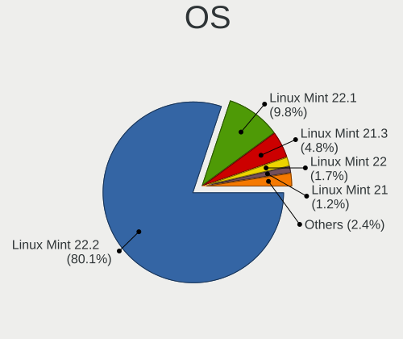

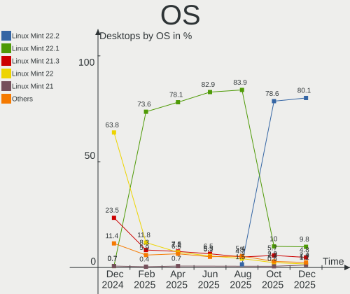

| Name            | Desktops | Percent |
|-----------------|----------|---------|
| Linux Mint 22.2 | 334      | 80.1%   |
| Linux Mint 22.1 | 41       | 9.83%   |
| Linux Mint 21.3 | 20       | 4.8%    |
| Linux Mint 22   | 7        | 1.68%   |
| Linux Mint 21   | 5        | 1.2%    |
| Linux Mint 20.3 | 4        | 0.96%   |
| Linux Mint 22.3 | 2        | 0.48%   |
| Linux Mint 21.2 | 2        | 0.48%   |
| Linux Mint 21.1 | 2        | 0.48%   |

OS Family
---------

OS without a version

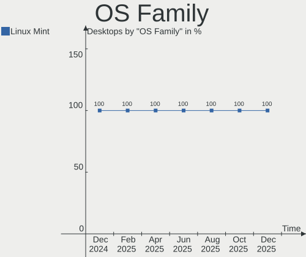

| Name       | Desktops | Percent |
|------------|----------|---------|
| Linux Mint | 417      | 100%    |

Kernel
------

Version of the Linux kernel

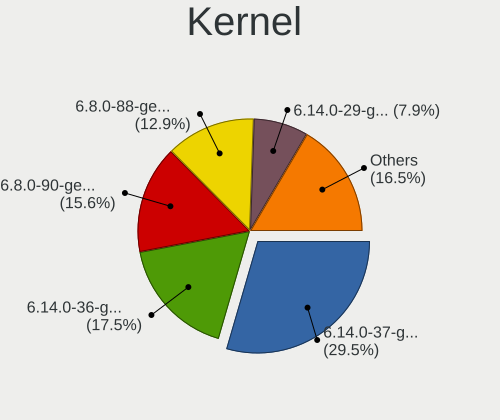

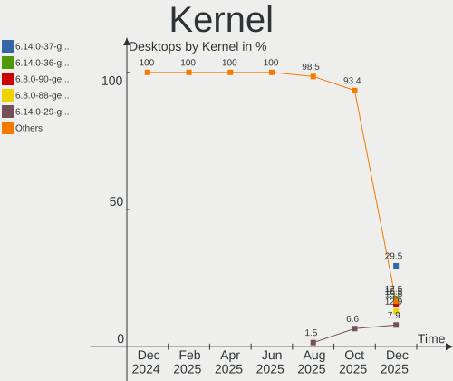

| Version                  | Desktops | Percent |
|--------------------------|----------|---------|
| 6.14.0-37-generic        | 123      | 29.5%   |
| 6.14.0-36-generic        | 73       | 17.51%  |
| 6.8.0-90-generic         | 65       | 15.59%  |
| 6.8.0-88-generic         | 54       | 12.95%  |
| 6.14.0-29-generic        | 33       | 7.91%   |
| 6.14.0-35-generic        | 6        | 1.44%   |
| 5.15.0-164-generic       | 6        | 1.44%   |
| 6.14.0-33-generic        | 5        | 1.2%    |
| 5.15.0-161-generic       | 5        | 1.2%    |
| 6.8.0-51-generic         | 4        | 0.96%   |
| 6.8.0-87-generic         | 3        | 0.72%   |
| 6.8.0-71-generic         | 3        | 0.72%   |
| 6.14.0-32-generic        | 3        | 0.72%   |
| 5.4.0-216-generic        | 3        | 0.72%   |
| 5.15.0-163-generic       | 3        | 0.72%   |
| 6.8.0-79-generic         | 2        | 0.48%   |
| 6.18.0-061800-generic    | 2        | 0.48%   |
| 6.14.0-34-generic        | 2        | 0.48%   |
| 6.14.0-1016-oem          | 2        | 0.48%   |
| 5.15.0-144-generic       | 2        | 0.48%   |
| 6.8.0-90-lowlatency      | 1        | 0.24%   |
| 6.8.0-85-generic         | 1        | 0.24%   |
| 6.8.0-78-generic         | 1        | 0.24%   |
| 6.8.0-60-generic         | 1        | 0.24%   |
| 6.8.0-55-generic         | 1        | 0.24%   |
| 6.8.0-53-generic         | 1        | 0.24%   |
| 6.8.0-52-generic         | 1        | 0.24%   |
| 6.17.12-1-liquorix-amd64 | 1        | 0.24%   |
| 6.17.10-1-liquorix-amd64 | 1        | 0.24%   |
| 6.17.0-1007-oem          | 1        | 0.24%   |
| 6.15.5-x64v3-xanmod1     | 1        | 0.24%   |
| 6.14.0-1018-oem          | 1        | 0.24%   |
| 6.1.0-1016-oem           | 1        | 0.24%   |
| 5.15.0-91-generic        | 1        | 0.24%   |
| 5.15.0-76-generic        | 1        | 0.24%   |
| 5.15.0-160-generic       | 1        | 0.24%   |
| 5.15.0-139-generic       | 1        | 0.24%   |
| 5.15.0-100-generic       | 1        | 0.24%   |

Kernel Family
-------------

Linux kernel without a distro release

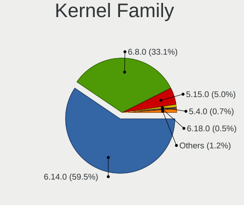

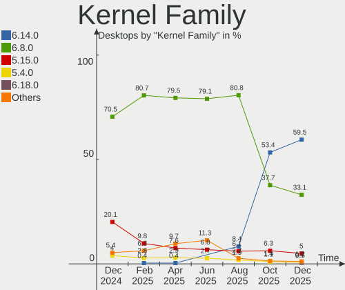

| Version | Desktops | Percent |
|---------|----------|---------|
| 6.14.0  | 248      | 59.47%  |
| 6.8.0   | 138      | 33.09%  |
| 5.15.0  | 21       | 5.04%   |
| 5.4.0   | 3        | 0.72%   |
| 6.18.0  | 2        | 0.48%   |
| 6.17.12 | 1        | 0.24%   |
| 6.17.10 | 1        | 0.24%   |
| 6.17.0  | 1        | 0.24%   |
| 6.15.5  | 1        | 0.24%   |
| 6.1.0   | 1        | 0.24%   |

Kernel Major Ver.
-----------------

Linux kernel major version

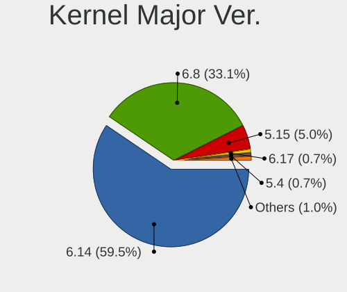

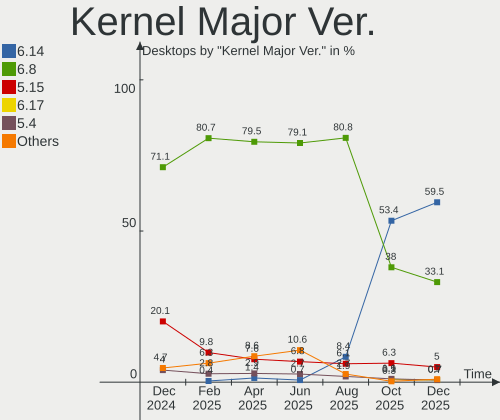

| Version | Desktops | Percent |
|---------|----------|---------|
| 6.14    | 248      | 59.47%  |
| 6.8     | 138      | 33.09%  |
| 5.15    | 21       | 5.04%   |
| 6.17    | 3        | 0.72%   |
| 5.4     | 3        | 0.72%   |
| 6.18    | 2        | 0.48%   |
| 6.15    | 1        | 0.24%   |
| 6.1     | 1        | 0.24%   |

Arch
----

OS architecture (x86_64, i586, etc.)

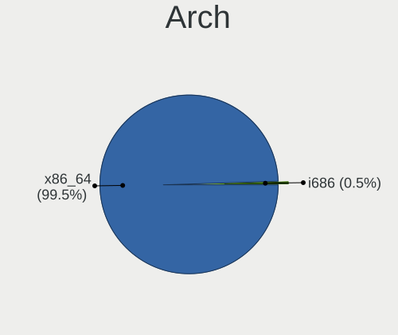

| Name   | Desktops | Percent |
|--------|----------|---------|
| x86_64 | 417      | 100%    |

DE
--

Desktop Environment

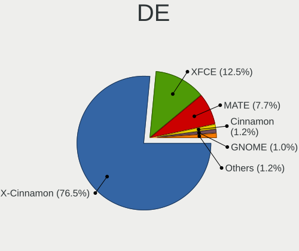

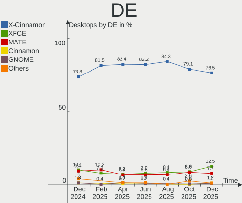

| Name       | Desktops | Percent |
|------------|----------|---------|
| X-Cinnamon | 319      | 76.5%   |
| XFCE       | 52       | 12.47%  |
| MATE       | 32       | 7.67%   |
| Cinnamon   | 5        | 1.2%    |
| GNOME      | 4        | 0.96%   |
| KDE5       | 3        | 0.72%   |
| KDE        | 1        | 0.24%   |
| Unknown    | 1        | 0.24%   |

Display Server
--------------

X11 or Wayland

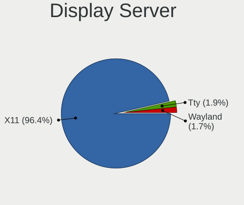

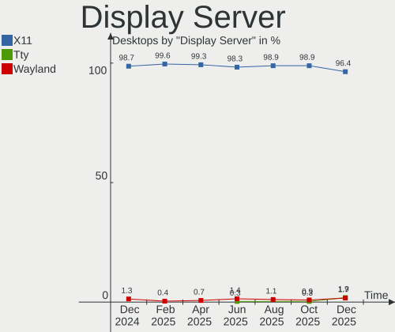

| Name    | Desktops | Percent |
|---------|----------|---------|
| X11     | 402      | 96.4%   |
| Tty     | 8        | 1.92%   |
| Wayland | 7        | 1.68%   |

Display Manager
---------------

SDDM, LightDM, etc.

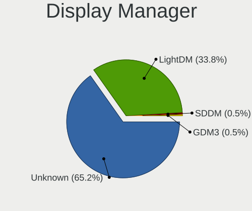

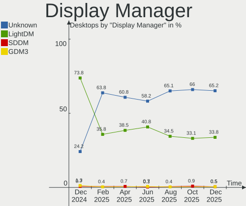

| Name    | Desktops | Percent |
|---------|----------|---------|
| Unknown | 272      | 65.23%  |
| LightDM | 141      | 33.81%  |
| SDDM    | 2        | 0.48%   |
| GDM3    | 2        | 0.48%   |

OS Lang
-------

Language

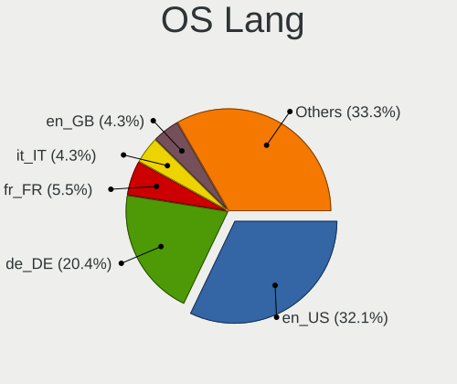

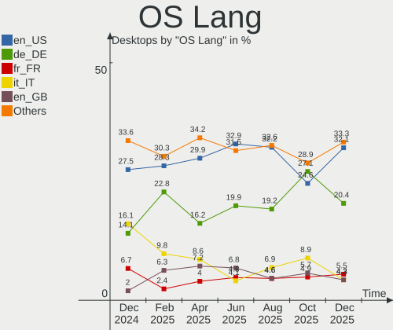

| Lang  | Desktops | Percent |
|-------|----------|---------|
| en_US | 134      | 32.13%  |
| de_DE | 85       | 20.38%  |
| fr_FR | 23       | 5.52%   |
| it_IT | 18       | 4.32%   |
| en_GB | 18       | 4.32%   |
| pt_BR | 17       | 4.08%   |
| en_AU | 14       | 3.36%   |
| en_CA | 12       | 2.88%   |
| C     | 10       | 2.4%    |
| es_ES | 8        | 1.92%   |
| nl_NL | 7        | 1.68%   |
| hu_HU | 6        | 1.44%   |
| en_ZA | 6        | 1.44%   |
| de_CH | 6        | 1.44%   |
| ru_RU | 5        | 1.2%    |
| es_AR | 5        | 1.2%    |
| de_AT | 5        | 1.2%    |
| tr_TR | 4        | 0.96%   |
| en_IN | 4        | 0.96%   |
| cs_CZ | 3        | 0.72%   |
| sv_SE | 2        | 0.48%   |
| pt_PT | 2        | 0.48%   |
| ja_JP | 2        | 0.48%   |
| es_MX | 2        | 0.48%   |
| zh_TW | 1        | 0.24%   |
| zh_CN | 1        | 0.24%   |
| ro_RO | 1        | 0.24%   |
| pl_PL | 1        | 0.24%   |
| nb_NO | 1        | 0.24%   |
| ko_KR | 1        | 0.24%   |
| he_IL | 1        | 0.24%   |
| fr_CA | 1        | 0.24%   |
| fr_BE | 1        | 0.24%   |
| fi_FI | 1        | 0.24%   |
| et_EE | 1        | 0.24%   |
| es_UY | 1        | 0.24%   |
| es_CL | 1        | 0.24%   |
| en_NZ | 1        | 0.24%   |
| en_IE | 1        | 0.24%   |
| ca_ES | 1        | 0.24%   |

Boot Mode
---------

EFI or BIOS

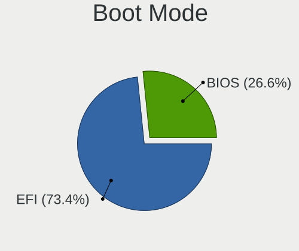

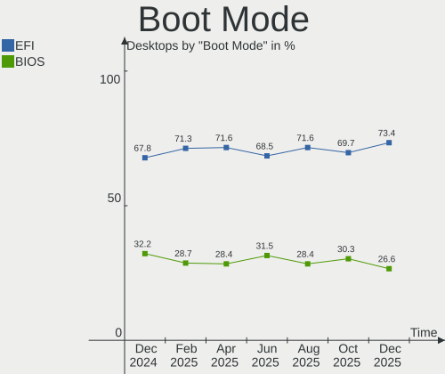

| Mode | Desktops | Percent |
|------|----------|---------|
| EFI  | 306      | 73.38%  |
| BIOS | 111      | 26.62%  |

Filesystem
----------

Type of filesystem

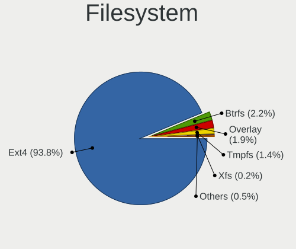

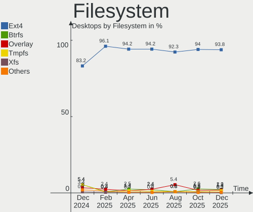

| Type    | Desktops | Percent |
|---------|----------|---------|
| Ext4    | 391      | 93.76%  |
| Btrfs   | 9        | 2.16%   |
| Overlay | 8        | 1.92%   |
| Tmpfs   | 6        | 1.44%   |
| Xfs     | 1        | 0.24%   |
| Ext3    | 1        | 0.24%   |
| Ext2    | 1        | 0.24%   |

Part. scheme
------------

Scheme of partitioning

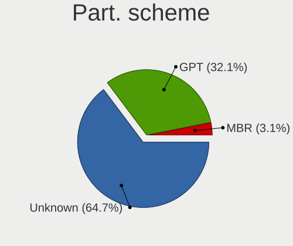

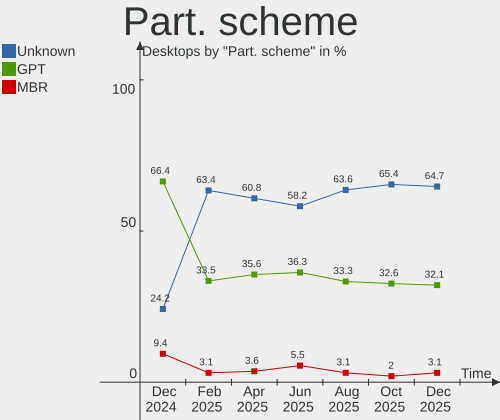

| Type    | Desktops | Percent |
|---------|----------|---------|
| Unknown | 270      | 64.75%  |
| GPT     | 134      | 32.13%  |
| MBR     | 13       | 3.12%   |

Dual Boot with Linux/BSD
------------------------

Hosting more than one Linux/BSD

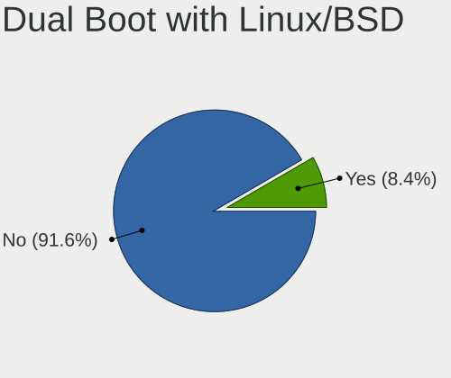

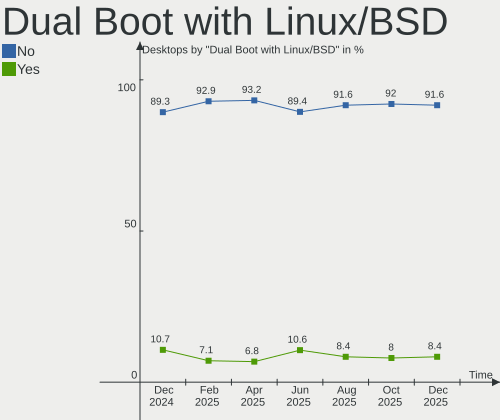

| Dual boot | Desktops | Percent |
|-----------|----------|---------|
| No        | 382      | 91.61%  |
| Yes       | 35       | 8.39%   |

Dual Boot (Win)
---------------

Hosting Linux and Windows

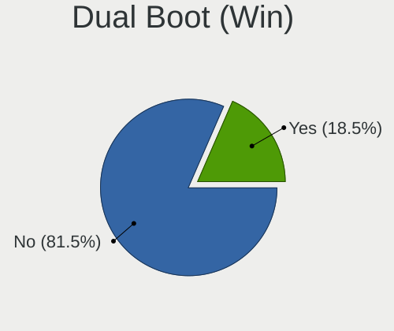

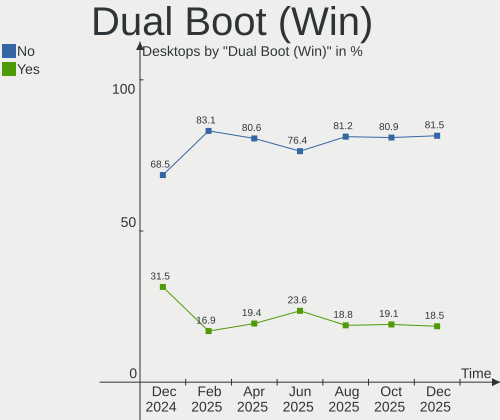

| Dual boot | Desktops | Percent |
|-----------|----------|---------|
| No        | 340      | 81.53%  |
| Yes       | 77       | 18.47%  |

Board
-----

Vendor
------

Motherboard manufacturer

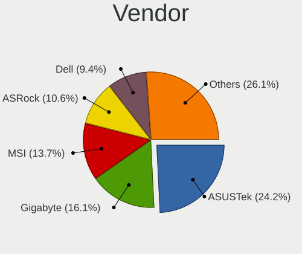

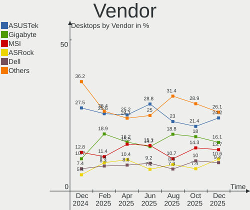

| Name                                 | Desktops | Percent |
|--------------------------------------|----------|---------|
| ASUSTek Computer                     | 101      | 24.22%  |
| Gigabyte Technology                  | 67       | 16.07%  |
| MSI                                  | 57       | 13.67%  |
| ASRock                               | 44       | 10.55%  |
| Dell                                 | 39       | 9.35%   |
| Hewlett-Packard                      | 29       | 6.95%   |
| Lenovo                               | 14       | 3.36%   |
| Unknown                              | 11       | 2.64%   |
| Intel                                | 10       | 2.4%    |
| Fujitsu                              | 7        | 1.68%   |
| Pegatron                             | 5        | 1.2%    |
| Medion                               | 4        | 0.96%   |
| AZW                                  | 4        | 0.96%   |
| Foxconn                              | 3        | 0.72%   |
| Biostar                              | 3        | 0.72%   |
| Acer                                 | 3        | 0.72%   |
| TGT                                  | 1        | 0.24%   |
| SZMZ                                 | 1        | 0.24%   |
| Shuttle                              | 1        | 0.24%   |
| Shenzhen Meigao Electronic Equipment | 1        | 0.24%   |
| RealBom                              | 1        | 0.24%   |
| Packard Bell                         | 1        | 0.24%   |
| HC Technology.                       | 1        | 0.24%   |
| GEEKOM                               | 1        | 0.24%   |
| Gateway                              | 1        | 0.24%   |
| Fujitsu Siemens                      | 1        | 0.24%   |
| Daten Tecnologia                     | 1        | 0.24%   |
| AOpen                                | 1        | 0.24%   |
| ANGXUN                               | 1        | 0.24%   |
| AMI                                  | 1        | 0.24%   |
| Alienware                            | 1        | 0.24%   |
| AFOX                                 | 1        | 0.24%   |

Model
-----

Motherboard model

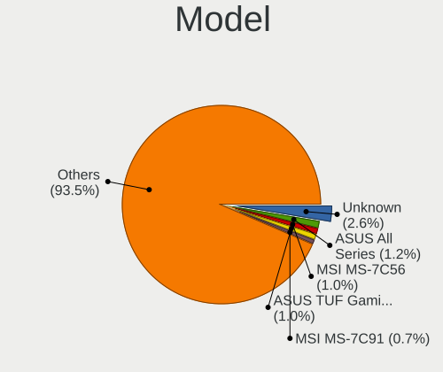

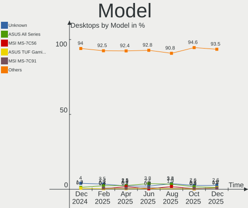

| Name                                              | Desktops | Percent |
|---------------------------------------------------|----------|---------|
| Unknown                                           | 11       | 2.64%   |
| ASUS All Series                                   | 5        | 1.2%    |
| MSI MS-7C56                                       | 4        | 0.96%   |
| ASUS TUF Gaming X570-PLUS                         | 4        | 0.96%   |
| MSI MS-7C91                                       | 3        | 0.72%   |
| MSI MS-7C89                                       | 3        | 0.72%   |
| MSI MS-7A38                                       | 3        | 0.72%   |
| Gigabyte B550I AORUS PRO AX                       | 3        | 0.72%   |
| Gigabyte B450 AORUS M                             | 3        | 0.72%   |
| Gigabyte 970A-DS3P                                | 3        | 0.72%   |
| Dell OptiPlex 7050                                | 3        | 0.72%   |
| ASUS TUF Gaming B550M-PLUS                        | 3        | 0.72%   |
| MSI MS-7E49                                       | 2        | 0.48%   |
| MSI MS-7C37                                       | 2        | 0.48%   |
| MSI MS-7C09                                       | 2        | 0.48%   |
| MSI MS-7850                                       | 2        | 0.48%   |
| Intel H61                                         | 2        | 0.48%   |
| Gigabyte Z790 AORUS ELITE AX                      | 2        | 0.48%   |
| Gigabyte Z590 AORUS PRO AX                        | 2        | 0.48%   |
| Gigabyte B550M AORUS ELITE                        | 2        | 0.48%   |
| Gigabyte B550 AORUS ELITE V2                      | 2        | 0.48%   |
| Fujitsu ESPRIMO Q957                              | 2        | 0.48%   |
| Dell XPS 8900                                     | 2        | 0.48%   |
| Dell OptiPlex 9020                                | 2        | 0.48%   |
| Dell OptiPlex 7010                                | 2        | 0.48%   |
| Dell OptiPlex 3020M                               | 2        | 0.48%   |
| Dell Inspiron 3847                                | 2        | 0.48%   |
| ASUS TERRA_PC                                     | 2        | 0.48%   |
| ASUS PRIME Z270-P                                 | 2        | 0.48%   |
| ASRock Z77 Extreme4                               | 2        | 0.48%   |
| ASRock FM2A88X Extreme6+                          | 2        | 0.48%   |
| ASRock B650 Pro RS                                | 2        | 0.48%   |
| ASRock A320M-HDV                                  | 2        | 0.48%   |
| ASRock 970 Extreme4                               | 2        | 0.48%   |
| TGT H61-T V1.0                                    | 1        | 0.24%   |
| SZMZ B75-H                                        | 1        | 0.24%   |
| Shuttle XH61                                      | 1        | 0.24%   |
| Shenzhen Meigao Electronic Equipment Venus series | 1        | 0.24%   |
| RealBom RB-P101G                                  | 1        | 0.24%   |
| Pegatron WE185AA-ABF CQ5321FR                     | 1        | 0.24%   |

Model Family
------------

Motherboard model prefix

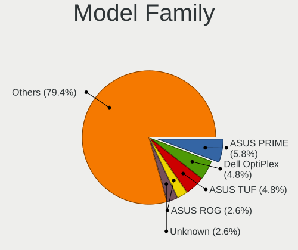

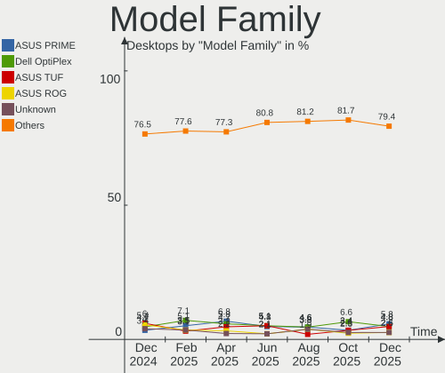

| Name                | Desktops | Percent |
|---------------------|----------|---------|
| ASUS PRIME          | 24       | 5.76%   |
| Dell OptiPlex       | 20       | 4.8%    |
| ASUS TUF            | 20       | 4.8%    |
| ASUS ROG            | 11       | 2.64%   |
| Unknown             | 11       | 2.64%   |
| Lenovo ThinkCentre  | 9        | 2.16%   |
| HP Compaq           | 8        | 1.92%   |
| Fujitsu ESPRIMO     | 7        | 1.68%   |
| Dell Inspiron       | 5        | 1.2%    |
| ASUS All            | 5        | 1.2%    |
| MSI MS-7C56         | 4        | 0.96%   |
| Gigabyte B550M      | 4        | 0.96%   |
| Gigabyte B450M      | 4        | 0.96%   |
| Gigabyte B450       | 4        | 0.96%   |
| Dell Precision      | 4        | 0.96%   |
| MSI MS-7C91         | 3        | 0.72%   |
| MSI MS-7C89         | 3        | 0.72%   |
| MSI MS-7A38         | 3        | 0.72%   |
| HP ProDesk          | 3        | 0.72%   |
| HP Pavilion         | 3        | 0.72%   |
| HP EliteDesk        | 3        | 0.72%   |
| Gigabyte Z790       | 3        | 0.72%   |
| Gigabyte B550I      | 3        | 0.72%   |
| Gigabyte A520M      | 3        | 0.72%   |
| Gigabyte 970A-DS3P  | 3        | 0.72%   |
| Dell XPS            | 3        | 0.72%   |
| Dell Studio         | 3        | 0.72%   |
| ASUS P8H61-M        | 3        | 0.72%   |
| ASUS M5A97          | 3        | 0.72%   |
| ASRock X570         | 3        | 0.72%   |
| MSI MS-7E49         | 2        | 0.48%   |
| MSI MS-7C37         | 2        | 0.48%   |
| MSI MS-7C09         | 2        | 0.48%   |
| MSI MS-7850         | 2        | 0.48%   |
| Lenovo ThinkStation | 2        | 0.48%   |
| Intel H61           | 2        | 0.48%   |
| HP Z400             | 2        | 0.48%   |
| Gigabyte Z690       | 2        | 0.48%   |
| Gigabyte Z590       | 2        | 0.48%   |
| Gigabyte Z390       | 2        | 0.48%   |

MFG Year
--------

Motherboard manufacture year

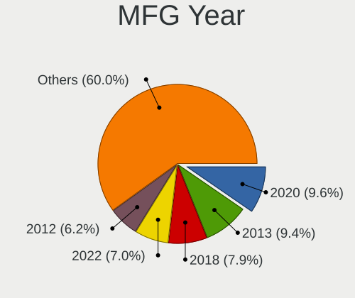

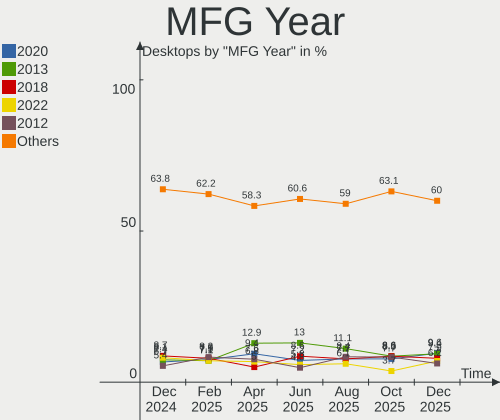

| Year | Desktops | Percent |
|------|----------|---------|
| 2020 | 40       | 9.59%   |
| 2013 | 39       | 9.35%   |
| 2018 | 33       | 7.91%   |
| 2022 | 29       | 6.95%   |
| 2012 | 26       | 6.24%   |
| 2023 | 25       | 6%      |
| 2017 | 25       | 6%      |
| 2019 | 24       | 5.76%   |
| 2021 | 22       | 5.28%   |
| 2011 | 22       | 5.28%   |
| 2024 | 20       | 4.8%    |
| 2009 | 20       | 4.8%    |
| 2014 | 19       | 4.56%   |
| 2015 | 17       | 4.08%   |
| 2016 | 16       | 3.84%   |
| 2025 | 12       | 2.88%   |
| 2010 | 12       | 2.88%   |
| 2008 | 9        | 2.16%   |
| 2007 | 6        | 1.44%   |
| 2006 | 1        | 0.24%   |

Form Factor
-----------

Physical design of the computer

| Name    | Desktops | Percent |
|---------|----------|---------|
| Desktop | 417      | 100%    |

Secure Boot
-----------

Enabled or disabled

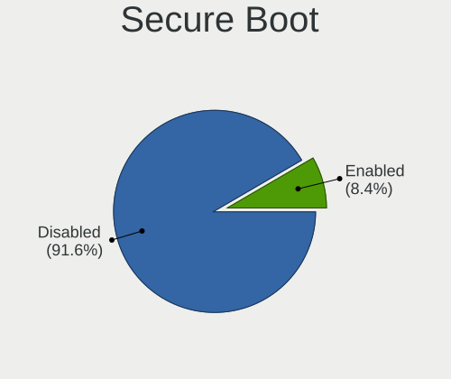

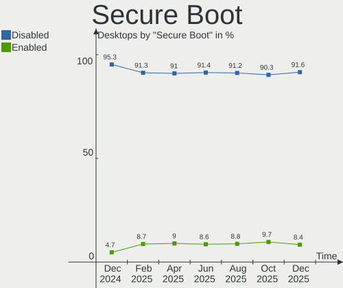

| State    | Desktops | Percent |
|----------|----------|---------|
| Disabled | 382      | 91.61%  |
| Enabled  | 35       | 8.39%   |

Coreboot
--------

Have coreboot on board

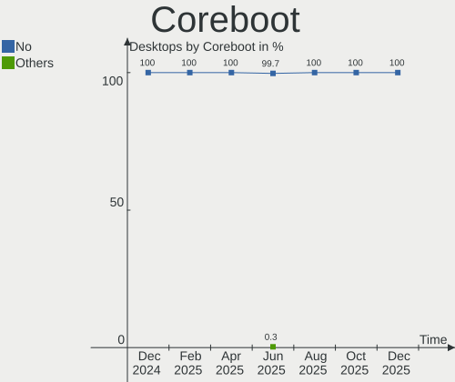

| Used | Desktops | Percent |
|------|----------|---------|
| No   | 417      | 100%    |

RAM Size
--------

Total RAM memory

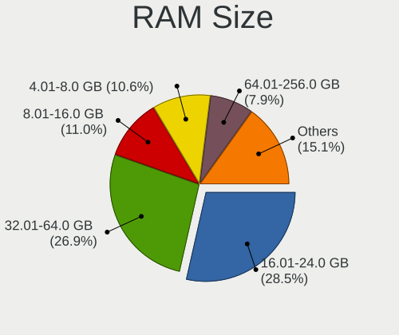

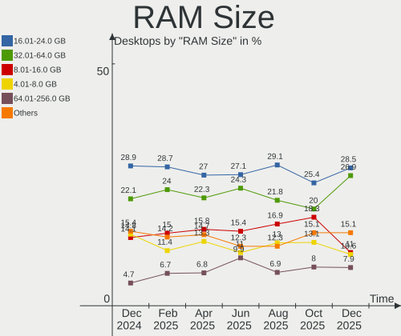

| Size in GB  | Desktops | Percent |
|-------------|----------|---------|
| 16.01-24.0  | 119      | 28.54%  |
| 32.01-64.0  | 112      | 26.86%  |
| 8.01-16.0   | 46       | 11.03%  |
| 4.01-8.0    | 44       | 10.55%  |
| 64.01-256.0 | 33       | 7.91%   |
| 3.01-4.0    | 31       | 7.43%   |
| 24.01-32.0  | 28       | 6.71%   |
| 1.01-2.0    | 3        | 0.72%   |
| 2.01-3.0    | 1        | 0.24%   |

RAM Used
--------

Used RAM memory

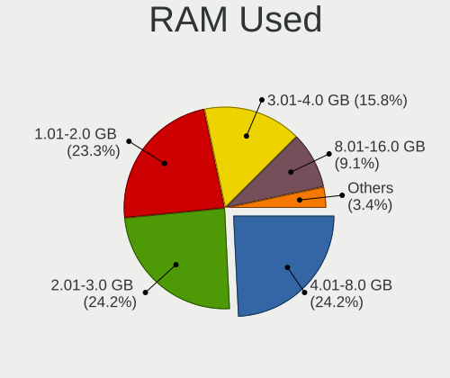

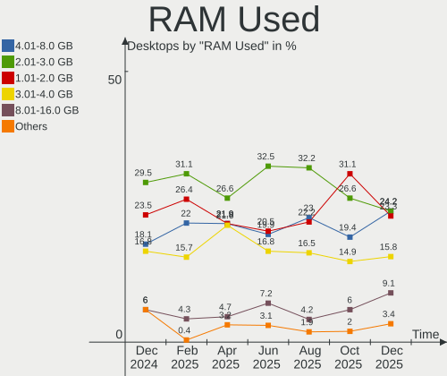

| Used GB     | Desktops | Percent |
|-------------|----------|---------|
| 4.01-8.0    | 101      | 24.22%  |
| 2.01-3.0    | 101      | 24.22%  |
| 1.01-2.0    | 97       | 23.26%  |
| 3.01-4.0    | 66       | 15.83%  |
| 8.01-16.0   | 38       | 9.11%   |
| 0.51-1.0    | 5        | 1.2%    |
| 16.01-24.0  | 4        | 0.96%   |
| 32.01-64.0  | 2        | 0.48%   |
| 24.01-32.0  | 2        | 0.48%   |
| 64.01-256.0 | 1        | 0.24%   |

Total Drives
------------

Number of drives on board

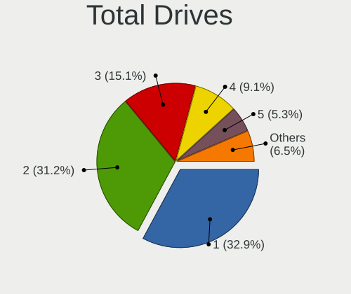

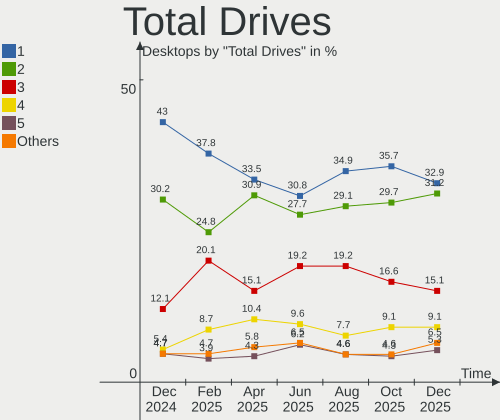

| Drives | Desktops | Percent |
|--------|----------|---------|
| 1      | 137      | 32.85%  |
| 2      | 130      | 31.18%  |
| 3      | 63       | 15.11%  |
| 4      | 38       | 9.11%   |
| 5      | 22       | 5.28%   |
| 6      | 18       | 4.32%   |
| 7      | 5        | 1.2%    |
| 10     | 2        | 0.48%   |
| 8      | 1        | 0.24%   |
| 0      | 1        | 0.24%   |

Has CD-ROM
----------

Has CD-ROM on board

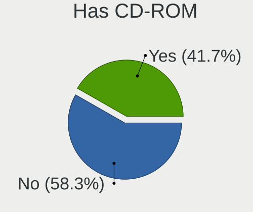

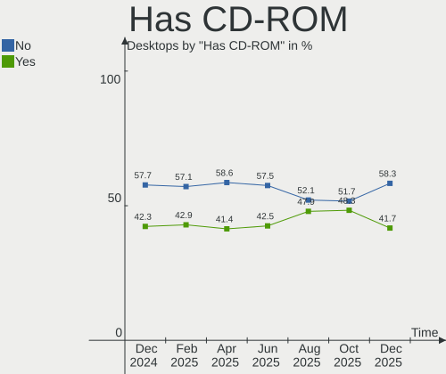

| Presented | Desktops | Percent |
|-----------|----------|---------|
| No        | 243      | 58.27%  |
| Yes       | 174      | 41.73%  |

Has Ethernet
------------

Has Ethernet on board

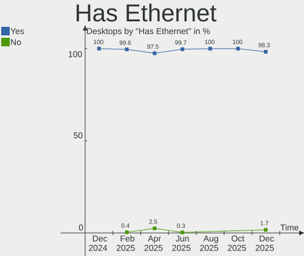

| Presented | Desktops | Percent |
|-----------|----------|---------|
| Yes       | 410      | 98.32%  |
| No        | 7        | 1.68%   |

Has WiFi
--------

Has WiFi module

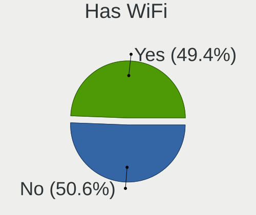

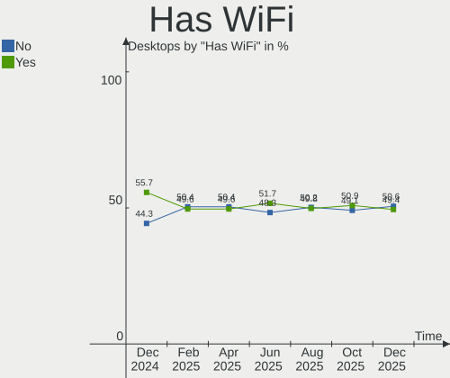

| Presented | Desktops | Percent |
|-----------|----------|---------|
| No        | 211      | 50.6%   |
| Yes       | 206      | 49.4%   |

Has Bluetooth
-------------

Has Bluetooth module

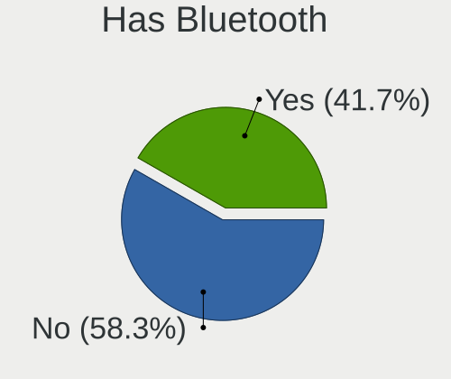

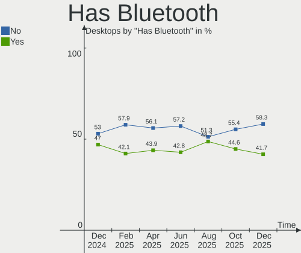

| Presented | Desktops | Percent |
|-----------|----------|---------|
| No        | 243      | 58.27%  |
| Yes       | 174      | 41.73%  |

Location
--------

Country
-------

Geographic location (country)

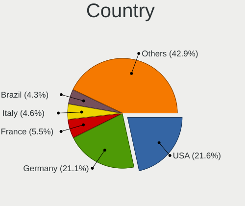

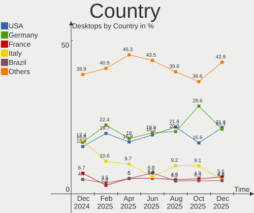

| Country             | Desktops | Percent |
|---------------------|----------|---------|
| USA                 | 90       | 21.58%  |
| Germany             | 88       | 21.1%   |
| France              | 23       | 5.52%   |
| Italy               | 19       | 4.56%   |
| Brazil              | 18       | 4.32%   |
| UK                  | 15       | 3.6%    |
| Australia           | 15       | 3.6%    |
| Canada              | 14       | 3.36%   |
| Spain               | 12       | 2.88%   |
| Switzerland         | 9        | 2.16%   |
| Netherlands         | 8        | 1.92%   |
| Austria             | 7        | 1.68%   |
| South Africa        | 6        | 1.44%   |
| Indonesia           | 6        | 1.44%   |
| Hungary             | 6        | 1.44%   |
| Czechia             | 6        | 1.44%   |
| Turkey              | 5        | 1.2%    |
| Sweden              | 5        | 1.2%    |
| India               | 5        | 1.2%    |
| Poland              | 4        | 0.96%   |
| Mexico              | 4        | 0.96%   |
| Argentina           | 4        | 0.96%   |
| The Netherlands     | 3        | 0.72%   |
| Russia              | 3        | 0.72%   |
| Portugal            | 3        | 0.72%   |
| Finland             | 3        | 0.72%   |
| Bulgaria            | 3        | 0.72%   |
| Romania             | 2        | 0.48%   |
| Japan               | 2        | 0.48%   |
| Denmark             | 2        | 0.48%   |
| Belgium             | 2        | 0.48%   |
| Vietnam             | 1        | 0.24%   |
| Uruguay             | 1        | 0.24%   |
| Ukraine             | 1        | 0.24%   |
| UAE                 | 1        | 0.24%   |
| Trinidad and Tobago | 1        | 0.24%   |
| Thailand            | 1        | 0.24%   |
| Taiwan              | 1        | 0.24%   |
| South Korea         | 1        | 0.24%   |
| Slovakia            | 1        | 0.24%   |

City
----

Geographic location (city)

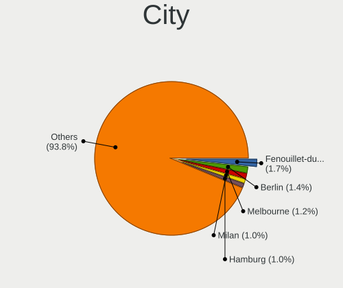

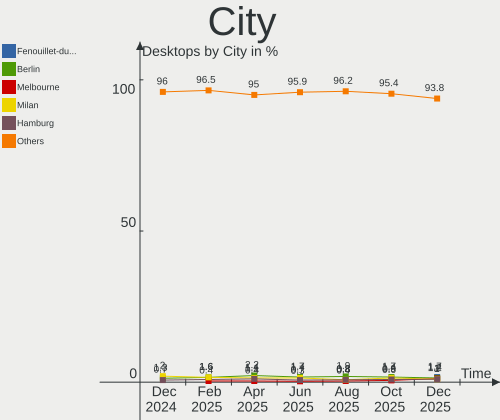

| City                | Desktops | Percent |
|---------------------|----------|---------|
| Fenouillet-du-Razes | 7        | 1.68%   |
| Berlin              | 6        | 1.44%   |
| Melbourne           | 5        | 1.2%    |
| Milan               | 4        | 0.96%   |
| Hamburg             | 4        | 0.96%   |
| Vienna              | 3        | 0.72%   |
| Traunstein          | 3        | 0.72%   |
| Sydney              | 3        | 0.72%   |
| Istanbul            | 3        | 0.72%   |
| Houston             | 3        | 0.72%   |
| Cape Town           | 3        | 0.72%   |
| Budapest            | 3        | 0.72%   |
| West Mifflin        | 2        | 0.48%   |
| Twin Valley         | 2        | 0.48%   |
| Toronto             | 2        | 0.48%   |
| Tokushima           | 2        | 0.48%   |
| Stockholm           | 2        | 0.48%   |
| Sao Paulo           | 2        | 0.48%   |
| Rome                | 2        | 0.48%   |
| Rio de Janeiro      | 2        | 0.48%   |
| Portland            | 2        | 0.48%   |
| Perth               | 2        | 0.48%   |
| Offenbach           | 2        | 0.48%   |
| Nampa               | 2        | 0.48%   |
| Munich              | 2        | 0.48%   |
| Monterrey           | 2        | 0.48%   |
| Miami               | 2        | 0.48%   |
| Lehre               | 2        | 0.48%   |
| La Junta            | 2        | 0.48%   |
| Hamminkeln          | 2        | 0.48%   |
| Frankfurt am Main   | 2        | 0.48%   |
| Fort Worth          | 2        | 0.48%   |
| Essen               | 2        | 0.48%   |
| Engelskirchen       | 2        | 0.48%   |
| Elmira              | 2        | 0.48%   |
| Dortmund            | 2        | 0.48%   |
| Defiance            | 2        | 0.48%   |
| Coburg              | 2        | 0.48%   |
| Christchurch        | 2        | 0.48%   |
| Brussels            | 2        | 0.48%   |

Drives
------

Drive Vendor
------------

Hard drive vendors

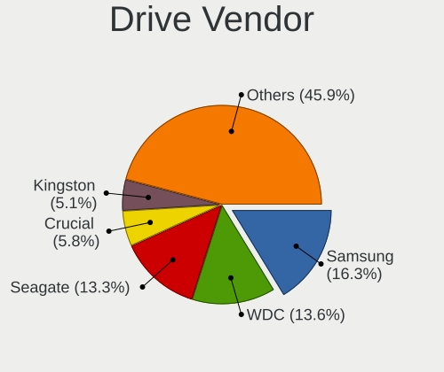

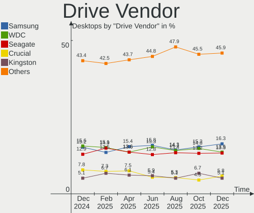

| Vendor                      | Desktops | Drives | Percent |
|-----------------------------|----------|--------|---------|
| Samsung Electronics         | 132      | 205    | 16.3%   |
| WDC                         | 110      | 149    | 13.58%  |
| Seagate                     | 108      | 147    | 13.33%  |
| Crucial                     | 47       | 58     | 5.8%    |
| Kingston                    | 41       | 49     | 5.06%   |
| SanDisk                     | 39       | 45     | 4.81%   |
| Toshiba                     | 33       | 35     | 4.07%   |
| Hitachi                     | 23       | 25     | 2.84%   |
| Micron/Crucial Technology   | 20       | 25     | 2.47%   |
| Phison Electronics          | 16       | 18     | 1.98%   |
| Intenso                     | 12       | 14     | 1.48%   |
| Micron Technology           | 11       | 11     | 1.36%   |
| MAXIO Technology (Hangzhou) | 11       | 12     | 1.36%   |
| Kingston Technology Company | 10       | 10     | 1.23%   |
| HGST                        | 10       | 16     | 1.23%   |
| SK hynix                    | 9        | 9      | 1.11%   |
| A-DATA Technology           | 9        | 9      | 1.11%   |
| PNY                         | 8        | 12     | 0.99%   |
| ADATA Technology            | 8        | 8      | 0.99%   |
| SPCC                        | 7        | 7      | 0.86%   |
| Silicon Motion              | 7        | 7      | 0.86%   |
| Intel                       | 7        | 7      | 0.86%   |
| Realtek Semiconductor       | 6        | 6      | 0.74%   |
| Lexar                       | 6        | 6      | 0.74%   |
| ASMT                        | 6        | 9      | 0.74%   |
| China                       | 5        | 7      | 0.62%   |
| Unknown                     | 4        | 4      | 0.49%   |
| Patriot                     | 4        | 6      | 0.49%   |
| Netac                       | 4        | 4      | 0.49%   |
| KingSpec                    | 4        | 5      | 0.49%   |
| JMicron Technology          | 4        | 4      | 0.49%   |
| Fanxiang                    | 4        | 4      | 0.49%   |
| X12                         | 3        | 3      | 0.37%   |
| Transcend                   | 3        | 3      | 0.37%   |
| Realtek                     | 3        | 3      | 0.37%   |
| OCZ                         | 3        | 3      | 0.37%   |
| KIOXIA                      | 3        | 3      | 0.37%   |
| Corsair                     | 3        | 3      | 0.37%   |
| Verbatim                    | 2        | 2      | 0.25%   |
| USB3.0                      | 2        | 2      | 0.25%   |

Drive Model
-----------

Hard drive models

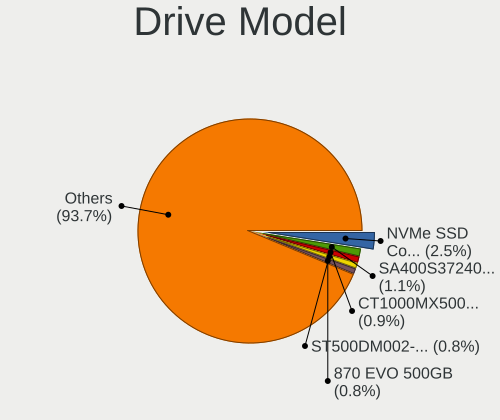

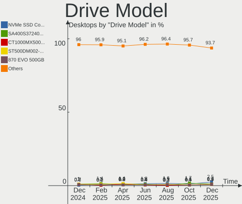

| Model                                                 | Desktops | Percent |
|-------------------------------------------------------|----------|---------|
| Samsung NVMe SSD Controller SM981/PM981/PM983 1TB     | 24       | 2.5%    |
| Kingston SA400S37240G 240GB SSD                       | 11       | 1.15%   |
| Crucial CT1000MX500SSD1 1TB                           | 9        | 0.94%   |
| Seagate ST500DM002-1BD142 500GB                       | 8        | 0.83%   |
| Samsung SSD 870 EVO 500GB                             | 8        | 0.83%   |
| Samsung SSD 860 EVO 1TB                               | 8        | 0.83%   |
| Samsung NVMe SSD Controller SM961/PM961/SM963 1024GB  | 8        | 0.83%   |
| Seagate ST4000DM004-2CV104 4TB                        | 7        | 0.73%   |
| Samsung SSD 980 1TB                                   | 7        | 0.73%   |
| MAXIO (Hangzhou) NVMe SSD Controller MAP1202 2TB      | 7        | 0.73%   |
| WDC WD10EZEX-08WN4A0 1TB                              | 6        | 0.63%   |
| Seagate ST1000DM003-1ER162 1TB                        | 6        | 0.63%   |
| Seagate ST1000DM003-1CH162 1TB                        | 6        | 0.63%   |
| Samsung SSD 990 PRO 2TB                               | 6        | 0.63%   |
| Samsung SSD 860 EVO 500GB                             | 6        | 0.63%   |
| Kingston SA400S37960G 960GB SSD                       | 6        | 0.63%   |
| Hitachi HDS721010CLA332 1TB                           | 6        | 0.63%   |
| Silicon Motion SM2263EN/SM2263XT SSD Controller 512GB | 5        | 0.52%   |
| Seagate ST1000DM010-2EP102 1TB                        | 5        | 0.52%   |
| Samsung SSD 980 PRO 1TB                               | 5        | 0.52%   |
| Samsung SSD 870 QVO 1TB                               | 5        | 0.52%   |
| Samsung SSD 850 EVO 500GB                             | 5        | 0.52%   |
| Samsung NVMe SSD Controller PM9A1/PM9A3/980PRO 1TB    | 5        | 0.52%   |
| Phison E16 PCIe4 NVMe Controller 1TB                  | 5        | 0.52%   |
| Phison E12 NVMe Controller 1TB                        | 5        | 0.52%   |
| Kingston Company SNV2S1000G 1TB                       | 5        | 0.52%   |
| Kingston SA400S37480G 480GB SSD                       | 5        | 0.52%   |
| Crucial CT500MX500SSD1 500GB                          | 5        | 0.52%   |
| Seagate ST9500325AS 500GB                             | 4        | 0.42%   |
| Seagate ST3500413AS 500GB                             | 4        | 0.42%   |
| Seagate ST2000DM008-2FR102 2TB                        | 4        | 0.42%   |
| Seagate Expansion Desk 4TB                            | 4        | 0.42%   |
| Samsung SSD 870 EVO 1TB                               | 4        | 0.42%   |
| Kingston SV300S37A120G 120GB SSD                      | 4        | 0.42%   |
| Crucial CT500BX500SSD1 500GB                          | 4        | 0.42%   |
| WDC WD5000AAKX-00ERMA0 500GB                          | 3        | 0.31%   |
| WDC WD20EZRX-00D8PB0 2TB                              | 3        | 0.31%   |
| WDC WD10EZEX-60ZF5A0 1TB                              | 3        | 0.31%   |
| WDC WD10EZEX-60WN4A0 1TB                              | 3        | 0.31%   |
| WDC WD1003FZEX-00K3CA0 1TB                            | 3        | 0.31%   |

HDD Vendor
----------

Hard disk drive vendors

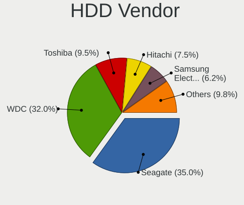

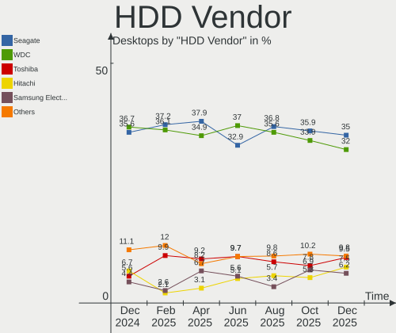

| Vendor              | Desktops | Drives | Percent |
|---------------------|----------|--------|---------|
| Seagate             | 107      | 145    | 34.97%  |
| WDC                 | 98       | 126    | 32.03%  |
| Toshiba             | 29       | 31     | 9.48%   |
| Hitachi             | 23       | 25     | 7.52%   |
| Samsung Electronics | 19       | 21     | 6.21%   |
| HGST                | 10       | 16     | 3.27%   |
| ASMT                | 5        | 6      | 1.63%   |
| USB3.0              | 2        | 2      | 0.65%   |
| Unknown             | 2        | 2      | 0.65%   |
| TO Exter            | 2        | 2      | 0.65%   |
| Maxtor              | 2        | 2      | 0.65%   |
| JMicron Technology  | 2        | 2      | 0.65%   |
| Intenso             | 2        | 2      | 0.65%   |
| RSH-339             | 1        | 1      | 0.33%   |
| Min Yi U            | 1        | 1      | 0.33%   |
| HPE                 | 1        | 1      | 0.33%   |

SSD Vendor
----------

Solid state drive vendors

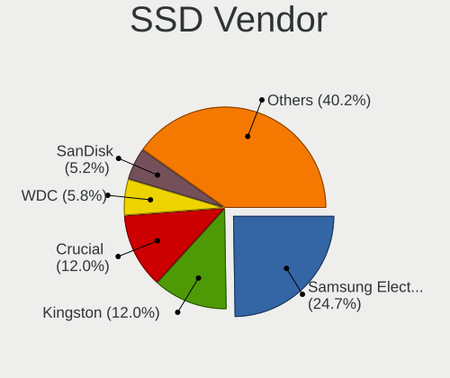

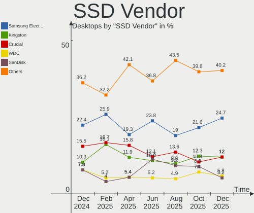

| Vendor              | Desktops | Drives | Percent |
|---------------------|----------|--------|---------|
| Samsung Electronics | 72       | 93     | 24.74%  |
| Kingston            | 35       | 40     | 12.03%  |
| Crucial             | 35       | 43     | 12.03%  |
| WDC                 | 17       | 19     | 5.84%   |
| SanDisk             | 15       | 19     | 5.15%   |
| Intenso             | 10       | 11     | 3.44%   |
| Micron Technology   | 9        | 9      | 3.09%   |
| SPCC                | 7        | 7      | 2.41%   |
| A-DATA Technology   | 7        | 7      | 2.41%   |
| PNY                 | 6        | 8      | 2.06%   |
| SK hynix            | 5        | 5      | 1.72%   |
| China               | 5        | 7      | 1.72%   |
| Patriot             | 4        | 6      | 1.37%   |
| Netac               | 4        | 4      | 1.37%   |
| KingSpec            | 4        | 5      | 1.37%   |
| Intel               | 4        | 4      | 1.37%   |
| X12                 | 3        | 3      | 1.03%   |
| Transcend           | 3        | 3      | 1.03%   |
| OCZ                 | 3        | 3      | 1.03%   |
| Lexar               | 3        | 3      | 1.03%   |
| Fanxiang            | 3        | 3      | 1.03%   |
| Toshiba             | 2        | 2      | 0.69%   |
| Plextor             | 2        | 2      | 0.69%   |
| LITEON              | 2        | 2      | 0.69%   |
| Integral            | 2        | 2      | 0.69%   |
| Emtec               | 2        | 3      | 0.69%   |
| Corsair             | 2        | 2      | 0.69%   |
| Vi550               | 1        | 1      | 0.34%   |
| V-GeN               | 1        | 1      | 0.34%   |
| T-FORCE             | 1        | 1      | 0.34%   |
| SPCC Sol            | 1        | 1      | 0.34%   |
| Silicon Motion      | 1        | 1      | 0.34%   |
| Seagate             | 1        | 1      | 0.34%   |
| SD                  | 1        | 1      | 0.34%   |
| Mushkin             | 1        | 1      | 0.34%   |
| MSI                 | 1        | 1      | 0.34%   |
| LITEONIT            | 1        | 1      | 0.34%   |
| Leven               | 1        | 1      | 0.34%   |
| KODAK               | 1        | 1      | 0.34%   |
| KIOXIA-EXCERIA      | 1        | 1      | 0.34%   |

Drive Kind
----------

HDD or SSD

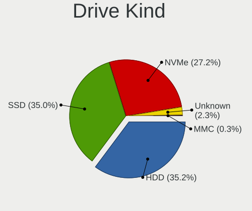

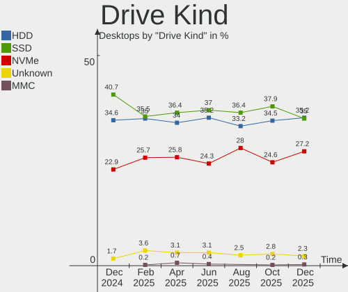

| Kind    | Desktops | Drives | Percent |
|---------|----------|--------|---------|
| HDD     | 242      | 385    | 35.17%  |
| SSD     | 241      | 342    | 35.03%  |
| NVMe    | 187      | 276    | 27.18%  |
| Unknown | 16       | 17     | 2.33%   |
| MMC     | 2        | 2      | 0.29%   |

Drive Connector
---------------

SATA, SAS, NVMe, etc.

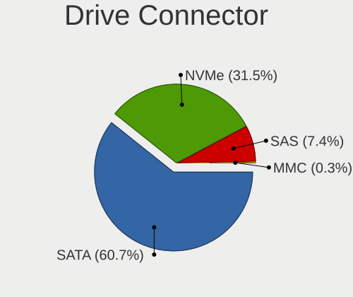

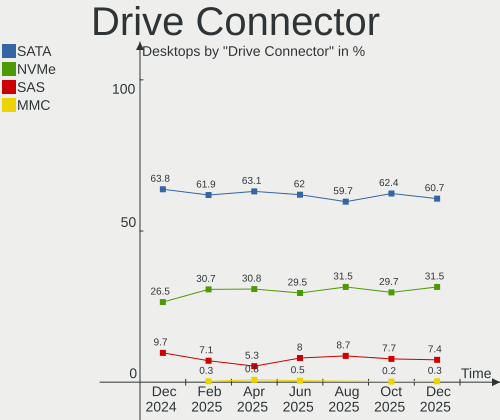

| Type | Desktops | Drives | Percent |
|------|----------|--------|---------|
| SATA | 360      | 695    | 60.71%  |
| NVMe | 187      | 271    | 31.53%  |
| SAS  | 44       | 54     | 7.42%   |
| MMC  | 2        | 2      | 0.34%   |

Drive Size
----------

Size of hard drive

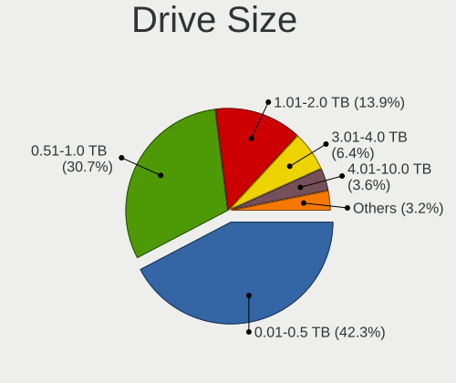

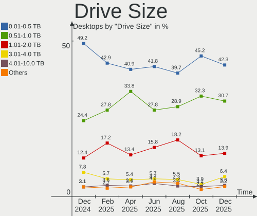

| Size in TB | Desktops | Drives | Percent |
|------------|----------|--------|---------|
| 0.01-0.5   | 226      | 324    | 42.32%  |
| 0.51-1.0   | 164      | 218    | 30.71%  |
| 1.01-2.0   | 74       | 85     | 13.86%  |
| 3.01-4.0   | 34       | 49     | 6.37%   |
| 4.01-10.0  | 19       | 31     | 3.56%   |
| 10.01-20.0 | 10       | 13     | 1.87%   |
| 2.01-3.0   | 7        | 7      | 1.31%   |

Space Total
-----------

Amount of disk space available on the file system

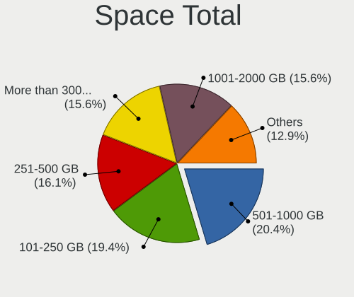

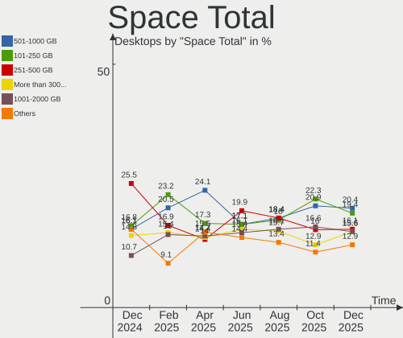

| Size in GB     | Desktops | Percent |
|----------------|----------|---------|
| 501-1000       | 85       | 20.38%  |
| 101-250        | 81       | 19.42%  |
| 251-500        | 67       | 16.07%  |
| More than 3000 | 65       | 15.59%  |
| 1001-2000      | 65       | 15.59%  |
| 2001-3000      | 29       | 6.95%   |
| 51-100         | 11       | 2.64%   |
| 1-20           | 8        | 1.92%   |
| 21-50          | 5        | 1.2%    |
| Unknown        | 1        | 0.24%   |

Space Used
----------

Amount of used disk space

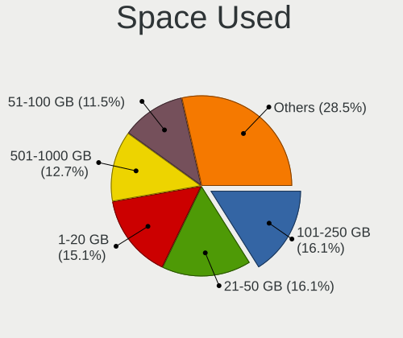

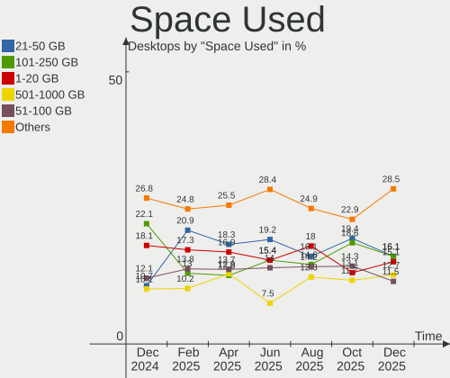

| Used GB        | Desktops | Percent |
|----------------|----------|---------|
| 21-50          | 67       | 16.07%  |
| 101-250        | 67       | 16.07%  |
| 1-20           | 63       | 15.11%  |
| 501-1000       | 53       | 12.71%  |
| 51-100         | 48       | 11.51%  |
| 251-500        | 41       | 9.83%   |
| 1001-2000      | 37       | 8.87%   |
| More than 3000 | 25       | 6%      |
| 2001-3000      | 15       | 3.6%    |
| Unknown        | 1        | 0.24%   |

Malfunc. Drives
---------------

Drive models with a malfunction

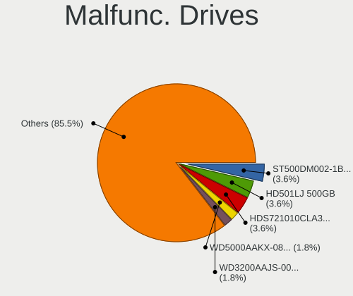

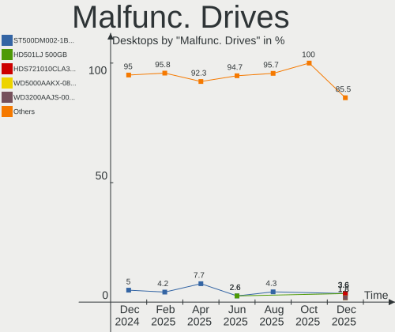

| Model                                                       | Desktops | Drives | Percent |
|-------------------------------------------------------------|----------|--------|---------|
| Seagate ST500DM002-1BD142 500GB                             | 2        | 2      | 3.64%   |
| Samsung Electronics HD501LJ 500GB                           | 2        | 2      | 3.64%   |
| Hitachi HDS721010CLA332 1TB                                 | 2        | 2      | 3.64%   |
| WDC WD5000AAKX-08U6AA0 500GB                                | 1        | 1      | 1.82%   |
| WDC WD3200AAJS-00L7A0 320GB                                 | 1        | 1      | 1.82%   |
| WDC WD30EFRX-68EUZN0 3TB                                    | 1        | 1      | 1.82%   |
| WDC WD2500BPVT-00JJ5T0 250GB                                | 1        | 1      | 1.82%   |
| WDC WD20EFRX-68EUZN0 2TB                                    | 1        | 1      | 1.82%   |
| WDC WD20EARS-00MVWB0 2TB                                    | 1        | 1      | 1.82%   |
| WDC WD10EZEX-08M2NA0 1TB                                    | 1        | 1      | 1.82%   |
| WDC WD10EVVS-63M5B0 1TB                                     | 1        | 1      | 1.82%   |
| WDC WD10EURX-63UY4Y0 1TB                                    | 1        | 1      | 1.82%   |
| WDC WD1003FZEX-00K3CA0 1TB                                  | 1        | 1      | 1.82%   |
| Transcend TS512GSSD370S 512GB                               | 1        | 1      | 1.82%   |
| Toshiba MQ01ABD100 1TB                                      | 1        | 1      | 1.82%   |
| Toshiba MK5056GSY 500GB                                     | 1        | 1      | 1.82%   |
| Toshiba DT01ACA100 1TB                                      | 1        | 1      | 1.82%   |
| Toshiba DT01ACA050 500GB                                    | 1        | 1      | 1.82%   |
| Seagate ST4000DM004-2CV104 4TB                              | 1        | 1      | 1.82%   |
| Seagate ST3500413AS 500GB                                   | 1        | 1      | 1.82%   |
| Seagate ST3250318AS 250GB                                   | 1        | 1      | 1.82%   |
| Seagate ST3000DM001-1CH166 3TB                              | 1        | 1      | 1.82%   |
| Seagate ST2000DM001-1CH164 2TB                              | 1        | 1      | 1.82%   |
| Seagate ST2000DL003-9VT166 2TB                              | 1        | 1      | 1.82%   |
| Seagate ST1000VM002-1ET162 1TB                              | 1        | 1      | 1.82%   |
| Seagate ST1000LX015-1U7172-SSHD 1TB                         | 1        | 1      | 1.82%   |
| Seagate ST1000LM035-1RK172 1TB                              | 1        | 1      | 1.82%   |
| Seagate ST1000DM003-1CH162 1TB                              | 1        | 1      | 1.82%   |
| SanDisk SDSSDHP064G 64GB                                    | 1        | 1      | 1.82%   |
| Samsung Electronics SSD PM830 2.5 7mm 128GB                 | 1        | 1      | 1.82%   |
| Samsung Electronics SSD 870 EVO 500GB                       | 1        | 1      | 1.82%   |
| Samsung Electronics HM250HI 250GB                           | 1        | 1      | 1.82%   |
| Samsung Electronics HD322HJ 320GB                           | 1        | 1      | 1.82%   |
| Min Yi U YZWY_TECH 1TB                                      | 1        | 1      | 1.82%   |
| Micron Technology 1100_MTFDDAK256TBN 256GB SSD              | 1        | 1      | 1.82%   |
| Maxtor 6V200E0 208GB                                        | 1        | 1      | 1.82%   |
| MAXIO Technology (Hangzhou) NVMe SSD Controller MAP1202 2TB | 1        | 1      | 1.82%   |
| Kingston SV300S37A240G 240GB SSD                            | 1        | 1      | 1.82%   |
| Intenso SSD Sata III 256GB                                  | 1        | 1      | 1.82%   |
| Intel SSDSA2M160G2GC 160GB                                  | 1        | 1      | 1.82%   |

Malfunc. Drive Vendor
---------------------

Vendors of faulty drives

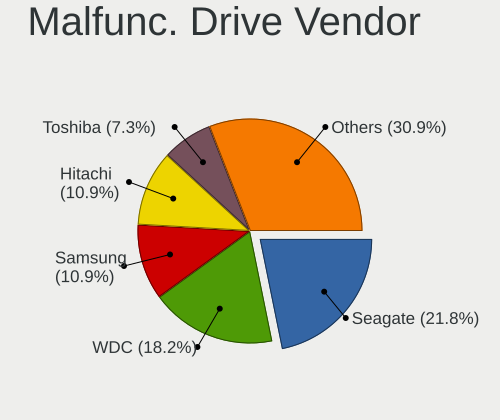

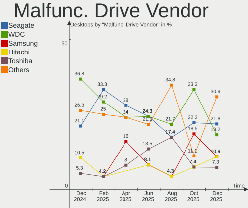

| Vendor                      | Desktops | Drives | Percent |
|-----------------------------|----------|--------|---------|
| Seagate                     | 12       | 12     | 21.82%  |
| WDC                         | 10       | 10     | 18.18%  |
| Samsung Electronics         | 6        | 6      | 10.91%  |
| Hitachi                     | 6        | 6      | 10.91%  |
| Toshiba                     | 4        | 4      | 7.27%   |
| Intel                       | 2        | 2      | 3.64%   |
| HGST                        | 2        | 5      | 3.64%   |
| Corsair                     | 2        | 2      | 3.64%   |
| Transcend                   | 1        | 1      | 1.82%   |
| SanDisk                     | 1        | 1      | 1.82%   |
| Min Yi U                    | 1        | 1      | 1.82%   |
| Micron Technology           | 1        | 1      | 1.82%   |
| Maxtor                      | 1        | 1      | 1.82%   |
| MAXIO Technology (Hangzhou) | 1        | 1      | 1.82%   |
| Kingston                    | 1        | 1      | 1.82%   |
| Intenso                     | 1        | 1      | 1.82%   |
| Crucial                     | 1        | 1      | 1.82%   |
| AFOX                        | 1        | 1      | 1.82%   |
| A-DATA Technology           | 1        | 1      | 1.82%   |

Malfunc. HDD Vendor
-------------------

Vendors of faulty HDD drives

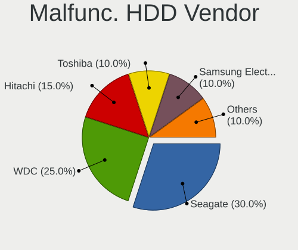

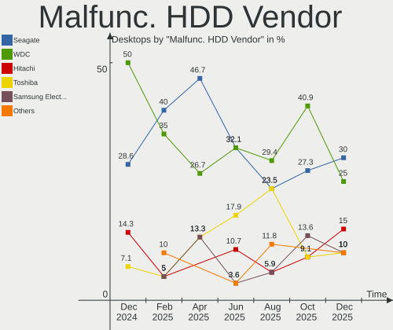

| Vendor              | Desktops | Drives | Percent |
|---------------------|----------|--------|---------|
| Seagate             | 12       | 12     | 30%     |
| WDC                 | 10       | 10     | 25%     |
| Hitachi             | 6        | 6      | 15%     |
| Toshiba             | 4        | 4      | 10%     |
| Samsung Electronics | 4        | 4      | 10%     |
| HGST                | 2        | 5      | 5%      |
| Min Yi U            | 1        | 1      | 2.5%    |
| Maxtor              | 1        | 1      | 2.5%    |

Malfunc. Drive Kind
-------------------

Kinds of faulty drives

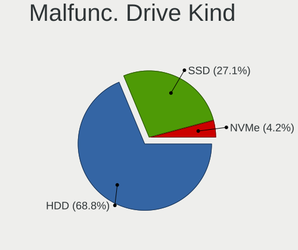

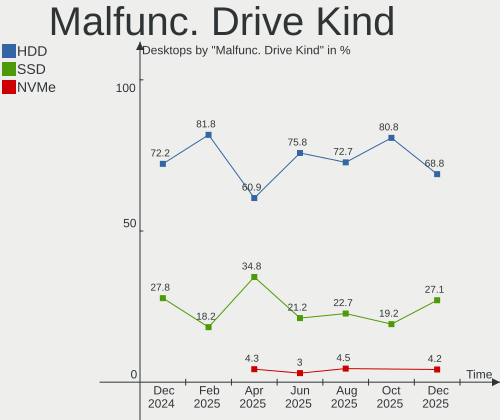

| Kind | Desktops | Drives | Percent |
|------|----------|--------|---------|
| HDD  | 33       | 43     | 68.75%  |
| SSD  | 13       | 13     | 27.08%  |
| NVMe | 2        | 2      | 4.17%   |

Failed Drives
-------------

Failed drive models

Zero info for selected period =(

Failed Drive Vendor
-------------------

Failed drive vendors

Zero info for selected period =(

Drive Status
------------

Number of failed and malfunc. drives

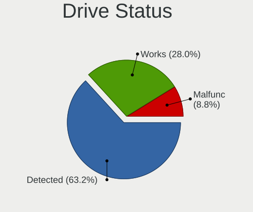

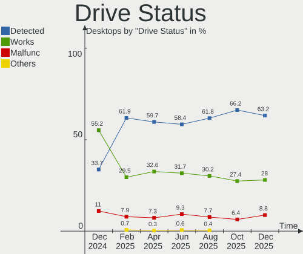

| Status   | Desktops | Drives | Percent |
|----------|----------|--------|---------|
| Detected | 294      | 694    | 63.23%  |
| Works    | 130      | 270    | 27.96%  |
| Malfunc  | 41       | 58     | 8.82%   |

Storage controller
------------------

Storage Vendor
--------------

Storage controller vendors

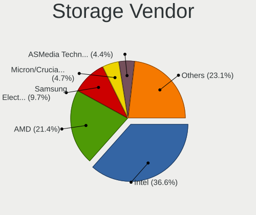

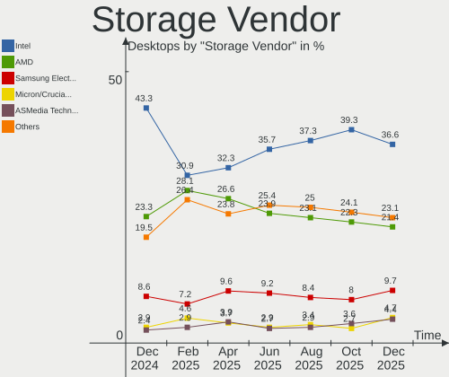

| Vendor                           | Desktops | Percent |
|----------------------------------|----------|---------|
| Intel                            | 256      | 36.57%  |
| AMD                              | 150      | 21.43%  |
| Samsung Electronics              | 68       | 9.71%   |
| Micron/Crucial Technology        | 33       | 4.71%   |
| ASMedia Technology               | 31       | 4.43%   |
| Sandisk                          | 27       | 3.86%   |
| Phison Electronics               | 23       | 3.29%   |
| Kingston Technology Company      | 18       | 2.57%   |
| MAXIO Technology (Hangzhou)      | 17       | 2.43%   |
| Marvell Technology Group         | 12       | 1.71%   |
| ADATA Technology                 | 9        | 1.29%   |
| JMicron Technology               | 8        | 1.14%   |
| Silicon Motion                   | 7        | 1%      |
| Realtek Semiconductor            | 6        | 0.86%   |
| Shenzhen Longsys Electronics     | 5        | 0.71%   |
| Nvidia                           | 5        | 0.71%   |
| SK hynix                         | 4        | 0.57%   |
| Silicon Image                    | 3        | 0.43%   |
| Micron Technology                | 3        | 0.43%   |
| KIOXIA                           | 3        | 0.43%   |
| VIA Technologies                 | 2        | 0.29%   |
| Toshiba America Info Systems     | 2        | 0.29%   |
| Hosin Global Electronics         | 2        | 0.29%   |
| Solidigm                         | 1        | 0.14%   |
| Silicon Integrated Systems [SiS] | 1        | 0.14%   |
| Seagate Technology               | 1        | 0.14%   |
| Lenovo                           | 1        | 0.14%   |
| Broadcom / LSI                   | 1        | 0.14%   |
| Biwin Storage Technology         | 1        | 0.14%   |

Storage Model
-------------

Storage controller models

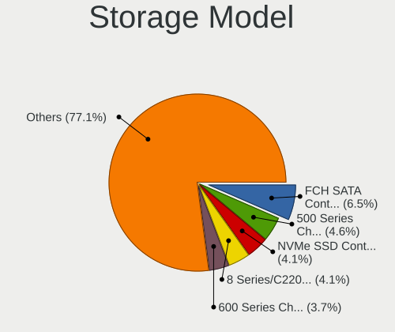

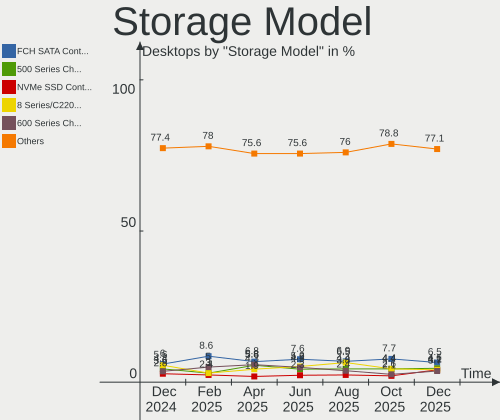

| Model                                                                                   | Desktops | Percent |
|-----------------------------------------------------------------------------------------|----------|---------|
| AMD FCH SATA Controller [AHCI mode]                                                     | 53       | 6.53%   |
| AMD 500 Series Chipset SATA Controller                                                  | 37       | 4.56%   |
| Samsung NVMe SSD Controller SM981/PM981/PM983                                           | 33       | 4.06%   |
| Intel 8 Series/C220 Series Chipset Family 6-port SATA Controller 1 [AHCI mode]          | 33       | 4.06%   |
| AMD 600 Series Chipset SATA Controller                                                  | 30       | 3.69%   |
| Intel 200 Series PCH SATA controller [AHCI mode]                                        | 25       | 3.08%   |
| ASMedia ASM1061/ASM1062 Serial ATA Controller                                           | 25       | 3.08%   |
| AMD 400 Series Chipset SATA Controller                                                  | 24       | 2.96%   |
| Intel SATA Controller [RAID mode]                                                       | 20       | 2.46%   |
| Intel Q170/Q150/B150/H170/H110/Z170/CM236 Chipset SATA Controller [AHCI Mode]           | 20       | 2.46%   |
| Intel 6 Series/C200 Series Chipset Family 6 port Desktop SATA AHCI Controller           | 17       | 2.09%   |
| AMD SB7x0/SB8x0/SB9x0 SATA Controller [AHCI mode]                                       | 15       | 1.85%   |
| Intel Alder Lake-S PCH SATA Controller [AHCI Mode]                                      | 14       | 1.72%   |
| Intel 6 Series/C200 Series Chipset Family Desktop SATA Controller (IDE mode, ports 4-5) | 12       | 1.48%   |
| Intel 6 Series/C200 Series Chipset Family Desktop SATA Controller (IDE mode, ports 0-3) | 12       | 1.48%   |
| AMD SB7x0/SB8x0/SB9x0 IDE Controller                                                    | 12       | 1.48%   |
| Samsung NVMe SSD Controller PM9A1/PM9A3/980PRO                                          | 11       | 1.35%   |
| MAXIO (Hangzhou) NVMe SSD Controller MAP1202 (DRAM-less)                                | 11       | 1.35%   |
| Intel Raptor Lake SATA AHCI Controller                                                  | 11       | 1.35%   |
| Intel 7 Series/C210 Series Chipset Family 6-port SATA Controller [AHCI mode]            | 11       | 1.35%   |
| Samsung NVMe SSD Controller 980 (DRAM-less)                                             | 10       | 1.23%   |
| Phison E12 NVMe Controller                                                              | 10       | 1.23%   |
| Micron/Crucial P2 [Nick P2] / P3 / P3 Plus NVMe PCIe SSD (DRAM-less)                    | 10       | 1.23%   |
| Intel Cannon Lake PCH SATA AHCI Controller                                              | 9        | 1.11%   |
| Samsung NVMe SSD Controller SM961/PM961/SM963                                           | 8        | 0.99%   |
| Samsung NVMe SSD Controller S4LV008[Pascal]                                             | 8        | 0.99%   |
| Micron/Crucial P310 NVMe PCIe SSD (DRAM-less)                                           | 8        | 0.99%   |
| Intel NM10/ICH7 Family SATA Controller [IDE mode]                                       | 8        | 0.99%   |
| Intel 400 Series Chipset Family SATA AHCI Controller                                    | 8        | 0.99%   |
| JMicron JMB363 SATA/IDE Controller                                                      | 7        | 0.86%   |
| Sandisk WD Black SN850X NVMe SSD                                                        | 6        | 0.74%   |
| Intel Volume Management Device NVMe RAID Controller                                     | 6        | 0.74%   |
| Intel 9 Series Chipset Family SATA Controller [AHCI Mode]                               | 6        | 0.74%   |
| Intel 82801JI (ICH10 Family) SATA AHCI Controller                                       | 6        | 0.74%   |
| AMD SB7x0/SB8x0/SB9x0 SATA Controller [IDE mode]                                        | 6        | 0.74%   |
| Silicon Motion SM2263EN/SM2263XT (DRAM-less) NVMe SSD Controllers                       | 5        | 0.62%   |
| Phison E16 PCIe4 NVMe Controller                                                        | 5        | 0.62%   |
| MAXIO (Hangzhou) NVMe SSD Controller MAP1602 (DRAM-less)                                | 5        | 0.62%   |
| Intel C600/X79 series chipset 6-Port SATA AHCI Controller                               | 5        | 0.62%   |
| Intel 500 Series Chipset Family SATA AHCI Controller                                    | 5        | 0.62%   |

Storage Kind
------------

Kind of storage controller (IDE, SATA, NVMe, SAS, ...)

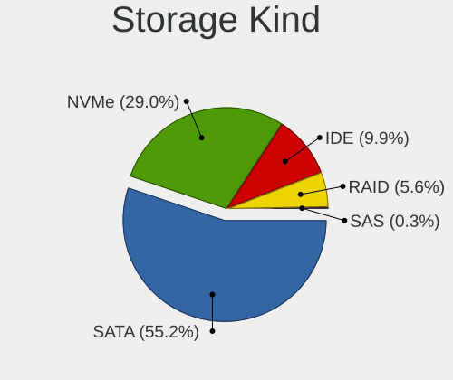

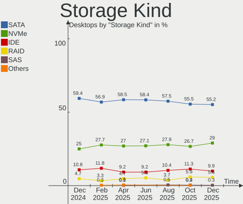

| Kind | Desktops | Percent |
|------|----------|---------|
| SATA | 356      | 55.19%  |
| NVMe | 187      | 28.99%  |
| IDE  | 64       | 9.92%   |
| RAID | 36       | 5.58%   |
| SAS  | 2        | 0.31%   |

Processor
---------

CPU Vendor
----------

Processor vendors

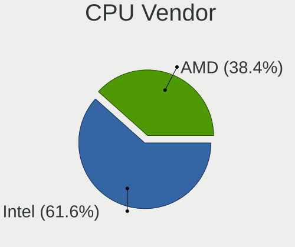

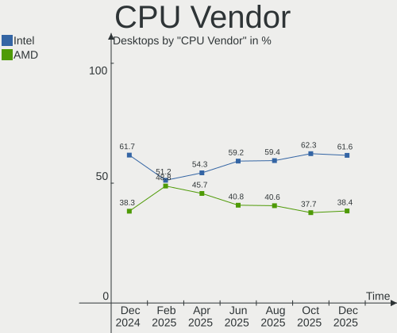

| Vendor | Desktops | Percent |
|--------|----------|---------|
| Intel  | 257      | 61.63%  |
| AMD    | 160      | 38.37%  |

CPU Model
---------

Processor models

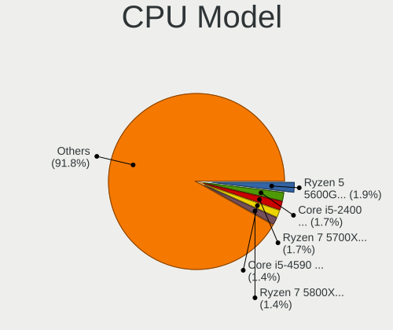

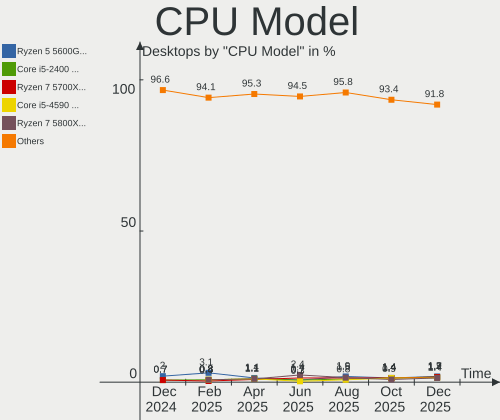

| Model                                       | Desktops | Percent |
|---------------------------------------------|----------|---------|
| AMD Ryzen 5 5600G with Radeon Graphics      | 8        | 1.92%   |
| Intel Core i5-2400 CPU @ 3.10GHz            | 7        | 1.68%   |
| AMD Ryzen 7 5700X 8-Core Processor          | 7        | 1.68%   |
| Intel Core i5-4590 CPU @ 3.30GHz            | 6        | 1.44%   |
| AMD Ryzen 7 5800X 8-Core Processor          | 6        | 1.44%   |
| Intel Core i7-8700 CPU @ 3.20GHz            | 5        | 1.2%    |
| Intel Core i7-6700K CPU @ 4.00GHz           | 5        | 1.2%    |
| AMD Ryzen 9 5900X 12-Core Processor         | 5        | 1.2%    |
| AMD Ryzen 7 9800X3D 8-Core Processor        | 5        | 1.2%    |
| AMD Ryzen 7 5700G with Radeon Graphics      | 5        | 1.2%    |
| AMD Ryzen 7 2700X Eight-Core Processor      | 5        | 1.2%    |
| AMD Ryzen 5 5600X 6-Core Processor          | 5        | 1.2%    |
| Intel Core i7-6700 CPU @ 3.40GHz            | 4        | 0.96%   |
| Intel Core i7-2600 CPU @ 3.40GHz            | 4        | 0.96%   |
| Intel Core i7 CPU 920 @ 2.67GHz             | 4        | 0.96%   |
| Intel Core i5-8400 CPU @ 2.80GHz            | 4        | 0.96%   |
| Intel Core i5-6500 CPU @ 3.20GHz            | 4        | 0.96%   |
| Intel Core i5-3470 CPU @ 3.20GHz            | 4        | 0.96%   |
| Intel Core 2 Duo CPU E8400 @ 3.00GHz        | 4        | 0.96%   |
| AMD Ryzen 7 3700X 8-Core Processor          | 4        | 0.96%   |
| AMD Ryzen 5 5500                            | 4        | 0.96%   |
| AMD Ryzen 5 3600 6-Core Processor           | 4        | 0.96%   |
| AMD Ryzen 5 2600 Six-Core Processor         | 4        | 0.96%   |
| AMD FX-8350 Eight-Core Processor            | 4        | 0.96%   |
| Intel Pentium Dual-Core CPU E5300 @ 2.60GHz | 3        | 0.72%   |
| Intel Core i7-7700K CPU @ 4.20GHz           | 3        | 0.72%   |
| Intel Core i7-4790 CPU @ 3.60GHz            | 3        | 0.72%   |
| Intel Core i7-3770K CPU @ 3.50GHz           | 3        | 0.72%   |
| Intel Core i7-3770 CPU @ 3.40GHz            | 3        | 0.72%   |
| Intel Core i5-9400F CPU @ 2.90GHz           | 3        | 0.72%   |
| Intel Core i5-7500 CPU @ 3.40GHz            | 3        | 0.72%   |
| Intel Core i5-4570T CPU @ 2.90GHz           | 3        | 0.72%   |
| Intel Core i5-10400F CPU @ 2.90GHz          | 3        | 0.72%   |
| Intel Core i3-7100 CPU @ 3.90GHz            | 3        | 0.72%   |
| Intel Core i3-3220 CPU @ 3.30GHz            | 3        | 0.72%   |
| Intel Core i3-2120 CPU @ 3.30GHz            | 3        | 0.72%   |
| Intel Celeron CPU J3455 @ 1.50GHz           | 3        | 0.72%   |
| Intel 12th Gen Core i5-12400F               | 3        | 0.72%   |
| AMD Ryzen 9 9950X3D 16-Core Processor       | 3        | 0.72%   |
| AMD Ryzen 9 7950X 16-Core Processor         | 3        | 0.72%   |

CPU Model Family
----------------

Processor model prefix

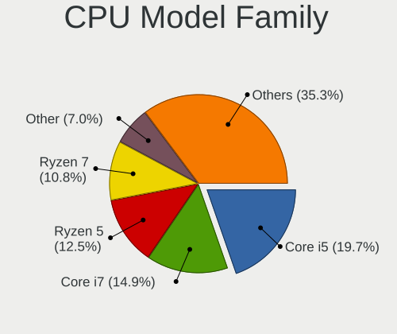

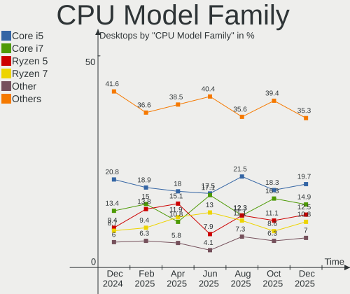

| Model                   | Desktops | Percent |
|-------------------------|----------|---------|
| Intel Core i5           | 82       | 19.66%  |
| Intel Core i7           | 62       | 14.87%  |
| AMD Ryzen 5             | 52       | 12.47%  |
| AMD Ryzen 7             | 45       | 10.79%  |
| Other                   | 29       | 6.95%   |
| Intel Core i3           | 26       | 6.24%   |
| AMD Ryzen 9             | 22       | 5.28%   |
| Intel Xeon              | 14       | 3.36%   |
| AMD FX                  | 14       | 3.36%   |
| Intel Core 2 Duo        | 10       | 2.4%    |
| Intel Celeron           | 9        | 2.16%   |
| Intel Pentium           | 6        | 1.44%   |
| Intel Core 2 Quad       | 6        | 1.44%   |
| Intel Pentium Dual-Core | 5        | 1.2%    |
| Intel Core i9           | 5        | 1.2%    |
| AMD Ryzen 3             | 4        | 0.96%   |
| AMD A10                 | 4        | 0.96%   |
| AMD Athlon II X2        | 3        | 0.72%   |
| Intel Core              | 2        | 0.48%   |
| AMD A8                  | 2        | 0.48%   |
| Intel Pentium Gold      | 1        | 0.24%   |
| Intel Atom              | 1        | 0.24%   |
| AMD Sempron             | 1        | 0.24%   |
| AMD Ryzen Threadripper  | 1        | 0.24%   |
| AMD PRO A10             | 1        | 0.24%   |
| AMD Phenom II X6        | 1        | 0.24%   |
| AMD Phenom II X4        | 1        | 0.24%   |
| AMD Phenom II X2        | 1        | 0.24%   |
| AMD E1                  | 1        | 0.24%   |
| AMD Athlon II X3        | 1        | 0.24%   |
| AMD Athlon Dual Core    | 1        | 0.24%   |
| AMD Athlon 64 X2        | 1        | 0.24%   |
| AMD Athlon 64           | 1        | 0.24%   |
| AMD A6                  | 1        | 0.24%   |
| AMD A4                  | 1        | 0.24%   |

CPU Cores
---------

Number of processor cores

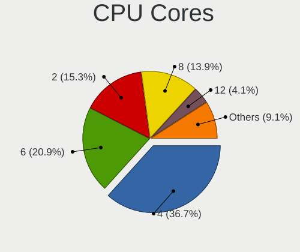

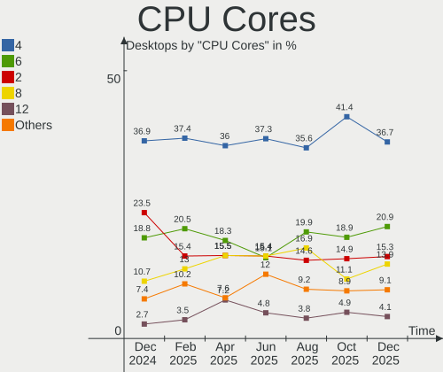

| Number | Desktops | Percent |
|--------|----------|---------|
| 4      | 153      | 36.69%  |
| 6      | 87       | 20.86%  |
| 2      | 64       | 15.35%  |
| 8      | 58       | 13.91%  |
| 12     | 17       | 4.08%   |
| 16     | 12       | 2.88%   |
| 10     | 7        | 1.68%   |
| 20     | 5        | 1.2%    |
| 14     | 5        | 1.2%    |
| 24     | 4        | 0.96%   |
| 3      | 4        | 0.96%   |
| 1      | 1        | 0.24%   |

CPU Sockets
-----------

Number of sockets

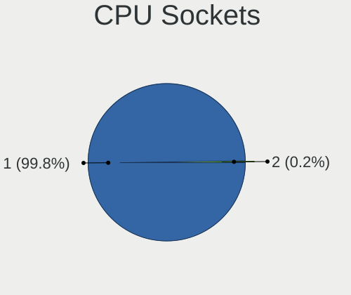

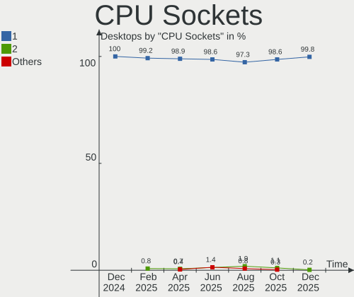

| Number | Desktops | Percent |
|--------|----------|---------|
| 1      | 416      | 99.76%  |
| 2      | 1        | 0.24%   |

CPU Threads
-----------

Threads per core (Hyper-Threading)

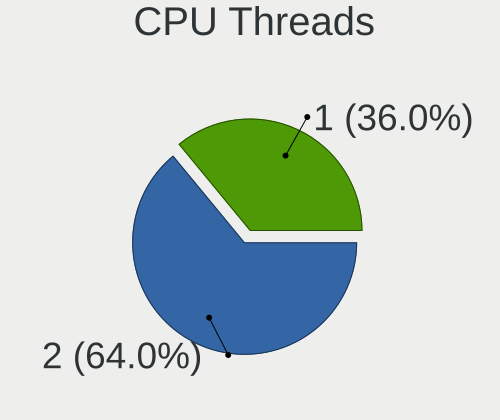

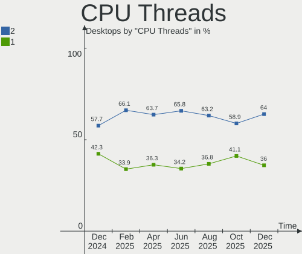

| Number | Desktops | Percent |
|--------|----------|---------|
| 2      | 267      | 64.03%  |
| 1      | 150      | 35.97%  |

CPU Op-Modes
------------

CPU Operation Modes (32-bit, 64-bit)

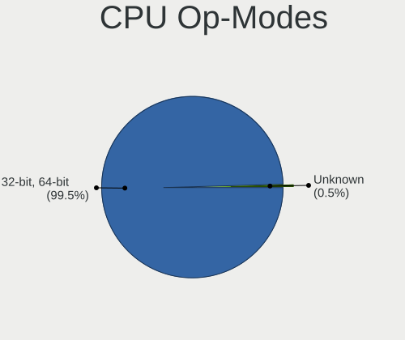

| Op mode        | Desktops | Percent |
|----------------|----------|---------|
| 32-bit, 64-bit | 417      | 100%    |

CPU Microcode
-------------

Microcode number

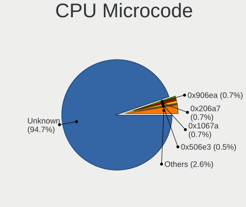

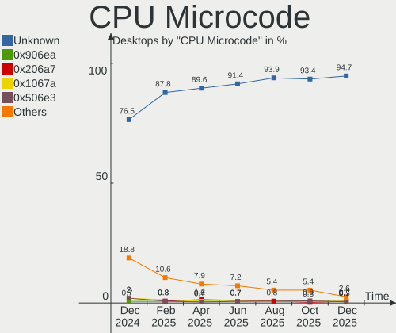

| Number     | Desktops | Percent |
|------------|----------|---------|
| Unknown    | 395      | 94.72%  |
| 0x906ea    | 3        | 0.72%   |
| 0x206a7    | 3        | 0.72%   |
| 0x1067a    | 3        | 0.72%   |
| 0x506e3    | 2        | 0.48%   |
| 0x06000852 | 2        | 0.48%   |
| 0xa0655    | 1        | 0.24%   |
| 0x906eb    | 1        | 0.24%   |
| 0x906e9    | 1        | 0.24%   |
| 0x306a9    | 1        | 0.24%   |
| 0x0a50000b | 1        | 0.24%   |
| 0x08701021 | 1        | 0.24%   |
| 0x08001138 | 1        | 0.24%   |
| 0x08001137 | 1        | 0.24%   |
| 0x010000dc | 1        | 0.24%   |

CPU Microarch
-------------

Microarchitecture

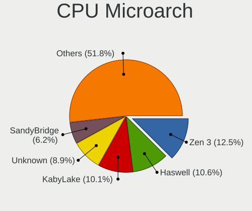

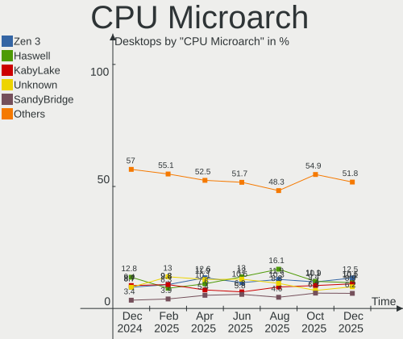

| Name             | Desktops | Percent |
|------------------|----------|---------|
| Zen 3            | 52       | 12.47%  |
| Haswell          | 44       | 10.55%  |
| KabyLake         | 42       | 10.07%  |
| Unknown          | 37       | 8.87%   |
| SandyBridge      | 26       | 6.24%   |
| IvyBridge        | 25       | 6%      |
| Skylake          | 24       | 5.76%   |
| Alderlake Hybrid | 24       | 5.76%   |
| Penryn           | 17       | 4.08%   |
| Zen 2            | 16       | 3.84%   |
| Zen+             | 15       | 3.6%    |
| Piledriver       | 14       | 3.36%   |
| CometLake        | 12       | 2.88%   |
| Nehalem          | 10       | 2.4%    |
| K10              | 8        | 1.92%   |
| Zen              | 7        | 1.68%   |
| Icelake          | 7        | 1.68%   |
| Core             | 5        | 1.2%    |
| Gracemont        | 4        | 0.96%   |
| Bulldozer        | 4        | 0.96%   |
| Westmere         | 3        | 0.72%   |
| K8 Hammer        | 3        | 0.72%   |
| Goldmont         | 3        | 0.72%   |
| Steamroller      | 2        | 0.48%   |
| Silvermont       | 2        | 0.48%   |
| Lunarlake Hybrid | 2        | 0.48%   |
| Goldmont plus    | 2        | 0.48%   |
| Excavator        | 2        | 0.48%   |
| Broadwell        | 2        | 0.48%   |
| K10 Llano        | 1        | 0.24%   |
| Bonnell          | 1        | 0.24%   |
| Bobcat           | 1        | 0.24%   |

Graphics
--------

GPU Vendor
----------

Vendors of graphics cards

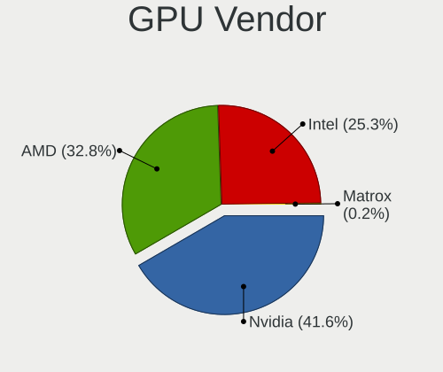

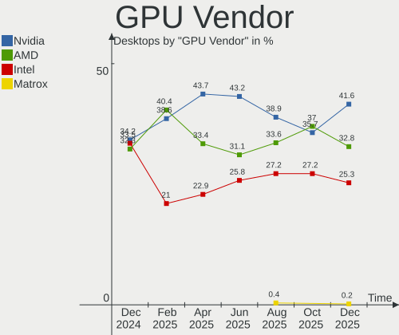

| Vendor                     | Desktops | Percent |
|----------------------------|----------|---------|
| Nvidia                     | 189      | 41.63%  |
| AMD                        | 149      | 32.82%  |
| Intel                      | 115      | 25.33%  |
| Matrox Electronics Systems | 1        | 0.22%   |

GPU Model
---------

Graphics card models

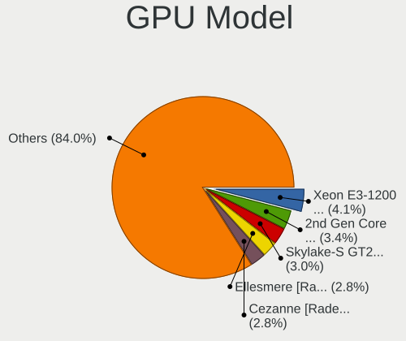

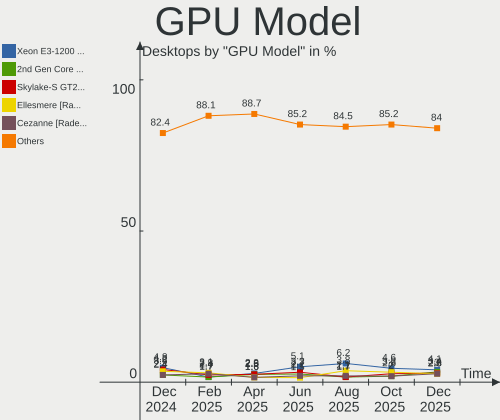

| Model                                                                       | Desktops | Percent |
|-----------------------------------------------------------------------------|----------|---------|
| Intel Xeon E3-1200 v3/4th Gen Core Processor Integrated Graphics Controller | 19       | 4.06%   |
| Intel 2nd Generation Core Processor Family Integrated Graphics Controller   | 16       | 3.42%   |
| Intel Skylake-S GT2 [HD Graphics 530]                                       | 14       | 2.99%   |
| AMD Ellesmere [Radeon RX 470/480/570/570X/580/580X/590]                     | 13       | 2.78%   |
| AMD Cezanne [Radeon Vega Series / Radeon Vega Mobile Series]                | 13       | 2.78%   |
| Nvidia GA106 [GeForce RTX 3060 Lite Hash Rate]                              | 11       | 2.35%   |
| AMD Granite Ridge [Radeon Graphics]                                         | 10       | 2.14%   |
| AMD Navi 23 [Radeon RX 6600/6600 XT/6600M]                                  | 9        | 1.92%   |
| Nvidia GK208B [GeForce GT 710]                                              | 8        | 1.71%   |
| AMD Raphael                                                                 | 8        | 1.71%   |
| Nvidia GP108 [GeForce GT 1030]                                              | 7        | 1.5%    |
| Nvidia GP107 [GeForce GTX 1050 Ti]                                          | 7        | 1.5%    |
| Nvidia GP106 [GeForce GTX 1060 6GB]                                         | 7        | 1.5%    |
| Nvidia GA104 [GeForce RTX 3070 Ti]                                          | 7        | 1.5%    |
| Intel Kaby Lake-S GT2 [HD Graphics 630]                                     | 7        | 1.5%    |
| Nvidia GT218 [GeForce 210]                                                  | 6        | 1.28%   |
| Nvidia GP104 [GeForce GTX 1070]                                             | 6        | 1.28%   |
| Nvidia GM206 [GeForce GTX 960]                                              | 5        | 1.07%   |
| Nvidia GM204 [GeForce GTX 970]                                              | 5        | 1.07%   |
| Intel CoffeeLake-S GT2 [UHD Graphics 630]                                   | 5        | 1.07%   |
| AMD Navi 48 [Radeon RX 9070/9070 XT/9070 GRE]                               | 5        | 1.07%   |
| AMD Navi 44 [Radeon RX 9060 XT]                                             | 5        | 1.07%   |
| AMD Lexa PRO [Radeon 540/540X/550/550X / RX 540X/550/550X]                  | 5        | 1.07%   |
| AMD Cedar [Radeon HD 5000/6000/7350/8350 Series]                            | 5        | 1.07%   |
| Nvidia TU116 [GeForce GTX 1660 SUPER]                                       | 4        | 0.85%   |
| Nvidia GP104 [GeForce GTX 1080]                                             | 4        | 0.85%   |
| Intel Xeon E3-1200 v2/3rd Gen Core processor Graphics Controller            | 4        | 0.85%   |
| Intel CometLake-S GT2 [UHD Graphics 630]                                    | 4        | 0.85%   |
| Intel Alder Lake-N [UHD Graphics]                                           | 4        | 0.85%   |
| AMD Polaris 20 XL [Radeon RX 580 2048SP]                                    | 4        | 0.85%   |
| AMD Navi 32 [Radeon RX 7700 XT / 7800 XT]                                   | 4        | 0.85%   |
| AMD Navi 22 [Radeon RX 6700/6700 XT/6750 XT / 6800M/6850M XT]               | 4        | 0.85%   |
| AMD Navi 21 [Radeon RX 6800/6800 XT / 6900 XT]                              | 4        | 0.85%   |
| AMD Caicos [Radeon HD 6450/7450/8450 / R5 230 OEM]                          | 4        | 0.85%   |
| Nvidia TU104 [GeForce RTX 2060]                                             | 3        | 0.64%   |
| Nvidia GP107 [GeForce GTX 1050]                                             | 3        | 0.64%   |
| Nvidia GK106 [GeForce GTX 660]                                              | 3        | 0.64%   |
| Nvidia GK104 [GeForce GTX 760]                                              | 3        | 0.64%   |
| Nvidia GB206 [GeForce RTX 5060 Ti]                                          | 3        | 0.64%   |
| Nvidia GB202 [GeForce RTX 5090]                                             | 3        | 0.64%   |

GPU Combo
---------

Combinations of graphics cards

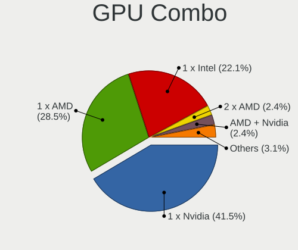

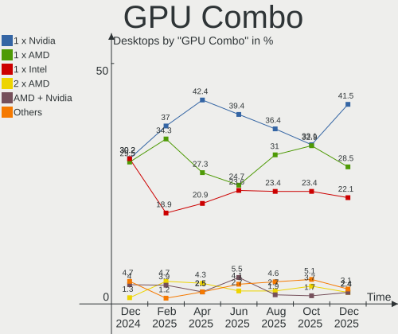

| Name           | Desktops | Percent |
|----------------|----------|---------|
| 1 x Nvidia     | 173      | 41.49%  |
| 1 x AMD        | 119      | 28.54%  |
| 1 x Intel      | 92       | 22.06%  |
| 2 x AMD        | 10       | 2.4%    |
| AMD + Nvidia   | 10       | 2.4%    |
| Intel + AMD    | 7        | 1.68%   |
| Intel + Nvidia | 3        | 0.72%   |
| 2 x Nvidia     | 2        | 0.48%   |
| AMD + Matrox   | 1        | 0.24%   |

GPU Driver
----------

Free vs proprietary

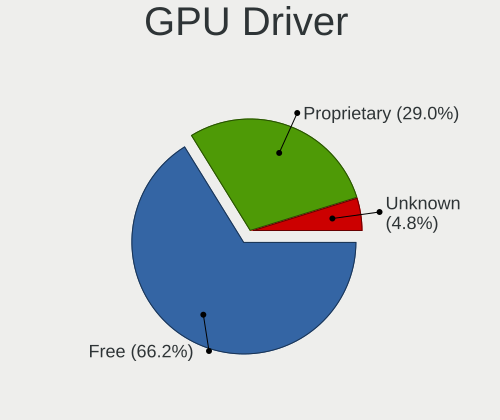

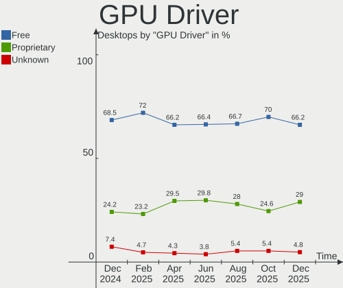

| Driver      | Desktops | Percent |
|-------------|----------|---------|
| Free        | 276      | 66.19%  |
| Proprietary | 121      | 29.02%  |
| Unknown     | 20       | 4.8%    |

GPU Memory
----------

Total video memory

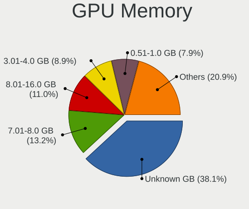

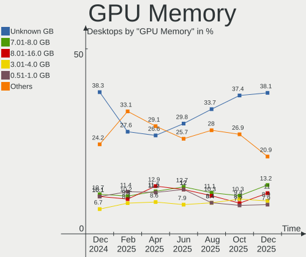

| Size in GB | Desktops | Percent |
|------------|----------|---------|
| Unknown    | 159      | 38.13%  |
| 7.01-8.0   | 55       | 13.19%  |
| 8.01-16.0  | 46       | 11.03%  |
| 3.01-4.0   | 37       | 8.87%   |
| 0.51-1.0   | 33       | 7.91%   |
| 0.01-0.5   | 27       | 6.47%   |
| 1.01-2.0   | 26       | 6.24%   |
| 5.01-6.0   | 21       | 5.04%   |
| 2.01-3.0   | 5        | 1.2%    |
| 16.01-24.0 | 5        | 1.2%    |
| 24.01-32.0 | 2        | 0.48%   |
| 4.01-5.0   | 1        | 0.24%   |

Monitor
-------

Monitor Vendor
--------------

Monitor vendors

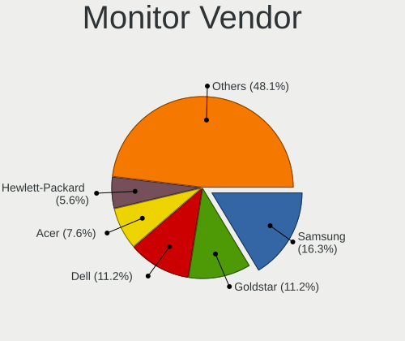

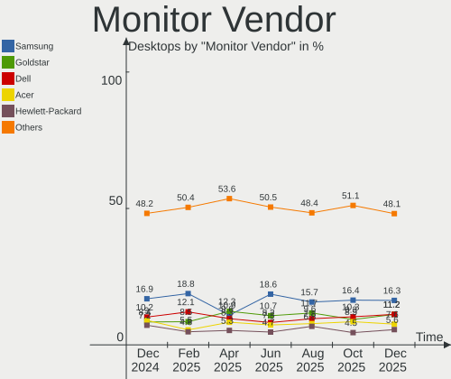

| Vendor               | Desktops | Percent |
|----------------------|----------|---------|
| Samsung Electronics  | 73       | 16.33%  |
| Goldstar             | 50       | 11.19%  |
| Dell                 | 50       | 11.19%  |
| Acer                 | 34       | 7.61%   |
| Hewlett-Packard      | 25       | 5.59%   |
| AOC                  | 24       | 5.37%   |
| BenQ                 | 19       | 4.25%   |
| Ancor Communications | 16       | 3.58%   |
| Philips              | 14       | 3.13%   |
| ASUSTek Computer     | 13       | 2.91%   |
| Iiyama               | 12       | 2.68%   |
| MSI                  | 8        | 1.79%   |
| Lenovo               | 7        | 1.57%   |
| Gigabyte Technology  | 7        | 1.57%   |
| LG Electronics       | 6        | 1.34%   |
| ViewSonic            | 5        | 1.12%   |
| Unknown              | 5        | 1.12%   |
| RTK                  | 4        | 0.89%   |
| Medion               | 4        | 0.89%   |
| Insignia             | 4        | 0.89%   |
| Fujitsu Siemens      | 4        | 0.89%   |
| Vizio                | 3        | 0.67%   |
| Unknown (XXX)        | 3        | 0.67%   |
| Toshiba              | 3        | 0.67%   |
| Sony                 | 3        | 0.67%   |
| Eizo                 | 3        | 0.67%   |
| SKG                  | 2        | 0.45%   |
| Onkyo                | 2        | 0.45%   |
| Hitachi              | 2        | 0.45%   |
| ___                  | 1        | 0.22%   |
| WDL                  | 1        | 0.22%   |
| Vestel Elektronik    | 1        | 0.22%   |
| Vestel               | 1        | 0.22%   |
| Unknown (ABC)        | 1        | 0.22%   |
| STD                  | 1        | 0.22%   |
| S2-Tek               | 1        | 0.22%   |
| Qushimei             | 1        | 0.22%   |
| Pixio                | 1        | 0.22%   |
| Panasonic            | 1        | 0.22%   |
| OOO                  | 1        | 0.22%   |

Monitor Model
-------------

Monitor models

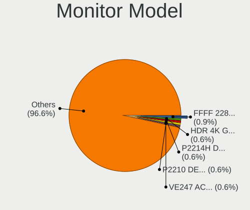

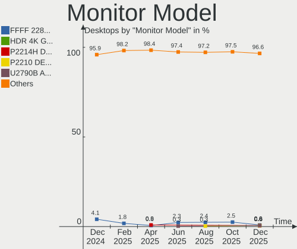

| Model                                                                 | Desktops | Percent |
|-----------------------------------------------------------------------|----------|---------|
| Unknown LCD Monitor FFFF 2288x1287 2550x2550mm 142.0-inch             | 4        | 0.85%   |
| Goldstar HDR 4K GSM7707 3840x2160 600x340mm 27.2-inch                 | 3        | 0.64%   |
| Dell P2214H DELA097 1920x1080 477x268mm 21.5-inch                     | 3        | 0.64%   |
| Dell P2210 DEL404E 1680x1050 474x296mm 22.0-inch                      | 3        | 0.64%   |
| AOC U2790B AOC2790 3840x2160 597x336mm 27.0-inch                      | 3        | 0.64%   |
| Ancor Communications VE247 ACI2493 1920x1080 530x300mm 24.0-inch      | 3        | 0.64%   |
| Ancor Communications ASUS VS228 ACI22FD 1920x1080 476x268mm 21.5-inch | 3        | 0.64%   |
| Ancor Communications ASUS VP228 ACI22C3 1920x1080 476x268mm 21.5-inch | 3        | 0.64%   |
| Samsung Electronics U28E590 SAM0C4D 3840x2160 607x345mm 27.5-inch     | 2        | 0.43%   |
| Samsung Electronics SyncMaster SAM0304 1680x1050 494x320mm 23.2-inch  | 2        | 0.43%   |
| Samsung Electronics SMB2030N SAM0634 1600x900 443x249mm 20.0-inch     | 2        | 0.43%   |
| Samsung Electronics S27F350 SAM0D22 1920x1080 598x336mm 27.0-inch     | 2        | 0.43%   |
| Samsung Electronics LCD Monitor SAM0C39 1920x1080 885x498mm 40.0-inch | 2        | 0.43%   |
| Samsung Electronics LCD Monitor SAM0902 1920x1080 890x500mm 40.2-inch | 2        | 0.43%   |
| Samsung Electronics C27F390 SAM0D32 1920x1080 598x336mm 27.0-inch     | 2        | 0.43%   |
| RTK HX150T RTK1920 1920x1080 344x195mm 15.6-inch                      | 2        | 0.43%   |
| MSI Optix MAG27CQ MSI1462 2560x1440 597x336mm 27.0-inch               | 2        | 0.43%   |
| LG Electronics LCD Monitor 2D FHD LG TV 1920x1080                     | 2        | 0.43%   |
| Lenovo LEN C32q-20 LEN65F8 2560x1440 698x393mm 31.5-inch              | 2        | 0.43%   |
| Hewlett-Packard 27er HWP3326 1920x1080 598x336mm 27.0-inch            | 2        | 0.43%   |
| Goldstar LG IPS FULLHD GSM5AB8 1920x1080 480x270mm 21.7-inch          | 2        | 0.43%   |
| Goldstar FULL HD GSM5BFB 1920x1080 480x270mm 21.7-inch                | 2        | 0.43%   |
| Goldstar FULL HD GSM5B55 1920x1080 480x270mm 21.7-inch                | 2        | 0.43%   |
| Goldstar E2350 GSM578F 1920x1080 510x290mm 23.1-inch                  | 2        | 0.43%   |
| Goldstar 27GL850 GSM5B7F 2560x1440 597x336mm 27.0-inch                | 2        | 0.43%   |
| Goldstar 24MB56 GSM5A98 1920x1080 510x290mm 23.1-inch                 | 2        | 0.43%   |
| Dell U2415 DELA0B8 1920x1200 518x324mm 24.1-inch                      | 2        | 0.43%   |
| BenQ ZOWIE RL LCD BNQ7F4F 1920x1080 531x299mm 24.0-inch               | 2        | 0.43%   |
| BenQ EL2870U BNQ7949 3840x2160 621x341mm 27.9-inch                    | 2        | 0.43%   |
| ASUSTek Computer VA24E AUS24D1 1920x1080 527x296mm 23.8-inch          | 2        | 0.43%   |
| AOC K27U3D AOC2703 3840x2160 597x336mm 27.0-inch                      | 2        | 0.43%   |
| Ancor Communications ASUS VS247 ACI249A 1920x1080 521x293mm 23.5-inch | 2        | 0.43%   |
| ___ LCD TV ___9000 1360x768                                           | 1        | 0.21%   |
| WDL LCD MONITOR WDL03D7 1920x1080 341x256mm 16.8-inch                 | 1        | 0.21%   |
| Vizio V405-G9 VIZ1033 3840x2160 1096x616mm 49.5-inch                  | 1        | 0.21%   |
| Vizio E500AR VIZ0090 1920x1080 477x268mm 21.5-inch                    | 1        | 0.21%   |
| Vizio D24h-C1 VIZ0095 1360x768 521x293mm 23.5-inch                    | 1        | 0.21%   |
| ViewSonic VX2452 Series VSCDE2E 1920x1080 521x293mm 23.5-inch         | 1        | 0.21%   |
| ViewSonic VG2448 VSC3B35 1920x1080 527x296mm 23.8-inch                | 1        | 0.21%   |
| ViewSonic VA2708-UHD VSCFD40 3840x2160 598x336mm 27.0-inch            | 1        | 0.21%   |

Monitor Resolution
------------------

Monitor screen resolution

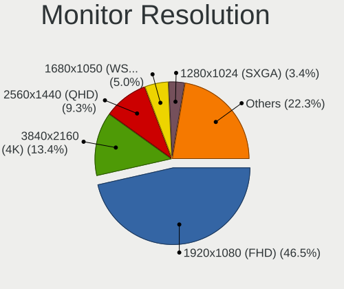

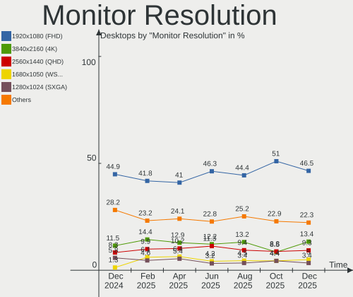

| Resolution         | Desktops | Percent |
|--------------------|----------|---------|
| 1920x1080 (FHD)    | 204      | 46.47%  |
| 3840x2160 (4K)     | 59       | 13.44%  |
| 2560x1440 (QHD)    | 41       | 9.34%   |
| 1680x1050 (WSXGA+) | 22       | 5.01%   |
| 1280x1024 (SXGA)   | 15       | 3.42%   |
| 3440x1440          | 14       | 3.19%   |
| 1920x1200 (WUXGA)  | 14       | 3.19%   |
| 1440x900 (WXGA+)   | 12       | 2.73%   |
| 1600x900 (HD+)     | 10       | 2.28%   |
| 1366x768 (WXGA)    | 10       | 2.28%   |
| 3840x1080          | 7        | 1.59%   |
| 1360x768           | 6        | 1.37%   |
| Unknown            | 6        | 1.37%   |
| 2288x1287          | 4        | 0.91%   |
| 2560x1080          | 3        | 0.68%   |
| 1024x768 (XGA)     | 3        | 0.68%   |
| 2160x1440          | 2        | 0.46%   |
| 1920x540           | 2        | 0.46%   |
| 7680x2160          | 1        | 0.23%   |
| 6880x1440          | 1        | 0.23%   |
| 3840x1200          | 1        | 0.23%   |
| 1600x1200          | 1        | 0.23%   |
| 1280x720 (HD)      | 1        | 0.23%   |

Monitor Diagonal
----------------

Diagonal size in inches

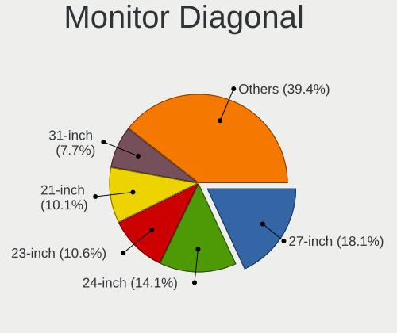

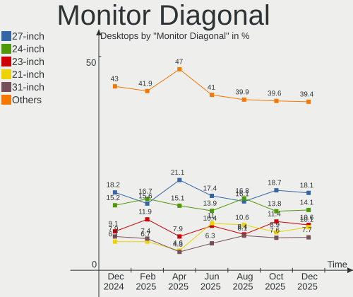

| Inches  | Desktops | Percent |
|---------|----------|---------|
| 27      | 82       | 18.06%  |
| 24      | 64       | 14.1%   |
| 23      | 48       | 10.57%  |
| 21      | 46       | 10.13%  |
| 31      | 35       | 7.71%   |
| Unknown | 22       | 4.85%   |
| 22      | 18       | 3.96%   |
| 19      | 15       | 3.3%    |
| 18      | 15       | 3.3%    |
| 20      | 13       | 2.86%   |
| 34      | 12       | 2.64%   |
| 54      | 9        | 1.98%   |
| 17      | 6        | 1.32%   |
| 72      | 5        | 1.1%    |
| 32      | 5        | 1.1%    |
| 15      | 5        | 1.1%    |
| 142     | 4        | 0.88%   |
| 63      | 4        | 0.88%   |
| 49      | 4        | 0.88%   |
| 48      | 4        | 0.88%   |
| 84      | 3        | 0.66%   |
| 74      | 3        | 0.66%   |
| 47      | 3        | 0.66%   |
| 28      | 3        | 0.66%   |
| 26      | 3        | 0.66%   |
| 25      | 3        | 0.66%   |
| 42      | 2        | 0.44%   |
| 40      | 2        | 0.44%   |
| 39      | 2        | 0.44%   |
| 36      | 2        | 0.44%   |
| 29      | 2        | 0.44%   |
| 65      | 1        | 0.22%   |
| 64      | 1        | 0.22%   |
| 57      | 1        | 0.22%   |
| 52      | 1        | 0.22%   |
| 46      | 1        | 0.22%   |
| 44      | 1        | 0.22%   |
| 43      | 1        | 0.22%   |
| 16      | 1        | 0.22%   |
| 14      | 1        | 0.22%   |

Monitor Width
-------------

Physical width

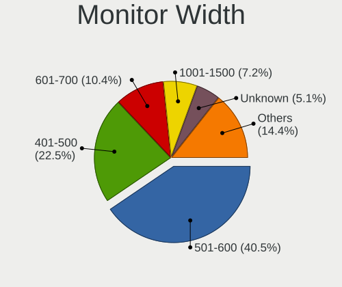

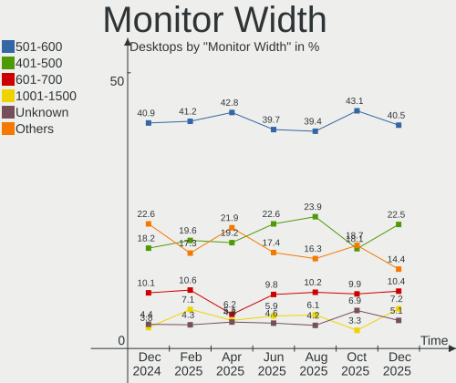

| Width in mm    | Desktops | Percent |
|----------------|----------|---------|
| 501-600        | 175      | 40.51%  |
| 401-500        | 97       | 22.45%  |
| 601-700        | 45       | 10.42%  |
| 1001-1500      | 31       | 7.18%   |
| Unknown        | 22       | 5.09%   |
| 701-800        | 19       | 4.4%    |
| 301-350        | 11       | 2.55%   |
| 1501-2000      | 11       | 2.55%   |
| 351-400        | 9        | 2.08%   |
| More than 2000 | 4        | 0.93%   |
| 801-900        | 3        | 0.69%   |
| 901-1000       | 3        | 0.69%   |
| 201-300        | 2        | 0.46%   |

Aspect Ratio
------------

Proportional relationship between the width and the height

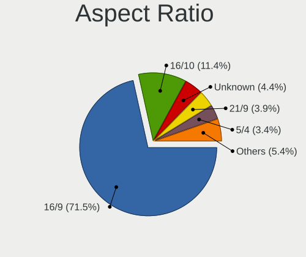

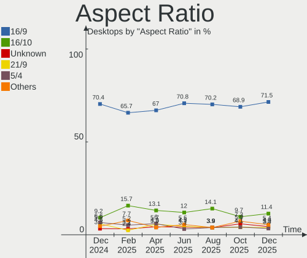

| Ratio   | Desktops | Percent |
|---------|----------|---------|
| 16/9    | 294      | 71.53%  |
| 16/10   | 47       | 11.44%  |
| Unknown | 18       | 4.38%   |
| 21/9    | 16       | 3.89%   |
| 5/4     | 14       | 3.41%   |
| 4/3     | 8        | 1.95%   |
| 32/9    | 5        | 1.22%   |
| 1.00    | 4        | 0.97%   |
| 3/2     | 3        | 0.73%   |
| 3.20    | 1        | 0.24%   |
| 1.96    | 1        | 0.24%   |

Monitor Area
------------

Area in inch²

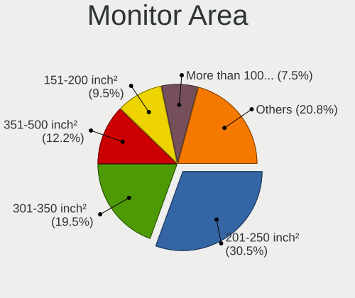

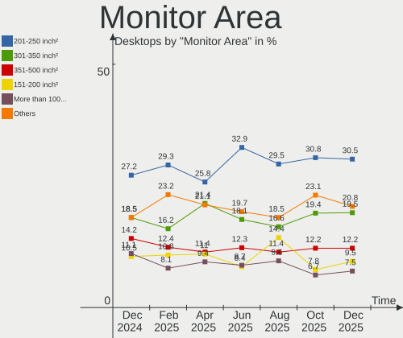

| Area in inch² | Desktops | Percent |
|----------------|----------|---------|
| 201-250        | 135      | 30.54%  |
| 301-350        | 86       | 19.46%  |
| 351-500        | 54       | 12.22%  |
| 151-200        | 42       | 9.5%    |
| More than 1000 | 33       | 7.47%   |
| 251-300        | 27       | 6.11%   |
| Unknown        | 22       | 4.98%   |
| 501-1000       | 19       | 4.3%    |
| 141-150        | 16       | 3.62%   |
| 101-110        | 6        | 1.36%   |
| 51-60          | 1        | 0.23%   |
| 131-140        | 1        | 0.23%   |

Pixel Density
-------------

Pixels per inch

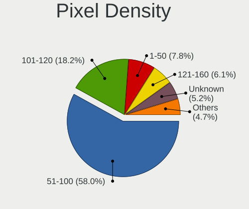

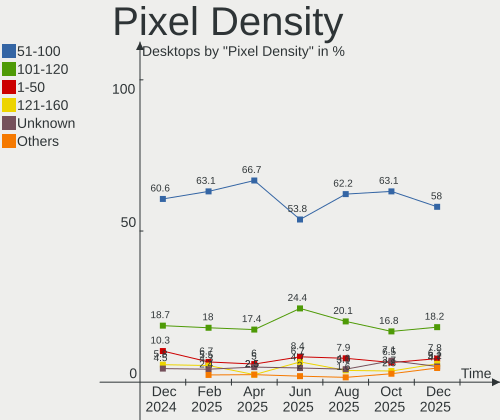

| Density | Desktops | Percent |
|---------|----------|---------|
| 51-100  | 246      | 58.02%  |
| 101-120 | 77       | 18.16%  |
| 1-50    | 33       | 7.78%   |
| 121-160 | 26       | 6.13%   |
| Unknown | 22       | 5.19%   |
| 161-240 | 20       | 4.72%   |

Multiple Monitors
-----------------

Total monitors connected

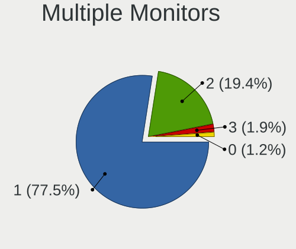

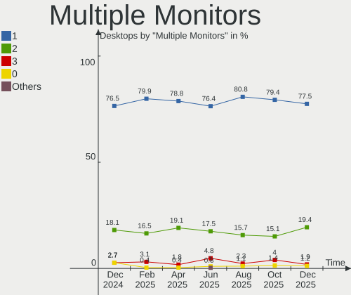

| Total | Desktops | Percent |
|-------|----------|---------|
| 1     | 323      | 77.46%  |
| 2     | 81       | 19.42%  |
| 3     | 8        | 1.92%   |
| 0     | 5        | 1.2%    |

Network
-------

Net Controller Vendor
---------------------

Controller vendors

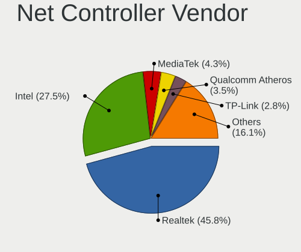

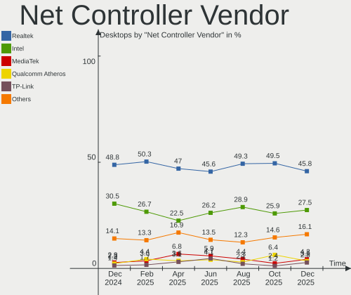

| Vendor                           | Desktops | Percent |
|----------------------------------|----------|---------|
| Realtek Semiconductor            | 275      | 45.76%  |
| Intel                            | 165      | 27.45%  |
| MediaTek                         | 26       | 4.33%   |
| Qualcomm Atheros                 | 21       | 3.49%   |
| TP-Link                          | 17       | 2.83%   |
| Broadcom                         | 15       | 2.5%    |
| Ralink Technology                | 8        | 1.33%   |
| Qualcomm Technologies            | 5        | 0.83%   |
| Nvidia                           | 5        | 0.83%   |
| Ralink                           | 4        | 0.67%   |
| Qualcomm Atheros Communications  | 4        | 0.67%   |
| NetGear                          | 4        | 0.67%   |
| Microsoft                        | 4        | 0.67%   |
| Marvell Technology Group         | 4        | 0.67%   |
| IMC Networks                     | 4        | 0.67%   |
| Samsung Electronics              | 3        | 0.5%    |
| Motorola PCS                     | 3        | 0.5%    |
| D-Link                           | 3        | 0.5%    |
| ZyDAS                            | 2        | 0.33%   |
| Xiaomi                           | 2        | 0.33%   |
| MicroPython                      | 2        | 0.33%   |
| Mercucys                         | 2        | 0.33%   |
| D-Link System                    | 2        | 0.33%   |
| Broadcom Limited                 | 2        | 0.33%   |
| ASUSTek Computer                 | 2        | 0.33%   |
| Aquantia                         | 2        | 0.33%   |
| ZyXEL Communications             | 1        | 0.17%   |
| T & A Mobile Phones              | 1        | 0.17%   |
| Spreadtrum Communications        | 1        | 0.17%   |
| Silicon Integrated Systems [SiS] | 1        | 0.17%   |
| Qualcomm                         | 1        | 0.17%   |
| QinHeng Electronics              | 1        | 0.17%   |
| Ovislink                         | 1        | 0.17%   |
| OPPO Electronics                 | 1        | 0.17%   |
| Mellanox Technologies            | 1        | 0.17%   |
| Linksys                          | 1        | 0.17%   |
| Leo Bodnar Electronics           | 1        | 0.17%   |
| DisplayLink                      | 1        | 0.17%   |
| AVM                              | 1        | 0.17%   |
| ASIX Electronics                 | 1        | 0.17%   |

Net Controller Model
--------------------

Controller models

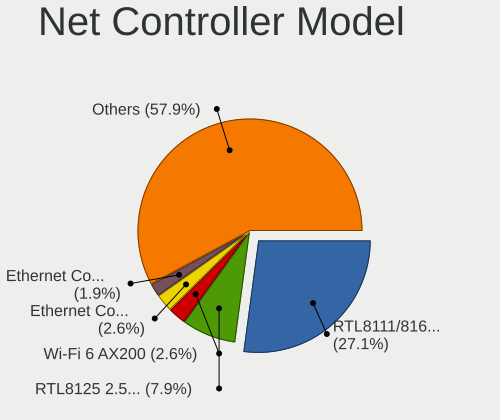

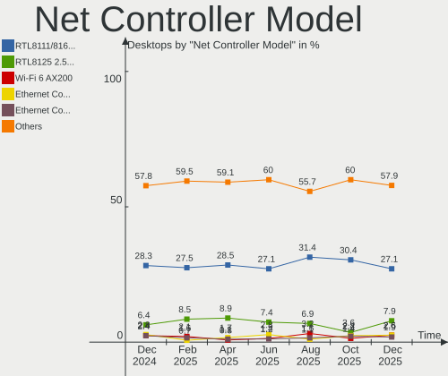

| Model                                                                  | Desktops | Percent |
|------------------------------------------------------------------------|----------|---------|
| Realtek RTL8111/8168/8211/8411 PCI Express Gigabit Ethernet Controller | 186      | 27.11%  |
| Realtek RTL8125 2.5GbE Controller                                      | 54       | 7.87%   |
| Intel Wi-Fi 6 AX200                                                    | 18       | 2.62%   |
| Intel Ethernet Connection (2) I219-V                                   | 18       | 2.62%   |
| Intel Ethernet Controller I225-V                                       | 13       | 1.9%    |
| Intel 82579LM Gigabit Network Connection (Lewisville)                  | 13       | 1.9%    |
| Intel Ethernet Connection I217-LM                                      | 12       | 1.75%   |
| Intel I211 Gigabit Network Connection                                  | 11       | 1.6%    |
| Realtek 802.11ac NIC                                                   | 10       | 1.46%   |
| MediaTek MT7922 802.11ax PCI Express Wireless Network Adapter          | 10       | 1.46%   |
| Realtek RTL8821CE 802.11ac PCIe Wireless Network Adapter               | 8        | 1.17%   |
| Realtek RTL8126 5GbE Controller                                        | 8        | 1.17%   |
| Intel Wi-Fi 6E(802.11ax) AX210/AX1675* 2x2 [Typhoon Peak]              | 7        | 1.02%   |
| Intel Ethernet Connection (7) I219-V                                   | 7        | 1.02%   |
| Intel 700 Series Chipset CNVi WiFi                                     | 7        | 1.02%   |
| Realtek RTL810xE PCI Express Fast Ethernet controller                  | 6        | 0.87%   |
| Intel Ethernet Connection I217-V                                       | 6        | 0.87%   |
| Intel Ethernet Connection (2) I219-LM                                  | 6        | 0.87%   |
| Realtek RTL8852BE PCIe 802.11ax Wireless Network Controller            | 5        | 0.73%   |
| Realtek RTL8188EUS 802.11n Wireless Network Adapter                    | 5        | 0.73%   |
| Qualcomm WCN785x Wi-Fi 7(802.11be) 320MHz 2x2 [FastConnect 7800]       | 5        | 0.73%   |
| MediaTek MT7902 802.11ax PCIe Wireless Network Adapter [Filogic 310]   | 5        | 0.73%   |
| Intel Wireless 3165                                                    | 5        | 0.73%   |
| Intel Wi-Fi 5(802.11ac) Wireless-AC 9x6x [Thunder Peak]                | 5        | 0.73%   |
| Intel Ethernet Controller I226-V                                       | 5        | 0.73%   |
| Intel Alder Lake-S PCH CNVi WiFi                                       | 5        | 0.73%   |
| Intel 82579V Gigabit Network Connection                                | 5        | 0.73%   |
| Intel 82567LM-3 Gigabit Network Connection                             | 5        | 0.73%   |
| Realtek RTL88x2bu [AC1200 Techkey]                                     | 4        | 0.58%   |
| Realtek RTL8852CE PCIe 802.11ax Wireless Network Controller            | 4        | 0.58%   |
| Realtek RTL8153 Gigabit Ethernet Adapter                               | 4        | 0.58%   |
| Ralink MT7601U Wireless Adapter                                        | 4        | 0.58%   |
| Qualcomm Atheros AR9271 802.11n                                        | 4        | 0.58%   |
| Marvell Group 88E8056 PCI-E Gigabit Ethernet Controller                | 4        | 0.58%   |
| Intel Ethernet Connection (5) I219-LM                                  | 4        | 0.58%   |
| TP-Link Archer T2U PLUS [RTL8821AU]                                    | 3        | 0.44%   |
| Qualcomm Atheros QCA8171 Gigabit Ethernet                              | 3        | 0.44%   |
| Intel Wireless 7260                                                    | 3        | 0.44%   |
| Intel Ethernet Connection (2) I218-V                                   | 3        | 0.44%   |
| Intel Ethernet Connection (12) I219-V                                  | 3        | 0.44%   |

Wireless Vendor
---------------

Wireless vendors

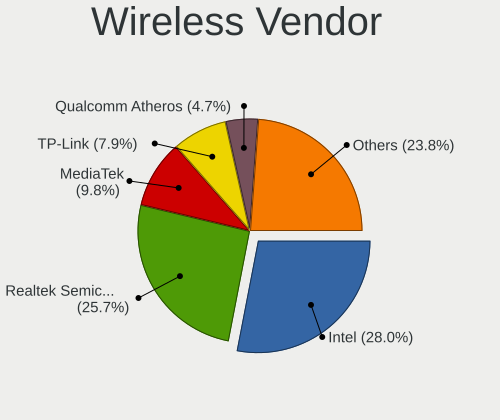

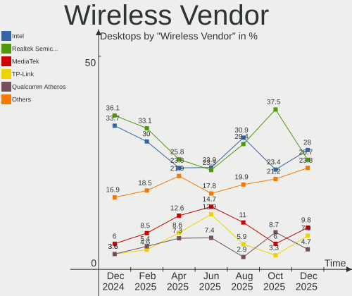

| Vendor                          | Desktops | Percent |
|---------------------------------|----------|---------|
| Intel                           | 60       | 28.04%  |
| Realtek Semiconductor           | 55       | 25.7%   |
| MediaTek                        | 21       | 9.81%   |
| TP-Link                         | 17       | 7.94%   |
| Qualcomm Atheros                | 10       | 4.67%   |
| Ralink Technology               | 8        | 3.74%   |
| Broadcom                        | 5        | 2.34%   |
| Ralink                          | 4        | 1.87%   |
| Qualcomm Atheros Communications | 4        | 1.87%   |
| NetGear                         | 4        | 1.87%   |
| Microsoft                       | 4        | 1.87%   |
| IMC Networks                    | 4        | 1.87%   |
| D-Link                          | 3        | 1.4%    |
| ZyDAS                           | 2        | 0.93%   |
| Mercucys                        | 2        | 0.93%   |
| D-Link System                   | 2        | 0.93%   |
| Broadcom Limited                | 2        | 0.93%   |
| ASUSTek Computer                | 2        | 0.93%   |
| ZyXEL Communications            | 1        | 0.47%   |
| Qualcomm Technologies           | 1        | 0.47%   |
| Ovislink                        | 1        | 0.47%   |
| Linksys                         | 1        | 0.47%   |
| AVM                             | 1        | 0.47%   |

Wireless Model
--------------

Wireless models

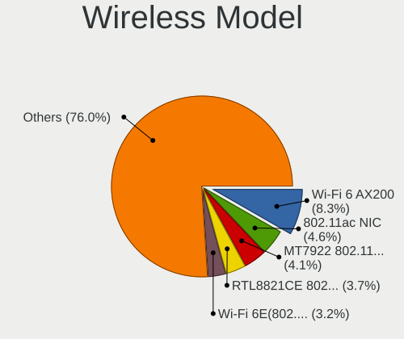

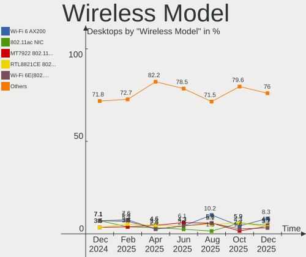

| Model                                                                | Desktops | Percent |
|----------------------------------------------------------------------|----------|---------|
| Intel Wi-Fi 6 AX200                                                  | 18       | 8.29%   |
| Realtek 802.11ac NIC                                                 | 10       | 4.61%   |
| MediaTek MT7922 802.11ax PCI Express Wireless Network Adapter        | 9        | 4.15%   |
| Realtek RTL8821CE 802.11ac PCIe Wireless Network Adapter             | 8        | 3.69%   |
| Intel Wi-Fi 6E(802.11ax) AX210/AX1675* 2x2 [Typhoon Peak]            | 7        | 3.23%   |
| Intel 700 Series Chipset CNVi WiFi                                   | 7        | 3.23%   |
| Realtek RTL8188EUS 802.11n Wireless Network Adapter                  | 5        | 2.3%    |
| MediaTek MT7902 802.11ax PCIe Wireless Network Adapter [Filogic 310] | 5        | 2.3%    |
| Intel Wireless 3165                                                  | 5        | 2.3%    |
| Intel Wi-Fi 5(802.11ac) Wireless-AC 9x6x [Thunder Peak]              | 5        | 2.3%    |
| Realtek RTL88x2bu [AC1200 Techkey]                                   | 4        | 1.84%   |
| Realtek RTL8852CE PCIe 802.11ax Wireless Network Controller          | 4        | 1.84%   |
| Ralink MT7601U Wireless Adapter                                      | 4        | 1.84%   |
| Qualcomm Atheros AR9271 802.11n                                      | 4        | 1.84%   |
| TP-Link Archer T2U PLUS [RTL8821AU]                                  | 3        | 1.38%   |
| Realtek RTL8852BE PCIe 802.11ax Wireless Network Controller          | 3        | 1.38%   |
| Intel Wireless 7260                                                  | 3        | 1.38%   |
| Intel Cannon Lake PCH CNVi WiFi                                      | 3        | 1.38%   |
| Intel Alder Lake-S PCH CNVi WiFi                                     | 3        | 1.38%   |
| IMC Networks Mediao 802.11n WLAN [Realtek RTL8191SU]                 | 3        | 1.38%   |
| TP-Link TL-WN821N v5/v6 [RTL8192EU]                                  | 2        | 0.92%   |
| TP-Link TL-WN722N v2/v3 [Realtek RTL8188EUS]                         | 2        | 0.92%   |
| TP-Link Archer T3U [Realtek RTL8812BU]                               | 2        | 0.92%   |
| TP-Link AC600 wireless Realtek RTL8811AU [Archer T2U Nano]           | 2        | 0.92%   |
| TP-Link 802.11ac WLAN Adapter                                        | 2        | 0.92%   |
| TP-Link 802.11ac NIC                                                 | 2        | 0.92%   |
| Realtek RTL8822BE 802.11a/b/g/n/ac WiFi adapter                      | 2        | 0.92%   |
| Realtek RTL8821AE 802.11ac PCIe Wireless Network Adapter             | 2        | 0.92%   |
| Realtek RTL8192CU 802.11n WLAN Adapter                               | 2        | 0.92%   |
| Realtek RTL8192CE PCIe Wireless Network Adapter                      | 2        | 0.92%   |
| Realtek RTL8188CUS 802.11n WLAN Adapter                              | 2        | 0.92%   |
| Realtek 802.11ac WLAN Adapter                                        | 2        | 0.92%   |
| Qualcomm Atheros QCA9565 / AR9565 Wireless Network Adapter           | 2        | 0.92%   |
| Qualcomm Atheros QCA9377 802.11ac Wireless Network Adapter           | 2        | 0.92%   |
| Qualcomm Atheros QCA6174 802.11ac Wireless Network Adapter           | 2        | 0.92%   |
| Microsoft Xbox 360 Wireless Adapter                                  | 2        | 0.92%   |
| Mercucys 802.11ac NIC                                                | 2        | 0.92%   |
| MediaTek MT7925 (RZ717) Wi-Fi 7 160MHz                               | 2        | 0.92%   |
| MediaTek MT7921K (RZ608) Wi-Fi 6E 80MHz                              | 2        | 0.92%   |
| MediaTek MT7921 802.11ax PCIe Wireless Network Adapter [Filogic 330] | 2        | 0.92%   |

Ethernet Vendor
---------------

Ethernet vendors

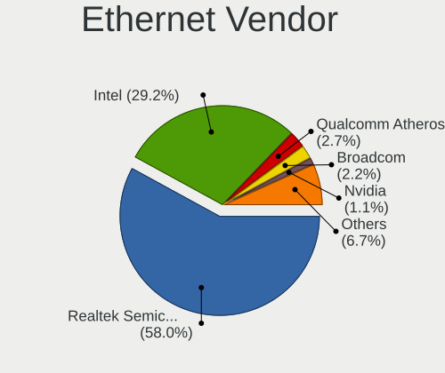

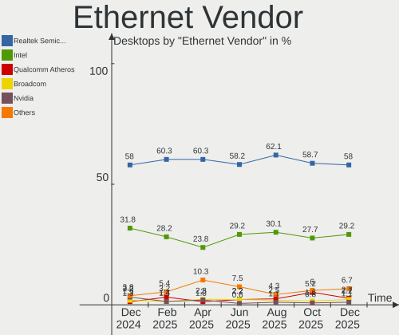

| Vendor                           | Desktops | Percent |
|----------------------------------|----------|---------|
| Realtek Semiconductor            | 258      | 57.98%  |
| Intel                            | 130      | 29.21%  |
| Qualcomm Atheros                 | 12       | 2.7%    |
| Broadcom                         | 10       | 2.25%   |
| Nvidia                           | 5        | 1.12%   |
| Qualcomm Technologies            | 4        | 0.9%    |
| MediaTek                         | 4        | 0.9%    |
| Marvell Technology Group         | 4        | 0.9%    |
| Samsung Electronics              | 3        | 0.67%   |
| Motorola PCS                     | 3        | 0.67%   |
| Xiaomi                           | 2        | 0.45%   |
| Aquantia                         | 2        | 0.45%   |
| T & A Mobile Phones              | 1        | 0.22%   |
| Spreadtrum Communications        | 1        | 0.22%   |
| Silicon Integrated Systems [SiS] | 1        | 0.22%   |
| Qualcomm                         | 1        | 0.22%   |
| OPPO Electronics                 | 1        | 0.22%   |
| Mellanox Technologies            | 1        | 0.22%   |
| DisplayLink                      | 1        | 0.22%   |
| ASIX Electronics                 | 1        | 0.22%   |

Ethernet Model
--------------

Ethernet models

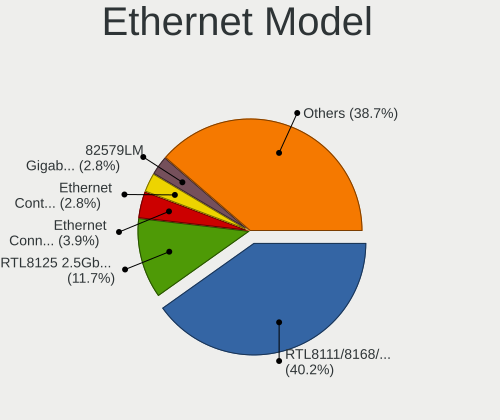

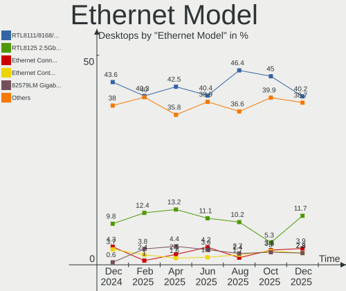

| Model                                                                           | Desktops | Percent |
|---------------------------------------------------------------------------------|----------|---------|
| Realtek RTL8111/8168/8211/8411 PCI Express Gigabit Ethernet Controller          | 186      | 40.17%  |
| Realtek RTL8125 2.5GbE Controller                                               | 54       | 11.66%  |
| Intel Ethernet Connection (2) I219-V                                            | 18       | 3.89%   |
| Intel Ethernet Controller I225-V                                                | 13       | 2.81%   |
| Intel 82579LM Gigabit Network Connection (Lewisville)                           | 13       | 2.81%   |
| Intel Ethernet Connection I217-LM                                               | 12       | 2.59%   |
| Intel I211 Gigabit Network Connection                                           | 11       | 2.38%   |
| Realtek RTL8126 5GbE Controller                                                 | 8        | 1.73%   |
| Intel Ethernet Connection (7) I219-V                                            | 7        | 1.51%   |
| Realtek RTL810xE PCI Express Fast Ethernet controller                           | 6        | 1.3%    |
| Intel Ethernet Connection I217-V                                                | 6        | 1.3%    |
| Intel Ethernet Connection (2) I219-LM                                           | 6        | 1.3%    |
| Intel Ethernet Controller I226-V                                                | 5        | 1.08%   |
| Intel 82579V Gigabit Network Connection                                         | 5        | 1.08%   |
| Intel 82567LM-3 Gigabit Network Connection                                      | 5        | 1.08%   |
| Realtek RTL8153 Gigabit Ethernet Adapter                                        | 4        | 0.86%   |
| Qualcomm WCN785x Wi-Fi 7(802.11be) 320MHz 2x2 [FastConnect 7800]                | 4        | 0.86%   |
| Marvell Group 88E8056 PCI-E Gigabit Ethernet Controller                         | 4        | 0.86%   |
| Intel Ethernet Connection (5) I219-LM                                           | 4        | 0.86%   |
| Qualcomm Atheros QCA8171 Gigabit Ethernet                                       | 3        | 0.65%   |
| Intel Ethernet Connection (2) I218-V                                            | 3        | 0.65%   |
| Intel Ethernet Connection (12) I219-V                                           | 3        | 0.65%   |
| Broadcom NetLink BCM57781 Gigabit Ethernet PCIe                                 | 3        | 0.65%   |
| Samsung Galaxy series, misc. (tethering mode)                                   | 2        | 0.43%   |
| Realtek USB 10/100/1G/2.5 LAN                                                   | 2        | 0.43%   |
| Realtek RTL8852BE PCIe 802.11ax Wireless Network Controller                     | 2        | 0.43%   |
| Realtek Killer E3000 2.5GbE Controller                                          | 2        | 0.43%   |
| Qualcomm Atheros Killer E2500 Gigabit Ethernet Controller                       | 2        | 0.43%   |
| Qualcomm Atheros Killer E220x Gigabit Ethernet Controller                       | 2        | 0.43%   |
| Nvidia MCP77 Ethernet                                                           | 2        | 0.43%   |
| Nvidia MCP55 Ethernet                                                           | 2        | 0.43%   |
| Motorola PCS moto g100 pro                                                      | 2        | 0.43%   |
| MediaTek MT7925 802.11be 160MHz 2x2 PCIe Wireless Network Adapter [Filogic 360] | 2        | 0.43%   |
| Intel Ethernet Controller I226-LM                                               | 2        | 0.43%   |
| Intel Ethernet Connection (17) I219-V                                           | 2        | 0.43%   |
| Intel Alder Lake-S PCH CNVi WiFi                                                | 2        | 0.43%   |
| Intel 82571EB/82571GB Gigabit Ethernet Controller D0/D1 (copper applications)   | 2        | 0.43%   |
| Intel 82566DM-2 Gigabit Network Connection                                      | 2        | 0.43%   |
| Broadcom NetXtreme BCM5764M Gigabit Ethernet PCIe                               | 2        | 0.43%   |
| Broadcom NetXtreme BCM5761 Gigabit Ethernet PCIe                                | 2        | 0.43%   |

Net Controller Kind
-------------------

Ethernet, WiFi or modem

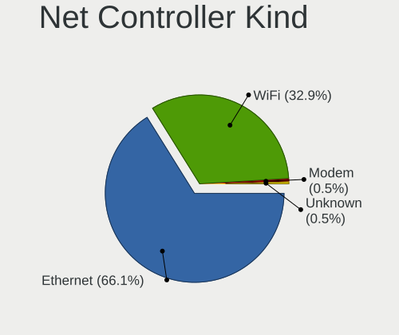

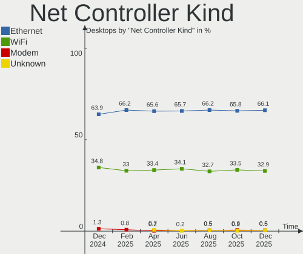

| Kind     | Desktops | Percent |
|----------|----------|---------|
| Ethernet | 410      | 66.13%  |
| WiFi     | 204      | 32.9%   |
| Modem    | 3        | 0.48%   |
| Unknown  | 3        | 0.48%   |

Used Controller
---------------

Currently used network controller

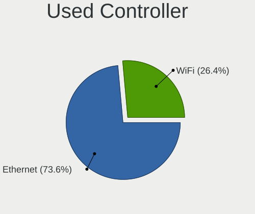

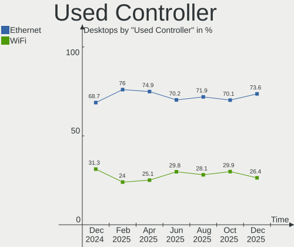

| Kind     | Desktops | Percent |
|----------|----------|---------|
| Ethernet | 323      | 73.58%  |
| WiFi     | 116      | 26.42%  |

NICs
----

Total network controllers on board

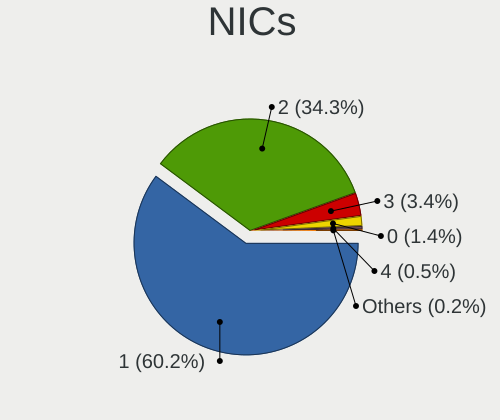

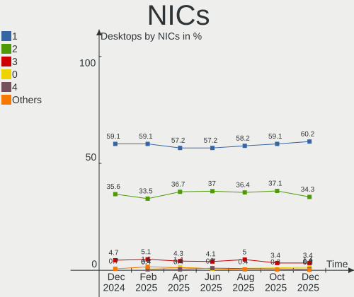

| Total | Desktops | Percent |
|-------|----------|---------|
| 1     | 251      | 60.19%  |
| 2     | 143      | 34.29%  |
| 3     | 14       | 3.36%   |
| 0     | 6        | 1.44%   |
| 4     | 2        | 0.48%   |
| 5     | 1        | 0.24%   |

IPv6
----

IPv6 vs IPv4

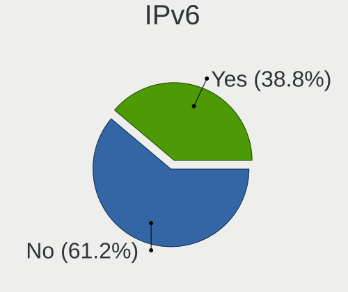

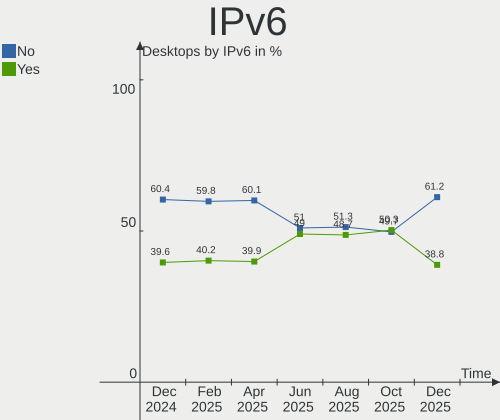

| Used | Desktops | Percent |
|------|----------|---------|
| No   | 255      | 61.15%  |
| Yes  | 162      | 38.85%  |

Bluetooth
---------

Bluetooth Vendor
----------------

Controller vendors

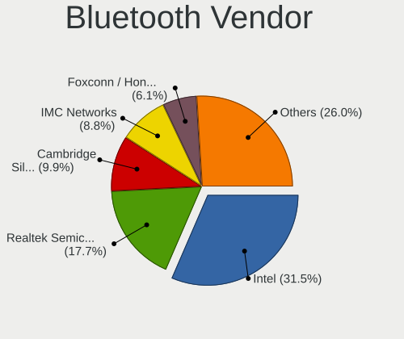

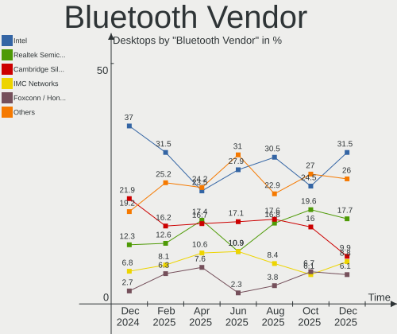

| Vendor                          | Desktops | Percent |
|---------------------------------|----------|---------|
| Intel                           | 57       | 31.49%  |
| Realtek Semiconductor           | 32       | 17.68%  |
| Cambridge Silicon Radio         | 18       | 9.94%   |
| IMC Networks                    | 16       | 8.84%   |
| Foxconn / Hon Hai               | 11       | 6.08%   |
| MediaTek                        | 9        | 4.97%   |
| ASUSTek Computer                | 8        | 4.42%   |
| Qualcomm Atheros Communications | 6        | 3.31%   |
| Broadcom                        | 5        | 2.76%   |
| TP-Link                         | 4        | 2.21%   |
| Unknown                         | 3        | 1.66%   |
| Realtek                         | 2        | 1.1%    |
| Actions                         | 2        | 1.1%    |
| SiW                             | 1        | 0.55%   |
| Ralink                          | 1        | 0.55%   |
| Lite-On Technology              | 1        | 0.55%   |
| Integrated System Solution      | 1        | 0.55%   |
| Edimax Technology               | 1        | 0.55%   |
| Conwise Technology              | 1        | 0.55%   |
| Apple                           | 1        | 0.55%   |
| AICSemi                         | 1        | 0.55%   |

Bluetooth Model
---------------

Controller models

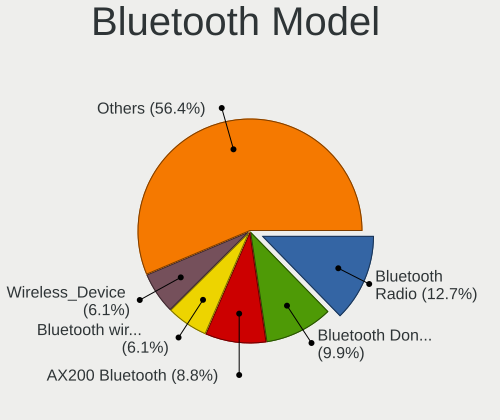

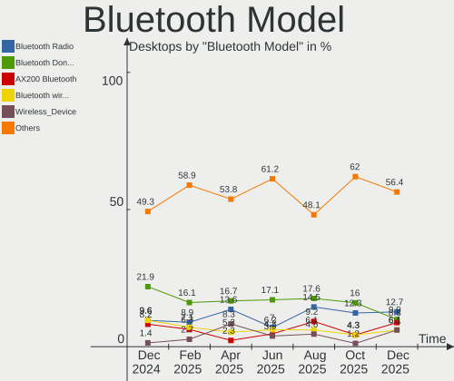

| Model                                               | Desktops | Percent |
|-----------------------------------------------------|----------|---------|
| Realtek Bluetooth Radio                             | 23       | 12.71%  |
| Cambridge Silicon Radio Bluetooth Dongle (HCI mode) | 18       | 9.94%   |
| Intel AX200 Bluetooth                               | 16       | 8.84%   |
| Intel Bluetooth wireless interface                  | 11       | 6.08%   |
| IMC Networks Wireless_Device                        | 11       | 6.08%   |
| MediaTek Wireless_Device                            | 9        | 4.97%   |
| Intel Bluetooth Device                              | 8        | 4.42%   |
| Foxconn / Hon Hai Bluetooth Device                  | 8        | 4.42%   |
| Intel AX210 Bluetooth                               | 7        | 3.87%   |
| Intel Wireless-AC 9260 Bluetooth Adapter            | 5        | 2.76%   |
| Intel AX201 Bluetooth                               | 5        | 2.76%   |
| TP-Link TP-T@- UB500 Adapter                        | 4        | 2.21%   |
| Realtek Bluetooth 5.3 Radio                         | 4        | 2.21%   |
| IMC Networks Bluetooth Radio                        | 4        | 2.21%   |
| Realtek Bluetooth 5.4 Radio                         | 3        | 1.66%   |
| Qualcomm Atheros  Bluetooth Device                  | 3        | 1.66%   |
| Intel Bluetooth 9460/9560 Jefferson Peak (JfP)      | 3        | 1.66%   |
| Foxconn / Hon Hai Wireless_Device                   | 3        | 1.66%   |
| Broadcom BCM20702A0 Bluetooth 4.0                   | 3        | 1.66%   |
| ASUS Broadcom BCM20702A0 Bluetooth                  | 3        | 1.66%   |
| Unknown                                             | 3        | 1.66%   |
| Realtek Bluetooth Radio                             | 2        | 1.1%    |
| ASUS BCM20702A0                                     | 2        | 1.1%    |
| ASUS ASUS USB-BT500                                 | 2        | 1.1%    |
| Actions general adapter                             | 2        | 1.1%    |
| SiW SiW                                             | 1        | 0.55%   |
| Realtek RTL8821A Bluetooth                          | 1        | 0.55%   |
| Realtek  Bluetooth 4.2 Adapter                      | 1        | 0.55%   |
| Ralink RT3290 Bluetooth                             | 1        | 0.55%   |
| Qualcomm Atheros QCA61x4 Bluetooth 4.0              | 1        | 0.55%   |
| Qualcomm Atheros AR9462 Bluetooth                   | 1        | 0.55%   |
| Qualcomm Atheros AR3011 Bluetooth                   | 1        | 0.55%   |
| Lite-On Bluetooth Radio                             | 1        | 0.55%   |
| Intel Wireless-AC 3168 Bluetooth                    | 1        | 0.55%   |
| Intel Centrino Bluetooth Wireless Transceiver       | 1        | 0.55%   |
| Integrated System Solution Bluetooth Device         | 1        | 0.55%   |
| IMC Networks Bluetooth Device                       | 1        | 0.55%   |
| Edimax Bluetooth Device                             | 1        | 0.55%   |
| Conwise CW6622                                      | 1        | 0.55%   |
| Broadcom HP Bluethunder                             | 1        | 0.55%   |

Sound
-----

Sound Vendor
------------

Sound card vendors

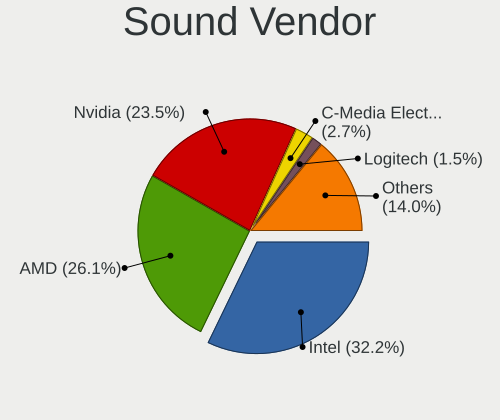

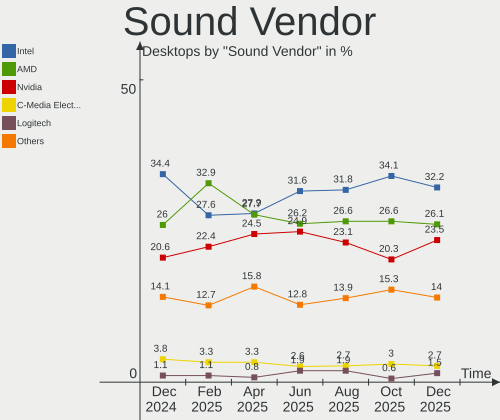

| Vendor                                       | Desktops | Percent |
|----------------------------------------------|----------|---------|
| Intel                                        | 252      | 32.18%  |
| AMD                                          | 204      | 26.05%  |
| Nvidia                                       | 184      | 23.5%   |
| C-Media Electronics                          | 21       | 2.68%   |
| Logitech                                     | 12       | 1.53%   |
| Creative Labs                                | 11       | 1.4%    |
| Razer USA                                    | 9        | 1.15%   |
| Texas Instruments                            | 6        | 0.77%   |
| Micro Star International                     | 6        | 0.77%   |
| Generalplus Technology                       | 5        | 0.64%   |
| Focusrite-Novation                           | 5        | 0.64%   |
| SteelSeries ApS                              | 4        | 0.51%   |
| JMTek                                        | 4        | 0.51%   |
| Jieli Technology                             | 4        | 0.51%   |
| Hewlett-Packard                              | 4        | 0.51%   |
| Realtek Semiconductor                        | 3        | 0.38%   |
| ASRock                                       | 3        | 0.38%   |
| Zoran Co. Personal Media Division (Nogatech) | 2        | 0.26%   |
| Tenx Technology                              | 2        | 0.26%   |
| Sony                                         | 2        | 0.26%   |
| Kingston Technology                          | 2        | 0.26%   |
| Giga-Byte Technology                         | 2        | 0.26%   |
| Creative Technology                          | 2        | 0.26%   |
| Corsair                                      | 2        | 0.26%   |
| Audio-Technica                               | 2        | 0.26%   |
| ASUSTek Computer                             | 2        | 0.26%   |
| Unknown                                      | 2        | 0.26%   |
| Yamaha                                       | 1        | 0.13%   |
| XMOS                                         | 1        | 0.13%   |
| Weltrend Semiconductor                       | 1        | 0.13%   |
| Walmart                                      | 1        | 0.13%   |
| VIA Technologies                             | 1        | 0.13%   |
| Valve Software                               | 1        | 0.13%   |
| Universal Audio                              | 1        | 0.13%   |
| TTGK Technology                              | 1        | 0.13%   |
| Trust                                        | 1        | 0.13%   |
| TerraTec Electronic                          | 1        | 0.13%   |
| Silicon Integrated Systems [SiS]             | 1        | 0.13%   |
| PreSonus Audio Electronics                   | 1        | 0.13%   |
| Nordic Semiconductor ASA                     | 1        | 0.13%   |

Sound Model
-----------

Sound card models

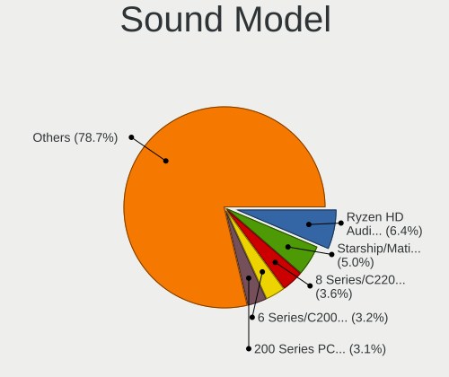

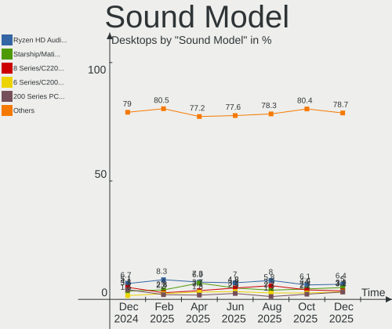

| Model                                                                             | Desktops | Percent |
|-----------------------------------------------------------------------------------|----------|---------|
| AMD Ryzen HD Audio Controller                                                     | 59       | 6.39%   |
| AMD Starship/Matisse HD Audio Controller                                          | 46       | 4.98%   |
| Intel 8 Series/C220 Series Chipset High Definition Audio Controller               | 33       | 3.57%   |
| Intel 6 Series/C200 Series Chipset Family High Definition Audio Controller        | 30       | 3.25%   |
| Intel 200 Series PCH HD Audio                                                     | 29       | 3.14%   |
| Intel 100 Series/C230 Series Chipset Family HD Audio Controller                   | 24       | 2.6%    |
| AMD Radeon High Definition Audio Controller                                       | 23       | 2.49%   |
| Intel Xeon E3-1200 v3/4th Gen Core Processor HD Audio Controller                  | 22       | 2.38%   |
| AMD Renoir/Cezanne HDMI/DP Audio Controller                                       | 22       | 2.38%   |
| AMD SBx00 Azalia (Intel HDA)                                                      | 21       | 2.27%   |
| AMD Navi 21/23 HDMI/DP Audio Controller                                           | 19       | 2.06%   |
| AMD Family 17h (Models 00h-0fh) HD Audio Controller                               | 17       | 1.84%   |
| AMD Ellesmere HDMI Audio [Radeon RX 470/480 / 570/580/590]                        | 17       | 1.84%   |
| Intel 7 Series/C216 Chipset Family High Definition Audio Controller               | 16       | 1.73%   |
| Nvidia GA106 High Definition Audio Controller                                     | 13       | 1.41%   |
| Intel Alder Lake-S HD Audio Controller                                            | 13       | 1.41%   |
| Nvidia GP104 High Definition Audio Controller                                     | 11       | 1.19%   |
| Nvidia GK208 HDMI/DP Audio Controller                                             | 11       | 1.19%   |
| Nvidia GA104 High Definition Audio Controller                                     | 11       | 1.19%   |
| Intel Cannon Lake PCH cAVS                                                        | 11       | 1.19%   |
| AMD Oland/Hainan/Cape Verde/Pitcairn HDMI Audio [Radeon HD 7000 Series]           | 11       | 1.19%   |
| Nvidia GP107GL High Definition Audio Controller                                   | 10       | 1.08%   |
| Intel Raptor Lake High Definition Audio Controller                                | 10       | 1.08%   |
| Intel 82801JI (ICH10 Family) HD Audio Controller                                  | 10       | 1.08%   |
| AMD Navi 48 HDMI/DP Audio Controller                                              | 10       | 1.08%   |
| AMD Caicos HDMI Audio [Radeon HD 6450 / 7450/8450/8490 OEM / R5 230/235/235X OEM] | 10       | 1.08%   |
| Nvidia High Definition Audio Controller                                           | 9        | 0.97%   |
| Nvidia GP106 High Definition Audio Controller                                     | 9        | 0.97%   |
| Nvidia TU116 High Definition Audio Controller                                     | 8        | 0.87%   |
| Nvidia GM204 High Definition Audio Controller                                     | 8        | 0.87%   |
| Intel NM10/ICH7 Family High Definition Audio Controller                           | 8        | 0.87%   |
| Intel Comet Lake PCH-V cAVS                                                       | 8        | 0.87%   |
| AMD Navi 31 HDMI/DP Audio                                                         | 8        | 0.87%   |
| Nvidia GP108 High Definition Audio Controller                                     | 7        | 0.76%   |
| Nvidia GF108 High Definition Audio Controller                                     | 7        | 0.76%   |
| AMD FCH Azalia Controller                                                         | 7        | 0.76%   |
| Nvidia TU104 HD Audio Controller                                                  | 6        | 0.65%   |
| Nvidia GM107 High Definition Audio Controller [GeForce 940MX]                     | 6        | 0.65%   |
| Nvidia GA102 High Definition Audio Controller                                     | 6        | 0.65%   |
| Micro Star International USB Audio                                                | 6        | 0.65%   |

Memory
------

Memory Vendor
-------------

Memory module vendors

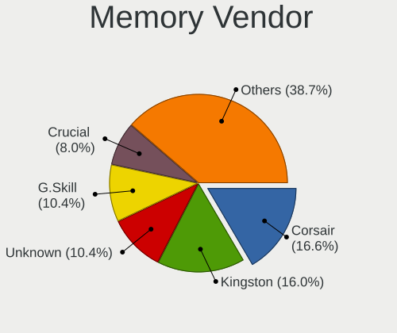

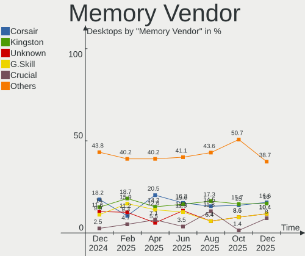

| Vendor                       | Desktops | Percent |
|------------------------------|----------|---------|
| Corsair                      | 27       | 16.56%  |
| Kingston                     | 26       | 15.95%  |
| Unknown                      | 17       | 10.43%  |
| G.Skill                      | 17       | 10.43%  |
| Crucial                      | 13       | 7.98%   |
| Samsung Electronics          | 12       | 7.36%   |
| SK hynix                     | 11       | 6.75%   |
| Micron Technology            | 9        | 5.52%   |
| Team                         | 5        | 3.07%   |
| Patriot                      | 3        | 1.84%   |
| Unknown (ABCD)               | 2        | 1.23%   |
| Transcend                    | 2        | 1.23%   |
| Patriot Memory (PDP Systems) | 2        | 1.23%   |
| Nanya Technology             | 2        | 1.23%   |
| A-DATA Technology            | 2        | 1.23%   |
| Unknown                      | 2        | 1.23%   |
| Wodposit                     | 1        | 0.61%   |
| Unknown (0x0E2A)             | 1        | 0.61%   |
| Unifosa                      | 1        | 0.61%   |
| TeamGroup                    | 1        | 0.61%   |
| Sesame                       | 1        | 0.61%   |
| Patriot Memory               | 1        | 0.61%   |
| Netac                        | 1        | 0.61%   |
| GOODRAM                      | 1        | 0.61%   |
| GeIL                         | 1        | 0.61%   |
| AMD                          | 1        | 0.61%   |
| 48spaces                     | 1        | 0.61%   |

Memory Model
------------

Memory module models

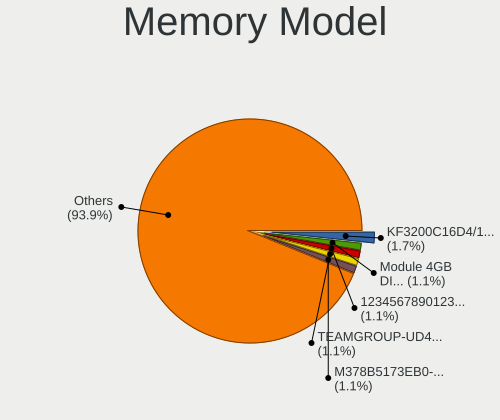

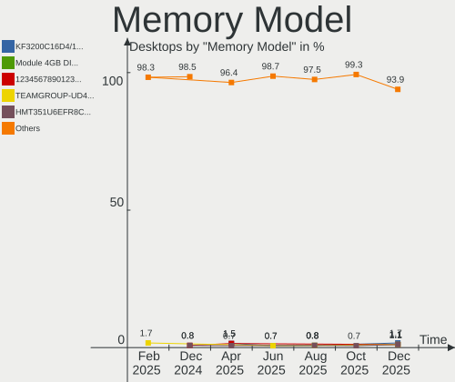

| Model                                                          | Desktops | Percent |
|----------------------------------------------------------------|----------|---------|
| Kingston RAM KF3200C16D4/16GX 16GB DIMM DDR4 3733MT/s          | 3        | 1.68%   |
| Unknown RAM Module 4GB DIMM 800MT/s                            | 2        | 1.12%   |
| Unknown (ABCD) RAM 123456789012345678 2GB DIMM LPDDR4 2133MT/s | 2        | 1.12%   |
| Team RAM TEAMGROUP-UD4-3200 8GB DIMM DDR4 3800MT/s             | 2        | 1.12%   |
| SK hynix RAM HMT351U6EFR8C-PB 4GB DIMM DDR3 1600MT/s           | 2        | 1.12%   |
| Samsung RAM M378B5173EB0-YK0 4GB DIMM DDR3 1600MT/s            | 2        | 1.12%   |
| Kingston RAM KF560C36-32 32GB DIMM DDR5 6200MT/s               | 2        | 1.12%   |
| Kingston RAM KF560C36-16 16GB DIMM DDR5 6000MT/s               | 2        | 1.12%   |
| Kingston RAM KF556C36-16 16GB DIMM DDR5 12800MT/s              | 2        | 1.12%   |
| G.Skill RAM F4-3600C18-8GVK 8GB DIMM DDR4 3600MT/s             | 2        | 1.12%   |
| Corsair RAM CMW32GX4M2E3200C16 16GB DIMM DDR4 3200MT/s         | 2        | 1.12%   |
| Corsair RAM CMW16GX4M2C3200C16 8GB DIMM DDR4 3733MT/s          | 2        | 1.12%   |
| Corsair RAM CMK96GX5M2E6000Z36 48GB DIMM DDR5 6000MT/s         | 2        | 1.12%   |
| Corsair RAM CMK32GX5M2B6000Z30 16GB DIMM DDR5 6000MT/s         | 2        | 1.12%   |
| Corsair RAM CMK32GX4M2D3600C18 16GB DIMM DDR4 3800MT/s         | 2        | 1.12%   |
| Unknown                                                        | 2        | 1.12%   |
| Wodposit RAM WPBH26D408SWA-8G 8GB SODIMM DDR4 2667MT/s         | 1        | 0.56%   |
| Unknown RAM Module 8GB DIMM DDR3 1600MT/s                      | 1        | 0.56%   |
| Unknown RAM Module 8GB DIMM DDR3 1066MT/s                      | 1        | 0.56%   |
| Unknown RAM Module 8GB DIMM 1600MT/s                           | 1        | 0.56%   |
| Unknown RAM Module 512MB DIMM 667MT/s                          | 1        | 0.56%   |
| Unknown RAM Module 4GB DIMM SDRAM                              | 1        | 0.56%   |
| Unknown RAM Module 4GB DIMM DDR 1333MT/s                       | 1        | 0.56%   |
| Unknown RAM Module 4GB DIMM 1333MT/s                           | 1        | 0.56%   |
| Unknown RAM Module 4GB DIMM 1066MT/s                           | 1        | 0.56%   |
| Unknown RAM Module 4096MB DIMM 400MT/s                         | 1        | 0.56%   |
| Unknown RAM Module 2GB DIMM SDRAM                              | 1        | 0.56%   |
| Unknown RAM Module 2GB DIMM DDR2 800MT/s                       | 1        | 0.56%   |
| Unknown RAM Module 2GB DIMM DDR2 667MT/s                       | 1        | 0.56%   |
| Unknown RAM Module 2GB DIMM DDR2                               | 1        | 0.56%   |
| Unknown RAM Module 2GB DIMM DDR 1333MT/s                       | 1        | 0.56%   |
| Unknown RAM Module 2GB DIMM 1066MT/s                           | 1        | 0.56%   |
| Unknown RAM Module 1GB DIMM DDR2 667MT/s                       | 1        | 0.56%   |
| Unknown RAM Module 1GB DIMM 667MT/s                            | 1        | 0.56%   |
| Unknown RAM 1866 CL10 Series 8192MB DIMM DDR3 933MT/s          | 1        | 0.56%   |
| Unknown (0x0E2A) RAM Module 8GB SODIMM DDR4 2667MT/s           | 1        | 0.56%   |
| Unifosa RAM GU342G0ALEPR692C6 2GB DIMM DDR2 2048MT/s           | 1        | 0.56%   |
| Transcend RAM TS1GLK64V6H 8GB DIMM DDR3 1600MT/s               | 1        | 0.56%   |
| Transcend RAM JM1333KLH-4G 4GB DIMM DDR3 1333MT/s              | 1        | 0.56%   |
| TeamGroup RAM UD5-6000 16GB DIMM DDR5 6000MT/s                 | 1        | 0.56%   |

Memory Kind
-----------

Memory module kinds

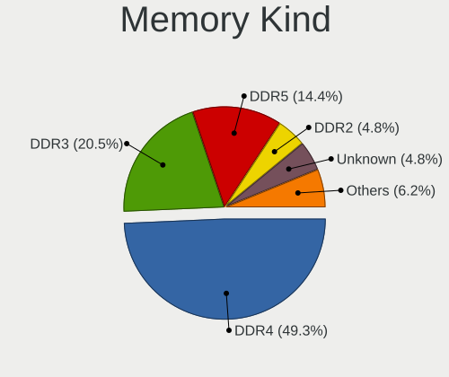

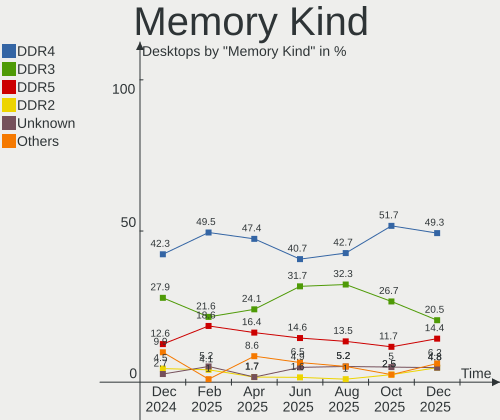

| Kind    | Desktops | Percent |
|---------|----------|---------|
| DDR4    | 72       | 49.32%  |
| DDR3    | 30       | 20.55%  |
| DDR5    | 21       | 14.38%  |
| DDR2    | 7        | 4.79%   |
| Unknown | 7        | 4.79%   |
| SDRAM   | 5        | 3.42%   |
| LPDDR4  | 2        | 1.37%   |
| LPDDR5  | 1        | 0.68%   |
| DDR     | 1        | 0.68%   |

Memory Form Factor
------------------

Physical design of the memory module

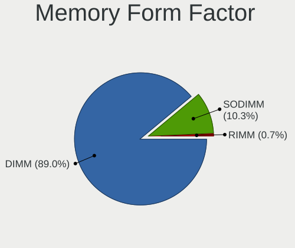

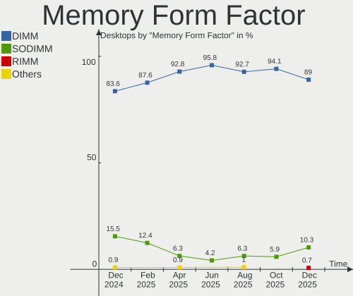

| Name   | Desktops | Percent |
|--------|----------|---------|
| DIMM   | 129      | 88.97%  |
| SODIMM | 15       | 10.34%  |
| RIMM   | 1        | 0.69%   |

Memory Size
-----------

Memory module size

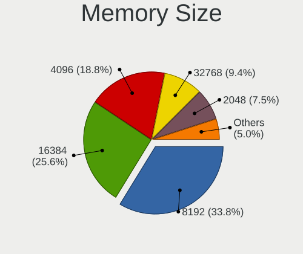

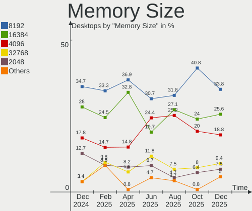

| Size  | Desktops | Percent |
|-------|----------|---------|
| 8192  | 54       | 33.75%  |
| 16384 | 41       | 25.63%  |
| 4096  | 30       | 18.75%  |
| 32768 | 15       | 9.38%   |
| 2048  | 12       | 7.5%    |
| 1024  | 4        | 2.5%    |
| 49152 | 3        | 1.88%   |
| 512   | 1        | 0.63%   |

Memory Speed
------------

Memory module speed

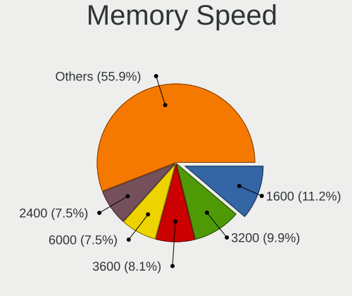

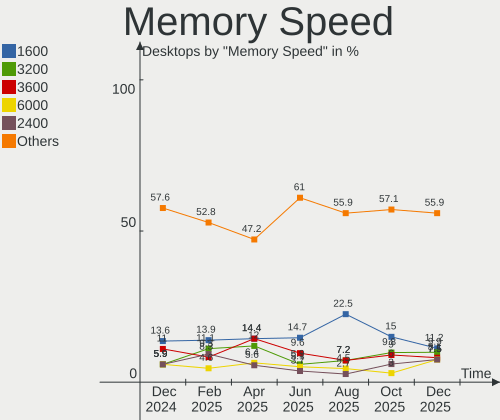

| Speed   | Desktops | Percent |
|---------|----------|---------|
| 1600    | 18       | 11.18%  |
| 3200    | 16       | 9.94%   |
| 3600    | 13       | 8.07%   |
| 6000    | 12       | 7.45%   |
| 2400    | 12       | 7.45%   |
| 2667    | 9        | 5.59%   |
| 2133    | 9        | 5.59%   |
| 1333    | 9        | 5.59%   |
| 3800    | 7        | 4.35%   |
| 3733    | 7        | 4.35%   |
| 800     | 5        | 3.11%   |
| 2933    | 4        | 2.48%   |
| 1066    | 4        | 2.48%   |
| 4800    | 3        | 1.86%   |
| 3000    | 3        | 1.86%   |
| 667     | 3        | 1.86%   |
| Unknown | 3        | 1.86%   |
| 12800   | 2        | 1.24%   |
| 6200    | 2        | 1.24%   |
| 5600    | 2        | 1.24%   |
| 3466    | 2        | 1.24%   |
| 3066    | 2        | 1.24%   |
| 1866    | 2        | 1.24%   |
| 1800    | 2        | 1.24%   |
| 6400    | 1        | 0.62%   |
| 4333    | 1        | 0.62%   |
| 3933    | 1        | 0.62%   |
| 3866    | 1        | 0.62%   |
| 3467    | 1        | 0.62%   |
| 2666    | 1        | 0.62%   |
| 2048    | 1        | 0.62%   |
| 1639    | 1        | 0.62%   |
| 1334    | 1        | 0.62%   |
| 400     | 1        | 0.62%   |

Printers & scanners
-------------------

Printer Vendor
--------------

Printer device vendors

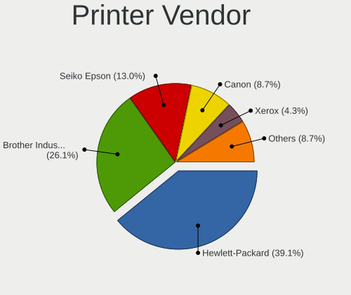

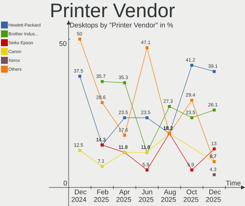

| Vendor              | Desktops | Percent |
|---------------------|----------|---------|
| Hewlett-Packard     | 9        | 39.13%  |
| Brother Industries  | 6        | 26.09%  |
| Seiko Epson         | 3        | 13.04%  |
| Canon               | 2        | 8.7%    |
| Xerox               | 1        | 4.35%   |
| STMicroelectronics  | 1        | 4.35%   |
| Prolific Technology | 1        | 4.35%   |

Printer Model
-------------

Printer device models

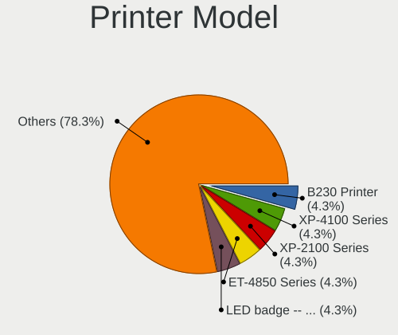

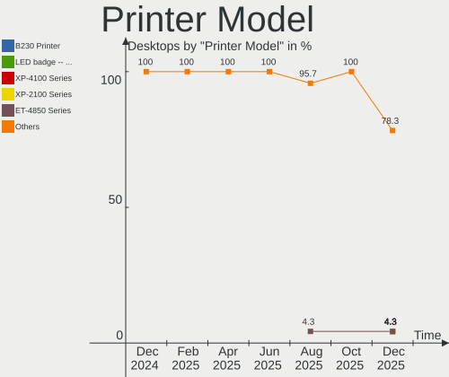

| Model                                                     | Desktops | Percent |
|-----------------------------------------------------------|----------|---------|
| Xerox B230 Printer                                        | 1        | 4.35%   |
| STMicroelectronics LED badge -- mini LED display -- 11x44 | 1        | 4.35%   |
| Seiko Epson XP-4100 Series                                | 1        | 4.35%   |
| Seiko Epson XP-2100 Series                                | 1        | 4.35%   |
| Seiko Epson ET-4850 Series                                | 1        | 4.35%   |
| Prolific PL2305 Parallel Port                             | 1        | 4.35%   |
| HP Smart Tank 5100 series                                 | 1        | 4.35%   |
| HP Smart Tank 500 series                                  | 1        | 4.35%   |
| HP LaserJet P2015 series                                  | 1        | 4.35%   |
| HP LaserJet P1006                                         | 1        | 4.35%   |
| HP LaserJet CP1025nw                                      | 1        | 4.35%   |
| HP ENVY 6000 series                                       | 1        | 4.35%   |
| HP DeskJet Plus 4100 series                               | 1        | 4.35%   |
| HP DeskJet 6980 series                                    | 1        | 4.35%   |
| HP DeskJet 2700 series                                    | 1        | 4.35%   |
| Canon TS700 series                                        | 1        | 4.35%   |
| Canon LiDE 400                                            | 1        | 4.35%   |
| Brother PT-1500PC                                         | 1        | 4.35%   |
| Brother Printer                                           | 1        | 4.35%   |
| Brother MFC-L2860DWE                                      | 1        | 4.35%   |
| Brother HL-L2350DW series                                 | 1        | 4.35%   |
| Brother HL-L2340D series                                  | 1        | 4.35%   |
| Brother HL-3140CW series                                  | 1        | 4.35%   |

Scanner Vendor
--------------

Scanner device vendors

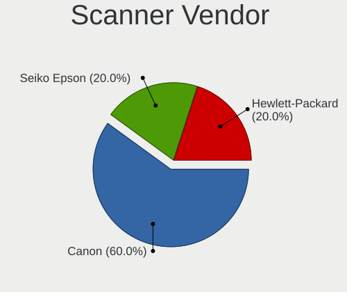

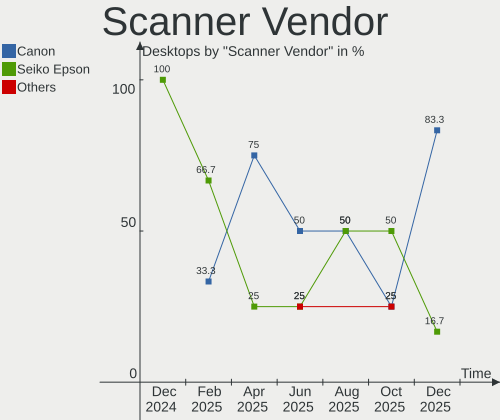

| Vendor      | Desktops | Percent |
|-------------|----------|---------|
| Canon       | 5        | 83.33%  |
| Seiko Epson | 1        | 16.67%  |

Scanner Model
-------------

Scanner device models

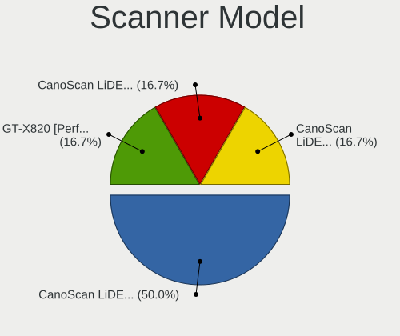

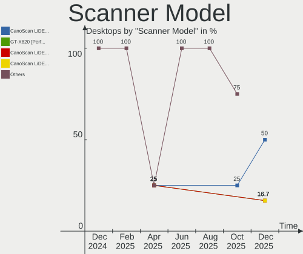

| Model                                       | Desktops | Percent |
|---------------------------------------------|----------|---------|
| Canon CanoScan LiDE 110                     | 3        | 50%     |
| Seiko Epson GT-X820 [Perfection V600 Photo] | 1        | 16.67%  |
| Canon CanoScan LiDE 220                     | 1        | 16.67%  |
| Canon CanoScan LiDE 210                     | 1        | 16.67%  |

Camera
------

Camera Vendor
-------------

Camera device vendors

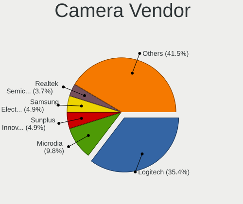

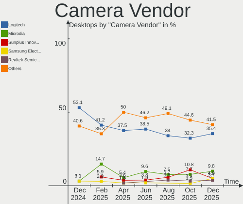

| Vendor                        | Desktops | Percent |
|-------------------------------|----------|---------|
| Logitech                      | 29       | 35.37%  |
| Microdia                      | 8        | 9.76%   |
| Sunplus Innovation Technology | 4        | 4.88%   |
| Samsung Electronics           | 4        | 4.88%   |
| Realtek Semiconductor         | 3        | 3.66%   |
| Generalplus Technology        | 3        | 3.66%   |
| Creative Technology           | 3        | 3.66%   |
| Chicony Electronics           | 3        | 3.66%   |
| Z-Star Microelectronics       | 2        | 2.44%   |
| KYE Systems (Mouse Systems)   | 2        | 2.44%   |
| eMeet                         | 2        | 2.44%   |
| Anker PowerConf C200          | 2        | 2.44%   |
| webcamvendor                  | 1        | 1.22%   |
| webcam                        | 1        | 1.22%   |
| Valve Software                | 1        | 1.22%   |
| Sunplus Technology            | 1        | 1.22%   |
| Razer USA                     | 1        | 1.22%   |
| Motorola PCS                  | 1        | 1.22%   |
| MacroSilicon                  | 1        | 1.22%   |
| Lenovo                        | 1        | 1.22%   |
| JOURIST-DC80                  | 1        | 1.22%   |
| Jieli Technology              | 1        | 1.22%   |
| Hewlett-Packard               | 1        | 1.22%   |
| GEMBIRD                       | 1        | 1.22%   |
| bx ic                         | 1        | 1.22%   |
| Aveo Technology               | 1        | 1.22%   |
| ARC International             | 1        | 1.22%   |
| Apple                         | 1        | 1.22%   |
| Anchor Chips                  | 1        | 1.22%   |

Camera Model
------------

Camera device models

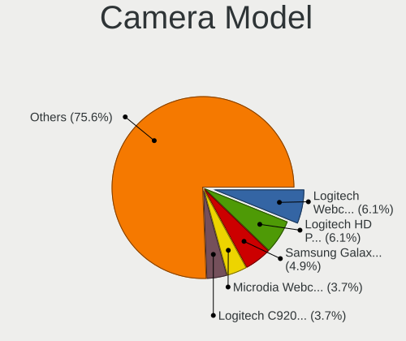

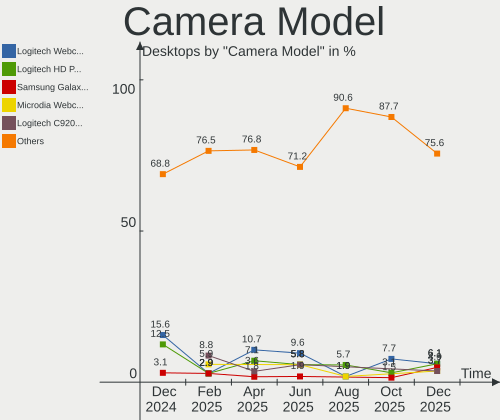

| Model                                                 | Desktops | Percent |
|-------------------------------------------------------|----------|---------|
| Logitech Webcam C270                                  | 5        | 6.1%    |
| Logitech HD Pro Webcam C920                           | 5        | 6.1%    |
| Samsung Galaxy series, misc. (MTP mode)               | 4        | 4.88%   |
| Microdia Webcam Vitade AF                             | 3        | 3.66%   |
| Logitech C920 PRO HD Webcam                           | 3        | 3.66%   |
| Z-Star Venus USB2.0 Camera                            | 2        | 2.44%   |
| Microdia Camera                                       | 2        | 2.44%   |
| Logitech Webcam C310                                  | 2        | 2.44%   |
| Logitech HD Webcam C525                               | 2        | 2.44%   |
| Logitech C922 Pro Stream Webcam                       | 2        | 2.44%   |
| Logitech BRIO Ultra HD Webcam                         | 2        | 2.44%   |
| KYE Systems (Mouse Systems) USB 2.0 HD1080P PC Camera | 2        | 2.44%   |
| Generalplus GENERAL WEBCAM                            | 2        | 2.44%   |
| Anker PowerConf C200 Anker PowerConf C200             | 2        | 2.44%   |
| webcamvendor NexiGo N60 FHD Webcam                    | 1        | 1.22%   |
| webcam webcam                                         | 1        | 1.22%   |
| Valve Software 3D Camera                              | 1        | 1.22%   |
| Sunplus Document Camera                               | 1        | 1.22%   |
| Sunplus USB 2.0 Camera                                | 1        | 1.22%   |
| Sunplus SPCA2281 Web Camera                           | 1        | 1.22%   |
| Sunplus Integrated Camera                             | 1        | 1.22%   |
| Sunplus Full HD webcam                                | 1        | 1.22%   |
| Realtek Laptop_Integrated_Webcam_FHD                  | 1        | 1.22%   |
| Realtek HP 1.0MP High Definition Webcam               | 1        | 1.22%   |
| Realtek FULL HD 1080P Webcam                          | 1        | 1.22%   |
| Razer USA Gaming Webcam [Kiyo]                        | 1        | 1.22%   |
| Motorola PCS moto g 5G - 2024                         | 1        | 1.22%   |
| Microdia USB 2.0 Camera                               | 1        | 1.22%   |
| Microdia Sonix USB 2.0 Camera                         | 1        | 1.22%   |
| Microdia Rapoo Camera                                 | 1        | 1.22%   |
| MacroSilicon UGREEN 15390                             | 1        | 1.22%   |
| Logitech Webcam Pro 9000                              | 1        | 1.22%   |
| Logitech Webcam C250                                  | 1        | 1.22%   |
| Logitech Webcam C170                                  | 1        | 1.22%   |
| Logitech HD Webcam B910                               | 1        | 1.22%   |
| Logitech CrystalCam                                   | 1        | 1.22%   |
| Logitech C505 HD Webcam                               | 1        | 1.22%   |
| Logitech BRIO 4K Stream Edition                       | 1        | 1.22%   |
| Logitech Brio 100                                     | 1        | 1.22%   |
| Lenovo Lenovo FHD Webcam Audio                        | 1        | 1.22%   |

Security
--------

Fingerprint Vendor
------------------

Fingerprint sensor vendors

Zero info for selected period =(

Fingerprint Model
-----------------

Fingerprint sensor models

Zero info for selected period =(

Chipcard Vendor
---------------

Chipcard module vendors

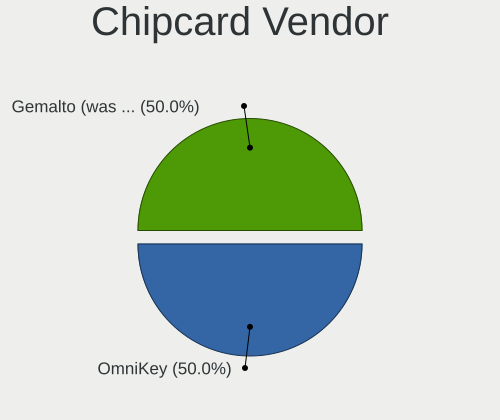

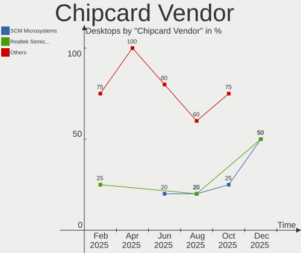

| Vendor                | Desktops | Percent |
|-----------------------|----------|---------|
| SCM Microsystems      | 1        | 50%     |
| Realtek Semiconductor | 1        | 50%     |

Chipcard Model
--------------

Chipcard module models

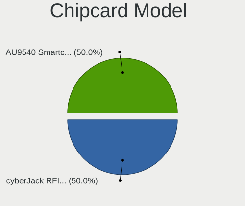

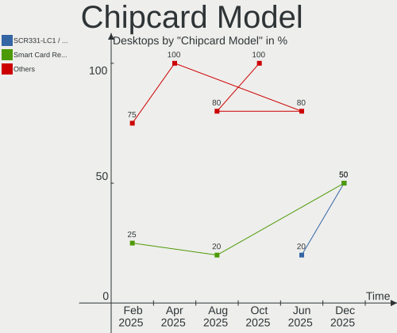

| Model                                                  | Desktops | Percent |
|--------------------------------------------------------|----------|---------|
| SCM Microsystems SCR331-LC1 / SCR3310 SmartCard Reader | 1        | 50%     |
| Realtek Semiconductor Smart Card Reader Interface      | 1        | 50%     |

Unsupported
-----------

Unsupported Devices
-------------------

Total unsupported devices on board

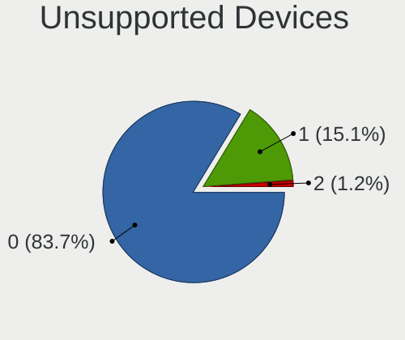

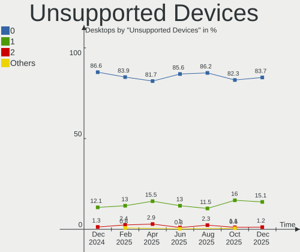

| Total | Desktops | Percent |
|-------|----------|---------|
| 0     | 349      | 83.69%  |
| 1     | 63       | 15.11%  |
| 2     | 5        | 1.2%    |

Unsupported Device Types
------------------------

Types of unsupported devices

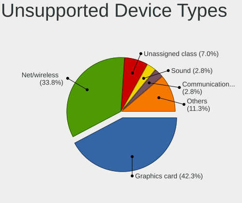

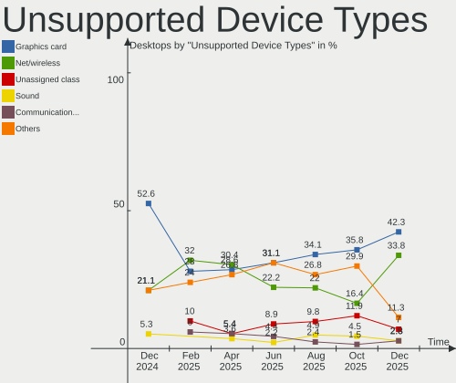

| Type                     | Desktops | Percent |
|--------------------------|----------|---------|
| Graphics card            | 30       | 42.25%  |
| Net/wireless             | 24       | 33.8%   |
| Unassigned class         | 5        | 7.04%   |
| Sound                    | 2        | 2.82%   |
| Communication controller | 2        | 2.82%   |
| Storage/raid             | 1        | 1.41%   |
| Network                  | 1        | 1.41%   |
| Net/ethernet             | 1        | 1.41%   |
| Multimedia controller    | 1        | 1.41%   |
| Firewire controller      | 1        | 1.41%   |
| Chipcard                 | 1        | 1.41%   |
| Camera                   | 1        | 1.41%   |
| Bluetooth                | 1        | 1.41%   |

