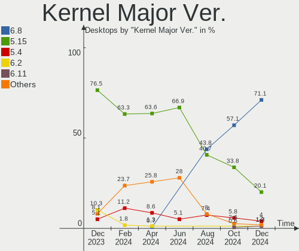
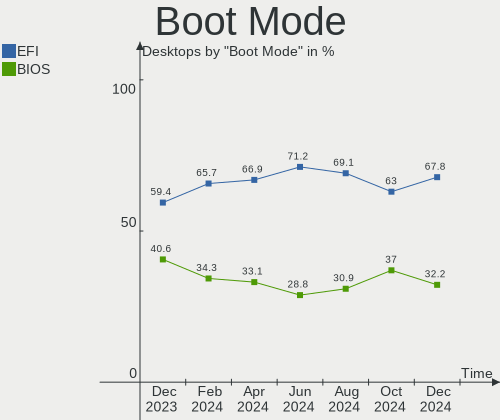
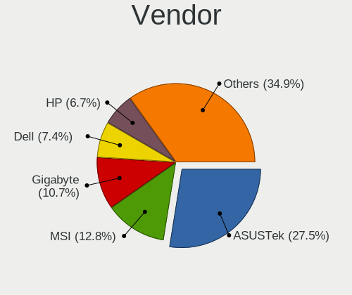
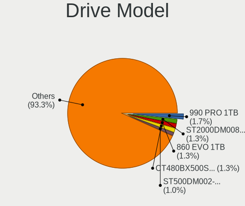
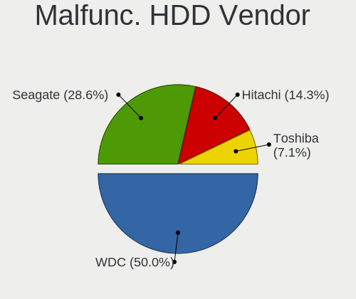
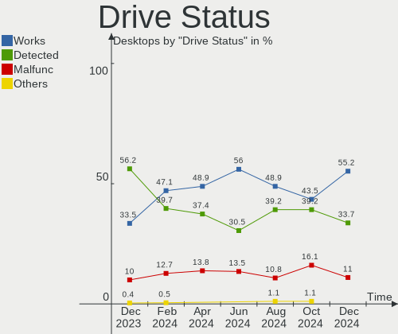
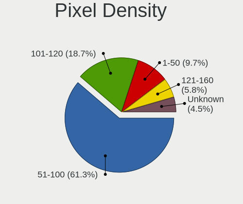
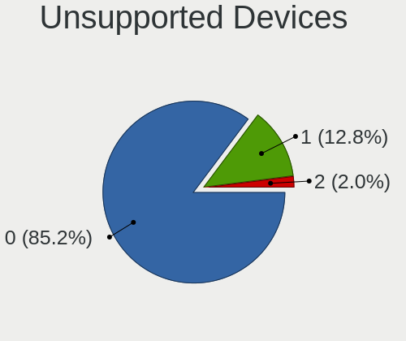

Linux Mint - Hardware Trends (Desktops)
---------------------------------------

A project to identify most popular hardware characteristics and track their change
over time based on data collected by Linux users at https://Linux-Hardware.org.

Anyone can contribute to this report by the [hw-probe](https://github.com/linuxhw/hw-probe) tool:

    sudo -E hw-probe -all -upload

This report is for one last month. Overall report since the beginning of time: [TestDays](https://github.com/linuxhw/TestDays)

Period: Dec, 2023.

Contents
--------

* [ System ](#system)
  - [ OS                       ](#os)
  - [ OS Family                ](#os-family)
  - [ Kernel                   ](#kernel)
  - [ Kernel Family            ](#kernel-family)
  - [ Kernel Major Ver.        ](#kernel-major-ver)
  - [ Arch                     ](#arch)
  - [ DE                       ](#de)
  - [ Display Server           ](#display-server)
  - [ Display Manager          ](#display-manager)
  - [ OS Lang                  ](#os-lang)
  - [ Boot Mode                ](#boot-mode)
  - [ Filesystem               ](#filesystem)
  - [ Part. scheme             ](#part-scheme)
  - [ Dual Boot with Linux/BSD ](#dual-boot-with-linuxbsd)
  - [ Dual Boot (Win)          ](#dual-boot-win)

* [ Board ](#board)
  - [ Vendor                   ](#vendor)
  - [ Model                    ](#model)
  - [ Model Family             ](#model-family)
  - [ MFG Year                 ](#mfg-year)
  - [ Form Factor              ](#form-factor)
  - [ Secure Boot              ](#secure-boot)
  - [ Coreboot                 ](#coreboot)
  - [ RAM Size                 ](#ram-size)
  - [ RAM Used                 ](#ram-used)
  - [ Total Drives             ](#total-drives)
  - [ Has CD-ROM               ](#has-cd-rom)
  - [ Has Ethernet             ](#has-ethernet)
  - [ Has WiFi                 ](#has-wifi)
  - [ Has Bluetooth            ](#has-bluetooth)

* [ Location ](#location)
  - [ Country                  ](#country)
  - [ City                     ](#city)

* [ Drives ](#drives)
  - [ Drive Vendor             ](#drive-vendor)
  - [ Drive Model              ](#drive-model)
  - [ HDD Vendor               ](#hdd-vendor)
  - [ SSD Vendor               ](#ssd-vendor)
  - [ Drive Kind               ](#drive-kind)
  - [ Drive Connector          ](#drive-connector)
  - [ Drive Size               ](#drive-size)
  - [ Space Total              ](#space-total)
  - [ Space Used               ](#space-used)
  - [ Malfunc. Drives          ](#malfunc-drives)
  - [ Malfunc. Drive Vendor    ](#malfunc-drive-vendor)
  - [ Malfunc. HDD Vendor      ](#malfunc-hdd-vendor)
  - [ Malfunc. Drive Kind      ](#malfunc-drive-kind)
  - [ Failed Drives            ](#failed-drives)
  - [ Failed Drive Vendor      ](#failed-drive-vendor)
  - [ Drive Status             ](#drive-status)

* [ Storage controller ](#storage-controller)
  - [ Storage Vendor           ](#storage-vendor)
  - [ Storage Model            ](#storage-model)
  - [ Storage Kind             ](#storage-kind)

* [ Processor ](#processor)
  - [ CPU Vendor               ](#cpu-vendor)
  - [ CPU Model                ](#cpu-model)
  - [ CPU Model Family         ](#cpu-model-family)
  - [ CPU Cores                ](#cpu-cores)
  - [ CPU Sockets              ](#cpu-sockets)
  - [ CPU Threads              ](#cpu-threads)
  - [ CPU Op-Modes             ](#cpu-op-modes)
  - [ CPU Microcode            ](#cpu-microcode)
  - [ CPU Microarch            ](#cpu-microarch)

* [ Graphics ](#graphics)
  - [ GPU Vendor               ](#gpu-vendor)
  - [ GPU Model                ](#gpu-model)
  - [ GPU Combo                ](#gpu-combo)
  - [ GPU Driver               ](#gpu-driver)
  - [ GPU Memory               ](#gpu-memory)

* [ Monitor ](#monitor)
  - [ Monitor Vendor           ](#monitor-vendor)
  - [ Monitor Model            ](#monitor-model)
  - [ Monitor Resolution       ](#monitor-resolution)
  - [ Monitor Diagonal         ](#monitor-diagonal)
  - [ Monitor Width            ](#monitor-width)
  - [ Aspect Ratio             ](#aspect-ratio)
  - [ Monitor Area             ](#monitor-area)
  - [ Pixel Density            ](#pixel-density)
  - [ Multiple Monitors        ](#multiple-monitors)

* [ Network ](#network)
  - [ Net Controller Vendor    ](#net-controller-vendor)
  - [ Net Controller Model     ](#net-controller-model)
  - [ Wireless Vendor          ](#wireless-vendor)
  - [ Wireless Model           ](#wireless-model)
  - [ Ethernet Vendor          ](#ethernet-vendor)
  - [ Ethernet Model           ](#ethernet-model)
  - [ Net Controller Kind      ](#net-controller-kind)
  - [ Used Controller          ](#used-controller)
  - [ NICs                     ](#nics)
  - [ IPv6                     ](#ipv6)

* [ Bluetooth ](#bluetooth)
  - [ Bluetooth Vendor         ](#bluetooth-vendor)
  - [ Bluetooth Model          ](#bluetooth-model)

* [ Sound ](#sound)
  - [ Sound Vendor             ](#sound-vendor)
  - [ Sound Model              ](#sound-model)

* [ Memory ](#memory)
  - [ Memory Vendor            ](#memory-vendor)
  - [ Memory Model             ](#memory-model)
  - [ Memory Kind              ](#memory-kind)
  - [ Memory Form Factor       ](#memory-form-factor)
  - [ Memory Size              ](#memory-size)
  - [ Memory Speed             ](#memory-speed)

* [ Printers & scanners ](#printers--scanners)
  - [ Printer Vendor           ](#printer-vendor)
  - [ Printer Model            ](#printer-model)
  - [ Scanner Vendor           ](#scanner-vendor)
  - [ Scanner Model            ](#scanner-model)

* [ Camera ](#camera)
  - [ Camera Vendor            ](#camera-vendor)
  - [ Camera Model             ](#camera-model)

* [ Security ](#security)
  - [ Fingerprint Vendor       ](#fingerprint-vendor)
  - [ Fingerprint Model        ](#fingerprint-model)
  - [ Chipcard Vendor          ](#chipcard-vendor)
  - [ Chipcard Model           ](#chipcard-model)

* [ Unsupported ](#unsupported)
  - [ Unsupported Devices      ](#unsupported-devices)
  - [ Unsupported Device Types ](#unsupported-device-types)

System
------

OS
--

Installed operating systems

| Name            | Desktops | Percent |
|-----------------|----------|---------|
| Linux Mint 21.2 | 190      | 80.85%  |
| Linux Mint 21.1 | 17       | 7.23%   |
| Linux Mint 21   | 8        | 3.4%    |
| Linux Mint 20.3 | 6        | 2.55%   |
| Linux Mint 21.3 | 4        | 1.7%    |
| Linux Mint 20.2 | 3        | 1.28%   |
| Linux Mint 20.1 | 3        | 1.28%   |
| Linux Mint 20   | 2        | 0.85%   |
| Linux Mint 19.3 | 1        | 0.43%   |
| Linux Mint 18   | 1        | 0.43%   |

OS Family
---------

OS without a version

| Name       | Desktops | Percent |
|------------|----------|---------|
| Linux Mint | 235      | 100%    |

Kernel
------

Version of the Linux kernel

| Version                     | Desktops | Percent |
|-----------------------------|----------|---------|
| 5.15.0-91-generic           | 113      | 48.09%  |
| 5.15.0-89-generic           | 39       | 16.6%   |
| 5.15.0-76-generic           | 14       | 5.96%   |
| 6.2.0-39-generic            | 10       | 4.26%   |
| 6.2.0-37-generic            | 10       | 4.26%   |
| 6.5.0-14-generic            | 7        | 2.98%   |
| 5.4.0-169-generic           | 5        | 2.13%   |
| 5.15.0-88-generic           | 5        | 2.13%   |
| 6.1.0-1027-oem              | 3        | 1.28%   |
| 6.6.8-060608-generic        | 2        | 0.85%   |
| 6.2.0-35-generic            | 2        | 0.85%   |
| 5.4.0-167-generic           | 2        | 0.85%   |
| 5.15.0-41-generic           | 2        | 0.85%   |
| 6.6.5-060605-generic        | 1        | 0.43%   |
| 6.6.4-x64v3-xanmod1         | 1        | 0.43%   |
| 6.6.4-060604-generic        | 1        | 0.43%   |
| 6.6.1-060601-generic        | 1        | 0.43%   |
| 6.5.0-1009-oem              | 1        | 0.43%   |
| 6.2.0-36-generic            | 1        | 0.43%   |
| 6.2.0-33-generic            | 1        | 0.43%   |
| 6.2.0-060200-generic        | 1        | 0.43%   |
| 6.1.0-1026-oem              | 1        | 0.43%   |
| 5.4.0-74-generic            | 1        | 0.43%   |
| 5.4.0-58-generic            | 1        | 0.43%   |
| 5.4.0-165-generic           | 1        | 0.43%   |
| 5.4.0-156-generic           | 1        | 0.43%   |
| 5.4.0-150-generic           | 1        | 0.43%   |
| 5.15.0-912312122121-generic | 1        | 0.43%   |
| 5.15.0-87-generic           | 1        | 0.43%   |
| 5.15.0-83-generic           | 1        | 0.43%   |
| 5.15.0-78-generic           | 1        | 0.43%   |
| 5.15.0-56-generic           | 1        | 0.43%   |
| 5.15.0-50-generic           | 1        | 0.43%   |
| 4.4.0-140-generic           | 1        | 0.43%   |

Kernel Family
-------------

Linux kernel without a distro release

| Version | Desktops | Percent |
|---------|----------|---------|
| 5.15.0  | 179      | 76.17%  |
| 6.2.0   | 25       | 10.64%  |
| 5.4.0   | 12       | 5.11%   |
| 6.5.0   | 8        | 3.4%    |
| 6.1.0   | 4        | 1.7%    |
| 6.6.8   | 2        | 0.85%   |
| 6.6.4   | 2        | 0.85%   |
| 6.6.5   | 1        | 0.43%   |
| 6.6.1   | 1        | 0.43%   |
| 4.4.0   | 1        | 0.43%   |

Kernel Major Ver.
-----------------

Linux kernel major version

| Version | Desktops | Percent |
|---------|----------|---------|
| 5.15    | 179      | 76.17%  |
| 6.2     | 25       | 10.64%  |
| 5.4     | 12       | 5.11%   |
| 6.5     | 8        | 3.4%    |
| 6.6     | 6        | 2.55%   |
| 6.1     | 4        | 1.7%    |
| 4.4     | 1        | 0.43%   |

Arch
----

OS architecture (x86_64, i586, etc.)

| Name   | Desktops | Percent |
|--------|----------|---------|
| x86_64 | 234      | 99.57%  |
| i686   | 1        | 0.43%   |

DE
--

Desktop Environment

| Name       | Desktops | Percent |
|------------|----------|---------|
| X-Cinnamon | 168      | 71.49%  |
| MATE       | 27       | 11.49%  |
| XFCE       | 24       | 10.21%  |
| Cinnamon   | 9        | 3.83%   |
| KDE5       | 3        | 1.28%   |
| GNOME      | 3        | 1.28%   |
| Unknown    | 1        | 0.43%   |

Display Server
--------------

X11 or Wayland

| Name    | Desktops | Percent |
|---------|----------|---------|
| X11     | 232      | 98.72%  |
| Tty     | 2        | 0.85%   |
| Wayland | 1        | 0.43%   |

Display Manager
---------------

SDDM, LightDM, etc.

| Name    | Desktops | Percent |
|---------|----------|---------|
| Unknown | 135      | 57.45%  |
| LightDM | 98       | 41.7%   |
| MDM     | 1        | 0.43%   |
| GDM3    | 1        | 0.43%   |

OS Lang
-------

Language

| Lang    | Desktops | Percent |
|---------|----------|---------|
| en_US   | 70       | 29.79%  |
| de_DE   | 35       | 14.89%  |
| it_IT   | 19       | 8.09%   |
| pt_BR   | 17       | 7.23%   |
| fr_FR   | 11       | 4.68%   |
| C       | 10       | 4.26%   |
| en_GB   | 9        | 3.83%   |
| es_ES   | 7        | 2.98%   |
| en_CA   | 7        | 2.98%   |
| en_AU   | 7        | 2.98%   |
| ru_RU   | 6        | 2.55%   |
| nl_NL   | 4        | 1.7%    |
| hu_HU   | 3        | 1.28%   |
| fr_BE   | 3        | 1.28%   |
| pl_PL   | 2        | 0.85%   |
| nl_BE   | 2        | 0.85%   |
| en_IE   | 2        | 0.85%   |
| Unknown | 2        | 0.85%   |
| zh_TW   | 1        | 0.43%   |
| zh_CN   | 1        | 0.43%   |
| vi_VN   | 1        | 0.43%   |
| sk_SK   | 1        | 0.43%   |
| ru_UA   | 1        | 0.43%   |
| fi_FI   | 1        | 0.43%   |
| eu_ES   | 1        | 0.43%   |
| es_UY   | 1        | 0.43%   |
| es_PE   | 1        | 0.43%   |
| es_MX   | 1        | 0.43%   |
| es_CO   | 1        | 0.43%   |
| es_CL   | 1        | 0.43%   |
| es_AR   | 1        | 0.43%   |
| en_SG   | 1        | 0.43%   |
| en_PH   | 1        | 0.43%   |
| en_IN   | 1        | 0.43%   |
| de_CH   | 1        | 0.43%   |
| de_AT   | 1        | 0.43%   |
| ca_ES   | 1        | 0.43%   |

Boot Mode
---------

EFI or BIOS

| Mode | Desktops | Percent |
|------|----------|---------|
| EFI  | 140      | 59.57%  |
| BIOS | 95       | 40.43%  |

Filesystem
----------

Type of filesystem

| Type    | Desktops | Percent |
|---------|----------|---------|
| Ext4    | 208      | 88.51%  |
| Overlay | 10       | 4.26%   |
| Tmpfs   | 7        | 2.98%   |
| Zfs     | 5        | 2.13%   |
| Btrfs   | 4        | 1.7%    |
| Xfs     | 1        | 0.43%   |

Part. scheme
------------

Scheme of partitioning

| Type    | Desktops | Percent |
|---------|----------|---------|
| Unknown | 133      | 56.6%   |
| GPT     | 81       | 34.47%  |
| MBR     | 21       | 8.94%   |

Dual Boot with Linux/BSD
------------------------

Hosting more than one Linux/BSD

| Dual boot | Desktops | Percent |
|-----------|----------|---------|
| No        | 213      | 90.64%  |
| Yes       | 22       | 9.36%   |

Dual Boot (Win)
---------------

Hosting Linux and Windows

| Dual boot | Desktops | Percent |
|-----------|----------|---------|
| No        | 181      | 77.02%  |
| Yes       | 54       | 22.98%  |

Board
-----

Vendor
------

Motherboard manufacturer

| Name                                 | Desktops | Percent |
|--------------------------------------|----------|---------|
| ASUSTek Computer                     | 54       | 22.98%  |
| MSI                                  | 37       | 15.74%  |
| Gigabyte Technology                  | 30       | 12.77%  |
| Hewlett-Packard                      | 28       | 11.91%  |
| ASRock                               | 16       | 6.81%   |
| Dell                                 | 15       | 6.38%   |
| Intel                                | 7        | 2.98%   |
| Lenovo                               | 6        | 2.55%   |
| Unknown                              | 6        | 2.55%   |
| AZW                                  | 4        | 1.7%    |
| Shenzhen Meigao Electronic Equipment | 3        | 1.28%   |
| Pegatron                             | 3        | 1.28%   |
| Medion                               | 3        | 1.28%   |
| Fujitsu                              | 3        | 1.28%   |
| BESSTAR Tech                         | 3        | 1.28%   |
| PCWare                               | 2        | 0.85%   |
| ECS                                  | 2        | 0.85%   |
| Biostar                              | 2        | 0.85%   |
| Acer                                 | 2        | 0.85%   |
| Trigkey                              | 1        | 0.43%   |
| T-bao                                | 1        | 0.43%   |
| Shuttle                              | 1        | 0.43%   |
| Positivo                             | 1        | 0.43%   |
| JINGSHA                              | 1        | 0.43%   |
| eMachines                            | 1        | 0.43%   |
| ANGXUN                               | 1        | 0.43%   |
| AMI                                  | 1        | 0.43%   |
| Alienware                            | 1        | 0.43%   |

Model
-----

Motherboard model

| Name                                            | Desktops | Percent |
|-------------------------------------------------|----------|---------|
| Unknown                                         | 7        | 2.98%   |
| MSI MS-7C02                                     | 3        | 1.28%   |
| HP Compaq Elite 8300 SFF                        | 3        | 1.28%   |
| AZW MINI S                                      | 3        | 1.28%   |
| ASUS All Series                                 | 3        | 1.28%   |
| Shenzhen Meigao Electronic Equipment UM773 Lite | 2        | 0.85%   |
| MSI MS-7D22                                     | 2        | 0.85%   |
| MSI MS-7B86                                     | 2        | 0.85%   |
| MSI MS-7751                                     | 2        | 0.85%   |
| MSI MS-7693                                     | 2        | 0.85%   |
| Intel B75                                       | 2        | 0.85%   |
| HP Compaq 6200 Pro SFF PC                       | 2        | 0.85%   |
| HP Compaq 6005 Pro SFF PC                       | 2        | 0.85%   |
| HP Compaq 6005 Pro MT PC                        | 2        | 0.85%   |
| Gigabyte GA-78LMT-S2P                           | 2        | 0.85%   |
| Gigabyte B560M DS3H V2                          | 2        | 0.85%   |
| Gigabyte B450M DS3H                             | 2        | 0.85%   |
| Dell XPS 8500                                   | 2        | 0.85%   |
| Dell OptiPlex 9010                              | 2        | 0.85%   |
| Dell OptiPlex 7040                              | 2        | 0.85%   |
| ASUS PRIME B450-PLUS                            | 2        | 0.85%   |
| Trigkey Green G4                                | 1        | 0.43%   |
| T-bao MINI PC                                   | 1        | 0.43%   |
| Shuttle SH55J                                   | 1        | 0.43%   |
| Shenzhen Meigao Electronic Equipment F7BSC      | 1        | 0.43%   |
| Positivo POS-PIH55BX                            | 1        | 0.43%   |
| Pegatron WL239AA-ABH s5330nl                    | 1        | 0.43%   |
| Pegatron p6-2114                                | 1        | 0.43%   |
| Pegatron NM884AA-AB9 m9665pt                    | 1        | 0.43%   |
| PCWare IPMH61R1                                 | 1        | 0.43%   |
| PCWare IPMH310G PRO                             | 1        | 0.43%   |
| MSI MS-7E07                                     | 1        | 0.43%   |
| MSI MS-7D78                                     | 1        | 0.43%   |
| MSI MS-7D77                                     | 1        | 0.43%   |
| MSI MS-7D75                                     | 1        | 0.43%   |
| MSI MS-7D59                                     | 1        | 0.43%   |
| MSI MS-7C94                                     | 1        | 0.43%   |
| MSI MS-7C84                                     | 1        | 0.43%   |
| MSI MS-7C75                                     | 1        | 0.43%   |
| MSI MS-7C56                                     | 1        | 0.43%   |

Model Family
------------

Motherboard model prefix

| Name                                       | Desktops | Percent |
|--------------------------------------------|----------|---------|
| HP Compaq                                  | 11       | 4.68%   |
| ASUS ROG                                   | 10       | 4.26%   |
| Dell OptiPlex                              | 9        | 3.83%   |
| ASUS TUF                                   | 9        | 3.83%   |
| Unknown                                    | 7        | 2.98%   |
| ASUS PRIME                                 | 6        | 2.55%   |
| HP ProDesk                                 | 5        | 2.13%   |
| MSI MS-7C02                                | 3        | 1.28%   |
| Lenovo ThinkCentre                         | 3        | 1.28%   |
| Gigabyte B450M                             | 3        | 1.28%   |
| Fujitsu ESPRIMO                            | 3        | 1.28%   |
| Dell XPS                                   | 3        | 1.28%   |
| AZW MINI                                   | 3        | 1.28%   |
| ASUS M5A78L-M                              | 3        | 1.28%   |
| ASUS Crosshair                             | 3        | 1.28%   |
| ASUS All                                   | 3        | 1.28%   |
| Shenzhen Meigao Electronic Equipment UM773 | 2        | 0.85%   |
| MSI MS-7D22                                | 2        | 0.85%   |
| MSI MS-7B86                                | 2        | 0.85%   |
| MSI MS-7751                                | 2        | 0.85%   |
| MSI MS-7693                                | 2        | 0.85%   |
| Intel B75                                  | 2        | 0.85%   |
| HP OMEN                                    | 2        | 0.85%   |
| HP EliteDesk                               | 2        | 0.85%   |
| Gigabyte Z390                              | 2        | 0.85%   |
| Gigabyte GA-78LMT-S2P                      | 2        | 0.85%   |
| Gigabyte B560M                             | 2        | 0.85%   |
| Dell Precision                             | 2        | 0.85%   |
| ASUS M5A97                                 | 2        | 0.85%   |
| Acer Aspire                                | 2        | 0.85%   |
| Trigkey Green                              | 1        | 0.43%   |
| T-bao MINI                                 | 1        | 0.43%   |
| Shuttle SH55J                              | 1        | 0.43%   |
| Shenzhen Meigao Electronic Equipment F7BSC | 1        | 0.43%   |
| Positivo POS-PIH55BX                       | 1        | 0.43%   |
| Pegatron WL239AA-ABH                       | 1        | 0.43%   |
| Pegatron p6-2114                           | 1        | 0.43%   |
| Pegatron NM884AA-AB9                       | 1        | 0.43%   |
| PCWare IPMH61R1                            | 1        | 0.43%   |
| PCWare IPMH310G                            | 1        | 0.43%   |

MFG Year
--------

Motherboard manufacture year

| Year    | Desktops | Percent |
|---------|----------|---------|
| 2012    | 23       | 9.79%   |
| 2022    | 21       | 8.94%   |
| 2020    | 21       | 8.94%   |
| 2018    | 19       | 8.09%   |
| 2013    | 18       | 7.66%   |
| 2021    | 15       | 6.38%   |
| 2019    | 15       | 6.38%   |
| 2014    | 15       | 6.38%   |
| 2015    | 14       | 5.96%   |
| 2009    | 14       | 5.96%   |
| 2023    | 13       | 5.53%   |
| 2011    | 11       | 4.68%   |
| 2010    | 10       | 4.26%   |
| 2017    | 9        | 3.83%   |
| 2016    | 9        | 3.83%   |
| 2008    | 5        | 2.13%   |
| 2007    | 1        | 0.43%   |
| 2006    | 1        | 0.43%   |
| Unknown | 1        | 0.43%   |

Form Factor
-----------

Physical design of the computer

| Name    | Desktops | Percent |
|---------|----------|---------|
| Desktop | 235      | 100%    |

Secure Boot
-----------

Enabled or disabled

| State    | Desktops | Percent |
|----------|----------|---------|
| Disabled | 228      | 97.02%  |
| Enabled  | 7        | 2.98%   |

Coreboot
--------

Have coreboot on board

| Used | Desktops | Percent |
|------|----------|---------|
| No   | 235      | 100%    |

RAM Size
--------

Total RAM memory

| Size in GB      | Desktops | Percent |
|-----------------|----------|---------|
| 16.01-24.0      | 66       | 28.09%  |
| 32.01-64.0      | 51       | 21.7%   |
| 8.01-16.0       | 36       | 15.32%  |
| 4.01-8.0        | 30       | 12.77%  |
| 3.01-4.0        | 19       | 8.09%   |
| 24.01-32.0      | 17       | 7.23%   |
| 64.01-256.0     | 10       | 4.26%   |
| 1.01-2.0        | 3        | 1.28%   |
| 2.01-3.0        | 2        | 0.85%   |
| More than 256.0 | 1        | 0.43%   |

RAM Used
--------

Used RAM memory

| Used GB    | Desktops | Percent |
|------------|----------|---------|
| 2.01-3.0   | 66       | 28.09%  |
| 1.01-2.0   | 66       | 28.09%  |
| 4.01-8.0   | 58       | 24.68%  |
| 3.01-4.0   | 31       | 13.19%  |
| 8.01-16.0  | 8        | 3.4%    |
| 0.51-1.0   | 4        | 1.7%    |
| 16.01-24.0 | 1        | 0.43%   |
| 0.01-0.5   | 1        | 0.43%   |

Total Drives
------------

Number of drives on board

| Drives | Desktops | Percent |
|--------|----------|---------|
| 1      | 82       | 34.89%  |
| 2      | 73       | 31.06%  |
| 3      | 38       | 16.17%  |
| 4      | 25       | 10.64%  |
| 5      | 9        | 3.83%   |
| 7      | 4        | 1.7%    |
| 11     | 1        | 0.43%   |
| 8      | 1        | 0.43%   |
| 6      | 1        | 0.43%   |
| 0      | 1        | 0.43%   |

Has CD-ROM
----------

Has CD-ROM on board

| Presented | Desktops | Percent |
|-----------|----------|---------|
| No        | 130      | 55.32%  |
| Yes       | 105      | 44.68%  |

Has Ethernet
------------

Has Ethernet on board

| Presented | Desktops | Percent |
|-----------|----------|---------|
| Yes       | 234      | 99.57%  |
| No        | 1        | 0.43%   |

Has WiFi
--------

Has WiFi module

| Presented | Desktops | Percent |
|-----------|----------|---------|
| No        | 123      | 52.34%  |
| Yes       | 112      | 47.66%  |

Has Bluetooth
-------------

Has Bluetooth module

| Presented | Desktops | Percent |
|-----------|----------|---------|
| No        | 141      | 60%     |
| Yes       | 94       | 40%     |

Location
--------

Country
-------

Geographic location (country)

| Country             | Desktops | Percent |
|---------------------|----------|---------|
| Germany             | 41       | 17.45%  |
| USA                 | 40       | 17.02%  |
| Italy               | 21       | 8.94%   |
| Brazil              | 19       | 8.09%   |
| France              | 12       | 5.11%   |
| Spain               | 10       | 4.26%   |
| Canada              | 10       | 4.26%   |
| UK                  | 8        | 3.4%    |
| Belgium             | 8        | 3.4%    |
| Australia           | 8        | 3.4%    |
| Netherlands         | 7        | 2.98%   |
| Russia              | 6        | 2.55%   |
| Mexico              | 3        | 1.28%   |
| Indonesia           | 3        | 1.28%   |
| Hungary             | 3        | 1.28%   |
| Ukraine             | 2        | 0.85%   |
| Switzerland         | 2        | 0.85%   |
| Slovakia            | 2        | 0.85%   |
| Singapore           | 2        | 0.85%   |
| Poland              | 2        | 0.85%   |
| Philippines         | 2        | 0.85%   |
| Ireland             | 2        | 0.85%   |
| Belarus             | 2        | 0.85%   |
| Argentina           | 2        | 0.85%   |
| Vietnam             | 1        | 0.43%   |
| Uruguay             | 1        | 0.43%   |
| Tunisia             | 1        | 0.43%   |
| Trinidad and Tobago | 1        | 0.43%   |
| Sweden              | 1        | 0.43%   |
| Portugal            | 1        | 0.43%   |
| Peru                | 1        | 0.43%   |
| Norway              | 1        | 0.43%   |
| Israel              | 1        | 0.43%   |
| India               | 1        | 0.43%   |
| Hong Kong           | 1        | 0.43%   |
| Greece              | 1        | 0.43%   |
| Finland             | 1        | 0.43%   |
| Denmark             | 1        | 0.43%   |
| Czechia             | 1        | 0.43%   |
| Colombia            | 1        | 0.43%   |

City
----

Geographic location (city)

| City          | Desktops | Percent |
|---------------|----------|---------|
| Rome          | 5        | 2.13%   |
| Sydney        | 4        | 1.7%    |
| Cologne       | 4        | 1.7%    |
| Sao Paulo     | 3        | 1.28%   |
| New York      | 3        | 1.28%   |
| Berlin        | 3        | 1.28%   |
| Valencia      | 2        | 0.85%   |
| Singapore     | 2        | 0.85%   |
| Porto Alegre  | 2        | 0.85%   |
| Moscow        | 2        | 0.85%   |
| Minneapolis   | 2        | 0.85%   |
| Milano        | 2        | 0.85%   |
| Ilsede        | 2        | 0.85%   |
| Hamburg       | 2        | 0.85%   |
| Genoa         | 2        | 0.85%   |
| Düsseldorf   | 2        | 0.85%   |
| Budapest      | 2        | 0.85%   |
| Brussels      | 2        | 0.85%   |
| Brisbane      | 2        | 0.85%   |
| Amsterdam     | 2        | 0.85%   |
| Zurich        | 1        | 0.43%   |
| Wylie         | 1        | 0.43%   |
| Worms         | 1        | 0.43%   |
| Woodbridge    | 1        | 0.43%   |
| Wirral        | 1        | 0.43%   |
| Windsor       | 1        | 0.43%   |
| Wiesbaden     | 1        | 0.43%   |
| Watford City  | 1        | 0.43%   |
| Warsaw        | 1        | 0.43%   |
| Warner Robins | 1        | 0.43%   |
| Wangen        | 1        | 0.43%   |
| Villa Angela  | 1        | 0.43%   |
| Velbert       | 1        | 0.43%   |
| Vancouver     | 1        | 0.43%   |
| Tver          | 1        | 0.43%   |
| Turin         | 1        | 0.43%   |
| Tunis         | 1        | 0.43%   |
| Trieste       | 1        | 0.43%   |
| Tres Cantos   | 1        | 0.43%   |
| Trento        | 1        | 0.43%   |

Drives
------

Drive Vendor
------------

Hard drive vendors

| Vendor                      | Desktops | Drives | Percent |
|-----------------------------|----------|--------|---------|
| WDC                         | 75       | 109    | 17.65%  |
| Samsung Electronics         | 75       | 109    | 17.65%  |
| Seagate                     | 73       | 101    | 17.18%  |
| Kingston                    | 35       | 38     | 8.24%   |
| Crucial                     | 24       | 30     | 5.65%   |
| Toshiba                     | 18       | 18     | 4.24%   |
| SanDisk                     | 13       | 15     | 3.06%   |
| Micron/Crucial Technology   | 11       | 13     | 2.59%   |
| Hitachi                     | 9        | 9      | 2.12%   |
| Unknown                     | 8        | 9      | 1.88%   |
| Kingston Technology Company | 6        | 6      | 1.41%   |
| PNY                         | 5        | 6      | 1.18%   |
| A-DATA Technology           | 5        | 7      | 1.18%   |
| Silicon Motion              | 4        | 4      | 0.94%   |
| Phison Electronics          | 4        | 4      | 0.94%   |
| Transcend                   | 3        | 3      | 0.71%   |
| Patriot                     | 3        | 3      | 0.71%   |
| Maxtor                      | 3        | 3      | 0.71%   |
| Intel                       | 3        | 4      | 0.71%   |
| Fujitsu                     | 3        | 3      | 0.71%   |
| China                       | 3        | 3      | 0.71%   |
| Team                        | 2        | 2      | 0.47%   |
| Micron Technology           | 2        | 2      | 0.47%   |
| MAXIO Technology (Hangzhou) | 2        | 2      | 0.47%   |
| Intenso                     | 2        | 2      | 0.47%   |
| Hewlett-Packard             | 2        | 2      | 0.47%   |
| Gigabyte Technology         | 2        | 2      | 0.47%   |
| Biostar                     | 2        | 2      | 0.47%   |
| ASMT                        | 2        | 2      | 0.47%   |
| Unknown                     | 2        | 2      | 0.47%   |
| XrayDisk                    | 1        | 1      | 0.24%   |
| Verbatim                    | 1        | 1      | 0.24%   |
| Varro                       | 1        | 1      | 0.24%   |
| UB88RRF6                    | 1        | 1      | 0.24%   |
| Timetec                     | 1        | 1      | 0.24%   |
| SSK                         | 1        | 1      | 0.24%   |
| SPCC                        | 1        | 1      | 0.24%   |
| RX7                         | 1        | 2      | 0.24%   |
| Realtek                     | 1        | 1      | 0.24%   |
| Phison                      | 1        | 1      | 0.24%   |

Drive Model
-----------

Hard drive models

| Model                                                 | Desktops | Percent |
|-------------------------------------------------------|----------|---------|
| Seagate ST500DM002-1BD142 500GB                       | 9        | 1.73%   |
| Seagate ST2000DM008-2FR102 2TB                        | 8        | 1.54%   |
| Samsung NVMe SSD Controller PM9A1/PM9A3/980PRO 2TB    | 8        | 1.54%   |
| Kingston SA400S37240G 240GB SSD                       | 8        | 1.54%   |
| Toshiba DT01ACA100 1TB                                | 6        | 1.15%   |
| Kingston SNV2S500G 500GB                              | 6        | 1.15%   |
| Samsung SSD 870 QVO 1TB                               | 5        | 0.96%   |
| Samsung SSD 860 EVO 1TB                               | 5        | 0.96%   |
| Samsung SSD 850 EVO 250GB                             | 5        | 0.96%   |
| Samsung NVMe SSD Controller SM981/PM981/PM983 512GB   | 5        | 0.96%   |
| Micron/Crucial P2 NVMe PCIe SSD 4TB                   | 5        | 0.96%   |
| Kingston SA400S37480G 480GB SSD                       | 5        | 0.96%   |
| Seagate ST4000DM004-2CV104 4TB                        | 4        | 0.77%   |
| Samsung SSD 870 QVO 2TB                               | 4        | 0.77%   |
| Samsung SSD 860 EVO 500GB                             | 4        | 0.77%   |
| Samsung SSD 850 EVO 500GB                             | 4        | 0.77%   |
| Kingston SA400S37120G 120GB SSD                       | 4        | 0.77%   |
| WDC WD20EZRZ-00Z5HB0 2TB                              | 3        | 0.58%   |
| WDC WD10EZEX-08WN4A0 1TB                              | 3        | 0.58%   |
| Unknown SD/MMC/MS PRO 512GB                           | 3        | 0.58%   |
| Toshiba DT01ACA050 500GB                              | 3        | 0.58%   |
| Silicon Motion SM2263EN/SM2263XT SSD Controller 500GB | 3        | 0.58%   |
| Seagate ST3500312CS 500GB                             | 3        | 0.58%   |
| Seagate ST2000DM006-2DM164 2TB                        | 3        | 0.58%   |
| Seagate ST1000DM010-2EP102 1TB                        | 3        | 0.58%   |
| Seagate ST1000DM003-1SB102 1TB                        | 3        | 0.58%   |
| Seagate Expansion 2TB                                 | 3        | 0.58%   |
| Samsung SSD 870 EVO 500GB                             | 3        | 0.58%   |
| Samsung SSD 870 EVO 1TB                               | 3        | 0.58%   |
| Samsung SSD 840 EVO 250GB                             | 3        | 0.58%   |
| Samsung HD154UI 1TB                                   | 3        | 0.58%   |
| Crucial CT250MX500SSD1 250GB                          | 3        | 0.58%   |
| Crucial CT2000MX500SSD1 2TB                           | 3        | 0.58%   |
| Crucial CT1000MX500SSD1 1TB                           | 3        | 0.58%   |
| Crucial CT1000BX500SSD1 1TB                           | 3        | 0.58%   |
| WDC WDS500G3X0C-00SJG0 500GB                          | 2        | 0.38%   |
| WDC WD80EMAZ-00WJTA0 8TB                              | 2        | 0.38%   |
| WDC WD40EZRZ-00GXCB0 4TB                              | 2        | 0.38%   |
| WDC WD40EZAZ-00SF3B0 4TB                              | 2        | 0.38%   |
| WDC WD4005FZBX-00K5WB0 4TB                            | 2        | 0.38%   |

HDD Vendor
----------

Hard disk drive vendors

| Vendor              | Desktops | Drives | Percent |
|---------------------|----------|--------|---------|
| Seagate             | 72       | 97     | 38.71%  |
| WDC                 | 68       | 99     | 36.56%  |
| Toshiba             | 16       | 16     | 8.6%    |
| Hitachi             | 9        | 9      | 4.84%   |
| Samsung Electronics | 8        | 8      | 4.3%    |
| Unknown             | 3        | 3      | 1.61%   |
| Maxtor              | 3        | 3      | 1.61%   |
| Fujitsu             | 3        | 3      | 1.61%   |
| Hewlett-Packard     | 2        | 2      | 1.08%   |
| HGST                | 1        | 1      | 0.54%   |
| ASMT                | 1        | 1      | 0.54%   |

SSD Vendor
----------

Solid state drive vendors

| Vendor              | Desktops | Drives | Percent |
|---------------------|----------|--------|---------|
| Samsung Electronics | 48       | 62     | 31.79%  |
| Kingston            | 24       | 26     | 15.89%  |
| Crucial             | 20       | 24     | 13.25%  |
| SanDisk             | 9        | 10     | 5.96%   |
| WDC                 | 8        | 8      | 5.3%    |
| PNY                 | 5        | 6      | 3.31%   |
| Transcend           | 3        | 3      | 1.99%   |
| Patriot             | 3        | 3      | 1.99%   |
| China               | 3        | 3      | 1.99%   |
| Team                | 2        | 2      | 1.32%   |
| Intenso             | 2        | 2      | 1.32%   |
| Intel               | 2        | 2      | 1.32%   |
| Biostar             | 2        | 2      | 1.32%   |
| A-DATA Technology   | 2        | 4      | 1.32%   |
| Verbatim            | 1        | 1      | 0.66%   |
| Varro               | 1        | 1      | 0.66%   |
| Unknown             | 1        | 1      | 0.66%   |
| Toshiba             | 1        | 1      | 0.66%   |
| Timetec             | 1        | 1      | 0.66%   |
| SPCC                | 1        | 1      | 0.66%   |
| RX7                 | 1        | 1      | 0.66%   |
| OCZ                 | 1        | 1      | 0.66%   |
| Netac               | 1        | 1      | 0.66%   |
| Micron Technology   | 1        | 1      | 0.66%   |
| KingSpec            | 1        | 1      | 0.66%   |
| JMicron Technology  | 1        | 1      | 0.66%   |
| Gigabyte Technology | 1        | 1      | 0.66%   |
| Fanxiang            | 1        | 1      | 0.66%   |
| Emtec               | 1        | 1      | 0.66%   |
| CONSISTENT          | 1        | 1      | 0.66%   |
| ASMT                | 1        | 1      | 0.66%   |
| Acer                | 1        | 1      | 0.66%   |

Drive Kind
----------

HDD or SSD

| Kind    | Desktops | Drives | Percent |
|---------|----------|--------|---------|
| HDD     | 151      | 242    | 40.81%  |
| SSD     | 122      | 175    | 32.97%  |
| NVMe    | 85       | 111    | 22.97%  |
| Unknown | 11       | 11     | 2.97%   |
| MMC     | 1        | 2      | 0.27%   |

Drive Connector
---------------

SATA, SAS, NVMe, etc.

| Type | Desktops | Drives | Percent |
|------|----------|--------|---------|
| SATA | 207      | 395    | 64.89%  |
| NVMe | 85       | 109    | 26.65%  |
| SAS  | 26       | 35     | 8.15%   |
| MMC  | 1        | 2      | 0.31%   |

Drive Size
----------

Size of hard drive

| Size in TB | Desktops | Drives | Percent |
|------------|----------|--------|---------|
| 0.01-0.5   | 133      | 187    | 43.04%  |
| 0.51-1.0   | 90       | 119    | 29.13%  |
| 1.01-2.0   | 49       | 56     | 15.86%  |
| 3.01-4.0   | 17       | 20     | 5.5%    |
| 2.01-3.0   | 9        | 14     | 2.91%   |
| 4.01-10.0  | 9        | 11     | 2.91%   |
| 10.01-20.0 | 2        | 10     | 0.65%   |

Space Total
-----------

Amount of disk space available on the file system

| Size in GB     | Desktops | Percent |
|----------------|----------|---------|
| 101-250        | 49       | 20.85%  |
| 501-1000       | 42       | 17.87%  |
| More than 3000 | 36       | 15.32%  |
| 1001-2000      | 34       | 14.47%  |
| 251-500        | 32       | 13.62%  |
| 51-100         | 14       | 5.96%   |
| 2001-3000      | 13       | 5.53%   |
| 1-20           | 9        | 3.83%   |
| 21-50          | 4        | 1.7%    |
| Unknown        | 2        | 0.85%   |

Space Used
----------

Amount of used disk space

| Used GB        | Desktops | Percent |
|----------------|----------|---------|
| 1-20           | 45       | 19.15%  |
| 21-50          | 36       | 15.32%  |
| 101-250        | 34       | 14.47%  |
| 51-100         | 30       | 12.77%  |
| 251-500        | 24       | 10.21%  |
| 1001-2000      | 23       | 9.79%   |
| 501-1000       | 21       | 8.94%   |
| More than 3000 | 13       | 5.53%   |
| 2001-3000      | 7        | 2.98%   |
| Unknown        | 2        | 0.85%   |

Malfunc. Drives
---------------

Drive models with a malfunction

| Model                                 | Desktops | Drives | Percent |
|---------------------------------------|----------|--------|---------|
| Seagate ST500DM002-1BD142 500GB       | 3        | 3      | 10.34%  |
| Hitachi HDT721010SLA360 1TB           | 2        | 2      | 6.9%    |
| WDC WD800BD-00LRA1 80GB               | 1        | 1      | 3.45%   |
| WDC WD6400AAKS-00A7B0 640GB           | 1        | 1      | 3.45%   |
| WDC WD1600AAJS-75M0A0 160GB           | 1        | 1      | 3.45%   |
| WDC WD10EZEX-60WN4A0 1TB              | 1        | 1      | 3.45%   |
| WDC WD10EALS-00Z8A0 1TB               | 1        | 1      | 3.45%   |
| WDC WD10 JPVX-22JC3T0 1TB             | 1        | 1      | 3.45%   |
| Toshiba DT01ACA100 1TB                | 1        | 1      | 3.45%   |
| Toshiba DT01ACA050 500GB              | 1        | 1      | 3.45%   |
| Seagate ST4000NE 001-2MA101 4TB       | 1        | 1      | 3.45%   |
| Seagate ST31500341AS 1TB              | 1        | 1      | 3.45%   |
| Seagate ST31000524AS 1TB              | 1        | 1      | 3.45%   |
| Seagate ST2000DM001-1ER164 2TB        | 1        | 1      | 3.45%   |
| Seagate ST1000DX002-2DV162 1TB        | 1        | 1      | 3.45%   |
| Samsung Electronics SSD 860 EVO 500GB | 1        | 1      | 3.45%   |
| Samsung Electronics HD322HJ 320GB     | 1        | 1      | 3.45%   |
| Samsung Electronics HD103UJ 1TB       | 1        | 1      | 3.45%   |
| Samsung Electronics HD103SJ 1TB       | 1        | 1      | 3.45%   |
| PNY CS1311 240GB SSD                  | 1        | 1      | 3.45%   |
| Kingston SA400S37240G 240GB SSD       | 1        | 1      | 3.45%   |
| Hitachi HTS542580K9SA00 80GB          | 1        | 1      | 3.45%   |
| Hitachi HDS721050CLA660 500GB         | 1        | 1      | 3.45%   |
| HGST HTS721010A9E630 1TB              | 1        | 1      | 3.45%   |
| Crucial CT525MX300SSD1 528GB          | 1        | 1      | 3.45%   |
| ASMT USB 3.0 Destop H 1TB             | 1        | 1      | 3.45%   |

Malfunc. Drive Vendor
---------------------

Vendors of faulty drives

| Vendor              | Desktops | Drives | Percent |
|---------------------|----------|--------|---------|
| Seagate             | 8        | 8      | 27.59%  |
| WDC                 | 6        | 6      | 20.69%  |
| Samsung Electronics | 4        | 4      | 13.79%  |
| Hitachi             | 4        | 4      | 13.79%  |
| Toshiba             | 2        | 2      | 6.9%    |
| PNY                 | 1        | 1      | 3.45%   |
| Kingston            | 1        | 1      | 3.45%   |
| HGST                | 1        | 1      | 3.45%   |
| Crucial             | 1        | 1      | 3.45%   |
| ASMT                | 1        | 1      | 3.45%   |

Malfunc. HDD Vendor
-------------------

Vendors of faulty HDD drives

| Vendor              | Desktops | Drives | Percent |
|---------------------|----------|--------|---------|
| Seagate             | 8        | 8      | 32%     |
| WDC                 | 6        | 6      | 24%     |
| Hitachi             | 4        | 4      | 16%     |
| Samsung Electronics | 3        | 3      | 12%     |
| Toshiba             | 2        | 2      | 8%      |
| HGST                | 1        | 1      | 4%      |
| ASMT                | 1        | 1      | 4%      |

Malfunc. Drive Kind
-------------------

Kinds of faulty drives

| Kind | Desktops | Drives | Percent |
|------|----------|--------|---------|
| HDD  | 24       | 25     | 85.71%  |
| SSD  | 4        | 4      | 14.29%  |

Failed Drives
-------------

Failed drive models

| Model                     | Desktops | Drives | Percent |
|---------------------------|----------|--------|---------|
| Maxtor STM3320820AS 320GB | 1        | 1      | 100%    |

Failed Drive Vendor
-------------------

Failed drive vendors

| Vendor | Desktops | Drives | Percent |
|--------|----------|--------|---------|
| Maxtor | 1        | 1      | 100%    |

Drive Status
------------

Number of failed and malfunc. drives

| Status   | Desktops | Drives | Percent |
|----------|----------|--------|---------|
| Detected | 147      | 328    | 56.32%  |
| Works    | 87       | 183    | 33.33%  |
| Malfunc  | 26       | 29     | 9.96%   |
| Failed   | 1        | 1      | 0.38%   |

Storage controller
------------------

Storage Vendor
--------------

Storage controller vendors

| Vendor                       | Desktops | Percent |
|------------------------------|----------|---------|
| Intel                        | 145      | 41.31%  |
| AMD                          | 82       | 23.36%  |
| Samsung Electronics          | 30       | 8.55%   |
| Micron/Crucial Technology    | 17       | 4.84%   |
| Kingston Technology Company  | 16       | 4.56%   |
| ASMedia Technology           | 11       | 3.13%   |
| Silicon Motion               | 7        | 1.99%   |
| SanDisk                      | 7        | 1.99%   |
| JMicron Technology           | 7        | 1.99%   |
| Phison Electronics           | 6        | 1.71%   |
| Nvidia                       | 5        | 1.42%   |
| Marvell Technology Group     | 5        | 1.42%   |
| MAXIO Technology (Hangzhou)  | 4        | 1.14%   |
| LSI Logic / Symbios Logic    | 3        | 0.85%   |
| VIA Technologies             | 1        | 0.28%   |
| Transcend                    | 1        | 0.28%   |
| Toshiba America Info Systems | 1        | 0.28%   |
| Silicon Image                | 1        | 0.28%   |
| Micron Technology            | 1        | 0.28%   |
| ADATA Technology             | 1        | 0.28%   |

Storage Model
-------------

Storage controller models

| Model                                                                          | Desktops | Percent |
|--------------------------------------------------------------------------------|----------|---------|
| AMD FCH SATA Controller [AHCI mode]                                            | 38       | 8.98%   |
| Intel 8 Series/C220 Series Chipset Family 6-port SATA Controller 1 [AHCI mode] | 20       | 4.73%   |
| AMD 400 Series Chipset SATA Controller                                         | 19       | 4.49%   |
| Intel Q170/Q150/B150/H170/H110/Z170/CM236 Chipset SATA Controller [AHCI Mode]  | 16       | 3.78%   |
| Intel 7 Series/C210 Series Chipset Family 6-port SATA Controller [AHCI mode]   | 14       | 3.31%   |
| AMD SB7x0/SB8x0/SB9x0 IDE Controller                                           | 14       | 3.31%   |
| AMD SB7x0/SB8x0/SB9x0 SATA Controller [IDE mode]                               | 13       | 3.07%   |
| Intel 6 Series/C200 Series Chipset Family 6 port Desktop SATA AHCI Controller  | 11       | 2.6%    |
| AMD 500 Series Chipset SATA Controller                                         | 11       | 2.6%    |
| Samsung NVMe SSD Controller SM981/PM981/PM983                                  | 10       | 2.36%   |
| Samsung NVMe SSD Controller PM9A1/PM9A3/980PRO                                 | 10       | 2.36%   |
| AMD SB7x0/SB8x0/SB9x0 SATA Controller [AHCI mode]                              | 10       | 2.36%   |
| Micron/Crucial P2 [Nick P2] / P3 / P3 Plus NVMe PCIe SSD (DRAM-less)           | 9        | 2.13%   |
| Intel SATA Controller [RAID mode]                                              | 9        | 2.13%   |
| Intel 200 Series PCH SATA controller [AHCI mode]                               | 9        | 2.13%   |
| ASMedia ASM1062 Serial ATA Controller                                          | 7        | 1.65%   |
| Silicon Motion SM2263EN/SM2263XT (DRAM-less) NVMe SSD Controllers              | 6        | 1.42%   |
| Samsung NVMe SSD Controller 980 (DRAM-less)                                    | 6        | 1.42%   |
| Kingston Company NV2 NVMe SSD SM2267XT                                         | 6        | 1.42%   |
| Intel Alder Lake-S PCH SATA Controller [AHCI Mode]                             | 6        | 1.42%   |
| Intel 500 Series Chipset Family SATA AHCI Controller                           | 6        | 1.42%   |
| JMicron JMB363 SATA/IDE Controller                                             | 5        | 1.18%   |
| Intel Volume Management Device NVMe RAID Controller                            | 5        | 1.18%   |
| Intel 5 Series/3400 Series Chipset 4 port SATA IDE Controller                  | 5        | 1.18%   |
| Intel 5 Series/3400 Series Chipset 2 port SATA IDE Controller                  | 5        | 1.18%   |
| Micron/Crucial P5 Plus NVMe PCIe SSD                                           | 4        | 0.95%   |
| Kingston Company NV2 NVMe SSD E21T                                             | 4        | 0.95%   |
| Intel SATA controller                                                          | 4        | 0.95%   |
| Intel Cannon Lake PCH SATA AHCI Controller                                     | 4        | 0.95%   |
| Intel 700 Series Chipset Family SATA AHCI Controller                           | 4        | 0.95%   |
| Samsung NVMe SSD Controller S4LV008[Pascal]                                    | 3        | 0.71%   |
| Phison E16 PCIe4 NVMe Controller                                               | 3        | 0.71%   |
| Micron/Crucial P1 NVMe PCIe SSD[Frampton2]                                     | 3        | 0.71%   |
| MAXIO (Hangzhou) NVMe SSD Controller MAP1202                                   | 3        | 0.71%   |
| Intel Volume Management Device NVMe RAID Controller Intel Corporation          | 3        | 0.71%   |
| Intel NM10/ICH7 Family SATA Controller [IDE mode]                              | 3        | 0.71%   |
| Intel C610/X99 series chipset 6-Port SATA Controller [AHCI mode]               | 3        | 0.71%   |
| Intel 9 Series Chipset Family SATA Controller [AHCI Mode]                      | 3        | 0.71%   |
| Intel 82801G (ICH7 Family) IDE Controller                                      | 3        | 0.71%   |
| Intel 7 Series/C210 Series Chipset Family 4-port SATA Controller [IDE mode]    | 3        | 0.71%   |

Storage Kind
------------

Kind of storage controller (IDE, SATA, NVMe, SAS, ...)

| Kind | Desktops | Percent |
|------|----------|---------|
| SATA | 199      | 56.7%   |
| NVMe | 85       | 24.22%  |
| IDE  | 43       | 12.25%  |
| RAID | 21       | 5.98%   |
| SAS  | 2        | 0.57%   |
| SCSI | 1        | 0.28%   |

Processor
---------

CPU Vendor
----------

Processor vendors

| Vendor | Desktops | Percent |
|--------|----------|---------|
| Intel  | 146      | 62.13%  |
| AMD    | 89       | 37.87%  |

CPU Model
---------

Processor models

| Model                                         | Desktops | Percent |
|-----------------------------------------------|----------|---------|
| Intel Core i7-3770 CPU @ 3.40GHz              | 6        | 2.55%   |
| Intel Core i5-3470 CPU @ 3.20GHz              | 6        | 2.55%   |
| AMD Ryzen 7 5700G with Radeon Graphics        | 6        | 2.55%   |
| Intel Core i7-4790K CPU @ 4.00GHz             | 4        | 1.7%    |
| Intel Core i5-6500 CPU @ 3.20GHz              | 4        | 1.7%    |
| Intel Core i5 CPU 650 @ 3.20GHz               | 4        | 1.7%    |
| Intel Core i3-2100 CPU @ 3.10GHz              | 4        | 1.7%    |
| AMD Ryzen 5 5600G with Radeon Graphics        | 4        | 1.7%    |
| AMD Ryzen 5 3600 6-Core Processor             | 4        | 1.7%    |
| AMD FX-6300 Six-Core Processor                | 4        | 1.7%    |
| Intel N100                                    | 3        | 1.28%   |
| Intel Core i5-3570K CPU @ 3.40GHz             | 3        | 1.28%   |
| Intel Core i5-2400 CPU @ 3.10GHz              | 3        | 1.28%   |
| Intel Core i3-4150 CPU @ 3.50GHz              | 3        | 1.28%   |
| AMD Ryzen 5 7600X 6-Core Processor            | 3        | 1.28%   |
| AMD Ryzen 5 5600X 6-Core Processor            | 3        | 1.28%   |
| Intel Pentium CPU G4560 @ 3.50GHz             | 2        | 0.85%   |
| Intel Core i7-9700 CPU @ 3.00GHz              | 2        | 0.85%   |
| Intel Core i7-8700 CPU @ 3.20GHz              | 2        | 0.85%   |
| Intel Core i7-6700K CPU @ 4.00GHz             | 2        | 0.85%   |
| Intel Core i7-6700 CPU @ 3.40GHz              | 2        | 0.85%   |
| Intel Core i7-4790 CPU @ 3.60GHz              | 2        | 0.85%   |
| Intel Core i7-3770K CPU @ 3.50GHz             | 2        | 0.85%   |
| Intel Core i7-10700K CPU @ 3.80GHz            | 2        | 0.85%   |
| Intel Core i7 CPU 920 @ 2.67GHz               | 2        | 0.85%   |
| Intel Core i5-9600K CPU @ 3.70GHz             | 2        | 0.85%   |
| Intel Core i5-7500 CPU @ 3.40GHz              | 2        | 0.85%   |
| Intel Core i5-7400 CPU @ 3.00GHz              | 2        | 0.85%   |
| Intel Core i5-4570 CPU @ 3.20GHz              | 2        | 0.85%   |
| Intel Core i5-4440 CPU @ 3.10GHz              | 2        | 0.85%   |
| Intel Core i3-9100F CPU @ 3.60GHz             | 2        | 0.85%   |
| Intel Core i3-3240 CPU @ 3.40GHz              | 2        | 0.85%   |
| Intel Core 2 Quad CPU Q8200 @ 2.33GHz         | 2        | 0.85%   |
| Intel 13th Gen Core i9-13900K                 | 2        | 0.85%   |
| Intel 13th Gen Core i5-13600K                 | 2        | 0.85%   |
| Intel 12th Gen Core i5-12400                  | 2        | 0.85%   |
| AMD Ryzen 7 7735HS with Radeon Graphics       | 2        | 0.85%   |
| AMD Ryzen 7 7700X 8-Core Processor            | 2        | 0.85%   |
| AMD Ryzen 7 5800X 8-Core Processor            | 2        | 0.85%   |
| AMD Ryzen 7 3750H with Radeon Vega Mobile Gfx | 2        | 0.85%   |

CPU Model Family
----------------

Processor model prefix

| Model                   | Desktops | Percent |
|-------------------------|----------|---------|
| Intel Core i5           | 51       | 21.7%   |
| Intel Core i7           | 34       | 14.47%  |
| AMD Ryzen 7             | 24       | 10.21%  |
| AMD Ryzen 5             | 21       | 8.94%   |
| Intel Core i3           | 19       | 8.09%   |
| Other                   | 15       | 6.38%   |
| AMD FX                  | 11       | 4.68%   |
| Intel Xeon              | 8        | 3.4%    |
| AMD Ryzen 9             | 7        | 2.98%   |
| AMD Athlon II X2        | 6        | 2.55%   |
| Intel Core 2 Quad       | 5        | 2.13%   |
| AMD Phenom II X4        | 5        | 2.13%   |
| AMD Ryzen 3             | 4        | 1.7%    |
| Intel Pentium           | 3        | 1.28%   |
| Intel Core 2 Duo        | 3        | 1.28%   |
| Intel Core i9           | 2        | 0.85%   |
| Intel Celeron           | 2        | 0.85%   |
| Intel Atom              | 2        | 0.85%   |
| AMD Ryzen 5 PRO         | 2        | 0.85%   |
| AMD Phenom II X6        | 2        | 0.85%   |
| Intel Pentium Dual-Core | 1        | 0.43%   |
| Intel Core 2            | 1        | 0.43%   |
| AMD Phenom              | 1        | 0.43%   |
| AMD E1                  | 1        | 0.43%   |
| AMD Athlon II X4        | 1        | 0.43%   |
| AMD Athlon 64 X2        | 1        | 0.43%   |
| AMD Athlon              | 1        | 0.43%   |
| AMD A6                  | 1        | 0.43%   |
| AMD A4                  | 1        | 0.43%   |

CPU Cores
---------

Number of processor cores

| Number | Desktops | Percent |
|--------|----------|---------|
| 4      | 105      | 44.68%  |
| 2      | 39       | 16.6%   |
| 6      | 36       | 15.32%  |
| 8      | 33       | 14.04%  |
| 12     | 4        | 1.7%    |
| 3      | 4        | 1.7%    |
| 16     | 3        | 1.28%   |
| 14     | 3        | 1.28%   |
| 10     | 3        | 1.28%   |
| 24     | 2        | 0.85%   |
| 1      | 2        | 0.85%   |
| 22     | 1        | 0.43%   |

CPU Sockets
-----------

Number of sockets

| Number | Desktops | Percent |
|--------|----------|---------|
| 1      | 235      | 100%    |

CPU Threads
-----------

Threads per core (Hyper-Threading)

| Number | Desktops | Percent |
|--------|----------|---------|
| 2      | 147      | 62.55%  |
| 1      | 88       | 37.45%  |

CPU Op-Modes
------------

CPU Operation Modes (32-bit, 64-bit)

| Op mode        | Desktops | Percent |
|----------------|----------|---------|
| 32-bit, 64-bit | 235      | 100%    |

CPU Microcode
-------------

Microcode number

| Number     | Desktops | Percent |
|------------|----------|---------|
| Unknown    | 30       | 12.77%  |
| 0x306c3    | 21       | 8.94%   |
| 0x306a9    | 20       | 8.51%   |
| 0x506e3    | 12       | 5.11%   |
| 0x06000852 | 10       | 4.26%   |
| 0x906e9    | 8        | 3.4%    |
| 0x010000c8 | 8        | 3.4%    |
| 0x206a7    | 7        | 2.98%   |
| 0x08108109 | 7        | 2.98%   |
| 0x20655    | 5        | 2.13%   |
| 0x1067a    | 5        | 2.13%   |
| 0x0a601206 | 5        | 2.13%   |
| 0x0a601203 | 5        | 2.13%   |
| 0x0a50000d | 5        | 2.13%   |
| 0x08701021 | 5        | 2.13%   |
| 0x906ed    | 4        | 1.7%    |
| 0x906ea    | 4        | 1.7%    |
| 0x08701030 | 4        | 1.7%    |
| 0x0800820d | 4        | 1.7%    |
| 0xb0671    | 3        | 1.28%   |
| 0xa0655    | 3        | 1.28%   |
| 0xa0653    | 3        | 1.28%   |
| 0x0a20102b | 3        | 1.28%   |
| 0xb06e0    | 2        | 0.85%   |
| 0x90672    | 2        | 0.85%   |
| 0x306f2    | 2        | 0.85%   |
| 0x206d7    | 2        | 0.85%   |
| 0x206c2    | 2        | 0.85%   |
| 0x0a50000f | 2        | 0.85%   |
| 0x0a404102 | 2        | 0.85%   |
| 0x0a20120e | 2        | 0.85%   |
| 0x0a20120a | 2        | 0.85%   |
| 0x08101016 | 2        | 0.85%   |
| 0x08001138 | 2        | 0.85%   |
| 0x06001119 | 2        | 0.85%   |
| 0x010000dc | 2        | 0.85%   |
| 0x010000db | 2        | 0.85%   |
| 0x010000c7 | 2        | 0.85%   |
| 0x906ec    | 1        | 0.43%   |
| 0x90675    | 1        | 0.43%   |

CPU Microarch
-------------

Microarchitecture

| Name             | Desktops | Percent |
|------------------|----------|---------|
| IvyBridge        | 24       | 10.21%  |
| Haswell          | 24       | 10.21%  |
| KabyLake         | 20       | 8.51%   |
| Unknown          | 20       | 8.51%   |
| Zen 3            | 18       | 7.66%   |
| Skylake          | 15       | 6.38%   |
| K10              | 15       | 6.38%   |
| Piledriver       | 12       | 5.11%   |
| Zen+             | 11       | 4.68%   |
| Zen 2            | 11       | 4.68%   |
| SandyBridge      | 11       | 4.68%   |
| Westmere         | 8        | 3.4%    |
| Penryn           | 8        | 3.4%    |
| CometLake        | 8        | 3.4%    |
| Alderlake Hybrid | 6        | 2.55%   |
| Zen              | 5        | 2.13%   |
| Nehalem          | 4        | 1.7%    |
| Silvermont       | 2        | 0.85%   |
| Icelake          | 2        | 0.85%   |
| Gracemont        | 2        | 0.85%   |
| Core             | 2        | 0.85%   |
| Broadwell        | 2        | 0.85%   |
| Puma             | 1        | 0.43%   |
| K8 Hammer        | 1        | 0.43%   |
| Goldmont plus    | 1        | 0.43%   |
| Goldmont         | 1        | 0.43%   |
| Bulldozer        | 1        | 0.43%   |

Graphics
--------

GPU Vendor
----------

Vendors of graphics cards

| Vendor | Desktops | Percent |
|--------|----------|---------|
| Nvidia | 97       | 38.49%  |
| Intel  | 82       | 32.54%  |
| AMD    | 73       | 28.97%  |

GPU Model
---------

Graphics card models

| Model                                                                       | Desktops | Percent |
|-----------------------------------------------------------------------------|----------|---------|
| Intel Xeon E3-1200 v2/3rd Gen Core processor Graphics Controller            | 11       | 4.3%    |
| Intel HD Graphics 530                                                       | 11       | 4.3%    |
| Nvidia GK208B [GeForce GT 710]                                              | 9        | 3.52%   |
| Intel Xeon E3-1200 v3/4th Gen Core Processor Integrated Graphics Controller | 8        | 3.13%   |
| AMD Raphael                                                                 | 8        | 3.13%   |
| Intel IvyBridge GT2 [HD Graphics 4000]                                      | 7        | 2.73%   |
| Intel 2nd Generation Core Processor Family Integrated Graphics Controller   | 7        | 2.73%   |
| AMD Ellesmere [Radeon RX 470/480/570/570X/580/580X/590]                     | 7        | 2.73%   |
| AMD Cezanne [Radeon Vega Series / Radeon Vega Mobile Series]                | 7        | 2.73%   |
| Nvidia TU116 [GeForce GTX 1660 SUPER]                                       | 6        | 2.34%   |
| AMD Picasso/Raven 2 [Radeon Vega Series / Radeon Vega Mobile Series]        | 6        | 2.34%   |
| Nvidia GP107 [GeForce GTX 1050 Ti]                                          | 5        | 1.95%   |
| Intel CoffeeLake-S GT2 [UHD Graphics 630]                                   | 5        | 1.95%   |
| Nvidia GT218 [GeForce 210]                                                  | 4        | 1.56%   |
| Nvidia GP108 [GeForce GT 1030]                                              | 4        | 1.56%   |
| Intel Raptor Lake-S GT1 [UHD Graphics 770]                                  | 4        | 1.56%   |
| Intel Core Processor Integrated Graphics Controller                         | 4        | 1.56%   |
| Intel Alder Lake-N [UHD Graphics]                                           | 4        | 1.56%   |
| Intel 4th Generation Core Processor Family Integrated Graphics Controller   | 4        | 1.56%   |
| Nvidia GP106 [GeForce GTX 1060 6GB]                                         | 3        | 1.17%   |
| Nvidia GP106 [GeForce GTX 1060 3GB]                                         | 3        | 1.17%   |
| Nvidia GP104 [GeForce GTX 1070]                                             | 3        | 1.17%   |
| Nvidia GK208B [GeForce GT 730]                                              | 3        | 1.17%   |
| Nvidia GF108 [GeForce GT 730]                                               | 3        | 1.17%   |
| Intel HD Graphics 630                                                       | 3        | 1.17%   |
| Intel CometLake-S GT2 [UHD Graphics 630]                                    | 3        | 1.17%   |
| AMD Navi 22 [Radeon RX 6700/6700 XT/6750 XT / 6800M/6850M XT]               | 3        | 1.17%   |
| AMD Juniper XT [Radeon HD 5770]                                             | 3        | 1.17%   |
| AMD Cedar [Radeon HD 5000/6000/7350/8350 Series]                            | 3        | 1.17%   |
| Nvidia TU104 [GeForce RTX 2070 SUPER]                                       | 2        | 0.78%   |
| Nvidia TU104 [GeForce RTX 2060]                                             | 2        | 0.78%   |
| Nvidia GP107 [GeForce GTX 1050]                                             | 2        | 0.78%   |
| Nvidia GM204GL [Quadro M4000]                                               | 2        | 0.78%   |
| Nvidia GM204 [GeForce GTX 970]                                              | 2        | 0.78%   |
| Nvidia GF119 [GeForce GT 610]                                               | 2        | 0.78%   |
| Nvidia GF108 [GeForce GT 430]                                               | 2        | 0.78%   |
| Intel HD Graphics 610                                                       | 2        | 0.78%   |
| AMD RS880 [Radeon HD 4200]                                                  | 2        | 0.78%   |
| AMD Rembrandt [Radeon 680M]                                                 | 2        | 0.78%   |
| AMD Polaris 20 XL [Radeon RX 580 2048SP]                                    | 2        | 0.78%   |

GPU Combo
---------

Combinations of graphics cards

| Name               | Desktops | Percent |
|--------------------|----------|---------|
| 1 x Nvidia         | 89       | 37.87%  |
| 1 x Intel          | 69       | 29.36%  |
| 1 x AMD            | 65       | 27.66%  |
| Intel + AMD        | 3        | 1.28%   |
| AMD + Nvidia       | 3        | 1.28%   |
| 2 x AMD            | 2        | 0.85%   |
| Intel + Nvidia     | 2        | 0.85%   |
| 2 x Nvidia         | 1        | 0.43%   |
| Intel + 2 x Nvidia | 1        | 0.43%   |

GPU Driver
----------

Free vs proprietary

| Driver      | Desktops | Percent |
|-------------|----------|---------|
| Free        | 153      | 65.11%  |
| Proprietary | 74       | 31.49%  |
| Unknown     | 8        | 3.4%    |

GPU Memory
----------

Total video memory

| Size in GB | Desktops | Percent |
|------------|----------|---------|
| Unknown    | 84       | 35.74%  |
| 1.01-2.0   | 35       | 14.89%  |
| 0.51-1.0   | 30       | 12.77%  |
| 3.01-4.0   | 20       | 8.51%   |
| 7.01-8.0   | 19       | 8.09%   |
| 0.01-0.5   | 17       | 7.23%   |
| 5.01-6.0   | 13       | 5.53%   |
| 8.01-16.0  | 11       | 4.68%   |
| 2.01-3.0   | 4        | 1.7%    |
| 16.01-24.0 | 2        | 0.85%   |

Monitor
-------

Monitor Vendor
--------------

Monitor vendors

| Vendor               | Desktops | Percent |
|----------------------|----------|---------|
| Samsung Electronics  | 40       | 15.94%  |
| Goldstar             | 31       | 12.35%  |
| Dell                 | 27       | 10.76%  |
| Philips              | 13       | 5.18%   |
| Hewlett-Packard      | 13       | 5.18%   |
| AOC                  | 13       | 5.18%   |
| Acer                 | 13       | 5.18%   |
| BenQ                 | 10       | 3.98%   |
| Iiyama               | 8        | 3.19%   |
| ASUSTek Computer     | 6        | 2.39%   |
| ViewSonic            | 5        | 1.99%   |
| HKC                  | 5        | 1.99%   |
| Ancor Communications | 5        | 1.99%   |
| Sony                 | 4        | 1.59%   |
| Lenovo               | 4        | 1.59%   |
| Unknown              | 4        | 1.59%   |
| Fujitsu Siemens      | 3        | 1.2%    |
| Eizo                 | 3        | 1.2%    |
| Vizio                | 2        | 0.8%    |
| Panasonic            | 2        | 0.8%    |
| MSI                  | 2        | 0.8%    |
| Insignia             | 2        | 0.8%    |
| HannStar             | 2        | 0.8%    |
| Compal               | 2        | 0.8%    |
| Yuraku               | 1        | 0.4%    |
| Xiaomi               | 1        | 0.4%    |
| WIT                  | 1        | 0.4%    |
| Westinghouse         | 1        | 0.4%    |
| WAN                  | 1        | 0.4%    |
| Viotek               | 1        | 0.4%    |
| Unknown              | 1        | 0.4%    |
| Sharp                | 1        | 0.4%    |
| Sceptre Tech         | 1        | 0.4%    |
| RTK                  | 1        | 0.4%    |
| Roku                 | 1        | 0.4%    |
| RHT                  | 1        | 0.4%    |
| Plain Tree Systems   | 1        | 0.4%    |
| ONN                  | 1        | 0.4%    |
| NEC Computers        | 1        | 0.4%    |
| NCS                  | 1        | 0.4%    |

Monitor Model
-------------

Monitor models

| Model                                                                | Desktops | Percent |
|----------------------------------------------------------------------|----------|---------|
| Unknown                                                              | 4        | 1.54%   |
| Philips FTV PHL01EA 1920x1080 1440x810mm 65.0-inch                   | 3        | 1.15%   |
| Hewlett-Packard 27es HWP3325 1920x1080 598x336mm 27.0-inch           | 3        | 1.15%   |
| Goldstar LG IPS FULLHD GSM5AB7 1920x1080 480x270mm 21.7-inch         | 3        | 1.15%   |
| Goldstar HDR 4K GSM7706 3840x2160 600x340mm 27.2-inch                | 3        | 1.15%   |
| Samsung Electronics U32J59x SAM0F33 3840x2160 697x392mm 31.5-inch    | 2        | 0.77%   |
| Iiyama PLE2483H IVM6113 1920x1080 531x299mm 24.0-inch                | 2        | 0.77%   |
| Goldstar ULTRAGEAR GSM5B7F 2560x1440 597x336mm 27.0-inch             | 2        | 0.77%   |
| Dell U2417H DEL40E8 1920x1080 527x296mm 23.8-inch                    | 2        | 0.77%   |
| Dell E177FP DELA023 1280x1024 338x270mm 17.0-inch                    | 2        | 0.77%   |
| Compal TERRA 2225W WOR2225 1920x1080 480x270mm 21.7-inch             | 2        | 0.77%   |
| BenQ G2220HD BNQ7821 1920x1080 477x268mm 21.5-inch                   | 2        | 0.77%   |
| AOC 27G2G4 AOC2702 1920x1080 598x336mm 27.0-inch                     | 2        | 0.77%   |
| Yuraku MA2221 FAC2221 1920x1080 410x230mm 18.5-inch                  | 1        | 0.38%   |
| Xiaomi Mi TV XMD0076 3840x2160 800x450mm 36.1-inch                   | 1        | 0.38%   |
| WIT DVI WIT00FA 2560x1600 600x340mm 27.2-inch                        | 1        | 0.38%   |
| Westinghouse DWM40F1Y1 WDT1E29 1920x1080 880x490mm 39.7-inch         | 1        | 0.38%   |
| WAN MGN-002-21S WAN2150 1920x1080 410x230mm 18.5-inch                | 1        | 0.38%   |
| Vizio VOJ320F1A VIZ0050 1920x1080 700x390mm 31.5-inch                | 1        | 0.38%   |
| Vizio M220VA VIZ0070 1920x1080 476x268mm 21.5-inch                   | 1        | 0.38%   |
| Vizio E3D320VX VIZ0092 1920x1080 698x393mm 31.5-inch                 | 1        | 0.38%   |
| Vizio E321ME VIZ0067 1920x1080 698x392mm 31.5-inch                   | 1        | 0.38%   |
| Viotek GFV24CB VTK2360 1920x1080 598x336mm 27.0-inch                 | 1        | 0.38%   |
| ViewSonic XG2530 SERIES VSCA634 1920x1080 544x303mm 24.5-inch        | 1        | 0.38%   |
| ViewSonic VG2239 Series VSCC42B 1920x1080 477x268mm 21.5-inch        | 1        | 0.38%   |
| ViewSonic VE710 Series VSC431C 1280x1024 340x270mm 17.1-inch         | 1        | 0.38%   |
| ViewSonic VA2226w-11 VSC2051 1680x1050 495x291mm 22.6-inch           | 1        | 0.38%   |
| ViewSonic VA1931 Series VSCAC25 1366x768 410x230mm 18.5-inch         | 1        | 0.38%   |
| Unknown LCD Monitor SAMSUNG 1366x768                                 | 1        | 0.38%   |
| Sony TV XV SNY6001 1920x1080                                         | 1        | 0.38%   |
| Sony TV SNYEE01 1920x1080                                            | 1        | 0.38%   |
| Sony TV SNY3002 1920x1080 1018x573mm 46.0-inch                       | 1        | 0.38%   |
| Sony TV SNY2C02 1920x1080 708x398mm 32.0-inch                        | 1        | 0.38%   |
| Sharp HDMI SHP1058 1360x768 820x460mm 37.0-inch                      | 1        | 0.38%   |
| Sceptre Tech X195W-Naga SPT1801 1360x768 410x230mm 18.5-inch         | 1        | 0.38%   |
| Samsung Electronics SyncMaster SAM0292 1280x1024 376x301mm 19.0-inch | 1        | 0.38%   |
| Samsung Electronics SyncMaster SAM027F 1680x1050 474x296mm 22.0-inch | 1        | 0.38%   |
| Samsung Electronics SyncMaster SAM01E1 1280x1024 380x300mm 19.1-inch | 1        | 0.38%   |
| Samsung Electronics SyncMaster SAM01DF 1280x1024 376x301mm 19.0-inch | 1        | 0.38%   |
| Samsung Electronics SyncMaster SAM00A1 1280x1024 338x270mm 17.0-inch | 1        | 0.38%   |

Monitor Resolution
------------------

Monitor screen resolution

| Resolution         | Desktops | Percent |
|--------------------|----------|---------|
| 1920x1080 (FHD)    | 135      | 54.88%  |
| 3840x2160 (4K)     | 22       | 8.94%   |
| 1280x1024 (SXGA)   | 15       | 6.1%    |
| 2560x1440 (QHD)    | 12       | 4.88%   |
| 1366x768 (WXGA)    | 9        | 3.66%   |
| 1920x1200 (WUXGA)  | 8        | 3.25%   |
| 1680x1050 (WSXGA+) | 7        | 2.85%   |
| 3440x1440          | 6        | 2.44%   |
| 1440x900 (WXGA+)   | 6        | 2.44%   |
| 3840x1080          | 5        | 2.03%   |
| 1600x900 (HD+)     | 4        | 1.63%   |
| 1360x768           | 4        | 1.63%   |
| Unknown            | 4        | 1.63%   |
| 2560x1080          | 2        | 0.81%   |
| 1280x720 (HD)      | 2        | 0.81%   |
| 3360x1080          | 1        | 0.41%   |
| 2944x1080          | 1        | 0.41%   |
| 2560x1600          | 1        | 0.41%   |
| 2048x1152          | 1        | 0.41%   |
| 1280x768           | 1        | 0.41%   |

Monitor Diagonal
----------------

Diagonal size in inches

| Inches  | Desktops | Percent |
|---------|----------|---------|
| 27      | 43       | 17.27%  |
| 21      | 41       | 16.47%  |
| 24      | 29       | 11.65%  |
| 23      | 26       | 10.44%  |
| Unknown | 19       | 7.63%   |
| 31      | 12       | 4.82%   |
| 19      | 11       | 4.42%   |
| 18      | 11       | 4.42%   |
| 34      | 9        | 3.61%   |
| 17      | 7        | 2.81%   |
| 22      | 5        | 2.01%   |
| 20      | 5        | 2.01%   |
| 65      | 3        | 1.2%    |
| 84      | 2        | 0.8%    |
| 72      | 2        | 0.8%    |
| 54      | 2        | 0.8%    |
| 48      | 2        | 0.8%    |
| 46      | 2        | 0.8%    |
| 63      | 1        | 0.4%    |
| 60      | 1        | 0.4%    |
| 55      | 1        | 0.4%    |
| 49      | 1        | 0.4%    |
| 47      | 1        | 0.4%    |
| 44      | 1        | 0.4%    |
| 42      | 1        | 0.4%    |
| 39      | 1        | 0.4%    |
| 38      | 1        | 0.4%    |
| 37      | 1        | 0.4%    |
| 36      | 1        | 0.4%    |
| 33      | 1        | 0.4%    |
| 32      | 1        | 0.4%    |
| 28      | 1        | 0.4%    |
| 25      | 1        | 0.4%    |
| 15      | 1        | 0.4%    |
| 12      | 1        | 0.4%    |
| 11      | 1        | 0.4%    |

Monitor Width
-------------

Physical width

| Width in mm | Desktops | Percent |
|-------------|----------|---------|
| 501-600     | 96       | 39.02%  |
| 401-500     | 65       | 26.42%  |
| Unknown     | 19       | 7.72%   |
| 601-700     | 15       | 6.1%    |
| 1001-1500   | 14       | 5.69%   |
| 701-800     | 12       | 4.88%   |
| 301-350     | 8        | 3.25%   |
| 351-400     | 7        | 2.85%   |
| 1501-2000   | 4        | 1.63%   |
| 801-900     | 3        | 1.22%   |
| 201-300     | 2        | 0.81%   |
| 901-1000    | 1        | 0.41%   |

Aspect Ratio
------------

Proportional relationship between the width and the height

| Ratio   | Desktops | Percent |
|---------|----------|---------|
| 16/9    | 163      | 70.56%  |
| 16/10   | 26       | 11.26%  |
| Unknown | 15       | 6.49%   |
| 5/4     | 13       | 5.63%   |
| 21/9    | 9        | 3.9%    |
| 32/9    | 3        | 1.3%    |
| 4/3     | 1        | 0.43%   |
| 2.00    | 1        | 0.43%   |

Monitor Area
------------

Area in inch²

| Area in inch² | Desktops | Percent |
|----------------|----------|---------|
| 201-250        | 78       | 31.45%  |
| 301-350        | 43       | 17.34%  |
| 151-200        | 27       | 10.89%  |
| 351-500        | 22       | 8.87%   |
| Unknown        | 19       | 7.66%   |
| 251-300        | 16       | 6.45%   |
| 141-150        | 15       | 6.05%   |
| 501-1000       | 13       | 5.24%   |
| More than 1000 | 12       | 4.84%   |
| 71-80          | 1        | 0.4%    |
| 51-60          | 1        | 0.4%    |
| 101-110        | 1        | 0.4%    |

Pixel Density
-------------

Pixels per inch

| Density | Desktops | Percent |
|---------|----------|---------|
| 51-100  | 134      | 56.78%  |
| 101-120 | 54       | 22.88%  |
| Unknown | 19       | 8.05%   |
| 1-50    | 16       | 6.78%   |
| 121-160 | 7        | 2.97%   |
| 161-240 | 6        | 2.54%   |

Multiple Monitors
-----------------

Total monitors connected

| Total | Desktops | Percent |
|-------|----------|---------|
| 1     | 187      | 79.57%  |
| 2     | 35       | 14.89%  |
| 0     | 8        | 3.4%    |
| 3     | 5        | 2.13%   |

Network
-------

Net Controller Vendor
---------------------

Controller vendors

| Vendor                          | Desktops | Percent |
|---------------------------------|----------|---------|
| Realtek Semiconductor           | 153      | 46.36%  |
| Intel                           | 100      | 30.3%   |
| Qualcomm Atheros                | 22       | 6.67%   |
| MediaTek                        | 12       | 3.64%   |
| TP-Link                         | 6        | 1.82%   |
| Ralink Technology               | 5        | 1.52%   |
| Broadcom                        | 5        | 1.52%   |
| NetGear                         | 4        | 1.21%   |
| Nvidia                          | 3        | 0.91%   |
| D-Link                          | 3        | 0.91%   |
| D-Link System                   | 2        | 0.61%   |
| T & A Mobile Phones             | 1        | 0.3%    |
| Ralink                          | 1        | 0.3%    |
| Qualcomm Atheros Communications | 1        | 0.3%    |
| Oculus VR                       | 1        | 0.3%    |
| Microsoft                       | 1        | 0.3%    |
| Mercucys                        | 1        | 0.3%    |
| Marvell Technology Group        | 1        | 0.3%    |
| Linux Foundation                | 1        | 0.3%    |
| Linksys                         | 1        | 0.3%    |
| DisplayLink                     | 1        | 0.3%    |
| Broadcom Limited                | 1        | 0.3%    |
| AVM                             | 1        | 0.3%    |
| ASUSTek Computer                | 1        | 0.3%    |
| ASIX Electronics                | 1        | 0.3%    |
| Aquantia                        | 1        | 0.3%    |

Net Controller Model
--------------------

Controller models

| Model                                                             | Desktops | Percent |
|-------------------------------------------------------------------|----------|---------|
| Realtek RTL8111/8168/8411 PCI Express Gigabit Ethernet Controller | 112      | 30.35%  |
| Realtek RTL8125 2.5GbE Controller                                 | 17       | 4.61%   |
| Intel Ethernet Controller I225-V                                  | 14       | 3.79%   |
| Intel 82579LM Gigabit Network Connection (Lewisville)             | 13       | 3.52%   |
| Intel Wi-Fi 6 AX200                                               | 10       | 2.71%   |
| Realtek RTL810xE PCI Express Fast Ethernet controller             | 8        | 2.17%   |
| Intel Wi-Fi 6 AX210/AX211/AX411 160MHz                            | 8        | 2.17%   |
| Intel I211 Gigabit Network Connection                             | 8        | 2.17%   |
| Intel Ethernet Connection I217-LM                                 | 8        | 2.17%   |
| MediaTek MT7922 802.11ax PCI Express Wireless Network Adapter     | 7        | 1.9%    |
| Intel Wireless 7265                                               | 7        | 1.9%    |
| Intel Ethernet Connection (2) I219-LM                             | 7        | 1.9%    |
| Realtek RTL88x2bu [AC1200 Techkey]                                | 6        | 1.63%   |
| Intel Ethernet Connection (2) I219-V                              | 6        | 1.63%   |
| Realtek RTL8188EUS 802.11n Wireless Network Adapter               | 5        | 1.36%   |
| Qualcomm Atheros AR9485 Wireless Network Adapter                  | 5        | 1.36%   |
| Qualcomm Atheros AR8151 v2.0 Gigabit Ethernet                     | 5        | 1.36%   |
| Qualcomm Atheros Killer E220x Gigabit Ethernet Controller         | 4        | 1.08%   |
| Broadcom NetXtreme BCM5761 Gigabit Ethernet PCIe                  | 4        | 1.08%   |
| Qualcomm Atheros AR9287 Wireless Network Adapter (PCI-Express)    | 3        | 0.81%   |
| Intel CNVi: Wi-Fi                                                 | 3        | 0.81%   |
| Intel Alder Lake-S PCH CNVi WiFi                                  | 3        | 0.81%   |
| TP-Link 802.11ac WLAN Adapter                                     | 2        | 0.54%   |
| Realtek RTL8822BE 802.11a/b/g/n/ac WiFi adapter                   | 2        | 0.54%   |
| Realtek RTL8821CE 802.11ac PCIe Wireless Network Adapter          | 2        | 0.54%   |
| Realtek RTL-8100/8101L/8139 PCI Fast Ethernet Adapter             | 2        | 0.54%   |
| Ralink RT2870/RT3070 Wireless Adapter                             | 2        | 0.54%   |
| Ralink MT7601U Wireless Adapter                                   | 2        | 0.54%   |
| MediaTek MT7921K (RZ608) Wi-Fi 6E 80MHz                           | 2        | 0.54%   |
| Intel Wireless 7260                                               | 2        | 0.54%   |
| Intel Ethernet Controller I226-V                                  | 2        | 0.54%   |
| Intel Ethernet Connection (10) I219-V                             | 2        | 0.54%   |
| Intel Dual Band Wireless-AC 3168NGW [Stone Peak]                  | 2        | 0.54%   |
| Intel Cannon Lake PCH CNVi WiFi                                   | 2        | 0.54%   |
| Intel 82579V Gigabit Network Connection                           | 2        | 0.54%   |
| Intel 82578DC Gigabit Network Connection                          | 2        | 0.54%   |
| Intel 82567V-2 Gigabit Network Connection                         | 2        | 0.54%   |
| Intel 700 Series Chipset Family Wi-Fi                             | 2        | 0.54%   |
| TP-Link TL-WN823N v2/v3 [Realtek RTL8192EU]                       | 1        | 0.27%   |
| TP-Link TL-WN8200ND [Realtek RTL8192CU]                           | 1        | 0.27%   |

Wireless Vendor
---------------

Wireless vendors

| Vendor                          | Desktops | Percent |
|---------------------------------|----------|---------|
| Intel                           | 44       | 36.97%  |
| Realtek Semiconductor           | 26       | 21.85%  |
| Qualcomm Atheros                | 11       | 9.24%   |
| MediaTek                        | 11       | 9.24%   |
| TP-Link                         | 6        | 5.04%   |
| Ralink Technology               | 5        | 4.2%    |
| NetGear                         | 4        | 3.36%   |
| D-Link                          | 3        | 2.52%   |
| D-Link System                   | 2        | 1.68%   |
| Ralink                          | 1        | 0.84%   |
| Qualcomm Atheros Communications | 1        | 0.84%   |
| Microsoft                       | 1        | 0.84%   |
| Mercucys                        | 1        | 0.84%   |
| Linksys                         | 1        | 0.84%   |
| AVM                             | 1        | 0.84%   |
| ASUSTek Computer                | 1        | 0.84%   |

Wireless Model
--------------

Wireless models

| Model                                                                                         | Desktops | Percent |
|-----------------------------------------------------------------------------------------------|----------|---------|
| Intel Wi-Fi 6 AX200                                                                           | 10       | 8.4%    |
| Intel Wi-Fi 6 AX210/AX211/AX411 160MHz                                                        | 8        | 6.72%   |
| MediaTek MT7922 802.11ax PCI Express Wireless Network Adapter                                 | 7        | 5.88%   |
| Intel Wireless 7265                                                                           | 7        | 5.88%   |
| Realtek RTL88x2bu [AC1200 Techkey]                                                            | 6        | 5.04%   |
| Realtek RTL8188EUS 802.11n Wireless Network Adapter                                           | 5        | 4.2%    |
| Qualcomm Atheros AR9485 Wireless Network Adapter                                              | 5        | 4.2%    |
| Qualcomm Atheros AR9287 Wireless Network Adapter (PCI-Express)                                | 3        | 2.52%   |
| Intel CNVi: Wi-Fi                                                                             | 3        | 2.52%   |
| Intel Alder Lake-S PCH CNVi WiFi                                                              | 3        | 2.52%   |
| TP-Link 802.11ac WLAN Adapter                                                                 | 2        | 1.68%   |
| Realtek RTL8822BE 802.11a/b/g/n/ac WiFi adapter                                               | 2        | 1.68%   |
| Realtek RTL8821CE 802.11ac PCIe Wireless Network Adapter                                      | 2        | 1.68%   |
| Ralink RT2870/RT3070 Wireless Adapter                                                         | 2        | 1.68%   |
| Ralink MT7601U Wireless Adapter                                                               | 2        | 1.68%   |
| MediaTek MT7921K (RZ608) Wi-Fi 6E 80MHz                                                       | 2        | 1.68%   |
| Intel Wireless 7260                                                                           | 2        | 1.68%   |
| Intel Dual Band Wireless-AC 3168NGW [Stone Peak]                                              | 2        | 1.68%   |
| Intel Cannon Lake PCH CNVi WiFi                                                               | 2        | 1.68%   |
| Intel 700 Series Chipset Family Wi-Fi                                                         | 2        | 1.68%   |
| TP-Link TL-WN823N v2/v3 [Realtek RTL8192EU]                                                   | 1        | 0.84%   |
| TP-Link TL-WN8200ND [Realtek RTL8192CU]                                                       | 1        | 0.84%   |
| TP-Link Archer T4U v2 [Realtek RTL8812AU]                                                     | 1        | 0.84%   |
| TP-Link 802.11ac NIC                                                                          | 1        | 0.84%   |
| Realtek RTL8723BE PCIe Wireless Network Adapter                                               | 1        | 0.84%   |
| Realtek RTL8192EE PCIe Wireless Network Adapter                                               | 1        | 0.84%   |
| Realtek RTL8192CU 802.11n WLAN Adapter                                                        | 1        | 0.84%   |
| Realtek RTL8192CE PCIe Wireless Network Adapter                                               | 1        | 0.84%   |
| Realtek RTL8188FTV 802.11b/g/n 1T1R 2.4G WLAN Adapter                                         | 1        | 0.84%   |
| Realtek RTL8188EE Wireless Network Adapter                                                    | 1        | 0.84%   |
| Realtek RTL8188CUS 802.11n WLAN Adapter                                                       | 1        | 0.84%   |
| Realtek RTL8187 Wireless Adapter                                                              | 1        | 0.84%   |
| Realtek Realtek WLAN controller                                                               | 1        | 0.84%   |
| Realtek Realtek 8812AU/8821AU 802.11ac WLAN Adapter [USB Wireless Dual-Band Adapter 2.4/5Ghz] | 1        | 0.84%   |
| Realtek 802.11ac WLAN Adapter                                                                 | 1        | 0.84%   |
| Ralink RT2870 Wireless Adapter                                                                | 1        | 0.84%   |
| Ralink RT5392 PCIe Wireless Network Adapter                                                   | 1        | 0.84%   |
| Qualcomm Atheros QCA9377 802.11ac Wireless Network Adapter                                    | 1        | 0.84%   |
| Qualcomm Atheros AR9271 802.11n                                                               | 1        | 0.84%   |
| Qualcomm Atheros AR93xx Wireless Network Adapter                                              | 1        | 0.84%   |

Ethernet Vendor
---------------

Ethernet vendors

| Vendor                   | Desktops | Percent |
|--------------------------|----------|---------|
| Realtek Semiconductor    | 140      | 57.85%  |
| Intel                    | 75       | 30.99%  |
| Qualcomm Atheros         | 13       | 5.37%   |
| Broadcom                 | 5        | 2.07%   |
| Nvidia                   | 3        | 1.24%   |
| MediaTek                 | 1        | 0.41%   |
| Marvell Technology Group | 1        | 0.41%   |
| DisplayLink              | 1        | 0.41%   |
| Broadcom Limited         | 1        | 0.41%   |
| ASIX Electronics         | 1        | 0.41%   |
| Aquantia                 | 1        | 0.41%   |

Ethernet Model
--------------

Ethernet models

| Model                                                                          | Desktops | Percent |
|--------------------------------------------------------------------------------|----------|---------|
| Realtek RTL8111/8168/8411 PCI Express Gigabit Ethernet Controller              | 112      | 45.34%  |
| Realtek RTL8125 2.5GbE Controller                                              | 17       | 6.88%   |
| Intel Ethernet Controller I225-V                                               | 14       | 5.67%   |
| Intel 82579LM Gigabit Network Connection (Lewisville)                          | 13       | 5.26%   |
| Realtek RTL810xE PCI Express Fast Ethernet controller                          | 8        | 3.24%   |
| Intel I211 Gigabit Network Connection                                          | 8        | 3.24%   |
| Intel Ethernet Connection I217-LM                                              | 8        | 3.24%   |
| Intel Ethernet Connection (2) I219-LM                                          | 7        | 2.83%   |
| Intel Ethernet Connection (2) I219-V                                           | 6        | 2.43%   |
| Qualcomm Atheros AR8151 v2.0 Gigabit Ethernet                                  | 5        | 2.02%   |
| Qualcomm Atheros Killer E220x Gigabit Ethernet Controller                      | 4        | 1.62%   |
| Broadcom NetXtreme BCM5761 Gigabit Ethernet PCIe                               | 4        | 1.62%   |
| Realtek RTL-8100/8101L/8139 PCI Fast Ethernet Adapter                          | 2        | 0.81%   |
| Intel Ethernet Controller I226-V                                               | 2        | 0.81%   |
| Intel Ethernet Connection (10) I219-V                                          | 2        | 0.81%   |
| Intel 82579V Gigabit Network Connection                                        | 2        | 0.81%   |
| Intel 82578DC Gigabit Network Connection                                       | 2        | 0.81%   |
| Intel 82567V-2 Gigabit Network Connection                                      | 2        | 0.81%   |
| Realtek RTL8153 Gigabit Ethernet Adapter                                       | 1        | 0.4%    |
| Realtek RTL8152 Fast Ethernet Adapter                                          | 1        | 0.4%    |
| Qualcomm Atheros QCA8171 Gigabit Ethernet                                      | 1        | 0.4%    |
| Qualcomm Atheros Killer E2500 Gigabit Ethernet Controller                      | 1        | 0.4%    |
| Qualcomm Atheros AR8152 v2.0 Fast Ethernet                                     | 1        | 0.4%    |
| Qualcomm Atheros AR8121/AR8113/AR8114 Gigabit or Fast Ethernet                 | 1        | 0.4%    |
| Nvidia MCP77 Ethernet                                                          | 1        | 0.4%    |
| Nvidia MCP61 Ethernet                                                          | 1        | 0.4%    |
| Nvidia MCP55 Ethernet                                                          | 1        | 0.4%    |
| MediaTek M40Air_EEA                                                            | 1        | 0.4%    |
| Marvell Group Yukon Optima 88E8059 [PCIe Gigabit Ethernet Controller with AVB] | 1        | 0.4%    |
| Intel I210 Gigabit Network Connection                                          | 1        | 0.4%    |
| Intel Ethernet Connection I217-V                                               | 1        | 0.4%    |
| Intel Ethernet Connection (7) I219-V                                           | 1        | 0.4%    |
| Intel Ethernet Connection (7) I219-LM                                          | 1        | 0.4%    |
| Intel Ethernet Connection (2) I218-LM                                          | 1        | 0.4%    |
| Intel Ethernet Connection (17) I219-V                                          | 1        | 0.4%    |
| Intel Ethernet Connection (14) I219-V                                          | 1        | 0.4%    |
| Intel Ethernet Connection (11) I219-V                                          | 1        | 0.4%    |
| Intel 82571EB/82571GB Gigabit Ethernet Controller D0/D1 (copper applications)  | 1        | 0.4%    |
| Intel 82567LM-3 Gigabit Network Connection                                     | 1        | 0.4%    |
| Intel 82567LM-2 Gigabit Network Connection                                     | 1        | 0.4%    |

Net Controller Kind
-------------------

Ethernet, WiFi or modem

| Kind     | Desktops | Percent |
|----------|----------|---------|
| Ethernet | 234      | 67.05%  |
| WiFi     | 112      | 32.09%  |
| Modem    | 2        | 0.57%   |
| Unknown  | 1        | 0.29%   |

Used Controller
---------------

Currently used network controller

| Kind     | Desktops | Percent |
|----------|----------|---------|
| Ethernet | 180      | 72.87%  |
| WiFi     | 67       | 27.13%  |

NICs
----

Total network controllers on board

| Total | Desktops | Percent |
|-------|----------|---------|
| 1     | 152      | 64.68%  |
| 2     | 77       | 32.77%  |
| 3     | 5        | 2.13%   |
| 5     | 1        | 0.43%   |

IPv6
----

IPv6 vs IPv4

| Used | Desktops | Percent |
|------|----------|---------|
| No   | 147      | 62.55%  |
| Yes  | 88       | 37.45%  |

Bluetooth
---------

Bluetooth Vendor
----------------

Controller vendors

| Vendor                          | Desktops | Percent |
|---------------------------------|----------|---------|
| Intel                           | 40       | 41.24%  |
| Cambridge Silicon Radio         | 19       | 19.59%  |
| Realtek Semiconductor           | 10       | 10.31%  |
| MediaTek                        | 6        | 6.19%   |
| Qualcomm Atheros Communications | 4        | 4.12%   |
| Broadcom                        | 4        | 4.12%   |
| ASUSTek Computer                | 4        | 4.12%   |
| TP-Link                         | 3        | 3.09%   |
| Foxconn / Hon Hai               | 2        | 2.06%   |
| Realtek                         | 1        | 1.03%   |
| IMC Networks                    | 1        | 1.03%   |
| Dynex                           | 1        | 1.03%   |
| Actions                         | 1        | 1.03%   |
| Unknown                         | 1        | 1.03%   |

Bluetooth Model
---------------

Controller models

| Model                                                    | Desktops | Percent |
|----------------------------------------------------------|----------|---------|
| Cambridge Silicon Radio Bluetooth Dongle (HCI mode)      | 19       | 19.59%  |
| Intel Bluetooth Device                                   | 10       | 10.31%  |
| Intel Bluetooth wireless interface                       | 9        | 9.28%   |
| Intel AX200 Bluetooth                                    | 9        | 9.28%   |
| Realtek Bluetooth Radio                                  | 7        | 7.22%   |
| Intel AX210 Bluetooth                                    | 7        | 7.22%   |
| MediaTek Wireless_Device                                 | 6        | 6.19%   |
| TP-Link UB500 Adapter                                    | 3        | 3.09%   |
| ASUS Broadcom BCM20702A0 Bluetooth                       | 3        | 3.09%   |
| Realtek  Bluetooth 4.2 Adapter                           | 2        | 2.06%   |
| Qualcomm Atheros Bluetooth USB Host Controller           | 2        | 2.06%   |
| Intel Wireless-AC 3168 Bluetooth                         | 2        | 2.06%   |
| Intel Bluetooth 9460/9560 Jefferson Peak (JfP)           | 2        | 2.06%   |
| Foxconn / Hon Hai Wireless_Device                        | 2        | 2.06%   |
| Broadcom BCM2045 Bluetooth                               | 2        | 2.06%   |
| Realtek Bluetooth 5.1 Radio                              | 1        | 1.03%   |
| Realtek Bluetooth Radio                                  | 1        | 1.03%   |
| Qualcomm Atheros  Bluetooth Device                       | 1        | 1.03%   |
| Qualcomm Atheros AR3011 Bluetooth                        | 1        | 1.03%   |
| Intel Wireless-AC 9260 Bluetooth Adapter                 | 1        | 1.03%   |
| IMC Networks Wireless_Device                             | 1        | 1.03%   |
| Dynex Bluetooth 4.0 Adapter [Broadcom, 1.12, BCM20702A0] | 1        | 1.03%   |
| Broadcom Bluetooth                                       | 1        | 1.03%   |
| Broadcom BCM20702A0 Bluetooth 4.0                        | 1        | 1.03%   |
| ASUS Bluetooth Device                                    | 1        | 1.03%   |
| Actions general adapter                                  | 1        | 1.03%   |
| Unknown                                                  | 1        | 1.03%   |

Sound
-----

Sound Vendor
------------

Sound card vendors

| Vendor                   | Desktops | Percent |
|--------------------------|----------|---------|
| Intel                    | 140      | 35.99%  |
| AMD                      | 97       | 24.94%  |
| Nvidia                   | 90       | 23.14%  |
| C-Media Electronics      | 13       | 3.34%   |
| Creative Labs            | 6        | 1.54%   |
| ASUSTek Computer         | 6        | 1.54%   |
| Texas Instruments        | 4        | 1.03%   |
| Logitech                 | 3        | 0.77%   |
| JMTek                    | 3        | 0.77%   |
| Plantronics              | 2        | 0.51%   |
| Micro Star International | 2        | 0.51%   |
| Generalplus Technology   | 2        | 0.51%   |
| Focusrite-Novation       | 2        | 0.51%   |
| Creative Technology      | 2        | 0.51%   |
| BR23                     | 2        | 0.51%   |
| Blue Microphones         | 2        | 0.51%   |
| Yamaha                   | 1        | 0.26%   |
| Trust                    | 1        | 0.26%   |
| SteelSeries ApS          | 1        | 0.26%   |
| Lenovo                   | 1        | 0.26%   |
| Lautsprecher Teufel      | 1        | 0.26%   |
| Klipsch Audio            | 1        | 0.26%   |
| Kingston Technology      | 1        | 0.26%   |
| Jieli Technology         | 1        | 0.26%   |
| FDUCE PRO AUDIO MADE     | 1        | 0.26%   |
| DCMT Technology          | 1        | 0.26%   |
| Corsair                  | 1        | 0.26%   |
| AudioQuest               | 1        | 0.26%   |
| Unknown                  | 1        | 0.26%   |

Sound Model
-----------

Sound card models

| Model                                                                      | Desktops | Percent |
|----------------------------------------------------------------------------|----------|---------|
| AMD Family 17h/19h HD Audio Controller                                     | 33       | 7.11%   |
| AMD SBx00 Azalia (Intel HDA)                                               | 21       | 4.53%   |
| Intel 7 Series/C216 Chipset Family High Definition Audio Controller        | 20       | 4.31%   |
| Intel 8 Series/C220 Series Chipset High Definition Audio Controller        | 19       | 4.09%   |
| Intel 100 Series/C230 Series Chipset Family HD Audio Controller            | 18       | 3.88%   |
| AMD Starship/Matisse HD Audio Controller                                   | 17       | 3.66%   |
| Intel 6 Series/C200 Series Chipset Family High Definition Audio Controller | 14       | 3.02%   |
| Nvidia GK208 HDMI/DP Audio Controller                                      | 12       | 2.59%   |
| Intel Xeon E3-1200 v3/4th Gen Core Processor HD Audio Controller           | 12       | 2.59%   |
| AMD Rembrandt Radeon High Definition Audio Controller                      | 12       | 2.59%   |
| AMD Renoir Radeon High Definition Audio Controller                         | 11       | 2.37%   |
| Intel 200 Series PCH HD Audio                                              | 10       | 2.16%   |
| Nvidia TU116 High Definition Audio Controller                              | 9        | 1.94%   |
| AMD Navi 21/23 HDMI/DP Audio Controller                                    | 9        | 1.94%   |
| AMD Ellesmere HDMI Audio [Radeon RX 470/480 / 570/580/590]                 | 9        | 1.94%   |
| Intel 5 Series/3400 Series Chipset High Definition Audio                   | 8        | 1.72%   |
| Nvidia GP107GL High Definition Audio Controller                            | 7        | 1.51%   |
| C-Media Electronics Audio Adapter (Unitek Y-247A)                          | 7        | 1.51%   |
| AMD Raven/Raven2/Fenghuang HDMI/DP Audio Controller                        | 7        | 1.51%   |
| AMD Family 17h (Models 00h-0fh) HD Audio Controller                        | 7        | 1.51%   |
| Nvidia TU104 HD Audio Controller                                           | 6        | 1.29%   |
| Nvidia High Definition Audio Controller                                    | 6        | 1.29%   |
| Nvidia GP106 High Definition Audio Controller                              | 6        | 1.29%   |
| Nvidia GF108 High Definition Audio Controller                              | 6        | 1.29%   |
| Intel Cannon Lake PCH cAVS                                                 | 6        | 1.29%   |
| Intel Alder Lake-S HD Audio Controller                                     | 6        | 1.29%   |
| Intel 82801JI (ICH10 Family) HD Audio Controller                           | 6        | 1.29%   |
| Nvidia GM204 High Definition Audio Controller                              | 5        | 1.08%   |
| ASUSTek Computer USB Audio                                                 | 5        | 1.08%   |
| Nvidia GP108 High Definition Audio Controller                              | 4        | 0.86%   |
| Nvidia GA104 High Definition Audio Controller                              | 4        | 0.86%   |
| Intel Smart Sound Technology (SST) Audio Controller                        | 4        | 0.86%   |
| Intel Alder Lake-N HD Graphics SGPC                                        | 4        | 0.86%   |
| Intel 700 Series Chipset Family Precise Touch and Stylus Port #1           | 4        | 0.86%   |
| AMD Oland/Hainan/Cape Verde/Pitcairn HDMI Audio [Radeon HD 7000 Series]    | 4        | 0.86%   |
| Texas Instruments PCM2902 Audio Codec                                      | 3        | 0.65%   |
| Nvidia GP104 High Definition Audio Controller                              | 3        | 0.65%   |
| Nvidia GF119 HDMI Audio Controller                                         | 3        | 0.65%   |
| Intel NM10/ICH7 Family High Definition Audio Controller                    | 3        | 0.65%   |
| Intel C610/X99 series chipset HD Audio Controller                          | 3        | 0.65%   |

Memory
------

Memory Vendor
-------------

Memory module vendors

| Vendor                       | Desktops | Percent |
|------------------------------|----------|---------|
| SK hynix                     | 15       | 13.51%  |
| Kingston                     | 15       | 13.51%  |
| Samsung Electronics          | 14       | 12.61%  |
| Corsair                      | 12       | 10.81%  |
| Unknown                      | 11       | 9.91%   |
| G.Skill                      | 8        | 7.21%   |
| Micron Technology            | 6        | 5.41%   |
| Crucial                      | 5        | 4.5%    |
| Unknown                      | 5        | 4.5%    |
| Team                         | 3        | 2.7%    |
| A-DATA Technology            | 3        | 2.7%    |
| Unknown (ABCD)               | 1        | 0.9%    |
| Unknown (458A)               | 1        | 0.9%    |
| Unknown (0DCE)               | 1        | 0.9%    |
| Unknown (00007A100000)       | 1        | 0.9%    |
| Transcend                    | 1        | 0.9%    |
| Smart                        | 1        | 0.9%    |
| Qimonda                      | 1        | 0.9%    |
| pqi                          | 1        | 0.9%    |
| Patriot Memory (PDP Systems) | 1        | 0.9%    |
| OCZ                          | 1        | 0.9%    |
| Nanya Technology             | 1        | 0.9%    |
| Exceleram                    | 1        | 0.9%    |
| Avant                        | 1        | 0.9%    |
| Asgard                       | 1        | 0.9%    |

Memory Model
------------

Memory module models

| Model                                                            | Desktops | Percent |
|------------------------------------------------------------------|----------|---------|
| Unknown                                                          | 5        | 4.1%    |
| Unknown RAM Module 2GB DIMM 1333MT/s                             | 2        | 1.64%   |
| SK hynix RAM HMT451U6AFR8C-PB 4GB DIMM DDR3 1600MT/s             | 2        | 1.64%   |
| Samsung RAM M378B5773CH0-CH9 2GB DIMM DDR3 1867MT/s              | 2        | 1.64%   |
| Micron RAM 8JTF51264AZ-1G6E1 4GB DIMM DDR3 1600MT/s              | 2        | 1.64%   |
| Crucial RAM CT4G4DFS824A.C8FBD2 4GB DIMM DDR4 2733MT/s           | 2        | 1.64%   |
| Corsair RAM CMK16GX4M2D3600C18 8GB DIMM DDR4 3600MT/s            | 2        | 1.64%   |
| Corsair RAM CMK16GX4M2B3000C15 8GB DIMM DDR4 3533MT/s            | 2        | 1.64%   |
| Unknown RAM Module 4GB DIMM SDRAM                                | 1        | 0.82%   |
| Unknown RAM Module 4GB DIMM DDR3 1600MT/s                        | 1        | 0.82%   |
| Unknown RAM Module 4GB DIMM DDR3 1333MT/s                        | 1        | 0.82%   |
| Unknown RAM Module 4GB DIMM 1333MT/s                             | 1        | 0.82%   |
| Unknown RAM Module 2GB DIMM SDRAM                                | 1        | 0.82%   |
| Unknown RAM Module 2GB DIMM DDR2 800MT/s                         | 1        | 0.82%   |
| Unknown RAM Module 2048MB DIMM                                   | 1        | 0.82%   |
| Unknown RAM Module 1GB DIMM DDR2 800MT/s                         | 1        | 0.82%   |
| Unknown RAM Module 16384MB DIMM DDR4 3200MT/s                    | 1        | 0.82%   |
| Unknown RAM Module 1024MB DIMM                                   | 1        | 0.82%   |
| Unknown RAM 3000 C16 Series 8192MB DIMM DDR4 2133MT/s            | 1        | 0.82%   |
| Unknown (ABCD) RAM 123456789012345678 2GB DIMM LPDDR4 2400MT/s   | 1        | 0.82%   |
| Unknown (458A) RAM Module 16384MB DIMM DDR4 2133MT/s             | 1        | 0.82%   |
| Unknown (0DCE) RAM Module 8GB DIMM DDR3 1333MT/s                 | 1        | 0.82%   |
| Unknown (00007A100000) RAM 78.C1GS7.AUW0B 8GB DIMM DDR4 2666MT/s | 1        | 0.82%   |
| Transcend RAM TS1GSK64W6H-I 8GB SODIMM DDR3 1600MT/s             | 1        | 0.82%   |
| Team RAM TEAMGROUP-UD4-3200 8GB DIMM DDR4 3733MT/s               | 1        | 0.82%   |
| Team RAM TEAMGROUP-UD4-3200 32GB DIMM DDR4 3800MT/s              | 1        | 0.82%   |
| Team RAM TEAMGROUP-UD4-2400 16GB DIMM DDR4 2400MT/s              | 1        | 0.82%   |
| Smart RAM SH564568FH8N0QNSCG 2GB DIMM DDR3 1600MT/s              | 1        | 0.82%   |
| Smart RAM SH564128FH8N0QNSCG 4GB DIMM DDR3 1600MT/s              | 1        | 0.82%   |
| SK hynix RAM Module 8GB DIMM DDR4 2133MT/s                       | 1        | 0.82%   |
| SK hynix RAM Module 8GB DIMM DDR3 1600MT/s                       | 1        | 0.82%   |
| SK hynix RAM Module 8GB DIMM DDR3                                | 1        | 0.82%   |
| SK hynix RAM Module 4GB DIMM DDR3 1333MT/s                       | 1        | 0.82%   |
| SK hynix RAM Module 4GB DIMM DDR3 1066MT/s                       | 1        | 0.82%   |
| SK hynix RAM HMT451U6BFR8C-PB 4GB DIMM DDR3 1600MT/s             | 1        | 0.82%   |
| SK hynix RAM HMT41GU6MFR8C-PB 8GB DIMM DDR3 1600MT/s             | 1        | 0.82%   |
| SK hynix RAM HMT351U6EFR8C-PB 4GB DIMM DDR3 1800MT/s             | 1        | 0.82%   |
| SK hynix RAM HMT351U6CFR8C-H9 4GB DIMM DDR3 1600MT/s             | 1        | 0.82%   |
| SK hynix RAM HMT325U6CFR8C-PB 2GB DIMM DDR3 1600MT/s             | 1        | 0.82%   |
| SK hynix RAM HMA851S6CJR6N-VK 4GB SODIMM DDR4 2667MT/s           | 1        | 0.82%   |

Memory Kind
-----------

Memory module kinds

| Kind    | Desktops | Percent |
|---------|----------|---------|
| DDR4    | 45       | 45.92%  |
| DDR3    | 35       | 35.71%  |
| DDR5    | 6        | 6.12%   |
| SDRAM   | 5        | 5.1%    |
| Unknown | 4        | 4.08%   |
| DDR2    | 2        | 2.04%   |
| LPDDR4  | 1        | 1.02%   |

Memory Form Factor
------------------

Physical design of the memory module

| Name   | Desktops | Percent |
|--------|----------|---------|
| DIMM   | 88       | 89.8%   |
| SODIMM | 9        | 9.18%   |
| RIMM   | 1        | 1.02%   |

Memory Size
-----------

Memory module size

| Size  | Desktops | Percent |
|-------|----------|---------|
| 8192  | 34       | 30.91%  |
| 4096  | 29       | 26.36%  |
| 16384 | 22       | 20%     |
| 2048  | 16       | 14.55%  |
| 32768 | 6        | 5.45%   |
| 1024  | 3        | 2.73%   |

Memory Speed
------------

Memory module speed

| Speed   | Desktops | Percent |
|---------|----------|---------|
| 1600    | 18       | 17.14%  |
| 1333    | 14       | 13.33%  |
| 3200    | 13       | 12.38%  |
| 2133    | 7        | 6.67%   |
| 3600    | 6        | 5.71%   |
| 2400    | 5        | 4.76%   |
| 2667    | 4        | 3.81%   |
| 1867    | 4        | 3.81%   |
| Unknown | 4        | 3.81%   |
| 3733    | 3        | 2.86%   |
| 2666    | 3        | 2.86%   |
| 5600    | 2        | 1.9%    |
| 3666    | 2        | 1.9%    |
| 3533    | 2        | 1.9%    |
| 2800    | 2        | 1.9%    |
| 2733    | 2        | 1.9%    |
| 800     | 2        | 1.9%    |
| 6400    | 1        | 0.95%   |
| 6000    | 1        | 0.95%   |
| 5808    | 1        | 0.95%   |
| 4800    | 1        | 0.95%   |
| 3866    | 1        | 0.95%   |
| 3800    | 1        | 0.95%   |
| 3266    | 1        | 0.95%   |
| 2000    | 1        | 0.95%   |
| 1866    | 1        | 0.95%   |
| 1800    | 1        | 0.95%   |
| 1067    | 1        | 0.95%   |
| 1066    | 1        | 0.95%   |

Printers & scanners
-------------------

Printer Vendor
--------------

Printer device vendors

| Vendor              | Desktops | Percent |
|---------------------|----------|---------|
| Hewlett-Packard     | 7        | 46.67%  |
| Samsung Electronics | 2        | 13.33%  |
| Xerox               | 1        | 6.67%   |
| Seiko Epson         | 1        | 6.67%   |
| Ricoh               | 1        | 6.67%   |
| Pantum              | 1        | 6.67%   |
| Canon               | 1        | 6.67%   |
| Brother Industries  | 1        | 6.67%   |

Printer Model
-------------

Printer device models

| Model                           | Desktops | Percent |
|---------------------------------|----------|---------|
| Xerox WorkCentre 6015N/NI       | 1        | 6.67%   |
| Seiko Epson L382 Series         | 1        | 6.67%   |
| Samsung M2070 Series            | 1        | 6.67%   |
| Samsung M2020 Series            | 1        | 6.67%   |
| Ricoh Aficio SP 3510DN          | 1        | 6.67%   |
| Pantum M6500NW-series           | 1        | 6.67%   |
| HP Officejet 2620 series        | 1        | 6.67%   |
| HP LaserJet P1005               | 1        | 6.67%   |
| HP LaserJet 1020                | 1        | 6.67%   |
| HP ENVY 6000 series             | 1        | 6.67%   |
| HP ENVY 5540 series             | 1        | 6.67%   |
| HP Deskjet 3520 series          | 1        | 6.67%   |
| HP DeskJet 2130 series          | 1        | 6.67%   |
| Canon G3020 series              | 1        | 6.67%   |
| Brother HL-2270DW Laser Printer | 1        | 6.67%   |

Scanner Vendor
--------------

Scanner device vendors

| Vendor          | Desktops | Percent |
|-----------------|----------|---------|
| Canon           | 1        | 50%     |
| AGFA-Gevaert NV | 1        | 50%     |

Scanner Model
-------------

Scanner device models

| Model                          | Desktops | Percent |
|--------------------------------|----------|---------|
| Canon CanoScan LiDE 210        | 1        | 50%     |
| AGFA-Gevaert NV SnapScan 1236U | 1        | 50%     |

Camera
------

Camera Vendor
-------------

Camera device vendors

| Vendor                                  | Desktops | Percent |
|-----------------------------------------|----------|---------|
| Logitech                                | 15       | 29.41%  |
| Microdia                                | 7        | 13.73%  |
| Sunplus Innovation Technology           | 3        | 5.88%   |
| Realtek Semiconductor                   | 2        | 3.92%   |
| Creative Technology                     | 2        | 3.92%   |
| Creality 3D Technology                  | 2        | 3.92%   |
| ARC International                       | 2        | 3.92%   |
| Trust                                   | 1        | 1.96%   |
| Sunplus Technology                      | 1        | 1.96%   |
| Sonix Technology                        | 1        | 1.96%   |
| SHENZHEN EMEET TECHNOLOGY               | 1        | 1.96%   |
| Samsung Electronics                     | 1        | 1.96%   |
| Microsoft                               | 1        | 1.96%   |
| MacroSilicon                            | 1        | 1.96%   |
| KYE Systems (Mouse Systems)             | 1        | 1.96%   |
| Jieli Technology                        | 1        | 1.96%   |
| IMC Networks                            | 1        | 1.96%   |
| Guillemot                               | 1        | 1.96%   |
| Generalplus Technology                  | 1        | 1.96%   |
| Future Technology Devices International | 1        | 1.96%   |
| FPL-2053-191010                         | 1        | 1.96%   |
| eMeet                                   | 1        | 1.96%   |
| Chicony Electronics                     | 1        | 1.96%   |
| Arkmicro Technologies                   | 1        | 1.96%   |
| Apple                                   | 1        | 1.96%   |

Camera Model
------------

Camera device models

| Model                                          | Desktops | Percent |
|------------------------------------------------|----------|---------|
| Logitech HD Pro Webcam C920                    | 4        | 7.84%   |
| Logitech Webcam C270                           | 3        | 5.88%   |
| Microdia Webcam Vitade AF                      | 2        | 3.92%   |
| Microdia USB Camera                            | 2        | 3.92%   |
| Creality 3D CREALITY CAM                       | 2        | 3.92%   |
| ARC International Camera                       | 2        | 3.92%   |
| Trust Full HD Webcam                           | 1        | 1.96%   |
| Sunplus USB2.0 2M WebCam                       | 1        | 1.96%   |
| Sunplus USB 2.0 Camera                         | 1        | 1.96%   |
| Sunplus Integrated_Webcam_HD                   | 1        | 1.96%   |
| Sunplus Full HD webcam                         | 1        | 1.96%   |
| Sonix USB Camera                               | 1        | 1.96%   |
| SHENZHEN EMEET TECHNOLOGY HD Webcam eMeet C960 | 1        | 1.96%   |
| Samsung Galaxy series, misc. (MTP mode)        | 1        | 1.96%   |
| Realtek Integrated_Webcam_HD                   | 1        | 1.96%   |
| Realtek Full HD webcam                         | 1        | 1.96%   |
| Microsoft LifeCam HD-3000                      | 1        | 1.96%   |
| Microdia USB 2.0 Camera                        | 1        | 1.96%   |
| Microdia Sonix USB 2.0 Camera                  | 1        | 1.96%   |
| Microdia MSI Starcam Racer                     | 1        | 1.96%   |
| MacroSilicon USB3. 0 capture                   | 1        | 1.96%   |
| Logitech Webcam C310                           | 1        | 1.96%   |
| Logitech Webcam C260                           | 1        | 1.96%   |
| Logitech StreamCam                             | 1        | 1.96%   |
| Logitech QuickCam Communicate MP/S5500         | 1        | 1.96%   |
| Logitech HD Webcam C615                        | 1        | 1.96%   |
| Logitech HD Webcam C525                        | 1        | 1.96%   |
| Logitech C922 Pro Stream Webcam                | 1        | 1.96%   |
| Logitech BRIO Ultra HD Webcam                  | 1        | 1.96%   |
| KYE Systems (Mouse Systems) Genius Webcam      | 1        | 1.96%   |
| Jieli USB PHY 2.0                              | 1        | 1.96%   |
| IMC Networks Integrated Camera                 | 1        | 1.96%   |
| Guillemot Hercules Optical Glass               | 1        | 1.96%   |
| Generalplus GENERAL WEBCAM                     | 1        | 1.96%   |
| Future Devices International MV360 AHD Device  | 1        | 1.96%   |
| FPL-2053-191010 T2 Webcam                      | 1        | 1.96%   |
| eMeet HD Webcam C960                           | 1        | 1.96%   |
| Creative Live! Cam Sync V3                     | 1        | 1.96%   |
| Creative Live! Cam Chat HD [VF0700/VF0790]     | 1        | 1.96%   |
| Chicony QEye 2.0M pixel                        | 1        | 1.96%   |

Security
--------

Fingerprint Vendor
------------------

Fingerprint sensor vendors

Zero info for selected period =(

Fingerprint Model
-----------------

Fingerprint sensor models

Zero info for selected period =(

Chipcard Vendor
---------------

Chipcard module vendors

| Vendor                | Desktops | Percent |
|-----------------------|----------|---------|
| SCM Microsystems      | 1        | 25%     |
| OmniKey               | 1        | 25%     |
| Gemalto (was Gemplus) | 1        | 25%     |
| Alcor Micro           | 1        | 25%     |

Chipcard Model
--------------

Chipcard module models

| Model                                             | Desktops | Percent |
|---------------------------------------------------|----------|---------|
| SCM Microsystems uTrust 3700 F CL Reader          | 1        | 25%     |
| OmniKey CardMan 3121 (HID Technologies)           | 1        | 25%     |
| Gemalto (was Gemplus) GemPC Twin SmartCard Reader | 1        | 25%     |
| Alcor Micro AU9540 Smartcard Reader               | 1        | 25%     |

Unsupported
-----------

Unsupported Devices
-------------------

Total unsupported devices on board

| Total | Desktops | Percent |
|-------|----------|---------|
| 0     | 193      | 82.13%  |
| 1     | 36       | 15.32%  |
| 2     | 4        | 1.7%    |
| 6     | 1        | 0.43%   |
| 3     | 1        | 0.43%   |

Unsupported Device Types
------------------------

Types of unsupported devices

| Type                     | Desktops | Percent |
|--------------------------|----------|---------|
| Graphics card            | 14       | 29.17%  |
| Net/wireless             | 12       | 25%     |
| Communication controller | 4        | 8.33%   |
| Chipcard                 | 4        | 8.33%   |
| Unassigned class         | 3        | 6.25%   |
| Storage/raid             | 2        | 4.17%   |
| Sound                    | 2        | 4.17%   |
| Multimedia controller    | 2        | 4.17%   |
| Video                    | 1        | 2.08%   |
| Storage/ide              | 1        | 2.08%   |
| Dvb card                 | 1        | 2.08%   |
| Card reader              | 1        | 2.08%   |
| Camera                   | 1        | 2.08%   |

