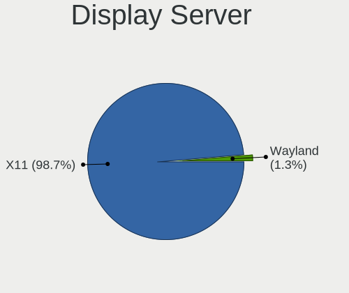
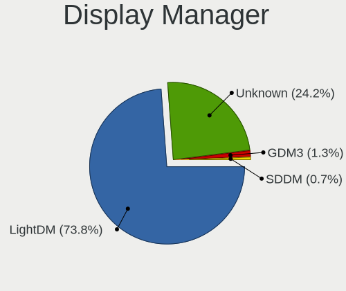
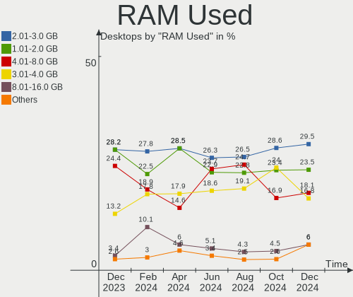
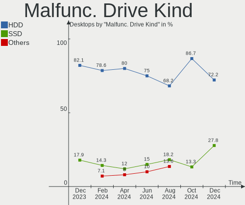
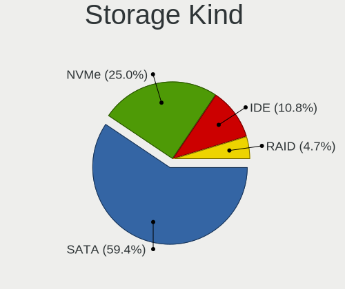
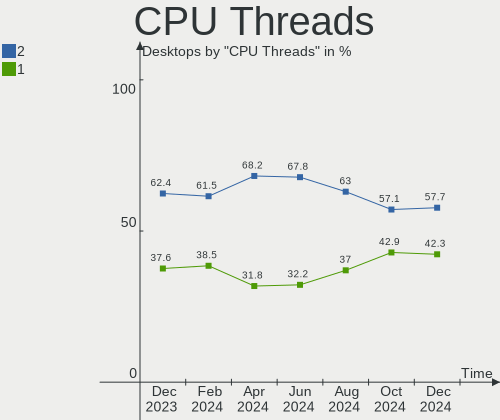
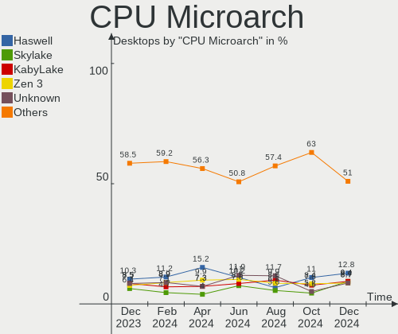
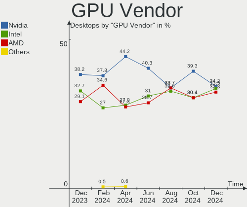
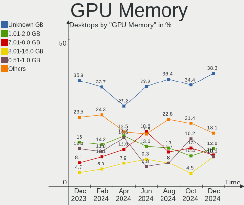

Linux Mint - Hardware Trends (Desktops)
---------------------------------------

A project to identify most popular hardware characteristics and track their change
over time based on data collected by Linux users at https://Linux-Hardware.org.

Anyone can contribute to this report by the [hw-probe](https://github.com/linuxhw/hw-probe) tool:

    sudo -E hw-probe -all -upload

This report is for one last month. Overall report since the beginning of time: [TestDays](https://github.com/linuxhw/TestDays)

Period: Aug, 2023.

Contents
--------

* [ System ](#system)
  - [ OS                       ](#os)
  - [ OS Family                ](#os-family)
  - [ Kernel                   ](#kernel)
  - [ Kernel Family            ](#kernel-family)
  - [ Kernel Major Ver.        ](#kernel-major-ver)
  - [ Arch                     ](#arch)
  - [ DE                       ](#de)
  - [ Display Server           ](#display-server)
  - [ Display Manager          ](#display-manager)
  - [ OS Lang                  ](#os-lang)
  - [ Boot Mode                ](#boot-mode)
  - [ Filesystem               ](#filesystem)
  - [ Part. scheme             ](#part-scheme)
  - [ Dual Boot with Linux/BSD ](#dual-boot-with-linuxbsd)
  - [ Dual Boot (Win)          ](#dual-boot-win)

* [ Board ](#board)
  - [ Vendor                   ](#vendor)
  - [ Model                    ](#model)
  - [ Model Family             ](#model-family)
  - [ MFG Year                 ](#mfg-year)
  - [ Form Factor              ](#form-factor)
  - [ Secure Boot              ](#secure-boot)
  - [ Coreboot                 ](#coreboot)
  - [ RAM Size                 ](#ram-size)
  - [ RAM Used                 ](#ram-used)
  - [ Total Drives             ](#total-drives)
  - [ Has CD-ROM               ](#has-cd-rom)
  - [ Has Ethernet             ](#has-ethernet)
  - [ Has WiFi                 ](#has-wifi)
  - [ Has Bluetooth            ](#has-bluetooth)

* [ Location ](#location)
  - [ Country                  ](#country)
  - [ City                     ](#city)

* [ Drives ](#drives)
  - [ Drive Vendor             ](#drive-vendor)
  - [ Drive Model              ](#drive-model)
  - [ HDD Vendor               ](#hdd-vendor)
  - [ SSD Vendor               ](#ssd-vendor)
  - [ Drive Kind               ](#drive-kind)
  - [ Drive Connector          ](#drive-connector)
  - [ Drive Size               ](#drive-size)
  - [ Space Total              ](#space-total)
  - [ Space Used               ](#space-used)
  - [ Malfunc. Drives          ](#malfunc-drives)
  - [ Malfunc. Drive Vendor    ](#malfunc-drive-vendor)
  - [ Malfunc. HDD Vendor      ](#malfunc-hdd-vendor)
  - [ Malfunc. Drive Kind      ](#malfunc-drive-kind)
  - [ Failed Drives            ](#failed-drives)
  - [ Failed Drive Vendor      ](#failed-drive-vendor)
  - [ Drive Status             ](#drive-status)

* [ Storage controller ](#storage-controller)
  - [ Storage Vendor           ](#storage-vendor)
  - [ Storage Model            ](#storage-model)
  - [ Storage Kind             ](#storage-kind)

* [ Processor ](#processor)
  - [ CPU Vendor               ](#cpu-vendor)
  - [ CPU Model                ](#cpu-model)
  - [ CPU Model Family         ](#cpu-model-family)
  - [ CPU Cores                ](#cpu-cores)
  - [ CPU Sockets              ](#cpu-sockets)
  - [ CPU Threads              ](#cpu-threads)
  - [ CPU Op-Modes             ](#cpu-op-modes)
  - [ CPU Microcode            ](#cpu-microcode)
  - [ CPU Microarch            ](#cpu-microarch)

* [ Graphics ](#graphics)
  - [ GPU Vendor               ](#gpu-vendor)
  - [ GPU Model                ](#gpu-model)
  - [ GPU Combo                ](#gpu-combo)
  - [ GPU Driver               ](#gpu-driver)
  - [ GPU Memory               ](#gpu-memory)

* [ Monitor ](#monitor)
  - [ Monitor Vendor           ](#monitor-vendor)
  - [ Monitor Model            ](#monitor-model)
  - [ Monitor Resolution       ](#monitor-resolution)
  - [ Monitor Diagonal         ](#monitor-diagonal)
  - [ Monitor Width            ](#monitor-width)
  - [ Aspect Ratio             ](#aspect-ratio)
  - [ Monitor Area             ](#monitor-area)
  - [ Pixel Density            ](#pixel-density)
  - [ Multiple Monitors        ](#multiple-monitors)

* [ Network ](#network)
  - [ Net Controller Vendor    ](#net-controller-vendor)
  - [ Net Controller Model     ](#net-controller-model)
  - [ Wireless Vendor          ](#wireless-vendor)
  - [ Wireless Model           ](#wireless-model)
  - [ Ethernet Vendor          ](#ethernet-vendor)
  - [ Ethernet Model           ](#ethernet-model)
  - [ Net Controller Kind      ](#net-controller-kind)
  - [ Used Controller          ](#used-controller)
  - [ NICs                     ](#nics)
  - [ IPv6                     ](#ipv6)

* [ Bluetooth ](#bluetooth)
  - [ Bluetooth Vendor         ](#bluetooth-vendor)
  - [ Bluetooth Model          ](#bluetooth-model)

* [ Sound ](#sound)
  - [ Sound Vendor             ](#sound-vendor)
  - [ Sound Model              ](#sound-model)

* [ Memory ](#memory)
  - [ Memory Vendor            ](#memory-vendor)
  - [ Memory Model             ](#memory-model)
  - [ Memory Kind              ](#memory-kind)
  - [ Memory Form Factor       ](#memory-form-factor)
  - [ Memory Size              ](#memory-size)
  - [ Memory Speed             ](#memory-speed)

* [ Printers & scanners ](#printers--scanners)
  - [ Printer Vendor           ](#printer-vendor)
  - [ Printer Model            ](#printer-model)
  - [ Scanner Vendor           ](#scanner-vendor)
  - [ Scanner Model            ](#scanner-model)

* [ Camera ](#camera)
  - [ Camera Vendor            ](#camera-vendor)
  - [ Camera Model             ](#camera-model)

* [ Security ](#security)
  - [ Fingerprint Vendor       ](#fingerprint-vendor)
  - [ Fingerprint Model        ](#fingerprint-model)
  - [ Chipcard Vendor          ](#chipcard-vendor)
  - [ Chipcard Model           ](#chipcard-model)

* [ Unsupported ](#unsupported)
  - [ Unsupported Devices      ](#unsupported-devices)
  - [ Unsupported Device Types ](#unsupported-device-types)

System
------

OS
--

Installed operating systems

| Name            | Desktops | Percent |
|-----------------|----------|---------|
| Linux Mint 21.2 | 137      | 61.99%  |
| Linux Mint 21.1 | 44       | 19.91%  |
| Linux Mint 20.3 | 24       | 10.86%  |
| Linux Mint 21   | 8        | 3.62%   |
| Linux Mint 19.3 | 3        | 1.36%   |
| Linux Mint 20.2 | 2        | 0.9%    |
| Linux Mint 20.1 | 2        | 0.9%    |
| Linux Mint 20   | 1        | 0.45%   |

OS Family
---------

OS without a version

| Name       | Desktops | Percent |
|------------|----------|---------|
| Linux Mint | 221      | 100%    |

Kernel
------

Version of the Linux kernel

| Version                 | Desktops | Percent |
|-------------------------|----------|---------|
| 5.15.0-78-generic       | 73       | 33.03%  |
| 5.15.0-79-generic       | 49       | 22.17%  |
| 6.2.0-26-generic        | 23       | 10.41%  |
| 5.15.0-76-generic       | 18       | 8.14%   |
| 5.4.0-156-generic       | 14       | 6.33%   |
| 5.15.0-82-generic       | 7        | 3.17%   |
| 5.4.0-155-generic       | 5        | 2.26%   |
| 5.15.0-56-generic       | 4        | 1.81%   |
| 6.4.11-060411-generic   | 3        | 1.36%   |
| 5.4.0-150-generic       | 3        | 1.36%   |
| 5.15.0-41-generic       | 3        | 1.36%   |
| 5.4.0-91-generic        | 2        | 0.9%    |
| 5.4.0-58-generic        | 2        | 0.9%    |
| 5.19.0-50-generic       | 2        | 0.9%    |
| 6.4.9-060409-generic    | 1        | 0.45%   |
| 6.4.11-x64v3-xanmod1    | 1        | 0.45%   |
| 6.4.10-2-liquorix-amd64 | 1        | 0.45%   |
| 6.4.10-060410-generic   | 1        | 0.45%   |
| 6.4.0-060400-generic    | 1        | 0.45%   |
| 6.1.0-1019-oem          | 1        | 0.45%   |
| 5.4.0-70-generic        | 1        | 0.45%   |
| 5.4.0-159-generic       | 1        | 0.45%   |
| 5.4.0-153-generic       | 1        | 0.45%   |
| 5.15.0-73-generic       | 1        | 0.45%   |
| 5.15.0-67-generic       | 1        | 0.45%   |
| 5.15.0-60-generic       | 1        | 0.45%   |
| 5.15.0-43-generic       | 1        | 0.45%   |

Kernel Family
-------------

Linux kernel without a distro release

| Version | Desktops | Percent |
|---------|----------|---------|
| 5.15.0  | 158      | 71.49%  |
| 5.4.0   | 29       | 13.12%  |
| 6.2.0   | 23       | 10.41%  |
| 6.4.11  | 4        | 1.81%   |
| 6.4.10  | 2        | 0.9%    |
| 5.19.0  | 2        | 0.9%    |
| 6.4.9   | 1        | 0.45%   |
| 6.4.0   | 1        | 0.45%   |
| 6.1.0   | 1        | 0.45%   |

Kernel Major Ver.
-----------------

Linux kernel major version

| Version | Desktops | Percent |
|---------|----------|---------|
| 5.15    | 158      | 71.49%  |
| 5.4     | 29       | 13.12%  |
| 6.2     | 23       | 10.41%  |
| 6.4     | 8        | 3.62%   |
| 5.19    | 2        | 0.9%    |
| 6.1     | 1        | 0.45%   |

Arch
----

OS architecture (x86_64, i586, etc.)

| Name   | Desktops | Percent |
|--------|----------|---------|
| x86_64 | 221      | 100%    |

DE
--

Desktop Environment

| Name       | Desktops | Percent |
|------------|----------|---------|
| X-Cinnamon | 173      | 78.28%  |
| MATE       | 22       | 9.95%   |
| XFCE       | 15       | 6.79%   |
| Cinnamon   | 5        | 2.26%   |
| KDE5       | 2        | 0.9%    |
| sway       | 1        | 0.45%   |
| KDE        | 1        | 0.45%   |
| GNOME      | 1        | 0.45%   |
| Unknown    | 1        | 0.45%   |

Display Server
--------------

X11 or Wayland

| Name    | Desktops | Percent |
|---------|----------|---------|
| X11     | 218      | 98.64%  |
| Tty     | 2        | 0.9%    |
| Wayland | 1        | 0.45%   |

Display Manager
---------------

SDDM, LightDM, etc.

| Name    | Desktops | Percent |
|---------|----------|---------|
| Unknown | 137      | 61.99%  |
| LightDM | 84       | 38.01%  |

OS Lang
-------

Language

| Lang    | Desktops | Percent |
|---------|----------|---------|
| en_US   | 78       | 35.29%  |
| de_DE   | 32       | 14.48%  |
| pt_BR   | 17       | 7.69%   |
| fr_FR   | 11       | 4.98%   |
| en_GB   | 11       | 4.98%   |
| en_AU   | 7        | 3.17%   |
| C       | 7        | 3.17%   |
| en_CA   | 6        | 2.71%   |
| ru_RU   | 5        | 2.26%   |
| it_IT   | 5        | 2.26%   |
| es_ES   | 5        | 2.26%   |
| nl_NL   | 4        | 1.81%   |
| fi_FI   | 3        | 1.36%   |
| pl_PL   | 2        | 0.9%    |
| fr_CA   | 2        | 0.9%    |
| es_MX   | 2        | 0.9%    |
| es_AR   | 2        | 0.9%    |
| de_AT   | 2        | 0.9%    |
| cs_CZ   | 2        | 0.9%    |
| zh_TW   | 1        | 0.45%   |
| tr_TR   | 1        | 0.45%   |
| sv_SE   | 1        | 0.45%   |
| ru_UA   | 1        | 0.45%   |
| nl_BE   | 1        | 0.45%   |
| nb_NO   | 1        | 0.45%   |
| hu_HU   | 1        | 0.45%   |
| fr_BE   | 1        | 0.45%   |
| eu_ES   | 1        | 0.45%   |
| es_US   | 1        | 0.45%   |
| es_PE   | 1        | 0.45%   |
| en_NZ   | 1        | 0.45%   |
| en_IN   | 1        | 0.45%   |
| en_IE   | 1        | 0.45%   |
| el_GR   | 1        | 0.45%   |
| de_CH   | 1        | 0.45%   |
| da_DK   | 1        | 0.45%   |
| Unknown | 1        | 0.45%   |

Boot Mode
---------

EFI or BIOS

| Mode | Desktops | Percent |
|------|----------|---------|
| EFI  | 131      | 59.28%  |
| BIOS | 90       | 40.72%  |

Filesystem
----------

Type of filesystem

| Type    | Desktops | Percent |
|---------|----------|---------|
| Ext4    | 197      | 89.14%  |
| Btrfs   | 9        | 4.07%   |
| Tmpfs   | 8        | 3.62%   |
| Overlay | 5        | 2.26%   |
| Xfs     | 1        | 0.45%   |
| Ext3    | 1        | 0.45%   |

Part. scheme
------------

Scheme of partitioning

| Type    | Desktops | Percent |
|---------|----------|---------|
| Unknown | 136      | 61.54%  |
| GPT     | 72       | 32.58%  |
| MBR     | 13       | 5.88%   |

Dual Boot with Linux/BSD
------------------------

Hosting more than one Linux/BSD

| Dual boot | Desktops | Percent |
|-----------|----------|---------|
| No        | 203      | 91.86%  |
| Yes       | 18       | 8.14%   |

Dual Boot (Win)
---------------

Hosting Linux and Windows

| Dual boot | Desktops | Percent |
|-----------|----------|---------|
| No        | 176      | 79.64%  |
| Yes       | 45       | 20.36%  |

Board
-----

Vendor
------

Motherboard manufacturer

| Name                | Desktops | Percent |
|---------------------|----------|---------|
| ASUSTek Computer    | 56       | 25.34%  |
| Gigabyte Technology | 49       | 22.17%  |
| MSI                 | 30       | 13.57%  |
| Hewlett-Packard     | 21       | 9.5%    |
| Dell                | 16       | 7.24%   |
| ASRock              | 14       | 6.33%   |
| Lenovo              | 13       | 5.88%   |
| Fujitsu             | 4        | 1.81%   |
| Unknown             | 4        | 1.81%   |
| Megaware            | 2        | 0.9%    |
| Gateway             | 2        | 0.9%    |
| Biostar             | 2        | 0.9%    |
| OEM                 | 1        | 0.45%   |
| Itautec             | 1        | 0.45%   |
| Intel               | 1        | 0.45%   |
| Fujitsu Siemens     | 1        | 0.45%   |
| Foxconn             | 1        | 0.45%   |
| BESSTAR Tech        | 1        | 0.45%   |
| AMI                 | 1        | 0.45%   |
| Acer                | 1        | 0.45%   |

Model
-----

Motherboard model

| Name                                        | Desktops | Percent |
|---------------------------------------------|----------|---------|
| ASUS All Series                             | 8        | 3.62%   |
| Unknown                                     | 4        | 1.81%   |
| MSI MS-7C91                                 | 3        | 1.36%   |
| Gigabyte GA-990FXA-UD3                      | 3        | 1.36%   |
| ASUS PRIME A320M-K                          | 3        | 1.36%   |
| ASUS M5A97 R2.0                             | 3        | 1.36%   |
| MSI MS-7C95                                 | 2        | 0.9%    |
| MSI MS-7C75                                 | 2        | 0.9%    |
| MSI MS-7C02                                 | 2        | 0.9%    |
| MSI MS-7693                                 | 2        | 0.9%    |
| Megaware MW-G31T-M7                         | 2        | 0.9%    |
| HP EliteDesk 800 G2 SFF                     | 2        | 0.9%    |
| HP Compaq Elite 8300 SFF                    | 2        | 0.9%    |
| Gigabyte F2A68HM-H                          | 2        | 0.9%    |
| Gigabyte B75M-D3H                           | 2        | 0.9%    |
| Gigabyte B450 AORUS M                       | 2        | 0.9%    |
| Dell OptiPlex 790                           | 2        | 0.9%    |
| Dell OptiPlex 780                           | 2        | 0.9%    |
| ASUS TUF Gaming X570-PLUS                   | 2        | 0.9%    |
| ASRock Z77 Extreme4                         | 2        | 0.9%    |
| OEM B75                                     | 1        | 0.45%   |
| MSI Z390 Gaming Infinite X Plus 9 (MS-B916) | 1        | 0.45%   |
| MSI MS-7E06                                 | 1        | 0.45%   |
| MSI MS-7D59                                 | 1        | 0.45%   |
| MSI MS-7D22                                 | 1        | 0.45%   |
| MSI MS-7C96                                 | 1        | 0.45%   |
| MSI MS-7C94                                 | 1        | 0.45%   |
| MSI MS-7B93                                 | 1        | 0.45%   |
| MSI MS-7B86                                 | 1        | 0.45%   |
| MSI MS-7B84                                 | 1        | 0.45%   |
| MSI MS-7B79                                 | 1        | 0.45%   |
| MSI MS-7B33                                 | 1        | 0.45%   |
| MSI MS-7B24                                 | 1        | 0.45%   |
| MSI MS-7A93                                 | 1        | 0.45%   |
| MSI MS-7A72                                 | 1        | 0.45%   |
| MSI MS-7A34                                 | 1        | 0.45%   |
| MSI MS-7968                                 | 1        | 0.45%   |
| MSI MS-7891                                 | 1        | 0.45%   |
| MSI MS-7816                                 | 1        | 0.45%   |
| MSI CML-U PRO Cubi 5 (MS-B183)              | 1        | 0.45%   |

Model Family
------------

Motherboard model prefix

| Name                   | Desktops | Percent |
|------------------------|----------|---------|
| Dell OptiPlex          | 12       | 5.43%   |
| Lenovo ThinkCentre     | 8        | 3.62%   |
| ASUS ROG               | 8        | 3.62%   |
| ASUS PRIME             | 8        | 3.62%   |
| ASUS All               | 8        | 3.62%   |
| HP EliteDesk           | 5        | 2.26%   |
| HP Compaq              | 5        | 2.26%   |
| ASUS TUF               | 5        | 2.26%   |
| Fujitsu ESPRIMO        | 4        | 1.81%   |
| Unknown                | 4        | 1.81%   |
| MSI MS-7C91            | 3        | 1.36%   |
| Lenovo Legion          | 3        | 1.36%   |
| Gigabyte X570          | 3        | 1.36%   |
| Gigabyte GA-990FXA-UD3 | 3        | 1.36%   |
| Gigabyte B450          | 3        | 1.36%   |
| ASUS M5A97             | 3        | 1.36%   |
| MSI MS-7C95            | 2        | 0.9%    |
| MSI MS-7C75            | 2        | 0.9%    |
| MSI MS-7C02            | 2        | 0.9%    |
| MSI MS-7693            | 2        | 0.9%    |
| Megaware MW-G31T-M7    | 2        | 0.9%    |
| Gigabyte F2A68HM-H     | 2        | 0.9%    |
| Gigabyte B75M-D3H      | 2        | 0.9%    |
| Gigabyte B650          | 2        | 0.9%    |
| Gigabyte B550M         | 2        | 0.9%    |
| Dell Inspiron          | 2        | 0.9%    |
| ASUS P8H67-M           | 2        | 0.9%    |
| ASUS P8H61-M           | 2        | 0.9%    |
| ASUS P5G41T-M          | 2        | 0.9%    |
| ASUS M5A78L-M          | 2        | 0.9%    |
| ASRock Z77             | 2        | 0.9%    |
| ASRock B450M-HDV       | 2        | 0.9%    |
| OEM B75                | 1        | 0.45%   |
| MSI Z390               | 1        | 0.45%   |
| MSI MS-7E06            | 1        | 0.45%   |
| MSI MS-7D59            | 1        | 0.45%   |
| MSI MS-7D22            | 1        | 0.45%   |
| MSI MS-7C96            | 1        | 0.45%   |
| MSI MS-7C94            | 1        | 0.45%   |
| MSI MS-7B93            | 1        | 0.45%   |

MFG Year
--------

Motherboard manufacture year

| Year | Desktops | Percent |
|------|----------|---------|
| 2020 | 22       | 9.95%   |
| 2019 | 21       | 9.5%    |
| 2012 | 20       | 9.05%   |
| 2013 | 18       | 8.14%   |
| 2022 | 17       | 7.69%   |
| 2018 | 17       | 7.69%   |
| 2011 | 16       | 7.24%   |
| 2014 | 14       | 6.33%   |
| 2021 | 12       | 5.43%   |
| 2009 | 10       | 4.52%   |
| 2017 | 9        | 4.07%   |
| 2016 | 8        | 3.62%   |
| 2010 | 8        | 3.62%   |
| 2008 | 8        | 3.62%   |
| 2007 | 8        | 3.62%   |
| 2015 | 7        | 3.17%   |
| 2023 | 4        | 1.81%   |
| 2006 | 2        | 0.9%    |

Form Factor
-----------

Physical design of the computer

| Name    | Desktops | Percent |
|---------|----------|---------|
| Desktop | 221      | 100%    |

Secure Boot
-----------

Enabled or disabled

| State    | Desktops | Percent |
|----------|----------|---------|
| Disabled | 209      | 94.57%  |
| Enabled  | 12       | 5.43%   |

Coreboot
--------

Have coreboot on board

| Used | Desktops | Percent |
|------|----------|---------|
| No   | 221      | 100%    |

RAM Size
--------

Total RAM memory

| Size in GB  | Desktops | Percent |
|-------------|----------|---------|
| 16.01-24.0  | 59       | 26.7%   |
| 32.01-64.0  | 45       | 20.36%  |
| 4.01-8.0    | 35       | 15.84%  |
| 8.01-16.0   | 31       | 14.03%  |
| 3.01-4.0    | 22       | 9.95%   |
| 64.01-256.0 | 13       | 5.88%   |
| 24.01-32.0  | 10       | 4.52%   |
| 1.01-2.0    | 3        | 1.36%   |
| 2.01-3.0    | 2        | 0.9%    |
| 0.51-1.0    | 1        | 0.45%   |

RAM Used
--------

Used RAM memory

| Used GB    | Desktops | Percent |
|------------|----------|---------|
| 1.01-2.0   | 68       | 30.77%  |
| 2.01-3.0   | 57       | 25.79%  |
| 4.01-8.0   | 39       | 17.65%  |
| 3.01-4.0   | 37       | 16.74%  |
| 8.01-16.0  | 9        | 4.07%   |
| 0.51-1.0   | 6        | 2.71%   |
| 16.01-24.0 | 3        | 1.36%   |
| 24.01-32.0 | 2        | 0.9%    |

Total Drives
------------

Number of drives on board

| Drives | Desktops | Percent |
|--------|----------|---------|
| 1      | 69       | 31.22%  |
| 2      | 68       | 30.77%  |
| 3      | 48       | 21.72%  |
| 4      | 19       | 8.6%    |
| 5      | 10       | 4.52%   |
| 6      | 4        | 1.81%   |
| 8      | 2        | 0.9%    |
| 0      | 1        | 0.45%   |

Has CD-ROM
----------

Has CD-ROM on board

| Presented | Desktops | Percent |
|-----------|----------|---------|
| Yes       | 112      | 50.68%  |
| No        | 109      | 49.32%  |

Has Ethernet
------------

Has Ethernet on board

| Presented | Desktops | Percent |
|-----------|----------|---------|
| Yes       | 220      | 99.55%  |
| No        | 1        | 0.45%   |

Has WiFi
--------

Has WiFi module

| Presented | Desktops | Percent |
|-----------|----------|---------|
| No        | 114      | 51.58%  |
| Yes       | 107      | 48.42%  |

Has Bluetooth
-------------

Has Bluetooth module

| Presented | Desktops | Percent |
|-----------|----------|---------|
| No        | 134      | 60.63%  |
| Yes       | 87       | 39.37%  |

Location
--------

Country
-------

Geographic location (country)

| Country     | Desktops | Percent |
|-------------|----------|---------|
| USA         | 59       | 26.7%   |
| Germany     | 38       | 17.19%  |
| Brazil      | 20       | 9.05%   |
| France      | 12       | 5.43%   |
| UK          | 9        | 4.07%   |
| Canada      | 8        | 3.62%   |
| Netherlands | 7        | 3.17%   |
| Australia   | 7        | 3.17%   |
| Italy       | 6        | 2.71%   |
| Spain       | 5        | 2.26%   |
| Russia      | 4        | 1.81%   |
| Finland     | 4        | 1.81%   |
| Argentina   | 4        | 1.81%   |
| Turkey      | 3        | 1.36%   |
| Sweden      | 3        | 1.36%   |
| Austria     | 3        | 1.36%   |
| Switzerland | 2        | 0.9%    |
| Poland      | 2        | 0.9%    |
| Mexico      | 2        | 0.9%    |
| Czechia     | 2        | 0.9%    |
| Belgium     | 2        | 0.9%    |
| Ukraine     | 1        | 0.45%   |
| Taiwan      | 1        | 0.45%   |
| South Korea | 1        | 0.45%   |
| Slovakia    | 1        | 0.45%   |
| Peru        | 1        | 0.45%   |
| Norway      | 1        | 0.45%   |
| New Zealand | 1        | 0.45%   |
| Malaysia    | 1        | 0.45%   |
| Kazakhstan  | 1        | 0.45%   |
| Japan       | 1        | 0.45%   |
| Ireland     | 1        | 0.45%   |
| Iran        | 1        | 0.45%   |
| Indonesia   | 1        | 0.45%   |
| India       | 1        | 0.45%   |
| Hungary     | 1        | 0.45%   |
| Greece      | 1        | 0.45%   |
| Denmark     | 1        | 0.45%   |
| Cuba        | 1        | 0.45%   |
| Belarus     | 1        | 0.45%   |

City
----

Geographic location (city)

| City            | Desktops | Percent |
|-----------------|----------|---------|
| Sydney          | 4        | 1.81%   |
| Rio de Janeiro  | 4        | 1.81%   |
| Paris           | 3        | 1.36%   |
| Houston         | 3        | 1.36%   |
| Hamburg         | 3        | 1.36%   |
| Cologne         | 3        | 1.36%   |
| Tacoma          | 2        | 0.9%    |
| Sorocaba        | 2        | 0.9%    |
| Sao Paulo       | 2        | 0.9%    |
| Milford         | 2        | 0.9%    |
| Mannheim        | 2        | 0.9%    |
| Duisburg        | 2        | 0.9%    |
| Curitiba        | 2        | 0.9%    |
| Buenos Aires    | 2        | 0.9%    |
| Belo Horizonte  | 2        | 0.9%    |
| Amsterdam       | 2        | 0.9%    |
| Woodbridge      | 1        | 0.45%   |
| Wigan           | 1        | 0.45%   |
| Wetzlar         | 1        | 0.45%   |
| Wethersfield    | 1        | 0.45%   |
| Wehl            | 1        | 0.45%   |
| Wakefield       | 1        | 0.45%   |
| Waedenswil      | 1        | 0.45%   |
| Volos           | 1        | 0.45%   |
| Vienna          | 1        | 0.45%   |
| Vicosa          | 1        | 0.45%   |
| Västerås      | 1        | 0.45%   |
| Vantaa          | 1        | 0.45%   |
| Tulsa           | 1        | 0.45%   |
| Tucson          | 1        | 0.45%   |
| Truro           | 1        | 0.45%   |
| Traunstein      | 1        | 0.45%   |
| Toulouse        | 1        | 0.45%   |
| Tlalnepantla    | 1        | 0.45%   |
| Tillsonburg     | 1        | 0.45%   |
| Thunder Bay     | 1        | 0.45%   |
| Thiene          | 1        | 0.45%   |
| Taboao da Serra | 1        | 0.45%   |
| Szczecin        | 1        | 0.45%   |
| Svaloev         | 1        | 0.45%   |

Drives
------

Drive Vendor
------------

Hard drive vendors

| Vendor                      | Desktops | Drives | Percent |
|-----------------------------|----------|--------|---------|
| Samsung Electronics         | 70       | 89     | 16.39%  |
| WDC                         | 69       | 100    | 16.16%  |
| Seagate                     | 64       | 84     | 14.99%  |
| Kingston                    | 31       | 34     | 7.26%   |
| Sandisk                     | 27       | 28     | 6.32%   |
| Crucial                     | 27       | 30     | 6.32%   |
| Toshiba                     | 19       | 22     | 4.45%   |
| Hitachi                     | 11       | 12     | 2.58%   |
| Micron/Crucial Technology   | 6        | 10     | 1.41%   |
| Intenso                     | 6        | 7      | 1.41%   |
| Intel                       | 6        | 6      | 1.41%   |
| SK hynix                    | 5        | 6      | 1.17%   |
| Phison Electronics          | 5        | 6      | 1.17%   |
| A-DATA Technology           | 5        | 5      | 1.17%   |
| HGST                        | 4        | 4      | 0.94%   |
| China                       | 4        | 4      | 0.94%   |
| SPCC                        | 3        | 3      | 0.7%    |
| Silicon Motion              | 3        | 3      | 0.7%    |
| PNY                         | 3        | 4      | 0.7%    |
| OCZ                         | 3        | 3      | 0.7%    |
| Micron Technology           | 3        | 3      | 0.7%    |
| Kingston Technology Company | 3        | 3      | 0.7%    |
| Hewlett-Packard             | 3        | 3      | 0.7%    |
| Fanxiang                    | 3        | 3      | 0.7%    |
| Unknown                     | 3        | 3      | 0.7%    |
| Unknown                     | 2        | 3      | 0.47%   |
| T-FORCE                     | 2        | 3      | 0.47%   |
| SABRENT                     | 2        | 2      | 0.47%   |
| Patriot                     | 2        | 2      | 0.47%   |
| KingSpec                    | 2        | 2      | 0.47%   |
| JMicron Technology          | 2        | 2      | 0.47%   |
| GOODRAM                     | 2        | 2      | 0.47%   |
| Fujitsu                     | 2        | 2      | 0.47%   |
| YHJC                        | 1        | 1      | 0.23%   |
| XrayDisk                    | 1        | 1      | 0.23%   |
| WD MediaMax                 | 1        | 1      | 0.23%   |
| VERICO                      | 1        | 1      | 0.23%   |
| Verbatim                    | 1        | 1      | 0.23%   |
| USB                         | 1        | 2      | 0.23%   |
| Timetec                     | 1        | 1      | 0.23%   |

Drive Model
-----------

Hard drive models

| Model                                                 | Desktops | Percent |
|-------------------------------------------------------|----------|---------|
| Samsung NVMe SSD Controller SM981/PM981/PM983 500GB   | 11       | 2.22%   |
| Kingston SA400S37240G 240GB SSD                       | 10       | 2.02%   |
| Samsung SSD 850 EVO 500GB                             | 8        | 1.61%   |
| Samsung NVMe SSD Controller PM9A1/PM9A3/980PRO 1024GB | 6        | 1.21%   |
| Micron/Crucial P2 NVMe PCIe SSD 1TB                   | 6        | 1.21%   |
| Kingston SV300S37A120G 120GB SSD                      | 6        | 1.21%   |
| Seagate ST1000DM010-2EP102 1TB                        | 5        | 1.01%   |
| Samsung SSD 860 EVO 1TB                               | 5        | 1.01%   |
| Crucial CT500MX500SSD1 500GB                          | 5        | 1.01%   |
| WDC WD10EZEX-00BN5A0 1TB                              | 4        | 0.81%   |
| Seagate ST4000DM004-2CV104 4TB                        | 4        | 0.81%   |
| Seagate ST1000DM003-1ER162 1TB                        | 4        | 0.81%   |
| Samsung SSD 970 EVO Plus 1TB                          | 4        | 0.81%   |
| Crucial CT1000BX500SSD1 1TB                           | 4        | 0.81%   |
| WDC WD10EZEX-21M2NA0 1TB                              | 3        | 0.6%    |
| WDC WD10EZEX-08WN4A0 1TB                              | 3        | 0.6%    |
| Toshiba HDWD110 1TB                                   | 3        | 0.6%    |
| Toshiba DT01ACA200 2TB                                | 3        | 0.6%    |
| Seagate ST500DM002-1BD142 500GB                       | 3        | 0.6%    |
| Seagate ST3500418AS 500GB                             | 3        | 0.6%    |
| Sandisk WD Black 2018/SN750 / PC SN720 NVMe SSD 512GB | 3        | 0.6%    |
| Samsung SSD 970 EVO Plus 2TB                          | 3        | 0.6%    |
| Samsung SSD 870 EVO 1TB                               | 3        | 0.6%    |
| Samsung SSD 860 EVO 500GB                             | 3        | 0.6%    |
| Phison E12 NVMe Controller 256GB                      | 3        | 0.6%    |
| Kingston SA400S37480G 480GB SSD                       | 3        | 0.6%    |
| Unknown                                               | 3        | 0.6%    |
| WDC WDS240G2G0A-00JH30 240GB SSD                      | 2        | 0.4%    |
| WDC WD5000AAKX-60U6AA0 500GB                          | 2        | 0.4%    |
| WDC WD40EFRX-68N32N0 4TB                              | 2        | 0.4%    |
| WDC WD30EFRX-68EUZN0 3TB                              | 2        | 0.4%    |
| WDC WD20EARX-00PASB0 2TB                              | 2        | 0.4%    |
| WDC WD1600AAJS-75M0A0 160GB                           | 2        | 0.4%    |
| WDC WD10EZRX-00L4HB0 1TB                              | 2        | 0.4%    |
| WDC WD10EARS-00Y5B1 1TB                               | 2        | 0.4%    |
| WDC WD1002FAEX-00Z3A0 1TB                             | 2        | 0.4%    |
| Toshiba DT01ACA300 3TB                                | 2        | 0.4%    |
| SK hynix SHPP41-2000GM 2TB                            | 2        | 0.4%    |
| Silicon Motion SM2263EN/SM2263XT SSD Controller 256GB | 2        | 0.4%    |
| Seagate ST500LT012-1DG142 500GB                       | 2        | 0.4%    |

HDD Vendor
----------

Hard disk drive vendors

| Vendor              | Desktops | Drives | Percent |
|---------------------|----------|--------|---------|
| WDC                 | 61       | 81     | 34.66%  |
| Seagate             | 60       | 77     | 34.09%  |
| Toshiba             | 17       | 19     | 9.66%   |
| Hitachi             | 11       | 12     | 6.25%   |
| Samsung Electronics | 9        | 9      | 5.11%   |
| HGST                | 4        | 4      | 2.27%   |
| Hewlett-Packard     | 3        | 3      | 1.7%    |
| SABRENT             | 2        | 2      | 1.14%   |
| Fujitsu             | 2        | 2      | 1.14%   |
| WD MediaMax         | 1        | 1      | 0.57%   |
| USB                 | 1        | 2      | 0.57%   |
| Unknown             | 1        | 1      | 0.57%   |
| Maxtor              | 1        | 1      | 0.57%   |
| Maxone              | 1        | 1      | 0.57%   |
| Intenso             | 1        | 1      | 0.57%   |
| Unknown             | 1        | 1      | 0.57%   |

SSD Vendor
----------

Solid state drive vendors

| Vendor              | Desktops | Drives | Percent |
|---------------------|----------|--------|---------|
| Samsung Electronics | 36       | 46     | 22.78%  |
| Kingston            | 25       | 27     | 15.82%  |
| Crucial             | 23       | 25     | 14.56%  |
| SanDisk             | 12       | 12     | 7.59%   |
| WDC                 | 10       | 14     | 6.33%   |
| Intenso             | 4        | 5      | 2.53%   |
| China               | 4        | 4      | 2.53%   |
| A-DATA Technology   | 4        | 4      | 2.53%   |
| Toshiba             | 3        | 3      | 1.9%    |
| PNY                 | 3        | 4      | 1.9%    |
| OCZ                 | 3        | 3      | 1.9%    |
| SPCC                | 2        | 2      | 1.27%   |
| Seagate             | 2        | 2      | 1.27%   |
| Patriot             | 2        | 2      | 1.27%   |
| Micron Technology   | 2        | 2      | 1.27%   |
| KingSpec            | 2        | 2      | 1.27%   |
| GOODRAM             | 2        | 2      | 1.27%   |
| Fanxiang            | 2        | 2      | 1.27%   |
| VERICO              | 1        | 1      | 0.63%   |
| Verbatim            | 1        | 1      | 0.63%   |
| Timetec             | 1        | 1      | 0.63%   |
| T-FORCE             | 1        | 1      | 0.63%   |
| Super Talent        | 1        | 1      | 0.63%   |
| SK hynix            | 1        | 1      | 0.63%   |
| RevuAhn             | 1        | 1      | 0.63%   |
| MidasForce          | 1        | 1      | 0.63%   |
| KingDian            | 1        | 1      | 0.63%   |
| JMicron Technology  | 1        | 1      | 0.63%   |
| Intel               | 1        | 1      | 0.63%   |
| Gigabyte Technology | 1        | 1      | 0.63%   |
| Dogfish             | 1        | 1      | 0.63%   |
| ASMT                | 1        | 1      | 0.63%   |
| Apacer              | 1        | 1      | 0.63%   |
| 2-Power             | 1        | 1      | 0.63%   |
| Unknown             | 1        | 1      | 0.63%   |

Drive Kind
----------

HDD or SSD

| Kind    | Desktops | Drives | Percent |
|---------|----------|--------|---------|
| HDD     | 137      | 217    | 38.16%  |
| SSD     | 128      | 178    | 35.65%  |
| NVMe    | 80       | 108    | 22.28%  |
| Unknown | 13       | 16     | 3.62%   |
| MMC     | 1        | 2      | 0.28%   |

Drive Connector
---------------

SATA, SAS, NVMe, etc.

| Type | Desktops | Drives | Percent |
|------|----------|--------|---------|
| SATA | 197      | 381    | 65.45%  |
| NVMe | 80       | 107    | 26.58%  |
| SAS  | 23       | 31     | 7.64%   |
| MMC  | 1        | 2      | 0.33%   |

Drive Size
----------

Size of hard drive

| Size in TB | Desktops | Drives | Percent |
|------------|----------|--------|---------|
| 0.01-0.5   | 136      | 197    | 46.1%   |
| 0.51-1.0   | 82       | 102    | 27.8%   |
| 1.01-2.0   | 36       | 42     | 12.2%   |
| 3.01-4.0   | 19       | 27     | 6.44%   |
| 2.01-3.0   | 11       | 14     | 3.73%   |
| 4.01-10.0  | 9        | 10     | 3.05%   |
| 10.01-20.0 | 2        | 3      | 0.68%   |

Space Total
-----------

Amount of disk space available on the file system

| Size in GB     | Desktops | Percent |
|----------------|----------|---------|
| 101-250        | 45       | 20.36%  |
| 501-1000       | 42       | 19%     |
| More than 3000 | 35       | 15.84%  |
| 251-500        | 35       | 15.84%  |
| 1001-2000      | 34       | 15.38%  |
| 2001-3000      | 15       | 6.79%   |
| 51-100         | 7        | 3.17%   |
| 21-50          | 4        | 1.81%   |
| 1-20           | 2        | 0.9%    |
| Unknown        | 2        | 0.9%    |

Space Used
----------

Amount of used disk space

| Used GB        | Desktops | Percent |
|----------------|----------|---------|
| 101-250        | 39       | 17.65%  |
| 251-500        | 35       | 15.84%  |
| 501-1000       | 30       | 13.57%  |
| 21-50          | 29       | 13.12%  |
| 51-100         | 29       | 13.12%  |
| 1-20           | 18       | 8.14%   |
| 1001-2000      | 16       | 7.24%   |
| More than 3000 | 14       | 6.33%   |
| 2001-3000      | 9        | 4.07%   |
| Unknown        | 2        | 0.9%    |

Malfunc. Drives
---------------

Drive models with a malfunction

| Model                             | Desktops | Drives | Percent |
|-----------------------------------|----------|--------|---------|
| Seagate ST500DM002-1BD142 500GB   | 2        | 2      | 10%     |
| WDC WD6003FZBX-00K5WB0 6TB        | 1        | 1      | 5%      |
| WDC WD5000AAKX-60U6AA0 500GB      | 1        | 1      | 5%      |
| WDC WD40EFRX-68N32N0 4TB          | 1        | 1      | 5%      |
| WDC WD4000FYYZ-01UL1B2 4TB        | 1        | 2      | 5%      |
| WDC WD4000FYYZ-01UL1B1 4TB        | 1        | 1      | 5%      |
| WDC WD10EZRX-00L4HB0 1TB          | 1        | 1      | 5%      |
| WDC WD10EZEX-00BN5A0 1TB          | 1        | 1      | 5%      |
| WDC WD10EFRX-68FYTN0 1TB          | 1        | 1      | 5%      |
| WDC WD1002FAEX-00Z3A0 1TB         | 1        | 1      | 5%      |
| Seagate ST500LT012-1DG142 500GB   | 1        | 1      | 5%      |
| Seagate ST3250410AS 250GB         | 1        | 1      | 5%      |
| Seagate ST3250312AS 250GB         | 1        | 1      | 5%      |
| Seagate ST3000DM008-2DM166 3TB    | 1        | 2      | 5%      |
| Seagate ST2000DL003-9VT166 2TB    | 1        | 1      | 5%      |
| Samsung Electronics HD502IJ 500GB | 1        | 1      | 5%      |
| Samsung Electronics HD160JJ 160GB | 1        | 1      | 5%      |
| Intenso SSD Sata III 256GB        | 1        | 1      | 5%      |
| Hitachi HUA722020ALA331 2TB       | 1        | 1      | 5%      |

Malfunc. Drive Vendor
---------------------

Vendors of faulty drives

| Vendor              | Desktops | Drives | Percent |
|---------------------|----------|--------|---------|
| Seagate             | 7        | 8      | 41.18%  |
| WDC                 | 6        | 10     | 35.29%  |
| Samsung Electronics | 2        | 2      | 11.76%  |
| Intenso             | 1        | 1      | 5.88%   |
| Hitachi             | 1        | 1      | 5.88%   |

Malfunc. HDD Vendor
-------------------

Vendors of faulty HDD drives

| Vendor              | Desktops | Drives | Percent |
|---------------------|----------|--------|---------|
| Seagate             | 7        | 8      | 43.75%  |
| WDC                 | 6        | 10     | 37.5%   |
| Samsung Electronics | 2        | 2      | 12.5%   |
| Hitachi             | 1        | 1      | 6.25%   |

Malfunc. Drive Kind
-------------------

Kinds of faulty drives

| Kind | Desktops | Drives | Percent |
|------|----------|--------|---------|
| HDD  | 15       | 21     | 93.75%  |
| SSD  | 1        | 1      | 6.25%   |

Failed Drives
-------------

Failed drive models

Zero info for selected period =(

Failed Drive Vendor
-------------------

Failed drive vendors

Zero info for selected period =(

Drive Status
------------

Number of failed and malfunc. drives

| Status   | Desktops | Drives | Percent |
|----------|----------|--------|---------|
| Detected | 152      | 337    | 62.55%  |
| Works    | 75       | 162    | 30.86%  |
| Malfunc  | 16       | 22     | 6.58%   |

Storage controller
------------------

Storage Vendor
--------------

Storage controller vendors

| Vendor                        | Desktops | Percent |
|-------------------------------|----------|---------|
| Intel                         | 133      | 38.11%  |
| AMD                           | 84       | 24.07%  |
| Samsung Electronics           | 31       | 8.88%   |
| SanDisk                       | 20       | 5.73%   |
| ASMedia Technology            | 16       | 4.58%   |
| Micron/Crucial Technology     | 11       | 3.15%   |
| Marvell Technology Group      | 10       | 2.87%   |
| Kingston Technology Company   | 9        | 2.58%   |
| JMicron Technology            | 8        | 2.29%   |
| Phison Electronics            | 5        | 1.43%   |
| VIA Technologies              | 4        | 1.15%   |
| SK hynix                      | 4        | 1.15%   |
| Silicon Motion                | 4        | 1.15%   |
| ADATA Technology              | 2        | 0.57%   |
| Silicon Image                 | 1        | 0.29%   |
| Realtek Semiconductor         | 1        | 0.29%   |
| Nvidia                        | 1        | 0.29%   |
| Micron Technology             | 1        | 0.29%   |
| MAXIO Technology (Hangzhou)   | 1        | 0.29%   |
| Integrated Technology Express | 1        | 0.29%   |
| Hewlett-Packard               | 1        | 0.29%   |
| Adaptec                       | 1        | 0.29%   |

Storage Model
-------------

Storage controller models

| Model                                                                                   | Desktops | Percent |
|-----------------------------------------------------------------------------------------|----------|---------|
| AMD FCH SATA Controller [AHCI mode]                                                     | 40       | 9.5%    |
| Samsung NVMe SSD Controller SM981/PM981/PM983                                           | 20       | 4.75%   |
| AMD 500 Series Chipset SATA Controller                                                  | 19       | 4.51%   |
| Intel 8 Series/C220 Series Chipset Family 6-port SATA Controller 1 [AHCI mode]          | 18       | 4.28%   |
| AMD 400 Series Chipset SATA Controller                                                  | 16       | 3.8%    |
| ASMedia ASM1062 Serial ATA Controller                                                   | 14       | 3.33%   |
| Intel 6 Series/C200 Series Chipset Family 6 port Desktop SATA AHCI Controller           | 11       | 2.61%   |
| Micron/Crucial P2 [Nick P2] / P3 / P3 Plus NVMe PCIe SSD (DRAM-less)                    | 10       | 2.38%   |
| Intel SATA Controller [RAID mode]                                                       | 10       | 2.38%   |
| Intel Q170/Q150/B150/H170/H110/Z170/CM236 Chipset SATA Controller [AHCI Mode]           | 10       | 2.38%   |
| Intel 7 Series/C210 Series Chipset Family 6-port SATA Controller [AHCI mode]            | 10       | 2.38%   |
| AMD SB7x0/SB8x0/SB9x0 IDE Controller                                                    | 10       | 2.38%   |
| AMD SB7x0/SB8x0/SB9x0 SATA Controller [IDE mode]                                        | 9        | 2.14%   |
| Intel 200 Series PCH SATA controller [AHCI mode]                                        | 8        | 1.9%    |
| AMD SB7x0/SB8x0/SB9x0 SATA Controller [AHCI mode]                                       | 8        | 1.9%    |
| Samsung NVMe SSD Controller PM9A1/PM9A3/980PRO                                          | 7        | 1.66%   |
| Intel NM10/ICH7 Family SATA Controller [IDE mode]                                       | 7        | 1.66%   |
| Intel Cannon Lake PCH SATA AHCI Controller                                              | 7        | 1.66%   |
| SanDisk WD Blue SN550 NVMe SSD                                                          | 5        | 1.19%   |
| Intel Alder Lake-S PCH SATA Controller [AHCI Mode]                                      | 5        | 1.19%   |
| Intel 82801G (ICH7 Family) IDE Controller                                               | 5        | 1.19%   |
| SanDisk WD Blue SN570 NVMe SSD 1TB                                                      | 4        | 0.95%   |
| JMicron JMB363 SATA/IDE Controller                                                      | 4        | 0.95%   |
| Intel Comet Lake SATA AHCI Controller                                                   | 4        | 0.95%   |
| Intel 6 Series/C200 Series Chipset Family Desktop SATA Controller (IDE mode, ports 4-5) | 4        | 0.95%   |
| Intel 6 Series/C200 Series Chipset Family Desktop SATA Controller (IDE mode, ports 0-3) | 4        | 0.95%   |
| Silicon Motion SM2263EN/SM2263XT (DRAM-less) NVMe SSD Controllers                       | 3        | 0.71%   |
| SanDisk WD Black SN750 / PC SN730 NVMe SSD                                              | 3        | 0.71%   |
| SanDisk WD Black 2018/SN750 / PC SN720 NVMe SSD                                         | 3        | 0.71%   |
| Samsung NVMe SSD Controller SM961/PM961/SM963                                           | 3        | 0.71%   |
| Phison E12 NVMe Controller                                                              | 3        | 0.71%   |
| Marvell Group 88SE9172 SATA III 6Gb/s RAID Controller                                   | 3        | 0.71%   |
| Kingston Company Company Non-Volatile memory controller                                 | 3        | 0.71%   |
| Kingston Company KC3000/Renegade NVMe SSD                                               | 3        | 0.71%   |
| JMicron JMB368 IDE controller                                                           | 3        | 0.71%   |
| Intel SSD 660P Series                                                                   | 3        | 0.71%   |
| Intel 9 Series Chipset Family SATA Controller [AHCI Mode]                               | 3        | 0.71%   |
| Intel 82Q35 Express PT IDER Controller                                                  | 3        | 0.71%   |
| Intel 82801JI (ICH10 Family) SATA AHCI Controller                                       | 3        | 0.71%   |
| Intel 82801JI (ICH10 Family) 4 port SATA IDE Controller #1                              | 3        | 0.71%   |

Storage Kind
------------

Kind of storage controller (IDE, SATA, NVMe, SAS, ...)

| Kind | Desktops | Percent |
|------|----------|---------|
| SATA | 184      | 55.59%  |
| NVMe | 79       | 23.87%  |
| IDE  | 48       | 14.5%   |
| RAID | 19       | 5.74%   |
| SAS  | 1        | 0.3%    |

Processor
---------

CPU Vendor
----------

Processor vendors

| Vendor | Desktops | Percent |
|--------|----------|---------|
| Intel  | 137      | 61.99%  |
| AMD    | 84       | 38.01%  |

CPU Model
---------

Processor models

| Model                                  | Desktops | Percent |
|----------------------------------------|----------|---------|
| Intel Core i5-3470 CPU @ 3.20GHz       | 7        | 3.17%   |
| AMD Ryzen 5 3600 6-Core Processor      | 7        | 3.17%   |
| Intel Core i7-3770 CPU @ 3.40GHz       | 4        | 1.81%   |
| Intel Core i5-6500 CPU @ 3.20GHz       | 4        | 1.81%   |
| AMD Ryzen 5 5600G with Radeon Graphics | 4        | 1.81%   |
| Intel Core i5-4460 CPU @ 3.20GHz       | 3        | 1.36%   |
| Intel Core i5-10400 CPU @ 2.90GHz      | 3        | 1.36%   |
| Intel Core i3-3220 CPU @ 3.30GHz       | 3        | 1.36%   |
| Intel Core 2 Duo CPU E7500 @ 2.93GHz   | 3        | 1.36%   |
| AMD Ryzen 9 7900X 12-Core Processor    | 3        | 1.36%   |
| AMD Ryzen 7 5700G with Radeon Graphics | 3        | 1.36%   |
| AMD Ryzen 5 5600X 6-Core Processor     | 3        | 1.36%   |
| AMD FX-8350 Eight-Core Processor       | 3        | 1.36%   |
| AMD FX-6300 Six-Core Processor         | 3        | 1.36%   |
| Intel N95                              | 2        | 0.9%    |
| Intel Core i7-7700K CPU @ 4.20GHz      | 2        | 0.9%    |
| Intel Core i7-6700 CPU @ 3.40GHz       | 2        | 0.9%    |
| Intel Core i7-4790K CPU @ 4.00GHz      | 2        | 0.9%    |
| Intel Core i7-2600K CPU @ 3.40GHz      | 2        | 0.9%    |
| Intel Core i7-2600 CPU @ 3.40GHz       | 2        | 0.9%    |
| Intel Core i7-10700K CPU @ 3.80GHz     | 2        | 0.9%    |
| Intel Core i5-6500T CPU @ 2.50GHz      | 2        | 0.9%    |
| Intel Core i5-4670K CPU @ 3.40GHz      | 2        | 0.9%    |
| Intel Core i5-4590T CPU @ 2.00GHz      | 2        | 0.9%    |
| Intel Core i5 CPU 650 @ 3.20GHz        | 2        | 0.9%    |
| Intel Core i3-8100 CPU @ 3.60GHz       | 2        | 0.9%    |
| Intel Core i3-4130 CPU @ 3.40GHz       | 2        | 0.9%    |
| Intel Core i3-10105 CPU @ 3.70GHz      | 2        | 0.9%    |
| Intel Core 2 Quad CPU Q9550 @ 2.83GHz  | 2        | 0.9%    |
| Intel Core 2 Duo CPU E8400 @ 3.00GHz   | 2        | 0.9%    |
| Intel Core 2 Duo CPU E7400 @ 2.80GHz   | 2        | 0.9%    |
| AMD Ryzen 9 5900X 12-Core Processor    | 2        | 0.9%    |
| AMD Ryzen 9 3900X 12-Core Processor    | 2        | 0.9%    |
| AMD Ryzen 7 3700X 8-Core Processor     | 2        | 0.9%    |
| AMD Ryzen 7 2700X Eight-Core Processor | 2        | 0.9%    |
| AMD Ryzen 5 7600X 6-Core Processor     | 2        | 0.9%    |
| AMD Ryzen 5 3600X 6-Core Processor     | 2        | 0.9%    |
| AMD Ryzen 5 3500X 6-Core Processor     | 2        | 0.9%    |
| AMD Ryzen 5 2600 Six-Core Processor    | 2        | 0.9%    |
| Intel Xeon CPU X5690 @ 3.47GHz         | 1        | 0.45%   |

CPU Model Family
----------------

Processor model prefix

| Model                   | Desktops | Percent |
|-------------------------|----------|---------|
| Intel Core i5           | 46       | 20.81%  |
| Intel Core i7           | 28       | 12.67%  |
| AMD Ryzen 5             | 28       | 12.67%  |
| Intel Core i3           | 17       | 7.69%   |
| AMD Ryzen 7             | 15       | 6.79%   |
| Other                   | 12       | 5.43%   |
| Intel Core 2 Duo        | 10       | 4.52%   |
| AMD Ryzen 9             | 10       | 4.52%   |
| AMD FX                  | 10       | 4.52%   |
| Intel Xeon              | 8        | 3.62%   |
| Intel Core 2 Quad       | 4        | 1.81%   |
| AMD Ryzen 3             | 3        | 1.36%   |
| AMD A8                  | 3        | 1.36%   |
| Intel Pentium 4         | 2        | 0.9%    |
| Intel Core 2            | 2        | 0.9%    |
| Intel Celeron           | 2        | 0.9%    |
| AMD Phenom II X4        | 2        | 0.9%    |
| AMD Phenom              | 2        | 0.9%    |
| AMD A6                  | 2        | 0.9%    |
| AMD A10                 | 2        | 0.9%    |
| Intel Pentium Gold      | 1        | 0.45%   |
| Intel Pentium Dual-Core | 1        | 0.45%   |
| Intel Pentium Dual      | 1        | 0.45%   |
| Intel Pentium           | 1        | 0.45%   |
| Intel Core i9           | 1        | 0.45%   |
| Intel Atom              | 1        | 0.45%   |
| AMD Ryzen 7 PRO         | 1        | 0.45%   |
| AMD Ryzen 5 PRO         | 1        | 0.45%   |
| AMD Phenom II X6        | 1        | 0.45%   |
| AMD Phenom II X3        | 1        | 0.45%   |
| AMD Athlon II X4        | 1        | 0.45%   |
| AMD Athlon 64 X2        | 1        | 0.45%   |
| AMD A4                  | 1        | 0.45%   |

CPU Cores
---------

Number of processor cores

| Number | Desktops | Percent |
|--------|----------|---------|
| 4      | 93       | 42.08%  |
| 2      | 40       | 18.1%   |
| 6      | 37       | 16.74%  |
| 8      | 24       | 10.86%  |
| 12     | 8        | 3.62%   |
| 16     | 5        | 2.26%   |
| 1      | 5        | 2.26%   |
| 3      | 4        | 1.81%   |
| 10     | 2        | 0.9%    |
| 24     | 1        | 0.45%   |
| 18     | 1        | 0.45%   |
| 14     | 1        | 0.45%   |

CPU Sockets
-----------

Number of sockets

| Number | Desktops | Percent |
|--------|----------|---------|
| 1      | 220      | 99.55%  |
| 2      | 1        | 0.45%   |

CPU Threads
-----------

Threads per core (Hyper-Threading)

| Number | Desktops | Percent |
|--------|----------|---------|
| 2      | 134      | 60.63%  |
| 1      | 87       | 39.37%  |

CPU Op-Modes
------------

CPU Operation Modes (32-bit, 64-bit)

| Op mode        | Desktops | Percent |
|----------------|----------|---------|
| 32-bit, 64-bit | 221      | 100%    |

CPU Microcode
-------------

Microcode number

| Number     | Desktops | Percent |
|------------|----------|---------|
| Unknown    | 33       | 14.93%  |
| 0x306c3    | 22       | 9.95%   |
| 0x306a9    | 16       | 7.24%   |
| 0x08701021 | 13       | 5.88%   |
| 0x206a7    | 11       | 4.98%   |
| 0x1067a    | 11       | 4.98%   |
| 0x506e3    | 10       | 4.52%   |
| 0x0a601203 | 7        | 3.17%   |
| 0x06000852 | 7        | 3.17%   |
| 0x0800820d | 6        | 2.71%   |
| 0x0a50000d | 5        | 2.26%   |
| 0x06001119 | 5        | 2.26%   |
| 0xa0653    | 4        | 1.81%   |
| 0x906ea    | 4        | 1.81%   |
| 0x6fd      | 4        | 1.81%   |
| 0x0a201204 | 4        | 1.81%   |
| 0xb0671    | 3        | 1.36%   |
| 0xa0655    | 3        | 1.36%   |
| 0x906e9    | 3        | 1.36%   |
| 0x08701030 | 3        | 1.36%   |
| 0x08108109 | 3        | 1.36%   |
| 0x010000c8 | 3        | 1.36%   |
| 0x906ed    | 2        | 0.9%    |
| 0x90672    | 2        | 0.9%    |
| 0x20652    | 2        | 0.9%    |
| 0x0a50000c | 2        | 0.9%    |
| 0x0a20120a | 2        | 0.9%    |
| 0x08600109 | 2        | 0.9%    |
| 0x08001138 | 2        | 0.9%    |
| 0x06003106 | 2        | 0.9%    |
| 0x0600063e | 2        | 0.9%    |
| 0xf41      | 1        | 0.45%   |
| 0x806ec    | 1        | 0.45%   |
| 0x6fb      | 1        | 0.45%   |
| 0x6f6      | 1        | 0.45%   |
| 0x6f2      | 1        | 0.45%   |
| 0x50654    | 1        | 0.45%   |
| 0x406c4    | 1        | 0.45%   |
| 0x306f2    | 1        | 0.45%   |
| 0x206c2    | 1        | 0.45%   |

CPU Microarch
-------------

Microarchitecture

| Name             | Desktops | Percent |
|------------------|----------|---------|
| Haswell          | 26       | 11.76%  |
| Zen 2            | 20       | 9.05%   |
| Zen 3            | 19       | 8.6%    |
| IvyBridge        | 19       | 8.6%    |
| Penryn           | 15       | 6.79%   |
| Skylake          | 14       | 6.33%   |
| KabyLake         | 14       | 6.33%   |
| Piledriver       | 13       | 5.88%   |
| Unknown          | 13       | 5.88%   |
| SandyBridge      | 12       | 5.43%   |
| Zen+             | 9        | 4.07%   |
| CometLake        | 9        | 4.07%   |
| K10              | 7        | 3.17%   |
| Core             | 7        | 3.17%   |
| Zen              | 3        | 1.36%   |
| Westmere         | 3        | 1.36%   |
| Alderlake Hybrid | 3        | 1.36%   |
| Steamroller      | 2        | 0.9%    |
| NetBurst         | 2        | 0.9%    |
| Nehalem          | 2        | 0.9%    |
| Bulldozer        | 2        | 0.9%    |
| TigerLake        | 1        | 0.45%   |
| Silvermont       | 1        | 0.45%   |
| K8 Hammer        | 1        | 0.45%   |
| Icelake          | 1        | 0.45%   |
| Gracemont        | 1        | 0.45%   |
| Excavator        | 1        | 0.45%   |
| Broadwell        | 1        | 0.45%   |

Graphics
--------

GPU Vendor
----------

Vendors of graphics cards

| Vendor | Desktops | Percent |
|--------|----------|---------|
| Nvidia | 93       | 38.43%  |
| Intel  | 76       | 31.4%   |
| AMD    | 73       | 30.17%  |

GPU Model
---------

Graphics card models

| Model                                                                       | Desktops | Percent |
|-----------------------------------------------------------------------------|----------|---------|
| Intel Xeon E3-1200 v3/4th Gen Core Processor Integrated Graphics Controller | 12       | 4.82%   |
| Intel HD Graphics 530                                                       | 10       | 4.02%   |
| Nvidia GP108 [GeForce GT 1030]                                              | 9        | 3.61%   |
| Intel Xeon E3-1200 v2/3rd Gen Core processor Graphics Controller            | 9        | 3.61%   |
| Nvidia GK208B [GeForce GT 710]                                              | 8        | 3.21%   |
| AMD Navi 23 [Radeon RX 6600/6600 XT/6600M]                                  | 7        | 2.81%   |
| AMD Cezanne [Radeon Vega Series / Radeon Vega Mobile Series]                | 7        | 2.81%   |
| Intel CometLake-S GT2 [UHD Graphics 630]                                    | 6        | 2.41%   |
| AMD Raphael                                                                 | 6        | 2.41%   |
| Intel 2nd Generation Core Processor Family Integrated Graphics Controller   | 5        | 2.01%   |
| Nvidia TU106 [GeForce RTX 2060 Rev. A]                                      | 4        | 1.61%   |
| Intel IvyBridge GT2 [HD Graphics 4000]                                      | 4        | 1.61%   |
| Intel CoffeeLake-S GT2 [UHD Graphics 630]                                   | 4        | 1.61%   |
| AMD Ellesmere [Radeon RX 470/480/570/570X/580/580X/590]                     | 4        | 1.61%   |
| Nvidia TU104 [GeForce RTX 2070 SUPER]                                       | 3        | 1.2%    |
| Nvidia GM107 [GeForce GTX 750 Ti]                                           | 3        | 1.2%    |
| Nvidia GA106 [GeForce RTX 3060 Lite Hash Rate]                              | 3        | 1.2%    |
| Intel HD Graphics 630                                                       | 3        | 1.2%    |
| Intel AlderLake-S GT1                                                       | 3        | 1.2%    |
| Intel 82Q35 Express Integrated Graphics Controller                          | 3        | 1.2%    |
| Intel 82G33/G31 Express Integrated Graphics Controller                      | 3        | 1.2%    |
| Intel 4 Series Chipset Integrated Graphics Controller                       | 3        | 1.2%    |
| AMD Picasso/Raven 2 [Radeon Vega Series / Radeon Vega Mobile Series]        | 3        | 1.2%    |
| Nvidia TU117 [GeForce GTX 1650]                                             | 2        | 0.8%    |
| Nvidia TU116 [GeForce GTX 1660 SUPER]                                       | 2        | 0.8%    |
| Nvidia TU104 [GeForce RTX 2080 SUPER]                                       | 2        | 0.8%    |
| Nvidia TU104 [GeForce RTX 2060]                                             | 2        | 0.8%    |
| Nvidia NV41 [GeForce 6800]                                                  | 2        | 0.8%    |
| Nvidia GP107 [GeForce GTX 1050]                                             | 2        | 0.8%    |
| Nvidia GP107 [GeForce GTX 1050 Ti]                                          | 2        | 0.8%    |
| Nvidia GP106 [GeForce GTX 1060 6GB]                                         | 2        | 0.8%    |
| Nvidia GP104 [GeForce GTX 1070]                                             | 2        | 0.8%    |
| Nvidia GM206 [GeForce GTX 960]                                              | 2        | 0.8%    |
| Nvidia GM204 [GeForce GTX 970]                                              | 2        | 0.8%    |
| Nvidia GK208B [GeForce GT 730]                                              | 2        | 0.8%    |
| Nvidia GF106 [GeForce GTS 450]                                              | 2        | 0.8%    |
| Nvidia GA106 [GeForce RTX 3060]                                             | 2        | 0.8%    |
| Nvidia GA106 [Geforce RTX 3050]                                             | 2        | 0.8%    |
| Nvidia G98 [GeForce 8400 GS Rev. 2]                                         | 2        | 0.8%    |
| Intel Alder Lake-N [UHD Graphics]                                           | 2        | 0.8%    |

GPU Combo
---------

Combinations of graphics cards

| Name           | Desktops | Percent |
|----------------|----------|---------|
| 1 x Nvidia     | 83       | 37.56%  |
| 1 x Intel      | 62       | 28.05%  |
| 1 x AMD        | 54       | 24.43%  |
| Intel + AMD    | 7        | 3.17%   |
| 2 x AMD        | 6        | 2.71%   |
| AMD + Nvidia   | 6        | 2.71%   |
| Intel + Nvidia | 2        | 0.9%    |
| 2 x Nvidia     | 1        | 0.45%   |

GPU Driver
----------

Free vs proprietary

| Driver      | Desktops | Percent |
|-------------|----------|---------|
| Free        | 137      | 61.99%  |
| Proprietary | 75       | 33.94%  |
| Unknown     | 9        | 4.07%   |

GPU Memory
----------

Total video memory

| Size in GB | Desktops | Percent |
|------------|----------|---------|
| Unknown    | 79       | 35.75%  |
| 1.01-2.0   | 38       | 17.19%  |
| 7.01-8.0   | 29       | 13.12%  |
| 0.51-1.0   | 21       | 9.5%    |
| 3.01-4.0   | 18       | 8.14%   |
| 0.01-0.5   | 15       | 6.79%   |
| 5.01-6.0   | 10       | 4.52%   |
| 8.01-16.0  | 7        | 3.17%   |
| 2.01-3.0   | 2        | 0.9%    |
| 16.01-24.0 | 2        | 0.9%    |

Monitor
-------

Monitor Vendor
--------------

Monitor vendors

| Vendor               | Desktops | Percent |
|----------------------|----------|---------|
| Samsung Electronics  | 35       | 14.64%  |
| Goldstar             | 27       | 11.3%   |
| Dell                 | 23       | 9.62%   |
| Hewlett-Packard      | 22       | 9.21%   |
| Acer                 | 18       | 7.53%   |
| AOC                  | 16       | 6.69%   |
| Philips              | 10       | 4.18%   |
| Ancor Communications | 10       | 4.18%   |
| ViewSonic            | 7        | 2.93%   |
| BenQ                 | 7        | 2.93%   |
| ASUSTek Computer     | 7        | 2.93%   |
| Lenovo               | 5        | 2.09%   |
| LG Electronics       | 4        | 1.67%   |
| Iiyama               | 4        | 1.67%   |
| Eizo                 | 4        | 1.67%   |
| Sony                 | 3        | 1.26%   |
| Sceptre Tech         | 3        | 1.26%   |
| Unknown              | 2        | 0.84%   |
| NEC Computers        | 2        | 0.84%   |
| MSI                  | 2        | 0.84%   |
| Kogan                | 2        | 0.84%   |
| HannStar             | 2        | 0.84%   |
| Gigabyte Technology  | 2        | 0.84%   |
| Viotek               | 1        | 0.42%   |
| Vestel Elektronik    | 1        | 0.42%   |
| Unknown (XXX)        | 1        | 0.42%   |
| Toshiba              | 1        | 0.42%   |
| Sceptre              | 1        | 0.42%   |
| SANYO                | 1        | 0.42%   |
| RTK                  | 1        | 0.42%   |
| PLN                  | 1        | 0.42%   |
| MStar                | 1        | 0.42%   |
| Mi                   | 1        | 0.42%   |
| Lenovo Group Limited | 1        | 0.42%   |
| Hitachi              | 1        | 0.42%   |
| HIC                  | 1        | 0.42%   |
| GDH                  | 1        | 0.42%   |
| Fujitsu Siemens      | 1        | 0.42%   |
| Fluid                | 1        | 0.42%   |
| Denver               | 1        | 0.42%   |

Monitor Model
-------------

Monitor models

| Model                                                                   | Desktops | Percent |
|-------------------------------------------------------------------------|----------|---------|
| Goldstar FULL HD GSM5B55 1920x1080 480x270mm 21.7-inch                  | 3        | 1.2%    |
| AOC 2752H AOC2752 1920x1080 598x336mm 27.0-inch                         | 3        | 1.2%    |
| Samsung Electronics S27E330 SAM0D90 1920x1080 598x336mm 27.0-inch       | 2        | 0.8%    |
| Goldstar IPS FULLHD GSM5AB7 1920x1080 480x270mm 21.7-inch               | 2        | 0.8%    |
| Goldstar HDR 4K GSM7707 3840x2160 600x340mm 27.2-inch                   | 2        | 0.8%    |
| Goldstar E2350 GSM5791 1920x1080 510x290mm 23.1-inch                    | 2        | 0.8%    |
| Goldstar 32inch LG FHD GSM76F5 1920x1080 700x390mm 31.5-inch            | 2        | 0.8%    |
| AOC 2043 AOC2043 1600x900 443x249mm 20.0-inch                           | 2        | 0.8%    |
| Acer QG241Y ACR06F9 1920x1080 527x296mm 23.8-inch                       | 2        | 0.8%    |
| Viotek GNV27DB VTK2700 2560x1440 597x336mm 27.0-inch                    | 1        | 0.4%    |
| ViewSonic VX2457 VSCB931 1920x1080 521x293mm 23.5-inch                  | 1        | 0.4%    |
| ViewSonic VX2260WM VSCFC21 1920x1080 480x270mm 21.7-inch                | 1        | 0.4%    |
| ViewSonic VX2257 VSCB731 1920x1080 477x268mm 21.5-inch                  | 1        | 0.4%    |
| ViewSonic VG2239 Series VSCC42B 1920x1080 477x268mm 21.5-inch           | 1        | 0.4%    |
| ViewSonic VA3456-WQHD VSCFC3A 3440x1440 800x335mm 34.1-inch             | 1        | 0.4%    |
| ViewSonic TD2220 VSC052C 1920x1080 480x270mm 21.7-inch                  | 1        | 0.4%    |
| ViewSonic TD1630-3 VSCC234 1366x768 344x193mm 15.5-inch                 | 1        | 0.4%    |
| Vestel Elektronik 40W_LCD_TV VES3700 1920x540                           | 1        | 0.4%    |
| Unknown LCD Monitor SAMSUNG 1920x1080                                   | 1        | 0.4%    |
| Unknown LCD Monitor FFFF 2288x1287 2550x2550mm 142.0-inch               | 1        | 0.4%    |
| Unknown (XXX) Beyond TV XXX2851 1920x1080 1209x680mm 54.6-inch          | 1        | 0.4%    |
| Toshiba TV TSB0206 1920x1080                                            | 1        | 0.4%    |
| Sony TV SNYE303 1920x1080                                               | 1        | 0.4%    |
| Sony TV SNY0801 1360x768                                                | 1        | 0.4%    |
| Sony TV  *00 SNY2B05 3840x2160                                          | 1        | 0.4%    |
| Sceptre Tech Sceptre X20WG-NagaII SPT2094 1680x1050 433x270mm 20.1-inch | 1        | 0.4%    |
| Sceptre Tech Sceptre L24 SPT098C 1920x1080 530x300mm 24.0-inch          | 1        | 0.4%    |
| Sceptre Tech E20 SPT080D 1600x900 410x280mm 19.5-inch                   | 1        | 0.4%    |
| Sceptre LCD Monitor F27 1920x1080                                       | 1        | 0.4%    |
| SANYO LED MONITOR SAN2213 1600x900 477x268mm 21.5-inch                  | 1        | 0.4%    |
| Samsung Electronics U32R59x SAM0F96 3840x2160 700x390mm 31.5-inch       | 1        | 0.4%    |
| Samsung Electronics U28E590 SAM0C4D 3840x2160 607x345mm 27.5-inch       | 1        | 0.4%    |
| Samsung Electronics SyncMaster SAM05CC 1920x1080 530x300mm 24.0-inch    | 1        | 0.4%    |
| Samsung Electronics SyncMaster SAM0560 1440x900 408x255mm 18.9-inch     | 1        | 0.4%    |
| Samsung Electronics SyncMaster SAM010D 1280x1024 338x270mm 17.0-inch    | 1        | 0.4%    |
| Samsung Electronics SMS23A550H SAM07CA 1920x1080 509x286mm 23.0-inch    | 1        | 0.4%    |
| Samsung Electronics S32B80P SAM71F0 3840x2160 698x393mm 31.5-inch       | 1        | 0.4%    |
| Samsung Electronics S27F350 SAM0D22 1920x1080 598x336mm 27.0-inch       | 1        | 0.4%    |
| Samsung Electronics S27D360 SAM0B27 1920x1080 598x336mm 27.0-inch       | 1        | 0.4%    |
| Samsung Electronics S27C350 SAM0A3E 1920x1080 598x336mm 27.0-inch       | 1        | 0.4%    |

Monitor Resolution
------------------

Monitor screen resolution

| Resolution         | Desktops | Percent |
|--------------------|----------|---------|
| 1920x1080 (FHD)    | 113      | 48.5%   |
| 3840x2160 (4K)     | 30       | 12.88%  |
| 1680x1050 (WSXGA+) | 11       | 4.72%   |
| 2560x1440 (QHD)    | 10       | 4.29%   |
| 1920x1200 (WUXGA)  | 10       | 4.29%   |
| 1366x768 (WXGA)    | 9        | 3.86%   |
| 3440x1440          | 8        | 3.43%   |
| 1280x1024 (SXGA)   | 8        | 3.43%   |
| 1600x900 (HD+)     | 6        | 2.58%   |
| 1360x768           | 6        | 2.58%   |
| 3840x1080          | 4        | 1.72%   |
| 2560x1080          | 4        | 1.72%   |
| 1440x900 (WXGA+)   | 3        | 1.29%   |
| 1024x768 (XGA)     | 3        | 1.29%   |
| Unknown            | 3        | 1.29%   |
| 5760x2160          | 1        | 0.43%   |
| 2288x1287          | 1        | 0.43%   |
| 1920x540           | 1        | 0.43%   |
| 1600x1200          | 1        | 0.43%   |
| 1280x720 (HD)      | 1        | 0.43%   |

Monitor Diagonal
----------------

Diagonal size in inches

| Inches  | Desktops | Percent |
|---------|----------|---------|
| 24      | 37       | 15.55%  |
| 27      | 36       | 15.13%  |
| 23      | 32       | 13.45%  |
| 21      | 28       | 11.76%  |
| Unknown | 20       | 8.4%    |
| 34      | 13       | 5.46%   |
| 31      | 11       | 4.62%   |
| 20      | 8        | 3.36%   |
| 19      | 8        | 3.36%   |
| 22      | 7        | 2.94%   |
| 18      | 5        | 2.1%    |
| 84      | 4        | 1.68%   |
| 40      | 4        | 1.68%   |
| 15      | 4        | 1.68%   |
| 17      | 3        | 1.26%   |
| 54      | 2        | 0.84%   |
| 52      | 2        | 0.84%   |
| 142     | 1        | 0.42%   |
| 74      | 1        | 0.42%   |
| 72      | 1        | 0.42%   |
| 63      | 1        | 0.42%   |
| 48      | 1        | 0.42%   |
| 46      | 1        | 0.42%   |
| 43      | 1        | 0.42%   |
| 42      | 1        | 0.42%   |
| 35      | 1        | 0.42%   |
| 32      | 1        | 0.42%   |
| 28      | 1        | 0.42%   |
| 26      | 1        | 0.42%   |
| 25      | 1        | 0.42%   |
| 12      | 1        | 0.42%   |

Monitor Width
-------------

Physical width

| Width in mm    | Desktops | Percent |
|----------------|----------|---------|
| 501-600        | 96       | 41.56%  |
| 401-500        | 52       | 22.51%  |
| Unknown        | 20       | 8.66%   |
| 601-700        | 17       | 7.36%   |
| 701-800        | 14       | 6.06%   |
| 1001-1500      | 7        | 3.03%   |
| 301-350        | 6        | 2.6%    |
| 1501-2000      | 6        | 2.6%    |
| 801-900        | 5        | 2.16%   |
| 351-400        | 4        | 1.73%   |
| 901-1000       | 2        | 0.87%   |
| More than 2000 | 1        | 0.43%   |
| 201-300        | 1        | 0.43%   |

Aspect Ratio
------------

Proportional relationship between the width and the height

| Ratio   | Desktops | Percent |
|---------|----------|---------|
| 16/9    | 147      | 66.82%  |
| 16/10   | 27       | 12.27%  |
| Unknown | 18       | 8.18%   |
| 21/9    | 13       | 5.91%   |
| 5/4     | 7        | 3.18%   |
| 4/3     | 4        | 1.82%   |
| 3/2     | 2        | 0.91%   |
| 32/9    | 1        | 0.45%   |
| 1.00    | 1        | 0.45%   |

Monitor Area
------------

Area in inch²

| Area in inch² | Desktops | Percent |
|----------------|----------|---------|
| 201-250        | 79       | 33.91%  |
| 301-350        | 36       | 15.45%  |
| 351-500        | 26       | 11.16%  |
| 151-200        | 22       | 9.44%   |
| Unknown        | 20       | 8.58%   |
| 251-300        | 17       | 7.3%    |
| More than 1000 | 12       | 5.15%   |
| 501-1000       | 9        | 3.86%   |
| 141-150        | 7        | 3%      |
| 101-110        | 4        | 1.72%   |
| 71-80          | 1        | 0.43%   |

Pixel Density
-------------

Pixels per inch

| Density | Desktops | Percent |
|---------|----------|---------|
| 51-100  | 134      | 58.26%  |
| 101-120 | 49       | 21.3%   |
| Unknown | 20       | 8.7%    |
| 1-50    | 12       | 5.22%   |
| 121-160 | 11       | 4.78%   |
| 161-240 | 4        | 1.74%   |

Multiple Monitors
-----------------

Total monitors connected

| Total | Desktops | Percent |
|-------|----------|---------|
| 1     | 174      | 78.73%  |
| 2     | 35       | 15.84%  |
| 0     | 8        | 3.62%   |
| 3     | 3        | 1.36%   |
| 6     | 1        | 0.45%   |

Network
-------

Net Controller Vendor
---------------------

Controller vendors

| Vendor                          | Desktops | Percent |
|---------------------------------|----------|---------|
| Realtek Semiconductor           | 142      | 45.22%  |
| Intel                           | 98       | 31.21%  |
| Qualcomm Atheros                | 17       | 5.41%   |
| MediaTek                        | 10       | 3.18%   |
| TP-Link                         | 6        | 1.91%   |
| Broadcom                        | 5        | 1.59%   |
| Ralink Technology               | 4        | 1.27%   |
| VIA Technologies                | 2        | 0.64%   |
| Tenda                           | 2        | 0.64%   |
| Ralink                          | 2        | 0.64%   |
| Qualcomm Atheros Communications | 2        | 0.64%   |
| Qualcomm                        | 2        | 0.64%   |
| NetGear                         | 2        | 0.64%   |
| Motorola PCS                    | 2        | 0.64%   |
| Linksys                         | 2        | 0.64%   |
| ASUSTek Computer                | 2        | 0.64%   |
| ASIX Electronics                | 2        | 0.64%   |
| Aquantia                        | 2        | 0.64%   |
| Suunto                          | 1        | 0.32%   |
| Samsung Electronics             | 1        | 0.32%   |
| ROCCAT                          | 1        | 0.32%   |
| OpenMoko                        | 1        | 0.32%   |
| Nvidia                          | 1        | 0.32%   |
| Marvell Technology Group        | 1        | 0.32%   |
| ICS Advent                      | 1        | 0.32%   |
| D-Link                          | 1        | 0.32%   |
| Broadcom Limited                | 1        | 0.32%   |
| AVM                             | 1        | 0.32%   |

Net Controller Model
--------------------

Controller models

| Model                                                             | Desktops | Percent |
|-------------------------------------------------------------------|----------|---------|
| Realtek RTL8111/8168/8411 PCI Express Gigabit Ethernet Controller | 107      | 29.72%  |
| Realtek RTL8125 2.5GbE Controller                                 | 17       | 4.72%   |
| Intel Wi-Fi 6 AX200                                               | 14       | 3.89%   |
| Intel 82579LM Gigabit Network Connection (Lewisville)             | 12       | 3.33%   |
| Intel Ethernet Controller I225-V                                  | 10       | 2.78%   |
| Intel Ethernet Connection (2) I219-V                              | 10       | 2.78%   |
| Intel Ethernet Connection I217-LM                                 | 7        | 1.94%   |
| Intel Wi-Fi 6 AX210/AX211/AX411 160MHz                            | 6        | 1.67%   |
| Intel I211 Gigabit Network Connection                             | 6        | 1.67%   |
| MediaTek MT7921K (RZ608) Wi-Fi 6E 80MHz                           | 5        | 1.39%   |
| Realtek RTL8169 PCI Gigabit Ethernet Controller                   | 4        | 1.11%   |
| Realtek 802.11ac NIC                                              | 4        | 1.11%   |
| Intel Wireless-AC 9260                                            | 4        | 1.11%   |
| Intel Wireless 8260                                               | 4        | 1.11%   |
| Intel Wireless 7260                                               | 4        | 1.11%   |
| Intel Ethernet Connection I217-V                                  | 4        | 1.11%   |
| Realtek RTL8821CE 802.11ac PCIe Wireless Network Adapter          | 3        | 0.83%   |
| Realtek RTL8192EE PCIe Wireless Network Adapter                   | 3        | 0.83%   |
| Realtek RTL8188FTV 802.11b/g/n 1T1R 2.4G WLAN Adapter             | 3        | 0.83%   |
| Realtek RTL8188EUS 802.11n Wireless Network Adapter               | 3        | 0.83%   |
| Realtek RTL810xE PCI Express Fast Ethernet controller             | 3        | 0.83%   |
| MediaTek MT7922 802.11ax PCI Express Wireless Network Adapter     | 3        | 0.83%   |
| Intel Wireless 7265                                               | 3        | 0.83%   |
| Intel Ethernet Connection (2) I219-LM                             | 3        | 0.83%   |
| Intel Ethernet Connection (2) I218-V                              | 3        | 0.83%   |
| Intel Dual Band Wireless-AC 3168NGW [Stone Peak]                  | 3        | 0.83%   |
| Intel 82566DM-2 Gigabit Network Connection                        | 3        | 0.83%   |
| VIA VT6102/VT6103 [Rhine-II]                                      | 2        | 0.56%   |
| TP-Link Archer T3U [Realtek RTL8812BU]                            | 2        | 0.56%   |
| Tenda U12                                                         | 2        | 0.56%   |
| Realtek RTL8187B Wireless 802.11g 54Mbps Network Adapter          | 2        | 0.56%   |
| Realtek RTL8153 Gigabit Ethernet Adapter                          | 2        | 0.56%   |
| Realtek RTL-8100/8101L/8139 PCI Fast Ethernet Adapter             | 2        | 0.56%   |
| Ralink MT7601U Wireless Adapter                                   | 2        | 0.56%   |
| Qualcomm Redmi Note 8                                             | 2        | 0.56%   |
| Qualcomm Atheros QCA6174 802.11ac Wireless Network Adapter        | 2        | 0.56%   |
| Qualcomm Atheros AR9271 802.11n                                   | 2        | 0.56%   |
| Qualcomm Atheros Attansic L2 Fast Ethernet                        | 2        | 0.56%   |
| Qualcomm Atheros AR93xx Wireless Network Adapter                  | 2        | 0.56%   |
| Qualcomm Atheros AR8131 Gigabit Ethernet                          | 2        | 0.56%   |

Wireless Vendor
---------------

Wireless vendors

| Vendor                          | Desktops | Percent |
|---------------------------------|----------|---------|
| Intel                           | 44       | 38.94%  |
| Realtek Semiconductor           | 27       | 23.89%  |
| MediaTek                        | 10       | 8.85%   |
| Qualcomm Atheros                | 8        | 7.08%   |
| TP-Link                         | 6        | 5.31%   |
| Ralink Technology               | 4        | 3.54%   |
| Tenda                           | 2        | 1.77%   |
| Ralink                          | 2        | 1.77%   |
| Qualcomm Atheros Communications | 2        | 1.77%   |
| NetGear                         | 2        | 1.77%   |
| Linksys                         | 2        | 1.77%   |
| ASUSTek Computer                | 2        | 1.77%   |
| D-Link                          | 1        | 0.88%   |
| AVM                             | 1        | 0.88%   |

Wireless Model
--------------

Wireless models

| Model                                                            | Desktops | Percent |
|------------------------------------------------------------------|----------|---------|
| Intel Wi-Fi 6 AX200                                              | 14       | 12.17%  |
| Intel Wi-Fi 6 AX210/AX211/AX411 160MHz                           | 6        | 5.22%   |
| MediaTek MT7921K (RZ608) Wi-Fi 6E 80MHz                          | 5        | 4.35%   |
| Realtek 802.11ac NIC                                             | 4        | 3.48%   |
| Intel Wireless-AC 9260                                           | 4        | 3.48%   |
| Intel Wireless 8260                                              | 4        | 3.48%   |
| Intel Wireless 7260                                              | 4        | 3.48%   |
| Realtek RTL8821CE 802.11ac PCIe Wireless Network Adapter         | 3        | 2.61%   |
| Realtek RTL8192EE PCIe Wireless Network Adapter                  | 3        | 2.61%   |
| Realtek RTL8188FTV 802.11b/g/n 1T1R 2.4G WLAN Adapter            | 3        | 2.61%   |
| Realtek RTL8188EUS 802.11n Wireless Network Adapter              | 3        | 2.61%   |
| MediaTek MT7922 802.11ax PCI Express Wireless Network Adapter    | 3        | 2.61%   |
| Intel Wireless 7265                                              | 3        | 2.61%   |
| Intel Dual Band Wireless-AC 3168NGW [Stone Peak]                 | 3        | 2.61%   |
| TP-Link Archer T3U [Realtek RTL8812BU]                           | 2        | 1.74%   |
| Tenda U12                                                        | 2        | 1.74%   |
| Realtek RTL8187B Wireless 802.11g 54Mbps Network Adapter         | 2        | 1.74%   |
| Ralink MT7601U Wireless Adapter                                  | 2        | 1.74%   |
| Qualcomm Atheros QCA6174 802.11ac Wireless Network Adapter       | 2        | 1.74%   |
| Qualcomm Atheros AR9271 802.11n                                  | 2        | 1.74%   |
| Qualcomm Atheros AR93xx Wireless Network Adapter                 | 2        | 1.74%   |
| Linksys AE3000 802.11abgn (3x3) Wireless Adapter [Ralink RT3573] | 2        | 1.74%   |
| TP-Link TL-WN822N Version 4 RTL8192EU                            | 1        | 0.87%   |
| TP-Link TL-WN722N v2/v3 [Realtek RTL8188EUS]                     | 1        | 0.87%   |
| TP-Link Archer T4U ver.3                                         | 1        | 0.87%   |
| TP-Link Archer T2U PLUS [RTL8821AU]                              | 1        | 0.87%   |
| Realtek RTL88x2bu [AC1200 Techkey]                               | 1        | 0.87%   |
| Realtek RTL8852BE PCIe 802.11ax Wireless Network Controller      | 1        | 0.87%   |
| Realtek RTL8812AE 802.11ac PCIe Wireless Network Adapter         | 1        | 0.87%   |
| Realtek RTL8811AU 802.11a/b/g/n/ac WLAN Adapter                  | 1        | 0.87%   |
| Realtek RTL8723BU 802.11b/g/n WLAN Adapter                       | 1        | 0.87%   |
| Realtek RTL8192CU 802.11n WLAN Adapter                           | 1        | 0.87%   |
| Realtek RTL8190 802.11n PCI Wireless Network Adapter             | 1        | 0.87%   |
| Realtek RTL8188EE Wireless Network Adapter                       | 1        | 0.87%   |
| Realtek Realtek WLAN controller                                  | 1        | 0.87%   |
| Realtek 802.11ax WLAN Adapter                                    | 1        | 0.87%   |
| Ralink RT2870 Wireless Adapter                                   | 1        | 0.87%   |
| Ralink MT7610U ("Archer T2U" 2.4G+5G WLAN Adapter                | 1        | 0.87%   |
| Ralink RT3090 Wireless 802.11n 1T/1R PCIe                        | 1        | 0.87%   |
| Ralink RT2561/RT61 rev B 802.11g                                 | 1        | 0.87%   |

Ethernet Vendor
---------------

Ethernet vendors

| Vendor                   | Desktops | Percent |
|--------------------------|----------|---------|
| Realtek Semiconductor    | 133      | 56.36%  |
| Intel                    | 74       | 31.36%  |
| Qualcomm Atheros         | 9        | 3.81%   |
| Broadcom                 | 5        | 2.12%   |
| VIA Technologies         | 2        | 0.85%   |
| Qualcomm                 | 2        | 0.85%   |
| Motorola PCS             | 2        | 0.85%   |
| ASIX Electronics         | 2        | 0.85%   |
| Aquantia                 | 2        | 0.85%   |
| Samsung Electronics      | 1        | 0.42%   |
| Nvidia                   | 1        | 0.42%   |
| Marvell Technology Group | 1        | 0.42%   |
| ICS Advent               | 1        | 0.42%   |
| Broadcom Limited         | 1        | 0.42%   |

Ethernet Model
--------------

Ethernet models

| Model                                                             | Desktops | Percent |
|-------------------------------------------------------------------|----------|---------|
| Realtek RTL8111/8168/8411 PCI Express Gigabit Ethernet Controller | 107      | 44.4%   |
| Realtek RTL8125 2.5GbE Controller                                 | 17       | 7.05%   |
| Intel 82579LM Gigabit Network Connection (Lewisville)             | 12       | 4.98%   |
| Intel Ethernet Controller I225-V                                  | 10       | 4.15%   |
| Intel Ethernet Connection (2) I219-V                              | 10       | 4.15%   |
| Intel Ethernet Connection I217-LM                                 | 7        | 2.9%    |
| Intel I211 Gigabit Network Connection                             | 6        | 2.49%   |
| Realtek RTL8169 PCI Gigabit Ethernet Controller                   | 4        | 1.66%   |
| Intel Ethernet Connection I217-V                                  | 4        | 1.66%   |
| Realtek RTL810xE PCI Express Fast Ethernet controller             | 3        | 1.24%   |
| Intel Ethernet Connection (2) I219-LM                             | 3        | 1.24%   |
| Intel Ethernet Connection (2) I218-V                              | 3        | 1.24%   |
| Intel 82566DM-2 Gigabit Network Connection                        | 3        | 1.24%   |
| VIA VT6102/VT6103 [Rhine-II]                                      | 2        | 0.83%   |
| Realtek RTL8153 Gigabit Ethernet Adapter                          | 2        | 0.83%   |
| Realtek RTL-8100/8101L/8139 PCI Fast Ethernet Adapter             | 2        | 0.83%   |
| Qualcomm Redmi Note 8                                             | 2        | 0.83%   |
| Qualcomm Atheros Attansic L2 Fast Ethernet                        | 2        | 0.83%   |
| Qualcomm Atheros AR8131 Gigabit Ethernet                          | 2        | 0.83%   |
| Motorola PCS motorola edge 20 lite                                | 2        | 0.83%   |
| Intel Ethernet Connection (7) I219-V                              | 2        | 0.83%   |
| Intel 82579V Gigabit Network Connection                           | 2        | 0.83%   |
| Intel 82567LM-3 Gigabit Network Connection                        | 2        | 0.83%   |
| Broadcom NetLink BCM57781 Gigabit Ethernet PCIe                   | 2        | 0.83%   |
| ASIX AX88179 Gigabit Ethernet                                     | 2        | 0.83%   |
| Samsung Galaxy series, misc. (tethering mode)                     | 1        | 0.41%   |
| Realtek RTL8152 Fast Ethernet Adapter                             | 1        | 0.41%   |
| Realtek Killer E2600 Gigabit Ethernet Controller                  | 1        | 0.41%   |
| Qualcomm Atheros Killer E220x Gigabit Ethernet Controller         | 1        | 0.41%   |
| Qualcomm Atheros Attansic L1 Gigabit Ethernet                     | 1        | 0.41%   |
| Qualcomm Atheros AR8161 Gigabit Ethernet                          | 1        | 0.41%   |
| Qualcomm Atheros AR8151 v2.0 Gigabit Ethernet                     | 1        | 0.41%   |
| Qualcomm Atheros AR8121/AR8113/AR8114 Gigabit or Fast Ethernet    | 1        | 0.41%   |
| Nvidia MCP61 Ethernet                                             | 1        | 0.41%   |
| Marvell Group 88E8071 PCI-E Gigabit Ethernet Controller           | 1        | 0.41%   |
| Intel NM10/ICH7 Family LAN Controller                             | 1        | 0.41%   |
| Intel Ethernet Controller I226-V                                  | 1        | 0.41%   |
| Intel Ethernet Connection (7) I219-LM                             | 1        | 0.41%   |
| Intel Ethernet Connection (6) I219-V                              | 1        | 0.41%   |
| Intel Ethernet Connection (5) I219-V                              | 1        | 0.41%   |

Net Controller Kind
-------------------

Ethernet, WiFi or modem

| Kind     | Desktops | Percent |
|----------|----------|---------|
| Ethernet | 220      | 66.47%  |
| WiFi     | 107      | 32.33%  |
| Modem    | 3        | 0.91%   |
| Unknown  | 1        | 0.3%    |

Used Controller
---------------

Currently used network controller

| Kind     | Desktops | Percent |
|----------|----------|---------|
| Ethernet | 163      | 70.87%  |
| WiFi     | 67       | 29.13%  |

NICs
----

Total network controllers on board

| Total | Desktops | Percent |
|-------|----------|---------|
| 1     | 136      | 61.54%  |
| 2     | 80       | 36.2%   |
| 3     | 4        | 1.81%   |
| 4     | 1        | 0.45%   |

IPv6
----

IPv6 vs IPv4

| Used | Desktops | Percent |
|------|----------|---------|
| No   | 141      | 63.8%   |
| Yes  | 80       | 36.2%   |

Bluetooth
---------

Bluetooth Vendor
----------------

Controller vendors

| Vendor                          | Desktops | Percent |
|---------------------------------|----------|---------|
| Intel                           | 40       | 44.44%  |
| Cambridge Silicon Radio         | 18       | 20%     |
| Realtek Semiconductor           | 11       | 12.22%  |
| MediaTek                        | 6        | 6.67%   |
| ASUSTek Computer                | 6        | 6.67%   |
| Foxconn / Hon Hai               | 3        | 3.33%   |
| Qualcomm Atheros Communications | 2        | 2.22%   |
| Broadcom                        | 2        | 2.22%   |
| Roper                           | 1        | 1.11%   |
| Lite-On Technology              | 1        | 1.11%   |

Bluetooth Model
---------------

Controller models

| Model                                               | Desktops | Percent |
|-----------------------------------------------------|----------|---------|
| Cambridge Silicon Radio Bluetooth Dongle (HCI mode) | 18       | 19.78%  |
| Intel AX200 Bluetooth                               | 13       | 14.29%  |
| Realtek Bluetooth Radio                             | 11       | 12.09%  |
| Intel Bluetooth wireless interface                  | 11       | 12.09%  |
| MediaTek Wireless_Device                            | 6        | 6.59%   |
| Intel AX210 Bluetooth                               | 5        | 5.49%   |
| Intel Wireless-AC 9260 Bluetooth Adapter            | 4        | 4.4%    |
| Intel Bluetooth Device                              | 4        | 4.4%    |
| ASUS ASUS USB-BT500                                 | 4        | 4.4%    |
| Intel AX201 Bluetooth                               | 3        | 3.3%    |
| Foxconn / Hon Hai Wireless_Device                   | 2        | 2.2%    |
| Broadcom BCM20702A0 Bluetooth 4.0                   | 2        | 2.2%    |
| Roper Class 1 Bluetooth Dongle                      | 1        | 1.1%    |
| Qualcomm Atheros QCA61x4 Bluetooth 4.0              | 1        | 1.1%    |
| Qualcomm Atheros AR3011 Bluetooth                   | 1        | 1.1%    |
| Lite-On Qualcomm Atheros QCA9377 Bluetooth          | 1        | 1.1%    |
| Intel Bluetooth 9460/9560 Jefferson Peak (JfP)      | 1        | 1.1%    |
| Foxconn / Hon Hai MediaTek Bluetooth Adapter        | 1        | 1.1%    |
| ASUS Qualcomm Bluetooth 4.1                         | 1        | 1.1%    |
| ASUS Broadcom BCM20702A0 Bluetooth                  | 1        | 1.1%    |

Sound
-----

Sound Vendor
------------

Sound card vendors

| Vendor                                       | Desktops | Percent |
|----------------------------------------------|----------|---------|
| Intel                                        | 128      | 34.04%  |
| AMD                                          | 101      | 26.86%  |
| Nvidia                                       | 87       | 23.14%  |
| C-Media Electronics                          | 6        | 1.6%    |
| ASUSTek Computer                             | 5        | 1.33%   |
| Creative Technology                          | 4        | 1.06%   |
| Creative Labs                                | 4        | 1.06%   |
| Kingston Technology                          | 3        | 0.8%    |
| Hewlett-Packard                              | 3        | 0.8%    |
| GN Netcom                                    | 3        | 0.8%    |
| Generalplus Technology                       | 3        | 0.8%    |
| Zoran Co. Personal Media Division (Nogatech) | 2        | 0.53%   |
| VIA Technologies                             | 2        | 0.53%   |
| Texas Instruments                            | 2        | 0.53%   |
| JMTek                                        | 2        | 0.53%   |
| Turtle Beach                                 | 1        | 0.27%   |
| Tenx Technology                              | 1        | 0.27%   |
| SteelSeries ApS                              | 1        | 0.27%   |
| Sennheiser Communications                    | 1        | 0.27%   |
| SAVITECH                                     | 1        | 0.27%   |
| Realtek Semiconductor                        | 1        | 0.27%   |
| Razer USA                                    | 1        | 0.27%   |
| Positive Grid                                | 1        | 0.27%   |
| Nordic Semiconductor ASA                     | 1        | 0.27%   |
| Logitech                                     | 1        | 0.27%   |
| Jieli Technology                             | 1        | 0.27%   |
| Hauppauge                                    | 1        | 0.27%   |
| Harman International                         | 1        | 0.27%   |
| Elite Silicon                                | 1        | 0.27%   |
| Dlog                                         | 1        | 0.27%   |
| CHINA                                        | 1        | 0.27%   |
| BlackWeb                                     | 1        | 0.27%   |
| BEHRINGER International                      | 1        | 0.27%   |
| AudioQuest                                   | 1        | 0.27%   |
| Audio-Technica                               | 1        | 0.27%   |
| Asahi Kasei Microsystems                     | 1        | 0.27%   |

Sound Model
-----------

Sound card models

| Model                                                                      | Desktops | Percent |
|----------------------------------------------------------------------------|----------|---------|
| AMD Starship/Matisse HD Audio Controller                                   | 26       | 5.92%   |
| Intel 8 Series/C220 Series Chipset High Definition Audio Controller        | 21       | 4.78%   |
| AMD Family 17h/19h HD Audio Controller                                     | 18       | 4.1%    |
| AMD SBx00 Azalia (Intel HDA)                                               | 16       | 3.64%   |
| Intel 6 Series/C200 Series Chipset Family High Definition Audio Controller | 15       | 3.42%   |
| Intel Xeon E3-1200 v3/4th Gen Core Processor HD Audio Controller           | 14       | 3.19%   |
| Intel 7 Series/C216 Chipset Family High Definition Audio Controller        | 14       | 3.19%   |
| AMD Renoir Radeon High Definition Audio Controller                         | 11       | 2.51%   |
| AMD Navi 21/23 HDMI/DP Audio Controller                                    | 11       | 2.51%   |
| Nvidia GK208 HDMI/DP Audio Controller                                      | 10       | 2.28%   |
| Intel 100 Series/C230 Series Chipset Family HD Audio Controller            | 10       | 2.28%   |
| Nvidia GP108 High Definition Audio Controller                              | 9        | 2.05%   |
| Intel 200 Series PCH HD Audio                                              | 9        | 2.05%   |
| Intel NM10/ICH7 Family High Definition Audio Controller                    | 8        | 1.82%   |
| AMD FCH Azalia Controller                                                  | 8        | 1.82%   |
| AMD Family 17h (Models 00h-0fh) HD Audio Controller                        | 8        | 1.82%   |
| Nvidia TU104 HD Audio Controller                                           | 7        | 1.59%   |
| Nvidia GA106 High Definition Audio Controller                              | 7        | 1.59%   |
| Intel Cannon Lake PCH cAVS                                                 | 6        | 1.37%   |
| Intel 82801JI (ICH10 Family) HD Audio Controller                           | 6        | 1.37%   |
| AMD Rembrandt Radeon High Definition Audio Controller                      | 6        | 1.37%   |
| Nvidia TU116 High Definition Audio Controller                              | 5        | 1.14%   |
| Nvidia TU106 High Definition Audio Controller                              | 5        | 1.14%   |
| Nvidia GP107GL High Definition Audio Controller                            | 5        | 1.14%   |
| Intel Comet Lake PCH cAVS                                                  | 5        | 1.14%   |
| Intel Alder Lake-S HD Audio Controller                                     | 5        | 1.14%   |
| ASUSTek Computer USB Audio                                                 | 5        | 1.14%   |
| AMD Ellesmere HDMI Audio [Radeon RX 470/480 / 570/580/590]                 | 5        | 1.14%   |
| Nvidia GM107 High Definition Audio Controller [GeForce 940MX]              | 4        | 0.91%   |
| Intel 9 Series Chipset Family HD Audio Controller                          | 4        | 0.91%   |
| Intel 82801I (ICH9 Family) HD Audio Controller                             | 4        | 0.91%   |
| AMD Turks HDMI Audio [Radeon HD 6500/6600 / 6700M Series]                  | 4        | 0.91%   |
| AMD Trinity HDMI Audio Controller                                          | 4        | 0.91%   |
| AMD Raven/Raven2/Fenghuang HDMI/DP Audio Controller                        | 4        | 0.91%   |
| AMD Oland/Hainan/Cape Verde/Pitcairn HDMI Audio [Radeon HD 7000 Series]    | 4        | 0.91%   |
| AMD Navi 10 HDMI Audio                                                     | 4        | 0.91%   |
| Nvidia GP104 High Definition Audio Controller                              | 3        | 0.68%   |
| Nvidia GF108 High Definition Audio Controller                              | 3        | 0.68%   |
| Nvidia GA104 High Definition Audio Controller                              | 3        | 0.68%   |
| Intel 5 Series/3400 Series Chipset High Definition Audio                   | 3        | 0.68%   |

Memory
------

Memory Vendor
-------------

Memory module vendors

| Vendor              | Desktops | Percent |
|---------------------|----------|---------|
| Corsair             | 17       | 17.71%  |
| Unknown             | 15       | 15.63%  |
| Kingston            | 11       | 11.46%  |
| G.Skill             | 10       | 10.42%  |
| SK hynix            | 9        | 9.38%   |
| Crucial             | 7        | 7.29%   |
| Samsung Electronics | 6        | 6.25%   |
| Team                | 4        | 4.17%   |
| Micron Technology   | 4        | 4.17%   |
| A-DATA Technology   | 3        | 3.13%   |
| Nanya Technology    | 2        | 2.08%   |
| V-Color             | 1        | 1.04%   |
| Patriot Memory      | 1        | 1.04%   |
| Patriot             | 1        | 1.04%   |
| GOODRAM             | 1        | 1.04%   |
| GeIL                | 1        | 1.04%   |
| Exceleram           | 1        | 1.04%   |
| Elpida              | 1        | 1.04%   |
| Unknown             | 1        | 1.04%   |

Memory Model
------------

Memory module models

| Model                                                          | Desktops | Percent |
|----------------------------------------------------------------|----------|---------|
| Corsair RAM CMK16GX4M2B3200C16 8GB DIMM DDR4 3600MT/s          | 4        | 3.92%   |
| Unknown RAM Module 8GB DIMM 1333MT/s                           | 2        | 1.96%   |
| Unknown RAM Module 4GB DIMM DDR3 1333MT/s                      | 2        | 1.96%   |
| Unknown RAM Module 4GB DIMM 1333MT/s                           | 2        | 1.96%   |
| Team RAM TEAMGROUP-UD4-3200 8GB DIMM DDR4 3800MT/s             | 2        | 1.96%   |
| Kingston RAM 99U5471-020.A00LF 4GB DIMM DDR3 1600MT/s          | 2        | 1.96%   |
| G.Skill RAM F3-1600C9-8GXM 8GB DIMM DDR3 1867MT/s              | 2        | 1.96%   |
| Corsair RAM CMK32GX4M2E3200C16 16GB DIMM DDR4 3534MT/s         | 2        | 1.96%   |
| V-Color RAM TL48G32S8KGRGB16 8192MB DIMM DDR4 3200MT/s         | 1        | 0.98%   |
| Unknown RAM Module 8GB DIMM DDR3 1333MT/s                      | 1        | 0.98%   |
| Unknown RAM Module 8192MB DIMM 1333MT/s                        | 1        | 0.98%   |
| Unknown RAM Module 4GB SODIMM DDR3 1333MT/s                    | 1        | 0.98%   |
| Unknown RAM Module 4096MB DIMM 1333MT/s                        | 1        | 0.98%   |
| Unknown RAM Module 2GB DIMM SDRAM                              | 1        | 0.98%   |
| Unknown RAM Module 2GB DIMM DDR2 800MT/s                       | 1        | 0.98%   |
| Unknown RAM Module 1GB FB-DIMM DDR2 667MT/s                    | 1        | 0.98%   |
| Unknown RAM Module 1GB DIMM 667MT/s                            | 1        | 0.98%   |
| Unknown RAM Module 16384MB DIMM DDR4 2666MT/s                  | 1        | 0.98%   |
| Team RAM TEAMGROUP-UD4-3600 8GB DIMM DDR4 3600MT/s             | 1        | 0.98%   |
| Team RAM TEAMGROUP-UD3-1600 8192MB DIMM DDR3 1600MT/s          | 1        | 0.98%   |
| SK hynix RAM Module 8GB DIMM DDR4 2133MT/s                     | 1        | 0.98%   |
| SK hynix RAM Module 4GB DIMM DDR4 2133MT/s                     | 1        | 0.98%   |
| SK hynix RAM HMT451U6BFR8C-PB 4GB DIMM DDR3 1600MT/s           | 1        | 0.98%   |
| SK hynix RAM HMT451U6AFR8C-PB 4GB DIMM DDR3 1600MT/s           | 1        | 0.98%   |
| SK hynix RAM HMT351U6CFR8C-PB 4GB DIMM DDR3 1800MT/s           | 1        | 0.98%   |
| SK hynix RAM HMT351U6CFR8C-H9 4GB DIMM DDR3 1333MT/s           | 1        | 0.98%   |
| SK hynix RAM HMA82GS6DJR8N-VK 16GB SODIMM DDR4 2667MT/s        | 1        | 0.98%   |
| SK hynix RAM HMA81GU6CJR8N-VK 8GB DIMM DDR4 2667MT/s           | 1        | 0.98%   |
| SK hynix RAM HMA81GU6CJR8N-UH 8GB DIMM DDR4 2400MT/s           | 1        | 0.98%   |
| SK hynix RAM HKNNNFBMAVAR-NEH 2GB Row Of Chips LPDDR4 3200MT/s | 1        | 0.98%   |
| Samsung RAM Module 8GB DIMM DDR4 2133MT/s                      | 1        | 0.98%   |
| Samsung RAM Module 32GB DIMM DDR4 3200MT/s                     | 1        | 0.98%   |
| Samsung RAM M393B1K70DH0-YK0 8192MB DIMM DDR3 1600MT/s         | 1        | 0.98%   |
| Samsung RAM M393B1K70DH0-CK0 8192MB DIMM DDR3 1600MT/s         | 1        | 0.98%   |
| Samsung RAM M378B5173EB0 4GB DIMM DDR3 1600MT/s                | 1        | 0.98%   |
| Samsung RAM M378A1K43CB2-CTD 8192MB DIMM DDR4 3266MT/s         | 1        | 0.98%   |
| Samsung RAM M378A1G44BB0-CWE 8GB DIMM DDR4 3200MT/s            | 1        | 0.98%   |
| Patriot RAM PSD48G24002 8GB DIMM DDR4 2400MT/s                 | 1        | 0.98%   |
| Patriot Memory RAM 2400 C15 Series 4GB DIMM DDR4 2400MT/s      | 1        | 0.98%   |
| Nanya RAM NT8GC72C4NG0NL-CG 8192MB DIMM DDR3 1333MT/s          | 1        | 0.98%   |

Memory Kind
-----------

Memory module kinds

| Kind    | Desktops | Percent |
|---------|----------|---------|
| DDR4    | 41       | 48.81%  |
| DDR3    | 26       | 30.95%  |
| Unknown | 7        | 8.33%   |
| DDR5    | 6        | 7.14%   |
| DDR2    | 2        | 2.38%   |
| SDRAM   | 1        | 1.19%   |
| LPDDR4  | 1        | 1.19%   |

Memory Form Factor
------------------

Physical design of the memory module

| Name         | Desktops | Percent |
|--------------|----------|---------|
| DIMM         | 78       | 92.86%  |
| SODIMM       | 4        | 4.76%   |
| Row Of Chips | 1        | 1.19%   |
| FB-DIMM      | 1        | 1.19%   |

Memory Size
-----------

Memory module size

| Size  | Desktops | Percent |
|-------|----------|---------|
| 8192  | 39       | 43.82%  |
| 4096  | 23       | 25.84%  |
| 16384 | 15       | 16.85%  |
| 32768 | 6        | 6.74%   |
| 2048  | 3        | 3.37%   |
| 1024  | 3        | 3.37%   |

Memory Speed
------------

Memory module speed

| Speed   | Desktops | Percent |
|---------|----------|---------|
| 1600    | 14       | 14.89%  |
| 1333    | 14       | 14.89%  |
| 3200    | 10       | 10.64%  |
| 3600    | 8        | 8.51%   |
| 2400    | 8        | 8.51%   |
| 1867    | 4        | 4.26%   |
| 2667    | 3        | 3.19%   |
| 2133    | 3        | 3.19%   |
| 1800    | 3        | 3.19%   |
| 6400    | 2        | 2.13%   |
| 3800    | 2        | 2.13%   |
| 3534    | 2        | 2.13%   |
| 3400    | 2        | 2.13%   |
| 2800    | 2        | 2.13%   |
| 1067    | 2        | 2.13%   |
| 667     | 2        | 2.13%   |
| 6000    | 1        | 1.06%   |
| 5800    | 1        | 1.06%   |
| 5600    | 1        | 1.06%   |
| 4800    | 1        | 1.06%   |
| 3666    | 1        | 1.06%   |
| 3266    | 1        | 1.06%   |
| 3000    | 1        | 1.06%   |
| 2934    | 1        | 1.06%   |
| 2933    | 1        | 1.06%   |
| 2666    | 1        | 1.06%   |
| 1866    | 1        | 1.06%   |
| 800     | 1        | 1.06%   |
| Unknown | 1        | 1.06%   |

Printers & scanners
-------------------

Printer Vendor
--------------

Printer device vendors

| Vendor                 | Desktops | Percent |
|------------------------|----------|---------|
| Brother Industries     | 8        | 29.63%  |
| Hewlett-Packard        | 6        | 22.22%  |
| Canon                  | 4        | 14.81%  |
| Seiko Epson            | 3        | 11.11%  |
| Xerox                  | 2        | 7.41%   |
| Seiko Instruments      | 1        | 3.7%    |
| Samsung Electronics    | 1        | 3.7%    |
| Pantum                 | 1        | 3.7%    |
| Agere Systems (Lucent) | 1        | 3.7%    |

Printer Model
-------------

Printer device models

| Model                                       | Desktops | Percent |
|---------------------------------------------|----------|---------|
| HP ENVY 6000 series                         | 2        | 7.41%   |
| Brother DCP-J140W                           | 2        | 7.41%   |
| Xerox WorkCentre 6015N/NI                   | 1        | 3.7%    |
| Xerox Phaser 6022                           | 1        | 3.7%    |
| Seiko Instruments Smart Label Printer 620   | 1        | 3.7%    |
| Seiko Epson WF-7310 Series                  | 1        | 3.7%    |
| Seiko Epson Printer                         | 1        | 3.7%    |
| Seiko Epson ET-8550 Series                  | 1        | 3.7%    |
| Samsung ML-1660 Series                      | 1        | 3.7%    |
| Pantum P2500W-series                        | 1        | 3.7%    |
| HP OfficeJet Pro 9020 series                | 1        | 3.7%    |
| HP OfficeJet 8010 series                    | 1        | 3.7%    |
| HP LaserJet Professional P1102w             | 1        | 3.7%    |
| HP LaserJet 1020                            | 1        | 3.7%    |
| Canon TS6300 series                         | 1        | 3.7%    |
| Canon MF4700 Series                         | 1        | 3.7%    |
| Canon G3020 series                          | 1        | 3.7%    |
| Canon CanoScan LiDE 300                     | 1        | 3.7%    |
| Brother MFC-J480DW                          | 1        | 3.7%    |
| Brother MFC-8520DN                          | 1        | 3.7%    |
| Brother HL-L3230CDW series                  | 1        | 3.7%    |
| Brother HL-L2320D series                    | 1        | 3.7%    |
| Brother HL-1210W series                     | 1        | 3.7%    |
| Brother HL-1200 series                      | 1        | 3.7%    |
| Agere Systems (Lucent) USS720 Parallel Port | 1        | 3.7%    |

Scanner Vendor
--------------

Scanner device vendors

| Vendor          | Desktops | Percent |
|-----------------|----------|---------|
| Seiko Epson     | 1        | 33.33%  |
| Hewlett-Packard | 1        | 33.33%  |
| Canon           | 1        | 33.33%  |

Scanner Model
-------------

Scanner device models

| Model                                                         | Desktops | Percent |
|---------------------------------------------------------------|----------|---------|
| Seiko Epson GT-8700/GT-8700F [Perfection 1640SU/1640SU PHOTO] | 1        | 33.33%  |
| HP ScanJet 2200c                                              | 1        | 33.33%  |
| Canon CanoScan LiDE 210                                       | 1        | 33.33%  |

Camera
------

Camera Vendor
-------------

Camera device vendors

| Vendor                        | Desktops | Percent |
|-------------------------------|----------|---------|
| Logitech                      | 21       | 39.62%  |
| Sunplus Innovation Technology | 6        | 11.32%  |
| Microdia                      | 6        | 11.32%  |
| Microsoft                     | 5        | 9.43%   |
| Creative Technology           | 2        | 3.77%   |
| WaveRider Communications      | 1        | 1.89%   |
| Tobii Technology AB           | 1        | 1.89%   |
| MacroSilicon                  | 1        | 1.89%   |
| JOURIST-DC80                  | 1        | 1.89%   |
| IMC Networks                  | 1        | 1.89%   |
| Huawei Technologies           | 1        | 1.89%   |
| Hewlett-Packard               | 1        | 1.89%   |
| Genesys Logic                 | 1        | 1.89%   |
| Cubeternet                    | 1        | 1.89%   |
| Chicony Electronics           | 1        | 1.89%   |
| AVerMedia Technologies        | 1        | 1.89%   |
| Aveo Technology               | 1        | 1.89%   |
| ARC International             | 1        | 1.89%   |

Camera Model
------------

Camera device models

| Model                                      | Desktops | Percent |
|--------------------------------------------|----------|---------|
| Logitech HD Pro Webcam C920                | 5        | 9.43%   |
| Sunplus papalook AF 925                    | 3        | 5.66%   |
| Microdia GC02M2                            | 3        | 5.66%   |
| Microsoft LifeCam Cinema                   | 2        | 3.77%   |
| Microdia Webcam Vitade AF                  | 2        | 3.77%   |
| Logitech Webcam C270                       | 2        | 3.77%   |
| Logitech Webcam C170                       | 2        | 3.77%   |
| Logitech QuickCam Communicate MP/S5500     | 2        | 3.77%   |
| WaveRider USB 2.0 Camera                   | 1        | 1.89%   |
| Tobii AB EyeChip                           | 1        | 1.89%   |
| Sunplus NexiGo N950 4K Webcam              | 1        | 1.89%   |
| Sunplus FHD Camera Microphone              | 1        | 1.89%   |
| Sunplus Canyon CNS-CWC5 Webcam             | 1        | 1.89%   |
| Microsoft LifeCam VX-800                   | 1        | 1.89%   |
| Microsoft LifeCam Studio                   | 1        | 1.89%   |
| Microsoft LifeCam HD-3000                  | 1        | 1.89%   |
| Microdia Sonix USB 2.0 Camera              | 1        | 1.89%   |
| MacroSilicon USB Video                     | 1        | 1.89%   |
| Logitech Webcam C930e                      | 1        | 1.89%   |
| Logitech Webcam C925e                      | 1        | 1.89%   |
| Logitech Webcam C310                       | 1        | 1.89%   |
| Logitech Webcam C210                       | 1        | 1.89%   |
| Logitech Webcam C110                       | 1        | 1.89%   |
| Logitech StreamCam                         | 1        | 1.89%   |
| Logitech Logi Webcam C920e                 | 1        | 1.89%   |
| Logitech HD Webcam C525                    | 1        | 1.89%   |
| Logitech C922 Pro Stream Webcam            | 1        | 1.89%   |
| Logitech BRIO Ultra HD Webcam              | 1        | 1.89%   |
| JOURIST-DC80 JOURIST-DC80                  | 1        | 1.89%   |
| IMC Networks XHC Camera                    | 1        | 1.89%   |
| Huawei HiCamera                            | 1        | 1.89%   |
| HP 320 FHD Webcam                          | 1        | 1.89%   |
| Genesys Logic USB 2.0 Camera               | 1        | 1.89%   |
| Cubeternet USB2.0 Camera                   | 1        | 1.89%   |
| Creative Live! Cam Sync V3                 | 1        | 1.89%   |
| Creative Live! Cam Chat HD [VF0700/VF0790] | 1        | 1.89%   |
| Chicony HP High Definition 1MP Webcam      | 1        | 1.89%   |
| AVerMedia Live Streamer CAM 313            | 1        | 1.89%   |
| Aveo Cheetah3 USB2.0 Device                | 1        | 1.89%   |
| ARC International Camera                   | 1        | 1.89%   |

Security
--------

Fingerprint Vendor
------------------

Fingerprint sensor vendors

Zero info for selected period =(

Fingerprint Model
-----------------

Fingerprint sensor models

Zero info for selected period =(

Chipcard Vendor
---------------

Chipcard module vendors

Zero info for selected period =(

Chipcard Model
--------------

Chipcard module models

Zero info for selected period =(

Unsupported
-----------

Unsupported Devices
-------------------

Total unsupported devices on board

| Total | Desktops | Percent |
|-------|----------|---------|
| 0     | 184      | 83.26%  |
| 1     | 33       | 14.93%  |
| 2     | 4        | 1.81%   |

Unsupported Device Types
------------------------

Types of unsupported devices

| Type                     | Desktops | Percent |
|--------------------------|----------|---------|
| Graphics card            | 15       | 37.5%   |
| Net/wireless             | 7        | 17.5%   |
| Sound                    | 3        | 7.5%    |
| Multimedia controller    | 3        | 7.5%    |
| Unassigned class         | 2        | 5%      |
| Storage/ide              | 2        | 5%      |
| Network                  | 2        | 5%      |
| Communication controller | 2        | 5%      |
| Bluetooth                | 2        | 5%      |
| Modem                    | 1        | 2.5%    |
| Camera                   | 1        | 2.5%    |

